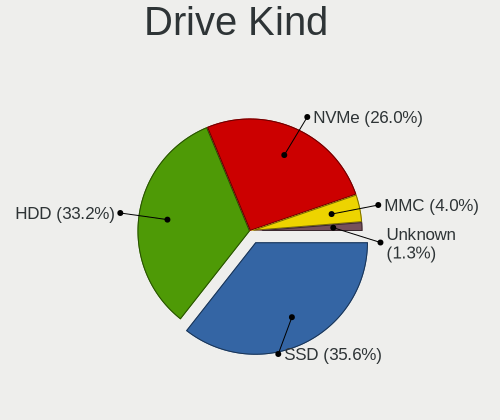
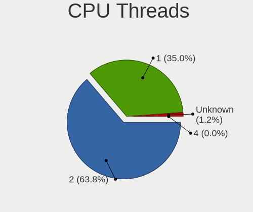
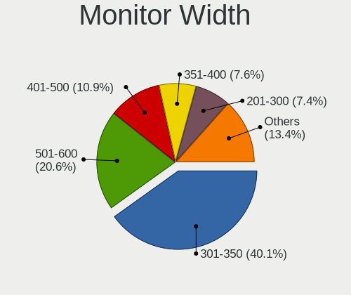
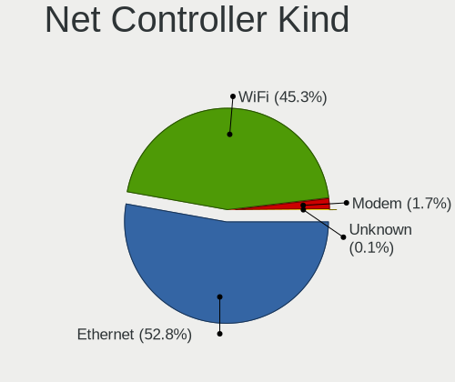

Linux in Poland - Tested Hardware & Statistics
----------------------------------------------

A project to collect tested hardware configurations for Linux in Poland.

Anyone can contribute to this report by the [hw-probe](https://github.com/linuxhw/hw-probe) tool:

    sudo -E hw-probe -all -upload

Please contribute! Especially if your hardware is rare.

This is a report for all computer types. See also reports for [desktops](/Location/Poland/Desktop/README.md) and [notebooks](/Location/Poland/Notebook/README.md).

Contents
--------

* [ Test Cases ](#test-cases)

* [ System ](#system)
  - [ OS                       ](#os)
  - [ OS Family                ](#os-family)
  - [ Kernel                   ](#kernel)
  - [ Kernel Family            ](#kernel-family)
  - [ Kernel Major Ver.        ](#kernel-major-ver)
  - [ Arch                     ](#arch)
  - [ DE                       ](#de)
  - [ Display Server           ](#display-server)
  - [ Display Manager          ](#display-manager)
  - [ OS Lang                  ](#os-lang)
  - [ Boot Mode                ](#boot-mode)
  - [ Filesystem               ](#filesystem)
  - [ Part. scheme             ](#part-scheme)
  - [ Dual Boot with Linux/BSD ](#dual-boot-with-linuxbsd)
  - [ Dual Boot (Win)          ](#dual-boot-win)

* [ Board ](#board)
  - [ Vendor                   ](#vendor)
  - [ Model                    ](#model)
  - [ Model Family             ](#model-family)
  - [ MFG Year                 ](#mfg-year)
  - [ Form Factor              ](#form-factor)
  - [ Secure Boot              ](#secure-boot)
  - [ Coreboot                 ](#coreboot)
  - [ RAM Size                 ](#ram-size)
  - [ RAM Used                 ](#ram-used)
  - [ Total Drives             ](#total-drives)
  - [ Has CD-ROM               ](#has-cd-rom)
  - [ Has Ethernet             ](#has-ethernet)
  - [ Has WiFi                 ](#has-wifi)
  - [ Has Bluetooth            ](#has-bluetooth)

* [ Location ](#location)
  - [ Country                  ](#country)
  - [ City                     ](#city)

* [ Drives ](#drives)
  - [ Drive Vendor             ](#drive-vendor)
  - [ Drive Model              ](#drive-model)
  - [ HDD Vendor               ](#hdd-vendor)
  - [ SSD Vendor               ](#ssd-vendor)
  - [ Drive Kind               ](#drive-kind)
  - [ Drive Connector          ](#drive-connector)
  - [ Drive Size               ](#drive-size)
  - [ Space Total              ](#space-total)
  - [ Space Used               ](#space-used)
  - [ Malfunc. Drives          ](#malfunc-drives)
  - [ Malfunc. Drive Vendor    ](#malfunc-drive-vendor)
  - [ Malfunc. HDD Vendor      ](#malfunc-hdd-vendor)
  - [ Malfunc. Drive Kind      ](#malfunc-drive-kind)
  - [ Failed Drives            ](#failed-drives)
  - [ Failed Drive Vendor      ](#failed-drive-vendor)
  - [ Drive Status             ](#drive-status)

* [ Storage controller ](#storage-controller)
  - [ Storage Vendor           ](#storage-vendor)
  - [ Storage Model            ](#storage-model)
  - [ Storage Kind             ](#storage-kind)

* [ Processor ](#processor)
  - [ CPU Vendor               ](#cpu-vendor)
  - [ CPU Model                ](#cpu-model)
  - [ CPU Model Family         ](#cpu-model-family)
  - [ CPU Cores                ](#cpu-cores)
  - [ CPU Sockets              ](#cpu-sockets)
  - [ CPU Threads              ](#cpu-threads)
  - [ CPU Op-Modes             ](#cpu-op-modes)
  - [ CPU Microcode            ](#cpu-microcode)
  - [ CPU Microarch            ](#cpu-microarch)

* [ Graphics ](#graphics)
  - [ GPU Vendor               ](#gpu-vendor)
  - [ GPU Model                ](#gpu-model)
  - [ GPU Combo                ](#gpu-combo)
  - [ GPU Driver               ](#gpu-driver)
  - [ GPU Memory               ](#gpu-memory)

* [ Monitor ](#monitor)
  - [ Monitor Vendor           ](#monitor-vendor)
  - [ Monitor Model            ](#monitor-model)
  - [ Monitor Resolution       ](#monitor-resolution)
  - [ Monitor Diagonal         ](#monitor-diagonal)
  - [ Monitor Width            ](#monitor-width)
  - [ Aspect Ratio             ](#aspect-ratio)
  - [ Monitor Area             ](#monitor-area)
  - [ Pixel Density            ](#pixel-density)
  - [ Multiple Monitors        ](#multiple-monitors)

* [ Network ](#network)
  - [ Net Controller Vendor    ](#net-controller-vendor)
  - [ Net Controller Model     ](#net-controller-model)
  - [ Wireless Vendor          ](#wireless-vendor)
  - [ Wireless Model           ](#wireless-model)
  - [ Ethernet Vendor          ](#ethernet-vendor)
  - [ Ethernet Model           ](#ethernet-model)
  - [ Net Controller Kind      ](#net-controller-kind)
  - [ Used Controller          ](#used-controller)
  - [ NICs                     ](#nics)
  - [ IPv6                     ](#ipv6)

* [ Bluetooth ](#bluetooth)
  - [ Bluetooth Vendor         ](#bluetooth-vendor)
  - [ Bluetooth Model          ](#bluetooth-model)

* [ Sound ](#sound)
  - [ Sound Vendor             ](#sound-vendor)
  - [ Sound Model              ](#sound-model)

* [ Memory ](#memory)
  - [ Memory Vendor            ](#memory-vendor)
  - [ Memory Model             ](#memory-model)
  - [ Memory Kind              ](#memory-kind)
  - [ Memory Form Factor       ](#memory-form-factor)
  - [ Memory Size              ](#memory-size)
  - [ Memory Speed             ](#memory-speed)

* [ Printers & scanners ](#printers--scanners)
  - [ Printer Vendor           ](#printer-vendor)
  - [ Printer Model            ](#printer-model)
  - [ Scanner Vendor           ](#scanner-vendor)
  - [ Scanner Model            ](#scanner-model)

* [ Camera ](#camera)
  - [ Camera Vendor            ](#camera-vendor)
  - [ Camera Model             ](#camera-model)

* [ Security ](#security)
  - [ Fingerprint Vendor       ](#fingerprint-vendor)
  - [ Fingerprint Model        ](#fingerprint-model)
  - [ Chipcard Vendor          ](#chipcard-vendor)
  - [ Chipcard Model           ](#chipcard-model)

* [ Unsupported ](#unsupported)
  - [ Unsupported Devices      ](#unsupported-devices)
  - [ Unsupported Device Types ](#unsupported-device-types)

Test Cases
----------

Total: 6013

| Vendor        | Model                       | Form-Factor | Probe                                                      | Date         |
|---------------|-----------------------------|-------------|------------------------------------------------------------|--------------|
| Dell          | G15 5515                    | Notebook    | [92f1423303](https://linux-hardware.org/?probe=92f1423303) | Nov 02, 2022 |
| Fujitsu       | D2628-C1 S26361-D2628-C1    | Desktop     | [a2af2980ad](https://linux-hardware.org/?probe=a2af2980ad) | Nov 02, 2022 |
| Dell          | G15 5515                    | Notebook    | [dae7c630d5](https://linux-hardware.org/?probe=dae7c630d5) | Nov 02, 2022 |
| ASUSTek       | M3A78-CM                    | Desktop     | [5f81698e9a](https://linux-hardware.org/?probe=5f81698e9a) | Nov 02, 2022 |
| ASUSTek       | TUF Gaming B550M-PLUS WI... | Desktop     | [d28b33e126](https://linux-hardware.org/?probe=d28b33e126) | Nov 01, 2022 |
| Fujitsu       | D2628-C1 S26361-D2628-C1    | Desktop     | [245ec71478](https://linux-hardware.org/?probe=245ec71478) | Nov 01, 2022 |
| Lenovo        | ThinkPad E15 Gen 2 20T80... | Notebook    | [310895b721](https://linux-hardware.org/?probe=310895b721) | Nov 01, 2022 |
| HUAWEI        | KPL-W0X                     | Notebook    | [6d6a8caf61](https://linux-hardware.org/?probe=6d6a8caf61) | Nov 01, 2022 |
| HP            | Unknown                     | Notebook    | [1ca885060e](https://linux-hardware.org/?probe=1ca885060e) | Nov 01, 2022 |
| ASUSTek       | SABERTOOTH Z77              | Desktop     | [8b208b8383](https://linux-hardware.org/?probe=8b208b8383) | Oct 31, 2022 |
| HP            | EliteBook 745 G2            | Notebook    | [0786ded6c8](https://linux-hardware.org/?probe=0786ded6c8) | Oct 31, 2022 |
| ASUSTek       | PRIME B450-PLUS             | Desktop     | [ce4bda1df2](https://linux-hardware.org/?probe=ce4bda1df2) | Oct 31, 2022 |
| Lenovo        | IdeaPad 700-15ISK 80RU      | Notebook    | [b4fedd7c20](https://linux-hardware.org/?probe=b4fedd7c20) | Oct 31, 2022 |
| Dell          | 0GXM1W A00                  | Desktop     | [598d815c17](https://linux-hardware.org/?probe=598d815c17) | Oct 31, 2022 |
| Dell          | Latitude 3190               | Notebook    | [fe0d1261a6](https://linux-hardware.org/?probe=fe0d1261a6) | Oct 31, 2022 |
| Gigabyte      | AB350-Gaming-CF             | Desktop     | [c085788e44](https://linux-hardware.org/?probe=c085788e44) | Oct 31, 2022 |
| Gigabyte      | B550 AORUS ELITE V2         | Desktop     | [738569f811](https://linux-hardware.org/?probe=738569f811) | Oct 30, 2022 |
| ASUSTek       | PRIME X470-PRO              | Desktop     | [a8b08a47aa](https://linux-hardware.org/?probe=a8b08a47aa) | Oct 30, 2022 |
| Lenovo        | ThinkPad T14 Gen 1 20S1S... | Notebook    | [24d91cf27b](https://linux-hardware.org/?probe=24d91cf27b) | Oct 30, 2022 |
| HP            | ProBook 6540b               | Notebook    | [be9c128b00](https://linux-hardware.org/?probe=be9c128b00) | Oct 30, 2022 |
| Raspberry ... | Raspberry Pi Zero W Rev ... | Soc         | [9f43a68f81](https://linux-hardware.org/?probe=9f43a68f81) | Oct 30, 2022 |
| MSI           | Z170A GAMING PRO CARBON     | Desktop     | [d0814afd39](https://linux-hardware.org/?probe=d0814afd39) | Oct 29, 2022 |
| Kiano         | SlimNote 1.0                | Notebook    | [db1ae618d8](https://linux-hardware.org/?probe=db1ae618d8) | Oct 29, 2022 |
| Dell          | Latitude 5501               | Notebook    | [67f979a26d](https://linux-hardware.org/?probe=67f979a26d) | Oct 29, 2022 |
| ASUSTek       | X75VC                       | Notebook    | [9c1ab509ec](https://linux-hardware.org/?probe=9c1ab509ec) | Oct 29, 2022 |
| Lenovo        | ThinkPad T450s 20BWS0DD0... | Notebook    | [973a3662b9](https://linux-hardware.org/?probe=973a3662b9) | Oct 29, 2022 |
| Kruger&Mat... | KM1406                      | Notebook    | [70b8441ccf](https://linux-hardware.org/?probe=70b8441ccf) | Oct 29, 2022 |
| Dell          | Inspiron 7520               | Notebook    | [91f0c87afa](https://linux-hardware.org/?probe=91f0c87afa) | Oct 29, 2022 |
| MSI           | B560M PRO                   | Desktop     | [a84dc6f9cb](https://linux-hardware.org/?probe=a84dc6f9cb) | Oct 29, 2022 |
| HP            | 250 G8 Notebook PC          | Notebook    | [59c02d4967](https://linux-hardware.org/?probe=59c02d4967) | Oct 28, 2022 |
| Dell          | Latitude 5531               | Notebook    | [a7ff9a34d2](https://linux-hardware.org/?probe=a7ff9a34d2) | Oct 28, 2022 |
| Dell          | Latitude 5531               | Notebook    | [73ddced77b](https://linux-hardware.org/?probe=73ddced77b) | Oct 28, 2022 |
| HP            | EliteBook 840 G6            | Notebook    | [89cc00ef58](https://linux-hardware.org/?probe=89cc00ef58) | Oct 28, 2022 |
| Fujitsu       | LIFEBOOK U728               | Notebook    | [c5867e7dd3](https://linux-hardware.org/?probe=c5867e7dd3) | Oct 28, 2022 |
| Dell          | XPS 15 9510                 | Notebook    | [d3879c6bb0](https://linux-hardware.org/?probe=d3879c6bb0) | Oct 28, 2022 |
| Gigabyte      | Z97M-DS3H                   | Desktop     | [9914e4d771](https://linux-hardware.org/?probe=9914e4d771) | Oct 28, 2022 |
| HP            | ProBook x360 11 G3 EE       | Convertible | [61e43ba85d](https://linux-hardware.org/?probe=61e43ba85d) | Oct 28, 2022 |
| Lenovo        | ThinkPad T430 23498M7       | Notebook    | [f936993d28](https://linux-hardware.org/?probe=f936993d28) | Oct 28, 2022 |
| Gateway       | P-7805u                     | Notebook    | [7597071801](https://linux-hardware.org/?probe=7597071801) | Oct 28, 2022 |
| Dell          | Latitude E6530              | Notebook    | [71b2df6eff](https://linux-hardware.org/?probe=71b2df6eff) | Oct 27, 2022 |
| Acer          | Aspire A114-32              | Notebook    | [4261d8dd66](https://linux-hardware.org/?probe=4261d8dd66) | Oct 27, 2022 |
| Acer          | Aspire A114-32              | Notebook    | [216730dba7](https://linux-hardware.org/?probe=216730dba7) | Oct 27, 2022 |
| Lenovo        | ThinkPad X220 4291WSH       | Notebook    | [00e77b8815](https://linux-hardware.org/?probe=00e77b8815) | Oct 26, 2022 |
| Dell          | Latitude E6530              | Notebook    | [c271a351aa](https://linux-hardware.org/?probe=c271a351aa) | Oct 26, 2022 |
| Lenovo        | ThinkPad X220 4291WSH       | Notebook    | [94d1c333ac](https://linux-hardware.org/?probe=94d1c333ac) | Oct 26, 2022 |
| HUAWEI        | HKD-WXX                     | Notebook    | [2ff7652d3a](https://linux-hardware.org/?probe=2ff7652d3a) | Oct 26, 2022 |
| Lenovo        | Legion S7 15ACH6 82K8       | Notebook    | [082e572642](https://linux-hardware.org/?probe=082e572642) | Oct 26, 2022 |
| Lenovo        | ThinkPad T490s 20NX002QU... | Notebook    | [6ba1aaf015](https://linux-hardware.org/?probe=6ba1aaf015) | Oct 26, 2022 |
| Lenovo        | ThinkPad T490s 20NX002QU... | Notebook    | [062d1d3b82](https://linux-hardware.org/?probe=062d1d3b82) | Oct 26, 2022 |
| Lenovo        | ThinkPad R500 2716W2K       | Notebook    | [c9a59d0ee9](https://linux-hardware.org/?probe=c9a59d0ee9) | Oct 26, 2022 |
| Gigabyte      | P35-DS3L                    | Desktop     | [2f5cb804c0](https://linux-hardware.org/?probe=2f5cb804c0) | Oct 25, 2022 |
| MSI           | Creator Z17 A12UHST         | Notebook    | [18df556ca1](https://linux-hardware.org/?probe=18df556ca1) | Oct 25, 2022 |
| ASUSTek       | X540SA                      | Notebook    | [a515dd93cd](https://linux-hardware.org/?probe=a515dd93cd) | Oct 25, 2022 |
| ASUSTek       | TUF Gaming X570-PLUS        | Desktop     | [6e98085fc5](https://linux-hardware.org/?probe=6e98085fc5) | Oct 25, 2022 |
| Dell          | 0HY9JP A00                  | Desktop     | [ecbfb1ca5c](https://linux-hardware.org/?probe=ecbfb1ca5c) | Oct 25, 2022 |
| HP            | Pavilion x360 Convertibl... | Convertible | [fbec0d9d0e](https://linux-hardware.org/?probe=fbec0d9d0e) | Oct 24, 2022 |
| Lenovo        | ThinkPad T490 20N3S9DJ00    | Notebook    | [c1a4fde481](https://linux-hardware.org/?probe=c1a4fde481) | Oct 24, 2022 |
| Lenovo        | ThinkPad T490 20N3S9DJ00    | Notebook    | [80bf151a4d](https://linux-hardware.org/?probe=80bf151a4d) | Oct 24, 2022 |
| Dell          | 040DDP A01                  | Desktop     | [083b2c218e](https://linux-hardware.org/?probe=083b2c218e) | Oct 24, 2022 |
| Dell          | Latitude 3190               | Notebook    | [b116ac92f3](https://linux-hardware.org/?probe=b116ac92f3) | Oct 24, 2022 |
| ASUSTek       | M3A78-CM                    | Desktop     | [ce77ed764b](https://linux-hardware.org/?probe=ce77ed764b) | Oct 24, 2022 |
| Gigabyte      | AB350-Gaming-CF             | Desktop     | [d18380bf4c](https://linux-hardware.org/?probe=d18380bf4c) | Oct 24, 2022 |
| HP            | ZBook 17 G6                 | Notebook    | [d28d720a26](https://linux-hardware.org/?probe=d28d720a26) | Oct 23, 2022 |
| Dell          | Latitude 7390               | Notebook    | [f282e79ccb](https://linux-hardware.org/?probe=f282e79ccb) | Oct 23, 2022 |
| Dell          | Latitude 7390               | Notebook    | [ec27a5efb5](https://linux-hardware.org/?probe=ec27a5efb5) | Oct 23, 2022 |
| Raspberry ... | Raspberry Pi Zero W Rev ... | Soc         | [b940acb734](https://linux-hardware.org/?probe=b940acb734) | Oct 23, 2022 |
| ASUSTek       | PRIME X570-PRO              | Desktop     | [9035fff7ea](https://linux-hardware.org/?probe=9035fff7ea) | Oct 23, 2022 |
| ASUSTek       | PRIME X570-PRO              | Desktop     | [3d2171b17e](https://linux-hardware.org/?probe=3d2171b17e) | Oct 23, 2022 |
| ASUSTek       | ROG Zephyrus G14 GA402RJ... | Notebook    | [1f26696990](https://linux-hardware.org/?probe=1f26696990) | Oct 22, 2022 |
| Dell          | 0HX555                      | Desktop     | [86339c4a3f](https://linux-hardware.org/?probe=86339c4a3f) | Oct 22, 2022 |
| Lenovo        | ThinkPad SL500 27463ZG      | Notebook    | [88a93e44f9](https://linux-hardware.org/?probe=88a93e44f9) | Oct 22, 2022 |
| MSI           | PRO Z690-A DDR4             | Desktop     | [1056e456bc](https://linux-hardware.org/?probe=1056e456bc) | Oct 22, 2022 |
| ASUSTek       | X550LN                      | Notebook    | [7a6daf6023](https://linux-hardware.org/?probe=7a6daf6023) | Oct 22, 2022 |
| ASUSTek       | TUF Z370-PRO GAMING         | Desktop     | [624b9f3b57](https://linux-hardware.org/?probe=624b9f3b57) | Oct 22, 2022 |
| HP            | EliteBook x360 1030 G4      | Convertible | [c853f4446a](https://linux-hardware.org/?probe=c853f4446a) | Oct 22, 2022 |
| Lenovo        | Legion 5 15ACH6 82JW        | Notebook    | [f5af95bb9a](https://linux-hardware.org/?probe=f5af95bb9a) | Oct 21, 2022 |
| Lenovo        | Legion 5 15ACH6 82JW        | Notebook    | [5def3f5324](https://linux-hardware.org/?probe=5def3f5324) | Oct 21, 2022 |
| Acer          | Aspire A515-51G             | Notebook    | [d607def641](https://linux-hardware.org/?probe=d607def641) | Oct 20, 2022 |
| HP            | Pavilion Aero Laptop 13-... | Notebook    | [7cd6e349f0](https://linux-hardware.org/?probe=7cd6e349f0) | Oct 20, 2022 |
| Lenovo        | IdeaPad Gaming 3 15ACH6 ... | Notebook    | [344040aee1](https://linux-hardware.org/?probe=344040aee1) | Oct 19, 2022 |
| Gigabyte      | X570 AORUS ELITE            | Desktop     | [7f736b0a22](https://linux-hardware.org/?probe=7f736b0a22) | Oct 19, 2022 |
| HP            | 1825                        | Desktop     | [e0a35f1d0f](https://linux-hardware.org/?probe=e0a35f1d0f) | Oct 19, 2022 |
| Lenovo        | ThinkPad P14s Gen 2i 20V... | Notebook    | [67ebd92594](https://linux-hardware.org/?probe=67ebd92594) | Oct 19, 2022 |
| MSI           | Creator Z17 A12UHST         | Notebook    | [5d65b94f2b](https://linux-hardware.org/?probe=5d65b94f2b) | Oct 19, 2022 |
| Lenovo        | Legion 5 17ACH6 82K0        | Notebook    | [431a84fc31](https://linux-hardware.org/?probe=431a84fc31) | Oct 18, 2022 |
| MSI           | MPG X570 GAMING PLUS        | Desktop     | [fc51a7c9dc](https://linux-hardware.org/?probe=fc51a7c9dc) | Oct 18, 2022 |
| ASUSTek       | ROG Strix G513QY_G513QY     | Notebook    | [8bc82af4e5](https://linux-hardware.org/?probe=8bc82af4e5) | Oct 18, 2022 |
| Dell          | 0XHGV1 A01                  | Desktop     | [fcac80ff4a](https://linux-hardware.org/?probe=fcac80ff4a) | Oct 18, 2022 |
| Lenovo        | G580 20150                  | Notebook    | [7639ea3b73](https://linux-hardware.org/?probe=7639ea3b73) | Oct 18, 2022 |
| Dell          | Latitude 5421               | Notebook    | [77cbc2b788](https://linux-hardware.org/?probe=77cbc2b788) | Oct 18, 2022 |
| Dell          | Vostro 7580                 | Notebook    | [69cc3a8c62](https://linux-hardware.org/?probe=69cc3a8c62) | Oct 18, 2022 |
| HP            | ZBook 17 G6                 | Notebook    | [2f27f08ce8](https://linux-hardware.org/?probe=2f27f08ce8) | Oct 17, 2022 |
| HP            | EliteBook 840 G7 Noteboo... | Notebook    | [b8dbd1daf9](https://linux-hardware.org/?probe=b8dbd1daf9) | Oct 17, 2022 |
| ASUSTek       | M3A78-CM                    | Desktop     | [e8377da07e](https://linux-hardware.org/?probe=e8377da07e) | Oct 17, 2022 |
| Dell          | Inspiron 3541               | Notebook    | [858e5b974b](https://linux-hardware.org/?probe=858e5b974b) | Oct 17, 2022 |
| Gigabyte      | B460M DS3H V2               | Desktop     | [4fe1c6d3e8](https://linux-hardware.org/?probe=4fe1c6d3e8) | Oct 17, 2022 |
| Dell          | Vostro 15-3568              | Notebook    | [b7ea5640c2](https://linux-hardware.org/?probe=b7ea5640c2) | Oct 17, 2022 |
| Lenovo        | MAHOBAY Win8 STD MM DPK ... | Desktop     | [2d7d5c19c0](https://linux-hardware.org/?probe=2d7d5c19c0) | Oct 17, 2022 |
| Dell          | Latitude E6430              | Notebook    | [2e8f3bd664](https://linux-hardware.org/?probe=2e8f3bd664) | Oct 16, 2022 |
| Raspberry ... | Raspberry Pi Zero W Rev ... | Soc         | [e0400f3015](https://linux-hardware.org/?probe=e0400f3015) | Oct 16, 2022 |
| Gigabyte      | H61M-D2H                    | Desktop     | [3c51ad7454](https://linux-hardware.org/?probe=3c51ad7454) | Oct 15, 2022 |
| Acer          | Aspire SW5-012              | Notebook    | [530046bf8a](https://linux-hardware.org/?probe=530046bf8a) | Oct 15, 2022 |
| Lenovo        | IdeaPad 3 15ITL6 82H8       | Notebook    | [bf6d77aefd](https://linux-hardware.org/?probe=bf6d77aefd) | Oct 15, 2022 |
| HUAWEI        | KLVD-WXX9                   | Notebook    | [bb7d61198e](https://linux-hardware.org/?probe=bb7d61198e) | Oct 14, 2022 |
| ASUSTek       | PRIME H510M-A               | Desktop     | [720d282dfe](https://linux-hardware.org/?probe=720d282dfe) | Oct 14, 2022 |
| HP            | ENVY 15                     | Notebook    | [09bfbadebe](https://linux-hardware.org/?probe=09bfbadebe) | Oct 14, 2022 |
| MSI           | MS-N014                     | Notebook    | [87e6e540be](https://linux-hardware.org/?probe=87e6e540be) | Oct 14, 2022 |
| Lenovo        | G500s 20245                 | Notebook    | [61539bde5e](https://linux-hardware.org/?probe=61539bde5e) | Oct 13, 2022 |
| Dell          | Inspiron 5551               | Notebook    | [64865d9bb5](https://linux-hardware.org/?probe=64865d9bb5) | Oct 13, 2022 |
| AMI           | Aptio CRB A                 | Mini pc     | [dd887afd02](https://linux-hardware.org/?probe=dd887afd02) | Oct 13, 2022 |
| Lenovo        | ThinkPad Z16 Gen 1 21D40... | Notebook    | [973f501233](https://linux-hardware.org/?probe=973f501233) | Oct 13, 2022 |
| Dell          | Inspiron 3451               | Notebook    | [37b9e0d491](https://linux-hardware.org/?probe=37b9e0d491) | Oct 13, 2022 |
| Lenovo        | G580 20150                  | Notebook    | [8e564b93cb](https://linux-hardware.org/?probe=8e564b93cb) | Oct 13, 2022 |
| Acer          | Aspire A315-21              | Notebook    | [a122b26729](https://linux-hardware.org/?probe=a122b26729) | Oct 12, 2022 |
| ASUSTek       | P8H61-M LE/USB3             | Desktop     | [7706fb5578](https://linux-hardware.org/?probe=7706fb5578) | Oct 12, 2022 |
| Dell          | XPS 13 9310                 | Notebook    | [8437ac2ffc](https://linux-hardware.org/?probe=8437ac2ffc) | Oct 12, 2022 |
| Lenovo        | ThinkPad T530 24297TG       | Notebook    | [d6dec1ab6d](https://linux-hardware.org/?probe=d6dec1ab6d) | Oct 12, 2022 |
| ASUSTek       | X705UDR                     | Notebook    | [5c8601bb4f](https://linux-hardware.org/?probe=5c8601bb4f) | Oct 11, 2022 |
| ASUSTek       | G750JW                      | Notebook    | [251f32c620](https://linux-hardware.org/?probe=251f32c620) | Oct 11, 2022 |
| MSI           | B450M-A PRO MAX             | Desktop     | [a993db557b](https://linux-hardware.org/?probe=a993db557b) | Oct 11, 2022 |
| ASUSTek       | ROG STRIX B550-I GAMING     | Desktop     | [2f346a2afb](https://linux-hardware.org/?probe=2f346a2afb) | Oct 11, 2022 |
| Lenovo        | ThinkPad X200s 7470A98      | Notebook    | [2aea48a0f2](https://linux-hardware.org/?probe=2aea48a0f2) | Oct 11, 2022 |
| ASRock        | Z170 Extreme4               | Desktop     | [b88e8a8b49](https://linux-hardware.org/?probe=b88e8a8b49) | Oct 11, 2022 |
| Lenovo        | ThinkPad X200s 7470A98      | Notebook    | [10d90de300](https://linux-hardware.org/?probe=10d90de300) | Oct 11, 2022 |
| Lenovo        | ThinkPad P50 20EQS5MP00     | Notebook    | [83858a99c3](https://linux-hardware.org/?probe=83858a99c3) | Oct 10, 2022 |
| Gigabyte      | X570S AORUS MASTER          | Desktop     | [9e82633709](https://linux-hardware.org/?probe=9e82633709) | Oct 10, 2022 |
| Lenovo        | ThinkPad SL500 27463ZG      | Notebook    | [4c575be5d7](https://linux-hardware.org/?probe=4c575be5d7) | Oct 10, 2022 |
| Acer          | Enduro EUN314-51W           | Notebook    | [14741407aa](https://linux-hardware.org/?probe=14741407aa) | Oct 10, 2022 |
| ASUSTek       | M3A78-CM                    | Desktop     | [b04149c5ea](https://linux-hardware.org/?probe=b04149c5ea) | Oct 10, 2022 |
| Dell          | Latitude 3190               | Notebook    | [bee132f486](https://linux-hardware.org/?probe=bee132f486) | Oct 10, 2022 |
| ASUSTek       | ROG STRIX B550-I GAMING     | Desktop     | [cde031e816](https://linux-hardware.org/?probe=cde031e816) | Oct 10, 2022 |
| Gigabyte      | AB350-Gaming-CF             | Desktop     | [d7bcf0afa3](https://linux-hardware.org/?probe=d7bcf0afa3) | Oct 09, 2022 |
| ASUSTek       | P5Q Premium                 | Desktop     | [8c0a201199](https://linux-hardware.org/?probe=8c0a201199) | Oct 09, 2022 |
| ASUSTek       | GL503VD                     | Notebook    | [1405b367c2](https://linux-hardware.org/?probe=1405b367c2) | Oct 09, 2022 |
| Lenovo        | IdeaPad Y700-15ISK 80NV     | Notebook    | [94ccd99c78](https://linux-hardware.org/?probe=94ccd99c78) | Oct 09, 2022 |
| Dell          | 0GM819                      | Desktop     | [e0266a8468](https://linux-hardware.org/?probe=e0266a8468) | Oct 09, 2022 |
| ASUSTek       | H81M-P                      | Desktop     | [907b7761d0](https://linux-hardware.org/?probe=907b7761d0) | Oct 09, 2022 |
| ASUSTek       | H81M-P                      | Desktop     | [f2d9df375d](https://linux-hardware.org/?probe=f2d9df375d) | Oct 09, 2022 |
| ASUSTek       | X550VB                      | Notebook    | [a7c1c1cb1b](https://linux-hardware.org/?probe=a7c1c1cb1b) | Oct 09, 2022 |
| Dell          | Inspiron N7010              | Notebook    | [8d58156239](https://linux-hardware.org/?probe=8d58156239) | Oct 09, 2022 |
| Raspberry ... | Raspberry Pi Zero W Rev ... | Soc         | [cd707a79ef](https://linux-hardware.org/?probe=cd707a79ef) | Oct 09, 2022 |
| Foxconn       | H61MXT1/F2/-S/-V            | Desktop     | [be016db304](https://linux-hardware.org/?probe=be016db304) | Oct 08, 2022 |
| Dell          | Precision 7530              | Notebook    | [7f71730e68](https://linux-hardware.org/?probe=7f71730e68) | Oct 07, 2022 |
| Dell          | Inspiron 3451               | Notebook    | [29de9dfa4a](https://linux-hardware.org/?probe=29de9dfa4a) | Oct 07, 2022 |
| ASUSTek       | PRIME B250M-PLUS            | Desktop     | [8a89e7f4da](https://linux-hardware.org/?probe=8a89e7f4da) | Oct 06, 2022 |
| ASUSTek       | Maximus VII HERO            | Desktop     | [d4a282a4b8](https://linux-hardware.org/?probe=d4a282a4b8) | Oct 06, 2022 |
| ASUSTek       | VivoBook_ASUSLaptop X513... | Notebook    | [ae8f71dbd3](https://linux-hardware.org/?probe=ae8f71dbd3) | Oct 06, 2022 |
| Toshiba       | Satellite L40               | Notebook    | [0f3e9273a6](https://linux-hardware.org/?probe=0f3e9273a6) | Oct 06, 2022 |
| Lenovo        | ThinkPad T480 20L50007PB    | Notebook    | [4c7a6898bf](https://linux-hardware.org/?probe=4c7a6898bf) | Oct 06, 2022 |
| MSI           | B450-A PRO MAX              | Desktop     | [c12ce7288b](https://linux-hardware.org/?probe=c12ce7288b) | Oct 05, 2022 |
| MSI           | B450-A PRO MAX              | Desktop     | [c3306965d6](https://linux-hardware.org/?probe=c3306965d6) | Oct 05, 2022 |
| Dell          | Vostro 15-3568              | Notebook    | [ed969ece24](https://linux-hardware.org/?probe=ed969ece24) | Oct 05, 2022 |
| Dell          | Precision 3541              | Notebook    | [bfef2cb8a3](https://linux-hardware.org/?probe=bfef2cb8a3) | Oct 05, 2022 |
| MSI           | B450M PRO-VDH MAX           | Desktop     | [2423d31aeb](https://linux-hardware.org/?probe=2423d31aeb) | Oct 05, 2022 |
| ASUSTek       | X550CC                      | Notebook    | [147483a370](https://linux-hardware.org/?probe=147483a370) | Oct 05, 2022 |
| Valve         | Jupiter                     | Notebook    | [ac2707d2e6](https://linux-hardware.org/?probe=ac2707d2e6) | Oct 05, 2022 |
| Lenovo        | ThinkPad T460p 20FW002CP... | Notebook    | [b7cd76d0b6](https://linux-hardware.org/?probe=b7cd76d0b6) | Oct 05, 2022 |
| ASUSTek       | VivoBook_ASUSLaptop X513... | Notebook    | [d389c9fa00](https://linux-hardware.org/?probe=d389c9fa00) | Oct 05, 2022 |
| Lenovo        | Z51-70 80K6                 | Notebook    | [736ded7422](https://linux-hardware.org/?probe=736ded7422) | Oct 04, 2022 |
| Lenovo        | IdeaPad 3 15ADA05 81W1      | Notebook    | [b8ad7a8464](https://linux-hardware.org/?probe=b8ad7a8464) | Oct 04, 2022 |
| Gigabyte      | B450 AORUS ELITE            | Desktop     | [1348c5b5eb](https://linux-hardware.org/?probe=1348c5b5eb) | Oct 03, 2022 |
| MSI           | X470 GAMING PLUS MAX        | Desktop     | [563ae9b3df](https://linux-hardware.org/?probe=563ae9b3df) | Oct 03, 2022 |
| Lenovo        | ThinkStation C20 4263BA7    | Desktop     | [339dcddca7](https://linux-hardware.org/?probe=339dcddca7) | Oct 03, 2022 |
| Lenovo        | IdeaPad 330-15IKB 81DE      | Notebook    | [6c821c0c08](https://linux-hardware.org/?probe=6c821c0c08) | Oct 03, 2022 |
| HP            | ProBook 640 G2              | Notebook    | [2dc13504cf](https://linux-hardware.org/?probe=2dc13504cf) | Oct 03, 2022 |
| Lenovo        | ThinkPad T470p 20J7S0QK0... | Notebook    | [a9c2a1eca0](https://linux-hardware.org/?probe=a9c2a1eca0) | Oct 03, 2022 |
| ASUSTek       | 1225B                       | Notebook    | [9bb2d54ca7](https://linux-hardware.org/?probe=9bb2d54ca7) | Oct 03, 2022 |
| Dell          | Inspiron 3451               | Notebook    | [9bf3a4a735](https://linux-hardware.org/?probe=9bf3a4a735) | Oct 03, 2022 |
| ASUSTek       | M3A78-CM                    | Desktop     | [6437ed8b0e](https://linux-hardware.org/?probe=6437ed8b0e) | Oct 03, 2022 |
| Dynabook      | PORTEGE X40-G               | Notebook    | [fc68a9cdbf](https://linux-hardware.org/?probe=fc68a9cdbf) | Oct 03, 2022 |
| Dell          | Latitude 3190               | Notebook    | [29b38a4a94](https://linux-hardware.org/?probe=29b38a4a94) | Oct 03, 2022 |
| ASUSTek       | Maximus VII HERO            | Desktop     | [7fbccd3f20](https://linux-hardware.org/?probe=7fbccd3f20) | Oct 03, 2022 |
| Gigabyte      | AB350-Gaming-CF             | Desktop     | [60bab6fe12](https://linux-hardware.org/?probe=60bab6fe12) | Oct 02, 2022 |
| Acer          | Veriton X6620G v1.0         | Desktop     | [80e98d9053](https://linux-hardware.org/?probe=80e98d9053) | Oct 02, 2022 |
| Acer          | Aspire 5755G                | Notebook    | [c552cb5631](https://linux-hardware.org/?probe=c552cb5631) | Oct 02, 2022 |
| Raspberry ... | Raspberry Pi Zero W Rev ... | Soc         | [658873c1d0](https://linux-hardware.org/?probe=658873c1d0) | Oct 02, 2022 |
| Lenovo        | Yoga Slim 7 Pro 14ACH5 O... | Notebook    | [05e921b4aa](https://linux-hardware.org/?probe=05e921b4aa) | Oct 02, 2022 |
| Acer          | Aspire 4733Z                | Notebook    | [4be4debbe5](https://linux-hardware.org/?probe=4be4debbe5) | Oct 01, 2022 |
| Lenovo        | ThinkPad SL500 27463ZG      | Notebook    | [34006e3b46](https://linux-hardware.org/?probe=34006e3b46) | Oct 01, 2022 |
| Dell          | Inspiron 3451               | Notebook    | [aee33639b9](https://linux-hardware.org/?probe=aee33639b9) | Oct 01, 2022 |
| Gigabyte      | B550 AORUS ELITE            | Desktop     | [bc6bcfe3f2](https://linux-hardware.org/?probe=bc6bcfe3f2) | Oct 01, 2022 |
| ASUSTek       | TUF Gaming B550M-E WIFI     | Desktop     | [2d1e938e68](https://linux-hardware.org/?probe=2d1e938e68) | Oct 01, 2022 |
| Acer          | Aspire A715-74G             | Notebook    | [17abc08754](https://linux-hardware.org/?probe=17abc08754) | Sep 30, 2022 |
| HP            | Pavilion Laptop 17-ar0xx    | Notebook    | [733654d30d](https://linux-hardware.org/?probe=733654d30d) | Sep 30, 2022 |
| Gigabyte      | Z97M-DS3H                   | Desktop     | [fcf7e031e3](https://linux-hardware.org/?probe=fcf7e031e3) | Sep 30, 2022 |
| Dell          | 0KJCC5 A00                  | Desktop     | [f9582eb0a8](https://linux-hardware.org/?probe=f9582eb0a8) | Sep 29, 2022 |
| Lenovo        | G500s 20245                 | Notebook    | [b9001f7817](https://linux-hardware.org/?probe=b9001f7817) | Sep 29, 2022 |
| HP            | ZBook Firefly 15.6 inch ... | Notebook    | [be74c01cca](https://linux-hardware.org/?probe=be74c01cca) | Sep 29, 2022 |
| Dell          | Latitude E6330              | Notebook    | [b075fbcb56](https://linux-hardware.org/?probe=b075fbcb56) | Sep 29, 2022 |
| Lenovo        | IdeaPad 320-15IKB 81BG      | Notebook    | [82528435d8](https://linux-hardware.org/?probe=82528435d8) | Sep 29, 2022 |
| MSI           | Creator Z17 A12UHST         | Notebook    | [4b9249b9b0](https://linux-hardware.org/?probe=4b9249b9b0) | Sep 29, 2022 |
| ASUSTek       | Maximus VII HERO            | Desktop     | [d23d86be40](https://linux-hardware.org/?probe=d23d86be40) | Sep 28, 2022 |
| Dell          | Inspiron 5558               | Notebook    | [a42a4722f7](https://linux-hardware.org/?probe=a42a4722f7) | Sep 28, 2022 |
| Valve         | Jupiter                     | Notebook    | [bdc84f1b9b](https://linux-hardware.org/?probe=bdc84f1b9b) | Sep 28, 2022 |
| ASUSTek       | PRIME X470-PRO              | Desktop     | [1bdf72d415](https://linux-hardware.org/?probe=1bdf72d415) | Sep 27, 2022 |
| ASUSTek       | Zenbook UM5401QA_UM5401Q... | Notebook    | [04fbd64661](https://linux-hardware.org/?probe=04fbd64661) | Sep 27, 2022 |
| Intel         | DH61WW AAG23116-204         | Desktop     | [f35f96af50](https://linux-hardware.org/?probe=f35f96af50) | Sep 27, 2022 |
| Dell          | Precision 3561              | Notebook    | [77a4030052](https://linux-hardware.org/?probe=77a4030052) | Sep 27, 2022 |
| Dell          | 0DC48C A02                  | Desktop     | [9292e820c5](https://linux-hardware.org/?probe=9292e820c5) | Sep 27, 2022 |
| Toshiba       | Satellite C850-1LK          | Notebook    | [f0240dcb2d](https://linux-hardware.org/?probe=f0240dcb2d) | Sep 27, 2022 |
| Lenovo        | ThinkPad SL500 27463ZG      | Notebook    | [70860ec433](https://linux-hardware.org/?probe=70860ec433) | Sep 26, 2022 |
| HP            | 805D                        | Desktop     | [b023737f63](https://linux-hardware.org/?probe=b023737f63) | Sep 26, 2022 |
| Lenovo        | ThinkPad Edge E430 3254A... | Notebook    | [cb5f6f279b](https://linux-hardware.org/?probe=cb5f6f279b) | Sep 26, 2022 |
| Lenovo        | ThinkPad Edge E430 3254A... | Notebook    | [3f11c520e0](https://linux-hardware.org/?probe=3f11c520e0) | Sep 26, 2022 |
| HP            | ZBook 15 G6                 | Notebook    | [476623a6a1](https://linux-hardware.org/?probe=476623a6a1) | Sep 26, 2022 |
| Dell          | Latitude 3190               | Notebook    | [27ac75e10c](https://linux-hardware.org/?probe=27ac75e10c) | Sep 26, 2022 |
| ASUSTek       | M3A78-CM                    | Desktop     | [6d3f575c3d](https://linux-hardware.org/?probe=6d3f575c3d) | Sep 26, 2022 |
| Gigabyte      | AB350-Gaming-CF             | Desktop     | [c447921f07](https://linux-hardware.org/?probe=c447921f07) | Sep 25, 2022 |
| Valve         | Jupiter                     | Notebook    | [ebf3e70cf7](https://linux-hardware.org/?probe=ebf3e70cf7) | Sep 25, 2022 |
| Acer          | P5WE0                       | Notebook    | [124f7bdd77](https://linux-hardware.org/?probe=124f7bdd77) | Sep 25, 2022 |
| Raspberry ... | Raspberry Pi Zero W Rev ... | Soc         | [d9f9db839d](https://linux-hardware.org/?probe=d9f9db839d) | Sep 25, 2022 |
| Gigabyte      | B85M-D3H                    | Desktop     | [8de01689b6](https://linux-hardware.org/?probe=8de01689b6) | Sep 24, 2022 |
| HP            | Laptop 17-cp0xxx            | Notebook    | [dafafa97a4](https://linux-hardware.org/?probe=dafafa97a4) | Sep 24, 2022 |
| Lenovo        | ThinkPad X1 Extreme 20MF... | Notebook    | [89a1a3179d](https://linux-hardware.org/?probe=89a1a3179d) | Sep 24, 2022 |
| Toshiba       | Satellite P205              | Notebook    | [2a1450578e](https://linux-hardware.org/?probe=2a1450578e) | Sep 23, 2022 |
| Fujitsu       | LIFEBOOK S760               | Notebook    | [ceda61113a](https://linux-hardware.org/?probe=ceda61113a) | Sep 23, 2022 |
| Toshiba       | Satellite P205              | Notebook    | [98e97d946a](https://linux-hardware.org/?probe=98e97d946a) | Sep 23, 2022 |
| Lenovo        | ThinkPad X270 W10DG 20K5... | Notebook    | [36c369745a](https://linux-hardware.org/?probe=36c369745a) | Sep 23, 2022 |
| HP            | 3032h                       | Desktop     | [efb6671159](https://linux-hardware.org/?probe=efb6671159) | Sep 23, 2022 |
| Lenovo        | ThinkPad Z16 Gen 1 21D40... | Notebook    | [0121aac33a](https://linux-hardware.org/?probe=0121aac33a) | Sep 22, 2022 |
| Lenovo        | ThinkPad E15 Gen 2 20T80... | Notebook    | [de7c138e21](https://linux-hardware.org/?probe=de7c138e21) | Sep 22, 2022 |
| MSI           | 760GM-P34                   | Desktop     | [af750add66](https://linux-hardware.org/?probe=af750add66) | Sep 22, 2022 |
| MSI           | H81M-P33                    | Desktop     | [05d5a24774](https://linux-hardware.org/?probe=05d5a24774) | Sep 22, 2022 |
| Lenovo        | G505s 20255                 | Notebook    | [671c1cb6c4](https://linux-hardware.org/?probe=671c1cb6c4) | Sep 21, 2022 |
| ASUSTek       | ROG Zephyrus G14 GA402RJ... | Notebook    | [967110ef60](https://linux-hardware.org/?probe=967110ef60) | Sep 21, 2022 |
| MSI           | Z370 GAMING PRO CARBON      | Desktop     | [978c6dd9dd](https://linux-hardware.org/?probe=978c6dd9dd) | Sep 21, 2022 |
| Xunlong       | Orange Pi Zero              | Soc         | [0aa622cc13](https://linux-hardware.org/?probe=0aa622cc13) | Sep 21, 2022 |
| Dell          | 0D883F A06                  | Desktop     | [01c50a7a4c](https://linux-hardware.org/?probe=01c50a7a4c) | Sep 21, 2022 |
| ASUSTek       | ROG STRIX X570-I GAMING     | Desktop     | [d22f082243](https://linux-hardware.org/?probe=d22f082243) | Sep 21, 2022 |
| ASUSTek       | ROG STRIX X570-I GAMING     | Desktop     | [e4f1a8245a](https://linux-hardware.org/?probe=e4f1a8245a) | Sep 21, 2022 |
| ASUSTek       | PRIME B450M-A               | Desktop     | [bdb353fd2c](https://linux-hardware.org/?probe=bdb353fd2c) | Sep 20, 2022 |
| HP            | EliteBook 840 G2            | Notebook    | [030ce84327](https://linux-hardware.org/?probe=030ce84327) | Sep 20, 2022 |
| Framework     | Laptop                      | Notebook    | [dd163cfa96](https://linux-hardware.org/?probe=dd163cfa96) | Sep 20, 2022 |
| ASUSTek       | ASUS TUF Gaming A15 FA50... | Notebook    | [21c74278f8](https://linux-hardware.org/?probe=21c74278f8) | Sep 20, 2022 |
| Dell          | Latitude E4310              | Notebook    | [c77a454d4e](https://linux-hardware.org/?probe=c77a454d4e) | Sep 20, 2022 |
| Dell          | Latitude E4310              | Notebook    | [4e8bf046d8](https://linux-hardware.org/?probe=4e8bf046d8) | Sep 19, 2022 |
| Apple         | MacBook9,1                  | Notebook    | [e6898c8aa0](https://linux-hardware.org/?probe=e6898c8aa0) | Sep 19, 2022 |
| Samsung       | 350V5C/351V5C/3540VC/344... | Notebook    | [85952e171d](https://linux-hardware.org/?probe=85952e171d) | Sep 19, 2022 |
| HP            | ProBook 470 G5              | Notebook    | [eb67db5bff](https://linux-hardware.org/?probe=eb67db5bff) | Sep 19, 2022 |
| Lenovo        | ThinkPad T420 4180MY7       | Notebook    | [e6a930e933](https://linux-hardware.org/?probe=e6a930e933) | Sep 19, 2022 |
| HP            | ProBook 470 G5              | Notebook    | [793fa18b58](https://linux-hardware.org/?probe=793fa18b58) | Sep 19, 2022 |
| ASUSTek       | GL502VSK                    | Notebook    | [a6dc9b627f](https://linux-hardware.org/?probe=a6dc9b627f) | Sep 19, 2022 |
| Toshiba       | PORTEGE Z30-A               | Notebook    | [419bf72e22](https://linux-hardware.org/?probe=419bf72e22) | Sep 19, 2022 |
| MSI           | MAG X570 TOMAHAWK WIFI      | Desktop     | [1f2bd2202c](https://linux-hardware.org/?probe=1f2bd2202c) | Sep 19, 2022 |
| Dell          | Latitude 3190               | Notebook    | [f96d782326](https://linux-hardware.org/?probe=f96d782326) | Sep 19, 2022 |
| Valve         | Jupiter                     | Notebook    | [52352bab7a](https://linux-hardware.org/?probe=52352bab7a) | Sep 19, 2022 |
| ASUSTek       | M3A78-CM                    | Desktop     | [eb1c0556c3](https://linux-hardware.org/?probe=eb1c0556c3) | Sep 19, 2022 |
| Gigabyte      | AB350-Gaming-CF             | Desktop     | [5a9ab0de04](https://linux-hardware.org/?probe=5a9ab0de04) | Sep 18, 2022 |
| ASUSTek       | PRIME B550M-K               | Desktop     | [b3cb8fc82e](https://linux-hardware.org/?probe=b3cb8fc82e) | Sep 18, 2022 |
| Raspberry ... | Raspberry Pi Zero W Rev ... | Soc         | [e903dccaf1](https://linux-hardware.org/?probe=e903dccaf1) | Sep 18, 2022 |
| Gigabyte      | B560M D3H                   | Desktop     | [515d75e6b7](https://linux-hardware.org/?probe=515d75e6b7) | Sep 17, 2022 |
| HP            | Notebook                    | Notebook    | [d29681d2ed](https://linux-hardware.org/?probe=d29681d2ed) | Sep 17, 2022 |
| Lenovo        | ThinkPad T14 Gen 1 20UES... | Notebook    | [9c23c7bb58](https://linux-hardware.org/?probe=9c23c7bb58) | Sep 17, 2022 |
| Lenovo        | G50-80 80E5                 | Notebook    | [5023f912e2](https://linux-hardware.org/?probe=5023f912e2) | Sep 16, 2022 |
| Lenovo        | ThinkPad T420 4180A32       | Notebook    | [44841341fd](https://linux-hardware.org/?probe=44841341fd) | Sep 16, 2022 |
| Dell          | Latitude 5511               | Notebook    | [9a2faa8d22](https://linux-hardware.org/?probe=9a2faa8d22) | Sep 16, 2022 |
| HP            | ProBook 470 G5              | Notebook    | [b15d9e1fe4](https://linux-hardware.org/?probe=b15d9e1fe4) | Sep 16, 2022 |
| Pine Micro... | Pine64 Rock64               | Soc         | [dbd6ac01d6](https://linux-hardware.org/?probe=dbd6ac01d6) | Sep 16, 2022 |
| ASUSTek       | ROG Zephyrus M16 GU603ZX... | Notebook    | [099e5d3523](https://linux-hardware.org/?probe=099e5d3523) | Sep 16, 2022 |
| Dell          | Inspiron 3451               | Notebook    | [fcdfa43a37](https://linux-hardware.org/?probe=fcdfa43a37) | Sep 15, 2022 |
| AMI           | Cherry Trail CR             | Desktop     | [1c131a1acb](https://linux-hardware.org/?probe=1c131a1acb) | Sep 15, 2022 |
| Raspberry ... | Raspberry Pi 4 Model B R... | Soc         | [f12132c99f](https://linux-hardware.org/?probe=f12132c99f) | Sep 14, 2022 |
| Dell          | Inspiron 5584               | Notebook    | [677d683644](https://linux-hardware.org/?probe=677d683644) | Sep 14, 2022 |
| Dell          | Latitude 5521               | Notebook    | [c342e3ab13](https://linux-hardware.org/?probe=c342e3ab13) | Sep 14, 2022 |
| HUAWEI        | KLVL-WXX9                   | Notebook    | [98ae2af06f](https://linux-hardware.org/?probe=98ae2af06f) | Sep 14, 2022 |
| Sun Micros... | ASSY,MOTHERBOARD,X4170 5... | Server      | [ea845ec5ea](https://linux-hardware.org/?probe=ea845ec5ea) | Sep 13, 2022 |
| Dell          | Inspiron 3451               | Notebook    | [f06aa45765](https://linux-hardware.org/?probe=f06aa45765) | Sep 13, 2022 |
| Lenovo        | ThinkPad X1 Carbon 6th 2... | Notebook    | [efc31007ac](https://linux-hardware.org/?probe=efc31007ac) | Sep 12, 2022 |
| ASUSTek       | M3A78-CM                    | Desktop     | [225bd59ba7](https://linux-hardware.org/?probe=225bd59ba7) | Sep 12, 2022 |
| Dell          | Latitude 3190               | Notebook    | [3c0abb17a9](https://linux-hardware.org/?probe=3c0abb17a9) | Sep 12, 2022 |
| Gigabyte      | AB350-Gaming-CF             | Desktop     | [ed5273b278](https://linux-hardware.org/?probe=ed5273b278) | Sep 11, 2022 |
| Gigabyte      | G41MT-ES2L                  | Desktop     | [74ee0e38a3](https://linux-hardware.org/?probe=74ee0e38a3) | Sep 11, 2022 |
| Raspberry ... | Raspberry Pi Zero W Rev ... | Soc         | [0c536307da](https://linux-hardware.org/?probe=0c536307da) | Sep 11, 2022 |
| HUAWEI        | KPL-W0X                     | Notebook    | [eff4400b7d](https://linux-hardware.org/?probe=eff4400b7d) | Sep 10, 2022 |
| Dell          | 01TKCC A01                  | Desktop     | [6d032338c0](https://linux-hardware.org/?probe=6d032338c0) | Sep 10, 2022 |
| Lenovo        | ThinkPad L420 7829H86       | Notebook    | [406535e915](https://linux-hardware.org/?probe=406535e915) | Sep 10, 2022 |
| Acer          | Nitro AN517-55              | Notebook    | [16fa00177a](https://linux-hardware.org/?probe=16fa00177a) | Sep 10, 2022 |
| Gigabyte      | B450M DS3H-CF               | Desktop     | [6248f4732d](https://linux-hardware.org/?probe=6248f4732d) | Sep 10, 2022 |
| Toshiba       | Satellite L40               | Notebook    | [ef6556670c](https://linux-hardware.org/?probe=ef6556670c) | Sep 09, 2022 |
| Dell          | Latitude E6330              | Notebook    | [9f2183ce75](https://linux-hardware.org/?probe=9f2183ce75) | Sep 09, 2022 |
| ASUSTek       | ROG Strix G533QS_G533QS     | Notebook    | [c2f25bcea8](https://linux-hardware.org/?probe=c2f25bcea8) | Sep 08, 2022 |
| Gigabyte      | AORUS 15G XC                | Notebook    | [ea131dfe2c](https://linux-hardware.org/?probe=ea131dfe2c) | Sep 08, 2022 |
| Dell          | Latitude E6540              | Notebook    | [5700f37281](https://linux-hardware.org/?probe=5700f37281) | Sep 08, 2022 |
| Lenovo        | ThinkBook 14-IIL 20SL       | Notebook    | [6812b52b92](https://linux-hardware.org/?probe=6812b52b92) | Sep 08, 2022 |
| Dell          | Inspiron 3541               | Notebook    | [2cc868e8f0](https://linux-hardware.org/?probe=2cc868e8f0) | Sep 08, 2022 |
| Lenovo        | MIIX 320-10ICR 80XF         | Tablet      | [bb2d82813c](https://linux-hardware.org/?probe=bb2d82813c) | Sep 08, 2022 |
| Lenovo        | MIIX 320-10ICR 80XF         | Tablet      | [e757b79169](https://linux-hardware.org/?probe=e757b79169) | Sep 08, 2022 |
| Lenovo        | IdeaPad S540-15IWL GTX 8... | Notebook    | [6ee5358914](https://linux-hardware.org/?probe=6ee5358914) | Sep 08, 2022 |
| ASUSTek       | ROG Zephyrus M16 GU603HR... | Notebook    | [63524aa492](https://linux-hardware.org/?probe=63524aa492) | Sep 07, 2022 |
| HP            | EliteBook 8440p             | Notebook    | [5cf26fac4d](https://linux-hardware.org/?probe=5cf26fac4d) | Sep 07, 2022 |
| HP            | 1497                        | Desktop     | [3cf8f5d97a](https://linux-hardware.org/?probe=3cf8f5d97a) | Sep 07, 2022 |
| Samsung       | RC420/RC520/RC720           | Notebook    | [a6b07acfe5](https://linux-hardware.org/?probe=a6b07acfe5) | Sep 07, 2022 |
| Dell          | 0DR845                      | Desktop     | [f945fc3f5e](https://linux-hardware.org/?probe=f945fc3f5e) | Sep 07, 2022 |
| Lenovo        | 36D9 SDK0J40700 WIN 3258... | Desktop     | [a816f4f60b](https://linux-hardware.org/?probe=a816f4f60b) | Sep 07, 2022 |
| ASUSTek       | ROG Strix G533QS_G533QS     | Notebook    | [4adadf9e6a](https://linux-hardware.org/?probe=4adadf9e6a) | Sep 06, 2022 |
| Lenovo        | Legion 5 15ARH05H 82B1      | Notebook    | [4615004e85](https://linux-hardware.org/?probe=4615004e85) | Sep 06, 2022 |
| MSI           | MEG X570 ACE                | Desktop     | [5f7f592f25](https://linux-hardware.org/?probe=5f7f592f25) | Sep 05, 2022 |
| MSI           | B85M-E43 DASH               | Desktop     | [f52a53f4a7](https://linux-hardware.org/?probe=f52a53f4a7) | Sep 05, 2022 |
| Lenovo        | G580 20150                  | Notebook    | [e0bb6ae251](https://linux-hardware.org/?probe=e0bb6ae251) | Sep 05, 2022 |
| Dell          | Latitude 3190               | Notebook    | [25c70ea2f3](https://linux-hardware.org/?probe=25c70ea2f3) | Sep 05, 2022 |
| Gigabyte      | AB350-Gaming-CF             | Desktop     | [1d90e3b685](https://linux-hardware.org/?probe=1d90e3b685) | Sep 05, 2022 |
| Lenovo        | IdeaPad 320-15IKB 81BG      | Notebook    | [d802875fec](https://linux-hardware.org/?probe=d802875fec) | Sep 04, 2022 |
| Dell          | Latitude E5430 non-vPro     | Notebook    | [96d17dc188](https://linux-hardware.org/?probe=96d17dc188) | Sep 04, 2022 |
| Dell          | Latitude E6330              | Notebook    | [e4dcf51a84](https://linux-hardware.org/?probe=e4dcf51a84) | Sep 04, 2022 |
| Raspberry ... | Raspberry Pi Zero W Rev ... | Soc         | [4f45b8e600](https://linux-hardware.org/?probe=4f45b8e600) | Sep 04, 2022 |
| ASUSTek       | PRIME X470-PRO              | Desktop     | [87a6f9162a](https://linux-hardware.org/?probe=87a6f9162a) | Sep 03, 2022 |
| HP            | 620                         | Notebook    | [096486e01d](https://linux-hardware.org/?probe=096486e01d) | Sep 03, 2022 |
| ASUSTek       | VivoBook 15_ASUS Laptop ... | Notebook    | [6b62abaaaf](https://linux-hardware.org/?probe=6b62abaaaf) | Sep 03, 2022 |
| ASUSTek       | VivoBook 15_ASUS Laptop ... | Notebook    | [ec466abbf7](https://linux-hardware.org/?probe=ec466abbf7) | Sep 03, 2022 |
| Dell          | Latitude E6330              | Notebook    | [626c1e28b1](https://linux-hardware.org/?probe=626c1e28b1) | Sep 03, 2022 |
| Dell          | Latitude E6330              | Notebook    | [6c7adba5b6](https://linux-hardware.org/?probe=6c7adba5b6) | Sep 03, 2022 |
| Lenovo        | ThinkPad E15 Gen 3 20YG0... | Notebook    | [6669ffa68e](https://linux-hardware.org/?probe=6669ffa68e) | Sep 02, 2022 |
| Dell          | Latitude E6220              | Notebook    | [e249853663](https://linux-hardware.org/?probe=e249853663) | Sep 02, 2022 |
| Lenovo        | ThinkPad E15 Gen 2 20T80... | Notebook    | [8320ded55c](https://linux-hardware.org/?probe=8320ded55c) | Sep 02, 2022 |
| MSI           | B450 GAMING PLUS            | Desktop     | [3561723d92](https://linux-hardware.org/?probe=3561723d92) | Sep 02, 2022 |
| Lenovo        | SHARKBAY 0B98401 WIN        | Desktop     | [5d85db2c66](https://linux-hardware.org/?probe=5d85db2c66) | Sep 02, 2022 |
| Valve         | Jupiter                     | Notebook    | [ad3ce497e7](https://linux-hardware.org/?probe=ad3ce497e7) | Sep 02, 2022 |
| Dell          | Latitude E6220              | Notebook    | [99c8b865ad](https://linux-hardware.org/?probe=99c8b865ad) | Sep 02, 2022 |
| Dell          | Latitude E6330              | Notebook    | [179123f301](https://linux-hardware.org/?probe=179123f301) | Sep 01, 2022 |
| Lenovo        | ThinkPad T14 Gen 2i 20W1... | Notebook    | [12abd434b5](https://linux-hardware.org/?probe=12abd434b5) | Sep 01, 2022 |
| Lenovo        | ThinkPad E15 Gen 2 20T80... | Notebook    | [e16313490d](https://linux-hardware.org/?probe=e16313490d) | Sep 01, 2022 |
| Dell          | 042P49 A00                  | Desktop     | [31efc1e75f](https://linux-hardware.org/?probe=31efc1e75f) | Sep 01, 2022 |
| Valve         | Jupiter                     | Notebook    | [60db4bfa03](https://linux-hardware.org/?probe=60db4bfa03) | Aug 31, 2022 |
| ASUSTek       | P5K/EPU                     | Desktop     | [196d56922a](https://linux-hardware.org/?probe=196d56922a) | Aug 31, 2022 |
| Dell          | Latitude E6330              | Notebook    | [b5766d41fa](https://linux-hardware.org/?probe=b5766d41fa) | Aug 31, 2022 |
| ASUSTek       | M3A78-CM                    | Desktop     | [d146908413](https://linux-hardware.org/?probe=d146908413) | Aug 31, 2022 |
| ASRock        | N68C-S UCC                  | Desktop     | [f3389e42f8](https://linux-hardware.org/?probe=f3389e42f8) | Aug 30, 2022 |
| Unknown       | Unknown                     | Desktop     | [49c235aa0d](https://linux-hardware.org/?probe=49c235aa0d) | Aug 30, 2022 |
| Lenovo        | ThinkPad L490 20Q5001YPB    | Notebook    | [daae538154](https://linux-hardware.org/?probe=daae538154) | Aug 30, 2022 |
| Gigabyte      | Z390 AORUS MASTER-CF        | Desktop     | [1a8ff186c7](https://linux-hardware.org/?probe=1a8ff186c7) | Aug 29, 2022 |
| Gigabyte      | B365M D3H-CF                | Desktop     | [4a96f9e792](https://linux-hardware.org/?probe=4a96f9e792) | Aug 29, 2022 |
| ASRock        | X370 Gaming X               | Desktop     | [e915bb3a8c](https://linux-hardware.org/?probe=e915bb3a8c) | Aug 29, 2022 |
| Dell          | Latitude 3190               | Notebook    | [0998f7a5d1](https://linux-hardware.org/?probe=0998f7a5d1) | Aug 29, 2022 |
| Dell          | Latitude 9420               | Notebook    | [0b8d883170](https://linux-hardware.org/?probe=0b8d883170) | Aug 29, 2022 |
| Gigabyte      | Z97M-DS3H                   | Desktop     | [72c01f3cf1](https://linux-hardware.org/?probe=72c01f3cf1) | Aug 29, 2022 |
| Gigabyte      | F2A88XM-D3H                 | Desktop     | [3b245a809d](https://linux-hardware.org/?probe=3b245a809d) | Aug 28, 2022 |
| Gigabyte      | F2A88XM-D3H                 | Desktop     | [dcb225651d](https://linux-hardware.org/?probe=dcb225651d) | Aug 28, 2022 |
| Gigabyte      | AB350-Gaming-CF             | Desktop     | [499889da7e](https://linux-hardware.org/?probe=499889da7e) | Aug 28, 2022 |
| ASUSTek       | F3E                         | Notebook    | [1314dc63b6](https://linux-hardware.org/?probe=1314dc63b6) | Aug 28, 2022 |
| ASUSTek       | VivoBook_ASUSLaptop M350... | Notebook    | [7ed4b144d7](https://linux-hardware.org/?probe=7ed4b144d7) | Aug 28, 2022 |
| ASRock        | X370 Gaming X               | Desktop     | [489691c2e3](https://linux-hardware.org/?probe=489691c2e3) | Aug 28, 2022 |
| HP            | Pavilion dv6700             | Notebook    | [8fae050683](https://linux-hardware.org/?probe=8fae050683) | Aug 28, 2022 |
| Gigabyte      | B450M DS3H-CF               | Desktop     | [afde42fb41](https://linux-hardware.org/?probe=afde42fb41) | Aug 28, 2022 |
| Gigabyte      | B450M DS3H-CF               | Desktop     | [6c1db95864](https://linux-hardware.org/?probe=6c1db95864) | Aug 28, 2022 |
| Dell          | Latitude E6400              | Notebook    | [666ba32534](https://linux-hardware.org/?probe=666ba32534) | Aug 28, 2022 |
| ASUSTek       | G15DK                       | Desktop     | [231c2674a6](https://linux-hardware.org/?probe=231c2674a6) | Aug 28, 2022 |
| Raspberry ... | Raspberry Pi Zero W Rev ... | Soc         | [054a02f33e](https://linux-hardware.org/?probe=054a02f33e) | Aug 28, 2022 |
| ASUSTek       | P8B WS                      | Desktop     | [5f89ab0d00](https://linux-hardware.org/?probe=5f89ab0d00) | Aug 27, 2022 |
| HP            | Pavilion dv6700             | Notebook    | [1912258e10](https://linux-hardware.org/?probe=1912258e10) | Aug 27, 2022 |
| HP            | 8054                        | Desktop     | [af4f950786](https://linux-hardware.org/?probe=af4f950786) | Aug 27, 2022 |
| Lenovo        | G580 20150                  | Notebook    | [1813b94682](https://linux-hardware.org/?probe=1813b94682) | Aug 27, 2022 |
| HP            | 15                          | Notebook    | [310d617e09](https://linux-hardware.org/?probe=310d617e09) | Aug 26, 2022 |
| ASRock        | N68C-GS4 FX                 | Desktop     | [0462079328](https://linux-hardware.org/?probe=0462079328) | Aug 25, 2022 |
| ASUSTek       | X705UAP                     | Notebook    | [eacfc15b6c](https://linux-hardware.org/?probe=eacfc15b6c) | Aug 24, 2022 |
| ASUSTek       | P5B                         | Desktop     | [27c91a4b60](https://linux-hardware.org/?probe=27c91a4b60) | Aug 24, 2022 |
| Dell          | Inspiron 5402               | Notebook    | [936ea503c8](https://linux-hardware.org/?probe=936ea503c8) | Aug 24, 2022 |
| ASUSTek       | M3A78-CM                    | Desktop     | [d22f756c4c](https://linux-hardware.org/?probe=d22f756c4c) | Aug 24, 2022 |
| ASUSTek       | B85-PLUS                    | Desktop     | [1eba4b558d](https://linux-hardware.org/?probe=1eba4b558d) | Aug 23, 2022 |
| Dell          | 0T1D10 A01                  | Desktop     | [39e79a7077](https://linux-hardware.org/?probe=39e79a7077) | Aug 23, 2022 |
| Acer          | Aspire E5-571               | Notebook    | [659e36b0ed](https://linux-hardware.org/?probe=659e36b0ed) | Aug 23, 2022 |
| MSI           | Z170A GAMING PRO CARBON     | Desktop     | [0796a8df9d](https://linux-hardware.org/?probe=0796a8df9d) | Aug 23, 2022 |
| HP            | EliteBook x360 1030 G4      | Convertible | [5e11bd516d](https://linux-hardware.org/?probe=5e11bd516d) | Aug 23, 2022 |
| Dell          | Latitude 5521               | Notebook    | [b14afc8c75](https://linux-hardware.org/?probe=b14afc8c75) | Aug 22, 2022 |
| Dell          | XPS 15 9560                 | Notebook    | [29d52f610c](https://linux-hardware.org/?probe=29d52f610c) | Aug 22, 2022 |
| Apple         | Mac-35C5E08120C7EEAF Mac... | Mini pc     | [d37dfc0613](https://linux-hardware.org/?probe=d37dfc0613) | Aug 22, 2022 |
| Dell          | Latitude 3190               | Notebook    | [74fd1046be](https://linux-hardware.org/?probe=74fd1046be) | Aug 22, 2022 |
| Lenovo        | ThinkPad T400 6474B84       | Notebook    | [f8a6513790](https://linux-hardware.org/?probe=f8a6513790) | Aug 22, 2022 |
| Gigabyte      | AB350-Gaming-CF             | Desktop     | [f38202db0d](https://linux-hardware.org/?probe=f38202db0d) | Aug 21, 2022 |
| ASUSTek       | ROG Strix G513QY_G513QY     | Notebook    | [a80c24ae6b](https://linux-hardware.org/?probe=a80c24ae6b) | Aug 21, 2022 |
| Raspberry ... | Raspberry Pi Zero W Rev ... | Soc         | [33a9a68b5d](https://linux-hardware.org/?probe=33a9a68b5d) | Aug 21, 2022 |
| ASUSTek       | P7P55D-E                    | Desktop     | [7c83845247](https://linux-hardware.org/?probe=7c83845247) | Aug 20, 2022 |
| ASUSTek       | Z97-PRO GAMER               | Desktop     | [2f5ef1300f](https://linux-hardware.org/?probe=2f5ef1300f) | Aug 19, 2022 |
| Valve         | Jupiter                     | Notebook    | [eb63fecd35](https://linux-hardware.org/?probe=eb63fecd35) | Aug 19, 2022 |
| Lenovo        | 3100 SDK0J40700 WIN 3258... | Desktop     | [d39161dc13](https://linux-hardware.org/?probe=d39161dc13) | Aug 19, 2022 |
| HP            | Compaq nx7300 (RH678EA#A... | Notebook    | [6fc01cef23](https://linux-hardware.org/?probe=6fc01cef23) | Aug 19, 2022 |
| Acer          | Aspire E5-475               | Notebook    | [f21f1687d5](https://linux-hardware.org/?probe=f21f1687d5) | Aug 19, 2022 |
| Acer          | Aspire E5-475               | Notebook    | [04b38f1dfd](https://linux-hardware.org/?probe=04b38f1dfd) | Aug 19, 2022 |
| ASUSTek       | A88XM-E                     | Desktop     | [04d716a25d](https://linux-hardware.org/?probe=04d716a25d) | Aug 19, 2022 |
| Dell          | Latitude E5430 non-vPro     | Notebook    | [ac7fb69037](https://linux-hardware.org/?probe=ac7fb69037) | Aug 19, 2022 |
| Dell          | Latitude 7280               | Notebook    | [63e00d0c9d](https://linux-hardware.org/?probe=63e00d0c9d) | Aug 18, 2022 |
| HP            | ZBook 17 G6                 | Notebook    | [fdcb40d147](https://linux-hardware.org/?probe=fdcb40d147) | Aug 18, 2022 |
| HP            | ZBook 17 G6                 | Notebook    | [cf5500d7b1](https://linux-hardware.org/?probe=cf5500d7b1) | Aug 18, 2022 |
| Lenovo        | ThinkPad E520 1143CWG       | Notebook    | [bc6f3f891a](https://linux-hardware.org/?probe=bc6f3f891a) | Aug 18, 2022 |
| Gigabyte      | F2A88XM-D3H                 | Desktop     | [3d5404aaff](https://linux-hardware.org/?probe=3d5404aaff) | Aug 18, 2022 |
| ASRock        | H81M                        | Desktop     | [d59c4705a2](https://linux-hardware.org/?probe=d59c4705a2) | Aug 17, 2022 |
| MSI           | A320M-A PRO M2              | Desktop     | [abad46b854](https://linux-hardware.org/?probe=abad46b854) | Aug 17, 2022 |
| NEC Comput... | PC-LJ730MG6W                | Notebook    | [c0e6c7edb7](https://linux-hardware.org/?probe=c0e6c7edb7) | Aug 17, 2022 |
| ASUSTek       | M3A78-CM                    | Desktop     | [1ea309e90c](https://linux-hardware.org/?probe=1ea309e90c) | Aug 17, 2022 |
| Gigabyte      | X570 GAMING X               | Desktop     | [d8e60dcf09](https://linux-hardware.org/?probe=d8e60dcf09) | Aug 17, 2022 |
| Fujitsu       | D3233-A1 S26361-D3233-A1    | Desktop     | [7b3d6b544c](https://linux-hardware.org/?probe=7b3d6b544c) | Aug 16, 2022 |
| MSI           | GT72S 6QE                   | Notebook    | [20121e68c8](https://linux-hardware.org/?probe=20121e68c8) | Aug 16, 2022 |
| Dell          | Latitude 3190               | Notebook    | [5564506d3c](https://linux-hardware.org/?probe=5564506d3c) | Aug 15, 2022 |
| ASUSTek       | P5K-E                       | Desktop     | [08bf3d620e](https://linux-hardware.org/?probe=08bf3d620e) | Aug 15, 2022 |
| Gigabyte      | AB350-Gaming-CF             | Desktop     | [48637ddb10](https://linux-hardware.org/?probe=48637ddb10) | Aug 14, 2022 |
| HP            | 8054                        | Desktop     | [75e3136f50](https://linux-hardware.org/?probe=75e3136f50) | Aug 14, 2022 |
| Raspberry ... | Raspberry Pi Zero W Rev ... | Soc         | [cc28c5783a](https://linux-hardware.org/?probe=cc28c5783a) | Aug 14, 2022 |
| MSI           | A320M-A PRO M2              | Desktop     | [d0831907e8](https://linux-hardware.org/?probe=d0831907e8) | Aug 14, 2022 |
| Dell          | Latitude E5430 vPro         | Notebook    | [08f713e80b](https://linux-hardware.org/?probe=08f713e80b) | Aug 13, 2022 |
| HP            | EliteBook 2760p             | Notebook    | [bb4c1e4c3a](https://linux-hardware.org/?probe=bb4c1e4c3a) | Aug 13, 2022 |
| Acer          | Aspire A515-51G             | Notebook    | [f0e405bc07](https://linux-hardware.org/?probe=f0e405bc07) | Aug 13, 2022 |
| Gigabyte      | B460M DS3H V2               | Desktop     | [2522ff1530](https://linux-hardware.org/?probe=2522ff1530) | Aug 13, 2022 |
| ASUSTek       | UX303LAB                    | Notebook    | [169419cea0](https://linux-hardware.org/?probe=169419cea0) | Aug 12, 2022 |
| HP            | ZBook 15 G4                 | Notebook    | [92cacb2a11](https://linux-hardware.org/?probe=92cacb2a11) | Aug 12, 2022 |
| Gigabyte      | H270-Gaming 3               | Desktop     | [434ba505a3](https://linux-hardware.org/?probe=434ba505a3) | Aug 12, 2022 |
| HP            | EliteBook 2760p             | Notebook    | [0ce6a49a7f](https://linux-hardware.org/?probe=0ce6a49a7f) | Aug 12, 2022 |
| Lenovo        | Z710 20250                  | Notebook    | [8c7b1d0773](https://linux-hardware.org/?probe=8c7b1d0773) | Aug 11, 2022 |
| Lenovo        | G580 20150                  | Notebook    | [6a07e79eb7](https://linux-hardware.org/?probe=6a07e79eb7) | Aug 11, 2022 |
| Lenovo        | G580 20150                  | Notebook    | [7e83b07cca](https://linux-hardware.org/?probe=7e83b07cca) | Aug 11, 2022 |
| HP            | 255 G4                      | Notebook    | [3ed3978b93](https://linux-hardware.org/?probe=3ed3978b93) | Aug 11, 2022 |
| Alienware     | M17xR4                      | Notebook    | [a9d3769b5b](https://linux-hardware.org/?probe=a9d3769b5b) | Aug 10, 2022 |
| Dell          | Latitude 5521               | Notebook    | [25f117c439](https://linux-hardware.org/?probe=25f117c439) | Aug 10, 2022 |
| MSI           | B365M PRO-VDH               | Desktop     | [213778bd3c](https://linux-hardware.org/?probe=213778bd3c) | Aug 10, 2022 |
| ASUSTek       | P8H61-M LE/USB3             | Desktop     | [f3dcea80d5](https://linux-hardware.org/?probe=f3dcea80d5) | Aug 10, 2022 |
| HP            | Pavilion HDX9200            | Notebook    | [079cb2197b](https://linux-hardware.org/?probe=079cb2197b) | Aug 10, 2022 |
| HP            | 255 G4                      | Notebook    | [44b5858d14](https://linux-hardware.org/?probe=44b5858d14) | Aug 10, 2022 |
| HP            | Compaq Presario CQ60        | Notebook    | [20f30b16e5](https://linux-hardware.org/?probe=20f30b16e5) | Aug 09, 2022 |
| Toshiba       | Satellite A300              | Notebook    | [4f83e69c06](https://linux-hardware.org/?probe=4f83e69c06) | Aug 09, 2022 |
| Lenovo        | IdeaPad 320-15IKB 80XL      | Notebook    | [1c9cd79646](https://linux-hardware.org/?probe=1c9cd79646) | Aug 09, 2022 |
| Lenovo        | ThinkPad L480 20LS001AMC    | Notebook    | [47d4f751e1](https://linux-hardware.org/?probe=47d4f751e1) | Aug 09, 2022 |
| ASUSTek       | A88XM-E                     | Desktop     | [f496954b96](https://linux-hardware.org/?probe=f496954b96) | Aug 08, 2022 |
| ASUSTek       | A88XM-E                     | Desktop     | [84dcf54ab8](https://linux-hardware.org/?probe=84dcf54ab8) | Aug 08, 2022 |
| Unknown       | Unknown                     | Desktop     | [9943b58e25](https://linux-hardware.org/?probe=9943b58e25) | Aug 08, 2022 |
| ASUSTek       | M3A78-CM                    | Desktop     | [1f10876798](https://linux-hardware.org/?probe=1f10876798) | Aug 08, 2022 |
| Dell          | Latitude 3190               | Notebook    | [5818ff09cb](https://linux-hardware.org/?probe=5818ff09cb) | Aug 08, 2022 |
| Dell          | Vostro 3500                 | Notebook    | [71390cb3ec](https://linux-hardware.org/?probe=71390cb3ec) | Aug 07, 2022 |
| Gigabyte      | AB350-Gaming-CF             | Desktop     | [ac538e23dc](https://linux-hardware.org/?probe=ac538e23dc) | Aug 07, 2022 |
| MSI           | A320M PRO-M2                | Desktop     | [43f6f3c828](https://linux-hardware.org/?probe=43f6f3c828) | Aug 07, 2022 |
| PC Special... | Recoil II                   | Notebook    | [1e05c3546f](https://linux-hardware.org/?probe=1e05c3546f) | Aug 07, 2022 |
| ASUSTek       | SABERTOOTH Z77              | Desktop     | [95f444c24c](https://linux-hardware.org/?probe=95f444c24c) | Aug 07, 2022 |
| ASUSTek       | ROG Flow X16 GV601RM_GV6... | Convertible | [a35a597a1d](https://linux-hardware.org/?probe=a35a597a1d) | Aug 07, 2022 |
| ASUSTek       | K52JT                       | Notebook    | [013f296b81](https://linux-hardware.org/?probe=013f296b81) | Aug 07, 2022 |
| Raspberry ... | Raspberry Pi Zero W Rev ... | Soc         | [0ae52eddd8](https://linux-hardware.org/?probe=0ae52eddd8) | Aug 07, 2022 |
| ASUSTek       | PRIME B550-PLUS             | Desktop     | [b18ee3a2ff](https://linux-hardware.org/?probe=b18ee3a2ff) | Aug 06, 2022 |
| Gigabyte      | B550 GAMING X               | Desktop     | [b158696344](https://linux-hardware.org/?probe=b158696344) | Aug 06, 2022 |
| AMI           | Aptio CRB                   | Mini pc     | [e0cfa37515](https://linux-hardware.org/?probe=e0cfa37515) | Aug 05, 2022 |
| AMI           | Aptio CRB                   | Mini pc     | [3c3a5af037](https://linux-hardware.org/?probe=3c3a5af037) | Aug 05, 2022 |
| MSI           | Creator Z17 A12UHST         | Notebook    | [ccbb6bb183](https://linux-hardware.org/?probe=ccbb6bb183) | Aug 05, 2022 |
| Gigabyte      | Z97M-DS3H                   | Desktop     | [70d84ddbc1](https://linux-hardware.org/?probe=70d84ddbc1) | Aug 05, 2022 |
| Samsung       | 355V4C/355V4X/355V5C/355... | Notebook    | [0a34d32db6](https://linux-hardware.org/?probe=0a34d32db6) | Aug 05, 2022 |
| Lenovo        | ThinkPad T440s 20AR003SM... | Notebook    | [e835f1eca5](https://linux-hardware.org/?probe=e835f1eca5) | Aug 04, 2022 |
| Acer          | Aspire E5-571               | Notebook    | [a249c68580](https://linux-hardware.org/?probe=a249c68580) | Aug 04, 2022 |
| Fujitsu Si... | AMILO Li1705                | Notebook    | [87d90381e1](https://linux-hardware.org/?probe=87d90381e1) | Aug 04, 2022 |
| Dell          | Inspiron 3583               | Notebook    | [7f2e8ddf72](https://linux-hardware.org/?probe=7f2e8ddf72) | Aug 04, 2022 |
| ASUSTek       | G550JK                      | Notebook    | [e73f25c149](https://linux-hardware.org/?probe=e73f25c149) | Aug 03, 2022 |
| HP            | Pavilion Laptop 14-dv0xx... | Notebook    | [fcef4276cb](https://linux-hardware.org/?probe=fcef4276cb) | Aug 03, 2022 |
| Lenovo        | Yoga 900-13ISK 80MK         | Notebook    | [1d0650ff70](https://linux-hardware.org/?probe=1d0650ff70) | Aug 03, 2022 |
| MSI           | Creator Z17 A12UHST         | Notebook    | [87533b4847](https://linux-hardware.org/?probe=87533b4847) | Aug 03, 2022 |
| ASUSTek       | G550JK                      | Notebook    | [76414b53ee](https://linux-hardware.org/?probe=76414b53ee) | Aug 03, 2022 |
| HP            | ProBook 650 G8 Notebook ... | Notebook    | [1b11fecca3](https://linux-hardware.org/?probe=1b11fecca3) | Aug 02, 2022 |
| Gigabyte      | B550M DS3H                  | Desktop     | [15bb5d1160](https://linux-hardware.org/?probe=15bb5d1160) | Aug 02, 2022 |
| Lenovo        | ThinkPad X220 Tablet 429... | Notebook    | [71c6ba6061](https://linux-hardware.org/?probe=71c6ba6061) | Aug 01, 2022 |
| Dell          | Latitude 3190               | Notebook    | [1f86e5fa57](https://linux-hardware.org/?probe=1f86e5fa57) | Aug 01, 2022 |
| HP            | EliteBook x360 1030 G4      | Convertible | [29295c7c8e](https://linux-hardware.org/?probe=29295c7c8e) | Aug 01, 2022 |
| HP            | EliteBook x360 1030 G4      | Convertible | [a56b47616c](https://linux-hardware.org/?probe=a56b47616c) | Aug 01, 2022 |
| Acer          | Aspire 5730                 | Notebook    | [1541bd94e2](https://linux-hardware.org/?probe=1541bd94e2) | Jul 31, 2022 |
| Acer          | Aspire V5-591G              | Notebook    | [80396b28bf](https://linux-hardware.org/?probe=80396b28bf) | Jul 31, 2022 |
| Raspberry ... | Raspberry Pi Zero W Rev ... | Soc         | [097b95fdde](https://linux-hardware.org/?probe=097b95fdde) | Jul 31, 2022 |
| ASUSTek       | M3A78-CM                    | Desktop     | [1051593809](https://linux-hardware.org/?probe=1051593809) | Jul 31, 2022 |
| HP            | 550                         | Notebook    | [efc4b32963](https://linux-hardware.org/?probe=efc4b32963) | Jul 30, 2022 |
| Lenovo        | 1051L 60073                 | Tablet      | [4ae44495ba](https://linux-hardware.org/?probe=4ae44495ba) | Jul 30, 2022 |
| ASUSTek       | TUF Gaming B550-PLUS        | Desktop     | [10ece2cb6c](https://linux-hardware.org/?probe=10ece2cb6c) | Jul 30, 2022 |
| Dell          | XPS M1330                   | Notebook    | [2abad8da86](https://linux-hardware.org/?probe=2abad8da86) | Jul 30, 2022 |
| Lenovo        | 364A SDK0J40700 WIN 3258... | Desktop     | [13eff519f6](https://linux-hardware.org/?probe=13eff519f6) | Jul 30, 2022 |
| HP            | 21B4 A01                    | Desktop     | [474779f0b9](https://linux-hardware.org/?probe=474779f0b9) | Jul 30, 2022 |
| Acer          | Aspire 5730                 | Notebook    | [8ac8b8a87a](https://linux-hardware.org/?probe=8ac8b8a87a) | Jul 30, 2022 |
| Dell          | Precision 5550              | Notebook    | [e11d4be493](https://linux-hardware.org/?probe=e11d4be493) | Jul 30, 2022 |
| Lenovo        | ThinkPad L480 20LS002CPB    | Notebook    | [35764371d6](https://linux-hardware.org/?probe=35764371d6) | Jul 29, 2022 |
| MSI           | X470 GAMING PLUS            | Desktop     | [8415a45799](https://linux-hardware.org/?probe=8415a45799) | Jul 28, 2022 |
| Dell          | Latitude E7470              | Notebook    | [9f4d55071c](https://linux-hardware.org/?probe=9f4d55071c) | Jul 28, 2022 |
| ASUSTek       | B85M-G                      | Desktop     | [cb1458b51e](https://linux-hardware.org/?probe=cb1458b51e) | Jul 28, 2022 |
| HP            | ProLiant ML330 G6           | Desktop     | [7940deabb7](https://linux-hardware.org/?probe=7940deabb7) | Jul 28, 2022 |
| HP            | ProLiant ML330 G6           | Desktop     | [711602c0ac](https://linux-hardware.org/?probe=711602c0ac) | Jul 28, 2022 |
| ASUSTek       | B85M-G                      | Desktop     | [48e8d6fba9](https://linux-hardware.org/?probe=48e8d6fba9) | Jul 28, 2022 |
| MSI           | X470 GAMING PLUS            | Desktop     | [88ac64a1bd](https://linux-hardware.org/?probe=88ac64a1bd) | Jul 28, 2022 |
| Lenovo        | 1051L 60073                 | Tablet      | [2b505d28f7](https://linux-hardware.org/?probe=2b505d28f7) | Jul 27, 2022 |
| Lenovo        | 1051L 60073                 | Tablet      | [51bf4e60d3](https://linux-hardware.org/?probe=51bf4e60d3) | Jul 27, 2022 |
| MSI           | B250 PC MATE                | Desktop     | [dda7519d05](https://linux-hardware.org/?probe=dda7519d05) | Jul 27, 2022 |
| Dell          | Latitude 5421               | Notebook    | [ec91a9ea85](https://linux-hardware.org/?probe=ec91a9ea85) | Jul 27, 2022 |
| Dell          | 0G261D A00                  | Desktop     | [f7cb8645af](https://linux-hardware.org/?probe=f7cb8645af) | Jul 27, 2022 |
| Intel         | DH67VR AAG27177-201         | Desktop     | [3aeca135cd](https://linux-hardware.org/?probe=3aeca135cd) | Jul 26, 2022 |
| ASUSTek       | SABERTOOTH Z77              | Desktop     | [05947b595a](https://linux-hardware.org/?probe=05947b595a) | Jul 26, 2022 |
| Lenovo        | G50-70 20351                | Notebook    | [4ddfbb6ad8](https://linux-hardware.org/?probe=4ddfbb6ad8) | Jul 26, 2022 |
| Toshiba       | Satellite L750D             | Notebook    | [c8e9ea3fdd](https://linux-hardware.org/?probe=c8e9ea3fdd) | Jul 26, 2022 |
| HP            | Laptop 15s-eq0xxx           | Notebook    | [aabcc30a17](https://linux-hardware.org/?probe=aabcc30a17) | Jul 25, 2022 |
| Dell          | Latitude 3190               | Notebook    | [2ec6ff1812](https://linux-hardware.org/?probe=2ec6ff1812) | Jul 25, 2022 |
| ASUSTek       | M3A78-CM                    | Desktop     | [e1e16aa154](https://linux-hardware.org/?probe=e1e16aa154) | Jul 25, 2022 |
| ASUSTek       | VivoBook_ASUSLaptop X435... | Notebook    | [123fc55893](https://linux-hardware.org/?probe=123fc55893) | Jul 24, 2022 |
| Gigabyte      | AB350-Gaming-CF             | Desktop     | [153acd77c2](https://linux-hardware.org/?probe=153acd77c2) | Jul 24, 2022 |
| ASRock        | AM1H-ITX                    | Desktop     | [a15c82ba0c](https://linux-hardware.org/?probe=a15c82ba0c) | Jul 24, 2022 |
| Gigabyte      | Z97M-DS3H                   | Desktop     | [542296a447](https://linux-hardware.org/?probe=542296a447) | Jul 24, 2022 |
| ASUSTek       | PRIME B350-PLUS             | Desktop     | [5658129aa4](https://linux-hardware.org/?probe=5658129aa4) | Jul 24, 2022 |
| Raspberry ... | Raspberry Pi Zero W Rev ... | Soc         | [2b7f8eb0df](https://linux-hardware.org/?probe=2b7f8eb0df) | Jul 24, 2022 |
| Fujitsu       | D3233-A1 S26361-D3233-A1    | Desktop     | [dc8bafd932](https://linux-hardware.org/?probe=dc8bafd932) | Jul 23, 2022 |
| Lenovo        | IdeaPad 5 Pro 16IHU6 82L... | Notebook    | [b16e17a798](https://linux-hardware.org/?probe=b16e17a798) | Jul 23, 2022 |
| Lenovo        | G50-30 80G0                 | Notebook    | [597fb27e56](https://linux-hardware.org/?probe=597fb27e56) | Jul 23, 2022 |
| Lenovo        | G50-30 80G0                 | Notebook    | [8b1930ddbd](https://linux-hardware.org/?probe=8b1930ddbd) | Jul 22, 2022 |
| Apple         | Mac-42FD25EABCABB274 iMa... | All in one  | [c8e4c217c0](https://linux-hardware.org/?probe=c8e4c217c0) | Jul 22, 2022 |
| Lenovo        | IdeaPad S145-14IIL 81W6     | Notebook    | [4e47525879](https://linux-hardware.org/?probe=4e47525879) | Jul 22, 2022 |
| Packard Be... | EasyNote TE11BZ             | Notebook    | [e1099c5342](https://linux-hardware.org/?probe=e1099c5342) | Jul 22, 2022 |
| Dell          | Inspiron MM061              | Notebook    | [8e0cd55a28](https://linux-hardware.org/?probe=8e0cd55a28) | Jul 22, 2022 |
| ASUSTek       | X550CL                      | Notebook    | [abd0b78e41](https://linux-hardware.org/?probe=abd0b78e41) | Jul 21, 2022 |
| Dell          | Latitude E6540              | Notebook    | [4688c6f312](https://linux-hardware.org/?probe=4688c6f312) | Jul 21, 2022 |
| HP            | EliteBook 840 G5            | Notebook    | [03afe0a303](https://linux-hardware.org/?probe=03afe0a303) | Jul 20, 2022 |
| Gigabyte      | Z97M-DS3H                   | Desktop     | [63d34f24b6](https://linux-hardware.org/?probe=63d34f24b6) | Jul 20, 2022 |
| HP            | 250 G6 Notebook PC          | Notebook    | [83d1355e61](https://linux-hardware.org/?probe=83d1355e61) | Jul 19, 2022 |
| ASUSTek       | P5K-E                       | Desktop     | [68023f05e9](https://linux-hardware.org/?probe=68023f05e9) | Jul 18, 2022 |
| Gigabyte      | Z590 GAMING X               | Desktop     | [4a97996102](https://linux-hardware.org/?probe=4a97996102) | Jul 18, 2022 |
| ASRock        | Z170 Extreme4               | Desktop     | [4f4b63a026](https://linux-hardware.org/?probe=4f4b63a026) | Jul 18, 2022 |
| Dell          | Latitude 3190               | Notebook    | [4fa9fe26c1](https://linux-hardware.org/?probe=4fa9fe26c1) | Jul 18, 2022 |
| Gigabyte      | AB350-Gaming-CF             | Desktop     | [8f2f1582e8](https://linux-hardware.org/?probe=8f2f1582e8) | Jul 17, 2022 |
| Intel         | DG31PR AAD97573-301         | Desktop     | [0ac01b7529](https://linux-hardware.org/?probe=0ac01b7529) | Jul 17, 2022 |
| Lenovo        | MIIX 320-10ICR 80XF         | Tablet      | [08446807d6](https://linux-hardware.org/?probe=08446807d6) | Jul 17, 2022 |
| ASUSTek       | M3A78-CM                    | Desktop     | [056d74f1a9](https://linux-hardware.org/?probe=056d74f1a9) | Jul 17, 2022 |
| Raspberry ... | Raspberry Pi Zero W Rev ... | Soc         | [e454469a83](https://linux-hardware.org/?probe=e454469a83) | Jul 17, 2022 |
| MSI           | X370 KRAIT GAMING           | Desktop     | [e74a442ccc](https://linux-hardware.org/?probe=e74a442ccc) | Jul 17, 2022 |
| Lenovo        | IdeaPad S540-14API 81NH     | Notebook    | [18d1378620](https://linux-hardware.org/?probe=18d1378620) | Jul 16, 2022 |
| Lenovo        | SHARKBAY 0B98401 WIN        | Desktop     | [e6b47dedd7](https://linux-hardware.org/?probe=e6b47dedd7) | Jul 15, 2022 |
| MSI           | MAG Z390 TOMAHAWK           | Desktop     | [75e4cc3704](https://linux-hardware.org/?probe=75e4cc3704) | Jul 15, 2022 |
| MSI           | Creator Z17 A12UHST         | Notebook    | [ef0c958c66](https://linux-hardware.org/?probe=ef0c958c66) | Jul 15, 2022 |
| ASUSTek       | ASUS TUF Gaming F15 FX50... | Notebook    | [329ce2f7f8](https://linux-hardware.org/?probe=329ce2f7f8) | Jul 15, 2022 |
| Lenovo        | G580 20150                  | Notebook    | [d6b737940e](https://linux-hardware.org/?probe=d6b737940e) | Jul 15, 2022 |
| HP            | Pavilion dv6700             | Notebook    | [4d653cf4e6](https://linux-hardware.org/?probe=4d653cf4e6) | Jul 15, 2022 |
| Lenovo        | ThinkCentre M58p 6234F73    | Desktop     | [c5695a430f](https://linux-hardware.org/?probe=c5695a430f) | Jul 15, 2022 |
| Lenovo        | ThinkCentre M58p 6234F73    | Desktop     | [0a0ad06ece](https://linux-hardware.org/?probe=0a0ad06ece) | Jul 15, 2022 |
| ASUSTek       | ASUS TUF Gaming F15 FX50... | Notebook    | [ea97effc52](https://linux-hardware.org/?probe=ea97effc52) | Jul 14, 2022 |
| HP            | Laptop 15s-eq1xxx           | Notebook    | [57ef4db755](https://linux-hardware.org/?probe=57ef4db755) | Jul 14, 2022 |
| ASUSTek       | M4A78 PRO                   | Desktop     | [119c291cd5](https://linux-hardware.org/?probe=119c291cd5) | Jul 14, 2022 |
| Hyperbook     | Z15 Zen                     | Notebook    | [41129ecc5e](https://linux-hardware.org/?probe=41129ecc5e) | Jul 14, 2022 |
| Unknown       | Intel X79                   | Desktop     | [b0bb64b9ea](https://linux-hardware.org/?probe=b0bb64b9ea) | Jul 13, 2022 |
| MSI           | B250M PRO-VH                | Desktop     | [d0a4b76e78](https://linux-hardware.org/?probe=d0a4b76e78) | Jul 13, 2022 |
| HP            | 83E8                        | Desktop     | [a2dc0fc924](https://linux-hardware.org/?probe=a2dc0fc924) | Jul 13, 2022 |
| Dell          | Inspiron 3451               | Notebook    | [c95dd7e491](https://linux-hardware.org/?probe=c95dd7e491) | Jul 13, 2022 |
| ASRock        | Z170 Extreme4               | Desktop     | [7ecf3ad1b7](https://linux-hardware.org/?probe=7ecf3ad1b7) | Jul 13, 2022 |
| Lenovo        | ThinkPad X220 4291WSH       | Notebook    | [f422c77bb1](https://linux-hardware.org/?probe=f422c77bb1) | Jul 12, 2022 |
| HP            | EliteBook 8570w             | Notebook    | [495c5afa4b](https://linux-hardware.org/?probe=495c5afa4b) | Jul 12, 2022 |
| Lenovo        | ThinkPad E15 Gen 2 20T80... | Notebook    | [2566bb66dd](https://linux-hardware.org/?probe=2566bb66dd) | Jul 12, 2022 |
| Dell          | Latitude E6420              | Notebook    | [d3bbc4a899](https://linux-hardware.org/?probe=d3bbc4a899) | Jul 12, 2022 |
| Lenovo        | ThinkPad X220 4291WSH       | Notebook    | [6b29072d9e](https://linux-hardware.org/?probe=6b29072d9e) | Jul 11, 2022 |
| Samsung       | 905S3G/906S3G/915S3G/930... | Notebook    | [24dc866c51](https://linux-hardware.org/?probe=24dc866c51) | Jul 11, 2022 |
| MSI           | H81M-P33                    | Desktop     | [05099f85ea](https://linux-hardware.org/?probe=05099f85ea) | Jul 11, 2022 |
| MSI           | B350 GAMING PLUS            | Desktop     | [778b1989d4](https://linux-hardware.org/?probe=778b1989d4) | Jul 11, 2022 |
| Gigabyte      | Z97M-DS3H                   | Desktop     | [fd9365ab43](https://linux-hardware.org/?probe=fd9365ab43) | Jul 11, 2022 |
| Dell          | Latitude 3190               | Notebook    | [b3c7283cdb](https://linux-hardware.org/?probe=b3c7283cdb) | Jul 11, 2022 |
| HP            | 0B4Ch D                     | Desktop     | [f49fb95b26](https://linux-hardware.org/?probe=f49fb95b26) | Jul 10, 2022 |
| HP            | ProBook 4740s               | Notebook    | [18ff2d02bd](https://linux-hardware.org/?probe=18ff2d02bd) | Jul 10, 2022 |
| HUAWEI        | NBLK-WAX9X                  | Notebook    | [6ed9abc24e](https://linux-hardware.org/?probe=6ed9abc24e) | Jul 10, 2022 |
| Lenovo        | SKYBAY NOK                  | Desktop     | [5e8f90f865](https://linux-hardware.org/?probe=5e8f90f865) | Jul 10, 2022 |
| Raspberry ... | Raspberry Pi Zero W Rev ... | Soc         | [9da782ecf0](https://linux-hardware.org/?probe=9da782ecf0) | Jul 10, 2022 |
| Gigabyte      | B450M DS3H-CF               | Desktop     | [c350afe818](https://linux-hardware.org/?probe=c350afe818) | Jul 10, 2022 |
| ASUSTek       | M3A78-CM                    | Desktop     | [0237c9df10](https://linux-hardware.org/?probe=0237c9df10) | Jul 10, 2022 |
| MSI           | PRO B660M-A DDR4            | Desktop     | [65c661af95](https://linux-hardware.org/?probe=65c661af95) | Jul 09, 2022 |
| MSI           | B450M PRO-VDH MAX           | Desktop     | [b8c450d5fa](https://linux-hardware.org/?probe=b8c450d5fa) | Jul 08, 2022 |
| Lenovo        | ThinkPad R61 8932FJG        | Notebook    | [d783a022b3](https://linux-hardware.org/?probe=d783a022b3) | Jul 08, 2022 |
| Dell          | Latitude D420               | Notebook    | [2e3ded5234](https://linux-hardware.org/?probe=2e3ded5234) | Jul 08, 2022 |
| Acer          | Aspire A715-75G             | Notebook    | [4a6cc98dd6](https://linux-hardware.org/?probe=4a6cc98dd6) | Jul 08, 2022 |
| MSI           | GF63 Thin 8RCS              | Notebook    | [886728c1b6](https://linux-hardware.org/?probe=886728c1b6) | Jul 08, 2022 |
| Lenovo        | ThinkPad P15 Gen 1 20ST0... | Notebook    | [5cf26aa015](https://linux-hardware.org/?probe=5cf26aa015) | Jul 08, 2022 |
| Lenovo        | ThinkPad T410 2537W2L       | Notebook    | [a2e55ad8ac](https://linux-hardware.org/?probe=a2e55ad8ac) | Jul 07, 2022 |
| MSI           | B250M BAZOOKA               | Desktop     | [e04f1fc85c](https://linux-hardware.org/?probe=e04f1fc85c) | Jul 07, 2022 |
| ASRock        | P67 Pro3                    | Desktop     | [b70f0fde7a](https://linux-hardware.org/?probe=b70f0fde7a) | Jul 07, 2022 |
| Lenovo        | ThinkPad X1 Extreme 20MF... | Notebook    | [c75201835c](https://linux-hardware.org/?probe=c75201835c) | Jul 06, 2022 |
| Lenovo        | ThinkPad X1 Extreme 20MF... | Notebook    | [4009adaca2](https://linux-hardware.org/?probe=4009adaca2) | Jul 05, 2022 |
| Dell          | 09KPNV A00                  | Desktop     | [7eb69e794e](https://linux-hardware.org/?probe=7eb69e794e) | Jul 05, 2022 |
| HP            | OMEN Laptop 15-en0xxx       | Notebook    | [b4732a4bda](https://linux-hardware.org/?probe=b4732a4bda) | Jul 05, 2022 |
| Lenovo        | ThinkPad P53 20QNS00Y00     | Notebook    | [64dc631691](https://linux-hardware.org/?probe=64dc631691) | Jul 05, 2022 |
| HP            | ProBook 6475b               | Notebook    | [02eab8bd42](https://linux-hardware.org/?probe=02eab8bd42) | Jul 05, 2022 |
| ASUSTek       | ROG Strix G533QS_G533QS     | Notebook    | [7d6a8718a8](https://linux-hardware.org/?probe=7d6a8718a8) | Jul 05, 2022 |
| ASUSTek       | TUF Gaming X570-PLUS        | Desktop     | [327086a8b8](https://linux-hardware.org/?probe=327086a8b8) | Jul 04, 2022 |
| Dell          | Latitude 7280               | Notebook    | [5333012df2](https://linux-hardware.org/?probe=5333012df2) | Jul 04, 2022 |
| Dell          | Latitude 3190               | Notebook    | [f5c0f0798a](https://linux-hardware.org/?probe=f5c0f0798a) | Jul 04, 2022 |
| Dell          | Inspiron 5567               | Notebook    | [740ba48457](https://linux-hardware.org/?probe=740ba48457) | Jul 03, 2022 |
| Dell          | Latitude E6420              | Notebook    | [e1b517f8af](https://linux-hardware.org/?probe=e1b517f8af) | Jul 03, 2022 |
| Gigabyte      | GA-78LMT-USB3 R2 sex        | Desktop     | [6918411ee2](https://linux-hardware.org/?probe=6918411ee2) | Jul 03, 2022 |
| Dell          | Inspiron 3451               | Notebook    | [a57cf9cc46](https://linux-hardware.org/?probe=a57cf9cc46) | Jul 03, 2022 |
| ASUSTek       | X55U                        | Notebook    | [ed55b4ef39](https://linux-hardware.org/?probe=ed55b4ef39) | Jul 03, 2022 |
| Raspberry ... | Raspberry Pi Zero W Rev ... | Soc         | [6a5bc93a4b](https://linux-hardware.org/?probe=6a5bc93a4b) | Jul 03, 2022 |
| Gigabyte      | Z97M-DS3H                   | Desktop     | [6ffcfe37d6](https://linux-hardware.org/?probe=6ffcfe37d6) | Jul 03, 2022 |
| Lenovo        | ThinkPad E470 20H1007MPB    | Notebook    | [7a20748cc1](https://linux-hardware.org/?probe=7a20748cc1) | Jul 03, 2022 |
| Raspberry ... | Raspberry Pi 4 Model B R... | Soc         | [565fb652b8](https://linux-hardware.org/?probe=565fb652b8) | Jul 03, 2022 |
| Lenovo        | ThinkPad Edge E430 3254A... | Notebook    | [8b717c6bdf](https://linux-hardware.org/?probe=8b717c6bdf) | Jul 02, 2022 |
| ASUSTek       | M4A78 PRO                   | Desktop     | [d76404df8d](https://linux-hardware.org/?probe=d76404df8d) | Jul 02, 2022 |
| ASUSTek       | TUF Gaming B550-PLUS        | Desktop     | [c8b31466ed](https://linux-hardware.org/?probe=c8b31466ed) | Jul 02, 2022 |
| ASRock        | P67 Pro3                    | Desktop     | [9f1ed28d62](https://linux-hardware.org/?probe=9f1ed28d62) | Jul 02, 2022 |
| Dell          | 09KPNV A00                  | Desktop     | [163fad4354](https://linux-hardware.org/?probe=163fad4354) | Jul 02, 2022 |
| Lenovo        | IdeaPad 700-15ISK 80RU      | Notebook    | [10ff366630](https://linux-hardware.org/?probe=10ff366630) | Jul 01, 2022 |
| ASUSTek       | ROG STRIX B550-F GAMING     | Desktop     | [8e6d23cf01](https://linux-hardware.org/?probe=8e6d23cf01) | Jul 01, 2022 |
| ASRock        | P67 Pro3                    | Desktop     | [403db88011](https://linux-hardware.org/?probe=403db88011) | Jul 01, 2022 |
| ASRock        | P67 Pro3                    | Desktop     | [4ba5c0b79e](https://linux-hardware.org/?probe=4ba5c0b79e) | Jul 01, 2022 |
| Gigabyte      | B85M-D3H                    | Desktop     | [a32cb9b3f1](https://linux-hardware.org/?probe=a32cb9b3f1) | Jul 01, 2022 |
| Lenovo        | IdeaPad 5 15ITL05 82FG      | Notebook    | [2671f4ffe2](https://linux-hardware.org/?probe=2671f4ffe2) | Jul 01, 2022 |
| ASRock        | P67 Pro3                    | Desktop     | [632dbea587](https://linux-hardware.org/?probe=632dbea587) | Jul 01, 2022 |
| Lenovo        | ThinkPad T450s 20BX002NM... | Notebook    | [3bb2e1821b](https://linux-hardware.org/?probe=3bb2e1821b) | Jul 01, 2022 |
| Dell          | Latitude 3420               | Notebook    | [651ab17da0](https://linux-hardware.org/?probe=651ab17da0) | Jun 30, 2022 |
| ASUSTek       | SABERTOOTH Z77              | Desktop     | [06ca24d4e1](https://linux-hardware.org/?probe=06ca24d4e1) | Jun 30, 2022 |
| ASRock        | P67 Pro3                    | Desktop     | [aaf8589ded](https://linux-hardware.org/?probe=aaf8589ded) | Jun 30, 2022 |
| Framework     | Laptop                      | Notebook    | [61a6480a38](https://linux-hardware.org/?probe=61a6480a38) | Jun 30, 2022 |
| Dell          | Inspiron 3451               | Notebook    | [6cf63ca19e](https://linux-hardware.org/?probe=6cf63ca19e) | Jun 30, 2022 |
| Lenovo        | IdeaPad S145-14AST 81ST     | Notebook    | [0e09c926c1](https://linux-hardware.org/?probe=0e09c926c1) | Jun 30, 2022 |
| Dell          | Inspiron M5040              | Notebook    | [64c8f1ad3f](https://linux-hardware.org/?probe=64c8f1ad3f) | Jun 29, 2022 |
| Lenovo        | G580 20150                  | Notebook    | [dbe5fe496a](https://linux-hardware.org/?probe=dbe5fe496a) | Jun 29, 2022 |
| Getac         | B300-X                      | Notebook    | [eb752b6c15](https://linux-hardware.org/?probe=eb752b6c15) | Jun 29, 2022 |
| HP            | Pavilion Gaming Laptop 1... | Notebook    | [6dc02ab574](https://linux-hardware.org/?probe=6dc02ab574) | Jun 29, 2022 |
| Lenovo        | ThinkPad T420 4180MY7       | Notebook    | [a57e4e84f8](https://linux-hardware.org/?probe=a57e4e84f8) | Jun 29, 2022 |
| ASRock        | P67 Pro3                    | Desktop     | [bdecafbe1d](https://linux-hardware.org/?probe=bdecafbe1d) | Jun 29, 2022 |
| Dell          | Inspiron M5040              | Notebook    | [a9522b8288](https://linux-hardware.org/?probe=a9522b8288) | Jun 28, 2022 |
| Gigabyte      | B150-HD3 DDR3-CF            | Desktop     | [3fe71d66c6](https://linux-hardware.org/?probe=3fe71d66c6) | Jun 28, 2022 |
| Dell          | Latitude D420               | Notebook    | [c531c131ec](https://linux-hardware.org/?probe=c531c131ec) | Jun 28, 2022 |
| ASUSTek       | M3A78-CM                    | Desktop     | [4c0fa03f61](https://linux-hardware.org/?probe=4c0fa03f61) | Jun 28, 2022 |
| Dell          | Latitude 5511               | Notebook    | [c361c37273](https://linux-hardware.org/?probe=c361c37273) | Jun 28, 2022 |
| Gigabyte      | F2A88XM-D3H                 | Desktop     | [0ea209fffe](https://linux-hardware.org/?probe=0ea209fffe) | Jun 28, 2022 |
| MSI           | X470 GAMING PLUS MAX        | Desktop     | [d399933441](https://linux-hardware.org/?probe=d399933441) | Jun 28, 2022 |
| Lenovo        | ThinkPad T470 20HES07J00    | Notebook    | [4be29eb5f1](https://linux-hardware.org/?probe=4be29eb5f1) | Jun 27, 2022 |
| Dell          | Latitude 3190               | Notebook    | [3bf5b47ea1](https://linux-hardware.org/?probe=3bf5b47ea1) | Jun 27, 2022 |
| MSI           | MAG X570S TOMAHAWK MAX W... | Desktop     | [a6555d107c](https://linux-hardware.org/?probe=a6555d107c) | Jun 27, 2022 |
| Gigabyte      | AB350-Gaming-CF             | Desktop     | [79dca3a17c](https://linux-hardware.org/?probe=79dca3a17c) | Jun 26, 2022 |
| ASUSTek       | SABERTOOTH Z77              | Desktop     | [1f3399d205](https://linux-hardware.org/?probe=1f3399d205) | Jun 26, 2022 |
| Raspberry ... | Raspberry Pi Zero W Rev ... | Soc         | [02e93f831d](https://linux-hardware.org/?probe=02e93f831d) | Jun 26, 2022 |
| MSI           | MAG B550 TOMAHAWK           | Desktop     | [c84ca40dae](https://linux-hardware.org/?probe=c84ca40dae) | Jun 26, 2022 |
| MSI           | H81M-P33                    | Desktop     | [d690a68389](https://linux-hardware.org/?probe=d690a68389) | Jun 25, 2022 |
| ASUSTek       | TUF Z370-PLUS GAMING        | Desktop     | [6c6d94e4b7](https://linux-hardware.org/?probe=6c6d94e4b7) | Jun 25, 2022 |
| ASRock        | H87 Pro4                    | Desktop     | [47cf388077](https://linux-hardware.org/?probe=47cf388077) | Jun 25, 2022 |
| ASRock        | A320M Pro4                  | Desktop     | [e1918d8aab](https://linux-hardware.org/?probe=e1918d8aab) | Jun 25, 2022 |
| MSI           | H81M-P33                    | Desktop     | [9ba6c64800](https://linux-hardware.org/?probe=9ba6c64800) | Jun 25, 2022 |
| MSI           | B450 TOMAHAWK MAX II        | Desktop     | [fe8f74c9c1](https://linux-hardware.org/?probe=fe8f74c9c1) | Jun 25, 2022 |
| ASRock        | H87 Pro4                    | Desktop     | [73eb3e0db6](https://linux-hardware.org/?probe=73eb3e0db6) | Jun 25, 2022 |
| Unknown       | K8NF3-VSTA                  | Desktop     | [f2ea6e0d83](https://linux-hardware.org/?probe=f2ea6e0d83) | Jun 24, 2022 |
| MSI           | B450 TOMAHAWK MAX II        | Desktop     | [6a5e82663e](https://linux-hardware.org/?probe=6a5e82663e) | Jun 24, 2022 |
| ASRock        | A320M Pro4                  | Desktop     | [f4f2e68e79](https://linux-hardware.org/?probe=f4f2e68e79) | Jun 24, 2022 |
| Dell          | 0HY9JP A00                  | Desktop     | [92c1597a97](https://linux-hardware.org/?probe=92c1597a97) | Jun 24, 2022 |
| ASUSTek       | TUF Gaming B550M-E WIFI     | Desktop     | [08e5f734f9](https://linux-hardware.org/?probe=08e5f734f9) | Jun 24, 2022 |
| Gigabyte      | B550 AORUS ELITE            | Desktop     | [95d5fd3cd1](https://linux-hardware.org/?probe=95d5fd3cd1) | Jun 24, 2022 |
| ASUSTek       | X751LK                      | Notebook    | [d7f4b1678b](https://linux-hardware.org/?probe=d7f4b1678b) | Jun 24, 2022 |
| ASUSTek       | X751LK                      | Notebook    | [09dfab066c](https://linux-hardware.org/?probe=09dfab066c) | Jun 24, 2022 |
| Lenovo        | ThinkPad T450 20BUS0QT04    | Notebook    | [0c96d2bc24](https://linux-hardware.org/?probe=0c96d2bc24) | Jun 24, 2022 |
| HP            | Pavilion Laptop 14-dv0xx... | Notebook    | [ac634d8aa9](https://linux-hardware.org/?probe=ac634d8aa9) | Jun 23, 2022 |
| ASRock        | H510M-ITX/ac                | Desktop     | [f1e5f3d686](https://linux-hardware.org/?probe=f1e5f3d686) | Jun 23, 2022 |
| Acer          | Aspire E1-570               | Notebook    | [906b1f465e](https://linux-hardware.org/?probe=906b1f465e) | Jun 23, 2022 |
| MSI           | B350 TOMAHAWK               | Desktop     | [5a66940742](https://linux-hardware.org/?probe=5a66940742) | Jun 23, 2022 |
| MSI           | B85M-E45                    | Desktop     | [f5e1312d31](https://linux-hardware.org/?probe=f5e1312d31) | Jun 22, 2022 |
| Gigabyte      | 970A-DS3P                   | Desktop     | [43c1598008](https://linux-hardware.org/?probe=43c1598008) | Jun 22, 2022 |
| Samsung       | 355V4C/356V4C/3445VC/354... | Notebook    | [212cd0ac63](https://linux-hardware.org/?probe=212cd0ac63) | Jun 22, 2022 |
| Lenovo        | G50-30 80G0                 | Notebook    | [f82628e802](https://linux-hardware.org/?probe=f82628e802) | Jun 21, 2022 |
| Lenovo        | G50-30 80G0                 | Notebook    | [402aec2b04](https://linux-hardware.org/?probe=402aec2b04) | Jun 21, 2022 |
| HP            | EliteBook 850 G8 Noteboo... | Notebook    | [d6c4bb6995](https://linux-hardware.org/?probe=d6c4bb6995) | Jun 21, 2022 |
| HP            | EliteBook 850 G8 Noteboo... | Notebook    | [23f396c697](https://linux-hardware.org/?probe=23f396c697) | Jun 21, 2022 |
| HP            | Pavilion Notebook           | Notebook    | [551da1dbb6](https://linux-hardware.org/?probe=551da1dbb6) | Jun 20, 2022 |
| MSI           | B450-A PRO MAX              | Desktop     | [490076a383](https://linux-hardware.org/?probe=490076a383) | Jun 20, 2022 |
| ASUSTek       | PN50                        | Mini pc     | [401a520d39](https://linux-hardware.org/?probe=401a520d39) | Jun 20, 2022 |
| Xunlong       | Orange Pi Lite              | Soc         | [3584e25b54](https://linux-hardware.org/?probe=3584e25b54) | Jun 20, 2022 |
| ASUSTek       | ROG Zephyrus G14 GA401QM... | Notebook    | [52aa806063](https://linux-hardware.org/?probe=52aa806063) | Jun 20, 2022 |
| Dell          | Latitude 3190               | Notebook    | [bb05f51a63](https://linux-hardware.org/?probe=bb05f51a63) | Jun 20, 2022 |
| Gigabyte      | AB350-Gaming-CF             | Desktop     | [2028b239fc](https://linux-hardware.org/?probe=2028b239fc) | Jun 19, 2022 |
| ASUSTek       | M3A78-CM                    | Desktop     | [20c198dd50](https://linux-hardware.org/?probe=20c198dd50) | Jun 19, 2022 |
| Raspberry ... | Raspberry Pi Zero W Rev ... | Soc         | [bdb03fcb5a](https://linux-hardware.org/?probe=bdb03fcb5a) | Jun 19, 2022 |
| Dell          | Inspiron 3451               | Notebook    | [d9ac6a3f41](https://linux-hardware.org/?probe=d9ac6a3f41) | Jun 19, 2022 |
| Lenovo        | IdeaPad 5 15ITL05 82FG      | Notebook    | [3c8a4e8226](https://linux-hardware.org/?probe=3c8a4e8226) | Jun 18, 2022 |
| Lenovo        | IdeaPad Z570 HuronRiver ... | Notebook    | [ee2f7822c9](https://linux-hardware.org/?probe=ee2f7822c9) | Jun 18, 2022 |
| Gigabyte      | B450 AORUS ELITE            | Desktop     | [b9c65b6182](https://linux-hardware.org/?probe=b9c65b6182) | Jun 18, 2022 |
| ASRock        | P67 Pro3                    | Desktop     | [9804004de5](https://linux-hardware.org/?probe=9804004de5) | Jun 18, 2022 |
| Gigabyte      | Z97M-DS3H                   | Desktop     | [67757f27f2](https://linux-hardware.org/?probe=67757f27f2) | Jun 18, 2022 |
| ASUSTek       | P9X79 DELUXE                | Desktop     | [a6cb0e21fc](https://linux-hardware.org/?probe=a6cb0e21fc) | Jun 17, 2022 |
| Dell          | 0P9XHK A00                  | Desktop     | [e167c05dd2](https://linux-hardware.org/?probe=e167c05dd2) | Jun 17, 2022 |
| ASRock        | P67 Pro3                    | Desktop     | [2c0a807c9c](https://linux-hardware.org/?probe=2c0a807c9c) | Jun 17, 2022 |
| Lenovo        | B570e HuronRiver Platfor... | Notebook    | [f944290604](https://linux-hardware.org/?probe=f944290604) | Jun 17, 2022 |
| Gigabyte      | B550 AORUS ELITE AX V2      | Desktop     | [83733f81bd](https://linux-hardware.org/?probe=83733f81bd) | Jun 17, 2022 |
| Dell          | Latitude E5450              | Notebook    | [42f5a53e24](https://linux-hardware.org/?probe=42f5a53e24) | Jun 16, 2022 |
| Fujitsu       | D2759 S26361-D2759-A13 W... | Server      | [2fc93b52d1](https://linux-hardware.org/?probe=2fc93b52d1) | Jun 16, 2022 |
| MSI           | MPG Z390 GAMING EDGE AC     | Desktop     | [29cfeda814](https://linux-hardware.org/?probe=29cfeda814) | Jun 15, 2022 |
| Acer          | Aspire E1-570G              | Notebook    | [060b0319ff](https://linux-hardware.org/?probe=060b0319ff) | Jun 15, 2022 |
| Gigabyte      | 970A-DS3P                   | Desktop     | [b12643d9ac](https://linux-hardware.org/?probe=b12643d9ac) | Jun 15, 2022 |
| mPTech        | ARC 11.6 128GB HD           | Notebook    | [b9469e3ae8](https://linux-hardware.org/?probe=b9469e3ae8) | Jun 15, 2022 |
| Dell          | Latitude E6430s             | Notebook    | [a1043bd5bf](https://linux-hardware.org/?probe=a1043bd5bf) | Jun 14, 2022 |
| ASUSTek       | 1005P                       | Notebook    | [4bd178fe29](https://linux-hardware.org/?probe=4bd178fe29) | Jun 14, 2022 |
| Lenovo        | ThinkPad T14 Gen 2i 20W1... | Notebook    | [35cbb5ff8b](https://linux-hardware.org/?probe=35cbb5ff8b) | Jun 14, 2022 |
| ASRock        | P67 Pro3                    | Desktop     | [d56de69a04](https://linux-hardware.org/?probe=d56de69a04) | Jun 14, 2022 |
| Dell          | Inspiron 3451               | Notebook    | [7ca7f789d8](https://linux-hardware.org/?probe=7ca7f789d8) | Jun 14, 2022 |
| Dell          | Latitude E5470              | Notebook    | [a4533cfbc7](https://linux-hardware.org/?probe=a4533cfbc7) | Jun 14, 2022 |
| Acer          | Aspire 7738                 | Notebook    | [39646d89f1](https://linux-hardware.org/?probe=39646d89f1) | Jun 14, 2022 |
| Acer          | TravelMate 5760             | Notebook    | [90e189c067](https://linux-hardware.org/?probe=90e189c067) | Jun 13, 2022 |
| Gigabyte      | Z97M-DS3H                   | Desktop     | [695e3a37d4](https://linux-hardware.org/?probe=695e3a37d4) | Jun 13, 2022 |
| Lenovo        | Legion 5 Pro 16ACH6H 82J... | Notebook    | [e33ea31f97](https://linux-hardware.org/?probe=e33ea31f97) | Jun 13, 2022 |
| HP            | EliteBook 850 G2            | Notebook    | [10b796ad9c](https://linux-hardware.org/?probe=10b796ad9c) | Jun 13, 2022 |
| Lenovo        | ThinkPad X220 4291WSH       | Notebook    | [0a985a9f53](https://linux-hardware.org/?probe=0a985a9f53) | Jun 13, 2022 |
| MSI           | Bravo 17 A4DDR              | Notebook    | [fc31a9ec53](https://linux-hardware.org/?probe=fc31a9ec53) | Jun 13, 2022 |
| MSI           | Bravo 17 A4DDR              | Notebook    | [916ce4be3b](https://linux-hardware.org/?probe=916ce4be3b) | Jun 13, 2022 |
| ASRock        | P67 Pro3                    | Desktop     | [48cc60a732](https://linux-hardware.org/?probe=48cc60a732) | Jun 13, 2022 |
| Dell          | Latitude 3190               | Notebook    | [fb55b815b6](https://linux-hardware.org/?probe=fb55b815b6) | Jun 13, 2022 |
| ASUSTek       | M3A78-CM                    | Desktop     | [59350b295e](https://linux-hardware.org/?probe=59350b295e) | Jun 13, 2022 |
| Gigabyte      | AB350-Gaming-CF             | Desktop     | [223b882103](https://linux-hardware.org/?probe=223b882103) | Jun 12, 2022 |
| HP            | ZBook Studio G3             | Notebook    | [0dda22b68b](https://linux-hardware.org/?probe=0dda22b68b) | Jun 12, 2022 |
| Lenovo        | ThinkPad T530 23923MG       | Notebook    | [cf21c4e831](https://linux-hardware.org/?probe=cf21c4e831) | Jun 12, 2022 |
| HP            | 3396                        | Desktop     | [4c0f1563a7](https://linux-hardware.org/?probe=4c0f1563a7) | Jun 12, 2022 |
| Lenovo        | M490s 20214                 | Notebook    | [961e8807e9](https://linux-hardware.org/?probe=961e8807e9) | Jun 12, 2022 |
| Gigabyte      | B75-D3V                     | Desktop     | [f0fe22dfe7](https://linux-hardware.org/?probe=f0fe22dfe7) | Jun 12, 2022 |
| Raspberry ... | Raspberry Pi Zero W Rev ... | Soc         | [b1d8f7c281](https://linux-hardware.org/?probe=b1d8f7c281) | Jun 12, 2022 |
| ASUSTek       | K53BR                       | Notebook    | [b64b9e0f4a](https://linux-hardware.org/?probe=b64b9e0f4a) | Jun 12, 2022 |
| ASUSTek       | SABERTOOTH Z77              | Desktop     | [4e830e41ec](https://linux-hardware.org/?probe=4e830e41ec) | Jun 11, 2022 |
| MSI           | B450M MORTAR MAX            | Desktop     | [e1f785770e](https://linux-hardware.org/?probe=e1f785770e) | Jun 11, 2022 |
| ASUSTek       | ROG Strix G533QS_G533QS     | Notebook    | [0c1e336ddc](https://linux-hardware.org/?probe=0c1e336ddc) | Jun 11, 2022 |
| ASUSTek       | SABERTOOTH Z77              | Desktop     | [b0e6137115](https://linux-hardware.org/?probe=b0e6137115) | Jun 11, 2022 |
| Acer          | Aspire A515-51G             | Notebook    | [785b725767](https://linux-hardware.org/?probe=785b725767) | Jun 10, 2022 |
| Dell          | Latitude 5310               | Notebook    | [fe0ffed6e4](https://linux-hardware.org/?probe=fe0ffed6e4) | Jun 10, 2022 |
| HP            | EliteBook 850 G3            | Notebook    | [e086b31446](https://linux-hardware.org/?probe=e086b31446) | Jun 10, 2022 |
| Acer          | WG43M                       | Desktop     | [bdd6d72374](https://linux-hardware.org/?probe=bdd6d72374) | Jun 10, 2022 |
| Lenovo        | ThinkPad P50 20EQS3B30R     | Notebook    | [c97b8918a0](https://linux-hardware.org/?probe=c97b8918a0) | Jun 10, 2022 |
| Dell          | Latitude E6420              | Notebook    | [a92cd16ef7](https://linux-hardware.org/?probe=a92cd16ef7) | Jun 10, 2022 |
| ASUSTek       | TUF Gaming FX504GE_FX80G... | Notebook    | [58d62f94d4](https://linux-hardware.org/?probe=58d62f94d4) | Jun 09, 2022 |
| Lenovo        | ThinkPad T500 2241A87       | Notebook    | [96b00f450d](https://linux-hardware.org/?probe=96b00f450d) | Jun 09, 2022 |
| Acer          | Nitro AN515-54              | Notebook    | [d14ead3bf7](https://linux-hardware.org/?probe=d14ead3bf7) | Jun 09, 2022 |
| HP            | ProBook 450 G5              | Notebook    | [cec4cb4af4](https://linux-hardware.org/?probe=cec4cb4af4) | Jun 09, 2022 |
| Lenovo        | ThinkPad T530 2429B68       | Notebook    | [86e92f8a19](https://linux-hardware.org/?probe=86e92f8a19) | Jun 09, 2022 |
| Lenovo        | Legion Y540-15IRH 81SX      | Notebook    | [ebc62a50b4](https://linux-hardware.org/?probe=ebc62a50b4) | Jun 08, 2022 |
| Acer          | Swift SF314-42              | Notebook    | [5af5c89f5e](https://linux-hardware.org/?probe=5af5c89f5e) | Jun 08, 2022 |
| Dell          | Latitude 5421               | Notebook    | [24665e8e4b](https://linux-hardware.org/?probe=24665e8e4b) | Jun 08, 2022 |
| Gigabyte      | H410M S2H V3                | Desktop     | [feaff6859d](https://linux-hardware.org/?probe=feaff6859d) | Jun 07, 2022 |
| ASUSTek       | SABERTOOTH Z77              | Desktop     | [ffceb89203](https://linux-hardware.org/?probe=ffceb89203) | Jun 07, 2022 |
| Dell          | Precision 5550              | Notebook    | [a4bf41771c](https://linux-hardware.org/?probe=a4bf41771c) | Jun 07, 2022 |
| HP            | Pavilion Laptop 14-dv0xx... | Notebook    | [4655b6a8ed](https://linux-hardware.org/?probe=4655b6a8ed) | Jun 07, 2022 |
| ASUSTek       | SABERTOOTH Z77              | Desktop     | [74c4c38cae](https://linux-hardware.org/?probe=74c4c38cae) | Jun 07, 2022 |
| Dell          | Inspiron 3451               | Notebook    | [a6feb9dcd2](https://linux-hardware.org/?probe=a6feb9dcd2) | Jun 07, 2022 |
| HP            | Pavilion dv6700             | Notebook    | [a688137dd3](https://linux-hardware.org/?probe=a688137dd3) | Jun 07, 2022 |
| Unknown       | Unknown                     | Notebook    | [c0625a957b](https://linux-hardware.org/?probe=c0625a957b) | Jun 06, 2022 |
| ASRock        | P67 Pro3                    | Desktop     | [30155bb328](https://linux-hardware.org/?probe=30155bb328) | Jun 06, 2022 |
| Lenovo        | SKYBAY No DPK               | All in one  | [c27da0faa9](https://linux-hardware.org/?probe=c27da0faa9) | Jun 06, 2022 |
| ASRock        | P67 Pro3                    | Desktop     | [a0cc6d57b8](https://linux-hardware.org/?probe=a0cc6d57b8) | Jun 06, 2022 |
| Dell          | Latitude 3190               | Notebook    | [190816b333](https://linux-hardware.org/?probe=190816b333) | Jun 06, 2022 |
| ASUSTek       | M3A78-CM                    | Desktop     | [fd5c0c6f83](https://linux-hardware.org/?probe=fd5c0c6f83) | Jun 06, 2022 |
| Gigabyte      | AB350-Gaming-CF             | Desktop     | [cb81a60917](https://linux-hardware.org/?probe=cb81a60917) | Jun 05, 2022 |
| ASUSTek       | SABERTOOTH Z77              | Desktop     | [aca6d1da03](https://linux-hardware.org/?probe=aca6d1da03) | Jun 05, 2022 |
| ASUSTek       | SABERTOOTH Z77              | Desktop     | [c0eb59d595](https://linux-hardware.org/?probe=c0eb59d595) | Jun 05, 2022 |
| Inventec      | Dell Wyse Thin Client De... | Mini pc     | [8a23fb3b25](https://linux-hardware.org/?probe=8a23fb3b25) | Jun 05, 2022 |
| Dell          | Latitude E6430              | Notebook    | [95b7617708](https://linux-hardware.org/?probe=95b7617708) | Jun 05, 2022 |
| ASUSTek       | SABERTOOTH Z77              | Desktop     | [80832b1c72](https://linux-hardware.org/?probe=80832b1c72) | Jun 05, 2022 |
| Unknown       | Unknown                     | Desktop     | [c6f9883076](https://linux-hardware.org/?probe=c6f9883076) | Jun 05, 2022 |
| MSI           | PR601/VR603                 | Notebook    | [9763977184](https://linux-hardware.org/?probe=9763977184) | Jun 05, 2022 |
| Raspberry ... | Raspberry Pi Zero W Rev ... | Soc         | [bee0952f9d](https://linux-hardware.org/?probe=bee0952f9d) | Jun 05, 2022 |
| Fujitsu       | FMVA0800C                   | Notebook    | [bacd4a55bb](https://linux-hardware.org/?probe=bacd4a55bb) | Jun 05, 2022 |
| ASUSTek       | M5A97 R2.0                  | Desktop     | [07468743a9](https://linux-hardware.org/?probe=07468743a9) | Jun 04, 2022 |
| Unknown       | Unknown                     | Desktop     | [4abb49be35](https://linux-hardware.org/?probe=4abb49be35) | Jun 04, 2022 |
| HP            | 8056                        | Desktop     | [a52dec67e2](https://linux-hardware.org/?probe=a52dec67e2) | Jun 04, 2022 |
| Gigabyte      | 970A-DS3P                   | Desktop     | [4d3213676b](https://linux-hardware.org/?probe=4d3213676b) | Jun 04, 2022 |
| Gigabyte      | F2A88X-D3H                  | Desktop     | [5b7b255faf](https://linux-hardware.org/?probe=5b7b255faf) | Jun 04, 2022 |
| ASUSTek       | SABERTOOTH Z77              | Desktop     | [8ac5eb21ad](https://linux-hardware.org/?probe=8ac5eb21ad) | Jun 04, 2022 |
| Acer          | Swift SF314-42              | Notebook    | [fbfcffd093](https://linux-hardware.org/?probe=fbfcffd093) | Jun 03, 2022 |
| Lenovo        | G580 20150                  | Notebook    | [ca44145e04](https://linux-hardware.org/?probe=ca44145e04) | Jun 03, 2022 |
| Dell          | Inspiron 3451               | Notebook    | [ba5e3a5d77](https://linux-hardware.org/?probe=ba5e3a5d77) | Jun 02, 2022 |
| ASRock        | P67 Pro3                    | Desktop     | [be79ac4787](https://linux-hardware.org/?probe=be79ac4787) | Jun 02, 2022 |
| Lenovo        | ThinkPad P14s Gen 2a 21A... | Notebook    | [2db8072ec9](https://linux-hardware.org/?probe=2db8072ec9) | Jun 02, 2022 |
| Dell          | 0GDG8Y A00                  | Desktop     | [ae659a73f9](https://linux-hardware.org/?probe=ae659a73f9) | Jun 02, 2022 |
| Lenovo        | ThinkPad P14s Gen 2a 21A... | Notebook    | [5b88aad243](https://linux-hardware.org/?probe=5b88aad243) | Jun 02, 2022 |
| Lenovo        | ThinkPad P17 Gen 1 20SQS... | Notebook    | [491a4105d8](https://linux-hardware.org/?probe=491a4105d8) | Jun 01, 2022 |
| Dell          | Inspiron 5749               | Notebook    | [408e42beb8](https://linux-hardware.org/?probe=408e42beb8) | Jun 01, 2022 |
| ASRock        | P67 Pro3                    | Desktop     | [cd48749015](https://linux-hardware.org/?probe=cd48749015) | Jun 01, 2022 |
| Lenovo        | IdeaPad Y700-15ISK 80NV     | Notebook    | [d12c2f9f7c](https://linux-hardware.org/?probe=d12c2f9f7c) | Jun 01, 2022 |
| Dell          | Inspiron 3451               | Notebook    | [04e9ce0ba0](https://linux-hardware.org/?probe=04e9ce0ba0) | Jun 01, 2022 |
| Dell          | Inspiron 5521               | Notebook    | [4fdf9880d4](https://linux-hardware.org/?probe=4fdf9880d4) | May 31, 2022 |
| Huanan        | X99-F8 NALEX                | Desktop     | [5c3c77a5a0](https://linux-hardware.org/?probe=5c3c77a5a0) | May 31, 2022 |
| HP            | Pavilion Laptop 14-dv0xx... | Notebook    | [1e6ab0f183](https://linux-hardware.org/?probe=1e6ab0f183) | May 31, 2022 |
| ASRock        | P67 Pro3                    | Desktop     | [0494b65f2c](https://linux-hardware.org/?probe=0494b65f2c) | May 31, 2022 |
| Dell          | 0J3C2F A02                  | Desktop     | [9ff329a1fd](https://linux-hardware.org/?probe=9ff329a1fd) | May 31, 2022 |
| HP            | EliteBook 8440p             | Notebook    | [4df2d3c129](https://linux-hardware.org/?probe=4df2d3c129) | May 31, 2022 |
| ASUSTek       | TUF Gaming X570-PLUS        | Desktop     | [951bd2ea8d](https://linux-hardware.org/?probe=951bd2ea8d) | May 31, 2022 |
| HP            | Pavilion Laptop 14-dv0xx... | Notebook    | [9b53c4df9d](https://linux-hardware.org/?probe=9b53c4df9d) | May 31, 2022 |
| HP            | EliteBook 850 G8 Noteboo... | Notebook    | [a08d3e5d4b](https://linux-hardware.org/?probe=a08d3e5d4b) | May 31, 2022 |
| Gigabyte      | EP45C-DS3R                  | Desktop     | [dc6dbe40d9](https://linux-hardware.org/?probe=dc6dbe40d9) | May 30, 2022 |
| MSI           | B450 TOMAHAWK MAX           | Desktop     | [a6506e0582](https://linux-hardware.org/?probe=a6506e0582) | May 30, 2022 |
| Huanan        | X99-F8 NALEX                | Desktop     | [d6de670b16](https://linux-hardware.org/?probe=d6de670b16) | May 30, 2022 |
| Dell          | Latitude 5511               | Notebook    | [bc6fd9e79d](https://linux-hardware.org/?probe=bc6fd9e79d) | May 30, 2022 |
| Gigabyte      | Z97M-DS3H                   | Desktop     | [3192e3b512](https://linux-hardware.org/?probe=3192e3b512) | May 30, 2022 |
| Dell          | 0GWHMW A01                  | Desktop     | [f427859019](https://linux-hardware.org/?probe=f427859019) | May 30, 2022 |
| Dell          | Latitude 3190               | Notebook    | [e43c62a67a](https://linux-hardware.org/?probe=e43c62a67a) | May 30, 2022 |
| ASRock        | P67 Pro3                    | Desktop     | [e01dc9eb3d](https://linux-hardware.org/?probe=e01dc9eb3d) | May 30, 2022 |
| Lenovo        | ThinkPad X1 Carbon Gen 8... | Notebook    | [c71a8e9817](https://linux-hardware.org/?probe=c71a8e9817) | May 29, 2022 |
| Gigabyte      | AB350-Gaming-CF             | Desktop     | [bd36f27f9b](https://linux-hardware.org/?probe=bd36f27f9b) | May 29, 2022 |
| HP            | Compaq 6510b (KE135EA#AK... | Notebook    | [28c05654fc](https://linux-hardware.org/?probe=28c05654fc) | May 29, 2022 |
| MSI           | GP76 Leopard 10UE           | Notebook    | [9e74d767a6](https://linux-hardware.org/?probe=9e74d767a6) | May 29, 2022 |
| Dell          | Inspiron 3451               | Notebook    | [8ad9f9f5d9](https://linux-hardware.org/?probe=8ad9f9f5d9) | May 29, 2022 |
| Lenovo        | IdeaPad Z500 20202          | Notebook    | [8e577a4a1a](https://linux-hardware.org/?probe=8e577a4a1a) | May 29, 2022 |
| ASRock        | P67 Pro3                    | Desktop     | [40ac10c85e](https://linux-hardware.org/?probe=40ac10c85e) | May 29, 2022 |
| Raspberry ... | Raspberry Pi Zero W Rev ... | Soc         | [a68b786241](https://linux-hardware.org/?probe=a68b786241) | May 29, 2022 |
| ASRock        | P67 Pro3                    | Desktop     | [bd8541bdaa](https://linux-hardware.org/?probe=bd8541bdaa) | May 28, 2022 |
| ASRock        | P67 Pro3                    | Desktop     | [79a9263b65](https://linux-hardware.org/?probe=79a9263b65) | May 28, 2022 |
| Lenovo        | Z50-70 20354                | Notebook    | [cd40cf2e16](https://linux-hardware.org/?probe=cd40cf2e16) | May 28, 2022 |
| Lenovo        | ThinkPad X1 Carbon Gen 8... | Notebook    | [b8c8e8baef](https://linux-hardware.org/?probe=b8c8e8baef) | May 27, 2022 |
| ASRock        | Z87 Extreme4                | Desktop     | [d3315c5c94](https://linux-hardware.org/?probe=d3315c5c94) | May 27, 2022 |
| Dell          | Inspiron 3451               | Notebook    | [798f65546b](https://linux-hardware.org/?probe=798f65546b) | May 27, 2022 |
| Sony          | VPCEE3S1E                   | Notebook    | [f3c7988996](https://linux-hardware.org/?probe=f3c7988996) | May 27, 2022 |
| Dell          | 09M8Y8 A01                  | Desktop     | [7514f64b6e](https://linux-hardware.org/?probe=7514f64b6e) | May 26, 2022 |
| Dell          | 02P9X9 A05                  | Server      | [495ed7a7a4](https://linux-hardware.org/?probe=495ed7a7a4) | May 26, 2022 |
| Fujitsu       | D2759 S26361-D2759-A13 W... | Server      | [b4cf75e580](https://linux-hardware.org/?probe=b4cf75e580) | May 26, 2022 |
| Dell          | 0MY171 A01                  | Desktop     | [9500786a21](https://linux-hardware.org/?probe=9500786a21) | May 26, 2022 |
| Lenovo        | IdeaPad S540-15IWL GTX 8... | Notebook    | [cff9e3245c](https://linux-hardware.org/?probe=cff9e3245c) | May 25, 2022 |
| Samsung       | 350V5C/351V5C/3540VC/344... | Notebook    | [29b8def5b3](https://linux-hardware.org/?probe=29b8def5b3) | May 25, 2022 |
| Fujitsu       | D2628-C1 S26361-D2628-C1    | Desktop     | [200070a992](https://linux-hardware.org/?probe=200070a992) | May 25, 2022 |
| Dell          | Latitude 5310               | Notebook    | [2117fbfccb](https://linux-hardware.org/?probe=2117fbfccb) | May 25, 2022 |
| Gigabyte      | B550 AORUS ELITE AX V2      | Desktop     | [ea24b77e94](https://linux-hardware.org/?probe=ea24b77e94) | May 25, 2022 |
| HP            | 250 G8 Notebook PC          | Notebook    | [ce09b72069](https://linux-hardware.org/?probe=ce09b72069) | May 25, 2022 |
| Dell          | 0DT029 A00                  | Desktop     | [17b19530f5](https://linux-hardware.org/?probe=17b19530f5) | May 25, 2022 |
| HP            | 250 G8 Notebook PC          | Notebook    | [cee3591bcd](https://linux-hardware.org/?probe=cee3591bcd) | May 25, 2022 |
| Acer          | WG43M                       | Desktop     | [ae5adc512f](https://linux-hardware.org/?probe=ae5adc512f) | May 24, 2022 |
| HUAWEI        | NBLK-WAX9X                  | Notebook    | [0517751353](https://linux-hardware.org/?probe=0517751353) | May 24, 2022 |
| ASUSTek       | M3A78-CM                    | Desktop     | [b253c6e007](https://linux-hardware.org/?probe=b253c6e007) | May 24, 2022 |
| Dell          | Latitude 5310               | Notebook    | [cb40714b3f](https://linux-hardware.org/?probe=cb40714b3f) | May 24, 2022 |
| Hardkernel    | ODROID-M1                   | Soc         | [16c06e9416](https://linux-hardware.org/?probe=16c06e9416) | May 24, 2022 |
| ASUSTek       | TUF Gaming FX504GE_FX80G... | Notebook    | [ed4df544d6](https://linux-hardware.org/?probe=ed4df544d6) | May 24, 2022 |
| HP            | Pavilion 15                 | Notebook    | [4140810d35](https://linux-hardware.org/?probe=4140810d35) | May 24, 2022 |
| HP            | 250 G8 Notebook PC          | Notebook    | [2f4c72e2a9](https://linux-hardware.org/?probe=2f4c72e2a9) | May 24, 2022 |
| Raspberry ... | Raspberry Pi                | Soc         | [add67dab1a](https://linux-hardware.org/?probe=add67dab1a) | May 24, 2022 |
| ASUSTek       | B150M-A/M.2                 | Desktop     | [3aea6596c6](https://linux-hardware.org/?probe=3aea6596c6) | May 23, 2022 |
| Unknown       | Unknown                     | Desktop     | [4e370a75aa](https://linux-hardware.org/?probe=4e370a75aa) | May 23, 2022 |
| HP            | 8158 A01                    | Mini pc     | [8a68f9f326](https://linux-hardware.org/?probe=8a68f9f326) | May 23, 2022 |
| HP            | 8158 A01                    | Mini pc     | [04bee24742](https://linux-hardware.org/?probe=04bee24742) | May 23, 2022 |
| Dell          | 02P9X9 A05                  | Server      | [9c274b7318](https://linux-hardware.org/?probe=9c274b7318) | May 23, 2022 |
| HP            | ProBook 6475b               | Notebook    | [5202cf8c75](https://linux-hardware.org/?probe=5202cf8c75) | May 23, 2022 |
| Fujitsu       | D2759 S26361-D2759-A13 W... | Server      | [f5aefeb81c](https://linux-hardware.org/?probe=f5aefeb81c) | May 23, 2022 |
| HP            | 1495                        | Desktop     | [adf94f2549](https://linux-hardware.org/?probe=adf94f2549) | May 23, 2022 |
| HP            | 1495                        | Desktop     | [be2c2cbd65](https://linux-hardware.org/?probe=be2c2cbd65) | May 23, 2022 |
| HP            | 1495                        | Desktop     | [9d476ad9d1](https://linux-hardware.org/?probe=9d476ad9d1) | May 23, 2022 |
| HP            | 1495                        | Desktop     | [61f2119a07](https://linux-hardware.org/?probe=61f2119a07) | May 23, 2022 |
| HP            | Pavilion 15                 | Notebook    | [ca77af8ab9](https://linux-hardware.org/?probe=ca77af8ab9) | May 23, 2022 |
| Gigabyte      | X99-UD4-CF                  | Desktop     | [f5ff0b74e4](https://linux-hardware.org/?probe=f5ff0b74e4) | May 23, 2022 |
| Gigabyte      | X99-UD4-CF                  | Desktop     | [9678842f4f](https://linux-hardware.org/?probe=9678842f4f) | May 23, 2022 |
| Gigabyte      | AB350-Gaming-CF             | Desktop     | [f129f3b1d5](https://linux-hardware.org/?probe=f129f3b1d5) | May 22, 2022 |
| Lenovo        | ThinkPad T61 7661BM5        | Notebook    | [9a6d69d512](https://linux-hardware.org/?probe=9a6d69d512) | May 22, 2022 |
| Lenovo        | Yoga Slim 9 14ITL5 82D1     | Notebook    | [d728114b9b](https://linux-hardware.org/?probe=d728114b9b) | May 22, 2022 |
| Fujitsu       | D2628-C1 S26361-D2628-C1    | Desktop     | [70c677bafe](https://linux-hardware.org/?probe=70c677bafe) | May 22, 2022 |
| Acer          | Aspire E5-571G              | Notebook    | [8f47f3a71c](https://linux-hardware.org/?probe=8f47f3a71c) | May 22, 2022 |
| MSI           | Z97 GAMING 3                | Desktop     | [495bcbd710](https://linux-hardware.org/?probe=495bcbd710) | May 22, 2022 |
| MSI           | MS-7235                     | Desktop     | [cb9b6ded76](https://linux-hardware.org/?probe=cb9b6ded76) | May 22, 2022 |
| ASRock        | P67 Pro3                    | Desktop     | [6bb8448487](https://linux-hardware.org/?probe=6bb8448487) | May 22, 2022 |
| Raspberry ... | Raspberry Pi Zero W Rev ... | Soc         | [1544360577](https://linux-hardware.org/?probe=1544360577) | May 22, 2022 |
| Acer          | Nitro AN515-54              | Notebook    | [04a8f20f28](https://linux-hardware.org/?probe=04a8f20f28) | May 21, 2022 |
| Dell          | Inspiron 3451               | Notebook    | [38c450f343](https://linux-hardware.org/?probe=38c450f343) | May 21, 2022 |
| MSI           | MS-7235                     | Desktop     | [4dfaad64fd](https://linux-hardware.org/?probe=4dfaad64fd) | May 21, 2022 |
| Lenovo        | G50-70 20351                | Notebook    | [b6f469418c](https://linux-hardware.org/?probe=b6f469418c) | May 21, 2022 |
| ASRock        | P67 Pro3                    | Desktop     | [855045a0fa](https://linux-hardware.org/?probe=855045a0fa) | May 21, 2022 |
| Dell          | Latitude 5490               | Notebook    | [450756ee49](https://linux-hardware.org/?probe=450756ee49) | May 21, 2022 |
| ASRock        | P67 Pro3                    | Desktop     | [1cbf12b67a](https://linux-hardware.org/?probe=1cbf12b67a) | May 21, 2022 |
| ASUSTek       | VivoBook_ASUSLaptop X350... | Notebook    | [80d32848bf](https://linux-hardware.org/?probe=80d32848bf) | May 21, 2022 |
| Dell          | Inspiron 3451               | Notebook    | [d14ff2c62e](https://linux-hardware.org/?probe=d14ff2c62e) | May 20, 2022 |
| HP            | EliteBook 8570w             | Notebook    | [3f21c66d5c](https://linux-hardware.org/?probe=3f21c66d5c) | May 20, 2022 |
| Fujitsu       | D2628-C1 S26361-D2628-C1    | Desktop     | [73c9c54bb6](https://linux-hardware.org/?probe=73c9c54bb6) | May 20, 2022 |
| Fujitsu       | D2628-C1 S26361-D2628-C1    | Desktop     | [7dcdef576a](https://linux-hardware.org/?probe=7dcdef576a) | May 20, 2022 |
| HP            | EliteBook 850 G6            | Notebook    | [1b672f1faa](https://linux-hardware.org/?probe=1b672f1faa) | May 20, 2022 |
| HP            | EliteBook 850 G6            | Notebook    | [d2232927a7](https://linux-hardware.org/?probe=d2232927a7) | May 20, 2022 |
| Gigabyte      | B85M-D2V                    | Desktop     | [2bc6293c6a](https://linux-hardware.org/?probe=2bc6293c6a) | May 19, 2022 |
| HP            | Spectre x360 Convertible... | Convertible | [7a5744012f](https://linux-hardware.org/?probe=7a5744012f) | May 19, 2022 |
| HP            | 250 G4 Notebook PC          | Notebook    | [1472f65ca0](https://linux-hardware.org/?probe=1472f65ca0) | May 19, 2022 |
| ASUSTek       | Z97-PRO GAMER               | Desktop     | [4a971be254](https://linux-hardware.org/?probe=4a971be254) | May 19, 2022 |
| Sony          | VGN-NR32L_S                 | Notebook    | [2709583292](https://linux-hardware.org/?probe=2709583292) | May 18, 2022 |
| HP            | 8054                        | Desktop     | [725f204fd0](https://linux-hardware.org/?probe=725f204fd0) | May 18, 2022 |
| Lenovo        | IdeaPad S540-14API 81NH     | Notebook    | [5e0b60c547](https://linux-hardware.org/?probe=5e0b60c547) | May 17, 2022 |
| Gigabyte      | B85M-D2V                    | Desktop     | [da9da96cda](https://linux-hardware.org/?probe=da9da96cda) | May 17, 2022 |
| Dell          | Latitude E6230              | Notebook    | [1afeba4362](https://linux-hardware.org/?probe=1afeba4362) | May 17, 2022 |
| Dell          | Inspiron 5735               | Notebook    | [b678e46de2](https://linux-hardware.org/?probe=b678e46de2) | May 17, 2022 |
| Raspberry ... | Raspberry Pi                | Soc         | [1dbb37fcd0](https://linux-hardware.org/?probe=1dbb37fcd0) | May 17, 2022 |
| Gigabyte      | Z97M-DS3H                   | Desktop     | [1c9a384e09](https://linux-hardware.org/?probe=1c9a384e09) | May 17, 2022 |
| ASUSTek       | M3A78-CM                    | Desktop     | [d5477b3bb9](https://linux-hardware.org/?probe=d5477b3bb9) | May 17, 2022 |
| Sony          | VGN-FW51MF_H                | Notebook    | [084402167e](https://linux-hardware.org/?probe=084402167e) | May 17, 2022 |
| Toshiba       | Satellite L750D             | Notebook    | [6a84eb18c8](https://linux-hardware.org/?probe=6a84eb18c8) | May 16, 2022 |
| ASUSTek       | TUF Gaming X570-PLUS        | Desktop     | [798d2cee16](https://linux-hardware.org/?probe=798d2cee16) | May 16, 2022 |
| Dell          | Latitude 3190               | Notebook    | [e80556f7d6](https://linux-hardware.org/?probe=e80556f7d6) | May 16, 2022 |
| Dell          | 02P9X9 A05                  | Server      | [ecd211b72b](https://linux-hardware.org/?probe=ecd211b72b) | May 15, 2022 |
| Dell          | 02P9X9 A05                  | Server      | [182b2c11c5](https://linux-hardware.org/?probe=182b2c11c5) | May 15, 2022 |
| Dell          | Latitude 5580               | Notebook    | [c2f15d647a](https://linux-hardware.org/?probe=c2f15d647a) | May 15, 2022 |
| ASUSTek       | M4N68T-M-V2                 | Desktop     | [528659dab4](https://linux-hardware.org/?probe=528659dab4) | May 15, 2022 |
| Dell          | Inspiron 3583               | Notebook    | [3589bb82ad](https://linux-hardware.org/?probe=3589bb82ad) | May 15, 2022 |
| Gigabyte      | Z97M-DS3H                   | Desktop     | [82b98a2f7e](https://linux-hardware.org/?probe=82b98a2f7e) | May 15, 2022 |
| Raspberry ... | Raspberry Pi Zero W Rev ... | Soc         | [df38c8f603](https://linux-hardware.org/?probe=df38c8f603) | May 15, 2022 |
| HP            | Pavilion ZV6100 (EE984EA... | Notebook    | [59c5dbcb22](https://linux-hardware.org/?probe=59c5dbcb22) | May 15, 2022 |
| Lenovo        | ThinkPad T500 2241W2B       | Notebook    | [2bd7b2d9a4](https://linux-hardware.org/?probe=2bd7b2d9a4) | May 14, 2022 |
| Packard Be... | EasyNote ENTF71BM           | Notebook    | [e8808a770a](https://linux-hardware.org/?probe=e8808a770a) | May 14, 2022 |
| Lenovo        | ThinkPad T470 W10DG 20JN... | Notebook    | [5fad688f56](https://linux-hardware.org/?probe=5fad688f56) | May 14, 2022 |
| Dell          | 0HY9JP A02                  | Desktop     | [5f98aaf42c](https://linux-hardware.org/?probe=5f98aaf42c) | May 14, 2022 |
| Dell          | MXG061                      | Notebook    | [36b09ae01e](https://linux-hardware.org/?probe=36b09ae01e) | May 14, 2022 |
| HP            | 250 G4 Notebook PC          | Notebook    | [996bc01199](https://linux-hardware.org/?probe=996bc01199) | May 13, 2022 |
| Lenovo        | ThinkPad Edge E430 3254A... | Notebook    | [761f1a1cbd](https://linux-hardware.org/?probe=761f1a1cbd) | May 13, 2022 |
| Dell          | Inspiron 3541               | Notebook    | [7873185850](https://linux-hardware.org/?probe=7873185850) | May 12, 2022 |
| HP            | EliteBook 820 G1            | Notebook    | [dd51bb3592](https://linux-hardware.org/?probe=dd51bb3592) | May 12, 2022 |
| HP            | EliteBook 850 G8 Noteboo... | Notebook    | [c64195c6bb](https://linux-hardware.org/?probe=c64195c6bb) | May 12, 2022 |
| HP            | EliteBook 840 G1            | Notebook    | [a57e3f28c2](https://linux-hardware.org/?probe=a57e3f28c2) | May 12, 2022 |
| ASUSTek       | P8Z77-V LX                  | Desktop     | [1c124eec80](https://linux-hardware.org/?probe=1c124eec80) | May 12, 2022 |
| Lenovo        | ThinkPad X200 7458WAY       | Notebook    | [1d845e69bd](https://linux-hardware.org/?probe=1d845e69bd) | May 11, 2022 |
| ASUSTek       | ASUS TUF Gaming A17 FA70... | Notebook    | [7d03983e37](https://linux-hardware.org/?probe=7d03983e37) | May 11, 2022 |
| Dell          | Precision 7530              | Notebook    | [d97721b6cf](https://linux-hardware.org/?probe=d97721b6cf) | May 11, 2022 |
| Dell          | Inspiron 3583               | Notebook    | [5b2b56f445](https://linux-hardware.org/?probe=5b2b56f445) | May 11, 2022 |
| Lenovo        | V15-IIL 82C5                | Notebook    | [b02040672d](https://linux-hardware.org/?probe=b02040672d) | May 11, 2022 |
| Gigabyte      | B550 AORUS ELITE            | Desktop     | [1e1a8e1815](https://linux-hardware.org/?probe=1e1a8e1815) | May 10, 2022 |
| ASUSTek       | TUF Gaming B550M-E WIFI     | Desktop     | [56fc7bcca2](https://linux-hardware.org/?probe=56fc7bcca2) | May 10, 2022 |
| Lenovo        | Yoga 300-11IBY 80M0         | Notebook    | [af186fe9e3](https://linux-hardware.org/?probe=af186fe9e3) | May 10, 2022 |
| Lenovo        | Yoga 300-11IBY 80M0         | Notebook    | [b6fed1d4fe](https://linux-hardware.org/?probe=b6fed1d4fe) | May 10, 2022 |
| Raspberry ... | Raspberry Pi                | Soc         | [5ccbf39183](https://linux-hardware.org/?probe=5ccbf39183) | May 10, 2022 |
| ASRock        | B660M-ITX/ac                | Desktop     | [88d7b71293](https://linux-hardware.org/?probe=88d7b71293) | May 10, 2022 |
| HP            | EliteBook 820 G3            | Notebook    | [015ede2e58](https://linux-hardware.org/?probe=015ede2e58) | May 09, 2022 |
| HP            | EliteBook 8570w             | Notebook    | [840087bbed](https://linux-hardware.org/?probe=840087bbed) | May 09, 2022 |
| Samsung       | 350V5C/351V5C/3540VC/344... | Notebook    | [9e81b04453](https://linux-hardware.org/?probe=9e81b04453) | May 09, 2022 |
| HP            | EliteBook 8570w             | Notebook    | [d9779b1c50](https://linux-hardware.org/?probe=d9779b1c50) | May 09, 2022 |
| Dell          | 07T4MC A06                  | Desktop     | [34e338f194](https://linux-hardware.org/?probe=34e338f194) | May 09, 2022 |
| Dell          | MXG061                      | Notebook    | [119f6dd774](https://linux-hardware.org/?probe=119f6dd774) | May 09, 2022 |
| Google        | Relm                        | Notebook    | [37a9101768](https://linux-hardware.org/?probe=37a9101768) | May 09, 2022 |
| Samsung       | 300V3A/300V4A/300V5A/200... | Notebook    | [c302d389bc](https://linux-hardware.org/?probe=c302d389bc) | May 08, 2022 |
| Gigabyte      | AB350-Gaming-CF             | Desktop     | [81aa293c77](https://linux-hardware.org/?probe=81aa293c77) | May 08, 2022 |
| Dell          | Latitude E6220              | Notebook    | [f5ba7cbb31](https://linux-hardware.org/?probe=f5ba7cbb31) | May 08, 2022 |
| Dell          | Vostro 1440                 | Notebook    | [a44eb19e96](https://linux-hardware.org/?probe=a44eb19e96) | May 08, 2022 |
| Dell          | Vostro 1440                 | Notebook    | [356b0ae168](https://linux-hardware.org/?probe=356b0ae168) | May 08, 2022 |
| Lenovo        | G510 20238                  | Notebook    | [8a5f88eca1](https://linux-hardware.org/?probe=8a5f88eca1) | May 08, 2022 |
| ASUSTek       | N76VZ                       | Notebook    | [f1e06f5c2f](https://linux-hardware.org/?probe=f1e06f5c2f) | May 08, 2022 |
| Lenovo        | IdeaPad 3 15ITL6 82H8       | Notebook    | [9a1a0ce2f1](https://linux-hardware.org/?probe=9a1a0ce2f1) | May 08, 2022 |
| HP            | OMEN Laptop 15-en0xxx       | Notebook    | [880b5d5853](https://linux-hardware.org/?probe=880b5d5853) | May 07, 2022 |
| ASUSTek       | P8Z77-V LX                  | Desktop     | [027968f6e4](https://linux-hardware.org/?probe=027968f6e4) | May 07, 2022 |
| ASUSTek       | P8Z77-V LX                  | Desktop     | [72ae77348e](https://linux-hardware.org/?probe=72ae77348e) | May 07, 2022 |
| ASRock        | H270M Pro4                  | Desktop     | [7fb19cf73f](https://linux-hardware.org/?probe=7fb19cf73f) | May 07, 2022 |
| ASRock        | H270M Pro4                  | Desktop     | [1b6f35a5d0](https://linux-hardware.org/?probe=1b6f35a5d0) | May 07, 2022 |
| MSI           | A320M-A PRO MAX             | Desktop     | [ccb1cda445](https://linux-hardware.org/?probe=ccb1cda445) | May 06, 2022 |
| HP            | ProBook 4530s               | Notebook    | [76fc5ea6ce](https://linux-hardware.org/?probe=76fc5ea6ce) | May 06, 2022 |
| MSI           | A320M-A PRO MAX             | Desktop     | [adf601077e](https://linux-hardware.org/?probe=adf601077e) | May 06, 2022 |
| MSI           | B450-A PRO                  | Desktop     | [5b5ceb0f53](https://linux-hardware.org/?probe=5b5ceb0f53) | May 06, 2022 |
| ASUSTek       | P8Z77-V LX                  | Desktop     | [9f241088c2](https://linux-hardware.org/?probe=9f241088c2) | May 06, 2022 |
| Apple         | MacBookPro8,2               | Notebook    | [87e8930fcf](https://linux-hardware.org/?probe=87e8930fcf) | May 06, 2022 |
| HP            | 0B4Ch D                     | Desktop     | [47982d615d](https://linux-hardware.org/?probe=47982d615d) | May 05, 2022 |
| ASUSTek       | ASUS TUF Gaming A15 FA50... | Notebook    | [fb4cf43d54](https://linux-hardware.org/?probe=fb4cf43d54) | May 05, 2022 |
| HP            | EliteBook 850 G8 Noteboo... | Notebook    | [503e18f6cb](https://linux-hardware.org/?probe=503e18f6cb) | May 05, 2022 |
| HP            | EliteBook 850 G8 Noteboo... | Notebook    | [76d61df983](https://linux-hardware.org/?probe=76d61df983) | May 05, 2022 |
| Lenovo        | ThinkPad T14 Gen 1 20UD0... | Notebook    | [a9f5b77476](https://linux-hardware.org/?probe=a9f5b77476) | May 04, 2022 |
| Acer          | Nitro AN515-54              | Notebook    | [1d9a559405](https://linux-hardware.org/?probe=1d9a559405) | May 04, 2022 |
| HP            | OMEN by Laptop 16-c0xxx     | Notebook    | [ee3b3dc380](https://linux-hardware.org/?probe=ee3b3dc380) | May 04, 2022 |
| ASUSTek       | P8Z77-V LX                  | Desktop     | [97185f1809](https://linux-hardware.org/?probe=97185f1809) | May 04, 2022 |
| Dell          | 0WR7PY A01                  | Desktop     | [9a18a890d4](https://linux-hardware.org/?probe=9a18a890d4) | May 03, 2022 |
| ASUSTek       | N76VZ                       | Notebook    | [b9c2a28ba0](https://linux-hardware.org/?probe=b9c2a28ba0) | May 03, 2022 |
| Lenovo        | ThinkPad T430 2349AK5       | Notebook    | [78f64f92f3](https://linux-hardware.org/?probe=78f64f92f3) | May 03, 2022 |
| ASUSTek       | X550CL                      | Notebook    | [b224821361](https://linux-hardware.org/?probe=b224821361) | May 03, 2022 |
| Toshiba       | Satellite C55t-C            | Notebook    | [7c1211e221](https://linux-hardware.org/?probe=7c1211e221) | May 02, 2022 |
| ASUSTek       | X705UAP                     | Notebook    | [5703c517d1](https://linux-hardware.org/?probe=5703c517d1) | May 02, 2022 |
| Gigabyte      | GA-MA780G-UD3H              | Desktop     | [d0b7db5920](https://linux-hardware.org/?probe=d0b7db5920) | May 02, 2022 |
| Acer          | Aspire E5-571G              | Notebook    | [8df6782398](https://linux-hardware.org/?probe=8df6782398) | May 02, 2022 |
| ASUSTek       | X550CL                      | Notebook    | [5340c940c2](https://linux-hardware.org/?probe=5340c940c2) | May 02, 2022 |
| ASUSTek       | X580VD                      | Notebook    | [920fb8f8d8](https://linux-hardware.org/?probe=920fb8f8d8) | May 01, 2022 |
| ASUSTek       | ASUS EXPERTBOOK B1500CEA... | Notebook    | [112d0557c3](https://linux-hardware.org/?probe=112d0557c3) | May 01, 2022 |
| ASRock        | X370 Gaming X               | Desktop     | [b24677a908](https://linux-hardware.org/?probe=b24677a908) | May 01, 2022 |
| Fujitsu       | LIFEBOOK S751               | Notebook    | [6150343dc0](https://linux-hardware.org/?probe=6150343dc0) | May 01, 2022 |
| HP            | Pavilion Laptop 15-eg0xx... | Notebook    | [317736e849](https://linux-hardware.org/?probe=317736e849) | May 01, 2022 |
| Gigabyte      | H310M S2P                   | Desktop     | [c5303ab540](https://linux-hardware.org/?probe=c5303ab540) | May 01, 2022 |
| HP            | ENVY x360 Convertible 13... | Convertible | [271a0aaed2](https://linux-hardware.org/?probe=271a0aaed2) | May 01, 2022 |
| Toshiba       | Satellite C55t-C            | Notebook    | [dd21a03b63](https://linux-hardware.org/?probe=dd21a03b63) | May 01, 2022 |
| Lenovo        | IdeaPad 100-15IBY 80MJ      | Notebook    | [ea3bd2e330](https://linux-hardware.org/?probe=ea3bd2e330) | May 01, 2022 |
| Apple         | MacBookPro7,1               | Notebook    | [ac3f2c5c61](https://linux-hardware.org/?probe=ac3f2c5c61) | May 01, 2022 |
| Acer          | Extensa 5220                | Notebook    | [ebbd01171d](https://linux-hardware.org/?probe=ebbd01171d) | May 01, 2022 |
| Lenovo        | G510 20238                  | Notebook    | [07e8a61019](https://linux-hardware.org/?probe=07e8a61019) | Apr 30, 2022 |
| Lenovo        | ThinkCentre M58 7627AD5     | Desktop     | [05a686b922](https://linux-hardware.org/?probe=05a686b922) | Apr 30, 2022 |
| ASUSTek       | UX303LAB                    | Notebook    | [4d47234d72](https://linux-hardware.org/?probe=4d47234d72) | Apr 30, 2022 |
| Intel         | DCP847SKE G80890-105        | Desktop     | [45dc47c8aa](https://linux-hardware.org/?probe=45dc47c8aa) | Apr 30, 2022 |
| Acer          | Aspire E5-571               | Notebook    | [35b5fa2276](https://linux-hardware.org/?probe=35b5fa2276) | Apr 30, 2022 |
| Gigabyte      | B560M DS3H V2               | Desktop     | [c2096251fc](https://linux-hardware.org/?probe=c2096251fc) | Apr 30, 2022 |
| Gigabyte      | B85M-D3H                    | Desktop     | [aab74c31b9](https://linux-hardware.org/?probe=aab74c31b9) | Apr 30, 2022 |
| ASUSTek       | X71Vn                       | Notebook    | [b31a7dce8b](https://linux-hardware.org/?probe=b31a7dce8b) | Apr 29, 2022 |
| Lenovo        | IdeaPad Y700-17ISK 80Q0     | Notebook    | [2c8a1c2444](https://linux-hardware.org/?probe=2c8a1c2444) | Apr 29, 2022 |
| Lenovo        | ThinkCentre M57 6072A5G     | Desktop     | [373677ac37](https://linux-hardware.org/?probe=373677ac37) | Apr 28, 2022 |
| ASRock        | G31M-S                      | Desktop     | [296df4a9d4](https://linux-hardware.org/?probe=296df4a9d4) | Apr 28, 2022 |
| Apple         | MacBook3,1                  | Notebook    | [5c90931c74](https://linux-hardware.org/?probe=5c90931c74) | Apr 28, 2022 |
| Lenovo        | ThinkPad Edge E430 3254A... | Notebook    | [00474d7e97](https://linux-hardware.org/?probe=00474d7e97) | Apr 28, 2022 |
| Lenovo        | SKYBAY No DPK               | All in one  | [41f38e1f81](https://linux-hardware.org/?probe=41f38e1f81) | Apr 28, 2022 |
| Lenovo        | ThinkPad Edge E430 3254A... | Notebook    | [3c9c9f209d](https://linux-hardware.org/?probe=3c9c9f209d) | Apr 28, 2022 |
| Dell          | Latitude 5420               | Notebook    | [26abde11eb](https://linux-hardware.org/?probe=26abde11eb) | Apr 28, 2022 |
| ASUSTek       | PRIME H310M-D R2.0          | Desktop     | [2999ff1487](https://linux-hardware.org/?probe=2999ff1487) | Apr 28, 2022 |
| Dell          | 0J3C2F A00                  | Desktop     | [464c70eb8d](https://linux-hardware.org/?probe=464c70eb8d) | Apr 27, 2022 |
| Apple         | MacBook3,1                  | Notebook    | [c7da3d4c4f](https://linux-hardware.org/?probe=c7da3d4c4f) | Apr 27, 2022 |
| ASUSTek       | SABERTOOTH Z77              | Desktop     | [d354934f98](https://linux-hardware.org/?probe=d354934f98) | Apr 27, 2022 |
| Acer          | Nitro AN515-43              | Notebook    | [99527fd065](https://linux-hardware.org/?probe=99527fd065) | Apr 26, 2022 |
| Lenovo        | ThinkPad T15 Gen 1 20S60... | Notebook    | [482bb47b36](https://linux-hardware.org/?probe=482bb47b36) | Apr 26, 2022 |
| HP            | EliteBook 8770w             | Notebook    | [4fa8e91f6d](https://linux-hardware.org/?probe=4fa8e91f6d) | Apr 26, 2022 |
| Dell          | Latitude 7520               | Notebook    | [674f3ca531](https://linux-hardware.org/?probe=674f3ca531) | Apr 26, 2022 |
| Lenovo        | ThinkPad T570 W10DG 20JX... | Notebook    | [489a3a5798](https://linux-hardware.org/?probe=489a3a5798) | Apr 26, 2022 |
| ASUSTek       | ROG CROSSHAIR VIII DARK ... | Desktop     | [f37918f4d4](https://linux-hardware.org/?probe=f37918f4d4) | Apr 26, 2022 |
| Gigabyte      | Z590 D                      | Desktop     | [afad17a56d](https://linux-hardware.org/?probe=afad17a56d) | Apr 26, 2022 |
| Dell          | Precision 7510              | Notebook    | [484a851b85](https://linux-hardware.org/?probe=484a851b85) | Apr 25, 2022 |
| Lenovo        | ThinkPad X270 W10DG 20K5... | Notebook    | [06a00cfce7](https://linux-hardware.org/?probe=06a00cfce7) | Apr 25, 2022 |
| ASRock        | X570 Pro4                   | Desktop     | [678366aef2](https://linux-hardware.org/?probe=678366aef2) | Apr 25, 2022 |
| ASUSTek       | H81M-V3                     | Desktop     | [4d87f6f113](https://linux-hardware.org/?probe=4d87f6f113) | Apr 25, 2022 |
| HP            | Pavilion 17                 | Notebook    | [8a86695a31](https://linux-hardware.org/?probe=8a86695a31) | Apr 25, 2022 |
| MSI           | Z390-A PRO                  | Desktop     | [d4a06d7bbe](https://linux-hardware.org/?probe=d4a06d7bbe) | Apr 24, 2022 |
| Gigabyte      | H310M H                     | Desktop     | [5c94950753](https://linux-hardware.org/?probe=5c94950753) | Apr 24, 2022 |
| MSI           | Z390-A PRO                  | Desktop     | [6c64775a71](https://linux-hardware.org/?probe=6c64775a71) | Apr 24, 2022 |
| MSI           | PE60 2QE                    | Notebook    | [703b37d444](https://linux-hardware.org/?probe=703b37d444) | Apr 24, 2022 |
| HP            | 821D                        | Desktop     | [6a70c646a5](https://linux-hardware.org/?probe=6a70c646a5) | Apr 24, 2022 |
| Lenovo        | Yoga S740-14IIL 81RS        | Notebook    | [ac10947315](https://linux-hardware.org/?probe=ac10947315) | Apr 24, 2022 |
| Gigabyte      | B450M DS3H-CF               | Desktop     | [2b65eeae8d](https://linux-hardware.org/?probe=2b65eeae8d) | Apr 24, 2022 |
| HUAWEI        | HVY-WXX9                    | Notebook    | [43098a1f34](https://linux-hardware.org/?probe=43098a1f34) | Apr 23, 2022 |
| HP            | EliteBook 8440p             | Notebook    | [487f1a4924](https://linux-hardware.org/?probe=487f1a4924) | Apr 23, 2022 |
| Acer          | Aspire E1-531               | Notebook    | [c1cd0a61e1](https://linux-hardware.org/?probe=c1cd0a61e1) | Apr 23, 2022 |
| HP            | Pavilion 17                 | Notebook    | [851d01ca2e](https://linux-hardware.org/?probe=851d01ca2e) | Apr 23, 2022 |
| ASUSTek       | P8H61-M LX R2.0             | Desktop     | [e17b0d706a](https://linux-hardware.org/?probe=e17b0d706a) | Apr 23, 2022 |
| Lenovo        | ThinkPad 10 2nd 20E30013... | Tablet      | [0e7e04c683](https://linux-hardware.org/?probe=0e7e04c683) | Apr 22, 2022 |
| Dell          | Inspiron 3542               | Notebook    | [0c301210d8](https://linux-hardware.org/?probe=0c301210d8) | Apr 22, 2022 |
| ASUSTek       | X541UJ                      | Notebook    | [4043c70a42](https://linux-hardware.org/?probe=4043c70a42) | Apr 22, 2022 |
| HUAWEI        | HVY-WXX9                    | Notebook    | [3320719d25](https://linux-hardware.org/?probe=3320719d25) | Apr 22, 2022 |
| MSI           | GE60 2PC                    | Notebook    | [0614a4172b](https://linux-hardware.org/?probe=0614a4172b) | Apr 22, 2022 |
| ASUSTek       | ROG Strix G513QM_G513QM     | Notebook    | [b6a457c33a](https://linux-hardware.org/?probe=b6a457c33a) | Apr 21, 2022 |
| Gigabyte      | B450M GAMING                | Desktop     | [bf31ebdabe](https://linux-hardware.org/?probe=bf31ebdabe) | Apr 21, 2022 |
| Gigabyte      | Z170-Gaming K3              | Desktop     | [e21b7b0696](https://linux-hardware.org/?probe=e21b7b0696) | Apr 21, 2022 |
| Dell          | Latitude E6420              | Notebook    | [83b008961c](https://linux-hardware.org/?probe=83b008961c) | Apr 21, 2022 |
| ASUSTek       | ROG STRIX B550-F GAMING     | Desktop     | [6af0b2a3c9](https://linux-hardware.org/?probe=6af0b2a3c9) | Apr 21, 2022 |

...

See full list of test cases in the file [Test_Cases.md](</Location/Poland/All/Test_Cases.md>).

System
------

OS
--

Installed operating systems

| Name                         | Computers | Percent |
|------------------------------|-----------|---------|
| Ubuntu 20.04                 | 568       | 13.38%  |
| OpenMandriva 4.2             | 312       | 7.35%   |
| Ubuntu 18.04                 | 279       | 6.57%   |
| OpenMandriva 4.3             | 175       | 4.12%   |
| Ubuntu 22.04                 | 103       | 2.43%   |
| ROSA R10                     | 98        | 2.31%   |
| Debian 11                    | 98        | 2.31%   |
| Arch Rolling                 | 90        | 2.12%   |
| ROSA R9                      | 70        | 1.65%   |
| ROSA R11                     | 69        | 1.63%   |
| Arch                         | 68        | 1.6%    |
| Linux Mint 20.1              | 66        | 1.55%   |
| Linux Mint 20.3              | 65        | 1.53%   |
| KDE neon 20.04               | 64        | 1.51%   |
| Manjaro                      | 59        | 1.39%   |
| ROSA R11.1                   | 58        | 1.37%   |
| Ubuntu 20.10                 | 56        | 1.32%   |
| Fedora 36                    | 53        | 1.25%   |
| Linux Mint 20.2              | 51        | 1.2%    |
| Ubuntu 21.04                 | 50        | 1.18%   |
| Zorin 16                     | 49        | 1.15%   |
| Ubuntu 19.10                 | 48        | 1.13%   |
| Linux Mint 20                | 48        | 1.13%   |
| Linux Mint 19.3              | 48        | 1.13%   |
| Ubuntu 21.10                 | 44        | 1.04%   |
| ROSA R8                      | 42        | 0.99%   |
| Fedora 35                    | 42        | 0.99%   |
| Fedora 33                    | 41        | 0.97%   |
| Xubuntu 20.04                | 38        | 0.89%   |
| Fedora 34                    | 38        | 0.89%   |
| Fedora 32                    | 38        | 0.89%   |
| Debian 10                    | 37        | 0.87%   |
| ROSA R8.1                    | 36        | 0.85%   |
| Zorin 15                     | 35        | 0.82%   |
| Pop!_OS 20.04                | 35        | 0.82%   |
| Kubuntu 20.04                | 34        | 0.8%    |
| Ubuntu 19.04                 | 33        | 0.78%   |
| Fedora 31                    | 30        | 0.71%   |
| Pop!_OS 20.10                | 26        | 0.61%   |
| openSUSE Tumbleweed-XXXXXXXX | 24        | 0.57%   |

OS Family
---------

OS without a version

| Name          | Computers | Percent |
|---------------|-----------|---------|
| Ubuntu        | 1153      | 29.15%  |
| OpenMandriva  | 519       | 13.12%  |
| ROSA          | 323       | 8.17%   |
| Linux Mint    | 317       | 8.02%   |
| Fedora        | 236       | 5.97%   |
| Manjaro       | 168       | 4.25%   |
| Debian        | 164       | 4.15%   |
| Arch          | 153       | 3.87%   |
| Pop!_OS       | 116       | 2.93%   |
| Zorin         | 88        | 2.23%   |
| KDE neon      | 75        | 1.9%    |
| Kubuntu       | 74        | 1.87%   |
| Xubuntu       | 65        | 1.64%   |
| Gentoo        | 38        | 0.96%   |
| Endless       | 34        | 0.86%   |
| Kali          | 32        | 0.81%   |
| openSUSE      | 31        | 0.78%   |
| Lubuntu       | 28        | 0.71%   |
| Elementary    | 27        | 0.68%   |
| ArcoLinux     | 27        | 0.68%   |
| LMDE          | 20        | 0.51%   |
| EndeavourOS   | 19        | 0.48%   |
| Clear Linux   | 19        | 0.48%   |
| BlackPanther  | 17        | 0.43%   |
| Ubuntu Unity  | 14        | 0.35%   |
| Ubuntu MATE   | 14        | 0.35%   |
| CentOS        | 13        | 0.33%   |
| Ubuntu Budgie | 10        | 0.25%   |
| MX            | 10        | 0.25%   |
| LinuxFX       | 10        | 0.25%   |
| Garuda Linux  | 9         | 0.23%   |
| Raspbian      | 8         | 0.2%    |
| SteamOS       | 7         | 0.18%   |
| Peppermint    | 7         | 0.18%   |
| NixOS         | 7         | 0.18%   |
| Linux Lite    | 6         | 0.15%   |
| Xero          | 5         | 0.13%   |
| RHEL          | 5         | 0.13%   |
| Android       | 5         | 0.13%   |
| Void Linux    | 4         | 0.1%    |

Kernel
------

Version of the Linux kernel

| Version                         | Computers | Percent |
|---------------------------------|-----------|---------|
| 5.10.14-desktop-1omv4002        | 298       | 6.31%   |
| 5.16.7-desktop-1omv4003         | 165       | 3.5%    |
| 5.4.0-42-generic                | 78        | 1.65%   |
| 4.9.60-nrj-desktop-1rosa-x86_64 | 54        | 1.14%   |
| 4.9.20-nrj-desktop-1rosa-x86_64 | 53        | 1.12%   |
| 5.4.0-26-generic                | 40        | 0.85%   |
| 4.15.0-desktop-45.1rosa-x86_64  | 39        | 0.83%   |
| 5.4.0-52-generic                | 38        | 0.81%   |
| 5.4.0-48-generic                | 36        | 0.76%   |
| 5.4.0-58-generic                | 33        | 0.7%    |
| 5.4.0-29-generic                | 30        | 0.64%   |
| 5.3.0-46-generic                | 30        | 0.64%   |
| 5.4.0-54-generic                | 28        | 0.59%   |
| 5.13.0-39-generic               | 27        | 0.57%   |
| 5.11.0-37-generic               | 27        | 0.57%   |
| 5.8.0-43-generic                | 26        | 0.55%   |
| 5.4.0-40-generic                | 26        | 0.55%   |
| 5.4.0-37-generic                | 25        | 0.53%   |
| 5.15.0-52-generic               | 25        | 0.53%   |
| 5.15.0-48-generic               | 25        | 0.53%   |
| 5.15.0-43-generic               | 24        | 0.51%   |
| 4.1.34-nrj-desktop-2rosa-x86_64 | 24        | 0.51%   |
| 5.4.0-33-generic                | 23        | 0.49%   |
| 5.13.0-27-generic               | 23        | 0.49%   |
| 5.4.0-66-generic                | 22        | 0.47%   |
| 5.3.0-42-generic                | 22        | 0.47%   |
| 5.0.0-37-generic                | 22        | 0.47%   |
| 5.11.0-27-generic               | 21        | 0.44%   |
| 5.8.0-48-generic                | 20        | 0.42%   |
| 5.4.0-65-generic                | 20        | 0.42%   |
| 5.4.0-56-generic                | 20        | 0.42%   |
| 5.13.0-40-generic               | 20        | 0.42%   |
| 5.4.0-91-generic                | 19        | 0.4%    |
| 5.8.0-53-generic                | 18        | 0.38%   |
| 5.4.0-74-generic                | 18        | 0.38%   |
| 5.4.0-53-generic                | 18        | 0.38%   |
| 5.3.0-40-generic                | 18        | 0.38%   |
| 5.11.0-38-generic               | 18        | 0.38%   |
| 4.15.0-43-generic               | 18        | 0.38%   |
| 4.1.38-nrj-desktop-2rosa-x86_64 | 18        | 0.38%   |

Kernel Family
-------------

Linux kernel without a distro release

| Version | Computers | Percent |
|---------|-----------|---------|
| 5.4.0   | 739       | 16.65%  |
| 5.10.14 | 300       | 6.76%   |
| 4.15.0  | 281       | 6.33%   |
| 5.8.0   | 219       | 4.93%   |
| 5.11.0  | 219       | 4.93%   |
| 5.15.0  | 190       | 4.28%   |
| 5.13.0  | 187       | 4.21%   |
| 5.16.7  | 168       | 3.78%   |
| 5.3.0   | 166       | 3.74%   |
| 5.10.0  | 107       | 2.41%   |
| 5.0.0   | 101       | 2.28%   |
| 4.18.0  | 88        | 1.98%   |
| 4.9.60  | 66        | 1.49%   |
| 4.9.20  | 62        | 1.4%    |
| 4.19.0  | 51        | 1.15%   |
| 4.1.34  | 32        | 0.72%   |
| 4.1.38  | 28        | 0.63%   |
| 5.14.0  | 25        | 0.56%   |
| 5.17.5  | 19        | 0.43%   |
| 5.9.0   | 18        | 0.41%   |
| 5.4.32  | 17        | 0.38%   |
| 5.11.12 | 17        | 0.38%   |
| 4.9.76  | 16        | 0.36%   |
| 4.9.124 | 16        | 0.36%   |
| 5.19.0  | 14        | 0.32%   |
| 4.9.155 | 14        | 0.32%   |
| 5.6.0   | 13        | 0.29%   |
| 5.17.0  | 13        | 0.29%   |
| 5.15.12 | 13        | 0.29%   |
| 5.12.4  | 12        | 0.27%   |
| 5.9.16  | 11        | 0.25%   |
| 5.4.83  | 11        | 0.25%   |
| 5.15.32 | 11        | 0.25%   |
| 4.18.16 | 11        | 0.25%   |
| 5.9.1   | 10        | 0.23%   |
| 5.16.13 | 10        | 0.23%   |
| 5.16.0  | 10        | 0.23%   |
| 5.15.11 | 10        | 0.23%   |
| 5.11.16 | 10        | 0.23%   |
| 5.10.74 | 10        | 0.23%   |

Kernel Major Ver.
-----------------

Linux kernel major version

| Version | Computers | Percent |
|---------|-----------|---------|
| 5.4     | 836       | 19.39%  |
| 5.10    | 516       | 11.97%  |
| 5.15    | 308       | 7.14%   |
| 5.11    | 283       | 6.56%   |
| 4.15    | 281       | 6.52%   |
| 5.8     | 277       | 6.42%   |
| 5.16    | 249       | 5.77%   |
| 5.13    | 217       | 5.03%   |
| 5.3     | 185       | 4.29%   |
| 4.9     | 181       | 4.2%    |
| 5.0     | 111       | 2.57%   |
| 4.18    | 100       | 2.32%   |
| 5.14    | 78        | 1.81%   |
| 5.17    | 76        | 1.76%   |
| 5.9     | 74        | 1.72%   |
| 5.6     | 69        | 1.6%    |
| 5.18    | 67        | 1.55%   |
| 4.19    | 64        | 1.48%   |
| 4.1     | 63        | 1.46%   |
| 5.19    | 61        | 1.41%   |
| 5.12    | 60        | 1.39%   |
| 5.5     | 39        | 0.9%    |
| 5.7     | 35        | 0.81%   |
| 6.0     | 20        | 0.46%   |
| 4.4     | 16        | 0.37%   |
| 5.1     | 8         | 0.19%   |
| 3.10    | 7         | 0.16%   |
| 5.2     | 4         | 0.09%   |
| 4.20    | 4         | 0.09%   |
| 4.16    | 3         | 0.07%   |
| 4.13    | 3         | 0.07%   |
| 4.8     | 2         | 0.05%   |
| 4.7     | 2         | 0.05%   |
| 4.14    | 2         | 0.05%   |
| 4.12    | 2         | 0.05%   |
| 4.10    | 2         | 0.05%   |
| 3.18    | 2         | 0.05%   |
| 4.17    | 1         | 0.02%   |
| 4.11    | 1         | 0.02%   |
| 3.16    | 1         | 0.02%   |

Arch
----

OS architecture (x86_64, i586, etc.)

| Name    | Computers | Percent |
|---------|-----------|---------|
| x86_64  | 3631      | 95.15%  |
| i686    | 142       | 3.72%   |
| aarch64 | 21        | 0.55%   |
| armv7l  | 15        | 0.39%   |
| armv8l  | 3         | 0.08%   |
| armv6l  | 2         | 0.05%   |
| ppc64   | 1         | 0.03%   |
| ppc     | 1         | 0.03%   |

DE
--

Desktop Environment

| Name            | Computers | Percent |
|-----------------|-----------|---------|
| GNOME           | 1424      | 35.42%  |
| KDE5            | 971       | 24.15%  |
| Unknown         | 461       | 11.47%  |
| XFCE            | 273       | 6.79%   |
| X-Cinnamon      | 211       | 5.25%   |
| KDE4            | 175       | 4.35%   |
| KDE             | 124       | 3.08%   |
| MATE            | 86        | 2.14%   |
| Cinnamon        | 63        | 1.57%   |
| LXQt            | 47        | 1.17%   |
| LXDE            | 42        | 1.04%   |
| i3              | 27        | 0.67%   |
| Pantheon        | 25        | 0.62%   |
| Budgie          | 17        | 0.42%   |
| Unity           | 16        | 0.4%    |
| Deepin          | 16        | 0.4%    |
| GNOME Flashback | 9         | 0.22%   |
| GNOME Classic   | 5         | 0.12%   |
| awesome         | 5         | 0.12%   |
| qtile           | 4         | 0.1%    |
| sway            | 3         | 0.07%   |
| openbox         | 3         | 0.07%   |
| fluxbox         | 3         | 0.07%   |
| DWM             | 3         | 0.07%   |
| Trinity         | 2         | 0.05%   |
| stumpwm         | 1         | 0.02%   |
| qt5ct           | 1         | 0.02%   |
| jwm             | 1         | 0.02%   |
| ICEWM           | 1         | 0.02%   |
| GNUstep         | 1         | 0.02%   |

Display Server
--------------

X11 or Wayland

| Name    | Computers | Percent |
|---------|-----------|---------|
| X11     | 3220      | 81.98%  |
| Wayland | 410       | 10.44%  |
| Unknown | 222       | 5.65%   |
| Tty     | 76        | 1.93%   |

Display Manager
---------------

SDDM, LightDM, etc.

| Name    | Computers | Percent |
|---------|-----------|---------|
| Unknown | 1766      | 44.21%  |
| SDDM    | 934       | 23.38%  |
| GDM     | 443       | 11.09%  |
| LightDM | 271       | 6.78%   |
| GDM3    | 224       | 5.61%   |
| KDM     | 185       | 4.63%   |
| TDM     | 152       | 3.8%    |
| XDM     | 10        | 0.25%   |
| Ly      | 3         | 0.08%   |
| SLiM    | 2         | 0.05%   |
| MDM     | 2         | 0.05%   |
| LXDM    | 2         | 0.05%   |
| SLIMSKI | 1         | 0.03%   |

OS Lang
-------

Language

| Lang       | Computers | Percent |
|------------|-----------|---------|
| pl_PL      | 2121      | 53.53%  |
| en_US      | 939       | 23.7%   |
| Unknown    | 643       | 16.23%  |
| en_GB      | 113       | 2.85%   |
| C          | 65        | 1.64%   |
| ru_RU      | 18        | 0.45%   |
| szl_PL     | 12        | 0.3%    |
| en_CA      | 8         | 0.2%    |
| uk_UA      | 5         | 0.13%   |
| de_DE      | 5         | 0.13%   |
| fr_FR      | 4         | 0.1%    |
| en_IE      | 4         | 0.1%    |
| ru_UA      | 3         | 0.08%   |
| en_DK      | 3         | 0.08%   |
| C.UTF8     | 3         | 0.08%   |
| nl_NL      | 2         | 0.05%   |
| it_IT      | 2         | 0.05%   |
| en_IN      | 2         | 0.05%   |
| en_AG      | 2         | 0.05%   |
| sv_SE      | 1         | 0.03%   |
| sk_SK      | 1         | 0.03%   |
| hu_HU      | 1         | 0.03%   |
| es_ES      | 1         | 0.03%   |
| en_US.UTF8 | 1         | 0.03%   |
| en_AU      | 1         | 0.03%   |
| el_GR      | 1         | 0.03%   |
| af_ZA      | 1         | 0.03%   |

Boot Mode
---------

EFI or BIOS

| Mode | Computers | Percent |
|------|-----------|---------|
| BIOS | 2212      | 56.7%   |
| EFI  | 1689      | 43.3%   |

Filesystem
----------

Type of filesystem

| Type     | Computers | Percent |
|----------|-----------|---------|
| Ext4     | 2726      | 69.17%  |
| Overlay  | 516       | 13.09%  |
| Unknown  | 297       | 7.54%   |
| Btrfs    | 282       | 7.16%   |
| Xfs      | 56        | 1.42%   |
| Zfs      | 25        | 0.63%   |
| F2fs     | 16        | 0.41%   |
| Tmpfs    | 6         | 0.15%   |
| Ext2     | 6         | 0.15%   |
| Ext3     | 5         | 0.13%   |
| XXXXX    | 1         | 0.03%   |
| SquXshfs | 1         | 0.03%   |
| Rootfs   | 1         | 0.03%   |
| Jfs      | 1         | 0.03%   |
| Bcachefs | 1         | 0.03%   |
| Aufs     | 1         | 0.03%   |

Part. scheme
------------

Scheme of partitioning

| Type    | Computers | Percent |
|---------|-----------|---------|
| Unknown | 2003      | 50.97%  |
| GPT     | 1229      | 31.27%  |
| MBR     | 698       | 17.76%  |

Dual Boot with Linux/BSD
------------------------

Hosting more than one Linux/BSD

| Dual boot | Computers | Percent |
|-----------|-----------|---------|
| No        | 3194      | 81.81%  |
| Yes       | 710       | 18.19%  |

Dual Boot (Win)
---------------

Hosting Linux and Windows

| Dual boot | Computers | Percent |
|-----------|-----------|---------|
| No        | 2535      | 65.17%  |
| Yes       | 1355      | 34.83%  |

Board
-----

Vendor
------

Motherboard manufacturer

| Name                    | Computers | Percent |
|-------------------------|-----------|---------|
| Lenovo                  | 669       | 17.57%  |
| Dell                    | 607       | 15.94%  |
| ASUSTek Computer        | 595       | 15.63%  |
| Hewlett-Packard         | 452       | 11.87%  |
| Gigabyte Technology     | 359       | 9.43%   |
| MSI                     | 291       | 7.64%   |
| Acer                    | 162       | 4.26%   |
| ASRock                  | 135       | 3.55%   |
| Toshiba                 | 65        | 1.71%   |
| Samsung Electronics     | 64        | 1.68%   |
| Fujitsu                 | 42        | 1.1%    |
| Sony                    | 31        | 0.81%   |
| Fujitsu Siemens         | 31        | 0.81%   |
| Apple                   | 25        | 0.66%   |
| HUAWEI                  | 24        | 0.63%   |
| Intel                   | 22        | 0.58%   |
| Raspberry Pi Foundation | 20        | 0.53%   |
| Unknown                 | 15        | 0.39%   |
| Packard Bell            | 12        | 0.32%   |
| Medion                  | 12        | 0.32%   |
| Notebook                | 11        | 0.29%   |
| Foxconn                 | 9         | 0.24%   |
| eMachines               | 9         | 0.24%   |
| Google                  | 8         | 0.21%   |
| AMI                     | 7         | 0.18%   |
| Valve                   | 6         | 0.16%   |
| Timi                    | 6         | 0.16%   |
| Kiano                   | 6         | 0.16%   |
| mPTech                  | 4         | 0.11%   |
| Inventec                | 4         | 0.11%   |
| Gateway                 | 4         | 0.11%   |
| ECS                     | 4         | 0.11%   |
| ZOTAC                   | 3         | 0.08%   |
| Supermicro              | 3         | 0.08%   |
| sunxi                   | 3         | 0.08%   |
| Pine Microsystems       | 3         | 0.08%   |
| Nvidia                  | 3         | 0.08%   |
| Kruger&Matz             | 3         | 0.08%   |
| Huanan                  | 3         | 0.08%   |
| Hardkernel              | 3         | 0.08%   |

Model
-----

Motherboard model

| Name                                | Computers | Percent |
|-------------------------------------|-----------|---------|
| Unknown                             | 36        | 0.95%   |
| Dell Inspiron 3451                  | 29        | 0.76%   |
| ASUS All Series                     | 26        | 0.68%   |
| ASUS SABERTOOTH Z77                 | 18        | 0.47%   |
| MSI MS-7B86                         | 16        | 0.42%   |
| MSI MS-7817                         | 16        | 0.42%   |
| Gigabyte B450M DS3H                 | 16        | 0.42%   |
| Dell Latitude E6400                 | 15        | 0.39%   |
| Dell OptiPlex 780                   | 13        | 0.34%   |
| Lenovo G50-30 80G0                  | 12        | 0.32%   |
| Dell Latitude E6540                 | 11        | 0.29%   |
| MSI MS-7C02                         | 10        | 0.26%   |
| Dell Latitude E6430                 | 10        | 0.26%   |
| Dell Latitude 5480                  | 10        | 0.26%   |
| Gigabyte B450 AORUS ELITE           | 9         | 0.24%   |
| Dell Latitude D630                  | 9         | 0.24%   |
| Dell Latitude 5490                  | 9         | 0.24%   |
| MSI MS-7B79                         | 8         | 0.21%   |
| Lenovo G580 20150                   | 8         | 0.21%   |
| HP Pavilion dv7                     | 8         | 0.21%   |
| Gigabyte B85M-D3H                   | 8         | 0.21%   |
| Dell OptiPlex 7010                  | 8         | 0.21%   |
| Dell Latitude E6420                 | 8         | 0.21%   |
| ASUS X555LJ                         | 8         | 0.21%   |
| ASUS TUF Gaming X570-PLUS           | 8         | 0.21%   |
| MSI MS-7C37                         | 7         | 0.18%   |
| MSI MS-7A38                         | 7         | 0.18%   |
| HP Pavilion Gaming Laptop 15-ec1xxx | 7         | 0.18%   |
| HP EliteBook 6930p                  | 7         | 0.18%   |
| HP 15                               | 7         | 0.18%   |
| Dell Latitude E7440                 | 7         | 0.18%   |
| ASUS PRIME X470-PRO                 | 7         | 0.18%   |
| ASUS PRIME B450M-A                  | 7         | 0.18%   |
| Valve Jupiter                       | 6         | 0.16%   |
| Toshiba Satellite A300              | 6         | 0.16%   |
| MSI MS-7721                         | 6         | 0.16%   |
| Lenovo Legion Y540-15IRH 81SX       | 6         | 0.16%   |
| Lenovo Legion Y530-15ICH 81FV       | 6         | 0.16%   |
| Lenovo Legion 5 15ARH05 82B5        | 6         | 0.16%   |
| Lenovo IdeaPad 100-15IBY 80MJ       | 6         | 0.16%   |

Model Family
------------

Motherboard model prefix

| Name                    | Computers | Percent |
|-------------------------|-----------|---------|
| Lenovo ThinkPad         | 280       | 7.35%   |
| Dell Latitude           | 245       | 6.44%   |
| Dell Inspiron           | 137       | 3.6%    |
| Lenovo IdeaPad          | 120       | 3.15%   |
| Acer Aspire             | 97        | 2.55%   |
| Dell OptiPlex           | 82        | 2.15%   |
| HP Pavilion             | 78        | 2.05%   |
| HP EliteBook            | 72        | 1.89%   |
| HP Compaq               | 55        | 1.44%   |
| HP ProBook              | 53        | 1.39%   |
| Toshiba Satellite       | 52        | 1.37%   |
| Dell Precision          | 52        | 1.37%   |
| ASUS PRIME              | 47        | 1.23%   |
| ASUS TUF                | 42        | 1.1%    |
| Lenovo Legion           | 37        | 0.97%   |
| Lenovo ThinkCentre      | 36        | 0.95%   |
| ASUS ROG                | 36        | 0.95%   |
| Unknown                 | 36        | 0.95%   |
| Dell Vostro             | 31        | 0.81%   |
| ASUS VivoBook           | 31        | 0.81%   |
| HP Laptop               | 30        | 0.79%   |
| ASUS All                | 26        | 0.68%   |
| Gigabyte B450M          | 23        | 0.6%    |
| Dell XPS                | 23        | 0.6%    |
| RPi Raspberry           | 20        | 0.53%   |
| ASUS SABERTOOTH         | 19        | 0.5%    |
| HP 250                  | 17        | 0.45%   |
| MSI MS-7B86             | 16        | 0.42%   |
| MSI MS-7817             | 16        | 0.42%   |
| Fujitsu LIFEBOOK        | 16        | 0.42%   |
| Lenovo Yoga             | 15        | 0.39%   |
| HP EliteDesk            | 15        | 0.39%   |
| Fujitsu ESPRIMO         | 15        | 0.39%   |
| Gigabyte X570           | 14        | 0.37%   |
| ASUS ASUS               | 14        | 0.37%   |
| Acer Extensa            | 14        | 0.37%   |
| HP ZBook                | 13        | 0.34%   |
| Gigabyte B450           | 13        | 0.34%   |
| Fujitsu Siemens ESPRIMO | 13        | 0.34%   |
| Packard Bell EasyNote   | 12        | 0.32%   |

MFG Year
--------

Motherboard manufacture year

| Year    | Computers | Percent |
|---------|-----------|---------|
| 2012    | 334       | 8.77%   |
| 2018    | 331       | 8.69%   |
| 2013    | 328       | 8.62%   |
| 2019    | 313       | 8.22%   |
| 2011    | 290       | 7.62%   |
| 2020    | 265       | 6.96%   |
| 2014    | 251       | 6.59%   |
| 2008    | 232       | 6.09%   |
| 2017    | 220       | 5.78%   |
| 2015    | 214       | 5.62%   |
| 2010    | 210       | 5.52%   |
| 2009    | 181       | 4.75%   |
| 2007    | 176       | 4.62%   |
| 2016    | 167       | 4.39%   |
| 2021    | 155       | 4.07%   |
| 2006    | 70        | 1.84%   |
| Unknown | 32        | 0.84%   |
| 2022    | 23        | 0.6%    |
| 2005    | 9         | 0.24%   |
| 2004    | 5         | 0.13%   |
| 2001    | 1         | 0.03%   |

Form Factor
-----------

Physical design of the computer

| Name           | Computers | Percent |
|----------------|-----------|---------|
| Notebook       | 2232      | 58.63%  |
| Desktop        | 1429      | 37.54%  |
| Convertible    | 38        | 1%      |
| System on chip | 34        | 0.89%   |
| Mini pc        | 25        | 0.66%   |
| Server         | 18        | 0.47%   |
| All in one     | 15        | 0.39%   |
| Tablet         | 11        | 0.29%   |
| Phone          | 5         | 0.13%   |

Secure Boot
-----------

Enabled or disabled

| State    | Computers | Percent |
|----------|-----------|---------|
| Disabled | 3616      | 94.49%  |
| Enabled  | 211       | 5.51%   |

Coreboot
--------

Have coreboot on board

| Used | Computers | Percent |
|------|-----------|---------|
| No   | 3796      | 99.71%  |
| Yes  | 11        | 0.29%   |

RAM Size
--------

Total RAM memory

| Size in GB      | Computers | Percent |
|-----------------|-----------|---------|
| 3.01-4.0        | 876       | 22.58%  |
| 4.01-8.0        | 775       | 19.98%  |
| 8.01-16.0       | 713       | 18.38%  |
| 16.01-24.0      | 681       | 17.56%  |
| 32.01-64.0      | 371       | 9.56%   |
| 1.01-2.0        | 174       | 4.49%   |
| 2.01-3.0        | 110       | 2.84%   |
| 64.01-256.0     | 77        | 1.99%   |
| 24.01-32.0      | 61        | 1.57%   |
| 0.51-1.0        | 36        | 0.93%   |
| 0.01-0.5        | 4         | 0.1%    |
| More than 256.0 | 1         | 0.03%   |

RAM Used
--------

Used RAM memory

| Used GB    | Computers | Percent |
|------------|-----------|---------|
| 1.01-2.0   | 1656      | 38.39%  |
| 2.01-3.0   | 884       | 20.49%  |
| 4.01-8.0   | 537       | 12.45%  |
| 3.01-4.0   | 480       | 11.13%  |
| 0.51-1.0   | 438       | 10.15%  |
| 8.01-16.0  | 180       | 4.17%   |
| 0.01-0.5   | 87        | 2.02%   |
| 16.01-24.0 | 36        | 0.83%   |
| 24.01-32.0 | 9         | 0.21%   |
| Unknown    | 4         | 0.09%   |
| 32.01-64.0 | 3         | 0.07%   |

Total Drives
------------

Number of drives on board

| Drives  | Computers | Percent |
|---------|-----------|---------|
| 1       | 2322      | 58.78%  |
| 2       | 984       | 24.91%  |
| 3       | 338       | 8.56%   |
| 4       | 134       | 3.39%   |
| 0       | 64        | 1.62%   |
| 5       | 58        | 1.47%   |
| 6       | 25        | 0.63%   |
| 7       | 11        | 0.28%   |
| 8       | 6         | 0.15%   |
| 9       | 3         | 0.08%   |
| 11      | 2         | 0.05%   |
| 10      | 2         | 0.05%   |
| Unknown | 1         | 0.03%   |

Has CD-ROM
----------

Has CD-ROM on board

| Presented | Computers | Percent |
|-----------|-----------|---------|
| No        | 2110      | 54.62%  |
| Yes       | 1753      | 45.38%  |

Has Ethernet
------------

Has Ethernet on board

| Presented | Computers | Percent |
|-----------|-----------|---------|
| Yes       | 3468      | 90.9%   |
| No        | 347       | 9.1%    |

Has WiFi
--------

Has WiFi module

| Presented | Computers | Percent |
|-----------|-----------|---------|
| Yes       | 2847      | 74.1%   |
| No        | 995       | 25.9%   |

Has Bluetooth
-------------

Has Bluetooth module

| Presented | Computers | Percent |
|-----------|-----------|---------|
| Yes       | 2107      | 54.43%  |
| No        | 1764      | 45.57%  |

Location
--------

Country
-------

Geographic location (country)

| Country | Computers | Percent |
|---------|-----------|---------|
| Poland  | 3807      | 100%    |

City
----

Geographic location (city)

| City                   | Computers | Percent |
|------------------------|-----------|---------|
| Warsaw                 | 856       | 20.7%   |
| Krakow                 | 309       | 7.47%   |
| Wroclaw                | 245       | 5.92%   |
| Poznan                 | 205       | 4.96%   |
| Gdansk                 | 126       | 3.05%   |
| Lodz                   | 121       | 2.93%   |
| Katowice               | 103       | 2.49%   |
| Lublin                 | 54        | 1.31%   |
| Gdynia                 | 49        | 1.18%   |
| Szczecin               | 45        | 1.09%   |
| Czstochowa           | 35        | 0.85%   |
| Bialystok              | 33        | 0.8%    |
| Rzeszw               | 32        | 0.77%   |
| Gliwice                | 32        | 0.77%   |
| Torun                  | 31        | 0.75%   |
| Ruda lska          | 28        | 0.68%   |
| Bydgoszcz              | 26        | 0.63%   |
| Bytom                  | 24        | 0.58%   |
| Pock                 | 22        | 0.53%   |
| Strzyzow               | 20        | 0.48%   |
| Sosnowiec              | 20        | 0.48%   |
| Kielce                 | 19        | 0.46%   |
| Chorzw               | 19        | 0.46%   |
| Bielsko-Biala          | 19        | 0.46%   |
| Elblag                 | 18        | 0.44%   |
| Zabrze                 | 17        | 0.41%   |
| Rybnik                 | 17        | 0.41%   |
| Olsztyn                | 17        | 0.41%   |
| Opole                  | 16        | 0.39%   |
| Tarnw                | 15        | 0.36%   |
| Siemianowice lskie | 15        | 0.36%   |
| Radom                  | 15        | 0.36%   |
| Tychy                  | 13        | 0.31%   |
| Cieszyn                | 13        | 0.31%   |
| Blizniew               | 13        | 0.31%   |
| Supsk                | 12        | 0.29%   |
| Zielona Gra          | 11        | 0.27%   |
| Woomin               | 10        | 0.24%   |
| Pruszkw              | 10        | 0.24%   |
| Pabianice              | 10        | 0.24%   |

Drives
------

Drive Vendor
------------

Hard drive vendors

| Vendor                    | Computers | Drives | Percent |
|---------------------------|-----------|--------|---------|
| Seagate                   | 839       | 1285   | 14.94%  |
| WDC                       | 811       | 1225   | 14.44%  |
| Samsung Electronics       | 754       | 1150   | 13.43%  |
| Toshiba                   | 366       | 542    | 6.52%   |
| GOODRAM                   | 354       | 517    | 6.3%    |
| Crucial                   | 216       | 353    | 3.85%   |
| Kingston                  | 213       | 299    | 3.79%   |
| A-DATA Technology         | 210       | 297    | 3.74%   |
| Hitachi                   | 200       | 271    | 3.56%   |
| Unknown                   | 197       | 282    | 3.51%   |
| SanDisk                   | 192       | 266    | 3.42%   |
| Intel                     | 145       | 191    | 2.58%   |
| SK hynix                  | 118       | 151    | 2.1%    |
| HGST                      | 93        | 119    | 1.66%   |
| Micron Technology         | 71        | 93     | 1.26%   |
| Patriot                   | 70        | 92     | 1.25%   |
| SPCC                      | 61        | 86     | 1.09%   |
| Plextor                   | 57        | 73     | 1.01%   |
| PNY                       | 41        | 45     | 0.73%   |
| XPG                       | 38        | 54     | 0.68%   |
| Phison                    | 34        | 48     | 0.61%   |
| KIOXIA                    | 30        | 35     | 0.53%   |
| Fujitsu                   | 30        | 34     | 0.53%   |
| Apacer                    | 29        | 44     | 0.52%   |
| OCZ                       | 26        | 28     | 0.46%   |
| Corsair                   | 23        | 30     | 0.41%   |
| China                     | 22        | 26     | 0.39%   |
| LITEON                    | 21        | 30     | 0.37%   |
| Maxtor                    | 19        | 19     | 0.34%   |
| Transcend                 | 17        | 18     | 0.3%    |
| Lite-On                   | 17        | 20     | 0.3%    |
| Realtek Semiconductor     | 16        | 26     | 0.28%   |
| KIOXIA-EXCERIA            | 16        | 21     | 0.28%   |
| ASMT                      | 16        | 17     | 0.28%   |
| LITEONIT                  | 13        | 14     | 0.23%   |
| JMicron Technology        | 13        | 14     | 0.23%   |
| Silicon Motion            | 11        | 13     | 0.2%    |
| Phison Electronics        | 11        | 16     | 0.2%    |
| HUAWEI                    | 11        | 13     | 0.2%    |
| Micron/Crucial Technology | 10        | 10     | 0.18%   |

Drive Model
-----------

Hard drive models

| Model                                  | Computers | Percent |
|----------------------------------------|-----------|---------|
| Seagate ST500LT012-1DG142 500GB        | 54        | 0.88%   |
| Seagate ST1000LM035-1RK172 1TB         | 52        | 0.85%   |
| Toshiba HDWD110 1TB                    | 48        | 0.78%   |
| Samsung SSD 850 EVO 250GB              | 47        | 0.76%   |
| Seagate ST1000LM024 HN-M101MBB 1TB     | 46        | 0.75%   |
| Crucial CT500MX500SSD1 500GB           | 45        | 0.73%   |
| GOODRAM SSD 120GB                      | 43        | 0.7%    |
| Seagate ST500DM002-1BD142 500GB        | 37        | 0.6%    |
| Crucial CT1000MX500SSD1 1TB            | 36        | 0.59%   |
| Samsung SSD 860 EVO 500GB              | 33        | 0.54%   |
| Samsung NVMe SSD Drive 500GB           | 32        | 0.52%   |
| GOODRAM SSDPR-CX400-512 512GB          | 32        | 0.52%   |
| GOODRAM SSD 240GB                      | 32        | 0.52%   |
| Samsung SSD 860 EVO 250GB              | 31        | 0.5%    |
| Unknown MMC Card  32GB                 | 30        | 0.49%   |
| Kingston SV300S37A120G 120GB SSD       | 29        | 0.47%   |
| GOODRAM SSDPR-CX400-256-G2 256GB       | 29        | 0.47%   |
| Samsung NVMe SSD Drive 512GB           | 28        | 0.46%   |
| Samsung SM963 2.5" NVMe PCIe SSD 256GB | 27        | 0.44%   |
| Seagate ST9500325AS 500GB              | 26        | 0.42%   |
| Seagate ST3500418AS 500GB              | 26        | 0.42%   |
| Intel NVMe SSD Drive 512GB             | 26        | 0.42%   |
| A-DATA SU800 256GB SSD                 | 26        | 0.42%   |
| Unknown MMC Card  64GB                 | 25        | 0.41%   |
| Patriot Burst 120GB SSD                | 25        | 0.41%   |
| Kingston SA400S37240G 240GB SSD        | 25        | 0.41%   |
| Toshiba MQ01ABD100 1TB                 | 24        | 0.39%   |
| Seagate ST1000DM003-1ER162 1TB         | 24        | 0.39%   |
| Crucial CT240BX500SSD1 240GB           | 24        | 0.39%   |
| HGST HTS721010A9E630 1TB               | 23        | 0.37%   |
| Seagate ST1000DM010-2EP102 1TB         | 22        | 0.36%   |
| SanDisk SDSSDA240G 240GB               | 22        | 0.36%   |
| Samsung HD502HJ 500GB                  | 22        | 0.36%   |
| Toshiba DT01ACA100 1TB                 | 21        | 0.34%   |
| Kingston SA400S37480G 480GB SSD        | 21        | 0.34%   |
| GOODRAM SSDPR-CX400-512-G2 512GB       | 21        | 0.34%   |
| GOODRAM SSDPR-CX400-256 256GB          | 21        | 0.34%   |
| Seagate Expansion 2TB                  | 20        | 0.33%   |
| GOODRAM SSDPR-CL100-120-G2 120GB       | 20        | 0.33%   |
| Toshiba MQ01ABF050 500GB               | 19        | 0.31%   |

HDD Vendor
----------

Hard disk drive vendors

| Vendor              | Computers | Drives | Percent |
|---------------------|-----------|--------|---------|
| Seagate             | 836       | 1280   | 35.96%  |
| WDC                 | 678       | 1037   | 29.16%  |
| Toshiba             | 285       | 444    | 12.26%  |
| Hitachi             | 200       | 271    | 8.6%    |
| Samsung Electronics | 148       | 214    | 6.37%   |
| HGST                | 93        | 119    | 4%      |
| Fujitsu             | 30        | 34     | 1.29%   |
| Maxtor              | 17        | 17     | 0.73%   |
| Unknown             | 7         | 7      | 0.3%    |
| ASMedia             | 5         | 6      | 0.22%   |
| Apple               | 5         | 5      | 0.22%   |
| USB3.0              | 3         | 3      | 0.13%   |
| ASMT                | 3         | 4      | 0.13%   |
| IBM/Hitachi         | 2         | 2      | 0.09%   |
| WD MediaMax         | 1         | 2      | 0.04%   |
| Synology            | 1         | 1      | 0.04%   |
| StoreJet            | 1         | 1      | 0.04%   |
| SATAFIRM            | 1         | 1      | 0.04%   |
| SAGE                | 1         | 1      | 0.04%   |
| PHD 3.0             | 1         | 1      | 0.04%   |
| MARVELL             | 1         | 1      | 0.04%   |
| LaCie               | 1         | 2      | 0.04%   |
| HPE                 | 1         | 1      | 0.04%   |
| Hewlett-Packard     | 1         | 1      | 0.04%   |
| ExcelStor           | 1         | 1      | 0.04%   |
| ASMT109x            | 1         | 1      | 0.04%   |
| Unknown             | 1         | 1      | 0.04%   |

SSD Vendor
----------

Solid state drive vendors

| Vendor              | Computers | Drives | Percent |
|---------------------|-----------|--------|---------|
| Samsung Electronics | 350       | 488    | 17.08%  |
| GOODRAM             | 348       | 505    | 16.98%  |
| Crucial             | 208       | 343    | 10.15%  |
| A-DATA Technology   | 173       | 241    | 8.44%   |
| Kingston            | 159       | 218    | 7.76%   |
| SanDisk             | 142       | 200    | 6.93%   |
| WDC                 | 73        | 85     | 3.56%   |
| Patriot             | 61        | 83     | 2.98%   |
| SPCC                | 55        | 78     | 2.68%   |
| Plextor             | 48        | 64     | 2.34%   |
| Intel               | 48        | 58     | 2.34%   |
| Micron Technology   | 44        | 58     | 2.15%   |
| Toshiba             | 39        | 42     | 1.9%    |
| SK hynix            | 32        | 40     | 1.56%   |
| PNY                 | 30        | 34     | 1.46%   |
| Apacer              | 27        | 42     | 1.32%   |
| OCZ                 | 26        | 28     | 1.27%   |
| LITEON              | 21        | 30     | 1.02%   |
| China               | 21        | 25     | 1.02%   |
| Transcend           | 16        | 17     | 0.78%   |
| LITEONIT            | 13        | 14     | 0.63%   |
| KIOXIA-EXCERIA      | 13        | 17     | 0.63%   |
| ASMT                | 13        | 13     | 0.63%   |
| Corsair             | 10        | 11     | 0.49%   |
| KingSpec            | 6         | 6      | 0.29%   |
| Apple               | 6         | 6      | 0.29%   |
| Intenso             | 5         | 10     | 0.24%   |
| Team                | 4         | 4      | 0.2%    |
| BIWIN               | 4         | 4      | 0.2%    |
| Argon               | 4         | 6      | 0.2%    |
| Gigabyte Technology | 3         | 4      | 0.15%   |
| 2-Power             | 3         | 3      | 0.15%   |
| WDC WDS2            | 2         | 2      | 0.1%    |
| Union Memory        | 2         | 3      | 0.1%    |
| Phison              | 2         | 2      | 0.1%    |
| Maxtor              | 2         | 2      | 0.1%    |
| Lexar               | 2         | 2      | 0.1%    |
| HS-SSD-C100         | 2         | 2      | 0.1%    |
| FORESEE             | 2         | 2      | 0.1%    |
| ADATA SU            | 2         | 2      | 0.1%    |

Drive Kind
----------

HDD or SSD

| Kind    | Computers | Drives | Percent |
|---------|-----------|--------|---------|
| HDD     | 1967      | 3458   | 39.46%  |
| SSD     | 1799      | 2824   | 36.09%  |
| NVMe    | 983       | 1479   | 19.72%  |
| MMC     | 175       | 248    | 3.51%   |
| Unknown | 61        | 89     | 1.22%   |

Drive Connector
---------------

SATA, SAS, NVMe, etc.

| Type | Computers | Drives | Percent |
|------|-----------|--------|---------|
| SATA | 3041      | 6153   | 69.75%  |
| NVMe | 976       | 1468   | 22.39%  |
| MMC  | 175       | 248    | 4.01%   |
| SAS  | 168       | 229    | 3.85%   |

Drive Size
----------

Size of hard drive

| Size in TB | Computers | Drives | Percent |
|------------|-----------|--------|---------|
| 0.01-0.5   | 2508      | 4120   | 65.77%  |
| 0.51-1.0   | 951       | 1514   | 24.94%  |
| 1.01-2.0   | 211       | 349    | 5.53%   |
| 3.01-4.0   | 59        | 112    | 1.55%   |
| 2.01-3.0   | 53        | 115    | 1.39%   |
| 4.01-10.0  | 27        | 61     | 0.71%   |
| 10.01-20.0 | 4         | 11     | 0.1%    |

Space Total
-----------

Amount of disk space available on the file system

| Size in GB     | Computers | Percent |
|----------------|-----------|---------|
| 101-250        | 1171      | 28.46%  |
| 251-500        | 774       | 18.81%  |
| 1-20           | 487       | 11.84%  |
| 501-1000       | 454       | 11.04%  |
| 51-100         | 356       | 8.65%   |
| 1001-2000      | 265       | 6.44%   |
| 21-50          | 215       | 5.23%   |
| Unknown        | 173       | 4.21%   |
| More than 3000 | 129       | 3.14%   |
| 2001-3000      | 90        | 2.19%   |

Space Used
----------

Amount of used disk space

| Used GB        | Computers | Percent |
|----------------|-----------|---------|
| 1-20           | 1779      | 41.99%  |
| 21-50          | 632       | 14.92%  |
| 101-250        | 497       | 11.73%  |
| 51-100         | 463       | 10.93%  |
| 251-500        | 271       | 6.4%    |
| 501-1000       | 214       | 5.05%   |
| Unknown        | 173       | 4.08%   |
| 1001-2000      | 122       | 2.88%   |
| 2001-3000      | 44        | 1.04%   |
| More than 3000 | 42        | 0.99%   |

Malfunc. Drives
---------------

Drive models with a malfunction

| Model                                | Computers | Drives | Percent |
|--------------------------------------|-----------|--------|---------|
| Seagate ST9500325AS 500GB            | 10        | 13     | 1.79%   |
| Seagate ST1000LM024 HN-M101MBB 1TB   | 9         | 10     | 1.61%   |
| Seagate ST500LT012-9WS142 500GB      | 8         | 26     | 1.43%   |
| Seagate ST3500418AS 500GB            | 8         | 11     | 1.43%   |
| Seagate ST500DM002-1BD142 500GB      | 6         | 6      | 1.07%   |
| HGST HTS545050A7E680 500GB           | 6         | 6      | 1.07%   |
| Seagate ST500LT012-1DG142 500GB      | 5         | 7      | 0.89%   |
| Kingston SV300S37A120G 120GB SSD     | 5         | 5      | 0.89%   |
| GOODRAM SSD 120GB                    | 5         | 5      | 0.89%   |
| ASMT 2135 120GB SSD                  | 5         | 5      | 0.89%   |
| WDC WD5000BEVT-22ZAT0 500GB          | 4         | 4      | 0.72%   |
| Toshiba MQ01ABD100 1TB               | 4         | 5      | 0.72%   |
| Seagate ST9500420AS 500GB            | 4         | 4      | 0.72%   |
| Seagate ST92505610AS 250GB           | 4         | 4      | 0.72%   |
| Seagate ST1000DM003-9YN162 1TB       | 4         | 4      | 0.72%   |
| Hitachi HTS541612J9SA00 120GB        | 4         | 5      | 0.72%   |
| WDC WD3200BPVT-80ZEST0 320GB         | 3         | 3      | 0.54%   |
| WDC WD10JPVX-22JC3T0 1TB             | 3         | 3      | 0.54%   |
| Toshiba MK3265GSX 320GB              | 3         | 3      | 0.54%   |
| Toshiba MK1637GSX 160GB              | 3         | 3      | 0.54%   |
| Toshiba MK1246GSX 120GB              | 3         | 3      | 0.54%   |
| SK hynix PC711 HFS512GDE9X073N 512GB | 3         | 3      | 0.54%   |
| Seagate ST9320325AS 320GB            | 3         | 3      | 0.54%   |
| Seagate ST9250827AS 250GB            | 3         | 3      | 0.54%   |
| Seagate ST9250410AS 250GB            | 3         | 3      | 0.54%   |
| Seagate ST9250315AS 250GB            | 3         | 3      | 0.54%   |
| Seagate ST9160821AS 160GB            | 3         | 4      | 0.54%   |
| Seagate ST500LM012 HN-M500MBB 500GB  | 3         | 3      | 0.54%   |
| Seagate ST3500312CS 500GB            | 3         | 3      | 0.54%   |
| Seagate ST3320613AS 320GB            | 3         | 3      | 0.54%   |
| Seagate ST3250410AS 250GB            | 3         | 3      | 0.54%   |
| Seagate ST31500341AS 1TB             | 3         | 4      | 0.54%   |
| Seagate ST1000LM014-1EJ164 1TB       | 3         | 4      | 0.54%   |
| Seagate ST1000DX001-1CM162 1TB       | 3         | 6      | 0.54%   |
| Hitachi HTS542516K9SA00 160GB        | 3         | 5      | 0.54%   |
| HGST HTS545050A7E380 500GB           | 3         | 3      | 0.54%   |
| WDC WD5002ABYS-01B1B0 500GB          | 2         | 14     | 0.36%   |
| WDC WD5000AVDS-63U7B1 500GB          | 2         | 2      | 0.36%   |
| WDC WD5000AACS-00G8B1 500GB          | 2         | 2      | 0.36%   |
| WDC WD3200AAJS-00B4A0 320GB          | 2         | 4      | 0.36%   |

Malfunc. Drive Vendor
---------------------

Vendors of faulty drives

| Vendor                | Computers | Drives | Percent |
|-----------------------|-----------|--------|---------|
| Seagate               | 163       | 224    | 30.41%  |
| WDC                   | 100       | 150    | 18.66%  |
| Hitachi               | 45        | 55     | 8.4%    |
| Toshiba               | 44        | 55     | 8.21%   |
| Samsung Electronics   | 40        | 46     | 7.46%   |
| A-DATA Technology     | 23        | 26     | 4.29%   |
| HGST                  | 16        | 17     | 2.99%   |
| SanDisk               | 14        | 17     | 2.61%   |
| Kingston              | 11        | 11     | 2.05%   |
| SK hynix              | 8         | 8      | 1.49%   |
| Intel                 | 7         | 7      | 1.31%   |
| Goodram               | 7         | 7      | 1.31%   |
| Fujitsu               | 7         | 9      | 1.31%   |
| ASMT                  | 6         | 7      | 1.12%   |
| LITEON                | 5         | 5      | 0.93%   |
| Micron Technology     | 4         | 4      | 0.75%   |
| Crucial               | 4         | 5      | 0.75%   |
| SPCC                  | 3         | 3      | 0.56%   |
| Maxtor                | 3         | 3      | 0.56%   |
| LITEONIT              | 3         | 3      | 0.56%   |
| Hewlett-Packard       | 3         | 3      | 0.56%   |
| ASMedia               | 3         | 3      | 0.56%   |
| Apacer                | 3         | 6      | 0.56%   |
| OCZ                   | 2         | 2      | 0.37%   |
| XPG                   | 1         | 1      | 0.19%   |
| WDC WDS2              | 1         | 1      | 0.19%   |
| WD MediaMax           | 1         | 2      | 0.19%   |
| SSSTC                 | 1         | 1      | 0.19%   |
| Realtek Semiconductor | 1         | 1      | 0.19%   |
| Plextor               | 1         | 1      | 0.19%   |
| Platinet              | 1         | 1      | 0.19%   |
| Patriot               | 1         | 3      | 0.19%   |
| Lexar                 | 1         | 1      | 0.19%   |
| Lenovo                | 1         | 1      | 0.19%   |
| Corsair               | 1         | 2      | 0.19%   |
| Unknown               | 1         | 1      | 0.19%   |

Malfunc. HDD Vendor
-------------------

Vendors of faulty HDD drives

| Vendor              | Computers | Drives | Percent |
|---------------------|-----------|--------|---------|
| Seagate             | 163       | 224    | 39.85%  |
| WDC                 | 98        | 147    | 23.96%  |
| Hitachi             | 45        | 55     | 11%     |
| Toshiba             | 41        | 52     | 10.02%  |
| Samsung Electronics | 29        | 34     | 7.09%   |
| HGST                | 16        | 17     | 3.91%   |
| Fujitsu             | 7         | 9      | 1.71%   |
| Maxtor              | 3         | 3      | 0.73%   |
| ASMedia             | 3         | 3      | 0.73%   |
| WD MediaMax         | 1         | 2      | 0.24%   |
| Hewlett-Packard     | 1         | 1      | 0.24%   |
| ASMT                | 1         | 2      | 0.24%   |
| Unknown             | 1         | 1      | 0.24%   |

Malfunc. Drive Kind
-------------------

Kinds of faulty drives

| Kind | Computers | Drives | Percent |
|------|-----------|--------|---------|
| HDD  | 382       | 550    | 75.35%  |
| SSD  | 106       | 121    | 20.91%  |
| NVMe | 19        | 21     | 3.75%   |

Failed Drives
-------------

Failed drive models

| Model                             | Computers | Drives | Percent |
|-----------------------------------|-----------|--------|---------|
| WDC WD800BEVS-75RST0 80GB         | 1         | 1      | 9.09%   |
| WDC WD3200BEVT-22ZCT0 320GB       | 1         | 1      | 9.09%   |
| WDC WD3200BEKT-75PVMT1 320GB      | 1         | 1      | 9.09%   |
| WDC WD2500BEVS-22UST0 250GB       | 1         | 1      | 9.09%   |
| WDC WD1600AAJS-75M0A0 160GB       | 1         | 1      | 9.09%   |
| Toshiba MK3265GSXN 320GB          | 1         | 1      | 9.09%   |
| Toshiba DT01ACA100 1TB            | 1         | 2      | 9.09%   |
| Seagate ST500DM002-1BC142 500GB   | 1         | 1      | 9.09%   |
| Seagate ST320LT020-9YG142 320GB   | 1         | 1      | 9.09%   |
| Samsung Electronics HD250HJ 250GB | 1         | 1      | 9.09%   |
| OCZ-AGIL ITY3 120GB SSD           | 1         | 1      | 9.09%   |

Failed Drive Vendor
-------------------

Failed drive vendors

| Vendor              | Computers | Drives | Percent |
|---------------------|-----------|--------|---------|
| WDC                 | 5         | 5      | 45.45%  |
| Toshiba             | 2         | 3      | 18.18%  |
| Seagate             | 2         | 2      | 18.18%  |
| Samsung Electronics | 1         | 1      | 9.09%   |
| OCZ-AGIL            | 1         | 1      | 9.09%   |

Drive Status
------------

Number of failed and malfunc. drives

| Status   | Computers | Drives | Percent |
|----------|-----------|--------|---------|
| Detected | 2015      | 4185   | 48.37%  |
| Works    | 1647      | 3209   | 39.53%  |
| Malfunc  | 493       | 692    | 11.83%  |
| Failed   | 11        | 12     | 0.26%   |

Storage controller
------------------

Storage Vendor
--------------

Storage controller vendors

| Vendor                           | Computers | Percent |
|----------------------------------|-----------|---------|
| Intel                            | 2689      | 56.73%  |
| AMD                              | 700       | 14.77%  |
| Samsung Electronics              | 315       | 6.65%   |
| SanDisk                          | 120       | 2.53%   |
| JMicron Technology               | 87        | 1.84%   |
| Nvidia                           | 84        | 1.77%   |
| SK hynix                         | 83        | 1.75%   |
| Phison Electronics               | 82        | 1.73%   |
| ASMedia Technology               | 82        | 1.73%   |
| ADATA Technology                 | 76        | 1.6%    |
| Kingston Technology Company      | 57        | 1.2%    |
| Toshiba America Info Systems     | 44        | 0.93%   |
| Marvell Technology Group         | 44        | 0.93%   |
| KIOXIA                           | 36        | 0.76%   |
| Silicon Motion                   | 29        | 0.61%   |
| Realtek Semiconductor            | 28        | 0.59%   |
| Micron Technology                | 28        | 0.59%   |
| Lite-On Technology               | 24        | 0.51%   |
| VIA Technologies                 | 20        | 0.42%   |
| Micron/Crucial Technology        | 17        | 0.36%   |
| LSI Logic / Symbios Logic        | 13        | 0.27%   |
| Union Memory (Shenzhen)          | 12        | 0.25%   |
| Silicon Integrated Systems [SiS] | 11        | 0.23%   |
| Shenzhen Longsys Electronics     | 9         | 0.19%   |
| Solid State Storage Technology   | 8         | 0.17%   |
| Broadcom / LSI                   | 7         | 0.15%   |
| Silicon Image                    | 6         | 0.13%   |
| Lenovo                           | 6         | 0.13%   |
| Hewlett-Packard                  | 4         | 0.08%   |
| Unknown                          | 3         | 0.06%   |
| Yangtze Memory Technologies      | 2         | 0.04%   |
| ULi Electronics                  | 2         | 0.04%   |
| Apple                            | 2         | 0.04%   |
| Tekram Technology                | 1         | 0.02%   |
| OCZ Technology Group             | 1         | 0.02%   |
| O2 Micro                         | 1         | 0.02%   |
| MAXIO Technology (Hangzhou)      | 1         | 0.02%   |
| Lite-On IT Corp. / Plextor       | 1         | 0.02%   |
| Integrated Technology Express    | 1         | 0.02%   |
| Dell                             | 1         | 0.02%   |

Storage Model
-------------

Storage controller models

| Model                                                                          | Computers | Percent |
|--------------------------------------------------------------------------------|-----------|---------|
| AMD FCH SATA Controller [AHCI mode]                                            | 458       | 8.1%    |
| Intel 7 Series Chipset Family 6-port SATA Controller [AHCI mode]               | 202       | 3.57%   |
| Intel 8 Series/C220 Series Chipset Family 6-port SATA Controller 1 [AHCI mode] | 185       | 3.27%   |
| Samsung NVMe SSD Controller SM981/PM981/PM983                                  | 182       | 3.22%   |
| Intel Sunrise Point-LP SATA Controller [AHCI mode]                             | 155       | 2.74%   |
| Intel 82801 Mobile SATA Controller [RAID mode]                                 | 142       | 2.51%   |
| AMD 400 Series Chipset SATA Controller                                         | 137       | 2.42%   |
| Intel 6 Series/C200 Series Chipset Family 6 port Mobile SATA AHCI Controller   | 131       | 2.32%   |
| Intel 82801IBM/IEM (ICH9M/ICH9M-E) 4 port SATA Controller [AHCI mode]          | 122       | 2.16%   |
| Intel 8 Series SATA Controller 1 [AHCI mode]                                   | 108       | 1.91%   |
| AMD SB7x0/SB8x0/SB9x0 IDE Controller                                           | 97        | 1.72%   |
| Intel Q170/Q150/B150/H170/H110/Z170/CM236 Chipset SATA Controller [AHCI Mode]  | 95        | 1.68%   |
| Intel 82801HM/HEM (ICH8M/ICH8M-E) IDE Controller                               | 95        | 1.68%   |
| AMD SB7x0/SB8x0/SB9x0 SATA Controller [AHCI mode]                              | 93        | 1.64%   |
| Intel NM10/ICH7 Family SATA Controller [IDE mode]                              | 84        | 1.49%   |
| Intel Wildcat Point-LP SATA Controller [AHCI Mode]                             | 80        | 1.41%   |
| ASMedia ASM1062 Serial ATA Controller                                          | 80        | 1.41%   |
| Intel Cannon Lake Mobile PCH SATA AHCI Controller                              | 76        | 1.34%   |
| Intel 7 Series/C210 Series Chipset Family 6-port SATA Controller [AHCI mode]   | 74        | 1.31%   |
| ADATA XPG SX8200 Pro PCIe Gen3x4 M.2 2280 Solid State Drive                    | 74        | 1.31%   |
| Intel 82801G (ICH7 Family) IDE Controller                                      | 73        | 1.29%   |
| Intel 82801HM/HEM (ICH8M/ICH8M-E) SATA Controller [AHCI mode]                  | 71        | 1.26%   |
| Intel Atom Processor E3800 Series SATA AHCI Controller                         | 70        | 1.24%   |
| Samsung NVMe SSD Controller 980                                                | 68        | 1.2%    |
| Intel 6 Series/C200 Series Chipset Family 6 port Desktop SATA AHCI Controller  | 68        | 1.2%    |
| AMD SB7x0/SB8x0/SB9x0 SATA Controller [IDE mode]                               | 68        | 1.2%    |
| Intel SSD 660P Series                                                          | 65        | 1.15%   |
| Intel HM170/QM170 Chipset SATA Controller [AHCI Mode]                          | 61        | 1.08%   |
| JMicron JMB363 SATA/IDE Controller                                             | 59        | 1.04%   |
| Intel Volume Management Device NVMe RAID Controller                            | 58        | 1.03%   |
| Intel 5 Series/3400 Series Chipset 6 port SATA AHCI Controller                 | 57        | 1.01%   |
| Intel 5 Series/3400 Series Chipset 4 port SATA AHCI Controller                 | 56        | 0.99%   |
| Intel SATA Controller [RAID mode]                                              | 54        | 0.95%   |
| Intel 200 Series PCH SATA controller [AHCI mode]                               | 52        | 0.92%   |
| Intel Cannon Lake PCH SATA AHCI Controller                                     | 43        | 0.76%   |
| Samsung NVMe SSD Controller SM961/PM961/SM963                                  | 40        | 0.71%   |
| Phison E12 NVMe Controller                                                     | 40        | 0.71%   |
| Nvidia MCP61 SATA Controller                                                   | 37        | 0.65%   |
| Nvidia MCP61 IDE                                                               | 36        | 0.64%   |
| AMD 500 Series Chipset SATA Controller                                         | 35        | 0.62%   |

Storage Kind
------------

Kind of storage controller (IDE, SATA, NVMe, SAS, ...)

| Kind | Computers | Percent |
|------|-----------|---------|
| SATA | 2770      | 57.2%   |
| NVMe | 993       | 20.5%   |
| IDE  | 769       | 15.88%  |
| RAID | 288       | 5.95%   |
| SAS  | 12        | 0.25%   |
| SCSI | 11        | 0.23%   |

Processor
---------

CPU Vendor
----------

Processor vendors

| Vendor       | Computers | Percent |
|--------------|-----------|---------|
| Intel        | 2880      | 75.65%  |
| AMD          | 883       | 23.19%  |
| ARM          | 38        | 1%      |
| QUALCOMM     | 2         | 0.05%   |
| PowerMac11,2 | 1         | 0.03%   |
| PowerBook6,7 | 1         | 0.03%   |
| CentaurHauls | 1         | 0.03%   |
| AppliedMicro | 1         | 0.03%   |

CPU Model
---------

Processor models

| Model                                         | Computers | Percent |
|-----------------------------------------------|-----------|---------|
| Intel Celeron CPU N2840 @ 2.16GHz             | 46        | 1.2%    |
| Intel Core i5-2520M CPU @ 2.50GHz             | 36        | 0.94%   |
| Intel Core i5-7200U CPU @ 2.50GHz             | 35        | 0.92%   |
| AMD Ryzen 5 3600 6-Core Processor             | 33        | 0.86%   |
| Intel Core i7-8550U CPU @ 1.80GHz             | 32        | 0.84%   |
| AMD Ryzen 5 3500U with Radeon Vega Mobile Gfx | 32        | 0.84%   |
| Intel Core 2 Duo CPU E8400 @ 3.00GHz          | 31        | 0.81%   |
| Intel Core i5-8265U CPU @ 1.60GHz             | 30        | 0.79%   |
| Intel Core i5-8250U CPU @ 1.60GHz             | 30        | 0.79%   |
| Intel Core i5-3320M CPU @ 2.60GHz             | 29        | 0.76%   |
| Intel Core i5-5200U CPU @ 2.20GHz             | 28        | 0.73%   |
| Intel Core i7-8750H CPU @ 2.20GHz             | 26        | 0.68%   |
| Intel Core i7-8565U CPU @ 1.80GHz             | 26        | 0.68%   |
| Intel 11th Gen Core i5-1135G7 @ 2.40GHz       | 25        | 0.65%   |
| Intel Core i7-7700HQ CPU @ 2.80GHz            | 24        | 0.63%   |
| Intel Core i5-6200U CPU @ 2.30GHz             | 24        | 0.63%   |
| Intel Core i7-9750H CPU @ 2.60GHz             | 23        | 0.6%    |
| AMD Ryzen 5 2600 Six-Core Processor           | 23        | 0.6%    |
| Intel Core i5-3570K CPU @ 3.40GHz             | 22        | 0.58%   |
| Intel Core i5-3210M CPU @ 2.50GHz             | 21        | 0.55%   |
| Intel Core i5-10210U CPU @ 1.60GHz            | 21        | 0.55%   |
| AMD Ryzen 5 4600H with Radeon Graphics        | 21        | 0.55%   |
| Intel Core i5-3470 CPU @ 3.20GHz              | 20        | 0.52%   |
| Intel 11th Gen Core i7-1165G7 @ 2.80GHz       | 20        | 0.52%   |
| Intel Core i5-8300H CPU @ 2.30GHz             | 19        | 0.5%    |
| Intel Core i5 CPU M 520 @ 2.40GHz             | 19        | 0.5%    |
| Intel Core 2 Duo CPU P8400 @ 2.26GHz          | 19        | 0.5%    |
| ARM Processor                                 | 19        | 0.5%    |
| Intel Core i7-6700HQ CPU @ 2.60GHz            | 18        | 0.47%   |
| Intel Core i5-5300U CPU @ 2.30GHz             | 18        | 0.47%   |
| Intel Core i5-4300U CPU @ 1.90GHz             | 18        | 0.47%   |
| Intel Core i5-2400 CPU @ 3.10GHz              | 18        | 0.47%   |
| Intel Core i3-5005U CPU @ 2.00GHz             | 18        | 0.47%   |
| AMD Ryzen 7 4800H with Radeon Graphics        | 18        | 0.47%   |
| Intel Pentium Dual-Core CPU T4200 @ 2.00GHz   | 17        | 0.44%   |
| Intel Core i3-3110M CPU @ 2.40GHz             | 17        | 0.44%   |
| Intel Core 2 Quad CPU Q6600 @ 2.40GHz         | 17        | 0.44%   |
| AMD Ryzen 7 2700X Eight-Core Processor        | 17        | 0.44%   |
| AMD Ryzen 5 1600 Six-Core Processor           | 17        | 0.44%   |
| Intel Core i5-7300HQ CPU @ 2.50GHz            | 16        | 0.42%   |

CPU Model Family
----------------

Processor model prefix

| Model                   | Computers | Percent |
|-------------------------|-----------|---------|
| Intel Core i5           | 917       | 24.02%  |
| Intel Core i7           | 583       | 15.27%  |
| Intel Core i3           | 286       | 7.49%   |
| Intel Core 2 Duo        | 272       | 7.13%   |
| AMD Ryzen 5             | 236       | 6.18%   |
| Intel Celeron           | 162       | 4.24%   |
| AMD Ryzen 7             | 148       | 3.88%   |
| Other                   | 136       | 3.56%   |
| Intel Pentium           | 112       | 2.93%   |
| Intel Xeon              | 94        | 2.46%   |
| Intel Atom              | 70        | 1.83%   |
| Intel Pentium Dual-Core | 63        | 1.65%   |
| Intel Core 2 Quad       | 56        | 1.47%   |
| AMD FX                  | 46        | 1.21%   |
| AMD Ryzen 9             | 42        | 1.1%    |
| Intel Core 2            | 40        | 1.05%   |
| AMD Ryzen 3             | 33        | 0.86%   |
| AMD Phenom II X4        | 33        | 0.86%   |
| Intel Pentium Dual      | 32        | 0.84%   |
| AMD Athlon 64 X2        | 31        | 0.81%   |
| AMD A6                  | 31        | 0.81%   |
| AMD A8                  | 28        | 0.73%   |
| AMD Athlon II X2        | 26        | 0.68%   |
| AMD A10                 | 25        | 0.65%   |
| Intel Genuine           | 17        | 0.45%   |
| AMD A4                  | 17        | 0.45%   |
| AMD Athlon II X4        | 16        | 0.42%   |
| Intel Core i9           | 15        | 0.39%   |
| AMD Ryzen 7 PRO         | 13        | 0.34%   |
| AMD E                   | 13        | 0.34%   |
| ARM BCM                 | 11        | 0.29%   |
| AMD E1                  | 11        | 0.29%   |
| Intel Celeron M         | 10        | 0.26%   |
| AMD Ryzen Threadripper  | 9         | 0.24%   |
| AMD Athlon              | 9         | 0.24%   |
| Intel Pentium D         | 8         | 0.21%   |
| AMD Turion 64 X2 Mobile | 8         | 0.21%   |
| AMD GX                  | 8         | 0.21%   |
| AMD Athlon 64           | 8         | 0.21%   |
| Intel Pentium M         | 7         | 0.18%   |

CPU Cores
---------

Number of processor cores

| Number  | Computers | Percent |
|---------|-----------|---------|
| 2       | 1701      | 44.4%   |
| 4       | 1304      | 34.04%  |
| 6       | 343       | 8.95%   |
| 8       | 222       | 5.79%   |
| 1       | 95        | 2.48%   |
| Unknown | 68        | 1.77%   |
| 12      | 43        | 1.12%   |
| 3       | 21        | 0.55%   |
| 16      | 12        | 0.31%   |
| 10      | 7         | 0.18%   |
| 14      | 5         | 0.13%   |
| 32      | 3         | 0.08%   |
| 24      | 2         | 0.05%   |
| 20      | 2         | 0.05%   |
| 192     | 1         | 0.03%   |
| 48      | 1         | 0.03%   |
| 5       | 1         | 0.03%   |

CPU Sockets
-----------

Number of sockets

| Number  | Computers | Percent |
|---------|-----------|---------|
| 1       | 3770      | 98.95%  |
| 2       | 35        | 0.92%   |
| Unknown | 4         | 0.1%    |
| 4       | 1         | 0.03%   |

CPU Threads
-----------

Threads per core (Hyper-Threading)

| Number  | Computers | Percent |
|---------|-----------|---------|
| 2       | 2235      | 58.37%  |
| 1       | 1526      | 39.85%  |
| Unknown | 68        | 1.78%   |

CPU Op-Modes
------------

CPU Operation Modes (32-bit, 64-bit)

| Op mode        | Computers | Percent |
|----------------|-----------|---------|
| 32-bit, 64-bit | 3685      | 96.54%  |
| Unknown        | 81        | 2.12%   |
| 32-bit         | 49        | 1.28%   |
| 64-bit         | 2         | 0.05%   |

CPU Microcode
-------------

Microcode number

| Number     | Computers | Percent |
|------------|-----------|---------|
| Unknown    | 720       | 18.3%   |
| 0x306a9    | 254       | 6.46%   |
| 0x206a7    | 240       | 6.1%    |
| 0x306c3    | 203       | 5.16%   |
| 0x1067a    | 196       | 4.98%   |
| 0x906ea    | 108       | 2.75%   |
| 0x506e3    | 97        | 2.47%   |
| 0x40651    | 95        | 2.41%   |
| 0x906e9    | 80        | 2.03%   |
| 0x30678    | 80        | 2.03%   |
| 0x20655    | 80        | 2.03%   |
| 0x6fd      | 79        | 2.01%   |
| 0x806ec    | 75        | 1.91%   |
| 0x806ea    | 70        | 1.78%   |
| 0x306d4    | 69        | 1.75%   |
| 0x10676    | 68        | 1.73%   |
| 0x806c1    | 58        | 1.47%   |
| 0x406e3    | 58        | 1.47%   |
| 0x0800820d | 58        | 1.47%   |
| 0x806e9    | 55        | 1.4%    |
| 0x010000c8 | 54        | 1.37%   |
| 0x08701021 | 49        | 1.25%   |
| 0x6fb      | 42        | 1.07%   |
| 0x06001119 | 35        | 0.89%   |
| 0x0a50000c | 34        | 0.86%   |
| 0x08108109 | 33        | 0.84%   |
| 0x20652    | 32        | 0.81%   |
| 0x6f6      | 31        | 0.79%   |
| 0x08701013 | 26        | 0.66%   |
| 0x806eb    | 25        | 0.64%   |
| 0xa0652    | 22        | 0.56%   |
| 0x08600106 | 22        | 0.56%   |
| 0x08108102 | 22        | 0.56%   |
| 0x06000852 | 22        | 0.56%   |
| 0x406c4    | 21        | 0.53%   |
| 0x106e5    | 21        | 0.53%   |
| 0x08001138 | 21        | 0.53%   |
| 0x906ed    | 20        | 0.51%   |
| 0x706e5    | 20        | 0.51%   |
| 0x406c3    | 18        | 0.46%   |

CPU Microarch
-------------

Microarchitecture

| Name             | Computers | Percent |
|------------------|-----------|---------|
| KabyLake         | 532       | 13.93%  |
| Haswell          | 359       | 9.4%    |
| Penryn           | 305       | 7.99%   |
| IvyBridge        | 300       | 7.86%   |
| SandyBridge      | 282       | 7.38%   |
| Core             | 210       | 5.5%    |
| Skylake          | 192       | 5.03%   |
| Zen 2            | 179       | 4.69%   |
| Zen+             | 144       | 3.77%   |
| Westmere         | 138       | 3.61%   |
| Silvermont       | 138       | 3.61%   |
| K10              | 107       | 2.8%    |
| Broadwell        | 94        | 2.46%   |
| Unknown          | 84        | 2.2%    |
| Zen              | 80        | 2.09%   |
| Piledriver       | 75        | 1.96%   |
| Zen 3            | 74        | 1.94%   |
| TigerLake        | 65        | 1.7%    |
| K8 Hammer        | 62        | 1.62%   |
| CometLake        | 59        | 1.54%   |
| IceLake          | 43        | 1.13%   |
| Nehalem          | 35        | 0.92%   |
| Bonnell          | 31        | 0.81%   |
| Bobcat           | 31        | 0.81%   |
| P6               | 29        | 0.76%   |
| Jaguar           | 24        | 0.63%   |
| Goldmont plus    | 21        | 0.55%   |
| Steamroller      | 17        | 0.45%   |
| NetBurst         | 17        | 0.45%   |
| Excavator        | 17        | 0.45%   |
| Puma             | 15        | 0.39%   |
| K10 Llano        | 15        | 0.39%   |
| K8 & K10 hybrid  | 12        | 0.31%   |
| Goldmont         | 11        | 0.29%   |
| Bulldozer        | 11        | 0.29%   |
| Alderlake Hybrid | 11        | 0.29%   |

Graphics
--------

GPU Vendor
----------

Vendors of graphics cards

| Vendor                           | Computers | Percent |
|----------------------------------|-----------|---------|
| Intel                            | 2116      | 46.86%  |
| Nvidia                           | 1397      | 30.93%  |
| AMD                              | 980       | 21.7%   |
| Matrox Electronics Systems       | 8         | 0.18%   |
| Silicon Integrated Systems [SiS] | 6         | 0.13%   |
| VIA Technologies                 | 5         | 0.11%   |
| ASPEED Technology                | 3         | 0.07%   |
| S3 Graphics                      | 1         | 0.02%   |

GPU Model
---------

Graphics card models

| Model                                                                                    | Computers | Percent |
|------------------------------------------------------------------------------------------|-----------|---------|
| Intel 2nd Generation Core Processor Family Integrated Graphics Controller                | 225       | 4.78%   |
| Intel 3rd Gen Core processor Graphics Controller                                         | 187       | 3.97%   |
| Intel Haswell-ULT Integrated Graphics Controller                                         | 112       | 2.38%   |
| Intel Mobile 4 Series Chipset Integrated Graphics Controller                             | 99        | 2.1%    |
| Intel Atom Processor Z36xxx/Z37xxx Series Graphics & Display                             | 90        | 1.91%   |
| Intel CoffeeLake-H GT2 [UHD Graphics 630]                                                | 83        | 1.76%   |
| Intel UHD Graphics 620                                                                   | 80        | 1.7%    |
| AMD Ellesmere [Radeon RX 470/480/570/570X/580/580X/590]                                  | 80        | 1.7%    |
| Intel HD Graphics 5500                                                                   | 79        | 1.68%   |
| Intel Xeon E3-1200 v3/4th Gen Core Processor Integrated Graphics Controller              | 76        | 1.61%   |
| Intel Core Processor Integrated Graphics Controller                                      | 76        | 1.61%   |
| Intel 4th Gen Core Processor Integrated Graphics Controller                              | 75        | 1.59%   |
| AMD Renoir                                                                               | 73        | 1.55%   |
| AMD Picasso/Raven 2 [Radeon Vega Series / Radeon Vega Mobile Series]                     | 71        | 1.51%   |
| Intel WhiskeyLake-U GT2 [UHD Graphics 620]                                               | 70        | 1.49%   |
| Intel HD Graphics 530                                                                    | 69        | 1.46%   |
| Intel Mobile GM965/GL960 Integrated Graphics Controller (secondary)                      | 67        | 1.42%   |
| Intel Mobile GM965/GL960 Integrated Graphics Controller (primary)                        | 67        | 1.42%   |
| Intel HD Graphics 630                                                                    | 65        | 1.38%   |
| Intel Skylake GT2 [HD Graphics 520]                                                      | 64        | 1.36%   |
| Intel HD Graphics 620                                                                    | 63        | 1.34%   |
| Intel TigerLake-LP GT2 [Iris Xe Graphics]                                                | 61        | 1.29%   |
| Nvidia GP107M [GeForce GTX 1050 Mobile]                                                  | 47        | 1%      |
| Intel Atom/Celeron/Pentium Processor x5-E8000/J3xxx/N3xxx Integrated Graphics Controller | 47        | 1%      |
| Intel CometLake-U GT2 [UHD Graphics]                                                     | 41        | 0.87%   |
| AMD Cezanne                                                                              | 41        | 0.87%   |
| Nvidia GP107 [GeForce GTX 1050 Ti]                                                       | 36        | 0.76%   |
| Nvidia GP106 [GeForce GTX 1060 6GB]                                                      | 36        | 0.76%   |
| Nvidia GF117M [GeForce 610M/710M/810M/820M / GT 620M/625M/630M/720M]                     | 36        | 0.76%   |
| Intel Xeon E3-1200 v2/3rd Gen Core processor Graphics Controller                         | 36        | 0.76%   |
| Intel Mobile 945GM/GMS/GME, 943/940GML Express Integrated Graphics Controller            | 36        | 0.76%   |
| Intel 4 Series Chipset Integrated Graphics Controller                                    | 35        | 0.74%   |
| AMD Raven Ridge [Radeon Vega Series / Radeon Vega Mobile Series]                         | 34        | 0.72%   |
| Nvidia GT218 [GeForce 210]                                                               | 28        | 0.59%   |
| Nvidia GP108 [GeForce GT 1030]                                                           | 28        | 0.59%   |
| AMD Sun XT [Radeon HD 8670A/8670M/8690M / R5 M330 / M430 / Radeon 520 Mobile]            | 27        | 0.57%   |
| Intel Mobile 945GM/GMS, 943/940GML Express Integrated Graphics Controller                | 25        | 0.53%   |
| Nvidia TU117M [GeForce GTX 1650 Mobile / Max-Q]                                          | 24        | 0.51%   |
| Nvidia GP107 [GeForce GTX 1050]                                                          | 24        | 0.51%   |
| Intel CometLake-H GT2 [UHD Graphics]                                                     | 24        | 0.51%   |

GPU Combo
---------

Combinations of graphics cards

| Name            | Computers | Percent |
|-----------------|-----------|---------|
| 1 x Intel       | 1463      | 38.09%  |
| 1 x Nvidia      | 824       | 21.45%  |
| 1 x AMD         | 733       | 19.08%  |
| Intel + Nvidia  | 497       | 12.94%  |
| Intel + AMD     | 124       | 3.23%   |
| AMD + Nvidia    | 71        | 1.85%   |
| 2 x AMD         | 54        | 1.41%   |
| Other           | 43        | 1.12%   |
| 1 x Matrox      | 8         | 0.21%   |
| 1 x SiS         | 6         | 0.16%   |
| 1 x VIA         | 5         | 0.13%   |
| 2 x Nvidia      | 4         | 0.1%    |
| 2 x Intel       | 3         | 0.08%   |
| 3 x AMD         | 2         | 0.05%   |
| Nvidia + ASPEED | 2         | 0.05%   |
| 1 x S3 Graphics | 1         | 0.03%   |
| 1 x ASPEED      | 1         | 0.03%   |

GPU Driver
----------

Free vs proprietary

| Driver      | Computers | Percent |
|-------------|-----------|---------|
| Free        | 3015      | 77.61%  |
| Proprietary | 691       | 17.79%  |
| Unknown     | 179       | 4.61%   |

GPU Memory
----------

Total video memory

| Size in GB | Computers | Percent |
|------------|-----------|---------|
| Unknown    | 1922      | 48.71%  |
| 1.01-2.0   | 568       | 14.39%  |
| 0.01-0.5   | 522       | 13.23%  |
| 0.51-1.0   | 363       | 9.2%    |
| 3.01-4.0   | 273       | 6.92%   |
| 7.01-8.0   | 154       | 3.9%    |
| 5.01-6.0   | 103       | 2.61%   |
| 8.01-16.0  | 25        | 0.63%   |
| 2.01-3.0   | 13        | 0.33%   |
| 16.01-24.0 | 3         | 0.08%   |

Monitor
-------

Monitor Vendor
--------------

Monitor vendors

| Vendor                  | Computers | Percent |
|-------------------------|-----------|---------|
| Samsung Electronics     | 603       | 14.33%  |
| AU Optronics            | 484       | 11.5%   |
| LG Display              | 419       | 9.96%   |
| BOE                     | 300       | 7.13%   |
| Chimei Innolux          | 275       | 6.54%   |
| Dell                    | 257       | 6.11%   |
| Goldstar                | 237       | 5.63%   |
| Philips                 | 137       | 3.26%   |
| Iiyama                  | 136       | 3.23%   |
| BenQ                    | 111       | 2.64%   |
| Lenovo                  | 109       | 2.59%   |
| Hewlett-Packard         | 104       | 2.47%   |
| Acer                    | 101       | 2.4%    |
| Chi Mei Optoelectronics | 94        | 2.23%   |
| AOC                     | 86        | 2.04%   |
| NEC Computers           | 69        | 1.64%   |
| Eizo                    | 62        | 1.47%   |
| Ancor Communications    | 56        | 1.33%   |
| Sharp                   | 42        | 1%      |
| LG Philips              | 40        | 0.95%   |
| LG Electronics          | 32        | 0.76%   |
| Fujitsu Siemens         | 32        | 0.76%   |
| Sony                    | 29        | 0.69%   |
| PANDA                   | 27        | 0.64%   |
| InfoVision              | 20        | 0.48%   |
| Unknown                 | 17        | 0.4%    |
| ASUSTek Computer        | 17        | 0.4%    |
| Toshiba                 | 16        | 0.38%   |
| Apple                   | 16        | 0.38%   |
| ViewSonic               | 14        | 0.33%   |
| Panasonic               | 13        | 0.31%   |
| Idek Iiyama             | 13        | 0.31%   |
| HannStar                | 13        | 0.31%   |
| Gateway                 | 12        | 0.29%   |
| CPT                     | 12        | 0.29%   |
| Vestel Elektronik       | 8         | 0.19%   |
| MSI                     | 8         | 0.19%   |
| LGD                     | 8         | 0.19%   |
| Belinea                 | 8         | 0.19%   |
| Seiko/Epson             | 7         | 0.17%   |

Monitor Model
-------------

Monitor models

| Model                                                                    | Computers | Percent |
|--------------------------------------------------------------------------|-----------|---------|
| BOE LCD Monitor BOE0629 1366x768 309x173mm 13.9-inch                     | 29        | 0.66%   |
| AU Optronics LCD Monitor AUO38ED 1920x1080 344x193mm 15.5-inch           | 28        | 0.64%   |
| Samsung Electronics LCD Monitor SEC5441 1366x768 344x194mm 15.5-inch     | 27        | 0.62%   |
| LG Display LCD Monitor LGD02DC 1366x768 344x194mm 15.5-inch              | 21        | 0.48%   |
| AU Optronics LCD Monitor AUO21ED 1920x1080 344x193mm 15.5-inch           | 19        | 0.43%   |
| LG Display LCD Monitor LGD033A 1366x768 344x194mm 15.5-inch              | 18        | 0.41%   |
| Chimei Innolux LCD Monitor CMN14D4 1920x1080 309x173mm 13.9-inch         | 18        | 0.41%   |
| Dell U2412M DELA07A 1920x1200 518x324mm 24.1-inch                        | 16        | 0.36%   |
| Lenovo LCD Monitor LEN40B1 1600x900 345x194mm 15.6-inch                  | 15        | 0.34%   |
| Chi Mei Optoelectronics LCD Monitor CMO15A7 1366x768 344x193mm 15.5-inch | 15        | 0.34%   |
| Philips 273PQPY PHLC096 1920x1080 597x336mm 27.0-inch                    | 14        | 0.32%   |
| Goldstar ULTRAWIDE GSM59F1 2560x1080 798x334mm 34.1-inch                 | 14        | 0.32%   |
| Goldstar IPS FULLHD GSM5AB8 1920x1080 480x270mm 21.7-inch                | 14        | 0.32%   |
| Samsung Electronics LCD Monitor SEC544B 1600x900 344x194mm 15.5-inch     | 13        | 0.3%    |
| Philips PHL 223V5 PHLC0CF 1920x1080 477x268mm 21.5-inch                  | 13        | 0.3%    |
| BOE LCD Monitor BOE0687 1920x1080 344x193mm 15.5-inch                    | 13        | 0.3%    |
| AU Optronics LCD Monitor AUO61ED 1920x1080 344x194mm 15.5-inch           | 12        | 0.27%   |
| AU Optronics LCD Monitor AUO403D 1920x1080 309x173mm 13.9-inch           | 12        | 0.27%   |
| AU Optronics LCD Monitor AUO26EC 1366x768 344x193mm 15.5-inch            | 12        | 0.27%   |
| AU Optronics LCD Monitor AUO22EC 1366x768 344x193mm 15.5-inch            | 12        | 0.27%   |
| Samsung Electronics C24F390 SAM0D2C 1920x1080 520x290mm 23.4-inch        | 11        | 0.25%   |
| LG Display LCD Monitor LGD0469 1920x1080 382x215mm 17.3-inch             | 11        | 0.25%   |
| Chimei Innolux LCD Monitor CMN15D5 1920x1080 344x193mm 15.5-inch         | 11        | 0.25%   |
| Chimei Innolux LCD Monitor CMN15C4 1920x1080 344x193mm 15.5-inch         | 11        | 0.25%   |
| BOE LCD Monitor BOE06FB 1920x1080 344x194mm 15.5-inch                    | 11        | 0.25%   |
| AU Optronics LCD Monitor AUO23EC 1366x768 344x193mm 15.5-inch            | 11        | 0.25%   |
| AU Optronics LCD Monitor AUO106C 1366x768 276x155mm 12.5-inch            | 11        | 0.25%   |
| Samsung Electronics LCD Monitor SEC3945 1280x800 331x207mm 15.4-inch     | 10        | 0.23%   |
| Goldstar MONITOR GSM59C6 1920x1080 509x286mm 23.0-inch                   | 10        | 0.23%   |
| Chimei Innolux LCD Monitor CMN15E7 1920x1080 344x193mm 15.5-inch         | 10        | 0.23%   |
| Chi Mei Optoelectronics LCD Monitor CMO15A3 1366x768 344x193mm 15.5-inch | 10        | 0.23%   |
| AU Optronics LCD Monitor AUO213E 1600x900 309x174mm 14.0-inch            | 10        | 0.23%   |
| AU Optronics LCD Monitor AUO203D 1920x1080 309x174mm 14.0-inch           | 10        | 0.23%   |
| Samsung Electronics LCD Monitor SDC4852 1366x768 344x194mm 15.5-inch     | 9         | 0.21%   |
| Philips PHL 243V7 PHLC155 1920x1080 530x300mm 24.0-inch                  | 9         | 0.21%   |
| Chimei Innolux LCD Monitor CMN1728 1600x900 382x215mm 17.3-inch          | 9         | 0.21%   |
| Chimei Innolux LCD Monitor CMN15AB 1366x768 344x194mm 15.5-inch          | 9         | 0.21%   |
| Chimei Innolux LCD Monitor CMN14C9 1920x1080 309x173mm 13.9-inch         | 9         | 0.21%   |
| Vestel Elektronik 50UHD_LCD_TV VES3700 3840x2160 1872x1053mm 84.6-inch   | 8         | 0.18%   |
| Lenovo LCD Monitor LEN4050 1280x800 331x207mm 15.4-inch                  | 8         | 0.18%   |

Monitor Resolution
------------------

Monitor screen resolution

| Resolution         | Computers | Percent |
|--------------------|-----------|---------|
| 1920x1080 (FHD)    | 1677      | 41.97%  |
| 1366x768 (WXGA)    | 703       | 17.59%  |
| 1280x1024 (SXGA)   | 190       | 4.75%   |
| 1600x900 (HD+)     | 180       | 4.5%    |
| 3840x2160 (4K)     | 175       | 4.38%   |
| 1280x800 (WXGA)    | 168       | 4.2%    |
| 2560x1440 (QHD)    | 160       | 4%      |
| 1680x1050 (WSXGA+) | 159       | 3.98%   |
| 1920x1200 (WUXGA)  | 135       | 3.38%   |
| 1440x900 (WXGA+)   | 117       | 2.93%   |
| Unknown            | 41        | 1.03%   |
| 2560x1080          | 32        | 0.8%    |
| 3440x1440          | 31        | 0.78%   |
| 1024x600           | 26        | 0.65%   |
| 1360x768           | 20        | 0.5%    |
| 1024x768 (XGA)     | 20        | 0.5%    |
| 3840x1080          | 18        | 0.45%   |
| 2560x1600          | 17        | 0.43%   |
| 1600x1200          | 17        | 0.43%   |
| 1920x540           | 9         | 0.23%   |
| 2160x1440          | 8         | 0.2%    |
| 800x1280           | 6         | 0.15%   |
| 3840x2400          | 6         | 0.15%   |
| 3200x1800 (QHD+)   | 6         | 0.15%   |
| 2048x1152          | 5         | 0.13%   |
| 1280x720 (HD)      | 5         | 0.13%   |
| 2288x1287          | 4         | 0.1%    |
| 1680x945           | 4         | 0.1%    |
| 1400x1050          | 4         | 0.1%    |
| 5120x1440          | 3         | 0.08%   |
| 3840x1600          | 3         | 0.08%   |
| 3286x1080          | 3         | 0.08%   |
| 3200x1080          | 3         | 0.08%   |
| 2880x1800          | 3         | 0.08%   |
| 1280x960           | 3         | 0.08%   |
| 1280x768           | 3         | 0.08%   |
| 3840x1200          | 2         | 0.05%   |
| 3600x1080          | 2         | 0.05%   |
| 3000x2000          | 2         | 0.05%   |
| 2256x1504          | 2         | 0.05%   |

Monitor Diagonal
----------------

Diagonal size in inches

| Inches  | Computers | Percent |
|---------|-----------|---------|
| 15      | 1158      | 27.49%  |
| 24      | 336       | 7.98%   |
| 13      | 306       | 7.26%   |
| 14      | 296       | 7.03%   |
| 23      | 288       | 6.84%   |
| 17      | 266       | 6.32%   |
| 21      | 252       | 5.98%   |
| 27      | 243       | 5.77%   |
| Unknown | 232       | 5.51%   |
| 19      | 158       | 3.75%   |
| 22      | 95        | 2.26%   |
| 12      | 84        | 1.99%   |
| 18      | 64        | 1.52%   |
| 34      | 55        | 1.31%   |
| 31      | 50        | 1.19%   |
| 20      | 43        | 1.02%   |
| 11      | 31        | 0.74%   |
| 10      | 28        | 0.66%   |
| 84      | 26        | 0.62%   |
| 25      | 24        | 0.57%   |
| 72      | 23        | 0.55%   |
| 32      | 20        | 0.47%   |
| 54      | 18        | 0.43%   |
| 16      | 16        | 0.38%   |
| 48      | 11        | 0.26%   |
| 40      | 9         | 0.21%   |
| 42      | 8         | 0.19%   |
| 33      | 8         | 0.19%   |
| 28      | 8         | 0.19%   |
| 65      | 7         | 0.17%   |
| 49      | 6         | 0.14%   |
| 46      | 6         | 0.14%   |
| 26      | 6         | 0.14%   |
| 37      | 5         | 0.12%   |
| 39      | 4         | 0.09%   |
| 142     | 3         | 0.07%   |
| 43      | 3         | 0.07%   |
| 35      | 3         | 0.07%   |
| 29      | 3         | 0.07%   |
| 55      | 2         | 0.05%   |

Monitor Width
-------------

Physical width

| Width in mm    | Computers | Percent |
|----------------|-----------|---------|
| 301-350        | 1664      | 40.25%  |
| 501-600        | 821       | 19.86%  |
| 401-500        | 507       | 12.26%  |
| 351-400        | 334       | 8.08%   |
| 201-300        | 274       | 6.63%   |
| Unknown        | 232       | 5.61%   |
| 701-800        | 83        | 2.01%   |
| 601-700        | 78        | 1.89%   |
| 1001-1500      | 56        | 1.35%   |
| 1501-2000      | 49        | 1.19%   |
| 801-900        | 21        | 0.51%   |
| 901-1000       | 11        | 0.27%   |
| More than 2000 | 3         | 0.07%   |
| 1-100          | 1         | 0.02%   |

Aspect Ratio
------------

Proportional relationship between the width and the height

| Ratio   | Computers | Percent |
|---------|-----------|---------|
| 16/9    | 2675      | 70.36%  |
| 16/10   | 568       | 14.94%  |
| Unknown | 203       | 5.34%   |
| 5/4     | 178       | 4.68%   |
| 21/9    | 62        | 1.63%   |
| 4/3     | 46        | 1.21%   |
| 3/2     | 44        | 1.16%   |
| 32/9    | 12        | 0.32%   |
| 0.62    | 6         | 0.16%   |
| 6/5     | 5         | 0.13%   |
| 1.00    | 3         | 0.08%   |

Monitor Area
------------

Area in inch

| Area in inch | Computers | Percent |
|----------------|-----------|---------|
| 101-110        | 1152      | 27.61%  |
| 201-250        | 750       | 17.97%  |
| 81-90          | 485       | 11.62%  |
| 151-200        | 263       | 6.3%    |
| 301-350        | 247       | 5.92%   |
| Unknown        | 232       | 5.56%   |
| 251-300        | 167       | 4%      |
| 121-130        | 150       | 3.59%   |
| 351-500        | 142       | 3.4%    |
| 141-150        | 132       | 3.16%   |
| 71-80          | 110       | 2.64%   |
| More than 1000 | 94        | 2.25%   |
| 61-70          | 82        | 1.97%   |
| 501-1000       | 44        | 1.05%   |
| 131-140        | 34        | 0.81%   |
| 51-60          | 31        | 0.74%   |
| 41-50          | 28        | 0.67%   |
| 91-100         | 16        | 0.38%   |
| 111-120        | 13        | 0.31%   |
| 1-40           | 1         | 0.02%   |

Pixel Density
-------------

Pixels per inch

| Density       | Computers | Percent |
|---------------|-----------|---------|
| 51-100        | 1458      | 36.03%  |
| 121-160       | 1061      | 26.22%  |
| 101-120       | 1029      | 25.43%  |
| Unknown       | 232       | 5.73%   |
| 161-240       | 133       | 3.29%   |
| 1-50          | 82        | 2.03%   |
| More than 240 | 52        | 1.28%   |

Multiple Monitors
-----------------

Total monitors connected

| Total | Computers | Percent |
|-------|-----------|---------|
| 1     | 3086      | 79.01%  |
| 2     | 572       | 14.64%  |
| 0     | 153       | 3.92%   |
| 3     | 83        | 2.12%   |
| 4     | 12        | 0.31%   |

Network
-------

Net Controller Vendor
---------------------

Controller vendors

| Vendor                                 | Computers | Percent |
|----------------------------------------|-----------|---------|
| Realtek Semiconductor                  | 1927      | 32.73%  |
| Intel                                  | 1844      | 31.32%  |
| Qualcomm Atheros                       | 745       | 12.65%  |
| Broadcom                               | 337       | 5.72%   |
| Broadcom Limited                       | 107       | 1.82%   |
| Marvell Technology Group               | 81        | 1.38%   |
| TP-Link                                | 79        | 1.34%   |
| Huawei Technologies                    | 78        | 1.32%   |
| Ralink                                 | 65        | 1.1%    |
| Ralink Technology                      | 62        | 1.05%   |
| Nvidia                                 | 59        | 1%      |
| Dell                                   | 56        | 0.95%   |
| Qualcomm Atheros Communications        | 41        | 0.7%    |
| Samsung Electronics                    | 33        | 0.56%   |
| MediaTek                               | 33        | 0.56%   |
| Xiaomi                                 | 30        | 0.51%   |
| Microsoft                              | 27        | 0.46%   |
| Ericsson Business Mobile Networks      | 25        | 0.42%   |
| ASUSTek Computer                       | 23        | 0.39%   |
| Hewlett-Packard                        | 17        | 0.29%   |
| Sierra Wireless                        | 16        | 0.27%   |
| JMicron Technology                     | 15        | 0.25%   |
| Lenovo                                 | 12        | 0.2%    |
| VIA Technologies                       | 10        | 0.17%   |
| Motorola PCS                           | 10        | 0.17%   |
| ASIX Electronics                       | 10        | 0.17%   |
| Silicon Integrated Systems [SiS]       | 9         | 0.15%   |
| Edimax Technology                      | 9         | 0.15%   |
| Aquantia                               | 9         | 0.15%   |
| NetGear                                | 8         | 0.14%   |
| FIBOCOM                                | 8         | 0.14%   |
| DisplayLink                            | 8         | 0.14%   |
| D-Link                                 | 8         | 0.14%   |
| Qualcomm                               | 6         | 0.1%    |
| Sony Ericsson Mobile Communications AB | 5         | 0.08%   |
| Microchip Technology                   | 5         | 0.08%   |
| Sagem                                  | 4         | 0.07%   |
| HTC (High Tech Computer)               | 4         | 0.07%   |
| ZTE WCDMA Technologies MSM             | 3         | 0.05%   |
| OnePlus                                | 3         | 0.05%   |

Net Controller Model
--------------------

Controller models

| Model                                                                   | Computers | Percent |
|-------------------------------------------------------------------------|-----------|---------|
| Realtek RTL8111/8168/8411 PCI Express Gigabit Ethernet Controller       | 1405      | 20.41%  |
| Realtek RTL810xE PCI Express Fast Ethernet controller                   | 221       | 3.21%   |
| Intel 82579LM Gigabit Network Connection (Lewisville)                   | 198       | 2.88%   |
| Intel Wi-Fi 6 AX200                                                     | 136       | 1.98%   |
| Qualcomm Atheros AR9285 Wireless Network Adapter (PCI-Express)          | 105       | 1.53%   |
| Qualcomm Atheros QCA9565 / AR9565 Wireless Network Adapter              | 103       | 1.5%    |
| Intel Wireless 8265 / 8275                                              | 101       | 1.47%   |
| Intel Centrino Advanced-N 6205 [Taylor Peak]                            | 100       | 1.45%   |
| Intel Wireless 7260                                                     | 96        | 1.39%   |
| Qualcomm Atheros AR9485 Wireless Network Adapter                        | 84        | 1.22%   |
| Intel Wireless 8260                                                     | 78        | 1.13%   |
| Intel Cannon Lake PCH CNVi WiFi                                         | 72        | 1.05%   |
| Intel I211 Gigabit Network Connection                                   | 70        | 1.02%   |
| Qualcomm Atheros QCA9377 802.11ac Wireless Network Adapter              | 69        | 1%      |
| Intel PRO/Wireless 3945ABG [Golan] Network Connection                   | 67        | 0.97%   |
| Realtek RTL8153 Gigabit Ethernet Adapter                                | 63        | 0.92%   |
| Realtek RTL8822CE 802.11ac PCIe Wireless Network Adapter                | 61        | 0.89%   |
| Intel Ethernet Connection I217-LM                                       | 61        | 0.89%   |
| Broadcom BCM4313 802.11bgn Wireless Network Adapter                     | 59        | 0.86%   |
| Intel Wireless 7265                                                     | 56        | 0.81%   |
| Intel Wireless 3160                                                     | 53        | 0.77%   |
| Intel Wi-Fi 6 AX201                                                     | 51        | 0.74%   |
| Intel Ethernet Connection (2) I219-V                                    | 50        | 0.73%   |
| Intel 82579V Gigabit Network Connection                                 | 49        | 0.71%   |
| Intel 82567LM Gigabit Network Connection                                | 48        | 0.7%    |
| Realtek RTL8125 2.5GbE Controller                                       | 47        | 0.68%   |
| Qualcomm Atheros QCA6174 802.11ac Wireless Network Adapter              | 46        | 0.67%   |
| Intel Wireless 3165                                                     | 46        | 0.67%   |
| Intel Cannon Point-LP CNVi [Wireless-AC]                                | 46        | 0.67%   |
| Realtek RTL8188EUS 802.11n Wireless Network Adapter                     | 45        | 0.65%   |
| Realtek RTL-8100/8101L/8139 PCI Fast Ethernet Adapter                   | 44        | 0.64%   |
| Realtek RTL8723BE PCIe Wireless Network Adapter                         | 43        | 0.62%   |
| Intel Dual Band Wireless-AC 3168NGW [Stone Peak]                        | 43        | 0.62%   |
| Huawei E353/E3131                                                       | 43        | 0.62%   |
| Realtek RTL8821CE 802.11ac PCIe Wireless Network Adapter                | 42        | 0.61%   |
| Intel WiFi Link 5100                                                    | 39        | 0.57%   |
| Intel Ethernet Connection I218-LM                                       | 39        | 0.57%   |
| Intel Centrino Ultimate-N 6300                                          | 39        | 0.57%   |
| Qualcomm Atheros AR242x / AR542x Wireless Network Adapter (PCI-Express) | 38        | 0.55%   |
| Intel Dual Band Wireless-AC 3165 Plus Bluetooth                         | 38        | 0.55%   |

Wireless Vendor
---------------

Wireless vendors

| Vendor                          | Computers | Percent |
|---------------------------------|-----------|---------|
| Intel                           | 1405      | 46.45%  |
| Qualcomm Atheros                | 566       | 18.71%  |
| Realtek Semiconductor           | 378       | 12.5%   |
| Broadcom                        | 193       | 6.38%   |
| TP-Link                         | 74        | 2.45%   |
| Ralink                          | 65        | 2.15%   |
| Ralink Technology               | 62        | 2.05%   |
| Broadcom Limited                | 50        | 1.65%   |
| Qualcomm Atheros Communications | 41        | 1.36%   |
| Dell                            | 35        | 1.16%   |
| MediaTek                        | 30        | 0.99%   |
| Microsoft                       | 27        | 0.89%   |
| ASUSTek Computer                | 23        | 0.76%   |
| Sierra Wireless                 | 16        | 0.53%   |
| Edimax Technology               | 9         | 0.3%    |
| FIBOCOM                         | 8         | 0.26%   |
| D-Link                          | 8         | 0.26%   |
| NetGear                         | 7         | 0.23%   |
| Hewlett-Packard                 | 5         | 0.17%   |
| Sagem                           | 4         | 0.13%   |
| Qualcomm                        | 4         | 0.13%   |
| ZyXEL Communications            | 2         | 0.07%   |
| ZyDAS                           | 2         | 0.07%   |
| Linksys                         | 2         | 0.07%   |
| D-Link System                   | 2         | 0.07%   |
| Belkin Components               | 2         | 0.07%   |
| Wacom                           | 1         | 0.03%   |
| Tenda                           | 1         | 0.03%   |
| IMC Networks                    | 1         | 0.03%   |
| AVM                             | 1         | 0.03%   |
| Accton Technology               | 1         | 0.03%   |

Wireless Model
--------------

Wireless models

| Model                                                                   | Computers | Percent |
|-------------------------------------------------------------------------|-----------|---------|
| Intel Wi-Fi 6 AX200                                                     | 136       | 4.49%   |
| Qualcomm Atheros AR9285 Wireless Network Adapter (PCI-Express)          | 105       | 3.46%   |
| Qualcomm Atheros QCA9565 / AR9565 Wireless Network Adapter              | 103       | 3.4%    |
| Intel Wireless 8265 / 8275                                              | 101       | 3.33%   |
| Intel Centrino Advanced-N 6205 [Taylor Peak]                            | 100       | 3.3%    |
| Intel Wireless 7260                                                     | 96        | 3.17%   |
| Qualcomm Atheros AR9485 Wireless Network Adapter                        | 84        | 2.77%   |
| Intel Wireless 8260                                                     | 78        | 2.57%   |
| Intel Cannon Lake PCH CNVi WiFi                                         | 72        | 2.37%   |
| Qualcomm Atheros QCA9377 802.11ac Wireless Network Adapter              | 69        | 2.28%   |
| Intel PRO/Wireless 3945ABG [Golan] Network Connection                   | 67        | 2.21%   |
| Realtek RTL8822CE 802.11ac PCIe Wireless Network Adapter                | 61        | 2.01%   |
| Broadcom BCM4313 802.11bgn Wireless Network Adapter                     | 59        | 1.95%   |
| Intel Wireless 7265                                                     | 56        | 1.85%   |
| Intel Wireless 3160                                                     | 53        | 1.75%   |
| Intel Wi-Fi 6 AX201                                                     | 51        | 1.68%   |
| Qualcomm Atheros QCA6174 802.11ac Wireless Network Adapter              | 46        | 1.52%   |
| Intel Wireless 3165                                                     | 46        | 1.52%   |
| Intel Cannon Point-LP CNVi [Wireless-AC]                                | 46        | 1.52%   |
| Realtek RTL8188EUS 802.11n Wireless Network Adapter                     | 45        | 1.48%   |
| Realtek RTL8723BE PCIe Wireless Network Adapter                         | 43        | 1.42%   |
| Intel Dual Band Wireless-AC 3168NGW [Stone Peak]                        | 43        | 1.42%   |
| Realtek RTL8821CE 802.11ac PCIe Wireless Network Adapter                | 42        | 1.39%   |
| Intel WiFi Link 5100                                                    | 39        | 1.29%   |
| Intel Centrino Ultimate-N 6300                                          | 39        | 1.29%   |
| Qualcomm Atheros AR242x / AR542x Wireless Network Adapter (PCI-Express) | 38        | 1.25%   |
| Intel Dual Band Wireless-AC 3165 Plus Bluetooth                         | 38        | 1.25%   |
| Broadcom BCM43142 802.11b/g/n                                           | 37        | 1.22%   |
| Intel Comet Lake PCH-LP CNVi WiFi                                       | 36        | 1.19%   |
| Intel Wireless-AC 9260                                                  | 33        | 1.09%   |
| Intel PRO/Wireless 5100 AGN [Shiloh] Network Connection                 | 32        | 1.06%   |
| Qualcomm Atheros AR9271 802.11n                                         | 31        | 1.02%   |
| TP-Link TL-WN722N v2/v3 [Realtek RTL8188EUS]                            | 30        | 0.99%   |
| Ralink MT7601U Wireless Adapter                                         | 28        | 0.92%   |
| Intel Centrino Advanced-N 6200                                          | 28        | 0.92%   |
| Qualcomm Atheros AR928X Wireless Network Adapter (PCI-Express)          | 27        | 0.89%   |
| Intel PRO/Wireless 4965 AG or AGN [Kedron] Network Connection           | 27        | 0.89%   |
| Intel Comet Lake PCH CNVi WiFi                                          | 27        | 0.89%   |
| Intel Centrino Advanced-N 6235                                          | 27        | 0.89%   |
| Qualcomm Atheros AR93xx Wireless Network Adapter                        | 23        | 0.76%   |

Ethernet Vendor
---------------

Ethernet vendors

| Vendor                                 | Computers | Percent |
|----------------------------------------|-----------|---------|
| Realtek Semiconductor                  | 1776      | 48.25%  |
| Intel                                  | 1024      | 27.82%  |
| Qualcomm Atheros                       | 259       | 7.04%   |
| Broadcom                               | 176       | 4.78%   |
| Marvell Technology Group               | 81        | 2.2%    |
| Nvidia                                 | 59        | 1.6%    |
| Broadcom Limited                       | 58        | 1.58%   |
| Huawei Technologies                    | 51        | 1.39%   |
| Samsung Electronics                    | 32        | 0.87%   |
| Xiaomi                                 | 29        | 0.79%   |
| JMicron Technology                     | 15        | 0.41%   |
| Lenovo                                 | 12        | 0.33%   |
| VIA Technologies                       | 10        | 0.27%   |
| ASIX Electronics                       | 10        | 0.27%   |
| Silicon Integrated Systems [SiS]       | 9         | 0.24%   |
| Motorola PCS                           | 9         | 0.24%   |
| Aquantia                               | 9         | 0.24%   |
| DisplayLink                            | 8         | 0.22%   |
| TP-Link                                | 6         | 0.16%   |
| Microchip Technology                   | 5         | 0.14%   |
| Sony Ericsson Mobile Communications AB | 4         | 0.11%   |
| OnePlus                                | 3         | 0.08%   |
| HTC (High Tech Computer)               | 3         | 0.08%   |
| ZTE WCDMA Technologies MSM             | 2         | 0.05%   |
| Research In Motion                     | 2         | 0.05%   |
| Qualcomm                               | 2         | 0.05%   |
| QLogic                                 | 2         | 0.05%   |
| MediaTek                               | 2         | 0.05%   |
| ICS Advent                             | 2         | 0.05%   |
| Hewlett-Packard                        | 2         | 0.05%   |
| Google                                 | 2         | 0.05%   |
| Attansic Technology                    | 2         | 0.05%   |
| Apple                                  | 2         | 0.05%   |
| 3Com                                   | 2         | 0.05%   |
| QinHeng Electronics                    | 1         | 0.03%   |
| OPPO Electronics                       | 1         | 0.03%   |
| NetXen Incorporated                    | 1         | 0.03%   |
| NetGear                                | 1         | 0.03%   |
| Mellanox Technologies                  | 1         | 0.03%   |
| LG Electronics                         | 1         | 0.03%   |

Ethernet Model
--------------

Ethernet models

| Model                                                             | Computers | Percent |
|-------------------------------------------------------------------|-----------|---------|
| Realtek RTL8111/8168/8411 PCI Express Gigabit Ethernet Controller | 1405      | 37.61%  |
| Realtek RTL810xE PCI Express Fast Ethernet controller             | 221       | 5.92%   |
| Intel 82579LM Gigabit Network Connection (Lewisville)             | 198       | 5.3%    |
| Intel I211 Gigabit Network Connection                             | 70        | 1.87%   |
| Realtek RTL8153 Gigabit Ethernet Adapter                          | 63        | 1.69%   |
| Intel Ethernet Connection I217-LM                                 | 61        | 1.63%   |
| Intel Ethernet Connection (2) I219-V                              | 50        | 1.34%   |
| Intel 82579V Gigabit Network Connection                           | 49        | 1.31%   |
| Intel 82567LM Gigabit Network Connection                          | 48        | 1.28%   |
| Realtek RTL8125 2.5GbE Controller                                 | 47        | 1.26%   |
| Realtek RTL-8100/8101L/8139 PCI Fast Ethernet Adapter             | 44        | 1.18%   |
| Huawei E353/E3131                                                 | 43        | 1.15%   |
| Intel Ethernet Connection I218-LM                                 | 39        | 1.04%   |
| Intel Ethernet Connection (7) I219-V                              | 36        | 0.96%   |
| Intel 82577LM Gigabit Network Connection                          | 36        | 0.96%   |
| Intel 82567LM-3 Gigabit Network Connection                        | 34        | 0.91%   |
| Qualcomm Atheros QCA8172 Fast Ethernet                            | 30        | 0.8%    |
| Nvidia MCP61 Ethernet                                             | 30        | 0.8%    |
| Qualcomm Atheros QCA8171 Gigabit Ethernet                         | 29        | 0.78%   |
| Qualcomm Atheros AR8151 v2.0 Gigabit Ethernet                     | 29        | 0.78%   |
| Intel Ethernet Connection (6) I219-V                              | 29        | 0.78%   |
| Intel Ethernet Connection (2) I219-LM                             | 29        | 0.78%   |
| Intel Ethernet Connection (4) I219-LM                             | 28        | 0.75%   |
| Intel Ethernet Connection (7) I219-LM                             | 25        | 0.67%   |
| Intel Ethernet Connection (3) I218-LM                             | 25        | 0.67%   |
| Qualcomm Atheros AR8121/AR8113/AR8114 Gigabit or Fast Ethernet    | 23        | 0.62%   |
| Qualcomm Atheros Killer E220x Gigabit Ethernet Controller         | 22        | 0.59%   |
| Xiaomi Mi/Redmi series (RNDIS)                                    | 21        | 0.56%   |
| Qualcomm Atheros AR8131 Gigabit Ethernet                          | 21        | 0.56%   |
| Intel Ethernet Connection I219-LM                                 | 20        | 0.54%   |
| Broadcom NetXtreme BCM5761 Gigabit Ethernet PCIe                  | 20        | 0.54%   |
| Samsung Galaxy series, misc. (tethering mode)                     | 19        | 0.51%   |
| Qualcomm Atheros AR8161 Gigabit Ethernet                          | 19        | 0.51%   |
| Broadcom NetLink BCM5787M Gigabit Ethernet PCI Express            | 19        | 0.51%   |
| Marvell Group 88E8056 PCI-E Gigabit Ethernet Controller           | 18        | 0.48%   |
| Intel Ethernet Connection (4) I219-V                              | 18        | 0.48%   |
| Broadcom NetLink BCM57780 Gigabit Ethernet PCIe                   | 18        | 0.48%   |
| Qualcomm Atheros Killer E2400 Gigabit Ethernet Controller         | 17        | 0.46%   |
| Intel Ethernet Connection (2) I218-V                              | 17        | 0.46%   |
| Qualcomm Atheros AR8162 Fast Ethernet                             | 16        | 0.43%   |

Net Controller Kind
-------------------

Ethernet, WiFi or modem

| Kind     | Computers | Percent |
|----------|-----------|---------|
| Ethernet | 3461      | 53.9%   |
| WiFi     | 2846      | 44.32%  |
| Modem    | 103       | 1.6%    |
| Unknown  | 11        | 0.17%   |

Used Controller
---------------

Currently used network controller

| Kind     | Computers | Percent |
|----------|-----------|---------|
| WiFi     | 2189      | 56.56%  |
| Ethernet | 1680      | 43.41%  |
| Unknown  | 1         | 0.03%   |

NICs
----

Total network controllers on board

| Total | Computers | Percent |
|-------|-----------|---------|
| 2     | 2234      | 58.45%  |
| 1     | 1434      | 37.52%  |
| 0     | 84        | 2.2%    |
| 3     | 53        | 1.39%   |
| 4     | 8         | 0.21%   |
| 5     | 3         | 0.08%   |
| 6     | 2         | 0.05%   |
| 17    | 1         | 0.03%   |
| 10    | 1         | 0.03%   |
| 9     | 1         | 0.03%   |
| 8     | 1         | 0.03%   |

IPv6
----

IPv6 vs IPv4

| Used | Computers | Percent |
|------|-----------|---------|
| No   | 3613      | 94.19%  |
| Yes  | 223       | 5.81%   |

Bluetooth
---------

Bluetooth Vendor
----------------

Controller vendors

| Vendor                          | Computers | Percent |
|---------------------------------|-----------|---------|
| Intel                           | 959       | 44.98%  |
| Qualcomm Atheros Communications | 213       | 9.99%   |
| Broadcom                        | 162       | 7.6%    |
| Realtek Semiconductor           | 139       | 6.52%   |
| Cambridge Silicon Radio         | 132       | 6.19%   |
| IMC Networks                    | 81        | 3.8%    |
| ASUSTek Computer                | 81        | 3.8%    |
| Dell                            | 72        | 3.38%   |
| Hewlett-Packard                 | 54        | 2.53%   |
| Lite-On Technology              | 51        | 2.39%   |
| Foxconn / Hon Hai               | 50        | 2.35%   |
| Apple                           | 24        | 1.13%   |
| Toshiba                         | 23        | 1.08%   |
| Ralink                          | 17        | 0.8%    |
| Foxconn International           | 14        | 0.66%   |
| Realtek                         | 11        | 0.52%   |
| Integrated System Solution      | 7         | 0.33%   |
| Chicony Electronics             | 6         | 0.28%   |
| Taiyo Yuden                     | 5         | 0.23%   |
| Edimax Technology               | 5         | 0.23%   |
| Alps Electric                   | 5         | 0.23%   |
| Ralink Technology               | 3         | 0.14%   |
| TP-Link                         | 2         | 0.09%   |
| Micro Star International        | 2         | 0.09%   |
| MediaTek                        | 2         | 0.09%   |
| Conwise Technology              | 2         | 0.09%   |
| USI                             | 1         | 0.05%   |
| SINO WEALTH                     | 1         | 0.05%   |
| Opticis                         | 1         | 0.05%   |
| Logitech                        | 1         | 0.05%   |
| Fujitsu                         | 1         | 0.05%   |
| Creative Technology             | 1         | 0.05%   |
| Belkin Components               | 1         | 0.05%   |
| Askey Computer                  | 1         | 0.05%   |
| AboCom Systems                  | 1         | 0.05%   |
| Unknown                         | 1         | 0.05%   |

Bluetooth Model
---------------

Controller models

| Model                                               | Computers | Percent |
|-----------------------------------------------------|-----------|---------|
| Intel Bluetooth wireless interface                  | 427       | 20.03%  |
| Intel AX200 Bluetooth                               | 132       | 6.19%   |
| Cambridge Silicon Radio Bluetooth Dongle (HCI mode) | 132       | 6.19%   |
| Intel Bluetooth 9460/9560 Jefferson Peak (JfP)      | 126       | 5.91%   |
| Intel AX201 Bluetooth                               | 124       | 5.82%   |
| Qualcomm Atheros  Bluetooth Device                  | 89        | 4.17%   |
| Realtek Bluetooth Radio                             | 86        | 4.03%   |
| Qualcomm Atheros AR3012 Bluetooth 4.0               | 49        | 2.3%    |
| Intel Centrino Bluetooth Wireless Transceiver       | 48        | 2.25%   |
| ASUS Broadcom BCM20702A0 Bluetooth                  | 47        | 2.2%    |
| Intel Wireless-AC 3168 Bluetooth                    | 42        | 1.97%   |
| Qualcomm Atheros AR3011 Bluetooth                   | 37        | 1.74%   |
| Broadcom BCM2045B (BDC-2.1)                         | 35        | 1.64%   |
| IMC Networks Bluetooth Radio                        | 33        | 1.55%   |
| HP Bluetooth 2.0 Interface [Broadcom BCM2045]       | 33        | 1.55%   |
| Realtek  Bluetooth 4.2 Adapter                      | 31        | 1.45%   |
| Intel Wireless-AC 9260 Bluetooth Adapter            | 30        | 1.41%   |
| Dell BCM20702A0 Bluetooth Module                    | 23        | 1.08%   |
| Broadcom BCM20702 Bluetooth 4.0 [ThinkPad]          | 21        | 0.98%   |
| HP Broadcom 2070 Bluetooth Combo                    | 20        | 0.94%   |
| Intel Centrino Advanced-N 6230 Bluetooth adapter    | 18        | 0.84%   |
| Ralink RT3290 Bluetooth                             | 17        | 0.8%    |
| Qualcomm Atheros QCA61x4 Bluetooth 4.0              | 17        | 0.8%    |
| IMC Networks Bluetooth Device                       | 17        | 0.8%    |
| Dell DW375 Bluetooth Module                         | 17        | 0.8%    |
| Broadcom BCM2070 Bluetooth Device                   | 17        | 0.8%    |
| Realtek RTL8723B Bluetooth                          | 15        | 0.7%    |
| Lite-On Bluetooth Device                            | 15        | 0.7%    |
| Lite-On Atheros AR3012 Bluetooth                    | 14        | 0.66%   |
| Foxconn International BCM43142A0 Bluetooth module   | 14        | 0.66%   |
| IMC Networks Wireless_Device                        | 13        | 0.61%   |
| Qualcomm Atheros AR9462 Bluetooth                   | 12        | 0.56%   |
| Broadcom BCM2045 Bluetooth                          | 12        | 0.56%   |
| Realtek Bluetooth Radio                             | 11        | 0.52%   |
| Lite-On Qualcomm Atheros QCA9377 Bluetooth          | 11        | 0.52%   |
| IMC Networks Atheros AR3012 Bluetooth 4.0 Adapter   | 11        | 0.52%   |
| Dell Wireless 370 Bluetooth Mini-card               | 11        | 0.52%   |
| Broadcom HP Portable SoftSailing                    | 11        | 0.52%   |
| Broadcom BCM2045B (BDC-2.1) [Bluetooth Controller]  | 11        | 0.52%   |
| Toshiba Integrated Bluetooth HCI                    | 10        | 0.47%   |

Sound
-----

Sound Vendor
------------

Sound card vendors

| Vendor                               | Computers | Percent |
|--------------------------------------|-----------|---------|
| Intel                                | 2767      | 52.91%  |
| AMD                                  | 1032      | 19.73%  |
| Nvidia                               | 942       | 18.01%  |
| Creative Labs                        | 75        | 1.43%   |
| C-Media Electronics                  | 73        | 1.4%    |
| Creative Technology                  | 36        | 0.69%   |
| Logitech                             | 20        | 0.38%   |
| VIA Technologies                     | 19        | 0.36%   |
| Texas Instruments                    | 18        | 0.34%   |
| Realtek Semiconductor                | 17        | 0.33%   |
| JMTek                                | 17        | 0.33%   |
| Plantronics                          | 14        | 0.27%   |
| Lenovo                               | 13        | 0.25%   |
| Silicon Integrated Systems [SiS]     | 11        | 0.21%   |
| SteelSeries ApS                      | 10        | 0.19%   |
| GYROCOM C&C                          | 10        | 0.19%   |
| Kingston Technology                  | 9         | 0.17%   |
| Dell                                 | 9         | 0.17%   |
| Generalplus Technology               | 8         | 0.15%   |
| Focusrite-Novation                   | 7         | 0.13%   |
| SAVITECH                             | 6         | 0.11%   |
| Razer USA                            | 6         | 0.11%   |
| GN Netcom                            | 6         | 0.11%   |
| Samson Technologies                  | 5         | 0.1%    |
| BEHRINGER International              | 5         | 0.1%    |
| ASUSTek Computer                     | 5         | 0.1%    |
| Valve Software                       | 4         | 0.08%   |
| Hewlett-Packard                      | 4         | 0.08%   |
| AudioQuest                           | 4         | 0.08%   |
| Sennheiser Communications            | 3         | 0.06%   |
| PreSonus Audio Electronics           | 3         | 0.06%   |
| M-Audio                              | 3         | 0.06%   |
| Corsair                              | 3         | 0.06%   |
| XMOS                                 | 2         | 0.04%   |
| ULi Electronics                      | 2         | 0.04%   |
| Thesycon Systemsoftware & Consulting | 2         | 0.04%   |
| Sony                                 | 2         | 0.04%   |
| SM900T Microphone                    | 2         | 0.04%   |
| RODE Microphones                     | 2         | 0.04%   |
| Giga-Byte Technology                 | 2         | 0.04%   |

Sound Model
-----------

Sound card models

| Model                                                                      | Computers | Percent |
|----------------------------------------------------------------------------|-----------|---------|
| Intel 7 Series/C216 Chipset Family High Definition Audio Controller        | 320       | 5.21%   |
| Intel 6 Series/C200 Series Chipset Family High Definition Audio Controller | 242       | 3.94%   |
| AMD Family 17h/19h HD Audio Controller                                     | 242       | 3.94%   |
| Intel Sunrise Point-LP HD Audio                                            | 224       | 3.65%   |
| Intel 8 Series/C220 Series Chipset High Definition Audio Controller        | 197       | 3.21%   |
| Intel 82801I (ICH9 Family) HD Audio Controller                             | 196       | 3.19%   |
| AMD SBx00 Azalia (Intel HDA)                                               | 164       | 2.67%   |
| Intel Xeon E3-1200 v3/4th Gen Core Processor HD Audio Controller           | 158       | 2.57%   |
| Intel Cannon Lake PCH cAVS                                                 | 147       | 2.39%   |
| Intel NM10/ICH7 Family High Definition Audio Controller                    | 146       | 2.38%   |
| Intel 5 Series/3400 Series Chipset High Definition Audio                   | 141       | 2.29%   |
| AMD Starship/Matisse HD Audio Controller                                   | 128       | 2.08%   |
| Intel 100 Series/C230 Series Chipset Family HD Audio Controller            | 126       | 2.05%   |
| Intel 82801H (ICH8 Family) HD Audio Controller                             | 124       | 2.02%   |
| AMD FCH Azalia Controller                                                  | 121       | 1.97%   |
| Intel 8 Series HD Audio Controller                                         | 116       | 1.89%   |
| Intel Haswell-ULT HD Audio Controller                                      | 114       | 1.86%   |
| AMD Family 17h (Models 00h-0fh) HD Audio Controller                        | 108       | 1.76%   |
| AMD Renoir Radeon High Definition Audio Controller                         | 95        | 1.55%   |
| Nvidia GP107GL High Definition Audio Controller                            | 93        | 1.51%   |
| AMD Raven/Raven2/Fenghuang HDMI/DP Audio Controller                        | 93        | 1.51%   |
| Intel Broadwell-U Audio Controller                                         | 89        | 1.45%   |
| Intel Wildcat Point-LP High Definition Audio Controller                    | 88        | 1.43%   |
| AMD Ellesmere HDMI Audio [Radeon RX 470/480 / 570/580/590]                 | 80        | 1.3%    |
| Intel Atom Processor Z36xxx/Z37xxx Series High Definition Audio Controller | 77        | 1.25%   |
| Nvidia GF108 High Definition Audio Controller                              | 76        | 1.24%   |
| Intel Cannon Point-LP High Definition Audio Controller                     | 71        | 1.16%   |
| AMD Oland/Hainan/Cape Verde/Pitcairn HDMI Audio [Radeon HD 7000 Series]    | 68        | 1.11%   |
| Intel Tiger Lake-LP Smart Sound Technology Audio Controller                | 65        | 1.06%   |
| Nvidia GP106 High Definition Audio Controller                              | 61        | 0.99%   |
| Intel 200 Series PCH HD Audio                                              | 57        | 0.93%   |
| Nvidia TU107 GeForce GTX 1650 High Definition Audio Controller             | 54        | 0.88%   |
| Intel CM238 HD Audio Controller                                            | 52        | 0.85%   |
| Nvidia GK208 HDMI/DP Audio Controller                                      | 51        | 0.83%   |
| Nvidia GP104 High Definition Audio Controller                              | 49        | 0.8%    |
| Nvidia TU116 High Definition Audio Controller                              | 48        | 0.78%   |
| Nvidia High Definition Audio Controller                                    | 47        | 0.76%   |
| AMD Kabini HDMI/DP Audio                                                   | 44        | 0.72%   |
| Intel Comet Lake PCH-LP cAVS                                               | 43        | 0.7%    |
| Nvidia GM107 High Definition Audio Controller [GeForce 940MX]              | 41        | 0.67%   |

Memory
------

Memory Vendor
-------------

Memory module vendors

| Vendor                       | Computers | Percent |
|------------------------------|-----------|---------|
| Samsung Electronics          | 577       | 20.97%  |
| SK hynix                     | 445       | 16.18%  |
| Kingston                     | 374       | 13.6%   |
| Unknown                      | 358       | 13.01%  |
| Micron Technology            | 215       | 7.82%   |
| GOODRAM                      | 162       | 5.89%   |
| Crucial                      | 127       | 4.62%   |
| G.Skill                      | 79        | 2.87%   |
| Corsair                      | 66        | 2.4%    |
| A-DATA Technology            | 62        | 2.25%   |
| Ramaxel Technology           | 48        | 1.74%   |
| Nanya Technology             | 45        | 1.64%   |
| Patriot                      | 43        | 1.56%   |
| Elpida                       | 39        | 1.42%   |
| Qimonda                      | 12        | 0.44%   |
| Unknown                      | 12        | 0.44%   |
| Wilk                         | 9         | 0.33%   |
| Unknown (ABCD)               | 9         | 0.33%   |
| ASint Technology             | 9         | 0.33%   |
| Wilk Elektronik              | 8         | 0.29%   |
| GeIL                         | 8         | 0.29%   |
| Apacer                       | 6         | 0.22%   |
| Unifosa                      | 4         | 0.15%   |
| 48spaces                     | 4         | 0.15%   |
| Patriot Memory (PDP Systems) | 3         | 0.11%   |
| OCZ                          | 3         | 0.11%   |
| Toshiba                      | 2         | 0.07%   |
| Silicon Power                | 2         | 0.07%   |
| Aeneon                       | 2         | 0.07%   |
| Unknown (8A02)               | 1         | 0.04%   |
| Unknown (0x0702)             | 1         | 0.04%   |
| Transcend                    | 1         | 0.04%   |
| tigo                         | 1         | 0.04%   |
| Team                         | 1         | 0.04%   |
| Swissbit                     | 1         | 0.04%   |
| Smart                        | 1         | 0.04%   |
| SHARETRONIC                  | 1         | 0.04%   |
| PNY                          | 1         | 0.04%   |
| ISD Technology Limited       | 1         | 0.04%   |
| Hewlett-Packard              | 1         | 0.04%   |

Memory Model
------------

Memory module models

| Model                                                      | Computers | Percent |
|------------------------------------------------------------|-----------|---------|
| Samsung RAM M471B5173BH0-YK0 4GB SODIMM DDR3 1600MT/s      | 34        | 1.13%   |
| Samsung RAM M471B5173DB0-YK0 4GB SODIMM DDR3 1600MT/s      | 26        | 0.86%   |
| SK hynix RAM HMT451S6BFR8A-PB 4GB SODIMM DDR3 1600MT/s     | 25        | 0.83%   |
| Unknown RAM Module 2GB SODIMM DDR2 667MT/s                 | 23        | 0.76%   |
| SK hynix RAM HMT41GS6BFR8A-PB 8GB SODIMM DDR3 1600MT/s     | 23        | 0.76%   |
| SK hynix RAM HMT351S6CFR8C-PB 4GB SODIMM DDR3 1600MT/s     | 23        | 0.76%   |
| SK hynix RAM HMA81GS6AFR8N-UH 8GB SODIMM DDR4 2667MT/s     | 22        | 0.73%   |
| Samsung RAM M471B5173QH0-YK0 4GB SODIMM DDR3 1600MT/s      | 22        | 0.73%   |
| Kingston RAM 9905403-559.A00LF 8GB DIMM DDR3 1600MT/s      | 19        | 0.63%   |
| GOODRAM RAM GR2666S464L19/16G 16384MB SODIMM DDR4 2667MT/s | 19        | 0.63%   |
| Unknown RAM Module 2048MB DIMM 800MT/s                     | 18        | 0.6%    |
| Samsung RAM M471B5773DH0-CH9 2GB SODIMM DDR3 1600MT/s      | 18        | 0.6%    |
| Samsung RAM M471B5173EB0-YK0 4GB SODIMM DDR3 1600MT/s      | 18        | 0.6%    |
| Samsung RAM M471B5273DH0-CH9 4GB SODIMM DDR3 1334MT/s      | 17        | 0.56%   |
| Samsung RAM M471B5273CH0-CH9 4GB SODIMM DDR3 1334MT/s      | 17        | 0.56%   |
| SK hynix RAM HMT451S6AFR8A-PB 4GB SODIMM DDR3 1600MT/s     | 16        | 0.53%   |
| Samsung RAM M471A1G44AB0-CWE 8GB SODIMM DDR4 3200MT/s      | 15        | 0.5%    |
| Kingston RAM KHX1600C9S3L/8G 8GB SODIMM DDR3 1600MT/s      | 14        | 0.46%   |
| Unknown RAM Module 4096MB DIMM 1333MT/s                    | 13        | 0.43%   |
| Micron RAM 4ATF51264HZ-2G6E1 4GB SODIMM DDR4 2667MT/s      | 13        | 0.43%   |
| Kingston RAM KHX2400C14S4/16G 16GB SODIMM DDR4 2667MT/s    | 13        | 0.43%   |
| GOODRAM RAM GR3200S464L22/16G 16GB SODIMM DDR4 3200MT/s    | 13        | 0.43%   |
| Unknown RAM Module 2048MB DIMM 1333MT/s                    | 12        | 0.4%    |
| SK hynix RAM HYMP125S64CP8-S6 2GB SODIMM DDR2 800MT/s      | 12        | 0.4%    |
| SK hynix RAM HMT351S6EFR8A-PB 4GB SODIMM DDR3 1600MT/s     | 12        | 0.4%    |
| Samsung RAM M471B5773CHS-CH9 2GB SODIMM DDR3 4199MT/s      | 12        | 0.4%    |
| Samsung RAM M471B1G73DB0-YK0 8GB SODIMM DDR3 1600MT/s      | 12        | 0.4%    |
| Samsung RAM M471A2K43DB1-CWE 16GB SODIMM DDR4 3200MT/s     | 12        | 0.4%    |
| Patriot RAM 3200 C16 Series 8GB DIMM DDR4 3200MT/s         | 12        | 0.4%    |
| Unknown                                                    | 12        | 0.4%    |
| SK hynix RAM HMA81GS6JJR8N-VK 8GB SODIMM DDR4 2667MT/s     | 11        | 0.36%   |
| Samsung RAM M471B5673FH0-CF8 2GB SODIMM DDR3 1067MT/s      | 11        | 0.36%   |
| Samsung RAM M471A5244CB0-CTD 4GB SODIMM DDR4 3266MT/s      | 11        | 0.36%   |
| G.Skill RAM F4-3200C16-8GVKB 8GB DIMM DDR4 3866MT/s        | 11        | 0.36%   |
| G.Skill RAM F4-3000C16-8GISB 8GB DIMM DDR4 3200MT/s        | 11        | 0.36%   |
| Unknown RAM Module 2GB DIMM 800MT/s                        | 10        | 0.33%   |
| SK hynix RAM HMA851S6AFR6N-UH 4GB SODIMM DDR4 2667MT/s     | 10        | 0.33%   |
| Samsung RAM M471B5273EB0-CK0 4096MB SODIMM DDR3 4199MT/s   | 10        | 0.33%   |
| Samsung RAM M471B1G73QH0-YK0 8GB SODIMM DDR3 1600MT/s      | 10        | 0.33%   |
| Samsung RAM M471A5244CB0-CRC 4GB SODIMM DDR4 2667MT/s      | 10        | 0.33%   |

Memory Kind
-----------

Memory module kinds

| Kind    | Computers | Percent |
|---------|-----------|---------|
| DDR4    | 901       | 38.72%  |
| DDR3    | 865       | 37.17%  |
| DDR2    | 208       | 8.94%   |
| Unknown | 124       | 5.33%   |
| SDRAM   | 108       | 4.64%   |
| LPDDR4  | 43        | 1.85%   |
| LPDDR3  | 32        | 1.38%   |
| DDR     | 32        | 1.38%   |
| DDR5    | 7         | 0.3%    |
| DRAM    | 6         | 0.26%   |
| LPDDR5  | 1         | 0.04%   |

Memory Form Factor
------------------

Physical design of the memory module

| Name         | Computers | Percent |
|--------------|-----------|---------|
| SODIMM       | 1369      | 59.73%  |
| DIMM         | 835       | 36.43%  |
| Row Of Chips | 71        | 3.1%    |
| Chip         | 10        | 0.44%   |
| Unknown      | 5         | 0.22%   |
| RIMM         | 2         | 0.09%   |

Memory Size
-----------

Memory module size

| Size    | Computers | Percent |
|---------|-----------|---------|
| 8192    | 762       | 29.62%  |
| 4096    | 727       | 28.25%  |
| 2048    | 478       | 18.58%  |
| 16384   | 326       | 12.67%  |
| 1024    | 178       | 6.92%   |
| 32768   | 67        | 2.6%    |
| 512     | 26        | 1.01%   |
| Unknown | 4         | 0.16%   |
| 1536    | 2         | 0.08%   |
| 256     | 2         | 0.08%   |
| 64      | 1         | 0.04%   |

Memory Speed
------------

Memory module speed

| Speed   | Computers | Percent |
|---------|-----------|---------|
| 1600    | 597       | 23.23%  |
| 2667    | 343       | 13.35%  |
| 3200    | 272       | 10.58%  |
| 1333    | 178       | 6.93%   |
| 2400    | 150       | 5.84%   |
| 667     | 114       | 4.44%   |
| 1334    | 108       | 4.2%    |
| 800     | 108       | 4.2%    |
| 2133    | 100       | 3.89%   |
| Unknown | 68        | 2.65%   |
| 3600    | 59        | 2.3%    |
| 1067    | 49        | 1.91%   |
| 4199    | 32        | 1.25%   |
| 533     | 31        | 1.21%   |
| 1867    | 29        | 1.13%   |
| 1066    | 25        | 0.97%   |
| 2048    | 23        | 0.89%   |
| 975     | 22        | 0.86%   |
| 3000    | 20        | 0.78%   |
| 3400    | 18        | 0.7%    |
| 400     | 18        | 0.7%    |
| 2933    | 15        | 0.58%   |
| 4267    | 14        | 0.54%   |
| 3866    | 14        | 0.54%   |
| 1866    | 14        | 0.54%   |
| 3733    | 12        | 0.47%   |
| 1800    | 12        | 0.47%   |
| 3466    | 11        | 0.43%   |
| 3266    | 11        | 0.43%   |
| 8400    | 10        | 0.39%   |
| 333     | 10        | 0.39%   |
| 4800    | 9         | 0.35%   |
| 2666    | 9         | 0.35%   |
| 3800    | 8         | 0.31%   |
| 2866    | 6         | 0.23%   |
| 49926   | 4         | 0.16%   |
| 4266    | 4         | 0.16%   |
| 2800    | 4         | 0.16%   |
| 3333    | 3         | 0.12%   |
| 2000    | 3         | 0.12%   |

Printers & scanners
-------------------

Printer Vendor
--------------

Printer device vendors

| Vendor                | Computers | Percent |
|-----------------------|-----------|---------|
| Hewlett-Packard       | 45        | 46.88%  |
| Samsung Electronics   | 12        | 12.5%   |
| Brother Industries    | 11        | 11.46%  |
| Canon                 | 10        | 10.42%  |
| Seiko Epson           | 7         | 7.29%   |
| Prolific Technology   | 5         | 5.21%   |
| Zebra                 | 2         | 2.08%   |
| Xerox                 | 2         | 2.08%   |
| Lexmark International | 1         | 1.04%   |
| Datamax-O'Neil        | 1         | 1.04%   |

Printer Model
-------------

Printer device models

| Model                                   | Computers | Percent |
|-----------------------------------------|-----------|---------|
| Prolific PL2305 Parallel Port           | 5         | 5.1%    |
| HP LaserJet 1020                        | 4         | 4.08%   |
| Canon iP7200 series                     | 3         | 3.06%   |
| Seiko Epson AL-M310DN                   | 2         | 2.04%   |
| Samsung ML-216x Series Laser Printer    | 2         | 2.04%   |
| Samsung ML-2010P Mono Laser Printer     | 2         | 2.04%   |
| HP LaserJet P2015 series                | 2         | 2.04%   |
| HP LaserJet P1102                       | 2         | 2.04%   |
| HP LaserJet M14-M17                     | 2         | 2.04%   |
| HP Deskjet F4500 series                 | 2         | 2.04%   |
| HP DeskJet F4100 Printer series         | 2         | 2.04%   |
| HP Deskjet F2280 series                 | 2         | 2.04%   |
| HP DeskJet 845c                         | 2         | 2.04%   |
| HP DeskJet 3700 series                  | 2         | 2.04%   |
| HP DeskJet 2620 All-in-One Printer      | 2         | 2.04%   |
| HP Deskjet 2540 series                  | 2         | 2.04%   |
| HP Deskjet 1050 J410                    | 2         | 2.04%   |
| Canon MG5600 series                     | 2         | 2.04%   |
| Canon LiDE 400                          | 2         | 2.04%   |
| Brother DCP-J105                        | 2         | 2.04%   |
| Brother DCP-1610W                       | 2         | 2.04%   |
| Zebra ZTC GX420t                        | 1         | 1.02%   |
| Zebra LP2844 Printer                    | 1         | 1.02%   |
| Xerox WorkCentre PE16                   | 1         | 1.02%   |
| Xerox Phaser 6000B                      | 1         | 1.02%   |
| Seiko Epson Stylus NX230/SX235W Series  | 1         | 1.02%   |
| Seiko Epson L405 Series                 | 1         | 1.02%   |
| Seiko Epson L395 Series                 | 1         | 1.02%   |
| Seiko Epson L1110 Series                | 1         | 1.02%   |
| Seiko Epson ET-2710 Series              | 1         | 1.02%   |
| Samsung Xerox Phaser 3117 Laser Printer | 1         | 1.02%   |
| Samsung SCX-6545 Series                 | 1         | 1.02%   |
| Samsung SCX-4300 Series                 | 1         | 1.02%   |
| Samsung SCX-4200 series                 | 1         | 1.02%   |
| Samsung SCX-3400 Series                 | 1         | 1.02%   |
| Samsung ML-3050/ML-3051 Laser Printer   | 1         | 1.02%   |
| Samsung ML-2540 Series Laser Printer    | 1         | 1.02%   |
| Samsung M2020 Series                    | 1         | 1.02%   |
| Lexmark International Lexmark E352dn    | 1         | 1.02%   |
| HP Smart Tank 510 series                | 1         | 1.02%   |

Scanner Vendor
--------------

Scanner device vendors

| Vendor                      | Computers | Percent |
|-----------------------------|-----------|---------|
| Canon                       | 10        | 58.82%  |
| Seiko Epson                 | 2         | 11.76%  |
| Plustek                     | 2         | 11.76%  |
| Ultima Electronics          | 1         | 5.88%   |
| Microtek International      | 1         | 5.88%   |
| Acer Peripherals (now BenQ) | 1         | 5.88%   |

Scanner Model
-------------

Scanner device models

| Model                                                    | Computers | Percent |
|----------------------------------------------------------|-----------|---------|
| Canon CanoScan LiDE 210                                  | 3         | 17.65%  |
| Canon CanoScan N670U/N676U/LiDE 20                       | 2         | 11.76%  |
| Canon CanoScan LiDE 110                                  | 2         | 11.76%  |
| Ultima Artec E+ 48U                                      | 1         | 5.88%   |
| Seiko Epson GT-F520/GT-F570 [Perfection 3590 PHOTO]      | 1         | 5.88%   |
| Seiko Epson GT-F500/GT-F550 [Perfection 2480/2580 PHOTO] | 1         | 5.88%   |
| Plustek OpticSlim 1200 Scanner                           | 1         | 5.88%   |
| Plustek OpticPro 1248U Scanner #2                        | 1         | 5.88%   |
| Microtek International USB1200 Scanner                   | 1         | 5.88%   |
| Canon CanoScan N1240U/LiDE 30                            | 1         | 5.88%   |
| Canon CanoScan LIDE 25                                   | 1         | 5.88%   |
| Canon CanoScan LiDE 120                                  | 1         | 5.88%   |
| Acer Peripherals (now BenQ) S2W 3300U/4300U              | 1         | 5.88%   |

Camera
------

Camera Vendor
-------------

Camera device vendors

| Vendor                                 | Computers | Percent |
|----------------------------------------|-----------|---------|
| Chicony Electronics                    | 484       | 22.56%  |
| Microdia                               | 220       | 10.26%  |
| IMC Networks                           | 216       | 10.07%  |
| Realtek Semiconductor                  | 181       | 8.44%   |
| Acer                                   | 151       | 7.04%   |
| Sunplus Innovation Technology          | 108       | 5.03%   |
| Suyin                                  | 92        | 4.29%   |
| Quanta                                 | 90        | 4.2%    |
| Logitech                               | 76        | 3.54%   |
| Cheng Uei Precision Industry (Foxlink) | 74        | 3.45%   |
| Syntek                                 | 62        | 2.89%   |
| Silicon Motion                         | 45        | 2.1%    |
| Lite-On Technology                     | 45        | 2.1%    |
| Creative Technology                    | 31        | 1.45%   |
| Ricoh                                  | 25        | 1.17%   |
| Apple                                  | 24        | 1.12%   |
| Lenovo                                 | 23        | 1.07%   |
| Alcor Micro                            | 22        | 1.03%   |
| Luxvisions Innotech Limited            | 19        | 0.89%   |
| Z-Star Microelectronics                | 18        | 0.84%   |
| Microsoft                              | 17        | 0.79%   |
| Samsung Electronics                    | 15        | 0.7%    |
| DigiTech                               | 11        | 0.51%   |
| Primax Electronics                     | 9         | 0.42%   |
| Intel                                  | 8         | 0.37%   |
| Generalplus Technology                 | 7         | 0.33%   |
| Cubeternet                             | 7         | 0.33%   |
| ALi                                    | 7         | 0.33%   |
| Hewlett-Packard                        | 6         | 0.28%   |
| LG Electronics                         | 4         | 0.19%   |
| GEMBIRD                                | 4         | 0.19%   |
| Aveo Technology                        | 4         | 0.19%   |
| Xiongmai                               | 3         | 0.14%   |
| Trust                                  | 3         | 0.14%   |
| Sunplus Technology                     | 3         | 0.14%   |
| Jieli Technology                       | 3         | 0.14%   |
| Importek                               | 3         | 0.14%   |
| Valve Software                         | 2         | 0.09%   |
| Sonix Technology                       | 2         | 0.09%   |
| Pixart Imaging                         | 2         | 0.09%   |

Camera Model
------------

Camera device models

| Model                                    | Computers | Percent |
|------------------------------------------|-----------|---------|
| Chicony Integrated Camera                | 94        | 4.37%   |
| Microdia Integrated_Webcam_HD            | 69        | 3.2%    |
| IMC Networks Integrated Camera           | 59        | 2.74%   |
| Realtek Integrated_Webcam_HD             | 58        | 2.69%   |
| IMC Networks USB2.0 HD UVC WebCam        | 51        | 2.37%   |
| Sunplus Integrated_Webcam_HD             | 47        | 2.18%   |
| Chicony Lenovo EasyCamera                | 39        | 1.81%   |
| Acer Lenovo EasyCamera                   | 34        | 1.58%   |
| Suyin Integrated_Webcam_HD               | 33        | 1.53%   |
| Chicony HD WebCam                        | 31        | 1.44%   |
| Microdia Integrated Webcam               | 30        | 1.39%   |
| Acer Integrated Camera                   | 29        | 1.35%   |
| Syntek Lenovo EasyCamera                 | 26        | 1.21%   |
| Realtek Lenovo EasyCamera                | 25        | 1.16%   |
| Chicony USB2.0 HD UVC WebCam             | 23        | 1.07%   |
| Syntek Integrated Camera                 | 20        | 0.93%   |
| Quanta HP TrueVision HD Camera           | 20        | 0.93%   |
| Lite-On Integrated Camera                | 20        | 0.93%   |
| IMC Networks USB2.0 VGA UVC WebCam       | 20        | 0.93%   |
| Suyin Acer/HP Integrated Webcam [CN0314] | 18        | 0.84%   |
| Realtek USB Camera                       | 18        | 0.84%   |
| Acer Lenovo Integrated Webcam            | 18        | 0.84%   |
| Creative Live! Cam Sync HD [VF0770]      | 17        | 0.79%   |
| Realtek Integrated Webcam HD             | 16        | 0.74%   |
| Quanta HD User Facing                    | 16        | 0.74%   |
| Microdia Laptop_Integrated_Webcam_HD     | 16        | 0.74%   |
| Logitech Webcam C270                     | 16        | 0.74%   |
| Chicony HP HD Camera                     | 16        | 0.74%   |
| IMC Networks Integrated Webcam           | 15        | 0.7%    |
| Chicony USB 2.0 Camera                   | 15        | 0.7%    |
| Samsung Galaxy series, misc. (MTP mode)  | 14        | 0.65%   |
| Chicony USB2.0 VGA UVC WebCam            | 14        | 0.65%   |
| Acer SunplusIT Integrated Camera         | 14        | 0.65%   |
| Realtek Integrated Webcam                | 13        | 0.6%    |
| Microdia Sonix USB 2.0 Camera            | 13        | 0.6%    |
| Chicony Lenovo Integrated Camera (0.3MP) | 13        | 0.6%    |
| Chicony Integrated Camera (1280x720@30)  | 12        | 0.56%   |
| Chicony HP HD Webcam [Fixed]             | 12        | 0.56%   |
| Logitech HD Pro Webcam C920              | 11        | 0.51%   |
| Chicony VGA WebCam                       | 11        | 0.51%   |

Security
--------

Fingerprint Vendor
------------------

Fingerprint sensor vendors

| Vendor                     | Computers | Percent |
|----------------------------|-----------|---------|
| Validity Sensors           | 159       | 36.55%  |
| Synaptics                  | 106       | 24.37%  |
| AuthenTec                  | 53        | 12.18%  |
| Shenzhen Goodix Technology | 46        | 10.57%  |
| Upek                       | 31        | 7.13%   |
| LighTuning Technology      | 15        | 3.45%   |
| STMicroelectronics         | 13        | 2.99%   |
| Elan Microelectronics      | 12        | 2.76%   |

Fingerprint Model
-----------------

Fingerprint sensor models

| Model                                                                      | Computers | Percent |
|----------------------------------------------------------------------------|-----------|---------|
| Synaptics Prometheus MIS Touch Fingerprint Reader                          | 37        | 8.51%   |
| Validity Sensors VFS495 Fingerprint Reader                                 | 31        | 7.13%   |
| Upek Biometric Touchchip/Touchstrip Fingerprint Sensor                     | 30        | 6.9%    |
| Shenzhen Goodix  Fingerprint Device                                        | 25        | 5.75%   |
| Validity Sensors VFS5011 Fingerprint Reader                                | 22        | 5.06%   |
| Validity Sensors VFS 5011 fingerprint sensor                               | 21        | 4.83%   |
| AuthenTec AES2810                                                          | 21        | 4.83%   |
| Synaptics Metallica MIS Touch Fingerprint Reader                           | 18        | 4.14%   |
| AuthenTec AES2501 Fingerprint Sensor                                       | 17        | 3.91%   |
| Shenzhen Goodix Fingerprint Reader                                         | 16        | 3.68%   |
| Unknown                                                                    | 16        | 3.68%   |
| Validity Sensors VFS451 Fingerprint Reader                                 | 14        | 3.22%   |
| Synaptics  VFS7552 Touch Fingerprint Sensor with PurePrint                 | 13        | 2.99%   |
| STMicroelectronics Fingerprint Reader                                      | 13        | 2.99%   |
| Validity Sensors VFS7500 Touch Fingerprint Sensor                          | 11        | 2.53%   |
| Validity Sensors VFS491                                                    | 11        | 2.53%   |
| Validity Sensors VFS101 Fingerprint Reader                                 | 8         | 1.84%   |
| Synaptics  WBDI                                                            | 8         | 1.84%   |
| Elan ELAN:Fingerprint                                                      | 8         | 1.84%   |
| Validity Sensors Synaptics VFS7552 Touch Fingerprint Sensor with PurePrint | 7         | 1.61%   |
| AuthenTec AES1600                                                          | 7         | 1.61%   |
| Validity Sensors Synaptics WBDI                                            | 6         | 1.38%   |
| Validity Sensors Fingerprint scanner                                       | 6         | 1.38%   |
| Synaptics  FS7604 Touch Fingerprint Sensor with PurePrint                  | 6         | 1.38%   |
| LighTuning EgisTec_ES603                                                   | 6         | 1.38%   |
| Validity Sensors VFS471 Fingerprint Reader                                 | 5         | 1.15%   |
| Validity Sensors VFS Fingerprint sensor                                    | 5         | 1.15%   |
| Shenzhen Goodix FingerPrint                                                | 5         | 1.15%   |
| LighTuning EgisTec Touch Fingerprint Sensor                                | 5         | 1.15%   |
| Validity Sensors VFS301 Fingerprint Reader                                 | 4         | 0.92%   |
| Validity Sensors Swipe Fingerprint Sensor                                  | 4         | 0.92%   |
| Synaptics Metallica MOH Touch Fingerprint Reader                           | 4         | 0.92%   |
| LighTuning Fingerprint Reader                                              | 4         | 0.92%   |
| AuthenTec Fingerprint Sensor                                               | 4         | 0.92%   |
| Synaptics WBDI Device                                                      | 3         | 0.69%   |
| Elan ELAN:ARM-M4                                                           | 3         | 0.69%   |
| AuthenTec AES2550 Fingerprint Sensor                                       | 3         | 0.69%   |
| Validity Sensors VFS7552 Touch Fingerprint Sensor                          | 2         | 0.46%   |
| Validity Sensors VFS300 Fingerprint Reader                                 | 1         | 0.23%   |
| Validity Sensors Synaptics VFS7552 Touch Fingerprint Sensor                | 1         | 0.23%   |

Chipcard Vendor
---------------

Chipcard module vendors

| Vendor                    | Computers | Percent |
|---------------------------|-----------|---------|
| Broadcom                  | 173       | 53.89%  |
| Alcor Micro               | 65        | 20.25%  |
| O2 Micro                  | 36        | 11.21%  |
| Lenovo                    | 18        | 5.61%   |
| Upek                      | 16        | 4.98%   |
| Gemalto (was Gemplus)     | 5         | 1.56%   |
| OmniKey                   | 2         | 0.62%   |
| Advanced Card Systems     | 2         | 0.62%   |
| SCM Microsystems          | 1         | 0.31%   |
| Clay Logic                | 1         | 0.31%   |
| Cherry                    | 1         | 0.31%   |
| Aladdin Knowledge Systems | 1         | 0.31%   |

Chipcard Model
--------------

Chipcard module models

| Model                                                                        | Computers | Percent |
|------------------------------------------------------------------------------|-----------|---------|
| Alcor Micro AU9540 Smartcard Reader                                          | 62        | 19.31%  |
| Broadcom BCM5880 Secure Applications Processor                               | 57        | 17.76%  |
| Broadcom 5880                                                                | 44        | 13.71%  |
| Broadcom 58200                                                               | 38        | 11.84%  |
| Broadcom BCM5880 Secure Applications Processor with fingerprint swipe sensor | 33        | 10.28%  |
| O2 Micro OZ776 CCID Smartcard Reader                                         | 29        | 9.03%   |
| Lenovo Integrated Smart Card Reader                                          | 18        | 5.61%   |
| Upek TouchChip Fingerprint Coprocessor (WBF advanced mode)                   | 16        | 4.98%   |
| O2 Micro Oz776 SmartCard Reader                                              | 7         | 2.18%   |
| Gemalto (was Gemplus) Compact Smart Card Reader Writer                       | 3         | 0.93%   |
| OmniKey CardMan 3021 / 3121                                                  | 2         | 0.62%   |
| Gemalto (was Gemplus) GemPC Key SmartCard Reader                             | 2         | 0.62%   |
| Alcor Micro Watchdata W 1981                                                 | 2         | 0.62%   |
| SCM Microsystems SCR333 SmartCard Reader                                     | 1         | 0.31%   |
| Clay Logic Nitrokey Pro                                                      | 1         | 0.31%   |
| Cherry SmartCard Reader Keyboard KC 1000 SC                                  | 1         | 0.31%   |
| Broadcom BCM5880 Secure Applications Processor with fingerprint touch sensor | 1         | 0.31%   |
| Alcor Micro EMV Smartcard Reader                                             | 1         | 0.31%   |
| Aladdin Knowledge Systems Token JC                                           | 1         | 0.31%   |
| Advanced Card Systems ACR39U                                                 | 1         | 0.31%   |
| Advanced Card Systems ACR1281 1S Dual Reader                                 | 1         | 0.31%   |

Unsupported
-----------

Unsupported Devices
-------------------

Total unsupported devices on board

| Total | Computers | Percent |
|-------|-----------|---------|
| 0     | 2695      | 68.98%  |
| 1     | 972       | 24.88%  |
| 2     | 203       | 5.2%    |
| 3     | 27        | 0.69%   |
| 4     | 5         | 0.13%   |
| 7     | 2         | 0.05%   |
| 5     | 2         | 0.05%   |
| 6     | 1         | 0.03%   |

Unsupported Device Types
------------------------

Types of unsupported devices

| Type                     | Computers | Percent |
|--------------------------|-----------|---------|
| Fingerprint reader       | 430       | 29.72%  |
| Graphics card            | 320       | 22.11%  |
| Chipcard                 | 291       | 20.11%  |
| Net/wireless             | 115       | 7.95%   |
| Multimedia controller    | 46        | 3.18%   |
| Storage                  | 42        | 2.9%    |
| Bluetooth                | 42        | 2.9%    |
| Communication controller | 37        | 2.56%   |
| Camera                   | 26        | 1.8%    |
| Sound                    | 20        | 1.38%   |
| Unassigned class         | 18        | 1.24%   |
| Card reader              | 15        | 1.04%   |
| Net/ethernet             | 7         | 0.48%   |
| Modem                    | 7         | 0.48%   |
| Firewire controller      | 7         | 0.48%   |
| Network                  | 6         | 0.41%   |
| Dvb card                 | 5         | 0.35%   |
| Storage/raid             | 4         | 0.28%   |
| Storage/ide              | 4         | 0.28%   |
| Flash memory             | 3         | 0.21%   |
| Wireless                 | 1         | 0.07%   |
| Tv card                  | 1         | 0.07%   |

