Linux in Poland - Tested Hardware & Statistics (Desktops)
---------------------------------------------------------

A project to collect tested hardware configurations for Linux in Poland.

Anyone can contribute to this report by the [hw-probe](https://github.com/linuxhw/hw-probe) tool:

    sudo -E hw-probe -all -upload

Please contribute! Especially if your hardware is rare.

Contents
--------

* [ Test Cases ](#test-cases)

* [ System ](#system)
  - [ OS                       ](#os)
  - [ OS Family                ](#os-family)
  - [ Kernel                   ](#kernel)
  - [ Kernel Family            ](#kernel-family)
  - [ Kernel Major Ver.        ](#kernel-major-ver)
  - [ Arch                     ](#arch)
  - [ DE                       ](#de)
  - [ Display Server           ](#display-server)
  - [ Display Manager          ](#display-manager)
  - [ OS Lang                  ](#os-lang)
  - [ Boot Mode                ](#boot-mode)
  - [ Filesystem               ](#filesystem)
  - [ Part. scheme             ](#part-scheme)
  - [ Dual Boot with Linux/BSD ](#dual-boot-with-linuxbsd)
  - [ Dual Boot (Win)          ](#dual-boot-win)

* [ Board ](#board)
  - [ Vendor                   ](#vendor)
  - [ Model                    ](#model)
  - [ Model Family             ](#model-family)
  - [ MFG Year                 ](#mfg-year)
  - [ Form Factor              ](#form-factor)
  - [ Secure Boot              ](#secure-boot)
  - [ Coreboot                 ](#coreboot)
  - [ RAM Size                 ](#ram-size)
  - [ RAM Used                 ](#ram-used)
  - [ Total Drives             ](#total-drives)
  - [ Has CD-ROM               ](#has-cd-rom)
  - [ Has Ethernet             ](#has-ethernet)
  - [ Has WiFi                 ](#has-wifi)
  - [ Has Bluetooth            ](#has-bluetooth)

* [ Location ](#location)
  - [ Country                  ](#country)
  - [ City                     ](#city)

* [ Drives ](#drives)
  - [ Drive Vendor             ](#drive-vendor)
  - [ Drive Model              ](#drive-model)
  - [ HDD Vendor               ](#hdd-vendor)
  - [ SSD Vendor               ](#ssd-vendor)
  - [ Drive Kind               ](#drive-kind)
  - [ Drive Connector          ](#drive-connector)
  - [ Drive Size               ](#drive-size)
  - [ Space Total              ](#space-total)
  - [ Space Used               ](#space-used)
  - [ Malfunc. Drives          ](#malfunc-drives)
  - [ Malfunc. Drive Vendor    ](#malfunc-drive-vendor)
  - [ Malfunc. HDD Vendor      ](#malfunc-hdd-vendor)
  - [ Malfunc. Drive Kind      ](#malfunc-drive-kind)
  - [ Failed Drives            ](#failed-drives)
  - [ Failed Drive Vendor      ](#failed-drive-vendor)
  - [ Drive Status             ](#drive-status)

* [ Storage controller ](#storage-controller)
  - [ Storage Vendor           ](#storage-vendor)
  - [ Storage Model            ](#storage-model)
  - [ Storage Kind             ](#storage-kind)

* [ Processor ](#processor)
  - [ CPU Vendor               ](#cpu-vendor)
  - [ CPU Model                ](#cpu-model)
  - [ CPU Model Family         ](#cpu-model-family)
  - [ CPU Cores                ](#cpu-cores)
  - [ CPU Sockets              ](#cpu-sockets)
  - [ CPU Threads              ](#cpu-threads)
  - [ CPU Op-Modes             ](#cpu-op-modes)
  - [ CPU Microcode            ](#cpu-microcode)
  - [ CPU Microarch            ](#cpu-microarch)

* [ Graphics ](#graphics)
  - [ GPU Vendor               ](#gpu-vendor)
  - [ GPU Model                ](#gpu-model)
  - [ GPU Combo                ](#gpu-combo)
  - [ GPU Driver               ](#gpu-driver)
  - [ GPU Memory               ](#gpu-memory)

* [ Monitor ](#monitor)
  - [ Monitor Vendor           ](#monitor-vendor)
  - [ Monitor Model            ](#monitor-model)
  - [ Monitor Resolution       ](#monitor-resolution)
  - [ Monitor Diagonal         ](#monitor-diagonal)
  - [ Monitor Width            ](#monitor-width)
  - [ Aspect Ratio             ](#aspect-ratio)
  - [ Monitor Area             ](#monitor-area)
  - [ Pixel Density            ](#pixel-density)
  - [ Multiple Monitors        ](#multiple-monitors)

* [ Network ](#network)
  - [ Net Controller Vendor    ](#net-controller-vendor)
  - [ Net Controller Model     ](#net-controller-model)
  - [ Wireless Vendor          ](#wireless-vendor)
  - [ Wireless Model           ](#wireless-model)
  - [ Ethernet Vendor          ](#ethernet-vendor)
  - [ Ethernet Model           ](#ethernet-model)
  - [ Net Controller Kind      ](#net-controller-kind)
  - [ Used Controller          ](#used-controller)
  - [ NICs                     ](#nics)
  - [ IPv6                     ](#ipv6)

* [ Bluetooth ](#bluetooth)
  - [ Bluetooth Vendor         ](#bluetooth-vendor)
  - [ Bluetooth Model          ](#bluetooth-model)

* [ Sound ](#sound)
  - [ Sound Vendor             ](#sound-vendor)
  - [ Sound Model              ](#sound-model)

* [ Memory ](#memory)
  - [ Memory Vendor            ](#memory-vendor)
  - [ Memory Model             ](#memory-model)
  - [ Memory Kind              ](#memory-kind)
  - [ Memory Form Factor       ](#memory-form-factor)
  - [ Memory Size              ](#memory-size)
  - [ Memory Speed             ](#memory-speed)

* [ Printers & scanners ](#printers--scanners)
  - [ Printer Vendor           ](#printer-vendor)
  - [ Printer Model            ](#printer-model)
  - [ Scanner Vendor           ](#scanner-vendor)
  - [ Scanner Model            ](#scanner-model)

* [ Camera ](#camera)
  - [ Camera Vendor            ](#camera-vendor)
  - [ Camera Model             ](#camera-model)

* [ Security ](#security)
  - [ Fingerprint Vendor       ](#fingerprint-vendor)
  - [ Fingerprint Model        ](#fingerprint-model)
  - [ Chipcard Vendor          ](#chipcard-vendor)
  - [ Chipcard Model           ](#chipcard-model)

* [ Unsupported ](#unsupported)
  - [ Unsupported Devices      ](#unsupported-devices)
  - [ Unsupported Device Types ](#unsupported-device-types)

Test Cases
----------

Total: 5082

| Vendor        | Model                       | Probe                                                      | Date         |
|---------------|-----------------------------|------------------------------------------------------------|--------------|
| ASUSTek       | P8H61-M LX2 R2.0            | [35c31243ba](https://linux-hardware.org/?probe=35c31243ba) | Jan 03, 2026 |
| ASUSTek       | PRIME A520M-K               | [deb4335db0](https://linux-hardware.org/?probe=deb4335db0) | Jan 03, 2026 |
| ASUSTek       | PRIME B450-PLUS             | [9e5aaa25a9](https://linux-hardware.org/?probe=9e5aaa25a9) | Jan 02, 2026 |
| ASUSTek       | TUF Gaming B550-PLUS        | [9928cdd762](https://linux-hardware.org/?probe=9928cdd762) | Jan 01, 2026 |
| ASRock        | A520M-ITX/ac                | [b7161dd32f](https://linux-hardware.org/?probe=b7161dd32f) | Jan 01, 2026 |
| MSI           | B85I GAMING                 | [e3bd83c88d](https://linux-hardware.org/?probe=e3bd83c88d) | Dec 31, 2025 |
| Lenovo        | ThinkCentre M71e 3167C67    | [d86edd036e](https://linux-hardware.org/?probe=d86edd036e) | Dec 31, 2025 |
| ASRock        | B550M Steel Legend          | [2167f91228](https://linux-hardware.org/?probe=2167f91228) | Dec 31, 2025 |
| ASUSTek       | PRIME B450-PLUS             | [bcb86df684](https://linux-hardware.org/?probe=bcb86df684) | Dec 30, 2025 |
| ASUSTek       | M3A78-CM                    | [75925c45c0](https://linux-hardware.org/?probe=75925c45c0) | Dec 30, 2025 |
| Gigabyte      | B650 GAMING X AX V2         | [a6eb7857ce](https://linux-hardware.org/?probe=a6eb7857ce) | Dec 30, 2025 |
| ASRock        | B650M Pro RS WiFi           | [2fed8b928f](https://linux-hardware.org/?probe=2fed8b928f) | Dec 30, 2025 |
| MSI           | PRO X870-P WIFI             | [48d8b71bd2](https://linux-hardware.org/?probe=48d8b71bd2) | Dec 30, 2025 |
| ASUSTek       | ProArt Z690-CREATOR WIFI    | [b5f7dc8a80](https://linux-hardware.org/?probe=b5f7dc8a80) | Dec 29, 2025 |
| ASUSTek       | P6X58D-E                    | [4c38693371](https://linux-hardware.org/?probe=4c38693371) | Dec 29, 2025 |
| Gigabyte      | A520 AORUS ELITE            | [6379bcbea1](https://linux-hardware.org/?probe=6379bcbea1) | Dec 29, 2025 |
| Gigabyte      | F2A88XM-DS2                 | [e7fc8b3f1b](https://linux-hardware.org/?probe=e7fc8b3f1b) | Dec 28, 2025 |
| MSI           | B550-A PRO                  | [1c4fb988c8](https://linux-hardware.org/?probe=1c4fb988c8) | Dec 28, 2025 |
| Gigabyte      | AB350-Gaming-CF             | [9bd6063c3f](https://linux-hardware.org/?probe=9bd6063c3f) | Dec 28, 2025 |
| Gigabyte      | X870E AORUS PRO X3D ICE     | [8f08028a70](https://linux-hardware.org/?probe=8f08028a70) | Dec 28, 2025 |
| Gigabyte      | Z68AP-D3                    | [ae23d81823](https://linux-hardware.org/?probe=ae23d81823) | Dec 27, 2025 |
| Gigabyte      | B650 EAGLE AX               | [654c5abfd3](https://linux-hardware.org/?probe=654c5abfd3) | Dec 27, 2025 |
| HP            | 3047h                       | [3e9b77ce9c](https://linux-hardware.org/?probe=3e9b77ce9c) | Dec 27, 2025 |
| Dell          | 0X8DXD A00                  | [1b22977f5f](https://linux-hardware.org/?probe=1b22977f5f) | Dec 26, 2025 |
| MSI           | PRO B650M-P                 | [2d99fb1ade](https://linux-hardware.org/?probe=2d99fb1ade) | Dec 25, 2025 |
| HP            | 339A                        | [85b52b2255](https://linux-hardware.org/?probe=85b52b2255) | Dec 23, 2025 |
| Gigabyte      | GA-M56S-S3                  | [60669aabfa](https://linux-hardware.org/?probe=60669aabfa) | Dec 22, 2025 |
| Dell          | 0HHV7N A00                  | [e23b323c3c](https://linux-hardware.org/?probe=e23b323c3c) | Dec 21, 2025 |
| MSI           | MEG Z490 UNIFY              | [231bcc1089](https://linux-hardware.org/?probe=231bcc1089) | Dec 21, 2025 |
| ASUSTek       | PRIME Z370-A                | [7d2c644589](https://linux-hardware.org/?probe=7d2c644589) | Dec 21, 2025 |
| Unknown       | Unknown                     | [55009de48b](https://linux-hardware.org/?probe=55009de48b) | Dec 21, 2025 |
| Fujitsu Si... | D2598-A1 S26361-D2598-A1    | [7154f5e1d1](https://linux-hardware.org/?probe=7154f5e1d1) | Dec 21, 2025 |
| MSI           | MEG Z490 UNIFY              | [eed2877cda](https://linux-hardware.org/?probe=eed2877cda) | Dec 21, 2025 |
| MSI           | B450M MORTAR TITANIUM       | [516ace5fac](https://linux-hardware.org/?probe=516ace5fac) | Dec 20, 2025 |
| Gigabyte      | H310MD2P-CF                 | [00d3282907](https://linux-hardware.org/?probe=00d3282907) | Dec 16, 2025 |
| Dell          | 06FW8P A02                  | [cc762f21db](https://linux-hardware.org/?probe=cc762f21db) | Dec 16, 2025 |
| ASUSTek       | M3A78-CM                    | [eba4003383](https://linux-hardware.org/?probe=eba4003383) | Dec 15, 2025 |
| Gigabyte      | X570 AORUS ULTRA            | [783f1a4e6a](https://linux-hardware.org/?probe=783f1a4e6a) | Dec 15, 2025 |
| ASUSTek       | Z170-A                      | [85fb7e98ba](https://linux-hardware.org/?probe=85fb7e98ba) | Dec 15, 2025 |
| GMKtec        | NucBox K8 Plus              | [0d6f43f587](https://linux-hardware.org/?probe=0d6f43f587) | Dec 15, 2025 |
| GMKtec        | NucBox K8 Plus              | [baff7be179](https://linux-hardware.org/?probe=baff7be179) | Dec 15, 2025 |
| ASUSTek       | Maximus IX HERO             | [70bf099fa7](https://linux-hardware.org/?probe=70bf099fa7) | Dec 14, 2025 |
| ASRock        | B850M Pro RS WiFi           | [3cf8fa99a3](https://linux-hardware.org/?probe=3cf8fa99a3) | Dec 13, 2025 |
| ASRock        | B450M Pro4                  | [6a414670ad](https://linux-hardware.org/?probe=6a414670ad) | Dec 13, 2025 |
| Gigabyte      | B550 GAMING X V2            | [0fcebc2db8](https://linux-hardware.org/?probe=0fcebc2db8) | Dec 12, 2025 |
| ASRock        | B450M-HDV R4.0              | [0bbea6ad55](https://linux-hardware.org/?probe=0bbea6ad55) | Dec 12, 2025 |
| ASUSTek       | TUF Gaming B550-PLUS WIF... | [9963f80f70](https://linux-hardware.org/?probe=9963f80f70) | Dec 12, 2025 |
| ASUSTek       | ProArt X870E-CREATOR WIF... | [1c69fee600](https://linux-hardware.org/?probe=1c69fee600) | Dec 10, 2025 |
| ASUSTek       | PRIME X670-P                | [5ff7a38d88](https://linux-hardware.org/?probe=5ff7a38d88) | Dec 09, 2025 |
| MSI           | MEG Z390 GODLIKE            | [ce537878c6](https://linux-hardware.org/?probe=ce537878c6) | Dec 09, 2025 |
| Intel         | DH67CL AAG10212-210         | [45fc7fed5e](https://linux-hardware.org/?probe=45fc7fed5e) | Dec 09, 2025 |
| MSI           | MEG X570 UNIFY              | [c33da3b6eb](https://linux-hardware.org/?probe=c33da3b6eb) | Dec 09, 2025 |
| Gigabyte      | Z490 AORUS ELITE AC 2020... | [865d12dc93](https://linux-hardware.org/?probe=865d12dc93) | Dec 09, 2025 |
| ASRock        | X570 Phantom Gaming-ITX/... | [122966ef35](https://linux-hardware.org/?probe=122966ef35) | Dec 08, 2025 |
| Dell          | 03NVJ6 A01                  | [9224f08b37](https://linux-hardware.org/?probe=9224f08b37) | Dec 08, 2025 |
| ASUSTek       | ProArt X870E-CREATOR WIF... | [df39a3dd43](https://linux-hardware.org/?probe=df39a3dd43) | Dec 08, 2025 |
| Dell          | 0200DY A03                  | [0ceb09afd8](https://linux-hardware.org/?probe=0ceb09afd8) | Dec 08, 2025 |
| Gigabyte      | H61M-S2-B3                  | [c07d84707f](https://linux-hardware.org/?probe=c07d84707f) | Dec 08, 2025 |
| ASUSTek       | ROG STRIX X870E-E GAMING... | [19a2d51c53](https://linux-hardware.org/?probe=19a2d51c53) | Dec 08, 2025 |
| ASRock        | B550M Pro4                  | [4f1308e66d](https://linux-hardware.org/?probe=4f1308e66d) | Dec 08, 2025 |
| Gigabyte      | X570 AORUS ULTRA            | [0949b0a854](https://linux-hardware.org/?probe=0949b0a854) | Dec 07, 2025 |
| HP            | 1494                        | [9aa75036e5](https://linux-hardware.org/?probe=9aa75036e5) | Dec 07, 2025 |
| ASUSTek       | M4A785TD-V EVO              | [06e29441ab](https://linux-hardware.org/?probe=06e29441ab) | Dec 07, 2025 |
| MSI           | MAG B550 TOMAHAWK           | [b04dd76570](https://linux-hardware.org/?probe=b04dd76570) | Dec 07, 2025 |
| Gigabyte      | B550 GAMING X V2            | [4cf3110509](https://linux-hardware.org/?probe=4cf3110509) | Dec 07, 2025 |
| MSI           | MPG B650 EDGE WIFI          | [7390b3b652](https://linux-hardware.org/?probe=7390b3b652) | Dec 07, 2025 |
| MSI           | MAG B850M MORTAR WIFI       | [29a36cbedd](https://linux-hardware.org/?probe=29a36cbedd) | Dec 06, 2025 |
| MSI           | B550-A PRO                  | [2d05101954](https://linux-hardware.org/?probe=2d05101954) | Dec 06, 2025 |
| Gigabyte      | B650 EAGLE AX               | [6b6932238b](https://linux-hardware.org/?probe=6b6932238b) | Dec 06, 2025 |
| ASUSTek       | H110M-D                     | [7aca5e8d74](https://linux-hardware.org/?probe=7aca5e8d74) | Dec 06, 2025 |
| ASUSTek       | TUF Gaming B550-PLUS        | [922a5ed845](https://linux-hardware.org/?probe=922a5ed845) | Dec 06, 2025 |
| MSI           | MPG X570S CARBON MAX WIF... | [547f3ee0ed](https://linux-hardware.org/?probe=547f3ee0ed) | Dec 06, 2025 |
| ASRock        | B650M PG Riptide            | [cdbdc77a51](https://linux-hardware.org/?probe=cdbdc77a51) | Dec 06, 2025 |
| ASRock        | B650M PG Riptide            | [e8d0499950](https://linux-hardware.org/?probe=e8d0499950) | Dec 06, 2025 |
| Gigabyte      | B450 AORUS ELITE V2         | [dc41618731](https://linux-hardware.org/?probe=dc41618731) | Dec 06, 2025 |
| Gigabyte      | B550M DS3H                  | [cf3ebad5fd](https://linux-hardware.org/?probe=cf3ebad5fd) | Dec 06, 2025 |
| Gigabyte      | H81M-S2H                    | [d98912506c](https://linux-hardware.org/?probe=d98912506c) | Dec 05, 2025 |
| MSI           | B550-A PRO                  | [b157cda012](https://linux-hardware.org/?probe=b157cda012) | Dec 05, 2025 |
| ASRock        | Z87 Extreme4                | [1ae6317304](https://linux-hardware.org/?probe=1ae6317304) | Dec 05, 2025 |
| HP            | 89D8 SMVB                   | [db055291ef](https://linux-hardware.org/?probe=db055291ef) | Dec 04, 2025 |
| ASRock        | Z77E-ITX                    | [52d96ecf14](https://linux-hardware.org/?probe=52d96ecf14) | Dec 03, 2025 |
| ASRock        | Z77E-ITX                    | [47bf591c90](https://linux-hardware.org/?probe=47bf591c90) | Dec 02, 2025 |
| Gigabyte      | F2A88XM-DS2                 | [03949ade2f](https://linux-hardware.org/?probe=03949ade2f) | Dec 02, 2025 |
| ASUSTek       | PRIME H370-PLUS             | [e28d041d53](https://linux-hardware.org/?probe=e28d041d53) | Dec 01, 2025 |
| ASRock        | B850M Pro-A WiFi            | [26ec7b08f8](https://linux-hardware.org/?probe=26ec7b08f8) | Dec 01, 2025 |
| Fujitsu Si... | D2348-A3 S26361-D2348-A3    | [9060ebd537](https://linux-hardware.org/?probe=9060ebd537) | Dec 01, 2025 |
| Fujitsu Si... | D2348-A3 S26361-D2348-A3    | [55b73695a7](https://linux-hardware.org/?probe=55b73695a7) | Dec 01, 2025 |
| MSI           | MEG Z390 GODLIKE            | [f546ed6fd8](https://linux-hardware.org/?probe=f546ed6fd8) | Dec 01, 2025 |
| Gigabyte      | A520 AORUS ELITE            | [acb1ade629](https://linux-hardware.org/?probe=acb1ade629) | Dec 01, 2025 |
| Unknown       | Unknown                     | [d79ae09518](https://linux-hardware.org/?probe=d79ae09518) | Nov 30, 2025 |
| MSI           | Z77A-G43                    | [ab5baf48bb](https://linux-hardware.org/?probe=ab5baf48bb) | Nov 30, 2025 |
| Gigabyte      | AB350-Gaming-CF             | [51f6fbfb90](https://linux-hardware.org/?probe=51f6fbfb90) | Nov 30, 2025 |
| ASUSTek       | ROG STRIX X870E-E GAMING... | [9af0b4ba34](https://linux-hardware.org/?probe=9af0b4ba34) | Nov 30, 2025 |
| Fujitsu       | D3204-A1 S26361-D3204-A1    | [f3b15e4536](https://linux-hardware.org/?probe=f3b15e4536) | Nov 29, 2025 |
| Dell          | 09M8Y8 A01                  | [03cf5676be](https://linux-hardware.org/?probe=03cf5676be) | Nov 29, 2025 |
| Gigabyte      | Z170-Gaming K3-CF           | [684d55183e](https://linux-hardware.org/?probe=684d55183e) | Nov 29, 2025 |
| Gigabyte      | B450 AORUS ELITE            | [faf126a0c9](https://linux-hardware.org/?probe=faf126a0c9) | Nov 28, 2025 |
| ASRock        | B850 Riptide WiFi           | [ddae8beaea](https://linux-hardware.org/?probe=ddae8beaea) | Nov 28, 2025 |
| ASRock        | B650 PG Lightning           | [a5619c2820](https://linux-hardware.org/?probe=a5619c2820) | Nov 28, 2025 |
| ASUSTek       | H81M-C                      | [1add95ac6d](https://linux-hardware.org/?probe=1add95ac6d) | Nov 27, 2025 |
| ASUSTek       | TUF Gaming B650M-PLUS WI... | [767f564467](https://linux-hardware.org/?probe=767f564467) | Nov 27, 2025 |
| ASUSTek       | ROG STRIX B550-F GAMING ... | [ef6e9c736a](https://linux-hardware.org/?probe=ef6e9c736a) | Nov 27, 2025 |
| ASUSTek       | TUF Gaming B450M-PLUS II    | [2f784ef10e](https://linux-hardware.org/?probe=2f784ef10e) | Nov 27, 2025 |
| ASUSTek       | PRIME B450M-A II            | [3bf72c1fdb](https://linux-hardware.org/?probe=3bf72c1fdb) | Nov 26, 2025 |
| ASRock        | H81 Pro BTC R2.0            | [608affe123](https://linux-hardware.org/?probe=608affe123) | Nov 26, 2025 |
| Gigabyte      | X470 AORUS ULTRA GAMING-... | [79a5ac0734](https://linux-hardware.org/?probe=79a5ac0734) | Nov 25, 2025 |
| ASUSTek       | ROG STRIX Z370-I GAMING     | [7548954aad](https://linux-hardware.org/?probe=7548954aad) | Nov 25, 2025 |
| Fujitsu       | D2778-C1 S26361-D2778-C1    | [f5e44c8da0](https://linux-hardware.org/?probe=f5e44c8da0) | Nov 25, 2025 |
| Fujitsu       | D2778-C1 S26361-D2778-C1    | [1de7589416](https://linux-hardware.org/?probe=1de7589416) | Nov 25, 2025 |
| ASUSTek       | M3A78-CM                    | [5f6aff4b57](https://linux-hardware.org/?probe=5f6aff4b57) | Nov 25, 2025 |
| Intel         | X99-P4 V8.2                 | [fb65be4b0e](https://linux-hardware.org/?probe=fb65be4b0e) | Nov 24, 2025 |
| Gigabyte      | A520 AORUS ELITE            | [89a97bd132](https://linux-hardware.org/?probe=89a97bd132) | Nov 24, 2025 |
| MSI           | H310M PRO-VDH PLUS          | [90e2b7fb98](https://linux-hardware.org/?probe=90e2b7fb98) | Nov 24, 2025 |
| Intel         | X99-P4 V8.2                 | [70cfcafc9d](https://linux-hardware.org/?probe=70cfcafc9d) | Nov 24, 2025 |
| Dell          | 040DDP A01                  | [3b8ea134cf](https://linux-hardware.org/?probe=3b8ea134cf) | Nov 23, 2025 |
| Gigabyte      | AB350-Gaming-CF             | [f6a98f49c9](https://linux-hardware.org/?probe=f6a98f49c9) | Nov 23, 2025 |
| ASRock        | B450M-HDV R4.0              | [5f76474cb6](https://linux-hardware.org/?probe=5f76474cb6) | Nov 21, 2025 |
| Lenovo        | 3141 SDK0J40697 WIN 3305... | [171c1116cb](https://linux-hardware.org/?probe=171c1116cb) | Nov 20, 2025 |
| Unknown       | AD18                        | [c2a45e690a](https://linux-hardware.org/?probe=c2a45e690a) | Nov 20, 2025 |
| Hardkernel    | ODROID-H4                   | [1fa55391c3](https://linux-hardware.org/?probe=1fa55391c3) | Nov 19, 2025 |
| Gigabyte      | B550 GAMING X V2            | [85d0938951](https://linux-hardware.org/?probe=85d0938951) | Nov 19, 2025 |
| Gigabyte      | GA-MA770T-UD3P              | [c377ecbd20](https://linux-hardware.org/?probe=c377ecbd20) | Nov 18, 2025 |
| ASRock        | B450 Gaming-ITX/ac          | [a7cb558b81](https://linux-hardware.org/?probe=a7cb558b81) | Nov 16, 2025 |
| ASUSTek       | ROG STRIX B550-F GAMING ... | [fcebb7a2f2](https://linux-hardware.org/?probe=fcebb7a2f2) | Nov 16, 2025 |
| ASUSTek       | P8H77-V LE                  | [9dbeddee6a](https://linux-hardware.org/?probe=9dbeddee6a) | Nov 15, 2025 |
| ASUSTek       | ROG STRIX B650E-I GAMING... | [23e57f5eff](https://linux-hardware.org/?probe=23e57f5eff) | Nov 14, 2025 |
| MSI           | MAG B850M MORTAR WIFI       | [8fdb4b250d](https://linux-hardware.org/?probe=8fdb4b250d) | Nov 14, 2025 |
| MSI           | MAG B850M MORTAR WIFI       | [4bf46887db](https://linux-hardware.org/?probe=4bf46887db) | Nov 14, 2025 |
| ASRock        | B450 Pro4                   | [a4b8dd422b](https://linux-hardware.org/?probe=a4b8dd422b) | Nov 12, 2025 |
| MSI           | MAG B850M MORTAR WIFI       | [4624e2e163](https://linux-hardware.org/?probe=4624e2e163) | Nov 12, 2025 |
| Gigabyte      | B650 EAGLE                  | [a91266d37c](https://linux-hardware.org/?probe=a91266d37c) | Nov 12, 2025 |
| ASUSTek       | M3A78-CM                    | [3887785966](https://linux-hardware.org/?probe=3887785966) | Nov 11, 2025 |
| MSI           | B450-A PRO MAX              | [206a197971](https://linux-hardware.org/?probe=206a197971) | Nov 11, 2025 |
| ASRock        | A320M-HDV                   | [96d9d242e4](https://linux-hardware.org/?probe=96d9d242e4) | Nov 10, 2025 |
| ASUSTek       | PRIME Z590-P                | [4b36d2cbb0](https://linux-hardware.org/?probe=4b36d2cbb0) | Nov 10, 2025 |
| ASUSTek       | ProArt X870E-CREATOR WIF... | [da18b2013c](https://linux-hardware.org/?probe=da18b2013c) | Nov 10, 2025 |
| MSI           | PRO B760-P DDR4 II          | [a7faba915d](https://linux-hardware.org/?probe=a7faba915d) | Nov 10, 2025 |
| Gigabyte      | A520 AORUS ELITE            | [c25bd14824](https://linux-hardware.org/?probe=c25bd14824) | Nov 10, 2025 |
| MSI           | B550-A PRO                  | [7413bb4e80](https://linux-hardware.org/?probe=7413bb4e80) | Nov 09, 2025 |
| MSI           | B450M-A PRO MAX             | [f4455e2712](https://linux-hardware.org/?probe=f4455e2712) | Nov 09, 2025 |
| Unknown       | AD18                        | [00c310f7c4](https://linux-hardware.org/?probe=00c310f7c4) | Nov 09, 2025 |
| Gigabyte      | AB350-Gaming-CF             | [540c7ebf65](https://linux-hardware.org/?probe=540c7ebf65) | Nov 09, 2025 |
| ASUSTek       | TUF Gaming X570-PLUS        | [558096c755](https://linux-hardware.org/?probe=558096c755) | Nov 08, 2025 |
| Lenovo        | 36C5 SDK0J40700 WIN 3258... | [df291b66be](https://linux-hardware.org/?probe=df291b66be) | Nov 08, 2025 |
| MSI           | Z270 TOMAHAWK               | [088cb29167](https://linux-hardware.org/?probe=088cb29167) | Nov 07, 2025 |
| Gigabyte      | Z97M-D3H                    | [b4baaadf5b](https://linux-hardware.org/?probe=b4baaadf5b) | Nov 07, 2025 |
| ASRock        | X570 Pro4                   | [a6ca554685](https://linux-hardware.org/?probe=a6ca554685) | Nov 06, 2025 |
| Dell          | 030VXY A01                  | [27d4ae825e](https://linux-hardware.org/?probe=27d4ae825e) | Nov 06, 2025 |
| MSI           | Z490-A PRO                  | [79ba785f8c](https://linux-hardware.org/?probe=79ba785f8c) | Nov 04, 2025 |
| Unknown       | X79                         | [83171af274](https://linux-hardware.org/?probe=83171af274) | Nov 04, 2025 |
| Gigabyte      | B650 EAGLE AX               | [f2ac0a0458](https://linux-hardware.org/?probe=f2ac0a0458) | Nov 04, 2025 |
| ASUSTek       | ProArt X870E-CREATOR WIF... | [10966115d3](https://linux-hardware.org/?probe=10966115d3) | Nov 03, 2025 |
| ASUSTek       | ProArt X870E-CREATOR WIF... | [385b0f5224](https://linux-hardware.org/?probe=385b0f5224) | Nov 03, 2025 |
| Gigabyte      | GB-BRR7H-4800               | [633758ac6e](https://linux-hardware.org/?probe=633758ac6e) | Nov 03, 2025 |
| Gigabyte      | A520 AORUS ELITE            | [3887b113b4](https://linux-hardware.org/?probe=3887b113b4) | Nov 03, 2025 |
| Lenovo        | ThinkStation C30 1095A51    | [26d5476479](https://linux-hardware.org/?probe=26d5476479) | Nov 02, 2025 |
| MSI           | B450M-A PRO MAX             | [0df6c21184](https://linux-hardware.org/?probe=0df6c21184) | Nov 02, 2025 |
| ASUSTek       | TUF Gaming B450M-PLUS II    | [b565be7945](https://linux-hardware.org/?probe=b565be7945) | Nov 02, 2025 |
| MSI           | B450M-A PRO MAX             | [0114448036](https://linux-hardware.org/?probe=0114448036) | Nov 02, 2025 |
| MSI           | H310M PRO-VD PLUS           | [70b1f58753](https://linux-hardware.org/?probe=70b1f58753) | Nov 02, 2025 |
| MSI           | Z87-G43                     | [9b8ee0c0d1](https://linux-hardware.org/?probe=9b8ee0c0d1) | Nov 02, 2025 |
| MSI           | B450-A PRO MAX              | [8e57f87b7a](https://linux-hardware.org/?probe=8e57f87b7a) | Nov 02, 2025 |
| Lenovo        | ThinkCentre M71e 3167C67    | [813a975e7f](https://linux-hardware.org/?probe=813a975e7f) | Nov 02, 2025 |
| Gigabyte      | AB350-Gaming-CF             | [353e4f3c25](https://linux-hardware.org/?probe=353e4f3c25) | Nov 02, 2025 |
| Dell          | 0JP3NX A01                  | [92bad33c48](https://linux-hardware.org/?probe=92bad33c48) | Nov 01, 2025 |
| Dell          | 0JP3NX A01                  | [08e73e3180](https://linux-hardware.org/?probe=08e73e3180) | Oct 31, 2025 |
| ASRock        | B650 LiveMixer              | [4c9c02fe5f](https://linux-hardware.org/?probe=4c9c02fe5f) | Oct 31, 2025 |
| ASUSTek       | TUF Gaming X570-PLUS        | [158a8e0ef3](https://linux-hardware.org/?probe=158a8e0ef3) | Oct 31, 2025 |
| ASUSTek       | M3A78-CM                    | [da0eb09a9c](https://linux-hardware.org/?probe=da0eb09a9c) | Oct 30, 2025 |
| Gigabyte      | B85M-D3H                    | [456c4eee6d](https://linux-hardware.org/?probe=456c4eee6d) | Oct 29, 2025 |
| Gigabyte      | B85M-D3H                    | [2560173175](https://linux-hardware.org/?probe=2560173175) | Oct 29, 2025 |
| Dell          | 0782GW A02                  | [2df7c587c8](https://linux-hardware.org/?probe=2df7c587c8) | Oct 29, 2025 |
| ASRock        | 970 Extreme3 R2.0           | [52c5208a1e](https://linux-hardware.org/?probe=52c5208a1e) | Oct 28, 2025 |
| MSI           | B85-G43 GAMING              | [8f2da5994b](https://linux-hardware.org/?probe=8f2da5994b) | Oct 28, 2025 |
| ASUSTek       | PRIME B450M-A               | [c215155828](https://linux-hardware.org/?probe=c215155828) | Oct 28, 2025 |
| MSI           | PRO Z790-P WIFI             | [78a380ce96](https://linux-hardware.org/?probe=78a380ce96) | Oct 28, 2025 |
| ASUSTek       | Z170-P                      | [276f455181](https://linux-hardware.org/?probe=276f455181) | Oct 28, 2025 |
| HP            | 2B52                        | [12c8aa71c7](https://linux-hardware.org/?probe=12c8aa71c7) | Oct 28, 2025 |
| Gigabyte      | Z97X-Gaming 5               | [f2d709266b](https://linux-hardware.org/?probe=f2d709266b) | Oct 27, 2025 |
| HP            | 0B54h D                     | [8a9f22139e](https://linux-hardware.org/?probe=8a9f22139e) | Oct 27, 2025 |
| Gigabyte      | Z490 UD                     | [8647967d25](https://linux-hardware.org/?probe=8647967d25) | Oct 25, 2025 |
| MSI           | PRO Z790-A MAX WIFI         | [75f22ffe84](https://linux-hardware.org/?probe=75f22ffe84) | Oct 25, 2025 |
| ASRock        | B450 Gaming K4              | [1e3a17612f](https://linux-hardware.org/?probe=1e3a17612f) | Oct 25, 2025 |
| ASUSTek       | B85M-G                      | [a7ae6b5a8d](https://linux-hardware.org/?probe=a7ae6b5a8d) | Oct 24, 2025 |
| ASRock        | B450 Gaming K4              | [5714008caf](https://linux-hardware.org/?probe=5714008caf) | Oct 22, 2025 |
| MSI           | Z390-A PRO                  | [aa7e28e57c](https://linux-hardware.org/?probe=aa7e28e57c) | Oct 22, 2025 |
| Fujitsu       | D3204-A1 S26361-D3204-A1    | [12bdd89658](https://linux-hardware.org/?probe=12bdd89658) | Oct 22, 2025 |
| ASUSTek       | P8H61-M LX2                 | [92964ae537](https://linux-hardware.org/?probe=92964ae537) | Oct 21, 2025 |
| ASUSTek       | P8H61-M LX2                 | [a4048df014](https://linux-hardware.org/?probe=a4048df014) | Oct 21, 2025 |
| MSI           | Z97 PC Mate                 | [fce6efb4fa](https://linux-hardware.org/?probe=fce6efb4fa) | Oct 20, 2025 |
| Dell          | 0NW6H5 A00                  | [771c4d5b6f](https://linux-hardware.org/?probe=771c4d5b6f) | Oct 20, 2025 |
| NTT SYSTEM    | Komputer All-in-One NTT ... | [acfa9d530d](https://linux-hardware.org/?probe=acfa9d530d) | Oct 20, 2025 |
| MSI           | H410M PRO-VH                | [b4d1434e07](https://linux-hardware.org/?probe=b4d1434e07) | Oct 19, 2025 |
| Gigabyte      | AB350-Gaming-CF             | [a1b9bd25c6](https://linux-hardware.org/?probe=a1b9bd25c6) | Oct 19, 2025 |
| ASRock        | B650M Pro RS WiFi           | [3e222d7723](https://linux-hardware.org/?probe=3e222d7723) | Oct 19, 2025 |
| Dell          | 08HPGT A01                  | [49d1d87605](https://linux-hardware.org/?probe=49d1d87605) | Oct 18, 2025 |
| ASRock        | Z97M Anniversary            | [8847e10373](https://linux-hardware.org/?probe=8847e10373) | Oct 18, 2025 |
| ASRock        | Z97M Anniversary            | [5754caec3f](https://linux-hardware.org/?probe=5754caec3f) | Oct 18, 2025 |
| ASRock        | B850M Steel Legend WiFi     | [d27cbb145e](https://linux-hardware.org/?probe=d27cbb145e) | Oct 16, 2025 |
| ASRock        | B550 Phantom Gaming 4       | [fc21ed6f5b](https://linux-hardware.org/?probe=fc21ed6f5b) | Oct 15, 2025 |
| Gigabyte      | F2A88XM-DS2                 | [cf732e3869](https://linux-hardware.org/?probe=cf732e3869) | Oct 15, 2025 |
| ASUSTek       | M3A78-CM                    | [2673dfcbda](https://linux-hardware.org/?probe=2673dfcbda) | Oct 15, 2025 |
| ASRock        | B850I Lightning WiFi        | [05ba465541](https://linux-hardware.org/?probe=05ba465541) | Oct 15, 2025 |
| MSI           | Z77A-G43                    | [078dafbee0](https://linux-hardware.org/?probe=078dafbee0) | Oct 14, 2025 |
| MSI           | B550-A PRO                  | [32bd4ef9ba](https://linux-hardware.org/?probe=32bd4ef9ba) | Oct 13, 2025 |
| Lenovo        | SHARKBAY SDK0J40700 WIN     | [fd7b613c19](https://linux-hardware.org/?probe=fd7b613c19) | Oct 13, 2025 |
| MSI           | MAG X870 TOMAHAWK WIFI      | [69754ff5df](https://linux-hardware.org/?probe=69754ff5df) | Oct 13, 2025 |
| Gigabyte      | A520 AORUS ELITE            | [99299a534d](https://linux-hardware.org/?probe=99299a534d) | Oct 13, 2025 |
| Gigabyte      | AB350-Gaming-CF             | [7936497368](https://linux-hardware.org/?probe=7936497368) | Oct 12, 2025 |
| MSI           | H87-G43                     | [c46363fc7c](https://linux-hardware.org/?probe=c46363fc7c) | Oct 11, 2025 |
| ASRock        | Z97 Pro4                    | [0b392dcca1](https://linux-hardware.org/?probe=0b392dcca1) | Oct 11, 2025 |
| Lenovo        | SHARKBAY SDK0J40700 WIN     | [0e95e74f81](https://linux-hardware.org/?probe=0e95e74f81) | Oct 11, 2025 |
| MSI           | B550M PRO-VDH WIFI          | [33b1f10b2c](https://linux-hardware.org/?probe=33b1f10b2c) | Oct 10, 2025 |
| ASRock        | Z97M Anniversary            | [f42e08c18a](https://linux-hardware.org/?probe=f42e08c18a) | Oct 10, 2025 |
| HP            | 8054                        | [edb4d7f082](https://linux-hardware.org/?probe=edb4d7f082) | Oct 10, 2025 |
| Lenovo        | SHARKBAY SDK0J40700 WIN     | [0f4e8af233](https://linux-hardware.org/?probe=0f4e8af233) | Oct 10, 2025 |
| MSI           | B450M MORTAR TITANIUM       | [a90e7ce061](https://linux-hardware.org/?probe=a90e7ce061) | Oct 09, 2025 |
| ASRock        | H410M-HDV                   | [8e0ae5c29f](https://linux-hardware.org/?probe=8e0ae5c29f) | Oct 08, 2025 |
| ASUSTek       | P8H61-MX R2.0               | [bb2d5810fb](https://linux-hardware.org/?probe=bb2d5810fb) | Oct 08, 2025 |
| MSI           | B550M PRO-VDH               | [d3b6dae029](https://linux-hardware.org/?probe=d3b6dae029) | Oct 08, 2025 |
| MSI           | H110M PRO-D                 | [682327b710](https://linux-hardware.org/?probe=682327b710) | Oct 06, 2025 |
| MSI           | H110M PRO-D                 | [e5937917b3](https://linux-hardware.org/?probe=e5937917b3) | Oct 06, 2025 |
| MSI           | MPG B650I EDGE WIFI         | [3bb6836d2f](https://linux-hardware.org/?probe=3bb6836d2f) | Oct 06, 2025 |
| ASUSTek       | M3A78-CM                    | [f02cb81bec](https://linux-hardware.org/?probe=f02cb81bec) | Oct 06, 2025 |
| Gigabyte      | A520 AORUS ELITE            | [91bdb12ebe](https://linux-hardware.org/?probe=91bdb12ebe) | Oct 06, 2025 |
| ASUSTek       | H97M-E                      | [b0ae825b56](https://linux-hardware.org/?probe=b0ae825b56) | Oct 05, 2025 |
| ASUSTek       | PRIME X670E-PRO WIFI        | [b103fa399b](https://linux-hardware.org/?probe=b103fa399b) | Oct 05, 2025 |
| Gigabyte      | B550 AORUS ELITE V2         | [edb3ac7915](https://linux-hardware.org/?probe=edb3ac7915) | Oct 04, 2025 |
| MSI           | B360M PRO-VD 2019-01-24     | [f0862ae847](https://linux-hardware.org/?probe=f0862ae847) | Oct 04, 2025 |
| HP            | 0B54h D                     | [1a70bf127b](https://linux-hardware.org/?probe=1a70bf127b) | Oct 03, 2025 |
| Protectli     | VP46XX                      | [049f3c4b0d](https://linux-hardware.org/?probe=049f3c4b0d) | Oct 03, 2025 |
| ASUSTek       | Rampage IV GENE             | [1b9ce96b3d](https://linux-hardware.org/?probe=1b9ce96b3d) | Oct 02, 2025 |
| Fujitsu Si... | D2598-A1 S26361-D2598-A1    | [66f8885375](https://linux-hardware.org/?probe=66f8885375) | Oct 02, 2025 |
| Fujitsu       | D3501-A1 S26361-D3501-A1    | [80d10af42d](https://linux-hardware.org/?probe=80d10af42d) | Oct 01, 2025 |
| MSI           | A520M-A PRO                 | [74f396efe9](https://linux-hardware.org/?probe=74f396efe9) | Oct 01, 2025 |
| Lenovo        | ThinkCentre M55e 9380CTO    | [80deb4a42b](https://linux-hardware.org/?probe=80deb4a42b) | Oct 01, 2025 |
| Gigabyte      | B650M DS3H                  | [418aee2f91](https://linux-hardware.org/?probe=418aee2f91) | Sep 30, 2025 |
| Unknown       | Unknown                     | [a250c2c7fb](https://linux-hardware.org/?probe=a250c2c7fb) | Sep 30, 2025 |
| MSI           | B550M PRO-VDH               | [e9f5c60f15](https://linux-hardware.org/?probe=e9f5c60f15) | Sep 30, 2025 |
| MSI           | Z97 GAMING 3                | [a2642c05a9](https://linux-hardware.org/?probe=a2642c05a9) | Sep 30, 2025 |
| MSI           | Z97 GAMING 3                | [617e6324ef](https://linux-hardware.org/?probe=617e6324ef) | Sep 30, 2025 |
| HP            | 0B54h D                     | [c024a854f9](https://linux-hardware.org/?probe=c024a854f9) | Sep 30, 2025 |
| ASUSTek       | M3A78-CM                    | [7ddc835923](https://linux-hardware.org/?probe=7ddc835923) | Sep 29, 2025 |
| Gigabyte      | A520 AORUS ELITE            | [47ac65f741](https://linux-hardware.org/?probe=47ac65f741) | Sep 29, 2025 |
| Gigabyte      | AB350-Gaming-CF             | [ccbe5fb075](https://linux-hardware.org/?probe=ccbe5fb075) | Sep 28, 2025 |
| MSI           | B365M PRO-VH                | [ab5cb51c3b](https://linux-hardware.org/?probe=ab5cb51c3b) | Sep 28, 2025 |
| Fujitsu       | D3223-C1 S26361-D3223-C1    | [ee3139371b](https://linux-hardware.org/?probe=ee3139371b) | Sep 27, 2025 |
| Fujitsu       | D3223-C1 S26361-D3223-C1    | [5b180979f1](https://linux-hardware.org/?probe=5b180979f1) | Sep 27, 2025 |
| ASRock        | 970M Pro3                   | [b0b37a9fd1](https://linux-hardware.org/?probe=b0b37a9fd1) | Sep 27, 2025 |
| Gigabyte      | B450 AORUS ELITE            | [2779c88721](https://linux-hardware.org/?probe=2779c88721) | Sep 26, 2025 |
| Gigabyte      | B760M GAMING X DDR4         | [9e504281ba](https://linux-hardware.org/?probe=9e504281ba) | Sep 26, 2025 |
| Gigabyte      | X58A-UD5                    | [fba0a4fc34](https://linux-hardware.org/?probe=fba0a4fc34) | Sep 26, 2025 |
| MSI           | MAG Z790 TOMAHAWK WIFI D... | [b48a8d8aed](https://linux-hardware.org/?probe=b48a8d8aed) | Sep 25, 2025 |
| MSI           | MEG B550 UNIFY-X            | [52c5333f69](https://linux-hardware.org/?probe=52c5333f69) | Sep 25, 2025 |
| ASUSTek       | Berkeley                    | [751e4e53ab](https://linux-hardware.org/?probe=751e4e53ab) | Sep 24, 2025 |
| Lenovo        | 30C7                        | [845b16722e](https://linux-hardware.org/?probe=845b16722e) | Sep 24, 2025 |
| MSI           | B550-A PRO                  | [8946ce2b4f](https://linux-hardware.org/?probe=8946ce2b4f) | Sep 23, 2025 |
| Gigabyte      | B460M DS3H                  | [c2d31ac849](https://linux-hardware.org/?probe=c2d31ac849) | Sep 23, 2025 |
| HP            | 158A                        | [1a6b7e28be](https://linux-hardware.org/?probe=1a6b7e28be) | Sep 23, 2025 |
| Gigabyte      | X870 AORUS ELITE WIFI7      | [16ca283fbf](https://linux-hardware.org/?probe=16ca283fbf) | Sep 23, 2025 |
| ASRock        | B450 Pro4 R2.0              | [bc14778910](https://linux-hardware.org/?probe=bc14778910) | Sep 23, 2025 |
| Gigabyte      | A520 AORUS ELITE            | [4e79e4f6c2](https://linux-hardware.org/?probe=4e79e4f6c2) | Sep 22, 2025 |
| MSI           | H81M-P33                    | [21c9a1c032](https://linux-hardware.org/?probe=21c9a1c032) | Sep 22, 2025 |
| Hardkernel    | ODROID-H4                   | [4fc4562a05](https://linux-hardware.org/?probe=4fc4562a05) | Sep 22, 2025 |
| Gigabyte      | B550M DS3H                  | [3fab698fa5](https://linux-hardware.org/?probe=3fab698fa5) | Sep 21, 2025 |
| Gigabyte      | B550M DS3H                  | [d17ddf5a41](https://linux-hardware.org/?probe=d17ddf5a41) | Sep 21, 2025 |
| Gigabyte      | B550M DS3H                  | [fe775d015e](https://linux-hardware.org/?probe=fe775d015e) | Sep 21, 2025 |
| Dell          | 0D6H9T A03                  | [c2be99376a](https://linux-hardware.org/?probe=c2be99376a) | Sep 21, 2025 |
| Gigabyte      | AB350-Gaming-CF             | [2d0db00a38](https://linux-hardware.org/?probe=2d0db00a38) | Sep 21, 2025 |
| Gigabyte      | B550 AORUS ELITE V2         | [42f1108c72](https://linux-hardware.org/?probe=42f1108c72) | Sep 21, 2025 |
| Gigabyte      | 970A-UD3P                   | [20e8e27043](https://linux-hardware.org/?probe=20e8e27043) | Sep 20, 2025 |
| Gigabyte      | B560M D3H                   | [164fda985c](https://linux-hardware.org/?probe=164fda985c) | Sep 19, 2025 |
| Gigabyte      | Z97M-D3H                    | [3f6581a398](https://linux-hardware.org/?probe=3f6581a398) | Sep 16, 2025 |
| Gigabyte      | B450M K-CF                  | [f666050cc2](https://linux-hardware.org/?probe=f666050cc2) | Sep 16, 2025 |
| ASUSTek       | TUF Gaming B550-PLUS        | [9a0a4ea652](https://linux-hardware.org/?probe=9a0a4ea652) | Sep 16, 2025 |
| ASRock        | Z97M Anniversary            | [5e99b2bb0c](https://linux-hardware.org/?probe=5e99b2bb0c) | Sep 16, 2025 |
| HP            | 304Ah                       | [97aa0048c3](https://linux-hardware.org/?probe=97aa0048c3) | Sep 16, 2025 |
| Gigabyte      | A520 AORUS ELITE            | [8020428a0b](https://linux-hardware.org/?probe=8020428a0b) | Sep 15, 2025 |
| ASUSTek       | TUF Gaming B550-PLUS        | [6e969f98cd](https://linux-hardware.org/?probe=6e969f98cd) | Sep 15, 2025 |
| HP            | 21B4 A01                    | [9ccf5e21d9](https://linux-hardware.org/?probe=9ccf5e21d9) | Sep 15, 2025 |
| ASUSTek       | PRIME B450M-A II            | [27adacc55a](https://linux-hardware.org/?probe=27adacc55a) | Sep 14, 2025 |
| ASRock        | B850I Lightning WiFi        | [9659b6ba04](https://linux-hardware.org/?probe=9659b6ba04) | Sep 14, 2025 |
| ASRock        | X670E Pro RS                | [f244c18f66](https://linux-hardware.org/?probe=f244c18f66) | Sep 14, 2025 |
| Gigabyte      | B650 EAGLE AX               | [189b5babe5](https://linux-hardware.org/?probe=189b5babe5) | Sep 13, 2025 |
| ASRock        | B850I Lightning WiFi        | [121c06252a](https://linux-hardware.org/?probe=121c06252a) | Sep 13, 2025 |
| ASRock        | Z97M Anniversary            | [6db873e17d](https://linux-hardware.org/?probe=6db873e17d) | Sep 12, 2025 |
| Fujitsu       | D3011-A1 S26361-D3011-A1    | [afb908d68a](https://linux-hardware.org/?probe=afb908d68a) | Sep 10, 2025 |
| Lenovo        | MAHOBAY Win8 STD MM DPK ... | [a3f65d5c2c](https://linux-hardware.org/?probe=a3f65d5c2c) | Sep 10, 2025 |
| ASUSTek       | M3A78-CM                    | [9f1a396c47](https://linux-hardware.org/?probe=9f1a396c47) | Sep 10, 2025 |
| MSI           | B450 TOMAHAWK MAX II        | [1ec49ab765](https://linux-hardware.org/?probe=1ec49ab765) | Sep 10, 2025 |
| HP            | 8596                        | [a2dd78e55c](https://linux-hardware.org/?probe=a2dd78e55c) | Sep 09, 2025 |
| HP            | 8265                        | [906e3f9b3e](https://linux-hardware.org/?probe=906e3f9b3e) | Sep 09, 2025 |
| MSI           | Z170-A PRO                  | [9713c07f22](https://linux-hardware.org/?probe=9713c07f22) | Sep 09, 2025 |
| HP            | 8591                        | [f568aa0e06](https://linux-hardware.org/?probe=f568aa0e06) | Sep 09, 2025 |
| Gigabyte      | AB350-Gaming-CF             | [57470693f1](https://linux-hardware.org/?probe=57470693f1) | Sep 07, 2025 |
| MSI           | B550M PRO-VDH               | [c1c5968c93](https://linux-hardware.org/?probe=c1c5968c93) | Sep 06, 2025 |
| MSI           | B450 TOMAHAWK               | [333822f3ed](https://linux-hardware.org/?probe=333822f3ed) | Sep 06, 2025 |
| ASRock        | B450M-HDV R4.0              | [525eb67d1e](https://linux-hardware.org/?probe=525eb67d1e) | Sep 06, 2025 |
| ASUSTek       | TUF Gaming X670E-PLUS       | [9688b0d3ae](https://linux-hardware.org/?probe=9688b0d3ae) | Sep 04, 2025 |
| Dell          | 03TJ75 A03                  | [e116244803](https://linux-hardware.org/?probe=e116244803) | Sep 04, 2025 |
| Dell          | 0VV74D A00                  | [ed9422639a](https://linux-hardware.org/?probe=ed9422639a) | Sep 04, 2025 |
| MSI           | H81M-E33                    | [de7bd2446c](https://linux-hardware.org/?probe=de7bd2446c) | Sep 04, 2025 |
| MSI           | H61M-P20                    | [77d9d997ab](https://linux-hardware.org/?probe=77d9d997ab) | Sep 03, 2025 |
| Lenovo        | MAHOBAY NO DPK              | [81ab6aea2a](https://linux-hardware.org/?probe=81ab6aea2a) | Sep 02, 2025 |
| ASUSTek       | PRIME B450M-A II            | [c12f74409b](https://linux-hardware.org/?probe=c12f74409b) | Sep 01, 2025 |
| Gigabyte      | A520 AORUS ELITE            | [db74ca3c74](https://linux-hardware.org/?probe=db74ca3c74) | Sep 01, 2025 |
| Gigabyte      | X870 AORUS ELITE WIFI7 I... | [07aa39ab0d](https://linux-hardware.org/?probe=07aa39ab0d) | Sep 01, 2025 |
| MSI           | X370 GAMING PRO             | [dc90301152](https://linux-hardware.org/?probe=dc90301152) | Aug 31, 2025 |
| ASUSTek       | TUF Gaming B550-PLUS WIF... | [0452b246b4](https://linux-hardware.org/?probe=0452b246b4) | Aug 31, 2025 |
| ASUSTek       | M5A97 R2.0                  | [9136299ae6](https://linux-hardware.org/?probe=9136299ae6) | Aug 30, 2025 |
| MSI           | B360M PRO-VD 2019-01-24     | [1ac27e5e6c](https://linux-hardware.org/?probe=1ac27e5e6c) | Aug 29, 2025 |
| ASRock        | FM2A58M-DG3+                | [6dd9161243](https://linux-hardware.org/?probe=6dd9161243) | Aug 29, 2025 |
| ASUSTek       | M3A78-CM                    | [1bc4e25626](https://linux-hardware.org/?probe=1bc4e25626) | Aug 29, 2025 |
| ASUSTek       | TUF Gaming B550-PLUS WIF... | [c231af44af](https://linux-hardware.org/?probe=c231af44af) | Aug 29, 2025 |
| ASUSTek       | CROSSBLADE RANGER           | [3f19e2c37c](https://linux-hardware.org/?probe=3f19e2c37c) | Aug 28, 2025 |
| Gigabyte      | Z370N WIFI-CF               | [f54a0eed7c](https://linux-hardware.org/?probe=f54a0eed7c) | Aug 28, 2025 |
| ASRock        | N68-GE3 UCC                 | [72edce34fc](https://linux-hardware.org/?probe=72edce34fc) | Aug 27, 2025 |
| HP            | 18EA                        | [22f53419f7](https://linux-hardware.org/?probe=22f53419f7) | Aug 27, 2025 |
| HP            | 18EA                        | [9d8ca7d5b1](https://linux-hardware.org/?probe=9d8ca7d5b1) | Aug 27, 2025 |
| ASUSTek       | Berkeley                    | [468ce6de4e](https://linux-hardware.org/?probe=468ce6de4e) | Aug 26, 2025 |
| Fujitsu       | D3061-A1 S26361-D3061-A1    | [9145f591c0](https://linux-hardware.org/?probe=9145f591c0) | Aug 26, 2025 |
| ASRock        | B450 Pro4 R2.0              | [379da7ffaf](https://linux-hardware.org/?probe=379da7ffaf) | Aug 26, 2025 |
| MSI           | MPG X570 GAMING PLUS        | [3acf296c2b](https://linux-hardware.org/?probe=3acf296c2b) | Aug 26, 2025 |
| ASUSTek       | PRIME B760M-A WIFI D4       | [1ddf7fb888](https://linux-hardware.org/?probe=1ddf7fb888) | Aug 25, 2025 |
| MSI           | B450 TOMAHAWK MAX           | [5485f46bfb](https://linux-hardware.org/?probe=5485f46bfb) | Aug 25, 2025 |
| Gigabyte      | B450 GAMING X               | [07390bb4ac](https://linux-hardware.org/?probe=07390bb4ac) | Aug 25, 2025 |
| ASRock        | B85M-DGS                    | [32a659440d](https://linux-hardware.org/?probe=32a659440d) | Aug 24, 2025 |
| MSI           | B450 GAMING PLUS MAX        | [03203f6863](https://linux-hardware.org/?probe=03203f6863) | Aug 24, 2025 |
| ASUSTek       | ROG STRIX Z370-F GAMING     | [a08c512bb2](https://linux-hardware.org/?probe=a08c512bb2) | Aug 24, 2025 |
| Gigabyte      | AB350-Gaming-CF             | [50cbfadf1e](https://linux-hardware.org/?probe=50cbfadf1e) | Aug 24, 2025 |
| Shenzhen D... | MP100                       | [ad5623c3d4](https://linux-hardware.org/?probe=ad5623c3d4) | Aug 23, 2025 |
| Gigabyte      | B550 AORUS ELITE AX V2      | [60446fb814](https://linux-hardware.org/?probe=60446fb814) | Aug 22, 2025 |
| Dell          | 0KRC95 A02                  | [e5028800ec](https://linux-hardware.org/?probe=e5028800ec) | Aug 21, 2025 |
| Lenovo        | SHARKBAY NOK                | [f8e5a13e8e](https://linux-hardware.org/?probe=f8e5a13e8e) | Aug 21, 2025 |
| Gigabyte      | B760M DS3H DDR4             | [5d2101207f](https://linux-hardware.org/?probe=5d2101207f) | Aug 20, 2025 |
| Gigabyte      | B760M DS3H DDR4             | [c9e225415a](https://linux-hardware.org/?probe=c9e225415a) | Aug 20, 2025 |
| ASRock        | FM2A88X Pro+                | [d5f33ba437](https://linux-hardware.org/?probe=d5f33ba437) | Aug 20, 2025 |
| ASRock        | AB350M Pro4                 | [7d4f44215d](https://linux-hardware.org/?probe=7d4f44215d) | Aug 20, 2025 |
| ASUSTek       | ROG STRIX X570-E GAMING     | [00345a560b](https://linux-hardware.org/?probe=00345a560b) | Aug 19, 2025 |
| MSI           | MPG X570 GAMING PLUS        | [9ab42597a3](https://linux-hardware.org/?probe=9ab42597a3) | Aug 18, 2025 |
| MSI           | B550M PRO                   | [97e1bf71b3](https://linux-hardware.org/?probe=97e1bf71b3) | Aug 18, 2025 |
| Lenovo        | 31900058 STD                | [5493445241](https://linux-hardware.org/?probe=5493445241) | Aug 18, 2025 |
| ASRock        | B850M Riptide WiFi          | [dc3c040664](https://linux-hardware.org/?probe=dc3c040664) | Aug 18, 2025 |
| ASRock        | Q270 Pro BTC+               | [0f644303b3](https://linux-hardware.org/?probe=0f644303b3) | Aug 17, 2025 |
| MSI           | B550-A PRO                  | [c403b73863](https://linux-hardware.org/?probe=c403b73863) | Aug 17, 2025 |
| Gigabyte      | G41M-Combo                  | [3119a5d50b](https://linux-hardware.org/?probe=3119a5d50b) | Aug 15, 2025 |
| MSI           | B650 GAMING PLUS WIFI       | [bee7322ddf](https://linux-hardware.org/?probe=bee7322ddf) | Aug 14, 2025 |
| MSI           | B650 GAMING PLUS WIFI       | [17f458f35e](https://linux-hardware.org/?probe=17f458f35e) | Aug 14, 2025 |
| MSI           | MPG B550 GAMING PLUS        | [7bc0ed403f](https://linux-hardware.org/?probe=7bc0ed403f) | Aug 13, 2025 |
| Gigabyte      | AB350M-DS3H V2-CF           | [e07a0c5fdb](https://linux-hardware.org/?probe=e07a0c5fdb) | Aug 13, 2025 |
| Gigabyte      | G41M-Combo                  | [c04cfb1248](https://linux-hardware.org/?probe=c04cfb1248) | Aug 13, 2025 |
| MSI           | B450 GAMING PLUS MAX        | [e8329966de](https://linux-hardware.org/?probe=e8329966de) | Aug 12, 2025 |
| MSI           | MAG B365M MORTAR            | [79107aefbb](https://linux-hardware.org/?probe=79107aefbb) | Aug 11, 2025 |
| ASUSTek       | ProArt X870E-CREATOR WIF... | [319323ac18](https://linux-hardware.org/?probe=319323ac18) | Aug 11, 2025 |
| ASUSTek       | ProArt X870E-CREATOR WIF... | [a82728869f](https://linux-hardware.org/?probe=a82728869f) | Aug 11, 2025 |
| ASRock        | B450M-HDV R4.0              | [c3dfa82e92](https://linux-hardware.org/?probe=c3dfa82e92) | Aug 10, 2025 |
| ASRock        | B450M-HDV R4.0              | [17cd192edc](https://linux-hardware.org/?probe=17cd192edc) | Aug 10, 2025 |
| Dell          | 0V8F20 A01                  | [0bb4d83b96](https://linux-hardware.org/?probe=0bb4d83b96) | Aug 10, 2025 |
| ASUSTek       | M4A88TD-V EVO/USB3          | [ebc6312c94](https://linux-hardware.org/?probe=ebc6312c94) | Aug 10, 2025 |
| Gigabyte      | B650 EAGLE                  | [5496266709](https://linux-hardware.org/?probe=5496266709) | Aug 08, 2025 |
| Gigabyte      | X570 UD                     | [472e731518](https://linux-hardware.org/?probe=472e731518) | Aug 08, 2025 |
| ASUSTek       | ROG STRIX B460-I GAMING     | [645f115acb](https://linux-hardware.org/?probe=645f115acb) | Aug 08, 2025 |
| ASUSTek       | ROG STRIX B460-I GAMING     | [93acf5f143](https://linux-hardware.org/?probe=93acf5f143) | Aug 08, 2025 |
| ASRock        | B150M Pro4V                 | [5bb955f64d](https://linux-hardware.org/?probe=5bb955f64d) | Aug 08, 2025 |
| MSI           | A520M-A PRO                 | [df3fd0717b](https://linux-hardware.org/?probe=df3fd0717b) | Aug 08, 2025 |
| Gigabyte      | P67A-D3-B3                  | [4ec70e7657](https://linux-hardware.org/?probe=4ec70e7657) | Aug 07, 2025 |
| ASRock        | B850M Pro-A WiFi            | [0f89326ace](https://linux-hardware.org/?probe=0f89326ace) | Aug 06, 2025 |
| ASRock        | B850M Pro-A WiFi            | [2950a2250d](https://linux-hardware.org/?probe=2950a2250d) | Aug 06, 2025 |
| Gigabyte      | B450 AORUS ELITE V2         | [65850cae4b](https://linux-hardware.org/?probe=65850cae4b) | Aug 06, 2025 |
| ASUSTek       | PRIME Z790-P WIFI           | [f6578c2565](https://linux-hardware.org/?probe=f6578c2565) | Aug 05, 2025 |
| HP            | 83E8                        | [d14c58c55a](https://linux-hardware.org/?probe=d14c58c55a) | Aug 05, 2025 |
| ASUSTek       | H110M-K                     | [7a5aaf7344](https://linux-hardware.org/?probe=7a5aaf7344) | Aug 05, 2025 |
| GMKtec        | NucBox M7                   | [b4714e72a2](https://linux-hardware.org/?probe=b4714e72a2) | Aug 05, 2025 |
| Acer          | EG43M                       | [79f396e4c3](https://linux-hardware.org/?probe=79f396e4c3) | Aug 05, 2025 |
| Intel         | X99-P3 V8.22                | [c4348599a5](https://linux-hardware.org/?probe=c4348599a5) | Aug 04, 2025 |
| Dell          | 0WN7Y6 A01                  | [29dd57a9fb](https://linux-hardware.org/?probe=29dd57a9fb) | Aug 04, 2025 |
| ASUSTek       | M5A78L-M LX3                | [05218baafd](https://linux-hardware.org/?probe=05218baafd) | Aug 04, 2025 |
| LCO           | B450M DS3H-CF               | [a316fd9bb6](https://linux-hardware.org/?probe=a316fd9bb6) | Aug 02, 2025 |
| Gigabyte      | Z590 GAMING X               | [2c93c664d6](https://linux-hardware.org/?probe=2c93c664d6) | Aug 02, 2025 |
| MSI           | Z270 GAMING M3              | [c0e58b104e](https://linux-hardware.org/?probe=c0e58b104e) | Aug 02, 2025 |
| Dell          | 02N3WF A02                  | [a109486f79](https://linux-hardware.org/?probe=a109486f79) | Aug 02, 2025 |
| Gigabyte      | A320M-H-CF                  | [82c21b43da](https://linux-hardware.org/?probe=82c21b43da) | Aug 01, 2025 |
| Gigabyte      | Z270P-D3-CF                 | [27a1918472](https://linux-hardware.org/?probe=27a1918472) | Jul 31, 2025 |
| ASRock        | X570 Pro4                   | [8408f79278](https://linux-hardware.org/?probe=8408f79278) | Jul 30, 2025 |
| Lenovo        | ThinkCentre M81 5049E5G     | [a942b78601](https://linux-hardware.org/?probe=a942b78601) | Jul 29, 2025 |
| Gigabyte      | H61M-S2PV                   | [1fc24683d4](https://linux-hardware.org/?probe=1fc24683d4) | Jul 29, 2025 |
| Gigabyte      | B450M DS3H-CF               | [28eb6bfc42](https://linux-hardware.org/?probe=28eb6bfc42) | Jul 29, 2025 |
| Gigabyte      | Z270P-D3-CF                 | [c502fbcdd5](https://linux-hardware.org/?probe=c502fbcdd5) | Jul 28, 2025 |
| Gigabyte      | B550M AORUS ELITE           | [d947f08467](https://linux-hardware.org/?probe=d947f08467) | Jul 23, 2025 |
| NTT SYSTEM    | KOMPUTER NTT BUSINESS WA... | [6970f0d82f](https://linux-hardware.org/?probe=6970f0d82f) | Jul 23, 2025 |
| ASUSTek       | PRIME H610M-K D4            | [515cdc0c4e](https://linux-hardware.org/?probe=515cdc0c4e) | Jul 23, 2025 |
| MSI           | Z270 TOMAHAWK               | [198ba4c169](https://linux-hardware.org/?probe=198ba4c169) | Jul 21, 2025 |
| Gigabyte      | A520 AORUS ELITE            | [1635878b4b](https://linux-hardware.org/?probe=1635878b4b) | Jul 21, 2025 |
| Gigabyte      | AB350-Gaming-CF             | [045a138205](https://linux-hardware.org/?probe=045a138205) | Jul 20, 2025 |
| Advantech     | UNO-2473G-E3AE              | [62aeebee93](https://linux-hardware.org/?probe=62aeebee93) | Jul 19, 2025 |
| ASRock        | G41M-VS3                    | [86b0ebf1a0](https://linux-hardware.org/?probe=86b0ebf1a0) | Jul 19, 2025 |
| Gigabyte      | B650M GAMING X AX           | [4fd50f0e6a](https://linux-hardware.org/?probe=4fd50f0e6a) | Jul 19, 2025 |
| Gigabyte      | B450M S2H V2                | [ed14962ce9](https://linux-hardware.org/?probe=ed14962ce9) | Jul 18, 2025 |
| ASUSTek       | PRIME B550M-A WIFI II       | [8273f95c76](https://linux-hardware.org/?probe=8273f95c76) | Jul 18, 2025 |
| MSI           | MAG B550M MORTAR            | [2e66e36292](https://linux-hardware.org/?probe=2e66e36292) | Jul 17, 2025 |
| Gigabyte      | B760 DS3H AX DDR4           | [d1cdae1a5a](https://linux-hardware.org/?probe=d1cdae1a5a) | Jul 17, 2025 |
| ASUSTek       | M3A78-CM                    | [2cbd7c311f](https://linux-hardware.org/?probe=2cbd7c311f) | Jul 16, 2025 |
| Gigabyte      | X470 AORUS ULTRA GAMING-... | [e5ca183b09](https://linux-hardware.org/?probe=e5ca183b09) | Jul 15, 2025 |
| ASRock        | B450 Gaming K4              | [31970444c9](https://linux-hardware.org/?probe=31970444c9) | Jul 15, 2025 |
| ASRock        | B450 Gaming K4              | [2582305460](https://linux-hardware.org/?probe=2582305460) | Jul 15, 2025 |
| Gigabyte      | X870 AORUS ELITE WIFI7 I... | [00afc7cf7f](https://linux-hardware.org/?probe=00afc7cf7f) | Jul 15, 2025 |
| ASRock        | Z77 Pro3                    | [0c32e495c3](https://linux-hardware.org/?probe=0c32e495c3) | Jul 15, 2025 |
| MSI           | B450-A PRO MAX              | [3bc4d8b64c](https://linux-hardware.org/?probe=3bc4d8b64c) | Jul 14, 2025 |
| Gigabyte      | A520 AORUS ELITE            | [2ed5ff0761](https://linux-hardware.org/?probe=2ed5ff0761) | Jul 14, 2025 |
| MSI           | B560M-A PRO                 | [52a25f30da](https://linux-hardware.org/?probe=52a25f30da) | Jul 13, 2025 |
| Gigabyte      | B650 EAGLE                  | [884843a350](https://linux-hardware.org/?probe=884843a350) | Jul 13, 2025 |
| ASUSTek       | ROG STRIX X570-E GAMING     | [61e7049448](https://linux-hardware.org/?probe=61e7049448) | Jul 13, 2025 |
| Win elemen... | M600                        | [45fe488bd9](https://linux-hardware.org/?probe=45fe488bd9) | Jul 13, 2025 |
| MSI           | Z170A GAMING PRO CARBON     | [d16dc06447](https://linux-hardware.org/?probe=d16dc06447) | Jul 13, 2025 |
| Gigabyte      | B85M-D3H                    | [9dc6bf9b38](https://linux-hardware.org/?probe=9dc6bf9b38) | Jul 13, 2025 |
| ASUSTek       | PRIME B550M-A               | [b7a2e9b5bb](https://linux-hardware.org/?probe=b7a2e9b5bb) | Jul 13, 2025 |
| Gigabyte      | B550M DS3H                  | [5d8ecc8561](https://linux-hardware.org/?probe=5d8ecc8561) | Jul 12, 2025 |
| Fujitsu       | D3430-A1 S26361-D3430-A1    | [cc06b4d2fa](https://linux-hardware.org/?probe=cc06b4d2fa) | Jul 11, 2025 |
| Gigabyte      | B550 AORUS PRO V2           | [7edbeb9dd6](https://linux-hardware.org/?probe=7edbeb9dd6) | Jul 11, 2025 |
| Gigabyte      | H61M-DS2                    | [99ade56e0a](https://linux-hardware.org/?probe=99ade56e0a) | Jul 11, 2025 |
| ASRock        | X670E Steel Legend          | [360dcb9032](https://linux-hardware.org/?probe=360dcb9032) | Jul 11, 2025 |
| Gigabyte      | B650M D3HP                  | [86f4eb5513](https://linux-hardware.org/?probe=86f4eb5513) | Jul 10, 2025 |
| Gigabyte      | B650M D3HP                  | [a709de1f3a](https://linux-hardware.org/?probe=a709de1f3a) | Jul 10, 2025 |
| ASRock        | B450M Pro4 R2.0             | [f16b651541](https://linux-hardware.org/?probe=f16b651541) | Jul 09, 2025 |
| HP            | 18E9                        | [f2f6d76ca7](https://linux-hardware.org/?probe=f2f6d76ca7) | Jul 08, 2025 |
| MSI           | Z97M GAMING                 | [5604d2e811](https://linux-hardware.org/?probe=5604d2e811) | Jul 08, 2025 |
| MSI           | MAG Z690 TOMAHAWK WIFI      | [266ee293c1](https://linux-hardware.org/?probe=266ee293c1) | Jul 08, 2025 |
| MSI           | Z97M GAMING                 | [c2e7b17d32](https://linux-hardware.org/?probe=c2e7b17d32) | Jul 08, 2025 |
| ASUSTek       | Maximus VI FORMULA          | [bb84232e8b](https://linux-hardware.org/?probe=bb84232e8b) | Jul 08, 2025 |
| ASUSTek       | PRIME Z390-P                | [928ffa8648](https://linux-hardware.org/?probe=928ffa8648) | Jul 08, 2025 |
| Lenovo        | 31900058 STD                | [71e09d87c9](https://linux-hardware.org/?probe=71e09d87c9) | Jul 08, 2025 |
| Gigabyte      | X570 I AORUS PRO WIFI       | [62356d7eda](https://linux-hardware.org/?probe=62356d7eda) | Jul 08, 2025 |
| MSI           | Z87-G43                     | [aef03e0c75](https://linux-hardware.org/?probe=aef03e0c75) | Jul 08, 2025 |
| Gigabyte      | B450M S2H                   | [1df2511b7a](https://linux-hardware.org/?probe=1df2511b7a) | Jul 07, 2025 |
| Gigabyte      | A520 AORUS ELITE            | [82e5742e7a](https://linux-hardware.org/?probe=82e5742e7a) | Jul 07, 2025 |
| ASRock        | B450 Gaming K4              | [4ec26da6af](https://linux-hardware.org/?probe=4ec26da6af) | Jul 07, 2025 |
| ASRock        | X870 Pro RS WiFi            | [316451af86](https://linux-hardware.org/?probe=316451af86) | Jul 06, 2025 |
| Gigabyte      | 970A-DS3                    | [abb418c55a](https://linux-hardware.org/?probe=abb418c55a) | Jul 06, 2025 |
| Gigabyte      | B550 AORUS PRO AC           | [325ea27b98](https://linux-hardware.org/?probe=325ea27b98) | Jul 06, 2025 |
| MSI           | B450 TOMAHAWK MAX           | [70c3b32416](https://linux-hardware.org/?probe=70c3b32416) | Jul 06, 2025 |
| MSI           | B450 TOMAHAWK MAX II        | [14d7526f20](https://linux-hardware.org/?probe=14d7526f20) | Jul 05, 2025 |
| MSI           | MPG X570 GAMING PLUS        | [cd515741dc](https://linux-hardware.org/?probe=cd515741dc) | Jul 04, 2025 |
| Gigabyte      | Z370 AORUS Gaming K3-CF     | [84ec27af15](https://linux-hardware.org/?probe=84ec27af15) | Jul 03, 2025 |
| MSI           | MPG B550 GAMING PLUS        | [e6da54f97d](https://linux-hardware.org/?probe=e6da54f97d) | Jul 03, 2025 |
| Gigabyte      | B650 EAGLE AX               | [d8fe688c12](https://linux-hardware.org/?probe=d8fe688c12) | Jul 03, 2025 |
| ASUSTek       | TUF Z370-PLUS GAMING        | [6a94d5a715](https://linux-hardware.org/?probe=6a94d5a715) | Jul 03, 2025 |
| MSI           | MAG B550 TOMAHAWK           | [e43adba92b](https://linux-hardware.org/?probe=e43adba92b) | Jul 02, 2025 |
| Gigabyte      | B550M DS3H                  | [bfe180dd7e](https://linux-hardware.org/?probe=bfe180dd7e) | Jul 02, 2025 |
| Gigabyte      | B450M S2H V2                | [1e85c91aea](https://linux-hardware.org/?probe=1e85c91aea) | Jul 02, 2025 |
| MSI           | MAG B550 TOMAHAWK           | [8b78c2b85e](https://linux-hardware.org/?probe=8b78c2b85e) | Jul 02, 2025 |
| MSI           | MPG X570 GAMING PLUS        | [73f853795b](https://linux-hardware.org/?probe=73f853795b) | Jul 01, 2025 |
| MSI           | Z97-G43                     | [4d03703ab3](https://linux-hardware.org/?probe=4d03703ab3) | Jul 01, 2025 |
| Gigabyte      | A520M S2H                   | [fec82ed3b1](https://linux-hardware.org/?probe=fec82ed3b1) | Jun 30, 2025 |
| ASRock        | B650E Steel Legend WiFi     | [451f01147a](https://linux-hardware.org/?probe=451f01147a) | Jun 30, 2025 |
| ASRock        | B450 Gaming-ITX/ac          | [88dc94ebdc](https://linux-hardware.org/?probe=88dc94ebdc) | Jun 30, 2025 |
| Gigabyte      | B550M DS3H                  | [de72dfb41f](https://linux-hardware.org/?probe=de72dfb41f) | Jun 30, 2025 |
| HP            | 8266                        | [7f3d34e133](https://linux-hardware.org/?probe=7f3d34e133) | Jun 30, 2025 |
| ASUSTek       | PRIME X570-PRO              | [553cc05f95](https://linux-hardware.org/?probe=553cc05f95) | Jun 29, 2025 |
| ASUSTek       | P7P55 LX                    | [e28fde9190](https://linux-hardware.org/?probe=e28fde9190) | Jun 29, 2025 |
| MSI           | PRO B650M-B                 | [a47a11f4be](https://linux-hardware.org/?probe=a47a11f4be) | Jun 29, 2025 |
| Gigabyte      | AB350-Gaming-CF             | [d7edde223e](https://linux-hardware.org/?probe=d7edde223e) | Jun 29, 2025 |
| Gigabyte      | B550 GAMING X               | [2c4e9aab08](https://linux-hardware.org/?probe=2c4e9aab08) | Jun 28, 2025 |
| Fujitsu       | D3162-A1 S26361-D3162-A1    | [82eb85a83e](https://linux-hardware.org/?probe=82eb85a83e) | Jun 28, 2025 |
| Gigabyte      | X870 AORUS ELITE WIFI7      | [46f4fca888](https://linux-hardware.org/?probe=46f4fca888) | Jun 27, 2025 |
| MSI           | A320M PRO-VD/S              | [cd008cc4a9](https://linux-hardware.org/?probe=cd008cc4a9) | Jun 27, 2025 |
| ASUSTek       | TUF Gaming B650M-PLUS WI... | [c854a86e1f](https://linux-hardware.org/?probe=c854a86e1f) | Jun 26, 2025 |
| MSI           | H61M-P20                    | [88144e480f](https://linux-hardware.org/?probe=88144e480f) | Jun 25, 2025 |
| Gigabyte      | B650 UD AX-Y1               | [895e4075c6](https://linux-hardware.org/?probe=895e4075c6) | Jun 24, 2025 |
| MSI           | H55M-E33                    | [aab5936218](https://linux-hardware.org/?probe=aab5936218) | Jun 24, 2025 |
| MSI           | H55M-E33                    | [49ef5f61f2](https://linux-hardware.org/?probe=49ef5f61f2) | Jun 24, 2025 |
| MSI           | H81I                        | [636a6375cc](https://linux-hardware.org/?probe=636a6375cc) | Jun 23, 2025 |
| Medion        | MS-7800                     | [375a79e448](https://linux-hardware.org/?probe=375a79e448) | Jun 23, 2025 |
| MSI           | Z170A GAMING PRO CARBON     | [4c2e2c4e30](https://linux-hardware.org/?probe=4c2e2c4e30) | Jun 23, 2025 |
| ASUSTek       | TUF Gaming B650-E WIFI      | [73a5780f91](https://linux-hardware.org/?probe=73a5780f91) | Jun 22, 2025 |
| Gigabyte      | AB350-Gaming-CF             | [cf0b3f0d6d](https://linux-hardware.org/?probe=cf0b3f0d6d) | Jun 22, 2025 |
| ECS           | H61H2-M6                    | [47b6f338a3](https://linux-hardware.org/?probe=47b6f338a3) | Jun 21, 2025 |
| Dell          | 0P9XHK A00                  | [e9cdb19f16](https://linux-hardware.org/?probe=e9cdb19f16) | Jun 20, 2025 |
| Gigabyte      | TRX40 AORUS PRO WIFI        | [8a0a41cd6b](https://linux-hardware.org/?probe=8a0a41cd6b) | Jun 20, 2025 |
| Gigabyte      | X399 AORUS Gaming 7         | [e28bfc7c4f](https://linux-hardware.org/?probe=e28bfc7c4f) | Jun 20, 2025 |
| Intel         | X79 V1.x                    | [0149f1c123](https://linux-hardware.org/?probe=0149f1c123) | Jun 19, 2025 |
| Intel         | X79 V1.x                    | [5ce4bc1ff7](https://linux-hardware.org/?probe=5ce4bc1ff7) | Jun 19, 2025 |
| Gigabyte      | PH67A-D3-B3                 | [31693f06f1](https://linux-hardware.org/?probe=31693f06f1) | Jun 19, 2025 |
| MSI           | B450M MORTAR MAX            | [9f2f72488a](https://linux-hardware.org/?probe=9f2f72488a) | Jun 19, 2025 |
| Lenovo        | SHARKBAY SDK0E50510 WIN     | [4c483ea372](https://linux-hardware.org/?probe=4c483ea372) | Jun 19, 2025 |
| Gigabyte      | GA-M56S-S3                  | [d7d5e2b8ac](https://linux-hardware.org/?probe=d7d5e2b8ac) | Jun 18, 2025 |
| Fujitsu Si... | D2804-A1 S26361-D2804-A1    | [c4179df63f](https://linux-hardware.org/?probe=c4179df63f) | Jun 18, 2025 |
| Gigabyte      | Z390 GAMING SLI-CF          | [8b9998a261](https://linux-hardware.org/?probe=8b9998a261) | Jun 17, 2025 |
| Gigabyte      | H310M H x.x                 | [3e5fb276d8](https://linux-hardware.org/?probe=3e5fb276d8) | Jun 17, 2025 |
| Red Hat       | RHEL RHEL-9.6.0 PC          | [097ff10259](https://linux-hardware.org/?probe=097ff10259) | Jun 16, 2025 |
| HP            | 1497                        | [9643a585a0](https://linux-hardware.org/?probe=9643a585a0) | Jun 16, 2025 |
| ASUSTek       | PRIME B550M-A WIFI II       | [b045f74b75](https://linux-hardware.org/?probe=b045f74b75) | Jun 15, 2025 |
| Lenovo        | 3178 SDK0J40697 WIN 3305... | [faa5eba915](https://linux-hardware.org/?probe=faa5eba915) | Jun 15, 2025 |
| Gigabyte      | X870 GAMING WIFI6           | [2cd8fbf532](https://linux-hardware.org/?probe=2cd8fbf532) | Jun 15, 2025 |
| HP            | 304Bh                       | [e4e25b677a](https://linux-hardware.org/?probe=e4e25b677a) | Jun 15, 2025 |
| ASUSTek       | H110M-K                     | [337b39394b](https://linux-hardware.org/?probe=337b39394b) | Jun 15, 2025 |
| MSI           | B150M PRO-VD                | [23d5611be0](https://linux-hardware.org/?probe=23d5611be0) | Jun 15, 2025 |
| Hampoo        | L1W6_I1101_C Reserved       | [18361a9b07](https://linux-hardware.org/?probe=18361a9b07) | Jun 14, 2025 |
| MSI           | B650 GAMING PLUS WIFI       | [d27e46bc55](https://linux-hardware.org/?probe=d27e46bc55) | Jun 11, 2025 |
| ASUSTek       | TUF Gaming X670E-PLUS       | [1493dbe51d](https://linux-hardware.org/?probe=1493dbe51d) | Jun 11, 2025 |
| Dell          | 0KRC95 A02                  | [c63738bbae](https://linux-hardware.org/?probe=c63738bbae) | Jun 10, 2025 |
| MSI           | MAG B550 TOMAHAWK           | [112c74550e](https://linux-hardware.org/?probe=112c74550e) | Jun 10, 2025 |
| MSI           | MPG Z490 GAMING PLUS        | [b958bfdbad](https://linux-hardware.org/?probe=b958bfdbad) | Jun 09, 2025 |
| Gigabyte      | Z68XP-UD4                   | [b58398393e](https://linux-hardware.org/?probe=b58398393e) | Jun 08, 2025 |
| ASRock        | B550M-ITX/ac                | [66b9c82002](https://linux-hardware.org/?probe=66b9c82002) | Jun 08, 2025 |
| Gigabyte      | X870E AORUS ELITE WIFI7     | [7e6fae58ff](https://linux-hardware.org/?probe=7e6fae58ff) | Jun 07, 2025 |
| MSI           | B85-G43 GAMING              | [117fb39771](https://linux-hardware.org/?probe=117fb39771) | Jun 07, 2025 |
| LCO           | TUF Gaming B560M-PLUS WI... | [0444bd42a5](https://linux-hardware.org/?probe=0444bd42a5) | Jun 07, 2025 |
| ASRock        | B450M Pro4 R2.0             | [8e2425b84c](https://linux-hardware.org/?probe=8e2425b84c) | Jun 04, 2025 |
| Gigabyte      | B550M AORUS ELITE           | [19eb9ed495](https://linux-hardware.org/?probe=19eb9ed495) | Jun 03, 2025 |
| ASUSTek       | M3A78-CM                    | [2eb9643066](https://linux-hardware.org/?probe=2eb9643066) | Jun 03, 2025 |
| ASUSTek       | Leonite2                    | [713cbc9303](https://linux-hardware.org/?probe=713cbc9303) | Jun 02, 2025 |
| MSI           | B450 GAMING PLUS            | [8a9f2c37a8](https://linux-hardware.org/?probe=8a9f2c37a8) | Jun 02, 2025 |
| Gigabyte      | A520 AORUS ELITE            | [624947fbf4](https://linux-hardware.org/?probe=624947fbf4) | Jun 02, 2025 |
| Gigabyte      | H81M-S2PV                   | [713ad9dd83](https://linux-hardware.org/?probe=713ad9dd83) | Jun 01, 2025 |
| ASUSTek       | ROG STRIX X870-I GAMING ... | [fa206f070b](https://linux-hardware.org/?probe=fa206f070b) | Jun 01, 2025 |
| MSI           | B450M PRO-VDH MAX           | [dcc4c354cd](https://linux-hardware.org/?probe=dcc4c354cd) | Jun 01, 2025 |
| Gigabyte      | AB350-Gaming-CF             | [899a3f6c1e](https://linux-hardware.org/?probe=899a3f6c1e) | Jun 01, 2025 |
| Dell          | 06FW8P A02                  | [8b3b07b222](https://linux-hardware.org/?probe=8b3b07b222) | Jun 01, 2025 |
| Dell          | 0VRWRC A00                  | [1ece71f45c](https://linux-hardware.org/?probe=1ece71f45c) | May 31, 2025 |
| ASRock        | B650E Steel Legend WiFi     | [dae8abde24](https://linux-hardware.org/?probe=dae8abde24) | May 31, 2025 |
| ASRock        | B650 Pro RS                 | [59ea7522a1](https://linux-hardware.org/?probe=59ea7522a1) | May 31, 2025 |
| MSI           | B450 TOMAHAWK MAX           | [deb2a409be](https://linux-hardware.org/?probe=deb2a409be) | May 31, 2025 |
| Dell          | 0X8DXD A00                  | [da4ab1ff7a](https://linux-hardware.org/?probe=da4ab1ff7a) | May 31, 2025 |
| ASUSTek       | PRIME B450M-A II            | [99ca116879](https://linux-hardware.org/?probe=99ca116879) | May 30, 2025 |
| ASRock        | H81M-DGS                    | [e71adbcde0](https://linux-hardware.org/?probe=e71adbcde0) | May 30, 2025 |
| ASRock        | AMD BC-250                  | [4184746e8a](https://linux-hardware.org/?probe=4184746e8a) | May 29, 2025 |
| HP            | 2B34                        | [34365f3334](https://linux-hardware.org/?probe=34365f3334) | May 29, 2025 |
| Gigabyte      | B850 EAGLE WIFI6E           | [dad3d669b4](https://linux-hardware.org/?probe=dad3d669b4) | May 29, 2025 |
| HP            | 8884                        | [568c00aa9c](https://linux-hardware.org/?probe=568c00aa9c) | May 29, 2025 |
| Lenovo        | SHARKBAY 0B98401 WIN        | [bbbaef31e5](https://linux-hardware.org/?probe=bbbaef31e5) | May 29, 2025 |
| ASRock        | B850 Riptide WiFi           | [839351b4ba](https://linux-hardware.org/?probe=839351b4ba) | May 28, 2025 |
| ASRock        | B850M Riptide WiFi          | [f21e5e0f39](https://linux-hardware.org/?probe=f21e5e0f39) | May 28, 2025 |
| Gigabyte      | B250M-D2V-CF                | [3c03cd9692](https://linux-hardware.org/?probe=3c03cd9692) | May 27, 2025 |
| ASUSTek       | TUF Gaming B450-PLUS II     | [810706827d](https://linux-hardware.org/?probe=810706827d) | May 26, 2025 |
| Gigabyte      | A520 AORUS ELITE            | [bb9c47d29b](https://linux-hardware.org/?probe=bb9c47d29b) | May 26, 2025 |
| ASRock        | X870 Steel Legend WiFi      | [fbf9edbb47](https://linux-hardware.org/?probe=fbf9edbb47) | May 24, 2025 |
| Gigabyte      | Z370P D3-CF                 | [c7b138f52e](https://linux-hardware.org/?probe=c7b138f52e) | May 24, 2025 |
| ASRock        | FM2A68M-HD+                 | [0776b762ec](https://linux-hardware.org/?probe=0776b762ec) | May 24, 2025 |
| MSI           | Z170A GAMING M3             | [a59ddfb938](https://linux-hardware.org/?probe=a59ddfb938) | May 24, 2025 |
| ASUSTek       | P5Q DELUXE                  | [2f3cd00957](https://linux-hardware.org/?probe=2f3cd00957) | May 24, 2025 |
| MSI           | B450M PRO-VDH MAX           | [7299fb0229](https://linux-hardware.org/?probe=7299fb0229) | May 24, 2025 |
| ASUSTek       | P5Q DELUXE                  | [56b124e971](https://linux-hardware.org/?probe=56b124e971) | May 23, 2025 |
| ASRock        | H61 Pro BTC                 | [b36cf59a99](https://linux-hardware.org/?probe=b36cf59a99) | May 23, 2025 |
| ECS           | H61H2-M6                    | [ec7a19a332](https://linux-hardware.org/?probe=ec7a19a332) | May 23, 2025 |
| Gigabyte      | Z370P D3-CF                 | [5466341206](https://linux-hardware.org/?probe=5466341206) | May 22, 2025 |
| ASRock        | B850M Pro-A                 | [858d3c13a0](https://linux-hardware.org/?probe=858d3c13a0) | May 22, 2025 |
| Lenovo        | 3733                        | [aef773b3ec](https://linux-hardware.org/?probe=aef773b3ec) | May 22, 2025 |
| Lenovo        | 1036 NO DPK                 | [0f611ebe11](https://linux-hardware.org/?probe=0f611ebe11) | May 22, 2025 |
| ASUSTek       | M3A78-CM                    | [49386a0a20](https://linux-hardware.org/?probe=49386a0a20) | May 21, 2025 |
| Dell          | OptiPlex 7020/9020 MT       | [4f8789849e](https://linux-hardware.org/?probe=4f8789849e) | May 20, 2025 |
| Dell          | OptiPlex 7020/9020 MT       | [86aaf3de13](https://linux-hardware.org/?probe=86aaf3de13) | May 19, 2025 |
| Gigabyte      | G31M-ES2L                   | [f53bf88296](https://linux-hardware.org/?probe=f53bf88296) | May 18, 2025 |
| ASRock        | A320M-HDV R4.0              | [bba5dd8ca0](https://linux-hardware.org/?probe=bba5dd8ca0) | May 17, 2025 |
| ASRock        | AM1H-ITX                    | [916f18bceb](https://linux-hardware.org/?probe=916f18bceb) | May 17, 2025 |
| ASUSTek       | P7H55-M/USB3                | [14410dca51](https://linux-hardware.org/?probe=14410dca51) | May 17, 2025 |
| HP            | 3397                        | [33a071f685](https://linux-hardware.org/?probe=33a071f685) | May 16, 2025 |
| ASRock        | Z690 PG Riptide             | [82231ff288](https://linux-hardware.org/?probe=82231ff288) | May 16, 2025 |
| MSI           | MPG Z390 GAMING PLUS        | [78ecbe3ff3](https://linux-hardware.org/?probe=78ecbe3ff3) | May 16, 2025 |
| HP            | 8464                        | [b3f09769ec](https://linux-hardware.org/?probe=b3f09769ec) | May 15, 2025 |
| HP            | 0B54h D                     | [e711359c36](https://linux-hardware.org/?probe=e711359c36) | May 15, 2025 |
| Gigabyte      | B760M GAMING X DDR4         | [df3f0e28fc](https://linux-hardware.org/?probe=df3f0e28fc) | May 15, 2025 |
| Gigabyte      | B760M GAMING X DDR4         | [077a0c3b76](https://linux-hardware.org/?probe=077a0c3b76) | May 15, 2025 |
| HP            | 3032h                       | [aed1463328](https://linux-hardware.org/?probe=aed1463328) | May 15, 2025 |
| MSI           | MAG X670E TOMAHAWK WIFI     | [5f0f418e15](https://linux-hardware.org/?probe=5f0f418e15) | May 14, 2025 |
| Gigabyte      | Z270-Gaming K3              | [f56c86d3d5](https://linux-hardware.org/?probe=f56c86d3d5) | May 14, 2025 |
| MSI           | B450 TOMAHAWK               | [56a0aaae2f](https://linux-hardware.org/?probe=56a0aaae2f) | May 14, 2025 |
| Biostar       | H81MHV3 5.0                 | [cf1a9f123c](https://linux-hardware.org/?probe=cf1a9f123c) | May 14, 2025 |
| MSI           | B450-A PRO                  | [66a40270c7](https://linux-hardware.org/?probe=66a40270c7) | May 12, 2025 |
| Gigabyte      | H87-HD3                     | [89811e2e44](https://linux-hardware.org/?probe=89811e2e44) | May 12, 2025 |
| Gigabyte      | Z170-Gaming K3-CF           | [b251509472](https://linux-hardware.org/?probe=b251509472) | May 11, 2025 |
| Gigabyte      | G31M-ES2L                   | [d643da39a0](https://linux-hardware.org/?probe=d643da39a0) | May 11, 2025 |
| Gigabyte      | AB350-Gaming-CF             | [5bb087b29c](https://linux-hardware.org/?probe=5bb087b29c) | May 11, 2025 |
| MSI           | B450 TOMAHAWK               | [93377ebe6f](https://linux-hardware.org/?probe=93377ebe6f) | May 09, 2025 |
| MSI           | B450 GAMING PLUS MAX        | [8bc2afac76](https://linux-hardware.org/?probe=8bc2afac76) | May 09, 2025 |
| ASRock        | B550M Pro4                  | [1aa04f62dc](https://linux-hardware.org/?probe=1aa04f62dc) | May 09, 2025 |
| MSI           | B450 GAMING PLUS MAX        | [a67051057f](https://linux-hardware.org/?probe=a67051057f) | May 09, 2025 |
| ASRock        | B550 Phantom Gaming 4/ac    | [12624942ea](https://linux-hardware.org/?probe=12624942ea) | May 07, 2025 |
| Lenovo        | SHARKBAY SDK0E50510 WIN     | [14415a5f18](https://linux-hardware.org/?probe=14415a5f18) | May 07, 2025 |
| ASUSTek       | PRIME Z270M-PLUS            | [77e379acf6](https://linux-hardware.org/?probe=77e379acf6) | May 07, 2025 |
| Lenovo        | 3769 SDK0T76463 WIN 3422... | [7811c8adfd](https://linux-hardware.org/?probe=7811c8adfd) | May 07, 2025 |
| MSI           | B450M PRO-VDH MAX           | [3ec39e06e2](https://linux-hardware.org/?probe=3ec39e06e2) | May 06, 2025 |
| MSI           | B450 TOMAHAWK MAX           | [8277c6a77c](https://linux-hardware.org/?probe=8277c6a77c) | May 05, 2025 |
| Gigabyte      | B550 GAMING X               | [ef92d9a38c](https://linux-hardware.org/?probe=ef92d9a38c) | May 05, 2025 |
| ASUSTek       | M3A78-CM                    | [0161461aea](https://linux-hardware.org/?probe=0161461aea) | May 05, 2025 |
| Gigabyte      | H61M-S2PV                   | [dd8a698437](https://linux-hardware.org/?probe=dd8a698437) | May 05, 2025 |
| ASUSTek       | ROG STRIX B550-A GAMING     | [3243c1026c](https://linux-hardware.org/?probe=3243c1026c) | May 05, 2025 |
| Gigabyte      | B550 AORUS ELITE V2         | [53a44e3d83](https://linux-hardware.org/?probe=53a44e3d83) | May 05, 2025 |
| Gigabyte      | A520 AORUS ELITE            | [daa5f91421](https://linux-hardware.org/?probe=daa5f91421) | May 05, 2025 |
| Intel         | DX58SO AAE29331-701         | [971350eefb](https://linux-hardware.org/?probe=971350eefb) | May 04, 2025 |
| ASUSTek       | PRIME B550M-A               | [7dae6470e3](https://linux-hardware.org/?probe=7dae6470e3) | May 04, 2025 |
| MSI           | B450-A PRO MAX              | [ee0f8fb068](https://linux-hardware.org/?probe=ee0f8fb068) | May 04, 2025 |
| Gigabyte      | B150N Phoenix-WIFI-CF       | [1ddcd2f3cf](https://linux-hardware.org/?probe=1ddcd2f3cf) | May 04, 2025 |
| ASUSTek       | ROG STRIX X570-E GAMING ... | [942591fee1](https://linux-hardware.org/?probe=942591fee1) | May 04, 2025 |
| Gigabyte      | H77M-D3H                    | [7eb55a73d4](https://linux-hardware.org/?probe=7eb55a73d4) | May 03, 2025 |
| Gigabyte      | X670E AORUS PRO X           | [954b5f2042](https://linux-hardware.org/?probe=954b5f2042) | May 03, 2025 |
| MSI           | MAG B560 TORPEDO            | [e684c9577d](https://linux-hardware.org/?probe=e684c9577d) | May 02, 2025 |
| ASUSTek       | TUF Z370-PLUS GAMING        | [bfe48a8f04](https://linux-hardware.org/?probe=bfe48a8f04) | May 02, 2025 |
| ASRock        | 960GC-GS FX                 | [f2bdb1c00a](https://linux-hardware.org/?probe=f2bdb1c00a) | May 02, 2025 |
| Gigabyte      | B560 AORUS PRO AX           | [fd45834be2](https://linux-hardware.org/?probe=fd45834be2) | May 02, 2025 |
| Dell          | 09M8Y8 A01                  | [b3411f9f68](https://linux-hardware.org/?probe=b3411f9f68) | May 02, 2025 |
| ACTION        | GIGABYTE GA-H61M-D2H        | [90289325ac](https://linux-hardware.org/?probe=90289325ac) | May 01, 2025 |
| ASUSTek       | TUF Gaming B650-PLUS WIF... | [4050cb59e5](https://linux-hardware.org/?probe=4050cb59e5) | May 01, 2025 |
| HP            | 0AECh D                     | [f4502445d6](https://linux-hardware.org/?probe=f4502445d6) | May 01, 2025 |
| Gigabyte      | B560M D3H                   | [b09d928aa6](https://linux-hardware.org/?probe=b09d928aa6) | Apr 30, 2025 |
| Gigabyte      | B650 EAGLE AX               | [2e74065ba9](https://linux-hardware.org/?probe=2e74065ba9) | Apr 30, 2025 |
| ASUSTek       | ROG STRIX B550-A GAMING     | [b4f06a606f](https://linux-hardware.org/?probe=b4f06a606f) | Apr 30, 2025 |
| ASRock        | 970 Extreme4                | [8100be9a33](https://linux-hardware.org/?probe=8100be9a33) | Apr 29, 2025 |
| Dell          | 0NC2VH A01                  | [b4dba348ab](https://linux-hardware.org/?probe=b4dba348ab) | Apr 29, 2025 |
| ASRock        | P67 Performance             | [2036e5f4a0](https://linux-hardware.org/?probe=2036e5f4a0) | Apr 29, 2025 |
| Gigabyte      | GB-BRR7H-4800               | [68d9143f2e](https://linux-hardware.org/?probe=68d9143f2e) | Apr 29, 2025 |
| HP            | 1998                        | [efd1120f79](https://linux-hardware.org/?probe=efd1120f79) | Apr 29, 2025 |
| ASUSTek       | TUF Gaming B650-PLUS        | [f85ebb5deb](https://linux-hardware.org/?probe=f85ebb5deb) | Apr 29, 2025 |
| MSI           | B450 GAMING PLUS            | [ed8adb98b0](https://linux-hardware.org/?probe=ed8adb98b0) | Apr 29, 2025 |
| Lenovo        | ThinkCentre M71e 3167C67    | [0a0061e312](https://linux-hardware.org/?probe=0a0061e312) | Apr 29, 2025 |
| Gigabyte      | Q57M-S2H                    | [85bde74fe6](https://linux-hardware.org/?probe=85bde74fe6) | Apr 29, 2025 |
| Gigabyte      | GA-MA770-UD3                | [8ab2b02b74](https://linux-hardware.org/?probe=8ab2b02b74) | Apr 28, 2025 |
| MSI           | B85M-E45                    | [08c022c080](https://linux-hardware.org/?probe=08c022c080) | Apr 28, 2025 |
| MSI           | B450-A PRO                  | [b99e31ab9a](https://linux-hardware.org/?probe=b99e31ab9a) | Apr 28, 2025 |
| ASUSTek       | PRIME Z790-P                | [cf0cd751fa](https://linux-hardware.org/?probe=cf0cd751fa) | Apr 28, 2025 |
| ASRock        | Z790I Lightning WiFi        | [a749151fd6](https://linux-hardware.org/?probe=a749151fd6) | Apr 28, 2025 |
| MSI           | B450M MORTAR MAX            | [e150dddecd](https://linux-hardware.org/?probe=e150dddecd) | Apr 28, 2025 |
| Gigabyte      | A520 AORUS ELITE            | [5dd9f218ca](https://linux-hardware.org/?probe=5dd9f218ca) | Apr 28, 2025 |
| Fujitsu       | D3313-E1 S26361-D3313-E1    | [ec43c875c4](https://linux-hardware.org/?probe=ec43c875c4) | Apr 27, 2025 |
| ASUSTek       | TUF Gaming B450-PLUS II     | [d3cf9dffff](https://linux-hardware.org/?probe=d3cf9dffff) | Apr 27, 2025 |
| LCO           | TUF Gaming B560M-PLUS WI... | [970663062c](https://linux-hardware.org/?probe=970663062c) | Apr 27, 2025 |
| ASUSTek       | PRIME B450M-K II            | [9b0fd6fa90](https://linux-hardware.org/?probe=9b0fd6fa90) | Apr 27, 2025 |
| MSI           | MPG B550 GAMING PLUS        | [91af9d21c3](https://linux-hardware.org/?probe=91af9d21c3) | Apr 27, 2025 |
| MSI           | MAG B550 TOMAHAWK           | [4045bce38d](https://linux-hardware.org/?probe=4045bce38d) | Apr 26, 2025 |
| ASRock        | X870E Taichi Lite           | [e1eb8ddd22](https://linux-hardware.org/?probe=e1eb8ddd22) | Apr 26, 2025 |
| Gigabyte      | B85-HD3                     | [7ae9473045](https://linux-hardware.org/?probe=7ae9473045) | Apr 26, 2025 |
| Gigabyte      | EP45-UD3R                   | [984aaf2844](https://linux-hardware.org/?probe=984aaf2844) | Apr 26, 2025 |
| Lenovo        | 3102 SDK0J40697 WIN 3305... | [03582d8a17](https://linux-hardware.org/?probe=03582d8a17) | Apr 26, 2025 |
| Gigabyte      | B550 AORUS ELITE V2         | [29cfda1a13](https://linux-hardware.org/?probe=29cfda1a13) | Apr 25, 2025 |
| MSI           | B450 TOMAHAWK MAX           | [94691b0830](https://linux-hardware.org/?probe=94691b0830) | Apr 25, 2025 |
| ASRock        | B450M-HDV R4.0              | [59719beb78](https://linux-hardware.org/?probe=59719beb78) | Apr 25, 2025 |
| Gigabyte      | X570 AORUS ELITE            | [145d385857](https://linux-hardware.org/?probe=145d385857) | Apr 25, 2025 |
| MSI           | B450M PRO-VDH MAX           | [824e1cebd6](https://linux-hardware.org/?probe=824e1cebd6) | Apr 25, 2025 |
| Gigabyte      | F2A68HM-DS2                 | [51b0e94f1e](https://linux-hardware.org/?probe=51b0e94f1e) | Apr 24, 2025 |
| ASUSTek       | ROG STRIX B550-I GAMING     | [9a152bcb4a](https://linux-hardware.org/?probe=9a152bcb4a) | Apr 24, 2025 |
| Gigabyte      | B85M-D3H-A                  | [563832e686](https://linux-hardware.org/?probe=563832e686) | Apr 24, 2025 |
| Gigabyte      | GA-MA790XT-UD4P             | [99ec5f0d4b](https://linux-hardware.org/?probe=99ec5f0d4b) | Apr 24, 2025 |
| Dell          | 018D1Y A00                  | [5887fa53b1](https://linux-hardware.org/?probe=5887fa53b1) | Apr 24, 2025 |
| Gigabyte      | B550 AORUS ELITE V2         | [b2ec9e90b5](https://linux-hardware.org/?probe=b2ec9e90b5) | Apr 23, 2025 |
| ASUSTek       | Crosshair IV Formula        | [3c2ca27bd5](https://linux-hardware.org/?probe=3c2ca27bd5) | Apr 23, 2025 |
| Gigabyte      | Z490I AORUS ULTRA           | [3405925447](https://linux-hardware.org/?probe=3405925447) | Apr 22, 2025 |
| ASUSTek       | Z170I PRO GAMING            | [fa1c12edb6](https://linux-hardware.org/?probe=fa1c12edb6) | Apr 22, 2025 |
| ASUSTek       | PRIME B660M-A WIFI D4       | [1bb4cedded](https://linux-hardware.org/?probe=1bb4cedded) | Apr 22, 2025 |
| ASRock        | B450 Gaming K4              | [74de293473](https://linux-hardware.org/?probe=74de293473) | Apr 21, 2025 |
| Gigabyte      | Z490I AORUS ULTRA           | [fbebb5819e](https://linux-hardware.org/?probe=fbebb5819e) | Apr 21, 2025 |
| HP            | 0AECh D                     | [4ad90b3488](https://linux-hardware.org/?probe=4ad90b3488) | Apr 21, 2025 |
| JGINYUE       | B650I Night Devil Ver:      | [6ba8e11a07](https://linux-hardware.org/?probe=6ba8e11a07) | Apr 21, 2025 |
| JGINYUE       | B650I Night Devil Ver:      | [fb70244022](https://linux-hardware.org/?probe=fb70244022) | Apr 21, 2025 |
| HP            | 0AECh D                     | [95ee884da6](https://linux-hardware.org/?probe=95ee884da6) | Apr 21, 2025 |
| ASRock        | A520M-HDV                   | [8ff0d03c70](https://linux-hardware.org/?probe=8ff0d03c70) | Apr 20, 2025 |
| MSI           | B550-A PRO                  | [40255abeb9](https://linux-hardware.org/?probe=40255abeb9) | Apr 20, 2025 |
| Gigabyte      | AB350-Gaming-CF             | [71fb0a5d40](https://linux-hardware.org/?probe=71fb0a5d40) | Apr 20, 2025 |
| MSI           | MPG B550 GAMING PLUS        | [8d46cacc63](https://linux-hardware.org/?probe=8d46cacc63) | Apr 20, 2025 |
| Gigabyte      | Z390 GAMING X-CF            | [f90c4abe0a](https://linux-hardware.org/?probe=f90c4abe0a) | Apr 19, 2025 |
| Gigabyte      | B450 AORUS ELITE            | [feb9a8161b](https://linux-hardware.org/?probe=feb9a8161b) | Apr 19, 2025 |
| ASRock        | Z370 Pro4                   | [c493b052e5](https://linux-hardware.org/?probe=c493b052e5) | Apr 19, 2025 |
| Gigabyte      | GA-MA790XT-UD4P             | [4f46b9c2cd](https://linux-hardware.org/?probe=4f46b9c2cd) | Apr 19, 2025 |
| MSI           | X99A SLI PLUS               | [5eaca0eb85](https://linux-hardware.org/?probe=5eaca0eb85) | Apr 19, 2025 |
| Gigabyte      | B365M D3H-CF                | [91146f79a7](https://linux-hardware.org/?probe=91146f79a7) | Apr 19, 2025 |
| Lenovo        | ThinkStation C20 4263BA7    | [fc4ebfb0fa](https://linux-hardware.org/?probe=fc4ebfb0fa) | Apr 19, 2025 |
| Gigabyte      | B550 GAMING X V2            | [3ecdb71df0](https://linux-hardware.org/?probe=3ecdb71df0) | Apr 19, 2025 |
| Gigabyte      | B550 GAMING X V2            | [63cb935086](https://linux-hardware.org/?probe=63cb935086) | Apr 18, 2025 |
| MSI           | PRO Z690-A DDR4             | [5a2cd09e87](https://linux-hardware.org/?probe=5a2cd09e87) | Apr 17, 2025 |
| Dell          | 0KRC95 A02                  | [3fc633eb5f](https://linux-hardware.org/?probe=3fc633eb5f) | Apr 17, 2025 |
| HP            | 0AECh D                     | [b5e71ee7d8](https://linux-hardware.org/?probe=b5e71ee7d8) | Apr 17, 2025 |
| Gigabyte      | Z490M                       | [5c29e77fc8](https://linux-hardware.org/?probe=5c29e77fc8) | Apr 17, 2025 |
| Gigabyte      | X870 EAGLE WIFI7            | [015500d470](https://linux-hardware.org/?probe=015500d470) | Apr 16, 2025 |
| Gigabyte      | X870 EAGLE WIFI7            | [301551260c](https://linux-hardware.org/?probe=301551260c) | Apr 16, 2025 |
| ASUSTek       | PRIME X570-PRO              | [b5024ab9e3](https://linux-hardware.org/?probe=b5024ab9e3) | Apr 16, 2025 |
| MSI           | MAG B550 TOMAHAWK           | [20dad9f967](https://linux-hardware.org/?probe=20dad9f967) | Apr 16, 2025 |
| Gigabyte      | Z590 UD AC                  | [165099f9f9](https://linux-hardware.org/?probe=165099f9f9) | Apr 14, 2025 |
| Intel         | X79M-S                      | [b33cbb1922](https://linux-hardware.org/?probe=b33cbb1922) | Apr 13, 2025 |
| Medion        | H77H2-EM V1.0               | [eb131dbd89](https://linux-hardware.org/?probe=eb131dbd89) | Apr 13, 2025 |
| ASRock        | B450 Gaming K4              | [4a9955188f](https://linux-hardware.org/?probe=4a9955188f) | Apr 13, 2025 |
| pentinof      | itmcag                      | [1eef04c01d](https://linux-hardware.org/?probe=1eef04c01d) | Apr 12, 2025 |
| MSI           | B450M PRO-VDH MAX           | [6dab48b31a](https://linux-hardware.org/?probe=6dab48b31a) | Apr 12, 2025 |
| Centerm       | C32A                        | [d947e264e8](https://linux-hardware.org/?probe=d947e264e8) | Apr 11, 2025 |
| Centerm       | C32A                        | [59ce38d308](https://linux-hardware.org/?probe=59ce38d308) | Apr 11, 2025 |
| MSI           | Z97 GAMING 5                | [9e1531f51b](https://linux-hardware.org/?probe=9e1531f51b) | Apr 11, 2025 |
| MSI           | B450M PRO-VDH MAX           | [92ea96da17](https://linux-hardware.org/?probe=92ea96da17) | Apr 10, 2025 |
| MSI           | B550-A PRO                  | [bcde9064dc](https://linux-hardware.org/?probe=bcde9064dc) | Apr 09, 2025 |
| Gigabyte      | B360M DS3H                  | [a413fe2a2b](https://linux-hardware.org/?probe=a413fe2a2b) | Apr 09, 2025 |
| Unknown       | Unknown                     | [5f4064c91b](https://linux-hardware.org/?probe=5f4064c91b) | Apr 08, 2025 |
| ASUSTek       | M3A78-CM                    | [2816e12dbe](https://linux-hardware.org/?probe=2816e12dbe) | Apr 08, 2025 |
| HP            | 304Bh                       | [08caa40785](https://linux-hardware.org/?probe=08caa40785) | Apr 07, 2025 |
| Dell          | 0GWHMW A00                  | [351336ab64](https://linux-hardware.org/?probe=351336ab64) | Apr 06, 2025 |
| Gigabyte      | AB350-Gaming-CF             | [1c9d709a9e](https://linux-hardware.org/?probe=1c9d709a9e) | Apr 06, 2025 |
| ASRock        | B250M-HDV                   | [33d5c70b89](https://linux-hardware.org/?probe=33d5c70b89) | Apr 06, 2025 |
| ASRock        | Z87 Killer                  | [558b6e5ad2](https://linux-hardware.org/?probe=558b6e5ad2) | Apr 05, 2025 |
| ASUSTek       | Maximus VI IMPACT           | [d70e7575ba](https://linux-hardware.org/?probe=d70e7575ba) | Apr 05, 2025 |
| Gigabyte      | X570 AORUS PRO              | [8e0f60bd08](https://linux-hardware.org/?probe=8e0f60bd08) | Apr 03, 2025 |
| MSI           | B450 TOMAHAWK MAX           | [cf673cc527](https://linux-hardware.org/?probe=cf673cc527) | Mar 31, 2025 |
| Intel         | ID70 V114                   | [7425ef958a](https://linux-hardware.org/?probe=7425ef958a) | Mar 31, 2025 |
| ASUSTek       | M3A78-CM                    | [105cb42c7e](https://linux-hardware.org/?probe=105cb42c7e) | Mar 31, 2025 |
| Fujitsu       | D3313-B1 S26361-D3313-B1    | [d97d9a1b4a](https://linux-hardware.org/?probe=d97d9a1b4a) | Mar 31, 2025 |
| Fujitsu       | D3221-A1 S26361-D3221-A1    | [e5eb0a56a1](https://linux-hardware.org/?probe=e5eb0a56a1) | Mar 30, 2025 |
| Gigabyte      | A520 AORUS ELITE            | [9767921379](https://linux-hardware.org/?probe=9767921379) | Mar 30, 2025 |
| ASRock        | B650 PG Lightning           | [aaf4456578](https://linux-hardware.org/?probe=aaf4456578) | Mar 30, 2025 |
| Gigabyte      | AB350-Gaming-CF             | [48b6aad84c](https://linux-hardware.org/?probe=48b6aad84c) | Mar 30, 2025 |
| Gigabyte      | B450M DS3H V2               | [fc582e79fa](https://linux-hardware.org/?probe=fc582e79fa) | Mar 29, 2025 |
| ASRock        | B650 PG Lightning           | [f46260b1c0](https://linux-hardware.org/?probe=f46260b1c0) | Mar 28, 2025 |
| MSI           | Z170M MORTAR                | [f2ec829818](https://linux-hardware.org/?probe=f2ec829818) | Mar 28, 2025 |
| ASRock        | B650M-HDV/M.2               | [7ea8af3548](https://linux-hardware.org/?probe=7ea8af3548) | Mar 27, 2025 |
| Gigabyte      | EP45C-DS3R                  | [4eecd6e62b](https://linux-hardware.org/?probe=4eecd6e62b) | Mar 27, 2025 |
| Lenovo        | ThinkStation C20 4263BA7    | [3bfa147a0f](https://linux-hardware.org/?probe=3bfa147a0f) | Mar 27, 2025 |
| Gigabyte      | B550 GAMING X V2            | [1910da880e](https://linux-hardware.org/?probe=1910da880e) | Mar 26, 2025 |
| ASRock        | J5005-ITX                   | [c2930b7be3](https://linux-hardware.org/?probe=c2930b7be3) | Mar 26, 2025 |
| ASRock        | J5005-ITX                   | [5ef7151b2f](https://linux-hardware.org/?probe=5ef7151b2f) | Mar 26, 2025 |
| Unknown       | T3 MRD                      | [fd8ac01f5b](https://linux-hardware.org/?probe=fd8ac01f5b) | Mar 25, 2025 |
| Fujitsu       | D3513-A1 S26361-D3513-A1    | [516be4e715](https://linux-hardware.org/?probe=516be4e715) | Mar 25, 2025 |
| Dell          | 0MN1TX A02                  | [68d41f9a99](https://linux-hardware.org/?probe=68d41f9a99) | Mar 25, 2025 |
| Dell          | 0T1D10 A01                  | [193f5512e3](https://linux-hardware.org/?probe=193f5512e3) | Mar 25, 2025 |
| Gigabyte      | Z270-Gaming K3              | [efbff849ef](https://linux-hardware.org/?probe=efbff849ef) | Mar 24, 2025 |
| Gigabyte      | Z270-Gaming K3              | [725a6e7f50](https://linux-hardware.org/?probe=725a6e7f50) | Mar 24, 2025 |
| Unknown       | T3 MRD                      | [a159100b78](https://linux-hardware.org/?probe=a159100b78) | Mar 24, 2025 |
| ASUSTek       | TUF Gaming B550-PLUS        | [e96f70da67](https://linux-hardware.org/?probe=e96f70da67) | Mar 23, 2025 |
| Gigabyte      | B660 GAMING X DDR4          | [e6768e0328](https://linux-hardware.org/?probe=e6768e0328) | Mar 23, 2025 |
| ASUSTek       | TUF Gaming B450-PLUS II     | [1cf7b52aba](https://linux-hardware.org/?probe=1cf7b52aba) | Mar 23, 2025 |
| Gigabyte      | A520 AORUS ELITE            | [b58ce5c495](https://linux-hardware.org/?probe=b58ce5c495) | Mar 23, 2025 |
| ASRock        | H570 Steel Legend           | [2c376ca091](https://linux-hardware.org/?probe=2c376ca091) | Mar 23, 2025 |
| Unknown       | Unknown                     | [d877395d7c](https://linux-hardware.org/?probe=d877395d7c) | Mar 22, 2025 |
| Gigabyte      | B550 GAMING X V2            | [2affa2941d](https://linux-hardware.org/?probe=2affa2941d) | Mar 22, 2025 |
| Gigabyte      | B550 GAMING X V2            | [83a76a0a70](https://linux-hardware.org/?probe=83a76a0a70) | Mar 22, 2025 |
| Unknown       | T3 MRD                      | [13d1cfb4ab](https://linux-hardware.org/?probe=13d1cfb4ab) | Mar 22, 2025 |
| MSI           | B450M MORTAR TITANIUM       | [3073ae0e1a](https://linux-hardware.org/?probe=3073ae0e1a) | Mar 21, 2025 |
| HP            | 3398                        | [8966d6780b](https://linux-hardware.org/?probe=8966d6780b) | Mar 21, 2025 |
| Gigabyte      | B650M D3HP                  | [03a73c875f](https://linux-hardware.org/?probe=03a73c875f) | Mar 21, 2025 |
| Gigabyte      | Z790 AORUS PRO X            | [d783cd8f6a](https://linux-hardware.org/?probe=d783cd8f6a) | Mar 21, 2025 |
| MSI           | 760GA-P43                   | [1166034212](https://linux-hardware.org/?probe=1166034212) | Mar 21, 2025 |
| MSI           | 760GA-P43                   | [703785faf9](https://linux-hardware.org/?probe=703785faf9) | Mar 21, 2025 |
| ASUSTek       | M3A78-CM                    | [649e123966](https://linux-hardware.org/?probe=649e123966) | Mar 20, 2025 |
| ASRock        | Z170A-X1                    | [56ff3b461e](https://linux-hardware.org/?probe=56ff3b461e) | Mar 19, 2025 |
| ASUSTek       | ROG STRIX B360-H GAMING     | [3bf0934a76](https://linux-hardware.org/?probe=3bf0934a76) | Mar 19, 2025 |
| Gigabyte      | B550 AORUS ELITE V2         | [8126d22053](https://linux-hardware.org/?probe=8126d22053) | Mar 18, 2025 |
| Gigabyte      | GA-MA790XT-UD4P             | [d9929a731c](https://linux-hardware.org/?probe=d9929a731c) | Mar 18, 2025 |
| ASRock        | A320M Pro4                  | [923a4211f9](https://linux-hardware.org/?probe=923a4211f9) | Mar 18, 2025 |
| MSI           | B450M MORTAR TITANIUM       | [c67c792e5b](https://linux-hardware.org/?probe=c67c792e5b) | Mar 16, 2025 |
| ASUSTek       | PRIME H510M-A               | [15e75bcf69](https://linux-hardware.org/?probe=15e75bcf69) | Mar 16, 2025 |
| Gigabyte      | AB350-Gaming-CF             | [efc45f2068](https://linux-hardware.org/?probe=efc45f2068) | Mar 16, 2025 |
| Gigabyte      | A520 AORUS ELITE            | [6e6fbc6cdc](https://linux-hardware.org/?probe=6e6fbc6cdc) | Mar 16, 2025 |
| Vorke         | V1 Plus                     | [f01c6d5e75](https://linux-hardware.org/?probe=f01c6d5e75) | Mar 15, 2025 |
| MSI           | MPG B550 GAMING PLUS        | [b9fb312752](https://linux-hardware.org/?probe=b9fb312752) | Mar 15, 2025 |
| ASUSTek       | TUF Gaming B550-PLUS        | [ff3ab09b6a](https://linux-hardware.org/?probe=ff3ab09b6a) | Mar 14, 2025 |
| HP            | 8464                        | [f5a34526da](https://linux-hardware.org/?probe=f5a34526da) | Mar 14, 2025 |
| ASUSTek       | P8H61-M2/TPM/SI             | [9787db13c9](https://linux-hardware.org/?probe=9787db13c9) | Mar 14, 2025 |
| MSI           | H81M-P33                    | [a779c6ae17](https://linux-hardware.org/?probe=a779c6ae17) | Mar 14, 2025 |
| MSI           | B450 TOMAHAWK               | [b8fc141f69](https://linux-hardware.org/?probe=b8fc141f69) | Mar 13, 2025 |
| Dell          | 0HN7XN A00                  | [5cba1fb065](https://linux-hardware.org/?probe=5cba1fb065) | Mar 13, 2025 |
| Dell          | 09M8Y8 A01                  | [39b6e36fc2](https://linux-hardware.org/?probe=39b6e36fc2) | Mar 13, 2025 |
| Gigabyte      | B250M-D2V-CF                | [76eb9978c1](https://linux-hardware.org/?probe=76eb9978c1) | Mar 12, 2025 |
| Gigabyte      | P35-DS3L                    | [eed24caf70](https://linux-hardware.org/?probe=eed24caf70) | Mar 12, 2025 |
| Dell          | 0D441T A01                  | [8a6e45f259](https://linux-hardware.org/?probe=8a6e45f259) | Mar 12, 2025 |
| AOpen         | D1001 C26361-D1001          | [d503542f14](https://linux-hardware.org/?probe=d503542f14) | Mar 11, 2025 |
| Gigabyte      | B550M AORUS ELITE           | [3cd182e24b](https://linux-hardware.org/?probe=3cd182e24b) | Mar 11, 2025 |
| Dell          | 0WMJ54 A01                  | [da3a4aa9f8](https://linux-hardware.org/?probe=da3a4aa9f8) | Mar 10, 2025 |
| MSI           | B450M MORTAR TITANIUM       | [bb3262e5e7](https://linux-hardware.org/?probe=bb3262e5e7) | Mar 10, 2025 |
| Unknown       | Unknown                     | [e2d3341a7f](https://linux-hardware.org/?probe=e2d3341a7f) | Mar 10, 2025 |
| MSI           | B560M-A PRO                 | [5fd44c58db](https://linux-hardware.org/?probe=5fd44c58db) | Mar 10, 2025 |
| ASUSTek       | M3A78-CM                    | [3fc184aef9](https://linux-hardware.org/?probe=3fc184aef9) | Mar 10, 2025 |
| MSI           | B350M GAMING PRO            | [6161651738](https://linux-hardware.org/?probe=6161651738) | Mar 10, 2025 |
| Gigabyte      | A520 AORUS ELITE            | [6a4b503ae4](https://linux-hardware.org/?probe=6a4b503ae4) | Mar 09, 2025 |
| MSI           | Z97 GAMING 7                | [5eab7f0653](https://linux-hardware.org/?probe=5eab7f0653) | Mar 09, 2025 |
| ASRock        | B450 Pro4                   | [1d92975f4b](https://linux-hardware.org/?probe=1d92975f4b) | Mar 09, 2025 |
| MSI           | B560M-A PRO                 | [d8a806261b](https://linux-hardware.org/?probe=d8a806261b) | Mar 09, 2025 |
| Gigabyte      | AB350-Gaming-CF             | [bf98b08921](https://linux-hardware.org/?probe=bf98b08921) | Mar 09, 2025 |
| Shenzhen M... | DRFXI                       | [52e09c3e94](https://linux-hardware.org/?probe=52e09c3e94) | Mar 08, 2025 |
| ASUSTek       | VM40B                       | [f7556a1da5](https://linux-hardware.org/?probe=f7556a1da5) | Mar 08, 2025 |
| HP            | 18E4                        | [6b776ecc5e](https://linux-hardware.org/?probe=6b776ecc5e) | Mar 08, 2025 |
| Unknown       | Unknown                     | [5e6fbd680c](https://linux-hardware.org/?probe=5e6fbd680c) | Mar 08, 2025 |
| Gigabyte      | Z97-HD3                     | [c28828e6fd](https://linux-hardware.org/?probe=c28828e6fd) | Mar 07, 2025 |
| MSI           | H310M PRO-M2 PLUS           | [04cec38124](https://linux-hardware.org/?probe=04cec38124) | Mar 07, 2025 |
| Fujitsu       | D3500-A1 S26361-D3500-A1    | [35c0f466d1](https://linux-hardware.org/?probe=35c0f466d1) | Mar 07, 2025 |
| Hardkernel    | ODROID-H4                   | [f9b9c4cd67](https://linux-hardware.org/?probe=f9b9c4cd67) | Mar 07, 2025 |
| Dell          | 084J0R A00                  | [c57422f7e5](https://linux-hardware.org/?probe=c57422f7e5) | Mar 06, 2025 |
| ASRock        | B450 Pro4 R2.0              | [459e193b6d](https://linux-hardware.org/?probe=459e193b6d) | Mar 05, 2025 |
| Gigabyte      | B760 GAMING X AX            | [bd268d8a46](https://linux-hardware.org/?probe=bd268d8a46) | Mar 05, 2025 |
| Apple         | Mac-27AD2F918AE68F61 Mac... | [f35e3c7f7b](https://linux-hardware.org/?probe=f35e3c7f7b) | Mar 05, 2025 |
| ASRock        | H170M Pro4S                 | [37f07d04d7](https://linux-hardware.org/?probe=37f07d04d7) | Mar 05, 2025 |
| Gigabyte      | B450 GAMING X               | [cfcfd3d40b](https://linux-hardware.org/?probe=cfcfd3d40b) | Mar 05, 2025 |
| MSI           | MAG B650M MORTAR WIFI       | [b5914f98c0](https://linux-hardware.org/?probe=b5914f98c0) | Mar 04, 2025 |
| ASUSTek       | PRIME B550-PLUS             | [fe215bf84b](https://linux-hardware.org/?probe=fe215bf84b) | Mar 04, 2025 |
| Medion        | MS-7800                     | [c70e12352a](https://linux-hardware.org/?probe=c70e12352a) | Mar 04, 2025 |
| ASUSTek       | H97M-E                      | [90bf5483df](https://linux-hardware.org/?probe=90bf5483df) | Mar 03, 2025 |
| Gigabyte      | Z590 AORUS PRO AX           | [812b624c71](https://linux-hardware.org/?probe=812b624c71) | Mar 02, 2025 |
| ASUSTek       | M4N78 PRO                   | [d3de028095](https://linux-hardware.org/?probe=d3de028095) | Mar 02, 2025 |
| MSI           | 760GM-P23                   | [90606c43cb](https://linux-hardware.org/?probe=90606c43cb) | Mar 02, 2025 |
| MSI           | B450 GAMING PLUS MAX        | [29a8653c48](https://linux-hardware.org/?probe=29a8653c48) | Mar 01, 2025 |
| MSI           | PRO Z690-A WIFI DDR4        | [a549ba8603](https://linux-hardware.org/?probe=a549ba8603) | Feb 27, 2025 |
| ASUSTek       | H110M-A                     | [87343af499](https://linux-hardware.org/?probe=87343af499) | Feb 27, 2025 |
| Gigabyte      | B460M DS3H V2               | [b724519985](https://linux-hardware.org/?probe=b724519985) | Feb 26, 2025 |
| MSI           | PRO Z790-P WIFI             | [d4873909ec](https://linux-hardware.org/?probe=d4873909ec) | Feb 26, 2025 |
| HP            | 3397                        | [78cbbbd3c0](https://linux-hardware.org/?probe=78cbbbd3c0) | Feb 26, 2025 |
| Gigabyte      | GA-MA790XT-UD4P             | [eebdf65248](https://linux-hardware.org/?probe=eebdf65248) | Feb 26, 2025 |
| ASRock        | Q1900M                      | [c414010d07](https://linux-hardware.org/?probe=c414010d07) | Feb 25, 2025 |
| MSI           | B460M-A PRO                 | [ff1ed4d6f0](https://linux-hardware.org/?probe=ff1ed4d6f0) | Feb 24, 2025 |
| Gigabyte      | X470 AORUS ULTRA GAMING-... | [170c6d4bfb](https://linux-hardware.org/?probe=170c6d4bfb) | Feb 24, 2025 |
| ASUSTek       | TUF Gaming X570-PLUS        | [b4d0f3e203](https://linux-hardware.org/?probe=b4d0f3e203) | Feb 24, 2025 |
| ASUSTek       | TUF Gaming B550-PLUS        | [903afa9561](https://linux-hardware.org/?probe=903afa9561) | Feb 23, 2025 |
| HP            | 82B4                        | [9c01ccdcca](https://linux-hardware.org/?probe=9c01ccdcca) | Feb 23, 2025 |
| Medion        | E131x series                | [4bd6048330](https://linux-hardware.org/?probe=4bd6048330) | Feb 23, 2025 |
| Gigabyte      | B550 AORUS ELITE V2         | [ec35421b5b](https://linux-hardware.org/?probe=ec35421b5b) | Feb 22, 2025 |
| Intel         | DQ45CB AAE30148-206         | [3947cfdfaf](https://linux-hardware.org/?probe=3947cfdfaf) | Feb 22, 2025 |
| MSI           | B450M-A PRO MAX             | [abc97ee067](https://linux-hardware.org/?probe=abc97ee067) | Feb 22, 2025 |
| MSI           | Z370-A PRO                  | [4821e4fa46](https://linux-hardware.org/?probe=4821e4fa46) | Feb 22, 2025 |
| MSI           | B550-A PRO                  | [72f6ca4206](https://linux-hardware.org/?probe=72f6ca4206) | Feb 20, 2025 |
| Gigabyte      | B450 AORUS ELITE            | [8bf2ff9347](https://linux-hardware.org/?probe=8bf2ff9347) | Feb 19, 2025 |
| ASUSTek       | A68HM-K                     | [1058eb6505](https://linux-hardware.org/?probe=1058eb6505) | Feb 19, 2025 |
| Dell          | 055H3G A01                  | [6ebf3f6d1e](https://linux-hardware.org/?probe=6ebf3f6d1e) | Feb 18, 2025 |
| MSI           | B460M-A PRO                 | [3e458835db](https://linux-hardware.org/?probe=3e458835db) | Feb 17, 2025 |
| ASUSTek       | TUF Gaming B550M-PLUS WI... | [b1ce591501](https://linux-hardware.org/?probe=b1ce591501) | Feb 17, 2025 |
| Vorke         | V1 Plus                     | [20d9f96adf](https://linux-hardware.org/?probe=20d9f96adf) | Feb 17, 2025 |
| Vorke         | V1 Plus                     | [1aaecffd7f](https://linux-hardware.org/?probe=1aaecffd7f) | Feb 16, 2025 |
| ASRock        | B450 Pro4 R2.0              | [6a97132e8e](https://linux-hardware.org/?probe=6a97132e8e) | Feb 16, 2025 |
| Gigabyte      | Z490M GAMING X              | [9fb3ccfc50](https://linux-hardware.org/?probe=9fb3ccfc50) | Feb 16, 2025 |
| Lenovo        | 1048 SDK0J40697 WIN 3305... | [81c39ff6a9](https://linux-hardware.org/?probe=81c39ff6a9) | Feb 15, 2025 |
| Intel         | DH61BE AAG14062-211         | [7eecb8b142](https://linux-hardware.org/?probe=7eecb8b142) | Feb 15, 2025 |
| MSI           | PRO Z790-P WIFI             | [7d2f0aad4c](https://linux-hardware.org/?probe=7d2f0aad4c) | Feb 14, 2025 |
| ASRock        | B650 PG Lightning           | [74ede5d364](https://linux-hardware.org/?probe=74ede5d364) | Feb 14, 2025 |
| Gigabyte      | X570 AORUS ELITE            | [c45d8752f4](https://linux-hardware.org/?probe=c45d8752f4) | Feb 14, 2025 |
| ASUSTek       | M4A87TD                     | [c479513e2e](https://linux-hardware.org/?probe=c479513e2e) | Feb 14, 2025 |
| ASUSTek       | Z87-PRO                     | [e22d913077](https://linux-hardware.org/?probe=e22d913077) | Feb 14, 2025 |
| MSI           | H61MA-E35                   | [4f893a24d7](https://linux-hardware.org/?probe=4f893a24d7) | Feb 13, 2025 |
| Gigabyte      | X570 AORUS PRO              | [be7a7edfef](https://linux-hardware.org/?probe=be7a7edfef) | Feb 13, 2025 |
| Intel         | DH61BE AAG14062-211         | [2099726270](https://linux-hardware.org/?probe=2099726270) | Feb 13, 2025 |
| ASUSTek       | ROG STRIX B650E-E GAMING... | [dafe708c30](https://linux-hardware.org/?probe=dafe708c30) | Feb 13, 2025 |
| MSI           | H87-G41 PC Mate             | [92ad54a900](https://linux-hardware.org/?probe=92ad54a900) | Feb 13, 2025 |
| MSI           | B550M PRO-VDH               | [52bd29c799](https://linux-hardware.org/?probe=52bd29c799) | Feb 12, 2025 |
| Lenovo        | SKYBAY NOK                  | [260de37902](https://linux-hardware.org/?probe=260de37902) | Feb 12, 2025 |
| HP            | 8463                        | [092135772e](https://linux-hardware.org/?probe=092135772e) | Feb 11, 2025 |
| HP            | 8463                        | [4ab655b62e](https://linux-hardware.org/?probe=4ab655b62e) | Feb 11, 2025 |
| Hardkernel    | ODROID-H4                   | [d52eeae38d](https://linux-hardware.org/?probe=d52eeae38d) | Feb 10, 2025 |
| Dell          | 0HY9JP A02                  | [23b239f319](https://linux-hardware.org/?probe=23b239f319) | Feb 09, 2025 |
| ASRock        | B450 Pro4 R2.0              | [f41f447c3d](https://linux-hardware.org/?probe=f41f447c3d) | Feb 09, 2025 |
| Lenovo        | SKYBAY NOK                  | [1d6c7d8b42](https://linux-hardware.org/?probe=1d6c7d8b42) | Feb 09, 2025 |
| ASRock        | B650E Steel Legend WiFi     | [fe2afa27bc](https://linux-hardware.org/?probe=fe2afa27bc) | Feb 09, 2025 |
| ASRock        | X370 Gaming X               | [67b1273729](https://linux-hardware.org/?probe=67b1273729) | Feb 07, 2025 |
| MSI           | B150M PRO-VH                | [dd6a8b9f87](https://linux-hardware.org/?probe=dd6a8b9f87) | Feb 07, 2025 |
| Lenovo        | SHARKBAY NOK                | [22cbcb40da](https://linux-hardware.org/?probe=22cbcb40da) | Feb 07, 2025 |
| Lenovo        | SDK0E50510 WIN              | [809dfbac41](https://linux-hardware.org/?probe=809dfbac41) | Feb 07, 2025 |
| Dell          | 03KWTV A02                  | [02616d7ec3](https://linux-hardware.org/?probe=02616d7ec3) | Feb 06, 2025 |
| MSI           | MPG B550 GAMING PLUS        | [b1226cdf96](https://linux-hardware.org/?probe=b1226cdf96) | Feb 06, 2025 |
| Lenovo        | 36C5 SDK0J40700 WIN 3258... | [3b576705ac](https://linux-hardware.org/?probe=3b576705ac) | Feb 06, 2025 |
| MSI           | B450 TOMAHAWK               | [8da37bfe79](https://linux-hardware.org/?probe=8da37bfe79) | Feb 05, 2025 |
| ASUSTek       | PRIME B660M-A WIFI D4       | [f03034cdbb](https://linux-hardware.org/?probe=f03034cdbb) | Feb 04, 2025 |
| ASRock        | B550M Pro4                  | [a1aae7c77a](https://linux-hardware.org/?probe=a1aae7c77a) | Feb 03, 2025 |
| Gigabyte      | Z790 AORUS ELITE AX         | [4862c80cd5](https://linux-hardware.org/?probe=4862c80cd5) | Feb 02, 2025 |
| Gigabyte      | B450M DS3H-CF               | [f2edf82f04](https://linux-hardware.org/?probe=f2edf82f04) | Feb 02, 2025 |
| Dell          | 0T7D40 A01                  | [056eeee0ba](https://linux-hardware.org/?probe=056eeee0ba) | Feb 02, 2025 |
| MSI           | PRO B760M-A WIFI            | [a5ad5e0f1d](https://linux-hardware.org/?probe=a5ad5e0f1d) | Feb 01, 2025 |
| ASUSTek       | M3A78-CM                    | [7f9bd90d66](https://linux-hardware.org/?probe=7f9bd90d66) | Feb 01, 2025 |
| Gigabyte      | B650 EAGLE                  | [76a855ca48](https://linux-hardware.org/?probe=76a855ca48) | Feb 01, 2025 |
| ASRock        | X870 Steel Legend WiFi      | [8ae1840bfb](https://linux-hardware.org/?probe=8ae1840bfb) | Feb 01, 2025 |
| Dell          | 0D24M8 A01                  | [b5cf2325e4](https://linux-hardware.org/?probe=b5cf2325e4) | Feb 01, 2025 |
| Gigabyte      | F2A75M-HD2                  | [a853650b07](https://linux-hardware.org/?probe=a853650b07) | Feb 01, 2025 |
| Gigabyte      | F2A75M-HD2                  | [2df2a52702](https://linux-hardware.org/?probe=2df2a52702) | Feb 01, 2025 |
| Gigabyte      | B550I AORUS PRO AX          | [f8780101c1](https://linux-hardware.org/?probe=f8780101c1) | Jan 29, 2025 |
| ASRock        | B650M PG Riptide            | [1e53a3c1b4](https://linux-hardware.org/?probe=1e53a3c1b4) | Jan 28, 2025 |
| ASUSTek       | PRIME B660M-A WIFI D4       | [eb5dbd8eea](https://linux-hardware.org/?probe=eb5dbd8eea) | Jan 27, 2025 |
| Gigabyte      | A520 AORUS ELITE            | [eb593319ac](https://linux-hardware.org/?probe=eb593319ac) | Jan 26, 2025 |
| Gigabyte      | AB350-Gaming-CF             | [94e1714f24](https://linux-hardware.org/?probe=94e1714f24) | Jan 26, 2025 |
| Gigabyte      | A620M GAMING X              | [5f8e2fb825](https://linux-hardware.org/?probe=5f8e2fb825) | Jan 26, 2025 |
| ASUSTek       | TUF Gaming X670E-PLUS       | [62ba7fec85](https://linux-hardware.org/?probe=62ba7fec85) | Jan 25, 2025 |
| ASRock        | B450 Pro4 R2.0              | [0dcda20e7c](https://linux-hardware.org/?probe=0dcda20e7c) | Jan 25, 2025 |
| ASUSTek       | M4A89GTD-PRO                | [7902c408d8](https://linux-hardware.org/?probe=7902c408d8) | Jan 25, 2025 |
| ASRock        | B450M-HDV R4.0              | [52129e101d](https://linux-hardware.org/?probe=52129e101d) | Jan 25, 2025 |
| ASUSTek       | P8Z68-V LX                  | [9d3ab9fe07](https://linux-hardware.org/?probe=9d3ab9fe07) | Jan 23, 2025 |
| ASRock        | H110M-DGS R3.0              | [9b126a3860](https://linux-hardware.org/?probe=9b126a3860) | Jan 23, 2025 |
| MSI           | B450-A PRO MAX              | [9812303d53](https://linux-hardware.org/?probe=9812303d53) | Jan 23, 2025 |
| ASUSTek       | TUF Gaming B550-PLUS        | [0f7a85057f](https://linux-hardware.org/?probe=0f7a85057f) | Jan 23, 2025 |
| ASUSTek       | ROG STRIX B650E-E GAMING... | [16d0827cab](https://linux-hardware.org/?probe=16d0827cab) | Jan 22, 2025 |
| Lenovo        | SHARKBAY NOK                | [41d9f64b34](https://linux-hardware.org/?probe=41d9f64b34) | Jan 22, 2025 |
| ASUSTek       | M3A78-CM                    | [88625736e3](https://linux-hardware.org/?probe=88625736e3) | Jan 22, 2025 |
| Fujitsu       | D3183-A1 S26361-D3183-A1    | [d5f54571c9](https://linux-hardware.org/?probe=d5f54571c9) | Jan 21, 2025 |
| Gigabyte      | H81M-S2H                    | [9863d98ad3](https://linux-hardware.org/?probe=9863d98ad3) | Jan 21, 2025 |
| Gigabyte      | B550 GAMING X V2            | [60758b4dae](https://linux-hardware.org/?probe=60758b4dae) | Jan 20, 2025 |
| HP            | 8265                        | [d8e410edf1](https://linux-hardware.org/?probe=d8e410edf1) | Jan 20, 2025 |
| MSI           | Z170-A PRO                  | [9ac771db64](https://linux-hardware.org/?probe=9ac771db64) | Jan 20, 2025 |
| Dell          | 04YP6J A02                  | [1fe4bc5a3d](https://linux-hardware.org/?probe=1fe4bc5a3d) | Jan 19, 2025 |
| Dell          | 0HY9JP A01                  | [8b421b8c52](https://linux-hardware.org/?probe=8b421b8c52) | Jan 19, 2025 |
| Lenovo        | 36C8 SDK0J40700 WIN 3258... | [639465e790](https://linux-hardware.org/?probe=639465e790) | Jan 19, 2025 |
| ASUSTek       | PRIME B650-PLUS             | [f2528447fe](https://linux-hardware.org/?probe=f2528447fe) | Jan 19, 2025 |
| Gigabyte      | AB350-Gaming-CF             | [999b765cdc](https://linux-hardware.org/?probe=999b765cdc) | Jan 19, 2025 |
| MSI           | H55M-P31                    | [5f2c5f5d89](https://linux-hardware.org/?probe=5f2c5f5d89) | Jan 18, 2025 |
| MSI           | MPG X570 GAMING PLUS        | [55f4b90949](https://linux-hardware.org/?probe=55f4b90949) | Jan 18, 2025 |
| Gigabyte      | A520 AORUS ELITE            | [fbed2edbdd](https://linux-hardware.org/?probe=fbed2edbdd) | Jan 17, 2025 |
| Dell          | 0GXM1W A00                  | [f95163f906](https://linux-hardware.org/?probe=f95163f906) | Jan 16, 2025 |
| HP            | 0B48h                       | [f434d0b5ca](https://linux-hardware.org/?probe=f434d0b5ca) | Jan 16, 2025 |
| Dell          | 0GXM1W A00                  | [be7b2952e1](https://linux-hardware.org/?probe=be7b2952e1) | Jan 16, 2025 |
| Dell          | 0MN1TX A02                  | [a356273d0e](https://linux-hardware.org/?probe=a356273d0e) | Jan 15, 2025 |
| HP            | 1589                        | [fd8e752476](https://linux-hardware.org/?probe=fd8e752476) | Jan 15, 2025 |
| MSI           | B250 PC MATE                | [40d617fee2](https://linux-hardware.org/?probe=40d617fee2) | Jan 15, 2025 |
| Dell          | 09M8Y8 A01                  | [fb46c2e3a4](https://linux-hardware.org/?probe=fb46c2e3a4) | Jan 14, 2025 |
| Dell          | 09M8Y8 A01                  | [e9d0c75a0c](https://linux-hardware.org/?probe=e9d0c75a0c) | Jan 14, 2025 |
| ASUSTek       | Z270-WS                     | [bd4c4ef174](https://linux-hardware.org/?probe=bd4c4ef174) | Jan 14, 2025 |
| Gigabyte      | B450M GAMING                | [347735610f](https://linux-hardware.org/?probe=347735610f) | Jan 14, 2025 |
| Intel         | DQ45CB AAE30148-206         | [5b617a658f](https://linux-hardware.org/?probe=5b617a658f) | Jan 13, 2025 |
| Intel         | DQ45CB AAE30148-206         | [5a1084520d](https://linux-hardware.org/?probe=5a1084520d) | Jan 13, 2025 |
| Gigabyte      | B550 AORUS ELITE V2         | [20dc5b33c9](https://linux-hardware.org/?probe=20dc5b33c9) | Jan 13, 2025 |
| Gigabyte      | X570S AORUS MASTER          | [7b71ca36f2](https://linux-hardware.org/?probe=7b71ca36f2) | Jan 13, 2025 |
| ASRock        | B450 Steel Legend           | [6fd343bb80](https://linux-hardware.org/?probe=6fd343bb80) | Jan 13, 2025 |
| ASUSTek       | ROG STRIX B650E-I GAMING... | [bb2abe3c38](https://linux-hardware.org/?probe=bb2abe3c38) | Jan 13, 2025 |
| ASUSTek       | ROG STRIX X670E-F GAMING... | [1667ed1f54](https://linux-hardware.org/?probe=1667ed1f54) | Jan 12, 2025 |
| Gigabyte      | Z590 VISION D               | [186ebcb2b7](https://linux-hardware.org/?probe=186ebcb2b7) | Jan 12, 2025 |
| ASUSTek       | PRIME X470-PRO              | [c7a7a5b14f](https://linux-hardware.org/?probe=c7a7a5b14f) | Jan 12, 2025 |
| Gigabyte      | AB350-Gaming-CF             | [437e6eefff](https://linux-hardware.org/?probe=437e6eefff) | Jan 12, 2025 |
| HP            | 0B4Ch D                     | [180c1baab8](https://linux-hardware.org/?probe=180c1baab8) | Jan 12, 2025 |
| ASUSTek       | ROG STRIX B550-F GAMING     | [86d560ca1b](https://linux-hardware.org/?probe=86d560ca1b) | Jan 12, 2025 |
| Dell          | 0GWHMW A00                  | [f6188a9639](https://linux-hardware.org/?probe=f6188a9639) | Jan 11, 2025 |
| MSI           | Z790 GAMING PLUS WIFI       | [f7c018c55a](https://linux-hardware.org/?probe=f7c018c55a) | Jan 11, 2025 |
| Dell          | 0GWHMW A00                  | [db59841079](https://linux-hardware.org/?probe=db59841079) | Jan 11, 2025 |
| ASRock        | FM2A88X+ Killer             | [8a697aef12](https://linux-hardware.org/?probe=8a697aef12) | Jan 11, 2025 |
| Gigabyte      | B75M-D3H                    | [7dba1191d2](https://linux-hardware.org/?probe=7dba1191d2) | Jan 11, 2025 |
| MSI           | B350 TOMAHAWK               | [61cee7f5b4](https://linux-hardware.org/?probe=61cee7f5b4) | Jan 10, 2025 |
| MSI           | B450M BAZOOKA               | [e92ad77967](https://linux-hardware.org/?probe=e92ad77967) | Jan 10, 2025 |
| Fujitsu       | D3313-B1 S26361-D3313-B1    | [7093813a06](https://linux-hardware.org/?probe=7093813a06) | Jan 10, 2025 |
| ASRock        | Z790 Steel Legend WiFi      | [345a9d723f](https://linux-hardware.org/?probe=345a9d723f) | Jan 10, 2025 |
| Gigabyte      | 990XA-UD3                   | [33970a07dd](https://linux-hardware.org/?probe=33970a07dd) | Jan 10, 2025 |
| Lenovo        | MAHOBAY NO DPK              | [8b22633277](https://linux-hardware.org/?probe=8b22633277) | Jan 10, 2025 |
| Gigabyte      | A520 AORUS ELITE            | [0a170353ac](https://linux-hardware.org/?probe=0a170353ac) | Jan 10, 2025 |
| Gigabyte      | H81M-HD3                    | [edb217d364](https://linux-hardware.org/?probe=edb217d364) | Jan 10, 2025 |
| Lenovo        | MAHOBAY NOK                 | [57bbc8e458](https://linux-hardware.org/?probe=57bbc8e458) | Jan 09, 2025 |
| MSI           | Z87I                        | [a740459aec](https://linux-hardware.org/?probe=a740459aec) | Jan 09, 2025 |
| ASUSTek       | M3A78-CM                    | [589747c246](https://linux-hardware.org/?probe=589747c246) | Jan 08, 2025 |
| Dell          | 0KRC95 A02                  | [789c7e9e0a](https://linux-hardware.org/?probe=789c7e9e0a) | Jan 07, 2025 |
| Dell          | 0KRC95 A02                  | [b97b7a3080](https://linux-hardware.org/?probe=b97b7a3080) | Jan 07, 2025 |
| Dell          | 0M863N A00                  | [2bc35d9374](https://linux-hardware.org/?probe=2bc35d9374) | Jan 07, 2025 |
| Gigabyte      | B550 AORUS ELITE AX V2      | [097a1c066f](https://linux-hardware.org/?probe=097a1c066f) | Jan 07, 2025 |
| ASUSTek       | PRIME B550M-A               | [62bd92b806](https://linux-hardware.org/?probe=62bd92b806) | Jan 06, 2025 |
| HP            | 1998                        | [d2fbeef4a5](https://linux-hardware.org/?probe=d2fbeef4a5) | Jan 06, 2025 |
| Gigabyte      | H61MA-D2V                   | [bf96bbf59d](https://linux-hardware.org/?probe=bf96bbf59d) | Jan 06, 2025 |
| 12508-1034... | TUF Gaming B560M-PLUS WI... | [9d0910da90](https://linux-hardware.org/?probe=9d0910da90) | Jan 06, 2025 |
| Gigabyte      | AB350-Gaming-CF             | [a23fc83edd](https://linux-hardware.org/?probe=a23fc83edd) | Jan 06, 2025 |
| Gigabyte      | A520 AORUS ELITE            | [69ff87b949](https://linux-hardware.org/?probe=69ff87b949) | Jan 06, 2025 |
| Gigabyte      | GA-MA770T-UD3               | [617c102331](https://linux-hardware.org/?probe=617c102331) | Jan 06, 2025 |
| Gigabyte      | GA-78LMT-S2                 | [5321bb65b1](https://linux-hardware.org/?probe=5321bb65b1) | Jan 06, 2025 |
| Gigabyte      | AB350-Gaming-CF             | [a30979996f](https://linux-hardware.org/?probe=a30979996f) | Jan 05, 2025 |
| Dell          | 040DDP A01                  | [63dc37783d](https://linux-hardware.org/?probe=63dc37783d) | Jan 04, 2025 |
| Dell          | 0FPP7F A00                  | [d88ce54d82](https://linux-hardware.org/?probe=d88ce54d82) | Jan 04, 2025 |
| Gigabyte      | A520 AORUS ELITE            | [1657c963c8](https://linux-hardware.org/?probe=1657c963c8) | Jan 03, 2025 |
| HP            | 83E9                        | [ee42824c61](https://linux-hardware.org/?probe=ee42824c61) | Jan 02, 2025 |
| Gigabyte      | GA-970A-UD3                 | [92b3ee2679](https://linux-hardware.org/?probe=92b3ee2679) | Jan 01, 2025 |
| Unknown       | V0.9x                       | [94f488fa63](https://linux-hardware.org/?probe=94f488fa63) | Jan 01, 2025 |
| Gigabyte      | A520 AORUS ELITE            | [21e9277556](https://linux-hardware.org/?probe=21e9277556) | Jan 01, 2025 |
| ASUSTek       | P8Z68-V PRO                 | [43c30aba51](https://linux-hardware.org/?probe=43c30aba51) | Jan 01, 2025 |
| HP            | 0A5Ch                       | [46198b0dea](https://linux-hardware.org/?probe=46198b0dea) | Jan 01, 2025 |
| Lenovo        | MAHOBAY                     | [3e28e8ad9e](https://linux-hardware.org/?probe=3e28e8ad9e) | Dec 31, 2024 |
| MSI           | MPG B550 GAMING PLUS        | [85fd0765c6](https://linux-hardware.org/?probe=85fd0765c6) | Dec 31, 2024 |
| Dell          | 0HR330                      | [b0a5f47c54](https://linux-hardware.org/?probe=b0a5f47c54) | Dec 30, 2024 |
| ASUSTek       | PRIME B650-PLUS             | [5bae41298f](https://linux-hardware.org/?probe=5bae41298f) | Dec 30, 2024 |
| ASUSTek       | M3A78-CM                    | [b6e983be67](https://linux-hardware.org/?probe=b6e983be67) | Dec 30, 2024 |
| Gigabyte      | A520M DS3H                  | [a8987243ad](https://linux-hardware.org/?probe=a8987243ad) | Dec 29, 2024 |
| MSI           | Z270 TOMAHAWK               | [1ac462bc8e](https://linux-hardware.org/?probe=1ac462bc8e) | Dec 29, 2024 |
| Gigabyte      | AB350-Gaming-CF             | [be4f4fabfe](https://linux-hardware.org/?probe=be4f4fabfe) | Dec 29, 2024 |
| HP            | 18E8                        | [43e6ef4f34](https://linux-hardware.org/?probe=43e6ef4f34) | Dec 29, 2024 |
| ASUSTek       | P8H61-M LX3 PLUS R2.0       | [39e50a00e4](https://linux-hardware.org/?probe=39e50a00e4) | Dec 28, 2024 |
| Gigabyte      | Z97X-Gaming 3               | [daf6ad0471](https://linux-hardware.org/?probe=daf6ad0471) | Dec 28, 2024 |
| Gigabyte      | Z97X-Gaming 3               | [089e2c01de](https://linux-hardware.org/?probe=089e2c01de) | Dec 28, 2024 |
| ASUSTek       | P8H61-M LX3 PLUS R2.0       | [345c9bffd4](https://linux-hardware.org/?probe=345c9bffd4) | Dec 28, 2024 |
| Dell          | 0FG011                      | [2056b909f7](https://linux-hardware.org/?probe=2056b909f7) | Dec 28, 2024 |
| Gigabyte      | A520 AORUS ELITE            | [6a5261adb3](https://linux-hardware.org/?probe=6a5261adb3) | Dec 27, 2024 |
| ASRock        | AB350M Pro4                 | [bdb7ebff36](https://linux-hardware.org/?probe=bdb7ebff36) | Dec 27, 2024 |
| Gigabyte      | P55-UD3L                    | [1d3d66f3ac](https://linux-hardware.org/?probe=1d3d66f3ac) | Dec 27, 2024 |
| MSI           | P67A-C45                    | [dcd52e5201](https://linux-hardware.org/?probe=dcd52e5201) | Dec 27, 2024 |
| MSI           | MPG B550 GAMING PLUS        | [8c9e4bdd75](https://linux-hardware.org/?probe=8c9e4bdd75) | Dec 26, 2024 |
| MSI           | 785GT-E63                   | [7bef4fbf53](https://linux-hardware.org/?probe=7bef4fbf53) | Dec 26, 2024 |
| Dell          | 0NDYHG A01                  | [110afa5611](https://linux-hardware.org/?probe=110afa5611) | Dec 26, 2024 |
| MSI           | B450M PRO-VDH MAX           | [eb51fedfee](https://linux-hardware.org/?probe=eb51fedfee) | Dec 25, 2024 |
| Gigabyte      | P55M-UD2                    | [112d1ed038](https://linux-hardware.org/?probe=112d1ed038) | Dec 25, 2024 |
| MSI           | Z97M-G43                    | [15aec5b879](https://linux-hardware.org/?probe=15aec5b879) | Dec 25, 2024 |
| GEEKOM        | A5                          | [b309e8ba45](https://linux-hardware.org/?probe=b309e8ba45) | Dec 24, 2024 |
| MSI           | B75MA-E33                   | [717b51fc12](https://linux-hardware.org/?probe=717b51fc12) | Dec 24, 2024 |
| Gigabyte      | A320M-H-CF                  | [6e7907b787](https://linux-hardware.org/?probe=6e7907b787) | Dec 23, 2024 |
| ASRock        | G31M-S                      | [983b928868](https://linux-hardware.org/?probe=983b928868) | Dec 23, 2024 |
| ASUSTek       | H81M-PLUS                   | [237817752c](https://linux-hardware.org/?probe=237817752c) | Dec 23, 2024 |
| UGREEN        | DXP8800 Plus                | [b774f3c225](https://linux-hardware.org/?probe=b774f3c225) | Dec 22, 2024 |
| ASUSTek       | B150M-A/M.2                 | [bdb9de439f](https://linux-hardware.org/?probe=bdb9de439f) | Dec 22, 2024 |
| ASUSTek       | H81M-K                      | [f02c49baa6](https://linux-hardware.org/?probe=f02c49baa6) | Dec 22, 2024 |
| Gigabyte      | GA-MA790XT-UD4P             | [3916b9871f](https://linux-hardware.org/?probe=3916b9871f) | Dec 22, 2024 |
| ASRock        | X870 Steel Legend WiFi      | [559e3e1bee](https://linux-hardware.org/?probe=559e3e1bee) | Dec 22, 2024 |
| Intel         | X99-P4 V8.2                 | [a590e5197c](https://linux-hardware.org/?probe=a590e5197c) | Dec 21, 2024 |
| ASUSTek       | B150M-A/M.2                 | [58579615c1](https://linux-hardware.org/?probe=58579615c1) | Dec 20, 2024 |
| MSI           | Z77A-G43                    | [9d4a34b339](https://linux-hardware.org/?probe=9d4a34b339) | Dec 20, 2024 |
| ASRock        | B450 Gaming K4              | [0247ba4dfc](https://linux-hardware.org/?probe=0247ba4dfc) | Dec 19, 2024 |
| Dell          | 0WMJ54 A01                  | [d47727f897](https://linux-hardware.org/?probe=d47727f897) | Dec 19, 2024 |
| MSI           | Z77A-G43                    | [dfc91607d7](https://linux-hardware.org/?probe=dfc91607d7) | Dec 18, 2024 |
| Dell          | 00V62H A01                  | [4aa8f12311](https://linux-hardware.org/?probe=4aa8f12311) | Dec 16, 2024 |
| MSI           | B450M MORTAR MAX            | [9ec24ce9ab](https://linux-hardware.org/?probe=9ec24ce9ab) | Dec 14, 2024 |
| ASRock        | N68-GE3 UCC                 | [f8bf90b3fb](https://linux-hardware.org/?probe=f8bf90b3fb) | Dec 13, 2024 |
| MSI           | MPG X870E CARBON WIFI       | [852de9c4f7](https://linux-hardware.org/?probe=852de9c4f7) | Dec 13, 2024 |
| MSI           | Z590 PRO WIFI               | [44541e695d](https://linux-hardware.org/?probe=44541e695d) | Dec 13, 2024 |
| Dell          | 0PU052                      | [af8780c5be](https://linux-hardware.org/?probe=af8780c5be) | Dec 13, 2024 |
| Gigabyte      | B650 EAGLE                  | [b7d5b664b5](https://linux-hardware.org/?probe=b7d5b664b5) | Dec 12, 2024 |
| MSI           | B250I GAMING PRO AC         | [b6c3e35ea6](https://linux-hardware.org/?probe=b6c3e35ea6) | Dec 12, 2024 |
| Gigabyte      | Z890 EAGLE WIFI7            | [f7233e7156](https://linux-hardware.org/?probe=f7233e7156) | Dec 12, 2024 |
| Gigabyte      | H610M H V3 DDR4             | [a7657767a7](https://linux-hardware.org/?probe=a7657767a7) | Dec 12, 2024 |
| MSI           | X470 GAMING PLUS            | [4825e168b0](https://linux-hardware.org/?probe=4825e168b0) | Dec 10, 2024 |
| ASRock        | Z270 Pro4                   | [cfd1ab354a](https://linux-hardware.org/?probe=cfd1ab354a) | Dec 09, 2024 |

...

See full list of test cases in the file [Test_Cases.md](</Location/Poland/Desktop/Test_Cases.md>).

System
------

OS
--

Installed operating systems

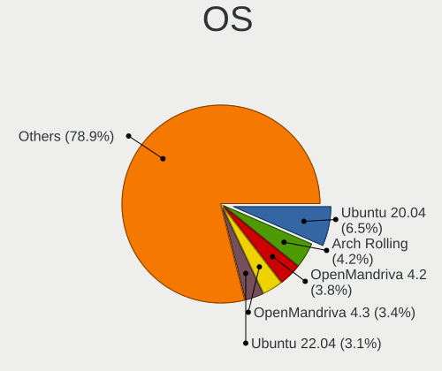

| Name                         | Desktops | Percent |
|------------------------------|----------|---------|
| Ubuntu 20.04                 | 231      | 6.54%   |
| Arch Rolling                 | 150      | 4.25%   |
| OpenMandriva 4.2             | 133      | 3.77%   |
| OpenMandriva 4.3             | 121      | 3.43%   |
| Ubuntu 22.04                 | 110      | 3.12%   |
| Ubuntu 18.04                 | 108      | 3.06%   |
| OpenMandriva 25.90           | 84       | 2.38%   |
| OpenMandriva 5.0             | 80       | 2.27%   |
| Debian 12                    | 73       | 2.07%   |
| Ubuntu 24.04                 | 65       | 1.84%   |
| OpenMandriva 24.12           | 61       | 1.73%   |
| OpenMandriva 23.08           | 61       | 1.73%   |
| Debian 11                    | 54       | 1.53%   |
| ROSA R10                     | 47       | 1.33%   |
| Pop!_OS 22.04                | 46       | 1.3%    |
| Manjaro                      | 46       | 1.3%    |
| OpenMandriva 24.07           | 41       | 1.16%   |
| ROSA R11                     | 39       | 1.1%    |
| Zorin 16                     | 38       | 1.08%   |
| OpenMandriva 23.03           | 37       | 1.05%   |
| Linux Mint 22.1              | 37       | 1.05%   |
| OpenMandriva 6.0             | 36       | 1.02%   |
| OpenMandriva 23.01           | 36       | 1.02%   |
| Fedora 42                    | 35       | 0.99%   |
| ROSA R9                      | 31       | 0.88%   |
| Zorin 17                     | 30       | 0.85%   |
| ROSA R11.1                   | 29       | 0.82%   |
| openSUSE Tumbleweed-XXXXXXXX | 29       | 0.82%   |
| Fedora 41                    | 28       | 0.79%   |
| Fedora 40                    | 28       | 0.79%   |
| EndeavourOS Rolling          | 27       | 0.76%   |
| Linux Mint 21.1              | 26       | 0.74%   |
| Linux Mint 20.3              | 26       | 0.74%   |
| OpenMandriva 25.06           | 24       | 0.68%   |
| Linux Mint 20.1              | 24       | 0.68%   |
| Arch                         | 24       | 0.68%   |
| Fedora 36                    | 23       | 0.65%   |
| KDE neon 20.04               | 22       | 0.62%   |
| Fedora 37                    | 22       | 0.62%   |
| Linux Mint 20                | 21       | 0.59%   |

OS Family
---------

OS without a version

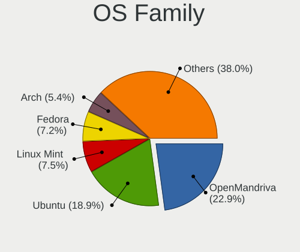

| Name          | Desktops | Percent |
|---------------|----------|---------|
| OpenMandriva  | 727      | 22.88%  |
| Ubuntu        | 602      | 18.94%  |
| Linux Mint    | 239      | 7.52%   |
| Fedora        | 230      | 7.24%   |
| Arch          | 171      | 5.38%   |
| Debian        | 158      | 4.97%   |
| ROSA          | 157      | 4.94%   |
| Manjaro       | 101      | 3.18%   |
| Pop!_OS       | 89       | 2.8%    |
| Zorin         | 81       | 2.55%   |
| Kubuntu       | 63       | 1.98%   |
| KDE neon      | 40       | 1.26%   |
| openSUSE      | 39       | 1.23%   |
| Gentoo        | 35       | 1.1%    |
| Xubuntu       | 31       | 0.98%   |
| Bazzite       | 30       | 0.94%   |
| EndeavourOS   | 28       | 0.88%   |
| Nobara        | 27       | 0.85%   |
| Elementary    | 21       | 0.66%   |
| CachyOS       | 21       | 0.66%   |
| ArcoLinux     | 21       | 0.66%   |
| Dts-distro    | 17       | 0.53%   |
| Ubuntu MATE   | 15       | 0.47%   |
| LMDE          | 15       | 0.47%   |
| Kali          | 15       | 0.47%   |
| NixOS         | 12       | 0.38%   |
| MX            | 12       | 0.38%   |
| Lubuntu       | 12       | 0.38%   |
| Endless       | 12       | 0.38%   |
| Ubuntu Unity  | 11       | 0.35%   |
| BlackPanther  | 11       | 0.35%   |
| Garuda Linux  | 10       | 0.31%   |
| SteamOS       | 7        | 0.22%   |
| CentOS        | 7        | 0.22%   |
| Xero          | 6        | 0.19%   |
| Void Linux    | 6        | 0.19%   |
| Ubuntu Budgie | 6        | 0.19%   |
| Clear Linux   | 6        | 0.19%   |
| BigLinux      | 6        | 0.19%   |
| Sparky        | 4        | 0.13%   |

Kernel
------

Version of the Linux kernel

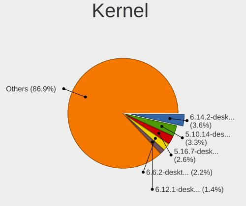

| Version                             | Desktops | Percent |
|-------------------------------------|----------|---------|
| 6.14.2-desktop-3omv2590             | 142      | 3.58%   |
| 5.10.14-desktop-1omv4002            | 129      | 3.25%   |
| 5.16.7-desktop-1omv4003             | 103      | 2.6%    |
| 6.6.2-desktop-1omv2390              | 87       | 2.19%   |
| 6.12.1-desktop-1omv2490             | 57       | 1.44%   |
| 6.4.11-desktop-1omv2390             | 49       | 1.24%   |
| 6.2.6-desktop-1omv2390              | 35       | 0.88%   |
| 5.4.0-42-generic                    | 34       | 0.86%   |
| 6.10.0-desktop-1omv2490             | 32       | 0.81%   |
| 4.9.60-nrj-desktop-1rosa-x86_64     | 30       | 0.76%   |
| 6.1.1-desktop-1omv2290              | 29       | 0.73%   |
| 4.9.20-nrj-desktop-1rosa-x86_64     | 27       | 0.68%   |
| 5.16.13-desktop-1omv4003            | 23       | 0.58%   |
| 4.15.0-desktop-45.1rosa-x86_64      | 22       | 0.55%   |
| 5.4.0-26-generic                    | 19       | 0.48%   |
| 6.8.0-51-generic                    | 17       | 0.43%   |
| 5.15.0-56-generic                   | 17       | 0.43%   |
| 5.4.0-52-generic                    | 15       | 0.38%   |
| 6.4.8-desktop-2omv2390              | 14       | 0.35%   |
| 5.4.0-54-generic                    | 13       | 0.33%   |
| 5.19.0-35-generic                   | 13       | 0.33%   |
| 5.15.0-52-generic                   | 13       | 0.33%   |
| 5.8.0-48-generic                    | 12       | 0.3%    |
| 5.4.0-72-generic                    | 12       | 0.3%    |
| 5.4.0-58-generic                    | 12       | 0.3%    |
| 5.4.0-48-generic                    | 12       | 0.3%    |
| 5.4.0-40-generic                    | 12       | 0.3%    |
| 5.15.0-43-generic                   | 12       | 0.3%    |
| 6.8.0-60-generic                    | 11       | 0.28%   |
| 6.8.0-41-generic                    | 11       | 0.28%   |
| 6.12.9-desktop-1omv2490             | 11       | 0.28%   |
| 5.4.0-66-generic                    | 11       | 0.28%   |
| 5.3.0-46-generic                    | 11       | 0.28%   |
| 5.13.0-39-generic                   | 11       | 0.28%   |
| 4.15.0-desktop-122.124.1rosa-x86_64 | 11       | 0.28%   |
| 6.8.0-52-generic                    | 10       | 0.25%   |
| 6.8.0-45-generic                    | 10       | 0.25%   |
| 6.6.21-yocto-standard               | 10       | 0.25%   |
| 6.2.0-36-generic                    | 10       | 0.25%   |
| 6.15.0-desktop-0.rc2.3omv2590       | 10       | 0.25%   |

Kernel Family
-------------

Linux kernel without a distro release

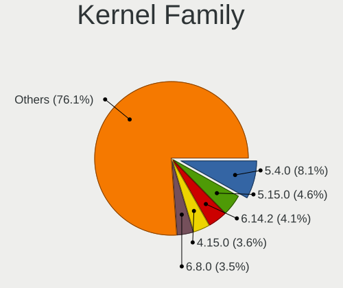

| Version | Desktops | Percent |
|---------|----------|---------|
| 5.4.0   | 305      | 8.13%   |
| 5.15.0  | 171      | 4.56%   |
| 6.14.2  | 154      | 4.1%    |
| 4.15.0  | 135      | 3.6%    |
| 6.8.0   | 131      | 3.49%   |
| 5.10.14 | 130      | 3.46%   |
| 5.16.7  | 105      | 2.8%    |
| 6.6.2   | 90       | 2.4%    |
| 5.8.0   | 85       | 2.26%   |
| 6.1.0   | 79       | 2.1%    |
| 5.11.0  | 71       | 1.89%   |
| 5.13.0  | 67       | 1.79%   |
| 6.12.1  | 58       | 1.55%   |
| 5.3.0   | 56       | 1.49%   |
| 6.5.0   | 55       | 1.47%   |
| 5.10.0  | 53       | 1.41%   |
| 6.14.0  | 52       | 1.39%   |
| 6.2.0   | 50       | 1.33%   |
| 5.19.0  | 50       | 1.33%   |
| 6.4.11  | 49       | 1.31%   |
| 6.2.6   | 42       | 1.12%   |
| 6.11.0  | 42       | 1.12%   |
| 5.0.0   | 37       | 0.99%   |
| 4.9.60  | 33       | 0.88%   |
| 6.10.0  | 32       | 0.85%   |
| 6.1.1   | 30       | 0.8%    |
| 4.18.0  | 30       | 0.8%    |
| 4.9.20  | 27       | 0.72%   |
| 5.16.13 | 23       | 0.61%   |
| 4.19.0  | 22       | 0.59%   |
| 6.13.5  | 20       | 0.53%   |
| 6.17.7  | 19       | 0.51%   |
| 6.9.3   | 17       | 0.45%   |
| 6.6.21  | 15       | 0.4%    |
| 6.4.8   | 14       | 0.37%   |
| 4.1.38  | 14       | 0.37%   |
| 6.17.9  | 12       | 0.32%   |
| 6.12.9  | 12       | 0.32%   |
| 6.15.0  | 11       | 0.29%   |
| 6.10.1  | 11       | 0.29%   |

Kernel Major Ver.
-----------------

Linux kernel major version

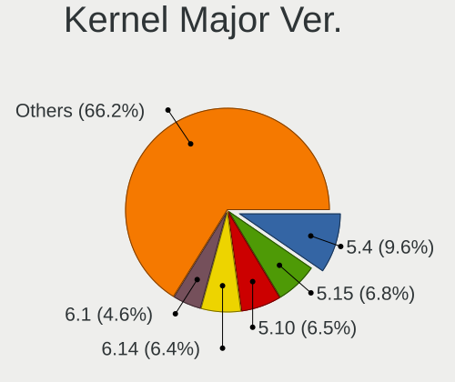

| Version | Desktops | Percent |
|---------|----------|---------|
| 5.4     | 343      | 9.58%   |
| 5.15    | 244      | 6.81%   |
| 5.10    | 231      | 6.45%   |
| 6.14    | 229      | 6.39%   |
| 6.1     | 165      | 4.61%   |
| 6.8     | 156      | 4.36%   |
| 6.12    | 152      | 4.24%   |
| 6.6     | 151      | 4.22%   |
| 5.16    | 144      | 4.02%   |
| 4.15    | 135      | 3.77%   |
| 6.2     | 115      | 3.21%   |
| 5.8     | 106      | 2.96%   |
| 5.11    | 98       | 2.74%   |
| 6.4     | 83       | 2.32%   |
| 6.5     | 82       | 2.29%   |
| 5.13    | 80       | 2.23%   |
| 4.9     | 79       | 2.21%   |
| 6.10    | 76       | 2.12%   |
| 5.19    | 75       | 2.09%   |
| 6.11    | 67       | 1.87%   |
| 5.3     | 62       | 1.73%   |
| 6.17    | 60       | 1.68%   |
| 6.15    | 53       | 1.48%   |
| 6.13    | 49       | 1.37%   |
| 6.0     | 48       | 1.34%   |
| 6.9     | 47       | 1.31%   |
| 5.0     | 41       | 1.14%   |
| 4.18    | 39       | 1.09%   |
| 5.14    | 36       | 1.01%   |
| 6.3     | 32       | 0.89%   |
| 5.12    | 31       | 0.87%   |
| 5.18    | 29       | 0.81%   |
| 4.1     | 28       | 0.78%   |
| 5.9     | 27       | 0.75%   |
| 5.17    | 27       | 0.75%   |
| 6.16    | 26       | 0.73%   |
| 4.19    | 26       | 0.73%   |
| 5.6     | 24       | 0.67%   |
| 6.7     | 23       | 0.64%   |
| 5.5     | 16       | 0.45%   |

Arch
----

OS architecture (x86_64, i586, etc.)

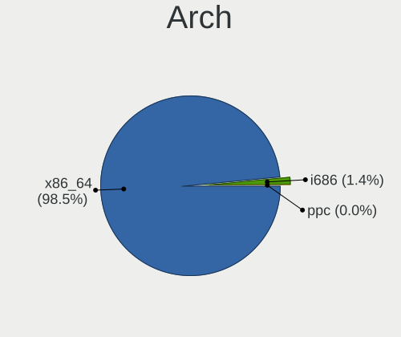

| Name    | Desktops | Percent |
|---------|----------|---------|
| x86_64  | 2991     | 98.49%  |
| i686    | 43       | 1.42%   |
| riscv64 | 1        | 0.03%   |
| ppc64   | 1        | 0.03%   |
| ppc     | 1        | 0.03%   |

DE
--

Desktop Environment

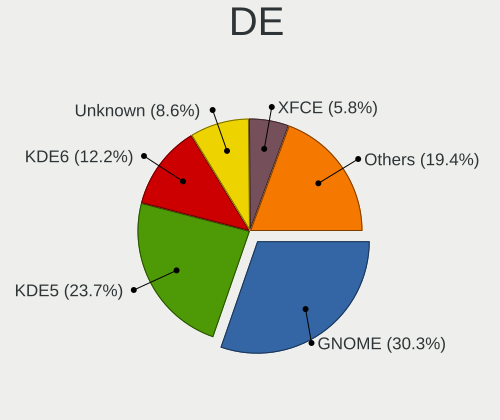

| Name               | Desktops | Percent |
|--------------------|----------|---------|
| GNOME              | 988      | 30.31%  |
| KDE5               | 773      | 23.71%  |
| KDE6               | 399      | 12.24%  |
| Unknown            | 280      | 8.59%   |
| XFCE               | 188      | 5.77%   |
| X-Cinnamon         | 182      | 5.58%   |
| KDE4               | 85       | 2.61%   |
| MATE               | 74       | 2.27%   |
| KDE                | 66       | 2.02%   |
| LXQt               | 52       | 1.6%    |
| Cinnamon           | 25       | 0.77%   |
| i3                 | 24       | 0.74%   |
| Pantheon           | 21       | 0.64%   |
| Hyprland           | 19       | 0.58%   |
| LXDE               | 13       | 0.4%    |
| Unity              | 12       | 0.37%   |
| Budgie             | 12       | 0.37%   |
| Deepin             | 6        | 0.18%   |
| GNOME Classic      | 5        | 0.15%   |
| ICEWM              | 4        | 0.12%   |
| GNOME Flashback    | 4        | 0.12%   |
| COSMIC             | 4        | 0.12%   |
| qtile              | 3        | 0.09%   |
| openbox            | 3        | 0.09%   |
| Trinity            | 2        | 0.06%   |
| niri               | 2        | 0.06%   |
| DWM                | 2        | 0.06%   |
| awesome            | 2        | 0.06%   |
| xmonad             | 1        | 0.03%   |
| TDE                | 1        | 0.03%   |
| sway               | 1        | 0.03%   |
| ratflow            | 1        | 0.03%   |
| LXQt:labwc:wlroots | 1        | 0.03%   |
| lightdm-xsession   | 1        | 0.03%   |
| jwm                | 1        | 0.03%   |
| i3-with-shmlog     | 1        | 0.03%   |
| gnome-xorg         | 1        | 0.03%   |
| fluxbox            | 1        | 0.03%   |

Display Server
--------------

X11 or Wayland

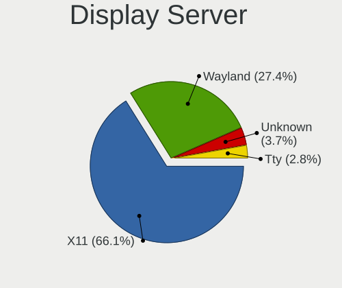

| Name    | Desktops | Percent |
|---------|----------|---------|
| X11     | 2103     | 66.09%  |
| Wayland | 871      | 27.37%  |
| Unknown | 119      | 3.74%   |
| Tty     | 89       | 2.8%    |

Display Manager
---------------

SDDM, LightDM, etc.

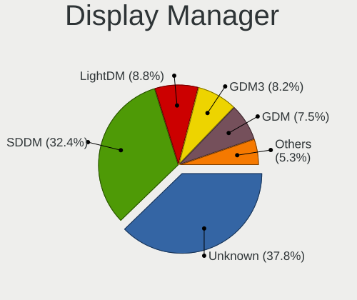

| Name                  | Desktops | Percent |
|-----------------------|----------|---------|
| Unknown               | 1207     | 37.77%  |
| SDDM                  | 1037     | 32.45%  |
| LightDM               | 281      | 8.79%   |
| GDM3                  | 262      | 8.2%    |
| GDM                   | 241      | 7.54%   |
| KDM                   | 87       | 2.72%   |
| TDM                   | 54       | 1.69%   |
| XDM                   | 5        | 0.16%   |
| LXDM                  | 4        | 0.13%   |
| GREETD                | 4        | 0.13%   |
| SLIMSKI               | 3        | 0.09%   |
| SLiM                  | 3        | 0.09%   |
| LY-DM                 | 3        | 0.09%   |
| Ly                    | 2        | 0.06%   |
| MDM                   | 1        | 0.03%   |
| DISPLAY-MANAGER-START | 1        | 0.03%   |
| COSMIC-GREETER        | 1        | 0.03%   |

OS Lang
-------

Language

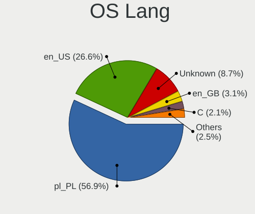

| Lang        | Desktops | Percent |
|-------------|----------|---------|
| pl_PL       | 1802     | 56.92%  |
| en_US       | 843      | 26.63%  |
| Unknown     | 276      | 8.72%   |
| en_GB       | 98       | 3.1%    |
| C           | 67       | 2.12%   |
| ru_RU       | 16       | 0.51%   |
| ru_UA       | 7        | 0.22%   |
| en_CA       | 7        | 0.22%   |
| de_DE       | 6        | 0.19%   |
| uk_UA       | 5        | 0.16%   |
| POSIX       | 4        | 0.13%   |
| en_IE       | 4        | 0.13%   |
| C.UTF8      | 4        | 0.13%   |
| szl_PL      | 3        | 0.09%   |
| fr_FR       | 3        | 0.09%   |
| en_AG       | 3        | 0.09%   |
| UTF-8       | 2        | 0.06%   |
| en_DK       | 2        | 0.06%   |
| en_BW       | 2        | 0.06%   |
| sv_SE       | 1        | 0.03%   |
| pl_PL.UTF8  | 1        | 0.03%   |
| es_BO       | 1        | 0.03%   |
| en_US.UTF8  | 1        | 0.03%   |
| en_US.utf-8 | 1        | 0.03%   |
| en_SE       | 1        | 0.03%   |
| en_IN       | 1        | 0.03%   |
| en_GB.UTF8  | 1        | 0.03%   |
| en_AU       | 1        | 0.03%   |
| de_CH       | 1        | 0.03%   |
| cs_CZ       | 1        | 0.03%   |
| be_BY       | 1        | 0.03%   |

Boot Mode
---------

EFI or BIOS

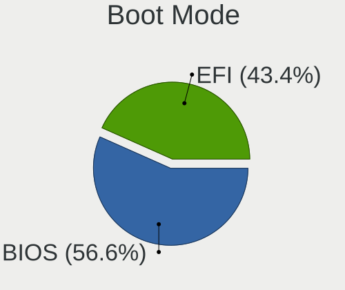

| Mode | Desktops | Percent |
|------|----------|---------|
| BIOS | 1773     | 56.65%  |
| EFI  | 1357     | 43.35%  |

Filesystem
----------

Type of filesystem

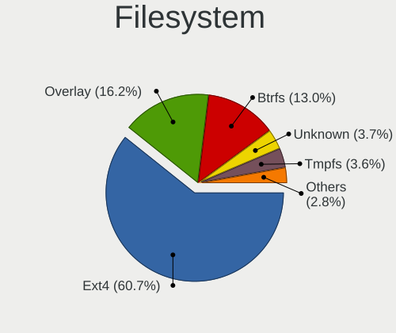

| Type     | Desktops | Percent |
|----------|----------|---------|
| Ext4     | 1948     | 60.72%  |
| Overlay  | 520      | 16.21%  |
| Btrfs    | 417      | 13%     |
| Unknown  | 118      | 3.68%   |
| Tmpfs    | 114      | 3.55%   |
| Xfs      | 44       | 1.37%   |
| Zfs      | 16       | 0.5%    |
| F2fs     | 11       | 0.34%   |
| Ext3     | 6        | 0.19%   |
| Ext2     | 4        | 0.12%   |
| Rootfs   | 3        | 0.09%   |
| Jfs      | 2        | 0.06%   |
| XXXXXXX  | 1        | 0.03%   |
| XXX      | 1        | 0.03%   |
| SquXshfs | 1        | 0.03%   |
| Bcachefs | 1        | 0.03%   |
| Aufs     | 1        | 0.03%   |

Part. scheme
------------

Scheme of partitioning

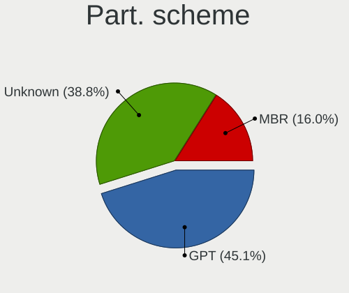

| Type    | Desktops | Percent |
|---------|----------|---------|
| GPT     | 1435     | 45.14%  |
| Unknown | 1234     | 38.82%  |
| MBR     | 510      | 16.04%  |

Dual Boot with Linux/BSD
------------------------

Hosting more than one Linux/BSD

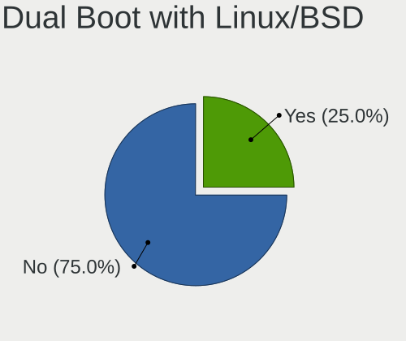

| Dual boot | Desktops | Percent |
|-----------|----------|---------|
| No        | 2364     | 75.02%  |
| Yes       | 787      | 24.98%  |

Dual Boot (Win)
---------------

Hosting Linux and Windows

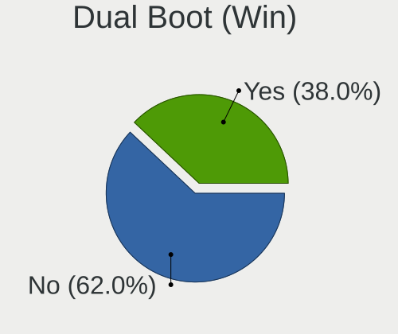

| Dual boot | Desktops | Percent |
|-----------|----------|---------|
| No        | 1943     | 62.02%  |
| Yes       | 1190     | 37.98%  |

Board
-----

Vendor
------

Motherboard manufacturer

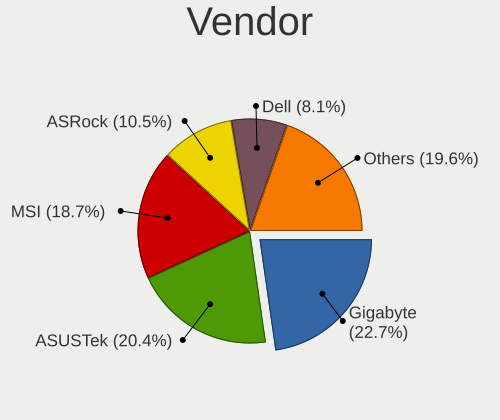

| Name                                 | Desktops | Percent |
|--------------------------------------|----------|---------|
| Gigabyte Technology                  | 689      | 22.74%  |
| ASUSTek Computer                     | 618      | 20.4%   |
| MSI                                  | 566      | 18.68%  |
| ASRock                               | 318      | 10.5%   |
| Dell                                 | 244      | 8.05%   |
| Hewlett-Packard                      | 189      | 6.24%   |
| Lenovo                               | 113      | 3.73%   |
| Fujitsu                              | 61       | 2.01%   |
| Intel                                | 38       | 1.25%   |
| Unknown                              | 29       | 0.96%   |
| Acer                                 | 22       | 0.73%   |
| Foxconn                              | 16       | 0.53%   |
| Fujitsu Siemens                      | 14       | 0.46%   |
| Medion                               | 11       | 0.36%   |
| Inventec                             | 8        | 0.26%   |
| Huanan                               | 7        | 0.23%   |
| Hardkernel                           | 5        | 0.17%   |
| ECS                                  | 4        | 0.13%   |
| Apple                                | 4        | 0.13%   |
| ACTION                               | 4        | 0.13%   |
| Pegatron                             | 3        | 0.1%    |
| PC Engines                           | 3        | 0.1%    |
| Biostar                              | 3        | 0.1%    |
| AMI                                  | 3        | 0.1%    |
| ABIT                                 | 3        | 0.1%    |
| WeiBu                                | 2        | 0.07%   |
| Supermicro                           | 2        | 0.07%   |
| Shenzhen Meigao Electronic Equipment | 2        | 0.07%   |
| Protectli                            | 2        | 0.07%   |
| NTT SYSTEM                           | 2        | 0.07%   |
| MACHINIST                            | 2        | 0.07%   |
| LCO                                  | 2        | 0.07%   |
| Hampoo                               | 2        | 0.07%   |
| GMKtec                               | 2        | 0.07%   |
| Gateway                              | 2        | 0.07%   |
| ASRockRack                           | 2        | 0.07%   |
| ZOTAC                                | 1        | 0.03%   |
| Wortmann AG                          | 1        | 0.03%   |
| Win element                          | 1        | 0.03%   |
| Vorke                                | 1        | 0.03%   |

Model
-----

Motherboard model

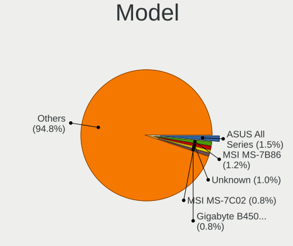

| Name                         | Desktops | Percent |
|------------------------------|----------|---------|
| ASUS All Series              | 45       | 1.49%   |
| MSI MS-7B86                  | 35       | 1.16%   |
| Unknown                      | 29       | 0.96%   |
| MSI MS-7C02                  | 24       | 0.79%   |
| Gigabyte B450M DS3H          | 24       | 0.79%   |
| MSI MS-7C56                  | 21       | 0.69%   |
| MSI MS-7817                  | 21       | 0.69%   |
| MSI MS-7816                  | 19       | 0.63%   |
| Gigabyte B550 AORUS ELITE V2 | 19       | 0.63%   |
| MSI MS-7C37                  | 18       | 0.59%   |
| Dell OptiPlex 780            | 18       | 0.59%   |
| Dell OptiPlex 7010           | 18       | 0.59%   |
| ASUS SABERTOOTH Z77          | 18       | 0.59%   |
| Gigabyte B450 AORUS ELITE    | 17       | 0.56%   |
| ASUS TUF Gaming B550-PLUS    | 16       | 0.53%   |
| MSI MS-7C91                  | 15       | 0.5%    |
| MSI MS-7A38                  | 14       | 0.46%   |
| MSI MS-7B79                  | 13       | 0.43%   |
| MSI MS-7B89                  | 12       | 0.4%    |
| MSI MS-7721                  | 12       | 0.4%    |
| Dell OptiPlex 755            | 12       | 0.4%    |
| ASUS TUF Gaming X570-PLUS    | 12       | 0.4%    |
| MSI MS-7C52                  | 11       | 0.36%   |
| Gigabyte B85M-D3H            | 11       | 0.36%   |
| Dell OptiPlex 790            | 11       | 0.36%   |
| MSI MS-7D25                  | 10       | 0.33%   |
| MSI MS-7996                  | 10       | 0.33%   |
| ASRock B450M-HDV R4.0        | 10       | 0.33%   |
| MSI MS-7A34                  | 9        | 0.3%    |
| Gigabyte B550 GAMING X V2    | 9        | 0.3%    |
| Dell OptiPlex 9020           | 9        | 0.3%    |
| ASUS PRIME B450M-A           | 9        | 0.3%    |
| ASRock B450 Pro4             | 9        | 0.3%    |
| MSI MS-7C95                  | 8        | 0.26%   |
| HP t620 Quad Core TC         | 8        | 0.26%   |
| Gigabyte B550M DS3H          | 8        | 0.26%   |
| Dell OptiPlex 3020           | 8        | 0.26%   |
| ASUS PRIME X470-PRO          | 8        | 0.26%   |
| ASUS PRIME B350-PLUS         | 8        | 0.26%   |
| MSI MS-7971                  | 7        | 0.23%   |

Model Family
------------

Motherboard model prefix

| Name                | Desktops | Percent |
|---------------------|----------|---------|
| Dell OptiPlex       | 171      | 5.64%   |
| ASUS PRIME          | 127      | 4.19%   |
| ASUS TUF            | 71       | 2.34%   |
| Lenovo ThinkCentre  | 68       | 2.24%   |
| HP Compaq           | 67       | 2.21%   |
| ASUS ROG            | 62       | 2.05%   |
| ASUS All            | 45       | 1.49%   |
| Gigabyte B550       | 43       | 1.42%   |
| HP EliteDesk        | 42       | 1.39%   |
| Gigabyte B450M      | 40       | 1.32%   |
| Fujitsu ESPRIMO     | 39       | 1.29%   |
| Dell Precision      | 38       | 1.25%   |
| MSI MS-7B86         | 35       | 1.16%   |
| Gigabyte B450       | 29       | 0.96%   |
| Unknown             | 29       | 0.96%   |
| Gigabyte X570       | 26       | 0.86%   |
| MSI MS-7C02         | 24       | 0.79%   |
| ASRock B450         | 22       | 0.73%   |
| MSI MS-7C56         | 21       | 0.69%   |
| MSI MS-7817         | 21       | 0.69%   |
| ASUS SABERTOOTH     | 20       | 0.66%   |
| MSI MS-7816         | 19       | 0.63%   |
| Dell Vostro         | 19       | 0.63%   |
| MSI MS-7C37         | 18       | 0.59%   |
| MSI MS-7C91         | 15       | 0.5%    |
| Gigabyte B650       | 15       | 0.5%    |
| MSI MS-7A38         | 14       | 0.46%   |
| HP ProDesk          | 14       | 0.46%   |
| MSI MS-7B79         | 13       | 0.43%   |
| Lenovo ThinkStation | 13       | 0.43%   |
| Lenovo IdeaCentre   | 13       | 0.43%   |
| MSI MS-7B89         | 12       | 0.4%    |
| MSI MS-7721         | 12       | 0.4%    |
| Gigabyte B550M      | 12       | 0.4%    |
| ASUS M5A97          | 12       | 0.4%    |
| MSI MS-7C52         | 11       | 0.36%   |
| Gigabyte B85M-D3H   | 11       | 0.36%   |
| ASUS P5G41T-M       | 11       | 0.36%   |
| ASRock B450M        | 11       | 0.36%   |
| MSI MS-7D25         | 10       | 0.33%   |

MFG Year
--------

Motherboard manufacture year

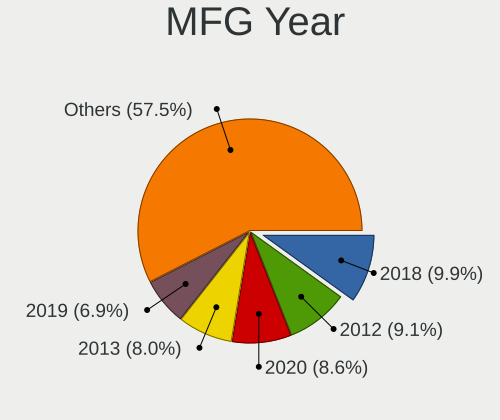

| Year    | Desktops | Percent |
|---------|----------|---------|
| 2018    | 301      | 9.93%   |
| 2012    | 275      | 9.08%   |
| 2020    | 261      | 8.61%   |
| 2013    | 242      | 7.99%   |
| 2019    | 208      | 6.86%   |
| 2014    | 202      | 6.67%   |
| 2011    | 166      | 5.48%   |
| 2017    | 157      | 5.18%   |
| 2009    | 156      | 5.15%   |
| 2010    | 135      | 4.46%   |
| 2015    | 132      | 4.36%   |
| 2021    | 130      | 4.29%   |
| 2016    | 126      | 4.16%   |
| 2007    | 107      | 3.53%   |
| 2022    | 104      | 3.43%   |
| 2008    | 102      | 3.37%   |
| 2023    | 78       | 2.57%   |
| 2024    | 68       | 2.24%   |
| 2006    | 49       | 1.62%   |
| 2025    | 10       | 0.33%   |
| 2005    | 8        | 0.26%   |
| 2004    | 8        | 0.26%   |
| Unknown | 4        | 0.13%   |
| 2001    | 1        | 0.03%   |

Form Factor
-----------

Physical design of the computer

| Name    | Desktops | Percent |
|---------|----------|---------|
| Desktop | 3030     | 100%    |

Secure Boot
-----------

Enabled or disabled

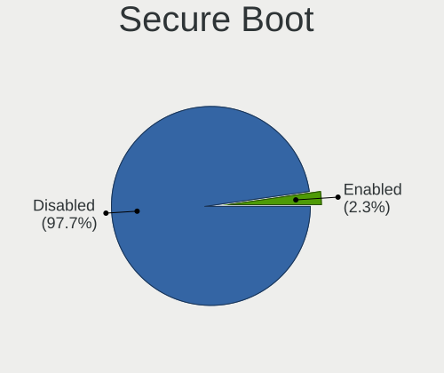

| State    | Desktops | Percent |
|----------|----------|---------|
| Disabled | 2977     | 97.73%  |
| Enabled  | 69       | 2.27%   |

Coreboot
--------

Have coreboot on board

| Used | Desktops | Percent |
|------|----------|---------|
| No   | 3023     | 99.77%  |
| Yes  | 7        | 0.23%   |

RAM Size
--------

Total RAM memory

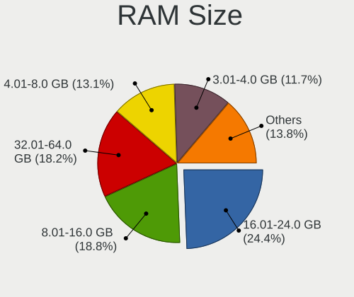

| Size in GB      | Desktops | Percent |
|-----------------|----------|---------|
| 16.01-24.0      | 762      | 24.37%  |
| 8.01-16.0       | 587      | 18.77%  |
| 32.01-64.0      | 569      | 18.2%   |
| 4.01-8.0        | 411      | 13.14%  |
| 3.01-4.0        | 366      | 11.7%   |
| 64.01-256.0     | 187      | 5.98%   |
| 24.01-32.0      | 136      | 4.35%   |
| 1.01-2.0        | 66       | 2.11%   |
| 2.01-3.0        | 33       | 1.06%   |
| 0.51-1.0        | 9        | 0.29%   |
| More than 256.0 | 1        | 0.03%   |

RAM Used
--------

Used RAM memory

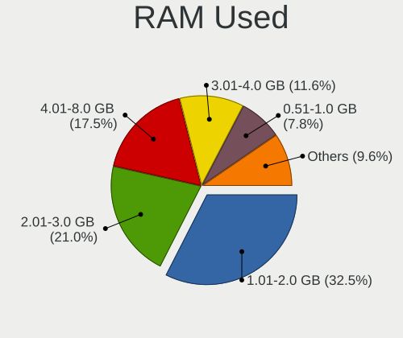

| Used GB     | Desktops | Percent |
|-------------|----------|---------|
| 1.01-2.0    | 1139     | 32.5%   |
| 2.01-3.0    | 737      | 21.03%  |
| 4.01-8.0    | 615      | 17.55%  |
| 3.01-4.0    | 406      | 11.58%  |
| 0.51-1.0    | 273      | 7.79%   |
| 8.01-16.0   | 190      | 5.42%   |
| 0.01-0.5    | 61       | 1.74%   |
| 16.01-24.0  | 49       | 1.4%    |
| 24.01-32.0  | 21       | 0.6%    |
| 32.01-64.0  | 8        | 0.23%   |
| 64.01-256.0 | 5        | 0.14%   |
| Unknown     | 1        | 0.03%   |

Total Drives
------------

Number of drives on board

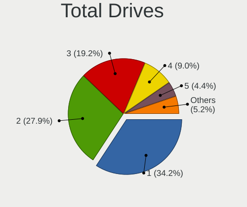

| Drives | Desktops | Percent |
|--------|----------|---------|
| 1      | 1113     | 34.21%  |
| 2      | 909      | 27.94%  |
| 3      | 624      | 19.18%  |
| 4      | 294      | 9.04%   |
| 5      | 143      | 4.4%    |
| 6      | 59       | 1.81%   |
| 0      | 50       | 1.54%   |
| 7      | 26       | 0.8%    |
| 8      | 16       | 0.49%   |
| 9      | 6        | 0.18%   |
| 11     | 5        | 0.15%   |
| 10     | 5        | 0.15%   |
| 12     | 2        | 0.06%   |
| 13     | 1        | 0.03%   |

Has CD-ROM
----------

Has CD-ROM on board

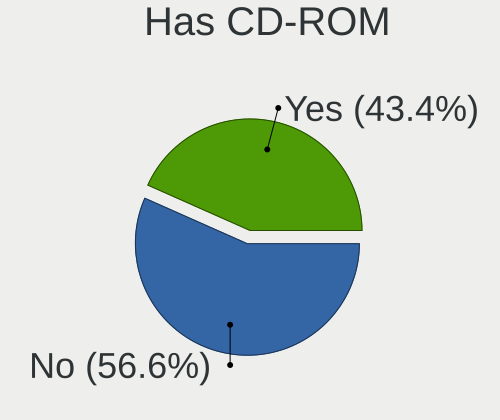

| Presented | Desktops | Percent |
|-----------|----------|---------|
| No        | 1747     | 56.65%  |
| Yes       | 1337     | 43.35%  |

Has Ethernet
------------

Has Ethernet on board

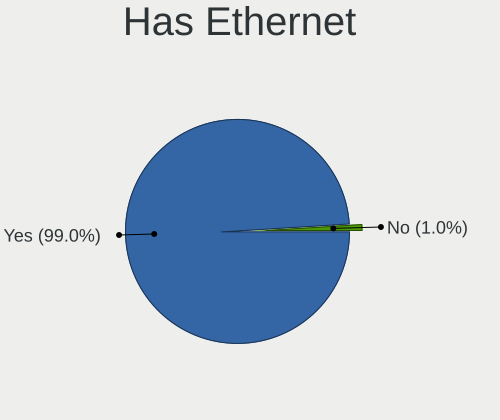

| Presented | Desktops | Percent |
|-----------|----------|---------|
| Yes       | 3000     | 99.01%  |
| No        | 30       | 0.99%   |

Has WiFi
--------

Has WiFi module

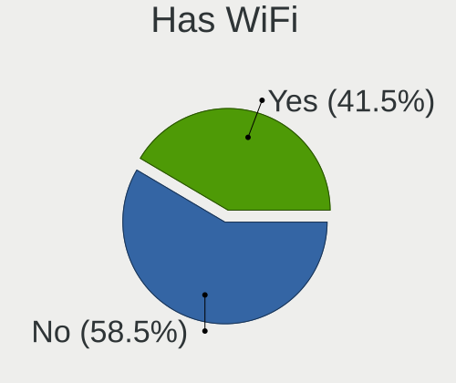

| Presented | Desktops | Percent |
|-----------|----------|---------|
| No        | 1814     | 58.5%   |
| Yes       | 1287     | 41.5%   |

Has Bluetooth
-------------

Has Bluetooth module

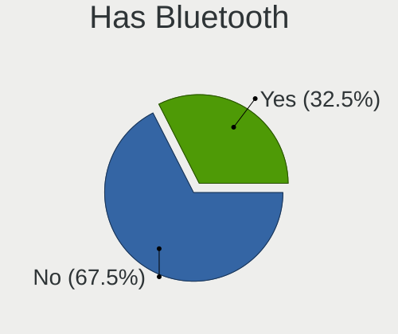

| Presented | Desktops | Percent |
|-----------|----------|---------|
| No        | 2087     | 67.5%   |
| Yes       | 1005     | 32.5%   |

Location
--------

Country
-------

Geographic location (country)

| Country | Desktops | Percent |
|---------|----------|---------|
| Poland  | 3030     | 100%    |

City
----

Geographic location (city)

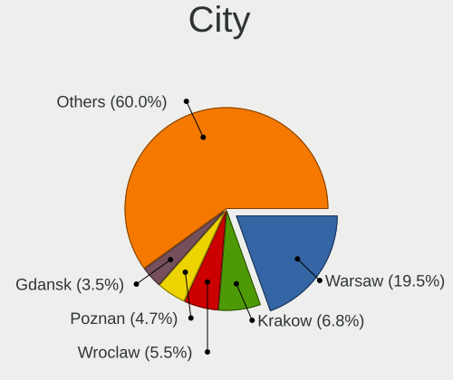

| City          | Desktops | Percent |
|---------------|----------|---------|
| Warsaw        | 655      | 19.53%  |
| Krakow        | 227      | 6.77%   |
| Wroclaw       | 185      | 5.52%   |
| Poznan        | 159      | 4.74%   |
| Gdansk        | 116      | 3.46%   |
| Katowice      | 90       | 2.68%   |
| Lodz          | 89       | 2.65%   |
| Gdynia        | 51       | 1.52%   |
| Lublin        | 46       | 1.37%   |
| Bialystok     | 43       | 1.28%   |
| Szczecin      | 41       | 1.22%   |
| Bydgoszcz     | 33       | 0.98%   |
| Rzeszów      | 27       | 0.81%   |
| Gliwice       | 25       | 0.75%   |
| Bytom         | 25       | 0.75%   |
| Częstochowa  | 24       | 0.72%   |
| Ruda Śląska | 23       | 0.69%   |
| Torun         | 21       | 0.63%   |
| Kielce        | 19       | 0.57%   |
| Bielsko-Biala | 19       | 0.57%   |
| Strzyzow      | 18       | 0.54%   |
| Sosnowiec     | 18       | 0.54%   |
| Rybnik        | 18       | 0.54%   |
| Radom         | 18       | 0.54%   |
| Płock        | 17       | 0.51%   |
| Zielona Góra | 14       | 0.42%   |
| Zabrze        | 14       | 0.42%   |
| Tychy         | 13       | 0.39%   |
| Piaseczno     | 12       | 0.36%   |
| Cieszyn       | 12       | 0.36%   |
| Chorzów      | 12       | 0.36%   |
| Słupsk       | 11       | 0.33%   |
| Pila          | 11       | 0.33%   |
| Opole         | 11       | 0.33%   |
| Koszalin      | 11       | 0.33%   |
| Kościan      | 11       | 0.33%   |
| Debica        | 11       | 0.33%   |
| Jelenia Góra | 10       | 0.3%    |
| Będzin       | 10       | 0.3%    |
| Wołomin      | 9        | 0.27%   |

Drives
------

Drive Vendor
------------

Hard drive vendors

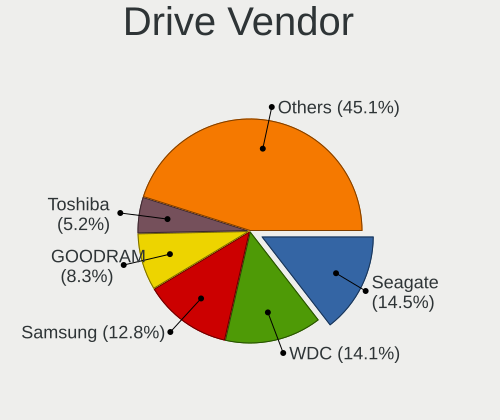

| Vendor                       | Desktops | Drives | Percent |
|------------------------------|----------|--------|---------|
| Seagate                      | 881      | 1586   | 14.53%  |
| WDC                          | 853      | 1458   | 14.06%  |
| Samsung Electronics          | 776      | 1323   | 12.79%  |
| GOODRAM                      | 502      | 888    | 8.28%   |
| Toshiba                      | 318      | 560    | 5.24%   |
| Crucial                      | 283      | 489    | 4.67%   |
| Kingston                     | 280      | 407    | 4.62%   |
| A-DATA Technology            | 237      | 342    | 3.91%   |
| Sandisk                      | 212      | 330    | 3.5%    |
| Hitachi                      | 145      | 320    | 2.39%   |
| Patriot                      | 105      | 141    | 1.73%   |
| SPCC                         | 88       | 148    | 1.45%   |
| Phison Electronics           | 85       | 132    | 1.4%    |
| ADATA Technology             | 81       | 109    | 1.34%   |
| Shenzhen Longsys Electronics | 72       | 99     | 1.19%   |
| Intel                        | 71       | 105    | 1.17%   |
| HGST                         | 60       | 84     | 0.99%   |
| Unknown                      | 57       | 114    | 0.94%   |
| PNY                          | 47       | 55     | 0.77%   |
| Plextor                      | 44       | 54     | 0.73%   |
| MAXIO Technology (Hangzhou)  | 44       | 51     | 0.73%   |
| XPG                          | 42       | 61     | 0.69%   |
| Kingston Technology Company  | 40       | 45     | 0.66%   |
| Micron Technology            | 38       | 57     | 0.63%   |
| Lexar                        | 38       | 50     | 0.63%   |
| Apacer                       | 38       | 54     | 0.63%   |
| SK hynix                     | 36       | 52     | 0.59%   |
| Micron/Crucial Technology    | 36       | 41     | 0.59%   |
| Realtek Semiconductor        | 34       | 46     | 0.56%   |
| China                        | 34       | 58     | 0.56%   |
| Silicon Motion               | 29       | 36     | 0.48%   |
| Phison                       | 28       | 37     | 0.46%   |
| OCZ                          | 26       | 31     | 0.43%   |
| Maxtor                       | 26       | 29     | 0.43%   |
| Corsair                      | 25       | 35     | 0.41%   |
| KIOXIA-EXCERIA               | 24       | 35     | 0.4%    |
| KIOXIA                       | 21       | 26     | 0.35%   |
| Fujitsu                      | 18       | 27     | 0.3%    |
| Unknown                      | 18       | 22     | 0.3%    |
| Transcend                    | 16       | 17     | 0.26%   |

Drive Model
-----------

Hard drive models

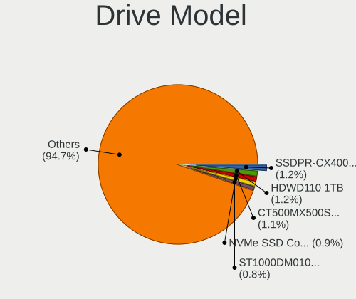

| Model                                                              | Desktops | Percent |
|--------------------------------------------------------------------|----------|---------|
| GOODRAM SSDPR-CX400-512-G2 512GB                                   | 86       | 1.24%   |
| Toshiba HDWD110 1TB                                                | 82       | 1.18%   |
| Crucial CT500MX500SSD1 500GB                                       | 75       | 1.08%   |
| Samsung NVMe SSD Controller SM981/PM981/PM983 1TB                  | 66       | 0.95%   |
| Seagate ST1000DM010-2EP102 1TB                                     | 58       | 0.83%   |
| GOODRAM SSDPR-CX400-256-G2 256GB                                   | 58       | 0.83%   |
| Seagate ST500DM002-1BD142 500GB                                    | 57       | 0.82%   |
| Samsung NVMe SSD Controller PM9A1/PM9A3/980PRO 1TB                 | 53       | 0.76%   |
| Crucial CT1000MX500SSD1 1TB                                        | 53       | 0.76%   |
| Samsung SSD 850 EVO 250GB                                          | 46       | 0.66%   |
| ADATA XPG SX8200 Pro PCIe Gen3x4 M.2 2280 Solid State Drive 1024GB | 46       | 0.66%   |
| Seagate ST1000DM003-1ER162 1TB                                     | 45       | 0.65%   |
| Crucial CT240BX500SSD1 240GB                                       | 45       | 0.65%   |
| GOODRAM SSD 240GB                                                  | 41       | 0.59%   |
| Seagate ST3500418AS 500GB                                          | 40       | 0.57%   |
| Phison E12 NVMe Controller 1TB                                     | 39       | 0.56%   |
| GOODRAM SSDPR-CX400-01T-G2 1TB                                     | 39       | 0.56%   |
| GOODRAM SSD 120GB                                                  | 36       | 0.52%   |
| Samsung SSD 860 EVO 500GB                                          | 35       | 0.5%    |
| MAXIO (Hangzhou) NVMe SSD Controller MAP1202 2TB                   | 35       | 0.5%    |
| Kingston SV300S37A120G 120GB SSD                                   | 35       | 0.5%    |
| GOODRAM SSDPR-CX400-512 512GB                                      | 35       | 0.5%    |
| Toshiba DT01ACA100 1TB                                             | 34       | 0.49%   |
| Samsung SSD 980 500GB                                              | 34       | 0.49%   |
| Samsung HD502HJ 500GB                                              | 33       | 0.47%   |
| Kingston SA400S37480G 480GB SSD                                    | 33       | 0.47%   |
| A-DATA SU800 256GB SSD                                             | 33       | 0.47%   |
| Seagate ST2000DM008-2FR102 2TB                                     | 32       | 0.46%   |
| Seagate ST1000DM003-1CH162 1TB                                     | 32       | 0.46%   |
| Toshiba HDWD130 3TB                                                | 31       | 0.45%   |
| Patriot Burst 120GB SSD                                            | 28       | 0.4%    |
| Kingston SKC3000S1024G 1TB                                         | 28       | 0.4%    |
| Toshiba HDWD120 2TB                                                | 27       | 0.39%   |
| Samsung SSD 980 1TB                                                | 27       | 0.39%   |
| Kingston SA400S37240G 240GB SSD                                    | 27       | 0.39%   |
| WDC WD10EZEX-08WN4A0 1TB                                           | 26       | 0.37%   |
| Samsung NVMe SSD Drive 500GB                                       | 26       | 0.37%   |
| SPCC Solid State Disk 120GB                                        | 24       | 0.34%   |
| Samsung SSD 860 EVO 250GB                                          | 24       | 0.34%   |
| Samsung SSD 860 EVO 1TB                                            | 23       | 0.33%   |

HDD Vendor
----------

Hard disk drive vendors

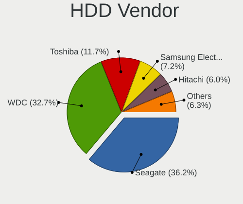

| Vendor              | Desktops | Drives | Percent |
|---------------------|----------|--------|---------|
| Seagate             | 877      | 1578   | 36.15%  |
| WDC                 | 794      | 1346   | 32.73%  |
| Toshiba             | 284      | 519    | 11.71%  |
| Samsung Electronics | 174      | 258    | 7.17%   |
| Hitachi             | 145      | 320    | 5.98%   |
| HGST                | 60       | 84     | 2.47%   |
| Maxtor              | 25       | 28     | 1.03%   |
| Fujitsu             | 18       | 27     | 0.74%   |
| JMicron Technology  | 7        | 10     | 0.29%   |
| Unknown             | 5        | 5      | 0.21%   |
| Unknown             | 5        | 6      | 0.21%   |
| WD MediaMax         | 4        | 8      | 0.16%   |
| Hewlett-Packard     | 4        | 9      | 0.16%   |
| ASMedia             | 3        | 5      | 0.12%   |
| Synology            | 2        | 2      | 0.08%   |
| SAGE                | 2        | 2      | 0.08%   |
| ASMT                | 2        | 3      | 0.08%   |
| Apple               | 2        | 2      | 0.08%   |
| USB3.0              | 1        | 1      | 0.04%   |
| SATAFIRM            | 1        | 1      | 0.04%   |
| MARVELL             | 1        | 1      | 0.04%   |
| Lenovo              | 1        | 2      | 0.04%   |
| Intenso             | 1        | 1      | 0.04%   |
| IBM/Hitachi         | 1        | 1      | 0.04%   |
| IB-377U3            | 1        | 6      | 0.04%   |
| HPE                 | 1        | 1      | 0.04%   |
| HGST HTS            | 1        | 1      | 0.04%   |
| ExcelStor           | 1        | 1      | 0.04%   |
| eSATA-2             | 1        | 1      | 0.04%   |
| ASUSTOR             | 1        | 1      | 0.04%   |
| ASMT109x            | 1        | 1      | 0.04%   |

SSD Vendor
----------

Solid state drive vendors

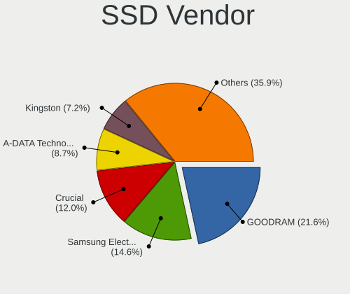

| Vendor              | Desktops | Drives | Percent |
|---------------------|----------|--------|---------|
| GOODRAM             | 487      | 844    | 21.62%  |
| Samsung Electronics | 329      | 501    | 14.6%   |
| Crucial             | 270      | 475    | 11.98%  |
| A-DATA Technology   | 196      | 279    | 8.7%    |
| Kingston            | 162      | 218    | 7.19%   |
| SanDisk             | 114      | 177    | 5.06%   |
| Patriot             | 95       | 131    | 4.22%   |
| SPCC                | 80       | 138    | 3.55%   |
| WDC                 | 51       | 68     | 2.26%   |
| PNY                 | 40       | 47     | 1.78%   |
| Apacer              | 37       | 53     | 1.64%   |
| Plextor             | 36       | 45     | 1.6%    |
| Intel               | 34       | 45     | 1.51%   |
| China               | 33       | 57     | 1.46%   |
| Micron Technology   | 28       | 43     | 1.24%   |
| OCZ                 | 26       | 31     | 1.15%   |
| Toshiba             | 24       | 30     | 1.07%   |
| KIOXIA-EXCERIA      | 19       | 28     | 0.84%   |
| Transcend           | 16       | 17     | 0.71%   |
| ASMT                | 13       | 13     | 0.58%   |
| Lexar               | 12       | 22     | 0.53%   |
| Corsair             | 12       | 13     | 0.53%   |
| LITEON              | 11       | 18     | 0.49%   |
| SK hynix            | 9        | 10     | 0.4%    |
| Unknown             | 9        | 11     | 0.4%    |
| Team                | 7        | 8      | 0.31%   |
| Gigabyte Technology | 7        | 8      | 0.31%   |
| LITEONIT            | 5        | 5      | 0.22%   |
| Intenso             | 5        | 11     | 0.22%   |
| BIWIN               | 5        | 5      | 0.22%   |
| HS-SSD-E100         | 4        | 4      | 0.18%   |
| XPG                 | 3        | 4      | 0.13%   |
| MSI                 | 3        | 4      | 0.13%   |
| KingSpec            | 3        | 3      | 0.13%   |
| Kingchuxing         | 3        | 12     | 0.13%   |
| Innodisk            | 3        | 4      | 0.13%   |
| Hewlett-Packard     | 3        | 3      | 0.13%   |
| XSTAR               | 2        | 2      | 0.09%   |
| Unknown             | 2        | 2      | 0.09%   |
| T-FORCE             | 2        | 2      | 0.09%   |

Drive Kind
----------

HDD or SSD

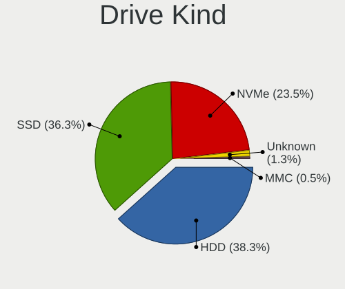

| Kind    | Desktops | Drives | Percent |
|---------|----------|--------|---------|
| HDD     | 1877     | 4231   | 38.33%  |
| SSD     | 1777     | 3449   | 36.29%  |
| NVMe    | 1152     | 2063   | 23.52%  |
| Unknown | 66       | 128    | 1.35%   |
| MMC     | 25       | 30     | 0.51%   |

Drive Connector
---------------

SATA, SAS, NVMe, etc.

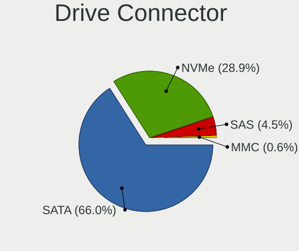

| Type | Desktops | Drives | Percent |
|------|----------|--------|---------|
| SATA | 2627     | 7521   | 65.99%  |
| NVMe | 1149     | 2055   | 28.86%  |
| SAS  | 180      | 295    | 4.52%   |
| MMC  | 25       | 30     | 0.63%   |

Drive Size
----------

Size of hard drive

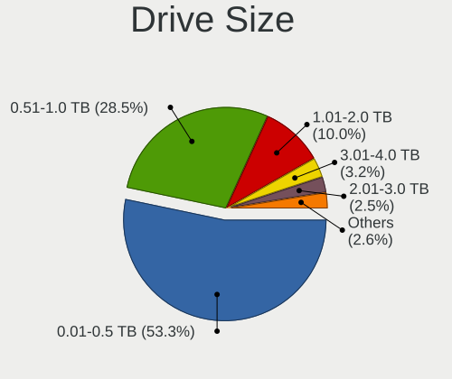

| Size in TB | Desktops | Drives | Percent |
|------------|----------|--------|---------|
| 0.01-0.5   | 2076     | 4182   | 53.29%  |
| 0.51-1.0   | 1109     | 2005   | 28.47%  |
| 1.01-2.0   | 390      | 654    | 10.01%  |
| 3.01-4.0   | 124      | 273    | 3.18%   |
| 2.01-3.0   | 97       | 294    | 2.49%   |
| 4.01-10.0  | 72       | 183    | 1.85%   |
| 10.01-20.0 | 27       | 88     | 0.69%   |
| 20.01-50.0 | 1        | 1      | 0.03%   |

Space Total
-----------

Amount of disk space available on the file system

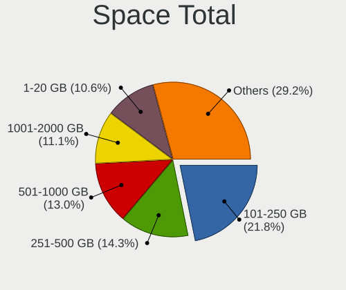

| Size in GB     | Desktops | Percent |
|----------------|----------|---------|
| 101-250        | 734      | 21.83%  |
| 251-500        | 482      | 14.34%  |
| 501-1000       | 437      | 13%     |
| 1001-2000      | 372      | 11.06%  |
| 1-20           | 356      | 10.59%  |
| More than 3000 | 280      | 8.33%   |
| Unknown        | 223      | 6.63%   |
| 51-100         | 215      | 6.4%    |
| 2001-3000      | 147      | 4.37%   |
| 21-50          | 116      | 3.45%   |

Space Used
----------

Amount of used disk space

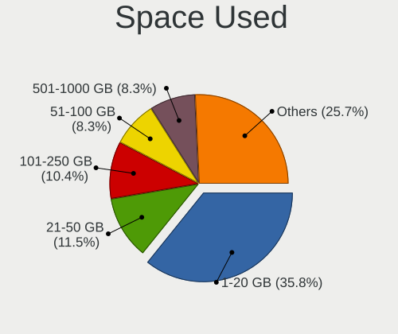

| Used GB        | Desktops | Percent |
|----------------|----------|---------|
| 1-20           | 1236     | 35.79%  |
| 21-50          | 397      | 11.5%   |
| 101-250        | 359      | 10.4%   |
| 51-100         | 287      | 8.31%   |
| 501-1000       | 286      | 8.28%   |
| 251-500        | 280      | 8.11%   |
| Unknown        | 223      | 6.46%   |
| 1001-2000      | 200      | 5.79%   |
| More than 3000 | 104      | 3.01%   |
| 2001-3000      | 75       | 2.17%   |
| 0              | 6        | 0.17%   |

Malfunc. Drives
---------------

Drive models with a malfunction

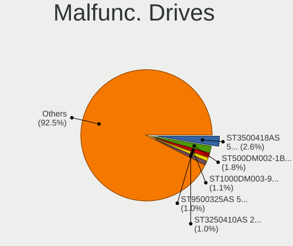

| Model                               | Desktops | Drives | Percent |
|-------------------------------------|----------|--------|---------|
| Seagate ST3500418AS 500GB           | 16       | 21     | 2.6%    |
| Seagate ST500DM002-1BD142 500GB     | 11       | 12     | 1.79%   |
| Seagate ST1000DM003-9YN162 1TB      | 7        | 8      | 1.14%   |
| Seagate ST9500325AS 500GB           | 6        | 9      | 0.97%   |
| Seagate ST3250410AS 250GB           | 6        | 7      | 0.97%   |
| Seagate ST1000DX001-1CM162 1TB      | 5        | 8      | 0.81%   |
| Seagate ST1000DM003-1ER162 1TB      | 5        | 6      | 0.81%   |
| Samsung Electronics HD321KJ 320GB   | 5        | 5      | 0.81%   |
| GOODRAM SSD 120GB                   | 5        | 5      | 0.81%   |
| ASMT 2135 4TB                       | 5        | 5      | 0.81%   |
| WDC WD10JFCX-68N6GN0 1TB            | 4        | 5      | 0.65%   |
| WDC WD10EARS-00Y5B1 1TB             | 4        | 4      | 0.65%   |
| Toshiba MQ01ABD100 1TB              | 4        | 6      | 0.65%   |
| Toshiba HDWD110 1TB                 | 4        | 4      | 0.65%   |
| Seagate ST92505610AS 250GB          | 4        | 4      | 0.65%   |
| Seagate ST3500320AS 500GB           | 4        | 4      | 0.65%   |
| Seagate ST3320613AS 320GB           | 4        | 4      | 0.65%   |
| Seagate ST2000DM008-2FR102 2TB      | 4        | 4      | 0.65%   |
| Seagate ST2000DM001-1CH164 2TB      | 4        | 4      | 0.65%   |
| Seagate ST1000LM024 HN-M101MBB 1TB  | 4        | 5      | 0.65%   |
| Seagate ST1000DM010-2EP102 1TB      | 4        | 4      | 0.65%   |
| Kingston SV300S37A120G 120GB SSD    | 4        | 4      | 0.65%   |
| WDC WD5000LPCX-24C6HT0 500GB        | 3        | 3      | 0.49%   |
| WDC WD5000AVDS-63U7B1 500GB         | 3        | 4      | 0.49%   |
| WDC WD5000AAKX-001CA0 500GB         | 3        | 4      | 0.49%   |
| WDC WD2500AAJS-75M0A0 249GB         | 3        | 3      | 0.49%   |
| WDC WD20EFRX-68EUZN0 2TB            | 3        | 12     | 0.49%   |
| WDC WD15EARS-00Z5B1 1TB             | 3        | 3      | 0.49%   |
| Toshiba HDWD130 3TB                 | 3        | 6      | 0.49%   |
| Toshiba DT01ACA100 1TB              | 3        | 3      | 0.49%   |
| Toshiba DT01ACA050 500GB            | 3        | 3      | 0.49%   |
| Seagate ST500LT012-9WS142 500GB     | 3        | 10     | 0.49%   |
| Seagate ST500LM012 HN-M500MBB 500GB | 3        | 3      | 0.49%   |
| Seagate ST3500413AS 500GB           | 3        | 3      | 0.49%   |
| Seagate ST3500312CS 500GB           | 3        | 3      | 0.49%   |
| Seagate ST3320620AS 320GB           | 3        | 3      | 0.49%   |
| Seagate ST3320418AS 320GB           | 3        | 3      | 0.49%   |
| Seagate ST31500341AS 1TB            | 3        | 4      | 0.49%   |
| Seagate ST31000528AS 1TB            | 3        | 3      | 0.49%   |
| Seagate ST2000DX002-2DV164 2TB      | 3        | 5      | 0.49%   |

Malfunc. Drive Vendor
---------------------

Vendors of faulty drives

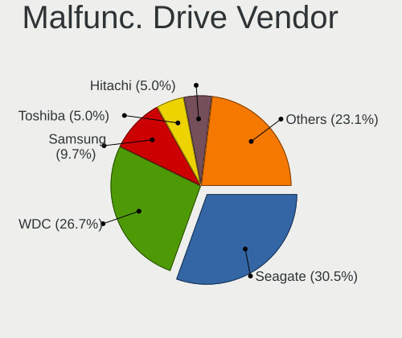

| Vendor                | Desktops | Drives | Percent |
|-----------------------|----------|--------|---------|
| Seagate               | 176      | 237    | 30.5%   |
| WDC                   | 154      | 229    | 26.69%  |
| Samsung Electronics   | 56       | 70     | 9.71%   |
| Toshiba               | 29       | 36     | 5.03%   |
| Hitachi               | 29       | 40     | 5.03%   |
| A-DATA Technology     | 22       | 25     | 3.81%   |
| SanDisk               | 12       | 14     | 2.08%   |
| Kingston              | 11       | 11     | 1.91%   |
| GOODRAM               | 9        | 9      | 1.56%   |
| Maxtor                | 7        | 10     | 1.21%   |
| Crucial               | 7        | 8      | 1.21%   |
| HGST                  | 6        | 6      | 1.04%   |
| ASMT                  | 6        | 7      | 1.04%   |
| Patriot               | 4        | 4      | 0.69%   |
| Intel                 | 4        | 5      | 0.69%   |
| Fujitsu               | 4        | 6      | 0.69%   |
| China                 | 4        | 7      | 0.69%   |
| WD MediaMax           | 3        | 5      | 0.52%   |
| SPCC                  | 3        | 3      | 0.52%   |
| Realtek Semiconductor | 3        | 3      | 0.52%   |
| Hewlett-Packard       | 3        | 3      | 0.52%   |
| Apacer                | 3        | 6      | 0.52%   |
| SSSTC                 | 2        | 2      | 0.35%   |
| Silicon Motion        | 2        | 2      | 0.35%   |
| PNY                   | 2        | 2      | 0.35%   |
| OCZ                   | 2        | 2      | 0.35%   |
| LITEON                | 2        | 2      | 0.35%   |
| Apple                 | 2        | 2      | 0.35%   |
| XPG                   | 1        | 1      | 0.17%   |
| WDC WDS2              | 1        | 1      | 0.17%   |
| SAGE                  | 1        | 1      | 0.17%   |
| Micron Technology     | 1        | 1      | 0.17%   |
| LITEONIT              | 1        | 1      | 0.17%   |
| Lite-On Technology    | 1        | 2      | 0.17%   |
| KingFast              | 1        | 1      | 0.17%   |
| HPE                   | 1        | 1      | 0.17%   |
| Corsair               | 1        | 2      | 0.17%   |
| Unknown               | 1        | 1      | 0.17%   |

Malfunc. HDD Vendor
-------------------

Vendors of faulty HDD drives

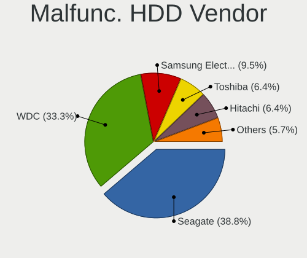

| Vendor              | Desktops | Drives | Percent |
|---------------------|----------|--------|---------|
| Seagate             | 176      | 237    | 38.77%  |
| WDC                 | 151      | 224    | 33.26%  |
| Samsung Electronics | 43       | 53     | 9.47%   |
| Toshiba             | 29       | 36     | 6.39%   |
| Hitachi             | 29       | 40     | 6.39%   |
| Maxtor              | 7        | 10     | 1.54%   |
| HGST                | 6        | 6      | 1.32%   |
| Fujitsu             | 4        | 6      | 0.88%   |
| WD MediaMax         | 3        | 5      | 0.66%   |
| Apple               | 2        | 2      | 0.44%   |
| SAGE                | 1        | 1      | 0.22%   |
| Hewlett-Packard     | 1        | 1      | 0.22%   |
| ASMT                | 1        | 2      | 0.22%   |
| Unknown             | 1        | 1      | 0.22%   |

Malfunc. Drive Kind
-------------------

Kinds of faulty drives

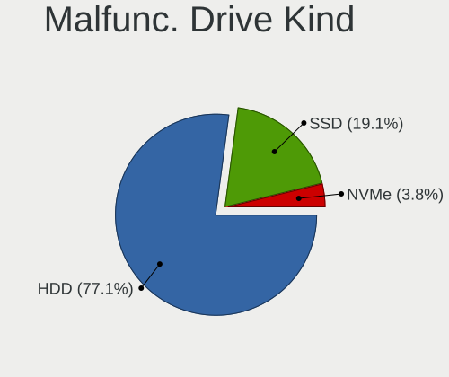

| Kind | Desktops | Drives | Percent |
|------|----------|--------|---------|
| HDD  | 404      | 624    | 77.1%   |
| SSD  | 100      | 119    | 19.08%  |
| NVMe | 20       | 25     | 3.82%   |

Failed Drives
-------------

Failed drive models

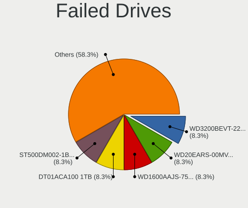

| Model                             | Desktops | Drives | Percent |
|-----------------------------------|----------|--------|---------|
| WDC WD3200BEVT-22ZCT0 320GB       | 1        | 1      | 8.33%   |
| WDC WD20EARS-00MVWB0 2TB          | 1        | 1      | 8.33%   |
| WDC WD1600AAJS-75M0A0 160GB       | 1        | 1      | 8.33%   |
| Toshiba DT01ACA100 1TB            | 1        | 2      | 8.33%   |
| Seagate ST500DM002-1BC142 500GB   | 1        | 1      | 8.33%   |
| Seagate ST31000528AS 1TB          | 1        | 1      | 8.33%   |
| Seagate ST2000DL003-9VT166 2TB    | 1        | 1      | 8.33%   |
| Samsung Electronics SSD 980 500GB | 1        | 1      | 8.33%   |
| Samsung Electronics HD250HJ 250GB | 1        | 1      | 8.33%   |
| OCZ-AGIL ITY3 64GB SSD            | 1        | 1      | 8.33%   |
| Hitachi HDS721050CLA662 500GB     | 1        | 1      | 8.33%   |
| HGST HTS725025A7 250GB            | 1        | 1      | 8.33%   |

Failed Drive Vendor
-------------------

Failed drive vendors

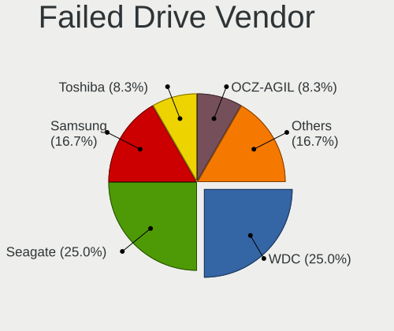

| Vendor              | Desktops | Drives | Percent |
|---------------------|----------|--------|---------|
| WDC                 | 3        | 3      | 25%     |
| Seagate             | 3        | 3      | 25%     |
| Samsung Electronics | 2        | 2      | 16.67%  |
| Toshiba             | 1        | 2      | 8.33%   |
| OCZ-AGIL            | 1        | 1      | 8.33%   |
| Hitachi             | 1        | 1      | 8.33%   |
| HGST                | 1        | 1      | 8.33%   |

Drive Status
------------

Number of failed and malfunc. drives

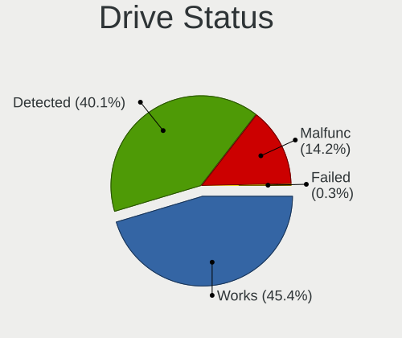

| Status   | Desktops | Drives | Percent |
|----------|----------|--------|---------|
| Works    | 1615     | 4798   | 45.38%  |
| Detected | 1428     | 4322   | 40.12%  |
| Malfunc  | 504      | 768    | 14.16%  |
| Failed   | 12       | 13     | 0.34%   |

Storage controller
------------------

Storage Vendor
--------------

Storage controller vendors

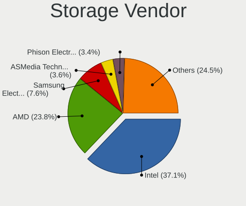

| Vendor                         | Desktops | Percent |
|--------------------------------|----------|---------|
| Intel                          | 1779     | 37.09%  |
| AMD                            | 1141     | 23.79%  |
| Samsung Electronics            | 363      | 7.57%   |
| ASMedia Technology             | 173      | 3.61%   |
| Phison Electronics             | 163      | 3.4%    |
| Kingston Technology Company    | 153      | 3.19%   |
| ADATA Technology               | 152      | 3.17%   |
| Sandisk                        | 133      | 2.77%   |
| JMicron Technology             | 122      | 2.54%   |
| Shenzhen Longsys Electronics   | 94       | 1.96%   |
| Nvidia                         | 78       | 1.63%   |
| Marvell Technology Group       | 66       | 1.38%   |
| MAXIO Technology (Hangzhou)    | 53       | 1.11%   |
| Micron/Crucial Technology      | 47       | 0.98%   |
| Silicon Motion                 | 45       | 0.94%   |
| Realtek Semiconductor          | 45       | 0.94%   |
| KIOXIA                         | 28       | 0.58%   |
| SK hynix                       | 26       | 0.54%   |
| Lite-On Technology             | 22       | 0.46%   |
| VIA Technologies               | 21       | 0.44%   |
| LSI Logic / Symbios Logic      | 18       | 0.38%   |
| Micron Technology              | 11       | 0.23%   |
| Toshiba America Info Systems   | 9        | 0.19%   |
| Silicon Image                  | 8        | 0.17%   |
| INNOGRIT                       | 7        | 0.15%   |
| Broadcom / LSI                 | 6        | 0.13%   |
| Integrated Technology Express  | 4        | 0.08%   |
| Hewlett-Packard                | 4        | 0.08%   |
| Union Memory (Shenzhen)        | 3        | 0.06%   |
| Solid State Storage Technology | 3        | 0.06%   |
| Seagate Technology             | 3        | 0.06%   |
| Hosin Global Electronics       | 3        | 0.06%   |
| ULi Electronics                | 2        | 0.04%   |
| Lite-On IT Corp. / Plextor     | 2        | 0.04%   |
| TenaFe                         | 1        | 0.02%   |
| Tekram Technology              | 1        | 0.02%   |
| Solidigm                       | 1        | 0.02%   |
| OCZ Technology Group           | 1        | 0.02%   |
| O2 Micro                       | 1        | 0.02%   |
| Lenovo                         | 1        | 0.02%   |

Storage Model
-------------

Storage controller models

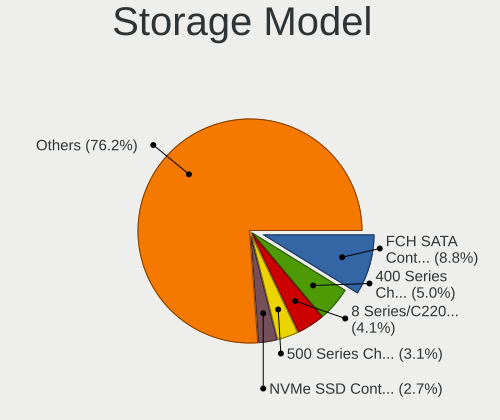

| Model                                                                                   | Desktops | Percent |
|-----------------------------------------------------------------------------------------|----------|---------|
| AMD FCH SATA Controller [AHCI mode]                                                     | 521      | 8.82%   |
| AMD 400 Series Chipset SATA Controller                                                  | 298      | 5.04%   |
| Intel 8 Series/C220 Series Chipset Family 6-port SATA Controller 1 [AHCI mode]          | 241      | 4.08%   |
| AMD 500 Series Chipset SATA Controller                                                  | 186      | 3.15%   |
| Samsung NVMe SSD Controller SM981/PM981/PM983                                           | 162      | 2.74%   |
| ASMedia ASM1061/ASM1062 Serial ATA Controller                                           | 158      | 2.67%   |
| Intel Q170/Q150/B150/H170/H110/Z170/CM236 Chipset SATA Controller [AHCI Mode]           | 148      | 2.51%   |
| Intel 200 Series PCH SATA controller [AHCI mode]                                        | 131      | 2.22%   |
| AMD SB7x0/SB8x0/SB9x0 IDE Controller                                                    | 130      | 2.2%    |
| Intel 7 Series/C210 Series Chipset Family 6-port SATA Controller [AHCI mode]            | 128      | 2.17%   |
| AMD 600 Series Chipset SATA Controller                                                  | 127      | 2.15%   |
| Intel NM10/ICH7 Family SATA Controller [IDE mode]                                       | 118      | 2%      |
| Intel 6 Series/C200 Series Chipset Family 6 port Desktop SATA AHCI Controller           | 115      | 1.95%   |
| ADATA XPG SX8200 Pro PCIe Gen3x4 M.2 2280 Solid State Drive                             | 109      | 1.84%   |
| Intel SATA Controller [RAID mode]                                                       | 99       | 1.68%   |
| AMD SB7x0/SB8x0/SB9x0 SATA Controller [IDE mode]                                        | 99       | 1.68%   |
| AMD SB7x0/SB8x0/SB9x0 SATA Controller [AHCI mode]                                       | 93       | 1.57%   |
| Intel Cannon Lake PCH SATA AHCI Controller                                              | 88       | 1.49%   |
| JMicron JMB363 SATA/IDE Controller                                                      | 84       | 1.42%   |
| Intel 82801G (ICH7 Family) IDE Controller                                               | 80       | 1.35%   |
| Samsung NVMe SSD Controller PM9A1/PM9A3/980PRO                                          | 75       | 1.27%   |
| Samsung NVMe SSD Controller 980 (DRAM-less)                                             | 75       | 1.27%   |
| Phison E12 NVMe Controller                                                              | 74       | 1.25%   |
| Kingston Company KC3000/FURY Renegade NVMe SSD [E18]                                    | 65       | 1.1%    |
| Intel 9 Series Chipset Family SATA Controller [AHCI Mode]                               | 56       | 0.95%   |
| Intel Alder Lake-S PCH SATA Controller [AHCI Mode]                                      | 55       | 0.93%   |
| Intel 6 Series/C200 Series Chipset Family Desktop SATA Controller (IDE mode, ports 4-5) | 54       | 0.91%   |
| Intel 6 Series/C200 Series Chipset Family Desktop SATA Controller (IDE mode, ports 0-3) | 53       | 0.9%    |
| AMD 300 Series Chipset SATA Controller                                                  | 49       | 0.83%   |
| Shenzhen Longsys Lexar NM790 / Patriot Viper VP4300 Lite NVMe SSD (DRAM-less)           | 46       | 0.78%   |
| MAXIO (Hangzhou) NVMe SSD Controller MAP1202 (DRAM-less)                                | 46       | 0.78%   |
| Intel 500 Series Chipset Family SATA AHCI Controller                                    | 46       | 0.78%   |
| Intel 4 Series Chipset PT IDER Controller                                               | 45       | 0.76%   |
| Intel Raptor Lake SATA AHCI Controller                                                  | 42       | 0.71%   |
| Kingston Company A2000 NVMe SSD [SM2263EN]                                              | 40       | 0.68%   |
| Nvidia MCP61 SATA Controller                                                            | 39       | 0.66%   |
| Nvidia MCP61 IDE                                                                        | 38       | 0.64%   |
| Samsung NVMe SSD Controller SM961/PM961/SM963                                           | 37       | 0.63%   |
| Silicon Motion SM2263EN/SM2263XT (DRAM-less) NVMe SSD Controllers                       | 36       | 0.61%   |
| Intel 82801JI (ICH10 Family) SATA AHCI Controller                                       | 36       | 0.61%   |

Storage Kind
------------

Kind of storage controller (IDE, SATA, NVMe, SAS, ...)

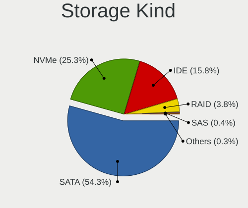

| Kind | Desktops | Percent |
|------|----------|---------|
| SATA | 2485     | 54.34%  |
| NVMe | 1156     | 25.28%  |
| IDE  | 722      | 15.79%  |
| RAID | 176      | 3.85%   |
| SAS  | 20       | 0.44%   |
| SCSI | 14       | 0.31%   |

Processor
---------

CPU Vendor
----------

Processor vendors

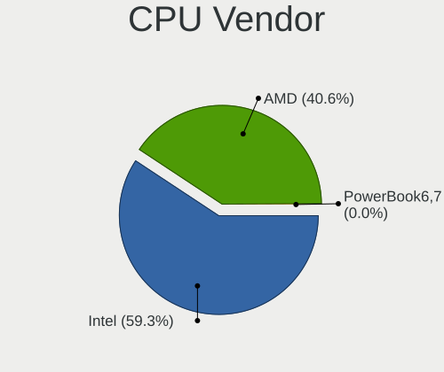

| Vendor        | Desktops | Percent |
|---------------|----------|---------|
| Intel         | 1797     | 59.31%  |
| AMD           | 1230     | 40.59%  |
| sifive,u74-mc | 1        | 0.03%   |
| PowerMac11,2  | 1        | 0.03%   |
| PowerBook6,7  | 1        | 0.03%   |

CPU Model
---------

Processor models

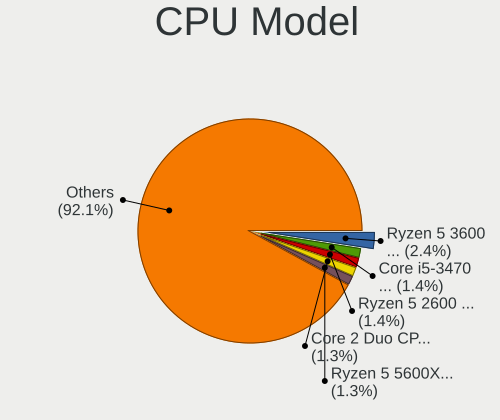

| Model                                       | Desktops | Percent |
|---------------------------------------------|----------|---------|
| AMD Ryzen 5 3600 6-Core Processor           | 75       | 2.45%   |
| Intel Core i5-3470 CPU @ 3.20GHz            | 43       | 1.4%    |
| AMD Ryzen 5 2600 Six-Core Processor         | 43       | 1.4%    |
| Intel Core 2 Duo CPU E8400 @ 3.00GHz        | 41       | 1.34%   |
| AMD Ryzen 5 5600X 6-Core Processor          | 41       | 1.34%   |
| Intel Core i7-4790 CPU @ 3.60GHz            | 36       | 1.18%   |
| AMD Ryzen 7 5800X 8-Core Processor          | 36       | 1.18%   |
| AMD Ryzen 7 3700X 8-Core Processor          | 35       | 1.14%   |
| AMD Ryzen 5 1600 Six-Core Processor         | 35       | 1.14%   |
| Intel Core i5-2400 CPU @ 3.10GHz            | 34       | 1.11%   |
| Intel Core i5-7400 CPU @ 3.00GHz            | 31       | 1.01%   |
| Intel Core i5-6500 CPU @ 3.20GHz            | 30       | 0.98%   |
| AMD Ryzen 5 5600G with Radeon Graphics      | 30       | 0.98%   |
| Intel Core i5-3570K CPU @ 3.40GHz           | 28       | 0.91%   |
| AMD Ryzen 9 5900X 12-Core Processor         | 28       | 0.91%   |
| Intel Core 2 Quad CPU Q6600 @ 2.40GHz       | 27       | 0.88%   |
| AMD Ryzen 7 2700X Eight-Core Processor      | 27       | 0.88%   |
| Intel Core i5-4590 CPU @ 3.30GHz            | 26       | 0.85%   |
| Intel Core i5-4460 CPU @ 3.20GHz            | 26       | 0.85%   |
| Intel Core i7-6700K CPU @ 4.00GHz           | 25       | 0.82%   |
| AMD Ryzen 5 5600 6-Core Processor           | 24       | 0.78%   |
| Intel Core i7-4790K CPU @ 4.00GHz           | 23       | 0.75%   |
| AMD Ryzen 7 5700X 8-Core Processor          | 23       | 0.75%   |
| AMD Phenom II X4 955 Processor              | 22       | 0.72%   |
| Intel Core i3-3220 CPU @ 3.30GHz            | 21       | 0.69%   |
| Intel Core i7-3770 CPU @ 3.40GHz            | 20       | 0.65%   |
| AMD Ryzen 7 5700G with Radeon Graphics      | 20       | 0.65%   |
| Intel Core i7-6700 CPU @ 3.40GHz            | 19       | 0.62%   |
| Intel Core i5-9400F CPU @ 2.90GHz           | 19       | 0.62%   |
| AMD Ryzen 9 3900X 12-Core Processor         | 19       | 0.62%   |
| Intel Core i5-4570 CPU @ 3.20GHz            | 17       | 0.56%   |
| AMD Ryzen 5 2600X Six-Core Processor        | 17       | 0.56%   |
| AMD Ryzen 5 2400G with Radeon Vega Graphics | 17       | 0.56%   |
| Intel Core i5-8400 CPU @ 2.80GHz            | 16       | 0.52%   |
| Intel Core i5-10400F CPU @ 2.90GHz          | 16       | 0.52%   |
| AMD Ryzen 7 3800X 8-Core Processor          | 16       | 0.52%   |
| Intel Core i7-7700K CPU @ 4.20GHz           | 15       | 0.49%   |
| Intel Core i7-2600 CPU @ 3.40GHz            | 15       | 0.49%   |
| Intel Core i5-7500 CPU @ 3.40GHz            | 15       | 0.49%   |
| Intel Core i5-3570 CPU @ 3.40GHz            | 15       | 0.49%   |

CPU Model Family
----------------

Processor model prefix

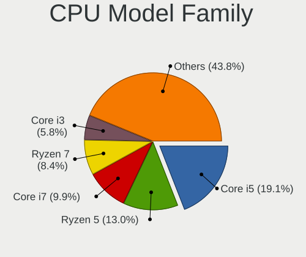

| Model                   | Desktops | Percent |
|-------------------------|----------|---------|
| Intel Core i5           | 582      | 19.07%  |
| AMD Ryzen 5             | 397      | 13.01%  |
| Intel Core i7           | 303      | 9.93%   |
| AMD Ryzen 7             | 255      | 8.36%   |
| Intel Core i3           | 178      | 5.83%   |
| Intel Xeon              | 162      | 5.31%   |
| Other                   | 134      | 4.39%   |
| AMD Ryzen 9             | 108      | 3.54%   |
| Intel Core 2 Duo        | 98       | 3.21%   |
| Intel Core 2 Quad       | 86       | 2.82%   |
| AMD FX                  | 68       | 2.23%   |
| Intel Pentium           | 61       | 2%      |
| Intel Celeron           | 61       | 2%      |
| AMD Phenom II X4        | 48       | 1.57%   |
| AMD Ryzen 3             | 47       | 1.54%   |
| Intel Pentium Dual-Core | 42       | 1.38%   |
| AMD Athlon 64 X2        | 35       | 1.15%   |
| AMD Athlon II X2        | 32       | 1.05%   |
| AMD A8                  | 29       | 0.95%   |
| Intel Core 2            | 26       | 0.85%   |
| AMD A10                 | 26       | 0.85%   |
| AMD Athlon II X4        | 25       | 0.82%   |
| Intel Core i9           | 23       | 0.75%   |
| AMD GX                  | 23       | 0.75%   |
| Intel Pentium Dual      | 19       | 0.62%   |
| AMD Ryzen 5 PRO         | 14       | 0.46%   |
| Intel Atom              | 13       | 0.43%   |
| AMD Ryzen Threadripper  | 13       | 0.43%   |
| AMD A6                  | 13       | 0.43%   |
| AMD Athlon              | 12       | 0.39%   |
| AMD Phenom II X6        | 9        | 0.29%   |
| Intel Pentium Gold      | 8        | 0.26%   |
| Intel Pentium D         | 8        | 0.26%   |
| Intel Pentium 4         | 8        | 0.26%   |
| AMD Phenom              | 8        | 0.26%   |
| AMD A4                  | 8        | 0.26%   |
| AMD Sempron             | 7        | 0.23%   |
| AMD PRO A10             | 7        | 0.23%   |
| AMD Phenom II X2        | 7        | 0.23%   |
| AMD Athlon 64           | 7        | 0.23%   |

CPU Cores
---------

Number of processor cores

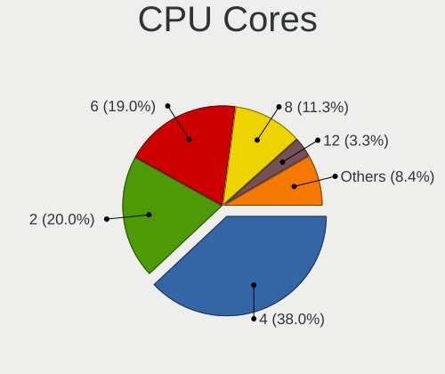

| Number  | Desktops | Percent |
|---------|----------|---------|
| 4       | 1165     | 38.02%  |
| 2       | 614      | 20.04%  |
| 6       | 583      | 19.03%  |
| 8       | 346      | 11.29%  |
| 12      | 100      | 3.26%   |
| 16      | 67       | 2.19%   |
| Unknown | 46       | 1.5%    |
| 1       | 41       | 1.34%   |
| 10      | 27       | 0.88%   |
| 3       | 26       | 0.85%   |
| 14      | 15       | 0.49%   |
| 24      | 14       | 0.46%   |
| 20      | 13       | 0.42%   |
| 32      | 2        | 0.07%   |
| 64      | 1        | 0.03%   |
| 44      | 1        | 0.03%   |
| 28      | 1        | 0.03%   |
| 18      | 1        | 0.03%   |
| 5       | 1        | 0.03%   |

CPU Sockets
-----------

Number of sockets

| Number  | Desktops | Percent |
|---------|----------|---------|
| 1       | 2984     | 98.45%  |
| 2       | 42       | 1.39%   |
| 4       | 4        | 0.13%   |
| Unknown | 1        | 0.03%   |

CPU Threads
-----------

Threads per core (Hyper-Threading)

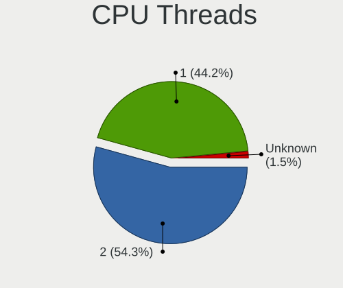

| Number  | Desktops | Percent |
|---------|----------|---------|
| 2       | 1661     | 54.28%  |
| 1       | 1353     | 44.22%  |
| Unknown | 46       | 1.5%    |

CPU Op-Modes
------------

CPU Operation Modes (32-bit, 64-bit)

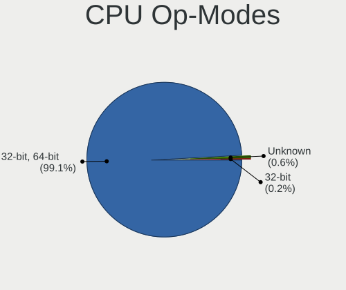

| Op mode        | Desktops | Percent |
|----------------|----------|---------|
| 32-bit, 64-bit | 3011     | 99.14%  |
| Unknown        | 19       | 0.63%   |
| 32-bit         | 7        | 0.23%   |

CPU Microcode
-------------

Microcode number

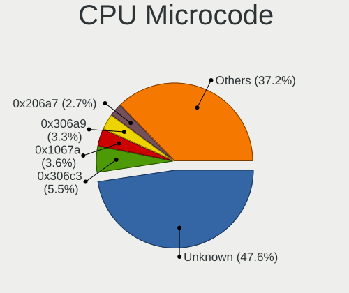

| Number     | Desktops | Percent |
|------------|----------|---------|
| Unknown    | 1531     | 47.64%  |
| 0x306c3    | 177      | 5.51%   |
| 0x1067a    | 116      | 3.61%   |
| 0x306a9    | 106      | 3.3%    |
| 0x206a7    | 87       | 2.71%   |
| 0x08701021 | 76       | 2.36%   |
| 0x0800820d | 73       | 2.27%   |
| 0x506e3    | 69       | 2.15%   |
| 0x010000c8 | 59       | 1.84%   |
| 0x906ea    | 51       | 1.59%   |
| 0x906e9    | 49       | 1.52%   |
| 0x6fb      | 29       | 0.9%    |
| 0x08701013 | 29       | 0.9%    |
| 0x06001119 | 29       | 0.9%    |
| 0xa0653    | 27       | 0.84%   |
| 0x10676    | 27       | 0.84%   |
| 0x06000852 | 27       | 0.84%   |
| 0x08001138 | 23       | 0.72%   |
| 0x6fd      | 21       | 0.65%   |
| 0x06003106 | 20       | 0.62%   |
| 0x106e5    | 19       | 0.59%   |
| 0x6f6      | 16       | 0.5%    |
| 0x206c2    | 16       | 0.5%    |
| 0x10677    | 16       | 0.5%    |
| 0x0a201016 | 16       | 0.5%    |
| 0x08108109 | 16       | 0.5%    |
| 0x08101016 | 16       | 0.5%    |
| 0x0a50000d | 15       | 0.47%   |
| 0x0a20120a | 15       | 0.47%   |
| 0x306f2    | 13       | 0.4%    |
| 0x0a601203 | 13       | 0.4%    |
| 0x0a50000c | 13       | 0.4%    |
| 0x010000db | 13       | 0.4%    |
| 0xa0671    | 12       | 0.37%   |
| 0x08001137 | 12       | 0.37%   |
| 0x90672    | 11       | 0.34%   |
| 0x0a201009 | 11       | 0.34%   |
| 0xa0655    | 10       | 0.31%   |
| 0x08701030 | 10       | 0.31%   |
| 0x206d7    | 9        | 0.28%   |

CPU Microarch
-------------

Microarchitecture

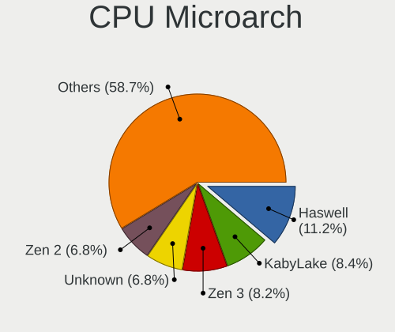

| Name             | Desktops | Percent |
|------------------|----------|---------|
| Haswell          | 341      | 11.18%  |
| KabyLake         | 255      | 8.36%   |
| Zen 3            | 251      | 8.23%   |
| Unknown          | 208      | 6.82%   |
| Zen 2            | 206      | 6.75%   |
| Penryn           | 203      | 6.65%   |
| IvyBridge        | 197      | 6.46%   |
| SandyBridge      | 162      | 5.31%   |
| Zen+             | 153      | 5.01%   |
| Skylake          | 147      | 4.82%   |
| K10              | 140      | 4.59%   |
| Core             | 103      | 3.38%   |
| Zen              | 96       | 3.15%   |
| Piledriver       | 90       | 2.95%   |
| CometLake        | 74       | 2.43%   |
| Alderlake Hybrid | 57       | 1.87%   |
| K8 Hammer        | 56       | 1.84%   |
| Nehalem          | 50       | 1.64%   |
| Westmere         | 46       | 1.51%   |
| Steamroller      | 28       | 0.92%   |
| Jaguar           | 24       | 0.79%   |
| Icelake          | 23       | 0.75%   |
| Silvermont       | 21       | 0.69%   |
| NetBurst         | 19       | 0.62%   |
| Bulldozer        | 17       | 0.56%   |
| Broadwell        | 14       | 0.46%   |
| Excavator        | 13       | 0.43%   |
| Bobcat           | 12       | 0.39%   |
| Goldmont plus    | 10       | 0.33%   |
| K10 Llano        | 8        | 0.26%   |
| Gracemont        | 8        | 0.26%   |
| Goldmont         | 8        | 0.26%   |
| Puma             | 7        | 0.23%   |
| Bonnell          | 2        | 0.07%   |
| Tremont          | 1        | 0.03%   |
| P6               | 1        | 0.03%   |

Graphics
--------

GPU Vendor
----------

Vendors of graphics cards

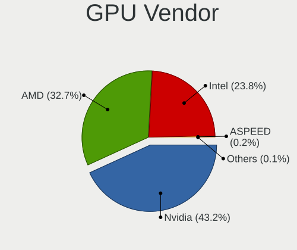

| Vendor                     | Desktops | Percent |
|----------------------------|----------|---------|
| Nvidia                     | 1409     | 43.18%  |
| AMD                        | 1067     | 32.7%   |
| Intel                      | 777      | 23.81%  |
| ASPEED Technology          | 6        | 0.18%   |
| Matrox Electronics Systems | 2        | 0.06%   |
| S3 Graphics                | 1        | 0.03%   |
| Red Hat                    | 1        | 0.03%   |

GPU Model
---------

Graphics card models

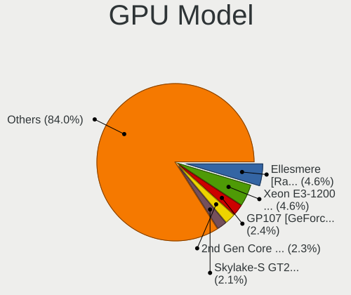

| Model                                                                       | Desktops | Percent |
|-----------------------------------------------------------------------------|----------|---------|
| AMD Ellesmere [Radeon RX 470/480/570/570X/580/580X/590]                     | 158      | 4.63%   |
| Intel Xeon E3-1200 v3/4th Gen Core Processor Integrated Graphics Controller | 156      | 4.57%   |
| Nvidia GP107 [GeForce GTX 1050 Ti]                                          | 83       | 2.43%   |
| Intel 2nd Generation Core Processor Family Integrated Graphics Controller   | 77       | 2.26%   |
| Intel Skylake-S GT2 [HD Graphics 530]                                       | 71       | 2.08%   |
| Nvidia GP106 [GeForce GTX 1060 6GB]                                         | 65       | 1.91%   |
| AMD Raphael                                                                 | 65       | 1.91%   |
| Intel Xeon E3-1200 v2/3rd Gen Core processor Graphics Controller            | 64       | 1.88%   |
| Intel 4 Series Chipset Integrated Graphics Controller                       | 58       | 1.7%    |
| AMD Navi 23 [Radeon RX 6600/6600 XT/6600M]                                  | 57       | 1.67%   |
| Intel CoffeeLake-S GT2 [UHD Graphics 630]                                   | 54       | 1.58%   |
| Nvidia GP108 [GeForce GT 1030]                                              | 50       | 1.47%   |
| Nvidia GP104 [GeForce GTX 1070]                                             | 45       | 1.32%   |
| AMD Navi 10 [Radeon RX 5600 OEM/5600 XT / 5700/5700 XT]                     | 45       | 1.32%   |
| Nvidia GT218 [GeForce 210]                                                  | 42       | 1.23%   |
| AMD Navi 22 [Radeon RX 6700/6700 XT/6750 XT / 6800M/6850M XT]               | 42       | 1.23%   |
| Nvidia GP107 [GeForce GTX 1050]                                             | 40       | 1.17%   |
| Nvidia GK208B [GeForce GT 710]                                              | 39       | 1.14%   |
| AMD Cezanne [Radeon Vega Series / Radeon Vega Mobile Series]                | 38       | 1.11%   |
| Nvidia GM204 [GeForce GTX 970]                                              | 37       | 1.09%   |
| Nvidia GM107 [GeForce GTX 750 Ti]                                           | 37       | 1.09%   |
| Intel Kaby Lake-S GT2 [HD Graphics 630]                                     | 36       | 1.06%   |
| Intel 4th Generation Core Processor Family Integrated Graphics Controller   | 34       | 1%      |
| AMD Raven Ridge [Radeon Vega Series / Radeon Vega Mobile Series]            | 32       | 0.94%   |
| Nvidia GA106 [GeForce RTX 3060 Lite Hash Rate]                              | 30       | 0.88%   |
| Nvidia G96C [GeForce 9500 GT]                                               | 30       | 0.88%   |
| AMD Navi 32 [Radeon RX 7700 XT / 7800 XT]                                   | 30       | 0.88%   |
| AMD Picasso/Raven 2 [Radeon Vega Series / Radeon Vega Mobile Series]        | 28       | 0.82%   |
| Nvidia GP106 [GeForce GTX 1060 3GB]                                         | 27       | 0.79%   |
| AMD Navi 31 [Radeon RX 7900 XT/7900 XTX/7900 GRE/7900M]                     | 27       | 0.79%   |
| AMD Cedar [Radeon HD 5000/6000/7350/8350 Series]                            | 27       | 0.79%   |
| Nvidia GP104 [GeForce GTX 1080]                                             | 25       | 0.73%   |
| AMD Granite Ridge [Radeon Graphics]                                         | 25       | 0.73%   |
| Nvidia TU116 [GeForce GTX 1660 SUPER]                                       | 22       | 0.65%   |
| Nvidia GM206 [GeForce GTX 960]                                              | 22       | 0.65%   |
| Intel Alder Lake-S GT1 [UHD Graphics 770]                                   | 22       | 0.65%   |
| AMD Navi 21 [Radeon RX 6800/6800 XT / 6900 XT]                              | 22       | 0.65%   |
| Nvidia GK208B [GeForce GT 730]                                              | 20       | 0.59%   |
| Nvidia GF108 [GeForce GT 630]                                               | 20       | 0.59%   |
| Nvidia G94 [GeForce 9600 GT]                                                | 20       | 0.59%   |

GPU Combo
---------

Combinations of graphics cards

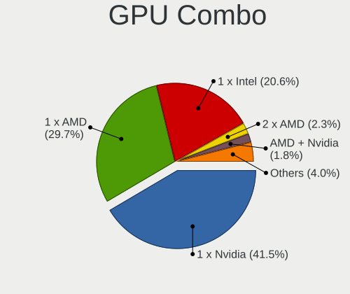

| Name            | Desktops | Percent |
|-----------------|----------|---------|
| 1 x Nvidia      | 1291     | 41.52%  |
| 1 x AMD         | 923      | 29.69%  |
| 1 x Intel       | 642      | 20.65%  |
| 2 x AMD         | 72       | 2.32%   |
| AMD + Nvidia    | 56       | 1.8%    |
| Intel + Nvidia  | 53       | 1.7%    |
| Intel + AMD     | 26       | 0.84%   |
| 2 x Intel       | 16       | 0.51%   |
| 2 x Nvidia      | 12       | 0.39%   |
| Other           | 5        | 0.16%   |
| 1 x ASPEED      | 4        | 0.13%   |
| 3 x AMD         | 3        | 0.1%    |
| Nvidia + ASPEED | 2        | 0.06%   |
| 1 x Matrox      | 2        | 0.06%   |
| 1 x S3 Graphics | 1        | 0.03%   |
| 1 x Red Hat     | 1        | 0.03%   |

GPU Driver
----------

Free vs proprietary

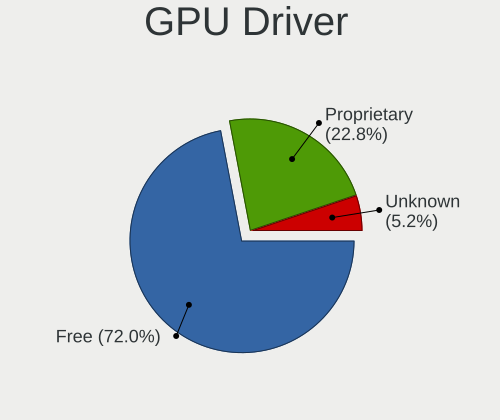

| Driver      | Desktops | Percent |
|-------------|----------|---------|
| Free        | 2248     | 72.01%  |
| Proprietary | 713      | 22.84%  |
| Unknown     | 161      | 5.16%   |

GPU Memory
----------

Total video memory

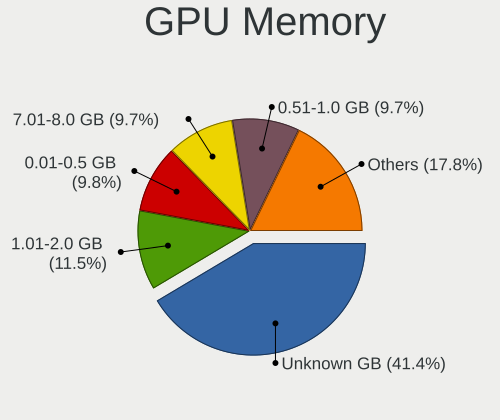

| Size in GB | Desktops | Percent |
|------------|----------|---------|
| Unknown    | 1337     | 41.44%  |
| 1.01-2.0   | 371      | 11.5%   |
| 0.01-0.5   | 315      | 9.76%   |
| 7.01-8.0   | 314      | 9.73%   |
| 0.51-1.0   | 314      | 9.73%   |
| 3.01-4.0   | 241      | 7.47%   |
| 8.01-16.0  | 165      | 5.11%   |
| 5.01-6.0   | 117      | 3.63%   |
| 16.01-24.0 | 26       | 0.81%   |
| 2.01-3.0   | 24       | 0.74%   |
| 4.01-5.0   | 2        | 0.06%   |

Monitor
-------

Monitor Vendor
--------------

Monitor vendors

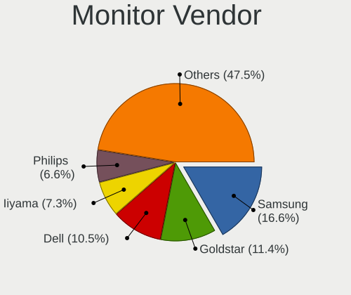

| Vendor               | Desktops | Percent |
|----------------------|----------|---------|
| Samsung Electronics  | 555      | 16.64%  |
| Goldstar             | 381      | 11.42%  |
| Dell                 | 351      | 10.52%  |
| Iiyama               | 244      | 7.32%   |
| Philips              | 221      | 6.63%   |
| Hewlett-Packard      | 187      | 5.61%   |
| Acer                 | 178      | 5.34%   |
| BenQ                 | 153      | 4.59%   |
| AOC                  | 150      | 4.5%    |
| Eizo                 | 94       | 2.82%   |
| NEC Computers        | 83       | 2.49%   |
| Ancor Communications | 83       | 2.49%   |
| Lenovo               | 63       | 1.89%   |
| ASUSTek Computer     | 57       | 1.71%   |
| Sony                 | 48       | 1.44%   |
| MSI                  | 44       | 1.32%   |
| Fujitsu Siemens      | 41       | 1.23%   |
| LG Electronics       | 37       | 1.11%   |
| Gigabyte Technology  | 37       | 1.11%   |
| Unknown              | 29       | 0.87%   |
| Idek Iiyama          | 19       | 0.57%   |
| Toshiba              | 14       | 0.42%   |
| Belinea              | 12       | 0.36%   |
| ViewSonic            | 11       | 0.33%   |
| Vestel Elektronik    | 11       | 0.33%   |
| Gateway              | 11       | 0.33%   |
| Panasonic            | 10       | 0.3%    |
| Mi                   | 10       | 0.3%    |
| Medion               | 9        | 0.27%   |
| Hyundai ImageQuest   | 9        | 0.27%   |
| Unknown              | 9        | 0.27%   |
| Unknown (XXX)        | 8        | 0.24%   |
| Sharp                | 8        | 0.24%   |
| RTK                  | 8        | 0.24%   |
| OEM                  | 6        | 0.18%   |
| Hitachi              | 6        | 0.18%   |
| Arnos Instruments    | 6        | 0.18%   |
| TCL                  | 5        | 0.15%   |
| Packard Bell         | 5        | 0.15%   |
| IBM                  | 5        | 0.15%   |

Monitor Model
-------------

Monitor models

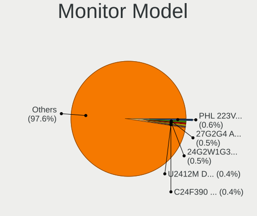

| Model                                                                | Desktops | Percent |
|----------------------------------------------------------------------|----------|---------|
| Philips PHL 223V5 PHLC0CF 1920x1080 477x268mm 21.5-inch              | 20       | 0.56%   |
| AOC 27G2G4 AOC2702 1920x1080 598x336mm 27.0-inch                     | 19       | 0.53%   |
| AOC 24G2W1G3 AOC2402 1920x1080 527x296mm 23.8-inch                   | 17       | 0.48%   |
| Dell U2412M DELA07A 1920x1200 518x324mm 24.1-inch                    | 16       | 0.45%   |
| Samsung Electronics C24F390 SAM0D2C 1920x1080 521x293mm 23.5-inch    | 15       | 0.42%   |
| Philips PHL 243V7 PHLC155 1920x1080 527x296mm 23.8-inch              | 14       | 0.39%   |
| Philips 273PQPY PHLC096 1920x1080 597x336mm 27.0-inch                | 14       | 0.39%   |
| Goldstar LG ULTRAWIDE GSM59F1 2560x1080 670x280mm 28.6-inch          | 14       | 0.39%   |
| Goldstar LG IPS FULLHD GSM5AB8 1920x1080 480x270mm 21.7-inch         | 14       | 0.39%   |
| Unknown LCD Monitor FFFF 2288x1287 2550x2550mm 142.0-inch            | 13       | 0.36%   |
| Goldstar ULTRAGEAR GSM5BD3 2560x1440 697x392mm 31.5-inch             | 13       | 0.36%   |
| AOC Q3279WG5B AOC3279 2560x1440 725x428mm 33.1-inch                  | 13       | 0.36%   |
| Ancor Communications BE24A ACI24AB 1920x1200 518x324mm 24.1-inch     | 13       | 0.36%   |
| Philips PHL 273V7 PHLC156 1920x1080 598x336mm 27.0-inch              | 12       | 0.34%   |
| Vestel Elektronik 40UHD_LCD_TV VES3700 3840x2160 880x500mm 39.8-inch | 11       | 0.31%   |
| Iiyama PL2530H IVM6132 1920x1080 544x303mm 24.5-inch                 | 11       | 0.31%   |
| Samsung Electronics C27F390 SAM0D32 1920x1080 598x336mm 27.0-inch    | 10       | 0.28%   |
| Iiyama X2483/2481 IVM6128 1920x1080 527x296mm 23.8-inch              | 10       | 0.28%   |
| Goldstar 2D FHD TV GSM59C6 1920x1080 509x286mm 23.0-inch             | 10       | 0.28%   |
| Dell U2412M DELA07B 1920x1200 518x324mm 24.1-inch                    | 10       | 0.28%   |
| Samsung Electronics SyncMaster SAM011E 1280x1024 338x270mm 17.0-inch | 9        | 0.25%   |
| Samsung Electronics S24D330 SAM0D92 1920x1080 531x299mm 24.0-inch    | 9        | 0.25%   |
| Lenovo LT2252p Wide LEN0A0C 1680x1050 474x296mm 22.0-inch            | 9        | 0.25%   |
| Iiyama PL2470H IVM615C 1920x1080 527x296mm 23.8-inch                 | 9        | 0.25%   |
| Hewlett-Packard LA2306 HWP2949 1920x1080 510x287mm 23.0-inch         | 9        | 0.25%   |
| Unknown                                                              | 9        | 0.25%   |
| Samsung Electronics S24D300 SAM0B43 1920x1080 531x299mm 24.0-inch    | 8        | 0.22%   |
| NEC Computers EA244WMi NEC68D6 1920x1200 519x324mm 24.1-inch         | 8        | 0.22%   |
| Goldstar ULTRAGEAR GSM5BB4 2560x1440 597x336mm 27.0-inch             | 8        | 0.22%   |
| Goldstar IPS FULLHD GSM5AB6 1920x1080 480x270mm 21.7-inch            | 8        | 0.22%   |
| Eizo EV2450 ENC2530 1920x1080 530x300mm 24.0-inch                    | 8        | 0.22%   |
| Dell P2414H DELA09A 1920x1080 527x297mm 23.8-inch                    | 8        | 0.22%   |
| AOC 2460G5 AOC246A 1920x1080 531x299mm 24.0-inch                     | 8        | 0.22%   |
| Samsung Electronics S24F350 SAM0D20 1920x1080 521x293mm 23.5-inch    | 7        | 0.2%    |
| Philips PHL 276E8V PHLC18F 3840x2160 597x336mm 27.0-inch             | 7        | 0.2%    |
| Eizo EV2316W ENC2393 1920x1080 510x287mm 23.0-inch                   | 7        | 0.2%    |
| Dell U2212HM DELD047 1920x1080 475x267mm 21.5-inch                   | 7        | 0.2%    |
| Dell P2417H DELA0DB 1920x1080 527x296mm 23.8-inch                    | 7        | 0.2%    |
| BenQ GW2255 BNQ78CD 1920x1080 477x268mm 21.5-inch                    | 7        | 0.2%    |
| BenQ GL2460 BNQ78CE 1920x1080 531x299mm 24.0-inch                    | 7        | 0.2%    |

Monitor Resolution
------------------

Monitor screen resolution

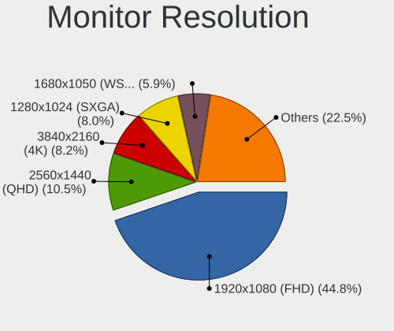

| Resolution         | Desktops | Percent |
|--------------------|----------|---------|
| 1920x1080 (FHD)    | 1442     | 44.78%  |
| 2560x1440 (QHD)    | 339      | 10.53%  |
| 3840x2160 (4K)     | 264      | 8.2%    |
| 1280x1024 (SXGA)   | 259      | 8.04%   |
| 1680x1050 (WSXGA+) | 190      | 5.9%    |
| 1920x1200 (WUXGA)  | 162      | 5.03%   |
| 1440x900 (WXGA+)   | 110      | 3.42%   |
| 3440x1440          | 82       | 2.55%   |
| 1366x768 (WXGA)    | 55       | 1.71%   |
| Unknown            | 54       | 1.68%   |
| 2560x1080          | 45       | 1.4%    |
| 1600x1200          | 25       | 0.78%   |
| 3840x1080          | 24       | 0.75%   |
| 1360x768           | 24       | 0.75%   |
| 1600x900 (HD+)     | 19       | 0.59%   |
| 1024x768 (XGA)     | 17       | 0.53%   |
| 1920x540           | 16       | 0.5%    |
| 2288x1287          | 14       | 0.43%   |
| 3840x1600          | 5        | 0.16%   |
| 3840x1200          | 5        | 0.16%   |
| 2560x1600          | 5        | 0.16%   |
| 1280x720 (HD)      | 5        | 0.16%   |
| 5120x1440          | 4        | 0.12%   |
| 4480x1440          | 4        | 0.12%   |
| 2048x1152          | 4        | 0.12%   |
| 1400x1050          | 4        | 0.12%   |
| 1280x960           | 4        | 0.12%   |
| 3200x1080          | 3        | 0.09%   |
| 1280x768           | 3        | 0.09%   |
| 5760x1200          | 2        | 0.06%   |
| 5760x1080          | 2        | 0.06%   |
| 5120x1080          | 2        | 0.06%   |
| 3600x1080          | 2        | 0.06%   |
| 1280x800 (WXGA)    | 2        | 0.06%   |
| 7680x2560          | 1        | 0.03%   |
| 7280x1440          | 1        | 0.03%   |
| 720x576            | 1        | 0.03%   |
| 720x480            | 1        | 0.03%   |
| 6880x1440          | 1        | 0.03%   |
| 6400x2160          | 1        | 0.03%   |

Monitor Diagonal
----------------

Diagonal size in inches

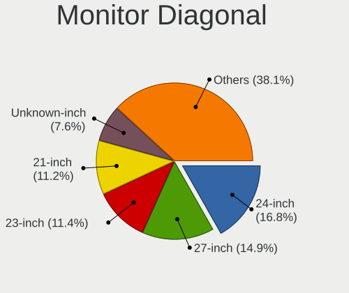

| Inches  | Desktops | Percent |
|---------|----------|---------|
| 24      | 554      | 16.78%  |
| 27      | 493      | 14.93%  |
| 23      | 375      | 11.36%  |
| 21      | 370      | 11.21%  |
| Unknown | 250      | 7.57%   |
| 19      | 227      | 6.88%   |
| 22      | 131      | 3.97%   |
| 31      | 125      | 3.79%   |
| 17      | 115      | 3.48%   |
| 34      | 109      | 3.3%    |
| 18      | 82       | 2.48%   |
| 20      | 58       | 1.76%   |
| 84      | 43       | 1.3%    |
| 32      | 37       | 1.12%   |
| 72      | 34       | 1.03%   |
| 25      | 32       | 0.97%   |
| 54      | 31       | 0.94%   |
| 15      | 25       | 0.76%   |
| 40      | 23       | 0.7%    |
| 26      | 20       | 0.61%   |
| 65      | 15       | 0.45%   |
| 33      | 14       | 0.42%   |
| 142     | 13       | 0.39%   |
| 43      | 13       | 0.39%   |
| 63      | 11       | 0.33%   |
| 28      | 11       | 0.33%   |
| 48      | 10       | 0.3%    |
| 46      | 10       | 0.3%    |
| 42      | 8        | 0.24%   |
| 49      | 7        | 0.21%   |
| 39      | 7        | 0.21%   |
| 29      | 7        | 0.21%   |
| 14      | 6        | 0.18%   |
| 37      | 5        | 0.15%   |
| 55      | 4        | 0.12%   |
| 12      | 4        | 0.12%   |
| 60      | 3        | 0.09%   |
| 50      | 3        | 0.09%   |
| 47      | 3        | 0.09%   |
| 35      | 3        | 0.09%   |

Monitor Width
-------------

Physical width

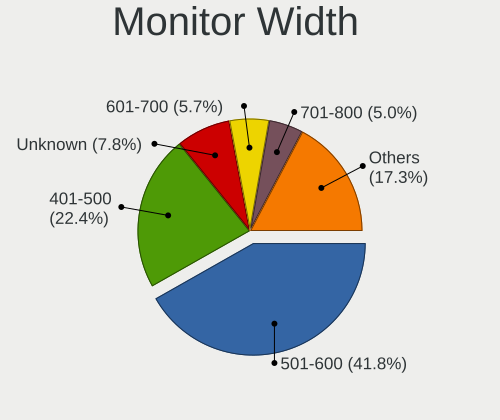

| Width in mm    | Desktops | Percent |
|----------------|----------|---------|
| 501-600        | 1332     | 41.79%  |
| 401-500        | 714      | 22.4%   |
| Unknown        | 250      | 7.84%   |
| 601-700        | 182      | 5.71%   |
| 701-800        | 158      | 4.96%   |
| 351-400        | 148      | 4.64%   |
| 301-350        | 140      | 4.39%   |
| 1001-1500      | 103      | 3.23%   |
| 1501-2000      | 80       | 2.51%   |
| 801-900        | 38       | 1.19%   |
| 901-1000       | 20       | 0.63%   |
| More than 2000 | 13       | 0.41%   |
| 201-300        | 9        | 0.28%   |

Aspect Ratio
------------

Proportional relationship between the width and the height

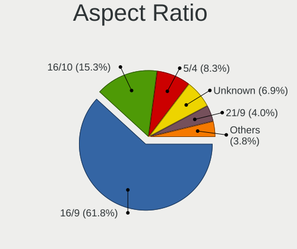

| Ratio   | Desktops | Percent |
|---------|----------|---------|
| 16/9    | 1886     | 61.82%  |
| 16/10   | 466      | 15.27%  |
| 5/4     | 252      | 8.26%   |
| Unknown | 210      | 6.88%   |
| 21/9    | 121      | 3.97%   |
| 4/3     | 49       | 1.61%   |
| 3/2     | 29       | 0.95%   |
| 32/9    | 16       | 0.52%   |
| 1.00    | 13       | 0.43%   |
| 6/5     | 4        | 0.13%   |
| 3.20    | 2        | 0.07%   |
| 0.56    | 2        | 0.07%   |
| 3.40    | 1        | 0.03%   |

Monitor Area
------------

Area in inch²

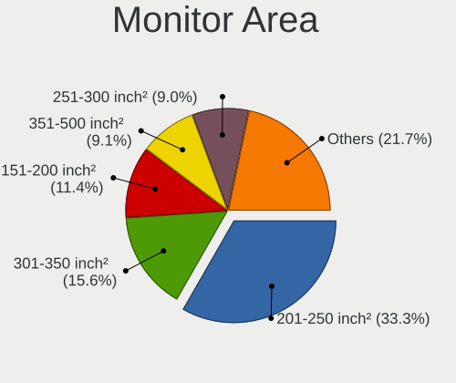

| Area in inch² | Desktops | Percent |
|----------------|----------|---------|
| 201-250        | 1081     | 33.29%  |
| 301-350        | 507      | 15.61%  |
| 151-200        | 369      | 11.36%  |
| 351-500        | 294      | 9.05%   |
| 251-300        | 291      | 8.96%   |
| Unknown        | 250      | 7.7%    |
| More than 1000 | 172      | 5.3%    |
| 141-150        | 166      | 5.11%   |
| 501-1000       | 81       | 2.49%   |
| 101-110        | 22       | 0.68%   |
| 111-120        | 5        | 0.15%   |
| 71-80          | 4        | 0.12%   |
| 51-60          | 2        | 0.06%   |
| 91-100         | 2        | 0.06%   |
| 81-90          | 1        | 0.03%   |

Pixel Density
-------------

Pixels per inch

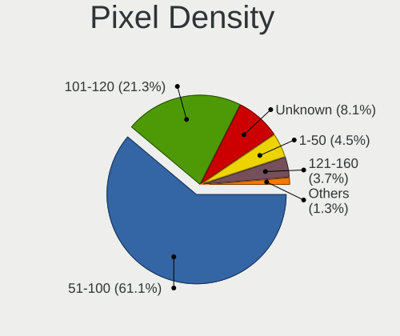

| Density       | Desktops | Percent |
|---------------|----------|---------|
| 51-100        | 1893     | 61.1%   |
| 101-120       | 661      | 21.34%  |
| Unknown       | 250      | 8.07%   |
| 1-50          | 138      | 4.45%   |
| 121-160       | 115      | 3.71%   |
| 161-240       | 39       | 1.26%   |
| More than 240 | 2        | 0.06%   |

Multiple Monitors
-----------------

Total monitors connected

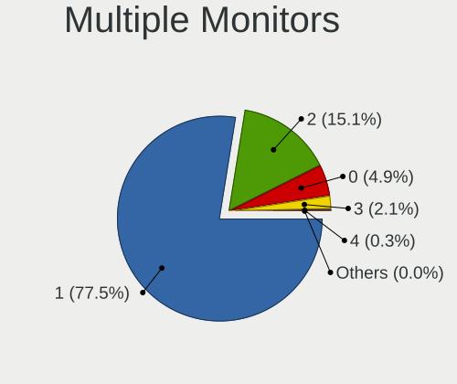

| Total | Desktops | Percent |
|-------|----------|---------|
| 1     | 2415     | 77.53%  |
| 2     | 470      | 15.09%  |
| 0     | 154      | 4.94%   |
| 3     | 65       | 2.09%   |
| 4     | 10       | 0.32%   |
| 6     | 1        | 0.03%   |

Network
-------

Net Controller Vendor
---------------------

Controller vendors

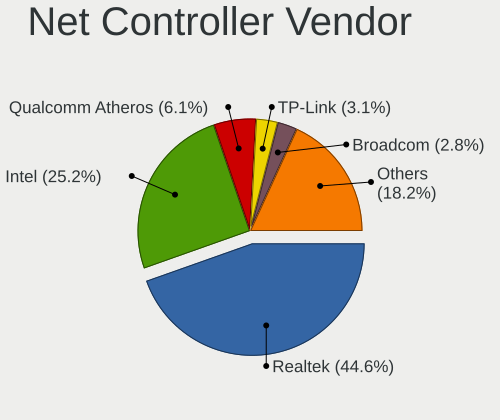

| Vendor                                 | Desktops | Percent |
|----------------------------------------|----------|---------|
| Realtek Semiconductor                  | 1951     | 44.58%  |
| Intel                                  | 1103     | 25.21%  |
| Qualcomm Atheros                       | 266      | 6.08%   |
| TP-Link                                | 137      | 3.13%   |
| Broadcom                               | 124      | 2.83%   |
| MediaTek                               | 97       | 2.22%   |
| Ralink Technology                      | 82       | 1.87%   |
| Qualcomm Atheros Communications        | 64       | 1.46%   |
| Microsoft                              | 63       | 1.44%   |
| Nvidia                                 | 57       | 1.3%    |
| Ralink                                 | 44       | 1.01%   |
| Marvell Technology Group               | 31       | 0.71%   |
| Huawei Technologies                    | 31       | 0.71%   |
| ASUSTek Computer                       | 29       | 0.66%   |
| Samsung Electronics                    | 26       | 0.59%   |
| Aquantia                               | 26       | 0.59%   |
| Xiaomi                                 | 25       | 0.57%   |
| Broadcom Limited                       | 25       | 0.57%   |
| Edimax Technology                      | 14       | 0.32%   |
| D-Link                                 | 12       | 0.27%   |
| Motorola PCS                           | 11       | 0.25%   |
| NetGear                                | 9        | 0.21%   |
| Qualcomm Technologies                  | 8        | 0.18%   |
| Qualcomm                               | 8        | 0.18%   |
| VIA Technologies                       | 7        | 0.16%   |
| ASIX Electronics                       | 7        | 0.16%   |
| QinHeng Electronics                    | 6        | 0.14%   |
| OPPO Electronics                       | 6        | 0.14%   |
| D-Link System                          | 6        | 0.14%   |
| Sony Ericsson Mobile Communications AB | 5        | 0.11%   |
| Sagem                                  | 5        | 0.11%   |
| Mellanox Technologies                  | 5        | 0.11%   |
| Google                                 | 5        | 0.11%   |
| Texas Instruments                      | 4        | 0.09%   |
| ICS Advent                             | 4        | 0.09%   |
| ZyXEL Communications                   | 3        | 0.07%   |
| ZyDAS                                  | 3        | 0.07%   |
| ZTE WCDMA Technologies MSM             | 3        | 0.07%   |
| NetXen Incorporated                    | 3        | 0.07%   |
| HTC (High Tech Computer)               | 3        | 0.07%   |

Net Controller Model
--------------------

Controller models

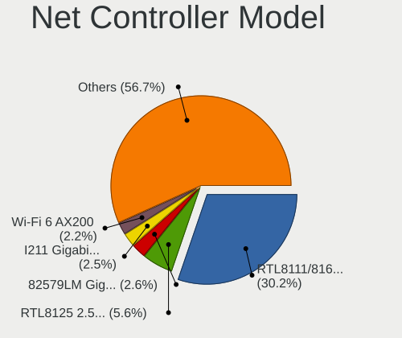

| Model                                                                  | Desktops | Percent |
|------------------------------------------------------------------------|----------|---------|
| Realtek RTL8111/8168/8211/8411 PCI Express Gigabit Ethernet Controller | 1470     | 30.24%  |
| Realtek RTL8125 2.5GbE Controller                                      | 274      | 5.64%   |
| Intel 82579LM Gigabit Network Connection (Lewisville)                  | 128      | 2.63%   |
| Intel I211 Gigabit Network Connection                                  | 123      | 2.53%   |
| Intel Wi-Fi 6 AX200                                                    | 109      | 2.24%   |
| Intel Ethernet Connection (2) I219-V                                   | 105      | 2.16%   |
| Intel Ethernet Controller I225-V                                       | 69       | 1.42%   |
| Intel Ethernet Connection I217-LM                                      | 64       | 1.32%   |
| Qualcomm Atheros AR9271 802.11n                                        | 49       | 1.01%   |
| MediaTek MT7922 802.11ax PCI Express Wireless Network Adapter          | 49       | 1.01%   |
| Intel 82567LM-3 Gigabit Network Connection                             | 49       | 1.01%   |
| Intel 82579V Gigabit Network Connection                                | 47       | 0.97%   |
| Realtek RTL8188EUS 802.11n Wireless Network Adapter                    | 45       | 0.93%   |
| TP-Link TL-WN722N v2/v3 [Realtek RTL8188EUS]                           | 44       | 0.91%   |
| Realtek RTL-8100/8101L/8139 PCI Fast Ethernet Adapter                  | 44       | 0.91%   |
| Intel Ethernet Connection (7) I219-V                                   | 44       | 0.91%   |
| Intel Wi-Fi 6E(802.11ax) AX210/AX1675* 2x2 [Typhoon Peak]              | 42       | 0.86%   |
| Ralink MT7601U Wireless Adapter                                        | 41       | 0.84%   |
| Intel Wi-Fi 5(802.11ac) Wireless-AC 9x6x [Thunder Peak]                | 35       | 0.72%   |
| Intel Dual Band Wireless-AC 3168NGW [Stone Peak]                       | 34       | 0.7%    |
| Realtek 802.11ac NIC                                                   | 32       | 0.66%   |
| Qualcomm Atheros Killer E220x Gigabit Ethernet Controller              | 32       | 0.66%   |
| Nvidia MCP61 Ethernet                                                  | 32       | 0.66%   |
| Microsoft Xbox 360 Wireless Adapter                                    | 31       | 0.64%   |
| Intel Ethernet Connection I217-V                                       | 31       | 0.64%   |
| Intel Ethernet Connection (2) I219-LM                                  | 31       | 0.64%   |
| Realtek RTL810xE PCI Express Fast Ethernet controller                  | 29       | 0.6%    |
| Realtek RTL88x2bu [AC1200 Techkey]                                     | 28       | 0.58%   |
| Intel Ethernet Connection (2) I218-V                                   | 27       | 0.56%   |
| Microsoft Xbox Wireless Adapter for Windows                            | 26       | 0.53%   |
| Realtek RTL8192EE PCIe Wireless Network Adapter                        | 25       | 0.51%   |
| Realtek RTL8153 Gigabit Ethernet Adapter                               | 24       | 0.49%   |
| Qualcomm Atheros AR93xx Wireless Network Adapter                       | 24       | 0.49%   |
| Qualcomm Atheros AR9485 Wireless Network Adapter                       | 22       | 0.45%   |
| Intel Ethernet Controller I226-V                                       | 22       | 0.45%   |
| Marvell Group 88E8056 PCI-E Gigabit Ethernet Controller                | 21       | 0.43%   |
| Intel Wireless 7260                                                    | 21       | 0.43%   |
| Broadcom BCM4360 802.11ac Dual Band Wireless Network Adapter           | 21       | 0.43%   |
| Xiaomi Mi/Redmi series (RNDIS)                                         | 20       | 0.41%   |
| Ralink RT2561/RT61 802.11g PCI                                         | 20       | 0.41%   |

Wireless Vendor
---------------

Wireless vendors

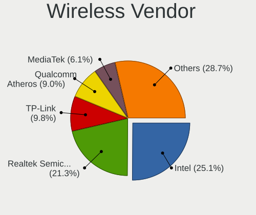

| Vendor                          | Desktops | Percent |
|---------------------------------|----------|---------|
| Intel                           | 347      | 25.11%  |
| Realtek Semiconductor           | 294      | 21.27%  |
| TP-Link                         | 136      | 9.84%   |
| Qualcomm Atheros                | 125      | 9.04%   |
| MediaTek                        | 84       | 6.08%   |
| Ralink Technology               | 82       | 5.93%   |
| Qualcomm Atheros Communications | 64       | 4.63%   |
| Microsoft                       | 63       | 4.56%   |
| Ralink                          | 44       | 3.18%   |
| Broadcom                        | 42       | 3.04%   |
| ASUSTek Computer                | 29       | 2.1%    |
| Edimax Technology               | 14       | 1.01%   |
| D-Link                          | 12       | 0.87%   |
| NetGear                         | 9        | 0.65%   |
| Sagem                           | 5        | 0.36%   |
| Qualcomm Technologies           | 4        | 0.29%   |
| D-Link System                   | 4        | 0.29%   |
| ZyXEL Communications            | 3        | 0.22%   |
| ZyDAS                           | 3        | 0.22%   |
| Mercucys                        | 2        | 0.14%   |
| Linksys                         | 2        | 0.14%   |
| Gemtek                          | 2        | 0.14%   |
| Broadcom Limited                | 2        | 0.14%   |
| Belkin Components               | 2        | 0.14%   |
| Z-Com                           | 1        | 0.07%   |
| Wacom                           | 1        | 0.07%   |
| Texas Instruments               | 1        | 0.07%   |
| Ovislink                        | 1        | 0.07%   |
| Marvell Technology Group        | 1        | 0.07%   |
| IMC Networks                    | 1        | 0.07%   |
| AVM                             | 1        | 0.07%   |
| Accton Technology               | 1        | 0.07%   |

Wireless Model
--------------

Wireless models

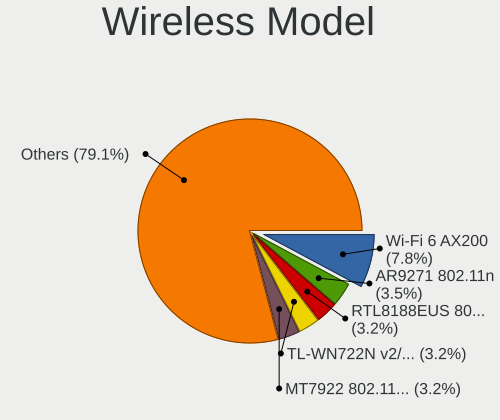

| Model                                                                         | Desktops | Percent |
|-------------------------------------------------------------------------------|----------|---------|
| Intel Wi-Fi 6 AX200                                                           | 109      | 7.82%   |
| Qualcomm Atheros AR9271 802.11n                                               | 49       | 3.52%   |
| Realtek RTL8188EUS 802.11n Wireless Network Adapter                           | 45       | 3.23%   |
| TP-Link TL-WN722N v2/v3 [Realtek RTL8188EUS]                                  | 44       | 3.16%   |
| MediaTek MT7922 802.11ax PCI Express Wireless Network Adapter                 | 44       | 3.16%   |
| Intel Wi-Fi 6E(802.11ax) AX210/AX1675* 2x2 [Typhoon Peak]                     | 42       | 3.02%   |
| Ralink MT7601U Wireless Adapter                                               | 41       | 2.94%   |
| Intel Wi-Fi 5(802.11ac) Wireless-AC 9x6x [Thunder Peak]                       | 35       | 2.51%   |
| Intel Dual Band Wireless-AC 3168NGW [Stone Peak]                              | 34       | 2.44%   |
| Realtek 802.11ac NIC                                                          | 32       | 2.3%    |
| Microsoft Xbox 360 Wireless Adapter                                           | 31       | 2.23%   |
| Realtek RTL88x2bu [AC1200 Techkey]                                            | 28       | 2.01%   |
| Microsoft Xbox Wireless Adapter for Windows                                   | 26       | 1.87%   |
| Realtek RTL8192EE PCIe Wireless Network Adapter                               | 25       | 1.79%   |
| Qualcomm Atheros AR93xx Wireless Network Adapter                              | 24       | 1.72%   |
| Qualcomm Atheros AR9485 Wireless Network Adapter                              | 22       | 1.58%   |
| Intel Wireless 7260                                                           | 21       | 1.51%   |
| Broadcom BCM4360 802.11ac Dual Band Wireless Network Adapter                  | 21       | 1.51%   |
| Ralink RT2561/RT61 802.11g PCI                                                | 20       | 1.44%   |
| Realtek RTL8188CUS 802.11n WLAN Adapter                                       | 19       | 1.36%   |
| Qualcomm Atheros AR9227 Wireless Network Adapter                              | 18       | 1.29%   |
| Intel Cannon Lake PCH CNVi WiFi                                               | 18       | 1.29%   |
| Ralink RT5370 Wireless Adapter                                                | 17       | 1.22%   |
| Realtek RTL8188EE Wireless Network Adapter                                    | 16       | 1.15%   |
| TP-Link 802.11ac NIC                                                          | 15       | 1.08%   |
| TP-Link TL-WN821N v5/v6 [RTL8192EU]                                           | 13       | 0.93%   |
| Qualcomm Atheros AR2413/AR2414 Wireless Network Adapter [AR5005G(S) 802.11bg] | 13       | 0.93%   |
| MediaTek MT7921K (RZ608) Wi-Fi 6E 80MHz                                       | 13       | 0.93%   |
| Intel Alder Lake-S PCH CNVi WiFi                                              | 13       | 0.93%   |
| Intel 700 Series Chipset CNVi WiFi                                            | 13       | 0.93%   |
| TP-Link AC600 wireless Realtek RTL8811AU [Archer T2U Nano]                    | 12       | 0.86%   |
| Qualcomm Atheros TP-Link TL-WN322G v3 / TL-WN422G v2 802.11g [Atheros AR9271] | 12       | 0.86%   |
| Intel Wireless 7265                                                           | 12       | 0.86%   |
| Realtek RTL8852BE PCIe 802.11ax Wireless Network Controller                   | 11       | 0.79%   |
| TP-Link 802.11ac WLAN Adapter                                                 | 10       | 0.72%   |
| Realtek RTL8852CE PCIe 802.11ax Wireless Network Controller                   | 10       | 0.72%   |
| Realtek RTL8821CE 802.11ac PCIe Wireless Network Adapter                      | 10       | 0.72%   |
| Realtek RTL8188CE 802.11b/g/n WiFi Adapter                                    | 10       | 0.72%   |
| Qualcomm Atheros QCA6174 802.11ac Wireless Network Adapter                    | 10       | 0.72%   |
| MediaTek MT7921 802.11ax PCIe Wireless Network Adapter [Filogic 330]          | 10       | 0.72%   |

Ethernet Vendor
---------------

Ethernet vendors

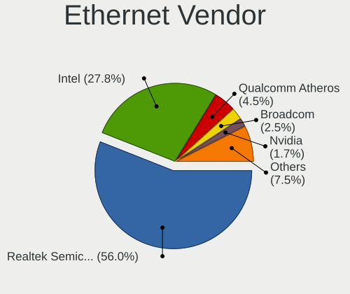

| Vendor                                 | Desktops | Percent |
|----------------------------------------|----------|---------|
| Realtek Semiconductor                  | 1839     | 55.98%  |
| Intel                                  | 912      | 27.76%  |
| Qualcomm Atheros                       | 149      | 4.54%   |
| Broadcom                               | 82       | 2.5%    |
| Nvidia                                 | 57       | 1.74%   |
| Marvell Technology Group               | 31       | 0.94%   |
| Aquantia                               | 26       | 0.79%   |
| Xiaomi                                 | 25       | 0.76%   |
| Samsung Electronics                    | 25       | 0.76%   |
| Broadcom Limited                       | 23       | 0.7%    |
| Huawei Technologies                    | 18       | 0.55%   |
| Motorola PCS                           | 11       | 0.33%   |
| Qualcomm                               | 8        | 0.24%   |
| MediaTek                               | 8        | 0.24%   |
| VIA Technologies                       | 7        | 0.21%   |
| ASIX Electronics                       | 7        | 0.21%   |
| OPPO Electronics                       | 6        | 0.18%   |
| Mellanox Technologies                  | 5        | 0.15%   |
| Google                                 | 5        | 0.15%   |
| Sony Ericsson Mobile Communications AB | 4        | 0.12%   |
| Qualcomm Technologies                  | 4        | 0.12%   |
| ICS Advent                             | 4        | 0.12%   |
| NetXen Incorporated                    | 3        | 0.09%   |
| HTC (High Tech Computer)               | 3        | 0.09%   |
| Apple                                  | 3        | 0.09%   |
| TP-Link                                | 2        | 0.06%   |
| Research In Motion                     | 2        | 0.06%   |
| QLogic                                 | 2        | 0.06%   |
| DisplayLink                            | 2        | 0.06%   |
| D-Link System                          | 2        | 0.06%   |
| 3Com                                   | 2        | 0.06%   |
| Sundance Technology Inc / IC Plus      | 1        | 0.03%   |
| Spreadtrum Communications              | 1        | 0.03%   |
| QinHeng Electronics                    | 1        | 0.03%   |
| Lenovo                                 | 1        | 0.03%   |
| Foxconn / Hon Hai                      | 1        | 0.03%   |
| American Megatrends                    | 1        | 0.03%   |
| AMD                                    | 1        | 0.03%   |
| ADMtek                                 | 1        | 0.03%   |

Ethernet Model
--------------

Ethernet models

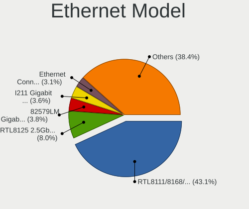

| Model                                                                          | Desktops | Percent |
|--------------------------------------------------------------------------------|----------|---------|
| Realtek RTL8111/8168/8211/8411 PCI Express Gigabit Ethernet Controller         | 1470     | 43.15%  |
| Realtek RTL8125 2.5GbE Controller                                              | 274      | 8.04%   |
| Intel 82579LM Gigabit Network Connection (Lewisville)                          | 128      | 3.76%   |
| Intel I211 Gigabit Network Connection                                          | 123      | 3.61%   |
| Intel Ethernet Connection (2) I219-V                                           | 105      | 3.08%   |
| Intel Ethernet Controller I225-V                                               | 69       | 2.03%   |
| Intel Ethernet Connection I217-LM                                              | 64       | 1.88%   |
| Intel 82567LM-3 Gigabit Network Connection                                     | 49       | 1.44%   |
| Intel 82579V Gigabit Network Connection                                        | 47       | 1.38%   |
| Realtek RTL-8100/8101L/8139 PCI Fast Ethernet Adapter                          | 44       | 1.29%   |
| Intel Ethernet Connection (7) I219-V                                           | 44       | 1.29%   |
| Qualcomm Atheros Killer E220x Gigabit Ethernet Controller                      | 32       | 0.94%   |
| Nvidia MCP61 Ethernet                                                          | 32       | 0.94%   |
| Intel Ethernet Connection I217-V                                               | 31       | 0.91%   |
| Intel Ethernet Connection (2) I219-LM                                          | 31       | 0.91%   |
| Realtek RTL810xE PCI Express Fast Ethernet controller                          | 29       | 0.85%   |
| Intel Ethernet Connection (2) I218-V                                           | 27       | 0.79%   |
| Realtek RTL8153 Gigabit Ethernet Adapter                                       | 24       | 0.7%    |
| Intel Ethernet Controller I226-V                                               | 22       | 0.65%   |
| Marvell Group 88E8056 PCI-E Gigabit Ethernet Controller                        | 21       | 0.62%   |
| Xiaomi Mi/Redmi series (RNDIS)                                                 | 20       | 0.59%   |
| Samsung Galaxy series, misc. (tethering mode)                                  | 19       | 0.56%   |
| Qualcomm Atheros AR8151 v2.0 Gigabit Ethernet                                  | 19       | 0.56%   |
| Qualcomm Atheros AR8131 Gigabit Ethernet                                       | 17       | 0.5%    |
| Intel I210 Gigabit Network Connection                                          | 17       | 0.5%    |
| Intel 82566DM-2 Gigabit Network Connection                                     | 17       | 0.5%    |
| Realtek RTL-8110SC/8169SC Gigabit Ethernet                                     | 16       | 0.47%   |
| Intel Ethernet Connection (7) I219-LM                                          | 16       | 0.47%   |
| Intel Ethernet Connection (14) I219-V                                          | 16       | 0.47%   |
| Broadcom NetXtreme BCM5761 Gigabit Ethernet PCIe                               | 16       | 0.47%   |
| Qualcomm Atheros QCA8171 Gigabit Ethernet                                      | 15       | 0.44%   |
| Intel 82574L Gigabit Network Connection                                        | 15       | 0.44%   |
| Realtek RTL8169 PCI Gigabit Ethernet Controller                                | 14       | 0.41%   |
| Qualcomm Atheros Killer E2400 Gigabit Ethernet Controller                      | 14       | 0.41%   |
| Qualcomm Atheros AR8121/AR8113/AR8114 Gigabit or Fast Ethernet                 | 14       | 0.41%   |
| Qualcomm Atheros AR8161 Gigabit Ethernet                                       | 12       | 0.35%   |
| Huawei E353/E3131                                                              | 12       | 0.35%   |
| Broadcom NetXtreme BCM5754 Gigabit Ethernet PCI Express                        | 12       | 0.35%   |
| Aquantia AQtion AQC107 NBase-T/IEEE 802.3an Ethernet Controller [Atlantic 10G] | 12       | 0.35%   |
| Qualcomm Atheros Killer E2500 Gigabit Ethernet Controller                      | 11       | 0.32%   |

Net Controller Kind
-------------------

Ethernet, WiFi or modem

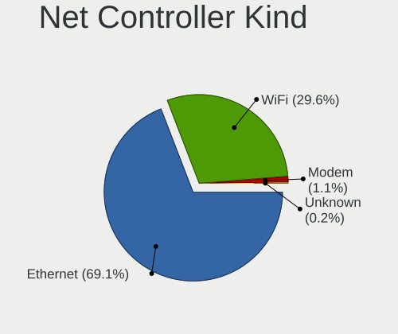

| Kind     | Desktops | Percent |
|----------|----------|---------|
| Ethernet | 2999     | 69.15%  |
| WiFi     | 1282     | 29.56%  |
| Modem    | 46       | 1.06%   |
| Unknown  | 10       | 0.23%   |

Used Controller
---------------

Currently used network controller

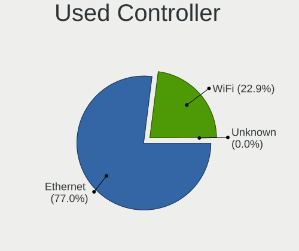

| Kind     | Desktops | Percent |
|----------|----------|---------|
| Ethernet | 2375     | 77.01%  |
| WiFi     | 706      | 22.89%  |
| Modem    | 2        | 0.06%   |
| Unknown  | 1        | 0.03%   |

NICs
----

Total network controllers on board

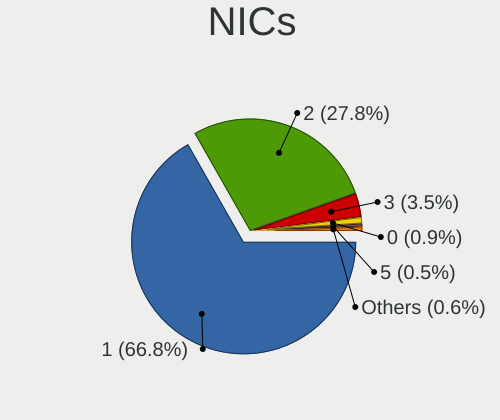

| Total | Desktops | Percent |
|-------|----------|---------|
| 1     | 2047     | 66.76%  |
| 2     | 852      | 27.79%  |
| 3     | 106      | 3.46%   |
| 0     | 28       | 0.91%   |
| 5     | 14       | 0.46%   |
| 4     | 10       | 0.33%   |
| 6     | 4        | 0.13%   |
| 7     | 3        | 0.1%    |
| 17    | 1        | 0.03%   |
| 9     | 1        | 0.03%   |

IPv6
----

IPv6 vs IPv4

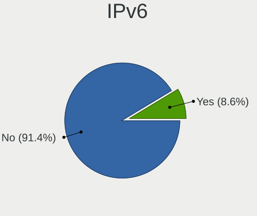

| Used | Desktops | Percent |
|------|----------|---------|
| No   | 2792     | 91.36%  |
| Yes  | 264      | 8.64%   |

Bluetooth
---------

Bluetooth Vendor
----------------

Controller vendors

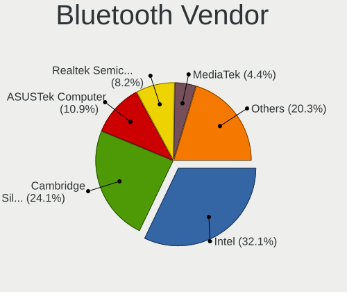

| Vendor                          | Desktops | Percent |
|---------------------------------|----------|---------|
| Intel                           | 334      | 32.15%  |
| Cambridge Silicon Radio         | 250      | 24.06%  |
| ASUSTek Computer                | 113      | 10.88%  |
| Realtek Semiconductor           | 85       | 8.18%   |
| MediaTek                        | 46       | 4.43%   |
| TP-Link                         | 44       | 4.23%   |
| Foxconn / Hon Hai               | 33       | 3.18%   |
| IMC Networks                    | 30       | 2.89%   |
| Qualcomm Atheros Communications | 22       | 2.12%   |
| Broadcom                        | 20       | 1.92%   |
| Edimax Technology               | 11       | 1.06%   |
| Conwise Technology              | 8        | 0.77%   |
| Realtek                         | 7        | 0.67%   |
| Integrated System Solution      | 7        | 0.67%   |
| Unknown                         | 6        | 0.58%   |
| Apple                           | 5        | 0.48%   |
| Actions                         | 4        | 0.38%   |
| Lite-On Technology              | 3        | 0.29%   |
| SINO WEALTH                     | 2        | 0.19%   |
| Mercucys                        | 2        | 0.19%   |
| Logitech                        | 2        | 0.19%   |
| Belkin Components               | 2        | 0.19%   |
| National Semiconductor          | 1        | 0.1%    |
| HTC (High Tech Computer)        | 1        | 0.1%    |
| AICSemi                         | 1        | 0.1%    |

Bluetooth Model
---------------

Controller models

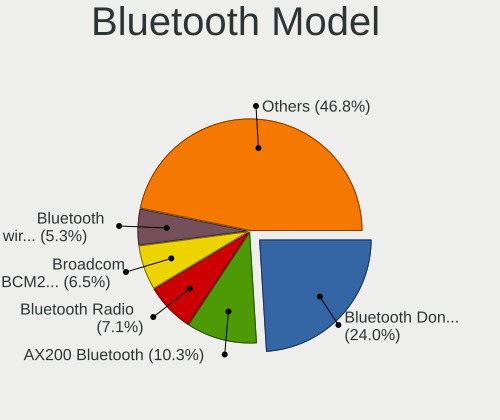

| Model                                                 | Desktops | Percent |
|-------------------------------------------------------|----------|---------|
| Cambridge Silicon Radio Bluetooth Dongle (HCI mode)   | 250      | 24.02%  |
| Intel AX200 Bluetooth                                 | 107      | 10.28%  |
| Realtek Bluetooth Radio                               | 74       | 7.11%   |
| ASUS Broadcom BCM20702A0 Bluetooth                    | 68       | 6.53%   |
| Intel Bluetooth wireless interface                    | 55       | 5.28%   |
| MediaTek Wireless_Device                              | 46       | 4.42%   |
| TP-Link TP-T@- UB500 Adapter                          | 44       | 4.23%   |
| Intel AX210 Bluetooth                                 | 42       | 4.03%   |
| Intel Wireless-AC 9260 Bluetooth Adapter              | 33       | 3.17%   |
| Intel Wireless-AC 3168 Bluetooth                      | 33       | 3.17%   |
| ASUS ASUS USB-BT500                                   | 30       | 2.88%   |
| Intel AX201 Bluetooth                                 | 23       | 2.21%   |
| Intel Bluetooth 9460/9560 Jefferson Peak (JfP)        | 22       | 2.11%   |
| Foxconn / Hon Hai Wireless_Device                     | 21       | 2.02%   |
| Intel Bluetooth Device                                | 17       | 1.63%   |
| IMC Networks Wireless_Device                          | 16       | 1.54%   |
| IMC Networks Bluetooth Radio                          | 14       | 1.34%   |
| Foxconn / Hon Hai Bluetooth Device                    | 11       | 1.06%   |
| Qualcomm Atheros AR3011 Bluetooth                     | 9        | 0.86%   |
| Realtek Bluetooth 5.3 Radio                           | 8        | 0.77%   |
| Edimax Bluetooth Device                               | 8        | 0.77%   |
| Conwise CW6622                                        | 8        | 0.77%   |
| Realtek Bluetooth Radio                               | 7        | 0.67%   |
| Qualcomm Atheros  Bluetooth Device                    | 6        | 0.58%   |
| Broadcom BCM20702A0 Bluetooth 4.0                     | 6        | 0.58%   |
| ASUS Qualcomm Bluetooth 4.1                           | 6        | 0.58%   |
| Unknown                                               | 6        | 0.58%   |
| Integrated System Solution KY-BT100 Bluetooth Adapter | 5        | 0.48%   |
| Broadcom HP Portable Bumble Bee                       | 5        | 0.48%   |
| ASUS Bluetooth Radio                                  | 5        | 0.48%   |
| Actions general adapter                               | 4        | 0.38%   |
| Qualcomm Atheros QCA61x4 Bluetooth 4.0                | 3        | 0.29%   |
| Broadcom BCM92046DG-CL1ROM Bluetooth 2.1 Adapter      | 3        | 0.29%   |
| Broadcom BCM2045 Bluetooth                            | 3        | 0.29%   |
| SINO WEALTH Bluetooth Keyboard                        | 2        | 0.19%   |
| Qualcomm Atheros AR3012 Bluetooth 4.0                 | 2        | 0.19%   |
| Mercucys Mercusys MA530 Adapter                       | 2        | 0.19%   |
| Logitech BT Mini-Receiver (HCI mode)                  | 2        | 0.19%   |
| Lite-On Bluetooth Device                              | 2        | 0.19%   |
| Intel Centrino Bluetooth Wireless Transceiver         | 2        | 0.19%   |

Sound
-----

Sound Vendor
------------

Sound card vendors

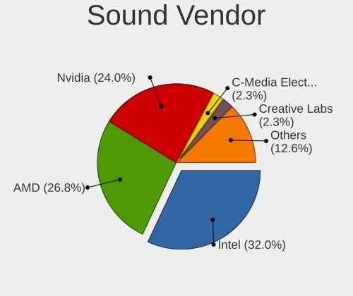

| Vendor                                       | Desktops | Percent |
|----------------------------------------------|----------|---------|
| Intel                                        | 1721     | 31.98%  |
| AMD                                          | 1443     | 26.82%  |
| Nvidia                                       | 1290     | 23.97%  |
| C-Media Electronics                          | 125      | 2.32%   |
| Creative Labs                                | 124      | 2.3%    |
| Creative Technology                          | 58       | 1.08%   |
| SteelSeries ApS                              | 43       | 0.8%    |
| Logitech                                     | 40       | 0.74%   |
| JMTek                                        | 37       | 0.69%   |
| Texas Instruments                            | 26       | 0.48%   |
| ASUSTek Computer                             | 24       | 0.45%   |
| Razer USA                                    | 23       | 0.43%   |
| Kingston Technology                          | 22       | 0.41%   |
| VIA Technologies                             | 20       | 0.37%   |
| Focusrite-Novation                           | 19       | 0.35%   |
| Micro Star International                     | 18       | 0.33%   |
| GYROCOM C&C                                  | 17       | 0.32%   |
| SAVITECH                                     | 14       | 0.26%   |
| Realtek Semiconductor                        | 14       | 0.26%   |
| Trust                                        | 11       | 0.2%    |
| Generalplus Technology                       | 11       | 0.2%    |
| Plantronics                                  | 10       | 0.19%   |
| Hewlett-Packard                              | 10       | 0.19%   |
| GN Netcom                                    | 10       | 0.19%   |
| AOKEO                                        | 10       | 0.19%   |
| Sony                                         | 8        | 0.15%   |
| Dell                                         | 8        | 0.15%   |
| Unknown                                      | 8        | 0.15%   |
| USB MICROPHONE                               | 7        | 0.13%   |
| SM900 Microphon                              | 7        | 0.13%   |
| KTMicro                                      | 7        | 0.13%   |
| Giga-Byte Technology                         | 7        | 0.13%   |
| Zoran Co. Personal Media Division (Nogatech) | 6        | 0.11%   |
| Valve Software                               | 6        | 0.11%   |
| Thesycon Systemsoftware & Consulting         | 6        | 0.11%   |
| FiiO Electronics Technology                  | 6        | 0.11%   |
| BEHRINGER International                      | 6        | 0.11%   |
| M-Audio                                      | 5        | 0.09%   |
| Corsair                                      | 5        | 0.09%   |
| ASRock                                       | 5        | 0.09%   |

Sound Model
-----------

Sound card models

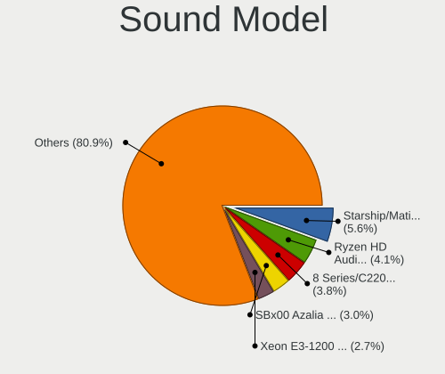

| Model                                                                      | Desktops | Percent |
|----------------------------------------------------------------------------|----------|---------|
| AMD Starship/Matisse HD Audio Controller                                   | 355      | 5.55%   |
| AMD Ryzen HD Audio Controller                                              | 263      | 4.11%   |
| Intel 8 Series/C220 Series Chipset High Definition Audio Controller        | 243      | 3.8%    |
| AMD SBx00 Azalia (Intel HDA)                                               | 190      | 2.97%   |
| Intel Xeon E3-1200 v3/4th Gen Core Processor HD Audio Controller           | 173      | 2.7%    |
| AMD Family 17h (Models 00h-0fh) HD Audio Controller                        | 172      | 2.69%   |
| Intel 6 Series/C200 Series Chipset Family High Definition Audio Controller | 166      | 2.6%    |
| AMD Ellesmere HDMI Audio [Radeon RX 470/480 / 570/580/590]                 | 166      | 2.6%    |
| Intel 100 Series/C230 Series Chipset Family HD Audio Controller            | 156      | 2.44%   |
| Intel 7 Series/C216 Chipset Family High Definition Audio Controller        | 153      | 2.39%   |
| Intel 200 Series PCH HD Audio                                              | 140      | 2.19%   |
| AMD Navi 21/23 HDMI/DP Audio Controller                                    | 138      | 2.16%   |
| Nvidia GP107GL High Definition Audio Controller                            | 132      | 2.06%   |
| Intel NM10/ICH7 Family High Definition Audio Controller                    | 116      | 1.81%   |
| AMD FCH Azalia Controller                                                  | 100      | 1.56%   |
| AMD Radeon High Definition Audio Controller                                | 99       | 1.55%   |
| Nvidia GP106 High Definition Audio Controller                              | 95       | 1.49%   |
| Intel Cannon Lake PCH cAVS                                                 | 93       | 1.45%   |
| AMD Renoir/Cezanne HDMI/DP Audio Controller                                | 88       | 1.38%   |
| AMD Oland/Hainan/Cape Verde/Pitcairn HDMI Audio [Radeon HD 7000 Series]    | 84       | 1.31%   |
| Nvidia GP104 High Definition Audio Controller                              | 82       | 1.28%   |
| AMD Navi 31 HDMI/DP Audio                                                  | 72       | 1.13%   |
| Nvidia GA104 High Definition Audio Controller                              | 71       | 1.11%   |
| Nvidia TU116 High Definition Audio Controller                              | 70       | 1.09%   |
| Nvidia GM107 High Definition Audio Controller [GeForce 940MX]              | 67       | 1.05%   |
| Intel 82801JI (ICH10 Family) HD Audio Controller                           | 66       | 1.03%   |
| Nvidia GK208 HDMI/DP Audio Controller                                      | 62       | 0.97%   |
| AMD Raven/Raven2/Fenghuang HDMI/DP Audio Controller                        | 59       | 0.92%   |
| Intel 82801I (ICH9 Family) HD Audio Controller                             | 58       | 0.91%   |
| Intel 9 Series Chipset Family HD Audio Controller                          | 57       | 0.89%   |
| Intel 82801JD/DO (ICH10 Family) HD Audio Controller                        | 57       | 0.89%   |
| Nvidia GF108 High Definition Audio Controller                              | 55       | 0.86%   |
| Nvidia High Definition Audio Controller                                    | 53       | 0.83%   |
| Intel 5 Series/3400 Series Chipset High Definition Audio                   | 53       | 0.83%   |
| Intel Alder Lake-S HD Audio Controller                                     | 52       | 0.81%   |
| Nvidia GP108 High Definition Audio Controller                              | 49       | 0.77%   |
| AMD Navi 10 HDMI Audio                                                     | 48       | 0.75%   |
| Nvidia GK107 HDMI Audio Controller                                         | 47       | 0.73%   |
| AMD Baffin HDMI/DP Audio [Radeon RX 550 640SP / RX 560/560X]               | 46       | 0.72%   |
| Nvidia GA106 High Definition Audio Controller                              | 45       | 0.7%    |

Memory
------

Memory Vendor
-------------

Memory module vendors

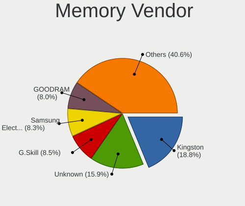

| Vendor                       | Desktops | Percent |
|------------------------------|----------|---------|
| Kingston                     | 418      | 18.77%  |
| Unknown                      | 354      | 15.9%   |
| G.Skill                      | 189      | 8.49%   |
| Samsung Electronics          | 184      | 8.26%   |
| GOODRAM                      | 178      | 7.99%   |
| SK hynix                     | 172      | 7.72%   |
| Corsair                      | 141      | 6.33%   |
| Crucial                      | 112      | 5.03%   |
| Micron Technology            | 73       | 3.28%   |
| Patriot                      | 59       | 2.65%   |
| Unknown                      | 57       | 2.56%   |
| A-DATA Technology            | 50       | 2.25%   |
| Wilk Elektronik              | 29       | 1.3%    |
| Nanya Technology             | 29       | 1.3%    |
| Wilk                         | 22       | 0.99%   |
| Elpida                       | 19       | 0.85%   |
| Ramaxel Technology           | 16       | 0.72%   |
| Apacer                       | 13       | 0.58%   |
| GeIL                         | 11       | 0.49%   |
| Lexar                        | 10       | 0.45%   |
| Patriot Memory (PDP Systems) | 8        | 0.36%   |
| Team                         | 7        | 0.31%   |
| Unknown (ABCD)               | 6        | 0.27%   |
| Transcend                    | 6        | 0.27%   |
| Silicon Power                | 6        | 0.27%   |
| PNY                          | 6        | 0.27%   |
| Qimonda                      | 5        | 0.22%   |
| Unknown (0x0E9D)             | 4        | 0.18%   |
| Lexar Co Limited             | 4        | 0.18%   |
| PUSKILL                      | 3        | 0.13%   |
| Patriot Memory               | 3        | 0.13%   |
| OCZ                          | 3        | 0.13%   |
| KingFast                     | 3        | 0.13%   |
| ASint Technology             | 3        | 0.13%   |
| Toshiba                      | 2        | 0.09%   |
| AMD                          | 2        | 0.09%   |
| Unknown (B98C)               | 1        | 0.04%   |
| Unknown (A)                  | 1        | 0.04%   |
| Unknown (8AA1)               | 1        | 0.04%   |
| Unknown (0x8AA1)             | 1        | 0.04%   |

Memory Model
------------

Memory module models

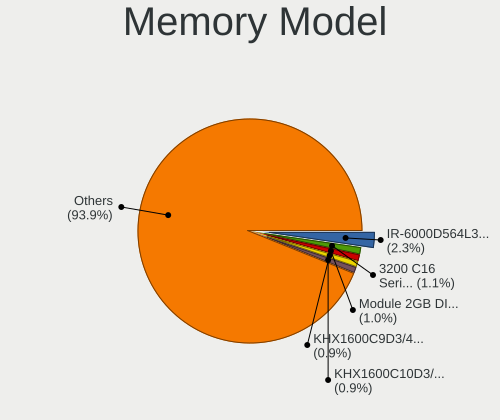

| Model                                                            | Desktops | Percent |
|------------------------------------------------------------------|----------|---------|
| Unknown                                                          | 57       | 2.3%    |
| Patriot RAM 3200 C16 Series 8GB DIMM DDR4 3600MT/s               | 26       | 1.05%   |
| Unknown RAM Module 2GB DIMM 800MT/s                              | 24       | 0.97%   |
| Kingston RAM KHX1600C9D3/4GX 4GB DIMM DDR3 1867MT/s              | 22       | 0.89%   |
| Kingston RAM KHX1600C10D3/8G 8GB DIMM DDR3 2133MT/s              | 22       | 0.89%   |
| G.Skill RAM F4-3000C16-8GISB 8GB DIMM DDR4 3200MT/s              | 22       | 0.89%   |
| G.Skill RAM F4-3200C16-8GVKB 8GB DIMM DDR4 4000MT/s              | 20       | 0.81%   |
| Kingston RAM 9905403-559.A00LF 8GB DIMM DDR3 1600MT/s            | 19       | 0.77%   |
| Unknown RAM Module 2GB DIMM 1333MT/s                             | 18       | 0.73%   |
| Unknown RAM Module 2048MB DIMM 800MT/s                           | 18       | 0.73%   |
| Kingston RAM KHX3200C16D4/8GX 8GB DIMM DDR4 3733MT/s             | 18       | 0.73%   |
| GOODRAM RAM GR1333D364L9/4G 4GB DIMM DDR3 1600MT/s               | 17       | 0.69%   |
| Kingston RAM KF3200C16D4/8GX 8GiB DIMM DDR4 3600MT/s             | 16       | 0.65%   |
| Unknown RAM Module 4096MB DIMM 1333MT/s                          | 15       | 0.61%   |
| Corsair RAM CMK16GX4M2B3200C16 8GB DIMM DDR4 3600MT/s            | 15       | 0.61%   |
| Kingston RAM KF3600C16D4/16GX 16GB DIMM DDR4 3800MT/s            | 14       | 0.57%   |
| Corsair RAM CMK16GX4M2B3000C15 8GB DIMM DDR4 3600MT/s            | 14       | 0.57%   |
| Unknown RAM Module 8GB DIMM DDR3 1600MT/s                        | 13       | 0.53%   |
| Unknown RAM Module 4GB DIMM 1333MT/s                             | 13       | 0.53%   |
| GOODRAM RAM GR1600D364L11/8G 8GB DIMM DDR3 1600MT/s              | 13       | 0.53%   |
| Unknown RAM Module 2048MB DIMM 1333MT/s                          | 12       | 0.49%   |
| Unknown RAM Module 2GB DIMM DDR2 800MT/s                         | 11       | 0.44%   |
| Kingston RAM KHX3200C16D4/16GX 16GB DIMM DDR4 3600MT/s           | 11       | 0.44%   |
| Kingston RAM KF3200C16D4/32GX 32GB DIMM DDR4 3933MT/s            | 11       | 0.44%   |
| GOODRAM RAM IRX3000D464L16S/8G 8GB DIMM DDR4 3333MT/s            | 11       | 0.44%   |
| GOODRAM RAM IR2400D464L15S/8G 8GB DIMM DDR4 3200MT/s             | 11       | 0.44%   |
| G.Skill RAM F4-3200C16-8GIS 8GB DIMM DDR4 3600MT/s               | 11       | 0.44%   |
| SK hynix RAM HMT451U6BFR8C-PB 4GB DIMM DDR3 1600MT/s             | 10       | 0.4%    |
| SK hynix RAM HMT351U6CFR8C-PB 4GB DIMM DDR3 1800MT/s             | 10       | 0.4%    |
| Samsung RAM M378B5173QH0-CK0 4GB DIMM DDR3                       | 10       | 0.4%    |
| Kingston RAM KHX2133C14D4/4G 4GB DIMM DDR4 3200MT/s              | 10       | 0.4%    |
| GOODRAM RAM GY1600D364L10/8G 8GB DIMM DDR3 1600MT/s              | 10       | 0.4%    |
| Wilk Elektronik RAM IRP3600D4V64L18/16G 16GiB DIMM DDR4 3600MT/s | 9        | 0.36%   |
| Unknown RAM Module 2GB DIMM SDRAM                                | 9        | 0.36%   |
| Kingston RAM KHX2400C15/8G 8GB DIMM DDR4 3400MT/s                | 9        | 0.36%   |
| Kingston RAM KHX2133C14D4/8G 8GB DIMM DDR4 3000MT/s              | 9        | 0.36%   |
| Kingston RAM KF3200C16D4/16GX 16GB DIMM DDR4 3733MT/s            | 9        | 0.36%   |
| Crucial RAM BLS8G3D1609DS1S00. 8GB DIMM DDR3 1800MT/s            | 9        | 0.36%   |
| Crucial RAM BLS4G3D1609DS1S00. 4GB DIMM DDR3 1600MT/s            | 9        | 0.36%   |
| Wilk Elektronik RAM IRP3600D4V64L18S/8G 8GB DIMM DDR4 3666MT/s   | 8        | 0.32%   |

Memory Kind
-----------

Memory module kinds

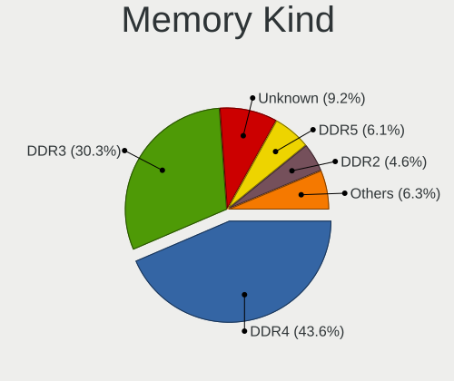

| Kind    | Desktops | Percent |
|---------|----------|---------|
| DDR4    | 861      | 43.55%  |
| DDR3    | 599      | 30.3%   |
| Unknown | 182      | 9.21%   |
| DDR5    | 120      | 6.07%   |
| DDR2    | 91       | 4.6%    |
| SDRAM   | 85       | 4.3%    |
| DDR     | 28       | 1.42%   |
| LPDDR4  | 7        | 0.35%   |
| DRAM    | 3        | 0.15%   |
| RAM     | 1        | 0.05%   |

Memory Form Factor
------------------

Physical design of the memory module

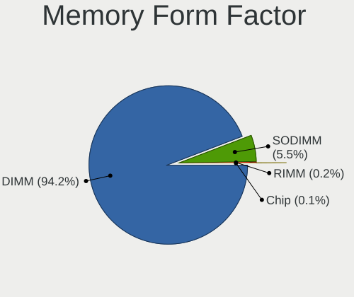

| Name    | Desktops | Percent |
|---------|----------|---------|
| DIMM    | 1827     | 94.18%  |
| SODIMM  | 107      | 5.52%   |
| RIMM    | 3        | 0.15%   |
| FB-DIMM | 2        | 0.1%    |
| Chip    | 1        | 0.05%   |

Memory Size
-----------

Memory module size

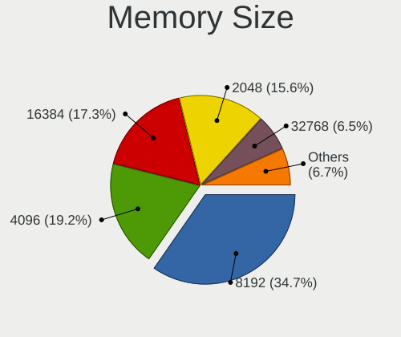

| Size   | Desktops | Percent |
|--------|----------|---------|
| 8192   | 753      | 34.68%  |
| 4096   | 417      | 19.21%  |
| 16384  | 375      | 17.27%  |
| 2048   | 338      | 15.57%  |
| 32768  | 142      | 6.54%   |
| 1024   | 111      | 5.11%   |
| 512    | 21       | 0.97%   |
| 49152  | 5        | 0.23%   |
| 65536  | 2        | 0.09%   |
| 256    | 2        | 0.09%   |
| 131072 | 1        | 0.05%   |
| 24576  | 1        | 0.05%   |
| 9096   | 1        | 0.05%   |
| 1536   | 1        | 0.05%   |
| 64     | 1        | 0.05%   |

Memory Speed
------------

Memory module speed

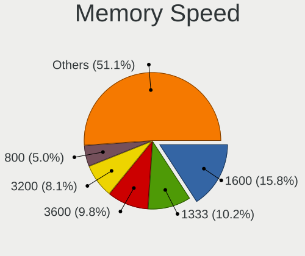

| Speed   | Desktops | Percent |
|---------|----------|---------|
| 1600    | 349      | 15.83%  |
| 1333    | 226      | 10.25%  |
| 3600    | 216      | 9.8%    |
| 3200    | 178      | 8.07%   |
| 800     | 110      | 4.99%   |
| 2400    | 103      | 4.67%   |
| 2667    | 84       | 3.81%   |
| 2133    | 83       | 3.76%   |
| 667     | 70       | 3.17%   |
| 3000    | 53       | 2.4%    |
| 6000    | 50       | 2.27%   |
| 3733    | 45       | 2.04%   |
| 1866    | 42       | 1.9%    |
| 3800    | 39       | 1.77%   |
| 3400    | 35       | 1.59%   |
| Unknown | 33       | 1.5%    |
| 4000    | 32       | 1.45%   |
| 1800    | 32       | 1.45%   |
| 2666    | 29       | 1.32%   |
| 1867    | 27       | 1.22%   |
| 4800    | 26       | 1.18%   |
| 3333    | 26       | 1.18%   |
| 1067    | 24       | 1.09%   |
| 1066    | 22       | 1%      |
| 400     | 21       | 0.95%   |
| 5600    | 17       | 0.77%   |
| 2933    | 15       | 0.68%   |
| 3933    | 12       | 0.54%   |
| 533     | 12       | 0.54%   |
| 3866    | 11       | 0.5%    |
| 3666    | 11       | 0.5%    |
| 3466    | 11       | 0.5%    |
| 2866    | 11       | 0.5%    |
| 1334    | 10       | 0.45%   |
| 2000    | 8        | 0.36%   |
| 1648    | 8        | 0.36%   |
| 333     | 8        | 0.36%   |
| 6400    | 7        | 0.32%   |
| 1639    | 7        | 0.32%   |
| 49926   | 6        | 0.27%   |

Printers & scanners
-------------------

Printer Vendor
--------------

Printer device vendors

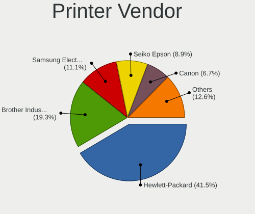

| Vendor                | Desktops | Percent |
|-----------------------|----------|---------|
| Hewlett-Packard       | 56       | 41.48%  |
| Brother Industries    | 26       | 19.26%  |
| Samsung Electronics   | 15       | 11.11%  |
| Seiko Epson           | 12       | 8.89%   |
| Canon                 | 9        | 6.67%   |
| Prolific Technology   | 5        | 3.7%    |
| Lexmark International | 3        | 2.22%   |
| Ricoh                 | 2        | 1.48%   |
| QinHeng Electronics   | 2        | 1.48%   |
| Zebra Technologies    | 1        | 0.74%   |
| Zebra                 | 1        | 0.74%   |
| Xerox                 | 1        | 0.74%   |
| Minolta               | 1        | 0.74%   |
| Datamax-O'Neil        | 1        | 0.74%   |

Printer Model
-------------

Printer device models

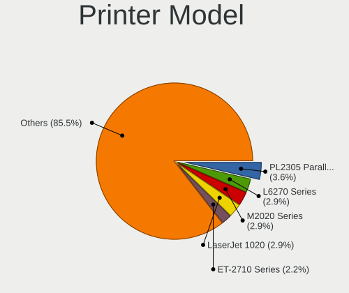

| Model                                  | Desktops | Percent |
|----------------------------------------|----------|---------|
| Prolific PL2305 Parallel Port          | 5        | 3.62%   |
| Seiko Epson L6270 Series               | 4        | 2.9%    |
| Samsung M2020 Series                   | 4        | 2.9%    |
| HP LaserJet 1020                       | 4        | 2.9%    |
| Seiko Epson ET-2710 Series             | 3        | 2.17%   |
| HP Smart Tank 710-720 series           | 3        | 2.17%   |
| HP LaserJet P2015 series               | 3        | 2.17%   |
| HP LaserJet M14-M17                    | 3        | 2.17%   |
| HP DeskJet 4530 series                 | 3        | 2.17%   |
| Canon iP7200 series                    | 3        | 2.17%   |
| Samsung ML-216x Series Laser Printer   | 2        | 1.45%   |
| Samsung ML-2010P Mono Laser Printer    | 2        | 1.45%   |
| Ricoh SP 150                           | 2        | 1.45%   |
| QinHeng CH340S                         | 2        | 1.45%   |
| HP Smart Tank 510 series               | 2        | 1.45%   |
| HP LaserJet P2055 series               | 2        | 1.45%   |
| HP LaserJet 1018                       | 2        | 1.45%   |
| HP Deskjet F4500 series                | 2        | 1.45%   |
| HP DeskJet F4100 Printer series        | 2        | 1.45%   |
| HP DeskJet 845c                        | 2        | 1.45%   |
| HP DeskJet 840c                        | 2        | 1.45%   |
| HP DeskJet 3700 series                 | 2        | 1.45%   |
| HP Deskjet 1050 J410                   | 2        | 1.45%   |
| Brother HL-1210W series                | 2        | 1.45%   |
| Brother DCP-T520W                      | 2        | 1.45%   |
| Brother DCP-J105                       | 2        | 1.45%   |
| Brother DCP-9020CDW                    | 2        | 1.45%   |
| Brother DCP-1610W                      | 2        | 1.45%   |
| Brother DCP-1510                       | 2        | 1.45%   |
| Zebra LP2844 Printer                   | 1        | 0.72%   |
| Zebra LP2824                           | 1        | 0.72%   |
| Xerox WorkCentre PE16                  | 1        | 0.72%   |
| Seiko Epson XP-7100 Series             | 1        | 0.72%   |
| Seiko Epson WF-2850 Series             | 1        | 0.72%   |
| Seiko Epson Stylus NX230/SX235W Series | 1        | 0.72%   |
| Seiko Epson L405 Series                | 1        | 0.72%   |
| Seiko Epson L1110 Series               | 1        | 0.72%   |
| Samsung SCX-4300 Series                | 1        | 0.72%   |
| Samsung SCX-4200 series                | 1        | 0.72%   |
| Samsung SCX-3400 Series                | 1        | 0.72%   |

Scanner Vendor
--------------

Scanner device vendors

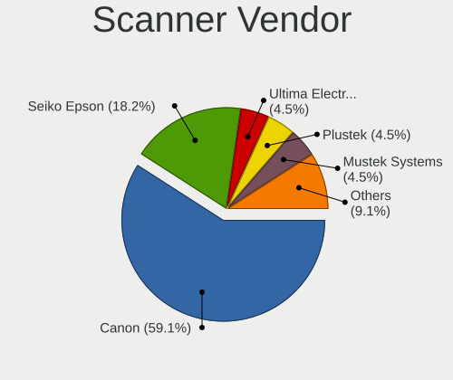

| Vendor                      | Desktops | Percent |
|-----------------------------|----------|---------|
| Canon                       | 13       | 59.09%  |
| Seiko Epson                 | 4        | 18.18%  |
| Ultima Electronics          | 1        | 4.55%   |
| Plustek                     | 1        | 4.55%   |
| Mustek Systems              | 1        | 4.55%   |
| Hewlett-Packard             | 1        | 4.55%   |
| Acer Peripherals (now BenQ) | 1        | 4.55%   |

Scanner Model
-------------

Scanner device models

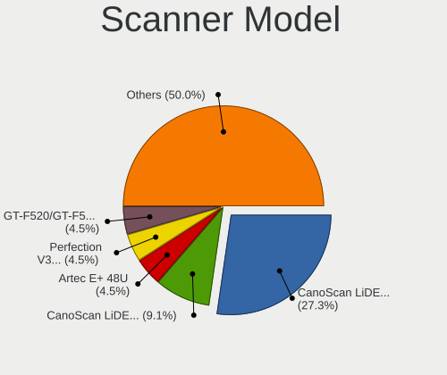

| Model                                                    | Desktops | Percent |
|----------------------------------------------------------|----------|---------|
| Canon CanoScan LiDE 210                                  | 6        | 27.27%  |
| Canon CanoScan LiDE 120                                  | 2        | 9.09%   |
| Ultima Artec E+ 48U                                      | 1        | 4.55%   |
| Seiko Epson Perfection V37/V370                          | 1        | 4.55%   |
| Seiko Epson GT-F520/GT-F570 [Perfection 3590 PHOTO]      | 1        | 4.55%   |
| Seiko Epson GT-F500/GT-F550 [Perfection 2480/2580 PHOTO] | 1        | 4.55%   |
| Seiko Epson GT-7300U [Perfection 1260/1260 PHOTO]        | 1        | 4.55%   |
| Plustek OpticPro 1248U Scanner #2                        | 1        | 4.55%   |
| Mustek Systems BearPaw 2448 TA Pro                       | 1        | 4.55%   |
| HP Scanjet 3000                                          | 1        | 4.55%   |
| Canon CanoScan N670U/N676U/LiDE 20                       | 1        | 4.55%   |
| Canon CanoScan LIDE 25                                   | 1        | 4.55%   |
| Canon CanoScan LiDE 110                                  | 1        | 4.55%   |
| Canon CanoScan LiDE 100                                  | 1        | 4.55%   |
| Canon CanoScan 4400F                                     | 1        | 4.55%   |
| Acer Peripherals (now BenQ) S2W 3300U/4300U              | 1        | 4.55%   |

Camera
------

Camera Vendor
-------------

Camera device vendors

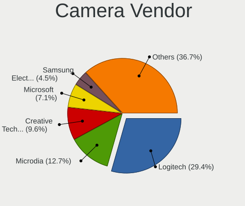

| Vendor                                 | Desktops | Percent |
|----------------------------------------|----------|---------|
| Logitech                               | 125      | 29.41%  |
| Microdia                               | 54       | 12.71%  |
| Creative Technology                    | 41       | 9.65%   |
| Microsoft                              | 30       | 7.06%   |
| Samsung Electronics                    | 19       | 4.47%   |
| Generalplus Technology                 | 12       | 2.82%   |
| Sunplus Innovation Technology          | 10       | 2.35%   |
| Z-Star Microelectronics                | 8        | 1.88%   |
| Jieli Technology                       | 8        | 1.88%   |
| Hewlett-Packard                        | 7        | 1.65%   |
| Cubeternet                             | 7        | 1.65%   |
| Xiongmai                               | 6        | 1.41%   |
| Realtek Semiconductor                  | 6        | 1.41%   |
| Chicony Electronics                    | 6        | 1.41%   |
| Apple                                  | 6        | 1.41%   |
| Alcor Micro                            | 6        | 1.41%   |
| Razer USA                              | 5        | 1.18%   |
| GEMBIRD                                | 5        | 1.18%   |
| Anker PowerConf C200                   | 5        | 1.18%   |
| Valve Software                         | 4        | 0.94%   |
| MacroSilicon                           | 4        | 0.94%   |
| Aveo Technology                        | 4        | 0.94%   |
| Trust                                  | 3        | 0.71%   |
| eMeet                                  | 3        | 0.71%   |
| Pixart Imaging                         | 2        | 0.47%   |
| LG Electronics                         | 2        | 0.47%   |
| Lenovo                                 | 2        | 0.47%   |
| KYE Systems (Mouse Systems)            | 2        | 0.47%   |
| Cheng Uei Precision Industry (Foxlink) | 2        | 0.47%   |
| ARC International                      | 2        | 0.47%   |
| Unknown                                | 2        | 0.47%   |
| webcam                                 | 1        | 0.24%   |
| Web Camera                             | 1        | 0.24%   |
| WaveRider Communications               | 1        | 0.24%   |
| USB3.0 HD Audio Capture                | 1        | 0.24%   |
| Unknown                                | 1        | 0.24%   |
| Tatung                                 | 1        | 0.24%   |
| SunplusIT                              | 1        | 0.24%   |
| Silicon Motion                         | 1        | 0.24%   |
| Polycom                                | 1        | 0.24%   |

Camera Model
------------

Camera device models

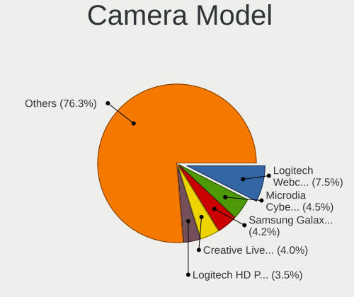

| Model                                             | Desktops | Percent |
|---------------------------------------------------|----------|---------|
| Logitech Webcam C270                              | 32       | 7.51%   |
| Microdia CyberTrack H7                            | 19       | 4.46%   |
| Samsung Galaxy series, misc. (MTP mode)           | 18       | 4.23%   |
| Creative Live! Cam Sync HD [VF0770]               | 17       | 3.99%   |
| Logitech HD Pro Webcam C920                       | 15       | 3.52%   |
| Microsoft LifeCam HD-3000                         | 12       | 2.82%   |
| Logitech Webcam C170                              | 11       | 2.58%   |
| Microdia USB 2.0 Camera                           | 9        | 2.11%   |
| Microdia Integrated Camera                        | 9        | 2.11%   |
| Logitech Webcam C310                              | 9        | 2.11%   |
| Generalplus GENERAL WEBCAM                        | 9        | 2.11%   |
| Jieli USB PHY 2.0                                 | 7        | 1.64%   |
| Z-Star Venus USB2.0 Camera                        | 6        | 1.41%   |
| Xiongmai web camera                               | 6        | 1.41%   |
| Logitech C922 Pro Stream Webcam                   | 6        | 1.41%   |
| Creative Live! Cam Sync 1080p                     | 6        | 1.41%   |
| Apple iPhone 5/5C/5S/6/SE/7/8/X                   | 6        | 1.41%   |
| Sunplus Full HD webcam                            | 5        | 1.17%   |
| Microdia Webcam Vitade AF                         | 5        | 1.17%   |
| Microdia Camera                                   | 5        | 1.17%   |
| Logitech C920 PRO HD Webcam                       | 5        | 1.17%   |
| GEMBIRD Generic UVC 1.00 camera [AppoTech AX2311] | 5        | 1.17%   |
| Cubeternet USB2.0 Camera                          | 5        | 1.17%   |
| Creative Live! Cam Sync 1080p V2                  | 5        | 1.17%   |
| Anker PowerConf C200 Anker PowerConf C200         | 5        | 1.17%   |
| Valve Software 3D Camera                          | 4        | 0.94%   |
| Microdia Sonix USB 2.0 Camera                     | 4        | 0.94%   |
| HP Webcam HD 2300                                 | 4        | 0.94%   |
| Sunplus Integrated Camera                         | 3        | 0.7%    |
| Razer USA Gaming Webcam [Kiyo]                    | 3        | 0.7%    |
| Microsoft LifeCam VX-500 [1357]                   | 3        | 0.7%    |
| Microsoft LifeCam Studio                          | 3        | 0.7%    |
| Microsoft LifeCam NX-6000                         | 3        | 0.7%    |
| MacroSilicon USB Video                            | 3        | 0.7%    |
| Logitech Webcam C930e                             | 3        | 0.7%    |
| Logitech Webcam C120                              | 3        | 0.7%    |
| Logitech StreamCam                                | 3        | 0.7%    |
| Logitech Logitech Webcam C100                     | 3        | 0.7%    |
| Logitech BRIO Ultra HD Webcam                     | 3        | 0.7%    |
| eMeet HD Webcam eMeet C970L                       | 3        | 0.7%    |

Security
--------

Fingerprint Vendor
------------------

Fingerprint sensor vendors

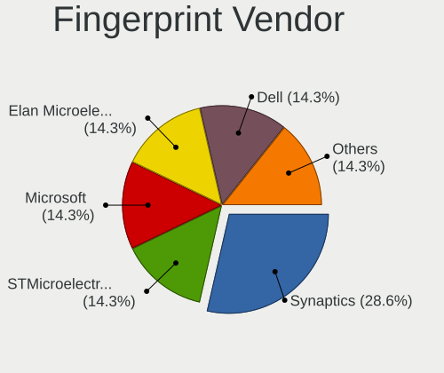

| Vendor                | Desktops | Percent |
|-----------------------|----------|---------|
| Synaptics             | 2        | 28.57%  |
| STMicroelectronics    | 1        | 14.29%  |
| Microsoft             | 1        | 14.29%  |
| Elan Microelectronics | 1        | 14.29%  |
| Dell                  | 1        | 14.29%  |
| AuthenTec             | 1        | 14.29%  |

Fingerprint Model
-----------------

Fingerprint sensor models

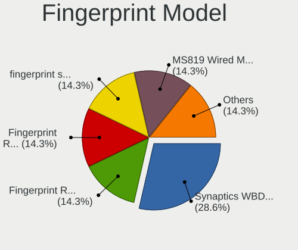

| Model                                          | Desktops | Percent |
|------------------------------------------------|----------|---------|
| Synaptics  WBDI Fingerprint Reader - USB 052   | 2        | 28.57%  |
| STMicroelectronics Fingerprint Reader          | 1        | 14.29%  |
| Microsoft Fingerprint Reader                   | 1        | 14.29%  |
| Elan fingerprint sensor [FeinTech FPS00200]    | 1        | 14.29%  |
| Dell MS819 Wired Mouse With Fingerprint Reader | 1        | 14.29%  |
| AuthenTec AES1600                              | 1        | 14.29%  |

Chipcard Vendor
---------------

Chipcard module vendors

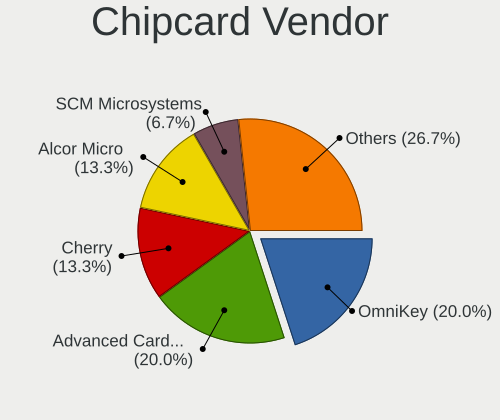

| Vendor                    | Desktops | Percent |
|---------------------------|----------|---------|
| OmniKey                   | 3        | 20%     |
| Advanced Card Systems     | 3        | 20%     |
| Cherry                    | 2        | 13.33%  |
| Alcor Micro               | 2        | 13.33%  |
| SCM Microsystems          | 1        | 6.67%   |
| Reiner SCT Kartensysteme  | 1        | 6.67%   |
| Gemalto (was Gemplus)     | 1        | 6.67%   |
| Fujitsu Siemens Computers | 1        | 6.67%   |
| Clay Logic                | 1        | 6.67%   |

Chipcard Model
--------------

Chipcard module models

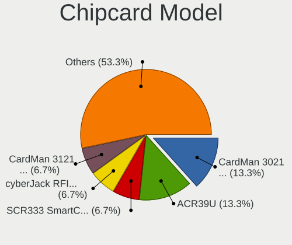

| Model                                                                      | Desktops | Percent |
|----------------------------------------------------------------------------|----------|---------|
| OmniKey CardMan 3021 / 3121                                                | 2        | 13.33%  |
| Advanced Card Systems ACR39U                                               | 2        | 13.33%  |
| SCM Microsystems SCR333 SmartCard Reader                                   | 1        | 6.67%   |
| Reiner SCT Kartensysteme cyberJack RFID basis contactless smartcard reader | 1        | 6.67%   |
| OmniKey CardMan 3121 (HID Technologies)                                    | 1        | 6.67%   |
| Gemalto (was Gemplus) GemPC Key SmartCard Reader                           | 1        | 6.67%   |
| Fujitsu Siemens Computers SmartCard Reader 2A                              | 1        | 6.67%   |
| Clay Logic Nitrokey Pro                                                    | 1        | 6.67%   |
| Cherry SmartCard Reader Keyboard KC 1000 SC                                | 1        | 6.67%   |
| Cherry Smart Terminal XX44                                                 | 1        | 6.67%   |
| Alcor Micro Watchdata W 1981                                               | 1        | 6.67%   |
| Alcor Micro AU9540 Smartcard Reader                                        | 1        | 6.67%   |
| Advanced Card Systems ACR1281 1S Dual Reader                               | 1        | 6.67%   |

Unsupported
-----------

Unsupported Devices
-------------------

Total unsupported devices on board

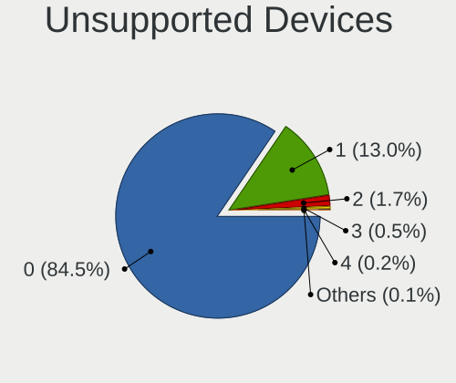

| Total | Desktops | Percent |
|-------|----------|---------|
| 0     | 2640     | 84.51%  |
| 1     | 407      | 13.03%  |
| 2     | 54       | 1.73%   |
| 3     | 15       | 0.48%   |
| 4     | 5        | 0.16%   |
| 7     | 1        | 0.03%   |
| 6     | 1        | 0.03%   |
| 5     | 1        | 0.03%   |

Unsupported Device Types
------------------------

Types of unsupported devices

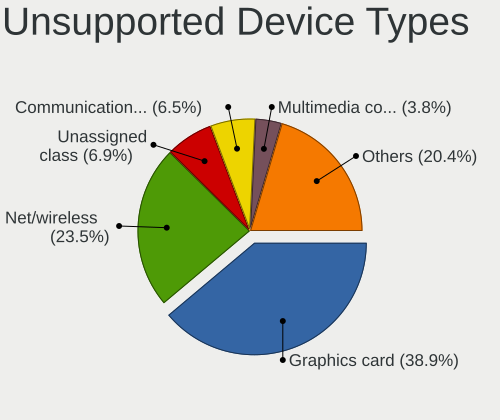

| Type                     | Desktops | Percent |
|--------------------------|----------|---------|
| Graphics card            | 215      | 38.88%  |
| Net/wireless             | 130      | 23.51%  |
| Unassigned class         | 38       | 6.87%   |
| Communication controller | 36       | 6.51%   |
| Multimedia controller    | 21       | 3.8%    |
| Bluetooth                | 20       | 3.62%   |
| Sound                    | 18       | 3.25%   |
| Network                  | 12       | 2.17%   |
| Camera                   | 10       | 1.81%   |
| Net/ethernet             | 9        | 1.63%   |
| Storage/raid             | 8        | 1.45%   |
| Chipcard                 | 8        | 1.45%   |
| Storage/ide              | 7        | 1.27%   |
| Fingerprint reader       | 5        | 0.9%    |
| Modem                    | 4        | 0.72%   |
| Firewire controller      | 4        | 0.72%   |
| Dvb card                 | 3        | 0.54%   |
| Storage/nvme             | 2        | 0.36%   |
| Storage                  | 2        | 0.36%   |
| Video                    | 1        | 0.18%   |

