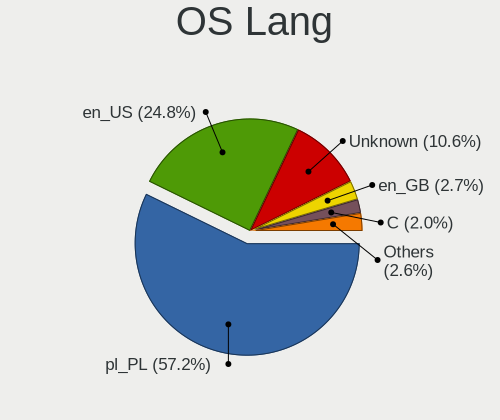
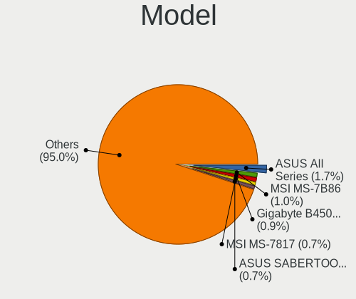
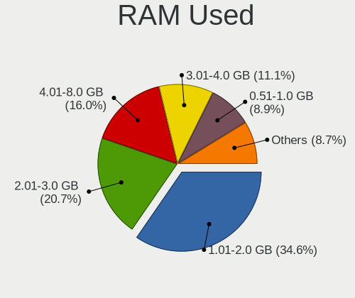
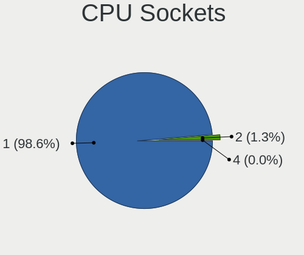
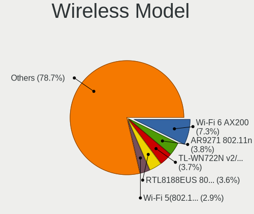
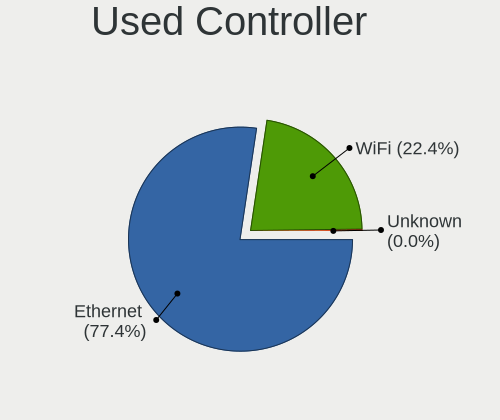
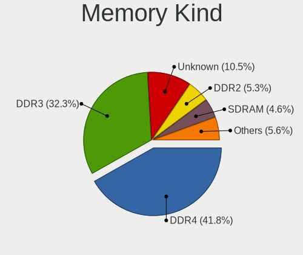
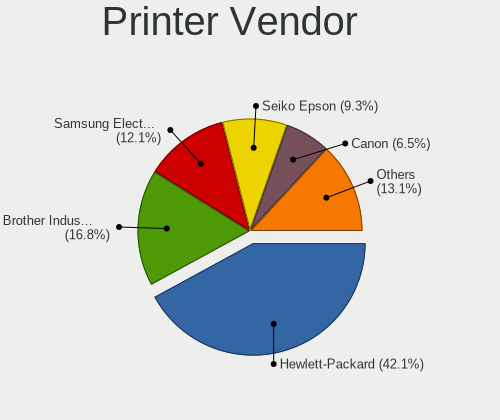

Linux in Poland - Tested Hardware & Statistics (Desktops)
---------------------------------------------------------

A project to collect tested hardware configurations for Linux in Poland.

Anyone can contribute to this report by the [hw-probe](https://github.com/linuxhw/hw-probe) tool:

    sudo -E hw-probe -all -upload

Please contribute! Especially if your hardware is rare.

Contents
--------

* [ Test Cases ](#test-cases)

* [ System ](#system)
  - [ OS                       ](#os)
  - [ OS Family                ](#os-family)
  - [ Kernel                   ](#kernel)
  - [ Kernel Family            ](#kernel-family)
  - [ Kernel Major Ver.        ](#kernel-major-ver)
  - [ Arch                     ](#arch)
  - [ DE                       ](#de)
  - [ Display Server           ](#display-server)
  - [ Display Manager          ](#display-manager)
  - [ OS Lang                  ](#os-lang)
  - [ Boot Mode                ](#boot-mode)
  - [ Filesystem               ](#filesystem)
  - [ Part. scheme             ](#part-scheme)
  - [ Dual Boot with Linux/BSD ](#dual-boot-with-linuxbsd)
  - [ Dual Boot (Win)          ](#dual-boot-win)

* [ Board ](#board)
  - [ Vendor                   ](#vendor)
  - [ Model                    ](#model)
  - [ Model Family             ](#model-family)
  - [ MFG Year                 ](#mfg-year)
  - [ Form Factor              ](#form-factor)
  - [ Secure Boot              ](#secure-boot)
  - [ Coreboot                 ](#coreboot)
  - [ RAM Size                 ](#ram-size)
  - [ RAM Used                 ](#ram-used)
  - [ Total Drives             ](#total-drives)
  - [ Has CD-ROM               ](#has-cd-rom)
  - [ Has Ethernet             ](#has-ethernet)
  - [ Has WiFi                 ](#has-wifi)
  - [ Has Bluetooth            ](#has-bluetooth)

* [ Location ](#location)
  - [ Country                  ](#country)
  - [ City                     ](#city)

* [ Drives ](#drives)
  - [ Drive Vendor             ](#drive-vendor)
  - [ Drive Model              ](#drive-model)
  - [ HDD Vendor               ](#hdd-vendor)
  - [ SSD Vendor               ](#ssd-vendor)
  - [ Drive Kind               ](#drive-kind)
  - [ Drive Connector          ](#drive-connector)
  - [ Drive Size               ](#drive-size)
  - [ Space Total              ](#space-total)
  - [ Space Used               ](#space-used)
  - [ Malfunc. Drives          ](#malfunc-drives)
  - [ Malfunc. Drive Vendor    ](#malfunc-drive-vendor)
  - [ Malfunc. HDD Vendor      ](#malfunc-hdd-vendor)
  - [ Malfunc. Drive Kind      ](#malfunc-drive-kind)
  - [ Failed Drives            ](#failed-drives)
  - [ Failed Drive Vendor      ](#failed-drive-vendor)
  - [ Drive Status             ](#drive-status)

* [ Storage controller ](#storage-controller)
  - [ Storage Vendor           ](#storage-vendor)
  - [ Storage Model            ](#storage-model)
  - [ Storage Kind             ](#storage-kind)

* [ Processor ](#processor)
  - [ CPU Vendor               ](#cpu-vendor)
  - [ CPU Model                ](#cpu-model)
  - [ CPU Model Family         ](#cpu-model-family)
  - [ CPU Cores                ](#cpu-cores)
  - [ CPU Sockets              ](#cpu-sockets)
  - [ CPU Threads              ](#cpu-threads)
  - [ CPU Op-Modes             ](#cpu-op-modes)
  - [ CPU Microcode            ](#cpu-microcode)
  - [ CPU Microarch            ](#cpu-microarch)

* [ Graphics ](#graphics)
  - [ GPU Vendor               ](#gpu-vendor)
  - [ GPU Model                ](#gpu-model)
  - [ GPU Combo                ](#gpu-combo)
  - [ GPU Driver               ](#gpu-driver)
  - [ GPU Memory               ](#gpu-memory)

* [ Monitor ](#monitor)
  - [ Monitor Vendor           ](#monitor-vendor)
  - [ Monitor Model            ](#monitor-model)
  - [ Monitor Resolution       ](#monitor-resolution)
  - [ Monitor Diagonal         ](#monitor-diagonal)
  - [ Monitor Width            ](#monitor-width)
  - [ Aspect Ratio             ](#aspect-ratio)
  - [ Monitor Area             ](#monitor-area)
  - [ Pixel Density            ](#pixel-density)
  - [ Multiple Monitors        ](#multiple-monitors)

* [ Network ](#network)
  - [ Net Controller Vendor    ](#net-controller-vendor)
  - [ Net Controller Model     ](#net-controller-model)
  - [ Wireless Vendor          ](#wireless-vendor)
  - [ Wireless Model           ](#wireless-model)
  - [ Ethernet Vendor          ](#ethernet-vendor)
  - [ Ethernet Model           ](#ethernet-model)
  - [ Net Controller Kind      ](#net-controller-kind)
  - [ Used Controller          ](#used-controller)
  - [ NICs                     ](#nics)
  - [ IPv6                     ](#ipv6)

* [ Bluetooth ](#bluetooth)
  - [ Bluetooth Vendor         ](#bluetooth-vendor)
  - [ Bluetooth Model          ](#bluetooth-model)

* [ Sound ](#sound)
  - [ Sound Vendor             ](#sound-vendor)
  - [ Sound Model              ](#sound-model)

* [ Memory ](#memory)
  - [ Memory Vendor            ](#memory-vendor)
  - [ Memory Model             ](#memory-model)
  - [ Memory Kind              ](#memory-kind)
  - [ Memory Form Factor       ](#memory-form-factor)
  - [ Memory Size              ](#memory-size)
  - [ Memory Speed             ](#memory-speed)

* [ Printers & scanners ](#printers--scanners)
  - [ Printer Vendor           ](#printer-vendor)
  - [ Printer Model            ](#printer-model)
  - [ Scanner Vendor           ](#scanner-vendor)
  - [ Scanner Model            ](#scanner-model)

* [ Camera ](#camera)
  - [ Camera Vendor            ](#camera-vendor)
  - [ Camera Model             ](#camera-model)

* [ Security ](#security)
  - [ Fingerprint Vendor       ](#fingerprint-vendor)
  - [ Fingerprint Model        ](#fingerprint-model)
  - [ Chipcard Vendor          ](#chipcard-vendor)
  - [ Chipcard Model           ](#chipcard-model)

* [ Unsupported ](#unsupported)
  - [ Unsupported Devices      ](#unsupported-devices)
  - [ Unsupported Device Types ](#unsupported-device-types)

Test Cases
----------

Total: 3645

| Vendor        | Model                       | Probe                                                      | Date         |
|---------------|-----------------------------|------------------------------------------------------------|--------------|
| ASUSTek       | ROG STRIX B650E-I GAMING... | [bdcf61edde](https://linux-hardware.org/?probe=bdcf61edde) | May 09, 2024 |
| ASRock        | B450 Gaming K4              | [5283cfbe48](https://linux-hardware.org/?probe=5283cfbe48) | May 08, 2024 |
| MSI           | Z77A-G43                    | [f7e7eb8397](https://linux-hardware.org/?probe=f7e7eb8397) | May 08, 2024 |
| Lenovo        | 3148 SDK0J40700 WIN 3258... | [b24f7286d2](https://linux-hardware.org/?probe=b24f7286d2) | May 07, 2024 |
| ASUSTek       | M3A78-CM                    | [0bcef3f207](https://linux-hardware.org/?probe=0bcef3f207) | May 06, 2024 |
| Gigabyte      | A520 AORUS ELITE            | [8c70aa2f23](https://linux-hardware.org/?probe=8c70aa2f23) | May 05, 2024 |
| Gigabyte      | AB350-Gaming-CF             | [5510492a9b](https://linux-hardware.org/?probe=5510492a9b) | May 05, 2024 |
| ASUSTek       | ROG STRIX Z690-A GAMING ... | [64b195310b](https://linux-hardware.org/?probe=64b195310b) | May 04, 2024 |
| Gigabyte      | 970A-DS3P                   | [0cf6542a99](https://linux-hardware.org/?probe=0cf6542a99) | May 04, 2024 |
| Gigabyte      | H81M-HD3                    | [adcbc97b26](https://linux-hardware.org/?probe=adcbc97b26) | May 01, 2024 |
| ASRock        | A320M-HDV R3.0              | [156f672c14](https://linux-hardware.org/?probe=156f672c14) | Apr 29, 2024 |
| HP            | 8266                        | [f71d887eb9](https://linux-hardware.org/?probe=f71d887eb9) | Apr 28, 2024 |
| ASUSTek       | X99-A                       | [eab08c37f7](https://linux-hardware.org/?probe=eab08c37f7) | Apr 28, 2024 |
| MSI           | B550-A PRO                  | [63cd7f6146](https://linux-hardware.org/?probe=63cd7f6146) | Apr 27, 2024 |
| Dell          | 0GTK4K A02                  | [80bf3e1bd7](https://linux-hardware.org/?probe=80bf3e1bd7) | Apr 26, 2024 |
| MSI           | B250I GAMING PRO AC         | [edf573962d](https://linux-hardware.org/?probe=edf573962d) | Apr 25, 2024 |
| Gigabyte      | B450M DS3H-CF               | [61842fb260](https://linux-hardware.org/?probe=61842fb260) | Apr 25, 2024 |
| Inventec      | DQ Class A02                | [5edaa0ed95](https://linux-hardware.org/?probe=5edaa0ed95) | Apr 24, 2024 |
| Gigabyte      | EX58-UD3R                   | [826b210e79](https://linux-hardware.org/?probe=826b210e79) | Apr 24, 2024 |
| ASRock        | B75 Pro3                    | [87a8013072](https://linux-hardware.org/?probe=87a8013072) | Apr 24, 2024 |
| MSI           | B550-A PRO                  | [db4981c2cb](https://linux-hardware.org/?probe=db4981c2cb) | Apr 24, 2024 |
| Lenovo        | 4030                        | [0c37613f84](https://linux-hardware.org/?probe=0c37613f84) | Apr 23, 2024 |
| ASUSTek       | M3A78-CM                    | [cdc42c64dd](https://linux-hardware.org/?probe=cdc42c64dd) | Apr 22, 2024 |
| Intel         | DQ45CB AAE30148-206         | [fb8d3b6c11](https://linux-hardware.org/?probe=fb8d3b6c11) | Apr 22, 2024 |
| MSI           | B550-A PRO                  | [f1d18ed809](https://linux-hardware.org/?probe=f1d18ed809) | Apr 22, 2024 |
| ASRock        | B550M-ITX/ac                | [6389731461](https://linux-hardware.org/?probe=6389731461) | Apr 21, 2024 |
| Unknown       | V0.9x                       | [db770f4cb9](https://linux-hardware.org/?probe=db770f4cb9) | Apr 21, 2024 |
| HP            | 805B                        | [06e17f3461](https://linux-hardware.org/?probe=06e17f3461) | Apr 21, 2024 |
| MSI           | MAG B460 TORPEDO            | [14ab4e8bf9](https://linux-hardware.org/?probe=14ab4e8bf9) | Apr 20, 2024 |
| MSI           | MS-7235                     | [67ea957848](https://linux-hardware.org/?probe=67ea957848) | Apr 20, 2024 |
| MSI           | B450M PRO-VDH MAX           | [479eb31f54](https://linux-hardware.org/?probe=479eb31f54) | Apr 20, 2024 |
| ASUSTek       | A88XM-E                     | [6ff101f38c](https://linux-hardware.org/?probe=6ff101f38c) | Apr 19, 2024 |
| MSI           | MS-7235                     | [d0b1ac0e44](https://linux-hardware.org/?probe=d0b1ac0e44) | Apr 19, 2024 |
| Gigabyte      | B365M DS3H                  | [dbc2dd908b](https://linux-hardware.org/?probe=dbc2dd908b) | Apr 19, 2024 |
| Gigabyte      | B360M D3H-CF                | [708c7e8551](https://linux-hardware.org/?probe=708c7e8551) | Apr 18, 2024 |
| Gigabyte      | B360M D3H-CF                | [42b026296c](https://linux-hardware.org/?probe=42b026296c) | Apr 18, 2024 |
| MSI           | B85M-G43                    | [c632093cb8](https://linux-hardware.org/?probe=c632093cb8) | Apr 18, 2024 |
| Fujitsu       | D2778-C1 S26361-D2778-C1    | [a344875df9](https://linux-hardware.org/?probe=a344875df9) | Apr 18, 2024 |
| HP            | 805B                        | [d5bf7c2652](https://linux-hardware.org/?probe=d5bf7c2652) | Apr 18, 2024 |
| Gigabyte      | B450M K-CF                  | [74fb485917](https://linux-hardware.org/?probe=74fb485917) | Apr 17, 2024 |
| WeiBu         | ADL-N Prod                  | [3da2323db4](https://linux-hardware.org/?probe=3da2323db4) | Apr 17, 2024 |
| Gigabyte      | B760M GAMING X AX DDR4      | [e18c7ed37c](https://linux-hardware.org/?probe=e18c7ed37c) | Apr 17, 2024 |
| ASRock        | Z790 Nova WiFi              | [e7087ec7e4](https://linux-hardware.org/?probe=e7087ec7e4) | Apr 16, 2024 |
| AMI           | Cherry Trail CR             | [e60bc95699](https://linux-hardware.org/?probe=e60bc95699) | Apr 16, 2024 |
| MSI           | MPG Z390 GAMING PLUS        | [89c08359b4](https://linux-hardware.org/?probe=89c08359b4) | Apr 15, 2024 |
| ASUSTek       | P7P55D-E PRO                | [dfb33effe1](https://linux-hardware.org/?probe=dfb33effe1) | Apr 15, 2024 |
| Prestigio     | Smartbook PSB116A           | [044fc5c4f8](https://linux-hardware.org/?probe=044fc5c4f8) | Apr 14, 2024 |
| ASRock        | B650M-HDV/M.2               | [8ed3523f0a](https://linux-hardware.org/?probe=8ed3523f0a) | Apr 14, 2024 |
| ASRock        | X670E PG Lightning          | [e3bd195788](https://linux-hardware.org/?probe=e3bd195788) | Apr 14, 2024 |
| Gigabyte      | X570 GAMING X               | [d79972631a](https://linux-hardware.org/?probe=d79972631a) | Apr 14, 2024 |
| Gigabyte      | X570 GAMING X               | [fa6b81bbbf](https://linux-hardware.org/?probe=fa6b81bbbf) | Apr 14, 2024 |
| Prestigio     | Smartbook PSB116A           | [cc592e784e](https://linux-hardware.org/?probe=cc592e784e) | Apr 13, 2024 |
| Fujitsu       | D3313-B1 S26361-D3313-B1    | [2998b9027d](https://linux-hardware.org/?probe=2998b9027d) | Apr 13, 2024 |
| ASRock        | B650M-HDV/M.2               | [9958bc908a](https://linux-hardware.org/?probe=9958bc908a) | Apr 12, 2024 |
| ASRock        | B450 Gaming K4              | [57a6443eb0](https://linux-hardware.org/?probe=57a6443eb0) | Apr 11, 2024 |
| Gigabyte      | AB350-Gaming-CF             | [f15f757ee9](https://linux-hardware.org/?probe=f15f757ee9) | Apr 11, 2024 |
| Gigabyte      | B450 AORUS ELITE V2         | [330f3172fe](https://linux-hardware.org/?probe=330f3172fe) | Apr 11, 2024 |
| Gigabyte      | B450 AORUS ELITE V2         | [11b54dd819](https://linux-hardware.org/?probe=11b54dd819) | Apr 10, 2024 |
| ASUSTek       | H110M-R                     | [473b7a412c](https://linux-hardware.org/?probe=473b7a412c) | Apr 10, 2024 |
| ASUSTek       | H110M-R                     | [d8c6b0c73f](https://linux-hardware.org/?probe=d8c6b0c73f) | Apr 10, 2024 |
| Gigabyte      | A520 AORUS ELITE            | [bef494961d](https://linux-hardware.org/?probe=bef494961d) | Apr 09, 2024 |
| ASUSTek       | P7P55 WS SUPERCOMPUTER      | [a3c369db65](https://linux-hardware.org/?probe=a3c369db65) | Apr 08, 2024 |
| Gigabyte      | B550 AORUS ELITE V2         | [da36e04639](https://linux-hardware.org/?probe=da36e04639) | Apr 08, 2024 |
| MSI           | B360M PRO-VD 2019-01-24     | [5452671bee](https://linux-hardware.org/?probe=5452671bee) | Apr 08, 2024 |
| ASUSTek       | ProArt Z790-CREATOR WIFI    | [b66f739603](https://linux-hardware.org/?probe=b66f739603) | Apr 08, 2024 |
| MSI           | B85M-G43                    | [aabca2aa43](https://linux-hardware.org/?probe=aabca2aa43) | Apr 08, 2024 |
| ASUSTek       | TUF Gaming B550M-PLUS WI... | [a88186f61b](https://linux-hardware.org/?probe=a88186f61b) | Apr 07, 2024 |
| MSI           | B550-A PRO                  | [3497604929](https://linux-hardware.org/?probe=3497604929) | Apr 07, 2024 |
| MSI           | Z170A GAMING M5             | [3ade43a7b8](https://linux-hardware.org/?probe=3ade43a7b8) | Apr 06, 2024 |
| Dell          | 0XCR8D A03                  | [bad21847e5](https://linux-hardware.org/?probe=bad21847e5) | Apr 06, 2024 |
| Dell          | 0XCR8D A03                  | [a80358f28f](https://linux-hardware.org/?probe=a80358f28f) | Apr 06, 2024 |
| ASUSTek       | H110M-R                     | [a06f264d4e](https://linux-hardware.org/?probe=a06f264d4e) | Apr 06, 2024 |
| ASUSTek       | H110M-R                     | [a449b1fee1](https://linux-hardware.org/?probe=a449b1fee1) | Apr 06, 2024 |
| Gigabyte      | Z170X-Gaming 5              | [6cd475d812](https://linux-hardware.org/?probe=6cd475d812) | Apr 05, 2024 |
| Gigabyte      | B85M-HD3                    | [3d81eb0d82](https://linux-hardware.org/?probe=3d81eb0d82) | Apr 05, 2024 |
| MSI           | Z590 PRO WIFI               | [b4b9cef6a6](https://linux-hardware.org/?probe=b4b9cef6a6) | Apr 05, 2024 |
| ASUSTek       | P7P55 WS SUPERCOMPUTER      | [4fd520e1ae](https://linux-hardware.org/?probe=4fd520e1ae) | Apr 05, 2024 |
| Dell          | 0T1D10 A01                  | [bd3b0fd5b1](https://linux-hardware.org/?probe=bd3b0fd5b1) | Apr 04, 2024 |
| Gigabyte      | Z370 AORUS Gaming K3-CF     | [38ce1804a9](https://linux-hardware.org/?probe=38ce1804a9) | Apr 04, 2024 |
| Gigabyte      | AB350-Gaming-CF             | [30921e196b](https://linux-hardware.org/?probe=30921e196b) | Apr 03, 2024 |
| MSI           | H110M PRO-VH                | [a135bec51e](https://linux-hardware.org/?probe=a135bec51e) | Apr 03, 2024 |
| Gigabyte      | B450M DS3H-CF               | [368787221d](https://linux-hardware.org/?probe=368787221d) | Apr 03, 2024 |
| Gigabyte      | B250M-DS3H-CF               | [da761f866b](https://linux-hardware.org/?probe=da761f866b) | Apr 03, 2024 |
| Gigabyte      | A520 AORUS ELITE            | [3186452a8d](https://linux-hardware.org/?probe=3186452a8d) | Apr 02, 2024 |
| ASRock        | B450 Gaming K4              | [999ca6d09e](https://linux-hardware.org/?probe=999ca6d09e) | Apr 02, 2024 |
| ASRock        | FM2A88X Extreme6+           | [1f8ed16982](https://linux-hardware.org/?probe=1f8ed16982) | Apr 01, 2024 |
| Gigabyte      | B250M-DS3H-CF               | [013cd55b76](https://linux-hardware.org/?probe=013cd55b76) | Apr 01, 2024 |
| MSI           | MPG Z390 GAMING PLUS        | [4f3083c7fa](https://linux-hardware.org/?probe=4f3083c7fa) | Mar 31, 2024 |
| Gigabyte      | EP35-DS3                    | [3d93a78c1b](https://linux-hardware.org/?probe=3d93a78c1b) | Mar 31, 2024 |
| MSI           | H310M PRO-M2                | [b2753ac794](https://linux-hardware.org/?probe=b2753ac794) | Mar 31, 2024 |
| ASUSTek       | PRIME H310M-D R2.0          | [b251cdc4d6](https://linux-hardware.org/?probe=b251cdc4d6) | Mar 31, 2024 |
| Gigabyte      | B550 AORUS ELITE V2         | [7f3b57dade](https://linux-hardware.org/?probe=7f3b57dade) | Mar 30, 2024 |
| MSI           | B550-A PRO                  | [3eaae650f2](https://linux-hardware.org/?probe=3eaae650f2) | Mar 30, 2024 |
| ASUSTek       | PRIME X370-PRO              | [924fb04b1c](https://linux-hardware.org/?probe=924fb04b1c) | Mar 30, 2024 |
| Gigabyte      | J1900N-D3V                  | [b79b70e996](https://linux-hardware.org/?probe=b79b70e996) | Mar 30, 2024 |
| PC Engines    | apu6                        | [1a5b773874](https://linux-hardware.org/?probe=1a5b773874) | Mar 29, 2024 |
| PC Engines    | apu4                        | [618a89189b](https://linux-hardware.org/?probe=618a89189b) | Mar 29, 2024 |
| PC Engines    | apu4                        | [1aa2f691fd](https://linux-hardware.org/?probe=1aa2f691fd) | Mar 29, 2024 |
| PC Engines    | apu6                        | [55be2a3f96](https://linux-hardware.org/?probe=55be2a3f96) | Mar 29, 2024 |
| MSI           | B85M-E45                    | [a81e4b4666](https://linux-hardware.org/?probe=a81e4b4666) | Mar 29, 2024 |
| ASUSTek       | PRIME B660M-A WIFI D4       | [b8f102aaac](https://linux-hardware.org/?probe=b8f102aaac) | Mar 29, 2024 |
| MSI           | MAG B660M MORTAR WIFI DD... | [a87aa51bf9](https://linux-hardware.org/?probe=a87aa51bf9) | Mar 29, 2024 |
| ASRock        | Z87 Extreme6                | [a7ffff15ff](https://linux-hardware.org/?probe=a7ffff15ff) | Mar 28, 2024 |
| Gigabyte      | H81M-HD3                    | [af704cb4f0](https://linux-hardware.org/?probe=af704cb4f0) | Mar 28, 2024 |
| ASUSTek       | TUF Gaming B550-PLUS        | [56d77f445e](https://linux-hardware.org/?probe=56d77f445e) | Mar 27, 2024 |
| Dell          | 0YXT71 A03                  | [d854505a5b](https://linux-hardware.org/?probe=d854505a5b) | Mar 27, 2024 |
| MSI           | MPG Z390 GAMING PLUS        | [e98dcc5095](https://linux-hardware.org/?probe=e98dcc5095) | Mar 26, 2024 |
| Dell          | 0JP3NX A01                  | [01246bca4d](https://linux-hardware.org/?probe=01246bca4d) | Mar 26, 2024 |
| ASRock        | Z270 Pro4                   | [321c667929](https://linux-hardware.org/?probe=321c667929) | Mar 25, 2024 |
| ASUSTek       | TUF B360M-PLUS GAMING       | [000bb993d1](https://linux-hardware.org/?probe=000bb993d1) | Mar 25, 2024 |
| MSI           | H110M PRO-VD                | [c250bda654](https://linux-hardware.org/?probe=c250bda654) | Mar 25, 2024 |
| ASUSTek       | M3A78-CM                    | [73b0c5faa2](https://linux-hardware.org/?probe=73b0c5faa2) | Mar 25, 2024 |
| Lenovo        | 310B SDK0J40697 WIN 3305... | [619de50d8d](https://linux-hardware.org/?probe=619de50d8d) | Mar 22, 2024 |
| ASRock        | Z790 Riptide WiFi           | [a03071be8b](https://linux-hardware.org/?probe=a03071be8b) | Mar 21, 2024 |
| ASRock        | Z790 Riptide WiFi           | [b8d5bc7323](https://linux-hardware.org/?probe=b8d5bc7323) | Mar 21, 2024 |
| MSI           | Z97 GAMING 3                | [ed6f176128](https://linux-hardware.org/?probe=ed6f176128) | Mar 20, 2024 |
| Gigabyte      | B550 AORUS PRO              | [fa1b26cc24](https://linux-hardware.org/?probe=fa1b26cc24) | Mar 20, 2024 |
| MSI           | B550M PRO-VDH WIFI          | [8c35e52f29](https://linux-hardware.org/?probe=8c35e52f29) | Mar 20, 2024 |
| ASUSTek       | PRIME B450M-K II            | [b8ecf5e08e](https://linux-hardware.org/?probe=b8ecf5e08e) | Mar 19, 2024 |
| Lenovo        | 102F                        | [e4e070f4df](https://linux-hardware.org/?probe=e4e070f4df) | Mar 19, 2024 |
| Lenovo        | 367D SDK0J40709 WIN         | [178bf2c5e4](https://linux-hardware.org/?probe=178bf2c5e4) | Mar 19, 2024 |
| ASUSTek       | PRIME B450-PLUS             | [345e2df2db](https://linux-hardware.org/?probe=345e2df2db) | Mar 19, 2024 |
| Dell          | 0T656F A01                  | [325c5efb6e](https://linux-hardware.org/?probe=325c5efb6e) | Mar 18, 2024 |
| MSI           | PRO Z690-A DDR4             | [8a0b5bf53d](https://linux-hardware.org/?probe=8a0b5bf53d) | Mar 16, 2024 |
| Dell          | 0NDYHG A01                  | [fd065468fe](https://linux-hardware.org/?probe=fd065468fe) | Mar 15, 2024 |
| MSI           | B450M-A PRO MAX             | [80f8e06be3](https://linux-hardware.org/?probe=80f8e06be3) | Mar 15, 2024 |
| ASUSTek       | TUF B450-PRO GAMING         | [cd91e52611](https://linux-hardware.org/?probe=cd91e52611) | Mar 14, 2024 |
| Lenovo        | 1057 SDK0T76528 WIN 3556... | [ff14bf45ec](https://linux-hardware.org/?probe=ff14bf45ec) | Mar 14, 2024 |
| ASUSTek       | P7P55D EVO                  | [806a262ea9](https://linux-hardware.org/?probe=806a262ea9) | Mar 13, 2024 |
| HP            | 802F                        | [b1e3afbbe6](https://linux-hardware.org/?probe=b1e3afbbe6) | Mar 13, 2024 |
| ASUSTek       | P8B75-M LX                  | [8f95893494](https://linux-hardware.org/?probe=8f95893494) | Mar 10, 2024 |
| Inventec      | DQ Class A02                | [37d048c93a](https://linux-hardware.org/?probe=37d048c93a) | Mar 10, 2024 |
| ASUSTek       | H170I-PRO                   | [87c80982bf](https://linux-hardware.org/?probe=87c80982bf) | Mar 10, 2024 |
| Gigabyte      | B650 GAMING X AX            | [36d3d4da58](https://linux-hardware.org/?probe=36d3d4da58) | Mar 09, 2024 |
| ASRock        | B450 Gaming K4              | [9f6eb2e3c7](https://linux-hardware.org/?probe=9f6eb2e3c7) | Mar 08, 2024 |
| Fujitsu       | D3061-A1 S26361-D3061-A1    | [964e9fc189](https://linux-hardware.org/?probe=964e9fc189) | Mar 06, 2024 |
| Gigabyte      | H610M S2H DDR4              | [ce07f0ac70](https://linux-hardware.org/?probe=ce07f0ac70) | Mar 05, 2024 |
| ASUSTek       | H110M-K                     | [7f9c1e49a4](https://linux-hardware.org/?probe=7f9c1e49a4) | Mar 03, 2024 |
| MSI           | B550-A PRO                  | [26ff4f7e05](https://linux-hardware.org/?probe=26ff4f7e05) | Mar 03, 2024 |
| ASUSTek       | PRIME Z370-P                | [0929ad6623](https://linux-hardware.org/?probe=0929ad6623) | Mar 02, 2024 |
| ASUSTek       | M2N-SLI                     | [5fc7d2a8ca](https://linux-hardware.org/?probe=5fc7d2a8ca) | Mar 01, 2024 |
| HP            | 212A                        | [688db14d79](https://linux-hardware.org/?probe=688db14d79) | Feb 29, 2024 |
| Dell          | 0DFRFW A01                  | [0f4cb380d0](https://linux-hardware.org/?probe=0f4cb380d0) | Feb 28, 2024 |
| Huanan        | X99-QD4 V1.0                | [0f88a70c7b](https://linux-hardware.org/?probe=0f88a70c7b) | Feb 27, 2024 |
| Huanan        | X99-QD4 V1.0                | [2fd4bd879c](https://linux-hardware.org/?probe=2fd4bd879c) | Feb 27, 2024 |
| Dell          | 0M863N A01                  | [1db77a3f14](https://linux-hardware.org/?probe=1db77a3f14) | Feb 27, 2024 |
| ASUSTek       | ROG CROSSHAIR VIII DARK ... | [18159e9d65](https://linux-hardware.org/?probe=18159e9d65) | Feb 26, 2024 |
| Gigabyte      | AB350-Gaming-CF             | [f88143daa2](https://linux-hardware.org/?probe=f88143daa2) | Feb 26, 2024 |
| ASUSTek       | A68HM-K                     | [9fc2e0ddf4](https://linux-hardware.org/?probe=9fc2e0ddf4) | Feb 24, 2024 |
| ASRock        | B650E PG Riptide WiFi       | [91d5b02885](https://linux-hardware.org/?probe=91d5b02885) | Feb 23, 2024 |
| Gigabyte      | A520 AORUS ELITE            | [2d34bf7198](https://linux-hardware.org/?probe=2d34bf7198) | Feb 23, 2024 |
| ASUSTek       | M3A78-CM                    | [9ff0ddca4e](https://linux-hardware.org/?probe=9ff0ddca4e) | Feb 23, 2024 |
| Dell          | 014GRG A03                  | [17454c7fbf](https://linux-hardware.org/?probe=17454c7fbf) | Feb 22, 2024 |
| MSI           | MAG B550 TOMAHAWK           | [b9e21044bf](https://linux-hardware.org/?probe=b9e21044bf) | Feb 21, 2024 |
| ASRock        | G41C-GS                     | [afd3704033](https://linux-hardware.org/?probe=afd3704033) | Feb 21, 2024 |
| HP            | 3047h                       | [c427822595](https://linux-hardware.org/?probe=c427822595) | Feb 20, 2024 |
| HP            | 3047h                       | [ea79dc34bf](https://linux-hardware.org/?probe=ea79dc34bf) | Feb 20, 2024 |
| ASUSTek       | PRIME B450M-A II            | [081a22fc69](https://linux-hardware.org/?probe=081a22fc69) | Feb 19, 2024 |
| ASRock        | G41C-GS                     | [b28c13684a](https://linux-hardware.org/?probe=b28c13684a) | Feb 19, 2024 |
| Gigabyte      | AB350-Gaming-CF             | [acc39c2774](https://linux-hardware.org/?probe=acc39c2774) | Feb 19, 2024 |
| Dell          | 09430Y A00                  | [9f8d5462dc](https://linux-hardware.org/?probe=9f8d5462dc) | Feb 18, 2024 |
| Dell          | 09430Y A00                  | [6f65212b30](https://linux-hardware.org/?probe=6f65212b30) | Feb 18, 2024 |
| Gigabyte      | GA-MA78GM-S2H               | [206b8bb6e0](https://linux-hardware.org/?probe=206b8bb6e0) | Feb 18, 2024 |
| Gigabyte      | B560M D3H                   | [dd40636963](https://linux-hardware.org/?probe=dd40636963) | Feb 17, 2024 |
| Fujitsu       | D3227-A1 S26361-D3227-A1    | [edc56f85b9](https://linux-hardware.org/?probe=edc56f85b9) | Feb 17, 2024 |
| Gigabyte      | A520 AORUS ELITE            | [95950fa2f0](https://linux-hardware.org/?probe=95950fa2f0) | Feb 16, 2024 |
| MSI           | B550-A PRO                  | [6679155660](https://linux-hardware.org/?probe=6679155660) | Feb 15, 2024 |
| ASUSTek       | ROG STRIX Z690-A GAMING ... | [f3dad0af31](https://linux-hardware.org/?probe=f3dad0af31) | Feb 15, 2024 |
| Gigabyte      | X470 AORUS ULTRA GAMING-... | [966e0998a7](https://linux-hardware.org/?probe=966e0998a7) | Feb 15, 2024 |
| ASUSTek       | P8H77-V                     | [f1e9821f67](https://linux-hardware.org/?probe=f1e9821f67) | Feb 14, 2024 |
| ASUSTek       | M3A78-CM                    | [c7fd8dfb5c](https://linux-hardware.org/?probe=c7fd8dfb5c) | Feb 14, 2024 |
| Gigabyte      | 970A-UD3P                   | [1c23d35f29](https://linux-hardware.org/?probe=1c23d35f29) | Feb 13, 2024 |
| ASUSTek       | TUF Gaming B650M-E WIFI     | [2ae73a83dc](https://linux-hardware.org/?probe=2ae73a83dc) | Feb 12, 2024 |
| MSI           | X470 GAMING PLUS MAX        | [d0a7bef49e](https://linux-hardware.org/?probe=d0a7bef49e) | Feb 11, 2024 |
| Gigabyte      | B550 AORUS ELITE            | [7fbd70f2fa](https://linux-hardware.org/?probe=7fbd70f2fa) | Feb 10, 2024 |
| ASUSTek       | PRIME B760-PLUS             | [4c75dbf3e4](https://linux-hardware.org/?probe=4c75dbf3e4) | Feb 10, 2024 |
| ASUSTek       | P8H61-M LX                  | [4c161aa59a](https://linux-hardware.org/?probe=4c161aa59a) | Feb 09, 2024 |
| Gigabyte      | A520 AORUS ELITE            | [db94db2244](https://linux-hardware.org/?probe=db94db2244) | Feb 09, 2024 |
| ASUSTek       | P8Z68-V PRO GEN3            | [d099546e70](https://linux-hardware.org/?probe=d099546e70) | Feb 07, 2024 |
| HP            | 8617                        | [dac67e77d7](https://linux-hardware.org/?probe=dac67e77d7) | Feb 07, 2024 |
| MSI           | B360M PRO-VD 2019-01-24     | [4affd322d1](https://linux-hardware.org/?probe=4affd322d1) | Feb 07, 2024 |
| HP            | 3646h                       | [458c563fc1](https://linux-hardware.org/?probe=458c563fc1) | Feb 07, 2024 |
| ASUSTek       | M3A78-CM                    | [c2d2eb2434](https://linux-hardware.org/?probe=c2d2eb2434) | Feb 06, 2024 |
| ASUSTek       | PRIME B650-PLUS             | [ee599b6f9d](https://linux-hardware.org/?probe=ee599b6f9d) | Feb 06, 2024 |
| Gigabyte      | GA-970A-UD3                 | [78586dd263](https://linux-hardware.org/?probe=78586dd263) | Feb 06, 2024 |
| Gigabyte      | B550 AORUS ELITE V2         | [15012c2832](https://linux-hardware.org/?probe=15012c2832) | Feb 05, 2024 |
| MSI           | MAG B550 TOMAHAWK           | [427b1d49e5](https://linux-hardware.org/?probe=427b1d49e5) | Feb 05, 2024 |
| Gigabyte      | AB350-Gaming-CF             | [a6b7480c05](https://linux-hardware.org/?probe=a6b7480c05) | Feb 04, 2024 |
| ASUSTek       | ROG STRIX B550-F GAMING     | [b026f0eff6](https://linux-hardware.org/?probe=b026f0eff6) | Feb 04, 2024 |
| MSI           | B550-A PRO                  | [eb39e76cfd](https://linux-hardware.org/?probe=eb39e76cfd) | Feb 04, 2024 |
| Medion        | Z170H4-EA                   | [17c714c6b5](https://linux-hardware.org/?probe=17c714c6b5) | Feb 02, 2024 |
| Gigabyte      | A520 AORUS ELITE            | [075ee0ca67](https://linux-hardware.org/?probe=075ee0ca67) | Feb 02, 2024 |
| Lenovo        | SHARKBAY SDK0E50510 WIN     | [fc6230e374](https://linux-hardware.org/?probe=fc6230e374) | Feb 01, 2024 |
| Gigabyte      | B650 GAMING X AX            | [5bf97512a7](https://linux-hardware.org/?probe=5bf97512a7) | Feb 01, 2024 |
| MSI           | B550-A PRO                  | [c211b49a95](https://linux-hardware.org/?probe=c211b49a95) | Feb 01, 2024 |
| ASUSTek       | PRIME B650-PLUS             | [c83dcb11ca](https://linux-hardware.org/?probe=c83dcb11ca) | Jan 31, 2024 |
| ASUSTek       | M5A97 R2.0                  | [bf9814808f](https://linux-hardware.org/?probe=bf9814808f) | Jan 31, 2024 |
| MSI           | B550-A PRO                  | [85c2cd9371](https://linux-hardware.org/?probe=85c2cd9371) | Jan 31, 2024 |
| ASUSTek       | ProArt Z490-CREATOR 10G     | [54beeb17dc](https://linux-hardware.org/?probe=54beeb17dc) | Jan 31, 2024 |
| ASUSTek       | ProArt Z490-CREATOR 10G     | [65272ffc77](https://linux-hardware.org/?probe=65272ffc77) | Jan 31, 2024 |
| Gigabyte      | EP45-UD3R                   | [45a5318a64](https://linux-hardware.org/?probe=45a5318a64) | Jan 31, 2024 |
| ASUSTek       | P5QLD PRO                   | [2558422111](https://linux-hardware.org/?probe=2558422111) | Jan 30, 2024 |
| ASRock        | B450M Pro4                  | [c0f87d75df](https://linux-hardware.org/?probe=c0f87d75df) | Jan 29, 2024 |
| Dell          | 0GDG8Y A00                  | [9cbabba588](https://linux-hardware.org/?probe=9cbabba588) | Jan 29, 2024 |
| HP            | 805D                        | [81113f9b0d](https://linux-hardware.org/?probe=81113f9b0d) | Jan 29, 2024 |
| Gigabyte      | AB350-Gaming-CF             | [8949a81c2e](https://linux-hardware.org/?probe=8949a81c2e) | Jan 29, 2024 |
| ASUSTek       | M4N68T-M-V2                 | [5c4d08e0c4](https://linux-hardware.org/?probe=5c4d08e0c4) | Jan 28, 2024 |
| ASRock        | FM2A75M Pro4+               | [d3d40bf0b4](https://linux-hardware.org/?probe=d3d40bf0b4) | Jan 28, 2024 |
| ASUSTek       | M3A78-CM                    | [e17793cd71](https://linux-hardware.org/?probe=e17793cd71) | Jan 28, 2024 |
| ASUSTek       | Maximus VII RANGER          | [23059625c1](https://linux-hardware.org/?probe=23059625c1) | Jan 27, 2024 |
| Gigabyte      | B450M DS3H-CF               | [a6b046b2b7](https://linux-hardware.org/?probe=a6b046b2b7) | Jan 27, 2024 |
| MSI           | MAG B550 TOMAHAWK           | [9eeddc4566](https://linux-hardware.org/?probe=9eeddc4566) | Jan 27, 2024 |
| Gigabyte      | B450M DS3H-CF               | [95541e0847](https://linux-hardware.org/?probe=95541e0847) | Jan 27, 2024 |
| MSI           | B250M BAZOOKA               | [0bd7085870](https://linux-hardware.org/?probe=0bd7085870) | Jan 26, 2024 |
| Gigabyte      | A520 AORUS ELITE            | [9b7cbb57c7](https://linux-hardware.org/?probe=9b7cbb57c7) | Jan 26, 2024 |
| HP            | 1589                        | [d731924276](https://linux-hardware.org/?probe=d731924276) | Jan 25, 2024 |
| ASUSTek       | TUF Gaming B550-PLUS WIF... | [813ed73797](https://linux-hardware.org/?probe=813ed73797) | Jan 25, 2024 |
| Gigabyte      | B550M DS3H                  | [347b980bdf](https://linux-hardware.org/?probe=347b980bdf) | Jan 25, 2024 |
| Lenovo        | 36D9 SDK0J40700 WIN 3258... | [f05b3ce6a1](https://linux-hardware.org/?probe=f05b3ce6a1) | Jan 25, 2024 |
| ASUSTek       | TUF Gaming B550-PLUS WIF... | [869af9b5c0](https://linux-hardware.org/?probe=869af9b5c0) | Jan 25, 2024 |
| ASUSTek       | PRIME H510M-E               | [ea518cb09d](https://linux-hardware.org/?probe=ea518cb09d) | Jan 24, 2024 |
| Gigabyte      | B250M-D3H-CF                | [03a6ed21ba](https://linux-hardware.org/?probe=03a6ed21ba) | Jan 22, 2024 |
| MSI           | Z87-G43 GAMING              | [09efa6e85b](https://linux-hardware.org/?probe=09efa6e85b) | Jan 22, 2024 |
| MSI           | Z87-G43 GAMING              | [4966a58d3c](https://linux-hardware.org/?probe=4966a58d3c) | Jan 22, 2024 |
| HP            | 213D A01                    | [37b7fb4c4e](https://linux-hardware.org/?probe=37b7fb4c4e) | Jan 20, 2024 |
| Gigabyte      | H310M S2V                   | [7be62ed879](https://linux-hardware.org/?probe=7be62ed879) | Jan 20, 2024 |
| HP            | 8055                        | [5e6a445b12](https://linux-hardware.org/?probe=5e6a445b12) | Jan 19, 2024 |
| ASRock        | B450 Pro4                   | [66b278bb03](https://linux-hardware.org/?probe=66b278bb03) | Jan 18, 2024 |
| HP            | 1998                        | [b193235ba4](https://linux-hardware.org/?probe=b193235ba4) | Jan 17, 2024 |
| MSI           | A68HM-E33 V2                | [da97b5c9f5](https://linux-hardware.org/?probe=da97b5c9f5) | Jan 17, 2024 |
| ASUSTek       | Z170 PRO GAMING             | [48399b3fc4](https://linux-hardware.org/?probe=48399b3fc4) | Jan 16, 2024 |
| ASUSTek       | PRIME X470-PRO              | [cb1fa259a7](https://linux-hardware.org/?probe=cb1fa259a7) | Jan 16, 2024 |
| HP            | 8617                        | [4ea51313bd](https://linux-hardware.org/?probe=4ea51313bd) | Jan 15, 2024 |
| ASRock        | 970 Extreme4                | [7c02fff797](https://linux-hardware.org/?probe=7c02fff797) | Jan 13, 2024 |
| ASRock        | 970 Extreme4                | [9956a82d50](https://linux-hardware.org/?probe=9956a82d50) | Jan 13, 2024 |
| ASUSTek       | PRIME B660M-A D4            | [cd57f74a31](https://linux-hardware.org/?probe=cd57f74a31) | Jan 13, 2024 |
| HP            | 1589                        | [194b5a119c](https://linux-hardware.org/?probe=194b5a119c) | Jan 13, 2024 |
| ASUSTek       | Z87-C                       | [acc914cabd](https://linux-hardware.org/?probe=acc914cabd) | Jan 12, 2024 |
| ASRock        | B360M Pro4                  | [054186ab28](https://linux-hardware.org/?probe=054186ab28) | Jan 12, 2024 |
| Gigabyte      | H310M M.2 x.x               | [f67cc2282f](https://linux-hardware.org/?probe=f67cc2282f) | Jan 12, 2024 |
| ASUSTek       | ROG STRIX B650E-E GAMING... | [2e0a03aba1](https://linux-hardware.org/?probe=2e0a03aba1) | Jan 11, 2024 |
| MSI           | B450M MORTAR                | [1d1f76da3c](https://linux-hardware.org/?probe=1d1f76da3c) | Jan 11, 2024 |
| Dell          | 0D24M8 A00                  | [a482ed79df](https://linux-hardware.org/?probe=a482ed79df) | Jan 11, 2024 |
| Dell          | 0773VG A02                  | [f06d515c8d](https://linux-hardware.org/?probe=f06d515c8d) | Jan 11, 2024 |
| Gigabyte      | B550 AORUS ELITE V2         | [0c54141bbd](https://linux-hardware.org/?probe=0c54141bbd) | Jan 11, 2024 |
| Gigabyte      | B550 AORUS ELITE V2         | [3117cde827](https://linux-hardware.org/?probe=3117cde827) | Jan 11, 2024 |
| Dell          | 0T1D10 A01                  | [0c1256487e](https://linux-hardware.org/?probe=0c1256487e) | Jan 11, 2024 |
| ASUSTek       | PRIME B550M-A               | [a14291c1d2](https://linux-hardware.org/?probe=a14291c1d2) | Jan 11, 2024 |
| MSI           | Z87I                        | [35114b37dd](https://linux-hardware.org/?probe=35114b37dd) | Jan 10, 2024 |
| ASUSTek       | P5K-E                       | [1cacfbcadd](https://linux-hardware.org/?probe=1cacfbcadd) | Jan 09, 2024 |
| ASRock        | B450 Gaming K4              | [9446a22c53](https://linux-hardware.org/?probe=9446a22c53) | Jan 09, 2024 |
| ASRock        | B450M-HDV R4.0              | [4001af92e2](https://linux-hardware.org/?probe=4001af92e2) | Jan 08, 2024 |
| MSI           | B550-A PRO                  | [363ad22f1d](https://linux-hardware.org/?probe=363ad22f1d) | Jan 08, 2024 |
| MSI           | B460M PRO-VDH WIFI          | [a642b9a382](https://linux-hardware.org/?probe=a642b9a382) | Jan 07, 2024 |
| ASUSTek       | PRIME B660M-A WIFI D4       | [41582699c7](https://linux-hardware.org/?probe=41582699c7) | Jan 06, 2024 |
| ASRock        | X570 Phantom Gaming 4       | [0a9a88c59f](https://linux-hardware.org/?probe=0a9a88c59f) | Jan 06, 2024 |
| ASUSTek       | PRIME B650M-A WIFI II       | [a7c6792366](https://linux-hardware.org/?probe=a7c6792366) | Jan 05, 2024 |
| ASUSTek       | PRIME B650M-A WIFI II       | [bb1b5c33d2](https://linux-hardware.org/?probe=bb1b5c33d2) | Jan 05, 2024 |
| Gigabyte      | B550 AORUS ELITE V2         | [0f56b6d674](https://linux-hardware.org/?probe=0f56b6d674) | Jan 05, 2024 |
| Dell          | 0T1D10 A01                  | [36fd42ae37](https://linux-hardware.org/?probe=36fd42ae37) | Jan 05, 2024 |
| ASRock        | X670E Pro RS                | [d7b3301bdb](https://linux-hardware.org/?probe=d7b3301bdb) | Jan 05, 2024 |
| ASUSTek       | M3A78-CM                    | [7bf93755f2](https://linux-hardware.org/?probe=7bf93755f2) | Jan 04, 2024 |
| Gigabyte      | A520 AORUS ELITE            | [da0c7ff210](https://linux-hardware.org/?probe=da0c7ff210) | Jan 04, 2024 |
| ASRock        | X570 Phantom Gaming 4       | [436f8ebcc9](https://linux-hardware.org/?probe=436f8ebcc9) | Jan 04, 2024 |
| Fujitsu       | D3313-A1 S26361-D3313-A1    | [ee8caab1b7](https://linux-hardware.org/?probe=ee8caab1b7) | Jan 03, 2024 |
| ASRock        | B450 Pro4                   | [457ba2586a](https://linux-hardware.org/?probe=457ba2586a) | Jan 03, 2024 |
| Gigabyte      | AB350-Gaming-CF             | [a0e025d32d](https://linux-hardware.org/?probe=a0e025d32d) | Jan 02, 2024 |
| ASUSTek       | Crosshair V Formula         | [2db319c529](https://linux-hardware.org/?probe=2db319c529) | Jan 02, 2024 |
| MSI           | B550-A PRO                  | [3b6183bbb5](https://linux-hardware.org/?probe=3b6183bbb5) | Dec 31, 2023 |
| Lenovo        | ThinkCentre M91p 7005A21    | [043bcfc503](https://linux-hardware.org/?probe=043bcfc503) | Dec 31, 2023 |
| Lenovo        | ThinkCentre M91p 7005A21    | [e783d0ce11](https://linux-hardware.org/?probe=e783d0ce11) | Dec 31, 2023 |
| MSI           | Z170A TOMAHAWK              | [451e3803a0](https://linux-hardware.org/?probe=451e3803a0) | Dec 31, 2023 |
| HP            | 1494                        | [a7618ec01a](https://linux-hardware.org/?probe=a7618ec01a) | Dec 30, 2023 |
| ASRock        | X570S PG Riptide            | [aa3f2ed203](https://linux-hardware.org/?probe=aa3f2ed203) | Dec 29, 2023 |
| MSI           | B250 PC MATE                | [5429df4a6b](https://linux-hardware.org/?probe=5429df4a6b) | Dec 29, 2023 |
| Gigabyte      | G41M-Combo                  | [0a6df1d55f](https://linux-hardware.org/?probe=0a6df1d55f) | Dec 28, 2023 |
| Gigabyte      | B450 AORUS PRO-CF           | [fa779d28cc](https://linux-hardware.org/?probe=fa779d28cc) | Dec 28, 2023 |
| Gigabyte      | B450 AORUS PRO-CF           | [66f68b08bd](https://linux-hardware.org/?probe=66f68b08bd) | Dec 28, 2023 |
| ASRock        | A300M-STX                   | [755facbd26](https://linux-hardware.org/?probe=755facbd26) | Dec 28, 2023 |
| Gigabyte      | 990XA-UD3                   | [fe315c0cf8](https://linux-hardware.org/?probe=fe315c0cf8) | Dec 27, 2023 |
| Gigabyte      | A520 AORUS ELITE            | [619ddf5210](https://linux-hardware.org/?probe=619ddf5210) | Dec 27, 2023 |
| Gigabyte      | Z97M-DS3H                   | [e0b1c57cc6](https://linux-hardware.org/?probe=e0b1c57cc6) | Dec 27, 2023 |
| ASUSTek       | M3A78-CM                    | [983d2046a3](https://linux-hardware.org/?probe=983d2046a3) | Dec 27, 2023 |
| MSI           | B85-G43                     | [fd632d7a1f](https://linux-hardware.org/?probe=fd632d7a1f) | Dec 25, 2023 |
| Gigabyte      | AB350-Gaming-CF             | [47255f4ba3](https://linux-hardware.org/?probe=47255f4ba3) | Dec 25, 2023 |
| Lenovo        | ThinkCentre M81 5049RK4     | [9ea1bc22a1](https://linux-hardware.org/?probe=9ea1bc22a1) | Dec 24, 2023 |
| ASRock        | Z790 PG Lightning           | [0b5268372a](https://linux-hardware.org/?probe=0b5268372a) | Dec 24, 2023 |
| Gigabyte      | X670 GAMING X AX            | [4452cd4a25](https://linux-hardware.org/?probe=4452cd4a25) | Dec 24, 2023 |
| ASUSTek       | P7P55D-E PRO                | [ef61ad2663](https://linux-hardware.org/?probe=ef61ad2663) | Dec 24, 2023 |
| Dell          | 09KPNV A00                  | [a90623afe1](https://linux-hardware.org/?probe=a90623afe1) | Dec 23, 2023 |
| ASUSTek       | P7P55D-E                    | [dc2914021f](https://linux-hardware.org/?probe=dc2914021f) | Dec 23, 2023 |
| Lenovo        | SHARKBAY SDK0J40705 WIN ... | [739d4b0840](https://linux-hardware.org/?probe=739d4b0840) | Dec 23, 2023 |
| Gigabyte      | Z97M-DS3H                   | [da051b693c](https://linux-hardware.org/?probe=da051b693c) | Dec 23, 2023 |
| ASUSTek       | B85-PLUS                    | [58a2ef76f9](https://linux-hardware.org/?probe=58a2ef76f9) | Dec 22, 2023 |
| Hampoo        | Cherry Trail CR             | [2c180fa555](https://linux-hardware.org/?probe=2c180fa555) | Dec 20, 2023 |
| MSI           | B450-A PRO MAX              | [f46e034f2c](https://linux-hardware.org/?probe=f46e034f2c) | Dec 20, 2023 |
| Dell          | 0T10XW A00                  | [ffff088d9c](https://linux-hardware.org/?probe=ffff088d9c) | Dec 18, 2023 |
| ASUSTek       | M3A78-CM                    | [89fd7ee431](https://linux-hardware.org/?probe=89fd7ee431) | Dec 18, 2023 |
| Gigabyte      | A520 AORUS ELITE            | [3504b628f1](https://linux-hardware.org/?probe=3504b628f1) | Dec 18, 2023 |
| Gigabyte      | AB350-Gaming-CF             | [e0b7c61c9f](https://linux-hardware.org/?probe=e0b7c61c9f) | Dec 18, 2023 |
| ASRock        | AB350M-HDV                  | [2860ba102d](https://linux-hardware.org/?probe=2860ba102d) | Dec 18, 2023 |
| ASRock        | AB350M-HDV                  | [8d45a13b61](https://linux-hardware.org/?probe=8d45a13b61) | Dec 17, 2023 |
| MSI           | MS-7255                     | [efdf3ede47](https://linux-hardware.org/?probe=efdf3ede47) | Dec 17, 2023 |
| Gigabyte      | GA-MA69G-S3H                | [d0b623f72b](https://linux-hardware.org/?probe=d0b623f72b) | Dec 17, 2023 |
| Inventec      | DQ Class A02                | [73df6dfb3b](https://linux-hardware.org/?probe=73df6dfb3b) | Dec 16, 2023 |
| HP            | 8265                        | [58cc9fa090](https://linux-hardware.org/?probe=58cc9fa090) | Dec 16, 2023 |
| Dell          | 03NVJ6 A02                  | [7f5a3db82c](https://linux-hardware.org/?probe=7f5a3db82c) | Dec 15, 2023 |
| HP            | 1495                        | [bd97989dd8](https://linux-hardware.org/?probe=bd97989dd8) | Dec 14, 2023 |
| Gigabyte      | B450M DS3H-CF               | [c8d2a05aea](https://linux-hardware.org/?probe=c8d2a05aea) | Dec 14, 2023 |
| ASUSTek       | M5A78L-M LX3                | [a51734cec9](https://linux-hardware.org/?probe=a51734cec9) | Dec 13, 2023 |
| ASUSTek       | P8H61                       | [6f5272ea27](https://linux-hardware.org/?probe=6f5272ea27) | Dec 13, 2023 |
| Fujitsu       | D3600-A1 S26361-D3600-A1    | [0e87f04695](https://linux-hardware.org/?probe=0e87f04695) | Dec 12, 2023 |
| Gigabyte      | 970A-UD3P                   | [82f5fec0c4](https://linux-hardware.org/?probe=82f5fec0c4) | Dec 12, 2023 |
| ASRock        | X470 Master SLI             | [2f96568c78](https://linux-hardware.org/?probe=2f96568c78) | Dec 12, 2023 |
| ASRock        | X470 Master SLI             | [68fe94d3be](https://linux-hardware.org/?probe=68fe94d3be) | Dec 12, 2023 |
| ASRock        | B650M PG Riptide            | [9b92833e92](https://linux-hardware.org/?probe=9b92833e92) | Dec 12, 2023 |
| MSI           | H61M-E33                    | [6123a79100](https://linux-hardware.org/?probe=6123a79100) | Dec 12, 2023 |
| Gigabyte      | B150M-D3H-CF                | [a46aa4d97c](https://linux-hardware.org/?probe=a46aa4d97c) | Dec 11, 2023 |
| ASUSTek       | P8Z77-V LX                  | [9e23503add](https://linux-hardware.org/?probe=9e23503add) | Dec 11, 2023 |
| Gigabyte      | A520 AORUS ELITE            | [e07d68d658](https://linux-hardware.org/?probe=e07d68d658) | Dec 11, 2023 |
| ASUSTek       | M3A78-CM                    | [8bf4107eed](https://linux-hardware.org/?probe=8bf4107eed) | Dec 11, 2023 |
| Gigabyte      | 970A-DS3P                   | [71de71e3f4](https://linux-hardware.org/?probe=71de71e3f4) | Dec 10, 2023 |
| Gigabyte      | P67A-UD3P-B3                | [e96b9306cb](https://linux-hardware.org/?probe=e96b9306cb) | Dec 10, 2023 |
| Gigabyte      | 970A-DS3P                   | [64b0038221](https://linux-hardware.org/?probe=64b0038221) | Dec 10, 2023 |
| ASUSTek       | B150M-A/M.2                 | [dd4ad4373b](https://linux-hardware.org/?probe=dd4ad4373b) | Dec 10, 2023 |
| Gigabyte      | Z87X-UD4H-CF                | [a960a2a5b7](https://linux-hardware.org/?probe=a960a2a5b7) | Dec 10, 2023 |
| Dell          | 0HY9JP A02                  | [25d8aaca3c](https://linux-hardware.org/?probe=25d8aaca3c) | Dec 10, 2023 |
| ASRock        | B450 Gaming K4              | [581807905e](https://linux-hardware.org/?probe=581807905e) | Dec 10, 2023 |
| ASRock        | AB350 Pro4                  | [514239398e](https://linux-hardware.org/?probe=514239398e) | Dec 09, 2023 |
| Dell          | 0NDYHG A01                  | [f7f70db230](https://linux-hardware.org/?probe=f7f70db230) | Dec 08, 2023 |
| ASUSTek       | TUF Gaming B550-PLUS        | [cc6cd166f2](https://linux-hardware.org/?probe=cc6cd166f2) | Dec 08, 2023 |
| MSI           | G31TM-P35                   | [e241cfaeca](https://linux-hardware.org/?probe=e241cfaeca) | Dec 08, 2023 |
| Dell          | 0KP561                      | [bd0971e9cc](https://linux-hardware.org/?probe=bd0971e9cc) | Dec 08, 2023 |
| HP            | 1495                        | [361c8f4360](https://linux-hardware.org/?probe=361c8f4360) | Dec 07, 2023 |
| Gigabyte      | B650 AORUS ELITE AX         | [3c37d1bb9f](https://linux-hardware.org/?probe=3c37d1bb9f) | Dec 07, 2023 |
| Foxconn       | 2A8C                        | [2a4412d268](https://linux-hardware.org/?probe=2a4412d268) | Dec 06, 2023 |
| ASUSTek       | M5A97 R2.0                  | [9b6cdd96f4](https://linux-hardware.org/?probe=9b6cdd96f4) | Dec 06, 2023 |
| Dell          | 0T1D10 A01                  | [5fa41b15bb](https://linux-hardware.org/?probe=5fa41b15bb) | Dec 05, 2023 |
| MSI           | 2A9C                        | [2ae992c0d5](https://linux-hardware.org/?probe=2ae992c0d5) | Dec 05, 2023 |
| Gigabyte      | Z87X-UD4H-CF                | [15d4dc2fe9](https://linux-hardware.org/?probe=15d4dc2fe9) | Dec 05, 2023 |
| Dell          | 0T1D10 A01                  | [65d5ddf61f](https://linux-hardware.org/?probe=65d5ddf61f) | Dec 05, 2023 |
| Gigabyte      | Z97M-DS3H                   | [6d790b9d8c](https://linux-hardware.org/?probe=6d790b9d8c) | Dec 05, 2023 |
| Dell          | 0FG011                      | [4a5701f000](https://linux-hardware.org/?probe=4a5701f000) | Dec 04, 2023 |
| Acer          | Veriton S6620G v1.0         | [34095bbfed](https://linux-hardware.org/?probe=34095bbfed) | Dec 04, 2023 |
| Gigabyte      | AB350-Gaming-CF             | [1fe1dc7462](https://linux-hardware.org/?probe=1fe1dc7462) | Dec 04, 2023 |
| Gigabyte      | Z97M-DS3H                   | [4fd5ba2289](https://linux-hardware.org/?probe=4fd5ba2289) | Dec 04, 2023 |
| Gigabyte      | H77-DS3H                    | [4c97431f16](https://linux-hardware.org/?probe=4c97431f16) | Dec 03, 2023 |
| MSI           | B85M-E43 DASH               | [b9caa2d56f](https://linux-hardware.org/?probe=b9caa2d56f) | Dec 02, 2023 |
| Fujitsu       | D3221-A1 S26361-D3221-A1    | [436f0406e4](https://linux-hardware.org/?probe=436f0406e4) | Dec 01, 2023 |
| Gigabyte      | X570S AORUS MASTER          | [f3f624e1cf](https://linux-hardware.org/?probe=f3f624e1cf) | Nov 30, 2023 |
| MSI           | A78M-E45                    | [fd9a5e65e4](https://linux-hardware.org/?probe=fd9a5e65e4) | Nov 30, 2023 |
| Gigabyte      | H61M-S1                     | [cc54ea37ef](https://linux-hardware.org/?probe=cc54ea37ef) | Nov 30, 2023 |
| ASUSTek       | M5A97 R2.0                  | [e39e2b268d](https://linux-hardware.org/?probe=e39e2b268d) | Nov 30, 2023 |
| ASRock        | 970 Extreme4                | [5dd27edbe4](https://linux-hardware.org/?probe=5dd27edbe4) | Nov 29, 2023 |
| Gigabyte      | B75M-D3H                    | [6a3776da6b](https://linux-hardware.org/?probe=6a3776da6b) | Nov 29, 2023 |
| ASRock        | J3355M                      | [a767ff37ed](https://linux-hardware.org/?probe=a767ff37ed) | Nov 29, 2023 |
| ASUSTek       | PRIME B350-PLUS             | [655dc71f64](https://linux-hardware.org/?probe=655dc71f64) | Nov 29, 2023 |
| ASUSTek       | PRIME B660M-A WIFI D4       | [c6673a5a66](https://linux-hardware.org/?probe=c6673a5a66) | Nov 29, 2023 |
| ASUSTek       | ROG STRIX B550-A GAMING     | [2df2a6f5d8](https://linux-hardware.org/?probe=2df2a6f5d8) | Nov 28, 2023 |
| Dell          | 0NW6H5 A00                  | [1a855ee74d](https://linux-hardware.org/?probe=1a855ee74d) | Nov 27, 2023 |
| ASUSTek       | F2A85-M                     | [0c272521ab](https://linux-hardware.org/?probe=0c272521ab) | Nov 27, 2023 |
| Gigabyte      | B75M-D3V                    | [142a3240d4](https://linux-hardware.org/?probe=142a3240d4) | Nov 27, 2023 |
| Gigabyte      | A520 AORUS ELITE            | [1d71979dbb](https://linux-hardware.org/?probe=1d71979dbb) | Nov 27, 2023 |
| Dell          | 0DR845                      | [e09cfb8e7a](https://linux-hardware.org/?probe=e09cfb8e7a) | Nov 27, 2023 |
| Gigabyte      | AB350-Gaming-CF             | [2a04ec7adc](https://linux-hardware.org/?probe=2a04ec7adc) | Nov 27, 2023 |
| Gigabyte      | B560M D3H                   | [8a894da286](https://linux-hardware.org/?probe=8a894da286) | Nov 26, 2023 |
| MSI           | X570-A PRO                  | [17cd5f34c3](https://linux-hardware.org/?probe=17cd5f34c3) | Nov 25, 2023 |
| MSI           | PRO B760M-P DDR4            | [462b5c65a7](https://linux-hardware.org/?probe=462b5c65a7) | Nov 25, 2023 |
| ASRock        | H110M-HDS                   | [8e326dd485](https://linux-hardware.org/?probe=8e326dd485) | Nov 25, 2023 |
| Gigabyte      | Z97M-DS3H                   | [fb9766adc5](https://linux-hardware.org/?probe=fb9766adc5) | Nov 24, 2023 |
| ASUSTek       | ROG STRIX X670E-E GAMING... | [48112cbfe0](https://linux-hardware.org/?probe=48112cbfe0) | Nov 24, 2023 |
| Dell          | 084J0R A00                  | [387b322a8e](https://linux-hardware.org/?probe=387b322a8e) | Nov 24, 2023 |
| Gigabyte      | X570 AORUS ELITE            | [5417165a43](https://linux-hardware.org/?probe=5417165a43) | Nov 24, 2023 |
| ASRock        | B450 Gaming K4              | [ee82d7417c](https://linux-hardware.org/?probe=ee82d7417c) | Nov 23, 2023 |
| Lenovo        | MAHOBAY NO DPK              | [e0781004e0](https://linux-hardware.org/?probe=e0781004e0) | Nov 22, 2023 |
| Gigabyte      | F2A75M-HD2                  | [1370f43083](https://linux-hardware.org/?probe=1370f43083) | Nov 22, 2023 |
| ASUSTek       | M3A78-CM                    | [4eae08c59f](https://linux-hardware.org/?probe=4eae08c59f) | Nov 22, 2023 |
| ASUSTek       | ROG STRIX X670E-E GAMING... | [195e3a2ce6](https://linux-hardware.org/?probe=195e3a2ce6) | Nov 22, 2023 |
| MSI           | PRO H610M-B DDR4            | [f9da55efe2](https://linux-hardware.org/?probe=f9da55efe2) | Nov 20, 2023 |
| Gigabyte      | B450M DS3H-CF               | [56c19073cb](https://linux-hardware.org/?probe=56c19073cb) | Nov 20, 2023 |
| Gigabyte      | F2A88X-D3H                  | [4ceda102e6](https://linux-hardware.org/?probe=4ceda102e6) | Nov 20, 2023 |
| Gigabyte      | A520 AORUS ELITE            | [8d33a8020d](https://linux-hardware.org/?probe=8d33a8020d) | Nov 20, 2023 |
| Gigabyte      | AB350-Gaming-CF             | [ac6d14ae8d](https://linux-hardware.org/?probe=ac6d14ae8d) | Nov 20, 2023 |
| Gigabyte      | GA-MA69G-S3H                | [7a812fcce7](https://linux-hardware.org/?probe=7a812fcce7) | Nov 20, 2023 |
| HP            | 8054                        | [2ccc2c67f2](https://linux-hardware.org/?probe=2ccc2c67f2) | Nov 20, 2023 |
| eMachines     | ET1850                      | [0bcca3431b](https://linux-hardware.org/?probe=0bcca3431b) | Nov 18, 2023 |
| ASRock        | B450M Pro4 R2.0             | [5383dca9b2](https://linux-hardware.org/?probe=5383dca9b2) | Nov 17, 2023 |
| ASRock        | B450M Pro4 R2.0             | [66c6f85ec1](https://linux-hardware.org/?probe=66c6f85ec1) | Nov 17, 2023 |
| Acer          | Nitro N50-610               | [648f624587](https://linux-hardware.org/?probe=648f624587) | Nov 16, 2023 |
| Gigabyte      | H61M-S1                     | [5c4603de9d](https://linux-hardware.org/?probe=5c4603de9d) | Nov 16, 2023 |
| MSI           | H61M-P20                    | [237c033c24](https://linux-hardware.org/?probe=237c033c24) | Nov 15, 2023 |
| Medion        | DN2820FYB-IS BTNUCW08.11... | [def1bf43ff](https://linux-hardware.org/?probe=def1bf43ff) | Nov 15, 2023 |
| MSI           | MEG X570 UNIFY              | [d2cafb1814](https://linux-hardware.org/?probe=d2cafb1814) | Nov 15, 2023 |
| ASUSTek       | P10S-I Series               | [f27cfbe5ca](https://linux-hardware.org/?probe=f27cfbe5ca) | Nov 15, 2023 |
| MSI           | Z97-G43                     | [ea16582cb2](https://linux-hardware.org/?probe=ea16582cb2) | Nov 14, 2023 |
| Dell          | 0PGKWF A02                  | [3025cd2250](https://linux-hardware.org/?probe=3025cd2250) | Nov 14, 2023 |
| Gigabyte      | B660M DS3H DDR4             | [2ed7720fa6](https://linux-hardware.org/?probe=2ed7720fa6) | Nov 13, 2023 |
| ASRock        | X570 Phantom Gaming 4       | [6f0d8ee5da](https://linux-hardware.org/?probe=6f0d8ee5da) | Nov 13, 2023 |
| ASUSTek       | M3A78-CM                    | [8080101e6f](https://linux-hardware.org/?probe=8080101e6f) | Nov 13, 2023 |
| Gigabyte      | A520 AORUS ELITE            | [de369665dc](https://linux-hardware.org/?probe=de369665dc) | Nov 13, 2023 |
| Gigabyte      | AB350-Gaming-CF             | [9d2aeb3f90](https://linux-hardware.org/?probe=9d2aeb3f90) | Nov 13, 2023 |
| Gigabyte      | B660M DS3H DDR4             | [edf208cfd3](https://linux-hardware.org/?probe=edf208cfd3) | Nov 12, 2023 |
| MSI           | PRO X670-P WIFI             | [572825e302](https://linux-hardware.org/?probe=572825e302) | Nov 11, 2023 |
| ASRock        | X570 Phantom Gaming 4       | [bedc6fd7f0](https://linux-hardware.org/?probe=bedc6fd7f0) | Nov 11, 2023 |
| HP            | 1850                        | [117ab7ea0d](https://linux-hardware.org/?probe=117ab7ea0d) | Nov 11, 2023 |
| MSI           | MS-B0A21                    | [c9d19c0810](https://linux-hardware.org/?probe=c9d19c0810) | Nov 11, 2023 |
| MSI           | P55-GD65                    | [5a95aca3cc](https://linux-hardware.org/?probe=5a95aca3cc) | Nov 11, 2023 |
| HP            | 1850                        | [10595f0ac3](https://linux-hardware.org/?probe=10595f0ac3) | Nov 10, 2023 |
| Gigabyte      | Z390 AORUS PRO WIFI-CF      | [6f20a56938](https://linux-hardware.org/?probe=6f20a56938) | Nov 09, 2023 |
| Gigabyte      | H61M-S1                     | [bb13a5b1c7](https://linux-hardware.org/?probe=bb13a5b1c7) | Nov 09, 2023 |
| MSI           | B450 TOMAHAWK MAX           | [656bd0c4c2](https://linux-hardware.org/?probe=656bd0c4c2) | Nov 09, 2023 |
| ASRock        | B760M Steel Legend WiFi     | [02154de863](https://linux-hardware.org/?probe=02154de863) | Nov 08, 2023 |
| Gigabyte      | X570 AORUS MASTER           | [c4f7fd2835](https://linux-hardware.org/?probe=c4f7fd2835) | Nov 08, 2023 |
| HP            | 339A                        | [cdcbe8d47d](https://linux-hardware.org/?probe=cdcbe8d47d) | Nov 07, 2023 |
| ASRock        | B550M Pro4                  | [665120f441](https://linux-hardware.org/?probe=665120f441) | Nov 07, 2023 |
| Dell          | 0JCTF8 A00                  | [1f3f493cb1](https://linux-hardware.org/?probe=1f3f493cb1) | Nov 07, 2023 |
| MSI           | B85M-E45                    | [a2b6c4ab44](https://linux-hardware.org/?probe=a2b6c4ab44) | Nov 06, 2023 |
| Gigabyte      | A520 AORUS ELITE            | [4d3a7373ae](https://linux-hardware.org/?probe=4d3a7373ae) | Nov 06, 2023 |
| MSI           | B560M PRO-E                 | [89a24ae9fa](https://linux-hardware.org/?probe=89a24ae9fa) | Nov 06, 2023 |
| Gigabyte      | AB350-Gaming-CF             | [ff44a3299b](https://linux-hardware.org/?probe=ff44a3299b) | Nov 06, 2023 |
| Dell          | 0JCTF8 A00                  | [b3669f73a8](https://linux-hardware.org/?probe=b3669f73a8) | Nov 05, 2023 |
| Gigabyte      | Z97M-DS3H                   | [2cbd472a6e](https://linux-hardware.org/?probe=2cbd472a6e) | Nov 05, 2023 |
| MSI           | B560M PRO-E                 | [1488a8a70f](https://linux-hardware.org/?probe=1488a8a70f) | Nov 05, 2023 |
| Lenovo        | SKYBAY NOK                  | [534fcded19](https://linux-hardware.org/?probe=534fcded19) | Nov 05, 2023 |
| Gigabyte      | H510M S2H V2                | [29fc753f1e](https://linux-hardware.org/?probe=29fc753f1e) | Nov 04, 2023 |
| HP            | 21D0                        | [160964fbab](https://linux-hardware.org/?probe=160964fbab) | Nov 04, 2023 |
| HP            | 89B5 A                      | [e31ecc3904](https://linux-hardware.org/?probe=e31ecc3904) | Nov 04, 2023 |
| Gigabyte      | H510M S2H V2                | [2d4845b6b9](https://linux-hardware.org/?probe=2d4845b6b9) | Nov 03, 2023 |
| ASUSTek       | M3A78-CM                    | [0e493c7b85](https://linux-hardware.org/?probe=0e493c7b85) | Nov 03, 2023 |
| MSI           | B450M-A PRO MAX             | [d48f7514df](https://linux-hardware.org/?probe=d48f7514df) | Nov 02, 2023 |
| Dell          | 0J3C2F A00                  | [a9ed160c1c](https://linux-hardware.org/?probe=a9ed160c1c) | Nov 01, 2023 |
| ASUSTek       | Z97-AR                      | [39741158bc](https://linux-hardware.org/?probe=39741158bc) | Nov 01, 2023 |
| MSI           | B550-A PRO                  | [fca3ef2e73](https://linux-hardware.org/?probe=fca3ef2e73) | Oct 30, 2023 |
| Dell          | 03NVJ6 A01                  | [09d76f025a](https://linux-hardware.org/?probe=09d76f025a) | Oct 29, 2023 |
| Shenzhen M... | TH80                        | [22dea9593a](https://linux-hardware.org/?probe=22dea9593a) | Oct 28, 2023 |
| Dell          | 0JCTF8 A00                  | [3cc39678ff](https://linux-hardware.org/?probe=3cc39678ff) | Oct 27, 2023 |
| MSI           | Z170A PC MATE               | [e76ead66bc](https://linux-hardware.org/?probe=e76ead66bc) | Oct 27, 2023 |
| ASRock        | B450 Gaming K4              | [15488b723a](https://linux-hardware.org/?probe=15488b723a) | Oct 27, 2023 |
| ASUSTek       | M3A78-CM                    | [54aa16ef1e](https://linux-hardware.org/?probe=54aa16ef1e) | Oct 27, 2023 |
| ASUSTek       | TUF Gaming B450M-PLUS II    | [700ceddf43](https://linux-hardware.org/?probe=700ceddf43) | Oct 26, 2023 |
| ASUSTek       | ROG STRIX B650E-E GAMING... | [f43adee740](https://linux-hardware.org/?probe=f43adee740) | Oct 26, 2023 |
| MSI           | MEG X570 UNIFY              | [f1bcad7519](https://linux-hardware.org/?probe=f1bcad7519) | Oct 26, 2023 |
| ASRock        | Z370 Killer SLI             | [b01d80e583](https://linux-hardware.org/?probe=b01d80e583) | Oct 24, 2023 |
| Gigabyte      | 965P-DS3                    | [b33d6b8a3c](https://linux-hardware.org/?probe=b33d6b8a3c) | Oct 24, 2023 |
| ASUSTek       | PRIME Z790M-PLUS D4         | [67564f88a0](https://linux-hardware.org/?probe=67564f88a0) | Oct 24, 2023 |
| ASUSTek       | P5G41T-M LX                 | [6f72e3839d](https://linux-hardware.org/?probe=6f72e3839d) | Oct 23, 2023 |
| Gigabyte      | A520 AORUS ELITE            | [def0406ec0](https://linux-hardware.org/?probe=def0406ec0) | Oct 23, 2023 |
| Gigabyte      | AB350-Gaming-CF             | [6ef12aa776](https://linux-hardware.org/?probe=6ef12aa776) | Oct 23, 2023 |
| ASUSTek       | M3A78-CM                    | [e8d5f9186c](https://linux-hardware.org/?probe=e8d5f9186c) | Oct 20, 2023 |
| Gigabyte      | Z97M-DS3H                   | [2ca3451a04](https://linux-hardware.org/?probe=2ca3451a04) | Oct 20, 2023 |
| ASRock        | B450 Gaming K4              | [65f3d76afa](https://linux-hardware.org/?probe=65f3d76afa) | Oct 19, 2023 |
| ASRock        | A88M-G                      | [05d17c88b7](https://linux-hardware.org/?probe=05d17c88b7) | Oct 18, 2023 |
| MSI           | B350 PC MATE                | [a4661384e1](https://linux-hardware.org/?probe=a4661384e1) | Oct 17, 2023 |
| Gigabyte      | A520 AORUS ELITE            | [cc5a77d2c3](https://linux-hardware.org/?probe=cc5a77d2c3) | Oct 16, 2023 |
| ASUSTek       | TUF Gaming B450-PLUS II     | [04afaee575](https://linux-hardware.org/?probe=04afaee575) | Oct 15, 2023 |
| HP            | 1589                        | [88e5bbcc5a](https://linux-hardware.org/?probe=88e5bbcc5a) | Oct 15, 2023 |
| ASUSTek       | H61M-K                      | [dfee331121](https://linux-hardware.org/?probe=dfee331121) | Oct 15, 2023 |
| ASUSTek       | PRIME Z790-A WIFI           | [af4857609e](https://linux-hardware.org/?probe=af4857609e) | Oct 15, 2023 |
| ASUSTek       | B85M-E                      | [38155dfb23](https://linux-hardware.org/?probe=38155dfb23) | Oct 15, 2023 |
| ACTION        | M5A78L-M lX V2              | [fe141a8a31](https://linux-hardware.org/?probe=fe141a8a31) | Oct 15, 2023 |
| Lenovo        | 36D9 SDK0J40700 WIN 3258... | [0400bae582](https://linux-hardware.org/?probe=0400bae582) | Oct 12, 2023 |
| Gigabyte      | H81M-HD3                    | [32ffcc827b](https://linux-hardware.org/?probe=32ffcc827b) | Oct 12, 2023 |
| Gigabyte      | H81M-HD3                    | [c3992a85f0](https://linux-hardware.org/?probe=c3992a85f0) | Oct 12, 2023 |
| Dell          | 0NDYHG A01                  | [02414ff1af](https://linux-hardware.org/?probe=02414ff1af) | Oct 11, 2023 |
| Gigabyte      | AB350-Gaming-CF             | [078d4619a6](https://linux-hardware.org/?probe=078d4619a6) | Oct 09, 2023 |
| HP            | 83E8                        | [c1028de72b](https://linux-hardware.org/?probe=c1028de72b) | Oct 07, 2023 |
| Gigabyte      | B550 AORUS ELITE V2         | [0bf2deeb16](https://linux-hardware.org/?probe=0bf2deeb16) | Oct 07, 2023 |
| ASUSTek       | PRIME X470-PRO              | [61fef3256c](https://linux-hardware.org/?probe=61fef3256c) | Oct 07, 2023 |
| MSI           | MS-7235                     | [afb00bf553](https://linux-hardware.org/?probe=afb00bf553) | Oct 07, 2023 |
| Dell          | 0NW6H5 A00                  | [665a7ff2eb](https://linux-hardware.org/?probe=665a7ff2eb) | Oct 06, 2023 |
| ASUSTek       | P8H77-M PRO                 | [355bc3fdfc](https://linux-hardware.org/?probe=355bc3fdfc) | Oct 06, 2023 |
| MSI           | X570-A PRO                  | [fbd07d95c2](https://linux-hardware.org/?probe=fbd07d95c2) | Oct 06, 2023 |
| ASUSTek       | P5G41T-M LX                 | [21ec0f4129](https://linux-hardware.org/?probe=21ec0f4129) | Oct 06, 2023 |
| Intel         | X99                         | [9bc14ff597](https://linux-hardware.org/?probe=9bc14ff597) | Oct 06, 2023 |
| Gigabyte      | Z97M-DS3H                   | [f496e4dfff](https://linux-hardware.org/?probe=f496e4dfff) | Oct 05, 2023 |
| MSI           | B450-A PRO MAX              | [6e8b2e49f0](https://linux-hardware.org/?probe=6e8b2e49f0) | Oct 05, 2023 |
| ASUSTek       | PRIME Z790-P                | [5529ffcf1b](https://linux-hardware.org/?probe=5529ffcf1b) | Oct 05, 2023 |
| ASRock        | P4i945GC                    | [9e7c1b2d58](https://linux-hardware.org/?probe=9e7c1b2d58) | Oct 04, 2023 |
| ASUSTek       | PRIME Z790-P                | [18675da607](https://linux-hardware.org/?probe=18675da607) | Oct 04, 2023 |
| HP            | 1589                        | [75f8ba109d](https://linux-hardware.org/?probe=75f8ba109d) | Oct 04, 2023 |
| Dell          | 0HY9JP A02                  | [e7b2bada83](https://linux-hardware.org/?probe=e7b2bada83) | Oct 04, 2023 |
| Dell          | 0HY9JP A02                  | [57b66fc6eb](https://linux-hardware.org/?probe=57b66fc6eb) | Oct 04, 2023 |
| ASUSTek       | M3A78-CM                    | [27d781a357](https://linux-hardware.org/?probe=27d781a357) | Oct 04, 2023 |
| Gigabyte      | A520 AORUS ELITE            | [ea10bf8eab](https://linux-hardware.org/?probe=ea10bf8eab) | Oct 02, 2023 |
| MSI           | B360M PRO-VD 2019-01-24     | [43062f3c9a](https://linux-hardware.org/?probe=43062f3c9a) | Oct 02, 2023 |
| ASUSTek       | TUF Gaming B550-PLUS        | [b8068a8e68](https://linux-hardware.org/?probe=b8068a8e68) | Oct 02, 2023 |
| MSI           | 970 GAMING                  | [c095e62997](https://linux-hardware.org/?probe=c095e62997) | Oct 02, 2023 |
| Gigabyte      | AB350-Gaming-CF             | [cbd8df2f8a](https://linux-hardware.org/?probe=cbd8df2f8a) | Oct 02, 2023 |
| Sapphire      | PI-AM3RS760G2               | [06371cc0f7](https://linux-hardware.org/?probe=06371cc0f7) | Oct 01, 2023 |
| ASRock        | FM2A55M-VG3+                | [6faa4fd636](https://linux-hardware.org/?probe=6faa4fd636) | Oct 01, 2023 |
| ASUSTek       | P8H77-M PRO                 | [63c99972d1](https://linux-hardware.org/?probe=63c99972d1) | Sep 30, 2023 |
| ASUSTek       | TUF Gaming B550-PLUS        | [3bec9011bd](https://linux-hardware.org/?probe=3bec9011bd) | Sep 30, 2023 |
| ASRock        | B450M Pro4 R2.0             | [8e039e23f3](https://linux-hardware.org/?probe=8e039e23f3) | Sep 29, 2023 |
| ASUSTek       | PRIME B450M-A II            | [0e4e90fac1](https://linux-hardware.org/?probe=0e4e90fac1) | Sep 29, 2023 |
| ASUSTek       | M3A78-CM                    | [4ef9eaaaba](https://linux-hardware.org/?probe=4ef9eaaaba) | Sep 27, 2023 |
| HP            | 1589                        | [1063a6e665](https://linux-hardware.org/?probe=1063a6e665) | Sep 27, 2023 |
| ASUSTek       | PRIME B450M-A II            | [8e70938939](https://linux-hardware.org/?probe=8e70938939) | Sep 27, 2023 |
| Fujitsu       | D3233-A1 S26361-D3233-A1    | [09a71cddc4](https://linux-hardware.org/?probe=09a71cddc4) | Sep 26, 2023 |
| Gigabyte      | A520 AORUS ELITE            | [32a39c6a01](https://linux-hardware.org/?probe=32a39c6a01) | Sep 25, 2023 |
| Gigabyte      | Z97M-DS3H                   | [2881d9e4ec](https://linux-hardware.org/?probe=2881d9e4ec) | Sep 25, 2023 |
| Gigabyte      | AB350-Gaming-CF             | [4c68092d28](https://linux-hardware.org/?probe=4c68092d28) | Sep 25, 2023 |
| ASUSTek       | P8H77-M PRO                 | [3afc2a0804](https://linux-hardware.org/?probe=3afc2a0804) | Sep 24, 2023 |
| Huanan        | X99-TF V1.1                 | [694b4ab1f2](https://linux-hardware.org/?probe=694b4ab1f2) | Sep 24, 2023 |
| HP            | 3397                        | [cc6f1cc8ba](https://linux-hardware.org/?probe=cc6f1cc8ba) | Sep 24, 2023 |
| ASUSTek       | PRIME X370-PRO              | [da4274c691](https://linux-hardware.org/?probe=da4274c691) | Sep 24, 2023 |
| ASUSTek       | P5G41T-M LX3                | [5735f79e4f](https://linux-hardware.org/?probe=5735f79e4f) | Sep 23, 2023 |
| ASUSTek       | PRIME B450-PLUS             | [46a99bb50a](https://linux-hardware.org/?probe=46a99bb50a) | Sep 23, 2023 |
| ASUSTek       | P5K                         | [4d67ad50cf](https://linux-hardware.org/?probe=4d67ad50cf) | Sep 22, 2023 |
| ASUSTek       | X99-A/USB                   | [37990955f8](https://linux-hardware.org/?probe=37990955f8) | Sep 21, 2023 |
| MSI           | PRO B650M-A WIFI            | [8e60d0df9c](https://linux-hardware.org/?probe=8e60d0df9c) | Sep 21, 2023 |
| Apple         | Mac-27AD2F918AE68F61 Mac... | [ff9bab7040](https://linux-hardware.org/?probe=ff9bab7040) | Sep 21, 2023 |
| ASUSTek       | PRIME B450M-A II            | [459e666cd3](https://linux-hardware.org/?probe=459e666cd3) | Sep 21, 2023 |
| ASUSTek       | PRIME B450M-A II            | [dfb78764ea](https://linux-hardware.org/?probe=dfb78764ea) | Sep 20, 2023 |
| Gigabyte      | B365M DS3H                  | [b66d6be0cf](https://linux-hardware.org/?probe=b66d6be0cf) | Sep 19, 2023 |
| HP            | 3047h                       | [f684816e88](https://linux-hardware.org/?probe=f684816e88) | Sep 19, 2023 |
| ASUSTek       | Maximus IX FORMULA          | [e76f3de142](https://linux-hardware.org/?probe=e76f3de142) | Sep 19, 2023 |
| ASUSTek       | M3A78-CM                    | [0748266b0a](https://linux-hardware.org/?probe=0748266b0a) | Sep 19, 2023 |
| Medion        | MS-7848                     | [acbe0e1821](https://linux-hardware.org/?probe=acbe0e1821) | Sep 19, 2023 |
| ASUSTek       | PRIME B460-PLUS             | [1ac41cc2e4](https://linux-hardware.org/?probe=1ac41cc2e4) | Sep 19, 2023 |
| Gigabyte      | A520 AORUS ELITE            | [5680b32e39](https://linux-hardware.org/?probe=5680b32e39) | Sep 18, 2023 |
| Gigabyte      | B85M-D3H                    | [7b51f6f455](https://linux-hardware.org/?probe=7b51f6f455) | Sep 18, 2023 |
| ASRock        | X570S PG Riptide            | [8af23c2e56](https://linux-hardware.org/?probe=8af23c2e56) | Sep 17, 2023 |
| MSI           | X470 GAMING PLUS            | [35d0dc4629](https://linux-hardware.org/?probe=35d0dc4629) | Sep 17, 2023 |
| Gigabyte      | X570 GAMING X               | [50bfb485e5](https://linux-hardware.org/?probe=50bfb485e5) | Sep 17, 2023 |
| Gigabyte      | X570 GAMING X               | [d795a474b2](https://linux-hardware.org/?probe=d795a474b2) | Sep 16, 2023 |
| ASUSTek       | PRIME H770-PLUS             | [c58fea9225](https://linux-hardware.org/?probe=c58fea9225) | Sep 16, 2023 |
| Acer          | Predator G3-710             | [aa2ac7f07c](https://linux-hardware.org/?probe=aa2ac7f07c) | Sep 16, 2023 |
| HP            | 339A                        | [5808e19d94](https://linux-hardware.org/?probe=5808e19d94) | Sep 15, 2023 |
| Gigabyte      | P35-DS3                     | [7cf209e4c1](https://linux-hardware.org/?probe=7cf209e4c1) | Sep 15, 2023 |
| ASUSTek       | A88XM-E                     | [a3d82edc9c](https://linux-hardware.org/?probe=a3d82edc9c) | Sep 15, 2023 |
| ASRock        | B450 Pro4                   | [8f1762e098](https://linux-hardware.org/?probe=8f1762e098) | Sep 15, 2023 |
| ASUSTek       | P8P67 PRO                   | [c3d0531198](https://linux-hardware.org/?probe=c3d0531198) | Sep 14, 2023 |
| Huanan        | X99-TF V1.1                 | [a5acc6026f](https://linux-hardware.org/?probe=a5acc6026f) | Sep 14, 2023 |
| Acer          | Veriton N4640G              | [df814b2a84](https://linux-hardware.org/?probe=df814b2a84) | Sep 13, 2023 |
| Dell          | 07T4MC A06                  | [393a33da8c](https://linux-hardware.org/?probe=393a33da8c) | Sep 12, 2023 |
| MSI           | Z170A GAMING M9 ACK         | [49cc8ea6d2](https://linux-hardware.org/?probe=49cc8ea6d2) | Sep 12, 2023 |
| Unknown       | Unknown                     | [7c32a84014](https://linux-hardware.org/?probe=7c32a84014) | Sep 11, 2023 |
| Lenovo        | SHARKBAY 0B98401 WIN        | [3716cce5f9](https://linux-hardware.org/?probe=3716cce5f9) | Sep 11, 2023 |
| ASUSTek       | M3A78-CM                    | [77105eb7da](https://linux-hardware.org/?probe=77105eb7da) | Sep 11, 2023 |
| ASUSTek       | H110M-D                     | [de229ab61f](https://linux-hardware.org/?probe=de229ab61f) | Sep 11, 2023 |
| Gigabyte      | AB350-Gaming-CF             | [a25f4b1c5c](https://linux-hardware.org/?probe=a25f4b1c5c) | Sep 11, 2023 |
| Dell          | 07T4MC A06                  | [ec26895704](https://linux-hardware.org/?probe=ec26895704) | Sep 10, 2023 |
| Gigabyte      | A520 AORUS ELITE            | [dffd28975a](https://linux-hardware.org/?probe=dffd28975a) | Sep 09, 2023 |
| Gigabyte      | B450M DS3H V2               | [23e3266b07](https://linux-hardware.org/?probe=23e3266b07) | Sep 08, 2023 |
| HP            | 1589                        | [550b95765c](https://linux-hardware.org/?probe=550b95765c) | Sep 06, 2023 |
| Dell          | 0T10XW A00                  | [89f4028960](https://linux-hardware.org/?probe=89f4028960) | Sep 05, 2023 |
| ASRock        | 970 Pro3 R2.0               | [01ede034b7](https://linux-hardware.org/?probe=01ede034b7) | Sep 05, 2023 |
| Dell          | 0J3C2F A00                  | [1aa546be8c](https://linux-hardware.org/?probe=1aa546be8c) | Sep 05, 2023 |
| MSI           | P55-GD65                    | [2b514a72b1](https://linux-hardware.org/?probe=2b514a72b1) | Sep 05, 2023 |
| Prestigio     | Smartbook PSB116A           | [d70df77a35](https://linux-hardware.org/?probe=d70df77a35) | Sep 04, 2023 |
| Gigabyte      | AB350-Gaming-CF             | [f51b98f4cd](https://linux-hardware.org/?probe=f51b98f4cd) | Sep 04, 2023 |
| Gigabyte      | G41M-Combo                  | [26c9b8cc2c](https://linux-hardware.org/?probe=26c9b8cc2c) | Sep 03, 2023 |
| Gigabyte      | PH67A-D3-B3                 | [a9fdf4f92b](https://linux-hardware.org/?probe=a9fdf4f92b) | Sep 03, 2023 |
| Fujitsu       | D3313-B1 S26361-D3313-B1    | [8533d021f8](https://linux-hardware.org/?probe=8533d021f8) | Sep 02, 2023 |
| MSI           | MEG Z390 GODLIKE            | [53b682d960](https://linux-hardware.org/?probe=53b682d960) | Sep 02, 2023 |
| Gigabyte      | A520 AORUS ELITE            | [9f3df2894e](https://linux-hardware.org/?probe=9f3df2894e) | Sep 02, 2023 |
| ASUSTek       | PRIME Z370-P                | [f6a5d73879](https://linux-hardware.org/?probe=f6a5d73879) | Sep 01, 2023 |
| Gigabyte      | GA-MA770T-UD3               | [d5d9154715](https://linux-hardware.org/?probe=d5d9154715) | Sep 01, 2023 |
| HP            | 1589                        | [447cae1b4c](https://linux-hardware.org/?probe=447cae1b4c) | Sep 01, 2023 |
| ASRock        | H97M Pro4                   | [ff1be33f8e](https://linux-hardware.org/?probe=ff1be33f8e) | Sep 01, 2023 |
| MSI           | B450M PRO-VDH MAX           | [0ac2938640](https://linux-hardware.org/?probe=0ac2938640) | Aug 31, 2023 |
| ASUSTek       | Crosshair V Formula         | [85cb771ac1](https://linux-hardware.org/?probe=85cb771ac1) | Aug 31, 2023 |
| MSI           | B450M PRO-VDH MAX           | [ca52538b46](https://linux-hardware.org/?probe=ca52538b46) | Aug 31, 2023 |
| HP            | 3047h                       | [5a35a1ebd1](https://linux-hardware.org/?probe=5a35a1ebd1) | Aug 30, 2023 |
| ASUSTek       | TUF Gaming B450-PLUS II     | [a2f37c4111](https://linux-hardware.org/?probe=a2f37c4111) | Aug 30, 2023 |
| Fujitsu       | D3222-A1 S26361-D3222-A1    | [567a59e1bc](https://linux-hardware.org/?probe=567a59e1bc) | Aug 29, 2023 |
| ASUSTek       | M3A78-CM                    | [e6e9efdb61](https://linux-hardware.org/?probe=e6e9efdb61) | Aug 26, 2023 |
| Dell          | 0JCTF8 A00                  | [af55d05855](https://linux-hardware.org/?probe=af55d05855) | Aug 26, 2023 |
| Essentiel ... | MS-7848                     | [228bdfda30](https://linux-hardware.org/?probe=228bdfda30) | Aug 26, 2023 |
| Essentiel ... | MS-7848                     | [9ce89a0c87](https://linux-hardware.org/?probe=9ce89a0c87) | Aug 26, 2023 |
| Lenovo        | SKYBAY NOK                  | [38448389ce](https://linux-hardware.org/?probe=38448389ce) | Aug 25, 2023 |
| ASUSTek       | M3A78-CM                    | [1f69210d69](https://linux-hardware.org/?probe=1f69210d69) | Aug 25, 2023 |
| Gigabyte      | GA-MA770T-UD3P              | [d1e0d41982](https://linux-hardware.org/?probe=d1e0d41982) | Aug 24, 2023 |
| Gigabyte      | P67A-UD7-B3                 | [912d956729](https://linux-hardware.org/?probe=912d956729) | Aug 24, 2023 |
| ASUSTek       | EX-A320M-GAMING             | [a28ee4ea6b](https://linux-hardware.org/?probe=a28ee4ea6b) | Aug 23, 2023 |
| ASRock        | A320M-DVS R4.0              | [5a9badb376](https://linux-hardware.org/?probe=5a9badb376) | Aug 22, 2023 |
| Gigabyte      | B365M D3H-CF                | [3911bdd51d](https://linux-hardware.org/?probe=3911bdd51d) | Aug 20, 2023 |
| Gigabyte      | B365M D3H-CF                | [1979db3345](https://linux-hardware.org/?probe=1979db3345) | Aug 20, 2023 |
| ASUSTek       | M3A78-CM                    | [d1af143bed](https://linux-hardware.org/?probe=d1af143bed) | Aug 19, 2023 |
| ASRock        | B450M-HDV R4.0              | [637bd422c5](https://linux-hardware.org/?probe=637bd422c5) | Aug 19, 2023 |
| ASUSTek       | M3A78-CM                    | [2173b6b2b0](https://linux-hardware.org/?probe=2173b6b2b0) | Aug 18, 2023 |
| Gigabyte      | G31M-ES2L                   | [d84596d3c1](https://linux-hardware.org/?probe=d84596d3c1) | Aug 18, 2023 |
| ASUSTek       | P8Z68-V PRO GEN3            | [d05585906d](https://linux-hardware.org/?probe=d05585906d) | Aug 18, 2023 |
| MSI           | PRO H610M-G DDR4            | [bd75f21361](https://linux-hardware.org/?probe=bd75f21361) | Aug 16, 2023 |
| HP            | 0B4Ch D                     | [abb0a09230](https://linux-hardware.org/?probe=abb0a09230) | Aug 16, 2023 |
| MSI           | H310M PRO-VDH               | [fe173bc6ed](https://linux-hardware.org/?probe=fe173bc6ed) | Aug 15, 2023 |
| Gigabyte      | Z97M-DS3H                   | [69deac32bd](https://linux-hardware.org/?probe=69deac32bd) | Aug 14, 2023 |
| Gigabyte      | AB350-Gaming-CF             | [7ff2052c0f](https://linux-hardware.org/?probe=7ff2052c0f) | Aug 14, 2023 |
| ASUSTek       | Z97-PRO GAMER               | [25a3921b74](https://linux-hardware.org/?probe=25a3921b74) | Aug 13, 2023 |
| ECS           | H61H2-M6                    | [b9b9ef9f84](https://linux-hardware.org/?probe=b9b9ef9f84) | Aug 12, 2023 |
| Gigabyte      | Z170N-WIFI-CF               | [2ee88f0ec0](https://linux-hardware.org/?probe=2ee88f0ec0) | Aug 11, 2023 |
| HP            | 83E8                        | [a782638343](https://linux-hardware.org/?probe=a782638343) | Aug 11, 2023 |
| ASUSTek       | ROG STRIX B550-F GAMING     | [d38ef662d4](https://linux-hardware.org/?probe=d38ef662d4) | Aug 10, 2023 |
| Unknown       | Unknown                     | [78f477986b](https://linux-hardware.org/?probe=78f477986b) | Aug 10, 2023 |
| ASUSTek       | PRIME Z270-A                | [a6eabbbfef](https://linux-hardware.org/?probe=a6eabbbfef) | Aug 09, 2023 |
| ASUSTek       | M3A78-CM                    | [a5e0e043cb](https://linux-hardware.org/?probe=a5e0e043cb) | Aug 09, 2023 |
| MSI           | 970A-G43 PLUS               | [133d4b58c9](https://linux-hardware.org/?probe=133d4b58c9) | Aug 08, 2023 |
| Gigabyte      | Z97M-DS3H                   | [f2547c0339](https://linux-hardware.org/?probe=f2547c0339) | Aug 08, 2023 |
| ASUSTek       | M3A78-CM                    | [93e4fee7df](https://linux-hardware.org/?probe=93e4fee7df) | Aug 08, 2023 |
| MSI           | MAG X670E TOMAHAWK WIFI     | [25bb416eb3](https://linux-hardware.org/?probe=25bb416eb3) | Aug 07, 2023 |
| Gigabyte      | Z97M-DS3H                   | [beecacb434](https://linux-hardware.org/?probe=beecacb434) | Aug 07, 2023 |
| Gigabyte      | AB350-Gaming-CF             | [fb8e926bd4](https://linux-hardware.org/?probe=fb8e926bd4) | Aug 07, 2023 |
| ASRock        | B460 Phantom Gaming 4       | [5a254fe1d6](https://linux-hardware.org/?probe=5a254fe1d6) | Aug 06, 2023 |
| ASUSTek       | ROG STRIX B550-A GAMING     | [164e109040](https://linux-hardware.org/?probe=164e109040) | Aug 06, 2023 |
| Gigabyte      | 970A-UD3P                   | [dcd061dff8](https://linux-hardware.org/?probe=dcd061dff8) | Aug 05, 2023 |
| MSI           | B450 GAMING PRO CARBON A... | [420353bf79](https://linux-hardware.org/?probe=420353bf79) | Aug 04, 2023 |
| Lenovo        | 3140 SDK0J40697 WIN 3305... | [a61b8168b7](https://linux-hardware.org/?probe=a61b8168b7) | Aug 02, 2023 |
| ECS           | H61H2-M6                    | [12990c5c80](https://linux-hardware.org/?probe=12990c5c80) | Aug 02, 2023 |
| ASUSTek       | M3A78-CM                    | [9be3b9bb83](https://linux-hardware.org/?probe=9be3b9bb83) | Aug 02, 2023 |
| MSI           | X570-A PRO                  | [1acfa69d70](https://linux-hardware.org/?probe=1acfa69d70) | Aug 02, 2023 |
| HP            | 8054                        | [f53df18325](https://linux-hardware.org/?probe=f53df18325) | Aug 02, 2023 |
| Gigabyte      | Z97M-DS3H                   | [8bc1531bf6](https://linux-hardware.org/?probe=8bc1531bf6) | Aug 02, 2023 |
| ASUSTek       | M3A78-CM                    | [5d63b469f8](https://linux-hardware.org/?probe=5d63b469f8) | Aug 01, 2023 |
| ECS           | H61H2-M6                    | [836267e5f7](https://linux-hardware.org/?probe=836267e5f7) | Aug 01, 2023 |
| Fujitsu       | D3543-A1 S26361-D3543-A1... | [30389578ca](https://linux-hardware.org/?probe=30389578ca) | Aug 01, 2023 |
| Gigabyte      | B75M-D3H                    | [3aeae112c3](https://linux-hardware.org/?probe=3aeae112c3) | Jul 31, 2023 |
| ASRock        | FM2A55M-VG3+                | [ce76d8b410](https://linux-hardware.org/?probe=ce76d8b410) | Jul 31, 2023 |
| ASUSTek       | PRIME Z270-A                | [eb13fb97fb](https://linux-hardware.org/?probe=eb13fb97fb) | Jul 30, 2023 |
| ASRock        | AM1H-ITX                    | [24b2f4274d](https://linux-hardware.org/?probe=24b2f4274d) | Jul 29, 2023 |
| Gigabyte      | EP45T-UD3LR                 | [c2928283bd](https://linux-hardware.org/?probe=c2928283bd) | Jul 28, 2023 |
| Gigabyte      | B450M DS3H V2               | [ca9b6e0320](https://linux-hardware.org/?probe=ca9b6e0320) | Jul 28, 2023 |
| Gigabyte      | Z97M-DS3H                   | [f0bd5c3409](https://linux-hardware.org/?probe=f0bd5c3409) | Jul 27, 2023 |
| ASUSTek       | P5G41T-M                    | [355fadbc12](https://linux-hardware.org/?probe=355fadbc12) | Jul 26, 2023 |
| MSI           | MPG X570 GAMING PLUS        | [e79fd50f34](https://linux-hardware.org/?probe=e79fd50f34) | Jul 26, 2023 |
| Lenovo        | ThinkCentre M58 3231W2Y     | [72f09cd320](https://linux-hardware.org/?probe=72f09cd320) | Jul 26, 2023 |
| ASUSTek       | M5A78L-M LE                 | [3cb7454711](https://linux-hardware.org/?probe=3cb7454711) | Jul 25, 2023 |
| ASUSTek       | M3A78-CM                    | [290a0dd297](https://linux-hardware.org/?probe=290a0dd297) | Jul 25, 2023 |
| HP            | 212B                        | [8e6a290d51](https://linux-hardware.org/?probe=8e6a290d51) | Jul 25, 2023 |
| ASUSTek       | PRIME B450-PLUS             | [5ec24ea9ad](https://linux-hardware.org/?probe=5ec24ea9ad) | Jul 25, 2023 |
| ASUSTek       | P8H61-M LX                  | [9ffd99b082](https://linux-hardware.org/?probe=9ffd99b082) | Jul 25, 2023 |
| HP            | 198E                        | [c2f7b19d13](https://linux-hardware.org/?probe=c2f7b19d13) | Jul 24, 2023 |
| Gigabyte      | Z97M-DS3H                   | [816a8d70bb](https://linux-hardware.org/?probe=816a8d70bb) | Jul 24, 2023 |
| ASUSTek       | M3A78-CM                    | [a2fcdf6c36](https://linux-hardware.org/?probe=a2fcdf6c36) | Jul 24, 2023 |
| Dell          | 0VD92X A00                  | [675e646d05](https://linux-hardware.org/?probe=675e646d05) | Jul 23, 2023 |
| ASRock        | B85M                        | [c4f0b0b1fa](https://linux-hardware.org/?probe=c4f0b0b1fa) | Jul 22, 2023 |
| HP            | 3032h                       | [f6a4202b21](https://linux-hardware.org/?probe=f6a4202b21) | Jul 21, 2023 |
| Gigabyte      | H270-HD3-CF                 | [73a56d2df7](https://linux-hardware.org/?probe=73a56d2df7) | Jul 21, 2023 |
| Dell          | 0HD5W2 A01                  | [26c19ee81f](https://linux-hardware.org/?probe=26c19ee81f) | Jul 19, 2023 |
| ASUSTek       | PRIME X370-PRO              | [8ff38f3782](https://linux-hardware.org/?probe=8ff38f3782) | Jul 18, 2023 |
| Fujitsu       | D3401-A1 S26361-D3401-A1    | [c527cf56ad](https://linux-hardware.org/?probe=c527cf56ad) | Jul 17, 2023 |
| Gigabyte      | AB350-Gaming-CF             | [f4936b2064](https://linux-hardware.org/?probe=f4936b2064) | Jul 17, 2023 |
| Gigabyte      | Z97M-DS3H                   | [9e829a5538](https://linux-hardware.org/?probe=9e829a5538) | Jul 14, 2023 |
| Seeed Stud... | ODYSSEY-X86J4105 SD-BS-C... | [b5374c8055](https://linux-hardware.org/?probe=b5374c8055) | Jul 12, 2023 |
| Lenovo        | 3102 SDK0J40697 WIN 3305... | [67ef58f2b3](https://linux-hardware.org/?probe=67ef58f2b3) | Jul 12, 2023 |
| Dell          | 0T7D40 A01                  | [1ed238ea9b](https://linux-hardware.org/?probe=1ed238ea9b) | Jul 11, 2023 |
| ASRock        | H81M                        | [042e2e3b56](https://linux-hardware.org/?probe=042e2e3b56) | Jul 11, 2023 |
| ASRock        | H81M                        | [c4b398d08c](https://linux-hardware.org/?probe=c4b398d08c) | Jul 11, 2023 |
| ASUSTek       | M3A78-CM                    | [ab32a0e447](https://linux-hardware.org/?probe=ab32a0e447) | Jul 11, 2023 |
| Google        | Guado                       | [d14465ad06](https://linux-hardware.org/?probe=d14465ad06) | Jul 10, 2023 |
| Dell          | 09WH54 A00                  | [b118891f3d](https://linux-hardware.org/?probe=b118891f3d) | Jul 10, 2023 |
| ASUSTek       | M3A78-CM                    | [38420a6afe](https://linux-hardware.org/?probe=38420a6afe) | Jul 10, 2023 |
| MSI           | X99A GAMING 9 ACK           | [4a36d070b4](https://linux-hardware.org/?probe=4a36d070b4) | Jul 10, 2023 |
| Lenovo        | SHARKBAY SDK0E50510 WIN     | [73b13fd5eb](https://linux-hardware.org/?probe=73b13fd5eb) | Jul 10, 2023 |
| HP            | 1998                        | [03da98871c](https://linux-hardware.org/?probe=03da98871c) | Jul 10, 2023 |
| HP            | 1998                        | [15e8251d36](https://linux-hardware.org/?probe=15e8251d36) | Jul 10, 2023 |
| ASUSTek       | PRIME Z690-P D4             | [b91bb21dfc](https://linux-hardware.org/?probe=b91bb21dfc) | Jul 10, 2023 |
| Gigabyte      | AB350-Gaming-CF             | [14c6f3f286](https://linux-hardware.org/?probe=14c6f3f286) | Jul 10, 2023 |
| Gigabyte      | GA-78LMT-S2PT               | [6a55de667a](https://linux-hardware.org/?probe=6a55de667a) | Jul 09, 2023 |
| Dell          | 0KC9NP A01                  | [570f59305c](https://linux-hardware.org/?probe=570f59305c) | Jul 08, 2023 |
| Dell          | 0KC9NP A01                  | [6d62d0cdbf](https://linux-hardware.org/?probe=6d62d0cdbf) | Jul 08, 2023 |
| ASRock        | X570 Phantom Gaming 4       | [2d342d7a37](https://linux-hardware.org/?probe=2d342d7a37) | Jul 07, 2023 |
| MSI           | MAG B650 TOMAHAWK WIFI      | [49c59b6c86](https://linux-hardware.org/?probe=49c59b6c86) | Jul 07, 2023 |
| MSI           | MAG B650 TOMAHAWK WIFI      | [df2a737853](https://linux-hardware.org/?probe=df2a737853) | Jul 07, 2023 |
| Gigabyte      | Z97M-DS3H                   | [9ecae424ad](https://linux-hardware.org/?probe=9ecae424ad) | Jul 07, 2023 |
| Gigabyte      | B85M-HD3                    | [43034103ef](https://linux-hardware.org/?probe=43034103ef) | Jul 06, 2023 |
| ASUSTek       | Rampage V EDITION 10        | [54611e82ec](https://linux-hardware.org/?probe=54611e82ec) | Jul 06, 2023 |
| Google        | Guado                       | [8bd38f802a](https://linux-hardware.org/?probe=8bd38f802a) | Jul 06, 2023 |
| ASRock        | Z370 Killer SLI             | [b7a676e2fc](https://linux-hardware.org/?probe=b7a676e2fc) | Jul 05, 2023 |
| Gigabyte      | B660M DS3H DDR4             | [c997aced4e](https://linux-hardware.org/?probe=c997aced4e) | Jul 05, 2023 |
| Gigabyte      | GA-790FXTA-UD5              | [685f105356](https://linux-hardware.org/?probe=685f105356) | Jul 05, 2023 |
| HP            | 339A                        | [8d051ead1c](https://linux-hardware.org/?probe=8d051ead1c) | Jul 05, 2023 |
| ASRock        | Z370 Killer SLI             | [e7c0ca1bfc](https://linux-hardware.org/?probe=e7c0ca1bfc) | Jul 05, 2023 |
| ASRock        | Z170 Extreme4               | [abc4554a51](https://linux-hardware.org/?probe=abc4554a51) | Jul 04, 2023 |
| ASRock        | A320M-HDV R3.0              | [df1fff149d](https://linux-hardware.org/?probe=df1fff149d) | Jul 04, 2023 |
| Gigabyte      | B450M GAMING                | [22a13c2e16](https://linux-hardware.org/?probe=22a13c2e16) | Jul 03, 2023 |
| ASUSTek       | M3A78-CM                    | [67281face4](https://linux-hardware.org/?probe=67281face4) | Jul 03, 2023 |
| Gigabyte      | AB350-Gaming-CF             | [f928781025](https://linux-hardware.org/?probe=f928781025) | Jul 03, 2023 |
| Acer          | FX58M                       | [44e563ac2a](https://linux-hardware.org/?probe=44e563ac2a) | Jul 02, 2023 |
| MSI           | MS-B9181                    | [fef890b931](https://linux-hardware.org/?probe=fef890b931) | Jul 02, 2023 |
| MSI           | MS-B9181                    | [47b3ce0c58](https://linux-hardware.org/?probe=47b3ce0c58) | Jul 02, 2023 |
| Acer          | FX58M                       | [69f3a5d4fb](https://linux-hardware.org/?probe=69f3a5d4fb) | Jul 02, 2023 |
| Gigabyte      | P55M-UD2                    | [babec703df](https://linux-hardware.org/?probe=babec703df) | Jul 02, 2023 |
| MSI           | MPG X570 GAMING PLUS        | [9e65cd9bd1](https://linux-hardware.org/?probe=9e65cd9bd1) | Jul 02, 2023 |
| Gigabyte      | Z77X-UD5H                   | [eea1d9623c](https://linux-hardware.org/?probe=eea1d9623c) | Jun 30, 2023 |
| Gigabyte      | P31-DS3L                    | [0d32728bdf](https://linux-hardware.org/?probe=0d32728bdf) | Jun 28, 2023 |
| HP            | 21B4 A01                    | [50656fb7ec](https://linux-hardware.org/?probe=50656fb7ec) | Jun 28, 2023 |
| HP            | 21B4 A01                    | [4d9322819d](https://linux-hardware.org/?probe=4d9322819d) | Jun 28, 2023 |
| Gigabyte      | GA-970A-UD3                 | [157d424ec0](https://linux-hardware.org/?probe=157d424ec0) | Jun 26, 2023 |
| ASUSTek       | M3A78-CM                    | [e55023fb8b](https://linux-hardware.org/?probe=e55023fb8b) | Jun 26, 2023 |
| Gigabyte      | AB350-Gaming-CF             | [0b72aec1b9](https://linux-hardware.org/?probe=0b72aec1b9) | Jun 26, 2023 |
| HP            | 21B4 A01                    | [e277fd2772](https://linux-hardware.org/?probe=e277fd2772) | Jun 25, 2023 |
| Biostar       | H81MHV3 5.0                 | [0f95f72b43](https://linux-hardware.org/?probe=0f95f72b43) | Jun 25, 2023 |
| ASUSTek       | Z170M-PLUS                  | [b4ab698b09](https://linux-hardware.org/?probe=b4ab698b09) | Jun 25, 2023 |
| Intel         | H81                         | [65ad18a4bd](https://linux-hardware.org/?probe=65ad18a4bd) | Jun 24, 2023 |
| MSI           | B360M PRO-VD 2019-01-24     | [a036f44a4c](https://linux-hardware.org/?probe=a036f44a4c) | Jun 22, 2023 |
| Dell          | 0WMJ54 A01                  | [0b8cf1cae7](https://linux-hardware.org/?probe=0b8cf1cae7) | Jun 22, 2023 |
| Gigabyte      | X570 AORUS ULTRA            | [d4d7534ac3](https://linux-hardware.org/?probe=d4d7534ac3) | Jun 22, 2023 |
| MSI           | B450 GAMING PRO CARBON A... | [0f5435c665](https://linux-hardware.org/?probe=0f5435c665) | Jun 22, 2023 |
| Gigabyte      | H510M S2H V2                | [d7c44291c1](https://linux-hardware.org/?probe=d7c44291c1) | Jun 20, 2023 |
| MSI           | MAG B550 TOMAHAWK           | [bbfb6ff07f](https://linux-hardware.org/?probe=bbfb6ff07f) | Jun 20, 2023 |
| Gigabyte      | H510M S2H V2                | [f2d80b2558](https://linux-hardware.org/?probe=f2d80b2558) | Jun 19, 2023 |
| ASUSTek       | M3A78-CM                    | [22d8476417](https://linux-hardware.org/?probe=22d8476417) | Jun 19, 2023 |
| Gigabyte      | AB350-Gaming-CF             | [e2fc6bb607](https://linux-hardware.org/?probe=e2fc6bb607) | Jun 19, 2023 |
| ASRock        | Z87 Extreme4                | [dcd3e79cb1](https://linux-hardware.org/?probe=dcd3e79cb1) | Jun 18, 2023 |
| MSI           | X470 GAMING PLUS            | [17c61c0aee](https://linux-hardware.org/?probe=17c61c0aee) | Jun 18, 2023 |
| Gigabyte      | Z170-Gaming K3-CF           | [6e40a39112](https://linux-hardware.org/?probe=6e40a39112) | Jun 18, 2023 |
| MSI           | B85-G43 GAMING              | [93da970965](https://linux-hardware.org/?probe=93da970965) | Jun 16, 2023 |
| ASRock        | H61M-VG3                    | [858be00df4](https://linux-hardware.org/?probe=858be00df4) | Jun 16, 2023 |
| Gigabyte      | Z97M-DS3H                   | [dc48180bc7](https://linux-hardware.org/?probe=dc48180bc7) | Jun 16, 2023 |
| ASUSTek       | P8H61-M LX R2.0             | [558c031517](https://linux-hardware.org/?probe=558c031517) | Jun 16, 2023 |
| MSI           | B450 TOMAHAWK               | [16ad11571a](https://linux-hardware.org/?probe=16ad11571a) | Jun 15, 2023 |
| MSI           | MPG Z390 GAMING EDGE AC     | [c612df2e8c](https://linux-hardware.org/?probe=c612df2e8c) | Jun 15, 2023 |
| ASRock        | B85M                        | [19f8b16937](https://linux-hardware.org/?probe=19f8b16937) | Jun 15, 2023 |
| Fujitsu       | D3230-A1 S26361-D3230-A1    | [dbe7676807](https://linux-hardware.org/?probe=dbe7676807) | Jun 15, 2023 |
| ASUSTek       | P5G41C-M LX                 | [7ae654d4e2](https://linux-hardware.org/?probe=7ae654d4e2) | Jun 14, 2023 |
| Lenovo        | MAHOBAY NOK                 | [39e2711f1f](https://linux-hardware.org/?probe=39e2711f1f) | Jun 13, 2023 |
| ASUSTek       | PRIME H510M-A               | [2ae3c4aaca](https://linux-hardware.org/?probe=2ae3c4aaca) | Jun 13, 2023 |
| ASUSTek       | M3A78-CM                    | [ad01f2c38d](https://linux-hardware.org/?probe=ad01f2c38d) | Jun 13, 2023 |
| ASUSTek       | P5G41C-M LX                 | [1361d3551c](https://linux-hardware.org/?probe=1361d3551c) | Jun 12, 2023 |
| ASUSTek       | M3A78-CM                    | [273795ce3d](https://linux-hardware.org/?probe=273795ce3d) | Jun 12, 2023 |
| Gigabyte      | AB350-Gaming-CF             | [8a9a32ba11](https://linux-hardware.org/?probe=8a9a32ba11) | Jun 12, 2023 |
| MSI           | B450M-A PRO MAX             | [de08f65c4d](https://linux-hardware.org/?probe=de08f65c4d) | Jun 11, 2023 |
| HP            | 3397                        | [9f71c4173c](https://linux-hardware.org/?probe=9f71c4173c) | Jun 11, 2023 |
| Gigabyte      | Z97M-DS3H                   | [d6681f05ec](https://linux-hardware.org/?probe=d6681f05ec) | Jun 11, 2023 |
| ASUSTek       | ROG STRIX B650E-I GAMING... | [92fd36b27a](https://linux-hardware.org/?probe=92fd36b27a) | Jun 09, 2023 |
| Gigabyte      | Z97M-DS3H                   | [5d8df77ade](https://linux-hardware.org/?probe=5d8df77ade) | Jun 08, 2023 |
| MSI           | Z87-G43                     | [554f8ea405](https://linux-hardware.org/?probe=554f8ea405) | Jun 08, 2023 |
| ASRock        | H81M-VG4                    | [04d84e44a5](https://linux-hardware.org/?probe=04d84e44a5) | Jun 08, 2023 |
| Gigabyte      | B250-FinTech-CF             | [022138ad16](https://linux-hardware.org/?probe=022138ad16) | Jun 06, 2023 |
| ASUSTek       | M3A78-CM                    | [50304f8088](https://linux-hardware.org/?probe=50304f8088) | Jun 06, 2023 |
| ASUSTek       | M3A78-CM                    | [1df787c227](https://linux-hardware.org/?probe=1df787c227) | Jun 05, 2023 |
| Gigabyte      | B250-FinTech-CF             | [e22c496628](https://linux-hardware.org/?probe=e22c496628) | Jun 05, 2023 |
| Gigabyte      | AB350-Gaming-CF             | [580ae6529e](https://linux-hardware.org/?probe=580ae6529e) | Jun 05, 2023 |
| HP            | 21B4 A01                    | [5d394c52ed](https://linux-hardware.org/?probe=5d394c52ed) | Jun 04, 2023 |
| ASUSTek       | P5G41T-M                    | [8706eff580](https://linux-hardware.org/?probe=8706eff580) | Jun 04, 2023 |
| MSI           | X470 GAMING PLUS            | [7af9263ba9](https://linux-hardware.org/?probe=7af9263ba9) | Jun 04, 2023 |
| MSI           | X470 GAMING PLUS            | [ae24cbf98d](https://linux-hardware.org/?probe=ae24cbf98d) | Jun 04, 2023 |
| ASUSTek       | P8H61                       | [7e9f999121](https://linux-hardware.org/?probe=7e9f999121) | Jun 02, 2023 |
| Gigabyte      | Z97M-DS3H                   | [1a4437e831](https://linux-hardware.org/?probe=1a4437e831) | Jun 02, 2023 |
| HP            | 845A                        | [b68054952b](https://linux-hardware.org/?probe=b68054952b) | Jun 01, 2023 |
| ASUSTek       | Z97-P                       | [b819db60d1](https://linux-hardware.org/?probe=b819db60d1) | Jun 01, 2023 |
| Intel         | DB75EN AAG39650-302         | [9872e0cb5c](https://linux-hardware.org/?probe=9872e0cb5c) | May 31, 2023 |
| Gigabyte      | B250-FinTech-CF             | [1903d991a3](https://linux-hardware.org/?probe=1903d991a3) | May 30, 2023 |
| Dell          | 02N3WF A01                  | [c02695ea7d](https://linux-hardware.org/?probe=c02695ea7d) | May 30, 2023 |
| ASUSTek       | M3A78-CM                    | [1df34e179b](https://linux-hardware.org/?probe=1df34e179b) | May 30, 2023 |
| Dell          | 040DDP A01                  | [bce6b61241](https://linux-hardware.org/?probe=bce6b61241) | May 29, 2023 |
| ASRock        | H110M-DVS R3.0              | [505b123692](https://linux-hardware.org/?probe=505b123692) | May 29, 2023 |
| Gigabyte      | AB350-Gaming-CF             | [edfe02a7ae](https://linux-hardware.org/?probe=edfe02a7ae) | May 29, 2023 |
| ASRock        | G41M-VS3                    | [4d002c31be](https://linux-hardware.org/?probe=4d002c31be) | May 28, 2023 |
| Gateway       | DT55                        | [22d84550c6](https://linux-hardware.org/?probe=22d84550c6) | May 28, 2023 |
| Gigabyte      | Z97M-DS3H                   | [8311d009bd](https://linux-hardware.org/?probe=8311d009bd) | May 27, 2023 |
| ASRock        | H81M-VG4                    | [4e7b273239](https://linux-hardware.org/?probe=4e7b273239) | May 27, 2023 |
| ASUSTek       | A8N-E                       | [2baf5b889b](https://linux-hardware.org/?probe=2baf5b889b) | May 26, 2023 |
| ASUSTek       | Rampage V EDITION 10        | [a7fbdc21bc](https://linux-hardware.org/?probe=a7fbdc21bc) | May 26, 2023 |
| Acer          | WG43M                       | [9afcfc4a44](https://linux-hardware.org/?probe=9afcfc4a44) | May 26, 2023 |
| ASRock        | AB350 Pro4                  | [53db1863ab](https://linux-hardware.org/?probe=53db1863ab) | May 25, 2023 |
| ASUSTek       | M3A78-CM                    | [654aa3909f](https://linux-hardware.org/?probe=654aa3909f) | May 24, 2023 |
| Gigabyte      | B250-FinTech-CF             | [d8d33293ef](https://linux-hardware.org/?probe=d8d33293ef) | May 23, 2023 |
| ASUSTek       | M3A78-CM                    | [e4f2e7ecb6](https://linux-hardware.org/?probe=e4f2e7ecb6) | May 23, 2023 |
| MSI           | B450 TOMAHAWK MAX           | [b7fbda70d3](https://linux-hardware.org/?probe=b7fbda70d3) | May 23, 2023 |
| ASUSTek       | PRIME B760M-A D4            | [6ba02717d9](https://linux-hardware.org/?probe=6ba02717d9) | May 22, 2023 |
| MSI           | B360M PRO-VDH               | [93a41eca5e](https://linux-hardware.org/?probe=93a41eca5e) | May 22, 2023 |
| Gigabyte      | AB350-Gaming-CF             | [e7af79968d](https://linux-hardware.org/?probe=e7af79968d) | May 22, 2023 |
| Gigabyte      | GA-78LMT-S2PT               | [04ea462ce6](https://linux-hardware.org/?probe=04ea462ce6) | May 21, 2023 |
| ASUSTek       | B85M-G                      | [72adb50172](https://linux-hardware.org/?probe=72adb50172) | May 20, 2023 |
| ASUSTek       | B85M-G                      | [50e85498e7](https://linux-hardware.org/?probe=50e85498e7) | May 20, 2023 |
| Dell          | 0F3KHR A01                  | [c48ab194c6](https://linux-hardware.org/?probe=c48ab194c6) | May 20, 2023 |
| Gigabyte      | Z97M-DS3H                   | [db9774a799](https://linux-hardware.org/?probe=db9774a799) | May 19, 2023 |
| Gigabyte      | F2A88X-D3H                  | [76bae0c7fb](https://linux-hardware.org/?probe=76bae0c7fb) | May 19, 2023 |
| ASUSTek       | PRIME Z790-P                | [99d6173179](https://linux-hardware.org/?probe=99d6173179) | May 18, 2023 |
| Dell          | 0GDG8Y A00                  | [bc0a4ba851](https://linux-hardware.org/?probe=bc0a4ba851) | May 18, 2023 |
| Lenovo        | 1030 SDK0J40697 WIN 3305... | [af1e17cc95](https://linux-hardware.org/?probe=af1e17cc95) | May 17, 2023 |
| ASUSTek       | P5G41T-M                    | [89d938fcef](https://linux-hardware.org/?probe=89d938fcef) | May 17, 2023 |
| Intel         | DB75EN AAG39650-302         | [2f6a330442](https://linux-hardware.org/?probe=2f6a330442) | May 17, 2023 |
| Pegatron      | VIOLET                      | [197ec890d6](https://linux-hardware.org/?probe=197ec890d6) | May 16, 2023 |
| Pegatron      | VIOLET                      | [fa6dc417d4](https://linux-hardware.org/?probe=fa6dc417d4) | May 16, 2023 |
| Foxconn       | P35A01                      | [d3f10a59ba](https://linux-hardware.org/?probe=d3f10a59ba) | May 16, 2023 |
| Intel         | DB75EN AAG39650-302         | [db27da6896](https://linux-hardware.org/?probe=db27da6896) | May 15, 2023 |
| ASUSTek       | M3A78-CM                    | [4a352d010e](https://linux-hardware.org/?probe=4a352d010e) | May 15, 2023 |
| Gigabyte      | AB350-Gaming-CF             | [0aa84055bf](https://linux-hardware.org/?probe=0aa84055bf) | May 15, 2023 |
| HP            | 339A                        | [35fdefb4eb](https://linux-hardware.org/?probe=35fdefb4eb) | May 15, 2023 |
| Lenovo        | ThinkCentre M58 7627AD5     | [e0b4de3daf](https://linux-hardware.org/?probe=e0b4de3daf) | May 14, 2023 |
| Gigabyte      | Z97M-DS3H                   | [091a42a1c0](https://linux-hardware.org/?probe=091a42a1c0) | May 14, 2023 |
| Inventec      | D CLASS A02                 | [309a617781](https://linux-hardware.org/?probe=309a617781) | May 13, 2023 |
| Dell          | 0GWHMW A00                  | [d2dbc10885](https://linux-hardware.org/?probe=d2dbc10885) | May 13, 2023 |
| Gigabyte      | B360M DS3H                  | [82dbe1cdf7](https://linux-hardware.org/?probe=82dbe1cdf7) | May 13, 2023 |
| Dell          | 0NDYHG A01                  | [8fdc05a6ad](https://linux-hardware.org/?probe=8fdc05a6ad) | May 13, 2023 |
| Gigabyte      | Z97M-DS3H                   | [29b8cfc7e6](https://linux-hardware.org/?probe=29b8cfc7e6) | May 12, 2023 |
| ASUSTek       | M3A78-CM                    | [9f88d81e33](https://linux-hardware.org/?probe=9f88d81e33) | May 12, 2023 |
| HP            | 3047h                       | [bb0087d307](https://linux-hardware.org/?probe=bb0087d307) | May 12, 2023 |
| ASUSTek       | TUF Gaming X670E-PLUS       | [b9a3dfd029](https://linux-hardware.org/?probe=b9a3dfd029) | May 12, 2023 |
| ASUSTek       | ROG STRIX X470-I GAMING     | [39f854e5de](https://linux-hardware.org/?probe=39f854e5de) | May 11, 2023 |
| Intel         | DB75EN AAG39650-302         | [e0ebf9fa8a](https://linux-hardware.org/?probe=e0ebf9fa8a) | May 11, 2023 |
| ASUSTek       | B85-PLUS                    | [9346ce422f](https://linux-hardware.org/?probe=9346ce422f) | May 11, 2023 |
| MSI           | B85-G43                     | [878fbbb243](https://linux-hardware.org/?probe=878fbbb243) | May 09, 2023 |
| ASUSTek       | M3A78-CM                    | [afe5236688](https://linux-hardware.org/?probe=afe5236688) | May 08, 2023 |
| Gigabyte      | AB350-Gaming-CF             | [a8e82695ee](https://linux-hardware.org/?probe=a8e82695ee) | May 08, 2023 |
| ASUSTek       | PRIME B550M-K               | [c0ade7c98e](https://linux-hardware.org/?probe=c0ade7c98e) | May 07, 2023 |
| Gigabyte      | G41M-Combo                  | [077ced1a40](https://linux-hardware.org/?probe=077ced1a40) | May 06, 2023 |
| Fujitsu Si... | D2804-A1 S26361-D2804-A1    | [4278efc4ca](https://linux-hardware.org/?probe=4278efc4ca) | May 06, 2023 |
| Gigabyte      | GA-MA785GMT-UD2H            | [50fba20da2](https://linux-hardware.org/?probe=50fba20da2) | May 05, 2023 |
| Gigabyte      | Z97M-DS3H                   | [8774a893d6](https://linux-hardware.org/?probe=8774a893d6) | May 05, 2023 |
| Gigabyte      | Z590 UD AC                  | [b8f920797f](https://linux-hardware.org/?probe=b8f920797f) | May 05, 2023 |
| Gigabyte      | GA-MA790XT-UD4P             | [c9a5bee99d](https://linux-hardware.org/?probe=c9a5bee99d) | May 05, 2023 |
| ASUSTek       | M3A78-CM                    | [6aa9a8317d](https://linux-hardware.org/?probe=6aa9a8317d) | May 04, 2023 |
| MSI           | B450M MORTAR MAX            | [91f2551511](https://linux-hardware.org/?probe=91f2551511) | May 03, 2023 |
| Dell          | 09WH54 A00                  | [0afa4006cd](https://linux-hardware.org/?probe=0afa4006cd) | May 03, 2023 |
| HP            | 1589                        | [c817b08584](https://linux-hardware.org/?probe=c817b08584) | May 02, 2023 |
| HP            | 1589                        | [890241aeb6](https://linux-hardware.org/?probe=890241aeb6) | May 02, 2023 |
| Lenovo        | SHARKBAY NO DPK             | [01bd34ece8](https://linux-hardware.org/?probe=01bd34ece8) | May 01, 2023 |
| Gigabyte      | H110M-DS2-CF                | [211eb49a00](https://linux-hardware.org/?probe=211eb49a00) | May 01, 2023 |
| Gigabyte      | B550 GAMING X V2            | [15c40bae27](https://linux-hardware.org/?probe=15c40bae27) | May 01, 2023 |
| Gigabyte      | AB350-Gaming-CF             | [c03693e806](https://linux-hardware.org/?probe=c03693e806) | May 01, 2023 |
| MSI           | MPG X570 GAMING EDGE WIF... | [2fcc250a35](https://linux-hardware.org/?probe=2fcc250a35) | May 01, 2023 |
| MSI           | B450M PRO-M2                | [b650f0a26e](https://linux-hardware.org/?probe=b650f0a26e) | Apr 30, 2023 |
| Gigabyte      | X670 AORUS ELITE AX         | [54f8ed91cf](https://linux-hardware.org/?probe=54f8ed91cf) | Apr 30, 2023 |
| ASRock        | Z370 Gaming K6              | [a5ff738639](https://linux-hardware.org/?probe=a5ff738639) | Apr 29, 2023 |
| MSI           | MPG X570 GAMING PLUS        | [ee996917df](https://linux-hardware.org/?probe=ee996917df) | Apr 29, 2023 |
| ASRock        | Z170 Extreme4               | [b2c012c1e2](https://linux-hardware.org/?probe=b2c012c1e2) | Apr 27, 2023 |
| ASUSTek       | P5K/EPU                     | [33ef71c7e7](https://linux-hardware.org/?probe=33ef71c7e7) | Apr 26, 2023 |
| ASUSTek       | ROG STRIX X670E-F GAMING... | [f1f2ad2731](https://linux-hardware.org/?probe=f1f2ad2731) | Apr 26, 2023 |
| MSI           | B450M MORTAR MAX            | [856de630ec](https://linux-hardware.org/?probe=856de630ec) | Apr 25, 2023 |
| Dell          | 03NVJ6 A02                  | [74a0632f6e](https://linux-hardware.org/?probe=74a0632f6e) | Apr 25, 2023 |
| ASUSTek       | M3A78-CM                    | [7bbac9f9bf](https://linux-hardware.org/?probe=7bbac9f9bf) | Apr 24, 2023 |
| Gigabyte      | AB350-Gaming-CF             | [35c362eb4f](https://linux-hardware.org/?probe=35c362eb4f) | Apr 24, 2023 |
| ASUSTek       | M3A78-CM                    | [f98c5f7d2e](https://linux-hardware.org/?probe=f98c5f7d2e) | Apr 23, 2023 |
| Gigabyte      | Z97M-DS3H                   | [652e029529](https://linux-hardware.org/?probe=652e029529) | Apr 23, 2023 |
| MSI           | P55-GD65                    | [90cc53b6dd](https://linux-hardware.org/?probe=90cc53b6dd) | Apr 22, 2023 |
| MSI           | B450-A PRO MAX              | [51ef82c2fd](https://linux-hardware.org/?probe=51ef82c2fd) | Apr 21, 2023 |
| Unknown       | Unknown                     | [be207ea29f](https://linux-hardware.org/?probe=be207ea29f) | Apr 21, 2023 |
| Gigabyte      | Z77-DS3H                    | [cde1ecf1c6](https://linux-hardware.org/?probe=cde1ecf1c6) | Apr 20, 2023 |
| Gigabyte      | Z97M-DS3H                   | [904089ce14](https://linux-hardware.org/?probe=904089ce14) | Apr 20, 2023 |
| Gigabyte      | G31M-ES2L                   | [0244194778](https://linux-hardware.org/?probe=0244194778) | Apr 17, 2023 |
| ASUSTek       | TUF Gaming B550-PLUS WIF... | [c8513ddcf3](https://linux-hardware.org/?probe=c8513ddcf3) | Apr 16, 2023 |
| Gigabyte      | Z97X-Gaming 3               | [3c77a2b081](https://linux-hardware.org/?probe=3c77a2b081) | Apr 14, 2023 |
| MSI           | B85-G43                     | [0363360efa](https://linux-hardware.org/?probe=0363360efa) | Apr 14, 2023 |
| Dell          | 0GXM1W A00                  | [f96d907026](https://linux-hardware.org/?probe=f96d907026) | Apr 13, 2023 |
| ASUSTek       | A68HM-K                     | [5586a15d29](https://linux-hardware.org/?probe=5586a15d29) | Apr 13, 2023 |
| ASRock        | 970 Pro3 R2.0               | [1d6ace19a5](https://linux-hardware.org/?probe=1d6ace19a5) | Apr 13, 2023 |
| ASRock        | Z170 Extreme4               | [d21971f30f](https://linux-hardware.org/?probe=d21971f30f) | Apr 13, 2023 |
| Acer          | WG43M                       | [e22afb229d](https://linux-hardware.org/?probe=e22afb229d) | Apr 12, 2023 |
| Gigabyte      | Z97M-DS3H                   | [b85f3476ed](https://linux-hardware.org/?probe=b85f3476ed) | Apr 11, 2023 |
| HP            | 3032h                       | [824604840a](https://linux-hardware.org/?probe=824604840a) | Apr 10, 2023 |
| ASRock        | X370 Gaming X               | [d829fac91c](https://linux-hardware.org/?probe=d829fac91c) | Apr 10, 2023 |
| ASRock        | X370 Gaming X               | [bd05976130](https://linux-hardware.org/?probe=bd05976130) | Apr 10, 2023 |
| ASUSTek       | M3A78-CM                    | [001091b5fd](https://linux-hardware.org/?probe=001091b5fd) | Apr 10, 2023 |
| Gigabyte      | AB350-Gaming-CF             | [34f1d57aec](https://linux-hardware.org/?probe=34f1d57aec) | Apr 10, 2023 |
| ASRock        | X370 Gaming X               | [0beaf2366c](https://linux-hardware.org/?probe=0beaf2366c) | Apr 09, 2023 |
| MSI           | MS-B0A21                    | [93db7f66f1](https://linux-hardware.org/?probe=93db7f66f1) | Apr 08, 2023 |
| ASUSTek       | M3A78-CM                    | [a71051ab5a](https://linux-hardware.org/?probe=a71051ab5a) | Apr 06, 2023 |
| ASRock        | B75 Pro3-M                  | [81b76a458e](https://linux-hardware.org/?probe=81b76a458e) | Apr 05, 2023 |
| Gigabyte      | B85M-D3H                    | [b9e77efbb1](https://linux-hardware.org/?probe=b9e77efbb1) | Apr 05, 2023 |
| Dell          | 0Y2K8N A01                  | [379f9d7af7](https://linux-hardware.org/?probe=379f9d7af7) | Apr 04, 2023 |
| Gigabyte      | Z97M-DS3H                   | [6e8ca2befa](https://linux-hardware.org/?probe=6e8ca2befa) | Apr 04, 2023 |
| MSI           | B360M PRO-VD 2019-01-24     | [64fa944dfd](https://linux-hardware.org/?probe=64fa944dfd) | Apr 03, 2023 |
| MSI           | PH67A-C43                   | [8e7c8a3d67](https://linux-hardware.org/?probe=8e7c8a3d67) | Apr 03, 2023 |
| ASUSTek       | M3A78-CM                    | [59bdd9d328](https://linux-hardware.org/?probe=59bdd9d328) | Apr 03, 2023 |
| Gigabyte      | AB350-Gaming-CF             | [79ec23e706](https://linux-hardware.org/?probe=79ec23e706) | Apr 03, 2023 |
| Gigabyte      | Z97M-DS3H                   | [c98048fb64](https://linux-hardware.org/?probe=c98048fb64) | Apr 02, 2023 |
| MSI           | G41M-P33 Combo              | [0385e01f4d](https://linux-hardware.org/?probe=0385e01f4d) | Apr 02, 2023 |
| MSI           | G41M-P33 Combo              | [20b1ee364f](https://linux-hardware.org/?probe=20b1ee364f) | Apr 02, 2023 |
| ASUSTek       | ROG Rampage VI EXTREME      | [03fe72ba57](https://linux-hardware.org/?probe=03fe72ba57) | Apr 02, 2023 |
| MSI           | MPG X570S CARBON MAX WIF... | [b7848305ec](https://linux-hardware.org/?probe=b7848305ec) | Apr 01, 2023 |
| Intel         | DG41RQ AAE54511-203         | [383835a445](https://linux-hardware.org/?probe=383835a445) | Apr 01, 2023 |
| Dell          | 0TTDMJ A00                  | [5d6606235d](https://linux-hardware.org/?probe=5d6606235d) | Apr 01, 2023 |
| Gigabyte      | Z170-HD3 DDR3-CF            | [dff9959cd7](https://linux-hardware.org/?probe=dff9959cd7) | Mar 31, 2023 |
| Gigabyte      | B550 AORUS ELITE V2         | [4d69417ed0](https://linux-hardware.org/?probe=4d69417ed0) | Mar 31, 2023 |
| Acer          | WG43M                       | [3b626d2ff9](https://linux-hardware.org/?probe=3b626d2ff9) | Mar 31, 2023 |
| ASRock        | X670E PG Lightning          | [6078dd3087](https://linux-hardware.org/?probe=6078dd3087) | Mar 30, 2023 |
| ASUSTek       | M4A77T/USB3                 | [b593e25f2a](https://linux-hardware.org/?probe=b593e25f2a) | Mar 30, 2023 |
| Intel         | DQ45CB E30148-207           | [e47e1626c3](https://linux-hardware.org/?probe=e47e1626c3) | Mar 29, 2023 |
| ASUSTek       | PRIME B360M-C               | [e7b163ea80](https://linux-hardware.org/?probe=e7b163ea80) | Mar 29, 2023 |
| Gigabyte      | B450 AORUS ELITE            | [9edda5f374](https://linux-hardware.org/?probe=9edda5f374) | Mar 28, 2023 |
| Gigabyte      | B450 AORUS ELITE            | [c25f99afed](https://linux-hardware.org/?probe=c25f99afed) | Mar 28, 2023 |
| Dell          | 0G261D A00                  | [f63f67f28f](https://linux-hardware.org/?probe=f63f67f28f) | Mar 28, 2023 |
| ASRock        | Z77 Extreme6                | [365cc196f2](https://linux-hardware.org/?probe=365cc196f2) | Mar 27, 2023 |
| Gigabyte      | H310M H                     | [16ba0fa199](https://linux-hardware.org/?probe=16ba0fa199) | Mar 27, 2023 |
| ASUSTek       | M3A78-CM                    | [7d0c0336c1](https://linux-hardware.org/?probe=7d0c0336c1) | Mar 27, 2023 |
| HP            | 895D                        | [1cba23395d](https://linux-hardware.org/?probe=1cba23395d) | Mar 27, 2023 |
| HP            | 1998                        | [2d5e0737e5](https://linux-hardware.org/?probe=2d5e0737e5) | Mar 27, 2023 |
| ASUSTek       | STRIX X99 GAMING            | [1c37ecb6c7](https://linux-hardware.org/?probe=1c37ecb6c7) | Mar 26, 2023 |
| ASRock        | AM1H-ITX                    | [8f1dcf05eb](https://linux-hardware.org/?probe=8f1dcf05eb) | Mar 26, 2023 |
| Acer          | WG43M                       | [74320e2d13](https://linux-hardware.org/?probe=74320e2d13) | Mar 26, 2023 |
| ASRock        | X370 Gaming X               | [0a19e934c3](https://linux-hardware.org/?probe=0a19e934c3) | Mar 26, 2023 |
| ASUSTek       | PRIME H310-PLUS             | [4fcf740ee9](https://linux-hardware.org/?probe=4fcf740ee9) | Mar 25, 2023 |
| MSI           | B360M PRO-VD 2019-01-24     | [71fc8dc05c](https://linux-hardware.org/?probe=71fc8dc05c) | Mar 25, 2023 |
| ASUSTek       | PRIME H310-PLUS             | [caa720b95b](https://linux-hardware.org/?probe=caa720b95b) | Mar 25, 2023 |
| Gigabyte      | F2A78M-HD2                  | [c7bf2c9968](https://linux-hardware.org/?probe=c7bf2c9968) | Mar 25, 2023 |
| HP            | 304Ah                       | [43990fede2](https://linux-hardware.org/?probe=43990fede2) | Mar 24, 2023 |
| ASRock        | B550M Pro4                  | [d18034c36c](https://linux-hardware.org/?probe=d18034c36c) | Mar 24, 2023 |
| Dell          | 0NDYHG A01                  | [93bc601af0](https://linux-hardware.org/?probe=93bc601af0) | Mar 23, 2023 |
| Gigabyte      | EX38-DS4                    | [6dd3e18637](https://linux-hardware.org/?probe=6dd3e18637) | Mar 21, 2023 |
| Gigabyte      | A520I AC                    | [a9e094374a](https://linux-hardware.org/?probe=a9e094374a) | Mar 20, 2023 |
| ASUSTek       | Pro WS WRX80E-SAGE SE WI... | [a03658793c](https://linux-hardware.org/?probe=a03658793c) | Mar 20, 2023 |
| ASUSTek       | Pro WS WRX80E-SAGE SE WI... | [6df656c198](https://linux-hardware.org/?probe=6df656c198) | Mar 20, 2023 |
| Gigabyte      | B450M DS3H-CF               | [1bad88b80e](https://linux-hardware.org/?probe=1bad88b80e) | Mar 20, 2023 |
| ASUSTek       | M3A78-CM                    | [7b4a68e88a](https://linux-hardware.org/?probe=7b4a68e88a) | Mar 20, 2023 |
| MSI           | B360M PRO-VD 2019-01-24     | [cd708d0e58](https://linux-hardware.org/?probe=cd708d0e58) | Mar 19, 2023 |
| Gigabyte      | B550 AORUS ELITE V2         | [a71c5a4629](https://linux-hardware.org/?probe=a71c5a4629) | Mar 19, 2023 |
| Gigabyte      | B550 AORUS ELITE AX V2      | [888ec192b4](https://linux-hardware.org/?probe=888ec192b4) | Mar 19, 2023 |
| ASRock        | X370 Gaming X               | [4f98540a7b](https://linux-hardware.org/?probe=4f98540a7b) | Mar 19, 2023 |
| Intel         | DG41RQ AAE54511-203         | [703ea3d03c](https://linux-hardware.org/?probe=703ea3d03c) | Mar 18, 2023 |
| Intel         | DG41RQ AAE54511-203         | [a5775c7491](https://linux-hardware.org/?probe=a5775c7491) | Mar 17, 2023 |
| Intel         | DG41RQ AAE54511-203         | [2a17e297a2](https://linux-hardware.org/?probe=2a17e297a2) | Mar 17, 2023 |
| Gigabyte      | Z97M-DS3H                   | [96742a0cb2](https://linux-hardware.org/?probe=96742a0cb2) | Mar 17, 2023 |
| Dell          | 0T1D10 A01                  | [c640b09a8b](https://linux-hardware.org/?probe=c640b09a8b) | Mar 17, 2023 |
| ASRock        | AB350 Pro4                  | [4a452568eb](https://linux-hardware.org/?probe=4a452568eb) | Mar 16, 2023 |
| Dell          | 03NVJ6 A02                  | [b5281b4ba4](https://linux-hardware.org/?probe=b5281b4ba4) | Mar 15, 2023 |
| ASUSTek       | M3A78-CM                    | [8c2507428d](https://linux-hardware.org/?probe=8c2507428d) | Mar 15, 2023 |
| MSI           | B85-G43                     | [d8334d09fa](https://linux-hardware.org/?probe=d8334d09fa) | Mar 15, 2023 |
| Dell          | 0773VG A00                  | [320dab99e7](https://linux-hardware.org/?probe=320dab99e7) | Mar 15, 2023 |
| Dell          | 0C96W1 A03                  | [171959ac44](https://linux-hardware.org/?probe=171959ac44) | Mar 14, 2023 |
| Dell          | 0C96W1 A03                  | [9456c9ff8e](https://linux-hardware.org/?probe=9456c9ff8e) | Mar 14, 2023 |
| Gigabyte      | P55M-UD2                    | [74cdc2f679](https://linux-hardware.org/?probe=74cdc2f679) | Mar 14, 2023 |
| MSI           | B85-G43                     | [e270b5804a](https://linux-hardware.org/?probe=e270b5804a) | Mar 13, 2023 |
| Dell          | 051FJ8 A02                  | [4c5eee300d](https://linux-hardware.org/?probe=4c5eee300d) | Mar 13, 2023 |
| ASUSTek       | M3A78-CM                    | [a0590e6829](https://linux-hardware.org/?probe=a0590e6829) | Mar 13, 2023 |
| Gigabyte      | X670E AORUS MASTER          | [73d5ba11c5](https://linux-hardware.org/?probe=73d5ba11c5) | Mar 13, 2023 |
| Gigabyte      | AB350-Gaming-CF             | [540bfa93eb](https://linux-hardware.org/?probe=540bfa93eb) | Mar 13, 2023 |
| ASUSTek       | ROG STRIX Z490-E GAMING     | [0b0840b785](https://linux-hardware.org/?probe=0b0840b785) | Mar 13, 2023 |
| ASUSTek       | ROG STRIX Z370-F GAMING     | [8f1fe0703b](https://linux-hardware.org/?probe=8f1fe0703b) | Mar 12, 2023 |
| MSI           | A68HM-E33 V2                | [0e2618e3ea](https://linux-hardware.org/?probe=0e2618e3ea) | Mar 12, 2023 |
| Gigabyte      | B85M-D3H-A                  | [4265744c52](https://linux-hardware.org/?probe=4265744c52) | Mar 12, 2023 |
| MSI           | MPG X570 GAMING PLUS        | [afe81d4bfa](https://linux-hardware.org/?probe=afe81d4bfa) | Mar 12, 2023 |
| HP            | 213D A01                    | [8c6054a4f7](https://linux-hardware.org/?probe=8c6054a4f7) | Mar 12, 2023 |
| Gigabyte      | B550 AORUS ELITE V2         | [8736fd04a8](https://linux-hardware.org/?probe=8736fd04a8) | Mar 11, 2023 |
| MSI           | Z170-A PRO                  | [a83243223a](https://linux-hardware.org/?probe=a83243223a) | Mar 10, 2023 |
| HP            | 0AA0h                       | [f86f0bc187](https://linux-hardware.org/?probe=f86f0bc187) | Mar 10, 2023 |
| Gigabyte      | B450M DS3H-CF               | [bf4c797c87](https://linux-hardware.org/?probe=bf4c797c87) | Mar 10, 2023 |
| ASRock        | AM1H-ITX                    | [a0eb3774fc](https://linux-hardware.org/?probe=a0eb3774fc) | Mar 09, 2023 |
| MSI           | A68HM-E33 V2                | [670e89da85](https://linux-hardware.org/?probe=670e89da85) | Mar 09, 2023 |
| ASUSTek       | A68HM-K                     | [12fa2455f7](https://linux-hardware.org/?probe=12fa2455f7) | Mar 08, 2023 |
| ASRock        | Z370M Pro4                  | [c4bb8436ac](https://linux-hardware.org/?probe=c4bb8436ac) | Mar 08, 2023 |
| Lenovo        | MAHOBAY                     | [c756678fad](https://linux-hardware.org/?probe=c756678fad) | Mar 08, 2023 |
| Dell          | 03NVJ6 A02                  | [34696138fe](https://linux-hardware.org/?probe=34696138fe) | Mar 08, 2023 |
| ASUSTek       | TUF Gaming B450-PLUS II     | [43a939870d](https://linux-hardware.org/?probe=43a939870d) | Mar 07, 2023 |
| ASUSTek       | TUF Gaming B450-PLUS II     | [f64ba0ea72](https://linux-hardware.org/?probe=f64ba0ea72) | Mar 07, 2023 |
| ASUSTek       | M3A78-CM                    | [397eb062bf](https://linux-hardware.org/?probe=397eb062bf) | Mar 07, 2023 |
| Dell          | 0T1D10 A01                  | [ef67915ff3](https://linux-hardware.org/?probe=ef67915ff3) | Mar 07, 2023 |
| Gigabyte      | Z97M-DS3H                   | [59cb6854e5](https://linux-hardware.org/?probe=59cb6854e5) | Mar 07, 2023 |
| ASUSTek       | A88XM-E                     | [b809f137cd](https://linux-hardware.org/?probe=b809f137cd) | Mar 07, 2023 |
| ASUSTek       | M5A97 R2.0                  | [0cda9f83b1](https://linux-hardware.org/?probe=0cda9f83b1) | Mar 06, 2023 |
| Gigabyte      | AB350-Gaming-CF             | [42edcf638d](https://linux-hardware.org/?probe=42edcf638d) | Mar 06, 2023 |
| Biostar       | TA780G M2+                  | [f5ddb4d21a](https://linux-hardware.org/?probe=f5ddb4d21a) | Mar 05, 2023 |
| MSI           | B550M PRO                   | [6d904e2413](https://linux-hardware.org/?probe=6d904e2413) | Mar 05, 2023 |
| ASUSTek       | TUF Gaming B550-PLUS        | [91fc2d53f8](https://linux-hardware.org/?probe=91fc2d53f8) | Mar 05, 2023 |
| HP            | 18E5                        | [969462a8a0](https://linux-hardware.org/?probe=969462a8a0) | Mar 05, 2023 |
| Dell          | 03NVJ6 A02                  | [80e769b994](https://linux-hardware.org/?probe=80e769b994) | Mar 05, 2023 |
| Lenovo        | SHARKBAY 0B98401 WIN        | [92b81bb3a1](https://linux-hardware.org/?probe=92b81bb3a1) | Mar 05, 2023 |
| ASUSTek       | A88XM-E                     | [ea145a8349](https://linux-hardware.org/?probe=ea145a8349) | Mar 05, 2023 |
| Gigabyte      | PH67A-D3-B3                 | [145a0a3b7d](https://linux-hardware.org/?probe=145a0a3b7d) | Mar 05, 2023 |
| ASUSTek       | TUF Gaming B450-PLUS II     | [d9a9f6b904](https://linux-hardware.org/?probe=d9a9f6b904) | Mar 05, 2023 |
| Lenovo        | MAHOBAY Win8 STD MM DPK ... | [cf87d901a9](https://linux-hardware.org/?probe=cf87d901a9) | Mar 05, 2023 |
| ASUSTek       | PRIME B550M-A               | [5eb43b511f](https://linux-hardware.org/?probe=5eb43b511f) | Mar 05, 2023 |
| ASUSTek       | PRIME B550M-A               | [8db9ca3a4b](https://linux-hardware.org/?probe=8db9ca3a4b) | Mar 05, 2023 |
| ASUSTek       | M3A78-CM                    | [541a6200bc](https://linux-hardware.org/?probe=541a6200bc) | Mar 05, 2023 |
| Gigabyte      | Z97M-DS3H                   | [789ca3b7bd](https://linux-hardware.org/?probe=789ca3b7bd) | Mar 05, 2023 |
| ASUSTek       | TUF Gaming B450-PLUS II     | [241283977d](https://linux-hardware.org/?probe=241283977d) | Mar 04, 2023 |
| ASRock        | Z87 Extreme4                | [d085a259d5](https://linux-hardware.org/?probe=d085a259d5) | Mar 03, 2023 |
| Dell          | 03NVJ6 A01                  | [0e8d1a9e75](https://linux-hardware.org/?probe=0e8d1a9e75) | Mar 03, 2023 |
| ASUSTek       | PRIME H510M-K               | [1a83a85925](https://linux-hardware.org/?probe=1a83a85925) | Mar 03, 2023 |
| Gigabyte      | B550 GAMING X V2            | [a40e18910c](https://linux-hardware.org/?probe=a40e18910c) | Mar 03, 2023 |
| ASUSTek       | Maximus VII RANGER          | [3934b91be7](https://linux-hardware.org/?probe=3934b91be7) | Mar 02, 2023 |
| Huanan        | X99-F8 NALEX, NALEX         | [ada9b78c86](https://linux-hardware.org/?probe=ada9b78c86) | Mar 01, 2023 |
| Gigabyte      | B450M DS3H-CF               | [52522a762d](https://linux-hardware.org/?probe=52522a762d) | Feb 28, 2023 |
| MSI           | B450M PRO-VDH MAX           | [07bb534dc9](https://linux-hardware.org/?probe=07bb534dc9) | Feb 28, 2023 |
| Gigabyte      | A320M-H-CF                  | [409bb06e5e](https://linux-hardware.org/?probe=409bb06e5e) | Feb 27, 2023 |
| ASUSTek       | M3A78-CM                    | [aa86292f52](https://linux-hardware.org/?probe=aa86292f52) | Feb 27, 2023 |
| Gigabyte      | AB350-Gaming-CF             | [f8d42c3767](https://linux-hardware.org/?probe=f8d42c3767) | Feb 27, 2023 |
| Gigabyte      | X670E AORUS MASTER          | [589b06afc1](https://linux-hardware.org/?probe=589b06afc1) | Feb 26, 2023 |
| Gigabyte      | GA-MA78LMT-US2H             | [df54545112](https://linux-hardware.org/?probe=df54545112) | Feb 26, 2023 |
| ASUSTek       | M3A78-CM                    | [cf1d88a388](https://linux-hardware.org/?probe=cf1d88a388) | Feb 26, 2023 |
| Fujitsu       | D3233-A1 S26361-D3233-A1    | [782598981d](https://linux-hardware.org/?probe=782598981d) | Feb 25, 2023 |
| Gigabyte      | Z690 GAMING X DDR4          | [6a75456290](https://linux-hardware.org/?probe=6a75456290) | Feb 25, 2023 |
| Gigabyte      | Z690 GAMING X DDR4          | [73caef7b95](https://linux-hardware.org/?probe=73caef7b95) | Feb 25, 2023 |
| Gigabyte      | G31M-S2L                    | [563101d2b2](https://linux-hardware.org/?probe=563101d2b2) | Feb 25, 2023 |
| ASRock        | AM1H-ITX                    | [2029821da8](https://linux-hardware.org/?probe=2029821da8) | Feb 25, 2023 |
| MSI           | B350M MORTAR                | [6a7ac3b38b](https://linux-hardware.org/?probe=6a7ac3b38b) | Feb 24, 2023 |
| Gigabyte      | GA-MA78LMT-US2H             | [b2681528bd](https://linux-hardware.org/?probe=b2681528bd) | Feb 24, 2023 |
| ASUSTek       | B150M-A D3                  | [01caadaee0](https://linux-hardware.org/?probe=01caadaee0) | Feb 24, 2023 |
| ASRock        | M3A770DE                    | [b025c7a092](https://linux-hardware.org/?probe=b025c7a092) | Feb 24, 2023 |
| Gigabyte      | B85M-HD3 R4                 | [db83755f3f](https://linux-hardware.org/?probe=db83755f3f) | Feb 24, 2023 |
| ASUSTek       | ROG STRIX Z370-F GAMING     | [79aa51c612](https://linux-hardware.org/?probe=79aa51c612) | Feb 23, 2023 |
| Gigabyte      | Z97-HD3                     | [016a51a4af](https://linux-hardware.org/?probe=016a51a4af) | Feb 23, 2023 |
| Gigabyte      | Z97M-DS3H                   | [821d952d15](https://linux-hardware.org/?probe=821d952d15) | Feb 23, 2023 |
| Gigabyte      | GA-MA78LMT-US2H             | [39e6d492c4](https://linux-hardware.org/?probe=39e6d492c4) | Feb 22, 2023 |
| Gigabyte      | GA-MA78LMT-US2H             | [40bc5397ea](https://linux-hardware.org/?probe=40bc5397ea) | Feb 22, 2023 |
| ASRock        | Z690 Extreme                | [16e67a28e4](https://linux-hardware.org/?probe=16e67a28e4) | Feb 22, 2023 |
| ASUSTek       | PRIME B550M-A WIFI II       | [cb79c0ad47](https://linux-hardware.org/?probe=cb79c0ad47) | Feb 22, 2023 |
| ASUSTek       | P10S-I Series               | [f2049b8af1](https://linux-hardware.org/?probe=f2049b8af1) | Feb 21, 2023 |
| ASUSTek       | P10S-I Series               | [ec5a8efdcd](https://linux-hardware.org/?probe=ec5a8efdcd) | Feb 21, 2023 |
| ASRock        | A520M-HVS                   | [cc8628ae2c](https://linux-hardware.org/?probe=cc8628ae2c) | Feb 20, 2023 |
| ASUSTek       | PRIME H310M-K R2.0          | [211cd972f0](https://linux-hardware.org/?probe=211cd972f0) | Feb 20, 2023 |
| Gigabyte      | AB350-Gaming-CF             | [cc8a99e630](https://linux-hardware.org/?probe=cc8a99e630) | Feb 20, 2023 |
| ASUSTek       | M3A78-CM                    | [7b0fb49186](https://linux-hardware.org/?probe=7b0fb49186) | Feb 19, 2023 |
| Gigabyte      | B75M-D2V                    | [fe04dfeaac](https://linux-hardware.org/?probe=fe04dfeaac) | Feb 19, 2023 |
| Dell          | 0PU052                      | [a460806b91](https://linux-hardware.org/?probe=a460806b91) | Feb 18, 2023 |
| MSI           | MPG Z390 GAMING EDGE AC     | [28965259ad](https://linux-hardware.org/?probe=28965259ad) | Feb 18, 2023 |
| Dell          | 03NVJ6 A02                  | [5201547dce](https://linux-hardware.org/?probe=5201547dce) | Feb 17, 2023 |
| Dell          | 03NVJ6 A02                  | [a77d2c8a54](https://linux-hardware.org/?probe=a77d2c8a54) | Feb 17, 2023 |
| Gigabyte      | GA-MA790X-UD3P              | [8efdbecd75](https://linux-hardware.org/?probe=8efdbecd75) | Feb 17, 2023 |

...

See full list of test cases in the file [Test_Cases.md](</Location/Poland/Desktop/Test_Cases.md>).

System
------

OS
--

Installed operating systems

| Name               | Desktops | Percent |
|--------------------|----------|---------|
| Ubuntu 20.04       | 230      | 9.43%   |
| OpenMandriva 4.2   | 130      | 5.33%   |
| OpenMandriva 4.3   | 121      | 4.96%   |
| Ubuntu 18.04       | 108      | 4.43%   |
| Ubuntu 22.04       | 100      | 4.1%    |
| Arch Rolling       | 90       | 3.69%   |
| Debian 11          | 50       | 2.05%   |
| OpenMandriva 23.08 | 49       | 2.01%   |
| ROSA R10           | 47       | 1.93%   |
| ROSA R11           | 39       | 1.6%    |
| Manjaro            | 38       | 1.56%   |
| Zorin 16           | 37       | 1.52%   |
| OpenMandriva 23.03 | 36       | 1.48%   |
| OpenMandriva 23.01 | 35       | 1.44%   |
| OpenMandriva 5.0   | 34       | 1.39%   |
| ROSA R9            | 31       | 1.27%   |
| Debian 12          | 31       | 1.27%   |
| ROSA R11.1         | 29       | 1.19%   |
| Pop!_OS 22.04      | 26       | 1.07%   |
| Linux Mint 20.3    | 25       | 1.03%   |
| Linux Mint 21.1    | 24       | 0.98%   |
| Linux Mint 20.1    | 24       | 0.98%   |
| Arch               | 24       | 0.98%   |
| Fedora 36          | 23       | 0.94%   |
| KDE neon 20.04     | 22       | 0.9%    |
| Fedora 37          | 22       | 0.9%    |
| Linux Mint 20      | 21       | 0.86%   |
| Fedora 39          | 21       | 0.86%   |
| Fedora 38          | 21       | 0.86%   |
| Ubuntu 20.10       | 20       | 0.82%   |
| OpenMandriva 4.50  | 20       | 0.82%   |
| Linux Mint 21.2    | 20       | 0.82%   |
| Linux Mint 20.2    | 20       | 0.82%   |
| ROSA R8.1          | 19       | 0.78%   |
| Ubuntu 19.10       | 18       | 0.74%   |
| Ubuntu 19.04       | 17       | 0.7%    |
| ROSA R8            | 17       | 0.7%    |
| Fedora 35          | 17       | 0.7%    |
| Fedora 34          | 17       | 0.7%    |
| ArcoLinux Rolling  | 17       | 0.7%    |

OS Family
---------

OS without a version

| Name          | Desktops | Percent |
|---------------|----------|---------|
| Ubuntu        | 520      | 23.77%  |
| OpenMandriva  | 402      | 18.37%  |
| Linux Mint    | 169      | 7.72%   |
| ROSA          | 154      | 7.04%   |
| Fedora        | 139      | 6.35%   |
| Arch          | 111      | 5.07%   |
| Debian        | 102      | 4.66%   |
| Manjaro       | 86       | 3.93%   |
| Pop!_OS       | 66       | 3.02%   |
| Zorin         | 47       | 2.15%   |
| Kubuntu       | 46       | 2.1%    |
| KDE neon      | 35       | 1.6%    |
| Xubuntu       | 26       | 1.19%   |
| Gentoo        | 26       | 1.19%   |
| openSUSE      | 23       | 1.05%   |
| ArcoLinux     | 17       | 0.78%   |
| EndeavourOS   | 16       | 0.73%   |
| LMDE          | 12       | 0.55%   |
| Endless       | 12       | 0.55%   |
| Ubuntu MATE   | 11       | 0.5%    |
| Elementary    | 11       | 0.5%    |
| BlackPanther  | 11       | 0.5%    |
| MX            | 10       | 0.46%   |
| Lubuntu       | 10       | 0.46%   |
| Kali          | 10       | 0.46%   |
| Ubuntu Unity  | 9        | 0.41%   |
| Nobara        | 8        | 0.37%   |
| CentOS        | 7        | 0.32%   |
| Xero          | 6        | 0.27%   |
| Clear Linux   | 6        | 0.27%   |
| Void Linux    | 5        | 0.23%   |
| SteamOS       | 4        | 0.18%   |
| Garuda Linux  | 4        | 0.18%   |
| antiX         | 4        | 0.18%   |
| Ubuntu Budgie | 3        | 0.14%   |
| Peppermint    | 3        | 0.14%   |
| Parrot        | 3        | 0.14%   |
| NixOS         | 3        | 0.14%   |
| Linux Lite    | 3        | 0.14%   |
| EuroLinux     | 3        | 0.14%   |

Kernel
------

Version of the Linux kernel

| Version                             | Desktops | Percent |
|-------------------------------------|----------|---------|
| 5.10.14-desktop-1omv4002            | 126      | 4.53%   |
| 5.16.7-desktop-1omv4003             | 103      | 3.7%    |
| 6.6.2-desktop-1omv2390              | 42       | 1.51%   |
| 6.4.11-desktop-1omv2390             | 42       | 1.51%   |
| 6.2.6-desktop-1omv2390              | 34       | 1.22%   |
| 5.4.0-42-generic                    | 34       | 1.22%   |
| 4.9.60-nrj-desktop-1rosa-x86_64     | 30       | 1.08%   |
| 6.1.1-desktop-1omv2290              | 28       | 1.01%   |
| 4.9.20-nrj-desktop-1rosa-x86_64     | 27       | 0.97%   |
| 5.16.13-desktop-1omv4003            | 22       | 0.79%   |
| 4.15.0-desktop-45.1rosa-x86_64      | 22       | 0.79%   |
| 5.4.0-26-generic                    | 19       | 0.68%   |
| 5.15.0-56-generic                   | 17       | 0.61%   |
| 5.4.0-52-generic                    | 15       | 0.54%   |
| 5.4.0-54-generic                    | 13       | 0.47%   |
| 5.19.0-35-generic                   | 13       | 0.47%   |
| 5.15.0-52-generic                   | 13       | 0.47%   |
| 5.8.0-48-generic                    | 12       | 0.43%   |
| 5.4.0-72-generic                    | 12       | 0.43%   |
| 5.4.0-58-generic                    | 12       | 0.43%   |
| 5.4.0-48-generic                    | 12       | 0.43%   |
| 5.4.0-40-generic                    | 12       | 0.43%   |
| 5.15.0-43-generic                   | 12       | 0.43%   |
| 5.4.0-66-generic                    | 11       | 0.4%    |
| 5.3.0-46-generic                    | 11       | 0.4%    |
| 5.13.0-39-generic                   | 11       | 0.4%    |
| 4.15.0-desktop-122.124.1rosa-x86_64 | 11       | 0.4%    |
| 6.2.0-36-generic                    | 10       | 0.36%   |
| 5.8.0-43-generic                    | 10       | 0.36%   |
| 5.4.0-65-generic                    | 10       | 0.36%   |
| 5.4.0-56-generic                    | 10       | 0.36%   |
| 5.4.0-29-generic                    | 10       | 0.36%   |
| 5.15.0-58-generic                   | 10       | 0.36%   |
| 5.13.0-40-generic                   | 10       | 0.36%   |
| 5.13.0-27-generic                   | 10       | 0.36%   |
| 4.1.38-nrj-desktop-2rosa-x86_64     | 10       | 0.36%   |
| 6.4.8-desktop-2omv2390              | 9        | 0.32%   |
| 5.4.0-81-generic                    | 9        | 0.32%   |
| 5.4.0-47-generic                    | 9        | 0.32%   |
| 5.4.0-37-generic                    | 9        | 0.32%   |

Kernel Family
-------------

Linux kernel without a distro release

| Version | Desktops | Percent |
|---------|----------|---------|
| 5.4.0   | 303      | 11.64%  |
| 5.15.0  | 155      | 5.96%   |
| 4.15.0  | 133      | 5.11%   |
| 5.10.14 | 127      | 4.88%   |
| 5.16.7  | 105      | 4.04%   |
| 5.8.0   | 85       | 3.27%   |
| 5.11.0  | 71       | 2.73%   |
| 5.13.0  | 67       | 2.57%   |
| 5.3.0   | 56       | 2.15%   |
| 5.19.0  | 50       | 1.92%   |
| 6.2.0   | 48       | 1.84%   |
| 5.10.0  | 48       | 1.84%   |
| 6.6.2   | 45       | 1.73%   |
| 6.4.11  | 42       | 1.61%   |
| 6.2.6   | 41       | 1.58%   |
| 6.1.0   | 39       | 1.5%    |
| 5.0.0   | 37       | 1.42%   |
| 6.5.0   | 36       | 1.38%   |
| 4.9.60  | 33       | 1.27%   |
| 4.18.0  | 30       | 1.15%   |
| 6.1.1   | 29       | 1.11%   |
| 4.9.20  | 27       | 1.04%   |
| 5.16.13 | 22       | 0.85%   |
| 4.19.0  | 22       | 0.85%   |
| 4.1.38  | 14       | 0.54%   |
| 4.9.155 | 10       | 0.38%   |
| 4.9.124 | 10       | 0.38%   |
| 4.1.34  | 10       | 0.38%   |
| 6.4.8   | 9        | 0.35%   |
| 6.0.12  | 9        | 0.35%   |
| 4.18.16 | 9        | 0.35%   |
| 5.19.5  | 8        | 0.31%   |
| 5.17.5  | 8        | 0.31%   |
| 4.9.76  | 8        | 0.31%   |
| 6.5.6   | 7        | 0.27%   |
| 6.1.4   | 7        | 0.27%   |
| 6.0.8   | 7        | 0.27%   |
| 6.0.0   | 7        | 0.27%   |
| 5.6.0   | 7        | 0.27%   |
| 5.4.32  | 7        | 0.27%   |

Kernel Major Ver.
-----------------

Linux kernel major version

| Version | Desktops | Percent |
|---------|----------|---------|
| 5.4     | 341      | 13.73%  |
| 5.10    | 223      | 8.98%   |
| 5.15    | 221      | 8.9%    |
| 5.16    | 144      | 5.8%    |
| 4.15    | 133      | 5.36%   |
| 6.1     | 122      | 4.91%   |
| 6.2     | 113      | 4.55%   |
| 5.8     | 106      | 4.27%   |
| 5.11    | 97       | 3.91%   |
| 6.6     | 82       | 3.3%    |
| 5.13    | 80       | 3.22%   |
| 4.9     | 79       | 3.18%   |
| 5.19    | 75       | 3.02%   |
| 6.4     | 71       | 2.86%   |
| 6.5     | 63       | 2.54%   |
| 5.3     | 62       | 2.5%    |
| 6.0     | 47       | 1.89%   |
| 5.0     | 41       | 1.65%   |
| 4.18    | 39       | 1.57%   |
| 5.14    | 33       | 1.33%   |
| 6.3     | 31       | 1.25%   |
| 5.12    | 31       | 1.25%   |
| 5.18    | 29       | 1.17%   |
| 4.1     | 28       | 1.13%   |
| 5.9     | 27       | 1.09%   |
| 5.17    | 27       | 1.09%   |
| 4.19    | 26       | 1.05%   |
| 5.6     | 24       | 0.97%   |
| 6.7     | 22       | 0.89%   |
| 5.5     | 16       | 0.64%   |
| 6.8     | 14       | 0.56%   |
| 5.7     | 13       | 0.52%   |
| 4.4     | 6        | 0.24%   |
| 4.16    | 3        | 0.12%   |
| 5.1     | 2        | 0.08%   |
| 4.8     | 2        | 0.08%   |
| 4.20    | 2        | 0.08%   |
| 5.2     | 1        | 0.04%   |
| 4.7     | 1        | 0.04%   |
| 4.14    | 1        | 0.04%   |

Arch
----

OS architecture (x86_64, i586, etc.)

| Name   | Desktops | Percent |
|--------|----------|---------|
| x86_64 | 2052     | 97.85%  |
| i686   | 43       | 2.05%   |
| ppc64  | 1        | 0.05%   |
| ppc    | 1        | 0.05%   |

DE
--

Desktop Environment

| Name            | Desktops | Percent |
|-----------------|----------|---------|
| GNOME           | 724      | 32.61%  |
| KDE5            | 690      | 31.08%  |
| Unknown         | 205      | 9.23%   |
| XFCE            | 139      | 6.26%   |
| X-Cinnamon      | 114      | 5.14%   |
| KDE4            | 79       | 3.56%   |
| MATE            | 65       | 2.93%   |
| KDE             | 53       | 2.39%   |
| LXQt            | 24       | 1.08%   |
| Cinnamon        | 24       | 1.08%   |
| i3              | 20       | 0.9%    |
| Pantheon        | 11       | 0.5%    |
| Unity           | 10       | 0.45%   |
| LXDE            | 9        | 0.41%   |
| KDE6            | 9        | 0.41%   |
| Deepin          | 6        | 0.27%   |
| Budgie          | 6        | 0.27%   |
| icewm           | 4        | 0.18%   |
| Hyprland        | 4        | 0.18%   |
| GNOME Flashback | 4        | 0.18%   |
| GNOME Classic   | 4        | 0.18%   |
| qtile           | 3        | 0.14%   |
| openbox         | 3        | 0.14%   |
| DWM             | 2        | 0.09%   |
| awesome         | 2        | 0.09%   |
| xmonad          | 1        | 0.05%   |
| sway            | 1        | 0.05%   |
| ratflow         | 1        | 0.05%   |
| jwm             | 1        | 0.05%   |
| gnome-xorg      | 1        | 0.05%   |
| fluxbox         | 1        | 0.05%   |

Display Server
--------------

X11 or Wayland

| Name    | Desktops | Percent |
|---------|----------|---------|
| X11     | 1657     | 75.59%  |
| Wayland | 382      | 17.43%  |
| Unknown | 90       | 4.11%   |
| Tty     | 63       | 2.87%   |

Display Manager
---------------

SDDM, LightDM, etc.

| Name    | Desktops | Percent |
|---------|----------|---------|
| Unknown | 886      | 40.14%  |
| SDDM    | 631      | 28.59%  |
| LightDM | 186      | 8.43%   |
| GDM3    | 175      | 7.93%   |
| GDM     | 172      | 7.79%   |
| KDM     | 87       | 3.94%   |
| TDM     | 52       | 2.36%   |
| XDM     | 5        | 0.23%   |
| SLIMSKI | 3        | 0.14%   |
| SLiM    | 3        | 0.14%   |
| LXDM    | 3        | 0.14%   |
| LY-DM   | 2        | 0.09%   |
| MDM     | 1        | 0.05%   |
| Ly      | 1        | 0.05%   |

OS Lang
-------

Language

| Lang        | Desktops | Percent |
|-------------|----------|---------|
| pl_PL       | 1256     | 57.3%   |
| en_US       | 524      | 23.91%  |
| Unknown     | 258      | 11.77%  |
| en_GB       | 59       | 2.69%   |
| C           | 38       | 1.73%   |
| ru_RU       | 13       | 0.59%   |
| en_CA       | 7        | 0.32%   |
| ru_UA       | 4        | 0.18%   |
| de_DE       | 4        | 0.18%   |
| szl_PL      | 3        | 0.14%   |
| POSIX       | 3        | 0.14%   |
| fr_FR       | 3        | 0.14%   |
| en_AG       | 3        | 0.14%   |
| uk_UA       | 2        | 0.09%   |
| en_IE       | 2        | 0.09%   |
| en_DK       | 2        | 0.09%   |
| sv_SE       | 1        | 0.05%   |
| pl_PL.UTF8  | 1        | 0.05%   |
| es_BO       | 1        | 0.05%   |
| en_US.UTF8  | 1        | 0.05%   |
| en_US.utf-8 | 1        | 0.05%   |
| en_SE       | 1        | 0.05%   |
| en_IN       | 1        | 0.05%   |
| en_GB.UTF8  | 1        | 0.05%   |
| de_CH       | 1        | 0.05%   |
| cs_CZ       | 1        | 0.05%   |
| C.UTF8      | 1        | 0.05%   |

Boot Mode
---------

EFI or BIOS

| Mode | Desktops | Percent |
|------|----------|---------|
| BIOS | 1295     | 60.06%  |
| EFI  | 861      | 39.94%  |

Filesystem
----------

Type of filesystem

| Type     | Desktops | Percent |
|----------|----------|---------|
| Ext4     | 1416     | 63.93%  |
| Overlay  | 352      | 15.89%  |
| Btrfs    | 218      | 9.84%   |
| Unknown  | 117      | 5.28%   |
| Tmpfs    | 52       | 2.35%   |
| Xfs      | 27       | 1.22%   |
| Zfs      | 10       | 0.45%   |
| F2fs     | 9        | 0.41%   |
| Ext3     | 4        | 0.18%   |
| Ext2     | 4        | 0.18%   |
| Jfs      | 2        | 0.09%   |
| XXXXXXX  | 1        | 0.05%   |
| XXX      | 1        | 0.05%   |
| SquXshfs | 1        | 0.05%   |
| Aufs     | 1        | 0.05%   |

Part. scheme
------------

Scheme of partitioning

| Type    | Desktops | Percent |
|---------|----------|---------|
| Unknown | 948      | 43.07%  |
| GPT     | 840      | 38.16%  |
| MBR     | 413      | 18.76%  |

Dual Boot with Linux/BSD
------------------------

Hosting more than one Linux/BSD

| Dual boot | Desktops | Percent |
|-----------|----------|---------|
| No        | 1638     | 75.24%  |
| Yes       | 539      | 24.76%  |

Dual Boot (Win)
---------------

Hosting Linux and Windows

| Dual boot | Desktops | Percent |
|-----------|----------|---------|
| No        | 1324     | 61.27%  |
| Yes       | 837      | 38.73%  |

Board
-----

Vendor
------

Motherboard manufacturer

| Name                                 | Desktops | Percent |
|--------------------------------------|----------|---------|
| Gigabyte Technology                  | 481      | 22.99%  |
| ASUSTek Computer                     | 461      | 22.04%  |
| MSI                                  | 356      | 17.02%  |
| ASRock                               | 206      | 9.85%   |
| Dell                                 | 178      | 8.51%   |
| Hewlett-Packard                      | 140      | 6.69%   |
| Lenovo                               | 74       | 3.54%   |
| Fujitsu                              | 36       | 1.72%   |
| Intel                                | 25       | 1.2%    |
| Acer                                 | 21       | 1%      |
| Foxconn                              | 15       | 0.72%   |
| Unknown                              | 14       | 0.67%   |
| Fujitsu Siemens                      | 11       | 0.53%   |
| Inventec                             | 8        | 0.38%   |
| Medion                               | 7        | 0.33%   |
| Huanan                               | 7        | 0.33%   |
| ECS                                  | 4        | 0.19%   |
| Pegatron                             | 3        | 0.14%   |
| Biostar                              | 3        | 0.14%   |
| Apple                                | 3        | 0.14%   |
| AMI                                  | 3        | 0.14%   |
| ACTION                               | 3        | 0.14%   |
| ABIT                                 | 3        | 0.14%   |
| WeiBu                                | 2        | 0.1%    |
| Supermicro                           | 2        | 0.1%    |
| PC Engines                           | 2        | 0.1%    |
| Hardkernel                           | 2        | 0.1%    |
| Gateway                              | 2        | 0.1%    |
| Wortmann AG                          | 1        | 0.05%   |
| Shuttle                              | 1        | 0.05%   |
| Shenzhen Meigao Electronic Equipment | 1        | 0.05%   |
| Seeed Studio                         | 1        | 0.05%   |
| Sapphire                             | 1        | 0.05%   |
| Prestigio                            | 1        | 0.05%   |
| POSIFLEX                             | 1        | 0.05%   |
| OPTIMUS                              | 1        | 0.05%   |
| Nvidia                               | 1        | 0.05%   |
| MACHINIST                            | 1        | 0.05%   |
| ITSUMI                               | 1        | 0.05%   |
| HEDYCOMPUTER                         | 1        | 0.05%   |

Model
-----

Motherboard model

| Name                         | Desktops | Percent |
|------------------------------|----------|---------|
| ASUS All Series              | 37       | 1.77%   |
| Gigabyte B450M DS3H          | 20       | 0.96%   |
| MSI MS-7B86                  | 19       | 0.91%   |
| MSI MS-7817                  | 18       | 0.86%   |
| ASUS SABERTOOTH Z77          | 18       | 0.86%   |
| Dell OptiPlex 780            | 16       | 0.76%   |
| MSI MS-7C37                  | 14       | 0.67%   |
| Unknown                      | 14       | 0.67%   |
| MSI MS-7C02                  | 13       | 0.62%   |
| Gigabyte B550 AORUS ELITE V2 | 13       | 0.62%   |
| Dell OptiPlex 7010           | 13       | 0.62%   |
| MSI MS-7B79                  | 11       | 0.53%   |
| MSI MS-7816                  | 11       | 0.53%   |
| MSI MS-7721                  | 11       | 0.53%   |
| Gigabyte B450 AORUS ELITE    | 10       | 0.48%   |
| Dell OptiPlex 755            | 10       | 0.48%   |
| MSI MS-7A38                  | 9        | 0.43%   |
| Gigabyte B85M-D3H            | 9        | 0.43%   |
| ASUS TUF Gaming X570-PLUS    | 9        | 0.43%   |
| ASUS TUF Gaming B550-PLUS    | 9        | 0.43%   |
| MSI MS-7B89                  | 8        | 0.38%   |
| Dell OptiPlex 9020           | 8        | 0.38%   |
| Dell OptiPlex 790            | 8        | 0.38%   |
| ASUS PRIME X470-PRO          | 8        | 0.38%   |
| ASUS PRIME B450M-A           | 8        | 0.38%   |
| MSI MS-7C91                  | 7        | 0.33%   |
| HP t620 Quad Core TC         | 7        | 0.33%   |
| Gigabyte 970A-DS3P           | 7        | 0.33%   |
| ASUS PRIME B350-PLUS         | 7        | 0.33%   |
| ASUS P5G41T-M LX             | 7        | 0.33%   |
| ASRock B450 Pro4             | 7        | 0.33%   |
| MSI MS-7D25                  | 6        | 0.29%   |
| MSI MS-7C52                  | 6        | 0.29%   |
| MSI MS-7996                  | 6        | 0.29%   |
| MSI MS-7971                  | 6        | 0.29%   |
| HP EliteDesk 800 G1 SFF      | 6        | 0.29%   |
| HP Compaq 8200 Elite SFF PC  | 6        | 0.29%   |
| Gigabyte X570 GAMING X       | 6        | 0.29%   |
| Gigabyte P31-DS3L            | 6        | 0.29%   |
| Gigabyte GA-MA770T-UD3P      | 6        | 0.29%   |

Model Family
------------

Motherboard model prefix

| Name                   | Desktops | Percent |
|------------------------|----------|---------|
| Dell OptiPlex          | 124      | 5.93%   |
| ASUS PRIME             | 89       | 4.25%   |
| HP Compaq              | 55       | 2.63%   |
| ASUS TUF               | 47       | 2.25%   |
| Lenovo ThinkCentre     | 45       | 2.15%   |
| ASUS All               | 37       | 1.77%   |
| ASUS ROG               | 36       | 1.72%   |
| Gigabyte B450M         | 30       | 1.43%   |
| HP EliteDesk           | 29       | 1.39%   |
| Dell Precision         | 26       | 1.24%   |
| Fujitsu ESPRIMO        | 23       | 1.1%    |
| Gigabyte B550          | 22       | 1.05%   |
| ASUS SABERTOOTH        | 20       | 0.96%   |
| MSI MS-7B86            | 19       | 0.91%   |
| MSI MS-7817            | 18       | 0.86%   |
| Gigabyte X570          | 18       | 0.86%   |
| Gigabyte B450          | 16       | 0.76%   |
| Dell Vostro            | 15       | 0.72%   |
| MSI MS-7C37            | 14       | 0.67%   |
| Unknown                | 14       | 0.67%   |
| MSI MS-7C02            | 13       | 0.62%   |
| ASRock B450            | 12       | 0.57%   |
| MSI MS-7B79            | 11       | 0.53%   |
| MSI MS-7816            | 11       | 0.53%   |
| MSI MS-7721            | 11       | 0.53%   |
| ASUS P5G41T-M          | 11       | 0.53%   |
| ASUS M5A97             | 11       | 0.53%   |
| MSI MS-7A38            | 9        | 0.43%   |
| HP ProDesk             | 9        | 0.43%   |
| Gigabyte B85M-D3H      | 9        | 0.43%   |
| MSI MS-7B89            | 8        | 0.38%   |
| Lenovo ThinkStation    | 8        | 0.38%   |
| Lenovo IdeaCentre      | 8        | 0.38%   |
| HP t620                | 8        | 0.38%   |
| ASRock B450M           | 8        | 0.38%   |
| Acer Veriton           | 8        | 0.38%   |
| MSI MS-7C91            | 7        | 0.33%   |
| Gigabyte Z390          | 7        | 0.33%   |
| Gigabyte GA-78LMT-USB3 | 7        | 0.33%   |
| Gigabyte B560M         | 7        | 0.33%   |

MFG Year
--------

Motherboard manufacture year

| Year    | Desktops | Percent |
|---------|----------|---------|
| 2018    | 229      | 10.95%  |
| 2012    | 209      | 9.99%   |
| 2013    | 180      | 8.6%    |
| 2020    | 144      | 6.88%   |
| 2019    | 139      | 6.64%   |
| 2014    | 139      | 6.64%   |
| 2011    | 132      | 6.31%   |
| 2009    | 125      | 5.98%   |
| 2017    | 109      | 5.21%   |
| 2010    | 105      | 5.02%   |
| 2007    | 95       | 4.54%   |
| 2016    | 92       | 4.4%    |
| 2015    | 89       | 4.25%   |
| 2008    | 88       | 4.21%   |
| 2021    | 85       | 4.06%   |
| 2022    | 49       | 2.34%   |
| 2006    | 44       | 2.1%    |
| 2023    | 19       | 0.91%   |
| 2005    | 8        | 0.38%   |
| 2004    | 5        | 0.24%   |
| Unknown | 4        | 0.19%   |
| 2024    | 2        | 0.1%    |
| 2001    | 1        | 0.05%   |

Form Factor
-----------

Physical design of the computer

| Name    | Desktops | Percent |
|---------|----------|---------|
| Desktop | 2092     | 100%    |

Secure Boot
-----------

Enabled or disabled

| State    | Desktops | Percent |
|----------|----------|---------|
| Disabled | 2060     | 97.96%  |
| Enabled  | 43       | 2.04%   |

Coreboot
--------

Have coreboot on board

| Used | Desktops | Percent |
|------|----------|---------|
| No   | 2088     | 99.81%  |
| Yes  | 4        | 0.19%   |

RAM Size
--------

Total RAM memory

| Size in GB      | Desktops | Percent |
|-----------------|----------|---------|
| 16.01-24.0      | 501      | 23.1%   |
| 8.01-16.0       | 451      | 20.79%  |
| 4.01-8.0        | 322      | 14.85%  |
| 32.01-64.0      | 319      | 14.71%  |
| 3.01-4.0        | 309      | 14.25%  |
| 64.01-256.0     | 102      | 4.7%    |
| 24.01-32.0      | 67       | 3.09%   |
| 1.01-2.0        | 61       | 2.81%   |
| 2.01-3.0        | 27       | 1.24%   |
| 0.51-1.0        | 9        | 0.41%   |
| More than 256.0 | 1        | 0.05%   |

RAM Used
--------

Used RAM memory

| Used GB     | Desktops | Percent |
|-------------|----------|---------|
| 1.01-2.0    | 881      | 36%     |
| 2.01-3.0    | 505      | 20.64%  |
| 4.01-8.0    | 371      | 15.16%  |
| 3.01-4.0    | 258      | 10.54%  |
| 0.51-1.0    | 227      | 9.28%   |
| 8.01-16.0   | 112      | 4.58%   |
| 0.01-0.5    | 44       | 1.8%    |
| 16.01-24.0  | 33       | 1.35%   |
| 24.01-32.0  | 9        | 0.37%   |
| 32.01-64.0  | 4        | 0.16%   |
| 64.01-256.0 | 2        | 0.08%   |
| Unknown     | 1        | 0.04%   |

Total Drives
------------

Number of drives on board

| Drives | Desktops | Percent |
|--------|----------|---------|
| 1      | 788      | 35.02%  |
| 2      | 656      | 29.16%  |
| 3      | 416      | 18.49%  |
| 4      | 191      | 8.49%   |
| 5      | 90       | 4%      |
| 6      | 37       | 1.64%   |
| 0      | 32       | 1.42%   |
| 7      | 19       | 0.84%   |
| 8      | 8        | 0.36%   |
| 9      | 6        | 0.27%   |
| 11     | 3        | 0.13%   |
| 10     | 2        | 0.09%   |
| 13     | 1        | 0.04%   |
| 12     | 1        | 0.04%   |

Has CD-ROM
----------

Has CD-ROM on board

| Presented | Desktops | Percent |
|-----------|----------|---------|
| No        | 1100     | 51.52%  |
| Yes       | 1035     | 48.48%  |

Has Ethernet
------------

Has Ethernet on board

| Presented | Desktops | Percent |
|-----------|----------|---------|
| Yes       | 2073     | 99.09%  |
| No        | 19       | 0.91%   |

Has WiFi
--------

Has WiFi module

| Presented | Desktops | Percent |
|-----------|----------|---------|
| No        | 1287     | 60.03%  |
| Yes       | 857      | 39.97%  |

Has Bluetooth
-------------

Has Bluetooth module

| Presented | Desktops | Percent |
|-----------|----------|---------|
| No        | 1562     | 73.09%  |
| Yes       | 575      | 26.91%  |

Location
--------

Country
-------

Geographic location (country)

| Country | Desktops | Percent |
|---------|----------|---------|
| Poland  | 2092     | 100%    |

City
----

Geographic location (city)

| City                | Desktops | Percent |
|---------------------|----------|---------|
| Warsaw              | 436      | 18.73%  |
| Krakow              | 162      | 6.96%   |
| Wroclaw             | 133      | 5.71%   |
| Poznan              | 95       | 4.08%   |
| Gdansk              | 78       | 3.35%   |
| Katowice            | 63       | 2.71%   |
| Lodz                | 57       | 2.45%   |
| Gdynia              | 34       | 1.46%   |
| Lublin              | 31       | 1.33%   |
| Bialystok           | 27       | 1.16%   |
| Szczecin            | 25       | 1.07%   |
| Czstochowa        | 20       | 0.86%   |
| Gliwice             | 19       | 0.82%   |
| Torun               | 18       | 0.77%   |
| Strzyzow            | 18       | 0.77%   |
| Bytom               | 18       | 0.77%   |
| Ruda lska       | 17       | 0.73%   |
| Radom               | 17       | 0.73%   |
| Bydgoszcz           | 17       | 0.73%   |
| Rzeszw            | 16       | 0.69%   |
| Rybnik              | 14       | 0.6%    |
| Kielce              | 14       | 0.6%    |
| Bielsko-Biala       | 14       | 0.6%    |
| Sosnowiec           | 13       | 0.56%   |
| Pock              | 13       | 0.56%   |
| Zabrze              | 10       | 0.43%   |
| Tychy               | 9        | 0.39%   |
| Supsk             | 9        | 0.39%   |
| Debica              | 9        | 0.39%   |
| Wodzisaw lski | 8        | 0.34%   |
| Tarnw             | 8        | 0.34%   |
| Koszalin            | 8        | 0.34%   |
| Kocian            | 8        | 0.34%   |
| Jelenia Gra       | 8        | 0.34%   |
| Jaworzno            | 8        | 0.34%   |
| Elblag              | 8        | 0.34%   |
| Cieszyn             | 8        | 0.34%   |
| Chorzw            | 8        | 0.34%   |
| Zielona Gra       | 7        | 0.3%    |
| Zdunska Wola        | 7        | 0.3%    |

Drives
------

Drive Vendor
------------

Hard drive vendors

| Vendor                       | Desktops | Drives | Percent |
|------------------------------|----------|--------|---------|
| Seagate                      | 667      | 1201   | 16.4%   |
| WDC                          | 654      | 1136   | 16.08%  |
| Samsung Electronics          | 518      | 902    | 12.74%  |
| GOODRAM                      | 319      | 578    | 7.85%   |
| Toshiba                      | 239      | 425    | 5.88%   |
| Kingston                     | 182      | 264    | 4.48%   |
| Crucial                      | 181      | 322    | 4.45%   |
| A-DATA Technology            | 162      | 244    | 3.98%   |
| SanDisk                      | 113      | 184    | 2.78%   |
| Hitachi                      | 113      | 229    | 2.78%   |
| Patriot                      | 69       | 93     | 1.7%    |
| SPCC                         | 58       | 110    | 1.43%   |
| Intel                        | 47       | 74     | 1.16%   |
| XPG                          | 39       | 57     | 0.96%   |
| HGST                         | 37       | 52     | 0.91%   |
| Plextor                      | 36       | 44     | 0.89%   |
| Unknown                      | 34       | 76     | 0.84%   |
| PNY                          | 31       | 36     | 0.76%   |
| Apacer                       | 28       | 44     | 0.69%   |
| ADATA Technology             | 28       | 35     | 0.69%   |
| Phison Electronics           | 27       | 43     | 0.66%   |
| Phison                       | 27       | 36     | 0.66%   |
| Micron Technology            | 25       | 37     | 0.61%   |
| OCZ                          | 24       | 27     | 0.59%   |
| Maxtor                       | 23       | 24     | 0.57%   |
| China                        | 22       | 37     | 0.54%   |
| Corsair                      | 21       | 30     | 0.52%   |
| SK hynix                     | 20       | 33     | 0.49%   |
| Realtek Semiconductor        | 20       | 31     | 0.49%   |
| Fujitsu                      | 17       | 26     | 0.42%   |
| Silicon Motion               | 15       | 19     | 0.37%   |
| ASMT                         | 15       | 16     | 0.37%   |
| Lexar                        | 14       | 18     | 0.34%   |
| Kingston Technology Company  | 14       | 15     | 0.34%   |
| Micron/Crucial Technology    | 13       | 13     | 0.32%   |
| Lite-On                      | 12       | 14     | 0.3%    |
| Shenzhen Longsys Electronics | 11       | 16     | 0.27%   |
| KIOXIA-EXCERIA               | 11       | 18     | 0.27%   |
| KIOXIA                       | 11       | 12     | 0.27%   |
| JMicron Technology           | 10       | 12     | 0.25%   |

Drive Model
-----------

Hard drive models

| Model                                                           | Desktops | Percent |
|-----------------------------------------------------------------|----------|---------|
| Toshiba HDWD110 1TB                                             | 62       | 1.32%   |
| Crucial CT500MX500SSD1 500GB                                    | 47       | 1%      |
| Seagate ST500DM002-1BD142 500GB                                 | 44       | 0.94%   |
| Seagate ST1000DM010-2EP102 1TB                                  | 41       | 0.87%   |
| Seagate ST1000DM003-1ER162 1TB                                  | 38       | 0.81%   |
| Samsung SSD 850 EVO 250GB                                       | 38       | 0.81%   |
| GOODRAM SSDPR-CX400-512-G2 512GB                                | 37       | 0.79%   |
| Seagate ST3500418AS 500GB                                       | 35       | 0.74%   |
| GOODRAM SSDPR-CX400-256-G2 256GB                                | 33       | 0.7%    |
| Crucial CT1000MX500SSD1 1TB                                     | 33       | 0.7%    |
| GOODRAM SSD 120GB                                               | 30       | 0.64%   |
| Toshiba DT01ACA100 1TB                                          | 28       | 0.6%    |
| Samsung NVMe SSD Controller SM981/PM981/PM983 1TB               | 28       | 0.6%    |
| Samsung HD502HJ 500GB                                           | 28       | 0.6%    |
| Samsung NVMe SSD Drive 500GB                                    | 26       | 0.55%   |
| Kingston SV300S37A120G 120GB SSD                                | 26       | 0.55%   |
| Toshiba HDWD130 3TB                                             | 24       | 0.51%   |
| Crucial CT240BX500SSD1 240GB                                    | 24       | 0.51%   |
| Seagate ST2000DM008-2FR102 2TB                                  | 23       | 0.49%   |
| Samsung SSD 860 EVO 500GB                                       | 23       | 0.49%   |
| GOODRAM SSDPR-CX400-512 512GB                                   | 23       | 0.49%   |
| Samsung SSD 860 EVO 250GB                                       | 22       | 0.47%   |
| GOODRAM SSD 240GB                                               | 22       | 0.47%   |
| A-DATA SU800 256GB SSD                                          | 22       | 0.47%   |
| Samsung NVMe SSD Controller PM9A1/PM9A3/980PRO 1TB              | 21       | 0.45%   |
| Seagate ST1000DM003-1CH162 1TB                                  | 20       | 0.43%   |
| Samsung SSD 980 500GB                                           | 20       | 0.43%   |
| Kingston SA400S37480G 480GB SSD                                 | 20       | 0.43%   |
| Kingston SA400S37240G 240GB SSD                                 | 20       | 0.43%   |
| Toshiba HDWD120 2TB                                             | 19       | 0.4%    |
| Patriot Burst 120GB SSD                                         | 19       | 0.4%    |
| GOODRAM SSDPR-CL100-120-G2 120GB                                | 19       | 0.4%    |
| ADATA XPG SX8200 Pro PCIe Gen3x4 M.2 2280 Solid State Drive 1TB | 19       | 0.4%    |
| Samsung SSD 980 1TB                                             | 18       | 0.38%   |
| GOODRAM SSDPR-CX400-128 128GB                                   | 18       | 0.38%   |
| A-DATA SX8200PNP 512GB                                          | 17       | 0.36%   |
| WDC WD10EZEX-08WN4A0 1TB                                        | 16       | 0.34%   |
| Samsung SSD 970 EVO Plus 500GB                                  | 16       | 0.34%   |
| A-DATA SU650 240GB SSD                                          | 16       | 0.34%   |
| WDC WD20EFRX-68EUZN0 2TB                                        | 15       | 0.32%   |

HDD Vendor
----------

Hard disk drive vendors

| Vendor              | Desktops | Drives | Percent |
|---------------------|----------|--------|---------|
| Seagate             | 665      | 1196   | 35.58%  |
| WDC                 | 615      | 1062   | 32.91%  |
| Toshiba             | 216      | 399    | 11.56%  |
| Samsung Electronics | 150      | 223    | 8.03%   |
| Hitachi             | 113      | 229    | 6.05%   |
| HGST                | 37       | 52     | 1.98%   |
| Maxtor              | 22       | 23     | 1.18%   |
| Fujitsu             | 17       | 26     | 0.91%   |
| JMicron Technology  | 5        | 6      | 0.27%   |
| WD MediaMax         | 3        | 5      | 0.16%   |
| Unknown             | 3        | 3      | 0.16%   |
| Hewlett-Packard     | 3        | 5      | 0.16%   |
| ASMedia             | 3        | 5      | 0.16%   |
| SAGE                | 2        | 2      | 0.11%   |
| ASMT                | 2        | 3      | 0.11%   |
| Unknown             | 2        | 2      | 0.11%   |
| Synology            | 1        | 1      | 0.05%   |
| MARVELL             | 1        | 1      | 0.05%   |
| Lenovo              | 1        | 2      | 0.05%   |
| IBM/Hitachi         | 1        | 1      | 0.05%   |
| IB-377U3            | 1        | 6      | 0.05%   |
| HPE                 | 1        | 1      | 0.05%   |
| HGST HTS            | 1        | 1      | 0.05%   |
| ExcelStor           | 1        | 1      | 0.05%   |
| ASUSTOR             | 1        | 1      | 0.05%   |
| ASMT109x            | 1        | 1      | 0.05%   |
| Apple               | 1        | 1      | 0.05%   |

SSD Vendor
----------

Solid state drive vendors

| Vendor              | Desktops | Drives | Percent |
|---------------------|----------|--------|---------|
| GOODRAM             | 308      | 542    | 20.87%  |
| Samsung Electronics | 217      | 337    | 14.7%   |
| Crucial             | 174      | 314    | 11.79%  |
| A-DATA Technology   | 132      | 196    | 8.94%   |
| Kingston            | 114      | 159    | 7.72%   |
| SanDisk             | 78       | 125    | 5.28%   |
| Patriot             | 61       | 85     | 4.13%   |
| SPCC                | 52       | 102    | 3.52%   |
| WDC                 | 35       | 45     | 2.37%   |
| Plextor             | 29       | 37     | 1.96%   |
| Apacer              | 27       | 43     | 1.83%   |
| PNY                 | 25       | 29     | 1.69%   |
| OCZ                 | 24       | 27     | 1.63%   |
| Intel               | 21       | 30     | 1.42%   |
| China               | 21       | 36     | 1.42%   |
| Micron Technology   | 19       | 28     | 1.29%   |
| Toshiba             | 16       | 18     | 1.08%   |
| ASMT                | 13       | 13     | 0.88%   |
| Transcend           | 8        | 8      | 0.54%   |
| KIOXIA-EXCERIA      | 8        | 13     | 0.54%   |
| Corsair             | 8        | 9      | 0.54%   |
| LITEON              | 7        | 12     | 0.47%   |
| Team                | 6        | 7      | 0.41%   |
| SK hynix            | 5        | 5      | 0.34%   |
| Lexar               | 5        | 7      | 0.34%   |
| Intenso             | 5        | 10     | 0.34%   |
| BIWIN               | 4        | 4      | 0.27%   |
| Unknown             | 4        | 4      | 0.27%   |
| LITEONIT            | 3        | 3      | 0.2%    |
| KingSpec            | 3        | 3      | 0.2%    |
| HS-SSD-E100         | 3        | 3      | 0.2%    |
| Hewlett-Packard     | 3        | 3      | 0.2%    |
| SSSTC               | 2        | 2      | 0.14%   |
| sobetter            | 2        | 2      | 0.14%   |
| PHD 3.0             | 2        | 2      | 0.14%   |
| Kingchuxing         | 2        | 6      | 0.14%   |
| Innodisk            | 2        | 3      | 0.14%   |
| Gigabyte Technology | 2        | 3      | 0.14%   |
| XSTAR               | 1        | 1      | 0.07%   |
| XrayDisk            | 1        | 1      | 0.07%   |

Drive Kind
----------

HDD or SSD

| Kind    | Desktops | Drives | Percent |
|---------|----------|--------|---------|
| HDD     | 1439     | 3258   | 43.12%  |
| SSD     | 1197     | 2303   | 35.87%  |
| NVMe    | 638      | 1125   | 19.12%  |
| Unknown | 49       | 96     | 1.47%   |
| MMC     | 14       | 17     | 0.42%   |

Drive Connector
---------------

SATA, SAS, NVMe, etc.

| Type | Desktops | Drives | Percent |
|------|----------|--------|---------|
| SATA | 1889     | 5445   | 70.64%  |
| NVMe | 637      | 1122   | 23.82%  |
| SAS  | 134      | 215    | 5.01%   |
| MMC  | 14       | 17     | 0.52%   |

Drive Size
----------

Size of hard drive

| Size in TB | Desktops | Drives | Percent |
|------------|----------|--------|---------|
| 0.01-0.5   | 1533     | 3138   | 55.18%  |
| 0.51-1.0   | 777      | 1438   | 27.97%  |
| 1.01-2.0   | 255      | 434    | 9.18%   |
| 3.01-4.0   | 81       | 183    | 2.92%   |
| 2.01-3.0   | 72       | 212    | 2.59%   |
| 4.01-10.0  | 47       | 114    | 1.69%   |
| 10.01-20.0 | 13       | 42     | 0.47%   |

Space Total
-----------

Amount of disk space available on the file system

| Size in GB     | Desktops | Percent |
|----------------|----------|---------|
| 101-250        | 535      | 22.9%   |
| 251-500        | 347      | 14.85%  |
| 501-1000       | 308      | 13.18%  |
| 1001-2000      | 255      | 10.92%  |
| 1-20           | 251      | 10.74%  |
| 51-100         | 167      | 7.15%   |
| More than 3000 | 156      | 6.68%   |
| Unknown        | 122      | 5.22%   |
| 21-50          | 98       | 4.2%    |
| 2001-3000      | 97       | 4.15%   |

Space Used
----------

Amount of used disk space

| Used GB        | Desktops | Percent |
|----------------|----------|---------|
| 1-20           | 889      | 37.17%  |
| 21-50          | 293      | 12.25%  |
| 101-250        | 266      | 11.12%  |
| 51-100         | 204      | 8.53%   |
| 501-1000       | 199      | 8.32%   |
| 251-500        | 185      | 7.73%   |
| 1001-2000      | 124      | 5.18%   |
| Unknown        | 122      | 5.1%    |
| More than 3000 | 60       | 2.51%   |
| 2001-3000      | 50       | 2.09%   |

Malfunc. Drives
---------------

Drive models with a malfunction

| Model                             | Desktops | Drives | Percent |
|-----------------------------------|----------|--------|---------|
| Seagate ST3500418AS 500GB         | 12       | 15     | 2.7%    |
| Seagate ST500DM002-1BD142 500GB   | 8        | 9      | 1.8%    |
| Seagate ST1000DM003-9YN162 1TB    | 7        | 8      | 1.58%   |
| Seagate ST9500325AS 500GB         | 5        | 8      | 1.13%   |
| GOODRAM SSD 120GB                 | 5        | 5      | 1.13%   |
| ASMT 2135 240GB                   | 5        | 5      | 1.13%   |
| Seagate ST92505610AS 250GB        | 4        | 4      | 0.9%    |
| Seagate ST3320613AS 320GB         | 4        | 4      | 0.9%    |
| Seagate ST1000DX001-1CM162 1TB    | 4        | 7      | 0.9%    |
| WDC WD5000AVDS-63U7B1 500GB       | 3        | 4      | 0.68%   |
| WDC WD15EARS-00Z5B1 1TB           | 3        | 3      | 0.68%   |
| WDC WD10JFCX-68N6GN0 1TB          | 3        | 4      | 0.68%   |
| Seagate ST3500320AS 500GB         | 3        | 3      | 0.68%   |
| Seagate ST3500312CS 500GB         | 3        | 3      | 0.68%   |
| Seagate ST3320418AS 320GB         | 3        | 3      | 0.68%   |
| Seagate ST3250410AS 250GB         | 3        | 4      | 0.68%   |
| Seagate ST31500341AS 1TB          | 3        | 4      | 0.68%   |
| Seagate ST2000DX002-2DV164 2TB    | 3        | 5      | 0.68%   |
| Seagate ST1000DX001-1NS162 1TB    | 3        | 6      | 0.68%   |
| Seagate ST1000DM010-2EP102 1TB    | 3        | 3      | 0.68%   |
| Seagate ST1000DM003-1ER162 1TB    | 3        | 3      | 0.68%   |
| Samsung Electronics HD502HJ 500GB | 3        | 3      | 0.68%   |
| Samsung Electronics HD321KJ 320GB | 3        | 3      | 0.68%   |
| Samsung Electronics HD103UJ 1TB   | 3        | 4      | 0.68%   |
| Kingston SV300S37A120G 120GB SSD  | 3        | 3      | 0.68%   |
| Kingston SA400S37480G 480GB SSD   | 3        | 3      | 0.68%   |
| Hitachi HDP725050GLA360 500GB     | 3        | 4      | 0.68%   |
| A-DATA Technology SU800 512GB SSD | 3        | 3      | 0.68%   |
| WDC WD5002ABYS-01B1B0 500GB       | 2        | 14     | 0.45%   |
| WDC WD5000AAKX-60U6AA0 500GB      | 2        | 2      | 0.45%   |
| WDC WD5000AAKS-22V1A0 500GB       | 2        | 2      | 0.45%   |
| WDC WD5000AACS-00G8B1 500GB       | 2        | 2      | 0.45%   |
| WDC WD3200AAJS-00B4A0 320GB       | 2        | 4      | 0.45%   |
| WDC WD2500AAJS-75M0A0 250GB       | 2        | 2      | 0.45%   |
| WDC WD20EZRZ-00Z5HB0 2TB          | 2        | 2      | 0.45%   |
| WDC WD20EFRX-68EUZN0 2TB          | 2        | 10     | 0.45%   |
| WDC WD20EARS-00MVWB0 2TB          | 2        | 4      | 0.45%   |
| WDC WD10EZEX-00RKKA0 1TB          | 2        | 3      | 0.45%   |
| WDC WD10EARS-00Y5B1 1TB           | 2        | 2      | 0.45%   |
| WDC WD10EADS-22M2B0 1TB           | 2        | 4      | 0.45%   |

Malfunc. Drive Vendor
---------------------

Vendors of faulty drives

| Vendor                | Desktops | Drives | Percent |
|-----------------------|----------|--------|---------|
| Seagate               | 136      | 185    | 32.77%  |
| WDC                   | 101      | 162    | 24.34%  |
| Samsung Electronics   | 38       | 46     | 9.16%   |
| Hitachi               | 24       | 35     | 5.78%   |
| Toshiba               | 15       | 17     | 3.61%   |
| A-DATA Technology     | 15       | 16     | 3.61%   |
| Kingston              | 10       | 10     | 2.41%   |
| SanDisk               | 9        | 11     | 2.17%   |
| GOODRAM               | 8        | 8      | 1.93%   |
| Maxtor                | 6        | 7      | 1.45%   |
| ASMT                  | 6        | 7      | 1.45%   |
| HGST                  | 4        | 4      | 0.96%   |
| Fujitsu               | 4        | 6      | 0.96%   |
| WD MediaMax           | 3        | 4      | 0.72%   |
| SPCC                  | 3        | 3      | 0.72%   |
| Hewlett-Packard       | 3        | 3      | 0.72%   |
| Crucial               | 3        | 3      | 0.72%   |
| China                 | 3        | 4      | 0.72%   |
| Apacer                | 3        | 6      | 0.72%   |
| SSSTC                 | 2        | 2      | 0.48%   |
| Patriot               | 2        | 2      | 0.48%   |
| OCZ                   | 2        | 2      | 0.48%   |
| LITEON                | 2        | 2      | 0.48%   |
| Intel                 | 2        | 2      | 0.48%   |
| XPG                   | 1        | 1      | 0.24%   |
| WDC WDS2              | 1        | 1      | 0.24%   |
| SAGE                  | 1        | 1      | 0.24%   |
| Realtek Semiconductor | 1        | 1      | 0.24%   |
| Micron Technology     | 1        | 1      | 0.24%   |
| LITEONIT              | 1        | 1      | 0.24%   |
| KingFast              | 1        | 1      | 0.24%   |
| HPE                   | 1        | 1      | 0.24%   |
| Corsair               | 1        | 2      | 0.24%   |
| Apple                 | 1        | 1      | 0.24%   |
| Unknown               | 1        | 1      | 0.24%   |

Malfunc. HDD Vendor
-------------------

Vendors of faulty HDD drives

| Vendor              | Desktops | Drives | Percent |
|---------------------|----------|--------|---------|
| Seagate             | 136      | 185    | 41.34%  |
| WDC                 | 100      | 160    | 30.4%   |
| Samsung Electronics | 32       | 39     | 9.73%   |
| Hitachi             | 24       | 35     | 7.29%   |
| Toshiba             | 15       | 17     | 4.56%   |
| Maxtor              | 6        | 7      | 1.82%   |
| HGST                | 4        | 4      | 1.22%   |
| Fujitsu             | 4        | 6      | 1.22%   |
| WD MediaMax         | 3        | 4      | 0.91%   |
| SAGE                | 1        | 1      | 0.3%    |
| Hewlett-Packard     | 1        | 1      | 0.3%    |
| ASMT                | 1        | 2      | 0.3%    |
| Apple               | 1        | 1      | 0.3%    |
| Unknown             | 1        | 1      | 0.3%    |

Malfunc. Drive Kind
-------------------

Kinds of faulty drives

| Kind | Desktops | Drives | Percent |
|------|----------|--------|---------|
| HDD  | 293      | 463    | 77.72%  |
| SSD  | 76       | 88     | 20.16%  |
| NVMe | 8        | 8      | 2.12%   |

Failed Drives
-------------

Failed drive models

| Model                             | Desktops | Drives | Percent |
|-----------------------------------|----------|--------|---------|
| WDC WD3200BEVT-22ZCT0 320GB       | 1        | 1      | 12.5%   |
| WDC WD1600AAJS-75M0A0 160GB       | 1        | 1      | 12.5%   |
| Toshiba DT01ACA100 1TB            | 1        | 2      | 12.5%   |
| Seagate ST500DM002-1BC142 500GB   | 1        | 1      | 12.5%   |
| Seagate ST31000528AS 1TB          | 1        | 1      | 12.5%   |
| Samsung Electronics HD250HJ 250GB | 1        | 1      | 12.5%   |
| OCZ-AGIL ITY3 64GB SSD            | 1        | 1      | 12.5%   |
| HGST HTS725025A7 250GB            | 1        | 1      | 12.5%   |

Failed Drive Vendor
-------------------

Failed drive vendors

| Vendor              | Desktops | Drives | Percent |
|---------------------|----------|--------|---------|
| WDC                 | 2        | 2      | 25%     |
| Seagate             | 2        | 2      | 25%     |
| Toshiba             | 1        | 2      | 12.5%   |
| Samsung Electronics | 1        | 1      | 12.5%   |
| OCZ-AGIL            | 1        | 1      | 12.5%   |
| HGST                | 1        | 1      | 12.5%   |

Drive Status
------------

Number of failed and malfunc. drives

| Status   | Desktops | Drives | Percent |
|----------|----------|--------|---------|
| Works    | 1046     | 3064   | 42.5%   |
| Detected | 1042     | 3167   | 42.34%  |
| Malfunc  | 365      | 559    | 14.83%  |
| Failed   | 8        | 9      | 0.33%   |

Storage controller
------------------

Storage Vendor
--------------

Storage controller vendors

| Vendor                         | Desktops | Percent |
|--------------------------------|----------|---------|
| Intel                          | 1278     | 40.8%   |
| AMD                            | 723      | 23.08%  |
| Samsung Electronics            | 219      | 6.99%   |
| ASMedia Technology             | 121      | 3.86%   |
| JMicron Technology             | 106      | 3.38%   |
| Phison Electronics             | 93       | 2.97%   |
| ADATA Technology               | 93       | 2.97%   |
| Kingston Technology Company    | 84       | 2.68%   |
| Nvidia                         | 71       | 2.27%   |
| SanDisk                        | 53       | 1.69%   |
| Marvell Technology Group       | 51       | 1.63%   |
| Silicon Motion                 | 29       | 0.93%   |
| Realtek Semiconductor          | 29       | 0.93%   |
| Shenzhen Longsys Electronics   | 22       | 0.7%    |
| Lite-On Technology             | 20       | 0.64%   |
| Micron/Crucial Technology      | 19       | 0.61%   |
| VIA Technologies               | 17       | 0.54%   |
| KIOXIA                         | 16       | 0.51%   |
| SK hynix                       | 14       | 0.45%   |
| LSI Logic / Symbios Logic      | 13       | 0.42%   |
| MAXIO Technology (Hangzhou)    | 11       | 0.35%   |
| Silicon Image                  | 8        | 0.26%   |
| Micron Technology              | 7        | 0.22%   |
| Toshiba America Info Systems   | 6        | 0.19%   |
| INNOGRIT                       | 4        | 0.13%   |
| Hewlett-Packard                | 4        | 0.13%   |
| Broadcom / LSI                 | 4        | 0.13%   |
| Solid State Storage Technology | 3        | 0.1%    |
| Integrated Technology Express  | 3        | 0.1%    |
| Union Memory (Shenzhen)        | 2        | 0.06%   |
| ULi Electronics                | 2        | 0.06%   |
| Seagate Technology             | 2        | 0.06%   |
| Lite-On IT Corp. / Plextor     | 2        | 0.06%   |
| Tekram Technology              | 1        | 0.03%   |
| Broadcom                       | 1        | 0.03%   |
| Adaptec                        | 1        | 0.03%   |

Storage Model
-------------

Storage controller models

| Model                                                                                   | Desktops | Percent |
|-----------------------------------------------------------------------------------------|----------|---------|
| AMD FCH SATA Controller [AHCI mode]                                                     | 381      | 9.56%   |
| AMD 400 Series Chipset SATA Controller                                                  | 195      | 4.89%   |
| Intel 8 Series/C220 Series Chipset Family 6-port SATA Controller 1 [AHCI mode]          | 172      | 4.32%   |
| ASMedia ASM1061/ASM1062 Serial ATA Controller                                           | 116      | 2.91%   |
| Samsung NVMe SSD Controller SM981/PM981/PM983                                           | 114      | 2.86%   |
| Intel Q170/Q150/B150/H170/H110/Z170/CM236 Chipset SATA Controller [AHCI Mode]           | 110      | 2.76%   |
| Intel NM10/ICH7 Family SATA Controller [IDE mode]                                       | 106      | 2.66%   |
| AMD SB7x0/SB8x0/SB9x0 IDE Controller                                                    | 106      | 2.66%   |
| Intel 7 Series/C210 Series Chipset Family 6-port SATA Controller [AHCI mode]            | 101      | 2.54%   |
| Intel 6 Series/C200 Series Chipset Family 6 port Desktop SATA AHCI Controller           | 92       | 2.31%   |
| AMD SB7x0/SB8x0/SB9x0 SATA Controller [IDE mode]                                        | 83       | 2.08%   |
| AMD 500 Series Chipset SATA Controller                                                  | 82       | 2.06%   |
| AMD SB7x0/SB8x0/SB9x0 SATA Controller [AHCI mode]                                       | 80       | 2.01%   |
| Intel 200 Series PCH SATA controller [AHCI mode]                                        | 78       | 1.96%   |
| ADATA XPG SX8200 Pro PCIe Gen3x4 M.2 2280 Solid State Drive                             | 77       | 1.93%   |
| JMicron JMB363 SATA/IDE Controller                                                      | 76       | 1.91%   |
| Intel 82801G (ICH7 Family) IDE Controller                                               | 72       | 1.81%   |
| Intel SATA Controller [RAID mode]                                                       | 67       | 1.68%   |
| Intel Cannon Lake PCH SATA AHCI Controller                                              | 66       | 1.66%   |
| Phison E12 NVMe Controller                                                              | 49       | 1.23%   |
| Samsung NVMe SSD Controller 980 (DRAM-less)                                             | 47       | 1.18%   |
| Intel 4 Series Chipset PT IDER Controller                                               | 39       | 0.98%   |
| Intel 9 Series Chipset Family SATA Controller [AHCI Mode]                               | 38       | 0.95%   |
| Samsung NVMe SSD Controller PM9A1/PM9A3/980PRO                                          | 37       | 0.93%   |
| Nvidia MCP61 SATA Controller                                                            | 37       | 0.93%   |
| Intel 6 Series/C200 Series Chipset Family Desktop SATA Controller (IDE mode, ports 4-5) | 37       | 0.93%   |
| Nvidia MCP61 IDE                                                                        | 36       | 0.9%    |
| Intel 6 Series/C200 Series Chipset Family Desktop SATA Controller (IDE mode, ports 0-3) | 36       | 0.9%    |
| AMD 600 Series Chipset SATA Controller                                                  | 32       | 0.8%    |
| Intel Alder Lake-S PCH SATA Controller [AHCI Mode]                                      | 31       | 0.78%   |
| Kingston Company A2000 NVMe SSD SM2263EN                                                | 30       | 0.75%   |
| Intel 500 Series Chipset Family SATA AHCI Controller                                    | 30       | 0.75%   |
| Kingston Company KC3000/FURY Renegade NVMe SSD E18                                      | 29       | 0.73%   |
| AMD 300 Series Chipset SATA Controller                                                  | 29       | 0.73%   |
| Intel 82801JI (ICH10 Family) SATA AHCI Controller                                       | 26       | 0.65%   |
| Intel 82801I (ICH9 Family) 2 port SATA Controller [IDE mode]                            | 26       | 0.65%   |
| Samsung NVMe SSD Controller SM961/PM961/SM963                                           | 24       | 0.6%    |
| Silicon Motion SM2263EN/SM2263XT (DRAM-less) NVMe SSD Controllers                       | 23       | 0.58%   |
| Intel 82801JI (ICH10 Family) 4 port SATA IDE Controller #1                              | 22       | 0.55%   |
| Intel 82801JI (ICH10 Family) 2 port SATA IDE Controller #2                              | 21       | 0.53%   |

Storage Kind
------------

Kind of storage controller (IDE, SATA, NVMe, SAS, ...)

| Kind | Desktops | Percent |
|------|----------|---------|
| SATA | 1656     | 54.3%   |
| NVMe | 644      | 21.11%  |
| IDE  | 601      | 19.7%   |
| RAID | 124      | 4.07%   |
| SAS  | 14       | 0.46%   |
| SCSI | 11       | 0.36%   |

Processor
---------

CPU Vendor
----------

Processor vendors

| Vendor       | Desktops | Percent |
|--------------|----------|---------|
| Intel        | 1293     | 61.81%  |
| AMD          | 797      | 38.1%   |
| PowerMac11,2 | 1        | 0.05%   |
| PowerBook6,7 | 1        | 0.05%   |

CPU Model
---------

Processor models

| Model                                       | Desktops | Percent |
|---------------------------------------------|----------|---------|
| AMD Ryzen 5 3600 6-Core Processor           | 54       | 2.55%   |
| Intel Core 2 Duo CPU E8400 @ 3.00GHz        | 39       | 1.84%   |
| Intel Core i7-4790 CPU @ 3.60GHz            | 31       | 1.47%   |
| Intel Core i5-3470 CPU @ 3.20GHz            | 31       | 1.47%   |
| AMD Ryzen 5 2600 Six-Core Processor         | 30       | 1.42%   |
| Intel Core i5-2400 CPU @ 3.10GHz            | 27       | 1.28%   |
| AMD Ryzen 7 3700X 8-Core Processor          | 26       | 1.23%   |
| AMD Ryzen 5 1600 Six-Core Processor         | 25       | 1.18%   |
| AMD Ryzen 7 2700X Eight-Core Processor      | 24       | 1.13%   |
| Intel Core i5-3570K CPU @ 3.40GHz           | 23       | 1.09%   |
| Intel Core i5-7400 CPU @ 3.00GHz            | 22       | 1.04%   |
| Intel Core 2 Quad CPU Q6600 @ 2.40GHz       | 21       | 0.99%   |
| Intel Core i5-6500 CPU @ 3.20GHz            | 20       | 0.95%   |
| Intel Core i5-4590 CPU @ 3.30GHz            | 20       | 0.95%   |
| Intel Core i3-3220 CPU @ 3.30GHz            | 19       | 0.9%    |
| Intel Core i7-6700K CPU @ 4.00GHz           | 18       | 0.85%   |
| Intel Core i5-4460 CPU @ 3.20GHz            | 17       | 0.8%    |
| AMD Ryzen 9 5900X 12-Core Processor         | 17       | 0.8%    |
| AMD Ryzen 9 3900X 12-Core Processor         | 17       | 0.8%    |
| AMD Ryzen 7 5800X 8-Core Processor          | 16       | 0.76%   |
| AMD Phenom II X4 955 Processor              | 16       | 0.76%   |
| Intel Core i7-3770 CPU @ 3.40GHz            | 15       | 0.71%   |
| AMD Ryzen 5 5600G with Radeon Graphics      | 15       | 0.71%   |
| Intel Core i5-9400F CPU @ 2.90GHz           | 14       | 0.66%   |
| AMD Ryzen 5 5600X 6-Core Processor          | 14       | 0.66%   |
| Intel Core i7-6700 CPU @ 3.40GHz            | 13       | 0.61%   |
| Intel Core i7-4790K CPU @ 4.00GHz           | 13       | 0.61%   |
| Intel Core i7-2600 CPU @ 3.40GHz            | 13       | 0.61%   |
| AMD Ryzen 5 3400G with Radeon Vega Graphics | 13       | 0.61%   |
| AMD Ryzen 5 2600X Six-Core Processor        | 13       | 0.61%   |
| Intel Core i3-2120 CPU @ 3.30GHz            | 12       | 0.57%   |
| AMD FX-8350 Eight-Core Processor            | 12       | 0.57%   |
| Intel Core i5-8400 CPU @ 2.80GHz            | 11       | 0.52%   |
| Intel Core i5-4570 CPU @ 3.20GHz            | 11       | 0.52%   |
| Intel Core i5-3570 CPU @ 3.40GHz            | 11       | 0.52%   |
| Intel Core i5-2500 CPU @ 3.30GHz            | 11       | 0.52%   |
| Intel Core 2 Duo CPU E8500 @ 3.16GHz        | 11       | 0.52%   |
| AMD Ryzen 7 3800X 8-Core Processor          | 11       | 0.52%   |
| AMD Ryzen 5 2400G with Radeon Vega Graphics | 11       | 0.52%   |
| AMD Ryzen 5 1600X Six-Core Processor        | 11       | 0.52%   |

CPU Model Family
----------------

Processor model prefix

| Model                   | Desktops | Percent |
|-------------------------|----------|---------|
| Intel Core i5           | 403      | 19.12%  |
| AMD Ryzen 5             | 226      | 10.72%  |
| Intel Core i7           | 218      | 10.34%  |
| AMD Ryzen 7             | 126      | 5.98%   |
| Intel Core i3           | 124      | 5.88%   |
| Intel Xeon              | 113      | 5.36%   |
| Intel Core 2 Duo        | 89       | 4.22%   |
| Intel Core 2 Quad       | 75       | 3.56%   |
| Other                   | 68       | 3.23%   |
| AMD Ryzen 9             | 61       | 2.89%   |
| AMD FX                  | 57       | 2.7%    |
| Intel Pentium           | 49       | 2.32%   |
| Intel Celeron           | 47       | 2.23%   |
| AMD Phenom II X4        | 40       | 1.9%    |
| Intel Pentium Dual-Core | 37       | 1.76%   |
| AMD Athlon 64 X2        | 34       | 1.61%   |
| AMD Ryzen 3             | 32       | 1.52%   |
| AMD Athlon II X2        | 30       | 1.42%   |
| AMD A8                  | 22       | 1.04%   |
| AMD A10                 | 22       | 1.04%   |
| Intel Core 2            | 21       | 1%      |
| AMD Athlon II X4        | 20       | 0.95%   |
| Intel Pentium Dual      | 18       | 0.85%   |
| AMD GX                  | 16       | 0.76%   |
| Intel Core i9           | 14       | 0.66%   |
| AMD A6                  | 12       | 0.57%   |
| AMD Ryzen Threadripper  | 11       | 0.52%   |
| AMD Athlon              | 10       | 0.47%   |
| Intel Pentium 4         | 8        | 0.38%   |
| AMD Phenom II X6        | 8        | 0.38%   |
| Intel Pentium Gold      | 7        | 0.33%   |
| Intel Pentium D         | 7        | 0.33%   |
| Intel Atom              | 7        | 0.33%   |
| AMD Ryzen 5 PRO         | 7        | 0.33%   |
| AMD Athlon 64           | 7        | 0.33%   |
| AMD A4                  | 7        | 0.33%   |
| AMD Sempron             | 6        | 0.28%   |
| AMD Phenom II X2        | 6        | 0.28%   |
| AMD G                   | 6        | 0.28%   |
| AMD Athlon II X3        | 6        | 0.28%   |

CPU Cores
---------

Number of processor cores

| Number  | Desktops | Percent |
|---------|----------|---------|
| 4       | 851      | 40.2%   |
| 2       | 502      | 23.71%  |
| 6       | 343      | 16.2%   |
| 8       | 181      | 8.55%   |
| 12      | 69       | 3.26%   |
| Unknown | 45       | 2.13%   |
| 1       | 39       | 1.84%   |
| 16      | 31       | 1.46%   |
| 3       | 23       | 1.09%   |
| 10      | 13       | 0.61%   |
| 24      | 5        | 0.24%   |
| 14      | 5        | 0.24%   |
| 20      | 4        | 0.19%   |
| 32      | 2        | 0.09%   |
| 64      | 1        | 0.05%   |
| 44      | 1        | 0.05%   |
| 28      | 1        | 0.05%   |
| 18      | 1        | 0.05%   |

CPU Sockets
-----------

Number of sockets

| Number | Desktops | Percent |
|--------|----------|---------|
| 1      | 2064     | 98.61%  |
| 2      | 29       | 1.39%   |

CPU Threads
-----------

Threads per core (Hyper-Threading)

| Number  | Desktops | Percent |
|---------|----------|---------|
| 2       | 1053     | 49.83%  |
| 1       | 1015     | 48.04%  |
| Unknown | 45       | 2.13%   |

CPU Op-Modes
------------

CPU Operation Modes (32-bit, 64-bit)

| Op mode        | Desktops | Percent |
|----------------|----------|---------|
| 32-bit, 64-bit | 2073     | 98.86%  |
| Unknown        | 17       | 0.81%   |
| 32-bit         | 7        | 0.33%   |

CPU Microcode
-------------

Microcode number

| Number     | Desktops | Percent |
|------------|----------|---------|
| Unknown    | 630      | 28.35%  |
| 0x306c3    | 170      | 7.65%   |
| 0x1067a    | 113      | 5.09%   |
| 0x306a9    | 103      | 4.64%   |
| 0x206a7    | 85       | 3.83%   |
| 0x0800820d | 72       | 3.24%   |
| 0x08701021 | 70       | 3.15%   |
| 0x506e3    | 66       | 2.97%   |
| 0x010000c8 | 57       | 2.57%   |
| 0x906ea    | 49       | 2.21%   |
| 0x906e9    | 47       | 2.12%   |
| 0x08701013 | 29       | 1.31%   |
| 0x06001119 | 29       | 1.31%   |
| 0x6fb      | 28       | 1.26%   |
| 0x06000852 | 27       | 1.22%   |
| 0xa0653    | 26       | 1.17%   |
| 0x10676    | 26       | 1.17%   |
| 0x08001138 | 23       | 1.04%   |
| 0x6fd      | 20       | 0.9%    |
| 0x06003106 | 20       | 0.9%    |
| 0x106e5    | 17       | 0.77%   |
| 0x10677    | 16       | 0.72%   |
| 0x6f6      | 15       | 0.68%   |
| 0x206c2    | 15       | 0.68%   |
| 0x0a50000d | 15       | 0.68%   |
| 0x0a201016 | 15       | 0.68%   |
| 0x08108109 | 15       | 0.68%   |
| 0x08101016 | 15       | 0.68%   |
| 0x306f2    | 13       | 0.59%   |
| 0x0a601203 | 13       | 0.59%   |
| 0x0a50000c | 13       | 0.59%   |
| 0x0a20120a | 13       | 0.59%   |
| 0x010000db | 13       | 0.59%   |
| 0xa0671    | 12       | 0.54%   |
| 0x08001137 | 12       | 0.54%   |
| 0x0a201009 | 11       | 0.5%    |
| 0xa0655    | 10       | 0.45%   |
| 0x206d7    | 9        | 0.41%   |
| 0x906ed    | 8        | 0.36%   |
| 0x906ec    | 8        | 0.36%   |

CPU Microarch
-------------

Microarchitecture

| Name             | Desktops | Percent |
|------------------|----------|---------|
| Haswell          | 245      | 11.62%  |
| Penryn           | 179      | 8.49%   |
| KabyLake         | 173      | 8.21%   |
| Zen 2            | 145      | 6.88%   |
| IvyBridge        | 145      | 6.88%   |
| SandyBridge      | 126      | 5.98%   |
| Zen+             | 118      | 5.6%    |
| K10              | 118      | 5.6%    |
| Skylake          | 104      | 4.93%   |
| Zen 3            | 100      | 4.74%   |
| Core             | 90       | 4.27%   |
| Piledriver       | 77       | 3.65%   |
| Zen              | 72       | 3.42%   |
| Unknown          | 69       | 3.27%   |
| K8 Hammer        | 54       | 2.56%   |
| CometLake        | 50       | 2.37%   |
| Nehalem          | 36       | 1.71%   |
| Westmere         | 29       | 1.38%   |
| Alderlake Hybrid | 28       | 1.33%   |
| Steamroller      | 22       | 1.04%   |
| Jaguar           | 19       | 0.9%    |
| NetBurst         | 18       | 0.85%   |
| Silvermont       | 15       | 0.71%   |
| Bulldozer        | 13       | 0.62%   |
| Icelake          | 12       | 0.57%   |
| Bobcat           | 11       | 0.52%   |
| K10 Llano        | 7        | 0.33%   |
| Goldmont plus    | 7        | 0.33%   |
| Excavator        | 7        | 0.33%   |
| Broadwell        | 7        | 0.33%   |
| Puma             | 4        | 0.19%   |
| Goldmont         | 4        | 0.19%   |
| Gracemont        | 2        | 0.09%   |
| P6               | 1        | 0.05%   |
| Bonnell          | 1        | 0.05%   |

Graphics
--------

GPU Vendor
----------

Vendors of graphics cards

| Vendor                     | Desktops | Percent |
|----------------------------|----------|---------|
| Nvidia                     | 981      | 43.78%  |
| AMD                        | 693      | 30.92%  |
| Intel                      | 559      | 24.94%  |
| ASPEED Technology          | 5        | 0.22%   |
| Matrox Electronics Systems | 2        | 0.09%   |
| S3 Graphics                | 1        | 0.04%   |

GPU Model
---------

Graphics card models

| Model                                                                       | Desktops | Percent |
|-----------------------------------------------------------------------------|----------|---------|
| Intel Xeon E3-1200 v3/4th Gen Core Processor Integrated Graphics Controller | 116      | 4.97%   |
| AMD Ellesmere [Radeon RX 470/480/570/570X/580/580X/590]                     | 114      | 4.89%   |
| Intel 2nd Generation Core Processor Family Integrated Graphics Controller   | 64       | 2.74%   |
| Nvidia GP107 [GeForce GTX 1050 Ti]                                          | 52       | 2.23%   |
| Intel Xeon E3-1200 v2/3rd Gen Core processor Graphics Controller            | 50       | 2.14%   |
| Intel HD Graphics 530                                                       | 50       | 2.14%   |
| Intel 4 Series Chipset Integrated Graphics Controller                       | 49       | 2.1%    |
| Nvidia GP106 [GeForce GTX 1060 6GB]                                         | 45       | 1.93%   |
| Nvidia GP108 [GeForce GT 1030]                                              | 37       | 1.59%   |
| Intel CoffeeLake-S GT2 [UHD Graphics 630]                                   | 35       | 1.5%    |
| Nvidia GT218 [GeForce 210]                                                  | 33       | 1.41%   |
| Nvidia GK208B [GeForce GT 710]                                              | 33       | 1.41%   |
| AMD Navi 10 [Radeon RX 5600 OEM/5600 XT / 5700/5700 XT]                     | 33       | 1.41%   |
| Nvidia GM107 [GeForce GTX 750 Ti]                                           | 29       | 1.24%   |
| Nvidia GP107 [GeForce GTX 1050]                                             | 28       | 1.2%    |
| Nvidia GP104 [GeForce GTX 1070]                                             | 27       | 1.16%   |
| AMD Raphael                                                                 | 26       | 1.11%   |
| Nvidia G96C [GeForce 9500 GT]                                               | 25       | 1.07%   |
| Intel HD Graphics 630                                                       | 25       | 1.07%   |
| Intel 4th Generation Core Processor Family Integrated Graphics Controller   | 25       | 1.07%   |
| Nvidia GM204 [GeForce GTX 970]                                              | 24       | 1.03%   |
| Nvidia GP106 [GeForce GTX 1060 3GB]                                         | 23       | 0.99%   |
| AMD Raven Ridge [Radeon Vega Series / Radeon Vega Mobile Series]            | 23       | 0.99%   |
| AMD Cedar [Radeon HD 5000/6000/7350/8350 Series]                            | 22       | 0.94%   |
| Nvidia GP104 [GeForce GTX 1080]                                             | 21       | 0.9%    |
| AMD Picasso/Raven 2 [Radeon Vega Series / Radeon Vega Mobile Series]        | 21       | 0.9%    |
| AMD Cezanne [Radeon Vega Series / Radeon Vega Mobile Series]                | 21       | 0.9%    |
| AMD Navi 22 [Radeon RX 6700/6700 XT/6750 XT / 6800M/6850M XT]               | 20       | 0.86%   |
| Nvidia G94 [GeForce 9600 GT]                                                | 18       | 0.77%   |
| Nvidia GM206 [GeForce GTX 960]                                              | 17       | 0.73%   |
| Nvidia GF108 [GeForce GT 630]                                               | 17       | 0.73%   |
| AMD Kaveri [Radeon R7 Graphics]                                             | 17       | 0.73%   |
| AMD Cape Verde XT [Radeon HD 7770/8760 / R7 250X]                           | 17       | 0.73%   |
| AMD Baffin [Radeon RX 550 640SP / RX 560/560X]                              | 17       | 0.73%   |
| Nvidia TU116 [GeForce GTX 1660 SUPER]                                       | 16       | 0.69%   |
| Nvidia GK107 [GeForce GTX 650]                                              | 16       | 0.69%   |
| Nvidia GF119 [GeForce GT 610]                                               | 16       | 0.69%   |
| AMD Navi 23 [Radeon RX 6600/6600 XT/6600M]                                  | 16       | 0.69%   |
| Nvidia GK208B [GeForce GT 730]                                              | 15       | 0.64%   |
| Intel CometLake-S GT2 [UHD Graphics 630]                                    | 15       | 0.64%   |

GPU Combo
---------

Combinations of graphics cards

| Name            | Desktops | Percent |
|-----------------|----------|---------|
| 1 x Nvidia      | 918      | 42.82%  |
| 1 x AMD         | 619      | 28.87%  |
| 1 x Intel       | 469      | 21.88%  |
| 2 x AMD         | 36       | 1.68%   |
| Intel + Nvidia  | 30       | 1.4%    |
| AMD + Nvidia    | 26       | 1.21%   |
| Intel + AMD     | 18       | 0.84%   |
| 2 x Intel       | 8        | 0.37%   |
| 2 x Nvidia      | 7        | 0.33%   |
| Other           | 3        | 0.14%   |
| 1 x ASPEED      | 3        | 0.14%   |
| 3 x AMD         | 2        | 0.09%   |
| Nvidia + ASPEED | 2        | 0.09%   |
| 1 x Matrox      | 2        | 0.09%   |
| 1 x S3 Graphics | 1        | 0.05%   |

GPU Driver
----------

Free vs proprietary

| Driver      | Desktops | Percent |
|-------------|----------|---------|
| Free        | 1535     | 70.97%  |
| Proprietary | 527      | 24.36%  |
| Unknown     | 101      | 4.67%   |

GPU Memory
----------

Total video memory

| Size in GB | Desktops | Percent |
|------------|----------|---------|
| Unknown    | 807      | 36.27%  |
| 1.01-2.0   | 302      | 13.57%  |
| 0.51-1.0   | 277      | 12.45%  |
| 0.01-0.5   | 267      | 12%     |
| 7.01-8.0   | 203      | 9.12%   |
| 3.01-4.0   | 181      | 8.13%   |
| 5.01-6.0   | 89       | 4%      |
| 8.01-16.0  | 68       | 3.06%   |
| 2.01-3.0   | 21       | 0.94%   |
| 16.01-24.0 | 9        | 0.4%    |
| 4.01-5.0   | 1        | 0.04%   |

Monitor
-------

Monitor Vendor
--------------

Monitor vendors

| Vendor               | Desktops | Percent |
|----------------------|----------|---------|
| Samsung Electronics  | 382      | 16.81%  |
| Goldstar             | 273      | 12.01%  |
| Dell                 | 235      | 10.34%  |
| Philips              | 158      | 6.95%   |
| Iiyama               | 153      | 6.73%   |
| Hewlett-Packard      | 123      | 5.41%   |
| Acer                 | 120      | 5.28%   |
| BenQ                 | 113      | 4.97%   |
| AOC                  | 93       | 4.09%   |
| Eizo                 | 73       | 3.21%   |
| NEC Computers        | 65       | 2.86%   |
| Ancor Communications | 58       | 2.55%   |
| Lenovo               | 38       | 1.67%   |
| LG Electronics       | 36       | 1.58%   |
| Sony                 | 35       | 1.54%   |
| Fujitsu Siemens      | 35       | 1.54%   |
| ASUSTek Computer     | 25       | 1.1%    |
| Unknown              | 23       | 1.01%   |
| Idek Iiyama          | 17       | 0.75%   |
| Gigabyte Technology  | 13       | 0.57%   |
| MSI                  | 11       | 0.48%   |
| Gateway              | 11       | 0.48%   |
| Belinea              | 11       | 0.48%   |
| ViewSonic            | 10       | 0.44%   |
| Toshiba              | 10       | 0.44%   |
| Panasonic            | 8        | 0.35%   |
| Medion               | 8        | 0.35%   |
| Unknown              | 8        | 0.35%   |
| Hyundai ImageQuest   | 7        | 0.31%   |
| Vestel Elektronik    | 5        | 0.22%   |
| Sharp                | 5        | 0.22%   |
| RTK                  | 5        | 0.22%   |
| IBM                  | 5        | 0.22%   |
| Hitachi              | 5        | 0.22%   |
| Arnos Instruments    | 5        | 0.22%   |
| Xiaomi               | 4        | 0.18%   |
| Unknown (XXX)        | 4        | 0.18%   |
| OEM                  | 4        | 0.18%   |
| Vestel               | 3        | 0.13%   |
| TCL                  | 3        | 0.13%   |

Monitor Model
-------------

Monitor models

| Model                                                                | Desktops | Percent |
|----------------------------------------------------------------------|----------|---------|
| Philips PHL 223V5 PHLC0CF 1920x1080 477x268mm 21.5-inch              | 16       | 0.65%   |
| Philips 273PQPY PHLC096 1920x1080 597x336mm 27.0-inch                | 14       | 0.57%   |
| Goldstar ULTRAWIDE GSM59F1 2560x1080 673x284mm 28.8-inch             | 12       | 0.49%   |
| Goldstar IPS FULLHD GSM5AB8 1920x1080 480x270mm 21.7-inch            | 12       | 0.49%   |
| Samsung Electronics C24F390 SAM0D2C 1920x1080 521x293mm 23.5-inch    | 11       | 0.45%   |
| Dell U2412M DELA07A 1920x1200 518x324mm 24.1-inch                    | 11       | 0.45%   |
| AOC 24B2W1 AOC2402 1920x1080 527x296mm 23.8-inch                     | 11       | 0.45%   |
| Samsung Electronics C27F390 SAM0D32 1920x1080 598x336mm 27.0-inch    | 9        | 0.37%   |
| Philips PHL 243V7 PHLC155 1920x1080 527x296mm 23.8-inch              | 9        | 0.37%   |
| Goldstar ULTRAGEAR GSM5BD3 2560x1440 697x392mm 31.5-inch             | 9        | 0.37%   |
| AOC 27G2G3 AOC2702 1920x1080 598x336mm 27.0-inch                     | 9        | 0.37%   |
| Unknown LCD Monitor FFFF 2288x1287 2550x2550mm 142.0-inch            | 8        | 0.33%   |
| Samsung Electronics S24D300 SAM0B43 1920x1080 531x299mm 24.0-inch    | 8        | 0.33%   |
| Goldstar IPS FULLHD GSM5AB6 1920x1080 480x270mm 21.7-inch            | 8        | 0.33%   |
| Goldstar 2D FHD TV GSM59C6 1920x1080 509x286mm 23.0-inch             | 8        | 0.33%   |
| AOC Q3279WG5B AOC3279 2560x1440 725x428mm 33.1-inch                  | 8        | 0.33%   |
| Unknown                                                              | 8        | 0.33%   |
| Philips PHL 273V7 PHLC156 1920x1080 598x336mm 27.0-inch              | 7        | 0.29%   |
| Iiyama X2483/2481 IVM6128 1920x1080 527x296mm 23.8-inch              | 7        | 0.29%   |
| Hewlett-Packard LA2306 HWP2949 1920x1080 510x290mm 23.1-inch         | 7        | 0.29%   |
| Dell U2212HM DELD047 1920x1080 475x267mm 21.5-inch                   | 7        | 0.29%   |
| BenQ GW2255 BNQ78CD 1920x1080 477x268mm 21.5-inch                    | 7        | 0.29%   |
| Samsung Electronics SyncMaster SAM011E 1280x1024 338x270mm 17.0-inch | 6        | 0.25%   |
| Samsung Electronics S24D330 SAM0D92 1920x1080 531x299mm 24.0-inch    | 6        | 0.25%   |
| Philips PHL 276E8V PHLC18F 3840x2160 597x336mm 27.0-inch             | 6        | 0.25%   |
| Iiyama PLX2483H IVM6114 1920x1080 531x299mm 24.0-inch                | 6        | 0.25%   |
| Goldstar HDR WFHD GSM7714 2560x1080 798x334mm 34.1-inch              | 6        | 0.25%   |
| Eizo EV2316W ENC2394 1920x1080 510x287mm 23.0-inch                   | 6        | 0.25%   |
| Eizo EV2316W ENC2393 1920x1080 510x287mm 23.0-inch                   | 6        | 0.25%   |
| BenQ GL2460 BNQ78CE 1920x1080 531x299mm 24.0-inch                    | 6        | 0.25%   |
| Ancor Communications BE24A ACI24AB 1920x1200 518x324mm 24.1-inch     | 6        | 0.25%   |
| Vestel Elektronik 22W_LCD_TV VES3700 1920x540                        | 5        | 0.2%    |
| Samsung Electronics SyncMaster SAM01F9 1280x1024 380x300mm 19.1-inch | 5        | 0.2%    |
| Philips FTV PHL01EA 1920x1080 1440x810mm 65.0-inch                   | 5        | 0.2%    |
| NEC Computers EA223WM NEC6890 1680x1050 474x296mm 22.0-inch          | 5        | 0.2%    |
| Lenovo LT2252p Wide LEN0A0C 1680x1050 474x296mm 22.0-inch            | 5        | 0.2%    |
| Iiyama PL2792Q IVM6637 2560x1440 597x336mm 27.0-inch                 | 5        | 0.2%    |
| Iiyama PL2530H IVM6132 1920x1080 544x303mm 24.5-inch                 | 5        | 0.2%    |
| Iiyama PL2409HD IVM560C 1920x1080 521x293mm 23.5-inch                | 5        | 0.2%    |
| Hewlett-Packard Z24i HWP309E 1920x1200 518x324mm 24.1-inch           | 5        | 0.2%    |

Monitor Resolution
------------------

Monitor screen resolution

| Resolution         | Desktops | Percent |
|--------------------|----------|---------|
| 1920x1080 (FHD)    | 1001     | 45.25%  |
| 1280x1024 (SXGA)   | 221      | 9.99%   |
| 2560x1440 (QHD)    | 180      | 8.14%   |
| 3840x2160 (4K)     | 150      | 6.78%   |
| 1680x1050 (WSXGA+) | 145      | 6.56%   |
| 1920x1200 (WUXGA)  | 106      | 4.79%   |
| 1440x900 (WXGA+)   | 86       | 3.89%   |
| Unknown            | 45       | 2.03%   |
| 1366x768 (WXGA)    | 43       | 1.94%   |
| 3440x1440          | 40       | 1.81%   |
| 2560x1080          | 32       | 1.45%   |
| 1600x1200          | 21       | 0.95%   |
| 1360x768           | 20       | 0.9%    |
| 3840x1080          | 15       | 0.68%   |
| 1024x768 (XGA)     | 15       | 0.68%   |
| 1600x900 (HD+)     | 12       | 0.54%   |
| 1920x540           | 10       | 0.45%   |
| 2288x1287          | 8        | 0.36%   |
| 1280x720 (HD)      | 5        | 0.23%   |
| 5120x1440          | 4        | 0.18%   |
| 3840x1200          | 4        | 0.18%   |
| 2560x1600          | 4        | 0.18%   |
| 2048x1152          | 4        | 0.18%   |
| 1280x960           | 4        | 0.18%   |
| 4480x1440          | 3        | 0.14%   |
| 3200x1080          | 3        | 0.14%   |
| 5760x1080          | 2        | 0.09%   |
| 5120x1080          | 2        | 0.09%   |
| 3840x1600          | 2        | 0.09%   |
| 3600x1080          | 2        | 0.09%   |
| 1400x1050          | 2        | 0.09%   |
| 1280x768           | 2        | 0.09%   |
| 7280x1440          | 1        | 0.05%   |
| 720x576            | 1        | 0.05%   |
| 720x480            | 1        | 0.05%   |
| 6880x1440          | 1        | 0.05%   |
| 6400x1440          | 1        | 0.05%   |
| 5760x1200          | 1        | 0.05%   |
| 5120x2160          | 1        | 0.05%   |
| 5040x1050          | 1        | 0.05%   |

Monitor Diagonal
----------------

Diagonal size in inches

| Inches  | Desktops | Percent |
|---------|----------|---------|
| 24      | 358      | 15.87%  |
| 21      | 276      | 12.23%  |
| 23      | 269      | 11.92%  |
| 27      | 268      | 11.88%  |
| Unknown | 219      | 9.71%   |
| 19      | 187      | 8.29%   |
| 22      | 99       | 4.39%   |
| 17      | 95       | 4.21%   |
| 31      | 68       | 3.01%   |
| 34      | 62       | 2.75%   |
| 18      | 61       | 2.7%    |
| 20      | 40       | 1.77%   |
| 72      | 25       | 1.11%   |
| 54      | 22       | 0.98%   |
| 32      | 22       | 0.98%   |
| 84      | 21       | 0.93%   |
| 25      | 21       | 0.93%   |
| 15      | 20       | 0.89%   |
| 40      | 18       | 0.8%    |
| 65      | 10       | 0.44%   |
| 46      | 9        | 0.4%    |
| 33      | 9        | 0.4%    |
| 142     | 8        | 0.35%   |
| 42      | 7        | 0.31%   |
| 28      | 7        | 0.31%   |
| 26      | 6        | 0.27%   |
| 43      | 5        | 0.22%   |
| 14      | 5        | 0.22%   |
| 48      | 4        | 0.18%   |
| 39      | 4        | 0.18%   |
| 29      | 4        | 0.18%   |
| 12      | 4        | 0.18%   |
| 55      | 3        | 0.13%   |
| 50      | 3        | 0.13%   |
| 49      | 3        | 0.13%   |
| 37      | 3        | 0.13%   |
| 57      | 2        | 0.09%   |
| 47      | 2        | 0.09%   |
| 35      | 2        | 0.09%   |
| 85      | 1        | 0.04%   |

Monitor Width
-------------

Physical width

| Width in mm    | Desktops | Percent |
|----------------|----------|---------|
| 501-600        | 847      | 38.69%  |
| 401-500        | 532      | 24.3%   |
| Unknown        | 219      | 10%     |
| 351-400        | 124      | 5.66%   |
| 301-350        | 115      | 5.25%   |
| 601-700        | 98       | 4.48%   |
| 701-800        | 93       | 4.25%   |
| 1001-1500      | 59       | 2.7%    |
| 1501-2000      | 47       | 2.15%   |
| 801-900        | 29       | 1.32%   |
| 901-1000       | 10       | 0.46%   |
| More than 2000 | 8        | 0.37%   |
| 201-300        | 8        | 0.37%   |

Aspect Ratio
------------

Proportional relationship between the width and the height

| Ratio   | Desktops | Percent |
|---------|----------|---------|
| 16/9    | 1214     | 57.81%  |
| 16/10   | 334      | 15.9%   |
| 5/4     | 208      | 9.9%    |
| Unknown | 193      | 9.19%   |
| 21/9    | 68       | 3.24%   |
| 4/3     | 42       | 2%      |
| 3/2     | 20       | 0.95%   |
| 1.00    | 8        | 0.38%   |
| 32/9    | 7        | 0.33%   |
| 6/5     | 4        | 0.19%   |
| 3.20    | 1        | 0.05%   |
| 0.56    | 1        | 0.05%   |

Monitor Area
------------

Area in inch

| Area in inch | Desktops | Percent |
|----------------|----------|---------|
| 201-250        | 772      | 34.74%  |
| 151-200        | 291      | 13.1%   |
| 301-350        | 272      | 12.24%  |
| Unknown        | 219      | 9.86%   |
| 251-300        | 181      | 8.15%   |
| 351-500        | 170      | 7.65%   |
| 141-150        | 135      | 6.08%   |
| More than 1000 | 100      | 4.5%    |
| 501-1000       | 52       | 2.34%   |
| 101-110        | 16       | 0.72%   |
| 71-80          | 4        | 0.18%   |
| 111-120        | 4        | 0.18%   |
| 91-100         | 3        | 0.14%   |
| 81-90          | 2        | 0.09%   |
| 51-60          | 1        | 0.05%   |

Pixel Density
-------------

Pixels per inch

| Density       | Desktops | Percent |
|---------------|----------|---------|
| 51-100        | 1297     | 61.32%  |
| 101-120       | 417      | 19.72%  |
| Unknown       | 219      | 10.35%  |
| 1-50          | 91       | 4.3%    |
| 121-160       | 67       | 3.17%   |
| 161-240       | 23       | 1.09%   |
| More than 240 | 1        | 0.05%   |

Multiple Monitors
-----------------

Total monitors connected

| Total | Desktops | Percent |
|-------|----------|---------|
| 1     | 1687     | 78.47%  |
| 2     | 304      | 14.14%  |
| 0     | 109      | 5.07%   |
| 3     | 42       | 1.95%   |
| 4     | 7        | 0.33%   |
| 6     | 1        | 0.05%   |

Network
-------

Net Controller Vendor
---------------------

Controller vendors

| Vendor                                 | Desktops | Percent |
|----------------------------------------|----------|---------|
| Realtek Semiconductor                  | 1299     | 43.03%  |
| Intel                                  | 750      | 24.84%  |
| Qualcomm Atheros                       | 214      | 7.09%   |
| TP-Link                                | 95       | 3.15%   |
| Broadcom                               | 92       | 3.05%   |
| Ralink Technology                      | 58       | 1.92%   |
| Nvidia                                 | 52       | 1.72%   |
| Qualcomm Atheros Communications        | 49       | 1.62%   |
| MediaTek                               | 40       | 1.32%   |
| Ralink                                 | 39       | 1.29%   |
| Microsoft                              | 38       | 1.26%   |
| Huawei Technologies                    | 30       | 0.99%   |
| Marvell Technology Group               | 26       | 0.86%   |
| Xiaomi                                 | 24       | 0.79%   |
| Broadcom Limited                       | 24       | 0.79%   |
| ASUSTek Computer                       | 24       | 0.79%   |
| Samsung Electronics                    | 17       | 0.56%   |
| Aquantia                               | 15       | 0.5%    |
| Edimax Technology                      | 12       | 0.4%    |
| D-Link                                 | 9        | 0.3%    |
| VIA Technologies                       | 7        | 0.23%   |
| Motorola PCS                           | 7        | 0.23%   |
| Qualcomm                               | 6        | 0.2%    |
| D-Link System                          | 6        | 0.2%    |
| Sony Ericsson Mobile Communications AB | 5        | 0.17%   |
| NetGear                                | 5        | 0.17%   |
| OPPO Electronics                       | 4        | 0.13%   |
| ZTE WCDMA Technologies MSM             | 3        | 0.1%    |
| Texas Instruments                      | 3        | 0.1%    |
| Sagem                                  | 3        | 0.1%    |
| HTC (High Tech Computer)               | 3        | 0.1%    |
| Google                                 | 3        | 0.1%    |
| Apple                                  | 3        | 0.1%    |
| ZyXEL Communications                   | 2        | 0.07%   |
| ZyDAS                                  | 2        | 0.07%   |
| Seeed Technology                       | 2        | 0.07%   |
| Research In Motion                     | 2        | 0.07%   |
| QLogic                                 | 2        | 0.07%   |
| QinHeng Electronics                    | 2        | 0.07%   |
| OnePlus Technology (Shenzhen)          | 2        | 0.07%   |

Net Controller Model
--------------------

Controller models

| Model                                                                  | Desktops | Percent |
|------------------------------------------------------------------------|----------|---------|
| Realtek RTL8111/8168/8211/8411 PCI Express Gigabit Ethernet Controller | 1023     | 30.83%  |
| Realtek RTL8125 2.5GbE Controller                                      | 114      | 3.44%   |
| Intel 82579LM Gigabit Network Connection (Lewisville)                  | 94       | 2.83%   |
| Intel I211 Gigabit Network Connection                                  | 93       | 2.8%    |
| Intel Ethernet Connection (2) I219-V                                   | 72       | 2.17%   |
| Intel Wi-Fi 6 AX200                                                    | 63       | 1.9%    |
| Intel Ethernet Connection I217-LM                                      | 48       | 1.45%   |
| Intel 82567LM-3 Gigabit Network Connection                             | 43       | 1.3%    |
| Intel 82579V Gigabit Network Connection                                | 40       | 1.21%   |
| Realtek RTL8188EUS 802.11n Wireless Network Adapter                    | 37       | 1.12%   |
| Qualcomm Atheros AR9271 802.11n                                        | 37       | 1.12%   |
| Intel Ethernet Connection (7) I219-V                                   | 37       | 1.12%   |
| TP-Link TL-WN722N v2/v3 [Realtek RTL8188EUS]                           | 36       | 1.08%   |
| Intel Ethernet Controller I225-V                                       | 36       | 1.08%   |
| Realtek RTL-8100/8101L/8139 PCI Fast Ethernet Adapter                  | 35       | 1.05%   |
| Nvidia MCP61 Ethernet                                                  | 30       | 0.9%    |
| Intel Wi-Fi 5(802.11ac) Wireless-AC 9x6x [Thunder Peak]                | 28       | 0.84%   |
| Ralink MT7601U Wireless Adapter                                        | 27       | 0.81%   |
| Intel Dual Band Wireless-AC 3168NGW [Stone Peak]                       | 25       | 0.75%   |
| Intel Ethernet Connection (2) I218-V                                   | 24       | 0.72%   |
| Realtek RTL810xE PCI Express Fast Ethernet controller                  | 23       | 0.69%   |
| Qualcomm Atheros AR93xx Wireless Network Adapter                       | 22       | 0.66%   |
| Microsoft Xbox 360 Wireless Adapter                                    | 22       | 0.66%   |
| Intel Ethernet Connection (2) I219-LM                                  | 22       | 0.66%   |
| Realtek 802.11ac NIC                                                   | 21       | 0.63%   |
| Xiaomi Mi/Redmi series (RNDIS)                                         | 20       | 0.6%    |
| Qualcomm Atheros Killer E220x Gigabit Ethernet Controller              | 20       | 0.6%    |
| Intel Wi-Fi 6E(802.11ax) AX210/AX1675* 2x2 [Typhoon Peak]              | 20       | 0.6%    |
| Intel Ethernet Connection I217-V                                       | 20       | 0.6%    |
| MediaTek MT7922 802.11ax PCI Express Wireless Network Adapter          | 19       | 0.57%   |
| Marvell Group 88E8056 PCI-E Gigabit Ethernet Controller                | 18       | 0.54%   |
| Realtek RTL8192EE PCIe Wireless Network Adapter                        | 17       | 0.51%   |
| Realtek RTL8188CUS 802.11n WLAN Adapter                                | 17       | 0.51%   |
| Ralink RT2561/RT61 802.11g PCI                                         | 17       | 0.51%   |
| Qualcomm Atheros AR8151 v2.0 Gigabit Ethernet                          | 17       | 0.51%   |
| Realtek RTL-8110SC/8169SC Gigabit Ethernet                             | 16       | 0.48%   |
| Qualcomm Atheros AR9485 Wireless Network Adapter                       | 16       | 0.48%   |
| Qualcomm Atheros AR9227 Wireless Network Adapter                       | 16       | 0.48%   |
| Realtek RTL88x2bu [AC1200 Techkey]                                     | 15       | 0.45%   |
| Realtek RTL8153 Gigabit Ethernet Adapter                               | 15       | 0.45%   |

Wireless Vendor
---------------

Wireless vendors

| Vendor                          | Desktops | Percent |
|---------------------------------|----------|---------|
| Intel                           | 211      | 22.84%  |
| Realtek Semiconductor           | 193      | 20.89%  |
| Qualcomm Atheros                | 102      | 11.04%  |
| TP-Link                         | 94       | 10.17%  |
| Ralink Technology               | 58       | 6.28%   |
| Qualcomm Atheros Communications | 49       | 5.3%    |
| Ralink                          | 39       | 4.22%   |
| Microsoft                       | 38       | 4.11%   |
| MediaTek                        | 37       | 4%      |
| Broadcom                        | 28       | 3.03%   |
| ASUSTek Computer                | 24       | 2.6%    |
| Edimax Technology               | 12       | 1.3%    |
| D-Link                          | 9        | 0.97%   |
| NetGear                         | 5        | 0.54%   |
| D-Link System                   | 4        | 0.43%   |
| Sagem                           | 3        | 0.32%   |
| ZyXEL Communications            | 2        | 0.22%   |
| ZyDAS                           | 2        | 0.22%   |
| Mercucys                        | 2        | 0.22%   |
| Broadcom Limited                | 2        | 0.22%   |
| Belkin Components               | 2        | 0.22%   |
| Z-Com                           | 1        | 0.11%   |
| Wacom                           | 1        | 0.11%   |
| Ovislink                        | 1        | 0.11%   |
| Marvell Technology Group        | 1        | 0.11%   |
| Linksys                         | 1        | 0.11%   |
| IMC Networks                    | 1        | 0.11%   |
| AVM                             | 1        | 0.11%   |
| Accton Technology               | 1        | 0.11%   |

Wireless Model
--------------

Wireless models

| Model                                                                         | Desktops | Percent |
|-------------------------------------------------------------------------------|----------|---------|
| Intel Wi-Fi 6 AX200                                                           | 63       | 6.75%   |
| Realtek RTL8188EUS 802.11n Wireless Network Adapter                           | 37       | 3.97%   |
| Qualcomm Atheros AR9271 802.11n                                               | 37       | 3.97%   |
| TP-Link TL-WN722N v2/v3 [Realtek RTL8188EUS]                                  | 36       | 3.86%   |
| Intel Wi-Fi 5(802.11ac) Wireless-AC 9x6x [Thunder Peak]                       | 28       | 3%      |
| Ralink MT7601U Wireless Adapter                                               | 27       | 2.89%   |
| Intel Dual Band Wireless-AC 3168NGW [Stone Peak]                              | 25       | 2.68%   |
| Qualcomm Atheros AR93xx Wireless Network Adapter                              | 22       | 2.36%   |
| Microsoft Xbox 360 Wireless Adapter                                           | 22       | 2.36%   |
| Realtek 802.11ac NIC                                                          | 21       | 2.25%   |
| Intel Wi-Fi 6E(802.11ax) AX210/AX1675* 2x2 [Typhoon Peak]                     | 20       | 2.14%   |
| MediaTek MT7922 802.11ax PCI Express Wireless Network Adapter                 | 19       | 2.04%   |
| Realtek RTL8192EE PCIe Wireless Network Adapter                               | 17       | 1.82%   |
| Realtek RTL8188CUS 802.11n WLAN Adapter                                       | 17       | 1.82%   |
| Ralink RT2561/RT61 802.11g PCI                                                | 17       | 1.82%   |
| Qualcomm Atheros AR9485 Wireless Network Adapter                              | 16       | 1.71%   |
| Qualcomm Atheros AR9227 Wireless Network Adapter                              | 16       | 1.71%   |
| Realtek RTL88x2bu [AC1200 Techkey]                                            | 15       | 1.61%   |
| Intel Cannon Lake PCH CNVi WiFi                                               | 15       | 1.61%   |
| Ralink RT5370 Wireless Adapter                                                | 14       | 1.5%    |
| Microsoft XBOX ACC                                                            | 14       | 1.5%    |
| Broadcom BCM4360 802.11ac Dual Band Wireless Network Adapter                  | 14       | 1.5%    |
| Realtek RTL8188EE Wireless Network Adapter                                    | 11       | 1.18%   |
| Qualcomm Atheros AR2413/AR2414 Wireless Network Adapter [AR5005G(S) 802.11bg] | 11       | 1.18%   |
| Intel Wireless 7260                                                           | 11       | 1.18%   |
| TP-Link TL-WN821N v5/v6 [RTL8192EU]                                           | 10       | 1.07%   |
| Intel Alder Lake-S PCH CNVi WiFi                                              | 10       | 1.07%   |
| ASUS AC51 802.11a/b/g/n/ac Wireless Adapter [Mediatek MT7610U]                | 10       | 1.07%   |
| TP-Link 802.11ac NIC                                                          | 9        | 0.96%   |
| Qualcomm Atheros TP-Link TL-WN322G v3 / TL-WN422G v2 802.11g [Atheros AR9271] | 9        | 0.96%   |
| Qualcomm Atheros AR9285 Wireless Network Adapter (PCI-Express)                | 9        | 0.96%   |
| TP-Link TL-WN823N v2/v3 [Realtek RTL8192EU]                                   | 8        | 0.86%   |
| Qualcomm Atheros QCA6174 802.11ac Wireless Network Adapter                    | 8        | 0.86%   |
| Realtek RTL8812AE 802.11ac PCIe Wireless Network Adapter                      | 7        | 0.75%   |
| Realtek RTL8192CE PCIe Wireless Network Adapter                               | 7        | 0.75%   |
| Realtek RTL8188CE 802.11b/g/n WiFi Adapter                                    | 7        | 0.75%   |
| Ralink RT2870/RT3070 Wireless Adapter                                         | 7        | 0.75%   |
| MediaTek MT7921K (RZ608) Wi-Fi 6E 80MHz                                       | 7        | 0.75%   |
| Intel Wireless 8260                                                           | 7        | 0.75%   |
| ASUS N10 Nano 802.11n Network Adapter [Realtek RTL8192CU]                     | 7        | 0.75%   |

Ethernet Vendor
---------------

Ethernet vendors

| Vendor                                 | Desktops | Percent |
|----------------------------------------|----------|---------|
| Realtek Semiconductor                  | 1215     | 53.38%  |
| Intel                                  | 640      | 28.12%  |
| Qualcomm Atheros                       | 120      | 5.27%   |
| Broadcom                               | 64       | 2.81%   |
| Nvidia                                 | 52       | 2.28%   |
| Marvell Technology Group               | 26       | 1.14%   |
| Xiaomi                                 | 24       | 1.05%   |
| Broadcom Limited                       | 22       | 0.97%   |
| Samsung Electronics                    | 17       | 0.75%   |
| Huawei Technologies                    | 17       | 0.75%   |
| Aquantia                               | 15       | 0.66%   |
| VIA Technologies                       | 7        | 0.31%   |
| Qualcomm                               | 6        | 0.26%   |
| Motorola PCS                           | 6        | 0.26%   |
| Sony Ericsson Mobile Communications AB | 4        | 0.18%   |
| OPPO Electronics                       | 4        | 0.18%   |
| ZTE WCDMA Technologies MSM             | 3        | 0.13%   |
| HTC (High Tech Computer)               | 3        | 0.13%   |
| Google                                 | 3        | 0.13%   |
| Apple                                  | 3        | 0.13%   |
| TP-Link                                | 2        | 0.09%   |
| Research In Motion                     | 2        | 0.09%   |
| QLogic                                 | 2        | 0.09%   |
| NetXen Incorporated                    | 2        | 0.09%   |
| Mellanox Technologies                  | 2        | 0.09%   |
| MediaTek                               | 2        | 0.09%   |
| ICS Advent                             | 2        | 0.09%   |
| D-Link System                          | 2        | 0.09%   |
| ASIX Electronics                       | 2        | 0.09%   |
| 3Com                                   | 2        | 0.09%   |
| Lenovo                                 | 1        | 0.04%   |
| Foxconn / Hon Hai                      | 1        | 0.04%   |
| American Megatrends                    | 1        | 0.04%   |
| AMD                                    | 1        | 0.04%   |
| ADMtek                                 | 1        | 0.04%   |

Ethernet Model
--------------

Ethernet models

| Model                                                                          | Desktops | Percent |
|--------------------------------------------------------------------------------|----------|---------|
| Realtek RTL8111/8168/8211/8411 PCI Express Gigabit Ethernet Controller         | 1023     | 43.68%  |
| Realtek RTL8125 2.5GbE Controller                                              | 114      | 4.87%   |
| Intel 82579LM Gigabit Network Connection (Lewisville)                          | 94       | 4.01%   |
| Intel I211 Gigabit Network Connection                                          | 93       | 3.97%   |
| Intel Ethernet Connection (2) I219-V                                           | 72       | 3.07%   |
| Intel Ethernet Connection I217-LM                                              | 48       | 2.05%   |
| Intel 82567LM-3 Gigabit Network Connection                                     | 43       | 1.84%   |
| Intel 82579V Gigabit Network Connection                                        | 40       | 1.71%   |
| Intel Ethernet Connection (7) I219-V                                           | 37       | 1.58%   |
| Intel Ethernet Controller I225-V                                               | 36       | 1.54%   |
| Realtek RTL-8100/8101L/8139 PCI Fast Ethernet Adapter                          | 35       | 1.49%   |
| Nvidia MCP61 Ethernet                                                          | 30       | 1.28%   |
| Intel Ethernet Connection (2) I218-V                                           | 24       | 1.02%   |
| Realtek RTL810xE PCI Express Fast Ethernet controller                          | 23       | 0.98%   |
| Intel Ethernet Connection (2) I219-LM                                          | 22       | 0.94%   |
| Xiaomi Mi/Redmi series (RNDIS)                                                 | 20       | 0.85%   |
| Qualcomm Atheros Killer E220x Gigabit Ethernet Controller                      | 20       | 0.85%   |
| Intel Ethernet Connection I217-V                                               | 20       | 0.85%   |
| Marvell Group 88E8056 PCI-E Gigabit Ethernet Controller                        | 18       | 0.77%   |
| Qualcomm Atheros AR8151 v2.0 Gigabit Ethernet                                  | 17       | 0.73%   |
| Realtek RTL-8110SC/8169SC Gigabit Ethernet                                     | 16       | 0.68%   |
| Realtek RTL8153 Gigabit Ethernet Adapter                                       | 15       | 0.64%   |
| Qualcomm Atheros QCA8171 Gigabit Ethernet                                      | 15       | 0.64%   |
| Qualcomm Atheros AR8131 Gigabit Ethernet                                       | 15       | 0.64%   |
| Intel 82566DM-2 Gigabit Network Connection                                     | 14       | 0.6%    |
| Qualcomm Atheros AR8121/AR8113/AR8114 Gigabit or Fast Ethernet                 | 13       | 0.56%   |
| Intel Ethernet Connection (14) I219-V                                          | 13       | 0.56%   |
| Broadcom NetXtreme BCM5761 Gigabit Ethernet PCIe                               | 13       | 0.56%   |
| Realtek RTL8169 PCI Gigabit Ethernet Controller                                | 12       | 0.51%   |
| Samsung Galaxy series, misc. (tethering mode)                                  | 11       | 0.47%   |
| Qualcomm Atheros Killer E2400 Gigabit Ethernet Controller                      | 11       | 0.47%   |
| Huawei E353/E3131                                                              | 11       | 0.47%   |
| Broadcom NetXtreme BCM5754 Gigabit Ethernet PCI Express                        | 11       | 0.47%   |
| Qualcomm Atheros AR8161 Gigabit Ethernet                                       | 10       | 0.43%   |
| Intel 82574L Gigabit Network Connection                                        | 10       | 0.43%   |
| Intel I210 Gigabit Network Connection                                          | 9        | 0.38%   |
| Aquantia AQtion AQC107 NBase-T/IEEE 802.3an Ethernet Controller [Atlantic 10G] | 9        | 0.38%   |
| Nvidia MCP55 Ethernet                                                          | 8        | 0.34%   |
| Intel Ethernet Connection (7) I219-LM                                          | 8        | 0.34%   |
| VIA VT6102/VT6103 [Rhine-II]                                                   | 7        | 0.3%    |

Net Controller Kind
-------------------

Ethernet, WiFi or modem

| Kind     | Desktops | Percent |
|----------|----------|---------|
| Ethernet | 2072     | 69.93%  |
| WiFi     | 853      | 28.79%  |
| Modem    | 30       | 1.01%   |
| Unknown  | 8        | 0.27%   |

Used Controller
---------------

Currently used network controller

| Kind     | Desktops | Percent |
|----------|----------|---------|
| Ethernet | 1649     | 77.71%  |
| WiFi     | 472      | 22.24%  |
| Unknown  | 1        | 0.05%   |

NICs
----

Total network controllers on board

| Total | Desktops | Percent |
|-------|----------|---------|
| 1     | 1472     | 69.57%  |
| 2     | 546      | 25.8%   |
| 3     | 59       | 2.79%   |
| 0     | 17       | 0.8%    |
| 5     | 10       | 0.47%   |
| 4     | 6        | 0.28%   |
| 6     | 3        | 0.14%   |
| 17    | 1        | 0.05%   |
| 9     | 1        | 0.05%   |
| 7     | 1        | 0.05%   |

IPv6
----

IPv6 vs IPv4

| Used | Desktops | Percent |
|------|----------|---------|
| No   | 1953     | 92.52%  |
| Yes  | 158      | 7.48%   |

Bluetooth
---------

Bluetooth Vendor
----------------

Controller vendors

| Vendor                          | Desktops | Percent |
|---------------------------------|----------|---------|
| Intel                           | 201      | 33.78%  |
| Cambridge Silicon Radio         | 181      | 30.42%  |
| ASUSTek Computer                | 74       | 12.44%  |
| Realtek Semiconductor           | 27       | 4.54%   |
| TP-Link                         | 18       | 3.03%   |
| Broadcom                        | 17       | 2.86%   |
| Qualcomm Atheros Communications | 15       | 2.52%   |
| MediaTek                        | 15       | 2.52%   |
| IMC Networks                    | 8        | 1.34%   |
| Edimax Technology               | 7        | 1.18%   |
| Foxconn / Hon Hai               | 5        | 0.84%   |
| Apple                           | 5        | 0.84%   |
| Realtek                         | 4        | 0.67%   |
| Integrated System Solution      | 4        | 0.67%   |
| Lite-On Technology              | 3        | 0.5%    |
| Conwise Technology              | 3        | 0.5%    |
| Logitech                        | 2        | 0.34%   |
| Belkin Components               | 2        | 0.34%   |
| Unknown                         | 2        | 0.34%   |
| SINO WEALTH                     | 1        | 0.17%   |
| National Semiconductor          | 1        | 0.17%   |

Bluetooth Model
---------------

Controller models

| Model                                                   | Desktops | Percent |
|---------------------------------------------------------|----------|---------|
| Cambridge Silicon Radio Bluetooth Dongle (HCI mode)     | 181      | 30.32%  |
| Intel AX200 Bluetooth                                   | 62       | 10.39%  |
| ASUS Broadcom BCM20702A0 Bluetooth                      | 50       | 8.38%   |
| Intel Wireless-AC 9260 Bluetooth Adapter                | 26       | 4.36%   |
| Realtek Bluetooth Radio                                 | 24       | 4.02%   |
| Intel Wireless-AC 3168 Bluetooth                        | 24       | 4.02%   |
| Intel AX210 Bluetooth                                   | 21       | 3.52%   |
| Intel Bluetooth wireless interface                      | 20       | 3.35%   |
| TP-Link UB500 Adapter                                   | 18       | 3.02%   |
| Intel Bluetooth 9460/9560 Jefferson Peak (JfP)          | 18       | 3.02%   |
| MediaTek Wireless_Device                                | 15       | 2.51%   |
| Intel AX201 Bluetooth                                   | 14       | 2.35%   |
| Intel Bluetooth Device                                  | 13       | 2.18%   |
| ASUS ASUS USB-BT500                                     | 13       | 2.18%   |
| Qualcomm Atheros AR3011 Bluetooth                       | 8        | 1.34%   |
| IMC Networks Wireless_Device                            | 6        | 1.01%   |
| Foxconn / Hon Hai Wireless_Device                       | 5        | 0.84%   |
| ASUS Qualcomm Bluetooth 4.1                             | 5        | 0.84%   |
| Realtek Bluetooth Radio                                 | 4        | 0.67%   |
| Edimax Edimax Bluetooth Adapter                         | 4        | 0.67%   |
| Broadcom HP Portable Bumble Bee                         | 4        | 0.67%   |
| Broadcom BCM20702A0 Bluetooth 4.0                       | 4        | 0.67%   |
| Integrated System Solution KY-BT100 Bluetooth Adapter   | 3        | 0.5%    |
| Conwise CW6622                                          | 3        | 0.5%    |
| Broadcom BCM92046DG-CL1ROM Bluetooth 2.1 Adapter        | 3        | 0.5%    |
| Broadcom BCM2045 Bluetooth                              | 3        | 0.5%    |
| Realtek Bluetooth 5.3 Radio                             | 2        | 0.34%   |
| Qualcomm Atheros QCA61x4 Bluetooth 4.0                  | 2        | 0.34%   |
| Qualcomm Atheros AR3012 Bluetooth 4.0                   | 2        | 0.34%   |
| Logitech BT Mini-Receiver (HCI mode)                    | 2        | 0.34%   |
| Lite-On Bluetooth Device                                | 2        | 0.34%   |
| Intel AX211 Bluetooth                                   | 2        | 0.34%   |
| IMC Networks Bluetooth Radio                            | 2        | 0.34%   |
| Edimax EW-7611ULB 802.11b/g/n and Bluetooth 4.0 Adapter | 2        | 0.34%   |
| ASUS Broadcom BCM20702 Single-Chip Bluetooth 4.0 + LE   | 2        | 0.34%   |
| ASUS Bluetooth Radio                                    | 2        | 0.34%   |
| ASUS BCM20702A0                                         | 2        | 0.34%   |
| Apple Built-in Bluetooth 2.0+EDR HCI                    | 2        | 0.34%   |
| Unknown                                                 | 2        | 0.34%   |
| SINO WEALTH RK Bluetooth Keyboar                        | 1        | 0.17%   |

Sound
-----

Sound Vendor
------------

Sound card vendors

| Vendor                               | Desktops | Percent |
|--------------------------------------|----------|---------|
| Intel                                | 1230     | 34.2%   |
| AMD                                  | 941      | 26.16%  |
| Nvidia                               | 879      | 24.44%  |
| Creative Labs                        | 98       | 2.72%   |
| C-Media Electronics                  | 87       | 2.42%   |
| Creative Technology                  | 38       | 1.06%   |
| Logitech                             | 20       | 0.56%   |
| JMTek                                | 19       | 0.53%   |
| VIA Technologies                     | 17       | 0.47%   |
| Texas Instruments                    | 16       | 0.44%   |
| SteelSeries ApS                      | 16       | 0.44%   |
| Kingston Technology                  | 14       | 0.39%   |
| ASUSTek Computer                     | 13       | 0.36%   |
| GYROCOM C&C                          | 12       | 0.33%   |
| SAVITECH                             | 11       | 0.31%   |
| Realtek Semiconductor                | 10       | 0.28%   |
| Razer USA                            | 9        | 0.25%   |
| Generalplus Technology               | 8        | 0.22%   |
| Plantronics                          | 7        | 0.19%   |
| Dell                                 | 6        | 0.17%   |
| AOKEO                                | 6        | 0.17%   |
| Valve Software                       | 5        | 0.14%   |
| Trust                                | 5        | 0.14%   |
| Sony                                 | 5        | 0.14%   |
| Micro Star International             | 5        | 0.14%   |
| Corsair                              | 5        | 0.14%   |
| BEHRINGER International              | 5        | 0.14%   |
| SM900 Microphon                      | 4        | 0.11%   |
| Nordic Semiconductor ASA             | 4        | 0.11%   |
| M-Audio                              | 4        | 0.11%   |
| GN Netcom                            | 4        | 0.11%   |
| Thesycon Systemsoftware & Consulting | 3        | 0.08%   |
| Stadium USB microphone               | 3        | 0.08%   |
| Samson Technologies                  | 3        | 0.08%   |
| RODE Microphones                     | 3        | 0.08%   |
| ROCCAT                               | 3        | 0.08%   |
| PreSonus Audio Electronics           | 3        | 0.08%   |
| Focusrite-Novation                   | 3        | 0.08%   |
| FiiO Electronics Technology          | 3        | 0.08%   |
| AudioQuest                           | 3        | 0.08%   |

Sound Model
-----------

Sound card models

| Model                                                                      | Desktops | Percent |
|----------------------------------------------------------------------------|----------|---------|
| AMD Starship/Matisse HD Audio Controller                                   | 202      | 4.8%    |
| Intel 8 Series/C220 Series Chipset High Definition Audio Controller        | 171      | 4.06%   |
| AMD SBx00 Azalia (Intel HDA)                                               | 163      | 3.87%   |
| AMD Family 17h (Models 00h-0fh) HD Audio Controller                        | 134      | 3.18%   |
| Intel Xeon E3-1200 v3/4th Gen Core Processor HD Audio Controller           | 127      | 3.02%   |
| Intel 6 Series/C200 Series Chipset Family High Definition Audio Controller | 124      | 2.94%   |
| Intel 7 Series/C216 Chipset Family High Definition Audio Controller        | 122      | 2.9%    |
| AMD Ellesmere HDMI Audio [Radeon RX 470/480 / 570/580/590]                 | 116      | 2.75%   |
| Intel 100 Series/C230 Series Chipset Family HD Audio Controller            | 115      | 2.73%   |
| AMD Family 17h/19h HD Audio Controller                                     | 110      | 2.61%   |
| Intel NM10/ICH7 Family High Definition Audio Controller                    | 106      | 2.52%   |
| Intel 200 Series PCH HD Audio                                              | 85       | 2.02%   |
| Nvidia GP107GL High Definition Audio Controller                            | 82       | 1.95%   |
| AMD FCH Azalia Controller                                                  | 80       | 1.9%    |
| Intel Cannon Lake PCH cAVS                                                 | 70       | 1.66%   |
| Nvidia GP106 High Definition Audio Controller                              | 69       | 1.64%   |
| AMD Oland/Hainan/Cape Verde/Pitcairn HDMI Audio [Radeon HD 7000 Series]    | 68       | 1.61%   |
| Nvidia GP104 High Definition Audio Controller                              | 58       | 1.38%   |
| AMD Navi 21/23 HDMI/DP Audio Controller                                    | 57       | 1.35%   |
| Nvidia GK208 HDMI/DP Audio Controller                                      | 50       | 1.19%   |
| Nvidia GM107 High Definition Audio Controller [GeForce 940MX]              | 49       | 1.16%   |
| Intel 82801JD/DO (ICH10 Family) HD Audio Controller                        | 49       | 1.16%   |
| Intel 82801I (ICH9 Family) HD Audio Controller                             | 49       | 1.16%   |
| Intel 82801JI (ICH10 Family) HD Audio Controller                           | 48       | 1.14%   |
| Nvidia TU116 High Definition Audio Controller                              | 47       | 1.12%   |
| Nvidia GF108 High Definition Audio Controller                              | 45       | 1.07%   |
| Nvidia High Definition Audio Controller                                    | 44       | 1.04%   |
| Nvidia GK107 HDMI Audio Controller                                         | 44       | 1.04%   |
| AMD Raven/Raven2/Fenghuang HDMI/DP Audio Controller                        | 43       | 1.02%   |
| Intel 9 Series Chipset Family HD Audio Controller                          | 40       | 0.95%   |
| AMD Renoir Radeon High Definition Audio Controller                         | 37       | 0.88%   |
| AMD Baffin HDMI/DP Audio [Radeon RX 550 640SP / RX 560/560X]               | 37       | 0.88%   |
| Nvidia GP108 High Definition Audio Controller                              | 36       | 0.85%   |
| AMD Navi 10 HDMI Audio                                                     | 36       | 0.85%   |
| Nvidia GA104 High Definition Audio Controller                              | 34       | 0.81%   |
| Nvidia MCP61 High Definition Audio                                         | 33       | 0.78%   |
| Intel 5 Series/3400 Series Chipset High Definition Audio                   | 32       | 0.76%   |
| Nvidia GM204 High Definition Audio Controller                              | 30       | 0.71%   |
| Intel Alder Lake-S HD Audio Controller                                     | 29       | 0.69%   |
| Nvidia GF119 HDMI Audio Controller                                         | 28       | 0.66%   |

Memory
------

Memory Vendor
-------------

Memory module vendors

| Vendor                       | Desktops | Percent |
|------------------------------|----------|---------|
| Kingston                     | 285      | 18.95%  |
| Unknown                      | 280      | 18.62%  |
| Samsung Electronics          | 129      | 8.58%   |
| GOODRAM                      | 124      | 8.24%   |
| G.Skill                      | 123      | 8.18%   |
| SK hynix                     | 119      | 7.91%   |
| Corsair                      | 92       | 6.12%   |
| Crucial                      | 76       | 5.05%   |
| Micron Technology            | 44       | 2.93%   |
| Patriot                      | 39       | 2.59%   |
| A-DATA Technology            | 31       | 2.06%   |
| Nanya Technology             | 22       | 1.46%   |
| Unknown                      | 17       | 1.13%   |
| Elpida                       | 15       | 1%      |
| Wilk Elektronik              | 12       | 0.8%    |
| GeIL                         | 10       | 0.66%   |
| Apacer                       | 10       | 0.66%   |
| Wilk                         | 9        | 0.6%    |
| Ramaxel Technology           | 8        | 0.53%   |
| Silicon Power                | 6        | 0.4%    |
| Unknown (ABCD)               | 5        | 0.33%   |
| Patriot Memory (PDP Systems) | 4        | 0.27%   |
| Team                         | 3        | 0.2%    |
| Qimonda                      | 3        | 0.2%    |
| PNY                          | 3        | 0.2%    |
| OCZ                          | 3        | 0.2%    |
| Lexar                        | 3        | 0.2%    |
| Transcend                    | 2        | 0.13%   |
| PUSKILL                      | 2        | 0.13%   |
| Lexar Co Limited             | 2        | 0.13%   |
| KingFast                     | 2        | 0.13%   |
| ASint Technology             | 2        | 0.13%   |
| AMD                          | 2        | 0.13%   |
| Unknown (B98C)               | 1        | 0.07%   |
| Unknown (A)                  | 1        | 0.07%   |
| Unknown (8AA1)               | 1        | 0.07%   |
| Unknown (0x7FFF)             | 1        | 0.07%   |
| Unknown (0x0E9D)             | 1        | 0.07%   |
| Unifosa                      | 1        | 0.07%   |
| Toshiba                      | 1        | 0.07%   |

Memory Model
------------

Memory module models

| Model                                                  | Desktops | Percent |
|--------------------------------------------------------|----------|---------|
| Kingston RAM 9905403-559.A00LF 8GB DIMM DDR3 1600MT/s  | 19       | 1.12%   |
| Unknown RAM Module 2048MB DIMM 800MT/s                 | 18       | 1.06%   |
| Unknown RAM Module 2GB DIMM 800MT/s                    | 17       | 1%      |
| Patriot RAM 3200 C16 Series 8GB DIMM DDR4 3600MT/s     | 17       | 1%      |
| Unknown                                                | 17       | 1%      |
| Unknown RAM Module 4096MB DIMM 1333MT/s                | 15       | 0.88%   |
| G.Skill RAM F4-3000C16-8GISB 8192MB DIMM DDR4 3200MT/s | 15       | 0.88%   |
| Unknown RAM Module 2GB DIMM 1333MT/s                   | 14       | 0.82%   |
| Kingston RAM KHX1600C9D3/4GX 4GB DIMM DDR3 1600MT/s    | 14       | 0.82%   |
| Kingston RAM KHX1600C10D3/8G 8GB DIMM DDR3 1648MT/s    | 14       | 0.82%   |
| G.Skill RAM F4-3200C16-8GVKB 8GB DIMM DDR4 3866MT/s    | 14       | 0.82%   |
| Kingston RAM KHX3200C16D4/8GX 8GB DIMM DDR4 3733MT/s   | 13       | 0.76%   |
| GOODRAM RAM GR1333D364L9/4G 4GB DIMM DDR3 1600MT/s     | 13       | 0.76%   |
| Unknown RAM Module 2048MB DIMM 1333MT/s                | 12       | 0.71%   |
| Corsair RAM CMK16GX4M2B3000C15 8GB DIMM DDR4 3600MT/s  | 12       | 0.71%   |
| GOODRAM RAM GR1600D364L11/8G 8GB DIMM DDR3 1600MT/s    | 11       | 0.65%   |
| Unknown RAM Module 4GB DIMM 1333MT/s                   | 9        | 0.53%   |
| Unknown RAM Module 2GB DIMM SDRAM                      | 9        | 0.53%   |
| Unknown RAM Module 2GB DIMM DDR2 800MT/s               | 9        | 0.53%   |
| Kingston RAM KHX2400C15/8G 8GB DIMM DDR4 3400MT/s      | 9        | 0.53%   |
| Unknown RAM Module 8GB DIMM DDR3 1600MT/s              | 8        | 0.47%   |
| Unknown RAM Module 1024MB DIMM 800MT/s                 | 8        | 0.47%   |
| SK hynix RAM HMT451U6BFR8C-PB 4GB DIMM DDR3 1600MT/s   | 8        | 0.47%   |
| Samsung RAM M378B5173QH0-CK0 4GB DIMM DDR3 1600MT/s    | 8        | 0.47%   |
| Kingston RAM KHX3200C16D4/16GX 16GB DIMM DDR4 3600MT/s | 8        | 0.47%   |
| Kingston RAM KHX2133C14D4/4G 4GB DIMM DDR4 2933MT/s    | 8        | 0.47%   |
| Kingston RAM KF3200C16D4/32GX 32GB DIMM DDR4 3933MT/s  | 8        | 0.47%   |
| Unknown RAM Module 2GB DIMM 400MT/s                    | 7        | 0.41%   |
| Unknown RAM Module 2048MB DIMM SDRAM                   | 7        | 0.41%   |
| Unknown RAM Module 1GB DIMM 800MT/s                    | 7        | 0.41%   |
| Unknown RAM Module 1GB DIMM 667MT/s                    | 7        | 0.41%   |
| SK hynix RAM HMT351U6CFR8C-PB 4GB DIMM DDR3 1800MT/s   | 7        | 0.41%   |
| Micron RAM 8JTF51264AZ-1G6E1 4GB DIMM DDR3 1600MT/s    | 7        | 0.41%   |
| Kingston RAM KHX3200C16D4/32GX 32GB DIMM DDR4 3200MT/s | 7        | 0.41%   |
| Kingston RAM KHX2666C16/8G 8GB DIMM DDR4 3466MT/s      | 7        | 0.41%   |
| Kingston RAM KHX2133C14D4/8G 8GB DIMM DDR4 2667MT/s    | 7        | 0.41%   |
| Kingston RAM KF3600C16D4/16GX 16GB DIMM DDR4 3800MT/s  | 7        | 0.41%   |
| Kingston RAM KF3200C16D4/8GX 8192MB DIMM DDR4 3600MT/s | 7        | 0.41%   |
| GOODRAM RAM IRX3000D464L16S/8G 8GB DIMM DDR4 3333MT/s  | 7        | 0.41%   |
| GOODRAM RAM IR2400D464L15S/8G 8GB DIMM DDR4 3200MT/s   | 7        | 0.41%   |

Memory Kind
-----------

Memory module kinds

| Kind    | Desktops | Percent |
|---------|----------|---------|
| DDR4    | 541      | 40.52%  |
| DDR3    | 442      | 33.11%  |
| Unknown | 146      | 10.94%  |
| DDR2    | 74       | 5.54%   |
| SDRAM   | 68       | 5.09%   |
| DDR5    | 31       | 2.32%   |
| DDR     | 25       | 1.87%   |
| LPDDR4  | 6        | 0.45%   |
| DRAM    | 2        | 0.15%   |

Memory Form Factor
------------------

Physical design of the memory module

| Name    | Desktops | Percent |
|---------|----------|---------|
| DIMM    | 1247     | 95.12%  |
| SODIMM  | 60       | 4.58%   |
| RIMM    | 3        | 0.23%   |
| FB-DIMM | 1        | 0.08%   |

Memory Size
-----------

Memory module size

| Size   | Desktops | Percent |
|--------|----------|---------|
| 8192   | 470      | 31.8%   |
| 4096   | 327      | 22.12%  |
| 2048   | 277      | 18.74%  |
| 16384  | 208      | 14.07%  |
| 1024   | 97       | 6.56%   |
| 32768  | 75       | 5.07%   |
| 512    | 19       | 1.29%   |
| 256    | 2        | 0.14%   |
| 131072 | 1        | 0.07%   |
| 1536   | 1        | 0.07%   |
| 64     | 1        | 0.07%   |

Memory Speed
------------

Memory module speed

| Speed   | Desktops | Percent |
|---------|----------|---------|
| 1600    | 268      | 18.02%  |
| 1333    | 168      | 11.3%   |
| 3200    | 120      | 8.07%   |
| 3600    | 117      | 7.87%   |
| 800     | 94       | 6.32%   |
| 2400    | 77       | 5.18%   |
| 667     | 58       | 3.9%    |
| 2667    | 56       | 3.77%   |
| 2133    | 43       | 2.89%   |
| 1867    | 33       | 2.22%   |
| 3000    | 32       | 2.15%   |
| Unknown | 28       | 1.88%   |
| 3400    | 27       | 1.82%   |
| 3733    | 25       | 1.68%   |
| 1800    | 25       | 1.68%   |
| 1866    | 22       | 1.48%   |
| 2933    | 20       | 1.34%   |
| 3866    | 19       | 1.28%   |
| 3800    | 19       | 1.28%   |
| 400     | 19       | 1.28%   |
| 2666    | 18       | 1.21%   |
| 1067    | 18       | 1.21%   |
| 1066    | 15       | 1.01%   |
| 6000    | 13       | 0.87%   |
| 3333    | 10       | 0.67%   |
| 1334    | 9        | 0.61%   |
| 533     | 9        | 0.61%   |
| 3933    | 8        | 0.54%   |
| 2866    | 8        | 0.54%   |
| 4800    | 7        | 0.47%   |
| 4000    | 7        | 0.47%   |
| 3466    | 7        | 0.47%   |
| 333     | 7        | 0.47%   |
| 49926   | 5        | 0.34%   |
| 3266    | 5        | 0.34%   |
| 2000    | 5        | 0.34%   |
| 5808    | 4        | 0.27%   |
| 3334    | 4        | 0.27%   |
| 3066    | 4        | 0.27%   |
| 2800    | 4        | 0.27%   |

Printers & scanners
-------------------

Printer Vendor
--------------

Printer device vendors

| Vendor                | Desktops | Percent |
|-----------------------|----------|---------|
| Hewlett-Packard       | 43       | 45.26%  |
| Brother Industries    | 14       | 14.74%  |
| Samsung Electronics   | 12       | 12.63%  |
| Canon                 | 7        | 7.37%   |
| Seiko Epson           | 6        | 6.32%   |
| Prolific Technology   | 5        | 5.26%   |
| Lexmark International | 3        | 3.16%   |
| Zebra                 | 2        | 2.11%   |
| Xerox                 | 1        | 1.05%   |
| Minolta               | 1        | 1.05%   |
| Datamax-O'Neil        | 1        | 1.05%   |

Printer Model
-------------

Printer device models

| Model                                  | Desktops | Percent |
|----------------------------------------|----------|---------|
| Prolific PL2305 Parallel Port          | 5        | 5.15%   |
| HP LaserJet 1020                       | 4        | 4.12%   |
| Samsung M2020 Series                   | 3        | 3.09%   |
| HP LaserJet P2015 series               | 3        | 3.09%   |
| HP HP LaserJet M14-M17                 | 3        | 3.09%   |
| Canon iP7200 series                    | 3        | 3.09%   |
| Seiko Epson ET-3850 Series             | 2        | 2.06%   |
| Samsung ML-216x Series Laser Printer   | 2        | 2.06%   |
| Samsung ML-2010P Mono Laser Printer    | 2        | 2.06%   |
| HP Deskjet F4500 series                | 2        | 2.06%   |
| HP DeskJet F4100 Printer series        | 2        | 2.06%   |
| HP DeskJet 845c                        | 2        | 2.06%   |
| HP DeskJet 840c                        | 2        | 2.06%   |
| HP DeskJet 4530 series                 | 2        | 2.06%   |
| HP DeskJet 3700 series                 | 2        | 2.06%   |
| HP Deskjet 1050 J410                   | 2        | 2.06%   |
| Brother DCP-J105                       | 2        | 2.06%   |
| Zebra LP2844 Printer                   | 1        | 1.03%   |
| Zebra LP2824                           | 1        | 1.03%   |
| Xerox WorkCentre PE16                  | 1        | 1.03%   |
| Seiko Epson Stylus NX230/SX235W Series | 1        | 1.03%   |
| Seiko Epson L405 Series                | 1        | 1.03%   |
| Seiko Epson L1110 Series               | 1        | 1.03%   |
| Seiko Epson ET-2710 Series             | 1        | 1.03%   |
| Samsung SCX-4300 Series                | 1        | 1.03%   |
| Samsung SCX-4200 series                | 1        | 1.03%   |
| Samsung SCX-3400 Series                | 1        | 1.03%   |
| Samsung ML-3050/ML-3051 Laser Printer  | 1        | 1.03%   |
| Samsung ML-2540 Series Laser Printer   | 1        | 1.03%   |
| Minolta PagePro 1200W                  | 1        | 1.03%   |
| Lexmark International MS415dn          | 1        | 1.03%   |
| Lexmark International Lexmark E352dn   | 1        | 1.03%   |
| Lexmark International B2236dw          | 1        | 1.03%   |
| HP Smart Tank 510 series               | 1        | 1.03%   |
| HP PSC 1100 series                     | 1        | 1.03%   |
| HP Printing Support                    | 1        | 1.03%   |
| HP LaserJet P2055 series               | 1        | 1.03%   |
| HP LaserJet P1102                      | 1        | 1.03%   |
| HP LaserJet M101-M106                  | 1        | 1.03%   |
| HP LaserJet CM1415fnw                  | 1        | 1.03%   |

Scanner Vendor
--------------

Scanner device vendors

| Vendor                      | Desktops | Percent |
|-----------------------------|----------|---------|
| Canon                       | 10       | 62.5%   |
| Seiko Epson                 | 2        | 12.5%   |
| Ultima Electronics          | 1        | 6.25%   |
| Plustek                     | 1        | 6.25%   |
| Mustek Systems              | 1        | 6.25%   |
| Acer Peripherals (now BenQ) | 1        | 6.25%   |

Scanner Model
-------------

Scanner device models

| Model                                                    | Desktops | Percent |
|----------------------------------------------------------|----------|---------|
| Canon CanoScan LiDE 210                                  | 5        | 31.25%  |
| Canon CanoScan LiDE 120                                  | 2        | 12.5%   |
| Ultima Artec E+ 48U                                      | 1        | 6.25%   |
| Seiko Epson GT-F520/GT-F570 [Perfection 3590 PHOTO]      | 1        | 6.25%   |
| Seiko Epson GT-F500/GT-F550 [Perfection 2480/2580 PHOTO] | 1        | 6.25%   |
| Plustek OpticPro 1248U Scanner #2                        | 1        | 6.25%   |
| Mustek Systems BearPaw 2448 TA Pro                       | 1        | 6.25%   |
| Canon CanoScan N670U/N676U/LiDE 20                       | 1        | 6.25%   |
| Canon CanoScan LIDE 25                                   | 1        | 6.25%   |
| Canon CanoScan LiDE 110                                  | 1        | 6.25%   |
| Acer Peripherals (now BenQ) S2W 3300U/4300U              | 1        | 6.25%   |

Camera
------

Camera Vendor
-------------

Camera device vendors

| Vendor                                 | Desktops | Percent |
|----------------------------------------|----------|---------|
| Logitech                               | 93       | 31.42%  |
| Microdia                               | 41       | 13.85%  |
| Creative Technology                    | 30       | 10.14%  |
| Microsoft                              | 19       | 6.42%   |
| Samsung Electronics                    | 17       | 5.74%   |
| Z-Star Microelectronics                | 8        | 2.7%    |
| Sunplus Innovation Technology          | 7        | 2.36%   |
| Jieli Technology                       | 7        | 2.36%   |
| Hewlett-Packard                        | 6        | 2.03%   |
| Cubeternet                             | 6        | 2.03%   |
| Generalplus Technology                 | 5        | 1.69%   |
| Realtek Semiconductor                  | 4        | 1.35%   |
| GEMBIRD                                | 4        | 1.35%   |
| Aveo Technology                        | 4        | 1.35%   |
| Alcor Micro                            | 4        | 1.35%   |
| Xiongmai                               | 3        | 1.01%   |
| Valve Software                         | 3        | 1.01%   |
| Trust                                  | 3        | 1.01%   |
| Razer USA                              | 3        | 1.01%   |
| Chicony Electronics                    | 3        | 1.01%   |
| Apple                                  | 3        | 1.01%   |
| Pixart Imaging                         | 2        | 0.68%   |
| MacroSilicon                           | 2        | 0.68%   |
| LG Electronics                         | 2        | 0.68%   |
| KYE Systems (Mouse Systems)            | 2        | 0.68%   |
| ARC International                      | 2        | 0.68%   |
| USB3.0 HD Audio Capture                | 1        | 0.34%   |
| OPPO Electronics                       | 1        | 0.34%   |
| NONIN MEDICAL                          | 1        | 0.34%   |
| Lenovo                                 | 1        | 0.34%   |
| Huawei Technologies                    | 1        | 0.34%   |
| HRY                                    | 1        | 0.34%   |
| Google                                 | 1        | 0.34%   |
| Etron Technology                       | 1        | 0.34%   |
| DigitalPersona                         | 1        | 0.34%   |
| Cheng Uei Precision Industry (Foxlink) | 1        | 0.34%   |
| Asuscom Network                        | 1        | 0.34%   |
| Arkmicro Technologies                  | 1        | 0.34%   |
| Unknown                                | 1        | 0.34%   |

Camera Model
------------

Camera device models

| Model                                             | Desktops | Percent |
|---------------------------------------------------|----------|---------|
| Logitech Webcam C270                              | 22       | 7.38%   |
| Microdia USB 2.0 Camera                           | 21       | 7.05%   |
| Samsung Galaxy series, misc. (MTP mode)           | 16       | 5.37%   |
| Logitech HD Pro Webcam C920                       | 14       | 4.7%    |
| Creative Live! Cam Sync HD [VF0770]               | 14       | 4.7%    |
| Logitech Webcam C310                              | 9        | 3.02%   |
| Logitech Webcam C170                              | 9        | 3.02%   |
| Jieli USB PHY 2.0                                 | 7        | 2.35%   |
| Z-Star Venus USB2.0 Camera                        | 6        | 2.01%   |
| Microdia Integrated Camera                        | 6        | 2.01%   |
| Microsoft LifeCam HD-3000                         | 5        | 1.68%   |
| Cubeternet USB2.0 Camera                          | 5        | 1.68%   |
| Sunplus HD 720P webcam                            | 4        | 1.34%   |
| Microdia Sonix USB 2.0 Camera                     | 4        | 1.34%   |
| Microdia Camera                                   | 4        | 1.34%   |
| HP Webcam HD 2300                                 | 4        | 1.34%   |
| Generalplus CAMERA - UVC                          | 4        | 1.34%   |
| GEMBIRD Generic UVC 1.00 camera [AppoTech AX2311] | 4        | 1.34%   |
| Creative Live! Cam Sync 1080p                     | 4        | 1.34%   |
| Xiongmai web camera                               | 3        | 1.01%   |
| Valve Software 3D Camera                          | 3        | 1.01%   |
| Razer USA Gaming Webcam [Kiyo]                    | 3        | 1.01%   |
| Microsoft LifeCam NX-6000                         | 3        | 1.01%   |
| Microdia Webcam Vitade AF                         | 3        | 1.01%   |
| Logitech Webcam C930e                             | 3        | 1.01%   |
| Logitech Webcam C120                              | 3        | 1.01%   |
| Logitech C922 Pro Stream Webcam                   | 3        | 1.01%   |
| Creative Live! Cam Optia                          | 3        | 1.01%   |
| Creative Live! Cam Chat HD [VF0700/VF0790]        | 3        | 1.01%   |
| Aveo USB2.0 Camera                                | 3        | 1.01%   |
| Apple iPhone 5/5C/5S/6/SE/7/8/X                   | 3        | 1.01%   |
| Trust USB Camera                                  | 2        | 0.67%   |
| Sunplus PC Camera                                 | 2        | 0.67%   |
| Realtek USB Camera                                | 2        | 0.67%   |
| Realtek Realtek USB MIC                           | 2        | 0.67%   |
| Pixart Imaging USB2.0_Camera                      | 2        | 0.67%   |
| Microsoft Microsoft LifeCam Studio              | 2        | 0.67%   |
| Microsoft LifeCam VX-500 [1357]                   | 2        | 0.67%   |
| Microsoft LifeCam HD-5000                         | 2        | 0.67%   |
| MacroSilicon MiraBox Capture                      | 2        | 0.67%   |

Security
--------

Fingerprint Vendor
------------------

Fingerprint sensor vendors

| Vendor                | Desktops | Percent |
|-----------------------|----------|---------|
| Synaptics             | 2        | 40%     |
| STMicroelectronics    | 1        | 20%     |
| Elan Microelectronics | 1        | 20%     |
| AuthenTec             | 1        | 20%     |

Fingerprint Model
-----------------

Fingerprint sensor models

| Model                                        | Desktops | Percent |
|----------------------------------------------|----------|---------|
| Synaptics  WBDI Fingerprint Reader - USB 052 | 2        | 40%     |
| STMicroelectronics Fingerprint Reader        | 1        | 20%     |
| Elan fingerprint sensor [FeinTech FPS00200]  | 1        | 20%     |
| AuthenTec AES1600                            | 1        | 20%     |

Chipcard Vendor
---------------

Chipcard module vendors

| Vendor                   | Desktops | Percent |
|--------------------------|----------|---------|
| OmniKey                  | 3        | 21.43%  |
| Advanced Card Systems    | 3        | 21.43%  |
| CHERRY                   | 2        | 14.29%  |
| Alcor Micro              | 2        | 14.29%  |
| SCM Microsystems         | 1        | 7.14%   |
| Reiner SCT Kartensysteme | 1        | 7.14%   |
| Gemalto (was Gemplus)    | 1        | 7.14%   |
| Clay Logic               | 1        | 7.14%   |

Chipcard Model
--------------

Chipcard module models

| Model                                                                      | Desktops | Percent |
|----------------------------------------------------------------------------|----------|---------|
| OmniKey CardMan 3021 / 3121                                                | 2        | 14.29%  |
| Advanced Card Systems ACR39U                                               | 2        | 14.29%  |
| SCM Microsystems SCR333 SmartCard Reader                                   | 1        | 7.14%   |
| Reiner SCT Kartensysteme cyberJack RFID basis contactless smartcard reader | 1        | 7.14%   |
| OmniKey CardMan 3121 (HID Technologies)                                    | 1        | 7.14%   |
| Gemalto (was Gemplus) GemPC Key SmartCard Reader                           | 1        | 7.14%   |
| Clay Logic Nitrokey Pro                                                    | 1        | 7.14%   |
| CHERRY SmartCard Reader Keyboard KC 1000 SC                                | 1        | 7.14%   |
| Cherry Smart Terminal XX44                                                 | 1        | 7.14%   |
| Alcor Micro Watchdata W 1981                                               | 1        | 7.14%   |
| Alcor Micro AU9540 Smartcard Reader                                        | 1        | 7.14%   |
| Advanced Card Systems ACR1281 1S Dual Reader                               | 1        | 7.14%   |

Unsupported
-----------

Unsupported Devices
-------------------

Total unsupported devices on board

| Total | Desktops | Percent |
|-------|----------|---------|
| 0     | 1802     | 83.46%  |
| 1     | 305      | 14.13%  |
| 2     | 39       | 1.81%   |
| 3     | 6        | 0.28%   |
| 4     | 4        | 0.19%   |
| 7     | 1        | 0.05%   |
| 6     | 1        | 0.05%   |
| 5     | 1        | 0.05%   |

Unsupported Device Types
------------------------

Types of unsupported devices

| Type                     | Desktops | Percent |
|--------------------------|----------|---------|
| Graphics card            | 160      | 40.3%   |
| Net/wireless             | 86       | 21.66%  |
| Unassigned class         | 30       | 7.56%   |
| Communication controller | 25       | 6.3%    |
| Multimedia controller    | 16       | 4.03%   |
| Sound                    | 13       | 3.27%   |
| Bluetooth                | 12       | 3.02%   |
| Camera                   | 9        | 2.27%   |
| Network                  | 8        | 2.02%   |
| Net/ethernet             | 7        | 1.76%   |
| Chipcard                 | 7        | 1.76%   |
| Storage/ide              | 5        | 1.26%   |
| Fingerprint reader       | 5        | 1.26%   |
| Storage/raid             | 3        | 0.76%   |
| Firewire controller      | 3        | 0.76%   |
| Dvb card                 | 3        | 0.76%   |
| Storage                  | 2        | 0.5%    |
| Modem                    | 2        | 0.5%    |
| Storage/nvme             | 1        | 0.25%   |

