Linux in Poland - Tested Hardware & Statistics (Desktops)
---------------------------------------------------------

A project to collect tested hardware configurations for Linux in Poland.

Anyone can contribute to this report by the [hw-probe](https://github.com/linuxhw/hw-probe) tool:

    sudo -E hw-probe -all -upload

Please contribute! Especially if your hardware is rare.

Contents
--------

* [ Test Cases ](#test-cases)

* [ System ](#system)
  - [ OS                       ](#os)
  - [ OS Family                ](#os-family)
  - [ Kernel                   ](#kernel)
  - [ Kernel Family            ](#kernel-family)
  - [ Kernel Major Ver.        ](#kernel-major-ver)
  - [ Arch                     ](#arch)
  - [ DE                       ](#de)
  - [ Display Server           ](#display-server)
  - [ Display Manager          ](#display-manager)
  - [ OS Lang                  ](#os-lang)
  - [ Boot Mode                ](#boot-mode)
  - [ Filesystem               ](#filesystem)
  - [ Part. scheme             ](#part-scheme)
  - [ Dual Boot with Linux/BSD ](#dual-boot-with-linuxbsd)
  - [ Dual Boot (Win)          ](#dual-boot-win)

* [ Board ](#board)
  - [ Vendor                   ](#vendor)
  - [ Model                    ](#model)
  - [ Model Family             ](#model-family)
  - [ MFG Year                 ](#mfg-year)
  - [ Form Factor              ](#form-factor)
  - [ Secure Boot              ](#secure-boot)
  - [ Coreboot                 ](#coreboot)
  - [ RAM Size                 ](#ram-size)
  - [ RAM Used                 ](#ram-used)
  - [ Total Drives             ](#total-drives)
  - [ Has CD-ROM               ](#has-cd-rom)
  - [ Has Ethernet             ](#has-ethernet)
  - [ Has WiFi                 ](#has-wifi)
  - [ Has Bluetooth            ](#has-bluetooth)

* [ Location ](#location)
  - [ Country                  ](#country)
  - [ City                     ](#city)

* [ Drives ](#drives)
  - [ Drive Vendor             ](#drive-vendor)
  - [ Drive Model              ](#drive-model)
  - [ HDD Vendor               ](#hdd-vendor)
  - [ SSD Vendor               ](#ssd-vendor)
  - [ Drive Kind               ](#drive-kind)
  - [ Drive Connector          ](#drive-connector)
  - [ Drive Size               ](#drive-size)
  - [ Space Total              ](#space-total)
  - [ Space Used               ](#space-used)
  - [ Malfunc. Drives          ](#malfunc-drives)
  - [ Malfunc. Drive Vendor    ](#malfunc-drive-vendor)
  - [ Malfunc. HDD Vendor      ](#malfunc-hdd-vendor)
  - [ Malfunc. Drive Kind      ](#malfunc-drive-kind)
  - [ Failed Drives            ](#failed-drives)
  - [ Failed Drive Vendor      ](#failed-drive-vendor)
  - [ Drive Status             ](#drive-status)

* [ Storage controller ](#storage-controller)
  - [ Storage Vendor           ](#storage-vendor)
  - [ Storage Model            ](#storage-model)
  - [ Storage Kind             ](#storage-kind)

* [ Processor ](#processor)
  - [ CPU Vendor               ](#cpu-vendor)
  - [ CPU Model                ](#cpu-model)
  - [ CPU Model Family         ](#cpu-model-family)
  - [ CPU Cores                ](#cpu-cores)
  - [ CPU Sockets              ](#cpu-sockets)
  - [ CPU Threads              ](#cpu-threads)
  - [ CPU Op-Modes             ](#cpu-op-modes)
  - [ CPU Microcode            ](#cpu-microcode)
  - [ CPU Microarch            ](#cpu-microarch)

* [ Graphics ](#graphics)
  - [ GPU Vendor               ](#gpu-vendor)
  - [ GPU Model                ](#gpu-model)
  - [ GPU Combo                ](#gpu-combo)
  - [ GPU Driver               ](#gpu-driver)
  - [ GPU Memory               ](#gpu-memory)

* [ Monitor ](#monitor)
  - [ Monitor Vendor           ](#monitor-vendor)
  - [ Monitor Model            ](#monitor-model)
  - [ Monitor Resolution       ](#monitor-resolution)
  - [ Monitor Diagonal         ](#monitor-diagonal)
  - [ Monitor Width            ](#monitor-width)
  - [ Aspect Ratio             ](#aspect-ratio)
  - [ Monitor Area             ](#monitor-area)
  - [ Pixel Density            ](#pixel-density)
  - [ Multiple Monitors        ](#multiple-monitors)

* [ Network ](#network)
  - [ Net Controller Vendor    ](#net-controller-vendor)
  - [ Net Controller Model     ](#net-controller-model)
  - [ Wireless Vendor          ](#wireless-vendor)
  - [ Wireless Model           ](#wireless-model)
  - [ Ethernet Vendor          ](#ethernet-vendor)
  - [ Ethernet Model           ](#ethernet-model)
  - [ Net Controller Kind      ](#net-controller-kind)
  - [ Used Controller          ](#used-controller)
  - [ NICs                     ](#nics)
  - [ IPv6                     ](#ipv6)

* [ Bluetooth ](#bluetooth)
  - [ Bluetooth Vendor         ](#bluetooth-vendor)
  - [ Bluetooth Model          ](#bluetooth-model)

* [ Sound ](#sound)
  - [ Sound Vendor             ](#sound-vendor)
  - [ Sound Model              ](#sound-model)

* [ Memory ](#memory)
  - [ Memory Vendor            ](#memory-vendor)
  - [ Memory Model             ](#memory-model)
  - [ Memory Kind              ](#memory-kind)
  - [ Memory Form Factor       ](#memory-form-factor)
  - [ Memory Size              ](#memory-size)
  - [ Memory Speed             ](#memory-speed)

* [ Printers & scanners ](#printers--scanners)
  - [ Printer Vendor           ](#printer-vendor)
  - [ Printer Model            ](#printer-model)
  - [ Scanner Vendor           ](#scanner-vendor)
  - [ Scanner Model            ](#scanner-model)

* [ Camera ](#camera)
  - [ Camera Vendor            ](#camera-vendor)
  - [ Camera Model             ](#camera-model)

* [ Security ](#security)
  - [ Fingerprint Vendor       ](#fingerprint-vendor)
  - [ Fingerprint Model        ](#fingerprint-model)
  - [ Chipcard Vendor          ](#chipcard-vendor)
  - [ Chipcard Model           ](#chipcard-model)

* [ Unsupported ](#unsupported)
  - [ Unsupported Devices      ](#unsupported-devices)
  - [ Unsupported Device Types ](#unsupported-device-types)

Test Cases
----------

Total: 4147

| Vendor        | Model                       | Probe                                                      | Date         |
|---------------|-----------------------------|------------------------------------------------------------|--------------|
| Gigabyte      | AB350-Gaming-CF             | [a23fc83edd](https://linux-hardware.org/?probe=a23fc83edd) | Jan 06, 2025 |
| Gigabyte      | A520 AORUS ELITE            | [69ff87b949](https://linux-hardware.org/?probe=69ff87b949) | Jan 06, 2025 |
| Gigabyte      | GA-MA770T-UD3               | [617c102331](https://linux-hardware.org/?probe=617c102331) | Jan 06, 2025 |
| Gigabyte      | GA-78LMT-S2                 | [5321bb65b1](https://linux-hardware.org/?probe=5321bb65b1) | Jan 06, 2025 |
| Gigabyte      | AB350-Gaming-CF             | [a30979996f](https://linux-hardware.org/?probe=a30979996f) | Jan 05, 2025 |
| Dell          | 040DDP A01                  | [63dc37783d](https://linux-hardware.org/?probe=63dc37783d) | Jan 04, 2025 |
| Dell          | 0FPP7F A00                  | [d88ce54d82](https://linux-hardware.org/?probe=d88ce54d82) | Jan 04, 2025 |
| Gigabyte      | A520 AORUS ELITE            | [1657c963c8](https://linux-hardware.org/?probe=1657c963c8) | Jan 03, 2025 |
| HP            | 83E9                        | [ee42824c61](https://linux-hardware.org/?probe=ee42824c61) | Jan 02, 2025 |
| Gigabyte      | GA-970A-UD3                 | [92b3ee2679](https://linux-hardware.org/?probe=92b3ee2679) | Jan 01, 2025 |
| Unknown       | V0.9x                       | [94f488fa63](https://linux-hardware.org/?probe=94f488fa63) | Jan 01, 2025 |
| Gigabyte      | A520 AORUS ELITE            | [21e9277556](https://linux-hardware.org/?probe=21e9277556) | Jan 01, 2025 |
| ASUSTek       | P8Z68-V PRO                 | [43c30aba51](https://linux-hardware.org/?probe=43c30aba51) | Jan 01, 2025 |
| HP            | 0A5Ch                       | [46198b0dea](https://linux-hardware.org/?probe=46198b0dea) | Jan 01, 2025 |
| Lenovo        | MAHOBAY                     | [3e28e8ad9e](https://linux-hardware.org/?probe=3e28e8ad9e) | Dec 31, 2024 |
| MSI           | MPG B550 GAMING PLUS        | [85fd0765c6](https://linux-hardware.org/?probe=85fd0765c6) | Dec 31, 2024 |
| Dell          | 0HR330                      | [b0a5f47c54](https://linux-hardware.org/?probe=b0a5f47c54) | Dec 30, 2024 |
| ASUSTek       | PRIME B650-PLUS             | [5bae41298f](https://linux-hardware.org/?probe=5bae41298f) | Dec 30, 2024 |
| ASUSTek       | M3A78-CM                    | [b6e983be67](https://linux-hardware.org/?probe=b6e983be67) | Dec 30, 2024 |
| Gigabyte      | A520M DS3H                  | [a8987243ad](https://linux-hardware.org/?probe=a8987243ad) | Dec 29, 2024 |
| MSI           | Z270 TOMAHAWK               | [1ac462bc8e](https://linux-hardware.org/?probe=1ac462bc8e) | Dec 29, 2024 |
| Gigabyte      | AB350-Gaming-CF             | [be4f4fabfe](https://linux-hardware.org/?probe=be4f4fabfe) | Dec 29, 2024 |
| HP            | 18E8                        | [43e6ef4f34](https://linux-hardware.org/?probe=43e6ef4f34) | Dec 29, 2024 |
| ASUSTek       | P8H61-M LX3 PLUS R2.0       | [39e50a00e4](https://linux-hardware.org/?probe=39e50a00e4) | Dec 28, 2024 |
| Gigabyte      | Z97X-Gaming 3               | [daf6ad0471](https://linux-hardware.org/?probe=daf6ad0471) | Dec 28, 2024 |
| Gigabyte      | Z97X-Gaming 3               | [089e2c01de](https://linux-hardware.org/?probe=089e2c01de) | Dec 28, 2024 |
| ASUSTek       | P8H61-M LX3 PLUS R2.0       | [345c9bffd4](https://linux-hardware.org/?probe=345c9bffd4) | Dec 28, 2024 |
| Dell          | 0FG011                      | [2056b909f7](https://linux-hardware.org/?probe=2056b909f7) | Dec 28, 2024 |
| Gigabyte      | A520 AORUS ELITE            | [6a5261adb3](https://linux-hardware.org/?probe=6a5261adb3) | Dec 27, 2024 |
| ASRock        | AB350M Pro4                 | [bdb7ebff36](https://linux-hardware.org/?probe=bdb7ebff36) | Dec 27, 2024 |
| Gigabyte      | P55-UD3L                    | [1d3d66f3ac](https://linux-hardware.org/?probe=1d3d66f3ac) | Dec 27, 2024 |
| MSI           | P67A-C45                    | [dcd52e5201](https://linux-hardware.org/?probe=dcd52e5201) | Dec 27, 2024 |
| MSI           | MPG B550 GAMING PLUS        | [8c9e4bdd75](https://linux-hardware.org/?probe=8c9e4bdd75) | Dec 26, 2024 |
| MSI           | 785GT-E63                   | [7bef4fbf53](https://linux-hardware.org/?probe=7bef4fbf53) | Dec 26, 2024 |
| Dell          | 0NDYHG A01                  | [110afa5611](https://linux-hardware.org/?probe=110afa5611) | Dec 26, 2024 |
| MSI           | B450M PRO-VDH MAX           | [eb51fedfee](https://linux-hardware.org/?probe=eb51fedfee) | Dec 25, 2024 |
| Gigabyte      | P55M-UD2                    | [112d1ed038](https://linux-hardware.org/?probe=112d1ed038) | Dec 25, 2024 |
| MSI           | Z97M-G43                    | [15aec5b879](https://linux-hardware.org/?probe=15aec5b879) | Dec 25, 2024 |
| GEEKOM        | A5                          | [b309e8ba45](https://linux-hardware.org/?probe=b309e8ba45) | Dec 24, 2024 |
| MSI           | B75MA-E33                   | [717b51fc12](https://linux-hardware.org/?probe=717b51fc12) | Dec 24, 2024 |
| Gigabyte      | A320M-H-CF                  | [6e7907b787](https://linux-hardware.org/?probe=6e7907b787) | Dec 23, 2024 |
| ASRock        | G31M-S                      | [983b928868](https://linux-hardware.org/?probe=983b928868) | Dec 23, 2024 |
| ASUSTek       | H81M-PLUS                   | [237817752c](https://linux-hardware.org/?probe=237817752c) | Dec 23, 2024 |
| UGREEN        | DXP8800 Plus                | [b774f3c225](https://linux-hardware.org/?probe=b774f3c225) | Dec 22, 2024 |
| ASUSTek       | B150M-A/M.2                 | [bdb9de439f](https://linux-hardware.org/?probe=bdb9de439f) | Dec 22, 2024 |
| ASUSTek       | H81M-K                      | [f02c49baa6](https://linux-hardware.org/?probe=f02c49baa6) | Dec 22, 2024 |
| Gigabyte      | GA-MA790XT-UD4P             | [3916b9871f](https://linux-hardware.org/?probe=3916b9871f) | Dec 22, 2024 |
| ASRock        | X870 Steel Legend WiFi      | [559e3e1bee](https://linux-hardware.org/?probe=559e3e1bee) | Dec 22, 2024 |
| Intel         | X99-P4 V8.2                 | [a590e5197c](https://linux-hardware.org/?probe=a590e5197c) | Dec 21, 2024 |
| ASUSTek       | B150M-A/M.2                 | [58579615c1](https://linux-hardware.org/?probe=58579615c1) | Dec 20, 2024 |
| MSI           | Z77A-G43                    | [9d4a34b339](https://linux-hardware.org/?probe=9d4a34b339) | Dec 20, 2024 |
| ASRock        | B450 Gaming K4              | [0247ba4dfc](https://linux-hardware.org/?probe=0247ba4dfc) | Dec 19, 2024 |
| Dell          | 0WMJ54 A01                  | [d47727f897](https://linux-hardware.org/?probe=d47727f897) | Dec 19, 2024 |
| MSI           | Z77A-G43                    | [dfc91607d7](https://linux-hardware.org/?probe=dfc91607d7) | Dec 18, 2024 |
| Dell          | 00V62H A01                  | [4aa8f12311](https://linux-hardware.org/?probe=4aa8f12311) | Dec 16, 2024 |
| MSI           | B450M MORTAR MAX            | [9ec24ce9ab](https://linux-hardware.org/?probe=9ec24ce9ab) | Dec 14, 2024 |
| ASRock        | N68-GE3 UCC                 | [f8bf90b3fb](https://linux-hardware.org/?probe=f8bf90b3fb) | Dec 13, 2024 |
| MSI           | MPG X870E CARBON WIFI       | [852de9c4f7](https://linux-hardware.org/?probe=852de9c4f7) | Dec 13, 2024 |
| MSI           | Z590 PRO WIFI               | [44541e695d](https://linux-hardware.org/?probe=44541e695d) | Dec 13, 2024 |
| Dell          | 0PU052                      | [af8780c5be](https://linux-hardware.org/?probe=af8780c5be) | Dec 13, 2024 |
| Gigabyte      | B650 EAGLE                  | [b7d5b664b5](https://linux-hardware.org/?probe=b7d5b664b5) | Dec 12, 2024 |
| MSI           | B250I GAMING PRO AC         | [b6c3e35ea6](https://linux-hardware.org/?probe=b6c3e35ea6) | Dec 12, 2024 |
| Gigabyte      | Z890 EAGLE WIFI7            | [f7233e7156](https://linux-hardware.org/?probe=f7233e7156) | Dec 12, 2024 |
| Gigabyte      | H610M H V3 DDR4             | [a7657767a7](https://linux-hardware.org/?probe=a7657767a7) | Dec 12, 2024 |
| MSI           | X470 GAMING PLUS            | [4825e168b0](https://linux-hardware.org/?probe=4825e168b0) | Dec 10, 2024 |
| ASRock        | Z270 Pro4                   | [cfd1ab354a](https://linux-hardware.org/?probe=cfd1ab354a) | Dec 09, 2024 |
| ASUSTek       | ProArt Z690-CREATOR WIFI    | [c496dda335](https://linux-hardware.org/?probe=c496dda335) | Dec 08, 2024 |
| MSI           | Z370-A PRO                  | [a6e087e259](https://linux-hardware.org/?probe=a6e087e259) | Dec 07, 2024 |
| ASRock        | AB350 Pro4                  | [68e28088be](https://linux-hardware.org/?probe=68e28088be) | Dec 07, 2024 |
| Lenovo        | MAHOBAY Win8 MM DPK IPG     | [e885620f20](https://linux-hardware.org/?probe=e885620f20) | Dec 06, 2024 |
| ASUSTek       | PRIME B450-PLUS             | [cdb9d074c0](https://linux-hardware.org/?probe=cdb9d074c0) | Dec 06, 2024 |
| MSI           | B450M PRO-VDH MAX           | [b866222ea1](https://linux-hardware.org/?probe=b866222ea1) | Dec 05, 2024 |
| Dell          | 0MN1TX A02                  | [bcf2f132b0](https://linux-hardware.org/?probe=bcf2f132b0) | Dec 04, 2024 |
| ASRock        | 970 Extreme4                | [6fa9e68723](https://linux-hardware.org/?probe=6fa9e68723) | Dec 03, 2024 |
| Gigabyte      | Z790 GAMING X               | [0fe982b162](https://linux-hardware.org/?probe=0fe982b162) | Dec 03, 2024 |
| MSI           | B450M PRO-VDH MAX           | [de3399c33d](https://linux-hardware.org/?probe=de3399c33d) | Dec 03, 2024 |
| ASRock        | B450 Gaming K4              | [13516885f4](https://linux-hardware.org/?probe=13516885f4) | Dec 03, 2024 |
| ASRock        | 970 Extreme4                | [21adbb0a83](https://linux-hardware.org/?probe=21adbb0a83) | Dec 03, 2024 |
| ASUSTek       | TUF Gaming B650-PLUS WIF... | [b2b3a3aa1f](https://linux-hardware.org/?probe=b2b3a3aa1f) | Dec 02, 2024 |
| MSI           | X299 SLI PLUS               | [e487fc8054](https://linux-hardware.org/?probe=e487fc8054) | Dec 01, 2024 |
| Gigabyte      | B550 AORUS ELITE V2         | [882e0e49e0](https://linux-hardware.org/?probe=882e0e49e0) | Dec 01, 2024 |
| ASUSTek       | P8H77-M PRO                 | [9655fa6aa4](https://linux-hardware.org/?probe=9655fa6aa4) | Dec 01, 2024 |
| Gigabyte      | 965P-S3                     | [c52c2fddbc](https://linux-hardware.org/?probe=c52c2fddbc) | Dec 01, 2024 |
| ASUSTek       | M3A78-CM                    | [85e53c34b3](https://linux-hardware.org/?probe=85e53c34b3) | Nov 30, 2024 |
| HP            | 1496                        | [151086aaf3](https://linux-hardware.org/?probe=151086aaf3) | Nov 30, 2024 |
| Fujitsu       | D3224-A1 S26361-D3224-A1    | [b6dbb73b31](https://linux-hardware.org/?probe=b6dbb73b31) | Nov 30, 2024 |
| Gigabyte      | B450M K-CF                  | [67a866f6bb](https://linux-hardware.org/?probe=67a866f6bb) | Nov 30, 2024 |
| Gigabyte      | A520 AORUS ELITE            | [e56783540e](https://linux-hardware.org/?probe=e56783540e) | Nov 28, 2024 |
| HP            | 3647h                       | [de1eb15f76](https://linux-hardware.org/?probe=de1eb15f76) | Nov 28, 2024 |
| Gigabyte      | P55A-UD5                    | [c9f164431d](https://linux-hardware.org/?probe=c9f164431d) | Nov 27, 2024 |
| Lenovo        | 36C7 SDK0J40697 WIN 3305... | [d113defbe8](https://linux-hardware.org/?probe=d113defbe8) | Nov 27, 2024 |
| ASUSTek       | P5Q-WS                      | [9c1be46138](https://linux-hardware.org/?probe=9c1be46138) | Nov 27, 2024 |
| ASRockRack    | X470D4U2-2T                 | [877914f909](https://linux-hardware.org/?probe=877914f909) | Nov 26, 2024 |
| Gigabyte      | B450M K-CF                  | [f77b8f3fc9](https://linux-hardware.org/?probe=f77b8f3fc9) | Nov 24, 2024 |
| Lenovo        | 31900058 STD                | [dfea5f8644](https://linux-hardware.org/?probe=dfea5f8644) | Nov 24, 2024 |
| Gigabyte      | AB350-Gaming-CF             | [9e3eafcb80](https://linux-hardware.org/?probe=9e3eafcb80) | Nov 24, 2024 |
| Gigabyte      | Z890 EAGLE WIFI7            | [38990b4a95](https://linux-hardware.org/?probe=38990b4a95) | Nov 23, 2024 |
| ASUSTek       | ProArt Z690-CREATOR WIFI    | [fae27389de](https://linux-hardware.org/?probe=fae27389de) | Nov 22, 2024 |
| MSI           | B360M PRO-VD 2019-01-24     | [2b2fa38f7b](https://linux-hardware.org/?probe=2b2fa38f7b) | Nov 22, 2024 |
| MSI           | MPG X870E CARBON WIFI       | [555300adbd](https://linux-hardware.org/?probe=555300adbd) | Nov 21, 2024 |
| MSI           | MAG B550 TOMAHAWK           | [4647245b41](https://linux-hardware.org/?probe=4647245b41) | Nov 21, 2024 |
| Gigabyte      | A520 AORUS ELITE            | [4cf05e32d9](https://linux-hardware.org/?probe=4cf05e32d9) | Nov 21, 2024 |
| Gigabyte      | PH67A-D3-B3                 | [85eecb7378](https://linux-hardware.org/?probe=85eecb7378) | Nov 21, 2024 |
| ASUSTek       | ROG STRIX B650E-E GAMING... | [0816566a8c](https://linux-hardware.org/?probe=0816566a8c) | Nov 20, 2024 |
| ASUSTek       | M3A78-CM                    | [59ecdcf045](https://linux-hardware.org/?probe=59ecdcf045) | Nov 20, 2024 |
| MSI           | H61M-P31                    | [0209ef23d5](https://linux-hardware.org/?probe=0209ef23d5) | Nov 19, 2024 |
| MSI           | H61M-P31                    | [6ff594d173](https://linux-hardware.org/?probe=6ff594d173) | Nov 18, 2024 |
| Gigabyte      | M720-US3                    | [09009152d8](https://linux-hardware.org/?probe=09009152d8) | Nov 18, 2024 |
| ASRock        | X870 Steel Legend WiFi      | [3cf57595f8](https://linux-hardware.org/?probe=3cf57595f8) | Nov 17, 2024 |
| ASRock        | Z87 Killer                  | [d9801f6f57](https://linux-hardware.org/?probe=d9801f6f57) | Nov 17, 2024 |
| MSI           | AM1I                        | [dcbfb56865](https://linux-hardware.org/?probe=dcbfb56865) | Nov 17, 2024 |
| Gigabyte      | AB350-Gaming-CF             | [dbd0ddb0d5](https://linux-hardware.org/?probe=dbd0ddb0d5) | Nov 17, 2024 |
| MSI           | B75IA-E33                   | [8f135723bc](https://linux-hardware.org/?probe=8f135723bc) | Nov 16, 2024 |
| ASRock        | X870 Steel Legend WiFi      | [2aeb096089](https://linux-hardware.org/?probe=2aeb096089) | Nov 15, 2024 |
| Gigabyte      | X570S AERO G                | [44110fbd15](https://linux-hardware.org/?probe=44110fbd15) | Nov 14, 2024 |
| Gigabyte      | B550M AORUS ELITE           | [1ed0db88d9](https://linux-hardware.org/?probe=1ed0db88d9) | Nov 14, 2024 |
| Gigabyte      | B460 HD3                    | [27bfc5f820](https://linux-hardware.org/?probe=27bfc5f820) | Nov 13, 2024 |
| ASUSTek       | PRIME B660M-A WIFI D4       | [7b0e24371e](https://linux-hardware.org/?probe=7b0e24371e) | Nov 13, 2024 |
| ASUSTek       | TUF Z370-PLUS GAMING        | [23c9b0f6d9](https://linux-hardware.org/?probe=23c9b0f6d9) | Nov 12, 2024 |
| Gigabyte      | B550 AORUS ELITE AX V2      | [8b51722faa](https://linux-hardware.org/?probe=8b51722faa) | Nov 12, 2024 |
| Gigabyte      | B660M DS3H DDR4             | [07bf1053a6](https://linux-hardware.org/?probe=07bf1053a6) | Nov 12, 2024 |
| MSI           | PRO B660M-A WIFI DDR4       | [6911103f09](https://linux-hardware.org/?probe=6911103f09) | Nov 12, 2024 |
| Gigabyte      | B85M-D3H                    | [9e941ab661](https://linux-hardware.org/?probe=9e941ab661) | Nov 12, 2024 |
| Gigabyte      | B450M DS3H-CF               | [7929e41f6e](https://linux-hardware.org/?probe=7929e41f6e) | Nov 11, 2024 |
| ASRock        | X570 Phantom Gaming 4       | [7a4b404121](https://linux-hardware.org/?probe=7a4b404121) | Nov 11, 2024 |
| ASUSTek       | PRIME X470-PRO              | [a260f905a1](https://linux-hardware.org/?probe=a260f905a1) | Nov 11, 2024 |
| Dell          | 04MFRM A01                  | [864f8b54d1](https://linux-hardware.org/?probe=864f8b54d1) | Nov 11, 2024 |
| ASRock        | X570 Phantom Gaming 4       | [cacee83d18](https://linux-hardware.org/?probe=cacee83d18) | Nov 11, 2024 |
| ASUSTek       | PRIME H310M-K R2.0          | [6901505be7](https://linux-hardware.org/?probe=6901505be7) | Nov 10, 2024 |
| ASUSTek       | Z170 PRO GAMING             | [dbee9dfcc4](https://linux-hardware.org/?probe=dbee9dfcc4) | Nov 08, 2024 |
| MSI           | B360M PRO-VD 2019-01-24     | [edd073d81a](https://linux-hardware.org/?probe=edd073d81a) | Nov 07, 2024 |
| ASUSTek       | PRIME B350-PLUS             | [6e7d08406b](https://linux-hardware.org/?probe=6e7d08406b) | Nov 07, 2024 |
| MSI           | PRO Z690-A WIFI DDR4        | [cc4883c2e4](https://linux-hardware.org/?probe=cc4883c2e4) | Nov 07, 2024 |
| ASUSTek       | PRIME H310M-K R2.0          | [f0d29928a8](https://linux-hardware.org/?probe=f0d29928a8) | Nov 07, 2024 |
| Gigabyte      | X570 AORUS MASTER           | [28f18e44cd](https://linux-hardware.org/?probe=28f18e44cd) | Nov 06, 2024 |
| ASRock        | B450M Pro4                  | [41cbe4313e](https://linux-hardware.org/?probe=41cbe4313e) | Nov 06, 2024 |
| Dell          | OptiPlex 9010               | [38d3ed7924](https://linux-hardware.org/?probe=38d3ed7924) | Nov 05, 2024 |
| ASRock        | 880GXH/USB3                 | [c6c5db82c8](https://linux-hardware.org/?probe=c6c5db82c8) | Nov 05, 2024 |
| ASUSTek       | PRIME B450M-A II            | [6e3f8fd593](https://linux-hardware.org/?probe=6e3f8fd593) | Nov 04, 2024 |
| Gigabyte      | B550 AORUS ELITE AX V2      | [8f9967b8c8](https://linux-hardware.org/?probe=8f9967b8c8) | Nov 04, 2024 |
| MSI           | B75MA-E33                   | [4cd5b108ea](https://linux-hardware.org/?probe=4cd5b108ea) | Nov 02, 2024 |
| MSI           | B760M GAMING PLUS WIFI      | [04ed55c706](https://linux-hardware.org/?probe=04ed55c706) | Nov 02, 2024 |
| Dell          | 0T1D10 A01                  | [76c26e0b20](https://linux-hardware.org/?probe=76c26e0b20) | Nov 01, 2024 |
| ASUSTek       | P5KPL-CM                    | [bb056b43b3](https://linux-hardware.org/?probe=bb056b43b3) | Oct 30, 2024 |
| MSI           | MPG X570S CARBON MAX WIF... | [67af4a9e08](https://linux-hardware.org/?probe=67af4a9e08) | Oct 29, 2024 |
| ASUSTek       | P8H61-MX R2.0               | [c61011186f](https://linux-hardware.org/?probe=c61011186f) | Oct 28, 2024 |
| ASUSTek       | P8H61-MX R2.0               | [99911b0889](https://linux-hardware.org/?probe=99911b0889) | Oct 28, 2024 |
| Gigabyte      | B450 AORUS ELITE            | [eb34cbfa3a](https://linux-hardware.org/?probe=eb34cbfa3a) | Oct 27, 2024 |
| Gigabyte      | B450 AORUS ELITE            | [ccc9dc22cc](https://linux-hardware.org/?probe=ccc9dc22cc) | Oct 27, 2024 |
| ASRock        | AM1H-ITX                    | [539c9b8d9d](https://linux-hardware.org/?probe=539c9b8d9d) | Oct 26, 2024 |
| Gigabyte      | EP31-DS3L                   | [28ab5fd5e9](https://linux-hardware.org/?probe=28ab5fd5e9) | Oct 26, 2024 |
| Gigabyte      | H55M-S2H                    | [08aa1a4721](https://linux-hardware.org/?probe=08aa1a4721) | Oct 25, 2024 |
| MSI           | Z97 GAMING 5                | [62aa62c973](https://linux-hardware.org/?probe=62aa62c973) | Oct 25, 2024 |
| MSI           | H110M PRO-VH                | [00541df563](https://linux-hardware.org/?probe=00541df563) | Oct 24, 2024 |
| Dell          | 0D28YY A00                  | [d99284464c](https://linux-hardware.org/?probe=d99284464c) | Oct 22, 2024 |
| ASRock        | B550AM Gaming               | [adcb3f0df9](https://linux-hardware.org/?probe=adcb3f0df9) | Oct 22, 2024 |
| ASUSTek       | ROG CROSSHAIR VIII DARK ... | [3b5bf29a2b](https://linux-hardware.org/?probe=3b5bf29a2b) | Oct 21, 2024 |
| MSI           | Z97 PC Mate                 | [13b135faa6](https://linux-hardware.org/?probe=13b135faa6) | Oct 21, 2024 |
| MSI           | Z97 PC Mate                 | [7b84428731](https://linux-hardware.org/?probe=7b84428731) | Oct 21, 2024 |
| ASUSTek       | ROG STRIX B550-F GAMING     | [6767d35492](https://linux-hardware.org/?probe=6767d35492) | Oct 20, 2024 |
| MSI           | Z270 SLI PLUS               | [c31a2b3374](https://linux-hardware.org/?probe=c31a2b3374) | Oct 19, 2024 |
| Gigabyte      | B450 AORUS ELITE            | [bec654d9fe](https://linux-hardware.org/?probe=bec654d9fe) | Oct 19, 2024 |
| MSI           | MPG X570 GAMING PLUS        | [23b3c6dbf9](https://linux-hardware.org/?probe=23b3c6dbf9) | Oct 18, 2024 |
| Gigabyte      | GA-A55M-S2HP                | [0ad7db9d7c](https://linux-hardware.org/?probe=0ad7db9d7c) | Oct 18, 2024 |
| ASRock        | X670E Steel Legend          | [53b5c5c83b](https://linux-hardware.org/?probe=53b5c5c83b) | Oct 18, 2024 |
| MSI           | B450-A PRO                  | [7ac02fcd59](https://linux-hardware.org/?probe=7ac02fcd59) | Oct 17, 2024 |
| ASRock        | AM1H-ITX                    | [10a64a5356](https://linux-hardware.org/?probe=10a64a5356) | Oct 17, 2024 |
| ASRock        | 880G Extreme3               | [a11c4a176b](https://linux-hardware.org/?probe=a11c4a176b) | Oct 16, 2024 |
| HP            | 1588h                       | [786517e71e](https://linux-hardware.org/?probe=786517e71e) | Oct 16, 2024 |
| Gigabyte      | A520 AORUS ELITE            | [81109786c2](https://linux-hardware.org/?probe=81109786c2) | Oct 16, 2024 |
| Lenovo        | 30D2 SDK0J40705 WIN 3425... | [bcc348eca7](https://linux-hardware.org/?probe=bcc348eca7) | Oct 15, 2024 |
| ASUSTek       | M3A78-CM                    | [e907b8b549](https://linux-hardware.org/?probe=e907b8b549) | Oct 15, 2024 |
| MSI           | Z490-A PRO                  | [4a31262892](https://linux-hardware.org/?probe=4a31262892) | Oct 15, 2024 |
| Fujitsu       | D3162-A1 S26361-D3162-A1    | [1ca706b171](https://linux-hardware.org/?probe=1ca706b171) | Oct 15, 2024 |
| ASUSTek       | ROG STRIX Z690-A GAMING ... | [5372e4c323](https://linux-hardware.org/?probe=5372e4c323) | Oct 13, 2024 |
| Gigabyte      | B650M GAMING X AX           | [651b892ec0](https://linux-hardware.org/?probe=651b892ec0) | Oct 13, 2024 |
| Gigabyte      | B450 AORUS ELITE            | [54b85a5ed0](https://linux-hardware.org/?probe=54b85a5ed0) | Oct 13, 2024 |
| Gigabyte      | AB350-Gaming-CF             | [82eace1ca4](https://linux-hardware.org/?probe=82eace1ca4) | Oct 13, 2024 |
| Dell          | 096JG8 A00                  | [eeaa3bb7a6](https://linux-hardware.org/?probe=eeaa3bb7a6) | Oct 10, 2024 |
| Gigabyte      | A520 AORUS ELITE            | [b56aeb805e](https://linux-hardware.org/?probe=b56aeb805e) | Oct 09, 2024 |
| Dell          | 096JG8 A00                  | [19449a27f3](https://linux-hardware.org/?probe=19449a27f3) | Oct 09, 2024 |
| MSI           | MAG X570S TOMAHAWK MAX W... | [a41400db8d](https://linux-hardware.org/?probe=a41400db8d) | Oct 09, 2024 |
| MSI           | PRO Z690-A DDR4             | [323ebbba62](https://linux-hardware.org/?probe=323ebbba62) | Oct 08, 2024 |
| ASUSTek       | P7P55 LX                    | [bf4370907f](https://linux-hardware.org/?probe=bf4370907f) | Oct 07, 2024 |
| ASUSTek       | M3A78-CM                    | [2161de6ffe](https://linux-hardware.org/?probe=2161de6ffe) | Oct 07, 2024 |
| Gigabyte      | X570 AORUS PRO              | [62adc07fb9](https://linux-hardware.org/?probe=62adc07fb9) | Oct 07, 2024 |
| ASRock        | AM1H-ITX                    | [def75bd40a](https://linux-hardware.org/?probe=def75bd40a) | Oct 06, 2024 |
| Gigabyte      | AB350-Gaming-CF             | [ffd0b1b3b6](https://linux-hardware.org/?probe=ffd0b1b3b6) | Oct 06, 2024 |
| ASRock        | B450M-HDV R4.0              | [abd4c5fdbd](https://linux-hardware.org/?probe=abd4c5fdbd) | Oct 05, 2024 |
| ASUSTek       | TUF Gaming B550-PLUS        | [69bec3102e](https://linux-hardware.org/?probe=69bec3102e) | Oct 05, 2024 |
| ASUSTek       | Z8NA-D6                     | [93fbaead82](https://linux-hardware.org/?probe=93fbaead82) | Oct 03, 2024 |
| MSI           | Z97M-G43                    | [ae53772186](https://linux-hardware.org/?probe=ae53772186) | Oct 03, 2024 |
| MSI           | Z97M-G43                    | [4f32e59ad9](https://linux-hardware.org/?probe=4f32e59ad9) | Oct 03, 2024 |
| ASRock        | AM1H-ITX                    | [71d49b6fb4](https://linux-hardware.org/?probe=71d49b6fb4) | Oct 03, 2024 |
| MSI           | B560M-A PRO                 | [7b9f73dd13](https://linux-hardware.org/?probe=7b9f73dd13) | Oct 03, 2024 |
| DS            | ADL-P                       | [8edc27d5e9](https://linux-hardware.org/?probe=8edc27d5e9) | Oct 03, 2024 |
| Gigabyte      | H81M-S2PV                   | [8b11d57024](https://linux-hardware.org/?probe=8b11d57024) | Oct 02, 2024 |
| Gigabyte      | H81M-S2PV                   | [984fd05d9c](https://linux-hardware.org/?probe=984fd05d9c) | Oct 02, 2024 |
| Fujitsu       | D3543-A1 S26361-D3543-A1... | [2980e898be](https://linux-hardware.org/?probe=2980e898be) | Oct 01, 2024 |
| Gigabyte      | X570 AORUS MASTER           | [2a5b806692](https://linux-hardware.org/?probe=2a5b806692) | Oct 01, 2024 |
| Gigabyte      | X570 AORUS MASTER           | [35d2f6e976](https://linux-hardware.org/?probe=35d2f6e976) | Oct 01, 2024 |
| MSI           | B250M PRO-VD                | [2a92f059c6](https://linux-hardware.org/?probe=2a92f059c6) | Sep 30, 2024 |
| Gigabyte      | Z590 AORUS ULTRA            | [0b2231a9e6](https://linux-hardware.org/?probe=0b2231a9e6) | Sep 29, 2024 |
| Dell          | 03NVJ6 A02                  | [42eb12cacb](https://linux-hardware.org/?probe=42eb12cacb) | Sep 29, 2024 |
| MSI           | Z97 MPOWER                  | [f21872219a](https://linux-hardware.org/?probe=f21872219a) | Sep 28, 2024 |
| MSI           | Z97 MPOWER                  | [7a05a56f63](https://linux-hardware.org/?probe=7a05a56f63) | Sep 28, 2024 |
| ASRock        | B450 Steel Legend           | [6d436f3e5b](https://linux-hardware.org/?probe=6d436f3e5b) | Sep 28, 2024 |
| Dell          | 0XCR8D A03                  | [a45cc360c1](https://linux-hardware.org/?probe=a45cc360c1) | Sep 27, 2024 |
| Fujitsu       | D3313-G1 S26361-D3313-G1    | [b058e46a12](https://linux-hardware.org/?probe=b058e46a12) | Sep 26, 2024 |
| MSI           | B350 TOMAHAWK               | [532f17f668](https://linux-hardware.org/?probe=532f17f668) | Sep 23, 2024 |
| ASUSTek       | M2N-SLI                     | [a4cdc68a71](https://linux-hardware.org/?probe=a4cdc68a71) | Sep 23, 2024 |
| ASUSTek       | ROG STRIX B650E-E GAMING... | [e10574d19b](https://linux-hardware.org/?probe=e10574d19b) | Sep 22, 2024 |
| ASRock        | B550 Extreme4               | [67f4dc6df2](https://linux-hardware.org/?probe=67f4dc6df2) | Sep 22, 2024 |
| MSI           | B350 TOMAHAWK               | [078f9d07a7](https://linux-hardware.org/?probe=078f9d07a7) | Sep 22, 2024 |
| HP            | 1588h                       | [8ffd21442a](https://linux-hardware.org/?probe=8ffd21442a) | Sep 20, 2024 |
| ASUSTek       | F2A85-M                     | [5c2abee42d](https://linux-hardware.org/?probe=5c2abee42d) | Sep 20, 2024 |
| Intel         | DQ45CB AAE30148-206         | [85d296ee6a](https://linux-hardware.org/?probe=85d296ee6a) | Sep 20, 2024 |
| Gigabyte      | B450M DS3H-CF               | [1b28e6c7e6](https://linux-hardware.org/?probe=1b28e6c7e6) | Sep 18, 2024 |
| Firebat_Co... | ZY-AK2PLUS                  | [65773994a2](https://linux-hardware.org/?probe=65773994a2) | Sep 18, 2024 |
| Lenovo        | SHARKBAY SDK0J40697 WIN     | [6d2a1ac8e1](https://linux-hardware.org/?probe=6d2a1ac8e1) | Sep 18, 2024 |
| Gigabyte      | A520 AORUS ELITE            | [0a745449f5](https://linux-hardware.org/?probe=0a745449f5) | Sep 18, 2024 |
| ASUSTek       | TUF Gaming X570-PLUS        | [ed91e9b1e1](https://linux-hardware.org/?probe=ed91e9b1e1) | Sep 17, 2024 |
| Gigabyte      | B450 AORUS ELITE            | [ccb43a1d7f](https://linux-hardware.org/?probe=ccb43a1d7f) | Sep 17, 2024 |
| Dell          | 0HD5W2 A01                  | [6c5b3a8a30](https://linux-hardware.org/?probe=6c5b3a8a30) | Sep 17, 2024 |
| ASUSTek       | P5KPL-CM                    | [14709b0fb4](https://linux-hardware.org/?probe=14709b0fb4) | Sep 17, 2024 |
| Gigabyte      | B650 EAGLE                  | [9ad5808619](https://linux-hardware.org/?probe=9ad5808619) | Sep 16, 2024 |
| Dell          | 0HJ054                      | [e9b2657b03](https://linux-hardware.org/?probe=e9b2657b03) | Sep 16, 2024 |
| ASUSTek       | ROG STRIX X470-I GAMING     | [d481f8beb6](https://linux-hardware.org/?probe=d481f8beb6) | Sep 16, 2024 |
| HP            | 1589                        | [cd86420d3e](https://linux-hardware.org/?probe=cd86420d3e) | Sep 15, 2024 |
| ASUSTek       | M3A78-CM                    | [9d6023b0d5](https://linux-hardware.org/?probe=9d6023b0d5) | Sep 15, 2024 |
| Lenovo        | 3769 SDK0T76463 WIN 3422... | [0c7b7888c6](https://linux-hardware.org/?probe=0c7b7888c6) | Sep 14, 2024 |
| Lenovo        | SKYBAY NOK                  | [8f7dbb486d](https://linux-hardware.org/?probe=8f7dbb486d) | Sep 14, 2024 |
| Fujitsu       | D3513-A1 S26361-D3513-A1    | [a4c4092a6f](https://linux-hardware.org/?probe=a4c4092a6f) | Sep 13, 2024 |
| Dell          | 0JCTF8 A00                  | [19c58076de](https://linux-hardware.org/?probe=19c58076de) | Sep 13, 2024 |
| MSI           | B560M-A PRO                 | [4d37b4e366](https://linux-hardware.org/?probe=4d37b4e366) | Sep 12, 2024 |
| MSI           | PRO Z790-P WIFI             | [34c3f4dfa9](https://linux-hardware.org/?probe=34c3f4dfa9) | Sep 11, 2024 |
| HP            | 8298                        | [4c6705e4c4](https://linux-hardware.org/?probe=4c6705e4c4) | Sep 11, 2024 |
| Gigabyte      | B360M DS3H                  | [6318508130](https://linux-hardware.org/?probe=6318508130) | Sep 11, 2024 |
| Gigabyte      | B450M DS3H-CF               | [73cedad00d](https://linux-hardware.org/?probe=73cedad00d) | Sep 11, 2024 |
| ASRock        | AB350M Pro4-F               | [c10f634fdd](https://linux-hardware.org/?probe=c10f634fdd) | Sep 11, 2024 |
| Lenovo        | SHARKBAY SDK0E50510 WIN     | [d0c5441818](https://linux-hardware.org/?probe=d0c5441818) | Sep 10, 2024 |
| HP            | 212B                        | [5b78f4e74c](https://linux-hardware.org/?probe=5b78f4e74c) | Sep 10, 2024 |
| MSI           | PRO Z790-P WIFI             | [7ac81c0173](https://linux-hardware.org/?probe=7ac81c0173) | Sep 09, 2024 |
| Acidanther... | Mac-F60DEB81FF30ACF6 Mac... | [1de994c577](https://linux-hardware.org/?probe=1de994c577) | Sep 09, 2024 |
| ASUSTek       | PRIME B550-PLUS             | [68aa788771](https://linux-hardware.org/?probe=68aa788771) | Sep 08, 2024 |
| ASRock        | B760 Pro RS                 | [928d30f2b0](https://linux-hardware.org/?probe=928d30f2b0) | Sep 08, 2024 |
| Gigabyte      | AB350-Gaming-CF             | [4ff0f01eb1](https://linux-hardware.org/?probe=4ff0f01eb1) | Sep 08, 2024 |
| Gigabyte      | A520 AORUS ELITE            | [4fd5cdbf41](https://linux-hardware.org/?probe=4fd5cdbf41) | Sep 07, 2024 |
| ASUSTek       | Pro Q670M-C                 | [cd94f76261](https://linux-hardware.org/?probe=cd94f76261) | Sep 06, 2024 |
| ASUSTek       | Pro Q670M-C                 | [f85d0fe279](https://linux-hardware.org/?probe=f85d0fe279) | Sep 06, 2024 |
| ASUSTek       | ET2311I                     | [e18b94958c](https://linux-hardware.org/?probe=e18b94958c) | Sep 06, 2024 |
| Intel         | Minnow Max                  | [b02ad54b70](https://linux-hardware.org/?probe=b02ad54b70) | Sep 06, 2024 |
| MSI           | MAG X670E TOMAHAWK WIFI     | [e4c592de11](https://linux-hardware.org/?probe=e4c592de11) | Sep 05, 2024 |
| MSI           | MAG X670E TOMAHAWK WIFI     | [95f89f6d9b](https://linux-hardware.org/?probe=95f89f6d9b) | Sep 05, 2024 |
| Gigabyte      | B550 AORUS ELITE V2         | [f2cb6b90b0](https://linux-hardware.org/?probe=f2cb6b90b0) | Sep 05, 2024 |
| MSI           | B85-G43                     | [1e054befbc](https://linux-hardware.org/?probe=1e054befbc) | Sep 04, 2024 |
| Gigabyte      | B450 AORUS ELITE            | [b129e9b2fc](https://linux-hardware.org/?probe=b129e9b2fc) | Sep 04, 2024 |
| ASUSTek       | M2N-SLI                     | [3bdf35909d](https://linux-hardware.org/?probe=3bdf35909d) | Sep 04, 2024 |
| Gigabyte      | X670 GAMING X AX V2         | [fc804d96ad](https://linux-hardware.org/?probe=fc804d96ad) | Sep 04, 2024 |
| Medion        | MS-7616                     | [9dff00ef17](https://linux-hardware.org/?probe=9dff00ef17) | Sep 04, 2024 |
| Gigabyte      | B450 AORUS ELITE            | [fd045954b3](https://linux-hardware.org/?probe=fd045954b3) | Sep 03, 2024 |
| Gigabyte      | Z97X-Gaming 5               | [25d3f3fc3d](https://linux-hardware.org/?probe=25d3f3fc3d) | Sep 03, 2024 |
| Gigabyte      | B550 AORUS ELITE V2         | [e1a86b1774](https://linux-hardware.org/?probe=e1a86b1774) | Sep 02, 2024 |
| Gigabyte      | A520I AC                    | [5506d008bd](https://linux-hardware.org/?probe=5506d008bd) | Sep 02, 2024 |
| ASUSTek       | PRIME H310M-K R2.0          | [117ee11531](https://linux-hardware.org/?probe=117ee11531) | Sep 02, 2024 |
| ASUSTek       | PRIME B550-PLUS             | [42c8ab64a2](https://linux-hardware.org/?probe=42c8ab64a2) | Sep 02, 2024 |
| ASUSTek       | ProArt Z690-CREATOR WIFI    | [1454ff99a3](https://linux-hardware.org/?probe=1454ff99a3) | Sep 01, 2024 |
| HP            | 1497                        | [f54853d48f](https://linux-hardware.org/?probe=f54853d48f) | Sep 01, 2024 |
| ASRock        | B75 Pro3-M                  | [4427f3ecbe](https://linux-hardware.org/?probe=4427f3ecbe) | Sep 01, 2024 |
| Gigabyte      | AB350-Gaming-CF             | [3ab0eeaab8](https://linux-hardware.org/?probe=3ab0eeaab8) | Sep 01, 2024 |
| Dell          | 09430Y A00                  | [e9b36c162a](https://linux-hardware.org/?probe=e9b36c162a) | Sep 01, 2024 |
| Gigabyte      | M61PME-S2P                  | [4439caab2a](https://linux-hardware.org/?probe=4439caab2a) | Aug 31, 2024 |
| Gigabyte      | B550 AORUS ELITE V2         | [c05b9ae108](https://linux-hardware.org/?probe=c05b9ae108) | Aug 31, 2024 |
| Lenovo        | 3769 SDK0T76463 WIN 3422... | [280ac629fa](https://linux-hardware.org/?probe=280ac629fa) | Aug 30, 2024 |
| ASUSTek       | PRIME B550-PLUS             | [a816da0c6b](https://linux-hardware.org/?probe=a816da0c6b) | Aug 30, 2024 |
| Gigabyte      | B450M DS3H-CF               | [d160d270b2](https://linux-hardware.org/?probe=d160d270b2) | Aug 30, 2024 |
| Gigabyte      | Z790 EAGLE AX               | [00f16f88f8](https://linux-hardware.org/?probe=00f16f88f8) | Aug 30, 2024 |
| ASUSTek       | M3A78-CM                    | [ce39d1f006](https://linux-hardware.org/?probe=ce39d1f006) | Aug 30, 2024 |
| ASRock        | B760 Pro RS                 | [dba0c73b8e](https://linux-hardware.org/?probe=dba0c73b8e) | Aug 30, 2024 |
| Lenovo        | MAHOBAY Win8 STD MM DPK ... | [ae296b6663](https://linux-hardware.org/?probe=ae296b6663) | Aug 30, 2024 |
| Gigabyte      | B360M DS3H                  | [f313e6dada](https://linux-hardware.org/?probe=f313e6dada) | Aug 29, 2024 |
| HP            | 1589                        | [352493ca6b](https://linux-hardware.org/?probe=352493ca6b) | Aug 28, 2024 |
| MSI           | B450 GAMING PLUS MAX        | [ca0c8acc0d](https://linux-hardware.org/?probe=ca0c8acc0d) | Aug 27, 2024 |
| ASRock        | A320M Pro4                  | [537d144744](https://linux-hardware.org/?probe=537d144744) | Aug 27, 2024 |
| Fujitsu       | D3233-A1 S26361-D3233-A1    | [efcae1b0fb](https://linux-hardware.org/?probe=efcae1b0fb) | Aug 27, 2024 |
| Gigabyte      | H61M-D2-B3                  | [a59e598a06](https://linux-hardware.org/?probe=a59e598a06) | Aug 26, 2024 |
| Gigabyte      | H61M-D2-B3                  | [9c6f6f0afb](https://linux-hardware.org/?probe=9c6f6f0afb) | Aug 26, 2024 |
| ASUSTek       | PRIME B560-PLUS             | [6115995cbf](https://linux-hardware.org/?probe=6115995cbf) | Aug 26, 2024 |
| Dell          | 09430Y A00                  | [e3bb505e13](https://linux-hardware.org/?probe=e3bb505e13) | Aug 26, 2024 |
| Gigabyte      | B550 AORUS ELITE AX V2      | [ae21e03920](https://linux-hardware.org/?probe=ae21e03920) | Aug 25, 2024 |
| Gigabyte      | B550 AORUS ELITE AX V2      | [6f4d8258cf](https://linux-hardware.org/?probe=6f4d8258cf) | Aug 24, 2024 |
| ASUSTek       | PRIME H310M-K R2.0          | [aecaee9214](https://linux-hardware.org/?probe=aecaee9214) | Aug 24, 2024 |
| Fujitsu       | D3313-B1 S26361-D3313-B1    | [fd69fed81f](https://linux-hardware.org/?probe=fd69fed81f) | Aug 24, 2024 |
| Gigabyte      | H110M-S2H-CF                | [dae2ece111](https://linux-hardware.org/?probe=dae2ece111) | Aug 22, 2024 |
| Lenovo        | ThinkStation C20 4263BA7    | [4f5744560c](https://linux-hardware.org/?probe=4f5744560c) | Aug 21, 2024 |
| Dell          | 09KPNV A00                  | [abcb3b7dfd](https://linux-hardware.org/?probe=abcb3b7dfd) | Aug 20, 2024 |
| ASUSTek       | ROG STRIX B650E-E GAMING... | [24bb07bee7](https://linux-hardware.org/?probe=24bb07bee7) | Aug 19, 2024 |
| Gigabyte      | X670 AORUS ELITE AX         | [69a7b8cff5](https://linux-hardware.org/?probe=69a7b8cff5) | Aug 19, 2024 |
| Dell          | 0F1HC1 A02                  | [480813bb87](https://linux-hardware.org/?probe=480813bb87) | Aug 19, 2024 |
| ASUSTek       | M3A78-CM                    | [66b2492618](https://linux-hardware.org/?probe=66b2492618) | Aug 19, 2024 |
| Gigabyte      | P55M-UD2                    | [d0502d4b48](https://linux-hardware.org/?probe=d0502d4b48) | Aug 19, 2024 |
| Gigabyte      | A520 AORUS ELITE            | [9055a30f37](https://linux-hardware.org/?probe=9055a30f37) | Aug 19, 2024 |
| ASUSTek       | ROG STRIX B550-XE GAMING... | [357cd48136](https://linux-hardware.org/?probe=357cd48136) | Aug 18, 2024 |
| WeiBu         | ADL-N Prod                  | [d7311936ef](https://linux-hardware.org/?probe=d7311936ef) | Aug 18, 2024 |
| HP            | 2B34                        | [e440f003bd](https://linux-hardware.org/?probe=e440f003bd) | Aug 18, 2024 |
| Gigabyte      | AB350-Gaming-CF             | [3657572932](https://linux-hardware.org/?probe=3657572932) | Aug 18, 2024 |
| ASUSTek       | TUF Gaming B550M-PLUS WI... | [af5c5434a1](https://linux-hardware.org/?probe=af5c5434a1) | Aug 17, 2024 |
| Intel         | H55                         | [31b6348c05](https://linux-hardware.org/?probe=31b6348c05) | Aug 17, 2024 |
| Gigabyte      | B450M S2H                   | [4be8e39ee2](https://linux-hardware.org/?probe=4be8e39ee2) | Aug 15, 2024 |
| MSI           | B450M MORTAR MAX            | [48573811e1](https://linux-hardware.org/?probe=48573811e1) | Aug 15, 2024 |
| Gigabyte      | H110M-S2H-CF                | [f79f8756d2](https://linux-hardware.org/?probe=f79f8756d2) | Aug 15, 2024 |
| Unknown       | Unknown                     | [2dacf7c33b](https://linux-hardware.org/?probe=2dacf7c33b) | Aug 15, 2024 |
| MSI           | Z490-A PRO                  | [a76c2b706e](https://linux-hardware.org/?probe=a76c2b706e) | Aug 15, 2024 |
| ASUSTek       | PRIME H310M-K R2.0          | [fd38acda09](https://linux-hardware.org/?probe=fd38acda09) | Aug 15, 2024 |
| MSI           | MAG X670E TOMAHAWK WIFI     | [a0c3a5c70e](https://linux-hardware.org/?probe=a0c3a5c70e) | Aug 14, 2024 |
| Lenovo        | MAHOBAY Win8 STD MM DPK ... | [a544057012](https://linux-hardware.org/?probe=a544057012) | Aug 14, 2024 |
| ASUSTek       | PRIME H310M-K R2.0          | [83367b5081](https://linux-hardware.org/?probe=83367b5081) | Aug 14, 2024 |
| MSI           | MAG B650 TOMAHAWK WIFI      | [799e7ead52](https://linux-hardware.org/?probe=799e7ead52) | Aug 14, 2024 |
| MSI           | MAG X570 TOMAHAWK WIFI      | [94ac123c1d](https://linux-hardware.org/?probe=94ac123c1d) | Aug 12, 2024 |
| Gigabyte      | EP35C-DS3R                  | [9854603e00](https://linux-hardware.org/?probe=9854603e00) | Aug 12, 2024 |
| Gigabyte      | A520 AORUS ELITE            | [4eaf371a57](https://linux-hardware.org/?probe=4eaf371a57) | Aug 12, 2024 |
| Gigabyte      | B660M DS3H DDR4             | [d089d7d1d3](https://linux-hardware.org/?probe=d089d7d1d3) | Aug 11, 2024 |
| Gigabyte      | B450 AORUS ELITE            | [4fb9d317dd](https://linux-hardware.org/?probe=4fb9d317dd) | Aug 11, 2024 |
| ASRock        | Z370 Pro4                   | [6b7d85b5a8](https://linux-hardware.org/?probe=6b7d85b5a8) | Aug 11, 2024 |
| Gigabyte      | AB350-Gaming-CF             | [21829d21d1](https://linux-hardware.org/?probe=21829d21d1) | Aug 11, 2024 |
| ASUSTek       | TUF Z370-PLUS GAMING        | [4d7fe9dbe8](https://linux-hardware.org/?probe=4d7fe9dbe8) | Aug 10, 2024 |
| Intel         | DCP847SKE G79416-106        | [9533769267](https://linux-hardware.org/?probe=9533769267) | Aug 09, 2024 |
| MSI           | MAG B460M MORTAR            | [ae8fdae6ed](https://linux-hardware.org/?probe=ae8fdae6ed) | Aug 08, 2024 |
| MSI           | B450 GAMING PLUS MAX        | [9315a2a16c](https://linux-hardware.org/?probe=9315a2a16c) | Aug 08, 2024 |
| ASRock        | H110 Pro BTC+               | [4cfb4d626f](https://linux-hardware.org/?probe=4cfb4d626f) | Aug 08, 2024 |
| Foxconn       | 2A8C                        | [1dce202e4a](https://linux-hardware.org/?probe=1dce202e4a) | Aug 08, 2024 |
| MSI           | B550-A PRO                  | [185ca2680a](https://linux-hardware.org/?probe=185ca2680a) | Aug 07, 2024 |
| MSI           | B450 GAMING PLUS MAX        | [949d7c1982](https://linux-hardware.org/?probe=949d7c1982) | Aug 07, 2024 |
| Gigabyte      | EP45-UD3R                   | [0f9529c85f](https://linux-hardware.org/?probe=0f9529c85f) | Aug 06, 2024 |
| MSI           | 760GM-P23                   | [0933c9d67f](https://linux-hardware.org/?probe=0933c9d67f) | Aug 06, 2024 |
| MSI           | B450M-A PRO MAX II          | [47de6beb5b](https://linux-hardware.org/?probe=47de6beb5b) | Aug 06, 2024 |
| MSI           | B450M-A PRO MAX II          | [6ad73ccb78](https://linux-hardware.org/?probe=6ad73ccb78) | Aug 06, 2024 |
| Dell          | 09KPNV A01                  | [4ed1e921e2](https://linux-hardware.org/?probe=4ed1e921e2) | Aug 06, 2024 |
| MSI           | X470 GAMING PLUS            | [25e07e9c51](https://linux-hardware.org/?probe=25e07e9c51) | Aug 05, 2024 |
| MSI           | MS-7235                     | [72c632bab9](https://linux-hardware.org/?probe=72c632bab9) | Aug 05, 2024 |
| HP            | 3031h                       | [aedf79b471](https://linux-hardware.org/?probe=aedf79b471) | Aug 05, 2024 |
| Gigabyte      | B85M-D3H                    | [db311c05ec](https://linux-hardware.org/?probe=db311c05ec) | Aug 04, 2024 |
| MSI           | B450M-A PRO MAX II          | [8007445b7e](https://linux-hardware.org/?probe=8007445b7e) | Aug 04, 2024 |
| ASRock        | H81M-HDS                    | [eb80d08b53](https://linux-hardware.org/?probe=eb80d08b53) | Aug 04, 2024 |
| Fujitsu       | D2778-C1 S26361-D2778-C1    | [13bf9126f5](https://linux-hardware.org/?probe=13bf9126f5) | Aug 04, 2024 |
| HP            | 8596                        | [4e4c7cad0f](https://linux-hardware.org/?probe=4e4c7cad0f) | Aug 04, 2024 |
| Gigabyte      | Z97-HD3                     | [26f6cd5e45](https://linux-hardware.org/?probe=26f6cd5e45) | Aug 04, 2024 |
| Gigabyte      | B450 AORUS PRO-CF           | [046d33d953](https://linux-hardware.org/?probe=046d33d953) | Aug 04, 2024 |
| ASUSTek       | P5G41C-M LX                 | [d4c3ba8890](https://linux-hardware.org/?probe=d4c3ba8890) | Aug 03, 2024 |
| HP            | 18E8                        | [0d6ec36c00](https://linux-hardware.org/?probe=0d6ec36c00) | Aug 03, 2024 |
| ASUSTek       | PRIME B350-PLUS             | [e293897fe5](https://linux-hardware.org/?probe=e293897fe5) | Aug 03, 2024 |
| MSI           | B450M GAMING PLUS           | [57031b4ab1](https://linux-hardware.org/?probe=57031b4ab1) | Aug 03, 2024 |
| Dell          | 0YXT71 A01                  | [afd697799b](https://linux-hardware.org/?probe=afd697799b) | Aug 03, 2024 |
| Lenovo        | ThinkCentre M90 3246B8G     | [876613311e](https://linux-hardware.org/?probe=876613311e) | Aug 02, 2024 |
| Gigabyte      | B450M DS3H-CF               | [9cd3c443d5](https://linux-hardware.org/?probe=9cd3c443d5) | Aug 02, 2024 |
| Gigabyte      | B450M DS3H-CF               | [25a6958d0f](https://linux-hardware.org/?probe=25a6958d0f) | Aug 02, 2024 |
| ASUSTek       | P7H57D-V EVO                | [c5453b746b](https://linux-hardware.org/?probe=c5453b746b) | Aug 01, 2024 |
| Gigabyte      | MZAPLBP-00                  | [f1eff3cdc0](https://linux-hardware.org/?probe=f1eff3cdc0) | Aug 01, 2024 |
| ASUSTek       | TUF Z370-PLUS GAMING        | [c59904f021](https://linux-hardware.org/?probe=c59904f021) | Aug 01, 2024 |
| MSI           | Z490-A PRO                  | [9afdc10256](https://linux-hardware.org/?probe=9afdc10256) | Jul 31, 2024 |
| ASUSTek       | ROG CROSSHAIR VIII DARK ... | [833a24d01b](https://linux-hardware.org/?probe=833a24d01b) | Jul 31, 2024 |
| ASUSTek       | ROG STRIX X670E-E GAMING... | [de1bd8e3cb](https://linux-hardware.org/?probe=de1bd8e3cb) | Jul 30, 2024 |
| ASUSTek       | ROG STRIX X670E-E GAMING... | [1333a1a8dd](https://linux-hardware.org/?probe=1333a1a8dd) | Jul 30, 2024 |
| ASUSTek       | M3A78-CM                    | [ec2dd1e8b9](https://linux-hardware.org/?probe=ec2dd1e8b9) | Jul 29, 2024 |
| ASUSTek       | H110M-D                     | [71029ad9d3](https://linux-hardware.org/?probe=71029ad9d3) | Jul 28, 2024 |
| ASRock        | AB350M-HDV R3.0             | [eeb99aca23](https://linux-hardware.org/?probe=eeb99aca23) | Jul 28, 2024 |
| Lenovo        | 30D0 SDK0J40697 WIN 3305... | [98dfe380f2](https://linux-hardware.org/?probe=98dfe380f2) | Jul 28, 2024 |
| Lenovo        | 30D0 SDK0J40697 WIN 3305... | [fcf665c644](https://linux-hardware.org/?probe=fcf665c644) | Jul 28, 2024 |
| MSI           | PRO B550M-P GEN3            | [702b6aefe2](https://linux-hardware.org/?probe=702b6aefe2) | Jul 27, 2024 |
| Gigabyte      | B550 GAMING X V2            | [e0f75fffaf](https://linux-hardware.org/?probe=e0f75fffaf) | Jul 27, 2024 |
| Gigabyte      | GA-770TA-UD3                | [6382946555](https://linux-hardware.org/?probe=6382946555) | Jul 27, 2024 |
| MSI           | B450 TOMAHAWK               | [e8db251f9e](https://linux-hardware.org/?probe=e8db251f9e) | Jul 27, 2024 |
| Dell          | 04MFRM A01                  | [76ee6bade7](https://linux-hardware.org/?probe=76ee6bade7) | Jul 26, 2024 |
| Gigabyte      | G41M-Combo                  | [10adb31c02](https://linux-hardware.org/?probe=10adb31c02) | Jul 25, 2024 |
| ASRock        | B450 Pro4                   | [48e164aa4e](https://linux-hardware.org/?probe=48e164aa4e) | Jul 25, 2024 |
| Gigabyte      | Z97M-D3H                    | [d14ff2b99b](https://linux-hardware.org/?probe=d14ff2b99b) | Jul 24, 2024 |
| MSI           | PRO Z790-P WIFI             | [e040db2946](https://linux-hardware.org/?probe=e040db2946) | Jul 24, 2024 |
| ASUSTek       | P5K SE                      | [b860e6df76](https://linux-hardware.org/?probe=b860e6df76) | Jul 24, 2024 |
| ASUSTek       | P5K SE                      | [6f0ebdcb04](https://linux-hardware.org/?probe=6f0ebdcb04) | Jul 24, 2024 |
| ASRock        | 970 Extreme3                | [f509a3c5a9](https://linux-hardware.org/?probe=f509a3c5a9) | Jul 23, 2024 |
| Gigabyte      | B150M-D3H-CF                | [b07abe2d37](https://linux-hardware.org/?probe=b07abe2d37) | Jul 23, 2024 |
| MSI           | PRO Z790-P WIFI             | [b92b8baf3b](https://linux-hardware.org/?probe=b92b8baf3b) | Jul 23, 2024 |
| MSI           | B85M-G43                    | [667048af27](https://linux-hardware.org/?probe=667048af27) | Jul 23, 2024 |
| Dell          | 0WMJ54 A01                  | [7d8b8843e2](https://linux-hardware.org/?probe=7d8b8843e2) | Jul 21, 2024 |
| MSI           | B450M PRO-VDH MAX           | [4c48e62929](https://linux-hardware.org/?probe=4c48e62929) | Jul 21, 2024 |
| MSI           | MAG Z390 TOMAHAWK           | [b64e22e15f](https://linux-hardware.org/?probe=b64e22e15f) | Jul 20, 2024 |
| HP            | 0AE8h C                     | [ca8b7d1837](https://linux-hardware.org/?probe=ca8b7d1837) | Jul 20, 2024 |
| ASUSTek       | ROG STRIX B650E-E GAMING... | [3836aeafa1](https://linux-hardware.org/?probe=3836aeafa1) | Jul 20, 2024 |
| Gigabyte      | Z390 GAMING X-CF            | [c8cfbb067d](https://linux-hardware.org/?probe=c8cfbb067d) | Jul 19, 2024 |
| Lenovo        | 1057 SDK0T76536 WIN 3556... | [1dc9c09e48](https://linux-hardware.org/?probe=1dc9c09e48) | Jul 19, 2024 |
| ASUSTek       | PRIME A320M-E               | [539493da66](https://linux-hardware.org/?probe=539493da66) | Jul 18, 2024 |
| Gigabyte      | GA-770TA-UD3                | [da56c73947](https://linux-hardware.org/?probe=da56c73947) | Jul 16, 2024 |
| ASRock        | Z790 Taichi Lite            | [a79256f98c](https://linux-hardware.org/?probe=a79256f98c) | Jul 16, 2024 |
| ASRock        | AM1H-ITX                    | [fe1e6daa74](https://linux-hardware.org/?probe=fe1e6daa74) | Jul 14, 2024 |
| Gigabyte      | AB350-Gaming-CF             | [5e04444171](https://linux-hardware.org/?probe=5e04444171) | Jul 14, 2024 |
| Fujitsu       | D3233-A1 S26361-D3233-A1    | [20ad848a34](https://linux-hardware.org/?probe=20ad848a34) | Jul 13, 2024 |
| MSI           | H81TI                       | [661da3e5d4](https://linux-hardware.org/?probe=661da3e5d4) | Jul 11, 2024 |
| Fujitsu       | D3164-A1 S26361-D3164-A1    | [1467b57670](https://linux-hardware.org/?probe=1467b57670) | Jul 09, 2024 |
| Gigabyte      | B365M D3H-CF                | [239d73b099](https://linux-hardware.org/?probe=239d73b099) | Jul 09, 2024 |
| Gigabyte      | A520 AORUS ELITE            | [65fea3f878](https://linux-hardware.org/?probe=65fea3f878) | Jul 09, 2024 |
| Dell          | 0WWJRX A00                  | [8bbce4ff81](https://linux-hardware.org/?probe=8bbce4ff81) | Jul 08, 2024 |
| ASUSTek       | M3A78-CM                    | [1ba69a0bc6](https://linux-hardware.org/?probe=1ba69a0bc6) | Jul 08, 2024 |
| Gigabyte      | AB350-Gaming-CF             | [3a334f0b19](https://linux-hardware.org/?probe=3a334f0b19) | Jul 07, 2024 |
| Alienware     | 0JJFMD A00                  | [4c0e34486a](https://linux-hardware.org/?probe=4c0e34486a) | Jul 06, 2024 |
| ASRock        | X570 Phantom Gaming 4       | [46bfdbb56c](https://linux-hardware.org/?probe=46bfdbb56c) | Jul 06, 2024 |
| Gigabyte      | H77-DS3H                    | [a8f057d1f5](https://linux-hardware.org/?probe=a8f057d1f5) | Jul 06, 2024 |
| ASRock        | Z790 PG Lightning           | [80c301b6f6](https://linux-hardware.org/?probe=80c301b6f6) | Jul 06, 2024 |
| MSI           | H87-G41 PC Mate             | [f8955d264a](https://linux-hardware.org/?probe=f8955d264a) | Jul 05, 2024 |
| ZOTAC         | AMD M1                      | [7ea01675fd](https://linux-hardware.org/?probe=7ea01675fd) | Jul 05, 2024 |
| Gigabyte      | H310M S2H                   | [a61d3c9e57](https://linux-hardware.org/?probe=a61d3c9e57) | Jul 05, 2024 |
| Gigabyte      | GA-770TA-UD3                | [2ddc0a87f6](https://linux-hardware.org/?probe=2ddc0a87f6) | Jul 04, 2024 |
| Dell          | 05XGC8 A01                  | [44645f9599](https://linux-hardware.org/?probe=44645f9599) | Jul 04, 2024 |
| ASUSTek       | PRIME B650M-A WIFI II       | [85e6955fa3](https://linux-hardware.org/?probe=85e6955fa3) | Jul 02, 2024 |
| MSI           | Z87-G43 GAMING              | [1a3c04804d](https://linux-hardware.org/?probe=1a3c04804d) | Jul 02, 2024 |
| ASUSTek       | ROG CROSSHAIR VIII DARK ... | [6469e6e28b](https://linux-hardware.org/?probe=6469e6e28b) | Jul 02, 2024 |
| MSI           | MPG X570 GAMING PLUS        | [20d3d10a27](https://linux-hardware.org/?probe=20d3d10a27) | Jul 02, 2024 |
| Gigabyte      | A520 AORUS ELITE            | [d89d44cd1d](https://linux-hardware.org/?probe=d89d44cd1d) | Jul 02, 2024 |
| Protectli     | VP4650                      | [e6932b102b](https://linux-hardware.org/?probe=e6932b102b) | Jul 01, 2024 |
| ASUSTek       | TUF Gaming B450-PLUS II     | [ee2a1a10d3](https://linux-hardware.org/?probe=ee2a1a10d3) | Jul 01, 2024 |
| Fujitsu       | D3230-A1 S26361-D3230-A1    | [fa8e1ae29f](https://linux-hardware.org/?probe=fa8e1ae29f) | Jul 01, 2024 |
| ASUSTek       | CS-B                        | [365939e38a](https://linux-hardware.org/?probe=365939e38a) | Jun 30, 2024 |
| MSI           | H310M PRO-M2 PLUS           | [8b66e28585](https://linux-hardware.org/?probe=8b66e28585) | Jun 29, 2024 |
| MSI           | A88XM-E35                   | [d77265cc89](https://linux-hardware.org/?probe=d77265cc89) | Jun 29, 2024 |
| MSI           | B350 TOMAHAWK               | [f0ce44ea05](https://linux-hardware.org/?probe=f0ce44ea05) | Jun 29, 2024 |
| MSI           | MAG B550 TOMAHAWK           | [fb71d0793b](https://linux-hardware.org/?probe=fb71d0793b) | Jun 28, 2024 |
| ASUSTek       | PRIME B560M-A               | [f1e2857c3c](https://linux-hardware.org/?probe=f1e2857c3c) | Jun 28, 2024 |
| PC Engines    | APU2                        | [00884d3f8d](https://linux-hardware.org/?probe=00884d3f8d) | Jun 28, 2024 |
| PC Engines    | apu6                        | [7ad55711f5](https://linux-hardware.org/?probe=7ad55711f5) | Jun 28, 2024 |
| ASUSTek       | P5G41T-M LX                 | [682b64f7c6](https://linux-hardware.org/?probe=682b64f7c6) | Jun 27, 2024 |
| ASUSTek       | M3A78-CM                    | [8ecf83f014](https://linux-hardware.org/?probe=8ecf83f014) | Jun 27, 2024 |
| Dell          | 08NPPY A00                  | [a388121972](https://linux-hardware.org/?probe=a388121972) | Jun 26, 2024 |
| Gigabyte      | GA-770TA-UD3                | [7316b01bdc](https://linux-hardware.org/?probe=7316b01bdc) | Jun 26, 2024 |
| PC Engines    | APU2                        | [bdc6c159cf](https://linux-hardware.org/?probe=bdc6c159cf) | Jun 26, 2024 |
| Intel         | DH67VR AAG27177-201         | [2059145447](https://linux-hardware.org/?probe=2059145447) | Jun 21, 2024 |
| HP            | 1587h                       | [0a1e570736](https://linux-hardware.org/?probe=0a1e570736) | Jun 20, 2024 |
| ASUSTek       | PRIME B660M-A WIFI D4       | [1ccc171000](https://linux-hardware.org/?probe=1ccc171000) | Jun 20, 2024 |
| Gigabyte      | B450M DS3H-CF               | [94e3383cf6](https://linux-hardware.org/?probe=94e3383cf6) | Jun 19, 2024 |
| Dell          | 0GTK4K A02                  | [1e6d20f09b](https://linux-hardware.org/?probe=1e6d20f09b) | Jun 19, 2024 |
| MSI           | MPG B550 GAMING PLUS        | [580214b002](https://linux-hardware.org/?probe=580214b002) | Jun 18, 2024 |
| MSI           | MPG B550 GAMING PLUS        | [3b90c8e816](https://linux-hardware.org/?probe=3b90c8e816) | Jun 18, 2024 |
| MSI           | MAG Z590 TOMAHAWK WIFI      | [cf9fec6e1c](https://linux-hardware.org/?probe=cf9fec6e1c) | Jun 18, 2024 |
| MSI           | B650 GAMING PLUS WIFI       | [2f6972e738](https://linux-hardware.org/?probe=2f6972e738) | Jun 18, 2024 |
| MSI           | B560M-A PRO                 | [194d51a948](https://linux-hardware.org/?probe=194d51a948) | Jun 18, 2024 |
| Dell          | 0T1D10 A01                  | [5293cefaef](https://linux-hardware.org/?probe=5293cefaef) | Jun 18, 2024 |
| HP            | 3047h                       | [80d4678b12](https://linux-hardware.org/?probe=80d4678b12) | Jun 17, 2024 |
| MSI           | H61M-P20                    | [faf4f9d4c0](https://linux-hardware.org/?probe=faf4f9d4c0) | Jun 17, 2024 |
| ASUSTek       | P7P55 LX                    | [a8754caf68](https://linux-hardware.org/?probe=a8754caf68) | Jun 17, 2024 |
| Dell          | 0PU052                      | [57c7bbb1ca](https://linux-hardware.org/?probe=57c7bbb1ca) | Jun 16, 2024 |
| MSI           | B450 GAMING PLUS MAX        | [53e13d322f](https://linux-hardware.org/?probe=53e13d322f) | Jun 16, 2024 |
| MSI           | PRO Z790-A MAX WIFI         | [9310315283](https://linux-hardware.org/?probe=9310315283) | Jun 15, 2024 |
| ASUSTek       | PRIME B650M-A WIFI II       | [a3adbfd79c](https://linux-hardware.org/?probe=a3adbfd79c) | Jun 15, 2024 |
| MSI           | B450M PRO-VDH MAX           | [412e8b92af](https://linux-hardware.org/?probe=412e8b92af) | Jun 14, 2024 |
| Dell          | 0MWYPT A02                  | [0188202fa9](https://linux-hardware.org/?probe=0188202fa9) | Jun 14, 2024 |
| ASUSTek       | PRIME Z370-A                | [f24f6c287a](https://linux-hardware.org/?probe=f24f6c287a) | Jun 13, 2024 |
| Dell          | 0NNNCT A01                  | [9cd3c023df](https://linux-hardware.org/?probe=9cd3c023df) | Jun 13, 2024 |
| HP            | 8054                        | [75ae1fa0b1](https://linux-hardware.org/?probe=75ae1fa0b1) | Jun 13, 2024 |
| Unknown       | Unknown                     | [f39454af9c](https://linux-hardware.org/?probe=f39454af9c) | Jun 12, 2024 |
| Gigabyte      | GA-870A-USB3                | [473d08f39f](https://linux-hardware.org/?probe=473d08f39f) | Jun 12, 2024 |
| ASUSTek       | ROG CROSSHAIR VIII IMPAC... | [bcf35b76dc](https://linux-hardware.org/?probe=bcf35b76dc) | Jun 12, 2024 |
| ASRock        | B450M-HDV R4.0              | [d7bf828092](https://linux-hardware.org/?probe=d7bf828092) | Jun 11, 2024 |
| HP            | 3398                        | [59527c7be0](https://linux-hardware.org/?probe=59527c7be0) | Jun 10, 2024 |
| Gigabyte      | B450 GAMING X               | [12d93a151d](https://linux-hardware.org/?probe=12d93a151d) | Jun 09, 2024 |
| MSI           | B350 PC MATE                | [3506c89fc7](https://linux-hardware.org/?probe=3506c89fc7) | Jun 09, 2024 |
| MSI           | B550-A PRO                  | [7194dc8381](https://linux-hardware.org/?probe=7194dc8381) | Jun 08, 2024 |
| ASUSTek       | ROG CROSSHAIR VIII DARK ... | [77b5a23450](https://linux-hardware.org/?probe=77b5a23450) | Jun 07, 2024 |
| Gigabyte      | Z690 UD DDR4                | [f8802d8e00](https://linux-hardware.org/?probe=f8802d8e00) | Jun 06, 2024 |
| MSI           | B450 TOMAHAWK MAX II        | [df4dd0037c](https://linux-hardware.org/?probe=df4dd0037c) | Jun 06, 2024 |
| Gigabyte      | H61M-D2-B3                  | [3fd69b766e](https://linux-hardware.org/?probe=3fd69b766e) | Jun 04, 2024 |
| HP            | 304Ah                       | [d7b5fb1612](https://linux-hardware.org/?probe=d7b5fb1612) | Jun 04, 2024 |
| ASUSTek       | H110M-K                     | [79e1931e7a](https://linux-hardware.org/?probe=79e1931e7a) | Jun 04, 2024 |
| ASUSTek       | P8Z77-V                     | [2c7d18b7c0](https://linux-hardware.org/?probe=2c7d18b7c0) | Jun 04, 2024 |
| Gigabyte      | H61M-D2-B3                  | [23f0243cb5](https://linux-hardware.org/?probe=23f0243cb5) | Jun 04, 2024 |
| Gigabyte      | B450M DS3H V2               | [af058de203](https://linux-hardware.org/?probe=af058de203) | Jun 03, 2024 |
| MSI           | MAG B550 TOMAHAWK           | [db7046a30b](https://linux-hardware.org/?probe=db7046a30b) | Jun 03, 2024 |
| ASUSTek       | M5A78L-M LX3                | [9ce17e3dbf](https://linux-hardware.org/?probe=9ce17e3dbf) | Jun 02, 2024 |
| ASUSTek       | PRIME B250M-A               | [38a54812c9](https://linux-hardware.org/?probe=38a54812c9) | May 30, 2024 |
| ASRock        | H310M-ITX/ac                | [a81cb3838b](https://linux-hardware.org/?probe=a81cb3838b) | May 29, 2024 |
| Dell          | 0WMJ54 A01                  | [5066e01efe](https://linux-hardware.org/?probe=5066e01efe) | May 29, 2024 |
| MACHINIST     | E5-K9 V2.1                  | [5d058e6d3e](https://linux-hardware.org/?probe=5d058e6d3e) | May 29, 2024 |
| Dell          | 0WMJ54 A01                  | [0313deb91f](https://linux-hardware.org/?probe=0313deb91f) | May 28, 2024 |
| Gigabyte      | H81M-HD3                    | [3fd6078660](https://linux-hardware.org/?probe=3fd6078660) | May 28, 2024 |
| Gigabyte      | H81M-HD3                    | [91cae4a86a](https://linux-hardware.org/?probe=91cae4a86a) | May 28, 2024 |
| Lenovo        | NO DPK                      | [9175723833](https://linux-hardware.org/?probe=9175723833) | May 27, 2024 |
| Lenovo        | MAHOBAY Win8 STD MM DPK ... | [8884aee83e](https://linux-hardware.org/?probe=8884aee83e) | May 24, 2024 |
| ASRock        | B450 Pro4 R2.0              | [17331e9b8c](https://linux-hardware.org/?probe=17331e9b8c) | May 23, 2024 |
| MSI           | PRO H510M-B                 | [738b070d51](https://linux-hardware.org/?probe=738b070d51) | May 23, 2024 |
| ASUSTek       | PRIME B660M-A WIFI D4       | [e53747cb32](https://linux-hardware.org/?probe=e53747cb32) | May 23, 2024 |
| HP            | 8617                        | [c590897a4b](https://linux-hardware.org/?probe=c590897a4b) | May 23, 2024 |
| ASRock        | Z490M Pro4                  | [d1b9fe839b](https://linux-hardware.org/?probe=d1b9fe839b) | May 21, 2024 |
| ASUSTek       | PRIME A320M-E               | [c3cb31b064](https://linux-hardware.org/?probe=c3cb31b064) | May 20, 2024 |
| Gigabyte      | B550 VISION D-P             | [72df3f9605](https://linux-hardware.org/?probe=72df3f9605) | May 19, 2024 |
| HP            | 87D6 SMVB                   | [c237a1fc2c](https://linux-hardware.org/?probe=c237a1fc2c) | May 18, 2024 |
| Gigabyte      | Z170-HD3P-CF                | [3661609a9a](https://linux-hardware.org/?probe=3661609a9a) | May 18, 2024 |
| Fujitsu       | D3413-A1 S26361-D3413-A1    | [b568563c2d](https://linux-hardware.org/?probe=b568563c2d) | May 18, 2024 |
| Lenovo        | ThinkCentre A58 761179G     | [0f92c56231](https://linux-hardware.org/?probe=0f92c56231) | May 17, 2024 |
| Gigabyte      | B760M DS3H DDR4             | [95ede97156](https://linux-hardware.org/?probe=95ede97156) | May 15, 2024 |
| ASUSTek       | M3A78-CM                    | [63ceb79864](https://linux-hardware.org/?probe=63ceb79864) | May 14, 2024 |
| MSI           | B450M-A PRO MAX II          | [6f1af092db](https://linux-hardware.org/?probe=6f1af092db) | May 14, 2024 |
| Gigabyte      | A520 AORUS ELITE            | [70b6b20e82](https://linux-hardware.org/?probe=70b6b20e82) | May 13, 2024 |
| Lenovo        | MAHOBAY Win8 MM DPK IPG     | [3320c26914](https://linux-hardware.org/?probe=3320c26914) | May 12, 2024 |
| Gigabyte      | AB350-Gaming-CF             | [c7d919bdb0](https://linux-hardware.org/?probe=c7d919bdb0) | May 12, 2024 |
| MSI           | B550-A PRO                  | [6af4922459](https://linux-hardware.org/?probe=6af4922459) | May 11, 2024 |
| MSI           | B450 GAMING PLUS MAX        | [18aa30f5dc](https://linux-hardware.org/?probe=18aa30f5dc) | May 10, 2024 |
| ASUSTek       | ROG STRIX B650E-I GAMING... | [bdcf61edde](https://linux-hardware.org/?probe=bdcf61edde) | May 09, 2024 |
| ASRock        | B450 Gaming K4              | [5283cfbe48](https://linux-hardware.org/?probe=5283cfbe48) | May 08, 2024 |
| MSI           | Z77A-G43                    | [f7e7eb8397](https://linux-hardware.org/?probe=f7e7eb8397) | May 08, 2024 |
| Lenovo        | 3148 SDK0J40700 WIN 3258... | [b24f7286d2](https://linux-hardware.org/?probe=b24f7286d2) | May 07, 2024 |
| ASUSTek       | M3A78-CM                    | [0bcef3f207](https://linux-hardware.org/?probe=0bcef3f207) | May 06, 2024 |
| Gigabyte      | A520 AORUS ELITE            | [8c70aa2f23](https://linux-hardware.org/?probe=8c70aa2f23) | May 05, 2024 |
| Gigabyte      | AB350-Gaming-CF             | [5510492a9b](https://linux-hardware.org/?probe=5510492a9b) | May 05, 2024 |
| ASUSTek       | ROG STRIX Z690-A GAMING ... | [64b195310b](https://linux-hardware.org/?probe=64b195310b) | May 04, 2024 |
| Gigabyte      | 970A-DS3P                   | [0cf6542a99](https://linux-hardware.org/?probe=0cf6542a99) | May 04, 2024 |
| Gigabyte      | H81M-HD3                    | [adcbc97b26](https://linux-hardware.org/?probe=adcbc97b26) | May 01, 2024 |
| ASRock        | A320M-HDV R3.0              | [156f672c14](https://linux-hardware.org/?probe=156f672c14) | Apr 29, 2024 |
| HP            | 8266                        | [f71d887eb9](https://linux-hardware.org/?probe=f71d887eb9) | Apr 28, 2024 |
| ASUSTek       | X99-A                       | [eab08c37f7](https://linux-hardware.org/?probe=eab08c37f7) | Apr 28, 2024 |
| MSI           | B550-A PRO                  | [63cd7f6146](https://linux-hardware.org/?probe=63cd7f6146) | Apr 27, 2024 |
| Dell          | 0GTK4K A02                  | [80bf3e1bd7](https://linux-hardware.org/?probe=80bf3e1bd7) | Apr 26, 2024 |
| MSI           | B250I GAMING PRO AC         | [edf573962d](https://linux-hardware.org/?probe=edf573962d) | Apr 25, 2024 |
| Gigabyte      | B450M DS3H-CF               | [61842fb260](https://linux-hardware.org/?probe=61842fb260) | Apr 25, 2024 |
| Inventec      | DQ Class A02                | [5edaa0ed95](https://linux-hardware.org/?probe=5edaa0ed95) | Apr 24, 2024 |
| Gigabyte      | EX58-UD3R                   | [826b210e79](https://linux-hardware.org/?probe=826b210e79) | Apr 24, 2024 |
| ASRock        | B75 Pro3                    | [87a8013072](https://linux-hardware.org/?probe=87a8013072) | Apr 24, 2024 |
| MSI           | B550-A PRO                  | [db4981c2cb](https://linux-hardware.org/?probe=db4981c2cb) | Apr 24, 2024 |
| Lenovo        | 4030                        | [0c37613f84](https://linux-hardware.org/?probe=0c37613f84) | Apr 23, 2024 |
| ASUSTek       | M3A78-CM                    | [cdc42c64dd](https://linux-hardware.org/?probe=cdc42c64dd) | Apr 22, 2024 |
| Intel         | DQ45CB AAE30148-206         | [fb8d3b6c11](https://linux-hardware.org/?probe=fb8d3b6c11) | Apr 22, 2024 |
| MSI           | B550-A PRO                  | [f1d18ed809](https://linux-hardware.org/?probe=f1d18ed809) | Apr 22, 2024 |
| ASRock        | B550M-ITX/ac                | [6389731461](https://linux-hardware.org/?probe=6389731461) | Apr 21, 2024 |
| Unknown       | V0.9x                       | [db770f4cb9](https://linux-hardware.org/?probe=db770f4cb9) | Apr 21, 2024 |
| HP            | 805B                        | [06e17f3461](https://linux-hardware.org/?probe=06e17f3461) | Apr 21, 2024 |
| MSI           | MAG B460 TORPEDO            | [14ab4e8bf9](https://linux-hardware.org/?probe=14ab4e8bf9) | Apr 20, 2024 |
| MSI           | MS-7235                     | [67ea957848](https://linux-hardware.org/?probe=67ea957848) | Apr 20, 2024 |
| MSI           | B450M PRO-VDH MAX           | [479eb31f54](https://linux-hardware.org/?probe=479eb31f54) | Apr 20, 2024 |
| ASUSTek       | A88XM-E                     | [6ff101f38c](https://linux-hardware.org/?probe=6ff101f38c) | Apr 19, 2024 |
| MSI           | MS-7235                     | [d0b1ac0e44](https://linux-hardware.org/?probe=d0b1ac0e44) | Apr 19, 2024 |
| Gigabyte      | B365M DS3H                  | [dbc2dd908b](https://linux-hardware.org/?probe=dbc2dd908b) | Apr 19, 2024 |
| Gigabyte      | B360M D3H-CF                | [708c7e8551](https://linux-hardware.org/?probe=708c7e8551) | Apr 18, 2024 |
| Gigabyte      | B360M D3H-CF                | [42b026296c](https://linux-hardware.org/?probe=42b026296c) | Apr 18, 2024 |
| MSI           | B85M-G43                    | [c632093cb8](https://linux-hardware.org/?probe=c632093cb8) | Apr 18, 2024 |
| Fujitsu       | D2778-C1 S26361-D2778-C1    | [a344875df9](https://linux-hardware.org/?probe=a344875df9) | Apr 18, 2024 |
| HP            | 805B                        | [d5bf7c2652](https://linux-hardware.org/?probe=d5bf7c2652) | Apr 18, 2024 |
| Gigabyte      | B450M K-CF                  | [74fb485917](https://linux-hardware.org/?probe=74fb485917) | Apr 17, 2024 |
| WeiBu         | ADL-N Prod                  | [3da2323db4](https://linux-hardware.org/?probe=3da2323db4) | Apr 17, 2024 |
| Gigabyte      | B760M GAMING X AX DDR4      | [e18c7ed37c](https://linux-hardware.org/?probe=e18c7ed37c) | Apr 17, 2024 |
| ASRock        | Z790 Nova WiFi              | [e7087ec7e4](https://linux-hardware.org/?probe=e7087ec7e4) | Apr 16, 2024 |
| AMI           | Cherry Trail CR             | [e60bc95699](https://linux-hardware.org/?probe=e60bc95699) | Apr 16, 2024 |
| MSI           | MPG Z390 GAMING PLUS        | [89c08359b4](https://linux-hardware.org/?probe=89c08359b4) | Apr 15, 2024 |
| ASUSTek       | P7P55D-E PRO                | [dfb33effe1](https://linux-hardware.org/?probe=dfb33effe1) | Apr 15, 2024 |
| Prestigio     | Smartbook PSB116A           | [044fc5c4f8](https://linux-hardware.org/?probe=044fc5c4f8) | Apr 14, 2024 |
| ASRock        | B650M-HDV/M.2               | [8ed3523f0a](https://linux-hardware.org/?probe=8ed3523f0a) | Apr 14, 2024 |
| ASRock        | X670E PG Lightning          | [e3bd195788](https://linux-hardware.org/?probe=e3bd195788) | Apr 14, 2024 |
| Gigabyte      | X570 GAMING X               | [d79972631a](https://linux-hardware.org/?probe=d79972631a) | Apr 14, 2024 |
| Gigabyte      | X570 GAMING X               | [fa6b81bbbf](https://linux-hardware.org/?probe=fa6b81bbbf) | Apr 14, 2024 |
| Prestigio     | Smartbook PSB116A           | [cc592e784e](https://linux-hardware.org/?probe=cc592e784e) | Apr 13, 2024 |
| Fujitsu       | D3313-B1 S26361-D3313-B1    | [2998b9027d](https://linux-hardware.org/?probe=2998b9027d) | Apr 13, 2024 |
| ASRock        | B650M-HDV/M.2               | [9958bc908a](https://linux-hardware.org/?probe=9958bc908a) | Apr 12, 2024 |
| ASRock        | B450 Gaming K4              | [57a6443eb0](https://linux-hardware.org/?probe=57a6443eb0) | Apr 11, 2024 |
| Gigabyte      | AB350-Gaming-CF             | [f15f757ee9](https://linux-hardware.org/?probe=f15f757ee9) | Apr 11, 2024 |
| Gigabyte      | B450 AORUS ELITE V2         | [330f3172fe](https://linux-hardware.org/?probe=330f3172fe) | Apr 11, 2024 |
| Gigabyte      | B450 AORUS ELITE V2         | [11b54dd819](https://linux-hardware.org/?probe=11b54dd819) | Apr 10, 2024 |
| ASUSTek       | H110M-R                     | [473b7a412c](https://linux-hardware.org/?probe=473b7a412c) | Apr 10, 2024 |
| ASUSTek       | H110M-R                     | [d8c6b0c73f](https://linux-hardware.org/?probe=d8c6b0c73f) | Apr 10, 2024 |
| Gigabyte      | A520 AORUS ELITE            | [bef494961d](https://linux-hardware.org/?probe=bef494961d) | Apr 09, 2024 |
| ASUSTek       | P7P55 WS SUPERCOMPUTER      | [a3c369db65](https://linux-hardware.org/?probe=a3c369db65) | Apr 08, 2024 |
| Gigabyte      | B550 AORUS ELITE V2         | [da36e04639](https://linux-hardware.org/?probe=da36e04639) | Apr 08, 2024 |
| MSI           | B360M PRO-VD 2019-01-24     | [5452671bee](https://linux-hardware.org/?probe=5452671bee) | Apr 08, 2024 |
| ASUSTek       | ProArt Z790-CREATOR WIFI    | [b66f739603](https://linux-hardware.org/?probe=b66f739603) | Apr 08, 2024 |
| MSI           | B85M-G43                    | [aabca2aa43](https://linux-hardware.org/?probe=aabca2aa43) | Apr 08, 2024 |
| ASUSTek       | TUF Gaming B550M-PLUS WI... | [a88186f61b](https://linux-hardware.org/?probe=a88186f61b) | Apr 07, 2024 |
| MSI           | B550-A PRO                  | [3497604929](https://linux-hardware.org/?probe=3497604929) | Apr 07, 2024 |
| MSI           | Z170A GAMING M5             | [3ade43a7b8](https://linux-hardware.org/?probe=3ade43a7b8) | Apr 06, 2024 |
| Dell          | 0XCR8D A03                  | [bad21847e5](https://linux-hardware.org/?probe=bad21847e5) | Apr 06, 2024 |
| Dell          | 0XCR8D A03                  | [a80358f28f](https://linux-hardware.org/?probe=a80358f28f) | Apr 06, 2024 |
| ASUSTek       | H110M-R                     | [a06f264d4e](https://linux-hardware.org/?probe=a06f264d4e) | Apr 06, 2024 |
| ASUSTek       | H110M-R                     | [a449b1fee1](https://linux-hardware.org/?probe=a449b1fee1) | Apr 06, 2024 |
| Gigabyte      | Z170X-Gaming 5              | [6cd475d812](https://linux-hardware.org/?probe=6cd475d812) | Apr 05, 2024 |
| Gigabyte      | B85M-HD3                    | [3d81eb0d82](https://linux-hardware.org/?probe=3d81eb0d82) | Apr 05, 2024 |
| MSI           | Z590 PRO WIFI               | [b4b9cef6a6](https://linux-hardware.org/?probe=b4b9cef6a6) | Apr 05, 2024 |
| ASUSTek       | P7P55 WS SUPERCOMPUTER      | [4fd520e1ae](https://linux-hardware.org/?probe=4fd520e1ae) | Apr 05, 2024 |
| Dell          | 0T1D10 A01                  | [bd3b0fd5b1](https://linux-hardware.org/?probe=bd3b0fd5b1) | Apr 04, 2024 |
| Gigabyte      | Z370 AORUS Gaming K3-CF     | [38ce1804a9](https://linux-hardware.org/?probe=38ce1804a9) | Apr 04, 2024 |
| Gigabyte      | AB350-Gaming-CF             | [30921e196b](https://linux-hardware.org/?probe=30921e196b) | Apr 03, 2024 |
| MSI           | H110M PRO-VH                | [a135bec51e](https://linux-hardware.org/?probe=a135bec51e) | Apr 03, 2024 |
| Gigabyte      | B450M DS3H-CF               | [368787221d](https://linux-hardware.org/?probe=368787221d) | Apr 03, 2024 |
| Gigabyte      | B250M-DS3H-CF               | [da761f866b](https://linux-hardware.org/?probe=da761f866b) | Apr 03, 2024 |
| Gigabyte      | A520 AORUS ELITE            | [3186452a8d](https://linux-hardware.org/?probe=3186452a8d) | Apr 02, 2024 |
| ASRock        | B450 Gaming K4              | [999ca6d09e](https://linux-hardware.org/?probe=999ca6d09e) | Apr 02, 2024 |
| ASRock        | FM2A88X Extreme6+           | [1f8ed16982](https://linux-hardware.org/?probe=1f8ed16982) | Apr 01, 2024 |
| Gigabyte      | B250M-DS3H-CF               | [013cd55b76](https://linux-hardware.org/?probe=013cd55b76) | Apr 01, 2024 |
| MSI           | MPG Z390 GAMING PLUS        | [4f3083c7fa](https://linux-hardware.org/?probe=4f3083c7fa) | Mar 31, 2024 |
| Gigabyte      | EP35-DS3                    | [3d93a78c1b](https://linux-hardware.org/?probe=3d93a78c1b) | Mar 31, 2024 |
| MSI           | H310M PRO-M2                | [b2753ac794](https://linux-hardware.org/?probe=b2753ac794) | Mar 31, 2024 |
| ASUSTek       | PRIME H310M-D R2.0          | [b251cdc4d6](https://linux-hardware.org/?probe=b251cdc4d6) | Mar 31, 2024 |
| Gigabyte      | B550 AORUS ELITE V2         | [7f3b57dade](https://linux-hardware.org/?probe=7f3b57dade) | Mar 30, 2024 |
| MSI           | B550-A PRO                  | [3eaae650f2](https://linux-hardware.org/?probe=3eaae650f2) | Mar 30, 2024 |
| ASUSTek       | PRIME X370-PRO              | [924fb04b1c](https://linux-hardware.org/?probe=924fb04b1c) | Mar 30, 2024 |
| Gigabyte      | J1900N-D3V                  | [b79b70e996](https://linux-hardware.org/?probe=b79b70e996) | Mar 30, 2024 |
| PC Engines    | apu6                        | [1a5b773874](https://linux-hardware.org/?probe=1a5b773874) | Mar 29, 2024 |
| PC Engines    | apu4                        | [618a89189b](https://linux-hardware.org/?probe=618a89189b) | Mar 29, 2024 |
| PC Engines    | apu4                        | [1aa2f691fd](https://linux-hardware.org/?probe=1aa2f691fd) | Mar 29, 2024 |
| PC Engines    | apu6                        | [55be2a3f96](https://linux-hardware.org/?probe=55be2a3f96) | Mar 29, 2024 |
| MSI           | B85M-E45                    | [a81e4b4666](https://linux-hardware.org/?probe=a81e4b4666) | Mar 29, 2024 |
| ASUSTek       | PRIME B660M-A WIFI D4       | [b8f102aaac](https://linux-hardware.org/?probe=b8f102aaac) | Mar 29, 2024 |
| MSI           | MAG B660M MORTAR WIFI DD... | [a87aa51bf9](https://linux-hardware.org/?probe=a87aa51bf9) | Mar 29, 2024 |
| ASRock        | Z87 Extreme6                | [a7ffff15ff](https://linux-hardware.org/?probe=a7ffff15ff) | Mar 28, 2024 |
| Gigabyte      | H81M-HD3                    | [af704cb4f0](https://linux-hardware.org/?probe=af704cb4f0) | Mar 28, 2024 |
| ASUSTek       | TUF Gaming B550-PLUS        | [56d77f445e](https://linux-hardware.org/?probe=56d77f445e) | Mar 27, 2024 |
| Dell          | 0YXT71 A03                  | [d854505a5b](https://linux-hardware.org/?probe=d854505a5b) | Mar 27, 2024 |
| MSI           | MPG Z390 GAMING PLUS        | [e98dcc5095](https://linux-hardware.org/?probe=e98dcc5095) | Mar 26, 2024 |
| Dell          | 0JP3NX A01                  | [01246bca4d](https://linux-hardware.org/?probe=01246bca4d) | Mar 26, 2024 |
| ASRock        | Z270 Pro4                   | [321c667929](https://linux-hardware.org/?probe=321c667929) | Mar 25, 2024 |
| ASUSTek       | TUF B360M-PLUS GAMING       | [000bb993d1](https://linux-hardware.org/?probe=000bb993d1) | Mar 25, 2024 |
| MSI           | H110M PRO-VD                | [c250bda654](https://linux-hardware.org/?probe=c250bda654) | Mar 25, 2024 |
| ASUSTek       | M3A78-CM                    | [73b0c5faa2](https://linux-hardware.org/?probe=73b0c5faa2) | Mar 25, 2024 |
| Lenovo        | 310B SDK0J40697 WIN 3305... | [619de50d8d](https://linux-hardware.org/?probe=619de50d8d) | Mar 22, 2024 |
| ASRock        | Z790 Riptide WiFi           | [a03071be8b](https://linux-hardware.org/?probe=a03071be8b) | Mar 21, 2024 |
| ASRock        | Z790 Riptide WiFi           | [b8d5bc7323](https://linux-hardware.org/?probe=b8d5bc7323) | Mar 21, 2024 |
| MSI           | Z97 GAMING 3                | [ed6f176128](https://linux-hardware.org/?probe=ed6f176128) | Mar 20, 2024 |
| Gigabyte      | B550 AORUS PRO              | [fa1b26cc24](https://linux-hardware.org/?probe=fa1b26cc24) | Mar 20, 2024 |
| MSI           | B550M PRO-VDH WIFI          | [8c35e52f29](https://linux-hardware.org/?probe=8c35e52f29) | Mar 20, 2024 |
| ASUSTek       | PRIME B450M-K II            | [b8ecf5e08e](https://linux-hardware.org/?probe=b8ecf5e08e) | Mar 19, 2024 |
| Lenovo        | 102F                        | [e4e070f4df](https://linux-hardware.org/?probe=e4e070f4df) | Mar 19, 2024 |
| Lenovo        | 367D SDK0J40709 WIN         | [178bf2c5e4](https://linux-hardware.org/?probe=178bf2c5e4) | Mar 19, 2024 |
| ASUSTek       | PRIME B450-PLUS             | [345e2df2db](https://linux-hardware.org/?probe=345e2df2db) | Mar 19, 2024 |
| Dell          | 0T656F A01                  | [325c5efb6e](https://linux-hardware.org/?probe=325c5efb6e) | Mar 18, 2024 |
| MSI           | PRO Z690-A DDR4             | [8a0b5bf53d](https://linux-hardware.org/?probe=8a0b5bf53d) | Mar 16, 2024 |
| Dell          | 0NDYHG A01                  | [fd065468fe](https://linux-hardware.org/?probe=fd065468fe) | Mar 15, 2024 |
| MSI           | B450M-A PRO MAX             | [80f8e06be3](https://linux-hardware.org/?probe=80f8e06be3) | Mar 15, 2024 |
| ASUSTek       | TUF B450-PRO GAMING         | [cd91e52611](https://linux-hardware.org/?probe=cd91e52611) | Mar 14, 2024 |
| Lenovo        | 1057 SDK0T76528 WIN 3556... | [ff14bf45ec](https://linux-hardware.org/?probe=ff14bf45ec) | Mar 14, 2024 |
| ASUSTek       | P7P55D EVO                  | [806a262ea9](https://linux-hardware.org/?probe=806a262ea9) | Mar 13, 2024 |
| HP            | 802F                        | [b1e3afbbe6](https://linux-hardware.org/?probe=b1e3afbbe6) | Mar 13, 2024 |
| ASUSTek       | P8B75-M LX                  | [8f95893494](https://linux-hardware.org/?probe=8f95893494) | Mar 10, 2024 |
| Inventec      | DQ Class A02                | [37d048c93a](https://linux-hardware.org/?probe=37d048c93a) | Mar 10, 2024 |
| ASUSTek       | H170I-PRO                   | [87c80982bf](https://linux-hardware.org/?probe=87c80982bf) | Mar 10, 2024 |
| Gigabyte      | B650 GAMING X AX            | [36d3d4da58](https://linux-hardware.org/?probe=36d3d4da58) | Mar 09, 2024 |
| ASRock        | B450 Gaming K4              | [9f6eb2e3c7](https://linux-hardware.org/?probe=9f6eb2e3c7) | Mar 08, 2024 |
| Fujitsu       | D3061-A1 S26361-D3061-A1    | [964e9fc189](https://linux-hardware.org/?probe=964e9fc189) | Mar 06, 2024 |
| Gigabyte      | H610M S2H DDR4              | [ce07f0ac70](https://linux-hardware.org/?probe=ce07f0ac70) | Mar 05, 2024 |
| ASUSTek       | H110M-K                     | [7f9c1e49a4](https://linux-hardware.org/?probe=7f9c1e49a4) | Mar 03, 2024 |
| MSI           | B550-A PRO                  | [26ff4f7e05](https://linux-hardware.org/?probe=26ff4f7e05) | Mar 03, 2024 |
| ASUSTek       | PRIME Z370-P                | [0929ad6623](https://linux-hardware.org/?probe=0929ad6623) | Mar 02, 2024 |
| ASUSTek       | M2N-SLI                     | [5fc7d2a8ca](https://linux-hardware.org/?probe=5fc7d2a8ca) | Mar 01, 2024 |
| HP            | 212A                        | [688db14d79](https://linux-hardware.org/?probe=688db14d79) | Feb 29, 2024 |
| Dell          | 0DFRFW A01                  | [0f4cb380d0](https://linux-hardware.org/?probe=0f4cb380d0) | Feb 28, 2024 |
| Huanan        | X99-QD4 V1.0                | [0f88a70c7b](https://linux-hardware.org/?probe=0f88a70c7b) | Feb 27, 2024 |
| Huanan        | X99-QD4 V1.0                | [2fd4bd879c](https://linux-hardware.org/?probe=2fd4bd879c) | Feb 27, 2024 |
| Dell          | 0M863N A01                  | [1db77a3f14](https://linux-hardware.org/?probe=1db77a3f14) | Feb 27, 2024 |
| ASUSTek       | ROG CROSSHAIR VIII DARK ... | [18159e9d65](https://linux-hardware.org/?probe=18159e9d65) | Feb 26, 2024 |
| Gigabyte      | AB350-Gaming-CF             | [f88143daa2](https://linux-hardware.org/?probe=f88143daa2) | Feb 26, 2024 |
| ASUSTek       | A68HM-K                     | [9fc2e0ddf4](https://linux-hardware.org/?probe=9fc2e0ddf4) | Feb 24, 2024 |
| ASRock        | B650E PG Riptide WiFi       | [91d5b02885](https://linux-hardware.org/?probe=91d5b02885) | Feb 23, 2024 |
| Gigabyte      | A520 AORUS ELITE            | [2d34bf7198](https://linux-hardware.org/?probe=2d34bf7198) | Feb 23, 2024 |
| ASUSTek       | M3A78-CM                    | [9ff0ddca4e](https://linux-hardware.org/?probe=9ff0ddca4e) | Feb 23, 2024 |
| Dell          | 014GRG A03                  | [17454c7fbf](https://linux-hardware.org/?probe=17454c7fbf) | Feb 22, 2024 |
| MSI           | MAG B550 TOMAHAWK           | [b9e21044bf](https://linux-hardware.org/?probe=b9e21044bf) | Feb 21, 2024 |
| ASRock        | G41C-GS                     | [afd3704033](https://linux-hardware.org/?probe=afd3704033) | Feb 21, 2024 |
| HP            | 3047h                       | [c427822595](https://linux-hardware.org/?probe=c427822595) | Feb 20, 2024 |
| HP            | 3047h                       | [ea79dc34bf](https://linux-hardware.org/?probe=ea79dc34bf) | Feb 20, 2024 |
| ASUSTek       | PRIME B450M-A II            | [081a22fc69](https://linux-hardware.org/?probe=081a22fc69) | Feb 19, 2024 |
| ASRock        | G41C-GS                     | [b28c13684a](https://linux-hardware.org/?probe=b28c13684a) | Feb 19, 2024 |
| Gigabyte      | AB350-Gaming-CF             | [acc39c2774](https://linux-hardware.org/?probe=acc39c2774) | Feb 19, 2024 |
| Dell          | 09430Y A00                  | [9f8d5462dc](https://linux-hardware.org/?probe=9f8d5462dc) | Feb 18, 2024 |
| Dell          | 09430Y A00                  | [6f65212b30](https://linux-hardware.org/?probe=6f65212b30) | Feb 18, 2024 |
| Gigabyte      | GA-MA78GM-S2H               | [206b8bb6e0](https://linux-hardware.org/?probe=206b8bb6e0) | Feb 18, 2024 |
| Gigabyte      | B560M D3H                   | [dd40636963](https://linux-hardware.org/?probe=dd40636963) | Feb 17, 2024 |
| Fujitsu       | D3227-A1 S26361-D3227-A1    | [edc56f85b9](https://linux-hardware.org/?probe=edc56f85b9) | Feb 17, 2024 |
| Gigabyte      | A520 AORUS ELITE            | [95950fa2f0](https://linux-hardware.org/?probe=95950fa2f0) | Feb 16, 2024 |
| MSI           | B550-A PRO                  | [6679155660](https://linux-hardware.org/?probe=6679155660) | Feb 15, 2024 |
| ASUSTek       | ROG STRIX Z690-A GAMING ... | [f3dad0af31](https://linux-hardware.org/?probe=f3dad0af31) | Feb 15, 2024 |
| Gigabyte      | X470 AORUS ULTRA GAMING-... | [966e0998a7](https://linux-hardware.org/?probe=966e0998a7) | Feb 15, 2024 |
| ASUSTek       | P8H77-V                     | [f1e9821f67](https://linux-hardware.org/?probe=f1e9821f67) | Feb 14, 2024 |
| ASUSTek       | M3A78-CM                    | [c7fd8dfb5c](https://linux-hardware.org/?probe=c7fd8dfb5c) | Feb 14, 2024 |
| Gigabyte      | 970A-UD3P                   | [1c23d35f29](https://linux-hardware.org/?probe=1c23d35f29) | Feb 13, 2024 |
| ASUSTek       | TUF Gaming B650M-E WIFI     | [2ae73a83dc](https://linux-hardware.org/?probe=2ae73a83dc) | Feb 12, 2024 |
| MSI           | X470 GAMING PLUS MAX        | [d0a7bef49e](https://linux-hardware.org/?probe=d0a7bef49e) | Feb 11, 2024 |
| Gigabyte      | B550 AORUS ELITE            | [7fbd70f2fa](https://linux-hardware.org/?probe=7fbd70f2fa) | Feb 10, 2024 |
| ASUSTek       | PRIME B760-PLUS             | [4c75dbf3e4](https://linux-hardware.org/?probe=4c75dbf3e4) | Feb 10, 2024 |
| ASUSTek       | P8H61-M LX                  | [4c161aa59a](https://linux-hardware.org/?probe=4c161aa59a) | Feb 09, 2024 |
| Gigabyte      | A520 AORUS ELITE            | [db94db2244](https://linux-hardware.org/?probe=db94db2244) | Feb 09, 2024 |
| ASUSTek       | P8Z68-V PRO GEN3            | [d099546e70](https://linux-hardware.org/?probe=d099546e70) | Feb 07, 2024 |
| HP            | 8617                        | [dac67e77d7](https://linux-hardware.org/?probe=dac67e77d7) | Feb 07, 2024 |
| MSI           | B360M PRO-VD 2019-01-24     | [4affd322d1](https://linux-hardware.org/?probe=4affd322d1) | Feb 07, 2024 |
| HP            | 3646h                       | [458c563fc1](https://linux-hardware.org/?probe=458c563fc1) | Feb 07, 2024 |
| ASUSTek       | M3A78-CM                    | [c2d2eb2434](https://linux-hardware.org/?probe=c2d2eb2434) | Feb 06, 2024 |
| ASUSTek       | PRIME B650-PLUS             | [ee599b6f9d](https://linux-hardware.org/?probe=ee599b6f9d) | Feb 06, 2024 |
| Gigabyte      | GA-970A-UD3                 | [78586dd263](https://linux-hardware.org/?probe=78586dd263) | Feb 06, 2024 |
| Gigabyte      | B550 AORUS ELITE V2         | [15012c2832](https://linux-hardware.org/?probe=15012c2832) | Feb 05, 2024 |
| MSI           | MAG B550 TOMAHAWK           | [427b1d49e5](https://linux-hardware.org/?probe=427b1d49e5) | Feb 05, 2024 |
| Gigabyte      | AB350-Gaming-CF             | [a6b7480c05](https://linux-hardware.org/?probe=a6b7480c05) | Feb 04, 2024 |
| ASUSTek       | ROG STRIX B550-F GAMING     | [b026f0eff6](https://linux-hardware.org/?probe=b026f0eff6) | Feb 04, 2024 |
| MSI           | B550-A PRO                  | [eb39e76cfd](https://linux-hardware.org/?probe=eb39e76cfd) | Feb 04, 2024 |
| Medion        | Z170H4-EA                   | [17c714c6b5](https://linux-hardware.org/?probe=17c714c6b5) | Feb 02, 2024 |
| Gigabyte      | A520 AORUS ELITE            | [075ee0ca67](https://linux-hardware.org/?probe=075ee0ca67) | Feb 02, 2024 |
| Lenovo        | SHARKBAY SDK0E50510 WIN     | [fc6230e374](https://linux-hardware.org/?probe=fc6230e374) | Feb 01, 2024 |
| Gigabyte      | B650 GAMING X AX            | [5bf97512a7](https://linux-hardware.org/?probe=5bf97512a7) | Feb 01, 2024 |
| MSI           | B550-A PRO                  | [c211b49a95](https://linux-hardware.org/?probe=c211b49a95) | Feb 01, 2024 |
| ASUSTek       | PRIME B650-PLUS             | [c83dcb11ca](https://linux-hardware.org/?probe=c83dcb11ca) | Jan 31, 2024 |
| ASUSTek       | M5A97 R2.0                  | [bf9814808f](https://linux-hardware.org/?probe=bf9814808f) | Jan 31, 2024 |
| MSI           | B550-A PRO                  | [85c2cd9371](https://linux-hardware.org/?probe=85c2cd9371) | Jan 31, 2024 |
| ASUSTek       | ProArt Z490-CREATOR 10G     | [54beeb17dc](https://linux-hardware.org/?probe=54beeb17dc) | Jan 31, 2024 |
| ASUSTek       | ProArt Z490-CREATOR 10G     | [65272ffc77](https://linux-hardware.org/?probe=65272ffc77) | Jan 31, 2024 |
| Gigabyte      | EP45-UD3R                   | [45a5318a64](https://linux-hardware.org/?probe=45a5318a64) | Jan 31, 2024 |
| ASUSTek       | P5QLD PRO                   | [2558422111](https://linux-hardware.org/?probe=2558422111) | Jan 30, 2024 |
| ASRock        | B450M Pro4                  | [c0f87d75df](https://linux-hardware.org/?probe=c0f87d75df) | Jan 29, 2024 |
| Dell          | 0GDG8Y A00                  | [9cbabba588](https://linux-hardware.org/?probe=9cbabba588) | Jan 29, 2024 |
| HP            | 805D                        | [81113f9b0d](https://linux-hardware.org/?probe=81113f9b0d) | Jan 29, 2024 |
| Gigabyte      | AB350-Gaming-CF             | [8949a81c2e](https://linux-hardware.org/?probe=8949a81c2e) | Jan 29, 2024 |
| ASUSTek       | M4N68T-M-V2                 | [5c4d08e0c4](https://linux-hardware.org/?probe=5c4d08e0c4) | Jan 28, 2024 |
| ASRock        | FM2A75M Pro4+               | [d3d40bf0b4](https://linux-hardware.org/?probe=d3d40bf0b4) | Jan 28, 2024 |
| ASUSTek       | M3A78-CM                    | [e17793cd71](https://linux-hardware.org/?probe=e17793cd71) | Jan 28, 2024 |
| ASUSTek       | Maximus VII RANGER          | [23059625c1](https://linux-hardware.org/?probe=23059625c1) | Jan 27, 2024 |
| Gigabyte      | B450M DS3H-CF               | [a6b046b2b7](https://linux-hardware.org/?probe=a6b046b2b7) | Jan 27, 2024 |
| MSI           | MAG B550 TOMAHAWK           | [9eeddc4566](https://linux-hardware.org/?probe=9eeddc4566) | Jan 27, 2024 |
| Gigabyte      | B450M DS3H-CF               | [95541e0847](https://linux-hardware.org/?probe=95541e0847) | Jan 27, 2024 |
| MSI           | B250M BAZOOKA               | [0bd7085870](https://linux-hardware.org/?probe=0bd7085870) | Jan 26, 2024 |
| Gigabyte      | A520 AORUS ELITE            | [9b7cbb57c7](https://linux-hardware.org/?probe=9b7cbb57c7) | Jan 26, 2024 |
| HP            | 1589                        | [d731924276](https://linux-hardware.org/?probe=d731924276) | Jan 25, 2024 |
| ASUSTek       | TUF Gaming B550-PLUS WIF... | [813ed73797](https://linux-hardware.org/?probe=813ed73797) | Jan 25, 2024 |
| Gigabyte      | B550M DS3H                  | [347b980bdf](https://linux-hardware.org/?probe=347b980bdf) | Jan 25, 2024 |
| Lenovo        | 36D9 SDK0J40700 WIN 3258... | [f05b3ce6a1](https://linux-hardware.org/?probe=f05b3ce6a1) | Jan 25, 2024 |
| ASUSTek       | TUF Gaming B550-PLUS WIF... | [869af9b5c0](https://linux-hardware.org/?probe=869af9b5c0) | Jan 25, 2024 |
| ASUSTek       | PRIME H510M-E               | [ea518cb09d](https://linux-hardware.org/?probe=ea518cb09d) | Jan 24, 2024 |
| Gigabyte      | B250M-D3H-CF                | [03a6ed21ba](https://linux-hardware.org/?probe=03a6ed21ba) | Jan 22, 2024 |
| MSI           | Z87-G43 GAMING              | [09efa6e85b](https://linux-hardware.org/?probe=09efa6e85b) | Jan 22, 2024 |
| MSI           | Z87-G43 GAMING              | [4966a58d3c](https://linux-hardware.org/?probe=4966a58d3c) | Jan 22, 2024 |
| HP            | 213D A01                    | [37b7fb4c4e](https://linux-hardware.org/?probe=37b7fb4c4e) | Jan 20, 2024 |
| Gigabyte      | H310M S2V                   | [7be62ed879](https://linux-hardware.org/?probe=7be62ed879) | Jan 20, 2024 |
| HP            | 8055                        | [5e6a445b12](https://linux-hardware.org/?probe=5e6a445b12) | Jan 19, 2024 |
| ASRock        | B450 Pro4                   | [66b278bb03](https://linux-hardware.org/?probe=66b278bb03) | Jan 18, 2024 |
| HP            | 1998                        | [b193235ba4](https://linux-hardware.org/?probe=b193235ba4) | Jan 17, 2024 |
| MSI           | A68HM-E33 V2                | [da97b5c9f5](https://linux-hardware.org/?probe=da97b5c9f5) | Jan 17, 2024 |
| ASUSTek       | Z170 PRO GAMING             | [48399b3fc4](https://linux-hardware.org/?probe=48399b3fc4) | Jan 16, 2024 |
| ASUSTek       | PRIME X470-PRO              | [cb1fa259a7](https://linux-hardware.org/?probe=cb1fa259a7) | Jan 16, 2024 |
| HP            | 8617                        | [4ea51313bd](https://linux-hardware.org/?probe=4ea51313bd) | Jan 15, 2024 |
| ASRock        | 970 Extreme4                | [7c02fff797](https://linux-hardware.org/?probe=7c02fff797) | Jan 13, 2024 |
| ASRock        | 970 Extreme4                | [9956a82d50](https://linux-hardware.org/?probe=9956a82d50) | Jan 13, 2024 |
| ASUSTek       | PRIME B660M-A D4            | [cd57f74a31](https://linux-hardware.org/?probe=cd57f74a31) | Jan 13, 2024 |
| HP            | 1589                        | [194b5a119c](https://linux-hardware.org/?probe=194b5a119c) | Jan 13, 2024 |
| ASUSTek       | Z87-C                       | [acc914cabd](https://linux-hardware.org/?probe=acc914cabd) | Jan 12, 2024 |
| ASRock        | B360M Pro4                  | [054186ab28](https://linux-hardware.org/?probe=054186ab28) | Jan 12, 2024 |
| Gigabyte      | H310M M.2 x.x               | [f67cc2282f](https://linux-hardware.org/?probe=f67cc2282f) | Jan 12, 2024 |
| ASUSTek       | ROG STRIX B650E-E GAMING... | [2e0a03aba1](https://linux-hardware.org/?probe=2e0a03aba1) | Jan 11, 2024 |
| MSI           | B450M MORTAR                | [1d1f76da3c](https://linux-hardware.org/?probe=1d1f76da3c) | Jan 11, 2024 |
| Dell          | 0D24M8 A00                  | [a482ed79df](https://linux-hardware.org/?probe=a482ed79df) | Jan 11, 2024 |
| Dell          | 0773VG A02                  | [f06d515c8d](https://linux-hardware.org/?probe=f06d515c8d) | Jan 11, 2024 |
| Gigabyte      | B550 AORUS ELITE V2         | [0c54141bbd](https://linux-hardware.org/?probe=0c54141bbd) | Jan 11, 2024 |
| Gigabyte      | B550 AORUS ELITE V2         | [3117cde827](https://linux-hardware.org/?probe=3117cde827) | Jan 11, 2024 |
| Dell          | 0T1D10 A01                  | [0c1256487e](https://linux-hardware.org/?probe=0c1256487e) | Jan 11, 2024 |
| ASUSTek       | PRIME B550M-A               | [a14291c1d2](https://linux-hardware.org/?probe=a14291c1d2) | Jan 11, 2024 |
| MSI           | Z87I                        | [35114b37dd](https://linux-hardware.org/?probe=35114b37dd) | Jan 10, 2024 |
| ASUSTek       | P5K-E                       | [1cacfbcadd](https://linux-hardware.org/?probe=1cacfbcadd) | Jan 09, 2024 |
| ASRock        | B450 Gaming K4              | [9446a22c53](https://linux-hardware.org/?probe=9446a22c53) | Jan 09, 2024 |
| ASRock        | B450M-HDV R4.0              | [4001af92e2](https://linux-hardware.org/?probe=4001af92e2) | Jan 08, 2024 |
| MSI           | B550-A PRO                  | [363ad22f1d](https://linux-hardware.org/?probe=363ad22f1d) | Jan 08, 2024 |
| MSI           | B460M PRO-VDH WIFI          | [a642b9a382](https://linux-hardware.org/?probe=a642b9a382) | Jan 07, 2024 |
| ASUSTek       | PRIME B660M-A WIFI D4       | [41582699c7](https://linux-hardware.org/?probe=41582699c7) | Jan 06, 2024 |
| ASRock        | X570 Phantom Gaming 4       | [0a9a88c59f](https://linux-hardware.org/?probe=0a9a88c59f) | Jan 06, 2024 |
| ASUSTek       | PRIME B650M-A WIFI II       | [a7c6792366](https://linux-hardware.org/?probe=a7c6792366) | Jan 05, 2024 |
| ASUSTek       | PRIME B650M-A WIFI II       | [bb1b5c33d2](https://linux-hardware.org/?probe=bb1b5c33d2) | Jan 05, 2024 |
| Gigabyte      | B550 AORUS ELITE V2         | [0f56b6d674](https://linux-hardware.org/?probe=0f56b6d674) | Jan 05, 2024 |
| Dell          | 0T1D10 A01                  | [36fd42ae37](https://linux-hardware.org/?probe=36fd42ae37) | Jan 05, 2024 |
| ASRock        | X670E Pro RS                | [d7b3301bdb](https://linux-hardware.org/?probe=d7b3301bdb) | Jan 05, 2024 |
| ASUSTek       | M3A78-CM                    | [7bf93755f2](https://linux-hardware.org/?probe=7bf93755f2) | Jan 04, 2024 |
| Gigabyte      | A520 AORUS ELITE            | [da0c7ff210](https://linux-hardware.org/?probe=da0c7ff210) | Jan 04, 2024 |
| ASRock        | X570 Phantom Gaming 4       | [436f8ebcc9](https://linux-hardware.org/?probe=436f8ebcc9) | Jan 04, 2024 |
| Fujitsu       | D3313-A1 S26361-D3313-A1    | [ee8caab1b7](https://linux-hardware.org/?probe=ee8caab1b7) | Jan 03, 2024 |
| ASRock        | B450 Pro4                   | [457ba2586a](https://linux-hardware.org/?probe=457ba2586a) | Jan 03, 2024 |
| Gigabyte      | AB350-Gaming-CF             | [a0e025d32d](https://linux-hardware.org/?probe=a0e025d32d) | Jan 02, 2024 |
| ASUSTek       | Crosshair V Formula         | [2db319c529](https://linux-hardware.org/?probe=2db319c529) | Jan 02, 2024 |
| MSI           | B550-A PRO                  | [3b6183bbb5](https://linux-hardware.org/?probe=3b6183bbb5) | Dec 31, 2023 |
| Lenovo        | ThinkCentre M91p 7005A21    | [043bcfc503](https://linux-hardware.org/?probe=043bcfc503) | Dec 31, 2023 |
| Lenovo        | ThinkCentre M91p 7005A21    | [e783d0ce11](https://linux-hardware.org/?probe=e783d0ce11) | Dec 31, 2023 |
| MSI           | Z170A TOMAHAWK              | [451e3803a0](https://linux-hardware.org/?probe=451e3803a0) | Dec 31, 2023 |
| HP            | 1494                        | [a7618ec01a](https://linux-hardware.org/?probe=a7618ec01a) | Dec 30, 2023 |
| ASRock        | X570S PG Riptide            | [aa3f2ed203](https://linux-hardware.org/?probe=aa3f2ed203) | Dec 29, 2023 |
| MSI           | B250 PC MATE                | [5429df4a6b](https://linux-hardware.org/?probe=5429df4a6b) | Dec 29, 2023 |
| Gigabyte      | G41M-Combo                  | [0a6df1d55f](https://linux-hardware.org/?probe=0a6df1d55f) | Dec 28, 2023 |
| Gigabyte      | B450 AORUS PRO-CF           | [fa779d28cc](https://linux-hardware.org/?probe=fa779d28cc) | Dec 28, 2023 |
| Gigabyte      | B450 AORUS PRO-CF           | [66f68b08bd](https://linux-hardware.org/?probe=66f68b08bd) | Dec 28, 2023 |
| ASRock        | A300M-STX                   | [755facbd26](https://linux-hardware.org/?probe=755facbd26) | Dec 28, 2023 |
| Gigabyte      | 990XA-UD3                   | [fe315c0cf8](https://linux-hardware.org/?probe=fe315c0cf8) | Dec 27, 2023 |
| Gigabyte      | A520 AORUS ELITE            | [619ddf5210](https://linux-hardware.org/?probe=619ddf5210) | Dec 27, 2023 |
| Gigabyte      | Z97M-DS3H                   | [e0b1c57cc6](https://linux-hardware.org/?probe=e0b1c57cc6) | Dec 27, 2023 |
| ASUSTek       | M3A78-CM                    | [983d2046a3](https://linux-hardware.org/?probe=983d2046a3) | Dec 27, 2023 |
| MSI           | B85-G43                     | [fd632d7a1f](https://linux-hardware.org/?probe=fd632d7a1f) | Dec 25, 2023 |
| Gigabyte      | AB350-Gaming-CF             | [47255f4ba3](https://linux-hardware.org/?probe=47255f4ba3) | Dec 25, 2023 |
| Lenovo        | ThinkCentre M81 5049RK4     | [9ea1bc22a1](https://linux-hardware.org/?probe=9ea1bc22a1) | Dec 24, 2023 |
| ASRock        | Z790 PG Lightning           | [0b5268372a](https://linux-hardware.org/?probe=0b5268372a) | Dec 24, 2023 |
| Gigabyte      | X670 GAMING X AX            | [4452cd4a25](https://linux-hardware.org/?probe=4452cd4a25) | Dec 24, 2023 |
| ASUSTek       | P7P55D-E PRO                | [ef61ad2663](https://linux-hardware.org/?probe=ef61ad2663) | Dec 24, 2023 |
| Dell          | 09KPNV A00                  | [a90623afe1](https://linux-hardware.org/?probe=a90623afe1) | Dec 23, 2023 |
| ASUSTek       | P7P55D-E                    | [dc2914021f](https://linux-hardware.org/?probe=dc2914021f) | Dec 23, 2023 |
| Lenovo        | SHARKBAY SDK0J40705 WIN ... | [739d4b0840](https://linux-hardware.org/?probe=739d4b0840) | Dec 23, 2023 |
| Gigabyte      | Z97M-DS3H                   | [da051b693c](https://linux-hardware.org/?probe=da051b693c) | Dec 23, 2023 |
| ASUSTek       | B85-PLUS                    | [58a2ef76f9](https://linux-hardware.org/?probe=58a2ef76f9) | Dec 22, 2023 |
| Hampoo        | Cherry Trail CR             | [2c180fa555](https://linux-hardware.org/?probe=2c180fa555) | Dec 20, 2023 |
| MSI           | B450-A PRO MAX              | [f46e034f2c](https://linux-hardware.org/?probe=f46e034f2c) | Dec 20, 2023 |
| Dell          | 0T10XW A00                  | [ffff088d9c](https://linux-hardware.org/?probe=ffff088d9c) | Dec 18, 2023 |
| ASUSTek       | M3A78-CM                    | [89fd7ee431](https://linux-hardware.org/?probe=89fd7ee431) | Dec 18, 2023 |
| Gigabyte      | A520 AORUS ELITE            | [3504b628f1](https://linux-hardware.org/?probe=3504b628f1) | Dec 18, 2023 |
| Gigabyte      | AB350-Gaming-CF             | [e0b7c61c9f](https://linux-hardware.org/?probe=e0b7c61c9f) | Dec 18, 2023 |
| ASRock        | AB350M-HDV                  | [2860ba102d](https://linux-hardware.org/?probe=2860ba102d) | Dec 18, 2023 |
| ASRock        | AB350M-HDV                  | [8d45a13b61](https://linux-hardware.org/?probe=8d45a13b61) | Dec 17, 2023 |
| MSI           | MS-7255                     | [efdf3ede47](https://linux-hardware.org/?probe=efdf3ede47) | Dec 17, 2023 |
| Gigabyte      | GA-MA69G-S3H                | [d0b623f72b](https://linux-hardware.org/?probe=d0b623f72b) | Dec 17, 2023 |
| Inventec      | DQ Class A02                | [73df6dfb3b](https://linux-hardware.org/?probe=73df6dfb3b) | Dec 16, 2023 |
| HP            | 8265                        | [58cc9fa090](https://linux-hardware.org/?probe=58cc9fa090) | Dec 16, 2023 |
| Dell          | 03NVJ6 A02                  | [7f5a3db82c](https://linux-hardware.org/?probe=7f5a3db82c) | Dec 15, 2023 |
| HP            | 1495                        | [bd97989dd8](https://linux-hardware.org/?probe=bd97989dd8) | Dec 14, 2023 |
| Gigabyte      | B450M DS3H-CF               | [c8d2a05aea](https://linux-hardware.org/?probe=c8d2a05aea) | Dec 14, 2023 |
| ASUSTek       | M5A78L-M LX3                | [a51734cec9](https://linux-hardware.org/?probe=a51734cec9) | Dec 13, 2023 |
| ASUSTek       | P8H61                       | [6f5272ea27](https://linux-hardware.org/?probe=6f5272ea27) | Dec 13, 2023 |
| Fujitsu       | D3600-A1 S26361-D3600-A1    | [0e87f04695](https://linux-hardware.org/?probe=0e87f04695) | Dec 12, 2023 |
| Gigabyte      | 970A-UD3P                   | [82f5fec0c4](https://linux-hardware.org/?probe=82f5fec0c4) | Dec 12, 2023 |
| ASRock        | X470 Master SLI             | [2f96568c78](https://linux-hardware.org/?probe=2f96568c78) | Dec 12, 2023 |
| ASRock        | X470 Master SLI             | [68fe94d3be](https://linux-hardware.org/?probe=68fe94d3be) | Dec 12, 2023 |
| ASRock        | B650M PG Riptide            | [9b92833e92](https://linux-hardware.org/?probe=9b92833e92) | Dec 12, 2023 |
| MSI           | H61M-E33                    | [6123a79100](https://linux-hardware.org/?probe=6123a79100) | Dec 12, 2023 |
| Gigabyte      | B150M-D3H-CF                | [a46aa4d97c](https://linux-hardware.org/?probe=a46aa4d97c) | Dec 11, 2023 |
| ASUSTek       | P8Z77-V LX                  | [9e23503add](https://linux-hardware.org/?probe=9e23503add) | Dec 11, 2023 |
| Gigabyte      | A520 AORUS ELITE            | [e07d68d658](https://linux-hardware.org/?probe=e07d68d658) | Dec 11, 2023 |
| ASUSTek       | M3A78-CM                    | [8bf4107eed](https://linux-hardware.org/?probe=8bf4107eed) | Dec 11, 2023 |
| Gigabyte      | 970A-DS3P                   | [71de71e3f4](https://linux-hardware.org/?probe=71de71e3f4) | Dec 10, 2023 |
| Gigabyte      | P67A-UD3P-B3                | [e96b9306cb](https://linux-hardware.org/?probe=e96b9306cb) | Dec 10, 2023 |
| Gigabyte      | 970A-DS3P                   | [64b0038221](https://linux-hardware.org/?probe=64b0038221) | Dec 10, 2023 |
| ASUSTek       | B150M-A/M.2                 | [dd4ad4373b](https://linux-hardware.org/?probe=dd4ad4373b) | Dec 10, 2023 |
| Gigabyte      | Z87X-UD4H-CF                | [a960a2a5b7](https://linux-hardware.org/?probe=a960a2a5b7) | Dec 10, 2023 |
| Dell          | 0HY9JP A02                  | [25d8aaca3c](https://linux-hardware.org/?probe=25d8aaca3c) | Dec 10, 2023 |
| ASRock        | B450 Gaming K4              | [581807905e](https://linux-hardware.org/?probe=581807905e) | Dec 10, 2023 |
| ASRock        | AB350 Pro4                  | [514239398e](https://linux-hardware.org/?probe=514239398e) | Dec 09, 2023 |
| Dell          | 0NDYHG A01                  | [f7f70db230](https://linux-hardware.org/?probe=f7f70db230) | Dec 08, 2023 |
| ASUSTek       | TUF Gaming B550-PLUS        | [cc6cd166f2](https://linux-hardware.org/?probe=cc6cd166f2) | Dec 08, 2023 |
| MSI           | G31TM-P35                   | [e241cfaeca](https://linux-hardware.org/?probe=e241cfaeca) | Dec 08, 2023 |
| Dell          | 0KP561                      | [bd0971e9cc](https://linux-hardware.org/?probe=bd0971e9cc) | Dec 08, 2023 |
| HP            | 1495                        | [361c8f4360](https://linux-hardware.org/?probe=361c8f4360) | Dec 07, 2023 |
| Gigabyte      | B650 AORUS ELITE AX         | [3c37d1bb9f](https://linux-hardware.org/?probe=3c37d1bb9f) | Dec 07, 2023 |
| Foxconn       | 2A8C                        | [2a4412d268](https://linux-hardware.org/?probe=2a4412d268) | Dec 06, 2023 |
| ASUSTek       | M5A97 R2.0                  | [9b6cdd96f4](https://linux-hardware.org/?probe=9b6cdd96f4) | Dec 06, 2023 |
| Dell          | 0T1D10 A01                  | [5fa41b15bb](https://linux-hardware.org/?probe=5fa41b15bb) | Dec 05, 2023 |
| MSI           | 2A9C                        | [2ae992c0d5](https://linux-hardware.org/?probe=2ae992c0d5) | Dec 05, 2023 |
| Gigabyte      | Z87X-UD4H-CF                | [15d4dc2fe9](https://linux-hardware.org/?probe=15d4dc2fe9) | Dec 05, 2023 |
| Dell          | 0T1D10 A01                  | [65d5ddf61f](https://linux-hardware.org/?probe=65d5ddf61f) | Dec 05, 2023 |
| Gigabyte      | Z97M-DS3H                   | [6d790b9d8c](https://linux-hardware.org/?probe=6d790b9d8c) | Dec 05, 2023 |
| Dell          | 0FG011                      | [4a5701f000](https://linux-hardware.org/?probe=4a5701f000) | Dec 04, 2023 |
| Acer          | Veriton S6620G v1.0         | [34095bbfed](https://linux-hardware.org/?probe=34095bbfed) | Dec 04, 2023 |
| Gigabyte      | AB350-Gaming-CF             | [1fe1dc7462](https://linux-hardware.org/?probe=1fe1dc7462) | Dec 04, 2023 |
| Gigabyte      | Z97M-DS3H                   | [4fd5ba2289](https://linux-hardware.org/?probe=4fd5ba2289) | Dec 04, 2023 |
| Gigabyte      | H77-DS3H                    | [4c97431f16](https://linux-hardware.org/?probe=4c97431f16) | Dec 03, 2023 |
| MSI           | B85M-E43 DASH               | [b9caa2d56f](https://linux-hardware.org/?probe=b9caa2d56f) | Dec 02, 2023 |
| Fujitsu       | D3221-A1 S26361-D3221-A1    | [436f0406e4](https://linux-hardware.org/?probe=436f0406e4) | Dec 01, 2023 |
| Gigabyte      | X570S AORUS MASTER          | [f3f624e1cf](https://linux-hardware.org/?probe=f3f624e1cf) | Nov 30, 2023 |
| MSI           | A78M-E45                    | [fd9a5e65e4](https://linux-hardware.org/?probe=fd9a5e65e4) | Nov 30, 2023 |
| Gigabyte      | H61M-S1                     | [cc54ea37ef](https://linux-hardware.org/?probe=cc54ea37ef) | Nov 30, 2023 |
| ASUSTek       | M5A97 R2.0                  | [e39e2b268d](https://linux-hardware.org/?probe=e39e2b268d) | Nov 30, 2023 |
| ASRock        | 970 Extreme4                | [5dd27edbe4](https://linux-hardware.org/?probe=5dd27edbe4) | Nov 29, 2023 |
| Gigabyte      | B75M-D3H                    | [6a3776da6b](https://linux-hardware.org/?probe=6a3776da6b) | Nov 29, 2023 |
| ASRock        | J3355M                      | [a767ff37ed](https://linux-hardware.org/?probe=a767ff37ed) | Nov 29, 2023 |
| ASUSTek       | PRIME B350-PLUS             | [655dc71f64](https://linux-hardware.org/?probe=655dc71f64) | Nov 29, 2023 |
| ASUSTek       | PRIME B660M-A WIFI D4       | [c6673a5a66](https://linux-hardware.org/?probe=c6673a5a66) | Nov 29, 2023 |
| ASUSTek       | ROG STRIX B550-A GAMING     | [2df2a6f5d8](https://linux-hardware.org/?probe=2df2a6f5d8) | Nov 28, 2023 |
| Dell          | 0NW6H5 A00                  | [1a855ee74d](https://linux-hardware.org/?probe=1a855ee74d) | Nov 27, 2023 |
| ASUSTek       | F2A85-M                     | [0c272521ab](https://linux-hardware.org/?probe=0c272521ab) | Nov 27, 2023 |
| Gigabyte      | B75M-D3V                    | [142a3240d4](https://linux-hardware.org/?probe=142a3240d4) | Nov 27, 2023 |
| Gigabyte      | A520 AORUS ELITE            | [1d71979dbb](https://linux-hardware.org/?probe=1d71979dbb) | Nov 27, 2023 |
| Dell          | 0DR845                      | [e09cfb8e7a](https://linux-hardware.org/?probe=e09cfb8e7a) | Nov 27, 2023 |
| Gigabyte      | AB350-Gaming-CF             | [2a04ec7adc](https://linux-hardware.org/?probe=2a04ec7adc) | Nov 27, 2023 |
| Gigabyte      | B560M D3H                   | [8a894da286](https://linux-hardware.org/?probe=8a894da286) | Nov 26, 2023 |
| MSI           | X570-A PRO                  | [17cd5f34c3](https://linux-hardware.org/?probe=17cd5f34c3) | Nov 25, 2023 |
| MSI           | PRO B760M-P DDR4            | [462b5c65a7](https://linux-hardware.org/?probe=462b5c65a7) | Nov 25, 2023 |
| ASRock        | H110M-HDS                   | [8e326dd485](https://linux-hardware.org/?probe=8e326dd485) | Nov 25, 2023 |
| Gigabyte      | Z97M-DS3H                   | [fb9766adc5](https://linux-hardware.org/?probe=fb9766adc5) | Nov 24, 2023 |
| ASUSTek       | ROG STRIX X670E-E GAMING... | [48112cbfe0](https://linux-hardware.org/?probe=48112cbfe0) | Nov 24, 2023 |
| Dell          | 084J0R A00                  | [387b322a8e](https://linux-hardware.org/?probe=387b322a8e) | Nov 24, 2023 |
| Gigabyte      | X570 AORUS ELITE            | [5417165a43](https://linux-hardware.org/?probe=5417165a43) | Nov 24, 2023 |
| ASRock        | B450 Gaming K4              | [ee82d7417c](https://linux-hardware.org/?probe=ee82d7417c) | Nov 23, 2023 |
| Lenovo        | MAHOBAY NO DPK              | [e0781004e0](https://linux-hardware.org/?probe=e0781004e0) | Nov 22, 2023 |
| Gigabyte      | F2A75M-HD2                  | [1370f43083](https://linux-hardware.org/?probe=1370f43083) | Nov 22, 2023 |
| ASUSTek       | M3A78-CM                    | [4eae08c59f](https://linux-hardware.org/?probe=4eae08c59f) | Nov 22, 2023 |
| ASUSTek       | ROG STRIX X670E-E GAMING... | [195e3a2ce6](https://linux-hardware.org/?probe=195e3a2ce6) | Nov 22, 2023 |
| MSI           | PRO H610M-B DDR4            | [f9da55efe2](https://linux-hardware.org/?probe=f9da55efe2) | Nov 20, 2023 |
| Gigabyte      | B450M DS3H-CF               | [56c19073cb](https://linux-hardware.org/?probe=56c19073cb) | Nov 20, 2023 |
| Gigabyte      | F2A88X-D3H                  | [4ceda102e6](https://linux-hardware.org/?probe=4ceda102e6) | Nov 20, 2023 |
| Gigabyte      | A520 AORUS ELITE            | [8d33a8020d](https://linux-hardware.org/?probe=8d33a8020d) | Nov 20, 2023 |
| Gigabyte      | AB350-Gaming-CF             | [ac6d14ae8d](https://linux-hardware.org/?probe=ac6d14ae8d) | Nov 20, 2023 |
| Gigabyte      | GA-MA69G-S3H                | [7a812fcce7](https://linux-hardware.org/?probe=7a812fcce7) | Nov 20, 2023 |
| HP            | 8054                        | [2ccc2c67f2](https://linux-hardware.org/?probe=2ccc2c67f2) | Nov 20, 2023 |
| eMachines     | ET1850                      | [0bcca3431b](https://linux-hardware.org/?probe=0bcca3431b) | Nov 18, 2023 |
| ASRock        | B450M Pro4 R2.0             | [5383dca9b2](https://linux-hardware.org/?probe=5383dca9b2) | Nov 17, 2023 |
| ASRock        | B450M Pro4 R2.0             | [66c6f85ec1](https://linux-hardware.org/?probe=66c6f85ec1) | Nov 17, 2023 |
| Acer          | Nitro N50-610               | [648f624587](https://linux-hardware.org/?probe=648f624587) | Nov 16, 2023 |
| Gigabyte      | H61M-S1                     | [5c4603de9d](https://linux-hardware.org/?probe=5c4603de9d) | Nov 16, 2023 |
| MSI           | H61M-P20                    | [237c033c24](https://linux-hardware.org/?probe=237c033c24) | Nov 15, 2023 |
| Medion        | DN2820FYB-IS BTNUCW08.11... | [def1bf43ff](https://linux-hardware.org/?probe=def1bf43ff) | Nov 15, 2023 |
| MSI           | MEG X570 UNIFY              | [d2cafb1814](https://linux-hardware.org/?probe=d2cafb1814) | Nov 15, 2023 |
| ASUSTek       | P10S-I Series               | [f27cfbe5ca](https://linux-hardware.org/?probe=f27cfbe5ca) | Nov 15, 2023 |
| MSI           | Z97-G43                     | [ea16582cb2](https://linux-hardware.org/?probe=ea16582cb2) | Nov 14, 2023 |
| Dell          | 0PGKWF A02                  | [3025cd2250](https://linux-hardware.org/?probe=3025cd2250) | Nov 14, 2023 |
| Gigabyte      | B660M DS3H DDR4             | [2ed7720fa6](https://linux-hardware.org/?probe=2ed7720fa6) | Nov 13, 2023 |
| ASRock        | X570 Phantom Gaming 4       | [6f0d8ee5da](https://linux-hardware.org/?probe=6f0d8ee5da) | Nov 13, 2023 |
| ASUSTek       | M3A78-CM                    | [8080101e6f](https://linux-hardware.org/?probe=8080101e6f) | Nov 13, 2023 |
| Gigabyte      | A520 AORUS ELITE            | [de369665dc](https://linux-hardware.org/?probe=de369665dc) | Nov 13, 2023 |
| Gigabyte      | AB350-Gaming-CF             | [9d2aeb3f90](https://linux-hardware.org/?probe=9d2aeb3f90) | Nov 13, 2023 |
| Gigabyte      | B660M DS3H DDR4             | [edf208cfd3](https://linux-hardware.org/?probe=edf208cfd3) | Nov 12, 2023 |
| MSI           | PRO X670-P WIFI             | [572825e302](https://linux-hardware.org/?probe=572825e302) | Nov 11, 2023 |
| ASRock        | X570 Phantom Gaming 4       | [bedc6fd7f0](https://linux-hardware.org/?probe=bedc6fd7f0) | Nov 11, 2023 |
| HP            | 1850                        | [117ab7ea0d](https://linux-hardware.org/?probe=117ab7ea0d) | Nov 11, 2023 |
| MSI           | MS-B0A21                    | [c9d19c0810](https://linux-hardware.org/?probe=c9d19c0810) | Nov 11, 2023 |
| MSI           | P55-GD65                    | [5a95aca3cc](https://linux-hardware.org/?probe=5a95aca3cc) | Nov 11, 2023 |
| HP            | 1850                        | [10595f0ac3](https://linux-hardware.org/?probe=10595f0ac3) | Nov 10, 2023 |
| Gigabyte      | Z390 AORUS PRO WIFI-CF      | [6f20a56938](https://linux-hardware.org/?probe=6f20a56938) | Nov 09, 2023 |
| Gigabyte      | H61M-S1                     | [bb13a5b1c7](https://linux-hardware.org/?probe=bb13a5b1c7) | Nov 09, 2023 |
| MSI           | B450 TOMAHAWK MAX           | [656bd0c4c2](https://linux-hardware.org/?probe=656bd0c4c2) | Nov 09, 2023 |
| ASRock        | B760M Steel Legend WiFi     | [02154de863](https://linux-hardware.org/?probe=02154de863) | Nov 08, 2023 |
| Gigabyte      | X570 AORUS MASTER           | [c4f7fd2835](https://linux-hardware.org/?probe=c4f7fd2835) | Nov 08, 2023 |
| HP            | 339A                        | [cdcbe8d47d](https://linux-hardware.org/?probe=cdcbe8d47d) | Nov 07, 2023 |
| ASRock        | B550M Pro4                  | [665120f441](https://linux-hardware.org/?probe=665120f441) | Nov 07, 2023 |
| Dell          | 0JCTF8 A00                  | [1f3f493cb1](https://linux-hardware.org/?probe=1f3f493cb1) | Nov 07, 2023 |
| MSI           | B85M-E45                    | [a2b6c4ab44](https://linux-hardware.org/?probe=a2b6c4ab44) | Nov 06, 2023 |
| Gigabyte      | A520 AORUS ELITE            | [4d3a7373ae](https://linux-hardware.org/?probe=4d3a7373ae) | Nov 06, 2023 |
| MSI           | B560M PRO-E                 | [89a24ae9fa](https://linux-hardware.org/?probe=89a24ae9fa) | Nov 06, 2023 |
| Gigabyte      | AB350-Gaming-CF             | [ff44a3299b](https://linux-hardware.org/?probe=ff44a3299b) | Nov 06, 2023 |
| Dell          | 0JCTF8 A00                  | [b3669f73a8](https://linux-hardware.org/?probe=b3669f73a8) | Nov 05, 2023 |
| Gigabyte      | Z97M-DS3H                   | [2cbd472a6e](https://linux-hardware.org/?probe=2cbd472a6e) | Nov 05, 2023 |
| MSI           | B560M PRO-E                 | [1488a8a70f](https://linux-hardware.org/?probe=1488a8a70f) | Nov 05, 2023 |
| Lenovo        | SKYBAY NOK                  | [534fcded19](https://linux-hardware.org/?probe=534fcded19) | Nov 05, 2023 |
| Gigabyte      | H510M S2H V2                | [29fc753f1e](https://linux-hardware.org/?probe=29fc753f1e) | Nov 04, 2023 |
| HP            | 21D0                        | [160964fbab](https://linux-hardware.org/?probe=160964fbab) | Nov 04, 2023 |
| HP            | 89B5 A                      | [e31ecc3904](https://linux-hardware.org/?probe=e31ecc3904) | Nov 04, 2023 |
| Gigabyte      | H510M S2H V2                | [2d4845b6b9](https://linux-hardware.org/?probe=2d4845b6b9) | Nov 03, 2023 |
| ASUSTek       | M3A78-CM                    | [0e493c7b85](https://linux-hardware.org/?probe=0e493c7b85) | Nov 03, 2023 |
| MSI           | B450M-A PRO MAX             | [d48f7514df](https://linux-hardware.org/?probe=d48f7514df) | Nov 02, 2023 |
| Dell          | 0J3C2F A00                  | [a9ed160c1c](https://linux-hardware.org/?probe=a9ed160c1c) | Nov 01, 2023 |
| ASUSTek       | Z97-AR                      | [39741158bc](https://linux-hardware.org/?probe=39741158bc) | Nov 01, 2023 |
| MSI           | B550-A PRO                  | [fca3ef2e73](https://linux-hardware.org/?probe=fca3ef2e73) | Oct 30, 2023 |
| Dell          | 03NVJ6 A01                  | [09d76f025a](https://linux-hardware.org/?probe=09d76f025a) | Oct 29, 2023 |
| Shenzhen M... | TH80                        | [22dea9593a](https://linux-hardware.org/?probe=22dea9593a) | Oct 28, 2023 |
| Dell          | 0JCTF8 A00                  | [3cc39678ff](https://linux-hardware.org/?probe=3cc39678ff) | Oct 27, 2023 |
| MSI           | Z170A PC MATE               | [e76ead66bc](https://linux-hardware.org/?probe=e76ead66bc) | Oct 27, 2023 |
| ASRock        | B450 Gaming K4              | [15488b723a](https://linux-hardware.org/?probe=15488b723a) | Oct 27, 2023 |
| ASUSTek       | M3A78-CM                    | [54aa16ef1e](https://linux-hardware.org/?probe=54aa16ef1e) | Oct 27, 2023 |
| ASUSTek       | TUF Gaming B450M-PLUS II    | [700ceddf43](https://linux-hardware.org/?probe=700ceddf43) | Oct 26, 2023 |
| ASUSTek       | ROG STRIX B650E-E GAMING... | [f43adee740](https://linux-hardware.org/?probe=f43adee740) | Oct 26, 2023 |
| MSI           | MEG X570 UNIFY              | [f1bcad7519](https://linux-hardware.org/?probe=f1bcad7519) | Oct 26, 2023 |
| ASRock        | Z370 Killer SLI             | [b01d80e583](https://linux-hardware.org/?probe=b01d80e583) | Oct 24, 2023 |
| Gigabyte      | 965P-DS3                    | [b33d6b8a3c](https://linux-hardware.org/?probe=b33d6b8a3c) | Oct 24, 2023 |
| ASUSTek       | PRIME Z790M-PLUS D4         | [67564f88a0](https://linux-hardware.org/?probe=67564f88a0) | Oct 24, 2023 |
| ASUSTek       | P5G41T-M LX                 | [6f72e3839d](https://linux-hardware.org/?probe=6f72e3839d) | Oct 23, 2023 |
| Gigabyte      | A520 AORUS ELITE            | [def0406ec0](https://linux-hardware.org/?probe=def0406ec0) | Oct 23, 2023 |
| Gigabyte      | AB350-Gaming-CF             | [6ef12aa776](https://linux-hardware.org/?probe=6ef12aa776) | Oct 23, 2023 |
| ASUSTek       | M3A78-CM                    | [e8d5f9186c](https://linux-hardware.org/?probe=e8d5f9186c) | Oct 20, 2023 |
| Gigabyte      | Z97M-DS3H                   | [2ca3451a04](https://linux-hardware.org/?probe=2ca3451a04) | Oct 20, 2023 |
| ASRock        | B450 Gaming K4              | [65f3d76afa](https://linux-hardware.org/?probe=65f3d76afa) | Oct 19, 2023 |
| ASRock        | A88M-G                      | [05d17c88b7](https://linux-hardware.org/?probe=05d17c88b7) | Oct 18, 2023 |
| MSI           | B350 PC MATE                | [a4661384e1](https://linux-hardware.org/?probe=a4661384e1) | Oct 17, 2023 |
| Gigabyte      | A520 AORUS ELITE            | [cc5a77d2c3](https://linux-hardware.org/?probe=cc5a77d2c3) | Oct 16, 2023 |
| ASUSTek       | TUF Gaming B450-PLUS II     | [04afaee575](https://linux-hardware.org/?probe=04afaee575) | Oct 15, 2023 |
| HP            | 1589                        | [88e5bbcc5a](https://linux-hardware.org/?probe=88e5bbcc5a) | Oct 15, 2023 |
| ASUSTek       | H61M-K                      | [dfee331121](https://linux-hardware.org/?probe=dfee331121) | Oct 15, 2023 |
| ASUSTek       | PRIME Z790-A WIFI           | [af4857609e](https://linux-hardware.org/?probe=af4857609e) | Oct 15, 2023 |
| ASUSTek       | B85M-E                      | [38155dfb23](https://linux-hardware.org/?probe=38155dfb23) | Oct 15, 2023 |
| ACTION        | M5A78L-M lX V2              | [fe141a8a31](https://linux-hardware.org/?probe=fe141a8a31) | Oct 15, 2023 |
| Lenovo        | 36D9 SDK0J40700 WIN 3258... | [0400bae582](https://linux-hardware.org/?probe=0400bae582) | Oct 12, 2023 |
| Gigabyte      | H81M-HD3                    | [32ffcc827b](https://linux-hardware.org/?probe=32ffcc827b) | Oct 12, 2023 |
| Gigabyte      | H81M-HD3                    | [c3992a85f0](https://linux-hardware.org/?probe=c3992a85f0) | Oct 12, 2023 |
| Dell          | 0NDYHG A01                  | [02414ff1af](https://linux-hardware.org/?probe=02414ff1af) | Oct 11, 2023 |
| Gigabyte      | AB350-Gaming-CF             | [078d4619a6](https://linux-hardware.org/?probe=078d4619a6) | Oct 09, 2023 |
| HP            | 83E8                        | [c1028de72b](https://linux-hardware.org/?probe=c1028de72b) | Oct 07, 2023 |
| Gigabyte      | B550 AORUS ELITE V2         | [0bf2deeb16](https://linux-hardware.org/?probe=0bf2deeb16) | Oct 07, 2023 |
| ASUSTek       | PRIME X470-PRO              | [61fef3256c](https://linux-hardware.org/?probe=61fef3256c) | Oct 07, 2023 |
| MSI           | MS-7235                     | [afb00bf553](https://linux-hardware.org/?probe=afb00bf553) | Oct 07, 2023 |
| Dell          | 0NW6H5 A00                  | [665a7ff2eb](https://linux-hardware.org/?probe=665a7ff2eb) | Oct 06, 2023 |
| ASUSTek       | P8H77-M PRO                 | [355bc3fdfc](https://linux-hardware.org/?probe=355bc3fdfc) | Oct 06, 2023 |
| MSI           | X570-A PRO                  | [fbd07d95c2](https://linux-hardware.org/?probe=fbd07d95c2) | Oct 06, 2023 |
| ASUSTek       | P5G41T-M LX                 | [21ec0f4129](https://linux-hardware.org/?probe=21ec0f4129) | Oct 06, 2023 |
| Intel         | X99                         | [9bc14ff597](https://linux-hardware.org/?probe=9bc14ff597) | Oct 06, 2023 |
| Gigabyte      | Z97M-DS3H                   | [f496e4dfff](https://linux-hardware.org/?probe=f496e4dfff) | Oct 05, 2023 |
| MSI           | B450-A PRO MAX              | [6e8b2e49f0](https://linux-hardware.org/?probe=6e8b2e49f0) | Oct 05, 2023 |
| ASUSTek       | PRIME Z790-P                | [5529ffcf1b](https://linux-hardware.org/?probe=5529ffcf1b) | Oct 05, 2023 |
| ASRock        | P4i945GC                    | [9e7c1b2d58](https://linux-hardware.org/?probe=9e7c1b2d58) | Oct 04, 2023 |
| ASUSTek       | PRIME Z790-P                | [18675da607](https://linux-hardware.org/?probe=18675da607) | Oct 04, 2023 |
| HP            | 1589                        | [75f8ba109d](https://linux-hardware.org/?probe=75f8ba109d) | Oct 04, 2023 |
| Dell          | 0HY9JP A02                  | [e7b2bada83](https://linux-hardware.org/?probe=e7b2bada83) | Oct 04, 2023 |
| Dell          | 0HY9JP A02                  | [57b66fc6eb](https://linux-hardware.org/?probe=57b66fc6eb) | Oct 04, 2023 |
| ASUSTek       | M3A78-CM                    | [27d781a357](https://linux-hardware.org/?probe=27d781a357) | Oct 04, 2023 |
| Gigabyte      | A520 AORUS ELITE            | [ea10bf8eab](https://linux-hardware.org/?probe=ea10bf8eab) | Oct 02, 2023 |
| MSI           | B360M PRO-VD 2019-01-24     | [43062f3c9a](https://linux-hardware.org/?probe=43062f3c9a) | Oct 02, 2023 |
| ASUSTek       | TUF Gaming B550-PLUS        | [b8068a8e68](https://linux-hardware.org/?probe=b8068a8e68) | Oct 02, 2023 |
| MSI           | 970 GAMING                  | [c095e62997](https://linux-hardware.org/?probe=c095e62997) | Oct 02, 2023 |
| Gigabyte      | AB350-Gaming-CF             | [cbd8df2f8a](https://linux-hardware.org/?probe=cbd8df2f8a) | Oct 02, 2023 |
| Sapphire      | PI-AM3RS760G2               | [06371cc0f7](https://linux-hardware.org/?probe=06371cc0f7) | Oct 01, 2023 |
| ASRock        | FM2A55M-VG3+                | [6faa4fd636](https://linux-hardware.org/?probe=6faa4fd636) | Oct 01, 2023 |
| ASUSTek       | P8H77-M PRO                 | [63c99972d1](https://linux-hardware.org/?probe=63c99972d1) | Sep 30, 2023 |
| ASUSTek       | TUF Gaming B550-PLUS        | [3bec9011bd](https://linux-hardware.org/?probe=3bec9011bd) | Sep 30, 2023 |
| ASRock        | B450M Pro4 R2.0             | [8e039e23f3](https://linux-hardware.org/?probe=8e039e23f3) | Sep 29, 2023 |
| ASUSTek       | PRIME B450M-A II            | [0e4e90fac1](https://linux-hardware.org/?probe=0e4e90fac1) | Sep 29, 2023 |
| ASUSTek       | M3A78-CM                    | [4ef9eaaaba](https://linux-hardware.org/?probe=4ef9eaaaba) | Sep 27, 2023 |
| HP            | 1589                        | [1063a6e665](https://linux-hardware.org/?probe=1063a6e665) | Sep 27, 2023 |
| ASUSTek       | PRIME B450M-A II            | [8e70938939](https://linux-hardware.org/?probe=8e70938939) | Sep 27, 2023 |
| Fujitsu       | D3233-A1 S26361-D3233-A1    | [09a71cddc4](https://linux-hardware.org/?probe=09a71cddc4) | Sep 26, 2023 |

...

See full list of test cases in the file [Test_Cases.md](</Location/Poland/Desktop/Test_Cases.md>).

System
------

OS
--

Installed operating systems

| Name                         | Desktops | Percent |
|------------------------------|----------|---------|
| Ubuntu 20.04                 | 231      | 8.22%   |
| OpenMandriva 4.2             | 130      | 4.63%   |
| OpenMandriva 4.3             | 121      | 4.31%   |
| Arch Rolling                 | 113      | 4.02%   |
| Ubuntu 18.04                 | 108      | 3.84%   |
| Ubuntu 22.04                 | 106      | 3.77%   |
| OpenMandriva 5.0             | 60       | 2.14%   |
| OpenMandriva 23.08           | 59       | 2.1%    |
| Debian 12                    | 55       | 1.96%   |
| Debian 11                    | 51       | 1.82%   |
| ROSA R10                     | 47       | 1.67%   |
| Manjaro                      | 41       | 1.46%   |
| ROSA R11                     | 39       | 1.39%   |
| OpenMandriva 24.07           | 39       | 1.39%   |
| Zorin 16                     | 38       | 1.35%   |
| OpenMandriva 23.03           | 37       | 1.32%   |
| Pop!_OS 22.04                | 36       | 1.28%   |
| OpenMandriva 23.01           | 36       | 1.28%   |
| ROSA R9                      | 31       | 1.1%    |
| Ubuntu 24.04                 | 30       | 1.07%   |
| ROSA R11.1                   | 29       | 1.03%   |
| Fedora 40                    | 28       | 1%      |
| Linux Mint 21.1              | 26       | 0.93%   |
| Linux Mint 20.3              | 25       | 0.89%   |
| Linux Mint 20.1              | 24       | 0.85%   |
| Arch                         | 24       | 0.85%   |
| Fedora 36                    | 23       | 0.82%   |
| KDE neon 20.04               | 22       | 0.78%   |
| Fedora 37                    | 22       | 0.78%   |
| Linux Mint 20                | 21       | 0.75%   |
| Fedora 39                    | 21       | 0.75%   |
| Fedora 38                    | 21       | 0.75%   |
| Ubuntu 20.10                 | 20       | 0.71%   |
| openSUSE Tumbleweed-XXXXXXXX | 20       | 0.71%   |
| OpenMandriva 4.50            | 20       | 0.71%   |
| Linux Mint 21.2              | 20       | 0.71%   |
| Linux Mint 20.2              | 20       | 0.71%   |
| ROSA R8.1                    | 19       | 0.68%   |
| ArcoLinux Rolling            | 19       | 0.68%   |
| Ubuntu 19.10                 | 18       | 0.64%   |

OS Family
---------

OS without a version

| Name          | Desktops | Percent |
|---------------|----------|---------|
| Ubuntu        | 552      | 21.9%   |
| OpenMandriva  | 491      | 19.48%  |
| Linux Mint    | 186      | 7.38%   |
| Fedora        | 173      | 6.87%   |
| ROSA          | 154      | 6.11%   |
| Arch          | 134      | 5.32%   |
| Debian        | 130      | 5.16%   |
| Manjaro       | 89       | 3.53%   |
| Pop!_OS       | 76       | 3.02%   |
| Zorin         | 63       | 2.5%    |
| Kubuntu       | 55       | 2.18%   |
| KDE neon      | 36       | 1.43%   |
| openSUSE      | 30       | 1.19%   |
| Gentoo        | 29       | 1.15%   |
| Xubuntu       | 28       | 1.11%   |
| EndeavourOS   | 19       | 0.75%   |
| ArcoLinux     | 19       | 0.75%   |
| Nobara        | 15       | 0.6%    |
| LMDE          | 14       | 0.56%   |
| Elementary    | 14       | 0.56%   |
| Ubuntu MATE   | 13       | 0.52%   |
| Kali          | 13       | 0.52%   |
| Endless       | 12       | 0.48%   |
| Ubuntu Unity  | 11       | 0.44%   |
| Lubuntu       | 11       | 0.44%   |
| Dts-distro    | 11       | 0.44%   |
| BlackPanther  | 11       | 0.44%   |
| MX            | 10       | 0.4%    |
| Garuda Linux  | 7        | 0.28%   |
| CentOS        | 7        | 0.28%   |
| Xero          | 6        | 0.24%   |
| Void Linux    | 6        | 0.24%   |
| Clear Linux   | 6        | 0.24%   |
| Ubuntu Budgie | 5        | 0.2%    |
| SteamOS       | 4        | 0.16%   |
| NixOS         | 4        | 0.16%   |
| antiX         | 4        | 0.16%   |
| Sparky        | 3        | 0.12%   |
| Solus         | 3        | 0.12%   |
| RHEL          | 3        | 0.12%   |

Kernel
------

Version of the Linux kernel

| Version                             | Desktops | Percent |
|-------------------------------------|----------|---------|
| 5.10.14-desktop-1omv4002            | 126      | 3.94%   |
| 5.16.7-desktop-1omv4003             | 103      | 3.22%   |
| 6.6.2-desktop-1omv2390              | 67       | 2.1%    |
| 6.4.11-desktop-1omv2390             | 48       | 1.5%    |
| 6.2.6-desktop-1omv2390              | 35       | 1.1%    |
| 5.4.0-42-generic                    | 34       | 1.06%   |
| 6.10.0-desktop-1omv2490             | 30       | 0.94%   |
| 4.9.60-nrj-desktop-1rosa-x86_64     | 30       | 0.94%   |
| 6.1.1-desktop-1omv2290              | 29       | 0.91%   |
| 4.9.20-nrj-desktop-1rosa-x86_64     | 27       | 0.84%   |
| 5.16.13-desktop-1omv4003            | 22       | 0.69%   |
| 4.15.0-desktop-45.1rosa-x86_64      | 22       | 0.69%   |
| 5.4.0-26-generic                    | 19       | 0.59%   |
| 5.15.0-56-generic                   | 17       | 0.53%   |
| 5.4.0-52-generic                    | 15       | 0.47%   |
| 6.12.1-desktop-1omv2490             | 14       | 0.44%   |
| 6.4.8-desktop-2omv2390              | 13       | 0.41%   |
| 5.4.0-54-generic                    | 13       | 0.41%   |
| 5.19.0-35-generic                   | 13       | 0.41%   |
| 5.15.0-52-generic                   | 13       | 0.41%   |
| 5.8.0-48-generic                    | 12       | 0.38%   |
| 5.4.0-72-generic                    | 12       | 0.38%   |
| 5.4.0-58-generic                    | 12       | 0.38%   |
| 5.4.0-48-generic                    | 12       | 0.38%   |
| 5.4.0-40-generic                    | 12       | 0.38%   |
| 5.15.0-43-generic                   | 12       | 0.38%   |
| 6.8.0-41-generic                    | 11       | 0.34%   |
| 5.4.0-66-generic                    | 11       | 0.34%   |
| 5.3.0-46-generic                    | 11       | 0.34%   |
| 5.13.0-39-generic                   | 11       | 0.34%   |
| 4.15.0-desktop-122.124.1rosa-x86_64 | 11       | 0.34%   |
| 6.8.0-45-generic                    | 10       | 0.31%   |
| 6.2.0-36-generic                    | 10       | 0.31%   |
| 6.10.1-desktop-1omv2490             | 10       | 0.31%   |
| 5.8.0-43-generic                    | 10       | 0.31%   |
| 5.4.0-65-generic                    | 10       | 0.31%   |
| 5.4.0-56-generic                    | 10       | 0.31%   |
| 5.4.0-29-generic                    | 10       | 0.31%   |
| 5.15.0-58-generic                   | 10       | 0.31%   |
| 5.13.0-40-generic                   | 10       | 0.31%   |

Kernel Family
-------------

Linux kernel without a distro release

| Version | Desktops | Percent |
|---------|----------|---------|
| 5.4.0   | 303      | 10.09%  |
| 5.15.0  | 169      | 5.63%   |
| 4.15.0  | 135      | 4.5%    |
| 5.10.14 | 127      | 4.23%   |
| 5.16.7  | 105      | 3.5%    |
| 5.8.0   | 85       | 2.83%   |
| 5.11.0  | 71       | 2.37%   |
| 6.6.2   | 70       | 2.33%   |
| 5.13.0  | 67       | 2.23%   |
| 6.8.0   | 64       | 2.13%   |
| 6.1.0   | 64       | 2.13%   |
| 5.3.0   | 56       | 1.87%   |
| 6.5.0   | 52       | 1.73%   |
| 5.19.0  | 50       | 1.67%   |
| 5.10.0  | 50       | 1.67%   |
| 6.4.11  | 48       | 1.6%    |
| 6.2.0   | 48       | 1.6%    |
| 6.2.6   | 42       | 1.4%    |
| 5.0.0   | 37       | 1.23%   |
| 4.9.60  | 33       | 1.1%    |
| 6.10.0  | 30       | 1%      |
| 6.1.1   | 30       | 1%      |
| 4.18.0  | 30       | 1%      |
| 4.9.20  | 27       | 0.9%    |
| 5.16.13 | 22       | 0.73%   |
| 4.19.0  | 22       | 0.73%   |
| 6.9.3   | 15       | 0.5%    |
| 6.12.1  | 15       | 0.5%    |
| 4.1.38  | 14       | 0.47%   |
| 6.4.8   | 13       | 0.43%   |
| 6.11.0  | 12       | 0.4%    |
| 6.10.1  | 11       | 0.37%   |
| 4.9.155 | 10       | 0.33%   |
| 4.9.124 | 10       | 0.33%   |
| 4.1.34  | 10       | 0.33%   |
| 6.9.7   | 9        | 0.3%    |
| 6.6.21  | 9        | 0.3%    |
| 6.0.12  | 9        | 0.3%    |
| 4.18.16 | 9        | 0.3%    |
| 5.19.5  | 8        | 0.27%   |

Kernel Major Ver.
-----------------

Linux kernel major version

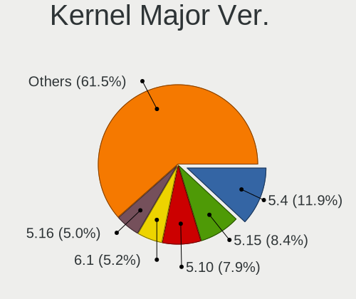

| Version | Desktops | Percent |
|---------|----------|---------|
| 5.4     | 341      | 11.93%  |
| 5.15    | 240      | 8.4%    |
| 5.10    | 225      | 7.87%   |
| 6.1     | 149      | 5.21%   |
| 5.16    | 144      | 5.04%   |
| 4.15    | 135      | 4.72%   |
| 6.6     | 120      | 4.2%    |
| 6.2     | 113      | 3.95%   |
| 5.8     | 106      | 3.71%   |
| 5.11    | 97       | 3.39%   |
| 6.8     | 89       | 3.11%   |
| 6.4     | 81       | 2.83%   |
| 5.13    | 80       | 2.8%    |
| 6.5     | 79       | 2.76%   |
| 4.9     | 79       | 2.76%   |
| 5.19    | 75       | 2.62%   |
| 6.10    | 74       | 2.59%   |
| 5.3     | 62       | 2.17%   |
| 6.0     | 48       | 1.68%   |
| 6.9     | 45       | 1.57%   |
| 5.0     | 41       | 1.43%   |
| 4.18    | 39       | 1.36%   |
| 6.11    | 37       | 1.29%   |
| 5.14    | 35       | 1.22%   |
| 6.3     | 31       | 1.08%   |
| 5.12    | 31       | 1.08%   |
| 5.18    | 29       | 1.01%   |
| 4.1     | 28       | 0.98%   |
| 5.9     | 27       | 0.94%   |
| 5.17    | 27       | 0.94%   |
| 6.12    | 26       | 0.91%   |
| 4.19    | 26       | 0.91%   |
| 5.6     | 24       | 0.84%   |
| 6.7     | 23       | 0.8%    |
| 5.5     | 16       | 0.56%   |
| 5.7     | 13       | 0.45%   |
| 4.4     | 6        | 0.21%   |
| 4.16    | 3        | 0.1%    |
| 5.1     | 2        | 0.07%   |
| 4.8     | 2        | 0.07%   |

Arch
----

OS architecture (x86_64, i586, etc.)

| Name   | Desktops | Percent |
|--------|----------|---------|
| x86_64 | 2367     | 98.13%  |
| i686   | 43       | 1.78%   |
| ppc64  | 1        | 0.04%   |
| ppc    | 1        | 0.04%   |

DE
--

Desktop Environment

| Name            | Desktops | Percent |
|-----------------|----------|---------|
| GNOME           | 829      | 32.23%  |
| KDE5            | 733      | 28.5%   |
| Unknown         | 278      | 10.81%  |
| XFCE            | 155      | 6.03%   |
| X-Cinnamon      | 135      | 5.25%   |
| KDE4            | 81       | 3.15%   |
| MATE            | 69       | 2.68%   |
| KDE             | 57       | 2.22%   |
| KDE6            | 54       | 2.1%    |
| LXQt            | 44       | 1.71%   |
| Cinnamon        | 24       | 0.93%   |
| i3              | 21       | 0.82%   |
| Pantheon        | 14       | 0.54%   |
| Unity           | 12       | 0.47%   |
| LXDE            | 11       | 0.43%   |
| Budgie          | 9        | 0.35%   |
| Hyprland        | 8        | 0.31%   |
| Deepin          | 6        | 0.23%   |
| GNOME Classic   | 5        | 0.19%   |
| icewm           | 4        | 0.16%   |
| GNOME Flashback | 4        | 0.16%   |
| qtile           | 3        | 0.12%   |
| openbox         | 3        | 0.12%   |
| Trinity         | 2        | 0.08%   |
| DWM             | 2        | 0.08%   |
| awesome         | 2        | 0.08%   |
| xmonad          | 1        | 0.04%   |
| sway            | 1        | 0.04%   |
| ratflow         | 1        | 0.04%   |
| jwm             | 1        | 0.04%   |
| gnome-xorg      | 1        | 0.04%   |
| fluxbox         | 1        | 0.04%   |
| COSMIC          | 1        | 0.04%   |

Display Server
--------------

X11 or Wayland

| Name    | Desktops | Percent |
|---------|----------|---------|
| X11     | 1800     | 71.23%  |
| Wayland | 543      | 21.49%  |
| Unknown | 106      | 4.19%   |
| Tty     | 78       | 3.09%   |

Display Manager
---------------

SDDM, LightDM, etc.

| Name    | Desktops | Percent |
|---------|----------|---------|
| Unknown | 1006     | 39.62%  |
| SDDM    | 746      | 29.38%  |
| LightDM | 222      | 8.74%   |
| GDM3    | 209      | 8.23%   |
| GDM     | 196      | 7.72%   |
| KDM     | 87       | 3.43%   |
| TDM     | 54       | 2.13%   |
| XDM     | 5        | 0.2%    |
| SLIMSKI | 3        | 0.12%   |
| SLiM    | 3        | 0.12%   |
| LXDM    | 3        | 0.12%   |
| LY-DM   | 2        | 0.08%   |
| MDM     | 1        | 0.04%   |
| Ly      | 1        | 0.04%   |
| GREETD  | 1        | 0.04%   |

OS Lang
-------

Language

| Lang        | Desktops | Percent |
|-------------|----------|---------|
| pl_PL       | 1442     | 57.24%  |
| en_US       | 625      | 24.81%  |
| Unknown     | 268      | 10.64%  |
| en_GB       | 69       | 2.74%   |
| C           | 50       | 1.98%   |
| ru_RU       | 14       | 0.56%   |
| en_CA       | 7        | 0.28%   |
| ru_UA       | 5        | 0.2%    |
| de_DE       | 5        | 0.2%    |
| szl_PL      | 3        | 0.12%   |
| POSIX       | 3        | 0.12%   |
| fr_FR       | 3        | 0.12%   |
| en_AG       | 3        | 0.12%   |
| uk_UA       | 2        | 0.08%   |
| en_IE       | 2        | 0.08%   |
| en_DK       | 2        | 0.08%   |
| en_BW       | 2        | 0.08%   |
| C.UTF8      | 2        | 0.08%   |
| sv_SE       | 1        | 0.04%   |
| pl_PL.UTF8  | 1        | 0.04%   |
| es_BO       | 1        | 0.04%   |
| en_US.UTF8  | 1        | 0.04%   |
| en_US.utf-8 | 1        | 0.04%   |
| en_SE       | 1        | 0.04%   |
| en_IN       | 1        | 0.04%   |
| en_GB.UTF8  | 1        | 0.04%   |
| en_AU       | 1        | 0.04%   |
| de_CH       | 1        | 0.04%   |
| cs_CZ       | 1        | 0.04%   |
| be_BY       | 1        | 0.04%   |

Boot Mode
---------

EFI or BIOS

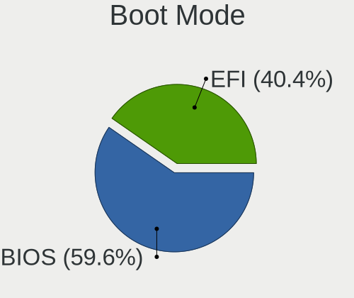

| Mode | Desktops | Percent |
|------|----------|---------|
| BIOS | 1481     | 59.65%  |
| EFI  | 1002     | 40.35%  |

Filesystem
----------

Type of filesystem

| Type     | Desktops | Percent |
|----------|----------|---------|
| Ext4     | 1599     | 62.8%   |
| Overlay  | 407      | 15.99%  |
| Btrfs    | 274      | 10.76%  |
| Unknown  | 117      | 4.6%    |
| Tmpfs    | 78       | 3.06%   |
| Xfs      | 31       | 1.22%   |
| Zfs      | 14       | 0.55%   |
| F2fs     | 9        | 0.35%   |
| Ext3     | 5        | 0.2%    |
| Ext2     | 4        | 0.16%   |
| Rootfs   | 2        | 0.08%   |
| Jfs      | 2        | 0.08%   |
| XXXXXXX  | 1        | 0.04%   |
| XXX      | 1        | 0.04%   |
| SquXshfs | 1        | 0.04%   |
| Aufs     | 1        | 0.04%   |

Part. scheme
------------

Scheme of partitioning

| Type    | Desktops | Percent |
|---------|----------|---------|
| Unknown | 1047     | 41.4%   |
| GPT     | 1024     | 40.49%  |
| MBR     | 458      | 18.11%  |

Dual Boot with Linux/BSD
------------------------

Hosting more than one Linux/BSD

| Dual boot | Desktops | Percent |
|-----------|----------|---------|
| No        | 1880     | 75.14%  |
| Yes       | 622      | 24.86%  |

Dual Boot (Win)
---------------

Hosting Linux and Windows

| Dual boot | Desktops | Percent |
|-----------|----------|---------|
| No        | 1533     | 61.69%  |
| Yes       | 952      | 38.31%  |

Board
-----

Vendor
------

Motherboard manufacturer

| Name                                 | Desktops | Percent |
|--------------------------------------|----------|---------|
| Gigabyte Technology                  | 548      | 22.79%  |
| ASUSTek Computer                     | 512      | 21.29%  |
| MSI                                  | 434      | 18.05%  |
| ASRock                               | 233      | 9.69%   |
| Dell                                 | 204      | 8.48%   |
| Hewlett-Packard                      | 159      | 6.61%   |
| Lenovo                               | 87       | 3.62%   |
| Fujitsu                              | 47       | 1.95%   |
| Intel                                | 30       | 1.25%   |
| Acer                                 | 21       | 0.87%   |
| Unknown                              | 17       | 0.71%   |
| Foxconn                              | 16       | 0.67%   |
| Fujitsu Siemens                      | 11       | 0.46%   |
| Medion                               | 8        | 0.33%   |
| Inventec                             | 8        | 0.33%   |
| Huanan                               | 7        | 0.29%   |
| ECS                                  | 4        | 0.17%   |
| Pegatron                             | 3        | 0.12%   |
| PC Engines                           | 3        | 0.12%   |
| Biostar                              | 3        | 0.12%   |
| Apple                                | 3        | 0.12%   |
| AMI                                  | 3        | 0.12%   |
| ACTION                               | 3        | 0.12%   |
| ABIT                                 | 3        | 0.12%   |
| WeiBu                                | 2        | 0.08%   |
| Supermicro                           | 2        | 0.08%   |
| MACHINIST                            | 2        | 0.08%   |
| Hardkernel                           | 2        | 0.08%   |
| Gateway                              | 2        | 0.08%   |
| ASRockRack                           | 2        | 0.08%   |
| ZOTAC                                | 1        | 0.04%   |
| Wortmann AG                          | 1        | 0.04%   |
| UGREEN                               | 1        | 0.04%   |
| Shuttle                              | 1        | 0.04%   |
| Shenzhen Meigao Electronic Equipment | 1        | 0.04%   |
| Seeed Studio                         | 1        | 0.04%   |
| Sapphire                             | 1        | 0.04%   |
| Protectli                            | 1        | 0.04%   |
| Prestigio                            | 1        | 0.04%   |
| POSIFLEX                             | 1        | 0.04%   |

Model
-----

Motherboard model

| Name                         | Desktops | Percent |
|------------------------------|----------|---------|
| ASUS All Series              | 40       | 1.66%   |
| MSI MS-7B86                  | 23       | 0.96%   |
| Gigabyte B450M DS3H          | 22       | 0.91%   |
| MSI MS-7817                  | 18       | 0.75%   |
| ASUS SABERTOOTH Z77          | 18       | 0.75%   |
| Unknown                      | 17       | 0.71%   |
| MSI MS-7C37                  | 16       | 0.67%   |
| Dell OptiPlex 780            | 16       | 0.67%   |
| MSI MS-7C02                  | 15       | 0.62%   |
| Gigabyte B550 AORUS ELITE V2 | 15       | 0.62%   |
| Gigabyte B450 AORUS ELITE    | 15       | 0.62%   |
| Dell OptiPlex 7010           | 15       | 0.62%   |
| MSI MS-7B79                  | 13       | 0.54%   |
| MSI MS-7816                  | 13       | 0.54%   |
| MSI MS-7721                  | 12       | 0.5%    |
| Dell OptiPlex 755            | 12       | 0.5%    |
| MSI MS-7A38                  | 11       | 0.46%   |
| MSI MS-7C91                  | 10       | 0.42%   |
| Gigabyte B85M-D3H            | 10       | 0.42%   |
| ASUS TUF Gaming X570-PLUS    | 10       | 0.42%   |
| ASUS TUF Gaming B550-PLUS    | 10       | 0.42%   |
| MSI MS-7C56                  | 9        | 0.37%   |
| MSI MS-7C52                  | 9        | 0.37%   |
| MSI MS-7B89                  | 9        | 0.37%   |
| Dell OptiPlex 9020           | 9        | 0.37%   |
| Dell OptiPlex 790            | 9        | 0.37%   |
| MSI MS-7D25                  | 8        | 0.33%   |
| MSI MS-7A34                  | 8        | 0.33%   |
| ASUS PRIME X470-PRO          | 8        | 0.33%   |
| ASUS PRIME B450M-A           | 8        | 0.33%   |
| ASUS PRIME B350-PLUS         | 8        | 0.33%   |
| ASRock B450 Pro4             | 8        | 0.33%   |
| MSI MS-7996                  | 7        | 0.29%   |
| HP t620 Quad Core TC         | 7        | 0.29%   |
| Gigabyte 970A-DS3P           | 7        | 0.29%   |
| Dell OptiPlex 3020           | 7        | 0.29%   |
| ASUS P5G41T-M LX             | 7        | 0.29%   |
| MSI MS-7971                  | 6        | 0.25%   |
| HP EliteDesk 800 G1 SFF      | 6        | 0.25%   |
| HP Compaq 8200 Elite SFF PC  | 6        | 0.25%   |

Model Family
------------

Motherboard model prefix

| Name                | Desktops | Percent |
|---------------------|----------|---------|
| Dell OptiPlex       | 145      | 6.03%   |
| ASUS PRIME          | 102      | 4.24%   |
| HP Compaq           | 62       | 2.58%   |
| Lenovo ThinkCentre  | 53       | 2.2%    |
| ASUS TUF            | 51       | 2.12%   |
| ASUS ROG            | 44       | 1.83%   |
| ASUS All            | 40       | 1.66%   |
| Gigabyte B450M      | 35       | 1.46%   |
| HP EliteDesk        | 32       | 1.33%   |
| Fujitsu ESPRIMO     | 29       | 1.21%   |
| Dell Precision      | 29       | 1.21%   |
| Gigabyte B550       | 28       | 1.16%   |
| MSI MS-7B86         | 23       | 0.96%   |
| Gigabyte B450       | 23       | 0.96%   |
| Gigabyte X570       | 20       | 0.83%   |
| ASUS SABERTOOTH     | 20       | 0.83%   |
| MSI MS-7817         | 18       | 0.75%   |
| Unknown             | 17       | 0.71%   |
| MSI MS-7C37         | 16       | 0.67%   |
| Dell Vostro         | 16       | 0.67%   |
| MSI MS-7C02         | 15       | 0.62%   |
| ASRock B450         | 15       | 0.62%   |
| MSI MS-7B79         | 13       | 0.54%   |
| MSI MS-7816         | 13       | 0.54%   |
| MSI MS-7721         | 12       | 0.5%    |
| MSI MS-7A38         | 11       | 0.46%   |
| ASUS P5G41T-M       | 11       | 0.46%   |
| ASUS M5A97          | 11       | 0.46%   |
| MSI MS-7C91         | 10       | 0.42%   |
| Lenovo ThinkStation | 10       | 0.42%   |
| HP ProDesk          | 10       | 0.42%   |
| Gigabyte B85M-D3H   | 10       | 0.42%   |
| MSI MS-7C56         | 9        | 0.37%   |
| MSI MS-7C52         | 9        | 0.37%   |
| MSI MS-7B89         | 9        | 0.37%   |
| Lenovo IdeaCentre   | 9        | 0.37%   |
| ASRock B450M        | 9        | 0.37%   |
| MSI MS-7D25         | 8        | 0.33%   |
| MSI MS-7A34         | 8        | 0.33%   |
| HP t620             | 8        | 0.33%   |

MFG Year
--------

Motherboard manufacture year

| Year    | Desktops | Percent |
|---------|----------|---------|
| 2018    | 248      | 10.31%  |
| 2012    | 240      | 9.98%   |
| 2013    | 199      | 8.27%   |
| 2020    | 183      | 7.61%   |
| 2014    | 167      | 6.94%   |
| 2019    | 154      | 6.4%    |
| 2011    | 145      | 6.03%   |
| 2009    | 144      | 5.99%   |
| 2017    | 125      | 5.2%    |
| 2010    | 115      | 4.78%   |
| 2016    | 107      | 4.45%   |
| 2021    | 102      | 4.24%   |
| 2007    | 99       | 4.12%   |
| 2008    | 93       | 3.87%   |
| 2015    | 92       | 3.83%   |
| 2022    | 69       | 2.87%   |
| 2006    | 48       | 2%      |
| 2023    | 34       | 1.41%   |
| 2024    | 23       | 0.96%   |
| 2005    | 8        | 0.33%   |
| 2004    | 5        | 0.21%   |
| Unknown | 4        | 0.17%   |
| 2001    | 1        | 0.04%   |

Form Factor
-----------

Physical design of the computer

| Name    | Desktops | Percent |
|---------|----------|---------|
| Desktop | 2405     | 100%    |

Secure Boot
-----------

Enabled or disabled

| State    | Desktops | Percent |
|----------|----------|---------|
| Disabled | 2363     | 97.73%  |
| Enabled  | 55       | 2.27%   |

Coreboot
--------

Have coreboot on board

| Used | Desktops | Percent |
|------|----------|---------|
| No   | 2399     | 99.75%  |
| Yes  | 6        | 0.25%   |

RAM Size
--------

Total RAM memory

| Size in GB      | Desktops | Percent |
|-----------------|----------|---------|
| 16.01-24.0      | 590      | 23.73%  |
| 8.01-16.0       | 496      | 19.95%  |
| 32.01-64.0      | 395      | 15.89%  |
| 4.01-8.0        | 355      | 14.28%  |
| 3.01-4.0        | 332      | 13.35%  |
| 64.01-256.0     | 127      | 5.11%   |
| 24.01-32.0      | 86       | 3.46%   |
| 1.01-2.0        | 64       | 2.57%   |
| 2.01-3.0        | 31       | 1.25%   |
| 0.51-1.0        | 9        | 0.36%   |
| More than 256.0 | 1        | 0.04%   |

RAM Used
--------

Used RAM memory

| Used GB     | Desktops | Percent |
|-------------|----------|---------|
| 1.01-2.0    | 970      | 34.61%  |
| 2.01-3.0    | 579      | 20.66%  |
| 4.01-8.0    | 448      | 15.98%  |
| 3.01-4.0    | 311      | 11.1%   |
| 0.51-1.0    | 250      | 8.92%   |
| 8.01-16.0   | 136      | 4.85%   |
| 0.01-0.5    | 52       | 1.86%   |
| 16.01-24.0  | 39       | 1.39%   |
| 24.01-32.0  | 11       | 0.39%   |
| 32.01-64.0  | 4        | 0.14%   |
| 64.01-256.0 | 2        | 0.07%   |
| Unknown     | 1        | 0.04%   |

Total Drives
------------

Number of drives on board

| Drives | Desktops | Percent |
|--------|----------|---------|
| 1      | 899      | 34.7%   |
| 2      | 741      | 28.6%   |
| 3      | 484      | 18.68%  |
| 4      | 229      | 8.84%   |
| 5      | 111      | 4.28%   |
| 6      | 41       | 1.58%   |
| 0      | 38       | 1.47%   |
| 7      | 24       | 0.93%   |
| 8      | 10       | 0.39%   |
| 9      | 6        | 0.23%   |
| 11     | 4        | 0.15%   |
| 10     | 2        | 0.08%   |
| 13     | 1        | 0.04%   |
| 12     | 1        | 0.04%   |

Has CD-ROM
----------

Has CD-ROM on board

| Presented | Desktops | Percent |
|-----------|----------|---------|
| No        | 1308     | 53.3%   |
| Yes       | 1146     | 46.7%   |

Has Ethernet
------------

Has Ethernet on board

| Presented | Desktops | Percent |
|-----------|----------|---------|
| Yes       | 2381     | 99%     |
| No        | 24       | 1%      |

Has WiFi
--------

Has WiFi module

| Presented | Desktops | Percent |
|-----------|----------|---------|
| No        | 1475     | 59.81%  |
| Yes       | 991      | 40.19%  |

Has Bluetooth
-------------

Has Bluetooth module

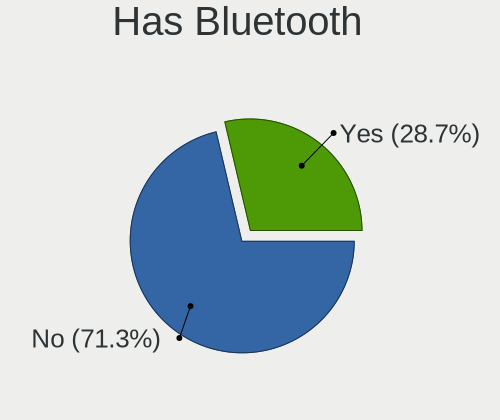

| Presented | Desktops | Percent |
|-----------|----------|---------|
| No        | 1751     | 71.32%  |
| Yes       | 704      | 28.68%  |

Location
--------

Country
-------

Geographic location (country)

| Country | Desktops | Percent |
|---------|----------|---------|
| Poland  | 2405     | 100%    |

City
----

Geographic location (city)

| City                | Desktops | Percent |
|---------------------|----------|---------|
| Warsaw              | 497      | 18.59%  |
| Krakow              | 184      | 6.88%   |
| Wroclaw             | 152      | 5.69%   |
| Poznan              | 117      | 4.38%   |
| Gdansk              | 92       | 3.44%   |
| Katowice            | 75       | 2.81%   |
| Lodz                | 72       | 2.69%   |
| Gdynia              | 41       | 1.53%   |
| Lublin              | 33       | 1.23%   |
| Bialystok           | 30       | 1.12%   |
| Szczecin            | 29       | 1.08%   |
| Gliwice             | 22       | 0.82%   |
| Czstochowa        | 21       | 0.79%   |
| Rzeszw            | 20       | 0.75%   |
| Bydgoszcz           | 20       | 0.75%   |
| Torun               | 19       | 0.71%   |
| Strzyzow            | 18       | 0.67%   |
| Radom               | 18       | 0.67%   |
| Kielce              | 18       | 0.67%   |
| Bytom               | 18       | 0.67%   |
| Sosnowiec           | 17       | 0.64%   |
| Ruda lska       | 17       | 0.64%   |
| Pock              | 16       | 0.6%    |
| Rybnik              | 15       | 0.56%   |
| Bielsko-Biala       | 15       | 0.56%   |
| Tychy               | 12       | 0.45%   |
| Piaseczno           | 12       | 0.45%   |
| Zabrze              | 11       | 0.41%   |
| Koszalin            | 10       | 0.37%   |
| Debica              | 10       | 0.37%   |
| Cieszyn             | 10       | 0.37%   |
| Supsk             | 9        | 0.34%   |
| Kocian            | 9        | 0.34%   |
| Jelenia Gra       | 9        | 0.34%   |
| Elblag              | 9        | 0.34%   |
| Bdzin             | 9        | 0.34%   |
| Zielona Gra       | 8        | 0.3%    |
| Zdunska Wola        | 8        | 0.3%    |
| Wodzisaw lski | 8        | 0.3%    |
| Wabrzych          | 8        | 0.3%    |

Drives
------

Drive Vendor
------------

Hard drive vendors

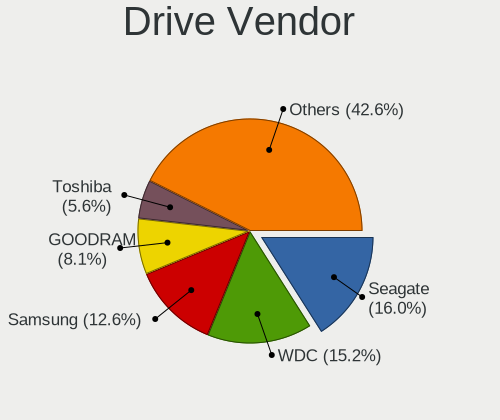

| Vendor                       | Desktops | Drives | Percent |
|------------------------------|----------|--------|---------|
| Seagate                      | 757      | 1357   | 16%     |
| WDC                          | 717      | 1240   | 15.15%  |
| Samsung Electronics          | 596      | 1034   | 12.6%   |
| GOODRAM                      | 381      | 684    | 8.05%   |
| Toshiba                      | 265      | 472    | 5.6%    |
| Kingston                     | 215      | 320    | 4.54%   |
| Crucial                      | 212      | 377    | 4.48%   |
| A-DATA Technology            | 190      | 277    | 4.02%   |
| SanDisk                      | 141      | 227    | 2.98%   |
| Hitachi                      | 128      | 267    | 2.7%    |
| Patriot                      | 80       | 105    | 1.69%   |
| SPCC                         | 68       | 123    | 1.44%   |
| Intel                        | 58       | 88     | 1.23%   |
| HGST                         | 44       | 65     | 0.93%   |
| Phison Electronics           | 42       | 69     | 0.89%   |
| ADATA Technology             | 42       | 54     | 0.89%   |
| XPG                          | 41       | 59     | 0.87%   |
| Plextor                      | 41       | 50     | 0.87%   |
| PNY                          | 40       | 46     | 0.85%   |
| Unknown                      | 39       | 88     | 0.82%   |
| Apacer                       | 32       | 48     | 0.68%   |
| China                        | 29       | 51     | 0.61%   |
| Phison                       | 27       | 36     | 0.57%   |
| Micron Technology            | 27       | 40     | 0.57%   |
| SK hynix                     | 26       | 41     | 0.55%   |
| OCZ                          | 25       | 29     | 0.53%   |
| Maxtor                       | 25       | 27     | 0.53%   |
| Shenzhen Longsys Electronics | 24       | 38     | 0.51%   |
| Realtek Semiconductor        | 24       | 35     | 0.51%   |
| Lexar                        | 23       | 30     | 0.49%   |
| Corsair                      | 23       | 33     | 0.49%   |
| Kingston Technology Company  | 22       | 25     | 0.46%   |
| Silicon Motion               | 20       | 25     | 0.42%   |
| Micron/Crucial Technology    | 18       | 20     | 0.38%   |
| Fujitsu                      | 18       | 27     | 0.38%   |
| KIOXIA-EXCERIA               | 16       | 25     | 0.34%   |
| JMicron Technology           | 15       | 17     | 0.32%   |
| ASMT                         | 15       | 16     | 0.32%   |
| KIOXIA                       | 13       | 15     | 0.27%   |
| Transcend                    | 12       | 12     | 0.25%   |

Drive Model
-----------

Hard drive models

| Model                                                             | Desktops | Percent |
|-------------------------------------------------------------------|----------|---------|
| Toshiba HDWD110 1TB                                               | 68       | 1.25%   |
| GOODRAM SSDPR-CX400-512-G2 512GB                                  | 55       | 1.01%   |
| Crucial CT500MX500SSD1 500GB                                      | 54       | 0.99%   |
| Seagate ST500DM002-1BD142 500GB                                   | 47       | 0.86%   |
| Seagate ST1000DM010-2EP102 1TB                                    | 46       | 0.84%   |
| Seagate ST1000DM003-1ER162 1TB                                    | 43       | 0.79%   |
| GOODRAM SSDPR-CX400-256-G2 256GB                                  | 42       | 0.77%   |
| Samsung SSD 850 EVO 250GB                                         | 41       | 0.75%   |
| Samsung NVMe SSD Controller SM981/PM981/PM983 512GB               | 41       | 0.75%   |
| Samsung NVMe SSD Controller PM9A1/PM9A3/980PRO 512GB              | 39       | 0.72%   |
| Crucial CT1000MX500SSD1 1TB                                       | 38       | 0.7%    |
| Seagate ST3500418AS 500GB                                         | 36       | 0.66%   |
| GOODRAM SSD 120GB                                                 | 32       | 0.59%   |
| Crucial CT240BX500SSD1 240GB                                      | 32       | 0.59%   |
| Kingston SV300S37A120G 120GB SSD                                  | 30       | 0.55%   |
| ADATA XPG SX8200 Pro PCIe Gen3x4 M.2 2280 Solid State Drive 256GB | 29       | 0.53%   |
| Toshiba DT01ACA100 1TB                                            | 28       | 0.51%   |
| Samsung HD502HJ 500GB                                             | 28       | 0.51%   |
| Samsung SSD 860 EVO 500GB                                         | 27       | 0.5%    |
| Seagate ST2000DM008-2FR102 2TB                                    | 26       | 0.48%   |
| Seagate ST1000DM003-1CH162 1TB                                    | 26       | 0.48%   |
| Samsung NVMe SSD Drive 500GB                                      | 26       | 0.48%   |
| GOODRAM SSD 240GB                                                 | 26       | 0.48%   |
| Toshiba HDWD130 3TB                                               | 25       | 0.46%   |
| GOODRAM SSDPR-CX400-512 512GB                                     | 25       | 0.46%   |
| A-DATA SU800 256GB SSD                                            | 25       | 0.46%   |
| Samsung SSD 980 500GB                                             | 24       | 0.44%   |
| Samsung SSD 980 1TB                                               | 23       | 0.42%   |
| Samsung SSD 860 EVO 250GB                                         | 23       | 0.42%   |
| GOODRAM SSDPR-CX400-01T-G2 1TB                                    | 23       | 0.42%   |
| Toshiba HDWD120 2TB                                               | 22       | 0.4%    |
| Patriot Burst 120GB SSD                                           | 22       | 0.4%    |
| Kingston SA400S37480G 480GB SSD                                   | 22       | 0.4%    |
| Kingston SA400S37240G 240GB SSD                                   | 21       | 0.39%   |
| GOODRAM SSDPR-CX400-128 128GB                                     | 21       | 0.39%   |
| A-DATA SU650 240GB SSD                                            | 20       | 0.37%   |
| Phison E12 NVMe Controller 480GB                                  | 19       | 0.35%   |
| Kingston SKC3000S1024G 1TB                                        | 19       | 0.35%   |
| GOODRAM SSDPR-CL100-120-G2 120GB                                  | 19       | 0.35%   |
| SPCC Solid State Disk 120GB                                       | 18       | 0.33%   |

HDD Vendor
----------

Hard disk drive vendors

| Vendor              | Desktops | Drives | Percent |
|---------------------|----------|--------|---------|
| Seagate             | 754      | 1351   | 36.3%   |
| WDC                 | 673      | 1156   | 32.4%   |
| Toshiba             | 238      | 440    | 11.46%  |
| Samsung Electronics | 155      | 230    | 7.46%   |
| Hitachi             | 128      | 267    | 6.16%   |
| HGST                | 44       | 65     | 2.12%   |
| Maxtor              | 24       | 26     | 1.16%   |
| Fujitsu             | 18       | 27     | 0.87%   |
| JMicron Technology  | 8        | 9      | 0.39%   |
| ASMT                | 6        | 7      | 0.29%   |
| Hewlett-Packard     | 4        | 9      | 0.19%   |
| WD MediaMax         | 3        | 6      | 0.14%   |
| Unknown             | 3        | 3      | 0.14%   |
| ASMedia             | 3        | 5      | 0.14%   |
| SAGE                | 2        | 2      | 0.1%    |
| Unknown             | 2        | 2      | 0.1%    |
| Synology            | 1        | 1      | 0.05%   |
| MARVELL             | 1        | 1      | 0.05%   |
| Lenovo              | 1        | 2      | 0.05%   |
| IBM/Hitachi         | 1        | 1      | 0.05%   |
| IB-377U3            | 1        | 6      | 0.05%   |
| HPE                 | 1        | 1      | 0.05%   |
| HGST HTS            | 1        | 1      | 0.05%   |
| ExcelStor           | 1        | 1      | 0.05%   |
| eSATA-2             | 1        | 1      | 0.05%   |
| ASUSTOR             | 1        | 1      | 0.05%   |
| ASMT109x            | 1        | 1      | 0.05%   |
| Apple               | 1        | 1      | 0.05%   |

SSD Vendor
----------

Solid state drive vendors

| Vendor              | Desktops | Drives | Percent |
|---------------------|----------|--------|---------|
| GOODRAM             | 369      | 647    | 21.1%   |
| Samsung Electronics | 252      | 387    | 14.41%  |
| Crucial             | 204      | 368    | 11.66%  |
| A-DATA Technology   | 156      | 224    | 8.92%   |
| Kingston            | 130      | 180    | 7.43%   |
| SanDisk             | 92       | 148    | 5.26%   |
| Patriot             | 72       | 97     | 4.12%   |
| SPCC                | 62       | 115    | 3.54%   |
| WDC                 | 38       | 49     | 2.17%   |
| PNY                 | 33       | 38     | 1.89%   |
| Plextor             | 33       | 42     | 1.89%   |
| Apacer              | 31       | 47     | 1.77%   |
| China               | 28       | 50     | 1.6%    |
| Intel               | 27       | 37     | 1.54%   |
| OCZ                 | 25       | 29     | 1.43%   |
| Micron Technology   | 20       | 29     | 1.14%   |
| Toshiba             | 19       | 23     | 1.09%   |
| Transcend           | 12       | 12     | 0.69%   |
| KIOXIA-EXCERIA      | 12       | 19     | 0.69%   |
| Corsair             | 10       | 11     | 0.57%   |
| LITEON              | 9        | 14     | 0.51%   |
| ASMT                | 9        | 9      | 0.51%   |
| Team                | 7        | 8      | 0.4%    |
| SK hynix            | 7        | 7      | 0.4%    |
| Unknown             | 7        | 8      | 0.4%    |
| Lexar               | 6        | 11     | 0.34%   |
| Intenso             | 5        | 10     | 0.29%   |
| LITEONIT            | 4        | 4      | 0.23%   |
| HS-SSD-E100         | 4        | 4      | 0.23%   |
| BIWIN               | 4        | 4      | 0.23%   |
| KingSpec            | 3        | 3      | 0.17%   |
| Kingchuxing         | 3        | 10     | 0.17%   |
| Hewlett-Packard     | 3        | 3      | 0.17%   |
| Gigabyte Technology | 3        | 4      | 0.17%   |
| XPG                 | 2        | 2      | 0.11%   |
| Unknown             | 2        | 2      | 0.11%   |
| SSSTC               | 2        | 2      | 0.11%   |
| sobetter            | 2        | 2      | 0.11%   |
| POLION              | 2        | 2      | 0.11%   |
| PHD 3.0             | 2        | 2      | 0.11%   |

Drive Kind
----------

HDD or SSD

| Kind    | Desktops | Drives | Percent |
|---------|----------|--------|---------|
| HDD     | 1601     | 3623   | 41.4%   |
| SSD     | 1407     | 2705   | 36.38%  |
| NVMe    | 788      | 1407   | 20.38%  |
| Unknown | 55       | 109    | 1.42%   |
| MMC     | 16       | 20     | 0.41%   |

Drive Connector
---------------

SATA, SAS, NVMe, etc.

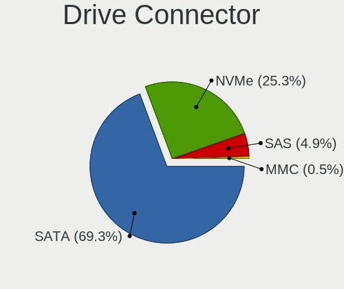

| Type | Desktops | Drives | Percent |
|------|----------|--------|---------|
| SATA | 2154     | 6196   | 69.31%  |
| NVMe | 787      | 1402   | 25.32%  |
| SAS  | 151      | 246    | 4.86%   |
| MMC  | 16       | 20     | 0.51%   |

Drive Size
----------

Size of hard drive

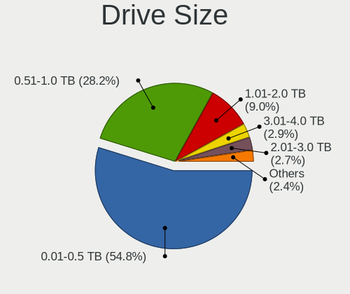

| Size in TB | Desktops | Drives | Percent |
|------------|----------|--------|---------|
| 0.01-0.5   | 1732     | 3526   | 54.78%  |
| 0.51-1.0   | 893      | 1635   | 28.24%  |
| 1.01-2.0   | 284      | 501    | 8.98%   |
| 3.01-4.0   | 93       | 213    | 2.94%   |
| 2.01-3.0   | 84       | 249    | 2.66%   |
| 4.01-10.0  | 56       | 142    | 1.77%   |
| 10.01-20.0 | 20       | 62     | 0.63%   |

Space Total
-----------

Amount of disk space available on the file system

| Size in GB     | Desktops | Percent |
|----------------|----------|---------|
| 101-250        | 614      | 22.86%  |
| 251-500        | 389      | 14.48%  |
| 501-1000       | 356      | 13.25%  |
| 1001-2000      | 293      | 10.91%  |
| 1-20           | 290      | 10.8%   |
| More than 3000 | 198      | 7.37%   |
| 51-100         | 182      | 6.78%   |
| Unknown        | 146      | 5.44%   |
| 2001-3000      | 111      | 4.13%   |
| 21-50          | 107      | 3.98%   |

Space Used
----------

Amount of used disk space

| Used GB        | Desktops | Percent |
|----------------|----------|---------|
| 1-20           | 1017     | 36.89%  |
| 21-50          | 329      | 11.93%  |
| 101-250        | 302      | 10.95%  |
| 51-100         | 233      | 8.45%   |
| 501-1000       | 225      | 8.16%   |
| 251-500        | 220      | 7.98%   |
| 1001-2000      | 148      | 5.37%   |
| Unknown        | 146      | 5.3%    |
| More than 3000 | 75       | 2.72%   |
| 2001-3000      | 60       | 2.18%   |
| 0              | 2        | 0.07%   |

Malfunc. Drives
---------------

Drive models with a malfunction

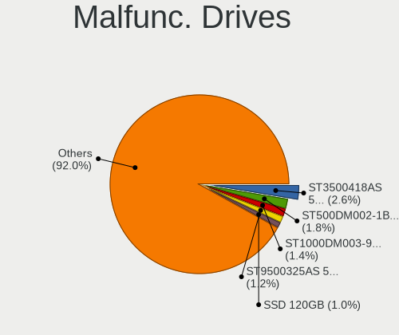

| Model                             | Desktops | Drives | Percent |
|-----------------------------------|----------|--------|---------|
| Seagate ST3500418AS 500GB         | 13       | 17     | 2.62%   |
| Seagate ST500DM002-1BD142 500GB   | 9        | 10     | 1.81%   |
| Seagate ST1000DM003-9YN162 1TB    | 7        | 8      | 1.41%   |
| Seagate ST9500325AS 500GB         | 6        | 9      | 1.21%   |
| GOODRAM SSD 120GB                 | 5        | 5      | 1.01%   |
| ASMT 2135 256GB                   | 5        | 5      | 1.01%   |
| Seagate ST92505610AS 250GB        | 4        | 4      | 0.8%    |
| Seagate ST3320613AS 320GB         | 4        | 4      | 0.8%    |
| Seagate ST1000DX001-1CM162 1TB    | 4        | 7      | 0.8%    |
| Seagate ST1000DM010-2EP102 1TB    | 4        | 4      | 0.8%    |
| Seagate ST1000DM003-1ER162 1TB    | 4        | 4      | 0.8%    |
| WDC WD5000AVDS-63U7B1 500GB       | 3        | 4      | 0.6%    |
| WDC WD15EARS-00Z5B1 1TB           | 3        | 3      | 0.6%    |
| WDC WD10JFCX-68N6GN0 1TB          | 3        | 4      | 0.6%    |
| WDC WD10EARS-00Y5B1 1TB           | 3        | 3      | 0.6%    |
| Seagate ST3500413AS 500GB         | 3        | 3      | 0.6%    |
| Seagate ST3500320AS 500GB         | 3        | 3      | 0.6%    |
| Seagate ST3500312CS 500GB         | 3        | 3      | 0.6%    |
| Seagate ST3320620AS 320GB         | 3        | 3      | 0.6%    |
| Seagate ST3320418AS 320GB         | 3        | 3      | 0.6%    |
| Seagate ST3250410AS 250GB         | 3        | 4      | 0.6%    |
| Seagate ST31500341AS 1TB          | 3        | 4      | 0.6%    |
| Seagate ST2000DX002-2DV164 2TB    | 3        | 5      | 0.6%    |
| Seagate ST1000DX001-1NS162 1TB    | 3        | 7      | 0.6%    |
| Samsung Electronics HD502HJ 500GB | 3        | 3      | 0.6%    |
| Samsung Electronics HD321KJ 320GB | 3        | 3      | 0.6%    |
| Samsung Electronics HD103UJ 1TB   | 3        | 4      | 0.6%    |
| Kingston SV300S37A120G 120GB SSD  | 3        | 3      | 0.6%    |
| Kingston SA400S37480G 480GB SSD   | 3        | 3      | 0.6%    |
| Hitachi HDP725050GLA360 500GB     | 3        | 4      | 0.6%    |
| A-DATA Technology SU800 512GB SSD | 3        | 4      | 0.6%    |
| WDC WD5002ABYS-01B1B0 500GB       | 2        | 14     | 0.4%    |
| WDC WD5000LPCX-24C6HT0 500GB      | 2        | 2      | 0.4%    |
| WDC WD5000AAKX-60U6AA0 500GB      | 2        | 2      | 0.4%    |
| WDC WD5000AAKX-001CA0 500GB       | 2        | 2      | 0.4%    |
| WDC WD5000AAKS-22V1A0 500GB       | 2        | 2      | 0.4%    |
| WDC WD5000AACS-00G8B1 500GB       | 2        | 2      | 0.4%    |
| WDC WD3200AAJS-00B4A0 320GB       | 2        | 4      | 0.4%    |
| WDC WD2500AAJS-75M0A0 250GB       | 2        | 2      | 0.4%    |
| WDC WD20EZRZ-00Z5HB0 2TB          | 2        | 2      | 0.4%    |

Malfunc. Drive Vendor
---------------------

Vendors of faulty drives

| Vendor                | Desktops | Drives | Percent |
|-----------------------|----------|--------|---------|
| Seagate               | 148      | 204    | 31.9%   |
| WDC                   | 118      | 183    | 25.43%  |
| Samsung Electronics   | 41       | 50     | 8.84%   |
| Hitachi               | 27       | 38     | 5.82%   |
| A-DATA Technology     | 18       | 20     | 3.88%   |
| Toshiba               | 17       | 21     | 3.66%   |
| SanDisk               | 10       | 12     | 2.16%   |
| Kingston              | 10       | 10     | 2.16%   |
| GOODRAM               | 8        | 8      | 1.72%   |
| Maxtor                | 7        | 9      | 1.51%   |
| ASMT                  | 6        | 7      | 1.29%   |
| HGST                  | 5        | 5      | 1.08%   |
| Fujitsu               | 4        | 6      | 0.86%   |
| Crucial               | 4        | 4      | 0.86%   |
| China                 | 4        | 7      | 0.86%   |
| WD MediaMax           | 3        | 5      | 0.65%   |
| SPCC                  | 3        | 3      | 0.65%   |
| Patriot               | 3        | 3      | 0.65%   |
| Intel                 | 3        | 4      | 0.65%   |
| Hewlett-Packard       | 3        | 3      | 0.65%   |
| Apacer                | 3        | 6      | 0.65%   |
| SSSTC                 | 2        | 2      | 0.43%   |
| Realtek Semiconductor | 2        | 2      | 0.43%   |
| OCZ                   | 2        | 2      | 0.43%   |
| LITEON                | 2        | 2      | 0.43%   |
| XPG                   | 1        | 1      | 0.22%   |
| WDC WDS2              | 1        | 1      | 0.22%   |
| Silicon Motion        | 1        | 1      | 0.22%   |
| SAGE                  | 1        | 1      | 0.22%   |
| Micron Technology     | 1        | 1      | 0.22%   |
| LITEONIT              | 1        | 1      | 0.22%   |
| KingFast              | 1        | 1      | 0.22%   |
| HPE                   | 1        | 1      | 0.22%   |
| Corsair               | 1        | 2      | 0.22%   |
| Apple                 | 1        | 1      | 0.22%   |
| Unknown               | 1        | 1      | 0.22%   |

Malfunc. HDD Vendor
-------------------

Vendors of faulty HDD drives

| Vendor              | Desktops | Drives | Percent |
|---------------------|----------|--------|---------|
| Seagate             | 148      | 204    | 40.22%  |
| WDC                 | 117      | 180    | 31.79%  |
| Samsung Electronics | 35       | 43     | 9.51%   |
| Hitachi             | 27       | 38     | 7.34%   |
| Toshiba             | 17       | 21     | 4.62%   |
| Maxtor              | 7        | 9      | 1.9%    |
| HGST                | 5        | 5      | 1.36%   |
| Fujitsu             | 4        | 6      | 1.09%   |
| WD MediaMax         | 3        | 5      | 0.82%   |
| SAGE                | 1        | 1      | 0.27%   |
| Hewlett-Packard     | 1        | 1      | 0.27%   |
| ASMT                | 1        | 2      | 0.27%   |
| Apple               | 1        | 1      | 0.27%   |
| Unknown             | 1        | 1      | 0.27%   |

Malfunc. Drive Kind
-------------------

Kinds of faulty drives

| Kind | Desktops | Drives | Percent |
|------|----------|--------|---------|
| HDD  | 329      | 517    | 77.78%  |
| SSD  | 83       | 100    | 19.62%  |
| NVMe | 11       | 11     | 2.6%    |

Failed Drives
-------------

Failed drive models

| Model                             | Desktops | Drives | Percent |
|-----------------------------------|----------|--------|---------|
| WDC WD3200BEVT-22ZCT0 320GB       | 1        | 1      | 11.11%  |
| WDC WD20EARS-00MVWB0 2TB          | 1        | 1      | 11.11%  |
| WDC WD1600AAJS-75M0A0 160GB       | 1        | 1      | 11.11%  |
| Toshiba DT01ACA100 1TB            | 1        | 2      | 11.11%  |
| Seagate ST500DM002-1BC142 500GB   | 1        | 1      | 11.11%  |
| Seagate ST31000528AS 1TB          | 1        | 1      | 11.11%  |
| Samsung Electronics HD250HJ 250GB | 1        | 1      | 11.11%  |
| OCZ-AGIL ITY3 64GB SSD            | 1        | 1      | 11.11%  |
| HGST HTS725025A7 250GB            | 1        | 1      | 11.11%  |

Failed Drive Vendor
-------------------

Failed drive vendors

| Vendor              | Desktops | Drives | Percent |
|---------------------|----------|--------|---------|
| WDC                 | 3        | 3      | 33.33%  |
| Seagate             | 2        | 2      | 22.22%  |
| Toshiba             | 1        | 2      | 11.11%  |
| Samsung Electronics | 1        | 1      | 11.11%  |
| OCZ-AGIL            | 1        | 1      | 11.11%  |
| HGST                | 1        | 1      | 11.11%  |

Drive Status
------------

Number of failed and malfunc. drives

| Status   | Desktops | Drives | Percent |
|----------|----------|--------|---------|
| Works    | 1232     | 3633   | 43.61%  |
| Detected | 1175     | 3593   | 41.59%  |
| Malfunc  | 409      | 628    | 14.48%  |
| Failed   | 9        | 10     | 0.32%   |

Storage controller
------------------

Storage Vendor
--------------

Storage controller vendors

| Vendor                         | Desktops | Percent |
|--------------------------------|----------|---------|
| Intel                          | 1460     | 39.95%  |
| AMD                            | 850      | 23.26%  |
| Samsung Electronics            | 265      | 7.25%   |
| ASMedia Technology             | 137      | 3.75%   |
| JMicron Technology             | 112      | 3.06%   |
| Phison Electronics             | 111      | 3.04%   |
| Kingston Technology Company    | 108      | 2.95%   |
| ADATA Technology               | 108      | 2.95%   |
| Nvidia                         | 75       | 2.05%   |
| SanDisk                        | 74       | 2.02%   |
| Marvell Technology Group       | 57       | 1.56%   |
| Shenzhen Longsys Electronics   | 40       | 1.09%   |
| Realtek Semiconductor          | 35       | 0.96%   |
| Silicon Motion                 | 33       | 0.9%    |
| Micron/Crucial Technology      | 25       | 0.68%   |
| Lite-On Technology             | 21       | 0.57%   |
| KIOXIA                         | 19       | 0.52%   |
| SK hynix                       | 18       | 0.49%   |
| VIA Technologies               | 17       | 0.47%   |
| MAXIO Technology (Hangzhou)    | 17       | 0.47%   |
| LSI Logic / Symbios Logic      | 13       | 0.36%   |
| Silicon Image                  | 8        | 0.22%   |
| Micron Technology              | 8        | 0.22%   |
| Toshiba America Info Systems   | 7        | 0.19%   |
| Broadcom / LSI                 | 6        | 0.16%   |
| Integrated Technology Express  | 4        | 0.11%   |
| INNOGRIT                       | 4        | 0.11%   |
| Hewlett-Packard                | 4        | 0.11%   |
| Solid State Storage Technology | 3        | 0.08%   |
| Seagate Technology             | 3        | 0.08%   |
| Union Memory (Shenzhen)        | 2        | 0.05%   |
| ULi Electronics                | 2        | 0.05%   |
| Lite-On IT Corp. / Plextor     | 2        | 0.05%   |
| Tekram Technology              | 1        | 0.03%   |
| Solidigm                       | 1        | 0.03%   |
| O2 Micro                       | 1        | 0.03%   |
| Lenovo                         | 1        | 0.03%   |
| Broadcom                       | 1        | 0.03%   |
| Adaptec                        | 1        | 0.03%   |
| Unknown                        | 1        | 0.03%   |

Storage Model
-------------

Storage controller models

| Model                                                                                   | Desktops | Percent |
|-----------------------------------------------------------------------------------------|----------|---------|
| AMD FCH SATA Controller [AHCI mode]                                                     | 430      | 9.33%   |
| AMD 400 Series Chipset SATA Controller                                                  | 234      | 5.08%   |
| Intel 8 Series/C220 Series Chipset Family 6-port SATA Controller 1 [AHCI mode]          | 199      | 4.32%   |
| Samsung NVMe SSD Controller SM981/PM981/PM983                                           | 130      | 2.82%   |
| ASMedia ASM1061/ASM1062 Serial ATA Controller                                           | 129      | 2.8%    |
| Intel Q170/Q150/B150/H170/H110/Z170/CM236 Chipset SATA Controller [AHCI Mode]           | 124      | 2.69%   |
| AMD SB7x0/SB8x0/SB9x0 IDE Controller                                                    | 118      | 2.56%   |
| Intel 7 Series/C210 Series Chipset Family 6-port SATA Controller [AHCI mode]            | 112      | 2.43%   |
| Intel NM10/ICH7 Family SATA Controller [IDE mode]                                       | 111      | 2.41%   |
| AMD 500 Series Chipset SATA Controller                                                  | 106      | 2.3%    |
| Intel 6 Series/C200 Series Chipset Family 6 port Desktop SATA AHCI Controller           | 99       | 2.15%   |
| Intel 200 Series PCH SATA controller [AHCI mode]                                        | 93       | 2.02%   |
| AMD SB7x0/SB8x0/SB9x0 SATA Controller [IDE mode]                                        | 89       | 1.93%   |
| AMD SB7x0/SB8x0/SB9x0 SATA Controller [AHCI mode]                                       | 89       | 1.93%   |
| ADATA XPG SX8200 Pro PCIe Gen3x4 M.2 2280 Solid State Drive                             | 88       | 1.91%   |
| JMicron JMB363 SATA/IDE Controller                                                      | 81       | 1.76%   |
| Intel SATA Controller [RAID mode]                                                       | 78       | 1.69%   |
| Intel 82801G (ICH7 Family) IDE Controller                                               | 76       | 1.65%   |
| Intel Cannon Lake PCH SATA AHCI Controller                                              | 73       | 1.58%   |
| Samsung NVMe SSD Controller PM9A1/PM9A3/980PRO                                          | 57       | 1.24%   |
| Samsung NVMe SSD Controller 980 (DRAM-less)                                             | 56       | 1.22%   |
| Phison E12 NVMe Controller                                                              | 53       | 1.15%   |
| AMD 600 Series Chipset SATA Controller                                                  | 48       | 1.04%   |
| Intel 9 Series Chipset Family SATA Controller [AHCI Mode]                               | 46       | 1%      |
| Intel Alder Lake-S PCH SATA Controller [AHCI Mode]                                      | 45       | 0.98%   |
| Intel 6 Series/C200 Series Chipset Family Desktop SATA Controller (IDE mode, ports 4-5) | 44       | 0.95%   |
| Intel 6 Series/C200 Series Chipset Family Desktop SATA Controller (IDE mode, ports 0-3) | 43       | 0.93%   |
| Kingston Company KC3000/FURY Renegade NVMe SSD [E18]                                    | 40       | 0.87%   |
| Intel 4 Series Chipset PT IDER Controller                                               | 40       | 0.87%   |
| Nvidia MCP61 SATA Controller                                                            | 39       | 0.85%   |
| AMD 300 Series Chipset SATA Controller                                                  | 39       | 0.85%   |
| Nvidia MCP61 IDE                                                                        | 38       | 0.82%   |
| Kingston Company A2000 NVMe SSD [SM2263EN]                                              | 35       | 0.76%   |
| Intel 500 Series Chipset Family SATA AHCI Controller                                    | 35       | 0.76%   |
| Intel 82801JI (ICH10 Family) SATA AHCI Controller                                       | 30       | 0.65%   |
| Intel 82801I (ICH9 Family) 2 port SATA Controller [IDE mode]                            | 27       | 0.59%   |
| Silicon Motion SM2263EN/SM2263XT (DRAM-less) NVMe SSD Controllers                       | 25       | 0.54%   |
| Samsung NVMe SSD Controller SM961/PM961/SM963                                           | 25       | 0.54%   |
| Intel Raptor Lake SATA AHCI Controller                                                  | 24       | 0.52%   |
| Intel 82801H (ICH8 Family) 4 port SATA Controller [IDE mode]                            | 23       | 0.5%    |

Storage Kind
------------

Kind of storage controller (IDE, SATA, NVMe, SAS, ...)

| Kind | Desktops | Percent |
|------|----------|---------|
| SATA | 1932     | 54.44%  |
| NVMe | 794      | 22.37%  |
| IDE  | 652      | 18.37%  |
| RAID | 144      | 4.06%   |
| SAS  | 16       | 0.45%   |
| SCSI | 11       | 0.31%   |

Processor
---------

CPU Vendor
----------

Processor vendors

| Vendor       | Desktops | Percent |
|--------------|----------|---------|
| Intel        | 1475     | 61.33%  |
| AMD          | 928      | 38.59%  |
| PowerMac11,2 | 1        | 0.04%   |
| PowerBook6,7 | 1        | 0.04%   |

CPU Model
---------

Processor models

| Model                                       | Desktops | Percent |
|---------------------------------------------|----------|---------|
| AMD Ryzen 5 3600 6-Core Processor           | 64       | 2.63%   |
| Intel Core 2 Duo CPU E8400 @ 3.00GHz        | 39       | 1.6%    |
| Intel Core i5-3470 CPU @ 3.20GHz            | 34       | 1.4%    |
| AMD Ryzen 5 2600 Six-Core Processor         | 34       | 1.4%    |
| Intel Core i7-4790 CPU @ 3.60GHz            | 33       | 1.36%   |
| AMD Ryzen 7 3700X 8-Core Processor          | 30       | 1.23%   |
| AMD Ryzen 5 1600 Six-Core Processor         | 30       | 1.23%   |
| Intel Core i5-2400 CPU @ 3.10GHz            | 29       | 1.19%   |
| Intel Core i5-7400 CPU @ 3.00GHz            | 27       | 1.11%   |
| AMD Ryzen 7 2700X Eight-Core Processor      | 27       | 1.11%   |
| Intel Core i5-4590 CPU @ 3.30GHz            | 23       | 0.95%   |
| Intel Core i5-3570K CPU @ 3.40GHz           | 23       | 0.95%   |
| AMD Ryzen 7 5800X 8-Core Processor          | 23       | 0.95%   |
| Intel Core i5-6500 CPU @ 3.20GHz            | 22       | 0.9%    |
| Intel Core 2 Quad CPU Q6600 @ 2.40GHz       | 22       | 0.9%    |
| AMD Ryzen 9 5900X 12-Core Processor         | 21       | 0.86%   |
| AMD Phenom II X4 955 Processor              | 20       | 0.82%   |
| Intel Core i5-4460 CPU @ 3.20GHz            | 19       | 0.78%   |
| Intel Core i3-3220 CPU @ 3.30GHz            | 19       | 0.78%   |
| Intel Core i7-6700K CPU @ 4.00GHz           | 18       | 0.74%   |
| AMD Ryzen 9 3900X 12-Core Processor         | 18       | 0.74%   |
| AMD Ryzen 5 5600X 6-Core Processor          | 18       | 0.74%   |
| AMD Ryzen 5 5600G with Radeon Graphics      | 18       | 0.74%   |
| Intel Core i7-3770 CPU @ 3.40GHz            | 17       | 0.7%    |
| Intel Core i7-4790K CPU @ 4.00GHz           | 16       | 0.66%   |
| Intel Core i5-9400F CPU @ 2.90GHz           | 16       | 0.66%   |
| Intel Core i7-6700 CPU @ 3.40GHz            | 15       | 0.62%   |
| Intel Core i5-10400F CPU @ 2.90GHz          | 15       | 0.62%   |
| Intel Core i7-2600 CPU @ 3.40GHz            | 14       | 0.58%   |
| AMD Ryzen 7 5700G with Radeon Graphics      | 14       | 0.58%   |
| AMD Ryzen 5 2600X Six-Core Processor        | 14       | 0.58%   |
| AMD Ryzen 5 2400G with Radeon Vega Graphics | 14       | 0.58%   |
| Intel Core i3-2120 CPU @ 3.30GHz            | 13       | 0.53%   |
| AMD Ryzen 7 3800X 8-Core Processor          | 13       | 0.53%   |
| AMD Ryzen 5 5600 6-Core Processor           | 13       | 0.53%   |
| AMD Ryzen 5 3400G with Radeon Vega Graphics | 13       | 0.53%   |
| AMD FX-8350 Eight-Core Processor            | 13       | 0.53%   |
| Intel Core i5-8400 CPU @ 2.80GHz            | 12       | 0.49%   |
| Intel Core i5-7500 CPU @ 3.40GHz            | 12       | 0.49%   |
| Intel Core i5-4570 CPU @ 3.20GHz            | 12       | 0.49%   |

CPU Model Family
----------------

Processor model prefix

| Model                   | Desktops | Percent |
|-------------------------|----------|---------|
| Intel Core i5           | 473      | 19.52%  |
| AMD Ryzen 5             | 269      | 11.1%   |
| Intel Core i7           | 241      | 9.95%   |
| AMD Ryzen 7             | 167      | 6.89%   |
| Intel Core i3           | 143      | 5.9%    |
| Intel Xeon              | 131      | 5.41%   |
| Other                   | 94       | 3.88%   |
| Intel Core 2 Duo        | 93       | 3.84%   |
| Intel Core 2 Quad       | 77       | 3.18%   |
| AMD Ryzen 9             | 71       | 2.93%   |
| AMD FX                  | 59       | 2.43%   |
| Intel Pentium           | 53       | 2.19%   |
| Intel Celeron           | 51       | 2.1%    |
| AMD Phenom II X4        | 45       | 1.86%   |
| Intel Pentium Dual-Core | 39       | 1.61%   |
| AMD Ryzen 3             | 39       | 1.61%   |
| AMD Athlon 64 X2        | 35       | 1.44%   |
| AMD Athlon II X2        | 32       | 1.32%   |
| AMD A8                  | 25       | 1.03%   |
| Intel Core 2            | 23       | 0.95%   |
| AMD Athlon II X4        | 23       | 0.95%   |
| AMD A10                 | 22       | 0.91%   |
| Intel Core i9           | 20       | 0.83%   |
| Intel Pentium Dual      | 19       | 0.78%   |
| AMD GX                  | 19       | 0.78%   |
| AMD Athlon              | 12       | 0.5%    |
| AMD A6                  | 12       | 0.5%    |
| AMD Ryzen Threadripper  | 11       | 0.45%   |
| AMD Ryzen 5 PRO         | 10       | 0.41%   |
| AMD Phenom II X6        | 9        | 0.37%   |
| Intel Pentium D         | 8        | 0.33%   |
| Intel Pentium 4         | 8        | 0.33%   |
| Intel Atom              | 8        | 0.33%   |
| Intel Pentium Gold      | 7        | 0.29%   |
| AMD Athlon 64           | 7        | 0.29%   |
| AMD A4                  | 7        | 0.29%   |
| AMD Sempron             | 6        | 0.25%   |
| AMD Phenom II X2        | 6        | 0.25%   |
| AMD Phenom              | 6        | 0.25%   |
| AMD G                   | 6        | 0.25%   |

CPU Cores
---------

Number of processor cores

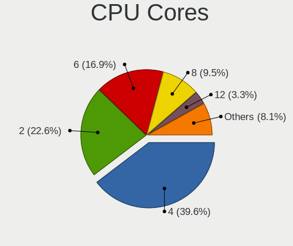

| Number  | Desktops | Percent |
|---------|----------|---------|
| 4       | 964      | 39.64%  |
| 2       | 549      | 22.57%  |
| 6       | 411      | 16.9%   |
| 8       | 231      | 9.5%    |
| 12      | 80       | 3.29%   |
| Unknown | 45       | 1.85%   |
| 1       | 39       | 1.6%    |
| 16      | 38       | 1.56%   |
| 3       | 23       | 0.95%   |
| 10      | 18       | 0.74%   |
| 24      | 11       | 0.45%   |
| 20      | 8        | 0.33%   |
| 14      | 8        | 0.33%   |
| 32      | 2        | 0.08%   |
| 64      | 1        | 0.04%   |
| 44      | 1        | 0.04%   |
| 28      | 1        | 0.04%   |
| 18      | 1        | 0.04%   |
| 5       | 1        | 0.04%   |

CPU Sockets
-----------

Number of sockets

| Number | Desktops | Percent |
|--------|----------|---------|
| 1      | 2373     | 98.63%  |
| 2      | 32       | 1.33%   |
| 4      | 1        | 0.04%   |

CPU Threads
-----------

Threads per core (Hyper-Threading)

| Number  | Desktops | Percent |
|---------|----------|---------|
| 2       | 1235     | 50.89%  |
| 1       | 1147     | 47.26%  |
| Unknown | 45       | 1.85%   |

CPU Op-Modes
------------

CPU Operation Modes (32-bit, 64-bit)

| Op mode        | Desktops | Percent |
|----------------|----------|---------|
| 32-bit, 64-bit | 2387     | 98.96%  |
| Unknown        | 18       | 0.75%   |
| 32-bit         | 7        | 0.29%   |

CPU Microcode
-------------

Microcode number

| Number     | Desktops | Percent |
|------------|----------|---------|
| Unknown    | 912      | 35.64%  |
| 0x306c3    | 176      | 6.88%   |
| 0x1067a    | 114      | 4.45%   |
| 0x306a9    | 106      | 4.14%   |
| 0x206a7    | 87       | 3.4%    |
| 0x08701021 | 74       | 2.89%   |
| 0x0800820d | 72       | 2.81%   |
| 0x506e3    | 68       | 2.66%   |
| 0x010000c8 | 58       | 2.27%   |
| 0x906ea    | 50       | 1.95%   |
| 0x906e9    | 48       | 1.88%   |
| 0x08701013 | 29       | 1.13%   |
| 0x06001119 | 29       | 1.13%   |
| 0x6fb      | 28       | 1.09%   |
| 0xa0653    | 27       | 1.06%   |
| 0x06000852 | 27       | 1.06%   |
| 0x10676    | 26       | 1.02%   |
| 0x08001138 | 23       | 0.9%    |
| 0x6fd      | 21       | 0.82%   |
| 0x06003106 | 20       | 0.78%   |
| 0x106e5    | 19       | 0.74%   |
| 0x6f6      | 16       | 0.63%   |
| 0x206c2    | 16       | 0.63%   |
| 0x10677    | 16       | 0.63%   |
| 0x08108109 | 16       | 0.63%   |
| 0x08101016 | 16       | 0.63%   |
| 0x0a50000d | 15       | 0.59%   |
| 0x0a20120a | 15       | 0.59%   |
| 0x0a201016 | 15       | 0.59%   |
| 0x306f2    | 13       | 0.51%   |
| 0x0a601203 | 13       | 0.51%   |
| 0x0a50000c | 13       | 0.51%   |
| 0x010000db | 13       | 0.51%   |
| 0xa0671    | 12       | 0.47%   |
| 0x08001137 | 12       | 0.47%   |
| 0x0a201009 | 11       | 0.43%   |
| 0xa0655    | 10       | 0.39%   |
| 0x90672    | 10       | 0.39%   |
| 0x206d7    | 9        | 0.35%   |
| 0xb0671    | 8        | 0.31%   |

CPU Microarch
-------------

Microarchitecture

| Name             | Desktops | Percent |
|------------------|----------|---------|
| Haswell          | 280      | 11.56%  |
| KabyLake         | 200      | 8.26%   |
| Penryn           | 187      | 7.72%   |
| Zen 2            | 168      | 6.94%   |
| IvyBridge        | 159      | 6.56%   |
| SandyBridge      | 142      | 5.86%   |
| Zen 3            | 140      | 5.78%   |
| K10              | 132      | 5.45%   |
| Zen+             | 131      | 5.41%   |
| Skylake          | 117      | 4.83%   |
| Unknown          | 103      | 4.25%   |
| Core             | 95       | 3.92%   |
| Zen              | 86       | 3.55%   |
| Piledriver       | 80       | 3.3%    |
| CometLake        | 59       | 2.44%   |
| K8 Hammer        | 55       | 2.27%   |
| Nehalem          | 43       | 1.78%   |
| Alderlake Hybrid | 42       | 1.73%   |
| Westmere         | 36       | 1.49%   |
| Steamroller      | 23       | 0.95%   |
| Jaguar           | 21       | 0.87%   |
| NetBurst         | 19       | 0.78%   |
| Silvermont       | 16       | 0.66%   |
| Bulldozer        | 13       | 0.54%   |
| Icelake          | 12       | 0.5%    |
| Bobcat           | 12       | 0.5%    |
| Broadwell        | 10       | 0.41%   |
| K10 Llano        | 8        | 0.33%   |
| Goldmont plus    | 8        | 0.33%   |
| Excavator        | 8        | 0.33%   |
| Puma             | 6        | 0.25%   |
| Goldmont         | 5        | 0.21%   |
| Gracemont        | 4        | 0.17%   |
| P6               | 1        | 0.04%   |
| Bonnell          | 1        | 0.04%   |

Graphics
--------

GPU Vendor
----------

Vendors of graphics cards

| Vendor                     | Desktops | Percent |
|----------------------------|----------|---------|
| Nvidia                     | 1134     | 44%     |
| AMD                        | 793      | 30.77%  |
| Intel                      | 641      | 24.87%  |
| ASPEED Technology          | 6        | 0.23%   |
| Matrox Electronics Systems | 2        | 0.08%   |
| S3 Graphics                | 1        | 0.04%   |

GPU Model
---------

Graphics card models

| Model                                                                       | Desktops | Percent |
|-----------------------------------------------------------------------------|----------|---------|
| Intel Xeon E3-1200 v3/4th Gen Core Processor Integrated Graphics Controller | 133      | 4.96%   |
| AMD Ellesmere [Radeon RX 470/480/570/570X/580/580X/590]                     | 126      | 4.7%    |
| Intel 2nd Generation Core Processor Family Integrated Graphics Controller   | 70       | 2.61%   |
| Nvidia GP107 [GeForce GTX 1050 Ti]                                          | 61       | 2.28%   |
| Intel HD Graphics 530                                                       | 58       | 2.16%   |
| Intel Xeon E3-1200 v2/3rd Gen Core processor Graphics Controller            | 54       | 2.01%   |
| Intel 4 Series Chipset Integrated Graphics Controller                       | 52       | 1.94%   |
| Nvidia GP106 [GeForce GTX 1060 6GB]                                         | 51       | 1.9%    |
| Intel CoffeeLake-S GT2 [UHD Graphics 630]                                   | 44       | 1.64%   |
| Nvidia GP108 [GeForce GT 1030]                                              | 40       | 1.49%   |
| Nvidia GT218 [GeForce 210]                                                  | 39       | 1.46%   |
| AMD Navi 10 [Radeon RX 5600 OEM/5600 XT / 5700/5700 XT]                     | 37       | 1.38%   |
| Nvidia GK208B [GeForce GT 710]                                              | 36       | 1.34%   |
| Nvidia GP104 [GeForce GTX 1070]                                             | 33       | 1.23%   |
| AMD Raphael                                                                 | 33       | 1.23%   |
| Nvidia GM107 [GeForce GTX 750 Ti]                                           | 32       | 1.19%   |
| Nvidia GP107 [GeForce GTX 1050]                                             | 29       | 1.08%   |
| Nvidia GM204 [GeForce GTX 970]                                              | 29       | 1.08%   |
| Nvidia G96C [GeForce 9500 GT]                                               | 29       | 1.08%   |
| Intel 4th Generation Core Processor Family Integrated Graphics Controller   | 29       | 1.08%   |
| Intel HD Graphics 630                                                       | 28       | 1.04%   |
| Nvidia GP106 [GeForce GTX 1060 3GB]                                         | 27       | 1.01%   |
| AMD Raven Ridge [Radeon Vega Series / Radeon Vega Mobile Series]            | 27       | 1.01%   |
| AMD Navi 22 [Radeon RX 6700/6700 XT/6750 XT / 6800M/6850M XT]               | 27       | 1.01%   |
| AMD Cezanne [Radeon Vega Series / Radeon Vega Mobile Series]                | 27       | 1.01%   |
| AMD Navi 23 [Radeon RX 6600/6600 XT/6600M]                                  | 26       | 0.97%   |
| AMD Picasso/Raven 2 [Radeon Vega Series / Radeon Vega Mobile Series]        | 25       | 0.93%   |
| AMD Cedar [Radeon HD 5000/6000/7350/8350 Series]                            | 25       | 0.93%   |
| Nvidia GP104 [GeForce GTX 1080]                                             | 23       | 0.86%   |
| Nvidia TU116 [GeForce GTX 1660 SUPER]                                       | 20       | 0.75%   |
| Nvidia GM206 [GeForce GTX 960]                                              | 20       | 0.75%   |
| Nvidia GK208B [GeForce GT 730]                                              | 18       | 0.67%   |
| Nvidia GA106 [GeForce RTX 3060 Lite Hash Rate]                              | 18       | 0.67%   |
| Nvidia G94 [GeForce 9600 GT]                                                | 18       | 0.67%   |
| AMD Kaveri [Radeon R7 Graphics]                                             | 18       | 0.67%   |
| AMD Cape Verde XT [Radeon HD 7770/8760 / R7 250X]                           | 18       | 0.67%   |
| Nvidia GK107 [GeForce GTX 650]                                              | 17       | 0.63%   |
| Nvidia GF108 [GeForce GT 630]                                               | 17       | 0.63%   |
| Intel AlderLake-S GT1                                                       | 17       | 0.63%   |
| AMD Baffin [Radeon RX 550 640SP / RX 560/560X]                              | 17       | 0.63%   |

GPU Combo
---------

Combinations of graphics cards

| Name            | Desktops | Percent |
|-----------------|----------|---------|
| 1 x Nvidia      | 1054     | 42.76%  |
| 1 x AMD         | 703      | 28.52%  |
| 1 x Intel       | 537      | 21.78%  |
| 2 x AMD         | 42       | 1.7%    |
| Intel + Nvidia  | 39       | 1.58%   |
| AMD + Nvidia    | 34       | 1.38%   |
| Intel + AMD     | 20       | 0.81%   |
| 2 x Intel       | 12       | 0.49%   |
| 2 x Nvidia      | 8        | 0.32%   |
| Other           | 4        | 0.16%   |
| 1 x ASPEED      | 4        | 0.16%   |
| 3 x AMD         | 3        | 0.12%   |
| Nvidia + ASPEED | 2        | 0.08%   |
| 1 x Matrox      | 2        | 0.08%   |
| 1 x S3 Graphics | 1        | 0.04%   |

GPU Driver
----------

Free vs proprietary

| Driver      | Desktops | Percent |
|-------------|----------|---------|
| Free        | 1743     | 70.23%  |
| Proprietary | 611      | 24.62%  |
| Unknown     | 128      | 5.16%   |

GPU Memory
----------

Total video memory

| Size in GB | Desktops | Percent |
|------------|----------|---------|
| Unknown    | 969      | 37.87%  |
| 1.01-2.0   | 334      | 13.05%  |
| 0.51-1.0   | 296      | 11.57%  |
| 0.01-0.5   | 281      | 10.98%  |
| 7.01-8.0   | 239      | 9.34%   |
| 3.01-4.0   | 202      | 7.89%   |
| 5.01-6.0   | 102      | 3.99%   |
| 8.01-16.0  | 98       | 3.83%   |
| 2.01-3.0   | 23       | 0.9%    |
| 16.01-24.0 | 13       | 0.51%   |
| 4.01-5.0   | 2        | 0.08%   |

Monitor
-------

Monitor Vendor
--------------

Monitor vendors

| Vendor               | Desktops | Percent |
|----------------------|----------|---------|
| Samsung Electronics  | 449      | 17.08%  |
| Goldstar             | 309      | 11.75%  |
| Dell                 | 267      | 10.16%  |
| Iiyama               | 180      | 6.85%   |
| Philips              | 178      | 6.77%   |
| Hewlett-Packard      | 147      | 5.59%   |
| Acer                 | 146      | 5.55%   |
| BenQ                 | 124      | 4.72%   |
| AOC                  | 110      | 4.18%   |
| Eizo                 | 81       | 3.08%   |
| NEC Computers        | 71       | 2.7%    |
| Ancor Communications | 71       | 2.7%    |
| Lenovo               | 47       | 1.79%   |
| Sony                 | 41       | 1.56%   |
| LG Electronics       | 37       | 1.41%   |
| Fujitsu Siemens      | 37       | 1.41%   |
| ASUSTek Computer     | 30       | 1.14%   |
| Unknown              | 25       | 0.95%   |
| Gigabyte Technology  | 20       | 0.76%   |
| Idek Iiyama          | 18       | 0.68%   |
| MSI                  | 16       | 0.61%   |
| Toshiba              | 12       | 0.46%   |
| Belinea              | 12       | 0.46%   |
| ViewSonic            | 11       | 0.42%   |
| Gateway              | 11       | 0.42%   |
| Panasonic            | 9        | 0.34%   |
| Medion               | 9        | 0.34%   |
| Unknown              | 9        | 0.34%   |
| Hyundai ImageQuest   | 8        | 0.3%    |
| Vestel Elektronik    | 7        | 0.27%   |
| Hitachi              | 6        | 0.23%   |
| Unknown (XXX)        | 5        | 0.19%   |
| Sharp                | 5        | 0.19%   |
| RTK                  | 5        | 0.19%   |
| Mi                   | 5        | 0.19%   |
| IBM                  | 5        | 0.19%   |
| HJW                  | 5        | 0.19%   |
| Arnos Instruments    | 5        | 0.19%   |
| Xiaomi               | 4        | 0.15%   |
| TCL                  | 4        | 0.15%   |

Monitor Model
-------------

Monitor models

| Model                                                                 | Desktops | Percent |
|-----------------------------------------------------------------------|----------|---------|
| Philips PHL 223V5 PHLC0CF 1920x1080 480x270mm 21.7-inch               | 16       | 0.57%   |
| Philips 273PQPY PHLC096 1920x1080 597x336mm 27.0-inch                 | 14       | 0.5%    |
| Samsung Electronics C24F390 SAM0D2C 1920x1080 521x293mm 23.5-inch     | 13       | 0.46%   |
| Goldstar IPS FULLHD GSM5AB8 1920x1080 480x270mm 21.7-inch             | 13       | 0.46%   |
| Dell U2412M DELA07A 1920x1200 518x324mm 24.1-inch                     | 13       | 0.46%   |
| Goldstar ULTRAWIDE GSM59F1 2560x1080 677x290mm 29.0-inch              | 12       | 0.42%   |
| AOC 24G2W1G5 AOC2402 1920x1080 527x296mm 23.8-inch                    | 12       | 0.42%   |
| Philips PHL 243V7 PHLC155 1920x1080 527x296mm 23.8-inch               | 11       | 0.39%   |
| Goldstar ULTRAGEAR GSM5BD3 2560x1440 697x392mm 31.5-inch              | 11       | 0.39%   |
| AOC Q3279WG5B AOC3279 2560x1440 725x428mm 33.1-inch                   | 11       | 0.39%   |
| AOC Q27G2WG4 AOC2702 2560x1440 597x336mm 27.0-inch                    | 11       | 0.39%   |
| Unknown LCD Monitor FFFF 2288x1287 2550x2550mm 142.0-inch             | 9        | 0.32%   |
| Samsung Electronics C27F390 SAM0D32 1920x1080 600x340mm 27.2-inch     | 9        | 0.32%   |
| Iiyama X2483/2481 IVM6128 1920x1080 527x296mm 23.8-inch               | 9        | 0.32%   |
| Goldstar 2D FHD TV GSM59C6 1920x1080 509x286mm 23.0-inch              | 9        | 0.32%   |
| Unknown                                                               | 9        | 0.32%   |
| Samsung Electronics S24D300 SAM0B43 1920x1080 531x299mm 24.0-inch     | 8        | 0.28%   |
| Philips PHL 273V7 PHLC156 1920x1080 598x336mm 27.0-inch               | 8        | 0.28%   |
| Goldstar IPS FULLHD GSM5AB6 1920x1080 480x270mm 21.7-inch             | 8        | 0.28%   |
| Ancor Communications BE24A ACI24AB 1920x1200 518x324mm 24.1-inch      | 8        | 0.28%   |
| Vestel Elektronik 49FHD_LCD_TV VES3700 1920x1080 1280x720mm 57.8-inch | 7        | 0.25%   |
| Samsung Electronics SyncMaster SAM011E 1280x1024 338x270mm 17.0-inch  | 7        | 0.25%   |
| Lenovo LEN LT2252pwA LEN0A0C 1680x1050 474x296mm 22.0-inch            | 7        | 0.25%   |
| Iiyama PL2530H IVM6132 1920x1080 544x303mm 24.5-inch                  | 7        | 0.25%   |
| Hewlett-Packard LA2306 HWP2949 1920x1080 510x287mm 23.0-inch          | 7        | 0.25%   |
| Dell U2212HM DELD047 1920x1080 475x267mm 21.5-inch                    | 7        | 0.25%   |
| BenQ GW2255 BNQ78CD 1920x1080 477x268mm 21.5-inch                     | 7        | 0.25%   |
| Samsung Electronics S24D330 SAM0D92 1920x1080 531x299mm 24.0-inch     | 6        | 0.21%   |
| Samsung Electronics LCD Monitor SAM0B30 1920x1080 480x270mm 21.7-inch | 6        | 0.21%   |
| Philips PHL 276E8V PHLC18F 3840x2160 600x340mm 27.2-inch              | 6        | 0.21%   |
| NEC Computers EA223WM NEC6890 1680x1050 474x296mm 22.0-inch           | 6        | 0.21%   |
| Iiyama PLX2483H IVM6114 1920x1080 531x299mm 24.0-inch                 | 6        | 0.21%   |
| Iiyama PL2470H IVM615C 1920x1080 527x296mm 23.8-inch                  | 6        | 0.21%   |
| Goldstar HDR WFHD GSM7714 2560x1080 798x334mm 34.1-inch               | 6        | 0.21%   |
| Eizo EV2316W ENC2394 1920x1080 510x287mm 23.0-inch                    | 6        | 0.21%   |
| Eizo EV2316W ENC2393 1920x1080 510x287mm 23.0-inch                    | 6        | 0.21%   |
| BenQ GL2460 BNQ78CE 1920x1080 531x299mm 24.0-inch                     | 6        | 0.21%   |
| AOC 2460G4 AOC246A 1920x1080 531x299mm 24.0-inch                      | 6        | 0.21%   |
| Acer VG220Q ACR06D8 1920x1080 476x268mm 21.5-inch                     | 6        | 0.21%   |
| Samsung Electronics SyncMaster SAM01F9 1280x1024 376x301mm 19.0-inch  | 5        | 0.18%   |

Monitor Resolution
------------------

Monitor screen resolution

| Resolution         | Desktops | Percent |
|--------------------|----------|---------|
| 1920x1080 (FHD)    | 1140     | 44.69%  |
| 1280x1024 (SXGA)   | 238      | 9.33%   |
| 2560x1440 (QHD)    | 228      | 8.94%   |
| 3840x2160 (4K)     | 186      | 7.29%   |
| 1680x1050 (WSXGA+) | 164      | 6.43%   |
| 1920x1200 (WUXGA)  | 123      | 4.82%   |
| 1440x900 (WXGA+)   | 99       | 3.88%   |
| 3440x1440          | 53       | 2.08%   |
| 1366x768 (WXGA)    | 50       | 1.96%   |
| Unknown            | 50       | 1.96%   |
| 2560x1080          | 37       | 1.45%   |
| 1600x1200          | 23       | 0.9%    |
| 1360x768           | 22       | 0.86%   |
| 3840x1080          | 16       | 0.63%   |
| 1024x768 (XGA)     | 16       | 0.63%   |
| 1600x900 (HD+)     | 15       | 0.59%   |
| 1920x540           | 10       | 0.39%   |
| 2288x1287          | 9        | 0.35%   |
| 1280x720 (HD)      | 5        | 0.2%    |
| 5120x1440          | 4        | 0.16%   |
| 4480x1440          | 4        | 0.16%   |
| 3840x1200          | 4        | 0.16%   |
| 2560x1600          | 4        | 0.16%   |
| 2048x1152          | 4        | 0.16%   |
| 1400x1050          | 4        | 0.16%   |
| 1280x960           | 4        | 0.16%   |
| 3200x1080          | 3        | 0.12%   |
| 1280x768           | 3        | 0.12%   |
| 5760x1200          | 2        | 0.08%   |
| 5760x1080          | 2        | 0.08%   |
| 5120x1080          | 2        | 0.08%   |
| 3840x1600          | 2        | 0.08%   |
| 3600x1080          | 2        | 0.08%   |
| 1280x800 (WXGA)    | 2        | 0.08%   |
| 7680x2560          | 1        | 0.04%   |
| 7280x1440          | 1        | 0.04%   |
| 720x576            | 1        | 0.04%   |
| 720x480            | 1        | 0.04%   |
| 6880x1440          | 1        | 0.04%   |
| 6400x2160          | 1        | 0.04%   |

Monitor Diagonal
----------------

Diagonal size in inches

| Inches  | Desktops | Percent |
|---------|----------|---------|
| 24      | 417      | 15.98%  |
| 27      | 338      | 12.96%  |
| 21      | 308      | 11.81%  |
| 23      | 304      | 11.65%  |
| Unknown | 234      | 8.97%   |
| 19      | 207      | 7.93%   |
| 22      | 105      | 4.02%   |
| 17      | 103      | 3.95%   |
| 31      | 86       | 3.3%    |
| 34      | 80       | 3.07%   |
| 18      | 73       | 2.8%    |
| 20      | 48       | 1.84%   |
| 84      | 31       | 1.19%   |
| 72      | 30       | 1.15%   |
| 32      | 28       | 1.07%   |
| 54      | 27       | 1.03%   |
| 15      | 23       | 0.88%   |
| 25      | 22       | 0.84%   |
| 40      | 18       | 0.69%   |
| 33      | 12       | 0.46%   |
| 65      | 10       | 0.38%   |
| 142     | 9        | 0.34%   |
| 46      | 9        | 0.34%   |
| 28      | 9        | 0.34%   |
| 26      | 9        | 0.34%   |
| 43      | 7        | 0.27%   |
| 42      | 7        | 0.27%   |
| 48      | 6        | 0.23%   |
| 29      | 6        | 0.23%   |
| 14      | 6        | 0.23%   |
| 55      | 4        | 0.15%   |
| 49      | 4        | 0.15%   |
| 39      | 4        | 0.15%   |
| 12      | 4        | 0.15%   |
| 50      | 3        | 0.11%   |
| 37      | 3        | 0.11%   |
| 35      | 3        | 0.11%   |
| 57      | 2        | 0.08%   |
| 47      | 2        | 0.08%   |
| 86      | 1        | 0.04%   |

Monitor Width
-------------

Physical width

| Width in mm    | Desktops | Percent |
|----------------|----------|---------|
| 501-600        | 994      | 39.35%  |
| 401-500        | 600      | 23.75%  |
| Unknown        | 234      | 9.26%   |
| 351-400        | 134      | 5.3%    |
| 301-350        | 126      | 4.99%   |
| 601-700        | 125      | 4.95%   |
| 701-800        | 119      | 4.71%   |
| 1001-1500      | 71       | 2.81%   |
| 1501-2000      | 63       | 2.49%   |
| 801-900        | 30       | 1.19%   |
| 901-1000       | 12       | 0.48%   |
| More than 2000 | 9        | 0.36%   |
| 201-300        | 9        | 0.36%   |

Aspect Ratio
------------

Proportional relationship between the width and the height

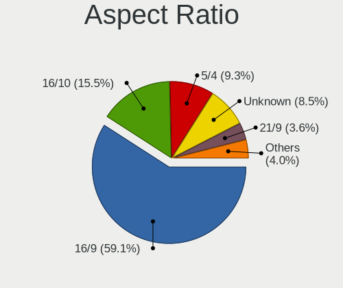

| Ratio   | Desktops | Percent |
|---------|----------|---------|
| 16/9    | 1431     | 59.11%  |
| 16/10   | 376      | 15.53%  |
| 5/4     | 226      | 9.33%   |
| Unknown | 205      | 8.47%   |
| 21/9    | 87       | 3.59%   |
| 4/3     | 45       | 1.86%   |
| 3/2     | 26       | 1.07%   |
| 1.00    | 9        | 0.37%   |
| 32/9    | 8        | 0.33%   |
| 6/5     | 4        | 0.17%   |
| 0.56    | 2        | 0.08%   |
| 3.40    | 1        | 0.04%   |
| 3.20    | 1        | 0.04%   |

Monitor Area
------------

Area in inch

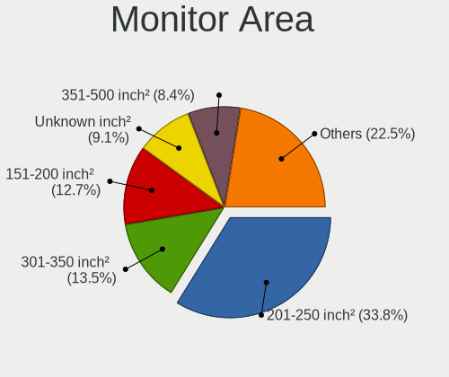

| Area in inch | Desktops | Percent |
|----------------|----------|---------|
| 201-250        | 868      | 33.84%  |
| 301-350        | 345      | 13.45%  |
| 151-200        | 326      | 12.71%  |
| Unknown        | 234      | 9.12%   |
| 351-500        | 216      | 8.42%   |
| 251-300        | 209      | 8.15%   |
| 141-150        | 149      | 5.81%   |
| More than 1000 | 128      | 4.99%   |
| 501-1000       | 56       | 2.18%   |
| 101-110        | 20       | 0.78%   |
| 111-120        | 5        | 0.19%   |
| 71-80          | 4        | 0.16%   |
| 51-60          | 2        | 0.08%   |
| 91-100         | 2        | 0.08%   |
| 81-90          | 1        | 0.04%   |

Pixel Density
-------------

Pixels per inch

| Density       | Desktops | Percent |
|---------------|----------|---------|
| 51-100        | 1495     | 61.2%   |
| 101-120       | 489      | 20.02%  |
| Unknown       | 234      | 9.58%   |
| 1-50          | 110      | 4.5%    |
| 121-160       | 86       | 3.52%   |
| 161-240       | 27       | 1.11%   |
| More than 240 | 2        | 0.08%   |

Multiple Monitors
-----------------

Total monitors connected

| Total | Desktops | Percent |
|-------|----------|---------|
| 1     | 1926     | 77.91%  |
| 2     | 359      | 14.52%  |
| 0     | 129      | 5.22%   |
| 3     | 49       | 1.98%   |
| 4     | 8        | 0.32%   |
| 6     | 1        | 0.04%   |

Network
-------

Net Controller Vendor
---------------------

Controller vendors

| Vendor                                 | Desktops | Percent |
|----------------------------------------|----------|---------|
| Realtek Semiconductor                  | 1517     | 43.7%   |
| Intel                                  | 867      | 24.98%  |
| Qualcomm Atheros                       | 229      | 6.6%    |
| TP-Link                                | 110      | 3.17%   |
| Broadcom                               | 106      | 3.05%   |
| Ralink Technology                      | 66       | 1.9%    |
| Qualcomm Atheros Communications        | 54       | 1.56%   |
| Nvidia                                 | 54       | 1.56%   |
| MediaTek                               | 53       | 1.53%   |
| Microsoft                              | 47       | 1.35%   |
| Ralink                                 | 40       | 1.15%   |
| Huawei Technologies                    | 30       | 0.86%   |
| Marvell Technology Group               | 28       | 0.81%   |
| ASUSTek Computer                       | 27       | 0.78%   |
| Xiaomi                                 | 24       | 0.69%   |
| Broadcom Limited                       | 24       | 0.69%   |
| Samsung Electronics                    | 22       | 0.63%   |
| Aquantia                               | 18       | 0.52%   |
| Edimax Technology                      | 14       | 0.4%    |
| D-Link                                 | 10       | 0.29%   |
| Motorola PCS                           | 8        | 0.23%   |
| VIA Technologies                       | 7        | 0.2%    |
| NetGear                                | 7        | 0.2%    |
| Qualcomm                               | 6        | 0.17%   |
| OPPO Electronics                       | 6        | 0.17%   |
| D-Link System                          | 6        | 0.17%   |
| Sony Ericsson Mobile Communications AB | 5        | 0.14%   |
| Sagem                                  | 4        | 0.12%   |
| Google                                 | 4        | 0.12%   |
| ZTE WCDMA Technologies MSM             | 3        | 0.09%   |
| Texas Instruments                      | 3        | 0.09%   |
| Qualcomm Technologies                  | 3        | 0.09%   |
| QinHeng Electronics                    | 3        | 0.09%   |
| ICS Advent                             | 3        | 0.09%   |
| HTC (High Tech Computer)               | 3        | 0.09%   |
| ASIX Electronics                       | 3        | 0.09%   |
| Apple                                  | 3        | 0.09%   |
| ZyXEL Communications                   | 2        | 0.06%   |
| ZyDAS                                  | 2        | 0.06%   |
| Seeed Technology                       | 2        | 0.06%   |

Net Controller Model
--------------------

Controller models

| Model                                                                  | Desktops | Percent |
|------------------------------------------------------------------------|----------|---------|
| Realtek RTL8111/8168/8211/8411 PCI Express Gigabit Ethernet Controller | 1180     | 30.75%  |
| Realtek RTL8125 2.5GbE Controller                                      | 164      | 4.27%   |
| Intel 82579LM Gigabit Network Connection (Lewisville)                  | 107      | 2.79%   |
| Intel I211 Gigabit Network Connection                                  | 103      | 2.68%   |
| Intel Ethernet Connection (2) I219-V                                   | 81       | 2.11%   |
| Intel Wi-Fi 6 AX200                                                    | 79       | 2.06%   |
| Intel Ethernet Connection I217-LM                                      | 53       | 1.38%   |
| Intel Ethernet Controller I225-V                                       | 50       | 1.3%    |
| Intel 82567LM-3 Gigabit Network Connection                             | 45       | 1.17%   |
| Intel 82579V Gigabit Network Connection                                | 42       | 1.09%   |
| Qualcomm Atheros AR9271 802.11n                                        | 41       | 1.07%   |
| TP-Link TL-WN722N v2/v3 [Realtek RTL8188EUS]                           | 40       | 1.04%   |
| Realtek RTL8188EUS 802.11n Wireless Network Adapter                    | 39       | 1.02%   |
| Intel Ethernet Connection (7) I219-V                                   | 39       | 1.02%   |
| Realtek RTL-8100/8101L/8139 PCI Fast Ethernet Adapter                  | 38       | 0.99%   |
| Nvidia MCP61 Ethernet                                                  | 32       | 0.83%   |
| Intel Wi-Fi 5(802.11ac) Wireless-AC 9x6x [Thunder Peak]                | 31       | 0.81%   |
| Ralink MT7601U Wireless Adapter                                        | 30       | 0.78%   |
| Intel Wi-Fi 6E(802.11ax) AX210/AX1675* 2x2 [Typhoon Peak]              | 28       | 0.73%   |
| Intel Ethernet Connection (2) I219-LM                                  | 28       | 0.73%   |
| Intel Dual Band Wireless-AC 3168NGW [Stone Peak]                       | 28       | 0.73%   |
| Realtek RTL810xE PCI Express Fast Ethernet controller                  | 26       | 0.68%   |
| Realtek 802.11ac NIC                                                   | 26       | 0.68%   |
| Microsoft Xbox 360 Wireless Adapter                                    | 26       | 0.68%   |
| MediaTek MT7922 802.11ax PCI Express Wireless Network Adapter          | 26       | 0.68%   |
| Intel Ethernet Connection (2) I218-V                                   | 25       | 0.65%   |
| Qualcomm Atheros Killer E220x Gigabit Ethernet Controller              | 24       | 0.63%   |
| Intel Ethernet Connection I217-V                                       | 23       | 0.6%    |
| Qualcomm Atheros AR93xx Wireless Network Adapter                       | 22       | 0.57%   |
| Microsoft Xbox Wireless Adapter for Windows                            | 21       | 0.55%   |
| Xiaomi Mi/Redmi series (RNDIS)                                         | 20       | 0.52%   |
| Marvell Group 88E8056 PCI-E Gigabit Ethernet Controller                | 19       | 0.5%    |
| Broadcom BCM4360 802.11ac Dual Band Wireless Network Adapter           | 19       | 0.5%    |
| Realtek RTL88x2bu [AC1200 Techkey]                                     | 18       | 0.47%   |
| Qualcomm Atheros AR9485 Wireless Network Adapter                       | 18       | 0.47%   |
| Realtek RTL8192EE PCIe Wireless Network Adapter                        | 17       | 0.44%   |
| Realtek RTL8188CUS 802.11n WLAN Adapter                                | 17       | 0.44%   |
| Realtek RTL8153 Gigabit Ethernet Adapter                               | 17       | 0.44%   |
| Ralink RT2561/RT61 802.11g PCI                                         | 17       | 0.44%   |
| Qualcomm Atheros AR9227 Wireless Network Adapter                       | 17       | 0.44%   |

Wireless Vendor
---------------

Wireless vendors

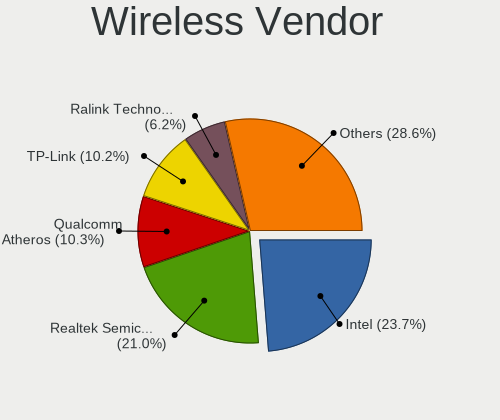

| Vendor                          | Desktops | Percent |
|---------------------------------|----------|---------|
| Intel                           | 254      | 23.74%  |
| Realtek Semiconductor           | 225      | 21.03%  |
| Qualcomm Atheros                | 110      | 10.28%  |
| TP-Link                         | 109      | 10.19%  |
| Ralink Technology               | 66       | 6.17%   |
| Qualcomm Atheros Communications | 54       | 5.05%   |
| Microsoft                       | 47       | 4.39%   |
| MediaTek                        | 41       | 3.83%   |
| Ralink                          | 40       | 3.74%   |
| Broadcom                        | 36       | 3.36%   |
| ASUSTek Computer                | 27       | 2.52%   |
| Edimax Technology               | 14       | 1.31%   |
| D-Link                          | 10       | 0.93%   |
| NetGear                         | 7        | 0.65%   |
| Sagem                           | 4        | 0.37%   |
| D-Link System                   | 4        | 0.37%   |
| Qualcomm Technologies           | 3        | 0.28%   |
| ZyXEL Communications            | 2        | 0.19%   |
| ZyDAS                           | 2        | 0.19%   |
| Mercucys                        | 2        | 0.19%   |
| Linksys                         | 2        | 0.19%   |
| Broadcom Limited                | 2        | 0.19%   |
| Belkin Components               | 2        | 0.19%   |
| Z-Com                           | 1        | 0.09%   |
| Wacom                           | 1        | 0.09%   |
| Ovislink                        | 1        | 0.09%   |
| Marvell Technology Group        | 1        | 0.09%   |
| IMC Networks                    | 1        | 0.09%   |
| AVM                             | 1        | 0.09%   |
| Accton Technology               | 1        | 0.09%   |

Wireless Model
--------------

Wireless models

| Model                                                                         | Desktops | Percent |
|-------------------------------------------------------------------------------|----------|---------|
| Intel Wi-Fi 6 AX200                                                           | 79       | 7.32%   |
| Qualcomm Atheros AR9271 802.11n                                               | 41       | 3.8%    |
| TP-Link TL-WN722N v2/v3 [Realtek RTL8188EUS]                                  | 40       | 3.71%   |
| Realtek RTL8188EUS 802.11n Wireless Network Adapter                           | 39       | 3.61%   |
| Intel Wi-Fi 5(802.11ac) Wireless-AC 9x6x [Thunder Peak]                       | 31       | 2.87%   |
| Ralink MT7601U Wireless Adapter                                               | 30       | 2.78%   |
| Intel Wi-Fi 6E(802.11ax) AX210/AX1675* 2x2 [Typhoon Peak]                     | 28       | 2.59%   |
| Intel Dual Band Wireless-AC 3168NGW [Stone Peak]                              | 28       | 2.59%   |
| Realtek 802.11ac NIC                                                          | 26       | 2.41%   |
| Microsoft Xbox 360 Wireless Adapter                                           | 26       | 2.41%   |
| Qualcomm Atheros AR93xx Wireless Network Adapter                              | 22       | 2.04%   |
| Microsoft Xbox Wireless Adapter for Windows                                   | 21       | 1.95%   |
| MediaTek MT7922 802.11ax PCI Express Wireless Network Adapter                 | 19       | 1.76%   |
| Broadcom BCM4360 802.11ac Dual Band Wireless Network Adapter                  | 19       | 1.76%   |
| Realtek RTL88x2bu [AC1200 Techkey]                                            | 18       | 1.67%   |
| Qualcomm Atheros AR9485 Wireless Network Adapter                              | 18       | 1.67%   |
| Realtek RTL8192EE PCIe Wireless Network Adapter                               | 17       | 1.58%   |
| Realtek RTL8188CUS 802.11n WLAN Adapter                                       | 17       | 1.58%   |
| Ralink RT2561/RT61 802.11g PCI                                                | 17       | 1.58%   |
| Qualcomm Atheros AR9227 Wireless Network Adapter                              | 17       | 1.58%   |
| Intel Cannon Lake PCH CNVi WiFi                                               | 17       | 1.58%   |
| Ralink RT5370 Wireless Adapter                                                | 15       | 1.39%   |
| Realtek RTL8188EE Wireless Network Adapter                                    | 14       | 1.3%    |
| Intel Wireless 7260                                                           | 14       | 1.3%    |
| Qualcomm Atheros AR2413/AR2414 Wireless Network Adapter [AR5005G(S) 802.11bg] | 13       | 1.2%    |
| Intel Alder Lake-S PCH CNVi WiFi                                              | 13       | 1.2%    |
| TP-Link TL-WN821N v5/v6 [RTL8192EU]                                           | 12       | 1.11%   |
| TP-Link 802.11ac NIC                                                          | 12       | 1.11%   |
| Qualcomm Atheros TP-Link TL-WN322G v3 / TL-WN422G v2 802.11g [Atheros AR9271] | 10       | 0.93%   |
| MediaTek MT7921K (RZ608) Wi-Fi 6E 80MHz                                       | 10       | 0.93%   |
| ASUS AC51 802.11a/b/g/n/ac Wireless Adapter [Mediatek MT7610U]                | 10       | 0.93%   |
| Realtek RTL8821CE 802.11ac PCIe Wireless Network Adapter                      | 9        | 0.83%   |
| Realtek RTL8812AE 802.11ac PCIe Wireless Network Adapter                      | 9        | 0.83%   |
| Realtek RTL8188CE 802.11b/g/n WiFi Adapter                                    | 9        | 0.83%   |
| Qualcomm Atheros AR9285 Wireless Network Adapter (PCI-Express)                | 9        | 0.83%   |
| TP-Link TL-WN823N v2/v3 [Realtek RTL8192EU]                                   | 8        | 0.74%   |
| Realtek RTL8192CE PCIe Wireless Network Adapter                               | 8        | 0.74%   |
| Qualcomm Atheros QCA6174 802.11ac Wireless Network Adapter                    | 8        | 0.74%   |
| Intel Wireless 8260                                                           | 8        | 0.74%   |
| Intel Wireless 7265                                                           | 8        | 0.74%   |

Ethernet Vendor
---------------

Ethernet vendors

| Vendor                                 | Desktops | Percent |
|----------------------------------------|----------|---------|
| Realtek Semiconductor                  | 1424     | 54.52%  |
| Intel                                  | 735      | 28.14%  |
| Qualcomm Atheros                       | 127      | 4.86%   |
| Broadcom                               | 70       | 2.68%   |
| Nvidia                                 | 54       | 2.07%   |
| Marvell Technology Group               | 28       | 1.07%   |
| Xiaomi                                 | 24       | 0.92%   |
| Broadcom Limited                       | 22       | 0.84%   |
| Aquantia                               | 18       | 0.69%   |
| Huawei Technologies                    | 17       | 0.65%   |
| Samsung Electronics                    | 16       | 0.61%   |
| MediaTek                               | 10       | 0.38%   |
| Motorola PCS                           | 8        | 0.31%   |
| VIA Technologies                       | 7        | 0.27%   |
| Qualcomm                               | 6        | 0.23%   |
| OPPO Electronics                       | 6        | 0.23%   |
| Sony Ericsson Mobile Communications AB | 4        | 0.15%   |
| Google                                 | 4        | 0.15%   |
| ICS Advent                             | 3        | 0.11%   |
| HTC (High Tech Computer)               | 3        | 0.11%   |
| ASIX Electronics                       | 3        | 0.11%   |
| Apple                                  | 3        | 0.11%   |
| TP-Link                                | 2        | 0.08%   |
| Research In Motion                     | 2        | 0.08%   |
| QLogic                                 | 2        | 0.08%   |
| NetXen Incorporated                    | 2        | 0.08%   |
| Mellanox Technologies                  | 2        | 0.08%   |
| D-Link System                          | 2        | 0.08%   |
| 3Com                                   | 2        | 0.08%   |
| Lenovo                                 | 1        | 0.04%   |
| Foxconn / Hon Hai                      | 1        | 0.04%   |
| DisplayLink                            | 1        | 0.04%   |
| American Megatrends                    | 1        | 0.04%   |
| AMD                                    | 1        | 0.04%   |
| ADMtek                                 | 1        | 0.04%   |

Ethernet Model
--------------

Ethernet models

| Model                                                                          | Desktops | Percent |
|--------------------------------------------------------------------------------|----------|---------|
| Realtek RTL8111/8168/8211/8411 PCI Express Gigabit Ethernet Controller         | 1180     | 43.69%  |
| Realtek RTL8125 2.5GbE Controller                                              | 164      | 6.07%   |
| Intel 82579LM Gigabit Network Connection (Lewisville)                          | 107      | 3.96%   |
| Intel I211 Gigabit Network Connection                                          | 103      | 3.81%   |
| Intel Ethernet Connection (2) I219-V                                           | 81       | 3%      |
| Intel Ethernet Connection I217-LM                                              | 53       | 1.96%   |
| Intel Ethernet Controller I225-V                                               | 50       | 1.85%   |
| Intel 82567LM-3 Gigabit Network Connection                                     | 45       | 1.67%   |
| Intel 82579V Gigabit Network Connection                                        | 42       | 1.55%   |
| Intel Ethernet Connection (7) I219-V                                           | 39       | 1.44%   |
| Realtek RTL-8100/8101L/8139 PCI Fast Ethernet Adapter                          | 38       | 1.41%   |
| Nvidia MCP61 Ethernet                                                          | 32       | 1.18%   |
| Intel Ethernet Connection (2) I219-LM                                          | 28       | 1.04%   |
| Realtek RTL810xE PCI Express Fast Ethernet controller                          | 26       | 0.96%   |
| Intel Ethernet Connection (2) I218-V                                           | 25       | 0.93%   |
| Qualcomm Atheros Killer E220x Gigabit Ethernet Controller                      | 24       | 0.89%   |
| Intel Ethernet Connection I217-V                                               | 23       | 0.85%   |
| Xiaomi Mi/Redmi series (RNDIS)                                                 | 20       | 0.74%   |
| Marvell Group 88E8056 PCI-E Gigabit Ethernet Controller                        | 19       | 0.7%    |
| Realtek RTL8153 Gigabit Ethernet Adapter                                       | 17       | 0.63%   |
| Qualcomm Atheros AR8151 v2.0 Gigabit Ethernet                                  | 17       | 0.63%   |
| Samsung Galaxy series, misc. (tethering mode)                                  | 16       | 0.59%   |
| Realtek RTL-8110SC/8169SC Gigabit Ethernet                                     | 16       | 0.59%   |
| Intel 82566DM-2 Gigabit Network Connection                                     | 16       | 0.59%   |
| Qualcomm Atheros QCA8171 Gigabit Ethernet                                      | 15       | 0.56%   |
| Qualcomm Atheros AR8131 Gigabit Ethernet                                       | 15       | 0.56%   |
| Intel Ethernet Connection (14) I219-V                                          | 15       | 0.56%   |
| Broadcom NetXtreme BCM5761 Gigabit Ethernet PCIe                               | 15       | 0.56%   |
| Qualcomm Atheros AR8121/AR8113/AR8114 Gigabit or Fast Ethernet                 | 14       | 0.52%   |
| Intel I210 Gigabit Network Connection                                          | 14       | 0.52%   |
| Realtek RTL8169 PCI Gigabit Ethernet Controller                                | 13       | 0.48%   |
| Intel Ethernet Connection (7) I219-LM                                          | 12       | 0.44%   |
| Intel 82574L Gigabit Network Connection                                        | 12       | 0.44%   |
| Broadcom NetXtreme BCM5754 Gigabit Ethernet PCI Express                        | 12       | 0.44%   |
| Qualcomm Atheros Killer E2400 Gigabit Ethernet Controller                      | 11       | 0.41%   |
| Qualcomm Atheros AR8161 Gigabit Ethernet                                       | 11       | 0.41%   |
| Huawei E353/E3131                                                              | 11       | 0.41%   |
| Aquantia AQtion AQC107 NBase-T/IEEE 802.3an Ethernet Controller [Atlantic 10G] | 10       | 0.37%   |
| Qualcomm Atheros Attansic L1 Gigabit Ethernet                                  | 8        | 0.3%    |
| Nvidia MCP55 Ethernet                                                          | 8        | 0.3%    |

Net Controller Kind
-------------------

Ethernet, WiFi or modem

| Kind     | Desktops | Percent |
|----------|----------|---------|
| Ethernet | 2380     | 69.61%  |
| WiFi     | 987      | 28.87%  |
| Modem    | 45       | 1.32%   |
| Unknown  | 7        | 0.2%    |

Used Controller
---------------

Currently used network controller

| Kind     | Desktops | Percent |
|----------|----------|---------|
| Ethernet | 1896     | 77.36%  |
| WiFi     | 550      | 22.44%  |
| Modem    | 4        | 0.16%   |
| Unknown  | 1        | 0.04%   |

NICs
----

Total network controllers on board

| Total | Desktops | Percent |
|-------|----------|---------|
| 1     | 1666     | 68.39%  |
| 2     | 646      | 26.52%  |
| 3     | 78       | 3.2%    |
| 0     | 19       | 0.78%   |
| 5     | 11       | 0.45%   |
| 4     | 8        | 0.33%   |
| 6     | 4        | 0.16%   |
| 7     | 2        | 0.08%   |
| 17    | 1        | 0.04%   |
| 9     | 1        | 0.04%   |

IPv6
----

IPv6 vs IPv4

| Used | Desktops | Percent |
|------|----------|---------|
| No   | 2240     | 92.33%  |
| Yes  | 186      | 7.67%   |

Bluetooth
---------

Bluetooth Vendor
----------------

Controller vendors

| Vendor                          | Desktops | Percent |
|---------------------------------|----------|---------|
| Intel                           | 245      | 33.75%  |
| Cambridge Silicon Radio         | 207      | 28.51%  |
| ASUSTek Computer                | 86       | 11.85%  |
| Realtek Semiconductor           | 41       | 5.65%   |
| MediaTek                        | 24       | 3.31%   |
| TP-Link                         | 21       | 2.89%   |
| Broadcom                        | 18       | 2.48%   |
| Qualcomm Atheros Communications | 17       | 2.34%   |
| IMC Networks                    | 15       | 2.07%   |
| Foxconn / Hon Hai               | 10       | 1.38%   |
| Edimax Technology               | 7        | 0.96%   |
| Integrated System Solution      | 5        | 0.69%   |
| Conwise Technology              | 5        | 0.69%   |
| Apple                           | 5        | 0.69%   |
| Realtek                         | 4        | 0.55%   |
| Lite-On Technology              | 3        | 0.41%   |
| Actions                         | 3        | 0.41%   |
| Unknown                         | 3        | 0.41%   |
| Logitech                        | 2        | 0.28%   |
| Belkin Components               | 2        | 0.28%   |
| SINO WEALTH                     | 1        | 0.14%   |
| National Semiconductor          | 1        | 0.14%   |
| Mercucys                        | 1        | 0.14%   |

Bluetooth Model
---------------

Controller models

| Model                                                   | Desktops | Percent |
|---------------------------------------------------------|----------|---------|
| Cambridge Silicon Radio Bluetooth Dongle (HCI mode)     | 207      | 28.43%  |
| Intel AX200 Bluetooth                                   | 78       | 10.71%  |
| ASUS Broadcom BCM20702A0 Bluetooth                      | 54       | 7.42%   |
| Intel Bluetooth wireless interface                      | 37       | 5.08%   |
| Realtek Bluetooth Radio                                 | 36       | 4.95%   |
| Intel Wireless-AC 9260 Bluetooth Adapter                | 29       | 3.98%   |
| Intel AX210 Bluetooth                                   | 28       | 3.85%   |
| Intel Wireless-AC 3168 Bluetooth                        | 27       | 3.71%   |
| MediaTek Wireless_Device                                | 24       | 3.3%    |
| TP-Link TP-Link Bluetooth USB Adapter                   | 21       | 2.88%   |
| Intel Bluetooth 9460/9560 Jefferson Peak (JfP)          | 20       | 2.75%   |
| ASUS ASUS USB-BT500                                     | 20       | 2.75%   |
| Intel AX201 Bluetooth                                   | 15       | 2.06%   |
| Qualcomm Atheros AR3011 Bluetooth                       | 8        | 1.1%    |
| Intel AX211 Bluetooth                                   | 8        | 1.1%    |
| IMC Networks Wireless_Device                            | 8        | 1.1%    |
| IMC Networks Bluetooth Radio                            | 7        | 0.96%   |
| Foxconn / Hon Hai Wireless_Device                       | 7        | 0.96%   |
| Conwise CW6622                                          | 5        | 0.69%   |
| Broadcom BCM20702A0 Bluetooth 4.0                       | 5        | 0.69%   |
| ASUS Qualcomm Bluetooth 4.1                             | 5        | 0.69%   |
| Realtek Bluetooth Radio                                 | 4        | 0.55%   |
| Integrated System Solution KY-BT100 Bluetooth Adapter   | 4        | 0.55%   |
| Edimax Bluetooth Adapter                                | 4        | 0.55%   |
| Broadcom HP Portable Bumble Bee                         | 4        | 0.55%   |
| Realtek Bluetooth 5.3 Radio                             | 3        | 0.41%   |
| Qualcomm Atheros  Bluetooth Device                      | 3        | 0.41%   |
| Foxconn / Hon Hai Bluetooth Device                      | 3        | 0.41%   |
| Broadcom BCM92046DG-CL1ROM Bluetooth 2.1 Adapter        | 3        | 0.41%   |
| Broadcom BCM2045 Bluetooth                              | 3        | 0.41%   |
| ASUS Bluetooth Radio                                    | 3        | 0.41%   |
| Actions general adapter                                 | 3        | 0.41%   |
| Unknown                                                 | 3        | 0.41%   |
| Qualcomm Atheros QCA61x4 Bluetooth 4.0                  | 2        | 0.27%   |
| Qualcomm Atheros AR3012 Bluetooth 4.0                   | 2        | 0.27%   |
| Logitech BT Mini-Receiver (HCI mode)                    | 2        | 0.27%   |
| Lite-On Bluetooth Device                                | 2        | 0.27%   |
| Intel Bluetooth Device                                  | 2        | 0.27%   |
| Edimax EW-7611ULB 802.11b/g/n and Bluetooth 4.0 Adapter | 2        | 0.27%   |
| ASUS Broadcom BCM20702 Single-Chip Bluetooth 4.0 + LE   | 2        | 0.27%   |

Sound
-----

Sound Vendor
------------

Sound card vendors

| Vendor                                       | Desktops | Percent |
|----------------------------------------------|----------|---------|
| Intel                                        | 1407     | 33.61%  |
| AMD                                          | 1089     | 26.02%  |
| Nvidia                                       | 1023     | 24.44%  |
| Creative Labs                                | 106      | 2.53%   |
| C-Media Electronics                          | 102      | 2.44%   |
| Creative Technology                          | 46       | 1.1%    |
| Logitech                                     | 27       | 0.65%   |
| JMTek                                        | 26       | 0.62%   |
| SteelSeries ApS                              | 25       | 0.6%    |
| Texas Instruments                            | 19       | 0.45%   |
| VIA Technologies                             | 18       | 0.43%   |
| Kingston Technology                          | 16       | 0.38%   |
| ASUSTek Computer                             | 15       | 0.36%   |
| Razer USA                                    | 14       | 0.33%   |
| GYROCOM C&C                                  | 14       | 0.33%   |
| SAVITECH                                     | 12       | 0.29%   |
| Realtek Semiconductor                        | 11       | 0.26%   |
| Micro Star International                     | 10       | 0.24%   |
| Generalplus Technology                       | 9        | 0.22%   |
| Plantronics                                  | 8        | 0.19%   |
| AOKEO                                        | 8        | 0.19%   |
| Focusrite-Novation                           | 7        | 0.17%   |
| Dell                                         | 7        | 0.17%   |
| Valve Software                               | 6        | 0.14%   |
| SM900 Microphon                              | 6        | 0.14%   |
| Hewlett-Packard                              | 6        | 0.14%   |
| GN Netcom                                    | 6        | 0.14%   |
| Trust                                        | 5        | 0.12%   |
| Sony                                         | 5        | 0.12%   |
| M-Audio                                      | 5        | 0.12%   |
| Corsair                                      | 5        | 0.12%   |
| PreSonus Audio Electronics                   | 4        | 0.1%    |
| Nordic Semiconductor ASA                     | 4        | 0.1%    |
| KTMicro                                      | 4        | 0.1%    |
| BEHRINGER International                      | 4        | 0.1%    |
| ASRock                                       | 4        | 0.1%    |
| Zoran Co. Personal Media Division (Nogatech) | 3        | 0.07%   |
| Yamaha                                       | 3        | 0.07%   |
| Thesycon Systemsoftware & Consulting         | 3        | 0.07%   |
| Samson Technologies                          | 3        | 0.07%   |

Sound Model
-----------

Sound card models

| Model                                                                      | Desktops | Percent |
|----------------------------------------------------------------------------|----------|---------|
| AMD Starship/Matisse HD Audio Controller                                   | 252      | 5.14%   |
| Intel 8 Series/C220 Series Chipset High Definition Audio Controller        | 197      | 4.01%   |
| AMD SBx00 Azalia (Intel HDA)                                               | 176      | 3.59%   |
| AMD Family 17h (Models 00h-0fh) HD Audio Controller                        | 150      | 3.06%   |
| Intel Xeon E3-1200 v3/4th Gen Core Processor HD Audio Controller           | 147      | 3%      |
| AMD Family 17h/19h/1ah HD Audio Controller                                 | 145      | 2.95%   |
| Intel 6 Series/C200 Series Chipset Family High Definition Audio Controller | 139      | 2.83%   |
| Intel 7 Series/C216 Chipset Family High Definition Audio Controller        | 134      | 2.73%   |
| Intel 100 Series/C230 Series Chipset Family HD Audio Controller            | 130      | 2.65%   |
| AMD Ellesmere HDMI Audio [Radeon RX 470/480 / 570/580/590]                 | 128      | 2.61%   |
| Intel NM10/ICH7 Family High Definition Audio Controller                    | 110      | 2.24%   |
| Intel 200 Series PCH HD Audio                                              | 100      | 2.04%   |
| Nvidia GP107GL High Definition Audio Controller                            | 95       | 1.94%   |
| AMD FCH Azalia Controller                                                  | 86       | 1.75%   |
| Nvidia GP106 High Definition Audio Controller                              | 80       | 1.63%   |
| Intel Cannon Lake PCH cAVS                                                 | 80       | 1.63%   |
| AMD Navi 21/23 HDMI/DP Audio Controller                                    | 79       | 1.61%   |
| AMD Oland/Hainan/Cape Verde/Pitcairn HDMI Audio [Radeon HD 7000 Series]    | 75       | 1.53%   |
| Nvidia GP104 High Definition Audio Controller                              | 66       | 1.35%   |
| Nvidia GK208 HDMI/DP Audio Controller                                      | 57       | 1.16%   |
| Nvidia GM107 High Definition Audio Controller [GeForce 940MX]              | 56       | 1.14%   |
| Nvidia TU116 High Definition Audio Controller                              | 54       | 1.1%    |
| Intel 82801JI (ICH10 Family) HD Audio Controller                           | 53       | 1.08%   |
| Intel 82801I (ICH9 Family) HD Audio Controller                             | 52       | 1.06%   |
| Intel 82801JD/DO (ICH10 Family) HD Audio Controller                        | 51       | 1.04%   |
| AMD Raven/Raven2/Fenghuang HDMI/DP Audio Controller                        | 51       | 1.04%   |
| Nvidia High Definition Audio Controller                                    | 50       | 1.02%   |
| Nvidia GF108 High Definition Audio Controller                              | 49       | 1%      |
| Nvidia GA104 High Definition Audio Controller                              | 49       | 1%      |
| AMD Renoir Radeon High Definition Audio Controller                         | 48       | 0.98%   |
| Nvidia GK107 HDMI Audio Controller                                         | 46       | 0.94%   |
| Intel 9 Series Chipset Family HD Audio Controller                          | 46       | 0.94%   |
| Intel 5 Series/3400 Series Chipset High Definition Audio                   | 43       | 0.88%   |
| Intel Alder Lake-S HD Audio Controller                                     | 42       | 0.86%   |
| AMD Navi 10 HDMI Audio                                                     | 40       | 0.82%   |
| Nvidia GP108 High Definition Audio Controller                              | 39       | 0.79%   |
| AMD Baffin HDMI/DP Audio [Radeon RX 550 640SP / RX 560/560X]               | 39       | 0.79%   |
| AMD Rembrandt Radeon High Definition Audio Controller                      | 38       | 0.77%   |
| Nvidia MCP61 High Definition Audio                                         | 35       | 0.71%   |
| Nvidia GM204 High Definition Audio Controller                              | 35       | 0.71%   |

Memory
------

Memory Vendor
-------------

Memory module vendors

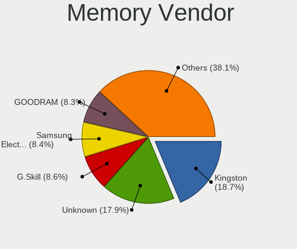

| Vendor                       | Desktops | Percent |
|------------------------------|----------|---------|
| Kingston                     | 326      | 18.71%  |
| Unknown                      | 312      | 17.91%  |
| G.Skill                      | 149      | 8.55%   |
| Samsung Electronics          | 147      | 8.44%   |
| GOODRAM                      | 144      | 8.27%   |
| SK hynix                     | 136      | 7.81%   |
| Corsair                      | 108      | 6.2%    |
| Crucial                      | 87       | 4.99%   |
| Micron Technology            | 59       | 3.39%   |
| Patriot                      | 44       | 2.53%   |
| A-DATA Technology            | 32       | 1.84%   |
| Nanya Technology             | 22       | 1.26%   |
| Unknown                      | 22       | 1.26%   |
| Wilk Elektronik              | 17       | 0.98%   |
| Elpida                       | 17       | 0.98%   |
| Wilk                         | 15       | 0.86%   |
| Ramaxel Technology           | 11       | 0.63%   |
| GeIL                         | 10       | 0.57%   |
| Apacer                       | 10       | 0.57%   |
| Silicon Power                | 6        | 0.34%   |
| Lexar                        | 6        | 0.34%   |
| Unknown (ABCD)               | 5        | 0.29%   |
| Qimonda                      | 5        | 0.29%   |
| PNY                          | 5        | 0.29%   |
| Patriot Memory (PDP Systems) | 5        | 0.29%   |
| Team                         | 4        | 0.23%   |
| Unknown (0x0E9D)             | 3        | 0.17%   |
| Transcend                    | 3        | 0.17%   |
| PUSKILL                      | 3        | 0.17%   |
| OCZ                          | 3        | 0.17%   |
| Lexar Co Limited             | 3        | 0.17%   |
| KingFast                     | 2        | 0.11%   |
| ASint Technology             | 2        | 0.11%   |
| AMD                          | 2        | 0.11%   |
| Unknown (B98C)               | 1        | 0.06%   |
| Unknown (A)                  | 1        | 0.06%   |
| Unknown (8AA1)               | 1        | 0.06%   |
| Unknown (0x7FFF)             | 1        | 0.06%   |
| Unknown (0x0E3E)             | 1        | 0.06%   |
| Unifosa                      | 1        | 0.06%   |

Memory Model
------------

Memory module models

| Model                                                  | Desktops | Percent |
|--------------------------------------------------------|----------|---------|
| Unknown                                                | 22       | 1.12%   |
| Unknown RAM Module 2GB DIMM 800MT/s                    | 21       | 1.07%   |
| Patriot RAM 3200 C16 Series 4GB DIMM DDR4 3600MT/s     | 19       | 0.97%   |
| Kingston RAM 9905403-559.A00LF 8GB DIMM DDR3 1600MT/s  | 19       | 0.97%   |
| Unknown RAM Module 2048MB DIMM 800MT/s                 | 18       | 0.92%   |
| Kingston RAM KHX1600C10D3/8G 8GB DIMM DDR3 1600MT/s    | 18       | 0.92%   |
| G.Skill RAM F4-3200C16-8GVKB 8GB DIMM DDR4 4000MT/s    | 18       | 0.92%   |
| Kingston RAM KHX1600C9D3/4GX 4GB DIMM DDR3 1800MT/s    | 17       | 0.87%   |
| G.Skill RAM F4-3000C16-8GISB 8GB DIMM DDR4 3200MT/s    | 17       | 0.87%   |
| Unknown RAM Module 2GB DIMM 1333MT/s                   | 16       | 0.81%   |
| GOODRAM RAM GR1333D364L9/4G 4GB DIMM DDR3 1600MT/s     | 16       | 0.81%   |
| Unknown RAM Module 4096MB DIMM 1333MT/s                | 15       | 0.76%   |
| Kingston RAM KHX3200C16D4/8GX 8GB DIMM DDR4 3733MT/s   | 14       | 0.71%   |
| Corsair RAM CMK16GX4M2B3000C15 8GB DIMM DDR4 3600MT/s  | 13       | 0.66%   |
| Unknown RAM Module 2048MB DIMM 1333MT/s                | 12       | 0.61%   |
| Unknown RAM Module 4GB DIMM 1333MT/s                   | 11       | 0.56%   |
| GOODRAM RAM GR1600D364L11/8G 8GB DIMM DDR3 1600MT/s    | 11       | 0.56%   |
| Unknown RAM Module 8GB DIMM DDR3 1600MT/s              | 10       | 0.51%   |
| Unknown RAM Module 2GB DIMM DDR2 800MT/s               | 10       | 0.51%   |
| Kingston RAM KF3200C16D4/32GX 32GB DIMM DDR4 3933MT/s  | 10       | 0.51%   |
| Corsair RAM CMK16GX4M2B3200C16 8GB DIMM DDR4 3600MT/s  | 10       | 0.51%   |
| Unknown RAM Module 2GB DIMM SDRAM                      | 9        | 0.46%   |
| SK hynix RAM HMT451U6BFR8C-PB 4GB DIMM DDR3 1600MT/s   | 9        | 0.46%   |
| SK hynix RAM HMT351U6CFR8C-PB 4GB DIMM DDR3 1800MT/s   | 9        | 0.46%   |
| Samsung RAM M378B5173QH0-CK0 4GB DIMM DDR3 1600MT/s    | 9        | 0.46%   |
| Kingston RAM KHX3200C16D4/16GX 16GB DIMM DDR4 3600MT/s | 9        | 0.46%   |
| Kingston RAM KHX2400C15/8G 8GB DIMM DDR4 3400MT/s      | 9        | 0.46%   |
| Kingston RAM KHX2133C14D4/8G 8GB DIMM DDR4 3000MT/s    | 9        | 0.46%   |
| Kingston RAM KF3600C16D4/16GX 16GB DIMM DDR4 3800MT/s  | 9        | 0.46%   |
| Kingston RAM KF3200C16D4/8GX 8GB DIMM DDR4 3600MT/s    | 9        | 0.46%   |
| GOODRAM RAM IR2400D464L15S/8G 8GB DIMM DDR4 3200MT/s   | 9        | 0.46%   |
| Crucial RAM BLS8G3D1609DS1S00. 8GB DIMM DDR3 1800MT/s  | 9        | 0.46%   |
| Unknown RAM Module 1024MB DIMM 800MT/s                 | 8        | 0.41%   |
| Kingston RAM KHX2133C14D4/4G 4GB DIMM DDR4 2933MT/s    | 8        | 0.41%   |
| GOODRAM RAM IRX3000D464L16S/8G 8GB DIMM DDR4 3333MT/s  | 8        | 0.41%   |
| Unknown RAM Module 2GB DIMM DDR3 1333MT/s              | 7        | 0.36%   |
| Unknown RAM Module 2GB DIMM 400MT/s                    | 7        | 0.36%   |
| Unknown RAM Module 2048MB DIMM SDRAM                   | 7        | 0.36%   |
| Unknown RAM Module 1GB DIMM 800MT/s                    | 7        | 0.36%   |
| Unknown RAM Module 1GB DIMM 667MT/s                    | 7        | 0.36%   |

Memory Kind
-----------

Memory module kinds

| Kind    | Desktops | Percent |
|---------|----------|---------|
| DDR4    | 647      | 41.82%  |
| DDR3    | 499      | 32.26%  |
| Unknown | 162      | 10.47%  |
| DDR2    | 82       | 5.3%    |
| SDRAM   | 71       | 4.59%   |
| DDR5    | 50       | 3.23%   |
| DDR     | 27       | 1.75%   |
| LPDDR4  | 6        | 0.39%   |
| DRAM    | 3        | 0.19%   |

Memory Form Factor
------------------

Physical design of the memory module

| Name    | Desktops | Percent |
|---------|----------|---------|
| DIMM    | 1436     | 94.47%  |
| SODIMM  | 80       | 5.26%   |
| RIMM    | 3        | 0.2%    |
| FB-DIMM | 1        | 0.07%   |

Memory Size
-----------

Memory module size

| Size   | Desktops | Percent |
|--------|----------|---------|
| 8192   | 568      | 33.18%  |
| 4096   | 364      | 21.26%  |
| 2048   | 303      | 17.7%   |
| 16384  | 260      | 15.19%  |
| 1024   | 100      | 5.84%   |
| 32768  | 91       | 5.32%   |
| 512    | 21       | 1.23%   |
| 256    | 2        | 0.12%   |
| 131072 | 1        | 0.06%   |
| 1536   | 1        | 0.06%   |
| 64     | 1        | 0.06%   |

Memory Speed
------------

Memory module speed

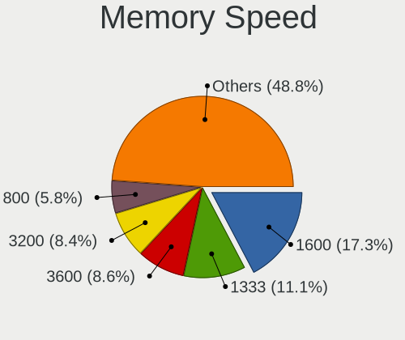

| Speed   | Desktops | Percent |
|---------|----------|---------|
| 1600    | 299      | 17.28%  |
| 1333    | 192      | 11.1%   |
| 3600    | 148      | 8.55%   |
| 3200    | 145      | 8.38%   |
| 800     | 101      | 5.84%   |
| 2400    | 86       | 4.97%   |
| 667     | 63       | 3.64%   |
| 2667    | 62       | 3.58%   |
| 3000    | 49       | 2.83%   |
| 2133    | 47       | 2.72%   |
| 1867    | 41       | 2.37%   |
| 1800    | 31       | 1.79%   |
| Unknown | 30       | 1.73%   |
| 3400    | 28       | 1.62%   |
| 4000    | 27       | 1.56%   |
| 3800    | 27       | 1.56%   |
| 3733    | 26       | 1.5%    |
| 1866    | 26       | 1.5%    |
| 2933    | 22       | 1.27%   |
| 2666    | 21       | 1.21%   |
| 400     | 20       | 1.16%   |
| 6000    | 18       | 1.04%   |
| 1067    | 18       | 1.04%   |
| 1066    | 16       | 0.92%   |
| 4800    | 12       | 0.69%   |
| 3333    | 11       | 0.64%   |
| 3933    | 10       | 0.58%   |
| 2866    | 10       | 0.58%   |
| 533     | 10       | 0.58%   |
| 3466    | 9        | 0.52%   |
| 1334    | 9        | 0.52%   |
| 5600    | 7        | 0.4%    |
| 1648    | 7        | 0.4%    |
| 333     | 7        | 0.4%    |
| 49926   | 6        | 0.35%   |
| 2800    | 6        | 0.35%   |
| 2000    | 6        | 0.35%   |
| 1639    | 6        | 0.35%   |
| 5808    | 5        | 0.29%   |
| 3866    | 5        | 0.29%   |

Printers & scanners
-------------------

Printer Vendor
--------------

Printer device vendors

| Vendor                | Desktops | Percent |
|-----------------------|----------|---------|
| Hewlett-Packard       | 45       | 42.06%  |
| Brother Industries    | 18       | 16.82%  |
| Samsung Electronics   | 13       | 12.15%  |
| Seiko Epson           | 10       | 9.35%   |
| Canon                 | 7        | 6.54%   |
| Prolific Technology   | 5        | 4.67%   |
| Lexmark International | 3        | 2.8%    |
| Zebra                 | 2        | 1.87%   |
| Xerox                 | 1        | 0.93%   |
| Ricoh                 | 1        | 0.93%   |
| Minolta               | 1        | 0.93%   |
| Datamax-O'Neil        | 1        | 0.93%   |

Printer Model
-------------

Printer device models

| Model                                  | Desktops | Percent |
|----------------------------------------|----------|---------|
| Prolific PL2305 Parallel Port          | 5        | 4.59%   |
| Seiko Epson L6270 Series               | 4        | 3.67%   |
| HP LaserJet 1020                       | 4        | 3.67%   |
| Seiko Epson L3150 Series               | 3        | 2.75%   |
| Samsung M2020 Series                   | 3        | 2.75%   |
| HP LaserJet P2015 series               | 3        | 2.75%   |
| HP HP LaserJet M14-M17                 | 3        | 2.75%   |
| HP DeskJet 4530 series                 | 3        | 2.75%   |
| Canon iP7200 series                    | 3        | 2.75%   |
| Samsung ML-216x Series Laser Printer   | 2        | 1.83%   |
| Samsung ML-2010P Mono Laser Printer    | 2        | 1.83%   |
| HP Deskjet F4500 series                | 2        | 1.83%   |
| HP DeskJet F4100 Printer series        | 2        | 1.83%   |
| HP DeskJet 845c                        | 2        | 1.83%   |
| HP DeskJet 840c                        | 2        | 1.83%   |
| HP DeskJet 3700 series                 | 2        | 1.83%   |
| HP Deskjet 1050 J410                   | 2        | 1.83%   |
| Brother HL-1210W series                | 2        | 1.83%   |
| Brother DCP-J105                       | 2        | 1.83%   |
| Brother DCP-1610W                      | 2        | 1.83%   |
| Zebra LP2844 Printer                   | 1        | 0.92%   |
| Zebra LP2824                           | 1        | 0.92%   |
| Xerox WorkCentre PE16                  | 1        | 0.92%   |
| Seiko Epson Stylus NX230/SX235W Series | 1        | 0.92%   |
| Seiko Epson L386 Series                | 1        | 0.92%   |
| Seiko Epson L1110 Series               | 1        | 0.92%   |
| Samsung SCX-4300 Series                | 1        | 0.92%   |
| Samsung SCX-4200 series                | 1        | 0.92%   |
| Samsung SCX-3400 Series                | 1        | 0.92%   |
| Samsung ML-3050/ML-3051 Laser Printer  | 1        | 0.92%   |
| Samsung ML-2540 Series Laser Printer   | 1        | 0.92%   |
| Samsung ML-2510 Series                 | 1        | 0.92%   |
| Ricoh SP 150                           | 1        | 0.92%   |
| Minolta PagePro 1200W                  | 1        | 0.92%   |
| Lexmark International MS415dn          | 1        | 0.92%   |
| Lexmark International Lexmark E352dn   | 1        | 0.92%   |
| Lexmark International B2236dw          | 1        | 0.92%   |
| HP Smart Tank 510 series               | 1        | 0.92%   |
| HP PSC 1100 series                     | 1        | 0.92%   |
| HP Printing Support                    | 1        | 0.92%   |

Scanner Vendor
--------------

Scanner device vendors

| Vendor                      | Desktops | Percent |
|-----------------------------|----------|---------|
| Canon                       | 12       | 63.16%  |
| Seiko Epson                 | 2        | 10.53%  |
| Ultima Electronics          | 1        | 5.26%   |
| Plustek                     | 1        | 5.26%   |
| Mustek Systems              | 1        | 5.26%   |
| Hewlett-Packard             | 1        | 5.26%   |
| Acer Peripherals (now BenQ) | 1        | 5.26%   |

Scanner Model
-------------

Scanner device models

| Model                                                    | Desktops | Percent |
|----------------------------------------------------------|----------|---------|
| Canon CanoScan LiDE 210                                  | 6        | 31.58%  |
| Canon CanoScan LiDE 120                                  | 2        | 10.53%  |
| Ultima Artec E+ 48U                                      | 1        | 5.26%   |
| Seiko Epson GT-F520/GT-F570 [Perfection 3590 PHOTO]      | 1        | 5.26%   |
| Seiko Epson GT-F500/GT-F550 [Perfection 2480/2580 PHOTO] | 1        | 5.26%   |
| Plustek OpticPro 1248U Scanner #2                        | 1        | 5.26%   |
| Mustek Systems BearPaw 2448 TA Pro                       | 1        | 5.26%   |
| HP Scanjet 3000                                          | 1        | 5.26%   |
| Canon CanoScan N670U/N676U/LiDE 20                       | 1        | 5.26%   |
| Canon CanoScan LIDE 25                                   | 1        | 5.26%   |
| Canon CanoScan LiDE 110                                  | 1        | 5.26%   |
| Canon CanoScan LiDE 100                                  | 1        | 5.26%   |
| Acer Peripherals (now BenQ) S2W 3300U/4300U              | 1        | 5.26%   |

Camera
------

Camera Vendor
-------------

Camera device vendors

| Vendor                                 | Desktops | Percent |
|----------------------------------------|----------|---------|
| Logitech                               | 99       | 29.55%  |
| Microdia                               | 47       | 14.03%  |
| Creative Technology                    | 32       | 9.55%   |
| Microsoft                              | 25       | 7.46%   |
| Samsung Electronics                    | 17       | 5.07%   |
| Z-Star Microelectronics                | 8        | 2.39%   |
| Sunplus Innovation Technology          | 8        | 2.39%   |
| Hewlett-Packard                        | 7        | 2.09%   |
| Generalplus Technology                 | 7        | 2.09%   |
| Jieli Technology                       | 6        | 1.79%   |
| Cubeternet                             | 6        | 1.79%   |
| Realtek Semiconductor                  | 5        | 1.49%   |
| GEMBIRD                                | 5        | 1.49%   |
| Xiongmai                               | 4        | 1.19%   |
| Valve Software                         | 4        | 1.19%   |
| Aveo Technology                        | 4        | 1.19%   |
| Apple                                  | 4        | 1.19%   |
| Alcor Micro                            | 4        | 1.19%   |
| Trust                                  | 3        | 0.9%    |
| Razer USA                              | 3        | 0.9%    |
| MacroSilicon                           | 3        | 0.9%    |
| Chicony Electronics                    | 3        | 0.9%    |
| Pixart Imaging                         | 2        | 0.6%    |
| LG Electronics                         | 2        | 0.6%    |
| KYE Systems (Mouse Systems)            | 2        | 0.6%    |
| Cheng Uei Precision Industry (Foxlink) | 2        | 0.6%    |
| ARC International                      | 2        | 0.6%    |
| WaveRider Communications               | 1        | 0.3%    |
| USB3.0 HD Audio Capture                | 1        | 0.3%    |
| Tatung                                 | 1        | 0.3%    |
| Owon                                   | 1        | 0.3%    |
| OPPO Electronics                       | 1        | 0.3%    |
| NONIN MEDICAL                          | 1        | 0.3%    |
| Nintendo                               | 1        | 0.3%    |
| MTD                                    | 1        | 0.3%    |
| Lenovo                                 | 1        | 0.3%    |
| Huawei Technologies                    | 1        | 0.3%    |
| HD Camera Manufacturer                 | 1        | 0.3%    |
| Google                                 | 1        | 0.3%    |
| Etron Technology                       | 1        | 0.3%    |

Camera Model
------------

Camera device models

| Model                                             | Desktops | Percent |
|---------------------------------------------------|----------|---------|
| Logitech Webcam C270                              | 25       | 7.42%   |
| Samsung Galaxy series, misc. (MTP mode)           | 16       | 4.75%   |
| Logitech HD Pro Webcam C920                       | 16       | 4.75%   |
| Creative Live! Cam Sync HD [VF0770]               | 16       | 4.75%   |
| Microdia Streaming Camera W8GS                    | 15       | 4.45%   |
| Logitech Webcam C170                              | 11       | 3.26%   |
| Microsoft LifeCam HD-3000                         | 10       | 2.97%   |
| Microdia USB 2.0 Camera                           | 9        | 2.67%   |
| Logitech Webcam C310                              | 9        | 2.67%   |
| Microdia Integrated Camera                        | 8        | 2.37%   |
| Z-Star Venus USB2.0 Camera                        | 6        | 1.78%   |
| Jieli USB PHY 2.0                                 | 6        | 1.78%   |
| Generalplus GENERAL WEBCAM                        | 6        | 1.78%   |
| Microdia Camera                                   | 5        | 1.48%   |
| GEMBIRD Generic UVC 1.00 camera [AppoTech AX2311] | 5        | 1.48%   |
| Xiongmai web camera                               | 4        | 1.19%   |
| Valve Software 3D Camera                          | 4        | 1.19%   |
| Sunplus HD 720P webcam                            | 4        | 1.19%   |
| Microdia Sonix USB 2.0 Camera                     | 4        | 1.19%   |
| Logitech C922 Pro Stream Webcam                   | 4        | 1.19%   |
| HP HP Webcam HD 2300                              | 4        | 1.19%   |
| Cubeternet USB2.0 Camera                          | 4        | 1.19%   |
| Creative Live! Cam Sync 1080p                     | 4        | 1.19%   |
| Apple iPhone 5/5C/5S/6/SE/7/8/X/XR                | 4        | 1.19%   |
| Razer USA Gaming Webcam [Kiyo]                    | 3        | 0.89%   |
| Microsoft LifeCam NX-6000                         | 3        | 0.89%   |
| Microdia Webcam Vitade AF                         | 3        | 0.89%   |
| MacroSilicon USB Video                            | 3        | 0.89%   |
| Logitech Webcam C930e                             | 3        | 0.89%   |
| Logitech Webcam C120                              | 3        | 0.89%   |
| Creative Live! Cam Optia                          | 3        | 0.89%   |
| Creative Live! Cam Chat HD [VF0700/VF0790]        | 3        | 0.89%   |
| Aveo USB2.0 Camera                                | 3        | 0.89%   |
| Trust Trust USB Camera                            | 2        | 0.59%   |
| Sunplus DICOTA 4K                                 | 2        | 0.59%   |
| Realtek USB Camera                                | 2        | 0.59%   |
| Realtek Thronmax Webcam Mic                       | 2        | 0.59%   |
| Pixart Imaging USB2.0_Camera                      | 2        | 0.59%   |
| Microsoft Microsoft LifeCam Studio              | 2        | 0.59%   |
| Microsoft LifeCam VX-500 [1357]                   | 2        | 0.59%   |

Security
--------

Fingerprint Vendor
------------------

Fingerprint sensor vendors

| Vendor                | Desktops | Percent |
|-----------------------|----------|---------|
| Synaptics             | 2        | 28.57%  |
| STMicroelectronics    | 1        | 14.29%  |
| Microsoft             | 1        | 14.29%  |
| Elan Microelectronics | 1        | 14.29%  |
| Dell                  | 1        | 14.29%  |
| AuthenTec             | 1        | 14.29%  |

Fingerprint Model
-----------------

Fingerprint sensor models

| Model                                          | Desktops | Percent |
|------------------------------------------------|----------|---------|
| Synaptics  WBDI Fingerprint Reader - USB 052   | 2        | 28.57%  |
| STMicroelectronics Fingerprint Reader          | 1        | 14.29%  |
| Microsoft Fingerprint Reader                   | 1        | 14.29%  |
| Elan fingerprint sensor [FeinTech FPS00200]    | 1        | 14.29%  |
| Dell MS819 Wired Mouse With Fingerprint Reader | 1        | 14.29%  |
| AuthenTec AES1600                              | 1        | 14.29%  |

Chipcard Vendor
---------------

Chipcard module vendors

| Vendor                   | Desktops | Percent |
|--------------------------|----------|---------|
| OmniKey                  | 3        | 21.43%  |
| Advanced Card Systems    | 3        | 21.43%  |
| Cherry                   | 2        | 14.29%  |
| Alcor Micro              | 2        | 14.29%  |
| SCM Microsystems         | 1        | 7.14%   |
| Reiner SCT Kartensysteme | 1        | 7.14%   |
| Gemalto (was Gemplus)    | 1        | 7.14%   |
| Clay Logic               | 1        | 7.14%   |

Chipcard Model
--------------

Chipcard module models

| Model                                                                      | Desktops | Percent |
|----------------------------------------------------------------------------|----------|---------|
| OmniKey CardMan 3021 / 3121                                                | 2        | 14.29%  |
| Advanced Card Systems ACR39U                                               | 2        | 14.29%  |
| SCM Microsystems SCR333 SmartCard Reader                                   | 1        | 7.14%   |
| Reiner SCT Kartensysteme cyberJack RFID basis contactless smartcard reader | 1        | 7.14%   |
| OmniKey CardMan 3121 (HID Technologies)                                    | 1        | 7.14%   |
| Gemalto (was Gemplus) GemPC Key SmartCard Reader                           | 1        | 7.14%   |
| Clay Logic Nitrokey Pro                                                    | 1        | 7.14%   |
| CHERRY SmartCard Reader Keyboard KC 1000 SC                                | 1        | 7.14%   |
| Cherry Smart Terminal XX44                                                 | 1        | 7.14%   |
| Alcor Micro Watchdata W 1981                                               | 1        | 7.14%   |
| Alcor Micro AU9540 Smartcard Reader                                        | 1        | 7.14%   |
| Advanced Card Systems ACR1281 1S Dual Reader                               | 1        | 7.14%   |

Unsupported
-----------

Unsupported Devices
-------------------

Total unsupported devices on board

| Total | Desktops | Percent |
|-------|----------|---------|
| 0     | 2065     | 83.07%  |
| 1     | 354      | 14.24%  |
| 2     | 47       | 1.89%   |
| 3     | 10       | 0.4%    |
| 4     | 7        | 0.28%   |
| 7     | 1        | 0.04%   |
| 6     | 1        | 0.04%   |
| 5     | 1        | 0.04%   |

Unsupported Device Types
------------------------

Types of unsupported devices

| Type                     | Desktops | Percent |
|--------------------------|----------|---------|
| Graphics card            | 199      | 41.46%  |
| Net/wireless             | 103      | 21.46%  |
| Unassigned class         | 32       | 6.67%   |
| Communication controller | 32       | 6.67%   |
| Multimedia controller    | 18       | 3.75%   |
| Sound                    | 16       | 3.33%   |
| Bluetooth                | 16       | 3.33%   |
| Network                  | 9        | 1.88%   |
| Camera                   | 9        | 1.88%   |
| Net/ethernet             | 8        | 1.67%   |
| Chipcard                 | 7        | 1.46%   |
| Storage/ide              | 6        | 1.25%   |
| Storage/raid             | 5        | 1.04%   |
| Fingerprint reader       | 5        | 1.04%   |
| Firewire controller      | 4        | 0.83%   |
| Modem                    | 3        | 0.63%   |
| Dvb card                 | 3        | 0.63%   |
| Storage/nvme             | 2        | 0.42%   |
| Storage                  | 2        | 0.42%   |
| Video                    | 1        | 0.21%   |

