Linux in Poland - Tested Hardware & Statistics (Desktops)
---------------------------------------------------------

A project to collect tested hardware configurations for Linux in Poland.

Anyone can contribute to this report by the [hw-probe](https://github.com/linuxhw/hw-probe) tool:

    sudo -E hw-probe -all -upload

Please contribute! Especially if your hardware is rare.

Contents
--------

* [ Test Cases ](#test-cases)

* [ System ](#system)
  - [ OS                       ](#os)
  - [ OS Family                ](#os-family)
  - [ Kernel                   ](#kernel)
  - [ Kernel Family            ](#kernel-family)
  - [ Kernel Major Ver.        ](#kernel-major-ver)
  - [ Arch                     ](#arch)
  - [ DE                       ](#de)
  - [ Display Server           ](#display-server)
  - [ Display Manager          ](#display-manager)
  - [ OS Lang                  ](#os-lang)
  - [ Boot Mode                ](#boot-mode)
  - [ Filesystem               ](#filesystem)
  - [ Part. scheme             ](#part-scheme)
  - [ Dual Boot with Linux/BSD ](#dual-boot-with-linuxbsd)
  - [ Dual Boot (Win)          ](#dual-boot-win)

* [ Board ](#board)
  - [ Vendor                   ](#vendor)
  - [ Model                    ](#model)
  - [ Model Family             ](#model-family)
  - [ MFG Year                 ](#mfg-year)
  - [ Form Factor              ](#form-factor)
  - [ Secure Boot              ](#secure-boot)
  - [ Coreboot                 ](#coreboot)
  - [ RAM Size                 ](#ram-size)
  - [ RAM Used                 ](#ram-used)
  - [ Total Drives             ](#total-drives)
  - [ Has CD-ROM               ](#has-cd-rom)
  - [ Has Ethernet             ](#has-ethernet)
  - [ Has WiFi                 ](#has-wifi)
  - [ Has Bluetooth            ](#has-bluetooth)

* [ Location ](#location)
  - [ Country                  ](#country)
  - [ City                     ](#city)

* [ Drives ](#drives)
  - [ Drive Vendor             ](#drive-vendor)
  - [ Drive Model              ](#drive-model)
  - [ HDD Vendor               ](#hdd-vendor)
  - [ SSD Vendor               ](#ssd-vendor)
  - [ Drive Kind               ](#drive-kind)
  - [ Drive Connector          ](#drive-connector)
  - [ Drive Size               ](#drive-size)
  - [ Space Total              ](#space-total)
  - [ Space Used               ](#space-used)
  - [ Malfunc. Drives          ](#malfunc-drives)
  - [ Malfunc. Drive Vendor    ](#malfunc-drive-vendor)
  - [ Malfunc. HDD Vendor      ](#malfunc-hdd-vendor)
  - [ Malfunc. Drive Kind      ](#malfunc-drive-kind)
  - [ Failed Drives            ](#failed-drives)
  - [ Failed Drive Vendor      ](#failed-drive-vendor)
  - [ Drive Status             ](#drive-status)

* [ Storage controller ](#storage-controller)
  - [ Storage Vendor           ](#storage-vendor)
  - [ Storage Model            ](#storage-model)
  - [ Storage Kind             ](#storage-kind)

* [ Processor ](#processor)
  - [ CPU Vendor               ](#cpu-vendor)
  - [ CPU Model                ](#cpu-model)
  - [ CPU Model Family         ](#cpu-model-family)
  - [ CPU Cores                ](#cpu-cores)
  - [ CPU Sockets              ](#cpu-sockets)
  - [ CPU Threads              ](#cpu-threads)
  - [ CPU Op-Modes             ](#cpu-op-modes)
  - [ CPU Microcode            ](#cpu-microcode)
  - [ CPU Microarch            ](#cpu-microarch)

* [ Graphics ](#graphics)
  - [ GPU Vendor               ](#gpu-vendor)
  - [ GPU Model                ](#gpu-model)
  - [ GPU Combo                ](#gpu-combo)
  - [ GPU Driver               ](#gpu-driver)
  - [ GPU Memory               ](#gpu-memory)

* [ Monitor ](#monitor)
  - [ Monitor Vendor           ](#monitor-vendor)
  - [ Monitor Model            ](#monitor-model)
  - [ Monitor Resolution       ](#monitor-resolution)
  - [ Monitor Diagonal         ](#monitor-diagonal)
  - [ Monitor Width            ](#monitor-width)
  - [ Aspect Ratio             ](#aspect-ratio)
  - [ Monitor Area             ](#monitor-area)
  - [ Pixel Density            ](#pixel-density)
  - [ Multiple Monitors        ](#multiple-monitors)

* [ Network ](#network)
  - [ Net Controller Vendor    ](#net-controller-vendor)
  - [ Net Controller Model     ](#net-controller-model)
  - [ Wireless Vendor          ](#wireless-vendor)
  - [ Wireless Model           ](#wireless-model)
  - [ Ethernet Vendor          ](#ethernet-vendor)
  - [ Ethernet Model           ](#ethernet-model)
  - [ Net Controller Kind      ](#net-controller-kind)
  - [ Used Controller          ](#used-controller)
  - [ NICs                     ](#nics)
  - [ IPv6                     ](#ipv6)

* [ Bluetooth ](#bluetooth)
  - [ Bluetooth Vendor         ](#bluetooth-vendor)
  - [ Bluetooth Model          ](#bluetooth-model)

* [ Sound ](#sound)
  - [ Sound Vendor             ](#sound-vendor)
  - [ Sound Model              ](#sound-model)

* [ Memory ](#memory)
  - [ Memory Vendor            ](#memory-vendor)
  - [ Memory Model             ](#memory-model)
  - [ Memory Kind              ](#memory-kind)
  - [ Memory Form Factor       ](#memory-form-factor)
  - [ Memory Size              ](#memory-size)
  - [ Memory Speed             ](#memory-speed)

* [ Printers & scanners ](#printers--scanners)
  - [ Printer Vendor           ](#printer-vendor)
  - [ Printer Model            ](#printer-model)
  - [ Scanner Vendor           ](#scanner-vendor)
  - [ Scanner Model            ](#scanner-model)

* [ Camera ](#camera)
  - [ Camera Vendor            ](#camera-vendor)
  - [ Camera Model             ](#camera-model)

* [ Security ](#security)
  - [ Fingerprint Vendor       ](#fingerprint-vendor)
  - [ Fingerprint Model        ](#fingerprint-model)
  - [ Chipcard Vendor          ](#chipcard-vendor)
  - [ Chipcard Model           ](#chipcard-model)

* [ Unsupported ](#unsupported)
  - [ Unsupported Devices      ](#unsupported-devices)
  - [ Unsupported Device Types ](#unsupported-device-types)

Test Cases
----------

Total: 2367

| Vendor        | Model                       | Probe                                                      | Date         |
|---------------|-----------------------------|------------------------------------------------------------|--------------|
| ASUSTek       | P8Z77-V LX                  | [72ae77348e](https://linux-hardware.org/?probe=72ae77348e) | May 07, 2022 |
| ASRock        | H270M Pro4                  | [7fb19cf73f](https://linux-hardware.org/?probe=7fb19cf73f) | May 07, 2022 |
| ASRock        | H270M Pro4                  | [1b6f35a5d0](https://linux-hardware.org/?probe=1b6f35a5d0) | May 07, 2022 |
| MSI           | A320M-A PRO MAX             | [ccb1cda445](https://linux-hardware.org/?probe=ccb1cda445) | May 06, 2022 |
| MSI           | A320M-A PRO MAX             | [adf601077e](https://linux-hardware.org/?probe=adf601077e) | May 06, 2022 |
| ASRock        | P67 Pro3                    | [4405a8f553](https://linux-hardware.org/?probe=4405a8f553) | May 06, 2022 |
| MSI           | B450-A PRO                  | [5b5ceb0f53](https://linux-hardware.org/?probe=5b5ceb0f53) | May 06, 2022 |
| ASRock        | P67 Pro3                    | [0ec7fc3572](https://linux-hardware.org/?probe=0ec7fc3572) | May 06, 2022 |
| ASUSTek       | P8Z77-V LX                  | [9f241088c2](https://linux-hardware.org/?probe=9f241088c2) | May 06, 2022 |
| ASUSTek       | P8Z77-V LX                  | [bcaa168491](https://linux-hardware.org/?probe=bcaa168491) | May 06, 2022 |
| HP            | 0B4Ch D                     | [47982d615d](https://linux-hardware.org/?probe=47982d615d) | May 05, 2022 |
| ASRock        | P67 Pro3                    | [cda31b72b4](https://linux-hardware.org/?probe=cda31b72b4) | May 05, 2022 |
| ASUSTek       | P8Z77-V LX                  | [97185f1809](https://linux-hardware.org/?probe=97185f1809) | May 04, 2022 |
| Dell          | 0WR7PY A01                  | [9a18a890d4](https://linux-hardware.org/?probe=9a18a890d4) | May 03, 2022 |
| ASUSTek       | M3A78-CM                    | [f3e591d681](https://linux-hardware.org/?probe=f3e591d681) | May 03, 2022 |
| ASRock        | P67 Pro3                    | [7084133e7b](https://linux-hardware.org/?probe=7084133e7b) | May 02, 2022 |
| Gigabyte      | GA-MA780G-UD3H              | [d0b7db5920](https://linux-hardware.org/?probe=d0b7db5920) | May 02, 2022 |
| ASRock        | P67 Pro3                    | [3519353cdf](https://linux-hardware.org/?probe=3519353cdf) | May 02, 2022 |
| Gigabyte      | AB350-Gaming-CF             | [9a525c57d0](https://linux-hardware.org/?probe=9a525c57d0) | May 01, 2022 |
| ASRock        | X370 Gaming X               | [b24677a908](https://linux-hardware.org/?probe=b24677a908) | May 01, 2022 |
| Gigabyte      | H310M S2P                   | [c5303ab540](https://linux-hardware.org/?probe=c5303ab540) | May 01, 2022 |
| ASRock        | P67 Pro3                    | [cf0104715e](https://linux-hardware.org/?probe=cf0104715e) | May 01, 2022 |
| ASRock        | P67 Pro3                    | [8e26d23d06](https://linux-hardware.org/?probe=8e26d23d06) | Apr 30, 2022 |
| Lenovo        | ThinkCentre M58 7627AD5     | [05a686b922](https://linux-hardware.org/?probe=05a686b922) | Apr 30, 2022 |
| Intel         | DCP847SKE G80890-105        | [45dc47c8aa](https://linux-hardware.org/?probe=45dc47c8aa) | Apr 30, 2022 |
| Gigabyte      | B560M DS3H V2               | [c2096251fc](https://linux-hardware.org/?probe=c2096251fc) | Apr 30, 2022 |
| Gigabyte      | B85M-D3H                    | [aab74c31b9](https://linux-hardware.org/?probe=aab74c31b9) | Apr 30, 2022 |
| ASUSTek       | P8Z77-V LX                  | [3b8440b69f](https://linux-hardware.org/?probe=3b8440b69f) | Apr 29, 2022 |
| Lenovo        | ThinkCentre M57 6072A5G     | [373677ac37](https://linux-hardware.org/?probe=373677ac37) | Apr 28, 2022 |
| ASRock        | G31M-S                      | [296df4a9d4](https://linux-hardware.org/?probe=296df4a9d4) | Apr 28, 2022 |
| ASRock        | P67 Pro3                    | [95e665d1f5](https://linux-hardware.org/?probe=95e665d1f5) | Apr 28, 2022 |
| ASRock        | P67 Pro3                    | [27b6c6ce37](https://linux-hardware.org/?probe=27b6c6ce37) | Apr 28, 2022 |
| ASUSTek       | PRIME H310M-D R2.0          | [2999ff1487](https://linux-hardware.org/?probe=2999ff1487) | Apr 28, 2022 |
| Dell          | 0J3C2F A00                  | [464c70eb8d](https://linux-hardware.org/?probe=464c70eb8d) | Apr 27, 2022 |
| ASUSTek       | SABERTOOTH Z77              | [d354934f98](https://linux-hardware.org/?probe=d354934f98) | Apr 27, 2022 |
| ASRock        | P67 Pro3                    | [fe31926e33](https://linux-hardware.org/?probe=fe31926e33) | Apr 27, 2022 |
| ASRock        | P67 Pro3                    | [2e36dc12d2](https://linux-hardware.org/?probe=2e36dc12d2) | Apr 26, 2022 |
| ASUSTek       | ROG CROSSHAIR VIII DARK ... | [f37918f4d4](https://linux-hardware.org/?probe=f37918f4d4) | Apr 26, 2022 |
| Gigabyte      | Z590 D                      | [afad17a56d](https://linux-hardware.org/?probe=afad17a56d) | Apr 26, 2022 |
| ASUSTek       | M3A78-CM                    | [b9b5673dac](https://linux-hardware.org/?probe=b9b5673dac) | Apr 26, 2022 |
| Lenovo        | ThinkCentre M57 6072A5G     | [c56e03f023](https://linux-hardware.org/?probe=c56e03f023) | Apr 25, 2022 |
| Lenovo        | ThinkCentre M57 6072A5G     | [d01598be7b](https://linux-hardware.org/?probe=d01598be7b) | Apr 25, 2022 |
| ASRock        | X570 Pro4                   | [678366aef2](https://linux-hardware.org/?probe=678366aef2) | Apr 25, 2022 |
| ASUSTek       | H81M-V3                     | [4d87f6f113](https://linux-hardware.org/?probe=4d87f6f113) | Apr 25, 2022 |
| Gigabyte      | AB350-Gaming-CF             | [66bb137352](https://linux-hardware.org/?probe=66bb137352) | Apr 24, 2022 |
| MSI           | Z390-A PRO                  | [d4a06d7bbe](https://linux-hardware.org/?probe=d4a06d7bbe) | Apr 24, 2022 |
| Gigabyte      | H310M H                     | [5c94950753](https://linux-hardware.org/?probe=5c94950753) | Apr 24, 2022 |
| MSI           | Z390-A PRO                  | [6c64775a71](https://linux-hardware.org/?probe=6c64775a71) | Apr 24, 2022 |
| HP            | 821D                        | [6a70c646a5](https://linux-hardware.org/?probe=6a70c646a5) | Apr 24, 2022 |
| Gigabyte      | B450M DS3H-CF               | [2b65eeae8d](https://linux-hardware.org/?probe=2b65eeae8d) | Apr 24, 2022 |
| ASRock        | P67 Pro3                    | [2aa7f09968](https://linux-hardware.org/?probe=2aa7f09968) | Apr 24, 2022 |
| ASRock        | P67 Pro3                    | [37473be9b0](https://linux-hardware.org/?probe=37473be9b0) | Apr 23, 2022 |
| ASUSTek       | P8H61-M LX R2.0             | [e17b0d706a](https://linux-hardware.org/?probe=e17b0d706a) | Apr 23, 2022 |
| Gigabyte      | B450M DS3H-CF               | [413f4ca17d](https://linux-hardware.org/?probe=413f4ca17d) | Apr 22, 2022 |
| ASUSTek       | P8Z77-V LX                  | [891c8720c2](https://linux-hardware.org/?probe=891c8720c2) | Apr 22, 2022 |
| Gigabyte      | B450M GAMING                | [bf31ebdabe](https://linux-hardware.org/?probe=bf31ebdabe) | Apr 21, 2022 |
| Gigabyte      | Z170-Gaming K3              | [e21b7b0696](https://linux-hardware.org/?probe=e21b7b0696) | Apr 21, 2022 |
| ASUSTek       | P8Z77-V LX                  | [878d9753ef](https://linux-hardware.org/?probe=878d9753ef) | Apr 21, 2022 |
| ASUSTek       | ROG STRIX B550-F GAMING     | [6af0b2a3c9](https://linux-hardware.org/?probe=6af0b2a3c9) | Apr 21, 2022 |
| MSI           | Z170A GAMING M3             | [84f6645ca5](https://linux-hardware.org/?probe=84f6645ca5) | Apr 20, 2022 |
| MSI           | MPG Z390 GAMING EDGE AC     | [7beb17ef96](https://linux-hardware.org/?probe=7beb17ef96) | Apr 20, 2022 |
| Gigabyte      | H310M H                     | [9a462cda5a](https://linux-hardware.org/?probe=9a462cda5a) | Apr 20, 2022 |
| Gigabyte      | MZAPLBP-00                  | [62b2cada75](https://linux-hardware.org/?probe=62b2cada75) | Apr 20, 2022 |
| ASRock        | X470 Taichi Ultimate        | [a92dda8ded](https://linux-hardware.org/?probe=a92dda8ded) | Apr 20, 2022 |
| ASUSTek       | M3A78-CM                    | [40898b5295](https://linux-hardware.org/?probe=40898b5295) | Apr 19, 2022 |
| Lenovo        | ThinkStation C20 4263BA7    | [d162e9aa70](https://linux-hardware.org/?probe=d162e9aa70) | Apr 19, 2022 |
| Gigabyte      | B450M DS3H-CF               | [66ac59c0a3](https://linux-hardware.org/?probe=66ac59c0a3) | Apr 18, 2022 |
| Huanan        | X79 249PC V2.2              | [209e881793](https://linux-hardware.org/?probe=209e881793) | Apr 18, 2022 |
| ASUSTek       | P8Z77-V LX                  | [37fa300c26](https://linux-hardware.org/?probe=37fa300c26) | Apr 18, 2022 |
| MSI           | B450-A PRO MAX              | [9ce44bf30d](https://linux-hardware.org/?probe=9ce44bf30d) | Apr 17, 2022 |
| Gigabyte      | AB350-Gaming-CF             | [2e392a500b](https://linux-hardware.org/?probe=2e392a500b) | Apr 17, 2022 |
| ASRock        | P67 Pro3                    | [18865ac675](https://linux-hardware.org/?probe=18865ac675) | Apr 17, 2022 |
| MSI           | B450M PRO-VDH MAX           | [e28ee0bd42](https://linux-hardware.org/?probe=e28ee0bd42) | Apr 16, 2022 |
| ASRock        | P67 Pro3                    | [2f98f9cdee](https://linux-hardware.org/?probe=2f98f9cdee) | Apr 16, 2022 |
| Gigabyte      | G41MT-D3                    | [1785652200](https://linux-hardware.org/?probe=1785652200) | Apr 16, 2022 |
| Gigabyte      | EP31-DS3L                   | [a0a68f0980](https://linux-hardware.org/?probe=a0a68f0980) | Apr 15, 2022 |
| Gigabyte      | H370M DS3H-CF               | [c3eadb27ad](https://linux-hardware.org/?probe=c3eadb27ad) | Apr 15, 2022 |
| ASUSTek       | PRIME X470-PRO              | [8f490a29f3](https://linux-hardware.org/?probe=8f490a29f3) | Apr 15, 2022 |
| ASUSTek       | H61M-K                      | [b8da99fd26](https://linux-hardware.org/?probe=b8da99fd26) | Apr 14, 2022 |
| Gigabyte      | Z690 AORUS MASTER           | [0f449aecbc](https://linux-hardware.org/?probe=0f449aecbc) | Apr 13, 2022 |
| ASRock        | H97M Anniversary            | [4a73af14bf](https://linux-hardware.org/?probe=4a73af14bf) | Apr 13, 2022 |
| ASRock        | P67 Pro3                    | [a96f6cbac7](https://linux-hardware.org/?probe=a96f6cbac7) | Apr 12, 2022 |
| ASRock        | P67 Pro3                    | [633d0b6693](https://linux-hardware.org/?probe=633d0b6693) | Apr 12, 2022 |
| ASUSTek       | M3A78-CM                    | [8bfef0e6a5](https://linux-hardware.org/?probe=8bfef0e6a5) | Apr 12, 2022 |
| ASUSTek       | PRIME X470-PRO              | [40d527cfe8](https://linux-hardware.org/?probe=40d527cfe8) | Apr 12, 2022 |
| Gigabyte      | B450M DS3H-CF               | [91037ebcec](https://linux-hardware.org/?probe=91037ebcec) | Apr 10, 2022 |
| Gigabyte      | AB350-Gaming-CF             | [76f3ee9c71](https://linux-hardware.org/?probe=76f3ee9c71) | Apr 10, 2022 |
| Dell          | 0HY9JP A02                  | [84b46b3236](https://linux-hardware.org/?probe=84b46b3236) | Apr 09, 2022 |
| MSI           | B450M PRO-VDH PLUS          | [5b861faffd](https://linux-hardware.org/?probe=5b861faffd) | Apr 09, 2022 |
| Fujitsu       | D3430-A1 S26361-D3430-A1    | [73628a9025](https://linux-hardware.org/?probe=73628a9025) | Apr 09, 2022 |
| Gigabyte      | F2A88XN-WIFI                | [799106d1e6](https://linux-hardware.org/?probe=799106d1e6) | Apr 09, 2022 |
| ASUSTek       | P8H61-M LX R2.0             | [525028a40b](https://linux-hardware.org/?probe=525028a40b) | Apr 09, 2022 |
| MSI           | MPG X570 GAMING PRO CARB... | [d42f8f3535](https://linux-hardware.org/?probe=d42f8f3535) | Apr 08, 2022 |
| Gigabyte      | TRX40 AORUS MASTER          | [cdf784520e](https://linux-hardware.org/?probe=cdf784520e) | Apr 08, 2022 |
| ASRock        | P67 Pro3                    | [c427c69a65](https://linux-hardware.org/?probe=c427c69a65) | Apr 07, 2022 |
| ASRock        | P67 Pro3                    | [74599c7684](https://linux-hardware.org/?probe=74599c7684) | Apr 07, 2022 |
| ASUSTek       | P8Z77-V LX                  | [94f4873110](https://linux-hardware.org/?probe=94f4873110) | Apr 06, 2022 |
| Intel         | DH55TC AAE70932-204         | [336fcaa613](https://linux-hardware.org/?probe=336fcaa613) | Apr 05, 2022 |
| Dell          | 0HY9JP A02                  | [ed1cda9998](https://linux-hardware.org/?probe=ed1cda9998) | Apr 05, 2022 |
| Gigabyte      | G31M-S2L                    | [7842a96018](https://linux-hardware.org/?probe=7842a96018) | Apr 05, 2022 |
| Gigabyte      | H97M-HD3                    | [fc7b16c289](https://linux-hardware.org/?probe=fc7b16c289) | Apr 05, 2022 |
| ASRock        | P67 Pro3                    | [12aa7e9d62](https://linux-hardware.org/?probe=12aa7e9d62) | Apr 05, 2022 |
| ASUSTek       | M3A78-CM                    | [718536ba53](https://linux-hardware.org/?probe=718536ba53) | Apr 05, 2022 |
| ASRock        | P67 Pro3                    | [0b85e0a11b](https://linux-hardware.org/?probe=0b85e0a11b) | Apr 04, 2022 |
| Gigabyte      | H410M H V3                  | [afc10b77f7](https://linux-hardware.org/?probe=afc10b77f7) | Apr 04, 2022 |
| ASRock        | P67 Pro3                    | [65b4903fb8](https://linux-hardware.org/?probe=65b4903fb8) | Apr 04, 2022 |
| Dell          | 0NDYHG A01                  | [26629406de](https://linux-hardware.org/?probe=26629406de) | Apr 03, 2022 |
| Gigabyte      | AB350-Gaming-CF             | [df1549bb3b](https://linux-hardware.org/?probe=df1549bb3b) | Apr 03, 2022 |
| Gigabyte      | B450M S2H V2                | [f3fde51c72](https://linux-hardware.org/?probe=f3fde51c72) | Apr 03, 2022 |
| Fujitsu       | D3430-A1 S26361-D3430-A1    | [bf97b221d8](https://linux-hardware.org/?probe=bf97b221d8) | Apr 03, 2022 |
| Fujitsu       | D3313-B1 S26361-D3313-B1    | [01c14c16ca](https://linux-hardware.org/?probe=01c14c16ca) | Apr 03, 2022 |
| Unknown       | Unknown                     | [f6bc1c6219](https://linux-hardware.org/?probe=f6bc1c6219) | Apr 03, 2022 |
| ASRock        | X370 Killer SLI             | [ffb866117c](https://linux-hardware.org/?probe=ffb866117c) | Apr 02, 2022 |
| ASUSTek       | H81M-PLUS                   | [bd717d57c2](https://linux-hardware.org/?probe=bd717d57c2) | Apr 02, 2022 |
| ASRock        | P67 Pro3                    | [f8a2c24557](https://linux-hardware.org/?probe=f8a2c24557) | Apr 02, 2022 |
| ASRock        | P67 Pro3                    | [ff19736e64](https://linux-hardware.org/?probe=ff19736e64) | Apr 01, 2022 |
| ASRock        | Z390 Taichi                 | [b5995c13e5](https://linux-hardware.org/?probe=b5995c13e5) | Mar 31, 2022 |
| ASRock        | Z390 Taichi                 | [308ec93236](https://linux-hardware.org/?probe=308ec93236) | Mar 31, 2022 |
| Intel         | DH55TC AAE70932-204         | [5b54f9a1e1](https://linux-hardware.org/?probe=5b54f9a1e1) | Mar 31, 2022 |
| ASRock        | P67 Pro3                    | [599a17bae2](https://linux-hardware.org/?probe=599a17bae2) | Mar 31, 2022 |
| MSI           | P45 Neo2-FR                 | [23fa0ec187](https://linux-hardware.org/?probe=23fa0ec187) | Mar 31, 2022 |
| ASRock        | P67 Pro3                    | [bacc30fa55](https://linux-hardware.org/?probe=bacc30fa55) | Mar 30, 2022 |
| ASRock        | P67 Pro3                    | [13e0979200](https://linux-hardware.org/?probe=13e0979200) | Mar 29, 2022 |
| ASRock        | P67 Pro3                    | [4df5971e89](https://linux-hardware.org/?probe=4df5971e89) | Mar 29, 2022 |
| ASUSTek       | ROG STRIX X570-E GAMING     | [405fedcff9](https://linux-hardware.org/?probe=405fedcff9) | Mar 28, 2022 |
| ASUSTek       | P7H55                       | [12a9db8849](https://linux-hardware.org/?probe=12a9db8849) | Mar 27, 2022 |
| Dell          | 0HY9JP A02                  | [693b66ce17](https://linux-hardware.org/?probe=693b66ce17) | Mar 27, 2022 |
| Gigabyte      | M61VME-S2                   | [4e68853105](https://linux-hardware.org/?probe=4e68853105) | Mar 27, 2022 |
| AMD           | 970A-D3                     | [010b978f01](https://linux-hardware.org/?probe=010b978f01) | Mar 26, 2022 |
| Gigabyte      | Z270-Gaming K3              | [fb365f1b1e](https://linux-hardware.org/?probe=fb365f1b1e) | Mar 26, 2022 |
| ASUSTek       | P8H61-M LX R2.0             | [c53b2decec](https://linux-hardware.org/?probe=c53b2decec) | Mar 26, 2022 |
| ASRock        | P67 Pro3                    | [515f03c954](https://linux-hardware.org/?probe=515f03c954) | Mar 26, 2022 |
| Gigabyte      | Z270-Gaming K3              | [d8b099aefa](https://linux-hardware.org/?probe=d8b099aefa) | Mar 26, 2022 |
| MSI           | H170 GAMING M3              | [6467169a74](https://linux-hardware.org/?probe=6467169a74) | Mar 26, 2022 |
| MSI           | H170 GAMING M3              | [e1aeadc089](https://linux-hardware.org/?probe=e1aeadc089) | Mar 25, 2022 |
| Lenovo        | SHARKBAY 0B98401 WIN        | [023e66a08d](https://linux-hardware.org/?probe=023e66a08d) | Mar 25, 2022 |
| Dell          | 00V62H A01                  | [309ea240bd](https://linux-hardware.org/?probe=309ea240bd) | Mar 25, 2022 |
| ASUSTek       | P8Z77-M PRO                 | [2a51a62d10](https://linux-hardware.org/?probe=2a51a62d10) | Mar 25, 2022 |
| ASUSTek       | ROG STRIX B550-F GAMING     | [f4e6e46fc5](https://linux-hardware.org/?probe=f4e6e46fc5) | Mar 23, 2022 |
| ASUSTek       | ROG STRIX X570-E GAMING     | [b2d23b47a5](https://linux-hardware.org/?probe=b2d23b47a5) | Mar 22, 2022 |
| ASUSTek       | B150I PRO GAMING/AURA       | [0839d5feb0](https://linux-hardware.org/?probe=0839d5feb0) | Mar 22, 2022 |
| ASUSTek       | M3A78-CM                    | [ff9f133207](https://linux-hardware.org/?probe=ff9f133207) | Mar 22, 2022 |
| Gigabyte      | B450 AORUS ELITE            | [188fb139c3](https://linux-hardware.org/?probe=188fb139c3) | Mar 21, 2022 |
| MSI           | B560-A PRO                  | [70f24bb773](https://linux-hardware.org/?probe=70f24bb773) | Mar 21, 2022 |
| HP            | 802E                        | [b15f756d65](https://linux-hardware.org/?probe=b15f756d65) | Mar 21, 2022 |
| Gigabyte      | P35-DS3P                    | [9c4373296f](https://linux-hardware.org/?probe=9c4373296f) | Mar 21, 2022 |
| Gigabyte      | AB350-Gaming-CF             | [8ed2aea22d](https://linux-hardware.org/?probe=8ed2aea22d) | Mar 20, 2022 |
| MSI           | H81M-E34                    | [2278c36b03](https://linux-hardware.org/?probe=2278c36b03) | Mar 20, 2022 |
| Fujitsu       | D3430-A1 S26361-D3430-A1    | [3ba6de8cdd](https://linux-hardware.org/?probe=3ba6de8cdd) | Mar 19, 2022 |
| ASUSTek       | TUF Gaming B550M-PLUS WI... | [9d64fc66c4](https://linux-hardware.org/?probe=9d64fc66c4) | Mar 19, 2022 |
| Dell          | 0P611C A00                  | [0c433bca90](https://linux-hardware.org/?probe=0c433bca90) | Mar 18, 2022 |
| Gigabyte      | A520I AC                    | [5a27854c64](https://linux-hardware.org/?probe=5a27854c64) | Mar 18, 2022 |
| Dell          | 0P611C A00                  | [72593cf88a](https://linux-hardware.org/?probe=72593cf88a) | Mar 16, 2022 |
| ASUSTek       | SABERTOOTH Z77              | [3563d1c4c9](https://linux-hardware.org/?probe=3563d1c4c9) | Mar 16, 2022 |
| MSI           | H110M PRO-D                 | [f7eac945c2](https://linux-hardware.org/?probe=f7eac945c2) | Mar 16, 2022 |
| MSI           | H110M PRO-D                 | [d31414b37d](https://linux-hardware.org/?probe=d31414b37d) | Mar 16, 2022 |
| MSI           | A88XM-E35 V2                | [4c836d3202](https://linux-hardware.org/?probe=4c836d3202) | Mar 16, 2022 |
| Dell          | 0HY9JP A02                  | [bc850554b2](https://linux-hardware.org/?probe=bc850554b2) | Mar 16, 2022 |
| ASUSTek       | M3A78-CM                    | [9d4cae40f3](https://linux-hardware.org/?probe=9d4cae40f3) | Mar 15, 2022 |
| Lenovo        | MAHOBAY Win8 STD MM DPK ... | [314443b85b](https://linux-hardware.org/?probe=314443b85b) | Mar 14, 2022 |
| Intel         | DP43TF AAE34878-403         | [72da5eadd9](https://linux-hardware.org/?probe=72da5eadd9) | Mar 13, 2022 |
| ASUSTek       | P8H61-M LX R2.0             | [a504948f7f](https://linux-hardware.org/?probe=a504948f7f) | Mar 13, 2022 |
| MSI           | H81M-P33                    | [138594b67f](https://linux-hardware.org/?probe=138594b67f) | Mar 12, 2022 |
| MSI           | B560-A PRO                  | [b3b7fa5c21](https://linux-hardware.org/?probe=b3b7fa5c21) | Mar 12, 2022 |
| MSI           | A68HM-E33 V2                | [dfa0722637](https://linux-hardware.org/?probe=dfa0722637) | Mar 12, 2022 |
| ASUSTek       | P8Q77-M                     | [6cd75b6762](https://linux-hardware.org/?probe=6cd75b6762) | Mar 11, 2022 |
| Gigabyte      | X470 AORUS ULTRA GAMING-... | [815cb9ab49](https://linux-hardware.org/?probe=815cb9ab49) | Mar 11, 2022 |
| MSI           | PRESTIGE X570 CREATION      | [2032fbba77](https://linux-hardware.org/?probe=2032fbba77) | Mar 09, 2022 |
| ASUSTek       | M3A78-CM                    | [df73d6674b](https://linux-hardware.org/?probe=df73d6674b) | Mar 08, 2022 |
| Acer          | WG43M                       | [874dcfa2a0](https://linux-hardware.org/?probe=874dcfa2a0) | Mar 08, 2022 |
| Dell          | 0P611C A00                  | [8acced42b7](https://linux-hardware.org/?probe=8acced42b7) | Mar 06, 2022 |
| Gigabyte      | G41M-Combo                  | [21e65fb534](https://linux-hardware.org/?probe=21e65fb534) | Mar 04, 2022 |
| ASUSTek       | M2N-CM DVI                  | [499346b7ab](https://linux-hardware.org/?probe=499346b7ab) | Mar 04, 2022 |
| ASRock        | B450M-HDV R4.0              | [ddb21aba7b](https://linux-hardware.org/?probe=ddb21aba7b) | Mar 04, 2022 |
| HP            | 18E7                        | [795f8bd0ed](https://linux-hardware.org/?probe=795f8bd0ed) | Mar 03, 2022 |
| MSI           | A68HM-E33 V2                | [53dd60c906](https://linux-hardware.org/?probe=53dd60c906) | Mar 02, 2022 |
| Acer          | Veriton X6620G v1.0         | [01922bdee0](https://linux-hardware.org/?probe=01922bdee0) | Mar 02, 2022 |
| MSI           | H310M PRO-M2 PLUS           | [61f787045c](https://linux-hardware.org/?probe=61f787045c) | Mar 02, 2022 |
| ASUSTek       | ROG STRIX Z390-I GAMING     | [e6bb78efda](https://linux-hardware.org/?probe=e6bb78efda) | Mar 02, 2022 |
| ASRock        | N68C-GS4 FX                 | [a6b02e2f3b](https://linux-hardware.org/?probe=a6b02e2f3b) | Mar 02, 2022 |
| ASUSTek       | M3A78-CM                    | [17fac3a991](https://linux-hardware.org/?probe=17fac3a991) | Mar 01, 2022 |
| ASRock        | H110M-DGS R3.0              | [d7b8815296](https://linux-hardware.org/?probe=d7b8815296) | Feb 28, 2022 |
| ASRock        | N68-S                       | [56c03860e3](https://linux-hardware.org/?probe=56c03860e3) | Feb 28, 2022 |
| Gigabyte      | AB350-Gaming-CF             | [875e06d62c](https://linux-hardware.org/?probe=875e06d62c) | Feb 27, 2022 |
| Acer          | RS880M05                    | [53e88a31a0](https://linux-hardware.org/?probe=53e88a31a0) | Feb 27, 2022 |
| Intel         | X99                         | [9cc44f0705](https://linux-hardware.org/?probe=9cc44f0705) | Feb 26, 2022 |
| ASUSTek       | AM1M-A                      | [6926e87bd5](https://linux-hardware.org/?probe=6926e87bd5) | Feb 26, 2022 |
| ASRock        | B450M-HDV R4.0              | [70fa55ac83](https://linux-hardware.org/?probe=70fa55ac83) | Feb 26, 2022 |
| MSI           | H410M PRO                   | [60cb5eed90](https://linux-hardware.org/?probe=60cb5eed90) | Feb 26, 2022 |
| HP            | 0AA0h                       | [eaf5cda818](https://linux-hardware.org/?probe=eaf5cda818) | Feb 24, 2022 |
| ASUSTek       | PRIME X470-PRO              | [7e4b379590](https://linux-hardware.org/?probe=7e4b379590) | Feb 22, 2022 |
| MSI           | B450 TOMAHAWK MAX           | [77ab4a5017](https://linux-hardware.org/?probe=77ab4a5017) | Feb 22, 2022 |
| ASRock        | B450M Pro4                  | [5825d4fcaf](https://linux-hardware.org/?probe=5825d4fcaf) | Feb 22, 2022 |
| ASUSTek       | M3A78-CM                    | [8991bf4fbe](https://linux-hardware.org/?probe=8991bf4fbe) | Feb 22, 2022 |
| ASRock        | Z97 Pro4                    | [857a676f79](https://linux-hardware.org/?probe=857a676f79) | Feb 21, 2022 |
| Gigabyte      | AB350-Gaming-CF             | [e2ae01f560](https://linux-hardware.org/?probe=e2ae01f560) | Feb 21, 2022 |
| ASUSTek       | TUF GAMING X570-PLUS        | [5b8dafb532](https://linux-hardware.org/?probe=5b8dafb532) | Feb 20, 2022 |
| Fujitsu       | D3431-A1 S26361-D3431-A1    | [f5befc40e5](https://linux-hardware.org/?probe=f5befc40e5) | Feb 19, 2022 |
| Gigabyte      | Z97-HD3                     | [e9d45ff571](https://linux-hardware.org/?probe=e9d45ff571) | Feb 18, 2022 |
| ASUSTek       | H110M-R                     | [d3787fdf74](https://linux-hardware.org/?probe=d3787fdf74) | Feb 18, 2022 |
| MSI           | B360M PRO-VDH               | [dfb03c38d4](https://linux-hardware.org/?probe=dfb03c38d4) | Feb 18, 2022 |
| HP            | 18E4                        | [1ddb4ff651](https://linux-hardware.org/?probe=1ddb4ff651) | Feb 18, 2022 |
| MSI           | PRO Z690-A WIFI DDR4        | [d2088e6244](https://linux-hardware.org/?probe=d2088e6244) | Feb 18, 2022 |
| ABIT          | IP35-E                      | [67d9f7e94e](https://linux-hardware.org/?probe=67d9f7e94e) | Feb 17, 2022 |
| HP            | 821D                        | [f059d8132b](https://linux-hardware.org/?probe=f059d8132b) | Feb 17, 2022 |
| Dell          | 0P611C A00                  | [a1247ab856](https://linux-hardware.org/?probe=a1247ab856) | Feb 16, 2022 |
| Gigabyte      | B450M DS3H-CF               | [613a6d2320](https://linux-hardware.org/?probe=613a6d2320) | Feb 16, 2022 |
| Dell          | 00V62H A01                  | [7e2f445655](https://linux-hardware.org/?probe=7e2f445655) | Feb 15, 2022 |
| Gigabyte      | B550 AORUS ELITE AX V2      | [47ff2c9673](https://linux-hardware.org/?probe=47ff2c9673) | Feb 15, 2022 |
| ASUSTek       | M3A78-CM                    | [0ac87ac69d](https://linux-hardware.org/?probe=0ac87ac69d) | Feb 15, 2022 |
| ASUSTek       | SABERTOOTH Z77              | [9ca035e8ea](https://linux-hardware.org/?probe=9ca035e8ea) | Feb 14, 2022 |
| Lenovo        | SHARKBAY NO DPK             | [a53c16de6d](https://linux-hardware.org/?probe=a53c16de6d) | Feb 14, 2022 |
| ASUSTek       | TUF Z390M-PRO GAMING        | [aad23e9c01](https://linux-hardware.org/?probe=aad23e9c01) | Feb 14, 2022 |
| Lenovo        | ThinkCentre M58 7360WYV     | [dc7929d9bd](https://linux-hardware.org/?probe=dc7929d9bd) | Feb 13, 2022 |
| Gigabyte      | EP35C-DS3R                  | [1bade168b7](https://linux-hardware.org/?probe=1bade168b7) | Feb 13, 2022 |
| MSI           | Z590 PRO WIFI               | [121d08a889](https://linux-hardware.org/?probe=121d08a889) | Feb 13, 2022 |
| Gigabyte      | B450 AORUS ELITE            | [91d1953478](https://linux-hardware.org/?probe=91d1953478) | Feb 13, 2022 |
| Gigabyte      | B450 AORUS ELITE            | [119cc6c1b1](https://linux-hardware.org/?probe=119cc6c1b1) | Feb 13, 2022 |
| HP            | 1825                        | [0e6723f81a](https://linux-hardware.org/?probe=0e6723f81a) | Feb 13, 2022 |
| Gigabyte      | 945GCMX-S2                  | [54149177a7](https://linux-hardware.org/?probe=54149177a7) | Feb 12, 2022 |
| Gigabyte      | B85M-D3H                    | [02643059e9](https://linux-hardware.org/?probe=02643059e9) | Feb 12, 2022 |
| ASUSTek       | SABERTOOTH Z77              | [b8658db7ef](https://linux-hardware.org/?probe=b8658db7ef) | Feb 12, 2022 |
| ASRock        | 970 Pro3 R2.0               | [e9838d6bb3](https://linux-hardware.org/?probe=e9838d6bb3) | Feb 12, 2022 |
| Gigabyte      | B75M-D3V                    | [84ebaedb6c](https://linux-hardware.org/?probe=84ebaedb6c) | Feb 12, 2022 |
| HP            | 18E4                        | [ef8e0ed69f](https://linux-hardware.org/?probe=ef8e0ed69f) | Feb 11, 2022 |
| ASRock        | Q1900-ITX                   | [606783a7c4](https://linux-hardware.org/?probe=606783a7c4) | Feb 11, 2022 |
| Gigabyte      | GA-970A-UD3                 | [c68353f191](https://linux-hardware.org/?probe=c68353f191) | Feb 10, 2022 |
| HP            | 212B                        | [fab24340a5](https://linux-hardware.org/?probe=fab24340a5) | Feb 10, 2022 |
| ASUSTek       | PRIME B250M-K               | [6f66651cd1](https://linux-hardware.org/?probe=6f66651cd1) | Feb 10, 2022 |
| MSI           | MAG B550 TOMAHAWK           | [efd6cf168c](https://linux-hardware.org/?probe=efd6cf168c) | Feb 10, 2022 |
| ASRock        | B450 Pro4                   | [9758db6134](https://linux-hardware.org/?probe=9758db6134) | Feb 09, 2022 |
| Gigabyte      | B450M DS3H-CF               | [b01520659c](https://linux-hardware.org/?probe=b01520659c) | Feb 09, 2022 |
| ASRock        | H370M Pro4                  | [acd8487e01](https://linux-hardware.org/?probe=acd8487e01) | Feb 09, 2022 |
| Intel         | DH61WW AAG23116-204         | [638abe9878](https://linux-hardware.org/?probe=638abe9878) | Feb 09, 2022 |
| ASUSTek       | Z97I-PLUS                   | [3df98a2c5e](https://linux-hardware.org/?probe=3df98a2c5e) | Feb 09, 2022 |
| ASUSTek       | SABERTOOTH Z77              | [c904b1a608](https://linux-hardware.org/?probe=c904b1a608) | Feb 09, 2022 |
| ASUSTek       | M5A78L-M LE                 | [03c0e0a702](https://linux-hardware.org/?probe=03c0e0a702) | Feb 09, 2022 |
| MSI           | H110M PRO-D 2017-09-06      | [441f4bb2f9](https://linux-hardware.org/?probe=441f4bb2f9) | Feb 09, 2022 |
| Fujitsu       | D3431-A1 S26361-D3431-A1    | [e19a7be811](https://linux-hardware.org/?probe=e19a7be811) | Feb 09, 2022 |
| Gigabyte      | H310M M.2 x.x               | [cdb7b11995](https://linux-hardware.org/?probe=cdb7b11995) | Feb 09, 2022 |
| ASRock        | B450M Steel Legend          | [f81e6843ba](https://linux-hardware.org/?probe=f81e6843ba) | Feb 08, 2022 |
| ASUSTek       | TUF GAMING X570-PLUS        | [c408e51e91](https://linux-hardware.org/?probe=c408e51e91) | Feb 08, 2022 |
| ASRock        | FM2A68M-HD+                 | [8545c3246e](https://linux-hardware.org/?probe=8545c3246e) | Feb 08, 2022 |
| ASUSTek       | PRIME B350-PLUS             | [4ae22f289a](https://linux-hardware.org/?probe=4ae22f289a) | Feb 08, 2022 |
| ASUSTek       | PRIME B450M-A               | [59e0e72397](https://linux-hardware.org/?probe=59e0e72397) | Feb 08, 2022 |
| ASUSTek       | M3A78-CM                    | [1bcbf673fb](https://linux-hardware.org/?probe=1bcbf673fb) | Feb 08, 2022 |
| ASRock        | X570 Phantom Gaming 4       | [c71df10fb4](https://linux-hardware.org/?probe=c71df10fb4) | Feb 07, 2022 |
| ASRock        | Z170 Extreme4               | [7586ccd3c6](https://linux-hardware.org/?probe=7586ccd3c6) | Feb 07, 2022 |
| HP            | 0AACh                       | [489486e81b](https://linux-hardware.org/?probe=489486e81b) | Feb 07, 2022 |
| Gigabyte      | AB350-Gaming-CF             | [68c1afd184](https://linux-hardware.org/?probe=68c1afd184) | Feb 06, 2022 |
| ASUSTek       | ROG STRIX B550-A GAMING     | [e21a51339e](https://linux-hardware.org/?probe=e21a51339e) | Feb 06, 2022 |
| Acer          | Predator G3120              | [d002f5e1b6](https://linux-hardware.org/?probe=d002f5e1b6) | Feb 06, 2022 |
| MSI           | Z97 GAMING 3                | [b4feb3ee6c](https://linux-hardware.org/?probe=b4feb3ee6c) | Feb 05, 2022 |
| MSI           | MS-7392                     | [e8f489c1fc](https://linux-hardware.org/?probe=e8f489c1fc) | Feb 04, 2022 |
| MSI           | X470 GAMING PLUS            | [b0c6fdf764](https://linux-hardware.org/?probe=b0c6fdf764) | Feb 04, 2022 |
| HP            | 0A80h                       | [ad7e41ed45](https://linux-hardware.org/?probe=ad7e41ed45) | Feb 04, 2022 |
| Acer          | Revo RN86                   | [d0b5fa877f](https://linux-hardware.org/?probe=d0b5fa877f) | Feb 04, 2022 |
| Foxconn       | 2A8Ch                       | [a4978d8283](https://linux-hardware.org/?probe=a4978d8283) | Feb 03, 2022 |
| Foxconn       | 2A8Ch                       | [1e60876b1e](https://linux-hardware.org/?probe=1e60876b1e) | Feb 03, 2022 |
| Inventec      | Z CLASS A02                 | [32bbd0c80c](https://linux-hardware.org/?probe=32bbd0c80c) | Feb 03, 2022 |
| MSI           | X570-A PRO                  | [df3c56c53c](https://linux-hardware.org/?probe=df3c56c53c) | Feb 02, 2022 |
| Gigabyte      | Z270-HD3P-CF                | [813bec5fe7](https://linux-hardware.org/?probe=813bec5fe7) | Feb 02, 2022 |
| ASUSTek       | M3A78-CM                    | [bf11db84ee](https://linux-hardware.org/?probe=bf11db84ee) | Feb 01, 2022 |
| Dell          | 0MN1TX A02                  | [c22ec93e89](https://linux-hardware.org/?probe=c22ec93e89) | Feb 01, 2022 |
| ASRock        | X370 Gaming X               | [67d9bb3ace](https://linux-hardware.org/?probe=67d9bb3ace) | Jan 30, 2022 |
| Lenovo        | ThinkCentre M58 3231W2Y     | [69b300dfb1](https://linux-hardware.org/?probe=69b300dfb1) | Jan 29, 2022 |
| Wortmann      | TERRA_PC                    | [4fea20e2bf](https://linux-hardware.org/?probe=4fea20e2bf) | Jan 28, 2022 |
| MSI           | B75MA-P45                   | [4108d2071b](https://linux-hardware.org/?probe=4108d2071b) | Jan 28, 2022 |
| Dell          | 0M9KCM A00                  | [8ce5fcb03f](https://linux-hardware.org/?probe=8ce5fcb03f) | Jan 27, 2022 |
| Acer          | Revo RN86                   | [ce1dd8b1f9](https://linux-hardware.org/?probe=ce1dd8b1f9) | Jan 27, 2022 |
| Gigabyte      | Z270-HD3P-CF                | [e422d19fb3](https://linux-hardware.org/?probe=e422d19fb3) | Jan 27, 2022 |
| Gigabyte      | M61VME-S2                   | [c91d9663e8](https://linux-hardware.org/?probe=c91d9663e8) | Jan 26, 2022 |
| HP            | 1497                        | [a32eadf3ab](https://linux-hardware.org/?probe=a32eadf3ab) | Jan 25, 2022 |
| ASUSTek       | M3A78-CM                    | [f683b8cc85](https://linux-hardware.org/?probe=f683b8cc85) | Jan 25, 2022 |
| Gigabyte      | 970A-DS3P                   | [d0dde4a553](https://linux-hardware.org/?probe=d0dde4a553) | Jan 24, 2022 |
| Gigabyte      | 965P-S3                     | [9e4aca104e](https://linux-hardware.org/?probe=9e4aca104e) | Jan 24, 2022 |
| Gigabyte      | 945G-S3                     | [9adb1e8380](https://linux-hardware.org/?probe=9adb1e8380) | Jan 23, 2022 |
| MSI           | Z170A PC MATE               | [dd98b6fbca](https://linux-hardware.org/?probe=dd98b6fbca) | Jan 23, 2022 |
| HP            | 2215                        | [336671cc36](https://linux-hardware.org/?probe=336671cc36) | Jan 23, 2022 |
| Gigabyte      | AB350-Gaming-CF             | [236b39c9bb](https://linux-hardware.org/?probe=236b39c9bb) | Jan 23, 2022 |
| HP            | 1998                        | [e728021985](https://linux-hardware.org/?probe=e728021985) | Jan 23, 2022 |
| HP            | 1998                        | [1f3d41adb8](https://linux-hardware.org/?probe=1f3d41adb8) | Jan 23, 2022 |
| ASRock        | H510M-ITX/ac                | [606c183545](https://linux-hardware.org/?probe=606c183545) | Jan 23, 2022 |
| ASUSTek       | P8H61-M LX R2.0             | [7f92d6ff46](https://linux-hardware.org/?probe=7f92d6ff46) | Jan 22, 2022 |
| MSI           | H110M PRO-VD PLUS           | [c51916b063](https://linux-hardware.org/?probe=c51916b063) | Jan 22, 2022 |
| ASRock        | P4i945GC                    | [b4ed754106](https://linux-hardware.org/?probe=b4ed754106) | Jan 22, 2022 |
| ASRock        | Z87 Killer                  | [0be767a418](https://linux-hardware.org/?probe=0be767a418) | Jan 22, 2022 |
| ASUSTek       | P8H61-M LX R2.0             | [fc20f2e1e3](https://linux-hardware.org/?probe=fc20f2e1e3) | Jan 22, 2022 |
| ASUSTek       | PRIME X470-PRO              | [6f8113e04c](https://linux-hardware.org/?probe=6f8113e04c) | Jan 21, 2022 |
| Foxconn       | A76GMV                      | [c25b49803b](https://linux-hardware.org/?probe=c25b49803b) | Jan 21, 2022 |
| ASUSTek       | PRIME X470-PRO              | [c7f152495b](https://linux-hardware.org/?probe=c7f152495b) | Jan 21, 2022 |
| HP            | 339A                        | [9a1c8ec615](https://linux-hardware.org/?probe=9a1c8ec615) | Jan 21, 2022 |
| MSI           | PRO Z690-A WIFI DDR4        | [1b1004081a](https://linux-hardware.org/?probe=1b1004081a) | Jan 21, 2022 |
| HP            | 1998                        | [d5e17cefbb](https://linux-hardware.org/?probe=d5e17cefbb) | Jan 20, 2022 |
| ASRock        | G31M-S                      | [9d338d58c9](https://linux-hardware.org/?probe=9d338d58c9) | Jan 20, 2022 |
| Medion        | H110H4-EM                   | [64a2a3257d](https://linux-hardware.org/?probe=64a2a3257d) | Jan 20, 2022 |
| MSI           | B450-A PRO MAX              | [72415f94c8](https://linux-hardware.org/?probe=72415f94c8) | Jan 19, 2022 |
| Medion        | H110H4-EM                   | [6eab6bd21a](https://linux-hardware.org/?probe=6eab6bd21a) | Jan 19, 2022 |
| Dell          | 0F6X5P A00                  | [3caf7fb5f2](https://linux-hardware.org/?probe=3caf7fb5f2) | Jan 19, 2022 |
| MSI           | B450-A PRO MAX              | [ab286ab82d](https://linux-hardware.org/?probe=ab286ab82d) | Jan 19, 2022 |
| Lenovo        | SHARKBAY SDK0E50510 PRO     | [01e009ebd0](https://linux-hardware.org/?probe=01e009ebd0) | Jan 18, 2022 |
| ASUSTek       | M3A78-CM                    | [0df79731c2](https://linux-hardware.org/?probe=0df79731c2) | Jan 18, 2022 |
| ASUSTek       | P9X79                       | [bfb8f77808](https://linux-hardware.org/?probe=bfb8f77808) | Jan 18, 2022 |
| Gigabyte      | X570 AORUS ULTRA            | [e3f87f47e8](https://linux-hardware.org/?probe=e3f87f47e8) | Jan 18, 2022 |
| ASUSTek       | Maximus VIII RANGER         | [2fdc6503ab](https://linux-hardware.org/?probe=2fdc6503ab) | Jan 17, 2022 |
| MSI           | B450M-A PRO MAX             | [e7225dad8e](https://linux-hardware.org/?probe=e7225dad8e) | Jan 17, 2022 |
| Gigabyte      | GA-970A-UD3                 | [b123404920](https://linux-hardware.org/?probe=b123404920) | Jan 17, 2022 |
| Gigabyte      | AB350-Gaming-CF             | [5ac089dd21](https://linux-hardware.org/?probe=5ac089dd21) | Jan 16, 2022 |
| MSI           | B450-A PRO MAX              | [5baec4640b](https://linux-hardware.org/?probe=5baec4640b) | Jan 16, 2022 |
| Gigabyte      | 970A-DS3P                   | [d6d4dbbb78](https://linux-hardware.org/?probe=d6d4dbbb78) | Jan 16, 2022 |
| ASRock        | AM1H-ITX                    | [d22612635e](https://linux-hardware.org/?probe=d22612635e) | Jan 16, 2022 |
| Acer          | Veriton X6620G v1.0         | [8ef5b3632a](https://linux-hardware.org/?probe=8ef5b3632a) | Jan 16, 2022 |
| MSI           | B450 TOMAHAWK               | [9324cf10f9](https://linux-hardware.org/?probe=9324cf10f9) | Jan 15, 2022 |
| ASRock        | B550 Taichi                 | [7fca8e1118](https://linux-hardware.org/?probe=7fca8e1118) | Jan 15, 2022 |
| Dell          | 0D6H9T A00                  | [cd0c65171a](https://linux-hardware.org/?probe=cd0c65171a) | Jan 15, 2022 |
| Dell          | 0D6H9T A00                  | [77239f8808](https://linux-hardware.org/?probe=77239f8808) | Jan 15, 2022 |
| ASUSTek       | P8H61-M LX R2.0             | [5212a5cb92](https://linux-hardware.org/?probe=5212a5cb92) | Jan 13, 2022 |
| ASUSTek       | P8H61-M LX R2.0             | [63db02d0e6](https://linux-hardware.org/?probe=63db02d0e6) | Jan 13, 2022 |
| ASUSTek       | M3A78-CM                    | [cba1c5dc66](https://linux-hardware.org/?probe=cba1c5dc66) | Jan 11, 2022 |
| ASRock        | P67 Pro3                    | [12708e4124](https://linux-hardware.org/?probe=12708e4124) | Jan 11, 2022 |
| ASRock        | AM1H-ITX                    | [32aec4ead0](https://linux-hardware.org/?probe=32aec4ead0) | Jan 10, 2022 |
| ASRock        | X370 Gaming X               | [e233d7c495](https://linux-hardware.org/?probe=e233d7c495) | Jan 09, 2022 |
| Gigabyte      | AB350-Gaming-CF             | [dfe8ad0ecc](https://linux-hardware.org/?probe=dfe8ad0ecc) | Jan 09, 2022 |
| ASRock        | AM1H-ITX                    | [9cdc9e341f](https://linux-hardware.org/?probe=9cdc9e341f) | Jan 09, 2022 |
| ASRock        | ALiveNF6G-GLAN              | [004087e9c8](https://linux-hardware.org/?probe=004087e9c8) | Jan 09, 2022 |
| ASRock        | Z590 Phantom Gaming 4       | [2213b9d944](https://linux-hardware.org/?probe=2213b9d944) | Jan 09, 2022 |
| ASUSTek       | P5B-VM SE                   | [70d1a7ddc8](https://linux-hardware.org/?probe=70d1a7ddc8) | Jan 09, 2022 |
| ASUSTek       | P5B-VM SE                   | [6a043eb515](https://linux-hardware.org/?probe=6a043eb515) | Jan 08, 2022 |
| ASRock        | G31M-S                      | [30212e6fd6](https://linux-hardware.org/?probe=30212e6fd6) | Jan 08, 2022 |
| ASUSTek       | ROG STRIX Z370-H GAMING     | [52a27d926e](https://linux-hardware.org/?probe=52a27d926e) | Jan 07, 2022 |
| HP            | 1497                        | [adfca54c7c](https://linux-hardware.org/?probe=adfca54c7c) | Jan 07, 2022 |
| Dell          | 0WR7PY A01                  | [87ab60ffc4](https://linux-hardware.org/?probe=87ab60ffc4) | Jan 07, 2022 |
| MSI           | MAG Z490 TOMAHAWK           | [e51ad2ec06](https://linux-hardware.org/?probe=e51ad2ec06) | Jan 07, 2022 |
| ASUSTek       | P8H61-M LX R2.0             | [b3d984f6a4](https://linux-hardware.org/?probe=b3d984f6a4) | Jan 07, 2022 |
| ASUSTek       | P5G41T-M LE                 | [711a037e72](https://linux-hardware.org/?probe=711a037e72) | Jan 07, 2022 |
| Gigabyte      | Z97N-WIFI                   | [5808f89618](https://linux-hardware.org/?probe=5808f89618) | Jan 07, 2022 |
| ASRock        | Z370 Pro4                   | [51cba69624](https://linux-hardware.org/?probe=51cba69624) | Jan 06, 2022 |
| Gigabyte      | B460M GAMING HD             | [4cfe82fefd](https://linux-hardware.org/?probe=4cfe82fefd) | Jan 06, 2022 |
| Gigabyte      | H61M-S2PV                   | [398f9ebe03](https://linux-hardware.org/?probe=398f9ebe03) | Jan 06, 2022 |
| Gigabyte      | H61M-S2PV                   | [a46fcf64bb](https://linux-hardware.org/?probe=a46fcf64bb) | Jan 06, 2022 |
| ASRock        | P67 Pro3                    | [db27d8ec7a](https://linux-hardware.org/?probe=db27d8ec7a) | Jan 06, 2022 |
| MSI           | B450M MORTAR MAX            | [da41cecf9e](https://linux-hardware.org/?probe=da41cecf9e) | Jan 05, 2022 |
| Fujitsu       | D3430-A1 S26361-D3430-A1    | [dad1a9143d](https://linux-hardware.org/?probe=dad1a9143d) | Jan 05, 2022 |
| Dell          | 0D28YY A00                  | [8525880542](https://linux-hardware.org/?probe=8525880542) | Jan 04, 2022 |
| ASUSTek       | Z97-PRO GAMER               | [3e37ded7e2](https://linux-hardware.org/?probe=3e37ded7e2) | Jan 04, 2022 |
| ASUSTek       | M3A78-CM                    | [94b3299adb](https://linux-hardware.org/?probe=94b3299adb) | Jan 04, 2022 |
| Lenovo        | SKYBAY NOK                  | [7d5840e2c1](https://linux-hardware.org/?probe=7d5840e2c1) | Jan 03, 2022 |
| ASUSTek       | P8H61-M LX R2.0             | [b924f29b41](https://linux-hardware.org/?probe=b924f29b41) | Jan 02, 2022 |
| Gigabyte      | AB350-Gaming-CF             | [0c97be2fbd](https://linux-hardware.org/?probe=0c97be2fbd) | Jan 02, 2022 |
| ASUSTek       | CM1735                      | [92165700b1](https://linux-hardware.org/?probe=92165700b1) | Jan 02, 2022 |
| Lenovo        | SKYBAY NOK                  | [7a65db582c](https://linux-hardware.org/?probe=7a65db582c) | Dec 31, 2021 |
| Fujitsu       | D3430-A1 S26361-D3430-A1    | [5b97adba13](https://linux-hardware.org/?probe=5b97adba13) | Dec 31, 2021 |
| Gigabyte      | Z97X-Gaming 3               | [89d144f949](https://linux-hardware.org/?probe=89d144f949) | Dec 31, 2021 |
| ASRock        | 945GCM-S                    | [b089710f53](https://linux-hardware.org/?probe=b089710f53) | Dec 30, 2021 |
| Dell          | 0G919G A00                  | [afdc58ebbb](https://linux-hardware.org/?probe=afdc58ebbb) | Dec 29, 2021 |
| ASUSTek       | P5QPL-AM                    | [f87be438d3](https://linux-hardware.org/?probe=f87be438d3) | Dec 29, 2021 |
| Gigabyte      | F2A88XN-WIFI                | [bc579cd171](https://linux-hardware.org/?probe=bc579cd171) | Dec 29, 2021 |
| Gigabyte      | F2A88XN-WIFI                | [df438ad11a](https://linux-hardware.org/?probe=df438ad11a) | Dec 29, 2021 |
| Gigabyte      | TRX40 AORUS XTREME          | [cbf9ee4a86](https://linux-hardware.org/?probe=cbf9ee4a86) | Dec 28, 2021 |
| ASUSTek       | M3A78-CM                    | [f82bc92e4c](https://linux-hardware.org/?probe=f82bc92e4c) | Dec 28, 2021 |
| MSI           | B150M PRO-VDH               | [6af03f4abc](https://linux-hardware.org/?probe=6af03f4abc) | Dec 28, 2021 |
| MSI           | X470 GAMING PLUS            | [e599511f33](https://linux-hardware.org/?probe=e599511f33) | Dec 28, 2021 |
| Gigabyte      | M61VME-S2                   | [c8f8be20da](https://linux-hardware.org/?probe=c8f8be20da) | Dec 28, 2021 |
| ASUSTek       | P5G41T-M/USB3               | [2948415606](https://linux-hardware.org/?probe=2948415606) | Dec 28, 2021 |
| ASRock        | B85 Pro4                    | [33433ec5e1](https://linux-hardware.org/?probe=33433ec5e1) | Dec 27, 2021 |
| Gigabyte      | B450M DS3H-CF               | [5b7f950dfe](https://linux-hardware.org/?probe=5b7f950dfe) | Dec 27, 2021 |
| Gigabyte      | AB350-Gaming-CF             | [d7e698988e](https://linux-hardware.org/?probe=d7e698988e) | Dec 26, 2021 |
| Gigabyte      | M68M-S2P                    | [c06c8838d2](https://linux-hardware.org/?probe=c06c8838d2) | Dec 24, 2021 |
| Gigabyte      | B550I AORUS PRO AX          | [b097a62c18](https://linux-hardware.org/?probe=b097a62c18) | Dec 22, 2021 |
| MSI           | B360M PRO-VD 2019-01-24     | [7ded80ebab](https://linux-hardware.org/?probe=7ded80ebab) | Dec 22, 2021 |
| MSI           | PRO Z690-A WIFI DDR4        | [51a7e08e9a](https://linux-hardware.org/?probe=51a7e08e9a) | Dec 22, 2021 |
| Lenovo        | SKYBAY NOK                  | [48c9160234](https://linux-hardware.org/?probe=48c9160234) | Dec 21, 2021 |
| Lenovo        | SKYBAY NOK                  | [ad98b7f236](https://linux-hardware.org/?probe=ad98b7f236) | Dec 21, 2021 |
| Gigabyte      | B450 AORUS ELITE            | [e26f76134b](https://linux-hardware.org/?probe=e26f76134b) | Dec 20, 2021 |
| ASUSTek       | M3A78-CM                    | [57b9900cc0](https://linux-hardware.org/?probe=57b9900cc0) | Dec 20, 2021 |
| Gigabyte      | AB350-Gaming-CF             | [0ac5deaeca](https://linux-hardware.org/?probe=0ac5deaeca) | Dec 19, 2021 |
| ASUSTek       | TUF GAMING B560-PLUS WIF... | [7dc1a10587](https://linux-hardware.org/?probe=7dc1a10587) | Dec 18, 2021 |
| MSI           | B450M PRO-VDH MAX           | [3879747d77](https://linux-hardware.org/?probe=3879747d77) | Dec 18, 2021 |
| MSI           | X399 SLI PLUS               | [08c23ed037](https://linux-hardware.org/?probe=08c23ed037) | Dec 17, 2021 |
| Foxconn       | 9657AA FAB1.2               | [8a1a367aa8](https://linux-hardware.org/?probe=8a1a367aa8) | Dec 17, 2021 |
| Foxconn       | 9657AA FAB1.2               | [1e4d8c2a75](https://linux-hardware.org/?probe=1e4d8c2a75) | Dec 17, 2021 |
| Gigabyte      | H270-HD3-CF                 | [03d816dffc](https://linux-hardware.org/?probe=03d816dffc) | Dec 17, 2021 |
| MSI           | B450M PRO-VDH MAX           | [4995f4578e](https://linux-hardware.org/?probe=4995f4578e) | Dec 16, 2021 |
| Lenovo        | 3098 SDK0E50510 WIN         | [de9106e830](https://linux-hardware.org/?probe=de9106e830) | Dec 16, 2021 |
| Dell          | 0D24M8 A01                  | [a306863279](https://linux-hardware.org/?probe=a306863279) | Dec 16, 2021 |
| ASUSTek       | Z170-P                      | [d4bac456d1](https://linux-hardware.org/?probe=d4bac456d1) | Dec 16, 2021 |
| ASRock        | AB350 Pro4                  | [783c3be01f](https://linux-hardware.org/?probe=783c3be01f) | Dec 16, 2021 |
| Gigabyte      | Z97N-WIFI                   | [9d1a04cc28](https://linux-hardware.org/?probe=9d1a04cc28) | Dec 15, 2021 |
| ASUSTek       | Z97-PRO GAMER               | [45a411c9fe](https://linux-hardware.org/?probe=45a411c9fe) | Dec 15, 2021 |
| MSI           | MS-B0501 100                | [ca4048db98](https://linux-hardware.org/?probe=ca4048db98) | Dec 14, 2021 |
| ASUSTek       | PRIME B360-PLUS             | [d0889ec2eb](https://linux-hardware.org/?probe=d0889ec2eb) | Dec 14, 2021 |
| MSI           | B450M PRO-VDH MAX           | [99b31d7eec](https://linux-hardware.org/?probe=99b31d7eec) | Dec 14, 2021 |
| ASUSTek       | Z97-PRO GAMER               | [53523a4ea7](https://linux-hardware.org/?probe=53523a4ea7) | Dec 14, 2021 |
| Dell          | 0T1D10 A01                  | [78db9d87b2](https://linux-hardware.org/?probe=78db9d87b2) | Dec 13, 2021 |
| ASUSTek       | M3A78-CM                    | [48f2a95a53](https://linux-hardware.org/?probe=48f2a95a53) | Dec 13, 2021 |
| MSI           | MPG B550 GAMING PLUS        | [3030fcf474](https://linux-hardware.org/?probe=3030fcf474) | Dec 13, 2021 |
| Gigabyte      | AB350-Gaming-CF             | [89ed93528f](https://linux-hardware.org/?probe=89ed93528f) | Dec 12, 2021 |
| ASUSTek       | M5A78L-M LX3                | [43dc5e9e17](https://linux-hardware.org/?probe=43dc5e9e17) | Dec 11, 2021 |
| MSI           | X470 GAMING PLUS            | [7319c92561](https://linux-hardware.org/?probe=7319c92561) | Dec 10, 2021 |
| Gigabyte      | X570 GAMING X               | [d0f4c6c32f](https://linux-hardware.org/?probe=d0f4c6c32f) | Dec 09, 2021 |
| Gigabyte      | X570 GAMING X               | [c7c63c686c](https://linux-hardware.org/?probe=c7c63c686c) | Dec 09, 2021 |
| Acer          | WG43M                       | [9cafb5a511](https://linux-hardware.org/?probe=9cafb5a511) | Dec 09, 2021 |
| Gigabyte      | X570 AORUS ULTRA            | [9aaf751364](https://linux-hardware.org/?probe=9aaf751364) | Dec 09, 2021 |
| ASRock        | P67 Pro3                    | [7d033ae039](https://linux-hardware.org/?probe=7d033ae039) | Dec 09, 2021 |
| ASRock        | TRX40 Creator               | [b24408a4d1](https://linux-hardware.org/?probe=b24408a4d1) | Dec 09, 2021 |
| Dell          | 08WKV3 A00                  | [1bb7cb432f](https://linux-hardware.org/?probe=1bb7cb432f) | Dec 08, 2021 |
| ASUSTek       | Maximus V EXTREME           | [db3905e629](https://linux-hardware.org/?probe=db3905e629) | Dec 07, 2021 |
| MSI           | MPG Z690 EDGE WIFI DDR4     | [b92f432637](https://linux-hardware.org/?probe=b92f432637) | Dec 07, 2021 |
| ASUSTek       | P8H61-M LX R2.0             | [50ea30a8b4](https://linux-hardware.org/?probe=50ea30a8b4) | Dec 07, 2021 |
| MSI           | MPG Z690 EDGE WIFI DDR4     | [d8f50aaa2e](https://linux-hardware.org/?probe=d8f50aaa2e) | Dec 07, 2021 |
| MSI           | X470 GAMING PLUS            | [8a01b0cd81](https://linux-hardware.org/?probe=8a01b0cd81) | Dec 06, 2021 |
| ASUSTek       | M3A78-CM                    | [22484fa0ea](https://linux-hardware.org/?probe=22484fa0ea) | Dec 06, 2021 |
| Gigabyte      | AB350-Gaming-CF             | [a523b2cfda](https://linux-hardware.org/?probe=a523b2cfda) | Dec 05, 2021 |
| ASUSTek       | ROG CROSSHAIR VIII DARK ... | [9c4308e5f7](https://linux-hardware.org/?probe=9c4308e5f7) | Dec 05, 2021 |
| Gigabyte      | B450 AORUS ELITE            | [f7dc703699](https://linux-hardware.org/?probe=f7dc703699) | Dec 05, 2021 |
| ASUSTek       | TUF GAMING X570-PLUS        | [85e67dc7fc](https://linux-hardware.org/?probe=85e67dc7fc) | Dec 04, 2021 |
| ASUSTek       | P8H61-M LX R2.0             | [3c693abd6e](https://linux-hardware.org/?probe=3c693abd6e) | Dec 04, 2021 |
| ASRock        | Z370 Pro4                   | [4ada22b406](https://linux-hardware.org/?probe=4ada22b406) | Dec 04, 2021 |
| Dell          | 0J584C A00                  | [d443412bd4](https://linux-hardware.org/?probe=d443412bd4) | Dec 03, 2021 |
| ASUSTek       | H81M-K                      | [615600f1dc](https://linux-hardware.org/?probe=615600f1dc) | Dec 03, 2021 |
| Gigabyte      | X570 AORUS ELITE            | [78c796c1fc](https://linux-hardware.org/?probe=78c796c1fc) | Dec 02, 2021 |
| Gigabyte      | A320M-S2H-CF                | [55a4727c30](https://linux-hardware.org/?probe=55a4727c30) | Dec 01, 2021 |
| ASUSTek       | M3A78-CM                    | [9b27bd81d4](https://linux-hardware.org/?probe=9b27bd81d4) | Nov 29, 2021 |
| ASRock        | G31M-S                      | [48ad510e26](https://linux-hardware.org/?probe=48ad510e26) | Nov 29, 2021 |
| ASRock        | G31M-S                      | [5f87bf3b90](https://linux-hardware.org/?probe=5f87bf3b90) | Nov 28, 2021 |
| Gigabyte      | AB350-Gaming-CF             | [32229aacc0](https://linux-hardware.org/?probe=32229aacc0) | Nov 28, 2021 |
| MSI           | H81M-P33                    | [8812103632](https://linux-hardware.org/?probe=8812103632) | Nov 28, 2021 |
| ASUSTek       | P8Z77-V LX                  | [17bd2e3558](https://linux-hardware.org/?probe=17bd2e3558) | Nov 28, 2021 |
| MSI           | X470 GAMING PLUS MAX        | [feb01c3dfa](https://linux-hardware.org/?probe=feb01c3dfa) | Nov 27, 2021 |
| MSI           | B450-A PRO MAX              | [d949cb9963](https://linux-hardware.org/?probe=d949cb9963) | Nov 27, 2021 |
| HP            | 3047h                       | [4ccf9bec03](https://linux-hardware.org/?probe=4ccf9bec03) | Nov 27, 2021 |
| Gigabyte      | GA-MA770-UD3                | [551c45ed6b](https://linux-hardware.org/?probe=551c45ed6b) | Nov 26, 2021 |
| Gigabyte      | GA-MA770-UD3                | [58da56c671](https://linux-hardware.org/?probe=58da56c671) | Nov 26, 2021 |
| MSI           | B460M PRO-VDH               | [4c7d18cb37](https://linux-hardware.org/?probe=4c7d18cb37) | Nov 26, 2021 |
| MSI           | A88XM-E35                   | [46d27320e4](https://linux-hardware.org/?probe=46d27320e4) | Nov 25, 2021 |
| Gigabyte      | B450M DS3H-CF               | [511ebdb8bb](https://linux-hardware.org/?probe=511ebdb8bb) | Nov 25, 2021 |
| Dell          | 06390H A01                  | [2cd7410eaf](https://linux-hardware.org/?probe=2cd7410eaf) | Nov 25, 2021 |
| ASUSTek       | PRIME B450M-A               | [10a2275459](https://linux-hardware.org/?probe=10a2275459) | Nov 24, 2021 |
| ASUSTek       | PRIME B450M-A               | [999042ac63](https://linux-hardware.org/?probe=999042ac63) | Nov 24, 2021 |
| ASRock        | H110M-DVS R3.0              | [b6bbedf1ac](https://linux-hardware.org/?probe=b6bbedf1ac) | Nov 23, 2021 |
| MSI           | B360M PRO-VD                | [e1f68c6698](https://linux-hardware.org/?probe=e1f68c6698) | Nov 22, 2021 |
| MSI           | B450 TOMAHAWK MAX           | [9fca12db52](https://linux-hardware.org/?probe=9fca12db52) | Nov 22, 2021 |
| ASUSTek       | M3A78-CM                    | [ceb2034a96](https://linux-hardware.org/?probe=ceb2034a96) | Nov 22, 2021 |
| Dell          | 03NVJ6 A02                  | [8996f56926](https://linux-hardware.org/?probe=8996f56926) | Nov 21, 2021 |
| Gigabyte      | AB350-Gaming-CF             | [a480e068e3](https://linux-hardware.org/?probe=a480e068e3) | Nov 21, 2021 |
| ASUSTek       | P5L-VM 1394                 | [a43426b94f](https://linux-hardware.org/?probe=a43426b94f) | Nov 21, 2021 |
| ASUSTek       | M2N                         | [06bba5770c](https://linux-hardware.org/?probe=06bba5770c) | Nov 21, 2021 |
| ASUSTek       | M2N                         | [dfc5087439](https://linux-hardware.org/?probe=dfc5087439) | Nov 20, 2021 |
| ASRock        | AB350 Pro4                  | [44b253c551](https://linux-hardware.org/?probe=44b253c551) | Nov 19, 2021 |
| ASRock        | AB350 Pro4                  | [504b7aca94](https://linux-hardware.org/?probe=504b7aca94) | Nov 19, 2021 |
| HP            | 18E4                        | [bc3a8efa45](https://linux-hardware.org/?probe=bc3a8efa45) | Nov 18, 2021 |
| Gigabyte      | B75M-D2V                    | [3528c3828b](https://linux-hardware.org/?probe=3528c3828b) | Nov 18, 2021 |
| Gigabyte      | B560M DS3H                  | [505925412f](https://linux-hardware.org/?probe=505925412f) | Nov 18, 2021 |
| ASUSTek       | P8H61-M LX R2.0             | [8377977aee](https://linux-hardware.org/?probe=8377977aee) | Nov 17, 2021 |
| ASRock        | Q1900M                      | [f2676fac87](https://linux-hardware.org/?probe=f2676fac87) | Nov 17, 2021 |
| MSI           | H310M PRO-VDH               | [645d9fd97e](https://linux-hardware.org/?probe=645d9fd97e) | Nov 17, 2021 |
| MSI           | H310M PRO-VDH               | [d4f2aa5324](https://linux-hardware.org/?probe=d4f2aa5324) | Nov 17, 2021 |
| ASUSTek       | PRIME B450M-K               | [6444d420e3](https://linux-hardware.org/?probe=6444d420e3) | Nov 16, 2021 |
| Gigabyte      | B550I AORUS PRO AX          | [68024e0eba](https://linux-hardware.org/?probe=68024e0eba) | Nov 15, 2021 |
| ASUSTek       | M3A78-CM                    | [d6be18a4ed](https://linux-hardware.org/?probe=d6be18a4ed) | Nov 15, 2021 |
| Gigabyte      | B450M S2H                   | [67a90a8265](https://linux-hardware.org/?probe=67a90a8265) | Nov 14, 2021 |
| Gigabyte      | AB350-Gaming-CF             | [9709dc440a](https://linux-hardware.org/?probe=9709dc440a) | Nov 14, 2021 |
| ASUSTek       | PRIME B450M-K               | [2c7f2bbe1e](https://linux-hardware.org/?probe=2c7f2bbe1e) | Nov 14, 2021 |
| ASUSTek       | P8H61                       | [dac2d8a7ac](https://linux-hardware.org/?probe=dac2d8a7ac) | Nov 14, 2021 |
| ASUSTek       | P8H61                       | [26718af2a1](https://linux-hardware.org/?probe=26718af2a1) | Nov 14, 2021 |
| ASUSTek       | ROG STRIX B550-F GAMING     | [4cfb74fb42](https://linux-hardware.org/?probe=4cfb74fb42) | Nov 14, 2021 |
| MSI           | H81M-P33                    | [76d3a6ff1e](https://linux-hardware.org/?probe=76d3a6ff1e) | Nov 13, 2021 |
| Gigabyte      | B450 AORUS ELITE            | [698e22c7f3](https://linux-hardware.org/?probe=698e22c7f3) | Nov 13, 2021 |
| ASRock        | Z87 Killer                  | [0aafc0d981](https://linux-hardware.org/?probe=0aafc0d981) | Nov 13, 2021 |
| ASRock        | 970 Extreme4                | [a39bc6cd00](https://linux-hardware.org/?probe=a39bc6cd00) | Nov 11, 2021 |
| Dell          | 0GM819                      | [4f630535ad](https://linux-hardware.org/?probe=4f630535ad) | Nov 11, 2021 |
| ASUSTek       | M5A97 R2.0                  | [3d5a6a79f2](https://linux-hardware.org/?probe=3d5a6a79f2) | Nov 10, 2021 |
| ASUSTek       | H97-PRO                     | [198d888b77](https://linux-hardware.org/?probe=198d888b77) | Nov 10, 2021 |
| ASRock        | N68C-GS FX                  | [ab82eb7e00](https://linux-hardware.org/?probe=ab82eb7e00) | Nov 09, 2021 |
| MSI           | MPG Z390 GAMING PLUS        | [c75ffcf988](https://linux-hardware.org/?probe=c75ffcf988) | Nov 09, 2021 |
| MSI           | X470 GAMING PLUS            | [ac741fe858](https://linux-hardware.org/?probe=ac741fe858) | Nov 08, 2021 |
| ASRock        | P67 Pro3                    | [093415210f](https://linux-hardware.org/?probe=093415210f) | Nov 07, 2021 |
| Gigabyte      | AB350-Gaming-CF             | [a72afdad07](https://linux-hardware.org/?probe=a72afdad07) | Nov 07, 2021 |
| Gigabyte      | H410M S2H V3                | [48ffd402a1](https://linux-hardware.org/?probe=48ffd402a1) | Nov 06, 2021 |
| Lenovo        | MAHOBAY 0B98401 PRO         | [0e2e55a9ee](https://linux-hardware.org/?probe=0e2e55a9ee) | Nov 06, 2021 |
| Dell          | 0WWJRX A01                  | [4fa10e9d4b](https://linux-hardware.org/?probe=4fa10e9d4b) | Nov 06, 2021 |
| Gigabyte      | G41MT-S2P                   | [cb6063a277](https://linux-hardware.org/?probe=cb6063a277) | Nov 06, 2021 |
| Gigabyte      | B365M DS3H                  | [8e3176012c](https://linux-hardware.org/?probe=8e3176012c) | Nov 05, 2021 |
| Gigabyte      | B365M DS3H                  | [d6e0b55e4c](https://linux-hardware.org/?probe=d6e0b55e4c) | Nov 04, 2021 |
| MSI           | MPG X570 GAMING PLUS        | [13718086c3](https://linux-hardware.org/?probe=13718086c3) | Nov 04, 2021 |
| MSI           | B450 TOMAHAWK               | [7e09d7d036](https://linux-hardware.org/?probe=7e09d7d036) | Nov 04, 2021 |
| ASUSTek       | P8H61-M LX R2.0             | [290c114444](https://linux-hardware.org/?probe=290c114444) | Nov 02, 2021 |
| Dell          | 0WWJRX A01                  | [a03dcb58fb](https://linux-hardware.org/?probe=a03dcb58fb) | Nov 01, 2021 |
| ASUSTek       | M3A78-CM                    | [9fa6c52f38](https://linux-hardware.org/?probe=9fa6c52f38) | Nov 01, 2021 |
| MSI           | B460M PRO                   | [ae3e01fef8](https://linux-hardware.org/?probe=ae3e01fef8) | Oct 31, 2021 |
| MSI           | MPG X570 GAMING PRO CARB... | [93de1508cb](https://linux-hardware.org/?probe=93de1508cb) | Oct 31, 2021 |
| Gigabyte      | AB350-Gaming-CF             | [3ab561bbe8](https://linux-hardware.org/?probe=3ab561bbe8) | Oct 31, 2021 |
| MSI           | MPG Z490 GAMING EDGE WIF... | [5b55e39c35](https://linux-hardware.org/?probe=5b55e39c35) | Oct 31, 2021 |
| HP            | 3048h                       | [b62359fcb1](https://linux-hardware.org/?probe=b62359fcb1) | Oct 31, 2021 |
| MSI           | Z170A SLI PLUS              | [2d4144d0b9](https://linux-hardware.org/?probe=2d4144d0b9) | Oct 30, 2021 |
| Gigabyte      | 945GCM-S2L                  | [35d876d2dc](https://linux-hardware.org/?probe=35d876d2dc) | Oct 30, 2021 |
| MSI           | H310M PRO-M2 PLUS           | [307da27696](https://linux-hardware.org/?probe=307da27696) | Oct 30, 2021 |
| ASUSTek       | ROG STRIX B550-F GAMING     | [161865edb0](https://linux-hardware.org/?probe=161865edb0) | Oct 30, 2021 |
| ASUSTek       | ROG STRIX B550-F GAMING     | [a4806aa50f](https://linux-hardware.org/?probe=a4806aa50f) | Oct 30, 2021 |
| Gigabyte      | G41MT-S2                    | [f493a9d83b](https://linux-hardware.org/?probe=f493a9d83b) | Oct 29, 2021 |
| ASRock        | X370 Gaming X               | [0f4ae74d8e](https://linux-hardware.org/?probe=0f4ae74d8e) | Oct 29, 2021 |
| ASRock        | X370 Gaming X               | [f3f75352e4](https://linux-hardware.org/?probe=f3f75352e4) | Oct 29, 2021 |
| Gigabyte      | A320M-S2H-CF                | [4f7e3472c2](https://linux-hardware.org/?probe=4f7e3472c2) | Oct 28, 2021 |
| MSI           | B450-A PRO                  | [f17090e5d2](https://linux-hardware.org/?probe=f17090e5d2) | Oct 27, 2021 |
| MSI           | B450-A PRO                  | [9654efcb43](https://linux-hardware.org/?probe=9654efcb43) | Oct 27, 2021 |
| ASRock        | P67 Pro3                    | [8753243650](https://linux-hardware.org/?probe=8753243650) | Oct 27, 2021 |
| MSI           | H61M-P31                    | [e5bf692305](https://linux-hardware.org/?probe=e5bf692305) | Oct 26, 2021 |
| ASUSTek       | P8Z77-V LX                  | [10373a3fda](https://linux-hardware.org/?probe=10373a3fda) | Oct 26, 2021 |
| MSI           | MAG Z490 TOMAHAWK           | [f5ede0a97c](https://linux-hardware.org/?probe=f5ede0a97c) | Oct 25, 2021 |
| ASRock        | P67 Pro3                    | [547cf0429d](https://linux-hardware.org/?probe=547cf0429d) | Oct 25, 2021 |
| ASRock        | G41M-VS3                    | [452a28e8fa](https://linux-hardware.org/?probe=452a28e8fa) | Oct 25, 2021 |
| ASUSTek       | M3A78-CM                    | [aa48dedaf3](https://linux-hardware.org/?probe=aa48dedaf3) | Oct 25, 2021 |
| Gigabyte      | B450 AORUS M                | [93ec7f3964](https://linux-hardware.org/?probe=93ec7f3964) | Oct 24, 2021 |
| ASUSTek       | P5Q3                        | [5dcfd80741](https://linux-hardware.org/?probe=5dcfd80741) | Oct 24, 2021 |
| Gigabyte      | AB350-Gaming-CF             | [303af363ac](https://linux-hardware.org/?probe=303af363ac) | Oct 24, 2021 |
| ASUSTek       | P8Z77-V LX                  | [5bd168595f](https://linux-hardware.org/?probe=5bd168595f) | Oct 24, 2021 |
| Gigabyte      | X570 AORUS MASTER           | [58e3f9c07f](https://linux-hardware.org/?probe=58e3f9c07f) | Oct 23, 2021 |
| MSI           | B450M PRO-M2 MAX            | [61823fb44e](https://linux-hardware.org/?probe=61823fb44e) | Oct 22, 2021 |
| MSI           | B450M PRO-VDH MAX           | [b914028ca9](https://linux-hardware.org/?probe=b914028ca9) | Oct 20, 2021 |
| Gigabyte      | B75M-D2V                    | [9fc60b0ba8](https://linux-hardware.org/?probe=9fc60b0ba8) | Oct 19, 2021 |
| ASUSTek       | P7P55 LX                    | [d2e3eb969f](https://linux-hardware.org/?probe=d2e3eb969f) | Oct 18, 2021 |
| ASRock        | B450 Gaming K4              | [92647c0170](https://linux-hardware.org/?probe=92647c0170) | Oct 18, 2021 |
| ASRock        | B450 Gaming K4              | [c7372168fd](https://linux-hardware.org/?probe=c7372168fd) | Oct 18, 2021 |
| ASUSTek       | P8Z77-M PRO                 | [c3c2bded72](https://linux-hardware.org/?probe=c3c2bded72) | Oct 18, 2021 |
| Gigabyte      | Z270N-WIFI-CF               | [5fce73702a](https://linux-hardware.org/?probe=5fce73702a) | Oct 18, 2021 |
| ASUSTek       | M3A78-CM                    | [f262f89cbe](https://linux-hardware.org/?probe=f262f89cbe) | Oct 18, 2021 |
| HP            | 0AA0h                       | [fcd03cf9f8](https://linux-hardware.org/?probe=fcd03cf9f8) | Oct 18, 2021 |
| Gigabyte      | H61M-S2PV                   | [d08969a0a4](https://linux-hardware.org/?probe=d08969a0a4) | Oct 17, 2021 |
| Gigabyte      | AB350-Gaming-CF             | [e023c19122](https://linux-hardware.org/?probe=e023c19122) | Oct 17, 2021 |
| Nvidia        | NFORCE 790i ULTRA SLI 2     | [0722780e26](https://linux-hardware.org/?probe=0722780e26) | Oct 17, 2021 |
| ASUSTek       | P8H61-M LX R2.0             | [35b768567f](https://linux-hardware.org/?probe=35b768567f) | Oct 16, 2021 |
| Gigabyte      | B450M DS3H-CF               | [093a7d451a](https://linux-hardware.org/?probe=093a7d451a) | Oct 16, 2021 |
| Gigabyte      | B450M GAMING                | [4e08da267c](https://linux-hardware.org/?probe=4e08da267c) | Oct 16, 2021 |
| Gigabyte      | H61M-S2PV                   | [e3806f5c09](https://linux-hardware.org/?probe=e3806f5c09) | Oct 16, 2021 |
| ASUSTek       | M4A79XTD EVO                | [9bf523cac3](https://linux-hardware.org/?probe=9bf523cac3) | Oct 15, 2021 |
| Dell          | 0D6H9T A03                  | [77bb1e0ae4](https://linux-hardware.org/?probe=77bb1e0ae4) | Oct 15, 2021 |
| ASUSTek       | P8H61-M LX R2.0             | [e2538800e5](https://linux-hardware.org/?probe=e2538800e5) | Oct 15, 2021 |
| ASUSTek       | M4A79XTD EVO                | [9c4214d1c5](https://linux-hardware.org/?probe=9c4214d1c5) | Oct 14, 2021 |
| MSI           | MAG Z490 TOMAHAWK           | [0cb83b4b82](https://linux-hardware.org/?probe=0cb83b4b82) | Oct 14, 2021 |
| Gigabyte      | B450 AORUS ELITE            | [1d5dc0eb72](https://linux-hardware.org/?probe=1d5dc0eb72) | Oct 14, 2021 |
| ASRock        | Z370 Extreme4               | [48560dd08a](https://linux-hardware.org/?probe=48560dd08a) | Oct 13, 2021 |
| Gigabyte      | B450M DS3H-CF               | [7917f7d57f](https://linux-hardware.org/?probe=7917f7d57f) | Oct 12, 2021 |
| Dell          | 0P611C A00                  | [c11bd1c981](https://linux-hardware.org/?probe=c11bd1c981) | Oct 11, 2021 |
| Dell          | 0P611C A00                  | [0693495a61](https://linux-hardware.org/?probe=0693495a61) | Oct 11, 2021 |
| Gigabyte      | B150M-D3H-CF                | [98fb2fe756](https://linux-hardware.org/?probe=98fb2fe756) | Oct 11, 2021 |
| Gigabyte      | B150M-D3H-CF                | [44c782c730](https://linux-hardware.org/?probe=44c782c730) | Oct 11, 2021 |
| ASRock        | Z390 Extreme4               | [2da9a06ef2](https://linux-hardware.org/?probe=2da9a06ef2) | Oct 11, 2021 |
| ASUSTek       | PRIME H410M-E               | [b79b71ae45](https://linux-hardware.org/?probe=b79b71ae45) | Oct 11, 2021 |
| ASUSTek       | M2A-MX                      | [6301dbd834](https://linux-hardware.org/?probe=6301dbd834) | Oct 11, 2021 |
| ASUSTek       | M3A78-CM                    | [2545b52894](https://linux-hardware.org/?probe=2545b52894) | Oct 11, 2021 |
| Gigabyte      | M61PME-S2P                  | [ea3f4620bf](https://linux-hardware.org/?probe=ea3f4620bf) | Oct 10, 2021 |
| Gigabyte      | AB350-Gaming-CF             | [786678fb4c](https://linux-hardware.org/?probe=786678fb4c) | Oct 10, 2021 |
| Dell          | 0PU052                      | [42be865dc0](https://linux-hardware.org/?probe=42be865dc0) | Oct 10, 2021 |
| Dell          | 0PU052                      | [ec8f46ab8b](https://linux-hardware.org/?probe=ec8f46ab8b) | Oct 10, 2021 |
| ASUSTek       | M2N                         | [f319cddaf6](https://linux-hardware.org/?probe=f319cddaf6) | Oct 09, 2021 |
| Lenovo        | SKYBAY NOK                  | [310b39c755](https://linux-hardware.org/?probe=310b39c755) | Oct 09, 2021 |
| MSI           | H310M PRO-VH                | [64f79e5d38](https://linux-hardware.org/?probe=64f79e5d38) | Oct 08, 2021 |
| MSI           | Z170A SLI PLUS              | [ca217e43ff](https://linux-hardware.org/?probe=ca217e43ff) | Oct 07, 2021 |
| HP            | 0B4Ch D                     | [b3870611eb](https://linux-hardware.org/?probe=b3870611eb) | Oct 07, 2021 |
| MSI           | B450 TOMAHAWK               | [f50b61b450](https://linux-hardware.org/?probe=f50b61b450) | Oct 06, 2021 |
| ASUSTek       | P8H61-M LX R2.0             | [372dc0e0aa](https://linux-hardware.org/?probe=372dc0e0aa) | Oct 06, 2021 |
| Gigabyte      | H61M-S2PV                   | [ed77d40eeb](https://linux-hardware.org/?probe=ed77d40eeb) | Oct 05, 2021 |
| MSI           | B450I GAMING PLUS AC        | [1ca6c5085e](https://linux-hardware.org/?probe=1ca6c5085e) | Oct 04, 2021 |
| MSI           | B150M PRO-VDH               | [b895ca1b63](https://linux-hardware.org/?probe=b895ca1b63) | Oct 04, 2021 |
| MSI           | B360M PRO-VD                | [5d1fb1f342](https://linux-hardware.org/?probe=5d1fb1f342) | Oct 04, 2021 |
| HP            | 212B                        | [322371cc6a](https://linux-hardware.org/?probe=322371cc6a) | Oct 04, 2021 |
| ASUSTek       | M3A78-CM                    | [a786c3ecec](https://linux-hardware.org/?probe=a786c3ecec) | Oct 04, 2021 |
| Gigabyte      | AB350-Gaming-CF             | [d53525d772](https://linux-hardware.org/?probe=d53525d772) | Oct 03, 2021 |
| Gigabyte      | GA-970A-UD3                 | [3d18262d97](https://linux-hardware.org/?probe=3d18262d97) | Oct 03, 2021 |
| MSI           | B360M PRO-VD                | [06e625d98f](https://linux-hardware.org/?probe=06e625d98f) | Oct 02, 2021 |
| MSI           | B450M PRO-VDH MAX           | [ad69186227](https://linux-hardware.org/?probe=ad69186227) | Oct 02, 2021 |
| MSI           | B450M PRO-VDH MAX           | [540dca7da7](https://linux-hardware.org/?probe=540dca7da7) | Oct 02, 2021 |
| Gigabyte      | B85M-D3H                    | [c264fff200](https://linux-hardware.org/?probe=c264fff200) | Oct 01, 2021 |
| Gigabyte      | M61VME-S2                   | [51f657f344](https://linux-hardware.org/?probe=51f657f344) | Oct 01, 2021 |
| Gigabyte      | M61VME-S2                   | [a9ce018e0a](https://linux-hardware.org/?probe=a9ce018e0a) | Oct 01, 2021 |
| Gigabyte      | Z97N-WIFI                   | [539316ac91](https://linux-hardware.org/?probe=539316ac91) | Sep 30, 2021 |
| Gigabyte      | Z97N-WIFI                   | [95ae5d0e04](https://linux-hardware.org/?probe=95ae5d0e04) | Sep 29, 2021 |
| Gigabyte      | 945G-S3                     | [53e0a8820c](https://linux-hardware.org/?probe=53e0a8820c) | Sep 28, 2021 |
| HP            | 0B4Ch D                     | [559af7bff6](https://linux-hardware.org/?probe=559af7bff6) | Sep 28, 2021 |
| HP            | 0B4Ch D                     | [2faf81d586](https://linux-hardware.org/?probe=2faf81d586) | Sep 28, 2021 |
| ASUSTek       | SABERTOOTH 990FX            | [37d30a84ca](https://linux-hardware.org/?probe=37d30a84ca) | Sep 27, 2021 |
| ASUSTek       | M3A78-CM                    | [6057971f46](https://linux-hardware.org/?probe=6057971f46) | Sep 27, 2021 |
| MSI           | X399 SLI PLUS               | [4d6c77accb](https://linux-hardware.org/?probe=4d6c77accb) | Sep 26, 2021 |
| Gigabyte      | AB350-Gaming-CF             | [02d9cece31](https://linux-hardware.org/?probe=02d9cece31) | Sep 26, 2021 |
| HP            | 18E7                        | [94f692683b](https://linux-hardware.org/?probe=94f692683b) | Sep 26, 2021 |
| MSI           | MAG B550M BAZOOKA           | [d06dd7e0ec](https://linux-hardware.org/?probe=d06dd7e0ec) | Sep 25, 2021 |
| HP            | 18E7                        | [29fa39d7e9](https://linux-hardware.org/?probe=29fa39d7e9) | Sep 23, 2021 |
| HP            | 18E7                        | [4c52ebef48](https://linux-hardware.org/?probe=4c52ebef48) | Sep 22, 2021 |
| ASUSTek       | TUF X470-PLUS GAMING        | [8d112d9531](https://linux-hardware.org/?probe=8d112d9531) | Sep 21, 2021 |
| Dell          | 040DDP A01                  | [f2e1fbb30c](https://linux-hardware.org/?probe=f2e1fbb30c) | Sep 21, 2021 |
| ASUSTek       | TUF X470-PLUS GAMING        | [b767020eb6](https://linux-hardware.org/?probe=b767020eb6) | Sep 21, 2021 |
| ASUSTek       | M3A78-CM                    | [1f6b39fcd2](https://linux-hardware.org/?probe=1f6b39fcd2) | Sep 20, 2021 |
| Intel         | DP55WB AAE64798-204         | [d4b171dc3d](https://linux-hardware.org/?probe=d4b171dc3d) | Sep 19, 2021 |
| Gigabyte      | AB350-Gaming-CF             | [5afde8487e](https://linux-hardware.org/?probe=5afde8487e) | Sep 19, 2021 |
| ASUSTek       | TUF B450-PRO GAMING         | [5b1bf150bb](https://linux-hardware.org/?probe=5b1bf150bb) | Sep 19, 2021 |
| Hampoo        | Cherry Trail CR             | [a059116962](https://linux-hardware.org/?probe=a059116962) | Sep 18, 2021 |
| Gigabyte      | AX370-Gaming 5              | [5608b1aae3](https://linux-hardware.org/?probe=5608b1aae3) | Sep 18, 2021 |
| ASUSTek       | Z97-PRO GAMER               | [a428f57f6a](https://linux-hardware.org/?probe=a428f57f6a) | Sep 17, 2021 |
| Gigabyte      | X99-UD3-CF                  | [c70024afd4](https://linux-hardware.org/?probe=c70024afd4) | Sep 16, 2021 |
| ASRock        | B85 Pro4                    | [fd3e875a73](https://linux-hardware.org/?probe=fd3e875a73) | Sep 14, 2021 |
| MSI           | H61M-P20                    | [5c930b615e](https://linux-hardware.org/?probe=5c930b615e) | Sep 14, 2021 |
| ASUSTek       | P8H61-M LX R2.0             | [51a17a84a4](https://linux-hardware.org/?probe=51a17a84a4) | Sep 13, 2021 |
| ASUSTek       | Z170-P                      | [35710b3bec](https://linux-hardware.org/?probe=35710b3bec) | Sep 13, 2021 |
| ASUSTek       | M3A78-CM                    | [59eb80534c](https://linux-hardware.org/?probe=59eb80534c) | Sep 13, 2021 |
| Gigabyte      | AB350-Gaming-CF             | [cfdc619c18](https://linux-hardware.org/?probe=cfdc619c18) | Sep 12, 2021 |
| Gigabyte      | H61MA-D2V                   | [df2e5620c6](https://linux-hardware.org/?probe=df2e5620c6) | Sep 11, 2021 |
| Gigabyte      | AB350-Gaming-CF             | [55cce80c82](https://linux-hardware.org/?probe=55cce80c82) | Sep 11, 2021 |
| Dell          | 040DDP A01                  | [19d6905d9a](https://linux-hardware.org/?probe=19d6905d9a) | Sep 09, 2021 |
| ASUSTek       | P8H61-M LX R2.0             | [0e6deb049c](https://linux-hardware.org/?probe=0e6deb049c) | Sep 09, 2021 |
| ASUSTek       | Z97-PRO GAMER               | [b6b99a61a3](https://linux-hardware.org/?probe=b6b99a61a3) | Sep 07, 2021 |
| ASUSTek       | Z97-PRO GAMER               | [e6b54f6ad3](https://linux-hardware.org/?probe=e6b54f6ad3) | Sep 07, 2021 |
| HP            | 82F1                        | [d7aab7611a](https://linux-hardware.org/?probe=d7aab7611a) | Sep 07, 2021 |
| HP            | 82F1                        | [5f01149ce6](https://linux-hardware.org/?probe=5f01149ce6) | Sep 07, 2021 |
| MSI           | H310M PRO-M2 PLUS           | [d0654a3b7f](https://linux-hardware.org/?probe=d0654a3b7f) | Sep 07, 2021 |
| Fujitsu Si... | D2451-A2 S26361-D2451-A2    | [7106ac4458](https://linux-hardware.org/?probe=7106ac4458) | Sep 07, 2021 |
| ASUSTek       | ROG STRIX B550-F GAMING     | [19555ed132](https://linux-hardware.org/?probe=19555ed132) | Sep 07, 2021 |
| Lenovo        | MAHOBAY                     | [768a809221](https://linux-hardware.org/?probe=768a809221) | Sep 06, 2021 |
| ASUSTek       | M3A78-CM                    | [e89cd90c72](https://linux-hardware.org/?probe=e89cd90c72) | Sep 06, 2021 |
| Fujitsu Si... | MS-7504VP-PV                | [53c7457a1d](https://linux-hardware.org/?probe=53c7457a1d) | Sep 06, 2021 |
| Gigabyte      | AB350-Gaming-CF             | [0fc45210cc](https://linux-hardware.org/?probe=0fc45210cc) | Sep 05, 2021 |
| Intel         | DP55WB AAE64798-204         | [abc17b67fe](https://linux-hardware.org/?probe=abc17b67fe) | Sep 03, 2021 |
| HP            | 3047h                       | [1fe7c1728e](https://linux-hardware.org/?probe=1fe7c1728e) | Sep 03, 2021 |
| MSI           | H61M-P20                    | [f389b9a3ca](https://linux-hardware.org/?probe=f389b9a3ca) | Sep 02, 2021 |
| ASUSTek       | ROG CROSSHAIR VIII HERO     | [3fffe95986](https://linux-hardware.org/?probe=3fffe95986) | Sep 02, 2021 |
| HP            | 1998                        | [585ff46bb3](https://linux-hardware.org/?probe=585ff46bb3) | Sep 01, 2021 |
| ASRock        | Z370 Extreme4               | [274aa69a6b](https://linux-hardware.org/?probe=274aa69a6b) | Aug 31, 2021 |
| ASUSTek       | P7P55D-E                    | [4c05b36e94](https://linux-hardware.org/?probe=4c05b36e94) | Aug 31, 2021 |
| ASUSTek       | P8H61-M LX R2.0             | [078613f010](https://linux-hardware.org/?probe=078613f010) | Aug 31, 2021 |
| ASUSTek       | M3A78-CM                    | [195d8fb53d](https://linux-hardware.org/?probe=195d8fb53d) | Aug 30, 2021 |
| Gigabyte      | H97-HD3                     | [c72a8f9c61](https://linux-hardware.org/?probe=c72a8f9c61) | Aug 29, 2021 |
| Gigabyte      | AB350-Gaming-CF             | [bb19294c8b](https://linux-hardware.org/?probe=bb19294c8b) | Aug 29, 2021 |
| MSI           | H170 GAMING M3              | [7affee0cde](https://linux-hardware.org/?probe=7affee0cde) | Aug 28, 2021 |
| Gigabyte      | Z390 GAMING X-CF            | [9c8cf8ff6a](https://linux-hardware.org/?probe=9c8cf8ff6a) | Aug 27, 2021 |
| HP            | 3396                        | [35b0f473e3](https://linux-hardware.org/?probe=35b0f473e3) | Aug 27, 2021 |
| MSI           | H61M-P20                    | [a4322b4668](https://linux-hardware.org/?probe=a4322b4668) | Aug 27, 2021 |
| MSI           | X399 SLI PLUS               | [9efc402bb3](https://linux-hardware.org/?probe=9efc402bb3) | Aug 26, 2021 |
| Intel         | DP55WB AAE64798-204         | [2584a3d10e](https://linux-hardware.org/?probe=2584a3d10e) | Aug 26, 2021 |
| Gigabyte      | H97-HD3                     | [43d70d4502](https://linux-hardware.org/?probe=43d70d4502) | Aug 26, 2021 |
| Fujitsu       | D3600-A1 S26361-D3600-A1    | [9f13d9bb73](https://linux-hardware.org/?probe=9f13d9bb73) | Aug 26, 2021 |
| Lenovo        | SHARKBAY SDK0E50510 WIN     | [51661e959e](https://linux-hardware.org/?probe=51661e959e) | Aug 26, 2021 |
| Lenovo        | SHARKBAY SDK0E50510 WIN     | [3a7eb89cd8](https://linux-hardware.org/?probe=3a7eb89cd8) | Aug 25, 2021 |
| Lenovo        | ThinkCentre M57 6072A5G     | [6c4905a177](https://linux-hardware.org/?probe=6c4905a177) | Aug 25, 2021 |
| Dell          | 040DDP A01                  | [557d74beb9](https://linux-hardware.org/?probe=557d74beb9) | Aug 25, 2021 |
| Gigabyte      | GA-MA790X-UD3P              | [91083a6c1a](https://linux-hardware.org/?probe=91083a6c1a) | Aug 23, 2021 |
| ASUSTek       | M3A78-CM                    | [63f0c13a1f](https://linux-hardware.org/?probe=63f0c13a1f) | Aug 23, 2021 |
| Gigabyte      | AB350-Gaming-CF             | [625e0cf2b0](https://linux-hardware.org/?probe=625e0cf2b0) | Aug 22, 2021 |
| ASUSTek       | PRIME B450M-K               | [1e43a5f2a3](https://linux-hardware.org/?probe=1e43a5f2a3) | Aug 22, 2021 |
| ASUSTek       | PRIME B450M-K               | [c7aac1aef0](https://linux-hardware.org/?probe=c7aac1aef0) | Aug 22, 2021 |
| Foxconn       | NT-A2400&NT-A3500 FAB       | [443f040d6b](https://linux-hardware.org/?probe=443f040d6b) | Aug 20, 2021 |
| Dell          | 0HY9JP A02                  | [8da5fad507](https://linux-hardware.org/?probe=8da5fad507) | Aug 20, 2021 |
| ASRock        | P67 Pro3                    | [9d78fc5336](https://linux-hardware.org/?probe=9d78fc5336) | Aug 20, 2021 |
| Dell          | 0P611C A00                  | [eadaa5e6cb](https://linux-hardware.org/?probe=eadaa5e6cb) | Aug 20, 2021 |
| ASUSTek       | B150M-A/M.2                 | [17dcdbd10b](https://linux-hardware.org/?probe=17dcdbd10b) | Aug 19, 2021 |
| Lenovo        | 3102 SDK0J40697 WIN 3305... | [574d8376d0](https://linux-hardware.org/?probe=574d8376d0) | Aug 19, 2021 |
| ASUSTek       | B150M-A/M.2                 | [4689c50342](https://linux-hardware.org/?probe=4689c50342) | Aug 19, 2021 |
| ASUSTek       | M4N68T V2                   | [6441a522b9](https://linux-hardware.org/?probe=6441a522b9) | Aug 18, 2021 |
| ASUSTek       | P8H61-M LX R2.0             | [eb1e9924f7](https://linux-hardware.org/?probe=eb1e9924f7) | Aug 18, 2021 |
| ASUSTek       | Z170-WS                     | [ac73f29c0f](https://linux-hardware.org/?probe=ac73f29c0f) | Aug 18, 2021 |
| ASUSTek       | M3A78-CM                    | [51860b7bbc](https://linux-hardware.org/?probe=51860b7bbc) | Aug 16, 2021 |
| MSI           | Z270 GAMING PRO CARBON      | [5f48acede8](https://linux-hardware.org/?probe=5f48acede8) | Aug 15, 2021 |
| Gigabyte      | AB350-Gaming-CF             | [d86ce68f12](https://linux-hardware.org/?probe=d86ce68f12) | Aug 15, 2021 |
| Fujitsu       | D3222-A1 S26361-D3222-A1    | [f13ee3f357](https://linux-hardware.org/?probe=f13ee3f357) | Aug 15, 2021 |
| ASUSTek       | P8H61-M LX R2.0             | [2af094f75d](https://linux-hardware.org/?probe=2af094f75d) | Aug 10, 2021 |
| Lenovo        | NO DPK                      | [cd3eba7a96](https://linux-hardware.org/?probe=cd3eba7a96) | Aug 09, 2021 |
| Gigabyte      | Z270-HD3P-CF                | [8ad0df4157](https://linux-hardware.org/?probe=8ad0df4157) | Aug 09, 2021 |
| MSI           | B360M PRO-VD 2019-01-24     | [8168eff4f5](https://linux-hardware.org/?probe=8168eff4f5) | Aug 08, 2021 |
| Gigabyte      | AB350-Gaming-CF             | [50f209f0b0](https://linux-hardware.org/?probe=50f209f0b0) | Aug 08, 2021 |
| MSI           | B360M PRO-VD 2019-01-24     | [a38ffc48ed](https://linux-hardware.org/?probe=a38ffc48ed) | Aug 08, 2021 |
| ASUSTek       | M3A78-CM                    | [1fce864564](https://linux-hardware.org/?probe=1fce864564) | Aug 08, 2021 |
| Gigabyte      | P35-DS3L                    | [8ec91a1fba](https://linux-hardware.org/?probe=8ec91a1fba) | Aug 08, 2021 |
| Gigabyte      | P35-DS3L                    | [a05d48ccf2](https://linux-hardware.org/?probe=a05d48ccf2) | Aug 08, 2021 |
| ASRock        | P67 Pro3                    | [3eca7094db](https://linux-hardware.org/?probe=3eca7094db) | Aug 08, 2021 |
| ASUSTek       | P8H61-M LX R2.0             | [c149c02018](https://linux-hardware.org/?probe=c149c02018) | Aug 06, 2021 |
| ASRock        | B450 Pro4                   | [1de50a3b72](https://linux-hardware.org/?probe=1de50a3b72) | Aug 05, 2021 |
| Gigabyte      | GA-MA78LMT-US2H             | [0601acbf37](https://linux-hardware.org/?probe=0601acbf37) | Aug 05, 2021 |
| HP            | 1497                        | [20ebab5f20](https://linux-hardware.org/?probe=20ebab5f20) | Aug 04, 2021 |
| MSI           | B450 TOMAHAWK               | [ebd09ec38b](https://linux-hardware.org/?probe=ebd09ec38b) | Aug 02, 2021 |
| MSI           | MPG X570 GAMING PLUS        | [4e92657f52](https://linux-hardware.org/?probe=4e92657f52) | Aug 02, 2021 |
| Gigabyte      | B450M S2H V2                | [73249b9da9](https://linux-hardware.org/?probe=73249b9da9) | Aug 01, 2021 |
| Gigabyte      | AB350-Gaming-CF             | [06b423ce94](https://linux-hardware.org/?probe=06b423ce94) | Aug 01, 2021 |
| ASRock        | H81M-HDS                    | [f6d31fab90](https://linux-hardware.org/?probe=f6d31fab90) | Aug 01, 2021 |
| Lenovo        | SKYBAY NOK                  | [91c5b3d4cc](https://linux-hardware.org/?probe=91c5b3d4cc) | Jul 31, 2021 |
| MSI           | G31TM-P21                   | [024df6a0c1](https://linux-hardware.org/?probe=024df6a0c1) | Jul 29, 2021 |
| ASUSTek       | P8H61-M LX R2.0             | [41c1c2551d](https://linux-hardware.org/?probe=41c1c2551d) | Jul 29, 2021 |
| ASRock        | P67 Pro3                    | [75da5ecc21](https://linux-hardware.org/?probe=75da5ecc21) | Jul 28, 2021 |
| Lenovo        | Board                       | [aa42758551](https://linux-hardware.org/?probe=aa42758551) | Jul 27, 2021 |
| Lenovo        | Board                       | [ea9486d3cb](https://linux-hardware.org/?probe=ea9486d3cb) | Jul 27, 2021 |
| Foxconn       | 2AAF                        | [9eb5763b8d](https://linux-hardware.org/?probe=9eb5763b8d) | Jul 27, 2021 |
| ASRock        | G31M-GS                     | [1ed49dd5fd](https://linux-hardware.org/?probe=1ed49dd5fd) | Jul 26, 2021 |
| ASUSTek       | M3A78-CM                    | [124c34e0b9](https://linux-hardware.org/?probe=124c34e0b9) | Jul 26, 2021 |
| Gigabyte      | AB350-Gaming-CF             | [ed43bc183f](https://linux-hardware.org/?probe=ed43bc183f) | Jul 25, 2021 |
| Gigabyte      | GA-MA78LMT-US2H             | [50053faafe](https://linux-hardware.org/?probe=50053faafe) | Jul 25, 2021 |
| ASUSTek       | PRIME B250M-A               | [b0f56654dc](https://linux-hardware.org/?probe=b0f56654dc) | Jul 25, 2021 |
| Gigabyte      | B560M D3H                   | [1456f9bf8e](https://linux-hardware.org/?probe=1456f9bf8e) | Jul 23, 2021 |
| ASUSTek       | P7H55-USB3                  | [cd727a9f3d](https://linux-hardware.org/?probe=cd727a9f3d) | Jul 22, 2021 |
| Dell          | 0W0CHX A01                  | [d4f3e21abc](https://linux-hardware.org/?probe=d4f3e21abc) | Jul 22, 2021 |
| ASUSTek       | P8H61-M LX R2.0             | [f00892d38b](https://linux-hardware.org/?probe=f00892d38b) | Jul 22, 2021 |
| Gigabyte      | B460M DS3H                  | [f51701bc3a](https://linux-hardware.org/?probe=f51701bc3a) | Jul 21, 2021 |
| ASUSTek       | M3A78-CM                    | [0c48353545](https://linux-hardware.org/?probe=0c48353545) | Jul 19, 2021 |
| ASRock        | 880GM-LE FX                 | [19b241a883](https://linux-hardware.org/?probe=19b241a883) | Jul 18, 2021 |
| Gigabyte      | AB350-Gaming-CF             | [6ab13b1c74](https://linux-hardware.org/?probe=6ab13b1c74) | Jul 18, 2021 |
| Gigabyte      | B450M DS3H-CF               | [73330f71a8](https://linux-hardware.org/?probe=73330f71a8) | Jul 18, 2021 |
| Gigabyte      | B550 AORUS ELITE V2         | [9ceb18858a](https://linux-hardware.org/?probe=9ceb18858a) | Jul 16, 2021 |
| MSI           | X399 SLI PLUS               | [00b0b9f630](https://linux-hardware.org/?probe=00b0b9f630) | Jul 15, 2021 |
| Dell          | 0V8WGR A00                  | [e8fe0e62a8](https://linux-hardware.org/?probe=e8fe0e62a8) | Jul 15, 2021 |
| Dell          | 0V8WGR A00                  | [2cf38ffd15](https://linux-hardware.org/?probe=2cf38ffd15) | Jul 14, 2021 |
| Gigabyte      | G31M-S2L                    | [8dbd5a3bee](https://linux-hardware.org/?probe=8dbd5a3bee) | Jul 13, 2021 |
| Fujitsu       | D2828-A2 S26361-D2828-A2    | [b31915ba25](https://linux-hardware.org/?probe=b31915ba25) | Jul 13, 2021 |
| ASUSTek       | TUF GAMING B550M-PLUS       | [f60f031bde](https://linux-hardware.org/?probe=f60f031bde) | Jul 13, 2021 |
| ASRock        | B450M Pro4                  | [a7a2abffd6](https://linux-hardware.org/?probe=a7a2abffd6) | Jul 12, 2021 |
| HP            | 3047h                       | [27e2083302](https://linux-hardware.org/?probe=27e2083302) | Jul 12, 2021 |
| HP            | 3047h                       | [dd341bf85a](https://linux-hardware.org/?probe=dd341bf85a) | Jul 12, 2021 |
| ASUSTek       | M3A78-CM                    | [689a063b2b](https://linux-hardware.org/?probe=689a063b2b) | Jul 12, 2021 |
| ASRock        | P67 Pro3                    | [f2c66dab20](https://linux-hardware.org/?probe=f2c66dab20) | Jul 11, 2021 |
| ASUSTek       | P8H61-M LX R2.0             | [fe6c28a62e](https://linux-hardware.org/?probe=fe6c28a62e) | Jul 11, 2021 |
| AMD           | 970A-D3                     | [95fa7132e5](https://linux-hardware.org/?probe=95fa7132e5) | Jul 09, 2021 |
| ASRock        | 880GM-LE FX                 | [ed6f3d1c5f](https://linux-hardware.org/?probe=ed6f3d1c5f) | Jul 08, 2021 |
| MSI           | H110M PRO-D 2018-01-02      | [28f5eab76c](https://linux-hardware.org/?probe=28f5eab76c) | Jul 08, 2021 |
| ASRock        | B150 Gaming K4/Hyper        | [f5a867e446](https://linux-hardware.org/?probe=f5a867e446) | Jul 07, 2021 |
| Gigabyte      | M61PME-S2                   | [8c1e919c7b](https://linux-hardware.org/?probe=8c1e919c7b) | Jul 07, 2021 |
| HP            | 3397                        | [10586fd6fe](https://linux-hardware.org/?probe=10586fd6fe) | Jul 07, 2021 |
| MSI           | MPG B550 GAMING CARBON W... | [f8e4042adf](https://linux-hardware.org/?probe=f8e4042adf) | Jul 07, 2021 |
| Gigabyte      | GA-78LMT-USB3               | [26c314a246](https://linux-hardware.org/?probe=26c314a246) | Jul 07, 2021 |
| ASRock        | P67 Pro3                    | [0a78c8bdc4](https://linux-hardware.org/?probe=0a78c8bdc4) | Jul 06, 2021 |
| ASUSTek       | M3A78-CM                    | [d185d2fa34](https://linux-hardware.org/?probe=d185d2fa34) | Jul 05, 2021 |
| Gigabyte      | AB350-Gaming-CF             | [8c345139d0](https://linux-hardware.org/?probe=8c345139d0) | Jul 04, 2021 |
| ASUSTek       | B85M-G                      | [56c6bcf36b](https://linux-hardware.org/?probe=56c6bcf36b) | Jul 04, 2021 |
| Gigabyte      | B360M D3H-CF                | [68d69df57d](https://linux-hardware.org/?probe=68d69df57d) | Jul 03, 2021 |
| ASRock        | B450 Gaming K4              | [efb2ed36b3](https://linux-hardware.org/?probe=efb2ed36b3) | Jul 02, 2021 |
| Gigabyte      | GA-MA770T-UD3P              | [ce2833b036](https://linux-hardware.org/?probe=ce2833b036) | Jul 02, 2021 |
| MSI           | MAG B550M BAZOOKA           | [4b5c67ca01](https://linux-hardware.org/?probe=4b5c67ca01) | Jun 30, 2021 |
| ASUSTek       | P8H61-M LX R2.0             | [a37dd487ac](https://linux-hardware.org/?probe=a37dd487ac) | Jun 30, 2021 |
| ASUSTek       | TUF GAMING B550-PLUS        | [721a62cb48](https://linux-hardware.org/?probe=721a62cb48) | Jun 29, 2021 |
| ASUSTek       | P8H61-M LX R2.0             | [a8268a0c9d](https://linux-hardware.org/?probe=a8268a0c9d) | Jun 29, 2021 |
| MSI           | B85M-G43                    | [4598afdf7e](https://linux-hardware.org/?probe=4598afdf7e) | Jun 29, 2021 |
| Gigabyte      | AB350-Gaming-CF             | [b0e19feab6](https://linux-hardware.org/?probe=b0e19feab6) | Jun 27, 2021 |
| ASUSTek       | M3A78-CM                    | [1a5b5e8bf0](https://linux-hardware.org/?probe=1a5b5e8bf0) | Jun 27, 2021 |
| MSI           | B75MA-E33                   | [6711bba80c](https://linux-hardware.org/?probe=6711bba80c) | Jun 27, 2021 |
| ASUSTek       | Maximus VIII FORMULA        | [cabbfc392e](https://linux-hardware.org/?probe=cabbfc392e) | Jun 27, 2021 |
| ASRock        | H310CM-DVS                  | [f8e9ea8ffa](https://linux-hardware.org/?probe=f8e9ea8ffa) | Jun 26, 2021 |
| Lenovo        | SKYBAY NOK                  | [34c78b88c0](https://linux-hardware.org/?probe=34c78b88c0) | Jun 26, 2021 |
| Lenovo        | SKYBAY NOK                  | [0331a8d6fb](https://linux-hardware.org/?probe=0331a8d6fb) | Jun 26, 2021 |
| Lenovo        | 3100 SDK0J40700 WIN 3258... | [b372f153bc](https://linux-hardware.org/?probe=b372f153bc) | Jun 25, 2021 |
| ASRock        | X399 Taichi                 | [a664e4cf99](https://linux-hardware.org/?probe=a664e4cf99) | Jun 23, 2021 |
| HARDKERNEL    | ODROID-H2                   | [c9fed56a36](https://linux-hardware.org/?probe=c9fed56a36) | Jun 23, 2021 |
| MSI           | X470 GAMING PLUS            | [6e3bc83381](https://linux-hardware.org/?probe=6e3bc83381) | Jun 23, 2021 |
| Dell          | 06D7TR A00                  | [9d37088823](https://linux-hardware.org/?probe=9d37088823) | Jun 23, 2021 |
| HP            | ProLiant ML150 G5           | [dd931cb4e6](https://linux-hardware.org/?probe=dd931cb4e6) | Jun 21, 2021 |
| ASRock        | Z97 Extreme4                | [9974950d4a](https://linux-hardware.org/?probe=9974950d4a) | Jun 21, 2021 |
| MSI           | Z170A GAMING M3             | [813c6365dd](https://linux-hardware.org/?probe=813c6365dd) | Jun 21, 2021 |
| Gigabyte      | X570 AORUS ELITE            | [a7bf20a30a](https://linux-hardware.org/?probe=a7bf20a30a) | Jun 21, 2021 |
| HP            | 1495                        | [03ab704550](https://linux-hardware.org/?probe=03ab704550) | Jun 20, 2021 |
| Gigabyte      | AB350-Gaming-CF             | [0f95a638f3](https://linux-hardware.org/?probe=0f95a638f3) | Jun 20, 2021 |
| ASUSTek       | P9X79                       | [7c86a49663](https://linux-hardware.org/?probe=7c86a49663) | Jun 20, 2021 |
| ASRock        | X300M-STX                   | [e1d7a4d7d9](https://linux-hardware.org/?probe=e1d7a4d7d9) | Jun 19, 2021 |
| ASUSTek       | PRIME A320M-E               | [edb0b62fe0](https://linux-hardware.org/?probe=edb0b62fe0) | Jun 19, 2021 |
| Gigabyte      | GA-MA785GT-UD3H             | [ed109bbeda](https://linux-hardware.org/?probe=ed109bbeda) | Jun 19, 2021 |
| Gigabyte      | GA-770T-USB3                | [ecf185efee](https://linux-hardware.org/?probe=ecf185efee) | Jun 19, 2021 |
| HP            | 3396                        | [8ba99c8dc7](https://linux-hardware.org/?probe=8ba99c8dc7) | Jun 19, 2021 |
| ASUSTek       | P5K                         | [34ef967bda](https://linux-hardware.org/?probe=34ef967bda) | Jun 19, 2021 |
| Gigabyte      | Z270-HD3P-CF                | [8e3aa30f32](https://linux-hardware.org/?probe=8e3aa30f32) | Jun 18, 2021 |
| Gateway       | DT55                        | [9fb46dff42](https://linux-hardware.org/?probe=9fb46dff42) | Jun 18, 2021 |
| ASUSTek       | M3A78-CM                    | [670b5ad32f](https://linux-hardware.org/?probe=670b5ad32f) | Jun 18, 2021 |
| ASUSTek       | P7P55D-E                    | [af93741579](https://linux-hardware.org/?probe=af93741579) | Jun 17, 2021 |
| ASUSTek       | P7P55D-E                    | [deda35b200](https://linux-hardware.org/?probe=deda35b200) | Jun 17, 2021 |
| Gigabyte      | P31-DS3L                    | [5b93bcdc50](https://linux-hardware.org/?probe=5b93bcdc50) | Jun 17, 2021 |
| Gigabyte      | Z97-HD3                     | [c9eaba9715](https://linux-hardware.org/?probe=c9eaba9715) | Jun 17, 2021 |
| Gigabyte      | Z97-HD3                     | [8462db65b3](https://linux-hardware.org/?probe=8462db65b3) | Jun 17, 2021 |
| HP            | 3396                        | [9ab143ae50](https://linux-hardware.org/?probe=9ab143ae50) | Jun 16, 2021 |
| ASRock        | B560M-ITX/ac                | [2284cea3c5](https://linux-hardware.org/?probe=2284cea3c5) | Jun 14, 2021 |
| Acer          | Aspire XC-885 V:1.1         | [1dc96e4cb2](https://linux-hardware.org/?probe=1dc96e4cb2) | Jun 14, 2021 |
| Gigabyte      | G31M-S2L                    | [320f226d6b](https://linux-hardware.org/?probe=320f226d6b) | Jun 13, 2021 |
| Gigabyte      | AB350-Gaming-CF             | [5dfa929798](https://linux-hardware.org/?probe=5dfa929798) | Jun 13, 2021 |
| ASUSTek       | F1A55-M LX                  | [9e7c39435d](https://linux-hardware.org/?probe=9e7c39435d) | Jun 13, 2021 |
| Acer          | Aspire XC-885 V:1.1         | [d59e07968c](https://linux-hardware.org/?probe=d59e07968c) | Jun 11, 2021 |
| ASUSTek       | M3A78-CM                    | [99786fffad](https://linux-hardware.org/?probe=99786fffad) | Jun 11, 2021 |
| ASUSTek       | PRIME X570-PRO              | [85b8628f9c](https://linux-hardware.org/?probe=85b8628f9c) | Jun 10, 2021 |
| HP            | 8055                        | [99139c7f32](https://linux-hardware.org/?probe=99139c7f32) | Jun 10, 2021 |
| Dell          | 03X0YG A00                  | [b8b1d9b51f](https://linux-hardware.org/?probe=b8b1d9b51f) | Jun 10, 2021 |
| Dell          | 03X0YG A00                  | [5b7a69b168](https://linux-hardware.org/?probe=5b7a69b168) | Jun 09, 2021 |
| Gigabyte      | Z270-HD3P-CF                | [85ad270405](https://linux-hardware.org/?probe=85ad270405) | Jun 09, 2021 |
| MSI           | Z170A GAMING M3             | [2f2598fde1](https://linux-hardware.org/?probe=2f2598fde1) | Jun 09, 2021 |
| MSI           | X470 GAMING PLUS MAX        | [7b820949e3](https://linux-hardware.org/?probe=7b820949e3) | Jun 07, 2021 |
| Gigabyte      | AB350-Gaming-CF             | [cb5c9ef223](https://linux-hardware.org/?probe=cb5c9ef223) | Jun 06, 2021 |
| ASUSTek       | Maximus VII RANGER          | [4552fd3861](https://linux-hardware.org/?probe=4552fd3861) | Jun 05, 2021 |
| ASUSTek       | M5A78L-M/USB3               | [5f64f722de](https://linux-hardware.org/?probe=5f64f722de) | Jun 04, 2021 |
| HP            | 0A80h                       | [ffbf3f551c](https://linux-hardware.org/?probe=ffbf3f551c) | Jun 04, 2021 |
| ASUSTek       | M3A78-CM                    | [e3e4d9d467](https://linux-hardware.org/?probe=e3e4d9d467) | Jun 04, 2021 |
| Gigabyte      | F2A88XM-HD3P                | [19bf6ac286](https://linux-hardware.org/?probe=19bf6ac286) | Jun 02, 2021 |
| ASUSTek       | M2N                         | [f5537f32f6](https://linux-hardware.org/?probe=f5537f32f6) | Jun 02, 2021 |
| HP            | 18E7                        | [ac4f9cd1e4](https://linux-hardware.org/?probe=ac4f9cd1e4) | Jun 02, 2021 |
| ASUSTek       | P8H61-M LX R2.0             | [ad37db1da8](https://linux-hardware.org/?probe=ad37db1da8) | Jun 01, 2021 |
| ASUSTek       | ROG CROSSHAIR VIII DARK ... | [20115ee05d](https://linux-hardware.org/?probe=20115ee05d) | May 31, 2021 |
| ASUSTek       | P8H61-M LX R2.0             | [ea164260eb](https://linux-hardware.org/?probe=ea164260eb) | May 30, 2021 |
| Gigabyte      | AB350-Gaming-CF             | [7fd8ecaab2](https://linux-hardware.org/?probe=7fd8ecaab2) | May 30, 2021 |
| ASUSTek       | P5Q                         | [102c78ca6b](https://linux-hardware.org/?probe=102c78ca6b) | May 30, 2021 |
| ASUSTek       | H110M-K                     | [8b94f08ea9](https://linux-hardware.org/?probe=8b94f08ea9) | May 30, 2021 |
| Gigabyte      | F2A68HM-DS2                 | [d37ffbb64d](https://linux-hardware.org/?probe=d37ffbb64d) | May 30, 2021 |
| HP            | 1825                        | [2efdb3364c](https://linux-hardware.org/?probe=2efdb3364c) | May 29, 2021 |
| ASUSTek       | P6X58D PREMIUM              | [04bc38919d](https://linux-hardware.org/?probe=04bc38919d) | May 27, 2021 |
| ASUSTek       | Z170-A                      | [5a56ed934e](https://linux-hardware.org/?probe=5a56ed934e) | May 27, 2021 |
| Gigabyte      | 945GCM-S2L                  | [9890da0efd](https://linux-hardware.org/?probe=9890da0efd) | May 27, 2021 |
| Gigabyte      | 945GCM-S2L                  | [61e1972b06](https://linux-hardware.org/?probe=61e1972b06) | May 27, 2021 |
| HARDKERNEL    | ODROID-H2                   | [f1c998fd68](https://linux-hardware.org/?probe=f1c998fd68) | May 27, 2021 |
| ASUSTek       | M3A78-CM                    | [3b96e27283](https://linux-hardware.org/?probe=3b96e27283) | May 26, 2021 |
| ASUSTek       | P8H61-M LX R2.0             | [7b080b315d](https://linux-hardware.org/?probe=7b080b315d) | May 24, 2021 |
| Gigabyte      | X570 AORUS ULTRA            | [49458a2df1](https://linux-hardware.org/?probe=49458a2df1) | May 24, 2021 |
| Gigabyte      | X570 AORUS ULTRA            | [73ff247804](https://linux-hardware.org/?probe=73ff247804) | May 24, 2021 |
| Gigabyte      | AB350-Gaming-CF             | [e3bed34a3f](https://linux-hardware.org/?probe=e3bed34a3f) | May 23, 2021 |
| Gigabyte      | G41M-ES2L                   | [862a8136da](https://linux-hardware.org/?probe=862a8136da) | May 23, 2021 |
| HP            | 21B4 A01                    | [b2a7cbbc72](https://linux-hardware.org/?probe=b2a7cbbc72) | May 23, 2021 |
| MSI           | B450M PRO-VDH MAX           | [c13d9f5b1c](https://linux-hardware.org/?probe=c13d9f5b1c) | May 23, 2021 |
| ASRock        | P67 Extreme4 Gen3           | [7c88cbaca4](https://linux-hardware.org/?probe=7c88cbaca4) | May 22, 2021 |
| ASRock        | X370 Gaming K4              | [4945bb80f6](https://linux-hardware.org/?probe=4945bb80f6) | May 22, 2021 |
| Gigabyte      | B450M DS3H V2               | [fb56f8288c](https://linux-hardware.org/?probe=fb56f8288c) | May 20, 2021 |
| Dell          | 0MN1TX A02                  | [3649e87174](https://linux-hardware.org/?probe=3649e87174) | May 20, 2021 |
| MSI           | Z490-A PRO                  | [099f671965](https://linux-hardware.org/?probe=099f671965) | May 20, 2021 |
| Dell          | 07T4MC A06                  | [a897526e05](https://linux-hardware.org/?probe=a897526e05) | May 20, 2021 |
| ASRock        | B450M-HDV R4.0              | [ddfe84cf8f](https://linux-hardware.org/?probe=ddfe84cf8f) | May 19, 2021 |
| ASUSTek       | M3A78-CM                    | [260b86810f](https://linux-hardware.org/?probe=260b86810f) | May 19, 2021 |
| HP            | 21B4 A01                    | [45752d3232](https://linux-hardware.org/?probe=45752d3232) | May 18, 2021 |
| Dell          | 077RRV A00                  | [c9ed9d5dfa](https://linux-hardware.org/?probe=c9ed9d5dfa) | May 17, 2021 |
| Gigabyte      | A320M-H-CF                  | [dbe2caea58](https://linux-hardware.org/?probe=dbe2caea58) | May 17, 2021 |
| Lenovo        | SKYBAY NOK                  | [c98ff79ae8](https://linux-hardware.org/?probe=c98ff79ae8) | May 16, 2021 |
| Gigabyte      | AB350-Gaming-CF             | [cd60485f57](https://linux-hardware.org/?probe=cd60485f57) | May 16, 2021 |
| Gigabyte      | 945GCM-S2L                  | [c431100fe6](https://linux-hardware.org/?probe=c431100fe6) | May 14, 2021 |
| Gigabyte      | G31M-ES2L                   | [c49097ec08](https://linux-hardware.org/?probe=c49097ec08) | May 13, 2021 |
| ASUSTek       | P9X79 DELUXE                | [f759ad1793](https://linux-hardware.org/?probe=f759ad1793) | May 13, 2021 |
| ASUSTek       | P9X79 DELUXE                | [f28f1ea67d](https://linux-hardware.org/?probe=f28f1ea67d) | May 13, 2021 |
| Gigabyte      | M61PME-S2P                  | [547d15d845](https://linux-hardware.org/?probe=547d15d845) | May 12, 2021 |
| ASUSTek       | M3A78-CM                    | [9e4b4373e8](https://linux-hardware.org/?probe=9e4b4373e8) | May 12, 2021 |
| Gigabyte      | 945GCM-S2L                  | [ca35acdb46](https://linux-hardware.org/?probe=ca35acdb46) | May 11, 2021 |
| Gigabyte      | 945GCM-S2L                  | [39e3ca7ab0](https://linux-hardware.org/?probe=39e3ca7ab0) | May 11, 2021 |
| ASRock        | Z370 Pro4                   | [f088e82ae8](https://linux-hardware.org/?probe=f088e82ae8) | May 11, 2021 |
| HP            | 0B4Ch D                     | [83c114d947](https://linux-hardware.org/?probe=83c114d947) | May 11, 2021 |
| Gigabyte      | B365M DS3H                  | [740af6c089](https://linux-hardware.org/?probe=740af6c089) | May 10, 2021 |
| Gigabyte      | H81M-DS2                    | [a7eee355c3](https://linux-hardware.org/?probe=a7eee355c3) | May 10, 2021 |
| Gigabyte      | H81M-DS2                    | [fe0d3c24c8](https://linux-hardware.org/?probe=fe0d3c24c8) | May 10, 2021 |
| ASUSTek       | M5A97 LE R2.0               | [df8b93d84c](https://linux-hardware.org/?probe=df8b93d84c) | May 10, 2021 |
| Gigabyte      | AB350-Gaming-CF             | [c1dcdec760](https://linux-hardware.org/?probe=c1dcdec760) | May 09, 2021 |
| Gigabyte      | B85M-HD3 R4                 | [0950e49e1a](https://linux-hardware.org/?probe=0950e49e1a) | May 09, 2021 |
| HP            | 21B4 A01                    | [d0c8bf4fec](https://linux-hardware.org/?probe=d0c8bf4fec) | May 08, 2021 |
| Gigabyte      | B450M DS3H-CF               | [2b614a90fc](https://linux-hardware.org/?probe=2b614a90fc) | May 08, 2021 |
| HP            | 3029h                       | [dfcd82490e](https://linux-hardware.org/?probe=dfcd82490e) | May 08, 2021 |
| HP            | 3029h                       | [f54bf8eeb9](https://linux-hardware.org/?probe=f54bf8eeb9) | May 08, 2021 |
| ASUSTek       | Rampage III Extreme         | [673401ac14](https://linux-hardware.org/?probe=673401ac14) | May 07, 2021 |
| ASUSTek       | Rampage III Extreme         | [309a1fc941](https://linux-hardware.org/?probe=309a1fc941) | May 07, 2021 |
| Gigabyte      | B365M DS3H                  | [31732d19ac](https://linux-hardware.org/?probe=31732d19ac) | May 07, 2021 |
| ASUSTek       | M3A78-CM                    | [e305a7301f](https://linux-hardware.org/?probe=e305a7301f) | May 05, 2021 |
| MSI           | Z97-G43                     | [c46c37e02c](https://linux-hardware.org/?probe=c46c37e02c) | May 04, 2021 |
| MSI           | P55-GD80                    | [e9002ad1ad](https://linux-hardware.org/?probe=e9002ad1ad) | May 04, 2021 |
| MSI           | B450 GAMING PLUS            | [45f40c1d2b](https://linux-hardware.org/?probe=45f40c1d2b) | May 04, 2021 |
| Dell          | 0MN1TX A02                  | [e71f0f6329](https://linux-hardware.org/?probe=e71f0f6329) | May 03, 2021 |
| ASUSTek       | ROG STRIX Z370-F GAMING     | [c9f5d6fdd0](https://linux-hardware.org/?probe=c9f5d6fdd0) | May 03, 2021 |
| ASUSTek       | Maximus VII RANGER          | [75ba67766b](https://linux-hardware.org/?probe=75ba67766b) | May 02, 2021 |
| ASUSTek       | Maximus VII RANGER          | [b970eca514](https://linux-hardware.org/?probe=b970eca514) | May 02, 2021 |
| Gigabyte      | AB350-Gaming-CF             | [801e6126b5](https://linux-hardware.org/?probe=801e6126b5) | May 02, 2021 |
| Intel         | DH67BL AAG10189-209         | [61ae6af54a](https://linux-hardware.org/?probe=61ae6af54a) | May 01, 2021 |
| MSI           | P55-GD80                    | [2fc3e6dd6a](https://linux-hardware.org/?probe=2fc3e6dd6a) | May 01, 2021 |
| MSI           | P55-GD80                    | [a950a914fc](https://linux-hardware.org/?probe=a950a914fc) | May 01, 2021 |
| ASUSTek       | P8H61-M LX R2.0             | [e019fb0b7a](https://linux-hardware.org/?probe=e019fb0b7a) | May 01, 2021 |
| Huanan        | X79-ZD3 INTEL (INTEL Xeo... | [242451df87](https://linux-hardware.org/?probe=242451df87) | May 01, 2021 |
| HP            | 339A                        | [51ca5c6660](https://linux-hardware.org/?probe=51ca5c6660) | Apr 30, 2021 |
| ASUSTek       | P8H61-M LX R2.0             | [ac1ae66d11](https://linux-hardware.org/?probe=ac1ae66d11) | Apr 29, 2021 |
| MSI           | B450 GAMING PRO CARBON A... | [9337626cbe](https://linux-hardware.org/?probe=9337626cbe) | Apr 29, 2021 |
| MSI           | MEG X570 UNIFY              | [fe32c3d470](https://linux-hardware.org/?probe=fe32c3d470) | Apr 29, 2021 |
| ASUSTek       | ROG ZENITH EXTREME ALPHA    | [69827caaf1](https://linux-hardware.org/?probe=69827caaf1) | Apr 28, 2021 |
| HP            | 0B4Ch D                     | [38245f30c8](https://linux-hardware.org/?probe=38245f30c8) | Apr 28, 2021 |
| ASUSTek       | M2N68 Plus                  | [2b058a72c6](https://linux-hardware.org/?probe=2b058a72c6) | Apr 27, 2021 |
| ASUSTek       | ROG STRIX Z370-F GAMING     | [eef5b9201a](https://linux-hardware.org/?probe=eef5b9201a) | Apr 27, 2021 |
| ASRock        | ConRoe1333-D667             | [4d5ee48016](https://linux-hardware.org/?probe=4d5ee48016) | Apr 27, 2021 |
| ASRock        | 970M Pro3                   | [39f22700f1](https://linux-hardware.org/?probe=39f22700f1) | Apr 26, 2021 |
| ASRock        | 970M Pro3                   | [dcb079576e](https://linux-hardware.org/?probe=dcb079576e) | Apr 26, 2021 |
| ASRock        | ConRoe1333-D667             | [d2b25b94ef](https://linux-hardware.org/?probe=d2b25b94ef) | Apr 26, 2021 |
| Dell          | 03NVJ6 A01                  | [7469d666a9](https://linux-hardware.org/?probe=7469d666a9) | Apr 26, 2021 |
| Gigabyte      | B85M-D3H                    | [b6e69804f3](https://linux-hardware.org/?probe=b6e69804f3) | Apr 26, 2021 |
| ASUSTek       | Maximus VII RANGER          | [e6db3b7986](https://linux-hardware.org/?probe=e6db3b7986) | Apr 26, 2021 |
| Gigabyte      | A320M-S2H-CF                | [ee47b44b11](https://linux-hardware.org/?probe=ee47b44b11) | Apr 26, 2021 |
| Gigabyte      | A320M-S2H-CF                | [5323cfbbab](https://linux-hardware.org/?probe=5323cfbbab) | Apr 26, 2021 |
| ASUSTek       | M3A78-CM                    | [677dc5a3c6](https://linux-hardware.org/?probe=677dc5a3c6) | Apr 26, 2021 |
| ASUSTek       | P8H61-M LX R2.0             | [b31d4b72ea](https://linux-hardware.org/?probe=b31d4b72ea) | Apr 25, 2021 |
| Gigabyte      | AB350-Gaming-CF             | [48789cb28c](https://linux-hardware.org/?probe=48789cb28c) | Apr 25, 2021 |
| Dell          | 0GM819                      | [9be2fda568](https://linux-hardware.org/?probe=9be2fda568) | Apr 25, 2021 |
| MSI           | Z77A-GD55                   | [4ae20b53ca](https://linux-hardware.org/?probe=4ae20b53ca) | Apr 25, 2021 |
| MSI           | H81M-P33                    | [2156497a05](https://linux-hardware.org/?probe=2156497a05) | Apr 24, 2021 |
| Gigabyte      | GA-78LMT-USB3 x.x           | [5ebc04c3d2](https://linux-hardware.org/?probe=5ebc04c3d2) | Apr 24, 2021 |
| MSI           | B450M PRO-VDH MAX           | [73e2916477](https://linux-hardware.org/?probe=73e2916477) | Apr 24, 2021 |
| HP            | 1497                        | [cfa3220a15](https://linux-hardware.org/?probe=cfa3220a15) | Apr 23, 2021 |
| HP            | 1497                        | [6d68a38b71](https://linux-hardware.org/?probe=6d68a38b71) | Apr 23, 2021 |
| Gigabyte      | 970A-DS3P                   | [befb86f02f](https://linux-hardware.org/?probe=befb86f02f) | Apr 23, 2021 |
| Biostar       | A55MD2                      | [8cd08a4c83](https://linux-hardware.org/?probe=8cd08a4c83) | Apr 23, 2021 |
| Gigabyte      | GA-990XA-UD3                | [4180e4357f](https://linux-hardware.org/?probe=4180e4357f) | Apr 22, 2021 |
| Biostar       | A55MD2                      | [2cc54cd731](https://linux-hardware.org/?probe=2cc54cd731) | Apr 22, 2021 |
| HP            | 21B4 A01                    | [399b0bbaf6](https://linux-hardware.org/?probe=399b0bbaf6) | Apr 22, 2021 |
| MSI           | MPG X570 GAMING PLUS        | [1da5ed3876](https://linux-hardware.org/?probe=1da5ed3876) | Apr 22, 2021 |
| Gigabyte      | B450M DS3H-CF               | [220e356f41](https://linux-hardware.org/?probe=220e356f41) | Apr 22, 2021 |
| ASUSTek       | TUF GAMING B450-PLUS II     | [81a9cbc511](https://linux-hardware.org/?probe=81a9cbc511) | Apr 22, 2021 |
| HP            | 3047h                       | [a99069fd7d](https://linux-hardware.org/?probe=a99069fd7d) | Apr 21, 2021 |
| ECS           | H61H2-M6                    | [2702c2cc08](https://linux-hardware.org/?probe=2702c2cc08) | Apr 21, 2021 |
| ECS           | H61H2-M6                    | [4ed3daaf89](https://linux-hardware.org/?probe=4ed3daaf89) | Apr 21, 2021 |
| Medion        | H77H2-EM V1.0               | [5ccf7b1dd8](https://linux-hardware.org/?probe=5ccf7b1dd8) | Apr 19, 2021 |
| ASRock        | B560M-ITX/ac                | [adc5d5d836](https://linux-hardware.org/?probe=adc5d5d836) | Apr 19, 2021 |
| HP            | 3397                        | [8634cd9219](https://linux-hardware.org/?probe=8634cd9219) | Apr 19, 2021 |
| ASUSTek       | M3A78-CM                    | [75a7ea3b75](https://linux-hardware.org/?probe=75a7ea3b75) | Apr 19, 2021 |
| ASRock        | B560M-ITX/ac                | [6b81f9adba](https://linux-hardware.org/?probe=6b81f9adba) | Apr 19, 2021 |
| ASUSTek       | F2A85-M PRO                 | [285fc011a7](https://linux-hardware.org/?probe=285fc011a7) | Apr 18, 2021 |
| Gigabyte      | Z97X-Gaming 5               | [d3d9c37ec8](https://linux-hardware.org/?probe=d3d9c37ec8) | Apr 18, 2021 |
| Gigabyte      | Z97X-Gaming 5               | [7b7d660348](https://linux-hardware.org/?probe=7b7d660348) | Apr 18, 2021 |
| ASUSTek       | F2A85-M PRO                 | [24cda07874](https://linux-hardware.org/?probe=24cda07874) | Apr 18, 2021 |
| Gigabyte      | B450M DS3H-CF               | [728e0dcc58](https://linux-hardware.org/?probe=728e0dcc58) | Apr 18, 2021 |
| Fujitsu Si... | D2804-A1 S26361-D2804-A1    | [fec7a58b0e](https://linux-hardware.org/?probe=fec7a58b0e) | Apr 18, 2021 |
| Gigabyte      | AB350-Gaming-CF             | [94022dc903](https://linux-hardware.org/?probe=94022dc903) | Apr 18, 2021 |
| MSI           | X370 GAMING PLUS            | [4b65b5304b](https://linux-hardware.org/?probe=4b65b5304b) | Apr 18, 2021 |
| Gigabyte      | G31M-ES2C                   | [1b5a4441c9](https://linux-hardware.org/?probe=1b5a4441c9) | Apr 18, 2021 |
| ASUSTek       | P8H61-M LX R2.0             | [8d55a77677](https://linux-hardware.org/?probe=8d55a77677) | Apr 18, 2021 |
| ASUSTek       | PRIME B350-PLUS             | [8db146ea9f](https://linux-hardware.org/?probe=8db146ea9f) | Apr 18, 2021 |
| MSI           | 970A-G43                    | [028c87678a](https://linux-hardware.org/?probe=028c87678a) | Apr 17, 2021 |
| Acer          | Nitro N50-610               | [d526120c36](https://linux-hardware.org/?probe=d526120c36) | Apr 17, 2021 |
| ASUSTek       | ROG ZENITH EXTREME ALPHA    | [13b77cfa53](https://linux-hardware.org/?probe=13b77cfa53) | Apr 16, 2021 |
| Gigabyte      | B365M DS3H                  | [1749421eaa](https://linux-hardware.org/?probe=1749421eaa) | Apr 16, 2021 |
| Gigabyte      | VM900M                      | [80cc3448b0](https://linux-hardware.org/?probe=80cc3448b0) | Apr 15, 2021 |
| Gigabyte      | GA-MA790XT-UD4P             | [9383f87d8a](https://linux-hardware.org/?probe=9383f87d8a) | Apr 15, 2021 |
| ASRock        | B560M-ITX/ac                | [1d10cac3ec](https://linux-hardware.org/?probe=1d10cac3ec) | Apr 15, 2021 |
| ASRock        | B560M-ITX/ac                | [fa71cac850](https://linux-hardware.org/?probe=fa71cac850) | Apr 14, 2021 |
| Dell          | 0GXM1W A00                  | [f89ce77b43](https://linux-hardware.org/?probe=f89ce77b43) | Apr 14, 2021 |
| Gigabyte      | GA-78LMT-USB3 SEx           | [74863db223](https://linux-hardware.org/?probe=74863db223) | Apr 14, 2021 |
| Pegatron      | Benicia                     | [44a36a56ec](https://linux-hardware.org/?probe=44a36a56ec) | Apr 14, 2021 |
| Gigabyte      | X99-UD4-CF                  | [8e1aa2c9ab](https://linux-hardware.org/?probe=8e1aa2c9ab) | Apr 13, 2021 |
| Lenovo        | ThinkCentre M58 7360AEG     | [d1f16010f7](https://linux-hardware.org/?probe=d1f16010f7) | Apr 13, 2021 |
| ASUSTek       | TUF X470-PLUS GAMING        | [22d3682bc9](https://linux-hardware.org/?probe=22d3682bc9) | Apr 13, 2021 |
| ASUSTek       | Rampage III Extreme         | [fb1a69c0f1](https://linux-hardware.org/?probe=fb1a69c0f1) | Apr 12, 2021 |
| Gigabyte      | EP35-DS4                    | [e4af9801ed](https://linux-hardware.org/?probe=e4af9801ed) | Apr 12, 2021 |
| ASUSTek       | Rampage III Extreme         | [e480eb37d7](https://linux-hardware.org/?probe=e480eb37d7) | Apr 12, 2021 |
| ASUSTek       | M2NPV-VM                    | [88db2a30aa](https://linux-hardware.org/?probe=88db2a30aa) | Apr 12, 2021 |
| Gigabyte      | Z97-D3H-CF                  | [16d03cb92f](https://linux-hardware.org/?probe=16d03cb92f) | Apr 12, 2021 |
| ASUSTek       | M3A78-CM                    | [ccb567c754](https://linux-hardware.org/?probe=ccb567c754) | Apr 12, 2021 |
| ASUSTek       | P9X79 DELUXE                | [e4a2bb911d](https://linux-hardware.org/?probe=e4a2bb911d) | Apr 11, 2021 |
| Gigabyte      | AB350-Gaming-CF             | [aa6385c431](https://linux-hardware.org/?probe=aa6385c431) | Apr 11, 2021 |
| Fujitsu       | D3162-A1 S26361-D3162-A1    | [564a68e751](https://linux-hardware.org/?probe=564a68e751) | Apr 11, 2021 |
| Gigabyte      | X399 AORUS Gaming 7         | [61f0309c59](https://linux-hardware.org/?probe=61f0309c59) | Apr 11, 2021 |
| Gigabyte      | F2A68HM-S1                  | [2c5644ed9f](https://linux-hardware.org/?probe=2c5644ed9f) | Apr 10, 2021 |
| Gigabyte      | Z170-D3H-CF                 | [6af96b8b4e](https://linux-hardware.org/?probe=6af96b8b4e) | Apr 10, 2021 |
| Gigabyte      | B460M D3H                   | [cb1573e77c](https://linux-hardware.org/?probe=cb1573e77c) | Apr 08, 2021 |
| Gigabyte      | B550 AORUS ELITE V2         | [bf850e3791](https://linux-hardware.org/?probe=bf850e3791) | Apr 08, 2021 |
| MSI           | MS-7360                     | [4fddba3fda](https://linux-hardware.org/?probe=4fddba3fda) | Apr 07, 2021 |
| ASUSTek       | TUF GAMING B450-PLUS II     | [10498e9d12](https://linux-hardware.org/?probe=10498e9d12) | Apr 07, 2021 |
| HP            | 1632                        | [e40860e952](https://linux-hardware.org/?probe=e40860e952) | Apr 06, 2021 |
| MSI           | MAG Z490 TOMAHAWK           | [0baaf1410f](https://linux-hardware.org/?probe=0baaf1410f) | Apr 06, 2021 |
| HP            | 1632                        | [f356ec6669](https://linux-hardware.org/?probe=f356ec6669) | Apr 06, 2021 |
| Gigabyte      | GA-78LMT-USB3 SEx           | [9adc44600c](https://linux-hardware.org/?probe=9adc44600c) | Apr 06, 2021 |
| Gigabyte      | AB350M-DS3H V2-CF           | [d517dc305d](https://linux-hardware.org/?probe=d517dc305d) | Apr 05, 2021 |
| ASUSTek       | M3A78-CM                    | [8feef9482d](https://linux-hardware.org/?probe=8feef9482d) | Apr 05, 2021 |
| Lenovo        | SKYBAY NOK                  | [66b696e9a1](https://linux-hardware.org/?probe=66b696e9a1) | Apr 04, 2021 |
| ASUSTek       | P8H61-M LX R2.0             | [7f921e9742](https://linux-hardware.org/?probe=7f921e9742) | Apr 03, 2021 |
| ASUSTek       | P5G41T-M LX                 | [88a775161e](https://linux-hardware.org/?probe=88a775161e) | Apr 03, 2021 |
| HP            | 3047h                       | [549bfffbe7](https://linux-hardware.org/?probe=549bfffbe7) | Apr 03, 2021 |
| AMD           | 970A-D3                     | [bc3361f320](https://linux-hardware.org/?probe=bc3361f320) | Apr 02, 2021 |
| MSI           | MS-B9181                    | [7c467c7f2b](https://linux-hardware.org/?probe=7c467c7f2b) | Apr 02, 2021 |
| MSI           | MS-B9181                    | [5ed3225348](https://linux-hardware.org/?probe=5ed3225348) | Apr 02, 2021 |
| ASUSTek       | P8H61-M LX R2.0             | [8f496b4f1c](https://linux-hardware.org/?probe=8f496b4f1c) | Apr 02, 2021 |
| Gigabyte      | B450M S2H                   | [a36cdead97](https://linux-hardware.org/?probe=a36cdead97) | Apr 01, 2021 |
| HP            | 1632                        | [11b0403c77](https://linux-hardware.org/?probe=11b0403c77) | Mar 31, 2021 |
| HP            | 1632                        | [c6df0e432e](https://linux-hardware.org/?probe=c6df0e432e) | Mar 31, 2021 |
| ASUSTek       | P5G41T-M LX                 | [25e78c811a](https://linux-hardware.org/?probe=25e78c811a) | Mar 31, 2021 |
| Gigabyte      | B450 AORUS ELITE V2         | [44a5d6634f](https://linux-hardware.org/?probe=44a5d6634f) | Mar 30, 2021 |
| Gigabyte      | B450 AORUS ELITE V2         | [5150b35ea9](https://linux-hardware.org/?probe=5150b35ea9) | Mar 30, 2021 |
| HP            | 1632                        | [8cbfb13fbc](https://linux-hardware.org/?probe=8cbfb13fbc) | Mar 30, 2021 |
| HP            | 1632                        | [50fc7fcff6](https://linux-hardware.org/?probe=50fc7fcff6) | Mar 30, 2021 |
| Gigabyte      | 970A-DS3P                   | [fa469a0435](https://linux-hardware.org/?probe=fa469a0435) | Mar 30, 2021 |
| Dell          | 0YP693 A00                  | [d93369f8d6](https://linux-hardware.org/?probe=d93369f8d6) | Mar 30, 2021 |
| Gigabyte      | B450 AORUS ELITE V2         | [d888cc04a1](https://linux-hardware.org/?probe=d888cc04a1) | Mar 30, 2021 |
| ASRock        | K10N78D                     | [500f4c7c38](https://linux-hardware.org/?probe=500f4c7c38) | Mar 29, 2021 |
| Dell          | 0MN1TX A02                  | [e8a9989d59](https://linux-hardware.org/?probe=e8a9989d59) | Mar 29, 2021 |
| Gigabyte      | M68M-S2P                    | [7048a5521e](https://linux-hardware.org/?probe=7048a5521e) | Mar 29, 2021 |
| ASUSTek       | M3A78-CM                    | [6a2de1f8a9](https://linux-hardware.org/?probe=6a2de1f8a9) | Mar 29, 2021 |
| MSI           | B360M PRO-VD 2019-01-24     | [de9f2a8873](https://linux-hardware.org/?probe=de9f2a8873) | Mar 28, 2021 |
| Gigabyte      | AB350-Gaming-CF             | [f0a7dd3475](https://linux-hardware.org/?probe=f0a7dd3475) | Mar 28, 2021 |
| ASUSTek       | P5G41T-M LX                 | [22aa359673](https://linux-hardware.org/?probe=22aa359673) | Mar 28, 2021 |
| ASUSTek       | P5G41T-M LX                 | [bc3cceab26](https://linux-hardware.org/?probe=bc3cceab26) | Mar 28, 2021 |
| ASUSTek       | P5G41T-M LX                 | [981ef499d5](https://linux-hardware.org/?probe=981ef499d5) | Mar 28, 2021 |
| ASUSTek       | P5G41T-M LX                 | [f5335bcba5](https://linux-hardware.org/?probe=f5335bcba5) | Mar 28, 2021 |
| MSI           | 970A-G43                    | [a76657cb4a](https://linux-hardware.org/?probe=a76657cb4a) | Mar 27, 2021 |
| MSI           | 970A-G43                    | [b07f9d715f](https://linux-hardware.org/?probe=b07f9d715f) | Mar 27, 2021 |
| Gigabyte      | H87-HD3                     | [f6a1129d52](https://linux-hardware.org/?probe=f6a1129d52) | Mar 27, 2021 |
| Gigabyte      | Z490 GAMING X               | [f37546f14b](https://linux-hardware.org/?probe=f37546f14b) | Mar 26, 2021 |
| MSI           | B450-A PRO MAX              | [7934f42516](https://linux-hardware.org/?probe=7934f42516) | Mar 26, 2021 |
| Dell          | 0TP412                      | [14bfa58cce](https://linux-hardware.org/?probe=14bfa58cce) | Mar 25, 2021 |
| Gigabyte      | B450M GAMING                | [ce5e898db9](https://linux-hardware.org/?probe=ce5e898db9) | Mar 25, 2021 |
| ASUSTek       | P8Z77-V LX2                 | [f032f846be](https://linux-hardware.org/?probe=f032f846be) | Mar 25, 2021 |
| HP            | 3032h                       | [9194ca17d2](https://linux-hardware.org/?probe=9194ca17d2) | Mar 25, 2021 |
| HP            | 3032h                       | [e152be1f9d](https://linux-hardware.org/?probe=e152be1f9d) | Mar 25, 2021 |
| HP            | 3047h                       | [54170cbd89](https://linux-hardware.org/?probe=54170cbd89) | Mar 25, 2021 |
| ECS           | H67H2-M                     | [be2c22f48c](https://linux-hardware.org/?probe=be2c22f48c) | Mar 24, 2021 |
| Dell          | 0F5C5X A00                  | [dae2cd7252](https://linux-hardware.org/?probe=dae2cd7252) | Mar 23, 2021 |
| Dell          | 0WJ771                      | [aa18fb386c](https://linux-hardware.org/?probe=aa18fb386c) | Mar 23, 2021 |
| MSI           | MAG Z390 TOMAHAWK           | [76d43984b4](https://linux-hardware.org/?probe=76d43984b4) | Mar 23, 2021 |
| Dell          | 0F373D A00                  | [69d783f71b](https://linux-hardware.org/?probe=69d783f71b) | Mar 23, 2021 |
| MSI           | B450M PRO-VDH MAX           | [9a1463fd59](https://linux-hardware.org/?probe=9a1463fd59) | Mar 22, 2021 |
| MSI           | B150 PC MATE                | [b3eab0c7ac](https://linux-hardware.org/?probe=b3eab0c7ac) | Mar 22, 2021 |
| ASUSTek       | PRIME B350-PLUS             | [9820a77c00](https://linux-hardware.org/?probe=9820a77c00) | Mar 22, 2021 |
| ASUSTek       | M3A78-CM                    | [f9974d1e26](https://linux-hardware.org/?probe=f9974d1e26) | Mar 22, 2021 |
| Medion        | MS-7728                     | [45b65ef256](https://linux-hardware.org/?probe=45b65ef256) | Mar 22, 2021 |
| Gigabyte      | AB350-Gaming-CF             | [a06e6983b1](https://linux-hardware.org/?probe=a06e6983b1) | Mar 21, 2021 |
| Lenovo        | 3706 SDK0J40700 WIN 3258... | [3876e9ed84](https://linux-hardware.org/?probe=3876e9ed84) | Mar 21, 2021 |
| ASUSTek       | P5B-Premium                 | [ff8752a29b](https://linux-hardware.org/?probe=ff8752a29b) | Mar 21, 2021 |
| HP            | 3032h                       | [0e1292c34d](https://linux-hardware.org/?probe=0e1292c34d) | Mar 21, 2021 |
| Gigabyte      | P61-S3                      | [b146f03965](https://linux-hardware.org/?probe=b146f03965) | Mar 20, 2021 |
| Gigabyte      | MZBSWBP-00                  | [e0a36977d5](https://linux-hardware.org/?probe=e0a36977d5) | Mar 20, 2021 |
| ASUSTek       | P5B-Premium                 | [f91df49a9b](https://linux-hardware.org/?probe=f91df49a9b) | Mar 20, 2021 |
| ASUSTek       | PRIME X370-PRO              | [ccdc5f822c](https://linux-hardware.org/?probe=ccdc5f822c) | Mar 20, 2021 |
| Gigabyte      | EP31-DS3L                   | [4941011667](https://linux-hardware.org/?probe=4941011667) | Mar 20, 2021 |
| ASUSTek       | ROG STRIX Z370-F GAMING     | [f3603f07d8](https://linux-hardware.org/?probe=f3603f07d8) | Mar 20, 2021 |
| Gigabyte      | B450M GAMING                | [4bc74bbe96](https://linux-hardware.org/?probe=4bc74bbe96) | Mar 20, 2021 |
| ASRock        | H87 Performance             | [2fea563289](https://linux-hardware.org/?probe=2fea563289) | Mar 18, 2021 |
| Inventec      | Z CLASS A02                 | [c7ae0f501c](https://linux-hardware.org/?probe=c7ae0f501c) | Mar 18, 2021 |
| Gigabyte      | H110M-S2H-CF                | [17fcafc529](https://linux-hardware.org/?probe=17fcafc529) | Mar 18, 2021 |
| ASRock        | B450M-HDV R4.0              | [f4c6bd4b6d](https://linux-hardware.org/?probe=f4c6bd4b6d) | Mar 18, 2021 |
| ASUSTek       | PRIME B450M-A               | [62042d8665](https://linux-hardware.org/?probe=62042d8665) | Mar 17, 2021 |
| Intel         | X99 V102A                   | [dae376d5ef](https://linux-hardware.org/?probe=dae376d5ef) | Mar 17, 2021 |
| ASRock        | B450 Gaming K4              | [7a547ffb71](https://linux-hardware.org/?probe=7a547ffb71) | Mar 17, 2021 |
| MSI           | 945GCM5-F V2                | [5dab57f432](https://linux-hardware.org/?probe=5dab57f432) | Mar 17, 2021 |
| HP            | 21B4 A01                    | [bab965c49d](https://linux-hardware.org/?probe=bab965c49d) | Mar 17, 2021 |
| Gigabyte      | X570 I AORUS PRO WIFI       | [58e931b96a](https://linux-hardware.org/?probe=58e931b96a) | Mar 17, 2021 |
| Dell          | 0MN1TX A02                  | [f6a2473651](https://linux-hardware.org/?probe=f6a2473651) | Mar 16, 2021 |
| ASUSTek       | P8H77-M                     | [75989f5524](https://linux-hardware.org/?probe=75989f5524) | Mar 16, 2021 |
| ASUSTek       | P8H77-M                     | [a5d30fdac8](https://linux-hardware.org/?probe=a5d30fdac8) | Mar 16, 2021 |
| MSI           | MEG X570 UNIFY              | [4f9e368a0f](https://linux-hardware.org/?probe=4f9e368a0f) | Mar 15, 2021 |
| ASUSTek       | M3A78-CM                    | [9a912f6a54](https://linux-hardware.org/?probe=9a912f6a54) | Mar 15, 2021 |
| Gigabyte      | GA-78LMT-USB3               | [35db155267](https://linux-hardware.org/?probe=35db155267) | Mar 15, 2021 |
| Gigabyte      | AB350-Gaming-CF             | [88b4119893](https://linux-hardware.org/?probe=88b4119893) | Mar 14, 2021 |
| Inventec      | Z CLASS A02                 | [a29159a3a6](https://linux-hardware.org/?probe=a29159a3a6) | Mar 14, 2021 |
| Gigabyte      | B365M DS3H                  | [50735eb518](https://linux-hardware.org/?probe=50735eb518) | Mar 13, 2021 |
| MSI           | B150 PC MATE                | [42f0be9696](https://linux-hardware.org/?probe=42f0be9696) | Mar 13, 2021 |
| Dell          | 0D28YY A02                  | [cda9ac1dba](https://linux-hardware.org/?probe=cda9ac1dba) | Mar 12, 2021 |
| Gigabyte      | Z170X-Gaming 7              | [33fda2d090](https://linux-hardware.org/?probe=33fda2d090) | Mar 12, 2021 |
| MSI           | MPG X570 GAMING EDGE WIF... | [5aa5df277a](https://linux-hardware.org/?probe=5aa5df277a) | Mar 12, 2021 |
| MSI           | Z370-A PRO                  | [ad1db00b2c](https://linux-hardware.org/?probe=ad1db00b2c) | Mar 12, 2021 |
| Gigabyte      | B450M DS3H V2               | [4fee2aa408](https://linux-hardware.org/?probe=4fee2aa408) | Mar 10, 2021 |
| Dell          | 0YXT71 A03                  | [fe91abca73](https://linux-hardware.org/?probe=fe91abca73) | Mar 10, 2021 |
| Gigabyte      | Z390 GAMING X-CF            | [f0d57310c5](https://linux-hardware.org/?probe=f0d57310c5) | Mar 10, 2021 |
| Gigabyte      | Z390 GAMING X-CF            | [c1a950bc71](https://linux-hardware.org/?probe=c1a950bc71) | Mar 10, 2021 |
| Gigabyte      | Z390 GAMING X-CF            | [33471c1927](https://linux-hardware.org/?probe=33471c1927) | Mar 10, 2021 |
| HP            | 1494                        | [e36f7358a7](https://linux-hardware.org/?probe=e36f7358a7) | Mar 10, 2021 |
| Fujitsu Si... | D2811-A1 S26361-D2811-A1    | [72c59ec3d1](https://linux-hardware.org/?probe=72c59ec3d1) | Mar 10, 2021 |
| ASRock        | Z87 Killer                  | [df4c49375e](https://linux-hardware.org/?probe=df4c49375e) | Mar 10, 2021 |
| Gigabyte      | X570 AORUS PRO              | [7b470b3a42](https://linux-hardware.org/?probe=7b470b3a42) | Mar 09, 2021 |
| MSI           | B450M PRO-VDH MAX           | [65c7806bad](https://linux-hardware.org/?probe=65c7806bad) | Mar 09, 2021 |
| ASUSTek       | TUF GAMING B450-PLUS II     | [d2da9f1e4d](https://linux-hardware.org/?probe=d2da9f1e4d) | Mar 08, 2021 |
| Gigabyte      | GA-MA69VM-S2                | [3fa7fe2918](https://linux-hardware.org/?probe=3fa7fe2918) | Mar 08, 2021 |
| ASRock        | 960GC-GS FX                 | [2acce8dc12](https://linux-hardware.org/?probe=2acce8dc12) | Mar 08, 2021 |
| ASRock        | 960GC-GS FX                 | [d1c997cd5f](https://linux-hardware.org/?probe=d1c997cd5f) | Mar 08, 2021 |
| ASUSTek       | M3A78-CM                    | [ecaa4cd975](https://linux-hardware.org/?probe=ecaa4cd975) | Mar 08, 2021 |
| Gigabyte      | 970-GAMING                  | [f05a49c047](https://linux-hardware.org/?probe=f05a49c047) | Mar 08, 2021 |
| Gigabyte      | AB350-Gaming-CF             | [fd82158f63](https://linux-hardware.org/?probe=fd82158f63) | Mar 07, 2021 |
| ASUSTek       | P5E-VM HDMI                 | [9979340d3f](https://linux-hardware.org/?probe=9979340d3f) | Mar 07, 2021 |
| MSI           | A68HM-E33 V2                | [509aee7a35](https://linux-hardware.org/?probe=509aee7a35) | Mar 07, 2021 |
| Gigabyte      | B365M DS3H                  | [b7e979c3a3](https://linux-hardware.org/?probe=b7e979c3a3) | Mar 07, 2021 |
| MSI           | A68HM-E33 V2                | [56c8a3336b](https://linux-hardware.org/?probe=56c8a3336b) | Mar 07, 2021 |
| HP            | 3032h                       | [b5d2eac6a8](https://linux-hardware.org/?probe=b5d2eac6a8) | Mar 06, 2021 |
| Gigabyte      | P31-DS3L                    | [45f0c2ac56](https://linux-hardware.org/?probe=45f0c2ac56) | Mar 05, 2021 |
| ASUSTek       | M5A99FX PRO R2.0            | [415981e811](https://linux-hardware.org/?probe=415981e811) | Mar 05, 2021 |
| Gigabyte      | B365M DS3H                  | [d63ded0915](https://linux-hardware.org/?probe=d63ded0915) | Mar 05, 2021 |
| Gigabyte      | B365M DS3H                  | [7e69e82879](https://linux-hardware.org/?probe=7e69e82879) | Mar 05, 2021 |
| Gigabyte      | AB350-Gaming-CF             | [f2f5b34cba](https://linux-hardware.org/?probe=f2f5b34cba) | Mar 04, 2021 |
| Intel         | DG31PR AAD97573-301         | [bde1812ae9](https://linux-hardware.org/?probe=bde1812ae9) | Mar 04, 2021 |
| ASUSTek       | TUF GAMING B550M-PLUS       | [ad390daa6b](https://linux-hardware.org/?probe=ad390daa6b) | Mar 04, 2021 |
| Gigabyte      | H55M-USB3                   | [041e0131e2](https://linux-hardware.org/?probe=041e0131e2) | Mar 04, 2021 |
| MSI           | A68HM-E33 V2                | [dc44683476](https://linux-hardware.org/?probe=dc44683476) | Mar 04, 2021 |
| Gigabyte      | B85M-DS3H-A                 | [fa49dca039](https://linux-hardware.org/?probe=fa49dca039) | Mar 03, 2021 |
| Lenovo        | ThinkCentre M58 7360AEG     | [2567067c7d](https://linux-hardware.org/?probe=2567067c7d) | Mar 03, 2021 |
| MSI           | B85-G43 GAMING              | [ff7c42f22d](https://linux-hardware.org/?probe=ff7c42f22d) | Mar 03, 2021 |
| Dell          | 03NVJ6 A01                  | [2265f87681](https://linux-hardware.org/?probe=2265f87681) | Mar 02, 2021 |
| Gigabyte      | Z77X-UD3H                   | [08b38a0202](https://linux-hardware.org/?probe=08b38a0202) | Mar 02, 2021 |
| Gigabyte      | GA-M56S-S3                  | [d6a37febf5](https://linux-hardware.org/?probe=d6a37febf5) | Mar 02, 2021 |
| HP            | 0A68h                       | [185af633ab](https://linux-hardware.org/?probe=185af633ab) | Mar 01, 2021 |
| Lenovo        | ThinkStation C20 4263BA7    | [540e259415](https://linux-hardware.org/?probe=540e259415) | Mar 01, 2021 |
| ASUSTek       | M3A78-CM                    | [e7bfe156f8](https://linux-hardware.org/?probe=e7bfe156f8) | Mar 01, 2021 |
| ASUSTek       | P8B75-M LX                  | [9fb20c11d3](https://linux-hardware.org/?probe=9fb20c11d3) | Mar 01, 2021 |
| MSI           | B450M PRO-VDH MAX           | [e1289a40a1](https://linux-hardware.org/?probe=e1289a40a1) | Feb 28, 2021 |
| Dell          | 0MGK50 A02                  | [2a9c7c67dc](https://linux-hardware.org/?probe=2a9c7c67dc) | Feb 28, 2021 |
| Gigabyte      | H81M-HD3                    | [1eca782ae1](https://linux-hardware.org/?probe=1eca782ae1) | Feb 28, 2021 |
| MSI           | MPG Z390I GAMING EDGE AC    | [bd17bcec26](https://linux-hardware.org/?probe=bd17bcec26) | Feb 28, 2021 |
| Gigabyte      | AB350-Gaming-CF             | [38b0d3e407](https://linux-hardware.org/?probe=38b0d3e407) | Feb 28, 2021 |
| MSI           | MPG Z390I GAMING EDGE AC    | [3e501bf682](https://linux-hardware.org/?probe=3e501bf682) | Feb 28, 2021 |
| MSI           | MPG Z390I GAMING EDGE AC    | [79a437a7fa](https://linux-hardware.org/?probe=79a437a7fa) | Feb 28, 2021 |
| ASUSTek       | TUF X470-PLUS GAMING        | [4d037602af](https://linux-hardware.org/?probe=4d037602af) | Feb 28, 2021 |
| MSI           | MPG Z390I GAMING EDGE AC    | [6b1084fddf](https://linux-hardware.org/?probe=6b1084fddf) | Feb 28, 2021 |
| Dell          | DXC061                      | [a77c182e24](https://linux-hardware.org/?probe=a77c182e24) | Feb 27, 2021 |
| ASRock        | A320M-HDV R3.0              | [8c447608d7](https://linux-hardware.org/?probe=8c447608d7) | Feb 27, 2021 |
| ASUSTek       | Maximus Formula             | [0e0500065a](https://linux-hardware.org/?probe=0e0500065a) | Feb 27, 2021 |
| MSI           | MS-163B Ver                 | [0eb235a494](https://linux-hardware.org/?probe=0eb235a494) | Feb 26, 2021 |
| MSI           | MS-163B Ver                 | [500bece661](https://linux-hardware.org/?probe=500bece661) | Feb 26, 2021 |
| Dell          | 0MN1TX A02                  | [3ad6cb2899](https://linux-hardware.org/?probe=3ad6cb2899) | Feb 25, 2021 |
| ASUSTek       | P5B                         | [8ef0467d76](https://linux-hardware.org/?probe=8ef0467d76) | Feb 25, 2021 |
| HP            | 1494                        | [f42ec29805](https://linux-hardware.org/?probe=f42ec29805) | Feb 25, 2021 |
| ASUSTek       | M2N-CM DVI                  | [bcdf1b876c](https://linux-hardware.org/?probe=bcdf1b876c) | Feb 25, 2021 |
| ASUSTek       | M4A785TD-V EVO              | [39950827bc](https://linux-hardware.org/?probe=39950827bc) | Feb 25, 2021 |
| Dell          | 0WF810                      | [729c977194](https://linux-hardware.org/?probe=729c977194) | Feb 25, 2021 |
| Gigabyte      | GA-78LMT-S2PT               | [84982803f8](https://linux-hardware.org/?probe=84982803f8) | Feb 25, 2021 |
| ASUSTek       | TUF X470-PLUS GAMING        | [6b721d56ba](https://linux-hardware.org/?probe=6b721d56ba) | Feb 25, 2021 |
| MSI           | 970A-G43                    | [5c188af375](https://linux-hardware.org/?probe=5c188af375) | Feb 25, 2021 |
| ASUSTek       | M2N-CM DVI                  | [9c85aa9838](https://linux-hardware.org/?probe=9c85aa9838) | Feb 23, 2021 |
| ASUSTek       | M5A78L/USB3                 | [18a30198e5](https://linux-hardware.org/?probe=18a30198e5) | Feb 23, 2021 |
| Dell          | 03NVJ6 A01                  | [393a29bf7a](https://linux-hardware.org/?probe=393a29bf7a) | Feb 23, 2021 |
| Gigabyte      | Z77X-UD3H                   | [2b8986d140](https://linux-hardware.org/?probe=2b8986d140) | Feb 23, 2021 |
| Gigabyte      | Z77X-UD3H                   | [f0c59c70a1](https://linux-hardware.org/?probe=f0c59c70a1) | Feb 23, 2021 |
| Gigabyte      | Z270-HD3P-CF                | [3d0fb6587f](https://linux-hardware.org/?probe=3d0fb6587f) | Feb 22, 2021 |
| ASUSTek       | M3A78-CM                    | [ae309000e1](https://linux-hardware.org/?probe=ae309000e1) | Feb 22, 2021 |
| Gigabyte      | AB350-Gaming-CF             | [d67d9d3b74](https://linux-hardware.org/?probe=d67d9d3b74) | Feb 21, 2021 |
| MSI           | Z87I                        | [3bd10e1f76](https://linux-hardware.org/?probe=3bd10e1f76) | Feb 21, 2021 |
| ASRock        | X370 Gaming X               | [97b686fad6](https://linux-hardware.org/?probe=97b686fad6) | Feb 21, 2021 |
| ASUSTek       | PRIME X370-PRO              | [1314989a9a](https://linux-hardware.org/?probe=1314989a9a) | Feb 21, 2021 |
| Gigabyte      | AB350-Gaming-CF             | [f9639ea950](https://linux-hardware.org/?probe=f9639ea950) | Feb 20, 2021 |
| Gigabyte      | M61VME-S2                   | [93e9a961df](https://linux-hardware.org/?probe=93e9a961df) | Feb 20, 2021 |
| Gigabyte      | M61VME-S2                   | [ab1bcee66d](https://linux-hardware.org/?probe=ab1bcee66d) | Feb 20, 2021 |
| Gigabyte      | M61VME-S2                   | [9f696723cc](https://linux-hardware.org/?probe=9f696723cc) | Feb 20, 2021 |
| Fujitsu       | D3164-A1 S26361-D3164-A1    | [c81d067d76](https://linux-hardware.org/?probe=c81d067d76) | Feb 19, 2021 |
| MSI           | B150M PRO-VD                | [6d13f9c5f7](https://linux-hardware.org/?probe=6d13f9c5f7) | Feb 19, 2021 |
| ASUSTek       | TUF GAMING X570-PLUS        | [60fd38b68c](https://linux-hardware.org/?probe=60fd38b68c) | Feb 19, 2021 |
| ASRock        | H55M-LE                     | [34c66b2293](https://linux-hardware.org/?probe=34c66b2293) | Feb 19, 2021 |
| Gigabyte      | PH67-DS3-B3                 | [bc80a6485e](https://linux-hardware.org/?probe=bc80a6485e) | Feb 18, 2021 |
| Gigabyte      | Z390 AORUS MASTER-CF        | [ab88da63cd](https://linux-hardware.org/?probe=ab88da63cd) | Feb 18, 2021 |
| HP            | 1497                        | [94691dc0d4](https://linux-hardware.org/?probe=94691dc0d4) | Feb 18, 2021 |
| MSI           | B450M-A PRO MAX             | [25bd50f7cc](https://linux-hardware.org/?probe=25bd50f7cc) | Feb 18, 2021 |
| ASUSTek       | PRIME B450M-A               | [b64095c22b](https://linux-hardware.org/?probe=b64095c22b) | Feb 17, 2021 |
| Gigabyte      | H81M-S1                     | [9f76940797](https://linux-hardware.org/?probe=9f76940797) | Feb 17, 2021 |
| ASUSTek       | P8H77-M                     | [1f0567bc6e](https://linux-hardware.org/?probe=1f0567bc6e) | Feb 17, 2021 |
| MSI           | H310M PRO-VDH               | [e3633e95cd](https://linux-hardware.org/?probe=e3633e95cd) | Feb 17, 2021 |
| Gigabyte      | B450M DS3H-CF               | [345a062971](https://linux-hardware.org/?probe=345a062971) | Feb 17, 2021 |
| ASUSTek       | P8H61-M LX                  | [0f5221a11b](https://linux-hardware.org/?probe=0f5221a11b) | Feb 16, 2021 |
| HP            | 21B4 A01                    | [0dab6984ed](https://linux-hardware.org/?probe=0dab6984ed) | Feb 16, 2021 |
| Lenovo        | SHARKBAY SDK0E50510 WIN     | [5cef878cd5](https://linux-hardware.org/?probe=5cef878cd5) | Feb 16, 2021 |
| Fujitsu Si... | D2811-A1 S26361-D2811-A1    | [9bf3d202fb](https://linux-hardware.org/?probe=9bf3d202fb) | Feb 16, 2021 |
| Fujitsu Si... | D2811-A1 S26361-D2811-A1    | [5015d9c262](https://linux-hardware.org/?probe=5015d9c262) | Feb 16, 2021 |
| HP            | 3397                        | [ba21eb1e9b](https://linux-hardware.org/?probe=ba21eb1e9b) | Feb 16, 2021 |
| Gigabyte      | G31M-ES2L                   | [2d77c772d6](https://linux-hardware.org/?probe=2d77c772d6) | Feb 16, 2021 |
| Gigabyte      | H81M-S1                     | [a48e3f8e35](https://linux-hardware.org/?probe=a48e3f8e35) | Feb 15, 2021 |
| Gigabyte      | G41M-ES2L                   | [328ec77dd8](https://linux-hardware.org/?probe=328ec77dd8) | Feb 15, 2021 |
| HEDYCOMPUT... | OEM V1.0                    | [0b7c832d3c](https://linux-hardware.org/?probe=0b7c832d3c) | Feb 15, 2021 |
| ASRock        | H61M-DG3/USB3               | [6482ac68ac](https://linux-hardware.org/?probe=6482ac68ac) | Feb 15, 2021 |
| ASRock        | ConRoe1333-D667             | [f919a6006e](https://linux-hardware.org/?probe=f919a6006e) | Feb 15, 2021 |
| Dell          | 07T4MC A06                  | [ae053aa0ed](https://linux-hardware.org/?probe=ae053aa0ed) | Feb 15, 2021 |
| ASRock        | H55M-LE                     | [0ff078185a](https://linux-hardware.org/?probe=0ff078185a) | Feb 15, 2021 |
| Gigabyte      | P31-DS3L                    | [a26423d066](https://linux-hardware.org/?probe=a26423d066) | Feb 15, 2021 |
| HP            | 8266                        | [e903e5b250](https://linux-hardware.org/?probe=e903e5b250) | Feb 14, 2021 |
| Dell          | 0MN1TX A02                  | [db53c2e5ca](https://linux-hardware.org/?probe=db53c2e5ca) | Feb 14, 2021 |
| Dell          | 0WMJ54 A01                  | [3be9cf8ea6](https://linux-hardware.org/?probe=3be9cf8ea6) | Feb 14, 2021 |
| ASRock        | AB350M Pro4                 | [e2dc3ef1ca](https://linux-hardware.org/?probe=e2dc3ef1ca) | Feb 14, 2021 |
| MSI           | 785G-E53                    | [186805415c](https://linux-hardware.org/?probe=186805415c) | Feb 14, 2021 |
| ASRock        | FM2A88X Extreme6+           | [39899b06fa](https://linux-hardware.org/?probe=39899b06fa) | Feb 14, 2021 |
| ASUSTek       | M5A78L-M LX3                | [cbf28f35f1](https://linux-hardware.org/?probe=cbf28f35f1) | Feb 14, 2021 |
| ASRock        | FM2A88X Extreme6+           | [a9eee5568c](https://linux-hardware.org/?probe=a9eee5568c) | Feb 14, 2021 |
| ASRock        | A88M-G                      | [f8751e82d0](https://linux-hardware.org/?probe=f8751e82d0) | Feb 14, 2021 |
| MSI           | B450M PRO-VDH MAX           | [d152990d34](https://linux-hardware.org/?probe=d152990d34) | Feb 13, 2021 |
| HP            | 8266                        | [03c55828d2](https://linux-hardware.org/?probe=03c55828d2) | Feb 13, 2021 |
| HP            | 8266                        | [71772ab5cc](https://linux-hardware.org/?probe=71772ab5cc) | Feb 13, 2021 |
| Dell          | 0MGK50 A01                  | [9e95b96d22](https://linux-hardware.org/?probe=9e95b96d22) | Feb 13, 2021 |
| ASUSTek       | P7P55D-E                    | [c74c010c1b](https://linux-hardware.org/?probe=c74c010c1b) | Feb 13, 2021 |
| ASUSTek       | P7P55D-E                    | [366bf9e761](https://linux-hardware.org/?probe=366bf9e761) | Feb 13, 2021 |
| Acer          | Aspire XC-886 V:2.0         | [6ef24a6ac7](https://linux-hardware.org/?probe=6ef24a6ac7) | Feb 13, 2021 |
| HP            | 843C                        | [8286fe4f06](https://linux-hardware.org/?probe=8286fe4f06) | Feb 12, 2021 |
| Gigabyte      | AB350-Gaming-CF             | [eeaf51d736](https://linux-hardware.org/?probe=eeaf51d736) | Feb 09, 2021 |
| ASUSTek       | P5B                         | [d2dd1a0470](https://linux-hardware.org/?probe=d2dd1a0470) | Feb 09, 2021 |
| Lenovo        | 3132 SDK0J40697 WIN 3305... | [4d1748c7f4](https://linux-hardware.org/?probe=4d1748c7f4) | Feb 09, 2021 |
| ASUSTek       | TUF GAMING X570-PLUS        | [fc619720c8](https://linux-hardware.org/?probe=fc619720c8) | Feb 09, 2021 |
| ASUSTek       | P7P55D-E                    | [1980557f48](https://linux-hardware.org/?probe=1980557f48) | Feb 08, 2021 |
| Gigabyte      | 990FXA-UD3                  | [eb718361d4](https://linux-hardware.org/?probe=eb718361d4) | Feb 08, 2021 |
| MSI           | B450M PRO-VDH MAX           | [895ec88c20](https://linux-hardware.org/?probe=895ec88c20) | Feb 08, 2021 |
| MSI           | B550M PRO-VDH WIFI          | [cb81228b5f](https://linux-hardware.org/?probe=cb81228b5f) | Feb 07, 2021 |
| MSI           | B450M PRO-VDH MAX           | [458481448c](https://linux-hardware.org/?probe=458481448c) | Feb 07, 2021 |
| MSI           | B450M PRO-VDH MAX           | [03c94ea254](https://linux-hardware.org/?probe=03c94ea254) | Feb 06, 2021 |
| MSI           | B550M PRO-VDH WIFI          | [22640643b3](https://linux-hardware.org/?probe=22640643b3) | Feb 05, 2021 |
| ASUSTek       | P5VD2-MX                    | [f0f594baaf](https://linux-hardware.org/?probe=f0f594baaf) | Feb 04, 2021 |
| Acer          | Aspire XC-886 V:2.0         | [9b4519158f](https://linux-hardware.org/?probe=9b4519158f) | Feb 04, 2021 |
| MSI           | B460M PRO                   | [9fcc385df9](https://linux-hardware.org/?probe=9fcc385df9) | Feb 04, 2021 |
| MSI           | B250M PRO-VH                | [6c54b0786f](https://linux-hardware.org/?probe=6c54b0786f) | Feb 03, 2021 |
| ASRock        | AM1H-ITX                    | [a1c5772342](https://linux-hardware.org/?probe=a1c5772342) | Feb 03, 2021 |
| ASRock        | P67 Pro3                    | [5d7941849f](https://linux-hardware.org/?probe=5d7941849f) | Feb 03, 2021 |
| Gigabyte      | Z77-DS3H                    | [a9d31a9e64](https://linux-hardware.org/?probe=a9d31a9e64) | Feb 02, 2021 |
| MSI           | B550-A PRO                  | [289898c068](https://linux-hardware.org/?probe=289898c068) | Jan 31, 2021 |
| Gigabyte      | GA-G41M-ES2L                | [592c995804](https://linux-hardware.org/?probe=592c995804) | Jan 30, 2021 |
| ASUSTek       | P5B-VM                      | [3f0ab2a823](https://linux-hardware.org/?probe=3f0ab2a823) | Jan 30, 2021 |
| ASRock        | X370 Gaming X               | [8f0d93f4e1](https://linux-hardware.org/?probe=8f0d93f4e1) | Jan 25, 2021 |
| Dell          | 03NVJ6 A01                  | [6e2b81d521](https://linux-hardware.org/?probe=6e2b81d521) | Jan 23, 2021 |
| Gigabyte      | B365M DS3H                  | [02ad674822](https://linux-hardware.org/?probe=02ad674822) | Jan 23, 2021 |
| MSI           | Z97 GAMING 5                | [4504e288f2](https://linux-hardware.org/?probe=4504e288f2) | Jan 22, 2021 |
| Intel         | DG41RQ AAE54511-203         | [fc928f4e01](https://linux-hardware.org/?probe=fc928f4e01) | Jan 20, 2021 |
| Dell          | 0TT708 A01                  | [d04b2d493f](https://linux-hardware.org/?probe=d04b2d493f) | Jan 20, 2021 |
| ASUSTek       | PRIME Q270M-C               | [c485dcca0d](https://linux-hardware.org/?probe=c485dcca0d) | Jan 20, 2021 |
| ASUSTek       | TUF GAMING X570-PLUS        | [3f5115f156](https://linux-hardware.org/?probe=3f5115f156) | Jan 19, 2021 |
| Fujitsu       | D3062-A1 S26361-D3062-A1    | [50a23ca7a6](https://linux-hardware.org/?probe=50a23ca7a6) | Jan 18, 2021 |
| MSI           | Z97 GAMING 5                | [dafd82bca6](https://linux-hardware.org/?probe=dafd82bca6) | Jan 18, 2021 |
| Gigabyte      | GA-MA770T-UD3P              | [b48c163a55](https://linux-hardware.org/?probe=b48c163a55) | Jan 17, 2021 |
| Gigabyte      | H81M-S2H                    | [bdcbf02e56](https://linux-hardware.org/?probe=bdcbf02e56) | Jan 17, 2021 |
| MSI           | B450M PRO-VDH MAX           | [98cc7a4bca](https://linux-hardware.org/?probe=98cc7a4bca) | Jan 15, 2021 |
| Dell          | 0TT708 A01                  | [08ac15e868](https://linux-hardware.org/?probe=08ac15e868) | Jan 15, 2021 |
| ASUSTek       | P8H61-M LX R2.0             | [7b44659e6f](https://linux-hardware.org/?probe=7b44659e6f) | Jan 15, 2021 |
| Gigabyte      | GA-MA770T-UD3P              | [893a38628c](https://linux-hardware.org/?probe=893a38628c) | Jan 15, 2021 |
| Dell          | 0TT708 A01                  | [d60611163e](https://linux-hardware.org/?probe=d60611163e) | Jan 15, 2021 |
| Dell          | Board                       | [ee7a969dba](https://linux-hardware.org/?probe=ee7a969dba) | Jan 14, 2021 |
| Gigabyte      | X570 AORUS PRO              | [07dfac2f92](https://linux-hardware.org/?probe=07dfac2f92) | Jan 14, 2021 |
| Fujitsu       | D3164-A1 S26361-D3164-A1    | [40e5b67358](https://linux-hardware.org/?probe=40e5b67358) | Jan 14, 2021 |
| Fujitsu       | D3164-A1 S26361-D3164-A1    | [106c469683](https://linux-hardware.org/?probe=106c469683) | Jan 14, 2021 |
| Dell          | 0TT708 A01                  | [d0da7a44f7](https://linux-hardware.org/?probe=d0da7a44f7) | Jan 14, 2021 |
| Gigabyte      | Z170X-Gaming 3              | [e4ab17605e](https://linux-hardware.org/?probe=e4ab17605e) | Jan 13, 2021 |
| Lenovo        | 30D0 SDK0J40697 WIN 3305... | [94546682e2](https://linux-hardware.org/?probe=94546682e2) | Jan 13, 2021 |
| Gigabyte      | EX58-UD4P                   | [72ae7fc6e2](https://linux-hardware.org/?probe=72ae7fc6e2) | Jan 13, 2021 |
| Gigabyte      | GA-MA770-UD3                | [6b9e20079b](https://linux-hardware.org/?probe=6b9e20079b) | Jan 13, 2021 |
| Gigabyte      | GA-MA770-UD3                | [cbbb4ea83c](https://linux-hardware.org/?probe=cbbb4ea83c) | Jan 13, 2021 |
| ASUSTek       | TUF GAMING X570-PLUS        | [106b086cb1](https://linux-hardware.org/?probe=106b086cb1) | Jan 13, 2021 |
| HP            | 3047h                       | [971be1b408](https://linux-hardware.org/?probe=971be1b408) | Jan 12, 2021 |
| Gigabyte      | Z270-HD3P-CF                | [4152d7a631](https://linux-hardware.org/?probe=4152d7a631) | Jan 11, 2021 |
| Gigabyte      | Z270-HD3P-CF                | [db5b30e98c](https://linux-hardware.org/?probe=db5b30e98c) | Jan 11, 2021 |
| Fujitsu       | D3164-A1 S26361-D3164-A1    | [4e128ed0ae](https://linux-hardware.org/?probe=4e128ed0ae) | Jan 11, 2021 |
| Gigabyte      | H270-HD3-CF                 | [9b5ea6cf78](https://linux-hardware.org/?probe=9b5ea6cf78) | Jan 10, 2021 |
| HP            | 3047h                       | [8426396aa6](https://linux-hardware.org/?probe=8426396aa6) | Jan 10, 2021 |
| ASUSTek       | Rampage V EXTREME           | [c60231f337](https://linux-hardware.org/?probe=c60231f337) | Jan 10, 2021 |
| HP            | 3047h                       | [df5a0c2bd5](https://linux-hardware.org/?probe=df5a0c2bd5) | Jan 10, 2021 |
| HP            | 3047h                       | [220e8e47e6](https://linux-hardware.org/?probe=220e8e47e6) | Jan 09, 2021 |
| HP            | 3047h                       | [a5d6b61e5f](https://linux-hardware.org/?probe=a5d6b61e5f) | Jan 09, 2021 |
| Gigabyte      | 945GZM-S2                   | [bdd445b4ec](https://linux-hardware.org/?probe=bdd445b4ec) | Jan 08, 2021 |
| ASUSTek       | TUF X470-PLUS GAMING        | [01d6bc5782](https://linux-hardware.org/?probe=01d6bc5782) | Jan 08, 2021 |
| MSI           | P35 Platinum                | [105ebcfc8d](https://linux-hardware.org/?probe=105ebcfc8d) | Jan 08, 2021 |
| ASUSTek       | P5Q-PRO                     | [c270aa43e0](https://linux-hardware.org/?probe=c270aa43e0) | Jan 07, 2021 |
| ASRock        | P67 Pro3                    | [c2a69803bb](https://linux-hardware.org/?probe=c2a69803bb) | Jan 07, 2021 |
| HP            | 18E7                        | [e4889724c6](https://linux-hardware.org/?probe=e4889724c6) | Jan 07, 2021 |
| MSI           | B450 TOMAHAWK MAX           | [1ea76621ef](https://linux-hardware.org/?probe=1ea76621ef) | Jan 07, 2021 |
| Gigabyte      | Z370 AORUS Gaming K3-CF     | [0ce209900e](https://linux-hardware.org/?probe=0ce209900e) | Jan 07, 2021 |
| Gigabyte      | 970A-UD3P                   | [aa0ef0d07e](https://linux-hardware.org/?probe=aa0ef0d07e) | Jan 06, 2021 |
| ASUSTek       | B85M-G                      | [2bc064730b](https://linux-hardware.org/?probe=2bc064730b) | Jan 06, 2021 |
| MSI           | MAG B550 TOMAHAWK           | [6f95de2b32](https://linux-hardware.org/?probe=6f95de2b32) | Jan 05, 2021 |
| ASUSTek       | M5A97                       | [0f975cd5e6](https://linux-hardware.org/?probe=0f975cd5e6) | Jan 03, 2021 |
| ASUSTek       | PRIME H310-PLUS             | [746286d315](https://linux-hardware.org/?probe=746286d315) | Jan 03, 2021 |
| Lenovo        | SHARKBAY NOK                | [4cf58c8a8c](https://linux-hardware.org/?probe=4cf58c8a8c) | Jan 02, 2021 |
| ASUSTek       | H81M-P                      | [8357877ce0](https://linux-hardware.org/?probe=8357877ce0) | Jan 02, 2021 |
| ASUSTek       | H81M-P                      | [e532649d15](https://linux-hardware.org/?probe=e532649d15) | Dec 30, 2020 |
| MSI           | B450M PRO-VDH MAX           | [7197a45b8a](https://linux-hardware.org/?probe=7197a45b8a) | Dec 30, 2020 |
| Gigabyte      | P61-S3                      | [cdc3efaa7d](https://linux-hardware.org/?probe=cdc3efaa7d) | Dec 29, 2020 |
| ASUSTek       | M5A97                       | [800aa16703](https://linux-hardware.org/?probe=800aa16703) | Dec 29, 2020 |
| HP            | 843C                        | [42dc66cc7d](https://linux-hardware.org/?probe=42dc66cc7d) | Dec 29, 2020 |
| Gigabyte      | 965P-DS3                    | [f15691ab91](https://linux-hardware.org/?probe=f15691ab91) | Dec 28, 2020 |
| ASUSTek       | PRIME A320M-K               | [281ddba4d1](https://linux-hardware.org/?probe=281ddba4d1) | Dec 28, 2020 |
| ASUSTek       | PRIME A320M-A               | [320746cf4f](https://linux-hardware.org/?probe=320746cf4f) | Dec 28, 2020 |
| HP            | 3047h                       | [6bb12639c2](https://linux-hardware.org/?probe=6bb12639c2) | Dec 28, 2020 |
| ASRock        | AM1H-ITX                    | [2bd69bdc3e](https://linux-hardware.org/?probe=2bd69bdc3e) | Dec 27, 2020 |
| MSI           | B450M PRO-VDH MAX           | [af6f0d4f11](https://linux-hardware.org/?probe=af6f0d4f11) | Dec 26, 2020 |
| HP            | 3047h                       | [34e56043a7](https://linux-hardware.org/?probe=34e56043a7) | Dec 26, 2020 |
| ASUSTek       | P8P67 LE                    | [627ed8e703](https://linux-hardware.org/?probe=627ed8e703) | Dec 25, 2020 |
| MSI           | B450M PRO-VDH MAX           | [803e6b6194](https://linux-hardware.org/?probe=803e6b6194) | Dec 25, 2020 |
| ASRock        | A75M-HVS                    | [10d8a7d471](https://linux-hardware.org/?probe=10d8a7d471) | Dec 24, 2020 |
| Gigabyte      | P61-S3                      | [f6f7612ee2](https://linux-hardware.org/?probe=f6f7612ee2) | Dec 24, 2020 |
| Lenovo        | SKYBAY NOK                  | [1f2d140a80](https://linux-hardware.org/?probe=1f2d140a80) | Dec 24, 2020 |
| MSI           | H81M-P33                    | [73342ba685](https://linux-hardware.org/?probe=73342ba685) | Dec 23, 2020 |
| MSI           | H81M-P33                    | [ce959f9cb1](https://linux-hardware.org/?probe=ce959f9cb1) | Dec 23, 2020 |
| Dell          | 0D441T A01                  | [5244982406](https://linux-hardware.org/?probe=5244982406) | Dec 23, 2020 |
| MSI           | B550-A PRO                  | [958ddd697e](https://linux-hardware.org/?probe=958ddd697e) | Dec 23, 2020 |
| Gigabyte      | G31M-ES2L                   | [c10e0c9113](https://linux-hardware.org/?probe=c10e0c9113) | Dec 21, 2020 |
| Gigabyte      | X570 GAMING X               | [01355fa7e2](https://linux-hardware.org/?probe=01355fa7e2) | Dec 20, 2020 |
| Lenovo        | Board                       | [d35a3f1c77](https://linux-hardware.org/?probe=d35a3f1c77) | Dec 19, 2020 |
| Gigabyte      | B550 AORUS ELITE V2         | [1540ecf29c](https://linux-hardware.org/?probe=1540ecf29c) | Dec 19, 2020 |
| ASRock        | Q1900M                      | [bf7250aaf5](https://linux-hardware.org/?probe=bf7250aaf5) | Dec 18, 2020 |
| Gigabyte      | GA-770T-D3L                 | [f819b316d4](https://linux-hardware.org/?probe=f819b316d4) | Dec 17, 2020 |
| ASRock        | Q1900M                      | [6781c8fc16](https://linux-hardware.org/?probe=6781c8fc16) | Dec 17, 2020 |
| Gigabyte      | H81M-S2PV                   | [791fb06fd1](https://linux-hardware.org/?probe=791fb06fd1) | Dec 16, 2020 |
| Fujitsu Si... | D2348-A3 S26361-D2348-A3    | [d66bc8959a](https://linux-hardware.org/?probe=d66bc8959a) | Dec 16, 2020 |
| ASRock        | B75M                        | [970b005473](https://linux-hardware.org/?probe=970b005473) | Dec 15, 2020 |
| Gigabyte      | A320M-S2H-CF                | [9c339444b9](https://linux-hardware.org/?probe=9c339444b9) | Dec 15, 2020 |
| Lenovo        | MAHOBAY NOK                 | [ded83d24e1](https://linux-hardware.org/?probe=ded83d24e1) | Dec 14, 2020 |
| Dell          | 0NY776                      | [96c413429a](https://linux-hardware.org/?probe=96c413429a) | Dec 14, 2020 |
| Dell          | 0NY776                      | [a3b83d4eeb](https://linux-hardware.org/?probe=a3b83d4eeb) | Dec 14, 2020 |
| Gigabyte      | A320M-S2H-CF                | [19d625a9b1](https://linux-hardware.org/?probe=19d625a9b1) | Dec 14, 2020 |
| MSI           | 760GM-P34                   | [28704208e4](https://linux-hardware.org/?probe=28704208e4) | Dec 13, 2020 |
| MSI           | 760GM-P34                   | [17e008e904](https://linux-hardware.org/?probe=17e008e904) | Dec 13, 2020 |
| ASRock        | Q1900B-ITX                  | [d64557ca52](https://linux-hardware.org/?probe=d64557ca52) | Dec 12, 2020 |
| ASUSTek       | M4A79XTD EVO                | [50ca008a49](https://linux-hardware.org/?probe=50ca008a49) | Dec 12, 2020 |
| AMI           | Cherry Trail CR             | [6ed2c82a03](https://linux-hardware.org/?probe=6ed2c82a03) | Dec 11, 2020 |
| Gigabyte      | B450 GAMING X               | [84fcdb4340](https://linux-hardware.org/?probe=84fcdb4340) | Dec 10, 2020 |
| Gigabyte      | B450 GAMING X               | [5b6ec837e3](https://linux-hardware.org/?probe=5b6ec837e3) | Dec 10, 2020 |
| Gigabyte      | B450 AORUS ELITE            | [66e73ff3a5](https://linux-hardware.org/?probe=66e73ff3a5) | Dec 10, 2020 |
| Gigabyte      | H55M-S2H                    | [9c5f8b71c6](https://linux-hardware.org/?probe=9c5f8b71c6) | Dec 09, 2020 |
| ASUSTek       | P8H61-M LX3 R2.0            | [dc49d62741](https://linux-hardware.org/?probe=dc49d62741) | Dec 09, 2020 |
| MSI           | B450M PRO-VDH MAX           | [67d8647df7](https://linux-hardware.org/?probe=67d8647df7) | Dec 08, 2020 |
| ASUSTek       | ROG STRIX Z390-F GAMING     | [6e816b21f1](https://linux-hardware.org/?probe=6e816b21f1) | Dec 08, 2020 |
| ASRock        | Z490 Steel Legend           | [62201590bf](https://linux-hardware.org/?probe=62201590bf) | Dec 08, 2020 |
| Gigabyte      | G31M-ES2L                   | [c642018637](https://linux-hardware.org/?probe=c642018637) | Dec 07, 2020 |
| Gigabyte      | B85M-D3H                    | [8fd1e57a93](https://linux-hardware.org/?probe=8fd1e57a93) | Dec 07, 2020 |
| ASUSTek       | ROG CROSSHAIR VII HERO      | [23588a99c8](https://linux-hardware.org/?probe=23588a99c8) | Dec 06, 2020 |
| Dell          | 042P49 A01                  | [2b287ec16a](https://linux-hardware.org/?probe=2b287ec16a) | Dec 06, 2020 |
| HP            | 3047h                       | [aece6415ff](https://linux-hardware.org/?probe=aece6415ff) | Dec 06, 2020 |
| Lenovo        | 3100 SDK0J40700 WIN 3258... | [8c6f597d2f](https://linux-hardware.org/?probe=8c6f597d2f) | Dec 04, 2020 |
| Gigabyte      | 990FXA-UD3                  | [239b17299b](https://linux-hardware.org/?probe=239b17299b) | Dec 04, 2020 |
| Fujitsu Si... | D2724-A1 S26361-D2724-A1    | [70ab40ca28](https://linux-hardware.org/?probe=70ab40ca28) | Dec 04, 2020 |
| MSI           | X399 SLI PLUS               | [4c70339407](https://linux-hardware.org/?probe=4c70339407) | Dec 03, 2020 |
| Gigabyte      | B75M-D2V                    | [827e9f1654](https://linux-hardware.org/?probe=827e9f1654) | Dec 03, 2020 |
| Gigabyte      | B75M-D2V                    | [5a9e7c8135](https://linux-hardware.org/?probe=5a9e7c8135) | Dec 03, 2020 |
| ASRock        | B450 Gaming-ITX/ac          | [3ec7b8c5aa](https://linux-hardware.org/?probe=3ec7b8c5aa) | Dec 03, 2020 |
| Acer          | RS780DV                     | [26cb303009](https://linux-hardware.org/?probe=26cb303009) | Dec 02, 2020 |
| Acer          | RS780DV                     | [5bf74a9c54](https://linux-hardware.org/?probe=5bf74a9c54) | Dec 02, 2020 |
| ASUSTek       | P5B-V                       | [6df82236dd](https://linux-hardware.org/?probe=6df82236dd) | Dec 02, 2020 |
| ASUSTek       | P4P800-VM                   | [bbddf74019](https://linux-hardware.org/?probe=bbddf74019) | Dec 02, 2020 |
| ASUSTek       | P4P800-VM                   | [a41a6916b2](https://linux-hardware.org/?probe=a41a6916b2) | Dec 02, 2020 |
| Gigabyte      | B360M DS3H                  | [a89e36e427](https://linux-hardware.org/?probe=a89e36e427) | Dec 01, 2020 |
| MSI           | H81M-E34                    | [37c90096f4](https://linux-hardware.org/?probe=37c90096f4) | Nov 30, 2020 |
| ASUSTek       | ROG CROSSHAIR VII HERO      | [aaae63991f](https://linux-hardware.org/?probe=aaae63991f) | Nov 29, 2020 |
| Apple         | Mac-F42C88C8 Proto1         | [9d3034263e](https://linux-hardware.org/?probe=9d3034263e) | Nov 28, 2020 |
| Unknown       | Intel X79                   | [292eec0743](https://linux-hardware.org/?probe=292eec0743) | Nov 27, 2020 |
| MSI           | B450 GAMING PLUS MAX        | [9f01fc9e95](https://linux-hardware.org/?probe=9f01fc9e95) | Nov 27, 2020 |
| Gigabyte      | B250M-D3H-CF                | [3e05e13e7f](https://linux-hardware.org/?probe=3e05e13e7f) | Nov 27, 2020 |
| ASUSTek       | P6T SE                      | [c62207d36c](https://linux-hardware.org/?probe=c62207d36c) | Nov 27, 2020 |
| ASUSTek       | M5A97 R2.0                  | [b6c7ac6dff](https://linux-hardware.org/?probe=b6c7ac6dff) | Nov 24, 2020 |
| ASUSTek       | M5A97 R2.0                  | [06c902067f](https://linux-hardware.org/?probe=06c902067f) | Nov 24, 2020 |
| Gigabyte      | H270-HD3-CF                 | [1ddf3dcb25](https://linux-hardware.org/?probe=1ddf3dcb25) | Nov 24, 2020 |
| ASRock        | B450 Steel Legend           | [5603e263b8](https://linux-hardware.org/?probe=5603e263b8) | Nov 24, 2020 |
| Fujitsu       | D3313-S3 S26361-D3313-S3    | [b9d2416a7e](https://linux-hardware.org/?probe=b9d2416a7e) | Nov 24, 2020 |
| Gigabyte      | Z170-HD3P-CF                | [bcc51eabd1](https://linux-hardware.org/?probe=bcc51eabd1) | Nov 23, 2020 |
| Gigabyte      | Z170-HD3P-CF                | [91e9f98b3c](https://linux-hardware.org/?probe=91e9f98b3c) | Nov 23, 2020 |
| Gigabyte      | Z170X-Gaming 5              | [0c626e3392](https://linux-hardware.org/?probe=0c626e3392) | Nov 22, 2020 |
| MSI           | B360M PRO-VDH               | [7f138ba71c](https://linux-hardware.org/?probe=7f138ba71c) | Nov 22, 2020 |
| ASUSTek       | M5A88-M EVO                 | [fedc059c3e](https://linux-hardware.org/?probe=fedc059c3e) | Nov 22, 2020 |
| Gigabyte      | EP45C-DS3R                  | [78a9c315ef](https://linux-hardware.org/?probe=78a9c315ef) | Nov 22, 2020 |
| ASUSTek       | M5A97 R2.0                  | [0d17290871](https://linux-hardware.org/?probe=0d17290871) | Nov 22, 2020 |
| MSI           | MS-7312                     | [3b58a0d7bd](https://linux-hardware.org/?probe=3b58a0d7bd) | Nov 21, 2020 |
| Gigabyte      | X470 AORUS GAMING 7 WIFI... | [9bdb49d52d](https://linux-hardware.org/?probe=9bdb49d52d) | Nov 21, 2020 |
| MSI           | B450M PRO-VDH MAX           | [29e128bea9](https://linux-hardware.org/?probe=29e128bea9) | Nov 20, 2020 |
| ASRock        | Q1900B-ITX                  | [5dadcfe11e](https://linux-hardware.org/?probe=5dadcfe11e) | Nov 20, 2020 |
| Gigabyte      | H81M-S2H                    | [0c4dc064f7](https://linux-hardware.org/?probe=0c4dc064f7) | Nov 19, 2020 |
| Gigabyte      | EX38-DS5                    | [96e4034e9f](https://linux-hardware.org/?probe=96e4034e9f) | Nov 18, 2020 |
| Gigabyte      | Z77X-D3H                    | [fa405571bd](https://linux-hardware.org/?probe=fa405571bd) | Nov 18, 2020 |
| MSI           | MS-7312                     | [a67947a5d9](https://linux-hardware.org/?probe=a67947a5d9) | Nov 18, 2020 |
| MSI           | B360M PRO-VDH               | [2a8111d3e1](https://linux-hardware.org/?probe=2a8111d3e1) | Nov 18, 2020 |
| ASUSTek       | H81M-P                      | [32ccf4d815](https://linux-hardware.org/?probe=32ccf4d815) | Nov 18, 2020 |
| MSI           | MS-7312                     | [c204652324](https://linux-hardware.org/?probe=c204652324) | Nov 17, 2020 |
| ASUSTek       | P9X79 DELUXE                | [8f43095eb5](https://linux-hardware.org/?probe=8f43095eb5) | Nov 17, 2020 |
| ASUSTek       | P5E                         | [71702174cf](https://linux-hardware.org/?probe=71702174cf) | Nov 17, 2020 |
| ASUSTek       | P5E                         | [cd94dff4ea](https://linux-hardware.org/?probe=cd94dff4ea) | Nov 16, 2020 |
| ASUSTek       | PRIME X370-PRO              | [70fc4e5649](https://linux-hardware.org/?probe=70fc4e5649) | Nov 16, 2020 |
| HP            | 1587h                       | [4b1f2221ee](https://linux-hardware.org/?probe=4b1f2221ee) | Nov 16, 2020 |
| Fujitsu Si... | D2724-A1 S26361-D2724-A1    | [13e1369910](https://linux-hardware.org/?probe=13e1369910) | Nov 15, 2020 |
| ASRock        | Q1900B-ITX                  | [dbbdca15af](https://linux-hardware.org/?probe=dbbdca15af) | Nov 15, 2020 |
| Lenovo        | 3100 SDK0J40700 WIN 3258... | [879e66e1a0](https://linux-hardware.org/?probe=879e66e1a0) | Nov 15, 2020 |
| Gigabyte      | 965P-S3                     | [a282bda32f](https://linux-hardware.org/?probe=a282bda32f) | Nov 15, 2020 |
| Gigabyte      | 965P-S3                     | [1acc4c562a](https://linux-hardware.org/?probe=1acc4c562a) | Nov 15, 2020 |
| ASUSTek       | P8H77-V LE                  | [e0115794e1](https://linux-hardware.org/?probe=e0115794e1) | Nov 15, 2020 |
| Fujitsu Si... | D2724-A1 S26361-D2724-A1    | [b1f9452aba](https://linux-hardware.org/?probe=b1f9452aba) | Nov 15, 2020 |
| MSI           | H310M PRO-VH                | [5e5c8b98fc](https://linux-hardware.org/?probe=5e5c8b98fc) | Nov 14, 2020 |
| Gigabyte      | Z97M-D3H                    | [8b5f342bb5](https://linux-hardware.org/?probe=8b5f342bb5) | Nov 14, 2020 |
| Intel         | DG31PR AAD97573-301         | [154991bcce](https://linux-hardware.org/?probe=154991bcce) | Nov 11, 2020 |
| Inventec      | Z CLASS A02                 | [eb06b75703](https://linux-hardware.org/?probe=eb06b75703) | Nov 11, 2020 |
| Acer          | Veriton M430G               | [52a2057281](https://linux-hardware.org/?probe=52a2057281) | Nov 10, 2020 |
| MSI           | MAG Z490 TOMAHAWK           | [62b36ce80c](https://linux-hardware.org/?probe=62b36ce80c) | Nov 10, 2020 |
| Gigabyte      | H67N-USB3-B3                | [69aa804c1d](https://linux-hardware.org/?probe=69aa804c1d) | Nov 09, 2020 |
| MSI           | MS-7253                     | [3bb0c14e23](https://linux-hardware.org/?probe=3bb0c14e23) | Nov 08, 2020 |
| Gigabyte      | H67N-USB3-B3                | [f4dc6dd150](https://linux-hardware.org/?probe=f4dc6dd150) | Nov 07, 2020 |
| MSI           | Z170A PC MATE               | [8a2ac91a66](https://linux-hardware.org/?probe=8a2ac91a66) | Nov 07, 2020 |
| ASUSTek       | P5Q-PRO                     | [f15dc4da9f](https://linux-hardware.org/?probe=f15dc4da9f) | Nov 06, 2020 |
| ASUSTek       | P5Q-PRO                     | [7a9898ff00](https://linux-hardware.org/?probe=7a9898ff00) | Nov 06, 2020 |
| MSI           | Z170A PC MATE               | [dd70e404e0](https://linux-hardware.org/?probe=dd70e404e0) | Nov 06, 2020 |
| MSI           | B450 GAMING PLUS MAX        | [9217160c02](https://linux-hardware.org/?probe=9217160c02) | Nov 06, 2020 |
| Lenovo        | 30BE SDK0J40697 WIN 3305... | [98362ae4f3](https://linux-hardware.org/?probe=98362ae4f3) | Nov 06, 2020 |
| MSI           | B360M PRO-VD 2019-01-24     | [e16513f7d2](https://linux-hardware.org/?probe=e16513f7d2) | Nov 05, 2020 |
| MSI           | B450M PRO-VDH MAX           | [8b60ff74dc](https://linux-hardware.org/?probe=8b60ff74dc) | Nov 05, 2020 |
| MSI           | 760GM-P33                   | [e1fafe06d7](https://linux-hardware.org/?probe=e1fafe06d7) | Nov 04, 2020 |
| ASUSTek       | Z170 PRO GAMING             | [012b402eac](https://linux-hardware.org/?probe=012b402eac) | Nov 04, 2020 |
| ASUSTek       | TUF GAMING X570-PLUS        | [2421a883c6](https://linux-hardware.org/?probe=2421a883c6) | Nov 04, 2020 |
| MSI           | B450M PRO-VDH MAX           | [d44809a7e8](https://linux-hardware.org/?probe=d44809a7e8) | Nov 04, 2020 |
| MSI           | B75MA-P45                   | [46dff28904](https://linux-hardware.org/?probe=46dff28904) | Nov 03, 2020 |
| ASUSTek       | P5B-Premium                 | [f10b2f44f1](https://linux-hardware.org/?probe=f10b2f44f1) | Nov 03, 2020 |
| Gigabyte      | H61M-D2H                    | [4bd428dfd2](https://linux-hardware.org/?probe=4bd428dfd2) | Nov 03, 2020 |
| ASUSTek       | P5B-Premium                 | [fa647c4278](https://linux-hardware.org/?probe=fa647c4278) | Nov 02, 2020 |
| Gigabyte      | 8I945GMF                    | [384f5ef489](https://linux-hardware.org/?probe=384f5ef489) | Nov 01, 2020 |
| Gigabyte      | 8I945GMF                    | [82da45fcd6](https://linux-hardware.org/?probe=82da45fcd6) | Nov 01, 2020 |
| HP            | 3047h                       | [3227f997d2](https://linux-hardware.org/?probe=3227f997d2) | Nov 01, 2020 |
| Lenovo        | SKYBAY NOK                  | [12275da1a1](https://linux-hardware.org/?probe=12275da1a1) | Nov 01, 2020 |
| Lenovo        | SKYBAY NOK                  | [0f0df8b1b5](https://linux-hardware.org/?probe=0f0df8b1b5) | Oct 31, 2020 |
| Gigabyte      | B450 AORUS ELITE            | [5c28024ff3](https://linux-hardware.org/?probe=5c28024ff3) | Oct 31, 2020 |
| MSI           | B360M PRO-VD 2019-01-24     | [722571e389](https://linux-hardware.org/?probe=722571e389) | Oct 30, 2020 |
| HP            | 3047h                       | [a486fb85f3](https://linux-hardware.org/?probe=a486fb85f3) | Oct 30, 2020 |
| Gigabyte      | GA-MA785GMT-UD2H            | [f1f52464f4](https://linux-hardware.org/?probe=f1f52464f4) | Oct 29, 2020 |
| Gigabyte      | H61M-D2H                    | [08ff3c6d26](https://linux-hardware.org/?probe=08ff3c6d26) | Oct 29, 2020 |
| Gigabyte      | F2A88XM-DS2                 | [9918cd246d](https://linux-hardware.org/?probe=9918cd246d) | Oct 29, 2020 |
| Gigabyte      | F2A88XM-DS2                 | [edd6b994ed](https://linux-hardware.org/?probe=edd6b994ed) | Oct 29, 2020 |
| Gigabyte      | H61M-D2H                    | [178f7a1504](https://linux-hardware.org/?probe=178f7a1504) | Oct 29, 2020 |
| ASUSTek       | P9X79 DELUXE                | [00a751b7fe](https://linux-hardware.org/?probe=00a751b7fe) | Oct 28, 2020 |
| ASUSTek       | ROG STRIX X570-F GAMING     | [a13afb5c54](https://linux-hardware.org/?probe=a13afb5c54) | Oct 27, 2020 |
| ASUSTek       | TUF GAMING X570-PLUS        | [6dc4099928](https://linux-hardware.org/?probe=6dc4099928) | Oct 27, 2020 |
| MSI           | B450M PRO-VDH MAX           | [57b37f655a](https://linux-hardware.org/?probe=57b37f655a) | Oct 26, 2020 |
| Gigabyte      | Z370 AORUS Gaming K3-CF     | [e35d245839](https://linux-hardware.org/?probe=e35d245839) | Oct 26, 2020 |
| HP            | 3047h                       | [a854e09145](https://linux-hardware.org/?probe=a854e09145) | Oct 26, 2020 |
| Gigabyte      | AB350-Gaming-CF             | [c8262b0785](https://linux-hardware.org/?probe=c8262b0785) | Oct 25, 2020 |
| ASRock        | AM1H-ITX                    | [4a6634694e](https://linux-hardware.org/?probe=4a6634694e) | Oct 25, 2020 |
| ASRock        | X370 Gaming X               | [7b50c1e794](https://linux-hardware.org/?probe=7b50c1e794) | Oct 25, 2020 |
| Dell          | 0PTTT9 A01                  | [103a67b98a](https://linux-hardware.org/?probe=103a67b98a) | Oct 24, 2020 |
| ITSUMI        | ADAX INCOM                  | [c8a6ba510c](https://linux-hardware.org/?probe=c8a6ba510c) | Oct 24, 2020 |
| HP            | 805D                        | [0ae5965b1a](https://linux-hardware.org/?probe=0ae5965b1a) | Oct 24, 2020 |
| Gigabyte      | H81M-S2H                    | [5b74e56d8d](https://linux-hardware.org/?probe=5b74e56d8d) | Oct 23, 2020 |
| Gigabyte      | M68M-S2P                    | [404b30c107](https://linux-hardware.org/?probe=404b30c107) | Oct 23, 2020 |
| ITSUMI        | ADAX INCOM                  | [d295c4075c](https://linux-hardware.org/?probe=d295c4075c) | Oct 23, 2020 |
| Unknown       | Unknown                     | [d5b1adf1cc](https://linux-hardware.org/?probe=d5b1adf1cc) | Oct 21, 2020 |
| Unknown       | Unknown                     | [4d9dc543e1](https://linux-hardware.org/?probe=4d9dc543e1) | Oct 21, 2020 |
| ASRock        | Z87 Killer                  | [d1f9b90a92](https://linux-hardware.org/?probe=d1f9b90a92) | Oct 21, 2020 |
| Gigabyte      | M52LT-D3                    | [b7b9c983f1](https://linux-hardware.org/?probe=b7b9c983f1) | Oct 20, 2020 |
| Gigabyte      | Z77X-UD3H                   | [d3725d6ed3](https://linux-hardware.org/?probe=d3725d6ed3) | Oct 19, 2020 |
| Gigabyte      | Z270-HD3P-CF                | [e2cdf98b5c](https://linux-hardware.org/?probe=e2cdf98b5c) | Oct 18, 2020 |
| ASUSTek       | P5W DH Deluxe               | [483b23b6d8](https://linux-hardware.org/?probe=483b23b6d8) | Oct 18, 2020 |
| ASUSTek       | ROG STRIX X570-F GAMING     | [e5aa6a33a6](https://linux-hardware.org/?probe=e5aa6a33a6) | Oct 18, 2020 |
| Gigabyte      | B450M DS3H-CF               | [c8801fb018](https://linux-hardware.org/?probe=c8801fb018) | Oct 18, 2020 |
| ASUSTek       | PRIME X470-PRO              | [8b1721fd05](https://linux-hardware.org/?probe=8b1721fd05) | Oct 18, 2020 |
| HP            | 2240                        | [0ca04dd4bb](https://linux-hardware.org/?probe=0ca04dd4bb) | Oct 18, 2020 |
| MSI           | MEG X570 UNIFY              | [71c037fd25](https://linux-hardware.org/?probe=71c037fd25) | Oct 18, 2020 |
| MSI           | B75MA-P45                   | [98e864cdd7](https://linux-hardware.org/?probe=98e864cdd7) | Oct 17, 2020 |
| Gigabyte      | B450M DS3H-CF               | [0df8d108e2](https://linux-hardware.org/?probe=0df8d108e2) | Oct 17, 2020 |
| HP            | 2240                        | [2bf5cef2cb](https://linux-hardware.org/?probe=2bf5cef2cb) | Oct 17, 2020 |
| MSI           | B85I                        | [15145b6aa5](https://linux-hardware.org/?probe=15145b6aa5) | Oct 15, 2020 |
| ASRock        | Q1900B-ITX                  | [527411a589](https://linux-hardware.org/?probe=527411a589) | Oct 15, 2020 |
| ASRock        | ALiveNF6G-GLAN              | [8c04dd6ae3](https://linux-hardware.org/?probe=8c04dd6ae3) | Oct 15, 2020 |
| ASUSTek       | M4N78 SE                    | [370a099d8f](https://linux-hardware.org/?probe=370a099d8f) | Oct 14, 2020 |
| MSI           | P35 Platinum                | [232a14759f](https://linux-hardware.org/?probe=232a14759f) | Oct 14, 2020 |
| MSI           | B350 TOMAHAWK PLUS          | [75ac83a928](https://linux-hardware.org/?probe=75ac83a928) | Oct 14, 2020 |
| ASRock        | 970 Pro3 R2.0               | [9a27d9f2e3](https://linux-hardware.org/?probe=9a27d9f2e3) | Oct 13, 2020 |
| ASRock        | 970 Pro3 R2.0               | [5eac047586](https://linux-hardware.org/?probe=5eac047586) | Oct 13, 2020 |
| AAEON         | UP-APL01 V0.4               | [1f4d8df21a](https://linux-hardware.org/?probe=1f4d8df21a) | Oct 13, 2020 |
| AAEON         | UP-APL01 V0.4               | [3d2cb2e4d1](https://linux-hardware.org/?probe=3d2cb2e4d1) | Oct 12, 2020 |
| AAEON         | UP-APL01 V0.4               | [16d3bf5578](https://linux-hardware.org/?probe=16d3bf5578) | Oct 12, 2020 |
| Lenovo        | Board                       | [db91d3db97](https://linux-hardware.org/?probe=db91d3db97) | Oct 12, 2020 |
| MSI           | G41M-P23                    | [8a22019afa](https://linux-hardware.org/?probe=8a22019afa) | Oct 10, 2020 |
| Gigabyte      | GA-M56S-S3                  | [e817d06c95](https://linux-hardware.org/?probe=e817d06c95) | Oct 10, 2020 |
| Gigabyte      | GA-M56S-S3                  | [60c16e51e6](https://linux-hardware.org/?probe=60c16e51e6) | Oct 10, 2020 |
| MSI           | Z170A SLI PLUS              | [21cc5cccfe](https://linux-hardware.org/?probe=21cc5cccfe) | Oct 08, 2020 |
| Intel         | DH67BL AAG10189-211         | [32e899affd](https://linux-hardware.org/?probe=32e899affd) | Oct 08, 2020 |
| MSI           | MEG X570 UNIFY              | [bc040e4fa3](https://linux-hardware.org/?probe=bc040e4fa3) | Oct 08, 2020 |
| Gigabyte      | GA-M56S-S3                  | [e030408c02](https://linux-hardware.org/?probe=e030408c02) | Oct 05, 2020 |
| Gigabyte      | GA-M56S-S3                  | [a1fd718909](https://linux-hardware.org/?probe=a1fd718909) | Oct 05, 2020 |
| Gigabyte      | GA-M56S-S3                  | [8dd87837c2](https://linux-hardware.org/?probe=8dd87837c2) | Oct 05, 2020 |
| Gigabyte      | GA-M56S-S3                  | [29d2801ce1](https://linux-hardware.org/?probe=29d2801ce1) | Oct 04, 2020 |
| Gigabyte      | H270-HD3-CF                 | [8dd898eb7e](https://linux-hardware.org/?probe=8dd898eb7e) | Oct 04, 2020 |
| AMD           | 970A-D3                     | [b9b0c00b44](https://linux-hardware.org/?probe=b9b0c00b44) | Oct 04, 2020 |
| ASUSTek       | M5A78L/USB3                 | [978a7d0ce3](https://linux-hardware.org/?probe=978a7d0ce3) | Oct 04, 2020 |
| HP            | 843C                        | [44d0a4a392](https://linux-hardware.org/?probe=44d0a4a392) | Oct 03, 2020 |
| Gigabyte      | H81M-S2H                    | [db89bbaf17](https://linux-hardware.org/?probe=db89bbaf17) | Oct 02, 2020 |
| ASUSTek       | P5VD2-VM/SI                 | [6238bafc54](https://linux-hardware.org/?probe=6238bafc54) | Oct 01, 2020 |
| Gigabyte      | H81M-S2H                    | [8f76f0ded1](https://linux-hardware.org/?probe=8f76f0ded1) | Oct 01, 2020 |
| Gigabyte      | H81M-S2H                    | [3694cb0a17](https://linux-hardware.org/?probe=3694cb0a17) | Sep 30, 2020 |
| ASUSTek       | P5Q-PRO                     | [2b140526a7](https://linux-hardware.org/?probe=2b140526a7) | Sep 29, 2020 |
| ASRock        | P67 Pro3                    | [74e75615d2](https://linux-hardware.org/?probe=74e75615d2) | Sep 29, 2020 |
| Fujitsu       | D3183-A1 S26361-D3183-A1    | [a0274682d1](https://linux-hardware.org/?probe=a0274682d1) | Sep 29, 2020 |
| MSI           | X470 GAMING PLUS            | [cfb285ef78](https://linux-hardware.org/?probe=cfb285ef78) | Sep 29, 2020 |
| MSI           | B150M MORTAR                | [be4753fd6a](https://linux-hardware.org/?probe=be4753fd6a) | Sep 29, 2020 |
| ASUSTek       | ROG STRIX X570-E GAMING     | [d7a42f600d](https://linux-hardware.org/?probe=d7a42f600d) | Sep 28, 2020 |
| Gigabyte      | B450M DS3H-CF               | [b49235a2e5](https://linux-hardware.org/?probe=b49235a2e5) | Sep 28, 2020 |
| MSI           | B450M MORTAR                | [e75e5bb91f](https://linux-hardware.org/?probe=e75e5bb91f) | Sep 28, 2020 |
| ASUSTek       | Z97-PRO GAMER               | [80ab27cc07](https://linux-hardware.org/?probe=80ab27cc07) | Sep 28, 2020 |
| ASUSTek       | M4N68T-M                    | [8e9c1a631b](https://linux-hardware.org/?probe=8e9c1a631b) | Sep 28, 2020 |
| ASUSTek       | M5A78L/USB3                 | [ecf2bea799](https://linux-hardware.org/?probe=ecf2bea799) | Sep 27, 2020 |
| ASUSTek       | M5A78L/USB3                 | [8e0f64719c](https://linux-hardware.org/?probe=8e0f64719c) | Sep 27, 2020 |
| Lenovo        | Win8 Pro DPK TPG            | [73e8eb3027](https://linux-hardware.org/?probe=73e8eb3027) | Sep 27, 2020 |
| Lenovo        | Win8 Pro DPK TPG            | [2c46451b47](https://linux-hardware.org/?probe=2c46451b47) | Sep 27, 2020 |
| Gigabyte      | H81M-S2H                    | [85a0eccdb7](https://linux-hardware.org/?probe=85a0eccdb7) | Sep 26, 2020 |
| ASUSTek       | ROG STRIX B450-F GAMING     | [1774bd11c3](https://linux-hardware.org/?probe=1774bd11c3) | Sep 24, 2020 |
| ASUSTek       | P5G41C-M LX                 | [1865dce38e](https://linux-hardware.org/?probe=1865dce38e) | Sep 24, 2020 |
| MSI           | H310M PRO-M2 PLUS           | [c2bf86aa14](https://linux-hardware.org/?probe=c2bf86aa14) | Sep 23, 2020 |
| Foxconn       | 2ABF                        | [adc420dcad](https://linux-hardware.org/?probe=adc420dcad) | Sep 22, 2020 |
| MSI           | Z170A KRAIT GAMING          | [30c68f5c5e](https://linux-hardware.org/?probe=30c68f5c5e) | Sep 21, 2020 |
| Gigabyte      | G31M-ES2L                   | [3af6acd1df](https://linux-hardware.org/?probe=3af6acd1df) | Sep 20, 2020 |
| Lenovo        | ThinkStation C20 4263BA7    | [a354af27e4](https://linux-hardware.org/?probe=a354af27e4) | Sep 20, 2020 |
| MSI           | B350M PRO-VDH               | [ced45325dc](https://linux-hardware.org/?probe=ced45325dc) | Sep 19, 2020 |
| MSI           | B350M PRO-VDH               | [2a4719e003](https://linux-hardware.org/?probe=2a4719e003) | Sep 19, 2020 |
| HP            | 1497                        | [611acad193](https://linux-hardware.org/?probe=611acad193) | Sep 19, 2020 |
| Gigabyte      | B450M DS3H-CF               | [a2151aadf5](https://linux-hardware.org/?probe=a2151aadf5) | Sep 14, 2020 |
| ASUSTek       | M5A78L/USB3                 | [ffd857b304](https://linux-hardware.org/?probe=ffd857b304) | Sep 14, 2020 |
| ASUSTek       | PRIME B360-PLUS             | [dc32fe8000](https://linux-hardware.org/?probe=dc32fe8000) | Sep 14, 2020 |
| ASUSTek       | PRIME X370-A                | [e45c4f7e70](https://linux-hardware.org/?probe=e45c4f7e70) | Sep 14, 2020 |
| ASUSTek       | PRIME B360-PLUS             | [5047e4c334](https://linux-hardware.org/?probe=5047e4c334) | Sep 14, 2020 |
| HP            | 0A50h                       | [ace0e3fed5](https://linux-hardware.org/?probe=ace0e3fed5) | Sep 13, 2020 |
| HP            | 0A50h                       | [f70b1ce07f](https://linux-hardware.org/?probe=f70b1ce07f) | Sep 12, 2020 |
| HP            | 2240                        | [8fbd5845f3](https://linux-hardware.org/?probe=8fbd5845f3) | Sep 12, 2020 |
| Gigabyte      | F2A88XM-DS2P                | [179e7be1c6](https://linux-hardware.org/?probe=179e7be1c6) | Sep 11, 2020 |
| ASUSTek       | PRIME X470-PRO              | [d28e3a4f5d](https://linux-hardware.org/?probe=d28e3a4f5d) | Sep 11, 2020 |
| MSI           | Z87-G45 GAMING              | [0f381ed88e](https://linux-hardware.org/?probe=0f381ed88e) | Sep 10, 2020 |
| Gigabyte      | M52L-S3                     | [0bdee55e37](https://linux-hardware.org/?probe=0bdee55e37) | Sep 10, 2020 |
| Gigabyte      | M52L-S3                     | [fce64501f5](https://linux-hardware.org/?probe=fce64501f5) | Sep 10, 2020 |
| MSI           | B450M PRO-VDH MAX           | [044c2421f2](https://linux-hardware.org/?probe=044c2421f2) | Sep 10, 2020 |
| Gigabyte      | X570 UD                     | [a4c0edaf41](https://linux-hardware.org/?probe=a4c0edaf41) | Sep 09, 2020 |
| ASUSTek       | M5A78L/USB3                 | [c9d475b870](https://linux-hardware.org/?probe=c9d475b870) | Sep 09, 2020 |
| ASUSTek       | M5A78L/USB3                 | [cc2950dc5b](https://linux-hardware.org/?probe=cc2950dc5b) | Sep 09, 2020 |
| MSI           | B250M PRO-VDH               | [1b69ed3219](https://linux-hardware.org/?probe=1b69ed3219) | Sep 08, 2020 |
| MSI           | B85M-E45                    | [f36b064cb9](https://linux-hardware.org/?probe=f36b064cb9) | Sep 08, 2020 |
| MSI           | B450-A PRO MAX              | [3e61f07444](https://linux-hardware.org/?probe=3e61f07444) | Sep 05, 2020 |
| ASUSTek       | P5G41C-M LX                 | [ae07f658e9](https://linux-hardware.org/?probe=ae07f658e9) | Sep 04, 2020 |
| Gigabyte      | F2A88XM-DS2P                | [37f730f8e0](https://linux-hardware.org/?probe=37f730f8e0) | Sep 03, 2020 |
| Gigabyte      | H87M-D3H                    | [23dab48c31](https://linux-hardware.org/?probe=23dab48c31) | Sep 03, 2020 |
| ASUSTek       | ROG STRIX B450-I GAMING     | [fb867ae10c](https://linux-hardware.org/?probe=fb867ae10c) | Sep 03, 2020 |
| ASUSTek       | ROG STRIX X570-E GAMING     | [55f4f61fbc](https://linux-hardware.org/?probe=55f4f61fbc) | Sep 03, 2020 |
| MSI           | B150M MORTAR                | [e6350e9205](https://linux-hardware.org/?probe=e6350e9205) | Sep 03, 2020 |
| MSI           | B450 GAMING PLUS MAX        | [8cdb04e64c](https://linux-hardware.org/?probe=8cdb04e64c) | Sep 03, 2020 |
| Gigabyte      | X570 UD                     | [2ad8aec7ee](https://linux-hardware.org/?probe=2ad8aec7ee) | Sep 03, 2020 |
| ASUSTek       | Z97-PRO GAMER               | [74cf5edb6d](https://linux-hardware.org/?probe=74cf5edb6d) | Sep 02, 2020 |
| Dell          | 0YP696 A02                  | [77d0cc1ee4](https://linux-hardware.org/?probe=77d0cc1ee4) | Sep 02, 2020 |
| Dell          | 0YP696 A02                  | [e578dd14a0](https://linux-hardware.org/?probe=e578dd14a0) | Sep 02, 2020 |
| Acer          | Batman A01                  | [e9d0e3d9d4](https://linux-hardware.org/?probe=e9d0e3d9d4) | Sep 02, 2020 |
| Dell          | 03NVJ6 A02                  | [1fcccf5bc4](https://linux-hardware.org/?probe=1fcccf5bc4) | Sep 02, 2020 |
| MSI           | MPG X570 GAMING PRO CARB... | [4013c22706](https://linux-hardware.org/?probe=4013c22706) | Sep 02, 2020 |
| HP            | 1850                        | [9c88f16de6](https://linux-hardware.org/?probe=9c88f16de6) | Sep 01, 2020 |
| Gigabyte      | 990FXA-UD3                  | [41125363e5](https://linux-hardware.org/?probe=41125363e5) | Aug 31, 2020 |
| MSI           | Z370 TOMAHAWK               | [f13c27fe18](https://linux-hardware.org/?probe=f13c27fe18) | Aug 30, 2020 |
| MSI           | Z370 TOMAHAWK               | [6c84875b30](https://linux-hardware.org/?probe=6c84875b30) | Aug 30, 2020 |
| MSI           | B450M PRO-VDH MAX           | [cb2e998b69](https://linux-hardware.org/?probe=cb2e998b69) | Aug 30, 2020 |
| Fujitsu Si... | D2348-A3 S26361-D2348-A3    | [843ea33bcc](https://linux-hardware.org/?probe=843ea33bcc) | Aug 30, 2020 |
| HP            | 1495                        | [afcb8a85c9](https://linux-hardware.org/?probe=afcb8a85c9) | Aug 30, 2020 |
| Gigabyte      | B550 AORUS PRO AC           | [95132af36e](https://linux-hardware.org/?probe=95132af36e) | Aug 29, 2020 |
| ASRock        | X370 Gaming K4              | [7e1bcf3383](https://linux-hardware.org/?probe=7e1bcf3383) | Aug 28, 2020 |
| Gigabyte      | F2A88XM-DS2P                | [3ca5f733b0](https://linux-hardware.org/?probe=3ca5f733b0) | Aug 27, 2020 |
| Gigabyte      | F2A88XM-DS2P                | [809e5ab17a](https://linux-hardware.org/?probe=809e5ab17a) | Aug 27, 2020 |
| ASUSTek       | STRIX X99 GAMING            | [ab28370173](https://linux-hardware.org/?probe=ab28370173) | Aug 26, 2020 |
| ASRock        | X370 Gaming K4              | [cdfc54e628](https://linux-hardware.org/?probe=cdfc54e628) | Aug 26, 2020 |
| ASRock        | H110M-DGS R3.0              | [daab7de51d](https://linux-hardware.org/?probe=daab7de51d) | Aug 25, 2020 |
| ASRock        | H110M-DGS R3.0              | [7afc23ec6c](https://linux-hardware.org/?probe=7afc23ec6c) | Aug 25, 2020 |
| ASRock        | X370 Gaming K4              | [3775807542](https://linux-hardware.org/?probe=3775807542) | Aug 23, 2020 |
| MSI           | MS-B0501 100                | [12c7b9ccc6](https://linux-hardware.org/?probe=12c7b9ccc6) | Aug 22, 2020 |
| HP            | 2240                        | [d4722ade59](https://linux-hardware.org/?probe=d4722ade59) | Aug 22, 2020 |
| HP            | 2240                        | [d7a6f96167](https://linux-hardware.org/?probe=d7a6f96167) | Aug 21, 2020 |
| Gigabyte      | H270-HD3-CF                 | [128a5a5233](https://linux-hardware.org/?probe=128a5a5233) | Aug 21, 2020 |
| ASRock        | X370 Gaming K4              | [e19369fcfc](https://linux-hardware.org/?probe=e19369fcfc) | Aug 21, 2020 |
| Gigabyte      | H87M-D3H                    | [61fcafb419](https://linux-hardware.org/?probe=61fcafb419) | Aug 20, 2020 |
| ASRock        | B450 Pro4                   | [3434bf2783](https://linux-hardware.org/?probe=3434bf2783) | Aug 19, 2020 |
| Gigabyte      | M68M-S2P                    | [864f6a380e](https://linux-hardware.org/?probe=864f6a380e) | Aug 19, 2020 |
| MSI           | B450-A PRO MAX              | [a8bb7acbbc](https://linux-hardware.org/?probe=a8bb7acbbc) | Aug 19, 2020 |
| ASRock        | X370 Gaming K4              | [7b4ed35198](https://linux-hardware.org/?probe=7b4ed35198) | Aug 19, 2020 |
| Dell          | 0MN1TX A02                  | [bc4ae8b00c](https://linux-hardware.org/?probe=bc4ae8b00c) | Aug 17, 2020 |
| Gigabyte      | GA-890GPA-UD3H              | [d0171086f1](https://linux-hardware.org/?probe=d0171086f1) | Aug 17, 2020 |
| ASUSTek       | TUF X470-PLUS GAMING        | [316ac04cd7](https://linux-hardware.org/?probe=316ac04cd7) | Aug 17, 2020 |
| HP            | 09F0h                       | [7005371be0](https://linux-hardware.org/?probe=7005371be0) | Aug 17, 2020 |
| ASUSTek       | PRIME B450M-A               | [2455aa7a9f](https://linux-hardware.org/?probe=2455aa7a9f) | Aug 17, 2020 |
| Dell          | 0KC9NP A00                  | [e84942b68d](https://linux-hardware.org/?probe=e84942b68d) | Aug 16, 2020 |
| Dell          | 0KC9NP A00                  | [279f80cb24](https://linux-hardware.org/?probe=279f80cb24) | Aug 16, 2020 |
| Gigabyte      | GA-MA770T-UD3               | [624afc19f2](https://linux-hardware.org/?probe=624afc19f2) | Aug 15, 2020 |
| Gigabyte      | GA-MA770T-UD3               | [107c1f4c95](https://linux-hardware.org/?probe=107c1f4c95) | Aug 15, 2020 |
| ASUSTek       | PRIME B450M-A               | [c2ea56de38](https://linux-hardware.org/?probe=c2ea56de38) | Aug 15, 2020 |
| Gigabyte      | GA-MA770T-UD3               | [f6e1f27631](https://linux-hardware.org/?probe=f6e1f27631) | Aug 13, 2020 |
| Gigabyte      | GA-78LMT-USB3 R2 sex        | [10cf6b4f29](https://linux-hardware.org/?probe=10cf6b4f29) | Aug 13, 2020 |
| Lenovo        | MAHOBAY Win8 Pro DPK TPG    | [a0a33387d6](https://linux-hardware.org/?probe=a0a33387d6) | Aug 12, 2020 |
| Lenovo        | MAHOBAY Win8 Pro DPK TPG    | [7666590fc7](https://linux-hardware.org/?probe=7666590fc7) | Aug 12, 2020 |
| MSI           | X470 GAMING PLUS MAX        | [ff30cd0d5c](https://linux-hardware.org/?probe=ff30cd0d5c) | Aug 12, 2020 |
| MSI           | X470 GAMING PLUS MAX        | [4219c82d3b](https://linux-hardware.org/?probe=4219c82d3b) | Aug 12, 2020 |
| MSI           | H310M PRO-M2 PLUS           | [503010a607](https://linux-hardware.org/?probe=503010a607) | Aug 11, 2020 |
| Gigabyte      | 965P-S3                     | [650a84fcd6](https://linux-hardware.org/?probe=650a84fcd6) | Aug 10, 2020 |
| Dell          | 0T1D10 A01                  | [b0f8e1915c](https://linux-hardware.org/?probe=b0f8e1915c) | Aug 10, 2020 |
| HP            | 2240                        | [f64ce7b7e2](https://linux-hardware.org/?probe=f64ce7b7e2) | Aug 10, 2020 |
| ASUSTek       | ROG STRIX X570-F GAMING     | [1c6f36de59](https://linux-hardware.org/?probe=1c6f36de59) | Aug 10, 2020 |
| MSI           | B450M PRO-VDH MAX           | [ae51610784](https://linux-hardware.org/?probe=ae51610784) | Aug 09, 2020 |
| MSI           | Z97 GAMING 5                | [1db1a6d546](https://linux-hardware.org/?probe=1db1a6d546) | Aug 09, 2020 |
| ASRock        | B85M DASH/OL R2.0           | [e65b4ae161](https://linux-hardware.org/?probe=e65b4ae161) | Aug 09, 2020 |
| Dell          | 0XFWHV A00                  | [4051125129](https://linux-hardware.org/?probe=4051125129) | Aug 08, 2020 |
| MSI           | X470 GAMING PLUS            | [16a2e20150](https://linux-hardware.org/?probe=16a2e20150) | Aug 07, 2020 |
| Fujitsu       | D3062-A1 S26361-D3062-A1    | [0d8218d292](https://linux-hardware.org/?probe=0d8218d292) | Aug 06, 2020 |
| Gigabyte      | M57SLI-S4                   | [21aa6f708e](https://linux-hardware.org/?probe=21aa6f708e) | Aug 04, 2020 |
| ASUSTek       | PRIME X470-PRO              | [3bdf9f57dc](https://linux-hardware.org/?probe=3bdf9f57dc) | Aug 04, 2020 |
| ASUSTek       | M4A88TD-V EVO/USB3          | [3db3d5cbc4](https://linux-hardware.org/?probe=3db3d5cbc4) | Aug 03, 2020 |
| ASUSTek       | P8H77-M                     | [88086cbdff](https://linux-hardware.org/?probe=88086cbdff) | Aug 03, 2020 |
| MSI           | H310M PRO-M2 PLUS           | [cc1c13114f](https://linux-hardware.org/?probe=cc1c13114f) | Aug 03, 2020 |
| ASRock        | Z87 Extreme4                | [2e74988e53](https://linux-hardware.org/?probe=2e74988e53) | Aug 03, 2020 |
| Gigabyte      | H67A-D3H-B3                 | [03139226e0](https://linux-hardware.org/?probe=03139226e0) | Aug 02, 2020 |
| ASUSTek       | P8B75-M                     | [2fb6b6f2c3](https://linux-hardware.org/?probe=2fb6b6f2c3) | Jul 30, 2020 |
| ASRock        | B250M Pro4                  | [5aed8654f2](https://linux-hardware.org/?probe=5aed8654f2) | Jul 29, 2020 |
| ASRock        | Z97X Killer                 | [865b4caecf](https://linux-hardware.org/?probe=865b4caecf) | Jul 28, 2020 |
| ASRock        | Z97X Killer                 | [e4b1700411](https://linux-hardware.org/?probe=e4b1700411) | Jul 28, 2020 |
| MSI           | B450M PRO-VDH MAX           | [42ad2654d3](https://linux-hardware.org/?probe=42ad2654d3) | Jul 28, 2020 |
| Gigabyte      | GA-78LMT-S2P                | [18aad26af0](https://linux-hardware.org/?probe=18aad26af0) | Jul 26, 2020 |
| Medion        | H77H2-EM V1.0               | [44e6cc21d7](https://linux-hardware.org/?probe=44e6cc21d7) | Jul 24, 2020 |
| Gigabyte      | H67MA-USB3-B3               | [1679b55773](https://linux-hardware.org/?probe=1679b55773) | Jul 22, 2020 |
| HP            | 1495                        | [ce754c6fe9](https://linux-hardware.org/?probe=ce754c6fe9) | Jul 21, 2020 |
| ASUSTek       | ROG STRIX X570-F GAMING     | [292d396a46](https://linux-hardware.org/?probe=292d396a46) | Jul 21, 2020 |
| ASUSTek       | M4A88TD-V EVO/USB3          | [4762cecc62](https://linux-hardware.org/?probe=4762cecc62) | Jul 20, 2020 |
| ASRock        | B450 Pro4                   | [86d8d2d1d2](https://linux-hardware.org/?probe=86d8d2d1d2) | Jul 19, 2020 |
| ASRock        | B450 Pro4                   | [8e575d0e82](https://linux-hardware.org/?probe=8e575d0e82) | Jul 18, 2020 |
| Gigabyte      | EP31-DS3L                   | [c801d8c7ae](https://linux-hardware.org/?probe=c801d8c7ae) | Jul 18, 2020 |
| ASUSTek       | PRIME X370-PRO              | [82a1036558](https://linux-hardware.org/?probe=82a1036558) | Jul 18, 2020 |
| ASRock        | B450 Pro4                   | [c50250c87f](https://linux-hardware.org/?probe=c50250c87f) | Jul 18, 2020 |
| MSI           | H310M PRO-M2 PLUS           | [c4f3acfd2e](https://linux-hardware.org/?probe=c4f3acfd2e) | Jul 16, 2020 |
| MSI           | H310M PRO-M2 PLUS           | [06f3f95473](https://linux-hardware.org/?probe=06f3f95473) | Jul 16, 2020 |
| MSI           | X570-A PRO                  | [ba532a609b](https://linux-hardware.org/?probe=ba532a609b) | Jul 16, 2020 |
| HP            | 1495                        | [6cf1fdd5e2](https://linux-hardware.org/?probe=6cf1fdd5e2) | Jul 16, 2020 |
| HP            | 1495                        | [3e03be13dc](https://linux-hardware.org/?probe=3e03be13dc) | Jul 15, 2020 |
| Gigabyte      | G41MT-USB3                  | [7bfebb0ad7](https://linux-hardware.org/?probe=7bfebb0ad7) | Jul 14, 2020 |
| MSI           | X570-A PRO                  | [e8e72ae954](https://linux-hardware.org/?probe=e8e72ae954) | Jul 14, 2020 |
| HP            | 1497                        | [09066b082c](https://linux-hardware.org/?probe=09066b082c) | Jul 14, 2020 |
| Gigabyte      | A55M-DS2                    | [d3706ceaaf](https://linux-hardware.org/?probe=d3706ceaaf) | Jul 14, 2020 |
| Gigabyte      | A55M-DS2                    | [6efbf84a78](https://linux-hardware.org/?probe=6efbf84a78) | Jul 14, 2020 |
| Gigabyte      | B85M-D3H                    | [6871649bc8](https://linux-hardware.org/?probe=6871649bc8) | Jul 13, 2020 |
| Gigabyte      | H81M-S2H                    | [35f073d05f](https://linux-hardware.org/?probe=35f073d05f) | Jul 13, 2020 |
| Gigabyte      | H61M-D2-B3                  | [3657d59de2](https://linux-hardware.org/?probe=3657d59de2) | Jul 13, 2020 |
| HP            | 1495                        | [3e52899f22](https://linux-hardware.org/?probe=3e52899f22) | Jul 13, 2020 |
| MSI           | X570-A PRO                  | [dbd78b73af](https://linux-hardware.org/?probe=dbd78b73af) | Jul 13, 2020 |
| ASUSTek       | PRIME X570-P                | [bbde45673d](https://linux-hardware.org/?probe=bbde45673d) | Jul 13, 2020 |
| Gigabyte      | H81M-S2H                    | [67b29f4df3](https://linux-hardware.org/?probe=67b29f4df3) | Jul 12, 2020 |
| ASUSTek       | H110M-D                     | [9fbb496ae7](https://linux-hardware.org/?probe=9fbb496ae7) | Jul 12, 2020 |
| Gigabyte      | P41-ES3G                    | [b14f991de8](https://linux-hardware.org/?probe=b14f991de8) | Jul 12, 2020 |
| Gigabyte      | A320M-S2H-CF                | [114afa46c6](https://linux-hardware.org/?probe=114afa46c6) | Jul 12, 2020 |
| ASUSTek       | TUF B450-PLUS GAMING        | [3ef930f230](https://linux-hardware.org/?probe=3ef930f230) | Jul 11, 2020 |
| ASUSTek       | PRIME B450M-A               | [9f7ee8f663](https://linux-hardware.org/?probe=9f7ee8f663) | Jul 11, 2020 |
| Gigabyte      | GA-770T-USB3                | [6852cfce63](https://linux-hardware.org/?probe=6852cfce63) | Jul 11, 2020 |
| HP            | 1495                        | [6d66650388](https://linux-hardware.org/?probe=6d66650388) | Jul 10, 2020 |
| HP            | 1497                        | [a8d914dfb1](https://linux-hardware.org/?probe=a8d914dfb1) | Jul 09, 2020 |
| MSI           | G41M-P33 Combo              | [eb330d82bf](https://linux-hardware.org/?probe=eb330d82bf) | Jul 09, 2020 |
| Fujitsu Si... | D2581-A1 S26361-D2581-A1    | [d300426e5f](https://linux-hardware.org/?probe=d300426e5f) | Jul 08, 2020 |
| HP            | 1497                        | [89fa314487](https://linux-hardware.org/?probe=89fa314487) | Jul 08, 2020 |
| Dell          | 0YXT71 A02                  | [0d249e4d90](https://linux-hardware.org/?probe=0d249e4d90) | Jul 08, 2020 |
| Gigabyte      | Z270X-Gaming 7              | [845d870d68](https://linux-hardware.org/?probe=845d870d68) | Jul 08, 2020 |
| Lenovo        | Annapurna CRB 0B98405 ST... | [1f90a5a2c6](https://linux-hardware.org/?probe=1f90a5a2c6) | Jul 06, 2020 |
| Lenovo        | Annapurna CRB 0B98405 ST... | [b11a5615d7](https://linux-hardware.org/?probe=b11a5615d7) | Jul 06, 2020 |
| ASRock        | Z97 Extreme3                | [c355461508](https://linux-hardware.org/?probe=c355461508) | Jul 06, 2020 |
| ECS           | H61H2-MV                    | [d6e984cc6e](https://linux-hardware.org/?probe=d6e984cc6e) | Jul 05, 2020 |
| ASUSTek       | P5G41T-M LX                 | [2d0245b35c](https://linux-hardware.org/?probe=2d0245b35c) | Jul 04, 2020 |
| ASUSTek       | P5G41T-M LX                 | [660941c728](https://linux-hardware.org/?probe=660941c728) | Jul 04, 2020 |
| MSI           | MS-B9181                    | [0b2f242937](https://linux-hardware.org/?probe=0b2f242937) | Jul 03, 2020 |
| Gigabyte      | B150M-D3H-CF                | [852c6a3f91](https://linux-hardware.org/?probe=852c6a3f91) | Jul 03, 2020 |
| MSI           | G41M-P33 Combo              | [f4d356b23c](https://linux-hardware.org/?probe=f4d356b23c) | Jul 01, 2020 |
| MSI           | G41M-P33 Combo              | [d62e09770d](https://linux-hardware.org/?probe=d62e09770d) | Jul 01, 2020 |
| MSI           | G41M-P33 Combo              | [aff1817a63](https://linux-hardware.org/?probe=aff1817a63) | Jul 01, 2020 |
| ASUSTek       | F2A85-V PRO                 | [ed44c9592d](https://linux-hardware.org/?probe=ed44c9592d) | Jun 30, 2020 |
| ASUSTek       | F2A85-V PRO                 | [a15c9a6410](https://linux-hardware.org/?probe=a15c9a6410) | Jun 30, 2020 |
| Dell          | 0D441T A01                  | [ce62457cdc](https://linux-hardware.org/?probe=ce62457cdc) | Jun 30, 2020 |
| ASUSTek       | PRIME A320M-K               | [b17ab3f32f](https://linux-hardware.org/?probe=b17ab3f32f) | Jun 30, 2020 |
| ASUSTek       | PRIME A320M-K               | [5b2ac771a1](https://linux-hardware.org/?probe=5b2ac771a1) | Jun 30, 2020 |
| MSI           | G41M-P33 Combo              | [0ee105915b](https://linux-hardware.org/?probe=0ee105915b) | Jun 30, 2020 |
| ECS           | H61H2-MV                    | [9f0a8699f0](https://linux-hardware.org/?probe=9f0a8699f0) | Jun 29, 2020 |
| ASUSTek       | CM6330_CM6630_CM6730_CM6... | [dece2951c4](https://linux-hardware.org/?probe=dece2951c4) | Jun 29, 2020 |
| ASUSTek       | ROG STRIX X570-F GAMING     | [c1d0ef500e](https://linux-hardware.org/?probe=c1d0ef500e) | Jun 29, 2020 |
| ASUSTek       | ROG STRIX X570-F GAMING     | [6a9b477b88](https://linux-hardware.org/?probe=6a9b477b88) | Jun 29, 2020 |
| MSI           | B450M PRO-VDH MAX           | [de72f9930d](https://linux-hardware.org/?probe=de72f9930d) | Jun 28, 2020 |
| MSI           | B450M PRO-VDH MAX           | [9159f538a0](https://linux-hardware.org/?probe=9159f538a0) | Jun 28, 2020 |
| ASRock        | X370M Pro4                  | [dee76dc3cf](https://linux-hardware.org/?probe=dee76dc3cf) | Jun 28, 2020 |
| Gigabyte      | B450M DS3H-CF               | [58c7a4a657](https://linux-hardware.org/?probe=58c7a4a657) | Jun 27, 2020 |
| MSI           | G41M-P33 Combo              | [ba89294f76](https://linux-hardware.org/?probe=ba89294f76) | Jun 27, 2020 |
| MSI           | G41M-P33 Combo              | [050ede864c](https://linux-hardware.org/?probe=050ede864c) | Jun 27, 2020 |
| MSI           | G41M-P33 Combo              | [e4a4fecc18](https://linux-hardware.org/?probe=e4a4fecc18) | Jun 26, 2020 |
| Lenovo        | Board                       | [371f1b5b54](https://linux-hardware.org/?probe=371f1b5b54) | Jun 25, 2020 |
| ASRock        | H55M-LE                     | [2096c3a907](https://linux-hardware.org/?probe=2096c3a907) | Jun 25, 2020 |
| ASUSTek       | PRIME X370-PRO              | [aac509f3f8](https://linux-hardware.org/?probe=aac509f3f8) | Jun 25, 2020 |
| ASUSTek       | PRIME X370-PRO              | [3b6e0e7a35](https://linux-hardware.org/?probe=3b6e0e7a35) | Jun 25, 2020 |
| MSI           | H310M PRO-M2 PLUS           | [a08e7f3fed](https://linux-hardware.org/?probe=a08e7f3fed) | Jun 24, 2020 |
| Gigabyte      | B365M DS3H                  | [e5a5391106](https://linux-hardware.org/?probe=e5a5391106) | Jun 23, 2020 |
| ECS           | H61H2-MV                    | [da2c202d40](https://linux-hardware.org/?probe=da2c202d40) | Jun 23, 2020 |
| MSI           | G41M-P33 Combo              | [3c6060c43d](https://linux-hardware.org/?probe=3c6060c43d) | Jun 22, 2020 |
| HP            | 0AA8h                       | [b482d40ce1](https://linux-hardware.org/?probe=b482d40ce1) | Jun 22, 2020 |
| MSI           | G41M-P33 Combo              | [08eac1f15f](https://linux-hardware.org/?probe=08eac1f15f) | Jun 21, 2020 |
| MSI           | Z97 GAMING 5                | [31cd425087](https://linux-hardware.org/?probe=31cd425087) | Jun 21, 2020 |
| ASUSTek       | M2N                         | [f3cfc308e4](https://linux-hardware.org/?probe=f3cfc308e4) | Jun 21, 2020 |
| MSI           | G41M-P33 Combo              | [bd024d4ce2](https://linux-hardware.org/?probe=bd024d4ce2) | Jun 20, 2020 |
| ASRock        | ALiveNF6G-VSTA              | [32c169cd3e](https://linux-hardware.org/?probe=32c169cd3e) | Jun 20, 2020 |
| ASUSTek       | ROG STRIX X570-E GAMING     | [17fd512f14](https://linux-hardware.org/?probe=17fd512f14) | Jun 20, 2020 |
| ASUSTek       | ROG STRIX X570-E GAMING     | [0486440597](https://linux-hardware.org/?probe=0486440597) | Jun 20, 2020 |
| MSI           | G41M-P33 Combo              | [4569a83fa0](https://linux-hardware.org/?probe=4569a83fa0) | Jun 20, 2020 |
| ASUSTek       | PRIME B450-PLUS             | [9b7c9e5940](https://linux-hardware.org/?probe=9b7c9e5940) | Jun 20, 2020 |
| MSI           | Z97 GAMING 5                | [647defd734](https://linux-hardware.org/?probe=647defd734) | Jun 20, 2020 |
| Gigabyte      | B365M DS3H                  | [3c311dbb3d](https://linux-hardware.org/?probe=3c311dbb3d) | Jun 20, 2020 |
| Gigabyte      | GA-78LMT-USB3 R2 sex        | [e9e5ee4413](https://linux-hardware.org/?probe=e9e5ee4413) | Jun 19, 2020 |
| HP            | 3047h                       | [0e5402cd3f](https://linux-hardware.org/?probe=0e5402cd3f) | Jun 19, 2020 |
| Lenovo        | Board                       | [d7b806d870](https://linux-hardware.org/?probe=d7b806d870) | Jun 19, 2020 |
| Lenovo        | Board                       | [89d58fee8b](https://linux-hardware.org/?probe=89d58fee8b) | Jun 19, 2020 |
| HP            | 3396                        | [7a1159789f](https://linux-hardware.org/?probe=7a1159789f) | Jun 18, 2020 |
| MSI           | B450 GAMING PLUS MAX        | [cb0f4c9548](https://linux-hardware.org/?probe=cb0f4c9548) | Jun 18, 2020 |
| MSI           | B450 GAMING PLUS MAX        | [129777670e](https://linux-hardware.org/?probe=129777670e) | Jun 18, 2020 |
| ECS           | H61H2-MV                    | [0dffa34f7a](https://linux-hardware.org/?probe=0dffa34f7a) | Jun 17, 2020 |
| ASUSTek       | PRIME X370-PRO              | [f99d436199](https://linux-hardware.org/?probe=f99d436199) | Jun 17, 2020 |
| ASUSTek       | PRIME X370-PRO              | [4d47959be2](https://linux-hardware.org/?probe=4d47959be2) | Jun 17, 2020 |
| ASUSTek       | A88XM-E                     | [8c73a2a31b](https://linux-hardware.org/?probe=8c73a2a31b) | Jun 17, 2020 |
| ASUSTek       | P5Q-PRO                     | [8d2a8addb6](https://linux-hardware.org/?probe=8d2a8addb6) | Jun 17, 2020 |
| ASRock        | P67 Pro3                    | [23d97a5ed9](https://linux-hardware.org/?probe=23d97a5ed9) | Jun 17, 2020 |
| ASUSTek       | M4A77                       | [af3b0ac4b6](https://linux-hardware.org/?probe=af3b0ac4b6) | Jun 17, 2020 |
| MSI           | Z97 GAMING 5                | [55e1a5522d](https://linux-hardware.org/?probe=55e1a5522d) | Jun 16, 2020 |
| Dell          | 03NVJ6 A00                  | [a129d8050e](https://linux-hardware.org/?probe=a129d8050e) | Jun 16, 2020 |
| MSI           | B450 GAMING PLUS MAX        | [da8da027bf](https://linux-hardware.org/?probe=da8da027bf) | Jun 15, 2020 |
| MSI           | B450 GAMING PLUS MAX        | [6e7f34f58c](https://linux-hardware.org/?probe=6e7f34f58c) | Jun 15, 2020 |
| MSI           | Z97 GAMING 5                | [5e7b32bf97](https://linux-hardware.org/?probe=5e7b32bf97) | Jun 15, 2020 |
| Gigabyte      | H81M-D2V                    | [e6cb18dc5d](https://linux-hardware.org/?probe=e6cb18dc5d) | Jun 15, 2020 |
| Gigabyte      | B365M DS3H                  | [13f8a3088a](https://linux-hardware.org/?probe=13f8a3088a) | Jun 15, 2020 |
| ASUSTek       | PRIME X470-PRO              | [226499bbd2](https://linux-hardware.org/?probe=226499bbd2) | Jun 14, 2020 |
| ASUSTek       | P5G41T-M LX                 | [6611975036](https://linux-hardware.org/?probe=6611975036) | Jun 13, 2020 |
| MSI           | 970 GAMING                  | [259376d581](https://linux-hardware.org/?probe=259376d581) | Jun 13, 2020 |
| HP            | 3396                        | [fa40c2d283](https://linux-hardware.org/?probe=fa40c2d283) | Jun 10, 2020 |
| ASUSTek       | Z97-K                       | [d32c688bb4](https://linux-hardware.org/?probe=d32c688bb4) | Jun 09, 2020 |
| Lenovo        | SHARKBAY 0B98401 WIN        | [0addfe754c](https://linux-hardware.org/?probe=0addfe754c) | Jun 09, 2020 |
| ASUSTek       | K8N4-E Deluxe               | [0908450cf0](https://linux-hardware.org/?probe=0908450cf0) | Jun 08, 2020 |
| Gigabyte      | Z270P-D3-CF                 | [dcc91af2c6](https://linux-hardware.org/?probe=dcc91af2c6) | Jun 08, 2020 |
| Lenovo        | 364F SDK0J40700 WIN 3258... | [0f34427953](https://linux-hardware.org/?probe=0f34427953) | Jun 07, 2020 |
| Gigabyte      | P61-S3                      | [6074b50487](https://linux-hardware.org/?probe=6074b50487) | Jun 07, 2020 |
| Gigabyte      | 970A-DS3                    | [fafed886c2](https://linux-hardware.org/?probe=fafed886c2) | Jun 07, 2020 |
| MSI           | A320M GRENADE               | [b8cc6a4383](https://linux-hardware.org/?probe=b8cc6a4383) | Jun 07, 2020 |
| ASUSTek       | P5K                         | [54ca96462b](https://linux-hardware.org/?probe=54ca96462b) | Jun 06, 2020 |
| ASUSTek       | P5K                         | [79b55ede60](https://linux-hardware.org/?probe=79b55ede60) | Jun 06, 2020 |
| Lenovo        | SHARKBAY 0B98401 WIN        | [0dc515a4e8](https://linux-hardware.org/?probe=0dc515a4e8) | Jun 06, 2020 |
| MSI           | H310M PRO-M2 PLUS           | [056b34567f](https://linux-hardware.org/?probe=056b34567f) | Jun 06, 2020 |
| MSI           | H310M PRO-M2 PLUS           | [5d852ecca8](https://linux-hardware.org/?probe=5d852ecca8) | Jun 06, 2020 |
| ASRock        | H81M-ITX/WiFi               | [6c43933a02](https://linux-hardware.org/?probe=6c43933a02) | Jun 05, 2020 |
| ASRock        | Z390 Extreme4               | [e64653b77c](https://linux-hardware.org/?probe=e64653b77c) | Jun 04, 2020 |
| ASRock        | X399 Taichi                 | [ff470637f1](https://linux-hardware.org/?probe=ff470637f1) | Jun 04, 2020 |
| ASRock        | Z390 Extreme4               | [2d804a0477](https://linux-hardware.org/?probe=2d804a0477) | Jun 04, 2020 |
| ASRock        | Z390 Extreme4               | [b379b98120](https://linux-hardware.org/?probe=b379b98120) | Jun 04, 2020 |
| Dell          | 0GM819                      | [7ad58ffbd2](https://linux-hardware.org/?probe=7ad58ffbd2) | Jun 02, 2020 |
| Gigabyte      | Z77X-D3H                    | [6e6aca8da0](https://linux-hardware.org/?probe=6e6aca8da0) | Jun 02, 2020 |
| ASUSTek       | TUF B450M-PRO GAMING        | [d3ffbfc9c0](https://linux-hardware.org/?probe=d3ffbfc9c0) | Jun 02, 2020 |
| Dell          | 0200DY A03                  | [aebb17da40](https://linux-hardware.org/?probe=aebb17da40) | Jun 01, 2020 |
| MSI           | A55M-P33                    | [2f8eadddc4](https://linux-hardware.org/?probe=2f8eadddc4) | May 31, 2020 |
| ASUSTek       | K8N4-E Deluxe               | [5fa350f8ac](https://linux-hardware.org/?probe=5fa350f8ac) | May 31, 2020 |
| Gigabyte      | AB350-Gaming 3-CF           | [d4c935a726](https://linux-hardware.org/?probe=d4c935a726) | May 30, 2020 |
| Dell          | 00F82W A00                  | [a99361ae4c](https://linux-hardware.org/?probe=a99361ae4c) | May 26, 2020 |
| MSI           | B450M PRO-VDH MAX           | [0e7c8d0cdc](https://linux-hardware.org/?probe=0e7c8d0cdc) | May 25, 2020 |
| MSI           | Z170-A PRO                  | [366c5faefa](https://linux-hardware.org/?probe=366c5faefa) | May 25, 2020 |
| MSI           | B450M PRO-VDH MAX           | [d3ee84bb57](https://linux-hardware.org/?probe=d3ee84bb57) | May 25, 2020 |
| Dell          | 0YXT71 A02                  | [e3f86df812](https://linux-hardware.org/?probe=e3f86df812) | May 25, 2020 |
| Dell          | 0C27VV A01                  | [1192d26033](https://linux-hardware.org/?probe=1192d26033) | May 25, 2020 |
| ASUSTek       | P5B-Deluxe                  | [08c406ee91](https://linux-hardware.org/?probe=08c406ee91) | May 24, 2020 |
| ASUSTek       | P5B-Deluxe                  | [a2da27e331](https://linux-hardware.org/?probe=a2da27e331) | May 24, 2020 |
| Lenovo        | 3706 SDK0J40700 WIN 3258... | [e525642f48](https://linux-hardware.org/?probe=e525642f48) | May 24, 2020 |
| MSI           | B450M PRO-VDH MAX           | [866abc98ad](https://linux-hardware.org/?probe=866abc98ad) | May 24, 2020 |
| Dell          | 0X231R A01                  | [cb7598899f](https://linux-hardware.org/?probe=cb7598899f) | May 23, 2020 |
| Dell          | 0X231R A01                  | [64a3bff575](https://linux-hardware.org/?probe=64a3bff575) | May 23, 2020 |
| Gigabyte      | GA-MA790X-UD4               | [9bcde1cfdc](https://linux-hardware.org/?probe=9bcde1cfdc) | May 23, 2020 |
| Gigabyte      | GA-MA790X-UD4               | [de315a2148](https://linux-hardware.org/?probe=de315a2148) | May 23, 2020 |
| Fujitsu       | D3041-A1 S26361-D3041-A1    | [eff53b8d38](https://linux-hardware.org/?probe=eff53b8d38) | May 22, 2020 |
| Dell          | 0VRWRC A00                  | [34d429ad82](https://linux-hardware.org/?probe=34d429ad82) | May 21, 2020 |
| Dell          | 042P49 A00                  | [aca1fb8ea1](https://linux-hardware.org/?probe=aca1fb8ea1) | May 21, 2020 |
| Gigabyte      | GA-MA770T-UD3P              | [6c4da588ea](https://linux-hardware.org/?probe=6c4da588ea) | May 21, 2020 |
| Gigabyte      | GA-MA770T-UD3P              | [8de5cb83eb](https://linux-hardware.org/?probe=8de5cb83eb) | May 21, 2020 |
| Gigabyte      | B450M DS3H-CF               | [7d6cda7b8e](https://linux-hardware.org/?probe=7d6cda7b8e) | May 21, 2020 |
| Dell          | 042P49 A00                  | [ec868da9dd](https://linux-hardware.org/?probe=ec868da9dd) | May 20, 2020 |
| Dell          | 042P49 A00                  | [6ba5e37491](https://linux-hardware.org/?probe=6ba5e37491) | May 20, 2020 |
| Dell          | 042P49 A00                  | [8e547a1414](https://linux-hardware.org/?probe=8e547a1414) | May 20, 2020 |
| Dell          | 00V62H A01                  | [45a19f2bb0](https://linux-hardware.org/?probe=45a19f2bb0) | May 19, 2020 |
| ASUSTek       | A88XM-A                     | [1128ac3406](https://linux-hardware.org/?probe=1128ac3406) | May 18, 2020 |
| MSI           | B450M PRO-VDH MAX           | [3a6cf47163](https://linux-hardware.org/?probe=3a6cf47163) | May 18, 2020 |
| Dell          | 0WF810                      | [24f1a1287d](https://linux-hardware.org/?probe=24f1a1287d) | May 17, 2020 |
| Dell          | 0WF810                      | [6ae0e21069](https://linux-hardware.org/?probe=6ae0e21069) | May 17, 2020 |
| Dell          | 0WF810                      | [e6f27fd467](https://linux-hardware.org/?probe=e6f27fd467) | May 17, 2020 |
| MSI           | G41M-P23                    | [06b16a5d5c](https://linux-hardware.org/?probe=06b16a5d5c) | May 16, 2020 |
| ASUSTek       | P5Q-PRO                     | [efcafb7e58](https://linux-hardware.org/?probe=efcafb7e58) | May 16, 2020 |
| ASUSTek       | P5Q-PRO                     | [9b99fdbc9a](https://linux-hardware.org/?probe=9b99fdbc9a) | May 16, 2020 |
| ASUSTek       | TUF Z390M-PRO GAMING        | [82470b81ba](https://linux-hardware.org/?probe=82470b81ba) | May 15, 2020 |
| Dell          | 0T1D10 A01                  | [d258c7fd84](https://linux-hardware.org/?probe=d258c7fd84) | May 14, 2020 |
| ASUSTek       | PRIME B350-PLUS             | [f69adb8baa](https://linux-hardware.org/?probe=f69adb8baa) | May 12, 2020 |
| ASUSTek       | P5RD2-VM                    | [13ca73b9a3](https://linux-hardware.org/?probe=13ca73b9a3) | May 12, 2020 |
| Gigabyte      | B150M-D3H-CF                | [f3e3d83b6a](https://linux-hardware.org/?probe=f3e3d83b6a) | May 11, 2020 |
| MSI           | B450M PRO-VDH MAX           | [02d41ba4d3](https://linux-hardware.org/?probe=02d41ba4d3) | May 10, 2020 |
| HP            | 1791                        | [b17481269e](https://linux-hardware.org/?probe=b17481269e) | May 10, 2020 |
| HP            | 1791                        | [70ee49d239](https://linux-hardware.org/?probe=70ee49d239) | May 10, 2020 |
| MSI           | B450M PRO-VDH MAX           | [74452a92be](https://linux-hardware.org/?probe=74452a92be) | May 10, 2020 |
| MSI           | B450M PRO-VDH MAX           | [0644d9b289](https://linux-hardware.org/?probe=0644d9b289) | May 10, 2020 |
| Gigabyte      | B150M-D3H-CF                | [cef1d33982](https://linux-hardware.org/?probe=cef1d33982) | May 09, 2020 |
| Dell          | 0YU822 A00                  | [7e198436d5](https://linux-hardware.org/?probe=7e198436d5) | May 09, 2020 |
| ASUSTek       | M4A89GTD-PRO                | [007fc73986](https://linux-hardware.org/?probe=007fc73986) | May 09, 2020 |
| ASRock        | B450M Pro4                  | [3e8a9279fc](https://linux-hardware.org/?probe=3e8a9279fc) | May 08, 2020 |
| MSI           | B250M PRO-VH                | [7240ad99bc](https://linux-hardware.org/?probe=7240ad99bc) | May 08, 2020 |
| MSI           | FM2-A55-G43                 | [8e60f2ff47](https://linux-hardware.org/?probe=8e60f2ff47) | May 08, 2020 |
| ASUSTek       | PRIME X370-PRO              | [6b703d1e7c](https://linux-hardware.org/?probe=6b703d1e7c) | May 08, 2020 |
| ASUSTek       | PRIME X370-PRO              | [937949ede6](https://linux-hardware.org/?probe=937949ede6) | May 08, 2020 |
| ASUSTek       | P7P55D-E                    | [6dabe7aafb](https://linux-hardware.org/?probe=6dabe7aafb) | May 08, 2020 |
| ASUSTek       | P7P55D-E                    | [6e27d6b28b](https://linux-hardware.org/?probe=6e27d6b28b) | May 08, 2020 |
| ASUSTek       | PRIME B450-PLUS             | [3ef92a08e3](https://linux-hardware.org/?probe=3ef92a08e3) | May 07, 2020 |
| Gigabyte      | X470 AORUS ULTRA GAMING-... | [ab56bbe7cc](https://linux-hardware.org/?probe=ab56bbe7cc) | May 06, 2020 |
| Gigabyte      | X470 AORUS ULTRA GAMING-... | [d446520bef](https://linux-hardware.org/?probe=d446520bef) | May 06, 2020 |
| MSI           | B450-A PRO                  | [a47c3cdd42](https://linux-hardware.org/?probe=a47c3cdd42) | May 06, 2020 |
| Gigabyte      | M61SME-S2                   | [e29bc9ac9d](https://linux-hardware.org/?probe=e29bc9ac9d) | May 06, 2020 |
| Gigabyte      | M61SME-S2                   | [d9c2d3f9a9](https://linux-hardware.org/?probe=d9c2d3f9a9) | May 06, 2020 |
| ASUSTek       | C8HM70-I/HDMI               | [1bce8d72b4](https://linux-hardware.org/?probe=1bce8d72b4) | May 04, 2020 |
| Dell          | 0X231R A01                  | [6c175fc28c](https://linux-hardware.org/?probe=6c175fc28c) | May 04, 2020 |
| Gigabyte      | GA-MA69GM-S2H               | [ceaa808c4b](https://linux-hardware.org/?probe=ceaa808c4b) | May 03, 2020 |
| Gigabyte      | C1037UN-EU                  | [eeaaeddfde](https://linux-hardware.org/?probe=eeaaeddfde) | May 02, 2020 |
| ASUSTek       | P8P67 LE                    | [2701a098f7](https://linux-hardware.org/?probe=2701a098f7) | May 02, 2020 |
| MSI           | B360M PRO-VD 2019-01-24     | [c742613360](https://linux-hardware.org/?probe=c742613360) | May 01, 2020 |
| Supermicro    | C2SBX                       | [2abe7e149c](https://linux-hardware.org/?probe=2abe7e149c) | May 01, 2020 |
| ASUSTek       | P5Q SE2                     | [99af8e5613](https://linux-hardware.org/?probe=99af8e5613) | May 01, 2020 |
| Gigabyte      | M61SME-S2                   | [5339f6ea55](https://linux-hardware.org/?probe=5339f6ea55) | Apr 30, 2020 |
| Gigabyte      | M61SME-S2                   | [dd84ddfb9e](https://linux-hardware.org/?probe=dd84ddfb9e) | Apr 30, 2020 |
| Gigabyte      | G31M-ES2L                   | [8288de4299](https://linux-hardware.org/?probe=8288de4299) | Apr 29, 2020 |
| ASUSTek       | TUF B450-PRO GAMING         | [a13089eb47](https://linux-hardware.org/?probe=a13089eb47) | Apr 29, 2020 |
| ASUSTek       | TUF B450-PRO GAMING         | [8b73934d17](https://linux-hardware.org/?probe=8b73934d17) | Apr 28, 2020 |
| ASUSTek       | TUF B450-PRO GAMING         | [93a67bd2b4](https://linux-hardware.org/?probe=93a67bd2b4) | Apr 28, 2020 |
| Gigabyte      | 8I945GMF                    | [063c8b6c69](https://linux-hardware.org/?probe=063c8b6c69) | Apr 26, 2020 |
| Gigabyte      | 8I945GMF                    | [ed3a9a4c0a](https://linux-hardware.org/?probe=ed3a9a4c0a) | Apr 26, 2020 |
| Gigabyte      | 8I945GMF                    | [3dfdd4f7ac](https://linux-hardware.org/?probe=3dfdd4f7ac) | Apr 26, 2020 |
| Gigabyte      | 8I945GMF                    | [754314fbc1](https://linux-hardware.org/?probe=754314fbc1) | Apr 26, 2020 |
| Gigabyte      | H270-HD3-CF                 | [3cf8beef7b](https://linux-hardware.org/?probe=3cf8beef7b) | Apr 26, 2020 |
| Lenovo        | MAHOBAY NOK                 | [655aa23e68](https://linux-hardware.org/?probe=655aa23e68) | Apr 25, 2020 |
| ASUSTek       | P8Z68-V                     | [a5d4bc9b8a](https://linux-hardware.org/?probe=a5d4bc9b8a) | Apr 25, 2020 |
| ASUSTek       | B85M-G                      | [edad421acd](https://linux-hardware.org/?probe=edad421acd) | Apr 25, 2020 |
| Acer          | WMCP78M                     | [67b7a38a19](https://linux-hardware.org/?probe=67b7a38a19) | Apr 25, 2020 |
| Medion        | H77H2-EM V1.0               | [a5fa29ebeb](https://linux-hardware.org/?probe=a5fa29ebeb) | Apr 25, 2020 |
| ASUSTek       | PRIME A320M-A               | [34f9e16f16](https://linux-hardware.org/?probe=34f9e16f16) | Apr 23, 2020 |
| Unknown       | Unknown                     | [1507290efa](https://linux-hardware.org/?probe=1507290efa) | Apr 22, 2020 |
| Gigabyte      | H270-HD3-CF                 | [7426d75e03](https://linux-hardware.org/?probe=7426d75e03) | Apr 21, 2020 |
| MSI           | H310M PRO-M2 PLUS           | [e261349550](https://linux-hardware.org/?probe=e261349550) | Apr 21, 2020 |
| MSI           | H310M PRO-M2 PLUS           | [82e563c55a](https://linux-hardware.org/?probe=82e563c55a) | Apr 21, 2020 |
| ASUSTek       | P5Q                         | [cf20e92a38](https://linux-hardware.org/?probe=cf20e92a38) | Apr 20, 2020 |
| ASUSTek       | Rampage V EXTREME           | [51940accec](https://linux-hardware.org/?probe=51940accec) | Apr 20, 2020 |
| Unknown       | Unknown                     | [08a75c2f44](https://linux-hardware.org/?probe=08a75c2f44) | Apr 19, 2020 |
| Unknown       | Unknown                     | [3b78d2f31b](https://linux-hardware.org/?probe=3b78d2f31b) | Apr 19, 2020 |
| Gigabyte      | Z170X-Gaming 3              | [8625c51506](https://linux-hardware.org/?probe=8625c51506) | Apr 19, 2020 |
| MSI           | H81M-P33                    | [bb31e70f75](https://linux-hardware.org/?probe=bb31e70f75) | Apr 19, 2020 |
| Acer          | Veriton X2610G              | [09dc97ef3b](https://linux-hardware.org/?probe=09dc97ef3b) | Apr 18, 2020 |
| ASUSTek       | H110I-PLUS                  | [3687635ac0](https://linux-hardware.org/?probe=3687635ac0) | Apr 18, 2020 |
| ASUSTek       | P5G41T-M LX                 | [195cae09f7](https://linux-hardware.org/?probe=195cae09f7) | Apr 18, 2020 |
| ASRock        | J4205-ITX                   | [dc69381f3e](https://linux-hardware.org/?probe=dc69381f3e) | Apr 18, 2020 |
| Dell          | 0YU822 A00                  | [36be05488e](https://linux-hardware.org/?probe=36be05488e) | Apr 17, 2020 |
| Dell          | 0YU822 A00                  | [4f28b56e77](https://linux-hardware.org/?probe=4f28b56e77) | Apr 17, 2020 |
| Dell          | 018D1Y A00                  | [3ee0b2160d](https://linux-hardware.org/?probe=3ee0b2160d) | Apr 16, 2020 |
| Apple         | Mac-F221BEC8                | [418a4061c0](https://linux-hardware.org/?probe=418a4061c0) | Apr 15, 2020 |
| Apple         | Mac-F221BEC8                | [1733a76525](https://linux-hardware.org/?probe=1733a76525) | Apr 14, 2020 |
| Lenovo        | Board                       | [91a94f04d9](https://linux-hardware.org/?probe=91a94f04d9) | Apr 14, 2020 |
| ASRock        | G31M-GS                     | [32ffa1664e](https://linux-hardware.org/?probe=32ffa1664e) | Apr 14, 2020 |
| Gigabyte      | P61-S3                      | [5b4be824a5](https://linux-hardware.org/?probe=5b4be824a5) | Apr 14, 2020 |
| ASRock        | X570 Phantom Gaming 4       | [1969b17a11](https://linux-hardware.org/?probe=1969b17a11) | Apr 13, 2020 |
| Dell          | 0YXT71 A02                  | [f454033e1f](https://linux-hardware.org/?probe=f454033e1f) | Apr 13, 2020 |
| Dell          | 018D1Y A00                  | [d760fb5481](https://linux-hardware.org/?probe=d760fb5481) | Apr 13, 2020 |
| Dell          | 018D1Y A00                  | [4583e4d82b](https://linux-hardware.org/?probe=4583e4d82b) | Apr 13, 2020 |
| Dell          | 018D1Y A00                  | [ae16855d0c](https://linux-hardware.org/?probe=ae16855d0c) | Apr 13, 2020 |
| MSI           | H310M PRO-M2 PLUS           | [167bbcb78f](https://linux-hardware.org/?probe=167bbcb78f) | Apr 13, 2020 |
| WeiBu         | WTGLKC1R120 SD-BS-CJ41G-... | [5ed9957756](https://linux-hardware.org/?probe=5ed9957756) | Apr 12, 2020 |
| MSI           | Z87-G45 GAMING              | [458cb841c7](https://linux-hardware.org/?probe=458cb841c7) | Apr 11, 2020 |
| ASRock        | G31M-GS                     | [c23ffe87ef](https://linux-hardware.org/?probe=c23ffe87ef) | Apr 11, 2020 |
| Gigabyte      | Z270-HD3P-CF                | [834963c17d](https://linux-hardware.org/?probe=834963c17d) | Apr 11, 2020 |
| Apple         | Mac-F221BEC8                | [c873663869](https://linux-hardware.org/?probe=c873663869) | Apr 11, 2020 |
| MSI           | B250M PRO-VH                | [2b7d8dae00](https://linux-hardware.org/?probe=2b7d8dae00) | Apr 09, 2020 |
| ASRock        | J4205-ITX                   | [8d1dd21c38](https://linux-hardware.org/?probe=8d1dd21c38) | Apr 08, 2020 |
| Dell          | 0N867P A02                  | [c2cf52f287](https://linux-hardware.org/?probe=c2cf52f287) | Apr 08, 2020 |
| ASUSTek       | PRIME X470-PRO              | [04a89c7155](https://linux-hardware.org/?probe=04a89c7155) | Apr 07, 2020 |
| Unknown       | Unknown                     | [671ed0e49c](https://linux-hardware.org/?probe=671ed0e49c) | Apr 07, 2020 |
| Gigabyte      | B75-D3V                     | [835d444163](https://linux-hardware.org/?probe=835d444163) | Apr 07, 2020 |
| MSI           | MS-B9181                    | [408a1c614d](https://linux-hardware.org/?probe=408a1c614d) | Apr 06, 2020 |
| ASUSTek       | M3A78-EM                    | [4e37c25a2d](https://linux-hardware.org/?probe=4e37c25a2d) | Apr 06, 2020 |
| ASUSTek       | PRIME A320M-K               | [bfbc451982](https://linux-hardware.org/?probe=bfbc451982) | Apr 05, 2020 |
| ASUSTek       | P5Q DELUXE                  | [dd0881a919](https://linux-hardware.org/?probe=dd0881a919) | Apr 04, 2020 |
| ASUSTek       | PRIME A320M-K               | [7b94a837ac](https://linux-hardware.org/?probe=7b94a837ac) | Apr 03, 2020 |
| MSI           | G41M-SP20                   | [7736f96e23](https://linux-hardware.org/?probe=7736f96e23) | Apr 02, 2020 |
| Gigabyte      | Z390 AORUS PRO WIFI-CF      | [bb982dda2a](https://linux-hardware.org/?probe=bb982dda2a) | Apr 01, 2020 |
| Gigabyte      | Z390 AORUS PRO WIFI-CF      | [ca5f32ba81](https://linux-hardware.org/?probe=ca5f32ba81) | Apr 01, 2020 |
| ASRock        | X570 Phantom Gaming 4       | [9b55fb9abe](https://linux-hardware.org/?probe=9b55fb9abe) | Mar 31, 2020 |
| MSI           | B360M PRO-VD 2019-01-24     | [f88934ab38](https://linux-hardware.org/?probe=f88934ab38) | Mar 30, 2020 |
| Dell          | 0RW199                      | [04980fad83](https://linux-hardware.org/?probe=04980fad83) | Mar 30, 2020 |
| Dell          | 0RW199                      | [18c0019a9a](https://linux-hardware.org/?probe=18c0019a9a) | Mar 30, 2020 |
| Dell          | 0XCR8D A01                  | [0ff015af0d](https://linux-hardware.org/?probe=0ff015af0d) | Mar 28, 2020 |
| MSI           | A88XM-E35 V2                | [d0ae6be7fe](https://linux-hardware.org/?probe=d0ae6be7fe) | Mar 28, 2020 |
| Gigabyte      | 945GCM-S2L                  | [548577276f](https://linux-hardware.org/?probe=548577276f) | Mar 27, 2020 |
| Gigabyte      | GA-990X-Gaming SLI-CF       | [ace4842891](https://linux-hardware.org/?probe=ace4842891) | Mar 27, 2020 |
| Gigabyte      | GA-990X-Gaming SLI-CF       | [92ff7bfbc1](https://linux-hardware.org/?probe=92ff7bfbc1) | Mar 27, 2020 |
| Gigabyte      | Z390 AORUS PRO WIFI-CF      | [cbd5b29f8a](https://linux-hardware.org/?probe=cbd5b29f8a) | Mar 26, 2020 |
| Fujitsu       | D2981-A1 S26361-D2981-A1    | [3bd3302735](https://linux-hardware.org/?probe=3bd3302735) | Mar 26, 2020 |
| ECS           | K8M890M-M                   | [93490e7142](https://linux-hardware.org/?probe=93490e7142) | Mar 24, 2020 |
| Gigabyte      | P31-DS3L                    | [8c22f7fc72](https://linux-hardware.org/?probe=8c22f7fc72) | Mar 24, 2020 |
| Gigabyte      | P31-DS3L                    | [f57d071485](https://linux-hardware.org/?probe=f57d071485) | Mar 24, 2020 |
| ASRock        | Z390 Taichi                 | [69e2eeb45f](https://linux-hardware.org/?probe=69e2eeb45f) | Mar 24, 2020 |
| Gigabyte      | B85-HD3-A                   | [72a529e646](https://linux-hardware.org/?probe=72a529e646) | Mar 24, 2020 |
| Intel         | DG31PR AAD97573-301         | [fe80a363e4](https://linux-hardware.org/?probe=fe80a363e4) | Mar 23, 2020 |
| MSI           | B250M PRO-VH                | [1bc40868f9](https://linux-hardware.org/?probe=1bc40868f9) | Mar 22, 2020 |
| ASUSTek       | P5LD2-VM                    | [6dccd8d0e9](https://linux-hardware.org/?probe=6dccd8d0e9) | Mar 20, 2020 |
| ASUSTek       | M3A78-CM                    | [1e9b01c58c](https://linux-hardware.org/?probe=1e9b01c58c) | Mar 20, 2020 |
| Shuttle       | FG33 V10                    | [f6717fb029](https://linux-hardware.org/?probe=f6717fb029) | Mar 19, 2020 |
| Gateway       | DT71                        | [e14a8952e5](https://linux-hardware.org/?probe=e14a8952e5) | Mar 19, 2020 |
| Gigabyte      | Z87X-OC-CF                  | [09c3d10620](https://linux-hardware.org/?probe=09c3d10620) | Mar 18, 2020 |
| Gigabyte      | 965P-DS3                    | [7d0c982dc1](https://linux-hardware.org/?probe=7d0c982dc1) | Mar 16, 2020 |
| ASRock        | X570 Phantom Gaming 4       | [26b6ac3832](https://linux-hardware.org/?probe=26b6ac3832) | Mar 15, 2020 |
| Gigabyte      | M57SLI-S4                   | [41200af591](https://linux-hardware.org/?probe=41200af591) | Mar 15, 2020 |
| ASRock        | ALiveNF6G-VSTA              | [f4b63b6485](https://linux-hardware.org/?probe=f4b63b6485) | Mar 13, 2020 |
| ASUSTek       | Z97-P                       | [ac2df152b8](https://linux-hardware.org/?probe=ac2df152b8) | Mar 12, 2020 |
| ASUSTek       | PRIME X370-PRO              | [ff59f10036](https://linux-hardware.org/?probe=ff59f10036) | Mar 10, 2020 |
| Dell          | 09KPNV A01                  | [f7ee0efa1b](https://linux-hardware.org/?probe=f7ee0efa1b) | Mar 07, 2020 |
| MSI           | Z170A TOMAHAWK              | [0fa979bbfb](https://linux-hardware.org/?probe=0fa979bbfb) | Mar 07, 2020 |
| Gigabyte      | P55-UD3L                    | [92d3e969bb](https://linux-hardware.org/?probe=92d3e969bb) | Mar 05, 2020 |
| HP            | 18E5                        | [3dfda2b919](https://linux-hardware.org/?probe=3dfda2b919) | Mar 05, 2020 |
| Lenovo        | 3132 SDK0J40697 WIN 3305... | [27550891b3](https://linux-hardware.org/?probe=27550891b3) | Mar 03, 2020 |
| ASUSTek       | P7P55D-E                    | [abcbeb58ff](https://linux-hardware.org/?probe=abcbeb58ff) | Mar 02, 2020 |
| ASUSTek       | PRIME X470-PRO              | [f091a59e95](https://linux-hardware.org/?probe=f091a59e95) | Mar 01, 2020 |
| Gigabyte      | M61SME-S2L                  | [645548327a](https://linux-hardware.org/?probe=645548327a) | Mar 01, 2020 |
| Gigabyte      | GA-MA770T-UD3P              | [2f2913c34c](https://linux-hardware.org/?probe=2f2913c34c) | Mar 01, 2020 |
| Gigabyte      | EP43-UD3L                   | [8ee76fb844](https://linux-hardware.org/?probe=8ee76fb844) | Feb 29, 2020 |
| ASUSTek       | P7P55D-E                    | [a85ba2059c](https://linux-hardware.org/?probe=a85ba2059c) | Feb 29, 2020 |
| ASUSTek       | F1A75-V PRO                 | [96d7d2a200](https://linux-hardware.org/?probe=96d7d2a200) | Feb 28, 2020 |
| MSI           | Z87-G45 GAMING              | [5af7c9aa0f](https://linux-hardware.org/?probe=5af7c9aa0f) | Feb 26, 2020 |
| Dell          | 08HPGT A01                  | [0e4ca5d5c4](https://linux-hardware.org/?probe=0e4ca5d5c4) | Feb 26, 2020 |
| Gigabyte      | B85M-D3H                    | [00442cfd17](https://linux-hardware.org/?probe=00442cfd17) | Feb 25, 2020 |
| MSI           | B360M PRO-VDH               | [f199e6ecca](https://linux-hardware.org/?probe=f199e6ecca) | Feb 24, 2020 |
| ASRock        | Z170 Gaming K4              | [fb5c561a90](https://linux-hardware.org/?probe=fb5c561a90) | Feb 21, 2020 |
| ASUSTek       | PRIME A320M-K               | [8692e1abf5](https://linux-hardware.org/?probe=8692e1abf5) | Feb 20, 2020 |
| ASUSTek       | PRIME A320M-K               | [6e4dc51e58](https://linux-hardware.org/?probe=6e4dc51e58) | Feb 20, 2020 |
| MSI           | B450 TOMAHAWK               | [68b11281a5](https://linux-hardware.org/?probe=68b11281a5) | Feb 17, 2020 |
| Medion        | H77H2-EM V1.0               | [fb9778d550](https://linux-hardware.org/?probe=fb9778d550) | Feb 17, 2020 |
| Medion        | H77H2-EM V1.0               | [94bc63e89f](https://linux-hardware.org/?probe=94bc63e89f) | Feb 16, 2020 |
| ASUSTek       | PRIME X470-PRO              | [ff3873f74c](https://linux-hardware.org/?probe=ff3873f74c) | Feb 14, 2020 |
| Medion        | H77H2-EM V1.0               | [bd7f65d0e4](https://linux-hardware.org/?probe=bd7f65d0e4) | Feb 13, 2020 |
| ASUSTek       | TUF B450M-PLUS GAMING       | [d411dcff31](https://linux-hardware.org/?probe=d411dcff31) | Feb 13, 2020 |
| Lenovo        | 31900058 STD                | [0e46896c98](https://linux-hardware.org/?probe=0e46896c98) | Feb 13, 2020 |
| Lenovo        | 0B98401 PRO                 | [e0a073ae39](https://linux-hardware.org/?probe=e0a073ae39) | Feb 13, 2020 |
| Supermicro    | X9DAi                       | [f2d07088c6](https://linux-hardware.org/?probe=f2d07088c6) | Feb 12, 2020 |
| MSI           | B450M MORTAR TITANIUM       | [0d093f4497](https://linux-hardware.org/?probe=0d093f4497) | Feb 10, 2020 |
| MSI           | B450M MORTAR TITANIUM       | [825d8feb67](https://linux-hardware.org/?probe=825d8feb67) | Feb 10, 2020 |
| Gigabyte      | G31M-S2L                    | [130edb3885](https://linux-hardware.org/?probe=130edb3885) | Feb 10, 2020 |
| Gigabyte      | Z77X-D3H                    | [e36ceea7b3](https://linux-hardware.org/?probe=e36ceea7b3) | Feb 10, 2020 |
| Fujitsu       | D3009-A1 S26361-D3009-A1    | [4b6ab99884](https://linux-hardware.org/?probe=4b6ab99884) | Feb 09, 2020 |
| Dell          | 08NPPY A00                  | [480ab0830d](https://linux-hardware.org/?probe=480ab0830d) | Feb 08, 2020 |
| MSI           | MS-7360                     | [6d12cb13d4](https://linux-hardware.org/?probe=6d12cb13d4) | Feb 06, 2020 |
| MSI           | B85M-E45                    | [6aac2c165e](https://linux-hardware.org/?probe=6aac2c165e) | Feb 05, 2020 |
| ASUSTek       | PRIME X470-PRO              | [59ac1d5f74](https://linux-hardware.org/?probe=59ac1d5f74) | Feb 03, 2020 |
| ASUSTek       | Z87-A                       | [6cb00762ec](https://linux-hardware.org/?probe=6cb00762ec) | Feb 02, 2020 |
| Dell          | 0HX340 A01                  | [9f87c05c90](https://linux-hardware.org/?probe=9f87c05c90) | Feb 02, 2020 |
| ASUSTek       | P5QPL-AM                    | [521ef4834a](https://linux-hardware.org/?probe=521ef4834a) | Feb 02, 2020 |
| ASUSTek       | M4A785TD-V EVO              | [4befe3bf1d](https://linux-hardware.org/?probe=4befe3bf1d) | Feb 01, 2020 |
| Gigabyte      | GA-990X-Gaming SLI-CF       | [03eef2b7d3](https://linux-hardware.org/?probe=03eef2b7d3) | Feb 01, 2020 |
| Gigabyte      | PH67A-UD3-B3                | [4007156b8e](https://linux-hardware.org/?probe=4007156b8e) | Jan 31, 2020 |
| Gigabyte      | GA-990X-Gaming SLI-CF       | [d0ec134fe1](https://linux-hardware.org/?probe=d0ec134fe1) | Jan 31, 2020 |
| ASRock        | N68C-GS FX                  | [576343ca8d](https://linux-hardware.org/?probe=576343ca8d) | Jan 31, 2020 |
| ASRock        | N68C-GS FX                  | [2a1a6c61ee](https://linux-hardware.org/?probe=2a1a6c61ee) | Jan 30, 2020 |
| MSI           | B450 TOMAHAWK MAX           | [94b280c39d](https://linux-hardware.org/?probe=94b280c39d) | Jan 30, 2020 |
| MSI           | B450 TOMAHAWK MAX           | [87a31ff7ed](https://linux-hardware.org/?probe=87a31ff7ed) | Jan 30, 2020 |
| Gigabyte      | GA-990X-Gaming SLI-CF       | [cd4d0236ad](https://linux-hardware.org/?probe=cd4d0236ad) | Jan 30, 2020 |
| Dell          | 0T1D10 A01                  | [54eeecd7a0](https://linux-hardware.org/?probe=54eeecd7a0) | Jan 29, 2020 |
| Gigabyte      | F2A85X-D3H                  | [cbcbcb0872](https://linux-hardware.org/?probe=cbcbcb0872) | Jan 28, 2020 |
| ASUSTek       | M4A78LT-M-LE                | [e8d18b3fba](https://linux-hardware.org/?probe=e8d18b3fba) | Jan 27, 2020 |
| MSI           | 990FXA-GD65                 | [8548f870a3](https://linux-hardware.org/?probe=8548f870a3) | Jan 26, 2020 |
| ASRock        | Z390 Taichi                 | [ef7ddebc0d](https://linux-hardware.org/?probe=ef7ddebc0d) | Jan 25, 2020 |
| ASUSTek       | P7P55D-E                    | [711e4aa65e](https://linux-hardware.org/?probe=711e4aa65e) | Jan 25, 2020 |
| ASUSTek       | PRIME Z270-A                | [d1613f9b2d](https://linux-hardware.org/?probe=d1613f9b2d) | Jan 24, 2020 |
| MSI           | Z87-G45 GAMING              | [b66cdafdac](https://linux-hardware.org/?probe=b66cdafdac) | Jan 24, 2020 |
| MSI           | Z87-G45 GAMING              | [6bcb6b60ce](https://linux-hardware.org/?probe=6bcb6b60ce) | Jan 24, 2020 |
| ASUSTek       | P8Z77-M PRO                 | [d084db3066](https://linux-hardware.org/?probe=d084db3066) | Jan 23, 2020 |
| MSI           | H310M PRO-M2 PLUS           | [2f657d538c](https://linux-hardware.org/?probe=2f657d538c) | Jan 23, 2020 |
| MSI           | H310M PRO-M2 PLUS           | [159fceeec5](https://linux-hardware.org/?probe=159fceeec5) | Jan 23, 2020 |
| Intel         | ChiefRiver                  | [1ca590a614](https://linux-hardware.org/?probe=1ca590a614) | Jan 22, 2020 |
| Dell          | 0PTTT9 A01                  | [05da5b32f8](https://linux-hardware.org/?probe=05da5b32f8) | Jan 21, 2020 |
| ASRock        | Z390 Taichi                 | [04dbe838b3](https://linux-hardware.org/?probe=04dbe838b3) | Jan 19, 2020 |
| ASUSTek       | TUF Z390M-PRO GAMING        | [27560c373b](https://linux-hardware.org/?probe=27560c373b) | Jan 19, 2020 |
| Gigabyte      | B85M-D3H                    | [069f9ac608](https://linux-hardware.org/?probe=069f9ac608) | Jan 17, 2020 |
| ASUSTek       | P5KPL-AM                    | [67c51708ab](https://linux-hardware.org/?probe=67c51708ab) | Jan 17, 2020 |
| Gigabyte      | B85M-D3H                    | [a0ed0d7f8e](https://linux-hardware.org/?probe=a0ed0d7f8e) | Jan 17, 2020 |
| ASUSTek       | M5A97 EVO R2.0              | [0219c1dc48](https://linux-hardware.org/?probe=0219c1dc48) | Jan 14, 2020 |
| ASUSTek       | M3N-HD/HDMI                 | [7f2cba39a5](https://linux-hardware.org/?probe=7f2cba39a5) | Jan 14, 2020 |
| Gigabyte      | B85M-D3H                    | [ac08521cef](https://linux-hardware.org/?probe=ac08521cef) | Jan 14, 2020 |
| ASUSTek       | M5A97 EVO R2.0              | [1ba485915f](https://linux-hardware.org/?probe=1ba485915f) | Jan 13, 2020 |
| ASUSTek       | TUF GAMING X570-PLUS        | [dcf27c8d23](https://linux-hardware.org/?probe=dcf27c8d23) | Jan 11, 2020 |
| ASUSTek       | Rampage V EXTREME           | [b487206c43](https://linux-hardware.org/?probe=b487206c43) | Jan 10, 2020 |
| Fujitsu Si... | D2581-A1 S26361-D2581-A1    | [27ad843ce3](https://linux-hardware.org/?probe=27ad843ce3) | Jan 09, 2020 |
| Fujitsu Si... | D2581-A1 S26361-D2581-A1    | [d0268d6a0c](https://linux-hardware.org/?probe=d0268d6a0c) | Jan 09, 2020 |
| Gigabyte      | G31M-S2L                    | [3c21c67618](https://linux-hardware.org/?probe=3c21c67618) | Jan 08, 2020 |
| ASUSTek       | P7P55D-E                    | [795480f461](https://linux-hardware.org/?probe=795480f461) | Jan 06, 2020 |
| MSI           | B350M MORTAR ARCTIC         | [4028f40ac4](https://linux-hardware.org/?probe=4028f40ac4) | Jan 05, 2020 |
| HP            | 2B01                        | [8d9a5cce89](https://linux-hardware.org/?probe=8d9a5cce89) | Jan 04, 2020 |
| HP            | 2B01                        | [651f886232](https://linux-hardware.org/?probe=651f886232) | Jan 03, 2020 |
| HP            | 2B01                        | [032985947c](https://linux-hardware.org/?probe=032985947c) | Jan 02, 2020 |
| ASUSTek       | M2N32-SLI DELUXE            | [b2766b9d53](https://linux-hardware.org/?probe=b2766b9d53) | Jan 02, 2020 |
| Gigabyte      | G31M-ES2L                   | [f9ee03cbed](https://linux-hardware.org/?probe=f9ee03cbed) | Dec 30, 2019 |
| ASUSTek       | P5GC-MX/GBL                 | [26b4b8de78](https://linux-hardware.org/?probe=26b4b8de78) | Dec 30, 2019 |
| Gigabyte      | GA-MA69VM-S2                | [4f7d79e3fc](https://linux-hardware.org/?probe=4f7d79e3fc) | Dec 29, 2019 |
| Gigabyte      | G31M-ES2L                   | [3f4edfbf52](https://linux-hardware.org/?probe=3f4edfbf52) | Dec 28, 2019 |
| Gigabyte      | G31M-ES2L                   | [d753139cf0](https://linux-hardware.org/?probe=d753139cf0) | Dec 28, 2019 |
| ASUSTek       | P7P55D-E                    | [e40b76e473](https://linux-hardware.org/?probe=e40b76e473) | Dec 26, 2019 |
| Gigabyte      | F2A85X-D3H                  | [ead3059aa0](https://linux-hardware.org/?probe=ead3059aa0) | Dec 25, 2019 |
| Gigabyte      | F2A85X-D3H                  | [e4c8f4fee7](https://linux-hardware.org/?probe=e4c8f4fee7) | Dec 25, 2019 |
| Gigabyte      | G31M-ES2L                   | [9928eaea06](https://linux-hardware.org/?probe=9928eaea06) | Dec 23, 2019 |
| ASUSTek       | P5GC-MX/GBL                 | [46027f2a96](https://linux-hardware.org/?probe=46027f2a96) | Dec 23, 2019 |
| MSI           | B150M PRO-VDH               | [90b3457f58](https://linux-hardware.org/?probe=90b3457f58) | Dec 21, 2019 |
| Gigabyte      | G31M-S2L                    | [2b3693c8f3](https://linux-hardware.org/?probe=2b3693c8f3) | Dec 20, 2019 |
| ASUSTek       | M2N32-SLI DELUXE            | [064dd1ccbf](https://linux-hardware.org/?probe=064dd1ccbf) | Dec 18, 2019 |
| EVGA          | X58 SLI Classified Tyler... | [0c951a796f](https://linux-hardware.org/?probe=0c951a796f) | Dec 17, 2019 |
| Gigabyte      | G31M-ES2L                   | [3cdf2c3f23](https://linux-hardware.org/?probe=3cdf2c3f23) | Dec 17, 2019 |
| Gigabyte      | Z170-HD3-CF                 | [1081e64e2c](https://linux-hardware.org/?probe=1081e64e2c) | Dec 17, 2019 |
| ASUSTek       | PRIME X470-PRO              | [d9fbc4674d](https://linux-hardware.org/?probe=d9fbc4674d) | Dec 17, 2019 |
| Dell          | 06FW8P A01                  | [82f1fbfa97](https://linux-hardware.org/?probe=82f1fbfa97) | Dec 16, 2019 |
| Gigabyte      | G31M-S2L                    | [8664a00435](https://linux-hardware.org/?probe=8664a00435) | Dec 16, 2019 |
| Lenovo        | Board                       | [926a3919e3](https://linux-hardware.org/?probe=926a3919e3) | Dec 15, 2019 |
| Lenovo        | Board                       | [8f7f713748](https://linux-hardware.org/?probe=8f7f713748) | Dec 15, 2019 |
| Lenovo        | Board                       | [ee2db0e18c](https://linux-hardware.org/?probe=ee2db0e18c) | Dec 15, 2019 |
| ASUSTek       | P5GC-MX/GBL                 | [689cfcef10](https://linux-hardware.org/?probe=689cfcef10) | Dec 13, 2019 |
| ASUSTek       | P5GC-MX/GBL                 | [9088b1cf21](https://linux-hardware.org/?probe=9088b1cf21) | Dec 13, 2019 |
| ASUSTek       | P5GC-MX/GBL                 | [0522d9276c](https://linux-hardware.org/?probe=0522d9276c) | Dec 13, 2019 |
| Gigabyte      | P31-DS3L                    | [449c4794df](https://linux-hardware.org/?probe=449c4794df) | Dec 11, 2019 |
| Gigabyte      | F2A88XM-DS2                 | [2097c940b1](https://linux-hardware.org/?probe=2097c940b1) | Dec 10, 2019 |
| Gigabyte      | G33M-S2                     | [2febf6828e](https://linux-hardware.org/?probe=2febf6828e) | Dec 07, 2019 |
| Gigabyte      | G33M-S2                     | [e9230bf4e9](https://linux-hardware.org/?probe=e9230bf4e9) | Dec 07, 2019 |
| ASRock        | X399 Taichi                 | [4fabc3ea5d](https://linux-hardware.org/?probe=4fabc3ea5d) | Dec 05, 2019 |
| MSI           | X470 GAMING PLUS            | [326e45e1ef](https://linux-hardware.org/?probe=326e45e1ef) | Dec 04, 2019 |
| ASUSTek       | P5RD2-VM                    | [f7e572bd46](https://linux-hardware.org/?probe=f7e572bd46) | Dec 02, 2019 |
| ASUSTek       | TUF X470-PLUS GAMING        | [73d66bb071](https://linux-hardware.org/?probe=73d66bb071) | Dec 02, 2019 |
| Gigabyte      | GA-MA74GMT-S2               | [6f2de6cd54](https://linux-hardware.org/?probe=6f2de6cd54) | Nov 26, 2019 |
| Gigabyte      | P31-DS3L                    | [4135dd0448](https://linux-hardware.org/?probe=4135dd0448) | Nov 25, 2019 |
| ASRock        | FM2A88X+ Killer             | [009dcd4a93](https://linux-hardware.org/?probe=009dcd4a93) | Nov 21, 2019 |
| ASRock        | FM2A88X+ Killer             | [755723aea3](https://linux-hardware.org/?probe=755723aea3) | Nov 21, 2019 |
| MSI           | B360M PRO-VD 2019-01-24     | [b9128a7474](https://linux-hardware.org/?probe=b9128a7474) | Nov 19, 2019 |
| Fujitsu       | D3164-A1 S26361-D3164-A1    | [90d4c18bf2](https://linux-hardware.org/?probe=90d4c18bf2) | Nov 19, 2019 |
| MSI           | B360M PRO-VD 2019-01-24     | [c95ecee677](https://linux-hardware.org/?probe=c95ecee677) | Nov 17, 2019 |
| Dell          | 07T4MC A06                  | [8fba67a719](https://linux-hardware.org/?probe=8fba67a719) | Nov 14, 2019 |
| Gigabyte      | 990FXA-UD3                  | [5a0429083b](https://linux-hardware.org/?probe=5a0429083b) | Nov 13, 2019 |
| Gigabyte      | H270-HD3-CF                 | [bd4ac127d9](https://linux-hardware.org/?probe=bd4ac127d9) | Nov 12, 2019 |
| ASUSTek       | PRIME B450M-A               | [012744737a](https://linux-hardware.org/?probe=012744737a) | Nov 11, 2019 |
| MSI           | H81M-P33                    | [3b77cf40ef](https://linux-hardware.org/?probe=3b77cf40ef) | Nov 10, 2019 |
| Gigabyte      | H270-HD3-CF                 | [ad535d2ec9](https://linux-hardware.org/?probe=ad535d2ec9) | Nov 10, 2019 |
| Gigabyte      | H270-HD3-CF                 | [90a7c9a4d6](https://linux-hardware.org/?probe=90a7c9a4d6) | Nov 10, 2019 |
| Gigabyte      | H270-HD3-CF                 | [a6d72355e7](https://linux-hardware.org/?probe=a6d72355e7) | Nov 10, 2019 |
| Gigabyte      | H270-HD3-CF                 | [cedefbfa42](https://linux-hardware.org/?probe=cedefbfa42) | Nov 10, 2019 |
| ASUSTek       | M5A78L-M/USB3               | [098f1b8445](https://linux-hardware.org/?probe=098f1b8445) | Nov 07, 2019 |
| Gigabyte      | B450 AORUS PRO-CF           | [cf32e4bed9](https://linux-hardware.org/?probe=cf32e4bed9) | Nov 02, 2019 |
| ASUSTek       | X99-A/USB                   | [99326cbc53](https://linux-hardware.org/?probe=99326cbc53) | Nov 02, 2019 |
| Gigabyte      | Z77X-UD5H                   | [e0f00ff32b](https://linux-hardware.org/?probe=e0f00ff32b) | Oct 30, 2019 |
| MSI           | MS-B9181                    | [5e3f6064b0](https://linux-hardware.org/?probe=5e3f6064b0) | Oct 28, 2019 |
| Gigabyte      | GA-78LMT-USB3               | [76cc90ebc0](https://linux-hardware.org/?probe=76cc90ebc0) | Oct 27, 2019 |
| ASRock        | ConRoe1333-DVI/H            | [950859dd95](https://linux-hardware.org/?probe=950859dd95) | Oct 24, 2019 |
| ASUSTek       | P5KPL-AM IN/ROEM/SI         | [e64f670e53](https://linux-hardware.org/?probe=e64f670e53) | Oct 20, 2019 |
| ASRock        | Z77 Pro4                    | [c712073369](https://linux-hardware.org/?probe=c712073369) | Oct 20, 2019 |
| ASUSTek       | P5G41C-M LX                 | [c5d230b5e0](https://linux-hardware.org/?probe=c5d230b5e0) | Oct 13, 2019 |
| ASUSTek       | M5A97 EVO R2.0              | [b9352ae61b](https://linux-hardware.org/?probe=b9352ae61b) | Oct 12, 2019 |
| Gigabyte      | B85M-D3H                    | [be59695b73](https://linux-hardware.org/?probe=be59695b73) | Oct 12, 2019 |
| HP            | 3031h                       | [b518a96c90](https://linux-hardware.org/?probe=b518a96c90) | Oct 11, 2019 |
| Gigabyte      | Z77-HD4                     | [7671a123ed](https://linux-hardware.org/?probe=7671a123ed) | Oct 10, 2019 |
| Gigabyte      | M1689D                      | [72cd950417](https://linux-hardware.org/?probe=72cd950417) | Oct 10, 2019 |
| ASUSTek       | WS C422 PRO_SE              | [dacec1ae2c](https://linux-hardware.org/?probe=dacec1ae2c) | Oct 10, 2019 |
| Gigabyte      | B85M-D3H                    | [8023b18f9d](https://linux-hardware.org/?probe=8023b18f9d) | Oct 09, 2019 |
| MSI           | B360M PRO-VDH               | [210523a1f4](https://linux-hardware.org/?probe=210523a1f4) | Oct 09, 2019 |
| HP            | 3031h                       | [f111b9318b](https://linux-hardware.org/?probe=f111b9318b) | Oct 09, 2019 |
| ASUSTek       | WS C422 PRO_SE              | [ee954cd456](https://linux-hardware.org/?probe=ee954cd456) | Oct 07, 2019 |
| Intel         | DG31PR AAD97573-301         | [87fa03e3e5](https://linux-hardware.org/?probe=87fa03e3e5) | Oct 07, 2019 |
| ASRock        | Z87 Killer                  | [b758c35ee7](https://linux-hardware.org/?probe=b758c35ee7) | Oct 02, 2019 |
| Intel         | DG31PR AAD97573-301         | [2de2120c3e](https://linux-hardware.org/?probe=2de2120c3e) | Oct 01, 2019 |
| Intel         | DG31PR AAD97573-301         | [9cb4e3d396](https://linux-hardware.org/?probe=9cb4e3d396) | Oct 01, 2019 |
| ASRock        | B450M Steel Legend          | [2cb00f1d45](https://linux-hardware.org/?probe=2cb00f1d45) | Sep 27, 2019 |
| ASRock        | B450M Steel Legend          | [6bcde89bf5](https://linux-hardware.org/?probe=6bcde89bf5) | Sep 27, 2019 |
| Dell          | 0R230R A00                  | [01e74e239d](https://linux-hardware.org/?probe=01e74e239d) | Sep 27, 2019 |
| Dell          | 0R230R A00                  | [d42c7a796b](https://linux-hardware.org/?probe=d42c7a796b) | Sep 27, 2019 |
| Gigabyte      | M1689D                      | [9bbcdb3436](https://linux-hardware.org/?probe=9bbcdb3436) | Sep 26, 2019 |
| Gigabyte      | P61-S3                      | [00d47659d2](https://linux-hardware.org/?probe=00d47659d2) | Sep 22, 2019 |
| Fujitsu Si... | D2811-A1 S26361-D2811-A1    | [63203f7db7](https://linux-hardware.org/?probe=63203f7db7) | Sep 18, 2019 |
| Gigabyte      | M1689D                      | [cc53043eea](https://linux-hardware.org/?probe=cc53043eea) | Sep 15, 2019 |
| Dell          | 0GDG8Y A00                  | [d0e099041b](https://linux-hardware.org/?probe=d0e099041b) | Sep 13, 2019 |
| Dell          | 0FH884                      | [6874580091](https://linux-hardware.org/?probe=6874580091) | Sep 12, 2019 |
| Gigabyte      | M1689D                      | [904337c2e3](https://linux-hardware.org/?probe=904337c2e3) | Sep 11, 2019 |
| Foxconn       | 2AAF                        | [dd389756dc](https://linux-hardware.org/?probe=dd389756dc) | Sep 11, 2019 |
| Gigabyte      | M1689D                      | [e8ae0a5341](https://linux-hardware.org/?probe=e8ae0a5341) | Sep 09, 2019 |
| Gigabyte      | M1689D                      | [b9abc2c0c9](https://linux-hardware.org/?probe=b9abc2c0c9) | Sep 09, 2019 |
| Gigabyte      | P55-UD3L                    | [b6ab673257](https://linux-hardware.org/?probe=b6ab673257) | Sep 09, 2019 |
| MSI           | B350M MORTAR ARCTIC         | [170f03d4fb](https://linux-hardware.org/?probe=170f03d4fb) | Sep 08, 2019 |
| ASUSTek       | K8N4-E Deluxe               | [dee3d2bdaa](https://linux-hardware.org/?probe=dee3d2bdaa) | Sep 04, 2019 |
| ASUSTek       | P5G41C-M LX                 | [fd71965896](https://linux-hardware.org/?probe=fd71965896) | Sep 02, 2019 |
| Biostar       | A55MD2                      | [988caa3ed1](https://linux-hardware.org/?probe=988caa3ed1) | Sep 02, 2019 |
| ASUSTek       | K8N4-E Deluxe               | [cfaaae942a](https://linux-hardware.org/?probe=cfaaae942a) | Aug 27, 2019 |
| MSI           | B350 TOMAHAWK               | [de397f9040](https://linux-hardware.org/?probe=de397f9040) | Aug 22, 2019 |
| ASUSTek       | P5LD2-VM                    | [3b64dc358e](https://linux-hardware.org/?probe=3b64dc358e) | Aug 15, 2019 |
| ASUSTek       | P5LD2-VM                    | [96c64ae190](https://linux-hardware.org/?probe=96c64ae190) | Aug 15, 2019 |
| ASUSTek       | P5LD2-VM                    | [6c5841c605](https://linux-hardware.org/?probe=6c5841c605) | Aug 15, 2019 |
| ASUSTek       | P5LD2-VM                    | [e9e46f952b](https://linux-hardware.org/?probe=e9e46f952b) | Aug 15, 2019 |
| Gigabyte      | Z97M-D3H                    | [fd5e835d23](https://linux-hardware.org/?probe=fd5e835d23) | Aug 15, 2019 |
| ABIT          | KN9                         | [28a03d04ef](https://linux-hardware.org/?probe=28a03d04ef) | Aug 11, 2019 |
| MSI           | B75A-G43                    | [97a5fa814d](https://linux-hardware.org/?probe=97a5fa814d) | Aug 10, 2019 |
| ASRock        | EP2C602                     | [1fe7eac8e2](https://linux-hardware.org/?probe=1fe7eac8e2) | Aug 07, 2019 |
| MSI           | B450M MORTAR                | [fe6ee1f7d7](https://linux-hardware.org/?probe=fe6ee1f7d7) | Aug 06, 2019 |
| MSI           | H61MA-E35                   | [4305baddd7](https://linux-hardware.org/?probe=4305baddd7) | Aug 05, 2019 |
| Intel         | DH55HC AAE70933-501         | [5e8b3939d1](https://linux-hardware.org/?probe=5e8b3939d1) | Aug 04, 2019 |
| Intel         | DH55HC AAE70933-501         | [29112f91ee](https://linux-hardware.org/?probe=29112f91ee) | Aug 04, 2019 |
| Intel         | DH55HC AAE70933-501         | [d96cf96c3e](https://linux-hardware.org/?probe=d96cf96c3e) | Aug 04, 2019 |
| Gigabyte      | M1689D                      | [2637354069](https://linux-hardware.org/?probe=2637354069) | Jul 23, 2019 |
| MSI           | Z390-A PRO                  | [21f5eef1ab](https://linux-hardware.org/?probe=21f5eef1ab) | Jul 23, 2019 |
| MSI           | X470 GAMING PLUS            | [aa73e69ee4](https://linux-hardware.org/?probe=aa73e69ee4) | Jul 23, 2019 |
| Gigabyte      | EP45C-DS3R                  | [1039518044](https://linux-hardware.org/?probe=1039518044) | Jul 16, 2019 |
| MSI           | B350M MORTAR ARCTIC         | [ca3961ebdb](https://linux-hardware.org/?probe=ca3961ebdb) | Jul 09, 2019 |
| Intel         | DQ45CB AAE30148-206         | [53c6c139da](https://linux-hardware.org/?probe=53c6c139da) | Jul 09, 2019 |
| Gigabyte      | F2A68HM-DS2                 | [77fdde1684](https://linux-hardware.org/?probe=77fdde1684) | Jul 07, 2019 |
| Gigabyte      | 945GCM-S2L                  | [c95bb86669](https://linux-hardware.org/?probe=c95bb86669) | Jul 06, 2019 |
| Lenovo        | Board                       | [f9823e634a](https://linux-hardware.org/?probe=f9823e634a) | Jul 06, 2019 |
| Gigabyte      | 945GCM-S2L                  | [fa717e3de2](https://linux-hardware.org/?probe=fa717e3de2) | Jul 06, 2019 |
| ASUSTek       | H81M-PLUS                   | [2656a5f4e6](https://linux-hardware.org/?probe=2656a5f4e6) | Jul 05, 2019 |
| Dell          | 0C27VV A02                  | [5ac3726e86](https://linux-hardware.org/?probe=5ac3726e86) | Jul 04, 2019 |
| ASUSTek       | P5G41T-M LX                 | [11ed96b300](https://linux-hardware.org/?probe=11ed96b300) | Jun 30, 2019 |
| ASUSTek       | P5G41T-M LX                 | [79f9859b8f](https://linux-hardware.org/?probe=79f9859b8f) | Jun 30, 2019 |
| ASRock        | Z87 Killer                  | [a48437a56e](https://linux-hardware.org/?probe=a48437a56e) | Jun 25, 2019 |
| ASRock        | Z87 Killer                  | [fc91dfa828](https://linux-hardware.org/?probe=fc91dfa828) | Jun 25, 2019 |
| Lenovo        | 31900006 STD                | [92a61c8b37](https://linux-hardware.org/?probe=92a61c8b37) | Jun 23, 2019 |
| MSI           | 870S-C45                    | [308392f74d](https://linux-hardware.org/?probe=308392f74d) | Jun 23, 2019 |
| ACTION        | ACTINA SIERRA               | [c58feb4f91](https://linux-hardware.org/?probe=c58feb4f91) | Jun 21, 2019 |
| ASUSTek       | P5L1394                     | [95d420f37f](https://linux-hardware.org/?probe=95d420f37f) | Jun 20, 2019 |
| ASRock        | Z87 Killer                  | [07aaf50a3e](https://linux-hardware.org/?probe=07aaf50a3e) | Jun 19, 2019 |
| ASRock        | Z87 Killer                  | [26275205a1](https://linux-hardware.org/?probe=26275205a1) | Jun 18, 2019 |
| Gigabyte      | M68M-S2P                    | [bbf6b6f632](https://linux-hardware.org/?probe=bbf6b6f632) | Jun 18, 2019 |
| ASRock        | Z87 Killer                  | [ad5008edfc](https://linux-hardware.org/?probe=ad5008edfc) | Jun 17, 2019 |
| Dell          | 0R230R A00                  | [edda2e2fa4](https://linux-hardware.org/?probe=edda2e2fa4) | Jun 15, 2019 |
| Lenovo        | Board                       | [dde51ecd79](https://linux-hardware.org/?probe=dde51ecd79) | Jun 14, 2019 |
| Lenovo        | Board                       | [26cbaff8a8](https://linux-hardware.org/?probe=26cbaff8a8) | Jun 14, 2019 |
| Biostar       | A55MD2                      | [7066b7c86b](https://linux-hardware.org/?probe=7066b7c86b) | Jun 13, 2019 |
| Lenovo        | SHARKBAY 0B98401 PRO        | [651bc0a585](https://linux-hardware.org/?probe=651bc0a585) | Jun 11, 2019 |
| Biostar       | A55MD2                      | [8b34f2a6a0](https://linux-hardware.org/?probe=8b34f2a6a0) | Jun 10, 2019 |
| Dell          | 042P49 A01                  | [112c1293e1](https://linux-hardware.org/?probe=112c1293e1) | Jun 09, 2019 |
| Biostar       | A55MD2                      | [ccfd99009f](https://linux-hardware.org/?probe=ccfd99009f) | Jun 05, 2019 |
| ASUSTek       | Z87-A                       | [c93b20f11a](https://linux-hardware.org/?probe=c93b20f11a) | Jun 04, 2019 |
| Lenovo        | MAHOBAY NOK                 | [77269244bd](https://linux-hardware.org/?probe=77269244bd) | Jun 02, 2019 |
| Gigabyte      | P31-DS3L                    | [61ff9dc7d0](https://linux-hardware.org/?probe=61ff9dc7d0) | May 30, 2019 |
| Gigabyte      | Z68XP-UD4                   | [16c1886248](https://linux-hardware.org/?probe=16c1886248) | May 30, 2019 |
| MSI           | GF615M-P33                  | [c749d298b7](https://linux-hardware.org/?probe=c749d298b7) | May 30, 2019 |
| Gigabyte      | M1689D                      | [5ea26c8567](https://linux-hardware.org/?probe=5ea26c8567) | May 26, 2019 |
| ASUSTek       | P6T DELUXE V2               | [fb0f30cb65](https://linux-hardware.org/?probe=fb0f30cb65) | May 25, 2019 |
| MSI           | Z270 TOMAHAWK               | [bbf5e4385f](https://linux-hardware.org/?probe=bbf5e4385f) | May 22, 2019 |
| Gigabyte      | Z68XP-UD4                   | [977aa3868a](https://linux-hardware.org/?probe=977aa3868a) | May 22, 2019 |
| Gigabyte      | M1689D                      | [119dcf1a1d](https://linux-hardware.org/?probe=119dcf1a1d) | May 21, 2019 |
| HP            | 1589                        | [a29a428aba](https://linux-hardware.org/?probe=a29a428aba) | May 18, 2019 |
| Dell          | 0F373D A00                  | [0ad11f58b0](https://linux-hardware.org/?probe=0ad11f58b0) | May 17, 2019 |
| Lenovo        | MAHOBAY NOK                 | [0185439cb4](https://linux-hardware.org/?probe=0185439cb4) | May 16, 2019 |
| Gigabyte      | G31M-ES2L                   | [56234e9b44](https://linux-hardware.org/?probe=56234e9b44) | May 14, 2019 |
| Gigabyte      | G31M-ES2L                   | [9c3305ef0b](https://linux-hardware.org/?probe=9c3305ef0b) | May 14, 2019 |
| Gigabyte      | M1689D                      | [183e443b2b](https://linux-hardware.org/?probe=183e443b2b) | May 13, 2019 |
| Gigabyte      | P31-DS3L                    | [0e1db0c0d3](https://linux-hardware.org/?probe=0e1db0c0d3) | May 13, 2019 |
| Dell          | 0DFRFW A01                  | [5626faabd8](https://linux-hardware.org/?probe=5626faabd8) | May 13, 2019 |
| Gigabyte      | G31M-ES2L                   | [6d73a3442b](https://linux-hardware.org/?probe=6d73a3442b) | May 12, 2019 |
| Gigabyte      | P31-DS3L                    | [3f703d34dc](https://linux-hardware.org/?probe=3f703d34dc) | May 10, 2019 |
| HP            | 158B                        | [d082929a57](https://linux-hardware.org/?probe=d082929a57) | May 08, 2019 |
| Gigabyte      | Z390 GAMING X-CF            | [69f2264d39](https://linux-hardware.org/?probe=69f2264d39) | May 08, 2019 |
| Gigabyte      | P31-DS3L                    | [9a4abd8439](https://linux-hardware.org/?probe=9a4abd8439) | May 08, 2019 |
| Gigabyte      | P31-DS3L                    | [9b10e09791](https://linux-hardware.org/?probe=9b10e09791) | May 08, 2019 |
| ASUSTek       | 2A73h                       | [beb8ca4ddc](https://linux-hardware.org/?probe=beb8ca4ddc) | May 03, 2019 |
| ASRock        | X470 Taichi                 | [2d89ce8933](https://linux-hardware.org/?probe=2d89ce8933) | May 01, 2019 |
| ASRock        | N68C-GS4 FX                 | [424906a943](https://linux-hardware.org/?probe=424906a943) | Apr 28, 2019 |
| Gigabyte      | B450M DS3H-CF               | [941367d018](https://linux-hardware.org/?probe=941367d018) | Apr 27, 2019 |
| MSI           | B350M MORTAR ARCTIC         | [57ebe015f4](https://linux-hardware.org/?probe=57ebe015f4) | Apr 26, 2019 |
| MSI           | B350M MORTAR ARCTIC         | [3528e778d8](https://linux-hardware.org/?probe=3528e778d8) | Apr 25, 2019 |
| ASRock        | N68C-GS4 FX                 | [e170e231e0](https://linux-hardware.org/?probe=e170e231e0) | Apr 25, 2019 |
| Gigabyte      | B450M DS3H-CF               | [b58b4f3e1e](https://linux-hardware.org/?probe=b58b4f3e1e) | Apr 25, 2019 |
| Gigabyte      | B450M DS3H-CF               | [102b015a34](https://linux-hardware.org/?probe=102b015a34) | Apr 25, 2019 |
| ASUSTek       | P7H55-USB3                  | [207fede762](https://linux-hardware.org/?probe=207fede762) | Apr 23, 2019 |
| ASUSTek       | P7P55D                      | [076e194b08](https://linux-hardware.org/?probe=076e194b08) | Apr 22, 2019 |
| MSI           | 785GT-E63                   | [d6c98da284](https://linux-hardware.org/?probe=d6c98da284) | Apr 22, 2019 |
| MSI           | B350M MORTAR ARCTIC         | [8c36482836](https://linux-hardware.org/?probe=8c36482836) | Apr 21, 2019 |
| MSI           | 785GT-E63                   | [39047a23e9](https://linux-hardware.org/?probe=39047a23e9) | Apr 21, 2019 |
| Lenovo        | MAHOBAY NOK                 | [604fbb2928](https://linux-hardware.org/?probe=604fbb2928) | Apr 21, 2019 |
| Gigabyte      | G41M-ES2L                   | [0335fbd981](https://linux-hardware.org/?probe=0335fbd981) | Apr 18, 2019 |
| ASUSTek       | M5A97 R2.0                  | [5c0aeb1814](https://linux-hardware.org/?probe=5c0aeb1814) | Apr 10, 2019 |
| Gigabyte      | Z270-Gaming K3              | [ae754fab2e](https://linux-hardware.org/?probe=ae754fab2e) | Apr 10, 2019 |
| Dell          | 0TP412                      | [6829098df3](https://linux-hardware.org/?probe=6829098df3) | Apr 10, 2019 |
| ASUSTek       | P7H55-USB3                  | [dd9601c159](https://linux-hardware.org/?probe=dd9601c159) | Apr 09, 2019 |
| ASRock        | N68C-S UCC                  | [77fda1b520](https://linux-hardware.org/?probe=77fda1b520) | Apr 07, 2019 |
| ASRock        | N68C-S UCC                  | [261c564caa](https://linux-hardware.org/?probe=261c564caa) | Apr 07, 2019 |
| ASUSTek       | P8B75-M                     | [e24b9ff7cd](https://linux-hardware.org/?probe=e24b9ff7cd) | Apr 05, 2019 |
| Gigabyte      | X58A-UD3R                   | [32880fbf88](https://linux-hardware.org/?probe=32880fbf88) | Apr 02, 2019 |
| MSI           | B450M PRO-M2                | [c860cd2e3c](https://linux-hardware.org/?probe=c860cd2e3c) | Apr 01, 2019 |
| Gigabyte      | AX370-Gaming K5-CF          | [d4fda27667](https://linux-hardware.org/?probe=d4fda27667) | Mar 31, 2019 |
| Gigabyte      | H81M-DS2                    | [2a7eccf613](https://linux-hardware.org/?probe=2a7eccf613) | Mar 29, 2019 |
| MSI           | B150M PRO-VDH               | [234631d29f](https://linux-hardware.org/?probe=234631d29f) | Mar 26, 2019 |
| Gigabyte      | Z370 AORUS Gaming K3-CF     | [51a3b7bcf7](https://linux-hardware.org/?probe=51a3b7bcf7) | Mar 25, 2019 |
| Gigabyte      | P85-D3                      | [dc0931ecd2](https://linux-hardware.org/?probe=dc0931ecd2) | Mar 22, 2019 |
| Gigabyte      | P85-D3                      | [8519f221a7](https://linux-hardware.org/?probe=8519f221a7) | Mar 22, 2019 |
| Gigabyte      | Z97M-D3H                    | [1087f10dcd](https://linux-hardware.org/?probe=1087f10dcd) | Mar 22, 2019 |
| MSI           | K9N6PGM2-V2                 | [714849d3cf](https://linux-hardware.org/?probe=714849d3cf) | Mar 20, 2019 |
| ASUSTek       | B150 PRO GAMING/AURA        | [34098b6492](https://linux-hardware.org/?probe=34098b6492) | Mar 20, 2019 |
| ASRock        | G41M-VS3                    | [8c1597598d](https://linux-hardware.org/?probe=8c1597598d) | Mar 18, 2019 |
| Gigabyte      | P35-DS3L                    | [4ddffd5967](https://linux-hardware.org/?probe=4ddffd5967) | Mar 17, 2019 |
| ASRock        | FM2A88X Extreme6+           | [b37596b758](https://linux-hardware.org/?probe=b37596b758) | Mar 17, 2019 |
| ASUSTek       | Z87-A                       | [2896ee87af](https://linux-hardware.org/?probe=2896ee87af) | Mar 16, 2019 |
| MSI           | B350M MORTAR ARCTIC         | [b7a66f05ee](https://linux-hardware.org/?probe=b7a66f05ee) | Mar 16, 2019 |
| ASRock        | P67 Pro3                    | [d03e4ae8dc](https://linux-hardware.org/?probe=d03e4ae8dc) | Mar 13, 2019 |
| MSI           | G41M-P23                    | [deabfe7945](https://linux-hardware.org/?probe=deabfe7945) | Mar 12, 2019 |
| MSI           | G41M-P23                    | [bb8d550f36](https://linux-hardware.org/?probe=bb8d550f36) | Mar 12, 2019 |
| Gigabyte      | GA-MA770T-UD3P              | [92182de640](https://linux-hardware.org/?probe=92182de640) | Mar 11, 2019 |
| ASRock        | G41M-VS3                    | [490f203ef8](https://linux-hardware.org/?probe=490f203ef8) | Mar 03, 2019 |
| ASRock        | G41M-VS3                    | [faf3679eaf](https://linux-hardware.org/?probe=faf3679eaf) | Mar 02, 2019 |
| ASUSTek       | M5A97 EVO R2.0              | [a7d283a8ba](https://linux-hardware.org/?probe=a7d283a8ba) | Feb 27, 2019 |
| Foxconn       | 2ABF                        | [16cf5f0b96](https://linux-hardware.org/?probe=16cf5f0b96) | Feb 26, 2019 |
| Dell          | 0DT031 A00                  | [dabc6bc882](https://linux-hardware.org/?probe=dabc6bc882) | Feb 18, 2019 |
| Fujitsu       | D3220-A1 S26361-D3220-A1    | [08338fd621](https://linux-hardware.org/?probe=08338fd621) | Feb 17, 2019 |
| ASUSTek       | M5A97 EVO R2.0              | [f3a6e07a5e](https://linux-hardware.org/?probe=f3a6e07a5e) | Feb 16, 2019 |
| ASRock        | B360M Pro4                  | [9cb261390b](https://linux-hardware.org/?probe=9cb261390b) | Feb 12, 2019 |
| Gigabyte      | P61-S3                      | [7612974eb9](https://linux-hardware.org/?probe=7612974eb9) | Feb 09, 2019 |
| Dell          | 0FH884                      | [50263811c9](https://linux-hardware.org/?probe=50263811c9) | Feb 09, 2019 |
| Gigabyte      | Z97-HD3                     | [e4d05d3f5c](https://linux-hardware.org/?probe=e4d05d3f5c) | Feb 05, 2019 |
| ASUSTek       | F1A55-M LE                  | [c152daf649](https://linux-hardware.org/?probe=c152daf649) | Feb 04, 2019 |
| Gigabyte      | M61P-S3                     | [08eab4a3c5](https://linux-hardware.org/?probe=08eab4a3c5) | Feb 01, 2019 |
| Gigabyte      | G31M-S2L                    | [4e06379130](https://linux-hardware.org/?probe=4e06379130) | Jan 24, 2019 |
| Gigabyte      | Z77X-UD5H                   | [2de85a1eaf](https://linux-hardware.org/?probe=2de85a1eaf) | Jan 23, 2019 |
| Gigabyte      | GA-78LMT-USB3               | [9aa70c74b3](https://linux-hardware.org/?probe=9aa70c74b3) | Jan 20, 2019 |
| ASUSTek       | M5A97 EVO R2.0              | [b46ccd2e25](https://linux-hardware.org/?probe=b46ccd2e25) | Jan 18, 2019 |
| Gigabyte      | EP45C-DS3R                  | [5226fb3b62](https://linux-hardware.org/?probe=5226fb3b62) | Jan 16, 2019 |
| Intel         | DG31PR AAD97573-301         | [ccd2031e68](https://linux-hardware.org/?probe=ccd2031e68) | Jan 08, 2019 |
| ASUSTek       | Rampage V EXTREME           | [572227f219](https://linux-hardware.org/?probe=572227f219) | Jan 08, 2019 |
| ASUSTek       | Rampage V EXTREME           | [15ab0379bb](https://linux-hardware.org/?probe=15ab0379bb) | Jan 08, 2019 |
| Intel         | DG31PR AAD97573-301         | [251e0e3dd4](https://linux-hardware.org/?probe=251e0e3dd4) | Jan 06, 2019 |
| Intel         | DG31PR AAD97573-301         | [84c3697acf](https://linux-hardware.org/?probe=84c3697acf) | Jan 06, 2019 |
| ASUSTek       | Rampage V EXTREME           | [65e82e5298](https://linux-hardware.org/?probe=65e82e5298) | Jan 06, 2019 |
| Intel         | ChiefRiver                  | [4a667900e8](https://linux-hardware.org/?probe=4a667900e8) | Jan 06, 2019 |
| MSI           | MS-7327                     | [a3b1cea686](https://linux-hardware.org/?probe=a3b1cea686) | Jan 03, 2019 |
| Intel         | ChiefRiver                  | [0aab6a1df7](https://linux-hardware.org/?probe=0aab6a1df7) | Jan 01, 2019 |
| Dell          | 03NVJ6 A02                  | [a845c43ac6](https://linux-hardware.org/?probe=a845c43ac6) | Dec 28, 2018 |
| MSI           | B350M MORTAR ARCTIC         | [f90c616415](https://linux-hardware.org/?probe=f90c616415) | Dec 28, 2018 |
| MSI           | P55-GD65                    | [574f52d952](https://linux-hardware.org/?probe=574f52d952) | Dec 12, 2018 |
| ASUSTek       | P8H77-M                     | [6e296b15a6](https://linux-hardware.org/?probe=6e296b15a6) | Dec 10, 2018 |
| MSI           | Z87-G45 GAMING              | [724db4ba95](https://linux-hardware.org/?probe=724db4ba95) | Dec 08, 2018 |
| HP            | 3647h                       | [c95d48db93](https://linux-hardware.org/?probe=c95d48db93) | Dec 06, 2018 |
| ASRock        | B75M                        | [787d7e2126](https://linux-hardware.org/?probe=787d7e2126) | Dec 05, 2018 |
| ASUSTek       | P5KPL-AM IN/ROEM/SI         | [57b1bcac00](https://linux-hardware.org/?probe=57b1bcac00) | Dec 01, 2018 |
| Gigabyte      | P67X-UD3-B3                 | [4c459b6411](https://linux-hardware.org/?probe=4c459b6411) | Nov 29, 2018 |
| OPTIMUS       | VT82C694T                   | [55ec1147ba](https://linux-hardware.org/?probe=55ec1147ba) | Nov 26, 2018 |
| Lenovo        | MAHOBAY NOK                 | [b7e5c7cacd](https://linux-hardware.org/?probe=b7e5c7cacd) | Nov 22, 2018 |
| Gigabyte      | H61M-S1                     | [ccabb3422c](https://linux-hardware.org/?probe=ccabb3422c) | Nov 14, 2018 |
| Gigabyte      | H61M-S1                     | [83f674bdff](https://linux-hardware.org/?probe=83f674bdff) | Nov 14, 2018 |
| Lenovo        | MAHOBAY NOK                 | [98e56b1b1b](https://linux-hardware.org/?probe=98e56b1b1b) | Nov 13, 2018 |
| ASUSTek       | P5KPL-AM IN/ROEM/SI         | [3923f838ba](https://linux-hardware.org/?probe=3923f838ba) | Nov 12, 2018 |
| ASUSTek       | P5KPL-AM IN/ROEM/SI         | [7abaa62352](https://linux-hardware.org/?probe=7abaa62352) | Nov 12, 2018 |
| ASUSTek       | P8Z68-V GEN3                | [93495fbb9b](https://linux-hardware.org/?probe=93495fbb9b) | Nov 11, 2018 |
| HP            | 0A68h                       | [e9cb4e2169](https://linux-hardware.org/?probe=e9cb4e2169) | Nov 05, 2018 |
| ASUSTek       | Rampage II GENE             | [3d29671592](https://linux-hardware.org/?probe=3d29671592) | Nov 03, 2018 |
| Gigabyte      | EP45-UD3R                   | [ebd8a5801d](https://linux-hardware.org/?probe=ebd8a5801d) | Nov 02, 2018 |
| Gigabyte      | EP45-UD3R                   | [83e30730ba](https://linux-hardware.org/?probe=83e30730ba) | Oct 30, 2018 |
| MSI           | B350M MORTAR ARCTIC         | [78d3bb1bba](https://linux-hardware.org/?probe=78d3bb1bba) | Oct 30, 2018 |
| ASUSTek       | P8P67                       | [203bffa98f](https://linux-hardware.org/?probe=203bffa98f) | Oct 24, 2018 |
| ASUSTek       | P7P55D EVO                  | [8cf76a4ccf](https://linux-hardware.org/?probe=8cf76a4ccf) | Oct 23, 2018 |
| Gigabyte      | GA-E350N-USB3               | [112082369c](https://linux-hardware.org/?probe=112082369c) | Sep 27, 2018 |
| MSI           | MS-7350                     | [92728c6648](https://linux-hardware.org/?probe=92728c6648) | Sep 03, 2018 |
| HP            | 1497                        | [0b516c586c](https://linux-hardware.org/?probe=0b516c586c) | Aug 21, 2018 |
| HP            | 1497                        | [1134722652](https://linux-hardware.org/?probe=1134722652) | Aug 21, 2018 |
| Gigabyte      | EP31-DS3L                   | [d69b0fb65c](https://linux-hardware.org/?probe=d69b0fb65c) | Aug 19, 2018 |
| Gigabyte      | GA-MA785GM-US2H             | [3d552f4288](https://linux-hardware.org/?probe=3d552f4288) | Aug 18, 2018 |
| Gigabyte      | P55M-UD2                    | [f59f5d1d80](https://linux-hardware.org/?probe=f59f5d1d80) | Aug 15, 2018 |
| MSI           | H81M-E34                    | [05a5d6db67](https://linux-hardware.org/?probe=05a5d6db67) | Aug 09, 2018 |
| Gigabyte      | GA-MA785GM-US2H             | [0d20a9318b](https://linux-hardware.org/?probe=0d20a9318b) | Jul 23, 2018 |
| ASUSTek       | 2A73h                       | [6b3f83d42d](https://linux-hardware.org/?probe=6b3f83d42d) | Jul 22, 2018 |
| Gigabyte      | GA-E350N-USB3               | [f0b574764b](https://linux-hardware.org/?probe=f0b574764b) | Jul 17, 2018 |
| Gigabyte      | AB350-Gaming-CF             | [f920ce8fe1](https://linux-hardware.org/?probe=f920ce8fe1) | Jul 15, 2018 |
| MSI           | B350M MORTAR ARCTIC         | [a25ed9c8bd](https://linux-hardware.org/?probe=a25ed9c8bd) | Jul 12, 2018 |
| Gigabyte      | EP31-DS3L                   | [37d3303805](https://linux-hardware.org/?probe=37d3303805) | Jul 04, 2018 |
| ASUSTek       | P8Z77-V PRO                 | [ca4df9b969](https://linux-hardware.org/?probe=ca4df9b969) | Jun 30, 2018 |
| ASUSTek       | P8Z77-V PRO                 | [1af1655b40](https://linux-hardware.org/?probe=1af1655b40) | Jun 29, 2018 |
| ASRock        | Z97 Extreme4                | [f599eb6750](https://linux-hardware.org/?probe=f599eb6750) | Jun 28, 2018 |
| Gigabyte      | GA-MA785GM-US2H             | [01a2ae6ed6](https://linux-hardware.org/?probe=01a2ae6ed6) | Jun 24, 2018 |
| Gigabyte      | P67X-UD3-B3                 | [5ff6d0fcc0](https://linux-hardware.org/?probe=5ff6d0fcc0) | Jun 21, 2018 |
| Pegatron      | 2A73h                       | [f54ceaa474](https://linux-hardware.org/?probe=f54ceaa474) | Jun 20, 2018 |
| HP            | 1905                        | [51f73cb55b](https://linux-hardware.org/?probe=51f73cb55b) | Jun 07, 2018 |
| HP            | 1905                        | [8e1b5fd11d](https://linux-hardware.org/?probe=8e1b5fd11d) | Jun 07, 2018 |
| HP            | 3033h                       | [628f536295](https://linux-hardware.org/?probe=628f536295) | Jun 04, 2018 |
| Dell          | 0U1325                      | [5603cb43b5](https://linux-hardware.org/?probe=5603cb43b5) | May 29, 2018 |
| HP            | 2B05                        | [5fef16fa7e](https://linux-hardware.org/?probe=5fef16fa7e) | May 27, 2018 |
| ASRock        | AM1B-ITX                    | [d24680ba88](https://linux-hardware.org/?probe=d24680ba88) | May 22, 2018 |
| Gigabyte      | M59SLI-S5                   | [a61b9f2144](https://linux-hardware.org/?probe=a61b9f2144) | May 21, 2018 |
| ASUSTek       | P8Z77-V PRO                 | [eee61ef2d9](https://linux-hardware.org/?probe=eee61ef2d9) | May 19, 2018 |
| ASUSTek       | P8Z77-V PRO                 | [74b892374a](https://linux-hardware.org/?probe=74b892374a) | May 17, 2018 |
| Gigabyte      | AB350-Gaming-CF             | [4d0b7958f4](https://linux-hardware.org/?probe=4d0b7958f4) | May 13, 2018 |
| ASUSTek       | P8Z77-V PRO                 | [aa79c6d3af](https://linux-hardware.org/?probe=aa79c6d3af) | May 09, 2018 |
| Gigabyte      | M61P-S3                     | [dbb434a1c4](https://linux-hardware.org/?probe=dbb434a1c4) | Apr 28, 2018 |
| ASRock        | FM2A68M-DG3+                | [85ff8c6337](https://linux-hardware.org/?probe=85ff8c6337) | Apr 21, 2018 |
| HP            | 3647h                       | [b3c52d0d45](https://linux-hardware.org/?probe=b3c52d0d45) | Mar 24, 2018 |
| Gigabyte      | GA-E350N-USB3               | [3536da2321](https://linux-hardware.org/?probe=3536da2321) | Mar 22, 2018 |
| Gigabyte      | AB350-Gaming-CF             | [ead8d3c927](https://linux-hardware.org/?probe=ead8d3c927) | Mar 21, 2018 |
| Gigabyte      | GA-E350N-USB3               | [92a07a4975](https://linux-hardware.org/?probe=92a07a4975) | Mar 21, 2018 |
| Gigabyte      | GA-E350N-USB3               | [eb31fdfd60](https://linux-hardware.org/?probe=eb31fdfd60) | Mar 21, 2018 |
| ASUSTek       | P5GC-MX/NTT/SI              | [53d57ef2b3](https://linux-hardware.org/?probe=53d57ef2b3) | Mar 21, 2018 |
| Gigabyte      | GA-E350N-USB3               | [44d3cc27a2](https://linux-hardware.org/?probe=44d3cc27a2) | Mar 20, 2018 |
| ASUSTek       | P5GC-MX/NTT/SI              | [2d893aed11](https://linux-hardware.org/?probe=2d893aed11) | Mar 20, 2018 |
| ASUSTek       | P5GC-MX/NTT/SI              | [ad8ba3f4c0](https://linux-hardware.org/?probe=ad8ba3f4c0) | Mar 20, 2018 |
| ASUSTek       | P5GC-MX/NTT/SI              | [d41b43489e](https://linux-hardware.org/?probe=d41b43489e) | Mar 20, 2018 |
| Gigabyte      | GA-E350N-USB3               | [6ca28591ff](https://linux-hardware.org/?probe=6ca28591ff) | Mar 18, 2018 |
| Dell          | 0XR1GT A00                  | [add56ad914](https://linux-hardware.org/?probe=add56ad914) | Mar 09, 2018 |
| ASUSTek       | A8N-VM CSM                  | [ab7b26b325](https://linux-hardware.org/?probe=ab7b26b325) | Feb 22, 2018 |
| Gigabyte      | B85M-D3H-A                  | [6b2eb9bf4c](https://linux-hardware.org/?probe=6b2eb9bf4c) | Feb 12, 2018 |
| Fujitsu Si... | D2811-A1 S26361-D2811-A1    | [3302c0e3b0](https://linux-hardware.org/?probe=3302c0e3b0) | Feb 04, 2018 |
| ASRock        | G41M-VS3                    | [a71103c460](https://linux-hardware.org/?probe=a71103c460) | Feb 02, 2018 |
| ASUSTek       | M5A78L-M LX3                | [f4821b4e35](https://linux-hardware.org/?probe=f4821b4e35) | Feb 01, 2018 |
| MSI           | MS-7369                     | [5c16632da8](https://linux-hardware.org/?probe=5c16632da8) | Feb 01, 2018 |
| ASUSTek       | M5A78L-M LX3                | [7911abc2c0](https://linux-hardware.org/?probe=7911abc2c0) | Jan 30, 2018 |
| Gigabyte      | M1689D                      | [fb0b2bdd59](https://linux-hardware.org/?probe=fb0b2bdd59) | Jan 29, 2018 |
| Gigabyte      | M1689D                      | [4965cb77bf](https://linux-hardware.org/?probe=4965cb77bf) | Jan 25, 2018 |
| ASUSTek       | M5A97                       | [bafd5362b1](https://linux-hardware.org/?probe=bafd5362b1) | Jan 24, 2018 |
| Gigabyte      | EP31-DS3L                   | [71fd8e09b9](https://linux-hardware.org/?probe=71fd8e09b9) | Jan 19, 2018 |
| ASRock        | A88M-G                      | [006cc8353f](https://linux-hardware.org/?probe=006cc8353f) | Jan 19, 2018 |
| Gigabyte      | EP31-DS3L                   | [8729fd39d6](https://linux-hardware.org/?probe=8729fd39d6) | Jan 15, 2018 |
| Gigabyte      | EP31-DS3L                   | [8fff86ab2c](https://linux-hardware.org/?probe=8fff86ab2c) | Jan 07, 2018 |
| Fujitsu Si... | D1607 S26361-D1607          | [d2e8e4ca3d](https://linux-hardware.org/?probe=d2e8e4ca3d) | Dec 31, 2017 |
| Gigabyte      | GA-970A-UD3                 | [87fe77e917](https://linux-hardware.org/?probe=87fe77e917) | Dec 31, 2017 |
| HP            | 0AA0h                       | [397da3fe27](https://linux-hardware.org/?probe=397da3fe27) | Dec 28, 2017 |
| Acer          | TDPS05                      | [55f672b92c](https://linux-hardware.org/?probe=55f672b92c) | Dec 22, 2017 |
| Gigabyte      | M59SLI-S5                   | [58df7e0cda](https://linux-hardware.org/?probe=58df7e0cda) | Dec 18, 2017 |
| ASRock        | FM2A88X Extreme6+           | [af939ebba6](https://linux-hardware.org/?probe=af939ebba6) | Dec 15, 2017 |
| ASRock        | FM2A88X Extreme6+           | [f6eb63516e](https://linux-hardware.org/?probe=f6eb63516e) | Dec 15, 2017 |
| HP            | 0AA0h                       | [080b517174](https://linux-hardware.org/?probe=080b517174) | Dec 14, 2017 |
| Dell          | 0200DY A01                  | [6251298cd5](https://linux-hardware.org/?probe=6251298cd5) | Dec 10, 2017 |
| ASUSTek       | M5A97 EVO R2.0              | [dfd0fe4cbb](https://linux-hardware.org/?probe=dfd0fe4cbb) | Dec 08, 2017 |
| ASUSTek       | Z170-A                      | [66dd24e328](https://linux-hardware.org/?probe=66dd24e328) | Dec 06, 2017 |
| Intel         | SHARKBAY                    | [01fe7c5779](https://linux-hardware.org/?probe=01fe7c5779) | Dec 06, 2017 |
| Gigabyte      | B85M-D3H-A                  | [f9fd23b19b](https://linux-hardware.org/?probe=f9fd23b19b) | Dec 03, 2017 |
| Gigabyte      | G31M-S2L                    | [e945000144](https://linux-hardware.org/?probe=e945000144) | Nov 29, 2017 |
| HP            | 2B05                        | [86e34f7a6b](https://linux-hardware.org/?probe=86e34f7a6b) | Nov 17, 2017 |
| Medion        | MS-7857                     | [a5661ee7e6](https://linux-hardware.org/?probe=a5661ee7e6) | Nov 17, 2017 |
| Gigabyte      | M59SLI-S5                   | [d9d2e20e28](https://linux-hardware.org/?probe=d9d2e20e28) | Oct 31, 2017 |
| Gigabyte      | 965GM-S2                    | [989bcbe469](https://linux-hardware.org/?probe=989bcbe469) | Oct 22, 2017 |
| Gigabyte      | 965GM-S2                    | [9555fafbef](https://linux-hardware.org/?probe=9555fafbef) | Oct 21, 2017 |
| Gigabyte      | 965GM-S2                    | [b529311a17](https://linux-hardware.org/?probe=b529311a17) | Oct 21, 2017 |
| Gigabyte      | 965GM-S2                    | [5bfacda8c0](https://linux-hardware.org/?probe=5bfacda8c0) | Oct 21, 2017 |
| Gigabyte      | 965GM-S2                    | [4eb4ae5af1](https://linux-hardware.org/?probe=4eb4ae5af1) | Oct 21, 2017 |
| ASUSTek       | M5A97 EVO R2.0              | [36975d0f00](https://linux-hardware.org/?probe=36975d0f00) | Oct 07, 2017 |
| ASUSTek       | M5A97 EVO R2.0              | [55b0325b6f](https://linux-hardware.org/?probe=55b0325b6f) | Oct 07, 2017 |
| ASRock        | G41C-GS                     | [379a12cb66](https://linux-hardware.org/?probe=379a12cb66) | Oct 03, 2017 |
| Dell          | 0200DY A01                  | [5d820af5f0](https://linux-hardware.org/?probe=5d820af5f0) | Sep 21, 2017 |
| ASUSTek       | A8V-MX                      | [c58ecafe7e](https://linux-hardware.org/?probe=c58ecafe7e) | Sep 11, 2017 |
| ASUSTek       | P5Q-EM                      | [19330d1a41](https://linux-hardware.org/?probe=19330d1a41) | Sep 10, 2017 |
| Gigabyte      | M59SLI-S5                   | [956bbe1084](https://linux-hardware.org/?probe=956bbe1084) | Sep 06, 2017 |
| Gigabyte      | G33M-DS2R                   | [2665f02584](https://linux-hardware.org/?probe=2665f02584) | Sep 03, 2017 |
| Gigabyte      | 970A-DS3P                   | [9d5d27128b](https://linux-hardware.org/?probe=9d5d27128b) | Aug 22, 2017 |
| Gigabyte      | GA-E350N-USB3               | [5a79b2a200](https://linux-hardware.org/?probe=5a79b2a200) | Aug 20, 2017 |
| Gigabyte      | B85M-D3H-A                  | [10d71bf804](https://linux-hardware.org/?probe=10d71bf804) | Aug 19, 2017 |
| MSI           | P35 Platinum                | [fd08bd3a81](https://linux-hardware.org/?probe=fd08bd3a81) | Aug 16, 2017 |
| Dell          | 09KPNV A01                  | [4213886ca6](https://linux-hardware.org/?probe=4213886ca6) | Aug 04, 2017 |
| Gigabyte      | GA-MA785GM-US2H             | [8957081c99](https://linux-hardware.org/?probe=8957081c99) | Aug 03, 2017 |
| Gigabyte      | GA-MA785GM-US2H             | [381f11784b](https://linux-hardware.org/?probe=381f11784b) | Aug 03, 2017 |
| MSI           | B85-G43                     | [fcc198d63d](https://linux-hardware.org/?probe=fcc198d63d) | Jul 27, 2017 |
| Gigabyte      | GA-MA785GM-US2H             | [c223e28ed8](https://linux-hardware.org/?probe=c223e28ed8) | Jul 21, 2017 |
| ASRock        | 960GM-GS3 FX                | [43ce4b4850](https://linux-hardware.org/?probe=43ce4b4850) | Jul 15, 2017 |
| ASUSTek       | P8H61-MX R2.0               | [dd88ae9c46](https://linux-hardware.org/?probe=dd88ae9c46) | Jul 13, 2017 |
| Gigabyte      | M720-US3                    | [87624c4b7c](https://linux-hardware.org/?probe=87624c4b7c) | Jul 11, 2017 |
| HP            | 3646h                       | [aee911aa78](https://linux-hardware.org/?probe=aee911aa78) | Jul 09, 2017 |
| Gigabyte      | GA-880GM-D2H                | [2d46c47e9b](https://linux-hardware.org/?probe=2d46c47e9b) | Jun 30, 2017 |
| Gigabyte      | M59SLI-S5                   | [66a9ec9c2f](https://linux-hardware.org/?probe=66a9ec9c2f) | Jun 21, 2017 |
| ASUSTek       | P5RD2-VM                    | [563829cd41](https://linux-hardware.org/?probe=563829cd41) | Jun 19, 2017 |
| MSI           | B350M MORTAR ARCTIC         | [072ae0845d](https://linux-hardware.org/?probe=072ae0845d) | Jun 17, 2017 |
| MSI           | MS-7369                     | [bf11a92a7c](https://linux-hardware.org/?probe=bf11a92a7c) | Jun 13, 2017 |
| ASUSTek       | M4A78 PRO                   | [409f834b7e](https://linux-hardware.org/?probe=409f834b7e) | Jun 10, 2017 |
| MSI           | MS-7369                     | [a2f2d9141a](https://linux-hardware.org/?probe=a2f2d9141a) | Jun 07, 2017 |
| MSI           | MS-7369                     | [484c26a275](https://linux-hardware.org/?probe=484c26a275) | Jun 04, 2017 |
| ASRock        | G41C-GS                     | [26426d299e](https://linux-hardware.org/?probe=26426d299e) | Jun 02, 2017 |
| ASRock        | G41C-GS                     | [9b1025415f](https://linux-hardware.org/?probe=9b1025415f) | Jun 02, 2017 |
| ASUSTek       | P5Q-EM                      | [785dd593f5](https://linux-hardware.org/?probe=785dd593f5) | May 28, 2017 |
| ASRock        | G41C-GS                     | [9db614a74d](https://linux-hardware.org/?probe=9db614a74d) | May 25, 2017 |
| Gigabyte      | M61PME-S2                   | [9a6b7f3201](https://linux-hardware.org/?probe=9a6b7f3201) | May 25, 2017 |
| Gigabyte      | M61PME-S2                   | [fa5d52de80](https://linux-hardware.org/?probe=fa5d52de80) | May 23, 2017 |
| Gigabyte      | GA-990XA-UD3                | [856e392cdd](https://linux-hardware.org/?probe=856e392cdd) | May 22, 2017 |
| ASUSTek       | P5B                         | [f6871debe4](https://linux-hardware.org/?probe=f6871debe4) | May 21, 2017 |
| Dell          | 0200DY A01                  | [3f5c9524f1](https://linux-hardware.org/?probe=3f5c9524f1) | May 16, 2017 |
| ASUSTek       | P5Q-PRO                     | [4eec4c16ff](https://linux-hardware.org/?probe=4eec4c16ff) | May 15, 2017 |
| Fujitsu Si... | D2811-A1 S26361-D2811-A1    | [37bab08507](https://linux-hardware.org/?probe=37bab08507) | May 07, 2017 |
| Gigabyte      | M52LT-D3                    | [aa5a9ec459](https://linux-hardware.org/?probe=aa5a9ec459) | May 02, 2017 |
| Gigabyte      | M52LT-D3                    | [ad0497dbed](https://linux-hardware.org/?probe=ad0497dbed) | Apr 30, 2017 |
| ASUSTek       | M4A78-E                     | [22731b0ddb](https://linux-hardware.org/?probe=22731b0ddb) | Apr 26, 2017 |
| HP            | 2B05                        | [c7d8167dfa](https://linux-hardware.org/?probe=c7d8167dfa) | Apr 26, 2017 |
| Gigabyte      | 8IPE1000P3                  | [11049388ec](https://linux-hardware.org/?probe=11049388ec) | Apr 20, 2017 |
| ASUSTek       | P5RD2-VM                    | [4fa8c1dd47](https://linux-hardware.org/?probe=4fa8c1dd47) | Apr 09, 2017 |
| ASUSTek       | P9X79                       | [3c898693e3](https://linux-hardware.org/?probe=3c898693e3) | Apr 09, 2017 |
| Gigabyte      | 970A-UD3P                   | [6baddb92db](https://linux-hardware.org/?probe=6baddb92db) | Apr 08, 2017 |
| Gigabyte      | P31-DS3L                    | [52c673c782](https://linux-hardware.org/?probe=52c673c782) | Mar 22, 2017 |
| ABIT          | LG-95C                      | [af0d08e9b1](https://linux-hardware.org/?probe=af0d08e9b1) | Mar 21, 2017 |
| Dell          | 03NVJ6 A03                  | [9abad08d6e](https://linux-hardware.org/?probe=9abad08d6e) | Mar 21, 2017 |
| Gigabyte      | M59SLI-S5                   | [b05b1e933f](https://linux-hardware.org/?probe=b05b1e933f) | Mar 18, 2017 |
| ASUSTek       | M2N-E                       | [cb0eca0e69](https://linux-hardware.org/?probe=cb0eca0e69) | Mar 12, 2017 |
| ASUSTek       | M2N-E                       | [42a0efeb3d](https://linux-hardware.org/?probe=42a0efeb3d) | Mar 10, 2017 |
| Gigabyte      | M52LT-D3                    | [4f47b42b4a](https://linux-hardware.org/?probe=4f47b42b4a) | Mar 06, 2017 |
| Gigabyte      | M52LT-D3                    | [c447df364b](https://linux-hardware.org/?probe=c447df364b) | Mar 06, 2017 |
| Dell          | 09KPNV A01                  | [5c42874ea0](https://linux-hardware.org/?probe=5c42874ea0) | Feb 20, 2017 |
| ASUSTek       | M2N-E                       | [72bad117af](https://linux-hardware.org/?probe=72bad117af) | Feb 17, 2017 |
| ASUSTek       | P5K-E                       | [0739cabb5d](https://linux-hardware.org/?probe=0739cabb5d) | Feb 16, 2017 |
| MSI           | Z97 PC Mate                 | [bfc712ce29](https://linux-hardware.org/?probe=bfc712ce29) | Feb 12, 2017 |
| Gigabyte      | P85-D3                      | [224211f189](https://linux-hardware.org/?probe=224211f189) | Jan 18, 2017 |
| Gigabyte      | P85-D3                      | [4cdee41148](https://linux-hardware.org/?probe=4cdee41148) | Jan 17, 2017 |
| ASUSTek       | M4A78LT-M-LE                | [eb6352777a](https://linux-hardware.org/?probe=eb6352777a) | Jan 16, 2017 |
| ASUSTek       | Z170-A                      | [1539a69d00](https://linux-hardware.org/?probe=1539a69d00) | Jan 15, 2017 |
| ASUSTek       | Z170-A                      | [c507f4b6ae](https://linux-hardware.org/?probe=c507f4b6ae) | Jan 15, 2017 |
| Gigabyte      | 970A-UD3P                   | [1dc633e68b](https://linux-hardware.org/?probe=1dc633e68b) | Jan 13, 2017 |
| Gigabyte      | GA-970A-UD3                 | [f471d47889](https://linux-hardware.org/?probe=f471d47889) | Jan 07, 2017 |
| ASUSTek       | P5B                         | [ef7340640b](https://linux-hardware.org/?probe=ef7340640b) | Dec 25, 2016 |
| ASUSTek       | P5B                         | [f2acc51c6a](https://linux-hardware.org/?probe=f2acc51c6a) | Dec 24, 2016 |
| ASUSTek       | M4A78-E                     | [fda7fbdbef](https://linux-hardware.org/?probe=fda7fbdbef) | Dec 20, 2016 |
| ASRock        | AM2NF6G-VSTA                | [50d8c5da3a](https://linux-hardware.org/?probe=50d8c5da3a) | Dec 20, 2016 |
| Gigabyte      | EP43-DS3L                   | [2c31c57563](https://linux-hardware.org/?probe=2c31c57563) | Dec 16, 2016 |
| ASRock        | G41M-VS3                    | [2373813a72](https://linux-hardware.org/?probe=2373813a72) | Dec 02, 2016 |
| ASUSTek       | M2N-MX                      | [e4d0d751b8](https://linux-hardware.org/?probe=e4d0d751b8) | Nov 20, 2016 |
| Gigabyte      | 945GZM-S2                   | [af1e0a0d7b](https://linux-hardware.org/?probe=af1e0a0d7b) | Nov 12, 2016 |
| ASUSTek       | P5Q-EM                      | [8823a9193a](https://linux-hardware.org/?probe=8823a9193a) | Nov 10, 2016 |
| ASRock        | G41M-VS3                    | [a71897699b](https://linux-hardware.org/?probe=a71897699b) | Nov 05, 2016 |
| Dell          | 0YKH50 A01                  | [006a6d6472](https://linux-hardware.org/?probe=006a6d6472) | Nov 04, 2016 |
| Dell          | 0YKH50 A01                  | [c3e82b4783](https://linux-hardware.org/?probe=c3e82b4783) | Oct 29, 2016 |
| Gigabyte      | 970A-UD3P                   | [a82ce44539](https://linux-hardware.org/?probe=a82ce44539) | Oct 25, 2016 |
| Gigabyte      | 970A-UD3P                   | [158beb8157](https://linux-hardware.org/?probe=158beb8157) | Oct 25, 2016 |
| MSI           | 770-G45                     | [2513d9d968](https://linux-hardware.org/?probe=2513d9d968) | Feb 11, 2016 |

...

See full list of test cases in the file [Test_Cases.md](</Location/Poland/Desktop/Test_Cases.md>).

System
------

OS
--

Installed operating systems

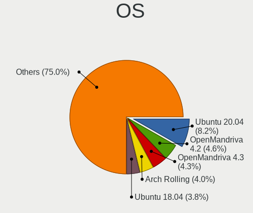

| Name                | Desktops | Percent |
|---------------------|----------|---------|
| Ubuntu 20.04        | 200      | 14.01%  |
| OpenMandriva 4.2    | 125      | 8.75%   |
| Ubuntu 18.04        | 108      | 7.56%   |
| ROSA R10            | 47       | 3.29%   |
| OpenMandriva 4.3    | 46       | 3.22%   |
| ROSA R11            | 39       | 2.73%   |
| Arch Rolling        | 36       | 2.52%   |
| ROSA R9             | 30       | 2.1%    |
| ROSA R11.1          | 25       | 1.75%   |
| Linux Mint 20.1     | 24       | 1.68%   |
| Arch                | 22       | 1.54%   |
| Manjaro             | 21       | 1.47%   |
| Linux Mint 20       | 21       | 1.47%   |
| Ubuntu 20.10        | 20       | 1.4%    |
| ROSA R8.1           | 19       | 1.33%   |
| KDE neon 20.04      | 19       | 1.33%   |
| Zorin 16            | 18       | 1.26%   |
| Ubuntu 19.10        | 18       | 1.26%   |
| ROSA R8             | 18       | 1.26%   |
| Debian 11           | 18       | 1.26%   |
| Ubuntu 19.04        | 17       | 1.19%   |
| Linux Mint 20.2     | 17       | 1.19%   |
| Fedora 34           | 17       | 1.19%   |
| Ubuntu 21.04        | 16       | 1.12%   |
| Fedora 35           | 16       | 1.12%   |
| Ubuntu 21.10        | 15       | 1.05%   |
| Pop!_OS 20.04       | 15       | 1.05%   |
| Linux Mint 19.3     | 15       | 1.05%   |
| Kubuntu 20.04       | 15       | 1.05%   |
| Fedora 33           | 14       | 0.98%   |
| Gentoo 2.7          | 13       | 0.91%   |
| Fedora 31           | 13       | 0.91%   |
| Xubuntu 20.04       | 12       | 0.84%   |
| Linux Mint 20.3     | 12       | 0.84%   |
| Fedora 32           | 12       | 0.84%   |
| Debian 10           | 12       | 0.84%   |
| Pop!_OS 21.10       | 11       | 0.77%   |
| BlackPanther 18.1   | 11       | 0.77%   |
| Ubuntu 18.10        | 10       | 0.7%    |
| OpenMandriva 4.50   | 10       | 0.7%    |
| Pop!_OS 21.04       | 9        | 0.63%   |
| Pop!_OS 20.10       | 9        | 0.63%   |
| Zorin 15            | 8        | 0.56%   |
| Linux Mint 19.2     | 8        | 0.56%   |
| Linux Mint 19.1     | 8        | 0.56%   |
| ArcoLinux Rolling   | 8        | 0.56%   |
| EndeavourOS Rolling | 7        | 0.49%   |
| Debian Testing      | 6        | 0.42%   |
| CentOS 8            | 6        | 0.42%   |
| Ubuntu 16.04        | 5        | 0.35%   |
| Manjaro 21.0.7      | 5        | 0.35%   |
| Manjaro 20.1        | 5        | 0.35%   |
| LMDE 4              | 5        | 0.35%   |
| Xubuntu 18.04       | 4        | 0.28%   |
| Ubuntu 22.04        | 4        | 0.28%   |
| Manjaro 21.2.1      | 4        | 0.28%   |
| Gentoo 2.8          | 4        | 0.28%   |
| Endless 3.9.3       | 4        | 0.28%   |
| Elementary 6.1      | 4        | 0.28%   |
| Elementary 5.1.7    | 4        | 0.28%   |

OS Family
---------

OS without a version

| Name             | Desktops | Percent |
|------------------|----------|---------|
| Ubuntu           | 389      | 29.72%  |
| OpenMandriva     | 182      | 13.9%   |
| ROSA             | 143      | 10.92%  |
| Linux Mint       | 102      | 7.79%   |
| Fedora           | 66       | 5.04%   |
| Manjaro          | 60       | 4.58%   |
| Arch             | 57       | 4.35%   |
| Pop!_OS          | 42       | 3.21%   |
| Debian           | 37       | 2.83%   |
| Zorin            | 27       | 2.06%   |
| Kubuntu          | 24       | 1.83%   |
| KDE neon         | 20       | 1.53%   |
| Xubuntu          | 19       | 1.45%   |
| Gentoo           | 17       | 1.3%    |
| Endless          | 11       | 0.84%   |
| BlackPanther     | 11       | 0.84%   |
| openSUSE         | 10       | 0.76%   |
| Elementary       | 8        | 0.61%   |
| ArcoLinux        | 8        | 0.61%   |
| Ubuntu MATE      | 7        | 0.53%   |
| EndeavourOS      | 7        | 0.53%   |
| CentOS           | 7        | 0.53%   |
| Clear Linux      | 6        | 0.46%   |
| LMDE             | 5        | 0.38%   |
| MX               | 4        | 0.31%   |
| Lubuntu          | 4        | 0.31%   |
| Kali             | 4        | 0.31%   |
| Void Linux       | 3        | 0.23%   |
| Ubuntu Budgie    | 3        | 0.23%   |
| NixOS            | 3        | 0.23%   |
| RHEL             | 2        | 0.15%   |
| org.kde.Platform | 2        | 0.15%   |
| LinuxFX          | 2        | 0.15%   |
| Linux Lite       | 2        | 0.15%   |
| Devuan           | 2        | 0.15%   |
| Artix            | 2        | 0.15%   |
| Solus            | 1        | 0.08%   |
| Sandomierz       | 1        | 0.08%   |
| Puppy            | 1        | 0.08%   |
| Peppermint       | 1        | 0.08%   |
| PCLinuxOS        | 1        | 0.08%   |
| Parrot           | 1        | 0.08%   |
| Mageia           | 1        | 0.08%   |
| Mabox            | 1        | 0.08%   |
| Deepin           | 1        | 0.08%   |
| antiX            | 1        | 0.08%   |
| antergos         | 1        | 0.08%   |

Kernel
------

Version of the Linux kernel

| Version                             | Desktops | Percent |
|-------------------------------------|----------|---------|
| 5.10.14-desktop-1omv4002            | 121      | 7.36%   |
| 5.16.7-desktop-1omv4003             | 44       | 2.67%   |
| 5.4.0-42-generic                    | 35       | 2.13%   |
| 4.9.60-nrj-desktop-1rosa-x86_64     | 30       | 1.82%   |
| 4.9.20-nrj-desktop-1rosa-x86_64     | 26       | 1.58%   |
| 4.15.0-desktop-45.1rosa-x86_64      | 23       | 1.4%    |
| 5.4.0-26-generic                    | 19       | 1.16%   |
| 5.4.0-52-generic                    | 14       | 0.85%   |
| 5.4.0-58-generic                    | 13       | 0.79%   |
| 5.4.0-54-generic                    | 13       | 0.79%   |
| 5.4.0-48-generic                    | 13       | 0.79%   |
| 5.8.0-48-generic                    | 12       | 0.73%   |
| 5.4.0-72-generic                    | 12       | 0.73%   |
| 5.4.0-40-generic                    | 12       | 0.73%   |
| 5.4.0-56-generic                    | 11       | 0.67%   |
| 5.3.0-46-generic                    | 11       | 0.67%   |
| 5.13.0-39-generic                   | 11       | 0.67%   |
| 5.8.0-43-generic                    | 10       | 0.61%   |
| 5.4.0-66-generic                    | 10       | 0.61%   |
| 5.4.0-65-generic                    | 10       | 0.61%   |
| 5.4.0-29-generic                    | 10       | 0.61%   |
| 5.13.0-27-generic                   | 10       | 0.61%   |
| 4.15.0-desktop-122.124.1rosa-x86_64 | 10       | 0.61%   |
| 4.1.38-nrj-desktop-2rosa-x86_64     | 10       | 0.61%   |
| 5.8.0-50-generic                    | 9        | 0.55%   |
| 5.4.0-37-generic                    | 9        | 0.55%   |
| 5.13.0-40-generic                   | 9        | 0.55%   |
| 4.18.16-desktop-1bP                 | 9        | 0.55%   |
| 4.1.34-nrj-desktop-2rosa-x86_64     | 9        | 0.55%   |
| 5.8.0-53-generic                    | 8        | 0.49%   |
| 5.8.0-44-generic                    | 8        | 0.49%   |
| 5.4.0-81-generic                    | 8        | 0.49%   |
| 5.4.0-53-generic                    | 8        | 0.49%   |
| 5.4.0-47-generic                    | 8        | 0.49%   |
| 5.3.0-42-generic                    | 8        | 0.49%   |
| 5.3.0-28-generic                    | 8        | 0.49%   |
| 5.11.0-37-generic                   | 8        | 0.49%   |
| 4.9.124-nrj-desktop-1rosa-x86_64    | 8        | 0.49%   |
| 5.4.32-generic-2rosa-x86_64         | 7        | 0.43%   |
| 5.11.0-40-generic                   | 7        | 0.43%   |
| 5.11.0-38-generic                   | 7        | 0.43%   |
| 4.15.0-desktop-68.5rosa-x86_64      | 7        | 0.43%   |
| 5.8.0-14-generic                    | 6        | 0.36%   |
| 5.4.0-91-generic                    | 6        | 0.36%   |
| 5.4.0-90-generic                    | 6        | 0.36%   |
| 5.4.0-7634-generic                  | 6        | 0.36%   |
| 5.4.0-74-generic                    | 6        | 0.36%   |
| 5.4.0-39-generic                    | 6        | 0.36%   |
| 5.4.0-33-generic                    | 6        | 0.36%   |
| 5.4.0-31-generic                    | 6        | 0.36%   |
| 5.13.0-30-generic                   | 6        | 0.36%   |
| 5.12.4-desktop-1omv4050             | 6        | 0.36%   |
| 5.0.0-32-generic                    | 6        | 0.36%   |
| 4.9.76-nrj-desktop-1rosa-x86_64     | 6        | 0.36%   |
| 4.9.155-nrj-desktop-1rosa-x86_64    | 6        | 0.36%   |
| 4.18.0-15-generic                   | 6        | 0.36%   |
| 4.15.0-74-generic                   | 6        | 0.36%   |
| 5.8.0-25-generic                    | 5        | 0.3%    |
| 5.4.0-59-generic                    | 5        | 0.3%    |
| 5.13.0-20-generic                   | 5        | 0.3%    |

Kernel Family
-------------

Linux kernel without a distro release

| Version | Desktops | Percent |
|---------|----------|---------|
| 5.4.0   | 267      | 17.66%  |
| 4.15.0  | 128      | 8.47%   |
| 5.10.14 | 122      | 8.07%   |
| 5.8.0   | 84       | 5.56%   |
| 5.11.0  | 67       | 4.43%   |
| 5.13.0  | 58       | 3.84%   |
| 5.3.0   | 56       | 3.7%    |
| 5.16.7  | 46       | 3.04%   |
| 5.0.0   | 37       | 2.45%   |
| 4.9.60  | 33       | 2.18%   |
| 4.18.0  | 29       | 1.92%   |
| 4.9.20  | 26       | 1.72%   |
| 5.10.0  | 19       | 1.26%   |
| 4.19.0  | 18       | 1.19%   |
| 4.1.38  | 14       | 0.93%   |
| 4.1.34  | 11       | 0.73%   |
| 4.9.124 | 10       | 0.66%   |
| 4.18.16 | 9        | 0.6%    |
| 4.9.76  | 8        | 0.53%   |
| 4.9.155 | 8        | 0.53%   |
| 5.6.0   | 7        | 0.46%   |
| 5.4.32  | 7        | 0.46%   |
| 5.15.0  | 7        | 0.46%   |
| 5.9.16  | 6        | 0.4%    |
| 5.9.0   | 6        | 0.4%    |
| 5.12.4  | 6        | 0.4%    |
| 4.9.95  | 6        | 0.4%    |
| 5.9.1   | 5        | 0.33%   |
| 5.4.83  | 5        | 0.33%   |
| 5.15.6  | 5        | 0.33%   |
| 5.15.15 | 5        | 0.33%   |
| 5.15.12 | 5        | 0.33%   |
| 5.15.11 | 5        | 0.33%   |
| 5.14.14 | 5        | 0.33%   |
| 5.12.9  | 5        | 0.33%   |
| 5.11.6  | 5        | 0.33%   |
| 5.11.16 | 5        | 0.33%   |
| 5.11.12 | 5        | 0.33%   |
| 4.4.0   | 5        | 0.33%   |
| 5.4.40  | 4        | 0.26%   |
| 5.4.12  | 4        | 0.26%   |
| 5.10.74 | 4        | 0.26%   |
| 4.9.41  | 4        | 0.26%   |
| 4.1.25  | 4        | 0.26%   |
| 5.8.6   | 3        | 0.2%    |
| 5.8.3   | 3        | 0.2%    |
| 5.8.18  | 3        | 0.2%    |
| 5.7.11  | 3        | 0.2%    |
| 5.6.6   | 3        | 0.2%    |
| 5.4.8   | 3        | 0.2%    |
| 5.4.15  | 3        | 0.2%    |
| 5.3.18  | 3        | 0.2%    |
| 5.17.1  | 3        | 0.2%    |
| 5.16.9  | 3        | 0.2%    |
| 5.16.20 | 3        | 0.2%    |
| 5.15.5  | 3        | 0.2%    |
| 5.15.32 | 3        | 0.2%    |
| 5.15.28 | 3        | 0.2%    |
| 5.15.23 | 3        | 0.2%    |
| 5.14.9  | 3        | 0.2%    |

Kernel Major Ver.
-----------------

Linux kernel major version

| Version | Desktops | Percent |
|---------|----------|---------|
| 5.4     | 304      | 21.11%  |
| 5.10    | 186      | 12.92%  |
| 4.15    | 128      | 8.89%   |
| 5.8     | 105      | 7.29%   |
| 5.11    | 93       | 6.46%   |
| 4.9     | 76       | 5.28%   |
| 5.13    | 70       | 4.86%   |
| 5.16    | 67       | 4.65%   |
| 5.3     | 62       | 4.31%   |
| 5.15    | 55       | 3.82%   |
| 5.0     | 41       | 2.85%   |
| 4.18    | 38       | 2.64%   |
| 5.12    | 31       | 2.15%   |
| 4.1     | 28       | 1.94%   |
| 5.9     | 27       | 1.88%   |
| 5.6     | 23       | 1.6%    |
| 5.14    | 23       | 1.6%    |
| 4.19    | 22       | 1.53%   |
| 5.5     | 16       | 1.11%   |
| 5.7     | 13       | 0.9%    |
| 5.17    | 9        | 0.63%   |
| 4.4     | 6        | 0.42%   |
| 4.16    | 3        | 0.21%   |
| 5.1     | 2        | 0.14%   |
| 4.8     | 2        | 0.14%   |
| 4.20    | 2        | 0.14%   |
| 5.2     | 1        | 0.07%   |
| 4.7     | 1        | 0.07%   |
| 4.14    | 1        | 0.07%   |
| 4.13    | 1        | 0.07%   |
| 4.12    | 1        | 0.07%   |
| 3.16    | 1        | 0.07%   |
| 3.13    | 1        | 0.07%   |
| 3.10    | 1        | 0.07%   |

Arch
----

OS architecture (x86_64, i586, etc.)

| Name   | Desktops | Percent |
|--------|----------|---------|
| x86_64 | 1217     | 96.97%  |
| i686   | 38       | 3.03%   |

DE
--

Desktop Environment

| Name            | Desktops | Percent |
|-----------------|----------|---------|
| GNOME           | 442      | 32.94%  |
| KDE5            | 342      | 25.48%  |
| Unknown         | 152      | 11.33%  |
| XFCE            | 90       | 6.71%   |
| KDE4            | 76       | 5.66%   |
| X-Cinnamon      | 62       | 4.62%   |
| KDE             | 50       | 3.73%   |
| MATE            | 38       | 2.83%   |
| Cinnamon        | 20       | 1.49%   |
| i3              | 11       | 0.82%   |
| LXQt            | 10       | 0.75%   |
| Unity           | 9        | 0.67%   |
| Pantheon        | 8        | 0.6%    |
| LXDE            | 8        | 0.6%    |
| Deepin          | 6        | 0.45%   |
| GNOME Flashback | 4        | 0.3%    |
| Budgie          | 4        | 0.3%    |
| qtile           | 2        | 0.15%   |
| GNOME Classic   | 2        | 0.15%   |
| awesome         | 2        | 0.15%   |
| openbox         | 1        | 0.07%   |
| ICEWM           | 1        | 0.07%   |
| fluxbox         | 1        | 0.07%   |
| dwm             | 1        | 0.07%   |

Display Server
--------------

X11 or Wayland

| Name    | Desktops | Percent |
|---------|----------|---------|
| X11     | 1112     | 86.2%   |
| Wayland | 86       | 6.67%   |
| Unknown | 68       | 5.27%   |
| Tty     | 24       | 1.86%   |

Display Manager
---------------

SDDM, LightDM, etc.

| Name    | Desktops | Percent |
|---------|----------|---------|
| Unknown | 620      | 46.76%  |
| SDDM    | 328      | 24.74%  |
| GDM     | 106      | 7.99%   |
| KDM     | 84       | 6.33%   |
| LightDM | 83       | 6.26%   |
| TDM     | 55       | 4.15%   |
| GDM3    | 44       | 3.32%   |
| XDM     | 3        | 0.23%   |
| SLiM    | 1        | 0.08%   |
| MDM     | 1        | 0.08%   |
| LXDM    | 1        | 0.08%   |

OS Lang
-------

Language

| Lang       | Desktops | Percent |
|------------|----------|---------|
| pl_PL      | 751      | 56.89%  |
| Unknown    | 253      | 19.17%  |
| en_US      | 250      | 18.94%  |
| en_GB      | 31       | 2.35%   |
| C          | 18       | 1.36%   |
| ru_RU      | 5        | 0.38%   |
| szl_PL     | 3        | 0.23%   |
| ru_UA      | 2        | 0.15%   |
| uk_UA      | 1        | 0.08%   |
| sv_SE      | 1        | 0.08%   |
| fr_FR      | 1        | 0.08%   |
| en_US.UTF8 | 1        | 0.08%   |
| en_IN      | 1        | 0.08%   |
| en_IE      | 1        | 0.08%   |
| en_DK      | 1        | 0.08%   |

Boot Mode
---------

EFI or BIOS

| Mode | Desktops | Percent |
|------|----------|---------|
| BIOS | 834      | 64.7%   |
| EFI  | 455      | 35.3%   |

Filesystem
----------

Type of filesystem

| Type     | Desktops | Percent |
|----------|----------|---------|
| Ext4     | 872      | 66.46%  |
| Overlay  | 195      | 14.86%  |
| Unknown  | 112      | 8.54%   |
| Btrfs    | 91       | 6.94%   |
| Xfs      | 19       | 1.45%   |
| Zfs      | 6        | 0.46%   |
| F2fs     | 5        | 0.38%   |
| Tmpfs    | 4        | 0.3%    |
| Ext3     | 3        | 0.23%   |
| Ext2     | 2        | 0.15%   |
| SquXshfs | 1        | 0.08%   |
| Jfs      | 1        | 0.08%   |
| Aufs     | 1        | 0.08%   |

Part. scheme
------------

Scheme of partitioning

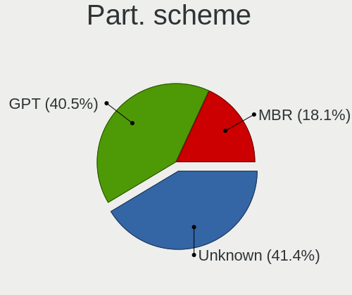

| Type    | Desktops | Percent |
|---------|----------|---------|
| Unknown | 708      | 54.09%  |
| GPT     | 342      | 26.13%  |
| MBR     | 259      | 19.79%  |

Dual Boot with Linux/BSD
------------------------

Hosting more than one Linux/BSD

| Dual boot | Desktops | Percent |
|-----------|----------|---------|
| No        | 996      | 76.85%  |
| Yes       | 300      | 23.15%  |

Dual Boot (Win)
---------------

Hosting Linux and Windows

| Dual boot | Desktops | Percent |
|-----------|----------|---------|
| No        | 774      | 59.86%  |
| Yes       | 519      | 40.14%  |

Board
-----

Vendor
------

Motherboard manufacturer

| Name                | Desktops | Percent |
|---------------------|----------|---------|
| Gigabyte Technology | 325      | 25.98%  |
| ASUSTek Computer    | 263      | 21.02%  |
| MSI                 | 207      | 16.55%  |
| ASRock              | 126      | 10.07%  |
| Dell                | 98       | 7.83%   |
| Hewlett-Packard     | 75       | 6%      |
| Lenovo              | 45       | 3.6%    |
| Fujitsu             | 18       | 1.44%   |
| Intel               | 16       | 1.28%   |
| Acer                | 15       | 1.2%    |
| Fujitsu Siemens     | 10       | 0.8%    |
| Foxconn             | 8        | 0.64%   |
| Unknown             | 5        | 0.4%    |
| Medion              | 4        | 0.32%   |
| ECS                 | 4        | 0.32%   |
| Inventec            | 3        | 0.24%   |
| ABIT                | 3        | 0.24%   |
| Supermicro          | 2        | 0.16%   |
| Pegatron            | 2        | 0.16%   |
| Huanan              | 2        | 0.16%   |
| HARDKERNEL          | 2        | 0.16%   |
| Gateway             | 2        | 0.16%   |
| Apple               | 2        | 0.16%   |
| Wortmann AG         | 1        | 0.08%   |
| WeiBu               | 1        | 0.08%   |
| Shuttle             | 1        | 0.08%   |
| OPTIMUS             | 1        | 0.08%   |
| Nvidia              | 1        | 0.08%   |
| ITSUMI              | 1        | 0.08%   |
| HEDYCOMPUTER        | 1        | 0.08%   |
| Hampoo              | 1        | 0.08%   |
| EVGA                | 1        | 0.08%   |
| Biostar             | 1        | 0.08%   |
| AMI                 | 1        | 0.08%   |
| AMD                 | 1        | 0.08%   |
| ACTION              | 1        | 0.08%   |
| AAEON               | 1        | 0.08%   |

Model
-----

Motherboard model

| Name                       | Desktops | Percent |
|----------------------------|----------|---------|
| ASUS All Series            | 23       | 1.84%   |
| MSI MS-7B86                | 13       | 1.04%   |
| Gigabyte B450M DS3H        | 13       | 1.04%   |
| Dell OptiPlex 780          | 13       | 1.04%   |
| MSI MS-7817                | 12       | 0.96%   |
| MSI MS-7C02                | 8        | 0.64%   |
| MSI MS-7B79                | 8        | 0.64%   |
| Gigabyte B85M-D3H          | 8        | 0.64%   |
| Gigabyte B450 AORUS ELITE  | 8        | 0.64%   |
| MSI MS-7A38                | 7        | 0.56%   |
| Dell OptiPlex 7010         | 7        | 0.56%   |
| MSI MS-7C37                | 6        | 0.48%   |
| MSI MS-7721                | 6        | 0.48%   |
| ASUS TUF GAMING X570-PLUS  | 6        | 0.48%   |
| ASUS PRIME X470-PRO        | 6        | 0.48%   |
| ASUS PRIME B450M-A         | 6        | 0.48%   |
| MSI MS-7C80                | 5        | 0.4%    |
| Gigabyte P31-DS3L          | 5        | 0.4%    |
| Gigabyte GA-MA770T-UD3P    | 5        | 0.4%    |
| Gigabyte G31M-S2L          | 5        | 0.4%    |
| Gigabyte A320M-S2H         | 5        | 0.4%    |
| Gigabyte 970A-DS3P         | 5        | 0.4%    |
| Dell OptiPlex 9020         | 5        | 0.4%    |
| ASUS SABERTOOTH Z77        | 5        | 0.4%    |
| ASUS P5G41T-M LX           | 5        | 0.4%    |
| Unknown                    | 5        | 0.4%    |
| MSI MS-7C08                | 4        | 0.32%   |
| MSI MS-7B89                | 4        | 0.32%   |
| MSI MS-7996                | 4        | 0.32%   |
| MSI MS-7693                | 4        | 0.32%   |
| HP t620 Quad Core TC       | 4        | 0.32%   |
| HP Compaq 6200 Pro SFF PC  | 4        | 0.32%   |
| Gigabyte M68M-S2P          | 4        | 0.32%   |
| Gigabyte GA-78LMT-USB3 6.0 | 4        | 0.32%   |
| Gigabyte G31M-ES2L         | 4        | 0.32%   |
| Dell OptiPlex 790          | 4        | 0.32%   |
| Dell OptiPlex 760          | 4        | 0.32%   |
| ASUS PRIME X370-PRO        | 4        | 0.32%   |
| ASUS PRIME B350-PLUS       | 4        | 0.32%   |
| ASRock FM2A88X Extreme6+   | 4        | 0.32%   |
| ASRock B450 Pro4           | 4        | 0.32%   |
| MSI MS-7D25                | 3        | 0.24%   |
| MSI MS-7C95                | 3        | 0.24%   |
| MSI MS-7C52                | 3        | 0.24%   |
| MSI MS-7B93                | 3        | 0.24%   |
| MSI MS-7B53                | 3        | 0.24%   |
| MSI MS-7982                | 3        | 0.24%   |
| MSI MS-7978                | 3        | 0.24%   |
| MSI MS-7971                | 3        | 0.24%   |
| MSI MS-7816                | 3        | 0.24%   |
| MSI MS-7592                | 3        | 0.24%   |
| Inventec Z CLASS           | 3        | 0.24%   |
| HP Z400 Workstation        | 3        | 0.24%   |
| HP xw4600 Workstation      | 3        | 0.24%   |
| HP ProDesk 600 G1 SFF      | 3        | 0.24%   |
| HP Compaq Elite 8300 CMT   | 3        | 0.24%   |
| HP Compaq 6005 Pro SFF PC  | 3        | 0.24%   |
| Gigabyte Z97-HD3           | 3        | 0.24%   |
| Gigabyte Z77X-D3H          | 3        | 0.24%   |
| Gigabyte Z390 GAMING X     | 3        | 0.24%   |

Model Family
------------

Motherboard model prefix

| Name                    | Desktops | Percent |
|-------------------------|----------|---------|
| Dell OptiPlex           | 69       | 5.52%   |
| ASUS PRIME              | 38       | 3.04%   |
| Lenovo ThinkCentre      | 32       | 2.56%   |
| HP Compaq               | 32       | 2.56%   |
| ASUS All                | 23       | 1.84%   |
| Gigabyte B450M          | 20       | 1.6%    |
| ASUS TUF                | 20       | 1.6%    |
| ASUS ROG                | 17       | 1.36%   |
| MSI MS-7B86             | 13       | 1.04%   |
| Fujitsu ESPRIMO         | 13       | 1.04%   |
| MSI MS-7817             | 12       | 0.96%   |
| Gigabyte X570           | 12       | 0.96%   |
| Gigabyte B450           | 12       | 0.96%   |
| Dell Precision          | 12       | 0.96%   |
| HP EliteDesk            | 10       | 0.8%    |
| MSI MS-7C02             | 8        | 0.64%   |
| MSI MS-7B79             | 8        | 0.64%   |
| Gigabyte B85M-D3H       | 8        | 0.64%   |
| ASUS M5A97              | 8        | 0.64%   |
| ASRock B450             | 8        | 0.64%   |
| MSI MS-7A38             | 7        | 0.56%   |
| ASUS P5G41T-M           | 7        | 0.56%   |
| MSI MS-7C37             | 6        | 0.48%   |
| MSI MS-7721             | 6        | 0.48%   |
| Lenovo IdeaCentre       | 6        | 0.48%   |
| Gigabyte GA-78LMT-USB3  | 6        | 0.48%   |
| Fujitsu Siemens ESPRIMO | 6        | 0.48%   |
| Dell Vostro             | 6        | 0.48%   |
| ASUS SABERTOOTH         | 6        | 0.48%   |
| ASUS M5A78L-M           | 6        | 0.48%   |
| Acer Veriton            | 6        | 0.48%   |
| MSI MS-7C80             | 5        | 0.4%    |
| Lenovo ThinkStation     | 5        | 0.4%    |
| HP ProDesk              | 5        | 0.4%    |
| Gigabyte Z390           | 5        | 0.4%    |
| Gigabyte P31-DS3L       | 5        | 0.4%    |
| Gigabyte GA-MA770T-UD3P | 5        | 0.4%    |
| Gigabyte G31M-S2L       | 5        | 0.4%    |
| Gigabyte B550           | 5        | 0.4%    |
| Gigabyte A320M-S2H      | 5        | 0.4%    |
| Gigabyte 970A-DS3P      | 5        | 0.4%    |
| ASUS P8Z77-V            | 5        | 0.4%    |
| ASRock X370             | 5        | 0.4%    |
| ASRock B450M            | 5        | 0.4%    |
| Acer Aspire             | 5        | 0.4%    |
| Unknown                 | 5        | 0.4%    |
| MSI MS-7C08             | 4        | 0.32%   |
| MSI MS-7B89             | 4        | 0.32%   |
| MSI MS-7996             | 4        | 0.32%   |
| MSI MS-7693             | 4        | 0.32%   |
| HP t620                 | 4        | 0.32%   |
| Gigabyte M68M-S2P       | 4        | 0.32%   |
| Gigabyte G31M-ES2L      | 4        | 0.32%   |
| ASUS P8H61-M            | 4        | 0.32%   |
| ASUS Maximus            | 4        | 0.32%   |
| ASRock Z97              | 4        | 0.32%   |
| ASRock Z390             | 4        | 0.32%   |
| ASRock FM2A88X          | 4        | 0.32%   |
| MSI MS-7D25             | 3        | 0.24%   |
| MSI MS-7C95             | 3        | 0.24%   |

MFG Year
--------

Motherboard manufacture year

| Year    | Desktops | Percent |
|---------|----------|---------|
| 2018    | 143      | 11.43%  |
| 2012    | 122      | 9.75%   |
| 2013    | 114      | 9.11%   |
| 2009    | 96       | 7.67%   |
| 2019    | 88       | 7.03%   |
| 2014    | 87       | 6.95%   |
| 2011    | 87       | 6.95%   |
| 2017    | 76       | 6.08%   |
| 2007    | 76       | 6.08%   |
| 2010    | 70       | 5.6%    |
| 2008    | 65       | 5.2%    |
| 2020    | 61       | 4.88%   |
| 2015    | 54       | 4.32%   |
| 2016    | 42       | 3.36%   |
| 2006    | 31       | 2.48%   |
| 2021    | 25       | 2%      |
| 2005    | 6        | 0.48%   |
| 2004    | 4        | 0.32%   |
| Unknown | 2        | 0.16%   |
| 2022    | 1        | 0.08%   |
| 2001    | 1        | 0.08%   |

Form Factor
-----------

Physical design of the computer

| Name    | Desktops | Percent |
|---------|----------|---------|
| Desktop | 1251     | 100%    |

Secure Boot
-----------

Enabled or disabled

| State    | Desktops | Percent |
|----------|----------|---------|
| Disabled | 1236     | 98.49%  |
| Enabled  | 19       | 1.51%   |

Coreboot
--------

Have coreboot on board

| Used | Desktops | Percent |
|------|----------|---------|
| No   | 1250     | 99.92%  |
| Yes  | 1        | 0.08%   |

RAM Size
--------

Total RAM memory

| Size in GB  | Desktops | Percent |
|-------------|----------|---------|
| 8.01-16.0   | 296      | 23.05%  |
| 16.01-24.0  | 278      | 21.65%  |
| 3.01-4.0    | 222      | 17.29%  |
| 4.01-8.0    | 200      | 15.58%  |
| 32.01-64.0  | 138      | 10.75%  |
| 64.01-256.0 | 47       | 3.66%   |
| 1.01-2.0    | 45       | 3.5%    |
| 24.01-32.0  | 28       | 2.18%   |
| 2.01-3.0    | 22       | 1.71%   |
| 0.51-1.0    | 8        | 0.62%   |

RAM Used
--------

Used RAM memory

| Used GB    | Desktops | Percent |
|------------|----------|---------|
| 1.01-2.0   | 589      | 40.37%  |
| 2.01-3.0   | 265      | 18.16%  |
| 4.01-8.0   | 179      | 12.27%  |
| 0.51-1.0   | 173      | 11.86%  |
| 3.01-4.0   | 136      | 9.32%   |
| 8.01-16.0  | 59       | 4.04%   |
| 0.01-0.5   | 30       | 2.06%   |
| 16.01-24.0 | 21       | 1.44%   |
| 24.01-32.0 | 4        | 0.27%   |
| 32.01-64.0 | 2        | 0.14%   |
| Unknown    | 1        | 0.07%   |

Total Drives
------------

Number of drives on board

| Drives | Desktops | Percent |
|--------|----------|---------|
| 1      | 476      | 35.79%  |
| 2      | 402      | 30.23%  |
| 3      | 239      | 17.97%  |
| 4      | 100      | 7.52%   |
| 5      | 53       | 3.98%   |
| 6      | 21       | 1.58%   |
| 0      | 16       | 1.2%    |
| 7      | 10       | 0.75%   |
| 8      | 6        | 0.45%   |
| 9      | 3        | 0.23%   |
| 11     | 2        | 0.15%   |
| 10     | 2        | 0.15%   |

Has CD-ROM
----------

Has CD-ROM on board

| Presented | Desktops | Percent |
|-----------|----------|---------|
| Yes       | 670      | 52.55%  |
| No        | 605      | 47.45%  |

Has Ethernet
------------

Has Ethernet on board

| Presented | Desktops | Percent |
|-----------|----------|---------|
| Yes       | 1236     | 98.8%   |
| No        | 15       | 1.2%    |

Has WiFi
--------

Has WiFi module

| Presented | Desktops | Percent |
|-----------|----------|---------|
| No        | 794      | 62.23%  |
| Yes       | 482      | 37.77%  |

Has Bluetooth
-------------

Has Bluetooth module

| Presented | Desktops | Percent |
|-----------|----------|---------|
| No        | 985      | 77.68%  |
| Yes       | 283      | 22.32%  |

Location
--------

Country
-------

Geographic location (country)

| Country | Desktops | Percent |
|---------|----------|---------|
| Poland  | 1251     | 100%    |

City
----

Geographic location (city)

| City                        | Desktops | Percent |
|-----------------------------|----------|---------|
| Warsaw                      | 248      | 17.59%  |
| Krakow                      | 95       | 6.74%   |
| Wroclaw                     | 76       | 5.39%   |
| Poznan                      | 63       | 4.47%   |
| Gdansk                      | 36       | 2.55%   |
| Lodz                        | 34       | 2.41%   |
| Katowice                    | 29       | 2.06%   |
| Lublin                      | 22       | 1.56%   |
| Gdynia                      | 16       | 1.13%   |
| Bialystok                   | 16       | 1.13%   |
| Torun                       | 15       | 1.06%   |
| Radom                       | 14       | 0.99%   |
| Sosnowiec                   | 13       | 0.92%   |
| Bydgoszcz                   | 13       | 0.92%   |
| Szczecin                    | 12       | 0.85%   |
| Gliwice                     | 11       | 0.78%   |
| Zabrze                      | 10       | 0.71%   |
| Bytom                       | 10       | 0.71%   |
| Bielsko-Biala               | 10       | 0.71%   |
| Czstochowa             | 9        | 0.64%   |
| Rybnik                      | 8        | 0.57%   |
| Legnica                     | 7        | 0.5%    |
| Wodzisaw lski | 6        | 0.43%   |
| Olsztyn                     | 6        | 0.43%   |
| witochowice   | 5        | 0.35%   |
| Zdunska Wola                | 5        | 0.35%   |
| Strzyzow                    | 5        | 0.35%   |
| Stargard                    | 5        | 0.35%   |
| Siemianowice lskie | 5        | 0.35%   |
| Rzeszw                  | 5        | 0.35%   |
| Rzeszw                  | 5        | 0.35%   |
| Cieszyn                     | 5        | 0.35%   |
| Chorzw                  | 5        | 0.35%   |
| Zielona Gra             | 4        | 0.28%   |
| Tarnowskie Gory             | 4        | 0.28%   |
| Rypin                       | 4        | 0.28%   |
| Pabianice                   | 4        | 0.28%   |
| Niepolomice                 | 4        | 0.28%   |
| Miastko                     | 4        | 0.28%   |
| Kielce                      | 4        | 0.28%   |
| Kalisz                      | 4        | 0.28%   |
| Jelenia Gra             | 4        | 0.28%   |
| Jaworzno                    | 4        | 0.28%   |
| Jasienica                   | 4        | 0.28%   |
| Dbrowa Grnicza     | 4        | 0.28%   |
| Czstochowa             | 4        | 0.28%   |
| Zawiercie                   | 3        | 0.21%   |
| Wocawek           | 3        | 0.21%   |
| Woomin                 | 3        | 0.21%   |
| Wieliczka                   | 3        | 0.21%   |
| Wejherowo                   | 3        | 0.21%   |
| Tychy                       | 3        | 0.21%   |
| Tczew                       | 3        | 0.21%   |
| Tarnw                   | 3        | 0.21%   |
| Supsk                  | 3        | 0.21%   |
| Swidnica                    | 3        | 0.21%   |
| Siedlce                     | 3        | 0.21%   |
| Ruda lska          | 3        | 0.21%   |
| Radomsko                    | 3        | 0.21%   |
| Pock                   | 3        | 0.21%   |

Drives
------

Drive Vendor
------------

Hard drive vendors

| Vendor                         | Desktops | Drives | Percent |
|--------------------------------|----------|--------|---------|
| WDC                            | 433      | 753    | 18.36%  |
| Seagate                        | 427      | 792    | 18.11%  |
| Samsung Electronics            | 295      | 546    | 12.51%  |
| GOODRAM                        | 151      | 268    | 6.4%    |
| Toshiba                        | 146      | 266    | 6.19%   |
| Crucial                        | 100      | 188    | 4.24%   |
| Kingston                       | 98       | 149    | 4.16%   |
| A-DATA Technology              | 97       | 160    | 4.11%   |
| Hitachi                        | 79       | 151    | 3.35%   |
| SanDisk                        | 67       | 107    | 2.84%   |
| Patriot                        | 38       | 51     | 1.61%   |
| Intel                          | 33       | 53     | 1.4%    |
| SPCC                           | 31       | 45     | 1.31%   |
| XPG                            | 26       | 38     | 1.1%    |
| PLEXTOR                        | 26       | 30     | 1.1%    |
| Phison                         | 21       | 30     | 0.89%   |
| HGST                           | 21       | 31     | 0.89%   |
| Unknown                        | 17       | 26     | 0.72%   |
| PNY                            | 17       | 20     | 0.72%   |
| MAXTOR                         | 17       | 17     | 0.72%   |
| Corsair                        | 17       | 22     | 0.72%   |
| OCZ                            | 16       | 18     | 0.68%   |
| Apacer                         | 16       | 28     | 0.68%   |
| Micron Technology              | 13       | 19     | 0.55%   |
| Realtek Semiconductor          | 12       | 23     | 0.51%   |
| Lite-On                        | 10       | 12     | 0.42%   |
| Fujitsu                        | 10       | 12     | 0.42%   |
| SK Hynix                       | 9        | 17     | 0.38%   |
| China                          | 9        | 9      | 0.38%   |
| ASMT                           | 8        | 9      | 0.34%   |
| Transcend                      | 6        | 6      | 0.25%   |
| Silicon Motion                 | 6        | 7      | 0.25%   |
| LITEON                         | 6        | 11     | 0.25%   |
| JMicron                        | 6        | 7      | 0.25%   |
| HUAWEI                         | 5        | 5      | 0.21%   |
| Micron/Crucial Technology      | 4        | 4      | 0.17%   |
| Intenso                        | 4        | 9      | 0.17%   |
| KIOXIA-EXCERIA                 | 3        | 7      | 0.13%   |
| KIOXIA                         | 3        | 4      | 0.13%   |
| KingSpec                       | 3        | 3      | 0.13%   |
| Hewlett-Packard                | 3        | 3      | 0.13%   |
| Team                           | 2        | 7      | 0.08%   |
| sobetter                       | 2        | 2      | 0.08%   |
| MDT                            | 2        | 5      | 0.08%   |
| LITEONIT                       | 2        | 2      | 0.08%   |
| Lexar                          | 2        | 2      | 0.08%   |
| KingFast                       | 2        | 2      | 0.08%   |
| BIWIN                          | 2        | 2      | 0.08%   |
| ASMedia                        | 2        | 3      | 0.08%   |
| ZTE                            | 1        | 1      | 0.04%   |
| XrayDisk                       | 1        | 1      | 0.04%   |
| WDC WDS2                       | 1        | 1      | 0.04%   |
| WD MediaMax                    | 1        | 2      | 0.04%   |
| Union Memory (Shenzhen)        | 1        | 1      | 0.04%   |
| Union Memory                   | 1        | 1      | 0.04%   |
| T-FORCE                        | 1        | 1      | 0.04%   |
| Solid State Storage Technology | 1        | 1      | 0.04%   |
| Shenzhen Longsys Electronics   | 1        | 1      | 0.04%   |
| Origin                         | 1        | 1      | 0.04%   |
| OEM                            | 1        | 1      | 0.04%   |

Drive Model
-----------

Hard drive models

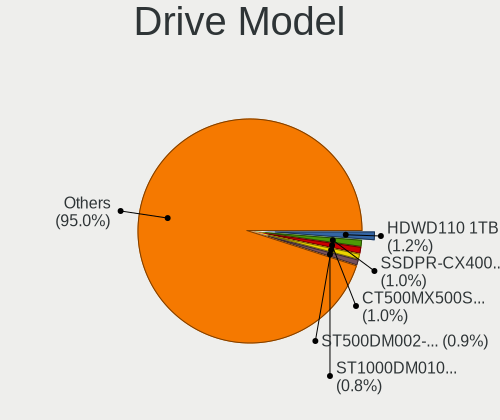

| Model                              | Desktops | Percent |
|------------------------------------|----------|---------|
| Toshiba HDWD110 1TB                | 43       | 1.58%   |
| Seagate ST500DM002-1BD142 500GB    | 32       | 1.17%   |
| Seagate ST3500418AS 500GB          | 25       | 0.92%   |
| Samsung SSD 850 EVO 250GB          | 24       | 0.88%   |
| Crucial CT500MX500SSD1 500GB       | 23       | 0.84%   |
| Samsung HD502HJ 500GB              | 22       | 0.81%   |
| Samsung NVMe SSD Drive 500GB       | 21       | 0.77%   |
| Seagate ST1000DM010-2EP102 1TB     | 20       | 0.73%   |
| Seagate ST1000DM003-1ER162 1TB     | 20       | 0.73%   |
| Samsung SSD 860 EVO 250GB          | 20       | 0.73%   |
| Kingston SV300S37A120G 120GB SSD   | 19       | 0.7%    |
| Toshiba DT01ACA100 1TB             | 18       | 0.66%   |
| GOODRAM SSDPR-CX400-512 512GB      | 17       | 0.62%   |
| GOODRAM SSD 240GB                  | 17       | 0.62%   |
| Seagate ST1000DM003-1CH162 1TB     | 16       | 0.59%   |
| Samsung SSD 860 EVO 500GB          | 16       | 0.59%   |
| GOODRAM SSD 120GB                  | 15       | 0.55%   |
| Toshiba HDWD130 3TB                | 13       | 0.48%   |
| Seagate ST2000DM008-2FR102 2TB     | 13       | 0.48%   |
| Samsung HD103SJ 1TB                | 13       | 0.48%   |
| Patriot Burst 120GB SSD            | 13       | 0.48%   |
| Kingston SA400S37480G 480GB SSD    | 13       | 0.48%   |
| Crucial CT1000MX500SSD1 1TB        | 13       | 0.48%   |
| SPCC Solid State Disk 120GB        | 12       | 0.44%   |
| Seagate ST3250410AS 250GB          | 12       | 0.44%   |
| SanDisk SDSSDA240G 240GB           | 12       | 0.44%   |
| GOODRAM SSDPR-CL100-120-G2 120GB   | 12       | 0.44%   |
| Crucial CT240BX500SSD1 240GB       | 12       | 0.44%   |
| A-DATA SX8200PNP 512GB             | 12       | 0.44%   |
| A-DATA SU800 256GB SSD             | 12       | 0.44%   |
| Toshiba HDWD120 2TB                | 11       | 0.4%    |
| Seagate ST250DM000-1BD141 250GB    | 11       | 0.4%    |
| Samsung SSD 840 EVO 120GB          | 11       | 0.4%    |
| GOODRAM SSDPR-CX400-256 256GB      | 11       | 0.4%    |
| A-DATA SU650 240GB SSD             | 11       | 0.4%    |
| Toshiba DT01ACA200 2TB             | 10       | 0.37%   |
| Seagate ST3160815AS 160GB          | 10       | 0.37%   |
| Samsung NVMe SSD Drive 1TB         | 10       | 0.37%   |
| WDC WD10EZEX-08WN4A0 1TB           | 9        | 0.33%   |
| WDC WD10EZEX-00BN5A0 1TB           | 9        | 0.33%   |
| Seagate ST3500413AS 500GB          | 9        | 0.33%   |
| Seagate ST3500312CS 500GB          | 9        | 0.33%   |
| Seagate ST3250310AS 249GB          | 9        | 0.33%   |
| Seagate ST3160318AS 160GB          | 9        | 0.33%   |
| Seagate ST1000LM024 HN-M101MBB 1TB | 9        | 0.33%   |
| Kingston SA400S37240G 240GB SSD    | 9        | 0.33%   |
| A-DATA SU630 240GB SSD             | 9        | 0.33%   |
| WDC WD5000AAKX-75U6AA0 500GB       | 8        | 0.29%   |
| WDC WD20EFRX-68EUZN0 2TB           | 8        | 0.29%   |
| Seagate ST31000528AS 1TB           | 8        | 0.29%   |
| Seagate ST2000DM001-1CH164 2TB     | 8        | 0.29%   |
| Seagate ST1000LM035-1RK172 1TB     | 8        | 0.29%   |
| SanDisk SSD PLUS 240GB             | 8        | 0.29%   |
| Samsung SSD 970 EVO Plus 500GB     | 8        | 0.29%   |
| GOODRAM SSDPR-CX400-128 128GB      | 8        | 0.29%   |
| GOODRAM SSDPR-CL100-480-G2 480GB   | 8        | 0.29%   |
| A-DATA SX8200PNP 1TB               | 8        | 0.29%   |
| XPG GAMMIX S11 Pro 512GB           | 7        | 0.26%   |
| WDC WD800JD-75MSA3 80GB            | 7        | 0.26%   |
| WDC WD5000AVDS-63U7B1 500GB        | 7        | 0.26%   |

HDD Vendor
----------

Hard disk drive vendors

| Vendor              | Desktops | Drives | Percent |
|---------------------|----------|--------|---------|
| Seagate             | 427      | 792    | 34.94%  |
| WDC                 | 412      | 711    | 33.72%  |
| Toshiba             | 136      | 255    | 11.13%  |
| Samsung Electronics | 106      | 172    | 8.67%   |
| Hitachi             | 79       | 151    | 6.46%   |
| HGST                | 21       | 31     | 1.72%   |
| MAXTOR              | 16       | 16     | 1.31%   |
| Fujitsu             | 10       | 12     | 0.82%   |
| ASMT                | 4        | 5      | 0.33%   |
| ASMedia             | 2        | 3      | 0.16%   |
| WD MediaMax         | 1        | 2      | 0.08%   |
| Unknown             | 1        | 1      | 0.08%   |
| MARVELL             | 1        | 1      | 0.08%   |
| IBM/Hitachi         | 1        | 1      | 0.08%   |
| HPE                 | 1        | 1      | 0.08%   |
| Hewlett-Packard     | 1        | 1      | 0.08%   |
| ExcelStor           | 1        | 1      | 0.08%   |
| ASMT109x            | 1        | 1      | 0.08%   |
| Unknown             | 1        | 1      | 0.08%   |

SSD Vendor
----------

Solid state drive vendors

| Vendor              | Desktops | Drives | Percent |
|---------------------|----------|--------|---------|
| GOODRAM             | 150      | 261    | 18.12%  |
| Samsung Electronics | 128      | 201    | 15.46%  |
| Crucial             | 97       | 184    | 11.71%  |
| A-DATA Technology   | 76       | 121    | 9.18%   |
| Kingston            | 75       | 108    | 9.06%   |
| SanDisk             | 58       | 94     | 7%      |
| Patriot             | 33       | 46     | 3.99%   |
| SPCC                | 27       | 39     | 3.26%   |
| WDC                 | 21       | 27     | 2.54%   |
| PLEXTOR             | 21       | 25     | 2.54%   |
| OCZ                 | 16       | 18     | 1.93%   |
| Apacer              | 15       | 27     | 1.81%   |
| Intel               | 14       | 19     | 1.69%   |
| PNY                 | 13       | 16     | 1.57%   |
| Micron Technology   | 12       | 18     | 1.45%   |
| Toshiba             | 9        | 10     | 1.09%   |
| Corsair             | 8        | 9      | 0.97%   |
| China               | 8        | 8      | 0.97%   |
| Transcend           | 6        | 6      | 0.72%   |
| LITEON              | 6        | 11     | 0.72%   |
| ASMT                | 4        | 4      | 0.48%   |
| KingSpec            | 3        | 3      | 0.36%   |
| Intenso             | 3        | 8      | 0.36%   |
| LITEONIT            | 2        | 2      | 0.24%   |
| KIOXIA-EXCERIA      | 2        | 5      | 0.24%   |
| JMicron             | 2        | 2      | 0.24%   |
| BIWIN               | 2        | 2      | 0.24%   |
| XrayDisk            | 1        | 1      | 0.12%   |
| WDC WDS2            | 1        | 1      | 0.12%   |
| Unknown             | 1        | 1      | 0.12%   |
| Team                | 1        | 1      | 0.12%   |
| T-FORCE             | 1        | 1      | 0.12%   |
| SK Hynix            | 1        | 1      | 0.12%   |
| Phison              | 1        | 1      | 0.12%   |
| Origin              | 1        | 1      | 0.12%   |
| OCZ-AGIL            | 1        | 1      | 0.12%   |
| MAXTOR              | 1        | 1      | 0.12%   |
| Lexar               | 1        | 1      | 0.12%   |
| KingDian            | 1        | 1      | 0.12%   |
| Hewlett-Packard     | 1        | 1      | 0.12%   |
| FORESEE             | 1        | 1      | 0.12%   |
| Apple               | 1        | 1      | 0.12%   |
| AMD-RAID            | 1        | 2      | 0.12%   |
| ADATA SU            | 1        | 1      | 0.12%   |

Drive Kind
----------

HDD or SSD

| Kind    | Desktops | Drives | Percent |
|---------|----------|--------|---------|
| HDD     | 929      | 2158   | 48.01%  |
| SSD     | 688      | 1292   | 35.56%  |
| NVMe    | 281      | 521    | 14.52%  |
| Unknown | 30       | 51     | 1.55%   |
| MMC     | 7        | 7      | 0.36%   |

Drive Connector
---------------

SATA, SAS, NVMe, etc.

| Type | Desktops | Drives | Percent |
|------|----------|--------|---------|
| SATA | 1165     | 3401   | 76.8%   |
| NVMe | 281      | 521    | 18.52%  |
| SAS  | 64       | 100    | 4.22%   |
| MMC  | 7        | 7      | 0.46%   |

Drive Size
----------

Size of hard drive

| Size in TB | Desktops | Drives | Percent |
|------------|----------|--------|---------|
| 0.01-0.5   | 982      | 2046   | 58.49%  |
| 0.51-1.0   | 440      | 852    | 26.21%  |
| 1.01-2.0   | 141      | 253    | 8.4%    |
| 2.01-3.0   | 48       | 131    | 2.86%   |
| 3.01-4.0   | 41       | 90     | 2.44%   |
| 4.01-10.0  | 23       | 59     | 1.37%   |
| 10.01-20.0 | 4        | 19     | 0.24%   |

Space Total
-----------

Amount of disk space available on the file system

| Size in GB     | Desktops | Percent |
|----------------|----------|---------|
| 101-250        | 345      | 24.75%  |
| 251-500        | 201      | 14.42%  |
| 501-1000       | 176      | 12.63%  |
| 1-20           | 148      | 10.62%  |
| 1001-2000      | 140      | 10.04%  |
| 51-100         | 117      | 8.39%   |
| More than 3000 | 81       | 5.81%   |
| Unknown        | 71       | 5.09%   |
| 21-50          | 62       | 4.45%   |
| 2001-3000      | 53       | 3.8%    |

Space Used
----------

Amount of used disk space

| Used GB        | Desktops | Percent |
|----------------|----------|---------|
| 1-20           | 536      | 37.4%   |
| 21-50          | 192      | 13.4%   |
| 101-250        | 150      | 10.47%  |
| 51-100         | 126      | 8.79%   |
| 251-500        | 117      | 8.16%   |
| 501-1000       | 111      | 7.75%   |
| Unknown        | 71       | 4.95%   |
| 1001-2000      | 69       | 4.82%   |
| More than 3000 | 31       | 2.16%   |
| 2001-3000      | 30       | 2.09%   |

Malfunc. Drives
---------------

Drive models with a malfunction

| Model                               | Desktops | Drives | Percent |
|-------------------------------------|----------|--------|---------|
| Seagate ST3500418AS 500GB           | 8        | 12     | 2.99%   |
| Seagate ST9500325AS 500GB           | 4        | 8      | 1.49%   |
| Seagate ST500DM002-1BD142 500GB     | 4        | 4      | 1.49%   |
| Seagate ST3500312CS 500GB           | 3        | 3      | 1.12%   |
| Seagate ST3250410AS 250GB           | 3        | 3      | 1.12%   |
| Seagate ST1000DM003-9YN162 1TB      | 3        | 3      | 1.12%   |
| Kingston SV300S37A120G 120GB SSD    | 3        | 3      | 1.12%   |
| ASMT 2135 500GB                     | 3        | 3      | 1.12%   |
| WDC WD5002ABYS-01B1B0 500GB         | 2        | 13     | 0.75%   |
| WDC WD5000AVDS-63U7B1 500GB         | 2        | 2      | 0.75%   |
| WDC WD5000AACS-00G8B1 500GB         | 2        | 2      | 0.75%   |
| WDC WD3200AAJS-00B4A0 320GB         | 2        | 5      | 0.75%   |
| WDC WD20EFRX-68EUZN0 2TB            | 2        | 11     | 0.75%   |
| WDC WD15EARS-00Z5B1 1TB             | 2        | 2      | 0.75%   |
| WDC WD10EADS-22M2B0 1TB             | 2        | 4      | 0.75%   |
| Toshiba MQ04ABF100 1TB              | 2        | 3      | 0.75%   |
| Toshiba DT01ACA100 1TB              | 2        | 2      | 0.75%   |
| Seagate ST500LM012 HN-M500MBB 500GB | 2        | 2      | 0.75%   |
| Seagate ST3500320AS 500GB           | 2        | 2      | 0.75%   |
| Seagate ST3320620AS 320GB           | 2        | 2      | 0.75%   |
| Seagate ST3320613AS 320GB           | 2        | 2      | 0.75%   |
| Seagate ST3320418AS 320GB           | 2        | 2      | 0.75%   |
| Seagate ST3200826AS 200GB           | 2        | 2      | 0.75%   |
| Seagate ST31500341AS 1TB            | 2        | 3      | 0.75%   |
| Seagate ST31000528AS 1TB            | 2        | 2      | 0.75%   |
| Seagate ST2000DX002-2DV164 2TB      | 2        | 4      | 0.75%   |
| Seagate ST2000DM001-1CH164 2TB      | 2        | 2      | 0.75%   |
| Seagate ST1000DX001-1NS162 1TB      | 2        | 4      | 0.75%   |
| Seagate ST1000DX001-1CM162 1TB      | 2        | 5      | 0.75%   |
| SanDisk SDSSDA120G 120GB            | 2        | 3      | 0.75%   |
| SanDisk SD6SF1M128G1022I 128GB SSD  | 2        | 3      | 0.75%   |
| Samsung Electronics HD502HJ 500GB   | 2        | 2      | 0.75%   |
| Samsung Electronics HD322HJ 320GB   | 2        | 2      | 0.75%   |
| Samsung Electronics HD321KJ 320GB   | 2        | 2      | 0.75%   |
| Samsung Electronics HD160JJ 160GB   | 2        | 2      | 0.75%   |
| Samsung Electronics HD103UJ 1TB     | 2        | 2      | 0.75%   |
| Kingston SA400S37480G 480GB SSD     | 2        | 2      | 0.75%   |
| Fujitsu MHZ2160BH G2 160GB          | 2        | 4      | 0.75%   |
| A-DATA Technology SU800 256GB SSD   | 2        | 3      | 0.75%   |
| XPG SPECTRIX S40G 4TB               | 1        | 1      | 0.37%   |
| WDC WDS240G2G0A-00JH30 240GB SSD    | 1        | 2      | 0.37%   |
| WDC WDS2 40G2G0A-00JH 240GB SSD     | 1        | 1      | 0.37%   |
| WDC WD800JD-22JNC0 80GB             | 1        | 1      | 0.37%   |
| WDC WD800JD-00JNC0 80GB             | 1        | 1      | 0.37%   |
| WDC WD800JB-00JJA0 80GB             | 1        | 1      | 0.37%   |
| WDC WD800BB-00JHC0 80GB             | 1        | 1      | 0.37%   |
| WDC WD5003ABYX-01WERA1 500GB        | 1        | 1      | 0.37%   |
| WDC WD5000LPCX-24C6HT0 500GB        | 1        | 1      | 0.37%   |
| WDC WD5000BPVT-24HXZT3 500GB        | 1        | 1      | 0.37%   |
| WDC WD5000AVVS-63H0B1 500GB         | 1        | 1      | 0.37%   |
| WDC WD5000AVCS-632DY1 500GB         | 1        | 2      | 0.37%   |
| WDC WD5000AAKX-07U6AA0 500GB        | 1        | 1      | 0.37%   |
| WDC WD5000AAKX-004EA0 500GB         | 1        | 1      | 0.37%   |
| WDC WD5000AAKS-22V1A0 500GB         | 1        | 1      | 0.37%   |
| WDC WD5000AAKS-08WWPA0 500GB        | 1        | 1      | 0.37%   |
| WDC WD5000AAKS-00UU3A0 500GB        | 1        | 1      | 0.37%   |
| WDC WD4000AAKS-00TMA0 400GB         | 1        | 1      | 0.37%   |
| WDC WD3200AVJS-63B6A0 320GB         | 1        | 2      | 0.37%   |
| WDC WD3200AAKS-75L9A0 320GB         | 1        | 1      | 0.37%   |
| WDC WD3200AAKS-00UU3A0 320GB        | 1        | 1      | 0.37%   |

Malfunc. Drive Vendor
---------------------

Vendors of faulty drives

| Vendor                | Desktops | Drives | Percent |
|-----------------------|----------|--------|---------|
| Seagate               | 82       | 120    | 33.33%  |
| WDC                   | 65       | 116    | 26.42%  |
| Samsung Electronics   | 23       | 28     | 9.35%   |
| Hitachi               | 14       | 20     | 5.69%   |
| Toshiba               | 10       | 11     | 4.07%   |
| SanDisk               | 8        | 10     | 3.25%   |
| A-DATA Technology     | 8        | 9      | 3.25%   |
| Kingston              | 7        | 7      | 2.85%   |
| Fujitsu               | 4        | 6      | 1.63%   |
| ASMT                  | 4        | 5      | 1.63%   |
| MAXTOR                | 3        | 3      | 1.22%   |
| SPCC                  | 2        | 2      | 0.81%   |
| HGST                  | 2        | 2      | 0.81%   |
| Hewlett-Packard       | 2        | 2      | 0.81%   |
| Apacer                | 2        | 4      | 0.81%   |
| XPG                   | 1        | 1      | 0.41%   |
| WDC WDS2              | 1        | 1      | 0.41%   |
| WD MediaMax           | 1        | 2      | 0.41%   |
| Realtek Semiconductor | 1        | 1      | 0.41%   |
| LITEONIT              | 1        | 1      | 0.41%   |
| LITEON                | 1        | 1      | 0.41%   |
| Intel                 | 1        | 1      | 0.41%   |
| GOODRAM               | 1        | 1      | 0.41%   |
| Corsair               | 1        | 2      | 0.41%   |
| Unknown               | 1        | 1      | 0.41%   |

Malfunc. HDD Vendor
-------------------

Vendors of faulty HDD drives

| Vendor              | Desktops | Drives | Percent |
|---------------------|----------|--------|---------|
| Seagate             | 82       | 120    | 40.39%  |
| WDC                 | 64       | 114    | 31.53%  |
| Samsung Electronics | 20       | 25     | 9.85%   |
| Hitachi             | 14       | 20     | 6.9%    |
| Toshiba             | 10       | 11     | 4.93%   |
| Fujitsu             | 4        | 6      | 1.97%   |
| MAXTOR              | 3        | 3      | 1.48%   |
| HGST                | 2        | 2      | 0.99%   |
| WD MediaMax         | 1        | 2      | 0.49%   |
| Hewlett-Packard     | 1        | 1      | 0.49%   |
| ASMT                | 1        | 2      | 0.49%   |
| Unknown             | 1        | 1      | 0.49%   |

Malfunc. Drive Kind
-------------------

Kinds of faulty drives

| Kind | Desktops | Drives | Percent |
|------|----------|--------|---------|
| HDD  | 179      | 307    | 80.63%  |
| SSD  | 39       | 46     | 17.57%  |
| NVMe | 4        | 4      | 1.8%    |

Failed Drives
-------------

Failed drive models

| Model                             | Desktops | Drives | Percent |
|-----------------------------------|----------|--------|---------|
| WDC WD3200BEVT-22ZCT0 320GB       | 1        | 1      | 16.67%  |
| WDC WD1600AAJS-75M0A0 160GB       | 1        | 1      | 16.67%  |
| Toshiba DT01ACA100 1TB            | 1        | 2      | 16.67%  |
| Seagate ST500DM002-1BC142 500GB   | 1        | 1      | 16.67%  |
| Samsung Electronics HD250HJ 250GB | 1        | 1      | 16.67%  |
| OCZ-AGIL ITY3 120GB SSD           | 1        | 1      | 16.67%  |

Failed Drive Vendor
-------------------

Failed drive vendors

| Vendor              | Desktops | Drives | Percent |
|---------------------|----------|--------|---------|
| WDC                 | 2        | 2      | 33.33%  |
| Toshiba             | 1        | 2      | 16.67%  |
| Seagate             | 1        | 1      | 16.67%  |
| Samsung Electronics | 1        | 1      | 16.67%  |
| OCZ-AGIL            | 1        | 1      | 16.67%  |

Drive Status
------------

Number of failed and malfunc. drives

| Status   | Desktops | Drives | Percent |
|----------|----------|--------|---------|
| Detected | 685      | 2016   | 47.24%  |
| Works    | 544      | 1649   | 37.52%  |
| Malfunc  | 215      | 357    | 14.83%  |
| Failed   | 6        | 7      | 0.41%   |

Storage controller
------------------

Storage Vendor
--------------

Storage controller vendors

| Vendor                         | Desktops | Percent |
|--------------------------------|----------|---------|
| Intel                          | 756      | 43.18%  |
| AMD                            | 425      | 24.27%  |
| Samsung Electronics            | 102      | 5.83%   |
| JMicron Technology             | 64       | 3.66%   |
| ASMedia Technology             | 63       | 3.6%    |
| Nvidia                         | 62       | 3.54%   |
| ADATA Technology               | 48       | 2.74%   |
| Phison Electronics             | 41       | 2.34%   |
| Marvell Technology Group       | 35       | 2%      |
| Kingston Technology Company    | 25       | 1.43%   |
| Sandisk                        | 19       | 1.09%   |
| Realtek Semiconductor          | 18       | 1.03%   |
| VIA Technologies               | 15       | 0.86%   |
| Silicon Motion                 | 15       | 0.86%   |
| Lite-On Technology             | 14       | 0.8%    |
| LSI Logic / Symbios Logic      | 7        | 0.4%    |
| SK Hynix                       | 6        | 0.34%   |
| Micron/Crucial Technology      | 6        | 0.34%   |
| Silicon Image                  | 5        | 0.29%   |
| Shenzhen Longsys Electronics   | 5        | 0.29%   |
| KIOXIA                         | 5        | 0.29%   |
| Unknown                        | 2        | 0.11%   |
| Union Memory (Shenzhen)        | 2        | 0.11%   |
| ULi Electronics                | 2        | 0.11%   |
| Solid State Storage Technology | 2        | 0.11%   |
| Broadcom / LSI                 | 2        | 0.11%   |
| Toshiba America Info Systems   | 1        | 0.06%   |
| Micron Technology              | 1        | 0.06%   |
| Lite-On IT Corp. / Plextor     | 1        | 0.06%   |
| Integrated Technology Express  | 1        | 0.06%   |
| Hewlett-Packard                | 1        | 0.06%   |

Storage Model
-------------

Storage controller models

| Model                                                                                   | Desktops | Percent |
|-----------------------------------------------------------------------------------------|----------|---------|
| AMD FCH SATA Controller [AHCI mode]                                                     | 245      | 10.56%  |
| AMD 400 Series Chipset SATA Controller                                                  | 124      | 5.34%   |
| Intel 8 Series/C220 Series Chipset Family 6-port SATA Controller 1 [AHCI mode]          | 98       | 4.22%   |
| AMD SB7x0/SB8x0/SB9x0 IDE Controller                                                    | 81       | 3.49%   |
| Intel NM10/ICH7 Family SATA Controller [IDE mode]                                       | 80       | 3.45%   |
| Samsung NVMe SSD Controller SM981/PM981/PM983                                           | 70       | 3.02%   |
| AMD SB7x0/SB8x0/SB9x0 SATA Controller [IDE mode]                                        | 63       | 2.71%   |
| ASMedia ASM1062 Serial ATA Controller                                                   | 62       | 2.67%   |
| Intel Q170/Q150/B150/H170/H110/Z170/CM236 Chipset SATA Controller [AHCI Mode]           | 61       | 2.63%   |
| Intel 6 Series/C200 Series Chipset Family 6 port Desktop SATA AHCI Controller           | 59       | 2.54%   |
| AMD SB7x0/SB8x0/SB9x0 SATA Controller [AHCI mode]                                       | 59       | 2.54%   |
| Intel 7 Series/C210 Series Chipset Family 6-port SATA Controller [AHCI mode]            | 57       | 2.46%   |
| Intel 82801G (ICH7 Family) IDE Controller                                               | 54       | 2.33%   |
| ADATA XPG SX8200 Pro PCIe Gen3x4 M.2 2280 Solid State Drive                             | 47       | 2.02%   |
| JMicron JMB363 SATA/IDE Controller                                                      | 43       | 1.85%   |
| Intel 200 Series PCH SATA controller [AHCI mode]                                        | 41       | 1.77%   |
| Intel SATA Controller [RAID mode]                                                       | 40       | 1.72%   |
| Intel Cannon Lake PCH SATA AHCI Controller                                              | 40       | 1.72%   |
| Nvidia MCP61 SATA Controller                                                            | 34       | 1.46%   |
| Nvidia MCP61 IDE                                                                        | 33       | 1.42%   |
| Intel 4 Series Chipset PT IDER Controller                                               | 28       | 1.21%   |
| Intel 9 Series Chipset Family SATA Controller [AHCI Mode]                               | 25       | 1.08%   |
| Phison E12 NVMe Controller                                                              | 22       | 0.95%   |
| AMD 500 Series Chipset SATA Controller                                                  | 22       | 0.95%   |
| Intel 82801I (ICH9 Family) 2 port SATA Controller [IDE mode]                            | 21       | 0.9%    |
| Samsung NVMe SSD Controller SM961/PM961/SM963                                           | 20       | 0.86%   |
| Intel 82801JI (ICH10 Family) SATA AHCI Controller                                       | 18       | 0.78%   |
| Intel 6 Series/C200 Series Chipset Family Desktop SATA Controller (IDE mode, ports 4-5) | 18       | 0.78%   |
| Intel 6 Series/C200 Series Chipset Family Desktop SATA Controller (IDE mode, ports 0-3) | 18       | 0.78%   |
| Kingston Company A2000 NVMe SSD                                                         | 16       | 0.69%   |
| Intel 82801JD/DO (ICH10 Family) SATA AHCI Controller                                    | 16       | 0.69%   |
| JMicron JMB368 IDE controller                                                           | 15       | 0.65%   |
| Intel 82801H (ICH8 Family) 4 port SATA Controller [IDE mode]                            | 15       | 0.65%   |
| AMD FCH SATA Controller [IDE mode]                                                      | 15       | 0.65%   |
| AMD 300 Series Chipset SATA Controller                                                  | 15       | 0.65%   |
| Intel 82801JI (ICH10 Family) 4 port SATA IDE Controller #1                              | 14       | 0.6%    |
| Intel 82801IR/IO/IH (ICH9R/DO/DH) 4 port SATA Controller [IDE mode]                     | 14       | 0.6%    |
| AMD X370 Series Chipset SATA Controller                                                 | 14       | 0.6%    |
| Intel 82801JI (ICH10 Family) 2 port SATA IDE Controller #2                              | 13       | 0.56%   |
| Intel 82801JD/DO (ICH10 Family) 2-port SATA IDE Controller                              | 13       | 0.56%   |
| AMD FCH SATA Controller D                                                               | 13       | 0.56%   |
| AMD FCH IDE Controller                                                                  | 13       | 0.56%   |
| Intel 82801JD/DO (ICH10 Family) 4-port SATA IDE Controller                              | 12       | 0.52%   |
| Intel 82801HR/HO/HH (ICH8R/DO/DH) 2 port SATA Controller [IDE mode]                     | 12       | 0.52%   |
| Intel 500 Series Chipset Family SATA AHCI Controller                                    | 12       | 0.52%   |
| Silicon Motion SM2263EN/SM2263XT SSD Controller                                         | 11       | 0.47%   |
| Realtek RTS5763DL NVMe SSD Controller                                                   | 11       | 0.47%   |
| Marvell Group 88SE6111/6121 SATA II / PATA Controller                                   | 11       | 0.47%   |
| Lite-On Non-Volatile memory controller                                                  | 11       | 0.47%   |
| Intel C600/X79 series chipset 6-Port SATA AHCI Controller                               | 11       | 0.47%   |
| Intel 82801IR/IO/IH (ICH9R/DO/DH) 6 port SATA Controller [AHCI mode]                    | 11       | 0.47%   |
| Intel 5 Series/3400 Series Chipset 4 port SATA IDE Controller                           | 11       | 0.47%   |
| Intel 5 Series/3400 Series Chipset 2 port SATA IDE Controller                           | 11       | 0.47%   |
| Marvell Group 88SE9172 SATA 6Gb/s Controller                                            | 10       | 0.43%   |
| Intel 7 Series/C210 Series Chipset Family 4-port SATA Controller [IDE mode]             | 10       | 0.43%   |
| Intel 7 Series/C210 Series Chipset Family 2-port SATA Controller [IDE mode]             | 10       | 0.43%   |
| VIA VT82C586A/B/VT82C686/A/B/VT823x/A/C PIPC Bus Master IDE                             | 9        | 0.39%   |
| Nvidia MCP55 SATA Controller                                                            | 9        | 0.39%   |
| Nvidia MCP55 IDE                                                                        | 9        | 0.39%   |
| Intel SSD 660P Series                                                                   | 9        | 0.39%   |

Storage Kind
------------

Kind of storage controller (IDE, SATA, NVMe, SAS, ...)

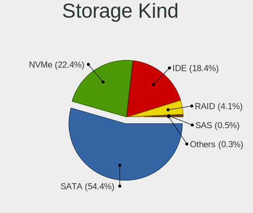

| Kind | Desktops | Percent |
|------|----------|---------|
| SATA | 943      | 54.29%  |
| IDE  | 428      | 24.64%  |
| NVMe | 288      | 16.58%  |
| RAID | 64       | 3.68%   |
| SAS  | 9        | 0.52%   |
| SCSI | 5        | 0.29%   |

Processor
---------

CPU Vendor
----------

Processor vendors

| Vendor | Desktops | Percent |
|--------|----------|---------|
| Intel  | 764      | 61.07%  |
| AMD    | 487      | 38.93%  |

CPU Model
---------

Processor models

| Model                                       | Desktops | Percent |
|---------------------------------------------|----------|---------|
| Intel Core 2 Duo CPU E8400 @ 3.00GHz        | 31       | 2.46%   |
| AMD Ryzen 5 3600 6-Core Processor           | 29       | 2.3%    |
| AMD Ryzen 5 2600 Six-Core Processor         | 23       | 1.83%   |
| Intel Core i5-3470 CPU @ 3.20GHz            | 17       | 1.35%   |
| Intel Core i3-3220 CPU @ 3.30GHz            | 16       | 1.27%   |
| Intel Core 2 Quad CPU Q6600 @ 2.40GHz       | 16       | 1.27%   |
| Intel Core i7-4790 CPU @ 3.60GHz            | 15       | 1.19%   |
| AMD Ryzen 7 2700X Eight-Core Processor      | 15       | 1.19%   |
| AMD Ryzen 5 1600 Six-Core Processor         | 15       | 1.19%   |
| Intel Core i5-4590 CPU @ 3.30GHz            | 14       | 1.11%   |
| Intel Core i5-2400 CPU @ 3.10GHz            | 14       | 1.11%   |
| AMD Ryzen 9 3900X 12-Core Processor         | 14       | 1.11%   |
| AMD Phenom II X4 955 Processor              | 13       | 1.03%   |
| Intel Core i7-6700K CPU @ 4.00GHz           | 12       | 0.95%   |
| Intel Core i5-7400 CPU @ 3.00GHz            | 12       | 0.95%   |
| Intel Core i5-9400F CPU @ 2.90GHz           | 11       | 0.87%   |
| AMD Ryzen 7 3700X 8-Core Processor          | 11       | 0.87%   |
| Intel Core i5-6500 CPU @ 3.20GHz            | 10       | 0.79%   |
| Intel Core i5-3570 CPU @ 3.40GHz            | 10       | 0.79%   |
| Intel Core i3-2120 CPU @ 3.30GHz            | 10       | 0.79%   |
| Intel Core i7-4790K CPU @ 4.00GHz           | 9        | 0.71%   |
| Intel Core i7-3770 CPU @ 3.40GHz            | 9        | 0.71%   |
| Intel Core i5-4460 CPU @ 3.20GHz            | 9        | 0.71%   |
| Intel Core i5-3570K CPU @ 3.40GHz           | 9        | 0.71%   |
| Intel Core i5-2500 CPU @ 3.30GHz            | 9        | 0.71%   |
| AMD Ryzen 5 3400G with Radeon Vega Graphics | 9        | 0.71%   |
| AMD Ryzen 5 2600X Six-Core Processor        | 9        | 0.71%   |
| AMD Ryzen 7 3800X 8-Core Processor          | 8        | 0.63%   |
| AMD Ryzen 7 2700 Eight-Core Processor       | 8        | 0.63%   |
| AMD Ryzen 5 2400G with Radeon Vega Graphics | 8        | 0.63%   |
| AMD Ryzen 5 1600X Six-Core Processor        | 8        | 0.63%   |
| Intel Pentium Dual-Core CPU E5400 @ 2.70GHz | 7        | 0.56%   |
| Intel Core i7-7700K CPU @ 4.20GHz           | 7        | 0.56%   |
| Intel Core i7-4770 CPU @ 3.40GHz            | 7        | 0.56%   |
| Intel Core i3-8100 CPU @ 3.60GHz            | 7        | 0.56%   |
| Intel Core 2 Quad CPU Q9300 @ 2.50GHz       | 7        | 0.56%   |
| Intel Core 2 Duo CPU E8500 @ 3.16GHz        | 7        | 0.56%   |
| Intel Core 2 Duo CPU E7500 @ 2.93GHz        | 7        | 0.56%   |
| Intel Core 2 CPU 6300 @ 1.86GHz             | 7        | 0.56%   |
| AMD Ryzen 9 5900X 12-Core Processor         | 7        | 0.56%   |
| AMD Ryzen 3 2200G with Radeon Vega Graphics | 7        | 0.56%   |
| AMD Ryzen 3 1200 Quad-Core Processor        | 7        | 0.56%   |
| AMD FX-8350 Eight-Core Processor            | 7        | 0.56%   |
| AMD FX-8300 Eight-Core Processor            | 7        | 0.56%   |
| Intel Pentium Dual CPU E2180 @ 2.00GHz      | 6        | 0.48%   |
| Intel Core i7-8700 CPU @ 3.20GHz            | 6        | 0.48%   |
| Intel Core i7-2600 CPU @ 3.40GHz            | 6        | 0.48%   |
| Intel Core i5 CPU 760 @ 2.80GHz             | 6        | 0.48%   |
| Intel Core i5 CPU 750 @ 2.67GHz             | 6        | 0.48%   |
| Intel Core i3-4170 CPU @ 3.70GHz            | 6        | 0.48%   |
| Intel Core 2 Quad CPU Q8200 @ 2.33GHz       | 6        | 0.48%   |
| AMD Ryzen 5 3600X 6-Core Processor          | 6        | 0.48%   |
| AMD Ryzen 3 3100 4-Core Processor           | 6        | 0.48%   |
| AMD Phenom II X4 965 Processor              | 6        | 0.48%   |
| AMD FX-6300 Six-Core Processor              | 6        | 0.48%   |
| AMD Athlon II X2 250 Processor              | 6        | 0.48%   |
| AMD Athlon 64 X2 Dual Core Processor 3800+  | 6        | 0.48%   |
| Intel Pentium Dual-Core CPU E5200 @ 2.50GHz | 5        | 0.4%    |
| Intel Pentium CPU G2030 @ 3.00GHz           | 5        | 0.4%    |
| Intel Core i9-9900K CPU @ 3.60GHz           | 5        | 0.4%    |

CPU Model Family
----------------

Processor model prefix

| Model                   | Desktops | Percent |
|-------------------------|----------|---------|
| Intel Core i5           | 219      | 17.41%  |
| Intel Core i7           | 122      | 9.7%    |
| AMD Ryzen 5             | 118      | 9.38%   |
| Intel Core i3           | 82       | 6.52%   |
| Intel Core 2 Duo        | 68       | 5.41%   |
| Intel Xeon              | 59       | 4.69%   |
| AMD Ryzen 7             | 57       | 4.53%   |
| Intel Core 2 Quad       | 51       | 4.05%   |
| AMD FX                  | 42       | 3.34%   |
| Intel Celeron           | 35       | 2.78%   |
| Intel Pentium           | 32       | 2.54%   |
| AMD Phenom II X4        | 31       | 2.46%   |
| AMD Athlon 64 X2        | 30       | 2.38%   |
| AMD Ryzen 9             | 29       | 2.31%   |
| Intel Pentium Dual-Core | 27       | 2.15%   |
| AMD Athlon II X2        | 25       | 1.99%   |
| AMD Ryzen 3             | 23       | 1.83%   |
| Intel Core 2            | 17       | 1.35%   |
| AMD Athlon II X4        | 16       | 1.27%   |
| AMD A10                 | 16       | 1.27%   |
| Other                   | 15       | 1.19%   |
| Intel Pentium Dual      | 13       | 1.03%   |
| AMD A8                  | 12       | 0.95%   |
| AMD A6                  | 10       | 0.79%   |
| AMD Ryzen Threadripper  | 9        | 0.72%   |
| Intel Core i9           | 8        | 0.64%   |
| AMD Athlon              | 8        | 0.64%   |
| Intel Pentium D         | 7        | 0.56%   |
| AMD Athlon 64           | 7        | 0.56%   |
| Intel Pentium 4         | 6        | 0.48%   |
| AMD GX                  | 6        | 0.48%   |
| AMD Sempron             | 5        | 0.4%    |
| AMD Phenom II X6        | 5        | 0.4%    |
| AMD Phenom II X2        | 5        | 0.4%    |
| AMD Athlon Dual Core    | 5        | 0.4%    |
| AMD A4                  | 5        | 0.4%    |
| Intel Pentium Gold      | 4        | 0.32%   |
| AMD Phenom              | 4        | 0.32%   |
| AMD Athlon II X3        | 4        | 0.32%   |
| Intel Atom              | 3        | 0.24%   |
| AMD G                   | 3        | 0.24%   |
| AMD E                   | 3        | 0.24%   |
| Intel Genuine           | 2        | 0.16%   |
| AMD Ryzen 5 PRO         | 2        | 0.16%   |
| Intel Core 2 Extreme    | 1        | 0.08%   |
| AMD Turion 64 X2 Mobile | 1        | 0.08%   |
| AMD Ryzen 3 PRO         | 1        | 0.08%   |
| AMD PRO A10             | 1        | 0.08%   |
| AMD Phenom II X3        | 1        | 0.08%   |
| AMD E1                  | 1        | 0.08%   |
| AMD Athlon X4           | 1        | 0.08%   |
| AMD Athlon X2           | 1        | 0.08%   |

CPU Cores
---------

Number of processor cores

| Number  | Desktops | Percent |
|---------|----------|---------|
| 4       | 510      | 40.13%  |
| 2       | 355      | 27.93%  |
| 6       | 176      | 13.85%  |
| 8       | 85       | 6.69%   |
| Unknown | 46       | 3.62%   |
| 12      | 32       | 2.52%   |
| 1       | 29       | 2.28%   |
| 3       | 17       | 1.34%   |
| 16      | 10       | 0.79%   |
| 10      | 7        | 0.55%   |
| 32      | 2        | 0.16%   |
| 24      | 2        | 0.16%   |

CPU Sockets
-----------

Number of sockets

| Number | Desktops | Percent |
|--------|----------|---------|
| 1      | 1237     | 98.8%   |
| 2      | 15       | 1.2%    |

CPU Threads
-----------

Threads per core (Hyper-Threading)

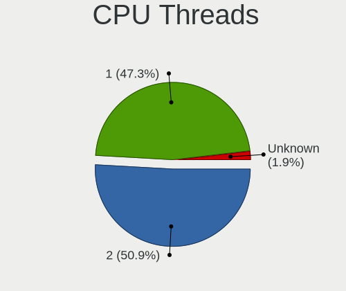

| Number  | Desktops | Percent |
|---------|----------|---------|
| 1       | 666      | 52.52%  |
| 2       | 556      | 43.85%  |
| Unknown | 46       | 3.63%   |

CPU Op-Modes
------------

CPU Operation Modes (32-bit, 64-bit)

| Op mode        | Desktops | Percent |
|----------------|----------|---------|
| 32-bit, 64-bit | 1234     | 98.25%  |
| Unknown        | 17       | 1.35%   |
| 32-bit         | 5        | 0.4%    |

CPU Microcode
-------------

Microcode number

| Number     | Desktops | Percent |
|------------|----------|---------|
| Unknown    | 227      | 17.43%  |
| 0x306c3    | 120      | 9.22%   |
| 0x1067a    | 93       | 7.14%   |
| 0x306a9    | 76       | 5.84%   |
| 0x206a7    | 61       | 4.69%   |
| 0x0800820d | 54       | 4.15%   |
| 0x506e3    | 44       | 3.38%   |
| 0x010000c8 | 44       | 3.38%   |
| 0x08701021 | 42       | 3.23%   |
| 0x906ea    | 34       | 2.61%   |
| 0x906e9    | 30       | 2.3%    |
| 0x08701013 | 24       | 1.84%   |
| 0x06000852 | 22       | 1.69%   |
| 0x6fb      | 21       | 1.61%   |
| 0x10676    | 20       | 1.54%   |
| 0x08001138 | 17       | 1.31%   |
| 0x06001119 | 17       | 1.31%   |
| 0x6fd      | 16       | 1.23%   |
| 0x106e5    | 14       | 1.08%   |
| 0x10677    | 14       | 1.08%   |
| 0x06003106 | 14       | 1.08%   |
| 0xa0653    | 12       | 0.92%   |
| 0x6f6      | 11       | 0.84%   |
| 0x206c2    | 11       | 0.84%   |
| 0x08001137 | 10       | 0.77%   |
| 0x010000db | 10       | 0.77%   |
| 0xa0655    | 9        | 0.69%   |
| 0x08108109 | 9        | 0.69%   |
| 0xa0671    | 8        | 0.61%   |
| 0x0a201016 | 8        | 0.61%   |
| 0x0a201009 | 8        | 0.61%   |
| 0x08101016 | 8        | 0.61%   |
| 0x906eb    | 7        | 0.54%   |
| 0x6f2      | 7        | 0.54%   |
| 0x206d7    | 7        | 0.54%   |
| 0x906ec    | 6        | 0.46%   |
| 0x306e4    | 6        | 0.46%   |
| 0x0810100b | 6        | 0.46%   |
| 0x0700010f | 6        | 0.46%   |
| 0x0600063e | 6        | 0.46%   |
| 0x03000027 | 6        | 0.46%   |
| 0x010000c7 | 6        | 0.46%   |
| 0x90672    | 5        | 0.38%   |
| 0x08001129 | 5        | 0.38%   |
| 0x010000b6 | 5        | 0.38%   |
| 0x906ed    | 4        | 0.31%   |
| 0x306f2    | 4        | 0.31%   |
| 0x106a5    | 4        | 0.31%   |
| 0x0600084f | 4        | 0.31%   |
| 0x010000dc | 4        | 0.31%   |
| 0xf29      | 3        | 0.23%   |
| 0x706a1    | 3        | 0.23%   |
| 0x506c9    | 3        | 0.23%   |
| 0x406c3    | 3        | 0.23%   |
| 0x20655    | 3        | 0.23%   |
| 0x0a50000c | 3        | 0.23%   |
| 0x0800820b | 3        | 0.23%   |
| 0x08008206 | 3        | 0.23%   |
| 0x0700010b | 3        | 0.23%   |
| 0x0600063d | 3        | 0.23%   |

CPU Microarch
-------------

Microarchitecture

| Name             | Desktops | Percent |
|------------------|----------|---------|
| Haswell          | 136      | 10.79%  |
| Penryn           | 133      | 10.56%  |
| KabyLake         | 95       | 7.54%   |
| K10              | 91       | 7.22%   |
| IvyBridge        | 89       | 7.06%   |
| Zen 2            | 86       | 6.83%   |
| SandyBridge      | 80       | 6.35%   |
| Zen+             | 79       | 6.27%   |
| Core             | 66       | 5.24%   |
| Skylake          | 57       | 4.52%   |
| Zen              | 55       | 4.37%   |
| Piledriver       | 50       | 3.97%   |
| K8 Hammer        | 49       | 3.89%   |
| Nehalem          | 23       | 1.83%   |
| CometLake        | 23       | 1.83%   |
| Zen 3            | 21       | 1.67%   |
| Westmere         | 16       | 1.27%   |
| NetBurst         | 15       | 1.19%   |
| Steamroller      | 14       | 1.11%   |
| Unknown          | 12       | 0.95%   |
| Jaguar           | 11       | 0.87%   |
| Silvermont       | 10       | 0.79%   |
| Bulldozer        | 10       | 0.79%   |
| K10 Llano        | 7        | 0.56%   |
| Bobcat           | 7        | 0.56%   |
| Icelake          | 5        | 0.4%    |
| Alderlake Hybrid | 5        | 0.4%    |
| Goldmont plus    | 3        | 0.24%   |
| Goldmont         | 3        | 0.24%   |
| Excavator        | 3        | 0.24%   |
| Broadwell        | 3        | 0.24%   |
| Puma             | 2        | 0.16%   |
| P6               | 1        | 0.08%   |

Graphics
--------

GPU Vendor
----------

Vendors of graphics cards

| Vendor                     | Desktops | Percent |
|----------------------------|----------|---------|
| Nvidia                     | 608      | 45.78%  |
| AMD                        | 412      | 31.02%  |
| Intel                      | 306      | 23.04%  |
| Matrox Electronics Systems | 1        | 0.08%   |
| ASPEED Technology          | 1        | 0.08%   |

GPU Model
---------

Graphics card models

| Model                                                                       | Desktops | Percent |
|-----------------------------------------------------------------------------|----------|---------|
| AMD Ellesmere [Radeon RX 470/480/570/570X/580/580X/590]                     | 75       | 5.45%   |
| Intel Xeon E3-1200 v3/4th Gen Core Processor Integrated Graphics Controller | 61       | 4.43%   |
| Intel 2nd Generation Core Processor Family Integrated Graphics Controller   | 41       | 2.98%   |
| Nvidia GP107 [GeForce GTX 1050 Ti]                                          | 32       | 2.33%   |
| Intel 4 Series Chipset Integrated Graphics Controller                       | 32       | 2.33%   |
| Intel Xeon E3-1200 v2/3rd Gen Core processor Graphics Controller            | 31       | 2.25%   |
| Nvidia GP106 [GeForce GTX 1060 6GB]                                         | 27       | 1.96%   |
| Nvidia GT218 [GeForce 210]                                                  | 26       | 1.89%   |
| Nvidia GP107 [GeForce GTX 1050]                                             | 21       | 1.53%   |
| Nvidia GK208B [GeForce GT 710]                                              | 21       | 1.53%   |
| AMD Navi 10 [Radeon RX 5600 OEM/5600 XT / 5700/5700 XT]                     | 21       | 1.53%   |
| Intel HD Graphics 530                                                       | 19       | 1.38%   |
| Nvidia G96C [GeForce 9500 GT]                                               | 18       | 1.31%   |
| Nvidia GP108 [GeForce GT 1030]                                              | 17       | 1.24%   |
| Nvidia GP104 [GeForce GTX 1070]                                             | 17       | 1.24%   |
| Intel CoffeeLake-S GT2 [UHD Graphics 630]                                   | 17       | 1.24%   |
| Nvidia G94 [GeForce 9600 GT]                                                | 16       | 1.16%   |
| Intel 4th Generation Core Processor Family Integrated Graphics Controller   | 16       | 1.16%   |
| Nvidia GF119 [GeForce GT 610]                                               | 15       | 1.09%   |
| AMD Raven Ridge [Radeon Vega Series / Radeon Vega Mobile Series]            | 15       | 1.09%   |
| Nvidia GP104 [GeForce GTX 1080]                                             | 14       | 1.02%   |
| Nvidia GM107 [GeForce GTX 750 Ti]                                           | 14       | 1.02%   |
| AMD Cedar [Radeon HD 5000/6000/7350/8350 Series]                            | 14       | 1.02%   |
| Nvidia GP106 [GeForce GTX 1060 3GB]                                         | 13       | 0.94%   |
| Nvidia GM204 [GeForce GTX 970]                                              | 13       | 0.94%   |
| Nvidia GK107 [GeForce GTX 650]                                              | 13       | 0.94%   |
| AMD Picasso/Raven 2 [Radeon Vega Series / Radeon Vega Mobile Series]        | 13       | 0.94%   |
| Nvidia GF108 [GeForce GT 630]                                               | 12       | 0.87%   |
| Intel HD Graphics 630                                                       | 12       | 0.87%   |
| AMD Baffin [Radeon RX 550 640SP / RX 560/560X]                              | 12       | 0.87%   |
| Nvidia GM206 [GeForce GTX 960]                                              | 11       | 0.8%    |
| Nvidia G84 [GeForce 8600 GT]                                                | 11       | 0.8%    |
| AMD RS780L [Radeon 3000]                                                    | 11       | 0.8%    |
| AMD Kaveri [Radeon R7 Graphics]                                             | 11       | 0.8%    |
| Nvidia GK208B [GeForce GT 730]                                              | 10       | 0.73%   |
| AMD Oland XT [Radeon HD 8670 / R5 340X OEM / R7 250/350/350X OEM]           | 10       | 0.73%   |
| Nvidia GK106 [GeForce GTX 660]                                              | 9        | 0.65%   |
| Intel CometLake-S GT2 [UHD Graphics 630]                                    | 9        | 0.65%   |
| AMD RS880 [Radeon HD 4200]                                                  | 9        | 0.65%   |
| AMD Pitcairn PRO [Radeon HD 7850 / R7 265 / R9 270 1024SP]                  | 9        | 0.65%   |
| Nvidia TU116 [GeForce GTX 1660]                                             | 8        | 0.58%   |
| Intel 82945G/GZ Integrated Graphics Controller                              | 8        | 0.58%   |
| AMD Navi 21 [Radeon RX 6800/6800 XT / 6900 XT]                              | 8        | 0.58%   |
| Nvidia GM107 [GeForce GTX 750]                                              | 7        | 0.51%   |
| Intel 82G33/G31 Express Integrated Graphics Controller                      | 7        | 0.51%   |
| AMD Cape Verde XT [Radeon HD 7770/8760 / R7 250X]                           | 7        | 0.51%   |
| AMD Baffin [Radeon RX 460/560D / Pro 450/455/460/555/555X/560/560X]         | 7        | 0.51%   |
| Nvidia TU116 [GeForce GTX 1660 SUPER]                                       | 6        | 0.44%   |
| Nvidia TU104 [GeForce RTX 2070 SUPER]                                       | 6        | 0.44%   |
| Nvidia GT200 [GeForce GTX 260]                                              | 6        | 0.44%   |
| Nvidia GF116 [GeForce GTX 550 Ti]                                           | 6        | 0.44%   |
| Nvidia GF108 [GeForce GT 430]                                               | 6        | 0.44%   |
| Nvidia GF104 [GeForce GTX 460]                                              | 6        | 0.44%   |
| AMD Oland PRO [Radeon R7 240/340 / Radeon 520]                              | 6        | 0.44%   |
| AMD Juniper XT [Radeon HD 5770]                                             | 6        | 0.44%   |
| AMD Caicos [Radeon HD 6450/7450/8450 / R5 230 OEM]                          | 6        | 0.44%   |
| AMD Caicos XT [Radeon HD 7470/8470 / R5 235/310 OEM]                        | 6        | 0.44%   |
| Nvidia TU116 [GeForce GTX 1650 SUPER]                                       | 5        | 0.36%   |
| Nvidia TU102 [GeForce RTX 2080 Ti Rev. A]                                   | 5        | 0.36%   |
| Nvidia GT216 [GeForce GT 220]                                               | 5        | 0.36%   |

GPU Combo
---------

Combinations of graphics cards

| Name            | Desktops | Percent |
|-----------------|----------|---------|
| 1 x Nvidia      | 577      | 45.18%  |
| 1 x AMD         | 381      | 29.84%  |
| 1 x Intel       | 261      | 20.44%  |
| Intel + Nvidia  | 17       | 1.33%   |
| 2 x AMD         | 15       | 1.17%   |
| AMD + Nvidia    | 10       | 0.78%   |
| Intel + AMD     | 8        | 0.63%   |
| 2 x Nvidia      | 3        | 0.23%   |
| 3 x AMD         | 2        | 0.16%   |
| Other           | 1        | 0.08%   |
| Nvidia + ASPEED | 1        | 0.08%   |
| 1 x Matrox      | 1        | 0.08%   |

GPU Driver
----------

Free vs proprietary

| Driver      | Desktops | Percent |
|-------------|----------|---------|
| Free        | 922      | 71.42%  |
| Proprietary | 318      | 24.63%  |
| Unknown     | 51       | 3.95%   |

GPU Memory
----------

Total video memory

| Size in GB | Desktops | Percent |
|------------|----------|---------|
| Unknown    | 396      | 29.95%  |
| 1.01-2.0   | 214      | 16.19%  |
| 0.01-0.5   | 204      | 15.43%  |
| 0.51-1.0   | 197      | 14.9%   |
| 7.01-8.0   | 115      | 8.7%    |
| 3.01-4.0   | 111      | 8.4%    |
| 5.01-6.0   | 52       | 3.93%   |
| 8.01-16.0  | 22       | 1.66%   |
| 2.01-3.0   | 9        | 0.68%   |
| 16.01-24.0 | 2        | 0.15%   |

Monitor
-------

Monitor Vendor
--------------

Monitor vendors

| Vendor                  | Desktops | Percent |
|-------------------------|----------|---------|
| Samsung Electronics     | 233      | 17.36%  |
| Goldstar                | 159      | 11.85%  |
| Dell                    | 139      | 10.36%  |
| Philips                 | 81       | 6.04%   |
| Iiyama                  | 78       | 5.81%   |
| BenQ                    | 77       | 5.74%   |
| Hewlett-Packard         | 73       | 5.44%   |
| Acer                    | 71       | 5.29%   |
| AOC                     | 54       | 4.02%   |
| Eizo                    | 45       | 3.35%   |
| NEC Computers           | 41       | 3.06%   |
| Ancor Communications    | 39       | 2.91%   |
| LG Electronics          | 27       | 2.01%   |
| Lenovo                  | 21       | 1.56%   |
| Fujitsu Siemens         | 20       | 1.49%   |
| Sony                    | 19       | 1.42%   |
| Unknown                 | 13       | 0.97%   |
| ASUSTek Computer        | 11       | 0.82%   |
| Idek Iiyama             | 10       | 0.75%   |
| ViewSonic               | 8        | 0.6%    |
| Toshiba                 | 8        | 0.6%    |
| Panasonic               | 8        | 0.6%    |
| Hyundai ImageQuest      | 7        | 0.52%   |
| Gateway                 | 7        | 0.52%   |
| Medion                  | 6        | 0.45%   |
| Belinea                 | 6        | 0.45%   |
| MSI                     | 5        | 0.37%   |
| IBM                     | 4        | 0.3%    |
| Vestel Elektronik       | 3        | 0.22%   |
| Vestel                  | 3        | 0.22%   |
| Sharp                   | 3        | 0.22%   |
| Onkyo                   | 3        | 0.22%   |
| Gigabyte Technology     | 3        | 0.22%   |
| Xiaomi                  | 2        | 0.15%   |
| Valve                   | 2        | 0.15%   |
| Tech Concepts           | 2        | 0.15%   |
| TCL                     | 2        | 0.15%   |
| S2-Tek                  | 2        | 0.15%   |
| Plain Tree Systems      | 2        | 0.15%   |
| Packard Bell            | 2        | 0.15%   |
| OEM                     | 2        | 0.15%   |
| KTC                     | 2        | 0.15%   |
| INFOTRONIC              | 2        | 0.15%   |
| Huion                   | 2        | 0.15%   |
| FUS                     | 2        | 0.15%   |
| Chi Mei Optoelectronics | 2        | 0.15%   |
| Arnos Instruments       | 2        | 0.15%   |
| AGO                     | 2        | 0.15%   |
| Unknown                 | 2        | 0.15%   |
| YOC                     | 1        | 0.07%   |
| UMC                     | 1        | 0.07%   |
| Sceptre Tech            | 1        | 0.07%   |
| RTK                     | 1        | 0.07%   |
| Orion                   | 1        | 0.07%   |
| OPT                     | 1        | 0.07%   |
| NECCI                   | 1        | 0.07%   |
| Microstep               | 1        | 0.07%   |
| Medion Akoya            | 1        | 0.07%   |
| MBB                     | 1        | 0.07%   |
| LED                     | 1        | 0.07%   |

Monitor Model
-------------

Monitor models

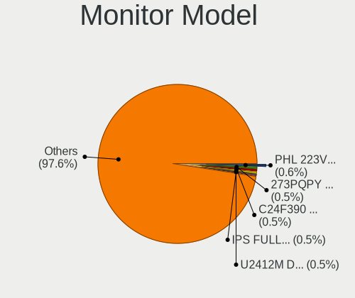

| Model                                                                | Desktops | Percent |
|----------------------------------------------------------------------|----------|---------|
| Goldstar IPS FULLHD GSM5AB8 1920x1080 480x270mm 21.7-inch            | 9        | 0.62%   |
| Samsung Electronics SyncMaster SAM011E 1280x1024 338x270mm 17.0-inch | 6        | 0.41%   |
| Philips PHL 243V7 PHLC155 1920x1080 527x296mm 23.8-inch              | 6        | 0.41%   |
| Goldstar 2D FHD TV GSM59C6 1920x1080 509x286mm 23.0-inch             | 6        | 0.41%   |
| Eizo EV2316W ENC2394 1920x1080 510x287mm 23.0-inch                   | 6        | 0.41%   |
| Dell U2412M DELA07A 1920x1200 518x324mm 24.1-inch                    | 6        | 0.41%   |
| Samsung Electronics S24D300 SAM0B43 1920x1080 531x299mm 24.0-inch    | 5        | 0.34%   |
| Samsung Electronics C27F390 SAM0D32 1920x1080 600x340mm 27.2-inch    | 5        | 0.34%   |
| Samsung Electronics C24F390 SAM0D2C 1920x1080 521x293mm 23.5-inch    | 5        | 0.34%   |
| Philips PHL 223V5 PHLC0CF 1920x1080 477x268mm 21.5-inch              | 5        | 0.34%   |
| Iiyama X2483/2481 IVM6128 1920x1080 527x296mm 23.8-inch              | 5        | 0.34%   |
| Iiyama PLX2483H IVM6114 1920x1080 531x299mm 24.0-inch                | 5        | 0.34%   |
| Goldstar LG ULTRAWIDE GSM59F1 2560x1080 800x340mm 34.2-inch          | 5        | 0.34%   |
| Goldstar IPS FULLHD GSM5AB6 1920x1080 480x270mm 21.7-inch            | 5        | 0.34%   |
| Goldstar E2242 GSM58BE 1920x1080 480x270mm 21.7-inch                 | 5        | 0.34%   |
| Dell U2412M DELA07B 1920x1200 518x324mm 24.1-inch                    | 5        | 0.34%   |
| AOC Q3279WG5B AOC3279 2560x1440 725x428mm 33.1-inch                  | 5        | 0.34%   |
| Toshiba TV TSB0108 1920x540                                          | 4        | 0.28%   |
| Samsung Electronics S22C300 SAM0A20 1920x1080 480x270mm 21.7-inch    | 4        | 0.28%   |
| Samsung Electronics LCD Monitor SyncMaster 1280x1024                 | 4        | 0.28%   |
| Philips PHL 276E8V PHLC18F 3840x2160 597x336mm 27.0-inch             | 4        | 0.28%   |
| Philips FTV PHL01EA 1920x1080 640x360mm 28.9-inch                    | 4        | 0.28%   |
| Panasonic TV MEIA296 1280x1024 698x392mm 31.5-inch                   | 4        | 0.28%   |
| NEC Computers EA223WM NEC6890 1680x1050 474x296mm 22.0-inch          | 4        | 0.28%   |
| Iiyama PL2792Q IVM6637 2560x1440 597x336mm 27.0-inch                 | 4        | 0.28%   |
| Iiyama PL2377 IVM561D 1920x1080 510x287mm 23.0-inch                  | 4        | 0.28%   |
| Hewlett-Packard LA2306 HWP2949 1920x1080 509x286mm 23.0-inch         | 4        | 0.28%   |
| Goldstar MP59G GSM5B35 1920x1080 480x270mm 21.7-inch                 | 4        | 0.28%   |
| Goldstar 24MP55 GSM5A20 1920x1080 510x290mm 23.1-inch                | 4        | 0.28%   |
| Dell U2212HM DELD047 1920x1080 475x267mm 21.5-inch                   | 4        | 0.28%   |
| Dell 2209WA DELF011 1680x1050 474x296mm 22.0-inch                    | 4        | 0.28%   |
| BenQ GW2270 BNQ78DB 1920x1080 480x270mm 21.7-inch                    | 4        | 0.28%   |
| BenQ GW2255 BNQ78CD 1920x1080 480x270mm 21.7-inch                    | 4        | 0.28%   |
| AOC 27G2G8 AOC2702 1920x1080 598x336mm 27.0-inch                     | 4        | 0.28%   |
| AOC 24B2W1G5 AOC2402 1920x1080 527x296mm 23.8-inch                   | 4        | 0.28%   |
| Vestel Elektronik 32FHD_LCD_TV VES3700 1920x1080 700x390mm 31.5-inch | 3        | 0.21%   |
| Samsung Electronics SyncMaster SAM0428 1680x1050 459x296mm 21.5-inch | 3        | 0.21%   |
| Samsung Electronics SMT22A350 SAM07A7 1920x1080 477x268mm 21.5-inch  | 3        | 0.21%   |
| Samsung Electronics SMEX2220 SAM0685 1920x1080 477x268mm 21.5-inch   | 3        | 0.21%   |
| Samsung Electronics SMB2230N SAM0635 1920x1080 477x268mm 21.5-inch   | 3        | 0.21%   |
| Samsung Electronics LCD Monitor SAM0669 1920x1080                    | 3        | 0.21%   |
| Samsung Electronics C49HG9x SAM0E5E 3840x1080 1200x340mm 49.1-inch   | 3        | 0.21%   |
| Philips PHL 234E5 PHLC0C7 1920x1080 509x286mm 23.0-inch              | 3        | 0.21%   |
| Philips 200VW PHL0852 1680x1050 474x296mm 22.0-inch                  | 3        | 0.21%   |
| NEC Computers LCD73V NEC66C2 1280x1024 338x270mm 17.0-inch           | 3        | 0.21%   |
| NEC Computers LCD22WV NEC671E 1680x1050 465x290mm 21.6-inch          | 3        | 0.21%   |
| NEC Computers EA244WMi NEC68D6 1920x1200 519x324mm 24.1-inch         | 3        | 0.21%   |
| NEC Computers EA244WMi NEC68D5 1920x1200 519x324mm 24.1-inch         | 3        | 0.21%   |
| LG Electronics LCD Monitor LG ULTRAWIDE 2560x1080                    | 3        | 0.21%   |
| LG Electronics LCD Monitor LG IPS FULLHD 1920x1080                   | 3        | 0.21%   |
| Lenovo LEN T23i-10 LEN61AB 1920x1080 509x286mm 23.0-inch             | 3        | 0.21%   |
| Lenovo LEN LT2252pwA LEN0A0C 1680x1050 474x296mm 22.0-inch           | 3        | 0.21%   |
| Iiyama PLE1900 IVM482C 1280x1024 376x301mm 19.0-inch                 | 3        | 0.21%   |
| Iiyama PL2282H IVM5632 1920x1080 476x268mm 21.5-inch                 | 3        | 0.21%   |
| Hewlett-Packard LA2306 HWP294A 1920x1080 510x287mm 23.0-inch         | 3        | 0.21%   |
| Hewlett-Packard Compaq WF1907 HWP26A4 1440x900 408x255mm 18.9-inch   | 3        | 0.21%   |
| Goldstar W2252 GSM567E 1680x1050 474x296mm 22.0-inch                 | 3        | 0.21%   |
| Goldstar W1943 GSM4BAD 1360x768 410x230mm 18.5-inch                  | 3        | 0.21%   |
| Goldstar L192WS GSM4B32 1440x900 410x256mm 19.0-inch                 | 3        | 0.21%   |
| Goldstar E2251 GSM586F 1920x1080 477x268mm 21.5-inch                 | 3        | 0.21%   |

Monitor Resolution
------------------

Monitor screen resolution

| Resolution         | Desktops | Percent |
|--------------------|----------|---------|
| 1920x1080 (FHD)    | 589      | 44.59%  |
| 1280x1024 (SXGA)   | 151      | 11.43%  |
| 1680x1050 (WSXGA+) | 100      | 7.57%   |
| 2560x1440 (QHD)    | 83       | 6.28%   |
| 3840x2160 (4K)     | 80       | 6.06%   |
| 1920x1200 (WUXGA)  | 63       | 4.77%   |
| 1440x900 (WXGA+)   | 57       | 4.31%   |
| Unknown            | 28       | 2.12%   |
| 1366x768 (WXGA)    | 27       | 2.04%   |
| 1600x1200          | 16       | 1.21%   |
| 3440x1440          | 15       | 1.14%   |
| 2560x1080          | 15       | 1.14%   |
| 1360x768           | 15       | 1.14%   |
| 3840x1080          | 13       | 0.98%   |
| 1024x768 (XGA)     | 10       | 0.76%   |
| 1600x900 (HD+)     | 9        | 0.68%   |
| 1920x540           | 7        | 0.53%   |
| 2048x1152          | 4        | 0.3%    |
| 3200x1080          | 3        | 0.23%   |
| 2560x1600          | 3        | 0.23%   |
| 1280x960           | 3        | 0.23%   |
| 1280x720 (HD)      | 3        | 0.23%   |
| 5120x1440          | 2        | 0.15%   |
| 3600x1080          | 2        | 0.15%   |
| 2880x1800          | 2        | 0.15%   |
| 720x576            | 1        | 0.08%   |
| 720x480            | 1        | 0.08%   |
| 6400x1440          | 1        | 0.08%   |
| 5760x1200          | 1        | 0.08%   |
| 5120x2160          | 1        | 0.08%   |
| 5120x1080          | 1        | 0.08%   |
| 5040x1050          | 1        | 0.08%   |
| 4920x1200          | 1        | 0.08%   |
| 4480x1600          | 1        | 0.08%   |
| 4480x1200          | 1        | 0.08%   |
| 3840x1600          | 1        | 0.08%   |
| 3840x1200          | 1        | 0.08%   |
| 3600x1200          | 1        | 0.08%   |
| 3200x1200          | 1        | 0.08%   |
| 3040x1050          | 1        | 0.08%   |
| 2640x1024          | 1        | 0.08%   |
| 2384x768           | 1        | 0.08%   |
| 2288x1287          | 1        | 0.08%   |
| 1400x1050          | 1        | 0.08%   |
| 1280x800 (WXGA)    | 1        | 0.08%   |
| 1280x768           | 1        | 0.08%   |

Monitor Diagonal
----------------

Diagonal size in inches

| Inches  | Desktops | Percent |
|---------|----------|---------|
| 24      | 190      | 14.14%  |
| 21      | 177      | 13.17%  |
| 23      | 162      | 12.05%  |
| Unknown | 160      | 11.9%   |
| 27      | 140      | 10.42%  |
| 19      | 117      | 8.71%   |
| 17      | 71       | 5.28%   |
| 22      | 64       | 4.76%   |
| 18      | 43       | 3.2%    |
| 31      | 31       | 2.31%   |
| 20      | 29       | 2.16%   |
| 34      | 24       | 1.79%   |
| 72      | 14       | 1.04%   |
| 25      | 14       | 1.04%   |
| 15      | 14       | 1.04%   |
| 84      | 13       | 0.97%   |
| 32      | 13       | 0.97%   |
| 54      | 10       | 0.74%   |
| 65      | 7        | 0.52%   |
| 40      | 6        | 0.45%   |
| 49      | 5        | 0.37%   |
| 42      | 5        | 0.37%   |
| 33      | 5        | 0.37%   |
| 39      | 4        | 0.3%    |
| 28      | 4        | 0.3%    |
| 55      | 2        | 0.15%   |
| 50      | 2        | 0.15%   |
| 48      | 2        | 0.15%   |
| 46      | 2        | 0.15%   |
| 37      | 2        | 0.15%   |
| 35      | 2        | 0.15%   |
| 29      | 2        | 0.15%   |
| 26      | 2        | 0.15%   |
| 142     | 1        | 0.07%   |
| 59      | 1        | 0.07%   |
| 52      | 1        | 0.07%   |
| 47      | 1        | 0.07%   |
| 14      | 1        | 0.07%   |
| 12      | 1        | 0.07%   |

Monitor Width
-------------

Physical width

| Width in mm    | Desktops | Percent |
|----------------|----------|---------|
| 501-600        | 468      | 35.67%  |
| 401-500        | 350      | 26.68%  |
| Unknown        | 160      | 12.2%   |
| 301-350        | 82       | 6.25%   |
| 351-400        | 81       | 6.17%   |
| 601-700        | 47       | 3.58%   |
| 701-800        | 42       | 3.2%    |
| 1001-1500      | 33       | 2.52%   |
| 1501-2000      | 27       | 2.06%   |
| 801-900        | 14       | 1.07%   |
| 901-1000       | 5        | 0.38%   |
| 201-300        | 2        | 0.15%   |
| More than 2000 | 1        | 0.08%   |

Aspect Ratio
------------

Proportional relationship between the width and the height

| Ratio   | Desktops | Percent |
|---------|----------|---------|
| 16/9    | 693      | 54.78%  |
| 16/10   | 203      | 16.05%  |
| Unknown | 148      | 11.7%   |
| 5/4     | 139      | 10.99%  |
| 4/3     | 27       | 2.13%   |
| 21/9    | 27       | 2.13%   |
| 3/2     | 16       | 1.26%   |
| 32/9    | 7        | 0.55%   |
| 6/5     | 4        | 0.32%   |
| 1.00    | 1        | 0.08%   |

Monitor Area
------------

Area in inch

| Area in inch | Desktops | Percent |
|----------------|----------|---------|
| 201-250        | 467      | 35.25%  |
| 151-200        | 203      | 15.32%  |
| Unknown        | 160      | 12.08%  |
| 301-350        | 142      | 10.72%  |
| 141-150        | 96       | 7.25%   |
| 251-300        | 83       | 6.26%   |
| 351-500        | 80       | 6.04%   |
| More than 1000 | 53       | 4%      |
| 501-1000       | 25       | 1.89%   |
| 101-110        | 12       | 0.91%   |
| 91-100         | 2        | 0.15%   |
| 71-80          | 1        | 0.08%   |
| 111-120        | 1        | 0.08%   |

Pixel Density
-------------

Pixels per inch

| Density | Desktops | Percent |
|---------|----------|---------|
| 51-100  | 763      | 60.6%   |
| 101-120 | 237      | 18.82%  |
| Unknown | 160      | 12.71%  |
| 1-50    | 49       | 3.89%   |
| 121-160 | 32       | 2.54%   |
| 161-240 | 18       | 1.43%   |

Multiple Monitors
-----------------

Total monitors connected

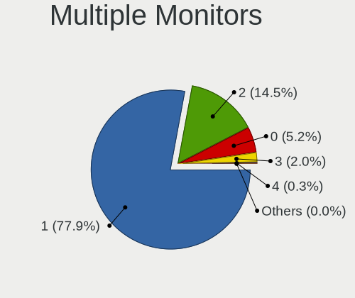

| Total | Desktops | Percent |
|-------|----------|---------|
| 1     | 1032     | 80.56%  |
| 2     | 168      | 13.11%  |
| 0     | 52       | 4.06%   |
| 3     | 24       | 1.87%   |
| 4     | 5        | 0.39%   |

Network
-------

Net Controller Vendor
---------------------

Controller vendors

| Vendor                                 | Desktops | Percent |
|----------------------------------------|----------|---------|
| Realtek Semiconductor                  | 765      | 43.37%  |
| Intel                                  | 408      | 23.13%  |
| Qualcomm Atheros                       | 136      | 7.71%   |
| Broadcom                               | 56       | 3.17%   |
| TP-Link                                | 48       | 2.72%   |
| Ralink Technology                      | 46       | 2.61%   |
| Nvidia                                 | 46       | 2.61%   |
| Qualcomm Atheros Communications        | 30       | 1.7%    |
| Ralink                                 | 29       | 1.64%   |
| Huawei Technologies                    | 22       | 1.25%   |
| Microsoft                              | 20       | 1.13%   |
| Marvell Technology Group               | 20       | 1.13%   |
| Broadcom Limited                       | 18       | 1.02%   |
| ASUSTek Computer                       | 16       | 0.91%   |
| Xiaomi                                 | 11       | 0.62%   |
| Samsung Electronics                    | 9        | 0.51%   |
| D-Link                                 | 8        | 0.45%   |
| Aquantia                               | 8        | 0.45%   |
| Edimax Technology                      | 7        | 0.4%    |
| VIA Technologies                       | 6        | 0.34%   |
| Motorola PCS                           | 5        | 0.28%   |
| Sony Ericsson Mobile Communications AB | 4        | 0.23%   |
| NetGear                                | 4        | 0.23%   |
| MediaTek                               | 4        | 0.23%   |
| Sagem                                  | 3        | 0.17%   |
| D-Link System                          | 3        | 0.17%   |
| ZyXEL Communications                   | 2        | 0.11%   |
| ZyDAS                                  | 2        | 0.11%   |
| QLogic                                 | 2        | 0.11%   |
| Loupedeck                              | 2        | 0.11%   |
| HTC (High Tech Computer)               | 2        | 0.11%   |
| 3Com                                   | 2        | 0.11%   |
| ZTE WCDMA Technologies MSM             | 1        | 0.06%   |
| Wacom                                  | 1        | 0.06%   |
| Texas Instruments                      | 1        | 0.06%   |
| Seeed Technology                       | 1        | 0.06%   |
| Research In Motion                     | 1        | 0.06%   |
| Raspberry Pi                           | 1        | 0.06%   |
| OPPO Electronics                       | 1        | 0.06%   |
| OnePlus                                | 1        | 0.06%   |
| Linksys                                | 1        | 0.06%   |
| Lenovo                                 | 1        | 0.06%   |
| IMC Networks                           | 1        | 0.06%   |
| IBM                                    | 1        | 0.06%   |
| GreenWave Reality                      | 1        | 0.06%   |
| Google                                 | 1        | 0.06%   |
| Foxconn / Hon Hai                      | 1        | 0.06%   |
| Belkin Components                      | 1        | 0.06%   |
| Arduino SA                             | 1        | 0.06%   |
| Apple                                  | 1        | 0.06%   |
| AMD                                    | 1        | 0.06%   |
| ADMtek                                 | 1        | 0.06%   |

Net Controller Model
--------------------

Controller models

| Model                                                                         | Desktops | Percent |
|-------------------------------------------------------------------------------|----------|---------|
| Realtek RTL8111/8168/8411 PCI Express Gigabit Ethernet Controller             | 634      | 32.92%  |
| Intel I211 Gigabit Network Connection                                         | 64       | 3.32%   |
| Intel 82579LM Gigabit Network Connection (Lewisville)                         | 58       | 3.01%   |
| Intel Ethernet Connection (2) I219-V                                          | 40       | 2.08%   |
| Intel Wi-Fi 6 AX200                                                           | 35       | 1.82%   |
| Intel 82567LM-3 Gigabit Network Connection                                    | 32       | 1.66%   |
| Realtek RTL8125 2.5GbE Controller                                             | 31       | 1.61%   |
| Realtek RTL8188EUS 802.11n Wireless Network Adapter                           | 29       | 1.51%   |
| Realtek RTL-8100/8101L/8139 PCI Fast Ethernet Adapter                         | 29       | 1.51%   |
| Nvidia MCP61 Ethernet                                                         | 28       | 1.45%   |
| Intel Ethernet Connection I217-LM                                             | 25       | 1.3%    |
| Intel Ethernet Connection (7) I219-V                                          | 25       | 1.3%    |
| Qualcomm Atheros AR9271 802.11n                                               | 22       | 1.14%   |
| Intel 82579V Gigabit Network Connection                                       | 20       | 1.04%   |
| TP-Link TL-WN722N v2/v3 [Realtek RTL8188EUS]                                  | 19       | 0.99%   |
| Ralink MT7601U Wireless Adapter                                               | 19       | 0.99%   |
| Intel Dual Band Wireless-AC 3168NGW [Stone Peak]                              | 18       | 0.93%   |
| Realtek RTL810xE PCI Express Fast Ethernet controller                         | 17       | 0.88%   |
| Intel Wireless-AC 9260                                                        | 17       | 0.88%   |
| Microsoft Xbox 360 Wireless Adapter                                           | 15       | 0.78%   |
| Marvell Group 88E8056 PCI-E Gigabit Ethernet Controller                       | 15       | 0.78%   |
| Intel Ethernet Connection (2) I218-V                                          | 15       | 0.78%   |
| Qualcomm Atheros Killer E220x Gigabit Ethernet Controller                     | 14       | 0.73%   |
| Realtek RTL8188CUS 802.11n WLAN Adapter                                       | 13       | 0.67%   |
| Qualcomm Atheros AR9227 Wireless Network Adapter                              | 13       | 0.67%   |
| Realtek RTL8192EE PCIe Wireless Network Adapter                               | 12       | 0.62%   |
| Ralink RT5370 Wireless Adapter                                                | 12       | 0.62%   |
| Ralink RT2561/RT61 802.11g PCI                                                | 11       | 0.57%   |
| Qualcomm Atheros AR9485 Wireless Network Adapter                              | 11       | 0.57%   |
| Qualcomm Atheros AR8131 Gigabit Ethernet                                      | 11       | 0.57%   |
| Broadcom NetXtreme BCM5754 Gigabit Ethernet PCI Express                       | 11       | 0.57%   |
| Qualcomm Atheros AR8151 v2.0 Gigabit Ethernet                                 | 10       | 0.52%   |
| Intel Ethernet Connection I217-V                                              | 10       | 0.52%   |
| Xiaomi Mi/Redmi series (RNDIS)                                                | 9        | 0.47%   |
| Realtek RTL-8110SC/8169SC Gigabit Ethernet                                    | 9        | 0.47%   |
| Qualcomm Atheros AR8121/AR8113/AR8114 Gigabit or Fast Ethernet                | 9        | 0.47%   |
| Intel Ethernet Connection (2) I219-LM                                         | 9        | 0.47%   |
| Intel Cannon Lake PCH CNVi WiFi                                               | 9        | 0.47%   |
| Huawei Modem/Networkcard                                                      | 9        | 0.47%   |
| Huawei E353/E3131                                                             | 9        | 0.47%   |
| Realtek RTL8169 PCI Gigabit Ethernet Controller                               | 8        | 0.42%   |
| Qualcomm Atheros QCA8171 Gigabit Ethernet                                     | 8        | 0.42%   |
| Qualcomm Atheros AR93xx Wireless Network Adapter                              | 8        | 0.42%   |
| Intel Wireless 7260                                                           | 8        | 0.42%   |
| Intel Ethernet Controller I225-V                                              | 8        | 0.42%   |
| Intel 82574L Gigabit Network Connection                                       | 8        | 0.42%   |
| Broadcom NetXtreme BCM5761 Gigabit Ethernet PCIe                              | 8        | 0.42%   |
| Broadcom BCM4360 802.11ac Wireless Network Adapter                            | 8        | 0.42%   |
| Realtek RTL8188EE Wireless Network Adapter                                    | 7        | 0.36%   |
| Realtek RTL8153 Gigabit Ethernet Adapter                                      | 7        | 0.36%   |
| Qualcomm Atheros Killer E2400 Gigabit Ethernet Controller                     | 7        | 0.36%   |
| Qualcomm Atheros Attansic L1 Gigabit Ethernet                                 | 7        | 0.36%   |
| Qualcomm Atheros AR8161 Gigabit Ethernet                                      | 7        | 0.36%   |
| Qualcomm Atheros AR2413/AR2414 Wireless Network Adapter [AR5005G(S) 802.11bg] | 7        | 0.36%   |
| Nvidia MCP55 Ethernet                                                         | 7        | 0.36%   |
| Intel 82566DM-2 Gigabit Network Connection                                    | 7        | 0.36%   |
| VIA VT6102/VT6103 [Rhine-II]                                                  | 6        | 0.31%   |
| Ralink RT2870/RT3070 Wireless Adapter                                         | 6        | 0.31%   |
| Qualcomm Atheros TP-Link TL-WN322G v3 / TL-WN422G v2 802.11g [Atheros AR9271] | 6        | 0.31%   |
| Qualcomm Atheros AR9285 Wireless Network Adapter (PCI-Express)                | 6        | 0.31%   |

Wireless Vendor
---------------

Wireless vendors

| Vendor                          | Desktops | Percent |
|---------------------------------|----------|---------|
| Intel                           | 109      | 21.12%  |
| Realtek Semiconductor           | 108      | 20.93%  |
| Qualcomm Atheros                | 58       | 11.24%  |
| TP-Link                         | 47       | 9.11%   |
| Ralink Technology               | 46       | 8.91%   |
| Qualcomm Atheros Communications | 30       | 5.81%   |
| Ralink                          | 29       | 5.62%   |
| Microsoft                       | 20       | 3.88%   |
| Broadcom                        | 16       | 3.1%    |
| ASUSTek Computer                | 16       | 3.1%    |
| D-Link                          | 8        | 1.55%   |
| Edimax Technology               | 7        | 1.36%   |
| NetGear                         | 4        | 0.78%   |
| Sagem                           | 3        | 0.58%   |
| MediaTek                        | 3        | 0.58%   |
| ZyXEL Communications            | 2        | 0.39%   |
| ZyDAS                           | 2        | 0.39%   |
| D-Link System                   | 2        | 0.39%   |
| Broadcom Limited                | 2        | 0.39%   |
| Wacom                           | 1        | 0.19%   |
| Linksys                         | 1        | 0.19%   |
| IMC Networks                    | 1        | 0.19%   |
| Belkin Components               | 1        | 0.19%   |

Wireless Model
--------------

Wireless models

| Model                                                                         | Desktops | Percent |
|-------------------------------------------------------------------------------|----------|---------|
| Intel Wi-Fi 6 AX200                                                           | 35       | 6.76%   |
| Realtek RTL8188EUS 802.11n Wireless Network Adapter                           | 29       | 5.6%    |
| Qualcomm Atheros AR9271 802.11n                                               | 22       | 4.25%   |
| TP-Link TL-WN722N v2/v3 [Realtek RTL8188EUS]                                  | 19       | 3.67%   |
| Ralink MT7601U Wireless Adapter                                               | 19       | 3.67%   |
| Intel Dual Band Wireless-AC 3168NGW [Stone Peak]                              | 18       | 3.47%   |
| Intel Wireless-AC 9260                                                        | 17       | 3.28%   |
| Microsoft Xbox 360 Wireless Adapter                                           | 15       | 2.9%    |
| Realtek RTL8188CUS 802.11n WLAN Adapter                                       | 13       | 2.51%   |
| Qualcomm Atheros AR9227 Wireless Network Adapter                              | 13       | 2.51%   |
| Realtek RTL8192EE PCIe Wireless Network Adapter                               | 12       | 2.32%   |
| Ralink RT5370 Wireless Adapter                                                | 12       | 2.32%   |
| Ralink RT2561/RT61 802.11g PCI                                                | 11       | 2.12%   |
| Qualcomm Atheros AR9485 Wireless Network Adapter                              | 11       | 2.12%   |
| Intel Cannon Lake PCH CNVi WiFi                                               | 9        | 1.74%   |
| Qualcomm Atheros AR93xx Wireless Network Adapter                              | 8        | 1.54%   |
| Intel Wireless 7260                                                           | 8        | 1.54%   |
| Broadcom BCM4360 802.11ac Wireless Network Adapter                            | 8        | 1.54%   |
| Realtek RTL8188EE Wireless Network Adapter                                    | 7        | 1.35%   |
| Qualcomm Atheros AR2413/AR2414 Wireless Network Adapter [AR5005G(S) 802.11bg] | 7        | 1.35%   |
| Ralink RT2870/RT3070 Wireless Adapter                                         | 6        | 1.16%   |
| Qualcomm Atheros TP-Link TL-WN322G v3 / TL-WN422G v2 802.11g [Atheros AR9271] | 6        | 1.16%   |
| Qualcomm Atheros AR9285 Wireless Network Adapter (PCI-Express)                | 6        | 1.16%   |
| ASUS N10 Nano 802.11n Network Adapter [Realtek RTL8192CU]                     | 6        | 1.16%   |
| Realtek RTL8192CE PCIe Wireless Network Adapter                               | 5        | 0.97%   |
| Realtek RTL8188CE 802.11b/g/n WiFi Adapter                                    | 5        | 0.97%   |
| Ralink RT2501/RT2573 Wireless Adapter                                         | 5        | 0.97%   |
| Ralink MT7610U ("Archer T2U" 2.4G+5G WLAN Adapter                             | 5        | 0.97%   |
| Ralink RT2561/RT61 rev B 802.11g                                              | 5        | 0.97%   |
| Intel Wireless 8260                                                           | 5        | 0.97%   |
| ASUS AC51 802.11a/b/g/n/ac Wireless Adapter [Mediatek MT7610U]                | 5        | 0.97%   |
| TP-Link TL-WN823N v2/v3 [Realtek RTL8192EU]                                   | 4        | 0.77%   |
| TP-Link TL-WN821N Version 5 RTL8192EU                                         | 4        | 0.77%   |
| TP-Link Archer T3U [Realtek RTL8812BU]                                        | 4        | 0.77%   |
| TP-Link AC600 wireless Realtek RTL8811AU [Archer T2U Nano]                    | 4        | 0.77%   |
| TP-Link 802.11ac WLAN Adapter                                                 | 4        | 0.77%   |
| Realtek RTL8187 Wireless Adapter                                              | 4        | 0.77%   |
| Realtek 802.11ac NIC                                                          | 4        | 0.77%   |
| Ralink RT3090 Wireless 802.11n 1T/1R PCIe                                     | 4        | 0.77%   |
| Ralink RT3060 Wireless 802.11n 1T/1R                                          | 4        | 0.77%   |
| Intel Alder Lake-S PCH CNVi WiFi                                              | 4        | 0.77%   |
| TP-Link 802.11ac NIC                                                          | 3        | 0.58%   |
| Sagem XG-76NA 802.11bg                                                        | 3        | 0.58%   |
| Realtek RTL88x2bu [AC1200 Techkey]                                            | 3        | 0.58%   |
| Realtek RTL8812AE 802.11ac PCIe Wireless Network Adapter                      | 3        | 0.58%   |
| Ralink RT3062 Wireless 802.11n 2T/2R                                          | 3        | 0.58%   |
| Qualcomm Atheros QCA6174 802.11ac Wireless Network Adapter                    | 3        | 0.58%   |
| Qualcomm Atheros AR9287 Wireless Network Adapter (PCI-Express)                | 3        | 0.58%   |
| Microsoft XBOX ACC                                                            | 3        | 0.58%   |
| Intel Wi-Fi 6 AX210/AX211/AX411 160MHz                                        | 3        | 0.58%   |
| Edimax EW-7711UTn nLite Wireless Adapter [Ralink RT3070]                      | 3        | 0.58%   |
| Edimax AC600 USB                                                              | 3        | 0.58%   |
| Broadcom BCM4352 802.11ac Wireless Network Adapter                            | 3        | 0.58%   |
| Broadcom BCM43228 802.11a/b/g/n                                               | 3        | 0.58%   |
| ZyDAS ZD1211B 802.11g                                                         | 2        | 0.39%   |
| TP-Link TL-WN822N Version 4 RTL8192EU                                         | 2        | 0.39%   |
| TP-Link Archer T9UH v1 [Realtek RTL8814AU]                                    | 2        | 0.39%   |
| Realtek RTL8822BE 802.11a/b/g/n/ac WiFi adapter                               | 2        | 0.39%   |
| Realtek RTL8192EU 802.11b/g/n WLAN Adapter                                    | 2        | 0.39%   |
| Realtek RTL8192CU 802.11n WLAN Adapter                                        | 2        | 0.39%   |

Ethernet Vendor
---------------

Ethernet vendors

| Vendor                                 | Desktops | Percent |
|----------------------------------------|----------|---------|
| Realtek Semiconductor                  | 718      | 53.15%  |
| Intel                                  | 356      | 26.35%  |
| Qualcomm Atheros                       | 82       | 6.07%   |
| Nvidia                                 | 46       | 3.4%    |
| Broadcom                               | 40       | 2.96%   |
| Marvell Technology Group               | 20       | 1.48%   |
| Broadcom Limited                       | 16       | 1.18%   |
| Huawei Technologies                    | 12       | 0.89%   |
| Xiaomi                                 | 11       | 0.81%   |
| Samsung Electronics                    | 9        | 0.67%   |
| Aquantia                               | 8        | 0.59%   |
| VIA Technologies                       | 6        | 0.44%   |
| Sony Ericsson Mobile Communications AB | 4        | 0.3%    |
| Motorola PCS                           | 4        | 0.3%    |
| TP-Link                                | 2        | 0.15%   |
| QLogic                                 | 2        | 0.15%   |
| HTC (High Tech Computer)               | 2        | 0.15%   |
| 3Com                                   | 2        | 0.15%   |
| ZTE WCDMA Technologies MSM             | 1        | 0.07%   |
| Research In Motion                     | 1        | 0.07%   |
| OPPO Electronics                       | 1        | 0.07%   |
| MediaTek                               | 1        | 0.07%   |
| Lenovo                                 | 1        | 0.07%   |
| Google                                 | 1        | 0.07%   |
| Foxconn / Hon Hai                      | 1        | 0.07%   |
| D-Link System                          | 1        | 0.07%   |
| Apple                                  | 1        | 0.07%   |
| AMD                                    | 1        | 0.07%   |
| ADMtek                                 | 1        | 0.07%   |

Ethernet Model
--------------

Ethernet models

| Model                                                                         | Desktops | Percent |
|-------------------------------------------------------------------------------|----------|---------|
| Realtek RTL8111/8168/8411 PCI Express Gigabit Ethernet Controller             | 634      | 45.71%  |
| Intel I211 Gigabit Network Connection                                         | 64       | 4.61%   |
| Intel 82579LM Gigabit Network Connection (Lewisville)                         | 58       | 4.18%   |
| Intel Ethernet Connection (2) I219-V                                          | 40       | 2.88%   |
| Intel 82567LM-3 Gigabit Network Connection                                    | 32       | 2.31%   |
| Realtek RTL8125 2.5GbE Controller                                             | 31       | 2.24%   |
| Realtek RTL-8100/8101L/8139 PCI Fast Ethernet Adapter                         | 29       | 2.09%   |
| Nvidia MCP61 Ethernet                                                         | 28       | 2.02%   |
| Intel Ethernet Connection I217-LM                                             | 25       | 1.8%    |
| Intel Ethernet Connection (7) I219-V                                          | 25       | 1.8%    |
| Intel 82579V Gigabit Network Connection                                       | 20       | 1.44%   |
| Realtek RTL810xE PCI Express Fast Ethernet controller                         | 17       | 1.23%   |
| Marvell Group 88E8056 PCI-E Gigabit Ethernet Controller                       | 15       | 1.08%   |
| Intel Ethernet Connection (2) I218-V                                          | 15       | 1.08%   |
| Qualcomm Atheros Killer E220x Gigabit Ethernet Controller                     | 14       | 1.01%   |
| Qualcomm Atheros AR8131 Gigabit Ethernet                                      | 11       | 0.79%   |
| Broadcom NetXtreme BCM5754 Gigabit Ethernet PCI Express                       | 11       | 0.79%   |
| Qualcomm Atheros AR8151 v2.0 Gigabit Ethernet                                 | 10       | 0.72%   |
| Intel Ethernet Connection I217-V                                              | 10       | 0.72%   |
| Xiaomi Mi/Redmi series (RNDIS)                                                | 9        | 0.65%   |
| Realtek RTL-8110SC/8169SC Gigabit Ethernet                                    | 9        | 0.65%   |
| Qualcomm Atheros AR8121/AR8113/AR8114 Gigabit or Fast Ethernet                | 9        | 0.65%   |
| Intel Ethernet Connection (2) I219-LM                                         | 9        | 0.65%   |
| Huawei E353/E3131                                                             | 9        | 0.65%   |
| Realtek RTL8169 PCI Gigabit Ethernet Controller                               | 8        | 0.58%   |
| Qualcomm Atheros QCA8171 Gigabit Ethernet                                     | 8        | 0.58%   |
| Intel Ethernet Controller I225-V                                              | 8        | 0.58%   |
| Intel 82574L Gigabit Network Connection                                       | 8        | 0.58%   |
| Broadcom NetXtreme BCM5761 Gigabit Ethernet PCIe                              | 8        | 0.58%   |
| Realtek RTL8153 Gigabit Ethernet Adapter                                      | 7        | 0.5%    |
| Qualcomm Atheros Killer E2400 Gigabit Ethernet Controller                     | 7        | 0.5%    |
| Qualcomm Atheros Attansic L1 Gigabit Ethernet                                 | 7        | 0.5%    |
| Qualcomm Atheros AR8161 Gigabit Ethernet                                      | 7        | 0.5%    |
| Nvidia MCP55 Ethernet                                                         | 7        | 0.5%    |
| Intel 82566DM-2 Gigabit Network Connection                                    | 7        | 0.5%    |
| VIA VT6102/VT6103 [Rhine-II]                                                  | 6        | 0.43%   |
| Intel Ethernet Connection (14) I219-V                                         | 6        | 0.43%   |
| Aquantia AQC107 NBase-T/IEEE 802.3bz Ethernet Controller [AQtion]             | 6        | 0.43%   |
| Samsung Galaxy series, misc. (tethering mode)                                 | 5        | 0.36%   |
| Qualcomm Atheros Killer E2500 Gigabit Ethernet Controller                     | 5        | 0.36%   |
| Broadcom Limited NetXtreme BCM5755 Gigabit Ethernet PCI Express               | 5        | 0.36%   |
| Samsung GT-I9070 (network tethering, USB debugging enabled)                   | 4        | 0.29%   |
| Nvidia MCP77 Ethernet                                                         | 4        | 0.29%   |
| Motorola PCS moto g(30)                                                       | 4        | 0.29%   |
| Marvell Group 88E8001 Gigabit Ethernet Controller                             | 4        | 0.29%   |
| Intel 82567V-2 Gigabit Network Connection                                     | 4        | 0.29%   |
| Intel 82567LF-3 Gigabit Network Connection                                    | 4        | 0.29%   |
| Broadcom Limited NetXtreme BCM5722 Gigabit Ethernet PCI Express               | 4        | 0.29%   |
| Nvidia MCP51 Ethernet Controller                                              | 3        | 0.22%   |
| Intel I210 Gigabit Network Connection                                         | 3        | 0.22%   |
| Intel 82578DC Gigabit Network Connection                                      | 3        | 0.22%   |
| Intel 82571EB/82571GB Gigabit Ethernet Controller D0/D1 (copper applications) | 3        | 0.22%   |
| Broadcom NetXtreme BCM5764M Gigabit Ethernet PCIe                             | 3        | 0.22%   |
| Broadcom NetXtreme BCM5755 Gigabit Ethernet PCI Express                       | 3        | 0.22%   |
| Broadcom Limited NetXtreme BCM5761 Gigabit Ethernet PCIe                      | 3        | 0.22%   |
| Xiaomi Mi/Redmi series (RNDIS + ADB)                                          | 2        | 0.14%   |
| TP-Link UE300 10/100/1000 LAN (ethernet mode) [Realtek RTL8153]               | 2        | 0.14%   |
| Realtek RTL8152 Fast Ethernet Adapter                                         | 2        | 0.14%   |
| Qualcomm Atheros AR8152 v2.0 Fast Ethernet                                    | 2        | 0.14%   |
| QLogic cLOM8214 1/10GbE Controller                                            | 2        | 0.14%   |

Net Controller Kind
-------------------

Ethernet, WiFi or modem

| Kind     | Desktops | Percent |
|----------|----------|---------|
| Ethernet | 1235     | 71.1%   |
| WiFi     | 482      | 27.75%  |
| Modem    | 16       | 0.92%   |
| Unknown  | 4        | 0.23%   |

Used Controller
---------------

Currently used network controller

| Kind     | Desktops | Percent |
|----------|----------|---------|
| Ethernet | 1049     | 76.24%  |
| WiFi     | 327      | 23.76%  |

NICs
----

Total network controllers on board

| Total | Desktops | Percent |
|-------|----------|---------|
| 1     | 925      | 73.3%   |
| 2     | 278      | 22.03%  |
| 3     | 40       | 3.17%   |
| 0     | 10       | 0.79%   |
| 4     | 5        | 0.4%    |
| 17    | 1        | 0.08%   |
| 9     | 1        | 0.08%   |
| 6     | 1        | 0.08%   |
| 5     | 1        | 0.08%   |

IPv6
----

IPv6 vs IPv4

| Used | Desktops | Percent |
|------|----------|---------|
| No   | 1197     | 95.15%  |
| Yes  | 61       | 4.85%   |

Bluetooth
---------

Bluetooth Vendor
----------------

Controller vendors

| Vendor                          | Desktops | Percent |
|---------------------------------|----------|---------|
| Intel                           | 103      | 35.15%  |
| Cambridge Silicon Radio         | 95       | 32.42%  |
| ASUSTek Computer                | 46       | 15.7%   |
| Broadcom                        | 15       | 5.12%   |
| Realtek Semiconductor           | 10       | 3.41%   |
| Qualcomm Atheros Communications | 8        | 2.73%   |
| Integrated System Solution      | 4        | 1.37%   |
| Apple                           | 3        | 1.02%   |
| Edimax Technology               | 2        | 0.68%   |
| Conwise Technology              | 2        | 0.68%   |
| TP-Link                         | 1        | 0.34%   |
| MediaTek                        | 1        | 0.34%   |
| Logitech                        | 1        | 0.34%   |
| Lite-On Technology              | 1        | 0.34%   |
| Unknown                         | 1        | 0.34%   |

Bluetooth Model
---------------

Controller models

| Model                                                 | Desktops | Percent |
|-------------------------------------------------------|----------|---------|
| Cambridge Silicon Radio Bluetooth Dongle (HCI mode)   | 95       | 32.42%  |
| Intel AX200 Bluetooth                                 | 35       | 11.95%  |
| ASUS Broadcom BCM20702A0 Bluetooth                    | 34       | 11.6%   |
| Intel Wireless-AC 3168 Bluetooth                      | 17       | 5.8%    |
| Intel Wireless-AC 9260 Bluetooth Adapter              | 16       | 5.46%   |
| Intel Bluetooth wireless interface                    | 15       | 5.12%   |
| Intel Bluetooth 9460/9560 Jefferson Peak (JfP)        | 10       | 3.41%   |
| Realtek Bluetooth Radio                               | 9        | 3.07%   |
| Intel AX201 Bluetooth                                 | 6        | 2.05%   |
| Qualcomm Atheros AR3011 Bluetooth                     | 5        | 1.71%   |
| ASUS ASUS USB-BT500                                   | 5        | 1.71%   |
| Broadcom BCM20702A0 Bluetooth 4.0                     | 4        | 1.37%   |
| Intel AX210 Bluetooth                                 | 3        | 1.02%   |
| Integrated System Solution KY-BT100 Bluetooth Adapter | 3        | 1.02%   |
| Broadcom BCM92046DG-CL1ROM Bluetooth 2.1 Adapter      | 3        | 1.02%   |
| Broadcom BCM2045 Bluetooth                            | 3        | 1.02%   |
| Edimax Bluetooth Adapter                              | 2        | 0.68%   |
| Conwise CW6622                                        | 2        | 0.68%   |
| Broadcom HP Portable Bumble Bee                       | 2        | 0.68%   |
| ASUS Qualcomm Bluetooth 4.1                           | 2        | 0.68%   |
| ASUS BCM20702A0                                       | 2        | 0.68%   |
| TP-Link TP-TR- UB500 Adapter                         | 1        | 0.34%   |
| Realtek RTL8821A Bluetooth                            | 1        | 0.34%   |
| Qualcomm Atheros  Bluetooth Device                    | 1        | 0.34%   |
| Qualcomm Atheros QCA61x4 Bluetooth 4.0                | 1        | 0.34%   |
| Qualcomm Atheros AR3012 Bluetooth                     | 1        | 0.34%   |
| MediaTek Wireless_Device                              | 1        | 0.34%   |
| Logitech BT Mini-Receiver (HCI mode)                  | 1        | 0.34%   |
| Lite-On Bluetooth Device                              | 1        | 0.34%   |
| Intel Bluetooth Device                                | 1        | 0.34%   |
| Integrated System Solution Bluetooth Device           | 1        | 0.34%   |
| Broadcom Bluetooth 3.0 Device                         | 1        | 0.34%   |
| Broadcom Bluetooth 2.0+eDR dongle                     | 1        | 0.34%   |
| Broadcom BCM2070 Bluetooth 2.1 + EDR                  | 1        | 0.34%   |
| ASUS Broadcom BCM20702 Single-Chip Bluetooth 4.0 + LE | 1        | 0.34%   |
| ASUS Bluetooth Radio                                  | 1        | 0.34%   |
| ASUS 2045 Bluetooth 2.0 Device with trace filter      | 1        | 0.34%   |
| Apple Built-in Bluetooth 2.0+EDR HCI                  | 1        | 0.34%   |
| Apple Bluetooth USB Host Controller                   | 1        | 0.34%   |
| Apple Bluetooth HCI                                   | 1        | 0.34%   |
| Unknown                                               | 1        | 0.34%   |

Sound
-----

Sound Vendor
------------

Sound card vendors

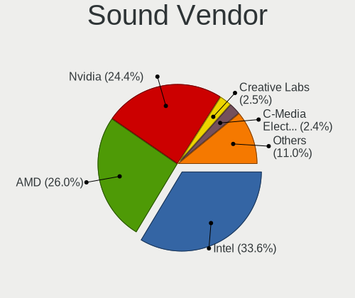

| Vendor                               | Desktops | Percent |
|--------------------------------------|----------|---------|
| Intel                                | 726      | 34.47%  |
| AMD                                  | 565      | 26.83%  |
| Nvidia                               | 527      | 25.02%  |
| Creative Labs                        | 69       | 3.28%   |
| C-Media Electronics                  | 50       | 2.37%   |
| Creative Technology                  | 19       | 0.9%    |
| VIA Technologies                     | 14       | 0.66%   |
| Texas Instruments                    | 11       | 0.52%   |
| Logitech                             | 11       | 0.52%   |
| JMTek                                | 9        | 0.43%   |
| GYROCOM C&C                          | 9        | 0.43%   |
| SAVITECH                             | 5        | 0.24%   |
| ASUSTek Computer                     | 5        | 0.24%   |
| Valve Software                       | 4        | 0.19%   |
| SteelSeries ApS                      | 4        | 0.19%   |
| Realtek Semiconductor                | 4        | 0.19%   |
| Plantronics                          | 4        | 0.19%   |
| Generalplus Technology               | 4        | 0.19%   |
| Dell                                 | 4        | 0.19%   |
| Razer USA                            | 3        | 0.14%   |
| PreSonus Audio Electronics           | 3        | 0.14%   |
| Kingston Technology                  | 3        | 0.14%   |
| Focusrite-Novation                   | 3        | 0.14%   |
| Corsair                              | 3        | 0.14%   |
| BEHRINGER International              | 3        | 0.14%   |
| XMOS                                 | 2        | 0.09%   |
| ULi Electronics                      | 2        | 0.09%   |
| Thesycon Systemsoftware & Consulting | 2        | 0.09%   |
| Sony                                 | 2        | 0.09%   |
| Samson Technologies                  | 2        | 0.09%   |
| RODE Microphones                     | 2        | 0.09%   |
| Giga-Byte Technology                 | 2        | 0.09%   |
| AudioQuest                           | 2        | 0.09%   |
| Vitana                               | 1        | 0.05%   |
| Unknown                              | 1        | 0.05%   |
| Turtle Beach                         | 1        | 0.05%   |
| Trust                                | 1        | 0.05%   |
| Superlux digit                       | 1        | 0.05%   |
| SM900T Microphone                    | 1        | 0.05%   |
| Sennheiser Communications            | 1        | 0.05%   |
| Roland                               | 1        | 0.05%   |
| ROCCAT                               | 1        | 0.05%   |
| Panasonic (Matsushita)               | 1        | 0.05%   |
| Nordic Semiconductor ASA             | 1        | 0.05%   |
| Nektar                               | 1        | 0.05%   |
| M-Audio                              | 1        | 0.05%   |
| KYE Systems (Mouse Systems)          | 1        | 0.05%   |
| Holtek Semiconductor                 | 1        | 0.05%   |
| Hewlett-Packard                      | 1        | 0.05%   |
| Guillemot                            | 1        | 0.05%   |
| FIFINE Microphones                   | 1        | 0.05%   |
| Ensoniq                              | 1        | 0.05%   |
| DCMT Technology                      | 1        | 0.05%   |
| Cambridge Audio                      | 1        | 0.05%   |
| Astro Gaming                         | 1        | 0.05%   |
| Asahi Kasei Microsystems             | 1        | 0.05%   |
| Applied Microsystems                 | 1        | 0.05%   |
| AOKEO                                | 1        | 0.05%   |
| AKAI Professional M.I.               | 1        | 0.05%   |
| Afatech                              | 1        | 0.05%   |

Sound Model
-----------

Sound card models

| Model                                                                             | Desktops | Percent |
|-----------------------------------------------------------------------------------|----------|---------|
| AMD SBx00 Azalia (Intel HDA)                                                      | 122      | 5.02%   |
| AMD Starship/Matisse HD Audio Controller                                          | 101      | 4.15%   |
| Intel 8 Series/C220 Series Chipset High Definition Audio Controller               | 98       | 4.03%   |
| AMD Family 17h (Models 00h-0fh) HD Audio Controller                               | 97       | 3.99%   |
| Intel 6 Series/C200 Series Chipset Family High Definition Audio Controller        | 78       | 3.21%   |
| Intel NM10/ICH7 Family High Definition Audio Controller                           | 77       | 3.17%   |
| Intel 7 Series/C216 Chipset Family High Definition Audio Controller               | 75       | 3.08%   |
| AMD Ellesmere HDMI Audio [Radeon RX 470/480 / 570/580/590]                        | 75       | 3.08%   |
| Intel Xeon E3-1200 v3/4th Gen Core Processor HD Audio Controller                  | 73       | 3%      |
| Intel 100 Series/C230 Series Chipset Family HD Audio Controller                   | 65       | 2.67%   |
| Nvidia GP107GL High Definition Audio Controller                                   | 53       | 2.18%   |
| AMD FCH Azalia Controller                                                         | 50       | 2.06%   |
| AMD Oland/Hainan/Cape Verde/Pitcairn HDMI Audio [Radeon HD 7000 Series]           | 49       | 2.01%   |
| Intel 200 Series PCH HD Audio                                                     | 44       | 1.81%   |
| Intel Cannon Lake PCH cAVS                                                        | 42       | 1.73%   |
| Nvidia GP106 High Definition Audio Controller                                     | 40       | 1.64%   |
| Nvidia GP104 High Definition Audio Controller                                     | 39       | 1.6%    |
| Intel 82801JD/DO (ICH10 Family) HD Audio Controller                               | 36       | 1.48%   |
| Nvidia High Definition Audio Controller                                           | 35       | 1.44%   |
| Intel 82801I (ICH9 Family) HD Audio Controller                                    | 35       | 1.44%   |
| AMD Family 17h/19h HD Audio Controller                                            | 35       | 1.44%   |
| Intel 82801JI (ICH10 Family) HD Audio Controller                                  | 33       | 1.36%   |
| Nvidia GK208 HDMI/DP Audio Controller                                             | 32       | 1.32%   |
| Nvidia MCP61 High Definition Audio                                                | 31       | 1.27%   |
| Nvidia GF108 High Definition Audio Controller                                     | 31       | 1.27%   |
| Nvidia GK107 HDMI Audio Controller                                                | 28       | 1.15%   |
| Intel 9 Series Chipset Family HD Audio Controller                                 | 27       | 1.11%   |
| AMD Raven/Raven2/Fenghuang HDMI/DP Audio Controller                               | 27       | 1.11%   |
| Nvidia GM107 High Definition Audio Controller [GeForce 940MX]                     | 26       | 1.07%   |
| AMD Navi 10 HDMI Audio                                                            | 24       | 0.99%   |
| Nvidia TU116 High Definition Audio Controller                                     | 23       | 0.95%   |
| AMD Baffin HDMI/DP Audio [Radeon RX 550 640SP / RX 560/560X]                      | 22       | 0.9%    |
| Intel 5 Series/3400 Series Chipset High Definition Audio                          | 20       | 0.82%   |
| Nvidia GF119 HDMI Audio Controller                                                | 19       | 0.78%   |
| Intel 82801H (ICH8 Family) HD Audio Controller                                    | 19       | 0.78%   |
| Nvidia TU104 HD Audio Controller                                                  | 17       | 0.7%    |
| Nvidia GP108 High Definition Audio Controller                                     | 17       | 0.7%    |
| Nvidia GM204 High Definition Audio Controller                                     | 17       | 0.7%    |
| Creative Labs Sound Core3D [Sound Blaster Recon3D / Z-Series]                     | 16       | 0.66%   |
| Nvidia GM206 High Definition Audio Controller                                     | 15       | 0.62%   |
| AMD Cedar HDMI Audio [Radeon HD 5400/6300/7300 Series]                            | 15       | 0.62%   |
| AMD Caicos HDMI Audio [Radeon HD 6450 / 7450/8450/8490 OEM / R5 230/235/235X OEM] | 15       | 0.62%   |
| Nvidia GK106 HDMI Audio Controller                                                | 14       | 0.58%   |
| Nvidia GK104 HDMI Audio Controller                                                | 14       | 0.58%   |
| AMD RV710/730 HDMI Audio [Radeon HD 4000 series]                                  | 13       | 0.53%   |
| AMD Navi 21/23 HDMI/DP Audio Controller                                           | 13       | 0.53%   |
| AMD Kabini HDMI/DP Audio                                                          | 13       | 0.53%   |
| Creative Labs EMU10k2/CA0100/CA0102/CA10200 [Sound Blaster Audigy Series]         | 12       | 0.49%   |
| AMD Juniper HDMI Audio [Radeon HD 5700 Series]                                    | 12       | 0.49%   |
| Intel C600/X79 series chipset High Definition Audio Controller                    | 11       | 0.45%   |
| Creative Labs EMU10k1 [Sound Blaster Live! Series]                                | 11       | 0.45%   |
| Creative Labs CA0106/CA0111 [SB Live!/Audigy/X-Fi Series]                         | 11       | 0.45%   |
| C-Media Electronics CMI8788 [Oxygen HD Audio]                                     | 11       | 0.45%   |
| Nvidia TU106 High Definition Audio Controller                                     | 10       | 0.41%   |
| AMD Trinity HDMI Audio Controller                                                 | 10       | 0.41%   |
| AMD Kaveri HDMI/DP Audio Controller                                               | 10       | 0.41%   |
| Nvidia GF116 High Definition Audio Controller                                     | 9        | 0.37%   |
| Texas Instruments PCM2902 Audio Codec                                             | 8        | 0.33%   |
| Nvidia MCP55 High Definition Audio                                                | 8        | 0.33%   |
| Intel Comet Lake PCH-V cAVS                                                       | 8        | 0.33%   |

Memory
------

Memory Vendor
-------------

Memory module vendors

| Vendor                       | Desktops | Percent |
|------------------------------|----------|---------|
| Unknown                      | 193      | 23.39%  |
| Kingston                     | 150      | 18.18%  |
| GOODRAM                      | 69       | 8.36%   |
| Samsung Electronics          | 64       | 7.76%   |
| G.Skill                      | 63       | 7.64%   |
| SK Hynix                     | 60       | 7.27%   |
| Crucial                      | 51       | 6.18%   |
| Corsair                      | 49       | 5.94%   |
| Patriot                      | 23       | 2.79%   |
| Micron Technology            | 17       | 2.06%   |
| A-DATA Technology            | 14       | 1.7%    |
| Nanya Technology             | 13       | 1.58%   |
| Elpida                       | 9        | 1.09%   |
| GeIL                         | 8        | 0.97%   |
| Wilk Elektronik              | 7        | 0.85%   |
| Apacer                       | 5        | 0.61%   |
| Unknown                      | 4        | 0.48%   |
| Unknown (ABCD)               | 3        | 0.36%   |
| OCZ                          | 3        | 0.36%   |
| Wilk                         | 2        | 0.24%   |
| Silicon Power                | 2        | 0.24%   |
| Qimonda                      | 2        | 0.24%   |
| Patriot Memory (PDP Systems) | 2        | 0.24%   |
| ASint Technology             | 2        | 0.24%   |
| Unifosa                      | 1        | 0.12%   |
| Transcend                    | 1        | 0.12%   |
| Tigo                         | 1        | 0.12%   |
| Team                         | 1        | 0.12%   |
| Ramaxel Technology           | 1        | 0.12%   |
| ISD Technology Limited       | 1        | 0.12%   |
| Golden Empire                | 1        | 0.12%   |
| AMD                          | 1        | 0.12%   |
| AENEON                       | 1        | 0.12%   |
| 48spaces                     | 1        | 0.12%   |

Memory Model
------------

Memory module models

| Model                                                              | Desktops | Percent |
|--------------------------------------------------------------------|----------|---------|
| Unknown RAM Module 2048MB DIMM 800MT/s                             | 18       | 1.88%   |
| Unknown RAM Module 4096MB DIMM 1333MT/s                            | 13       | 1.36%   |
| Unknown RAM Module 2048MB DIMM 1333MT/s                            | 12       | 1.26%   |
| Patriot RAM 3200 C16 Series 16GB DIMM DDR4 3200MT/s                | 10       | 1.05%   |
| G.Skill RAM F4-3200C16-8GVKB 8192MB DIMM DDR4 3200MT/s             | 9        | 0.94%   |
| G.Skill RAM F4-3000C16-8GISB 8192MB DIMM DDR4 3200MT/s             | 9        | 0.94%   |
| Unknown RAM Module 2GB DIMM 800MT/s                                | 8        | 0.84%   |
| Unknown RAM Module 1024MB DIMM 800MT/s                             | 8        | 0.84%   |
| Kingston RAM KHX1600C9D3/4GX 4GB DIMM DDR3 2400MT/s                | 8        | 0.84%   |
| GOODRAM RAM GR1600D364L11/8G 8GB DIMM DDR3 1600MT/s                | 8        | 0.84%   |
| GOODRAM RAM GR1333D364L9/4G 4GB DIMM DDR3 1600MT/s                 | 8        | 0.84%   |
| Unknown RAM Module 2GB DIMM DDR2 800MT/s                           | 7        | 0.73%   |
| Unknown RAM Module 2048MB DIMM SDRAM                               | 7        | 0.73%   |
| Kingston RAM KHX2400C15/8G 8GB DIMM DDR4 2933MT/s                  | 7        | 0.73%   |
| Kingston RAM KHX2133C14D4/4G 4096MB DIMM DDR4 2933MT/s             | 7        | 0.73%   |
| Unknown RAM Module 2GB DIMM SDRAM                                  | 6        | 0.63%   |
| Unknown RAM Module 2GB DIMM 1333MT/s                               | 6        | 0.63%   |
| Kingston RAM KHX3200C16D4/8GX 8GB DIMM DDR4 3533MT/s               | 6        | 0.63%   |
| Kingston RAM KHX3200C16D4/32GX 32GB DIMM DDR4 3200MT/s             | 6        | 0.63%   |
| Kingston RAM KHX2133C14D4/8G 8GB DIMM DDR4 2667MT/s                | 6        | 0.63%   |
| Crucial RAM BLS8G3D1609DS1S00. 8GB DIMM DDR3 1600MT/s              | 6        | 0.63%   |
| Unknown RAM Module 4GB DIMM 1333MT/s                               | 5        | 0.52%   |
| Unknown RAM Module 2048MB DIMM DDR2 800MT/s                        | 5        | 0.52%   |
| Unknown RAM Module 2048MB DIMM DDR 667MT/s                         | 5        | 0.52%   |
| Unknown RAM Module 2048MB DIMM 667MT/s                             | 5        | 0.52%   |
| Unknown RAM Module 1GB DIMM 800MT/s                                | 5        | 0.52%   |
| Unknown RAM Module 1024MB DIMM SDRAM                               | 5        | 0.52%   |
| Unknown RAM Module 1024MB DIMM 667MT/s                             | 5        | 0.52%   |
| SK Hynix RAM HMT351U6CFR8C-PB 4GB DIMM DDR3 1800MT/s               | 5        | 0.52%   |
| Samsung RAM M378B5673FH0-CH9 2GB DIMM DDR3 1600MT/s                | 5        | 0.52%   |
| Samsung RAM M378B5173QH0-CK0 4GB DIMM DDR3 1866MT/s                | 5        | 0.52%   |
| Kingston RAM KHX2666C16/8G 8GB DIMM DDR4 3466MT/s                  | 5        | 0.52%   |
| Kingston RAM KHX1600C10D3/8G 8GB DIMM DDR3 1600MT/s                | 5        | 0.52%   |
| Kingston RAM 9905403-559.A00LF 8GB DIMM DDR3 1600MT/s              | 5        | 0.52%   |
| Wilk Elektronik RAM IRP3600D4V64L17/16G 16384MB DIMM DDR4 3600MT/s | 4        | 0.42%   |
| Unknown RAM 3000 C16 Series 8192MB DIMM DDR4 2133MT/s              | 4        | 0.42%   |
| SK Hynix RAM HMT451U6BFR8C-PB 4096MB DIMM DDR3 1600MT/s            | 4        | 0.42%   |
| Samsung RAM M378B5773CH0-CH9 2GB DIMM SDRAM 1867MT/s               | 4        | 0.42%   |
| Kingston RAM KHX3200C16D4/16GX 16384MB DIMM DDR4 3600MT/s          | 4        | 0.42%   |
| Kingston RAM KHX2666C15D4/4G 4096MB DIMM DDR4 3200MT/s             | 4        | 0.42%   |
| Kingston RAM KHX2666C13/16GX 16GB DIMM DDR4 3200MT/s               | 4        | 0.42%   |
| Kingston RAM KHX2133C14/8G 8192MB DIMM DDR4 2400MT/s               | 4        | 0.42%   |
| GOODRAM RAM IR2400D464L15S/4G 4GB DIMM DDR4 2400MT/s               | 4        | 0.42%   |
| GeIL RAM CL11-11-11 D3-1600 8GB DIMM DDR3 1600MT/s                 | 4        | 0.42%   |
| Crucial RAM BL8G36C16U4B.M8FE1 8GB DIMM DDR4 3733MT/s              | 4        | 0.42%   |
| Corsair RAM CMK32GX4M4A2666C16 8GB DIMM DDR4 2667MT/s              | 4        | 0.42%   |
| Corsair RAM CMK16GX4M2B3200C16 8GB DIMM DDR4 3600MT/s              | 4        | 0.42%   |
| Corsair RAM CMK16GX4M2B3000C15 8GB DIMM DDR4 3000MT/s              | 4        | 0.42%   |
| Unknown                                                            | 4        | 0.42%   |
| Wilk Elektronik RAM IRP3600D4V64L17S/8G 8GB DIMM DDR4 3600MT/s     | 3        | 0.31%   |
| Unknown RAM Module 8GB DIMM DDR3 1600MT/s                          | 3        | 0.31%   |
| Unknown RAM Module 4GB DIMM 1600MT/s                               | 3        | 0.31%   |
| Unknown RAM Module 4096MB DIMM DDR3 1333MT/s                       | 3        | 0.31%   |
| Unknown RAM Module 2048MB DIMM DDR2 667MT/s                        | 3        | 0.31%   |
| Unknown RAM Module 2048MB DIMM 400MT/s                             | 3        | 0.31%   |
| Unknown RAM Module 1GB DIMM 667MT/s                                | 3        | 0.31%   |
| Unknown RAM Module 1024MB DIMM 400MT/s                             | 3        | 0.31%   |
| Unknown (ABCD) RAM 123456789012345678 8GB DIMM DDR4 2400MT/s       | 3        | 0.31%   |
| SK Hynix RAM HMT451U6AFR8C-PB 4096MB DIMM DDR3 1600MT/s            | 3        | 0.31%   |
| SK Hynix RAM HMT41GS6BFR8A-PB 8GB SODIMM DDR3 1600MT/s             | 3        | 0.31%   |

Memory Kind
-----------

Memory module kinds

| Kind    | Desktops | Percent |
|---------|----------|---------|
| DDR4    | 273      | 37.09%  |
| DDR3    | 234      | 31.79%  |
| Unknown | 108      | 14.67%  |
| DDR2    | 57       | 7.74%   |
| SDRAM   | 43       | 5.84%   |
| DDR     | 17       | 2.31%   |
| LPDDR4  | 3        | 0.41%   |
| DRAM    | 1        | 0.14%   |

Memory Form Factor
------------------

Physical design of the memory module

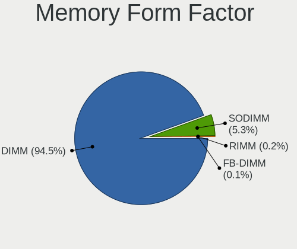

| Name   | Desktops | Percent |
|--------|----------|---------|
| DIMM   | 699      | 96.95%  |
| SODIMM | 22       | 3.05%   |

Memory Size
-----------

Memory module size

| Size  | Desktops | Percent |
|-------|----------|---------|
| 8192  | 241      | 29.35%  |
| 4096  | 193      | 23.51%  |
| 2048  | 185      | 22.53%  |
| 16384 | 76       | 9.26%   |
| 1024  | 72       | 8.77%   |
| 32768 | 35       | 4.26%   |
| 512   | 16       | 1.95%   |
| 1536  | 1        | 0.12%   |
| 256   | 1        | 0.12%   |
| 64    | 1        | 0.12%   |

Memory Speed
------------

Memory module speed

| Speed   | Desktops | Percent |
|---------|----------|---------|
| 1600    | 149      | 18.26%  |
| 1333    | 95       | 11.64%  |
| 3200    | 79       | 9.68%   |
| 800     | 77       | 9.44%   |
| 2400    | 49       | 6%      |
| 3600    | 42       | 5.15%   |
| 667     | 39       | 4.78%   |
| 2667    | 30       | 3.68%   |
| 2933    | 20       | 2.45%   |
| 3000    | 19       | 2.33%   |
| Unknown | 19       | 2.33%   |
| 3466    | 18       | 2.21%   |
| 2133    | 18       | 2.21%   |
| 1867    | 15       | 1.84%   |
| 1067    | 14       | 1.72%   |
| 1066    | 14       | 1.72%   |
| 1800    | 11       | 1.35%   |
| 400     | 11       | 1.35%   |
| 1866    | 10       | 1.23%   |
| 3733    | 9        | 1.1%    |
| 533     | 9        | 1.1%    |
| 3800    | 7        | 0.86%   |
| 3533    | 6        | 0.74%   |
| 1334    | 6        | 0.74%   |
| 3400    | 4        | 0.49%   |
| 2800    | 4        | 0.49%   |
| 2666    | 4        | 0.49%   |
| 333     | 4        | 0.49%   |
| 49926   | 3        | 0.37%   |
| 2000    | 3        | 0.37%   |
| 3866    | 2        | 0.25%   |
| 3333    | 2        | 0.25%   |
| 3066    | 2        | 0.25%   |
| 1639    | 2        | 0.25%   |
| 1332    | 2        | 0.25%   |
| 266     | 2        | 0.25%   |
| 41632   | 1        | 0.12%   |
| 33859   | 1        | 0.12%   |
| 19791   | 1        | 0.12%   |
| 4800    | 1        | 0.12%   |
| 4400    | 1        | 0.12%   |
| 4266    | 1        | 0.12%   |
| 4000    | 1        | 0.12%   |
| 3334    | 1        | 0.12%   |
| 3151    | 1        | 0.12%   |
| 2200    | 1        | 0.12%   |
| 2176    | 1        | 0.12%   |
| 2132    | 1        | 0.12%   |
| 2048    | 1        | 0.12%   |
| 1162    | 1        | 0.12%   |
| 200     | 1        | 0.12%   |
| 66      | 1        | 0.12%   |

Printers & scanners
-------------------

Printer Vendor
--------------

Printer device vendors

| Vendor                | Desktops | Percent |
|-----------------------|----------|---------|
| Hewlett-Packard       | 29       | 44.62%  |
| Brother Industries    | 10       | 15.38%  |
| Samsung Electronics   | 9        | 13.85%  |
| Prolific Technology   | 5        | 7.69%   |
| Canon                 | 5        | 7.69%   |
| Seiko Epson           | 4        | 6.15%   |
| Zebra                 | 1        | 1.54%   |
| Xerox                 | 1        | 1.54%   |
| Lexmark International | 1        | 1.54%   |

Printer Model
-------------

Printer device models

| Model                                  | Desktops | Percent |
|----------------------------------------|----------|---------|
| Prolific PL2305 Parallel Port          | 5        | 7.58%   |
| HP LaserJet 1020                       | 3        | 4.55%   |
| Canon iP7200 series                    | 3        | 4.55%   |
| Samsung ML-216x Series Laser Printer   | 2        | 3.03%   |
| Samsung ML-2010P Mono Laser Printer    | 2        | 3.03%   |
| HP LaserJet M14-M17                    | 2        | 3.03%   |
| HP Deskjet F4500 series                | 2        | 3.03%   |
| HP DeskJet 845c                        | 2        | 3.03%   |
| HP DeskJet 3700 series                 | 2        | 3.03%   |
| HP Deskjet 1050 J410                   | 2        | 3.03%   |
| Brother DCP-J105                       | 2        | 3.03%   |
| Zebra LP2844 Printer                   | 1        | 1.52%   |
| Xerox WorkCentre PE16                  | 1        | 1.52%   |
| Seiko Epson Stylus NX230/SX235W Series | 1        | 1.52%   |
| Seiko Epson L405 Series                | 1        | 1.52%   |
| Seiko Epson L1110 Series               | 1        | 1.52%   |
| Seiko Epson ET-2710 Series             | 1        | 1.52%   |
| Samsung SCX-4300 Series                | 1        | 1.52%   |
| Samsung SCX-4200 series                | 1        | 1.52%   |
| Samsung SCX-3400 Series                | 1        | 1.52%   |
| Samsung ML-3050/ML-3051 Laser Printer  | 1        | 1.52%   |
| Samsung ML-2540 Series Laser Printer   | 1        | 1.52%   |
| Lexmark International Lexmark E352dn   | 1        | 1.52%   |
| HP Smart Tank 510 series               | 1        | 1.52%   |
| HP Printing Support                    | 1        | 1.52%   |
| HP LaserJet P2015 series               | 1        | 1.52%   |
| HP LaserJet P1102                      | 1        | 1.52%   |
| HP LaserJet M101-M106                  | 1        | 1.52%   |
| HP LaserJet 3030                       | 1        | 1.52%   |
| HP LaserJet 1320                       | 1        | 1.52%   |
| HP LaserJet 1022                       | 1        | 1.52%   |
| HP DeskJet F4100 Printer series        | 1        | 1.52%   |
| HP DeskJet 840c                        | 1        | 1.52%   |
| HP DeskJet 4530 series                 | 1        | 1.52%   |
| HP DeskJet 2600 series                 | 1        | 1.52%   |
| HP Deskjet 2540 series                 | 1        | 1.52%   |
| HP DeskJet 2130 series                 | 1        | 1.52%   |
| HP Deskjet 2050 J510                   | 1        | 1.52%   |
| HP Color LaserJet CP1215               | 1        | 1.52%   |
| Canon TS3100 series                    | 1        | 1.52%   |
| Canon iP4800 series                    | 1        | 1.52%   |
| Canon G1010 series                     | 1        | 1.52%   |
| Brother HL-5150D series                | 1        | 1.52%   |
| Brother DCP-T500W                      | 1        | 1.52%   |
| Brother DCP-L2540DN                    | 1        | 1.52%   |
| Brother DCP-J525W                      | 1        | 1.52%   |
| Brother DCP-9020CDW                    | 1        | 1.52%   |
| Brother DCP-7055W                      | 1        | 1.52%   |
| Brother DCP-7030                       | 1        | 1.52%   |
| Brother DCP-1610W                      | 1        | 1.52%   |

Scanner Vendor
--------------

Scanner device vendors

| Vendor                      | Desktops | Percent |
|-----------------------------|----------|---------|
| Canon                       | 7        | 58.33%  |
| Seiko Epson                 | 2        | 16.67%  |
| Ultima Electronics          | 1        | 8.33%   |
| Plustek                     | 1        | 8.33%   |
| Acer Peripherals (now BenQ) | 1        | 8.33%   |

Scanner Model
-------------

Scanner device models

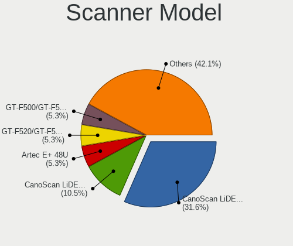

| Model                                                    | Desktops | Percent |
|----------------------------------------------------------|----------|---------|
| Canon CanoScan LiDE 210                                  | 3        | 25%     |
| Ultima Artec E+ 48U                                      | 1        | 8.33%   |
| Seiko Epson GT-F520/GT-F570 [Perfection 3590 PHOTO]      | 1        | 8.33%   |
| Seiko Epson GT-F500/GT-F550 [Perfection 2480/2580 PHOTO] | 1        | 8.33%   |
| Plustek OpticPro 1248U Scanner #2                        | 1        | 8.33%   |
| Canon CanoScan N670U/N676U/LiDE 20                       | 1        | 8.33%   |
| Canon CanoScan LIDE 25                                   | 1        | 8.33%   |
| Canon CanoScan LiDE 120                                  | 1        | 8.33%   |
| Canon CanoScan LiDE 110                                  | 1        | 8.33%   |
| Acer Peripherals (now BenQ) S2W 3300U/4300U              | 1        | 8.33%   |

Camera
------

Camera Vendor
-------------

Camera device vendors

| Vendor                        | Desktops | Percent |
|-------------------------------|----------|---------|
| Logitech                      | 52       | 31.33%  |
| Creative Technology           | 21       | 12.65%  |
| Microdia                      | 16       | 9.64%   |
| Microsoft                     | 12       | 7.23%   |
| Samsung Electronics           | 9        | 5.42%   |
| Z-Star Microelectronics       | 6        | 3.61%   |
| Hewlett-Packard               | 5        | 3.01%   |
| Cubeternet                    | 5        | 3.01%   |
| Aveo Technology               | 4        | 2.41%   |
| Xiongmai                      | 3        | 1.81%   |
| Generalplus Technology        | 3        | 1.81%   |
| GEMBIRD                       | 3        | 1.81%   |
| Chicony Electronics           | 3        | 1.81%   |
| Valve Software                | 2        | 1.2%    |
| Pixart Imaging                | 2        | 1.2%    |
| LG Electronics                | 2        | 1.2%    |
| Jieli Technology              | 2        | 1.2%    |
| Apple                         | 2        | 1.2%    |
| Alcor Micro                   | 2        | 1.2%    |
| YJX                           | 1        | 0.6%    |
| Trust                         | 1        | 0.6%    |
| Sunplus Innovation Technology | 1        | 0.6%    |
| Realtek Semiconductor         | 1        | 0.6%    |
| Razer USA                     | 1        | 0.6%    |
| MacroSilicon                  | 1        | 0.6%    |
| KYE Systems (Mouse Systems)   | 1        | 0.6%    |
| Huawei Technologies           | 1        | 0.6%    |
| Google                        | 1        | 0.6%    |
| Etron Technology              | 1        | 0.6%    |
| Asuscom Network               | 1        | 0.6%    |
| Arkmicro Technologies         | 1        | 0.6%    |

Camera Model
------------

Camera device models

| Model                                                 | Desktops | Percent |
|-------------------------------------------------------|----------|---------|
| Creative Live! Cam Sync HD [VF0770]                   | 12       | 7.23%   |
| Logitech Webcam C270                                  | 11       | 6.63%   |
| Logitech HD Pro Webcam C920                           | 9        | 5.42%   |
| Samsung Galaxy A5 (MTP)                               | 8        | 4.82%   |
| Logitech Webcam C310                                  | 7        | 4.22%   |
| Logitech Webcam C170                                  | 5        | 3.01%   |
| Z-Star Venus USB2.0 Camera                            | 4        | 2.41%   |
| Microsoft LifeCam HD-3000                             | 4        | 2.41%   |
| Microdia Sonix USB 2.0 Camera                         | 4        | 2.41%   |
| Cubeternet USB2.0 Camera                              | 4        | 2.41%   |
| Creative Live! Cam Chat HD [VF0700]                   | 4        | 2.41%   |
| Xiongmai web camera                                   | 3        | 1.81%   |
| Microdia Webcam Vitade AF                             | 3        | 1.81%   |
| Microdia USB 2.0 Camera                               | 3        | 1.81%   |
| Microdia Laptop_Integrated_Webcam_FHD                 | 3        | 1.81%   |
| Logitech Webcam C120                                  | 3        | 1.81%   |
| HP Webcam HD 2300                                     | 3        | 1.81%   |
| Generalplus GENERAL WEBCAM                            | 3        | 1.81%   |
| GEMBIRD Generic UVC 1.00 camera [AppoTech AX2311]     | 3        | 1.81%   |
| Aveo USB2.0 Camera                                    | 3        | 1.81%   |
| Valve Software 3D Camera                              | 2        | 1.2%    |
| Pixart Imaging USB2.0_Camera                          | 2        | 1.2%    |
| Microsoft LifeCam VX-500 [1357]                       | 2        | 1.2%    |
| Microsoft LifeCam NX-6000                             | 2        | 1.2%    |
| Microsoft LifeCam HD-5000                             | 2        | 1.2%    |
| Microdia Camera                                       | 2        | 1.2%    |
| Logitech StreamCam                                    | 2        | 1.2%    |
| Logitech QuickCam Pro 9000                            | 2        | 1.2%    |
| Jieli USB PHY 2.0                                     | 2        | 1.2%    |
| Creative Live! Cam Sync 1080p                         | 2        | 1.2%    |
| Creative Live! Cam Optia                              | 2        | 1.2%    |
| Chicony FULL HD 5MP Webcam                            | 2        | 1.2%    |
| Apple iPhone 5/5C/5S/6/SE                             | 2        | 1.2%    |
| Alcor Micro USB 2.0 PC Camera                         | 2        | 1.2%    |
| Z-Star Vimicro USB Camera (Altair)                    | 1        | 0.6%    |
| Z-Star Integrated Camera                              | 1        | 0.6%    |
| YJX USB Camera                                        | 1        | 0.6%    |
| Trust USB Camera                                      | 1        | 0.6%    |
| Sunplus Full HD webcam                                | 1        | 0.6%    |
| Samsung Galaxy (PTP mode)                             | 1        | 0.6%    |
| Realtek FULL HD 1080P Webcam                          | 1        | 0.6%    |
| Razer USA Gaming Webcam [Kiyo]                        | 1        | 0.6%    |
| Microsoft Microsoft LifeCam Studio                  | 1        | 0.6%    |
| Microsoft Kinect for Windows NUI Camera               | 1        | 0.6%    |
| Microdia Defender G-Lens 2577 HD720p Camera           | 1        | 0.6%    |
| MacroSilicon USB Video                                | 1        | 0.6%    |
| Logitech Webcam Pro 9000                              | 1        | 0.6%    |
| Logitech Webcam C930e                                 | 1        | 0.6%    |
| Logitech Webcam C250                                  | 1        | 0.6%    |
| Logitech Webcam C200                                  | 1        | 0.6%    |
| Logitech Webcam B500                                  | 1        | 0.6%    |
| Logitech QuickCam Vision Pro                          | 1        | 0.6%    |
| Logitech Quickcam 3000 For Business                   | 1        | 0.6%    |
| Logitech Logitech Webcam C100                         | 1        | 0.6%    |
| Logitech HD Webcam C615                               | 1        | 0.6%    |
| Logitech HD Webcam C525                               | 1        | 0.6%    |
| Logitech C922 Pro Stream Webcam                       | 1        | 0.6%    |
| Logitech C920 PRO HD Webcam                           | 1        | 0.6%    |
| Logitech C505 HD Webcam                               | 1        | 0.6%    |
| LG LM-X420xxx/G2/G3 Android Phone (MTP/download mode) | 1        | 0.6%    |

Security
--------

Fingerprint Vendor
------------------

Fingerprint sensor vendors

| Vendor                | Desktops | Percent |
|-----------------------|----------|---------|
| STMicroelectronics    | 1        | 33.33%  |
| Elan Microelectronics | 1        | 33.33%  |
| AuthenTec             | 1        | 33.33%  |

Fingerprint Model
-----------------

Fingerprint sensor models

| Model                                       | Desktops | Percent |
|---------------------------------------------|----------|---------|
| STMicroelectronics Fingerprint Reader       | 1        | 33.33%  |
| Elan fingerprint sensor [FeinTech FPS00200] | 1        | 33.33%  |
| AuthenTec AES1600                           | 1        | 33.33%  |

Chipcard Vendor
---------------

Chipcard module vendors

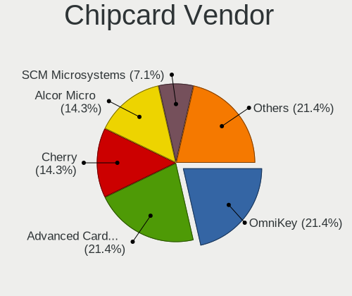

| Vendor                | Desktops | Percent |
|-----------------------|----------|---------|
| OmniKey               | 2        | 28.57%  |
| SCM Microsystems      | 1        | 14.29%  |
| Gemalto (was Gemplus) | 1        | 14.29%  |
| Cherry                | 1        | 14.29%  |
| Alcor Micro           | 1        | 14.29%  |
| Advanced Card Systems | 1        | 14.29%  |

Chipcard Model
--------------

Chipcard module models

| Model                                            | Desktops | Percent |
|--------------------------------------------------|----------|---------|
| OmniKey CardMan 3021 / 3121                      | 2        | 28.57%  |
| SCM Microsystems SCR333 SmartCard Reader         | 1        | 14.29%  |
| Gemalto (was Gemplus) GemPC Key SmartCard Reader | 1        | 14.29%  |
| Cherry SmartCard Reader Keyboard KC 1000 SC      | 1        | 14.29%  |
| Alcor Micro Watchdata W 1981                     | 1        | 14.29%  |
| Advanced Card Systems ACR39U                     | 1        | 14.29%  |

Unsupported
-----------

Unsupported Devices
-------------------

Total unsupported devices on board

| Total | Desktops | Percent |
|-------|----------|---------|
| 0     | 1110     | 86.25%  |
| 1     | 158      | 12.28%  |
| 2     | 14       | 1.09%   |
| 3     | 3        | 0.23%   |
| 4     | 2        | 0.16%   |

Unsupported Device Types
------------------------

Types of unsupported devices

| Type                     | Desktops | Percent |
|--------------------------|----------|---------|
| Graphics card            | 77       | 40.1%   |
| Net/wireless             | 34       | 17.71%  |
| Communication controller | 16       | 8.33%   |
| Multimedia controller    | 13       | 6.77%   |
| Unassigned class         | 9        | 4.69%   |
| Sound                    | 7        | 3.65%   |
| Camera                   | 7        | 3.65%   |
| Storage/ide              | 4        | 2.08%   |
| Network                  | 4        | 2.08%   |
| Chipcard                 | 4        | 2.08%   |
| Bluetooth                | 4        | 2.08%   |
| Storage/raid             | 3        | 1.56%   |
| Fingerprint reader       | 3        | 1.56%   |
| Storage                  | 2        | 1.04%   |
| Net/ethernet             | 2        | 1.04%   |
| Modem                    | 1        | 0.52%   |
| Firewire controller      | 1        | 0.52%   |
| Dvb card                 | 1        | 0.52%   |

