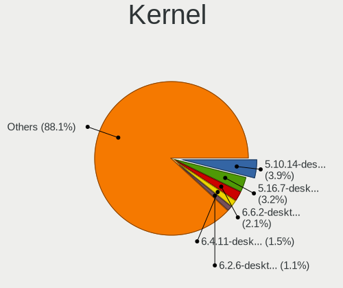
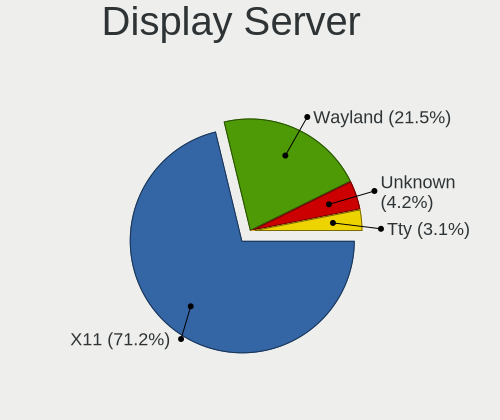
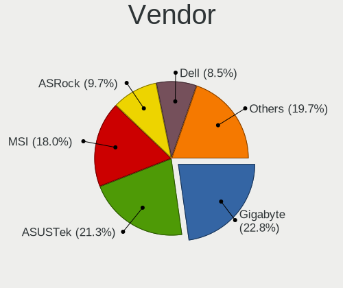
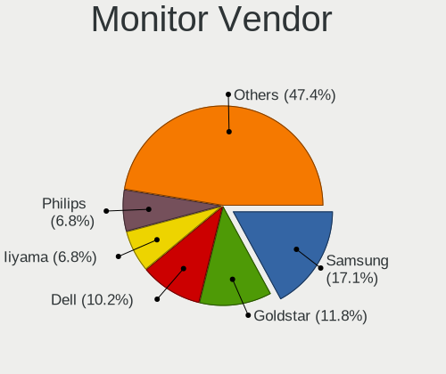
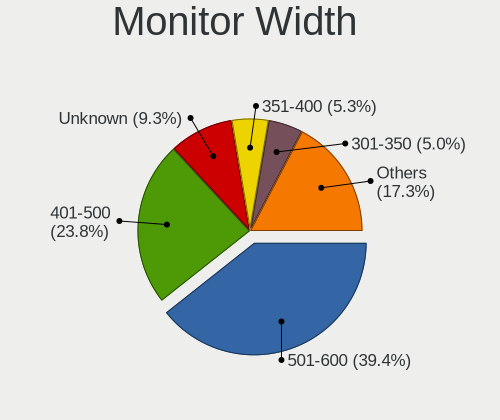
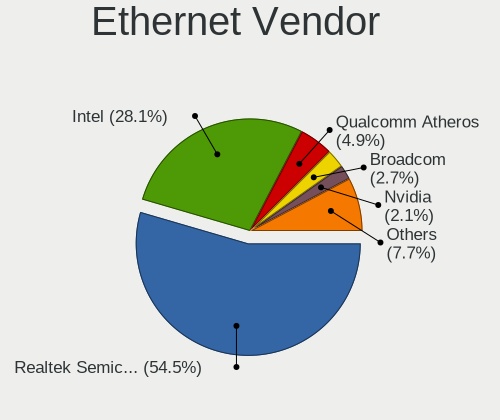
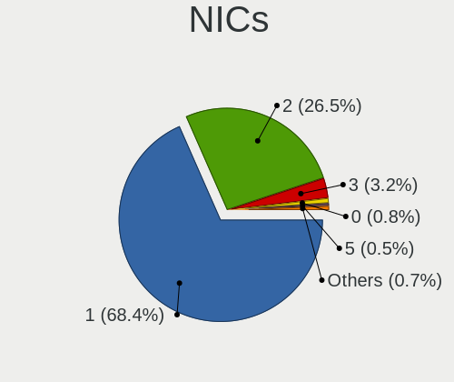

Linux in Poland - Tested Hardware & Statistics (Desktops)
---------------------------------------------------------

A project to collect tested hardware configurations for Linux in Poland.

Anyone can contribute to this report by the [hw-probe](https://github.com/linuxhw/hw-probe) tool:

    sudo -E hw-probe -all -upload

Please contribute! Especially if your hardware is rare.

Contents
--------

* [ Test Cases ](#test-cases)

* [ System ](#system)
  - [ OS                       ](#os)
  - [ OS Family                ](#os-family)
  - [ Kernel                   ](#kernel)
  - [ Kernel Family            ](#kernel-family)
  - [ Kernel Major Ver.        ](#kernel-major-ver)
  - [ Arch                     ](#arch)
  - [ DE                       ](#de)
  - [ Display Server           ](#display-server)
  - [ Display Manager          ](#display-manager)
  - [ OS Lang                  ](#os-lang)
  - [ Boot Mode                ](#boot-mode)
  - [ Filesystem               ](#filesystem)
  - [ Part. scheme             ](#part-scheme)
  - [ Dual Boot with Linux/BSD ](#dual-boot-with-linuxbsd)
  - [ Dual Boot (Win)          ](#dual-boot-win)

* [ Board ](#board)
  - [ Vendor                   ](#vendor)
  - [ Model                    ](#model)
  - [ Model Family             ](#model-family)
  - [ MFG Year                 ](#mfg-year)
  - [ Form Factor              ](#form-factor)
  - [ Secure Boot              ](#secure-boot)
  - [ Coreboot                 ](#coreboot)
  - [ RAM Size                 ](#ram-size)
  - [ RAM Used                 ](#ram-used)
  - [ Total Drives             ](#total-drives)
  - [ Has CD-ROM               ](#has-cd-rom)
  - [ Has Ethernet             ](#has-ethernet)
  - [ Has WiFi                 ](#has-wifi)
  - [ Has Bluetooth            ](#has-bluetooth)

* [ Location ](#location)
  - [ Country                  ](#country)
  - [ City                     ](#city)

* [ Drives ](#drives)
  - [ Drive Vendor             ](#drive-vendor)
  - [ Drive Model              ](#drive-model)
  - [ HDD Vendor               ](#hdd-vendor)
  - [ SSD Vendor               ](#ssd-vendor)
  - [ Drive Kind               ](#drive-kind)
  - [ Drive Connector          ](#drive-connector)
  - [ Drive Size               ](#drive-size)
  - [ Space Total              ](#space-total)
  - [ Space Used               ](#space-used)
  - [ Malfunc. Drives          ](#malfunc-drives)
  - [ Malfunc. Drive Vendor    ](#malfunc-drive-vendor)
  - [ Malfunc. HDD Vendor      ](#malfunc-hdd-vendor)
  - [ Malfunc. Drive Kind      ](#malfunc-drive-kind)
  - [ Failed Drives            ](#failed-drives)
  - [ Failed Drive Vendor      ](#failed-drive-vendor)
  - [ Drive Status             ](#drive-status)

* [ Storage controller ](#storage-controller)
  - [ Storage Vendor           ](#storage-vendor)
  - [ Storage Model            ](#storage-model)
  - [ Storage Kind             ](#storage-kind)

* [ Processor ](#processor)
  - [ CPU Vendor               ](#cpu-vendor)
  - [ CPU Model                ](#cpu-model)
  - [ CPU Model Family         ](#cpu-model-family)
  - [ CPU Cores                ](#cpu-cores)
  - [ CPU Sockets              ](#cpu-sockets)
  - [ CPU Threads              ](#cpu-threads)
  - [ CPU Op-Modes             ](#cpu-op-modes)
  - [ CPU Microcode            ](#cpu-microcode)
  - [ CPU Microarch            ](#cpu-microarch)

* [ Graphics ](#graphics)
  - [ GPU Vendor               ](#gpu-vendor)
  - [ GPU Model                ](#gpu-model)
  - [ GPU Combo                ](#gpu-combo)
  - [ GPU Driver               ](#gpu-driver)
  - [ GPU Memory               ](#gpu-memory)

* [ Monitor ](#monitor)
  - [ Monitor Vendor           ](#monitor-vendor)
  - [ Monitor Model            ](#monitor-model)
  - [ Monitor Resolution       ](#monitor-resolution)
  - [ Monitor Diagonal         ](#monitor-diagonal)
  - [ Monitor Width            ](#monitor-width)
  - [ Aspect Ratio             ](#aspect-ratio)
  - [ Monitor Area             ](#monitor-area)
  - [ Pixel Density            ](#pixel-density)
  - [ Multiple Monitors        ](#multiple-monitors)

* [ Network ](#network)
  - [ Net Controller Vendor    ](#net-controller-vendor)
  - [ Net Controller Model     ](#net-controller-model)
  - [ Wireless Vendor          ](#wireless-vendor)
  - [ Wireless Model           ](#wireless-model)
  - [ Ethernet Vendor          ](#ethernet-vendor)
  - [ Ethernet Model           ](#ethernet-model)
  - [ Net Controller Kind      ](#net-controller-kind)
  - [ Used Controller          ](#used-controller)
  - [ NICs                     ](#nics)
  - [ IPv6                     ](#ipv6)

* [ Bluetooth ](#bluetooth)
  - [ Bluetooth Vendor         ](#bluetooth-vendor)
  - [ Bluetooth Model          ](#bluetooth-model)

* [ Sound ](#sound)
  - [ Sound Vendor             ](#sound-vendor)
  - [ Sound Model              ](#sound-model)

* [ Memory ](#memory)
  - [ Memory Vendor            ](#memory-vendor)
  - [ Memory Model             ](#memory-model)
  - [ Memory Kind              ](#memory-kind)
  - [ Memory Form Factor       ](#memory-form-factor)
  - [ Memory Size              ](#memory-size)
  - [ Memory Speed             ](#memory-speed)

* [ Printers & scanners ](#printers--scanners)
  - [ Printer Vendor           ](#printer-vendor)
  - [ Printer Model            ](#printer-model)
  - [ Scanner Vendor           ](#scanner-vendor)
  - [ Scanner Model            ](#scanner-model)

* [ Camera ](#camera)
  - [ Camera Vendor            ](#camera-vendor)
  - [ Camera Model             ](#camera-model)

* [ Security ](#security)
  - [ Fingerprint Vendor       ](#fingerprint-vendor)
  - [ Fingerprint Model        ](#fingerprint-model)
  - [ Chipcard Vendor          ](#chipcard-vendor)
  - [ Chipcard Model           ](#chipcard-model)

* [ Unsupported ](#unsupported)
  - [ Unsupported Devices      ](#unsupported-devices)
  - [ Unsupported Device Types ](#unsupported-device-types)

Test Cases
----------

Total: 2592

| Vendor        | Model                       | Probe                                                      | Date         |
|---------------|-----------------------------|------------------------------------------------------------|--------------|
| Gigabyte      | B365M DS3H                  | [d515d5d9f7](https://linux-hardware.org/?probe=d515d5d9f7) | Feb 01, 2023 |
| Gigabyte      | X670 AORUS ELITE AX         | [4e438c4768](https://linux-hardware.org/?probe=4e438c4768) | Jan 31, 2023 |
| Gigabyte      | X670 AORUS ELITE AX         | [66459fc07c](https://linux-hardware.org/?probe=66459fc07c) | Jan 31, 2023 |
| ASUSTek       | Maximus VII GENE            | [c936c07925](https://linux-hardware.org/?probe=c936c07925) | Jan 31, 2023 |
| Gigabyte      | Z97M-DS3H                   | [360dc83e04](https://linux-hardware.org/?probe=360dc83e04) | Jan 31, 2023 |
| HP            | 8054                        | [f2367fdcda](https://linux-hardware.org/?probe=f2367fdcda) | Jan 30, 2023 |
| Gigabyte      | AB350-Gaming-CF             | [5a2c721748](https://linux-hardware.org/?probe=5a2c721748) | Jan 30, 2023 |
| Dell          | 0HY9JP A00                  | [f4aefcd670](https://linux-hardware.org/?probe=f4aefcd670) | Jan 28, 2023 |
| ASUSTek       | TUF Gaming X570-PLUS        | [ff5e2b673e](https://linux-hardware.org/?probe=ff5e2b673e) | Jan 27, 2023 |
| ASUSTek       | M3A78-CM                    | [9001ac4e36](https://linux-hardware.org/?probe=9001ac4e36) | Jan 27, 2023 |
| HP            | 8054                        | [864f5f225e](https://linux-hardware.org/?probe=864f5f225e) | Jan 26, 2023 |
| Inventec      | D CLASS A02                 | [2e70086887](https://linux-hardware.org/?probe=2e70086887) | Jan 25, 2023 |
| HP            | 3048h                       | [caabf4189f](https://linux-hardware.org/?probe=caabf4189f) | Jan 25, 2023 |
| ASRock        | 775XFire-VSTA               | [e80788f790](https://linux-hardware.org/?probe=e80788f790) | Jan 24, 2023 |
| MSI           | MAG X570 TOMAHAWK WIFI      | [9fcf89ea7c](https://linux-hardware.org/?probe=9fcf89ea7c) | Jan 23, 2023 |
| Gigabyte      | GA-970A-UD3                 | [a8d203f94b](https://linux-hardware.org/?probe=a8d203f94b) | Jan 23, 2023 |
| ASRock        | FM2A55M-VG3+                | [c5da4a997d](https://linux-hardware.org/?probe=c5da4a997d) | Jan 23, 2023 |
| MSI           | B150 PC MATE                | [741901eb8f](https://linux-hardware.org/?probe=741901eb8f) | Jan 23, 2023 |
| Gigabyte      | AB350-Gaming-CF             | [c2f89a9e58](https://linux-hardware.org/?probe=c2f89a9e58) | Jan 23, 2023 |
| MSI           | MPG X570 GAMING PRO CARB... | [3a42df71d0](https://linux-hardware.org/?probe=3a42df71d0) | Jan 22, 2023 |
| ASUSTek       | K30AD_M31AD_M51AD_M32AD     | [076a3479fa](https://linux-hardware.org/?probe=076a3479fa) | Jan 22, 2023 |
| Gigabyte      | Z97M-DS3H                   | [d251029940](https://linux-hardware.org/?probe=d251029940) | Jan 22, 2023 |
| Dell          | 0KRC95 A02                  | [ef532b60e6](https://linux-hardware.org/?probe=ef532b60e6) | Jan 21, 2023 |
| ASUSTek       | PRIME B360-PLUS             | [9b4b20b28d](https://linux-hardware.org/?probe=9b4b20b28d) | Jan 20, 2023 |
| Gigabyte      | Z97M-DS3H                   | [6c55213012](https://linux-hardware.org/?probe=6c55213012) | Jan 20, 2023 |
| ASUSTek       | M3A78-CM                    | [1f935f0c7b](https://linux-hardware.org/?probe=1f935f0c7b) | Jan 20, 2023 |
| MSI           | MPG X570 GAMING PLUS        | [6b5c46a680](https://linux-hardware.org/?probe=6b5c46a680) | Jan 19, 2023 |
| Huanan        | X99-TF V2.0                 | [3fa0103359](https://linux-hardware.org/?probe=3fa0103359) | Jan 19, 2023 |
| ASUSTek       | P5AD2-E-Premium             | [285c0f23f1](https://linux-hardware.org/?probe=285c0f23f1) | Jan 19, 2023 |
| Dell          | 0Y3R3K A00                  | [f2164a9c60](https://linux-hardware.org/?probe=f2164a9c60) | Jan 18, 2023 |
| ASUSTek       | M2N-SLI DELUXE              | [d31aea19b2](https://linux-hardware.org/?probe=d31aea19b2) | Jan 16, 2023 |
| ASUSTek       | P5K/EPU                     | [c159b4d65b](https://linux-hardware.org/?probe=c159b4d65b) | Jan 16, 2023 |
| Gigabyte      | AB350-Gaming-CF             | [94ba7a4ca6](https://linux-hardware.org/?probe=94ba7a4ca6) | Jan 16, 2023 |
| Gigabyte      | B560M DS3H                  | [be77d8e20d](https://linux-hardware.org/?probe=be77d8e20d) | Jan 15, 2023 |
| ASUSTek       | TUF Gaming Z590-PLUS        | [f5499bf32a](https://linux-hardware.org/?probe=f5499bf32a) | Jan 14, 2023 |
| Gigabyte      | Z97M-D3H                    | [305ff29dad](https://linux-hardware.org/?probe=305ff29dad) | Jan 14, 2023 |
| ASRock        | H110M-HDV R3.0              | [bed628ce8a](https://linux-hardware.org/?probe=bed628ce8a) | Jan 13, 2023 |
| ASRock        | B450 Gaming K4              | [5bcda073b3](https://linux-hardware.org/?probe=5bcda073b3) | Jan 13, 2023 |
| ASUSTek       | SABERTOOTH 990FX R2.0       | [c1e0fd9216](https://linux-hardware.org/?probe=c1e0fd9216) | Jan 13, 2023 |
| Fujitsu       | D3401-A1 S26361-D3401-A1    | [6cc45bde0b](https://linux-hardware.org/?probe=6cc45bde0b) | Jan 13, 2023 |
| ASUSTek       | Z87-K                       | [61b7459a43](https://linux-hardware.org/?probe=61b7459a43) | Jan 13, 2023 |
| ASUSTek       | P9X79 DELUXE                | [d73373e8e9](https://linux-hardware.org/?probe=d73373e8e9) | Jan 13, 2023 |
| ASUSTek       | M3A78-CM                    | [eeeb041ca6](https://linux-hardware.org/?probe=eeeb041ca6) | Jan 13, 2023 |
| Gigabyte      | Z97M-DS3H                   | [3dcb242fd6](https://linux-hardware.org/?probe=3dcb242fd6) | Jan 12, 2023 |
| MSI           | B450M PRO-VDH MAX           | [ffd5ad6744](https://linux-hardware.org/?probe=ffd5ad6744) | Jan 12, 2023 |
| MSI           | X470 GAMING PLUS            | [ba153350d8](https://linux-hardware.org/?probe=ba153350d8) | Jan 11, 2023 |
| ASRock        | X300-ITX                    | [9e74676ba4](https://linux-hardware.org/?probe=9e74676ba4) | Jan 11, 2023 |
| ASRockRack    | X470D4U                     | [b60a38ae60](https://linux-hardware.org/?probe=b60a38ae60) | Jan 11, 2023 |
| Gigabyte      | X570 GAMING X               | [204a5e8a8e](https://linux-hardware.org/?probe=204a5e8a8e) | Jan 11, 2023 |
| MSI           | MAG B550 TOMAHAWK           | [366e5b92d7](https://linux-hardware.org/?probe=366e5b92d7) | Jan 11, 2023 |
| Gigabyte      | B365M DS3H                  | [78153a929d](https://linux-hardware.org/?probe=78153a929d) | Jan 11, 2023 |
| ASUSTek       | PRIME B660M-K D4            | [f3fe7611d3](https://linux-hardware.org/?probe=f3fe7611d3) | Jan 11, 2023 |
| ASUSTek       | P5K/EPU                     | [c6ffd59fb2](https://linux-hardware.org/?probe=c6ffd59fb2) | Jan 11, 2023 |
| ASUSTek       | Z97-PRO GAMER               | [a4ab96067d](https://linux-hardware.org/?probe=a4ab96067d) | Jan 10, 2023 |
| ASUSTek       | PRIME B450-PLUS             | [eefd133e1f](https://linux-hardware.org/?probe=eefd133e1f) | Jan 10, 2023 |
| MSI           | B450M PRO-VDH MAX           | [b65fef1f25](https://linux-hardware.org/?probe=b65fef1f25) | Jan 10, 2023 |
| Dell          | 0MGK50 A02                  | [045695f1d5](https://linux-hardware.org/?probe=045695f1d5) | Jan 09, 2023 |
| Dell          | 088DT1 A00                  | [f7632cc6ba](https://linux-hardware.org/?probe=f7632cc6ba) | Jan 09, 2023 |
| Gigabyte      | AB350-Gaming-CF             | [aac6fb4537](https://linux-hardware.org/?probe=aac6fb4537) | Jan 09, 2023 |
| Lenovo        | SKYBAY NOK                  | [9bbe57d371](https://linux-hardware.org/?probe=9bbe57d371) | Jan 08, 2023 |
| Gigabyte      | B365M DS3H                  | [0f51a2d7d5](https://linux-hardware.org/?probe=0f51a2d7d5) | Jan 07, 2023 |
| Gigabyte      | Z97X-UD5H-BK                | [531eaa88b5](https://linux-hardware.org/?probe=531eaa88b5) | Jan 07, 2023 |
| Dell          | 0J584C A00                  | [c18913a39e](https://linux-hardware.org/?probe=c18913a39e) | Jan 07, 2023 |
| MSI           | Z590 PRO WIFI               | [98af54429b](https://linux-hardware.org/?probe=98af54429b) | Jan 07, 2023 |
| Gigabyte      | Z97M-DS3H                   | [fd20c9e982](https://linux-hardware.org/?probe=fd20c9e982) | Jan 07, 2023 |
| Huanan        | X99-F8 NALEX, NALEX         | [e59b16e379](https://linux-hardware.org/?probe=e59b16e379) | Jan 06, 2023 |
| MSI           | A320M-A PRO                 | [e8147a271c](https://linux-hardware.org/?probe=e8147a271c) | Jan 06, 2023 |
| Fujitsu       | D3430-A1 S26361-D3430-A1    | [2df76bde47](https://linux-hardware.org/?probe=2df76bde47) | Jan 06, 2023 |
| ASUSTek       | M3A78-CM                    | [bb78c165c7](https://linux-hardware.org/?probe=bb78c165c7) | Jan 06, 2023 |
| Dell          | 0Y3R3K A00                  | [8337b0691c](https://linux-hardware.org/?probe=8337b0691c) | Jan 05, 2023 |
| Gigabyte      | X570S AORUS MASTER          | [96150fc8a5](https://linux-hardware.org/?probe=96150fc8a5) | Jan 03, 2023 |
| ASUSTek       | PRIME B350-PLUS             | [5f0eeeb9e7](https://linux-hardware.org/?probe=5f0eeeb9e7) | Jan 03, 2023 |
| Gigabyte      | Z97M-DS3H                   | [bd3d76fa53](https://linux-hardware.org/?probe=bd3d76fa53) | Jan 03, 2023 |
| HP            | 304Bh                       | [cfe1407faf](https://linux-hardware.org/?probe=cfe1407faf) | Jan 02, 2023 |
| Gigabyte      | AB350-Gaming-CF             | [92052e9c47](https://linux-hardware.org/?probe=92052e9c47) | Jan 02, 2023 |
| MSI           | B250M PRO-VDH               | [0a4b320a9e](https://linux-hardware.org/?probe=0a4b320a9e) | Dec 31, 2022 |
| MSI           | MPG X570 GAMING PRO CARB... | [1347eaedb9](https://linux-hardware.org/?probe=1347eaedb9) | Dec 31, 2022 |
| ASRock        | B450M Pro4                  | [4393041949](https://linux-hardware.org/?probe=4393041949) | Dec 30, 2022 |
| ASUSTek       | M3A78-CM                    | [9a05e8c413](https://linux-hardware.org/?probe=9a05e8c413) | Dec 30, 2022 |
| Gigabyte      | H61M-D2H                    | [28aede6faf](https://linux-hardware.org/?probe=28aede6faf) | Dec 29, 2022 |
| Gigabyte      | Z97M-DS3H                   | [9b264f00f0](https://linux-hardware.org/?probe=9b264f00f0) | Dec 29, 2022 |
| Acer          | Nitro N50-610               | [fdb09844e9](https://linux-hardware.org/?probe=fdb09844e9) | Dec 29, 2022 |
| Acer          | Nitro N50-610               | [9ff3461c31](https://linux-hardware.org/?probe=9ff3461c31) | Dec 29, 2022 |
| Gigabyte      | H270-HD3-CF                 | [031a62faa8](https://linux-hardware.org/?probe=031a62faa8) | Dec 27, 2022 |
| ASRock        | Z390M-ITX/ac                | [23d6589918](https://linux-hardware.org/?probe=23d6589918) | Dec 27, 2022 |
| Gigabyte      | Z97M-DS3H                   | [02f55ff55b](https://linux-hardware.org/?probe=02f55ff55b) | Dec 26, 2022 |
| Gigabyte      | AB350-Gaming-CF             | [5d2498f405](https://linux-hardware.org/?probe=5d2498f405) | Dec 26, 2022 |
| ASUSTek       | M4A88T-V EVO/USB3           | [05163a2fb9](https://linux-hardware.org/?probe=05163a2fb9) | Dec 26, 2022 |
| ASUSTek       | M2N-SLI DELUXE              | [0836c3b800](https://linux-hardware.org/?probe=0836c3b800) | Dec 23, 2022 |
| MSI           | Z270 TOMAHAWK               | [b721ac26e2](https://linux-hardware.org/?probe=b721ac26e2) | Dec 23, 2022 |
| ASUSTek       | Z170 PRO GAMING             | [c17fe8cbe0](https://linux-hardware.org/?probe=c17fe8cbe0) | Dec 23, 2022 |
| ASUSTek       | M3A78-CM                    | [0277928378](https://linux-hardware.org/?probe=0277928378) | Dec 23, 2022 |
| ASUSTek       | TUF Gaming B550-PLUS        | [87da3fdf4d](https://linux-hardware.org/?probe=87da3fdf4d) | Dec 23, 2022 |
| Gigabyte      | Z97M-DS3H                   | [9ada5592f6](https://linux-hardware.org/?probe=9ada5592f6) | Dec 21, 2022 |
| HP            | 8266                        | [321dbc66bf](https://linux-hardware.org/?probe=321dbc66bf) | Dec 21, 2022 |
| ASUSTek       | PRIME X399-A                | [243fccb6fa](https://linux-hardware.org/?probe=243fccb6fa) | Dec 21, 2022 |
| Gigabyte      | AB350-Gaming-CF             | [70a0e2a296](https://linux-hardware.org/?probe=70a0e2a296) | Dec 19, 2022 |
| HP            | ProLiant ML350 G6           | [58113862ee](https://linux-hardware.org/?probe=58113862ee) | Dec 18, 2022 |
| Foxconn       | A76GMV                      | [722a9911f8](https://linux-hardware.org/?probe=722a9911f8) | Dec 18, 2022 |
| MSI           | A88XM-E35                   | [2e3cc90610](https://linux-hardware.org/?probe=2e3cc90610) | Dec 17, 2022 |
| MSI           | A88XM-E35                   | [f0efaa3c30](https://linux-hardware.org/?probe=f0efaa3c30) | Dec 17, 2022 |
| MSI           | A68HM-E33                   | [0df6f80110](https://linux-hardware.org/?probe=0df6f80110) | Dec 17, 2022 |
| POSIFLEX      | KK-3703 D0                  | [8ce9910b00](https://linux-hardware.org/?probe=8ce9910b00) | Dec 16, 2022 |
| ASUSTek       | M3A78-CM                    | [1860105d14](https://linux-hardware.org/?probe=1860105d14) | Dec 16, 2022 |
| Gigabyte      | B550 AORUS ELITE V2         | [ad1e402db3](https://linux-hardware.org/?probe=ad1e402db3) | Dec 15, 2022 |
| Dell          | 05XGC8 A01                  | [f0e99676be](https://linux-hardware.org/?probe=f0e99676be) | Dec 14, 2022 |
| Inventec      | D CLASS A02                 | [a607679697](https://linux-hardware.org/?probe=a607679697) | Dec 14, 2022 |
| Inventec      | D CLASS A02                 | [9bd8fecf82](https://linux-hardware.org/?probe=9bd8fecf82) | Dec 14, 2022 |
| ASUSTek       | PRIME X670E-PRO WIFI        | [b7fa78df7a](https://linux-hardware.org/?probe=b7fa78df7a) | Dec 14, 2022 |
| ASUSTek       | P8H61-M LX2/CSM             | [cc6e7dae77](https://linux-hardware.org/?probe=cc6e7dae77) | Dec 14, 2022 |
| Gigabyte      | AB350-Gaming-CF             | [177dded9e0](https://linux-hardware.org/?probe=177dded9e0) | Dec 12, 2022 |
| ASUSTek       | P5K Deluxe                  | [6f97813144](https://linux-hardware.org/?probe=6f97813144) | Dec 10, 2022 |
| Lenovo        | 3100 SDK0J40700 WIN 3258... | [ffb030fbbf](https://linux-hardware.org/?probe=ffb030fbbf) | Dec 10, 2022 |
| Lenovo        | 3140 SDK0J40697 WIN 3305... | [ef403a3962](https://linux-hardware.org/?probe=ef403a3962) | Dec 10, 2022 |
| Gigabyte      | GA-970A-UD3                 | [50ccab1267](https://linux-hardware.org/?probe=50ccab1267) | Dec 10, 2022 |
| Fujitsu       | D2628-C1 S26361-D2628-C1    | [fe9424a1f0](https://linux-hardware.org/?probe=fe9424a1f0) | Dec 09, 2022 |
| Dell          | 01TKCC A01                  | [0dc9bb1cf4](https://linux-hardware.org/?probe=0dc9bb1cf4) | Dec 09, 2022 |
| Lenovo        | ThinkCentre M70e 0829RB4    | [5a5b271c35](https://linux-hardware.org/?probe=5a5b271c35) | Dec 09, 2022 |
| Gigabyte      | H61M-S1                     | [8c8e80423c](https://linux-hardware.org/?probe=8c8e80423c) | Dec 07, 2022 |
| Gigabyte      | H61M-S1                     | [37283186c3](https://linux-hardware.org/?probe=37283186c3) | Dec 07, 2022 |
| ASUSTek       | P8Z77-V LX                  | [e64c5d7bdc](https://linux-hardware.org/?probe=e64c5d7bdc) | Dec 06, 2022 |
| Gigabyte      | Z97M-DS3H                   | [798cf690c5](https://linux-hardware.org/?probe=798cf690c5) | Dec 06, 2022 |
| ASUSTek       | PRIME B360-PLUS             | [091b8a3a8a](https://linux-hardware.org/?probe=091b8a3a8a) | Dec 05, 2022 |
| ASUSTek       | PRIME B360-PLUS             | [aadffecf5b](https://linux-hardware.org/?probe=aadffecf5b) | Dec 05, 2022 |
| Lenovo        | SHARKBAY 0B98401 WIN        | [a4a47ea164](https://linux-hardware.org/?probe=a4a47ea164) | Dec 05, 2022 |
| HP            | ProLiant ML350e Gen8        | [984fe41e3c](https://linux-hardware.org/?probe=984fe41e3c) | Dec 05, 2022 |
| ASUSTek       | ROG STRIX X670E-F GAMING... | [ce36bcdf8b](https://linux-hardware.org/?probe=ce36bcdf8b) | Dec 05, 2022 |
| Gigabyte      | B650E AORUS MASTER se2      | [101ea2715c](https://linux-hardware.org/?probe=101ea2715c) | Dec 04, 2022 |
| ACTION        | ACTINA GA-G31M-S2L          | [2a2934f919](https://linux-hardware.org/?probe=2a2934f919) | Dec 04, 2022 |
| ASUSTek       | M3A78-CM                    | [84a50cd483](https://linux-hardware.org/?probe=84a50cd483) | Dec 03, 2022 |
| Lenovo        | SKYBAY NOK                  | [10315500be](https://linux-hardware.org/?probe=10315500be) | Dec 03, 2022 |
| ASUSTek       | PRIME B450M-A II            | [f8dacfeca3](https://linux-hardware.org/?probe=f8dacfeca3) | Dec 03, 2022 |
| Gigabyte      | B550 AORUS ELITE V2         | [6578471259](https://linux-hardware.org/?probe=6578471259) | Dec 03, 2022 |
| ASUSTek       | Z170I PRO GAMING            | [bf8f5e2683](https://linux-hardware.org/?probe=bf8f5e2683) | Dec 03, 2022 |
| ASUSTek       | PRIME X370-PRO              | [9990900d63](https://linux-hardware.org/?probe=9990900d63) | Dec 03, 2022 |
| MSI           | A68HM-E33                   | [4e2313d8b7](https://linux-hardware.org/?probe=4e2313d8b7) | Dec 02, 2022 |
| HP            | 0A98h                       | [e1413607aa](https://linux-hardware.org/?probe=e1413607aa) | Dec 02, 2022 |
| ASUSTek       | PRIME B450M-A II            | [8a25bf4545](https://linux-hardware.org/?probe=8a25bf4545) | Dec 01, 2022 |
| HP            | 0A98h                       | [f2b620c220](https://linux-hardware.org/?probe=f2b620c220) | Dec 01, 2022 |
| Fujitsu       | D2917-A1 S26361-D2917-A1    | [dd124e3579](https://linux-hardware.org/?probe=dd124e3579) | Nov 30, 2022 |
| ASUSTek       | PRIME B450M-A II            | [a5b34b67f2](https://linux-hardware.org/?probe=a5b34b67f2) | Nov 30, 2022 |
| MACHINIST     | X99-D8-MAX V1.0             | [c2430965a1](https://linux-hardware.org/?probe=c2430965a1) | Nov 30, 2022 |
| MSI           | B560M-A PRO                 | [81bf84e7e5](https://linux-hardware.org/?probe=81bf84e7e5) | Nov 29, 2022 |
| ASUSTek       | PRIME B450M-A II            | [f0dfa48048](https://linux-hardware.org/?probe=f0dfa48048) | Nov 29, 2022 |
| Gigabyte      | AB350-Gaming-CF             | [6bf87b9885](https://linux-hardware.org/?probe=6bf87b9885) | Nov 28, 2022 |
| ASUSTek       | M3A78-CM                    | [1bd15590c9](https://linux-hardware.org/?probe=1bd15590c9) | Nov 25, 2022 |
| Gigabyte      | Z97M-DS3H                   | [a17a108297](https://linux-hardware.org/?probe=a17a108297) | Nov 25, 2022 |
| MSI           | B350 GAMING PLUS            | [2b7bb89689](https://linux-hardware.org/?probe=2b7bb89689) | Nov 25, 2022 |
| HP            | 2215                        | [0134898651](https://linux-hardware.org/?probe=0134898651) | Nov 25, 2022 |
| HP            | 213D A01                    | [b0c45fb200](https://linux-hardware.org/?probe=b0c45fb200) | Nov 24, 2022 |
| ASUSTek       | Z97-PRO GAMER               | [b154300490](https://linux-hardware.org/?probe=b154300490) | Nov 24, 2022 |
| Unknown       | HX90                        | [e1bd045aaa](https://linux-hardware.org/?probe=e1bd045aaa) | Nov 24, 2022 |
| MSI           | PRO H610M-B DDR4            | [ca7045ed57](https://linux-hardware.org/?probe=ca7045ed57) | Nov 24, 2022 |
| Gigabyte      | B550 AORUS ELITE            | [d2d484b35b](https://linux-hardware.org/?probe=d2d484b35b) | Nov 24, 2022 |
| ASRock        | H410M-HVS R2.0              | [3f381f9fa3](https://linux-hardware.org/?probe=3f381f9fa3) | Nov 23, 2022 |
| Gigabyte      | B550 AORUS ELITE AX V2      | [7dd9d3bec3](https://linux-hardware.org/?probe=7dd9d3bec3) | Nov 23, 2022 |
| MSI           | X470 GAMING PRO CARBON      | [17b880ceb9](https://linux-hardware.org/?probe=17b880ceb9) | Nov 23, 2022 |
| MSI           | PRO H610M-B DDR4            | [a38b2f2f2a](https://linux-hardware.org/?probe=a38b2f2f2a) | Nov 22, 2022 |
| Lenovo        | SKYBAY NOK                  | [24d16fa5df](https://linux-hardware.org/?probe=24d16fa5df) | Nov 22, 2022 |
| MSI           | MPG X570 GAMING PRO CARB... | [4743344f41](https://linux-hardware.org/?probe=4743344f41) | Nov 22, 2022 |
| Dell          | 0PU052                      | [b54afc7e1a](https://linux-hardware.org/?probe=b54afc7e1a) | Nov 21, 2022 |
| ASUSTek       | ROG STRIX X670E-F GAMING... | [64cff39a82](https://linux-hardware.org/?probe=64cff39a82) | Nov 21, 2022 |
| Lenovo        | MAHOBAY                     | [d74e4882d8](https://linux-hardware.org/?probe=d74e4882d8) | Nov 21, 2022 |
| Foxconn       | 2ABF                        | [aa4bde7d79](https://linux-hardware.org/?probe=aa4bde7d79) | Nov 20, 2022 |
| Gigabyte      | EP45-UD3LR                  | [75a8f2a500](https://linux-hardware.org/?probe=75a8f2a500) | Nov 20, 2022 |
| MSI           | PRO Z690-A WIFI DDR4        | [08372f6535](https://linux-hardware.org/?probe=08372f6535) | Nov 20, 2022 |
| ASUSTek       | ROG STRIX X670E-F GAMING... | [598f8e7c34](https://linux-hardware.org/?probe=598f8e7c34) | Nov 19, 2022 |
| Gigabyte      | A520M H                     | [c2ad29d3e8](https://linux-hardware.org/?probe=c2ad29d3e8) | Nov 18, 2022 |
| ASUSTek       | M3A78-CM                    | [74a3983b1e](https://linux-hardware.org/?probe=74a3983b1e) | Nov 18, 2022 |
| ASRock        | X670E Pro RS                | [bfccdbd536](https://linux-hardware.org/?probe=bfccdbd536) | Nov 17, 2022 |
| ASUSTek       | TUF Gaming B550-PLUS        | [bb2db87e9a](https://linux-hardware.org/?probe=bb2db87e9a) | Nov 17, 2022 |
| MSI           | B450M PRO-VDH MAX           | [cdf4d49427](https://linux-hardware.org/?probe=cdf4d49427) | Nov 16, 2022 |
| Dell          | 0PU052                      | [802c39b94f](https://linux-hardware.org/?probe=802c39b94f) | Nov 15, 2022 |
| MSI           | B450M PRO-VDH MAX           | [ea39f5300c](https://linux-hardware.org/?probe=ea39f5300c) | Nov 15, 2022 |
| HP            | 22F8                        | [754ebee9c8](https://linux-hardware.org/?probe=754ebee9c8) | Nov 14, 2022 |
| Gigabyte      | AB350-Gaming-CF             | [7f21362848](https://linux-hardware.org/?probe=7f21362848) | Nov 14, 2022 |
| MSI           | B450M PRO-M2 MAX            | [27d4e1c496](https://linux-hardware.org/?probe=27d4e1c496) | Nov 13, 2022 |
| Gigabyte      | Z97M-DS3H                   | [220c131e59](https://linux-hardware.org/?probe=220c131e59) | Nov 13, 2022 |
| MSI           | B450 TOMAHAWK MAX           | [e69a98ce67](https://linux-hardware.org/?probe=e69a98ce67) | Nov 11, 2022 |
| ASUSTek       | TUF Z370-PRO GAMING         | [e6ad281519](https://linux-hardware.org/?probe=e6ad281519) | Nov 11, 2022 |
| MSI           | B450M-A PRO MAX             | [485568beb7](https://linux-hardware.org/?probe=485568beb7) | Nov 10, 2022 |
| Gigabyte      | B550M DS3H                  | [6531f0596d](https://linux-hardware.org/?probe=6531f0596d) | Nov 10, 2022 |
| ASUSTek       | P8H61                       | [3928df6d1f](https://linux-hardware.org/?probe=3928df6d1f) | Nov 08, 2022 |
| Dell          | 0VD92X A00                  | [a22087073b](https://linux-hardware.org/?probe=a22087073b) | Nov 08, 2022 |
| ASUSTek       | M3A78-CM                    | [a8f533624d](https://linux-hardware.org/?probe=a8f533624d) | Nov 08, 2022 |
| ASUSTek       | P8H61                       | [97e9d1458f](https://linux-hardware.org/?probe=97e9d1458f) | Nov 07, 2022 |
| Gigabyte      | G41MT-S2                    | [4c91fc2a59](https://linux-hardware.org/?probe=4c91fc2a59) | Nov 07, 2022 |
| Intel         | H55                         | [0481a6ff8e](https://linux-hardware.org/?probe=0481a6ff8e) | Nov 07, 2022 |
| Gigabyte      | AB350-Gaming-CF             | [159ca02eca](https://linux-hardware.org/?probe=159ca02eca) | Nov 07, 2022 |
| Gigabyte      | H81M-DS2                    | [5deb773641](https://linux-hardware.org/?probe=5deb773641) | Nov 06, 2022 |
| Intel         | D525MW AAE93082-401         | [d37fe5f0b4](https://linux-hardware.org/?probe=d37fe5f0b4) | Nov 06, 2022 |
| ASUSTek       | SABERTOOTH 990FX R2.0       | [55b349ab41](https://linux-hardware.org/?probe=55b349ab41) | Nov 05, 2022 |
| MSI           | B350 GAMING PRO CARBON      | [16b0128664](https://linux-hardware.org/?probe=16b0128664) | Nov 05, 2022 |
| ASRock        | FM2A88X Extreme4+           | [7596586a99](https://linux-hardware.org/?probe=7596586a99) | Nov 05, 2022 |
| Gigabyte      | B560M D3H                   | [e8364f4018](https://linux-hardware.org/?probe=e8364f4018) | Nov 04, 2022 |
| MSI           | Z97-G43                     | [85701968ed](https://linux-hardware.org/?probe=85701968ed) | Nov 04, 2022 |
| Fujitsu       | D2628-C1 S26361-D2628-C1    | [a2af2980ad](https://linux-hardware.org/?probe=a2af2980ad) | Nov 02, 2022 |
| ASUSTek       | M3A78-CM                    | [5f81698e9a](https://linux-hardware.org/?probe=5f81698e9a) | Nov 02, 2022 |
| ASUSTek       | TUF Gaming B550M-PLUS WI... | [d28b33e126](https://linux-hardware.org/?probe=d28b33e126) | Nov 01, 2022 |
| Fujitsu       | D2628-C1 S26361-D2628-C1    | [245ec71478](https://linux-hardware.org/?probe=245ec71478) | Nov 01, 2022 |
| ASUSTek       | SABERTOOTH Z77              | [8b208b8383](https://linux-hardware.org/?probe=8b208b8383) | Oct 31, 2022 |
| ASUSTek       | PRIME B450-PLUS             | [ce4bda1df2](https://linux-hardware.org/?probe=ce4bda1df2) | Oct 31, 2022 |
| Dell          | 0GXM1W A00                  | [598d815c17](https://linux-hardware.org/?probe=598d815c17) | Oct 31, 2022 |
| Gigabyte      | AB350-Gaming-CF             | [c085788e44](https://linux-hardware.org/?probe=c085788e44) | Oct 31, 2022 |
| Gigabyte      | B550 AORUS ELITE V2         | [738569f811](https://linux-hardware.org/?probe=738569f811) | Oct 30, 2022 |
| ASUSTek       | PRIME X470-PRO              | [a8b08a47aa](https://linux-hardware.org/?probe=a8b08a47aa) | Oct 30, 2022 |
| MSI           | Z170A GAMING PRO CARBON     | [d0814afd39](https://linux-hardware.org/?probe=d0814afd39) | Oct 29, 2022 |
| MSI           | B560M PRO                   | [a84dc6f9cb](https://linux-hardware.org/?probe=a84dc6f9cb) | Oct 29, 2022 |
| Gigabyte      | Z97M-DS3H                   | [9914e4d771](https://linux-hardware.org/?probe=9914e4d771) | Oct 28, 2022 |
| Gigabyte      | P35-DS3L                    | [2f5cb804c0](https://linux-hardware.org/?probe=2f5cb804c0) | Oct 25, 2022 |
| ASUSTek       | TUF Gaming X570-PLUS        | [6e98085fc5](https://linux-hardware.org/?probe=6e98085fc5) | Oct 25, 2022 |
| Dell          | 0HY9JP A00                  | [ecbfb1ca5c](https://linux-hardware.org/?probe=ecbfb1ca5c) | Oct 25, 2022 |
| Dell          | 040DDP A01                  | [083b2c218e](https://linux-hardware.org/?probe=083b2c218e) | Oct 24, 2022 |
| ASUSTek       | M3A78-CM                    | [ce77ed764b](https://linux-hardware.org/?probe=ce77ed764b) | Oct 24, 2022 |
| Gigabyte      | AB350-Gaming-CF             | [d18380bf4c](https://linux-hardware.org/?probe=d18380bf4c) | Oct 24, 2022 |
| ASUSTek       | PRIME X570-PRO              | [9035fff7ea](https://linux-hardware.org/?probe=9035fff7ea) | Oct 23, 2022 |
| ASUSTek       | PRIME X570-PRO              | [3d2171b17e](https://linux-hardware.org/?probe=3d2171b17e) | Oct 23, 2022 |
| Dell          | 0HX555                      | [86339c4a3f](https://linux-hardware.org/?probe=86339c4a3f) | Oct 22, 2022 |
| MSI           | PRO Z690-A DDR4             | [1056e456bc](https://linux-hardware.org/?probe=1056e456bc) | Oct 22, 2022 |
| ASUSTek       | TUF Z370-PRO GAMING         | [624b9f3b57](https://linux-hardware.org/?probe=624b9f3b57) | Oct 22, 2022 |
| Gigabyte      | X570 AORUS ELITE            | [7f736b0a22](https://linux-hardware.org/?probe=7f736b0a22) | Oct 19, 2022 |
| HP            | 1825                        | [e0a35f1d0f](https://linux-hardware.org/?probe=e0a35f1d0f) | Oct 19, 2022 |
| MSI           | MPG X570 GAMING PLUS        | [fc51a7c9dc](https://linux-hardware.org/?probe=fc51a7c9dc) | Oct 18, 2022 |
| Dell          | 0XHGV1 A01                  | [fcac80ff4a](https://linux-hardware.org/?probe=fcac80ff4a) | Oct 18, 2022 |
| ASUSTek       | M3A78-CM                    | [e8377da07e](https://linux-hardware.org/?probe=e8377da07e) | Oct 17, 2022 |
| Gigabyte      | B460M DS3H V2               | [4fe1c6d3e8](https://linux-hardware.org/?probe=4fe1c6d3e8) | Oct 17, 2022 |
| Lenovo        | MAHOBAY Win8 STD MM DPK ... | [2d7d5c19c0](https://linux-hardware.org/?probe=2d7d5c19c0) | Oct 17, 2022 |
| Gigabyte      | H61M-D2H                    | [3c51ad7454](https://linux-hardware.org/?probe=3c51ad7454) | Oct 15, 2022 |
| ASUSTek       | PRIME H510M-A               | [720d282dfe](https://linux-hardware.org/?probe=720d282dfe) | Oct 14, 2022 |
| ASUSTek       | P8H61-M LE/USB3             | [7706fb5578](https://linux-hardware.org/?probe=7706fb5578) | Oct 12, 2022 |
| MSI           | B450M-A PRO MAX             | [a993db557b](https://linux-hardware.org/?probe=a993db557b) | Oct 11, 2022 |
| ASUSTek       | ROG STRIX B550-I GAMING     | [2f346a2afb](https://linux-hardware.org/?probe=2f346a2afb) | Oct 11, 2022 |
| ASRock        | Z170 Extreme4               | [b88e8a8b49](https://linux-hardware.org/?probe=b88e8a8b49) | Oct 11, 2022 |
| Gigabyte      | X570S AORUS MASTER          | [9e82633709](https://linux-hardware.org/?probe=9e82633709) | Oct 10, 2022 |
| ASUSTek       | M3A78-CM                    | [b04149c5ea](https://linux-hardware.org/?probe=b04149c5ea) | Oct 10, 2022 |
| ASUSTek       | ROG STRIX B550-I GAMING     | [cde031e816](https://linux-hardware.org/?probe=cde031e816) | Oct 10, 2022 |
| Gigabyte      | AB350-Gaming-CF             | [d7bcf0afa3](https://linux-hardware.org/?probe=d7bcf0afa3) | Oct 09, 2022 |
| ASUSTek       | P5Q Premium                 | [8c0a201199](https://linux-hardware.org/?probe=8c0a201199) | Oct 09, 2022 |
| Dell          | 0GM819                      | [e0266a8468](https://linux-hardware.org/?probe=e0266a8468) | Oct 09, 2022 |
| ASUSTek       | H81M-P                      | [907b7761d0](https://linux-hardware.org/?probe=907b7761d0) | Oct 09, 2022 |
| ASUSTek       | H81M-P                      | [f2d9df375d](https://linux-hardware.org/?probe=f2d9df375d) | Oct 09, 2022 |
| Foxconn       | H61MXT1/F2/-S/-V            | [be016db304](https://linux-hardware.org/?probe=be016db304) | Oct 08, 2022 |
| ASUSTek       | PRIME B250M-PLUS            | [8a89e7f4da](https://linux-hardware.org/?probe=8a89e7f4da) | Oct 06, 2022 |
| ASUSTek       | Maximus VII HERO            | [d4a282a4b8](https://linux-hardware.org/?probe=d4a282a4b8) | Oct 06, 2022 |
| MSI           | B450-A PRO MAX              | [c12ce7288b](https://linux-hardware.org/?probe=c12ce7288b) | Oct 05, 2022 |
| MSI           | B450-A PRO MAX              | [c3306965d6](https://linux-hardware.org/?probe=c3306965d6) | Oct 05, 2022 |
| MSI           | B450M PRO-VDH MAX           | [2423d31aeb](https://linux-hardware.org/?probe=2423d31aeb) | Oct 05, 2022 |
| Gigabyte      | B450 AORUS ELITE            | [1348c5b5eb](https://linux-hardware.org/?probe=1348c5b5eb) | Oct 03, 2022 |
| MSI           | X470 GAMING PLUS MAX        | [563ae9b3df](https://linux-hardware.org/?probe=563ae9b3df) | Oct 03, 2022 |
| Lenovo        | ThinkStation C20 4263BA7    | [339dcddca7](https://linux-hardware.org/?probe=339dcddca7) | Oct 03, 2022 |
| ASUSTek       | M3A78-CM                    | [6437ed8b0e](https://linux-hardware.org/?probe=6437ed8b0e) | Oct 03, 2022 |
| ASUSTek       | Maximus VII HERO            | [7fbccd3f20](https://linux-hardware.org/?probe=7fbccd3f20) | Oct 03, 2022 |
| Gigabyte      | AB350-Gaming-CF             | [60bab6fe12](https://linux-hardware.org/?probe=60bab6fe12) | Oct 02, 2022 |
| Acer          | Veriton X6620G v1.0         | [80e98d9053](https://linux-hardware.org/?probe=80e98d9053) | Oct 02, 2022 |
| Gigabyte      | B550 AORUS ELITE            | [bc6bcfe3f2](https://linux-hardware.org/?probe=bc6bcfe3f2) | Oct 01, 2022 |
| ASUSTek       | TUF Gaming B550M-E WIFI     | [2d1e938e68](https://linux-hardware.org/?probe=2d1e938e68) | Oct 01, 2022 |
| Gigabyte      | Z97M-DS3H                   | [fcf7e031e3](https://linux-hardware.org/?probe=fcf7e031e3) | Sep 30, 2022 |
| Dell          | 0KJCC5 A00                  | [f9582eb0a8](https://linux-hardware.org/?probe=f9582eb0a8) | Sep 29, 2022 |
| ASUSTek       | Maximus VII HERO            | [d23d86be40](https://linux-hardware.org/?probe=d23d86be40) | Sep 28, 2022 |
| ASUSTek       | PRIME X470-PRO              | [1bdf72d415](https://linux-hardware.org/?probe=1bdf72d415) | Sep 27, 2022 |
| Intel         | DH61WW AAG23116-204         | [f35f96af50](https://linux-hardware.org/?probe=f35f96af50) | Sep 27, 2022 |
| Dell          | 0DC48C A02                  | [9292e820c5](https://linux-hardware.org/?probe=9292e820c5) | Sep 27, 2022 |
| HP            | 805D                        | [b023737f63](https://linux-hardware.org/?probe=b023737f63) | Sep 26, 2022 |
| ASUSTek       | M3A78-CM                    | [6d3f575c3d](https://linux-hardware.org/?probe=6d3f575c3d) | Sep 26, 2022 |
| Gigabyte      | AB350-Gaming-CF             | [c447921f07](https://linux-hardware.org/?probe=c447921f07) | Sep 25, 2022 |
| Gigabyte      | B85M-D3H                    | [8de01689b6](https://linux-hardware.org/?probe=8de01689b6) | Sep 24, 2022 |
| HP            | 3032h                       | [efb6671159](https://linux-hardware.org/?probe=efb6671159) | Sep 23, 2022 |
| MSI           | 760GM-P34                   | [af750add66](https://linux-hardware.org/?probe=af750add66) | Sep 22, 2022 |
| MSI           | H81M-P33                    | [05d5a24774](https://linux-hardware.org/?probe=05d5a24774) | Sep 22, 2022 |
| MSI           | Z370 GAMING PRO CARBON      | [978c6dd9dd](https://linux-hardware.org/?probe=978c6dd9dd) | Sep 21, 2022 |
| Dell          | 0D883F A06                  | [01c50a7a4c](https://linux-hardware.org/?probe=01c50a7a4c) | Sep 21, 2022 |
| ASUSTek       | ROG STRIX X570-I GAMING     | [d22f082243](https://linux-hardware.org/?probe=d22f082243) | Sep 21, 2022 |
| ASUSTek       | ROG STRIX X570-I GAMING     | [e4f1a8245a](https://linux-hardware.org/?probe=e4f1a8245a) | Sep 21, 2022 |
| ASUSTek       | PRIME B450M-A               | [bdb353fd2c](https://linux-hardware.org/?probe=bdb353fd2c) | Sep 20, 2022 |
| MSI           | MAG X570 TOMAHAWK WIFI      | [1f2bd2202c](https://linux-hardware.org/?probe=1f2bd2202c) | Sep 19, 2022 |
| ASUSTek       | M3A78-CM                    | [eb1c0556c3](https://linux-hardware.org/?probe=eb1c0556c3) | Sep 19, 2022 |
| Gigabyte      | AB350-Gaming-CF             | [5a9ab0de04](https://linux-hardware.org/?probe=5a9ab0de04) | Sep 18, 2022 |
| ASUSTek       | PRIME B550M-K               | [b3cb8fc82e](https://linux-hardware.org/?probe=b3cb8fc82e) | Sep 18, 2022 |
| Gigabyte      | B560M D3H                   | [515d75e6b7](https://linux-hardware.org/?probe=515d75e6b7) | Sep 17, 2022 |
| AMI           | Cherry Trail CR             | [1c131a1acb](https://linux-hardware.org/?probe=1c131a1acb) | Sep 15, 2022 |
| ASUSTek       | M3A78-CM                    | [225bd59ba7](https://linux-hardware.org/?probe=225bd59ba7) | Sep 12, 2022 |
| Gigabyte      | AB350-Gaming-CF             | [ed5273b278](https://linux-hardware.org/?probe=ed5273b278) | Sep 11, 2022 |
| Gigabyte      | G41MT-ES2L                  | [74ee0e38a3](https://linux-hardware.org/?probe=74ee0e38a3) | Sep 11, 2022 |
| Dell          | 01TKCC A01                  | [6d032338c0](https://linux-hardware.org/?probe=6d032338c0) | Sep 10, 2022 |
| Gigabyte      | B450M DS3H-CF               | [6248f4732d](https://linux-hardware.org/?probe=6248f4732d) | Sep 10, 2022 |
| HP            | 1497                        | [3cf8f5d97a](https://linux-hardware.org/?probe=3cf8f5d97a) | Sep 07, 2022 |
| Dell          | 0DR845                      | [f945fc3f5e](https://linux-hardware.org/?probe=f945fc3f5e) | Sep 07, 2022 |
| Lenovo        | 36D9 SDK0J40700 WIN 3258... | [a816f4f60b](https://linux-hardware.org/?probe=a816f4f60b) | Sep 07, 2022 |
| MSI           | MEG X570 ACE                | [5f7f592f25](https://linux-hardware.org/?probe=5f7f592f25) | Sep 05, 2022 |
| MSI           | B85M-E43 DASH               | [f52a53f4a7](https://linux-hardware.org/?probe=f52a53f4a7) | Sep 05, 2022 |
| Gigabyte      | AB350-Gaming-CF             | [1d90e3b685](https://linux-hardware.org/?probe=1d90e3b685) | Sep 05, 2022 |
| ASUSTek       | PRIME X470-PRO              | [87a6f9162a](https://linux-hardware.org/?probe=87a6f9162a) | Sep 03, 2022 |
| MSI           | B450 GAMING PLUS            | [3561723d92](https://linux-hardware.org/?probe=3561723d92) | Sep 02, 2022 |
| Lenovo        | SHARKBAY 0B98401 WIN        | [5d85db2c66](https://linux-hardware.org/?probe=5d85db2c66) | Sep 02, 2022 |
| Dell          | 042P49 A00                  | [31efc1e75f](https://linux-hardware.org/?probe=31efc1e75f) | Sep 01, 2022 |
| ASUSTek       | P5K/EPU                     | [196d56922a](https://linux-hardware.org/?probe=196d56922a) | Aug 31, 2022 |
| ASUSTek       | M3A78-CM                    | [d146908413](https://linux-hardware.org/?probe=d146908413) | Aug 31, 2022 |
| ASRock        | N68C-S UCC                  | [f3389e42f8](https://linux-hardware.org/?probe=f3389e42f8) | Aug 30, 2022 |
| Unknown       | Unknown                     | [49c235aa0d](https://linux-hardware.org/?probe=49c235aa0d) | Aug 30, 2022 |
| Gigabyte      | Z390 AORUS MASTER-CF        | [1a8ff186c7](https://linux-hardware.org/?probe=1a8ff186c7) | Aug 29, 2022 |
| Gigabyte      | B365M D3H-CF                | [4a96f9e792](https://linux-hardware.org/?probe=4a96f9e792) | Aug 29, 2022 |
| ASRock        | X370 Gaming X               | [e915bb3a8c](https://linux-hardware.org/?probe=e915bb3a8c) | Aug 29, 2022 |
| Gigabyte      | Z97M-DS3H                   | [72c01f3cf1](https://linux-hardware.org/?probe=72c01f3cf1) | Aug 29, 2022 |
| Gigabyte      | F2A88XM-D3H                 | [3b245a809d](https://linux-hardware.org/?probe=3b245a809d) | Aug 28, 2022 |
| Gigabyte      | F2A88XM-D3H                 | [dcb225651d](https://linux-hardware.org/?probe=dcb225651d) | Aug 28, 2022 |
| Gigabyte      | AB350-Gaming-CF             | [499889da7e](https://linux-hardware.org/?probe=499889da7e) | Aug 28, 2022 |
| ASRock        | X370 Gaming X               | [489691c2e3](https://linux-hardware.org/?probe=489691c2e3) | Aug 28, 2022 |
| Gigabyte      | B450M DS3H-CF               | [afde42fb41](https://linux-hardware.org/?probe=afde42fb41) | Aug 28, 2022 |
| Gigabyte      | B450M DS3H-CF               | [6c1db95864](https://linux-hardware.org/?probe=6c1db95864) | Aug 28, 2022 |
| ASUSTek       | G15DK                       | [231c2674a6](https://linux-hardware.org/?probe=231c2674a6) | Aug 28, 2022 |
| ASUSTek       | P8B WS                      | [5f89ab0d00](https://linux-hardware.org/?probe=5f89ab0d00) | Aug 27, 2022 |
| HP            | 8054                        | [af4f950786](https://linux-hardware.org/?probe=af4f950786) | Aug 27, 2022 |
| ASRock        | N68C-GS4 FX                 | [0462079328](https://linux-hardware.org/?probe=0462079328) | Aug 25, 2022 |
| ASUSTek       | P5B                         | [27c91a4b60](https://linux-hardware.org/?probe=27c91a4b60) | Aug 24, 2022 |
| ASUSTek       | M3A78-CM                    | [d22f756c4c](https://linux-hardware.org/?probe=d22f756c4c) | Aug 24, 2022 |
| ASUSTek       | B85-PLUS                    | [1eba4b558d](https://linux-hardware.org/?probe=1eba4b558d) | Aug 23, 2022 |
| Dell          | 0T1D10 A01                  | [39e79a7077](https://linux-hardware.org/?probe=39e79a7077) | Aug 23, 2022 |
| MSI           | Z170A GAMING PRO CARBON     | [0796a8df9d](https://linux-hardware.org/?probe=0796a8df9d) | Aug 23, 2022 |
| Gigabyte      | AB350-Gaming-CF             | [f38202db0d](https://linux-hardware.org/?probe=f38202db0d) | Aug 21, 2022 |
| ASUSTek       | P7P55D-E                    | [7c83845247](https://linux-hardware.org/?probe=7c83845247) | Aug 20, 2022 |
| ASUSTek       | Z97-PRO GAMER               | [2f5ef1300f](https://linux-hardware.org/?probe=2f5ef1300f) | Aug 19, 2022 |
| Lenovo        | 3100 SDK0J40700 WIN 3258... | [d39161dc13](https://linux-hardware.org/?probe=d39161dc13) | Aug 19, 2022 |
| ASUSTek       | A88XM-E                     | [04d716a25d](https://linux-hardware.org/?probe=04d716a25d) | Aug 19, 2022 |
| Gigabyte      | F2A88XM-D3H                 | [3d5404aaff](https://linux-hardware.org/?probe=3d5404aaff) | Aug 18, 2022 |
| ASRock        | H81M                        | [d59c4705a2](https://linux-hardware.org/?probe=d59c4705a2) | Aug 17, 2022 |
| MSI           | A320M-A PRO M2              | [abad46b854](https://linux-hardware.org/?probe=abad46b854) | Aug 17, 2022 |
| ASUSTek       | M3A78-CM                    | [1ea309e90c](https://linux-hardware.org/?probe=1ea309e90c) | Aug 17, 2022 |
| Gigabyte      | X570 GAMING X               | [d8e60dcf09](https://linux-hardware.org/?probe=d8e60dcf09) | Aug 17, 2022 |
| Fujitsu       | D3233-A1 S26361-D3233-A1    | [7b3d6b544c](https://linux-hardware.org/?probe=7b3d6b544c) | Aug 16, 2022 |
| ASUSTek       | P5K-E                       | [08bf3d620e](https://linux-hardware.org/?probe=08bf3d620e) | Aug 15, 2022 |
| Gigabyte      | AB350-Gaming-CF             | [48637ddb10](https://linux-hardware.org/?probe=48637ddb10) | Aug 14, 2022 |
| HP            | 8054                        | [75e3136f50](https://linux-hardware.org/?probe=75e3136f50) | Aug 14, 2022 |
| MSI           | A320M-A PRO M2              | [d0831907e8](https://linux-hardware.org/?probe=d0831907e8) | Aug 14, 2022 |
| Gigabyte      | B460M DS3H V2               | [2522ff1530](https://linux-hardware.org/?probe=2522ff1530) | Aug 13, 2022 |
| Gigabyte      | H270-Gaming 3               | [434ba505a3](https://linux-hardware.org/?probe=434ba505a3) | Aug 12, 2022 |
| MSI           | B365M PRO-VDH               | [213778bd3c](https://linux-hardware.org/?probe=213778bd3c) | Aug 10, 2022 |
| ASUSTek       | P8H61-M LE/USB3             | [f3dcea80d5](https://linux-hardware.org/?probe=f3dcea80d5) | Aug 10, 2022 |
| ASUSTek       | A88XM-E                     | [f496954b96](https://linux-hardware.org/?probe=f496954b96) | Aug 08, 2022 |
| ASUSTek       | A88XM-E                     | [84dcf54ab8](https://linux-hardware.org/?probe=84dcf54ab8) | Aug 08, 2022 |
| Unknown       | Unknown                     | [9943b58e25](https://linux-hardware.org/?probe=9943b58e25) | Aug 08, 2022 |
| ASUSTek       | M3A78-CM                    | [1f10876798](https://linux-hardware.org/?probe=1f10876798) | Aug 08, 2022 |
| Gigabyte      | AB350-Gaming-CF             | [ac538e23dc](https://linux-hardware.org/?probe=ac538e23dc) | Aug 07, 2022 |
| MSI           | A320M PRO-M2                | [43f6f3c828](https://linux-hardware.org/?probe=43f6f3c828) | Aug 07, 2022 |
| ASUSTek       | SABERTOOTH Z77              | [95f444c24c](https://linux-hardware.org/?probe=95f444c24c) | Aug 07, 2022 |
| ASUSTek       | PRIME B550-PLUS             | [b18ee3a2ff](https://linux-hardware.org/?probe=b18ee3a2ff) | Aug 06, 2022 |
| Gigabyte      | B550 GAMING X               | [b158696344](https://linux-hardware.org/?probe=b158696344) | Aug 06, 2022 |
| Gigabyte      | Z97M-DS3H                   | [70d84ddbc1](https://linux-hardware.org/?probe=70d84ddbc1) | Aug 05, 2022 |
| Gigabyte      | B550M DS3H                  | [15bb5d1160](https://linux-hardware.org/?probe=15bb5d1160) | Aug 02, 2022 |
| ASUSTek       | M3A78-CM                    | [1051593809](https://linux-hardware.org/?probe=1051593809) | Jul 31, 2022 |
| ASUSTek       | TUF Gaming B550-PLUS        | [10ece2cb6c](https://linux-hardware.org/?probe=10ece2cb6c) | Jul 30, 2022 |
| Lenovo        | 364A SDK0J40700 WIN 3258... | [13eff519f6](https://linux-hardware.org/?probe=13eff519f6) | Jul 30, 2022 |
| HP            | 21B4 A01                    | [474779f0b9](https://linux-hardware.org/?probe=474779f0b9) | Jul 30, 2022 |
| MSI           | X470 GAMING PLUS            | [8415a45799](https://linux-hardware.org/?probe=8415a45799) | Jul 28, 2022 |
| ASUSTek       | B85M-G                      | [cb1458b51e](https://linux-hardware.org/?probe=cb1458b51e) | Jul 28, 2022 |
| HP            | ProLiant ML330 G6           | [7940deabb7](https://linux-hardware.org/?probe=7940deabb7) | Jul 28, 2022 |
| HP            | ProLiant ML330 G6           | [711602c0ac](https://linux-hardware.org/?probe=711602c0ac) | Jul 28, 2022 |
| ASUSTek       | B85M-G                      | [48e8d6fba9](https://linux-hardware.org/?probe=48e8d6fba9) | Jul 28, 2022 |
| MSI           | X470 GAMING PLUS            | [88ac64a1bd](https://linux-hardware.org/?probe=88ac64a1bd) | Jul 28, 2022 |
| MSI           | B250 PC MATE                | [dda7519d05](https://linux-hardware.org/?probe=dda7519d05) | Jul 27, 2022 |
| Dell          | 0G261D A00                  | [f7cb8645af](https://linux-hardware.org/?probe=f7cb8645af) | Jul 27, 2022 |
| Intel         | DH67VR AAG27177-201         | [3aeca135cd](https://linux-hardware.org/?probe=3aeca135cd) | Jul 26, 2022 |
| ASUSTek       | SABERTOOTH Z77              | [05947b595a](https://linux-hardware.org/?probe=05947b595a) | Jul 26, 2022 |
| ASUSTek       | M3A78-CM                    | [e1e16aa154](https://linux-hardware.org/?probe=e1e16aa154) | Jul 25, 2022 |
| Gigabyte      | AB350-Gaming-CF             | [153acd77c2](https://linux-hardware.org/?probe=153acd77c2) | Jul 24, 2022 |
| ASRock        | AM1H-ITX                    | [a15c82ba0c](https://linux-hardware.org/?probe=a15c82ba0c) | Jul 24, 2022 |
| Gigabyte      | Z97M-DS3H                   | [542296a447](https://linux-hardware.org/?probe=542296a447) | Jul 24, 2022 |
| ASUSTek       | PRIME B350-PLUS             | [5658129aa4](https://linux-hardware.org/?probe=5658129aa4) | Jul 24, 2022 |
| Fujitsu       | D3233-A1 S26361-D3233-A1    | [dc8bafd932](https://linux-hardware.org/?probe=dc8bafd932) | Jul 23, 2022 |
| Gigabyte      | Z97M-DS3H                   | [63d34f24b6](https://linux-hardware.org/?probe=63d34f24b6) | Jul 20, 2022 |
| ASUSTek       | P5K-E                       | [68023f05e9](https://linux-hardware.org/?probe=68023f05e9) | Jul 18, 2022 |
| Gigabyte      | Z590 GAMING X               | [4a97996102](https://linux-hardware.org/?probe=4a97996102) | Jul 18, 2022 |
| ASRock        | Z170 Extreme4               | [4f4b63a026](https://linux-hardware.org/?probe=4f4b63a026) | Jul 18, 2022 |
| Gigabyte      | AB350-Gaming-CF             | [8f2f1582e8](https://linux-hardware.org/?probe=8f2f1582e8) | Jul 17, 2022 |
| Intel         | DG31PR AAD97573-301         | [0ac01b7529](https://linux-hardware.org/?probe=0ac01b7529) | Jul 17, 2022 |
| ASUSTek       | M3A78-CM                    | [056d74f1a9](https://linux-hardware.org/?probe=056d74f1a9) | Jul 17, 2022 |
| MSI           | X370 KRAIT GAMING           | [e74a442ccc](https://linux-hardware.org/?probe=e74a442ccc) | Jul 17, 2022 |
| Lenovo        | SHARKBAY 0B98401 WIN        | [e6b47dedd7](https://linux-hardware.org/?probe=e6b47dedd7) | Jul 15, 2022 |
| MSI           | MAG Z390 TOMAHAWK           | [75e4cc3704](https://linux-hardware.org/?probe=75e4cc3704) | Jul 15, 2022 |
| Lenovo        | ThinkCentre M58p 6234F73    | [c5695a430f](https://linux-hardware.org/?probe=c5695a430f) | Jul 15, 2022 |
| Lenovo        | ThinkCentre M58p 6234F73    | [0a0ad06ece](https://linux-hardware.org/?probe=0a0ad06ece) | Jul 15, 2022 |
| ASUSTek       | M4A78 PRO                   | [119c291cd5](https://linux-hardware.org/?probe=119c291cd5) | Jul 14, 2022 |
| Unknown       | Intel X79                   | [b0bb64b9ea](https://linux-hardware.org/?probe=b0bb64b9ea) | Jul 13, 2022 |
| MSI           | B250M PRO-VH                | [d0a4b76e78](https://linux-hardware.org/?probe=d0a4b76e78) | Jul 13, 2022 |
| HP            | 83E8                        | [a2dc0fc924](https://linux-hardware.org/?probe=a2dc0fc924) | Jul 13, 2022 |
| ASRock        | Z170 Extreme4               | [7ecf3ad1b7](https://linux-hardware.org/?probe=7ecf3ad1b7) | Jul 13, 2022 |
| MSI           | H81M-P33                    | [05099f85ea](https://linux-hardware.org/?probe=05099f85ea) | Jul 11, 2022 |
| MSI           | B350 GAMING PLUS            | [778b1989d4](https://linux-hardware.org/?probe=778b1989d4) | Jul 11, 2022 |
| Gigabyte      | Z97M-DS3H                   | [fd9365ab43](https://linux-hardware.org/?probe=fd9365ab43) | Jul 11, 2022 |
| HP            | 0B4Ch D                     | [f49fb95b26](https://linux-hardware.org/?probe=f49fb95b26) | Jul 10, 2022 |
| Lenovo        | SKYBAY NOK                  | [5e8f90f865](https://linux-hardware.org/?probe=5e8f90f865) | Jul 10, 2022 |
| Gigabyte      | B450M DS3H-CF               | [c350afe818](https://linux-hardware.org/?probe=c350afe818) | Jul 10, 2022 |
| ASUSTek       | M3A78-CM                    | [0237c9df10](https://linux-hardware.org/?probe=0237c9df10) | Jul 10, 2022 |
| MSI           | PRO B660M-A DDR4            | [65c661af95](https://linux-hardware.org/?probe=65c661af95) | Jul 09, 2022 |
| MSI           | B450M PRO-VDH MAX           | [b8c450d5fa](https://linux-hardware.org/?probe=b8c450d5fa) | Jul 08, 2022 |
| MSI           | B250M BAZOOKA               | [e04f1fc85c](https://linux-hardware.org/?probe=e04f1fc85c) | Jul 07, 2022 |
| ASRock        | P67 Pro3                    | [b70f0fde7a](https://linux-hardware.org/?probe=b70f0fde7a) | Jul 07, 2022 |
| Dell          | 09KPNV A00                  | [7eb69e794e](https://linux-hardware.org/?probe=7eb69e794e) | Jul 05, 2022 |
| ASUSTek       | TUF Gaming X570-PLUS        | [327086a8b8](https://linux-hardware.org/?probe=327086a8b8) | Jul 04, 2022 |
| Gigabyte      | GA-78LMT-USB3 R2 sex        | [6918411ee2](https://linux-hardware.org/?probe=6918411ee2) | Jul 03, 2022 |
| Gigabyte      | Z97M-DS3H                   | [6ffcfe37d6](https://linux-hardware.org/?probe=6ffcfe37d6) | Jul 03, 2022 |
| ASUSTek       | M4A78 PRO                   | [d76404df8d](https://linux-hardware.org/?probe=d76404df8d) | Jul 02, 2022 |
| ASUSTek       | TUF Gaming B550-PLUS        | [c8b31466ed](https://linux-hardware.org/?probe=c8b31466ed) | Jul 02, 2022 |
| ASRock        | P67 Pro3                    | [9f1ed28d62](https://linux-hardware.org/?probe=9f1ed28d62) | Jul 02, 2022 |
| Dell          | 09KPNV A00                  | [163fad4354](https://linux-hardware.org/?probe=163fad4354) | Jul 02, 2022 |
| ASUSTek       | ROG STRIX B550-F GAMING     | [8e6d23cf01](https://linux-hardware.org/?probe=8e6d23cf01) | Jul 01, 2022 |
| ASRock        | P67 Pro3                    | [403db88011](https://linux-hardware.org/?probe=403db88011) | Jul 01, 2022 |
| ASRock        | P67 Pro3                    | [4ba5c0b79e](https://linux-hardware.org/?probe=4ba5c0b79e) | Jul 01, 2022 |
| Gigabyte      | B85M-D3H                    | [a32cb9b3f1](https://linux-hardware.org/?probe=a32cb9b3f1) | Jul 01, 2022 |
| ASRock        | P67 Pro3                    | [632dbea587](https://linux-hardware.org/?probe=632dbea587) | Jul 01, 2022 |
| ASUSTek       | SABERTOOTH Z77              | [06ca24d4e1](https://linux-hardware.org/?probe=06ca24d4e1) | Jun 30, 2022 |
| ASRock        | P67 Pro3                    | [aaf8589ded](https://linux-hardware.org/?probe=aaf8589ded) | Jun 30, 2022 |
| ASRock        | P67 Pro3                    | [bdecafbe1d](https://linux-hardware.org/?probe=bdecafbe1d) | Jun 29, 2022 |
| Gigabyte      | B150-HD3 DDR3-CF            | [3fe71d66c6](https://linux-hardware.org/?probe=3fe71d66c6) | Jun 28, 2022 |
| ASUSTek       | M3A78-CM                    | [4c0fa03f61](https://linux-hardware.org/?probe=4c0fa03f61) | Jun 28, 2022 |
| Gigabyte      | F2A88XM-D3H                 | [0ea209fffe](https://linux-hardware.org/?probe=0ea209fffe) | Jun 28, 2022 |
| MSI           | X470 GAMING PLUS MAX        | [d399933441](https://linux-hardware.org/?probe=d399933441) | Jun 28, 2022 |
| MSI           | MAG X570S TOMAHAWK MAX W... | [a6555d107c](https://linux-hardware.org/?probe=a6555d107c) | Jun 27, 2022 |
| Gigabyte      | AB350-Gaming-CF             | [79dca3a17c](https://linux-hardware.org/?probe=79dca3a17c) | Jun 26, 2022 |
| ASUSTek       | SABERTOOTH Z77              | [1f3399d205](https://linux-hardware.org/?probe=1f3399d205) | Jun 26, 2022 |
| MSI           | MAG B550 TOMAHAWK           | [c84ca40dae](https://linux-hardware.org/?probe=c84ca40dae) | Jun 26, 2022 |
| MSI           | H81M-P33                    | [d690a68389](https://linux-hardware.org/?probe=d690a68389) | Jun 25, 2022 |
| ASUSTek       | TUF Z370-PLUS GAMING        | [6c6d94e4b7](https://linux-hardware.org/?probe=6c6d94e4b7) | Jun 25, 2022 |
| ASRock        | H87 Pro4                    | [47cf388077](https://linux-hardware.org/?probe=47cf388077) | Jun 25, 2022 |
| ASRock        | A320M Pro4                  | [e1918d8aab](https://linux-hardware.org/?probe=e1918d8aab) | Jun 25, 2022 |
| MSI           | H81M-P33                    | [9ba6c64800](https://linux-hardware.org/?probe=9ba6c64800) | Jun 25, 2022 |
| MSI           | B450 TOMAHAWK MAX II        | [fe8f74c9c1](https://linux-hardware.org/?probe=fe8f74c9c1) | Jun 25, 2022 |
| ASRock        | H87 Pro4                    | [73eb3e0db6](https://linux-hardware.org/?probe=73eb3e0db6) | Jun 25, 2022 |
| Unknown       | K8NF3-VSTA                  | [f2ea6e0d83](https://linux-hardware.org/?probe=f2ea6e0d83) | Jun 24, 2022 |
| MSI           | B450 TOMAHAWK MAX II        | [6a5e82663e](https://linux-hardware.org/?probe=6a5e82663e) | Jun 24, 2022 |
| ASRock        | A320M Pro4                  | [f4f2e68e79](https://linux-hardware.org/?probe=f4f2e68e79) | Jun 24, 2022 |
| Dell          | 0HY9JP A00                  | [92c1597a97](https://linux-hardware.org/?probe=92c1597a97) | Jun 24, 2022 |
| ASUSTek       | TUF Gaming B550M-E WIFI     | [08e5f734f9](https://linux-hardware.org/?probe=08e5f734f9) | Jun 24, 2022 |
| Gigabyte      | B550 AORUS ELITE            | [95d5fd3cd1](https://linux-hardware.org/?probe=95d5fd3cd1) | Jun 24, 2022 |
| ASRock        | H510M-ITX/ac                | [f1e5f3d686](https://linux-hardware.org/?probe=f1e5f3d686) | Jun 23, 2022 |
| MSI           | B350 TOMAHAWK               | [5a66940742](https://linux-hardware.org/?probe=5a66940742) | Jun 23, 2022 |
| MSI           | B85M-E45                    | [f5e1312d31](https://linux-hardware.org/?probe=f5e1312d31) | Jun 22, 2022 |
| Gigabyte      | 970A-DS3P                   | [43c1598008](https://linux-hardware.org/?probe=43c1598008) | Jun 22, 2022 |
| MSI           | B450-A PRO MAX              | [490076a383](https://linux-hardware.org/?probe=490076a383) | Jun 20, 2022 |
| Gigabyte      | AB350-Gaming-CF             | [2028b239fc](https://linux-hardware.org/?probe=2028b239fc) | Jun 19, 2022 |
| ASUSTek       | M3A78-CM                    | [20c198dd50](https://linux-hardware.org/?probe=20c198dd50) | Jun 19, 2022 |
| Gigabyte      | B450 AORUS ELITE            | [b9c65b6182](https://linux-hardware.org/?probe=b9c65b6182) | Jun 18, 2022 |
| ASRock        | P67 Pro3                    | [9804004de5](https://linux-hardware.org/?probe=9804004de5) | Jun 18, 2022 |
| Gigabyte      | Z97M-DS3H                   | [67757f27f2](https://linux-hardware.org/?probe=67757f27f2) | Jun 18, 2022 |
| ASUSTek       | P9X79 DELUXE                | [a6cb0e21fc](https://linux-hardware.org/?probe=a6cb0e21fc) | Jun 17, 2022 |
| Dell          | 0P9XHK A00                  | [e167c05dd2](https://linux-hardware.org/?probe=e167c05dd2) | Jun 17, 2022 |
| ASRock        | P67 Pro3                    | [2c0a807c9c](https://linux-hardware.org/?probe=2c0a807c9c) | Jun 17, 2022 |
| Gigabyte      | B550 AORUS ELITE AX V2      | [83733f81bd](https://linux-hardware.org/?probe=83733f81bd) | Jun 17, 2022 |
| MSI           | MPG Z390 GAMING EDGE AC     | [29cfeda814](https://linux-hardware.org/?probe=29cfeda814) | Jun 15, 2022 |
| Gigabyte      | 970A-DS3P                   | [b12643d9ac](https://linux-hardware.org/?probe=b12643d9ac) | Jun 15, 2022 |
| ASRock        | P67 Pro3                    | [d56de69a04](https://linux-hardware.org/?probe=d56de69a04) | Jun 14, 2022 |
| Gigabyte      | Z97M-DS3H                   | [695e3a37d4](https://linux-hardware.org/?probe=695e3a37d4) | Jun 13, 2022 |
| ASRock        | P67 Pro3                    | [48cc60a732](https://linux-hardware.org/?probe=48cc60a732) | Jun 13, 2022 |
| ASUSTek       | M3A78-CM                    | [59350b295e](https://linux-hardware.org/?probe=59350b295e) | Jun 13, 2022 |
| Gigabyte      | AB350-Gaming-CF             | [223b882103](https://linux-hardware.org/?probe=223b882103) | Jun 12, 2022 |
| HP            | 3396                        | [4c0f1563a7](https://linux-hardware.org/?probe=4c0f1563a7) | Jun 12, 2022 |
| Gigabyte      | B75-D3V                     | [f0fe22dfe7](https://linux-hardware.org/?probe=f0fe22dfe7) | Jun 12, 2022 |
| ASUSTek       | SABERTOOTH Z77              | [4e830e41ec](https://linux-hardware.org/?probe=4e830e41ec) | Jun 11, 2022 |
| MSI           | B450M MORTAR MAX            | [e1f785770e](https://linux-hardware.org/?probe=e1f785770e) | Jun 11, 2022 |
| ASUSTek       | SABERTOOTH Z77              | [b0e6137115](https://linux-hardware.org/?probe=b0e6137115) | Jun 11, 2022 |
| Acer          | WG43M                       | [bdd6d72374](https://linux-hardware.org/?probe=bdd6d72374) | Jun 10, 2022 |
| Gigabyte      | H410M S2H V3                | [feaff6859d](https://linux-hardware.org/?probe=feaff6859d) | Jun 07, 2022 |
| ASUSTek       | SABERTOOTH Z77              | [ffceb89203](https://linux-hardware.org/?probe=ffceb89203) | Jun 07, 2022 |
| ASUSTek       | SABERTOOTH Z77              | [74c4c38cae](https://linux-hardware.org/?probe=74c4c38cae) | Jun 07, 2022 |
| ASRock        | P67 Pro3                    | [30155bb328](https://linux-hardware.org/?probe=30155bb328) | Jun 06, 2022 |
| ASRock        | P67 Pro3                    | [a0cc6d57b8](https://linux-hardware.org/?probe=a0cc6d57b8) | Jun 06, 2022 |
| ASUSTek       | M3A78-CM                    | [fd5c0c6f83](https://linux-hardware.org/?probe=fd5c0c6f83) | Jun 06, 2022 |
| Gigabyte      | AB350-Gaming-CF             | [cb81a60917](https://linux-hardware.org/?probe=cb81a60917) | Jun 05, 2022 |
| ASUSTek       | SABERTOOTH Z77              | [aca6d1da03](https://linux-hardware.org/?probe=aca6d1da03) | Jun 05, 2022 |
| ASUSTek       | SABERTOOTH Z77              | [c0eb59d595](https://linux-hardware.org/?probe=c0eb59d595) | Jun 05, 2022 |
| ASUSTek       | SABERTOOTH Z77              | [80832b1c72](https://linux-hardware.org/?probe=80832b1c72) | Jun 05, 2022 |
| Unknown       | Unknown                     | [c6f9883076](https://linux-hardware.org/?probe=c6f9883076) | Jun 05, 2022 |
| ASUSTek       | M5A97 R2.0                  | [07468743a9](https://linux-hardware.org/?probe=07468743a9) | Jun 04, 2022 |
| Unknown       | Unknown                     | [4abb49be35](https://linux-hardware.org/?probe=4abb49be35) | Jun 04, 2022 |
| HP            | 8056                        | [a52dec67e2](https://linux-hardware.org/?probe=a52dec67e2) | Jun 04, 2022 |
| Gigabyte      | 970A-DS3P                   | [4d3213676b](https://linux-hardware.org/?probe=4d3213676b) | Jun 04, 2022 |
| Gigabyte      | F2A88X-D3H                  | [5b7b255faf](https://linux-hardware.org/?probe=5b7b255faf) | Jun 04, 2022 |
| ASUSTek       | SABERTOOTH Z77              | [8ac5eb21ad](https://linux-hardware.org/?probe=8ac5eb21ad) | Jun 04, 2022 |
| ASRock        | P67 Pro3                    | [be79ac4787](https://linux-hardware.org/?probe=be79ac4787) | Jun 02, 2022 |
| Dell          | 0GDG8Y A00                  | [ae659a73f9](https://linux-hardware.org/?probe=ae659a73f9) | Jun 02, 2022 |
| ASRock        | P67 Pro3                    | [cd48749015](https://linux-hardware.org/?probe=cd48749015) | Jun 01, 2022 |
| Huanan        | X99-F8 NALEX, NALEX         | [5c3c77a5a0](https://linux-hardware.org/?probe=5c3c77a5a0) | May 31, 2022 |
| ASRock        | P67 Pro3                    | [0494b65f2c](https://linux-hardware.org/?probe=0494b65f2c) | May 31, 2022 |
| Dell          | 0J3C2F A02                  | [9ff329a1fd](https://linux-hardware.org/?probe=9ff329a1fd) | May 31, 2022 |
| ASUSTek       | TUF Gaming X570-PLUS        | [951bd2ea8d](https://linux-hardware.org/?probe=951bd2ea8d) | May 31, 2022 |
| Gigabyte      | EP45C-DS3R                  | [dc6dbe40d9](https://linux-hardware.org/?probe=dc6dbe40d9) | May 30, 2022 |
| MSI           | B450 TOMAHAWK MAX           | [a6506e0582](https://linux-hardware.org/?probe=a6506e0582) | May 30, 2022 |
| Huanan        | X99-F8 NALEX, NALEX         | [d6de670b16](https://linux-hardware.org/?probe=d6de670b16) | May 30, 2022 |
| Gigabyte      | Z97M-DS3H                   | [3192e3b512](https://linux-hardware.org/?probe=3192e3b512) | May 30, 2022 |
| Dell          | 0GWHMW A01                  | [f427859019](https://linux-hardware.org/?probe=f427859019) | May 30, 2022 |
| ASRock        | P67 Pro3                    | [e01dc9eb3d](https://linux-hardware.org/?probe=e01dc9eb3d) | May 30, 2022 |
| Gigabyte      | AB350-Gaming-CF             | [bd36f27f9b](https://linux-hardware.org/?probe=bd36f27f9b) | May 29, 2022 |
| ASRock        | P67 Pro3                    | [40ac10c85e](https://linux-hardware.org/?probe=40ac10c85e) | May 29, 2022 |
| ASRock        | P67 Pro3                    | [bd8541bdaa](https://linux-hardware.org/?probe=bd8541bdaa) | May 28, 2022 |
| ASRock        | P67 Pro3                    | [79a9263b65](https://linux-hardware.org/?probe=79a9263b65) | May 28, 2022 |
| ASRock        | Z87 Extreme4                | [d3315c5c94](https://linux-hardware.org/?probe=d3315c5c94) | May 27, 2022 |
| Dell          | 09M8Y8 A01                  | [7514f64b6e](https://linux-hardware.org/?probe=7514f64b6e) | May 26, 2022 |
| Dell          | 0MY171 A01                  | [9500786a21](https://linux-hardware.org/?probe=9500786a21) | May 26, 2022 |
| Fujitsu       | D2628-C1 S26361-D2628-C1    | [200070a992](https://linux-hardware.org/?probe=200070a992) | May 25, 2022 |
| Gigabyte      | B550 AORUS ELITE AX V2      | [ea24b77e94](https://linux-hardware.org/?probe=ea24b77e94) | May 25, 2022 |
| Dell          | 0DT029 A00                  | [17b19530f5](https://linux-hardware.org/?probe=17b19530f5) | May 25, 2022 |
| Acer          | WG43M                       | [ae5adc512f](https://linux-hardware.org/?probe=ae5adc512f) | May 24, 2022 |
| ASUSTek       | M3A78-CM                    | [b253c6e007](https://linux-hardware.org/?probe=b253c6e007) | May 24, 2022 |
| ASUSTek       | B150M-A/M.2                 | [3aea6596c6](https://linux-hardware.org/?probe=3aea6596c6) | May 23, 2022 |
| Unknown       | Unknown                     | [4e370a75aa](https://linux-hardware.org/?probe=4e370a75aa) | May 23, 2022 |
| HP            | 1495                        | [adf94f2549](https://linux-hardware.org/?probe=adf94f2549) | May 23, 2022 |
| HP            | 1495                        | [be2c2cbd65](https://linux-hardware.org/?probe=be2c2cbd65) | May 23, 2022 |
| HP            | 1495                        | [9d476ad9d1](https://linux-hardware.org/?probe=9d476ad9d1) | May 23, 2022 |
| HP            | 1495                        | [61f2119a07](https://linux-hardware.org/?probe=61f2119a07) | May 23, 2022 |
| Gigabyte      | X99-UD4-CF                  | [f5ff0b74e4](https://linux-hardware.org/?probe=f5ff0b74e4) | May 23, 2022 |
| Gigabyte      | X99-UD4-CF                  | [9678842f4f](https://linux-hardware.org/?probe=9678842f4f) | May 23, 2022 |
| Gigabyte      | AB350-Gaming-CF             | [f129f3b1d5](https://linux-hardware.org/?probe=f129f3b1d5) | May 22, 2022 |
| Fujitsu       | D2628-C1 S26361-D2628-C1    | [70c677bafe](https://linux-hardware.org/?probe=70c677bafe) | May 22, 2022 |
| MSI           | Z97 GAMING 3                | [495bcbd710](https://linux-hardware.org/?probe=495bcbd710) | May 22, 2022 |
| MSI           | MS-7235                     | [cb9b6ded76](https://linux-hardware.org/?probe=cb9b6ded76) | May 22, 2022 |
| ASRock        | P67 Pro3                    | [6bb8448487](https://linux-hardware.org/?probe=6bb8448487) | May 22, 2022 |
| MSI           | MS-7235                     | [4dfaad64fd](https://linux-hardware.org/?probe=4dfaad64fd) | May 21, 2022 |
| ASRock        | P67 Pro3                    | [855045a0fa](https://linux-hardware.org/?probe=855045a0fa) | May 21, 2022 |
| ASRock        | P67 Pro3                    | [1cbf12b67a](https://linux-hardware.org/?probe=1cbf12b67a) | May 21, 2022 |
| Fujitsu       | D2628-C1 S26361-D2628-C1    | [73c9c54bb6](https://linux-hardware.org/?probe=73c9c54bb6) | May 20, 2022 |
| Fujitsu       | D2628-C1 S26361-D2628-C1    | [7dcdef576a](https://linux-hardware.org/?probe=7dcdef576a) | May 20, 2022 |
| Gigabyte      | B85M-D2V                    | [2bc6293c6a](https://linux-hardware.org/?probe=2bc6293c6a) | May 19, 2022 |
| ASUSTek       | Z97-PRO GAMER               | [4a971be254](https://linux-hardware.org/?probe=4a971be254) | May 19, 2022 |
| HP            | 8054                        | [725f204fd0](https://linux-hardware.org/?probe=725f204fd0) | May 18, 2022 |
| Gigabyte      | B85M-D2V                    | [da9da96cda](https://linux-hardware.org/?probe=da9da96cda) | May 17, 2022 |
| Gigabyte      | Z97M-DS3H                   | [1c9a384e09](https://linux-hardware.org/?probe=1c9a384e09) | May 17, 2022 |
| ASUSTek       | M3A78-CM                    | [d5477b3bb9](https://linux-hardware.org/?probe=d5477b3bb9) | May 17, 2022 |
| ASUSTek       | TUF Gaming X570-PLUS        | [798d2cee16](https://linux-hardware.org/?probe=798d2cee16) | May 16, 2022 |
| ASUSTek       | M4N68T-M-V2                 | [528659dab4](https://linux-hardware.org/?probe=528659dab4) | May 15, 2022 |
| Gigabyte      | Z97M-DS3H                   | [82b98a2f7e](https://linux-hardware.org/?probe=82b98a2f7e) | May 15, 2022 |
| Dell          | 0HY9JP A02                  | [5f98aaf42c](https://linux-hardware.org/?probe=5f98aaf42c) | May 14, 2022 |
| ASUSTek       | P8Z77-V LX                  | [1c124eec80](https://linux-hardware.org/?probe=1c124eec80) | May 12, 2022 |
| Gigabyte      | B550 AORUS ELITE            | [1e1a8e1815](https://linux-hardware.org/?probe=1e1a8e1815) | May 10, 2022 |
| ASUSTek       | TUF Gaming B550M-E WIFI     | [56fc7bcca2](https://linux-hardware.org/?probe=56fc7bcca2) | May 10, 2022 |
| ASRock        | B660M-ITX/ac                | [88d7b71293](https://linux-hardware.org/?probe=88d7b71293) | May 10, 2022 |
| Dell          | 07T4MC A06                  | [34e338f194](https://linux-hardware.org/?probe=34e338f194) | May 09, 2022 |
| Gigabyte      | AB350-Gaming-CF             | [81aa293c77](https://linux-hardware.org/?probe=81aa293c77) | May 08, 2022 |
| ASUSTek       | P8Z77-V LX                  | [027968f6e4](https://linux-hardware.org/?probe=027968f6e4) | May 07, 2022 |
| ASUSTek       | P8Z77-V LX                  | [72ae77348e](https://linux-hardware.org/?probe=72ae77348e) | May 07, 2022 |
| ASRock        | H270M Pro4                  | [7fb19cf73f](https://linux-hardware.org/?probe=7fb19cf73f) | May 07, 2022 |
| ASRock        | H270M Pro4                  | [1b6f35a5d0](https://linux-hardware.org/?probe=1b6f35a5d0) | May 07, 2022 |
| MSI           | A320M-A PRO MAX             | [ccb1cda445](https://linux-hardware.org/?probe=ccb1cda445) | May 06, 2022 |
| MSI           | A320M-A PRO MAX             | [adf601077e](https://linux-hardware.org/?probe=adf601077e) | May 06, 2022 |
| MSI           | B450-A PRO                  | [5b5ceb0f53](https://linux-hardware.org/?probe=5b5ceb0f53) | May 06, 2022 |
| ASUSTek       | P8Z77-V LX                  | [9f241088c2](https://linux-hardware.org/?probe=9f241088c2) | May 06, 2022 |
| HP            | 0B4Ch D                     | [47982d615d](https://linux-hardware.org/?probe=47982d615d) | May 05, 2022 |
| ASUSTek       | P8Z77-V LX                  | [97185f1809](https://linux-hardware.org/?probe=97185f1809) | May 04, 2022 |
| Dell          | 0WR7PY A01                  | [9a18a890d4](https://linux-hardware.org/?probe=9a18a890d4) | May 03, 2022 |
| Gigabyte      | GA-MA780G-UD3H              | [d0b7db5920](https://linux-hardware.org/?probe=d0b7db5920) | May 02, 2022 |
| ASRock        | X370 Gaming X               | [b24677a908](https://linux-hardware.org/?probe=b24677a908) | May 01, 2022 |
| Gigabyte      | H310M S2P                   | [c5303ab540](https://linux-hardware.org/?probe=c5303ab540) | May 01, 2022 |
| Lenovo        | ThinkCentre M58 7627AD5     | [05a686b922](https://linux-hardware.org/?probe=05a686b922) | Apr 30, 2022 |
| Intel         | DCP847SKE G80890-105        | [45dc47c8aa](https://linux-hardware.org/?probe=45dc47c8aa) | Apr 30, 2022 |
| Gigabyte      | B560M DS3H V2               | [c2096251fc](https://linux-hardware.org/?probe=c2096251fc) | Apr 30, 2022 |
| Gigabyte      | B85M-D3H                    | [aab74c31b9](https://linux-hardware.org/?probe=aab74c31b9) | Apr 30, 2022 |
| Lenovo        | ThinkCentre M57 6072A5G     | [373677ac37](https://linux-hardware.org/?probe=373677ac37) | Apr 28, 2022 |
| ASRock        | G31M-S                      | [296df4a9d4](https://linux-hardware.org/?probe=296df4a9d4) | Apr 28, 2022 |
| ASUSTek       | PRIME H310M-D R2.0          | [2999ff1487](https://linux-hardware.org/?probe=2999ff1487) | Apr 28, 2022 |
| Dell          | 0J3C2F A00                  | [464c70eb8d](https://linux-hardware.org/?probe=464c70eb8d) | Apr 27, 2022 |
| ASUSTek       | SABERTOOTH Z77              | [d354934f98](https://linux-hardware.org/?probe=d354934f98) | Apr 27, 2022 |
| ASUSTek       | ROG CROSSHAIR VIII DARK ... | [f37918f4d4](https://linux-hardware.org/?probe=f37918f4d4) | Apr 26, 2022 |
| Gigabyte      | Z590 D                      | [afad17a56d](https://linux-hardware.org/?probe=afad17a56d) | Apr 26, 2022 |
| ASRock        | X570 Pro4                   | [678366aef2](https://linux-hardware.org/?probe=678366aef2) | Apr 25, 2022 |
| ASUSTek       | H81M-V3                     | [4d87f6f113](https://linux-hardware.org/?probe=4d87f6f113) | Apr 25, 2022 |
| MSI           | Z390-A PRO                  | [d4a06d7bbe](https://linux-hardware.org/?probe=d4a06d7bbe) | Apr 24, 2022 |
| Gigabyte      | H310M H                     | [5c94950753](https://linux-hardware.org/?probe=5c94950753) | Apr 24, 2022 |
| MSI           | Z390-A PRO                  | [6c64775a71](https://linux-hardware.org/?probe=6c64775a71) | Apr 24, 2022 |
| HP            | 821D                        | [6a70c646a5](https://linux-hardware.org/?probe=6a70c646a5) | Apr 24, 2022 |
| Gigabyte      | B450M DS3H-CF               | [2b65eeae8d](https://linux-hardware.org/?probe=2b65eeae8d) | Apr 24, 2022 |
| ASUSTek       | P8H61-M LX R2.0             | [e17b0d706a](https://linux-hardware.org/?probe=e17b0d706a) | Apr 23, 2022 |
| Gigabyte      | B450M GAMING                | [bf31ebdabe](https://linux-hardware.org/?probe=bf31ebdabe) | Apr 21, 2022 |
| Gigabyte      | Z170-Gaming K3              | [e21b7b0696](https://linux-hardware.org/?probe=e21b7b0696) | Apr 21, 2022 |
| ASUSTek       | ROG STRIX B550-F GAMING     | [6af0b2a3c9](https://linux-hardware.org/?probe=6af0b2a3c9) | Apr 21, 2022 |
| MSI           | Z170A GAMING M3             | [84f6645ca5](https://linux-hardware.org/?probe=84f6645ca5) | Apr 20, 2022 |
| MSI           | MPG Z390 GAMING EDGE AC     | [7beb17ef96](https://linux-hardware.org/?probe=7beb17ef96) | Apr 20, 2022 |
| Gigabyte      | H310M H                     | [9a462cda5a](https://linux-hardware.org/?probe=9a462cda5a) | Apr 20, 2022 |
| Gigabyte      | MZAPLBP-00                  | [62b2cada75](https://linux-hardware.org/?probe=62b2cada75) | Apr 20, 2022 |
| ASRock        | X470 Taichi Ultimate        | [a92dda8ded](https://linux-hardware.org/?probe=a92dda8ded) | Apr 20, 2022 |
| Lenovo        | ThinkStation C20 4263BA7    | [d162e9aa70](https://linux-hardware.org/?probe=d162e9aa70) | Apr 19, 2022 |
| Gigabyte      | B450M DS3H-CF               | [66ac59c0a3](https://linux-hardware.org/?probe=66ac59c0a3) | Apr 18, 2022 |
| Huanan        | X79 249PC V2.2              | [209e881793](https://linux-hardware.org/?probe=209e881793) | Apr 18, 2022 |
| ASUSTek       | P8Z77-V LX                  | [37fa300c26](https://linux-hardware.org/?probe=37fa300c26) | Apr 18, 2022 |
| MSI           | B450-A PRO MAX              | [9ce44bf30d](https://linux-hardware.org/?probe=9ce44bf30d) | Apr 17, 2022 |
| MSI           | B450M PRO-VDH MAX           | [e28ee0bd42](https://linux-hardware.org/?probe=e28ee0bd42) | Apr 16, 2022 |
| Gigabyte      | G41MT-D3                    | [1785652200](https://linux-hardware.org/?probe=1785652200) | Apr 16, 2022 |
| Gigabyte      | EP31-DS3L                   | [a0a68f0980](https://linux-hardware.org/?probe=a0a68f0980) | Apr 15, 2022 |
| Gigabyte      | H370M DS3H-CF               | [c3eadb27ad](https://linux-hardware.org/?probe=c3eadb27ad) | Apr 15, 2022 |
| ASUSTek       | PRIME X470-PRO              | [8f490a29f3](https://linux-hardware.org/?probe=8f490a29f3) | Apr 15, 2022 |
| ASUSTek       | H61M-K                      | [b8da99fd26](https://linux-hardware.org/?probe=b8da99fd26) | Apr 14, 2022 |
| Gigabyte      | Z690 AORUS MASTER           | [0f449aecbc](https://linux-hardware.org/?probe=0f449aecbc) | Apr 13, 2022 |
| ASRock        | H97M Anniversary            | [4a73af14bf](https://linux-hardware.org/?probe=4a73af14bf) | Apr 13, 2022 |
| ASUSTek       | PRIME X470-PRO              | [40d527cfe8](https://linux-hardware.org/?probe=40d527cfe8) | Apr 12, 2022 |
| Gigabyte      | B450M DS3H-CF               | [91037ebcec](https://linux-hardware.org/?probe=91037ebcec) | Apr 10, 2022 |
| Dell          | 0HY9JP A02                  | [84b46b3236](https://linux-hardware.org/?probe=84b46b3236) | Apr 09, 2022 |
| MSI           | B450M PRO-VDH PLUS          | [5b861faffd](https://linux-hardware.org/?probe=5b861faffd) | Apr 09, 2022 |
| Fujitsu       | D3430-A1 S26361-D3430-A1    | [73628a9025](https://linux-hardware.org/?probe=73628a9025) | Apr 09, 2022 |
| Gigabyte      | F2A88XN-WIFI                | [799106d1e6](https://linux-hardware.org/?probe=799106d1e6) | Apr 09, 2022 |
| MSI           | MPG X570 GAMING PRO CARB... | [d42f8f3535](https://linux-hardware.org/?probe=d42f8f3535) | Apr 08, 2022 |
| Gigabyte      | TRX40 AORUS MASTER          | [cdf784520e](https://linux-hardware.org/?probe=cdf784520e) | Apr 08, 2022 |
| ASUSTek       | P8Z77-V LX                  | [94f4873110](https://linux-hardware.org/?probe=94f4873110) | Apr 06, 2022 |
| Intel         | DH55TC AAE70932-204         | [336fcaa613](https://linux-hardware.org/?probe=336fcaa613) | Apr 05, 2022 |
| Dell          | 0HY9JP A02                  | [ed1cda9998](https://linux-hardware.org/?probe=ed1cda9998) | Apr 05, 2022 |
| Gigabyte      | G31M-S2L                    | [7842a96018](https://linux-hardware.org/?probe=7842a96018) | Apr 05, 2022 |
| Gigabyte      | H97M-HD3                    | [fc7b16c289](https://linux-hardware.org/?probe=fc7b16c289) | Apr 05, 2022 |
| Gigabyte      | H410M H V3                  | [afc10b77f7](https://linux-hardware.org/?probe=afc10b77f7) | Apr 04, 2022 |
| Dell          | 0NDYHG A01                  | [26629406de](https://linux-hardware.org/?probe=26629406de) | Apr 03, 2022 |
| Gigabyte      | B450M S2H V2                | [f3fde51c72](https://linux-hardware.org/?probe=f3fde51c72) | Apr 03, 2022 |
| Fujitsu       | D3313-B1 S26361-D3313-B1    | [01c14c16ca](https://linux-hardware.org/?probe=01c14c16ca) | Apr 03, 2022 |
| Unknown       | Unknown                     | [f6bc1c6219](https://linux-hardware.org/?probe=f6bc1c6219) | Apr 03, 2022 |
| ASRock        | X370 Killer SLI             | [ffb866117c](https://linux-hardware.org/?probe=ffb866117c) | Apr 02, 2022 |
| ASUSTek       | H81M-PLUS                   | [bd717d57c2](https://linux-hardware.org/?probe=bd717d57c2) | Apr 02, 2022 |
| ASRock        | Z390 Taichi                 | [b5995c13e5](https://linux-hardware.org/?probe=b5995c13e5) | Mar 31, 2022 |
| ASRock        | Z390 Taichi                 | [308ec93236](https://linux-hardware.org/?probe=308ec93236) | Mar 31, 2022 |
| Intel         | DH55TC AAE70932-204         | [5b54f9a1e1](https://linux-hardware.org/?probe=5b54f9a1e1) | Mar 31, 2022 |
| MSI           | P45 Neo2-FR                 | [23fa0ec187](https://linux-hardware.org/?probe=23fa0ec187) | Mar 31, 2022 |
| ASUSTek       | ROG STRIX X570-E GAMING     | [405fedcff9](https://linux-hardware.org/?probe=405fedcff9) | Mar 28, 2022 |
| ASUSTek       | P7H55                       | [12a9db8849](https://linux-hardware.org/?probe=12a9db8849) | Mar 27, 2022 |
| Dell          | 0HY9JP A02                  | [693b66ce17](https://linux-hardware.org/?probe=693b66ce17) | Mar 27, 2022 |
| Gigabyte      | M61VME-S2                   | [4e68853105](https://linux-hardware.org/?probe=4e68853105) | Mar 27, 2022 |
| AMD           | 970A-D3                     | [010b978f01](https://linux-hardware.org/?probe=010b978f01) | Mar 26, 2022 |
| Gigabyte      | Z270-Gaming K3              | [fb365f1b1e](https://linux-hardware.org/?probe=fb365f1b1e) | Mar 26, 2022 |
| ASUSTek       | P8H61-M LX R2.0             | [c53b2decec](https://linux-hardware.org/?probe=c53b2decec) | Mar 26, 2022 |
| ASRock        | P67 Pro3                    | [515f03c954](https://linux-hardware.org/?probe=515f03c954) | Mar 26, 2022 |
| Gigabyte      | Z270-Gaming K3              | [d8b099aefa](https://linux-hardware.org/?probe=d8b099aefa) | Mar 26, 2022 |
| MSI           | H170 GAMING M3              | [6467169a74](https://linux-hardware.org/?probe=6467169a74) | Mar 26, 2022 |
| MSI           | H170 GAMING M3              | [e1aeadc089](https://linux-hardware.org/?probe=e1aeadc089) | Mar 25, 2022 |
| Lenovo        | SHARKBAY 0B98401 WIN        | [023e66a08d](https://linux-hardware.org/?probe=023e66a08d) | Mar 25, 2022 |
| Dell          | 00V62H A01                  | [309ea240bd](https://linux-hardware.org/?probe=309ea240bd) | Mar 25, 2022 |
| ASUSTek       | P8Z77-M PRO                 | [2a51a62d10](https://linux-hardware.org/?probe=2a51a62d10) | Mar 25, 2022 |
| ASUSTek       | ROG STRIX X570-E GAMING     | [b2d23b47a5](https://linux-hardware.org/?probe=b2d23b47a5) | Mar 22, 2022 |
| ASUSTek       | B150I PRO GAMING/AURA       | [0839d5feb0](https://linux-hardware.org/?probe=0839d5feb0) | Mar 22, 2022 |
| Gigabyte      | B450 AORUS ELITE            | [188fb139c3](https://linux-hardware.org/?probe=188fb139c3) | Mar 21, 2022 |
| MSI           | B560-A PRO                  | [70f24bb773](https://linux-hardware.org/?probe=70f24bb773) | Mar 21, 2022 |
| HP            | 802E                        | [b15f756d65](https://linux-hardware.org/?probe=b15f756d65) | Mar 21, 2022 |
| Gigabyte      | P35-DS3P                    | [9c4373296f](https://linux-hardware.org/?probe=9c4373296f) | Mar 21, 2022 |
| MSI           | H81M-E34                    | [2278c36b03](https://linux-hardware.org/?probe=2278c36b03) | Mar 20, 2022 |
| Fujitsu       | D3430-A1 S26361-D3430-A1    | [3ba6de8cdd](https://linux-hardware.org/?probe=3ba6de8cdd) | Mar 19, 2022 |
| ASUSTek       | TUF Gaming B550M-PLUS WI... | [9d64fc66c4](https://linux-hardware.org/?probe=9d64fc66c4) | Mar 19, 2022 |
| Dell          | 0P611C A00                  | [0c433bca90](https://linux-hardware.org/?probe=0c433bca90) | Mar 18, 2022 |
| Gigabyte      | A520I AC                    | [5a27854c64](https://linux-hardware.org/?probe=5a27854c64) | Mar 18, 2022 |
| Dell          | 0P611C A00                  | [72593cf88a](https://linux-hardware.org/?probe=72593cf88a) | Mar 16, 2022 |
| ASUSTek       | SABERTOOTH Z77              | [3563d1c4c9](https://linux-hardware.org/?probe=3563d1c4c9) | Mar 16, 2022 |
| MSI           | H110M PRO-D                 | [f7eac945c2](https://linux-hardware.org/?probe=f7eac945c2) | Mar 16, 2022 |
| MSI           | H110M PRO-D                 | [d31414b37d](https://linux-hardware.org/?probe=d31414b37d) | Mar 16, 2022 |
| MSI           | A88XM-E35 V2                | [4c836d3202](https://linux-hardware.org/?probe=4c836d3202) | Mar 16, 2022 |
| Dell          | 0HY9JP A02                  | [bc850554b2](https://linux-hardware.org/?probe=bc850554b2) | Mar 16, 2022 |
| Lenovo        | MAHOBAY Win8 STD MM DPK ... | [314443b85b](https://linux-hardware.org/?probe=314443b85b) | Mar 14, 2022 |
| Intel         | DP43TF AAE34878-403         | [72da5eadd9](https://linux-hardware.org/?probe=72da5eadd9) | Mar 13, 2022 |
| ASUSTek       | P8H61-M LX R2.0             | [a504948f7f](https://linux-hardware.org/?probe=a504948f7f) | Mar 13, 2022 |
| MSI           | H81M-P33                    | [138594b67f](https://linux-hardware.org/?probe=138594b67f) | Mar 12, 2022 |
| MSI           | B560-A PRO                  | [b3b7fa5c21](https://linux-hardware.org/?probe=b3b7fa5c21) | Mar 12, 2022 |
| MSI           | A68HM-E33 V2                | [dfa0722637](https://linux-hardware.org/?probe=dfa0722637) | Mar 12, 2022 |
| ASUSTek       | P8Q77-M                     | [6cd75b6762](https://linux-hardware.org/?probe=6cd75b6762) | Mar 11, 2022 |
| Gigabyte      | X470 AORUS ULTRA GAMING-... | [815cb9ab49](https://linux-hardware.org/?probe=815cb9ab49) | Mar 11, 2022 |
| MSI           | PRESTIGE X570 CREATION      | [2032fbba77](https://linux-hardware.org/?probe=2032fbba77) | Mar 09, 2022 |
| Acer          | WG43M                       | [874dcfa2a0](https://linux-hardware.org/?probe=874dcfa2a0) | Mar 08, 2022 |
| Dell          | 0P611C A00                  | [8acced42b7](https://linux-hardware.org/?probe=8acced42b7) | Mar 06, 2022 |
| Gigabyte      | G41M-Combo                  | [21e65fb534](https://linux-hardware.org/?probe=21e65fb534) | Mar 04, 2022 |
| ASUSTek       | M2N-CM DVI                  | [499346b7ab](https://linux-hardware.org/?probe=499346b7ab) | Mar 04, 2022 |
| ASRock        | B450M-HDV R4.0              | [ddb21aba7b](https://linux-hardware.org/?probe=ddb21aba7b) | Mar 04, 2022 |
| HP            | 18E7                        | [795f8bd0ed](https://linux-hardware.org/?probe=795f8bd0ed) | Mar 03, 2022 |
| MSI           | A68HM-E33 V2                | [53dd60c906](https://linux-hardware.org/?probe=53dd60c906) | Mar 02, 2022 |
| Acer          | Veriton X6620G v1.0         | [01922bdee0](https://linux-hardware.org/?probe=01922bdee0) | Mar 02, 2022 |
| MSI           | H310M PRO-M2 PLUS           | [61f787045c](https://linux-hardware.org/?probe=61f787045c) | Mar 02, 2022 |
| ASUSTek       | ROG STRIX Z390-I GAMING     | [e6bb78efda](https://linux-hardware.org/?probe=e6bb78efda) | Mar 02, 2022 |
| ASRock        | N68C-GS4 FX                 | [a6b02e2f3b](https://linux-hardware.org/?probe=a6b02e2f3b) | Mar 02, 2022 |
| ASRock        | H110M-DGS R3.0              | [d7b8815296](https://linux-hardware.org/?probe=d7b8815296) | Feb 28, 2022 |
| ASRock        | N68-S                       | [56c03860e3](https://linux-hardware.org/?probe=56c03860e3) | Feb 28, 2022 |
| Gigabyte      | AB350-Gaming-CF             | [875e06d62c](https://linux-hardware.org/?probe=875e06d62c) | Feb 27, 2022 |
| Acer          | RS880M05                    | [53e88a31a0](https://linux-hardware.org/?probe=53e88a31a0) | Feb 27, 2022 |
| Intel         | X99                         | [9cc44f0705](https://linux-hardware.org/?probe=9cc44f0705) | Feb 26, 2022 |
| ASUSTek       | AM1M-A                      | [6926e87bd5](https://linux-hardware.org/?probe=6926e87bd5) | Feb 26, 2022 |
| ASRock        | B450M-HDV R4.0              | [70fa55ac83](https://linux-hardware.org/?probe=70fa55ac83) | Feb 26, 2022 |
| MSI           | H410M PRO                   | [60cb5eed90](https://linux-hardware.org/?probe=60cb5eed90) | Feb 26, 2022 |
| HP            | 0AA0h                       | [eaf5cda818](https://linux-hardware.org/?probe=eaf5cda818) | Feb 24, 2022 |
| ASUSTek       | PRIME X470-PRO              | [7e4b379590](https://linux-hardware.org/?probe=7e4b379590) | Feb 22, 2022 |
| MSI           | B450 TOMAHAWK MAX           | [77ab4a5017](https://linux-hardware.org/?probe=77ab4a5017) | Feb 22, 2022 |
| ASRock        | B450M Pro4                  | [5825d4fcaf](https://linux-hardware.org/?probe=5825d4fcaf) | Feb 22, 2022 |
| ASRock        | Z97 Pro4                    | [857a676f79](https://linux-hardware.org/?probe=857a676f79) | Feb 21, 2022 |
| ASUSTek       | TUF Gaming X570-PLUS        | [5b8dafb532](https://linux-hardware.org/?probe=5b8dafb532) | Feb 20, 2022 |
| Fujitsu       | D3431-A1 S26361-D3431-A1    | [f5befc40e5](https://linux-hardware.org/?probe=f5befc40e5) | Feb 19, 2022 |
| Gigabyte      | Z97-HD3                     | [e9d45ff571](https://linux-hardware.org/?probe=e9d45ff571) | Feb 18, 2022 |
| ASUSTek       | H110M-R                     | [d3787fdf74](https://linux-hardware.org/?probe=d3787fdf74) | Feb 18, 2022 |
| MSI           | B360M PRO-VDH               | [dfb03c38d4](https://linux-hardware.org/?probe=dfb03c38d4) | Feb 18, 2022 |
| HP            | 18E4                        | [1ddb4ff651](https://linux-hardware.org/?probe=1ddb4ff651) | Feb 18, 2022 |
| MSI           | PRO Z690-A WIFI DDR4        | [d2088e6244](https://linux-hardware.org/?probe=d2088e6244) | Feb 18, 2022 |
| ABIT          | IP35-E                      | [67d9f7e94e](https://linux-hardware.org/?probe=67d9f7e94e) | Feb 17, 2022 |
| HP            | 821D                        | [f059d8132b](https://linux-hardware.org/?probe=f059d8132b) | Feb 17, 2022 |
| Gigabyte      | B450M DS3H-CF               | [613a6d2320](https://linux-hardware.org/?probe=613a6d2320) | Feb 16, 2022 |
| Dell          | 00V62H A01                  | [7e2f445655](https://linux-hardware.org/?probe=7e2f445655) | Feb 15, 2022 |
| Gigabyte      | B550 AORUS ELITE AX V2      | [47ff2c9673](https://linux-hardware.org/?probe=47ff2c9673) | Feb 15, 2022 |
| ASUSTek       | SABERTOOTH Z77              | [9ca035e8ea](https://linux-hardware.org/?probe=9ca035e8ea) | Feb 14, 2022 |
| Lenovo        | SHARKBAY NO DPK             | [a53c16de6d](https://linux-hardware.org/?probe=a53c16de6d) | Feb 14, 2022 |
| ASUSTek       | TUF Z390M-PRO GAMING        | [aad23e9c01](https://linux-hardware.org/?probe=aad23e9c01) | Feb 14, 2022 |
| Lenovo        | ThinkCentre M58 7360WYV     | [dc7929d9bd](https://linux-hardware.org/?probe=dc7929d9bd) | Feb 13, 2022 |
| Gigabyte      | EP35C-DS3R                  | [1bade168b7](https://linux-hardware.org/?probe=1bade168b7) | Feb 13, 2022 |
| MSI           | Z590 PRO WIFI               | [121d08a889](https://linux-hardware.org/?probe=121d08a889) | Feb 13, 2022 |
| Gigabyte      | B450 AORUS ELITE            | [91d1953478](https://linux-hardware.org/?probe=91d1953478) | Feb 13, 2022 |
| Gigabyte      | B450 AORUS ELITE            | [119cc6c1b1](https://linux-hardware.org/?probe=119cc6c1b1) | Feb 13, 2022 |
| HP            | 1825                        | [0e6723f81a](https://linux-hardware.org/?probe=0e6723f81a) | Feb 13, 2022 |
| Gigabyte      | 945GCMX-S2                  | [54149177a7](https://linux-hardware.org/?probe=54149177a7) | Feb 12, 2022 |
| Gigabyte      | B85M-D3H                    | [02643059e9](https://linux-hardware.org/?probe=02643059e9) | Feb 12, 2022 |
| ASUSTek       | SABERTOOTH Z77              | [b8658db7ef](https://linux-hardware.org/?probe=b8658db7ef) | Feb 12, 2022 |
| ASRock        | 970 Pro3 R2.0               | [e9838d6bb3](https://linux-hardware.org/?probe=e9838d6bb3) | Feb 12, 2022 |
| Gigabyte      | B75M-D3V                    | [84ebaedb6c](https://linux-hardware.org/?probe=84ebaedb6c) | Feb 12, 2022 |
| HP            | 18E4                        | [ef8e0ed69f](https://linux-hardware.org/?probe=ef8e0ed69f) | Feb 11, 2022 |
| ASRock        | Q1900-ITX                   | [606783a7c4](https://linux-hardware.org/?probe=606783a7c4) | Feb 11, 2022 |
| Gigabyte      | GA-970A-UD3                 | [c68353f191](https://linux-hardware.org/?probe=c68353f191) | Feb 10, 2022 |
| HP            | 212B                        | [fab24340a5](https://linux-hardware.org/?probe=fab24340a5) | Feb 10, 2022 |
| ASUSTek       | PRIME B250M-K               | [6f66651cd1](https://linux-hardware.org/?probe=6f66651cd1) | Feb 10, 2022 |
| MSI           | MAG B550 TOMAHAWK           | [efd6cf168c](https://linux-hardware.org/?probe=efd6cf168c) | Feb 10, 2022 |
| ASRock        | B450 Pro4                   | [9758db6134](https://linux-hardware.org/?probe=9758db6134) | Feb 09, 2022 |
| Gigabyte      | B450M DS3H-CF               | [b01520659c](https://linux-hardware.org/?probe=b01520659c) | Feb 09, 2022 |
| ASRock        | H370M Pro4                  | [acd8487e01](https://linux-hardware.org/?probe=acd8487e01) | Feb 09, 2022 |
| Intel         | DH61WW AAG23116-204         | [638abe9878](https://linux-hardware.org/?probe=638abe9878) | Feb 09, 2022 |
| ASUSTek       | Z97I-PLUS                   | [3df98a2c5e](https://linux-hardware.org/?probe=3df98a2c5e) | Feb 09, 2022 |
| ASUSTek       | SABERTOOTH Z77              | [c904b1a608](https://linux-hardware.org/?probe=c904b1a608) | Feb 09, 2022 |
| ASUSTek       | M5A78L-M LE                 | [03c0e0a702](https://linux-hardware.org/?probe=03c0e0a702) | Feb 09, 2022 |
| MSI           | H110M PRO-D 2017-09-06      | [441f4bb2f9](https://linux-hardware.org/?probe=441f4bb2f9) | Feb 09, 2022 |
| Fujitsu       | D3431-A1 S26361-D3431-A1    | [e19a7be811](https://linux-hardware.org/?probe=e19a7be811) | Feb 09, 2022 |
| Gigabyte      | H310M M.2 x.x               | [cdb7b11995](https://linux-hardware.org/?probe=cdb7b11995) | Feb 09, 2022 |
| ASRock        | B450M Steel Legend          | [f81e6843ba](https://linux-hardware.org/?probe=f81e6843ba) | Feb 08, 2022 |
| ASUSTek       | TUF Gaming X570-PLUS        | [c408e51e91](https://linux-hardware.org/?probe=c408e51e91) | Feb 08, 2022 |
| ASRock        | FM2A68M-HD+                 | [8545c3246e](https://linux-hardware.org/?probe=8545c3246e) | Feb 08, 2022 |
| ASUSTek       | PRIME B350-PLUS             | [4ae22f289a](https://linux-hardware.org/?probe=4ae22f289a) | Feb 08, 2022 |
| ASUSTek       | PRIME B450M-A               | [59e0e72397](https://linux-hardware.org/?probe=59e0e72397) | Feb 08, 2022 |
| ASRock        | X570 Phantom Gaming 4       | [c71df10fb4](https://linux-hardware.org/?probe=c71df10fb4) | Feb 07, 2022 |
| ASRock        | Z170 Extreme4               | [7586ccd3c6](https://linux-hardware.org/?probe=7586ccd3c6) | Feb 07, 2022 |
| HP            | 0AACh                       | [489486e81b](https://linux-hardware.org/?probe=489486e81b) | Feb 07, 2022 |
| Gigabyte      | AB350-Gaming-CF             | [68c1afd184](https://linux-hardware.org/?probe=68c1afd184) | Feb 06, 2022 |
| ASUSTek       | ROG STRIX B550-A GAMING     | [e21a51339e](https://linux-hardware.org/?probe=e21a51339e) | Feb 06, 2022 |
| Acer          | Predator G3120              | [d002f5e1b6](https://linux-hardware.org/?probe=d002f5e1b6) | Feb 06, 2022 |
| MSI           | Z97 GAMING 3                | [b4feb3ee6c](https://linux-hardware.org/?probe=b4feb3ee6c) | Feb 05, 2022 |
| MSI           | MS-7392                     | [e8f489c1fc](https://linux-hardware.org/?probe=e8f489c1fc) | Feb 04, 2022 |
| MSI           | X470 GAMING PLUS            | [b0c6fdf764](https://linux-hardware.org/?probe=b0c6fdf764) | Feb 04, 2022 |
| HP            | 0A80h                       | [ad7e41ed45](https://linux-hardware.org/?probe=ad7e41ed45) | Feb 04, 2022 |
| Acer          | Revo RN86                   | [d0b5fa877f](https://linux-hardware.org/?probe=d0b5fa877f) | Feb 04, 2022 |
| Foxconn       | 2A8Ch                       | [a4978d8283](https://linux-hardware.org/?probe=a4978d8283) | Feb 03, 2022 |
| Foxconn       | 2A8Ch                       | [1e60876b1e](https://linux-hardware.org/?probe=1e60876b1e) | Feb 03, 2022 |
| Inventec      | Z CLASS A02                 | [32bbd0c80c](https://linux-hardware.org/?probe=32bbd0c80c) | Feb 03, 2022 |
| MSI           | X570-A PRO                  | [df3c56c53c](https://linux-hardware.org/?probe=df3c56c53c) | Feb 02, 2022 |
| Gigabyte      | Z270-HD3P-CF                | [813bec5fe7](https://linux-hardware.org/?probe=813bec5fe7) | Feb 02, 2022 |
| Dell          | 0MN1TX A02                  | [c22ec93e89](https://linux-hardware.org/?probe=c22ec93e89) | Feb 01, 2022 |
| ASRock        | X370 Gaming X               | [67d9bb3ace](https://linux-hardware.org/?probe=67d9bb3ace) | Jan 30, 2022 |
| Lenovo        | ThinkCentre M58 3231W2Y     | [69b300dfb1](https://linux-hardware.org/?probe=69b300dfb1) | Jan 29, 2022 |
| Wortmann      | TERRA_PC                    | [4fea20e2bf](https://linux-hardware.org/?probe=4fea20e2bf) | Jan 28, 2022 |
| MSI           | B75MA-P45                   | [4108d2071b](https://linux-hardware.org/?probe=4108d2071b) | Jan 28, 2022 |
| Dell          | 0M9KCM A00                  | [8ce5fcb03f](https://linux-hardware.org/?probe=8ce5fcb03f) | Jan 27, 2022 |
| Acer          | Revo RN86                   | [ce1dd8b1f9](https://linux-hardware.org/?probe=ce1dd8b1f9) | Jan 27, 2022 |
| Gigabyte      | Z270-HD3P-CF                | [e422d19fb3](https://linux-hardware.org/?probe=e422d19fb3) | Jan 27, 2022 |
| Gigabyte      | M61VME-S2                   | [c91d9663e8](https://linux-hardware.org/?probe=c91d9663e8) | Jan 26, 2022 |
| HP            | 1497                        | [a32eadf3ab](https://linux-hardware.org/?probe=a32eadf3ab) | Jan 25, 2022 |
| Gigabyte      | 970A-DS3P                   | [d0dde4a553](https://linux-hardware.org/?probe=d0dde4a553) | Jan 24, 2022 |
| Gigabyte      | 965P-S3                     | [9e4aca104e](https://linux-hardware.org/?probe=9e4aca104e) | Jan 24, 2022 |
| Gigabyte      | 945G-S3                     | [9adb1e8380](https://linux-hardware.org/?probe=9adb1e8380) | Jan 23, 2022 |
| MSI           | Z170A PC MATE               | [dd98b6fbca](https://linux-hardware.org/?probe=dd98b6fbca) | Jan 23, 2022 |
| HP            | 2215                        | [336671cc36](https://linux-hardware.org/?probe=336671cc36) | Jan 23, 2022 |
| HP            | 1998                        | [e728021985](https://linux-hardware.org/?probe=e728021985) | Jan 23, 2022 |
| ASRock        | H510M-ITX/ac                | [606c183545](https://linux-hardware.org/?probe=606c183545) | Jan 23, 2022 |
| ASUSTek       | P8H61-M LX R2.0             | [7f92d6ff46](https://linux-hardware.org/?probe=7f92d6ff46) | Jan 22, 2022 |
| MSI           | H110M PRO-VD PLUS           | [c51916b063](https://linux-hardware.org/?probe=c51916b063) | Jan 22, 2022 |
| ASRock        | P4i945GC                    | [b4ed754106](https://linux-hardware.org/?probe=b4ed754106) | Jan 22, 2022 |
| ASRock        | Z87 Killer                  | [0be767a418](https://linux-hardware.org/?probe=0be767a418) | Jan 22, 2022 |
| ASUSTek       | P8H61-M LX R2.0             | [fc20f2e1e3](https://linux-hardware.org/?probe=fc20f2e1e3) | Jan 22, 2022 |
| ASUSTek       | PRIME X470-PRO              | [6f8113e04c](https://linux-hardware.org/?probe=6f8113e04c) | Jan 21, 2022 |
| Foxconn       | A76GMV                      | [c25b49803b](https://linux-hardware.org/?probe=c25b49803b) | Jan 21, 2022 |
| ASUSTek       | PRIME X470-PRO              | [c7f152495b](https://linux-hardware.org/?probe=c7f152495b) | Jan 21, 2022 |
| HP            | 339A                        | [9a1c8ec615](https://linux-hardware.org/?probe=9a1c8ec615) | Jan 21, 2022 |
| MSI           | PRO Z690-A WIFI DDR4        | [1b1004081a](https://linux-hardware.org/?probe=1b1004081a) | Jan 21, 2022 |
| HP            | 1998                        | [d5e17cefbb](https://linux-hardware.org/?probe=d5e17cefbb) | Jan 20, 2022 |
| ASRock        | G31M-S                      | [9d338d58c9](https://linux-hardware.org/?probe=9d338d58c9) | Jan 20, 2022 |
| Medion        | H110H4-EM                   | [64a2a3257d](https://linux-hardware.org/?probe=64a2a3257d) | Jan 20, 2022 |
| MSI           | B450-A PRO MAX              | [72415f94c8](https://linux-hardware.org/?probe=72415f94c8) | Jan 19, 2022 |
| Medion        | H110H4-EM                   | [6eab6bd21a](https://linux-hardware.org/?probe=6eab6bd21a) | Jan 19, 2022 |
| Dell          | 0F6X5P A00                  | [3caf7fb5f2](https://linux-hardware.org/?probe=3caf7fb5f2) | Jan 19, 2022 |
| Lenovo        | SHARKBAY SDK0E50510 PRO     | [01e009ebd0](https://linux-hardware.org/?probe=01e009ebd0) | Jan 18, 2022 |
| ASUSTek       | P9X79                       | [bfb8f77808](https://linux-hardware.org/?probe=bfb8f77808) | Jan 18, 2022 |
| Gigabyte      | X570 AORUS ULTRA            | [e3f87f47e8](https://linux-hardware.org/?probe=e3f87f47e8) | Jan 18, 2022 |
| ASUSTek       | Maximus VIII RANGER         | [2fdc6503ab](https://linux-hardware.org/?probe=2fdc6503ab) | Jan 17, 2022 |
| MSI           | B450M-A PRO MAX             | [e7225dad8e](https://linux-hardware.org/?probe=e7225dad8e) | Jan 17, 2022 |
| Gigabyte      | GA-970A-UD3                 | [b123404920](https://linux-hardware.org/?probe=b123404920) | Jan 17, 2022 |
| MSI           | B450-A PRO MAX              | [5baec4640b](https://linux-hardware.org/?probe=5baec4640b) | Jan 16, 2022 |
| Gigabyte      | 970A-DS3P                   | [d6d4dbbb78](https://linux-hardware.org/?probe=d6d4dbbb78) | Jan 16, 2022 |
| ASRock        | AM1H-ITX                    | [d22612635e](https://linux-hardware.org/?probe=d22612635e) | Jan 16, 2022 |
| Acer          | Veriton X6620G v1.0         | [8ef5b3632a](https://linux-hardware.org/?probe=8ef5b3632a) | Jan 16, 2022 |
| MSI           | B450 TOMAHAWK               | [9324cf10f9](https://linux-hardware.org/?probe=9324cf10f9) | Jan 15, 2022 |
| ASRock        | B550 Taichi                 | [7fca8e1118](https://linux-hardware.org/?probe=7fca8e1118) | Jan 15, 2022 |
| Dell          | 0D6H9T A00                  | [cd0c65171a](https://linux-hardware.org/?probe=cd0c65171a) | Jan 15, 2022 |
| Dell          | 0D6H9T A00                  | [77239f8808](https://linux-hardware.org/?probe=77239f8808) | Jan 15, 2022 |
| ASUSTek       | P8H61-M LX R2.0             | [5212a5cb92](https://linux-hardware.org/?probe=5212a5cb92) | Jan 13, 2022 |
| ASUSTek       | P8H61-M LX R2.0             | [63db02d0e6](https://linux-hardware.org/?probe=63db02d0e6) | Jan 13, 2022 |
| ASRock        | P67 Pro3                    | [12708e4124](https://linux-hardware.org/?probe=12708e4124) | Jan 11, 2022 |
| ASRock        | AM1H-ITX                    | [32aec4ead0](https://linux-hardware.org/?probe=32aec4ead0) | Jan 10, 2022 |
| ASRock        | ALiveNF6G-GLAN              | [004087e9c8](https://linux-hardware.org/?probe=004087e9c8) | Jan 09, 2022 |
| ASRock        | Z590 Phantom Gaming 4       | [2213b9d944](https://linux-hardware.org/?probe=2213b9d944) | Jan 09, 2022 |
| ASUSTek       | P5B-VM SE                   | [70d1a7ddc8](https://linux-hardware.org/?probe=70d1a7ddc8) | Jan 09, 2022 |
| ASUSTek       | P5B-VM SE                   | [6a043eb515](https://linux-hardware.org/?probe=6a043eb515) | Jan 08, 2022 |
| ASRock        | G31M-S                      | [30212e6fd6](https://linux-hardware.org/?probe=30212e6fd6) | Jan 08, 2022 |
| ASUSTek       | ROG STRIX Z370-H GAMING     | [52a27d926e](https://linux-hardware.org/?probe=52a27d926e) | Jan 07, 2022 |
| HP            | 1497                        | [adfca54c7c](https://linux-hardware.org/?probe=adfca54c7c) | Jan 07, 2022 |
| Dell          | 0WR7PY A01                  | [87ab60ffc4](https://linux-hardware.org/?probe=87ab60ffc4) | Jan 07, 2022 |
| MSI           | MAG Z490 TOMAHAWK           | [e51ad2ec06](https://linux-hardware.org/?probe=e51ad2ec06) | Jan 07, 2022 |
| ASUSTek       | P8H61-M LX R2.0             | [b3d984f6a4](https://linux-hardware.org/?probe=b3d984f6a4) | Jan 07, 2022 |
| ASUSTek       | P5G41T-M LE                 | [711a037e72](https://linux-hardware.org/?probe=711a037e72) | Jan 07, 2022 |
| Gigabyte      | Z97N-WIFI                   | [5808f89618](https://linux-hardware.org/?probe=5808f89618) | Jan 07, 2022 |
| ASRock        | Z370 Pro4                   | [51cba69624](https://linux-hardware.org/?probe=51cba69624) | Jan 06, 2022 |
| Gigabyte      | B460M GAMING HD             | [4cfe82fefd](https://linux-hardware.org/?probe=4cfe82fefd) | Jan 06, 2022 |
| Gigabyte      | H61M-S2PV                   | [398f9ebe03](https://linux-hardware.org/?probe=398f9ebe03) | Jan 06, 2022 |
| ASRock        | P67 Pro3                    | [db27d8ec7a](https://linux-hardware.org/?probe=db27d8ec7a) | Jan 06, 2022 |
| MSI           | B450M MORTAR MAX            | [da41cecf9e](https://linux-hardware.org/?probe=da41cecf9e) | Jan 05, 2022 |
| Fujitsu       | D3430-A1 S26361-D3430-A1    | [dad1a9143d](https://linux-hardware.org/?probe=dad1a9143d) | Jan 05, 2022 |
| Dell          | 0D28YY A00                  | [8525880542](https://linux-hardware.org/?probe=8525880542) | Jan 04, 2022 |
| ASUSTek       | Z97-PRO GAMER               | [3e37ded7e2](https://linux-hardware.org/?probe=3e37ded7e2) | Jan 04, 2022 |
| Lenovo        | SKYBAY NOK                  | [7d5840e2c1](https://linux-hardware.org/?probe=7d5840e2c1) | Jan 03, 2022 |
| ASUSTek       | P8H61-M LX R2.0             | [b924f29b41](https://linux-hardware.org/?probe=b924f29b41) | Jan 02, 2022 |
| ASUSTek       | CM1735                      | [92165700b1](https://linux-hardware.org/?probe=92165700b1) | Jan 02, 2022 |
| HP            | 2179                        | [79bac7ce1b](https://linux-hardware.org/?probe=79bac7ce1b) | Jan 01, 2022 |
| Fujitsu       | D3430-A1 S26361-D3430-A1    | [5b97adba13](https://linux-hardware.org/?probe=5b97adba13) | Dec 31, 2021 |
| Gigabyte      | Z97X-Gaming 3               | [89d144f949](https://linux-hardware.org/?probe=89d144f949) | Dec 31, 2021 |
| HP            | 2179                        | [9b6358ce37](https://linux-hardware.org/?probe=9b6358ce37) | Dec 30, 2021 |
| ASRock        | 945GCM-S                    | [b089710f53](https://linux-hardware.org/?probe=b089710f53) | Dec 30, 2021 |
| Dell          | 0G919G A00                  | [afdc58ebbb](https://linux-hardware.org/?probe=afdc58ebbb) | Dec 29, 2021 |
| ASUSTek       | P5QPL-AM                    | [f87be438d3](https://linux-hardware.org/?probe=f87be438d3) | Dec 29, 2021 |
| Gigabyte      | F2A88XN-WIFI                | [bc579cd171](https://linux-hardware.org/?probe=bc579cd171) | Dec 29, 2021 |
| Gigabyte      | F2A88XN-WIFI                | [df438ad11a](https://linux-hardware.org/?probe=df438ad11a) | Dec 29, 2021 |
| Gigabyte      | TRX40 AORUS XTREME          | [cbf9ee4a86](https://linux-hardware.org/?probe=cbf9ee4a86) | Dec 28, 2021 |
| MSI           | B150M PRO-VDH               | [6af03f4abc](https://linux-hardware.org/?probe=6af03f4abc) | Dec 28, 2021 |
| MSI           | X470 GAMING PLUS            | [e599511f33](https://linux-hardware.org/?probe=e599511f33) | Dec 28, 2021 |
| Gigabyte      | M61VME-S2                   | [c8f8be20da](https://linux-hardware.org/?probe=c8f8be20da) | Dec 28, 2021 |
| ASUSTek       | P5G41T-M/USB3               | [2948415606](https://linux-hardware.org/?probe=2948415606) | Dec 28, 2021 |
| ASRock        | B85 Pro4                    | [33433ec5e1](https://linux-hardware.org/?probe=33433ec5e1) | Dec 27, 2021 |
| Gigabyte      | B450M DS3H-CF               | [5b7f950dfe](https://linux-hardware.org/?probe=5b7f950dfe) | Dec 27, 2021 |
| Gigabyte      | M68M-S2P                    | [c06c8838d2](https://linux-hardware.org/?probe=c06c8838d2) | Dec 24, 2021 |
| Gigabyte      | B550I AORUS PRO AX          | [b097a62c18](https://linux-hardware.org/?probe=b097a62c18) | Dec 22, 2021 |
| MSI           | B360M PRO-VD 2019-01-24     | [7ded80ebab](https://linux-hardware.org/?probe=7ded80ebab) | Dec 22, 2021 |
| MSI           | PRO Z690-A WIFI DDR4        | [51a7e08e9a](https://linux-hardware.org/?probe=51a7e08e9a) | Dec 22, 2021 |
| Gigabyte      | B450 AORUS ELITE            | [e26f76134b](https://linux-hardware.org/?probe=e26f76134b) | Dec 20, 2021 |
| ASUSTek       | TUF Gaming B560-PLUS WIF... | [7dc1a10587](https://linux-hardware.org/?probe=7dc1a10587) | Dec 18, 2021 |
| MSI           | B450M PRO-VDH MAX           | [3879747d77](https://linux-hardware.org/?probe=3879747d77) | Dec 18, 2021 |
| MSI           | X399 SLI PLUS               | [08c23ed037](https://linux-hardware.org/?probe=08c23ed037) | Dec 17, 2021 |
| Foxconn       | 9657AA FAB1.2               | [8a1a367aa8](https://linux-hardware.org/?probe=8a1a367aa8) | Dec 17, 2021 |
| Foxconn       | 9657AA FAB1.2               | [1e4d8c2a75](https://linux-hardware.org/?probe=1e4d8c2a75) | Dec 17, 2021 |
| Gigabyte      | H270-HD3-CF                 | [03d816dffc](https://linux-hardware.org/?probe=03d816dffc) | Dec 17, 2021 |
| MSI           | B450M PRO-VDH MAX           | [4995f4578e](https://linux-hardware.org/?probe=4995f4578e) | Dec 16, 2021 |
| Lenovo        | 3098 SDK0E50510 WIN         | [de9106e830](https://linux-hardware.org/?probe=de9106e830) | Dec 16, 2021 |
| Dell          | 0D24M8 A01                  | [a306863279](https://linux-hardware.org/?probe=a306863279) | Dec 16, 2021 |
| ASUSTek       | Z170-P                      | [d4bac456d1](https://linux-hardware.org/?probe=d4bac456d1) | Dec 16, 2021 |
| ASRock        | AB350 Pro4                  | [783c3be01f](https://linux-hardware.org/?probe=783c3be01f) | Dec 16, 2021 |
| ASUSTek       | Z97-PRO GAMER               | [45a411c9fe](https://linux-hardware.org/?probe=45a411c9fe) | Dec 15, 2021 |
| MSI           | MS-B0501 100                | [ca4048db98](https://linux-hardware.org/?probe=ca4048db98) | Dec 14, 2021 |
| ASUSTek       | PRIME B360-PLUS             | [d0889ec2eb](https://linux-hardware.org/?probe=d0889ec2eb) | Dec 14, 2021 |
| MSI           | B450M PRO-VDH MAX           | [99b31d7eec](https://linux-hardware.org/?probe=99b31d7eec) | Dec 14, 2021 |
| ASUSTek       | Z97-PRO GAMER               | [53523a4ea7](https://linux-hardware.org/?probe=53523a4ea7) | Dec 14, 2021 |
| Dell          | 0T1D10 A01                  | [78db9d87b2](https://linux-hardware.org/?probe=78db9d87b2) | Dec 13, 2021 |
| MSI           | MPG B550 GAMING PLUS        | [3030fcf474](https://linux-hardware.org/?probe=3030fcf474) | Dec 13, 2021 |
| ASUSTek       | M5A78L-M LX3                | [43dc5e9e17](https://linux-hardware.org/?probe=43dc5e9e17) | Dec 11, 2021 |
| MSI           | X470 GAMING PLUS            | [7319c92561](https://linux-hardware.org/?probe=7319c92561) | Dec 10, 2021 |
| Gigabyte      | X570 GAMING X               | [d0f4c6c32f](https://linux-hardware.org/?probe=d0f4c6c32f) | Dec 09, 2021 |
| Gigabyte      | X570 GAMING X               | [c7c63c686c](https://linux-hardware.org/?probe=c7c63c686c) | Dec 09, 2021 |
| Acer          | WG43M                       | [9cafb5a511](https://linux-hardware.org/?probe=9cafb5a511) | Dec 09, 2021 |
| Gigabyte      | X570 AORUS ULTRA            | [9aaf751364](https://linux-hardware.org/?probe=9aaf751364) | Dec 09, 2021 |
| ASRock        | P67 Pro3                    | [7d033ae039](https://linux-hardware.org/?probe=7d033ae039) | Dec 09, 2021 |
| ASRock        | TRX40 Creator               | [b24408a4d1](https://linux-hardware.org/?probe=b24408a4d1) | Dec 09, 2021 |
| Dell          | 08WKV3 A00                  | [1bb7cb432f](https://linux-hardware.org/?probe=1bb7cb432f) | Dec 08, 2021 |
| ASUSTek       | Maximus V EXTREME           | [db3905e629](https://linux-hardware.org/?probe=db3905e629) | Dec 07, 2021 |
| MSI           | MPG Z690 EDGE WIFI DDR4     | [b92f432637](https://linux-hardware.org/?probe=b92f432637) | Dec 07, 2021 |
| ASUSTek       | P8H61-M LX R2.0             | [50ea30a8b4](https://linux-hardware.org/?probe=50ea30a8b4) | Dec 07, 2021 |
| MSI           | MPG Z690 EDGE WIFI DDR4     | [d8f50aaa2e](https://linux-hardware.org/?probe=d8f50aaa2e) | Dec 07, 2021 |
| MSI           | X470 GAMING PLUS            | [8a01b0cd81](https://linux-hardware.org/?probe=8a01b0cd81) | Dec 06, 2021 |
| ASUSTek       | ROG CROSSHAIR VIII DARK ... | [9c4308e5f7](https://linux-hardware.org/?probe=9c4308e5f7) | Dec 05, 2021 |
| Gigabyte      | B450 AORUS ELITE            | [f7dc703699](https://linux-hardware.org/?probe=f7dc703699) | Dec 05, 2021 |
| ASUSTek       | TUF Gaming X570-PLUS        | [85e67dc7fc](https://linux-hardware.org/?probe=85e67dc7fc) | Dec 04, 2021 |
| ASUSTek       | P8H61-M LX R2.0             | [3c693abd6e](https://linux-hardware.org/?probe=3c693abd6e) | Dec 04, 2021 |
| ASRock        | Z370 Pro4                   | [4ada22b406](https://linux-hardware.org/?probe=4ada22b406) | Dec 04, 2021 |
| Dell          | 0J584C A00                  | [d443412bd4](https://linux-hardware.org/?probe=d443412bd4) | Dec 03, 2021 |
| ASUSTek       | H81M-K                      | [615600f1dc](https://linux-hardware.org/?probe=615600f1dc) | Dec 03, 2021 |
| Gigabyte      | X570 AORUS ELITE            | [78c796c1fc](https://linux-hardware.org/?probe=78c796c1fc) | Dec 02, 2021 |
| Gigabyte      | A320M-S2H-CF                | [55a4727c30](https://linux-hardware.org/?probe=55a4727c30) | Dec 01, 2021 |
| ASRock        | G31M-S                      | [48ad510e26](https://linux-hardware.org/?probe=48ad510e26) | Nov 29, 2021 |
| ASRock        | G31M-S                      | [5f87bf3b90](https://linux-hardware.org/?probe=5f87bf3b90) | Nov 28, 2021 |
| MSI           | H81M-P33                    | [8812103632](https://linux-hardware.org/?probe=8812103632) | Nov 28, 2021 |
| ASUSTek       | P8Z77-V LX                  | [17bd2e3558](https://linux-hardware.org/?probe=17bd2e3558) | Nov 28, 2021 |
| MSI           | X470 GAMING PLUS MAX        | [feb01c3dfa](https://linux-hardware.org/?probe=feb01c3dfa) | Nov 27, 2021 |
| MSI           | B450-A PRO MAX              | [d949cb9963](https://linux-hardware.org/?probe=d949cb9963) | Nov 27, 2021 |
| HP            | 3047h                       | [4ccf9bec03](https://linux-hardware.org/?probe=4ccf9bec03) | Nov 27, 2021 |
| Gigabyte      | GA-MA770-UD3                | [551c45ed6b](https://linux-hardware.org/?probe=551c45ed6b) | Nov 26, 2021 |
| Gigabyte      | GA-MA770-UD3                | [58da56c671](https://linux-hardware.org/?probe=58da56c671) | Nov 26, 2021 |
| MSI           | B460M PRO-VDH               | [4c7d18cb37](https://linux-hardware.org/?probe=4c7d18cb37) | Nov 26, 2021 |
| MSI           | A88XM-E35                   | [46d27320e4](https://linux-hardware.org/?probe=46d27320e4) | Nov 25, 2021 |
| Gigabyte      | B450M DS3H-CF               | [511ebdb8bb](https://linux-hardware.org/?probe=511ebdb8bb) | Nov 25, 2021 |
| Dell          | 06390H A01                  | [2cd7410eaf](https://linux-hardware.org/?probe=2cd7410eaf) | Nov 25, 2021 |
| ASUSTek       | PRIME B450M-A               | [10a2275459](https://linux-hardware.org/?probe=10a2275459) | Nov 24, 2021 |
| ASUSTek       | PRIME B450M-A               | [999042ac63](https://linux-hardware.org/?probe=999042ac63) | Nov 24, 2021 |
| ASRock        | H110M-DVS R3.0              | [b6bbedf1ac](https://linux-hardware.org/?probe=b6bbedf1ac) | Nov 23, 2021 |
| MSI           | B360M PRO-VD                | [e1f68c6698](https://linux-hardware.org/?probe=e1f68c6698) | Nov 22, 2021 |
| MSI           | B450 TOMAHAWK MAX           | [9fca12db52](https://linux-hardware.org/?probe=9fca12db52) | Nov 22, 2021 |
| Dell          | 03NVJ6 A02                  | [8996f56926](https://linux-hardware.org/?probe=8996f56926) | Nov 21, 2021 |
| ASUSTek       | P5L-VM 1394                 | [a43426b94f](https://linux-hardware.org/?probe=a43426b94f) | Nov 21, 2021 |
| ASUSTek       | M2N                         | [06bba5770c](https://linux-hardware.org/?probe=06bba5770c) | Nov 21, 2021 |
| ASUSTek       | M2N                         | [dfc5087439](https://linux-hardware.org/?probe=dfc5087439) | Nov 20, 2021 |
| ASRock        | AB350 Pro4                  | [44b253c551](https://linux-hardware.org/?probe=44b253c551) | Nov 19, 2021 |
| ASRock        | AB350 Pro4                  | [504b7aca94](https://linux-hardware.org/?probe=504b7aca94) | Nov 19, 2021 |
| HP            | 18E4                        | [bc3a8efa45](https://linux-hardware.org/?probe=bc3a8efa45) | Nov 18, 2021 |
| Gigabyte      | B75M-D2V                    | [3528c3828b](https://linux-hardware.org/?probe=3528c3828b) | Nov 18, 2021 |
| Gigabyte      | B560M DS3H                  | [505925412f](https://linux-hardware.org/?probe=505925412f) | Nov 18, 2021 |
| ASUSTek       | P8H61-M LX R2.0             | [8377977aee](https://linux-hardware.org/?probe=8377977aee) | Nov 17, 2021 |
| ASRock        | Q1900M                      | [f2676fac87](https://linux-hardware.org/?probe=f2676fac87) | Nov 17, 2021 |
| MSI           | H310M PRO-VDH               | [645d9fd97e](https://linux-hardware.org/?probe=645d9fd97e) | Nov 17, 2021 |
| MSI           | H310M PRO-VDH               | [d4f2aa5324](https://linux-hardware.org/?probe=d4f2aa5324) | Nov 17, 2021 |
| ASUSTek       | PRIME B450M-K               | [6444d420e3](https://linux-hardware.org/?probe=6444d420e3) | Nov 16, 2021 |
| Gigabyte      | B550I AORUS PRO AX          | [68024e0eba](https://linux-hardware.org/?probe=68024e0eba) | Nov 15, 2021 |
| Gigabyte      | B450M S2H                   | [67a90a8265](https://linux-hardware.org/?probe=67a90a8265) | Nov 14, 2021 |
| ASUSTek       | PRIME B450M-K               | [2c7f2bbe1e](https://linux-hardware.org/?probe=2c7f2bbe1e) | Nov 14, 2021 |
| ASUSTek       | P8H61                       | [dac2d8a7ac](https://linux-hardware.org/?probe=dac2d8a7ac) | Nov 14, 2021 |
| ASUSTek       | P8H61                       | [26718af2a1](https://linux-hardware.org/?probe=26718af2a1) | Nov 14, 2021 |
| ASUSTek       | ROG STRIX B550-F GAMING     | [4cfb74fb42](https://linux-hardware.org/?probe=4cfb74fb42) | Nov 14, 2021 |
| MSI           | H81M-P33                    | [76d3a6ff1e](https://linux-hardware.org/?probe=76d3a6ff1e) | Nov 13, 2021 |
| Gigabyte      | B450 AORUS ELITE            | [698e22c7f3](https://linux-hardware.org/?probe=698e22c7f3) | Nov 13, 2021 |
| ASRock        | Z87 Killer                  | [0aafc0d981](https://linux-hardware.org/?probe=0aafc0d981) | Nov 13, 2021 |
| ASRock        | 970 Extreme4                | [a39bc6cd00](https://linux-hardware.org/?probe=a39bc6cd00) | Nov 11, 2021 |
| Dell          | 0GM819                      | [4f630535ad](https://linux-hardware.org/?probe=4f630535ad) | Nov 11, 2021 |
| ASUSTek       | M5A97 R2.0                  | [3d5a6a79f2](https://linux-hardware.org/?probe=3d5a6a79f2) | Nov 10, 2021 |
| ASUSTek       | H97-PRO                     | [198d888b77](https://linux-hardware.org/?probe=198d888b77) | Nov 10, 2021 |
| ASRock        | N68C-GS FX                  | [ab82eb7e00](https://linux-hardware.org/?probe=ab82eb7e00) | Nov 09, 2021 |
| MSI           | MPG Z390 GAMING PLUS        | [c75ffcf988](https://linux-hardware.org/?probe=c75ffcf988) | Nov 09, 2021 |
| MSI           | X470 GAMING PLUS            | [ac741fe858](https://linux-hardware.org/?probe=ac741fe858) | Nov 08, 2021 |
| ASRock        | P67 Pro3                    | [093415210f](https://linux-hardware.org/?probe=093415210f) | Nov 07, 2021 |
| Gigabyte      | H410M S2H V3                | [48ffd402a1](https://linux-hardware.org/?probe=48ffd402a1) | Nov 06, 2021 |
| Lenovo        | MAHOBAY 0B98401 PRO         | [0e2e55a9ee](https://linux-hardware.org/?probe=0e2e55a9ee) | Nov 06, 2021 |
| Dell          | 0WWJRX A01                  | [4fa10e9d4b](https://linux-hardware.org/?probe=4fa10e9d4b) | Nov 06, 2021 |
| Gigabyte      | G41MT-S2P                   | [cb6063a277](https://linux-hardware.org/?probe=cb6063a277) | Nov 06, 2021 |
| Gigabyte      | B365M DS3H                  | [8e3176012c](https://linux-hardware.org/?probe=8e3176012c) | Nov 05, 2021 |
| Gigabyte      | B365M DS3H                  | [d6e0b55e4c](https://linux-hardware.org/?probe=d6e0b55e4c) | Nov 04, 2021 |
| MSI           | MPG X570 GAMING PLUS        | [13718086c3](https://linux-hardware.org/?probe=13718086c3) | Nov 04, 2021 |
| MSI           | B450 TOMAHAWK               | [7e09d7d036](https://linux-hardware.org/?probe=7e09d7d036) | Nov 04, 2021 |
| ASUSTek       | P8H61-M LX R2.0             | [290c114444](https://linux-hardware.org/?probe=290c114444) | Nov 02, 2021 |
| Dell          | 0WWJRX A01                  | [a03dcb58fb](https://linux-hardware.org/?probe=a03dcb58fb) | Nov 01, 2021 |
| MSI           | B460M PRO                   | [ae3e01fef8](https://linux-hardware.org/?probe=ae3e01fef8) | Oct 31, 2021 |
| MSI           | MPG X570 GAMING PRO CARB... | [93de1508cb](https://linux-hardware.org/?probe=93de1508cb) | Oct 31, 2021 |
| MSI           | MPG Z490 GAMING EDGE WIF... | [5b55e39c35](https://linux-hardware.org/?probe=5b55e39c35) | Oct 31, 2021 |
| HP            | 3048h                       | [b62359fcb1](https://linux-hardware.org/?probe=b62359fcb1) | Oct 31, 2021 |
| MSI           | Z170A SLI PLUS              | [2d4144d0b9](https://linux-hardware.org/?probe=2d4144d0b9) | Oct 30, 2021 |
| Gigabyte      | 945GCM-S2L                  | [35d876d2dc](https://linux-hardware.org/?probe=35d876d2dc) | Oct 30, 2021 |
| MSI           | H310M PRO-M2 PLUS           | [307da27696](https://linux-hardware.org/?probe=307da27696) | Oct 30, 2021 |
| ASUSTek       | ROG STRIX B550-F GAMING     | [161865edb0](https://linux-hardware.org/?probe=161865edb0) | Oct 30, 2021 |
| ASUSTek       | ROG STRIX B550-F GAMING     | [a4806aa50f](https://linux-hardware.org/?probe=a4806aa50f) | Oct 30, 2021 |
| Gigabyte      | G41MT-S2                    | [f493a9d83b](https://linux-hardware.org/?probe=f493a9d83b) | Oct 29, 2021 |
| ASRock        | X370 Gaming X               | [0f4ae74d8e](https://linux-hardware.org/?probe=0f4ae74d8e) | Oct 29, 2021 |
| ASRock        | X370 Gaming X               | [f3f75352e4](https://linux-hardware.org/?probe=f3f75352e4) | Oct 29, 2021 |
| Gigabyte      | A320M-S2H-CF                | [4f7e3472c2](https://linux-hardware.org/?probe=4f7e3472c2) | Oct 28, 2021 |
| MSI           | B450-A PRO                  | [f17090e5d2](https://linux-hardware.org/?probe=f17090e5d2) | Oct 27, 2021 |
| MSI           | B450-A PRO                  | [9654efcb43](https://linux-hardware.org/?probe=9654efcb43) | Oct 27, 2021 |
| ASRock        | P67 Pro3                    | [8753243650](https://linux-hardware.org/?probe=8753243650) | Oct 27, 2021 |
| MSI           | H61M-P31                    | [e5bf692305](https://linux-hardware.org/?probe=e5bf692305) | Oct 26, 2021 |
| ASUSTek       | P8Z77-V LX                  | [10373a3fda](https://linux-hardware.org/?probe=10373a3fda) | Oct 26, 2021 |
| MSI           | MAG Z490 TOMAHAWK           | [f5ede0a97c](https://linux-hardware.org/?probe=f5ede0a97c) | Oct 25, 2021 |
| ASRock        | P67 Pro3                    | [547cf0429d](https://linux-hardware.org/?probe=547cf0429d) | Oct 25, 2021 |
| ASRock        | G41M-VS3                    | [452a28e8fa](https://linux-hardware.org/?probe=452a28e8fa) | Oct 25, 2021 |
| ASUSTek       | M3A78-CM                    | [aa48dedaf3](https://linux-hardware.org/?probe=aa48dedaf3) | Oct 25, 2021 |
| Gigabyte      | B450 AORUS M                | [93ec7f3964](https://linux-hardware.org/?probe=93ec7f3964) | Oct 24, 2021 |
| ASUSTek       | P5Q3                        | [5dcfd80741](https://linux-hardware.org/?probe=5dcfd80741) | Oct 24, 2021 |
| ASUSTek       | P8Z77-V LX                  | [5bd168595f](https://linux-hardware.org/?probe=5bd168595f) | Oct 24, 2021 |
| Gigabyte      | X570 AORUS MASTER           | [58e3f9c07f](https://linux-hardware.org/?probe=58e3f9c07f) | Oct 23, 2021 |
| MSI           | B450M PRO-M2 MAX            | [61823fb44e](https://linux-hardware.org/?probe=61823fb44e) | Oct 22, 2021 |
| MSI           | B450M PRO-VDH MAX           | [b914028ca9](https://linux-hardware.org/?probe=b914028ca9) | Oct 20, 2021 |
| Gigabyte      | B75M-D2V                    | [9fc60b0ba8](https://linux-hardware.org/?probe=9fc60b0ba8) | Oct 19, 2021 |
| ASUSTek       | P7P55 LX                    | [d2e3eb969f](https://linux-hardware.org/?probe=d2e3eb969f) | Oct 18, 2021 |
| ASRock        | B450 Gaming K4              | [92647c0170](https://linux-hardware.org/?probe=92647c0170) | Oct 18, 2021 |
| ASRock        | B450 Gaming K4              | [c7372168fd](https://linux-hardware.org/?probe=c7372168fd) | Oct 18, 2021 |
| ASUSTek       | P8Z77-M PRO                 | [c3c2bded72](https://linux-hardware.org/?probe=c3c2bded72) | Oct 18, 2021 |
| Gigabyte      | Z270N-WIFI-CF               | [5fce73702a](https://linux-hardware.org/?probe=5fce73702a) | Oct 18, 2021 |
| HP            | 0AA0h                       | [fcd03cf9f8](https://linux-hardware.org/?probe=fcd03cf9f8) | Oct 18, 2021 |
| Gigabyte      | H61M-S2PV                   | [d08969a0a4](https://linux-hardware.org/?probe=d08969a0a4) | Oct 17, 2021 |
| Nvidia        | NFORCE 790i ULTRA SLI 2     | [0722780e26](https://linux-hardware.org/?probe=0722780e26) | Oct 17, 2021 |
| ASUSTek       | P8H61-M LX R2.0             | [35b768567f](https://linux-hardware.org/?probe=35b768567f) | Oct 16, 2021 |
| Gigabyte      | B450M DS3H-CF               | [093a7d451a](https://linux-hardware.org/?probe=093a7d451a) | Oct 16, 2021 |
| Gigabyte      | B450M GAMING                | [4e08da267c](https://linux-hardware.org/?probe=4e08da267c) | Oct 16, 2021 |
| Gigabyte      | H61M-S2PV                   | [e3806f5c09](https://linux-hardware.org/?probe=e3806f5c09) | Oct 16, 2021 |
| ASUSTek       | M4A79XTD EVO                | [9bf523cac3](https://linux-hardware.org/?probe=9bf523cac3) | Oct 15, 2021 |
| Dell          | 0D6H9T A03                  | [77bb1e0ae4](https://linux-hardware.org/?probe=77bb1e0ae4) | Oct 15, 2021 |
| ASUSTek       | P8H61-M LX R2.0             | [e2538800e5](https://linux-hardware.org/?probe=e2538800e5) | Oct 15, 2021 |
| ASUSTek       | M4A79XTD EVO                | [9c4214d1c5](https://linux-hardware.org/?probe=9c4214d1c5) | Oct 14, 2021 |
| MSI           | MAG Z490 TOMAHAWK           | [0cb83b4b82](https://linux-hardware.org/?probe=0cb83b4b82) | Oct 14, 2021 |
| Gigabyte      | B450 AORUS ELITE            | [1d5dc0eb72](https://linux-hardware.org/?probe=1d5dc0eb72) | Oct 14, 2021 |
| ASRock        | Z370 Extreme4               | [48560dd08a](https://linux-hardware.org/?probe=48560dd08a) | Oct 13, 2021 |
| Gigabyte      | B450M DS3H-CF               | [7917f7d57f](https://linux-hardware.org/?probe=7917f7d57f) | Oct 12, 2021 |
| Dell          | 0P611C A00                  | [c11bd1c981](https://linux-hardware.org/?probe=c11bd1c981) | Oct 11, 2021 |
| Dell          | 0P611C A00                  | [0693495a61](https://linux-hardware.org/?probe=0693495a61) | Oct 11, 2021 |
| Gigabyte      | B150M-D3H-CF                | [98fb2fe756](https://linux-hardware.org/?probe=98fb2fe756) | Oct 11, 2021 |
| Gigabyte      | B150M-D3H-CF                | [44c782c730](https://linux-hardware.org/?probe=44c782c730) | Oct 11, 2021 |
| ASRock        | Z390 Extreme4               | [2da9a06ef2](https://linux-hardware.org/?probe=2da9a06ef2) | Oct 11, 2021 |
| ASUSTek       | PRIME H410M-E               | [b79b71ae45](https://linux-hardware.org/?probe=b79b71ae45) | Oct 11, 2021 |
| ASUSTek       | M2A-MX                      | [6301dbd834](https://linux-hardware.org/?probe=6301dbd834) | Oct 11, 2021 |
| Gigabyte      | M61PME-S2P                  | [ea3f4620bf](https://linux-hardware.org/?probe=ea3f4620bf) | Oct 10, 2021 |
| Dell          | 0PU052                      | [42be865dc0](https://linux-hardware.org/?probe=42be865dc0) | Oct 10, 2021 |
| Dell          | 0PU052                      | [ec8f46ab8b](https://linux-hardware.org/?probe=ec8f46ab8b) | Oct 10, 2021 |
| ASUSTek       | M2N                         | [f319cddaf6](https://linux-hardware.org/?probe=f319cddaf6) | Oct 09, 2021 |
| MSI           | H310M PRO-VH                | [64f79e5d38](https://linux-hardware.org/?probe=64f79e5d38) | Oct 08, 2021 |
| MSI           | Z170A SLI PLUS              | [ca217e43ff](https://linux-hardware.org/?probe=ca217e43ff) | Oct 07, 2021 |
| HP            | 0B4Ch D                     | [b3870611eb](https://linux-hardware.org/?probe=b3870611eb) | Oct 07, 2021 |
| MSI           | B450 TOMAHAWK               | [f50b61b450](https://linux-hardware.org/?probe=f50b61b450) | Oct 06, 2021 |
| ASUSTek       | P8H61-M LX R2.0             | [372dc0e0aa](https://linux-hardware.org/?probe=372dc0e0aa) | Oct 06, 2021 |

...

See full list of test cases in the file [Test_Cases.md](</Location/Poland/Desktop/Test_Cases.md>).

System
------

OS
--

Installed operating systems

| Name               | Desktops | Percent |
|--------------------|----------|---------|
| Ubuntu 20.04       | 216      | 12.28%  |
| OpenMandriva 4.2   | 129      | 7.33%   |
| Ubuntu 18.04       | 107      | 6.08%   |
| OpenMandriva 4.3   | 103      | 5.86%   |
| Arch Rolling       | 53       | 3.01%   |
| ROSA R10           | 47       | 2.67%   |
| Ubuntu 22.04       | 40       | 2.27%   |
| ROSA R11           | 39       | 2.22%   |
| Debian 11          | 33       | 1.88%   |
| ROSA R9            | 31       | 1.76%   |
| ROSA R11.1         | 26       | 1.48%   |
| Manjaro            | 26       | 1.48%   |
| Zorin 16           | 24       | 1.36%   |
| Linux Mint 20.1    | 24       | 1.36%   |
| Arch               | 24       | 1.36%   |
| Linux Mint 20.3    | 23       | 1.31%   |
| KDE neon 20.04     | 22       | 1.25%   |
| Fedora 36          | 22       | 1.25%   |
| Linux Mint 20      | 21       | 1.19%   |
| Ubuntu 20.10       | 20       | 1.14%   |
| ROSA R8.1          | 19       | 1.08%   |
| Ubuntu 19.10       | 18       | 1.02%   |
| Ubuntu 19.04       | 17       | 0.97%   |
| ROSA R8            | 17       | 0.97%   |
| OpenMandriva 4.50  | 17       | 0.97%   |
| Linux Mint 20.2    | 17       | 0.97%   |
| Fedora 35          | 17       | 0.97%   |
| Fedora 34          | 17       | 0.97%   |
| Ubuntu 21.04       | 16       | 0.91%   |
| Linux Mint 19.3    | 16       | 0.91%   |
| Kubuntu 20.04      | 16       | 0.91%   |
| Fedora 37          | 16       | 0.91%   |
| Ubuntu 21.10       | 15       | 0.85%   |
| Pop!_OS 20.04      | 15       | 0.85%   |
| Fedora 33          | 14       | 0.8%    |
| Pop!_OS 22.04      | 13       | 0.74%   |
| OpenMandriva 23.01 | 13       | 0.74%   |
| Gentoo 2.7         | 13       | 0.74%   |
| Fedora 31          | 13       | 0.74%   |
| Debian 10          | 13       | 0.74%   |

OS Family
---------

OS without a version

| Name             | Desktops | Percent |
|------------------|----------|---------|
| Ubuntu           | 435      | 26.97%  |
| OpenMandriva     | 265      | 16.43%  |
| ROSA             | 146      | 9.05%   |
| Linux Mint       | 123      | 7.63%   |
| Fedora           | 94       | 5.83%   |
| Arch             | 75       | 4.65%   |
| Manjaro          | 71       | 4.4%    |
| Debian           | 54       | 3.35%   |
| Pop!_OS          | 53       | 3.29%   |
| Kubuntu          | 35       | 2.17%   |
| Zorin            | 33       | 2.05%   |
| KDE neon         | 26       | 1.61%   |
| Xubuntu          | 21       | 1.3%    |
| Gentoo           | 19       | 1.18%   |
| openSUSE         | 14       | 0.87%   |
| Endless          | 12       | 0.74%   |
| BlackPanther     | 11       | 0.68%   |
| EndeavourOS      | 9        | 0.56%   |
| ArcoLinux        | 9        | 0.56%   |
| Ubuntu Unity     | 8        | 0.5%    |
| Elementary       | 8        | 0.5%    |
| Ubuntu MATE      | 7        | 0.43%   |
| MX               | 7        | 0.43%   |
| Lubuntu          | 7        | 0.43%   |
| LMDE             | 7        | 0.43%   |
| CentOS           | 7        | 0.43%   |
| Clear Linux      | 6        | 0.37%   |
| Void Linux       | 4        | 0.25%   |
| Kali             | 4        | 0.25%   |
| Ubuntu Budgie    | 3        | 0.19%   |
| NixOS            | 3        | 0.19%   |
| Xero             | 2        | 0.12%   |
| RHEL             | 2        | 0.12%   |
| org.kde.Platform | 2        | 0.12%   |
| LinuxFX          | 2        | 0.12%   |
| Linux Lite       | 2        | 0.12%   |
| EuroLinux        | 2        | 0.12%   |
| Devuan           | 2        | 0.12%   |
| Artix            | 2        | 0.12%   |
| antiX            | 2        | 0.12%   |

Kernel
------

Version of the Linux kernel

| Version                             | Desktops | Percent |
|-------------------------------------|----------|---------|
| 5.10.14-desktop-1omv4002            | 125      | 6.24%   |
| 5.16.7-desktop-1omv4003             | 93       | 4.65%   |
| 5.4.0-42-generic                    | 34       | 1.7%    |
| 4.9.60-nrj-desktop-1rosa-x86_64     | 30       | 1.5%    |
| 4.9.20-nrj-desktop-1rosa-x86_64     | 27       | 1.35%   |
| 4.15.0-desktop-45.1rosa-x86_64      | 22       | 1.1%    |
| 5.4.0-26-generic                    | 19       | 0.95%   |
| 5.4.0-52-generic                    | 15       | 0.75%   |
| 5.4.0-58-generic                    | 13       | 0.65%   |
| 5.15.0-56-generic                   | 13       | 0.65%   |
| 5.15.0-52-generic                   | 13       | 0.65%   |
| 6.1.1-desktop-1omv2290              | 12       | 0.6%    |
| 5.8.0-48-generic                    | 12       | 0.6%    |
| 5.4.0-72-generic                    | 12       | 0.6%    |
| 5.4.0-54-generic                    | 12       | 0.6%    |
| 5.4.0-48-generic                    | 12       | 0.6%    |
| 5.4.0-40-generic                    | 12       | 0.6%    |
| 5.4.0-66-generic                    | 11       | 0.55%   |
| 5.3.0-46-generic                    | 11       | 0.55%   |
| 5.15.0-43-generic                   | 11       | 0.55%   |
| 5.13.0-39-generic                   | 11       | 0.55%   |
| 5.8.0-43-generic                    | 10       | 0.5%    |
| 5.4.0-56-generic                    | 10       | 0.5%    |
| 5.4.0-29-generic                    | 10       | 0.5%    |
| 5.13.0-40-generic                   | 10       | 0.5%    |
| 5.13.0-27-generic                   | 10       | 0.5%    |
| 4.15.0-desktop-122.124.1rosa-x86_64 | 10       | 0.5%    |
| 4.1.38-nrj-desktop-2rosa-x86_64     | 10       | 0.5%    |
| 5.4.0-81-generic                    | 9        | 0.45%   |
| 5.4.0-65-generic                    | 9        | 0.45%   |
| 5.4.0-47-generic                    | 9        | 0.45%   |
| 5.4.0-37-generic                    | 9        | 0.45%   |
| 5.16.13-desktop-1omv4003            | 9        | 0.45%   |
| 5.15.0-48-generic                   | 9        | 0.45%   |
| 4.18.16-desktop-1bP                 | 9        | 0.45%   |
| 5.8.0-53-generic                    | 8        | 0.4%    |
| 5.8.0-50-generic                    | 8        | 0.4%    |
| 5.8.0-44-generic                    | 8        | 0.4%    |
| 5.4.0-53-generic                    | 8        | 0.4%    |
| 5.3.0-42-generic                    | 8        | 0.4%    |

Kernel Family
-------------

Linux kernel without a distro release

| Version | Desktops | Percent |
|---------|----------|---------|
| 5.4.0   | 288      | 15.48%  |
| 4.15.0  | 130      | 6.99%   |
| 5.10.14 | 126      | 6.77%   |
| 5.16.7  | 95       | 5.11%   |
| 5.8.0   | 85       | 4.57%   |
| 5.15.0  | 81       | 4.35%   |
| 5.11.0  | 71       | 3.82%   |
| 5.13.0  | 66       | 3.55%   |
| 5.3.0   | 56       | 3.01%   |
| 5.0.0   | 37       | 1.99%   |
| 5.10.0  | 33       | 1.77%   |
| 4.9.60  | 33       | 1.77%   |
| 4.18.0  | 30       | 1.61%   |
| 4.9.20  | 27       | 1.45%   |
| 4.19.0  | 19       | 1.02%   |
| 4.1.38  | 14       | 0.75%   |
| 5.19.0  | 13       | 0.7%    |
| 6.1.1   | 12       | 0.65%   |
| 4.9.124 | 10       | 0.54%   |
| 4.1.34  | 10       | 0.54%   |
| 5.16.13 | 9        | 0.48%   |
| 4.18.16 | 9        | 0.48%   |
| 5.17.5  | 8        | 0.43%   |
| 4.9.76  | 8        | 0.43%   |
| 4.9.155 | 8        | 0.43%   |
| 6.0.8   | 7        | 0.38%   |
| 5.6.0   | 7        | 0.38%   |
| 5.4.32  | 7        | 0.38%   |
| 5.9.16  | 6        | 0.32%   |
| 5.9.0   | 6        | 0.32%   |
| 5.15.12 | 6        | 0.32%   |
| 5.12.4  | 6        | 0.32%   |
| 5.10.74 | 6        | 0.32%   |
| 4.9.95  | 6        | 0.32%   |
| 6.0.12  | 5        | 0.27%   |
| 5.9.1   | 5        | 0.27%   |
| 5.4.83  | 5        | 0.27%   |
| 5.19.5  | 5        | 0.27%   |
| 5.15.6  | 5        | 0.27%   |
| 5.15.15 | 5        | 0.27%   |

Kernel Major Ver.
-----------------

Linux kernel major version

| Version | Desktops | Percent |
|---------|----------|---------|
| 5.4     | 326      | 18.21%  |
| 5.10    | 206      | 11.51%  |
| 5.15    | 138      | 7.71%   |
| 4.15    | 130      | 7.26%   |
| 5.16    | 125      | 6.98%   |
| 5.8     | 106      | 5.92%   |
| 5.11    | 97       | 5.42%   |
| 5.13    | 78       | 4.36%   |
| 4.9     | 78       | 4.36%   |
| 5.3     | 62       | 3.46%   |
| 5.0     | 41       | 2.29%   |
| 4.18    | 39       | 2.18%   |
| 6.0     | 37       | 2.07%   |
| 5.19    | 33       | 1.84%   |
| 5.12    | 31       | 1.73%   |
| 5.18    | 30       | 1.68%   |
| 4.1     | 28       | 1.56%   |
| 5.9     | 27       | 1.51%   |
| 5.17    | 27       | 1.51%   |
| 5.14    | 27       | 1.51%   |
| 6.1     | 25       | 1.4%    |
| 5.6     | 24       | 1.34%   |
| 4.19    | 23       | 1.28%   |
| 5.5     | 16       | 0.89%   |
| 5.7     | 13       | 0.73%   |
| 4.4     | 6        | 0.34%   |
| 4.16    | 3        | 0.17%   |
| 5.1     | 2        | 0.11%   |
| 4.8     | 2        | 0.11%   |
| 4.20    | 2        | 0.11%   |
| 5.2     | 1        | 0.06%   |
| 4.7     | 1        | 0.06%   |
| 4.14    | 1        | 0.06%   |
| 4.13    | 1        | 0.06%   |
| 4.12    | 1        | 0.06%   |
| 3.16    | 1        | 0.06%   |
| 3.13    | 1        | 0.06%   |
| 3.10    | 1        | 0.06%   |

Arch
----

OS architecture (x86_64, i586, etc.)

| Name   | Desktops | Percent |
|--------|----------|---------|
| x86_64 | 1506     | 97.35%  |
| i686   | 39       | 2.52%   |
| ppc64  | 1        | 0.06%   |
| ppc    | 1        | 0.06%   |

DE
--

Desktop Environment

| Name            | Desktops | Percent |
|-----------------|----------|---------|
| GNOME           | 538      | 32.76%  |
| KDE5            | 472      | 28.75%  |
| Unknown         | 177      | 10.78%  |
| XFCE            | 106      | 6.46%   |
| KDE4            | 77       | 4.69%   |
| X-Cinnamon      | 76       | 4.63%   |
| KDE             | 52       | 3.17%   |
| MATE            | 44       | 2.68%   |
| Cinnamon        | 20       | 1.22%   |
| i3              | 15       | 0.91%   |
| LXQt            | 13       | 0.79%   |
| Unity           | 9        | 0.55%   |
| Pantheon        | 8        | 0.49%   |
| LXDE            | 8        | 0.49%   |
| Deepin          | 6        | 0.37%   |
| GNOME Flashback | 4        | 0.24%   |
| Budgie          | 4        | 0.24%   |
| GNOME Classic   | 3        | 0.18%   |
| qtile           | 2        | 0.12%   |
| awesome         | 2        | 0.12%   |
| openbox         | 1        | 0.06%   |
| jwm             | 1        | 0.06%   |
| ICEWM           | 1        | 0.06%   |
| Hyprland        | 1        | 0.06%   |
| fluxbox         | 1        | 0.06%   |
| DWM             | 1        | 0.06%   |

Display Server
--------------

X11 or Wayland

| Name    | Desktops | Percent |
|---------|----------|---------|
| X11     | 1333     | 83.57%  |
| Wayland | 145      | 9.09%   |
| Unknown | 74       | 4.64%   |
| Tty     | 43       | 2.7%    |

Display Manager
---------------

SDDM, LightDM, etc.

| Name    | Desktops | Percent |
|---------|----------|---------|
| Unknown | 713      | 43.88%  |
| SDDM    | 437      | 26.89%  |
| GDM     | 130      | 8%      |
| LightDM | 112      | 6.89%   |
| GDM3    | 87       | 5.35%   |
| KDM     | 85       | 5.23%   |
| TDM     | 52       | 3.2%    |
| XDM     | 4        | 0.25%   |
| SLIMSKI | 1        | 0.06%   |
| SLiM    | 1        | 0.06%   |
| MDM     | 1        | 0.06%   |
| Ly      | 1        | 0.06%   |
| LXDM    | 1        | 0.06%   |

OS Lang
-------

Language

| Lang       | Desktops | Percent |
|------------|----------|---------|
| pl_PL      | 918      | 56.7%   |
| en_US      | 345      | 21.31%  |
| Unknown    | 255      | 15.75%  |
| en_GB      | 44       | 2.72%   |
| C          | 24       | 1.48%   |
| ru_RU      | 7        | 0.43%   |
| en_CA      | 7        | 0.43%   |
| szl_PL     | 3        | 0.19%   |
| ru_UA      | 3        | 0.19%   |
| uk_UA      | 2        | 0.12%   |
| fr_FR      | 2        | 0.12%   |
| en_IE      | 2        | 0.12%   |
| en_AG      | 2        | 0.12%   |
| sv_SE      | 1        | 0.06%   |
| en_US.UTF8 | 1        | 0.06%   |
| en_IN      | 1        | 0.06%   |
| en_DK      | 1        | 0.06%   |
| de_DE      | 1        | 0.06%   |

Boot Mode
---------

EFI or BIOS

| Mode | Desktops | Percent |
|------|----------|---------|
| BIOS | 1004     | 63.26%  |
| EFI  | 583      | 36.74%  |

Filesystem
----------

Type of filesystem

| Type     | Desktops | Percent |
|----------|----------|---------|
| Ext4     | 1048     | 64.81%  |
| Overlay  | 266      | 16.45%  |
| Btrfs    | 137      | 8.47%   |
| Unknown  | 116      | 7.17%   |
| Xfs      | 23       | 1.42%   |
| Zfs      | 7        | 0.43%   |
| F2fs     | 6        | 0.37%   |
| Tmpfs    | 4        | 0.25%   |
| Ext2     | 4        | 0.25%   |
| Ext3     | 3        | 0.19%   |
| SquXshfs | 1        | 0.06%   |
| Jfs      | 1        | 0.06%   |
| Aufs     | 1        | 0.06%   |

Part. scheme
------------

Scheme of partitioning

| Type    | Desktops | Percent |
|---------|----------|---------|
| Unknown | 802      | 49.75%  |
| GPT     | 490      | 30.4%   |
| MBR     | 320      | 19.85%  |

Dual Boot with Linux/BSD
------------------------

Hosting more than one Linux/BSD

| Dual boot | Desktops | Percent |
|-----------|----------|---------|
| No        | 1200     | 75.28%  |
| Yes       | 394      | 24.72%  |

Dual Boot (Win)
---------------

Hosting Linux and Windows

| Dual boot | Desktops | Percent |
|-----------|----------|---------|
| No        | 950      | 59.71%  |
| Yes       | 641      | 40.29%  |

Board
-----

Vendor
------

Motherboard manufacturer

| Name                | Desktops | Percent |
|---------------------|----------|---------|
| Gigabyte Technology | 372      | 24.12%  |
| ASUSTek Computer    | 343      | 22.24%  |
| MSI                 | 261      | 16.93%  |
| ASRock              | 145      | 9.4%    |
| Dell                | 129      | 8.37%   |
| Hewlett-Packard     | 97       | 6.29%   |
| Lenovo              | 56       | 3.63%   |
| Fujitsu             | 24       | 1.56%   |
| Intel               | 19       | 1.23%   |
| Acer                | 16       | 1.04%   |
| Foxconn             | 11       | 0.71%   |
| Fujitsu Siemens     | 10       | 0.65%   |
| Unknown             | 10       | 0.65%   |
| Inventec            | 5        | 0.32%   |
| Medion              | 4        | 0.26%   |
| Huanan              | 4        | 0.26%   |
| ECS                 | 4        | 0.26%   |
| ABIT                | 3        | 0.19%   |
| Supermicro          | 2        | 0.13%   |
| Pegatron            | 2        | 0.13%   |
| Hardkernel          | 2        | 0.13%   |
| Gateway             | 2        | 0.13%   |
| Apple               | 2        | 0.13%   |
| AMI                 | 2        | 0.13%   |
| ACTION              | 2        | 0.13%   |
| Wortmann AG         | 1        | 0.06%   |
| WeiBu               | 1        | 0.06%   |
| Shuttle             | 1        | 0.06%   |
| POSIFLEX            | 1        | 0.06%   |
| OPTIMUS             | 1        | 0.06%   |
| Nvidia              | 1        | 0.06%   |
| MACHINIST           | 1        | 0.06%   |
| ITSUMI              | 1        | 0.06%   |
| HEDYCOMPUTER        | 1        | 0.06%   |
| Hampoo              | 1        | 0.06%   |
| EVGA                | 1        | 0.06%   |
| Biostar             | 1        | 0.06%   |
| ASRockRack          | 1        | 0.06%   |
| AMD                 | 1        | 0.06%   |
| AAEON               | 1        | 0.06%   |

Model
-----

Motherboard model

| Name                         | Desktops | Percent |
|------------------------------|----------|---------|
| ASUS All Series              | 28       | 1.82%   |
| ASUS SABERTOOTH Z77          | 18       | 1.17%   |
| MSI MS-7B86                  | 16       | 1.04%   |
| MSI MS-7817                  | 16       | 1.04%   |
| Gigabyte B450M DS3H          | 16       | 1.04%   |
| Dell OptiPlex 780            | 13       | 0.84%   |
| MSI MS-7C02                  | 11       | 0.71%   |
| Unknown                      | 10       | 0.65%   |
| Gigabyte B450 AORUS ELITE    | 9        | 0.58%   |
| Dell OptiPlex 7010           | 9        | 0.58%   |
| ASUS TUF Gaming X570-PLUS    | 9        | 0.58%   |
| MSI MS-7C37                  | 8        | 0.52%   |
| MSI MS-7B79                  | 8        | 0.52%   |
| MSI MS-7A38                  | 8        | 0.52%   |
| MSI MS-7721                  | 8        | 0.52%   |
| Gigabyte B85M-D3H            | 8        | 0.52%   |
| Dell OptiPlex 755            | 8        | 0.52%   |
| ASUS PRIME X470-PRO          | 7        | 0.45%   |
| ASUS PRIME B450M-A           | 7        | 0.45%   |
| Gigabyte B550 AORUS ELITE V2 | 6        | 0.39%   |
| Gigabyte 970A-DS3P           | 6        | 0.39%   |
| Dell OptiPlex 790            | 6        | 0.39%   |
| ASUS PRIME B350-PLUS         | 6        | 0.39%   |
| MSI MS-7D25                  | 5        | 0.32%   |
| MSI MS-7C80                  | 5        | 0.32%   |
| MSI MS-7C52                  | 5        | 0.32%   |
| MSI MS-7B89                  | 5        | 0.32%   |
| HP t620 Quad Core TC         | 5        | 0.32%   |
| Gigabyte P31-DS3L            | 5        | 0.32%   |
| Gigabyte GA-MA770T-UD3P      | 5        | 0.32%   |
| Gigabyte G31M-S2L            | 5        | 0.32%   |
| Gigabyte A320M-S2H           | 5        | 0.32%   |
| Dell OptiPlex 9020           | 5        | 0.32%   |
| ASUS TUF Gaming B550-PLUS    | 5        | 0.32%   |
| ASUS PRIME X370-PRO          | 5        | 0.32%   |
| ASUS P5G41T-M LX             | 5        | 0.32%   |
| MSI MS-7C91                  | 4        | 0.26%   |
| MSI MS-7C08                  | 4        | 0.26%   |
| MSI MS-7B84                  | 4        | 0.26%   |
| MSI MS-7A34                  | 4        | 0.26%   |

Model Family
------------

Motherboard model prefix

| Name                    | Desktops | Percent |
|-------------------------|----------|---------|
| Dell OptiPlex           | 89       | 5.77%   |
| ASUS PRIME              | 56       | 3.63%   |
| Lenovo ThinkCentre      | 38       | 2.46%   |
| HP Compaq               | 38       | 2.46%   |
| ASUS TUF                | 32       | 2.08%   |
| ASUS All                | 28       | 1.82%   |
| Gigabyte B450M          | 23       | 1.49%   |
| ASUS ROG                | 23       | 1.49%   |
| ASUS SABERTOOTH         | 20       | 1.3%    |
| Dell Precision          | 19       | 1.23%   |
| HP EliteDesk            | 17       | 1.1%    |
| MSI MS-7B86             | 16       | 1.04%   |
| MSI MS-7817             | 16       | 1.04%   |
| Fujitsu ESPRIMO         | 16       | 1.04%   |
| Gigabyte X570           | 14       | 0.91%   |
| Gigabyte B450           | 13       | 0.84%   |
| MSI MS-7C02             | 11       | 0.71%   |
| Gigabyte B550           | 11       | 0.71%   |
| Unknown                 | 10       | 0.65%   |
| Dell Vostro             | 9        | 0.58%   |
| ASUS M5A97              | 9        | 0.58%   |
| ASRock B450             | 9        | 0.58%   |
| MSI MS-7C37             | 8        | 0.52%   |
| MSI MS-7B79             | 8        | 0.52%   |
| MSI MS-7A38             | 8        | 0.52%   |
| MSI MS-7721             | 8        | 0.52%   |
| Gigabyte B85M-D3H       | 8        | 0.52%   |
| Lenovo IdeaCentre       | 7        | 0.45%   |
| Gigabyte GA-78LMT-USB3  | 7        | 0.45%   |
| ASUS P5G41T-M           | 7        | 0.45%   |
| Lenovo ThinkStation     | 6        | 0.39%   |
| HP t620                 | 6        | 0.39%   |
| HP ProDesk              | 6        | 0.39%   |
| Gigabyte Z390           | 6        | 0.39%   |
| Gigabyte B560M          | 6        | 0.39%   |
| Gigabyte 970A-DS3P      | 6        | 0.39%   |
| Fujitsu Siemens ESPRIMO | 6        | 0.39%   |
| ASUS P8Z77-V            | 6        | 0.39%   |
| ASUS M5A78L-M           | 6        | 0.39%   |
| ASRock B450M            | 6        | 0.39%   |

MFG Year
--------

Motherboard manufacture year

| Year    | Desktops | Percent |
|---------|----------|---------|
| 2018    | 171      | 11.09%  |
| 2012    | 150      | 9.73%   |
| 2013    | 137      | 8.88%   |
| 2019    | 112      | 7.26%   |
| 2011    | 108      | 7%      |
| 2009    | 102      | 6.61%   |
| 2014    | 101      | 6.55%   |
| 2020    | 88       | 5.71%   |
| 2017    | 88       | 5.71%   |
| 2007    | 86       | 5.58%   |
| 2010    | 83       | 5.38%   |
| 2008    | 73       | 4.73%   |
| 2015    | 63       | 4.09%   |
| 2016    | 61       | 3.96%   |
| 2021    | 52       | 3.37%   |
| 2006    | 40       | 2.59%   |
| 2022    | 11       | 0.71%   |
| 2005    | 7        | 0.45%   |
| 2004    | 4        | 0.26%   |
| Unknown | 4        | 0.26%   |
| 2001    | 1        | 0.06%   |

Form Factor
-----------

Physical design of the computer

| Name    | Desktops | Percent |
|---------|----------|---------|
| Desktop | 1542     | 100%    |

Secure Boot
-----------

Enabled or disabled

| State    | Desktops | Percent |
|----------|----------|---------|
| Disabled | 1522     | 98.38%  |
| Enabled  | 25       | 1.62%   |

Coreboot
--------

Have coreboot on board

| Used | Desktops | Percent |
|------|----------|---------|
| No   | 1541     | 99.94%  |
| Yes  | 1        | 0.06%   |

RAM Size
--------

Total RAM memory

| Size in GB  | Desktops | Percent |
|-------------|----------|---------|
| 8.01-16.0   | 353      | 22.23%  |
| 16.01-24.0  | 342      | 21.54%  |
| 3.01-4.0    | 253      | 15.93%  |
| 4.01-8.0    | 245      | 15.43%  |
| 32.01-64.0  | 208      | 13.1%   |
| 64.01-256.0 | 63       | 3.97%   |
| 1.01-2.0    | 52       | 3.27%   |
| 24.01-32.0  | 39       | 2.46%   |
| 2.01-3.0    | 24       | 1.51%   |
| 0.51-1.0    | 9        | 0.57%   |

RAM Used
--------

Used RAM memory

| Used GB     | Desktops | Percent |
|-------------|----------|---------|
| 1.01-2.0    | 693      | 38.76%  |
| 2.01-3.0    | 340      | 19.02%  |
| 4.01-8.0    | 233      | 13.03%  |
| 0.51-1.0    | 195      | 10.91%  |
| 3.01-4.0    | 177      | 9.9%    |
| 8.01-16.0   | 73       | 4.08%   |
| 0.01-0.5    | 39       | 2.18%   |
| 16.01-24.0  | 26       | 1.45%   |
| 24.01-32.0  | 6        | 0.34%   |
| 32.01-64.0  | 3        | 0.17%   |
| 64.01-256.0 | 2        | 0.11%   |
| Unknown     | 1        | 0.06%   |

Total Drives
------------

Number of drives on board

| Drives | Desktops | Percent |
|--------|----------|---------|
| 1      | 590      | 35.93%  |
| 2      | 488      | 29.72%  |
| 3      | 288      | 17.54%  |
| 4      | 138      | 8.4%    |
| 5      | 60       | 3.65%   |
| 6      | 26       | 1.58%   |
| 0      | 24       | 1.46%   |
| 7      | 13       | 0.79%   |
| 8      | 7        | 0.43%   |
| 9      | 3        | 0.18%   |
| 11     | 2        | 0.12%   |
| 10     | 2        | 0.12%   |
| 13     | 1        | 0.06%   |

Has CD-ROM
----------

Has CD-ROM on board

| Presented | Desktops | Percent |
|-----------|----------|---------|
| Yes       | 805      | 51.18%  |
| No        | 768      | 48.82%  |

Has Ethernet
------------

Has Ethernet on board

| Presented | Desktops | Percent |
|-----------|----------|---------|
| Yes       | 1527     | 99.03%  |
| No        | 15       | 0.97%   |

Has WiFi
--------

Has WiFi module

| Presented | Desktops | Percent |
|-----------|----------|---------|
| No        | 959      | 60.93%  |
| Yes       | 615      | 39.07%  |

Has Bluetooth
-------------

Has Bluetooth module

| Presented | Desktops | Percent |
|-----------|----------|---------|
| No        | 1189     | 75.83%  |
| Yes       | 379      | 24.17%  |

Location
--------

Country
-------

Geographic location (country)

| Country | Desktops | Percent |
|---------|----------|---------|
| Poland  | 1542     | 100%    |

City
----

Geographic location (city)

| City                   | Desktops | Percent |
|------------------------|----------|---------|
| Warsaw                 | 313      | 18.38%  |
| Krakow                 | 112      | 6.58%   |
| Wroclaw                | 102      | 5.99%   |
| Poznan                 | 68       | 3.99%   |
| Gdansk                 | 51       | 2.99%   |
| Katowice               | 46       | 2.7%    |
| Lodz                   | 42       | 2.47%   |
| Lublin                 | 22       | 1.29%   |
| Gdynia                 | 22       | 1.29%   |
| Strzyzow               | 18       | 1.06%   |
| Gliwice                | 17       | 1%      |
| Czstochowa           | 17       | 1%      |
| Bialystok              | 17       | 1%      |
| Szczecin               | 16       | 0.94%   |
| Torun                  | 13       | 0.76%   |
| Rzeszw               | 12       | 0.7%    |
| Radom                  | 12       | 0.7%    |
| Pock                 | 12       | 0.7%    |
| Bytom                  | 12       | 0.7%    |
| Bielsko-Biala          | 12       | 0.7%    |
| Rybnik                 | 10       | 0.59%   |
| Bydgoszcz              | 10       | 0.59%   |
| Sosnowiec              | 9        | 0.53%   |
| Ruda lska          | 9        | 0.53%   |
| Wodzisaw lski    | 8        | 0.47%   |
| Debica                 | 8        | 0.47%   |
| Zabrze                 | 7        | 0.41%   |
| Woomin               | 7        | 0.41%   |
| Siemianowice lskie | 7        | 0.41%   |
| Kielce                 | 7        | 0.41%   |
| Bdzin                | 7        | 0.41%   |
| Zdunska Wola           | 6        | 0.35%   |
| Tychy                  | 6        | 0.35%   |
| Tarnw                | 6        | 0.35%   |
| Piaseczno              | 6        | 0.35%   |
| Lubin                  | 6        | 0.35%   |
| Legnica                | 6        | 0.35%   |
| Jaworzno               | 6        | 0.35%   |
| Elblag                 | 6        | 0.35%   |
| Cieszyn                | 6        | 0.35%   |

Drives
------

Drive Vendor
------------

Hard drive vendors

| Vendor                    | Desktops | Drives | Percent |
|---------------------------|----------|--------|---------|
| Seagate                   | 516      | 903    | 17.67%  |
| WDC                       | 510      | 875    | 17.47%  |
| Samsung Electronics       | 373      | 653    | 12.77%  |
| GOODRAM                   | 205      | 334    | 7.02%   |
| Toshiba                   | 177      | 314    | 6.06%   |
| Crucial                   | 126      | 227    | 4.32%   |
| A-DATA Technology         | 119      | 187    | 4.08%   |
| Kingston                  | 118      | 175    | 4.04%   |
| Hitachi                   | 90       | 151    | 3.08%   |
| SanDisk                   | 79       | 126    | 2.71%   |
| Patriot                   | 47       | 61     | 1.61%   |
| Intel                     | 37       | 59     | 1.27%   |
| SPCC                      | 36       | 60     | 1.23%   |
| XPG                       | 35       | 50     | 1.2%    |
| Plextor                   | 31       | 36     | 1.06%   |
| HGST                      | 29       | 40     | 0.99%   |
| Phison                    | 24       | 33     | 0.82%   |
| Apacer                    | 23       | 39     | 0.79%   |
| PNY                       | 22       | 25     | 0.75%   |
| OCZ                       | 20       | 22     | 0.68%   |
| Maxtor                    | 20       | 20     | 0.68%   |
| Corsair                   | 20       | 28     | 0.68%   |
| Unknown                   | 19       | 32     | 0.65%   |
| Micron Technology         | 16       | 24     | 0.55%   |
| Realtek Semiconductor     | 14       | 23     | 0.48%   |
| Fujitsu                   | 14       | 17     | 0.48%   |
| SK hynix                  | 13       | 23     | 0.45%   |
| ASMT                      | 13       | 14     | 0.45%   |
| Lite-On                   | 12       | 14     | 0.41%   |
| China                     | 12       | 12     | 0.41%   |
| Silicon Motion            | 8        | 9      | 0.27%   |
| Micron/Crucial Technology | 8        | 8      | 0.27%   |
| KIOXIA                    | 7        | 8      | 0.24%   |
| JMicron Technology        | 7        | 8      | 0.24%   |
| Transcend                 | 6        | 6      | 0.21%   |
| Phison Electronics        | 6        | 16     | 0.21%   |
| LITEON                    | 6        | 11     | 0.21%   |
| KIOXIA-EXCERIA            | 6        | 11     | 0.21%   |
| ADATA Technology          | 6        | 7      | 0.21%   |
| Intenso                   | 5        | 10     | 0.17%   |

Drive Model
-----------

Hard drive models

| Model                              | Desktops | Percent |
|------------------------------------|----------|---------|
| Toshiba HDWD110 1TB                | 51       | 1.51%   |
| Seagate ST500DM002-1BD142 500GB    | 36       | 1.07%   |
| Samsung SSD 850 EVO 250GB          | 32       | 0.95%   |
| Crucial CT500MX500SSD1 500GB       | 31       | 0.92%   |
| Seagate ST3500418AS 500GB          | 27       | 0.8%    |
| Seagate ST1000DM010-2EP102 1TB     | 27       | 0.8%    |
| Seagate ST1000DM003-1ER162 1TB     | 26       | 0.77%   |
| Samsung NVMe SSD Drive 500GB       | 26       | 0.77%   |
| GOODRAM SSD 120GB                  | 26       | 0.77%   |
| Samsung HD502HJ 500GB              | 24       | 0.71%   |
| Crucial CT1000MX500SSD1 1TB        | 23       | 0.68%   |
| Kingston SV300S37A120G 120GB SSD   | 22       | 0.65%   |
| Toshiba DT01ACA100 1TB             | 21       | 0.62%   |
| Samsung SSD 860 EVO 250GB          | 21       | 0.62%   |
| Samsung SSD 860 EVO 500GB          | 19       | 0.56%   |
| GOODRAM SSDPR-CX400-512 512GB      | 19       | 0.56%   |
| Toshiba HDWD130 3TB                | 18       | 0.53%   |
| Seagate ST1000DM003-1CH162 1TB     | 18       | 0.53%   |
| GOODRAM SSD 240GB                  | 18       | 0.53%   |
| A-DATA SU800 256GB SSD             | 18       | 0.53%   |
| Seagate ST2000DM008-2FR102 2TB     | 17       | 0.5%    |
| GOODRAM SSDPR-CX400-256-G2 256GB   | 15       | 0.44%   |
| GOODRAM SSDPR-CL100-120-G2 120GB   | 15       | 0.44%   |
| Samsung HD103SJ 1TB                | 14       | 0.42%   |
| Patriot Burst 120GB SSD            | 14       | 0.42%   |
| GOODRAM SSDPR-CX400-512-G2 512GB   | 14       | 0.42%   |
| A-DATA SX8200PNP 512GB             | 14       | 0.42%   |
| SPCC Solid State Disk 120GB        | 13       | 0.39%   |
| Seagate ST3250410AS 250GB          | 13       | 0.39%   |
| Samsung NVMe SSD Drive 1TB         | 13       | 0.39%   |
| Kingston SA400S37480G 480GB SSD    | 13       | 0.39%   |
| GOODRAM SSDPR-CX400-128 128GB      | 13       | 0.39%   |
| A-DATA SU650 240GB SSD             | 13       | 0.39%   |
| WDC WD10EZEX-08WN4A0 1TB           | 12       | 0.36%   |
| Toshiba HDWD120 2TB                | 12       | 0.36%   |
| Seagate ST3160318AS 160GB          | 12       | 0.36%   |
| Seagate ST1000LM024 HN-M101MBB 1TB | 12       | 0.36%   |
| SanDisk SDSSDA240G 240GB           | 12       | 0.36%   |
| Crucial CT240BX500SSD1 240GB       | 12       | 0.36%   |
| Seagate ST3500312CS 500GB          | 11       | 0.33%   |

HDD Vendor
----------

Hard disk drive vendors

| Vendor              | Desktops | Drives | Percent |
|---------------------|----------|--------|---------|
| Seagate             | 516      | 903    | 35.22%  |
| WDC                 | 482      | 821    | 32.9%   |
| Toshiba             | 161      | 297    | 10.99%  |
| Samsung Electronics | 126      | 192    | 8.6%    |
| Hitachi             | 90       | 151    | 6.14%   |
| HGST                | 29       | 40     | 1.98%   |
| Maxtor              | 19       | 19     | 1.3%    |
| Fujitsu             | 14       | 17     | 0.96%   |
| ASMT                | 13       | 14     | 0.89%   |
| Unknown             | 2        | 2      | 0.14%   |
| ASMedia             | 2        | 3      | 0.14%   |
| Unknown             | 2        | 2      | 0.14%   |
| WD MediaMax         | 1        | 2      | 0.07%   |
| Synology            | 1        | 1      | 0.07%   |
| PHD 3.0             | 1        | 1      | 0.07%   |
| MARVELL             | 1        | 1      | 0.07%   |
| IBM/Hitachi         | 1        | 1      | 0.07%   |
| HPE                 | 1        | 1      | 0.07%   |
| Hewlett-Packard     | 1        | 1      | 0.07%   |
| ExcelStor           | 1        | 1      | 0.07%   |
| ASMT109x            | 1        | 1      | 0.07%   |

SSD Vendor
----------

Solid state drive vendors

| Vendor              | Desktops | Drives | Percent |
|---------------------|----------|--------|---------|
| GOODRAM             | 201      | 322    | 19.74%  |
| Samsung Electronics | 158      | 240    | 15.52%  |
| Crucial             | 122      | 222    | 11.98%  |
| A-DATA Technology   | 95       | 146    | 9.33%   |
| Kingston            | 82       | 119    | 8.06%   |
| SanDisk             | 64       | 105    | 6.29%   |
| Patriot             | 40       | 54     | 3.93%   |
| SPCC                | 31       | 53     | 3.05%   |
| WDC                 | 26       | 33     | 2.55%   |
| Plextor             | 25       | 30     | 2.46%   |
| Apacer              | 22       | 38     | 2.16%   |
| OCZ                 | 20       | 22     | 1.96%   |
| PNY                 | 16       | 19     | 1.57%   |
| Intel               | 16       | 21     | 1.57%   |
| Micron Technology   | 13       | 19     | 1.28%   |
| Toshiba             | 12       | 13     | 1.18%   |
| China               | 11       | 11     | 1.08%   |
| Corsair             | 8        | 9      | 0.79%   |
| Transcend           | 6        | 6      | 0.59%   |
| LITEON              | 6        | 11     | 0.59%   |
| KIOXIA-EXCERIA      | 3        | 7      | 0.29%   |
| KingSpec            | 3        | 3      | 0.29%   |
| JMicron Technology  | 3        | 3      | 0.29%   |
| Intenso             | 3        | 8      | 0.29%   |
| BIWIN               | 3        | 3      | 0.29%   |
| Team                | 2        | 2      | 0.2%    |
| SK hynix            | 2        | 2      | 0.2%    |
| LITEONIT            | 2        | 2      | 0.2%    |
| Lexar               | 2        | 2      | 0.2%    |
| HS-SSD-E100         | 2        | 2      | 0.2%    |
| XrayDisk            | 1        | 1      | 0.1%    |
| XPG                 | 1        | 1      | 0.1%    |
| WDC WDS2            | 1        | 1      | 0.1%    |
| Valuetech           | 1        | 1      | 0.1%    |
| Unknown             | 1        | 1      | 0.1%    |
| T-FORCE             | 1        | 1      | 0.1%    |
| SSSTC               | 1        | 1      | 0.1%    |
| Phison              | 1        | 1      | 0.1%    |
| Origin              | 1        | 1      | 0.1%    |
| OCZ-AGIL            | 1        | 1      | 0.1%    |

Drive Kind
----------

HDD or SSD

| Kind    | Desktops | Drives | Percent |
|---------|----------|--------|---------|
| HDD     | 1128     | 2471   | 46.75%  |
| SSD     | 844      | 1547   | 34.98%  |
| NVMe    | 397      | 700    | 16.45%  |
| Unknown | 35       | 58     | 1.45%   |
| MMC     | 9        | 9      | 0.37%   |

Drive Connector
---------------

SATA, SAS, NVMe, etc.

| Type | Desktops | Drives | Percent |
|------|----------|--------|---------|
| SATA | 1417     | 3952   | 74.38%  |
| NVMe | 397      | 700    | 20.84%  |
| SAS  | 82       | 124    | 4.3%    |
| MMC  | 9        | 9      | 0.47%   |

Drive Size
----------

Size of hard drive

| Size in TB | Desktops | Drives | Percent |
|------------|----------|--------|---------|
| 0.01-0.5   | 1178     | 2376   | 57.6%   |
| 0.51-1.0   | 553      | 1030   | 27.04%  |
| 1.01-2.0   | 158      | 273    | 7.73%   |
| 2.01-3.0   | 63       | 140    | 3.08%   |
| 3.01-4.0   | 53       | 108    | 2.59%   |
| 4.01-10.0  | 33       | 73     | 1.61%   |
| 10.01-20.0 | 7        | 18     | 0.34%   |

Space Total
-----------

Amount of disk space available on the file system

| Size in GB     | Desktops | Percent |
|----------------|----------|---------|
| 101-250        | 415      | 24.3%   |
| 251-500        | 241      | 14.11%  |
| 501-1000       | 208      | 12.18%  |
| 1-20           | 188      | 11.01%  |
| 1001-2000      | 174      | 10.19%  |
| 51-100         | 137      | 8.02%   |
| More than 3000 | 109      | 6.38%   |
| Unknown        | 89       | 5.21%   |
| 21-50          | 82       | 4.8%    |
| 2001-3000      | 65       | 3.81%   |

Space Used
----------

Amount of used disk space

| Used GB        | Desktops | Percent |
|----------------|----------|---------|
| 1-20           | 671      | 38.47%  |
| 21-50          | 213      | 12.21%  |
| 101-250        | 180      | 10.32%  |
| 51-100         | 151      | 8.66%   |
| 251-500        | 136      | 7.8%    |
| 501-1000       | 135      | 7.74%   |
| 1001-2000      | 91       | 5.22%   |
| Unknown        | 89       | 5.1%    |
| More than 3000 | 41       | 2.35%   |
| 2001-3000      | 37       | 2.12%   |

Malfunc. Drives
---------------

Drive models with a malfunction

| Model                               | Desktops | Drives | Percent |
|-------------------------------------|----------|--------|---------|
| Seagate ST3500418AS 500GB           | 8        | 11     | 2.44%   |
| Seagate ST500DM002-1BD142 500GB     | 7        | 7      | 2.13%   |
| Seagate ST9500325AS 500GB           | 5        | 8      | 1.52%   |
| Seagate ST1000DM003-9YN162 1TB      | 5        | 5      | 1.52%   |
| GOODRAM SSD 120GB                   | 5        | 5      | 1.52%   |
| ASMT 2135 3TB                       | 5        | 5      | 1.52%   |
| Seagate ST92505610AS 250GB          | 4        | 4      | 1.22%   |
| Seagate ST3320613AS 320GB           | 4        | 4      | 1.22%   |
| Seagate ST3500312CS 500GB           | 3        | 3      | 0.91%   |
| Seagate ST3250410AS 250GB           | 3        | 3      | 0.91%   |
| Seagate ST31500341AS 1TB            | 3        | 4      | 0.91%   |
| Seagate ST1000DX001-1CM162 1TB      | 3        | 6      | 0.91%   |
| Samsung Electronics HD502HJ 500GB   | 3        | 3      | 0.91%   |
| Kingston SV300S37A120G 120GB SSD    | 3        | 3      | 0.91%   |
| WDC WD5002ABYS-01B1B0 500GB         | 2        | 14     | 0.61%   |
| WDC WD5000AVDS-63U7B1 500GB         | 2        | 2      | 0.61%   |
| WDC WD5000AACS-00G8B1 500GB         | 2        | 2      | 0.61%   |
| WDC WD3200AAJS-00B4A0 320GB         | 2        | 4      | 0.61%   |
| WDC WD20EFRX-68EUZN0 2TB            | 2        | 10     | 0.61%   |
| WDC WD15EARS-00Z5B1 1TB             | 2        | 2      | 0.61%   |
| WDC WD10JFCX-68N6GN0 1TB            | 2        | 3      | 0.61%   |
| WDC WD10EZEX-00RKKA0 1TB            | 2        | 3      | 0.61%   |
| WDC WD10EADS-22M2B0 1TB             | 2        | 4      | 0.61%   |
| Toshiba MQ04ABF100 1TB              | 2        | 3      | 0.61%   |
| Toshiba MK2546GSX 250GB             | 2        | 2      | 0.61%   |
| Toshiba DT01ACA100 1TB              | 2        | 2      | 0.61%   |
| Seagate ST500LT012-9WS142 500GB     | 2        | 2      | 0.61%   |
| Seagate ST500LM012 HN-M500MBB 500GB | 2        | 2      | 0.61%   |
| Seagate ST3500320AS 500GB           | 2        | 2      | 0.61%   |
| Seagate ST3320620AS 320GB           | 2        | 2      | 0.61%   |
| Seagate ST3320418AS 320GB           | 2        | 2      | 0.61%   |
| Seagate ST3200826AS 200GB           | 2        | 2      | 0.61%   |
| Seagate ST31000528AS 1TB            | 2        | 2      | 0.61%   |
| Seagate ST2000DX002-2DV164 2TB      | 2        | 4      | 0.61%   |
| Seagate ST2000DM001-1ER164 2TB      | 2        | 2      | 0.61%   |
| Seagate ST2000DM001-1CH164 2TB      | 2        | 2      | 0.61%   |
| Seagate ST1000DX001-1NS162 1TB      | 2        | 4      | 0.61%   |
| Seagate ST1000DM010-2EP102 1TB      | 2        | 2      | 0.61%   |
| SanDisk SDSSDA120G 120GB            | 2        | 3      | 0.61%   |
| SanDisk SD6SF1M128G1022I 128GB SSD  | 2        | 3      | 0.61%   |

Malfunc. Drive Vendor
---------------------

Vendors of faulty drives

| Vendor                | Desktops | Drives | Percent |
|-----------------------|----------|--------|---------|
| Seagate               | 102      | 137    | 33.44%  |
| WDC                   | 77       | 128    | 25.25%  |
| Samsung Electronics   | 28       | 33     | 9.18%   |
| Hitachi               | 17       | 25     | 5.57%   |
| Toshiba               | 11       | 12     | 3.61%   |
| A-DATA Technology     | 10       | 11     | 3.28%   |
| SanDisk               | 9        | 11     | 2.95%   |
| GOODRAM               | 8        | 8      | 2.62%   |
| Kingston              | 7        | 7      | 2.3%    |
| ASMT                  | 6        | 7      | 1.97%   |
| Maxtor                | 4        | 4      | 1.31%   |
| Fujitsu               | 4        | 6      | 1.31%   |
| Hewlett-Packard       | 3        | 3      | 0.98%   |
| Apacer                | 3        | 6      | 0.98%   |
| SPCC                  | 2        | 2      | 0.66%   |
| HGST                  | 2        | 2      | 0.66%   |
| XPG                   | 1        | 1      | 0.33%   |
| WDC WDS2              | 1        | 1      | 0.33%   |
| WD MediaMax           | 1        | 2      | 0.33%   |
| SSSTC                 | 1        | 1      | 0.33%   |
| Realtek Semiconductor | 1        | 1      | 0.33%   |
| OCZ                   | 1        | 1      | 0.33%   |
| LITEONIT              | 1        | 1      | 0.33%   |
| LITEON                | 1        | 1      | 0.33%   |
| Intel                 | 1        | 1      | 0.33%   |
| Crucial               | 1        | 1      | 0.33%   |
| Corsair               | 1        | 2      | 0.33%   |
| Unknown               | 1        | 1      | 0.33%   |

Malfunc. HDD Vendor
-------------------

Vendors of faulty HDD drives

| Vendor              | Desktops | Drives | Percent |
|---------------------|----------|--------|---------|
| Seagate             | 102      | 137    | 40.96%  |
| WDC                 | 76       | 126    | 30.52%  |
| Samsung Electronics | 24       | 29     | 9.64%   |
| Hitachi             | 17       | 25     | 6.83%   |
| Toshiba             | 11       | 12     | 4.42%   |
| ASMT                | 6        | 7      | 2.41%   |
| Maxtor              | 4        | 4      | 1.61%   |
| Fujitsu             | 4        | 6      | 1.61%   |
| HGST                | 2        | 2      | 0.8%    |
| WD MediaMax         | 1        | 2      | 0.4%    |
| Hewlett-Packard     | 1        | 1      | 0.4%    |
| Unknown             | 1        | 1      | 0.4%    |

Malfunc. Drive Kind
-------------------

Kinds of faulty drives

| Kind | Desktops | Drives | Percent |
|------|----------|--------|---------|
| HDD  | 224      | 352    | 80%     |
| SSD  | 50       | 58     | 17.86%  |
| NVMe | 6        | 6      | 2.14%   |

Failed Drives
-------------

Failed drive models

| Model                             | Desktops | Drives | Percent |
|-----------------------------------|----------|--------|---------|
| WDC WD3200BEVT-22ZCT0 320GB       | 1        | 1      | 14.29%  |
| WDC WD1600AAJS-75M0A0 160GB       | 1        | 1      | 14.29%  |
| Toshiba DT01ACA100 1TB            | 1        | 2      | 14.29%  |
| Seagate ST500DM002-1BC142 500GB   | 1        | 1      | 14.29%  |
| Samsung Electronics HD250HJ 250GB | 1        | 1      | 14.29%  |
| OCZ-AGIL ITY3 64GB SSD            | 1        | 1      | 14.29%  |
| HGST HTS725025A7 250GB            | 1        | 1      | 14.29%  |

Failed Drive Vendor
-------------------

Failed drive vendors

| Vendor              | Desktops | Drives | Percent |
|---------------------|----------|--------|---------|
| WDC                 | 2        | 2      | 28.57%  |
| Toshiba             | 1        | 2      | 14.29%  |
| Seagate             | 1        | 1      | 14.29%  |
| Samsung Electronics | 1        | 1      | 14.29%  |
| OCZ-AGIL            | 1        | 1      | 14.29%  |
| HGST                | 1        | 1      | 14.29%  |

Drive Status
------------

Number of failed and malfunc. drives

| Status   | Desktops | Drives | Percent |
|----------|----------|--------|---------|
| Detected | 806      | 2383   | 45.05%  |
| Works    | 705      | 1978   | 39.41%  |
| Malfunc  | 271      | 416    | 15.15%  |
| Failed   | 7        | 8      | 0.39%   |

Storage controller
------------------

Storage Vendor
--------------

Storage controller vendors

| Vendor                         | Desktops | Percent |
|--------------------------------|----------|---------|
| Intel                          | 933      | 41.73%  |
| AMD                            | 527      | 23.57%  |
| Samsung Electronics            | 138      | 6.17%   |
| ASMedia Technology             | 88       | 3.94%   |
| JMicron Technology             | 87       | 3.89%   |
| Nvidia                         | 68       | 3.04%   |
| ADATA Technology               | 62       | 2.77%   |
| Phison Electronics             | 59       | 2.64%   |
| Marvell Technology Group       | 42       | 1.88%   |
| Kingston Technology Company    | 41       | 1.83%   |
| SanDisk                        | 29       | 1.3%    |
| Realtek Semiconductor          | 22       | 0.98%   |
| Silicon Motion                 | 20       | 0.89%   |
| Lite-On Technology             | 17       | 0.76%   |
| VIA Technologies               | 15       | 0.67%   |
| KIOXIA                         | 12       | 0.54%   |
| Micron/Crucial Technology      | 11       | 0.49%   |
| LSI Logic / Symbios Logic      | 11       | 0.49%   |
| SK hynix                       | 9        | 0.4%    |
| Shenzhen Longsys Electronics   | 8        | 0.36%   |
| Silicon Image                  | 7        | 0.31%   |
| Micron Technology              | 4        | 0.18%   |
| Hewlett-Packard                | 4        | 0.18%   |
| Broadcom / LSI                 | 4        | 0.18%   |
| Toshiba America Info Systems   | 3        | 0.13%   |
| INNOGRIT                       | 3        | 0.13%   |
| Union Memory (Shenzhen)        | 2        | 0.09%   |
| ULi Electronics                | 2        | 0.09%   |
| Solid State Storage Technology | 2        | 0.09%   |
| Integrated Technology Express  | 2        | 0.09%   |
| Tekram Technology              | 1        | 0.04%   |
| Lite-On IT Corp. / Plextor     | 1        | 0.04%   |
| Broadcom                       | 1        | 0.04%   |
| Adaptec                        | 1        | 0.04%   |

Storage Model
-------------

Storage controller models

| Model                                                                                   | Desktops | Percent |
|-----------------------------------------------------------------------------------------|----------|---------|
| AMD FCH SATA Controller [AHCI mode]                                                     | 299      | 10.3%   |
| AMD 400 Series Chipset SATA Controller                                                  | 147      | 5.07%   |
| Intel 8 Series/C220 Series Chipset Family 6-port SATA Controller 1 [AHCI mode]          | 118      | 4.07%   |
| Samsung NVMe SSD Controller SM981/PM981/PM983                                           | 88       | 3.03%   |
| AMD SB7x0/SB8x0/SB9x0 IDE Controller                                                    | 88       | 3.03%   |
| Intel NM10/ICH7 Family SATA Controller [IDE mode]                                       | 86       | 2.96%   |
| ASMedia ASM1062 Serial ATA Controller                                                   | 85       | 2.93%   |
| Intel Q170/Q150/B150/H170/H110/Z170/CM236 Chipset SATA Controller [AHCI Mode]           | 78       | 2.69%   |
| Intel 7 Series/C210 Series Chipset Family 6-port SATA Controller [AHCI mode]            | 75       | 2.58%   |
| Intel 6 Series/C200 Series Chipset Family 6 port Desktop SATA AHCI Controller           | 72       | 2.48%   |
| AMD SB7x0/SB8x0/SB9x0 SATA Controller [IDE mode]                                        | 70       | 2.41%   |
| AMD SB7x0/SB8x0/SB9x0 SATA Controller [AHCI mode]                                       | 65       | 2.24%   |
| JMicron JMB363 SATA/IDE Controller                                                      | 62       | 2.14%   |
| Intel 82801G (ICH7 Family) IDE Controller                                               | 58       | 2%      |
| ADATA XPG SX8200 Pro PCIe Gen3x4 M.2 2280 Solid State Drive                             | 58       | 2%      |
| Intel 200 Series PCH SATA controller [AHCI mode]                                        | 52       | 1.79%   |
| Intel SATA Controller [RAID mode]                                                       | 48       | 1.65%   |
| Intel Cannon Lake PCH SATA AHCI Controller                                              | 47       | 1.62%   |
| AMD 500 Series Chipset SATA Controller                                                  | 43       | 1.48%   |
| Nvidia MCP61 SATA Controller                                                            | 37       | 1.27%   |
| Nvidia MCP61 IDE                                                                        | 36       | 1.24%   |
| Phison E12 NVMe Controller                                                              | 33       | 1.14%   |
| Intel 9 Series Chipset Family SATA Controller [AHCI Mode]                               | 32       | 1.1%    |
| Intel 4 Series Chipset PT IDER Controller                                               | 31       | 1.07%   |
| Intel 82801I (ICH9 Family) 2 port SATA Controller [IDE mode]                            | 25       | 0.86%   |
| Intel 6 Series/C200 Series Chipset Family Desktop SATA Controller (IDE mode, ports 4-5) | 25       | 0.86%   |
| Intel 6 Series/C200 Series Chipset Family Desktop SATA Controller (IDE mode, ports 0-3) | 25       | 0.86%   |
| Kingston Company A2000 NVMe SSD                                                         | 23       | 0.79%   |
| Intel 82801JI (ICH10 Family) SATA AHCI Controller                                       | 23       | 0.79%   |
| Intel 500 Series Chipset Family SATA AHCI Controller                                    | 23       | 0.79%   |
| AMD 300 Series Chipset SATA Controller                                                  | 22       | 0.76%   |
| Samsung NVMe SSD Controller SM961/PM961/SM963                                           | 21       | 0.72%   |
| Samsung NVMe SSD Controller 980                                                         | 18       | 0.62%   |
| Intel 82801JD/DO (ICH10 Family) SATA AHCI Controller                                    | 18       | 0.62%   |
| Intel 82801H (ICH8 Family) 4 port SATA Controller [IDE mode]                            | 18       | 0.62%   |
| JMicron JMB368 IDE controller                                                           | 17       | 0.59%   |
| Intel 82801JI (ICH10 Family) 4 port SATA IDE Controller #1                              | 17       | 0.59%   |
| Intel 82801IR/IO/IH (ICH9R/DO/DH) 6 port SATA Controller [AHCI mode]                    | 17       | 0.59%   |
| AMD FCH SATA Controller D                                                               | 17       | 0.59%   |
| Silicon Motion SM2263EN/SM2263XT SSD Controller                                         | 16       | 0.55%   |

Storage Kind
------------

Kind of storage controller (IDE, SATA, NVMe, SAS, ...)

| Kind | Desktops | Percent |
|------|----------|---------|
| SATA | 1197     | 54.53%  |
| IDE  | 493      | 22.46%  |
| NVMe | 404      | 18.41%  |
| RAID | 80       | 3.64%   |
| SCSI | 11       | 0.5%    |
| SAS  | 10       | 0.46%   |

Processor
---------

CPU Vendor
----------

Processor vendors

| Vendor       | Desktops | Percent |
|--------------|----------|---------|
| Intel        | 944      | 61.22%  |
| AMD          | 596      | 38.65%  |
| PowerMac11,2 | 1        | 0.06%   |
| PowerBook6,7 | 1        | 0.06%   |

CPU Model
---------

Processor models

| Model                                       | Desktops | Percent |
|---------------------------------------------|----------|---------|
| AMD Ryzen 5 3600 6-Core Processor           | 37       | 2.38%   |
| Intel Core 2 Duo CPU E8400 @ 3.00GHz        | 32       | 2.06%   |
| AMD Ryzen 5 2600 Six-Core Processor         | 26       | 1.67%   |
| Intel Core i5-3570K CPU @ 3.40GHz           | 22       | 1.41%   |
| Intel Core i5-3470 CPU @ 3.20GHz            | 20       | 1.29%   |
| Intel Core i5-2400 CPU @ 3.10GHz            | 18       | 1.16%   |
| AMD Ryzen 7 3700X 8-Core Processor          | 18       | 1.16%   |
| AMD Ryzen 7 2700X Eight-Core Processor      | 18       | 1.16%   |
| Intel Core 2 Quad CPU Q6600 @ 2.40GHz       | 17       | 1.09%   |
| AMD Ryzen 5 1600 Six-Core Processor         | 17       | 1.09%   |
| Intel Core i7-4790 CPU @ 3.60GHz            | 16       | 1.03%   |
| Intel Core i3-3220 CPU @ 3.30GHz            | 16       | 1.03%   |
| Intel Core i5-7400 CPU @ 3.00GHz            | 15       | 0.96%   |
| Intel Core i5-4590 CPU @ 3.30GHz            | 15       | 0.96%   |
| AMD Ryzen 9 3900X 12-Core Processor         | 15       | 0.96%   |
| Intel Core i5-6500 CPU @ 3.20GHz            | 14       | 0.9%    |
| Intel Core i7-6700K CPU @ 4.00GHz           | 13       | 0.84%   |
| Intel Core i5-9400F CPU @ 2.90GHz           | 13       | 0.84%   |
| AMD Phenom II X4 955 Processor              | 13       | 0.84%   |
| Intel Core i7-4790K CPU @ 4.00GHz           | 11       | 0.71%   |
| Intel Core i7-3770 CPU @ 3.40GHz            | 11       | 0.71%   |
| AMD Ryzen 9 5900X 12-Core Processor         | 11       | 0.71%   |
| AMD Ryzen 7 3800X 8-Core Processor          | 11       | 0.71%   |
| AMD Ryzen 5 2600X Six-Core Processor        | 11       | 0.71%   |
| Intel Core i5-4460 CPU @ 3.20GHz            | 10       | 0.64%   |
| Intel Core i5-3570 CPU @ 3.40GHz            | 10       | 0.64%   |
| Intel Core i5-2500 CPU @ 3.30GHz            | 10       | 0.64%   |
| Intel Core i3-2120 CPU @ 3.30GHz            | 10       | 0.64%   |
| AMD Ryzen 5 3400G with Radeon Vega Graphics | 10       | 0.64%   |
| AMD Ryzen 5 1600X Six-Core Processor        | 10       | 0.64%   |
| Intel Core i7-2600 CPU @ 3.40GHz            | 9        | 0.58%   |
| Intel Core 2 Duo CPU E8500 @ 3.16GHz        | 9        | 0.58%   |
| AMD Ryzen 7 5800X 8-Core Processor          | 9        | 0.58%   |
| AMD Ryzen 7 2700 Eight-Core Processor       | 9        | 0.58%   |
| AMD Ryzen 3 2200G with Radeon Vega Graphics | 9        | 0.58%   |
| AMD Ryzen 3 1200 Quad-Core Processor        | 9        | 0.58%   |
| AMD FX-8350 Eight-Core Processor            | 9        | 0.58%   |
| Intel Core i7-7700K CPU @ 4.20GHz           | 8        | 0.51%   |
| Intel Core i7-6700 CPU @ 3.40GHz            | 8        | 0.51%   |
| Intel Core i7-4770 CPU @ 3.40GHz            | 8        | 0.51%   |

CPU Model Family
----------------

Processor model prefix

| Model                   | Desktops | Percent |
|-------------------------|----------|---------|
| Intel Core i5           | 291      | 18.76%  |
| AMD Ryzen 5             | 150      | 9.67%   |
| Intel Core i7           | 146      | 9.41%   |
| Intel Core i3           | 95       | 6.13%   |
| AMD Ryzen 7             | 85       | 5.48%   |
| Intel Xeon              | 81       | 5.22%   |
| Intel Core 2 Duo        | 77       | 4.96%   |
| Intel Core 2 Quad       | 56       | 3.61%   |
| AMD FX                  | 47       | 3.03%   |
| Intel Pentium           | 42       | 2.71%   |
| AMD Ryzen 9             | 40       | 2.58%   |
| Intel Celeron           | 36       | 2.32%   |
| AMD Phenom II X4        | 35       | 2.26%   |
| Intel Pentium Dual-Core | 30       | 1.93%   |
| AMD Athlon 64 X2        | 30       | 1.93%   |
| Other                   | 29       | 1.87%   |
| AMD Ryzen 3             | 29       | 1.87%   |
| AMD Athlon II X2        | 26       | 1.68%   |
| Intel Core 2            | 20       | 1.29%   |
| AMD A10                 | 18       | 1.16%   |
| AMD Athlon II X4        | 17       | 1.1%    |
| AMD A8                  | 16       | 1.03%   |
| Intel Pentium Dual      | 15       | 0.97%   |
| Intel Core i9           | 10       | 0.64%   |
| AMD Ryzen Threadripper  | 10       | 0.64%   |
| AMD A6                  | 10       | 0.64%   |
| AMD GX                  | 8        | 0.52%   |
| AMD Athlon              | 8        | 0.52%   |
| Intel Pentium D         | 7        | 0.45%   |
| Intel Pentium 4         | 7        | 0.45%   |
| AMD Phenom II X6        | 7        | 0.45%   |
| AMD Athlon 64           | 7        | 0.45%   |
| AMD A4                  | 7        | 0.45%   |
| AMD Sempron             | 6        | 0.39%   |
| AMD Athlon II X3        | 6        | 0.39%   |
| Intel Atom              | 5        | 0.32%   |
| AMD Ryzen 5 PRO         | 5        | 0.32%   |
| AMD Phenom II X2        | 5        | 0.32%   |
| AMD G                   | 5        | 0.32%   |
| AMD Athlon Dual Core    | 5        | 0.32%   |

CPU Cores
---------

Number of processor cores

| Number  | Desktops | Percent |
|---------|----------|---------|
| 4       | 619      | 39.6%   |
| 2       | 406      | 25.98%  |
| 6       | 235      | 15.04%  |
| 8       | 125      | 8%      |
| 12      | 48       | 3.07%   |
| Unknown | 45       | 2.88%   |
| 1       | 35       | 2.24%   |
| 3       | 21       | 1.34%   |
| 16      | 16       | 1.02%   |
| 10      | 7        | 0.45%   |
| 32      | 2        | 0.13%   |
| 24      | 2        | 0.13%   |
| 44      | 1        | 0.06%   |
| 20      | 1        | 0.06%   |

CPU Sockets
-----------

Number of sockets

| Number | Desktops | Percent |
|--------|----------|---------|
| 1      | 1519     | 98.44%  |
| 2      | 24       | 1.56%   |

CPU Threads
-----------

Threads per core (Hyper-Threading)

| Number  | Desktops | Percent |
|---------|----------|---------|
| 1       | 794      | 50.96%  |
| 2       | 719      | 46.15%  |
| Unknown | 45       | 2.89%   |

CPU Op-Modes
------------

CPU Operation Modes (32-bit, 64-bit)

| Op mode        | Desktops | Percent |
|----------------|----------|---------|
| 32-bit, 64-bit | 1524     | 98.51%  |
| Unknown        | 17       | 1.1%    |
| 32-bit         | 6        | 0.39%   |

CPU Microcode
-------------

Microcode number

| Number     | Desktops | Percent |
|------------|----------|---------|
| Unknown    | 305      | 18.96%  |
| 0x306c3    | 141      | 8.76%   |
| 0x1067a    | 101      | 6.28%   |
| 0x306a9    | 95       | 5.9%    |
| 0x206a7    | 76       | 4.72%   |
| 0x0800820d | 59       | 3.67%   |
| 0x506e3    | 57       | 3.54%   |
| 0x08701021 | 55       | 3.42%   |
| 0x010000c8 | 48       | 2.98%   |
| 0x906e9    | 40       | 2.49%   |
| 0x906ea    | 39       | 2.42%   |
| 0x08701013 | 27       | 1.68%   |
| 0x6fb      | 25       | 1.55%   |
| 0x10676    | 24       | 1.49%   |
| 0x06001119 | 23       | 1.43%   |
| 0x06000852 | 22       | 1.37%   |
| 0x08001138 | 21       | 1.31%   |
| 0xa0653    | 20       | 1.24%   |
| 0x6fd      | 17       | 1.06%   |
| 0x206c2    | 15       | 0.93%   |
| 0x106e5    | 15       | 0.93%   |
| 0x10677    | 15       | 0.93%   |
| 0x06003106 | 15       | 0.93%   |
| 0x6f6      | 14       | 0.87%   |
| 0x0a201016 | 13       | 0.81%   |
| 0x08101016 | 12       | 0.75%   |
| 0x08108109 | 11       | 0.68%   |
| 0x08001137 | 11       | 0.68%   |
| 0xa0671    | 10       | 0.62%   |
| 0xa0655    | 10       | 0.62%   |
| 0x0a50000c | 10       | 0.62%   |
| 0x0a201009 | 10       | 0.62%   |
| 0x010000db | 10       | 0.62%   |
| 0x206d7    | 9        | 0.56%   |
| 0x306f2    | 8        | 0.5%    |
| 0x906ed    | 7        | 0.44%   |
| 0x906ec    | 7        | 0.44%   |
| 0x906eb    | 7        | 0.44%   |
| 0x90672    | 7        | 0.44%   |
| 0x6f2      | 7        | 0.44%   |

CPU Microarch
-------------

Microarchitecture

| Name             | Desktops | Percent |
|------------------|----------|---------|
| Haswell          | 167      | 10.75%  |
| Penryn           | 147      | 9.47%   |
| KabyLake         | 121      | 7.79%   |
| IvyBridge        | 111      | 7.15%   |
| Zen 2            | 110      | 7.08%   |
| K10              | 102      | 6.57%   |
| SandyBridge      | 99       | 6.37%   |
| Zen+             | 93       | 5.99%   |
| Core             | 79       | 5.09%   |
| Skylake          | 71       | 4.57%   |
| Zen              | 66       | 4.25%   |
| Piledriver       | 60       | 3.86%   |
| K8 Hammer        | 50       | 3.22%   |
| Zen 3            | 48       | 3.09%   |
| CometLake        | 35       | 2.25%   |
| Westmere         | 25       | 1.61%   |
| Nehalem          | 25       | 1.61%   |
| Unknown          | 25       | 1.61%   |
| NetBurst         | 17       | 1.09%   |
| Steamroller      | 15       | 0.97%   |
| Jaguar           | 13       | 0.84%   |
| Bulldozer        | 12       | 0.77%   |
| Silvermont       | 11       | 0.71%   |
| Bobcat           | 9        | 0.58%   |
| Alderlake Hybrid | 9        | 0.58%   |
| K10 Llano        | 7        | 0.45%   |
| Icelake          | 7        | 0.45%   |
| Broadwell        | 5        | 0.32%   |
| Goldmont plus    | 4        | 0.26%   |
| Goldmont         | 3        | 0.19%   |
| Excavator        | 3        | 0.19%   |
| Puma             | 2        | 0.13%   |
| P6               | 1        | 0.06%   |
| Bonnell          | 1        | 0.06%   |

Graphics
--------

GPU Vendor
----------

Vendors of graphics cards

| Vendor                     | Desktops | Percent |
|----------------------------|----------|---------|
| Nvidia                     | 736      | 44.8%   |
| AMD                        | 508      | 30.92%  |
| Intel                      | 394      | 23.98%  |
| Matrox Electronics Systems | 2        | 0.12%   |
| ASPEED Technology          | 2        | 0.12%   |
| S3 Graphics                | 1        | 0.06%   |

GPU Model
---------

Graphics card models

| Model                                                                       | Desktops | Percent |
|-----------------------------------------------------------------------------|----------|---------|
| AMD Ellesmere [Radeon RX 470/480/570/570X/580/580X/590]                     | 86       | 5.04%   |
| Intel Xeon E3-1200 v3/4th Gen Core Processor Integrated Graphics Controller | 81       | 4.75%   |
| Intel 2nd Generation Core Processor Family Integrated Graphics Controller   | 53       | 3.11%   |
| Nvidia GP106 [GeForce GTX 1060 6GB]                                         | 39       | 2.29%   |
| Intel 4 Series Chipset Integrated Graphics Controller                       | 38       | 2.23%   |
| Nvidia GP107 [GeForce GTX 1050 Ti]                                          | 37       | 2.17%   |
| Intel Xeon E3-1200 v2/3rd Gen Core processor Graphics Controller            | 36       | 2.11%   |
| Intel HD Graphics 530                                                       | 31       | 1.82%   |
| Nvidia GT218 [GeForce 210]                                                  | 29       | 1.7%    |
| Nvidia GP108 [GeForce GT 1030]                                              | 29       | 1.7%    |
| Nvidia GP107 [GeForce GTX 1050]                                             | 24       | 1.41%   |
| AMD Navi 10 [Radeon RX 5600 OEM/5600 XT / 5700/5700 XT]                     | 24       | 1.41%   |
| Nvidia GK208B [GeForce GT 710]                                              | 23       | 1.35%   |
| Intel CoffeeLake-S GT2 [UHD Graphics 630]                                   | 22       | 1.29%   |
| Nvidia GP104 [GeForce GTX 1070]                                             | 20       | 1.17%   |
| Nvidia G96C [GeForce 9500 GT]                                               | 20       | 1.17%   |
| AMD Raven Ridge [Radeon Vega Series / Radeon Vega Mobile Series]            | 19       | 1.11%   |
| Nvidia GP104 [GeForce GTX 1080]                                             | 18       | 1.06%   |
| Intel 4th Generation Core Processor Family Integrated Graphics Controller   | 18       | 1.06%   |
| Nvidia GM107 [GeForce GTX 750 Ti]                                           | 17       | 1%      |
| Intel HD Graphics 630                                                       | 17       | 1%      |
| Nvidia G94 [GeForce 9600 GT]                                                | 16       | 0.94%   |
| AMD Cedar [Radeon HD 5000/6000/7350/8350 Series]                            | 16       | 0.94%   |
| AMD Cape Verde XT [Radeon HD 7770/8760 / R7 250X]                           | 16       | 0.94%   |
| Nvidia GM204 [GeForce GTX 970]                                              | 15       | 0.88%   |
| Nvidia GF119 [GeForce GT 610]                                               | 15       | 0.88%   |
| AMD Picasso/Raven 2 [Radeon Vega Series / Radeon Vega Mobile Series]        | 15       | 0.88%   |
| AMD Baffin [Radeon RX 550 640SP / RX 560/560X]                              | 15       | 0.88%   |
| Nvidia GP106 [GeForce GTX 1060 3GB]                                         | 14       | 0.82%   |
| Nvidia GK107 [GeForce GTX 650]                                              | 14       | 0.82%   |
| Nvidia G84 [GeForce 8600 GT]                                                | 13       | 0.76%   |
| Nvidia GM206 [GeForce GTX 960]                                              | 12       | 0.7%    |
| Nvidia GK208B [GeForce GT 730]                                              | 12       | 0.7%    |
| Nvidia GF108 [GeForce GT 630]                                               | 12       | 0.7%    |
| Intel CometLake-S GT2 [UHD Graphics 630]                                    | 12       | 0.7%    |
| AMD Kaveri [Radeon R7 Graphics]                                             | 12       | 0.7%    |
| AMD RS780L [Radeon 3000]                                                    | 11       | 0.64%   |
| AMD Oland XT [Radeon HD 8670 / R5 340X OEM / R7 250/350/350X OEM]           | 11       | 0.64%   |
| AMD Cezanne [Radeon Vega Series / Radeon Vega Mobile Series]                | 11       | 0.64%   |
| AMD Pitcairn PRO [Radeon HD 7850 / R7 265 / R9 270 1024SP]                  | 10       | 0.59%   |

GPU Combo
---------

Combinations of graphics cards

| Name            | Desktops | Percent |
|-----------------|----------|---------|
| 1 x Nvidia      | 697      | 44.25%  |
| 1 x AMD         | 463      | 29.4%   |
| 1 x Intel       | 332      | 21.08%  |
| 2 x AMD         | 22       | 1.4%    |
| Intel + Nvidia  | 21       | 1.33%   |
| AMD + Nvidia    | 14       | 0.89%   |
| Intel + AMD     | 12       | 0.76%   |
| 2 x Nvidia      | 4        | 0.25%   |
| 3 x AMD         | 2        | 0.13%   |
| 2 x Intel       | 2        | 0.13%   |
| 1 x Matrox      | 2        | 0.13%   |
| Other           | 1        | 0.06%   |
| 1 x S3 Graphics | 1        | 0.06%   |
| Nvidia + ASPEED | 1        | 0.06%   |
| 1 x ASPEED      | 1        | 0.06%   |

GPU Driver
----------

Free vs proprietary

| Driver      | Desktops | Percent |
|-------------|----------|---------|
| Free        | 1132     | 70.97%  |
| Proprietary | 389      | 24.39%  |
| Unknown     | 74       | 4.64%   |

GPU Memory
----------

Total video memory

| Size in GB | Desktops | Percent |
|------------|----------|---------|
| Unknown    | 533      | 32.72%  |
| 1.01-2.0   | 243      | 14.92%  |
| 0.51-1.0   | 235      | 14.43%  |
| 0.01-0.5   | 228      | 14%     |
| 7.01-8.0   | 149      | 9.15%   |
| 3.01-4.0   | 129      | 7.92%   |
| 5.01-6.0   | 69       | 4.24%   |
| 8.01-16.0  | 28       | 1.72%   |
| 2.01-3.0   | 12       | 0.74%   |
| 16.01-24.0 | 3        | 0.18%   |

Monitor
-------

Monitor Vendor
--------------

Monitor vendors

| Vendor               | Desktops | Percent |
|----------------------|----------|---------|
| Samsung Electronics  | 289      | 17.37%  |
| Goldstar             | 198      | 11.9%   |
| Dell                 | 163      | 9.8%    |
| Philips              | 114      | 6.85%   |
| Iiyama               | 100      | 6.01%   |
| Hewlett-Packard      | 91       | 5.47%   |
| BenQ                 | 90       | 5.41%   |
| Acer                 | 85       | 5.11%   |
| AOC                  | 69       | 4.15%   |
| Eizo                 | 56       | 3.37%   |
| NEC Computers        | 51       | 3.06%   |
| Ancor Communications | 44       | 2.64%   |
| LG Electronics       | 31       | 1.86%   |
| Fujitsu Siemens      | 27       | 1.62%   |
| Sony                 | 24       | 1.44%   |
| Lenovo               | 23       | 1.38%   |
| Unknown              | 15       | 0.9%    |
| Idek Iiyama          | 12       | 0.72%   |
| ASUSTek Computer     | 12       | 0.72%   |
| ViewSonic            | 10       | 0.6%    |
| Gateway              | 10       | 0.6%    |
| Belinea              | 10       | 0.6%    |
| Toshiba              | 8        | 0.48%   |
| Panasonic            | 8        | 0.48%   |
| Medion               | 7        | 0.42%   |
| Hyundai ImageQuest   | 7        | 0.42%   |
| MSI                  | 6        | 0.36%   |
| Gigabyte Technology  | 6        | 0.36%   |
| Arnos Instruments    | 5        | 0.3%    |
| Unknown              | 5        | 0.3%    |
| Vestel Elektronik    | 4        | 0.24%   |
| IBM                  | 4        | 0.24%   |
| Hitachi              | 4        | 0.24%   |
| Vestel               | 3        | 0.18%   |
| TCL                  | 3        | 0.18%   |
| Sharp                | 3        | 0.18%   |
| RTK                  | 3        | 0.18%   |
| Onkyo                | 3        | 0.18%   |
| Xiaomi               | 2        | 0.12%   |
| Valve                | 2        | 0.12%   |

Monitor Model
-------------

Monitor models

| Model                                                                 | Desktops | Percent |
|-----------------------------------------------------------------------|----------|---------|
| Philips 273PQPY PHLC096 1920x1080 597x336mm 27.0-inch                 | 14       | 0.78%   |
| Philips PHL 223V5 PHLC0CF 1920x1080 477x268mm 21.5-inch               | 11       | 0.61%   |
| Goldstar LG ULTRAWIDE GSM59F1 2560x1080 670x280mm 28.6-inch           | 10       | 0.56%   |
| Goldstar IPS FULLHD GSM5AB8 1920x1080 480x270mm 21.7-inch             | 10       | 0.56%   |
| Samsung Electronics C27F390 SAM0D32 1920x1080 598x336mm 27.0-inch     | 8        | 0.45%   |
| Samsung Electronics C24F390 SAM0D2C 1920x1080 521x293mm 23.5-inch     | 8        | 0.45%   |
| AOC 24G2W1G4 AOC2402 1920x1080 527x296mm 23.8-inch                    | 8        | 0.45%   |
| Goldstar 2D FHD TV GSM59C6 1920x1080 509x286mm 23.0-inch              | 7        | 0.39%   |
| AOC Q3279WG5B AOC3279 2560x1440 725x428mm 33.1-inch                   | 7        | 0.39%   |
| Samsung Electronics SyncMaster SAM011E 1280x1024 338x270mm 17.0-inch  | 6        | 0.33%   |
| Philips PHL 243V7 PHLC155 1920x1080 527x296mm 23.8-inch               | 6        | 0.33%   |
| Hewlett-Packard LA2306 HWP2949 1920x1080 509x286mm 23.0-inch          | 6        | 0.33%   |
| Eizo EV2316W ENC2394 1920x1080 510x287mm 23.0-inch                    | 6        | 0.33%   |
| Dell U2412M DELA07A 1920x1200 518x324mm 24.1-inch                     | 6        | 0.33%   |
| BenQ GW2255 BNQ78CD 1920x1080 477x268mm 21.5-inch                     | 6        | 0.33%   |
| Samsung Electronics S24D300 SAM0B43 1920x1080 531x299mm 24.0-inch     | 5        | 0.28%   |
| Philips PHL 276E8V PHLC18F 3840x2160 597x336mm 27.0-inch              | 5        | 0.28%   |
| Iiyama X2483/2481 IVM6128 1920x1080 527x296mm 23.8-inch               | 5        | 0.28%   |
| Iiyama PLX2483H IVM6114 1920x1080 531x299mm 24.0-inch                 | 5        | 0.28%   |
| Goldstar IPS FULLHD GSM5AB6 1920x1080 480x270mm 21.7-inch             | 5        | 0.28%   |
| Goldstar E2242 GSM58BE 1920x1080 477x268mm 21.5-inch                  | 5        | 0.28%   |
| Dell U2412M DELA07B 1920x1200 518x324mm 24.1-inch                     | 5        | 0.28%   |
| Dell U2212HM DELD047 1920x1080 475x267mm 21.5-inch                    | 5        | 0.28%   |
| Unknown                                                               | 5        | 0.28%   |
| Vestel Elektronik 50FHD_LCD_TV VES3700 1920x1080 1280x720mm 57.8-inch | 4        | 0.22%   |
| Toshiba TV TSB0108 1440x900 700x390mm 31.5-inch                       | 4        | 0.22%   |
| Samsung Electronics S22C300 SAM0A20 1920x1080 477x268mm 21.5-inch     | 4        | 0.22%   |
| Samsung Electronics LCD Monitor SyncMaster 1280x1024                  | 4        | 0.22%   |
| Samsung Electronics LCD Monitor SAM0669 1920x1080                     | 4        | 0.22%   |
| Philips FTV PHL01EA 1920x1080 640x360mm 28.9-inch                     | 4        | 0.22%   |
| Panasonic TV MEIA296 1920x1080 1280x720mm 57.8-inch                   | 4        | 0.22%   |
| NEC Computers EA244WMi NEC68D5 1920x1200 519x324mm 24.1-inch          | 4        | 0.22%   |
| NEC Computers EA223WM NEC6890 1680x1050 474x296mm 22.0-inch           | 4        | 0.22%   |
| Iiyama PL2792Q IVM6637 2560x1440 597x336mm 27.0-inch                  | 4        | 0.22%   |
| Iiyama PL2530H IVM6132 1920x1080 544x303mm 24.5-inch                  | 4        | 0.22%   |
| Iiyama PL2377 IVM561D 1920x1080 510x287mm 23.0-inch                   | 4        | 0.22%   |
| Hewlett-Packard LA2306 HWP294B 1920x1080 509x286mm 23.0-inch          | 4        | 0.22%   |
| Goldstar MP59G GSM5B35 1920x1080 480x270mm 21.7-inch                  | 4        | 0.22%   |
| Goldstar HDR WFHD GSM7714 2560x1080 798x334mm 34.1-inch               | 4        | 0.22%   |
| Goldstar 24MP55 GSM5A20 1920x1080 510x290mm 23.1-inch                 | 4        | 0.22%   |

Monitor Resolution
------------------

Monitor screen resolution

| Resolution         | Desktops | Percent |
|--------------------|----------|---------|
| 1920x1080 (FHD)    | 730      | 44.84%  |
| 1280x1024 (SXGA)   | 183      | 11.24%  |
| 1680x1050 (WSXGA+) | 114      | 7%      |
| 2560x1440 (QHD)    | 103      | 6.33%   |
| 3840x2160 (4K)     | 102      | 6.27%   |
| 1920x1200 (WUXGA)  | 83       | 5.1%    |
| 1440x900 (WXGA+)   | 65       | 3.99%   |
| Unknown            | 34       | 2.09%   |
| 1366x768 (WXGA)    | 32       | 1.97%   |
| 2560x1080          | 27       | 1.66%   |
| 3440x1440          | 23       | 1.41%   |
| 1360x768           | 18       | 1.11%   |
| 1600x1200          | 17       | 1.04%   |
| 3840x1080          | 16       | 0.98%   |
| 1024x768 (XGA)     | 14       | 0.86%   |
| 1600x900 (HD+)     | 10       | 0.61%   |
| 1920x540           | 8        | 0.49%   |
| 2048x1152          | 4        | 0.25%   |
| 1280x720 (HD)      | 4        | 0.25%   |
| 5120x1440          | 3        | 0.18%   |
| 3200x1080          | 3        | 0.18%   |
| 2560x1600          | 3        | 0.18%   |
| 1280x960           | 3        | 0.18%   |
| 3840x1200          | 2        | 0.12%   |
| 3600x1080          | 2        | 0.12%   |
| 2288x1287          | 2        | 0.12%   |
| 720x576            | 1        | 0.06%   |
| 720x480            | 1        | 0.06%   |
| 6880x1440          | 1        | 0.06%   |
| 6400x1440          | 1        | 0.06%   |
| 5760x1200          | 1        | 0.06%   |
| 5760x1080          | 1        | 0.06%   |
| 5120x2160          | 1        | 0.06%   |
| 5120x1080          | 1        | 0.06%   |
| 5040x1050          | 1        | 0.06%   |
| 4920x1200          | 1        | 0.06%   |
| 4480x1600          | 1        | 0.06%   |
| 4480x1440          | 1        | 0.06%   |
| 4480x1200          | 1        | 0.06%   |
| 3840x1600          | 1        | 0.06%   |

Monitor Diagonal
----------------

Diagonal size in inches

| Inches  | Desktops | Percent |
|---------|----------|---------|
| 24      | 236      | 14.25%  |
| 23      | 207      | 12.5%   |
| 21      | 206      | 12.44%  |
| Unknown | 181      | 10.93%  |
| 27      | 180      | 10.87%  |
| 19      | 140      | 8.45%   |
| 17      | 84       | 5.07%   |
| 22      | 77       | 4.65%   |
| 18      | 48       | 2.9%    |
| 34      | 41       | 2.48%   |
| 31      | 38       | 2.29%   |
| 20      | 33       | 1.99%   |
| 84      | 18       | 1.09%   |
| 72      | 18       | 1.09%   |
| 15      | 18       | 1.09%   |
| 32      | 17       | 1.03%   |
| 54      | 15       | 0.91%   |
| 40      | 15       | 0.91%   |
| 25      | 14       | 0.85%   |
| 33      | 8        | 0.48%   |
| 65      | 7        | 0.42%   |
| 49      | 6        | 0.36%   |
| 42      | 6        | 0.36%   |
| 46      | 5        | 0.3%    |
| 28      | 5        | 0.3%    |
| 48      | 4        | 0.24%   |
| 39      | 4        | 0.24%   |
| 26      | 4        | 0.24%   |
| 55      | 3        | 0.18%   |
| 14      | 3        | 0.18%   |
| 142     | 2        | 0.12%   |
| 50      | 2        | 0.12%   |
| 37      | 2        | 0.12%   |
| 35      | 2        | 0.12%   |
| 29      | 2        | 0.12%   |
| 59      | 1        | 0.06%   |
| 52      | 1        | 0.06%   |
| 47      | 1        | 0.06%   |
| 43      | 1        | 0.06%   |
| 12      | 1        | 0.06%   |

Monitor Width
-------------

Physical width

| Width in mm    | Desktops | Percent |
|----------------|----------|---------|
| 501-600        | 591      | 36.62%  |
| 401-500        | 409      | 25.34%  |
| Unknown        | 181      | 11.21%  |
| 301-350        | 99       | 6.13%   |
| 351-400        | 95       | 5.89%   |
| 701-800        | 66       | 4.09%   |
| 601-700        | 56       | 3.47%   |
| 1001-1500      | 44       | 2.73%   |
| 1501-2000      | 36       | 2.23%   |
| 801-900        | 24       | 1.49%   |
| 901-1000       | 7        | 0.43%   |
| 201-300        | 4        | 0.25%   |
| More than 2000 | 2        | 0.12%   |

Aspect Ratio
------------

Proportional relationship between the width and the height

| Ratio   | Desktops | Percent |
|---------|----------|---------|
| 16/9    | 866      | 55.66%  |
| 16/10   | 248      | 15.94%  |
| 5/4     | 167      | 10.73%  |
| Unknown | 165      | 10.6%   |
| 21/9    | 45       | 2.89%   |
| 4/3     | 34       | 2.19%   |
| 3/2     | 16       | 1.03%   |
| 32/9    | 9        | 0.58%   |
| 6/5     | 4        | 0.26%   |
| 1.00    | 2        | 0.13%   |

Monitor Area
------------

Area in inch

| Area in inch | Desktops | Percent |
|----------------|----------|---------|
| 201-250        | 559      | 34.25%  |
| 151-200        | 234      | 14.34%  |
| 301-350        | 182      | 11.15%  |
| Unknown        | 181      | 11.09%  |
| 251-300        | 117      | 7.17%   |
| 141-150        | 115      | 7.05%   |
| 351-500        | 111      | 6.8%    |
| More than 1000 | 70       | 4.29%   |
| 501-1000       | 41       | 2.51%   |
| 101-110        | 14       | 0.86%   |
| 111-120        | 4        | 0.25%   |
| 91-100         | 3        | 0.18%   |
| 71-80          | 1        | 0.06%   |

Pixel Density
-------------

Pixels per inch

| Density | Desktops | Percent |
|---------|----------|---------|
| 51-100  | 959      | 62.03%  |
| 101-120 | 286      | 18.5%   |
| Unknown | 181      | 11.71%  |
| 1-50    | 62       | 4.01%   |
| 121-160 | 37       | 2.39%   |
| 161-240 | 21       | 1.36%   |

Multiple Monitors
-----------------

Total monitors connected

| Total | Desktops | Percent |
|-------|----------|---------|
| 1     | 1254     | 79.27%  |
| 2     | 215      | 13.59%  |
| 0     | 76       | 4.8%    |
| 3     | 31       | 1.96%   |
| 4     | 6        | 0.38%   |

Network
-------

Net Controller Vendor
---------------------

Controller vendors

| Vendor                                 | Desktops | Percent |
|----------------------------------------|----------|---------|
| Realtek Semiconductor                  | 936      | 42.28%  |
| Intel                                  | 532      | 24.03%  |
| Qualcomm Atheros                       | 170      | 7.68%   |
| Broadcom                               | 75       | 3.39%   |
| TP-Link                                | 71       | 3.21%   |
| Nvidia                                 | 50       | 2.26%   |
| Ralink Technology                      | 49       | 2.21%   |
| Ralink                                 | 33       | 1.49%   |
| Qualcomm Atheros Communications        | 33       | 1.49%   |
| Huawei Technologies                    | 27       | 1.22%   |
| Microsoft                              | 25       | 1.13%   |
| Marvell Technology Group               | 25       | 1.13%   |
| Broadcom Limited                       | 19       | 0.86%   |
| ASUSTek Computer                       | 19       | 0.86%   |
| Xiaomi                                 | 17       | 0.77%   |
| Samsung Electronics                    | 16       | 0.72%   |
| MediaTek                               | 15       | 0.68%   |
| Edimax Technology                      | 9        | 0.41%   |
| Aquantia                               | 9        | 0.41%   |
| D-Link                                 | 8        | 0.36%   |
| VIA Technologies                       | 6        | 0.27%   |
| Motorola PCS                           | 6        | 0.27%   |
| Sony Ericsson Mobile Communications AB | 5        | 0.23%   |
| NetGear                                | 4        | 0.18%   |
| Sagem                                  | 3        | 0.14%   |
| HTC (High Tech Computer)               | 3        | 0.14%   |
| D-Link System                          | 3        | 0.14%   |
| ZyXEL Communications                   | 2        | 0.09%   |
| ZyDAS                                  | 2        | 0.09%   |
| Research In Motion                     | 2        | 0.09%   |
| QLogic                                 | 2        | 0.09%   |
| OnePlus Technology (Shenzhen)          | 2        | 0.09%   |
| Loupedeck                              | 2        | 0.09%   |
| Belkin Components                      | 2        | 0.09%   |
| Apple                                  | 2        | 0.09%   |
| 3Com                                   | 2        | 0.09%   |
| ZTE WCDMA Technologies MSM             | 1        | 0.05%   |
| Z-Com                                  | 1        | 0.05%   |
| Wacom                                  | 1        | 0.05%   |
| U-Blox                                 | 1        | 0.05%   |

Net Controller Model
--------------------

Controller models

| Model                                                             | Desktops | Percent |
|-------------------------------------------------------------------|----------|---------|
| Realtek RTL8111/8168/8411 PCI Express Gigabit Ethernet Controller | 764      | 31.62%  |
| Intel I211 Gigabit Network Connection                             | 74       | 3.06%   |
| Intel 82579LM Gigabit Network Connection (Lewisville)             | 67       | 2.77%   |
| Realtek RTL8125 2.5GbE Controller                                 | 54       | 2.24%   |
| Intel Ethernet Connection (2) I219-V                              | 52       | 2.15%   |
| Intel Wi-Fi 6 AX200                                               | 51       | 2.11%   |
| Intel 82579V Gigabit Network Connection                           | 35       | 1.45%   |
| Intel 82567LM-3 Gigabit Network Connection                        | 35       | 1.45%   |
| Realtek RTL-8100/8101L/8139 PCI Fast Ethernet Adapter             | 33       | 1.37%   |
| Intel Ethernet Connection I217-LM                                 | 33       | 1.37%   |
| Realtek RTL8188EUS 802.11n Wireless Network Adapter               | 30       | 1.24%   |
| Nvidia MCP61 Ethernet                                             | 30       | 1.24%   |
| TP-Link TL-WN722N v2/v3 [Realtek RTL8188EUS]                      | 29       | 1.2%    |
| Intel Ethernet Connection (7) I219-V                              | 28       | 1.16%   |
| Qualcomm Atheros AR9271 802.11n                                   | 24       | 0.99%   |
| Ralink MT7601U Wireless Adapter                                   | 21       | 0.87%   |
| Qualcomm Atheros AR93xx Wireless Network Adapter                  | 21       | 0.87%   |
| Intel Ethernet Controller I225-V                                  | 20       | 0.83%   |
| Intel Dual Band Wireless-AC 3168NGW [Stone Peak]                  | 20       | 0.83%   |
| Intel Wireless-AC 9260                                            | 19       | 0.79%   |
| Realtek RTL810xE PCI Express Fast Ethernet controller             | 18       | 0.75%   |
| Microsoft Xbox 360 Wireless Adapter                               | 18       | 0.75%   |
| Marvell Group 88E8056 PCI-E Gigabit Ethernet Controller           | 18       | 0.75%   |
| Intel Ethernet Connection (2) I218-V                              | 18       | 0.75%   |
| Realtek RTL8188CUS 802.11n WLAN Adapter                           | 15       | 0.62%   |
| Qualcomm Atheros Killer E220x Gigabit Ethernet Controller         | 15       | 0.62%   |
| Qualcomm Atheros AR9227 Wireless Network Adapter                  | 15       | 0.62%   |
| Realtek RTL8192EE PCIe Wireless Network Adapter                   | 14       | 0.58%   |
| Intel Ethernet Connection I217-V                                  | 14       | 0.58%   |
| Intel Ethernet Connection (2) I219-LM                             | 14       | 0.58%   |
| Xiaomi Mi/Redmi series (RNDIS)                                    | 13       | 0.54%   |
| Ralink RT2561/RT61 802.11g PCI                                    | 13       | 0.54%   |
| Qualcomm Atheros AR9485 Wireless Network Adapter                  | 13       | 0.54%   |
| Realtek RTL-8110SC/8169SC Gigabit Ethernet                        | 12       | 0.5%    |
| Ralink RT5370 Wireless Adapter                                    | 12       | 0.5%    |
| Qualcomm Atheros AR8151 v2.0 Gigabit Ethernet                     | 12       | 0.5%    |
| Intel Cannon Lake PCH CNVi WiFi                                   | 12       | 0.5%    |
| Intel 82566DM-2 Gigabit Network Connection                        | 12       | 0.5%    |
| Qualcomm Atheros QCA8171 Gigabit Ethernet                         | 11       | 0.46%   |
| Qualcomm Atheros AR8131 Gigabit Ethernet                          | 11       | 0.46%   |

Wireless Vendor
---------------

Wireless vendors

| Vendor                          | Desktops | Percent |
|---------------------------------|----------|---------|
| Intel                           | 144      | 21.88%  |
| Realtek Semiconductor           | 126      | 19.15%  |
| Qualcomm Atheros                | 82       | 12.46%  |
| TP-Link                         | 70       | 10.64%  |
| Ralink Technology               | 49       | 7.45%   |
| Ralink                          | 33       | 5.02%   |
| Qualcomm Atheros Communications | 33       | 5.02%   |
| Microsoft                       | 25       | 3.8%    |
| Broadcom                        | 22       | 3.34%   |
| ASUSTek Computer                | 19       | 2.89%   |
| MediaTek                        | 14       | 2.13%   |
| Edimax Technology               | 9        | 1.37%   |
| D-Link                          | 8        | 1.22%   |
| NetGear                         | 4        | 0.61%   |
| Sagem                           | 3        | 0.46%   |
| ZyXEL Communications            | 2        | 0.3%    |
| ZyDAS                           | 2        | 0.3%    |
| D-Link System                   | 2        | 0.3%    |
| Broadcom Limited                | 2        | 0.3%    |
| Belkin Components               | 2        | 0.3%    |
| Z-Com                           | 1        | 0.15%   |
| Wacom                           | 1        | 0.15%   |
| Marvell Technology Group        | 1        | 0.15%   |
| Linksys                         | 1        | 0.15%   |
| IMC Networks                    | 1        | 0.15%   |
| AVM                             | 1        | 0.15%   |
| Accton Technology               | 1        | 0.15%   |

Wireless Model
--------------

Wireless models

| Model                                                                         | Desktops | Percent |
|-------------------------------------------------------------------------------|----------|---------|
| Intel Wi-Fi 6 AX200                                                           | 51       | 7.68%   |
| Realtek RTL8188EUS 802.11n Wireless Network Adapter                           | 30       | 4.52%   |
| TP-Link TL-WN722N v2/v3 [Realtek RTL8188EUS]                                  | 29       | 4.37%   |
| Qualcomm Atheros AR9271 802.11n                                               | 24       | 3.61%   |
| Ralink MT7601U Wireless Adapter                                               | 21       | 3.16%   |
| Qualcomm Atheros AR93xx Wireless Network Adapter                              | 21       | 3.16%   |
| Intel Dual Band Wireless-AC 3168NGW [Stone Peak]                              | 20       | 3.01%   |
| Intel Wireless-AC 9260                                                        | 19       | 2.86%   |
| Microsoft Xbox 360 Wireless Adapter                                           | 18       | 2.71%   |
| Realtek RTL8188CUS 802.11n WLAN Adapter                                       | 15       | 2.26%   |
| Qualcomm Atheros AR9227 Wireless Network Adapter                              | 15       | 2.26%   |
| Realtek RTL8192EE PCIe Wireless Network Adapter                               | 14       | 2.11%   |
| Ralink RT2561/RT61 802.11g PCI                                                | 13       | 1.96%   |
| Qualcomm Atheros AR9485 Wireless Network Adapter                              | 13       | 1.96%   |
| Ralink RT5370 Wireless Adapter                                                | 12       | 1.81%   |
| Intel Cannon Lake PCH CNVi WiFi                                               | 12       | 1.81%   |
| Broadcom BCM4360 802.11ac Wireless Network Adapter                            | 10       | 1.51%   |
| Qualcomm Atheros AR2413/AR2414 Wireless Network Adapter [AR5005G(S) 802.11bg] | 8        | 1.2%    |
| Intel Wireless 7260                                                           | 8        | 1.2%    |
| Intel Wi-Fi 6 AX210/AX211/AX411 160MHz                                        | 8        | 1.2%    |
| TP-Link TL-WN823N v2/v3 [Realtek RTL8192EU]                                   | 7        | 1.05%   |
| Realtek RTL8188EE Wireless Network Adapter                                    | 7        | 1.05%   |
| Qualcomm Atheros TP-Link TL-WN322G v3 / TL-WN422G v2 802.11g [Atheros AR9271] | 7        | 1.05%   |
| Qualcomm Atheros AR9285 Wireless Network Adapter (PCI-Express)                | 7        | 1.05%   |
| ASUS AC51 802.11a/b/g/n/ac Wireless Adapter [Mediatek MT7610U]                | 7        | 1.05%   |
| TP-Link TL-WN822N Version 4 RTL8192EU                                         | 6        | 0.9%    |
| TP-Link TL-WN821N v5/v6 [RTL8192EU]                                           | 6        | 0.9%    |
| Realtek RTL88x2bu [AC1200 Techkey]                                            | 6        | 0.9%    |
| Realtek RTL8188CE 802.11b/g/n WiFi Adapter                                    | 6        | 0.9%    |
| Ralink RT2870/RT3070 Wireless Adapter                                         | 6        | 0.9%    |
| Ralink RT2501/RT2573 Wireless Adapter                                         | 6        | 0.9%    |
| Intel Wireless 8260                                                           | 6        | 0.9%    |
| Intel Alder Lake-S PCH CNVi WiFi                                              | 6        | 0.9%    |
| ASUS N10 Nano 802.11n Network Adapter [Realtek RTL8192CU]                     | 6        | 0.9%    |
| TP-Link Archer T3U [Realtek RTL8812BU]                                        | 5        | 0.75%   |
| TP-Link 802.11ac WLAN Adapter                                                 | 5        | 0.75%   |
| TP-Link 802.11ac NIC                                                          | 5        | 0.75%   |
| Realtek RTL8812AE 802.11ac PCIe Wireless Network Adapter                      | 5        | 0.75%   |
| Realtek RTL8192CE PCIe Wireless Network Adapter                               | 5        | 0.75%   |
| Realtek 802.11ac NIC                                                          | 5        | 0.75%   |

Ethernet Vendor
---------------

Ethernet vendors

| Vendor                                 | Desktops | Percent |
|----------------------------------------|----------|---------|
| Realtek Semiconductor                  | 879      | 52.35%  |
| Intel                                  | 462      | 27.52%  |
| Qualcomm Atheros                       | 93       | 5.54%   |
| Broadcom                               | 53       | 3.16%   |
| Nvidia                                 | 50       | 2.98%   |
| Marvell Technology Group               | 25       | 1.49%   |
| Xiaomi                                 | 17       | 1.01%   |
| Broadcom Limited                       | 17       | 1.01%   |
| Samsung Electronics                    | 16       | 0.95%   |
| Huawei Technologies                    | 16       | 0.95%   |
| Aquantia                               | 9        | 0.54%   |
| VIA Technologies                       | 6        | 0.36%   |
| Motorola PCS                           | 5        | 0.3%    |
| Sony Ericsson Mobile Communications AB | 4        | 0.24%   |
| HTC (High Tech Computer)               | 3        | 0.18%   |
| TP-Link                                | 2        | 0.12%   |
| Research In Motion                     | 2        | 0.12%   |
| QLogic                                 | 2        | 0.12%   |
| Apple                                  | 2        | 0.12%   |
| 3Com                                   | 2        | 0.12%   |
| ZTE WCDMA Technologies MSM             | 1        | 0.06%   |
| Qualcomm                               | 1        | 0.06%   |
| OPPO Electronics                       | 1        | 0.06%   |
| NetXen Incorporated                    | 1        | 0.06%   |
| Mellanox Technologies                  | 1        | 0.06%   |
| MediaTek                               | 1        | 0.06%   |
| Lenovo                                 | 1        | 0.06%   |
| Google                                 | 1        | 0.06%   |
| Foxconn / Hon Hai                      | 1        | 0.06%   |
| D-Link System                          | 1        | 0.06%   |
| ASIX Electronics                       | 1        | 0.06%   |
| American Megatrends                    | 1        | 0.06%   |
| AMD                                    | 1        | 0.06%   |
| ADMtek                                 | 1        | 0.06%   |

Ethernet Model
--------------

Ethernet models

| Model                                                             | Desktops | Percent |
|-------------------------------------------------------------------|----------|---------|
| Realtek RTL8111/8168/8411 PCI Express Gigabit Ethernet Controller | 764      | 44.37%  |
| Intel I211 Gigabit Network Connection                             | 74       | 4.3%    |
| Intel 82579LM Gigabit Network Connection (Lewisville)             | 67       | 3.89%   |
| Realtek RTL8125 2.5GbE Controller                                 | 54       | 3.14%   |
| Intel Ethernet Connection (2) I219-V                              | 52       | 3.02%   |
| Intel 82579V Gigabit Network Connection                           | 35       | 2.03%   |
| Intel 82567LM-3 Gigabit Network Connection                        | 35       | 2.03%   |
| Realtek RTL-8100/8101L/8139 PCI Fast Ethernet Adapter             | 33       | 1.92%   |
| Intel Ethernet Connection I217-LM                                 | 33       | 1.92%   |
| Nvidia MCP61 Ethernet                                             | 30       | 1.74%   |
| Intel Ethernet Connection (7) I219-V                              | 28       | 1.63%   |
| Intel Ethernet Controller I225-V                                  | 20       | 1.16%   |
| Realtek RTL810xE PCI Express Fast Ethernet controller             | 18       | 1.05%   |
| Marvell Group 88E8056 PCI-E Gigabit Ethernet Controller           | 18       | 1.05%   |
| Intel Ethernet Connection (2) I218-V                              | 18       | 1.05%   |
| Qualcomm Atheros Killer E220x Gigabit Ethernet Controller         | 15       | 0.87%   |
| Intel Ethernet Connection I217-V                                  | 14       | 0.81%   |
| Intel Ethernet Connection (2) I219-LM                             | 14       | 0.81%   |
| Xiaomi Mi/Redmi series (RNDIS)                                    | 13       | 0.75%   |
| Realtek RTL-8110SC/8169SC Gigabit Ethernet                        | 12       | 0.7%    |
| Qualcomm Atheros AR8151 v2.0 Gigabit Ethernet                     | 12       | 0.7%    |
| Intel 82566DM-2 Gigabit Network Connection                        | 12       | 0.7%    |
| Qualcomm Atheros QCA8171 Gigabit Ethernet                         | 11       | 0.64%   |
| Qualcomm Atheros AR8131 Gigabit Ethernet                          | 11       | 0.64%   |
| Qualcomm Atheros AR8121/AR8113/AR8114 Gigabit or Fast Ethernet    | 11       | 0.64%   |
| Broadcom NetXtreme BCM5754 Gigabit Ethernet PCI Express           | 11       | 0.64%   |
| Samsung Galaxy series, misc. (tethering mode)                     | 10       | 0.58%   |
| Realtek RTL8153 Gigabit Ethernet Adapter                          | 10       | 0.58%   |
| Intel Ethernet Connection (14) I219-V                             | 10       | 0.58%   |
| Huawei E353/E3131                                                 | 10       | 0.58%   |
| Broadcom NetXtreme BCM5761 Gigabit Ethernet PCIe                  | 10       | 0.58%   |
| Realtek RTL8169 PCI Gigabit Ethernet Controller                   | 9        | 0.52%   |
| Intel 82574L Gigabit Network Connection                           | 9        | 0.52%   |
| Qualcomm Atheros Killer E2400 Gigabit Ethernet Controller         | 8        | 0.46%   |
| Qualcomm Atheros AR8161 Gigabit Ethernet                          | 8        | 0.46%   |
| Nvidia MCP55 Ethernet                                             | 8        | 0.46%   |
| Qualcomm Atheros Attansic L1 Gigabit Ethernet                     | 7        | 0.41%   |
| Aquantia AQC107 NBase-T/IEEE 802.3bz Ethernet Controller [AQtion] | 7        | 0.41%   |
| VIA VT6102/VT6103 [Rhine-II]                                      | 6        | 0.35%   |
| Samsung GT-I9070 (network tethering, USB debugging enabled)       | 6        | 0.35%   |

Net Controller Kind
-------------------

Ethernet, WiFi or modem

| Kind     | Desktops | Percent |
|----------|----------|---------|
| Ethernet | 1526     | 70.52%  |
| WiFi     | 612      | 28.28%  |
| Modem    | 20       | 0.92%   |
| Unknown  | 6        | 0.28%   |

Used Controller
---------------

Currently used network controller

| Kind     | Desktops | Percent |
|----------|----------|---------|
| Ethernet | 1216     | 77.95%  |
| WiFi     | 343      | 21.99%  |
| Unknown  | 1        | 0.06%   |

NICs
----

Total network controllers on board

| Total | Desktops | Percent |
|-------|----------|---------|
| 1     | 1104     | 70.95%  |
| 2     | 384      | 24.68%  |
| 3     | 46       | 2.96%   |
| 0     | 11       | 0.71%   |
| 4     | 6        | 0.39%   |
| 5     | 2        | 0.13%   |
| 17    | 1        | 0.06%   |
| 9     | 1        | 0.06%   |
| 6     | 1        | 0.06%   |

IPv6
----

IPv6 vs IPv4

| Used | Desktops | Percent |
|------|----------|---------|
| No   | 1458     | 93.94%  |
| Yes  | 94       | 6.06%   |

Bluetooth
---------

Bluetooth Vendor
----------------

Controller vendors

| Vendor                          | Desktops | Percent |
|---------------------------------|----------|---------|
| Intel                           | 137      | 34.95%  |
| Cambridge Silicon Radio         | 121      | 30.87%  |
| ASUSTek Computer                | 59       | 15.05%  |
| Broadcom                        | 17       | 4.34%   |
| Realtek Semiconductor           | 13       | 3.32%   |
| Qualcomm Atheros Communications | 11       | 2.81%   |
| MediaTek                        | 5        | 1.28%   |
| TP-Link                         | 4        | 1.02%   |
| Integrated System Solution      | 4        | 1.02%   |
| Edimax Technology               | 4        | 1.02%   |
| Apple                           | 4        | 1.02%   |
| Lite-On Technology              | 2        | 0.51%   |
| IMC Networks                    | 2        | 0.51%   |
| Foxconn / Hon Hai               | 2        | 0.51%   |
| Conwise Technology              | 2        | 0.51%   |
| SIN                             | 1        | 0.26%   |
| Realtek                         | 1        | 0.26%   |
| Logitech                        | 1        | 0.26%   |
| Belkin Components               | 1        | 0.26%   |
| Unknown                         | 1        | 0.26%   |

Bluetooth Model
---------------

Controller models

| Model                                                 | Desktops | Percent |
|-------------------------------------------------------|----------|---------|
| Cambridge Silicon Radio Bluetooth Dongle (HCI mode)   | 121      | 30.79%  |
| Intel AX200 Bluetooth                                 | 51       | 12.98%  |
| ASUS Broadcom BCM20702A0 Bluetooth                    | 43       | 10.94%  |
| Intel Wireless-AC 3168 Bluetooth                      | 19       | 4.83%   |
| Intel Bluetooth wireless interface                    | 19       | 4.83%   |
| Intel Wireless-AC 9260 Bluetooth Adapter              | 18       | 4.58%   |
| Intel Bluetooth 9460/9560 Jefferson Peak (JfP)        | 13       | 3.31%   |
| Realtek Bluetooth Radio                               | 12       | 3.05%   |
| Intel Bluetooth Device                                | 8        | 2.04%   |
| Intel AX210 Bluetooth                                 | 8        | 2.04%   |
| ASUS ASUS USB-BT500                                   | 8        | 2.04%   |
| Qualcomm Atheros AR3011 Bluetooth                     | 7        | 1.78%   |
| MediaTek Wireless_Device                              | 5        | 1.27%   |
| TP-Link TPuLink UB500 Adapter                         | 4        | 1.02%   |
| Broadcom HP Portable Bumble Bee                       | 4        | 1.02%   |
| Broadcom BCM20702A0 Bluetooth 4.0                     | 4        | 1.02%   |
| Integrated System Solution KY-BT100 Bluetooth Adapter | 3        | 0.76%   |
| Broadcom BCM92046DG-CL1ROM Bluetooth 2.1 Adapter      | 3        | 0.76%   |
| Broadcom BCM2045 Bluetooth                            | 3        | 0.76%   |
| ASUS Qualcomm Bluetooth 4.1                           | 3        | 0.76%   |
| Foxconn / Hon Hai Wireless_Device                     | 2        | 0.51%   |
| Edimax Bluetooth Adapter                              | 2        | 0.51%   |
| Conwise CW6622                                        | 2        | 0.51%   |
| ASUS BCM20702A0                                       | 2        | 0.51%   |
| SIN Bluetooth Keyboard                                | 1        | 0.25%   |
| Realtek RTL8821A Bluetooth                            | 1        | 0.25%   |
| Realtek Bluetooth Radio                               | 1        | 0.25%   |
| Qualcomm Atheros  Bluetooth Device                    | 1        | 0.25%   |
| Qualcomm Atheros QCA61x4 Bluetooth 4.0                | 1        | 0.25%   |
| Qualcomm Atheros AR9462 Bluetooth                     | 1        | 0.25%   |
| Qualcomm Atheros AR3012 Bluetooth                     | 1        | 0.25%   |
| Logitech BT Mini-Receiver (HCI mode)                  | 1        | 0.25%   |
| Lite-On Bluetooth Radio                               | 1        | 0.25%   |
| Lite-On Bluetooth Device                              | 1        | 0.25%   |
| Intel Centrino Bluetooth Wireless Transceiver         | 1        | 0.25%   |
| Intel Centrino Advanced-N 6230 Bluetooth adapter      | 1        | 0.25%   |
| Integrated System Solution Bluetooth Device           | 1        | 0.25%   |
| IMC Networks Wireless_Device                          | 1        | 0.25%   |
| IMC Networks Bluetooth Radio                          | 1        | 0.25%   |
| Edimax Wi-Fi AC600 Bluetooth4.0 USB Adapter           | 1        | 0.25%   |

Sound
-----

Sound Vendor
------------

Sound card vendors

| Vendor                               | Desktops | Percent |
|--------------------------------------|----------|---------|
| Intel                                | 896      | 34.38%  |
| AMD                                  | 697      | 26.75%  |
| Nvidia                               | 646      | 24.79%  |
| Creative Labs                        | 77       | 2.95%   |
| C-Media Electronics                  | 61       | 2.34%   |
| Creative Technology                  | 25       | 0.96%   |
| VIA Technologies                     | 14       | 0.54%   |
| JMTek                                | 14       | 0.54%   |
| Texas Instruments                    | 12       | 0.46%   |
| Logitech                             | 12       | 0.46%   |
| Kingston Technology                  | 10       | 0.38%   |
| GYROCOM C&C                          | 10       | 0.38%   |
| SteelSeries ApS                      | 7        | 0.27%   |
| Realtek Semiconductor                | 7        | 0.27%   |
| SAVITECH                             | 6        | 0.23%   |
| Plantronics                          | 6        | 0.23%   |
| Dell                                 | 6        | 0.23%   |
| ASUSTek Computer                     | 6        | 0.23%   |
| Razer USA                            | 5        | 0.19%   |
| Generalplus Technology               | 5        | 0.19%   |
| Valve Software                       | 4        | 0.15%   |
| BEHRINGER International              | 4        | 0.15%   |
| Sony                                 | 3        | 0.12%   |
| RODE Microphones                     | 3        | 0.12%   |
| PreSonus Audio Electronics           | 3        | 0.12%   |
| M-Audio                              | 3        | 0.12%   |
| Focusrite-Novation                   | 3        | 0.12%   |
| Corsair                              | 3        | 0.12%   |
| AudioQuest                           | 3        | 0.12%   |
| AOKEO                                | 3        | 0.12%   |
| XMOS                                 | 2        | 0.08%   |
| ULi Electronics                      | 2        | 0.08%   |
| Thesycon Systemsoftware & Consulting | 2        | 0.08%   |
| SM900T Microphone                    | 2        | 0.08%   |
| Samson Technologies                  | 2        | 0.08%   |
| ROCCAT                               | 2        | 0.08%   |
| Giga-Byte Technology                 | 2        | 0.08%   |
| Cambridge Audio                      | 2        | 0.08%   |
| A4Tech                               | 2        | 0.08%   |
| ZOOM                                 | 1        | 0.04%   |

Sound Model
-----------

Sound card models

| Model                                                                      | Desktops | Percent |
|----------------------------------------------------------------------------|----------|---------|
| AMD Starship/Matisse HD Audio Controller                                   | 140      | 4.64%   |
| AMD SBx00 Azalia (Intel HDA)                                               | 134      | 4.45%   |
| Intel 8 Series/C220 Series Chipset High Definition Audio Controller        | 116      | 3.85%   |
| AMD Family 17h (Models 00h-0fh) HD Audio Controller                        | 113      | 3.75%   |
| Intel 6 Series/C200 Series Chipset Family High Definition Audio Controller | 96       | 3.19%   |
| Intel 7 Series/C216 Chipset Family High Definition Audio Controller        | 93       | 3.09%   |
| Intel Xeon E3-1200 v3/4th Gen Core Processor HD Audio Controller           | 89       | 2.95%   |
| AMD Ellesmere HDMI Audio [Radeon RX 470/480 / 570/580/590]                 | 86       | 2.85%   |
| Intel NM10/ICH7 Family High Definition Audio Controller                    | 84       | 2.79%   |
| Intel 100 Series/C230 Series Chipset Family HD Audio Controller            | 81       | 2.69%   |
| Nvidia GP107GL High Definition Audio Controller                            | 62       | 2.06%   |
| AMD Oland/Hainan/Cape Verde/Pitcairn HDMI Audio [Radeon HD 7000 Series]    | 61       | 2.02%   |
| AMD FCH Azalia Controller                                                  | 60       | 1.99%   |
| Intel 200 Series PCH HD Audio                                              | 58       | 1.92%   |
| AMD Family 17h/19h HD Audio Controller                                     | 58       | 1.92%   |
| Nvidia GP106 High Definition Audio Controller                              | 53       | 1.76%   |
| Intel Cannon Lake PCH cAVS                                                 | 50       | 1.66%   |
| Nvidia GP104 High Definition Audio Controller                              | 46       | 1.53%   |
| Intel 82801I (ICH9 Family) HD Audio Controller                             | 44       | 1.46%   |
| Nvidia High Definition Audio Controller                                    | 39       | 1.29%   |
| Intel 82801JI (ICH10 Family) HD Audio Controller                           | 39       | 1.29%   |
| Intel 82801JD/DO (ICH10 Family) HD Audio Controller                        | 39       | 1.29%   |
| Nvidia GF108 High Definition Audio Controller                              | 37       | 1.23%   |
| Nvidia GK208 HDMI/DP Audio Controller                                      | 36       | 1.19%   |
| Nvidia GK107 HDMI Audio Controller                                         | 34       | 1.13%   |
| Nvidia MCP61 High Definition Audio                                         | 33       | 1.09%   |
| Intel 9 Series Chipset Family HD Audio Controller                          | 33       | 1.09%   |
| AMD Raven/Raven2/Fenghuang HDMI/DP Audio Controller                        | 33       | 1.09%   |
| Nvidia GM107 High Definition Audio Controller [GeForce 940MX]              | 30       | 1%      |
| AMD Baffin HDMI/DP Audio [Radeon RX 550 640SP / RX 560/560X]               | 29       | 0.96%   |
| Nvidia TU116 High Definition Audio Controller                              | 28       | 0.93%   |
| Nvidia GP108 High Definition Audio Controller                              | 28       | 0.93%   |
| AMD Navi 10 HDMI Audio                                                     | 27       | 0.9%    |
| AMD Navi 21/23 HDMI/DP Audio Controller                                    | 25       | 0.83%   |
| Intel 5 Series/3400 Series Chipset High Definition Audio                   | 24       | 0.8%    |
| Nvidia GF119 HDMI Audio Controller                                         | 23       | 0.76%   |
| Intel 82801H (ICH8 Family) HD Audio Controller                             | 22       | 0.73%   |
| Nvidia TU104 HD Audio Controller                                           | 21       | 0.7%    |
| Nvidia GK104 HDMI Audio Controller                                         | 20       | 0.66%   |
| Nvidia GM204 High Definition Audio Controller                              | 19       | 0.63%   |

Memory
------

Memory Vendor
-------------

Memory module vendors

| Vendor                       | Desktops | Percent |
|------------------------------|----------|---------|
| Unknown                      | 221      | 20.91%  |
| Kingston                     | 200      | 18.92%  |
| Samsung Electronics          | 90       | 8.51%   |
| GOODRAM                      | 88       | 8.33%   |
| G.Skill                      | 82       | 7.76%   |
| SK hynix                     | 76       | 7.19%   |
| Corsair                      | 64       | 6.05%   |
| Crucial                      | 62       | 5.87%   |
| Patriot                      | 31       | 2.93%   |
| Micron Technology            | 25       | 2.37%   |
| A-DATA Technology            | 23       | 2.18%   |
| Nanya Technology             | 15       | 1.42%   |
| Elpida                       | 11       | 1.04%   |
| Wilk Elektronik              | 9        | 0.85%   |
| GeIL                         | 9        | 0.85%   |
| Unknown                      | 8        | 0.76%   |
| Apacer                       | 7        | 0.66%   |
| Wilk                         | 6        | 0.57%   |
| Unknown (ABCD)               | 3        | 0.28%   |
| Ramaxel Technology           | 3        | 0.28%   |
| Qimonda                      | 3        | 0.28%   |
| OCZ                          | 3        | 0.28%   |
| Silicon Power                | 2        | 0.19%   |
| Patriot Memory (PDP Systems) | 2        | 0.19%   |
| ASint Technology             | 2        | 0.19%   |
| AMD                          | 2        | 0.19%   |
| Unifosa                      | 1        | 0.09%   |
| Transcend                    | 1        | 0.09%   |
| tigo                         | 1        | 0.09%   |
| Team                         | 1        | 0.09%   |
| Kingmax                      | 1        | 0.09%   |
| KingFast                     | 1        | 0.09%   |
| ISD Technology Limited       | 1        | 0.09%   |
| Golden Empire                | 1        | 0.09%   |
| Aeneon                       | 1        | 0.09%   |
| 48spaces                     | 1        | 0.09%   |

Memory Model
------------

Memory module models

| Model                                                  | Desktops | Percent |
|--------------------------------------------------------|----------|---------|
| Kingston RAM 9905403-559.A00LF 8GB DIMM DDR3 1600MT/s  | 19       | 1.58%   |
| Unknown RAM Module 2048MB DIMM 800MT/s                 | 18       | 1.49%   |
| Patriot RAM 3200 C16 Series 32GB DIMM DDR4 3266MT/s    | 15       | 1.24%   |
| Unknown RAM Module 4096MB DIMM 1333MT/s                | 13       | 1.08%   |
| Unknown RAM Module 2048MB DIMM 1333MT/s                | 12       | 1%      |
| G.Skill RAM F4-3000C16-8GISB 8GB DIMM DDR4 3200MT/s    | 12       | 1%      |
| GOODRAM RAM GR1333D364L9/4G 4GB DIMM DDR3 1600MT/s     | 11       | 0.91%   |
| G.Skill RAM F4-3200C16-8GVKB 8GB DIMM DDR4 3866MT/s    | 11       | 0.91%   |
| Unknown RAM Module 2GB DIMM 800MT/s                    | 10       | 0.83%   |
| Unknown RAM Module 2GB DIMM 1333MT/s                   | 10       | 0.83%   |
| Kingston RAM KHX1600C9D3/4GX 4GB DIMM DDR3 2400MT/s    | 10       | 0.83%   |
| Corsair RAM CMK16GX4M2B3000C15 8GB DIMM DDR4 3200MT/s  | 9        | 0.75%   |
| Unknown RAM Module 2GB DIMM DDR2 800MT/s               | 8        | 0.66%   |
| Unknown RAM Module 1024MB DIMM 800MT/s                 | 8        | 0.66%   |
| Kingston RAM KHX2133C14D4/4G 4GB DIMM DDR4 2933MT/s    | 8        | 0.66%   |
| GOODRAM RAM GR1600D364L11/8G 8GB DIMM DDR3             | 8        | 0.66%   |
| Unknown                                                | 8        | 0.66%   |
| Unknown RAM Module 2GB DIMM SDRAM                      | 7        | 0.58%   |
| Unknown RAM Module 2048MB DIMM SDRAM                   | 7        | 0.58%   |
| Samsung RAM M378B5173QH0-CK0 4GB DIMM DDR3 1600MT/s    | 7        | 0.58%   |
| Kingston RAM KHX3200C16D4/8GX 8GB DIMM DDR4 3600MT/s   | 7        | 0.58%   |
| Kingston RAM KHX3200C16D4/32GX 32GB DIMM DDR4 3200MT/s | 7        | 0.58%   |
| Kingston RAM KHX2400C15/8G 8GB DIMM DDR4 3400MT/s      | 7        | 0.58%   |
| Kingston RAM KHX2133C14D4/8G 8GB DIMM DDR4 2667MT/s    | 7        | 0.58%   |
| Unknown RAM Module 1GB DIMM 800MT/s                    | 6        | 0.5%    |
| Samsung RAM M378B5773DH0-CH9 2GB DIMM DDR3 1333MT/s    | 6        | 0.5%    |
| Samsung RAM M378B5673FH0-CH9 2GB DIMM DDR3 1600MT/s    | 6        | 0.5%    |
| Kingston RAM KHX2666C16/8G 8GB DIMM DDR4 3466MT/s      | 6        | 0.5%    |
| Kingston RAM KHX1600C10D3/8G 8GB DIMM DDR3             | 6        | 0.5%    |
| GOODRAM RAM IR2400D464L15S/4G 4GB DIMM DDR4 2866MT/s   | 6        | 0.5%    |
| Crucial RAM BLS8G3D1609DS1S00. 8GB DIMM DDR3 1600MT/s  | 6        | 0.5%    |
| Unknown RAM Module 4GB DIMM 1333MT/s                   | 5        | 0.41%   |
| Unknown RAM Module 2048MB DIMM DDR2 800MT/s            | 5        | 0.41%   |
| Unknown RAM Module 2048MB DIMM DDR 667MT/s             | 5        | 0.41%   |
| Unknown RAM Module 2048MB DIMM 667MT/s                 | 5        | 0.41%   |
| Unknown RAM Module 1024MB DIMM SDRAM                   | 5        | 0.41%   |
| Unknown RAM Module 1024MB DIMM 667MT/s                 | 5        | 0.41%   |
| Unknown RAM 3000 C16 Series 8192MB DIMM DDR4 2133MT/s  | 5        | 0.41%   |
| SK hynix RAM HMT451U6BFR8C-PB 4GB DIMM DDR3 1600MT/s   | 5        | 0.41%   |
| SK hynix RAM HMT351U6CFR8C-PB 4GB DIMM DDR3 1800MT/s   | 5        | 0.41%   |

Memory Kind
-----------

Memory module kinds

| Kind    | Desktops | Percent |
|---------|----------|---------|
| DDR4    | 369      | 39.17%  |
| DDR3    | 305      | 32.38%  |
| Unknown | 116      | 12.31%  |
| DDR2    | 67       | 7.11%   |
| SDRAM   | 54       | 5.73%   |
| DDR     | 21       | 2.23%   |
| DDR5    | 6        | 0.64%   |
| LPDDR4  | 3        | 0.32%   |
| DRAM    | 1        | 0.11%   |

Memory Form Factor
------------------

Physical design of the memory module

| Name    | Desktops | Percent |
|---------|----------|---------|
| DIMM    | 884      | 95.88%  |
| SODIMM  | 35       | 3.8%    |
| RIMM    | 2        | 0.22%   |
| FB-DIMM | 1        | 0.11%   |

Memory Size
-----------

Memory module size

| Size  | Desktops | Percent |
|-------|----------|---------|
| 8192  | 317      | 30.33%  |
| 4096  | 240      | 22.97%  |
| 2048  | 216      | 20.67%  |
| 16384 | 116      | 11.1%   |
| 1024  | 85       | 8.13%   |
| 32768 | 51       | 4.88%   |
| 512   | 17       | 1.63%   |
| 1536  | 1        | 0.1%    |
| 256   | 1        | 0.1%    |
| 64    | 1        | 0.1%    |

Memory Speed
------------

Memory module speed

| Speed   | Desktops | Percent |
|---------|----------|---------|
| 1600    | 189      | 18.1%   |
| 1333    | 117      | 11.21%  |
| 3200    | 89       | 8.52%   |
| 800     | 83       | 7.95%   |
| 3600    | 66       | 6.32%   |
| 2400    | 56       | 5.36%   |
| 667     | 45       | 4.31%   |
| 2667    | 43       | 4.12%   |
| 2133    | 32       | 3.07%   |
| 3000    | 23       | 2.2%    |
| Unknown | 23       | 2.2%    |
| 3400    | 19       | 1.82%   |
| 1867    | 19       | 1.82%   |
| 3466    | 15       | 1.44%   |
| 3266    | 15       | 1.44%   |
| 1866    | 15       | 1.44%   |
| 1067    | 15       | 1.44%   |
| 3866    | 14       | 1.34%   |
| 2933    | 14       | 1.34%   |
| 1066    | 14       | 1.34%   |
| 400     | 14       | 1.34%   |
| 1800    | 12       | 1.15%   |
| 3733    | 9        | 0.86%   |
| 533     | 9        | 0.86%   |
| 3800    | 8        | 0.77%   |
| 2666    | 8        | 0.77%   |
| 1334    | 8        | 0.77%   |
| 2866    | 7        | 0.67%   |
| 333     | 6        | 0.57%   |
| 49926   | 5        | 0.48%   |
| 2800    | 5        | 0.48%   |
| 4800    | 3        | 0.29%   |
| 3333    | 3        | 0.29%   |
| 2000    | 3        | 0.29%   |
| 1648    | 3        | 0.29%   |
| 1332    | 3        | 0.29%   |
| 5600    | 2        | 0.19%   |
| 4400    | 2        | 0.19%   |
| 4000    | 2        | 0.19%   |
| 3334    | 2        | 0.19%   |

Printers & scanners
-------------------

Printer Vendor
--------------

Printer device vendors

| Vendor                | Desktops | Percent |
|-----------------------|----------|---------|
| Hewlett-Packard       | 34       | 46.58%  |
| Samsung Electronics   | 10       | 13.7%   |
| Brother Industries    | 10       | 13.7%   |
| Canon                 | 6        | 8.22%   |
| Prolific Technology   | 5        | 6.85%   |
| Seiko Epson           | 4        | 5.48%   |
| Zebra                 | 1        | 1.37%   |
| Xerox                 | 1        | 1.37%   |
| Lexmark International | 1        | 1.37%   |
| Datamax-O'Neil        | 1        | 1.37%   |

Printer Model
-------------

Printer device models

| Model                                  | Desktops | Percent |
|----------------------------------------|----------|---------|
| Prolific PL2305 Parallel Port          | 5        | 6.67%   |
| HP LaserJet 1020                       | 3        | 4%      |
| Canon iP7200 series                    | 3        | 4%      |
| Samsung ML-216x Series Laser Printer   | 2        | 2.67%   |
| Samsung ML-2010P Mono Laser Printer    | 2        | 2.67%   |
| HP LaserJet P2015 series               | 2        | 2.67%   |
| HP LaserJet M14-M17                    | 2        | 2.67%   |
| HP Deskjet F4500 series                | 2        | 2.67%   |
| HP DeskJet F4100 Printer series        | 2        | 2.67%   |
| HP DeskJet 845c                        | 2        | 2.67%   |
| HP DeskJet 840c                        | 2        | 2.67%   |
| HP DeskJet 3700 series                 | 2        | 2.67%   |
| HP Deskjet 1050 J410                   | 2        | 2.67%   |
| Brother DCP-J105                       | 2        | 2.67%   |
| Zebra LP2844 Printer                   | 1        | 1.33%   |
| Xerox WorkCentre PE16                  | 1        | 1.33%   |
| Seiko Epson Stylus NX230/SX235W Series | 1        | 1.33%   |
| Seiko Epson L405 Series                | 1        | 1.33%   |
| Seiko Epson L1110 Series               | 1        | 1.33%   |
| Seiko Epson ET-2710 Series             | 1        | 1.33%   |
| Samsung SCX-4300 Series                | 1        | 1.33%   |
| Samsung SCX-4200 series                | 1        | 1.33%   |
| Samsung SCX-3400 Series                | 1        | 1.33%   |
| Samsung ML-3050/ML-3051 Laser Printer  | 1        | 1.33%   |
| Samsung ML-2540 Series Laser Printer   | 1        | 1.33%   |
| Samsung M2020 Series                   | 1        | 1.33%   |
| Lexmark International Lexmark E352dn   | 1        | 1.33%   |
| HP Smart Tank 510 series               | 1        | 1.33%   |
| HP PSC 1100 series                     | 1        | 1.33%   |
| HP Printing Support                    | 1        | 1.33%   |
| HP LaserJet P1102                      | 1        | 1.33%   |
| HP LaserJet M101-M106                  | 1        | 1.33%   |
| HP LaserJet CM1415fn                   | 1        | 1.33%   |
| HP LaserJet 3030                       | 1        | 1.33%   |
| HP LaserJet 1320                       | 1        | 1.33%   |
| HP LaserJet 1022                       | 1        | 1.33%   |
| HP DeskJet 4530 series                 | 1        | 1.33%   |
| HP DeskJet 2600 series                 | 1        | 1.33%   |
| HP Deskjet 2540 series                 | 1        | 1.33%   |
| HP DeskJet 2130 series                 | 1        | 1.33%   |

Scanner Vendor
--------------

Scanner device vendors

| Vendor                      | Desktops | Percent |
|-----------------------------|----------|---------|
| Canon                       | 8        | 61.54%  |
| Seiko Epson                 | 2        | 15.38%  |
| Ultima Electronics          | 1        | 7.69%   |
| Plustek                     | 1        | 7.69%   |
| Acer Peripherals (now BenQ) | 1        | 7.69%   |

Scanner Model
-------------

Scanner device models

| Model                                                    | Desktops | Percent |
|----------------------------------------------------------|----------|---------|
| Canon CanoScan LiDE 210                                  | 3        | 23.08%  |
| Canon CanoScan LiDE 120                                  | 2        | 15.38%  |
| Ultima Artec E+ 48U                                      | 1        | 7.69%   |
| Seiko Epson GT-F520/GT-F570 [Perfection 3590 PHOTO]      | 1        | 7.69%   |
| Seiko Epson GT-F500/GT-F550 [Perfection 2480/2580 PHOTO] | 1        | 7.69%   |
| Plustek OpticPro 1248U Scanner #2                        | 1        | 7.69%   |
| Canon CanoScan N670U/N676U/LiDE 20                       | 1        | 7.69%   |
| Canon CanoScan LIDE 25                                   | 1        | 7.69%   |
| Canon CanoScan LiDE 110                                  | 1        | 7.69%   |
| Acer Peripherals (now BenQ) S2W 3300U/4300U              | 1        | 7.69%   |

Camera
------

Camera Vendor
-------------

Camera device vendors

| Vendor                                 | Desktops | Percent |
|----------------------------------------|----------|---------|
| Logitech                               | 67       | 33.67%  |
| Creative Technology                    | 23       | 11.56%  |
| Microdia                               | 21       | 10.55%  |
| Microsoft                              | 12       | 6.03%   |
| Samsung Electronics                    | 11       | 5.53%   |
| Z-Star Microelectronics                | 8        | 4.02%   |
| Hewlett-Packard                        | 5        | 2.51%   |
| Cubeternet                             | 5        | 2.51%   |
| Aveo Technology                        | 4        | 2.01%   |
| Xiongmai                               | 3        | 1.51%   |
| Jieli Technology                       | 3        | 1.51%   |
| Generalplus Technology                 | 3        | 1.51%   |
| GEMBIRD                                | 3        | 1.51%   |
| Chicony Electronics                    | 3        | 1.51%   |
| Apple                                  | 3        | 1.51%   |
| Alcor Micro                            | 3        | 1.51%   |
| Valve Software                         | 2        | 1.01%   |
| Trust                                  | 2        | 1.01%   |
| Realtek Semiconductor                  | 2        | 1.01%   |
| Pixart Imaging                         | 2        | 1.01%   |
| LG Electronics                         | 2        | 1.01%   |
| Sunplus Innovation Technology          | 1        | 0.5%    |
| Razer USA                              | 1        | 0.5%    |
| MacroSilicon                           | 1        | 0.5%    |
| Lenovo                                 | 1        | 0.5%    |
| KYE Systems (Mouse Systems)            | 1        | 0.5%    |
| HY_JUNmeng                             | 1        | 0.5%    |
| Huawei Technologies                    | 1        | 0.5%    |
| Google                                 | 1        | 0.5%    |
| Etron Technology                       | 1        | 0.5%    |
| Cheng Uei Precision Industry (Foxlink) | 1        | 0.5%    |
| Asuscom Network                        | 1        | 0.5%    |
| Arkmicro Technologies                  | 1        | 0.5%    |

Camera Model
------------

Camera device models

| Model                                             | Desktops | Percent |
|---------------------------------------------------|----------|---------|
| Logitech Webcam C270                              | 18       | 9%      |
| Creative Live! Cam Sync HD [VF0770]               | 12       | 6%      |
| Samsung Galaxy A5 (MTP)                           | 10       | 5%      |
| Logitech HD Pro Webcam C920                       | 10       | 5%      |
| Microdia USB 2.0 Camera                           | 8        | 4%      |
| Logitech Webcam C310                              | 7        | 3.5%    |
| Z-Star Venus USB2.0 Camera                        | 6        | 3%      |
| Logitech Webcam C170                              | 5        | 2.5%    |
| Microsoft LifeCam HD-3000                         | 4        | 2%      |
| Microdia Sonix USB 2.0 Camera                     | 4        | 2%      |
| Cubeternet USB2.0 Camera                          | 4        | 2%      |
| Creative Live! Cam Chat HD [VF0700]               | 4        | 2%      |
| Xiongmai web camera                               | 3        | 1.5%    |
| Microdia Webcam Vitade AF                         | 3        | 1.5%    |
| Microdia Laptop_Integrated_Webcam_FHD             | 3        | 1.5%    |
| Logitech Webcam C120                              | 3        | 1.5%    |
| Jieli USB PHY 2.0                                 | 3        | 1.5%    |
| HP Webcam HD 2300                                 | 3        | 1.5%    |
| Generalplus GENERAL WEBCAM                        | 3        | 1.5%    |
| GEMBIRD Generic UVC 1.00 camera [AppoTech AX2311] | 3        | 1.5%    |
| Creative Live! Cam Optia                          | 3        | 1.5%    |
| Aveo USB2.0 Camera                                | 3        | 1.5%    |
| Apple iPhone 5/5C/5S/6/SE                         | 3        | 1.5%    |
| Valve Software 3D Camera                          | 2        | 1%      |
| Pixart Imaging USB2.0_Camera                      | 2        | 1%      |
| Microsoft LifeCam VX-500 [1357]                   | 2        | 1%      |
| Microsoft LifeCam NX-6000                         | 2        | 1%      |
| Microsoft LifeCam HD-5000                         | 2        | 1%      |
| Microdia Camera                                   | 2        | 1%      |
| Logitech Webcam C930e                             | 2        | 1%      |
| Logitech StreamCam                                | 2        | 1%      |
| Logitech QuickCam Pro 9000                        | 2        | 1%      |
| Logitech Logitech Webcam C100                     | 2        | 1%      |
| Logitech C922 Pro Stream Webcam                   | 2        | 1%      |
| Logitech C920 PRO HD Webcam                       | 2        | 1%      |
| Creative Live! Cam Sync 1080p                     | 2        | 1%      |
| Chicony FULL HD 5MP Webcam                        | 2        | 1%      |
| Alcor Micro USB 2.0 PC Camera                     | 2        | 1%      |
| Z-Star Vimicro USB Camera (Altair)                | 1        | 0.5%    |
| Z-Star Integrated Camera                          | 1        | 0.5%    |

Security
--------

Fingerprint Vendor
------------------

Fingerprint sensor vendors

| Vendor                | Desktops | Percent |
|-----------------------|----------|---------|
| Synaptics             | 1        | 25%     |
| STMicroelectronics    | 1        | 25%     |
| Elan Microelectronics | 1        | 25%     |
| AuthenTec             | 1        | 25%     |

Fingerprint Model
-----------------

Fingerprint sensor models

| Model                                        | Desktops | Percent |
|----------------------------------------------|----------|---------|
| Synaptics  WBDI Fingerprint Reader - USB 052 | 1        | 25%     |
| STMicroelectronics Fingerprint Reader        | 1        | 25%     |
| Elan fingerprint sensor [FeinTech FPS00200]  | 1        | 25%     |
| AuthenTec AES1600                            | 1        | 25%     |

Chipcard Vendor
---------------

Chipcard module vendors

| Vendor                | Desktops | Percent |
|-----------------------|----------|---------|
| Advanced Card Systems | 3        | 30%     |
| OmniKey               | 2        | 20%     |
| SCM Microsystems      | 1        | 10%     |
| Gemalto (was Gemplus) | 1        | 10%     |
| Clay Logic            | 1        | 10%     |
| Cherry                | 1        | 10%     |
| Alcor Micro           | 1        | 10%     |

Chipcard Model
--------------

Chipcard module models

| Model                                            | Desktops | Percent |
|--------------------------------------------------|----------|---------|
| OmniKey CardMan 3021 / 3121                      | 2        | 20%     |
| Advanced Card Systems ACR39U                     | 2        | 20%     |
| SCM Microsystems SCR333 SmartCard Reader         | 1        | 10%     |
| Gemalto (was Gemplus) GemPC Key SmartCard Reader | 1        | 10%     |
| Clay Logic Nitrokey Pro                          | 1        | 10%     |
| Cherry SmartCard Reader Keyboard KC 1000 SC      | 1        | 10%     |
| Alcor Micro Watchdata W 1981                     | 1        | 10%     |
| Advanced Card Systems ACR1281 1S Dual Reader     | 1        | 10%     |

Unsupported
-----------

Unsupported Devices
-------------------

Total unsupported devices on board

| Total | Desktops | Percent |
|-------|----------|---------|
| 0     | 1353     | 85.2%   |
| 1     | 207      | 13.04%  |
| 2     | 21       | 1.32%   |
| 3     | 4        | 0.25%   |
| 4     | 2        | 0.13%   |
| 7     | 1        | 0.06%   |

Unsupported Device Types
------------------------

Types of unsupported devices

| Type                     | Desktops | Percent |
|--------------------------|----------|---------|
| Graphics card            | 103      | 40.23%  |
| Net/wireless             | 52       | 20.31%  |
| Communication controller | 18       | 7.03%   |
| Unassigned class         | 15       | 5.86%   |
| Multimedia controller    | 13       | 5.08%   |
| Sound                    | 9        | 3.52%   |
| Camera                   | 7        | 2.73%   |
| Bluetooth                | 7        | 2.73%   |
| Network                  | 5        | 1.95%   |
| Chipcard                 | 5        | 1.95%   |
| Storage/ide              | 4        | 1.56%   |
| Fingerprint reader       | 4        | 1.56%   |
| Storage/raid             | 3        | 1.17%   |
| Net/ethernet             | 3        | 1.17%   |
| Dvb card                 | 3        | 1.17%   |
| Storage                  | 2        | 0.78%   |
| Firewire controller      | 2        | 0.78%   |
| Modem                    | 1        | 0.39%   |

