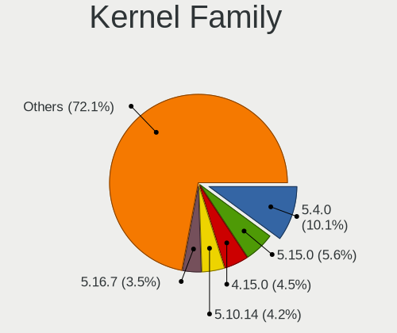
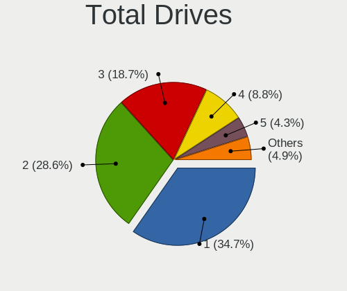
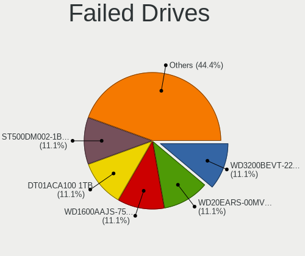
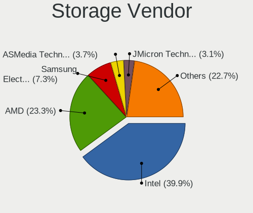
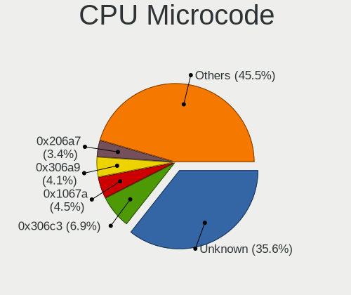
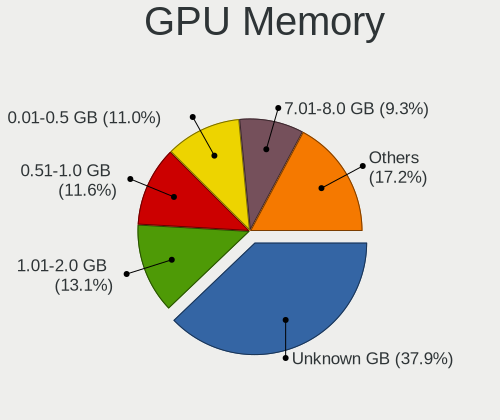
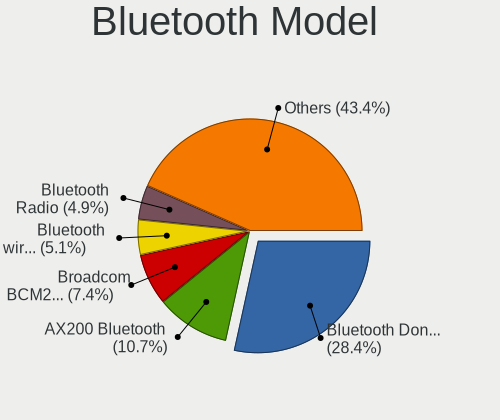
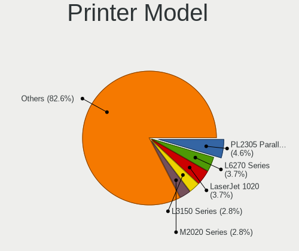

Linux in Poland - Tested Hardware & Statistics (Desktops)
---------------------------------------------------------

A project to collect tested hardware configurations for Linux in Poland.

Anyone can contribute to this report by the [hw-probe](https://github.com/linuxhw/hw-probe) tool:

    sudo -E hw-probe -all -upload

Please contribute! Especially if your hardware is rare.

Contents
--------

* [ Test Cases ](#test-cases)

* [ System ](#system)
  - [ OS                       ](#os)
  - [ OS Family                ](#os-family)
  - [ Kernel                   ](#kernel)
  - [ Kernel Family            ](#kernel-family)
  - [ Kernel Major Ver.        ](#kernel-major-ver)
  - [ Arch                     ](#arch)
  - [ DE                       ](#de)
  - [ Display Server           ](#display-server)
  - [ Display Manager          ](#display-manager)
  - [ OS Lang                  ](#os-lang)
  - [ Boot Mode                ](#boot-mode)
  - [ Filesystem               ](#filesystem)
  - [ Part. scheme             ](#part-scheme)
  - [ Dual Boot with Linux/BSD ](#dual-boot-with-linuxbsd)
  - [ Dual Boot (Win)          ](#dual-boot-win)

* [ Board ](#board)
  - [ Vendor                   ](#vendor)
  - [ Model                    ](#model)
  - [ Model Family             ](#model-family)
  - [ MFG Year                 ](#mfg-year)
  - [ Form Factor              ](#form-factor)
  - [ Secure Boot              ](#secure-boot)
  - [ Coreboot                 ](#coreboot)
  - [ RAM Size                 ](#ram-size)
  - [ RAM Used                 ](#ram-used)
  - [ Total Drives             ](#total-drives)
  - [ Has CD-ROM               ](#has-cd-rom)
  - [ Has Ethernet             ](#has-ethernet)
  - [ Has WiFi                 ](#has-wifi)
  - [ Has Bluetooth            ](#has-bluetooth)

* [ Location ](#location)
  - [ Country                  ](#country)
  - [ City                     ](#city)

* [ Drives ](#drives)
  - [ Drive Vendor             ](#drive-vendor)
  - [ Drive Model              ](#drive-model)
  - [ HDD Vendor               ](#hdd-vendor)
  - [ SSD Vendor               ](#ssd-vendor)
  - [ Drive Kind               ](#drive-kind)
  - [ Drive Connector          ](#drive-connector)
  - [ Drive Size               ](#drive-size)
  - [ Space Total              ](#space-total)
  - [ Space Used               ](#space-used)
  - [ Malfunc. Drives          ](#malfunc-drives)
  - [ Malfunc. Drive Vendor    ](#malfunc-drive-vendor)
  - [ Malfunc. HDD Vendor      ](#malfunc-hdd-vendor)
  - [ Malfunc. Drive Kind      ](#malfunc-drive-kind)
  - [ Failed Drives            ](#failed-drives)
  - [ Failed Drive Vendor      ](#failed-drive-vendor)
  - [ Drive Status             ](#drive-status)

* [ Storage controller ](#storage-controller)
  - [ Storage Vendor           ](#storage-vendor)
  - [ Storage Model            ](#storage-model)
  - [ Storage Kind             ](#storage-kind)

* [ Processor ](#processor)
  - [ CPU Vendor               ](#cpu-vendor)
  - [ CPU Model                ](#cpu-model)
  - [ CPU Model Family         ](#cpu-model-family)
  - [ CPU Cores                ](#cpu-cores)
  - [ CPU Sockets              ](#cpu-sockets)
  - [ CPU Threads              ](#cpu-threads)
  - [ CPU Op-Modes             ](#cpu-op-modes)
  - [ CPU Microcode            ](#cpu-microcode)
  - [ CPU Microarch            ](#cpu-microarch)

* [ Graphics ](#graphics)
  - [ GPU Vendor               ](#gpu-vendor)
  - [ GPU Model                ](#gpu-model)
  - [ GPU Combo                ](#gpu-combo)
  - [ GPU Driver               ](#gpu-driver)
  - [ GPU Memory               ](#gpu-memory)

* [ Monitor ](#monitor)
  - [ Monitor Vendor           ](#monitor-vendor)
  - [ Monitor Model            ](#monitor-model)
  - [ Monitor Resolution       ](#monitor-resolution)
  - [ Monitor Diagonal         ](#monitor-diagonal)
  - [ Monitor Width            ](#monitor-width)
  - [ Aspect Ratio             ](#aspect-ratio)
  - [ Monitor Area             ](#monitor-area)
  - [ Pixel Density            ](#pixel-density)
  - [ Multiple Monitors        ](#multiple-monitors)

* [ Network ](#network)
  - [ Net Controller Vendor    ](#net-controller-vendor)
  - [ Net Controller Model     ](#net-controller-model)
  - [ Wireless Vendor          ](#wireless-vendor)
  - [ Wireless Model           ](#wireless-model)
  - [ Ethernet Vendor          ](#ethernet-vendor)
  - [ Ethernet Model           ](#ethernet-model)
  - [ Net Controller Kind      ](#net-controller-kind)
  - [ Used Controller          ](#used-controller)
  - [ NICs                     ](#nics)
  - [ IPv6                     ](#ipv6)

* [ Bluetooth ](#bluetooth)
  - [ Bluetooth Vendor         ](#bluetooth-vendor)
  - [ Bluetooth Model          ](#bluetooth-model)

* [ Sound ](#sound)
  - [ Sound Vendor             ](#sound-vendor)
  - [ Sound Model              ](#sound-model)

* [ Memory ](#memory)
  - [ Memory Vendor            ](#memory-vendor)
  - [ Memory Model             ](#memory-model)
  - [ Memory Kind              ](#memory-kind)
  - [ Memory Form Factor       ](#memory-form-factor)
  - [ Memory Size              ](#memory-size)
  - [ Memory Speed             ](#memory-speed)

* [ Printers & scanners ](#printers--scanners)
  - [ Printer Vendor           ](#printer-vendor)
  - [ Printer Model            ](#printer-model)
  - [ Scanner Vendor           ](#scanner-vendor)
  - [ Scanner Model            ](#scanner-model)

* [ Camera ](#camera)
  - [ Camera Vendor            ](#camera-vendor)
  - [ Camera Model             ](#camera-model)

* [ Security ](#security)
  - [ Fingerprint Vendor       ](#fingerprint-vendor)
  - [ Fingerprint Model        ](#fingerprint-model)
  - [ Chipcard Vendor          ](#chipcard-vendor)
  - [ Chipcard Model           ](#chipcard-model)

* [ Unsupported ](#unsupported)
  - [ Unsupported Devices      ](#unsupported-devices)
  - [ Unsupported Device Types ](#unsupported-device-types)

Test Cases
----------

Total: 3155

| Vendor        | Model                       | Probe                                                      | Date         |
|---------------|-----------------------------|------------------------------------------------------------|--------------|
| ASRock        | FM2A55M-VG3+                | [6faa4fd636](https://linux-hardware.org/?probe=6faa4fd636) | Oct 01, 2023 |
| ASUSTek       | P8H77-M PRO                 | [63c99972d1](https://linux-hardware.org/?probe=63c99972d1) | Sep 30, 2023 |
| ASUSTek       | TUF Gaming B550-PLUS        | [3bec9011bd](https://linux-hardware.org/?probe=3bec9011bd) | Sep 30, 2023 |
| ASRock        | B450M Pro4 R2.0             | [8e039e23f3](https://linux-hardware.org/?probe=8e039e23f3) | Sep 29, 2023 |
| ASUSTek       | PRIME B450M-A II            | [0e4e90fac1](https://linux-hardware.org/?probe=0e4e90fac1) | Sep 29, 2023 |
| ASUSTek       | M3A78-CM                    | [4ef9eaaaba](https://linux-hardware.org/?probe=4ef9eaaaba) | Sep 27, 2023 |
| HP            | 1589                        | [1063a6e665](https://linux-hardware.org/?probe=1063a6e665) | Sep 27, 2023 |
| ASUSTek       | PRIME B450M-A II            | [8e70938939](https://linux-hardware.org/?probe=8e70938939) | Sep 27, 2023 |
| Fujitsu       | D3233-A1 S26361-D3233-A1    | [09a71cddc4](https://linux-hardware.org/?probe=09a71cddc4) | Sep 26, 2023 |
| Gigabyte      | A520 AORUS ELITE            | [32a39c6a01](https://linux-hardware.org/?probe=32a39c6a01) | Sep 25, 2023 |
| Gigabyte      | Z97M-DS3H                   | [2881d9e4ec](https://linux-hardware.org/?probe=2881d9e4ec) | Sep 25, 2023 |
| Gigabyte      | AB350-Gaming-CF             | [4c68092d28](https://linux-hardware.org/?probe=4c68092d28) | Sep 25, 2023 |
| ASUSTek       | P8H77-M PRO                 | [3afc2a0804](https://linux-hardware.org/?probe=3afc2a0804) | Sep 24, 2023 |
| Huanan        | X99-TF V1.1                 | [694b4ab1f2](https://linux-hardware.org/?probe=694b4ab1f2) | Sep 24, 2023 |
| HP            | 3397                        | [cc6f1cc8ba](https://linux-hardware.org/?probe=cc6f1cc8ba) | Sep 24, 2023 |
| ASUSTek       | PRIME X370-PRO              | [da4274c691](https://linux-hardware.org/?probe=da4274c691) | Sep 24, 2023 |
| ASUSTek       | P5G41T-M LX3                | [5735f79e4f](https://linux-hardware.org/?probe=5735f79e4f) | Sep 23, 2023 |
| ASUSTek       | PRIME B450-PLUS             | [46a99bb50a](https://linux-hardware.org/?probe=46a99bb50a) | Sep 23, 2023 |
| ASUSTek       | P5K                         | [4d67ad50cf](https://linux-hardware.org/?probe=4d67ad50cf) | Sep 22, 2023 |
| ASUSTek       | X99-A/USB                   | [37990955f8](https://linux-hardware.org/?probe=37990955f8) | Sep 21, 2023 |
| MSI           | PRO B650M-A WIFI            | [8e60d0df9c](https://linux-hardware.org/?probe=8e60d0df9c) | Sep 21, 2023 |
| Apple         | Mac-27AD2F918AE68F61 Mac... | [ff9bab7040](https://linux-hardware.org/?probe=ff9bab7040) | Sep 21, 2023 |
| ASUSTek       | PRIME B450M-A II            | [459e666cd3](https://linux-hardware.org/?probe=459e666cd3) | Sep 21, 2023 |
| ASUSTek       | PRIME B450M-A II            | [dfb78764ea](https://linux-hardware.org/?probe=dfb78764ea) | Sep 20, 2023 |
| Gigabyte      | B365M DS3H                  | [b66d6be0cf](https://linux-hardware.org/?probe=b66d6be0cf) | Sep 19, 2023 |
| HP            | 3047h                       | [f684816e88](https://linux-hardware.org/?probe=f684816e88) | Sep 19, 2023 |
| ASUSTek       | Maximus IX FORMULA          | [e76f3de142](https://linux-hardware.org/?probe=e76f3de142) | Sep 19, 2023 |
| ASUSTek       | M3A78-CM                    | [0748266b0a](https://linux-hardware.org/?probe=0748266b0a) | Sep 19, 2023 |
| Medion        | MS-7848                     | [acbe0e1821](https://linux-hardware.org/?probe=acbe0e1821) | Sep 19, 2023 |
| ASUSTek       | PRIME B460-PLUS             | [1ac41cc2e4](https://linux-hardware.org/?probe=1ac41cc2e4) | Sep 19, 2023 |
| Gigabyte      | A520 AORUS ELITE            | [5680b32e39](https://linux-hardware.org/?probe=5680b32e39) | Sep 18, 2023 |
| Gigabyte      | B85M-D3H                    | [7b51f6f455](https://linux-hardware.org/?probe=7b51f6f455) | Sep 18, 2023 |
| Gigabyte      | X570 GAMING X               | [8af23c2e56](https://linux-hardware.org/?probe=8af23c2e56) | Sep 17, 2023 |
| MSI           | X470 GAMING PLUS            | [35d0dc4629](https://linux-hardware.org/?probe=35d0dc4629) | Sep 17, 2023 |
| Gigabyte      | X570 GAMING X               | [50bfb485e5](https://linux-hardware.org/?probe=50bfb485e5) | Sep 17, 2023 |
| Gigabyte      | X570 GAMING X               | [d795a474b2](https://linux-hardware.org/?probe=d795a474b2) | Sep 16, 2023 |
| ASUSTek       | PRIME H770-PLUS             | [c58fea9225](https://linux-hardware.org/?probe=c58fea9225) | Sep 16, 2023 |
| Acer          | Predator G3-710             | [aa2ac7f07c](https://linux-hardware.org/?probe=aa2ac7f07c) | Sep 16, 2023 |
| HP            | 339A                        | [5808e19d94](https://linux-hardware.org/?probe=5808e19d94) | Sep 15, 2023 |
| Gigabyte      | P35-DS3                     | [7cf209e4c1](https://linux-hardware.org/?probe=7cf209e4c1) | Sep 15, 2023 |
| ASUSTek       | A88XM-E                     | [a3d82edc9c](https://linux-hardware.org/?probe=a3d82edc9c) | Sep 15, 2023 |
| ASRock        | B450 Pro4                   | [8f1762e098](https://linux-hardware.org/?probe=8f1762e098) | Sep 15, 2023 |
| ASUSTek       | P8P67 PRO                   | [c3d0531198](https://linux-hardware.org/?probe=c3d0531198) | Sep 14, 2023 |
| Huanan        | X99-TF V1.1                 | [a5acc6026f](https://linux-hardware.org/?probe=a5acc6026f) | Sep 14, 2023 |
| Acer          | Veriton N4640G              | [df814b2a84](https://linux-hardware.org/?probe=df814b2a84) | Sep 13, 2023 |
| Dell          | 07T4MC A06                  | [393a33da8c](https://linux-hardware.org/?probe=393a33da8c) | Sep 12, 2023 |
| MSI           | Z170A GAMING M9 ACK         | [49cc8ea6d2](https://linux-hardware.org/?probe=49cc8ea6d2) | Sep 12, 2023 |
| Unknown       | Unknown                     | [7c32a84014](https://linux-hardware.org/?probe=7c32a84014) | Sep 11, 2023 |
| Lenovo        | SHARKBAY 0B98401 WIN        | [3716cce5f9](https://linux-hardware.org/?probe=3716cce5f9) | Sep 11, 2023 |
| ASUSTek       | M3A78-CM                    | [77105eb7da](https://linux-hardware.org/?probe=77105eb7da) | Sep 11, 2023 |
| ASUSTek       | H110M-D                     | [de229ab61f](https://linux-hardware.org/?probe=de229ab61f) | Sep 11, 2023 |
| Gigabyte      | AB350-Gaming-CF             | [a25f4b1c5c](https://linux-hardware.org/?probe=a25f4b1c5c) | Sep 11, 2023 |
| Dell          | 07T4MC A06                  | [ec26895704](https://linux-hardware.org/?probe=ec26895704) | Sep 10, 2023 |
| Gigabyte      | A520 AORUS ELITE            | [dffd28975a](https://linux-hardware.org/?probe=dffd28975a) | Sep 09, 2023 |
| Gigabyte      | B450M DS3H V2               | [23e3266b07](https://linux-hardware.org/?probe=23e3266b07) | Sep 08, 2023 |
| HP            | 1589                        | [550b95765c](https://linux-hardware.org/?probe=550b95765c) | Sep 06, 2023 |
| Dell          | 0T10XW A00                  | [89f4028960](https://linux-hardware.org/?probe=89f4028960) | Sep 05, 2023 |
| ASRock        | 970 Pro3 R2.0               | [01ede034b7](https://linux-hardware.org/?probe=01ede034b7) | Sep 05, 2023 |
| Dell          | 0J3C2F A00                  | [1aa546be8c](https://linux-hardware.org/?probe=1aa546be8c) | Sep 05, 2023 |
| MSI           | P55-GD65                    | [2b514a72b1](https://linux-hardware.org/?probe=2b514a72b1) | Sep 05, 2023 |
| Gigabyte      | AB350-Gaming-CF             | [f51b98f4cd](https://linux-hardware.org/?probe=f51b98f4cd) | Sep 04, 2023 |
| Gigabyte      | G41M-Combo                  | [26c9b8cc2c](https://linux-hardware.org/?probe=26c9b8cc2c) | Sep 03, 2023 |
| Gigabyte      | PH67A-D3-B3                 | [a9fdf4f92b](https://linux-hardware.org/?probe=a9fdf4f92b) | Sep 03, 2023 |
| Fujitsu       | D3313-B1 S26361-D3313-B1    | [8533d021f8](https://linux-hardware.org/?probe=8533d021f8) | Sep 02, 2023 |
| MSI           | MEG Z390 GODLIKE            | [53b682d960](https://linux-hardware.org/?probe=53b682d960) | Sep 02, 2023 |
| Gigabyte      | A520 AORUS ELITE            | [9f3df2894e](https://linux-hardware.org/?probe=9f3df2894e) | Sep 02, 2023 |
| ASUSTek       | PRIME Z370-P                | [f6a5d73879](https://linux-hardware.org/?probe=f6a5d73879) | Sep 01, 2023 |
| Gigabyte      | GA-MA770T-UD3               | [d5d9154715](https://linux-hardware.org/?probe=d5d9154715) | Sep 01, 2023 |
| HP            | 1589                        | [447cae1b4c](https://linux-hardware.org/?probe=447cae1b4c) | Sep 01, 2023 |
| ASRock        | H97M Pro4                   | [ff1be33f8e](https://linux-hardware.org/?probe=ff1be33f8e) | Sep 01, 2023 |
| MSI           | B450M PRO-VDH MAX           | [0ac2938640](https://linux-hardware.org/?probe=0ac2938640) | Aug 31, 2023 |
| ASUSTek       | Crosshair V Formula         | [85cb771ac1](https://linux-hardware.org/?probe=85cb771ac1) | Aug 31, 2023 |
| MSI           | B450M PRO-VDH MAX           | [ca52538b46](https://linux-hardware.org/?probe=ca52538b46) | Aug 31, 2023 |
| HP            | 3047h                       | [5a35a1ebd1](https://linux-hardware.org/?probe=5a35a1ebd1) | Aug 30, 2023 |
| ASUSTek       | TUF Gaming B450-PLUS II     | [a2f37c4111](https://linux-hardware.org/?probe=a2f37c4111) | Aug 30, 2023 |
| Fujitsu       | D3222-A1 S26361-D3222-A1    | [567a59e1bc](https://linux-hardware.org/?probe=567a59e1bc) | Aug 29, 2023 |
| ASUSTek       | M3A78-CM                    | [e6e9efdb61](https://linux-hardware.org/?probe=e6e9efdb61) | Aug 26, 2023 |
| Dell          | 0JCTF8 A00                  | [af55d05855](https://linux-hardware.org/?probe=af55d05855) | Aug 26, 2023 |
| Essentiel ... | MS-7848                     | [228bdfda30](https://linux-hardware.org/?probe=228bdfda30) | Aug 26, 2023 |
| Essentiel ... | MS-7848                     | [9ce89a0c87](https://linux-hardware.org/?probe=9ce89a0c87) | Aug 26, 2023 |
| Lenovo        | SKYBAY NOK                  | [38448389ce](https://linux-hardware.org/?probe=38448389ce) | Aug 25, 2023 |
| ASUSTek       | M3A78-CM                    | [1f69210d69](https://linux-hardware.org/?probe=1f69210d69) | Aug 25, 2023 |
| Gigabyte      | GA-MA770T-UD3P              | [d1e0d41982](https://linux-hardware.org/?probe=d1e0d41982) | Aug 24, 2023 |
| Gigabyte      | P67A-UD7-B3                 | [912d956729](https://linux-hardware.org/?probe=912d956729) | Aug 24, 2023 |
| ASUSTek       | EX-A320M-GAMING             | [a28ee4ea6b](https://linux-hardware.org/?probe=a28ee4ea6b) | Aug 23, 2023 |
| ASRock        | A320M-DVS R4.0              | [5a9badb376](https://linux-hardware.org/?probe=5a9badb376) | Aug 22, 2023 |
| Gigabyte      | B365M D3H-CF                | [3911bdd51d](https://linux-hardware.org/?probe=3911bdd51d) | Aug 20, 2023 |
| Gigabyte      | B365M D3H-CF                | [1979db3345](https://linux-hardware.org/?probe=1979db3345) | Aug 20, 2023 |
| ASUSTek       | M3A78-CM                    | [d1af143bed](https://linux-hardware.org/?probe=d1af143bed) | Aug 19, 2023 |
| ASRock        | B450M-HDV R4.0              | [637bd422c5](https://linux-hardware.org/?probe=637bd422c5) | Aug 19, 2023 |
| ASUSTek       | M3A78-CM                    | [2173b6b2b0](https://linux-hardware.org/?probe=2173b6b2b0) | Aug 18, 2023 |
| Gigabyte      | G31M-ES2L                   | [d84596d3c1](https://linux-hardware.org/?probe=d84596d3c1) | Aug 18, 2023 |
| ASUSTek       | P8Z68-V PRO GEN3            | [d05585906d](https://linux-hardware.org/?probe=d05585906d) | Aug 18, 2023 |
| MSI           | PRO H610M-G DDR4            | [bd75f21361](https://linux-hardware.org/?probe=bd75f21361) | Aug 16, 2023 |
| HP            | 0B4Ch D                     | [abb0a09230](https://linux-hardware.org/?probe=abb0a09230) | Aug 16, 2023 |
| MSI           | H310M PRO-VDH               | [fe173bc6ed](https://linux-hardware.org/?probe=fe173bc6ed) | Aug 15, 2023 |
| Gigabyte      | Z97M-DS3H                   | [69deac32bd](https://linux-hardware.org/?probe=69deac32bd) | Aug 14, 2023 |
| Gigabyte      | AB350-Gaming-CF             | [7ff2052c0f](https://linux-hardware.org/?probe=7ff2052c0f) | Aug 14, 2023 |
| ASUSTek       | Z97-PRO GAMER               | [25a3921b74](https://linux-hardware.org/?probe=25a3921b74) | Aug 13, 2023 |
| ECS           | H61H2-M6                    | [b9b9ef9f84](https://linux-hardware.org/?probe=b9b9ef9f84) | Aug 12, 2023 |
| Gigabyte      | Z170N-WIFI-CF               | [2ee88f0ec0](https://linux-hardware.org/?probe=2ee88f0ec0) | Aug 11, 2023 |
| HP            | 83E8                        | [a782638343](https://linux-hardware.org/?probe=a782638343) | Aug 11, 2023 |
| ASUSTek       | ROG STRIX B550-F GAMING     | [d38ef662d4](https://linux-hardware.org/?probe=d38ef662d4) | Aug 10, 2023 |
| Unknown       | Unknown                     | [78f477986b](https://linux-hardware.org/?probe=78f477986b) | Aug 10, 2023 |
| ASUSTek       | PRIME Z270-A                | [a6eabbbfef](https://linux-hardware.org/?probe=a6eabbbfef) | Aug 09, 2023 |
| ASUSTek       | M3A78-CM                    | [a5e0e043cb](https://linux-hardware.org/?probe=a5e0e043cb) | Aug 09, 2023 |
| MSI           | 970A-G43 PLUS               | [133d4b58c9](https://linux-hardware.org/?probe=133d4b58c9) | Aug 08, 2023 |
| Gigabyte      | Z97M-DS3H                   | [f2547c0339](https://linux-hardware.org/?probe=f2547c0339) | Aug 08, 2023 |
| ASUSTek       | M3A78-CM                    | [93e4fee7df](https://linux-hardware.org/?probe=93e4fee7df) | Aug 08, 2023 |
| MSI           | MAG X670E TOMAHAWK WIFI     | [25bb416eb3](https://linux-hardware.org/?probe=25bb416eb3) | Aug 07, 2023 |
| Gigabyte      | Z97M-DS3H                   | [beecacb434](https://linux-hardware.org/?probe=beecacb434) | Aug 07, 2023 |
| Gigabyte      | AB350-Gaming-CF             | [fb8e926bd4](https://linux-hardware.org/?probe=fb8e926bd4) | Aug 07, 2023 |
| ASRock        | B460 Phantom Gaming 4       | [5a254fe1d6](https://linux-hardware.org/?probe=5a254fe1d6) | Aug 06, 2023 |
| ASUSTek       | ROG STRIX B550-A GAMING     | [164e109040](https://linux-hardware.org/?probe=164e109040) | Aug 06, 2023 |
| Gigabyte      | 970A-UD3P                   | [dcd061dff8](https://linux-hardware.org/?probe=dcd061dff8) | Aug 05, 2023 |
| MSI           | B450 GAMING PRO CARBON A... | [420353bf79](https://linux-hardware.org/?probe=420353bf79) | Aug 04, 2023 |
| Lenovo        | 3140 SDK0J40697 WIN 3305... | [a61b8168b7](https://linux-hardware.org/?probe=a61b8168b7) | Aug 02, 2023 |
| ECS           | H61H2-M6                    | [12990c5c80](https://linux-hardware.org/?probe=12990c5c80) | Aug 02, 2023 |
| ASUSTek       | M3A78-CM                    | [9be3b9bb83](https://linux-hardware.org/?probe=9be3b9bb83) | Aug 02, 2023 |
| MSI           | X570-A PRO                  | [1acfa69d70](https://linux-hardware.org/?probe=1acfa69d70) | Aug 02, 2023 |
| HP            | 8054                        | [f53df18325](https://linux-hardware.org/?probe=f53df18325) | Aug 02, 2023 |
| Gigabyte      | Z97M-DS3H                   | [8bc1531bf6](https://linux-hardware.org/?probe=8bc1531bf6) | Aug 02, 2023 |
| ASUSTek       | M3A78-CM                    | [5d63b469f8](https://linux-hardware.org/?probe=5d63b469f8) | Aug 01, 2023 |
| ECS           | H61H2-M6                    | [836267e5f7](https://linux-hardware.org/?probe=836267e5f7) | Aug 01, 2023 |
| Fujitsu       | D3543-A1 S26361-D3543-A1... | [30389578ca](https://linux-hardware.org/?probe=30389578ca) | Aug 01, 2023 |
| Gigabyte      | B75M-D3H                    | [3aeae112c3](https://linux-hardware.org/?probe=3aeae112c3) | Jul 31, 2023 |
| ASRock        | FM2A55M-VG3+                | [ce76d8b410](https://linux-hardware.org/?probe=ce76d8b410) | Jul 31, 2023 |
| ASUSTek       | PRIME Z270-A                | [eb13fb97fb](https://linux-hardware.org/?probe=eb13fb97fb) | Jul 30, 2023 |
| ASRock        | AM1H-ITX                    | [24b2f4274d](https://linux-hardware.org/?probe=24b2f4274d) | Jul 29, 2023 |
| Gigabyte      | EP45T-UD3LR                 | [c2928283bd](https://linux-hardware.org/?probe=c2928283bd) | Jul 28, 2023 |
| Gigabyte      | B450M DS3H V2               | [ca9b6e0320](https://linux-hardware.org/?probe=ca9b6e0320) | Jul 28, 2023 |
| Gigabyte      | Z97M-DS3H                   | [f0bd5c3409](https://linux-hardware.org/?probe=f0bd5c3409) | Jul 27, 2023 |
| ASUSTek       | P5G41T-M                    | [355fadbc12](https://linux-hardware.org/?probe=355fadbc12) | Jul 26, 2023 |
| MSI           | MPG X570 GAMING PLUS        | [e79fd50f34](https://linux-hardware.org/?probe=e79fd50f34) | Jul 26, 2023 |
| Lenovo        | ThinkCentre M58 3231W2Y     | [72f09cd320](https://linux-hardware.org/?probe=72f09cd320) | Jul 26, 2023 |
| ASUSTek       | M5A78L-M LE                 | [3cb7454711](https://linux-hardware.org/?probe=3cb7454711) | Jul 25, 2023 |
| ASUSTek       | M3A78-CM                    | [290a0dd297](https://linux-hardware.org/?probe=290a0dd297) | Jul 25, 2023 |
| HP            | 212B                        | [8e6a290d51](https://linux-hardware.org/?probe=8e6a290d51) | Jul 25, 2023 |
| ASUSTek       | PRIME B450-PLUS             | [5ec24ea9ad](https://linux-hardware.org/?probe=5ec24ea9ad) | Jul 25, 2023 |
| ASUSTek       | P8H61-M LX                  | [9ffd99b082](https://linux-hardware.org/?probe=9ffd99b082) | Jul 25, 2023 |
| HP            | 198E                        | [c2f7b19d13](https://linux-hardware.org/?probe=c2f7b19d13) | Jul 24, 2023 |
| Gigabyte      | Z97M-DS3H                   | [816a8d70bb](https://linux-hardware.org/?probe=816a8d70bb) | Jul 24, 2023 |
| ASUSTek       | M3A78-CM                    | [a2fcdf6c36](https://linux-hardware.org/?probe=a2fcdf6c36) | Jul 24, 2023 |
| Dell          | 0VD92X A00                  | [675e646d05](https://linux-hardware.org/?probe=675e646d05) | Jul 23, 2023 |
| ASRock        | B85M                        | [c4f0b0b1fa](https://linux-hardware.org/?probe=c4f0b0b1fa) | Jul 22, 2023 |
| HP            | 3032h                       | [f6a4202b21](https://linux-hardware.org/?probe=f6a4202b21) | Jul 21, 2023 |
| Gigabyte      | H270-HD3-CF                 | [73a56d2df7](https://linux-hardware.org/?probe=73a56d2df7) | Jul 21, 2023 |
| Dell          | 0HD5W2 A01                  | [26c19ee81f](https://linux-hardware.org/?probe=26c19ee81f) | Jul 19, 2023 |
| ASUSTek       | PRIME X370-PRO              | [8ff38f3782](https://linux-hardware.org/?probe=8ff38f3782) | Jul 18, 2023 |
| Fujitsu       | D3401-A1 S26361-D3401-A1    | [c527cf56ad](https://linux-hardware.org/?probe=c527cf56ad) | Jul 17, 2023 |
| Gigabyte      | AB350-Gaming-CF             | [f4936b2064](https://linux-hardware.org/?probe=f4936b2064) | Jul 17, 2023 |
| Gigabyte      | Z97M-DS3H                   | [9e829a5538](https://linux-hardware.org/?probe=9e829a5538) | Jul 14, 2023 |
| Seeed Stud... | ODYSSEY-X86J4105 SD-BS-C... | [b5374c8055](https://linux-hardware.org/?probe=b5374c8055) | Jul 12, 2023 |
| Lenovo        | 3102 SDK0J40697 WIN 3305... | [67ef58f2b3](https://linux-hardware.org/?probe=67ef58f2b3) | Jul 12, 2023 |
| Dell          | 0T7D40 A01                  | [1ed238ea9b](https://linux-hardware.org/?probe=1ed238ea9b) | Jul 11, 2023 |
| ASRock        | H81M                        | [042e2e3b56](https://linux-hardware.org/?probe=042e2e3b56) | Jul 11, 2023 |
| ASRock        | H81M                        | [c4b398d08c](https://linux-hardware.org/?probe=c4b398d08c) | Jul 11, 2023 |
| ASUSTek       | M3A78-CM                    | [ab32a0e447](https://linux-hardware.org/?probe=ab32a0e447) | Jul 11, 2023 |
| Google        | Guado                       | [d14465ad06](https://linux-hardware.org/?probe=d14465ad06) | Jul 10, 2023 |
| Dell          | 09WH54 A00                  | [b118891f3d](https://linux-hardware.org/?probe=b118891f3d) | Jul 10, 2023 |
| ASUSTek       | M3A78-CM                    | [38420a6afe](https://linux-hardware.org/?probe=38420a6afe) | Jul 10, 2023 |
| MSI           | X99A GAMING 9 ACK           | [4a36d070b4](https://linux-hardware.org/?probe=4a36d070b4) | Jul 10, 2023 |
| Lenovo        | SHARKBAY SDK0E50510 WIN     | [73b13fd5eb](https://linux-hardware.org/?probe=73b13fd5eb) | Jul 10, 2023 |
| HP            | 1998                        | [03da98871c](https://linux-hardware.org/?probe=03da98871c) | Jul 10, 2023 |
| HP            | 1998                        | [15e8251d36](https://linux-hardware.org/?probe=15e8251d36) | Jul 10, 2023 |
| ASUSTek       | PRIME Z690-P D4             | [b91bb21dfc](https://linux-hardware.org/?probe=b91bb21dfc) | Jul 10, 2023 |
| Gigabyte      | AB350-Gaming-CF             | [14c6f3f286](https://linux-hardware.org/?probe=14c6f3f286) | Jul 10, 2023 |
| Gigabyte      | GA-78LMT-S2PT               | [6a55de667a](https://linux-hardware.org/?probe=6a55de667a) | Jul 09, 2023 |
| Dell          | 0KC9NP A01                  | [570f59305c](https://linux-hardware.org/?probe=570f59305c) | Jul 08, 2023 |
| Dell          | 0KC9NP A01                  | [6d62d0cdbf](https://linux-hardware.org/?probe=6d62d0cdbf) | Jul 08, 2023 |
| ASRock        | X570 Phantom Gaming 4       | [2d342d7a37](https://linux-hardware.org/?probe=2d342d7a37) | Jul 07, 2023 |
| MSI           | MAG B650 TOMAHAWK WIFI      | [49c59b6c86](https://linux-hardware.org/?probe=49c59b6c86) | Jul 07, 2023 |
| MSI           | MAG B650 TOMAHAWK WIFI      | [df2a737853](https://linux-hardware.org/?probe=df2a737853) | Jul 07, 2023 |
| Gigabyte      | Z97M-DS3H                   | [9ecae424ad](https://linux-hardware.org/?probe=9ecae424ad) | Jul 07, 2023 |
| Gigabyte      | B85M-HD3                    | [43034103ef](https://linux-hardware.org/?probe=43034103ef) | Jul 06, 2023 |
| ASUSTek       | Rampage V EDITION 10        | [54611e82ec](https://linux-hardware.org/?probe=54611e82ec) | Jul 06, 2023 |
| Google        | Guado                       | [8bd38f802a](https://linux-hardware.org/?probe=8bd38f802a) | Jul 06, 2023 |
| ASRock        | Z370 Killer SLI             | [b7a676e2fc](https://linux-hardware.org/?probe=b7a676e2fc) | Jul 05, 2023 |
| Gigabyte      | B660M DS3H DDR4             | [c997aced4e](https://linux-hardware.org/?probe=c997aced4e) | Jul 05, 2023 |
| Gigabyte      | GA-790FXTA-UD5              | [685f105356](https://linux-hardware.org/?probe=685f105356) | Jul 05, 2023 |
| HP            | 339A                        | [8d051ead1c](https://linux-hardware.org/?probe=8d051ead1c) | Jul 05, 2023 |
| ASRock        | Z370 Killer SLI             | [e7c0ca1bfc](https://linux-hardware.org/?probe=e7c0ca1bfc) | Jul 05, 2023 |
| ASRock        | Z170 Extreme4               | [abc4554a51](https://linux-hardware.org/?probe=abc4554a51) | Jul 04, 2023 |
| ASRock        | A320M-HDV R3.0              | [df1fff149d](https://linux-hardware.org/?probe=df1fff149d) | Jul 04, 2023 |
| Gigabyte      | B450M GAMING                | [22a13c2e16](https://linux-hardware.org/?probe=22a13c2e16) | Jul 03, 2023 |
| ASUSTek       | M3A78-CM                    | [67281face4](https://linux-hardware.org/?probe=67281face4) | Jul 03, 2023 |
| Gigabyte      | AB350-Gaming-CF             | [f928781025](https://linux-hardware.org/?probe=f928781025) | Jul 03, 2023 |
| Acer          | FX58M                       | [44e563ac2a](https://linux-hardware.org/?probe=44e563ac2a) | Jul 02, 2023 |
| MSI           | MS-B9181                    | [fef890b931](https://linux-hardware.org/?probe=fef890b931) | Jul 02, 2023 |
| MSI           | MS-B9181                    | [47b3ce0c58](https://linux-hardware.org/?probe=47b3ce0c58) | Jul 02, 2023 |
| Acer          | FX58M                       | [69f3a5d4fb](https://linux-hardware.org/?probe=69f3a5d4fb) | Jul 02, 2023 |
| Gigabyte      | P55M-UD2                    | [babec703df](https://linux-hardware.org/?probe=babec703df) | Jul 02, 2023 |
| MSI           | MPG X570 GAMING PLUS        | [9e65cd9bd1](https://linux-hardware.org/?probe=9e65cd9bd1) | Jul 02, 2023 |
| Gigabyte      | Z77X-UD5H                   | [eea1d9623c](https://linux-hardware.org/?probe=eea1d9623c) | Jun 30, 2023 |
| Gigabyte      | P31-DS3L                    | [0d32728bdf](https://linux-hardware.org/?probe=0d32728bdf) | Jun 28, 2023 |
| HP            | 21B4 A01                    | [50656fb7ec](https://linux-hardware.org/?probe=50656fb7ec) | Jun 28, 2023 |
| HP            | 21B4 A01                    | [4d9322819d](https://linux-hardware.org/?probe=4d9322819d) | Jun 28, 2023 |
| Gigabyte      | GA-970A-UD3                 | [157d424ec0](https://linux-hardware.org/?probe=157d424ec0) | Jun 26, 2023 |
| ASUSTek       | M3A78-CM                    | [e55023fb8b](https://linux-hardware.org/?probe=e55023fb8b) | Jun 26, 2023 |
| Gigabyte      | AB350-Gaming-CF             | [0b72aec1b9](https://linux-hardware.org/?probe=0b72aec1b9) | Jun 26, 2023 |
| HP            | 21B4 A01                    | [e277fd2772](https://linux-hardware.org/?probe=e277fd2772) | Jun 25, 2023 |
| Biostar       | H81MHV3 5.0                 | [0f95f72b43](https://linux-hardware.org/?probe=0f95f72b43) | Jun 25, 2023 |
| ASUSTek       | Z170M-PLUS                  | [b4ab698b09](https://linux-hardware.org/?probe=b4ab698b09) | Jun 25, 2023 |
| Intel         | H81                         | [65ad18a4bd](https://linux-hardware.org/?probe=65ad18a4bd) | Jun 24, 2023 |
| MSI           | B360M PRO-VD 2019-01-24     | [a036f44a4c](https://linux-hardware.org/?probe=a036f44a4c) | Jun 22, 2023 |
| Dell          | 0WMJ54 A01                  | [0b8cf1cae7](https://linux-hardware.org/?probe=0b8cf1cae7) | Jun 22, 2023 |
| Gigabyte      | X570 AORUS ULTRA            | [d4d7534ac3](https://linux-hardware.org/?probe=d4d7534ac3) | Jun 22, 2023 |
| MSI           | B450 GAMING PRO CARBON A... | [0f5435c665](https://linux-hardware.org/?probe=0f5435c665) | Jun 22, 2023 |
| Gigabyte      | H510M S2H V2                | [d7c44291c1](https://linux-hardware.org/?probe=d7c44291c1) | Jun 20, 2023 |
| MSI           | MAG B550 TOMAHAWK           | [bbfb6ff07f](https://linux-hardware.org/?probe=bbfb6ff07f) | Jun 20, 2023 |
| Gigabyte      | H510M S2H V2                | [f2d80b2558](https://linux-hardware.org/?probe=f2d80b2558) | Jun 19, 2023 |
| ASUSTek       | M3A78-CM                    | [22d8476417](https://linux-hardware.org/?probe=22d8476417) | Jun 19, 2023 |
| Gigabyte      | AB350-Gaming-CF             | [e2fc6bb607](https://linux-hardware.org/?probe=e2fc6bb607) | Jun 19, 2023 |
| ASRock        | Z87 Extreme4                | [dcd3e79cb1](https://linux-hardware.org/?probe=dcd3e79cb1) | Jun 18, 2023 |
| MSI           | X470 GAMING PLUS            | [17c61c0aee](https://linux-hardware.org/?probe=17c61c0aee) | Jun 18, 2023 |
| Gigabyte      | Z170-Gaming K3-CF           | [6e40a39112](https://linux-hardware.org/?probe=6e40a39112) | Jun 18, 2023 |
| MSI           | B85-G43 GAMING              | [93da970965](https://linux-hardware.org/?probe=93da970965) | Jun 16, 2023 |
| ASRock        | H61M-VG3                    | [858be00df4](https://linux-hardware.org/?probe=858be00df4) | Jun 16, 2023 |
| Gigabyte      | Z97M-DS3H                   | [dc48180bc7](https://linux-hardware.org/?probe=dc48180bc7) | Jun 16, 2023 |
| ASUSTek       | P8H61-M LX R2.0             | [558c031517](https://linux-hardware.org/?probe=558c031517) | Jun 16, 2023 |
| MSI           | B450 TOMAHAWK               | [16ad11571a](https://linux-hardware.org/?probe=16ad11571a) | Jun 15, 2023 |
| MSI           | MPG Z390 GAMING EDGE AC     | [c612df2e8c](https://linux-hardware.org/?probe=c612df2e8c) | Jun 15, 2023 |
| ASRock        | B85M                        | [19f8b16937](https://linux-hardware.org/?probe=19f8b16937) | Jun 15, 2023 |
| Fujitsu       | D3230-A1 S26361-D3230-A1    | [dbe7676807](https://linux-hardware.org/?probe=dbe7676807) | Jun 15, 2023 |
| ASUSTek       | P5G41C-M LX                 | [7ae654d4e2](https://linux-hardware.org/?probe=7ae654d4e2) | Jun 14, 2023 |
| Lenovo        | MAHOBAY NOK                 | [39e2711f1f](https://linux-hardware.org/?probe=39e2711f1f) | Jun 13, 2023 |
| ASUSTek       | PRIME H510M-A               | [2ae3c4aaca](https://linux-hardware.org/?probe=2ae3c4aaca) | Jun 13, 2023 |
| ASUSTek       | M3A78-CM                    | [ad01f2c38d](https://linux-hardware.org/?probe=ad01f2c38d) | Jun 13, 2023 |
| ASUSTek       | P5G41C-M LX                 | [1361d3551c](https://linux-hardware.org/?probe=1361d3551c) | Jun 12, 2023 |
| ASUSTek       | M3A78-CM                    | [273795ce3d](https://linux-hardware.org/?probe=273795ce3d) | Jun 12, 2023 |
| Gigabyte      | AB350-Gaming-CF             | [8a9a32ba11](https://linux-hardware.org/?probe=8a9a32ba11) | Jun 12, 2023 |
| MSI           | B450M-A PRO MAX             | [de08f65c4d](https://linux-hardware.org/?probe=de08f65c4d) | Jun 11, 2023 |
| HP            | 3397                        | [9f71c4173c](https://linux-hardware.org/?probe=9f71c4173c) | Jun 11, 2023 |
| Gigabyte      | Z97M-DS3H                   | [d6681f05ec](https://linux-hardware.org/?probe=d6681f05ec) | Jun 11, 2023 |
| ASUSTek       | ROG STRIX B650E-I GAMING... | [92fd36b27a](https://linux-hardware.org/?probe=92fd36b27a) | Jun 09, 2023 |
| Gigabyte      | Z97M-DS3H                   | [5d8df77ade](https://linux-hardware.org/?probe=5d8df77ade) | Jun 08, 2023 |
| MSI           | Z87-G43                     | [554f8ea405](https://linux-hardware.org/?probe=554f8ea405) | Jun 08, 2023 |
| ASRock        | H81M-VG4                    | [04d84e44a5](https://linux-hardware.org/?probe=04d84e44a5) | Jun 08, 2023 |
| Gigabyte      | B250-FinTech-CF             | [022138ad16](https://linux-hardware.org/?probe=022138ad16) | Jun 06, 2023 |
| ASUSTek       | M3A78-CM                    | [50304f8088](https://linux-hardware.org/?probe=50304f8088) | Jun 06, 2023 |
| ASUSTek       | M3A78-CM                    | [1df787c227](https://linux-hardware.org/?probe=1df787c227) | Jun 05, 2023 |
| Gigabyte      | B250-FinTech-CF             | [e22c496628](https://linux-hardware.org/?probe=e22c496628) | Jun 05, 2023 |
| Gigabyte      | AB350-Gaming-CF             | [580ae6529e](https://linux-hardware.org/?probe=580ae6529e) | Jun 05, 2023 |
| HP            | 21B4 A01                    | [5d394c52ed](https://linux-hardware.org/?probe=5d394c52ed) | Jun 04, 2023 |
| ASUSTek       | P5G41T-M                    | [8706eff580](https://linux-hardware.org/?probe=8706eff580) | Jun 04, 2023 |
| MSI           | X470 GAMING PLUS            | [7af9263ba9](https://linux-hardware.org/?probe=7af9263ba9) | Jun 04, 2023 |
| MSI           | X470 GAMING PLUS            | [ae24cbf98d](https://linux-hardware.org/?probe=ae24cbf98d) | Jun 04, 2023 |
| ASUSTek       | P8H61                       | [7e9f999121](https://linux-hardware.org/?probe=7e9f999121) | Jun 02, 2023 |
| Gigabyte      | Z97M-DS3H                   | [1a4437e831](https://linux-hardware.org/?probe=1a4437e831) | Jun 02, 2023 |
| HP            | 845A                        | [b68054952b](https://linux-hardware.org/?probe=b68054952b) | Jun 01, 2023 |
| ASUSTek       | Z97-P                       | [b819db60d1](https://linux-hardware.org/?probe=b819db60d1) | Jun 01, 2023 |
| Intel         | DB75EN AAG39650-302         | [9872e0cb5c](https://linux-hardware.org/?probe=9872e0cb5c) | May 31, 2023 |
| Gigabyte      | B250-FinTech-CF             | [1903d991a3](https://linux-hardware.org/?probe=1903d991a3) | May 30, 2023 |
| Dell          | 02N3WF A01                  | [c02695ea7d](https://linux-hardware.org/?probe=c02695ea7d) | May 30, 2023 |
| ASUSTek       | M3A78-CM                    | [1df34e179b](https://linux-hardware.org/?probe=1df34e179b) | May 30, 2023 |
| Dell          | 040DDP A01                  | [bce6b61241](https://linux-hardware.org/?probe=bce6b61241) | May 29, 2023 |
| ASRock        | H110M-DVS R3.0              | [505b123692](https://linux-hardware.org/?probe=505b123692) | May 29, 2023 |
| Gigabyte      | AB350-Gaming-CF             | [edfe02a7ae](https://linux-hardware.org/?probe=edfe02a7ae) | May 29, 2023 |
| ASRock        | G41M-VS3                    | [4d002c31be](https://linux-hardware.org/?probe=4d002c31be) | May 28, 2023 |
| Gateway       | DT55                        | [22d84550c6](https://linux-hardware.org/?probe=22d84550c6) | May 28, 2023 |
| Gigabyte      | Z97M-DS3H                   | [8311d009bd](https://linux-hardware.org/?probe=8311d009bd) | May 27, 2023 |
| ASRock        | H81M-VG4                    | [4e7b273239](https://linux-hardware.org/?probe=4e7b273239) | May 27, 2023 |
| ASUSTek       | A8N-E                       | [2baf5b889b](https://linux-hardware.org/?probe=2baf5b889b) | May 26, 2023 |
| ASUSTek       | Rampage V EDITION 10        | [a7fbdc21bc](https://linux-hardware.org/?probe=a7fbdc21bc) | May 26, 2023 |
| Acer          | WG43M                       | [9afcfc4a44](https://linux-hardware.org/?probe=9afcfc4a44) | May 26, 2023 |
| ASRock        | AB350 Pro4                  | [53db1863ab](https://linux-hardware.org/?probe=53db1863ab) | May 25, 2023 |
| ASUSTek       | M3A78-CM                    | [654aa3909f](https://linux-hardware.org/?probe=654aa3909f) | May 24, 2023 |
| Gigabyte      | B250-FinTech-CF             | [d8d33293ef](https://linux-hardware.org/?probe=d8d33293ef) | May 23, 2023 |
| ASUSTek       | M3A78-CM                    | [e4f2e7ecb6](https://linux-hardware.org/?probe=e4f2e7ecb6) | May 23, 2023 |
| MSI           | B450 TOMAHAWK MAX           | [b7fbda70d3](https://linux-hardware.org/?probe=b7fbda70d3) | May 23, 2023 |
| ASUSTek       | PRIME B760M-A D4            | [6ba02717d9](https://linux-hardware.org/?probe=6ba02717d9) | May 22, 2023 |
| MSI           | B360M PRO-VDH               | [93a41eca5e](https://linux-hardware.org/?probe=93a41eca5e) | May 22, 2023 |
| Gigabyte      | AB350-Gaming-CF             | [e7af79968d](https://linux-hardware.org/?probe=e7af79968d) | May 22, 2023 |
| Gigabyte      | GA-78LMT-S2PT               | [04ea462ce6](https://linux-hardware.org/?probe=04ea462ce6) | May 21, 2023 |
| ASUSTek       | B85M-G                      | [72adb50172](https://linux-hardware.org/?probe=72adb50172) | May 20, 2023 |
| ASUSTek       | B85M-G                      | [50e85498e7](https://linux-hardware.org/?probe=50e85498e7) | May 20, 2023 |
| Dell          | 0F3KHR A01                  | [c48ab194c6](https://linux-hardware.org/?probe=c48ab194c6) | May 20, 2023 |
| Gigabyte      | Z97M-DS3H                   | [db9774a799](https://linux-hardware.org/?probe=db9774a799) | May 19, 2023 |
| Gigabyte      | F2A88X-D3H                  | [76bae0c7fb](https://linux-hardware.org/?probe=76bae0c7fb) | May 19, 2023 |
| ASUSTek       | PRIME Z790-P                | [99d6173179](https://linux-hardware.org/?probe=99d6173179) | May 18, 2023 |
| Dell          | 0GDG8Y A00                  | [bc0a4ba851](https://linux-hardware.org/?probe=bc0a4ba851) | May 18, 2023 |
| Lenovo        | 1030 SDK0J40697 WIN 3305... | [af1e17cc95](https://linux-hardware.org/?probe=af1e17cc95) | May 17, 2023 |
| ASUSTek       | P5G41T-M                    | [89d938fcef](https://linux-hardware.org/?probe=89d938fcef) | May 17, 2023 |
| Intel         | DB75EN AAG39650-302         | [2f6a330442](https://linux-hardware.org/?probe=2f6a330442) | May 17, 2023 |
| Pegatron      | VIOLET                      | [197ec890d6](https://linux-hardware.org/?probe=197ec890d6) | May 16, 2023 |
| Pegatron      | VIOLET                      | [fa6dc417d4](https://linux-hardware.org/?probe=fa6dc417d4) | May 16, 2023 |
| Foxconn       | P35A01                      | [d3f10a59ba](https://linux-hardware.org/?probe=d3f10a59ba) | May 16, 2023 |
| Intel         | DB75EN AAG39650-302         | [db27da6896](https://linux-hardware.org/?probe=db27da6896) | May 15, 2023 |
| ASUSTek       | M3A78-CM                    | [4a352d010e](https://linux-hardware.org/?probe=4a352d010e) | May 15, 2023 |
| Gigabyte      | AB350-Gaming-CF             | [0aa84055bf](https://linux-hardware.org/?probe=0aa84055bf) | May 15, 2023 |
| HP            | 339A                        | [35fdefb4eb](https://linux-hardware.org/?probe=35fdefb4eb) | May 15, 2023 |
| Lenovo        | ThinkCentre M58 7627AD5     | [e0b4de3daf](https://linux-hardware.org/?probe=e0b4de3daf) | May 14, 2023 |
| Gigabyte      | Z97M-DS3H                   | [091a42a1c0](https://linux-hardware.org/?probe=091a42a1c0) | May 14, 2023 |
| Inventec      | D CLASS A02                 | [309a617781](https://linux-hardware.org/?probe=309a617781) | May 13, 2023 |
| Dell          | 0GWHMW A00                  | [d2dbc10885](https://linux-hardware.org/?probe=d2dbc10885) | May 13, 2023 |
| Gigabyte      | B360M DS3H                  | [82dbe1cdf7](https://linux-hardware.org/?probe=82dbe1cdf7) | May 13, 2023 |
| Dell          | 0NDYHG A01                  | [8fdc05a6ad](https://linux-hardware.org/?probe=8fdc05a6ad) | May 13, 2023 |
| Gigabyte      | Z97M-DS3H                   | [29b8cfc7e6](https://linux-hardware.org/?probe=29b8cfc7e6) | May 12, 2023 |
| ASUSTek       | M3A78-CM                    | [9f88d81e33](https://linux-hardware.org/?probe=9f88d81e33) | May 12, 2023 |
| HP            | 3047h                       | [bb0087d307](https://linux-hardware.org/?probe=bb0087d307) | May 12, 2023 |
| ASUSTek       | TUF Gaming X670E-PLUS       | [b9a3dfd029](https://linux-hardware.org/?probe=b9a3dfd029) | May 12, 2023 |
| ASUSTek       | ROG STRIX X470-I GAMING     | [39f854e5de](https://linux-hardware.org/?probe=39f854e5de) | May 11, 2023 |
| Intel         | DB75EN AAG39650-302         | [e0ebf9fa8a](https://linux-hardware.org/?probe=e0ebf9fa8a) | May 11, 2023 |
| ASUSTek       | B85-PLUS                    | [9346ce422f](https://linux-hardware.org/?probe=9346ce422f) | May 11, 2023 |
| MSI           | B85-G43                     | [878fbbb243](https://linux-hardware.org/?probe=878fbbb243) | May 09, 2023 |
| ASUSTek       | M3A78-CM                    | [afe5236688](https://linux-hardware.org/?probe=afe5236688) | May 08, 2023 |
| Gigabyte      | AB350-Gaming-CF             | [a8e82695ee](https://linux-hardware.org/?probe=a8e82695ee) | May 08, 2023 |
| ASUSTek       | PRIME B550M-K               | [c0ade7c98e](https://linux-hardware.org/?probe=c0ade7c98e) | May 07, 2023 |
| Gigabyte      | G41M-Combo                  | [077ced1a40](https://linux-hardware.org/?probe=077ced1a40) | May 06, 2023 |
| Fujitsu Si... | D2804-A1 S26361-D2804-A1    | [4278efc4ca](https://linux-hardware.org/?probe=4278efc4ca) | May 06, 2023 |
| Gigabyte      | GA-MA785GMT-UD2H            | [50fba20da2](https://linux-hardware.org/?probe=50fba20da2) | May 05, 2023 |
| Gigabyte      | Z97M-DS3H                   | [8774a893d6](https://linux-hardware.org/?probe=8774a893d6) | May 05, 2023 |
| Gigabyte      | Z590 UD AC                  | [b8f920797f](https://linux-hardware.org/?probe=b8f920797f) | May 05, 2023 |
| Gigabyte      | GA-MA790XT-UD4P             | [c9a5bee99d](https://linux-hardware.org/?probe=c9a5bee99d) | May 05, 2023 |
| ASUSTek       | M3A78-CM                    | [6aa9a8317d](https://linux-hardware.org/?probe=6aa9a8317d) | May 04, 2023 |
| MSI           | B450M MORTAR MAX            | [91f2551511](https://linux-hardware.org/?probe=91f2551511) | May 03, 2023 |
| Dell          | 09WH54 A00                  | [0afa4006cd](https://linux-hardware.org/?probe=0afa4006cd) | May 03, 2023 |
| HP            | 1589                        | [c817b08584](https://linux-hardware.org/?probe=c817b08584) | May 02, 2023 |
| HP            | 1589                        | [890241aeb6](https://linux-hardware.org/?probe=890241aeb6) | May 02, 2023 |
| Lenovo        | SHARKBAY NO DPK             | [01bd34ece8](https://linux-hardware.org/?probe=01bd34ece8) | May 01, 2023 |
| Gigabyte      | H110M-DS2-CF                | [211eb49a00](https://linux-hardware.org/?probe=211eb49a00) | May 01, 2023 |
| Gigabyte      | B550 GAMING X V2            | [15c40bae27](https://linux-hardware.org/?probe=15c40bae27) | May 01, 2023 |
| Gigabyte      | AB350-Gaming-CF             | [c03693e806](https://linux-hardware.org/?probe=c03693e806) | May 01, 2023 |
| MSI           | MPG X570 GAMING EDGE WIF... | [2fcc250a35](https://linux-hardware.org/?probe=2fcc250a35) | May 01, 2023 |
| MSI           | B450M PRO-M2                | [b650f0a26e](https://linux-hardware.org/?probe=b650f0a26e) | Apr 30, 2023 |
| Gigabyte      | X670 AORUS ELITE AX         | [54f8ed91cf](https://linux-hardware.org/?probe=54f8ed91cf) | Apr 30, 2023 |
| ASRock        | Z370 Gaming K6              | [a5ff738639](https://linux-hardware.org/?probe=a5ff738639) | Apr 29, 2023 |
| MSI           | MPG X570 GAMING PLUS        | [ee996917df](https://linux-hardware.org/?probe=ee996917df) | Apr 29, 2023 |
| ASRock        | Z170 Extreme4               | [b2c012c1e2](https://linux-hardware.org/?probe=b2c012c1e2) | Apr 27, 2023 |
| ASUSTek       | P5K/EPU                     | [33ef71c7e7](https://linux-hardware.org/?probe=33ef71c7e7) | Apr 26, 2023 |
| ASUSTek       | ROG STRIX X670E-F GAMING... | [f1f2ad2731](https://linux-hardware.org/?probe=f1f2ad2731) | Apr 26, 2023 |
| MSI           | B450M MORTAR MAX            | [856de630ec](https://linux-hardware.org/?probe=856de630ec) | Apr 25, 2023 |
| Dell          | 03NVJ6 A02                  | [74a0632f6e](https://linux-hardware.org/?probe=74a0632f6e) | Apr 25, 2023 |
| ASUSTek       | M3A78-CM                    | [7bbac9f9bf](https://linux-hardware.org/?probe=7bbac9f9bf) | Apr 24, 2023 |
| Gigabyte      | AB350-Gaming-CF             | [35c362eb4f](https://linux-hardware.org/?probe=35c362eb4f) | Apr 24, 2023 |
| ASUSTek       | M3A78-CM                    | [f98c5f7d2e](https://linux-hardware.org/?probe=f98c5f7d2e) | Apr 23, 2023 |
| Gigabyte      | Z97M-DS3H                   | [652e029529](https://linux-hardware.org/?probe=652e029529) | Apr 23, 2023 |
| MSI           | P55-GD65                    | [90cc53b6dd](https://linux-hardware.org/?probe=90cc53b6dd) | Apr 22, 2023 |
| MSI           | B450-A PRO MAX              | [51ef82c2fd](https://linux-hardware.org/?probe=51ef82c2fd) | Apr 21, 2023 |
| Unknown       | Unknown                     | [be207ea29f](https://linux-hardware.org/?probe=be207ea29f) | Apr 21, 2023 |
| Gigabyte      | Z77-DS3H                    | [cde1ecf1c6](https://linux-hardware.org/?probe=cde1ecf1c6) | Apr 20, 2023 |
| Gigabyte      | Z97M-DS3H                   | [904089ce14](https://linux-hardware.org/?probe=904089ce14) | Apr 20, 2023 |
| Gigabyte      | G31M-ES2L                   | [0244194778](https://linux-hardware.org/?probe=0244194778) | Apr 17, 2023 |
| ASUSTek       | TUF Gaming B550-PLUS WIF... | [c8513ddcf3](https://linux-hardware.org/?probe=c8513ddcf3) | Apr 16, 2023 |
| Gigabyte      | Z97X-Gaming 3               | [3c77a2b081](https://linux-hardware.org/?probe=3c77a2b081) | Apr 14, 2023 |
| MSI           | B85-G43                     | [0363360efa](https://linux-hardware.org/?probe=0363360efa) | Apr 14, 2023 |
| Dell          | 0GXM1W A00                  | [f96d907026](https://linux-hardware.org/?probe=f96d907026) | Apr 13, 2023 |
| ASUSTek       | A68HM-K                     | [5586a15d29](https://linux-hardware.org/?probe=5586a15d29) | Apr 13, 2023 |
| ASRock        | 970 Pro3 R2.0               | [1d6ace19a5](https://linux-hardware.org/?probe=1d6ace19a5) | Apr 13, 2023 |
| ASRock        | Z170 Extreme4               | [d21971f30f](https://linux-hardware.org/?probe=d21971f30f) | Apr 13, 2023 |
| Acer          | WG43M                       | [e22afb229d](https://linux-hardware.org/?probe=e22afb229d) | Apr 12, 2023 |
| Gigabyte      | Z97M-DS3H                   | [b85f3476ed](https://linux-hardware.org/?probe=b85f3476ed) | Apr 11, 2023 |
| HP            | 3032h                       | [824604840a](https://linux-hardware.org/?probe=824604840a) | Apr 10, 2023 |
| ASRock        | X370 Gaming X               | [d829fac91c](https://linux-hardware.org/?probe=d829fac91c) | Apr 10, 2023 |
| ASRock        | X370 Gaming X               | [bd05976130](https://linux-hardware.org/?probe=bd05976130) | Apr 10, 2023 |
| ASUSTek       | M3A78-CM                    | [001091b5fd](https://linux-hardware.org/?probe=001091b5fd) | Apr 10, 2023 |
| Gigabyte      | AB350-Gaming-CF             | [34f1d57aec](https://linux-hardware.org/?probe=34f1d57aec) | Apr 10, 2023 |
| ASRock        | X370 Gaming X               | [0beaf2366c](https://linux-hardware.org/?probe=0beaf2366c) | Apr 09, 2023 |
| MSI           | MS-B0A21                    | [93db7f66f1](https://linux-hardware.org/?probe=93db7f66f1) | Apr 08, 2023 |
| ASUSTek       | M3A78-CM                    | [a71051ab5a](https://linux-hardware.org/?probe=a71051ab5a) | Apr 06, 2023 |
| ASRock        | B75 Pro3-M                  | [81b76a458e](https://linux-hardware.org/?probe=81b76a458e) | Apr 05, 2023 |
| Gigabyte      | B85M-D3H                    | [b9e77efbb1](https://linux-hardware.org/?probe=b9e77efbb1) | Apr 05, 2023 |
| Dell          | 0Y2K8N A01                  | [379f9d7af7](https://linux-hardware.org/?probe=379f9d7af7) | Apr 04, 2023 |
| Gigabyte      | Z97M-DS3H                   | [6e8ca2befa](https://linux-hardware.org/?probe=6e8ca2befa) | Apr 04, 2023 |
| MSI           | B360M PRO-VD 2019-01-24     | [64fa944dfd](https://linux-hardware.org/?probe=64fa944dfd) | Apr 03, 2023 |
| MSI           | PH67A-C43                   | [8e7c8a3d67](https://linux-hardware.org/?probe=8e7c8a3d67) | Apr 03, 2023 |
| ASUSTek       | M3A78-CM                    | [59bdd9d328](https://linux-hardware.org/?probe=59bdd9d328) | Apr 03, 2023 |
| Gigabyte      | AB350-Gaming-CF             | [79ec23e706](https://linux-hardware.org/?probe=79ec23e706) | Apr 03, 2023 |
| Gigabyte      | Z97M-DS3H                   | [c98048fb64](https://linux-hardware.org/?probe=c98048fb64) | Apr 02, 2023 |
| MSI           | G41M-P33 Combo              | [0385e01f4d](https://linux-hardware.org/?probe=0385e01f4d) | Apr 02, 2023 |
| MSI           | G41M-P33 Combo              | [20b1ee364f](https://linux-hardware.org/?probe=20b1ee364f) | Apr 02, 2023 |
| ASUSTek       | ROG Rampage VI EXTREME      | [03fe72ba57](https://linux-hardware.org/?probe=03fe72ba57) | Apr 02, 2023 |
| MSI           | MPG X570S CARBON MAX WIF... | [b7848305ec](https://linux-hardware.org/?probe=b7848305ec) | Apr 01, 2023 |
| Intel         | DG41RQ AAE54511-203         | [383835a445](https://linux-hardware.org/?probe=383835a445) | Apr 01, 2023 |
| Dell          | 0TTDMJ A00                  | [5d6606235d](https://linux-hardware.org/?probe=5d6606235d) | Apr 01, 2023 |
| Gigabyte      | Z170-HD3 DDR3-CF            | [dff9959cd7](https://linux-hardware.org/?probe=dff9959cd7) | Mar 31, 2023 |
| Gigabyte      | B550 AORUS ELITE V2         | [4d69417ed0](https://linux-hardware.org/?probe=4d69417ed0) | Mar 31, 2023 |
| Acer          | WG43M                       | [3b626d2ff9](https://linux-hardware.org/?probe=3b626d2ff9) | Mar 31, 2023 |
| ASRock        | X670E PG Lightning          | [6078dd3087](https://linux-hardware.org/?probe=6078dd3087) | Mar 30, 2023 |
| ASUSTek       | M4A77T/USB3                 | [b593e25f2a](https://linux-hardware.org/?probe=b593e25f2a) | Mar 30, 2023 |
| Intel         | DQ45CB E30148-207           | [e47e1626c3](https://linux-hardware.org/?probe=e47e1626c3) | Mar 29, 2023 |
| ASUSTek       | PRIME B360M-C               | [e7b163ea80](https://linux-hardware.org/?probe=e7b163ea80) | Mar 29, 2023 |
| Gigabyte      | B450 AORUS ELITE            | [9edda5f374](https://linux-hardware.org/?probe=9edda5f374) | Mar 28, 2023 |
| Gigabyte      | B450 AORUS ELITE            | [c25f99afed](https://linux-hardware.org/?probe=c25f99afed) | Mar 28, 2023 |
| Dell          | 0G261D A00                  | [f63f67f28f](https://linux-hardware.org/?probe=f63f67f28f) | Mar 28, 2023 |
| ASRock        | Z77 Extreme6                | [365cc196f2](https://linux-hardware.org/?probe=365cc196f2) | Mar 27, 2023 |
| Gigabyte      | H310M H                     | [16ba0fa199](https://linux-hardware.org/?probe=16ba0fa199) | Mar 27, 2023 |
| ASUSTek       | M3A78-CM                    | [7d0c0336c1](https://linux-hardware.org/?probe=7d0c0336c1) | Mar 27, 2023 |
| HP            | 895D                        | [1cba23395d](https://linux-hardware.org/?probe=1cba23395d) | Mar 27, 2023 |
| HP            | 1998                        | [2d5e0737e5](https://linux-hardware.org/?probe=2d5e0737e5) | Mar 27, 2023 |
| ASUSTek       | STRIX X99 GAMING            | [1c37ecb6c7](https://linux-hardware.org/?probe=1c37ecb6c7) | Mar 26, 2023 |
| ASRock        | AM1H-ITX                    | [8f1dcf05eb](https://linux-hardware.org/?probe=8f1dcf05eb) | Mar 26, 2023 |
| Acer          | WG43M                       | [74320e2d13](https://linux-hardware.org/?probe=74320e2d13) | Mar 26, 2023 |
| ASRock        | X370 Gaming X               | [0a19e934c3](https://linux-hardware.org/?probe=0a19e934c3) | Mar 26, 2023 |
| ASUSTek       | PRIME H310-PLUS             | [4fcf740ee9](https://linux-hardware.org/?probe=4fcf740ee9) | Mar 25, 2023 |
| MSI           | B360M PRO-VD 2019-01-24     | [71fc8dc05c](https://linux-hardware.org/?probe=71fc8dc05c) | Mar 25, 2023 |
| ASUSTek       | PRIME H310-PLUS             | [caa720b95b](https://linux-hardware.org/?probe=caa720b95b) | Mar 25, 2023 |
| Gigabyte      | F2A78M-HD2                  | [c7bf2c9968](https://linux-hardware.org/?probe=c7bf2c9968) | Mar 25, 2023 |
| HP            | 304Ah                       | [43990fede2](https://linux-hardware.org/?probe=43990fede2) | Mar 24, 2023 |
| ASRock        | B550M Pro4                  | [d18034c36c](https://linux-hardware.org/?probe=d18034c36c) | Mar 24, 2023 |
| Dell          | 0NDYHG A01                  | [93bc601af0](https://linux-hardware.org/?probe=93bc601af0) | Mar 23, 2023 |
| Gigabyte      | EX38-DS4                    | [6dd3e18637](https://linux-hardware.org/?probe=6dd3e18637) | Mar 21, 2023 |
| Gigabyte      | A520I AC                    | [a9e094374a](https://linux-hardware.org/?probe=a9e094374a) | Mar 20, 2023 |
| ASUSTek       | Pro WS WRX80E-SAGE SE WI... | [a03658793c](https://linux-hardware.org/?probe=a03658793c) | Mar 20, 2023 |
| ASUSTek       | Pro WS WRX80E-SAGE SE WI... | [6df656c198](https://linux-hardware.org/?probe=6df656c198) | Mar 20, 2023 |
| Gigabyte      | B450M DS3H-CF               | [1bad88b80e](https://linux-hardware.org/?probe=1bad88b80e) | Mar 20, 2023 |
| ASUSTek       | M3A78-CM                    | [7b4a68e88a](https://linux-hardware.org/?probe=7b4a68e88a) | Mar 20, 2023 |
| MSI           | B360M PRO-VD 2019-01-24     | [cd708d0e58](https://linux-hardware.org/?probe=cd708d0e58) | Mar 19, 2023 |
| Gigabyte      | B550 AORUS ELITE V2         | [a71c5a4629](https://linux-hardware.org/?probe=a71c5a4629) | Mar 19, 2023 |
| Gigabyte      | B550 AORUS ELITE AX V2      | [888ec192b4](https://linux-hardware.org/?probe=888ec192b4) | Mar 19, 2023 |
| ASRock        | X370 Gaming X               | [4f98540a7b](https://linux-hardware.org/?probe=4f98540a7b) | Mar 19, 2023 |
| Intel         | DG41RQ AAE54511-203         | [703ea3d03c](https://linux-hardware.org/?probe=703ea3d03c) | Mar 18, 2023 |
| Intel         | DG41RQ AAE54511-203         | [a5775c7491](https://linux-hardware.org/?probe=a5775c7491) | Mar 17, 2023 |
| Intel         | DG41RQ AAE54511-203         | [2a17e297a2](https://linux-hardware.org/?probe=2a17e297a2) | Mar 17, 2023 |
| Gigabyte      | Z97M-DS3H                   | [96742a0cb2](https://linux-hardware.org/?probe=96742a0cb2) | Mar 17, 2023 |
| Dell          | 0T1D10 A01                  | [c640b09a8b](https://linux-hardware.org/?probe=c640b09a8b) | Mar 17, 2023 |
| ASRock        | AB350 Pro4                  | [4a452568eb](https://linux-hardware.org/?probe=4a452568eb) | Mar 16, 2023 |
| Dell          | 03NVJ6 A02                  | [b5281b4ba4](https://linux-hardware.org/?probe=b5281b4ba4) | Mar 15, 2023 |
| ASUSTek       | M3A78-CM                    | [8c2507428d](https://linux-hardware.org/?probe=8c2507428d) | Mar 15, 2023 |
| MSI           | B85-G43                     | [d8334d09fa](https://linux-hardware.org/?probe=d8334d09fa) | Mar 15, 2023 |
| Dell          | 0773VG A00                  | [320dab99e7](https://linux-hardware.org/?probe=320dab99e7) | Mar 15, 2023 |
| Dell          | 0C96W1 A03                  | [171959ac44](https://linux-hardware.org/?probe=171959ac44) | Mar 14, 2023 |
| Dell          | 0C96W1 A03                  | [9456c9ff8e](https://linux-hardware.org/?probe=9456c9ff8e) | Mar 14, 2023 |
| Gigabyte      | P55M-UD2                    | [74cdc2f679](https://linux-hardware.org/?probe=74cdc2f679) | Mar 14, 2023 |
| MSI           | B85-G43                     | [e270b5804a](https://linux-hardware.org/?probe=e270b5804a) | Mar 13, 2023 |
| Dell          | 051FJ8 A02                  | [4c5eee300d](https://linux-hardware.org/?probe=4c5eee300d) | Mar 13, 2023 |
| ASUSTek       | M3A78-CM                    | [a0590e6829](https://linux-hardware.org/?probe=a0590e6829) | Mar 13, 2023 |
| Gigabyte      | X670E AORUS MASTER          | [73d5ba11c5](https://linux-hardware.org/?probe=73d5ba11c5) | Mar 13, 2023 |
| Gigabyte      | AB350-Gaming-CF             | [540bfa93eb](https://linux-hardware.org/?probe=540bfa93eb) | Mar 13, 2023 |
| ASUSTek       | ROG STRIX Z490-E GAMING     | [0b0840b785](https://linux-hardware.org/?probe=0b0840b785) | Mar 13, 2023 |
| ASUSTek       | ROG STRIX Z370-F GAMING     | [8f1fe0703b](https://linux-hardware.org/?probe=8f1fe0703b) | Mar 12, 2023 |
| MSI           | A68HM-E33 V2                | [0e2618e3ea](https://linux-hardware.org/?probe=0e2618e3ea) | Mar 12, 2023 |
| Gigabyte      | B85M-D3H-A                  | [4265744c52](https://linux-hardware.org/?probe=4265744c52) | Mar 12, 2023 |
| MSI           | MPG X570 GAMING PLUS        | [afe81d4bfa](https://linux-hardware.org/?probe=afe81d4bfa) | Mar 12, 2023 |
| HP            | 213D A01                    | [8c6054a4f7](https://linux-hardware.org/?probe=8c6054a4f7) | Mar 12, 2023 |
| Gigabyte      | B550 AORUS ELITE V2         | [8736fd04a8](https://linux-hardware.org/?probe=8736fd04a8) | Mar 11, 2023 |
| MSI           | Z170-A PRO                  | [a83243223a](https://linux-hardware.org/?probe=a83243223a) | Mar 10, 2023 |
| HP            | 0AA0h                       | [f86f0bc187](https://linux-hardware.org/?probe=f86f0bc187) | Mar 10, 2023 |
| Gigabyte      | B450M DS3H-CF               | [bf4c797c87](https://linux-hardware.org/?probe=bf4c797c87) | Mar 10, 2023 |
| ASRock        | AM1H-ITX                    | [a0eb3774fc](https://linux-hardware.org/?probe=a0eb3774fc) | Mar 09, 2023 |
| MSI           | A68HM-E33 V2                | [670e89da85](https://linux-hardware.org/?probe=670e89da85) | Mar 09, 2023 |
| ASUSTek       | A68HM-K                     | [12fa2455f7](https://linux-hardware.org/?probe=12fa2455f7) | Mar 08, 2023 |
| ASRock        | Z370M Pro4                  | [c4bb8436ac](https://linux-hardware.org/?probe=c4bb8436ac) | Mar 08, 2023 |
| Lenovo        | MAHOBAY                     | [c756678fad](https://linux-hardware.org/?probe=c756678fad) | Mar 08, 2023 |
| Dell          | 03NVJ6 A02                  | [34696138fe](https://linux-hardware.org/?probe=34696138fe) | Mar 08, 2023 |
| ASUSTek       | TUF Gaming B450-PLUS II     | [43a939870d](https://linux-hardware.org/?probe=43a939870d) | Mar 07, 2023 |
| ASUSTek       | TUF Gaming B450-PLUS II     | [f64ba0ea72](https://linux-hardware.org/?probe=f64ba0ea72) | Mar 07, 2023 |
| ASUSTek       | M3A78-CM                    | [397eb062bf](https://linux-hardware.org/?probe=397eb062bf) | Mar 07, 2023 |
| Dell          | 0T1D10 A01                  | [ef67915ff3](https://linux-hardware.org/?probe=ef67915ff3) | Mar 07, 2023 |
| Gigabyte      | Z97M-DS3H                   | [59cb6854e5](https://linux-hardware.org/?probe=59cb6854e5) | Mar 07, 2023 |
| ASUSTek       | A88XM-E                     | [b809f137cd](https://linux-hardware.org/?probe=b809f137cd) | Mar 07, 2023 |
| ASUSTek       | M5A97 R2.0                  | [0cda9f83b1](https://linux-hardware.org/?probe=0cda9f83b1) | Mar 06, 2023 |
| Gigabyte      | AB350-Gaming-CF             | [42edcf638d](https://linux-hardware.org/?probe=42edcf638d) | Mar 06, 2023 |
| Biostar       | TA780G M2+                  | [f5ddb4d21a](https://linux-hardware.org/?probe=f5ddb4d21a) | Mar 05, 2023 |
| MSI           | B550M PRO                   | [6d904e2413](https://linux-hardware.org/?probe=6d904e2413) | Mar 05, 2023 |
| ASUSTek       | TUF Gaming B550-PLUS        | [91fc2d53f8](https://linux-hardware.org/?probe=91fc2d53f8) | Mar 05, 2023 |
| HP            | 18E5                        | [969462a8a0](https://linux-hardware.org/?probe=969462a8a0) | Mar 05, 2023 |
| Dell          | 03NVJ6 A02                  | [80e769b994](https://linux-hardware.org/?probe=80e769b994) | Mar 05, 2023 |
| Lenovo        | SHARKBAY 0B98401 WIN        | [92b81bb3a1](https://linux-hardware.org/?probe=92b81bb3a1) | Mar 05, 2023 |
| ASUSTek       | A88XM-E                     | [ea145a8349](https://linux-hardware.org/?probe=ea145a8349) | Mar 05, 2023 |
| Gigabyte      | PH67A-D3-B3                 | [145a0a3b7d](https://linux-hardware.org/?probe=145a0a3b7d) | Mar 05, 2023 |
| ASUSTek       | TUF Gaming B450-PLUS II     | [d9a9f6b904](https://linux-hardware.org/?probe=d9a9f6b904) | Mar 05, 2023 |
| Lenovo        | MAHOBAY Win8 STD MM DPK ... | [cf87d901a9](https://linux-hardware.org/?probe=cf87d901a9) | Mar 05, 2023 |
| ASUSTek       | PRIME B550M-A               | [5eb43b511f](https://linux-hardware.org/?probe=5eb43b511f) | Mar 05, 2023 |
| ASUSTek       | PRIME B550M-A               | [8db9ca3a4b](https://linux-hardware.org/?probe=8db9ca3a4b) | Mar 05, 2023 |
| ASUSTek       | M3A78-CM                    | [541a6200bc](https://linux-hardware.org/?probe=541a6200bc) | Mar 05, 2023 |
| Gigabyte      | Z97M-DS3H                   | [789ca3b7bd](https://linux-hardware.org/?probe=789ca3b7bd) | Mar 05, 2023 |
| ASUSTek       | TUF Gaming B450-PLUS II     | [241283977d](https://linux-hardware.org/?probe=241283977d) | Mar 04, 2023 |
| ASRock        | Z87 Extreme4                | [d085a259d5](https://linux-hardware.org/?probe=d085a259d5) | Mar 03, 2023 |
| Dell          | 03NVJ6 A01                  | [0e8d1a9e75](https://linux-hardware.org/?probe=0e8d1a9e75) | Mar 03, 2023 |
| ASUSTek       | PRIME H510M-K               | [1a83a85925](https://linux-hardware.org/?probe=1a83a85925) | Mar 03, 2023 |
| Gigabyte      | B550 GAMING X V2            | [a40e18910c](https://linux-hardware.org/?probe=a40e18910c) | Mar 03, 2023 |
| ASUSTek       | Maximus VII RANGER          | [3934b91be7](https://linux-hardware.org/?probe=3934b91be7) | Mar 02, 2023 |
| Huanan        | X99-F8 NALEX, NALEX         | [ada9b78c86](https://linux-hardware.org/?probe=ada9b78c86) | Mar 01, 2023 |
| Gigabyte      | B450M DS3H-CF               | [52522a762d](https://linux-hardware.org/?probe=52522a762d) | Feb 28, 2023 |
| MSI           | B450M PRO-VDH MAX           | [07bb534dc9](https://linux-hardware.org/?probe=07bb534dc9) | Feb 28, 2023 |
| Gigabyte      | A320M-H-CF                  | [409bb06e5e](https://linux-hardware.org/?probe=409bb06e5e) | Feb 27, 2023 |
| ASUSTek       | M3A78-CM                    | [aa86292f52](https://linux-hardware.org/?probe=aa86292f52) | Feb 27, 2023 |
| Gigabyte      | AB350-Gaming-CF             | [f8d42c3767](https://linux-hardware.org/?probe=f8d42c3767) | Feb 27, 2023 |
| Gigabyte      | X670E AORUS MASTER          | [589b06afc1](https://linux-hardware.org/?probe=589b06afc1) | Feb 26, 2023 |
| Gigabyte      | GA-MA78LMT-US2H             | [df54545112](https://linux-hardware.org/?probe=df54545112) | Feb 26, 2023 |
| ASUSTek       | M3A78-CM                    | [cf1d88a388](https://linux-hardware.org/?probe=cf1d88a388) | Feb 26, 2023 |
| Fujitsu       | D3233-A1 S26361-D3233-A1    | [782598981d](https://linux-hardware.org/?probe=782598981d) | Feb 25, 2023 |
| Gigabyte      | Z690 GAMING X DDR4          | [6a75456290](https://linux-hardware.org/?probe=6a75456290) | Feb 25, 2023 |
| Gigabyte      | Z690 GAMING X DDR4          | [73caef7b95](https://linux-hardware.org/?probe=73caef7b95) | Feb 25, 2023 |
| Gigabyte      | G31M-S2L                    | [563101d2b2](https://linux-hardware.org/?probe=563101d2b2) | Feb 25, 2023 |
| ASRock        | AM1H-ITX                    | [2029821da8](https://linux-hardware.org/?probe=2029821da8) | Feb 25, 2023 |
| MSI           | B350M MORTAR                | [6a7ac3b38b](https://linux-hardware.org/?probe=6a7ac3b38b) | Feb 24, 2023 |
| Gigabyte      | GA-MA78LMT-US2H             | [b2681528bd](https://linux-hardware.org/?probe=b2681528bd) | Feb 24, 2023 |
| ASUSTek       | B150M-A D3                  | [01caadaee0](https://linux-hardware.org/?probe=01caadaee0) | Feb 24, 2023 |
| ASRock        | M3A770DE                    | [b025c7a092](https://linux-hardware.org/?probe=b025c7a092) | Feb 24, 2023 |
| Gigabyte      | B85M-HD3 R4                 | [db83755f3f](https://linux-hardware.org/?probe=db83755f3f) | Feb 24, 2023 |
| ASUSTek       | ROG STRIX Z370-F GAMING     | [79aa51c612](https://linux-hardware.org/?probe=79aa51c612) | Feb 23, 2023 |
| Gigabyte      | Z97-HD3                     | [016a51a4af](https://linux-hardware.org/?probe=016a51a4af) | Feb 23, 2023 |
| Gigabyte      | Z97M-DS3H                   | [821d952d15](https://linux-hardware.org/?probe=821d952d15) | Feb 23, 2023 |
| Gigabyte      | GA-MA78LMT-US2H             | [39e6d492c4](https://linux-hardware.org/?probe=39e6d492c4) | Feb 22, 2023 |
| Gigabyte      | GA-MA78LMT-US2H             | [40bc5397ea](https://linux-hardware.org/?probe=40bc5397ea) | Feb 22, 2023 |
| ASRock        | Z690 Extreme                | [16e67a28e4](https://linux-hardware.org/?probe=16e67a28e4) | Feb 22, 2023 |
| ASUSTek       | PRIME B550M-A WIFI II       | [cb79c0ad47](https://linux-hardware.org/?probe=cb79c0ad47) | Feb 22, 2023 |
| ASUSTek       | P10S-I Series               | [f2049b8af1](https://linux-hardware.org/?probe=f2049b8af1) | Feb 21, 2023 |
| ASUSTek       | P10S-I Series               | [ec5a8efdcd](https://linux-hardware.org/?probe=ec5a8efdcd) | Feb 21, 2023 |
| ASRock        | A520M-HVS                   | [cc8628ae2c](https://linux-hardware.org/?probe=cc8628ae2c) | Feb 20, 2023 |
| ASUSTek       | PRIME H310M-K R2.0          | [211cd972f0](https://linux-hardware.org/?probe=211cd972f0) | Feb 20, 2023 |
| Gigabyte      | AB350-Gaming-CF             | [cc8a99e630](https://linux-hardware.org/?probe=cc8a99e630) | Feb 20, 2023 |
| ASUSTek       | M3A78-CM                    | [7b0fb49186](https://linux-hardware.org/?probe=7b0fb49186) | Feb 19, 2023 |
| Gigabyte      | B75M-D2V                    | [fe04dfeaac](https://linux-hardware.org/?probe=fe04dfeaac) | Feb 19, 2023 |
| Dell          | 0PU052                      | [a460806b91](https://linux-hardware.org/?probe=a460806b91) | Feb 18, 2023 |
| MSI           | MPG Z390 GAMING EDGE AC     | [28965259ad](https://linux-hardware.org/?probe=28965259ad) | Feb 18, 2023 |
| Dell          | 03NVJ6 A02                  | [5201547dce](https://linux-hardware.org/?probe=5201547dce) | Feb 17, 2023 |
| Dell          | 03NVJ6 A02                  | [a77d2c8a54](https://linux-hardware.org/?probe=a77d2c8a54) | Feb 17, 2023 |
| Gigabyte      | GA-MA790X-UD3P              | [8efdbecd75](https://linux-hardware.org/?probe=8efdbecd75) | Feb 17, 2023 |
| ASRock        | J3355M                      | [9118f960dd](https://linux-hardware.org/?probe=9118f960dd) | Feb 16, 2023 |
| Gigabyte      | EP35-DS4                    | [00d960f926](https://linux-hardware.org/?probe=00d960f926) | Feb 16, 2023 |
| Gigabyte      | MZAPLBP-00                  | [b043125d6e](https://linux-hardware.org/?probe=b043125d6e) | Feb 16, 2023 |
| Gigabyte      | GA-MA790XT-UD4P             | [3ce39f40e7](https://linux-hardware.org/?probe=3ce39f40e7) | Feb 16, 2023 |
| MSI           | G41M-P33 Combo              | [5a6d751e4b](https://linux-hardware.org/?probe=5a6d751e4b) | Feb 15, 2023 |
| MSI           | MS-7235                     | [519f3742a3](https://linux-hardware.org/?probe=519f3742a3) | Feb 15, 2023 |
| ASUSTek       | P8H67-M                     | [ae4f47209a](https://linux-hardware.org/?probe=ae4f47209a) | Feb 15, 2023 |
| Gigabyte      | H410M H V3                  | [59f88fb4d0](https://linux-hardware.org/?probe=59f88fb4d0) | Feb 15, 2023 |
| ASUSTek       | P8H67-M                     | [f1c6e21bfb](https://linux-hardware.org/?probe=f1c6e21bfb) | Feb 15, 2023 |
| Dell          | 0GXM1W A00                  | [3ab6d305fc](https://linux-hardware.org/?probe=3ab6d305fc) | Feb 15, 2023 |
| ASUSTek       | M3A78-CM                    | [2c0799202c](https://linux-hardware.org/?probe=2c0799202c) | Feb 15, 2023 |
| MSI           | G41M-P33 Combo              | [1161e39e43](https://linux-hardware.org/?probe=1161e39e43) | Feb 15, 2023 |
| Gigabyte      | H55M-USB3                   | [08b959d9ec](https://linux-hardware.org/?probe=08b959d9ec) | Feb 14, 2023 |
| ASUSTek       | M3A78-CM                    | [e474459ee0](https://linux-hardware.org/?probe=e474459ee0) | Feb 13, 2023 |
| Gigabyte      | AB350-Gaming-CF             | [7eb2b7e26f](https://linux-hardware.org/?probe=7eb2b7e26f) | Feb 13, 2023 |
| HP            | 3397                        | [83dc4a9ea0](https://linux-hardware.org/?probe=83dc4a9ea0) | Feb 13, 2023 |
| HP            | 3397                        | [cc7019baaa](https://linux-hardware.org/?probe=cc7019baaa) | Feb 13, 2023 |
| ASUSTek       | M3A78-CM                    | [36a0d5221f](https://linux-hardware.org/?probe=36a0d5221f) | Feb 13, 2023 |
| MSI           | H310M PRO-M2 PLUS           | [45f78c29cb](https://linux-hardware.org/?probe=45f78c29cb) | Feb 12, 2023 |
| HP            | 3397                        | [cc5cdaf09b](https://linux-hardware.org/?probe=cc5cdaf09b) | Feb 12, 2023 |
| ASUSTek       | PRIME H310M-K R2.0          | [ed3233c97b](https://linux-hardware.org/?probe=ed3233c97b) | Feb 11, 2023 |
| HP            | 3397                        | [b22590d882](https://linux-hardware.org/?probe=b22590d882) | Feb 11, 2023 |
| ASUSTek       | PRIME H310M-K R2.0          | [2695a9350a](https://linux-hardware.org/?probe=2695a9350a) | Feb 11, 2023 |
| Dell          | 04YJ19 A00                  | [972fb9a299](https://linux-hardware.org/?probe=972fb9a299) | Feb 10, 2023 |
| ASUSTek       | PRIME B450M-A               | [f669c49cf5](https://linux-hardware.org/?probe=f669c49cf5) | Feb 09, 2023 |
| Gigabyte      | X670E AORUS MASTER          | [ddaad5aa0d](https://linux-hardware.org/?probe=ddaad5aa0d) | Feb 09, 2023 |
| Gigabyte      | B660 DS3H AX DDR4           | [73ae27760d](https://linux-hardware.org/?probe=73ae27760d) | Feb 09, 2023 |
| Intel         | DG31PR AAD97573-301         | [665f8e7d81](https://linux-hardware.org/?probe=665f8e7d81) | Feb 09, 2023 |
| ASUSTek       | M3A78-CM                    | [c71dba27f2](https://linux-hardware.org/?probe=c71dba27f2) | Feb 08, 2023 |
| Gigabyte      | X670E AORUS MASTER          | [2b4bc22652](https://linux-hardware.org/?probe=2b4bc22652) | Feb 08, 2023 |
| ASRock        | X470 Gaming K4              | [086ea7a0e6](https://linux-hardware.org/?probe=086ea7a0e6) | Feb 08, 2023 |
| ASRock        | B450 Gaming K4              | [dd8fbe3d62](https://linux-hardware.org/?probe=dd8fbe3d62) | Feb 08, 2023 |
| Dell          | 0DR845                      | [537252420b](https://linux-hardware.org/?probe=537252420b) | Feb 07, 2023 |
| Foxconn       | NT-A2400&NT-A3500 FAB       | [000ed6c589](https://linux-hardware.org/?probe=000ed6c589) | Feb 07, 2023 |
| Intel         | DG31PR AAD97573-301         | [2080f0edf4](https://linux-hardware.org/?probe=2080f0edf4) | Feb 07, 2023 |
| ASUSTek       | PRIME Z490-P                | [be25e0c930](https://linux-hardware.org/?probe=be25e0c930) | Feb 07, 2023 |
| ASUSTek       | PRIME Z490-P                | [d139473252](https://linux-hardware.org/?probe=d139473252) | Feb 07, 2023 |
| Huanan        | X99-T8D V1.2                | [cb7e750cee](https://linux-hardware.org/?probe=cb7e750cee) | Feb 05, 2023 |
| MSI           | H410M-A PRO                 | [6ac747c27e](https://linux-hardware.org/?probe=6ac747c27e) | Feb 05, 2023 |
| HP            | 3397                        | [a8f8381e48](https://linux-hardware.org/?probe=a8f8381e48) | Feb 05, 2023 |
| HP            | 3397                        | [c41ab8c19e](https://linux-hardware.org/?probe=c41ab8c19e) | Feb 05, 2023 |
| HP            | 8054                        | [c709653825](https://linux-hardware.org/?probe=c709653825) | Feb 05, 2023 |
| MSI           | PRO Z690-A DDR4             | [403785d1ec](https://linux-hardware.org/?probe=403785d1ec) | Feb 05, 2023 |
| Fujitsu       | D3403-A1 S26361-D3403-A1    | [854b52f85c](https://linux-hardware.org/?probe=854b52f85c) | Feb 05, 2023 |
| Foxconn       | 2ABF                        | [54a305f83e](https://linux-hardware.org/?probe=54a305f83e) | Feb 03, 2023 |
| ASRock        | Z370 Gaming K6              | [203d5736d7](https://linux-hardware.org/?probe=203d5736d7) | Feb 03, 2023 |
| HP            | 212B                        | [f27b5c4aa0](https://linux-hardware.org/?probe=f27b5c4aa0) | Feb 03, 2023 |
| Gigabyte      | F2A68HM-DS2                 | [a4a3ea0e4e](https://linux-hardware.org/?probe=a4a3ea0e4e) | Feb 02, 2023 |
| MSI           | X99S SLI PLUS               | [6b007d74de](https://linux-hardware.org/?probe=6b007d74de) | Feb 02, 2023 |
| Gigabyte      | B365M DS3H                  | [f04d195965](https://linux-hardware.org/?probe=f04d195965) | Feb 02, 2023 |
| ASUSTek       | P5QPL-AM                    | [c8ee9be68c](https://linux-hardware.org/?probe=c8ee9be68c) | Feb 02, 2023 |
| ASUSTek       | B85M-G                      | [de152b340c](https://linux-hardware.org/?probe=de152b340c) | Feb 01, 2023 |
| Gigabyte      | B365M DS3H                  | [d515d5d9f7](https://linux-hardware.org/?probe=d515d5d9f7) | Feb 01, 2023 |
| Gigabyte      | X670 AORUS ELITE AX         | [4e438c4768](https://linux-hardware.org/?probe=4e438c4768) | Jan 31, 2023 |
| Gigabyte      | X670 AORUS ELITE AX         | [66459fc07c](https://linux-hardware.org/?probe=66459fc07c) | Jan 31, 2023 |
| ASUSTek       | Maximus VII GENE            | [c936c07925](https://linux-hardware.org/?probe=c936c07925) | Jan 31, 2023 |
| Gigabyte      | Z97M-DS3H                   | [360dc83e04](https://linux-hardware.org/?probe=360dc83e04) | Jan 31, 2023 |
| HP            | 8054                        | [f2367fdcda](https://linux-hardware.org/?probe=f2367fdcda) | Jan 30, 2023 |
| Gigabyte      | AB350-Gaming-CF             | [5a2c721748](https://linux-hardware.org/?probe=5a2c721748) | Jan 30, 2023 |
| Dell          | 0HY9JP A00                  | [f4aefcd670](https://linux-hardware.org/?probe=f4aefcd670) | Jan 28, 2023 |
| ASUSTek       | TUF Gaming X570-PLUS        | [ff5e2b673e](https://linux-hardware.org/?probe=ff5e2b673e) | Jan 27, 2023 |
| ASUSTek       | M3A78-CM                    | [9001ac4e36](https://linux-hardware.org/?probe=9001ac4e36) | Jan 27, 2023 |
| HP            | 8054                        | [864f5f225e](https://linux-hardware.org/?probe=864f5f225e) | Jan 26, 2023 |
| Inventec      | D CLASS A02                 | [2e70086887](https://linux-hardware.org/?probe=2e70086887) | Jan 25, 2023 |
| HP            | 3048h                       | [caabf4189f](https://linux-hardware.org/?probe=caabf4189f) | Jan 25, 2023 |
| ASRock        | 775XFire-VSTA               | [e80788f790](https://linux-hardware.org/?probe=e80788f790) | Jan 24, 2023 |
| MSI           | MAG X570 TOMAHAWK WIFI      | [9fcf89ea7c](https://linux-hardware.org/?probe=9fcf89ea7c) | Jan 23, 2023 |
| Gigabyte      | GA-970A-UD3                 | [a8d203f94b](https://linux-hardware.org/?probe=a8d203f94b) | Jan 23, 2023 |
| ASRock        | FM2A55M-VG3+                | [c5da4a997d](https://linux-hardware.org/?probe=c5da4a997d) | Jan 23, 2023 |
| MSI           | B150 PC MATE                | [741901eb8f](https://linux-hardware.org/?probe=741901eb8f) | Jan 23, 2023 |
| Gigabyte      | AB350-Gaming-CF             | [c2f89a9e58](https://linux-hardware.org/?probe=c2f89a9e58) | Jan 23, 2023 |
| MSI           | MPG X570 GAMING PRO CARB... | [3a42df71d0](https://linux-hardware.org/?probe=3a42df71d0) | Jan 22, 2023 |
| ASUSTek       | K30AD_M31AD_M51AD_M32AD     | [076a3479fa](https://linux-hardware.org/?probe=076a3479fa) | Jan 22, 2023 |
| Gigabyte      | Z97M-DS3H                   | [d251029940](https://linux-hardware.org/?probe=d251029940) | Jan 22, 2023 |
| Dell          | 0KRC95 A02                  | [ef532b60e6](https://linux-hardware.org/?probe=ef532b60e6) | Jan 21, 2023 |
| ASUSTek       | PRIME B360-PLUS             | [9b4b20b28d](https://linux-hardware.org/?probe=9b4b20b28d) | Jan 20, 2023 |
| Gigabyte      | Z97M-DS3H                   | [6c55213012](https://linux-hardware.org/?probe=6c55213012) | Jan 20, 2023 |
| ASUSTek       | M3A78-CM                    | [1f935f0c7b](https://linux-hardware.org/?probe=1f935f0c7b) | Jan 20, 2023 |
| MSI           | MPG X570 GAMING PLUS        | [6b5c46a680](https://linux-hardware.org/?probe=6b5c46a680) | Jan 19, 2023 |
| Huanan        | X99-TF V2.0                 | [3fa0103359](https://linux-hardware.org/?probe=3fa0103359) | Jan 19, 2023 |
| ASUSTek       | P5AD2-E-Premium             | [285c0f23f1](https://linux-hardware.org/?probe=285c0f23f1) | Jan 19, 2023 |
| Dell          | 0Y3R3K A00                  | [f2164a9c60](https://linux-hardware.org/?probe=f2164a9c60) | Jan 18, 2023 |
| ASUSTek       | M2N-SLI DELUXE              | [d31aea19b2](https://linux-hardware.org/?probe=d31aea19b2) | Jan 16, 2023 |
| ASUSTek       | P5K/EPU                     | [c159b4d65b](https://linux-hardware.org/?probe=c159b4d65b) | Jan 16, 2023 |
| Gigabyte      | AB350-Gaming-CF             | [94ba7a4ca6](https://linux-hardware.org/?probe=94ba7a4ca6) | Jan 16, 2023 |
| Gigabyte      | B560M DS3H                  | [be77d8e20d](https://linux-hardware.org/?probe=be77d8e20d) | Jan 15, 2023 |
| ASUSTek       | TUF Gaming Z590-PLUS        | [f5499bf32a](https://linux-hardware.org/?probe=f5499bf32a) | Jan 14, 2023 |
| Gigabyte      | Z97M-D3H                    | [305ff29dad](https://linux-hardware.org/?probe=305ff29dad) | Jan 14, 2023 |
| ASRock        | H110M-HDV R3.0              | [bed628ce8a](https://linux-hardware.org/?probe=bed628ce8a) | Jan 13, 2023 |
| ASRock        | B450 Gaming K4              | [5bcda073b3](https://linux-hardware.org/?probe=5bcda073b3) | Jan 13, 2023 |
| ASUSTek       | SABERTOOTH 990FX R2.0       | [c1e0fd9216](https://linux-hardware.org/?probe=c1e0fd9216) | Jan 13, 2023 |
| Fujitsu       | D3401-A1 S26361-D3401-A1    | [6cc45bde0b](https://linux-hardware.org/?probe=6cc45bde0b) | Jan 13, 2023 |
| ASUSTek       | Z87-K                       | [61b7459a43](https://linux-hardware.org/?probe=61b7459a43) | Jan 13, 2023 |
| ASUSTek       | P9X79 DELUXE                | [d73373e8e9](https://linux-hardware.org/?probe=d73373e8e9) | Jan 13, 2023 |
| ASUSTek       | M3A78-CM                    | [eeeb041ca6](https://linux-hardware.org/?probe=eeeb041ca6) | Jan 13, 2023 |
| Gigabyte      | Z97M-DS3H                   | [3dcb242fd6](https://linux-hardware.org/?probe=3dcb242fd6) | Jan 12, 2023 |
| MSI           | B450M PRO-VDH MAX           | [ffd5ad6744](https://linux-hardware.org/?probe=ffd5ad6744) | Jan 12, 2023 |
| MSI           | X470 GAMING PLUS            | [ba153350d8](https://linux-hardware.org/?probe=ba153350d8) | Jan 11, 2023 |
| ASRock        | X300-ITX                    | [9e74676ba4](https://linux-hardware.org/?probe=9e74676ba4) | Jan 11, 2023 |
| ASRockRack    | X470D4U                     | [b60a38ae60](https://linux-hardware.org/?probe=b60a38ae60) | Jan 11, 2023 |
| Gigabyte      | X570 GAMING X               | [204a5e8a8e](https://linux-hardware.org/?probe=204a5e8a8e) | Jan 11, 2023 |
| MSI           | MAG B550 TOMAHAWK           | [366e5b92d7](https://linux-hardware.org/?probe=366e5b92d7) | Jan 11, 2023 |
| Gigabyte      | B365M DS3H                  | [78153a929d](https://linux-hardware.org/?probe=78153a929d) | Jan 11, 2023 |
| ASUSTek       | PRIME B660M-K D4            | [f3fe7611d3](https://linux-hardware.org/?probe=f3fe7611d3) | Jan 11, 2023 |
| ASUSTek       | P5K/EPU                     | [c6ffd59fb2](https://linux-hardware.org/?probe=c6ffd59fb2) | Jan 11, 2023 |
| ASUSTek       | Z97-PRO GAMER               | [a4ab96067d](https://linux-hardware.org/?probe=a4ab96067d) | Jan 10, 2023 |
| ASUSTek       | PRIME B450-PLUS             | [eefd133e1f](https://linux-hardware.org/?probe=eefd133e1f) | Jan 10, 2023 |
| MSI           | B450M PRO-VDH MAX           | [b65fef1f25](https://linux-hardware.org/?probe=b65fef1f25) | Jan 10, 2023 |
| Dell          | 0MGK50 A02                  | [045695f1d5](https://linux-hardware.org/?probe=045695f1d5) | Jan 09, 2023 |
| Dell          | 088DT1 A00                  | [f7632cc6ba](https://linux-hardware.org/?probe=f7632cc6ba) | Jan 09, 2023 |
| Gigabyte      | AB350-Gaming-CF             | [aac6fb4537](https://linux-hardware.org/?probe=aac6fb4537) | Jan 09, 2023 |
| Lenovo        | SKYBAY NOK                  | [9bbe57d371](https://linux-hardware.org/?probe=9bbe57d371) | Jan 08, 2023 |
| Gigabyte      | B365M DS3H                  | [0f51a2d7d5](https://linux-hardware.org/?probe=0f51a2d7d5) | Jan 07, 2023 |
| Gigabyte      | Z97X-UD5H-BK                | [531eaa88b5](https://linux-hardware.org/?probe=531eaa88b5) | Jan 07, 2023 |
| Dell          | 0J584C A00                  | [c18913a39e](https://linux-hardware.org/?probe=c18913a39e) | Jan 07, 2023 |
| MSI           | Z590 PRO WIFI               | [98af54429b](https://linux-hardware.org/?probe=98af54429b) | Jan 07, 2023 |
| Gigabyte      | Z97M-DS3H                   | [fd20c9e982](https://linux-hardware.org/?probe=fd20c9e982) | Jan 07, 2023 |
| Huanan        | X99-F8 NALEX, NALEX         | [e59b16e379](https://linux-hardware.org/?probe=e59b16e379) | Jan 06, 2023 |
| MSI           | A320M-A PRO                 | [e8147a271c](https://linux-hardware.org/?probe=e8147a271c) | Jan 06, 2023 |
| Fujitsu       | D3430-A1 S26361-D3430-A1    | [2df76bde47](https://linux-hardware.org/?probe=2df76bde47) | Jan 06, 2023 |
| ASUSTek       | M3A78-CM                    | [bb78c165c7](https://linux-hardware.org/?probe=bb78c165c7) | Jan 06, 2023 |
| Dell          | 0Y3R3K A00                  | [8337b0691c](https://linux-hardware.org/?probe=8337b0691c) | Jan 05, 2023 |
| Gigabyte      | X570S AORUS MASTER          | [96150fc8a5](https://linux-hardware.org/?probe=96150fc8a5) | Jan 03, 2023 |
| ASUSTek       | PRIME B350-PLUS             | [5f0eeeb9e7](https://linux-hardware.org/?probe=5f0eeeb9e7) | Jan 03, 2023 |
| Gigabyte      | Z97M-DS3H                   | [bd3d76fa53](https://linux-hardware.org/?probe=bd3d76fa53) | Jan 03, 2023 |
| HP            | 304Bh                       | [cfe1407faf](https://linux-hardware.org/?probe=cfe1407faf) | Jan 02, 2023 |
| Gigabyte      | AB350-Gaming-CF             | [92052e9c47](https://linux-hardware.org/?probe=92052e9c47) | Jan 02, 2023 |
| MSI           | B250M PRO-VDH               | [0a4b320a9e](https://linux-hardware.org/?probe=0a4b320a9e) | Dec 31, 2022 |
| MSI           | MPG X570 GAMING PRO CARB... | [1347eaedb9](https://linux-hardware.org/?probe=1347eaedb9) | Dec 31, 2022 |
| ASRock        | B450M Pro4                  | [4393041949](https://linux-hardware.org/?probe=4393041949) | Dec 30, 2022 |
| ASUSTek       | M3A78-CM                    | [9a05e8c413](https://linux-hardware.org/?probe=9a05e8c413) | Dec 30, 2022 |
| Gigabyte      | H61M-D2H                    | [28aede6faf](https://linux-hardware.org/?probe=28aede6faf) | Dec 29, 2022 |
| Gigabyte      | Z97M-DS3H                   | [9b264f00f0](https://linux-hardware.org/?probe=9b264f00f0) | Dec 29, 2022 |
| Acer          | Nitro N50-610               | [fdb09844e9](https://linux-hardware.org/?probe=fdb09844e9) | Dec 29, 2022 |
| Acer          | Nitro N50-610               | [9ff3461c31](https://linux-hardware.org/?probe=9ff3461c31) | Dec 29, 2022 |
| Gigabyte      | H270-HD3-CF                 | [031a62faa8](https://linux-hardware.org/?probe=031a62faa8) | Dec 27, 2022 |
| ASRock        | Z390M-ITX/ac                | [23d6589918](https://linux-hardware.org/?probe=23d6589918) | Dec 27, 2022 |
| Gigabyte      | Z97M-DS3H                   | [02f55ff55b](https://linux-hardware.org/?probe=02f55ff55b) | Dec 26, 2022 |
| Gigabyte      | AB350-Gaming-CF             | [5d2498f405](https://linux-hardware.org/?probe=5d2498f405) | Dec 26, 2022 |
| ASUSTek       | M4A88T-V EVO/USB3           | [05163a2fb9](https://linux-hardware.org/?probe=05163a2fb9) | Dec 26, 2022 |
| ASUSTek       | M2N-SLI DELUXE              | [0836c3b800](https://linux-hardware.org/?probe=0836c3b800) | Dec 23, 2022 |
| MSI           | Z270 TOMAHAWK               | [b721ac26e2](https://linux-hardware.org/?probe=b721ac26e2) | Dec 23, 2022 |
| ASUSTek       | Z170 PRO GAMING             | [c17fe8cbe0](https://linux-hardware.org/?probe=c17fe8cbe0) | Dec 23, 2022 |
| ASUSTek       | M3A78-CM                    | [0277928378](https://linux-hardware.org/?probe=0277928378) | Dec 23, 2022 |
| ASUSTek       | TUF Gaming B550-PLUS        | [87da3fdf4d](https://linux-hardware.org/?probe=87da3fdf4d) | Dec 23, 2022 |
| Gigabyte      | Z97M-DS3H                   | [9ada5592f6](https://linux-hardware.org/?probe=9ada5592f6) | Dec 21, 2022 |
| HP            | 8266                        | [321dbc66bf](https://linux-hardware.org/?probe=321dbc66bf) | Dec 21, 2022 |
| ASUSTek       | PRIME X399-A                | [243fccb6fa](https://linux-hardware.org/?probe=243fccb6fa) | Dec 21, 2022 |
| Gigabyte      | AB350-Gaming-CF             | [70a0e2a296](https://linux-hardware.org/?probe=70a0e2a296) | Dec 19, 2022 |
| HP            | ProLiant ML350 G6           | [58113862ee](https://linux-hardware.org/?probe=58113862ee) | Dec 18, 2022 |
| Foxconn       | A76GMV                      | [722a9911f8](https://linux-hardware.org/?probe=722a9911f8) | Dec 18, 2022 |
| MSI           | A88XM-E35                   | [2e3cc90610](https://linux-hardware.org/?probe=2e3cc90610) | Dec 17, 2022 |
| MSI           | A88XM-E35                   | [f0efaa3c30](https://linux-hardware.org/?probe=f0efaa3c30) | Dec 17, 2022 |
| MSI           | A68HM-E33                   | [0df6f80110](https://linux-hardware.org/?probe=0df6f80110) | Dec 17, 2022 |
| POSIFLEX      | KK-3703 D0                  | [8ce9910b00](https://linux-hardware.org/?probe=8ce9910b00) | Dec 16, 2022 |
| ASUSTek       | M3A78-CM                    | [1860105d14](https://linux-hardware.org/?probe=1860105d14) | Dec 16, 2022 |
| Gigabyte      | B550 AORUS ELITE V2         | [ad1e402db3](https://linux-hardware.org/?probe=ad1e402db3) | Dec 15, 2022 |
| Dell          | 05XGC8 A01                  | [f0e99676be](https://linux-hardware.org/?probe=f0e99676be) | Dec 14, 2022 |
| Inventec      | D CLASS A02                 | [a607679697](https://linux-hardware.org/?probe=a607679697) | Dec 14, 2022 |
| Inventec      | D CLASS A02                 | [9bd8fecf82](https://linux-hardware.org/?probe=9bd8fecf82) | Dec 14, 2022 |
| ASUSTek       | PRIME X670E-PRO WIFI        | [b7fa78df7a](https://linux-hardware.org/?probe=b7fa78df7a) | Dec 14, 2022 |
| ASUSTek       | P8H61-M LX2/CSM             | [cc6e7dae77](https://linux-hardware.org/?probe=cc6e7dae77) | Dec 14, 2022 |
| Gigabyte      | AB350-Gaming-CF             | [177dded9e0](https://linux-hardware.org/?probe=177dded9e0) | Dec 12, 2022 |
| ASUSTek       | P5K Deluxe                  | [6f97813144](https://linux-hardware.org/?probe=6f97813144) | Dec 10, 2022 |
| Lenovo        | 3100 SDK0J40700 WIN 3258... | [ffb030fbbf](https://linux-hardware.org/?probe=ffb030fbbf) | Dec 10, 2022 |
| Lenovo        | 3140 SDK0J40697 WIN 3305... | [ef403a3962](https://linux-hardware.org/?probe=ef403a3962) | Dec 10, 2022 |
| Gigabyte      | GA-970A-UD3                 | [50ccab1267](https://linux-hardware.org/?probe=50ccab1267) | Dec 10, 2022 |
| Fujitsu       | D2628-C1 S26361-D2628-C1    | [fe9424a1f0](https://linux-hardware.org/?probe=fe9424a1f0) | Dec 09, 2022 |
| Dell          | 01TKCC A01                  | [0dc9bb1cf4](https://linux-hardware.org/?probe=0dc9bb1cf4) | Dec 09, 2022 |
| Lenovo        | ThinkCentre M70e 0829RB4    | [5a5b271c35](https://linux-hardware.org/?probe=5a5b271c35) | Dec 09, 2022 |
| Gigabyte      | H61M-S1                     | [8c8e80423c](https://linux-hardware.org/?probe=8c8e80423c) | Dec 07, 2022 |
| Gigabyte      | H61M-S1                     | [37283186c3](https://linux-hardware.org/?probe=37283186c3) | Dec 07, 2022 |
| ASUSTek       | P8Z77-V LX                  | [e64c5d7bdc](https://linux-hardware.org/?probe=e64c5d7bdc) | Dec 06, 2022 |
| Gigabyte      | Z97M-DS3H                   | [798cf690c5](https://linux-hardware.org/?probe=798cf690c5) | Dec 06, 2022 |
| ASUSTek       | PRIME B360-PLUS             | [091b8a3a8a](https://linux-hardware.org/?probe=091b8a3a8a) | Dec 05, 2022 |
| ASUSTek       | PRIME B360-PLUS             | [aadffecf5b](https://linux-hardware.org/?probe=aadffecf5b) | Dec 05, 2022 |
| Lenovo        | SHARKBAY 0B98401 WIN        | [a4a47ea164](https://linux-hardware.org/?probe=a4a47ea164) | Dec 05, 2022 |
| HP            | ProLiant ML350e Gen8        | [984fe41e3c](https://linux-hardware.org/?probe=984fe41e3c) | Dec 05, 2022 |
| ASUSTek       | ROG STRIX X670E-F GAMING... | [ce36bcdf8b](https://linux-hardware.org/?probe=ce36bcdf8b) | Dec 05, 2022 |
| Gigabyte      | B650E AORUS MASTER se2      | [101ea2715c](https://linux-hardware.org/?probe=101ea2715c) | Dec 04, 2022 |
| ACTION        | ACTINA GA-G31M-S2L          | [2a2934f919](https://linux-hardware.org/?probe=2a2934f919) | Dec 04, 2022 |
| ASUSTek       | M3A78-CM                    | [84a50cd483](https://linux-hardware.org/?probe=84a50cd483) | Dec 03, 2022 |
| Lenovo        | SKYBAY NOK                  | [10315500be](https://linux-hardware.org/?probe=10315500be) | Dec 03, 2022 |
| ASUSTek       | PRIME B450M-A II            | [f8dacfeca3](https://linux-hardware.org/?probe=f8dacfeca3) | Dec 03, 2022 |
| Gigabyte      | B550 AORUS ELITE V2         | [6578471259](https://linux-hardware.org/?probe=6578471259) | Dec 03, 2022 |
| ASUSTek       | Z170I PRO GAMING            | [bf8f5e2683](https://linux-hardware.org/?probe=bf8f5e2683) | Dec 03, 2022 |
| ASUSTek       | PRIME X370-PRO              | [9990900d63](https://linux-hardware.org/?probe=9990900d63) | Dec 03, 2022 |
| MSI           | A68HM-E33                   | [4e2313d8b7](https://linux-hardware.org/?probe=4e2313d8b7) | Dec 02, 2022 |
| HP            | 0A98h                       | [e1413607aa](https://linux-hardware.org/?probe=e1413607aa) | Dec 02, 2022 |
| ASUSTek       | PRIME B450M-A II            | [8a25bf4545](https://linux-hardware.org/?probe=8a25bf4545) | Dec 01, 2022 |
| HP            | 0A98h                       | [f2b620c220](https://linux-hardware.org/?probe=f2b620c220) | Dec 01, 2022 |
| Fujitsu       | D2917-A1 S26361-D2917-A1    | [dd124e3579](https://linux-hardware.org/?probe=dd124e3579) | Nov 30, 2022 |
| ASUSTek       | PRIME B450M-A II            | [a5b34b67f2](https://linux-hardware.org/?probe=a5b34b67f2) | Nov 30, 2022 |
| MACHINIST     | X99-D8-MAX V1.0             | [c2430965a1](https://linux-hardware.org/?probe=c2430965a1) | Nov 30, 2022 |
| MSI           | B560M-A PRO                 | [81bf84e7e5](https://linux-hardware.org/?probe=81bf84e7e5) | Nov 29, 2022 |
| ASUSTek       | PRIME B450M-A II            | [f0dfa48048](https://linux-hardware.org/?probe=f0dfa48048) | Nov 29, 2022 |
| Gigabyte      | AB350-Gaming-CF             | [6bf87b9885](https://linux-hardware.org/?probe=6bf87b9885) | Nov 28, 2022 |
| ASUSTek       | M3A78-CM                    | [1bd15590c9](https://linux-hardware.org/?probe=1bd15590c9) | Nov 25, 2022 |
| Gigabyte      | Z97M-DS3H                   | [a17a108297](https://linux-hardware.org/?probe=a17a108297) | Nov 25, 2022 |
| MSI           | B350 GAMING PLUS            | [2b7bb89689](https://linux-hardware.org/?probe=2b7bb89689) | Nov 25, 2022 |
| HP            | 2215                        | [0134898651](https://linux-hardware.org/?probe=0134898651) | Nov 25, 2022 |
| HP            | 213D A01                    | [b0c45fb200](https://linux-hardware.org/?probe=b0c45fb200) | Nov 24, 2022 |
| ASUSTek       | Z97-PRO GAMER               | [b154300490](https://linux-hardware.org/?probe=b154300490) | Nov 24, 2022 |
| Unknown       | HX90                        | [e1bd045aaa](https://linux-hardware.org/?probe=e1bd045aaa) | Nov 24, 2022 |
| MSI           | PRO H610M-B DDR4            | [ca7045ed57](https://linux-hardware.org/?probe=ca7045ed57) | Nov 24, 2022 |
| Gigabyte      | B550 AORUS ELITE            | [d2d484b35b](https://linux-hardware.org/?probe=d2d484b35b) | Nov 24, 2022 |
| ASRock        | H410M-HVS R2.0              | [3f381f9fa3](https://linux-hardware.org/?probe=3f381f9fa3) | Nov 23, 2022 |
| Gigabyte      | B550 AORUS ELITE AX V2      | [7dd9d3bec3](https://linux-hardware.org/?probe=7dd9d3bec3) | Nov 23, 2022 |
| MSI           | X470 GAMING PRO CARBON      | [17b880ceb9](https://linux-hardware.org/?probe=17b880ceb9) | Nov 23, 2022 |
| MSI           | PRO H610M-B DDR4            | [a38b2f2f2a](https://linux-hardware.org/?probe=a38b2f2f2a) | Nov 22, 2022 |
| Lenovo        | SKYBAY NOK                  | [24d16fa5df](https://linux-hardware.org/?probe=24d16fa5df) | Nov 22, 2022 |
| MSI           | MPG X570 GAMING PRO CARB... | [4743344f41](https://linux-hardware.org/?probe=4743344f41) | Nov 22, 2022 |
| Dell          | 0PU052                      | [b54afc7e1a](https://linux-hardware.org/?probe=b54afc7e1a) | Nov 21, 2022 |
| ASUSTek       | ROG STRIX X670E-F GAMING... | [64cff39a82](https://linux-hardware.org/?probe=64cff39a82) | Nov 21, 2022 |
| Lenovo        | MAHOBAY                     | [d74e4882d8](https://linux-hardware.org/?probe=d74e4882d8) | Nov 21, 2022 |
| Foxconn       | 2ABF                        | [aa4bde7d79](https://linux-hardware.org/?probe=aa4bde7d79) | Nov 20, 2022 |
| Gigabyte      | EP45-UD3LR                  | [75a8f2a500](https://linux-hardware.org/?probe=75a8f2a500) | Nov 20, 2022 |
| MSI           | PRO Z690-A WIFI DDR4        | [08372f6535](https://linux-hardware.org/?probe=08372f6535) | Nov 20, 2022 |
| ASUSTek       | ROG STRIX X670E-F GAMING... | [598f8e7c34](https://linux-hardware.org/?probe=598f8e7c34) | Nov 19, 2022 |
| Gigabyte      | A520M H                     | [c2ad29d3e8](https://linux-hardware.org/?probe=c2ad29d3e8) | Nov 18, 2022 |
| ASUSTek       | M3A78-CM                    | [74a3983b1e](https://linux-hardware.org/?probe=74a3983b1e) | Nov 18, 2022 |
| ASRock        | X670E Pro RS                | [bfccdbd536](https://linux-hardware.org/?probe=bfccdbd536) | Nov 17, 2022 |
| ASUSTek       | TUF Gaming B550-PLUS        | [bb2db87e9a](https://linux-hardware.org/?probe=bb2db87e9a) | Nov 17, 2022 |
| MSI           | B450M PRO-VDH MAX           | [cdf4d49427](https://linux-hardware.org/?probe=cdf4d49427) | Nov 16, 2022 |
| Dell          | 0PU052                      | [802c39b94f](https://linux-hardware.org/?probe=802c39b94f) | Nov 15, 2022 |
| MSI           | B450M PRO-VDH MAX           | [ea39f5300c](https://linux-hardware.org/?probe=ea39f5300c) | Nov 15, 2022 |
| HP            | 22F8                        | [754ebee9c8](https://linux-hardware.org/?probe=754ebee9c8) | Nov 14, 2022 |
| Gigabyte      | AB350-Gaming-CF             | [7f21362848](https://linux-hardware.org/?probe=7f21362848) | Nov 14, 2022 |
| MSI           | B450M PRO-M2 MAX            | [27d4e1c496](https://linux-hardware.org/?probe=27d4e1c496) | Nov 13, 2022 |
| Gigabyte      | Z97M-DS3H                   | [220c131e59](https://linux-hardware.org/?probe=220c131e59) | Nov 13, 2022 |
| MSI           | B450 TOMAHAWK MAX           | [e69a98ce67](https://linux-hardware.org/?probe=e69a98ce67) | Nov 11, 2022 |
| ASUSTek       | TUF Z370-PRO GAMING         | [e6ad281519](https://linux-hardware.org/?probe=e6ad281519) | Nov 11, 2022 |
| MSI           | B450M-A PRO MAX             | [485568beb7](https://linux-hardware.org/?probe=485568beb7) | Nov 10, 2022 |
| Gigabyte      | B550M DS3H                  | [6531f0596d](https://linux-hardware.org/?probe=6531f0596d) | Nov 10, 2022 |
| ASUSTek       | P8H61                       | [3928df6d1f](https://linux-hardware.org/?probe=3928df6d1f) | Nov 08, 2022 |
| Dell          | 0VD92X A00                  | [a22087073b](https://linux-hardware.org/?probe=a22087073b) | Nov 08, 2022 |
| ASUSTek       | M3A78-CM                    | [a8f533624d](https://linux-hardware.org/?probe=a8f533624d) | Nov 08, 2022 |
| ASUSTek       | P8H61                       | [97e9d1458f](https://linux-hardware.org/?probe=97e9d1458f) | Nov 07, 2022 |
| Gigabyte      | G41MT-S2                    | [4c91fc2a59](https://linux-hardware.org/?probe=4c91fc2a59) | Nov 07, 2022 |
| Intel         | H55                         | [0481a6ff8e](https://linux-hardware.org/?probe=0481a6ff8e) | Nov 07, 2022 |
| Gigabyte      | AB350-Gaming-CF             | [159ca02eca](https://linux-hardware.org/?probe=159ca02eca) | Nov 07, 2022 |
| Gigabyte      | H81M-DS2                    | [5deb773641](https://linux-hardware.org/?probe=5deb773641) | Nov 06, 2022 |
| Intel         | D525MW AAE93082-401         | [d37fe5f0b4](https://linux-hardware.org/?probe=d37fe5f0b4) | Nov 06, 2022 |
| ASUSTek       | SABERTOOTH 990FX R2.0       | [55b349ab41](https://linux-hardware.org/?probe=55b349ab41) | Nov 05, 2022 |
| MSI           | B350 GAMING PRO CARBON      | [16b0128664](https://linux-hardware.org/?probe=16b0128664) | Nov 05, 2022 |
| ASRock        | FM2A88X Extreme4+           | [7596586a99](https://linux-hardware.org/?probe=7596586a99) | Nov 05, 2022 |
| Gigabyte      | B560M D3H                   | [e8364f4018](https://linux-hardware.org/?probe=e8364f4018) | Nov 04, 2022 |
| MSI           | Z97-G43                     | [85701968ed](https://linux-hardware.org/?probe=85701968ed) | Nov 04, 2022 |
| Fujitsu       | D2628-C1 S26361-D2628-C1    | [a2af2980ad](https://linux-hardware.org/?probe=a2af2980ad) | Nov 02, 2022 |
| ASUSTek       | M3A78-CM                    | [5f81698e9a](https://linux-hardware.org/?probe=5f81698e9a) | Nov 02, 2022 |
| ASUSTek       | TUF Gaming B550M-PLUS WI... | [d28b33e126](https://linux-hardware.org/?probe=d28b33e126) | Nov 01, 2022 |
| Fujitsu       | D2628-C1 S26361-D2628-C1    | [245ec71478](https://linux-hardware.org/?probe=245ec71478) | Nov 01, 2022 |
| ASUSTek       | SABERTOOTH Z77              | [8b208b8383](https://linux-hardware.org/?probe=8b208b8383) | Oct 31, 2022 |
| ASUSTek       | PRIME B450-PLUS             | [ce4bda1df2](https://linux-hardware.org/?probe=ce4bda1df2) | Oct 31, 2022 |
| Dell          | 0GXM1W A00                  | [598d815c17](https://linux-hardware.org/?probe=598d815c17) | Oct 31, 2022 |
| Gigabyte      | AB350-Gaming-CF             | [c085788e44](https://linux-hardware.org/?probe=c085788e44) | Oct 31, 2022 |
| Gigabyte      | B550 AORUS ELITE V2         | [738569f811](https://linux-hardware.org/?probe=738569f811) | Oct 30, 2022 |
| ASUSTek       | PRIME X470-PRO              | [a8b08a47aa](https://linux-hardware.org/?probe=a8b08a47aa) | Oct 30, 2022 |
| MSI           | Z170A GAMING PRO CARBON     | [d0814afd39](https://linux-hardware.org/?probe=d0814afd39) | Oct 29, 2022 |
| MSI           | B560M PRO                   | [a84dc6f9cb](https://linux-hardware.org/?probe=a84dc6f9cb) | Oct 29, 2022 |
| Gigabyte      | Z97M-DS3H                   | [9914e4d771](https://linux-hardware.org/?probe=9914e4d771) | Oct 28, 2022 |
| Gigabyte      | P35-DS3L                    | [2f5cb804c0](https://linux-hardware.org/?probe=2f5cb804c0) | Oct 25, 2022 |
| ASUSTek       | TUF Gaming X570-PLUS        | [6e98085fc5](https://linux-hardware.org/?probe=6e98085fc5) | Oct 25, 2022 |
| Dell          | 0HY9JP A00                  | [ecbfb1ca5c](https://linux-hardware.org/?probe=ecbfb1ca5c) | Oct 25, 2022 |
| Dell          | 040DDP A01                  | [083b2c218e](https://linux-hardware.org/?probe=083b2c218e) | Oct 24, 2022 |
| ASUSTek       | M3A78-CM                    | [ce77ed764b](https://linux-hardware.org/?probe=ce77ed764b) | Oct 24, 2022 |
| Gigabyte      | AB350-Gaming-CF             | [d18380bf4c](https://linux-hardware.org/?probe=d18380bf4c) | Oct 24, 2022 |
| ASUSTek       | PRIME X570-PRO              | [9035fff7ea](https://linux-hardware.org/?probe=9035fff7ea) | Oct 23, 2022 |
| ASUSTek       | PRIME X570-PRO              | [3d2171b17e](https://linux-hardware.org/?probe=3d2171b17e) | Oct 23, 2022 |
| Dell          | 0HX555                      | [86339c4a3f](https://linux-hardware.org/?probe=86339c4a3f) | Oct 22, 2022 |
| MSI           | PRO Z690-A DDR4             | [1056e456bc](https://linux-hardware.org/?probe=1056e456bc) | Oct 22, 2022 |
| ASUSTek       | TUF Z370-PRO GAMING         | [624b9f3b57](https://linux-hardware.org/?probe=624b9f3b57) | Oct 22, 2022 |
| Gigabyte      | X570 AORUS ELITE            | [7f736b0a22](https://linux-hardware.org/?probe=7f736b0a22) | Oct 19, 2022 |
| HP            | 1825                        | [e0a35f1d0f](https://linux-hardware.org/?probe=e0a35f1d0f) | Oct 19, 2022 |
| MSI           | MPG X570 GAMING PLUS        | [fc51a7c9dc](https://linux-hardware.org/?probe=fc51a7c9dc) | Oct 18, 2022 |
| Dell          | 0XHGV1 A01                  | [fcac80ff4a](https://linux-hardware.org/?probe=fcac80ff4a) | Oct 18, 2022 |
| ASUSTek       | M3A78-CM                    | [e8377da07e](https://linux-hardware.org/?probe=e8377da07e) | Oct 17, 2022 |
| Gigabyte      | B460M DS3H V2               | [4fe1c6d3e8](https://linux-hardware.org/?probe=4fe1c6d3e8) | Oct 17, 2022 |
| Lenovo        | MAHOBAY Win8 STD MM DPK ... | [2d7d5c19c0](https://linux-hardware.org/?probe=2d7d5c19c0) | Oct 17, 2022 |
| Gigabyte      | H61M-D2H                    | [3c51ad7454](https://linux-hardware.org/?probe=3c51ad7454) | Oct 15, 2022 |
| ASUSTek       | PRIME H510M-A               | [720d282dfe](https://linux-hardware.org/?probe=720d282dfe) | Oct 14, 2022 |
| ASUSTek       | P8H61-M LE/USB3             | [7706fb5578](https://linux-hardware.org/?probe=7706fb5578) | Oct 12, 2022 |
| MSI           | B450M-A PRO MAX             | [a993db557b](https://linux-hardware.org/?probe=a993db557b) | Oct 11, 2022 |
| ASUSTek       | ROG STRIX B550-I GAMING     | [2f346a2afb](https://linux-hardware.org/?probe=2f346a2afb) | Oct 11, 2022 |
| ASRock        | Z170 Extreme4               | [b88e8a8b49](https://linux-hardware.org/?probe=b88e8a8b49) | Oct 11, 2022 |
| Gigabyte      | X570S AORUS MASTER          | [9e82633709](https://linux-hardware.org/?probe=9e82633709) | Oct 10, 2022 |
| ASUSTek       | M3A78-CM                    | [b04149c5ea](https://linux-hardware.org/?probe=b04149c5ea) | Oct 10, 2022 |
| ASUSTek       | ROG STRIX B550-I GAMING     | [cde031e816](https://linux-hardware.org/?probe=cde031e816) | Oct 10, 2022 |
| Gigabyte      | AB350-Gaming-CF             | [d7bcf0afa3](https://linux-hardware.org/?probe=d7bcf0afa3) | Oct 09, 2022 |
| ASUSTek       | P5Q Premium                 | [8c0a201199](https://linux-hardware.org/?probe=8c0a201199) | Oct 09, 2022 |
| Dell          | 0GM819                      | [e0266a8468](https://linux-hardware.org/?probe=e0266a8468) | Oct 09, 2022 |
| ASUSTek       | H81M-P                      | [907b7761d0](https://linux-hardware.org/?probe=907b7761d0) | Oct 09, 2022 |
| ASUSTek       | H81M-P                      | [f2d9df375d](https://linux-hardware.org/?probe=f2d9df375d) | Oct 09, 2022 |
| Foxconn       | H61MXT1/F2/-S/-V            | [be016db304](https://linux-hardware.org/?probe=be016db304) | Oct 08, 2022 |
| ASUSTek       | PRIME B250M-PLUS            | [8a89e7f4da](https://linux-hardware.org/?probe=8a89e7f4da) | Oct 06, 2022 |
| ASUSTek       | Maximus VII HERO            | [d4a282a4b8](https://linux-hardware.org/?probe=d4a282a4b8) | Oct 06, 2022 |
| MSI           | B450-A PRO MAX              | [c12ce7288b](https://linux-hardware.org/?probe=c12ce7288b) | Oct 05, 2022 |
| MSI           | B450-A PRO MAX              | [c3306965d6](https://linux-hardware.org/?probe=c3306965d6) | Oct 05, 2022 |
| MSI           | B450M PRO-VDH MAX           | [2423d31aeb](https://linux-hardware.org/?probe=2423d31aeb) | Oct 05, 2022 |
| Gigabyte      | B450 AORUS ELITE            | [1348c5b5eb](https://linux-hardware.org/?probe=1348c5b5eb) | Oct 03, 2022 |
| MSI           | X470 GAMING PLUS MAX        | [563ae9b3df](https://linux-hardware.org/?probe=563ae9b3df) | Oct 03, 2022 |
| Lenovo        | ThinkStation C20 4263BA7    | [339dcddca7](https://linux-hardware.org/?probe=339dcddca7) | Oct 03, 2022 |
| ASUSTek       | M3A78-CM                    | [6437ed8b0e](https://linux-hardware.org/?probe=6437ed8b0e) | Oct 03, 2022 |
| ASUSTek       | Maximus VII HERO            | [7fbccd3f20](https://linux-hardware.org/?probe=7fbccd3f20) | Oct 03, 2022 |
| Gigabyte      | AB350-Gaming-CF             | [60bab6fe12](https://linux-hardware.org/?probe=60bab6fe12) | Oct 02, 2022 |
| Acer          | Veriton X6620G v1.0         | [80e98d9053](https://linux-hardware.org/?probe=80e98d9053) | Oct 02, 2022 |
| Gigabyte      | B550 AORUS ELITE            | [bc6bcfe3f2](https://linux-hardware.org/?probe=bc6bcfe3f2) | Oct 01, 2022 |
| ASUSTek       | TUF Gaming B550M-E WIFI     | [2d1e938e68](https://linux-hardware.org/?probe=2d1e938e68) | Oct 01, 2022 |
| Gigabyte      | Z97M-DS3H                   | [fcf7e031e3](https://linux-hardware.org/?probe=fcf7e031e3) | Sep 30, 2022 |
| Dell          | 0KJCC5 A00                  | [f9582eb0a8](https://linux-hardware.org/?probe=f9582eb0a8) | Sep 29, 2022 |
| ASUSTek       | Maximus VII HERO            | [d23d86be40](https://linux-hardware.org/?probe=d23d86be40) | Sep 28, 2022 |
| ASUSTek       | PRIME X470-PRO              | [1bdf72d415](https://linux-hardware.org/?probe=1bdf72d415) | Sep 27, 2022 |
| Intel         | DH61WW AAG23116-204         | [f35f96af50](https://linux-hardware.org/?probe=f35f96af50) | Sep 27, 2022 |
| Dell          | 0DC48C A02                  | [9292e820c5](https://linux-hardware.org/?probe=9292e820c5) | Sep 27, 2022 |
| HP            | 805D                        | [b023737f63](https://linux-hardware.org/?probe=b023737f63) | Sep 26, 2022 |
| ASUSTek       | M3A78-CM                    | [6d3f575c3d](https://linux-hardware.org/?probe=6d3f575c3d) | Sep 26, 2022 |
| Gigabyte      | AB350-Gaming-CF             | [c447921f07](https://linux-hardware.org/?probe=c447921f07) | Sep 25, 2022 |
| Gigabyte      | B85M-D3H                    | [8de01689b6](https://linux-hardware.org/?probe=8de01689b6) | Sep 24, 2022 |
| HP            | 3032h                       | [efb6671159](https://linux-hardware.org/?probe=efb6671159) | Sep 23, 2022 |
| MSI           | 760GM-P34                   | [af750add66](https://linux-hardware.org/?probe=af750add66) | Sep 22, 2022 |
| MSI           | H81M-P33                    | [05d5a24774](https://linux-hardware.org/?probe=05d5a24774) | Sep 22, 2022 |
| MSI           | Z370 GAMING PRO CARBON      | [978c6dd9dd](https://linux-hardware.org/?probe=978c6dd9dd) | Sep 21, 2022 |
| Dell          | 0D883F A06                  | [01c50a7a4c](https://linux-hardware.org/?probe=01c50a7a4c) | Sep 21, 2022 |
| ASUSTek       | ROG STRIX X570-I GAMING     | [d22f082243](https://linux-hardware.org/?probe=d22f082243) | Sep 21, 2022 |
| ASUSTek       | ROG STRIX X570-I GAMING     | [e4f1a8245a](https://linux-hardware.org/?probe=e4f1a8245a) | Sep 21, 2022 |
| ASUSTek       | PRIME B450M-A               | [bdb353fd2c](https://linux-hardware.org/?probe=bdb353fd2c) | Sep 20, 2022 |
| MSI           | MAG X570 TOMAHAWK WIFI      | [1f2bd2202c](https://linux-hardware.org/?probe=1f2bd2202c) | Sep 19, 2022 |
| ASUSTek       | M3A78-CM                    | [eb1c0556c3](https://linux-hardware.org/?probe=eb1c0556c3) | Sep 19, 2022 |
| Gigabyte      | AB350-Gaming-CF             | [5a9ab0de04](https://linux-hardware.org/?probe=5a9ab0de04) | Sep 18, 2022 |
| ASUSTek       | PRIME B550M-K               | [b3cb8fc82e](https://linux-hardware.org/?probe=b3cb8fc82e) | Sep 18, 2022 |
| Gigabyte      | B560M D3H                   | [515d75e6b7](https://linux-hardware.org/?probe=515d75e6b7) | Sep 17, 2022 |
| AMI           | Cherry Trail CR             | [1c131a1acb](https://linux-hardware.org/?probe=1c131a1acb) | Sep 15, 2022 |
| ASUSTek       | M3A78-CM                    | [225bd59ba7](https://linux-hardware.org/?probe=225bd59ba7) | Sep 12, 2022 |
| Gigabyte      | AB350-Gaming-CF             | [ed5273b278](https://linux-hardware.org/?probe=ed5273b278) | Sep 11, 2022 |
| Gigabyte      | G41MT-ES2L                  | [74ee0e38a3](https://linux-hardware.org/?probe=74ee0e38a3) | Sep 11, 2022 |
| Dell          | 01TKCC A01                  | [6d032338c0](https://linux-hardware.org/?probe=6d032338c0) | Sep 10, 2022 |
| Gigabyte      | B450M DS3H-CF               | [6248f4732d](https://linux-hardware.org/?probe=6248f4732d) | Sep 10, 2022 |
| HP            | 1497                        | [3cf8f5d97a](https://linux-hardware.org/?probe=3cf8f5d97a) | Sep 07, 2022 |
| Dell          | 0DR845                      | [f945fc3f5e](https://linux-hardware.org/?probe=f945fc3f5e) | Sep 07, 2022 |
| Lenovo        | 36D9 SDK0J40700 WIN 3258... | [a816f4f60b](https://linux-hardware.org/?probe=a816f4f60b) | Sep 07, 2022 |
| MSI           | MEG X570 ACE                | [5f7f592f25](https://linux-hardware.org/?probe=5f7f592f25) | Sep 05, 2022 |
| MSI           | B85M-E43 DASH               | [f52a53f4a7](https://linux-hardware.org/?probe=f52a53f4a7) | Sep 05, 2022 |
| Gigabyte      | AB350-Gaming-CF             | [1d90e3b685](https://linux-hardware.org/?probe=1d90e3b685) | Sep 05, 2022 |
| ASUSTek       | PRIME X470-PRO              | [87a6f9162a](https://linux-hardware.org/?probe=87a6f9162a) | Sep 03, 2022 |
| MSI           | B450 GAMING PLUS            | [3561723d92](https://linux-hardware.org/?probe=3561723d92) | Sep 02, 2022 |
| Lenovo        | SHARKBAY 0B98401 WIN        | [5d85db2c66](https://linux-hardware.org/?probe=5d85db2c66) | Sep 02, 2022 |
| Dell          | 042P49 A00                  | [31efc1e75f](https://linux-hardware.org/?probe=31efc1e75f) | Sep 01, 2022 |
| ASUSTek       | P5K/EPU                     | [196d56922a](https://linux-hardware.org/?probe=196d56922a) | Aug 31, 2022 |
| ASUSTek       | M3A78-CM                    | [d146908413](https://linux-hardware.org/?probe=d146908413) | Aug 31, 2022 |
| ASRock        | N68C-S UCC                  | [f3389e42f8](https://linux-hardware.org/?probe=f3389e42f8) | Aug 30, 2022 |
| Unknown       | Unknown                     | [49c235aa0d](https://linux-hardware.org/?probe=49c235aa0d) | Aug 30, 2022 |
| Gigabyte      | Z390 AORUS MASTER-CF        | [1a8ff186c7](https://linux-hardware.org/?probe=1a8ff186c7) | Aug 29, 2022 |
| Gigabyte      | B365M D3H-CF                | [4a96f9e792](https://linux-hardware.org/?probe=4a96f9e792) | Aug 29, 2022 |
| ASRock        | X370 Gaming X               | [e915bb3a8c](https://linux-hardware.org/?probe=e915bb3a8c) | Aug 29, 2022 |
| Gigabyte      | Z97M-DS3H                   | [72c01f3cf1](https://linux-hardware.org/?probe=72c01f3cf1) | Aug 29, 2022 |
| Gigabyte      | F2A88XM-D3H                 | [3b245a809d](https://linux-hardware.org/?probe=3b245a809d) | Aug 28, 2022 |
| Gigabyte      | F2A88XM-D3H                 | [dcb225651d](https://linux-hardware.org/?probe=dcb225651d) | Aug 28, 2022 |
| Gigabyte      | AB350-Gaming-CF             | [499889da7e](https://linux-hardware.org/?probe=499889da7e) | Aug 28, 2022 |
| ASRock        | X370 Gaming X               | [489691c2e3](https://linux-hardware.org/?probe=489691c2e3) | Aug 28, 2022 |
| Gigabyte      | B450M DS3H-CF               | [afde42fb41](https://linux-hardware.org/?probe=afde42fb41) | Aug 28, 2022 |
| Gigabyte      | B450M DS3H-CF               | [6c1db95864](https://linux-hardware.org/?probe=6c1db95864) | Aug 28, 2022 |
| ASUSTek       | G15DK                       | [231c2674a6](https://linux-hardware.org/?probe=231c2674a6) | Aug 28, 2022 |
| ASUSTek       | P8B WS                      | [5f89ab0d00](https://linux-hardware.org/?probe=5f89ab0d00) | Aug 27, 2022 |
| HP            | 8054                        | [af4f950786](https://linux-hardware.org/?probe=af4f950786) | Aug 27, 2022 |
| ASRock        | N68C-GS4 FX                 | [0462079328](https://linux-hardware.org/?probe=0462079328) | Aug 25, 2022 |
| ASUSTek       | P5B                         | [27c91a4b60](https://linux-hardware.org/?probe=27c91a4b60) | Aug 24, 2022 |
| ASUSTek       | M3A78-CM                    | [d22f756c4c](https://linux-hardware.org/?probe=d22f756c4c) | Aug 24, 2022 |
| ASUSTek       | B85-PLUS                    | [1eba4b558d](https://linux-hardware.org/?probe=1eba4b558d) | Aug 23, 2022 |
| Dell          | 0T1D10 A01                  | [39e79a7077](https://linux-hardware.org/?probe=39e79a7077) | Aug 23, 2022 |
| MSI           | Z170A GAMING PRO CARBON     | [0796a8df9d](https://linux-hardware.org/?probe=0796a8df9d) | Aug 23, 2022 |
| Gigabyte      | AB350-Gaming-CF             | [f38202db0d](https://linux-hardware.org/?probe=f38202db0d) | Aug 21, 2022 |
| ASUSTek       | P7P55D-E                    | [7c83845247](https://linux-hardware.org/?probe=7c83845247) | Aug 20, 2022 |
| ASUSTek       | Z97-PRO GAMER               | [2f5ef1300f](https://linux-hardware.org/?probe=2f5ef1300f) | Aug 19, 2022 |
| Lenovo        | 3100 SDK0J40700 WIN 3258... | [d39161dc13](https://linux-hardware.org/?probe=d39161dc13) | Aug 19, 2022 |
| ASUSTek       | A88XM-E                     | [04d716a25d](https://linux-hardware.org/?probe=04d716a25d) | Aug 19, 2022 |
| Gigabyte      | F2A88XM-D3H                 | [3d5404aaff](https://linux-hardware.org/?probe=3d5404aaff) | Aug 18, 2022 |
| ASRock        | H81M                        | [d59c4705a2](https://linux-hardware.org/?probe=d59c4705a2) | Aug 17, 2022 |
| MSI           | A320M-A PRO M2              | [abad46b854](https://linux-hardware.org/?probe=abad46b854) | Aug 17, 2022 |
| ASUSTek       | M3A78-CM                    | [1ea309e90c](https://linux-hardware.org/?probe=1ea309e90c) | Aug 17, 2022 |
| Gigabyte      | X570 GAMING X               | [d8e60dcf09](https://linux-hardware.org/?probe=d8e60dcf09) | Aug 17, 2022 |
| Fujitsu       | D3233-A1 S26361-D3233-A1    | [7b3d6b544c](https://linux-hardware.org/?probe=7b3d6b544c) | Aug 16, 2022 |
| ASUSTek       | P5K-E                       | [08bf3d620e](https://linux-hardware.org/?probe=08bf3d620e) | Aug 15, 2022 |
| Gigabyte      | AB350-Gaming-CF             | [48637ddb10](https://linux-hardware.org/?probe=48637ddb10) | Aug 14, 2022 |
| HP            | 8054                        | [75e3136f50](https://linux-hardware.org/?probe=75e3136f50) | Aug 14, 2022 |
| MSI           | A320M-A PRO M2              | [d0831907e8](https://linux-hardware.org/?probe=d0831907e8) | Aug 14, 2022 |
| Gigabyte      | B460M DS3H V2               | [2522ff1530](https://linux-hardware.org/?probe=2522ff1530) | Aug 13, 2022 |
| Gigabyte      | H270-Gaming 3               | [434ba505a3](https://linux-hardware.org/?probe=434ba505a3) | Aug 12, 2022 |
| MSI           | B365M PRO-VDH               | [213778bd3c](https://linux-hardware.org/?probe=213778bd3c) | Aug 10, 2022 |
| ASUSTek       | P8H61-M LE/USB3             | [f3dcea80d5](https://linux-hardware.org/?probe=f3dcea80d5) | Aug 10, 2022 |
| ASUSTek       | A88XM-E                     | [f496954b96](https://linux-hardware.org/?probe=f496954b96) | Aug 08, 2022 |
| ASUSTek       | A88XM-E                     | [84dcf54ab8](https://linux-hardware.org/?probe=84dcf54ab8) | Aug 08, 2022 |
| Unknown       | Unknown                     | [9943b58e25](https://linux-hardware.org/?probe=9943b58e25) | Aug 08, 2022 |
| ASUSTek       | M3A78-CM                    | [1f10876798](https://linux-hardware.org/?probe=1f10876798) | Aug 08, 2022 |
| Gigabyte      | AB350-Gaming-CF             | [ac538e23dc](https://linux-hardware.org/?probe=ac538e23dc) | Aug 07, 2022 |
| MSI           | A320M PRO-M2                | [43f6f3c828](https://linux-hardware.org/?probe=43f6f3c828) | Aug 07, 2022 |
| ASUSTek       | SABERTOOTH Z77              | [95f444c24c](https://linux-hardware.org/?probe=95f444c24c) | Aug 07, 2022 |
| ASUSTek       | PRIME B550-PLUS             | [b18ee3a2ff](https://linux-hardware.org/?probe=b18ee3a2ff) | Aug 06, 2022 |
| Gigabyte      | B550 GAMING X               | [b158696344](https://linux-hardware.org/?probe=b158696344) | Aug 06, 2022 |
| Gigabyte      | Z97M-DS3H                   | [70d84ddbc1](https://linux-hardware.org/?probe=70d84ddbc1) | Aug 05, 2022 |
| Gigabyte      | B550M DS3H                  | [15bb5d1160](https://linux-hardware.org/?probe=15bb5d1160) | Aug 02, 2022 |
| ASUSTek       | M3A78-CM                    | [1051593809](https://linux-hardware.org/?probe=1051593809) | Jul 31, 2022 |
| ASUSTek       | TUF Gaming B550-PLUS        | [10ece2cb6c](https://linux-hardware.org/?probe=10ece2cb6c) | Jul 30, 2022 |
| Lenovo        | 364A SDK0J40700 WIN 3258... | [13eff519f6](https://linux-hardware.org/?probe=13eff519f6) | Jul 30, 2022 |
| HP            | 21B4 A01                    | [474779f0b9](https://linux-hardware.org/?probe=474779f0b9) | Jul 30, 2022 |
| MSI           | X470 GAMING PLUS            | [8415a45799](https://linux-hardware.org/?probe=8415a45799) | Jul 28, 2022 |
| ASUSTek       | B85M-G                      | [cb1458b51e](https://linux-hardware.org/?probe=cb1458b51e) | Jul 28, 2022 |
| HP            | ProLiant ML330 G6           | [7940deabb7](https://linux-hardware.org/?probe=7940deabb7) | Jul 28, 2022 |
| HP            | ProLiant ML330 G6           | [711602c0ac](https://linux-hardware.org/?probe=711602c0ac) | Jul 28, 2022 |
| ASUSTek       | B85M-G                      | [48e8d6fba9](https://linux-hardware.org/?probe=48e8d6fba9) | Jul 28, 2022 |
| MSI           | X470 GAMING PLUS            | [88ac64a1bd](https://linux-hardware.org/?probe=88ac64a1bd) | Jul 28, 2022 |
| MSI           | B250 PC MATE                | [dda7519d05](https://linux-hardware.org/?probe=dda7519d05) | Jul 27, 2022 |
| Dell          | 0G261D A00                  | [f7cb8645af](https://linux-hardware.org/?probe=f7cb8645af) | Jul 27, 2022 |
| Intel         | DH67VR AAG27177-201         | [3aeca135cd](https://linux-hardware.org/?probe=3aeca135cd) | Jul 26, 2022 |
| ASUSTek       | SABERTOOTH Z77              | [05947b595a](https://linux-hardware.org/?probe=05947b595a) | Jul 26, 2022 |
| ASUSTek       | M3A78-CM                    | [e1e16aa154](https://linux-hardware.org/?probe=e1e16aa154) | Jul 25, 2022 |
| Gigabyte      | AB350-Gaming-CF             | [153acd77c2](https://linux-hardware.org/?probe=153acd77c2) | Jul 24, 2022 |
| ASRock        | AM1H-ITX                    | [a15c82ba0c](https://linux-hardware.org/?probe=a15c82ba0c) | Jul 24, 2022 |
| Gigabyte      | Z97M-DS3H                   | [542296a447](https://linux-hardware.org/?probe=542296a447) | Jul 24, 2022 |
| ASUSTek       | PRIME B350-PLUS             | [5658129aa4](https://linux-hardware.org/?probe=5658129aa4) | Jul 24, 2022 |
| Fujitsu       | D3233-A1 S26361-D3233-A1    | [dc8bafd932](https://linux-hardware.org/?probe=dc8bafd932) | Jul 23, 2022 |
| Gigabyte      | Z97M-DS3H                   | [63d34f24b6](https://linux-hardware.org/?probe=63d34f24b6) | Jul 20, 2022 |
| ASUSTek       | P5K-E                       | [68023f05e9](https://linux-hardware.org/?probe=68023f05e9) | Jul 18, 2022 |
| Gigabyte      | Z590 GAMING X               | [4a97996102](https://linux-hardware.org/?probe=4a97996102) | Jul 18, 2022 |
| ASRock        | Z170 Extreme4               | [4f4b63a026](https://linux-hardware.org/?probe=4f4b63a026) | Jul 18, 2022 |
| Gigabyte      | AB350-Gaming-CF             | [8f2f1582e8](https://linux-hardware.org/?probe=8f2f1582e8) | Jul 17, 2022 |
| Intel         | DG31PR AAD97573-301         | [0ac01b7529](https://linux-hardware.org/?probe=0ac01b7529) | Jul 17, 2022 |
| ASUSTek       | M3A78-CM                    | [056d74f1a9](https://linux-hardware.org/?probe=056d74f1a9) | Jul 17, 2022 |
| MSI           | X370 KRAIT GAMING           | [e74a442ccc](https://linux-hardware.org/?probe=e74a442ccc) | Jul 17, 2022 |
| Lenovo        | SHARKBAY 0B98401 WIN        | [e6b47dedd7](https://linux-hardware.org/?probe=e6b47dedd7) | Jul 15, 2022 |
| MSI           | MAG Z390 TOMAHAWK           | [75e4cc3704](https://linux-hardware.org/?probe=75e4cc3704) | Jul 15, 2022 |
| Lenovo        | ThinkCentre M58p 6234F73    | [c5695a430f](https://linux-hardware.org/?probe=c5695a430f) | Jul 15, 2022 |
| Lenovo        | ThinkCentre M58p 6234F73    | [0a0ad06ece](https://linux-hardware.org/?probe=0a0ad06ece) | Jul 15, 2022 |
| ASUSTek       | M4A78 PRO                   | [119c291cd5](https://linux-hardware.org/?probe=119c291cd5) | Jul 14, 2022 |
| Unknown       | Intel X79                   | [b0bb64b9ea](https://linux-hardware.org/?probe=b0bb64b9ea) | Jul 13, 2022 |
| MSI           | B250M PRO-VH                | [d0a4b76e78](https://linux-hardware.org/?probe=d0a4b76e78) | Jul 13, 2022 |
| HP            | 83E8                        | [a2dc0fc924](https://linux-hardware.org/?probe=a2dc0fc924) | Jul 13, 2022 |
| ASRock        | Z170 Extreme4               | [7ecf3ad1b7](https://linux-hardware.org/?probe=7ecf3ad1b7) | Jul 13, 2022 |
| MSI           | H81M-P33                    | [05099f85ea](https://linux-hardware.org/?probe=05099f85ea) | Jul 11, 2022 |
| MSI           | B350 GAMING PLUS            | [778b1989d4](https://linux-hardware.org/?probe=778b1989d4) | Jul 11, 2022 |
| Gigabyte      | Z97M-DS3H                   | [fd9365ab43](https://linux-hardware.org/?probe=fd9365ab43) | Jul 11, 2022 |
| HP            | 0B4Ch D                     | [f49fb95b26](https://linux-hardware.org/?probe=f49fb95b26) | Jul 10, 2022 |
| Lenovo        | SKYBAY NOK                  | [5e8f90f865](https://linux-hardware.org/?probe=5e8f90f865) | Jul 10, 2022 |
| Gigabyte      | B450M DS3H-CF               | [c350afe818](https://linux-hardware.org/?probe=c350afe818) | Jul 10, 2022 |
| ASUSTek       | M3A78-CM                    | [0237c9df10](https://linux-hardware.org/?probe=0237c9df10) | Jul 10, 2022 |
| MSI           | PRO B660M-A DDR4            | [65c661af95](https://linux-hardware.org/?probe=65c661af95) | Jul 09, 2022 |
| MSI           | B450M PRO-VDH MAX           | [b8c450d5fa](https://linux-hardware.org/?probe=b8c450d5fa) | Jul 08, 2022 |
| MSI           | B250M BAZOOKA               | [e04f1fc85c](https://linux-hardware.org/?probe=e04f1fc85c) | Jul 07, 2022 |
| ASRock        | P67 Pro3                    | [b70f0fde7a](https://linux-hardware.org/?probe=b70f0fde7a) | Jul 07, 2022 |
| Dell          | 09KPNV A00                  | [7eb69e794e](https://linux-hardware.org/?probe=7eb69e794e) | Jul 05, 2022 |
| ASUSTek       | TUF Gaming X570-PLUS        | [327086a8b8](https://linux-hardware.org/?probe=327086a8b8) | Jul 04, 2022 |
| Gigabyte      | GA-78LMT-USB3 R2 sex        | [6918411ee2](https://linux-hardware.org/?probe=6918411ee2) | Jul 03, 2022 |
| Gigabyte      | Z97M-DS3H                   | [6ffcfe37d6](https://linux-hardware.org/?probe=6ffcfe37d6) | Jul 03, 2022 |
| ASUSTek       | M4A78 PRO                   | [d76404df8d](https://linux-hardware.org/?probe=d76404df8d) | Jul 02, 2022 |
| ASUSTek       | TUF Gaming B550-PLUS        | [c8b31466ed](https://linux-hardware.org/?probe=c8b31466ed) | Jul 02, 2022 |
| ASRock        | P67 Pro3                    | [9f1ed28d62](https://linux-hardware.org/?probe=9f1ed28d62) | Jul 02, 2022 |
| Dell          | 09KPNV A00                  | [163fad4354](https://linux-hardware.org/?probe=163fad4354) | Jul 02, 2022 |
| ASUSTek       | ROG STRIX B550-F GAMING     | [8e6d23cf01](https://linux-hardware.org/?probe=8e6d23cf01) | Jul 01, 2022 |
| ASRock        | P67 Pro3                    | [403db88011](https://linux-hardware.org/?probe=403db88011) | Jul 01, 2022 |
| ASRock        | P67 Pro3                    | [4ba5c0b79e](https://linux-hardware.org/?probe=4ba5c0b79e) | Jul 01, 2022 |
| Gigabyte      | B85M-D3H                    | [a32cb9b3f1](https://linux-hardware.org/?probe=a32cb9b3f1) | Jul 01, 2022 |
| ASRock        | P67 Pro3                    | [632dbea587](https://linux-hardware.org/?probe=632dbea587) | Jul 01, 2022 |
| ASUSTek       | SABERTOOTH Z77              | [06ca24d4e1](https://linux-hardware.org/?probe=06ca24d4e1) | Jun 30, 2022 |
| ASRock        | P67 Pro3                    | [aaf8589ded](https://linux-hardware.org/?probe=aaf8589ded) | Jun 30, 2022 |
| ASRock        | P67 Pro3                    | [bdecafbe1d](https://linux-hardware.org/?probe=bdecafbe1d) | Jun 29, 2022 |
| Gigabyte      | B150-HD3 DDR3-CF            | [3fe71d66c6](https://linux-hardware.org/?probe=3fe71d66c6) | Jun 28, 2022 |
| ASUSTek       | M3A78-CM                    | [4c0fa03f61](https://linux-hardware.org/?probe=4c0fa03f61) | Jun 28, 2022 |
| Gigabyte      | F2A88XM-D3H                 | [0ea209fffe](https://linux-hardware.org/?probe=0ea209fffe) | Jun 28, 2022 |
| MSI           | X470 GAMING PLUS MAX        | [d399933441](https://linux-hardware.org/?probe=d399933441) | Jun 28, 2022 |
| MSI           | MAG X570S TOMAHAWK MAX W... | [a6555d107c](https://linux-hardware.org/?probe=a6555d107c) | Jun 27, 2022 |
| Gigabyte      | AB350-Gaming-CF             | [79dca3a17c](https://linux-hardware.org/?probe=79dca3a17c) | Jun 26, 2022 |
| ASUSTek       | SABERTOOTH Z77              | [1f3399d205](https://linux-hardware.org/?probe=1f3399d205) | Jun 26, 2022 |
| MSI           | MAG B550 TOMAHAWK           | [c84ca40dae](https://linux-hardware.org/?probe=c84ca40dae) | Jun 26, 2022 |
| MSI           | H81M-P33                    | [d690a68389](https://linux-hardware.org/?probe=d690a68389) | Jun 25, 2022 |
| ASUSTek       | TUF Z370-PLUS GAMING        | [6c6d94e4b7](https://linux-hardware.org/?probe=6c6d94e4b7) | Jun 25, 2022 |
| ASRock        | H87 Pro4                    | [47cf388077](https://linux-hardware.org/?probe=47cf388077) | Jun 25, 2022 |
| ASRock        | A320M Pro4                  | [e1918d8aab](https://linux-hardware.org/?probe=e1918d8aab) | Jun 25, 2022 |
| MSI           | H81M-P33                    | [9ba6c64800](https://linux-hardware.org/?probe=9ba6c64800) | Jun 25, 2022 |
| MSI           | B450 TOMAHAWK MAX II        | [fe8f74c9c1](https://linux-hardware.org/?probe=fe8f74c9c1) | Jun 25, 2022 |
| ASRock        | H87 Pro4                    | [73eb3e0db6](https://linux-hardware.org/?probe=73eb3e0db6) | Jun 25, 2022 |
| Unknown       | K8NF3-VSTA                  | [f2ea6e0d83](https://linux-hardware.org/?probe=f2ea6e0d83) | Jun 24, 2022 |
| MSI           | B450 TOMAHAWK MAX II        | [6a5e82663e](https://linux-hardware.org/?probe=6a5e82663e) | Jun 24, 2022 |
| ASRock        | A320M Pro4                  | [f4f2e68e79](https://linux-hardware.org/?probe=f4f2e68e79) | Jun 24, 2022 |
| Dell          | 0HY9JP A00                  | [92c1597a97](https://linux-hardware.org/?probe=92c1597a97) | Jun 24, 2022 |
| ASUSTek       | TUF Gaming B550M-E WIFI     | [08e5f734f9](https://linux-hardware.org/?probe=08e5f734f9) | Jun 24, 2022 |
| Gigabyte      | B550 AORUS ELITE            | [95d5fd3cd1](https://linux-hardware.org/?probe=95d5fd3cd1) | Jun 24, 2022 |
| ASRock        | H510M-ITX/ac                | [f1e5f3d686](https://linux-hardware.org/?probe=f1e5f3d686) | Jun 23, 2022 |
| MSI           | B350 TOMAHAWK               | [5a66940742](https://linux-hardware.org/?probe=5a66940742) | Jun 23, 2022 |
| MSI           | B85M-E45                    | [f5e1312d31](https://linux-hardware.org/?probe=f5e1312d31) | Jun 22, 2022 |
| Gigabyte      | 970A-DS3P                   | [43c1598008](https://linux-hardware.org/?probe=43c1598008) | Jun 22, 2022 |
| MSI           | B450-A PRO MAX              | [490076a383](https://linux-hardware.org/?probe=490076a383) | Jun 20, 2022 |

...

See full list of test cases in the file [Test_Cases.md](</Location/Poland/Desktop/Test_Cases.md>).

System
------

OS
--

Installed operating systems

| Name               | Desktops | Percent |
|--------------------|----------|---------|
| Ubuntu 20.04       | 223      | 10.6%   |
| OpenMandriva 4.2   | 129      | 6.13%   |
| OpenMandriva 4.3   | 116      | 5.51%   |
| Ubuntu 18.04       | 108      | 5.13%   |
| Arch Rolling       | 72       | 3.42%   |
| Ubuntu 22.04       | 68       | 3.23%   |
| ROSA R10           | 47       | 2.23%   |
| Debian 11          | 41       | 1.95%   |
| ROSA R11           | 39       | 1.85%   |
| OpenMandriva 23.01 | 34       | 1.62%   |
| Manjaro            | 34       | 1.62%   |
| Zorin 16           | 33       | 1.57%   |
| OpenMandriva 23.03 | 32       | 1.52%   |
| ROSA R9            | 31       | 1.47%   |
| ROSA R11.1         | 28       | 1.33%   |
| Linux Mint 20.3    | 25       | 1.19%   |
| Linux Mint 20.1    | 24       | 1.14%   |
| Arch               | 24       | 1.14%   |
| Fedora 36          | 23       | 1.09%   |
| Pop!_OS 22.04      | 22       | 1.05%   |
| Linux Mint 21.1    | 22       | 1.05%   |
| KDE neon 20.04     | 22       | 1.05%   |
| Fedora 37          | 22       | 1.05%   |
| Linux Mint 20      | 21       | 1%      |
| Ubuntu 20.10       | 20       | 0.95%   |
| ROSA R8.1          | 19       | 0.9%    |
| OpenMandriva 4.50  | 19       | 0.9%    |
| Ubuntu 19.10       | 18       | 0.86%   |
| Linux Mint 20.2    | 18       | 0.86%   |
| Fedora 38          | 18       | 0.86%   |
| Ubuntu 19.04       | 17       | 0.81%   |
| ROSA R8            | 17       | 0.81%   |
| OpenMandriva 23.08 | 17       | 0.81%   |
| Fedora 35          | 17       | 0.81%   |
| Fedora 34          | 17       | 0.81%   |
| Ubuntu 21.04       | 16       | 0.76%   |
| Linux Mint 19.3    | 16       | 0.76%   |
| Kubuntu 20.04      | 16       | 0.76%   |
| Ubuntu 21.10       | 15       | 0.71%   |
| Pop!_OS 20.04      | 15       | 0.71%   |

OS Family
---------

OS without a version

| Name          | Desktops | Percent |
|---------------|----------|---------|
| Ubuntu        | 473      | 24.97%  |
| OpenMandriva  | 327      | 17.27%  |
| Linux Mint    | 152      | 8.03%   |
| ROSA          | 147      | 7.76%   |
| Fedora        | 117      | 6.18%   |
| Arch          | 93       | 4.91%   |
| Manjaro       | 79       | 4.17%   |
| Debian        | 72       | 3.8%    |
| Pop!_OS       | 62       | 3.27%   |
| Kubuntu       | 43       | 2.27%   |
| Zorin         | 42       | 2.22%   |
| KDE neon      | 30       | 1.58%   |
| Xubuntu       | 24       | 1.27%   |
| Gentoo        | 24       | 1.27%   |
| openSUSE      | 18       | 0.95%   |
| ArcoLinux     | 15       | 0.79%   |
| Endless       | 12       | 0.63%   |
| EndeavourOS   | 12       | 0.63%   |
| BlackPanther  | 11       | 0.58%   |
| Ubuntu MATE   | 10       | 0.53%   |
| Ubuntu Unity  | 9        | 0.48%   |
| MX            | 9        | 0.48%   |
| Lubuntu       | 9        | 0.48%   |
| LMDE          | 9        | 0.48%   |
| Elementary    | 8        | 0.42%   |
| Kali          | 7        | 0.37%   |
| CentOS        | 7        | 0.37%   |
| Clear Linux   | 6        | 0.32%   |
| Xero          | 5        | 0.26%   |
| Void Linux    | 5        | 0.26%   |
| Nobara        | 4        | 0.21%   |
| Ubuntu Budgie | 3        | 0.16%   |
| NixOS         | 3        | 0.16%   |
| Linux Lite    | 3        | 0.16%   |
| Garuda Linux  | 3        | 0.16%   |
| EuroLinux     | 3        | 0.16%   |
| Devuan        | 3        | 0.16%   |
| SteamOS       | 2        | 0.11%   |
| RHEL          | 2        | 0.11%   |
| Peppermint    | 2        | 0.11%   |

Kernel
------

Version of the Linux kernel

| Version                             | Desktops | Percent |
|-------------------------------------|----------|---------|
| 5.10.14-desktop-1omv4002            | 125      | 5.19%   |
| 5.16.7-desktop-1omv4003             | 100      | 4.15%   |
| 5.4.0-42-generic                    | 34       | 1.41%   |
| 6.2.6-desktop-1omv2390              | 30       | 1.25%   |
| 4.9.60-nrj-desktop-1rosa-x86_64     | 30       | 1.25%   |
| 6.1.1-desktop-1omv2290              | 27       | 1.12%   |
| 4.9.20-nrj-desktop-1rosa-x86_64     | 27       | 1.12%   |
| 4.15.0-desktop-45.1rosa-x86_64      | 22       | 0.91%   |
| 5.4.0-26-generic                    | 19       | 0.79%   |
| 5.16.13-desktop-1omv4003            | 19       | 0.79%   |
| 5.15.0-56-generic                   | 16       | 0.66%   |
| 5.4.0-52-generic                    | 15       | 0.62%   |
| 6.4.11-desktop-1omv2390             | 13       | 0.54%   |
| 5.4.0-58-generic                    | 13       | 0.54%   |
| 5.19.0-35-generic                   | 13       | 0.54%   |
| 5.15.0-52-generic                   | 13       | 0.54%   |
| 5.8.0-48-generic                    | 12       | 0.5%    |
| 5.4.0-72-generic                    | 12       | 0.5%    |
| 5.4.0-54-generic                    | 12       | 0.5%    |
| 5.4.0-48-generic                    | 12       | 0.5%    |
| 5.4.0-40-generic                    | 12       | 0.5%    |
| 5.15.0-43-generic                   | 12       | 0.5%    |
| 5.4.0-66-generic                    | 11       | 0.46%   |
| 5.3.0-46-generic                    | 11       | 0.46%   |
| 5.13.0-39-generic                   | 11       | 0.46%   |
| 4.15.0-desktop-122.124.1rosa-x86_64 | 11       | 0.46%   |
| 5.8.0-43-generic                    | 10       | 0.42%   |
| 5.4.0-56-generic                    | 10       | 0.42%   |
| 5.4.0-29-generic                    | 10       | 0.42%   |
| 5.15.0-58-generic                   | 10       | 0.42%   |
| 5.13.0-40-generic                   | 10       | 0.42%   |
| 5.13.0-27-generic                   | 10       | 0.42%   |
| 4.1.38-nrj-desktop-2rosa-x86_64     | 10       | 0.42%   |
| 5.4.0-81-generic                    | 9        | 0.37%   |
| 5.4.0-65-generic                    | 9        | 0.37%   |
| 5.4.0-47-generic                    | 9        | 0.37%   |
| 5.4.0-37-generic                    | 9        | 0.37%   |
| 5.19.0-32-generic                   | 9        | 0.37%   |
| 5.15.0-48-generic                   | 9        | 0.37%   |
| 4.18.16-desktop-1bP                 | 9        | 0.37%   |

Kernel Family
-------------

Linux kernel without a distro release

| Version | Desktops | Percent |
|---------|----------|---------|
| 5.4.0   | 299      | 13.34%  |
| 5.15.0  | 132      | 5.89%   |
| 4.15.0  | 132      | 5.89%   |
| 5.10.14 | 126      | 5.62%   |
| 5.16.7  | 102      | 4.55%   |
| 5.8.0   | 85       | 3.79%   |
| 5.11.0  | 71       | 3.17%   |
| 5.13.0  | 67       | 2.99%   |
| 5.3.0   | 56       | 2.5%    |
| 5.19.0  | 49       | 2.19%   |
| 5.10.0  | 42       | 1.87%   |
| 6.2.6   | 37       | 1.65%   |
| 5.0.0   | 37       | 1.65%   |
| 4.9.60  | 33       | 1.47%   |
| 4.18.0  | 30       | 1.34%   |
| 6.1.1   | 28       | 1.25%   |
| 4.9.20  | 27       | 1.2%    |
| 4.19.0  | 22       | 0.98%   |
| 5.16.13 | 19       | 0.85%   |
| 6.2.0   | 14       | 0.62%   |
| 6.1.0   | 14       | 0.62%   |
| 4.1.38  | 14       | 0.62%   |
| 6.4.11  | 13       | 0.58%   |
| 4.9.124 | 10       | 0.45%   |
| 4.1.34  | 10       | 0.45%   |
| 6.0.12  | 9        | 0.4%    |
| 4.9.155 | 9        | 0.4%    |
| 4.18.16 | 9        | 0.4%    |
| 5.17.5  | 8        | 0.36%   |
| 4.9.76  | 8        | 0.36%   |
| 6.1.4   | 7        | 0.31%   |
| 6.0.8   | 7        | 0.31%   |
| 6.0.0   | 7        | 0.31%   |
| 5.6.0   | 7        | 0.31%   |
| 5.4.32  | 7        | 0.31%   |
| 6.1.41  | 6        | 0.27%   |
| 6.1.12  | 6        | 0.27%   |
| 5.9.16  | 6        | 0.27%   |
| 5.9.0   | 6        | 0.27%   |
| 5.19.5  | 6        | 0.27%   |

Kernel Major Ver.
-----------------

Linux kernel major version

| Version | Desktops | Percent |
|---------|----------|---------|
| 5.4     | 337      | 15.73%  |
| 5.10    | 215      | 10.03%  |
| 5.15    | 194      | 9.05%   |
| 5.16    | 139      | 6.49%   |
| 4.15    | 132      | 6.16%   |
| 5.8     | 106      | 4.95%   |
| 5.11    | 97       | 4.53%   |
| 6.1     | 85       | 3.97%   |
| 5.13    | 80       | 3.73%   |
| 4.9     | 78       | 3.64%   |
| 6.2     | 75       | 3.5%    |
| 5.19    | 71       | 3.31%   |
| 5.3     | 62       | 2.89%   |
| 6.0     | 47       | 2.19%   |
| 5.0     | 41       | 1.91%   |
| 4.18    | 39       | 1.82%   |
| 6.4     | 38       | 1.77%   |
| 5.14    | 31       | 1.45%   |
| 5.12    | 31       | 1.45%   |
| 5.18    | 30       | 1.4%    |
| 4.1     | 28       | 1.31%   |
| 6.3     | 27       | 1.26%   |
| 5.9     | 27       | 1.26%   |
| 5.17    | 27       | 1.26%   |
| 4.19    | 26       | 1.21%   |
| 5.6     | 24       | 1.12%   |
| 5.5     | 16       | 0.75%   |
| 5.7     | 13       | 0.61%   |
| 4.4     | 6        | 0.28%   |
| 6.5     | 4        | 0.19%   |
| 4.16    | 3        | 0.14%   |
| 5.1     | 2        | 0.09%   |
| 4.8     | 2        | 0.09%   |
| 4.20    | 2        | 0.09%   |
| 5.2     | 1        | 0.05%   |
| 4.7     | 1        | 0.05%   |
| 4.14    | 1        | 0.05%   |
| 4.13    | 1        | 0.05%   |
| 4.12    | 1        | 0.05%   |
| 3.16    | 1        | 0.05%   |

Arch
----

OS architecture (x86_64, i586, etc.)

| Name   | Desktops | Percent |
|--------|----------|---------|
| x86_64 | 1775     | 97.69%  |
| i686   | 40       | 2.2%    |
| ppc64  | 1        | 0.06%   |
| ppc    | 1        | 0.06%   |

DE
--

Desktop Environment

| Name            | Desktops | Percent |
|-----------------|----------|---------|
| GNOME           | 633      | 32.83%  |
| KDE5            | 573      | 29.72%  |
| Unknown         | 189      | 9.8%    |
| XFCE            | 125      | 6.48%   |
| X-Cinnamon      | 101      | 5.24%   |
| KDE4            | 78       | 4.05%   |
| MATE            | 57       | 2.96%   |
| KDE             | 52       | 2.7%    |
| Cinnamon        | 22       | 1.14%   |
| LXQt            | 21       | 1.09%   |
| i3              | 18       | 0.93%   |
| Unity           | 10       | 0.52%   |
| LXDE            | 10       | 0.52%   |
| Pantheon        | 8        | 0.41%   |
| Deepin          | 6        | 0.31%   |
| GNOME Flashback | 4        | 0.21%   |
| Budgie          | 4        | 0.21%   |
| GNOME Classic   | 3        | 0.16%   |
| qtile           | 2        | 0.1%    |
| openbox         | 2        | 0.1%    |
| Hyprland        | 2        | 0.1%    |
| awesome         | 2        | 0.1%    |
| xmonad          | 1        | 0.05%   |
| jwm             | 1        | 0.05%   |
| ICEWM           | 1        | 0.05%   |
| gnome-xorg      | 1        | 0.05%   |
| fluxbox         | 1        | 0.05%   |
| DWM             | 1        | 0.05%   |

Display Server
--------------

X11 or Wayland

| Name    | Desktops | Percent |
|---------|----------|---------|
| X11     | 1530     | 81.3%   |
| Wayland | 221      | 11.74%  |
| Unknown | 80       | 4.25%   |
| Tty     | 51       | 2.71%   |

Display Manager
---------------

SDDM, LightDM, etc.

| Name    | Desktops | Percent |
|---------|----------|---------|
| Unknown | 801      | 41.92%  |
| SDDM    | 525      | 27.47%  |
| LightDM | 154      | 8.06%   |
| GDM     | 152      | 7.95%   |
| GDM3    | 129      | 6.75%   |
| KDM     | 86       | 4.5%    |
| TDM     | 52       | 2.72%   |
| XDM     | 4        | 0.21%   |
| SLiM    | 2        | 0.1%    |
| LXDM    | 2        | 0.1%    |
| SLIMSKI | 1        | 0.05%   |
| MDM     | 1        | 0.05%   |
| LY-DM   | 1        | 0.05%   |
| Ly      | 1        | 0.05%   |

OS Lang
-------

Language

| Lang        | Desktops | Percent |
|-------------|----------|---------|
| pl_PL       | 1090     | 57.1%   |
| en_US       | 431      | 22.58%  |
| Unknown     | 258      | 13.51%  |
| en_GB       | 51       | 2.67%   |
| C           | 31       | 1.62%   |
| ru_RU       | 10       | 0.52%   |
| en_CA       | 7        | 0.37%   |
| de_DE       | 4        | 0.21%   |
| szl_PL      | 3        | 0.16%   |
| ru_UA       | 3        | 0.16%   |
| POSIX       | 3        | 0.16%   |
| en_AG       | 3        | 0.16%   |
| uk_UA       | 2        | 0.1%    |
| fr_FR       | 2        | 0.1%    |
| en_IE       | 2        | 0.1%    |
| en_DK       | 2        | 0.1%    |
| sv_SE       | 1        | 0.05%   |
| pl_PL.UTF8  | 1        | 0.05%   |
| en_US.UTF8  | 1        | 0.05%   |
| en_US.utf-8 | 1        | 0.05%   |
| en_SE       | 1        | 0.05%   |
| en_IN       | 1        | 0.05%   |
| de_CH       | 1        | 0.05%   |

Boot Mode
---------

EFI or BIOS

| Mode | Desktops | Percent |
|------|----------|---------|
| BIOS | 1135     | 60.89%  |
| EFI  | 729      | 39.11%  |

Filesystem
----------

Type of filesystem

| Type     | Desktops | Percent |
|----------|----------|---------|
| Ext4     | 1243     | 64.77%  |
| Overlay  | 305      | 15.89%  |
| Btrfs    | 179      | 9.33%   |
| Unknown  | 117      | 6.1%    |
| Xfs      | 26       | 1.35%   |
| Tmpfs    | 20       | 1.04%   |
| Zfs      | 10       | 0.52%   |
| F2fs     | 8        | 0.42%   |
| Ext2     | 4        | 0.21%   |
| Ext3     | 3        | 0.16%   |
| Jfs      | 2        | 0.1%    |
| SquXshfs | 1        | 0.05%   |
| Aufs     | 1        | 0.05%   |

Part. scheme
------------

Scheme of partitioning

| Type    | Desktops | Percent |
|---------|----------|---------|
| Unknown | 877      | 46.09%  |
| GPT     | 663      | 34.84%  |
| MBR     | 363      | 19.08%  |

Dual Boot with Linux/BSD
------------------------

Hosting more than one Linux/BSD

| Dual boot | Desktops | Percent |
|-----------|----------|---------|
| No        | 1412     | 74.91%  |
| Yes       | 473      | 25.09%  |

Dual Boot (Win)
---------------

Hosting Linux and Windows

| Dual boot | Desktops | Percent |
|-----------|----------|---------|
| No        | 1143     | 61.09%  |
| Yes       | 728      | 38.91%  |

Board
-----

Vendor
------

Motherboard manufacturer

| Name                | Desktops | Percent |
|---------------------|----------|---------|
| Gigabyte Technology | 425      | 23.45%  |
| ASUSTek Computer    | 401      | 22.13%  |
| MSI                 | 302      | 16.67%  |
| ASRock              | 177      | 9.77%   |
| Dell                | 153      | 8.44%   |
| Hewlett-Packard     | 121      | 6.68%   |
| Lenovo              | 63       | 3.48%   |
| Fujitsu             | 30       | 1.66%   |
| Intel               | 23       | 1.27%   |
| Acer                | 19       | 1.05%   |
| Foxconn             | 14       | 0.77%   |
| Unknown             | 13       | 0.72%   |
| Fujitsu Siemens     | 11       | 0.61%   |
| Inventec            | 6        | 0.33%   |
| Huanan              | 6        | 0.33%   |
| Medion              | 5        | 0.28%   |
| ECS                 | 4        | 0.22%   |
| Pegatron            | 3        | 0.17%   |
| Biostar             | 3        | 0.17%   |
| Apple               | 3        | 0.17%   |
| ABIT                | 3        | 0.17%   |
| Supermicro          | 2        | 0.11%   |
| Hardkernel          | 2        | 0.11%   |
| Gateway             | 2        | 0.11%   |
| AMI                 | 2        | 0.11%   |
| ACTION              | 2        | 0.11%   |
| Wortmann AG         | 1        | 0.06%   |
| WeiBu               | 1        | 0.06%   |
| Shuttle             | 1        | 0.06%   |
| Seeed Studio        | 1        | 0.06%   |
| POSIFLEX            | 1        | 0.06%   |
| OPTIMUS             | 1        | 0.06%   |
| Nvidia              | 1        | 0.06%   |
| MACHINIST           | 1        | 0.06%   |
| ITSUMI              | 1        | 0.06%   |
| HEDYCOMPUTER        | 1        | 0.06%   |
| Hampoo              | 1        | 0.06%   |
| Google              | 1        | 0.06%   |
| EVGA                | 1        | 0.06%   |
| Essentiel B         | 1        | 0.06%   |

Model
-----

Motherboard model

| Name                         | Desktops | Percent |
|------------------------------|----------|---------|
| ASUS All Series              | 34       | 1.88%   |
| Gigabyte B450M DS3H          | 18       | 0.99%   |
| ASUS SABERTOOTH Z77          | 18       | 0.99%   |
| MSI MS-7B86                  | 17       | 0.94%   |
| MSI MS-7817                  | 16       | 0.88%   |
| Dell OptiPlex 780            | 15       | 0.83%   |
| Unknown                      | 13       | 0.72%   |
| MSI MS-7C37                  | 12       | 0.66%   |
| MSI MS-7C02                  | 12       | 0.66%   |
| Dell OptiPlex 7010           | 11       | 0.61%   |
| MSI MS-7B79                  | 10       | 0.55%   |
| Gigabyte B450 AORUS ELITE    | 10       | 0.55%   |
| MSI MS-7721                  | 9        | 0.5%    |
| Gigabyte B85M-D3H            | 9        | 0.5%    |
| Dell OptiPlex 755            | 9        | 0.5%    |
| ASUS TUF Gaming X570-PLUS    | 9        | 0.5%    |
| MSI MS-7A38                  | 8        | 0.44%   |
| MSI MS-7816                  | 8        | 0.44%   |
| Gigabyte B550 AORUS ELITE V2 | 8        | 0.44%   |
| ASUS PRIME B450M-A           | 8        | 0.44%   |
| MSI MS-7B89                  | 7        | 0.39%   |
| HP t620 Quad Core TC         | 7        | 0.39%   |
| Dell OptiPlex 790            | 7        | 0.39%   |
| ASUS PRIME X470-PRO          | 7        | 0.39%   |
| Gigabyte P31-DS3L            | 6        | 0.33%   |
| Gigabyte GA-MA770T-UD3P      | 6        | 0.33%   |
| Gigabyte G31M-ES2L           | 6        | 0.33%   |
| Gigabyte 970A-DS3P           | 6        | 0.33%   |
| Dell OptiPlex 9020           | 6        | 0.33%   |
| ASUS TUF Gaming B550-PLUS    | 6        | 0.33%   |
| ASUS PRIME X370-PRO          | 6        | 0.33%   |
| ASUS PRIME B350-PLUS         | 6        | 0.33%   |
| MSI MS-7D25                  | 5        | 0.28%   |
| MSI MS-7C91                  | 5        | 0.28%   |
| MSI MS-7C80                  | 5        | 0.28%   |
| MSI MS-7C52                  | 5        | 0.28%   |
| MSI MS-7B84                  | 5        | 0.28%   |
| MSI MS-7971                  | 5        | 0.28%   |
| HP EliteDesk 800 G1 SFF      | 5        | 0.28%   |
| HP Compaq Elite 8300 SFF     | 5        | 0.28%   |

Model Family
------------

Motherboard model prefix

| Name                    | Desktops | Percent |
|-------------------------|----------|---------|
| Dell OptiPlex           | 106      | 5.85%   |
| ASUS PRIME              | 74       | 4.08%   |
| HP Compaq               | 48       | 2.65%   |
| Lenovo ThinkCentre      | 41       | 2.26%   |
| ASUS TUF                | 37       | 2.04%   |
| ASUS All                | 34       | 1.88%   |
| ASUS ROG                | 28       | 1.55%   |
| Gigabyte B450M          | 27       | 1.49%   |
| Dell Precision          | 24       | 1.32%   |
| HP EliteDesk            | 23       | 1.27%   |
| Fujitsu ESPRIMO         | 20       | 1.1%    |
| ASUS SABERTOOTH         | 20       | 1.1%    |
| MSI MS-7B86             | 17       | 0.94%   |
| MSI MS-7817             | 16       | 0.88%   |
| Gigabyte X570           | 15       | 0.83%   |
| Gigabyte B550           | 15       | 0.83%   |
| Gigabyte B450           | 14       | 0.77%   |
| Unknown                 | 13       | 0.72%   |
| MSI MS-7C37             | 12       | 0.66%   |
| MSI MS-7C02             | 12       | 0.66%   |
| Dell Vostro             | 11       | 0.61%   |
| MSI MS-7B79             | 10       | 0.55%   |
| ASUS M5A97              | 10       | 0.55%   |
| ASRock B450             | 10       | 0.55%   |
| MSI MS-7721             | 9        | 0.5%    |
| Gigabyte B85M-D3H       | 9        | 0.5%    |
| ASUS P5G41T-M           | 9        | 0.5%    |
| MSI MS-7A38             | 8        | 0.44%   |
| MSI MS-7816             | 8        | 0.44%   |
| HP t620                 | 8        | 0.44%   |
| MSI MS-7B89             | 7        | 0.39%   |
| Lenovo ThinkStation     | 7        | 0.39%   |
| Lenovo IdeaCentre       | 7        | 0.39%   |
| HP ProDesk              | 7        | 0.39%   |
| Gigabyte GA-78LMT-USB3  | 7        | 0.39%   |
| Fujitsu Siemens ESPRIMO | 7        | 0.39%   |
| ASUS P8H61-M            | 7        | 0.39%   |
| ASRock B450M            | 7        | 0.39%   |
| Acer Veriton            | 7        | 0.39%   |
| Gigabyte Z390           | 6        | 0.33%   |

MFG Year
--------

Motherboard manufacture year

| Year    | Desktops | Percent |
|---------|----------|---------|
| 2018    | 207      | 11.42%  |
| 2012    | 176      | 9.71%   |
| 2013    | 164      | 9.05%   |
| 2019    | 121      | 6.68%   |
| 2014    | 121      | 6.68%   |
| 2009    | 118      | 6.51%   |
| 2011    | 116      | 6.4%    |
| 2020    | 112      | 6.18%   |
| 2017    | 99       | 5.46%   |
| 2010    | 96       | 5.3%    |
| 2007    | 89       | 4.91%   |
| 2008    | 82       | 4.53%   |
| 2015    | 79       | 4.36%   |
| 2016    | 73       | 4.03%   |
| 2021    | 69       | 3.81%   |
| 2006    | 41       | 2.26%   |
| 2022    | 26       | 1.43%   |
| 2005    | 8        | 0.44%   |
| 2023    | 6        | 0.33%   |
| 2004    | 4        | 0.22%   |
| Unknown | 4        | 0.22%   |
| 2001    | 1        | 0.06%   |

Form Factor
-----------

Physical design of the computer

| Name    | Desktops | Percent |
|---------|----------|---------|
| Desktop | 1812     | 100%    |

Secure Boot
-----------

Enabled or disabled

| State    | Desktops | Percent |
|----------|----------|---------|
| Disabled | 1785     | 98.08%  |
| Enabled  | 35       | 1.92%   |

Coreboot
--------

Have coreboot on board

| Used | Desktops | Percent |
|------|----------|---------|
| No   | 1810     | 99.89%  |
| Yes  | 2        | 0.11%   |

RAM Size
--------

Total RAM memory

| Size in GB      | Desktops | Percent |
|-----------------|----------|---------|
| 16.01-24.0      | 426      | 22.71%  |
| 8.01-16.0       | 401      | 21.38%  |
| 3.01-4.0        | 282      | 15.03%  |
| 4.01-8.0        | 279      | 14.87%  |
| 32.01-64.0      | 263      | 14.02%  |
| 64.01-256.0     | 81       | 4.32%   |
| 1.01-2.0        | 55       | 2.93%   |
| 24.01-32.0      | 54       | 2.88%   |
| 2.01-3.0        | 25       | 1.33%   |
| 0.51-1.0        | 9        | 0.48%   |
| More than 256.0 | 1        | 0.05%   |

RAM Used
--------

Used RAM memory

| Used GB     | Desktops | Percent |
|-------------|----------|---------|
| 1.01-2.0    | 778      | 36.73%  |
| 2.01-3.0    | 437      | 20.63%  |
| 4.01-8.0    | 295      | 13.93%  |
| 3.01-4.0    | 221      | 10.43%  |
| 0.51-1.0    | 210      | 9.92%   |
| 8.01-16.0   | 92       | 4.34%   |
| 0.01-0.5    | 41       | 1.94%   |
| 16.01-24.0  | 31       | 1.46%   |
| 24.01-32.0  | 7        | 0.33%   |
| 32.01-64.0  | 3        | 0.14%   |
| 64.01-256.0 | 2        | 0.09%   |
| Unknown     | 1        | 0.05%   |

Total Drives
------------

Number of drives on board

| Drives | Desktops | Percent |
|--------|----------|---------|
| 1      | 687      | 35.38%  |
| 2      | 563      | 28.99%  |
| 3      | 359      | 18.49%  |
| 4      | 166      | 8.55%   |
| 5      | 74       | 3.81%   |
| 6      | 33       | 1.7%    |
| 0      | 28       | 1.44%   |
| 7      | 15       | 0.77%   |
| 8      | 7        | 0.36%   |
| 11     | 3        | 0.15%   |
| 9      | 3        | 0.15%   |
| 10     | 2        | 0.1%    |
| 13     | 1        | 0.05%   |
| 12     | 1        | 0.05%   |

Has CD-ROM
----------

Has CD-ROM on board

| Presented | Desktops | Percent |
|-----------|----------|---------|
| Yes       | 931      | 50.32%  |
| No        | 919      | 49.68%  |

Has Ethernet
------------

Has Ethernet on board

| Presented | Desktops | Percent |
|-----------|----------|---------|
| Yes       | 1795     | 99.06%  |
| No        | 17       | 0.94%   |

Has WiFi
--------

Has WiFi module

| Presented | Desktops | Percent |
|-----------|----------|---------|
| No        | 1125     | 60.65%  |
| Yes       | 730      | 39.35%  |

Has Bluetooth
-------------

Has Bluetooth module

| Presented | Desktops | Percent |
|-----------|----------|---------|
| No        | 1375     | 74.45%  |
| Yes       | 472      | 25.55%  |

Location
--------

Country
-------

Geographic location (country)

| Country | Desktops | Percent |
|---------|----------|---------|
| Poland  | 1812     | 100%    |

City
----

Geographic location (city)

| City                   | Desktops | Percent |
|------------------------|----------|---------|
| Warsaw                 | 375      | 18.55%  |
| Krakow                 | 135      | 6.68%   |
| Wroclaw                | 119      | 5.89%   |
| Poznan                 | 79       | 3.91%   |
| Gdansk                 | 66       | 3.26%   |
| Katowice               | 56       | 2.77%   |
| Lodz                   | 49       | 2.42%   |
| Lublin                 | 29       | 1.43%   |
| Gdynia                 | 29       | 1.43%   |
| Szczecin               | 22       | 1.09%   |
| Bialystok              | 22       | 1.09%   |
| Gliwice                | 19       | 0.94%   |
| Czstochowa           | 19       | 0.94%   |
| Strzyzow               | 18       | 0.89%   |
| Torun                  | 16       | 0.79%   |
| Radom                  | 16       | 0.79%   |
| Bytom                  | 16       | 0.79%   |
| Rybnik                 | 14       | 0.69%   |
| Rzeszw               | 13       | 0.64%   |
| Ruda lska          | 13       | 0.64%   |
| Bielsko-Biala          | 13       | 0.64%   |
| Pock                 | 12       | 0.59%   |
| Bydgoszcz              | 12       | 0.59%   |
| Kielce                 | 11       | 0.54%   |
| Sosnowiec              | 10       | 0.49%   |
| Zabrze                 | 8        | 0.4%    |
| Wodzisaw lski    | 8        | 0.4%    |
| Tychy                  | 8        | 0.4%    |
| Tarnw                | 8        | 0.4%    |
| Elblag                 | 8        | 0.4%    |
| Debica                 | 8        | 0.4%    |
| Woomin               | 7        | 0.35%   |
| Siemianowice lskie | 7        | 0.35%   |
| Jelenia Gra          | 7        | 0.35%   |
| Cieszyn                | 7        | 0.35%   |
| Chorzw               | 7        | 0.35%   |
| Bdzin                | 7        | 0.35%   |
| Zielona Gra          | 6        | 0.3%    |
| Zdunska Wola           | 6        | 0.3%    |
| Supsk                | 6        | 0.3%    |

Drives
------

Drive Vendor
------------

Hard drive vendors

| Vendor                    | Desktops | Drives | Percent |
|---------------------------|----------|--------|---------|
| WDC                       | 591      | 1030   | 16.91%  |
| Seagate                   | 587      | 1040   | 16.8%   |
| Samsung Electronics       | 441      | 781    | 12.62%  |
| GOODRAM                   | 263      | 453    | 7.53%   |
| Toshiba                   | 207      | 370    | 5.92%   |
| Crucial                   | 162      | 284    | 4.64%   |
| Kingston                  | 145      | 214    | 4.15%   |
| A-DATA Technology         | 144      | 219    | 4.12%   |
| Hitachi                   | 104      | 196    | 2.98%   |
| SanDisk                   | 95       | 152    | 2.72%   |
| Patriot                   | 60       | 81     | 1.72%   |
| SPCC                      | 46       | 89     | 1.32%   |
| Intel                     | 41       | 66     | 1.17%   |
| XPG                       | 39       | 57     | 1.12%   |
| Plextor                   | 32       | 38     | 0.92%   |
| HGST                      | 32       | 45     | 0.92%   |
| PNY                       | 28       | 33     | 0.8%    |
| Phison                    | 26       | 35     | 0.74%   |
| Apacer                    | 26       | 42     | 0.74%   |
| Unknown                   | 25       | 44     | 0.72%   |
| OCZ                       | 22       | 25     | 0.63%   |
| Maxtor                    | 21       | 21     | 0.6%    |
| Micron Technology         | 20       | 28     | 0.57%   |
| Corsair                   | 20       | 29     | 0.57%   |
| China                     | 20       | 32     | 0.57%   |
| Realtek Semiconductor     | 18       | 29     | 0.52%   |
| Phison Electronics        | 17       | 30     | 0.49%   |
| Fujitsu                   | 17       | 20     | 0.49%   |
| SK hynix                  | 16       | 28     | 0.46%   |
| ASMT                      | 14       | 15     | 0.4%    |
| Silicon Motion            | 13       | 17     | 0.37%   |
| ADATA Technology          | 13       | 14     | 0.37%   |
| Micron/Crucial Technology | 12       | 12     | 0.34%   |
| Lite-On                   | 12       | 14     | 0.34%   |
| KIOXIA-EXCERIA            | 8        | 14     | 0.23%   |
| KIOXIA                    | 8        | 9      | 0.23%   |
| JMicron Technology        | 8        | 9      | 0.23%   |
| Transcend                 | 7        | 7      | 0.2%    |
| LITEON                    | 7        | 12     | 0.2%    |
| Lexar                     | 7        | 7      | 0.2%    |

Drive Model
-----------

Hard drive models

| Model                                               | Desktops | Percent |
|-----------------------------------------------------|----------|---------|
| Toshiba HDWD110 1TB                                 | 57       | 1.41%   |
| Crucial CT500MX500SSD1 500GB                        | 41       | 1.01%   |
| Seagate ST500DM002-1BD142 500GB                     | 38       | 0.94%   |
| Samsung SSD 850 EVO 250GB                           | 36       | 0.89%   |
| Seagate ST1000DM010-2EP102 1TB                      | 33       | 0.82%   |
| Seagate ST1000DM003-1ER162 1TB                      | 30       | 0.74%   |
| Seagate ST3500418AS 500GB                           | 29       | 0.72%   |
| GOODRAM SSD 120GB                                   | 28       | 0.69%   |
| Samsung NVMe SSD Drive 500GB                        | 26       | 0.64%   |
| Crucial CT1000MX500SSD1 1TB                         | 26       | 0.64%   |
| Toshiba DT01ACA100 1TB                              | 25       | 0.62%   |
| Samsung HD502HJ 500GB                               | 25       | 0.62%   |
| Kingston SV300S37A120G 120GB SSD                    | 25       | 0.62%   |
| GOODRAM SSDPR-CX400-512-G2 512GB                    | 24       | 0.59%   |
| Samsung SSD 860 EVO 500GB                           | 22       | 0.54%   |
| Samsung SSD 860 EVO 250GB                           | 22       | 0.54%   |
| GOODRAM SSDPR-CX400-256-G2 256GB                    | 22       | 0.54%   |
| GOODRAM SSD 240GB                                   | 22       | 0.54%   |
| GOODRAM SSDPR-CX400-512 512GB                       | 21       | 0.52%   |
| Crucial CT240BX500SSD1 240GB                        | 21       | 0.52%   |
| Seagate ST2000DM008-2FR102 2TB                      | 20       | 0.49%   |
| Seagate ST1000DM003-1CH162 1TB                      | 20       | 0.49%   |
| Toshiba HDWD130 3TB                                 | 19       | 0.47%   |
| Samsung NVMe SSD Controller SM981/PM981/PM983 256GB | 18       | 0.44%   |
| A-DATA SU800 256GB SSD                              | 18       | 0.44%   |
| GOODRAM SSDPR-CL100-120-G2 120GB                    | 17       | 0.42%   |
| Patriot Burst 120GB SSD                             | 16       | 0.4%    |
| Kingston SA400S37480G 480GB SSD                     | 16       | 0.4%    |
| Kingston SA400S37240G 240GB SSD                     | 16       | 0.4%    |
| A-DATA SX8200PNP 512GB                              | 16       | 0.4%    |
| GOODRAM SSDPR-CX400-128 128GB                       | 15       | 0.37%   |
| Toshiba HDWD120 2TB                                 | 14       | 0.35%   |
| Seagate ST3250410AS 250GB                           | 14       | 0.35%   |
| Seagate ST1000LM024 HN-M101MBB 1TB                  | 14       | 0.35%   |
| Samsung SSD 980 500GB                               | 14       | 0.35%   |
| Samsung SSD 980 1TB                                 | 14       | 0.35%   |
| Samsung HD103SJ 1TB                                 | 14       | 0.35%   |
| A-DATA SU650 240GB SSD                              | 14       | 0.35%   |
| WDC WD20EFRX-68EUZN0 2TB                            | 13       | 0.32%   |
| WDC WD10EZEX-08WN4A0 1TB                            | 13       | 0.32%   |

HDD Vendor
----------

Hard disk drive vendors

| Vendor              | Desktops | Drives | Percent |
|---------------------|----------|--------|---------|
| Seagate             | 587      | 1038   | 35.49%  |
| WDC                 | 554      | 964    | 33.49%  |
| Toshiba             | 185      | 346    | 11.19%  |
| Samsung Electronics | 134      | 204    | 8.1%    |
| Hitachi             | 104      | 196    | 6.29%   |
| HGST                | 32       | 45     | 1.93%   |
| Maxtor              | 20       | 20     | 1.21%   |
| Fujitsu             | 17       | 20     | 1.03%   |
| Unknown             | 3        | 3      | 0.18%   |
| WD MediaMax         | 2        | 3      | 0.12%   |
| Unknown             | 2        | 2      | 0.12%   |
| Synology            | 1        | 1      | 0.06%   |
| SAGE                | 1        | 1      | 0.06%   |
| MARVELL             | 1        | 1      | 0.06%   |
| IBM/Hitachi         | 1        | 1      | 0.06%   |
| IB-377U3            | 1        | 6      | 0.06%   |
| HPE                 | 1        | 1      | 0.06%   |
| HGST HTS            | 1        | 1      | 0.06%   |
| Hewlett-Packard     | 1        | 1      | 0.06%   |
| ExcelStor           | 1        | 1      | 0.06%   |
| ASUSTOR             | 1        | 1      | 0.06%   |
| ASMT109x            | 1        | 1      | 0.06%   |
| ASMT                | 1        | 2      | 0.06%   |
| ASMedia             | 1        | 1      | 0.06%   |
| Apple               | 1        | 1      | 0.06%   |

SSD Vendor
----------

Solid state drive vendors

| Vendor              | Desktops | Drives | Percent |
|---------------------|----------|--------|---------|
| GOODRAM             | 257      | 431    | 20.13%  |
| Samsung Electronics | 191      | 298    | 14.96%  |
| Crucial             | 156      | 277    | 12.22%  |
| A-DATA Technology   | 115      | 173    | 9.01%   |
| Kingston            | 95       | 136    | 7.44%   |
| SanDisk             | 73       | 118    | 5.72%   |
| Patriot             | 53       | 74     | 4.15%   |
| SPCC                | 40       | 81     | 3.13%   |
| WDC                 | 32       | 40     | 2.51%   |
| Plextor             | 26       | 32     | 2.04%   |
| Apacer              | 25       | 41     | 1.96%   |
| PNY                 | 22       | 26     | 1.72%   |
| OCZ                 | 22       | 25     | 1.72%   |
| Intel               | 20       | 27     | 1.57%   |
| China               | 19       | 31     | 1.49%   |
| Toshiba             | 15       | 17     | 1.17%   |
| Micron Technology   | 15       | 21     | 1.17%   |
| ASMT                | 13       | 13     | 1.02%   |
| Corsair             | 8        | 9      | 0.63%   |
| Transcend           | 7        | 7      | 0.55%   |
| LITEON              | 7        | 12     | 0.55%   |
| KIOXIA-EXCERIA      | 5        | 9      | 0.39%   |
| Intenso             | 5        | 10     | 0.39%   |
| SK hynix            | 4        | 4      | 0.31%   |
| JMicron Technology  | 4        | 4      | 0.31%   |
| Team                | 3        | 3      | 0.23%   |
| LITEONIT            | 3        | 3      | 0.23%   |
| Lexar               | 3        | 3      | 0.23%   |
| KingSpec            | 3        | 3      | 0.23%   |
| BIWIN               | 3        | 3      | 0.23%   |
| SSSTC               | 2        | 2      | 0.16%   |
| PHD 3.0             | 2        | 2      | 0.16%   |
| Kingchuxing         | 2        | 2      | 0.16%   |
| HS-SSD-E100         | 2        | 2      | 0.16%   |
| Gigabyte Technology | 2        | 2      | 0.16%   |
| XrayDisk            | 1        | 1      | 0.08%   |
| XPG                 | 1        | 1      | 0.08%   |
| WDC WDS2            | 1        | 1      | 0.08%   |
| Valuetech           | 1        | 1      | 0.08%   |
| Unknown             | 1        | 1      | 0.08%   |

Drive Kind
----------

HDD or SSD

| Kind    | Desktops | Drives | Percent |
|---------|----------|--------|---------|
| HDD     | 1279     | 2861   | 44.56%  |
| SSD     | 1029     | 1967   | 35.85%  |
| NVMe    | 510      | 894    | 17.77%  |
| Unknown | 42       | 68     | 1.46%   |
| MMC     | 10       | 10     | 0.35%   |

Drive Connector
---------------

SATA, SAS, NVMe, etc.

| Type | Desktops | Drives | Percent |
|------|----------|--------|---------|
| SATA | 1654     | 4735   | 72.51%  |
| NVMe | 510      | 894    | 22.36%  |
| SAS  | 107      | 161    | 4.69%   |
| MMC  | 10       | 10     | 0.44%   |

Drive Size
----------

Size of hard drive

| Size in TB | Desktops | Drives | Percent |
|------------|----------|--------|---------|
| 0.01-0.5   | 1355     | 2758   | 55.92%  |
| 0.51-1.0   | 681      | 1263   | 28.11%  |
| 1.01-2.0   | 206      | 362    | 8.5%    |
| 3.01-4.0   | 64       | 144    | 2.64%   |
| 2.01-3.0   | 60       | 167    | 2.48%   |
| 4.01-10.0  | 41       | 98     | 1.69%   |
| 10.01-20.0 | 16       | 36     | 0.66%   |

Space Total
-----------

Amount of disk space available on the file system

| Size in GB     | Desktops | Percent |
|----------------|----------|---------|
| 101-250        | 478      | 23.59%  |
| 251-500        | 294      | 14.51%  |
| 501-1000       | 271      | 13.38%  |
| 1-20           | 221      | 10.91%  |
| 1001-2000      | 214      | 10.56%  |
| 51-100         | 151      | 7.45%   |
| More than 3000 | 127      | 6.27%   |
| Unknown        | 104      | 5.13%   |
| 21-50          | 89       | 4.39%   |
| 2001-3000      | 77       | 3.8%    |

Space Used
----------

Amount of used disk space

| Used GB        | Desktops | Percent |
|----------------|----------|---------|
| 1-20           | 772      | 37.37%  |
| 21-50          | 262      | 12.68%  |
| 101-250        | 224      | 10.84%  |
| 51-100         | 180      | 8.71%   |
| 501-1000       | 168      | 8.13%   |
| 251-500        | 162      | 7.84%   |
| 1001-2000      | 105      | 5.08%   |
| Unknown        | 104      | 5.03%   |
| More than 3000 | 46       | 2.23%   |
| 2001-3000      | 43       | 2.08%   |

Malfunc. Drives
---------------

Drive models with a malfunction

| Model                               | Desktops | Drives | Percent |
|-------------------------------------|----------|--------|---------|
| Seagate ST3500418AS 500GB           | 9        | 12     | 2.3%    |
| Seagate ST500DM002-1BD142 500GB     | 8        | 8      | 2.04%   |
| Seagate ST1000DM003-9YN162 1TB      | 7        | 7      | 1.79%   |
| Seagate ST9500325AS 500GB           | 5        | 8      | 1.28%   |
| GOODRAM SSD 120GB                   | 5        | 5      | 1.28%   |
| ASMT 2135 18TB                      | 5        | 5      | 1.28%   |
| Seagate ST92505610AS 250GB          | 4        | 4      | 1.02%   |
| Seagate ST3320613AS 320GB           | 4        | 4      | 1.02%   |
| Seagate ST1000DX001-1CM162 1TB      | 4        | 7      | 1.02%   |
| WDC WD10JFCX-68N6GN0 1TB            | 3        | 4      | 0.77%   |
| Seagate ST3500320AS 500GB           | 3        | 3      | 0.77%   |
| Seagate ST3500312CS 500GB           | 3        | 3      | 0.77%   |
| Seagate ST3320418AS 320GB           | 3        | 3      | 0.77%   |
| Seagate ST3250410AS 250GB           | 3        | 3      | 0.77%   |
| Seagate ST31500341AS 1TB            | 3        | 4      | 0.77%   |
| Seagate ST2000DX002-2DV164 2TB      | 3        | 5      | 0.77%   |
| Samsung Electronics HD502HJ 500GB   | 3        | 3      | 0.77%   |
| Samsung Electronics HD321KJ 320GB   | 3        | 3      | 0.77%   |
| Kingston SV300S37A120G 120GB SSD    | 3        | 3      | 0.77%   |
| Kingston SA400S37480G 480GB SSD     | 3        | 3      | 0.77%   |
| WDC WD5002ABYS-01B1B0 500GB         | 2        | 14     | 0.51%   |
| WDC WD5000AVDS-63U7B1 500GB         | 2        | 2      | 0.51%   |
| WDC WD5000AACS-00G8B1 500GB         | 2        | 2      | 0.51%   |
| WDC WD3200AAJS-00B4A0 320GB         | 2        | 4      | 0.51%   |
| WDC WD2500AAJS-75M0A0 250GB         | 2        | 2      | 0.51%   |
| WDC WD20EFRX-68EUZN0 2TB            | 2        | 10     | 0.51%   |
| WDC WD20EARS-00MVWB0 2TB            | 2        | 3      | 0.51%   |
| WDC WD15EARS-00Z5B1 1TB             | 2        | 2      | 0.51%   |
| WDC WD10EZEX-00RKKA0 1TB            | 2        | 3      | 0.51%   |
| WDC WD10EARS-00Y5B1 1TB             | 2        | 2      | 0.51%   |
| WDC WD10EADS-22M2B0 1TB             | 2        | 4      | 0.51%   |
| Toshiba MQ04ABF100 1TB              | 2        | 3      | 0.51%   |
| Toshiba MQ01ABD100 1TB              | 2        | 2      | 0.51%   |
| Toshiba MK2546GSX 250GB             | 2        | 2      | 0.51%   |
| Toshiba DT01ACA100 1TB              | 2        | 2      | 0.51%   |
| SSSTC CVB-8D128-HP 128GB            | 2        | 2      | 0.51%   |
| Seagate ST500LT012-9WS142 500GB     | 2        | 2      | 0.51%   |
| Seagate ST500LT012-1DG142 500GB     | 2        | 2      | 0.51%   |
| Seagate ST500LM012 HN-M500MBB 500GB | 2        | 2      | 0.51%   |
| Seagate ST3640323AS 640GB           | 2        | 2      | 0.51%   |

Malfunc. Drive Vendor
---------------------

Vendors of faulty drives

| Vendor                | Desktops | Drives | Percent |
|-----------------------|----------|--------|---------|
| Seagate               | 119      | 157    | 32.51%  |
| WDC                   | 88       | 145    | 24.04%  |
| Samsung Electronics   | 36       | 43     | 9.84%   |
| Hitachi               | 20       | 30     | 5.46%   |
| Toshiba               | 13       | 14     | 3.55%   |
| A-DATA Technology     | 13       | 14     | 3.55%   |
| SanDisk               | 9        | 11     | 2.46%   |
| Kingston              | 9        | 9      | 2.46%   |
| GOODRAM               | 8        | 8      | 2.19%   |
| ASMT                  | 6        | 7      | 1.64%   |
| Maxtor                | 5        | 5      | 1.37%   |
| Fujitsu               | 4        | 6      | 1.09%   |
| SPCC                  | 3        | 3      | 0.82%   |
| Hewlett-Packard       | 3        | 3      | 0.82%   |
| China                 | 3        | 3      | 0.82%   |
| Apacer                | 3        | 6      | 0.82%   |
| SSSTC                 | 2        | 2      | 0.55%   |
| LITEON                | 2        | 2      | 0.55%   |
| Intel                 | 2        | 2      | 0.55%   |
| HGST                  | 2        | 2      | 0.55%   |
| Crucial               | 2        | 2      | 0.55%   |
| XPG                   | 1        | 1      | 0.27%   |
| WDC WDS2              | 1        | 1      | 0.27%   |
| WD MediaMax           | 1        | 2      | 0.27%   |
| SAGE                  | 1        | 1      | 0.27%   |
| Realtek Semiconductor | 1        | 1      | 0.27%   |
| Patriot               | 1        | 1      | 0.27%   |
| OCZ                   | 1        | 1      | 0.27%   |
| Micron Technology     | 1        | 1      | 0.27%   |
| LITEONIT              | 1        | 1      | 0.27%   |
| KingFast              | 1        | 1      | 0.27%   |
| HPE                   | 1        | 1      | 0.27%   |
| Corsair               | 1        | 2      | 0.27%   |
| Apple                 | 1        | 1      | 0.27%   |
| Unknown               | 1        | 1      | 0.27%   |

Malfunc. HDD Vendor
-------------------

Vendors of faulty HDD drives

| Vendor              | Desktops | Drives | Percent |
|---------------------|----------|--------|---------|
| Seagate             | 119      | 157    | 41.75%  |
| WDC                 | 87       | 143    | 30.53%  |
| Samsung Electronics | 29       | 35     | 10.18%  |
| Hitachi             | 20       | 30     | 7.02%   |
| Toshiba             | 13       | 14     | 4.56%   |
| Maxtor              | 5        | 5      | 1.75%   |
| Fujitsu             | 4        | 6      | 1.4%    |
| HGST                | 2        | 2      | 0.7%    |
| WD MediaMax         | 1        | 2      | 0.35%   |
| SAGE                | 1        | 1      | 0.35%   |
| Hewlett-Packard     | 1        | 1      | 0.35%   |
| ASMT                | 1        | 2      | 0.35%   |
| Apple               | 1        | 1      | 0.35%   |
| Unknown             | 1        | 1      | 0.35%   |

Malfunc. Drive Kind
-------------------

Kinds of faulty drives

| Kind | Desktops | Drives | Percent |
|------|----------|--------|---------|
| HDD  | 253      | 400    | 76.2%   |
| SSD  | 72       | 83     | 21.69%  |
| NVMe | 7        | 7      | 2.11%   |

Failed Drives
-------------

Failed drive models

| Model                             | Desktops | Drives | Percent |
|-----------------------------------|----------|--------|---------|
| WDC WD3200BEVT-22ZCT0 320GB       | 1        | 1      | 12.5%   |
| WDC WD1600AAJS-75M0A0 160GB       | 1        | 1      | 12.5%   |
| Toshiba DT01ACA100 1TB            | 1        | 2      | 12.5%   |
| Seagate ST500DM002-1BC142 500GB   | 1        | 1      | 12.5%   |
| Seagate ST31000528AS 1TB          | 1        | 1      | 12.5%   |
| Samsung Electronics HD250HJ 250GB | 1        | 1      | 12.5%   |
| OCZ-AGIL ITY3 64GB SSD            | 1        | 1      | 12.5%   |
| HGST HTS725025A7 250GB            | 1        | 1      | 12.5%   |

Failed Drive Vendor
-------------------

Failed drive vendors

| Vendor              | Desktops | Drives | Percent |
|---------------------|----------|--------|---------|
| WDC                 | 2        | 2      | 25%     |
| Seagate             | 2        | 2      | 25%     |
| Toshiba             | 1        | 2      | 12.5%   |
| Samsung Electronics | 1        | 1      | 12.5%   |
| OCZ-AGIL            | 1        | 1      | 12.5%   |
| HGST                | 1        | 1      | 12.5%   |

Drive Status
------------

Number of failed and malfunc. drives

| Status   | Desktops | Drives | Percent |
|----------|----------|--------|---------|
| Detected | 919      | 2778   | 43.39%  |
| Works    | 869      | 2523   | 41.03%  |
| Malfunc  | 322      | 490    | 15.2%   |
| Failed   | 8        | 9      | 0.38%   |

Storage controller
------------------

Storage Vendor
--------------

Storage controller vendors

| Vendor                         | Desktops | Percent |
|--------------------------------|----------|---------|
| Intel                          | 1112     | 41.65%  |
| AMD                            | 613      | 22.96%  |
| Samsung Electronics            | 176      | 6.59%   |
| ASMedia Technology             | 106      | 3.97%   |
| JMicron Technology             | 98       | 3.67%   |
| ADATA Technology               | 77       | 2.88%   |
| Phison Electronics             | 75       | 2.81%   |
| Nvidia                         | 70       | 2.62%   |
| Kingston Technology Company    | 60       | 2.25%   |
| Marvell Technology Group       | 47       | 1.76%   |
| SanDisk                        | 41       | 1.54%   |
| Realtek Semiconductor          | 27       | 1.01%   |
| Silicon Motion                 | 25       | 0.94%   |
| Lite-On Technology             | 20       | 0.75%   |
| Micron/Crucial Technology      | 17       | 0.64%   |
| VIA Technologies               | 16       | 0.6%    |
| KIOXIA                         | 13       | 0.49%   |
| LSI Logic / Symbios Logic      | 12       | 0.45%   |
| SK hynix                       | 10       | 0.37%   |
| Shenzhen Longsys Electronics   | 10       | 0.37%   |
| Silicon Image                  | 7        | 0.26%   |
| Toshiba America Info Systems   | 6        | 0.22%   |
| Micron Technology              | 6        | 0.22%   |
| Hewlett-Packard                | 4        | 0.15%   |
| Broadcom / LSI                 | 4        | 0.15%   |
| INNOGRIT                       | 3        | 0.11%   |
| Union Memory (Shenzhen)        | 2        | 0.07%   |
| ULi Electronics                | 2        | 0.07%   |
| Solid State Storage Technology | 2        | 0.07%   |
| MAXIO Technology (Hangzhou)    | 2        | 0.07%   |
| Integrated Technology Express  | 2        | 0.07%   |
| Tekram Technology              | 1        | 0.04%   |
| Seagate Technology             | 1        | 0.04%   |
| Lite-On IT Corp. / Plextor     | 1        | 0.04%   |
| Broadcom                       | 1        | 0.04%   |
| Adaptec                        | 1        | 0.04%   |

Storage Model
-------------

Storage controller models

| Model                                                                                   | Desktops | Percent |
|-----------------------------------------------------------------------------------------|----------|---------|
| AMD FCH SATA Controller [AHCI mode]                                                     | 350      | 10.21%  |
| AMD 400 Series Chipset SATA Controller                                                  | 170      | 4.96%   |
| Intel 8 Series/C220 Series Chipset Family 6-port SATA Controller 1 [AHCI mode]          | 150      | 4.38%   |
| ASMedia ASM1062 Serial ATA Controller                                                   | 101      | 2.95%   |
| Samsung NVMe SSD Controller SM981/PM981/PM983                                           | 100      | 2.92%   |
| AMD SB7x0/SB8x0/SB9x0 IDE Controller                                                    | 100      | 2.92%   |
| Intel NM10/ICH7 Family SATA Controller [IDE mode]                                       | 98       | 2.86%   |
| Intel Q170/Q150/B150/H170/H110/Z170/CM236 Chipset SATA Controller [AHCI Mode]           | 97       | 2.83%   |
| Intel 7 Series/C210 Series Chipset Family 6-port SATA Controller [AHCI mode]            | 91       | 2.66%   |
| Intel 6 Series/C200 Series Chipset Family 6 port Desktop SATA AHCI Controller           | 81       | 2.36%   |
| AMD SB7x0/SB8x0/SB9x0 SATA Controller [IDE mode]                                        | 79       | 2.31%   |
| AMD SB7x0/SB8x0/SB9x0 SATA Controller [AHCI mode]                                       | 74       | 2.16%   |
| JMicron JMB363 SATA/IDE Controller                                                      | 69       | 2.01%   |
| ADATA XPG SX8200 Pro PCIe Gen3x4 M.2 2280 Solid State Drive                             | 68       | 1.98%   |
| Intel 82801G (ICH7 Family) IDE Controller                                               | 65       | 1.9%    |
| Intel 200 Series PCH SATA controller [AHCI mode]                                        | 65       | 1.9%    |
| Intel Cannon Lake PCH SATA AHCI Controller                                              | 59       | 1.72%   |
| AMD 500 Series Chipset SATA Controller                                                  | 58       | 1.69%   |
| Intel SATA Controller [RAID mode]                                                       | 53       | 1.55%   |
| Phison E12 NVMe Controller                                                              | 43       | 1.25%   |
| Samsung NVMe SSD Controller 980                                                         | 37       | 1.08%   |
| Nvidia MCP61 SATA Controller                                                            | 37       | 1.08%   |
| Nvidia MCP61 IDE                                                                        | 36       | 1.05%   |
| Intel 9 Series Chipset Family SATA Controller [AHCI Mode]                               | 35       | 1.02%   |
| Intel 4 Series Chipset PT IDER Controller                                               | 35       | 1.02%   |
| Intel 6 Series/C200 Series Chipset Family Desktop SATA Controller (IDE mode, ports 4-5) | 29       | 0.85%   |
| Intel 6 Series/C200 Series Chipset Family Desktop SATA Controller (IDE mode, ports 0-3) | 28       | 0.82%   |
| Intel 500 Series Chipset Family SATA AHCI Controller                                    | 27       | 0.79%   |
| Kingston Company A2000 NVMe SSD                                                         | 26       | 0.76%   |
| Intel 82801I (ICH9 Family) 2 port SATA Controller [IDE mode]                            | 26       | 0.76%   |
| Intel 82801JI (ICH10 Family) SATA AHCI Controller                                       | 25       | 0.73%   |
| AMD 300 Series Chipset SATA Controller                                                  | 25       | 0.73%   |
| Samsung NVMe SSD Controller SM961/PM961/SM963                                           | 22       | 0.64%   |
| Samsung NVMe SSD Controller PM9A1/PM9A3/980PRO                                          | 20       | 0.58%   |
| Intel Alder Lake-S PCH SATA Controller [AHCI Mode]                                      | 20       | 0.58%   |
| Intel 82801JD/DO (ICH10 Family) SATA AHCI Controller                                    | 20       | 0.58%   |
| Silicon Motion SM2263EN/SM2263XT (DRAM-less) NVMe SSD Controllers                       | 19       | 0.55%   |
| Intel 82801JI (ICH10 Family) 4 port SATA IDE Controller #1                              | 19       | 0.55%   |
| Intel 82801IR/IO/IH (ICH9R/DO/DH) 6 port SATA Controller [AHCI mode]                    | 19       | 0.55%   |
| AMD FCH SATA Controller D                                                               | 19       | 0.55%   |

Storage Kind
------------

Kind of storage controller (IDE, SATA, NVMe, SAS, ...)

| Kind | Desktops | Percent |
|------|----------|---------|
| SATA | 1423     | 54.58%  |
| IDE  | 551      | 21.14%  |
| NVMe | 514      | 19.72%  |
| RAID | 96       | 3.68%   |
| SAS  | 12       | 0.46%   |
| SCSI | 11       | 0.42%   |

Processor
---------

CPU Vendor
----------

Processor vendors

| Vendor       | Desktops | Percent |
|--------------|----------|---------|
| Intel        | 1124     | 62.03%  |
| AMD          | 686      | 37.86%  |
| PowerMac11,2 | 1        | 0.06%   |
| PowerBook6,7 | 1        | 0.06%   |

CPU Model
---------

Processor models

| Model                                       | Desktops | Percent |
|---------------------------------------------|----------|---------|
| AMD Ryzen 5 3600 6-Core Processor           | 43       | 2.35%   |
| Intel Core 2 Duo CPU E8400 @ 3.00GHz        | 36       | 1.97%   |
| AMD Ryzen 5 2600 Six-Core Processor         | 28       | 1.53%   |
| Intel Core i5-3470 CPU @ 3.20GHz            | 27       | 1.47%   |
| Intel Core i7-4790 CPU @ 3.60GHz            | 26       | 1.42%   |
| Intel Core i5-3570K CPU @ 3.40GHz           | 23       | 1.26%   |
| AMD Ryzen 7 3700X 8-Core Processor          | 23       | 1.26%   |
| AMD Ryzen 7 2700X Eight-Core Processor      | 23       | 1.26%   |
| AMD Ryzen 5 1600 Six-Core Processor         | 22       | 1.2%    |
| Intel Core i5-2400 CPU @ 3.10GHz            | 20       | 1.09%   |
| Intel Core 2 Quad CPU Q6600 @ 2.40GHz       | 20       | 1.09%   |
| Intel Core i5-6500 CPU @ 3.20GHz            | 18       | 0.98%   |
| Intel Core i5-4590 CPU @ 3.30GHz            | 18       | 0.98%   |
| Intel Core i3-3220 CPU @ 3.30GHz            | 18       | 0.98%   |
| Intel Core i5-7400 CPU @ 3.00GHz            | 17       | 0.93%   |
| AMD Ryzen 9 3900X 12-Core Processor         | 17       | 0.93%   |
| Intel Core i7-6700K CPU @ 4.00GHz           | 16       | 0.87%   |
| AMD Phenom II X4 955 Processor              | 16       | 0.87%   |
| Intel Core i5-4460 CPU @ 3.20GHz            | 15       | 0.82%   |
| Intel Core i7-3770 CPU @ 3.40GHz            | 14       | 0.76%   |
| Intel Core i5-9400F CPU @ 2.90GHz           | 13       | 0.71%   |
| AMD Ryzen 9 5900X 12-Core Processor         | 13       | 0.71%   |
| Intel Core i7-4790K CPU @ 4.00GHz           | 12       | 0.66%   |
| AMD Ryzen 5 3400G with Radeon Vega Graphics | 12       | 0.66%   |
| Intel Core i7-2600 CPU @ 3.40GHz            | 11       | 0.6%    |
| Intel Core i5-3570 CPU @ 3.40GHz            | 11       | 0.6%    |
| Intel Core i5-2500 CPU @ 3.30GHz            | 11       | 0.6%    |
| AMD Ryzen 7 3800X 8-Core Processor          | 11       | 0.6%    |
| AMD Ryzen 5 2600X Six-Core Processor        | 11       | 0.6%    |
| AMD FX-8350 Eight-Core Processor            | 11       | 0.6%    |
| Intel Core i7-6700 CPU @ 3.40GHz            | 10       | 0.55%   |
| Intel Core i5-8400 CPU @ 2.80GHz            | 10       | 0.55%   |
| Intel Core i3-2120 CPU @ 3.30GHz            | 10       | 0.55%   |
| Intel Core 2 Duo CPU E8500 @ 3.16GHz        | 10       | 0.55%   |
| AMD Ryzen 7 2700 Eight-Core Processor       | 10       | 0.55%   |
| AMD Ryzen 5 2400G with Radeon Vega Graphics | 10       | 0.55%   |
| AMD Ryzen 5 1600X Six-Core Processor        | 10       | 0.55%   |
| Intel Core i7-4770 CPU @ 3.40GHz            | 9        | 0.49%   |
| Intel Core i7-2600K CPU @ 3.40GHz           | 9        | 0.49%   |
| Intel Core i5-6600K CPU @ 3.50GHz           | 9        | 0.49%   |

CPU Model Family
----------------

Processor model prefix

| Model                   | Desktops | Percent |
|-------------------------|----------|---------|
| Intel Core i5           | 346      | 18.95%  |
| Intel Core i7           | 191      | 10.46%  |
| AMD Ryzen 5             | 179      | 9.8%    |
| Intel Core i3           | 109      | 5.97%   |
| AMD Ryzen 7             | 103      | 5.64%   |
| Intel Xeon              | 97       | 5.31%   |
| Intel Core 2 Duo        | 84       | 4.6%    |
| Intel Core 2 Quad       | 69       | 3.78%   |
| AMD Ryzen 9             | 52       | 2.85%   |
| AMD FX                  | 50       | 2.74%   |
| Intel Pentium           | 45       | 2.46%   |
| Other                   | 43       | 2.35%   |
| Intel Celeron           | 42       | 2.3%    |
| AMD Phenom II X4        | 40       | 2.19%   |
| Intel Pentium Dual-Core | 33       | 1.81%   |
| AMD Athlon 64 X2        | 31       | 1.7%    |
| AMD Ryzen 3             | 30       | 1.64%   |
| AMD Athlon II X2        | 29       | 1.59%   |
| AMD A10                 | 21       | 1.15%   |
| Intel Core 2            | 20       | 1.1%    |
| AMD Athlon II X4        | 19       | 1.04%   |
| AMD A8                  | 18       | 0.99%   |
| Intel Pentium Dual      | 16       | 0.88%   |
| Intel Core i9           | 12       | 0.66%   |
| AMD Ryzen Threadripper  | 11       | 0.6%    |
| AMD GX                  | 11       | 0.6%    |
| AMD A6                  | 11       | 0.6%    |
| AMD Athlon              | 10       | 0.55%   |
| AMD Phenom II X6        | 8        | 0.44%   |
| Intel Pentium Gold      | 7        | 0.38%   |
| Intel Pentium D         | 7        | 0.38%   |
| Intel Pentium 4         | 7        | 0.38%   |
| AMD Athlon 64           | 7        | 0.38%   |
| AMD A4                  | 7        | 0.38%   |
| AMD Sempron             | 6        | 0.33%   |
| AMD Ryzen 5 PRO         | 6        | 0.33%   |
| AMD G                   | 6        | 0.33%   |
| AMD Athlon II X3        | 6        | 0.33%   |
| Intel Atom              | 5        | 0.27%   |
| AMD Phenom II X2        | 5        | 0.27%   |

CPU Cores
---------

Number of processor cores

| Number  | Desktops | Percent |
|---------|----------|---------|
| 4       | 738      | 40.2%   |
| 2       | 455      | 24.78%  |
| 6       | 284      | 15.47%  |
| 8       | 151      | 8.22%   |
| 12      | 60       | 3.27%   |
| Unknown | 45       | 2.45%   |
| 1       | 37       | 2.02%   |
| 16      | 24       | 1.31%   |
| 3       | 21       | 1.14%   |
| 10      | 10       | 0.54%   |
| 32      | 2        | 0.11%   |
| 24      | 2        | 0.11%   |
| 20      | 2        | 0.11%   |
| 14      | 2        | 0.11%   |
| 64      | 1        | 0.05%   |
| 44      | 1        | 0.05%   |
| 18      | 1        | 0.05%   |

CPU Sockets
-----------

Number of sockets

| Number | Desktops | Percent |
|--------|----------|---------|
| 1      | 1786     | 98.51%  |
| 2      | 27       | 1.49%   |

CPU Threads
-----------

Threads per core (Hyper-Threading)

| Number  | Desktops | Percent |
|---------|----------|---------|
| 1       | 905      | 49.43%  |
| 2       | 881      | 48.12%  |
| Unknown | 45       | 2.46%   |

CPU Op-Modes
------------

CPU Operation Modes (32-bit, 64-bit)

| Op mode        | Desktops | Percent |
|----------------|----------|---------|
| 32-bit, 64-bit | 1794     | 98.73%  |
| Unknown        | 17       | 0.94%   |
| 32-bit         | 6        | 0.33%   |

CPU Microcode
-------------

Microcode number

| Number     | Desktops | Percent |
|------------|----------|---------|
| Unknown    | 445      | 23.24%  |
| 0x306c3    | 162      | 8.46%   |
| 0x1067a    | 108      | 5.64%   |
| 0x306a9    | 102      | 5.33%   |
| 0x206a7    | 83       | 4.33%   |
| 0x0800820d | 68       | 3.55%   |
| 0x08701021 | 64       | 3.34%   |
| 0x506e3    | 63       | 3.29%   |
| 0x010000c8 | 53       | 2.77%   |
| 0x906ea    | 48       | 2.51%   |
| 0x906e9    | 42       | 2.19%   |
| 0x08701013 | 28       | 1.46%   |
| 0x6fb      | 27       | 1.41%   |
| 0x06001119 | 26       | 1.36%   |
| 0xa0653    | 25       | 1.31%   |
| 0x10676    | 24       | 1.25%   |
| 0x06000852 | 23       | 1.2%    |
| 0x08001138 | 22       | 1.15%   |
| 0x6fd      | 19       | 0.99%   |
| 0x06003106 | 18       | 0.94%   |
| 0x106e5    | 16       | 0.84%   |
| 0x10677    | 16       | 0.84%   |
| 0x206c2    | 15       | 0.78%   |
| 0x6f6      | 14       | 0.73%   |
| 0x0a201016 | 13       | 0.68%   |
| 0x08108109 | 13       | 0.68%   |
| 0x08101016 | 13       | 0.68%   |
| 0x08001137 | 12       | 0.63%   |
| 0x010000db | 12       | 0.63%   |
| 0x306f2    | 11       | 0.57%   |
| 0x0a50000c | 11       | 0.57%   |
| 0x0a201009 | 11       | 0.57%   |
| 0xa0671    | 10       | 0.52%   |
| 0xa0655    | 10       | 0.52%   |
| 0x206d7    | 9        | 0.47%   |
| 0x0a601203 | 9        | 0.47%   |
| 0x0a20120a | 9        | 0.47%   |
| 0x906ed    | 8        | 0.42%   |
| 0x906ec    | 8        | 0.42%   |
| 0x90672    | 8        | 0.42%   |

CPU Microarch
-------------

Microarchitecture

| Name             | Desktops | Percent |
|------------------|----------|---------|
| Haswell          | 213      | 11.66%  |
| Penryn           | 164      | 8.98%   |
| KabyLake         | 147      | 8.05%   |
| IvyBridge        | 130      | 7.12%   |
| Zen 2            | 127      | 6.96%   |
| K10              | 115      | 6.3%    |
| SandyBridge      | 110      | 6.02%   |
| Zen+             | 108      | 5.91%   |
| Skylake          | 91       | 4.98%   |
| Core             | 85       | 4.65%   |
| Zen              | 70       | 3.83%   |
| Zen 3            | 66       | 3.61%   |
| Piledriver       | 66       | 3.61%   |
| K8 Hammer        | 51       | 2.79%   |
| CometLake        | 43       | 2.35%   |
| Unknown          | 39       | 2.14%   |
| Nehalem          | 29       | 1.59%   |
| Westmere         | 27       | 1.48%   |
| Steamroller      | 19       | 1.04%   |
| NetBurst         | 17       | 0.93%   |
| Jaguar           | 16       | 0.88%   |
| Alderlake Hybrid | 16       | 0.88%   |
| Bulldozer        | 12       | 0.66%   |
| Silvermont       | 11       | 0.6%    |
| Bobcat           | 11       | 0.6%    |
| Icelake          | 10       | 0.55%   |
| K10 Llano        | 7        | 0.38%   |
| Goldmont plus    | 7        | 0.38%   |
| Broadwell        | 7        | 0.38%   |
| Goldmont         | 4        | 0.22%   |
| Excavator        | 3        | 0.16%   |
| Puma             | 2        | 0.11%   |
| P6               | 1        | 0.05%   |
| Gracemont        | 1        | 0.05%   |
| Bonnell          | 1        | 0.05%   |

Graphics
--------

GPU Vendor
----------

Vendors of graphics cards

| Vendor                     | Desktops | Percent |
|----------------------------|----------|---------|
| Nvidia                     | 856      | 44.21%  |
| AMD                        | 596      | 30.79%  |
| Intel                      | 476      | 24.59%  |
| ASPEED Technology          | 5        | 0.26%   |
| Matrox Electronics Systems | 2        | 0.1%    |
| S3 Graphics                | 1        | 0.05%   |

GPU Model
---------

Graphics card models

| Model                                                                       | Desktops | Percent |
|-----------------------------------------------------------------------------|----------|---------|
| AMD Ellesmere [Radeon RX 470/480/570/570X/580/580X/590]                     | 106      | 5.27%   |
| Intel Xeon E3-1200 v3/4th Gen Core Processor Integrated Graphics Controller | 100      | 4.97%   |
| Intel 2nd Generation Core Processor Family Integrated Graphics Controller   | 56       | 2.78%   |
| Nvidia GP107 [GeForce GTX 1050 Ti]                                          | 46       | 2.29%   |
| Intel Xeon E3-1200 v2/3rd Gen Core processor Graphics Controller            | 44       | 2.19%   |
| Nvidia GP106 [GeForce GTX 1060 6GB]                                         | 43       | 2.14%   |
| Intel 4 Series Chipset Integrated Graphics Controller                       | 43       | 2.14%   |
| Intel HD Graphics 530                                                       | 42       | 2.09%   |
| Nvidia GT218 [GeForce 210]                                                  | 32       | 1.59%   |
| Nvidia GP108 [GeForce GT 1030]                                              | 31       | 1.54%   |
| Nvidia GK208B [GeForce GT 710]                                              | 29       | 1.44%   |
| Intel CoffeeLake-S GT2 [UHD Graphics 630]                                   | 29       | 1.44%   |
| AMD Navi 10 [Radeon RX 5600 OEM/5600 XT / 5700/5700 XT]                     | 28       | 1.39%   |
| Nvidia GM107 [GeForce GTX 750 Ti]                                           | 25       | 1.24%   |
| Nvidia GP107 [GeForce GTX 1050]                                             | 24       | 1.19%   |
| Nvidia GP104 [GeForce GTX 1070]                                             | 23       | 1.14%   |
| Nvidia G96C [GeForce 9500 GT]                                               | 23       | 1.14%   |
| Intel 4th Generation Core Processor Family Integrated Graphics Controller   | 23       | 1.14%   |
| AMD Raven Ridge [Radeon Vega Series / Radeon Vega Mobile Series]            | 21       | 1.04%   |
| Nvidia GM204 [GeForce GTX 970]                                              | 20       | 0.99%   |
| AMD Cedar [Radeon HD 5000/6000/7350/8350 Series]                            | 20       | 0.99%   |
| Nvidia GP106 [GeForce GTX 1060 3GB]                                         | 19       | 0.94%   |
| Nvidia GP104 [GeForce GTX 1080]                                             | 19       | 0.94%   |
| Intel HD Graphics 630                                                       | 18       | 0.89%   |
| AMD Picasso/Raven 2 [Radeon Vega Series / Radeon Vega Mobile Series]        | 18       | 0.89%   |
| Nvidia G94 [GeForce 9600 GT]                                                | 17       | 0.84%   |
| AMD Cape Verde XT [Radeon HD 7770/8760 / R7 250X]                           | 17       | 0.84%   |
| Nvidia GF108 [GeForce GT 630]                                               | 16       | 0.79%   |
| AMD Baffin [Radeon RX 550 640SP / RX 560/560X]                              | 16       | 0.79%   |
| Nvidia GK107 [GeForce GTX 650]                                              | 15       | 0.75%   |
| Nvidia GF119 [GeForce GT 610]                                               | 15       | 0.75%   |
| AMD Cezanne [Radeon Vega Series / Radeon Vega Mobile Series]                | 15       | 0.75%   |
| Nvidia GM206 [GeForce GTX 960]                                              | 14       | 0.7%    |
| Intel CometLake-S GT2 [UHD Graphics 630]                                    | 14       | 0.7%    |
| AMD Kaveri [Radeon R7 Graphics]                                             | 14       | 0.7%    |
| Nvidia GK208B [GeForce GT 730]                                              | 13       | 0.65%   |
| Nvidia G84 [GeForce 8600 GT]                                                | 13       | 0.65%   |
| Nvidia TU116 [GeForce GTX 1660 SUPER]                                       | 12       | 0.6%    |
| Intel AlderLake-S GT1                                                       | 12       | 0.6%    |
| AMD Raphael                                                                 | 12       | 0.6%    |

GPU Combo
---------

Combinations of graphics cards

| Name            | Desktops | Percent |
|-----------------|----------|---------|
| 1 x Nvidia      | 802      | 43.28%  |
| 1 x AMD         | 541      | 29.2%   |
| 1 x Intel       | 403      | 21.75%  |
| 2 x AMD         | 27       | 1.46%   |
| Intel + Nvidia  | 25       | 1.35%   |
| AMD + Nvidia    | 19       | 1.03%   |
| Intel + AMD     | 14       | 0.76%   |
| 2 x Nvidia      | 7        | 0.38%   |
| 2 x Intel       | 4        | 0.22%   |
| 1 x ASPEED      | 3        | 0.16%   |
| 3 x AMD         | 2        | 0.11%   |
| Nvidia + ASPEED | 2        | 0.11%   |
| 1 x Matrox      | 2        | 0.11%   |
| Other           | 1        | 0.05%   |
| 1 x S3 Graphics | 1        | 0.05%   |

GPU Driver
----------

Free vs proprietary

| Driver      | Desktops | Percent |
|-------------|----------|---------|
| Free        | 1326     | 70.83%  |
| Proprietary | 461      | 24.63%  |
| Unknown     | 85       | 4.54%   |

GPU Memory
----------

Total video memory

| Size in GB | Desktops | Percent |
|------------|----------|---------|
| Unknown    | 674      | 35.03%  |
| 1.01-2.0   | 265      | 13.77%  |
| 0.51-1.0   | 256      | 13.31%  |
| 0.01-0.5   | 248      | 12.89%  |
| 7.01-8.0   | 176      | 9.15%   |
| 3.01-4.0   | 158      | 8.21%   |
| 5.01-6.0   | 80       | 4.16%   |
| 8.01-16.0  | 44       | 2.29%   |
| 2.01-3.0   | 17       | 0.88%   |
| 16.01-24.0 | 5        | 0.26%   |
| 4.01-5.0   | 1        | 0.05%   |

Monitor
-------

Monitor Vendor
--------------

Monitor vendors

| Vendor               | Desktops | Percent |
|----------------------|----------|---------|
| Samsung Electronics  | 336      | 17.07%  |
| Goldstar             | 233      | 11.84%  |
| Dell                 | 191      | 9.71%   |
| Philips              | 134      | 6.81%   |
| Iiyama               | 124      | 6.3%    |
| Hewlett-Packard      | 111      | 5.64%   |
| BenQ                 | 105      | 5.34%   |
| Acer                 | 102      | 5.18%   |
| AOC                  | 84       | 4.27%   |
| Eizo                 | 68       | 3.46%   |
| NEC Computers        | 61       | 3.1%    |
| Ancor Communications | 51       | 2.59%   |
| LG Electronics       | 33       | 1.68%   |
| Sony                 | 32       | 1.63%   |
| Lenovo               | 31       | 1.58%   |
| Fujitsu Siemens      | 31       | 1.58%   |
| Unknown              | 20       | 1.02%   |
| Idek Iiyama          | 16       | 0.81%   |
| ASUSTek Computer     | 16       | 0.81%   |
| Gateway              | 11       | 0.56%   |
| Belinea              | 11       | 0.56%   |
| ViewSonic            | 10       | 0.51%   |
| Toshiba              | 9        | 0.46%   |
| MSI                  | 9        | 0.46%   |
| Gigabyte Technology  | 9        | 0.46%   |
| Panasonic            | 8        | 0.41%   |
| Medion               | 7        | 0.36%   |
| Hyundai ImageQuest   | 7        | 0.36%   |
| Unknown              | 6        | 0.3%    |
| RTK                  | 5        | 0.25%   |
| IBM                  | 5        | 0.25%   |
| Arnos Instruments    | 5        | 0.25%   |
| Vestel Elektronik    | 4        | 0.2%    |
| Hitachi              | 4        | 0.2%    |
| Xiaomi               | 3        | 0.15%   |
| Vestel               | 3        | 0.15%   |
| TCL                  | 3        | 0.15%   |
| Sharp                | 3        | 0.15%   |
| Plain Tree Systems   | 3        | 0.15%   |
| Onkyo                | 3        | 0.15%   |

Monitor Model
-------------

Monitor models

| Model                                                                | Desktops | Percent |
|----------------------------------------------------------------------|----------|---------|
| Philips PHL 223V5 PHLC0CF 1920x1080 477x268mm 21.5-inch              | 14       | 0.66%   |
| Philips 273PQPY PHLC096 1920x1080 597x336mm 27.0-inch                | 14       | 0.66%   |
| Goldstar ULTRAWIDE GSM59F1 2560x1080 673x284mm 28.8-inch             | 12       | 0.57%   |
| Goldstar IPS FULLHD GSM5AB8 1920x1080 480x270mm 21.7-inch            | 12       | 0.57%   |
| AOC 24V2W1G5 AOC2402 1920x1080 527x296mm 23.8-inch                   | 10       | 0.47%   |
| Philips PHL 243V7 PHLC155 1920x1080 527x296mm 23.8-inch              | 9        | 0.42%   |
| Dell U2412M DELA07A 1920x1200 518x324mm 24.1-inch                    | 9        | 0.42%   |
| AOC 27B2 AOC2702 1920x1080 598x336mm 27.0-inch                       | 9        | 0.42%   |
| Samsung Electronics C27F390 SAM0D32 1920x1080 598x336mm 27.0-inch    | 8        | 0.38%   |
| Samsung Electronics C24F390 SAM0D2C 1920x1080 521x293mm 23.5-inch    | 8        | 0.38%   |
| Goldstar IPS FULLHD GSM5AB6 1920x1080 480x270mm 21.7-inch            | 8        | 0.38%   |
| Samsung Electronics S24D300 SAM0B43 1920x1080 531x299mm 24.0-inch    | 7        | 0.33%   |
| Goldstar 2D FHD TV GSM59C6 1920x1080 476x268mm 21.5-inch             | 7        | 0.33%   |
| BenQ GW2255 BNQ78CD 1920x1080 477x268mm 21.5-inch                    | 7        | 0.33%   |
| AOC Q3279WG5B AOC3279 2560x1440 725x428mm 33.1-inch                  | 7        | 0.33%   |
| Unknown LCD Monitor FFFF 2288x1287 2550x2550mm 142.0-inch            | 6        | 0.28%   |
| Samsung Electronics SyncMaster SAM011E 1280x1024 338x270mm 17.0-inch | 6        | 0.28%   |
| Philips PHL 276E8V PHLC18F 3840x2160 597x336mm 27.0-inch             | 6        | 0.28%   |
| Iiyama X2483/2481 IVM6128 1920x1080 527x296mm 23.8-inch              | 6        | 0.28%   |
| Hewlett-Packard LA2306 HWP2949 1920x1080 510x287mm 23.0-inch         | 6        | 0.28%   |
| Eizo EV2316W ENC2394 1920x1080 510x287mm 23.0-inch                   | 6        | 0.28%   |
| Dell U2212HM DELD047 1920x1080 480x270mm 21.7-inch                   | 6        | 0.28%   |
| BenQ GL2460 BNQ78CE 1920x1080 531x299mm 24.0-inch                    | 6        | 0.28%   |
| Unknown                                                              | 6        | 0.28%   |
| Samsung Electronics SyncMaster SAM01F9 1280x1024 376x301mm 19.0-inch | 5        | 0.24%   |
| Philips FTV PHL01EA 1920x1080 1440x810mm 65.0-inch                   | 5        | 0.24%   |
| NEC Computers EA223WM NEC6890 1680x1050 474x296mm 22.0-inch          | 5        | 0.24%   |
| Iiyama PLX2483H IVM6114 1920x1080 531x299mm 24.0-inch                | 5        | 0.24%   |
| Iiyama PL2530H IVM6132 1920x1080 544x303mm 24.5-inch                 | 5        | 0.24%   |
| Iiyama PL2409HD IVM560C 1920x1080 521x293mm 23.5-inch                | 5        | 0.24%   |
| Goldstar E2242 GSM58BE 1920x1080 477x268mm 21.5-inch                 | 5        | 0.24%   |
| Eizo EV2316W ENC2393 1920x1080 510x287mm 23.0-inch                   | 5        | 0.24%   |
| BenQ GW2270 BNQ78DB 1920x1080 476x268mm 21.5-inch                    | 5        | 0.24%   |
| Acer VG270U P ACR06CF 2560x1440 597x336mm 27.0-inch                  | 5        | 0.24%   |
| Vestel Elektronik 32W_LCD_TV VES3700 1920x1080 710x400mm 32.1-inch   | 4        | 0.19%   |
| Toshiba TV TSB0108 1920x540                                          | 4        | 0.19%   |
| Samsung Electronics SyncMaster SAM0428 1680x1050 459x296mm 21.5-inch | 4        | 0.19%   |
| Samsung Electronics SyncMaster SAM03E5 1680x1050 474x296mm 22.0-inch | 4        | 0.19%   |
| Samsung Electronics SyncMaster SAM01D0 1600x1200 432x324mm 21.3-inch | 4        | 0.19%   |
| Samsung Electronics S22C300 SAM0A20 1920x1080 477x268mm 21.5-inch    | 4        | 0.19%   |

Monitor Resolution
------------------

Monitor screen resolution

| Resolution         | Desktops | Percent |
|--------------------|----------|---------|
| 1920x1080 (FHD)    | 855      | 44.6%   |
| 1280x1024 (SXGA)   | 203      | 10.59%  |
| 2560x1440 (QHD)    | 142      | 7.41%   |
| 1680x1050 (WSXGA+) | 132      | 6.89%   |
| 3840x2160 (4K)     | 127      | 6.62%   |
| 1920x1200 (WUXGA)  | 96       | 5.01%   |
| 1440x900 (WXGA+)   | 76       | 3.96%   |
| Unknown            | 42       | 2.19%   |
| 1366x768 (WXGA)    | 36       | 1.88%   |
| 3440x1440          | 30       | 1.56%   |
| 2560x1080          | 30       | 1.56%   |
| 1600x1200          | 19       | 0.99%   |
| 1360x768           | 19       | 0.99%   |
| 1024x768 (XGA)     | 15       | 0.78%   |
| 3840x1080          | 14       | 0.73%   |
| 1600x900 (HD+)     | 10       | 0.52%   |
| 1920x540           | 9        | 0.47%   |
| 2288x1287          | 6        | 0.31%   |
| 1280x720 (HD)      | 5        | 0.26%   |
| 5120x1440          | 4        | 0.21%   |
| 2048x1152          | 4        | 0.21%   |
| 1280x960           | 4        | 0.21%   |
| 3840x1200          | 3        | 0.16%   |
| 3200x1080          | 3        | 0.16%   |
| 2560x1600          | 3        | 0.16%   |
| 5760x1080          | 2        | 0.1%    |
| 4480x1440          | 2        | 0.1%    |
| 3600x1080          | 2        | 0.1%    |
| 1280x768           | 2        | 0.1%    |
| 7280x1440          | 1        | 0.05%   |
| 720x576            | 1        | 0.05%   |
| 720x480            | 1        | 0.05%   |
| 6880x1440          | 1        | 0.05%   |
| 6400x1440          | 1        | 0.05%   |
| 5760x1200          | 1        | 0.05%   |
| 5120x2160          | 1        | 0.05%   |
| 5120x1080          | 1        | 0.05%   |
| 5040x1050          | 1        | 0.05%   |
| 4920x1200          | 1        | 0.05%   |
| 4480x1600          | 1        | 0.05%   |

Monitor Diagonal
----------------

Diagonal size in inches

| Inches  | Desktops | Percent |
|---------|----------|---------|
| 24      | 292      | 14.99%  |
| 21      | 246      | 12.63%  |
| 23      | 237      | 12.17%  |
| 27      | 224      | 11.5%   |
| Unknown | 203      | 10.42%  |
| 19      | 166      | 8.52%   |
| 17      | 89       | 4.57%   |
| 22      | 86       | 4.41%   |
| 18      | 53       | 2.72%   |
| 34      | 50       | 2.57%   |
| 31      | 48       | 2.46%   |
| 20      | 38       | 1.95%   |
| 72      | 23       | 1.18%   |
| 25      | 20       | 1.03%   |
| 84      | 19       | 0.98%   |
| 15      | 19       | 0.98%   |
| 54      | 17       | 0.87%   |
| 32      | 17       | 0.87%   |
| 40      | 14       | 0.72%   |
| 65      | 8        | 0.41%   |
| 46      | 8        | 0.41%   |
| 33      | 8        | 0.41%   |
| 28      | 7        | 0.36%   |
| 142     | 6        | 0.31%   |
| 42      | 6        | 0.31%   |
| 48      | 4        | 0.21%   |
| 39      | 4        | 0.21%   |
| 26      | 4        | 0.21%   |
| 14      | 4        | 0.21%   |
| 55      | 3        | 0.15%   |
| 50      | 3        | 0.15%   |
| 49      | 3        | 0.15%   |
| 43      | 3        | 0.15%   |
| 29      | 3        | 0.15%   |
| 47      | 2        | 0.1%    |
| 37      | 2        | 0.1%    |
| 35      | 2        | 0.1%    |
| 12      | 2        | 0.1%    |
| 85      | 1        | 0.05%   |
| 59      | 1        | 0.05%   |

Monitor Width
-------------

Physical width

| Width in mm    | Desktops | Percent |
|----------------|----------|---------|
| 501-600        | 719      | 37.94%  |
| 401-500        | 469      | 24.75%  |
| Unknown        | 203      | 10.71%  |
| 351-400        | 113      | 5.96%   |
| 301-350        | 106      | 5.59%   |
| 701-800        | 76       | 4.01%   |
| 601-700        | 74       | 3.91%   |
| 1001-1500      | 49       | 2.59%   |
| 1501-2000      | 43       | 2.27%   |
| 801-900        | 23       | 1.21%   |
| 901-1000       | 9        | 0.47%   |
| More than 2000 | 6        | 0.32%   |
| 201-300        | 5        | 0.26%   |

Aspect Ratio
------------

Proportional relationship between the width and the height

| Ratio   | Desktops | Percent |
|---------|----------|---------|
| 16/9    | 1032     | 56.61%  |
| 16/10   | 291      | 15.96%  |
| 5/4     | 189      | 10.37%  |
| Unknown | 182      | 9.98%   |
| 21/9    | 55       | 3.02%   |
| 4/3     | 38       | 2.08%   |
| 3/2     | 19       | 1.04%   |
| 32/9    | 6        | 0.33%   |
| 1.00    | 6        | 0.33%   |
| 6/5     | 4        | 0.22%   |
| 0.56    | 1        | 0.05%   |

Monitor Area
------------

Area in inch

| Area in inch | Desktops | Percent |
|----------------|----------|---------|
| 201-250        | 668      | 34.81%  |
| 151-200        | 268      | 13.97%  |
| 301-350        | 227      | 11.83%  |
| Unknown        | 203      | 10.58%  |
| 251-300        | 144      | 7.5%    |
| 351-500        | 132      | 6.88%   |
| 141-150        | 123      | 6.41%   |
| More than 1000 | 86       | 4.48%   |
| 501-1000       | 43       | 2.24%   |
| 101-110        | 15       | 0.78%   |
| 111-120        | 4        | 0.21%   |
| 91-100         | 3        | 0.16%   |
| 71-80          | 2        | 0.1%    |
| 81-90          | 1        | 0.05%   |

Pixel Density
-------------

Pixels per inch

| Density | Desktops | Percent |
|---------|----------|---------|
| 51-100  | 1118     | 61.19%  |
| 101-120 | 355      | 19.43%  |
| Unknown | 203      | 11.11%  |
| 1-50    | 78       | 4.27%   |
| 121-160 | 50       | 2.74%   |
| 161-240 | 23       | 1.26%   |

Multiple Monitors
-----------------

Total monitors connected

| Total | Desktops | Percent |
|-------|----------|---------|
| 1     | 1465     | 78.85%  |
| 2     | 261      | 14.05%  |
| 0     | 86       | 4.63%   |
| 3     | 39       | 2.1%    |
| 4     | 7        | 0.38%   |

Network
-------

Net Controller Vendor
---------------------

Controller vendors

| Vendor                                 | Desktops | Percent |
|----------------------------------------|----------|---------|
| Realtek Semiconductor                  | 1113     | 42.64%  |
| Intel                                  | 642      | 24.6%   |
| Qualcomm Atheros                       | 194      | 7.43%   |
| TP-Link                                | 86       | 3.3%    |
| Broadcom                               | 83       | 3.18%   |
| Ralink Technology                      | 54       | 2.07%   |
| Nvidia                                 | 52       | 1.99%   |
| Qualcomm Atheros Communications        | 42       | 1.61%   |
| Ralink                                 | 35       | 1.34%   |
| Microsoft                              | 30       | 1.15%   |
| Huawei Technologies                    | 28       | 1.07%   |
| Marvell Technology Group               | 25       | 0.96%   |
| MediaTek                               | 23       | 0.88%   |
| ASUSTek Computer                       | 22       | 0.84%   |
| Xiaomi                                 | 20       | 0.77%   |
| Broadcom Limited                       | 19       | 0.73%   |
| Samsung Electronics                    | 16       | 0.61%   |
| Aquantia                               | 12       | 0.46%   |
| Edimax Technology                      | 10       | 0.38%   |
| D-Link                                 | 9        | 0.34%   |
| VIA Technologies                       | 6        | 0.23%   |
| Motorola PCS                           | 6        | 0.23%   |
| Sony Ericsson Mobile Communications AB | 5        | 0.19%   |
| NetGear                                | 5        | 0.19%   |
| OPPO Electronics                       | 4        | 0.15%   |
| D-Link System                          | 4        | 0.15%   |
| Texas Instruments                      | 3        | 0.11%   |
| Sagem                                  | 3        | 0.11%   |
| HTC (High Tech Computer)               | 3        | 0.11%   |
| ZyXEL Communications                   | 2        | 0.08%   |
| ZyDAS                                  | 2        | 0.08%   |
| Seeed Technology                       | 2        | 0.08%   |
| Research In Motion                     | 2        | 0.08%   |
| QLogic                                 | 2        | 0.08%   |
| QinHeng Electronics                    | 2        | 0.08%   |
| OnePlus Technology (Shenzhen)          | 2        | 0.08%   |
| NetXen Incorporated                    | 2        | 0.08%   |
| Loupedeck                              | 2        | 0.08%   |
| ICS Advent                             | 2        | 0.08%   |
| Belkin Components                      | 2        | 0.08%   |

Net Controller Model
--------------------

Controller models

| Model                                                             | Desktops | Percent |
|-------------------------------------------------------------------|----------|---------|
| Realtek RTL8111/8168/8411 PCI Express Gigabit Ethernet Controller | 902      | 31.57%  |
| Intel I211 Gigabit Network Connection                             | 83       | 2.91%   |
| Intel 82579LM Gigabit Network Connection (Lewisville)             | 80       | 2.8%    |
| Realtek RTL8125 2.5GbE Controller                                 | 75       | 2.63%   |
| Intel Ethernet Connection (2) I219-V                              | 65       | 2.28%   |
| Intel Wi-Fi 6 AX200                                               | 56       | 1.96%   |
| Intel Ethernet Connection I217-LM                                 | 43       | 1.51%   |
| Intel 82567LM-3 Gigabit Network Connection                        | 40       | 1.4%    |
| Intel 82579V Gigabit Network Connection                           | 38       | 1.33%   |
| Realtek RTL8188EUS 802.11n Wireless Network Adapter               | 35       | 1.23%   |
| Realtek RTL-8100/8101L/8139 PCI Fast Ethernet Adapter             | 34       | 1.19%   |
| TP-Link TL-WN722N v2/v3 [Realtek RTL8188EUS]                      | 32       | 1.12%   |
| Qualcomm Atheros AR9271 802.11n                                   | 31       | 1.09%   |
| Intel Ethernet Connection (7) I219-V                              | 31       | 1.09%   |
| Nvidia MCP61 Ethernet                                             | 30       | 1.05%   |
| Intel Wireless-AC 9260                                            | 25       | 0.88%   |
| Ralink MT7601U Wireless Adapter                                   | 24       | 0.84%   |
| Intel Ethernet Controller I225-V                                  | 24       | 0.84%   |
| Intel Ethernet Connection (2) I218-V                              | 22       | 0.77%   |
| Intel Dual Band Wireless-AC 3168NGW [Stone Peak]                  | 22       | 0.77%   |
| Qualcomm Atheros AR93xx Wireless Network Adapter                  | 21       | 0.74%   |
| Realtek RTL810xE PCI Express Fast Ethernet controller             | 20       | 0.7%    |
| Microsoft Xbox 360 Wireless Adapter                               | 19       | 0.67%   |
| Qualcomm Atheros Killer E220x Gigabit Ethernet Controller         | 18       | 0.63%   |
| Marvell Group 88E8056 PCI-E Gigabit Ethernet Controller           | 18       | 0.63%   |
| Intel Ethernet Connection I217-V                                  | 17       | 0.6%    |
| Intel Ethernet Connection (2) I219-LM                             | 17       | 0.6%    |
| Xiaomi Mi/Redmi series (RNDIS)                                    | 16       | 0.56%   |
| Realtek RTL8192EE PCIe Wireless Network Adapter                   | 16       | 0.56%   |
| Realtek RTL8188CUS 802.11n WLAN Adapter                           | 15       | 0.53%   |
| Ralink RT2561/RT61 802.11g PCI                                    | 15       | 0.53%   |
| Qualcomm Atheros AR9227 Wireless Network Adapter                  | 15       | 0.53%   |
| Qualcomm Atheros AR8151 v2.0 Gigabit Ethernet                     | 15       | 0.53%   |
| Ralink RT5370 Wireless Adapter                                    | 14       | 0.49%   |
| Qualcomm Atheros AR9485 Wireless Network Adapter                  | 14       | 0.49%   |
| Intel Cannon Lake PCH CNVi WiFi                                   | 14       | 0.49%   |
| Qualcomm Atheros QCA8171 Gigabit Ethernet                         | 13       | 0.46%   |
| Qualcomm Atheros AR8131 Gigabit Ethernet                          | 13       | 0.46%   |
| Intel 82566DM-2 Gigabit Network Connection                        | 13       | 0.46%   |
| Realtek RTL8153 Gigabit Ethernet Adapter                          | 12       | 0.42%   |

Wireless Vendor
---------------

Wireless vendors

| Vendor                          | Desktops | Percent |
|---------------------------------|----------|---------|
| Intel                           | 173      | 21.98%  |
| Realtek Semiconductor           | 159      | 20.2%   |
| Qualcomm Atheros                | 93       | 11.82%  |
| TP-Link                         | 85       | 10.8%   |
| Ralink Technology               | 54       | 6.86%   |
| Qualcomm Atheros Communications | 42       | 5.34%   |
| Ralink                          | 35       | 4.45%   |
| Microsoft                       | 30       | 3.81%   |
| Broadcom                        | 26       | 3.3%    |
| MediaTek                        | 22       | 2.8%    |
| ASUSTek Computer                | 22       | 2.8%    |
| Edimax Technology               | 10       | 1.27%   |
| D-Link                          | 9        | 1.14%   |
| NetGear                         | 5        | 0.64%   |
| Sagem                           | 3        | 0.38%   |
| D-Link System                   | 3        | 0.38%   |
| ZyXEL Communications            | 2        | 0.25%   |
| ZyDAS                           | 2        | 0.25%   |
| Broadcom Limited                | 2        | 0.25%   |
| Belkin Components               | 2        | 0.25%   |
| Z-Com                           | 1        | 0.13%   |
| Wacom                           | 1        | 0.13%   |
| Ovislink                        | 1        | 0.13%   |
| Marvell Technology Group        | 1        | 0.13%   |
| Linksys                         | 1        | 0.13%   |
| IMC Networks                    | 1        | 0.13%   |
| AVM                             | 1        | 0.13%   |
| Accton Technology               | 1        | 0.13%   |

Wireless Model
--------------

Wireless models

| Model                                                                         | Desktops | Percent |
|-------------------------------------------------------------------------------|----------|---------|
| Intel Wi-Fi 6 AX200                                                           | 56       | 7.04%   |
| Realtek RTL8188EUS 802.11n Wireless Network Adapter                           | 35       | 4.4%    |
| TP-Link TL-WN722N v2/v3 [Realtek RTL8188EUS]                                  | 32       | 4.03%   |
| Qualcomm Atheros AR9271 802.11n                                               | 31       | 3.9%    |
| Intel Wireless-AC 9260                                                        | 25       | 3.14%   |
| Ralink MT7601U Wireless Adapter                                               | 24       | 3.02%   |
| Intel Dual Band Wireless-AC 3168NGW [Stone Peak]                              | 22       | 2.77%   |
| Qualcomm Atheros AR93xx Wireless Network Adapter                              | 21       | 2.64%   |
| Microsoft Xbox 360 Wireless Adapter                                           | 19       | 2.39%   |
| Realtek RTL8192EE PCIe Wireless Network Adapter                               | 16       | 2.01%   |
| Realtek RTL8188CUS 802.11n WLAN Adapter                                       | 15       | 1.89%   |
| Ralink RT2561/RT61 802.11g PCI                                                | 15       | 1.89%   |
| Qualcomm Atheros AR9227 Wireless Network Adapter                              | 15       | 1.89%   |
| Ralink RT5370 Wireless Adapter                                                | 14       | 1.76%   |
| Qualcomm Atheros AR9485 Wireless Network Adapter                              | 14       | 1.76%   |
| Intel Cannon Lake PCH CNVi WiFi                                               | 14       | 1.76%   |
| Realtek 802.11ac NIC                                                          | 12       | 1.51%   |
| Intel Wi-Fi 6 AX210/AX211/AX411 160MHz                                        | 12       | 1.51%   |
| Broadcom BCM4360 802.11ac Wireless Network Adapter                            | 12       | 1.51%   |
| Qualcomm Atheros AR2413/AR2414 Wireless Network Adapter [AR5005G(S) 802.11bg] | 11       | 1.38%   |
| Realtek RTL8188EE Wireless Network Adapter                                    | 10       | 1.26%   |
| MediaTek MT7922 802.11ax PCI Express Wireless Network Adapter                 | 10       | 1.26%   |
| Intel Wireless 7260                                                           | 10       | 1.26%   |
| TP-Link TL-WN821N Version 5 RTL8192EU                                         | 9        | 1.13%   |
| Realtek RTL88x2bu [AC1200 Techkey]                                            | 9        | 1.13%   |
| Microsoft Xbox Wireless Adapter for Windows                                   | 9        | 1.13%   |
| ASUS AC51 802.11a/b/g/n/ac Wireless Adapter [Mediatek MT7610U]                | 9        | 1.13%   |
| TP-Link 802.11ac NIC                                                          | 8        | 1.01%   |
| Qualcomm Atheros TP-Link TL-WN322G v3 / TL-WN422G v2 802.11g [Atheros AR9271] | 8        | 1.01%   |
| Qualcomm Atheros AR9285 Wireless Network Adapter (PCI-Express)                | 8        | 1.01%   |
| TP-Link TL-WN823N v2/v3 [Realtek RTL8192EU]                                   | 7        | 0.88%   |
| Realtek RTL8192CE PCIe Wireless Network Adapter                               | 7        | 0.88%   |
| Realtek RTL8188CE 802.11b/g/n WiFi Adapter                                    | 7        | 0.88%   |
| Qualcomm Atheros QCA6174 802.11ac Wireless Network Adapter                    | 7        | 0.88%   |
| Intel Wireless 8260                                                           | 7        | 0.88%   |
| TP-Link TL-WN822N Version 4 RTL8192EU                                         | 6        | 0.75%   |
| TP-Link Archer T3U [Realtek RTL8812BU]                                        | 6        | 0.75%   |
| Ralink RT2870/RT3070 Wireless Adapter                                         | 6        | 0.75%   |
| Ralink RT2501/RT2573 Wireless Adapter                                         | 6        | 0.75%   |
| MediaTek MT7921K (RZ608) Wi-Fi 6E 80MHz                                       | 6        | 0.75%   |

Ethernet Vendor
---------------

Ethernet vendors

| Vendor                                 | Desktops | Percent |
|----------------------------------------|----------|---------|
| Realtek Semiconductor                  | 1043     | 52.94%  |
| Intel                                  | 554      | 28.12%  |
| Qualcomm Atheros                       | 109      | 5.53%   |
| Broadcom                               | 57       | 2.89%   |
| Nvidia                                 | 52       | 2.64%   |
| Marvell Technology Group               | 25       | 1.27%   |
| Xiaomi                                 | 20       | 1.02%   |
| Broadcom Limited                       | 17       | 0.86%   |
| Samsung Electronics                    | 16       | 0.81%   |
| Huawei Technologies                    | 16       | 0.81%   |
| Aquantia                               | 12       | 0.61%   |
| VIA Technologies                       | 6        | 0.3%    |
| Motorola PCS                           | 5        | 0.25%   |
| Sony Ericsson Mobile Communications AB | 4        | 0.2%    |
| OPPO Electronics                       | 4        | 0.2%    |
| HTC (High Tech Computer)               | 3        | 0.15%   |
| TP-Link                                | 2        | 0.1%    |
| Research In Motion                     | 2        | 0.1%    |
| QLogic                                 | 2        | 0.1%    |
| NetXen Incorporated                    | 2        | 0.1%    |
| ICS Advent                             | 2        | 0.1%    |
| ASIX Electronics                       | 2        | 0.1%    |
| Apple                                  | 2        | 0.1%    |
| 3Com                                   | 2        | 0.1%    |
| ZTE WCDMA Technologies MSM             | 1        | 0.05%   |
| Qualcomm                               | 1        | 0.05%   |
| Mellanox Technologies                  | 1        | 0.05%   |
| MediaTek                               | 1        | 0.05%   |
| Lenovo                                 | 1        | 0.05%   |
| Google                                 | 1        | 0.05%   |
| Foxconn / Hon Hai                      | 1        | 0.05%   |
| D-Link System                          | 1        | 0.05%   |
| American Megatrends                    | 1        | 0.05%   |
| AMD                                    | 1        | 0.05%   |
| ADMtek                                 | 1        | 0.05%   |

Ethernet Model
--------------

Ethernet models

| Model                                                             | Desktops | Percent |
|-------------------------------------------------------------------|----------|---------|
| Realtek RTL8111/8168/8411 PCI Express Gigabit Ethernet Controller | 902      | 44.61%  |
| Intel I211 Gigabit Network Connection                             | 83       | 4.1%    |
| Intel 82579LM Gigabit Network Connection (Lewisville)             | 80       | 3.96%   |
| Realtek RTL8125 2.5GbE Controller                                 | 75       | 3.71%   |
| Intel Ethernet Connection (2) I219-V                              | 65       | 3.21%   |
| Intel Ethernet Connection I217-LM                                 | 43       | 2.13%   |
| Intel 82567LM-3 Gigabit Network Connection                        | 40       | 1.98%   |
| Intel 82579V Gigabit Network Connection                           | 38       | 1.88%   |
| Realtek RTL-8100/8101L/8139 PCI Fast Ethernet Adapter             | 34       | 1.68%   |
| Intel Ethernet Connection (7) I219-V                              | 31       | 1.53%   |
| Nvidia MCP61 Ethernet                                             | 30       | 1.48%   |
| Intel Ethernet Controller I225-V                                  | 24       | 1.19%   |
| Intel Ethernet Connection (2) I218-V                              | 22       | 1.09%   |
| Realtek RTL810xE PCI Express Fast Ethernet controller             | 20       | 0.99%   |
| Qualcomm Atheros Killer E220x Gigabit Ethernet Controller         | 18       | 0.89%   |
| Marvell Group 88E8056 PCI-E Gigabit Ethernet Controller           | 18       | 0.89%   |
| Intel Ethernet Connection I217-V                                  | 17       | 0.84%   |
| Intel Ethernet Connection (2) I219-LM                             | 17       | 0.84%   |
| Xiaomi Mi/Redmi series (RNDIS)                                    | 16       | 0.79%   |
| Qualcomm Atheros AR8151 v2.0 Gigabit Ethernet                     | 15       | 0.74%   |
| Qualcomm Atheros QCA8171 Gigabit Ethernet                         | 13       | 0.64%   |
| Qualcomm Atheros AR8131 Gigabit Ethernet                          | 13       | 0.64%   |
| Intel 82566DM-2 Gigabit Network Connection                        | 13       | 0.64%   |
| Realtek RTL8153 Gigabit Ethernet Adapter                          | 12       | 0.59%   |
| Realtek RTL-8110SC/8169SC Gigabit Ethernet                        | 12       | 0.59%   |
| Qualcomm Atheros AR8121/AR8113/AR8114 Gigabit or Fast Ethernet    | 12       | 0.59%   |
| Intel Ethernet Connection (14) I219-V                             | 11       | 0.54%   |
| Broadcom NetXtreme BCM5761 Gigabit Ethernet PCIe                  | 11       | 0.54%   |
| Broadcom NetXtreme BCM5754 Gigabit Ethernet PCI Express           | 11       | 0.54%   |
| Samsung Galaxy series, misc. (tethering mode)                     | 10       | 0.49%   |
| Realtek RTL8169 PCI Gigabit Ethernet Controller                   | 10       | 0.49%   |
| Qualcomm Atheros Killer E2400 Gigabit Ethernet Controller         | 10       | 0.49%   |
| Intel 82574L Gigabit Network Connection                           | 10       | 0.49%   |
| Huawei E353/E3131                                                 | 10       | 0.49%   |
| Qualcomm Atheros AR8161 Gigabit Ethernet                          | 9        | 0.45%   |
| Aquantia AQC107 NBase-T/IEEE 802.3bz Ethernet Controller [AQtion] | 9        | 0.45%   |
| Nvidia MCP55 Ethernet                                             | 8        | 0.4%    |
| Intel I210 Gigabit Network Connection                             | 8        | 0.4%    |
| Qualcomm Atheros Killer E2500 Gigabit Ethernet Controller         | 7        | 0.35%   |
| Qualcomm Atheros Attansic L1 Gigabit Ethernet                     | 7        | 0.35%   |

Net Controller Kind
-------------------

Ethernet, WiFi or modem

| Kind     | Desktops | Percent |
|----------|----------|---------|
| Ethernet | 1794     | 70.19%  |
| WiFi     | 727      | 28.44%  |
| Modem    | 28       | 1.1%    |
| Unknown  | 7        | 0.27%   |

Used Controller
---------------

Currently used network controller

| Kind     | Desktops | Percent |
|----------|----------|---------|
| Ethernet | 1434     | 77.56%  |
| WiFi     | 414      | 22.39%  |
| Unknown  | 1        | 0.05%   |

NICs
----

Total network controllers on board

| Total | Desktops | Percent |
|-------|----------|---------|
| 1     | 1289     | 70.36%  |
| 2     | 459      | 25.05%  |
| 3     | 56       | 3.06%   |
| 0     | 12       | 0.66%   |
| 4     | 6        | 0.33%   |
| 5     | 4        | 0.22%   |
| 6     | 3        | 0.16%   |
| 17    | 1        | 0.05%   |
| 9     | 1        | 0.05%   |
| 7     | 1        | 0.05%   |

IPv6
----

IPv6 vs IPv4

| Used | Desktops | Percent |
|------|----------|---------|
| No   | 1708     | 93.59%  |
| Yes  | 117      | 6.41%   |

Bluetooth
---------

Bluetooth Vendor
----------------

Controller vendors

| Vendor                          | Desktops | Percent |
|---------------------------------|----------|---------|
| Intel                           | 162      | 33.33%  |
| Cambridge Silicon Radio         | 156      | 32.1%   |
| ASUSTek Computer                | 67       | 13.79%  |
| Broadcom                        | 17       | 3.5%    |
| Realtek Semiconductor           | 16       | 3.29%   |
| Qualcomm Atheros Communications | 13       | 2.67%   |
| TP-Link                         | 12       | 2.47%   |
| MediaTek                        | 8        | 1.65%   |
| Apple                           | 5        | 1.03%   |
| Realtek                         | 4        | 0.82%   |
| Integrated System Solution      | 4        | 0.82%   |
| Edimax Technology               | 4        | 0.82%   |
| Lite-On Technology              | 3        | 0.62%   |
| IMC Networks                    | 3        | 0.62%   |
| Foxconn / Hon Hai               | 3        | 0.62%   |
| Conwise Technology              | 3        | 0.62%   |
| Belkin Components               | 2        | 0.41%   |
| Unknown                         | 2        | 0.41%   |
| SINO WEALTH                     | 1        | 0.21%   |
| Logitech                        | 1        | 0.21%   |

Bluetooth Model
---------------

Controller models

| Model                                                 | Desktops | Percent |
|-------------------------------------------------------|----------|---------|
| Cambridge Silicon Radio Bluetooth Dongle (HCI mode)   | 156      | 31.97%  |
| Intel AX200 Bluetooth                                 | 55       | 11.27%  |
| ASUS Broadcom BCM20702A0 Bluetooth                    | 47       | 9.63%   |
| Intel Bluetooth wireless interface                    | 24       | 4.92%   |
| Intel Wireless-AC 9260 Bluetooth Adapter              | 23       | 4.71%   |
| Intel Wireless-AC 3168 Bluetooth                      | 21       | 4.3%    |
| Intel Bluetooth 9460/9560 Jefferson Peak (JfP)        | 17       | 3.48%   |
| Realtek Bluetooth Radio                               | 15       | 3.07%   |
| TP-Link UB5A Adapter                                  | 12       | 2.46%   |
| Intel AX210 Bluetooth                                 | 12       | 2.46%   |
| ASUS ASUS USB-BT500                                   | 10       | 2.05%   |
| Intel AX201 Bluetooth                                 | 9        | 1.84%   |
| MediaTek Wireless_Device                              | 8        | 1.64%   |
| Qualcomm Atheros AR3011 Bluetooth                     | 7        | 1.43%   |
| Realtek Bluetooth Radio                               | 4        | 0.82%   |
| Broadcom HP Portable Bumble Bee                       | 4        | 0.82%   |
| Broadcom BCM20702A0 Bluetooth 4.0                     | 4        | 0.82%   |
| ASUS Qualcomm Bluetooth 4.1                           | 4        | 0.82%   |
| Integrated System Solution KY-BT100 Bluetooth Adapter | 3        | 0.61%   |
| Foxconn / Hon Hai Wireless_Device                     | 3        | 0.61%   |
| Conwise CW6622                                        | 3        | 0.61%   |
| Broadcom BCM92046DG-CL1ROM Bluetooth 2.1 Adapter      | 3        | 0.61%   |
| Broadcom BCM2045 Bluetooth                            | 3        | 0.61%   |
| Qualcomm Atheros QCA61x4 Bluetooth 4.0                | 2        | 0.41%   |
| Lite-On Bluetooth Device                              | 2        | 0.41%   |
| IMC Networks Wireless_Device                          | 2        | 0.41%   |
| Edimax Bluetooth Adapter                              | 2        | 0.41%   |
| ASUS Broadcom BCM20702 Single-Chip Bluetooth 4.0 + LE | 2        | 0.41%   |
| ASUS Bluetooth Radio                                  | 2        | 0.41%   |
| ASUS BCM20702A0                                       | 2        | 0.41%   |
| Apple Built-in Bluetooth 2.0+EDR HCI                  | 2        | 0.41%   |
| Unknown                                               | 2        | 0.41%   |
| SINO WEALTH RK Bluetooth Keyboar                      | 1        | 0.2%    |
| Realtek RTL8821A Bluetooth                            | 1        | 0.2%    |
| Qualcomm Atheros  Bluetooth Device                    | 1        | 0.2%    |
| Qualcomm Atheros AR9462 Bluetooth                     | 1        | 0.2%    |
| Qualcomm Atheros AR3012 Bluetooth 4.0                 | 1        | 0.2%    |
| Qualcomm Atheros AR3012 Bluetooth                     | 1        | 0.2%    |
| Logitech BT Mini-Receiver (HCI mode)                  | 1        | 0.2%    |
| Lite-On Bluetooth Radio                               | 1        | 0.2%    |

Sound
-----

Sound Vendor
------------

Sound card vendors

| Vendor                               | Desktops | Percent |
|--------------------------------------|----------|---------|
| Intel                                | 1066     | 34.38%  |
| AMD                                  | 814      | 26.25%  |
| Nvidia                               | 762      | 24.57%  |
| Creative Labs                        | 86       | 2.77%   |
| C-Media Electronics                  | 76       | 2.45%   |
| Creative Technology                  | 31       | 1%      |
| JMTek                                | 18       | 0.58%   |
| Logitech                             | 16       | 0.52%   |
| VIA Technologies                     | 15       | 0.48%   |
| Texas Instruments                    | 14       | 0.45%   |
| Kingston Technology                  | 13       | 0.42%   |
| SteelSeries ApS                      | 12       | 0.39%   |
| GYROCOM C&C                          | 11       | 0.35%   |
| Realtek Semiconductor                | 9        | 0.29%   |
| SAVITECH                             | 8        | 0.26%   |
| ASUSTek Computer                     | 7        | 0.23%   |
| Razer USA                            | 6        | 0.19%   |
| Plantronics                          | 6        | 0.19%   |
| Generalplus Technology               | 6        | 0.19%   |
| Dell                                 | 6        | 0.19%   |
| BEHRINGER International              | 5        | 0.16%   |
| Valve Software                       | 4        | 0.13%   |
| Trust                                | 4        | 0.13%   |
| Sony                                 | 4        | 0.13%   |
| Micro Star International             | 4        | 0.13%   |
| GN Netcom                            | 4        | 0.13%   |
| AOKEO                                | 4        | 0.13%   |
| USB MICROPHONE                       | 3        | 0.1%    |
| Thesycon Systemsoftware & Consulting | 3        | 0.1%    |
| Samson Technologies                  | 3        | 0.1%    |
| RODE Microphones                     | 3        | 0.1%    |
| ROCCAT                               | 3        | 0.1%    |
| PreSonus Audio Electronics           | 3        | 0.1%    |
| M-Audio                              | 3        | 0.1%    |
| Focusrite-Novation                   | 3        | 0.1%    |
| Corsair                              | 3        | 0.1%    |
| AudioQuest                           | 3        | 0.1%    |
| XMOS                                 | 2        | 0.06%   |
| ULi Electronics                      | 2        | 0.06%   |
| Solid State System                   | 2        | 0.06%   |

Sound Model
-----------

Sound card models

| Model                                                                      | Desktops | Percent |
|----------------------------------------------------------------------------|----------|---------|
| AMD Starship/Matisse HD Audio Controller                                   | 167      | 4.64%   |
| AMD SBx00 Azalia (Intel HDA)                                               | 150      | 4.17%   |
| Intel 8 Series/C220 Series Chipset High Definition Audio Controller        | 148      | 4.11%   |
| AMD Family 17h (Models 00h-0fh) HD Audio Controller                        | 126      | 3.5%    |
| Intel Xeon E3-1200 v3/4th Gen Core Processor HD Audio Controller           | 110      | 3.06%   |
| Intel 7 Series/C216 Chipset Family High Definition Audio Controller        | 110      | 3.06%   |
| AMD Ellesmere HDMI Audio [Radeon RX 470/480 / 570/580/590]                 | 107      | 2.97%   |
| Intel 6 Series/C200 Series Chipset Family High Definition Audio Controller | 106      | 2.95%   |
| Intel 100 Series/C230 Series Chipset Family HD Audio Controller            | 99       | 2.75%   |
| Intel NM10/ICH7 Family High Definition Audio Controller                    | 96       | 2.67%   |
| AMD Family 17h/19h HD Audio Controller                                     | 78       | 2.17%   |
| Nvidia GP107GL High Definition Audio Controller                            | 72       | 2%      |
| Intel 200 Series PCH HD Audio                                              | 70       | 1.94%   |
| AMD FCH Azalia Controller                                                  | 69       | 1.92%   |
| AMD Oland/Hainan/Cape Verde/Pitcairn HDMI Audio [Radeon HD 7000 Series]    | 67       | 1.86%   |
| Nvidia GP106 High Definition Audio Controller                              | 63       | 1.75%   |
| Intel Cannon Lake PCH cAVS                                                 | 62       | 1.72%   |
| Nvidia GP104 High Definition Audio Controller                              | 52       | 1.44%   |
| Intel 82801I (ICH9 Family) HD Audio Controller                             | 47       | 1.31%   |
| Intel 82801JD/DO (ICH10 Family) HD Audio Controller                        | 45       | 1.25%   |
| Nvidia GK208 HDMI/DP Audio Controller                                      | 44       | 1.22%   |
| Nvidia High Definition Audio Controller                                    | 43       | 1.19%   |
| Intel 82801JI (ICH10 Family) HD Audio Controller                           | 43       | 1.19%   |
| Nvidia GM107 High Definition Audio Controller [GeForce 940MX]              | 42       | 1.17%   |
| Nvidia GF108 High Definition Audio Controller                              | 42       | 1.17%   |
| Nvidia GK107 HDMI Audio Controller                                         | 38       | 1.06%   |
| AMD Raven/Raven2/Fenghuang HDMI/DP Audio Controller                        | 38       | 1.06%   |
| Nvidia TU116 High Definition Audio Controller                              | 37       | 1.03%   |
| Intel 9 Series Chipset Family HD Audio Controller                          | 37       | 1.03%   |
| AMD Navi 21/23 HDMI/DP Audio Controller                                    | 36       | 1%      |
| Nvidia MCP61 High Definition Audio                                         | 33       | 0.92%   |
| AMD Navi 10 HDMI Audio                                                     | 31       | 0.86%   |
| AMD Baffin HDMI/DP Audio [Radeon RX 550 640SP / RX 560/560X]               | 31       | 0.86%   |
| Nvidia GP108 High Definition Audio Controller                              | 30       | 0.83%   |
| Intel 5 Series/3400 Series Chipset High Definition Audio                   | 27       | 0.75%   |
| Nvidia GM204 High Definition Audio Controller                              | 26       | 0.72%   |
| Nvidia GA104 High Definition Audio Controller                              | 25       | 0.69%   |
| Nvidia TU104 HD Audio Controller                                           | 24       | 0.67%   |
| Nvidia GF119 HDMI Audio Controller                                         | 24       | 0.67%   |
| Intel C610/X99 series chipset HD Audio Controller                          | 23       | 0.64%   |

Memory
------

Memory Vendor
-------------

Memory module vendors

| Vendor                       | Desktops | Percent |
|------------------------------|----------|---------|
| Unknown                      | 246      | 19.32%  |
| Kingston                     | 240      | 18.85%  |
| Samsung Electronics          | 109      | 8.56%   |
| GOODRAM                      | 105      | 8.25%   |
| G.Skill                      | 103      | 8.09%   |
| SK hynix                     | 102      | 8.01%   |
| Corsair                      | 80       | 6.28%   |
| Crucial                      | 68       | 5.34%   |
| Micron Technology            | 36       | 2.83%   |
| Patriot                      | 35       | 2.75%   |
| A-DATA Technology            | 27       | 2.12%   |
| Nanya Technology             | 17       | 1.34%   |
| Elpida                       | 13       | 1.02%   |
| Wilk Elektronik              | 10       | 0.79%   |
| GeIL                         | 10       | 0.79%   |
| Unknown                      | 10       | 0.79%   |
| Apacer                       | 9        | 0.71%   |
| Wilk                         | 7        | 0.55%   |
| Unknown (ABCD)               | 5        | 0.39%   |
| Silicon Power                | 5        | 0.39%   |
| Ramaxel Technology           | 4        | 0.31%   |
| Team                         | 3        | 0.24%   |
| Qimonda                      | 3        | 0.24%   |
| Patriot Memory (PDP Systems) | 3        | 0.24%   |
| OCZ                          | 3        | 0.24%   |
| KingFast                     | 2        | 0.16%   |
| ASint Technology             | 2        | 0.16%   |
| AMD                          | 2        | 0.16%   |
| Unknown (0x7FFF)             | 1        | 0.08%   |
| Unknown (0x0E9D)             | 1        | 0.08%   |
| Unifosa                      | 1        | 0.08%   |
| Transcend                    | 1        | 0.08%   |
| Toshiba                      | 1        | 0.08%   |
| tigo                         | 1        | 0.08%   |
| PNY                          | 1        | 0.08%   |
| Lexar                        | 1        | 0.08%   |
| Kingmax                      | 1        | 0.08%   |
| ISD Technology Limited       | 1        | 0.08%   |
| Golden Empire                | 1        | 0.08%   |
| Aeneon                       | 1        | 0.08%   |

Memory Model
------------

Memory module models

| Model                                                  | Desktops | Percent |
|--------------------------------------------------------|----------|---------|
| Kingston RAM 9905403-559.A00LF 8GB DIMM DDR3 1600MT/s  | 19       | 1.31%   |
| Unknown RAM Module 2048MB DIMM 800MT/s                 | 18       | 1.25%   |
| Patriot RAM 3200 C16 Series 16GB DIMM DDR4 3266MT/s    | 16       | 1.11%   |
| Unknown RAM Module 4096MB DIMM 1333MT/s                | 14       | 0.97%   |
| Unknown RAM Module 2GB DIMM 800MT/s                    | 14       | 0.97%   |
| G.Skill RAM F4-3200C16-8GVKB 8GB DIMM DDR4 3866MT/s    | 14       | 0.97%   |
| Unknown RAM Module 2GB DIMM 1333MT/s                   | 13       | 0.9%    |
| Kingston RAM KHX1600C9D3/4GX 4GB DIMM DDR3 1600MT/s    | 13       | 0.9%    |
| G.Skill RAM F4-3000C16-8GISB 8192MB DIMM DDR4 3200MT/s | 13       | 0.9%    |
| Unknown RAM Module 2048MB DIMM 1333MT/s                | 12       | 0.83%   |
| GOODRAM RAM GR1333D364L9/4G 4GB DIMM DDR3 1600MT/s     | 12       | 0.83%   |
| Corsair RAM CMK16GX4M2B3000C15 8GB DIMM DDR4 3533MT/s  | 11       | 0.76%   |
| GOODRAM RAM GR1600D364L11/8G 8GB DIMM DDR3 1600MT/s    | 10       | 0.69%   |
| Unknown                                                | 10       | 0.69%   |
| Unknown RAM Module 4GB DIMM 1333MT/s                   | 9        | 0.62%   |
| Unknown RAM Module 2GB DIMM DDR2 800MT/s               | 9        | 0.62%   |
| Kingston RAM KHX3200C16D4/8GX 8GB DIMM DDR4 3600MT/s   | 9        | 0.62%   |
| Kingston RAM KHX1600C10D3/8G 8GB DIMM DDR3 1648MT/s    | 9        | 0.62%   |
| Unknown RAM Module 2GB DIMM SDRAM                      | 8        | 0.55%   |
| Unknown RAM Module 1024MB DIMM 800MT/s                 | 8        | 0.55%   |
| SK hynix RAM HMT451U6BFR8C-PB 4GB DIMM DDR3 1600MT/s   | 8        | 0.55%   |
| Samsung RAM M378B5173QH0-CK0 4GB DIMM DDR3 1600MT/s    | 8        | 0.55%   |
| Kingston RAM KHX2133C14D4/4G 4GB DIMM DDR4 2933MT/s    | 8        | 0.55%   |
| Unknown RAM Module 2048MB DIMM SDRAM                   | 7        | 0.48%   |
| Kingston RAM KHX3200C16D4/32GX 32GB DIMM DDR4 3200MT/s | 7        | 0.48%   |
| Kingston RAM KHX2400C15/8G 8GB DIMM DDR4 3400MT/s      | 7        | 0.48%   |
| Kingston RAM KHX2133C14D4/8G 8GB DIMM DDR4 2667MT/s    | 7        | 0.48%   |
| Kingston RAM KF3200C16D4/32GX 32GB DIMM DDR4 3933MT/s  | 7        | 0.48%   |
| GOODRAM RAM IRX3000D464L16S/8G 8GB DIMM DDR4 3333MT/s  | 7        | 0.48%   |
| Unknown RAM Module 1GB DIMM 800MT/s                    | 6        | 0.42%   |
| SK hynix RAM HMT351U6CFR8C-PB 4GB DIMM DDR3 1800MT/s   | 6        | 0.42%   |
| Samsung RAM M378B5773DH0-CH9 2GB DIMM DDR3 1333MT/s    | 6        | 0.42%   |
| Samsung RAM M378B5673FH0-CH9 2GB DIMM DDR3 1600MT/s    | 6        | 0.42%   |
| Micron RAM 8JTF51264AZ-1G6E1 4GB DIMM DDR3 1600MT/s    | 6        | 0.42%   |
| Kingston RAM KHX2666C16/8G 8GB DIMM DDR4 3466MT/s      | 6        | 0.42%   |
| GOODRAM RAM IR2400D464L15S/8G 8GB DIMM DDR4 3200MT/s   | 6        | 0.42%   |
| GOODRAM RAM IR2400D464L15S/4G 4GB DIMM DDR4 2866MT/s   | 6        | 0.42%   |
| Crucial RAM BLS8G3D1609DS1S00. 8GB DIMM DDR3 1800MT/s  | 6        | 0.42%   |
| Unknown RAM Module 8GB DIMM DDR3 1600MT/s              | 5        | 0.35%   |
| Unknown RAM Module 4GB DIMM 400MT/s                    | 5        | 0.35%   |

Memory Kind
-----------

Memory module kinds

| Kind    | Desktops | Percent |
|---------|----------|---------|
| DDR4    | 458      | 40.32%  |
| DDR3    | 371      | 32.66%  |
| Unknown | 134      | 11.8%   |
| DDR2    | 72       | 6.34%   |
| SDRAM   | 60       | 5.28%   |
| DDR     | 21       | 1.85%   |
| DDR5    | 13       | 1.14%   |
| LPDDR4  | 6        | 0.53%   |
| DRAM    | 1        | 0.09%   |

Memory Form Factor
------------------

Physical design of the memory module

| Name    | Desktops | Percent |
|---------|----------|---------|
| DIMM    | 1062     | 95.25%  |
| SODIMM  | 50       | 4.48%   |
| RIMM    | 2        | 0.18%   |
| FB-DIMM | 1        | 0.09%   |

Memory Size
-----------

Memory module size

| Size   | Desktops | Percent |
|--------|----------|---------|
| 8192   | 399      | 31.72%  |
| 4096   | 290      | 23.05%  |
| 2048   | 240      | 19.08%  |
| 16384  | 157      | 12.48%  |
| 1024   | 89       | 7.07%   |
| 32768  | 62       | 4.93%   |
| 512    | 17       | 1.35%   |
| 131072 | 1        | 0.08%   |
| 1536   | 1        | 0.08%   |
| 256    | 1        | 0.08%   |
| 64     | 1        | 0.08%   |

Memory Speed
------------

Memory module speed

| Speed   | Desktops | Percent |
|---------|----------|---------|
| 1600    | 226      | 17.94%  |
| 1333    | 139      | 11.03%  |
| 3200    | 104      | 8.25%   |
| 800     | 88       | 6.98%   |
| 3600    | 87       | 6.9%    |
| 2400    | 71       | 5.63%   |
| 667     | 48       | 3.81%   |
| 2667    | 46       | 3.65%   |
| 2133    | 39       | 3.1%    |
| 3000    | 29       | 2.3%    |
| Unknown | 25       | 1.98%   |
| 1867    | 24       | 1.9%    |
| 1800    | 21       | 1.67%   |
| 3400    | 19       | 1.51%   |
| 3266    | 19       | 1.51%   |
| 1866    | 19       | 1.51%   |
| 3866    | 17       | 1.35%   |
| 2933    | 17       | 1.35%   |
| 400     | 17       | 1.35%   |
| 1067    | 16       | 1.27%   |
| 1066    | 16       | 1.27%   |
| 3533    | 11       | 0.87%   |
| 2666    | 11       | 0.87%   |
| 3733    | 10       | 0.79%   |
| 3333    | 10       | 0.79%   |
| 3800    | 9        | 0.71%   |
| 1334    | 9        | 0.71%   |
| 533     | 9        | 0.71%   |
| 2866    | 8        | 0.63%   |
| 3933    | 7        | 0.56%   |
| 4800    | 6        | 0.48%   |
| 3466    | 6        | 0.48%   |
| 333     | 6        | 0.48%   |
| 49926   | 5        | 0.4%    |
| 2800    | 5        | 0.4%    |
| 6000    | 4        | 0.32%   |
| 3334    | 4        | 0.32%   |
| 2000    | 4        | 0.32%   |
| 1648    | 4        | 0.32%   |
| 4000    | 3        | 0.24%   |

Printers & scanners
-------------------

Printer Vendor
--------------

Printer device vendors

| Vendor                | Desktops | Percent |
|-----------------------|----------|---------|
| Hewlett-Packard       | 39       | 46.99%  |
| Brother Industries    | 11       | 13.25%  |
| Samsung Electronics   | 10       | 12.05%  |
| Canon                 | 6        | 7.23%   |
| Prolific Technology   | 5        | 6.02%   |
| Seiko Epson           | 4        | 4.82%   |
| Lexmark International | 3        | 3.61%   |
| Zebra                 | 2        | 2.41%   |
| Xerox                 | 1        | 1.2%    |
| Minolta               | 1        | 1.2%    |
| Datamax-O'Neil        | 1        | 1.2%    |

Printer Model
-------------

Printer device models

| Model                                  | Desktops | Percent |
|----------------------------------------|----------|---------|
| Prolific PL2305 Parallel Port          | 5        | 5.88%   |
| HP LaserJet 1020                       | 4        | 4.71%   |
| HP LaserJet P2015 series               | 3        | 3.53%   |
| HP LaserJet M14-M17                    | 3        | 3.53%   |
| Canon iP7200 series                    | 3        | 3.53%   |
| Samsung ML-216x Series Laser Printer   | 2        | 2.35%   |
| Samsung ML-2010P Mono Laser Printer    | 2        | 2.35%   |
| HP Deskjet F4500 series                | 2        | 2.35%   |
| HP DeskJet F4100 Printer series        | 2        | 2.35%   |
| HP DeskJet 845c                        | 2        | 2.35%   |
| HP DeskJet 840c                        | 2        | 2.35%   |
| HP DeskJet 4530 series                 | 2        | 2.35%   |
| HP DeskJet 3700 series                 | 2        | 2.35%   |
| HP Deskjet 1050 J410                   | 2        | 2.35%   |
| Brother DCP-J105                       | 2        | 2.35%   |
| Zebra LP2844 Printer                   | 1        | 1.18%   |
| Zebra LP2824                           | 1        | 1.18%   |
| Xerox WorkCentre PE16                  | 1        | 1.18%   |
| Seiko Epson Stylus NX230/SX235W Series | 1        | 1.18%   |
| Seiko Epson L405 Series                | 1        | 1.18%   |
| Seiko Epson L1110 Series               | 1        | 1.18%   |
| Seiko Epson ET-2710 Series             | 1        | 1.18%   |
| Samsung SCX-4300 Series                | 1        | 1.18%   |
| Samsung SCX-4200 series                | 1        | 1.18%   |
| Samsung SCX-3400 Series                | 1        | 1.18%   |
| Samsung ML-3050/ML-3051 Laser Printer  | 1        | 1.18%   |
| Samsung ML-2540 Series Laser Printer   | 1        | 1.18%   |
| Samsung M2020 Series                   | 1        | 1.18%   |
| Minolta PagePro 1200W                  | 1        | 1.18%   |
| Lexmark International MS415dn          | 1        | 1.18%   |
| Lexmark International Lexmark E352dn   | 1        | 1.18%   |
| Lexmark International B2236dw          | 1        | 1.18%   |
| HP Smart Tank 510 series               | 1        | 1.18%   |
| HP PSC 1100 series                     | 1        | 1.18%   |
| HP Printing Support                    | 1        | 1.18%   |
| HP LaserJet P1102                      | 1        | 1.18%   |
| HP LaserJet M101-M106                  | 1        | 1.18%   |
| HP LaserJet CM1415fn                   | 1        | 1.18%   |
| HP LaserJet 3030                       | 1        | 1.18%   |
| HP LaserJet 1320                       | 1        | 1.18%   |

Scanner Vendor
--------------

Scanner device vendors

| Vendor                      | Desktops | Percent |
|-----------------------------|----------|---------|
| Canon                       | 10       | 62.5%   |
| Seiko Epson                 | 2        | 12.5%   |
| Ultima Electronics          | 1        | 6.25%   |
| Plustek                     | 1        | 6.25%   |
| Mustek Systems              | 1        | 6.25%   |
| Acer Peripherals (now BenQ) | 1        | 6.25%   |

Scanner Model
-------------

Scanner device models

| Model                                                    | Desktops | Percent |
|----------------------------------------------------------|----------|---------|
| Canon CanoScan LiDE 210                                  | 5        | 31.25%  |
| Canon CanoScan LiDE 120                                  | 2        | 12.5%   |
| Ultima Artec E+ 48U                                      | 1        | 6.25%   |
| Seiko Epson GT-F520/GT-F570 [Perfection 3590 PHOTO]      | 1        | 6.25%   |
| Seiko Epson GT-F500/GT-F550 [Perfection 2480/2580 PHOTO] | 1        | 6.25%   |
| Plustek OpticPro 1248U Scanner #2                        | 1        | 6.25%   |
| Mustek Systems BearPaw 2448 TA Pro                       | 1        | 6.25%   |
| Canon CanoScan N670U/N676U/LiDE 20                       | 1        | 6.25%   |
| Canon CanoScan LIDE 25                                   | 1        | 6.25%   |
| Canon CanoScan LiDE 110                                  | 1        | 6.25%   |
| Acer Peripherals (now BenQ) S2W 3300U/4300U              | 1        | 6.25%   |

Camera
------

Camera Vendor
-------------

Camera device vendors

| Vendor                                 | Desktops | Percent |
|----------------------------------------|----------|---------|
| Logitech                               | 81       | 33.2%   |
| Microdia                               | 28       | 11.48%  |
| Creative Technology                    | 25       | 10.25%  |
| Microsoft                              | 14       | 5.74%   |
| Samsung Electronics                    | 12       | 4.92%   |
| Z-Star Microelectronics                | 8        | 3.28%   |
| Hewlett-Packard                        | 6        | 2.46%   |
| Cubeternet                             | 6        | 2.46%   |
| Jieli Technology                       | 5        | 2.05%   |
| Sunplus Innovation Technology          | 4        | 1.64%   |
| Generalplus Technology                 | 4        | 1.64%   |
| Aveo Technology                        | 4        | 1.64%   |
| Xiongmai                               | 3        | 1.23%   |
| Trust                                  | 3        | 1.23%   |
| Razer USA                              | 3        | 1.23%   |
| GEMBIRD                                | 3        | 1.23%   |
| Chicony Electronics                    | 3        | 1.23%   |
| Apple                                  | 3        | 1.23%   |
| Alcor Micro                            | 3        | 1.23%   |
| Valve Software                         | 2        | 0.82%   |
| Realtek Semiconductor                  | 2        | 0.82%   |
| Pixart Imaging                         | 2        | 0.82%   |
| MacroSilicon                           | 2        | 0.82%   |
| LG Electronics                         | 2        | 0.82%   |
| KYE Systems (Mouse Systems)            | 2        | 0.82%   |
| ARC International                      | 2        | 0.82%   |
| USB3.0 HD Audio Capture                | 1        | 0.41%   |
| OPPO Electronics                       | 1        | 0.41%   |
| Lenovo                                 | 1        | 0.41%   |
| Huawei Technologies                    | 1        | 0.41%   |
| HRY                                    | 1        | 0.41%   |
| Google                                 | 1        | 0.41%   |
| Etron Technology                       | 1        | 0.41%   |
| DigitalPersona                         | 1        | 0.41%   |
| Cheng Uei Precision Industry (Foxlink) | 1        | 0.41%   |
| Asuscom Network                        | 1        | 0.41%   |
| Arkmicro Technologies                  | 1        | 0.41%   |
| Unknown                                | 1        | 0.41%   |

Camera Model
------------

Camera device models

| Model                                             | Desktops | Percent |
|---------------------------------------------------|----------|---------|
| Logitech Webcam C270                              | 20       | 8.2%    |
| Microdia USB 2.0 Camera                           | 13       | 5.33%   |
| Logitech HD Pro Webcam C920                       | 13       | 5.33%   |
| Creative Live! Cam Sync HD [VF0770]               | 13       | 5.33%   |
| Samsung Galaxy series, misc. (MTP mode)           | 11       | 4.51%   |
| Logitech Webcam C310                              | 9        | 3.69%   |
| Logitech Webcam C170                              | 7        | 2.87%   |
| Z-Star Venus USB2.0 Camera                        | 6        | 2.46%   |
| Microsoft LifeCam HD-3000                         | 5        | 2.05%   |
| Jieli USB PHY 2.0                                 | 5        | 2.05%   |
| Microdia Sonix USB 2.0 Camera                     | 4        | 1.64%   |
| Microdia Integrated Camera                        | 4        | 1.64%   |
| HP Webcam HD 2300                                 | 4        | 1.64%   |
| Generalplus CAMERA - UVC                          | 4        | 1.64%   |
| Cubeternet USB2.0 Camera                          | 4        | 1.64%   |
| Xiongmai web camera                               | 3        | 1.23%   |
| Sunplus HD 720P webcam                            | 3        | 1.23%   |
| Razer USA Gaming Webcam [Kiyo]                    | 3        | 1.23%   |
| Microdia Webcam Vitade AF                         | 3        | 1.23%   |
| Microdia Camera                                   | 3        | 1.23%   |
| Logitech Webcam C930e                             | 3        | 1.23%   |
| Logitech Webcam C120                              | 3        | 1.23%   |
| Logitech C922 Pro Stream Webcam                   | 3        | 1.23%   |
| GEMBIRD Generic UVC 1.00 camera [AppoTech AX2311] | 3        | 1.23%   |
| Creative Live! Cam Sync 1080p                     | 3        | 1.23%   |
| Creative Live! Cam Optia                          | 3        | 1.23%   |
| Creative Live! Cam Chat HD [VF0700/VF0790]        | 3        | 1.23%   |
| Aveo USB2.0 Camera                                | 3        | 1.23%   |
| Apple iPhone 5/5C/5S/6/SE/7/8/X/XR                | 3        | 1.23%   |
| Valve Software 3D Camera                          | 2        | 0.82%   |
| Trust USB Camera                                  | 2        | 0.82%   |
| Pixart Imaging USB2.0_Camera                      | 2        | 0.82%   |
| Microsoft LifeCam VX-500 [1357]                   | 2        | 0.82%   |
| Microsoft LifeCam NX-6000                         | 2        | 0.82%   |
| Microsoft LifeCam HD-5000                         | 2        | 0.82%   |
| MacroSilicon USB3. 0 capture                      | 2        | 0.82%   |
| Logitech StreamCam                                | 2        | 0.82%   |
| Logitech QuickCam Pro 9000                        | 2        | 0.82%   |
| Logitech Logitech Webcam C100                     | 2        | 0.82%   |
| Logitech HD Webcam C510                           | 2        | 0.82%   |

Security
--------

Fingerprint Vendor
------------------

Fingerprint sensor vendors

| Vendor                | Desktops | Percent |
|-----------------------|----------|---------|
| Synaptics             | 2        | 40%     |
| STMicroelectronics    | 1        | 20%     |
| Elan Microelectronics | 1        | 20%     |
| AuthenTec             | 1        | 20%     |

Fingerprint Model
-----------------

Fingerprint sensor models

| Model                                        | Desktops | Percent |
|----------------------------------------------|----------|---------|
| Synaptics  WBDI Fingerprint Reader - USB 052 | 2        | 40%     |
| STMicroelectronics Fingerprint Reader        | 1        | 20%     |
| Elan fingerprint sensor [FeinTech FPS00200]  | 1        | 20%     |
| AuthenTec AES1600                            | 1        | 20%     |

Chipcard Vendor
---------------

Chipcard module vendors

| Vendor                   | Desktops | Percent |
|--------------------------|----------|---------|
| Advanced Card Systems    | 3        | 25%     |
| OmniKey                  | 2        | 16.67%  |
| Cherry                   | 2        | 16.67%  |
| SCM Microsystems         | 1        | 8.33%   |
| Reiner SCT Kartensysteme | 1        | 8.33%   |
| Gemalto (was Gemplus)    | 1        | 8.33%   |
| Clay Logic               | 1        | 8.33%   |
| Alcor Micro              | 1        | 8.33%   |

Chipcard Model
--------------

Chipcard module models

| Model                                                                      | Desktops | Percent |
|----------------------------------------------------------------------------|----------|---------|
| OmniKey CardMan 3021 / 3121                                                | 2        | 16.67%  |
| Advanced Card Systems ACR39U                                               | 2        | 16.67%  |
| SCM Microsystems SCR333 SmartCard Reader                                   | 1        | 8.33%   |
| Reiner SCT Kartensysteme cyberJack RFID basis contactless smartcard reader | 1        | 8.33%   |
| Gemalto (was Gemplus) GemPC Key SmartCard Reader                           | 1        | 8.33%   |
| Clay Logic Nitrokey Pro                                                    | 1        | 8.33%   |
| Cherry SmartCard Reader Keyboard KC 1000 SC                                | 1        | 8.33%   |
| Cherry Smart Terminal XX44                                                 | 1        | 8.33%   |
| Alcor Micro Watchdata W 1981                                               | 1        | 8.33%   |
| Advanced Card Systems ACR1281 1S Dual Reader                               | 1        | 8.33%   |

Unsupported
-----------

Unsupported Devices
-------------------

Total unsupported devices on board

| Total | Desktops | Percent |
|-------|----------|---------|
| 0     | 1577     | 84.51%  |
| 1     | 245      | 13.13%  |
| 2     | 33       | 1.77%   |
| 3     | 5        | 0.27%   |
| 4     | 3        | 0.16%   |
| 7     | 1        | 0.05%   |
| 6     | 1        | 0.05%   |
| 5     | 1        | 0.05%   |

Unsupported Device Types
------------------------

Types of unsupported devices

| Type                     | Desktops | Percent |
|--------------------------|----------|---------|
| Graphics card            | 125      | 38.58%  |
| Net/wireless             | 67       | 20.68%  |
| Unassigned class         | 26       | 8.02%   |
| Communication controller | 24       | 7.41%   |
| Multimedia controller    | 13       | 4.01%   |
| Sound                    | 11       | 3.4%    |
| Bluetooth                | 10       | 3.09%   |
| Camera                   | 8        | 2.47%   |
| Network                  | 7        | 2.16%   |
| Storage/ide              | 5        | 1.54%   |
| Net/ethernet             | 5        | 1.54%   |
| Fingerprint reader       | 5        | 1.54%   |
| Chipcard                 | 5        | 1.54%   |
| Storage/raid             | 3        | 0.93%   |
| Firewire controller      | 3        | 0.93%   |
| Dvb card                 | 3        | 0.93%   |
| Storage                  | 2        | 0.62%   |
| Modem                    | 2        | 0.62%   |

