Linux in Poland - Tested Hardware & Statistics (Notebooks)
----------------------------------------------------------

A project to collect tested hardware configurations for Linux in Poland.

Anyone can contribute to this report by the [hw-probe](https://github.com/linuxhw/hw-probe) tool:

    sudo -E hw-probe -all -upload

Please contribute! Especially if your hardware is rare.

Contents
--------

* [ Test Cases ](#test-cases)

* [ System ](#system)
  - [ OS                       ](#os)
  - [ OS Family                ](#os-family)
  - [ Kernel                   ](#kernel)
  - [ Kernel Family            ](#kernel-family)
  - [ Kernel Major Ver.        ](#kernel-major-ver)
  - [ Arch                     ](#arch)
  - [ DE                       ](#de)
  - [ Display Server           ](#display-server)
  - [ Display Manager          ](#display-manager)
  - [ OS Lang                  ](#os-lang)
  - [ Boot Mode                ](#boot-mode)
  - [ Filesystem               ](#filesystem)
  - [ Part. scheme             ](#part-scheme)
  - [ Dual Boot with Linux/BSD ](#dual-boot-with-linuxbsd)
  - [ Dual Boot (Win)          ](#dual-boot-win)

* [ Board ](#board)
  - [ Vendor                   ](#vendor)
  - [ Model                    ](#model)
  - [ Model Family             ](#model-family)
  - [ MFG Year                 ](#mfg-year)
  - [ Form Factor              ](#form-factor)
  - [ Secure Boot              ](#secure-boot)
  - [ Coreboot                 ](#coreboot)
  - [ RAM Size                 ](#ram-size)
  - [ RAM Used                 ](#ram-used)
  - [ Total Drives             ](#total-drives)
  - [ Has CD-ROM               ](#has-cd-rom)
  - [ Has Ethernet             ](#has-ethernet)
  - [ Has WiFi                 ](#has-wifi)
  - [ Has Bluetooth            ](#has-bluetooth)

* [ Location ](#location)
  - [ Country                  ](#country)
  - [ City                     ](#city)

* [ Drives ](#drives)
  - [ Drive Vendor             ](#drive-vendor)
  - [ Drive Model              ](#drive-model)
  - [ HDD Vendor               ](#hdd-vendor)
  - [ SSD Vendor               ](#ssd-vendor)
  - [ Drive Kind               ](#drive-kind)
  - [ Drive Connector          ](#drive-connector)
  - [ Drive Size               ](#drive-size)
  - [ Space Total              ](#space-total)
  - [ Space Used               ](#space-used)
  - [ Malfunc. Drives          ](#malfunc-drives)
  - [ Malfunc. Drive Vendor    ](#malfunc-drive-vendor)
  - [ Malfunc. HDD Vendor      ](#malfunc-hdd-vendor)
  - [ Malfunc. Drive Kind      ](#malfunc-drive-kind)
  - [ Failed Drives            ](#failed-drives)
  - [ Failed Drive Vendor      ](#failed-drive-vendor)
  - [ Drive Status             ](#drive-status)

* [ Storage controller ](#storage-controller)
  - [ Storage Vendor           ](#storage-vendor)
  - [ Storage Model            ](#storage-model)
  - [ Storage Kind             ](#storage-kind)

* [ Processor ](#processor)
  - [ CPU Vendor               ](#cpu-vendor)
  - [ CPU Model                ](#cpu-model)
  - [ CPU Model Family         ](#cpu-model-family)
  - [ CPU Cores                ](#cpu-cores)
  - [ CPU Sockets              ](#cpu-sockets)
  - [ CPU Threads              ](#cpu-threads)
  - [ CPU Op-Modes             ](#cpu-op-modes)
  - [ CPU Microcode            ](#cpu-microcode)
  - [ CPU Microarch            ](#cpu-microarch)

* [ Graphics ](#graphics)
  - [ GPU Vendor               ](#gpu-vendor)
  - [ GPU Model                ](#gpu-model)
  - [ GPU Combo                ](#gpu-combo)
  - [ GPU Driver               ](#gpu-driver)
  - [ GPU Memory               ](#gpu-memory)

* [ Monitor ](#monitor)
  - [ Monitor Vendor           ](#monitor-vendor)
  - [ Monitor Model            ](#monitor-model)
  - [ Monitor Resolution       ](#monitor-resolution)
  - [ Monitor Diagonal         ](#monitor-diagonal)
  - [ Monitor Width            ](#monitor-width)
  - [ Aspect Ratio             ](#aspect-ratio)
  - [ Monitor Area             ](#monitor-area)
  - [ Pixel Density            ](#pixel-density)
  - [ Multiple Monitors        ](#multiple-monitors)

* [ Network ](#network)
  - [ Net Controller Vendor    ](#net-controller-vendor)
  - [ Net Controller Model     ](#net-controller-model)
  - [ Wireless Vendor          ](#wireless-vendor)
  - [ Wireless Model           ](#wireless-model)
  - [ Ethernet Vendor          ](#ethernet-vendor)
  - [ Ethernet Model           ](#ethernet-model)
  - [ Net Controller Kind      ](#net-controller-kind)
  - [ Used Controller          ](#used-controller)
  - [ NICs                     ](#nics)
  - [ IPv6                     ](#ipv6)

* [ Bluetooth ](#bluetooth)
  - [ Bluetooth Vendor         ](#bluetooth-vendor)
  - [ Bluetooth Model          ](#bluetooth-model)

* [ Sound ](#sound)
  - [ Sound Vendor             ](#sound-vendor)
  - [ Sound Model              ](#sound-model)

* [ Memory ](#memory)
  - [ Memory Vendor            ](#memory-vendor)
  - [ Memory Model             ](#memory-model)
  - [ Memory Kind              ](#memory-kind)
  - [ Memory Form Factor       ](#memory-form-factor)
  - [ Memory Size              ](#memory-size)
  - [ Memory Speed             ](#memory-speed)

* [ Printers & scanners ](#printers--scanners)
  - [ Printer Vendor           ](#printer-vendor)
  - [ Printer Model            ](#printer-model)
  - [ Scanner Vendor           ](#scanner-vendor)
  - [ Scanner Model            ](#scanner-model)

* [ Camera ](#camera)
  - [ Camera Vendor            ](#camera-vendor)
  - [ Camera Model             ](#camera-model)

* [ Security ](#security)
  - [ Fingerprint Vendor       ](#fingerprint-vendor)
  - [ Fingerprint Model        ](#fingerprint-model)
  - [ Chipcard Vendor          ](#chipcard-vendor)
  - [ Chipcard Model           ](#chipcard-model)

* [ Unsupported ](#unsupported)
  - [ Unsupported Devices      ](#unsupported-devices)
  - [ Unsupported Device Types ](#unsupported-device-types)

Test Cases
----------

Total: 7479

| Vendor        | Model                       | Probe                                                      | Date         |
|---------------|-----------------------------|------------------------------------------------------------|--------------|
| HP            | ProBook 6560b               | [182da91655](https://linux-hardware.org/?probe=182da91655) | Jan 03, 2026 |
| Dell          | Latitude 7290               | [93064c141c](https://linux-hardware.org/?probe=93064c141c) | Jan 03, 2026 |
| Lenovo        | IdeaPad 330-15ICH 81FK      | [fc5a9da8b8](https://linux-hardware.org/?probe=fc5a9da8b8) | Jan 03, 2026 |
| HP            | EliteBook 840 G1            | [1173175078](https://linux-hardware.org/?probe=1173175078) | Jan 02, 2026 |
| Lenovo        | ThinkPad T470s W10DG 20J... | [e49b6b210a](https://linux-hardware.org/?probe=e49b6b210a) | Jan 02, 2026 |
| Dell          | Latitude E5270              | [4532601d57](https://linux-hardware.org/?probe=4532601d57) | Jan 02, 2026 |
| Lenovo        | ThinkPad X390 20Q0003PAD    | [62ff220533](https://linux-hardware.org/?probe=62ff220533) | Jan 02, 2026 |
| Lenovo        | ThinkPad P14s Gen 5 21G2... | [8102117176](https://linux-hardware.org/?probe=8102117176) | Jan 01, 2026 |
| Lenovo        | ThinkPad X240 20AL007SMD    | [030248ee6c](https://linux-hardware.org/?probe=030248ee6c) | Jan 01, 2026 |
| Acer          | Swift SF514-55T             | [718dd3b34e](https://linux-hardware.org/?probe=718dd3b34e) | Jan 01, 2026 |
| HP            | ZBook Fury 15.6 inch G8 ... | [f9759f5163](https://linux-hardware.org/?probe=f9759f5163) | Jan 01, 2026 |
| Dell          | Precision 5510              | [37d95f4cf9](https://linux-hardware.org/?probe=37d95f4cf9) | Dec 31, 2025 |
| HP            | ZBook 14u G6                | [323b0f55d3](https://linux-hardware.org/?probe=323b0f55d3) | Dec 31, 2025 |
| ASUSTek       | X540LA                      | [6576bc364e](https://linux-hardware.org/?probe=6576bc364e) | Dec 31, 2025 |
| Medion        | Akoya E7226T                | [830f6de180](https://linux-hardware.org/?probe=830f6de180) | Dec 31, 2025 |
| HUAWEI        | HVY-WXX9                    | [d74dabcc34](https://linux-hardware.org/?probe=d74dabcc34) | Dec 31, 2025 |
| Dell          | Precision 5510              | [f68de6114e](https://linux-hardware.org/?probe=f68de6114e) | Dec 31, 2025 |
| Samsung       | 300E5EV/300E4EV/270E5EV/... | [cf1a1daf4f](https://linux-hardware.org/?probe=cf1a1daf4f) | Dec 30, 2025 |
| Google        | Rull                        | [ca6535686c](https://linux-hardware.org/?probe=ca6535686c) | Dec 30, 2025 |
| Lenovo        | ThinkBook 13s-IWL 20R9      | [39a33c6ef3](https://linux-hardware.org/?probe=39a33c6ef3) | Dec 30, 2025 |
| HP            | EliteBook 745 G6            | [40ba7ff505](https://linux-hardware.org/?probe=40ba7ff505) | Dec 30, 2025 |
| Dell          | Vostro 5490                 | [bfd9866176](https://linux-hardware.org/?probe=bfd9866176) | Dec 30, 2025 |
| Dell          | Latitude 7300               | [8eb0ef61c9](https://linux-hardware.org/?probe=8eb0ef61c9) | Dec 30, 2025 |
| LG Electro... | 16Z90R-G.AAM7U1             | [2c08f951e0](https://linux-hardware.org/?probe=2c08f951e0) | Dec 29, 2025 |
| HP            | ProBook 6470b               | [4839d051af](https://linux-hardware.org/?probe=4839d051af) | Dec 29, 2025 |
| Dell          | Latitude 3180               | [986eb540c8](https://linux-hardware.org/?probe=986eb540c8) | Dec 28, 2025 |
| Dell          | XPS 12-9Q33                 | [4447a96c3b](https://linux-hardware.org/?probe=4447a96c3b) | Dec 28, 2025 |
| Valve         | Jupiter                     | [2097cefe26](https://linux-hardware.org/?probe=2097cefe26) | Dec 28, 2025 |
| Acer          | Aspire V5-571P              | [c4da0e7f4d](https://linux-hardware.org/?probe=c4da0e7f4d) | Dec 28, 2025 |
| Google        | Candy                       | [5b672f4153](https://linux-hardware.org/?probe=5b672f4153) | Dec 28, 2025 |
| HP            | OmniBook Ultra Laptop 14... | [3386fa1804](https://linux-hardware.org/?probe=3386fa1804) | Dec 28, 2025 |
| Lenovo        | 3000 N200 0769BAG           | [d23f436c41](https://linux-hardware.org/?probe=d23f436c41) | Dec 28, 2025 |
| Lenovo        | 3000 N200 0769BAG           | [4edd8a9b0e](https://linux-hardware.org/?probe=4edd8a9b0e) | Dec 27, 2025 |
| Lenovo        | Legion Pro 5 16ADR10 83L... | [c91ec0ec93](https://linux-hardware.org/?probe=c91ec0ec93) | Dec 27, 2025 |
| Lenovo        | Legion Pro 5 16ADR10 83L... | [ca712e345f](https://linux-hardware.org/?probe=ca712e345f) | Dec 27, 2025 |
| ASUSTek       | VivoBook_ASUSLaptop M150... | [f34b648d6d](https://linux-hardware.org/?probe=f34b648d6d) | Dec 27, 2025 |
| HP            | EliteBook 8770w             | [094feb9314](https://linux-hardware.org/?probe=094feb9314) | Dec 27, 2025 |
| Lenovo        | ThinkPad A285 20MXS0JR14    | [c8054a1200](https://linux-hardware.org/?probe=c8054a1200) | Dec 27, 2025 |
| Lenovo        | Legion Pro 7 16ARX8H 82W... | [478cbffa75](https://linux-hardware.org/?probe=478cbffa75) | Dec 26, 2025 |
| Lenovo        | IdeaPad Y530                | [8e0fc9bb28](https://linux-hardware.org/?probe=8e0fc9bb28) | Dec 26, 2025 |
| Lenovo        | IdeaPad Y530                | [3ae5811f0b](https://linux-hardware.org/?probe=3ae5811f0b) | Dec 26, 2025 |
| Dell          | Latitude 5330               | [31ec455c5d](https://linux-hardware.org/?probe=31ec455c5d) | Dec 26, 2025 |
| ASUSTek       | ASUS Zenbook 14 UX3405MA... | [769fab7934](https://linux-hardware.org/?probe=769fab7934) | Dec 25, 2025 |
| Fujitsu       | LIFEBOOK P772               | [142d548293](https://linux-hardware.org/?probe=142d548293) | Dec 25, 2025 |
| Dell          | Latitude 5330               | [2474bba60a](https://linux-hardware.org/?probe=2474bba60a) | Dec 24, 2025 |
| Lenovo        | G50-70 20351                | [315527b2ed](https://linux-hardware.org/?probe=315527b2ed) | Dec 24, 2025 |
| Medion        | Akoya E7226T                | [4067cc65a0](https://linux-hardware.org/?probe=4067cc65a0) | Dec 24, 2025 |
| Samsung       | 350V5C/351V5C/3540VC/344... | [193b308eb5](https://linux-hardware.org/?probe=193b308eb5) | Dec 24, 2025 |
| HP            | ProBook 460 16 inch G11 ... | [2e6e830e0a](https://linux-hardware.org/?probe=2e6e830e0a) | Dec 24, 2025 |
| Lenovo        | ThinkPad T490 20N3S88305    | [5f0863aba0](https://linux-hardware.org/?probe=5f0863aba0) | Dec 23, 2025 |
| Chuwi         | FreeBook                    | [96adaeddb8](https://linux-hardware.org/?probe=96adaeddb8) | Dec 23, 2025 |
| HUAWEI        | VGHH-XX                     | [15dba5dcc3](https://linux-hardware.org/?probe=15dba5dcc3) | Dec 23, 2025 |
| Lenovo        | LOQ 15IAX9 83GS             | [1530fef382](https://linux-hardware.org/?probe=1530fef382) | Dec 23, 2025 |
| ASUSTek       | VivoBook_ASUSLaptop X515... | [bfe61e1f6a](https://linux-hardware.org/?probe=bfe61e1f6a) | Dec 21, 2025 |
| Lenovo        | G500 20236                  | [246fb0f209](https://linux-hardware.org/?probe=246fb0f209) | Dec 21, 2025 |
| HUAWEI        | FLMH-XX                     | [685d24bad3](https://linux-hardware.org/?probe=685d24bad3) | Dec 21, 2025 |
| Dell          | Latitude E6430              | [580692a487](https://linux-hardware.org/?probe=580692a487) | Dec 20, 2025 |
| Dell          | Inspiron 5593               | [ef28d0c0ca](https://linux-hardware.org/?probe=ef28d0c0ca) | Dec 19, 2025 |
| TUXEDO        | InfinityBook S Gen8         | [ad59133cd2](https://linux-hardware.org/?probe=ad59133cd2) | Dec 19, 2025 |
| Acer          | Aspire 5741G                | [4e3133d099](https://linux-hardware.org/?probe=4e3133d099) | Dec 18, 2025 |
| Lenovo        | Legion 5 15IRX10 83LY       | [694c7a85e3](https://linux-hardware.org/?probe=694c7a85e3) | Dec 18, 2025 |
| HUAWEI        | WRT-WX9                     | [ae4887ce10](https://linux-hardware.org/?probe=ae4887ce10) | Dec 18, 2025 |
| ASUSTek       | VivoBook_ASUSLaptop X515... | [493087946a](https://linux-hardware.org/?probe=493087946a) | Dec 18, 2025 |
| Sony          | VPCEB3M1E                   | [b816b94828](https://linux-hardware.org/?probe=b816b94828) | Dec 18, 2025 |
| Lenovo        | LOQ 15IAX9E 83LK            | [90f22ce56c](https://linux-hardware.org/?probe=90f22ce56c) | Dec 18, 2025 |
| ASUSTek       | N55SF                       | [1fe3905134](https://linux-hardware.org/?probe=1fe3905134) | Dec 18, 2025 |
| Lenovo        | ThinkPad P16 Gen 3 21RQS... | [e21a78c284](https://linux-hardware.org/?probe=e21a78c284) | Dec 18, 2025 |
| ASUSTek       | K55VM                       | [2cb7533a97](https://linux-hardware.org/?probe=2cb7533a97) | Dec 18, 2025 |
| Lenovo        | Legion 5 15AHP10 83M0       | [01aaf3bd02](https://linux-hardware.org/?probe=01aaf3bd02) | Dec 17, 2025 |
| Lenovo        | Legion 5 15AHP10 83M0       | [b0a363db44](https://linux-hardware.org/?probe=b0a363db44) | Dec 17, 2025 |
| Dell          | Inspiron N5050              | [d7a590d28a](https://linux-hardware.org/?probe=d7a590d28a) | Dec 16, 2025 |
| ASUSTek       | K55VM                       | [0d819a7aef](https://linux-hardware.org/?probe=0d819a7aef) | Dec 16, 2025 |
| Samsung       | 355V4C/356V4C/3445VC/354... | [2aad9f2389](https://linux-hardware.org/?probe=2aad9f2389) | Dec 16, 2025 |
| Acer          | Aspire 5733                 | [bf8500de1c](https://linux-hardware.org/?probe=bf8500de1c) | Dec 15, 2025 |
| MSI           | GF63 Thin 10UD              | [4fa6069a20](https://linux-hardware.org/?probe=4fa6069a20) | Dec 14, 2025 |
| Toshiba       | PORTEGE Z30-E               | [9905e3adfd](https://linux-hardware.org/?probe=9905e3adfd) | Dec 14, 2025 |
| Lenovo        | IdeaPad 310-15ISK 80SM      | [7f360e6594](https://linux-hardware.org/?probe=7f360e6594) | Dec 14, 2025 |
| Lenovo        | G770 20089                  | [d917b60756](https://linux-hardware.org/?probe=d917b60756) | Dec 13, 2025 |
| MSI           | Thin 15 B12VE               | [e92adcbcc8](https://linux-hardware.org/?probe=e92adcbcc8) | Dec 13, 2025 |
| Lenovo        | Legion Pro 5 16IRX9 83DF    | [ffa2cddaaf](https://linux-hardware.org/?probe=ffa2cddaaf) | Dec 12, 2025 |
| Lenovo        | ThinkPad X1 Carbon 7th 2... | [470add69c0](https://linux-hardware.org/?probe=470add69c0) | Dec 12, 2025 |
| HP            | EliteBook 8760w             | [ea20e5afb6](https://linux-hardware.org/?probe=ea20e5afb6) | Dec 12, 2025 |
| Lenovo        | V15 G3 IAP CTO 83C4         | [bdb938d9b6](https://linux-hardware.org/?probe=bdb938d9b6) | Dec 12, 2025 |
| Lenovo        | G770 20089                  | [b98314d6c1](https://linux-hardware.org/?probe=b98314d6c1) | Dec 12, 2025 |
| Lenovo        | ThinkBook 16 G7+ IAH 21T... | [87c0bc5ca8](https://linux-hardware.org/?probe=87c0bc5ca8) | Dec 11, 2025 |
| Lenovo        | V15 G3 IAP CTO 83C4         | [acba59e950](https://linux-hardware.org/?probe=acba59e950) | Dec 11, 2025 |
| HP            | Dragonfly Pro ONE           | [956a176e71](https://linux-hardware.org/?probe=956a176e71) | Dec 11, 2025 |
| Dell          | Latitude E6410              | [31391bef9e](https://linux-hardware.org/?probe=31391bef9e) | Dec 11, 2025 |
| Apple         | MacBookPro14,3              | [2b59034635](https://linux-hardware.org/?probe=2b59034635) | Dec 11, 2025 |
| Lenovo        | ThinkPad T500 2241VCM       | [df749e4a6b](https://linux-hardware.org/?probe=df749e4a6b) | Dec 10, 2025 |
| Lenovo        | ThinkPad X9-15 Gen 1 21Q... | [0c4f620eb3](https://linux-hardware.org/?probe=0c4f620eb3) | Dec 10, 2025 |
| HP            | Victus by Gaming Laptop ... | [f7b83bc950](https://linux-hardware.org/?probe=f7b83bc950) | Dec 10, 2025 |
| Acer          | Aspire E1-531G              | [ac8b39c5ba](https://linux-hardware.org/?probe=ac8b39c5ba) | Dec 09, 2025 |
| ASUSTek       | X751MA                      | [79d6719577](https://linux-hardware.org/?probe=79d6719577) | Dec 09, 2025 |
| ASUSTek       | X550LB                      | [1694165a61](https://linux-hardware.org/?probe=1694165a61) | Dec 09, 2025 |
| Lenovo        | G700 20251                  | [e5c3ca2cde](https://linux-hardware.org/?probe=e5c3ca2cde) | Dec 09, 2025 |
| Lenovo        | G700 20251                  | [e77b413a0b](https://linux-hardware.org/?probe=e77b413a0b) | Dec 09, 2025 |
| ASUSTek       | TUF Gaming B450-PLUS II     | [1b89a78700](https://linux-hardware.org/?probe=1b89a78700) | Dec 09, 2025 |
| Dell          | Precision M6500             | [87025e302f](https://linux-hardware.org/?probe=87025e302f) | Dec 08, 2025 |
| Dell          | Precision M6600             | [80c84a5bf3](https://linux-hardware.org/?probe=80c84a5bf3) | Dec 08, 2025 |
| Acer          | Aspire 5733                 | [76f391ede9](https://linux-hardware.org/?probe=76f391ede9) | Dec 08, 2025 |
| Google        | Cret                        | [3db79bc854](https://linux-hardware.org/?probe=3db79bc854) | Dec 07, 2025 |
| Lenovo        | IdeaPad 5 14IIL05 81YH      | [5f3225f9b8](https://linux-hardware.org/?probe=5f3225f9b8) | Dec 07, 2025 |
| ASUSTek       | ASUS TUF Gaming A16 FA61... | [d465acd1bc](https://linux-hardware.org/?probe=d465acd1bc) | Dec 07, 2025 |
| ASUSTek       | ASUS TUF Gaming A16 FA60... | [ef98c445cc](https://linux-hardware.org/?probe=ef98c445cc) | Dec 07, 2025 |
| ASUSTek       | ASUS TUF Gaming A16 FA60... | [f21c12483b](https://linux-hardware.org/?probe=f21c12483b) | Dec 07, 2025 |
| HUAWEI        | HVY-WXX9                    | [82c933cd15](https://linux-hardware.org/?probe=82c933cd15) | Dec 07, 2025 |
| Lenovo        | IdeaPad 1 11IGL05 81VT      | [f6afea25f0](https://linux-hardware.org/?probe=f6afea25f0) | Dec 07, 2025 |
| HP            | Victus by Gaming Laptop ... | [08d2d1b860](https://linux-hardware.org/?probe=08d2d1b860) | Dec 07, 2025 |
| Acer          | Aspire E5-571G              | [c64572b878](https://linux-hardware.org/?probe=c64572b878) | Dec 07, 2025 |
| Lenovo        | ThinkPad E16 Gen 2 21MA0... | [e6d7709069](https://linux-hardware.org/?probe=e6d7709069) | Dec 07, 2025 |
| Framework     | Laptop 13 (AMD Ryzen 704... | [3ddb77ec99](https://linux-hardware.org/?probe=3ddb77ec99) | Dec 06, 2025 |
| Lenovo        | ThinkPad T480s 20L8S0SA0... | [7631bddab7](https://linux-hardware.org/?probe=7631bddab7) | Dec 06, 2025 |
| Lenovo        | IdeaPad Gaming 3 15ARH05... | [708ed628aa](https://linux-hardware.org/?probe=708ed628aa) | Dec 06, 2025 |
| Acer          | Nitro AN515-58              | [f62b96d75b](https://linux-hardware.org/?probe=f62b96d75b) | Dec 06, 2025 |
| HUAWEI        | MateBook X                  | [c525311ca8](https://linux-hardware.org/?probe=c525311ca8) | Dec 06, 2025 |
| Gigabyte      | GAMING A16 3VH              | [874c6ccedb](https://linux-hardware.org/?probe=874c6ccedb) | Dec 05, 2025 |
| Gigabyte      | GAMING A16 3VH              | [32e9dab245](https://linux-hardware.org/?probe=32e9dab245) | Dec 05, 2025 |
| Lenovo        | LOQ 15IAX9E 83LK            | [5e658812b5](https://linux-hardware.org/?probe=5e658812b5) | Dec 05, 2025 |
| Samsung       | 350V5C/351V5C/3540VC/344... | [930c673a03](https://linux-hardware.org/?probe=930c673a03) | Dec 05, 2025 |
| Lenovo        | G580 2689K9G                | [5029e6facd](https://linux-hardware.org/?probe=5029e6facd) | Dec 04, 2025 |
| Lenovo        | ThinkPad X200 7459ZMU       | [9750fe792b](https://linux-hardware.org/?probe=9750fe792b) | Dec 04, 2025 |
| ASUSTek       | ROG Zephyrus G14 GA401IV... | [e5de438230](https://linux-hardware.org/?probe=e5de438230) | Dec 04, 2025 |
| Lenovo        | ThinkPad L15 Gen 2 20X4S... | [2fe11f2584](https://linux-hardware.org/?probe=2fe11f2584) | Dec 04, 2025 |
| HP            | Victus by Laptop 16-d1xx... | [36392fe6b5](https://linux-hardware.org/?probe=36392fe6b5) | Dec 03, 2025 |
| Dream Mach... | Gaming Laptop               | [d6f6a11af2](https://linux-hardware.org/?probe=d6f6a11af2) | Dec 03, 2025 |
| Lenovo        | ThinkPad T520 4242A85       | [1e892f3944](https://linux-hardware.org/?probe=1e892f3944) | Dec 03, 2025 |
| Dream Mach... | Gaming Laptop               | [c3ed42df10](https://linux-hardware.org/?probe=c3ed42df10) | Dec 03, 2025 |
| Lenovo        | ThinkPad T480 20L6SE5A00    | [5a6395dfbd](https://linux-hardware.org/?probe=5a6395dfbd) | Dec 02, 2025 |
| Dell          | Latitude 7290               | [d2937ae023](https://linux-hardware.org/?probe=d2937ae023) | Dec 02, 2025 |
| Acer          | Swift SF514-55T             | [8fcd9ebe20](https://linux-hardware.org/?probe=8fcd9ebe20) | Dec 01, 2025 |
| Lenovo        | G580 2689K9G                | [3ba5380f36](https://linux-hardware.org/?probe=3ba5380f36) | Dec 01, 2025 |
| Samsung       | RV411/RV511/E3511/S3511/... | [865bff5948](https://linux-hardware.org/?probe=865bff5948) | Dec 01, 2025 |
| ASUSTek       | ASUS EXPERTBOOK B5604CMA... | [60045ac1d0](https://linux-hardware.org/?probe=60045ac1d0) | Dec 01, 2025 |
| Lenovo        | ThinkPad T14 Gen 4 21HES... | [bdc237c35a](https://linux-hardware.org/?probe=bdc237c35a) | Dec 01, 2025 |
| Dell          | Inspiron 3543               | [3a2686b894](https://linux-hardware.org/?probe=3a2686b894) | Nov 30, 2025 |
| HP            | Pavilion g7                 | [847b1047c9](https://linux-hardware.org/?probe=847b1047c9) | Nov 30, 2025 |
| ASUSTek       | UX303LB                     | [4926819f4f](https://linux-hardware.org/?probe=4926819f4f) | Nov 30, 2025 |
| ASUSTek       | UX303LB                     | [8bc2e68390](https://linux-hardware.org/?probe=8bc2e68390) | Nov 30, 2025 |
| Fujitsu       | LIFEBOOK P772               | [a90b04be98](https://linux-hardware.org/?probe=a90b04be98) | Nov 30, 2025 |
| Acer          | Aspire 7715Z                | [3ee36053d6](https://linux-hardware.org/?probe=3ee36053d6) | Nov 29, 2025 |
| ASUSTek       | ASUS Vivobook S 16 M5606... | [4202ca8b79](https://linux-hardware.org/?probe=4202ca8b79) | Nov 29, 2025 |
| HP            | Pavilion Gaming Laptop 1... | [5073873870](https://linux-hardware.org/?probe=5073873870) | Nov 29, 2025 |
| Dell          | Latitude E6330              | [445aa942f4](https://linux-hardware.org/?probe=445aa942f4) | Nov 29, 2025 |
| Lenovo        | 3000 N200 0769BAG           | [f56bb80d7d](https://linux-hardware.org/?probe=f56bb80d7d) | Nov 29, 2025 |
| Lenovo        | ThinkPad T420 4178BAG       | [fbf9fb09fb](https://linux-hardware.org/?probe=fbf9fb09fb) | Nov 28, 2025 |
| Lenovo        | ThinkPad P16v Gen 1 21FC... | [ce61626e70](https://linux-hardware.org/?probe=ce61626e70) | Nov 28, 2025 |
| Lenovo        | ThinkPad T480 20L6S42300    | [90a2ec7f39](https://linux-hardware.org/?probe=90a2ec7f39) | Nov 28, 2025 |
| Dell          | Inspiron 3543               | [5aa5e51c11](https://linux-hardware.org/?probe=5aa5e51c11) | Nov 27, 2025 |
| Toshiba       | dynabook R731/D             | [9ba06df630](https://linux-hardware.org/?probe=9ba06df630) | Nov 27, 2025 |
| Samsung       | 300V3A/300V4A/300V5A/200... | [48031071bd](https://linux-hardware.org/?probe=48031071bd) | Nov 27, 2025 |
| HP            | Compaq CQ58                 | [1858859a26](https://linux-hardware.org/?probe=1858859a26) | Nov 27, 2025 |
| Dell          | Vostro 5402                 | [a512e13f7c](https://linux-hardware.org/?probe=a512e13f7c) | Nov 27, 2025 |
| ASUSTek       | TUF Gaming FX505DY_FX505... | [3692de1f2e](https://linux-hardware.org/?probe=3692de1f2e) | Nov 27, 2025 |
| Samsung       | 350V5C/351V5C/3540VC/344... | [6415f6d4e9](https://linux-hardware.org/?probe=6415f6d4e9) | Nov 27, 2025 |
| ASUSTek       | VivoBook_ASUSLaptop M150... | [8e6b5d4068](https://linux-hardware.org/?probe=8e6b5d4068) | Nov 27, 2025 |
| Lenovo        | ThinkPad T14s Gen 5 21LT... | [d77d517eea](https://linux-hardware.org/?probe=d77d517eea) | Nov 26, 2025 |
| ASUSTek       | VivoBook_ASUSLaptop M740... | [f3dfdebe8e](https://linux-hardware.org/?probe=f3dfdebe8e) | Nov 26, 2025 |
| Lenovo        | ThinkPad T14 Gen 5 21MDS... | [3af914e4cf](https://linux-hardware.org/?probe=3af914e4cf) | Nov 26, 2025 |
| Lenovo        | ThinkPad P14s Gen 2a 21A... | [f9b4dc92c4](https://linux-hardware.org/?probe=f9b4dc92c4) | Nov 26, 2025 |
| ASUSTek       | ASUS Vivobook S 15 S5506... | [84887435a0](https://linux-hardware.org/?probe=84887435a0) | Nov 26, 2025 |
| Lenovo        | ThinkPad T420 4180L98       | [6e5050858c](https://linux-hardware.org/?probe=6e5050858c) | Nov 26, 2025 |
| Dell          | Inspiron 1501               | [e4b0bc8197](https://linux-hardware.org/?probe=e4b0bc8197) | Nov 25, 2025 |
| Dell          | Inspiron M5040              | [ce1822e320](https://linux-hardware.org/?probe=ce1822e320) | Nov 25, 2025 |
| Acer          | SFG14-63                    | [202203155a](https://linux-hardware.org/?probe=202203155a) | Nov 25, 2025 |
| HP            | ProBook 440 14 inch G9 N... | [1862495151](https://linux-hardware.org/?probe=1862495151) | Nov 25, 2025 |
| Fujitsu Si... | ESPRIMO Mobile X9515        | [4289a97156](https://linux-hardware.org/?probe=4289a97156) | Nov 25, 2025 |
| HP            | Pavilion Notebook           | [31e6209be5](https://linux-hardware.org/?probe=31e6209be5) | Nov 24, 2025 |
| Lenovo        | Legion Slim 5 16APH8 82Y... | [0d40933d57](https://linux-hardware.org/?probe=0d40933d57) | Nov 24, 2025 |
| Lenovo        | Legion 5 15IAH7H 82RB       | [0fb9f5057e](https://linux-hardware.org/?probe=0fb9f5057e) | Nov 24, 2025 |
| Lenovo        | ThinkPad E16 Gen 2 21MAA... | [a18f0a25ea](https://linux-hardware.org/?probe=a18f0a25ea) | Nov 24, 2025 |
| Dell          | Vostro 3550                 | [22680685f9](https://linux-hardware.org/?probe=22680685f9) | Nov 23, 2025 |
| Apple         | MacBookPro12,1              | [2f08220ea3](https://linux-hardware.org/?probe=2f08220ea3) | Nov 23, 2025 |
| Dell          | Latitude 5400               | [7408945ebd](https://linux-hardware.org/?probe=7408945ebd) | Nov 23, 2025 |
| Dell          | Latitude E6540              | [03680fcf60](https://linux-hardware.org/?probe=03680fcf60) | Nov 22, 2025 |
| Apple         | MacBookPro14,3              | [7c0d877acf](https://linux-hardware.org/?probe=7c0d877acf) | Nov 22, 2025 |
| Apple         | MacBookPro11,4              | [2f3c0a72a7](https://linux-hardware.org/?probe=2f3c0a72a7) | Nov 21, 2025 |
| Apple         | MacBookPro11,4              | [959f7e1234](https://linux-hardware.org/?probe=959f7e1234) | Nov 21, 2025 |
| Apple         | MacBookPro11,4              | [a5aa6d514c](https://linux-hardware.org/?probe=a5aa6d514c) | Nov 21, 2025 |
| Lenovo        | Y520-15IKBN 80WK            | [9e3aee3428](https://linux-hardware.org/?probe=9e3aee3428) | Nov 21, 2025 |
| ASUSTek       | K55VM                       | [f97e627195](https://linux-hardware.org/?probe=f97e627195) | Nov 21, 2025 |
| Apple         | MacBookAir7,2               | [21479e5252](https://linux-hardware.org/?probe=21479e5252) | Nov 21, 2025 |
| Lenovo        | ThinkPad T510 4349PD4       | [2060211580](https://linux-hardware.org/?probe=2060211580) | Nov 19, 2025 |
| Valve         | Galileo                     | [1085cdc0eb](https://linux-hardware.org/?probe=1085cdc0eb) | Nov 19, 2025 |
| Fujitsu Si... | ESPRIMO Mobile V6545        | [a98e68cdb8](https://linux-hardware.org/?probe=a98e68cdb8) | Nov 18, 2025 |
| HP            | Dragonfly Pro ONE           | [af1f3bd1f5](https://linux-hardware.org/?probe=af1f3bd1f5) | Nov 18, 2025 |
| Lenovo        | ThinkPad T400 27672MG       | [612f519ef3](https://linux-hardware.org/?probe=612f519ef3) | Nov 17, 2025 |
| Lenovo        | ThinkPad X200s 7470BG4      | [3b208d9552](https://linux-hardware.org/?probe=3b208d9552) | Nov 17, 2025 |
| Lenovo        | IdeaPad 320-15ISK 80XH      | [3ca7bf1a68](https://linux-hardware.org/?probe=3ca7bf1a68) | Nov 16, 2025 |
| Lenovo        | IdeaPad 320-15ISK 80XH      | [1bdbfd82d8](https://linux-hardware.org/?probe=1bdbfd82d8) | Nov 16, 2025 |
| Apple         | MacBookPro12,1              | [e392722261](https://linux-hardware.org/?probe=e392722261) | Nov 16, 2025 |
| Lenovo        | ThinkPad P52 20MAS0MR00     | [9caaf7f908](https://linux-hardware.org/?probe=9caaf7f908) | Nov 16, 2025 |
| Apple         | MacBookPro12,1              | [ff83cdc73f](https://linux-hardware.org/?probe=ff83cdc73f) | Nov 15, 2025 |
| Toshiba       | dynabook R731/D             | [e0ed0ddb6e](https://linux-hardware.org/?probe=e0ed0ddb6e) | Nov 15, 2025 |
| ASUSTek       | ASUS TUF Gaming F15 FX50... | [c7a527a178](https://linux-hardware.org/?probe=c7a527a178) | Nov 15, 2025 |
| Dell          | Latitude E7450              | [9314c3f92f](https://linux-hardware.org/?probe=9314c3f92f) | Nov 14, 2025 |
| Dell          | Latitude E7450              | [afefba152e](https://linux-hardware.org/?probe=afefba152e) | Nov 14, 2025 |
| Dell          | Latitude 7490               | [ec1dfcaefd](https://linux-hardware.org/?probe=ec1dfcaefd) | Nov 14, 2025 |
| Dell          | Latitude 7490               | [52aae77b23](https://linux-hardware.org/?probe=52aae77b23) | Nov 14, 2025 |
| Fujitsu       | LIFEBOOK U749               | [3d22d81677](https://linux-hardware.org/?probe=3d22d81677) | Nov 14, 2025 |
| Lenovo        | LOQ 15IRX10 83JE            | [3d5623efea](https://linux-hardware.org/?probe=3d5623efea) | Nov 14, 2025 |
| ASUSTek       | VivoBook_ASUSLaptop M150... | [2224e54b74](https://linux-hardware.org/?probe=2224e54b74) | Nov 13, 2025 |
| HP            | ProBook 640 G1              | [7207430d56](https://linux-hardware.org/?probe=7207430d56) | Nov 13, 2025 |
| Medion        | Akoya E7226T                | [f6470e6d90](https://linux-hardware.org/?probe=f6470e6d90) | Nov 13, 2025 |
| Lenovo        | ThinkPad E16 Gen 1 21JT0... | [87885aeab5](https://linux-hardware.org/?probe=87885aeab5) | Nov 12, 2025 |
| ASUSTek       | ASUS TUF Gaming A15 FA50... | [93563372da](https://linux-hardware.org/?probe=93563372da) | Nov 10, 2025 |
| MSI           | GP72 7RD                    | [02c52dcd96](https://linux-hardware.org/?probe=02c52dcd96) | Nov 10, 2025 |
| Lenovo        | IdeaPad 100-15IBD 80QQ      | [41886a8943](https://linux-hardware.org/?probe=41886a8943) | Nov 10, 2025 |
| Lenovo        | ThinkPad T14 Gen 2i 20W0... | [26f4e7fa03](https://linux-hardware.org/?probe=26f4e7fa03) | Nov 10, 2025 |
| Lenovo        | ThinkPad T14 Gen 2i 20W0... | [fbc7e7c93c](https://linux-hardware.org/?probe=fbc7e7c93c) | Nov 10, 2025 |
| Dell          | Latitude E6230              | [0389fc6b9b](https://linux-hardware.org/?probe=0389fc6b9b) | Nov 09, 2025 |
| Lenovo        | ThinkPad T14 Gen 1 20UES... | [1d157a4fdb](https://linux-hardware.org/?probe=1d157a4fdb) | Nov 09, 2025 |
| Dell          | Inspiron 5515               | [183eda914a](https://linux-hardware.org/?probe=183eda914a) | Nov 09, 2025 |
| Samsung       | 350V5C/351V5C/3540VC/344... | [1058d97b3c](https://linux-hardware.org/?probe=1058d97b3c) | Nov 09, 2025 |
| Lenovo        | ThinkPad T460 20FMS46200    | [43aa35db07](https://linux-hardware.org/?probe=43aa35db07) | Nov 08, 2025 |
| Lenovo        | G500 20236                  | [d533cfca42](https://linux-hardware.org/?probe=d533cfca42) | Nov 08, 2025 |
| HP            | ProBook 445 G8 Notebook ... | [698eb76dd8](https://linux-hardware.org/?probe=698eb76dd8) | Nov 08, 2025 |
| Acer          | Aspire 7741                 | [04e282f414](https://linux-hardware.org/?probe=04e282f414) | Nov 08, 2025 |
| HUAWEI        | KLVL-WXX9                   | [e26bf4b15c](https://linux-hardware.org/?probe=e26bf4b15c) | Nov 08, 2025 |
| Lenovo        | V15 G3 IAP CTO 83C4         | [d5fe7df09a](https://linux-hardware.org/?probe=d5fe7df09a) | Nov 08, 2025 |
| HP            | Pavilion Gaming Laptop 1... | [117bd869d1](https://linux-hardware.org/?probe=117bd869d1) | Nov 07, 2025 |
| ASUSTek       | X200MA                      | [39f6577b1c](https://linux-hardware.org/?probe=39f6577b1c) | Nov 07, 2025 |
| ASUSTek       | X200MA                      | [754a187e3e](https://linux-hardware.org/?probe=754a187e3e) | Nov 07, 2025 |
| Toshiba       | Satellite L650              | [bd019c452c](https://linux-hardware.org/?probe=bd019c452c) | Nov 07, 2025 |
| Valve         | Jupiter                     | [ef7e15a304](https://linux-hardware.org/?probe=ef7e15a304) | Nov 07, 2025 |
| Acer          | Aspire 5735                 | [6f42a7128d](https://linux-hardware.org/?probe=6f42a7128d) | Nov 06, 2025 |
| Acer          | Aspire 5735                 | [083253fd45](https://linux-hardware.org/?probe=083253fd45) | Nov 06, 2025 |
| Fujitsu       | LIFEBOOK U727               | [7056172729](https://linux-hardware.org/?probe=7056172729) | Nov 04, 2025 |
| HP            | Laptop 15s-eq2xxx           | [9d2e3edbb2](https://linux-hardware.org/?probe=9d2e3edbb2) | Nov 04, 2025 |
| HP            | Laptop 15s-eq2xxx           | [c1983e38f5](https://linux-hardware.org/?probe=c1983e38f5) | Nov 04, 2025 |
| ASUSTek       | K93SV                       | [40d3ee8c62](https://linux-hardware.org/?probe=40d3ee8c62) | Nov 04, 2025 |
| ASUSTek       | K52Jc                       | [eedf98fa75](https://linux-hardware.org/?probe=eedf98fa75) | Nov 03, 2025 |
| Medion        | Akoya E7226T                | [05e990fdd4](https://linux-hardware.org/?probe=05e990fdd4) | Nov 03, 2025 |
| Medion        | Akoya E7226T                | [b770ab5586](https://linux-hardware.org/?probe=b770ab5586) | Nov 03, 2025 |
| MSI           | GL72 7RD                    | [a75e794ab0](https://linux-hardware.org/?probe=a75e794ab0) | Nov 03, 2025 |
| ASUSTek       | K75VM                       | [5782b20846](https://linux-hardware.org/?probe=5782b20846) | Nov 02, 2025 |
| Dell          | Inspiron 15-5578            | [21c026d89d](https://linux-hardware.org/?probe=21c026d89d) | Nov 02, 2025 |
| ASUSTek       | VivoBook 14_ASUS Laptop ... | [558813f76e](https://linux-hardware.org/?probe=558813f76e) | Nov 02, 2025 |
| ASUSTek       | ASUS Vivobook S 14 M5406... | [073e7ace5f](https://linux-hardware.org/?probe=073e7ace5f) | Nov 02, 2025 |
| Samsung       | 350V5C/351V5C/3540VC/344... | [28d8b06758](https://linux-hardware.org/?probe=28d8b06758) | Nov 02, 2025 |
| HP            | ZBook 15u G3                | [e65e5e74a0](https://linux-hardware.org/?probe=e65e5e74a0) | Nov 01, 2025 |
| ASUSTek       | X550MD                      | [cb3c5fa8cf](https://linux-hardware.org/?probe=cb3c5fa8cf) | Nov 01, 2025 |
| ASUSTek       | X550MD                      | [6b8b1c42a6](https://linux-hardware.org/?probe=6b8b1c42a6) | Nov 01, 2025 |
| Lenovo        | ThinkPad X220 4290NQ3       | [15720d2772](https://linux-hardware.org/?probe=15720d2772) | Nov 01, 2025 |
| Acer          | Aspire A515-51G             | [6f59868179](https://linux-hardware.org/?probe=6f59868179) | Nov 01, 2025 |
| Acer          | Aspire A515-51G             | [a7fb5f1f57](https://linux-hardware.org/?probe=a7fb5f1f57) | Nov 01, 2025 |
| Acer          | Swift SF514-55T             | [1626f3d31f](https://linux-hardware.org/?probe=1626f3d31f) | Nov 01, 2025 |
| Lenovo        | ThinkPad X280 20KE002XMX    | [2a02059c31](https://linux-hardware.org/?probe=2a02059c31) | Nov 01, 2025 |
| Lenovo        | LOQ 15IRH8 82XV             | [5717cdf729](https://linux-hardware.org/?probe=5717cdf729) | Nov 01, 2025 |
| Dell          | Inspiron 5748               | [cfd6eacc7b](https://linux-hardware.org/?probe=cfd6eacc7b) | Oct 31, 2025 |
| Dell          | Inspiron 3543               | [49210ac0db](https://linux-hardware.org/?probe=49210ac0db) | Oct 30, 2025 |
| Lenovo        | ThinkPad P50 20EQS3B30R     | [9eb8122f08](https://linux-hardware.org/?probe=9eb8122f08) | Oct 30, 2025 |
| ASUSTek       | ZenBook UX325EA_UX325EA     | [2c6f318a95](https://linux-hardware.org/?probe=2c6f318a95) | Oct 28, 2025 |
| Fujitsu Si... | ESPRIMO Mobile V5505        | [1c5ef6c390](https://linux-hardware.org/?probe=1c5ef6c390) | Oct 27, 2025 |
| HP            | Laptop 15-dw1xxx            | [76a94fd716](https://linux-hardware.org/?probe=76a94fd716) | Oct 26, 2025 |
| Toshiba       | Satellite C50-A             | [310d7521b9](https://linux-hardware.org/?probe=310d7521b9) | Oct 26, 2025 |
| Toshiba       | Satellite L500              | [c6d0a34967](https://linux-hardware.org/?probe=c6d0a34967) | Oct 26, 2025 |
| Dell          | Precision M6600             | [fd8cee1e8a](https://linux-hardware.org/?probe=fd8cee1e8a) | Oct 26, 2025 |
| Lenovo        | IdeaPad 320-15IAP 80XR      | [f7c739673d](https://linux-hardware.org/?probe=f7c739673d) | Oct 25, 2025 |
| Lenovo        | ThinkPad L14 Gen 1 20U6S... | [d92148f1f8](https://linux-hardware.org/?probe=d92148f1f8) | Oct 25, 2025 |
| Lenovo        | LOQ 15APH8 82XT             | [1aa8c5fa77](https://linux-hardware.org/?probe=1aa8c5fa77) | Oct 25, 2025 |
| Lenovo        | ThinkPad T16 Gen 3 21MN0... | [40da173f17](https://linux-hardware.org/?probe=40da173f17) | Oct 23, 2025 |
| Dell          | XPS M1330                   | [6766681f44](https://linux-hardware.org/?probe=6766681f44) | Oct 22, 2025 |
| Dell          | Latitude E6410              | [03a62e7a19](https://linux-hardware.org/?probe=03a62e7a19) | Oct 22, 2025 |
| ASUSTek       | ASUS Vivobook 16 X1607CA... | [87c3aba047](https://linux-hardware.org/?probe=87c3aba047) | Oct 22, 2025 |
| HP            | OMEN by Laptop 15-dc0xxx    | [af01c1b2cb](https://linux-hardware.org/?probe=af01c1b2cb) | Oct 22, 2025 |
| TUXEDO        | Book XC1711                 | [ccda74fa8c](https://linux-hardware.org/?probe=ccda74fa8c) | Oct 21, 2025 |
| Lenovo        | G50-30 80G0                 | [b1c3d988a2](https://linux-hardware.org/?probe=b1c3d988a2) | Oct 21, 2025 |
| TUXEDO        | Book XC1711                 | [7e6168a7ce](https://linux-hardware.org/?probe=7e6168a7ce) | Oct 21, 2025 |
| Lenovo        | G50-30 80G0                 | [1baff10cf5](https://linux-hardware.org/?probe=1baff10cf5) | Oct 21, 2025 |
| Lenovo        | IdeaPad 5 14ALC05 82LM      | [1162e01f43](https://linux-hardware.org/?probe=1162e01f43) | Oct 21, 2025 |
| Lenovo        | G510 20238                  | [d69a296434](https://linux-hardware.org/?probe=d69a296434) | Oct 21, 2025 |
| ASUSTek       | VivoBook_ASUSLaptop K360... | [96aa033cce](https://linux-hardware.org/?probe=96aa033cce) | Oct 20, 2025 |
| Lenovo        | ThinkPad E470 20H1007MPB    | [bcc4c3b044](https://linux-hardware.org/?probe=bcc4c3b044) | Oct 20, 2025 |
| ASUSTek       | ASUS EXPERTBOOK P3540FA_... | [999dbf3d54](https://linux-hardware.org/?probe=999dbf3d54) | Oct 20, 2025 |
| Lenovo        | Flex 3-1130 80LY            | [f18e21b21e](https://linux-hardware.org/?probe=f18e21b21e) | Oct 20, 2025 |
| HP            | OMEN by Laptop 15-dc0xxx    | [a5cd91d2f3](https://linux-hardware.org/?probe=a5cd91d2f3) | Oct 19, 2025 |
| HP            | EliteBook 840 G4            | [1b91027d9e](https://linux-hardware.org/?probe=1b91027d9e) | Oct 18, 2025 |
| Lenovo        | ThinkPad Yoga 11e 3rd Ge... | [6ec3d409c6](https://linux-hardware.org/?probe=6ec3d409c6) | Oct 18, 2025 |
| Lenovo        | ThinkPad T14 Gen 3 21AH0... | [d4e8deab4d](https://linux-hardware.org/?probe=d4e8deab4d) | Oct 16, 2025 |
| Dell          | Vostro 5502                 | [09e5b4ffb0](https://linux-hardware.org/?probe=09e5b4ffb0) | Oct 16, 2025 |
| Lenovo        | V310-15IKB 80T3             | [753bc212a4](https://linux-hardware.org/?probe=753bc212a4) | Oct 16, 2025 |
| Lenovo        | V15 G3 IAP CTO 83C4         | [cc3658c7d6](https://linux-hardware.org/?probe=cc3658c7d6) | Oct 16, 2025 |
| Valve         | Galileo                     | [be24c66f05](https://linux-hardware.org/?probe=be24c66f05) | Oct 15, 2025 |
| Apple         | MacBookPro11,4              | [be9ba7ee72](https://linux-hardware.org/?probe=be9ba7ee72) | Oct 15, 2025 |
| HP            | ZBook 15 G6                 | [a1baba9813](https://linux-hardware.org/?probe=a1baba9813) | Oct 15, 2025 |
| Lenovo        | ThinkPad T480 20L50007PB    | [7bbd5d8234](https://linux-hardware.org/?probe=7bbd5d8234) | Oct 14, 2025 |
| Lenovo        | ThinkPad T490 20N3S6UE00    | [b87b3f819f](https://linux-hardware.org/?probe=b87b3f819f) | Oct 14, 2025 |
| Unknown       | Unknown                     | [9ac985ec78](https://linux-hardware.org/?probe=9ac985ec78) | Oct 14, 2025 |
| Apple         | MacBookPro12,1              | [848cf34478](https://linux-hardware.org/?probe=848cf34478) | Oct 14, 2025 |
| Lenovo        | IdeaPad Pro 5 14AHP9 83D... | [34f04da0e9](https://linux-hardware.org/?probe=34f04da0e9) | Oct 14, 2025 |
| ASUSTek       | ASUS TUF Gaming A16 FA61... | [104007584d](https://linux-hardware.org/?probe=104007584d) | Oct 13, 2025 |
| Dell          | Inspiron 13-5368            | [92eed3089b](https://linux-hardware.org/?probe=92eed3089b) | Oct 13, 2025 |
| Gigabyte      | AORUS 17 BSF                | [2789ca8a9d](https://linux-hardware.org/?probe=2789ca8a9d) | Oct 13, 2025 |
| Gigabyte      | AORUS 17 BSF                | [2c2f1eb691](https://linux-hardware.org/?probe=2c2f1eb691) | Oct 13, 2025 |
| Samsung       | 350V5C/351V5C/3540VC/344... | [c7c206339e](https://linux-hardware.org/?probe=c7c206339e) | Oct 13, 2025 |
| HP            | Pavilion g7                 | [e30beed6a3](https://linux-hardware.org/?probe=e30beed6a3) | Oct 12, 2025 |
| HP            | EliteDesk 800 G1 SFF        | [ec2f9af794](https://linux-hardware.org/?probe=ec2f9af794) | Oct 12, 2025 |
| Lenovo        | IdeaPad Y580                | [838bb5f203](https://linux-hardware.org/?probe=838bb5f203) | Oct 12, 2025 |
| Toshiba       | Satellite L770D-109         | [a53acf21f2](https://linux-hardware.org/?probe=a53acf21f2) | Oct 12, 2025 |
| ASUSTek       | ASUS TUF Gaming A15 FA50... | [e4da5cdc8a](https://linux-hardware.org/?probe=e4da5cdc8a) | Oct 11, 2025 |
| Lenovo        | ThinkPad X13 Gen 1 20UGS... | [4795aa8754](https://linux-hardware.org/?probe=4795aa8754) | Oct 11, 2025 |
| Lenovo        | ThinkPad T14 Gen 5 21MDS... | [38bb26c876](https://linux-hardware.org/?probe=38bb26c876) | Oct 11, 2025 |
| HP            | ProBook 470 G2              | [a8dfda4fd4](https://linux-hardware.org/?probe=a8dfda4fd4) | Oct 11, 2025 |
| Dell          | Latitude 7400               | [6413a49981](https://linux-hardware.org/?probe=6413a49981) | Oct 11, 2025 |
| HUAWEI        | BOHK-WAX9X                  | [608308b0c0](https://linux-hardware.org/?probe=608308b0c0) | Oct 11, 2025 |
| Lenovo        | ThinkPad X250 20CM003WMS    | [9b2725922a](https://linux-hardware.org/?probe=9b2725922a) | Oct 11, 2025 |
| Lenovo        | G70-80 80FF                 | [4d8402fe2d](https://linux-hardware.org/?probe=4d8402fe2d) | Oct 10, 2025 |
| Lenovo        | G50-80 80E5                 | [dea75a86f0](https://linux-hardware.org/?probe=dea75a86f0) | Oct 09, 2025 |
| HP            | Victus by Gaming Laptop ... | [37bc07e694](https://linux-hardware.org/?probe=37bc07e694) | Oct 09, 2025 |
| Lenovo        | Legion Pro 5 16ARX8 82WM    | [4895e82c03](https://linux-hardware.org/?probe=4895e82c03) | Oct 08, 2025 |
| HP            | Compaq 6910p                | [dd4ecb955f](https://linux-hardware.org/?probe=dd4ecb955f) | Oct 08, 2025 |
| HP            | Pavilion g7                 | [a4e9bd85a5](https://linux-hardware.org/?probe=a4e9bd85a5) | Oct 07, 2025 |
| Dell          | Inspiron 1545               | [eae1c114e6](https://linux-hardware.org/?probe=eae1c114e6) | Oct 07, 2025 |
| HP            | Pavilion g7                 | [2f2e9b991c](https://linux-hardware.org/?probe=2f2e9b991c) | Oct 07, 2025 |
| ASUSTek       | X555LJ                      | [570a115842](https://linux-hardware.org/?probe=570a115842) | Oct 07, 2025 |
| Dynabook      | PORTEGE X30L-J              | [06211d7821](https://linux-hardware.org/?probe=06211d7821) | Oct 06, 2025 |
| Samsung       | R580/R590                   | [9b5035c3e9](https://linux-hardware.org/?probe=9b5035c3e9) | Oct 06, 2025 |
| Lenovo        | 3000 N200 0769BKG           | [72b4901417](https://linux-hardware.org/?probe=72b4901417) | Oct 06, 2025 |
| MSI           | GP65 Leopard 10SFK          | [86cb53b0e9](https://linux-hardware.org/?probe=86cb53b0e9) | Oct 06, 2025 |
| Insyde        | CherryTrail                 | [df45721bf6](https://linux-hardware.org/?probe=df45721bf6) | Oct 05, 2025 |
| Acer          | Aspire E5-575G              | [4104ee85f3](https://linux-hardware.org/?probe=4104ee85f3) | Oct 05, 2025 |
| Lenovo        | IdeaPad Slim 3 15IAH8 83... | [b501395bc8](https://linux-hardware.org/?probe=b501395bc8) | Oct 04, 2025 |
| ASUSTek       | ASUS TUF Gaming F15 FX50... | [fd22f70bd0](https://linux-hardware.org/?probe=fd22f70bd0) | Oct 04, 2025 |
| HP            | ProBook 6570b               | [84e08f3c3f](https://linux-hardware.org/?probe=84e08f3c3f) | Oct 04, 2025 |
| HP            | Pavilion g7                 | [3d460b970c](https://linux-hardware.org/?probe=3d460b970c) | Oct 04, 2025 |
| ASUSTek       | ZenBook Pro 15 UX550GD_U... | [be49f701f6](https://linux-hardware.org/?probe=be49f701f6) | Oct 03, 2025 |
| HP            | 250 G3                      | [9f6d1c7ade](https://linux-hardware.org/?probe=9f6d1c7ade) | Oct 02, 2025 |
| Samsung       | 350V5C/351V5C/3540VC/344... | [c25c7b0fe2](https://linux-hardware.org/?probe=c25c7b0fe2) | Oct 02, 2025 |
| HP            | 16-c0114nw                  | [3dad073234](https://linux-hardware.org/?probe=3dad073234) | Oct 01, 2025 |
| Acer          | Swift SF514-55T             | [32b674d164](https://linux-hardware.org/?probe=32b674d164) | Oct 01, 2025 |
| Lenovo        | G510 20238                  | [6a4e325949](https://linux-hardware.org/?probe=6a4e325949) | Oct 01, 2025 |
| Fujitsu       | LIFEBOOK U727               | [d1f2f9e1ba](https://linux-hardware.org/?probe=d1f2f9e1ba) | Sep 30, 2025 |
| ASUSTek       | GL552VW                     | [39627c370c](https://linux-hardware.org/?probe=39627c370c) | Sep 30, 2025 |
| HP            | Pavilion Gaming Laptop 1... | [f6ddf99b4c](https://linux-hardware.org/?probe=f6ddf99b4c) | Sep 30, 2025 |
| Fujitsu       | LIFEBOOK U727               | [8a18bb68fe](https://linux-hardware.org/?probe=8a18bb68fe) | Sep 30, 2025 |
| Dell          | Precision 7520              | [9244a6c791](https://linux-hardware.org/?probe=9244a6c791) | Sep 29, 2025 |
| ASUSTek       | VivoBook_ASUSLaptop X160... | [3f85e4e05e](https://linux-hardware.org/?probe=3f85e4e05e) | Sep 28, 2025 |
| Dell          | Vostro 3550                 | [328f24c24e](https://linux-hardware.org/?probe=328f24c24e) | Sep 27, 2025 |
| Chuwi         | CoreBook X                  | [002a3805e2](https://linux-hardware.org/?probe=002a3805e2) | Sep 27, 2025 |
| Lenovo        | G510 20238                  | [651ab2e1d2](https://linux-hardware.org/?probe=651ab2e1d2) | Sep 26, 2025 |
| Lenovo        | IdeaPad 320-15AST 80XV      | [7e6f032f77](https://linux-hardware.org/?probe=7e6f032f77) | Sep 26, 2025 |
| Samsung       | 350V5C/351V5C/3540VC/344... | [e338f6d746](https://linux-hardware.org/?probe=e338f6d746) | Sep 25, 2025 |
| Lenovo        | ThinkPad T430 2349B74       | [478c3085b1](https://linux-hardware.org/?probe=478c3085b1) | Sep 25, 2025 |
| HP            | ZBook 15 G6                 | [95890a661b](https://linux-hardware.org/?probe=95890a661b) | Sep 25, 2025 |
| ASUSTek       | ASUS TUF Gaming A15 FA50... | [e92c4a1d22](https://linux-hardware.org/?probe=e92c4a1d22) | Sep 25, 2025 |
| Dell          | Latitude 7290               | [1dc97af1f3](https://linux-hardware.org/?probe=1dc97af1f3) | Sep 24, 2025 |
| Dell          | Latitude E6440              | [47cf93999b](https://linux-hardware.org/?probe=47cf93999b) | Sep 24, 2025 |
| Dell          | Inspiron 7737               | [94773e42e1](https://linux-hardware.org/?probe=94773e42e1) | Sep 24, 2025 |
| Lenovo        | G500 20236                  | [95875ec54c](https://linux-hardware.org/?probe=95875ec54c) | Sep 24, 2025 |
| Dell          | Inspiron 5758               | [ca4fc516c1](https://linux-hardware.org/?probe=ca4fc516c1) | Sep 23, 2025 |
| HP            | ZBook 15 G6                 | [608c8515d2](https://linux-hardware.org/?probe=608c8515d2) | Sep 23, 2025 |
| HP            | EliteBook 8470p             | [3698df68e4](https://linux-hardware.org/?probe=3698df68e4) | Sep 23, 2025 |
| Acer          | Aspire A315-51              | [fc66c257c8](https://linux-hardware.org/?probe=fc66c257c8) | Sep 22, 2025 |
| ASUSTek       | ROG Strix G731GV_G731GV     | [8b9dce6f50](https://linux-hardware.org/?probe=8b9dce6f50) | Sep 22, 2025 |
| Lenovo        | 14w 81MQ000JUS              | [5bd641f330](https://linux-hardware.org/?probe=5bd641f330) | Sep 21, 2025 |
| Lenovo        | ThinkPad T440 20B7S0GW00    | [e69d1b444a](https://linux-hardware.org/?probe=e69d1b444a) | Sep 21, 2025 |
| Lenovo        | LOQ 15IAX9 83GS             | [338a3abb22](https://linux-hardware.org/?probe=338a3abb22) | Sep 21, 2025 |
| ASUSTek       | K52JT                       | [384fe7b976](https://linux-hardware.org/?probe=384fe7b976) | Sep 21, 2025 |
| Acer          | Aspire V3-772G              | [6860390e47](https://linux-hardware.org/?probe=6860390e47) | Sep 21, 2025 |
| ASUSTek       | ROG Strix G531GV_G531GV     | [eb6e349b90](https://linux-hardware.org/?probe=eb6e349b90) | Sep 20, 2025 |
| ASUSTek       | N53Jq                       | [84c7fc7428](https://linux-hardware.org/?probe=84c7fc7428) | Sep 19, 2025 |
| Fujitsu       | LIFEBOOK U727               | [ef9fccada3](https://linux-hardware.org/?probe=ef9fccada3) | Sep 19, 2025 |
| ASUSTek       | ASUS TUF Gaming A15 FA50... | [739e1d9d8f](https://linux-hardware.org/?probe=739e1d9d8f) | Sep 17, 2025 |
| ASUSTek       | ZenBook Pro 15 UX550GD_U... | [2234c28f91](https://linux-hardware.org/?probe=2234c28f91) | Sep 17, 2025 |
| Sony          | SVF13N2Y2ES                 | [412329d59a](https://linux-hardware.org/?probe=412329d59a) | Sep 17, 2025 |
| HP            | Pavilion Gaming Laptop 1... | [2cfd90dbe9](https://linux-hardware.org/?probe=2cfd90dbe9) | Sep 16, 2025 |
| ASUSTek       | ROG Strix G531GV_G531GV     | [d09ad6a8dd](https://linux-hardware.org/?probe=d09ad6a8dd) | Sep 16, 2025 |
| Lenovo        | ThinkPad X220 4290NQ3       | [941308f867](https://linux-hardware.org/?probe=941308f867) | Sep 16, 2025 |
| Apple         | MacBookPro12,1              | [5dfdc7e8f5](https://linux-hardware.org/?probe=5dfdc7e8f5) | Sep 15, 2025 |
| Lenovo        | ThinkPad T480 20L50007PB    | [1f28df7f0e](https://linux-hardware.org/?probe=1f28df7f0e) | Sep 15, 2025 |
| Lenovo        | ThinkPad T460p 20FXS1110... | [2b61708b7c](https://linux-hardware.org/?probe=2b61708b7c) | Sep 15, 2025 |
| Apple         | MacBookPro12,1              | [050955e8d5](https://linux-hardware.org/?probe=050955e8d5) | Sep 15, 2025 |
| Acer          | Aspire A715-71G             | [2eccb8fa3d](https://linux-hardware.org/?probe=2eccb8fa3d) | Sep 15, 2025 |
| Acer          | Swift SF514-55T             | [b033bc3f09](https://linux-hardware.org/?probe=b033bc3f09) | Sep 15, 2025 |
| HP            | 250 G5 Notebook PC          | [9f8b1dfe4c](https://linux-hardware.org/?probe=9f8b1dfe4c) | Sep 15, 2025 |
| MSI           | Katana A15 AI B8VF          | [f40e91af47](https://linux-hardware.org/?probe=f40e91af47) | Sep 15, 2025 |
| Lenovo        | ThinkPad T470s 20HF0000P... | [afd9b37348](https://linux-hardware.org/?probe=afd9b37348) | Sep 15, 2025 |
| Lenovo        | ThinkPad T440p 20AWS19A0... | [6fc12d5a2e](https://linux-hardware.org/?probe=6fc12d5a2e) | Sep 15, 2025 |
| Gigabyte      | G5 KD                       | [6dc323bf24](https://linux-hardware.org/?probe=6dc323bf24) | Sep 14, 2025 |
| Dell          | Latitude E6540              | [4c1e33f584](https://linux-hardware.org/?probe=4c1e33f584) | Sep 14, 2025 |
| Samsung       | 300E5EV/300E4EV/270E5EV/... | [14e260c669](https://linux-hardware.org/?probe=14e260c669) | Sep 14, 2025 |
| Dell          | Vostro 14 3440              | [a11ff4ce04](https://linux-hardware.org/?probe=a11ff4ce04) | Sep 13, 2025 |
| Sony          | SVF13N2Y2ES                 | [669fb478f4](https://linux-hardware.org/?probe=669fb478f4) | Sep 13, 2025 |
| Sony          | SVF13N2Y2ES                 | [571bac7fce](https://linux-hardware.org/?probe=571bac7fce) | Sep 13, 2025 |
| ASUSTek       | K73SV                       | [9e6145f8df](https://linux-hardware.org/?probe=9e6145f8df) | Sep 11, 2025 |
| Lenovo        | 14w 81MQ000JUS              | [2f53b4f5ae](https://linux-hardware.org/?probe=2f53b4f5ae) | Sep 11, 2025 |
| Lenovo        | ThinkPad X13 Gen 1 20T3S... | [d080073069](https://linux-hardware.org/?probe=d080073069) | Sep 11, 2025 |
| Dell          | Precision 3571              | [775d877896](https://linux-hardware.org/?probe=775d877896) | Sep 11, 2025 |
| Samsung       | 350V5C/351V5C/3540VC/344... | [be88f524c6](https://linux-hardware.org/?probe=be88f524c6) | Sep 10, 2025 |
| HP            | EliteBook 840 G3            | [49ae64a76b](https://linux-hardware.org/?probe=49ae64a76b) | Sep 09, 2025 |
| Lenovo        | G710 20252                  | [4d96941694](https://linux-hardware.org/?probe=4d96941694) | Sep 09, 2025 |
| HP            | Pavilion dm1                | [25a58d4fb0](https://linux-hardware.org/?probe=25a58d4fb0) | Sep 09, 2025 |
| Dell          | Precision M6800             | [6c62031724](https://linux-hardware.org/?probe=6c62031724) | Sep 09, 2025 |
| HP            | EliteBook 840 G3            | [3fd3143674](https://linux-hardware.org/?probe=3fd3143674) | Sep 09, 2025 |
| Dell          | Latitude 5420               | [fcec3d0084](https://linux-hardware.org/?probe=fcec3d0084) | Sep 08, 2025 |
| Dell          | Inspiron 15-5578            | [eb4e1f3d50](https://linux-hardware.org/?probe=eb4e1f3d50) | Sep 07, 2025 |
| Toshiba       | Satellite Pro C70-B         | [b42d4d6ba6](https://linux-hardware.org/?probe=b42d4d6ba6) | Sep 07, 2025 |
| Valve         | Jupiter                     | [b005925bf7](https://linux-hardware.org/?probe=b005925bf7) | Sep 07, 2025 |
| Toshiba       | Satellite Pro C70-B         | [6c6008125b](https://linux-hardware.org/?probe=6c6008125b) | Sep 07, 2025 |
| Dell          | Latitude 5430               | [7834895e41](https://linux-hardware.org/?probe=7834895e41) | Sep 07, 2025 |
| Timi          | TM1701                      | [ce44b56270](https://linux-hardware.org/?probe=ce44b56270) | Sep 07, 2025 |
| Apple         | MacBookPro12,1              | [ccc3263464](https://linux-hardware.org/?probe=ccc3263464) | Sep 06, 2025 |
| Lenovo        | IdeaPad Slim 5 16IAH8 83... | [6fd48d2bc1](https://linux-hardware.org/?probe=6fd48d2bc1) | Sep 06, 2025 |
| Fujitsu Si... | LIFEBOOK S6410              | [38526903da](https://linux-hardware.org/?probe=38526903da) | Sep 06, 2025 |
| HP            | Pavilion 17                 | [07b624e0e6](https://linux-hardware.org/?probe=07b624e0e6) | Sep 06, 2025 |
| HUAWEI        | HKD-WXX                     | [3aed874983](https://linux-hardware.org/?probe=3aed874983) | Sep 06, 2025 |
| Dell          | Precision 7720              | [58d7245fe9](https://linux-hardware.org/?probe=58d7245fe9) | Sep 05, 2025 |
| Dell          | Latitude E6410              | [639851b1d2](https://linux-hardware.org/?probe=639851b1d2) | Sep 05, 2025 |
| Medion        | S4216                       | [2eaf9637c6](https://linux-hardware.org/?probe=2eaf9637c6) | Sep 05, 2025 |
| ASUSTek       | VivoBook_ASUSLaptop X150... | [cc51ca2e14](https://linux-hardware.org/?probe=cc51ca2e14) | Sep 04, 2025 |
| HP            | ProBook 450 G0              | [4b9f1de975](https://linux-hardware.org/?probe=4b9f1de975) | Sep 04, 2025 |
| AMI           | Cherry Trail CR             | [e590451690](https://linux-hardware.org/?probe=e590451690) | Sep 03, 2025 |
| Dell          | Latitude 3580               | [6c2185922c](https://linux-hardware.org/?probe=6c2185922c) | Sep 03, 2025 |
| Lenovo        | Legion Slim 5 16IRH8 82Y... | [9c546fac22](https://linux-hardware.org/?probe=9c546fac22) | Sep 03, 2025 |
| HP            | G62                         | [6bb10f73b6](https://linux-hardware.org/?probe=6bb10f73b6) | Sep 03, 2025 |
| HP            | ZBook 15                    | [8bd8e78e42](https://linux-hardware.org/?probe=8bd8e78e42) | Sep 02, 2025 |
| HP            | EliteBook 2570p             | [123bcf34f3](https://linux-hardware.org/?probe=123bcf34f3) | Sep 02, 2025 |
| Dell          | Latitude E6430              | [ff5908c593](https://linux-hardware.org/?probe=ff5908c593) | Sep 02, 2025 |
| Sony          | VPCEB1S1E                   | [907b611abf](https://linux-hardware.org/?probe=907b611abf) | Sep 02, 2025 |
| HP            | Laptop                      | [e3bceb3b35](https://linux-hardware.org/?probe=e3bceb3b35) | Sep 01, 2025 |
| Lenovo        | ThinkPad X270 20HMS26200    | [b6b315247b](https://linux-hardware.org/?probe=b6b315247b) | Sep 01, 2025 |
| 51nb          | X210                        | [c55a4a8952](https://linux-hardware.org/?probe=c55a4a8952) | Sep 01, 2025 |
| Lenovo        | Legion 5 15ARH05 82B5       | [19e731023d](https://linux-hardware.org/?probe=19e731023d) | Sep 01, 2025 |
| Acer          | Swift SF514-55T             | [4452c68073](https://linux-hardware.org/?probe=4452c68073) | Sep 01, 2025 |
| Lenovo        | Legion Pro 5 16IAX10 83F... | [ada07bc0b6](https://linux-hardware.org/?probe=ada07bc0b6) | Aug 31, 2025 |
| Lenovo        | ThinkPad X250 20CLS02Y00    | [039a968395](https://linux-hardware.org/?probe=039a968395) | Aug 31, 2025 |
| Acer          | Aspire V5-573PG             | [bfe2474e23](https://linux-hardware.org/?probe=bfe2474e23) | Aug 30, 2025 |
| Samsung       | R540/R580/R780/SA41/E452... | [e6b3e42995](https://linux-hardware.org/?probe=e6b3e42995) | Aug 29, 2025 |
| Dell          | Latitude 5591               | [490604cb46](https://linux-hardware.org/?probe=490604cb46) | Aug 29, 2025 |
| Lenovo        | IdeaPad 3 17ALC6 82KV       | [96f3f262c1](https://linux-hardware.org/?probe=96f3f262c1) | Aug 29, 2025 |
| Lenovo        | ThinkPad X1 Carbon 5th 2... | [15b2a1dfb0](https://linux-hardware.org/?probe=15b2a1dfb0) | Aug 29, 2025 |
| Lenovo        | IdeaPad 3 15ADA05 81W1      | [89e9c20261](https://linux-hardware.org/?probe=89e9c20261) | Aug 28, 2025 |
| Sony          | VGN-FW21E                   | [6cc98c966e](https://linux-hardware.org/?probe=6cc98c966e) | Aug 28, 2025 |
| Acer          | Aspire F5-573G              | [3e35e711c3](https://linux-hardware.org/?probe=3e35e711c3) | Aug 28, 2025 |
| HP            | ProBook 645 G1              | [df47d66ba8](https://linux-hardware.org/?probe=df47d66ba8) | Aug 27, 2025 |
| HP            | EliteBook 840 G2            | [20b85161e4](https://linux-hardware.org/?probe=20b85161e4) | Aug 27, 2025 |
| Dell          | Latitude 5400               | [cf68b66d8c](https://linux-hardware.org/?probe=cf68b66d8c) | Aug 27, 2025 |
| Dell          | Latitude 5400               | [45cab8a7dd](https://linux-hardware.org/?probe=45cab8a7dd) | Aug 27, 2025 |
| Acer          | Aspire A515-51G             | [9bd7b72843](https://linux-hardware.org/?probe=9bd7b72843) | Aug 27, 2025 |
| Lenovo        | IdeaPad 110-15ISK 80UD      | [b2c8e35c1d](https://linux-hardware.org/?probe=b2c8e35c1d) | Aug 26, 2025 |
| Lenovo        | ThinkPad T440p 20AWS4YE0... | [90ea52ad3d](https://linux-hardware.org/?probe=90ea52ad3d) | Aug 26, 2025 |
| Toshiba       | Satellite L750D             | [8c96f07d3f](https://linux-hardware.org/?probe=8c96f07d3f) | Aug 26, 2025 |
| Fujitsu       | LIFEBOOK E744               | [9539255445](https://linux-hardware.org/?probe=9539255445) | Aug 25, 2025 |
| ASUSTek       | ROG Strix G513IC_G513IC     | [d643a8dee7](https://linux-hardware.org/?probe=d643a8dee7) | Aug 25, 2025 |
| Lenovo        | ThinkPad T440p 20AWS19A0... | [7bec40b6a8](https://linux-hardware.org/?probe=7bec40b6a8) | Aug 25, 2025 |
| Dynabook      | PORTEGE X30-F               | [b1c70761e0](https://linux-hardware.org/?probe=b1c70761e0) | Aug 25, 2025 |
| Dynabook      | PORTEGE X30-F               | [b7c9f8aadc](https://linux-hardware.org/?probe=b7c9f8aadc) | Aug 25, 2025 |
| Dell          | Inspiron 3543               | [2da57c10a8](https://linux-hardware.org/?probe=2da57c10a8) | Aug 24, 2025 |
| Dell          | Inspiron N5110              | [3cc23e2fcd](https://linux-hardware.org/?probe=3cc23e2fcd) | Aug 24, 2025 |
| ASUSTek       | ASUS Zenbook 14 UX3405CA... | [cd41bf6a32](https://linux-hardware.org/?probe=cd41bf6a32) | Aug 23, 2025 |
| Lenovo        | ThinkPad L14 Gen 2 20X10... | [e8154e2441](https://linux-hardware.org/?probe=e8154e2441) | Aug 23, 2025 |
| Dell          | Latitude 7370               | [46a489359f](https://linux-hardware.org/?probe=46a489359f) | Aug 21, 2025 |
| Dell          | Latitude E5440              | [074c939f95](https://linux-hardware.org/?probe=074c939f95) | Aug 21, 2025 |
| Samsung       | 300V3A/300V4A/300V5A/200... | [739b65a4b1](https://linux-hardware.org/?probe=739b65a4b1) | Aug 20, 2025 |
| HP            | 15 Notebook PC              | [481eab62dc](https://linux-hardware.org/?probe=481eab62dc) | Aug 20, 2025 |
| Lenovo        | ThinkPad P1 Gen 5 21DC00... | [570fa1b646](https://linux-hardware.org/?probe=570fa1b646) | Aug 20, 2025 |
| Lenovo        | ThinkPad L13 Gen 2 20VJS... | [68448db305](https://linux-hardware.org/?probe=68448db305) | Aug 20, 2025 |
| Dell          | Latitude 3180               | [d615b3bfd6](https://linux-hardware.org/?probe=d615b3bfd6) | Aug 19, 2025 |
| ASUSTek       | ASUS TUF Gaming F15 FX50... | [7e6401e856](https://linux-hardware.org/?probe=7e6401e856) | Aug 19, 2025 |
| Lenovo        | IdeaPad 5 15ARE05 81YQ      | [74c1072b80](https://linux-hardware.org/?probe=74c1072b80) | Aug 19, 2025 |
| Lenovo        | ThinkPad X201 3680U82       | [c2a9b6886d](https://linux-hardware.org/?probe=c2a9b6886d) | Aug 18, 2025 |
| HP            | EliteBook 735 G6            | [0a43b7dd38](https://linux-hardware.org/?probe=0a43b7dd38) | Aug 18, 2025 |
| Lenovo        | ThinkPad T490 20N3S7BJ00    | [67525008f5](https://linux-hardware.org/?probe=67525008f5) | Aug 17, 2025 |
| Dell          | 05GRXT A00                  | [c234a17f23](https://linux-hardware.org/?probe=c234a17f23) | Aug 17, 2025 |
| Gigabyte      | RC14UD                      | [88f468f96a](https://linux-hardware.org/?probe=88f468f96a) | Aug 17, 2025 |
| Lenovo        | G50-70 20351                | [3265c2a5cc](https://linux-hardware.org/?probe=3265c2a5cc) | Aug 16, 2025 |
| Lenovo        | ThinkPad L15 Gen 2 20X4S... | [640a8d1336](https://linux-hardware.org/?probe=640a8d1336) | Aug 16, 2025 |
| PRZP-Syste... | EccoPc Notebook 15          | [1b547c4b16](https://linux-hardware.org/?probe=1b547c4b16) | Aug 16, 2025 |
| Notebook      | W650EH                      | [e156154c01](https://linux-hardware.org/?probe=e156154c01) | Aug 15, 2025 |
| Dell          | Latitude E5410              | [10bf259af4](https://linux-hardware.org/?probe=10bf259af4) | Aug 15, 2025 |
| Lenovo        | ThinkPad T14 Gen 5 21ML0... | [a0e4379c0a](https://linux-hardware.org/?probe=a0e4379c0a) | Aug 15, 2025 |
| ASUSTek       | X550LN                      | [600cbcf7c9](https://linux-hardware.org/?probe=600cbcf7c9) | Aug 14, 2025 |
| Lenovo        | IdeaPad 330-15ARR 81D2      | [a1d74dbf03](https://linux-hardware.org/?probe=a1d74dbf03) | Aug 14, 2025 |
| Valve         | Jupiter                     | [57564f584f](https://linux-hardware.org/?probe=57564f584f) | Aug 13, 2025 |
| Dell          | Precision 3561              | [4ca561343c](https://linux-hardware.org/?probe=4ca561343c) | Aug 13, 2025 |
| Dell          | Latitude E6420              | [e1307b91c9](https://linux-hardware.org/?probe=e1307b91c9) | Aug 13, 2025 |
| Apple         | MacBookAir6,1               | [312f201da4](https://linux-hardware.org/?probe=312f201da4) | Aug 13, 2025 |
| Acer          | Swift SF314-59              | [148ece6e23](https://linux-hardware.org/?probe=148ece6e23) | Aug 13, 2025 |
| ASUSTek       | TUF Gaming FX505DT_FX505... | [1bf970d00e](https://linux-hardware.org/?probe=1bf970d00e) | Aug 13, 2025 |
| Acer          | Predator PH317-53           | [4711e25bca](https://linux-hardware.org/?probe=4711e25bca) | Aug 12, 2025 |
| ASUSTek       | VivoBook_ASUSLaptop M150... | [26d9aa4fdf](https://linux-hardware.org/?probe=26d9aa4fdf) | Aug 12, 2025 |
| ASUSTek       | VivoBook_ASUSLaptop X160... | [d89894df00](https://linux-hardware.org/?probe=d89894df00) | Aug 12, 2025 |
| Lenovo        | ThinkPad X220 4291WSH       | [1c409f1ee9](https://linux-hardware.org/?probe=1c409f1ee9) | Aug 12, 2025 |
| ASUSTek       | ASUS TUF Gaming A16 FA61... | [2b88d4d06b](https://linux-hardware.org/?probe=2b88d4d06b) | Aug 11, 2025 |
| HP            | EliteBook 840 G3            | [301abe595a](https://linux-hardware.org/?probe=301abe595a) | Aug 09, 2025 |
| HP            | EliteBook 840 G3            | [fd79005e88](https://linux-hardware.org/?probe=fd79005e88) | Aug 09, 2025 |
| HP            | ZBook 15 G6                 | [0b786050db](https://linux-hardware.org/?probe=0b786050db) | Aug 09, 2025 |
| HP            | ZBook 15 G6                 | [f311fe8cea](https://linux-hardware.org/?probe=f311fe8cea) | Aug 09, 2025 |
| Acer          | Nitro ANV15-51              | [b7addae110](https://linux-hardware.org/?probe=b7addae110) | Aug 08, 2025 |
| Lenovo        | IdeaPad 3 15ALC6 82KU       | [9d223b49b8](https://linux-hardware.org/?probe=9d223b49b8) | Aug 07, 2025 |
| ASUSTek       | ASUS Vivobook S 16 M5606... | [c89e5e0ca9](https://linux-hardware.org/?probe=c89e5e0ca9) | Aug 07, 2025 |
| Lenovo        | ThinkPad T570 20HAS2PB00    | [eed53eb62f](https://linux-hardware.org/?probe=eed53eb62f) | Aug 07, 2025 |
| Lenovo        | IdeaPad 3 17ITL6 82H9       | [30ba7e16e9](https://linux-hardware.org/?probe=30ba7e16e9) | Aug 06, 2025 |
| Dell          | Precision 3490              | [346fe7ee04](https://linux-hardware.org/?probe=346fe7ee04) | Aug 06, 2025 |
| HP            | Pavilion Gaming Laptop 1... | [af99dc8b91](https://linux-hardware.org/?probe=af99dc8b91) | Aug 05, 2025 |
| Dell          | Studio 1537                 | [00730c43b2](https://linux-hardware.org/?probe=00730c43b2) | Aug 05, 2025 |
| Dell          | Inspiron 15-5578            | [b5357709bd](https://linux-hardware.org/?probe=b5357709bd) | Aug 05, 2025 |
| Dell          | Inspiron 15 3535            | [bccd0596b6](https://linux-hardware.org/?probe=bccd0596b6) | Aug 05, 2025 |
| HP            | Laptop 15s-eq2xxx           | [471cd7a8a4](https://linux-hardware.org/?probe=471cd7a8a4) | Aug 05, 2025 |
| ASUSTek       | X411UA                      | [f080eed3d3](https://linux-hardware.org/?probe=f080eed3d3) | Aug 05, 2025 |
| Dell          | Latitude 5511               | [baf94382cc](https://linux-hardware.org/?probe=baf94382cc) | Aug 04, 2025 |
| ASUSTek       | T100TA                      | [4c709a65b0](https://linux-hardware.org/?probe=4c709a65b0) | Aug 04, 2025 |
| Lenovo        | IdeaPad Slim 5 14ABR8 82... | [95350b357c](https://linux-hardware.org/?probe=95350b357c) | Aug 03, 2025 |
| Lenovo        | ThinkPad L15 Gen 1 20U8S... | [a8ff4d7308](https://linux-hardware.org/?probe=a8ff4d7308) | Aug 03, 2025 |
| Lenovo        | ThinkPad E14 Gen 4 21ECS... | [80a59d573e](https://linux-hardware.org/?probe=80a59d573e) | Aug 02, 2025 |
| Samsung       | RC420/RC520/RC720           | [e02092e2d4](https://linux-hardware.org/?probe=e02092e2d4) | Aug 01, 2025 |
| ASUSTek       | K53U                        | [35f5790836](https://linux-hardware.org/?probe=35f5790836) | Aug 01, 2025 |
| ASUSTek       | X555LA                      | [b8c69dff24](https://linux-hardware.org/?probe=b8c69dff24) | Aug 01, 2025 |
| ASUSTek       | X555LA                      | [a1fd6c0480](https://linux-hardware.org/?probe=a1fd6c0480) | Jul 31, 2025 |
| Lenovo        | ThinkPad L14 Gen 1 20U50... | [fcfe5b61a1](https://linux-hardware.org/?probe=fcfe5b61a1) | Jul 31, 2025 |
| Lenovo        | ThinkBook 16 G7+ IAH 21T... | [753fccaf0d](https://linux-hardware.org/?probe=753fccaf0d) | Jul 31, 2025 |
| Apple         | MacBookPro8,1               | [eb324b5933](https://linux-hardware.org/?probe=eb324b5933) | Jul 30, 2025 |
| Toshiba       | Satellite C50-A             | [637820f69b](https://linux-hardware.org/?probe=637820f69b) | Jul 30, 2025 |
| Lenovo        | IdeaPad S145-15API 81UT     | [c5cd436891](https://linux-hardware.org/?probe=c5cd436891) | Jul 30, 2025 |
| Fujitsu Si... | ESPRIMO Mobile V5535        | [0775eca339](https://linux-hardware.org/?probe=0775eca339) | Jul 30, 2025 |
| Lenovo        | ThinkPad T440p 20AWS1KU0... | [adb6cd634f](https://linux-hardware.org/?probe=adb6cd634f) | Jul 29, 2025 |
| Dell          | Precision 7560              | [a35b061f22](https://linux-hardware.org/?probe=a35b061f22) | Jul 29, 2025 |
| Lenovo        | IdeaPad 3 15ALC6 82KU       | [649a71885c](https://linux-hardware.org/?probe=649a71885c) | Jul 29, 2025 |
| Dell          | Inspiron 13-5368            | [aff20e6643](https://linux-hardware.org/?probe=aff20e6643) | Jul 29, 2025 |
| Valve         | Jupiter                     | [95133717b1](https://linux-hardware.org/?probe=95133717b1) | Jul 28, 2025 |
| Sony          | VPCEL2S1E                   | [6f6ffc193e](https://linux-hardware.org/?probe=6f6ffc193e) | Jul 28, 2025 |
| XIAOMI        | Redmi Book Pro 15 2023      | [7d1bea188d](https://linux-hardware.org/?probe=7d1bea188d) | Jul 27, 2025 |
| Sony          | VGN-AR88E                   | [c83b92cb44](https://linux-hardware.org/?probe=c83b92cb44) | Jul 24, 2025 |
| ASUSTek       | ASUS TUF Gaming A16 FA60... | [c66e85b780](https://linux-hardware.org/?probe=c66e85b780) | Jul 24, 2025 |
| Lenovo        | G570 20079                  | [fe4c231e5f](https://linux-hardware.org/?probe=fe4c231e5f) | Jul 23, 2025 |
| Toshiba       | Satellite P75-A             | [f413d57ec0](https://linux-hardware.org/?probe=f413d57ec0) | Jul 23, 2025 |
| Sony          | VGN-AR88E                   | [5264eb80fc](https://linux-hardware.org/?probe=5264eb80fc) | Jul 23, 2025 |
| ASUSTek       | P52F                        | [65e41bcf0c](https://linux-hardware.org/?probe=65e41bcf0c) | Jul 22, 2025 |
| Dell          | Precision 5490              | [5819e91c0b](https://linux-hardware.org/?probe=5819e91c0b) | Jul 22, 2025 |
| Lenovo        | XiaoXinPro 14 ARH5R 82UU    | [4b596f4f71](https://linux-hardware.org/?probe=4b596f4f71) | Jul 22, 2025 |
| Fujitsu       | LIFEBOOK S752               | [c325a45588](https://linux-hardware.org/?probe=c325a45588) | Jul 22, 2025 |
| ASUSTek       | ASUS TUF Gaming F15 FX50... | [d4723271ba](https://linux-hardware.org/?probe=d4723271ba) | Jul 22, 2025 |
| Lenovo        | Yoga Slim 7 14AKP10 83JY    | [b45c559c30](https://linux-hardware.org/?probe=b45c559c30) | Jul 21, 2025 |
| Lenovo        | ThinkPad T440p 20AWS19A0... | [6ff9e409e8](https://linux-hardware.org/?probe=6ff9e409e8) | Jul 21, 2025 |
| ASUSTek       | N73SV                       | [26d04a5e60](https://linux-hardware.org/?probe=26d04a5e60) | Jul 21, 2025 |
| Gigabyte      | RC14UD                      | [7191fb9466](https://linux-hardware.org/?probe=7191fb9466) | Jul 20, 2025 |
| ASUSTek       | UX360CA                     | [ed5f5168e2](https://linux-hardware.org/?probe=ed5f5168e2) | Jul 20, 2025 |
| Dell          | Latitude E7250              | [07c82ae71b](https://linux-hardware.org/?probe=07c82ae71b) | Jul 19, 2025 |
| Lenovo        | ThinkPad X1 Carbon Gen 1... | [cc0326f1b7](https://linux-hardware.org/?probe=cc0326f1b7) | Jul 19, 2025 |
| Acer          | TravelMate 7750G            | [c43ba03f86](https://linux-hardware.org/?probe=c43ba03f86) | Jul 19, 2025 |
| Toshiba       | Satellite C650              | [ac36872325](https://linux-hardware.org/?probe=ac36872325) | Jul 19, 2025 |
| Dell          | G3 3779                     | [13de599136](https://linux-hardware.org/?probe=13de599136) | Jul 18, 2025 |
| Lenovo        | ThinkPad T590 20N4002VGE    | [ec7708062e](https://linux-hardware.org/?probe=ec7708062e) | Jul 18, 2025 |
| Lenovo        | ThinkPad T590 20N4002VGE    | [3941019c22](https://linux-hardware.org/?probe=3941019c22) | Jul 18, 2025 |
| Lenovo        | LOQ 15APH8 82XT             | [198dedf0b5](https://linux-hardware.org/?probe=198dedf0b5) | Jul 17, 2025 |
| Lenovo        | LOQ 15APH8 82XT             | [0595f6a8df](https://linux-hardware.org/?probe=0595f6a8df) | Jul 17, 2025 |
| Toshiba       | Satellite P75-A             | [014a389f19](https://linux-hardware.org/?probe=014a389f19) | Jul 17, 2025 |
| Lenovo        | ThinkBook 14 G6+ AHP 21L... | [7435ad5bea](https://linux-hardware.org/?probe=7435ad5bea) | Jul 17, 2025 |
| Dell          | G3 3779                     | [0640b990da](https://linux-hardware.org/?probe=0640b990da) | Jul 16, 2025 |
| Acer          | Predator G9-792             | [9c6655f96f](https://linux-hardware.org/?probe=9c6655f96f) | Jul 16, 2025 |
| Acer          | Aspire 5750G                | [3c42e357d1](https://linux-hardware.org/?probe=3c42e357d1) | Jul 16, 2025 |
| Lenovo        | ThinkPad E14 Gen 2 20T6H... | [705dec5678](https://linux-hardware.org/?probe=705dec5678) | Jul 16, 2025 |
| Lenovo        | ThinkPad L480 20LTS15Q00    | [9a5c80fd2d](https://linux-hardware.org/?probe=9a5c80fd2d) | Jul 15, 2025 |
| Valve         | Jupiter                     | [38e9f87e43](https://linux-hardware.org/?probe=38e9f87e43) | Jul 15, 2025 |
| Lenovo        | ThinkPad L480 20LTS15Q00    | [ffb9f9b610](https://linux-hardware.org/?probe=ffb9f9b610) | Jul 15, 2025 |
| Lenovo        | ThinkPad T470 W10DG 20JN... | [e2c6e5595e](https://linux-hardware.org/?probe=e2c6e5595e) | Jul 14, 2025 |
| Medion        | S4216                       | [01e37c4c8b](https://linux-hardware.org/?probe=01e37c4c8b) | Jul 14, 2025 |
| Lenovo        | ThinkPad T14 Gen 5 21ML0... | [dce22453c9](https://linux-hardware.org/?probe=dce22453c9) | Jul 14, 2025 |
| Dell          | Latitude D630               | [0ac8dac90c](https://linux-hardware.org/?probe=0ac8dac90c) | Jul 14, 2025 |
| HP            | EliteBook 8530w             | [89ba49dd7a](https://linux-hardware.org/?probe=89ba49dd7a) | Jul 14, 2025 |
| Lenovo        | G780 20138                  | [153afbe481](https://linux-hardware.org/?probe=153afbe481) | Jul 14, 2025 |
| HP            | Laptop 15-bs0xx             | [e73d0424d9](https://linux-hardware.org/?probe=e73d0424d9) | Jul 14, 2025 |
| Fujitsu       | LIFEBOOK U727               | [76fc3b956e](https://linux-hardware.org/?probe=76fc3b956e) | Jul 13, 2025 |
| Dell          | Pro 16 Plus PB16255         | [671fe7d0e4](https://linux-hardware.org/?probe=671fe7d0e4) | Jul 13, 2025 |
| ASUSTek       | VivoBook_ASUSLaptop X512... | [c83e2d2bd7](https://linux-hardware.org/?probe=c83e2d2bd7) | Jul 13, 2025 |
| Lenovo        | ThinkPad T460 20FMS2291E    | [2810f31ec1](https://linux-hardware.org/?probe=2810f31ec1) | Jul 13, 2025 |
| ASUSTek       | X200MA                      | [b0bcfe474d](https://linux-hardware.org/?probe=b0bcfe474d) | Jul 13, 2025 |
| MSI           | GS43VR 7RE                  | [577eaa7b9e](https://linux-hardware.org/?probe=577eaa7b9e) | Jul 13, 2025 |
| ASUSTek       | ASUS Vivobook S 14 M5406... | [a5c6b717fb](https://linux-hardware.org/?probe=a5c6b717fb) | Jul 12, 2025 |
| Valve         | Jupiter                     | [d074b63988](https://linux-hardware.org/?probe=d074b63988) | Jul 12, 2025 |
| Lenovo        | ThinkPad T460s 20FAS4S20... | [a99d3bf759](https://linux-hardware.org/?probe=a99d3bf759) | Jul 12, 2025 |
| HP            | Pavilion Aero Laptop 13-... | [ca59b842a6](https://linux-hardware.org/?probe=ca59b842a6) | Jul 12, 2025 |
| Lenovo        | LOQ 15IRH8 82XV             | [a66ccc1afa](https://linux-hardware.org/?probe=a66ccc1afa) | Jul 12, 2025 |
| MSI           | Katana 17 B12VFK            | [b2ad477d40](https://linux-hardware.org/?probe=b2ad477d40) | Jul 12, 2025 |
| Acer          | Nitro AN515-54              | [b362393936](https://linux-hardware.org/?probe=b362393936) | Jul 12, 2025 |
| ASUSTek       | ASUS TUF Gaming A16 FA61... | [1b5c9d4993](https://linux-hardware.org/?probe=1b5c9d4993) | Jul 11, 2025 |
| Dell          | Studio 1537                 | [d4d18e394e](https://linux-hardware.org/?probe=d4d18e394e) | Jul 10, 2025 |
| Toshiba       | Satellite P745              | [d45c82762a](https://linux-hardware.org/?probe=d45c82762a) | Jul 09, 2025 |
| ASUSTek       | ASUS TUF Gaming F16 FX60... | [a9a49e2ce0](https://linux-hardware.org/?probe=a9a49e2ce0) | Jul 08, 2025 |
| Dell          | Vostro 3546                 | [22cce40316](https://linux-hardware.org/?probe=22cce40316) | Jul 08, 2025 |
| Dell          | Precision 3480              | [a246233cf7](https://linux-hardware.org/?probe=a246233cf7) | Jul 08, 2025 |
| Notebook      | V5xTNC_TND_TNE              | [561f3288f7](https://linux-hardware.org/?probe=561f3288f7) | Jul 07, 2025 |
| Dell          | Latitude 3540               | [4bfe1ba73c](https://linux-hardware.org/?probe=4bfe1ba73c) | Jul 07, 2025 |
| Notebook      | V5xTNC_TND_TNE              | [e8e635d13a](https://linux-hardware.org/?probe=e8e635d13a) | Jul 07, 2025 |
| Dell          | Latitude 3540               | [81be041537](https://linux-hardware.org/?probe=81be041537) | Jul 07, 2025 |
| Acer          | TravelMate P215-41-G2       | [e0ba047487](https://linux-hardware.org/?probe=e0ba047487) | Jul 07, 2025 |
| Lenovo        | Yoga 2 Pro 20266            | [6d768eeb31](https://linux-hardware.org/?probe=6d768eeb31) | Jul 06, 2025 |
| Acer          | Nitro AN515-44              | [90579a049e](https://linux-hardware.org/?probe=90579a049e) | Jul 06, 2025 |
| Dell          | Precision 7740              | [577a40f593](https://linux-hardware.org/?probe=577a40f593) | Jul 06, 2025 |
| Lenovo        | LOQ 15IRH8 82XV             | [692abe3887](https://linux-hardware.org/?probe=692abe3887) | Jul 06, 2025 |
| Apple         | MacBookAir6,2               | [8d00ec8b72](https://linux-hardware.org/?probe=8d00ec8b72) | Jul 05, 2025 |
| DukaPC        | Notebook                    | [1b8647ffd0](https://linux-hardware.org/?probe=1b8647ffd0) | Jul 05, 2025 |
| DukaPC        | Notebook                    | [c0db8c9468](https://linux-hardware.org/?probe=c0db8c9468) | Jul 05, 2025 |
| Lenovo        | IdeaPad 3 15ITL6 82H8       | [37600c1340](https://linux-hardware.org/?probe=37600c1340) | Jul 05, 2025 |
| Toshiba       | Satellite L750D             | [7ed88c1896](https://linux-hardware.org/?probe=7ed88c1896) | Jul 05, 2025 |
| Toshiba       | Satellite L750D             | [3a0a242e20](https://linux-hardware.org/?probe=3a0a242e20) | Jul 05, 2025 |
| Dell          | Pro Max 14 MC14250          | [407152732d](https://linux-hardware.org/?probe=407152732d) | Jul 04, 2025 |
| Lenovo        | B590 20206                  | [aac6545a35](https://linux-hardware.org/?probe=aac6545a35) | Jul 04, 2025 |
| HP            | Pavilion Aero Laptop 13-... | [2d37ebde5a](https://linux-hardware.org/?probe=2d37ebde5a) | Jul 04, 2025 |
| Lenovo        | V15 G5 IRL 83HF             | [20f26bb429](https://linux-hardware.org/?probe=20f26bb429) | Jul 03, 2025 |
| Acer          | Aspire E1-570G              | [97be4aeeb0](https://linux-hardware.org/?probe=97be4aeeb0) | Jul 03, 2025 |
| HP            | Notebook                    | [0cb40eb682](https://linux-hardware.org/?probe=0cb40eb682) | Jul 03, 2025 |
| Sony          | VGN-NS21S_W                 | [41a159f3f8](https://linux-hardware.org/?probe=41a159f3f8) | Jul 03, 2025 |
| Lenovo        | ThinkPad X13 Gen 3 21CMC... | [51544d4bcc](https://linux-hardware.org/?probe=51544d4bcc) | Jul 03, 2025 |
| ASUSTek       | F3Q                         | [688e67e402](https://linux-hardware.org/?probe=688e67e402) | Jul 02, 2025 |
| Lenovo        | Yoga 2 Pro 20266            | [ee572e22f0](https://linux-hardware.org/?probe=ee572e22f0) | Jul 02, 2025 |
| Lenovo        | ThinkPad E14 Gen 4 21ECS... | [5003876656](https://linux-hardware.org/?probe=5003876656) | Jul 02, 2025 |
| Samsung       | 300E4C/300E5C/300E7C        | [8842606d45](https://linux-hardware.org/?probe=8842606d45) | Jul 02, 2025 |
| Dell          | Latitude E5420              | [0596d01a1c](https://linux-hardware.org/?probe=0596d01a1c) | Jul 02, 2025 |
| HP            | ProBook x360 11 G1 EE       | [466f11d33b](https://linux-hardware.org/?probe=466f11d33b) | Jul 02, 2025 |
| Lenovo        | G560 20042                  | [334a2eb47b](https://linux-hardware.org/?probe=334a2eb47b) | Jul 01, 2025 |
| Dell          | Inspiron 13-5368            | [9cae755338](https://linux-hardware.org/?probe=9cae755338) | Jul 01, 2025 |
| Lenovo        | ThinkPad T480 20L6S55L00    | [63005c10a7](https://linux-hardware.org/?probe=63005c10a7) | Jul 01, 2025 |
| Lenovo        | IdeaPad 310-15ISK 80SM      | [aa6e353b53](https://linux-hardware.org/?probe=aa6e353b53) | Jul 01, 2025 |
| HP            | EliteBook 820 G3            | [c29486ddc5](https://linux-hardware.org/?probe=c29486ddc5) | Jun 30, 2025 |
| Lenovo        | ThinkBook 16 G7+ IAH 21T... | [40d7aea0dc](https://linux-hardware.org/?probe=40d7aea0dc) | Jun 30, 2025 |
| HP            | EliteBook 8570w             | [c60b8b3047](https://linux-hardware.org/?probe=c60b8b3047) | Jun 30, 2025 |
| Lenovo        | ThinkPad T440p 20AWS36U0... | [9c24d1e5af](https://linux-hardware.org/?probe=9c24d1e5af) | Jun 29, 2025 |
| ASUSTek       | ASUS TUF Gaming F15 FX50... | [b69c10ea55](https://linux-hardware.org/?probe=b69c10ea55) | Jun 29, 2025 |
| HP            | ProBook 6560b               | [19c590425d](https://linux-hardware.org/?probe=19c590425d) | Jun 29, 2025 |
| ASUSTek       | ASUS TUF Gaming F15 FX50... | [8d3b3dc2fb](https://linux-hardware.org/?probe=8d3b3dc2fb) | Jun 28, 2025 |
| HP            | ProBook 640 G4              | [edd64bc616](https://linux-hardware.org/?probe=edd64bc616) | Jun 28, 2025 |
| HP            | Pavilion Laptop 15-cs3xx... | [ad7c64d9e3](https://linux-hardware.org/?probe=ad7c64d9e3) | Jun 28, 2025 |
| Samsung       | 750XGK                      | [15cf2aa313](https://linux-hardware.org/?probe=15cf2aa313) | Jun 28, 2025 |
| ASUSTek       | ASUS EXPERTBOOK B1502CBA... | [d2913dee17](https://linux-hardware.org/?probe=d2913dee17) | Jun 28, 2025 |
| ASUSTek       | X510UNR                     | [e2967adeec](https://linux-hardware.org/?probe=e2967adeec) | Jun 27, 2025 |
| ASUSTek       | F3Sg                        | [acc043daec](https://linux-hardware.org/?probe=acc043daec) | Jun 26, 2025 |
| Lenovo        | ThinkPad T440p 20AWS0FP0... | [aa3aae72d2](https://linux-hardware.org/?probe=aa3aae72d2) | Jun 26, 2025 |
| Dell          | Latitude 5330               | [006ae4d1bb](https://linux-hardware.org/?probe=006ae4d1bb) | Jun 26, 2025 |
| Dell          | Inspiron 3543               | [af8016a758](https://linux-hardware.org/?probe=af8016a758) | Jun 25, 2025 |
| Dell          | Inspiron 3543               | [55c60e9aec](https://linux-hardware.org/?probe=55c60e9aec) | Jun 25, 2025 |
| Lenovo        | IdeaPad Y700-17ISK 80Q0     | [74605bb392](https://linux-hardware.org/?probe=74605bb392) | Jun 25, 2025 |
| Lenovo        | Legion 5 16IRX9 83DG        | [00d86db5e6](https://linux-hardware.org/?probe=00d86db5e6) | Jun 24, 2025 |
| Lenovo        | Legion 5 16IRX9 83DG        | [372ad44fd2](https://linux-hardware.org/?probe=372ad44fd2) | Jun 24, 2025 |
| Toshiba       | Satellite C855D             | [6a100fe9a4](https://linux-hardware.org/?probe=6a100fe9a4) | Jun 24, 2025 |
| Apple         | MacBookAir4,2               | [7f45493cda](https://linux-hardware.org/?probe=7f45493cda) | Jun 24, 2025 |
| Apple         | MacBookAir4,2               | [35a0f5eff6](https://linux-hardware.org/?probe=35a0f5eff6) | Jun 24, 2025 |
| Lenovo        | ThinkPad X13 Gen 3 21CMC... | [9c63e60ef2](https://linux-hardware.org/?probe=9c63e60ef2) | Jun 23, 2025 |
| Clevo         | W110ER                      | [db4729cb89](https://linux-hardware.org/?probe=db4729cb89) | Jun 23, 2025 |
| Kiano         | SlimStick                   | [e047fb7027](https://linux-hardware.org/?probe=e047fb7027) | Jun 23, 2025 |
| ASUSTek       | UX305CA                     | [b23326363f](https://linux-hardware.org/?probe=b23326363f) | Jun 22, 2025 |
| HP            | Pavilion g7                 | [1d0694bc2d](https://linux-hardware.org/?probe=1d0694bc2d) | Jun 22, 2025 |
| Lenovo        | G500 20236                  | [764f1ab95a](https://linux-hardware.org/?probe=764f1ab95a) | Jun 21, 2025 |
| Lenovo        | ThinkPad X250 20CLS5CP01    | [df5577f50c](https://linux-hardware.org/?probe=df5577f50c) | Jun 20, 2025 |
| ASUSTek       | S551LN                      | [87fea2c229](https://linux-hardware.org/?probe=87fea2c229) | Jun 20, 2025 |
| Dell          | G15 5515                    | [fc2c248aac](https://linux-hardware.org/?probe=fc2c248aac) | Jun 20, 2025 |
| Acer          | Aspire E5-511               | [e09068dfeb](https://linux-hardware.org/?probe=e09068dfeb) | Jun 20, 2025 |
| Dell          | Latitude 5521               | [d66eacb665](https://linux-hardware.org/?probe=d66eacb665) | Jun 20, 2025 |
| Dell          | Latitude 5521               | [229b902e5a](https://linux-hardware.org/?probe=229b902e5a) | Jun 20, 2025 |
| Lenovo        | ThinkPad E14 Gen 2 20TA0... | [36307e5a85](https://linux-hardware.org/?probe=36307e5a85) | Jun 20, 2025 |
| HP            | EliteBook 8560p             | [e3dfa1c752](https://linux-hardware.org/?probe=e3dfa1c752) | Jun 19, 2025 |
| Fujitsu Si... | AMILO PRO V3515             | [1374490476](https://linux-hardware.org/?probe=1374490476) | Jun 19, 2025 |
| Valve         | Jupiter                     | [bb9c96509f](https://linux-hardware.org/?probe=bb9c96509f) | Jun 18, 2025 |
| HP            | ProBook 450 G8 Notebook ... | [a681653d48](https://linux-hardware.org/?probe=a681653d48) | Jun 18, 2025 |
| HP            | EliteBook 850 G6            | [c2a1aaa975](https://linux-hardware.org/?probe=c2a1aaa975) | Jun 18, 2025 |
| Dell          | Latitude 5421               | [24c953f6d5](https://linux-hardware.org/?probe=24c953f6d5) | Jun 18, 2025 |
| Lenovo        | ThinkPad L14 Gen 1 20U50... | [b25af8e066](https://linux-hardware.org/?probe=b25af8e066) | Jun 17, 2025 |
| Dell          | Vostro 15-3568              | [6732c120cf](https://linux-hardware.org/?probe=6732c120cf) | Jun 17, 2025 |
| Apple         | MacBookPro9,1               | [1798e65afa](https://linux-hardware.org/?probe=1798e65afa) | Jun 17, 2025 |
| Lenovo        | ThinkPad W510 43195JG       | [c861386366](https://linux-hardware.org/?probe=c861386366) | Jun 16, 2025 |
| Lenovo        | Legion 5 15ITH6 82JK        | [46618776cf](https://linux-hardware.org/?probe=46618776cf) | Jun 16, 2025 |
| Lenovo        | ThinkPad L14 Gen 1 20U6S... | [5e62c0bc10](https://linux-hardware.org/?probe=5e62c0bc10) | Jun 16, 2025 |
| Lenovo        | ThinkPad L440 20ASS11T00    | [86830e2062](https://linux-hardware.org/?probe=86830e2062) | Jun 16, 2025 |
| Lenovo        | Legion 5 15ITH6 82JK        | [b202e6bdb9](https://linux-hardware.org/?probe=b202e6bdb9) | Jun 15, 2025 |
| ASUSTek       | ASUS TUF Gaming A16 FA61... | [a912878c04](https://linux-hardware.org/?probe=a912878c04) | Jun 15, 2025 |
| ASUSTek       | UL30A                       | [e2c678cdb8](https://linux-hardware.org/?probe=e2c678cdb8) | Jun 15, 2025 |
| Valve         | Galileo                     | [9e9471957e](https://linux-hardware.org/?probe=9e9471957e) | Jun 15, 2025 |
| Google        | Blipper                     | [1868ee3b8b](https://linux-hardware.org/?probe=1868ee3b8b) | Jun 14, 2025 |
| HP            | Pavilion dv6700             | [b6cc0e13fe](https://linux-hardware.org/?probe=b6cc0e13fe) | Jun 14, 2025 |
| Dell          | Latitude 5430               | [080dba05ea](https://linux-hardware.org/?probe=080dba05ea) | Jun 14, 2025 |
| Toshiba       | Satellite C650              | [15959d8b08](https://linux-hardware.org/?probe=15959d8b08) | Jun 14, 2025 |
| Lenovo        | Legion 5 15ACH6H 82JU       | [b61d611da3](https://linux-hardware.org/?probe=b61d611da3) | Jun 13, 2025 |
| AiStone       | X5SP4NAG                    | [899ea94535](https://linux-hardware.org/?probe=899ea94535) | Jun 13, 2025 |
| AiStone       | X5SP4NAG                    | [953fec9f34](https://linux-hardware.org/?probe=953fec9f34) | Jun 13, 2025 |
| Toshiba       | Satellite C855D             | [262bff2450](https://linux-hardware.org/?probe=262bff2450) | Jun 13, 2025 |
| HP            | 255 15.6 inch G10           | [2e6a65a3cd](https://linux-hardware.org/?probe=2e6a65a3cd) | Jun 13, 2025 |
| ASUSTek       | X550LC                      | [a7fa8e4f79](https://linux-hardware.org/?probe=a7fa8e4f79) | Jun 13, 2025 |
| MSI           | GL65 Leopard 10SER          | [110eac6315](https://linux-hardware.org/?probe=110eac6315) | Jun 12, 2025 |
| ASUSTek       | K50AB                       | [2a583c8996](https://linux-hardware.org/?probe=2a583c8996) | Jun 12, 2025 |
| Dell          | Latitude 3540               | [431b13745a](https://linux-hardware.org/?probe=431b13745a) | Jun 12, 2025 |
| Dell          | Pro 16 Plus PB16255         | [2c496b86d9](https://linux-hardware.org/?probe=2c496b86d9) | Jun 12, 2025 |
| Dell          | Latitude E5450              | [6926601510](https://linux-hardware.org/?probe=6926601510) | Jun 11, 2025 |
| ASUSTek       | X550LC                      | [b15c6e8f68](https://linux-hardware.org/?probe=b15c6e8f68) | Jun 11, 2025 |
| Lenovo        | IdeaPad Gaming 3 15ACH6 ... | [0bc00dfaac](https://linux-hardware.org/?probe=0bc00dfaac) | Jun 10, 2025 |
| Samsung       | 350V5C/351V5C/3540VC/344... | [95dc973aaa](https://linux-hardware.org/?probe=95dc973aaa) | Jun 10, 2025 |
| Fujitsu Si... | AMILO Pi 3540               | [3cf92e6360](https://linux-hardware.org/?probe=3cf92e6360) | Jun 10, 2025 |
| ASUSTek       | ASUS EXPERTBOOK B5402CEA... | [6773c36055](https://linux-hardware.org/?probe=6773c36055) | Jun 09, 2025 |
| Lenovo        | ThinkPad P16 Gen 2 21FBS... | [b5453e4e80](https://linux-hardware.org/?probe=b5453e4e80) | Jun 09, 2025 |
| HP            | ZBook Fury 16 G9 Mobile ... | [fcff575c7f](https://linux-hardware.org/?probe=fcff575c7f) | Jun 09, 2025 |
| Lenovo        | IdeaPad Gaming 3 15ACH6 ... | [62da3dd054](https://linux-hardware.org/?probe=62da3dd054) | Jun 09, 2025 |
| ASUSTek       | X556UQK                     | [f4bbaaee73](https://linux-hardware.org/?probe=f4bbaaee73) | Jun 08, 2025 |
| Dell          | Vostro 3350                 | [057633ccd6](https://linux-hardware.org/?probe=057633ccd6) | Jun 08, 2025 |
| HP            | ENVY Laptop 13-ad0xx        | [022f06c553](https://linux-hardware.org/?probe=022f06c553) | Jun 08, 2025 |
| Lenovo        | Yoga Slim 7 15ITL05 82AC    | [a218533eea](https://linux-hardware.org/?probe=a218533eea) | Jun 08, 2025 |
| Lenovo        | ThinkPad T15 Gen 2i 20W4... | [9e8d4054af](https://linux-hardware.org/?probe=9e8d4054af) | Jun 07, 2025 |
| Lenovo        | ThinkPad T15 Gen 2i 20W4... | [4b42dfc279](https://linux-hardware.org/?probe=4b42dfc279) | Jun 07, 2025 |
| ASUSTek       | VivoBook_ASUSLaptop K360... | [116d6e28b9](https://linux-hardware.org/?probe=116d6e28b9) | Jun 07, 2025 |
| Lenovo        | IdeaPad Slim 3 15ABR8 82... | [7da71cf2da](https://linux-hardware.org/?probe=7da71cf2da) | Jun 07, 2025 |
| Valve         | Jupiter                     | [9d3295e64a](https://linux-hardware.org/?probe=9d3295e64a) | Jun 07, 2025 |
| Dell          | Latitude E6320              | [3d47a28195](https://linux-hardware.org/?probe=3d47a28195) | Jun 07, 2025 |
| ASUSTek       | X555LJ                      | [1222b4d087](https://linux-hardware.org/?probe=1222b4d087) | Jun 07, 2025 |
| HP            | Laptop 15s-fq5xxx           | [817d502faf](https://linux-hardware.org/?probe=817d502faf) | Jun 05, 2025 |
| Lenovo        | G570 20079                  | [990cd2ece8](https://linux-hardware.org/?probe=990cd2ece8) | Jun 05, 2025 |
| Apple         | MacBookAir5,2               | [8e2963bb1b](https://linux-hardware.org/?probe=8e2963bb1b) | Jun 05, 2025 |
| HP            | Pavilion Laptop 15-cs3xx... | [726593d0ef](https://linux-hardware.org/?probe=726593d0ef) | Jun 04, 2025 |
| HP            | Pavilion Laptop 15-eh2xx... | [1110e2dc0e](https://linux-hardware.org/?probe=1110e2dc0e) | Jun 04, 2025 |
| HP            | ProBook x360 11 G1 EE       | [d9c4f35e69](https://linux-hardware.org/?probe=d9c4f35e69) | Jun 04, 2025 |
| Lenovo        | Yoga 700-14ISK 80QD         | [52b58b4972](https://linux-hardware.org/?probe=52b58b4972) | Jun 04, 2025 |
| Acer          | Aspire F5-573G              | [d6d7b937b7](https://linux-hardware.org/?probe=d6d7b937b7) | Jun 03, 2025 |
| ASUSTek       | X550LC                      | [925f5df5d8](https://linux-hardware.org/?probe=925f5df5d8) | Jun 03, 2025 |
| Dell          | Vostro 15-3568              | [af3272c058](https://linux-hardware.org/?probe=af3272c058) | Jun 01, 2025 |
| HP            | Pavilion Laptop 15-eg0xx... | [177ab8fd85](https://linux-hardware.org/?probe=177ab8fd85) | Jun 01, 2025 |
| Dell          | XPS M1530                   | [6e898b7b1a](https://linux-hardware.org/?probe=6e898b7b1a) | Jun 01, 2025 |
| HP            | 255 G7 Notebook PC          | [2bc5877262](https://linux-hardware.org/?probe=2bc5877262) | Jun 01, 2025 |
| Lenovo        | ThinkPad X250 20CLS09Y00    | [d4a8162e18](https://linux-hardware.org/?probe=d4a8162e18) | Jun 01, 2025 |
| Samsung       | 305V4A/305V5A/3415VA        | [226dec8dc3](https://linux-hardware.org/?probe=226dec8dc3) | Jun 01, 2025 |
| Acer          | Aspire A515-44              | [1f8fa2d6c9](https://linux-hardware.org/?probe=1f8fa2d6c9) | Jun 01, 2025 |
| Dell          | Vostro 3546                 | [690ac7ded1](https://linux-hardware.org/?probe=690ac7ded1) | Jun 01, 2025 |
| Lenovo        | ThinkPad T480 20L6SDF91Y    | [433112b320](https://linux-hardware.org/?probe=433112b320) | Jun 01, 2025 |
| ASUSTek       | S550CA                      | [15ed7e0873](https://linux-hardware.org/?probe=15ed7e0873) | Jun 01, 2025 |
| Dell          | Inspiron 13-5368            | [5ae789d931](https://linux-hardware.org/?probe=5ae789d931) | Jun 01, 2025 |
| ASUSTek       | Zenbook UM3402YAR_UM3402... | [fef4af30b4](https://linux-hardware.org/?probe=fef4af30b4) | Jun 01, 2025 |
| Toshiba       | Satellite L50-B             | [65d84e16b9](https://linux-hardware.org/?probe=65d84e16b9) | May 31, 2025 |
| Toshiba       | Satellite L50-B             | [22f45326e2](https://linux-hardware.org/?probe=22f45326e2) | May 31, 2025 |
| ASUSTek       | ASUS Vivobook S 16 M5606... | [fa9d7b1705](https://linux-hardware.org/?probe=fa9d7b1705) | May 31, 2025 |
| ASUSTek       | S551LN                      | [e373ec22cd](https://linux-hardware.org/?probe=e373ec22cd) | May 31, 2025 |
| Dell          | Inspiron 15 3535            | [a35aa7bc01](https://linux-hardware.org/?probe=a35aa7bc01) | May 31, 2025 |
| Lenovo        | ThinkPad T410 25377U3       | [2ed6178c12](https://linux-hardware.org/?probe=2ed6178c12) | May 30, 2025 |
| Acer          | Aspire V3-371               | [7591926520](https://linux-hardware.org/?probe=7591926520) | May 30, 2025 |
| Acer          | Aspire V3-371               | [567ca68554](https://linux-hardware.org/?probe=567ca68554) | May 30, 2025 |
| Lenovo        | ThinkPad T530 2429W4Z       | [1abadb23e5](https://linux-hardware.org/?probe=1abadb23e5) | May 30, 2025 |
| Lenovo        | Legion Y7000 2019 PG0 81... | [424f899f53](https://linux-hardware.org/?probe=424f899f53) | May 30, 2025 |
| ASUSTek       | K73SV                       | [72529fbd1c](https://linux-hardware.org/?probe=72529fbd1c) | May 30, 2025 |
| HP            | Pavilion Laptop 15-eg0xx... | [b9e14592ff](https://linux-hardware.org/?probe=b9e14592ff) | May 30, 2025 |
| Lenovo        | ThinkPad T570 W10DG 20JX... | [30077f314d](https://linux-hardware.org/?probe=30077f314d) | May 30, 2025 |
| Dell          | Precision M4800             | [f3a2c881d4](https://linux-hardware.org/?probe=f3a2c881d4) | May 29, 2025 |
| HP            | ProBook 6470b               | [f38b424b8e](https://linux-hardware.org/?probe=f38b424b8e) | May 29, 2025 |
| Dell          | Precision 7550              | [2710a079db](https://linux-hardware.org/?probe=2710a079db) | May 29, 2025 |
| Dell          | Latitude 5310               | [6220db7cc7](https://linux-hardware.org/?probe=6220db7cc7) | May 29, 2025 |
| HP            | ProBook x360 11 G1 EE       | [6320bfe935](https://linux-hardware.org/?probe=6320bfe935) | May 29, 2025 |
| Dell          | Vostro 5301                 | [16dea8f26a](https://linux-hardware.org/?probe=16dea8f26a) | May 28, 2025 |
| Lenovo        | LOQ 15IRH8 82XV             | [9753be1209](https://linux-hardware.org/?probe=9753be1209) | May 28, 2025 |
| Dell          | Latitude E6410              | [938d4bdde8](https://linux-hardware.org/?probe=938d4bdde8) | May 28, 2025 |
| Lenovo        | ThinkPad T440s 20ARS3QW0... | [7d388ac0ea](https://linux-hardware.org/?probe=7d388ac0ea) | May 28, 2025 |
| HP            | OMEN by Laptop 16-c0xxx     | [627614331b](https://linux-hardware.org/?probe=627614331b) | May 27, 2025 |
| Lenovo        | ThinkPad T480 20L6S7K10A    | [380e41127d](https://linux-hardware.org/?probe=380e41127d) | May 27, 2025 |
| Lenovo        | G550 20023                  | [2afb800693](https://linux-hardware.org/?probe=2afb800693) | May 27, 2025 |
| Lenovo        | G780 20138                  | [122a859456](https://linux-hardware.org/?probe=122a859456) | May 27, 2025 |
| ASUSTek       | TUF Gaming FX505DU          | [07f0a649a7](https://linux-hardware.org/?probe=07f0a649a7) | May 27, 2025 |
| ASUSTek       | ASUS TUF Gaming F15 FX50... | [d3c8c6ab6f](https://linux-hardware.org/?probe=d3c8c6ab6f) | May 26, 2025 |
| Lenovo        | ThinkPad X230 2325AZ8       | [c23ec8ff8c](https://linux-hardware.org/?probe=c23ec8ff8c) | May 26, 2025 |
| Lenovo        | ThinkPad T480 20L6S8L61M    | [d1e5849376](https://linux-hardware.org/?probe=d1e5849376) | May 26, 2025 |
| Lenovo        | G700 20251                  | [0fd5e8f524](https://linux-hardware.org/?probe=0fd5e8f524) | May 26, 2025 |
| Lenovo        | ThinkPad P50 20EQS3B30R     | [4c6feafb3b](https://linux-hardware.org/?probe=4c6feafb3b) | May 26, 2025 |
| Lenovo        | ThinkPad T480 20L6SE5A00    | [1e3a696afd](https://linux-hardware.org/?probe=1e3a696afd) | May 25, 2025 |
| ASUSTek       | X550LC                      | [b78b08291e](https://linux-hardware.org/?probe=b78b08291e) | May 25, 2025 |
| Lenovo        | IdeaPad 3 15ALC6 82KU       | [eca25c9886](https://linux-hardware.org/?probe=eca25c9886) | May 25, 2025 |
| Lenovo        | ThinkPad T480 20L6S6N71A    | [1320a4cf96](https://linux-hardware.org/?probe=1320a4cf96) | May 24, 2025 |
| Lenovo        | IdeaPad Y700-15ISK 80NV     | [f79dcb60de](https://linux-hardware.org/?probe=f79dcb60de) | May 24, 2025 |
| HP            | Pavilion dv7                | [c9fe5a4cae](https://linux-hardware.org/?probe=c9fe5a4cae) | May 23, 2025 |
| HP            | Presario CQ57               | [c96dabd345](https://linux-hardware.org/?probe=c96dabd345) | May 23, 2025 |
| Dell          | Latitude E6420              | [7044b48d5b](https://linux-hardware.org/?probe=7044b48d5b) | May 22, 2025 |
| Lenovo        | Yoga S740-15IRH 81NX        | [bba2b51bc0](https://linux-hardware.org/?probe=bba2b51bc0) | May 22, 2025 |
| LG Electro... | 15Z990-V.AR52Y              | [42dc971377](https://linux-hardware.org/?probe=42dc971377) | May 22, 2025 |
| Apple         | MacBookPro14,3              | [eed8e69b64](https://linux-hardware.org/?probe=eed8e69b64) | May 22, 2025 |
| HP            | ProBook 440 14 inch G9 N... | [28f1469bab](https://linux-hardware.org/?probe=28f1469bab) | May 21, 2025 |
| Panasonic     | FZ-M1CDB49E3                | [7a99484971](https://linux-hardware.org/?probe=7a99484971) | May 21, 2025 |
| ASUSTek       | VivoBook_ASUSLaptop X509... | [ff89f03dd2](https://linux-hardware.org/?probe=ff89f03dd2) | May 21, 2025 |
| ASUSTek       | TUF Gaming FX705DT_FX705... | [19133cdae5](https://linux-hardware.org/?probe=19133cdae5) | May 21, 2025 |
| HP            | 15                          | [661a685075](https://linux-hardware.org/?probe=661a685075) | May 21, 2025 |
| ASUSTek       | N56VV                       | [933f55f69d](https://linux-hardware.org/?probe=933f55f69d) | May 21, 2025 |
| Lenovo        | ThinkPad X13 Gen 2i 20WL... | [50712984ea](https://linux-hardware.org/?probe=50712984ea) | May 21, 2025 |
| HP            | 630                         | [7d9a534a3b](https://linux-hardware.org/?probe=7d9a534a3b) | May 20, 2025 |
| Lenovo        | ThinkPad X230 232578G       | [99ddc80375](https://linux-hardware.org/?probe=99ddc80375) | May 19, 2025 |
| HP            | EliteBook 8460p             | [f5d165b107](https://linux-hardware.org/?probe=f5d165b107) | May 19, 2025 |
| Dell          | Vostro 3560                 | [28e537475f](https://linux-hardware.org/?probe=28e537475f) | May 19, 2025 |
| Dell          | Vostro 3560                 | [ee352bf6e3](https://linux-hardware.org/?probe=ee352bf6e3) | May 19, 2025 |
| Dell          | Latitude E5470              | [cdd9fa6f61](https://linux-hardware.org/?probe=cdd9fa6f61) | May 19, 2025 |
| HP            | Dragonfly Pro ONE           | [5045b03fab](https://linux-hardware.org/?probe=5045b03fab) | May 19, 2025 |
| ASUSTek       | X555LJ                      | [0fec8cea0b](https://linux-hardware.org/?probe=0fec8cea0b) | May 19, 2025 |
| ASUSTek       | ASUS TUF Gaming F15 FX50... | [8f0bb8244a](https://linux-hardware.org/?probe=8f0bb8244a) | May 18, 2025 |
| HP            | Dragonfly Pro ONE           | [be3d8c1e43](https://linux-hardware.org/?probe=be3d8c1e43) | May 18, 2025 |
| Samsung       | 350V5C/351V5C/3540VC/344... | [782d6582d9](https://linux-hardware.org/?probe=782d6582d9) | May 17, 2025 |
| ASUSTek       | GL552VW                     | [eff0eeff7c](https://linux-hardware.org/?probe=eff0eeff7c) | May 17, 2025 |
| HP            | Pavilion dv6                | [b5543651a1](https://linux-hardware.org/?probe=b5543651a1) | May 17, 2025 |
| Medion        | Crawler E25                 | [0a504522e0](https://linux-hardware.org/?probe=0a504522e0) | May 17, 2025 |
| HP            | EliteBook 840 G1            | [df16fcc246](https://linux-hardware.org/?probe=df16fcc246) | May 17, 2025 |
| Lenovo        | G50-30 80G0                 | [693043c17b](https://linux-hardware.org/?probe=693043c17b) | May 16, 2025 |
| Lenovo        | ThinkPad T440s 20ARS3QW0... | [632426117a](https://linux-hardware.org/?probe=632426117a) | May 16, 2025 |
| MSI           | Thin 15 B12UCX              | [0149065484](https://linux-hardware.org/?probe=0149065484) | May 15, 2025 |
| Gigabyte      | RC14UD                      | [b468be1f33](https://linux-hardware.org/?probe=b468be1f33) | May 15, 2025 |
| ASUSTek       | X550LC                      | [db449c013f](https://linux-hardware.org/?probe=db449c013f) | May 15, 2025 |
| Lenovo        | ThinkBook 15 G3 ACL 21A4    | [36c91dc7c8](https://linux-hardware.org/?probe=36c91dc7c8) | May 15, 2025 |
| Dell          | Latitude 6430U              | [6b7f57021d](https://linux-hardware.org/?probe=6b7f57021d) | May 14, 2025 |
| Dell          | Precision M4800             | [b31e551454](https://linux-hardware.org/?probe=b31e551454) | May 14, 2025 |
| Lenovo        | E50-80 80J2                 | [0dffa4e6f7](https://linux-hardware.org/?probe=0dffa4e6f7) | May 14, 2025 |
| ASUSTek       | K53SD                       | [ab28cfed7d](https://linux-hardware.org/?probe=ab28cfed7d) | May 14, 2025 |
| Acer          | Nitro ANV16-41              | [ae5d46309e](https://linux-hardware.org/?probe=ae5d46309e) | May 13, 2025 |
| Acer          | Nitro ANV16-41              | [11d59604b0](https://linux-hardware.org/?probe=11d59604b0) | May 13, 2025 |
| Acer          | V5-131                      | [c8cb207a4a](https://linux-hardware.org/?probe=c8cb207a4a) | May 13, 2025 |
| Acer          | V5-131                      | [bef6196374](https://linux-hardware.org/?probe=bef6196374) | May 13, 2025 |
| Lenovo        | IdeaPad S540-15IWL GTX 8... | [c2cc28f893](https://linux-hardware.org/?probe=c2cc28f893) | May 12, 2025 |
| Lenovo        | ThinkPad T440p 20AWS11D1... | [2658f95e7a](https://linux-hardware.org/?probe=2658f95e7a) | May 11, 2025 |
| Samsung       | R530/R730/P590              | [1caece1e67](https://linux-hardware.org/?probe=1caece1e67) | May 11, 2025 |
| ASUSTek       | X550LD                      | [f7dc89a00f](https://linux-hardware.org/?probe=f7dc89a00f) | May 11, 2025 |
| Apple         | MacBook4,1                  | [bcfeb641d1](https://linux-hardware.org/?probe=bcfeb641d1) | May 11, 2025 |
| Lenovo        | ThinkPad X240 20AL007SMD    | [3a96e234dd](https://linux-hardware.org/?probe=3a96e234dd) | May 11, 2025 |
| Dell          | Latitude E5510              | [5857d63c43](https://linux-hardware.org/?probe=5857d63c43) | May 11, 2025 |
| HP            | 250 G8 Notebook PC          | [6e0393b219](https://linux-hardware.org/?probe=6e0393b219) | May 11, 2025 |
| Dell          | Inspiron 15 3525            | [0d59804f3f](https://linux-hardware.org/?probe=0d59804f3f) | May 11, 2025 |
| ASUSTek       | X455LD                      | [f894a1beb5](https://linux-hardware.org/?probe=f894a1beb5) | May 10, 2025 |
| HP            | 255 15.6 inch G10 Notebo... | [94fb3dd6c3](https://linux-hardware.org/?probe=94fb3dd6c3) | May 10, 2025 |
| Lenovo        | ThinkPad T560 20FH0037PB    | [09af30b345](https://linux-hardware.org/?probe=09af30b345) | May 09, 2025 |
| ASUSTek       | F3Sg                        | [9fea495894](https://linux-hardware.org/?probe=9fea495894) | May 09, 2025 |
| Toshiba       | Satellite C650              | [1a6a6f3783](https://linux-hardware.org/?probe=1a6a6f3783) | May 09, 2025 |
| MSI           | Thin GF63 12VE              | [9d1aa06fa8](https://linux-hardware.org/?probe=9d1aa06fa8) | May 08, 2025 |
| Lenovo        | G50-45 80E3                 | [feced3569e](https://linux-hardware.org/?probe=feced3569e) | May 08, 2025 |
| Acer          | Aspire E1-571G              | [8cc30aa705](https://linux-hardware.org/?probe=8cc30aa705) | May 08, 2025 |
| Toshiba       | TECRA A9                    | [afa6e73f8a](https://linux-hardware.org/?probe=afa6e73f8a) | May 08, 2025 |
| ASUSTek       | ROG Strix G533QS_G533QS     | [23f0313d32](https://linux-hardware.org/?probe=23f0313d32) | May 08, 2025 |
| Acer          | Aspire 5734Z                | [c99d3019e3](https://linux-hardware.org/?probe=c99d3019e3) | May 08, 2025 |
| Lenovo        | Z51-70 80K6                 | [faf273f7fe](https://linux-hardware.org/?probe=faf273f7fe) | May 07, 2025 |
| HP            | Pavilion dv7                | [1e92f44644](https://linux-hardware.org/?probe=1e92f44644) | May 07, 2025 |
| HP            | Pavilion dv7                | [f271af4d05](https://linux-hardware.org/?probe=f271af4d05) | May 07, 2025 |
| Lenovo        | Legion 5 15IAH7H 82RB       | [5e28dae948](https://linux-hardware.org/?probe=5e28dae948) | May 07, 2025 |
| HP            | Laptop 15-bs1xx             | [9f79190e4a](https://linux-hardware.org/?probe=9f79190e4a) | May 06, 2025 |
| Medion        | Akoya E7226T                | [5005f0a451](https://linux-hardware.org/?probe=5005f0a451) | May 06, 2025 |
| Medion        | Akoya E7226T                | [6000463c71](https://linux-hardware.org/?probe=6000463c71) | May 06, 2025 |
| ASUSTek       | VivoBook_ASUSLaptop X150... | [c92f70d9a2](https://linux-hardware.org/?probe=c92f70d9a2) | May 05, 2025 |
| Dell          | Inspiron 15-3567            | [07aa4c3f4c](https://linux-hardware.org/?probe=07aa4c3f4c) | May 05, 2025 |
| Dell          | Latitude 5590               | [c471670764](https://linux-hardware.org/?probe=c471670764) | May 05, 2025 |
| Dell          | Latitude 5590               | [66f97785e0](https://linux-hardware.org/?probe=66f97785e0) | May 05, 2025 |
| Dell          | Latitude E6410              | [382a304c8c](https://linux-hardware.org/?probe=382a304c8c) | May 05, 2025 |
| Sony          | VPCCW1S1E                   | [6766f4cf01](https://linux-hardware.org/?probe=6766f4cf01) | May 05, 2025 |
| ASUSTek       | UX410UAK                    | [aa7e6e15c6](https://linux-hardware.org/?probe=aa7e6e15c6) | May 04, 2025 |
| Dell          | 16 Plus DB16250             | [18def15b15](https://linux-hardware.org/?probe=18def15b15) | May 03, 2025 |
| Lenovo        | ThinkPad T420 4180DR4       | [971880be4a](https://linux-hardware.org/?probe=971880be4a) | May 03, 2025 |
| HP            | ProBook 6570b               | [e3dfa0fdb3](https://linux-hardware.org/?probe=e3dfa0fdb3) | May 03, 2025 |
| Valve         | Galileo                     | [00881fcf75](https://linux-hardware.org/?probe=00881fcf75) | May 03, 2025 |
| Fujitsu       | LIFEBOOK U772               | [5d1ae06d47](https://linux-hardware.org/?probe=5d1ae06d47) | May 02, 2025 |
| Toshiba       | Satellite L50D-B            | [e40d3fbf77](https://linux-hardware.org/?probe=e40d3fbf77) | May 02, 2025 |
| Fujitsu       | LIFEBOOK U772               | [6ca8928193](https://linux-hardware.org/?probe=6ca8928193) | May 02, 2025 |
| Dell          | Latitude 3510               | [05e65b49c7](https://linux-hardware.org/?probe=05e65b49c7) | May 02, 2025 |
| Lenovo        | ThinkPad T440p 20AN0069U... | [a0a58a6416](https://linux-hardware.org/?probe=a0a58a6416) | May 02, 2025 |
| ASUSTek       | K53SC                       | [6eab950373](https://linux-hardware.org/?probe=6eab950373) | May 02, 2025 |
| Acer          | Aspire E1-531G              | [324de60ab6](https://linux-hardware.org/?probe=324de60ab6) | May 02, 2025 |
| Medion        | P6645 MD61440               | [438b284c2b](https://linux-hardware.org/?probe=438b284c2b) | May 02, 2025 |
| Acer          | Aspire 5734Z                | [acc3a11c07](https://linux-hardware.org/?probe=acc3a11c07) | May 01, 2025 |
| HP            | Pavilion Aero Laptop 13-... | [4ac24e170e](https://linux-hardware.org/?probe=4ac24e170e) | May 01, 2025 |
| Dell          | Vostro 3560                 | [f75ddf903d](https://linux-hardware.org/?probe=f75ddf903d) | May 01, 2025 |
| Dell          | Vostro 3560                 | [bd7d74f829](https://linux-hardware.org/?probe=bd7d74f829) | May 01, 2025 |
| Dell          | Vostro 3550                 | [5b4613ab1f](https://linux-hardware.org/?probe=5b4613ab1f) | May 01, 2025 |
| Dell          | Inspiron 13-5368            | [535bb29d4d](https://linux-hardware.org/?probe=535bb29d4d) | May 01, 2025 |
| Lenovo        | ThinkPad T440p 20AN0069U... | [a54d2d206d](https://linux-hardware.org/?probe=a54d2d206d) | May 01, 2025 |
| Lenovo        | ThinkPad P15v Gen 3 21D9... | [4d785d0e6a](https://linux-hardware.org/?probe=4d785d0e6a) | Apr 30, 2025 |
| ASUSTek       | VivoBook_ASUSLaptop S540... | [abb6085187](https://linux-hardware.org/?probe=abb6085187) | Apr 30, 2025 |
| HP            | Notebook                    | [e360f36d49](https://linux-hardware.org/?probe=e360f36d49) | Apr 29, 2025 |
| Lenovo        | Legion 5 15ARH7H 82RD       | [ff22a56a8f](https://linux-hardware.org/?probe=ff22a56a8f) | Apr 29, 2025 |
| Toshiba       | Satellite C650              | [63b1603b95](https://linux-hardware.org/?probe=63b1603b95) | Apr 29, 2025 |
| Lenovo        | IdeaPad 330-15IGM 81D1      | [27ee8dd803](https://linux-hardware.org/?probe=27ee8dd803) | Apr 29, 2025 |
| Lenovo        | ThinkPad T480 20L6S6N71A    | [4561723de8](https://linux-hardware.org/?probe=4561723de8) | Apr 29, 2025 |
| ASUSTek       | K50IJ                       | [851e65659a](https://linux-hardware.org/?probe=851e65659a) | Apr 29, 2025 |
| Dell          | Studio 1537                 | [eb575ed2c5](https://linux-hardware.org/?probe=eb575ed2c5) | Apr 29, 2025 |
| MSI           | GE620/GE620DX/FX620DX/FX... | [e5af7f8237](https://linux-hardware.org/?probe=e5af7f8237) | Apr 29, 2025 |
| HP            | Pavilion dv7                | [9006d192ff](https://linux-hardware.org/?probe=9006d192ff) | Apr 29, 2025 |
| Acer          | Nitro AN515-44              | [b9d635fdef](https://linux-hardware.org/?probe=b9d635fdef) | Apr 29, 2025 |
| HP            | Pavilion dv7                | [bb2a4db132](https://linux-hardware.org/?probe=bb2a4db132) | Apr 29, 2025 |
| Lenovo        | Legion 7 15IMH05 81YT       | [9c66675489](https://linux-hardware.org/?probe=9c66675489) | Apr 29, 2025 |
| Lenovo        | ThinkPad T495 20NKS1F700    | [5df8edcbc2](https://linux-hardware.org/?probe=5df8edcbc2) | Apr 28, 2025 |
| HP            | Pavilion m7                 | [b05b3be9e5](https://linux-hardware.org/?probe=b05b3be9e5) | Apr 28, 2025 |
| Lenovo        | ThinkBook 14-IML 20RV       | [114cdb62d1](https://linux-hardware.org/?probe=114cdb62d1) | Apr 28, 2025 |
| Dell          | Inspiron 5748               | [125798c443](https://linux-hardware.org/?probe=125798c443) | Apr 28, 2025 |
| HP            | ProBook 440 14 inch G9 N... | [189c65c0d5](https://linux-hardware.org/?probe=189c65c0d5) | Apr 28, 2025 |
| Dynabook      | Satellite Pro C50D-B        | [dc36cd57ac](https://linux-hardware.org/?probe=dc36cd57ac) | Apr 28, 2025 |
| Lenovo        | ThinkPad E14 Gen 2 20TA0... | [e1069e2dee](https://linux-hardware.org/?probe=e1069e2dee) | Apr 28, 2025 |
| HP            | ProBook 645 G1              | [cdef7c0677](https://linux-hardware.org/?probe=cdef7c0677) | Apr 27, 2025 |
| Lenovo        | ThinkPad X280 20KE002XMX    | [0314c8f0fe](https://linux-hardware.org/?probe=0314c8f0fe) | Apr 27, 2025 |
| MSI           | Cyborg 15 A12VE             | [e8a9193f65](https://linux-hardware.org/?probe=e8a9193f65) | Apr 27, 2025 |
| Lenovo        | ThinkPad T540p 20BEA03TP... | [e8f20d14c0](https://linux-hardware.org/?probe=e8f20d14c0) | Apr 27, 2025 |
| Lenovo        | ThinkBook 16 G4+ IAP 21C... | [11ca79e554](https://linux-hardware.org/?probe=11ca79e554) | Apr 27, 2025 |
| Lenovo        | IdeaPad 330-15ICH 81FK      | [c26440af2a](https://linux-hardware.org/?probe=c26440af2a) | Apr 26, 2025 |
| Toshiba       | Satellite C850-10F          | [faac5a0bfa](https://linux-hardware.org/?probe=faac5a0bfa) | Apr 26, 2025 |
| HP            | Pavilion Gaming Laptop 1... | [4ae0f8c453](https://linux-hardware.org/?probe=4ae0f8c453) | Apr 26, 2025 |
| Lenovo        | Legion 5 Pro 16ACH6 82JS    | [16ddb0478d](https://linux-hardware.org/?probe=16ddb0478d) | Apr 26, 2025 |
| ASUSTek       | K52Jc                       | [53360b051d](https://linux-hardware.org/?probe=53360b051d) | Apr 26, 2025 |
| Dell          | Latitude 7390               | [47c0a66047](https://linux-hardware.org/?probe=47c0a66047) | Apr 26, 2025 |
| MSI           | GL72 7RD                    | [c689cd7c7f](https://linux-hardware.org/?probe=c689cd7c7f) | Apr 26, 2025 |
| Dell          | Latitude 5420               | [237d93cdfe](https://linux-hardware.org/?probe=237d93cdfe) | Apr 26, 2025 |
| MSI           | Katana GF76 11UD            | [d3b2e66dd1](https://linux-hardware.org/?probe=d3b2e66dd1) | Apr 26, 2025 |
| Lenovo        | Z710 20250                  | [4ae8c3d67c](https://linux-hardware.org/?probe=4ae8c3d67c) | Apr 26, 2025 |
| Hyperbook     | A14                         | [43ba770270](https://linux-hardware.org/?probe=43ba770270) | Apr 26, 2025 |
| HUAWEI        | KPL-W0X                     | [46b9e136be](https://linux-hardware.org/?probe=46b9e136be) | Apr 25, 2025 |
| MSI           | Prestige 14 AI Studio C1... | [44022cd337](https://linux-hardware.org/?probe=44022cd337) | Apr 25, 2025 |
| VALE          | Notebook Slim S132          | [8db3d05719](https://linux-hardware.org/?probe=8db3d05719) | Apr 25, 2025 |
| Lenovo        | ThinkPad X260 20F6003VPB    | [22dc62b05d](https://linux-hardware.org/?probe=22dc62b05d) | Apr 25, 2025 |
| Dell          | Latitude 5450               | [7ecda00356](https://linux-hardware.org/?probe=7ecda00356) | Apr 25, 2025 |
| Samsung       | 350V5C/351V5C/3540VC/344... | [f4003b7423](https://linux-hardware.org/?probe=f4003b7423) | Apr 25, 2025 |
| HP            | Laptop 15-da2xxx            | [6d1ae1afb8](https://linux-hardware.org/?probe=6d1ae1afb8) | Apr 24, 2025 |
| ASUSTek       | K53SJ                       | [5e56f81c58](https://linux-hardware.org/?probe=5e56f81c58) | Apr 24, 2025 |
| Fujitsu Si... | AMILO PRO V3515             | [63c032f435](https://linux-hardware.org/?probe=63c032f435) | Apr 24, 2025 |
| Acer          | Nitro AN515-54              | [7f24aa2360](https://linux-hardware.org/?probe=7f24aa2360) | Apr 24, 2025 |
| HP            | Victus by Laptop            | [774aed901a](https://linux-hardware.org/?probe=774aed901a) | Apr 24, 2025 |
| HP            | Victus by Laptop            | [438f4294a9](https://linux-hardware.org/?probe=438f4294a9) | Apr 24, 2025 |
| HP            | ProBook 460 16 inch G11 ... | [0dffcf88e0](https://linux-hardware.org/?probe=0dffcf88e0) | Apr 24, 2025 |
| Lenovo        | Yoga Slim 7 15ILL9 83HM     | [cdccfcf064](https://linux-hardware.org/?probe=cdccfcf064) | Apr 24, 2025 |
| Acer          | Aspire V3-371               | [f167efa67c](https://linux-hardware.org/?probe=f167efa67c) | Apr 23, 2025 |
| Dell          | Latitude 5490               | [42cc14bb5c](https://linux-hardware.org/?probe=42cc14bb5c) | Apr 23, 2025 |
| Dell          | Vostro 3546                 | [0c1b50496b](https://linux-hardware.org/?probe=0c1b50496b) | Apr 23, 2025 |
| Hyperbook     | A14                         | [8ef8c60131](https://linux-hardware.org/?probe=8ef8c60131) | Apr 22, 2025 |
| Lenovo        | ThinkPad X1 Carbon Gen 1... | [e46e8a6df2](https://linux-hardware.org/?probe=e46e8a6df2) | Apr 22, 2025 |
| Apple         | MacBookPro8,3               | [3ae90ee825](https://linux-hardware.org/?probe=3ae90ee825) | Apr 22, 2025 |
| MSI           | GV72 8RE                    | [3d7afca267](https://linux-hardware.org/?probe=3d7afca267) | Apr 22, 2025 |
| HP            | ZBook Fury 16 G9 Mobile ... | [2fbdafc2da](https://linux-hardware.org/?probe=2fbdafc2da) | Apr 22, 2025 |
| Acer          | Aspire V3-371               | [308dd305ba](https://linux-hardware.org/?probe=308dd305ba) | Apr 22, 2025 |
| HP            | OMEN by Laptop 17-ck2xxx    | [6e6661b59f](https://linux-hardware.org/?probe=6e6661b59f) | Apr 22, 2025 |
| Google        | Blorb                       | [e8982a4633](https://linux-hardware.org/?probe=e8982a4633) | Apr 21, 2025 |
| HP            | ZBook Fury 16 G9 Mobile ... | [e99cd50ff0](https://linux-hardware.org/?probe=e99cd50ff0) | Apr 21, 2025 |
| Dell          | Vostro 3550                 | [7f2addcd3f](https://linux-hardware.org/?probe=7f2addcd3f) | Apr 21, 2025 |
| Google        | Glimmer                     | [918c2dd2ca](https://linux-hardware.org/?probe=918c2dd2ca) | Apr 20, 2025 |
| ASUSTek       | K56CM                       | [8e4d71b304](https://linux-hardware.org/?probe=8e4d71b304) | Apr 20, 2025 |
| Acer          | AOD270                      | [4779d8e5f3](https://linux-hardware.org/?probe=4779d8e5f3) | Apr 20, 2025 |
| Lenovo        | IdeaPad Gaming 3 15IMH05... | [7828294c6c](https://linux-hardware.org/?probe=7828294c6c) | Apr 20, 2025 |
| Dell          | Precision M6800             | [9339130795](https://linux-hardware.org/?probe=9339130795) | Apr 20, 2025 |
| ASUSTek       | ASUS TUF Gaming A16 FA61... | [9daa09d379](https://linux-hardware.org/?probe=9daa09d379) | Apr 20, 2025 |
| Acer          | AOD270                      | [ab16da8797](https://linux-hardware.org/?probe=ab16da8797) | Apr 20, 2025 |
| HP            | ZBook Firefly 14 inch G1... | [3ea3b268de](https://linux-hardware.org/?probe=3ea3b268de) | Apr 20, 2025 |
| HP            | Dragonfly Pro ONE           | [f7a1e7b747](https://linux-hardware.org/?probe=f7a1e7b747) | Apr 20, 2025 |
| Dell          | G3 3500                     | [1a8587c5bd](https://linux-hardware.org/?probe=1a8587c5bd) | Apr 20, 2025 |
| HP            | EliteBook 840 G2            | [128a8229fc](https://linux-hardware.org/?probe=128a8229fc) | Apr 19, 2025 |
| HP            | ProBook 440 14 inch G9 N... | [0a09fac2fe](https://linux-hardware.org/?probe=0a09fac2fe) | Apr 18, 2025 |
| ASUSTek       | K73SV                       | [1a5ea09b63](https://linux-hardware.org/?probe=1a5ea09b63) | Apr 18, 2025 |
| Lenovo        | ThinkPad T420 4178BAG       | [ae4a596fc5](https://linux-hardware.org/?probe=ae4a596fc5) | Apr 17, 2025 |
| HP            | EliteBook 2560p             | [014c2d8996](https://linux-hardware.org/?probe=014c2d8996) | Apr 17, 2025 |
| Lenovo        | B50-80 80LT                 | [b394526017](https://linux-hardware.org/?probe=b394526017) | Apr 16, 2025 |
| HP            | ProBook 430 G8 Notebook ... | [c56420d73d](https://linux-hardware.org/?probe=c56420d73d) | Apr 16, 2025 |
| HP            | Pavilion TS 15              | [aab3474245](https://linux-hardware.org/?probe=aab3474245) | Apr 16, 2025 |
| Lenovo        | G710 20252                  | [484602df4f](https://linux-hardware.org/?probe=484602df4f) | Apr 16, 2025 |
| Lenovo        | B590 20206                  | [38afa381d0](https://linux-hardware.org/?probe=38afa381d0) | Apr 16, 2025 |
| Acer          | Nitro AN515-31              | [ac78b5928a](https://linux-hardware.org/?probe=ac78b5928a) | Apr 16, 2025 |
| HP            | Laptop 15s-fq2xxx           | [3c26b37c4e](https://linux-hardware.org/?probe=3c26b37c4e) | Apr 15, 2025 |
| Valve         | Galileo                     | [960c180286](https://linux-hardware.org/?probe=960c180286) | Apr 15, 2025 |
| HP            | Pavilion Notebook           | [e67a0eaba8](https://linux-hardware.org/?probe=e67a0eaba8) | Apr 15, 2025 |
| Dell          | Latitude E5550              | [8564085cd1](https://linux-hardware.org/?probe=8564085cd1) | Apr 15, 2025 |
| ASUSTek       | VivoBook_ASUSLaptop M370... | [34e753ffd7](https://linux-hardware.org/?probe=34e753ffd7) | Apr 14, 2025 |
| Lenovo        | Legion 5 15ARH05H 82B1      | [e0adac1822](https://linux-hardware.org/?probe=e0adac1822) | Apr 14, 2025 |
| Dell          | Inspiron 3521               | [bd276f2d4e](https://linux-hardware.org/?probe=bd276f2d4e) | Apr 14, 2025 |
| Lenovo        | IdeaPad 100-15IBD 80QQ      | [a02290b009](https://linux-hardware.org/?probe=a02290b009) | Apr 14, 2025 |
| Acer          | Nitro AN515-53              | [d9f5b1d9f2](https://linux-hardware.org/?probe=d9f5b1d9f2) | Apr 14, 2025 |
| Acer          | Nitro AN515-53              | [9a68274890](https://linux-hardware.org/?probe=9a68274890) | Apr 14, 2025 |
| Acer          | Predator PH315-51           | [57b25d217a](https://linux-hardware.org/?probe=57b25d217a) | Apr 14, 2025 |
| HP            | EliteBook 640 14 inch G9... | [b47cb1ffb8](https://linux-hardware.org/?probe=b47cb1ffb8) | Apr 13, 2025 |
| Lenovo        | V330-14IKB 81B0             | [904c8ca232](https://linux-hardware.org/?probe=904c8ca232) | Apr 13, 2025 |
| Acer          | Aspire A315-54K             | [e6ddde21a6](https://linux-hardware.org/?probe=e6ddde21a6) | Apr 13, 2025 |
| Lenovo        | ThinkPad P50 20EQS3B30R     | [c832feca3c](https://linux-hardware.org/?probe=c832feca3c) | Apr 12, 2025 |
| Lenovo        | ThinkPad L520 5016NY9       | [a6567dffeb](https://linux-hardware.org/?probe=a6567dffeb) | Apr 11, 2025 |
| HP            | EliteBook 830 G5            | [00cf58cafa](https://linux-hardware.org/?probe=00cf58cafa) | Apr 11, 2025 |
| ASUSTek       | VivoBook_ASUSLaptop X150... | [2149720f63](https://linux-hardware.org/?probe=2149720f63) | Apr 11, 2025 |
| HP            | Laptop 15s-fq2xxx           | [89b3ab1657](https://linux-hardware.org/?probe=89b3ab1657) | Apr 10, 2025 |
| HP            | EliteBook 725 G2            | [f9557ea539](https://linux-hardware.org/?probe=f9557ea539) | Apr 10, 2025 |
| HP            | EliteBook 6930p             | [6b0fceffd3](https://linux-hardware.org/?probe=6b0fceffd3) | Apr 10, 2025 |
| Lenovo        | ThinkPad T540p 20BEA03TP... | [96d78a77a1](https://linux-hardware.org/?probe=96d78a77a1) | Apr 10, 2025 |
| Sony          | SVP11213SABI                | [22cd3ae7bd](https://linux-hardware.org/?probe=22cd3ae7bd) | Apr 10, 2025 |
| Lenovo        | ThinkPad T480 20L50000PB    | [565d57e8e2](https://linux-hardware.org/?probe=565d57e8e2) | Apr 09, 2025 |
| HP            | 255 15.6 inch G10           | [646546f7c8](https://linux-hardware.org/?probe=646546f7c8) | Apr 08, 2025 |
| Lenovo        | ThinkPad E495 20NES01600    | [d2222eadc6](https://linux-hardware.org/?probe=d2222eadc6) | Apr 08, 2025 |
| Notebook      | V54x_6x_TU                  | [e3c271a1c3](https://linux-hardware.org/?probe=e3c271a1c3) | Apr 07, 2025 |
| Samsung       | 350V5C/351V5C/3540VC/344... | [d2746cfcab](https://linux-hardware.org/?probe=d2746cfcab) | Apr 06, 2025 |
| Unknown       | N20 Pro                     | [64a13ee3f9](https://linux-hardware.org/?probe=64a13ee3f9) | Apr 05, 2025 |
| Lenovo        | ThinkPad X230 2325TXB       | [bd171b8a0b](https://linux-hardware.org/?probe=bd171b8a0b) | Apr 05, 2025 |
| Lenovo        | IdeaPad Slim 5 16ABR8 82... | [66a05735f1](https://linux-hardware.org/?probe=66a05735f1) | Apr 05, 2025 |
| ASUSTek       | S551LN                      | [81858adebe](https://linux-hardware.org/?probe=81858adebe) | Apr 04, 2025 |
| Dell          | Latitude 3180               | [4a42a3f323](https://linux-hardware.org/?probe=4a42a3f323) | Apr 04, 2025 |
| ASUSTek       | VivoBook_ASUSLaptop X415... | [77507c543b](https://linux-hardware.org/?probe=77507c543b) | Apr 04, 2025 |
| Acer          | Aspire E5-571G              | [ebf741fba3](https://linux-hardware.org/?probe=ebf741fba3) | Apr 03, 2025 |
| Dell          | Latitude E6540              | [1b4ffe7bc0](https://linux-hardware.org/?probe=1b4ffe7bc0) | Apr 03, 2025 |
| Acer          | TravelMate 5730             | [85a9132178](https://linux-hardware.org/?probe=85a9132178) | Apr 03, 2025 |
| Lenovo        | ThinkPad L490 20Q5002DMH    | [cc811370e6](https://linux-hardware.org/?probe=cc811370e6) | Apr 03, 2025 |
| Lenovo        | G580                        | [d49a3fc99e](https://linux-hardware.org/?probe=d49a3fc99e) | Apr 03, 2025 |
| Valve         | Galileo                     | [2c473db21a](https://linux-hardware.org/?probe=2c473db21a) | Apr 03, 2025 |
| HUAWEI        | BOHB-WAX9                   | [6ca106a0de](https://linux-hardware.org/?probe=6ca106a0de) | Apr 02, 2025 |
| HP            | Pavilion Laptop 15-eh1xx... | [b11081aff8](https://linux-hardware.org/?probe=b11081aff8) | Apr 02, 2025 |
| Lenovo        | IdeaPad Z580                | [d89f1cf199](https://linux-hardware.org/?probe=d89f1cf199) | Apr 01, 2025 |
| Google        | Glimmer                     | [242f90126d](https://linux-hardware.org/?probe=242f90126d) | Apr 01, 2025 |
| Dell          | Latitude 3540               | [6a14eab31f](https://linux-hardware.org/?probe=6a14eab31f) | Apr 01, 2025 |
| Acer          | TravelMate 5730             | [cad661a80e](https://linux-hardware.org/?probe=cad661a80e) | Apr 01, 2025 |
| Dell          | Inspiron 13-5368            | [164b040508](https://linux-hardware.org/?probe=164b040508) | Apr 01, 2025 |
| ASUSTek       | X550CC                      | [6a8a0980e4](https://linux-hardware.org/?probe=6a8a0980e4) | Mar 31, 2025 |
| Dell          | Latitude E5420              | [9aa8b6fda2](https://linux-hardware.org/?probe=9aa8b6fda2) | Mar 31, 2025 |
| Lenovo        | ThinkPad X1 Carbon 5th 2... | [d875ed029b](https://linux-hardware.org/?probe=d875ed029b) | Mar 31, 2025 |
| HP            | EliteBook 840 14 inch G9... | [028b8e1195](https://linux-hardware.org/?probe=028b8e1195) | Mar 30, 2025 |
| ASUSTek       | K53SJ                       | [5a2953f16e](https://linux-hardware.org/?probe=5a2953f16e) | Mar 30, 2025 |
| Valve         | Galileo                     | [bdeb79eb61](https://linux-hardware.org/?probe=bdeb79eb61) | Mar 30, 2025 |
| Google        | Glimmer                     | [67b7de64cf](https://linux-hardware.org/?probe=67b7de64cf) | Mar 29, 2025 |
| HP            | OmniBook Ultra Laptop 14... | [171684d463](https://linux-hardware.org/?probe=171684d463) | Mar 29, 2025 |
| HP            | EliteBook 845 G8 Noteboo... | [f902cfac2c](https://linux-hardware.org/?probe=f902cfac2c) | Mar 29, 2025 |
| Dell          | Latitude E6440              | [f6c4e92230](https://linux-hardware.org/?probe=f6c4e92230) | Mar 29, 2025 |
| Valve         | Galileo                     | [c694aae3f5](https://linux-hardware.org/?probe=c694aae3f5) | Mar 29, 2025 |
| Dell          | Latitude E6440              | [6ad863800b](https://linux-hardware.org/?probe=6ad863800b) | Mar 29, 2025 |
| HP            | ProBook 640 G2              | [553aa30d1a](https://linux-hardware.org/?probe=553aa30d1a) | Mar 28, 2025 |
| HP            | ZBook Firefly 14 inch G1... | [5c91fb7cc1](https://linux-hardware.org/?probe=5c91fb7cc1) | Mar 28, 2025 |

...

See full list of test cases in the file [Test_Cases.md](</Location/Poland/Notebook/Test_Cases.md>).

System
------

OS
--

Installed operating systems

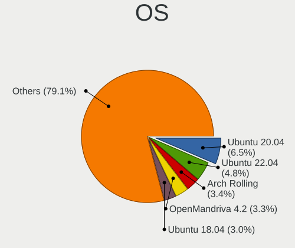

| Name                         | Notebooks | Percent |
|------------------------------|-----------|---------|
| Ubuntu 20.04                 | 362       | 6.46%   |
| Ubuntu 22.04                 | 268       | 4.78%   |
| Arch Rolling                 | 188       | 3.35%   |
| OpenMandriva 4.2             | 187       | 3.34%   |
| Ubuntu 18.04                 | 168       | 3%      |
| OpenMandriva 25.90           | 143       | 2.55%   |
| Ubuntu 24.04                 | 129       | 2.3%    |
| OpenMandriva 4.3             | 113       | 2.02%   |
| Debian 11                    | 104       | 1.86%   |
| OpenMandriva 24.12           | 100       | 1.78%   |
| Debian 12                    | 100       | 1.78%   |
| OpenMandriva 5.0             | 98        | 1.75%   |
| OpenMandriva 23.03           | 83        | 1.48%   |
| Pop!_OS 22.04                | 82        | 1.46%   |
| Fedora 39                    | 73        | 1.3%    |
| OpenMandriva 6.0             | 63        | 1.12%   |
| OpenMandriva 23.08           | 63        | 1.12%   |
| Fedora 42                    | 60        | 1.07%   |
| OpenMandriva 23.01           | 58        | 1.03%   |
| Linux Mint 21.1              | 57        | 1.02%   |
| Manjaro                      | 55        | 0.98%   |
| Linux Mint 22.1              | 55        | 0.98%   |
| OpenMandriva 24.07           | 54        | 0.96%   |
| Fedora 40                    | 54        | 0.96%   |
| Zorin 16                     | 53        | 0.95%   |
| Zorin 17                     | 50        | 0.89%   |
| ROSA R10                     | 50        | 0.89%   |
| Fedora 38                    | 48        | 0.86%   |
| Linux Mint 20.3              | 47        | 0.84%   |
| openSUSE Tumbleweed-XXXXXXXX | 45        | 0.8%    |
| Linux Mint 20.1              | 42        | 0.75%   |
| Arch                         | 42        | 0.75%   |
| Fedora 41                    | 41        | 0.73%   |
| Fedora 37                    | 41        | 0.73%   |
| KDE neon 20.04               | 40        | 0.71%   |
| ROSA R9                      | 39        | 0.7%    |
| ROSA R11.1                   | 39        | 0.7%    |
| EndeavourOS Rolling          | 39        | 0.7%    |
| Fedora 36                    | 36        | 0.64%   |
| Linux Mint 20.2              | 34        | 0.61%   |

OS Family
---------

OS without a version

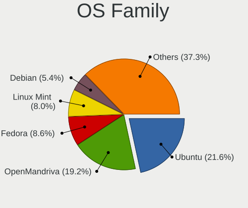

| Name          | Notebooks | Percent |
|---------------|-----------|---------|
| Ubuntu        | 1124      | 21.63%  |
| OpenMandriva  | 996       | 19.16%  |
| Fedora        | 445       | 8.56%   |
| Linux Mint    | 415       | 7.99%   |
| Debian        | 279       | 5.37%   |
| Arch          | 225       | 4.33%   |
| ROSA          | 198       | 3.81%   |
| Manjaro       | 158       | 3.04%   |
| Zorin         | 150       | 2.89%   |
| Pop!_OS       | 141       | 2.71%   |
| Kubuntu       | 106       | 2.04%   |
| Xubuntu       | 75        | 1.44%   |
| KDE neon      | 71        | 1.37%   |
| Kali          | 65        | 1.25%   |
| SteamOS       | 63        | 1.21%   |
| openSUSE      | 57        | 1.1%    |
| Elementary    | 47        | 0.9%    |
| EndeavourOS   | 41        | 0.79%   |
| Lubuntu       | 39        | 0.75%   |
| ArcoLinux     | 39        | 0.75%   |
| LMDE          | 35        | 0.67%   |
| Gentoo        | 35        | 0.67%   |
| Nobara        | 25        | 0.48%   |
| Endless       | 25        | 0.48%   |
| MX            | 23        | 0.44%   |
| Garuda Linux  | 21        | 0.4%    |
| Ubuntu MATE   | 17        | 0.33%   |
| NixOS         | 17        | 0.33%   |
| Clear Linux   | 16        | 0.31%   |
| Xero          | 14        | 0.27%   |
| Ubuntu Unity  | 14        | 0.27%   |
| Ubuntu Budgie | 12        | 0.23%   |
| Dts-distro    | 11        | 0.21%   |
| CachyOS       | 10        | 0.19%   |
| Peppermint    | 9         | 0.17%   |
| Bazzite       | 9         | 0.17%   |
| Parrot        | 8         | 0.15%   |
| LinuxFX       | 8         | 0.15%   |
| Devuan        | 7         | 0.13%   |
| BlackPanther  | 7         | 0.13%   |

Kernel
------

Version of the Linux kernel

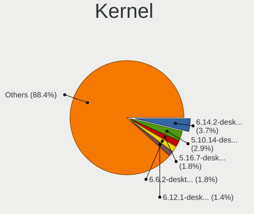

| Version                         | Notebooks | Percent |
|---------------------------------|-----------|---------|
| 6.14.2-desktop-3omv2590         | 228       | 3.74%   |
| 5.10.14-desktop-1omv4002        | 177       | 2.9%    |
| 5.16.7-desktop-1omv4003         | 109       | 1.79%   |
| 6.6.2-desktop-1omv2390          | 108       | 1.77%   |
| 6.12.1-desktop-1omv2490         | 84        | 1.38%   |
| 6.2.6-desktop-1omv2390          | 81        | 1.33%   |
| 6.4.11-desktop-1omv2390         | 58        | 0.95%   |
| 6.1.1-desktop-1omv2290          | 55        | 0.9%    |
| 5.4.0-42-generic                | 44        | 0.72%   |
| 5.15.0-56-generic               | 44        | 0.72%   |
| 6.8.0-51-generic                | 43        | 0.71%   |
| 6.10.0-desktop-1omv2490         | 43        | 0.71%   |
| 5.15.0-58-generic               | 27        | 0.44%   |
| 4.9.20-nrj-desktop-1rosa-x86_64 | 27        | 0.44%   |
| 6.12.9-desktop-1omv2490         | 25        | 0.41%   |
| 5.15.0-43-generic               | 24        | 0.39%   |
| 4.9.60-nrj-desktop-1rosa-x86_64 | 24        | 0.39%   |
| 5.4.0-52-generic                | 22        | 0.36%   |
| 5.4.0-48-generic                | 22        | 0.36%   |
| 5.15.0-52-generic               | 22        | 0.36%   |
| 6.9.3-76060903-generic          | 21        | 0.34%   |
| 5.19.0-35-generic               | 21        | 0.34%   |
| 5.4.0-29-generic                | 20        | 0.33%   |
| 6.8.0-52-generic                | 19        | 0.31%   |
| 6.8.0-45-generic                | 19        | 0.31%   |
| 6.8.0-41-generic                | 19        | 0.31%   |
| 5.4.0-58-generic                | 19        | 0.31%   |
| 5.4.0-26-generic                | 19        | 0.31%   |
| 5.19.0-32-generic               | 19        | 0.31%   |
| 5.3.0-46-generic                | 18        | 0.3%    |
| 5.15.0-53-generic               | 18        | 0.3%    |
| 5.0.0-37-generic                | 18        | 0.3%    |
| 5.4.0-33-generic                | 17        | 0.28%   |
| 5.11.0-37-generic               | 17        | 0.28%   |
| 6.8.0-49-generic                | 16        | 0.26%   |
| 6.2.0-26-generic                | 16        | 0.26%   |
| 6.1.0-18-amd64                  | 16        | 0.26%   |
| 5.8.0-43-generic                | 16        | 0.26%   |
| 5.4.0-54-generic                | 16        | 0.26%   |
| 5.15.0-91-generic               | 16        | 0.26%   |

Kernel Family
-------------

Linux kernel without a distro release

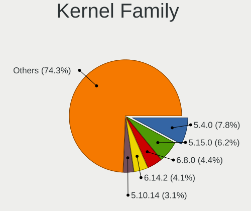

| Version | Notebooks | Percent |
|---------|-----------|---------|
| 5.4.0   | 456       | 7.84%   |
| 5.15.0  | 362       | 6.23%   |
| 6.8.0   | 256       | 4.4%    |
| 6.14.2  | 240       | 4.13%   |
| 5.10.14 | 178       | 3.06%   |
| 4.15.0  | 151       | 2.6%    |
| 5.11.0  | 145       | 2.49%   |
| 6.1.0   | 137       | 2.36%   |
| 5.8.0   | 130       | 2.24%   |
| 5.13.0  | 126       | 2.17%   |
| 6.5.0   | 122       | 2.1%    |
| 5.10.0  | 122       | 2.1%    |
| 6.14.0  | 114       | 1.96%   |
| 6.6.2   | 112       | 1.93%   |
| 5.19.0  | 110       | 1.89%   |
| 5.16.7  | 110       | 1.89%   |
| 5.3.0   | 103       | 1.77%   |
| 6.2.6   | 96        | 1.65%   |
| 6.2.0   | 91        | 1.57%   |
| 6.12.1  | 89        | 1.53%   |
| 6.11.0  | 74        | 1.27%   |
| 5.0.0   | 62        | 1.07%   |
| 6.4.11  | 61        | 1.05%   |
| 4.18.0  | 60        | 1.03%   |
| 6.1.1   | 56        | 0.96%   |
| 6.10.0  | 44        | 0.76%   |
| 4.9.20  | 36        | 0.62%   |
| 5.14.0  | 34        | 0.58%   |
| 4.9.60  | 32        | 0.55%   |
| 4.19.0  | 31        | 0.53%   |
| 6.9.3   | 30        | 0.52%   |
| 6.12.9  | 29        | 0.5%    |
| 6.1.52  | 23        | 0.4%    |
| 4.1.34  | 22        | 0.38%   |
| 6.12.6  | 18        | 0.31%   |
| 6.12.10 | 18        | 0.31%   |
| 6.0.0   | 18        | 0.31%   |
| 6.11.11 | 17        | 0.29%   |
| 6.5.6   | 16        | 0.28%   |
| 5.11.12 | 15        | 0.26%   |

Kernel Major Ver.
-----------------

Linux kernel major version

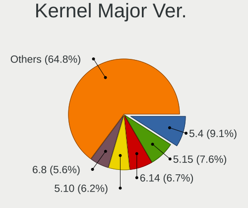

| Version | Notebooks | Percent |
|---------|-----------|---------|
| 5.4     | 517       | 9.08%   |
| 5.15    | 431       | 7.57%   |
| 6.14    | 381       | 6.69%   |
| 5.10    | 355       | 6.23%   |
| 6.8     | 319       | 5.6%    |
| 6.1     | 290       | 5.09%   |
| 6.12    | 247       | 4.34%   |
| 6.2     | 240       | 4.21%   |
| 6.6     | 227       | 3.99%   |
| 6.5     | 190       | 3.34%   |
| 5.11    | 183       | 3.21%   |
| 5.16    | 168       | 2.95%   |
| 5.8     | 161       | 2.83%   |
| 4.15    | 151       | 2.65%   |
| 5.19    | 146       | 2.56%   |
| 5.13    | 143       | 2.51%   |
| 6.11    | 137       | 2.41%   |
| 5.3     | 116       | 2.04%   |
| 6.4     | 106       | 1.86%   |
| 4.9     | 101       | 1.77%   |
| 6.10    | 93        | 1.63%   |
| 6.9     | 85        | 1.49%   |
| 6.0     | 74        | 1.3%    |
| 5.14    | 73        | 1.28%   |
| 5.0     | 68        | 1.19%   |
| 4.18    | 63        | 1.11%   |
| 6.17    | 55        | 0.97%   |
| 5.17    | 52        | 0.91%   |
| 6.7     | 50        | 0.88%   |
| 6.3     | 43        | 0.75%   |
| 6.13    | 42        | 0.74%   |
| 5.9     | 42        | 0.74%   |
| 5.6     | 42        | 0.74%   |
| 6.15    | 41        | 0.72%   |
| 5.18    | 41        | 0.72%   |
| 4.19    | 38        | 0.67%   |
| 4.1     | 36        | 0.63%   |
| 6.16    | 33        | 0.58%   |
| 5.12    | 26        | 0.46%   |
| 5.5     | 23        | 0.4%    |

Arch
----

OS architecture (x86_64, i586, etc.)

| Name    | Notebooks | Percent |
|---------|-----------|---------|
| x86_64  | 4839      | 97.6%   |
| i686    | 117       | 2.36%   |
| aarch64 | 2         | 0.04%   |

DE
--

Desktop Environment

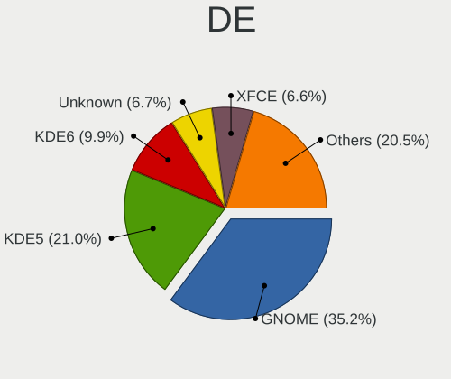

| Name             | Notebooks | Percent |
|------------------|-----------|---------|
| GNOME            | 1859      | 35.16%  |
| KDE5             | 1113      | 21.05%  |
| KDE6             | 524       | 9.91%   |
| Unknown          | 356       | 6.73%   |
| XFCE             | 351       | 6.64%   |
| X-Cinnamon       | 341       | 6.45%   |
| LXQt             | 128       | 2.42%   |
| KDE4             | 105       | 1.99%   |
| MATE             | 101       | 1.91%   |
| KDE              | 97        | 1.83%   |
| Cinnamon         | 50        | 0.95%   |
| Pantheon         | 48        | 0.91%   |
| LXDE             | 43        | 0.81%   |
| i3               | 29        | 0.55%   |
| Budgie           | 24        | 0.45%   |
| Hyprland         | 19        | 0.36%   |
| Unity            | 15        | 0.28%   |
| Deepin           | 11        | 0.21%   |
| GNOME Flashback  | 9         | 0.17%   |
| GNOME Classic    | 9         | 0.17%   |
| sway             | 8         | 0.15%   |
| COSMIC           | 7         | 0.13%   |
| trinity          | 4         | 0.08%   |
| openbox          | 4         | 0.08%   |
| awesome          | 4         | 0.08%   |
| niri             | 3         | 0.06%   |
| lightdm-xsession | 3         | 0.06%   |
| DWM              | 3         | 0.06%   |
| qtile            | 2         | 0.04%   |
| icewm            | 2         | 0.04%   |
| GNUstep          | 2         | 0.04%   |
| Fluxbox          | 2         | 0.04%   |
| Endless:GNOME    | 2         | 0.04%   |
| BunsenLabs       | 2         | 0.04%   |
| stumpwm          | 1         | 0.02%   |
| ratflow          | 1         | 0.02%   |
| qt5ct            | 1         | 0.02%   |
| MakuluGameR      | 1         | 0.02%   |
| LeftWM           | 1         | 0.02%   |
| gamescope        | 1         | 0.02%   |

Display Server
--------------

X11 or Wayland

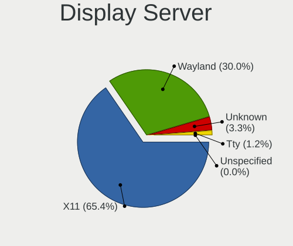

| Name        | Notebooks | Percent |
|-------------|-----------|---------|
| X11         | 3397      | 65.43%  |
| Wayland     | 1557      | 29.99%  |
| Unknown     | 173       | 3.33%   |
| Tty         | 64        | 1.23%   |
| Unspecified | 1         | 0.02%   |

Display Manager
---------------

SDDM, LightDM, etc.

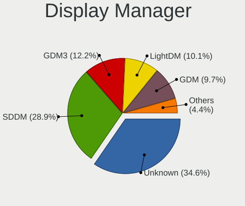

| Name                  | Notebooks | Percent |
|-----------------------|-----------|---------|
| Unknown               | 1799      | 34.61%  |
| SDDM                  | 1504      | 28.93%  |
| GDM3                  | 633       | 12.18%  |
| LightDM               | 526       | 10.12%  |
| GDM                   | 506       | 9.73%   |
| KDM                   | 100       | 1.92%   |
| TDM                   | 95        | 1.83%   |
| SLiM                  | 8         | 0.15%   |
| XDM                   | 6         | 0.12%   |
| GREETD                | 6         | 0.12%   |
| LXDM                  | 5         | 0.1%    |
| Ly                    | 3         | 0.06%   |
| NODM                  | 2         | 0.04%   |
| SU                    | 1         | 0.02%   |
| SLIMSKI               | 1         | 0.02%   |
| MDM                   | 1         | 0.02%   |
| EMPTTY                | 1         | 0.02%   |
| DISPLAY-MANAGER-START | 1         | 0.02%   |

OS Lang
-------

Language

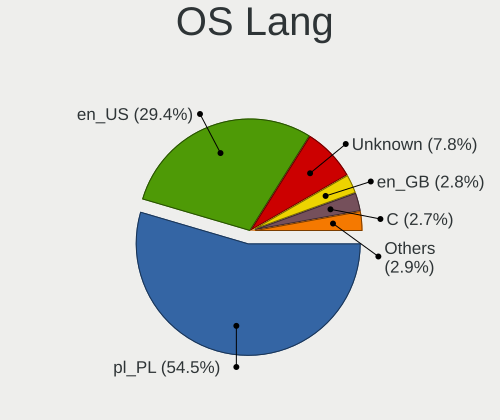

| Lang        | Notebooks | Percent |
|-------------|-----------|---------|
| pl_PL       | 2794      | 54.55%  |
| en_US       | 1505      | 29.38%  |
| Unknown     | 398       | 7.77%   |
| en_GB       | 142       | 2.77%   |
| C           | 137       | 2.67%   |
| ru_RU       | 36        | 0.7%    |
| uk_UA       | 20        | 0.39%   |
| ru_UA       | 10        | 0.2%    |
| de_DE       | 10        | 0.2%    |
| szl_PL      | 9         | 0.18%   |
| en_IE       | 8         | 0.16%   |
| it_IT       | 5         | 0.1%    |
| en_DK       | 5         | 0.1%    |
| fr_FR       | 4         | 0.08%   |
| POSIX       | 3         | 0.06%   |
| es_ES       | 3         | 0.06%   |
| C.UTF8      | 3         | 0.06%   |
| nl_NL       | 2         | 0.04%   |
| hu_HU       | 2         | 0.04%   |
| en_CA       | 2         | 0.04%   |
| en_AU       | 2         | 0.04%   |
| en_AG       | 2         | 0.04%   |
| cs_CZ       | 2         | 0.04%   |
| be_BY       | 2         | 0.04%   |
| UTF-8       | 1         | 0.02%   |
| sk_SK       | 1         | 0.02%   |
| pt_BR       | 1         | 0.02%   |
| pl_PL.UTF8  | 1         | 0.02%   |
| pl.PL       | 1         | 0.02%   |
| es_MX       | 1         | 0.02%   |
| es_CL       | 1         | 0.02%   |
| es_AR       | 1         | 0.02%   |
| en_US.UTF8  | 1         | 0.02%   |
| en_US.UTF.8 | 1         | 0.02%   |
| en_US.utf-8 | 1         | 0.02%   |
| en_IN       | 1         | 0.02%   |
| el_GR       | 1         | 0.02%   |
| Default     | 1         | 0.02%   |
| af_ZA       | 1         | 0.02%   |
| aa_DJ       | 1         | 0.02%   |

Boot Mode
---------

EFI or BIOS

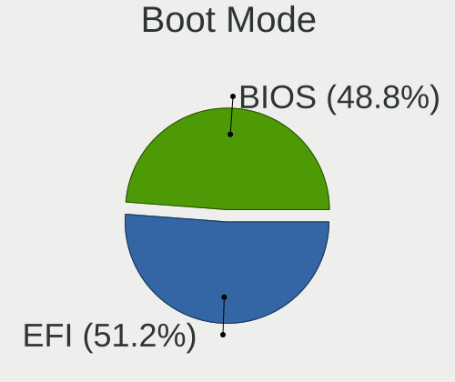

| Mode | Notebooks | Percent |
|------|-----------|---------|
| EFI  | 2608      | 51.2%   |
| BIOS | 2486      | 48.8%   |

Filesystem
----------

Type of filesystem

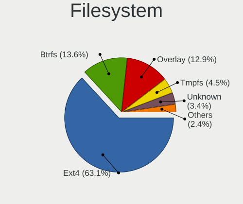

| Type     | Notebooks | Percent |
|----------|-----------|---------|
| Ext4     | 3264      | 63.13%  |
| Btrfs    | 701       | 13.56%  |
| Overlay  | 669       | 12.94%  |
| Tmpfs    | 235       | 4.55%   |
| Unknown  | 178       | 3.44%   |
| Xfs      | 63        | 1.22%   |
| Zfs      | 30        | 0.58%   |
| F2fs     | 11        | 0.21%   |
| Rootfs   | 6         | 0.12%   |
| Ext2     | 5         | 0.1%    |
| Ext3     | 4         | 0.08%   |
| Bcachefs | 2         | 0.04%   |
| XXXXX    | 1         | 0.02%   |
| Jfs      | 1         | 0.02%   |

Part. scheme
------------

Scheme of partitioning

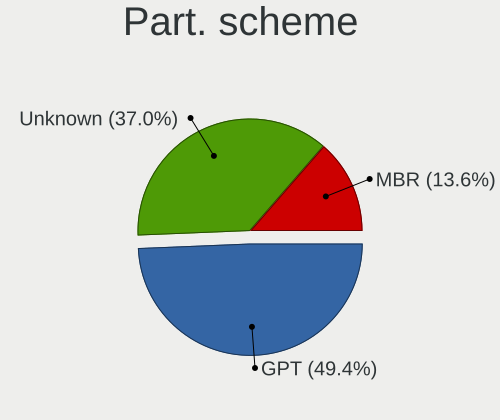

| Type    | Notebooks | Percent |
|---------|-----------|---------|
| GPT     | 2527      | 49.36%  |
| Unknown | 1896      | 37.03%  |
| MBR     | 697       | 13.61%  |

Dual Boot with Linux/BSD
------------------------

Hosting more than one Linux/BSD

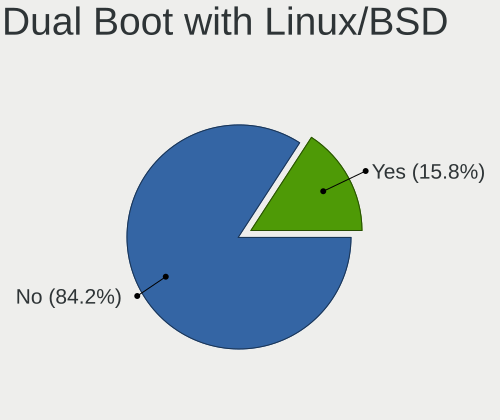

| Dual boot | Notebooks | Percent |
|-----------|-----------|---------|
| No        | 4276      | 84.17%  |
| Yes       | 804       | 15.83%  |

Dual Boot (Win)
---------------

Hosting Linux and Windows

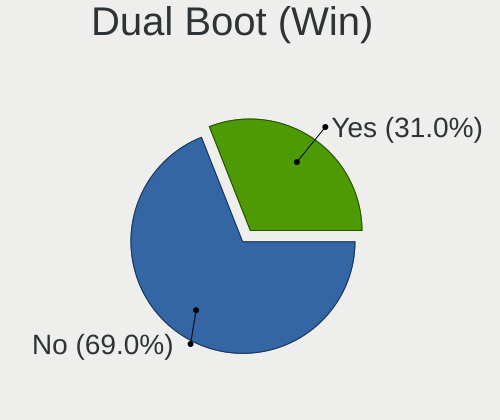

| Dual boot | Notebooks | Percent |
|-----------|-----------|---------|
| No        | 3489      | 69.02%  |
| Yes       | 1566      | 30.98%  |

Board
-----

Vendor
------

Motherboard manufacturer

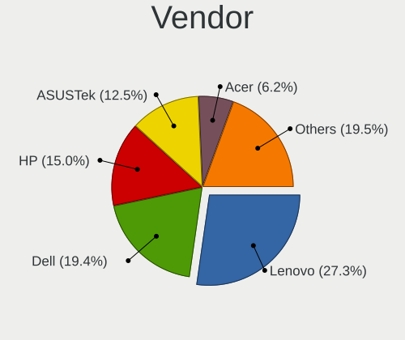

| Name                | Notebooks | Percent |
|---------------------|-----------|---------|
| Lenovo              | 1350      | 27.26%  |
| Dell                | 963       | 19.44%  |
| Hewlett-Packard     | 745       | 15.04%  |
| ASUSTek Computer    | 621       | 12.54%  |
| Acer                | 309       | 6.24%   |
| Toshiba             | 120       | 2.42%   |
| Samsung Electronics | 116       | 2.34%   |
| MSI                 | 109       | 2.2%    |
| HUAWEI              | 66        | 1.33%   |
| Apple               | 64        | 1.29%   |
| Valve               | 57        | 1.15%   |
| Sony                | 53        | 1.07%   |
| Google              | 42        | 0.85%   |
| Fujitsu             | 36        | 0.73%   |
| Notebook            | 31        | 0.63%   |
| Fujitsu Siemens     | 29        | 0.59%   |
| Packard Bell        | 22        | 0.44%   |
| Medion              | 16        | 0.32%   |
| Gigabyte Technology | 16        | 0.32%   |
| Kiano               | 13        | 0.26%   |
| Timi                | 11        | 0.22%   |
| eMachines           | 11        | 0.22%   |
| Unknown             | 11        | 0.22%   |
| TUXEDO              | 9         | 0.18%   |
| mPTech              | 7         | 0.14%   |
| Chuwi               | 7         | 0.14%   |
| Panasonic           | 6         | 0.12%   |
| Dynabook            | 6         | 0.12%   |
| IGEL Technology     | 5         | 0.1%    |
| Clevo               | 5         | 0.1%    |
| XIAOMI              | 4         | 0.08%   |
| LG Electronics      | 4         | 0.08%   |
| Kruger&Matz         | 4         | 0.08%   |
| GPU Company         | 4         | 0.08%   |
| Alienware           | 4         | 0.08%   |
| TrekStor            | 3         | 0.06%   |
| Teclast             | 3         | 0.06%   |
| System76            | 3         | 0.06%   |
| Intel               | 3         | 0.06%   |
| Getac               | 3         | 0.06%   |

Model
-----

Motherboard model

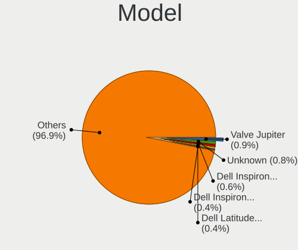

| Name                           | Notebooks | Percent |
|--------------------------------|-----------|---------|
| Valve Jupiter                  | 44        | 0.89%   |
| Unknown                        | 38        | 0.77%   |
| Dell Inspiron 3451             | 31        | 0.63%   |
| Dell Inspiron 13-5368          | 22        | 0.44%   |
| Dell Latitude E6400            | 20        | 0.4%    |
| Lenovo G50-30 80G0             | 19        | 0.38%   |
| Dell Latitude E6540            | 18        | 0.36%   |
| Dell Latitude E6430            | 18        | 0.36%   |
| HP Pavilion dv7                | 17        | 0.34%   |
| HP Notebook                    | 17        | 0.34%   |
| ASUS X555LJ                    | 17        | 0.34%   |
| Lenovo G510 20238              | 16        | 0.32%   |
| Dell Latitude E7440            | 15        | 0.3%    |
| Lenovo G580 20150              | 14        | 0.28%   |
| Dell Latitude 5490             | 14        | 0.28%   |
| Dell Latitude 5480             | 14        | 0.28%   |
| Valve Galileo                  | 13        | 0.26%   |
| Dell Latitude 5400             | 13        | 0.26%   |
| Dell Latitude E6440            | 12        | 0.24%   |
| Dell Latitude D630             | 12        | 0.24%   |
| Lenovo Legion Y540-15IRH 81SX  | 11        | 0.22%   |
| Lenovo IdeaPad Y700-15ISK 80NV | 11        | 0.22%   |
| HP Pavilion dv6                | 11        | 0.22%   |
| Dell Latitude E6420            | 11        | 0.22%   |
| Dell Latitude E6410            | 11        | 0.22%   |
| Dell Latitude E6330            | 11        | 0.22%   |
| Dell Latitude E5470            | 11        | 0.22%   |
| Dell Latitude 5420             | 11        | 0.22%   |
| Lenovo Legion Y530-15ICH 81FV  | 10        | 0.2%    |
| Lenovo IdeaPad 100-15IBD 80QQ  | 10        | 0.2%    |
| Lenovo G50-80 80E5             | 10        | 0.2%    |
| HUAWEI HVY-WXX9                | 10        | 0.2%    |
| HP EliteBook 840 G3            | 10        | 0.2%    |
| HP 15                          | 10        | 0.2%    |
| Dell Latitude E5430 non-vPro   | 10        | 0.2%    |
| Apple MacBookPro12,1           | 10        | 0.2%    |
| Lenovo Y520-15IKBN 80WK        | 9         | 0.18%   |
| Lenovo Legion 5 15ARH05 82B5   | 9         | 0.18%   |
| Lenovo G500 20236              | 9         | 0.18%   |
| Lenovo B590 20206              | 9         | 0.18%   |

Model Family
------------

Motherboard model prefix

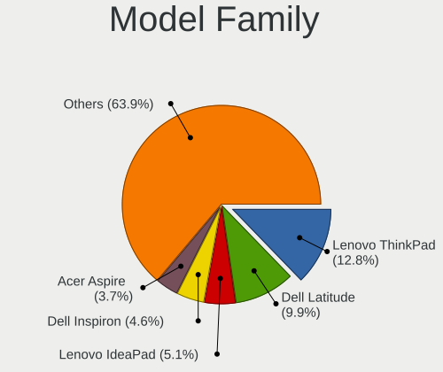

| Name                  | Notebooks | Percent |
|-----------------------|-----------|---------|
| Lenovo ThinkPad       | 632       | 12.76%  |
| Dell Latitude         | 492       | 9.93%   |
| Lenovo IdeaPad        | 254       | 5.13%   |
| Dell Inspiron         | 227       | 4.58%   |
| Acer Aspire           | 185       | 3.74%   |
| HP EliteBook          | 163       | 3.29%   |
| HP Pavilion           | 153       | 3.09%   |
| HP ProBook            | 112       | 2.26%   |
| Lenovo Legion         | 107       | 2.16%   |
| Toshiba Satellite     | 100       | 2.02%   |
| ASUS VivoBook         | 93        | 1.88%   |
| ASUS ASUS             | 84        | 1.7%    |
| Dell Precision        | 82        | 1.66%   |
| HP Laptop             | 63        | 1.27%   |
| Dell Vostro           | 57        | 1.15%   |
| Dell XPS              | 46        | 0.93%   |
| Valve Jupiter         | 44        | 0.89%   |
| Lenovo ThinkBook      | 38        | 0.77%   |
| Unknown               | 38        | 0.77%   |
| HP Compaq             | 34        | 0.69%   |
| HP 250                | 32        | 0.65%   |
| ASUS ROG              | 32        | 0.65%   |
| Fujitsu LIFEBOOK      | 31        | 0.63%   |
| Acer Nitro            | 31        | 0.63%   |
| HP ZBook              | 30        | 0.61%   |
| ASUS Zenbook          | 27        | 0.55%   |
| ASUS TUF              | 27        | 0.55%   |
| Lenovo Yoga           | 25        | 0.5%    |
| Acer Extensa          | 24        | 0.48%   |
| Acer Swift            | 23        | 0.46%   |
| Packard Bell EasyNote | 22        | 0.44%   |
| HP OMEN               | 21        | 0.42%   |
| Acer TravelMate       | 21        | 0.42%   |
| HP 255                | 20        | 0.4%    |
| Lenovo G50-30         | 19        | 0.38%   |
| Lenovo G580           | 17        | 0.34%   |
| HP Notebook           | 17        | 0.34%   |
| ASUS X555LJ           | 17        | 0.34%   |
| Lenovo G510           | 16        | 0.32%   |
| Lenovo LOQ            | 15        | 0.3%    |

MFG Year
--------

Motherboard manufacture year

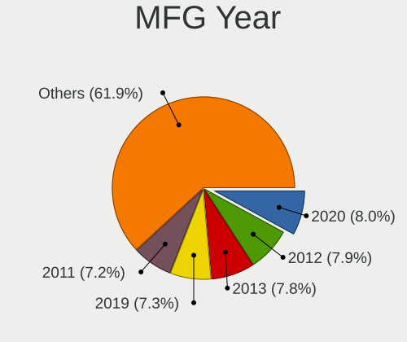

| Year    | Notebooks | Percent |
|---------|-----------|---------|
| 2020    | 394       | 7.95%   |
| 2012    | 391       | 7.89%   |
| 2013    | 385       | 7.77%   |
| 2019    | 364       | 7.35%   |
| 2011    | 355       | 7.17%   |
| 2018    | 341       | 6.88%   |
| 2021    | 322       | 6.5%    |
| 2014    | 295       | 5.96%   |
| 2015    | 265       | 5.35%   |
| 2008    | 265       | 5.35%   |
| 2017    | 262       | 5.29%   |
| 2010    | 225       | 4.54%   |
| 2016    | 212       | 4.28%   |
| 2022    | 203       | 4.1%    |
| 2023    | 200       | 4.04%   |
| 2009    | 134       | 2.71%   |
| 2007    | 131       | 2.64%   |
| 2024    | 127       | 2.56%   |
| 2006    | 49        | 0.99%   |
| 2025    | 25        | 0.5%    |
| 2005    | 3         | 0.06%   |
| Unknown | 3         | 0.06%   |
| 2004    | 2         | 0.04%   |

Form Factor
-----------

Physical design of the computer

| Name     | Notebooks | Percent |
|----------|-----------|---------|
| Notebook | 4953      | 100%    |

Secure Boot
-----------

Enabled or disabled

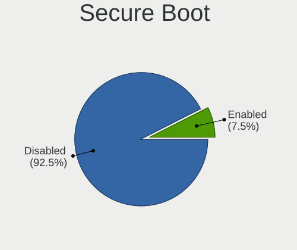

| State    | Notebooks | Percent |
|----------|-----------|---------|
| Disabled | 4621      | 92.53%  |
| Enabled  | 373       | 7.47%   |

Coreboot
--------

Have coreboot on board

| Used | Notebooks | Percent |
|------|-----------|---------|
| No   | 4904      | 99.01%  |
| Yes  | 49        | 0.99%   |

RAM Size
--------

Total RAM memory

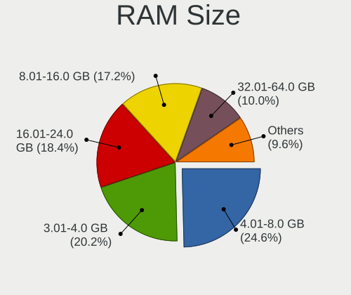

| Size in GB  | Notebooks | Percent |
|-------------|-----------|---------|
| 4.01-8.0    | 1244      | 24.61%  |
| 3.01-4.0    | 1023      | 20.24%  |
| 16.01-24.0  | 930       | 18.4%   |
| 8.01-16.0   | 870       | 17.21%  |
| 32.01-64.0  | 504       | 9.97%   |
| 1.01-2.0    | 156       | 3.09%   |
| 2.01-3.0    | 114       | 2.26%   |
| 24.01-32.0  | 102       | 2.02%   |
| 64.01-256.0 | 86        | 1.7%    |
| 0.51-1.0    | 25        | 0.49%   |

RAM Used
--------

Used RAM memory

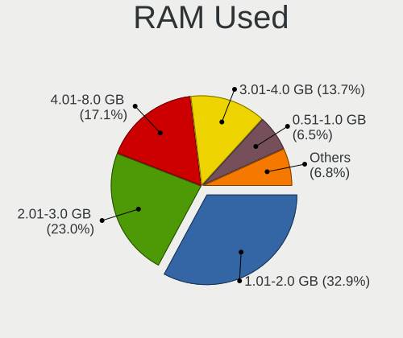

| Used GB    | Notebooks | Percent |
|------------|-----------|---------|
| 1.01-2.0   | 1832      | 32.86%  |
| 2.01-3.0   | 1284      | 23.03%  |
| 4.01-8.0   | 956       | 17.15%  |
| 3.01-4.0   | 765       | 13.72%  |
| 0.51-1.0   | 360       | 6.46%   |
| 8.01-16.0  | 272       | 4.88%   |
| 0.01-0.5   | 50        | 0.9%    |
| 16.01-24.0 | 42        | 0.75%   |
| 24.01-32.0 | 9         | 0.16%   |
| 32.01-64.0 | 5         | 0.09%   |

Total Drives
------------

Number of drives on board

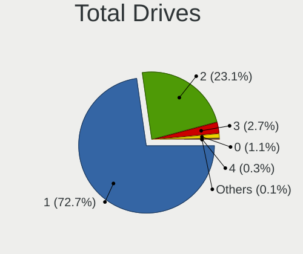

| Drives | Notebooks | Percent |
|--------|-----------|---------|
| 1      | 3705      | 72.75%  |
| 2      | 1175      | 23.07%  |
| 3      | 138       | 2.71%   |
| 0      | 57        | 1.12%   |
| 4      | 15        | 0.29%   |
| 5      | 3         | 0.06%   |

Has CD-ROM
----------

Has CD-ROM on board

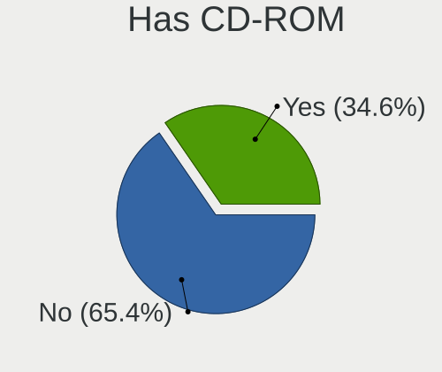

| Presented | Notebooks | Percent |
|-----------|-----------|---------|
| No        | 3270      | 65.39%  |
| Yes       | 1731      | 34.61%  |

Has Ethernet
------------

Has Ethernet on board

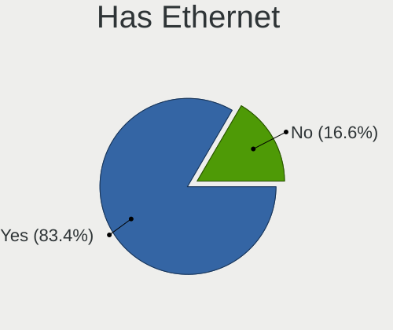

| Presented | Notebooks | Percent |
|-----------|-----------|---------|
| Yes       | 4148      | 83.43%  |
| No        | 824       | 16.57%  |

Has WiFi
--------

Has WiFi module

| Presented | Notebooks | Percent |
|-----------|-----------|---------|
| Yes       | 4820      | 97.2%   |
| No        | 139       | 2.8%    |

Has Bluetooth
-------------

Has Bluetooth module

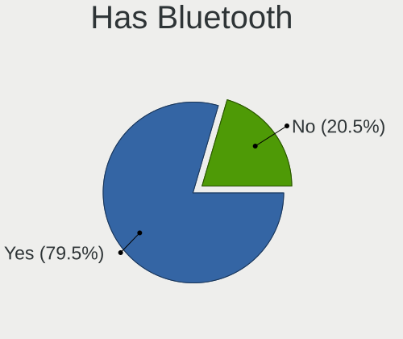

| Presented | Notebooks | Percent |
|-----------|-----------|---------|
| Yes       | 4003      | 79.52%  |
| No        | 1031      | 20.48%  |

Location
--------

Country
-------

Geographic location (country)

| Country | Notebooks | Percent |
|---------|-----------|---------|
| Poland  | 4953      | 100%    |

City
----

Geographic location (city)

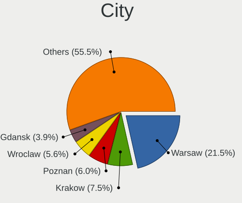

| City            | Notebooks | Percent |
|-----------------|-----------|---------|
| Warsaw          | 1167      | 21.49%  |
| Krakow          | 409       | 7.53%   |
| Poznan          | 324       | 5.97%   |
| Wroclaw         | 305       | 5.62%   |
| Gdansk          | 211       | 3.89%   |
| Lodz            | 179       | 3.3%    |
| Katowice        | 151       | 2.78%   |
| Szczecin        | 96        | 1.77%   |
| Lublin          | 79        | 1.45%   |
| Gdynia          | 67        | 1.23%   |
| Bialystok       | 59        | 1.09%   |
| Bydgoszcz       | 56        | 1.03%   |
| Rzeszów        | 47        | 0.87%   |
| Torun           | 44        | 0.81%   |
| Gliwice         | 43        | 0.79%   |
| Bytom           | 33        | 0.61%   |
| Ruda Śląska   | 32        | 0.59%   |
| Sosnowiec       | 31        | 0.57%   |
| Częstochowa    | 31        | 0.57%   |
| Zabrze          | 30        | 0.55%   |
| Kielce          | 30        | 0.55%   |
| Olsztyn         | 27        | 0.5%    |
| Elblag          | 23        | 0.42%   |
| Rybnik          | 22        | 0.41%   |
| Zielona Góra   | 21        | 0.39%   |
| Płock          | 21        | 0.39%   |
| Opole           | 21        | 0.39%   |
| Chorzów        | 18        | 0.33%   |
| Bielsko-Biala   | 18        | 0.33%   |
| Tychy           | 17        | 0.31%   |
| Słupsk         | 16        | 0.29%   |
| Tarnowskie Gory | 15        | 0.28%   |
| Tarnów         | 14        | 0.26%   |
| Kalisz          | 14        | 0.26%   |
| Pruszków       | 13        | 0.24%   |
| Koszalin        | 13        | 0.24%   |
| Swidnica        | 12        | 0.22%   |
| Skawina         | 12        | 0.22%   |
| Mielec          | 12        | 0.22%   |
| Wejherowo       | 11        | 0.2%    |

Drives
------

Drive Vendor
------------

Hard drive vendors

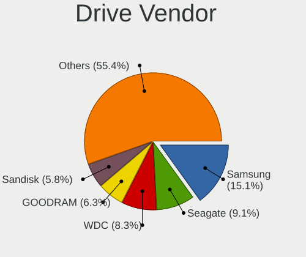

| Vendor                       | Notebooks | Drives | Percent |
|------------------------------|-----------|--------|---------|
| Samsung Electronics          | 938       | 1250   | 15.07%  |
| Seagate                      | 568       | 718    | 9.12%   |
| WDC                          | 516       | 654    | 8.29%   |
| GOODRAM                      | 392       | 513    | 6.3%    |
| Sandisk                      | 361       | 474    | 5.8%    |
| Toshiba                      | 340       | 421    | 5.46%   |
| Unknown                      | 299       | 384    | 4.8%    |
| SK hynix                     | 266       | 318    | 4.27%   |
| Micron Technology            | 233       | 292    | 3.74%   |
| Kingston                     | 220       | 298    | 3.53%   |
| Intel                        | 220       | 298    | 3.53%   |
| A-DATA Technology            | 220       | 268    | 3.53%   |
| Crucial                      | 194       | 312    | 3.12%   |
| Hitachi                      | 184       | 220    | 2.96%   |
| HGST                         | 110       | 134    | 1.77%   |
| KIOXIA                       | 94        | 106    | 1.51%   |
| Phison Electronics           | 69        | 80     | 1.11%   |
| SPCC                         | 66        | 73     | 1.06%   |
| Patriot                      | 53        | 65     | 0.85%   |
| PNY                          | 43        | 46     | 0.69%   |
| Kingston Technology Company  | 41        | 45     | 0.66%   |
| MAXIO Technology (Hangzhou)  | 38        | 40     | 0.61%   |
| LITEON                       | 34        | 42     | 0.55%   |
| China                        | 34        | 43     | 0.55%   |
| Plextor                      | 33        | 47     | 0.53%   |
| Fujitsu                      | 30        | 32     | 0.48%   |
| Apple                        | 30        | 42     | 0.48%   |
| Apacer                       | 27        | 40     | 0.43%   |
| Unknown                      | 27        | 34     | 0.43%   |
| Silicon Motion               | 26        | 32     | 0.42%   |
| Lexar                        | 26        | 26     | 0.42%   |
| Transcend                    | 25        | 31     | 0.4%    |
| Shenzhen Longsys Electronics | 24        | 36     | 0.39%   |
| KIOXIA-EXCERIA               | 24        | 28     | 0.39%   |
| ADATA Technology             | 24        | 34     | 0.39%   |
| Phison                       | 23        | 30     | 0.37%   |
| Micron/Crucial Technology    | 20        | 25     | 0.32%   |
| LITEONIT                     | 19        | 22     | 0.31%   |
| Lenovo                       | 14        | 16     | 0.22%   |
| JMicron Technology           | 14        | 14     | 0.22%   |

Drive Model
-----------

Hard drive models

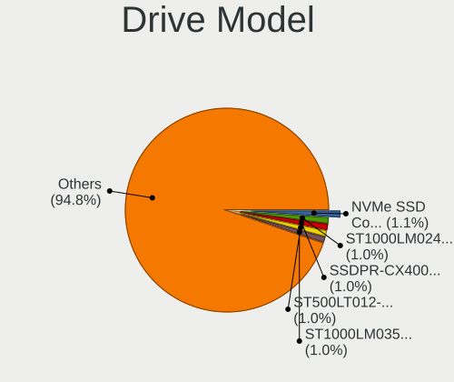

| Model                                              | Notebooks | Percent |
|----------------------------------------------------|-----------|---------|
| Samsung NVMe SSD Controller SM981/PM981/PM983 1TB  | 72        | 1.12%   |
| Seagate ST1000LM024 HN-M101MBB 1TB                 | 67        | 1.04%   |
| GOODRAM SSDPR-CX400-256-G2 256GB                   | 67        | 1.04%   |
| Seagate ST500LT012-1DG142 500GB                    | 66        | 1.02%   |
| Seagate ST1000LM035-1RK172 1TB                     | 62        | 0.96%   |
| Unknown MMC Card  32GB                             | 51        | 0.79%   |
| GOODRAM SSDPR-CX400-512-G2 512GB                   | 45        | 0.7%    |
| Kingston SA400S37240G 240GB SSD                    | 41        | 0.64%   |
| Crucial CT500MX500SSD1 500GB                       | 41        | 0.64%   |
| Unknown MMC Card  64GB                             | 38        | 0.59%   |
| Seagate ST9500325AS 500GB                          | 36        | 0.56%   |
| Samsung SSD 980 1TB                                | 33        | 0.51%   |
| HGST HTS721010A9E630 1TB                           | 33        | 0.51%   |
| Samsung NVMe SSD Controller PM9A1/PM9A3/980PRO 1TB | 32        | 0.5%    |
| Samsung SSD 860 EVO 500GB                          | 30        | 0.47%   |
| Toshiba MQ01ABF050 500GB                           | 29        | 0.45%   |
| Toshiba MQ01ABD100 1TB                             | 29        | 0.45%   |
| Samsung SSD 850 EVO 250GB                          | 29        | 0.45%   |
| GOODRAM SSD 120GB                                  | 29        | 0.45%   |
| Unknown MMC Card  128GB                            | 28        | 0.43%   |
| SanDisk NVMe SSD Drive 512GB                       | 28        | 0.43%   |
| Intel SSD 660P Series 512GB                        | 27        | 0.42%   |
| Crucial CT1000MX500SSD1 1TB                        | 27        | 0.42%   |
| Unknown                                            | 27        | 0.42%   |
| Samsung SSD 980 500GB                              | 25        | 0.39%   |
| Intel NVMe SSD Drive 512GB                         | 25        | 0.39%   |
| GOODRAM SSD 240GB                                  | 23        | 0.36%   |
| Crucial CT240BX500SSD1 240GB                       | 23        | 0.36%   |
| Unknown MMC Card  16GB                             | 22        | 0.34%   |
| MAXIO (Hangzhou) NVMe SSD Controller MAP1202 2TB   | 22        | 0.34%   |
| Intel SSDPEKNU512GZ 512GB                          | 22        | 0.34%   |
| A-DATA SU650 1TB SSD                               | 22        | 0.34%   |
| Sandisk WD Blue SN550 NVMe SSD 1024GB              | 21        | 0.33%   |
| Samsung NVMe SSD Drive 512GB                       | 21        | 0.33%   |
| GOODRAM SSDPR-CX400-256 256GB                      | 21        | 0.33%   |
| GOODRAM SSDPR-CX400-128-G2 128GB                   | 21        | 0.33%   |
| WDC WD10JPCX-24UE4T0 1TB                           | 20        | 0.31%   |
| Seagate Expansion 2TB                              | 20        | 0.31%   |
| Phison PS5013 E13 NVMe Controller 500GB            | 20        | 0.31%   |
| WDC WD10JPVX-22JC3T0 1TB                           | 19        | 0.29%   |

HDD Vendor
----------

Hard disk drive vendors

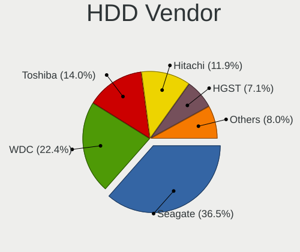

| Vendor              | Notebooks | Drives | Percent |
|---------------------|-----------|--------|---------|
| Seagate             | 562       | 708    | 36.49%  |
| WDC                 | 345       | 432    | 22.4%   |
| Toshiba             | 216       | 264    | 14.03%  |
| Hitachi             | 184       | 220    | 11.95%  |
| HGST                | 110       | 134    | 7.14%   |
| Samsung Electronics | 45        | 51     | 2.92%   |
| Fujitsu             | 30        | 32     | 1.95%   |
| Unknown             | 10        | 10     | 0.65%   |
| JMicron Technology  | 9         | 9      | 0.58%   |
| USB3.0              | 6         | 7      | 0.39%   |
| ASMT                | 5         | 5      | 0.32%   |
| ASMedia             | 4         | 4      | 0.26%   |
| LaCie               | 2         | 3      | 0.13%   |
| IB-AC703            | 2         | 2      | 0.13%   |
| USB                 | 1         | 1      | 0.06%   |
| StoreJet            | 1         | 1      | 0.06%   |
| SATAFIRM            | 1         | 1      | 0.06%   |
| SAGE                | 1         | 1      | 0.06%   |
| JetFlash            | 1         | 1      | 0.06%   |
| Intenso             | 1         | 1      | 0.06%   |
| Initio              | 1         | 1      | 0.06%   |
| IBM/Hitachi         | 1         | 1      | 0.06%   |
| Esmart              | 1         | 1      | 0.06%   |
| Apple               | 1         | 1      | 0.06%   |

SSD Vendor
----------

Solid state drive vendors

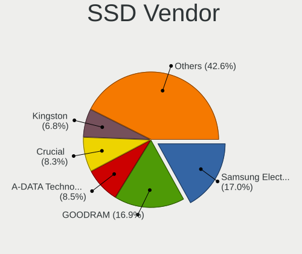

| Vendor              | Notebooks | Drives | Percent |
|---------------------|-----------|--------|---------|
| Samsung Electronics | 379       | 480    | 16.96%  |
| GOODRAM             | 377       | 498    | 16.87%  |
| A-DATA Technology   | 189       | 233    | 8.46%   |
| Crucial             | 186       | 303    | 8.32%   |
| Kingston            | 152       | 205    | 6.8%    |
| SanDisk             | 151       | 189    | 6.76%   |
| WDC                 | 78        | 94     | 3.49%   |
| SPCC                | 63        | 70     | 2.82%   |
| Micron Technology   | 61        | 79     | 2.73%   |
| SK hynix            | 58        | 71     | 2.6%    |
| Intel               | 54        | 63     | 2.42%   |
| Patriot             | 49        | 61     | 2.19%   |
| Toshiba             | 47        | 54     | 2.1%    |
| PNY                 | 35        | 38     | 1.57%   |
| China               | 34        | 43     | 1.52%   |
| LITEON              | 33        | 41     | 1.48%   |
| Plextor             | 30        | 44     | 1.34%   |
| Transcend           | 24        | 30     | 1.07%   |
| KIOXIA-EXCERIA      | 22        | 26     | 0.98%   |
| Apacer              | 22        | 32     | 0.98%   |
| Apple               | 20        | 25     | 0.89%   |
| LITEONIT            | 19        | 22     | 0.85%   |
| OCZ                 | 9         | 9      | 0.4%    |
| KingSpec            | 9         | 10     | 0.4%    |
| Team                | 8         | 9      | 0.36%   |
| Unknown             | 8         | 10     | 0.36%   |
| Biostar             | 7         | 7      | 0.31%   |
| Lexar               | 6         | 6      | 0.27%   |
| POLION              | 5         | 5      | 0.22%   |
| Gigabyte Technology | 5         | 6      | 0.22%   |
| Corsair             | 5         | 5      | 0.22%   |
| XSTAR               | 4         | 4      | 0.18%   |
| Verbatim            | 4         | 6      | 0.18%   |
| Netac               | 4         | 5      | 0.18%   |
| Intenso             | 4         | 6      | 0.18%   |
| 2-Power             | 4         | 4      | 0.18%   |
| Hewlett-Packard     | 3         | 4      | 0.13%   |
| CMD                 | 3         | 3      | 0.13%   |
| Union Memory        | 2         | 3      | 0.09%   |
| Ramaxel Technology  | 2         | 3      | 0.09%   |

Drive Kind
----------

HDD or SSD

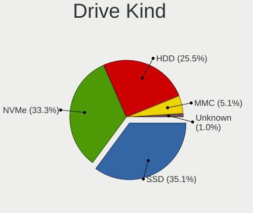

| Kind    | Notebooks | Drives | Percent |
|---------|-----------|--------|---------|
| SSD     | 2032      | 2870   | 35.14%  |
| NVMe    | 1923      | 2727   | 33.26%  |
| HDD     | 1472      | 1891   | 25.46%  |
| MMC     | 296       | 379    | 5.12%   |
| Unknown | 59        | 74     | 1.02%   |

Drive Connector
---------------

SATA, SAS, NVMe, etc.

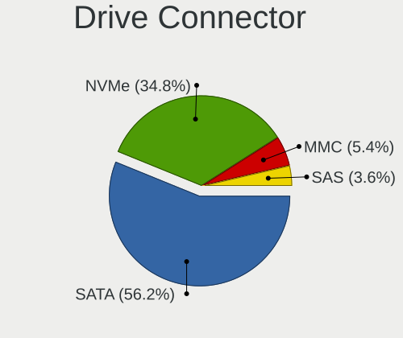

| Type | Notebooks | Drives | Percent |
|------|-----------|--------|---------|
| SATA | 3100      | 4602   | 56.16%  |
| NVMe | 1923      | 2703   | 34.84%  |
| MMC  | 296       | 379    | 5.36%   |
| SAS  | 201       | 257    | 3.64%   |

Drive Size
----------

Size of hard drive

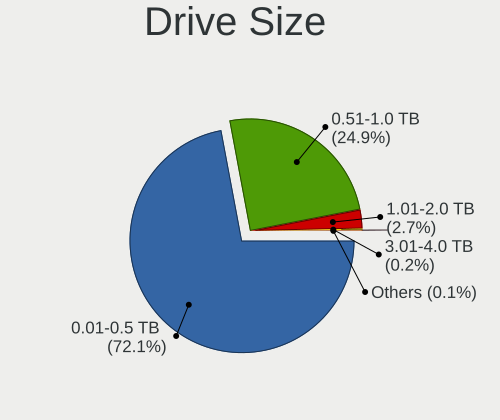

| Size in TB | Notebooks | Drives | Percent |
|------------|-----------|--------|---------|
| 0.01-0.5   | 2488      | 3436   | 72.05%  |
| 0.51-1.0   | 859       | 1193   | 24.88%  |
| 1.01-2.0   | 94        | 117    | 2.72%   |
| 3.01-4.0   | 6         | 6      | 0.17%   |
| 4.01-10.0  | 4         | 4      | 0.12%   |
| 2.01-3.0   | 2         | 5      | 0.06%   |

Space Total
-----------

Amount of disk space available on the file system

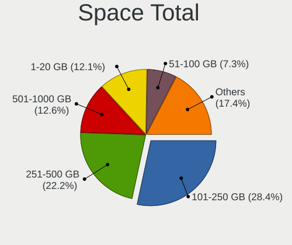

| Size in GB     | Notebooks | Percent |
|----------------|-----------|---------|
| 101-250        | 1518      | 28.36%  |
| 251-500        | 1188      | 22.2%   |
| 501-1000       | 675       | 12.61%  |
| 1-20           | 647       | 12.09%  |
| 51-100         | 393       | 7.34%   |
| 1001-2000      | 304       | 5.68%   |
| Unknown        | 248       | 4.63%   |
| 21-50          | 210       | 3.92%   |
| More than 3000 | 87        | 1.63%   |
| 2001-3000      | 82        | 1.53%   |

Space Used
----------

Amount of used disk space

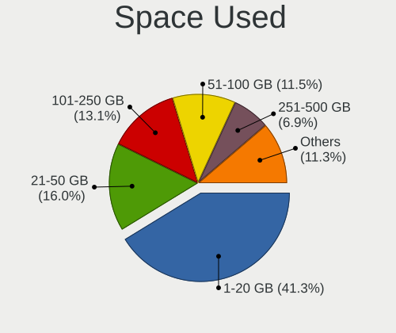

| Used GB        | Notebooks | Percent |
|----------------|-----------|---------|
| 1-20           | 2285      | 41.26%  |
| 21-50          | 887       | 16.02%  |
| 101-250        | 724       | 13.07%  |
| 51-100         | 638       | 11.52%  |
| 251-500        | 380       | 6.86%   |
| Unknown        | 248       | 4.48%   |
| 501-1000       | 229       | 4.14%   |
| 1001-2000      | 93        | 1.68%   |
| 2001-3000      | 22        | 0.4%    |
| 0              | 20        | 0.36%   |
| More than 3000 | 12        | 0.22%   |

Malfunc. Drives
---------------

Drive models with a malfunction

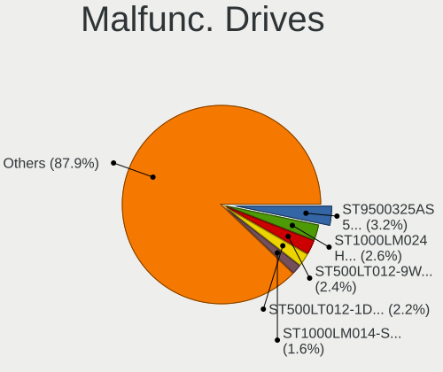

| Model                                                         | Notebooks | Drives | Percent |
|---------------------------------------------------------------|-----------|--------|---------|
| Seagate ST9500325AS 500GB                                     | 16        | 19     | 3.24%   |
| Seagate ST1000LM024 HN-M101MBB 1TB                            | 13        | 14     | 2.63%   |
| Seagate ST500LT012-9WS142 500GB                               | 12        | 33     | 2.43%   |
| Seagate ST500LT012-1DG142 500GB                               | 11        | 14     | 2.23%   |
| Seagate ST1000LM014-SSHD-8GB                                  | 8         | 8      | 1.62%   |
| SK hynix PC711 HFS512GDE9X073N 512GB                          | 7         | 8      | 1.42%   |
| HGST HTS545050A7E680 500GB                                    | 6         | 6      | 1.21%   |
| WDC WD10JPVX-22JC3T0 1TB                                      | 5         | 6      | 1.01%   |
| Seagate ST9320325AS 320GB                                     | 5         | 5      | 1.01%   |
| Seagate ST1000LM035-1RK172 1TB                                | 5         | 5      | 1.01%   |
| Seagate ST1000LM014-1EJ164 1TB                                | 5         | 6      | 1.01%   |
| Hitachi HTS543225L9SA00 250GB                                 | 5         | 5      | 1.01%   |
| Hitachi HTS541612J9SA00 120GB                                 | 5         | 6      | 1.01%   |
| WDC WDS240G2G0A-00JH30 240GB SSD                              | 4         | 4      | 0.81%   |
| WDC WD5000BEVT-22ZAT0 500GB                                   | 4         | 4      | 0.81%   |
| WDC WD3200BPVT-80ZEST0 320GB                                  | 4         | 4      | 0.81%   |
| Toshiba MQ01ABD100 1TB                                        | 4         | 5      | 0.81%   |
| SK hynix BC711 HFM512GD3JX013N 512GB                          | 4         | 4      | 0.81%   |
| Seagate ST980811AS 80GB                                       | 4         | 4      | 0.81%   |
| Seagate ST9250827AS 250GB                                     | 4         | 5      | 0.81%   |
| WDC WD1600BEVT-75A23T0 160GB                                  | 3         | 4      | 0.61%   |
| Toshiba MQ01ABD050 500GB                                      | 3         | 3      | 0.61%   |
| Toshiba MK1246GSX 120GB                                       | 3         | 3      | 0.61%   |
| SK hynix HFS256G39TND-N210A 256GB SSD                         | 3         | 3      | 0.61%   |
| Seagate ST9750423AS 752GB                                     | 3         | 6      | 0.61%   |
| Seagate ST9500420AS 500GB                                     | 3         | 3      | 0.61%   |
| Seagate ST9250410AS 250GB                                     | 3         | 3      | 0.61%   |
| Seagate ST500LM012 HN-M500MBB 500GB                           | 3         | 4      | 0.61%   |
| Seagate ST320LT020-9YG142 320GB                               | 3         | 4      | 0.61%   |
| SanDisk SD9SN8W-128G-1006 128GB SSD                           | 3         | 3      | 0.61%   |
| Samsung Electronics SSD 870 EVO 500GB                         | 3         | 3      | 0.61%   |
| Samsung Electronics NVMe SSD Controller SM981/PM981/PM983 1TB | 3         | 4      | 0.61%   |
| Hitachi HTS547575A9E384 752GB                                 | 3         | 6      | 0.61%   |
| Hitachi HTS543232A7A384 320GB                                 | 3         | 4      | 0.61%   |
| Hitachi HTS542516K9SA00 160GB                                 | 3         | 4      | 0.61%   |
| Hitachi HTS541680J9SA00 80GB                                  | 3         | 3      | 0.61%   |
| HGST HTS541010A9E680 1TB                                      | 3         | 3      | 0.61%   |
| Crucial CT275MX300SSD1 275GB                                  | 3         | 3      | 0.61%   |
| A-DATA Technology SU650 240GB SSD                             | 3         | 3      | 0.61%   |
| WDC WD7500BPKT-22PK4T0 752GB                                  | 2         | 2      | 0.4%    |

Malfunc. Drive Vendor
---------------------

Vendors of faulty drives

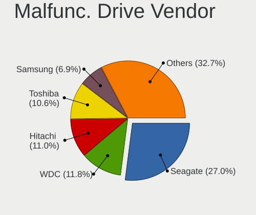

| Vendor                         | Notebooks | Drives | Percent |
|--------------------------------|-----------|--------|---------|
| Seagate                        | 133       | 174    | 27.03%  |
| WDC                            | 58        | 62     | 11.79%  |
| Hitachi                        | 54        | 63     | 10.98%  |
| Toshiba                        | 52        | 63     | 10.57%  |
| Samsung Electronics            | 34        | 39     | 6.91%   |
| SK hynix                       | 22        | 24     | 4.47%   |
| A-DATA Technology              | 22        | 24     | 4.47%   |
| HGST                           | 19        | 20     | 3.86%   |
| SanDisk                        | 12        | 13     | 2.44%   |
| Intel                          | 11        | 12     | 2.24%   |
| Micron Technology              | 10        | 10     | 2.03%   |
| Fujitsu                        | 10        | 11     | 2.03%   |
| Kingston                       | 9         | 11     | 1.83%   |
| Crucial                        | 8         | 24     | 1.63%   |
| SPCC                           | 3         | 3      | 0.61%   |
| Patriot                        | 3         | 5      | 0.61%   |
| OCZ                            | 3         | 3      | 0.61%   |
| LITEONIT                       | 3         | 3      | 0.61%   |
| LITEON                         | 3         | 3      | 0.61%   |
| ASMedia                        | 3         | 3      | 0.61%   |
| POLION                         | 2         | 2      | 0.41%   |
| GOODRAM                        | 2         | 2      | 0.41%   |
| China                          | 2         | 3      | 0.41%   |
| Apple                          | 2         | 2      | 0.41%   |
| Solid State Storage Technology | 1         | 1      | 0.2%    |
| RENICE                         | 1         | 1      | 0.2%    |
| Realtek Semiconductor          | 1         | 1      | 0.2%    |
| Plextor                        | 1         | 1      | 0.2%    |
| Platinet                       | 1         | 1      | 0.2%    |
| OWC                            | 1         | 1      | 0.2%    |
| Neo Forza                      | 1         | 1      | 0.2%    |
| Lexar                          | 1         | 1      | 0.2%    |
| Lenovo                         | 1         | 1      | 0.2%    |
| KingSpec                       | 1         | 1      | 0.2%    |
| Hikvision                      | 1         | 2      | 0.2%    |
| Apacer                         | 1         | 1      | 0.2%    |

Malfunc. HDD Vendor
-------------------

Vendors of faulty HDD drives

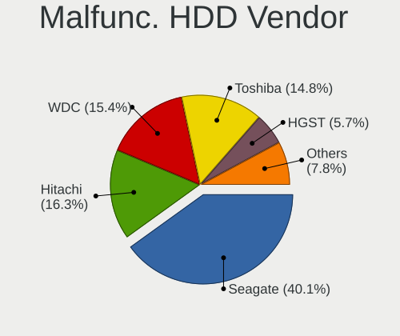

| Vendor              | Notebooks | Drives | Percent |
|---------------------|-----------|--------|---------|
| Seagate             | 133       | 174    | 40.06%  |
| Hitachi             | 54        | 63     | 16.27%  |
| WDC                 | 51        | 55     | 15.36%  |
| Toshiba             | 49        | 60     | 14.76%  |
| HGST                | 19        | 20     | 5.72%   |
| Samsung Electronics | 13        | 14     | 3.92%   |
| Fujitsu             | 10        | 11     | 3.01%   |
| ASMedia             | 3         | 3      | 0.9%    |

Malfunc. Drive Kind
-------------------

Kinds of faulty drives

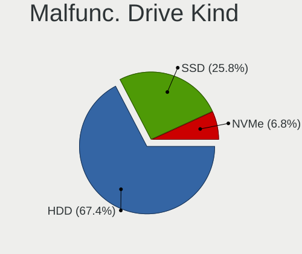

| Kind | Notebooks | Drives | Percent |
|------|-----------|--------|---------|
| HDD  | 326       | 400    | 67.36%  |
| SSD  | 125       | 153    | 25.83%  |
| NVMe | 33        | 39     | 6.82%   |

Failed Drives
-------------

Failed drive models

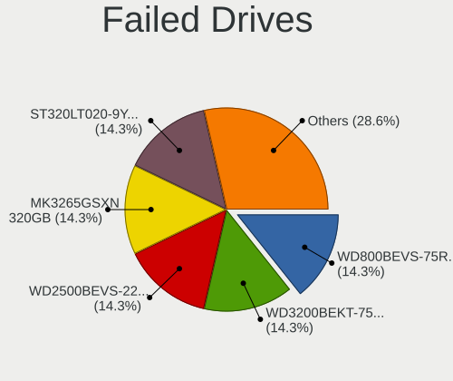

| Model                             | Notebooks | Drives | Percent |
|-----------------------------------|-----------|--------|---------|
| WDC WD800BEVS-75RST0 80GB         | 1         | 1      | 14.29%  |
| WDC WD3200BEKT-75PVMT1 320GB      | 1         | 1      | 14.29%  |
| WDC WD2500BEVS-22UST0 250GB       | 1         | 1      | 14.29%  |
| Toshiba MK3265GSXN 320GB          | 1         | 1      | 14.29%  |
| Seagate ST320LT020-9YG142 320GB   | 1         | 1      | 14.29%  |
| Samsung Electronics HM250HI 250GB | 1         | 1      | 14.29%  |
| HGST HTS725032A7E630 320GB        | 1         | 1      | 14.29%  |

Failed Drive Vendor
-------------------

Failed drive vendors

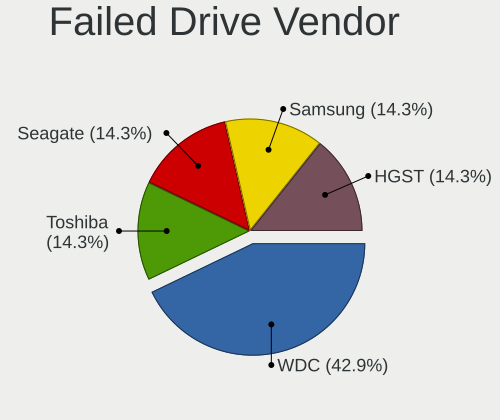

| Vendor              | Notebooks | Drives | Percent |
|---------------------|-----------|--------|---------|
| WDC                 | 3         | 3      | 42.86%  |
| Toshiba             | 1         | 1      | 14.29%  |
| Seagate             | 1         | 1      | 14.29%  |
| Samsung Electronics | 1         | 1      | 14.29%  |
| HGST                | 1         | 1      | 14.29%  |

Drive Status
------------

Number of failed and malfunc. drives

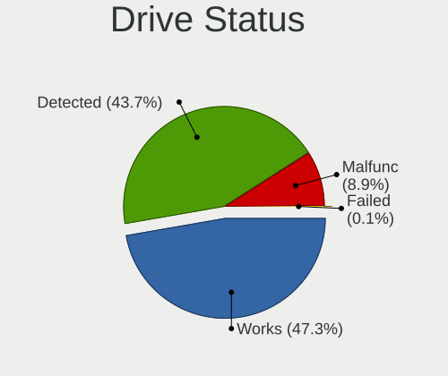

| Status   | Notebooks | Drives | Percent |
|----------|-----------|--------|---------|
| Works    | 2505      | 3608   | 47.26%  |
| Detected | 2316      | 3734   | 43.69%  |
| Malfunc  | 473       | 592    | 8.92%   |
| Failed   | 7         | 7      | 0.13%   |

Storage controller
------------------

Storage Vendor
--------------

Storage controller vendors

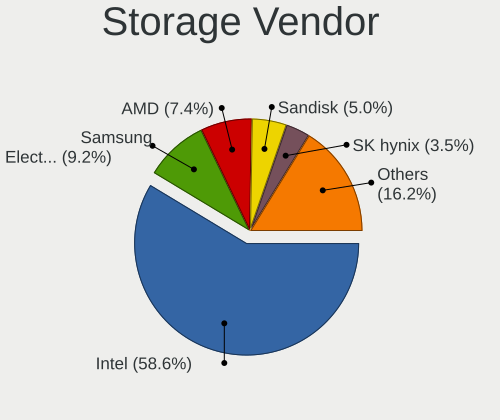

| Vendor                                  | Notebooks | Percent |
|-----------------------------------------|-----------|---------|
| Intel                                   | 3454      | 58.64%  |
| Samsung Electronics                     | 543       | 9.22%   |
| AMD                                     | 436       | 7.4%    |
| Sandisk                                 | 296       | 5.03%   |
| SK hynix                                | 206       | 3.5%    |
| Micron Technology                       | 172       | 2.92%   |
| Phison Electronics                      | 119       | 2.02%   |
| Kingston Technology Company             | 108       | 1.83%   |
| KIOXIA                                  | 89        | 1.51%   |
| Toshiba America Info Systems            | 88        | 1.49%   |
| ADATA Technology                        | 57        | 0.97%   |
| MAXIO Technology (Hangzhou)             | 45        | 0.76%   |
| Silicon Motion                          | 39        | 0.66%   |
| Shenzhen Longsys Electronics            | 36        | 0.61%   |
| Micron/Crucial Technology               | 28        | 0.48%   |
| Nvidia                                  | 25        | 0.42%   |
| Union Memory (Shenzhen)                 | 20        | 0.34%   |
| Solid State Storage Technology          | 19        | 0.32%   |
| Silicon Integrated Systems [SiS]        | 16        | 0.27%   |
| Realtek Semiconductor                   | 16        | 0.27%   |
| Lenovo                                  | 13        | 0.22%   |
| Lite-On Technology                      | 11        | 0.19%   |
| Solidigm                                | 8         | 0.14%   |
| VIA Technologies                        | 7         | 0.12%   |
| JMicron Technology                      | 6         | 0.1%    |
| Apple                                   | 6         | 0.1%    |
| O2 Micro                                | 5         | 0.08%   |
| Marvell Technology Group                | 5         | 0.08%   |
| Yangtze Memory Technologies             | 3         | 0.05%   |
| Shenzhen Unionmemory Information System | 3         | 0.05%   |
| Hosin Global Electronics                | 3         | 0.05%   |
| Shenzhen Techwinsemi Technology         | 2         | 0.03%   |
| Unknown                                 | 2         | 0.03%   |
| Silicon Image                           | 1         | 0.02%   |
| Netac Technology                        | 1         | 0.02%   |
| Biwin Storage Technology                | 1         | 0.02%   |
| ASMedia Technology                      | 1         | 0.02%   |

Storage Model
-------------

Storage controller models

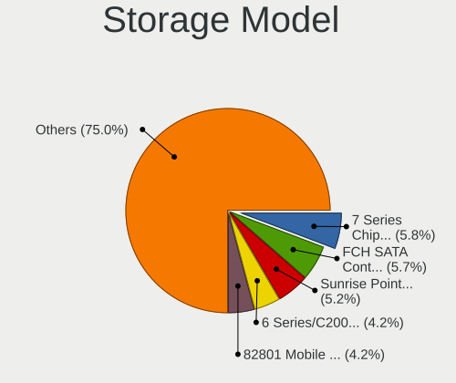

| Model                                                                          | Notebooks | Percent |
|--------------------------------------------------------------------------------|-----------|---------|
| Intel 7 Series Chipset Family 6-port SATA Controller [AHCI mode]               | 367       | 5.75%   |
| AMD FCH SATA Controller [AHCI mode]                                            | 361       | 5.66%   |
| Intel Sunrise Point-LP SATA Controller [AHCI mode]                             | 331       | 5.19%   |
| Intel 6 Series/C200 Series Chipset Family 6 port Mobile SATA AHCI Controller   | 270       | 4.23%   |
| Intel 82801 Mobile SATA Controller [RAID mode]                                 | 266       | 4.17%   |
| Intel 82801IBM/IEM (ICH9M/ICH9M-E) 4 port SATA Controller [AHCI mode]          | 189       | 2.96%   |
| Samsung NVMe SSD Controller SM981/PM981/PM983                                  | 188       | 2.95%   |
| Intel 8 Series SATA Controller 1 [AHCI mode]                                   | 187       | 2.93%   |
| Samsung NVMe SSD Controller 980 (DRAM-less)                                    | 182       | 2.85%   |
| Intel Volume Management Device NVMe RAID Controller                            | 181       | 2.84%   |
| Intel Wildcat Point-LP SATA Controller [AHCI Mode]                             | 157       | 2.46%   |
| Intel Cannon Lake Mobile PCH SATA AHCI Controller                              | 152       | 2.38%   |
| Intel 8 Series/C220 Series Chipset Family 6-port SATA Controller 1 [AHCI mode] | 147       | 2.3%    |
| Intel 82801HM/HEM (ICH8M/ICH8M-E) IDE Controller                               | 137       | 2.15%   |
| Intel 5 Series/3400 Series Chipset 4 port SATA AHCI Controller                 | 115       | 1.8%    |
| Intel 82801HM/HEM (ICH8M/ICH8M-E) SATA Controller [AHCI mode]                  | 108       | 1.69%   |
| Intel HM170/QM170 Chipset SATA Controller [AHCI Mode]                          | 107       | 1.68%   |
| Intel Atom Processor E3800 Series SATA AHCI Controller                         | 101       | 1.58%   |
| Intel SSD 660P Series                                                          | 89        | 1.39%   |
| SK hynix Gold P31/BC711/PC711 NVMe Solid State Drive                           | 79        | 1.24%   |
| Intel 5 Series/3400 Series Chipset 6 port SATA AHCI Controller                 | 78        | 1.22%   |
| Samsung NVMe SSD Controller PM9A1/PM9A3/980PRO                                 | 64        | 1%      |
| AMD SB7x0/SB8x0/SB9x0 SATA Controller [AHCI mode]                              | 56        | 0.88%   |
| KIOXIA NVMe SSD Controller BG4 (DRAM-less)                                     | 54        | 0.85%   |
| SanDisk Extreme Pro / WD Black SN750 / PC SN730 / Red SN700 NVMe SSD           | 52        | 0.81%   |
| Intel Tiger Lake-LP SATA Controller                                            | 51        | 0.8%    |
| Toshiba America Info Systems XG6 NVMe SSD Controller                           | 49        | 0.77%   |
| SanDisk Ultra 3D / WD PC SN530, IX SN530, Blue SN550 NVMe SSD (DRAM-less)      | 48        | 0.75%   |
| Intel SSD 670p Series [Keystone Harbor]                                        | 47        | 0.74%   |
| Micron 2400 NVMe SSD (DRAM-less)                                               | 45        | 0.71%   |
| Intel 82801HM/HEM (ICH8M/ICH8M-E) SATA Controller [IDE mode]                   | 45        | 0.71%   |
| Intel Cannon Point-LP SATA Controller [AHCI Mode]                              | 44        | 0.69%   |
| SK hynix BC511 NVMe SSD                                                        | 40        | 0.63%   |
| Intel Comet Lake SATA AHCI Controller                                          | 39        | 0.61%   |
| Intel 400 Series Chipset Family SATA AHCI Controller                           | 39        | 0.61%   |
| Intel Q170/Q150/B150/H170/H110/Z170/CM236 Chipset SATA Controller [AHCI Mode]  | 37        | 0.58%   |
| Intel 82801GBM/GHM (ICH7-M Family) SATA Controller [IDE mode]                  | 36        | 0.56%   |
| Samsung NVMe SSD Controller SM961/PM961/SM963                                  | 34        | 0.53%   |
| Phison E12 NVMe Controller                                                     | 33        | 0.52%   |
| MAXIO (Hangzhou) NVMe SSD Controller MAP1202 (DRAM-less)                       | 32        | 0.5%    |

Storage Kind
------------

Kind of storage controller (IDE, SATA, NVMe, SAS, ...)

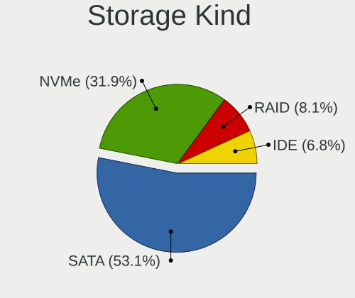

| Kind | Notebooks | Percent |
|------|-----------|---------|
| SATA | 3210      | 53.11%  |
| NVMe | 1931      | 31.95%  |
| RAID | 489       | 8.09%   |
| IDE  | 414       | 6.85%   |

Processor
---------

CPU Vendor
----------

Processor vendors

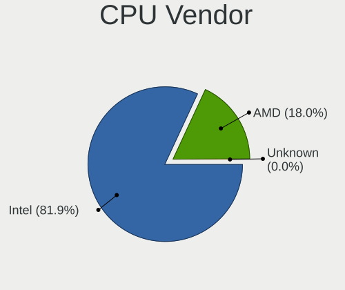

| Vendor       | Notebooks | Percent |
|--------------|-----------|---------|
| Intel        | 4058      | 81.93%  |
| AMD          | 891       | 17.99%  |
| CentaurHauls | 2         | 0.04%   |
| QUALCOMM     | 1         | 0.02%   |
| Unknown      | 1         | 0.02%   |

CPU Model
---------

Processor models

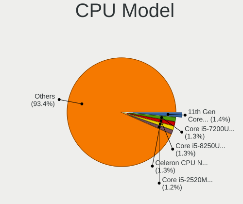

| Model                                         | Notebooks | Percent |
|-----------------------------------------------|-----------|---------|
| Intel 11th Gen Core i5-1135G7 @ 2.40GHz       | 72        | 1.45%   |
| Intel Core i5-7200U CPU @ 2.50GHz             | 67        | 1.35%   |
| Intel Core i5-8250U CPU @ 1.60GHz             | 65        | 1.31%   |
| Intel Celeron CPU N2840 @ 2.16GHz             | 63        | 1.27%   |
| Intel Core i5-2520M CPU @ 2.50GHz             | 60        | 1.21%   |
| Intel Core i5-8265U CPU @ 1.60GHz             | 57        | 1.15%   |
| Intel Core i5-3320M CPU @ 2.60GHz             | 54        | 1.09%   |
| Intel Core i5-5200U CPU @ 2.20GHz             | 53        | 1.07%   |
| AMD Custom APU 0405                           | 49        | 0.99%   |
| AMD Ryzen 5 3500U with Radeon Vega Mobile Gfx | 47        | 0.95%   |
| Intel Core i7-8750H CPU @ 2.20GHz             | 45        | 0.91%   |
| Intel 11th Gen Core i7-1165G7 @ 2.80GHz       | 45        | 0.91%   |
| Intel Core i7-8550U CPU @ 1.80GHz             | 42        | 0.85%   |
| AMD Ryzen 5 4600H with Radeon Graphics        | 42        | 0.85%   |
| Intel Core i7-9750H CPU @ 2.60GHz             | 41        | 0.83%   |
| Intel Core i5-6300U CPU @ 2.40GHz             | 41        | 0.83%   |
| Intel Core i5-6200U CPU @ 2.30GHz             | 41        | 0.83%   |
| Intel Core i7-6500U CPU @ 2.50GHz             | 40        | 0.81%   |
| Intel Core i5-8300H CPU @ 2.30GHz             | 40        | 0.81%   |
| Intel Core i5-5300U CPU @ 2.30GHz             | 40        | 0.81%   |
| Intel Core i5-3210M CPU @ 2.50GHz             | 40        | 0.81%   |
| Intel Core i7-7700HQ CPU @ 2.80GHz            | 39        | 0.79%   |
| Intel Core i5-1035G1 CPU @ 1.00GHz            | 37        | 0.74%   |
| AMD Ryzen 5 5600H with Radeon Graphics        | 35        | 0.7%    |
| Intel Core i7-6700HQ CPU @ 2.60GHz            | 34        | 0.68%   |
| AMD Ryzen 7 4800H with Radeon Graphics        | 34        | 0.68%   |
| Intel Core i5-8350U CPU @ 1.70GHz             | 33        | 0.66%   |
| Intel Core i5-10210U CPU @ 1.60GHz            | 33        | 0.66%   |
| Intel Core i7-8565U CPU @ 1.80GHz             | 31        | 0.62%   |
| Intel Core i5-2410M CPU @ 2.30GHz             | 31        | 0.62%   |
| Intel Core i5 CPU M 520 @ 2.40GHz             | 31        | 0.62%   |
| Intel 12th Gen Core i5-1235U                  | 31        | 0.62%   |
| AMD Ryzen 7 5800H with Radeon Graphics        | 31        | 0.62%   |
| Intel Core i5-4200U CPU @ 1.60GHz             | 30        | 0.6%    |
| Intel Core i5-3230M CPU @ 2.60GHz             | 29        | 0.58%   |
| Intel Core i5-4300U CPU @ 1.90GHz             | 28        | 0.56%   |
| Intel Core i3-5005U CPU @ 2.00GHz             | 27        | 0.54%   |
| Intel Core i3 CPU M 380 @ 2.53GHz             | 27        | 0.54%   |
| Intel Core 2 Duo CPU P8700 @ 2.53GHz          | 27        | 0.54%   |
| Intel Core i5-4210U CPU @ 1.70GHz             | 26        | 0.52%   |

CPU Model Family
----------------

Processor model prefix

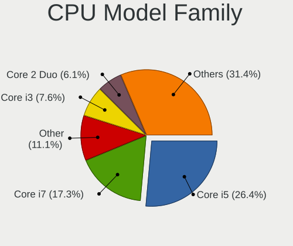

| Model                   | Notebooks | Percent |
|-------------------------|-----------|---------|
| Intel Core i5           | 1311      | 26.43%  |
| Intel Core i7           | 860       | 17.34%  |
| Other                   | 552       | 11.13%  |
| Intel Core i3           | 375       | 7.56%   |
| Intel Core 2 Duo        | 303       | 6.11%   |
| AMD Ryzen 5             | 254       | 5.12%   |
| Intel Celeron           | 235       | 4.74%   |
| AMD Ryzen 7             | 230       | 4.64%   |
| Intel Pentium           | 145       | 2.92%   |
| Intel Atom              | 72        | 1.45%   |
| Intel Core              | 58        | 1.17%   |
| Intel Pentium Dual-Core | 56        | 1.13%   |
| AMD A6                  | 41        | 0.83%   |
| AMD Ryzen 7 PRO         | 37        | 0.75%   |
| Intel Pentium Dual      | 31        | 0.63%   |
| Intel Core 2            | 26        | 0.52%   |
| AMD A8                  | 26        | 0.52%   |
| AMD Ryzen 5 PRO         | 24        | 0.48%   |
| AMD A4                  | 21        | 0.42%   |
| AMD E1                  | 20        | 0.4%    |
| AMD Ryzen 3             | 19        | 0.38%   |
| Intel Xeon              | 18        | 0.36%   |
| Intel Genuine           | 18        | 0.36%   |
| AMD Ryzen 9             | 18        | 0.36%   |
| AMD E                   | 16        | 0.32%   |
| AMD A10                 | 16        | 0.32%   |
| Intel Celeron M         | 12        | 0.24%   |
| AMD Athlon X2           | 11        | 0.22%   |
| AMD E2                  | 10        | 0.2%    |
| Intel Pentium M         | 8         | 0.16%   |
| Intel Core m3           | 8         | 0.16%   |
| Intel Core i9           | 8         | 0.16%   |
| Intel Core Duo          | 8         | 0.16%   |
| AMD Turion 64 X2 Mobile | 8         | 0.16%   |
| AMD Ryzen 3 PRO         | 8         | 0.16%   |
| AMD C-60                | 8         | 0.16%   |
| Intel Pentium Silver    | 7         | 0.14%   |
| AMD Athlon II           | 7         | 0.14%   |
| Intel Pentium Gold      | 6         | 0.12%   |
| Intel Celeron Dual-Core | 6         | 0.12%   |

CPU Cores
---------

Number of processor cores

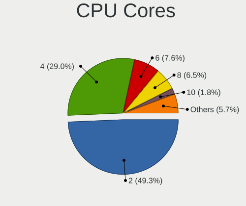

| Number  | Notebooks | Percent |
|---------|-----------|---------|
| 2       | 2448      | 49.33%  |
| 4       | 1441      | 29.04%  |
| 6       | 377       | 7.6%    |
| 8       | 325       | 6.55%   |
| 10      | 88        | 1.77%   |
| 1       | 80        | 1.61%   |
| 12      | 67        | 1.35%   |
| 14      | 59        | 1.19%   |
| 16      | 37        | 0.75%   |
| Unknown | 21        | 0.42%   |
| 5       | 6         | 0.12%   |
| 24      | 5         | 0.1%    |
| 20      | 5         | 0.1%    |
| 3       | 2         | 0.04%   |
| 192     | 1         | 0.02%   |

CPU Sockets
-----------

Number of sockets

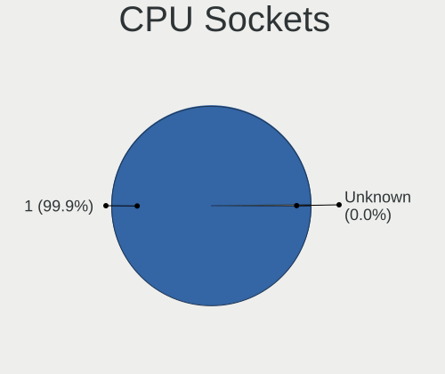

| Number  | Notebooks | Percent |
|---------|-----------|---------|
| 1       | 4948      | 99.9%   |
| 2       | 3         | 0.06%   |
| Unknown | 2         | 0.04%   |

CPU Threads
-----------

Threads per core (Hyper-Threading)

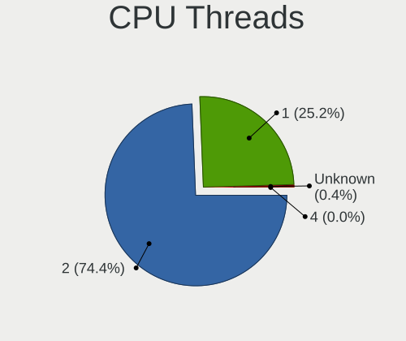

| Number  | Notebooks | Percent |
|---------|-----------|---------|
| 2       | 3696      | 74.37%  |
| 1       | 1251      | 25.17%  |
| Unknown | 21        | 0.42%   |
| 8       | 1         | 0.02%   |
| 4       | 1         | 0.02%   |

CPU Op-Modes
------------

CPU Operation Modes (32-bit, 64-bit)

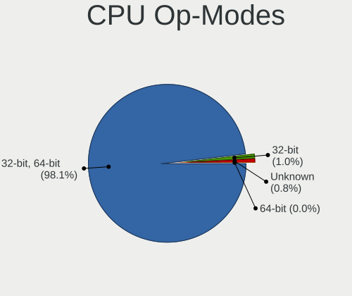

| Op mode        | Notebooks | Percent |
|----------------|-----------|---------|
| 32-bit, 64-bit | 4866      | 98.14%  |
| 32-bit         | 50        | 1.01%   |
| Unknown        | 40        | 0.81%   |
| 64-bit         | 2         | 0.04%   |

CPU Microcode
-------------

Microcode number

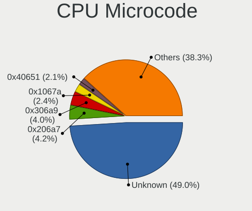

| Number     | Notebooks | Percent |
|------------|-----------|---------|
| Unknown    | 2535      | 49.01%  |
| 0x206a7    | 215       | 4.16%   |
| 0x306a9    | 206       | 3.98%   |
| 0x1067a    | 123       | 2.38%   |
| 0x40651    | 110       | 2.13%   |
| 0x20655    | 95        | 1.84%   |
| 0x806c1    | 93        | 1.8%    |
| 0x906ea    | 92        | 1.78%   |
| 0x806ec    | 91        | 1.76%   |
| 0x306c3    | 91        | 1.76%   |
| 0x306d4    | 89        | 1.72%   |
| 0x30678    | 83        | 1.6%    |
| 0x406e3    | 81        | 1.57%   |
| 0x806ea    | 79        | 1.53%   |
| 0x6fd      | 76        | 1.47%   |
| 0x806e9    | 65        | 1.26%   |
| 0x506e3    | 58        | 1.12%   |
| 0x10676    | 54        | 1.04%   |
| 0x0a50000c | 54        | 1.04%   |
| 0x906e9    | 48        | 0.93%   |
| 0x08600106 | 43        | 0.83%   |
| 0xa0652    | 35        | 0.68%   |
| 0x20652    | 33        | 0.64%   |
| 0x08108109 | 32        | 0.62%   |
| 0x08108102 | 28        | 0.54%   |
| 0x706e5    | 27        | 0.52%   |
| 0x806eb    | 26        | 0.5%    |
| 0x08600103 | 21        | 0.41%   |
| 0x6fb      | 20        | 0.39%   |
| 0x08600104 | 20        | 0.39%   |
| 0x06001119 | 20        | 0.39%   |
| 0x906ed    | 19        | 0.37%   |
| 0x906a3    | 19        | 0.37%   |
| 0x806d1    | 19        | 0.37%   |
| 0x6f6      | 18        | 0.35%   |
| 0x506c9    | 17        | 0.33%   |
| 0x406c4    | 17        | 0.33%   |
| 0x106ca    | 17        | 0.33%   |
| 0x906a4    | 16        | 0.31%   |
| 0x406c3    | 16        | 0.31%   |

CPU Microarch
-------------

Microarchitecture

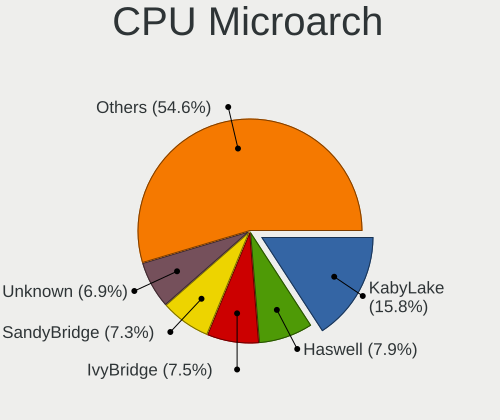

| Name               | Notebooks | Percent |
|--------------------|-----------|---------|
| KabyLake           | 786       | 15.84%  |
| Haswell            | 391       | 7.88%   |
| IvyBridge          | 373       | 7.52%   |
| SandyBridge        | 363       | 7.31%   |
| Unknown            | 340       | 6.85%   |
| Skylake            | 276       | 5.56%   |
| Penryn             | 256       | 5.16%   |
| Westmere           | 208       | 4.19%   |
| Core               | 192       | 3.87%   |
| TigerLake          | 191       | 3.85%   |
| Silvermont         | 191       | 3.85%   |
| Broadwell          | 181       | 3.65%   |
| Alderlake Hybrid   | 179       | 3.61%   |
| Zen 2              | 154       | 3.1%    |
| Zen 3              | 147       | 2.96%   |
| Zen+               | 109       | 2.2%    |
| Icelake            | 87        | 1.75%   |
| CometLake          | 73        | 1.47%   |
| Bobcat             | 50        | 1.01%   |
| Bonnell            | 41        | 0.83%   |
| Goldmont plus      | 39        | 0.79%   |
| P6                 | 34        | 0.69%   |
| Goldmont           | 34        | 0.69%   |
| Piledriver         | 33        | 0.66%   |
| Zen                | 31        | 0.62%   |
| Puma               | 29        | 0.58%   |
| Meteorlake Hybrid  | 28        | 0.56%   |
| Excavator          | 28        | 0.56%   |
| K8 & K10 hybrid    | 21        | 0.42%   |
| K10                | 19        | 0.38%   |
| K10 Llano          | 16        | 0.32%   |
| K8 Hammer          | 15        | 0.3%    |
| Jaguar             | 15        | 0.3%    |
| Nehalem            | 14        | 0.28%   |
| Tremont            | 5         | 0.1%    |
| Steamroller        | 5         | 0.1%    |
| Lunarlake Hybrid   | 4         | 0.08%   |
| Gracemont          | 4         | 0.08%   |
| ArrowLake-H Hybrid | 1         | 0.02%   |

Graphics
--------

GPU Vendor
----------

Vendors of graphics cards

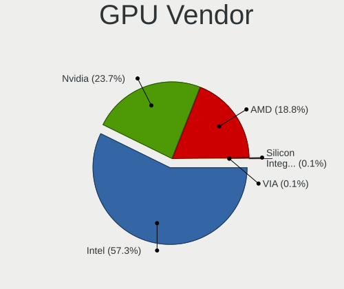

| Vendor                           | Notebooks | Percent |
|----------------------------------|-----------|---------|
| Intel                            | 3672      | 57.27%  |
| Nvidia                           | 1521      | 23.72%  |
| AMD                              | 1204      | 18.78%  |
| Silicon Integrated Systems [SiS] | 8         | 0.12%   |
| VIA Technologies                 | 7         | 0.11%   |

GPU Model
---------

Graphics card models

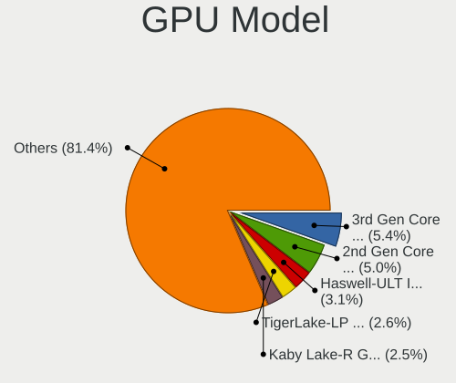

| Model                                                                                    | Notebooks | Percent |
|------------------------------------------------------------------------------------------|-----------|---------|
| Intel 3rd Gen Core processor Graphics Controller                                         | 358       | 5.41%   |
| Intel 2nd Generation Core Processor Family Integrated Graphics Controller                | 329       | 4.97%   |
| Intel Haswell-ULT Integrated Graphics Controller                                         | 205       | 3.1%    |
| Intel TigerLake-LP GT2 [Iris Xe Graphics]                                                | 170       | 2.57%   |
| Intel Kaby Lake-R GT2 [UHD Graphics 620]                                                 | 168       | 2.54%   |
| Intel 4th Gen Core Processor Integrated Graphics Controller                              | 164       | 2.48%   |
| Intel Skylake-U GT2 [HD Graphics 520]                                                    | 163       | 2.46%   |
| Intel CoffeeLake-H GT2 [UHD Graphics 630]                                                | 161       | 2.43%   |
| Intel Mobile 4 Series Chipset Integrated Graphics Controller                             | 154       | 2.33%   |
| Intel Broadwell-U GT2 [HD Graphics 5500]                                                 | 154       | 2.33%   |
| AMD Renoir [Radeon Vega Series / Radeon Vega Mobile Series]                              | 145       | 2.19%   |
| Intel Core Processor Integrated Graphics Controller                                      | 136       | 2.05%   |
| Intel Atom Processor Z36xxx/Z37xxx Series Graphics & Display                             | 131       | 1.98%   |
| Intel Kaby Lake-U GT2 [HD Graphics 620]                                                  | 128       | 1.93%   |
| Intel WhiskeyLake-U GT2 [UHD Graphics 620]                                               | 123       | 1.86%   |
| AMD Picasso/Raven 2 [Radeon Vega Series / Radeon Vega Mobile Series]                     | 110       | 1.66%   |
| Intel Mobile GM965/GL960 Integrated Graphics Controller (secondary)                      | 93        | 1.4%    |
| Intel Mobile GM965/GL960 Integrated Graphics Controller (primary)                        | 93        | 1.4%    |
| AMD Cezanne [Radeon Vega Series / Radeon Vega Mobile Series]                             | 88        | 1.33%   |
| Nvidia TU117M [GeForce GTX 1650 Mobile / Max-Q]                                          | 82        | 1.24%   |
| Nvidia GF117M [GeForce 610M/710M/810M/820M / GT 620M/625M/630M/720M]                     | 81        | 1.22%   |
| Intel Skylake-H GT2 [HD Graphics 530]                                                    | 80        | 1.21%   |
| Nvidia GP107M [GeForce GTX 1050 Mobile]                                                  | 74        | 1.12%   |
| Intel Kaby Lake-H GT2 [HD Graphics 630]                                                  | 74        | 1.12%   |
| Intel CometLake-U GT2 [UHD Graphics]                                                     | 74        | 1.12%   |
| Intel Alder Lake-P GT2 [Iris Xe Graphics]                                                | 62        | 0.94%   |
| Intel CometLake-H GT2 [UHD Graphics]                                                     | 60        | 0.91%   |
| Intel Atom/Celeron/Pentium Processor x5-E8000/J3xxx/N3xxx Integrated Graphics Controller | 60        | 0.91%   |
| AMD Sun XT [Radeon HD 8670A/8670M/8690M / R5 M330 / M430 / Radeon 520 Mobile]            | 56        | 0.85%   |
| Intel TigerLake-H GT1 [UHD Graphics]                                                     | 52        | 0.79%   |
| AMD Rembrandt [Radeon 680M]                                                              | 51        | 0.77%   |
| Intel Alder Lake-UP3 GT2 [Iris Xe Graphics]                                              | 47        | 0.71%   |
| Nvidia GM107M [GeForce GTX 960M]                                                         | 46        | 0.69%   |
| AMD VanGogh [AMD Custom GPU 0405]                                                        | 44        | 0.66%   |
| Nvidia TU116M [GeForce GTX 1660 Ti Mobile]                                               | 43        | 0.65%   |
| Intel Mobile 945GM/GMS/GME, 943/940GML Express Integrated Graphics Controller            | 43        | 0.65%   |
| Nvidia GP107M [GeForce GTX 1050 Ti Mobile]                                               | 42        | 0.63%   |
| Intel Iris Plus Graphics G1 (Ice Lake)                                                   | 42        | 0.63%   |
| Nvidia GA107M [GeForce RTX 3050 Mobile]                                                  | 41        | 0.62%   |
| AMD Barcelo                                                                              | 41        | 0.62%   |

GPU Combo
---------

Combinations of graphics cards

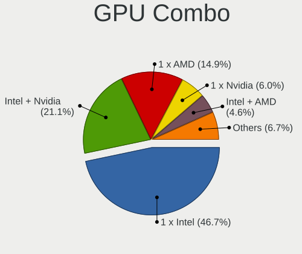

| Name                     | Notebooks | Percent |
|--------------------------|-----------|---------|
| 1 x Intel                | 2327      | 46.72%  |
| Intel + Nvidia           | 1052      | 21.12%  |
| 1 x AMD                  | 741       | 14.88%  |
| 1 x Nvidia               | 299       | 6%      |
| Intel + AMD              | 229       | 4.6%    |
| AMD + Nvidia             | 167       | 3.35%   |
| 2 x AMD                  | 69        | 1.39%   |
| 2 x Intel                | 67        | 1.35%   |
| Other                    | 11        | 0.22%   |
| 1 x SiS                  | 8         | 0.16%   |
| 1 x VIA                  | 7         | 0.14%   |
| 2 x Intel + 1 x Nvidia   | 2         | 0.04%   |
| 2 x Nvidia               | 1         | 0.02%   |
| Intel + AMD + 1 x Nvidia | 1         | 0.02%   |

GPU Driver
----------

Free vs proprietary

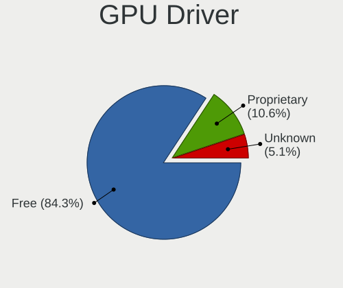

| Driver      | Notebooks | Percent |
|-------------|-----------|---------|
| Free        | 4243      | 84.27%  |
| Proprietary | 534       | 10.61%  |
| Unknown     | 258       | 5.12%   |

GPU Memory
----------

Total video memory

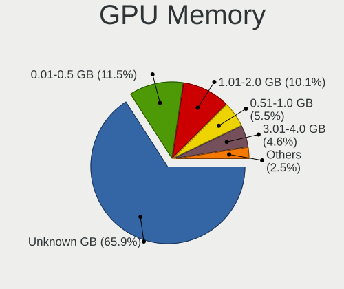

| Size in GB | Notebooks | Percent |
|------------|-----------|---------|
| Unknown    | 3355      | 65.89%  |
| 0.01-0.5   | 585       | 11.49%  |
| 1.01-2.0   | 513       | 10.07%  |
| 0.51-1.0   | 278       | 5.46%   |
| 3.01-4.0   | 235       | 4.62%   |
| 5.01-6.0   | 67        | 1.32%   |
| 7.01-8.0   | 44        | 0.86%   |
| 8.01-16.0  | 8         | 0.16%   |
| 2.01-3.0   | 7         | 0.14%   |

Monitor
-------

Monitor Vendor
--------------

Monitor vendors

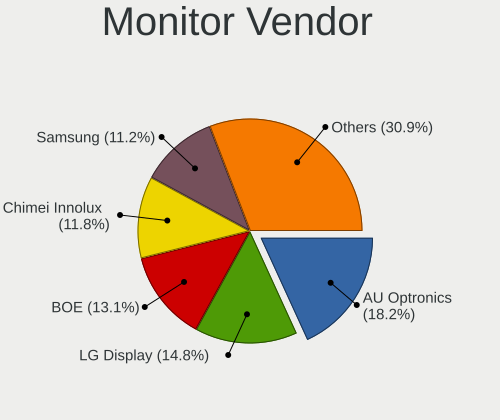

| Vendor                  | Notebooks | Percent |
|-------------------------|-----------|---------|
| AU Optronics            | 1032      | 18.17%  |
| LG Display              | 841       | 14.81%  |
| BOE                     | 744       | 13.1%   |
| Chimei Innolux          | 672       | 11.83%  |
| Samsung Electronics     | 638       | 11.23%  |
| Dell                    | 181       | 3.19%   |
| Lenovo                  | 169       | 2.98%   |
| Chi Mei Optoelectronics | 165       | 2.91%   |
| Goldstar                | 106       | 1.87%   |
| Iiyama                  | 95        | 1.67%   |
| PANDA                   | 93        | 1.64%   |
| Sharp                   | 78        | 1.37%   |
| Apple                   | 62        | 1.09%   |
| LG Philips              | 59        | 1.04%   |
| Philips                 | 51        | 0.9%    |
| InfoVision              | 50        | 0.88%   |
| Valve                   | 49        | 0.86%   |
| BenQ                    | 46        | 0.81%   |
| Hewlett-Packard         | 43        | 0.76%   |
| AOC                     | 41        | 0.72%   |
| Acer                    | 39        | 0.69%   |
| NEC Computers           | 28        | 0.49%   |
| CSO                     | 25        | 0.44%   |
| Ancor Communications    | 25        | 0.44%   |
| CPT                     | 24        | 0.42%   |
| HannStar                | 21        | 0.37%   |
| Eizo                    | 20        | 0.35%   |
| ASUSTek Computer        | 20        | 0.35%   |
| TMX                     | 15        | 0.26%   |
| Sony                    | 13        | 0.23%   |
| Fujitsu Siemens         | 13        | 0.23%   |
| CSW                     | 13        | 0.23%   |
| MSI                     | 12        | 0.21%   |
| Mi                      | 12        | 0.21%   |
| Toshiba                 | 11        | 0.19%   |
| Panasonic               | 10        | 0.18%   |
| LGD                     | 9         | 0.16%   |
| InnoLux Display         | 9         | 0.16%   |
| CSOT                    | 9         | 0.16%   |
| Seiko/Epson             | 8         | 0.14%   |

Monitor Model
-------------

Monitor models

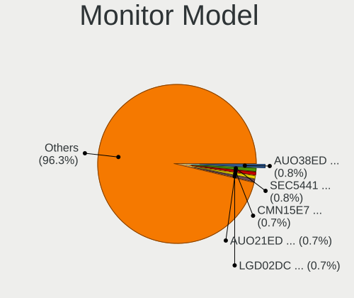

| Model                                                                    | Notebooks | Percent |
|--------------------------------------------------------------------------|-----------|---------|
| AU Optronics LCD Monitor AUO38ED 1920x1080 344x193mm 15.5-inch           | 47        | 0.81%   |
| Samsung Electronics LCD Monitor SEC5441 1280x800 331x207mm 15.4-inch     | 45        | 0.78%   |
| Chimei Innolux LCD Monitor CMN15E7 1920x1080 344x193mm 15.5-inch         | 43        | 0.74%   |
| AU Optronics LCD Monitor AUO21ED 1920x1080 344x193mm 15.5-inch           | 42        | 0.73%   |
| LG Display LCD Monitor LGD02DC 1366x768 344x194mm 15.5-inch              | 38        | 0.66%   |
| Valve ANX7530 U VLV3001 800x1280 100x150mm 7.1-inch                      | 36        | 0.62%   |
| Chimei Innolux LCD Monitor CMN14D4 1920x1080 309x173mm 13.9-inch         | 35        | 0.6%    |
| Chi Mei Optoelectronics LCD Monitor CMO15A7 1366x768 344x193mm 15.5-inch | 35        | 0.6%    |
| LG Display LCD Monitor LGD033A 1366x768 344x194mm 15.5-inch              | 34        | 0.59%   |
| BOE LCD Monitor BOE0629 1366x768 309x173mm 13.9-inch                     | 31        | 0.54%   |
| PANDA LCD Monitor NCP004D 1920x1080 344x194mm 15.5-inch                  | 27        | 0.47%   |
| AU Optronics LCD Monitor AUO403D 1920x1080 309x174mm 14.0-inch           | 27        | 0.47%   |
| Chimei Innolux LCD Monitor CMN1521 1920x1080 344x193mm 15.5-inch         | 26        | 0.45%   |
| Samsung Electronics LCD Monitor SEC544B 1600x900 382x214mm 17.2-inch     | 23        | 0.4%    |
| AU Optronics LCD Monitor AUO26EC 1366x768 344x193mm 15.5-inch            | 23        | 0.4%    |
| BOE LCD Monitor BOE06A7 1920x1080 294x165mm 13.3-inch                    | 21        | 0.36%   |
| BOE LCD Monitor BOE0687 1920x1080 344x193mm 15.5-inch                    | 21        | 0.36%   |
| Lenovo LCD Monitor LEN40B1 1600x900 345x194mm 15.6-inch                  | 20        | 0.35%   |
| Chimei Innolux LCD Monitor CMN15C4 1920x1080 344x193mm 15.5-inch         | 20        | 0.35%   |
| BOE LCD Monitor BOE06FB 1920x1080 344x194mm 15.5-inch                    | 19        | 0.33%   |
| AU Optronics LCD Monitor AUO106C 1366x768 276x155mm 12.5-inch            | 19        | 0.33%   |
| LG Display LCD Monitor LGD0469 1920x1080 382x215mm 17.3-inch             | 18        | 0.31%   |
| AU Optronics LCD Monitor AUO22EC 1366x768 344x193mm 15.5-inch            | 18        | 0.31%   |
| Samsung Electronics LCD Monitor SDC4852 1366x768 344x194mm 15.5-inch     | 17        | 0.29%   |
| Chimei Innolux LCD Monitor CMN15F5 1920x1080 344x193mm 15.5-inch         | 17        | 0.29%   |
| Chimei Innolux LCD Monitor CMN15D5 1920x1080 344x193mm 15.5-inch         | 17        | 0.29%   |
| Chimei Innolux LCD Monitor CMN14C9 1920x1080 309x173mm 13.9-inch         | 17        | 0.29%   |
| Samsung Electronics LCD Monitor SEC324A 1366x768 344x194mm 15.5-inch     | 16        | 0.28%   |
| Chimei Innolux LCD Monitor CMN1728 1600x900 382x215mm 17.3-inch          | 16        | 0.28%   |
| BOE LCD Monitor BOE06A5 1366x768 344x194mm 15.5-inch                     | 16        | 0.28%   |
| AU Optronics LCD Monitor AUO46EC 1366x768 344x193mm 15.5-inch            | 16        | 0.28%   |
| Chi Mei Optoelectronics LCD Monitor CMO15A3 1366x768 344x193mm 15.5-inch | 15        | 0.26%   |
| AU Optronics LCD Monitor AUO213E 1600x900 309x174mm 14.0-inch            | 15        | 0.26%   |
| AU Optronics LCD Monitor AUO123D 1920x1080 309x173mm 13.9-inch           | 15        | 0.26%   |
| LG Display LCD Monitor LGD0590 1920x1080 344x194mm 15.5-inch             | 14        | 0.24%   |
| LG Display LCD Monitor LGD0521 1920x1080 309x174mm 14.0-inch             | 14        | 0.24%   |
| Chimei Innolux LCD Monitor CMN1735 1920x1080 381x214mm 17.2-inch         | 14        | 0.24%   |
| AU Optronics LCD Monitor AUOD1ED 1920x1080 344x193mm 15.5-inch           | 14        | 0.24%   |
| AU Optronics LCD Monitor AUO20EC 1366x768 344x193mm 15.5-inch            | 14        | 0.24%   |
| Valve ANX7530 U VLV3003 800x1280 100x160mm 7.4-inch                      | 13        | 0.22%   |

Monitor Resolution
------------------

Monitor screen resolution

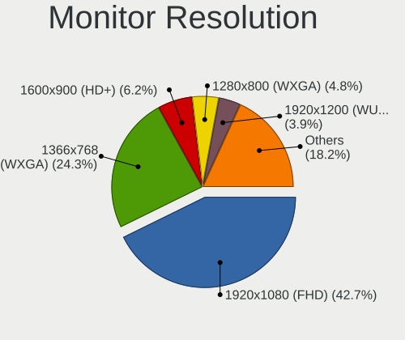

| Resolution         | Notebooks | Percent |
|--------------------|-----------|---------|
| 1920x1080 (FHD)    | 2278      | 42.72%  |
| 1366x768 (WXGA)    | 1294      | 24.27%  |
| 1600x900 (HD+)     | 328       | 6.15%   |
| 1280x800 (WXGA)    | 254       | 4.76%   |
| 1920x1200 (WUXGA)  | 209       | 3.92%   |
| 2560x1440 (QHD)    | 173       | 3.24%   |
| 3840x2160 (4K)     | 167       | 3.13%   |
| 1440x900 (WXGA+)   | 95        | 1.78%   |
| 2560x1600          | 81        | 1.52%   |
| 1680x1050 (WSXGA+) | 69        | 1.29%   |
| 800x1280           | 52        | 0.98%   |
| 2880x1800          | 49        | 0.92%   |
| 3440x1440          | 32        | 0.6%    |
| 1280x1024 (SXGA)   | 32        | 0.6%    |
| 1024x600           | 30        | 0.56%   |
| 2160x1440          | 20        | 0.38%   |
| 3840x2400          | 19        | 0.36%   |
| Unknown            | 18        | 0.34%   |
| 2560x1080          | 16        | 0.3%    |
| 3200x2000          | 11        | 0.21%   |
| 3200x1800 (QHD+)   | 11        | 0.21%   |
| 1024x768 (XGA)     | 7         | 0.13%   |
| 2256x1504          | 6         | 0.11%   |
| 2240x1400          | 6         | 0.11%   |
| 1920x540           | 6         | 0.11%   |
| 3840x1080          | 5         | 0.09%   |
| 2520x1680          | 5         | 0.09%   |
| 1360x768           | 5         | 0.09%   |
| 3840x1600          | 4         | 0.08%   |
| 3286x1080          | 4         | 0.08%   |
| 2880x1920          | 4         | 0.08%   |
| 2880x1620          | 4         | 0.08%   |
| 2288x1287          | 4         | 0.08%   |
| 1680x945           | 4         | 0.08%   |
| 3456x2160          | 3         | 0.06%   |
| 1400x1050          | 3         | 0.06%   |
| 1280x768           | 3         | 0.06%   |
| 1280x720 (HD)      | 3         | 0.06%   |
| 3840x2560          | 2         | 0.04%   |
| 3000x2000          | 2         | 0.04%   |

Monitor Diagonal
----------------

Diagonal size in inches

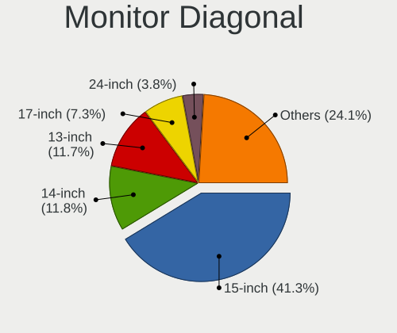

| Inches  | Notebooks | Percent |
|---------|-----------|---------|
| 15      | 2345      | 41.29%  |
| 14      | 672       | 11.83%  |
| 13      | 664       | 11.69%  |
| 17      | 414       | 7.29%   |
| 24      | 218       | 3.84%   |
| 27      | 180       | 3.17%   |
| 12      | 173       | 3.05%   |
| 16      | 159       | 2.8%    |
| 23      | 154       | 2.71%   |
| 21      | 113       | 1.99%   |
| 11      | 83        | 1.46%   |
| Unknown | 71        | 1.25%   |
| 31      | 59        | 1.04%   |
| 34      | 51        | 0.9%    |
| 7       | 49        | 0.86%   |
| 10      | 35        | 0.62%   |
| 19      | 34        | 0.6%    |
| 18      | 34        | 0.6%    |
| 22      | 32        | 0.56%   |
| 40      | 15        | 0.26%   |
| 25      | 15        | 0.26%   |
| 84      | 13        | 0.23%   |
| 20      | 13        | 0.23%   |
| 48      | 10        | 0.18%   |
| 32      | 10        | 0.18%   |
| 54      | 7         | 0.12%   |
| 43      | 7         | 0.12%   |
| 72      | 6         | 0.11%   |
| 37      | 5         | 0.09%   |
| 28      | 5         | 0.09%   |
| 3       | 5         | 0.09%   |
| 26      | 4         | 0.07%   |
| 142     | 3         | 0.05%   |
| 65      | 3         | 0.05%   |
| 86      | 2         | 0.04%   |
| 75      | 2         | 0.04%   |
| 63      | 2         | 0.04%   |
| 46      | 2         | 0.04%   |
| 39      | 2         | 0.04%   |
| 33      | 2         | 0.04%   |

Monitor Width
-------------

Physical width

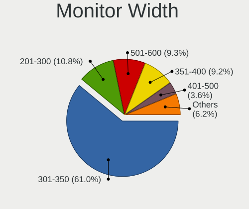

| Width in mm    | Notebooks | Percent |
|----------------|-----------|---------|
| 301-350        | 3425      | 61.01%  |
| 201-300        | 604       | 10.76%  |
| 501-600        | 520       | 9.26%   |
| 351-400        | 515       | 9.17%   |
| 401-500        | 201       | 3.58%   |
| 601-700        | 78        | 1.39%   |
| Unknown        | 71        | 1.26%   |
| 701-800        | 63        | 1.12%   |
| 1-100          | 53        | 0.94%   |
| 1001-1500      | 30        | 0.53%   |
| 801-900        | 21        | 0.37%   |
| 1501-2000      | 21        | 0.37%   |
| 901-1000       | 8         | 0.14%   |
| More than 2000 | 3         | 0.05%   |
| 101-200        | 1         | 0.02%   |

Aspect Ratio
------------

Proportional relationship between the width and the height

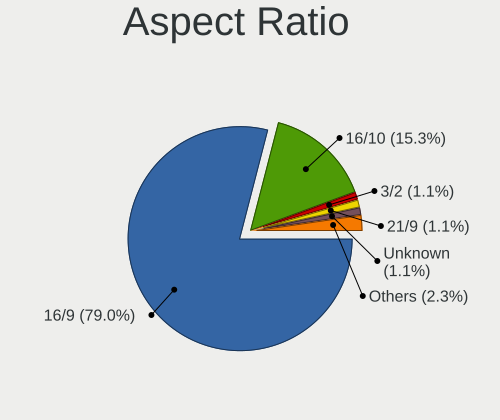

| Ratio   | Notebooks | Percent |
|---------|-----------|---------|
| 16/9    | 3993      | 79.02%  |
| 16/10   | 775       | 15.34%  |
| 3/2     | 57        | 1.13%   |
| 21/9    | 57        | 1.13%   |
| Unknown | 55        | 1.09%   |
| 0.67    | 36        | 0.71%   |
| 5/4     | 35        | 0.69%   |
| 4/3     | 14        | 0.28%   |
| 0.62    | 14        | 0.28%   |
| 6/5     | 5         | 0.1%    |
| 32/9    | 5         | 0.1%    |
| 1.00    | 3         | 0.06%   |
| 0.56    | 2         | 0.04%   |
| 3.20    | 1         | 0.02%   |
| 0.71    | 1         | 0.02%   |

Monitor Area
------------

Area in inch²

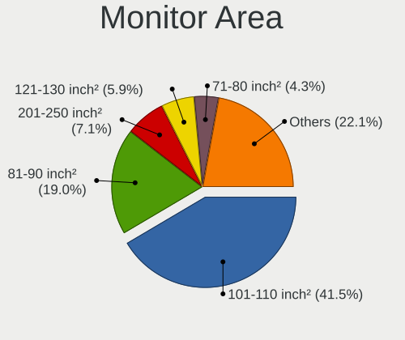

| Area in inch² | Notebooks | Percent |
|----------------|-----------|---------|
| 101-110        | 2351      | 41.51%  |
| 81-90          | 1075      | 18.98%  |
| 201-250        | 403       | 7.12%   |
| 121-130        | 335       | 5.91%   |
| 71-80          | 246       | 4.34%   |
| 301-350        | 183       | 3.23%   |
| 61-70          | 171       | 3.02%   |
| 111-120        | 136       | 2.4%    |
| 351-500        | 126       | 2.22%   |
| 251-300        | 105       | 1.85%   |
| 51-60          | 83        | 1.47%   |
| 131-140        | 71        | 1.25%   |
| Unknown        | 71        | 1.25%   |
| 151-200        | 63        | 1.11%   |
| 1-40           | 54        | 0.95%   |
| More than 1000 | 48        | 0.85%   |
| 141-150        | 43        | 0.76%   |
| 41-50          | 35        | 0.62%   |
| 501-1000       | 34        | 0.6%    |
| 91-100         | 31        | 0.55%   |

Pixel Density
-------------

Pixels per inch

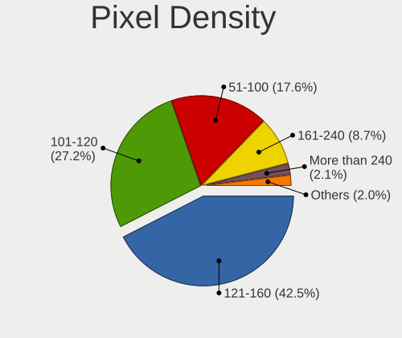

| Density       | Notebooks | Percent |
|---------------|-----------|---------|
| 121-160       | 2360      | 42.49%  |
| 101-120       | 1510      | 27.19%  |
| 51-100        | 976       | 17.57%  |
| 161-240       | 483       | 8.7%    |
| More than 240 | 115       | 2.07%   |
| Unknown       | 71        | 1.28%   |
| 1-50          | 39        | 0.7%    |

Multiple Monitors
-----------------

Total monitors connected

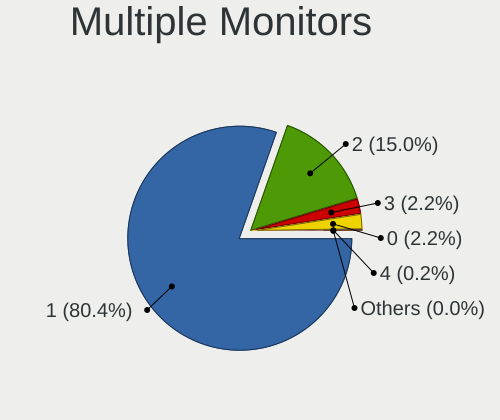

| Total | Notebooks | Percent |
|-------|-----------|---------|
| 1     | 4101      | 80.36%  |
| 2     | 763       | 14.95%  |
| 3     | 114       | 2.23%   |
| 0     | 112       | 2.19%   |
| 4     | 11        | 0.22%   |
| 6     | 1         | 0.02%   |
| 5     | 1         | 0.02%   |

Network
-------

Net Controller Vendor
---------------------

Controller vendors

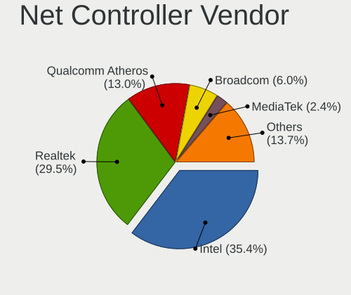

| Vendor                                 | Notebooks | Percent |
|----------------------------------------|-----------|---------|
| Intel                                  | 2845      | 35.37%  |
| Realtek Semiconductor                  | 2370      | 29.47%  |
| Qualcomm Atheros                       | 1049      | 13.04%  |
| Broadcom                               | 486       | 6.04%   |
| MediaTek                               | 193       | 2.4%    |
| Broadcom Limited                       | 140       | 1.74%   |
| Dell                                   | 110       | 1.37%   |
| Marvell Technology Group               | 97        | 1.21%   |
| Huawei Technologies                    | 68        | 0.85%   |
| TP-Link                                | 55        | 0.68%   |
| Ralink                                 | 50        | 0.62%   |
| Ericsson Business Mobile Networks      | 50        | 0.62%   |
| Samsung Electronics                    | 43        | 0.53%   |
| Sierra Wireless                        | 41        | 0.51%   |
| Shenzhen Goodix Technology             | 41        | 0.51%   |
| Hewlett-Packard                        | 38        | 0.47%   |
| ASIX Electronics                       | 38        | 0.47%   |
| Qualcomm                               | 30        | 0.37%   |
| Xiaomi                                 | 29        | 0.36%   |
| JMicron Technology                     | 23        | 0.29%   |
| Lenovo                                 | 19        | 0.24%   |
| DisplayLink                            | 19        | 0.24%   |
| Ralink Technology                      | 18        | 0.22%   |
| Fibocom                                | 18        | 0.22%   |
| Motorola PCS                           | 17        | 0.21%   |
| Qualcomm Atheros Communications        | 15        | 0.19%   |
| Silicon Integrated Systems [SiS]       | 13        | 0.16%   |
| Nvidia                                 | 13        | 0.16%   |
| ASUSTek Computer                       | 10        | 0.12%   |
| ZTE WCDMA Technologies MSM             | 8         | 0.1%    |
| Attansic Technology                    | 7         | 0.09%   |
| Qualcomm Technologies                  | 6         | 0.07%   |
| OPPO Electronics                       | 6         | 0.07%   |
| ICS Advent                             | 6         | 0.07%   |
| VIA Technologies                       | 5         | 0.06%   |
| Suzhou Motorcomm Electronic Technology | 5         | 0.06%   |
| NetGear                                | 5         | 0.06%   |
| Microsoft                              | 4         | 0.05%   |
| Edimax Technology                      | 4         | 0.05%   |
| Unknown                                | 4         | 0.05%   |

Net Controller Model
--------------------

Controller models

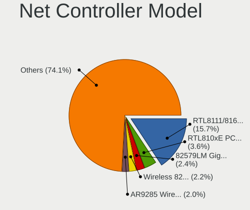

| Model                                                                  | Notebooks | Percent |
|------------------------------------------------------------------------|-----------|---------|
| Realtek RTL8111/8168/8211/8411 PCI Express Gigabit Ethernet Controller | 1537      | 15.7%   |
| Realtek RTL810xE PCI Express Fast Ethernet controller                  | 353       | 3.61%   |
| Intel 82579LM Gigabit Network Connection (Lewisville)                  | 236       | 2.41%   |
| Intel Wireless 8265 / 8275                                             | 212       | 2.17%   |
| Qualcomm Atheros AR9285 Wireless Network Adapter (PCI-Express)         | 196       | 2%      |
| Realtek RTL8822CE 802.11ac PCIe Wireless Network Adapter               | 185       | 1.89%   |
| Intel Wireless 7260                                                    | 174       | 1.78%   |
| Intel Wi-Fi 6 AX200                                                    | 172       | 1.76%   |
| Intel Centrino Advanced-N 6205 [Taylor Peak]                           | 169       | 1.73%   |
| Qualcomm Atheros QCA9565 / AR9565 Wireless Network Adapter             | 163       | 1.67%   |
| Realtek RTL8153 Gigabit Ethernet Adapter                               | 150       | 1.53%   |
| Intel Wi-Fi 6 AX201                                                    | 150       | 1.53%   |
| Intel Wireless 8260                                                    | 145       | 1.48%   |
| Qualcomm Atheros QCA9377 802.11ac Wireless Network Adapter             | 136       | 1.39%   |
| Qualcomm Atheros AR9485 Wireless Network Adapter                       | 128       | 1.31%   |
| Intel Wireless 7265                                                    | 124       | 1.27%   |
| Broadcom BCM4313 802.11bgn Wireless Network Adapter                    | 114       | 1.16%   |
| Intel Cannon Lake PCH CNVi WiFi                                        | 112       | 1.14%   |
| Intel Alder Lake-P PCH CNVi WiFi                                       | 112       | 1.14%   |
| Intel Wireless 3165                                                    | 99        | 1.01%   |
| Intel Ethernet Connection (4) I219-LM                                  | 92        | 0.94%   |
| Intel Cannon Point-LP CNVi [Wireless-AC]                               | 92        | 0.94%   |
| MediaTek MT7921 802.11ax PCIe Wireless Network Adapter [Filogic 330]   | 91        | 0.93%   |
| Intel PRO/Wireless 3945ABG [Golan] Network Connection                  | 88        | 0.9%    |
| Realtek RTL8821CE 802.11ac PCIe Wireless Network Adapter               | 86        | 0.88%   |
| Broadcom BCM43142 802.11b/g/n                                          | 86        | 0.88%   |
| Intel Wireless 3160                                                    | 85        | 0.87%   |
| Qualcomm Atheros QCA6174 802.11ac Wireless Network Adapter             | 81        | 0.83%   |
| Intel Centrino Ultimate-N 6300                                         | 77        | 0.79%   |
| Intel 82567LM Gigabit Network Connection                               | 74        | 0.76%   |
| Intel Ethernet Connection I217-LM                                      | 73        | 0.75%   |
| Realtek RTL8723BE PCIe Wireless Network Adapter                        | 71        | 0.73%   |
| Intel Comet Lake PCH-LP CNVi WiFi                                      | 66        | 0.67%   |
| Intel 82577LM Gigabit Network Connection                               | 65        | 0.66%   |
| Intel Ethernet Connection I218-LM                                      | 63        | 0.64%   |
| Intel WiFi Link 5100                                                   | 62        | 0.63%   |
| Intel Comet Lake PCH CNVi WiFi                                         | 60        | 0.61%   |
| Intel Ethernet Connection I219-LM                                      | 56        | 0.57%   |
| Intel Dual Band Wireless-AC 3165 Plus Bluetooth                        | 55        | 0.56%   |
| Realtek RTL8852BE PCIe 802.11ax Wireless Network Controller            | 53        | 0.54%   |

Wireless Vendor
---------------

Wireless vendors

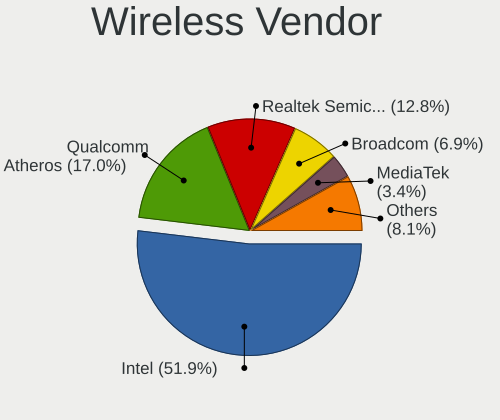

| Vendor                            | Notebooks | Percent |
|-----------------------------------|-----------|---------|
| Intel                             | 2669      | 51.89%  |
| Qualcomm Atheros                  | 872       | 16.95%  |
| Realtek Semiconductor             | 656       | 12.75%  |
| Broadcom                          | 354       | 6.88%   |
| MediaTek                          | 176       | 3.42%   |
| Broadcom Limited                  | 81        | 1.57%   |
| Dell                              | 68        | 1.32%   |
| Ralink                            | 50        | 0.97%   |
| TP-Link                           | 45        | 0.87%   |
| Sierra Wireless                   | 41        | 0.8%    |
| Qualcomm                          | 25        | 0.49%   |
| Ralink Technology                 | 18        | 0.35%   |
| Fibocom                           | 18        | 0.35%   |
| Qualcomm Atheros Communications   | 15        | 0.29%   |
| Hewlett-Packard                   | 12        | 0.23%   |
| ASUSTek Computer                  | 9         | 0.17%   |
| Qualcomm Technologies             | 5         | 0.1%    |
| Microsoft                         | 4         | 0.08%   |
| Edimax Technology                 | 4         | 0.08%   |
| Unknown                           | 4         | 0.08%   |
| Quectel Wireless Solutions        | 2         | 0.04%   |
| NetGear                           | 2         | 0.04%   |
| Ericsson Business Mobile Networks | 2         | 0.04%   |
| D-Link                            | 2         | 0.04%   |
| ZyXEL Communications              | 1         | 0.02%   |
| Tenda                             | 1         | 0.02%   |
| Sweex                             | 1         | 0.02%   |
| Samsung Electronics               | 1         | 0.02%   |
| Sagem                             | 1         | 0.02%   |
| Micro Star International          | 1         | 0.02%   |
| Linksys                           | 1         | 0.02%   |
| Fujitsu Siemens Computers         | 1         | 0.02%   |
| Belkin Components                 | 1         | 0.02%   |
| AVM                               | 1         | 0.02%   |

Wireless Model
--------------

Wireless models

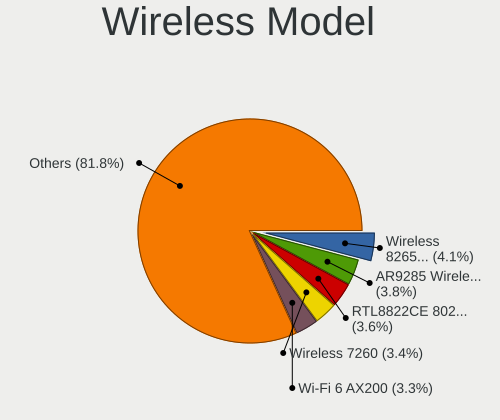

| Model                                                                   | Notebooks | Percent |
|-------------------------------------------------------------------------|-----------|---------|
| Intel Wireless 8265 / 8275                                              | 212       | 4.11%   |
| Qualcomm Atheros AR9285 Wireless Network Adapter (PCI-Express)          | 196       | 3.8%    |
| Realtek RTL8822CE 802.11ac PCIe Wireless Network Adapter                | 185       | 3.58%   |
| Intel Wireless 7260                                                     | 174       | 3.37%   |
| Intel Wi-Fi 6 AX200                                                     | 172       | 3.33%   |
| Intel Centrino Advanced-N 6205 [Taylor Peak]                            | 169       | 3.27%   |
| Qualcomm Atheros QCA9565 / AR9565 Wireless Network Adapter              | 163       | 3.16%   |
| Intel Wi-Fi 6 AX201                                                     | 150       | 2.91%   |
| Intel Wireless 8260                                                     | 145       | 2.81%   |
| Qualcomm Atheros QCA9377 802.11ac Wireless Network Adapter              | 136       | 2.64%   |
| Qualcomm Atheros AR9485 Wireless Network Adapter                        | 128       | 2.48%   |
| Intel Wireless 7265                                                     | 124       | 2.4%    |
| Broadcom BCM4313 802.11bgn Wireless Network Adapter                     | 114       | 2.21%   |
| Intel Cannon Lake PCH CNVi WiFi                                         | 112       | 2.17%   |
| Intel Wireless 3165                                                     | 99        | 1.92%   |
| Intel Cannon Point-LP CNVi [Wireless-AC]                                | 92        | 1.78%   |
| MediaTek MT7921 802.11ax PCIe Wireless Network Adapter [Filogic 330]    | 91        | 1.76%   |
| Intel PRO/Wireless 3945ABG [Golan] Network Connection                   | 88        | 1.71%   |
| Realtek RTL8821CE 802.11ac PCIe Wireless Network Adapter                | 86        | 1.67%   |
| Broadcom BCM43142 802.11b/g/n                                           | 86        | 1.67%   |
| Intel Wireless 3160                                                     | 85        | 1.65%   |
| Qualcomm Atheros QCA6174 802.11ac Wireless Network Adapter              | 81        | 1.57%   |
| Intel Centrino Ultimate-N 6300                                          | 77        | 1.49%   |
| Intel Alder Lake-P PCH CNVi WiFi                                        | 74        | 1.43%   |
| Realtek RTL8723BE PCIe Wireless Network Adapter                         | 71        | 1.38%   |
| Intel Comet Lake PCH-LP CNVi WiFi                                       | 66        | 1.28%   |
| Intel WiFi Link 5100                                                    | 62        | 1.2%    |
| Intel Comet Lake PCH CNVi WiFi                                          | 60        | 1.16%   |
| Intel Dual Band Wireless-AC 3165 Plus Bluetooth                         | 55        | 1.07%   |
| Realtek RTL8852BE PCIe 802.11ax Wireless Network Controller             | 53        | 1.03%   |
| Intel Centrino Advanced-N 6200                                          | 53        | 1.03%   |
| Intel Centrino Advanced-N 6235                                          | 49        | 0.95%   |
| Intel PRO/Wireless 5100 AGN [Shiloh] Network Connection                 | 48        | 0.93%   |
| Qualcomm Atheros AR242x / AR542x Wireless Network Adapter (PCI-Express) | 46        | 0.89%   |
| Intel Raptor Lake PCH CNVi WiFi                                         | 44        | 0.85%   |
| Intel PRO/Wireless 4965 AG or AGN [Kedron] Network Connection           | 44        | 0.85%   |
| Intel Dual Band Wireless-AC 3168NGW [Stone Peak]                        | 42        | 0.81%   |
| Realtek RTL8852AE 802.11ax PCIe Wireless Network Adapter                | 41        | 0.79%   |
| Intel Wi-Fi 6E(802.11ax) AX210/AX1675* 2x2 [Typhoon Peak]               | 41        | 0.79%   |
| Qualcomm Atheros AR928X Wireless Network Adapter (PCI-Express)          | 40        | 0.78%   |

Ethernet Vendor
---------------

Ethernet vendors

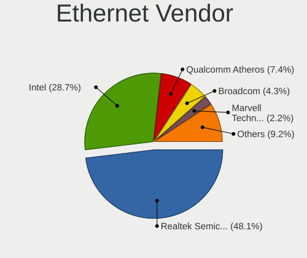

| Vendor                                 | Notebooks | Percent |
|----------------------------------------|-----------|---------|
| Realtek Semiconductor                  | 2098      | 48.1%   |
| Intel                                  | 1252      | 28.7%   |
| Qualcomm Atheros                       | 324       | 7.43%   |
| Broadcom                               | 188       | 4.31%   |
| Marvell Technology Group               | 97        | 2.22%   |
| Broadcom Limited                       | 60        | 1.38%   |
| Huawei Technologies                    | 47        | 1.08%   |
| ASIX Electronics                       | 38        | 0.87%   |
| Samsung Electronics                    | 36        | 0.83%   |
| Xiaomi                                 | 28        | 0.64%   |
| JMicron Technology                     | 23        | 0.53%   |
| Lenovo                                 | 19        | 0.44%   |
| DisplayLink                            | 19        | 0.44%   |
| Motorola PCS                           | 17        | 0.39%   |
| MediaTek                               | 15        | 0.34%   |
| Silicon Integrated Systems [SiS]       | 13        | 0.3%    |
| Nvidia                                 | 13        | 0.3%    |
| TP-Link                                | 10        | 0.23%   |
| Hewlett-Packard                        | 7         | 0.16%   |
| Attansic Technology                    | 7         | 0.16%   |
| OPPO Electronics                       | 6         | 0.14%   |
| ICS Advent                             | 6         | 0.14%   |
| VIA Technologies                       | 5         | 0.11%   |
| Suzhou Motorcomm Electronic Technology | 5         | 0.11%   |
| Qualcomm                               | 5         | 0.11%   |
| NetGear                                | 3         | 0.07%   |
| LG Electronics                         | 3         | 0.07%   |
| HTC (High Tech Computer)               | 3         | 0.07%   |
| HMD Global                             | 3         | 0.07%   |
| QinHeng Electronics                    | 2         | 0.05%   |
| Apple                                  | 2         | 0.05%   |
| ZTE WCDMA Technologies MSM             | 1         | 0.02%   |
| Sony Ericsson Mobile Communications AB | 1         | 0.02%   |
| Qualcomm Technologies                  | 1         | 0.02%   |
| OnePlus Technology (Shenzhen)          | 1         | 0.02%   |
| Motorcomm Microelectronics.            | 1         | 0.02%   |
| Google                                 | 1         | 0.02%   |
| Dynabook                               | 1         | 0.02%   |
| ASUSTek Computer                       | 1         | 0.02%   |

Ethernet Model
--------------

Ethernet models

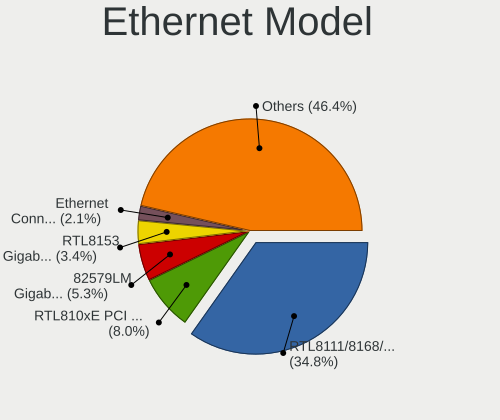

| Model                                                                  | Notebooks | Percent |
|------------------------------------------------------------------------|-----------|---------|
| Realtek RTL8111/8168/8211/8411 PCI Express Gigabit Ethernet Controller | 1537      | 34.8%   |
| Realtek RTL810xE PCI Express Fast Ethernet controller                  | 353       | 7.99%   |
| Intel 82579LM Gigabit Network Connection (Lewisville)                  | 236       | 5.34%   |
| Realtek RTL8153 Gigabit Ethernet Adapter                               | 150       | 3.4%    |
| Intel Ethernet Connection (4) I219-LM                                  | 92        | 2.08%   |
| Intel 82567LM Gigabit Network Connection                               | 74        | 1.68%   |
| Intel Ethernet Connection I217-LM                                      | 73        | 1.65%   |
| Intel 82577LM Gigabit Network Connection                               | 65        | 1.47%   |
| Intel Ethernet Connection I218-LM                                      | 63        | 1.43%   |
| Intel Ethernet Connection I219-LM                                      | 56        | 1.27%   |
| Intel Ethernet Connection (3) I218-LM                                  | 53        | 1.2%    |
| Qualcomm Atheros QCA8172 Fast Ethernet                                 | 48        | 1.09%   |
| Intel Ethernet Connection (4) I219-V                                   | 45        | 1.02%   |
| Intel Ethernet Connection (6) I219-V                                   | 42        | 0.95%   |
| Qualcomm Atheros AR8151 v2.0 Gigabit Ethernet                          | 40        | 0.91%   |
| Huawei E353/E3131                                                      | 39        | 0.88%   |
| Intel Alder Lake-P PCH CNVi WiFi                                       | 38        | 0.86%   |
| Intel Ethernet Connection (7) I219-LM                                  | 36        | 0.82%   |
| Qualcomm Atheros QCA8171 Gigabit Ethernet                              | 33        | 0.75%   |
| ASIX AX88179 Gigabit Ethernet                                          | 33        | 0.75%   |
| Qualcomm Atheros AR8162 Fast Ethernet                                  | 32        | 0.72%   |
| Intel Ethernet Connection (6) I219-LM                                  | 29        | 0.66%   |
| Samsung Galaxy series, misc. (tethering mode)                          | 27        | 0.61%   |
| Intel Ethernet Connection (18) I219-LM                                 | 26        | 0.59%   |
| Qualcomm Atheros AR8161 Gigabit Ethernet                               | 25        | 0.57%   |
| Marvell Group 88E8040 PCI-E Fast Ethernet Controller                   | 24        | 0.54%   |
| Intel 82579V Gigabit Network Connection                                | 24        | 0.54%   |
| Broadcom NetLink BCM57785 Gigabit Ethernet PCIe                        | 24        | 0.54%   |
| Intel Ethernet Connection (2) I219-LM                                  | 23        | 0.52%   |
| Broadcom NetLink BCM5787M Gigabit Ethernet PCI Express                 | 23        | 0.52%   |
| Realtek RTL8125 2.5GbE Controller                                      | 22        | 0.5%    |
| Broadcom NetLink BCM57780 Gigabit Ethernet PCIe                        | 22        | 0.5%    |
| Qualcomm Atheros Killer E2400 Gigabit Ethernet Controller              | 21        | 0.48%   |
| Marvell Group 88E8055 PCI-E Gigabit Ethernet Controller                | 21        | 0.48%   |
| JMicron JMC250 PCI Express Gigabit Ethernet Controller                 | 21        | 0.48%   |
| Intel Ethernet Connection I219-V                                       | 21        | 0.48%   |
| Intel Ethernet Connection (13) I219-V                                  | 21        | 0.48%   |
| Qualcomm Atheros AR8152 v2.0 Fast Ethernet                             | 20        | 0.45%   |
| Qualcomm Atheros AR8131 Gigabit Ethernet                               | 20        | 0.45%   |
| Qualcomm Atheros AR8132 Fast Ethernet                                  | 19        | 0.43%   |

Net Controller Kind
-------------------

Ethernet, WiFi or modem

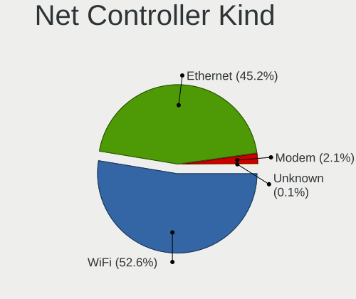

| Kind     | Notebooks | Percent |
|----------|-----------|---------|
| WiFi     | 4821      | 52.61%  |
| Ethernet | 4138      | 45.15%  |
| Modem    | 197       | 2.15%   |
| Unknown  | 8         | 0.09%   |

Used Controller
---------------

Currently used network controller

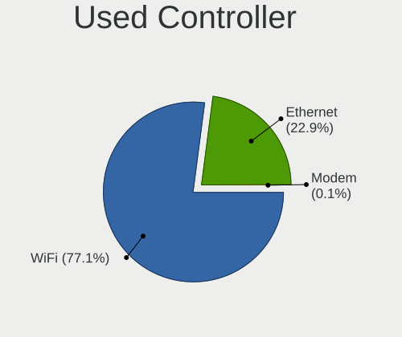

| Kind     | Notebooks | Percent |
|----------|-----------|---------|
| WiFi     | 3937      | 77.06%  |
| Ethernet | 1169      | 22.88%  |
| Modem    | 3         | 0.06%   |

NICs
----

Total network controllers on board

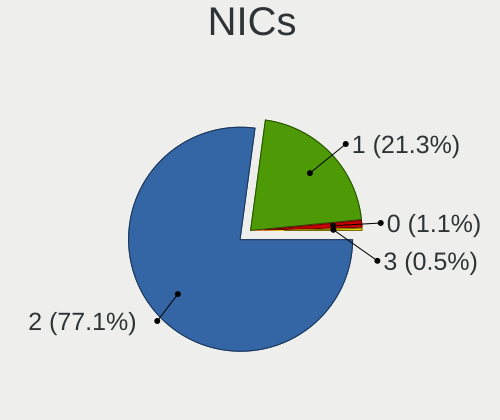

| Total | Notebooks | Percent |
|-------|-----------|---------|
| 2     | 3827      | 77.13%  |
| 1     | 1057      | 21.3%   |
| 0     | 55        | 1.11%   |
| 3     | 23        | 0.46%   |

IPv6
----

IPv6 vs IPv4

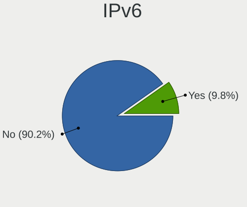

| Used | Notebooks | Percent |
|------|-----------|---------|
| No   | 4515      | 90.23%  |
| Yes  | 489       | 9.77%   |

Bluetooth
---------

Bluetooth Vendor
----------------

Controller vendors

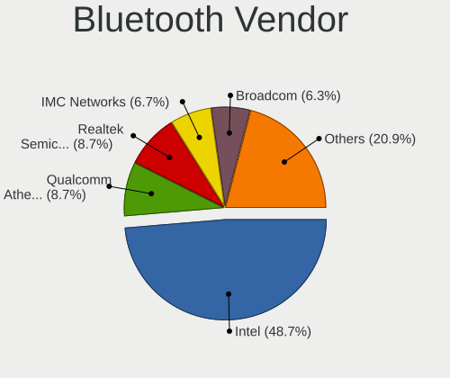

| Vendor                          | Notebooks | Percent |
|---------------------------------|-----------|---------|
| Intel                           | 1971      | 48.67%  |
| Qualcomm Atheros Communications | 354       | 8.74%   |
| Realtek Semiconductor           | 352       | 8.69%   |
| IMC Networks                    | 271       | 6.69%   |
| Broadcom                        | 254       | 6.27%   |
| Foxconn / Hon Hai               | 173       | 4.27%   |
| Lite-On Technology              | 121       | 2.99%   |
| Dell                            | 121       | 2.99%   |
| Hewlett-Packard                 | 87        | 2.15%   |
| Apple                           | 55        | 1.36%   |
| Cambridge Silicon Radio         | 50        | 1.23%   |
| ASUSTek Computer                | 49        | 1.21%   |
| Toshiba                         | 37        | 0.91%   |
| Foxconn International           | 32        | 0.79%   |
| Ralink                          | 28        | 0.69%   |
| Realtek                         | 22        | 0.54%   |
| MediaTek                        | 15        | 0.37%   |
| USI                             | 12        | 0.3%    |
| Alps Electric                   | 10        | 0.25%   |
| Chicony Electronics             | 8         | 0.2%    |
| Taiyo Yuden                     | 5         | 0.12%   |
| Integrated System Solution      | 4         | 0.1%    |
| Ralink Technology               | 3         | 0.07%   |
| Micro Star International        | 3         | 0.07%   |
| TP-Link                         | 2         | 0.05%   |
| Opticis                         | 2         | 0.05%   |
| Fujitsu                         | 2         | 0.05%   |
| Askey Computer                  | 2         | 0.05%   |
| SINO WEALTH                     | 1         | 0.02%   |
| Edimax Technology               | 1         | 0.02%   |
| Creative Technology             | 1         | 0.02%   |
| AboCom Systems                  | 1         | 0.02%   |
| Unknown                         | 1         | 0.02%   |

Bluetooth Model
---------------

Controller models

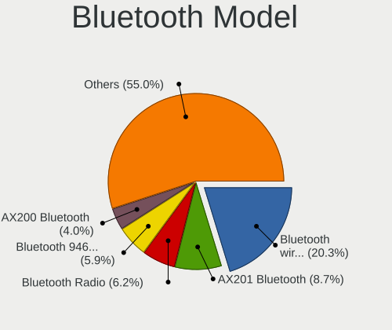

| Model                                               | Notebooks | Percent |
|-----------------------------------------------------|-----------|---------|
| Intel Bluetooth wireless interface                  | 821       | 20.26%  |
| Intel AX201 Bluetooth                               | 351       | 8.66%   |
| Realtek Bluetooth Radio                             | 250       | 6.17%   |
| Intel Bluetooth 9460/9560 Jefferson Peak (JfP)      | 238       | 5.87%   |
| Intel AX200 Bluetooth                               | 163       | 4.02%   |
| Intel Bluetooth Device                              | 162       | 4%      |
| Qualcomm Atheros  Bluetooth Device                  | 155       | 3.83%   |
| IMC Networks Bluetooth Radio                        | 111       | 2.74%   |
| Intel Centrino Bluetooth Wireless Transceiver       | 85        | 2.1%    |
| IMC Networks Wireless_Device                        | 82        | 2.02%   |
| Qualcomm Atheros AR3012 Bluetooth 4.0               | 78        | 1.92%   |
| Qualcomm Atheros AR3011 Bluetooth                   | 66        | 1.63%   |
| Broadcom BCM2045B (BDC-2.1)                         | 57        | 1.41%   |
| Realtek  Bluetooth 4.2 Adapter                      | 53        | 1.31%   |
| Cambridge Silicon Radio Bluetooth Dongle (HCI mode) | 50        | 1.23%   |
| Intel Centrino Advanced-N 6230 Bluetooth adapter    | 45        | 1.11%   |
| HP Bluetooth 2.0 Interface [Broadcom BCM2045]       | 44        | 1.09%   |
| Intel AX210 Bluetooth                               | 42        | 1.04%   |
| HP Broadcom 2070 Bluetooth Combo                    | 42        | 1.04%   |
| Intel Wireless-AC 3168 Bluetooth                    | 41        | 1.01%   |
| Dell BCM20702A0 Bluetooth Module                    | 41        | 1.01%   |
| Dell DW375 Bluetooth Module                         | 39        | 0.96%   |
| Foxconn / Hon Hai Wireless_Device                   | 37        | 0.91%   |
| Foxconn / Hon Hai MediaTek Bluetooth Adapter        | 37        | 0.91%   |
| IMC Networks Bluetooth Device                       | 35        | 0.86%   |
| Foxconn International BCM43142A0 Bluetooth module   | 32        | 0.79%   |
| Lite-On Bluetooth Device                            | 30        | 0.74%   |
| Broadcom BCM20702 Bluetooth 4.0 [ThinkPad]          | 30        | 0.74%   |
| Realtek RTL8723B Bluetooth                          | 28        | 0.69%   |
| Ralink RT3290 Bluetooth                             | 28        | 0.69%   |
| Qualcomm Atheros QCA61x4 Bluetooth 4.0              | 28        | 0.69%   |
| Lite-On Qualcomm Atheros QCA9377 Bluetooth          | 28        | 0.69%   |
| IMC Networks Atheros AR3012 Bluetooth 4.0 Adapter   | 27        | 0.67%   |
| Apple Bluetooth Host Controller                     | 27        | 0.67%   |
| Foxconn / Hon Hai Bluetooth Device                  | 26        | 0.64%   |
| Lite-On Atheros AR3012 Bluetooth                    | 25        | 0.62%   |
| Intel Wireless-AC 9260 Bluetooth Adapter            | 24        | 0.59%   |
| Broadcom BCM2070 Bluetooth Device                   | 24        | 0.59%   |
| Realtek Bluetooth Radio                             | 22        | 0.54%   |
| Broadcom BCM2045B (BDC-2.1) [Bluetooth Controller]  | 22        | 0.54%   |

Sound
-----

Sound Vendor
------------

Sound card vendors

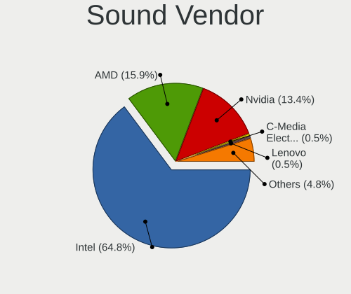

| Vendor                           | Notebooks | Percent |
|----------------------------------|-----------|---------|
| Intel                            | 3992      | 64.82%  |
| AMD                              | 980       | 15.91%  |
| Nvidia                           | 827       | 13.43%  |
| C-Media Electronics              | 32        | 0.52%   |
| Lenovo                           | 30        | 0.49%   |
| Realtek Semiconductor            | 26        | 0.42%   |
| Creative Technology              | 21        | 0.34%   |
| Logitech                         | 19        | 0.31%   |
| GN Netcom                        | 19        | 0.31%   |
| Plantronics                      | 18        | 0.29%   |
| Silicon Integrated Systems [SiS] | 16        | 0.26%   |
| Hewlett-Packard                  | 15        | 0.24%   |
| Generalplus Technology           | 14        | 0.23%   |
| JMTek                            | 10        | 0.16%   |
| VIA Technologies                 | 9         | 0.15%   |
| SteelSeries ApS                  | 9         | 0.15%   |
| Kingston Technology              | 9         | 0.15%   |
| Texas Instruments                | 8         | 0.13%   |
| DSEA A/S                         | 8         | 0.13%   |
| Dell                             | 7         | 0.11%   |
| ASUSTek Computer                 | 7         | 0.11%   |
| Sony                             | 5         | 0.08%   |
| Focusrite-Novation               | 5         | 0.08%   |
| Samson Technologies              | 4         | 0.06%   |
| BEHRINGER International          | 4         | 0.06%   |
| Razer USA                        | 3         | 0.05%   |
| M-Audio                          | 3         | 0.05%   |
| liyuany                          | 3         | 0.05%   |
| KTMICRO                          | 3         | 0.05%   |
| AudioQuest                       | 3         | 0.05%   |
| USB MICROPHONE                   | 2         | 0.03%   |
| TTGK Technology                  | 2         | 0.03%   |
| Trust                            | 2         | 0.03%   |
| RODE Microphones                 | 2         | 0.03%   |
| PreSonus Audio Electronics       | 2         | 0.03%   |
| Mark of the Unicorn              | 2         | 0.03%   |
| Jieli Technology                 | 2         | 0.03%   |
| GYROCOM C&C                      | 2         | 0.03%   |
| Apple                            | 2         | 0.03%   |
| Unknown                          | 2         | 0.03%   |

Sound Model
-----------

Sound card models

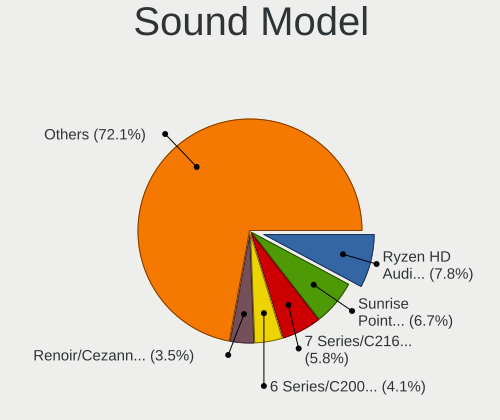

| Model                                                                                             | Notebooks | Percent |
|---------------------------------------------------------------------------------------------------|-----------|---------|
| AMD Ryzen HD Audio Controller                                                                     | 579       | 7.82%   |
| Intel Sunrise Point-LP HD Audio                                                                   | 494       | 6.67%   |
| Intel 7 Series/C216 Chipset Family High Definition Audio Controller                               | 428       | 5.78%   |
| Intel 6 Series/C200 Series Chipset Family High Definition Audio Controller                        | 305       | 4.12%   |
| AMD Renoir/Cezanne HDMI/DP Audio Controller                                                       | 260       | 3.51%   |
| Intel 82801I (ICH9 Family) HD Audio Controller                                                    | 242       | 3.27%   |
| Intel 5 Series/3400 Series Chipset High Definition Audio                                          | 222       | 3%      |
| Intel 8 Series HD Audio Controller                                                                | 212       | 2.86%   |
| Intel Haswell-ULT HD Audio Controller                                                             | 210       | 2.84%   |
| Intel Cannon Lake PCH cAVS                                                                        | 194       | 2.62%   |
| Intel Tiger Lake-LP Smart Sound Technology Audio Controller                                       | 191       | 2.58%   |
| Intel Broadwell-U Audio Controller                                                                | 181       | 2.44%   |
| Intel Wildcat Point-LP High Definition Audio Controller                                           | 180       | 2.43%   |
| Intel 8 Series/C220 Series Chipset High Definition Audio Controller                               | 180       | 2.43%   |
| Intel Xeon E3-1200 v3/4th Gen Core Processor HD Audio Controller                                  | 161       | 2.17%   |
| Intel Alder Lake PCH-P High Definition Audio Controller                                           | 159       | 2.15%   |
| AMD Radeon High Definition Audio Controller                                                       | 157       | 2.12%   |
| Intel 82801H (ICH8 Family) HD Audio Controller                                                    | 150       | 2.03%   |
| Intel Cannon Point-LP High Definition Audio Controller                                            | 124       | 1.67%   |
| AMD FCH Azalia Controller                                                                         | 122       | 1.65%   |
| AMD Raven/Raven2/Fenghuang HDMI/DP Audio Controller                                               | 117       | 1.58%   |
| Intel Atom Processor Z36xxx/Z37xxx Series High Definition Audio Controller                        | 116       | 1.57%   |
| Nvidia TU107 GeForce GTX 1650 High Definition Audio Controller                                    | 100       | 1.35%   |
| Nvidia GF108 High Definition Audio Controller                                                     | 97        | 1.31%   |
| Intel 100 Series/C230 Series Chipset Family HD Audio Controller                                   | 87        | 1.18%   |
| Intel CM238 HD Audio Controller                                                                   | 86        | 1.16%   |
| Intel NM10/ICH7 Family High Definition Audio Controller                                           | 85        | 1.15%   |
| Intel Comet Lake PCH-LP cAVS                                                                      | 80        | 1.08%   |
| Nvidia GP107GL High Definition Audio Controller                                                   | 70        | 0.95%   |
| Intel Comet Lake PCH cAVS                                                                         | 68        | 0.92%   |
| AMD SBx00 Azalia (Intel HDA)                                                                      | 67        | 0.9%    |
| Nvidia GA107 High Definition Audio Controller                                                     | 60        | 0.81%   |
| Intel Raptor Lake-P/U/H cAVS                                                                      | 60        | 0.81%   |
| Intel Tiger Lake-H HD Audio Controller                                                            | 53        | 0.72%   |
| AMD Kabini HDMI/DP Audio                                                                          | 53        | 0.72%   |
| Intel Ice Lake-LP Smart Sound Technology Audio Controller                                         | 51        | 0.69%   |
| Nvidia AD107 High Definition Audio Controller                                                     | 49        | 0.66%   |
| Intel Atom/Celeron/Pentium Processor x5-E8000/J3xxx/N3xxx Series High Definition Audio Controller | 45        | 0.61%   |
| AMD Wrestler HDMI Audio                                                                           | 45        | 0.61%   |
| Nvidia TU116 High Definition Audio Controller                                                     | 44        | 0.59%   |

Memory
------

Memory Vendor
-------------

Memory module vendors

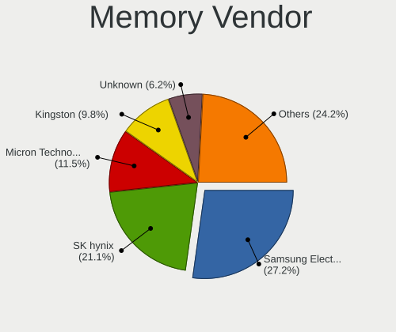

| Vendor                       | Notebooks | Percent |
|------------------------------|-----------|---------|
| Samsung Electronics          | 1095      | 27.2%   |
| SK hynix                     | 850       | 21.11%  |
| Micron Technology            | 464       | 11.53%  |
| Kingston                     | 393       | 9.76%   |
| Unknown                      | 251       | 6.23%   |
| GOODRAM                      | 193       | 4.79%   |
| Crucial                      | 168       | 4.17%   |
| Ramaxel Technology           | 103       | 2.56%   |
| Unknown                      | 71        | 1.76%   |
| Elpida                       | 70        | 1.74%   |
| Nanya Technology             | 69        | 1.71%   |
| A-DATA Technology            | 67        | 1.66%   |
| Corsair                      | 28        | 0.7%    |
| Patriot                      | 24        | 0.6%    |
| Wilk                         | 22        | 0.55%   |
| Unknown (ABCD)               | 20        | 0.5%    |
| G.Skill                      | 17        | 0.42%   |
| ASint Technology             | 13        | 0.32%   |
| Qimonda                      | 11        | 0.27%   |
| Lexar                        | 8         | 0.2%    |
| Transcend                    | 6         | 0.15%   |
| ff                           | 6         | 0.15%   |
| 4ea5                         | 6         | 0.15%   |
| Toshiba                      | 5         | 0.12%   |
| Patriot Memory (PDP Systems) | 5         | 0.12%   |
| fef5                         | 5         | 0.12%   |
| 48spaces                     | 5         | 0.12%   |
| Unknown (768A)               | 3         | 0.07%   |
| Unifosa                      | 3         | 0.07%   |
| SHARETRONIC                  | 3         | 0.07%   |
| PUSKILL                      | 3         | 0.07%   |
| PNY                          | 3         | 0.07%   |
| Lexar Co Limited             | 3         | 0.07%   |
| Innodisk                     | 3         | 0.07%   |
| ChangXin Memory              | 3         | 0.07%   |
| Apacer                       | 3         | 0.07%   |
| Team                         | 2         | 0.05%   |
| Silicon Power                | 2         | 0.05%   |
| A-TECH                       | 2         | 0.05%   |
| 8CFD000080AD                 | 2         | 0.05%   |

Memory Model
------------

Memory module models

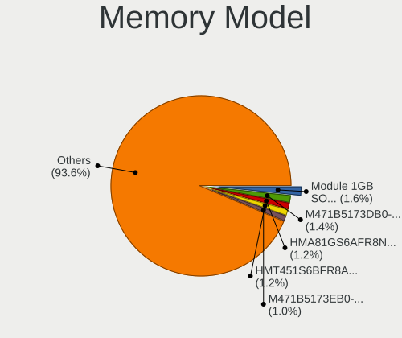

| Model                                                            | Notebooks | Percent |
|------------------------------------------------------------------|-----------|---------|
| Unknown                                                          | 71        | 1.64%   |
| Samsung RAM M471B5173DB0-YK0 4GB SODIMM DDR3 1600MT/s            | 59        | 1.36%   |
| SK hynix RAM HMA81GS6AFR8N-UH 8GB SODIMM DDR4 2667MT/s           | 51        | 1.18%   |
| SK hynix RAM HMT451S6BFR8A-PB 4GB SODIMM DDR3 1600MT/s           | 50        | 1.16%   |
| Samsung RAM M471B5173EB0-YK0 4GB SODIMM DDR3 1600MT/s            | 45        | 1.04%   |
| Samsung RAM M471A1G44AB0-CWE 8GiB SODIMM DDR4 3200MT/s           | 45        | 1.04%   |
| Samsung RAM M471B5273DH0-CH9 4GB SODIMM DDR3 1600MT/s            | 44        | 1.02%   |
| Samsung RAM M471B5273CH0-CH9 4GB SODIMM DDR3 1334MT/s            | 40        | 0.92%   |
| Samsung RAM M471B5173QH0-YK0 4GB SODIMM DDR3 1600MT/s            | 40        | 0.92%   |
| Unknown RAM Module 2GB SODIMM DDR2 667MT/s                       | 38        | 0.88%   |
| Samsung RAM M471B5173BH0-YK0 4GB SODIMM DDR3 1600MT/s            | 38        | 0.88%   |
| SK hynix RAM HMT451S6AFR8A-PB 4GB SODIMM DDR3 1600MT/s           | 37        | 0.85%   |
| GOODRAM RAM GR3200S464L22/16G 16GiB SODIMM DDR4 3200MT/s         | 37        | 0.85%   |
| SK hynix RAM HMT41GS6BFR8A-PB 8GB SODIMM DDR3 2667MT/s           | 35        | 0.81%   |
| GOODRAM RAM GR2666S464L19/16G 16GB SODIMM DDR4 2667MT/s          | 31        | 0.72%   |
| SK hynix RAM HMT351S6CFR8C-PB 4GB SODIMM DDR3 1600MT/s           | 30        | 0.69%   |
| Samsung RAM M471A5244CB0-CTD 4GB SODIMM DDR4 3266MT/s            | 29        | 0.67%   |
| Samsung RAM M471B5773DH0-CH9 2GB SODIMM DDR3 1600MT/s            | 27        | 0.62%   |
| SK hynix RAM HMAA1GS6CJR6N-XN 8GB SODIMM DDR4 3200MT/s           | 26        | 0.6%    |
| Samsung RAM M471B5773CHS-CH9 2GB SODIMM DDR3 4199MT/s            | 25        | 0.58%   |
| SK hynix RAM HMA81GS6JJR8N-VK 8GB SODIMM DDR4 2667MT/s           | 24        | 0.55%   |
| Samsung RAM M471A2K43DB1-CWE 16GB SODIMM DDR4 3200MT/s           | 24        | 0.55%   |
| Samsung RAM M471B1G73QH0-YK0 8GB SODIMM DDR3 1600MT/s            | 23        | 0.53%   |
| Samsung RAM M471A1K43EB1-CWE 8GB SODIMM DDR4 3200MT/s            | 23        | 0.53%   |
| Samsung RAM M471A1K43CB1-CRC 8GB SODIMM DDR4 8400MT/s            | 23        | 0.53%   |
| Samsung RAM M471A1G44BB0-CWE 8GB SODIMM DDR4 3200MT/s            | 23        | 0.53%   |
| SK hynix RAM HYMP125S64CP8-S6 2GB SODIMM DDR2 975MT/s            | 22        | 0.51%   |
| SK hynix RAM HMA82GS6AFR8N-UH 16GB SODIMM DDR4 2667MT/s          | 21        | 0.49%   |
| Samsung RAM M471A1K43CB1-CTD 8GB SODIMM DDR4 3200MT/s            | 21        | 0.49%   |
| Micron RAM 4ATF1G64HZ-3G2E1 8GB SODIMM DDR4 3200MT/s             | 21        | 0.49%   |
| Crucial RAM CT8G4SFD8213.C16FBD1 8GB SODIMM DDR4 2133MT/s        | 21        | 0.49%   |
| SK hynix RAM HMA41GS6AFR8N-TF 8GB SODIMM DDR4 2667MT/s           | 20        | 0.46%   |
| Micron RAM 4ATF51264HZ-2G6E1 4GB SODIMM DDR4 2667MT/s            | 20        | 0.46%   |
| SK hynix RAM HMT351S6BFR8C-H9 4GB SODIMM DDR3 1333MT/s           | 19        | 0.44%   |
| SK hynix RAM HMA851S6AFR6N-UH 4GB SODIMM DDR4 2667MT/s           | 19        | 0.44%   |
| Samsung RAM M471B5673FH0-CF8 2048MB SODIMM DDR3 1067MT/s         | 19        | 0.44%   |
| Unknown (ABCD) RAM 123456789012345678 2GB SODIMM LPDDR4 2400MT/s | 18        | 0.42%   |
| SK hynix RAM HMA81GS6DJR8N-XN 8GB SODIMM DDR4 3200MT/s           | 18        | 0.42%   |
| Samsung RAM M471B5273DH0-CK0 4GB SODIMM DDR3 2400MT/s            | 18        | 0.42%   |
| Samsung RAM M471B1G73DB0-YK0 8GB SODIMM DDR3 1600MT/s            | 18        | 0.42%   |

Memory Kind
-----------

Memory module kinds

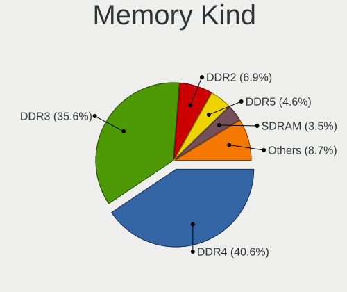

| Kind    | Notebooks | Percent |
|---------|-----------|---------|
| DDR4    | 1351      | 40.62%  |
| DDR3    | 1185      | 35.63%  |
| DDR2    | 230       | 6.92%   |
| DDR5    | 152       | 4.57%   |
| SDRAM   | 118       | 3.55%   |
| LPDDR4  | 114       | 3.43%   |
| LPDDR5  | 84        | 2.53%   |
| LPDDR3  | 52        | 1.56%   |
| Unknown | 21        | 0.63%   |
| DDR     | 11        | 0.33%   |
| DRAM    | 8         | 0.24%   |

Memory Form Factor
------------------

Physical design of the memory module

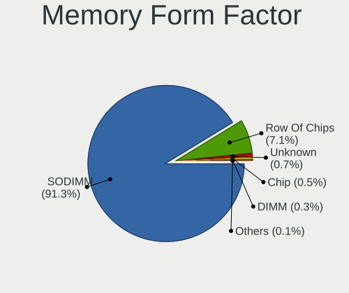

| Name            | Notebooks | Percent |
|-----------------|-----------|---------|
| SODIMM          | 2981      | 91.27%  |
| Row Of Chips    | 232       | 7.1%    |
| Unknown         | 23        | 0.7%    |
| Chip            | 17        | 0.52%   |
| DIMM            | 10        | 0.31%   |
| Proprietary Car | 3         | 0.09%   |

Memory Size
-----------

Memory module size

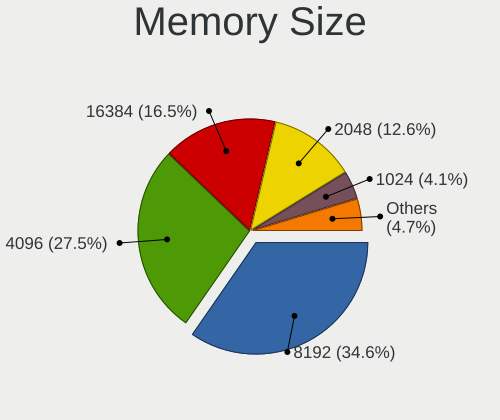

| Size    | Notebooks | Percent |
|---------|-----------|---------|
| 8192    | 1278      | 34.64%  |
| 4096    | 1014      | 27.49%  |
| 16384   | 610       | 16.54%  |
| 2048    | 463       | 12.55%  |
| 1024    | 151       | 4.09%   |
| 32768   | 147       | 3.98%   |
| 512     | 10        | 0.27%   |
| 49152   | 4         | 0.11%   |
| Unknown | 4         | 0.11%   |
| 65536   | 2         | 0.05%   |
| 12288   | 2         | 0.05%   |
| 131072  | 1         | 0.03%   |
| 3072    | 1         | 0.03%   |
| 1536    | 1         | 0.03%   |
| 256     | 1         | 0.03%   |

Memory Speed
------------

Memory module speed

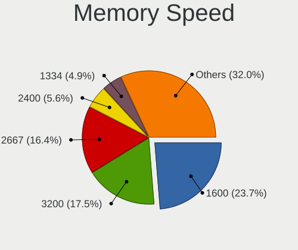

| Speed   | Notebooks | Percent |
|---------|-----------|---------|
| 1600    | 867       | 23.72%  |
| 3200    | 639       | 17.48%  |
| 2667    | 599       | 16.39%  |
| 2400    | 203       | 5.55%   |
| 1334    | 179       | 4.9%    |
| 2133    | 145       | 3.97%   |
| 1333    | 115       | 3.15%   |
| 667     | 107       | 2.93%   |
| 5600    | 91        | 2.49%   |
| Unknown | 75        | 2.05%   |
| 4199    | 62        | 1.7%    |
| 4800    | 61        | 1.67%   |
| 1067    | 61        | 1.67%   |
| 800     | 57        | 1.56%   |
| 6400    | 52        | 1.42%   |
| 2048    | 43        | 1.18%   |
| 4267    | 41        | 1.12%   |
| 975     | 36        | 0.98%   |
| 8400    | 35        | 0.96%   |
| 3266    | 29        | 0.79%   |
| 1867    | 29        | 0.79%   |
| 533     | 27        | 0.74%   |
| 7500    | 19        | 0.52%   |
| 1066    | 19        | 0.52%   |
| 4266    | 9         | 0.25%   |
| 8533    | 8         | 0.22%   |
| 2933    | 8         | 0.22%   |
| 3733    | 7         | 0.19%   |
| 1639    | 6         | 0.16%   |
| 400     | 4         | 0.11%   |
| 333     | 4         | 0.11%   |
| 7467    | 3         | 0.08%   |
| 1866    | 3         | 0.08%   |
| 5200    | 2         | 0.05%   |
| 2267    | 2         | 0.05%   |
| 1777    | 2         | 0.05%   |
| 8600    | 1         | 0.03%   |
| 8000    | 1         | 0.03%   |
| 6000    | 1         | 0.03%   |
| 2134    | 1         | 0.03%   |

Printers & scanners
-------------------

Printer Vendor
--------------

Printer device vendors

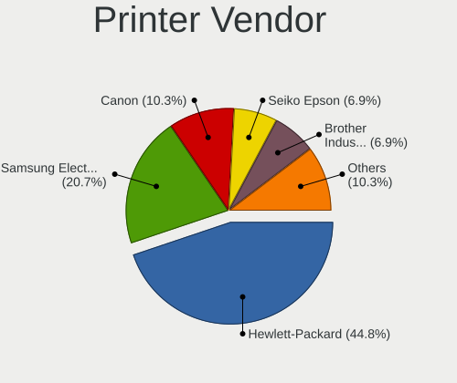

| Vendor                | Notebooks | Percent |
|-----------------------|-----------|---------|
| Hewlett-Packard       | 13        | 44.83%  |
| Samsung Electronics   | 6         | 20.69%  |
| Canon                 | 3         | 10.34%  |
| Seiko Epson           | 2         | 6.9%    |
| Brother Industries    | 2         | 6.9%    |
| Zebra                 | 1         | 3.45%   |
| Xerox                 | 1         | 3.45%   |
| Lexmark International | 1         | 3.45%   |

Printer Model
-------------

Printer device models

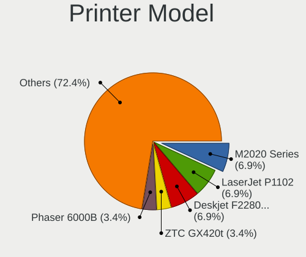

| Model                                   | Notebooks | Percent |
|-----------------------------------------|-----------|---------|
| Samsung M2020 Series                    | 2         | 6.9%    |
| HP LaserJet P1102                       | 2         | 6.9%    |
| HP Deskjet F2280 series                 | 2         | 6.9%    |
| Zebra ZTC GX420t                        | 1         | 3.45%   |
| Xerox Phaser 6000B                      | 1         | 3.45%   |
| Seiko Epson L3050 Series                | 1         | 3.45%   |
| Seiko Epson AL-M310DN                   | 1         | 3.45%   |
| Samsung Xerox Phaser 3117 Laser Printer | 1         | 3.45%   |
| Samsung SCX-6545 Series                 | 1         | 3.45%   |
| Samsung SCX-3400 Series                 | 1         | 3.45%   |
| Samsung M2070 Series                    | 1         | 3.45%   |
| Lexmark International E260dn            | 1         | 3.45%   |
| HP LaserJet P1005                       | 1         | 3.45%   |
| HP LaserJet 1020                        | 1         | 3.45%   |
| HP LaserJet 1018                        | 1         | 3.45%   |
| HP Ink Tank Wireless 410 series         | 1         | 3.45%   |
| HP Deskjet Ink Advant K209a-z           | 1         | 3.45%   |
| HP Deskjet D1500 series                 | 1         | 3.45%   |
| HP Deskjet 3540 series                  | 1         | 3.45%   |
| HP Deskjet 2540 series                  | 1         | 3.45%   |
| HP DeskJet 2130 series                  | 1         | 3.45%   |
| Canon PIXMA MG5600 Series               | 1         | 3.45%   |
| Canon PIXMA MG3000 series               | 1         | 3.45%   |
| Canon LiDE 400                          | 1         | 3.45%   |
| Brother HL-L2350DW series               | 1         | 3.45%   |
| Brother DCP-1610W                       | 1         | 3.45%   |

Scanner Vendor
--------------

Scanner device vendors

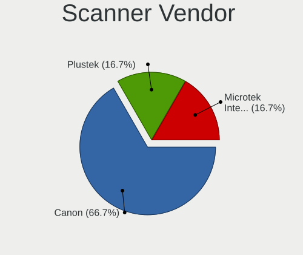

| Vendor                 | Notebooks | Percent |
|------------------------|-----------|---------|
| Canon                  | 4         | 66.67%  |
| Plustek                | 1         | 16.67%  |
| Microtek International | 1         | 16.67%  |

Scanner Model
-------------

Scanner device models

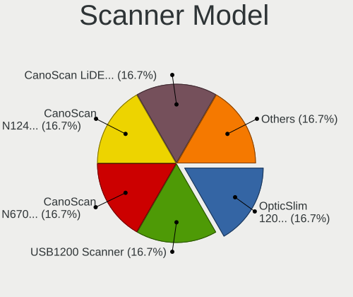

| Model                                  | Notebooks | Percent |
|----------------------------------------|-----------|---------|
| Plustek OpticSlim 1200 Scanner         | 1         | 16.67%  |
| Microtek International USB1200 Scanner | 1         | 16.67%  |
| Canon CanoScan N670U/N676U/LiDE 20     | 1         | 16.67%  |
| Canon CanoScan N1240U/LiDE 30          | 1         | 16.67%  |
| Canon CanoScan LIDE 25                 | 1         | 16.67%  |
| Canon CanoScan LiDE 110                | 1         | 16.67%  |

Camera
------

Camera Vendor
-------------

Camera device vendors

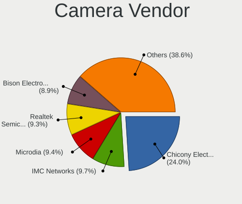

| Vendor                                 | Notebooks | Percent |
|----------------------------------------|-----------|---------|
| Chicony Electronics                    | 1036      | 23.99%  |
| IMC Networks                           | 420       | 9.73%   |
| Microdia                               | 408       | 9.45%   |
| Realtek Semiconductor                  | 403       | 9.33%   |
| Bison Electronics                      | 384       | 8.89%   |
| Sunplus Innovation Technology          | 227       | 5.26%   |
| Quanta                                 | 217       | 5.03%   |
| Suyin                                  | 143       | 3.31%   |
| Syntek                                 | 139       | 3.22%   |
| Cheng Uei Precision Industry (Foxlink) | 129       | 2.99%   |
| Luxvisions Innotech Limited            | 114       | 2.64%   |
| Lite-On Technology                     | 98        | 2.27%   |
| Silicon Motion                         | 79        | 1.83%   |
| Ricoh                                  | 56        | 1.3%    |
| Apple                                  | 54        | 1.25%   |
| Alcor Micro                            | 44        | 1.02%   |
| Sonix Technology                       | 42        | 0.97%   |
| Lenovo                                 | 41        | 0.95%   |
| Logitech                               | 39        | 0.9%    |
| ShineTech                              | 25        | 0.58%   |
| Z-Star Microelectronics                | 19        | 0.44%   |
| DigiTech                               | 18        | 0.42%   |
| Samsung Electronics                    | 15        | 0.35%   |
| Acer                                   | 15        | 0.35%   |
| Creative Technology                    | 14        | 0.32%   |
| Primax Electronics                     | 13        | 0.3%    |
| Intel                                  | 13        | 0.3%    |
| ALi                                    | 13        | 0.3%    |
| Importek                               | 10        | 0.23%   |
| kingcome                               | 9         | 0.21%   |
| SunplusIT                              | 8         | 0.19%   |
| Shine-optics                           | 8         | 0.19%   |
| Generalplus Technology                 | 6         | 0.14%   |
| Microsoft                              | 5         | 0.12%   |
| Sunplus Technology                     | 4         | 0.09%   |
| OmniVision Technologies                | 4         | 0.09%   |
| MacroSilicon                           | 4         | 0.09%   |
| Alpha Imaging Technology               | 4         | 0.09%   |
| icSpring                               | 3         | 0.07%   |
| A4Tech                                 | 3         | 0.07%   |

Camera Model
------------

Camera device models

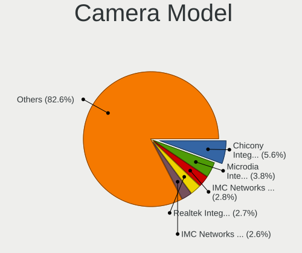

| Model                                               | Notebooks | Percent |
|-----------------------------------------------------|-----------|---------|
| Chicony Integrated Camera                           | 244       | 5.63%   |
| Microdia Integrated_Webcam_HD                       | 164       | 3.78%   |
| IMC Networks USB2.0 HD UVC WebCam                   | 120       | 2.77%   |
| Realtek Integrated_Webcam_HD                        | 116       | 2.68%   |
| IMC Networks Integrated Camera                      | 111       | 2.56%   |
| Bison Integrated Camera                             | 83        | 1.91%   |
| Sunplus Integrated_Webcam_HD                        | 75        | 1.73%   |
| Bison Lenovo EasyCamera                             | 72        | 1.66%   |
| Syntek Integrated Camera                            | 70        | 1.61%   |
| Chicony HD WebCam                                   | 62        | 1.43%   |
| Microdia Integrated Webcam                          | 60        | 1.38%   |
| Chicony Lenovo EasyCamera                           | 59        | 1.36%   |
| Realtek Integrated Webcam HD                        | 50        | 1.15%   |
| Chicony HP HD Camera                                | 46        | 1.06%   |
| Realtek USB Camera                                  | 44        | 1.01%   |
| Lite-On Integrated Camera                           | 43        | 0.99%   |
| Bison SunplusIT Integrated Camera                   | 42        | 0.97%   |
| Syntek Lenovo EasyCamera                            | 41        | 0.95%   |
| Realtek Lenovo EasyCamera                           | 39        | 0.9%    |
| Suyin Integrated_Webcam_HD                          | 38        | 0.88%   |
| Quanta HP TrueVision HD Camera                      | 38        | 0.88%   |
| Sonix USB2.0 HD UVC WebCam                          | 36        | 0.83%   |
| Chicony USB2.0 HD UVC WebCam                        | 36        | 0.83%   |
| Bison Lenovo Integrated Webcam                      | 35        | 0.81%   |
| Chicony Integrated Camera (1280x720@30)             | 34        | 0.78%   |
| Quanta HD User Facing                               | 32        | 0.74%   |
| IMC Networks USB2.0 VGA UVC WebCam                  | 32        | 0.74%   |
| Luxvisions Innotech Limited Integrated Camera       | 30        | 0.69%   |
| Luxvisions Innotech Limited HP TrueVision HD Camera | 28        | 0.65%   |
| Realtek Integrated Webcam                           | 27        | 0.62%   |
| Microdia Laptop_Integrated_Webcam_HD                | 27        | 0.62%   |
| Suyin Acer/HP Integrated Webcam [CN0314]            | 25        | 0.58%   |
| Quanta HP Wide Vision HD Camera                     | 25        | 0.58%   |
| Lite-On HP HD Camera                                | 25        | 0.58%   |
| Apple iPhone 5/5C/5S/6/SE/7/8/X                     | 25        | 0.58%   |
| Chicony USB2.0 VGA UVC WebCam                       | 23        | 0.53%   |
| Bison HD Webcam                                     | 23        | 0.53%   |
| Bison EasyCamera                                    | 23        | 0.53%   |
| Quanta HP HD Camera                                 | 22        | 0.51%   |
| Chicony USB 2.0 Camera                              | 22        | 0.51%   |

Security
--------

Fingerprint Vendor
------------------

Fingerprint sensor vendors

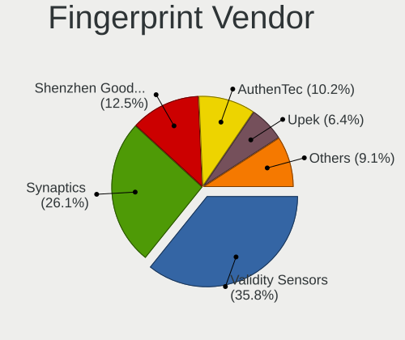

| Vendor                             | Notebooks | Percent |
|------------------------------------|-----------|---------|
| Validity Sensors                   | 298       | 35.77%  |
| Synaptics                          | 217       | 26.05%  |
| Shenzhen Goodix Technology         | 104       | 12.48%  |
| AuthenTec                          | 85        | 10.2%   |
| Upek                               | 53        | 6.36%   |
| Elan Microelectronics              | 34        | 4.08%   |
| LighTuning Technology              | 19        | 2.28%   |
| STMicroelectronics                 | 17        | 2.04%   |
| Realtek USB2.0 Finger Print Bridge | 6         | 0.72%   |

Fingerprint Model
-----------------

Fingerprint sensor models

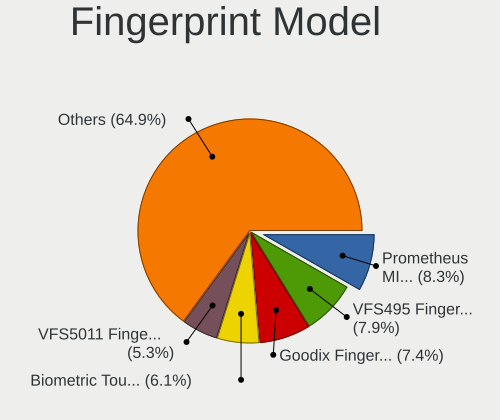

| Model                                                                      | Notebooks | Percent |
|----------------------------------------------------------------------------|-----------|---------|
| Synaptics Prometheus MIS Touch Fingerprint Reader                          | 69        | 8.28%   |
| Validity Sensors VFS495 Fingerprint Reader                                 | 66        | 7.92%   |
| Shenzhen Goodix  Fingerprint Device                                        | 62        | 7.44%   |
| Upek Biometric Touchchip/Touchstrip Fingerprint Sensor                     | 51        | 6.12%   |
| Validity Sensors VFS5011 Fingerprint Reader                                | 44        | 5.28%   |
| Synaptics Metallica MIS Touch Fingerprint Reader                           | 44        | 5.28%   |
| Validity Sensors VFS 5011 fingerprint sensor                               | 38        | 4.56%   |
| AuthenTec AES2810                                                          | 36        | 4.32%   |
| Shenzhen Goodix Fingerprint Reader                                         | 33        | 3.96%   |
| AuthenTec AES2501 Fingerprint Sensor                                       | 24        | 2.88%   |
| Validity Sensors Synaptics WBDI                                            | 21        | 2.52%   |
| Synaptics FS7604 Touch Fingerprint Sensor with PurePrint                   | 21        | 2.52%   |
| Synaptics Fingerprint reader [HP G6]                                       | 21        | 2.52%   |
| Elan ELAN:Fingerprint                                                      | 20        | 2.4%    |
| Validity Sensors VFS471 Fingerprint Reader                                 | 19        | 2.28%   |
| Validity Sensors VFS491                                                    | 18        | 2.16%   |
| STMicroelectronics Fingerprint Reader                                      | 17        | 2.04%   |
| Validity Sensors VFS451 Fingerprint Reader                                 | 15        | 1.8%    |
| Synaptics UWP WBDI Device                                                  | 15        | 1.8%    |
| Validity Sensors VFS7500 Touch Fingerprint Sensor                          | 14        | 1.68%   |
| Validity Sensors Synaptics VFS7552 Touch Fingerprint Sensor with PurePrint | 14        | 1.68%   |
| Elan ELAN:ARM-M4                                                           | 14        | 1.68%   |
| Validity Sensors Fingerprint scanner                                       | 13        | 1.56%   |
| Validity Sensors VFS101 Fingerprint Reader                                 | 12        | 1.44%   |
| Synaptics  FS7604 Touch Fingerprint Sensor with PurePrint                  | 12        | 1.44%   |
| AuthenTec Fingerprint Sensor                                               | 10        | 1.2%    |
| Shenzhen Goodix FingerPrint                                                | 9         | 1.08%   |
| AuthenTec AES1600                                                          | 9         | 1.08%   |
| Validity Sensors VFS301 Fingerprint Reader                                 | 8         | 0.96%   |
| LighTuning ES603 Swipe Fingerprint Sensor                                  | 8         | 0.96%   |
| Validity Sensors VFS Fingerprint sensor                                    | 7         | 0.84%   |
| Synaptics Metallica MOH Touch Fingerprint Reader                           | 7         | 0.84%   |
| Synaptics  WBDI                                                            | 6         | 0.72%   |
| Synaptics Prometheus Fingerprint Reader                                    | 6         | 0.72%   |
| Realtek USB2.0 Finger Print Bridge FocalTech Fingerprint Device            | 6         | 0.72%   |
| LighTuning EgisTec Touch Fingerprint Sensor                                | 6         | 0.72%   |
| Validity Sensors Swipe Fingerprint Sensor                                  | 5         | 0.6%    |
| LighTuning Fingerprint Reader                                              | 5         | 0.6%    |
| AuthenTec AES2550 Fingerprint Sensor                                       | 5         | 0.6%    |
| Synaptics WBDI Device                                                      | 4         | 0.48%   |

Chipcard Vendor
---------------

Chipcard module vendors

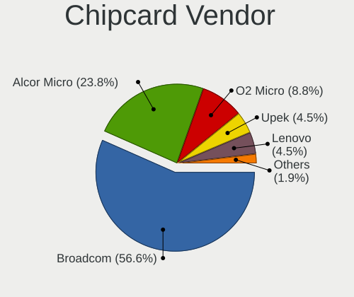

| Vendor                    | Notebooks | Percent |
|---------------------------|-----------|---------|
| Broadcom                  | 355       | 56.62%  |
| Alcor Micro               | 149       | 23.76%  |
| O2 Micro                  | 55        | 8.77%   |
| Upek                      | 28        | 4.47%   |
| Lenovo                    | 28        | 4.47%   |
| Gemalto (was Gemplus)     | 4         | 0.64%   |
| SCM Microsystems          | 3         | 0.48%   |
| OmniKey                   | 1         | 0.16%   |
| NXP Semiconductors        | 1         | 0.16%   |
| Feitian Technologies      | 1         | 0.16%   |
| Clay Logic                | 1         | 0.16%   |
| Aladdin Knowledge Systems | 1         | 0.16%   |

Chipcard Model
--------------

Chipcard module models

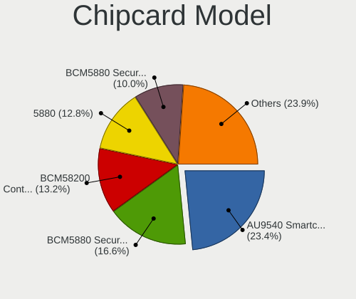

| Model                                                                        | Notebooks | Percent |
|------------------------------------------------------------------------------|-----------|---------|
| Alcor Micro AU9540 Smartcard Reader                                          | 147       | 23.44%  |
| Broadcom BCM5880 Secure Applications Processor                               | 104       | 16.59%  |
| Broadcom BCM58200 ControlVault 3 (FingerPrint sensor + Contacted SmartCard)  | 83        | 13.24%  |
| Broadcom 5880                                                                | 80        | 12.76%  |
| Broadcom BCM5880 Secure Applications Processor with fingerprint swipe sensor | 63        | 10.05%  |
| O2 Micro OZ776 CCID Smartcard Reader                                         | 48        | 7.66%   |
| Upek TouchChip Fingerprint Coprocessor (WBF advanced mode)                   | 28        | 4.47%   |
| Lenovo Integrated Smart Card Reader                                          | 28        | 4.47%   |
| Broadcom 58200                                                               | 23        | 3.67%   |
| O2 Micro Oz776 SmartCard Reader                                              | 7         | 1.12%   |
| Gemalto (was Gemplus) Compact Smart Card Reader Writer                       | 3         | 0.48%   |
| SCM Microsystems SCR3340 - ExpressCard54 Smart Card Reader                   | 2         | 0.32%   |
| Broadcom BCM5880 Secure Applications Processor with fingerprint touch sensor | 2         | 0.32%   |
| SCM Microsystems SCT3522CC token                                             | 1         | 0.16%   |
| OmniKey 3x21 Smart Card Reader                                               | 1         | 0.16%   |
| NXP Semiconductors PR533                                                     | 1         | 0.16%   |
| Gemalto (was Gemplus) GemPC Key SmartCard Reader                             | 1         | 0.16%   |
| Feitian Technologies ePass2003                                               | 1         | 0.16%   |
| Clay Logic Nitrokey Pro                                                      | 1         | 0.16%   |
| Alcor Micro Watchdata W 1981                                                 | 1         | 0.16%   |
| Alcor Micro EMV Smartcard Reader                                             | 1         | 0.16%   |
| Aladdin Knowledge Systems Token JC                                           | 1         | 0.16%   |

Unsupported
-----------

Unsupported Devices
-------------------

Total unsupported devices on board

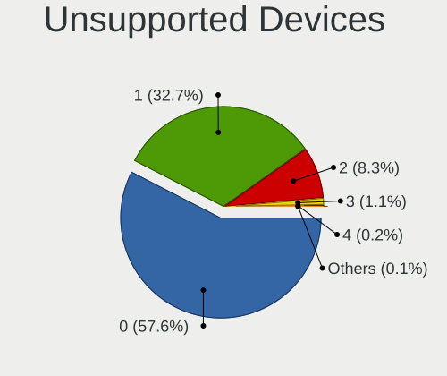

| Total | Notebooks | Percent |
|-------|-----------|---------|
| 0     | 2941      | 57.57%  |
| 1     | 1669      | 32.67%  |
| 2     | 426       | 8.34%   |
| 3     | 57        | 1.12%   |
| 4     | 9         | 0.18%   |
| 5     | 3         | 0.06%   |
| 7     | 2         | 0.04%   |
| 6     | 2         | 0.04%   |

Unsupported Device Types
------------------------

Types of unsupported devices

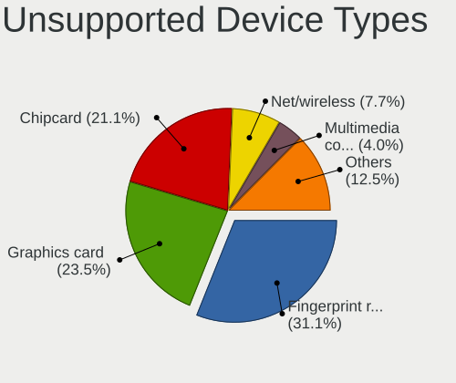

| Type                     | Notebooks | Percent |
|--------------------------|-----------|---------|
| Fingerprint reader       | 822       | 31.07%  |
| Graphics card            | 623       | 23.54%  |
| Chipcard                 | 557       | 21.05%  |
| Net/wireless             | 205       | 7.75%   |
| Multimedia controller    | 107       | 4.04%   |
| Bluetooth                | 73        | 2.76%   |
| Storage                  | 60        | 2.27%   |
| Camera                   | 57        | 2.15%   |
| Communication controller | 46        | 1.74%   |
| Card reader              | 31        | 1.17%   |
| Sound                    | 18        | 0.68%   |
| Modem                    | 11        | 0.42%   |
| Net/ethernet             | 9         | 0.34%   |
| Firewire controller      | 8         | 0.3%    |
| Flash memory             | 6         | 0.23%   |
| Network                  | 4         | 0.15%   |
| Dvb card                 | 3         | 0.11%   |
| Storage/raid             | 2         | 0.08%   |
| Wireless                 | 1         | 0.04%   |
| Unclassified device      | 1         | 0.04%   |
| Tv card                  | 1         | 0.04%   |
| Storage/ide              | 1         | 0.04%   |

