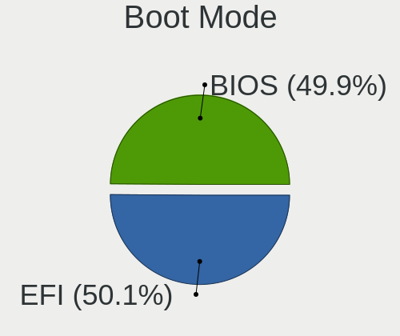
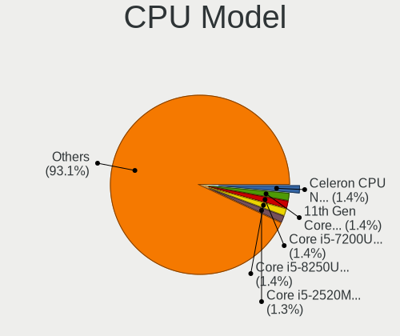
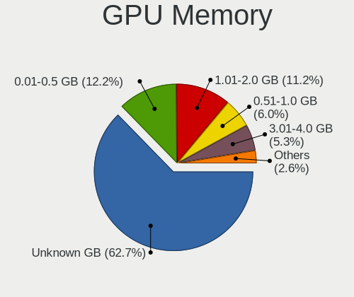
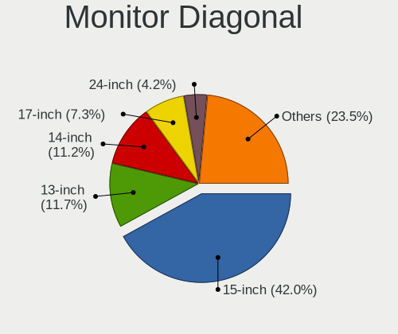
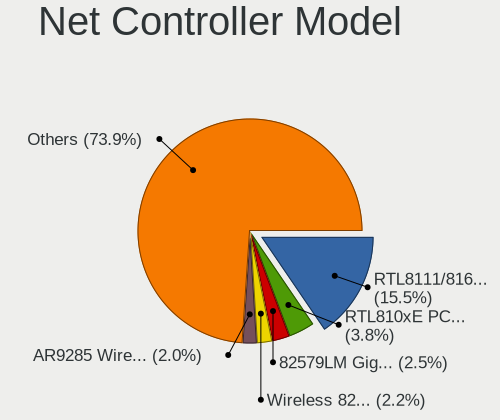
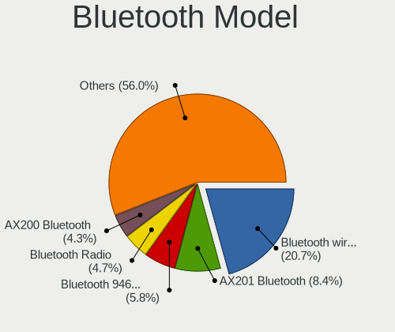
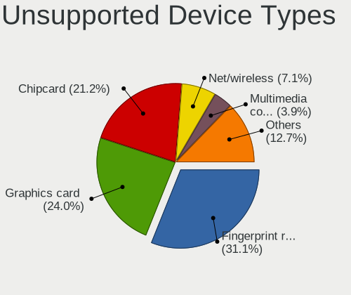

Linux in Poland - Tested Hardware & Statistics (Notebooks)
----------------------------------------------------------

A project to collect tested hardware configurations for Linux in Poland.

Anyone can contribute to this report by the [hw-probe](https://github.com/linuxhw/hw-probe) tool:

    sudo -E hw-probe -all -upload

Please contribute! Especially if your hardware is rare.

Contents
--------

* [ Test Cases ](#test-cases)

* [ System ](#system)
  - [ OS                       ](#os)
  - [ OS Family                ](#os-family)
  - [ Kernel                   ](#kernel)
  - [ Kernel Family            ](#kernel-family)
  - [ Kernel Major Ver.        ](#kernel-major-ver)
  - [ Arch                     ](#arch)
  - [ DE                       ](#de)
  - [ Display Server           ](#display-server)
  - [ Display Manager          ](#display-manager)
  - [ OS Lang                  ](#os-lang)
  - [ Boot Mode                ](#boot-mode)
  - [ Filesystem               ](#filesystem)
  - [ Part. scheme             ](#part-scheme)
  - [ Dual Boot with Linux/BSD ](#dual-boot-with-linuxbsd)
  - [ Dual Boot (Win)          ](#dual-boot-win)

* [ Board ](#board)
  - [ Vendor                   ](#vendor)
  - [ Model                    ](#model)
  - [ Model Family             ](#model-family)
  - [ MFG Year                 ](#mfg-year)
  - [ Form Factor              ](#form-factor)
  - [ Secure Boot              ](#secure-boot)
  - [ Coreboot                 ](#coreboot)
  - [ RAM Size                 ](#ram-size)
  - [ RAM Used                 ](#ram-used)
  - [ Total Drives             ](#total-drives)
  - [ Has CD-ROM               ](#has-cd-rom)
  - [ Has Ethernet             ](#has-ethernet)
  - [ Has WiFi                 ](#has-wifi)
  - [ Has Bluetooth            ](#has-bluetooth)

* [ Location ](#location)
  - [ Country                  ](#country)
  - [ City                     ](#city)

* [ Drives ](#drives)
  - [ Drive Vendor             ](#drive-vendor)
  - [ Drive Model              ](#drive-model)
  - [ HDD Vendor               ](#hdd-vendor)
  - [ SSD Vendor               ](#ssd-vendor)
  - [ Drive Kind               ](#drive-kind)
  - [ Drive Connector          ](#drive-connector)
  - [ Drive Size               ](#drive-size)
  - [ Space Total              ](#space-total)
  - [ Space Used               ](#space-used)
  - [ Malfunc. Drives          ](#malfunc-drives)
  - [ Malfunc. Drive Vendor    ](#malfunc-drive-vendor)
  - [ Malfunc. HDD Vendor      ](#malfunc-hdd-vendor)
  - [ Malfunc. Drive Kind      ](#malfunc-drive-kind)
  - [ Failed Drives            ](#failed-drives)
  - [ Failed Drive Vendor      ](#failed-drive-vendor)
  - [ Drive Status             ](#drive-status)

* [ Storage controller ](#storage-controller)
  - [ Storage Vendor           ](#storage-vendor)
  - [ Storage Model            ](#storage-model)
  - [ Storage Kind             ](#storage-kind)

* [ Processor ](#processor)
  - [ CPU Vendor               ](#cpu-vendor)
  - [ CPU Model                ](#cpu-model)
  - [ CPU Model Family         ](#cpu-model-family)
  - [ CPU Cores                ](#cpu-cores)
  - [ CPU Sockets              ](#cpu-sockets)
  - [ CPU Threads              ](#cpu-threads)
  - [ CPU Op-Modes             ](#cpu-op-modes)
  - [ CPU Microcode            ](#cpu-microcode)
  - [ CPU Microarch            ](#cpu-microarch)

* [ Graphics ](#graphics)
  - [ GPU Vendor               ](#gpu-vendor)
  - [ GPU Model                ](#gpu-model)
  - [ GPU Combo                ](#gpu-combo)
  - [ GPU Driver               ](#gpu-driver)
  - [ GPU Memory               ](#gpu-memory)

* [ Monitor ](#monitor)
  - [ Monitor Vendor           ](#monitor-vendor)
  - [ Monitor Model            ](#monitor-model)
  - [ Monitor Resolution       ](#monitor-resolution)
  - [ Monitor Diagonal         ](#monitor-diagonal)
  - [ Monitor Width            ](#monitor-width)
  - [ Aspect Ratio             ](#aspect-ratio)
  - [ Monitor Area             ](#monitor-area)
  - [ Pixel Density            ](#pixel-density)
  - [ Multiple Monitors        ](#multiple-monitors)

* [ Network ](#network)
  - [ Net Controller Vendor    ](#net-controller-vendor)
  - [ Net Controller Model     ](#net-controller-model)
  - [ Wireless Vendor          ](#wireless-vendor)
  - [ Wireless Model           ](#wireless-model)
  - [ Ethernet Vendor          ](#ethernet-vendor)
  - [ Ethernet Model           ](#ethernet-model)
  - [ Net Controller Kind      ](#net-controller-kind)
  - [ Used Controller          ](#used-controller)
  - [ NICs                     ](#nics)
  - [ IPv6                     ](#ipv6)

* [ Bluetooth ](#bluetooth)
  - [ Bluetooth Vendor         ](#bluetooth-vendor)
  - [ Bluetooth Model          ](#bluetooth-model)

* [ Sound ](#sound)
  - [ Sound Vendor             ](#sound-vendor)
  - [ Sound Model              ](#sound-model)

* [ Memory ](#memory)
  - [ Memory Vendor            ](#memory-vendor)
  - [ Memory Model             ](#memory-model)
  - [ Memory Kind              ](#memory-kind)
  - [ Memory Form Factor       ](#memory-form-factor)
  - [ Memory Size              ](#memory-size)
  - [ Memory Speed             ](#memory-speed)

* [ Printers & scanners ](#printers--scanners)
  - [ Printer Vendor           ](#printer-vendor)
  - [ Printer Model            ](#printer-model)
  - [ Scanner Vendor           ](#scanner-vendor)
  - [ Scanner Model            ](#scanner-model)

* [ Camera ](#camera)
  - [ Camera Vendor            ](#camera-vendor)
  - [ Camera Model             ](#camera-model)

* [ Security ](#security)
  - [ Fingerprint Vendor       ](#fingerprint-vendor)
  - [ Fingerprint Model        ](#fingerprint-model)
  - [ Chipcard Vendor          ](#chipcard-vendor)
  - [ Chipcard Model           ](#chipcard-model)

* [ Unsupported ](#unsupported)
  - [ Unsupported Devices      ](#unsupported-devices)
  - [ Unsupported Device Types ](#unsupported-device-types)

Test Cases
----------

Total: 5384

| Vendor        | Model                       | Probe                                                      | Date         |
|---------------|-----------------------------|------------------------------------------------------------|--------------|
| ASUSTek       | ASUS TUF Gaming F15 FX50... | [821372cdbd](https://linux-hardware.org/?probe=821372cdbd) | May 08, 2024 |
| Lenovo        | G50-45 80E3                 | [801eeb31ef](https://linux-hardware.org/?probe=801eeb31ef) | May 08, 2024 |
| Samsung       | SR700                       | [97ed5b7fc7](https://linux-hardware.org/?probe=97ed5b7fc7) | May 08, 2024 |
| ASUSTek       | ASUS TUF Gaming F17 FX70... | [eb38e0f3a5](https://linux-hardware.org/?probe=eb38e0f3a5) | May 08, 2024 |
| ASUSTek       | ASUS TUF Gaming F17 FX70... | [2f571c8d88](https://linux-hardware.org/?probe=2f571c8d88) | May 07, 2024 |
| Dell          | Latitude 3190               | [102011a182](https://linux-hardware.org/?probe=102011a182) | May 07, 2024 |
| HP            | ENVY Notebook 13-ab0XX      | [7d6b757088](https://linux-hardware.org/?probe=7d6b757088) | May 07, 2024 |
| HP            | ENVY Notebook 13-ab0XX      | [a9d1c1234c](https://linux-hardware.org/?probe=a9d1c1234c) | May 07, 2024 |
| Fujitsu Si... | LIFEBOOK S6410              | [fb78e4f92a](https://linux-hardware.org/?probe=fb78e4f92a) | May 07, 2024 |
| Dell          | Latitude 9430               | [953be205ca](https://linux-hardware.org/?probe=953be205ca) | May 07, 2024 |
| ASUSTek       | Zenbook UX5401ZA_UX5401Z... | [92089af4b7](https://linux-hardware.org/?probe=92089af4b7) | May 06, 2024 |
| Samsung       | 350V5C/351V5C/3540VC/344... | [5bc2e6635d](https://linux-hardware.org/?probe=5bc2e6635d) | May 06, 2024 |
| Lenovo        | Unknown                     | [5087593233](https://linux-hardware.org/?probe=5087593233) | May 06, 2024 |
| HP            | ProBook 455 G7              | [470e53d860](https://linux-hardware.org/?probe=470e53d860) | May 05, 2024 |
| Lenovo        | ThinkPad T440p 20AWS0HN0... | [dcdedc549d](https://linux-hardware.org/?probe=dcdedc549d) | May 05, 2024 |
| Lenovo        | IdeaPad 320-15ISK 80XH      | [55d15ed397](https://linux-hardware.org/?probe=55d15ed397) | May 05, 2024 |
| Lenovo        | ThinkPad T440p 20AWS0HN0... | [68020b1c69](https://linux-hardware.org/?probe=68020b1c69) | May 05, 2024 |
| HP            | Pavilion Laptop 15-cc5xx    | [ab0226a735](https://linux-hardware.org/?probe=ab0226a735) | May 05, 2024 |
| ASUSTek       | ASUS TUF Gaming A16 FA61... | [1f93c42106](https://linux-hardware.org/?probe=1f93c42106) | May 04, 2024 |
| Lenovo        | ThinkBook 16 G6 IRL 21KH    | [b8f0474451](https://linux-hardware.org/?probe=b8f0474451) | May 03, 2024 |
| Lenovo        | ThinkPad E15 Gen 2 20T80... | [67fbb6a446](https://linux-hardware.org/?probe=67fbb6a446) | May 03, 2024 |
| ASUSTek       | VivoBook_ASUSLaptop X515... | [5b3074a531](https://linux-hardware.org/?probe=5b3074a531) | May 03, 2024 |
| Lenovo        | IdeaPad Z500 20202          | [41468a4e5c](https://linux-hardware.org/?probe=41468a4e5c) | May 03, 2024 |
| HP            | ZBook 17 G4                 | [8d618b9f7e](https://linux-hardware.org/?probe=8d618b9f7e) | May 02, 2024 |
| ASUSTek       | GL552VW                     | [f68ba06228](https://linux-hardware.org/?probe=f68ba06228) | May 02, 2024 |
| Apple         | MacBookAir7,2               | [63cf24a977](https://linux-hardware.org/?probe=63cf24a977) | May 02, 2024 |
| Lenovo        | IdeaPad Z500 20202          | [f7e35750cd](https://linux-hardware.org/?probe=f7e35750cd) | May 02, 2024 |
| HP            | Pavilion Gaming Laptop 1... | [091db8dce1](https://linux-hardware.org/?probe=091db8dce1) | May 01, 2024 |
| Valve         | Galileo                     | [fc102d1c7f](https://linux-hardware.org/?probe=fc102d1c7f) | May 01, 2024 |
| Dell          | Inspiron 13-5368            | [ac125025cf](https://linux-hardware.org/?probe=ac125025cf) | May 01, 2024 |
| HP            | Laptop 15s-eq0xxx           | [5eb0bf12fd](https://linux-hardware.org/?probe=5eb0bf12fd) | May 01, 2024 |
| HP            | EliteBook 860 16 inch G1... | [7a9e1274fa](https://linux-hardware.org/?probe=7a9e1274fa) | Apr 30, 2024 |
| Apple         | MacBookPro11,5              | [c0fa280156](https://linux-hardware.org/?probe=c0fa280156) | Apr 30, 2024 |
| Lenovo        | Legion Slim 5 16APH8 82Y... | [c055450efc](https://linux-hardware.org/?probe=c055450efc) | Apr 30, 2024 |
| Lenovo        | Y520-15IKBN 80WK            | [6d235ddbaf](https://linux-hardware.org/?probe=6d235ddbaf) | Apr 29, 2024 |
| Dell          | Inspiron 5748               | [43d176db3e](https://linux-hardware.org/?probe=43d176db3e) | Apr 29, 2024 |
| Google        | Gnawty                      | [c639a31438](https://linux-hardware.org/?probe=c639a31438) | Apr 28, 2024 |
| Google        | Gnawty                      | [c913fe837f](https://linux-hardware.org/?probe=c913fe837f) | Apr 28, 2024 |
| ASUSTek       | X553MA                      | [87b13248a4](https://linux-hardware.org/?probe=87b13248a4) | Apr 28, 2024 |
| MSI           | GT62VR 6RE                  | [b7768b7ee9](https://linux-hardware.org/?probe=b7768b7ee9) | Apr 28, 2024 |
| MSI           | GF63 8RD                    | [01aaa42b00](https://linux-hardware.org/?probe=01aaa42b00) | Apr 28, 2024 |
| Apple         | MacBookPro9,2               | [e298812f38](https://linux-hardware.org/?probe=e298812f38) | Apr 28, 2024 |
| Acer          | Aspire ES1-431              | [ff9ee70831](https://linux-hardware.org/?probe=ff9ee70831) | Apr 28, 2024 |
| Lenovo        | IdeaPad 3 15ITL6 82H8       | [419fb8dfca](https://linux-hardware.org/?probe=419fb8dfca) | Apr 28, 2024 |
| Lenovo        | IdeaPad 3 15ITL6 82H8       | [a154dad3b7](https://linux-hardware.org/?probe=a154dad3b7) | Apr 28, 2024 |
| HP            | OMEN Laptop 15-ek0xxx       | [bbd6e87bc4](https://linux-hardware.org/?probe=bbd6e87bc4) | Apr 27, 2024 |
| Dell          | G15 5520                    | [80975f981b](https://linux-hardware.org/?probe=80975f981b) | Apr 27, 2024 |
| System76      | Galago Pro                  | [06d9cca0d2](https://linux-hardware.org/?probe=06d9cca0d2) | Apr 27, 2024 |
| Acer          | Nitro AN517-42              | [c8d6aba6fa](https://linux-hardware.org/?probe=c8d6aba6fa) | Apr 27, 2024 |
| Valve         | Jupiter                     | [49fd8e0c8f](https://linux-hardware.org/?probe=49fd8e0c8f) | Apr 26, 2024 |
| HP            | EliteBook 850 G8 Noteboo... | [a5cb6f40d5](https://linux-hardware.org/?probe=a5cb6f40d5) | Apr 26, 2024 |
| HP            | EliteBook 860 16 inch G1... | [6d6550e6dc](https://linux-hardware.org/?probe=6d6550e6dc) | Apr 26, 2024 |
| Lenovo        | ThinkPad T570 20HAS03W00    | [6d4f2cc6ca](https://linux-hardware.org/?probe=6d4f2cc6ca) | Apr 26, 2024 |
| HP            | EliteBook 840 G1            | [02246fba3e](https://linux-hardware.org/?probe=02246fba3e) | Apr 26, 2024 |
| ASUSTek       | ASUS TUF Gaming F15 FX50... | [e02463d8d9](https://linux-hardware.org/?probe=e02463d8d9) | Apr 26, 2024 |
| Dell          | Inspiron 15 3511            | [48c356da20](https://linux-hardware.org/?probe=48c356da20) | Apr 25, 2024 |
| Dell          | Precision 3561              | [347e3ff8f6](https://linux-hardware.org/?probe=347e3ff8f6) | Apr 24, 2024 |
| HP            | OMEN Laptop 15-ek0xxx       | [42a4906c7d](https://linux-hardware.org/?probe=42a4906c7d) | Apr 24, 2024 |
| Lenovo        | G500s 20245                 | [9742cd9e94](https://linux-hardware.org/?probe=9742cd9e94) | Apr 24, 2024 |
| Lenovo        | ThinkPad L580 20LW000UPB    | [ed17d0c6d4](https://linux-hardware.org/?probe=ed17d0c6d4) | Apr 24, 2024 |
| Lenovo        | ThinkPad P50 20EQS3B30R     | [524d874cd6](https://linux-hardware.org/?probe=524d874cd6) | Apr 24, 2024 |
| Lenovo        | ThinkPad T580 20LAS8HJ20    | [8a1c282b2e](https://linux-hardware.org/?probe=8a1c282b2e) | Apr 23, 2024 |
| Lenovo        | Legion Slim 5 16APH8 82Y... | [aa99325f06](https://linux-hardware.org/?probe=aa99325f06) | Apr 23, 2024 |
| Unknown       | Unknown                     | [6d5a09c736](https://linux-hardware.org/?probe=6d5a09c736) | Apr 23, 2024 |
| MSI           | Katana GF66 11UE            | [8f4e6cf713](https://linux-hardware.org/?probe=8f4e6cf713) | Apr 23, 2024 |
| Dell          | Precision 3581              | [2e60f977aa](https://linux-hardware.org/?probe=2e60f977aa) | Apr 22, 2024 |
| Toshiba       | Satellite C850D-11C         | [beccadec71](https://linux-hardware.org/?probe=beccadec71) | Apr 22, 2024 |
| Lenovo        | Legion 5 Pro 16ACH6 82JS    | [8b5161f4ab](https://linux-hardware.org/?probe=8b5161f4ab) | Apr 22, 2024 |
| Lenovo        | IdeaPad 100-15IBD 80QQ      | [a8d83edd62](https://linux-hardware.org/?probe=a8d83edd62) | Apr 22, 2024 |
| ASUSTek       | K55DR                       | [3ae44053ef](https://linux-hardware.org/?probe=3ae44053ef) | Apr 21, 2024 |
| Lenovo        | IdeaPad 110-15IBR 80T7      | [65f1fdc927](https://linux-hardware.org/?probe=65f1fdc927) | Apr 21, 2024 |
| Lenovo        | ThinkPad E15 Gen 2 20T80... | [482d5d1221](https://linux-hardware.org/?probe=482d5d1221) | Apr 21, 2024 |
| Toshiba       | Satellite C850D-11C         | [5c2b50c3cc](https://linux-hardware.org/?probe=5c2b50c3cc) | Apr 21, 2024 |
| Lenovo        | G50-45 80E3                 | [61882ea818](https://linux-hardware.org/?probe=61882ea818) | Apr 21, 2024 |
| Lenovo        | G70-70 80HW                 | [73f307b60b](https://linux-hardware.org/?probe=73f307b60b) | Apr 20, 2024 |
| Lenovo        | G50-45 80E3                 | [2ee14c9eff](https://linux-hardware.org/?probe=2ee14c9eff) | Apr 20, 2024 |
| ASUSTek       | ASUS TUF Gaming A15 FA50... | [ee83ed7c12](https://linux-hardware.org/?probe=ee83ed7c12) | Apr 20, 2024 |
| Lenovo        | ThinkPad T14 Gen 3 21AH0... | [96c7946b39](https://linux-hardware.org/?probe=96c7946b39) | Apr 20, 2024 |
| ASUSTek       | K53E                        | [0db457945f](https://linux-hardware.org/?probe=0db457945f) | Apr 20, 2024 |
| HP            | EliteBook 830 G5            | [2df78096e3](https://linux-hardware.org/?probe=2df78096e3) | Apr 20, 2024 |
| HP            | Pavilion g6                 | [0f10b1616f](https://linux-hardware.org/?probe=0f10b1616f) | Apr 20, 2024 |
| Dell          | Vostro 3580                 | [af4cc3e115](https://linux-hardware.org/?probe=af4cc3e115) | Apr 19, 2024 |
| Dell          | Vostro 3580                 | [aa8437e096](https://linux-hardware.org/?probe=aa8437e096) | Apr 19, 2024 |
| Lenovo        | Legion 5 15ARH05H 82B1      | [5bcf08b4b0](https://linux-hardware.org/?probe=5bcf08b4b0) | Apr 19, 2024 |
| HP            | EliteBook 830 G5            | [257bad95d7](https://linux-hardware.org/?probe=257bad95d7) | Apr 18, 2024 |
| ASUSTek       | ASUS TUF Gaming F15 FX50... | [4cec985734](https://linux-hardware.org/?probe=4cec985734) | Apr 18, 2024 |
| HP            | EliteBook 840 G3            | [fc3d11e3f3](https://linux-hardware.org/?probe=fc3d11e3f3) | Apr 18, 2024 |
| ASUSTek       | ROG Strix G513QY_G513QY     | [ba533ecb3a](https://linux-hardware.org/?probe=ba533ecb3a) | Apr 18, 2024 |
| Lenovo        | ThinkPad P16 Gen 2 21FA0... | [445b981f65](https://linux-hardware.org/?probe=445b981f65) | Apr 18, 2024 |
| Samsung       | 300E4A/300E5A/300E7A/343... | [fd71b9d36c](https://linux-hardware.org/?probe=fd71b9d36c) | Apr 17, 2024 |
| Lenovo        | Legion Y540-15IRH 81SX      | [cebfff5171](https://linux-hardware.org/?probe=cebfff5171) | Apr 17, 2024 |
| ASUSTek       | K50IJ                       | [f0d8580bfc](https://linux-hardware.org/?probe=f0d8580bfc) | Apr 16, 2024 |
| ASUSTek       | N73SV                       | [dbf8444f39](https://linux-hardware.org/?probe=dbf8444f39) | Apr 16, 2024 |
| ASUSTek       | ASUS TUF Gaming F15 FX50... | [8740b4588a](https://linux-hardware.org/?probe=8740b4588a) | Apr 16, 2024 |
| Sony          | VPCEH3K1E                   | [79f871b092](https://linux-hardware.org/?probe=79f871b092) | Apr 16, 2024 |
| Lenovo        | IdeaPad 3 17IML05 81WC      | [2667935967](https://linux-hardware.org/?probe=2667935967) | Apr 16, 2024 |
| ASUSTek       | N53SM                       | [0769613e83](https://linux-hardware.org/?probe=0769613e83) | Apr 15, 2024 |
| Acer          | Aspire E1-572G              | [96b786aa6f](https://linux-hardware.org/?probe=96b786aa6f) | Apr 15, 2024 |
| Lenovo        | ThinkPad T480 20L6SAYX00    | [fc73e6bb02](https://linux-hardware.org/?probe=fc73e6bb02) | Apr 15, 2024 |
| Lenovo        | Legion Slim 5 16APH8 82Y... | [aa7ac835c0](https://linux-hardware.org/?probe=aa7ac835c0) | Apr 14, 2024 |
| HUAWEI        | BOD-WXX9                    | [47daf18fca](https://linux-hardware.org/?probe=47daf18fca) | Apr 14, 2024 |
| Panasonic ... | CFSR4-1                     | [f6dcf6b847](https://linux-hardware.org/?probe=f6dcf6b847) | Apr 13, 2024 |
| Lenovo        | ThinkPad E15 Gen 2 20T80... | [2eea232a7e](https://linux-hardware.org/?probe=2eea232a7e) | Apr 13, 2024 |
| ASUSTek       | N53SM                       | [e69871e7f5](https://linux-hardware.org/?probe=e69871e7f5) | Apr 12, 2024 |
| Dell          | G15 5510                    | [e8cfa16a81](https://linux-hardware.org/?probe=e8cfa16a81) | Apr 12, 2024 |
| Dell          | G15 5510                    | [9ed69c889f](https://linux-hardware.org/?probe=9ed69c889f) | Apr 12, 2024 |
| Acer          | Nitro AN515-52              | [e08da0d2dd](https://linux-hardware.org/?probe=e08da0d2dd) | Apr 11, 2024 |
| Lenovo        | ThinkBook 16p Gen 4 21J8    | [53e47366b5](https://linux-hardware.org/?probe=53e47366b5) | Apr 11, 2024 |
| Dell          | Studio 1558                 | [195acc75cf](https://linux-hardware.org/?probe=195acc75cf) | Apr 10, 2024 |
| Dell          | Studio 1558                 | [92678a06a0](https://linux-hardware.org/?probe=92678a06a0) | Apr 10, 2024 |
| MSI           | GL65 9SC                    | [7bc8965c5e](https://linux-hardware.org/?probe=7bc8965c5e) | Apr 10, 2024 |
| ASUSTek       | VivoBook_ASUSLaptop M560... | [96271e0269](https://linux-hardware.org/?probe=96271e0269) | Apr 10, 2024 |
| HP            | ProBook 650 G1              | [bea5a5fbf0](https://linux-hardware.org/?probe=bea5a5fbf0) | Apr 10, 2024 |
| Dell          | Precision M4800             | [e0cd62ded2](https://linux-hardware.org/?probe=e0cd62ded2) | Apr 10, 2024 |
| Dell          | Inspiron 11 - 3147          | [feac4cd679](https://linux-hardware.org/?probe=feac4cd679) | Apr 10, 2024 |
| Dell          | Latitude 7280               | [b9b576262c](https://linux-hardware.org/?probe=b9b576262c) | Apr 09, 2024 |
| Notebook      | P7xxDM2(-G)                 | [ee5809d062](https://linux-hardware.org/?probe=ee5809d062) | Apr 09, 2024 |
| Acer          | Extensa 215-55              | [e24d68d574](https://linux-hardware.org/?probe=e24d68d574) | Apr 08, 2024 |
| Dell          | Latitude 9430               | [4b062024a4](https://linux-hardware.org/?probe=4b062024a4) | Apr 08, 2024 |
| Dell          | Latitude E7250              | [3979d6a4a1](https://linux-hardware.org/?probe=3979d6a4a1) | Apr 07, 2024 |
| Lenovo        | IdeaPad Y700-15ISK 80NV     | [9c0f217fbb](https://linux-hardware.org/?probe=9c0f217fbb) | Apr 07, 2024 |
| HP            | Pavilion Laptop 15-cw1xx... | [a896a98b68](https://linux-hardware.org/?probe=a896a98b68) | Apr 07, 2024 |
| HP            | Pavilion Laptop 15-cw1xx... | [a372d941e8](https://linux-hardware.org/?probe=a372d941e8) | Apr 07, 2024 |
| Samsung       | 350V5C/351V5C/3540VC/344... | [4802cbf930](https://linux-hardware.org/?probe=4802cbf930) | Apr 07, 2024 |
| Lenovo        | ThinkPad T430 2349FC4       | [1b0129f0b0](https://linux-hardware.org/?probe=1b0129f0b0) | Apr 06, 2024 |
| Lenovo        | ThinkPad E15 Gen 2 20T80... | [169c6755af](https://linux-hardware.org/?probe=169c6755af) | Apr 05, 2024 |
| Acer          | Aspire ES1-512              | [47ad6cd23e](https://linux-hardware.org/?probe=47ad6cd23e) | Apr 05, 2024 |
| Acer          | Aspire ES1-512              | [9b5914816a](https://linux-hardware.org/?probe=9b5914816a) | Apr 05, 2024 |
| HP            | Pavilion dv7                | [f7ecb14c8e](https://linux-hardware.org/?probe=f7ecb14c8e) | Apr 05, 2024 |
| HUAWEI        | KPL-W0X                     | [4b06cf61b5](https://linux-hardware.org/?probe=4b06cf61b5) | Apr 04, 2024 |
| ASUSTek       | K93SV                       | [f15f98fdbd](https://linux-hardware.org/?probe=f15f98fdbd) | Apr 04, 2024 |
| Maxcom        | mBook14                     | [c336e74df3](https://linux-hardware.org/?probe=c336e74df3) | Apr 04, 2024 |
| Maxcom        | mBook14                     | [9f682eba49](https://linux-hardware.org/?probe=9f682eba49) | Apr 04, 2024 |
| Lenovo        | IdeaPad 510S-13ISK 80SJ     | [6124084b98](https://linux-hardware.org/?probe=6124084b98) | Apr 03, 2024 |
| Lenovo        | ThinkPad E15 20RD001FPB     | [209962ecb2](https://linux-hardware.org/?probe=209962ecb2) | Apr 03, 2024 |
| Lenovo        | ThinkPad E15 Gen 2 20T80... | [c2482a6360](https://linux-hardware.org/?probe=c2482a6360) | Apr 03, 2024 |
| Lenovo        | ThinkPad E15 20RD001FPB     | [ac7a313a3c](https://linux-hardware.org/?probe=ac7a313a3c) | Apr 03, 2024 |
| HUAWEI        | KLVF-XX                     | [16fc53e7bb](https://linux-hardware.org/?probe=16fc53e7bb) | Apr 03, 2024 |
| Lenovo        | ThinkPad X270 20K5S1A524    | [6668d7d060](https://linux-hardware.org/?probe=6668d7d060) | Apr 02, 2024 |
| Dell          | Latitude 3190               | [c15e7df670](https://linux-hardware.org/?probe=c15e7df670) | Apr 02, 2024 |
| Dell          | System XPS L502X            | [78f6ea571d](https://linux-hardware.org/?probe=78f6ea571d) | Apr 02, 2024 |
| HP            | ENVY Laptop 13-ba1xxx       | [4b4bfa93ee](https://linux-hardware.org/?probe=4b4bfa93ee) | Apr 01, 2024 |
| Dell          | Inspiron 13-5368            | [3c825d9bc6](https://linux-hardware.org/?probe=3c825d9bc6) | Apr 01, 2024 |
| HP            | ProBook 640 G2              | [8e30761a09](https://linux-hardware.org/?probe=8e30761a09) | Apr 01, 2024 |
| Lenovo        | Legion 5 15ARH05H 82B1      | [7244a526b1](https://linux-hardware.org/?probe=7244a526b1) | Apr 01, 2024 |
| HP            | Laptop 15-dw1xxx            | [43a27413f2](https://linux-hardware.org/?probe=43a27413f2) | Mar 31, 2024 |
| ASUSTek       | GL552VW                     | [4c759cffbe](https://linux-hardware.org/?probe=4c759cffbe) | Mar 31, 2024 |
| Lenovo        | ThinkBook 14 G2 ITL 20VD    | [301f4fbe0a](https://linux-hardware.org/?probe=301f4fbe0a) | Mar 31, 2024 |
| Lenovo        | ThinkPad E485 20KUS0DW00    | [350231f567](https://linux-hardware.org/?probe=350231f567) | Mar 31, 2024 |
| Lenovo        | ThinkPad E485 20KUS0DW00    | [89c1c85f43](https://linux-hardware.org/?probe=89c1c85f43) | Mar 31, 2024 |
| Lenovo        | V15 G3 IAP CTO 83C4         | [f1449c2bb2](https://linux-hardware.org/?probe=f1449c2bb2) | Mar 30, 2024 |
| Lenovo        | IdeaPad C340-14API 81N6     | [3aeea5fae7](https://linux-hardware.org/?probe=3aeea5fae7) | Mar 30, 2024 |
| Sony          | VPCCA2S1E                   | [ed8c829953](https://linux-hardware.org/?probe=ed8c829953) | Mar 29, 2024 |
| Notebook      | NV4xPZ                      | [4baac948b7](https://linux-hardware.org/?probe=4baac948b7) | Mar 29, 2024 |
| Lenovo        | Y520-15IKBN 80WK            | [9e7e9b558d](https://linux-hardware.org/?probe=9e7e9b558d) | Mar 29, 2024 |
| Dell          | Inspiron 1750               | [0c73b8ab73](https://linux-hardware.org/?probe=0c73b8ab73) | Mar 29, 2024 |
| HP            | Pavilion Notebook           | [e987865868](https://linux-hardware.org/?probe=e987865868) | Mar 28, 2024 |
| Acer          | Aspire E1-772               | [aff094fa8a](https://linux-hardware.org/?probe=aff094fa8a) | Mar 28, 2024 |
| Dell          | XPS M1530                   | [d252773f43](https://linux-hardware.org/?probe=d252773f43) | Mar 27, 2024 |
| Dell          | Inspiron 3521               | [64c0a44737](https://linux-hardware.org/?probe=64c0a44737) | Mar 27, 2024 |
| Dell          | Latitude 5430               | [85d5f988c9](https://linux-hardware.org/?probe=85d5f988c9) | Mar 26, 2024 |
| Lenovo        | ThinkPad T450s 20BX0011G... | [3e86099c28](https://linux-hardware.org/?probe=3e86099c28) | Mar 26, 2024 |
| Lenovo        | ThinkPad L15 Gen 1 20U30... | [c3a490e0df](https://linux-hardware.org/?probe=c3a490e0df) | Mar 26, 2024 |
| Acer          | Aspire 5610                 | [6f172dbbce](https://linux-hardware.org/?probe=6f172dbbce) | Mar 26, 2024 |
| Dell          | System XPS L502X            | [8ccefaf9d8](https://linux-hardware.org/?probe=8ccefaf9d8) | Mar 25, 2024 |
| Lenovo        | ThinkPad T490 20N3S7432Z    | [82871a2b3b](https://linux-hardware.org/?probe=82871a2b3b) | Mar 25, 2024 |
| Lenovo        | ThinkBook 16 G6 IRL 21KH    | [b81f5867ef](https://linux-hardware.org/?probe=b81f5867ef) | Mar 25, 2024 |
| Lenovo        | IdeaPad Y700-15ISK 80NV     | [5e09efbd44](https://linux-hardware.org/?probe=5e09efbd44) | Mar 25, 2024 |
| ASUSTek       | X541NA                      | [6d98c3288f](https://linux-hardware.org/?probe=6d98c3288f) | Mar 24, 2024 |
| Dell          | Latitude E5550              | [6147d06b0f](https://linux-hardware.org/?probe=6147d06b0f) | Mar 24, 2024 |
| Dell          | Latitude E5470              | [844e9a99df](https://linux-hardware.org/?probe=844e9a99df) | Mar 24, 2024 |
| Dell          | Latitude E5470              | [a268f7138b](https://linux-hardware.org/?probe=a268f7138b) | Mar 24, 2024 |
| Lenovo        | ThinkPad T450s 20BX0011G... | [598015ca49](https://linux-hardware.org/?probe=598015ca49) | Mar 24, 2024 |
| HP            | ProBook 640 G2              | [650cc8e349](https://linux-hardware.org/?probe=650cc8e349) | Mar 22, 2024 |
| Lenovo        | Y70-70 Touch 80DU           | [bea5a82b81](https://linux-hardware.org/?probe=bea5a82b81) | Mar 22, 2024 |
| Lenovo        | Y70-70 Touch 80DU           | [5768f6b7e4](https://linux-hardware.org/?probe=5768f6b7e4) | Mar 22, 2024 |
| Lenovo        | Yoga Slim 7 Pro 14IAH7 8... | [8573996655](https://linux-hardware.org/?probe=8573996655) | Mar 22, 2024 |
| Lenovo        | G770 20089                  | [806788c3e5](https://linux-hardware.org/?probe=806788c3e5) | Mar 21, 2024 |
| Lenovo        | G770 20089                  | [4cb900586e](https://linux-hardware.org/?probe=4cb900586e) | Mar 21, 2024 |
| Lenovo        | IdeaPad P580 20184          | [88b2cdef9f](https://linux-hardware.org/?probe=88b2cdef9f) | Mar 20, 2024 |
| HP            | 15                          | [42f7c3330f](https://linux-hardware.org/?probe=42f7c3330f) | Mar 20, 2024 |
| Dell          | Latitude E6440              | [cca0b27697](https://linux-hardware.org/?probe=cca0b27697) | Mar 19, 2024 |
| Dell          | Latitude E6400              | [b5b129a38b](https://linux-hardware.org/?probe=b5b129a38b) | Mar 19, 2024 |
| ASUSTek       | X550LA                      | [0e6e1ad03f](https://linux-hardware.org/?probe=0e6e1ad03f) | Mar 19, 2024 |
| Acer          | Aspire E5-575G              | [83b5323b19](https://linux-hardware.org/?probe=83b5323b19) | Mar 18, 2024 |
| Notebook      | NV4xPZ                      | [9979f1cf08](https://linux-hardware.org/?probe=9979f1cf08) | Mar 18, 2024 |
| Dell          | Latitude E6530              | [c33e8a8b0a](https://linux-hardware.org/?probe=c33e8a8b0a) | Mar 18, 2024 |
| Lenovo        | IdeaPad Gaming 3 15ACH6 ... | [313c63108b](https://linux-hardware.org/?probe=313c63108b) | Mar 18, 2024 |
| Lenovo        | Legion 5 15ARH05H 82B1      | [2cc34ee9da](https://linux-hardware.org/?probe=2cc34ee9da) | Mar 18, 2024 |
| mPTech        | ARC 11.6 64GB HD            | [da2be1e542](https://linux-hardware.org/?probe=da2be1e542) | Mar 17, 2024 |
| Lenovo        | ThinkPad X270 W10DG 20K5... | [c516b20ec9](https://linux-hardware.org/?probe=c516b20ec9) | Mar 17, 2024 |
| Samsung       | 350V5C/351V5C/3540VC/344... | [19f34423aa](https://linux-hardware.org/?probe=19f34423aa) | Mar 17, 2024 |
| Fujitsu       | LIFEBOOK S752               | [9e47a5f022](https://linux-hardware.org/?probe=9e47a5f022) | Mar 17, 2024 |
| Lenovo        | IdeaPad Slim 5 16ABR8 82... | [16070af93d](https://linux-hardware.org/?probe=16070af93d) | Mar 17, 2024 |
| Acer          | Aspire A114-31              | [899c6f43f5](https://linux-hardware.org/?probe=899c6f43f5) | Mar 16, 2024 |
| Dell          | Latitude E6530              | [d3aedf8e0b](https://linux-hardware.org/?probe=d3aedf8e0b) | Mar 16, 2024 |
| Google        | Glimmer                     | [b5cd167129](https://linux-hardware.org/?probe=b5cd167129) | Mar 16, 2024 |
| Lenovo        | ThinkPad T430 2351BH6       | [cf3786e3ce](https://linux-hardware.org/?probe=cf3786e3ce) | Mar 16, 2024 |
| Lenovo        | ThinkPad T430 2351BH6       | [0fd149f049](https://linux-hardware.org/?probe=0fd149f049) | Mar 16, 2024 |
| Lenovo        | G50-30 80G0                 | [3c7f756761](https://linux-hardware.org/?probe=3c7f756761) | Mar 15, 2024 |
| Dell          | Latitude 5410               | [96bf31d4fd](https://linux-hardware.org/?probe=96bf31d4fd) | Mar 15, 2024 |
| Dell          | Unidentified System         | [bab85b187d](https://linux-hardware.org/?probe=bab85b187d) | Mar 14, 2024 |
| Dell          | Unidentified System         | [27a23c7920](https://linux-hardware.org/?probe=27a23c7920) | Mar 14, 2024 |
| ASUSTek       | K52F                        | [63015aee4d](https://linux-hardware.org/?probe=63015aee4d) | Mar 13, 2024 |
| Acer          | Aspire A715-51G             | [64a6a1066d](https://linux-hardware.org/?probe=64a6a1066d) | Mar 13, 2024 |
| Lenovo        | G580 20150                  | [f8a3a2f198](https://linux-hardware.org/?probe=f8a3a2f198) | Mar 13, 2024 |
| Lenovo        | Legion Slim 5 16APH8 82Y... | [7cefc8c569](https://linux-hardware.org/?probe=7cefc8c569) | Mar 12, 2024 |
| HP            | 250 G6 Notebook PC          | [6b050fbf71](https://linux-hardware.org/?probe=6b050fbf71) | Mar 12, 2024 |
| Lenovo        | IdeaPad 520-15IKB 81BF      | [dc0d7ec098](https://linux-hardware.org/?probe=dc0d7ec098) | Mar 12, 2024 |
| Dell          | Inspiron 11 - 3147          | [8813eb6713](https://linux-hardware.org/?probe=8813eb6713) | Mar 12, 2024 |
| Lenovo        | ThinkBook 14 G2 ITL 20VD    | [e565cd4db7](https://linux-hardware.org/?probe=e565cd4db7) | Mar 11, 2024 |
| Lenovo        | Legion 5 15IAH7H 82RB       | [47a991e51d](https://linux-hardware.org/?probe=47a991e51d) | Mar 11, 2024 |
| Acer          | Aspire A114-31              | [2af6274287](https://linux-hardware.org/?probe=2af6274287) | Mar 09, 2024 |
| Lenovo        | Z50-70 20354                | [ba1a54631e](https://linux-hardware.org/?probe=ba1a54631e) | Mar 09, 2024 |
| Lenovo        | IdeaPad 110-15IBR 80T7      | [58e75df1ae](https://linux-hardware.org/?probe=58e75df1ae) | Mar 09, 2024 |
| Acer          | Nitro AN515-44              | [0371716016](https://linux-hardware.org/?probe=0371716016) | Mar 08, 2024 |
| Acer          | Nitro AN515-44              | [d1ff7df797](https://linux-hardware.org/?probe=d1ff7df797) | Mar 08, 2024 |
| HP            | Notebook                    | [51a929c53a](https://linux-hardware.org/?probe=51a929c53a) | Mar 08, 2024 |
| HP            | EliteBook 830 G5            | [e64e10b115](https://linux-hardware.org/?probe=e64e10b115) | Mar 08, 2024 |
| Lenovo        | ThinkPad T520 42434WG       | [d491000477](https://linux-hardware.org/?probe=d491000477) | Mar 08, 2024 |
| Dell          | Latitude 5480               | [45ac0c15f6](https://linux-hardware.org/?probe=45ac0c15f6) | Mar 08, 2024 |
| Lenovo        | ThinkBook 16 G6 IRL 21KH    | [524c41a601](https://linux-hardware.org/?probe=524c41a601) | Mar 07, 2024 |
| ASUSTek       | ZenBook UX325EA_UX325EA     | [e6af29a837](https://linux-hardware.org/?probe=e6af29a837) | Mar 07, 2024 |
| Lenovo        | ThinkPad X1 Carbon Gen 1... | [2270faaf14](https://linux-hardware.org/?probe=2270faaf14) | Mar 07, 2024 |
| Lenovo        | ThinkPad T420s 4174PEG      | [c4f7f598f1](https://linux-hardware.org/?probe=c4f7f598f1) | Mar 06, 2024 |
| Lenovo        | ThinkPad P1 Gen 2 20QT00... | [b1f55d2745](https://linux-hardware.org/?probe=b1f55d2745) | Mar 06, 2024 |
| Lenovo        | ThinkPad X220 Tablet 429... | [4250cb552f](https://linux-hardware.org/?probe=4250cb552f) | Mar 04, 2024 |
| Lenovo        | ThinkBook 14 G2 ITL 20VD    | [58f62d0638](https://linux-hardware.org/?probe=58f62d0638) | Mar 04, 2024 |
| Acer          | Nitro AN515-54              | [b1cac18eb5](https://linux-hardware.org/?probe=b1cac18eb5) | Mar 04, 2024 |
| HP            | Pavilion dv5                | [fe71fbef49](https://linux-hardware.org/?probe=fe71fbef49) | Mar 04, 2024 |
| Dell          | Latitude 3430               | [4d7bfb4ee6](https://linux-hardware.org/?probe=4d7bfb4ee6) | Mar 03, 2024 |
| HP            | Pavilion Aero Laptop 13-... | [6c93404ad5](https://linux-hardware.org/?probe=6c93404ad5) | Mar 03, 2024 |
| Dell          | Inspiron 15-3567            | [ae4cdbb501](https://linux-hardware.org/?probe=ae4cdbb501) | Mar 03, 2024 |
| Lenovo        | ThinkPad E14 Gen 2 20T60... | [e5e7ecfe73](https://linux-hardware.org/?probe=e5e7ecfe73) | Mar 03, 2024 |
| Dell          | Latitude E6330              | [6a84be56da](https://linux-hardware.org/?probe=6a84be56da) | Mar 02, 2024 |
| Dell          | Latitude E6330              | [99ff4fda14](https://linux-hardware.org/?probe=99ff4fda14) | Mar 02, 2024 |
| Lenovo        | ThinkPad L480 20LTS4Y600    | [e28b6be6f7](https://linux-hardware.org/?probe=e28b6be6f7) | Mar 02, 2024 |
| Acer          | Nitro AN515-46              | [968c22dfbb](https://linux-hardware.org/?probe=968c22dfbb) | Mar 02, 2024 |
| Acer          | TravelMate 5740             | [b1366802c6](https://linux-hardware.org/?probe=b1366802c6) | Mar 01, 2024 |
| HP            | Pavilion Gaming Laptop 1... | [de2901851a](https://linux-hardware.org/?probe=de2901851a) | Mar 01, 2024 |
| Valve         | Galileo                     | [63cd4fe821](https://linux-hardware.org/?probe=63cd4fe821) | Feb 29, 2024 |
| XIAOMI        | Redmi Book Pro 15 2023      | [3226e99762](https://linux-hardware.org/?probe=3226e99762) | Feb 28, 2024 |
| ASUSTek       | X550CC                      | [2085227d01](https://linux-hardware.org/?probe=2085227d01) | Feb 28, 2024 |
| MSI           | GL65 9SC                    | [6981398659](https://linux-hardware.org/?probe=6981398659) | Feb 28, 2024 |
| Google        | Fleex                       | [8e0e838293](https://linux-hardware.org/?probe=8e0e838293) | Feb 28, 2024 |
| Lenovo        | ThinkBook 16p Gen 4 21J8    | [e947cc88f8](https://linux-hardware.org/?probe=e947cc88f8) | Feb 28, 2024 |
| ASUSTek       | X555LN                      | [526a838db8](https://linux-hardware.org/?probe=526a838db8) | Feb 27, 2024 |
| Dell          | Latitude E6540              | [68c08dcc39](https://linux-hardware.org/?probe=68c08dcc39) | Feb 27, 2024 |
| HP            | Compaq nx7400 (RH412EA#A... | [da403ff7aa](https://linux-hardware.org/?probe=da403ff7aa) | Feb 27, 2024 |
| Valve         | Galileo                     | [1eecc5bac8](https://linux-hardware.org/?probe=1eecc5bac8) | Feb 27, 2024 |
| ASUSTek       | VivoBook_ASUSLaptop M370... | [50da9b13a6](https://linux-hardware.org/?probe=50da9b13a6) | Feb 25, 2024 |
| Toshiba       | Satellite A500              | [0a7e7e65e7](https://linux-hardware.org/?probe=0a7e7e65e7) | Feb 23, 2024 |
| Acer          | Nitro AN515-45              | [b3f6c6a205](https://linux-hardware.org/?probe=b3f6c6a205) | Feb 23, 2024 |
| ASUSTek       | X541SA                      | [c5f5f3c521](https://linux-hardware.org/?probe=c5f5f3c521) | Feb 23, 2024 |
| HP            | Pavilion Notebook           | [6cbdc00338](https://linux-hardware.org/?probe=6cbdc00338) | Feb 22, 2024 |
| Dell          | Latitude 7490               | [fe72045f0c](https://linux-hardware.org/?probe=fe72045f0c) | Feb 21, 2024 |
| Dell          | Latitude 7490               | [cb7fb2ce96](https://linux-hardware.org/?probe=cb7fb2ce96) | Feb 21, 2024 |
| HP            | ENVY Laptop 13-ba1xxx       | [165e48292c](https://linux-hardware.org/?probe=165e48292c) | Feb 21, 2024 |
| Toshiba       | Satellite C55-A-1H9         | [dc728bcb77](https://linux-hardware.org/?probe=dc728bcb77) | Feb 21, 2024 |
| Dell          | XPS 15 9570                 | [609d007819](https://linux-hardware.org/?probe=609d007819) | Feb 21, 2024 |
| Acer          | TravelMate P215-53          | [6d5f85311e](https://linux-hardware.org/?probe=6d5f85311e) | Feb 21, 2024 |
| Lenovo        | IdeaPad 330-17ICH 81FL      | [b6d0c92b59](https://linux-hardware.org/?probe=b6d0c92b59) | Feb 21, 2024 |
| Lenovo        | Z50-70 20354                | [754df3f45b](https://linux-hardware.org/?probe=754df3f45b) | Feb 20, 2024 |
| Dell          | XPS 13 7390                 | [c347074123](https://linux-hardware.org/?probe=c347074123) | Feb 20, 2024 |
| Lenovo        | ThinkPad P14s Gen 4 21K5... | [99f1228781](https://linux-hardware.org/?probe=99f1228781) | Feb 20, 2024 |
| Dell          | Latitude 3190               | [1396b535bf](https://linux-hardware.org/?probe=1396b535bf) | Feb 20, 2024 |
| HP            | Unknown                     | [9273430bbb](https://linux-hardware.org/?probe=9273430bbb) | Feb 19, 2024 |
| HP            | ZBook 17 G2                 | [7ce601e458](https://linux-hardware.org/?probe=7ce601e458) | Feb 19, 2024 |
| Dell          | Inspiron 7520               | [ea9b1047db](https://linux-hardware.org/?probe=ea9b1047db) | Feb 19, 2024 |
| HP            | 250 G4 Notebook PC          | [748aaedb94](https://linux-hardware.org/?probe=748aaedb94) | Feb 18, 2024 |
| Lenovo        | LOQ 15APH8 82XT             | [6c222d9534](https://linux-hardware.org/?probe=6c222d9534) | Feb 18, 2024 |
| Acer          | Nitro AN515-55              | [0ee9f9ca69](https://linux-hardware.org/?probe=0ee9f9ca69) | Feb 18, 2024 |
| Samsung       | 350V5C/351V5C/3540VC/344... | [9ce35fd031](https://linux-hardware.org/?probe=9ce35fd031) | Feb 18, 2024 |
| Toshiba       | Satellite C55-A-1H9         | [02087986d8](https://linux-hardware.org/?probe=02087986d8) | Feb 18, 2024 |
| Acer          | Aspire A515-51              | [15115b84ac](https://linux-hardware.org/?probe=15115b84ac) | Feb 17, 2024 |
| Dell          | Latitude 5400               | [c362b6c965](https://linux-hardware.org/?probe=c362b6c965) | Feb 17, 2024 |
| Dell          | Latitude 5400               | [72681f61cd](https://linux-hardware.org/?probe=72681f61cd) | Feb 17, 2024 |
| Dell          | System XPS L502X            | [b5a8cb21e7](https://linux-hardware.org/?probe=b5a8cb21e7) | Feb 17, 2024 |
| Dell          | Studio 1537                 | [9392cffcbe](https://linux-hardware.org/?probe=9392cffcbe) | Feb 17, 2024 |
| Acer          | Nitro AN515-52              | [d87447cdf2](https://linux-hardware.org/?probe=d87447cdf2) | Feb 16, 2024 |
| Dell          | System XPS L502X            | [0e7ad1a462](https://linux-hardware.org/?probe=0e7ad1a462) | Feb 16, 2024 |
| Lenovo        | ThinkPad T580 20LAS8HJ20    | [8e1d88b922](https://linux-hardware.org/?probe=8e1d88b922) | Feb 16, 2024 |
| Dell          | Precision 5760              | [ef46809f82](https://linux-hardware.org/?probe=ef46809f82) | Feb 16, 2024 |
| HP            | ProBook 640 G1              | [759b600f96](https://linux-hardware.org/?probe=759b600f96) | Feb 16, 2024 |
| Dell          | Precision 5760              | [596105a102](https://linux-hardware.org/?probe=596105a102) | Feb 16, 2024 |
| ASUSTek       | K53SJ                       | [cb9c23cca6](https://linux-hardware.org/?probe=cb9c23cca6) | Feb 16, 2024 |
| ASUSTek       | 1015BXO                     | [51e861c84c](https://linux-hardware.org/?probe=51e861c84c) | Feb 15, 2024 |
| Intel         | powered classmate PC        | [acb89a9af9](https://linux-hardware.org/?probe=acb89a9af9) | Feb 14, 2024 |
| Lenovo        | IdeaPad 3 14IIL05 81WD      | [4ceccf5b29](https://linux-hardware.org/?probe=4ceccf5b29) | Feb 14, 2024 |
| Dell          | Latitude 5440               | [71c9d287ab](https://linux-hardware.org/?probe=71c9d287ab) | Feb 14, 2024 |
| Acer          | Aspire ES1-531              | [6ff8090f67](https://linux-hardware.org/?probe=6ff8090f67) | Feb 13, 2024 |
| Dell          | Latitude 3190               | [2f96d064fd](https://linux-hardware.org/?probe=2f96d064fd) | Feb 13, 2024 |
| HP            | ENVY Laptop 13-ba1xxx       | [4a1c99b039](https://linux-hardware.org/?probe=4a1c99b039) | Feb 11, 2024 |
| HP            | ENVY Laptop 13-ba1xxx       | [cbcefb79ab](https://linux-hardware.org/?probe=cbcefb79ab) | Feb 11, 2024 |
| ASUSTek       | ASUS TUF Gaming F17 FX70... | [a88b289b6b](https://linux-hardware.org/?probe=a88b289b6b) | Feb 11, 2024 |
| Acer          | Aspire 7739G                | [a817ec1ea1](https://linux-hardware.org/?probe=a817ec1ea1) | Feb 11, 2024 |
| ASUSTek       | VivoBook_ASUSLaptop X515... | [bd31a096fc](https://linux-hardware.org/?probe=bd31a096fc) | Feb 11, 2024 |
| Notebook      | NS5x_NS7xPU                 | [a1a96da00c](https://linux-hardware.org/?probe=a1a96da00c) | Feb 11, 2024 |
| Fujitsu Si... | AMILO Li 1818               | [1703fc6a96](https://linux-hardware.org/?probe=1703fc6a96) | Feb 11, 2024 |
| Dell          | Latitude 7440               | [5eed7aae1f](https://linux-hardware.org/?probe=5eed7aae1f) | Feb 11, 2024 |
| HP            | ProBook 430 G7              | [65ec83f241](https://linux-hardware.org/?probe=65ec83f241) | Feb 11, 2024 |
| Acer          | Aspire E5-575G              | [3790ad9e05](https://linux-hardware.org/?probe=3790ad9e05) | Feb 10, 2024 |
| ASUSTek       | ROG Strix G733ZW_G733ZW     | [bd1f726085](https://linux-hardware.org/?probe=bd1f726085) | Feb 10, 2024 |
| ASUSTek       | X550CL                      | [e62088b6e2](https://linux-hardware.org/?probe=e62088b6e2) | Feb 10, 2024 |
| Lenovo        | Legion Y540-15IRH 81SX      | [b230be6dbb](https://linux-hardware.org/?probe=b230be6dbb) | Feb 09, 2024 |
| Dell          | Latitude E5430 vPro         | [9e120d90b8](https://linux-hardware.org/?probe=9e120d90b8) | Feb 09, 2024 |
| Dell          | Latitude E6500              | [36491ec65d](https://linux-hardware.org/?probe=36491ec65d) | Feb 09, 2024 |
| HP            | ENVY Laptop 16-h0xxx        | [a39ccb2e5d](https://linux-hardware.org/?probe=a39ccb2e5d) | Feb 09, 2024 |
| Lenovo        | IdeaPad 3 15ADA05 81W1      | [7ec31a37a2](https://linux-hardware.org/?probe=7ec31a37a2) | Feb 08, 2024 |
| HP            | EliteBook 820 G1            | [259ee13863](https://linux-hardware.org/?probe=259ee13863) | Feb 08, 2024 |
| ASUSTek       | ASUS TUF Gaming F17 FX70... | [f8d4d5e573](https://linux-hardware.org/?probe=f8d4d5e573) | Feb 08, 2024 |
| Lenovo        | Z50-70 20354                | [9ceb699fc1](https://linux-hardware.org/?probe=9ceb699fc1) | Feb 07, 2024 |
| Lenovo        | ThinkPad T61 76641GG        | [cca744e815](https://linux-hardware.org/?probe=cca744e815) | Feb 07, 2024 |
| Lenovo        | Z50-70 20354                | [021c8aa71a](https://linux-hardware.org/?probe=021c8aa71a) | Feb 07, 2024 |
| Dell          | Latitude 5440               | [1ed41ebf42](https://linux-hardware.org/?probe=1ed41ebf42) | Feb 07, 2024 |
| Dell          | Latitude 5440               | [0bba2b64a3](https://linux-hardware.org/?probe=0bba2b64a3) | Feb 07, 2024 |
| ASUSTek       | VivoBook_ASUSLaptop X421... | [fc382a6e28](https://linux-hardware.org/?probe=fc382a6e28) | Feb 07, 2024 |
| Lenovo        | ThinkPad T14 Gen 2i 20W1... | [9a9eb96b8f](https://linux-hardware.org/?probe=9a9eb96b8f) | Feb 07, 2024 |
| Valve         | Galileo                     | [2ec00ae541](https://linux-hardware.org/?probe=2ec00ae541) | Feb 06, 2024 |
| Dell          | Latitude 3190               | [f597a4ca06](https://linux-hardware.org/?probe=f597a4ca06) | Feb 06, 2024 |
| Lenovo        | ThinkPad E15 Gen 4 21E60... | [f4989db332](https://linux-hardware.org/?probe=f4989db332) | Feb 05, 2024 |
| HP            | Pavilion dv7                | [2d1b97ab8f](https://linux-hardware.org/?probe=2d1b97ab8f) | Feb 05, 2024 |
| ASUSTek       | VivoBook_ASUSLaptop M560... | [975b3a3b77](https://linux-hardware.org/?probe=975b3a3b77) | Feb 05, 2024 |
| Lenovo        | ThinkBook 16 G6 IRL 21KH    | [493c30897b](https://linux-hardware.org/?probe=493c30897b) | Feb 05, 2024 |
| Lenovo        | IdeaPad 510-15ISK 80SR      | [6cb7d42153](https://linux-hardware.org/?probe=6cb7d42153) | Feb 05, 2024 |
| Acer          | Aspire V3-771               | [dfae82a48b](https://linux-hardware.org/?probe=dfae82a48b) | Feb 05, 2024 |
| Dell          | Studio 1558                 | [4c6066b851](https://linux-hardware.org/?probe=4c6066b851) | Feb 05, 2024 |
| Dell          | Studio 1558                 | [39e1e34bdc](https://linux-hardware.org/?probe=39e1e34bdc) | Feb 05, 2024 |
| Dell          | G15 5511                    | [ca77412e86](https://linux-hardware.org/?probe=ca77412e86) | Feb 04, 2024 |
| ASUSTek       | K53SC                       | [9ba767a0b6](https://linux-hardware.org/?probe=9ba767a0b6) | Feb 04, 2024 |
| Lenovo        | B575e 20189                 | [f91bd33fa6](https://linux-hardware.org/?probe=f91bd33fa6) | Feb 03, 2024 |
| Acer          | Aspire 7730G                | [cc7b21e463](https://linux-hardware.org/?probe=cc7b21e463) | Feb 03, 2024 |
| Dell          | Latitude E6430              | [912f31f8e6](https://linux-hardware.org/?probe=912f31f8e6) | Feb 03, 2024 |
| Lenovo        | ThinkPad T430 2349HNU       | [f73b7b76a2](https://linux-hardware.org/?probe=f73b7b76a2) | Feb 03, 2024 |
| Dell          | Latitude 7390               | [2386e8641f](https://linux-hardware.org/?probe=2386e8641f) | Feb 02, 2024 |
| Dell          | Latitude 7400               | [ad51cec5ea](https://linux-hardware.org/?probe=ad51cec5ea) | Feb 02, 2024 |
| Lenovo        | ThinkPad E14 Gen 2 20T60... | [47431ad7d9](https://linux-hardware.org/?probe=47431ad7d9) | Feb 02, 2024 |
| Valve         | Galileo                     | [aebc4c73ad](https://linux-hardware.org/?probe=aebc4c73ad) | Feb 01, 2024 |
| HP            | ProBook 450 G8              | [f8d060061c](https://linux-hardware.org/?probe=f8d060061c) | Jan 30, 2024 |
| HP            | ProBook 450 G8              | [4ca13b7d13](https://linux-hardware.org/?probe=4ca13b7d13) | Jan 30, 2024 |
| Dell          | Latitude 3190               | [16f86af47d](https://linux-hardware.org/?probe=16f86af47d) | Jan 30, 2024 |
| Lenovo        | ThinkPad T570 20HAS0NU00    | [39f3b9fb56](https://linux-hardware.org/?probe=39f3b9fb56) | Jan 30, 2024 |
| Dell          | Latitude E5420              | [fe49c198a3](https://linux-hardware.org/?probe=fe49c198a3) | Jan 29, 2024 |
| Dell          | Latitude E5420              | [d76191acac](https://linux-hardware.org/?probe=d76191acac) | Jan 29, 2024 |
| Lenovo        | ThinkPad T14 Gen 3 21AH0... | [913338a499](https://linux-hardware.org/?probe=913338a499) | Jan 29, 2024 |
| Lenovo        | G510 20238                  | [12cf7dfeeb](https://linux-hardware.org/?probe=12cf7dfeeb) | Jan 29, 2024 |
| Dell          | Latitude 5511               | [40fad497db](https://linux-hardware.org/?probe=40fad497db) | Jan 29, 2024 |
| ASUSTek       | VivoBook_ASUSLaptop X515... | [f20816d81d](https://linux-hardware.org/?probe=f20816d81d) | Jan 28, 2024 |
| Apple         | MacBookAir6,1               | [d508f78053](https://linux-hardware.org/?probe=d508f78053) | Jan 28, 2024 |
| eMachines     | eME732ZG                    | [50446e8377](https://linux-hardware.org/?probe=50446e8377) | Jan 28, 2024 |
| Acer          | Aspire A715-42G             | [6e3e887615](https://linux-hardware.org/?probe=6e3e887615) | Jan 27, 2024 |
| Lenovo        | B590 20206                  | [31fa6a22ea](https://linux-hardware.org/?probe=31fa6a22ea) | Jan 27, 2024 |
| HP            | ZBook 15 G5                 | [73e974c084](https://linux-hardware.org/?probe=73e974c084) | Jan 27, 2024 |
| Dell          | Latitude 5520               | [acedcebd94](https://linux-hardware.org/?probe=acedcebd94) | Jan 26, 2024 |
| mPTech        | Techbite ZIN 3              | [57234bbbc3](https://linux-hardware.org/?probe=57234bbbc3) | Jan 26, 2024 |
| Lenovo        | IdeaPad 100S-11IBY 80R2     | [01dd8556d5](https://linux-hardware.org/?probe=01dd8556d5) | Jan 26, 2024 |
| Lenovo        | ThinkBook 16 G6 ABP 21KK    | [3ed9ff642f](https://linux-hardware.org/?probe=3ed9ff642f) | Jan 25, 2024 |
| Dell          | Latitude D620               | [d46bb1fc6b](https://linux-hardware.org/?probe=d46bb1fc6b) | Jan 25, 2024 |
| Lenovo        | IdeaPad S340-14IIL 81VV     | [d530eec023](https://linux-hardware.org/?probe=d530eec023) | Jan 25, 2024 |
| HP            | Pavilion dv6                | [073fe44f35](https://linux-hardware.org/?probe=073fe44f35) | Jan 24, 2024 |
| Samsung       | 450R4E/450R5E/450R4V/450... | [0f69d36c02](https://linux-hardware.org/?probe=0f69d36c02) | Jan 24, 2024 |
| Toshiba       | Satellite C650              | [2fa418e377](https://linux-hardware.org/?probe=2fa418e377) | Jan 24, 2024 |
| Apple         | MacBookAir6,1               | [b687521689](https://linux-hardware.org/?probe=b687521689) | Jan 24, 2024 |
| Dell          | Inspiron 7559               | [b82f00532c](https://linux-hardware.org/?probe=b82f00532c) | Jan 24, 2024 |
| Toshiba       | Satellite L40               | [0f0ab308a5](https://linux-hardware.org/?probe=0f0ab308a5) | Jan 23, 2024 |
| Lenovo        | ThinkPad P50 20EQS3B30R     | [27804a7892](https://linux-hardware.org/?probe=27804a7892) | Jan 23, 2024 |
| Lenovo        | IdeaPad 330-15IKB 81DE      | [7039b3ef95](https://linux-hardware.org/?probe=7039b3ef95) | Jan 23, 2024 |
| Google        | Kefka                       | [6cb0b95d02](https://linux-hardware.org/?probe=6cb0b95d02) | Jan 22, 2024 |
| ASUSTek       | X550VC                      | [90ebdf4197](https://linux-hardware.org/?probe=90ebdf4197) | Jan 22, 2024 |
| Acer          | Swift SFX14-51G             | [ac8dbddf38](https://linux-hardware.org/?probe=ac8dbddf38) | Jan 22, 2024 |
| HP            | ProBook 6560b               | [6d2bbcc556](https://linux-hardware.org/?probe=6d2bbcc556) | Jan 21, 2024 |
| Lenovo        | ThinkPad T14 Gen 1 20S1S... | [9a1d16aad2](https://linux-hardware.org/?probe=9a1d16aad2) | Jan 21, 2024 |
| Samsung       | X420/X520                   | [9dae8bd2c2](https://linux-hardware.org/?probe=9dae8bd2c2) | Jan 21, 2024 |
| Samsung       | 350V5C/351V5C/3540VC/344... | [73c6b8874b](https://linux-hardware.org/?probe=73c6b8874b) | Jan 21, 2024 |
| HP            | Pavilion dv7                | [da67ecc7a4](https://linux-hardware.org/?probe=da67ecc7a4) | Jan 18, 2024 |
| Dream Mach... | NS5x_NS7xPU                 | [d4604f53fc](https://linux-hardware.org/?probe=d4604f53fc) | Jan 17, 2024 |
| Acer          | Aspire E1-531G              | [2c64046f89](https://linux-hardware.org/?probe=2c64046f89) | Jan 17, 2024 |
| HP            | 250 G5 Notebook PC          | [d8e4449d99](https://linux-hardware.org/?probe=d8e4449d99) | Jan 16, 2024 |
| ASUSTek       | Zenbook UM3402YAR_UM3402... | [dc21da33ed](https://linux-hardware.org/?probe=dc21da33ed) | Jan 16, 2024 |
| Toshiba       | Satellite L40               | [f5e9dbe1c8](https://linux-hardware.org/?probe=f5e9dbe1c8) | Jan 16, 2024 |
| HP            | EliteBook 830 13 inch G1... | [d462837d11](https://linux-hardware.org/?probe=d462837d11) | Jan 15, 2024 |
| Dell          | Latitude E4310              | [a11f178faf](https://linux-hardware.org/?probe=a11f178faf) | Jan 14, 2024 |
| Toshiba       | Satellite C55-A-1H9         | [7fa6a6c318](https://linux-hardware.org/?probe=7fa6a6c318) | Jan 14, 2024 |
| Dell          | Inspiron 5515               | [6523b11a61](https://linux-hardware.org/?probe=6523b11a61) | Jan 14, 2024 |
| Valve         | Jupiter                     | [51d79bc7e2](https://linux-hardware.org/?probe=51d79bc7e2) | Jan 14, 2024 |
| HP            | Compaq 6720s                | [4b6c283ab3](https://linux-hardware.org/?probe=4b6c283ab3) | Jan 13, 2024 |
| Lenovo        | V15-ADA 82C7                | [9fbe7a7217](https://linux-hardware.org/?probe=9fbe7a7217) | Jan 13, 2024 |
| HP            | EliteBook 820 G1            | [132b261039](https://linux-hardware.org/?probe=132b261039) | Jan 12, 2024 |
| Lenovo        | ThinkPad T14 Gen 3 21AH0... | [a7a2eedaec](https://linux-hardware.org/?probe=a7a2eedaec) | Jan 12, 2024 |
| Lenovo        | ThinkPad T430 2349FC4       | [655eb2734a](https://linux-hardware.org/?probe=655eb2734a) | Jan 11, 2024 |
| HP            | 530 Notebook PC(GH634AA#... | [a17c4145f4](https://linux-hardware.org/?probe=a17c4145f4) | Jan 11, 2024 |
| Apple         | MacBookPro11,4              | [7b242e0b03](https://linux-hardware.org/?probe=7b242e0b03) | Jan 11, 2024 |
| Apple         | MacBookPro11,4              | [a4cfa8b935](https://linux-hardware.org/?probe=a4cfa8b935) | Jan 11, 2024 |
| Lenovo        | ThinkPad P16v Gen 1 21FC... | [9066b38bfc](https://linux-hardware.org/?probe=9066b38bfc) | Jan 11, 2024 |
| Lenovo        | G580 20150                  | [bdddc03230](https://linux-hardware.org/?probe=bdddc03230) | Jan 11, 2024 |
| Google        | Phaser360                   | [7402fc6e46](https://linux-hardware.org/?probe=7402fc6e46) | Jan 11, 2024 |
| Dell          | Latitude E7440              | [08decb079c](https://linux-hardware.org/?probe=08decb079c) | Jan 11, 2024 |
| Dell          | Latitude E7240              | [5661525290](https://linux-hardware.org/?probe=5661525290) | Jan 11, 2024 |
| HP            | Victus by Gaming Laptop ... | [fb2aecbc70](https://linux-hardware.org/?probe=fb2aecbc70) | Jan 10, 2024 |
| Dell          | Inspiron 7737               | [ae41cf1d2f](https://linux-hardware.org/?probe=ae41cf1d2f) | Jan 10, 2024 |
| Acer          | Aspire A715-74G             | [4d6e4c3464](https://linux-hardware.org/?probe=4d6e4c3464) | Jan 10, 2024 |
| Acer          | TravelMate 8572G            | [4322118152](https://linux-hardware.org/?probe=4322118152) | Jan 10, 2024 |
| Dell          | Latitude 5521               | [8058baf2cb](https://linux-hardware.org/?probe=8058baf2cb) | Jan 10, 2024 |
| MSI           | Stealth GS66 12UGS          | [302723b72f](https://linux-hardware.org/?probe=302723b72f) | Jan 10, 2024 |
| Toshiba       | Satellite C660              | [34eaf45d7f](https://linux-hardware.org/?probe=34eaf45d7f) | Jan 09, 2024 |
| Valve         | Jupiter                     | [62bf989a58](https://linux-hardware.org/?probe=62bf989a58) | Jan 09, 2024 |
| Lenovo        | ThinkBook 16 G6 IRL 21KH    | [62b2915f0f](https://linux-hardware.org/?probe=62b2915f0f) | Jan 09, 2024 |
| Dell          | Latitude 3190               | [afdd5a1dbe](https://linux-hardware.org/?probe=afdd5a1dbe) | Jan 09, 2024 |
| Lenovo        | IdeaPad Y530                | [344509ac97](https://linux-hardware.org/?probe=344509ac97) | Jan 08, 2024 |
| Toshiba       | Satellite A200              | [4b6c5e1edb](https://linux-hardware.org/?probe=4b6c5e1edb) | Jan 08, 2024 |
| Valve         | Jupiter                     | [bddd9671c1](https://linux-hardware.org/?probe=bddd9671c1) | Jan 08, 2024 |
| Lenovo        | ThinkPad L540 20AUA1E600    | [9d0e13031a](https://linux-hardware.org/?probe=9d0e13031a) | Jan 08, 2024 |
| Lenovo        | ThinkPad L15 Gen 1 20U70... | [a9f2ff1fc3](https://linux-hardware.org/?probe=a9f2ff1fc3) | Jan 07, 2024 |
| Lenovo        | ThinkPad L15 Gen 1 20U70... | [dac2172dc5](https://linux-hardware.org/?probe=dac2172dc5) | Jan 07, 2024 |
| Lenovo        | IdeaPad 3 15ADA05 81W1      | [770f12c749](https://linux-hardware.org/?probe=770f12c749) | Jan 07, 2024 |
| Lenovo        | B50-70 20384                | [87e302df7b](https://linux-hardware.org/?probe=87e302df7b) | Jan 07, 2024 |
| Lenovo        | ThinkPad X220 Tablet 429... | [db24e06c04](https://linux-hardware.org/?probe=db24e06c04) | Jan 07, 2024 |
| Dell          | G3 3579                     | [5c48d53216](https://linux-hardware.org/?probe=5c48d53216) | Jan 07, 2024 |
| Dell          | G3 3579                     | [6ee6a6d56a](https://linux-hardware.org/?probe=6ee6a6d56a) | Jan 07, 2024 |
| Toshiba       | Satellite C55-A-1H9         | [ab8c5bc566](https://linux-hardware.org/?probe=ab8c5bc566) | Jan 07, 2024 |
| Lenovo        | ThinkPad T430 2349FC4       | [ea07a49b87](https://linux-hardware.org/?probe=ea07a49b87) | Jan 07, 2024 |
| HP            | ZBook 17 G6                 | [89cde2f9d4](https://linux-hardware.org/?probe=89cde2f9d4) | Jan 06, 2024 |
| Samsung       | 350V5C/351V5C/3540VC/344... | [0f5ae64d19](https://linux-hardware.org/?probe=0f5ae64d19) | Jan 06, 2024 |
| Dell          | Latitude 7420               | [7b6c854eaf](https://linux-hardware.org/?probe=7b6c854eaf) | Jan 06, 2024 |
| ASUSTek       | VivoBook_ASUSLaptop X515... | [3be696b6a2](https://linux-hardware.org/?probe=3be696b6a2) | Jan 06, 2024 |
| HP            | Compaq 6730s                | [1ad2b54c9d](https://linux-hardware.org/?probe=1ad2b54c9d) | Jan 05, 2024 |
| Lenovo        | V15 G3 IAP CTO 83C4         | [050c0c3ac6](https://linux-hardware.org/?probe=050c0c3ac6) | Jan 04, 2024 |
| ASUSTek       | VivoBook_ASUSLaptop M150... | [c085db23b6](https://linux-hardware.org/?probe=c085db23b6) | Jan 04, 2024 |
| HP            | Stream Notebook PC 13       | [35597f6ed8](https://linux-hardware.org/?probe=35597f6ed8) | Jan 03, 2024 |
| Lenovo        | ThinkPad X1 Carbon 6th 2... | [e98a083e68](https://linux-hardware.org/?probe=e98a083e68) | Jan 03, 2024 |
| Dell          | Inspiron 5502               | [3486d53d60](https://linux-hardware.org/?probe=3486d53d60) | Jan 03, 2024 |
| AMI           | Cherry Trail CR             | [35f5071102](https://linux-hardware.org/?probe=35f5071102) | Jan 03, 2024 |
| Lenovo        | Legion Pro 5 16IRX8 82WK    | [063cb7f7f8](https://linux-hardware.org/?probe=063cb7f7f8) | Jan 02, 2024 |
| Lenovo        | ThinkPad T470s W10DG 20J... | [01650ef12d](https://linux-hardware.org/?probe=01650ef12d) | Jan 02, 2024 |
| Dell          | Inspiron 13-5368            | [811a112c63](https://linux-hardware.org/?probe=811a112c63) | Jan 02, 2024 |
| ASUSTek       | VivoBook_ASUSLaptop X571... | [de7126bf06](https://linux-hardware.org/?probe=de7126bf06) | Jan 01, 2024 |
| Toshiba       | Satellite A660              | [34dd6e3ec3](https://linux-hardware.org/?probe=34dd6e3ec3) | Jan 01, 2024 |
| Toshiba       | Satellite A660              | [4b00ffd071](https://linux-hardware.org/?probe=4b00ffd071) | Jan 01, 2024 |
| Dell          | Latitude 7420               | [a32d08979b](https://linux-hardware.org/?probe=a32d08979b) | Dec 31, 2023 |
| ASUSTek       | VivoBook_ASUSLaptop X571... | [cd2840bccc](https://linux-hardware.org/?probe=cd2840bccc) | Dec 31, 2023 |
| HP            | Laptop 14s-dq1xxx           | [f5f0fa82e5](https://linux-hardware.org/?probe=f5f0fa82e5) | Dec 31, 2023 |
| Dell          | Latitude 7420               | [9bee55a186](https://linux-hardware.org/?probe=9bee55a186) | Dec 31, 2023 |
| Apple         | MacBookPro6,2               | [1a25482d3d](https://linux-hardware.org/?probe=1a25482d3d) | Dec 31, 2023 |
| Lenovo        | IdeaPad 320-14IAP 80XQ      | [1fedc1bf30](https://linux-hardware.org/?probe=1fedc1bf30) | Dec 31, 2023 |
| Dell          | Latitude D630               | [bbae93d767](https://linux-hardware.org/?probe=bbae93d767) | Dec 31, 2023 |
| Lenovo        | ThinkPad T14s Gen 4 21F8... | [49a4d9cad0](https://linux-hardware.org/?probe=49a4d9cad0) | Dec 31, 2023 |
| HP            | 250 G6 Notebook PC          | [1a5d669774](https://linux-hardware.org/?probe=1a5d669774) | Dec 30, 2023 |
| Lenovo        | IdeaPad Slim 3 15ABR8 82... | [4f95b9d510](https://linux-hardware.org/?probe=4f95b9d510) | Dec 30, 2023 |
| ASUSTek       | VivoBook_ASUSLaptop X421... | [f391231013](https://linux-hardware.org/?probe=f391231013) | Dec 30, 2023 |
| Monster       | ABRA A5 V13.4               | [8cb3a2ee0a](https://linux-hardware.org/?probe=8cb3a2ee0a) | Dec 30, 2023 |
| Samsung       | R530/R730/R540              | [c914756956](https://linux-hardware.org/?probe=c914756956) | Dec 30, 2023 |
| Lenovo        | ThinkPad T440p 20AWS4YE0... | [74d75dc18d](https://linux-hardware.org/?probe=74d75dc18d) | Dec 30, 2023 |
| Lenovo        | ThinkPad T440p 20AWS4UD0... | [0305a2f3cf](https://linux-hardware.org/?probe=0305a2f3cf) | Dec 30, 2023 |
| Dell          | Latitude E7440              | [d9fb6a9ead](https://linux-hardware.org/?probe=d9fb6a9ead) | Dec 30, 2023 |
| HP            | Notebook                    | [c5f68d3103](https://linux-hardware.org/?probe=c5f68d3103) | Dec 30, 2023 |
| Acer          | Aspire F5-573G              | [4744ad0a98](https://linux-hardware.org/?probe=4744ad0a98) | Dec 30, 2023 |
| Lenovo        | ThinkPad T430 2349FC4       | [689d3295aa](https://linux-hardware.org/?probe=689d3295aa) | Dec 30, 2023 |
| Monster       | ABRA A5 V13.4               | [274f6e86fc](https://linux-hardware.org/?probe=274f6e86fc) | Dec 29, 2023 |
| Lenovo        | G50-80 80E5                 | [0e612ffdf7](https://linux-hardware.org/?probe=0e612ffdf7) | Dec 29, 2023 |
| HP            | ENVY Laptop 13-ba1xxx       | [99561c9ed3](https://linux-hardware.org/?probe=99561c9ed3) | Dec 29, 2023 |
| HP            | ENVY Laptop 13-ba1xxx       | [13e6674db0](https://linux-hardware.org/?probe=13e6674db0) | Dec 29, 2023 |
| Lenovo        | ThinkPad L14 Gen 2 20X2S... | [09f37233e4](https://linux-hardware.org/?probe=09f37233e4) | Dec 29, 2023 |
| MSI           | GS70 2OD                    | [13dab050a1](https://linux-hardware.org/?probe=13dab050a1) | Dec 28, 2023 |
| MSI           | GS70 2OD                    | [7092678d3b](https://linux-hardware.org/?probe=7092678d3b) | Dec 28, 2023 |
| HP            | EliteBook 830 G5            | [c9ac7b8022](https://linux-hardware.org/?probe=c9ac7b8022) | Dec 28, 2023 |
| TrekStor      | Notebook Slim S130          | [9fbe38b102](https://linux-hardware.org/?probe=9fbe38b102) | Dec 28, 2023 |
| Dell          | Latitude 5400               | [4c2ddb74c4](https://linux-hardware.org/?probe=4c2ddb74c4) | Dec 27, 2023 |
| ASUSTek       | ZenBook UX325EA_UX325EA     | [a8871fb21b](https://linux-hardware.org/?probe=a8871fb21b) | Dec 27, 2023 |
| Hampoo        | L1W6_I1101_C Reserved       | [ad4de7dcab](https://linux-hardware.org/?probe=ad4de7dcab) | Dec 26, 2023 |
| Dell          | Latitude E7450              | [84dc5f09e7](https://linux-hardware.org/?probe=84dc5f09e7) | Dec 26, 2023 |
| Dell          | Latitude 5400               | [35adbae547](https://linux-hardware.org/?probe=35adbae547) | Dec 26, 2023 |
| Samsung       | RV411/RV511/E3511/S3511/... | [8b68f422dd](https://linux-hardware.org/?probe=8b68f422dd) | Dec 26, 2023 |
| Kiano         | Elegance 14.2               | [9c32017999](https://linux-hardware.org/?probe=9c32017999) | Dec 26, 2023 |
| ASUSTek       | ASUS TUF Gaming F15 FX50... | [f58bf5fe4c](https://linux-hardware.org/?probe=f58bf5fe4c) | Dec 26, 2023 |
| Dell          | Latitude 3190               | [e0da711bcb](https://linux-hardware.org/?probe=e0da711bcb) | Dec 26, 2023 |
| Samsung       | 350V5C/351V5C/3540VC/344... | [ed9f6e6354](https://linux-hardware.org/?probe=ed9f6e6354) | Dec 26, 2023 |
| HP            | 255 15.6 inch G9 Noteboo... | [b35c9836e7](https://linux-hardware.org/?probe=b35c9836e7) | Dec 26, 2023 |
| Lenovo        | ThinkPad E470 20H1004UIG    | [69efda7672](https://linux-hardware.org/?probe=69efda7672) | Dec 26, 2023 |
| Lenovo        | ThinkPad T500 20828WG       | [a3edf5e69b](https://linux-hardware.org/?probe=a3edf5e69b) | Dec 26, 2023 |
| Acer          | Nitro AN16-41               | [ae0d837def](https://linux-hardware.org/?probe=ae0d837def) | Dec 26, 2023 |
| Acer          | Aspire A515-56              | [a35ed82108](https://linux-hardware.org/?probe=a35ed82108) | Dec 26, 2023 |
| Acer          | Aspire A515-56              | [d9ec9cb0f7](https://linux-hardware.org/?probe=d9ec9cb0f7) | Dec 26, 2023 |
| Dell          | Precision M4500             | [a98dcc4861](https://linux-hardware.org/?probe=a98dcc4861) | Dec 26, 2023 |
| Dell          | Latitude 6430U              | [4c20fee408](https://linux-hardware.org/?probe=4c20fee408) | Dec 25, 2023 |
| Acer          | Extensa 215-55              | [54ca5c9e74](https://linux-hardware.org/?probe=54ca5c9e74) | Dec 25, 2023 |
| Dell          | Latitude 5400               | [7ddd773af2](https://linux-hardware.org/?probe=7ddd773af2) | Dec 25, 2023 |
| Samsung       | NC210/NC110                 | [cba7a81460](https://linux-hardware.org/?probe=cba7a81460) | Dec 25, 2023 |
| Samsung       | NC210/NC110                 | [5820853b65](https://linux-hardware.org/?probe=5820853b65) | Dec 24, 2023 |
| Valve         | Jupiter                     | [4c98f6b6f3](https://linux-hardware.org/?probe=4c98f6b6f3) | Dec 24, 2023 |
| Lenovo        | ThinkPad T460s 20FAS0600... | [07efd36bbe](https://linux-hardware.org/?probe=07efd36bbe) | Dec 24, 2023 |
| HP            | EliteBook 2530p             | [996611fcab](https://linux-hardware.org/?probe=996611fcab) | Dec 23, 2023 |
| Dell          | Latitude E6530              | [2a62f5f318](https://linux-hardware.org/?probe=2a62f5f318) | Dec 23, 2023 |
| Dell          | Latitude E6530              | [2d9ff2bdb9](https://linux-hardware.org/?probe=2d9ff2bdb9) | Dec 23, 2023 |
| Lenovo        | G50-30 80G0                 | [45b0f5ae9a](https://linux-hardware.org/?probe=45b0f5ae9a) | Dec 23, 2023 |
| HP            | EliteBook 745 G6            | [9bf64ae4b7](https://linux-hardware.org/?probe=9bf64ae4b7) | Dec 23, 2023 |
| ASUSTek       | X555LJ                      | [8f1a82681b](https://linux-hardware.org/?probe=8f1a82681b) | Dec 22, 2023 |
| ASUSTek       | X555LJ                      | [44b0b8bd05](https://linux-hardware.org/?probe=44b0b8bd05) | Dec 22, 2023 |
| Dell          | Latitude 5440               | [d7462b97ac](https://linux-hardware.org/?probe=d7462b97ac) | Dec 22, 2023 |
| Lenovo        | ThinkBook 16 G6 IRL 21KH    | [c6cefd749d](https://linux-hardware.org/?probe=c6cefd749d) | Dec 22, 2023 |
| Dell          | Latitude E6400              | [6e6d4fec11](https://linux-hardware.org/?probe=6e6d4fec11) | Dec 21, 2023 |
| Dell          | Precision M6600             | [5e387ee3ac](https://linux-hardware.org/?probe=5e387ee3ac) | Dec 21, 2023 |
| ASUSTek       | VivoBook_ASUSLaptop X421... | [ec0a846182](https://linux-hardware.org/?probe=ec0a846182) | Dec 21, 2023 |
| Lenovo        | ThinkPad SL 2746E9G         | [594a56a070](https://linux-hardware.org/?probe=594a56a070) | Dec 21, 2023 |
| ASUSTek       | VivoBook_ASUSLaptop X421... | [5632b47c38](https://linux-hardware.org/?probe=5632b47c38) | Dec 21, 2023 |
| Dell          | Latitude E6320              | [a1e4b48d85](https://linux-hardware.org/?probe=a1e4b48d85) | Dec 20, 2023 |
| Fujitsu       | LIFEBOOK U745               | [a2f7b09b87](https://linux-hardware.org/?probe=a2f7b09b87) | Dec 20, 2023 |
| STONE COMP... | NOTCHA-286                  | [c931f0f65a](https://linux-hardware.org/?probe=c931f0f65a) | Dec 20, 2023 |
| Samsung       | 350V5C/351V5C/3540VC/344... | [5615091c1d](https://linux-hardware.org/?probe=5615091c1d) | Dec 20, 2023 |
| Unknown       | Unknown                     | [6f1ca9e563](https://linux-hardware.org/?probe=6f1ca9e563) | Dec 19, 2023 |
| Unknown       | Unknown                     | [13072c9ecc](https://linux-hardware.org/?probe=13072c9ecc) | Dec 19, 2023 |
| Dell          | Latitude 3190               | [a7e488632e](https://linux-hardware.org/?probe=a7e488632e) | Dec 19, 2023 |
| Google        | Phaser360                   | [c739678794](https://linux-hardware.org/?probe=c739678794) | Dec 18, 2023 |
| Dell          | Latitude E6440              | [8d1b130773](https://linux-hardware.org/?probe=8d1b130773) | Dec 18, 2023 |
| Lenovo        | ThinkPad T14 Gen 3 21AH0... | [1a1a04845b](https://linux-hardware.org/?probe=1a1a04845b) | Dec 18, 2023 |
| Lenovo        | ThinkPad T14 Gen 3 21AH0... | [fcc1139818](https://linux-hardware.org/?probe=fcc1139818) | Dec 18, 2023 |
| Fujitsu Si... | LIFEBOOK S6410              | [24edc4b12c](https://linux-hardware.org/?probe=24edc4b12c) | Dec 17, 2023 |
| ASUSTek       | 1215N                       | [9d204d6a41](https://linux-hardware.org/?probe=9d204d6a41) | Dec 17, 2023 |
| ASUSTek       | K84L                        | [3e0ea1ca0a](https://linux-hardware.org/?probe=3e0ea1ca0a) | Dec 17, 2023 |
| Google        | Phaser360                   | [784ed40440](https://linux-hardware.org/?probe=784ed40440) | Dec 16, 2023 |
| HP            | Pavilion Laptop 14-dv0xx... | [f7ffef008a](https://linux-hardware.org/?probe=f7ffef008a) | Dec 16, 2023 |
| HP            | Pavilion Laptop 14-dv0xx... | [fc9b36317a](https://linux-hardware.org/?probe=fc9b36317a) | Dec 16, 2023 |
| Dell          | Inspiron 15-3567            | [3907c9bfa3](https://linux-hardware.org/?probe=3907c9bfa3) | Dec 16, 2023 |
| Lenovo        | B590 20206                  | [b6afc3e929](https://linux-hardware.org/?probe=b6afc3e929) | Dec 16, 2023 |
| Lenovo        | G570 20079                  | [7928703207](https://linux-hardware.org/?probe=7928703207) | Dec 16, 2023 |
| Dell          | Latitude E5410              | [ee4251c01c](https://linux-hardware.org/?probe=ee4251c01c) | Dec 15, 2023 |
| Lenovo        | Yoga Slim 6 14IAP8 82WU     | [c2186c6471](https://linux-hardware.org/?probe=c2186c6471) | Dec 14, 2023 |
| MSI           | GT70 2OC/2OD                | [22910f80b0](https://linux-hardware.org/?probe=22910f80b0) | Dec 14, 2023 |
| Dell          | Latitude E6440              | [cf0bb02399](https://linux-hardware.org/?probe=cf0bb02399) | Dec 13, 2023 |
| HP            | Laptop 15s-eq0xxx           | [56e614b2fe](https://linux-hardware.org/?probe=56e614b2fe) | Dec 12, 2023 |
| Dell          | Latitude 3190               | [faf8105e3c](https://linux-hardware.org/?probe=faf8105e3c) | Dec 12, 2023 |
| HP            | Laptop                      | [8bdb6d048e](https://linux-hardware.org/?probe=8bdb6d048e) | Dec 11, 2023 |
| Dell          | Precision 7520              | [d0f203dcb1](https://linux-hardware.org/?probe=d0f203dcb1) | Dec 11, 2023 |
| Dell          | Precision 7520              | [2e02455101](https://linux-hardware.org/?probe=2e02455101) | Dec 11, 2023 |
| HP            | Pavilion Sleekbook 15       | [baec95bb2f](https://linux-hardware.org/?probe=baec95bb2f) | Dec 11, 2023 |
| Apple         | MacBookPro15,1              | [9d882fc801](https://linux-hardware.org/?probe=9d882fc801) | Dec 11, 2023 |
| HP            | Laptop                      | [b5d2cf7074](https://linux-hardware.org/?probe=b5d2cf7074) | Dec 10, 2023 |
| Lenovo        | ThinkPad T410 2522V3S       | [7a6c259421](https://linux-hardware.org/?probe=7a6c259421) | Dec 10, 2023 |
| Acer          | Nitro AN515-54              | [a29797fb65](https://linux-hardware.org/?probe=a29797fb65) | Dec 10, 2023 |
| Toshiba       | Satellite A660              | [441f997be2](https://linux-hardware.org/?probe=441f997be2) | Dec 10, 2023 |
| ASUSTek       | VivoBook_ASUSLaptop X515... | [63b05d421b](https://linux-hardware.org/?probe=63b05d421b) | Dec 10, 2023 |
| ASUSTek       | VivoBook_ASUSLaptop X515... | [1ecb7258d5](https://linux-hardware.org/?probe=1ecb7258d5) | Dec 10, 2023 |
| Dell          | Latitude 7440               | [2aef8e5157](https://linux-hardware.org/?probe=2aef8e5157) | Dec 09, 2023 |
| ASUSTek       | Zenbook 15 UM3504DA_UM35... | [87be870a89](https://linux-hardware.org/?probe=87be870a89) | Dec 09, 2023 |
| Lenovo        | V14-IIL 82C4                | [459870519f](https://linux-hardware.org/?probe=459870519f) | Dec 09, 2023 |
| Gigabyte      | AORUS 15 9KF                | [d6386ee775](https://linux-hardware.org/?probe=d6386ee775) | Dec 09, 2023 |
| Dell          | Latitude 7490               | [13759c617a](https://linux-hardware.org/?probe=13759c617a) | Dec 08, 2023 |
| Dell          | Latitude E5550              | [740c338fbe](https://linux-hardware.org/?probe=740c338fbe) | Dec 08, 2023 |
| Dell          | Latitude 5511               | [9f006edcd8](https://linux-hardware.org/?probe=9f006edcd8) | Dec 08, 2023 |
| MSI           | Modern 15 B12M              | [da95a095fa](https://linux-hardware.org/?probe=da95a095fa) | Dec 08, 2023 |
| Dell          | Latitude E6430              | [dee39185ec](https://linux-hardware.org/?probe=dee39185ec) | Dec 08, 2023 |
| Dell          | Latitude E5550              | [52866a9d1a](https://linux-hardware.org/?probe=52866a9d1a) | Dec 08, 2023 |
| Lenovo        | ThinkPad X250 20CLS8C000    | [bff5eac6db](https://linux-hardware.org/?probe=bff5eac6db) | Dec 08, 2023 |
| HP            | EliteBook 840 14 inch G1... | [b2fcb75892](https://linux-hardware.org/?probe=b2fcb75892) | Dec 07, 2023 |
| ASUSTek       | ASUS TUF Gaming F15 FX50... | [87aa35c45c](https://linux-hardware.org/?probe=87aa35c45c) | Dec 07, 2023 |
| Lenovo        | IdeaPad 110-15ISK 80UD      | [256fbd42a6](https://linux-hardware.org/?probe=256fbd42a6) | Dec 06, 2023 |
| Lenovo        | ThinkPad X1 Carbon 6th 2... | [3fce748548](https://linux-hardware.org/?probe=3fce748548) | Dec 06, 2023 |
| Packard Be... | EasyNote TSX66HR            | [8ca6149044](https://linux-hardware.org/?probe=8ca6149044) | Dec 06, 2023 |
| Acer          | Aspire A315-23              | [7d11b1aed9](https://linux-hardware.org/?probe=7d11b1aed9) | Dec 06, 2023 |
| ASUSTek       | ASUS TUF Gaming A16 FA61... | [fae6162d7b](https://linux-hardware.org/?probe=fae6162d7b) | Dec 06, 2023 |
| Lenovo        | IdeaPad Y700-15ISK 80NV     | [e6657bb173](https://linux-hardware.org/?probe=e6657bb173) | Dec 06, 2023 |
| Valve         | Galileo                     | [4704035dff](https://linux-hardware.org/?probe=4704035dff) | Dec 06, 2023 |
| HUAWEI        | RLEF-XX                     | [519c5e78fc](https://linux-hardware.org/?probe=519c5e78fc) | Dec 06, 2023 |
| ASUSTek       | N76VZ                       | [3d8844bc98](https://linux-hardware.org/?probe=3d8844bc98) | Dec 05, 2023 |
| Lenovo        | ThinkPad E15 20RD003KMH     | [d54efc5833](https://linux-hardware.org/?probe=d54efc5833) | Dec 05, 2023 |
| ASUSTek       | K53U                        | [b76cef4836](https://linux-hardware.org/?probe=b76cef4836) | Dec 05, 2023 |
| Toshiba       | Satellite L750              | [667c6d4e98](https://linux-hardware.org/?probe=667c6d4e98) | Dec 05, 2023 |
| Valve         | Jupiter                     | [63e8b02453](https://linux-hardware.org/?probe=63e8b02453) | Dec 05, 2023 |
| ASUSTek       | X555LJ                      | [bd98f1df4c](https://linux-hardware.org/?probe=bd98f1df4c) | Dec 04, 2023 |
| HP            | ProBook 650 G1              | [b4b71ada44](https://linux-hardware.org/?probe=b4b71ada44) | Dec 04, 2023 |
| Acer          | Extensa 215-55              | [87616f0d71](https://linux-hardware.org/?probe=87616f0d71) | Dec 04, 2023 |
| Dell          | Inspiron MM061              | [0f629c5ee8](https://linux-hardware.org/?probe=0f629c5ee8) | Dec 04, 2023 |
| HUAWEI        | BOD-WXX9                    | [961b00cfbe](https://linux-hardware.org/?probe=961b00cfbe) | Dec 04, 2023 |
| Samsung       | R530/R730/R540              | [7c16c8b9ac](https://linux-hardware.org/?probe=7c16c8b9ac) | Dec 03, 2023 |
| ASUSTek       | 1215N                       | [49eeb946c5](https://linux-hardware.org/?probe=49eeb946c5) | Dec 03, 2023 |
| ASUSTek       | K53SJ                       | [50979ecbd2](https://linux-hardware.org/?probe=50979ecbd2) | Dec 03, 2023 |
| Lenovo        | V14-IIL 82C4                | [848e0dbd37](https://linux-hardware.org/?probe=848e0dbd37) | Dec 03, 2023 |
| Dell          | Latitude E6410              | [bae67b7a50](https://linux-hardware.org/?probe=bae67b7a50) | Dec 03, 2023 |
| Dell          | System Inspiron N7110       | [f0df20f63f](https://linux-hardware.org/?probe=f0df20f63f) | Dec 03, 2023 |
| Samsung       | 350V5C/351V5C/3540VC/344... | [9abcd3c636](https://linux-hardware.org/?probe=9abcd3c636) | Dec 03, 2023 |
| Medion        | E6214                       | [f5e38ac376](https://linux-hardware.org/?probe=f5e38ac376) | Dec 03, 2023 |
| HP            | Laptop 15s-eq0xxx           | [bc4c5638a3](https://linux-hardware.org/?probe=bc4c5638a3) | Dec 03, 2023 |
| Lenovo        | Legion 5 15ACH6H 82JU       | [a18c178195](https://linux-hardware.org/?probe=a18c178195) | Dec 02, 2023 |
| ASUSTek       | F3E                         | [26a960dd12](https://linux-hardware.org/?probe=26a960dd12) | Dec 02, 2023 |
| Dell          | Precision 5520              | [aa1a1feefc](https://linux-hardware.org/?probe=aa1a1feefc) | Dec 02, 2023 |
| Lenovo        | Legion Y540-15IRH-PG0 81... | [983698f613](https://linux-hardware.org/?probe=983698f613) | Dec 02, 2023 |
| Acer          | Aspire E5-575G              | [561cad738d](https://linux-hardware.org/?probe=561cad738d) | Dec 02, 2023 |
| HP            | EliteBook 8560p             | [186eb0ce63](https://linux-hardware.org/?probe=186eb0ce63) | Dec 02, 2023 |
| HP            | EliteBook 8560p             | [6f6f496558](https://linux-hardware.org/?probe=6f6f496558) | Dec 01, 2023 |
| Lenovo        | G585                        | [a62a35b461](https://linux-hardware.org/?probe=a62a35b461) | Dec 01, 2023 |
| Dell          | Latitude 7440               | [b4179d70c3](https://linux-hardware.org/?probe=b4179d70c3) | Dec 01, 2023 |
| Google        | Fleex                       | [4baac33893](https://linux-hardware.org/?probe=4baac33893) | Dec 01, 2023 |
| Acer          | Aspire A715-74G             | [52a7a60343](https://linux-hardware.org/?probe=52a7a60343) | Dec 01, 2023 |
| Dell          | Inspiron 13-5368            | [ab8935b499](https://linux-hardware.org/?probe=ab8935b499) | Dec 01, 2023 |
| Acer          | Aspire 5750G                | [327582fb65](https://linux-hardware.org/?probe=327582fb65) | Dec 01, 2023 |
| Apple         | MacBook3,1                  | [d536392d03](https://linux-hardware.org/?probe=d536392d03) | Nov 30, 2023 |
| Apple         | MacBook3,1                  | [bfe263dfe0](https://linux-hardware.org/?probe=bfe263dfe0) | Nov 30, 2023 |
| Lenovo        | IdeaPad 305-15IBD 80NJ      | [c7a78a1510](https://linux-hardware.org/?probe=c7a78a1510) | Nov 30, 2023 |
| Toshiba       | Satellite C660              | [03de11e5b3](https://linux-hardware.org/?probe=03de11e5b3) | Nov 30, 2023 |
| Dell          | G15 5515                    | [25c732d6aa](https://linux-hardware.org/?probe=25c732d6aa) | Nov 30, 2023 |
| Lenovo        | IdeaPad 300-15ISK 80Q7      | [d416d62cf1](https://linux-hardware.org/?probe=d416d62cf1) | Nov 29, 2023 |
| Lenovo        | ThinkBook 16 G4+ IAP 21C... | [d0eb22aa03](https://linux-hardware.org/?probe=d0eb22aa03) | Nov 29, 2023 |
| HP            | Pavilion Gaming Laptop 1... | [2d1452d207](https://linux-hardware.org/?probe=2d1452d207) | Nov 29, 2023 |
| Fujitsu       | LIFEBOOK E5512              | [9df65d1a3d](https://linux-hardware.org/?probe=9df65d1a3d) | Nov 29, 2023 |
| Acer          | Aspire E5-575G              | [c5dd65037d](https://linux-hardware.org/?probe=c5dd65037d) | Nov 29, 2023 |
| Dell          | Venue 11 Pro 7130 vPro      | [2a9b640b54](https://linux-hardware.org/?probe=2a9b640b54) | Nov 28, 2023 |
| Dell          | Latitude E5430 non-vPro     | [34f3153910](https://linux-hardware.org/?probe=34f3153910) | Nov 28, 2023 |
| HP            | Laptop 15-db1xxx            | [52a0c464fe](https://linux-hardware.org/?probe=52a0c464fe) | Nov 28, 2023 |
| Dell          | Venue 11 Pro 7130 vPro      | [b8337b50d8](https://linux-hardware.org/?probe=b8337b50d8) | Nov 28, 2023 |
| Lenovo        | IdeaPad Y700-15ISK 80NV     | [0a4f97781c](https://linux-hardware.org/?probe=0a4f97781c) | Nov 27, 2023 |
| Lenovo        | ThinkPad T520 4243PH3       | [63ba3b10d4](https://linux-hardware.org/?probe=63ba3b10d4) | Nov 27, 2023 |
| Clevo         | M720R                       | [cf202bc2be](https://linux-hardware.org/?probe=cf202bc2be) | Nov 27, 2023 |
| Lenovo        | Yoga Slim 7 Pro 14IAH7 8... | [d36366cac6](https://linux-hardware.org/?probe=d36366cac6) | Nov 27, 2023 |
| Acer          | Nitro AN515-54              | [e4cbe05d6d](https://linux-hardware.org/?probe=e4cbe05d6d) | Nov 27, 2023 |
| Dell          | G15 5515                    | [b33a8c3a2e](https://linux-hardware.org/?probe=b33a8c3a2e) | Nov 27, 2023 |
| HP            | ZBook 17 G2                 | [da3ac19523](https://linux-hardware.org/?probe=da3ac19523) | Nov 26, 2023 |
| Dell          | Latitude D630               | [51af6a8f00](https://linux-hardware.org/?probe=51af6a8f00) | Nov 26, 2023 |
| Valve         | Jupiter                     | [95bd4c2832](https://linux-hardware.org/?probe=95bd4c2832) | Nov 26, 2023 |
| Fujitsu       | LIFEBOOK E4511              | [a849237ab7](https://linux-hardware.org/?probe=a849237ab7) | Nov 26, 2023 |
| Chuwi         | GemiBook Plus               | [6316398e5b](https://linux-hardware.org/?probe=6316398e5b) | Nov 26, 2023 |
| HP            | ProBook 5330m               | [74e3bacd14](https://linux-hardware.org/?probe=74e3bacd14) | Nov 25, 2023 |
| Samsung       | RF510/RF410/RF710           | [a642075264](https://linux-hardware.org/?probe=a642075264) | Nov 25, 2023 |
| HP            | EliteBook 735 G6            | [a0480513dd](https://linux-hardware.org/?probe=a0480513dd) | Nov 25, 2023 |
| HP            | EliteBook 2570p             | [e01ac99a92](https://linux-hardware.org/?probe=e01ac99a92) | Nov 25, 2023 |
| Lenovo        | V14-IIL 82C4                | [eb4379efae](https://linux-hardware.org/?probe=eb4379efae) | Nov 24, 2023 |
| Dell          | Inspiron N5040              | [3b51468cdf](https://linux-hardware.org/?probe=3b51468cdf) | Nov 24, 2023 |
| HP            | EliteBook 850 G8 Noteboo... | [2b2ac91a50](https://linux-hardware.org/?probe=2b2ac91a50) | Nov 24, 2023 |
| Packard Be... | EasyNote LJ65               | [50a53cf2b0](https://linux-hardware.org/?probe=50a53cf2b0) | Nov 24, 2023 |
| Lenovo        | ThinkPad X1 Extreme 20MF... | [2852a62f61](https://linux-hardware.org/?probe=2852a62f61) | Nov 24, 2023 |
| HP            | EliteBook 845 G7 Noteboo... | [4b725b7022](https://linux-hardware.org/?probe=4b725b7022) | Nov 24, 2023 |
| Lenovo        | IdeaPad Gaming 3 15IAH7 ... | [2c505c0b1e](https://linux-hardware.org/?probe=2c505c0b1e) | Nov 24, 2023 |
| MSI           | Stealth GS66 12UGS          | [080042a410](https://linux-hardware.org/?probe=080042a410) | Nov 23, 2023 |
| MSI           | Stealth GS66 12UGS          | [f82ecf4011](https://linux-hardware.org/?probe=f82ecf4011) | Nov 23, 2023 |
| Lenovo        | B50-10 80QR                 | [ac0bed612a](https://linux-hardware.org/?probe=ac0bed612a) | Nov 22, 2023 |
| Valve         | Jupiter                     | [b73a5b800d](https://linux-hardware.org/?probe=b73a5b800d) | Nov 22, 2023 |
| mPTech        | ARC 11.6 128GB HD           | [56319a6e9d](https://linux-hardware.org/?probe=56319a6e9d) | Nov 21, 2023 |
| Samsung       | 300V3A/300V4A/300V5A        | [5a2df7d067](https://linux-hardware.org/?probe=5a2df7d067) | Nov 21, 2023 |
| Dell          | Latitude 3190               | [3c5b8541c7](https://linux-hardware.org/?probe=3c5b8541c7) | Nov 21, 2023 |
| Dell          | Latitude E6430              | [442654cab6](https://linux-hardware.org/?probe=442654cab6) | Nov 21, 2023 |
| Samsung       | 350V5C/351V5C/3540VC/344... | [aeb55b832b](https://linux-hardware.org/?probe=aeb55b832b) | Nov 21, 2023 |
| Acer          | Aspire A315-56              | [b2b85808ca](https://linux-hardware.org/?probe=b2b85808ca) | Nov 20, 2023 |
| HP            | Pavilion dv7                | [b11ea54568](https://linux-hardware.org/?probe=b11ea54568) | Nov 20, 2023 |
| Lenovo        | IdeaPad Y700-15ISK 80NV     | [a090e73dbf](https://linux-hardware.org/?probe=a090e73dbf) | Nov 20, 2023 |
| Valve         | Jupiter                     | [08b0fccf59](https://linux-hardware.org/?probe=08b0fccf59) | Nov 20, 2023 |
| HUAWEI        | NBLB-WAX9N                  | [e89473830f](https://linux-hardware.org/?probe=e89473830f) | Nov 19, 2023 |
| Dell          | Latitude E6330              | [3c6e547f2a](https://linux-hardware.org/?probe=3c6e547f2a) | Nov 19, 2023 |
| Lenovo        | ThinkPad X60 1707Y91        | [ac0e28ee75](https://linux-hardware.org/?probe=ac0e28ee75) | Nov 19, 2023 |
| Dell          | Latitude E6330              | [078f4227bd](https://linux-hardware.org/?probe=078f4227bd) | Nov 19, 2023 |
| Toshiba       | Satellite L300D             | [87222a31f3](https://linux-hardware.org/?probe=87222a31f3) | Nov 18, 2023 |
| Lenovo        | IdeaPad Y700-15ISK 80NV     | [088efe59ae](https://linux-hardware.org/?probe=088efe59ae) | Nov 18, 2023 |
| Dell          | Latitude D630               | [54e404f085](https://linux-hardware.org/?probe=54e404f085) | Nov 18, 2023 |
| Dell          | Latitude E6400              | [737ee5a8d3](https://linux-hardware.org/?probe=737ee5a8d3) | Nov 18, 2023 |
| Dell          | Latitude 5490               | [b3da1a92d0](https://linux-hardware.org/?probe=b3da1a92d0) | Nov 17, 2023 |
| HP            | EliteBook 850 G6            | [fa0b8c4a6a](https://linux-hardware.org/?probe=fa0b8c4a6a) | Nov 17, 2023 |
| HP            | ProBook 450 G8 Notebook ... | [da6ffb4c35](https://linux-hardware.org/?probe=da6ffb4c35) | Nov 17, 2023 |
| ASUSTek       | Zenbook 15 UM3504DA_UM35... | [6518d0d83e](https://linux-hardware.org/?probe=6518d0d83e) | Nov 17, 2023 |
| Dell          | Inspiron 7566               | [5709fca952](https://linux-hardware.org/?probe=5709fca952) | Nov 17, 2023 |
| Dell          | Latitude E5430 non-vPro     | [6ea69f0699](https://linux-hardware.org/?probe=6ea69f0699) | Nov 15, 2023 |
| ASUSTek       | VivoBook_ASUSLaptop X421... | [df8a98ef2c](https://linux-hardware.org/?probe=df8a98ef2c) | Nov 14, 2023 |
| Dell          | System Vostro 3750          | [513485cc8f](https://linux-hardware.org/?probe=513485cc8f) | Nov 14, 2023 |
| MSI           | Modern 14 B11MO             | [2095892205](https://linux-hardware.org/?probe=2095892205) | Nov 14, 2023 |
| ASUSTek       | X550JK                      | [200a783f1a](https://linux-hardware.org/?probe=200a783f1a) | Nov 14, 2023 |
| Dell          | System Vostro 3750          | [3c336ad6e1](https://linux-hardware.org/?probe=3c336ad6e1) | Nov 14, 2023 |
| HP            | ZBook 17 G6                 | [b7d9898316](https://linux-hardware.org/?probe=b7d9898316) | Nov 13, 2023 |
| HUAWEI        | BOD-WXX9                    | [113193bb57](https://linux-hardware.org/?probe=113193bb57) | Nov 13, 2023 |
| HP            | Laptop 14-ck0xxx            | [73a53ca5a4](https://linux-hardware.org/?probe=73a53ca5a4) | Nov 13, 2023 |
| Samsung       | 350V5C/351V5C/3540VC/344... | [72639a4231](https://linux-hardware.org/?probe=72639a4231) | Nov 13, 2023 |
| Toshiba       | Satellite L40               | [0d2accfed1](https://linux-hardware.org/?probe=0d2accfed1) | Nov 13, 2023 |
| Timi          | A35S                        | [f225083df7](https://linux-hardware.org/?probe=f225083df7) | Nov 12, 2023 |
| Dell          | Latitude E7440              | [407afcc9d2](https://linux-hardware.org/?probe=407afcc9d2) | Nov 12, 2023 |
| HP            | ProBook 450 G3              | [a749127ad5](https://linux-hardware.org/?probe=a749127ad5) | Nov 11, 2023 |
| HP            | ProBook 450 G3              | [ed70ccc9b1](https://linux-hardware.org/?probe=ed70ccc9b1) | Nov 11, 2023 |
| ASUSTek       | ASUS TUF Gaming F15 FX50... | [5fcb6b8815](https://linux-hardware.org/?probe=5fcb6b8815) | Nov 11, 2023 |
| ASUSTek       | X541NA                      | [951f01b614](https://linux-hardware.org/?probe=951f01b614) | Nov 11, 2023 |
| MSI           | Alpha 17 C7VG               | [99fa1e8cbd](https://linux-hardware.org/?probe=99fa1e8cbd) | Nov 11, 2023 |
| HP            | ZBook 17 G6                 | [c9f63fc134](https://linux-hardware.org/?probe=c9f63fc134) | Nov 11, 2023 |
| HUAWEI        | BOD-WXX9                    | [4e81c16b62](https://linux-hardware.org/?probe=4e81c16b62) | Nov 10, 2023 |
| Dell          | Latitude D630               | [8af88f25f0](https://linux-hardware.org/?probe=8af88f25f0) | Nov 10, 2023 |
| Lenovo        | Legion 5 Pro 16ACH6H 82J... | [b299fd1fe9](https://linux-hardware.org/?probe=b299fd1fe9) | Nov 09, 2023 |
| Medion        | Akoya E1318T                | [4e3e62ee88](https://linux-hardware.org/?probe=4e3e62ee88) | Nov 09, 2023 |
| Acer          | Aspire E1-571               | [665ed1538e](https://linux-hardware.org/?probe=665ed1538e) | Nov 09, 2023 |
| HUAWEI        | KPL-W0X                     | [2e06b9e7ff](https://linux-hardware.org/?probe=2e06b9e7ff) | Nov 09, 2023 |
| Lenovo        | ThinkPad L14 Gen 3 21C10... | [58c681b475](https://linux-hardware.org/?probe=58c681b475) | Nov 09, 2023 |
| Lenovo        | ThinkPad E14 Gen 2 20TA0... | [80431017dc](https://linux-hardware.org/?probe=80431017dc) | Nov 09, 2023 |
| ASUSTek       | VivoBook_ASUSLaptop X421... | [9ae1f9c05f](https://linux-hardware.org/?probe=9ae1f9c05f) | Nov 08, 2023 |
| Lenovo        | Legion 5 15ACH6A 82NW       | [16cf6c0ede](https://linux-hardware.org/?probe=16cf6c0ede) | Nov 08, 2023 |
| MSI           | Alpha 17 C7VG               | [6ac34aa88a](https://linux-hardware.org/?probe=6ac34aa88a) | Nov 06, 2023 |
| Samsung       | 350V5C/351V5C/3540VC/344... | [436bd1729a](https://linux-hardware.org/?probe=436bd1729a) | Nov 06, 2023 |
| Lenovo        | Legion Y540-15IRH 81SX      | [1da691596b](https://linux-hardware.org/?probe=1da691596b) | Nov 06, 2023 |
| Lenovo        | Legion Y540-15IRH 81SX      | [d385d4714c](https://linux-hardware.org/?probe=d385d4714c) | Nov 06, 2023 |
| Lenovo        | IdeaPad S340-15IWL 81N8     | [d40cc6e0a4](https://linux-hardware.org/?probe=d40cc6e0a4) | Nov 05, 2023 |
| Lenovo        | IdeaPad 330-17ICH 81FL      | [e25bb48957](https://linux-hardware.org/?probe=e25bb48957) | Nov 05, 2023 |
| Dell          | XPS 17 9720                 | [39e8a692ae](https://linux-hardware.org/?probe=39e8a692ae) | Nov 05, 2023 |
| ASUSTek       | X541NA                      | [f0399efc08](https://linux-hardware.org/?probe=f0399efc08) | Nov 05, 2023 |
| MSI           | Alpha 17 C7VG               | [fd9594de89](https://linux-hardware.org/?probe=fd9594de89) | Nov 05, 2023 |
| MSI           | Alpha 17 C7VG               | [a5a8cf5c09](https://linux-hardware.org/?probe=a5a8cf5c09) | Nov 05, 2023 |
| MSI           | Alpha 17 C7VG               | [74099b3a6e](https://linux-hardware.org/?probe=74099b3a6e) | Nov 05, 2023 |
| MSI           | Alpha 17 C7VG               | [bdad71bf99](https://linux-hardware.org/?probe=bdad71bf99) | Nov 05, 2023 |
| HP            | 255 G7 Notebook PC          | [bdd24f60d2](https://linux-hardware.org/?probe=bdd24f60d2) | Nov 05, 2023 |
| Lenovo        | ThinkPad T460 20FMS3YT01    | [89b8df73c1](https://linux-hardware.org/?probe=89b8df73c1) | Nov 04, 2023 |
| Dell          | Inspiron 16 5620            | [04d425d450](https://linux-hardware.org/?probe=04d425d450) | Nov 04, 2023 |
| Lenovo        | 80SY                        | [7c7a6ba82f](https://linux-hardware.org/?probe=7c7a6ba82f) | Nov 04, 2023 |
| Unknown       | Unknown                     | [9999b9fa3d](https://linux-hardware.org/?probe=9999b9fa3d) | Nov 04, 2023 |
| MSI           | GV62 7RE                    | [a6ce21c9de](https://linux-hardware.org/?probe=a6ce21c9de) | Nov 04, 2023 |
| Lenovo        | Legion 5 Pro 16ACH6H 82J... | [db71fb65bf](https://linux-hardware.org/?probe=db71fb65bf) | Nov 03, 2023 |
| Dell          | Latitude E6420              | [43ccf36bf0](https://linux-hardware.org/?probe=43ccf36bf0) | Nov 03, 2023 |
| Lenovo        | IdeaPad 5 14ARE05 81YM      | [4ccd2ef567](https://linux-hardware.org/?probe=4ccd2ef567) | Nov 03, 2023 |
| Acer          | Aspire V3-771               | [3a0023b4ba](https://linux-hardware.org/?probe=3a0023b4ba) | Nov 03, 2023 |
| Acer          | Nitro AN515-54              | [3ddccb994b](https://linux-hardware.org/?probe=3ddccb994b) | Nov 03, 2023 |
| ASUSTek       | ZenBook UX325EA_UX325EA     | [027a0a96da](https://linux-hardware.org/?probe=027a0a96da) | Nov 02, 2023 |
| Dell          | Latitude E6420              | [cdef3b5f1c](https://linux-hardware.org/?probe=cdef3b5f1c) | Nov 02, 2023 |
| ASUSTek       | VivoBook_ASUSLaptop M650... | [0c8b2cd660](https://linux-hardware.org/?probe=0c8b2cd660) | Nov 01, 2023 |
| HP            | OMEN Laptop 15-en0xxx       | [45d3b00840](https://linux-hardware.org/?probe=45d3b00840) | Nov 01, 2023 |
| Lenovo        | ThinkPad X1 Carbon Gen 1... | [7dd972fb0d](https://linux-hardware.org/?probe=7dd972fb0d) | Nov 01, 2023 |
| HP            | Pavilion g7                 | [157c592b3a](https://linux-hardware.org/?probe=157c592b3a) | Nov 01, 2023 |
| Dell          | Inspiron 13-5368            | [6d00cda16c](https://linux-hardware.org/?probe=6d00cda16c) | Nov 01, 2023 |
| Dell          | Latitude 3190               | [dc68dc55c9](https://linux-hardware.org/?probe=dc68dc55c9) | Oct 31, 2023 |
| HP            | Laptop 15s-eq0xxx           | [1323e3ad04](https://linux-hardware.org/?probe=1323e3ad04) | Oct 31, 2023 |
| Acer          | Aspire V3-771               | [00ffbda72d](https://linux-hardware.org/?probe=00ffbda72d) | Oct 31, 2023 |
| Apple         | MacBookPro14,1              | [12e8c83970](https://linux-hardware.org/?probe=12e8c83970) | Oct 30, 2023 |
| HP            | Pavilion Gaming Laptop 1... | [fe7dbb2385](https://linux-hardware.org/?probe=fe7dbb2385) | Oct 29, 2023 |
| Dell          | Precision M6600             | [30e8d1522d](https://linux-hardware.org/?probe=30e8d1522d) | Oct 29, 2023 |
| HUAWEI        | HKD-WXX                     | [101c8c676c](https://linux-hardware.org/?probe=101c8c676c) | Oct 29, 2023 |
| Lenovo        | Legion 5 15IAH7 82RC        | [f78fcbc612](https://linux-hardware.org/?probe=f78fcbc612) | Oct 28, 2023 |
| ASUSTek       | ASUS TUF Gaming F15 FX50... | [bbba3e21c7](https://linux-hardware.org/?probe=bbba3e21c7) | Oct 27, 2023 |
| Dell          | Inspiron 1525               | [0a0a08dd5f](https://linux-hardware.org/?probe=0a0a08dd5f) | Oct 26, 2023 |
| MSI           | MS-1688                     | [c3689c0452](https://linux-hardware.org/?probe=c3689c0452) | Oct 26, 2023 |
| Samsung       | 3570R/370R/470R/450R/510... | [7f10f1b379](https://linux-hardware.org/?probe=7f10f1b379) | Oct 26, 2023 |
| ASUSTek       | ROG Zephyrus G14 GA401QC... | [e3c1de1472](https://linux-hardware.org/?probe=e3c1de1472) | Oct 26, 2023 |
| Valve         | Jupiter                     | [38a8824fe8](https://linux-hardware.org/?probe=38a8824fe8) | Oct 25, 2023 |
| HP            | Compaq 610                  | [f449560c8a](https://linux-hardware.org/?probe=f449560c8a) | Oct 25, 2023 |
| Samsung       | 3570R/370R/470R/450R/510... | [6c88fcef70](https://linux-hardware.org/?probe=6c88fcef70) | Oct 25, 2023 |
| ASUSTek       | TUF Gaming FX505DT_FX505... | [3eee01cd16](https://linux-hardware.org/?probe=3eee01cd16) | Oct 24, 2023 |
| Notebook      | P7xxDM(-G)                  | [bb211b2fb4](https://linux-hardware.org/?probe=bb211b2fb4) | Oct 24, 2023 |
| Dell          | Inspiron 5737               | [06247cab2e](https://linux-hardware.org/?probe=06247cab2e) | Oct 24, 2023 |
| Dell          | Inspiron 11 - 3147          | [7be979fc66](https://linux-hardware.org/?probe=7be979fc66) | Oct 23, 2023 |
| Lenovo        | ThinkPad X1 Carbon Gen 1... | [8da5e9e836](https://linux-hardware.org/?probe=8da5e9e836) | Oct 23, 2023 |
| Lenovo        | ThinkPad A485 20MVS0X62X    | [52661c1969](https://linux-hardware.org/?probe=52661c1969) | Oct 22, 2023 |
| HP            | 250 G8 Notebook PC          | [9538ff99bf](https://linux-hardware.org/?probe=9538ff99bf) | Oct 22, 2023 |
| ASUSTek       | K53SV                       | [66d1164d86](https://linux-hardware.org/?probe=66d1164d86) | Oct 21, 2023 |
| Dell          | Precision 5520              | [79b5c73851](https://linux-hardware.org/?probe=79b5c73851) | Oct 21, 2023 |
| HP            | Pavilion Gaming Laptop 1... | [dca6ad28b3](https://linux-hardware.org/?probe=dca6ad28b3) | Oct 21, 2023 |
| Lenovo        | G510 20238                  | [d6bd0eda6d](https://linux-hardware.org/?probe=d6bd0eda6d) | Oct 21, 2023 |
| Dell          | Inspiron 5559               | [83811b2a84](https://linux-hardware.org/?probe=83811b2a84) | Oct 21, 2023 |
| Lenovo        | ThinkPad T470s W10DG 20J... | [1ff62f5fd7](https://linux-hardware.org/?probe=1ff62f5fd7) | Oct 21, 2023 |
| Dell          | XPS 15 9520                 | [7deca235e3](https://linux-hardware.org/?probe=7deca235e3) | Oct 20, 2023 |
| Dell          | Latitude 5440               | [e3760f51a8](https://linux-hardware.org/?probe=e3760f51a8) | Oct 19, 2023 |
| Dell          | Latitude 5440               | [257850f5d8](https://linux-hardware.org/?probe=257850f5d8) | Oct 18, 2023 |
| Dell          | Latitude 5440               | [2097e4ed5e](https://linux-hardware.org/?probe=2097e4ed5e) | Oct 18, 2023 |
| Unknown       | Unknown                     | [e1751f1726](https://linux-hardware.org/?probe=e1751f1726) | Oct 17, 2023 |
| Dell          | Latitude E6420              | [f703c6bd74](https://linux-hardware.org/?probe=f703c6bd74) | Oct 17, 2023 |
| Acer          | Aspire A315-56              | [9eb823dcdd](https://linux-hardware.org/?probe=9eb823dcdd) | Oct 17, 2023 |
| HP            | Laptop 15s-eq2xxx           | [7b5cf8abfc](https://linux-hardware.org/?probe=7b5cf8abfc) | Oct 17, 2023 |
| Dell          | Latitude 3190               | [6524dff50f](https://linux-hardware.org/?probe=6524dff50f) | Oct 17, 2023 |
| HP            | ProBook 6560b               | [3567f55849](https://linux-hardware.org/?probe=3567f55849) | Oct 15, 2023 |
| Lenovo        | IdeaPad Y580 20132          | [77c1531b00](https://linux-hardware.org/?probe=77c1531b00) | Oct 15, 2023 |
| Lenovo        | IdeaPad Y580 20132          | [2960de2715](https://linux-hardware.org/?probe=2960de2715) | Oct 15, 2023 |
| Lenovo        | IdeaPad Y700-15ISK 80NV     | [fd52faa27e](https://linux-hardware.org/?probe=fd52faa27e) | Oct 15, 2023 |
| Lenovo        | IdeaPad Y700-15ISK 80NV     | [39d3b3133e](https://linux-hardware.org/?probe=39d3b3133e) | Oct 14, 2023 |
| HP            | ProBook 6560b               | [49ffe8b6c5](https://linux-hardware.org/?probe=49ffe8b6c5) | Oct 14, 2023 |
| Lenovo        | IdeaPad 320-15IKB 81BG      | [d68359ee50](https://linux-hardware.org/?probe=d68359ee50) | Oct 14, 2023 |
| HP            | EliteBook 830 13 inch G1... | [e9ced529e2](https://linux-hardware.org/?probe=e9ced529e2) | Oct 14, 2023 |
| Lenovo        | ThinkPad T430u 3352A83      | [c5a829d842](https://linux-hardware.org/?probe=c5a829d842) | Oct 14, 2023 |
| Lenovo        | ThinkPad T400 64757D7       | [b374e214af](https://linux-hardware.org/?probe=b374e214af) | Oct 13, 2023 |
| MSI           | GE72 6QF                    | [94f1c85d10](https://linux-hardware.org/?probe=94f1c85d10) | Oct 13, 2023 |
| HP            | Grunt                       | [af80cd9bd6](https://linux-hardware.org/?probe=af80cd9bd6) | Oct 13, 2023 |
| ASUSTek       | X510UQ                      | [0494369566](https://linux-hardware.org/?probe=0494369566) | Oct 12, 2023 |
| Lenovo        | IdeaPad P500 20210          | [ba316cb723](https://linux-hardware.org/?probe=ba316cb723) | Oct 12, 2023 |
| Lenovo        | Legion 5 15ARH7 82RE        | [c83831e304](https://linux-hardware.org/?probe=c83831e304) | Oct 11, 2023 |
| MSI           | GL75 9SE                    | [bffc7bdfe6](https://linux-hardware.org/?probe=bffc7bdfe6) | Oct 11, 2023 |
| Dell          | Latitude 5511               | [164cc57420](https://linux-hardware.org/?probe=164cc57420) | Oct 10, 2023 |
| Dell          | Latitude 5511               | [9827df8ea8](https://linux-hardware.org/?probe=9827df8ea8) | Oct 10, 2023 |
| Dell          | XPS 15 9520                 | [04fbcfc11b](https://linux-hardware.org/?probe=04fbcfc11b) | Oct 10, 2023 |
| Dell          | Latitude E5530 non-vPro     | [df4f5f4e21](https://linux-hardware.org/?probe=df4f5f4e21) | Oct 09, 2023 |
| Acer          | Aspire 5755G                | [d4efaf21cb](https://linux-hardware.org/?probe=d4efaf21cb) | Oct 08, 2023 |
| Google        | Sasuke                      | [ea2d350776](https://linux-hardware.org/?probe=ea2d350776) | Oct 08, 2023 |
| HP            | EliteBook 745 G4            | [8a9290f8a1](https://linux-hardware.org/?probe=8a9290f8a1) | Oct 08, 2023 |
| Acer          | Aspire 5755G                | [889b36122b](https://linux-hardware.org/?probe=889b36122b) | Oct 08, 2023 |
| Google        | Lindar                      | [75852e1ad7](https://linux-hardware.org/?probe=75852e1ad7) | Oct 08, 2023 |
| ASUSTek       | VivoBook 15_ASUS Laptop ... | [3cfe6c7d0c](https://linux-hardware.org/?probe=3cfe6c7d0c) | Oct 08, 2023 |
| Lenovo        | ThinkPad P1 Gen 6 21FV00... | [c0a093d7d2](https://linux-hardware.org/?probe=c0a093d7d2) | Oct 08, 2023 |
| Samsung       | 550P5C/550P7C               | [a95183052c](https://linux-hardware.org/?probe=a95183052c) | Oct 08, 2023 |
| HP            | EliteBook 840 G5            | [3ce37336af](https://linux-hardware.org/?probe=3ce37336af) | Oct 06, 2023 |
| Lenovo        | ThinkPad X270 W10DG 20K6... | [c07c01c9e6](https://linux-hardware.org/?probe=c07c01c9e6) | Oct 06, 2023 |
| Apple         | MacBookAir5,2               | [6c5a7d30f3](https://linux-hardware.org/?probe=6c5a7d30f3) | Oct 06, 2023 |
| HUAWEI        | KLVL-WXX9                   | [3b01422b2a](https://linux-hardware.org/?probe=3b01422b2a) | Oct 05, 2023 |
| Apple         | MacBookAir5,2               | [7ad16296eb](https://linux-hardware.org/?probe=7ad16296eb) | Oct 05, 2023 |
| HP            | EliteBook 735 G6            | [94ac6e4439](https://linux-hardware.org/?probe=94ac6e4439) | Oct 04, 2023 |
| GPU Compan... | GWTN156-11                  | [8a684c7512](https://linux-hardware.org/?probe=8a684c7512) | Oct 04, 2023 |
| Apple         | MacBookPro4,1               | [e31f443ff9](https://linux-hardware.org/?probe=e31f443ff9) | Oct 04, 2023 |
| HP            | EliteBook 840 G2            | [4161bb4b7f](https://linux-hardware.org/?probe=4161bb4b7f) | Oct 04, 2023 |
| HP            | Pavilion Aero Laptop 13-... | [c40f80d33a](https://linux-hardware.org/?probe=c40f80d33a) | Oct 03, 2023 |
| Dell          | Latitude 3190               | [21aac15234](https://linux-hardware.org/?probe=21aac15234) | Oct 03, 2023 |
| Lenovo        | IdeaPad Gaming 3 15ACH6 ... | [001368f3a9](https://linux-hardware.org/?probe=001368f3a9) | Oct 03, 2023 |
| HP            | EliteBook 840 G5            | [880b4780ee](https://linux-hardware.org/?probe=880b4780ee) | Oct 03, 2023 |
| Lenovo        | ThinkPad X390 20Q1S5K400    | [4d9d1bf62a](https://linux-hardware.org/?probe=4d9d1bf62a) | Oct 02, 2023 |
| XIAOMI        | Redmi Book Pro 15 2023      | [09b97f9681](https://linux-hardware.org/?probe=09b97f9681) | Oct 02, 2023 |
| Dell          | Inspiron 13-5368            | [b7463e19f8](https://linux-hardware.org/?probe=b7463e19f8) | Oct 02, 2023 |
| HP            | ProBook 6560b               | [ea59e8557f](https://linux-hardware.org/?probe=ea59e8557f) | Oct 01, 2023 |
| Lenovo        | IdeaPad 3 15ALC6 82KU       | [f52bb9587d](https://linux-hardware.org/?probe=f52bb9587d) | Oct 01, 2023 |
| ASUSTek       | ASUS TUF Gaming F15 FX50... | [34b8e1853b](https://linux-hardware.org/?probe=34b8e1853b) | Oct 01, 2023 |
| ASUSTek       | TUF Gaming FX505DV_FX505... | [6c314cd812](https://linux-hardware.org/?probe=6c314cd812) | Oct 01, 2023 |
| Lenovo        | Legion 5 Pro 16ITH6H 82J... | [61a08e5e89](https://linux-hardware.org/?probe=61a08e5e89) | Oct 01, 2023 |
| ASUSTek       | ZenBook UX325EA_UX325EA     | [0a11dba9ac](https://linux-hardware.org/?probe=0a11dba9ac) | Sep 30, 2023 |
| Lenovo        | Legion 5 15ACH6H 82JU       | [48ff113276](https://linux-hardware.org/?probe=48ff113276) | Sep 30, 2023 |
| Lenovo        | IdeaPad Y700-15ISK 80NV     | [d180995f93](https://linux-hardware.org/?probe=d180995f93) | Sep 30, 2023 |
| Acer          | Aspire E5-571G              | [b223d9b4f5](https://linux-hardware.org/?probe=b223d9b4f5) | Sep 30, 2023 |
| Dell          | Latitude 5430               | [eee2a34ff5](https://linux-hardware.org/?probe=eee2a34ff5) | Sep 30, 2023 |
| HP            | ProBook 6560b               | [904f0eb2cb](https://linux-hardware.org/?probe=904f0eb2cb) | Sep 30, 2023 |
| ASUSTek       | VivoBook 15_ASUS Laptop ... | [a0e4942d9f](https://linux-hardware.org/?probe=a0e4942d9f) | Sep 30, 2023 |
| Lenovo        | ThinkPad 13 2nd Gen 20J2... | [702d68e226](https://linux-hardware.org/?probe=702d68e226) | Sep 30, 2023 |
| HP            | Notebook                    | [193ec8deb3](https://linux-hardware.org/?probe=193ec8deb3) | Sep 30, 2023 |
| Lenovo        | Legion 5 Pro 16ITH6H 82J... | [6e7e482b2d](https://linux-hardware.org/?probe=6e7e482b2d) | Sep 29, 2023 |
| Lenovo        | IdeaPad 3 15ALC6 82KU       | [cd9628c344](https://linux-hardware.org/?probe=cd9628c344) | Sep 29, 2023 |
| HP            | EliteBook 745 G5            | [b734ec49e2](https://linux-hardware.org/?probe=b734ec49e2) | Sep 29, 2023 |
| ASUSTek       | K55VJ                       | [4befa6db63](https://linux-hardware.org/?probe=4befa6db63) | Sep 29, 2023 |
| Lenovo        | IdeaPad Y530                | [83a6d1b19b](https://linux-hardware.org/?probe=83a6d1b19b) | Sep 28, 2023 |
| Acer          | Nitro AN515-55              | [1d2bd102c6](https://linux-hardware.org/?probe=1d2bd102c6) | Sep 28, 2023 |
| HP            | 620                         | [1bdfd56638](https://linux-hardware.org/?probe=1bdfd56638) | Sep 27, 2023 |
| HUAWEI        | KLVL-WXX9                   | [5646b6da22](https://linux-hardware.org/?probe=5646b6da22) | Sep 27, 2023 |
| HUAWEI        | KLVL-WXXW                   | [4f1f07158b](https://linux-hardware.org/?probe=4f1f07158b) | Sep 26, 2023 |
| Google        | Blorb                       | [efa4ad9e2c](https://linux-hardware.org/?probe=efa4ad9e2c) | Sep 26, 2023 |
| Lenovo        | ThinkPad T590 20N5S31U02    | [d4137582b5](https://linux-hardware.org/?probe=d4137582b5) | Sep 26, 2023 |
| Google        | Phaser360                   | [95686db08c](https://linux-hardware.org/?probe=95686db08c) | Sep 26, 2023 |
| Lenovo        | ThinkPad T590 20N5S31U02    | [aa988ac4df](https://linux-hardware.org/?probe=aa988ac4df) | Sep 26, 2023 |
| Lenovo        | ThinkPad T480s 20L8S77U1... | [4a3185fd78](https://linux-hardware.org/?probe=4a3185fd78) | Sep 26, 2023 |
| HP            | EliteBook 840 G3            | [5ab77e3f48](https://linux-hardware.org/?probe=5ab77e3f48) | Sep 26, 2023 |
| Dell          | Latitude 3190               | [8ebd8669f2](https://linux-hardware.org/?probe=8ebd8669f2) | Sep 26, 2023 |
| Dell          | Inspiron 3581               | [11796876dd](https://linux-hardware.org/?probe=11796876dd) | Sep 25, 2023 |
| Lenovo        | ThinkPad P15v Gen 3 21D8... | [408377c3fd](https://linux-hardware.org/?probe=408377c3fd) | Sep 24, 2023 |
| Dell          | System Vostro 3750          | [3b050c2582](https://linux-hardware.org/?probe=3b050c2582) | Sep 24, 2023 |
| Lenovo        | IdeaPad 320-15ISK 80XH      | [ff891ca545](https://linux-hardware.org/?probe=ff891ca545) | Sep 24, 2023 |
| HP            | 250 G8 Notebook PC          | [6b3c3ce703](https://linux-hardware.org/?probe=6b3c3ce703) | Sep 23, 2023 |
| HP            | 250 G8 Notebook PC          | [e2dd7767f0](https://linux-hardware.org/?probe=e2dd7767f0) | Sep 23, 2023 |
| Dell          | Precision M6600             | [1cef385aec](https://linux-hardware.org/?probe=1cef385aec) | Sep 23, 2023 |
| HP            | Pavilion Aero Laptop 13-... | [4bf358cd4f](https://linux-hardware.org/?probe=4bf358cd4f) | Sep 22, 2023 |
| Lenovo        | IdeaPad 5 Pro 14ACN6 82L... | [1d9ae81bf1](https://linux-hardware.org/?probe=1d9ae81bf1) | Sep 22, 2023 |
| Dell          | Latitude 5421               | [fd5892945d](https://linux-hardware.org/?probe=fd5892945d) | Sep 21, 2023 |
| Dell          | Latitude 5421               | [50a3d79521](https://linux-hardware.org/?probe=50a3d79521) | Sep 21, 2023 |
| Lenovo        | ThinkPad X270 20HMS0DF00    | [276048d4f4](https://linux-hardware.org/?probe=276048d4f4) | Sep 20, 2023 |
| HP            | ProBook 6560b               | [a7eae64ec7](https://linux-hardware.org/?probe=a7eae64ec7) | Sep 20, 2023 |
| Lenovo        | ThinkPad E580 20KS001RUK    | [9882734ee2](https://linux-hardware.org/?probe=9882734ee2) | Sep 20, 2023 |
| HP            | EliteBook 735 G6            | [0ad032f320](https://linux-hardware.org/?probe=0ad032f320) | Sep 19, 2023 |
| Dell          | Latitude 3190               | [0a698044d8](https://linux-hardware.org/?probe=0a698044d8) | Sep 19, 2023 |
| HP            | Notebook                    | [c41430992d](https://linux-hardware.org/?probe=c41430992d) | Sep 18, 2023 |
| Dell          | Latitude 5490               | [94eb709dfc](https://linux-hardware.org/?probe=94eb709dfc) | Sep 18, 2023 |
| Lenovo        | ThinkPad T460 20FN003LMS    | [13de66f73a](https://linux-hardware.org/?probe=13de66f73a) | Sep 17, 2023 |
| Dell          | Latitude E5420              | [56c6b73d62](https://linux-hardware.org/?probe=56c6b73d62) | Sep 17, 2023 |
| Dell          | Latitude E5420              | [5931b51b00](https://linux-hardware.org/?probe=5931b51b00) | Sep 17, 2023 |
| HP            | G72                         | [b77f2ba361](https://linux-hardware.org/?probe=b77f2ba361) | Sep 17, 2023 |
| XIAOMI        | Redmi Book Pro 15 2023      | [832c9cf416](https://linux-hardware.org/?probe=832c9cf416) | Sep 17, 2023 |
| Lenovo        | Z51-70 80K6                 | [8368825071](https://linux-hardware.org/?probe=8368825071) | Sep 17, 2023 |
| Dell          | Latitude 5421               | [a42c87b953](https://linux-hardware.org/?probe=a42c87b953) | Sep 17, 2023 |
| Lenovo        | ThinkPad T430 2349HNU       | [ef3516c115](https://linux-hardware.org/?probe=ef3516c115) | Sep 17, 2023 |
| IGEL Techn... | M330C                       | [ba678c25e1](https://linux-hardware.org/?probe=ba678c25e1) | Sep 17, 2023 |
| IGEL Techn... | M330C                       | [b056244ce9](https://linux-hardware.org/?probe=b056244ce9) | Sep 17, 2023 |
| ASUSTek       | VivoBook 15_ASUS Laptop ... | [9915642af4](https://linux-hardware.org/?probe=9915642af4) | Sep 16, 2023 |
| Dell          | Latitude 9420               | [35feb16995](https://linux-hardware.org/?probe=35feb16995) | Sep 15, 2023 |
| Dell          | Latitude 9420               | [da407d0553](https://linux-hardware.org/?probe=da407d0553) | Sep 15, 2023 |
| Lenovo        | ThinkPad T470 W10DG 20JN... | [d321e5cfc8](https://linux-hardware.org/?probe=d321e5cfc8) | Sep 14, 2023 |
| Acer          | Nitro AN515-42              | [96f4c972a0](https://linux-hardware.org/?probe=96f4c972a0) | Sep 14, 2023 |
| ASUSTek       | P553UJ                      | [3463413300](https://linux-hardware.org/?probe=3463413300) | Sep 14, 2023 |
| HP            | Pavilion Aero Laptop 13-... | [d4e392a0ad](https://linux-hardware.org/?probe=d4e392a0ad) | Sep 12, 2023 |
| Dell          | Latitude E4200              | [ab13ebe930](https://linux-hardware.org/?probe=ab13ebe930) | Sep 12, 2023 |
| Dell          | Latitude 3190               | [a03ec42023](https://linux-hardware.org/?probe=a03ec42023) | Sep 12, 2023 |
| Lenovo        | G565 20071                  | [34149789e7](https://linux-hardware.org/?probe=34149789e7) | Sep 12, 2023 |
| HP            | 620                         | [59577ac122](https://linux-hardware.org/?probe=59577ac122) | Sep 12, 2023 |
| ASUSTek       | VivoBook 15_ASUS Laptop ... | [27b430aa3f](https://linux-hardware.org/?probe=27b430aa3f) | Sep 11, 2023 |
| Dell          | Precision 5530              | [7e0e7dca27](https://linux-hardware.org/?probe=7e0e7dca27) | Sep 10, 2023 |
| LG Electro... | 15Z990-U.AAS5U1             | [61eed61cd5](https://linux-hardware.org/?probe=61eed61cd5) | Sep 10, 2023 |
| Lenovo        | Legion Y540-17IRH 81Q4      | [f01636c129](https://linux-hardware.org/?probe=f01636c129) | Sep 09, 2023 |
| Lenovo        | ThinkPad L390 20NSS04400    | [e35abd1445](https://linux-hardware.org/?probe=e35abd1445) | Sep 09, 2023 |
| HP            | ProBook 6470b               | [1c8817d025](https://linux-hardware.org/?probe=1c8817d025) | Sep 09, 2023 |
| Acer          | Nitro AN515-44              | [032db27cfa](https://linux-hardware.org/?probe=032db27cfa) | Sep 08, 2023 |
| Lenovo        | G565 20071                  | [786aafb0e9](https://linux-hardware.org/?probe=786aafb0e9) | Sep 07, 2023 |
| ASUSTek       | ASUS TUF Gaming F15 FX50... | [d3e36fc6ea](https://linux-hardware.org/?probe=d3e36fc6ea) | Sep 05, 2023 |
| Dell          | Precision M4800             | [2e40a27b2e](https://linux-hardware.org/?probe=2e40a27b2e) | Sep 04, 2023 |
| ASUSTek       | VivoBook 15_ASUS Laptop ... | [1d6a4b4279](https://linux-hardware.org/?probe=1d6a4b4279) | Sep 04, 2023 |
| HP            | OMEN by Laptop 15-ce0xx     | [2973871c04](https://linux-hardware.org/?probe=2973871c04) | Sep 03, 2023 |
| ASUSTek       | VivoBook_ASUS Laptop X50... | [2a24e7410f](https://linux-hardware.org/?probe=2a24e7410f) | Sep 03, 2023 |
| Unknown       | Unknown                     | [8585671bfb](https://linux-hardware.org/?probe=8585671bfb) | Sep 03, 2023 |
| Lenovo        | ThinkPad E15 Gen 2 20T80... | [efd96ce796](https://linux-hardware.org/?probe=efd96ce796) | Sep 03, 2023 |
| Lenovo        | IdeaPad 300-15ISK 80Q7      | [5f73c55303](https://linux-hardware.org/?probe=5f73c55303) | Sep 03, 2023 |
| Lenovo        | ThinkPad X280 20KESAA400    | [461a3a9bc9](https://linux-hardware.org/?probe=461a3a9bc9) | Sep 02, 2023 |
| Valve         | Jupiter                     | [fd0297e4e0](https://linux-hardware.org/?probe=fd0297e4e0) | Sep 01, 2023 |
| Lenovo        | ThinkPad E15 Gen 2 20T80... | [678bbd1366](https://linux-hardware.org/?probe=678bbd1366) | Sep 01, 2023 |
| Lenovo        | ThinkPad X301 2774LEG       | [50f297712d](https://linux-hardware.org/?probe=50f297712d) | Sep 01, 2023 |
| Dell          | Inspiron 13-5368            | [e811db37c5](https://linux-hardware.org/?probe=e811db37c5) | Sep 01, 2023 |
| Lenovo        | ThinkPad S5-S540 20B3006... | [e33b222d6c](https://linux-hardware.org/?probe=e33b222d6c) | Sep 01, 2023 |
| Lenovo        | IdeaPad 300-15ISK 80Q7      | [b900fd0bc7](https://linux-hardware.org/?probe=b900fd0bc7) | Aug 31, 2023 |
| HP            | ProBook 4530s               | [09fddaab4d](https://linux-hardware.org/?probe=09fddaab4d) | Aug 31, 2023 |
| Dell          | Latitude 7390               | [a9c1ad1756](https://linux-hardware.org/?probe=a9c1ad1756) | Aug 31, 2023 |
| HP            | ProBook 645 G1              | [ca7a99ecd9](https://linux-hardware.org/?probe=ca7a99ecd9) | Aug 31, 2023 |
| Lenovo        | IdeaPad Z570 HuronRiver ... | [76f095d7c2](https://linux-hardware.org/?probe=76f095d7c2) | Aug 31, 2023 |
| Dell          | Inspiron 7520               | [f3e3f12f08](https://linux-hardware.org/?probe=f3e3f12f08) | Aug 30, 2023 |
| Lenovo        | G50-80 80E5                 | [3977e85dce](https://linux-hardware.org/?probe=3977e85dce) | Aug 30, 2023 |
| Dell          | Latitude 5430               | [477898be1f](https://linux-hardware.org/?probe=477898be1f) | Aug 30, 2023 |
| Lenovo        | ThinkPad T470p 20J60014P... | [7690eb9089](https://linux-hardware.org/?probe=7690eb9089) | Aug 30, 2023 |
| Lenovo        | G50-80 80E5                 | [5ba6fd6ca3](https://linux-hardware.org/?probe=5ba6fd6ca3) | Aug 30, 2023 |
| Dell          | Latitude E6520              | [4918e66ad8](https://linux-hardware.org/?probe=4918e66ad8) | Aug 29, 2023 |
| Dell          | Latitude 3190               | [6e16da127a](https://linux-hardware.org/?probe=6e16da127a) | Aug 29, 2023 |
| Dell          | Latitude D630               | [d23ff7e118](https://linux-hardware.org/?probe=d23ff7e118) | Aug 29, 2023 |
| Lenovo        | G570 20079                  | [8741a9bb96](https://linux-hardware.org/?probe=8741a9bb96) | Aug 29, 2023 |
| Lenovo        | G570 20079                  | [7efcdba9ef](https://linux-hardware.org/?probe=7efcdba9ef) | Aug 29, 2023 |
| Lenovo        | Yoga Slim 7 Pro 14IAH7 8... | [7e48b59643](https://linux-hardware.org/?probe=7e48b59643) | Aug 29, 2023 |
| Acer          | Acadia V1.45                | [4bc36b4d27](https://linux-hardware.org/?probe=4bc36b4d27) | Aug 29, 2023 |
| Lenovo        | IdeaPad Z570 HuronRiver ... | [9071631c6d](https://linux-hardware.org/?probe=9071631c6d) | Aug 28, 2023 |
| mPTech        | ARC 11.6 128GB HD           | [4167149587](https://linux-hardware.org/?probe=4167149587) | Aug 26, 2023 |
| Lenovo        | Legion 5 15ARH05 82B5       | [3ee57cbdbe](https://linux-hardware.org/?probe=3ee57cbdbe) | Aug 26, 2023 |
| Lenovo        | ThinkPad E520 1143CWG       | [66d9a31686](https://linux-hardware.org/?probe=66d9a31686) | Aug 25, 2023 |
| Lenovo        | ThinkPad E560 20EV000UUK    | [01ae0852df](https://linux-hardware.org/?probe=01ae0852df) | Aug 25, 2023 |
| Dell          | Latitude E6400              | [4526151015](https://linux-hardware.org/?probe=4526151015) | Aug 25, 2023 |
| Lenovo        | ThinkPad L15 Gen 1 20U8S... | [bb854d7896](https://linux-hardware.org/?probe=bb854d7896) | Aug 25, 2023 |
| Dell          | XPS 9320                    | [1ba8e13634](https://linux-hardware.org/?probe=1ba8e13634) | Aug 24, 2023 |
| Dell          | XPS 13 9310                 | [e6c72eb614](https://linux-hardware.org/?probe=e6c72eb614) | Aug 24, 2023 |
| ASUSTek       | ASUS TUF Gaming F15 FX50... | [12ac0bf5ed](https://linux-hardware.org/?probe=12ac0bf5ed) | Aug 24, 2023 |
| Lenovo        | Legion 5 Pro 16ACH6 82JS    | [097bbaf86a](https://linux-hardware.org/?probe=097bbaf86a) | Aug 24, 2023 |
| Dell          | Latitude 3520               | [92ef936c86](https://linux-hardware.org/?probe=92ef936c86) | Aug 24, 2023 |
| Kiano         | Elegance 14.2               | [71ba491330](https://linux-hardware.org/?probe=71ba491330) | Aug 24, 2023 |
| Dell          | XPS 15 9520                 | [26d59e1060](https://linux-hardware.org/?probe=26d59e1060) | Aug 23, 2023 |
| Dell          | XPS 15 9520                 | [d10b0c4ca0](https://linux-hardware.org/?probe=d10b0c4ca0) | Aug 23, 2023 |
| HP            | Compaq nc8430 (EM741AV)     | [02d656a746](https://linux-hardware.org/?probe=02d656a746) | Aug 22, 2023 |
| ASUSTek       | ASUS TUF Gaming A17 FA70... | [25d163ad9e](https://linux-hardware.org/?probe=25d163ad9e) | Aug 22, 2023 |
| Dell          | Latitude 3190               | [61ddf042df](https://linux-hardware.org/?probe=61ddf042df) | Aug 22, 2023 |
| HP            | Pavilion Gaming Laptop 1... | [c080c15699](https://linux-hardware.org/?probe=c080c15699) | Aug 22, 2023 |
| Lenovo        | Legion 5 15IAH7 82RC        | [5fa4b8ae13](https://linux-hardware.org/?probe=5fa4b8ae13) | Aug 20, 2023 |
| Lenovo        | Legion Y530-15ICH 81FV      | [f5751cb101](https://linux-hardware.org/?probe=f5751cb101) | Aug 19, 2023 |
| Lenovo        | Legion Y530-15ICH 81FV      | [800ad97443](https://linux-hardware.org/?probe=800ad97443) | Aug 19, 2023 |
| Lenovo        | ThinkPad L480 20LTS6S904    | [32ded049ec](https://linux-hardware.org/?probe=32ded049ec) | Aug 17, 2023 |
| Valve         | Jupiter                     | [b2c7c5cb9f](https://linux-hardware.org/?probe=b2c7c5cb9f) | Aug 17, 2023 |
| HP            | Laptop 14-df0xxx            | [7d3c3dc329](https://linux-hardware.org/?probe=7d3c3dc329) | Aug 17, 2023 |
| Lenovo        | Legion 5 15IAH7 82RC        | [75556aed08](https://linux-hardware.org/?probe=75556aed08) | Aug 16, 2023 |
| Samsung       | RF511/RF411/RF711           | [b9134a5ee3](https://linux-hardware.org/?probe=b9134a5ee3) | Aug 16, 2023 |
| HP            | EliteBook 845 G8 Noteboo... | [f3c603341d](https://linux-hardware.org/?probe=f3c603341d) | Aug 16, 2023 |
| Lenovo        | G505s 20255                 | [2486dc323f](https://linux-hardware.org/?probe=2486dc323f) | Aug 16, 2023 |
| Lenovo        | Legion 5 15ARH05H 82B1      | [ef53482168](https://linux-hardware.org/?probe=ef53482168) | Aug 16, 2023 |
| Lenovo        | ThinkPad T470 20HES07J00    | [32ec341753](https://linux-hardware.org/?probe=32ec341753) | Aug 16, 2023 |
| Gigabyte      | RC14UD                      | [51b04bf027](https://linux-hardware.org/?probe=51b04bf027) | Aug 16, 2023 |
| Samsung       | 530U4E/540U4E               | [7189151ffc](https://linux-hardware.org/?probe=7189151ffc) | Aug 15, 2023 |
| Dell          | XPS 15 9570                 | [ce22773504](https://linux-hardware.org/?probe=ce22773504) | Aug 15, 2023 |
| Lenovo        | G580                        | [ceeee3c405](https://linux-hardware.org/?probe=ceeee3c405) | Aug 15, 2023 |
| Lenovo        | Legion 5 15IAH7H 82RB       | [076c807d2d](https://linux-hardware.org/?probe=076c807d2d) | Aug 14, 2023 |
| Samsung       | 530U4E/540U4E               | [6a886e53b9](https://linux-hardware.org/?probe=6a886e53b9) | Aug 14, 2023 |
| HP            | Pavilion dv7                | [8af14f1aaa](https://linux-hardware.org/?probe=8af14f1aaa) | Aug 13, 2023 |
| ASUSTek       | GL552VW                     | [1d77ac2450](https://linux-hardware.org/?probe=1d77ac2450) | Aug 13, 2023 |
| Acer          | Predator G5-793             | [bb25759563](https://linux-hardware.org/?probe=bb25759563) | Aug 13, 2023 |
| HP            | EliteBook 845 G9            | [cf6dfa50ef](https://linux-hardware.org/?probe=cf6dfa50ef) | Aug 12, 2023 |
| Valve         | Jupiter                     | [b770999baf](https://linux-hardware.org/?probe=b770999baf) | Aug 12, 2023 |
| Lenovo        | G580 20150                  | [b296a33ab3](https://linux-hardware.org/?probe=b296a33ab3) | Aug 12, 2023 |
| Apple         | MacBookPro13,3              | [b43e2738d9](https://linux-hardware.org/?probe=b43e2738d9) | Aug 12, 2023 |
| ASUSTek       | GL552VW                     | [6986ca63da](https://linux-hardware.org/?probe=6986ca63da) | Aug 12, 2023 |
| Fujitsu       | FMVA0800C                   | [1dae7b170b](https://linux-hardware.org/?probe=1dae7b170b) | Aug 12, 2023 |
| HP            | Pavilion dv7                | [7e4a63e58c](https://linux-hardware.org/?probe=7e4a63e58c) | Aug 12, 2023 |
| HP            | Pavilion dv7                | [fc48a936d7](https://linux-hardware.org/?probe=fc48a936d7) | Aug 12, 2023 |
| Lenovo        | ThinkPad T430s 2356LPG      | [97dfe9511b](https://linux-hardware.org/?probe=97dfe9511b) | Aug 10, 2023 |
| Google        | Kip                         | [553df8dcdc](https://linux-hardware.org/?probe=553df8dcdc) | Aug 10, 2023 |
| Dell          | Latitude E6540              | [758d587fbb](https://linux-hardware.org/?probe=758d587fbb) | Aug 10, 2023 |
| HP            | ProBook 450 G6              | [c205f19d5e](https://linux-hardware.org/?probe=c205f19d5e) | Aug 09, 2023 |
| HP            | EliteBook 845 G9            | [1ff8d81e4e](https://linux-hardware.org/?probe=1ff8d81e4e) | Aug 09, 2023 |
| ASUSTek       | ASUS TUF Gaming A15 FA50... | [81411c1db8](https://linux-hardware.org/?probe=81411c1db8) | Aug 08, 2023 |
| Acer          | Aspire 5732Z                | [5a0ee0b4c0](https://linux-hardware.org/?probe=5a0ee0b4c0) | Aug 08, 2023 |
| Lenovo        | IdeaPad 330-15IKB 81DC      | [f6b63d9967](https://linux-hardware.org/?probe=f6b63d9967) | Aug 08, 2023 |
| Dell          | Venue 11 Pro 7130 vPro      | [9094c29548](https://linux-hardware.org/?probe=9094c29548) | Aug 07, 2023 |
| HP            | ZBook 15 G3                 | [068b8c5a6f](https://linux-hardware.org/?probe=068b8c5a6f) | Aug 07, 2023 |
| Dell          | Vostro 5471                 | [f4beee823e](https://linux-hardware.org/?probe=f4beee823e) | Aug 07, 2023 |
| HP            | EliteBook 850 G8 Noteboo... | [08b395f8d6](https://linux-hardware.org/?probe=08b395f8d6) | Aug 07, 2023 |
| Lenovo        | B570e HuronRiver Platfor... | [270c9a3ea0](https://linux-hardware.org/?probe=270c9a3ea0) | Aug 06, 2023 |
| Lenovo        | Yoga Slim 7 Pro 14IAH7 8... | [f77c465da0](https://linux-hardware.org/?probe=f77c465da0) | Aug 06, 2023 |
| Lenovo        | B570e HuronRiver Platfor... | [db5a797fc0](https://linux-hardware.org/?probe=db5a797fc0) | Aug 06, 2023 |
| ASUSTek       | ROG Strix G731GU_GL731GU    | [b3c77ee42f](https://linux-hardware.org/?probe=b3c77ee42f) | Aug 05, 2023 |
| Dell          | Latitude 5421               | [d01013b679](https://linux-hardware.org/?probe=d01013b679) | Aug 05, 2023 |
| Dell          | Latitude 5421               | [5dfde4e6ac](https://linux-hardware.org/?probe=5dfde4e6ac) | Aug 05, 2023 |
| Gigabyte      | RC14UD                      | [6ad0758102](https://linux-hardware.org/?probe=6ad0758102) | Aug 04, 2023 |
| Lenovo        | G50-45 80E3                 | [34edcb7dae](https://linux-hardware.org/?probe=34edcb7dae) | Aug 04, 2023 |
| Dell          | Vostro 15 3510              | [bd994e4cc6](https://linux-hardware.org/?probe=bd994e4cc6) | Aug 04, 2023 |
| Dell          | Vostro 15 3510              | [ab2f3b8c7b](https://linux-hardware.org/?probe=ab2f3b8c7b) | Aug 04, 2023 |
| ASUSTek       | TUF Gaming FX505DV_FX505... | [8036065591](https://linux-hardware.org/?probe=8036065591) | Aug 03, 2023 |
| Dell          | Inspiron 13-5368            | [695e2dec6b](https://linux-hardware.org/?probe=695e2dec6b) | Aug 02, 2023 |
| Lenovo        | IdeaPad Gaming 3 15ACH6 ... | [c2c27c3268](https://linux-hardware.org/?probe=c2c27c3268) | Aug 01, 2023 |
| Lenovo        | ThinkPad E15 Gen 3 20YG0... | [762d07665a](https://linux-hardware.org/?probe=762d07665a) | Jul 31, 2023 |
| ASUSTek       | E200HA                      | [6ab93e7940](https://linux-hardware.org/?probe=6ab93e7940) | Jul 30, 2023 |
| Lenovo        | IdeaPad 5 14ARE05 81YM      | [60cfcb00e9](https://linux-hardware.org/?probe=60cfcb00e9) | Jul 30, 2023 |
| Google        | Relm                        | [1c8bd1f9dd](https://linux-hardware.org/?probe=1c8bd1f9dd) | Jul 30, 2023 |
| Lenovo        | ThinkPad A285 20MXS0AE00    | [a6ada51a02](https://linux-hardware.org/?probe=a6ada51a02) | Jul 29, 2023 |
| Dell          | Latitude E7240              | [b794bcdde6](https://linux-hardware.org/?probe=b794bcdde6) | Jul 29, 2023 |
| Dell          | Inspiron 7559               | [fad00d6412](https://linux-hardware.org/?probe=fad00d6412) | Jul 29, 2023 |
| ASUSTek       | X555LJ                      | [690e49362b](https://linux-hardware.org/?probe=690e49362b) | Jul 28, 2023 |
| HP            | Pavilion Gaming Laptop      | [b277fcda26](https://linux-hardware.org/?probe=b277fcda26) | Jul 28, 2023 |
| Toshiba       | Satellite C50D-A-11G        | [b67508b754](https://linux-hardware.org/?probe=b67508b754) | Jul 27, 2023 |
| Lenovo        | IdeaPad Y700-15ISK 80NV     | [e882db39b8](https://linux-hardware.org/?probe=e882db39b8) | Jul 27, 2023 |
| Dell          | Inspiron 3583               | [e235fb3a23](https://linux-hardware.org/?probe=e235fb3a23) | Jul 26, 2023 |
| Dell          | Latitude 9420               | [03c3ca79c4](https://linux-hardware.org/?probe=03c3ca79c4) | Jul 26, 2023 |
| Dell          | XPS 15 9520                 | [24f65961ef](https://linux-hardware.org/?probe=24f65961ef) | Jul 26, 2023 |
| Apple         | MacBookPro9,2               | [af0355313e](https://linux-hardware.org/?probe=af0355313e) | Jul 25, 2023 |
| Lenovo        | ThinkPad L470 20J5S01S00    | [346055ca33](https://linux-hardware.org/?probe=346055ca33) | Jul 25, 2023 |
| Dell          | Latitude 3190               | [b1730d834d](https://linux-hardware.org/?probe=b1730d834d) | Jul 25, 2023 |
| HP            | Pavilion Gaming Laptop 1... | [412bc51f72](https://linux-hardware.org/?probe=412bc51f72) | Jul 24, 2023 |
| Timi          | TM1701                      | [eb1246586e](https://linux-hardware.org/?probe=eb1246586e) | Jul 24, 2023 |
| ASUSTek       | F7E                         | [2aef1cc2c4](https://linux-hardware.org/?probe=2aef1cc2c4) | Jul 24, 2023 |
| Timi          | TM1701                      | [17fefbecba](https://linux-hardware.org/?probe=17fefbecba) | Jul 24, 2023 |
| Lenovo        | G500s 20245                 | [fbfa8af465](https://linux-hardware.org/?probe=fbfa8af465) | Jul 24, 2023 |
| Acer          | Aspire A715-74G             | [b27862dc34](https://linux-hardware.org/?probe=b27862dc34) | Jul 24, 2023 |

...

See full list of test cases in the file [Test_Cases.md](</Location/Poland/Notebook/Test_Cases.md>).

System
------

OS
--

Installed operating systems

| Name                         | Notebooks | Percent |
|------------------------------|-----------|---------|
| Ubuntu 20.04                 | 355       | 9.02%   |
| Ubuntu 22.04                 | 235       | 5.97%   |
| OpenMandriva 4.2             | 187       | 4.75%   |
| Ubuntu 18.04                 | 167       | 4.24%   |
| OpenMandriva 4.3             | 112       | 2.85%   |
| Arch Rolling                 | 103       | 2.62%   |
| Debian 11                    | 102       | 2.59%   |
| Fedora 39                    | 71        | 1.8%    |
| OpenMandriva 23.03           | 69        | 1.75%   |
| OpenMandriva 23.01           | 56        | 1.42%   |
| Linux Mint 21.1              | 56        | 1.42%   |
| Debian 12                    | 55        | 1.4%    |
| OpenMandriva 23.08           | 51        | 1.3%    |
| Zorin 16                     | 50        | 1.27%   |
| ROSA R10                     | 50        | 1.27%   |
| Linux Mint 20.3              | 47        | 1.19%   |
| Fedora 38                    | 47        | 1.19%   |
| Linux Mint 20.1              | 42        | 1.07%   |
| Arch                         | 42        | 1.07%   |
| Pop!_OS 22.04                | 41        | 1.04%   |
| Fedora 37                    | 41        | 1.04%   |
| Manjaro                      | 40        | 1.02%   |
| KDE neon 20.04               | 40        | 1.02%   |
| ROSA R9                      | 39        | 0.99%   |
| ROSA R11.1                   | 39        | 0.99%   |
| OpenMandriva 5.0             | 36        | 0.91%   |
| Fedora 36                    | 36        | 0.91%   |
| Linux Mint 20.2              | 34        | 0.86%   |
| Ubuntu 20.10                 | 33        | 0.84%   |
| openSUSE Tumbleweed-XXXXXXXX | 33        | 0.84%   |
| Ubuntu 22.10                 | 32        | 0.81%   |
| Ubuntu 21.04                 | 32        | 0.81%   |
| Linux Mint 19.3              | 32        | 0.81%   |
| Linux Mint 21.2              | 31        | 0.79%   |
| ROSA R11                     | 29        | 0.74%   |
| Linux Mint 21                | 29        | 0.74%   |
| Kubuntu 22.04                | 28        | 0.71%   |
| Zorin 15                     | 27        | 0.69%   |
| Ubuntu 19.10                 | 27        | 0.69%   |
| ROSA R8                      | 27        | 0.69%   |

OS Family
---------

OS without a version

| Name          | Notebooks | Percent |
|---------------|-----------|---------|
| Ubuntu        | 941       | 25.58%  |
| OpenMandriva  | 517       | 14.05%  |
| Linux Mint    | 300       | 8.15%   |
| Fedora        | 298       | 8.1%    |
| Debian        | 208       | 5.65%   |
| ROSA          | 193       | 5.25%   |
| Arch          | 141       | 3.83%   |
| Manjaro       | 130       | 3.53%   |
| Pop!_OS       | 94        | 2.56%   |
| Zorin         | 92        | 2.5%    |
| Kubuntu       | 73        | 1.98%   |
| KDE neon      | 61        | 1.66%   |
| Xubuntu       | 55        | 1.49%   |
| Kali          | 48        | 1.3%    |
| openSUSE      | 43        | 1.17%   |
| SteamOS       | 41        | 1.11%   |
| Lubuntu       | 33        | 0.9%    |
| ArcoLinux     | 31        | 0.84%   |
| Elementary    | 29        | 0.79%   |
| EndeavourOS   | 28        | 0.76%   |
| LMDE          | 27        | 0.73%   |
| Gentoo        | 27        | 0.73%   |
| Endless       | 24        | 0.65%   |
| Nobara        | 17        | 0.46%   |
| MX            | 15        | 0.41%   |
| Clear Linux   | 15        | 0.41%   |
| Xero          | 14        | 0.38%   |
| Garuda Linux  | 14        | 0.38%   |
| Ubuntu MATE   | 12        | 0.33%   |
| Ubuntu Unity  | 11        | 0.3%    |
| Ubuntu Budgie | 9         | 0.24%   |
| Peppermint    | 8         | 0.22%   |
| LinuxFX       | 8         | 0.22%   |
| NixOS         | 7         | 0.19%   |
| BlackPanther  | 7         | 0.19%   |
| EuroLinux     | 6         | 0.16%   |
| Artix         | 6         | 0.16%   |
| Parrot        | 5         | 0.14%   |
| CentOS        | 5         | 0.14%   |
| Sparky        | 4         | 0.11%   |

Kernel
------

Version of the Linux kernel

| Version                         | Notebooks | Percent |
|---------------------------------|-----------|---------|
| 5.10.14-desktop-1omv4002        | 177       | 4.11%   |
| 5.16.7-desktop-1omv4003         | 108       | 2.51%   |
| 6.2.6-desktop-1omv2390          | 67        | 1.55%   |
| 6.1.1-desktop-1omv2290          | 53        | 1.23%   |
| 6.6.2-desktop-1omv2390          | 47        | 1.09%   |
| 6.4.11-desktop-1omv2390         | 46        | 1.07%   |
| 5.4.0-42-generic                | 44        | 1.02%   |
| 5.15.0-56-generic               | 43        | 1%      |
| 5.15.0-58-generic               | 27        | 0.63%   |
| 4.9.20-nrj-desktop-1rosa-x86_64 | 27        | 0.63%   |
| 4.9.60-nrj-desktop-1rosa-x86_64 | 24        | 0.56%   |
| 5.15.0-43-generic               | 23        | 0.53%   |
| 5.4.0-52-generic                | 22        | 0.51%   |
| 5.4.0-48-generic                | 22        | 0.51%   |
| 5.19.0-35-generic               | 21        | 0.49%   |
| 5.15.0-52-generic               | 21        | 0.49%   |
| 5.4.0-29-generic                | 20        | 0.46%   |
| 5.4.0-58-generic                | 19        | 0.44%   |
| 5.4.0-26-generic                | 19        | 0.44%   |
| 5.3.0-46-generic                | 18        | 0.42%   |
| 5.19.0-32-generic               | 18        | 0.42%   |
| 5.15.0-53-generic               | 18        | 0.42%   |
| 5.4.0-33-generic                | 17        | 0.39%   |
| 5.11.0-37-generic               | 17        | 0.39%   |
| 5.0.0-37-generic                | 17        | 0.39%   |
| 5.8.0-43-generic                | 16        | 0.37%   |
| 5.4.0-54-generic                | 16        | 0.37%   |
| 5.15.0-48-generic               | 16        | 0.37%   |
| 4.15.0-desktop-45.1rosa-x86_64  | 16        | 0.37%   |
| 4.1.34-nrj-desktop-2rosa-x86_64 | 16        | 0.37%   |
| 6.2.0-26-generic                | 15        | 0.35%   |
| 5.15.0-91-generic               | 15        | 0.35%   |
| 6.1.0-18-amd64                  | 14        | 0.32%   |
| 6.1.0-13-amd64                  | 14        | 0.32%   |
| 5.4.0-40-generic                | 14        | 0.32%   |
| 5.4.0-37-generic                | 14        | 0.32%   |
| 5.3.0-40-generic                | 14        | 0.32%   |
| 5.11.0-43-generic               | 14        | 0.32%   |
| 5.4.0-91-generic                | 13        | 0.3%    |
| 5.3.0-42-generic                | 13        | 0.3%    |

Kernel Family
-------------

Linux kernel without a distro release

| Version | Notebooks | Percent |
|---------|-----------|---------|
| 5.4.0   | 451       | 11.01%  |
| 5.15.0  | 332       | 8.11%   |
| 5.10.14 | 178       | 4.35%   |
| 4.15.0  | 151       | 3.69%   |
| 5.11.0  | 145       | 3.54%   |
| 5.8.0   | 129       | 3.15%   |
| 5.13.0  | 126       | 3.08%   |
| 5.10.0  | 121       | 2.95%   |
| 5.16.7  | 109       | 2.66%   |
| 5.19.0  | 108       | 2.64%   |
| 5.3.0   | 103       | 2.52%   |
| 6.2.0   | 89        | 2.17%   |
| 6.5.0   | 87        | 2.12%   |
| 6.2.6   | 82        | 2%      |
| 6.1.0   | 81        | 1.98%   |
| 5.0.0   | 61        | 1.49%   |
| 4.18.0  | 59        | 1.44%   |
| 6.1.1   | 54        | 1.32%   |
| 6.6.2   | 51        | 1.25%   |
| 6.4.11  | 49        | 1.2%    |
| 4.9.20  | 36        | 0.88%   |
| 4.9.60  | 32        | 0.78%   |
| 5.14.0  | 31        | 0.76%   |
| 4.19.0  | 31        | 0.76%   |
| 4.1.34  | 22        | 0.54%   |
| 6.0.0   | 18        | 0.44%   |
| 6.5.6   | 15        | 0.37%   |
| 6.1.52  | 15        | 0.37%   |
| 4.1.38  | 15        | 0.37%   |
| 5.11.12 | 14        | 0.34%   |
| 6.6.8   | 12        | 0.29%   |
| 6.5.5   | 12        | 0.29%   |
| 5.4.32  | 12        | 0.29%   |
| 5.17.0  | 12        | 0.29%   |
| 6.6.9   | 11        | 0.27%   |
| 6.0.7   | 11        | 0.27%   |
| 5.9.0   | 11        | 0.27%   |
| 5.17.5  | 11        | 0.27%   |
| 6.7.9   | 10        | 0.24%   |
| 6.6.7   | 10        | 0.24%   |

Kernel Major Ver.
-----------------

Linux kernel major version

| Version | Notebooks | Percent |
|---------|-----------|---------|
| 5.4     | 512       | 12.76%  |
| 5.15    | 400       | 9.97%   |
| 5.10    | 353       | 8.8%    |
| 6.2     | 224       | 5.58%   |
| 6.1     | 224       | 5.58%   |
| 5.11    | 182       | 4.54%   |
| 5.16    | 167       | 4.16%   |
| 5.8     | 160       | 3.99%   |
| 6.5     | 153       | 3.81%   |
| 4.15    | 151       | 3.76%   |
| 5.19    | 144       | 3.59%   |
| 5.13    | 143       | 3.56%   |
| 6.6     | 137       | 3.41%   |
| 5.3     | 116       | 2.89%   |
| 4.9     | 101       | 2.52%   |
| 6.4     | 89        | 2.22%   |
| 6.0     | 74        | 1.84%   |
| 5.14    | 70        | 1.74%   |
| 5.0     | 67        | 1.67%   |
| 4.18    | 62        | 1.54%   |
| 5.17    | 52        | 1.3%    |
| 6.7     | 48        | 1.2%    |
| 6.8     | 42        | 1.05%   |
| 5.9     | 42        | 1.05%   |
| 5.6     | 42        | 1.05%   |
| 6.3     | 41        | 1.02%   |
| 5.18    | 41        | 1.02%   |
| 4.19    | 38        | 0.95%   |
| 4.1     | 36        | 0.9%    |
| 5.12    | 26        | 0.65%   |
| 5.5     | 23        | 0.57%   |
| 5.7     | 20        | 0.5%    |
| 4.4     | 8         | 0.2%    |
| 5.1     | 6         | 0.15%   |
| 5.2     | 4         | 0.1%    |
| 3.10    | 4         | 0.1%    |
| 4.20    | 2         | 0.05%   |
| 4.13    | 2         | 0.05%   |
| 4.10    | 2         | 0.05%   |
| 6.9     | 1         | 0.02%   |

Arch
----

OS architecture (x86_64, i586, etc.)

| Name    | Notebooks | Percent |
|---------|-----------|---------|
| x86_64  | 3407      | 96.73%  |
| i686    | 114       | 3.24%   |
| aarch64 | 1         | 0.03%   |

DE
--

Desktop Environment

| Name              | Notebooks | Percent |
|-------------------|-----------|---------|
| GNOME             | 1399      | 37.73%  |
| KDE5              | 967       | 26.08%  |
| Unknown           | 273       | 7.36%   |
| XFCE              | 265       | 7.15%   |
| X-Cinnamon        | 230       | 6.2%    |
| KDE4              | 98        | 2.64%   |
| MATE              | 81        | 2.18%   |
| KDE               | 73        | 1.97%   |
| LXQt              | 72        | 1.94%   |
| Cinnamon          | 47        | 1.27%   |
| LXDE              | 38        | 1.02%   |
| Pantheon          | 28        | 0.76%   |
| i3                | 23        | 0.62%   |
| Budgie            | 19        | 0.51%   |
| Unity             | 13        | 0.35%   |
| KDE6              | 13        | 0.35%   |
| GNOME Flashback   | 9         | 0.24%   |
| Deepin            | 9         | 0.24%   |
| Hyprland          | 8         | 0.22%   |
| sway              | 5         | 0.13%   |
| trinity           | 4         | 0.11%   |
| GNOME Classic     | 4         | 0.11%   |
| awesome           | 4         | 0.11%   |
| openbox           | 3         | 0.08%   |
| lightdm-xsession  | 3         | 0.08%   |
| DWM               | 3         | 0.08%   |
| qtile             | 2         | 0.05%   |
| icewm             | 2         | 0.05%   |
| GNUstep           | 2         | 0.05%   |
| fluxbox           | 2         | 0.05%   |
| BunsenLabs        | 2         | 0.05%   |
| stumpwm           | 1         | 0.03%   |
| ratflow           | 1         | 0.03%   |
| qt5ct             | 1         | 0.03%   |
| MakuluGameR       | 1         | 0.03%   |
| gamescope         | 1         | 0.03%   |
| Endless:GNOME     | 1         | 0.03%   |
| awesome-with-dbus | 1         | 0.03%   |

Display Server
--------------

X11 or Wayland

| Name        | Notebooks | Percent |
|-------------|-----------|---------|
| X11         | 2645      | 72.45%  |
| Wayland     | 821       | 22.49%  |
| Unknown     | 144       | 3.94%   |
| Tty         | 40        | 1.1%    |
| Unspecified | 1         | 0.03%   |

Display Manager
---------------

SDDM, LightDM, etc.

| Name    | Notebooks | Percent |
|---------|-----------|---------|
| Unknown | 1375      | 37.35%  |
| SDDM    | 899       | 24.42%  |
| GDM3    | 418       | 11.36%  |
| GDM     | 410       | 11.14%  |
| LightDM | 364       | 9.89%   |
| KDM     | 100       | 2.72%   |
| TDM     | 95        | 2.58%   |
| XDM     | 6         | 0.16%   |
| Ly      | 3         | 0.08%   |
| SLiM    | 2         | 0.05%   |
| NODM    | 2         | 0.05%   |
| LXDM    | 2         | 0.05%   |
| GREETD  | 2         | 0.05%   |
| SU      | 1         | 0.03%   |
| SLIMSKI | 1         | 0.03%   |
| MDM     | 1         | 0.03%   |

OS Lang
-------

Language

| Lang        | Notebooks | Percent |
|-------------|-----------|---------|
| pl_PL       | 1944      | 53.44%  |
| en_US       | 1039      | 28.56%  |
| Unknown     | 379       | 10.42%  |
| en_GB       | 96        | 2.64%   |
| C           | 78        | 2.14%   |
| ru_RU       | 28        | 0.77%   |
| uk_UA       | 11        | 0.3%    |
| szl_PL      | 9         | 0.25%   |
| ru_UA       | 8         | 0.22%   |
| de_DE       | 7         | 0.19%   |
| en_IE       | 5         | 0.14%   |
| en_DK       | 4         | 0.11%   |
| POSIX       | 3         | 0.08%   |
| fr_FR       | 3         | 0.08%   |
| nl_NL       | 2         | 0.05%   |
| it_IT       | 2         | 0.05%   |
| hu_HU       | 2         | 0.05%   |
| es_ES       | 2         | 0.05%   |
| C.UTF8      | 2         | 0.05%   |
| be_BY       | 2         | 0.05%   |
| UTF-8       | 1         | 0.03%   |
| sk_SK       | 1         | 0.03%   |
| es_AR       | 1         | 0.03%   |
| en_US.UTF.8 | 1         | 0.03%   |
| en_US.utf-8 | 1         | 0.03%   |
| en_IN       | 1         | 0.03%   |
| en_CA       | 1         | 0.03%   |
| en_AU       | 1         | 0.03%   |
| en_AG       | 1         | 0.03%   |
| Default     | 1         | 0.03%   |
| af_ZA       | 1         | 0.03%   |
| aa_DJ       | 1         | 0.03%   |

Boot Mode
---------

EFI or BIOS

| Mode | Notebooks | Percent |
|------|-----------|---------|
| BIOS | 1807      | 50.07%  |
| EFI  | 1802      | 49.93%  |

Filesystem
----------

Type of filesystem

| Type     | Notebooks | Percent |
|----------|-----------|---------|
| Ext4     | 2409      | 65.93%  |
| Overlay  | 452       | 12.37%  |
| Btrfs    | 424       | 11.6%   |
| Unknown  | 176       | 4.82%   |
| Tmpfs    | 98        | 2.68%   |
| Xfs      | 49        | 1.34%   |
| Zfs      | 24        | 0.66%   |
| F2fs     | 9         | 0.25%   |
| Rootfs   | 3         | 0.08%   |
| Ext3     | 3         | 0.08%   |
| Ext2     | 3         | 0.08%   |
| Bcachefs | 2         | 0.05%   |
| XXXXX    | 1         | 0.03%   |
| Jfs      | 1         | 0.03%   |

Part. scheme
------------

Scheme of partitioning

| Type    | Notebooks | Percent |
|---------|-----------|---------|
| GPT     | 1553      | 42.79%  |
| Unknown | 1508      | 41.55%  |
| MBR     | 568       | 15.65%  |

Dual Boot with Linux/BSD
------------------------

Hosting more than one Linux/BSD

| Dual boot | Notebooks | Percent |
|-----------|-----------|---------|
| No        | 3059      | 84.93%  |
| Yes       | 543       | 15.07%  |

Dual Boot (Win)
---------------

Hosting Linux and Windows

| Dual boot | Notebooks | Percent |
|-----------|-----------|---------|
| No        | 2437      | 68.02%  |
| Yes       | 1146      | 31.98%  |

Board
-----

Vendor
------

Motherboard manufacturer

| Name                | Notebooks | Percent |
|---------------------|-----------|---------|
| Lenovo              | 937       | 26.64%  |
| Dell                | 723       | 20.56%  |
| Hewlett-Packard     | 535       | 15.21%  |
| ASUSTek Computer    | 407       | 11.57%  |
| Acer                | 227       | 6.45%   |
| Toshiba             | 92        | 2.62%   |
| Samsung Electronics | 91        | 2.59%   |
| MSI                 | 76        | 2.16%   |
| HUAWEI              | 42        | 1.19%   |
| Sony                | 39        | 1.11%   |
| Valve               | 37        | 1.05%   |
| Apple               | 37        | 1.05%   |
| Google              | 31        | 0.88%   |
| Fujitsu             | 28        | 0.8%    |
| Fujitsu Siemens     | 23        | 0.65%   |
| Notebook            | 19        | 0.54%   |
| Packard Bell        | 16        | 0.45%   |
| Kiano               | 12        | 0.34%   |
| Medion              | 11        | 0.31%   |
| eMachines           | 11        | 0.31%   |
| Timi                | 10        | 0.28%   |
| Gigabyte Technology | 8         | 0.23%   |
| Unknown             | 8         | 0.23%   |
| mPTech              | 7         | 0.2%    |
| Kruger&Matz         | 4         | 0.11%   |
| GPU Company         | 4         | 0.11%   |
| Clevo               | 4         | 0.11%   |
| Chuwi               | 4         | 0.11%   |
| Alienware           | 4         | 0.11%   |
| XIAOMI              | 3         | 0.09%   |
| TUXEDO              | 3         | 0.09%   |
| TrekStor            | 3         | 0.09%   |
| Teclast             | 3         | 0.09%   |
| System76            | 3         | 0.09%   |
| Panasonic           | 3         | 0.09%   |
| Intel               | 3         | 0.09%   |
| STONE COMPUTERS     | 2         | 0.06%   |
| Star Labs           | 2         | 0.06%   |
| Schenker            | 2         | 0.06%   |
| Razer               | 2         | 0.06%   |

Model
-----

Motherboard model

| Name                                | Notebooks | Percent |
|-------------------------------------|-----------|---------|
| Unknown                             | 33        | 0.94%   |
| Valve Jupiter                       | 31        | 0.88%   |
| Dell Inspiron 3451                  | 31        | 0.88%   |
| Dell Latitude E6400                 | 19        | 0.54%   |
| Dell Latitude E6540                 | 16        | 0.45%   |
| Lenovo G50-30 80G0                  | 15        | 0.43%   |
| HP Pavilion dv7                     | 15        | 0.43%   |
| Dell Latitude E6430                 | 14        | 0.4%    |
| Dell Latitude 5480                  | 13        | 0.37%   |
| ASUS X555LJ                         | 13        | 0.37%   |
| Lenovo G580 20150                   | 12        | 0.34%   |
| Dell Latitude E7440                 | 12        | 0.34%   |
| Dell Latitude D630                  | 12        | 0.34%   |
| Dell Latitude 5490                  | 12        | 0.34%   |
| HP Notebook                         | 11        | 0.31%   |
| Lenovo Legion Y540-15IRH 81SX       | 10        | 0.28%   |
| Lenovo Legion Y530-15ICH 81FV       | 10        | 0.28%   |
| Lenovo IdeaPad Y700-15ISK 80NV      | 10        | 0.28%   |
| Lenovo G510 20238                   | 10        | 0.28%   |
| Dell Latitude E6420                 | 10        | 0.28%   |
| Dell Latitude E6330                 | 10        | 0.28%   |
| HP Pavilion Gaming Laptop 15-ec1xxx | 9         | 0.26%   |
| HP Pavilion dv6                     | 9         | 0.26%   |
| HP 250 G6 Notebook PC               | 9         | 0.26%   |
| HP 15                               | 9         | 0.26%   |
| Dell Latitude E6440                 | 9         | 0.26%   |
| Dell Latitude E5430 non-vPro        | 9         | 0.26%   |
| Dell Latitude 5420                  | 9         | 0.26%   |
| Lenovo Y520-15IKBN 80WK             | 8         | 0.23%   |
| Lenovo IdeaPad 100-15IBD 80QQ       | 8         | 0.23%   |
| Lenovo G50-80 80E5                  | 8         | 0.23%   |
| HP Laptop 15-db1xxx                 | 8         | 0.23%   |
| HP EliteBook 840 G3                 | 8         | 0.23%   |
| Dell Latitude E7450                 | 8         | 0.23%   |
| Dell Latitude E5470                 | 8         | 0.23%   |
| Dell Latitude 5511                  | 8         | 0.23%   |
| Dell Latitude 5400                  | 8         | 0.23%   |
| Dell Inspiron 13-5368               | 8         | 0.23%   |
| Toshiba Satellite A300              | 7         | 0.2%    |
| Samsung 550P5C/550P7C               | 7         | 0.2%    |

Model Family
------------

Motherboard model prefix

| Name                  | Notebooks | Percent |
|-----------------------|-----------|---------|
| Lenovo ThinkPad       | 415       | 11.8%   |
| Dell Latitude         | 381       | 10.83%  |
| Lenovo IdeaPad        | 191       | 5.43%   |
| Dell Inspiron         | 179       | 5.09%   |
| Acer Aspire           | 139       | 3.95%   |
| HP EliteBook          | 121       | 3.44%   |
| HP Pavilion           | 116       | 3.3%    |
| HP ProBook            | 78        | 2.22%   |
| Toshiba Satellite     | 76        | 2.16%   |
| Lenovo Legion         | 74        | 2.1%    |
| ASUS VivoBook         | 53        | 1.51%   |
| Dell Precision        | 50        | 1.42%   |
| HP Laptop             | 42        | 1.19%   |
| Dell XPS              | 37        | 1.05%   |
| Dell Vostro           | 35        | 1%      |
| ASUS ASUS             | 34        | 0.97%   |
| Unknown               | 33        | 0.94%   |
| Valve Jupiter         | 31        | 0.88%   |
| HP Compaq             | 28        | 0.8%    |
| Lenovo ThinkBook      | 26        | 0.74%   |
| HP 250                | 24        | 0.68%   |
| Fujitsu LIFEBOOK      | 24        | 0.68%   |
| ASUS ROG              | 22        | 0.63%   |
| Acer Nitro            | 22        | 0.63%   |
| ASUS TUF              | 21        | 0.6%    |
| HP ZBook              | 20        | 0.57%   |
| ASUS Zenbook          | 18        | 0.51%   |
| Acer Extensa          | 18        | 0.51%   |
| Packard Bell EasyNote | 16        | 0.45%   |
| Acer TravelMate       | 16        | 0.45%   |
| Lenovo G50-30         | 15        | 0.43%   |
| Lenovo Yoga           | 14        | 0.4%    |
| Lenovo G580           | 14        | 0.4%    |
| HP OMEN               | 14        | 0.4%    |
| ASUS X555LJ           | 13        | 0.37%   |
| Acer Swift            | 13        | 0.37%   |
| HP 255                | 12        | 0.34%   |
| HP Notebook           | 11        | 0.31%   |
| Fujitsu Siemens AMILO | 11        | 0.31%   |
| Lenovo G510           | 10        | 0.28%   |

MFG Year
--------

Motherboard manufacture year

| Year    | Notebooks | Percent |
|---------|-----------|---------|
| 2012    | 301       | 8.56%   |
| 2020    | 287       | 8.16%   |
| 2013    | 282       | 8.02%   |
| 2011    | 273       | 7.76%   |
| 2019    | 271       | 7.71%   |
| 2018    | 247       | 7.02%   |
| 2021    | 219       | 6.23%   |
| 2014    | 219       | 6.23%   |
| 2008    | 212       | 6.03%   |
| 2015    | 202       | 5.74%   |
| 2017    | 191       | 5.43%   |
| 2010    | 172       | 4.89%   |
| 2016    | 154       | 4.38%   |
| 2022    | 129       | 3.67%   |
| 2007    | 117       | 3.33%   |
| 2009    | 108       | 3.07%   |
| 2023    | 86        | 2.45%   |
| 2006    | 38        | 1.08%   |
| 2005    | 3         | 0.09%   |
| 2024    | 2         | 0.06%   |
| 2004    | 2         | 0.06%   |
| Unknown | 2         | 0.06%   |

Form Factor
-----------

Physical design of the computer

| Name     | Notebooks | Percent |
|----------|-----------|---------|
| Notebook | 3517      | 100%    |

Secure Boot
-----------

Enabled or disabled

| State    | Notebooks | Percent |
|----------|-----------|---------|
| Disabled | 3255      | 91.69%  |
| Enabled  | 295       | 8.31%   |

Coreboot
--------

Have coreboot on board

| Used | Notebooks | Percent |
|------|-----------|---------|
| No   | 3483      | 99.03%  |
| Yes  | 34        | 0.97%   |

RAM Size
--------

Total RAM memory

| Size in GB  | Notebooks | Percent |
|-------------|-----------|---------|
| 4.01-8.0    | 872       | 24.38%  |
| 3.01-4.0    | 826       | 23.1%   |
| 16.01-24.0  | 613       | 17.14%  |
| 8.01-16.0   | 602       | 16.83%  |
| 32.01-64.0  | 317       | 8.86%   |
| 1.01-2.0    | 139       | 3.89%   |
| 2.01-3.0    | 98        | 2.74%   |
| 24.01-32.0  | 46        | 1.29%   |
| 64.01-256.0 | 39        | 1.09%   |
| 0.51-1.0    | 24        | 0.67%   |

RAM Used
--------

Used RAM memory

| Used GB    | Notebooks | Percent |
|------------|-----------|---------|
| 1.01-2.0   | 1361      | 34.49%  |
| 2.01-3.0   | 907       | 22.99%  |
| 4.01-8.0   | 603       | 15.28%  |
| 3.01-4.0   | 522       | 13.23%  |
| 0.51-1.0   | 301       | 7.63%   |
| 8.01-16.0  | 184       | 4.66%   |
| 0.01-0.5   | 36        | 0.91%   |
| 16.01-24.0 | 22        | 0.56%   |
| 24.01-32.0 | 9         | 0.23%   |
| 32.01-64.0 | 1         | 0.03%   |

Total Drives
------------

Number of drives on board

| Drives | Notebooks | Percent |
|--------|-----------|---------|
| 1      | 2620      | 72.56%  |
| 2      | 835       | 23.12%  |
| 3      | 95        | 2.63%   |
| 0      | 45        | 1.25%   |
| 4      | 13        | 0.36%   |
| 5      | 3         | 0.08%   |

Has CD-ROM
----------

Has CD-ROM on board

| Presented | Notebooks | Percent |
|-----------|-----------|---------|
| No        | 2191      | 61.7%   |
| Yes       | 1360      | 38.3%   |

Has Ethernet
------------

Has Ethernet on board

| Presented | Notebooks | Percent |
|-----------|-----------|---------|
| Yes       | 2997      | 84.83%  |
| No        | 536       | 15.17%  |

Has WiFi
--------

Has WiFi module

| Presented | Notebooks | Percent |
|-----------|-----------|---------|
| Yes       | 3469      | 98.55%  |
| No        | 51        | 1.45%   |

Has Bluetooth
-------------

Has Bluetooth module

| Presented | Notebooks | Percent |
|-----------|-----------|---------|
| Yes       | 2765      | 77.3%   |
| No        | 812       | 22.7%   |

Location
--------

Country
-------

Geographic location (country)

| Country | Notebooks | Percent |
|---------|-----------|---------|
| Poland  | 3517      | 100%    |

City
----

Geographic location (city)

| City                   | Notebooks | Percent |
|------------------------|-----------|---------|
| Warsaw                 | 839       | 21.89%  |
| Krakow                 | 295       | 7.7%    |
| Poznan                 | 223       | 5.82%   |
| Wroclaw                | 221       | 5.77%   |
| Lodz                   | 135       | 3.52%   |
| Gdansk                 | 132       | 3.44%   |
| Katowice               | 101       | 2.64%   |
| Lublin                 | 57        | 1.49%   |
| Gdynia                 | 51        | 1.33%   |
| Szczecin               | 50        | 1.3%    |
| Bydgoszcz              | 34        | 0.89%   |
| Gliwice                | 33        | 0.86%   |
| Bialystok              | 32        | 0.84%   |
| Torun                  | 29        | 0.76%   |
| Rzeszw               | 28        | 0.73%   |
| Czstochowa           | 26        | 0.68%   |
| Ruda lska          | 25        | 0.65%   |
| Zabrze                 | 22        | 0.57%   |
| Elblag                 | 22        | 0.57%   |
| Olsztyn                | 20        | 0.52%   |
| Kielce                 | 20        | 0.52%   |
| Pock                 | 19        | 0.5%    |
| Bytom                  | 19        | 0.5%    |
| Sosnowiec              | 18        | 0.47%   |
| Opole                  | 16        | 0.42%   |
| Rybnik                 | 14        | 0.37%   |
| Chorzw               | 13        | 0.34%   |
| Bielsko-Biala          | 13        | 0.34%   |
| Tarnw                | 12        | 0.31%   |
| Tychy                  | 11        | 0.29%   |
| Siemianowice lskie | 11        | 0.29%   |
| Kalisz                 | 11        | 0.29%   |
| Blizniew               | 11        | 0.29%   |
| Tarnowskie Gory        | 10        | 0.26%   |
| Pruszkw              | 10        | 0.26%   |
| Chorzele               | 10        | 0.26%   |
| Zielona Gra          | 9         | 0.23%   |
| Skierniewice           | 9         | 0.23%   |
| Piaseczno              | 9         | 0.23%   |
| Otwock                 | 9         | 0.23%   |

Drives
------

Drive Vendor
------------

Hard drive vendors

| Vendor                      | Notebooks | Drives | Percent |
|-----------------------------|-----------|--------|---------|
| Samsung Electronics         | 652       | 863    | 14.74%  |
| Seagate                     | 473       | 590    | 10.69%  |
| WDC                         | 434       | 541    | 9.81%   |
| GOODRAM                     | 283       | 361    | 6.4%    |
| Toshiba                     | 266       | 325    | 6.01%   |
| Unknown                     | 220       | 280    | 4.97%   |
| SanDisk                     | 220       | 285    | 4.97%   |
| SK hynix                    | 172       | 211    | 3.89%   |
| A-DATA Technology           | 162       | 196    | 3.66%   |
| Hitachi                     | 160       | 186    | 3.62%   |
| Intel                       | 158       | 207    | 3.57%   |
| Kingston                    | 156       | 214    | 3.53%   |
| Crucial                     | 148       | 233    | 3.35%   |
| Micron Technology           | 120       | 149    | 2.71%   |
| HGST                        | 85        | 103    | 1.92%   |
| KIOXIA                      | 53        | 59     | 1.2%    |
| Patriot                     | 41        | 50     | 0.93%   |
| SPCC                        | 37        | 43     | 0.84%   |
| PNY                         | 34        | 37     | 0.77%   |
| Phison Electronics          | 29        | 30     | 0.66%   |
| Plextor                     | 28        | 41     | 0.63%   |
| Fujitsu                     | 24        | 26     | 0.54%   |
| LITEON                      | 22        | 26     | 0.5%    |
| Transcend                   | 21        | 25     | 0.47%   |
| China                       | 21        | 29     | 0.47%   |
| Phison                      | 20        | 26     | 0.45%   |
| Silicon Motion              | 18        | 22     | 0.41%   |
| Unknown                     | 18        | 22     | 0.41%   |
| Kingston Technology Company | 17        | 17     | 0.38%   |
| LITEONIT                    | 16        | 18     | 0.36%   |
| Apacer                      | 16        | 27     | 0.36%   |
| Apple                       | 15        | 19     | 0.34%   |
| ADATA Technology            | 14        | 20     | 0.32%   |
| Lexar                       | 13        | 13     | 0.29%   |
| KIOXIA-EXCERIA              | 13        | 15     | 0.29%   |
| Lenovo                      | 11        | 13     | 0.25%   |
| JMicron Technology          | 10        | 10     | 0.23%   |
| MAXIO Technology (Hangzhou) | 9         | 9      | 0.2%    |
| OCZ                         | 8         | 8      | 0.18%   |
| Micron/Crucial Technology   | 8         | 11     | 0.18%   |

Drive Model
-----------

Hard drive models

| Model                                              | Notebooks | Percent |
|----------------------------------------------------|-----------|---------|
| Seagate ST500LT012-1DG142 500GB                    | 61        | 1.33%   |
| Seagate ST1000LM024 HN-M101MBB 1TB                 | 54        | 1.18%   |
| Seagate ST1000LM035-1RK172 1TB                     | 53        | 1.16%   |
| Samsung NVMe SSD Controller SM981/PM981/PM983 1TB  | 41        | 0.89%   |
| GOODRAM SSDPR-CX400-256-G2 256GB                   | 41        | 0.89%   |
| Unknown MMC Card  32GB                             | 37        | 0.81%   |
| Crucial CT500MX500SSD1 500GB                       | 31        | 0.68%   |
| Seagate ST9500325AS 500GB                          | 29        | 0.63%   |
| Unknown MMC Card  64GB                             | 26        | 0.57%   |
| Toshiba MQ01ABD100 1TB                             | 26        | 0.57%   |
| Kingston SA400S37240G 240GB SSD                    | 26        | 0.57%   |
| HGST HTS721010A9E630 1TB                           | 26        | 0.57%   |
| GOODRAM SSDPR-CX400-512-G2 512GB                   | 26        | 0.57%   |
| Intel NVMe SSD Drive 512GB                         | 25        | 0.55%   |
| GOODRAM SSD 120GB                                  | 24        | 0.52%   |
| Toshiba MQ01ABF050 500GB                           | 23        | 0.5%    |
| SanDisk NVMe SSD Drive 512GB                       | 23        | 0.5%    |
| Samsung SSD 980 500GB                              | 21        | 0.46%   |
| Samsung NVMe SSD Drive 512GB                       | 21        | 0.46%   |
| Crucial CT1000MX500SSD1 1TB                        | 21        | 0.46%   |
| Samsung SSD 860 EVO 500GB                          | 20        | 0.44%   |
| Samsung SSD 850 EVO 250GB                          | 20        | 0.44%   |
| GOODRAM SSD 240GB                                  | 20        | 0.44%   |
| Unknown MMC Card  128GB                            | 19        | 0.41%   |
| Seagate Expansion 2TB                              | 19        | 0.41%   |
| Intel SSDPEKNW512G8H 512GB                         | 19        | 0.41%   |
| Samsung SSD 980 1TB                                | 18        | 0.39%   |
| Crucial CT240BX500SSD1 240GB                       | 18        | 0.39%   |
| Unknown                                            | 18        | 0.39%   |
| GOODRAM SSDPR-CX400-256 256GB                      | 17        | 0.37%   |
| Samsung HM321HI 320GB                              | 16        | 0.35%   |
| HGST HTS725050A7E630 500GB                         | 16        | 0.35%   |
| GOODRAM SSDPR-CX400-512 512GB                      | 16        | 0.35%   |
| A-DATA SU800 256GB SSD                             | 16        | 0.35%   |
| WDC WD10JPCX-24UE4T0 1TB                           | 15        | 0.33%   |
| Samsung PM963 2.5" NVMe PCIe SSD 256GB             | 15        | 0.33%   |
| Samsung NVMe SSD Controller PM9A1/PM9A3/980PRO 1TB | 15        | 0.33%   |
| Patriot Burst 120GB SSD                            | 15        | 0.33%   |
| WDC WD10JPVX-22JC3T0 1TB                           | 14        | 0.31%   |
| Seagate ST1000LM014-SSHD-8GB                       | 14        | 0.31%   |

HDD Vendor
----------

Hard disk drive vendors

| Vendor              | Notebooks | Drives | Percent |
|---------------------|-----------|--------|---------|
| Seagate             | 468       | 582    | 36.85%  |
| WDC                 | 294       | 357    | 23.15%  |
| Toshiba             | 172       | 211    | 13.54%  |
| Hitachi             | 160       | 186    | 12.6%   |
| HGST                | 85        | 103    | 6.69%   |
| Samsung Electronics | 41        | 44     | 3.23%   |
| Fujitsu             | 24        | 26     | 1.89%   |
| JMicron Technology  | 8         | 8      | 0.63%   |
| Unknown             | 5         | 5      | 0.39%   |
| ASMT                | 4         | 4      | 0.31%   |
| ASMedia             | 3         | 3      | 0.24%   |
| StoreJet            | 1         | 1      | 0.08%   |
| SAGE                | 1         | 1      | 0.08%   |
| LaCie               | 1         | 2      | 0.08%   |
| Initio              | 1         | 1      | 0.08%   |
| IBM/Hitachi         | 1         | 1      | 0.08%   |
| Apple               | 1         | 1      | 0.08%   |

SSD Vendor
----------

Solid state drive vendors

| Vendor              | Notebooks | Drives | Percent |
|---------------------|-----------|--------|---------|
| GOODRAM             | 274       | 352    | 16.8%   |
| Samsung Electronics | 270       | 348    | 16.55%  |
| Crucial             | 144       | 228    | 8.83%   |
| A-DATA Technology   | 139       | 170    | 8.52%   |
| Kingston            | 113       | 152    | 6.93%   |
| SanDisk             | 111       | 142    | 6.81%   |
| WDC                 | 63        | 77     | 3.86%   |
| Micron Technology   | 44        | 53     | 2.7%    |
| SK hynix            | 43        | 53     | 2.64%   |
| Intel               | 43        | 49     | 2.64%   |
| Toshiba             | 38        | 41     | 2.33%   |
| Patriot             | 38        | 47     | 2.33%   |
| SPCC                | 35        | 41     | 2.15%   |
| PNY                 | 27        | 30     | 1.66%   |
| Plextor             | 25        | 38     | 1.53%   |
| LITEON              | 22        | 26     | 1.35%   |
| China               | 21        | 29     | 1.29%   |
| Transcend           | 20        | 24     | 1.23%   |
| LITEONIT            | 16        | 18     | 0.98%   |
| Apacer              | 13        | 22     | 0.8%    |
| KIOXIA-EXCERIA      | 12        | 14     | 0.74%   |
| Apple               | 9         | 10     | 0.55%   |
| OCZ                 | 8         | 8      | 0.49%   |
| KingSpec            | 8         | 9      | 0.49%   |
| Team                | 6         | 6      | 0.37%   |
| Gigabyte Technology | 5         | 6      | 0.31%   |
| USB3.0              | 4         | 5      | 0.25%   |
| Netac               | 4         | 5      | 0.25%   |
| Biostar             | 4         | 4      | 0.25%   |
| Unknown             | 4         | 4      | 0.25%   |
| POLION              | 3         | 3      | 0.18%   |
| Intenso             | 3         | 4      | 0.18%   |
| Corsair             | 3         | 3      | 0.18%   |
| 2-Power             | 3         | 3      | 0.18%   |
| Union Memory        | 2         | 3      | 0.12%   |
| Ramaxel Technology  | 2         | 3      | 0.12%   |
| Phison              | 2         | 2      | 0.12%   |
| OWC                 | 2         | 2      | 0.12%   |
| Micron_1            | 2         | 2      | 0.12%   |
| Lexar               | 2         | 2      | 0.12%   |

Drive Kind
----------

HDD or SSD

| Kind    | Notebooks | Drives | Percent |
|---------|-----------|--------|---------|
| SSD     | 1490      | 2087   | 35.92%  |
| HDD     | 1217      | 1536   | 29.34%  |
| NVMe    | 1180      | 1645   | 28.45%  |
| MMC     | 219       | 276    | 5.28%   |
| Unknown | 42        | 56     | 1.01%   |

Drive Connector
---------------

SATA, SAS, NVMe, etc.

| Type | Notebooks | Drives | Percent |
|------|-----------|--------|---------|
| SATA | 2391      | 3496   | 60.67%  |
| NVMe | 1180      | 1635   | 29.94%  |
| MMC  | 219       | 276    | 5.56%   |
| SAS  | 151       | 193    | 3.83%   |

Drive Size
----------

Size of hard drive

| Size in TB | Notebooks | Drives | Percent |
|------------|-----------|--------|---------|
| 0.01-0.5   | 1928      | 2648   | 72.4%   |
| 0.51-1.0   | 647       | 867    | 24.3%   |
| 1.01-2.0   | 77        | 94     | 2.89%   |
| 3.01-4.0   | 4         | 4      | 0.15%   |
| 4.01-10.0  | 4         | 4      | 0.15%   |
| 2.01-3.0   | 2         | 5      | 0.08%   |
| 10.01-20.0 | 1         | 1      | 0.04%   |

Space Total
-----------

Amount of disk space available on the file system

| Size in GB     | Notebooks | Percent |
|----------------|-----------|---------|
| 101-250        | 1105      | 29.22%  |
| 251-500        | 849       | 22.45%  |
| 1-20           | 470       | 12.43%  |
| 501-1000       | 445       | 11.77%  |
| 51-100         | 307       | 8.12%   |
| 1001-2000      | 195       | 5.16%   |
| 21-50          | 166       | 4.39%   |
| Unknown        | 141       | 3.73%   |
| 2001-3000      | 56        | 1.48%   |
| More than 3000 | 48        | 1.27%   |

Space Used
----------

Amount of used disk space

| Used GB        | Notebooks | Percent |
|----------------|-----------|---------|
| 1-20           | 1649      | 42.3%   |
| 21-50          | 625       | 16.03%  |
| 101-250        | 525       | 13.47%  |
| 51-100         | 481       | 12.34%  |
| 251-500        | 241       | 6.18%   |
| 501-1000       | 150       | 3.85%   |
| Unknown        | 141       | 3.62%   |
| 1001-2000      | 60        | 1.54%   |
| 2001-3000      | 15        | 0.38%   |
| More than 3000 | 8         | 0.21%   |
| 0              | 3         | 0.08%   |

Malfunc. Drives
---------------

Drive models with a malfunction

| Model                                | Notebooks | Drives | Percent |
|--------------------------------------|-----------|--------|---------|
| Seagate ST9500325AS 500GB            | 11        | 11     | 2.94%   |
| Seagate ST1000LM024 HN-M101MBB 1TB   | 10        | 11     | 2.67%   |
| Seagate ST500LT012-9WS142 500GB      | 8         | 27     | 2.14%   |
| Seagate ST500LT012-1DG142 500GB      | 8         | 11     | 2.14%   |
| SK hynix PC711 HFS512GDE9X073N 512GB | 6         | 7      | 1.6%    |
| Seagate ST1000LM014-1EJ164 1TB       | 5         | 6      | 1.34%   |
| HGST HTS545050A7E680 500GB           | 5         | 5      | 1.34%   |
| WDC WD5000BEVT-22ZAT0 500GB          | 4         | 4      | 1.07%   |
| WDC WD10JPVX-22JC3T0 1TB             | 4         | 4      | 1.07%   |
| Seagate ST980811AS 80GB              | 4         | 4      | 1.07%   |
| Seagate ST1000LM014-SSHD-8GB         | 4         | 4      | 1.07%   |
| Hitachi HTS543225L9SA00 250GB        | 4         | 4      | 1.07%   |
| Hitachi HTS541612J9SA00 120GB        | 4         | 5      | 1.07%   |
| WDC WD3200BPVT-80ZEST0 320GB         | 3         | 3      | 0.8%    |
| WDC WD1600BEVT-75A23T0 160GB         | 3         | 3      | 0.8%    |
| Toshiba MQ01ABD100 1TB               | 3         | 4      | 0.8%    |
| Toshiba MK1246GSX 120GB              | 3         | 3      | 0.8%    |
| Seagate ST9500420AS 500GB            | 3         | 3      | 0.8%    |
| Seagate ST9320325AS 320GB            | 3         | 3      | 0.8%    |
| Seagate ST9250827AS 250GB            | 3         | 4      | 0.8%    |
| Seagate ST9250410AS 250GB            | 3         | 3      | 0.8%    |
| Seagate ST320LT020-9YG142 320GB      | 3         | 3      | 0.8%    |
| Seagate ST1000LM035-1RK172 1TB       | 3         | 3      | 0.8%    |
| SanDisk SD9SN8W-128G-1006 128GB SSD  | 3         | 3      | 0.8%    |
| Hitachi HTS543232A7A384 320GB        | 3         | 4      | 0.8%    |
| Hitachi HTS542516K9SA00 160GB        | 3         | 3      | 0.8%    |
| Hitachi HTS541680J9SA00 80GB         | 3         | 3      | 0.8%    |
| HGST HTS541010A9E680 1TB             | 3         | 3      | 0.8%    |
| A-DATA Technology SU650 240GB SSD    | 3         | 3      | 0.8%    |
| WDC WDS240G2G0A-00JH30 240GB SSD     | 2         | 2      | 0.53%   |
| WDC WD7500BPKT-22PK4T0 752GB         | 2         | 2      | 0.53%   |
| WDC WD5000LPVX-80V0TT0 500GB         | 2         | 2      | 0.53%   |
| WDC WD3200BEVT-80A0RT0 320GB         | 2         | 2      | 0.53%   |
| WDC WD1600BEVT-22A23T0 160GB         | 2         | 2      | 0.53%   |
| Toshiba MK5075GSX 500GB              | 2         | 2      | 0.53%   |
| Toshiba MK3265GSX 320GB              | 2         | 2      | 0.53%   |
| Toshiba MK1646GSX 160GB              | 2         | 2      | 0.53%   |
| Toshiba MK1637GSX 160GB              | 2         | 2      | 0.53%   |
| SK hynix BC711 HFM512GD3JX013N 512GB | 2         | 2      | 0.53%   |
| Seagate ST9250410ASG 250GB           | 2         | 2      | 0.53%   |

Malfunc. Drive Vendor
---------------------

Vendors of faulty drives

| Vendor                         | Notebooks | Drives | Percent |
|--------------------------------|-----------|--------|---------|
| Seagate                        | 96        | 129    | 25.81%  |
| Hitachi                        | 49        | 54     | 13.17%  |
| WDC                            | 46        | 47     | 12.37%  |
| Toshiba                        | 38        | 48     | 10.22%  |
| A-DATA Technology              | 21        | 23     | 5.65%   |
| Samsung Electronics            | 20        | 23     | 5.38%   |
| SK hynix                       | 16        | 17     | 4.3%    |
| HGST                           | 16        | 17     | 4.3%    |
| SanDisk                        | 10        | 11     | 2.69%   |
| Intel                          | 8         | 8      | 2.15%   |
| Micron Technology              | 7         | 7      | 1.88%   |
| Kingston                       | 7         | 8      | 1.88%   |
| Fujitsu                        | 6         | 7      | 1.61%   |
| Crucial                        | 5         | 19     | 1.34%   |
| LITEONIT                       | 3         | 3      | 0.81%   |
| LITEON                         | 3         | 3      | 0.81%   |
| ASMedia                        | 3         | 3      | 0.81%   |
| Patriot                        | 2         | 4      | 0.54%   |
| OCZ                            | 2         | 2      | 0.54%   |
| China                          | 2         | 3      | 0.54%   |
| SPCC                           | 1         | 1      | 0.27%   |
| Solid State Storage Technology | 1         | 1      | 0.27%   |
| RENICE                         | 1         | 1      | 0.27%   |
| POLION                         | 1         | 1      | 0.27%   |
| Plextor                        | 1         | 1      | 0.27%   |
| Platinet                       | 1         | 1      | 0.27%   |
| OWC                            | 1         | 1      | 0.27%   |
| Lexar                          | 1         | 1      | 0.27%   |
| Lenovo                         | 1         | 1      | 0.27%   |
| KingSpec                       | 1         | 1      | 0.27%   |
| Apple                          | 1         | 1      | 0.27%   |
| Apacer                         | 1         | 1      | 0.27%   |

Malfunc. HDD Vendor
-------------------

Vendors of faulty HDD drives

| Vendor              | Notebooks | Drives | Percent |
|---------------------|-----------|--------|---------|
| Seagate             | 96        | 129    | 37.21%  |
| Hitachi             | 49        | 54     | 18.99%  |
| WDC                 | 43        | 44     | 16.67%  |
| Toshiba             | 35        | 45     | 13.57%  |
| HGST                | 16        | 17     | 6.2%    |
| Samsung Electronics | 10        | 11     | 3.88%   |
| Fujitsu             | 6         | 7      | 2.33%   |
| ASMedia             | 3         | 3      | 1.16%   |

Malfunc. Drive Kind
-------------------

Kinds of faulty drives

| Kind | Notebooks | Drives | Percent |
|------|-----------|--------|---------|
| HDD  | 252       | 310    | 69.23%  |
| SSD  | 91        | 114    | 25%     |
| NVMe | 21        | 24     | 5.77%   |

Failed Drives
-------------

Failed drive models

| Model                           | Notebooks | Drives | Percent |
|---------------------------------|-----------|--------|---------|
| WDC WD800BEVS-75RST0 80GB       | 1         | 1      | 16.67%  |
| WDC WD3200BEKT-75PVMT1 320GB    | 1         | 1      | 16.67%  |
| WDC WD2500BEVS-22UST0 250GB     | 1         | 1      | 16.67%  |
| Toshiba MK3265GSXN 320GB        | 1         | 1      | 16.67%  |
| Seagate ST320LT020-9YG142 320GB | 1         | 1      | 16.67%  |
| HGST HTS725032A7E630 320GB      | 1         | 1      | 16.67%  |

Failed Drive Vendor
-------------------

Failed drive vendors

| Vendor  | Notebooks | Drives | Percent |
|---------|-----------|--------|---------|
| WDC     | 3         | 3      | 50%     |
| Toshiba | 1         | 1      | 16.67%  |
| Seagate | 1         | 1      | 16.67%  |
| HGST    | 1         | 1      | 16.67%  |

Drive Status
------------

Number of failed and malfunc. drives

| Status   | Notebooks | Drives | Percent |
|----------|-----------|--------|---------|
| Detected | 1738      | 2766   | 46.2%   |
| Works    | 1660      | 2380   | 44.13%  |
| Malfunc  | 358       | 448    | 9.52%   |
| Failed   | 6         | 6      | 0.16%   |

Storage controller
------------------

Storage Vendor
--------------

Storage controller vendors

| Vendor                           | Notebooks | Percent |
|----------------------------------|-----------|---------|
| Intel                            | 2585      | 62.56%  |
| Samsung Electronics              | 361       | 8.74%   |
| AMD                              | 334       | 8.08%   |
| SanDisk                          | 180       | 4.36%   |
| SK hynix                         | 129       | 3.12%   |
| Micron Technology                | 76        | 1.84%   |
| Phison Electronics               | 69        | 1.67%   |
| Toshiba America Info Systems     | 62        | 1.5%    |
| Kingston Technology Company      | 59        | 1.43%   |
| KIOXIA                           | 53        | 1.28%   |
| ADATA Technology                 | 38        | 0.92%   |
| Silicon Motion                   | 31        | 0.75%   |
| Nvidia                           | 22        | 0.53%   |
| Union Memory (Shenzhen)          | 16        | 0.39%   |
| Shenzhen Longsys Electronics     | 13        | 0.31%   |
| Micron/Crucial Technology        | 12        | 0.29%   |
| MAXIO Technology (Hangzhou)      | 12        | 0.29%   |
| Solid State Storage Technology   | 11        | 0.27%   |
| Silicon Integrated Systems [SiS] | 11        | 0.27%   |
| Realtek Semiconductor            | 10        | 0.24%   |
| Lenovo                           | 10        | 0.24%   |
| Lite-On Technology               | 9         | 0.22%   |
| VIA Technologies                 | 7         | 0.17%   |
| JMicron Technology               | 5         | 0.12%   |
| O2 Micro                         | 4         | 0.1%    |
| Apple                            | 4         | 0.1%    |
| Yangtze Memory Technologies      | 2         | 0.05%   |
| Marvell Technology Group         | 2         | 0.05%   |
| Solidigm                         | 1         | 0.02%   |
| Silicon Image                    | 1         | 0.02%   |
| Biwin Storage Technology         | 1         | 0.02%   |
| ASMedia Technology               | 1         | 0.02%   |
| Unknown                          | 1         | 0.02%   |

Storage Model
-------------

Storage controller models

| Model                                                                          | Notebooks | Percent |
|--------------------------------------------------------------------------------|-----------|---------|
| AMD FCH SATA Controller [AHCI mode]                                            | 277       | 6.14%   |
| Intel 7 Series Chipset Family 6-port SATA Controller [AHCI mode]               | 275       | 6.09%   |
| Intel Sunrise Point-LP SATA Controller [AHCI mode]                             | 240       | 5.32%   |
| Intel 6 Series/C200 Series Chipset Family 6 port Mobile SATA AHCI Controller   | 206       | 4.56%   |
| Intel 82801 Mobile SATA Controller [RAID mode]                                 | 205       | 4.54%   |
| Intel 82801IBM/IEM (ICH9M/ICH9M-E) 4 port SATA Controller [AHCI mode]          | 150       | 3.32%   |
| Samsung NVMe SSD Controller SM981/PM981/PM983                                  | 147       | 3.26%   |
| Intel 8 Series SATA Controller 1 [AHCI mode]                                   | 139       | 3.08%   |
| Samsung NVMe SSD Controller 980 (DRAM-less)                                    | 130       | 2.88%   |
| Intel Cannon Lake Mobile PCH SATA AHCI Controller                              | 123       | 2.72%   |
| Intel Wildcat Point-LP SATA Controller [AHCI Mode]                             | 115       | 2.55%   |
| Intel Volume Management Device NVMe RAID Controller                            | 114       | 2.53%   |
| Intel 82801HM/HEM (ICH8M/ICH8M-E) IDE Controller                               | 114       | 2.53%   |
| Intel 8 Series/C220 Series Chipset Family 6-port SATA Controller 1 [AHCI mode] | 107       | 2.37%   |
| Intel 82801HM/HEM (ICH8M/ICH8M-E) SATA Controller [AHCI mode]                  | 87        | 1.93%   |
| Intel HM170/QM170 Chipset SATA Controller [AHCI Mode]                          | 86        | 1.91%   |
| Intel 5 Series/3400 Series Chipset 4 port SATA AHCI Controller                 | 85        | 1.88%   |
| Intel Atom Processor E3800 Series SATA AHCI Controller                         | 82        | 1.82%   |
| Intel SSD 660P Series                                                          | 71        | 1.57%   |
| Intel 5 Series/3400 Series Chipset 6 port SATA AHCI Controller                 | 59        | 1.31%   |
| SK hynix Gold P31/BC711/PC711 NVMe Solid State Drive                           | 55        | 1.22%   |
| Samsung NVMe SSD Controller PM9A1/PM9A3/980PRO                                 | 45        | 1%      |
| AMD SB7x0/SB8x0/SB9x0 SATA Controller [AHCI mode]                              | 43        | 0.95%   |
| Intel 82801HM/HEM (ICH8M/ICH8M-E) SATA Controller [IDE mode]                   | 42        | 0.93%   |
| KIOXIA NVMe SSD Controller BG4 (DRAM-less)                                     | 40        | 0.89%   |
| Intel Tiger Lake-LP SATA Controller                                            | 40        | 0.89%   |
| Intel 82801GBM/GHM (ICH7-M Family) SATA Controller [IDE mode]                  | 36        | 0.8%    |
| Toshiba America Info Systems XG6 NVMe SSD Controller                           | 35        | 0.78%   |
| SanDisk Ultra 3D / WD Blue SN550 NVMe SSD                                      | 34        | 0.75%   |
| SanDisk Extreme Pro / WD Black SN750 / PC SN730 / Red SN700 NVMe SSD           | 33        | 0.73%   |
| Intel Cannon Point-LP SATA Controller [AHCI Mode]                              | 33        | 0.73%   |
| Intel Comet Lake SATA AHCI Controller                                          | 30        | 0.66%   |
| SK hynix BC511 NVMe SSD                                                        | 29        | 0.64%   |
| Intel Q170/Q150/B150/H170/H110/Z170/CM236 Chipset SATA Controller [AHCI Mode]  | 29        | 0.64%   |
| ADATA XPG SX8200 Pro PCIe Gen3x4 M.2 2280 Solid State Drive                    | 28        | 0.62%   |
| Intel SSD 670p Series [Keystone Harbor]                                        | 27        | 0.6%    |
| Intel Celeron/Pentium Silver Processor SATA Controller                         | 26        | 0.58%   |
| SanDisk WD Blue SN500 / PC SN520 x2 M.2 2280 NVMe SSD                          | 25        | 0.55%   |
| Samsung NVMe SSD Controller SM961/PM961/SM963                                  | 25        | 0.55%   |
| Phison E12 NVMe Controller                                                     | 25        | 0.55%   |

Storage Kind
------------

Kind of storage controller (IDE, SATA, NVMe, SAS, ...)

| Kind | Notebooks | Percent |
|------|-----------|---------|
| SATA | 2418      | 56.35%  |
| NVMe | 1190      | 27.73%  |
| IDE  | 348       | 8.11%   |
| RAID | 335       | 7.81%   |

Processor
---------

CPU Vendor
----------

Processor vendors

| Vendor       | Notebooks | Percent |
|--------------|-----------|---------|
| Intel        | 2929      | 83.28%  |
| AMD          | 585       | 16.63%  |
| CentaurHauls | 2         | 0.06%   |
| QUALCOMM     | 1         | 0.03%   |

CPU Model
---------

Processor models

| Model                                         | Notebooks | Percent |
|-----------------------------------------------|-----------|---------|
| Intel Celeron CPU N2840 @ 2.16GHz             | 56        | 1.59%   |
| Intel Core i5-7200U CPU @ 2.50GHz             | 54        | 1.53%   |
| Intel 11th Gen Core i5-1135G7 @ 2.40GHz       | 53        | 1.5%    |
| Intel Core i5-8250U CPU @ 1.60GHz             | 50        | 1.42%   |
| Intel Core i5-2520M CPU @ 2.50GHz             | 50        | 1.42%   |
| Intel Core i5-3320M CPU @ 2.60GHz             | 44        | 1.25%   |
| Intel Core i5-8265U CPU @ 1.60GHz             | 43        | 1.22%   |
| Intel Core i5-5200U CPU @ 2.20GHz             | 41        | 1.16%   |
| AMD Ryzen 5 3500U with Radeon Vega Mobile Gfx | 39        | 1.11%   |
| Intel Core i7-8750H CPU @ 2.20GHz             | 36        | 1.02%   |
| Intel Core i5-6200U CPU @ 2.30GHz             | 36        | 1.02%   |
| AMD Custom APU 0405                           | 36        | 1.02%   |
| Intel Core i7-9750H CPU @ 2.60GHz             | 35        | 0.99%   |
| AMD Ryzen 5 4600H with Radeon Graphics        | 35        | 0.99%   |
| Intel Core i7-8550U CPU @ 1.80GHz             | 34        | 0.96%   |
| Intel Core i5-8300H CPU @ 2.30GHz             | 32        | 0.91%   |
| Intel Core i5-3210M CPU @ 2.50GHz             | 32        | 0.91%   |
| Intel Core i7-6700HQ CPU @ 2.60GHz            | 31        | 0.88%   |
| Intel 11th Gen Core i7-1165G7 @ 2.80GHz       | 31        | 0.88%   |
| Intel Core i7-7700HQ CPU @ 2.80GHz            | 30        | 0.85%   |
| Intel Core i5-6300U CPU @ 2.40GHz             | 27        | 0.77%   |
| Intel Core i5-5300U CPU @ 2.30GHz             | 27        | 0.77%   |
| AMD Ryzen 7 4800H with Radeon Graphics        | 27        | 0.77%   |
| Intel Core i7-8565U CPU @ 1.80GHz             | 26        | 0.74%   |
| Intel Core i7-6500U CPU @ 2.50GHz             | 25        | 0.71%   |
| AMD Ryzen 7 5800H with Radeon Graphics        | 25        | 0.71%   |
| Intel Core i5-2410M CPU @ 2.30GHz             | 24        | 0.68%   |
| Intel Core i5-1035G1 CPU @ 1.00GHz            | 24        | 0.68%   |
| Intel Core i5-10210U CPU @ 1.60GHz            | 24        | 0.68%   |
| Intel Core i5 CPU M 520 @ 2.40GHz             | 24        | 0.68%   |
| Intel Core i5-4300U CPU @ 1.90GHz             | 23        | 0.65%   |
| Intel Core i5-3230M CPU @ 2.60GHz             | 22        | 0.62%   |
| Intel Core i3-5005U CPU @ 2.00GHz             | 22        | 0.62%   |
| Intel Core 2 Duo CPU P8700 @ 2.53GHz          | 22        | 0.62%   |
| AMD Ryzen 5 5600H with Radeon Graphics        | 22        | 0.62%   |
| Intel Core i5-2430M CPU @ 2.40GHz             | 21        | 0.6%    |
| AMD Ryzen 5 4500U with Radeon Graphics        | 21        | 0.6%    |
| Intel Pentium Dual-Core CPU T4200 @ 2.00GHz   | 20        | 0.57%   |
| Intel Core i5-6300HQ CPU @ 2.30GHz            | 20        | 0.57%   |
| Intel Core i5-4210U CPU @ 1.70GHz             | 20        | 0.57%   |

CPU Model Family
----------------

Processor model prefix

| Model                          | Notebooks | Percent |
|--------------------------------|-----------|---------|
| Intel Core i5                  | 972       | 27.61%  |
| Intel Core i7                  | 633       | 17.98%  |
| Other                          | 304       | 8.63%   |
| Intel Core i3                  | 268       | 7.61%   |
| Intel Core 2 Duo               | 251       | 7.13%   |
| Intel Celeron                  | 198       | 5.62%   |
| AMD Ryzen 5                    | 173       | 4.91%   |
| AMD Ryzen 7                    | 132       | 3.75%   |
| Intel Pentium                  | 110       | 3.12%   |
| Intel Atom                     | 61        | 1.73%   |
| Intel Pentium Dual-Core        | 42        | 1.19%   |
| AMD A6                         | 33        | 0.94%   |
| Intel Core 2                   | 26        | 0.74%   |
| AMD Ryzen 7 PRO                | 22        | 0.62%   |
| Intel Pentium Dual             | 21        | 0.6%    |
| AMD A8                         | 21        | 0.6%    |
| Intel Genuine                  | 17        | 0.48%   |
| AMD A4                         | 16        | 0.45%   |
| AMD E1                         | 14        | 0.4%    |
| AMD Ryzen 9                    | 13        | 0.37%   |
| AMD E                          | 13        | 0.37%   |
| Intel Xeon                     | 12        | 0.34%   |
| Intel Celeron M                | 12        | 0.34%   |
| AMD A10                        | 12        | 0.34%   |
| AMD Ryzen 3                    | 11        | 0.31%   |
| AMD Ryzen 5 PRO                | 10        | 0.28%   |
| AMD E2                         | 9         | 0.26%   |
| Intel Pentium M                | 8         | 0.23%   |
| AMD Athlon X2                  | 8         | 0.23%   |
| Intel Core Duo                 | 7         | 0.2%    |
| AMD Turion 64 X2 Mobile        | 7         | 0.2%    |
| AMD C-60                       | 6         | 0.17%   |
| Intel Core i9                  | 5         | 0.14%   |
| Intel Celeron Dual-Core        | 5         | 0.14%   |
| AMD Athlon II                  | 5         | 0.14%   |
| Intel Pentium Silver           | 4         | 0.11%   |
| AMD Turion X2 Dual-Core Mobile | 4         | 0.11%   |
| AMD Ryzen 3 PRO                | 4         | 0.11%   |
| AMD Phenom II                  | 4         | 0.11%   |
| Intel Core m5                  | 3         | 0.09%   |

CPU Cores
---------

Number of processor cores

| Number  | Notebooks | Percent |
|---------|-----------|---------|
| 2       | 1869      | 53.05%  |
| 4       | 1031      | 29.26%  |
| 6       | 242       | 6.87%   |
| 8       | 181       | 5.14%   |
| 1       | 78        | 2.21%   |
| 10      | 34        | 0.97%   |
| 14      | 30        | 0.85%   |
| 12      | 30        | 0.85%   |
| Unknown | 21        | 0.6%    |
| 16      | 2         | 0.06%   |
| 3       | 2         | 0.06%   |
| 192     | 1         | 0.03%   |
| 20      | 1         | 0.03%   |
| 5       | 1         | 0.03%   |

CPU Sockets
-----------

Number of sockets

| Number  | Notebooks | Percent |
|---------|-----------|---------|
| 1       | 3514      | 99.91%  |
| Unknown | 2         | 0.06%   |
| 2       | 1         | 0.03%   |

CPU Threads
-----------

Threads per core (Hyper-Threading)

| Number  | Notebooks | Percent |
|---------|-----------|---------|
| 2       | 2535      | 71.81%  |
| 1       | 972       | 27.54%  |
| Unknown | 21        | 0.59%   |
| 8       | 1         | 0.03%   |
| 4       | 1         | 0.03%   |

CPU Op-Modes
------------

CPU Operation Modes (32-bit, 64-bit)

| Op mode        | Notebooks | Percent |
|----------------|-----------|---------|
| 32-bit, 64-bit | 3433      | 97.47%  |
| 32-bit         | 49        | 1.39%   |
| Unknown        | 39        | 1.11%   |
| 64-bit         | 1         | 0.03%   |

CPU Microcode
-------------

Microcode number

| Number     | Notebooks | Percent |
|------------|-----------|---------|
| Unknown    | 1133      | 30.85%  |
| 0x206a7    | 209       | 5.69%   |
| 0x306a9    | 197       | 5.36%   |
| 0x1067a    | 119       | 3.24%   |
| 0x40651    | 107       | 2.91%   |
| 0x20655    | 93        | 2.53%   |
| 0x906ea    | 90        | 2.45%   |
| 0x806ec    | 89        | 2.42%   |
| 0x806c1    | 89        | 2.42%   |
| 0x306d4    | 89        | 2.42%   |
| 0x306c3    | 89        | 2.42%   |
| 0x30678    | 83        | 2.26%   |
| 0x406e3    | 80        | 2.18%   |
| 0x806ea    | 79        | 2.15%   |
| 0x6fd      | 74        | 2.01%   |
| 0x806e9    | 64        | 1.74%   |
| 0x506e3    | 57        | 1.55%   |
| 0x10676    | 52        | 1.42%   |
| 0x0a50000c | 52        | 1.42%   |
| 0x906e9    | 46        | 1.25%   |
| 0x08600106 | 42        | 1.14%   |
| 0xa0652    | 33        | 0.9%    |
| 0x20652    | 32        | 0.87%   |
| 0x08108109 | 31        | 0.84%   |
| 0x08108102 | 28        | 0.76%   |
| 0x806eb    | 25        | 0.68%   |
| 0x706e5    | 24        | 0.65%   |
| 0x6fb      | 20        | 0.54%   |
| 0x08600104 | 20        | 0.54%   |
| 0x08600103 | 20        | 0.54%   |
| 0x906a3    | 19        | 0.52%   |
| 0x06001119 | 19        | 0.52%   |
| 0x906ed    | 18        | 0.49%   |
| 0x806d1    | 18        | 0.49%   |
| 0x6f6      | 18        | 0.49%   |
| 0x506c9    | 17        | 0.46%   |
| 0x406c4    | 17        | 0.46%   |
| 0x106ca    | 17        | 0.46%   |
| 0x406c3    | 16        | 0.44%   |
| 0x08608103 | 16        | 0.44%   |

CPU Microarch
-------------

Microarchitecture

| Name             | Notebooks | Percent |
|------------------|-----------|---------|
| KabyLake         | 585       | 16.61%  |
| Haswell          | 286       | 8.12%   |
| SandyBridge      | 281       | 7.98%   |
| IvyBridge        | 276       | 7.84%   |
| Penryn           | 208       | 5.91%   |
| Skylake          | 204       | 5.79%   |
| Core             | 162       | 4.6%    |
| Westmere         | 158       | 4.49%   |
| Silvermont       | 151       | 4.29%   |
| Unknown          | 135       | 3.83%   |
| TigerLake        | 133       | 3.78%   |
| Broadwell        | 127       | 3.61%   |
| Zen 2            | 116       | 3.29%   |
| Zen 3            | 85        | 2.41%   |
| Alderlake Hybrid | 82        | 2.33%   |
| Zen+             | 79        | 2.24%   |
| Icelake          | 55        | 1.56%   |
| CometLake        | 51        | 1.45%   |
| Bobcat           | 39        | 1.11%   |
| Bonnell          | 38        | 1.08%   |
| P6               | 33        | 0.94%   |
| Goldmont plus    | 33        | 0.94%   |
| Piledriver       | 27        | 0.77%   |
| Goldmont         | 26        | 0.74%   |
| Zen              | 25        | 0.71%   |
| Excavator        | 21        | 0.6%    |
| Puma             | 19        | 0.54%   |
| K8 & K10 hybrid  | 16        | 0.45%   |
| K10              | 15        | 0.43%   |
| K8 Hammer        | 14        | 0.4%    |
| Jaguar           | 14        | 0.4%    |
| K10 Llano        | 12        | 0.34%   |
| Nehalem          | 8         | 0.23%   |
| Steamroller      | 4         | 0.11%   |
| Tremont          | 2         | 0.06%   |
| Gracemont        | 1         | 0.03%   |

Graphics
--------

GPU Vendor
----------

Vendors of graphics cards

| Vendor                           | Notebooks | Percent |
|----------------------------------|-----------|---------|
| Intel                            | 2635      | 57.72%  |
| Nvidia                           | 1077      | 23.59%  |
| AMD                              | 840       | 18.4%   |
| VIA Technologies                 | 7         | 0.15%   |
| Silicon Integrated Systems [SiS] | 6         | 0.13%   |

GPU Model
---------

Graphics card models

| Model                                                                                    | Notebooks | Percent |
|------------------------------------------------------------------------------------------|-----------|---------|
| Intel 3rd Gen Core processor Graphics Controller                                         | 266       | 5.6%    |
| Intel 2nd Generation Core Processor Family Integrated Graphics Controller                | 258       | 5.43%   |
| Intel Haswell-ULT Integrated Graphics Controller                                         | 149       | 3.14%   |
| Intel CoffeeLake-H GT2 [UHD Graphics 630]                                                | 126       | 2.65%   |
| Intel Mobile 4 Series Chipset Integrated Graphics Controller                             | 122       | 2.57%   |
| Intel UHD Graphics 620                                                                   | 121       | 2.55%   |
| Intel 4th Gen Core Processor Integrated Graphics Controller                              | 121       | 2.55%   |
| Intel TigerLake-LP GT2 [Iris Xe Graphics]                                                | 119       | 2.51%   |
| Intel Skylake GT2 [HD Graphics 520]                                                      | 114       | 2.4%    |
| Intel HD Graphics 5500                                                                   | 113       | 2.38%   |
| Intel Core Processor Integrated Graphics Controller                                      | 110       | 2.32%   |
| AMD Renoir [Radeon RX Vega 6 (Ryzen 4000/5000 Mobile Series)]                            | 108       | 2.27%   |
| Intel Atom Processor Z36xxx/Z37xxx Series Graphics & Display                             | 104       | 2.19%   |
| Intel HD Graphics 620                                                                    | 93        | 1.96%   |
| Intel WhiskeyLake-U GT2 [UHD Graphics 620]                                               | 88        | 1.85%   |
| Intel Mobile GM965/GL960 Integrated Graphics Controller (secondary)                      | 80        | 1.68%   |
| Intel Mobile GM965/GL960 Integrated Graphics Controller (primary)                        | 80        | 1.68%   |
| AMD Picasso/Raven 2 [Radeon Vega Series / Radeon Vega Mobile Series]                     | 80        | 1.68%   |
| Intel HD Graphics 530                                                                    | 67        | 1.41%   |
| Nvidia TU117M [GeForce GTX 1650 Mobile / Max-Q]                                          | 66        | 1.39%   |
| AMD Cezanne [Radeon Vega Series / Radeon Vega Mobile Series]                             | 63        | 1.33%   |
| Nvidia GP107M [GeForce GTX 1050 Mobile]                                                  | 60        | 1.26%   |
| Intel HD Graphics 630                                                                    | 58        | 1.22%   |
| Nvidia GF117M [GeForce 610M/710M/810M/820M / GT 620M/625M/630M/720M]                     | 55        | 1.16%   |
| Intel CometLake-U GT2 [UHD Graphics]                                                     | 55        | 1.16%   |
| AMD Sun XT [Radeon HD 8670A/8670M/8690M / R5 M330 / M430 / Radeon 520 Mobile]            | 50        | 1.05%   |
| Intel Atom/Celeron/Pentium Processor x5-E8000/J3xxx/N3xxx Integrated Graphics Controller | 47        | 0.99%   |
| Intel Mobile 945GM/GMS/GME, 943/940GML Express Integrated Graphics Controller            | 43        | 0.91%   |
| Intel Alder Lake-P GT2 [Iris Xe Graphics]                                                | 43        | 0.91%   |
| Intel CometLake-H GT2 [UHD Graphics]                                                     | 42        | 0.88%   |
| Nvidia GM107M [GeForce GTX 960M]                                                         | 41        | 0.86%   |
| Nvidia GP107M [GeForce GTX 1050 Ti Mobile]                                               | 35        | 0.74%   |
| Nvidia TU116M [GeForce GTX 1660 Ti Mobile]                                               | 34        | 0.72%   |
| Intel Mobile 945GM/GMS, 943/940GML Express Integrated Graphics Controller                | 31        | 0.65%   |
| AMD VanGogh [AMD Custom GPU 0405]                                                        | 31        | 0.65%   |
| Intel TigerLake-H GT1 [UHD Graphics]                                                     | 30        | 0.63%   |
| Intel GeminiLake [UHD Graphics 600]                                                      | 29        | 0.61%   |
| AMD Topaz XT [Radeon R7 M260/M265 / M340/M360 / M440/M445 / 530/535 / 620/625 Mobile]    | 29        | 0.61%   |
| Nvidia GK208BM [GeForce 920M]                                                            | 27        | 0.57%   |
| AMD RV620/M82 [Mobility Radeon HD 3450/3470]                                             | 27        | 0.57%   |

GPU Combo
---------

Combinations of graphics cards

| Name                     | Notebooks | Percent |
|--------------------------|-----------|---------|
| 1 x Intel                | 1672      | 47.3%   |
| Intel + Nvidia           | 741       | 20.96%  |
| 1 x AMD                  | 485       | 13.72%  |
| 1 x Nvidia               | 224       | 6.34%   |
| Intel + AMD              | 188       | 5.32%   |
| AMD + Nvidia             | 108       | 3.06%   |
| 2 x AMD                  | 57        | 1.61%   |
| 2 x Intel                | 34        | 0.96%   |
| Other                    | 9         | 0.25%   |
| 1 x VIA                  | 7         | 0.2%    |
| 1 x SiS                  | 6         | 0.17%   |
| 2 x Intel + 1 x Nvidia   | 2         | 0.06%   |
| 2 x Nvidia               | 1         | 0.03%   |
| Intel + AMD + 1 x Nvidia | 1         | 0.03%   |

GPU Driver
----------

Free vs proprietary

| Driver      | Notebooks | Percent |
|-------------|-----------|---------|
| Free        | 2995      | 83.8%   |
| Proprietary | 487       | 13.63%  |
| Unknown     | 92        | 2.57%   |

GPU Memory
----------

Total video memory

| Size in GB | Notebooks | Percent |
|------------|-----------|---------|
| Unknown    | 2230      | 61.72%  |
| 0.01-0.5   | 440       | 12.18%  |
| 1.01-2.0   | 434       | 12.01%  |
| 0.51-1.0   | 216       | 5.98%   |
| 3.01-4.0   | 204       | 5.65%   |
| 5.01-6.0   | 54        | 1.49%   |
| 7.01-8.0   | 24        | 0.66%   |
| 2.01-3.0   | 6         | 0.17%   |
| 8.01-16.0  | 5         | 0.14%   |

Monitor
-------

Monitor Vendor
--------------

Monitor vendors

| Vendor                  | Notebooks | Percent |
|-------------------------|-----------|---------|
| AU Optronics            | 731       | 18.06%  |
| LG Display              | 609       | 15.04%  |
| BOE                     | 507       | 12.52%  |
| Samsung Electronics     | 485       | 11.98%  |
| Chimei Innolux          | 450       | 11.12%  |
| Dell                    | 146       | 3.61%   |
| Chi Mei Optoelectronics | 127       | 3.14%   |
| Lenovo                  | 113       | 2.79%   |
| Goldstar                | 75        | 1.85%   |
| Iiyama                  | 72        | 1.78%   |
| Sharp                   | 62        | 1.53%   |
| PANDA                   | 59        | 1.46%   |
| LG Philips              | 51        | 1.26%   |
| Philips                 | 39        | 0.96%   |
| BenQ                    | 39        | 0.96%   |
| InfoVision              | 37        | 0.91%   |
| Apple                   | 33        | 0.82%   |
| Hewlett-Packard         | 31        | 0.77%   |
| AOC                     | 31        | 0.77%   |
| Valve                   | 29        | 0.72%   |
| Acer                    | 29        | 0.72%   |
| NEC Computers           | 23        | 0.57%   |
| HannStar                | 20        | 0.49%   |
| CSO                     | 20        | 0.49%   |
| Ancor Communications    | 18        | 0.44%   |
| Eizo                    | 17        | 0.42%   |
| CPT                     | 17        | 0.42%   |
| ASUSTek Computer        | 12        | 0.3%    |
| Toshiba                 | 10        | 0.25%   |
| TMX                     | 10        | 0.25%   |
| Sony                    | 10        | 0.25%   |
| Mi                      | 10        | 0.25%   |
| MSI                     | 9         | 0.22%   |
| LGD                     | 9         | 0.22%   |
| Seiko/Epson             | 8         | 0.2%    |
| Fujitsu Siemens         | 8         | 0.2%    |
| Panasonic               | 6         | 0.15%   |
| InnoLux Display         | 6         | 0.15%   |
| IBM                     | 5         | 0.12%   |
| Vestel Elektronik       | 4         | 0.1%    |

Monitor Model
-------------

Monitor models

| Model                                                                    | Notebooks | Percent |
|--------------------------------------------------------------------------|-----------|---------|
| Samsung Electronics LCD Monitor SEC5441 1366x768 344x194mm 15.5-inch     | 35        | 0.85%   |
| AU Optronics LCD Monitor AUO38ED 1920x1080 344x193mm 15.5-inch           | 34        | 0.82%   |
| Chimei Innolux LCD Monitor CMN14D4 1920x1080 309x173mm 13.9-inch         | 32        | 0.77%   |
| BOE LCD Monitor BOE0629 1366x768 309x173mm 13.9-inch                     | 31        | 0.75%   |
| LG Display LCD Monitor LGD02DC 1366x768 344x194mm 15.5-inch              | 29        | 0.7%    |
| AU Optronics LCD Monitor AUO21ED 1920x1080 344x193mm 15.5-inch           | 29        | 0.7%    |
| LG Display LCD Monitor LGD033A 1366x768 344x194mm 15.5-inch              | 28        | 0.68%   |
| Chimei Innolux LCD Monitor CMN15E7 1920x1080 344x193mm 15.5-inch         | 26        | 0.63%   |
| Valve ANX7530 U VLV3001 800x1280 100x150mm 7.1-inch                      | 23        | 0.56%   |
| Chi Mei Optoelectronics LCD Monitor CMO15A7 1366x768 344x193mm 15.5-inch | 23        | 0.56%   |
| Samsung Electronics LCD Monitor SEC544B 1600x900 310x174mm 14.0-inch     | 22        | 0.53%   |
| Chimei Innolux LCD Monitor CMN15C4 1920x1080 344x193mm 15.5-inch         | 20        | 0.48%   |
| PANDA LCD Monitor NCP004D 1920x1080 344x194mm 15.5-inch                  | 19        | 0.46%   |
| BOE LCD Monitor BOE06FB 1920x1080 344x194mm 15.5-inch                    | 19        | 0.46%   |
| AU Optronics LCD Monitor AUO403D 1920x1080 309x174mm 14.0-inch           | 19        | 0.46%   |
| AU Optronics LCD Monitor AUO26EC 1366x768 344x193mm 15.5-inch            | 19        | 0.46%   |
| BOE LCD Monitor BOE0687 1920x1080 344x193mm 15.5-inch                    | 18        | 0.44%   |
| Lenovo LCD Monitor LEN40B1 1600x900 345x194mm 15.6-inch                  | 17        | 0.41%   |
| LG Display LCD Monitor LGD0469 1920x1080 382x215mm 17.3-inch             | 16        | 0.39%   |
| Chimei Innolux LCD Monitor CMN15D5 1920x1080 344x193mm 15.5-inch         | 15        | 0.36%   |
| AU Optronics LCD Monitor AUO46EC 1366x768 344x193mm 15.5-inch            | 15        | 0.36%   |
| AU Optronics LCD Monitor AUO106C 1366x768 277x156mm 12.5-inch            | 15        | 0.36%   |
| Samsung Electronics LCD Monitor SDC4852 1366x768 344x194mm 15.5-inch     | 13        | 0.31%   |
| Chimei Innolux LCD Monitor CMN1521 1920x1080 344x193mm 15.5-inch         | 13        | 0.31%   |
| Chimei Innolux LCD Monitor CMN14C9 1920x1080 309x173mm 13.9-inch         | 13        | 0.31%   |
| AU Optronics LCD Monitor AUO23EC 1366x768 344x193mm 15.5-inch            | 13        | 0.31%   |
| AU Optronics LCD Monitor AUO22EC 1366x768 344x193mm 15.5-inch            | 13        | 0.31%   |
| AU Optronics LCD Monitor AUO213E 1600x900 309x174mm 14.0-inch            | 13        | 0.31%   |
| AU Optronics LCD Monitor AUO203D 1920x1080 309x174mm 14.0-inch           | 13        | 0.31%   |
| AU Optronics LCD Monitor AUO123D 1920x1080 309x173mm 13.9-inch           | 13        | 0.31%   |
| Samsung Electronics LCD Monitor SEC324A 1366x768 344x194mm 15.5-inch     | 12        | 0.29%   |
| Samsung Electronics LCD Monitor SDC5441 1366x768 293x165mm 13.2-inch     | 12        | 0.29%   |
| Samsung Electronics LCD Monitor SEC3945 1280x800 331x207mm 15.4-inch     | 11        | 0.27%   |
| Chimei Innolux LCD Monitor CMN1728 1600x900 382x215mm 17.3-inch          | 11        | 0.27%   |
| Chimei Innolux LCD Monitor CMN15AB 1366x768 344x193mm 15.5-inch          | 11        | 0.27%   |
| Chi Mei Optoelectronics LCD Monitor CMO15A3 1366x768 344x193mm 15.5-inch | 11        | 0.27%   |
| BOE LCD Monitor BOE06E2 1920x1080 309x173mm 13.9-inch                    | 11        | 0.27%   |
| AU Optronics LCD Monitor AUOD1ED 1920x1080 344x193mm 15.5-inch           | 11        | 0.27%   |
| Samsung Electronics LCD Monitor SDC4C48 1920x1080 344x194mm 15.5-inch    | 10        | 0.24%   |
| LG Display LCD Monitor LGD0590 1920x1080 344x194mm 15.5-inch             | 10        | 0.24%   |

Monitor Resolution
------------------

Monitor screen resolution

| Resolution         | Notebooks | Percent |
|--------------------|-----------|---------|
| 1920x1080 (FHD)    | 1588      | 42.18%  |
| 1366x768 (WXGA)    | 970       | 25.76%  |
| 1600x900 (HD+)     | 245       | 6.51%   |
| 1280x800 (WXGA)    | 210       | 5.58%   |
| 3840x2160 (4K)     | 116       | 3.08%   |
| 2560x1440 (QHD)    | 112       | 2.97%   |
| 1920x1200 (WUXGA)  | 110       | 2.92%   |
| 1440x900 (WXGA+)   | 79        | 2.1%    |
| 1680x1050 (WSXGA+) | 55        | 1.46%   |
| 2560x1600          | 35        | 0.93%   |
| 800x1280           | 32        | 0.85%   |
| 1024x600           | 28        | 0.74%   |
| 3440x1440          | 25        | 0.66%   |
| 1280x1024 (SXGA)   | 25        | 0.66%   |
| 2880x1800          | 19        | 0.5%    |
| 2160x1440          | 14        | 0.37%   |
| 2560x1080          | 12        | 0.32%   |
| 3840x2400          | 11        | 0.29%   |
| Unknown            | 10        | 0.27%   |
| 1024x768 (XGA)     | 7         | 0.19%   |
| 3200x2000          | 5         | 0.13%   |
| 3200x1800 (QHD+)   | 5         | 0.13%   |
| 3840x1080          | 4         | 0.11%   |
| 1680x945           | 4         | 0.11%   |
| 3840x1600          | 3         | 0.08%   |
| 3456x2160          | 3         | 0.08%   |
| 3286x1080          | 3         | 0.08%   |
| 2288x1287          | 3         | 0.08%   |
| 2240x1400          | 3         | 0.08%   |
| 1400x1050          | 3         | 0.08%   |
| 1360x768           | 3         | 0.08%   |
| 1280x768           | 3         | 0.08%   |
| 3000x2000          | 2         | 0.05%   |
| 2520x1680          | 2         | 0.05%   |
| 2256x1504          | 2         | 0.05%   |
| 1920x540           | 2         | 0.05%   |
| 1920x1280          | 2         | 0.05%   |
| 1600x1200          | 2         | 0.05%   |
| 1280x720 (HD)      | 2         | 0.05%   |
| 6400x1600          | 1         | 0.03%   |

Monitor Diagonal
----------------

Diagonal size in inches

| Inches  | Notebooks | Percent |
|---------|-----------|---------|
| 15      | 1725      | 42.59%  |
| 13      | 467       | 11.53%  |
| 14      | 450       | 11.11%  |
| 17      | 301       | 7.43%   |
| 24      | 179       | 4.42%   |
| 12      | 126       | 3.11%   |
| 27      | 125       | 3.09%   |
| 23      | 118       | 2.91%   |
| 21      | 79        | 1.95%   |
| 16      | 60        | 1.48%   |
| 11      | 59        | 1.46%   |
| Unknown | 58        | 1.43%   |
| 34      | 40        | 0.99%   |
| 10      | 31        | 0.77%   |
| 7       | 29        | 0.72%   |
| 19      | 28        | 0.69%   |
| 31      | 26        | 0.64%   |
| 22      | 25        | 0.62%   |
| 18      | 25        | 0.62%   |
| 25      | 11        | 0.27%   |
| 48      | 10        | 0.25%   |
| 40      | 10        | 0.25%   |
| 20      | 10        | 0.25%   |
| 84      | 8         | 0.2%    |
| 72      | 6         | 0.15%   |
| 37      | 5         | 0.12%   |
| 32      | 5         | 0.12%   |
| 3       | 5         | 0.12%   |
| 54      | 4         | 0.1%    |
| 43      | 4         | 0.1%    |
| 28      | 3         | 0.07%   |
| 26      | 3         | 0.07%   |
| 142     | 2         | 0.05%   |
| 65      | 2         | 0.05%   |
| 46      | 2         | 0.05%   |
| 86      | 1         | 0.02%   |
| 60      | 1         | 0.02%   |
| 55      | 1         | 0.02%   |
| 52      | 1         | 0.02%   |
| 49      | 1         | 0.02%   |

Monitor Width
-------------

Physical width

| Width in mm    | Notebooks | Percent |
|----------------|-----------|---------|
| 301-350        | 2428      | 60.67%  |
| 201-300        | 414       | 10.34%  |
| 501-600        | 399       | 9.97%   |
| 351-400        | 374       | 9.35%   |
| 401-500        | 149       | 3.72%   |
| Unknown        | 58        | 1.45%   |
| 701-800        | 46        | 1.15%   |
| 601-700        | 41        | 1.02%   |
| 1-100          | 33        | 0.82%   |
| 1001-1500      | 23        | 0.57%   |
| 801-900        | 16        | 0.4%    |
| 1501-2000      | 14        | 0.35%   |
| 901-1000       | 4         | 0.1%    |
| More than 2000 | 2         | 0.05%   |
| 101-200        | 1         | 0.02%   |

Aspect Ratio
------------

Proportional relationship between the width and the height

| Ratio   | Notebooks | Percent |
|---------|-----------|---------|
| 16/9    | 2844      | 79.71%  |
| 16/10   | 511       | 14.32%  |
| Unknown | 47        | 1.32%   |
| 21/9    | 43        | 1.21%   |
| 3/2     | 41        | 1.15%   |
| 5/4     | 27        | 0.76%   |
| 0.67    | 23        | 0.64%   |
| 4/3     | 14        | 0.39%   |
| 0.62    | 7         | 0.2%    |
| 6/5     | 5         | 0.14%   |
| 32/9    | 3         | 0.08%   |
| 1.00    | 2         | 0.06%   |
| 0.56    | 1         | 0.03%   |

Monitor Area
------------

Area in inch

| Area in inch | Notebooks | Percent |
|----------------|-----------|---------|
| 101-110        | 1723      | 42.71%  |
| 81-90          | 751       | 18.62%  |
| 201-250        | 305       | 7.56%   |
| 121-130        | 241       | 5.97%   |
| 71-80          | 157       | 3.89%   |
| 301-350        | 127       | 3.15%   |
| 61-70          | 125       | 3.1%    |
| 251-300        | 86        | 2.13%   |
| 351-500        | 73        | 1.81%   |
| 51-60          | 59        | 1.46%   |
| Unknown        | 58        | 1.44%   |
| 131-140        | 54        | 1.34%   |
| 151-200        | 51        | 1.26%   |
| 111-120        | 49        | 1.21%   |
| More than 1000 | 34        | 0.84%   |
| 1-40           | 34        | 0.84%   |
| 141-150        | 32        | 0.79%   |
| 41-50          | 31        | 0.77%   |
| 501-1000       | 24        | 0.59%   |
| 91-100         | 20        | 0.5%    |

Pixel Density
-------------

Pixels per inch

| Density       | Notebooks | Percent |
|---------------|-----------|---------|
| 121-160       | 1661      | 41.94%  |
| 101-120       | 1116      | 28.18%  |
| 51-100        | 755       | 19.07%  |
| 161-240       | 256       | 6.46%   |
| More than 240 | 83        | 2.1%    |
| Unknown       | 58        | 1.46%   |
| 1-50          | 31        | 0.78%   |

Multiple Monitors
-----------------

Total monitors connected

| Total | Notebooks | Percent |
|-------|-----------|---------|
| 1     | 2873      | 79.19%  |
| 2     | 581       | 16.01%  |
| 3     | 82        | 2.26%   |
| 0     | 81        | 2.23%   |
| 4     | 9         | 0.25%   |
| 6     | 1         | 0.03%   |
| 5     | 1         | 0.03%   |

Network
-------

Net Controller Vendor
---------------------

Controller vendors

| Vendor                            | Notebooks | Percent |
|-----------------------------------|-----------|---------|
| Intel                             | 2037      | 35.32%  |
| Realtek Semiconductor             | 1671      | 28.98%  |
| Qualcomm Atheros                  | 809       | 14.03%  |
| Broadcom                          | 379       | 6.57%   |
| Broadcom Limited                  | 109       | 1.89%   |
| Dell                              | 93        | 1.61%   |
| MediaTek                          | 90        | 1.56%   |
| Marvell Technology Group          | 76        | 1.32%   |
| Huawei Technologies               | 61        | 1.06%   |
| TP-Link                           | 39        | 0.68%   |
| Ralink                            | 38        | 0.66%   |
| Ericsson Business Mobile Networks | 36        | 0.62%   |
| Hewlett-Packard                   | 30        | 0.52%   |
| Samsung Electronics               | 29        | 0.5%    |
| Xiaomi                            | 25        | 0.43%   |
| Sierra Wireless                   | 24        | 0.42%   |
| ASIX Electronics                  | 21        | 0.36%   |
| JMicron Technology                | 18        | 0.31%   |
| DisplayLink                       | 16        | 0.28%   |
| Qualcomm                          | 15        | 0.26%   |
| Lenovo                            | 15        | 0.26%   |
| Ralink Technology                 | 13        | 0.23%   |
| Nvidia                            | 12        | 0.21%   |
| FIBOCOM                           | 11        | 0.19%   |
| Qualcomm Atheros Communications   | 10        | 0.17%   |
| Silicon Integrated Systems [SiS]  | 9         | 0.16%   |
| ASUSTek Computer                  | 8         | 0.14%   |
| ZTE WCDMA Technologies MSM        | 7         | 0.12%   |
| Motorola PCS                      | 7         | 0.12%   |
| Attansic Technology               | 6         | 0.1%    |
| VIA Technologies                  | 5         | 0.09%   |
| NetGear                           | 5         | 0.09%   |
| Microsoft                         | 3         | 0.05%   |
| ICS Advent                        | 3         | 0.05%   |
| HTC (High Tech Computer)          | 3         | 0.05%   |
| Edimax Technology                 | 3         | 0.05%   |
| Unknown                           | 3         | 0.05%   |
| Sigma Designs                     | 2         | 0.03%   |
| OPPO Electronics                  | 2         | 0.03%   |
| HMD Global                        | 2         | 0.03%   |

Net Controller Model
--------------------

Controller models

| Model                                                                   | Notebooks | Percent |
|-------------------------------------------------------------------------|-----------|---------|
| Realtek RTL8111/8168/8211/8411 PCI Express Gigabit Ethernet Controller  | 1083      | 15.5%   |
| Realtek RTL810xE PCI Express Fast Ethernet controller                   | 276       | 3.95%   |
| Intel 82579LM Gigabit Network Connection (Lewisville)                   | 186       | 2.66%   |
| Intel Wireless 8265 / 8275                                              | 157       | 2.25%   |
| Qualcomm Atheros AR9285 Wireless Network Adapter (PCI-Express)          | 148       | 2.12%   |
| Intel Centrino Advanced-N 6205 [Taylor Peak]                            | 136       | 1.95%   |
| Intel Wi-Fi 6 AX200                                                     | 133       | 1.9%    |
| Qualcomm Atheros QCA9565 / AR9565 Wireless Network Adapter              | 131       | 1.88%   |
| Intel Wireless 7260                                                     | 122       | 1.75%   |
| Realtek RTL8822CE 802.11ac PCIe Wireless Network Adapter                | 118       | 1.69%   |
| Intel Wireless 8260                                                     | 106       | 1.52%   |
| Intel Wi-Fi 6 AX201                                                     | 104       | 1.49%   |
| Qualcomm Atheros QCA9377 802.11ac Wireless Network Adapter              | 102       | 1.46%   |
| Realtek RTL8153 Gigabit Ethernet Adapter                                | 100       | 1.43%   |
| Qualcomm Atheros AR9485 Wireless Network Adapter                        | 96        | 1.37%   |
| Broadcom BCM4313 802.11bgn Wireless Network Adapter                     | 96        | 1.37%   |
| Intel Cannon Lake PCH CNVi WiFi                                         | 91        | 1.3%    |
| Intel Wireless 7265                                                     | 84        | 1.2%    |
| Intel PRO/Wireless 3945ABG [Golan] Network Connection                   | 78        | 1.12%   |
| Intel Wireless 3160                                                     | 71        | 1.02%   |
| Intel Wireless 3165                                                     | 70        | 1%      |
| Intel Alder Lake-P PCH CNVi WiFi                                        | 65        | 0.93%   |
| Qualcomm Atheros QCA6174 802.11ac Wireless Network Adapter              | 62        | 0.89%   |
| Realtek RTL8821CE 802.11ac PCIe Wireless Network Adapter                | 61        | 0.87%   |
| Intel Cannon Point-LP CNVi [Wireless-AC]                                | 61        | 0.87%   |
| Broadcom BCM43142 802.11b/g/n                                           | 61        | 0.87%   |
| Intel 82567LM Gigabit Network Connection                                | 60        | 0.86%   |
| Intel Ethernet Connection (4) I219-LM                                   | 58        | 0.83%   |
| Realtek RTL8723BE PCIe Wireless Network Adapter                         | 57        | 0.82%   |
| MediaTek MT7921 802.11ax PCI Express Wireless Network Adapter           | 57        | 0.82%   |
| Intel Centrino Ultimate-N 6300                                          | 55        | 0.79%   |
| Intel Ethernet Connection I218-LM                                       | 52        | 0.74%   |
| Intel Ethernet Connection I217-LM                                       | 52        | 0.74%   |
| Intel WiFi Link 5100                                                    | 50        | 0.72%   |
| Intel Dual Band Wireless-AC 3165 Plus Bluetooth                         | 49        | 0.7%    |
| Intel Comet Lake PCH-LP CNVi WiFi                                       | 48        | 0.69%   |
| Intel 82577LM Gigabit Network Connection                                | 46        | 0.66%   |
| Intel Comet Lake PCH CNVi WiFi                                          | 43        | 0.62%   |
| Qualcomm Atheros AR242x / AR542x Wireless Network Adapter (PCI-Express) | 41        | 0.59%   |
| Intel Centrino Advanced-N 6235                                          | 40        | 0.57%   |

Wireless Vendor
---------------

Wireless vendors

| Vendor                          | Notebooks | Percent |
|---------------------------------|-----------|---------|
| Intel                           | 1935      | 52.45%  |
| Qualcomm Atheros                | 679       | 18.41%  |
| Realtek Semiconductor           | 424       | 11.49%  |
| Broadcom                        | 268       | 7.26%   |
| MediaTek                        | 86        | 2.33%   |
| Broadcom Limited                | 63        | 1.71%   |
| Dell                            | 56        | 1.52%   |
| Ralink                          | 38        | 1.03%   |
| TP-Link                         | 33        | 0.89%   |
| Sierra Wireless                 | 24        | 0.65%   |
| Ralink Technology               | 13        | 0.35%   |
| Qualcomm                        | 13        | 0.35%   |
| FIBOCOM                         | 11        | 0.3%    |
| Qualcomm Atheros Communications | 10        | 0.27%   |
| Hewlett-Packard                 | 9         | 0.24%   |
| ASUSTek Computer                | 8         | 0.22%   |
| Microsoft                       | 3         | 0.08%   |
| Edimax Technology               | 3         | 0.08%   |
| Unknown                         | 3         | 0.08%   |
| NetGear                         | 2         | 0.05%   |
| ZyXEL Communications            | 1         | 0.03%   |
| Tenda                           | 1         | 0.03%   |
| Sweex                           | 1         | 0.03%   |
| Sagem                           | 1         | 0.03%   |
| Qualcomm Technologies           | 1         | 0.03%   |
| Linksys                         | 1         | 0.03%   |
| Fujitsu Siemens Computers       | 1         | 0.03%   |
| Belkin Components               | 1         | 0.03%   |

Wireless Model
--------------

Wireless models

| Model                                                                   | Notebooks | Percent |
|-------------------------------------------------------------------------|-----------|---------|
| Intel Wireless 8265 / 8275                                              | 157       | 4.25%   |
| Qualcomm Atheros AR9285 Wireless Network Adapter (PCI-Express)          | 148       | 4.01%   |
| Intel Centrino Advanced-N 6205 [Taylor Peak]                            | 136       | 3.68%   |
| Intel Wi-Fi 6 AX200                                                     | 133       | 3.6%    |
| Qualcomm Atheros QCA9565 / AR9565 Wireless Network Adapter              | 131       | 3.55%   |
| Intel Wireless 7260                                                     | 122       | 3.3%    |
| Realtek RTL8822CE 802.11ac PCIe Wireless Network Adapter                | 118       | 3.19%   |
| Intel Wireless 8260                                                     | 106       | 2.87%   |
| Intel Wi-Fi 6 AX201                                                     | 104       | 2.82%   |
| Qualcomm Atheros QCA9377 802.11ac Wireless Network Adapter              | 102       | 2.76%   |
| Qualcomm Atheros AR9485 Wireless Network Adapter                        | 96        | 2.6%    |
| Broadcom BCM4313 802.11bgn Wireless Network Adapter                     | 96        | 2.6%    |
| Intel Cannon Lake PCH CNVi WiFi                                         | 91        | 2.46%   |
| Intel Wireless 7265                                                     | 84        | 2.27%   |
| Intel PRO/Wireless 3945ABG [Golan] Network Connection                   | 78        | 2.11%   |
| Intel Wireless 3160                                                     | 71        | 1.92%   |
| Intel Wireless 3165                                                     | 70        | 1.89%   |
| Intel Alder Lake-P PCH CNVi WiFi                                        | 65        | 1.76%   |
| Qualcomm Atheros QCA6174 802.11ac Wireless Network Adapter              | 62        | 1.68%   |
| Realtek RTL8821CE 802.11ac PCIe Wireless Network Adapter                | 61        | 1.65%   |
| Intel Cannon Point-LP CNVi [Wireless-AC]                                | 61        | 1.65%   |
| Broadcom BCM43142 802.11b/g/n                                           | 61        | 1.65%   |
| Realtek RTL8723BE PCIe Wireless Network Adapter                         | 57        | 1.54%   |
| MediaTek MT7921 802.11ax PCI Express Wireless Network Adapter           | 57        | 1.54%   |
| Intel Centrino Ultimate-N 6300                                          | 55        | 1.49%   |
| Intel WiFi Link 5100                                                    | 50        | 1.35%   |
| Intel Dual Band Wireless-AC 3165 Plus Bluetooth                         | 49        | 1.33%   |
| Intel Comet Lake PCH-LP CNVi WiFi                                       | 48        | 1.3%    |
| Intel Comet Lake PCH CNVi WiFi                                          | 43        | 1.16%   |
| Qualcomm Atheros AR242x / AR542x Wireless Network Adapter (PCI-Express) | 41        | 1.11%   |
| Intel Centrino Advanced-N 6235                                          | 40        | 1.08%   |
| Intel PRO/Wireless 5100 AGN [Shiloh] Network Connection                 | 39        | 1.06%   |
| Intel Centrino Advanced-N 6200                                          | 37        | 1%      |
| Intel PRO/Wireless 4965 AG or AGN [Kedron] Network Connection           | 36        | 0.97%   |
| Intel Dual Band Wireless-AC 3168NGW [Stone Peak]                        | 35        | 0.95%   |
| Qualcomm Atheros AR928X Wireless Network Adapter (PCI-Express)          | 31        | 0.84%   |
| Intel Centrino Wireless-N 2230                                          | 30        | 0.81%   |
| Qualcomm Atheros AR9462 Wireless Network Adapter                        | 28        | 0.76%   |
| Realtek RTL8852AE 802.11ax PCIe Wireless Network Adapter                | 25        | 0.68%   |
| Realtek RTL8822BE 802.11a/b/g/n/ac WiFi adapter                         | 25        | 0.68%   |

Ethernet Vendor
---------------

Ethernet vendors

| Vendor                           | Notebooks | Percent |
|----------------------------------|-----------|---------|
| Realtek Semiconductor            | 1498      | 47.75%  |
| Intel                            | 878       | 27.99%  |
| Qualcomm Atheros                 | 241       | 7.68%   |
| Broadcom                         | 155       | 4.94%   |
| Marvell Technology Group         | 76        | 2.42%   |
| Broadcom Limited                 | 47        | 1.5%    |
| Huawei Technologies              | 43        | 1.37%   |
| Samsung Electronics              | 27        | 0.86%   |
| Xiaomi                           | 24        | 0.77%   |
| ASIX Electronics                 | 21        | 0.67%   |
| JMicron Technology               | 18        | 0.57%   |
| DisplayLink                      | 16        | 0.51%   |
| Lenovo                           | 15        | 0.48%   |
| Nvidia                           | 12        | 0.38%   |
| Silicon Integrated Systems [SiS] | 9         | 0.29%   |
| Motorola PCS                     | 7         | 0.22%   |
| ZTE WCDMA Technologies MSM       | 6         | 0.19%   |
| TP-Link                          | 6         | 0.19%   |
| Attansic Technology              | 6         | 0.19%   |
| VIA Technologies                 | 5         | 0.16%   |
| Hewlett-Packard                  | 5         | 0.16%   |
| NetGear                          | 3         | 0.1%    |
| MediaTek                         | 3         | 0.1%    |
| ICS Advent                       | 3         | 0.1%    |
| HTC (High Tech Computer)         | 3         | 0.1%    |
| Qualcomm                         | 2         | 0.06%   |
| OPPO Electronics                 | 2         | 0.06%   |
| HMD Global                       | 2         | 0.06%   |
| QinHeng Electronics              | 1         | 0.03%   |
| LG Electronics                   | 1         | 0.03%   |
| Dynabook                         | 1         | 0.03%   |
| Apple                            | 1         | 0.03%   |

Ethernet Model
--------------

Ethernet models

| Model                                                                  | Notebooks | Percent |
|------------------------------------------------------------------------|-----------|---------|
| Realtek RTL8111/8168/8211/8411 PCI Express Gigabit Ethernet Controller | 1083      | 34.27%  |
| Realtek RTL810xE PCI Express Fast Ethernet controller                  | 276       | 8.73%   |
| Intel 82579LM Gigabit Network Connection (Lewisville)                  | 186       | 5.89%   |
| Realtek RTL8153 Gigabit Ethernet Adapter                               | 100       | 3.16%   |
| Intel 82567LM Gigabit Network Connection                               | 60        | 1.9%    |
| Intel Ethernet Connection (4) I219-LM                                  | 58        | 1.84%   |
| Intel Ethernet Connection I218-LM                                      | 52        | 1.65%   |
| Intel Ethernet Connection I217-LM                                      | 52        | 1.65%   |
| Intel 82577LM Gigabit Network Connection                               | 46        | 1.46%   |
| Qualcomm Atheros QCA8172 Fast Ethernet                                 | 37        | 1.17%   |
| Huawei E353/E3131                                                      | 37        | 1.17%   |
| Intel Ethernet Connection I219-LM                                      | 36        | 1.14%   |
| Intel Ethernet Connection (3) I218-LM                                  | 36        | 1.14%   |
| Intel Ethernet Connection (6) I219-V                                   | 34        | 1.08%   |
| Intel Ethernet Connection (4) I219-V                                   | 32        | 1.01%   |
| Qualcomm Atheros AR8151 v2.0 Gigabit Ethernet                          | 28        | 0.89%   |
| Qualcomm Atheros QCA8171 Gigabit Ethernet                              | 27        | 0.85%   |
| Intel Ethernet Connection (7) I219-LM                                  | 27        | 0.85%   |
| Qualcomm Atheros AR8162 Fast Ethernet                                  | 24        | 0.76%   |
| Broadcom NetLink BCM5787M Gigabit Ethernet PCI Express                 | 22        | 0.7%    |
| Marvell Group 88E8040 PCI-E Fast Ethernet Controller                   | 20        | 0.63%   |
| Intel 82579V Gigabit Network Connection                                | 20        | 0.63%   |
| Intel Ethernet Connection (2) I219-LM                                  | 18        | 0.57%   |
| Broadcom NetLink BCM57780 Gigabit Ethernet PCIe                        | 18        | 0.57%   |
| ASIX AX88179 Gigabit Ethernet                                          | 18        | 0.57%   |
| Samsung Galaxy series, misc. (tethering mode)                          | 17        | 0.54%   |
| Qualcomm Atheros AR8152 v2.0 Fast Ethernet                             | 17        | 0.54%   |
| Marvell Group 88E8055 PCI-E Gigabit Ethernet Controller                | 17        | 0.54%   |
| JMicron JMC250 PCI Express Gigabit Ethernet Controller                 | 17        | 0.54%   |
| Intel Ethernet Connection I219-V                                       | 17        | 0.54%   |
| Broadcom NetLink BCM57785 Gigabit Ethernet PCIe                        | 17        | 0.54%   |
| Xiaomi Mi/Redmi series (RNDIS)                                         | 16        | 0.51%   |
| Realtek RTL-8100/8101L/8139 PCI Fast Ethernet Adapter                  | 16        | 0.51%   |
| Qualcomm Atheros Killer E2400 Gigabit Ethernet Controller              | 16        | 0.51%   |
| Broadcom NetXtreme BCM5761 Gigabit Ethernet PCIe                       | 16        | 0.51%   |
| Qualcomm Atheros AR8132 Fast Ethernet                                  | 15        | 0.47%   |
| Qualcomm Atheros AR8131 Gigabit Ethernet                               | 15        | 0.47%   |
| Intel Ethernet Connection (5) I219-LM                                  | 15        | 0.47%   |
| Intel 82566MM Gigabit Network Connection                               | 15        | 0.47%   |
| Realtek RTL8125 2.5GbE Controller                                      | 14        | 0.44%   |

Net Controller Kind
-------------------

Ethernet, WiFi or modem

| Kind     | Notebooks | Percent |
|----------|-----------|---------|
| WiFi     | 3471      | 52.65%  |
| Ethernet | 2993      | 45.4%   |
| Modem    | 123       | 1.87%   |
| Unknown  | 6         | 0.09%   |

Used Controller
---------------

Currently used network controller

| Kind     | Notebooks | Percent |
|----------|-----------|---------|
| WiFi     | 2853      | 77.93%  |
| Ethernet | 807       | 22.04%  |
| Modem    | 1         | 0.03%   |

NICs
----

Total network controllers on board

| Total | Notebooks | Percent |
|-------|-----------|---------|
| 2     | 2791      | 79.27%  |
| 1     | 676       | 19.2%   |
| 0     | 43        | 1.22%   |
| 3     | 11        | 0.31%   |

IPv6
----

IPv6 vs IPv4

| Used | Notebooks | Percent |
|------|-----------|---------|
| No   | 3242      | 91.25%  |
| Yes  | 311       | 8.75%   |

Bluetooth
---------

Bluetooth Vendor
----------------

Controller vendors

| Vendor                          | Notebooks | Percent |
|---------------------------------|-----------|---------|
| Intel                           | 1348      | 48.32%  |
| Qualcomm Atheros Communications | 280       | 10.04%  |
| Realtek Semiconductor           | 209       | 7.49%   |
| Broadcom                        | 190       | 6.81%   |
| IMC Networks                    | 163       | 5.84%   |
| Foxconn / Hon Hai               | 108       | 3.87%   |
| Dell                            | 102       | 3.66%   |
| Lite-On Technology              | 86        | 3.08%   |
| Hewlett-Packard                 | 69        | 2.47%   |
| Toshiba                         | 34        | 1.22%   |
| ASUSTek Computer                | 33        | 1.18%   |
| Cambridge Silicon Radio         | 32        | 1.15%   |
| Apple                           | 31        | 1.11%   |
| Ralink                          | 21        | 0.75%   |
| Foxconn International           | 21        | 0.75%   |
| Realtek                         | 15        | 0.54%   |
| Alps Electric                   | 8         | 0.29%   |
| Chicony Electronics             | 7         | 0.25%   |
| MediaTek                        | 6         | 0.22%   |
| Taiyo Yuden                     | 5         | 0.18%   |
| USI                             | 4         | 0.14%   |
| Ralink Technology               | 3         | 0.11%   |
| Integrated System Solution      | 3         | 0.11%   |
| Opticis                         | 2         | 0.07%   |
| Micro Star International        | 2         | 0.07%   |
| Askey Computer                  | 2         | 0.07%   |
| TP-Link                         | 1         | 0.04%   |
| Fujitsu                         | 1         | 0.04%   |
| Edimax Technology               | 1         | 0.04%   |
| Creative Technology             | 1         | 0.04%   |
| AboCom Systems                  | 1         | 0.04%   |
| Unknown                         | 1         | 0.04%   |

Bluetooth Model
---------------

Controller models

| Model                                               | Notebooks | Percent |
|-----------------------------------------------------|-----------|---------|
| Intel Bluetooth wireless interface                  | 370       | 13.26%  |
| Intel Bluetooth Device                              | 232       | 8.31%   |
| Intel AX201 Bluetooth                               | 225       | 8.06%   |
| Intel Bluetooth 9460/9560 Jefferson Peak (JfP)      | 172       | 6.16%   |
| Intel AX200 Bluetooth                               | 127       | 4.55%   |
| Qualcomm Atheros  Bluetooth Device                  | 122       | 4.37%   |
| Realtek Bluetooth Radio                             | 109       | 3.91%   |
| IMC Networks Bluetooth Radio                        | 72        | 2.58%   |
| Intel Centrino Bluetooth Wireless Transceiver       | 67        | 2.4%    |
| Qualcomm Atheros AR3012 Bluetooth 4.0               | 64        | 2.29%   |
| Intel AX211 Bluetooth                               | 57        | 2.04%   |
| Qualcomm Atheros AR3011 Bluetooth                   | 50        | 1.79%   |
| Broadcom BCM2045B (BDC-2.1)                         | 43        | 1.54%   |
| Realtek 802.11ac WLAN Adapter                       | 39        | 1.4%    |
| HP Bluetooth 2.0 Interface [Broadcom BCM2045]       | 39        | 1.4%    |
| IMC Networks Wireless_Device                        | 36        | 1.29%   |
| Dell BCM20702A0 Bluetooth Module                    | 35        | 1.25%   |
| Intel Wireless-AC 3168 Bluetooth                    | 34        | 1.22%   |
| Intel Centrino Advanced-N 6230 Bluetooth adapter    | 33        | 1.18%   |
| Cambridge Silicon Radio Bluetooth Dongle (HCI mode) | 32        | 1.15%   |
| Dell DW375 Bluetooth Module                         | 30        | 1.07%   |
| Realtek  Bluetooth 4.2 Adapter                      | 29        | 1.04%   |
| HP Broadcom 2070 Bluetooth Combo                    | 29        | 1.04%   |
| Broadcom BCM20702 Bluetooth 4.0 [ThinkPad]          | 27        | 0.97%   |
| IMC Networks Bluetooth Device                       | 25        | 0.9%    |
| Foxconn / Hon Hai MediaTek Bluetooth Adapter        | 24        | 0.86%   |
| Lite-On Bluetooth Device                            | 23        | 0.82%   |
| Qualcomm Atheros QCA61x4 Bluetooth 4.0              | 22        | 0.79%   |
| Realtek RTL8723B Bluetooth                          | 21        | 0.75%   |
| Ralink RT3290 Bluetooth                             | 21        | 0.75%   |
| Foxconn International BCM43142A0 Bluetooth module   | 21        | 0.75%   |
| Broadcom BCM2070 Bluetooth Device                   | 20        | 0.72%   |
| Lite-On Atheros AR3012 Bluetooth                    | 19        | 0.68%   |
| Lite-On Qualcomm Atheros QCA9377 Bluetooth          | 18        | 0.64%   |
| Foxconn / Hon Hai Broadcom Bluetooth 2.1 Device     | 18        | 0.64%   |
| Foxconn / Hon Hai Bluetooth Device                  | 17        | 0.61%   |
| Intel AX210 Bluetooth                               | 16        | 0.57%   |
| IMC Networks Atheros AR3012 Bluetooth 4.0 Adapter   | 16        | 0.57%   |
| Realtek Bluetooth Radio                             | 15        | 0.54%   |
| Intel Wireless-AC 9260 Bluetooth Adapter            | 15        | 0.54%   |

Sound
-----

Sound Vendor
------------

Sound card vendors

| Vendor                                       | Notebooks | Percent |
|----------------------------------------------|-----------|---------|
| Intel                                        | 2880      | 66.27%  |
| AMD                                          | 653       | 15.03%  |
| Nvidia                                       | 557       | 12.82%  |
| C-Media Electronics                          | 26        | 0.6%    |
| Lenovo                                       | 20        | 0.46%   |
| Realtek Semiconductor                        | 18        | 0.41%   |
| Creative Technology                          | 18        | 0.41%   |
| Logitech                                     | 17        | 0.39%   |
| GN Netcom                                    | 16        | 0.37%   |
| Plantronics                                  | 12        | 0.28%   |
| Silicon Integrated Systems [SiS]             | 11        | 0.25%   |
| Hewlett-Packard                              | 10        | 0.23%   |
| VIA Technologies                             | 8         | 0.18%   |
| SteelSeries ApS                              | 7         | 0.16%   |
| Texas Instruments                            | 6         | 0.14%   |
| JMTek                                        | 6         | 0.14%   |
| Generalplus Technology                       | 6         | 0.14%   |
| Dell                                         | 6         | 0.14%   |
| Kingston Technology                          | 5         | 0.12%   |
| Focusrite-Novation                           | 5         | 0.12%   |
| Samson Technologies                          | 4         | 0.09%   |
| DSEA A/S                                     | 4         | 0.09%   |
| ASUSTek Computer                             | 4         | 0.09%   |
| Sony                                         | 3         | 0.07%   |
| M-Audio                                      | 3         | 0.07%   |
| BEHRINGER International                      | 3         | 0.07%   |
| Unknown                                      | 3         | 0.07%   |
| TTGK Technology                              | 2         | 0.05%   |
| DCMT Technology                              | 2         | 0.05%   |
| AudioQuest                                   | 2         | 0.05%   |
| Zoran Co. Personal Media Division (Nogatech) | 1         | 0.02%   |
| Yamaha                                       | 1         | 0.02%   |
| Turtle Beach                                 | 1         | 0.02%   |
| Trust                                        | 1         | 0.02%   |
| THX                                          | 1         | 0.02%   |
| Thesycon Systemsoftware & Consulting         | 1         | 0.02%   |
| Stadium USB microphone                       | 1         | 0.02%   |
| Silicon Motion                               | 1         | 0.02%   |
| Sennheiser Communications                    | 1         | 0.02%   |
| SAVITECH                                     | 1         | 0.02%   |

Sound Model
-----------

Sound card models

| Model                                                                                             | Notebooks | Percent |
|---------------------------------------------------------------------------------------------------|-----------|---------|
| AMD Family 17h/19h HD Audio Controller                                                            | 353       | 6.8%    |
| Intel Sunrise Point-LP HD Audio                                                                   | 348       | 6.71%   |
| Intel 7 Series/C216 Chipset Family High Definition Audio Controller                               | 321       | 6.18%   |
| Intel 6 Series/C200 Series Chipset Family High Definition Audio Controller                        | 234       | 4.51%   |
| Intel 82801I (ICH9 Family) HD Audio Controller                                                    | 194       | 3.74%   |
| Intel 5 Series/3400 Series Chipset High Definition Audio                                          | 166       | 3.2%    |
| AMD Renoir Radeon High Definition Audio Controller                                                | 159       | 3.06%   |
| Intel Cannon Lake PCH cAVS                                                                        | 155       | 2.99%   |
| Intel 8 Series HD Audio Controller                                                                | 155       | 2.99%   |
| Intel Haswell-ULT HD Audio Controller                                                             | 153       | 2.95%   |
| Intel Tiger Lake-LP Smart Sound Technology Audio Controller                                       | 133       | 2.56%   |
| Intel 8 Series/C220 Series Chipset High Definition Audio Controller                               | 132       | 2.54%   |
| Intel Broadwell-U Audio Controller                                                                | 127       | 2.45%   |
| Intel Wildcat Point-LP High Definition Audio Controller                                           | 126       | 2.43%   |
| Intel 82801H (ICH8 Family) HD Audio Controller                                                    | 126       | 2.43%   |
| Intel Xeon E3-1200 v3/4th Gen Core Processor HD Audio Controller                                  | 117       | 2.25%   |
| AMD FCH Azalia Controller                                                                         | 96        | 1.85%   |
| Intel Atom Processor Z36xxx/Z37xxx Series High Definition Audio Controller                        | 94        | 1.81%   |
| Intel Cannon Point-LP High Definition Audio Controller                                            | 89        | 1.71%   |
| AMD Raven/Raven2/Fenghuang HDMI/DP Audio Controller                                               | 88        | 1.7%    |
| Intel NM10/ICH7 Family High Definition Audio Controller                                           | 83        | 1.6%    |
| Nvidia TU107 GeForce GTX 1650 High Definition Audio Controller                                    | 80        | 1.54%   |
| Intel Alder Lake PCH-P High Definition Audio Controller                                           | 78        | 1.5%    |
| Intel 100 Series/C230 Series Chipset Family HD Audio Controller                                   | 73        | 1.41%   |
| Nvidia GF108 High Definition Audio Controller                                                     | 68        | 1.31%   |
| Intel CM238 HD Audio Controller                                                                   | 68        | 1.31%   |
| AMD Rembrandt Radeon High Definition Audio Controller                                             | 68        | 1.31%   |
| Intel Comet Lake PCH-LP cAVS                                                                      | 58        | 1.12%   |
| Nvidia GP107GL High Definition Audio Controller                                                   | 53        | 1.02%   |
| AMD SBx00 Azalia (Intel HDA)                                                                      | 51        | 0.98%   |
| Intel Comet Lake PCH cAVS                                                                         | 48        | 0.92%   |
| Nvidia Audio device                                                                               | 45        | 0.87%   |
| AMD Kabini HDMI/DP Audio                                                                          | 40        | 0.77%   |
| AMD Wrestler HDMI Audio                                                                           | 37        | 0.71%   |
| Intel Atom/Celeron/Pentium Processor x5-E8000/J3xxx/N3xxx Series High Definition Audio Controller | 35        | 0.67%   |
| Nvidia TU116 High Definition Audio Controller                                                     | 34        | 0.66%   |
| Intel Ice Lake-LP Smart Sound Technology Audio Controller                                         | 34        | 0.66%   |
| Intel Celeron/Pentium Silver Processor High Definition Audio                                      | 33        | 0.64%   |
| Nvidia GT216 HDMI Audio Controller                                                                | 30        | 0.58%   |
| Intel Tiger Lake-H HD Audio Controller                                                            | 30        | 0.58%   |

Memory
------

Memory Vendor
-------------

Memory module vendors

| Vendor                       | Notebooks | Percent |
|------------------------------|-----------|---------|
| Samsung Electronics          | 783       | 28.03%  |
| SK hynix                     | 573       | 20.52%  |
| Micron Technology            | 314       | 11.24%  |
| Kingston                     | 289       | 10.35%  |
| Unknown                      | 189       | 6.77%   |
| GOODRAM                      | 143       | 5.12%   |
| Crucial                      | 117       | 4.19%   |
| Ramaxel Technology           | 72        | 2.58%   |
| A-DATA Technology            | 54        | 1.93%   |
| Elpida                       | 48        | 1.72%   |
| Nanya Technology             | 47        | 1.68%   |
| Unknown                      | 21        | 0.75%   |
| Patriot                      | 19        | 0.68%   |
| Unknown (ABCD)               | 17        | 0.61%   |
| Corsair                      | 14        | 0.5%    |
| Wilk                         | 12        | 0.43%   |
| Qimonda                      | 10        | 0.36%   |
| ASint Technology             | 8         | 0.29%   |
| G.Skill                      | 7         | 0.25%   |
| 48spaces                     | 5         | 0.18%   |
| ff                           | 4         | 0.14%   |
| fef5                         | 4         | 0.14%   |
| 4ea5                         | 4         | 0.14%   |
| Unifosa                      | 3         | 0.11%   |
| Transcend                    | 3         | 0.11%   |
| Toshiba                      | 3         | 0.11%   |
| ChangXin Memory              | 3         | 0.11%   |
| Apacer                       | 3         | 0.11%   |
| SHARETRONIC                  | 2         | 0.07%   |
| Patriot Memory (PDP Systems) | 2         | 0.07%   |
| Lexar                        | 2         | 0.07%   |
| Unknown (8A02)               | 1         | 0.04%   |
| Unknown (768A)               | 1         | 0.04%   |
| Unknown (0x0E9D)             | 1         | 0.04%   |
| Team                         | 1         | 0.04%   |
| Swissbit                     | 1         | 0.04%   |
| Smart                        | 1         | 0.04%   |
| Silicon Power                | 1         | 0.04%   |
| PUSKILL                      | 1         | 0.04%   |
| PNY                          | 1         | 0.04%   |

Memory Model
------------

Memory module models

| Model                                                            | Notebooks | Percent |
|------------------------------------------------------------------|-----------|---------|
| SK hynix RAM HMT451S6BFR8A-PB 4GB SODIMM DDR3 1600MT/s           | 41        | 1.37%   |
| Samsung RAM M471B5173DB0-YK0 4GB SODIMM DDR3 1600MT/s            | 41        | 1.37%   |
| Samsung RAM M471B5173BH0-YK0 4GB SODIMM DDR3 1600MT/s            | 37        | 1.23%   |
| SK hynix RAM HMA81GS6AFR8N-UH 8GB SODIMM DDR4 2667MT/s           | 36        | 1.2%    |
| Samsung RAM M471B5273CH0-CH9 4GB SODIMM DDR3 1334MT/s            | 32        | 1.07%   |
| Samsung RAM M471B5173EB0-YK0 4GB SODIMM DDR3 1600MT/s            | 32        | 1.07%   |
| SK hynix RAM HMT41GS6BFR8A-PB 8GB SODIMM DDR3 1600MT/s           | 31        | 1.03%   |
| Samsung RAM M471B5273DH0-CH9 4GB SODIMM DDR3 1334MT/s            | 31        | 1.03%   |
| Unknown RAM Module 2GB SODIMM DDR2 667MT/s                       | 30        | 1%      |
| GOODRAM RAM GR2666S464L19/16G 16GB SODIMM DDR4 2667MT/s          | 30        | 1%      |
| SK hynix RAM HMT351S6CFR8C-PB 4GB SODIMM DDR3 1600MT/s           | 29        | 0.97%   |
| Samsung RAM M471B5173QH0-YK0 4GB SODIMM DDR3 1600MT/s            | 29        | 0.97%   |
| Samsung RAM M471A1G44AB0-CWE 8192MB SODIMM DDR4 3200MT/s         | 29        | 0.97%   |
| GOODRAM RAM GR3200S464L22/16G 16GB SODIMM DDR4 3200MT/s          | 25        | 0.83%   |
| Samsung RAM M471B5773DH0-CH9 2GB SODIMM DDR3 1600MT/s            | 22        | 0.73%   |
| Unknown                                                          | 21        | 0.7%    |
| Samsung RAM M471B5773CHS-CH9 2048MB SODIMM DDR3 4199MT/s         | 19        | 0.63%   |
| Samsung RAM M471A1K43CB1-CRC 8GB SODIMM DDR4 2667MT/s            | 19        | 0.63%   |
| Samsung RAM M471A5244CB0-CTD 4GB SODIMM DDR4 3266MT/s            | 18        | 0.6%    |
| Micron RAM 4ATF1G64HZ-3G2E1 8GB SODIMM DDR4 3200MT/s             | 18        | 0.6%    |
| SK hynix RAM HYMP125S64CP8-S6 2GB SODIMM DDR2 975MT/s            | 17        | 0.57%   |
| Samsung RAM M471B1G73QH0-YK0 8GB SODIMM DDR3 1600MT/s            | 17        | 0.57%   |
| Samsung RAM M471B1G73DB0-YK0 8GB SODIMM DDR3 1600MT/s            | 17        | 0.57%   |
| Samsung RAM M471A2K43DB1-CWE 16GB SODIMM DDR4 3200MT/s           | 17        | 0.57%   |
| Micron RAM 4ATF51264HZ-2G6E1 4GB SODIMM DDR4 2667MT/s            | 17        | 0.57%   |
| SK hynix RAM HMAA1GS6CJR6N-XN 8GB SODIMM DDR4 3200MT/s           | 16        | 0.53%   |
| SK hynix RAM HMA81GS6JJR8N-VK 8GB SODIMM DDR4 2667MT/s           | 16        | 0.53%   |
| Samsung RAM M471B5673FH0-CF8 2GB SODIMM DDR3 1067MT/s            | 16        | 0.53%   |
| Samsung RAM M471A1K43CB1-CTD 8GB SODIMM DDR4 2667MT/s            | 16        | 0.53%   |
| Kingston RAM KHX1600C9S3L/8G 8192MB SODIMM DDR3 1600MT/s         | 16        | 0.53%   |
| Unknown (ABCD) RAM 123456789012345678 2GB SODIMM LPDDR4 2400MT/s | 15        | 0.5%    |
| SK hynix RAM HMT451S6AFR8A-PB 4096MB SODIMM DDR3 1600MT/s        | 15        | 0.5%    |
| Samsung RAM M471A1K43DB1-CTD 8GB SODIMM DDR4 2667MT/s            | 15        | 0.5%    |
| SK hynix RAM HMT451S6AFR8A-PB 4GB SODIMM DDR3 1600MT/s           | 14        | 0.47%   |
| SK hynix RAM HMT351S6BFR8C-H9 4GB SODIMM DDR3 1333MT/s           | 14        | 0.47%   |
| SK hynix RAM HMA851S6AFR6N-UH 4GB SODIMM DDR4 2667MT/s           | 14        | 0.47%   |
| GOODRAM RAM GR1600S3V64L11/8G 8GB SODIMM DDR3 1600MT/s           | 14        | 0.47%   |
| Crucial RAM CT102464BF160B.C16 8GB SODIMM DDR3 1600MT/s          | 14        | 0.47%   |
| Samsung RAM M471B5273EB0-CK0 4096MB SODIMM DDR3 4199MT/s         | 13        | 0.43%   |
| Samsung RAM M471A1K43DB1-CWE 8GB SODIMM DDR4 3200MT/s            | 13        | 0.43%   |

Memory Kind
-----------

Memory module kinds

| Kind    | Notebooks | Percent |
|---------|-----------|---------|
| DDR4    | 919       | 40.11%  |
| DDR3    | 864       | 37.71%  |
| DDR2    | 189       | 8.25%   |
| SDRAM   | 88        | 3.84%   |
| LPDDR4  | 83        | 3.62%   |
| DDR5    | 45        | 1.96%   |
| LPDDR3  | 39        | 1.7%    |
| LPDDR5  | 30        | 1.31%   |
| Unknown | 18        | 0.79%   |
| DDR     | 11        | 0.48%   |
| DRAM    | 5         | 0.22%   |

Memory Form Factor
------------------

Physical design of the memory module

| Name            | Notebooks | Percent |
|-----------------|-----------|---------|
| SODIMM          | 2084      | 92.46%  |
| Row Of Chips    | 135       | 5.99%   |
| Unknown         | 15        | 0.67%   |
| Chip            | 11        | 0.49%   |
| DIMM            | 8         | 0.35%   |
| Proprietary Car | 1         | 0.04%   |

Memory Size
-----------

Memory module size

| Size    | Notebooks | Percent |
|---------|-----------|---------|
| 8192    | 818       | 32.33%  |
| 4096    | 738       | 29.17%  |
| 16384   | 393       | 15.53%  |
| 2048    | 372       | 14.7%   |
| 1024    | 131       | 5.18%   |
| 32768   | 61        | 2.41%   |
| 512     | 10        | 0.4%    |
| Unknown | 4         | 0.16%   |
| 131072  | 1         | 0.04%   |
| 1536    | 1         | 0.04%   |
| 256     | 1         | 0.04%   |

Memory Speed
------------

Memory module speed

| Speed   | Notebooks | Percent |
|---------|-----------|---------|
| 1600    | 621       | 24.87%  |
| 2667    | 425       | 17.02%  |
| 3200    | 387       | 15.5%   |
| 1334    | 158       | 6.33%   |
| 2400    | 146       | 5.85%   |
| 2133    | 108       | 4.33%   |
| 667     | 91        | 3.64%   |
| 1333    | 85        | 3.4%    |
| Unknown | 60        | 2.4%    |
| 4199    | 50        | 2%      |
| 800     | 47        | 1.88%   |
| 1067    | 45        | 1.8%    |
| 6400    | 30        | 1.2%    |
| 4800    | 30        | 1.2%    |
| 2048    | 30        | 1.2%    |
| 975     | 30        | 1.2%    |
| 4267    | 25        | 1%      |
| 533     | 24        | 0.96%   |
| 3266    | 18        | 0.72%   |
| 5600    | 15        | 0.6%    |
| 1867    | 15        | 0.6%    |
| 8400    | 12        | 0.48%   |
| 1066    | 12        | 0.48%   |
| 4266    | 8         | 0.32%   |
| 3733    | 7         | 0.28%   |
| 400     | 4         | 0.16%   |
| 333     | 4         | 0.16%   |
| 2933    | 3         | 0.12%   |
| 1639    | 2         | 0.08%   |
| 5200    | 1         | 0.04%   |
| 2134    | 1         | 0.04%   |
| 1777    | 1         | 0.04%   |
| 1776    | 1         | 0.04%   |
| 933     | 1         | 0.04%   |

Printers & scanners
-------------------

Printer Vendor
--------------

Printer device vendors

| Vendor                | Notebooks | Percent |
|-----------------------|-----------|---------|
| Hewlett-Packard       | 12        | 46.15%  |
| Samsung Electronics   | 5         | 19.23%  |
| Canon                 | 3         | 11.54%  |
| Seiko Epson           | 2         | 7.69%   |
| Zebra                 | 1         | 3.85%   |
| Xerox                 | 1         | 3.85%   |
| Lexmark International | 1         | 3.85%   |
| Brother Industries    | 1         | 3.85%   |

Printer Model
-------------

Printer device models

| Model                                   | Notebooks | Percent |
|-----------------------------------------|-----------|---------|
| Samsung M2020 Series                    | 2         | 7.69%   |
| HP Deskjet F2280 series                 | 2         | 7.69%   |
| Zebra ZTC GX420t                        | 1         | 3.85%   |
| Xerox Phaser 6000B                      | 1         | 3.85%   |
| Seiko Epson L395 Series                 | 1         | 3.85%   |
| Seiko Epson AL-M310DN                   | 1         | 3.85%   |
| Samsung Xerox Phaser 3117 Laser Printer | 1         | 3.85%   |
| Samsung SCX-6545 Series                 | 1         | 3.85%   |
| Samsung SCX-3400 Series                 | 1         | 3.85%   |
| Lexmark International E260dn            | 1         | 3.85%   |
| HP LaserJet P1102                       | 1         | 3.85%   |
| HP LaserJet P1005                       | 1         | 3.85%   |
| HP LaserJet 1020                        | 1         | 3.85%   |
| HP LaserJet 1018                        | 1         | 3.85%   |
| HP Ink Tank Wireless 410 series         | 1         | 3.85%   |
| HP Deskjet Ink Advant K209a-z           | 1         | 3.85%   |
| HP Deskjet D1500 series                 | 1         | 3.85%   |
| HP Deskjet 3540 series                  | 1         | 3.85%   |
| HP Deskjet 2540 series                  | 1         | 3.85%   |
| HP DeskJet 2130 series                  | 1         | 3.85%   |
| Canon PIXMA MG5600 Series               | 1         | 3.85%   |
| Canon PIXMA MG3000 series               | 1         | 3.85%   |
| Canon LiDE 400                          | 1         | 3.85%   |
| Brother DCP-1610W                       | 1         | 3.85%   |

Scanner Vendor
--------------

Scanner device vendors

| Vendor                 | Notebooks | Percent |
|------------------------|-----------|---------|
| Canon                  | 2         | 50%     |
| Plustek                | 1         | 25%     |
| Microtek International | 1         | 25%     |

Scanner Model
-------------

Scanner device models

| Model                                  | Notebooks | Percent |
|----------------------------------------|-----------|---------|
| Plustek OpticSlim 1200 Scanner         | 1         | 25%     |
| Microtek International USB1200 Scanner | 1         | 25%     |
| Canon CanoScan N670U/N676U/LiDE 20     | 1         | 25%     |
| Canon CanoScan N1240U/LiDE 30          | 1         | 25%     |

Camera
------

Camera Vendor
-------------

Camera device vendors

| Vendor                                 | Notebooks | Percent |
|----------------------------------------|-----------|---------|
| Chicony Electronics                    | 740       | 24.33%  |
| Microdia                               | 306       | 10.06%  |
| IMC Networks                           | 302       | 9.93%   |
| Realtek Semiconductor                  | 277       | 9.11%   |
| Sunplus Innovation Technology          | 167       | 5.49%   |
| Bison Electronics                      | 154       | 5.06%   |
| Quanta                                 | 151       | 4.97%   |
| Suyin                                  | 124       | 4.08%   |
| Acer                                   | 107       | 3.52%   |
| Syntek                                 | 103       | 3.39%   |
| Cheng Uei Precision Industry (Foxlink) | 96        | 3.16%   |
| Lite-On Technology                     | 74        | 2.43%   |
| Silicon Motion                         | 64        | 2.1%    |
| Luxvisions Innotech Limited            | 49        | 1.61%   |
| Ricoh                                  | 37        | 1.22%   |
| Logitech                               | 33        | 1.09%   |
| Apple                                  | 33        | 1.09%   |
| Alcor Micro                            | 32        | 1.05%   |
| Lenovo                                 | 29        | 0.95%   |
| Sonix Technology                       | 23        | 0.76%   |
| Z-Star Microelectronics                | 17        | 0.56%   |
| DigiTech                               | 13        | 0.43%   |
| Intel                                  | 11        | 0.36%   |
| ALi                                    | 11        | 0.36%   |
| Primax Electronics                     | 10        | 0.33%   |
| Creative Technology                    | 10        | 0.33%   |
| Samsung Electronics                    | 9         | 0.3%    |
| SunplusIT                              | 6         | 0.2%    |
| Importek                               | 6         | 0.2%    |
| Generalplus Technology                 | 6         | 0.2%    |
| Microsoft                              | 5         | 0.16%   |
| Sunplus Technology                     | 3         | 0.1%    |
| MacroSilicon                           | 3         | 0.1%    |
| Alpha Imaging Technology               | 3         | 0.1%    |
| Trust                                  | 2         | 0.07%   |
| OmniVision Technologies                | 2         | 0.07%   |
| icSpring                               | 2         | 0.07%   |
| Foxconn / Hon Hai                      | 2         | 0.07%   |
| Cubeternet                             | 2         | 0.07%   |
| Xiaomi                                 | 1         | 0.03%   |

Camera Model
------------

Camera device models

| Model                                               | Notebooks | Percent |
|-----------------------------------------------------|-----------|---------|
| Chicony Integrated Camera                           | 151       | 4.95%   |
| Microdia Integrated_Webcam_HD                       | 117       | 3.83%   |
| IMC Networks Integrated Camera                      | 83        | 2.72%   |
| Realtek Integrated_Webcam_HD                        | 82        | 2.69%   |
| IMC Networks USB2.0 HD UVC WebCam                   | 77        | 2.52%   |
| Sunplus Integrated_Webcam_HD                        | 61        | 2%      |
| Chicony Lenovo EasyCamera                           | 54        | 1.77%   |
| Microdia Integrated Webcam                          | 49        | 1.6%    |
| Chicony HD WebCam                                   | 48        | 1.57%   |
| Syntek Integrated Camera                            | 47        | 1.54%   |
| Bison Integrated Camera                             | 38        | 1.24%   |
| Syntek Lenovo EasyCamera                            | 36        | 1.18%   |
| Suyin Integrated_Webcam_HD                          | 36        | 1.18%   |
| Realtek USB Camera                                  | 35        | 1.15%   |
| Chicony HP HD Camera                                | 34        | 1.11%   |
| Lite-On Integrated Camera                           | 33        | 1.08%   |
| Realtek Lenovo EasyCamera                           | 31        | 1.02%   |
| Realtek Integrated Webcam HD                        | 29        | 0.95%   |
| Quanta HP TrueVision HD Camera                      | 29        | 0.95%   |
| Acer Lenovo EasyCamera                              | 29        | 0.95%   |
| Bison Lenovo EasyCamera                             | 26        | 0.85%   |
| Quanta HD User Facing                               | 25        | 0.82%   |
| Acer Integrated Camera                              | 25        | 0.82%   |
| IMC Networks USB2.0 VGA UVC WebCam                  | 24        | 0.79%   |
| Bison SunplusIT Integrated Camera                   | 23        | 0.75%   |
| Acer Lenovo Integrated Webcam                       | 23        | 0.75%   |
| Chicony USB2.0 HD UVC WebCam                        | 22        | 0.72%   |
| Suyin Acer/HP Integrated Webcam [CN0314]            | 21        | 0.69%   |
| Sonix USB2.0 HD UVC WebCam                          | 21        | 0.69%   |
| Microdia Laptop_Integrated_Webcam_HD                | 21        | 0.69%   |
| Chicony Integrated Camera (1280x720@30)             | 21        | 0.69%   |
| Realtek Integrated Webcam                           | 20        | 0.66%   |
| Chicony USB2.0 VGA UVC WebCam                       | 20        | 0.66%   |
| Chicony Lenovo Integrated Camera (0.3MP)            | 19        | 0.62%   |
| Lite-On HP HD Camera                                | 18        | 0.59%   |
| IMC Networks Integrated Webcam                      | 17        | 0.56%   |
| Bison EasyCamera                                    | 17        | 0.56%   |
| Luxvisions Innotech Limited HP TrueVision HD Camera | 16        | 0.52%   |
| IMC Networks UVC VGA Webcam                         | 16        | 0.52%   |
| Chicony VGA Webcam                                  | 16        | 0.52%   |

Security
--------

Fingerprint Vendor
------------------

Fingerprint sensor vendors

| Vendor                             | Notebooks | Percent |
|------------------------------------|-----------|---------|
| Validity Sensors                   | 230       | 37.34%  |
| Synaptics                          | 143       | 23.21%  |
| Shenzhen Goodix Technology         | 76        | 12.34%  |
| AuthenTec                          | 65        | 10.55%  |
| Upek                               | 41        | 6.66%   |
| Elan Microelectronics              | 25        | 4.06%   |
| LighTuning Technology              | 18        | 2.92%   |
| STMicroelectronics                 | 14        | 2.27%   |
| Realtek USB2.0 Finger Print Bridge | 4         | 0.65%   |

Fingerprint Model
-----------------

Fingerprint sensor models

| Model                                                                      | Notebooks | Percent |
|----------------------------------------------------------------------------|-----------|---------|
| Validity Sensors VFS495 Fingerprint Reader                                 | 51        | 8.28%   |
| Synaptics Prometheus MIS Touch Fingerprint Reader                          | 47        | 7.63%   |
| Shenzhen Goodix  Fingerprint Device                                        | 45        | 7.31%   |
| Upek Biometric Touchchip/Touchstrip Fingerprint Sensor                     | 39        | 6.33%   |
| Validity Sensors VFS5011 Fingerprint Reader                                | 34        | 5.52%   |
| Synaptics Metallica MIS Touch Fingerprint Reader                           | 30        | 4.87%   |
| AuthenTec AES2810                                                          | 27        | 4.38%   |
| Validity Sensors VFS 5011 fingerprint sensor                               | 26        | 4.22%   |
| Shenzhen Goodix Fingerprint Reader                                         | 24        | 3.9%    |
| AuthenTec AES2501 Fingerprint Sensor                                       | 19        | 3.08%   |
| Elan ELAN:Fingerprint                                                      | 16        | 2.6%    |
| Validity Sensors Synaptics WBDI                                            | 15        | 2.44%   |
| Synaptics Fingerprint reader [HP G6]                                       | 15        | 2.44%   |
| Validity Sensors VFS491                                                    | 14        | 2.27%   |
| Validity Sensors VFS451 Fingerprint Reader                                 | 14        | 2.27%   |
| Synaptics FS7604 Touch Fingerprint Sensor with PurePrint                   | 14        | 2.27%   |
| STMicroelectronics Fingerprint Reader                                      | 14        | 2.27%   |
| Validity Sensors Synaptics VFS7552 Touch Fingerprint Sensor with PurePrint | 13        | 2.11%   |
| Validity Sensors VFS7500 Touch Fingerprint Sensor                          | 12        | 1.95%   |
| Validity Sensors Fingerprint scanner                                       | 12        | 1.95%   |
| Validity Sensors VFS471 Fingerprint Reader                                 | 11        | 1.79%   |
| Validity Sensors VFS101 Fingerprint Reader                                 | 10        | 1.62%   |
| Synaptics  FS7604 Touch Fingerprint Sensor with PurePrint                  | 9         | 1.46%   |
| Elan ELAN:ARM-M4                                                           | 9         | 1.46%   |
| LighTuning ES603 Swipe Fingerprint Sensor                                  | 8         | 1.3%    |
| Shenzhen Goodix FingerPrint                                                | 7         | 1.14%   |
| AuthenTec Fingerprint Sensor                                               | 7         | 1.14%   |
| AuthenTec AES1600                                                          | 7         | 1.14%   |
| Validity Sensors VFS301 Fingerprint Reader                                 | 5         | 0.81%   |
| Validity Sensors VFS Fingerprint sensor                                    | 5         | 0.81%   |
| Synaptics  WBDI                                                            | 5         | 0.81%   |
| Synaptics Metallica MOH Touch Fingerprint Reader                           | 5         | 0.81%   |
| LighTuning Fingerprint Reader                                              | 5         | 0.81%   |
| LighTuning EgisTec Touch Fingerprint Sensor                                | 5         | 0.81%   |
| Validity Sensors Swipe Fingerprint Sensor                                  | 4         | 0.65%   |
| Synaptics WBDI Device                                                      | 4         | 0.65%   |
| Synaptics WBDI                                                             | 4         | 0.65%   |
| Synaptics UWP WBDI Device                                                  | 4         | 0.65%   |
| Realtek USB2.0 Finger Print Bridge FocalTech Fingerprint Device            | 4         | 0.65%   |
| AuthenTec AES2550 Fingerprint Sensor                                       | 4         | 0.65%   |

Chipcard Vendor
---------------

Chipcard module vendors

| Vendor                    | Notebooks | Percent |
|---------------------------|-----------|---------|
| Broadcom                  | 272       | 58.49%  |
| Alcor Micro               | 95        | 20.43%  |
| O2 Micro                  | 46        | 9.89%   |
| Upek                      | 23        | 4.95%   |
| Lenovo                    | 21        | 4.52%   |
| Gemalto (was Gemplus)     | 4         | 0.86%   |
| SCM Microsystems          | 2         | 0.43%   |
| Clay Logic                | 1         | 0.22%   |
| Aladdin Knowledge Systems | 1         | 0.22%   |

Chipcard Model
--------------

Chipcard module models

| Model                                                                        | Notebooks | Percent |
|------------------------------------------------------------------------------|-----------|---------|
| Alcor Micro AU9540 Smartcard Reader                                          | 93        | 20%     |
| Broadcom BCM5880 Secure Applications Processor                               | 85        | 18.28%  |
| Broadcom 58200                                                               | 77        | 16.56%  |
| Broadcom 5880                                                                | 59        | 12.69%  |
| Broadcom BCM5880 Secure Applications Processor with fingerprint swipe sensor | 50        | 10.75%  |
| O2 Micro OZ776 CCID Smartcard Reader                                         | 39        | 8.39%   |
| Upek TouchChip Fingerprint Coprocessor (WBF advanced mode)                   | 23        | 4.95%   |
| Lenovo Integrated Smart Card Reader                                          | 21        | 4.52%   |
| O2 Micro Oz776 SmartCard Reader                                              | 7         | 1.51%   |
| Gemalto (was Gemplus) Compact Smart Card Reader Writer                       | 3         | 0.65%   |
| SCM Microsystems SCT3522CC token                                             | 1         | 0.22%   |
| SCM Microsystems SCR3340 - ExpressCard54 Smart Card Reader                   | 1         | 0.22%   |
| Gemalto (was Gemplus) GemPC Key SmartCard Reader                             | 1         | 0.22%   |
| Clay Logic Nitrokey Pro                                                      | 1         | 0.22%   |
| Broadcom BCM5880 Secure Applications Processor with fingerprint touch sensor | 1         | 0.22%   |
| Alcor Micro Watchdata W 1981                                                 | 1         | 0.22%   |
| Alcor Micro EMV Smartcard Reader                                             | 1         | 0.22%   |
| Aladdin Knowledge Systems Token JC                                           | 1         | 0.22%   |

Unsupported
-----------

Unsupported Devices
-------------------

Total unsupported devices on board

| Total | Notebooks | Percent |
|-------|-----------|---------|
| 0     | 2085      | 57.64%  |
| 1     | 1177      | 32.54%  |
| 2     | 302       | 8.35%   |
| 3     | 43        | 1.19%   |
| 5     | 3         | 0.08%   |
| 4     | 3         | 0.08%   |
| 7     | 2         | 0.06%   |
| 6     | 2         | 0.06%   |

Unsupported Device Types
------------------------

Types of unsupported devices

| Type                     | Notebooks | Percent |
|--------------------------|-----------|---------|
| Fingerprint reader       | 607       | 32.25%  |
| Chipcard                 | 420       | 22.32%  |
| Graphics card            | 402       | 21.36%  |
| Net/wireless             | 128       | 6.8%    |
| Multimedia controller    | 70        | 3.72%   |
| Bluetooth                | 54        | 2.87%   |
| Storage                  | 53        | 2.82%   |
| Camera                   | 41        | 2.18%   |
| Communication controller | 31        | 1.65%   |
| Card reader              | 19        | 1.01%   |
| Sound                    | 17        | 0.9%    |
| Modem                    | 10        | 0.53%   |
| Firewire controller      | 8         | 0.43%   |
| Net/ethernet             | 6         | 0.32%   |
| Flash memory             | 6         | 0.32%   |
| Dvb card                 | 3         | 0.16%   |
| Network                  | 2         | 0.11%   |
| Wireless                 | 1         | 0.05%   |
| Unclassified device      | 1         | 0.05%   |
| Tv card                  | 1         | 0.05%   |
| Storage/raid             | 1         | 0.05%   |
| Storage/ide              | 1         | 0.05%   |

