Linux in Poland - Tested Hardware & Statistics (Notebooks)
----------------------------------------------------------

A project to collect tested hardware configurations for Linux in Poland.

Anyone can contribute to this report by the [hw-probe](https://github.com/linuxhw/hw-probe) tool:

    sudo -E hw-probe -all -upload

Please contribute! Especially if your hardware is rare.

Contents
--------

* [ Test Cases ](#test-cases)

* [ System ](#system)
  - [ OS                       ](#os)
  - [ OS Family                ](#os-family)
  - [ Kernel                   ](#kernel)
  - [ Kernel Family            ](#kernel-family)
  - [ Kernel Major Ver.        ](#kernel-major-ver)
  - [ Arch                     ](#arch)
  - [ DE                       ](#de)
  - [ Display Server           ](#display-server)
  - [ Display Manager          ](#display-manager)
  - [ OS Lang                  ](#os-lang)
  - [ Boot Mode                ](#boot-mode)
  - [ Filesystem               ](#filesystem)
  - [ Part. scheme             ](#part-scheme)
  - [ Dual Boot with Linux/BSD ](#dual-boot-with-linuxbsd)
  - [ Dual Boot (Win)          ](#dual-boot-win)

* [ Board ](#board)
  - [ Vendor                   ](#vendor)
  - [ Model                    ](#model)
  - [ Model Family             ](#model-family)
  - [ MFG Year                 ](#mfg-year)
  - [ Form Factor              ](#form-factor)
  - [ Secure Boot              ](#secure-boot)
  - [ Coreboot                 ](#coreboot)
  - [ RAM Size                 ](#ram-size)
  - [ RAM Used                 ](#ram-used)
  - [ Total Drives             ](#total-drives)
  - [ Has CD-ROM               ](#has-cd-rom)
  - [ Has Ethernet             ](#has-ethernet)
  - [ Has WiFi                 ](#has-wifi)
  - [ Has Bluetooth            ](#has-bluetooth)

* [ Location ](#location)
  - [ Country                  ](#country)
  - [ City                     ](#city)

* [ Drives ](#drives)
  - [ Drive Vendor             ](#drive-vendor)
  - [ Drive Model              ](#drive-model)
  - [ HDD Vendor               ](#hdd-vendor)
  - [ SSD Vendor               ](#ssd-vendor)
  - [ Drive Kind               ](#drive-kind)
  - [ Drive Connector          ](#drive-connector)
  - [ Drive Size               ](#drive-size)
  - [ Space Total              ](#space-total)
  - [ Space Used               ](#space-used)
  - [ Malfunc. Drives          ](#malfunc-drives)
  - [ Malfunc. Drive Vendor    ](#malfunc-drive-vendor)
  - [ Malfunc. HDD Vendor      ](#malfunc-hdd-vendor)
  - [ Malfunc. Drive Kind      ](#malfunc-drive-kind)
  - [ Failed Drives            ](#failed-drives)
  - [ Failed Drive Vendor      ](#failed-drive-vendor)
  - [ Drive Status             ](#drive-status)

* [ Storage controller ](#storage-controller)
  - [ Storage Vendor           ](#storage-vendor)
  - [ Storage Model            ](#storage-model)
  - [ Storage Kind             ](#storage-kind)

* [ Processor ](#processor)
  - [ CPU Vendor               ](#cpu-vendor)
  - [ CPU Model                ](#cpu-model)
  - [ CPU Model Family         ](#cpu-model-family)
  - [ CPU Cores                ](#cpu-cores)
  - [ CPU Sockets              ](#cpu-sockets)
  - [ CPU Threads              ](#cpu-threads)
  - [ CPU Op-Modes             ](#cpu-op-modes)
  - [ CPU Microcode            ](#cpu-microcode)
  - [ CPU Microarch            ](#cpu-microarch)

* [ Graphics ](#graphics)
  - [ GPU Vendor               ](#gpu-vendor)
  - [ GPU Model                ](#gpu-model)
  - [ GPU Combo                ](#gpu-combo)
  - [ GPU Driver               ](#gpu-driver)
  - [ GPU Memory               ](#gpu-memory)

* [ Monitor ](#monitor)
  - [ Monitor Vendor           ](#monitor-vendor)
  - [ Monitor Model            ](#monitor-model)
  - [ Monitor Resolution       ](#monitor-resolution)
  - [ Monitor Diagonal         ](#monitor-diagonal)
  - [ Monitor Width            ](#monitor-width)
  - [ Aspect Ratio             ](#aspect-ratio)
  - [ Monitor Area             ](#monitor-area)
  - [ Pixel Density            ](#pixel-density)
  - [ Multiple Monitors        ](#multiple-monitors)

* [ Network ](#network)
  - [ Net Controller Vendor    ](#net-controller-vendor)
  - [ Net Controller Model     ](#net-controller-model)
  - [ Wireless Vendor          ](#wireless-vendor)
  - [ Wireless Model           ](#wireless-model)
  - [ Ethernet Vendor          ](#ethernet-vendor)
  - [ Ethernet Model           ](#ethernet-model)
  - [ Net Controller Kind      ](#net-controller-kind)
  - [ Used Controller          ](#used-controller)
  - [ NICs                     ](#nics)
  - [ IPv6                     ](#ipv6)

* [ Bluetooth ](#bluetooth)
  - [ Bluetooth Vendor         ](#bluetooth-vendor)
  - [ Bluetooth Model          ](#bluetooth-model)

* [ Sound ](#sound)
  - [ Sound Vendor             ](#sound-vendor)
  - [ Sound Model              ](#sound-model)

* [ Memory ](#memory)
  - [ Memory Vendor            ](#memory-vendor)
  - [ Memory Model             ](#memory-model)
  - [ Memory Kind              ](#memory-kind)
  - [ Memory Form Factor       ](#memory-form-factor)
  - [ Memory Size              ](#memory-size)
  - [ Memory Speed             ](#memory-speed)

* [ Printers & scanners ](#printers--scanners)
  - [ Printer Vendor           ](#printer-vendor)
  - [ Printer Model            ](#printer-model)
  - [ Scanner Vendor           ](#scanner-vendor)
  - [ Scanner Model            ](#scanner-model)

* [ Camera ](#camera)
  - [ Camera Vendor            ](#camera-vendor)
  - [ Camera Model             ](#camera-model)

* [ Security ](#security)
  - [ Fingerprint Vendor       ](#fingerprint-vendor)
  - [ Fingerprint Model        ](#fingerprint-model)
  - [ Chipcard Vendor          ](#chipcard-vendor)
  - [ Chipcard Model           ](#chipcard-model)

* [ Unsupported ](#unsupported)
  - [ Unsupported Devices      ](#unsupported-devices)
  - [ Unsupported Device Types ](#unsupported-device-types)

Test Cases
----------

Total: 3263

| Vendor        | Model                       | Probe                                                      | Date         |
|---------------|-----------------------------|------------------------------------------------------------|--------------|
| HP            | ProBook 4530s               | [76fc5ea6ce](https://linux-hardware.org/?probe=76fc5ea6ce) | May 06, 2022 |
| Apple         | MacBookPro8,2               | [87e8930fcf](https://linux-hardware.org/?probe=87e8930fcf) | May 06, 2022 |
| ASUSTek       | ASUS TUF Gaming A15 FA50... | [fb4cf43d54](https://linux-hardware.org/?probe=fb4cf43d54) | May 05, 2022 |
| HP            | EliteBook 850 G8 Noteboo... | [503e18f6cb](https://linux-hardware.org/?probe=503e18f6cb) | May 05, 2022 |
| HP            | EliteBook 850 G8 Noteboo... | [76d61df983](https://linux-hardware.org/?probe=76d61df983) | May 05, 2022 |
| Lenovo        | ThinkPad T14 Gen 1 20UD0... | [a9f5b77476](https://linux-hardware.org/?probe=a9f5b77476) | May 04, 2022 |
| Acer          | Nitro AN515-54              | [1d9a559405](https://linux-hardware.org/?probe=1d9a559405) | May 04, 2022 |
| HP            | OMEN by Laptop 16-c0xxx     | [ee3b3dc380](https://linux-hardware.org/?probe=ee3b3dc380) | May 04, 2022 |
| ASUSTek       | N76VZ                       | [f1da710d6d](https://linux-hardware.org/?probe=f1da710d6d) | May 03, 2022 |
| ASUSTek       | N76VZ                       | [b9c2a28ba0](https://linux-hardware.org/?probe=b9c2a28ba0) | May 03, 2022 |
| Lenovo        | ThinkPad T430 2349AK5       | [78f64f92f3](https://linux-hardware.org/?probe=78f64f92f3) | May 03, 2022 |
| ASUSTek       | X550CL                      | [b224821361](https://linux-hardware.org/?probe=b224821361) | May 03, 2022 |
| Toshiba       | Satellite C55t-C            | [7c1211e221](https://linux-hardware.org/?probe=7c1211e221) | May 02, 2022 |
| ASUSTek       | X705UAP                     | [5703c517d1](https://linux-hardware.org/?probe=5703c517d1) | May 02, 2022 |
| Dell          | Latitude 3190               | [fe2d7552a7](https://linux-hardware.org/?probe=fe2d7552a7) | May 02, 2022 |
| Acer          | Aspire E5-571G              | [8df6782398](https://linux-hardware.org/?probe=8df6782398) | May 02, 2022 |
| ASUSTek       | X550CL                      | [532c80618c](https://linux-hardware.org/?probe=532c80618c) | May 02, 2022 |
| ASUSTek       | X550CL                      | [5340c940c2](https://linux-hardware.org/?probe=5340c940c2) | May 02, 2022 |
| HP            | Pavilion ZV6100 (EE984EA... | [04bbe130fc](https://linux-hardware.org/?probe=04bbe130fc) | May 01, 2022 |
| ASUSTek       | X580VD                      | [920fb8f8d8](https://linux-hardware.org/?probe=920fb8f8d8) | May 01, 2022 |
| ASUSTek       | ASUS EXPERTBOOK B1500CEA... | [112d0557c3](https://linux-hardware.org/?probe=112d0557c3) | May 01, 2022 |
| Fujitsu       | LIFEBOOK S751               | [6150343dc0](https://linux-hardware.org/?probe=6150343dc0) | May 01, 2022 |
| HP            | Pavilion Laptop 15-eg0xx... | [317736e849](https://linux-hardware.org/?probe=317736e849) | May 01, 2022 |
| Acer          | Aspire E5-571G              | [cc923a56fa](https://linux-hardware.org/?probe=cc923a56fa) | May 01, 2022 |
| Toshiba       | Satellite C55t-C            | [dd21a03b63](https://linux-hardware.org/?probe=dd21a03b63) | May 01, 2022 |
| Lenovo        | IdeaPad 100-15IBY 80MJ      | [ea3bd2e330](https://linux-hardware.org/?probe=ea3bd2e330) | May 01, 2022 |
| Apple         | MacBookPro7,1               | [ac3f2c5c61](https://linux-hardware.org/?probe=ac3f2c5c61) | May 01, 2022 |
| Acer          | Extensa 5220                | [ebbd01171d](https://linux-hardware.org/?probe=ebbd01171d) | May 01, 2022 |
| Lenovo        | G510 20238                  | [07e8a61019](https://linux-hardware.org/?probe=07e8a61019) | Apr 30, 2022 |
| ASUSTek       | UX303LAB                    | [4d47234d72](https://linux-hardware.org/?probe=4d47234d72) | Apr 30, 2022 |
| Acer          | Aspire E5-571               | [35b5fa2276](https://linux-hardware.org/?probe=35b5fa2276) | Apr 30, 2022 |
| ASUSTek       | X71Vn                       | [b31a7dce8b](https://linux-hardware.org/?probe=b31a7dce8b) | Apr 29, 2022 |
| Lenovo        | IdeaPad Y700-17ISK 80Q0     | [2c8a1c2444](https://linux-hardware.org/?probe=2c8a1c2444) | Apr 29, 2022 |
| Apple         | MacBook3,1                  | [5c90931c74](https://linux-hardware.org/?probe=5c90931c74) | Apr 28, 2022 |
| Lenovo        | ThinkPad Edge E430 3254A... | [00474d7e97](https://linux-hardware.org/?probe=00474d7e97) | Apr 28, 2022 |
| Lenovo        | ThinkPad Edge E430 3254A... | [3c9c9f209d](https://linux-hardware.org/?probe=3c9c9f209d) | Apr 28, 2022 |
| Dell          | Latitude 5420               | [26abde11eb](https://linux-hardware.org/?probe=26abde11eb) | Apr 28, 2022 |
| Apple         | MacBook3,1                  | [c7da3d4c4f](https://linux-hardware.org/?probe=c7da3d4c4f) | Apr 27, 2022 |
| Acer          | Nitro AN515-43              | [99527fd065](https://linux-hardware.org/?probe=99527fd065) | Apr 26, 2022 |
| Lenovo        | ThinkPad T15 Gen 1 20S60... | [482bb47b36](https://linux-hardware.org/?probe=482bb47b36) | Apr 26, 2022 |
| HP            | EliteBook 8770w             | [4fa8e91f6d](https://linux-hardware.org/?probe=4fa8e91f6d) | Apr 26, 2022 |
| Dell          | Latitude 7520               | [674f3ca531](https://linux-hardware.org/?probe=674f3ca531) | Apr 26, 2022 |
| Lenovo        | ThinkPad T570 W10DG 20JX... | [489a3a5798](https://linux-hardware.org/?probe=489a3a5798) | Apr 26, 2022 |
| HP            | EliteBook 8440p             | [c854b74386](https://linux-hardware.org/?probe=c854b74386) | Apr 25, 2022 |
| Dell          | Precision 7510              | [484a851b85](https://linux-hardware.org/?probe=484a851b85) | Apr 25, 2022 |
| Lenovo        | ThinkPad X270 W10DG 20K5... | [06a00cfce7](https://linux-hardware.org/?probe=06a00cfce7) | Apr 25, 2022 |
| Dell          | Latitude 3190               | [b88d7076df](https://linux-hardware.org/?probe=b88d7076df) | Apr 25, 2022 |
| HP            | Pavilion 17                 | [8a86695a31](https://linux-hardware.org/?probe=8a86695a31) | Apr 25, 2022 |
| MSI           | PE60 2QE                    | [703b37d444](https://linux-hardware.org/?probe=703b37d444) | Apr 24, 2022 |
| Lenovo        | ThinkPad X270 W10DG 20K5... | [d3b85d339a](https://linux-hardware.org/?probe=d3b85d339a) | Apr 24, 2022 |
| Lenovo        | Yoga S740-14IIL 81RS        | [ac10947315](https://linux-hardware.org/?probe=ac10947315) | Apr 24, 2022 |
| HP            | Pavilion 17                 | [8665d58c51](https://linux-hardware.org/?probe=8665d58c51) | Apr 24, 2022 |
| HP            | Pavilion ZV6100 (EE984EA... | [b3985fd156](https://linux-hardware.org/?probe=b3985fd156) | Apr 24, 2022 |
| HUAWEI        | HVY-WXX9                    | [43098a1f34](https://linux-hardware.org/?probe=43098a1f34) | Apr 23, 2022 |
| HP            | EliteBook 8440p             | [487f1a4924](https://linux-hardware.org/?probe=487f1a4924) | Apr 23, 2022 |
| Acer          | Aspire E1-531               | [c1cd0a61e1](https://linux-hardware.org/?probe=c1cd0a61e1) | Apr 23, 2022 |
| HP            | Pavilion 17                 | [19405b738b](https://linux-hardware.org/?probe=19405b738b) | Apr 23, 2022 |
| HP            | Pavilion 17                 | [851d01ca2e](https://linux-hardware.org/?probe=851d01ca2e) | Apr 23, 2022 |
| Dell          | Inspiron 3542               | [0c301210d8](https://linux-hardware.org/?probe=0c301210d8) | Apr 22, 2022 |
| ASUSTek       | X541UJ                      | [4043c70a42](https://linux-hardware.org/?probe=4043c70a42) | Apr 22, 2022 |
| HUAWEI        | HVY-WXX9                    | [3320719d25](https://linux-hardware.org/?probe=3320719d25) | Apr 22, 2022 |
| MSI           | GE60 2PC                    | [0614a4172b](https://linux-hardware.org/?probe=0614a4172b) | Apr 22, 2022 |
| ASUSTek       | ROG Strix G513QM_G513QM     | [b6a457c33a](https://linux-hardware.org/?probe=b6a457c33a) | Apr 21, 2022 |
| Dell          | Latitude E6420              | [83b008961c](https://linux-hardware.org/?probe=83b008961c) | Apr 21, 2022 |
| Samsung       | RC410/RC510/RC710           | [9adfada605](https://linux-hardware.org/?probe=9adfada605) | Apr 20, 2022 |
| Dell          | Latitude E6420              | [85d321a02b](https://linux-hardware.org/?probe=85d321a02b) | Apr 20, 2022 |
| Dell          | Inspiron 15-3567            | [b87e7c08ab](https://linux-hardware.org/?probe=b87e7c08ab) | Apr 19, 2022 |
| HP            | ProBook 6440b               | [54a85fc99d](https://linux-hardware.org/?probe=54a85fc99d) | Apr 18, 2022 |
| Samsung       | 350V5C/351V5C/3540VC/344... | [1826b33b78](https://linux-hardware.org/?probe=1826b33b78) | Apr 18, 2022 |
| Dell          | Latitude 3190               | [d1542717be](https://linux-hardware.org/?probe=d1542717be) | Apr 18, 2022 |
| Lenovo        | ThinkPad Edge E430 3254C... | [df0e3664e4](https://linux-hardware.org/?probe=df0e3664e4) | Apr 17, 2022 |
| Lenovo        | ThinkPad X270 W10DG 20K5... | [8065288a96](https://linux-hardware.org/?probe=8065288a96) | Apr 17, 2022 |
| MSI           | GF75 Thin 10UEK             | [866aa88f0f](https://linux-hardware.org/?probe=866aa88f0f) | Apr 17, 2022 |
| ASUSTek       | S551LB                      | [bb1d6d3623](https://linux-hardware.org/?probe=bb1d6d3623) | Apr 17, 2022 |
| HP            | Pavilion g6                 | [a7f800ed49](https://linux-hardware.org/?probe=a7f800ed49) | Apr 16, 2022 |
| HP            | Pavilion ZV6100 (EE984EA... | [425620585b](https://linux-hardware.org/?probe=425620585b) | Apr 15, 2022 |
| Dell          | Inspiron 5570               | [066d125002](https://linux-hardware.org/?probe=066d125002) | Apr 15, 2022 |
| Acer          | Nitro AN515-42              | [f203fe95e5](https://linux-hardware.org/?probe=f203fe95e5) | Apr 15, 2022 |
| Lenovo        | ThinkPad E15 Gen 2 20T80... | [77cf6f482e](https://linux-hardware.org/?probe=77cf6f482e) | Apr 15, 2022 |
| Lenovo        | IdeaPad 530S-14ARR 81H1     | [13bfd82a49](https://linux-hardware.org/?probe=13bfd82a49) | Apr 14, 2022 |
| Lenovo        | ThinkPad Edge E430 3254C... | [2e77dc52bc](https://linux-hardware.org/?probe=2e77dc52bc) | Apr 14, 2022 |
| ASUSTek       | N61Jv                       | [959c5f2238](https://linux-hardware.org/?probe=959c5f2238) | Apr 14, 2022 |
| Sony          | VGN-FZ11M                   | [23731be3a1](https://linux-hardware.org/?probe=23731be3a1) | Apr 14, 2022 |
| Lenovo        | Legion 5 15ACH6H 82JU       | [154eb4b040](https://linux-hardware.org/?probe=154eb4b040) | Apr 14, 2022 |
| Lenovo        | G500 20236                  | [2decdc1731](https://linux-hardware.org/?probe=2decdc1731) | Apr 14, 2022 |
| Lenovo        | ThinkPad Edge E430 3254C... | [155a0f970f](https://linux-hardware.org/?probe=155a0f970f) | Apr 13, 2022 |
| ASUSTek       | ASUS EXPERTBOOK B1500CEA... | [7e6cb72711](https://linux-hardware.org/?probe=7e6cb72711) | Apr 13, 2022 |
| Lenovo        | ThinkPad X260 20F5S4BY00    | [729b19eda3](https://linux-hardware.org/?probe=729b19eda3) | Apr 13, 2022 |
| Lenovo        | ThinkPad X1 Extreme 20MF... | [f2588a9d63](https://linux-hardware.org/?probe=f2588a9d63) | Apr 13, 2022 |
| Toshiba       | Satellite A300              | [1773d841d4](https://linux-hardware.org/?probe=1773d841d4) | Apr 13, 2022 |
| Dell          | Latitude E6420              | [7491167b48](https://linux-hardware.org/?probe=7491167b48) | Apr 13, 2022 |
| Dell          | Latitude E6420              | [3a6e6c7a62](https://linux-hardware.org/?probe=3a6e6c7a62) | Apr 13, 2022 |
| Dell          | Inspiron 17 7000 Series ... | [c8abf66820](https://linux-hardware.org/?probe=c8abf66820) | Apr 12, 2022 |
| Lenovo        | Legion Y540-15IRH 81SX      | [c3d7c67155](https://linux-hardware.org/?probe=c3d7c67155) | Apr 12, 2022 |
| Dell          | Latitude 5480               | [f733f24fdc](https://linux-hardware.org/?probe=f733f24fdc) | Apr 12, 2022 |
| HUAWEI        | KLVL-WXX9                   | [47cecc43f6](https://linux-hardware.org/?probe=47cecc43f6) | Apr 11, 2022 |
| Dell          | Latitude 3190               | [5369d059e6](https://linux-hardware.org/?probe=5369d059e6) | Apr 11, 2022 |
| Lenovo        | 3000 V200 076472G           | [11a06d9b03](https://linux-hardware.org/?probe=11a06d9b03) | Apr 10, 2022 |
| Lenovo        | Legion Y540-15IRH 81SX      | [7f5ccf9e6d](https://linux-hardware.org/?probe=7f5ccf9e6d) | Apr 10, 2022 |
| Acer          | Aspire E5-571G              | [b478ae5085](https://linux-hardware.org/?probe=b478ae5085) | Apr 09, 2022 |
| ASUSTek       | X553MA                      | [68e49479b4](https://linux-hardware.org/?probe=68e49479b4) | Apr 09, 2022 |
| Lenovo        | Z51-70 80K6                 | [dc1db2125f](https://linux-hardware.org/?probe=dc1db2125f) | Apr 08, 2022 |
| Lenovo        | IdeaPad S540-14API 81NH     | [414464db43](https://linux-hardware.org/?probe=414464db43) | Apr 08, 2022 |
| Dell          | Latitude 5480               | [6891954221](https://linux-hardware.org/?probe=6891954221) | Apr 08, 2022 |
| Dell          | Inspiron 5515               | [de3e7023c4](https://linux-hardware.org/?probe=de3e7023c4) | Apr 08, 2022 |
| Lenovo        | ThinkPad E15 Gen 2 20T80... | [556d9d27ef](https://linux-hardware.org/?probe=556d9d27ef) | Apr 07, 2022 |
| Dell          | Latitude E4310              | [e89d84e0dd](https://linux-hardware.org/?probe=e89d84e0dd) | Apr 07, 2022 |
| HP            | Pavilion ZV6100 (EE984EA... | [23ed880c8d](https://linux-hardware.org/?probe=23ed880c8d) | Apr 07, 2022 |
| HP            | EliteBook 840 G2            | [691c061ef4](https://linux-hardware.org/?probe=691c061ef4) | Apr 07, 2022 |
| Dell          | Latitude 5521               | [ce1e3c5551](https://linux-hardware.org/?probe=ce1e3c5551) | Apr 07, 2022 |
| Dell          | Latitude 5480               | [4e82478bdf](https://linux-hardware.org/?probe=4e82478bdf) | Apr 07, 2022 |
| Dell          | MXG061                      | [3ff1cc3367](https://linux-hardware.org/?probe=3ff1cc3367) | Apr 07, 2022 |
| Dell          | MXG061                      | [9c91bd9487](https://linux-hardware.org/?probe=9c91bd9487) | Apr 06, 2022 |
| ASUSTek       | VivoBook E14 E402YA_E402... | [9536873aca](https://linux-hardware.org/?probe=9536873aca) | Apr 06, 2022 |
| Acer          | Aspire E5-774G              | [2e61b0b4d5](https://linux-hardware.org/?probe=2e61b0b4d5) | Apr 05, 2022 |
| Apple         | MacBookAir4,2               | [0c1f8b4efe](https://linux-hardware.org/?probe=0c1f8b4efe) | Apr 05, 2022 |
| Lenovo        | G580 20150                  | [d85f7abf8c](https://linux-hardware.org/?probe=d85f7abf8c) | Apr 05, 2022 |
| Lenovo        | IdeaPad S540-14API 81NH     | [81165aa277](https://linux-hardware.org/?probe=81165aa277) | Apr 05, 2022 |
| Acer          | TravelMate P215-41-G2       | [4e35add210](https://linux-hardware.org/?probe=4e35add210) | Apr 04, 2022 |
| Lenovo        | ThinkPad T14 Gen 2a 20XK... | [37b0484558](https://linux-hardware.org/?probe=37b0484558) | Apr 04, 2022 |
| Dell          | Latitude 3190               | [45542e945e](https://linux-hardware.org/?probe=45542e945e) | Apr 04, 2022 |
| Dell          | Latitude 5421               | [78ac6f00cd](https://linux-hardware.org/?probe=78ac6f00cd) | Apr 04, 2022 |
| Apple         | MacBookPro12,1              | [44a524bb2f](https://linux-hardware.org/?probe=44a524bb2f) | Apr 03, 2022 |
| Acer          | Nitro AN515-43              | [e6e1af5316](https://linux-hardware.org/?probe=e6e1af5316) | Apr 03, 2022 |
| HP            | Unknown                     | [e33741c278](https://linux-hardware.org/?probe=e33741c278) | Apr 03, 2022 |
| Samsung       | 350V5C/351V5C/3540VC/344... | [f10fd5b5da](https://linux-hardware.org/?probe=f10fd5b5da) | Apr 03, 2022 |
| HP            | Pavilion g6                 | [6f774cb7a9](https://linux-hardware.org/?probe=6f774cb7a9) | Apr 03, 2022 |
| Acer          | Nitro AN515-52              | [51980559c7](https://linux-hardware.org/?probe=51980559c7) | Apr 03, 2022 |
| HP            | ProBook 650 G1              | [f13dbb1e06](https://linux-hardware.org/?probe=f13dbb1e06) | Apr 02, 2022 |
| HP            | 255 G7 Notebook PC          | [a7d794c2d8](https://linux-hardware.org/?probe=a7d794c2d8) | Apr 02, 2022 |
| HP            | Unknown                     | [761f0c08b2](https://linux-hardware.org/?probe=761f0c08b2) | Apr 02, 2022 |
| Lenovo        | IdeaPad S540-14API 81NH     | [e2586a5bf3](https://linux-hardware.org/?probe=e2586a5bf3) | Apr 02, 2022 |
| Dell          | Inspiron MM061              | [ca95a8324a](https://linux-hardware.org/?probe=ca95a8324a) | Apr 02, 2022 |
| Dell          | Inspiron MM061              | [a6f8e740aa](https://linux-hardware.org/?probe=a6f8e740aa) | Apr 02, 2022 |
| Lenovo        | IdeaPad S540-15IWL GTX 8... | [f1ceaa5222](https://linux-hardware.org/?probe=f1ceaa5222) | Apr 02, 2022 |
| Lenovo        | Legion 7 16ACHg6 82N6       | [ce4341b7b1](https://linux-hardware.org/?probe=ce4341b7b1) | Apr 01, 2022 |
| HP            | EliteBook 820 G2            | [5308b25e76](https://linux-hardware.org/?probe=5308b25e76) | Mar 31, 2022 |
| Lenovo        | IdeaPad S540-14API 81NH     | [eeb03a5d88](https://linux-hardware.org/?probe=eeb03a5d88) | Mar 31, 2022 |
| Lenovo        | IdeaPad S540-14API 81NH     | [1bb27cf702](https://linux-hardware.org/?probe=1bb27cf702) | Mar 30, 2022 |
| Valve         | Jupiter                     | [d8625616de](https://linux-hardware.org/?probe=d8625616de) | Mar 30, 2022 |
| HP            | Pavilion ZV6100 (EE984EA... | [31bc256291](https://linux-hardware.org/?probe=31bc256291) | Mar 30, 2022 |
| Acer          | Nitro AN515-43              | [d1c02dfaee](https://linux-hardware.org/?probe=d1c02dfaee) | Mar 29, 2022 |
| Lenovo        | Legion Y530-15ICH 81FV      | [fc7ebbef4e](https://linux-hardware.org/?probe=fc7ebbef4e) | Mar 29, 2022 |
| Lenovo        | IdeaPad S540-14API 81NH     | [81fe04322e](https://linux-hardware.org/?probe=81fe04322e) | Mar 29, 2022 |
| Lenovo        | IdeaPad S540-14API 81NH     | [ab2bed88a7](https://linux-hardware.org/?probe=ab2bed88a7) | Mar 29, 2022 |
| Dell          | XPS 15 7590                 | [426b141f91](https://linux-hardware.org/?probe=426b141f91) | Mar 29, 2022 |
| ASUSTek       | UX310UA                     | [b052cccfb8](https://linux-hardware.org/?probe=b052cccfb8) | Mar 27, 2022 |
| Dell          | MXG071                      | [ac0158dcb9](https://linux-hardware.org/?probe=ac0158dcb9) | Mar 27, 2022 |
| Dell          | Inspiron 5758               | [ddd5e24256](https://linux-hardware.org/?probe=ddd5e24256) | Mar 26, 2022 |
| MAXDATA       | ECO4510IW                   | [d731c99bf8](https://linux-hardware.org/?probe=d731c99bf8) | Mar 26, 2022 |
| Dell          | Latitude E7450              | [db931ebb1f](https://linux-hardware.org/?probe=db931ebb1f) | Mar 25, 2022 |
| Dell          | Latitude 5420               | [fed42f2345](https://linux-hardware.org/?probe=fed42f2345) | Mar 25, 2022 |
| MSI           | Modern 14 B4MW              | [744a69ec7d](https://linux-hardware.org/?probe=744a69ec7d) | Mar 25, 2022 |
| Samsung       | 350V5C/351V5C/3540VC/344... | [ce3429f8c0](https://linux-hardware.org/?probe=ce3429f8c0) | Mar 24, 2022 |
| HP            | ProBook 6570b               | [41548696b7](https://linux-hardware.org/?probe=41548696b7) | Mar 23, 2022 |
| HP            | Pavilion ZV6100 (EE984EA... | [282dfe7eb0](https://linux-hardware.org/?probe=282dfe7eb0) | Mar 23, 2022 |
| ASUSTek       | VivoBook_ASUSLaptop X421... | [f7f7b2d459](https://linux-hardware.org/?probe=f7f7b2d459) | Mar 22, 2022 |
| Packard Be... | EasyNote TK85               | [7b2ab61a6e](https://linux-hardware.org/?probe=7b2ab61a6e) | Mar 21, 2022 |
| Dell          | Latitude 3190               | [960989448e](https://linux-hardware.org/?probe=960989448e) | Mar 21, 2022 |
| Dell          | System Inspiron N7110       | [d3b1757cf5](https://linux-hardware.org/?probe=d3b1757cf5) | Mar 21, 2022 |
| Lenovo        | ThinkPad P72 20MBCTO1WW     | [ceb4f22239](https://linux-hardware.org/?probe=ceb4f22239) | Mar 20, 2022 |
| Lenovo        | ThinkPad X230 2325BA3       | [d4170940f0](https://linux-hardware.org/?probe=d4170940f0) | Mar 20, 2022 |
| Lenovo        | ThinkPad P72 20MBCTO1WW     | [7a5bd54a22](https://linux-hardware.org/?probe=7a5bd54a22) | Mar 19, 2022 |
| ASUSTek       | VivoBook S15 X510UF         | [93eefcdc91](https://linux-hardware.org/?probe=93eefcdc91) | Mar 19, 2022 |
| ASUSTek       | K50IJ                       | [5ee99a6dc2](https://linux-hardware.org/?probe=5ee99a6dc2) | Mar 19, 2022 |
| HP            | Laptop 15s-fq2xxx           | [3e69b565cd](https://linux-hardware.org/?probe=3e69b565cd) | Mar 19, 2022 |
| Dell          | MXG071                      | [aefb0e99b0](https://linux-hardware.org/?probe=aefb0e99b0) | Mar 18, 2022 |
| Dell          | Latitude 5285               | [662d409a76](https://linux-hardware.org/?probe=662d409a76) | Mar 18, 2022 |
| Dell          | Latitude 5285               | [fb9225d49b](https://linux-hardware.org/?probe=fb9225d49b) | Mar 18, 2022 |
| Samsung       | 350V5C/351V5C/3540VC/344... | [12b21b7fa9](https://linux-hardware.org/?probe=12b21b7fa9) | Mar 17, 2022 |
| HP            | Pavilion ZV6100 (EE984EA... | [bcbbb88250](https://linux-hardware.org/?probe=bcbbb88250) | Mar 17, 2022 |
| Sony          | VGN-NR11Z_S                 | [db19537f6e](https://linux-hardware.org/?probe=db19537f6e) | Mar 16, 2022 |
| Samsung       | N150P/N210P/N220P           | [a524460989](https://linux-hardware.org/?probe=a524460989) | Mar 16, 2022 |
| HUAWEI        | KLVL-WXX9                   | [9807650c55](https://linux-hardware.org/?probe=9807650c55) | Mar 15, 2022 |
| HUAWEI        | KLVL-WXX9                   | [91eab99551](https://linux-hardware.org/?probe=91eab99551) | Mar 15, 2022 |
| Dell          | Latitude E6410              | [a604ce30de](https://linux-hardware.org/?probe=a604ce30de) | Mar 14, 2022 |
| Dell          | Latitude 3190               | [6d1ab0283d](https://linux-hardware.org/?probe=6d1ab0283d) | Mar 14, 2022 |
| Dell          | Latitude D630               | [707be96775](https://linux-hardware.org/?probe=707be96775) | Mar 13, 2022 |
| Lenovo        | ThinkPad X230 2325DV5       | [c622952988](https://linux-hardware.org/?probe=c622952988) | Mar 13, 2022 |
| ASUSTek       | X540YA                      | [189a024100](https://linux-hardware.org/?probe=189a024100) | Mar 12, 2022 |
| ASUSTek       | X540YA                      | [5ad420d2d3](https://linux-hardware.org/?probe=5ad420d2d3) | Mar 12, 2022 |
| Lenovo        | G580 20150                  | [1eeedb6d3e](https://linux-hardware.org/?probe=1eeedb6d3e) | Mar 12, 2022 |
| Lenovo        | ThinkPad X220 4291WSH       | [e1e251e8aa](https://linux-hardware.org/?probe=e1e251e8aa) | Mar 12, 2022 |
| Apple         | MacBookPro14,3              | [4d955ba9c5](https://linux-hardware.org/?probe=4d955ba9c5) | Mar 12, 2022 |
| Lenovo        | G780 20138                  | [276b115350](https://linux-hardware.org/?probe=276b115350) | Mar 12, 2022 |
| Dell          | XPS 15 9500                 | [f306866523](https://linux-hardware.org/?probe=f306866523) | Mar 11, 2022 |
| GPD           | MicroPC                     | [a572eb2b39](https://linux-hardware.org/?probe=a572eb2b39) | Mar 11, 2022 |
| HP            | EliteBook 845 G8 Noteboo... | [f031fb1a5a](https://linux-hardware.org/?probe=f031fb1a5a) | Mar 11, 2022 |
| Dell          | XPS 15 9500                 | [7d27557ebe](https://linux-hardware.org/?probe=7d27557ebe) | Mar 11, 2022 |
| HP            | ProBook 6570b               | [7c9eeb8608](https://linux-hardware.org/?probe=7c9eeb8608) | Mar 10, 2022 |
| Acer          | Aspire 5732Z                | [9f926d363e](https://linux-hardware.org/?probe=9f926d363e) | Mar 10, 2022 |
| Lenovo        | ThinkPad T490 20N2000KRT    | [4766fe6362](https://linux-hardware.org/?probe=4766fe6362) | Mar 10, 2022 |
| Lenovo        | Legion 5 15ARH05H 82B1      | [05b4cceab2](https://linux-hardware.org/?probe=05b4cceab2) | Mar 10, 2022 |
| Acer          | Swift SF314-42              | [68e933e6a3](https://linux-hardware.org/?probe=68e933e6a3) | Mar 10, 2022 |
| Fujitsu Si... | AMILO Li3910                | [8762e9c632](https://linux-hardware.org/?probe=8762e9c632) | Mar 10, 2022 |
| Lenovo        | B590 20208                  | [46d63f7527](https://linux-hardware.org/?probe=46d63f7527) | Mar 10, 2022 |
| Acer          | Extensa 5220                | [fa85be94b2](https://linux-hardware.org/?probe=fa85be94b2) | Mar 09, 2022 |
| Lenovo        | ThinkPad X1 Carbon 4th 2... | [d5e5a6fd60](https://linux-hardware.org/?probe=d5e5a6fd60) | Mar 09, 2022 |
| HP            | EliteBook 840 G2            | [b22eb4fbeb](https://linux-hardware.org/?probe=b22eb4fbeb) | Mar 09, 2022 |
| HP            | Pavilion ZV6100 (EE984EA... | [aa5e521c49](https://linux-hardware.org/?probe=aa5e521c49) | Mar 09, 2022 |
| ASUSTek       | F3Sr                        | [ab9d32a3ff](https://linux-hardware.org/?probe=ab9d32a3ff) | Mar 08, 2022 |
| Samsung       | 350V5C/351V5C/3540VC/344... | [2967ada506](https://linux-hardware.org/?probe=2967ada506) | Mar 08, 2022 |
| HP            | 15                          | [5b2f656c49](https://linux-hardware.org/?probe=5b2f656c49) | Mar 08, 2022 |
| Toshiba       | Satellite U400              | [e21b12ca9f](https://linux-hardware.org/?probe=e21b12ca9f) | Mar 07, 2022 |
| Dell          | Latitude 3190               | [620f4d4f09](https://linux-hardware.org/?probe=620f4d4f09) | Mar 07, 2022 |
| Dell          | Latitude D830               | [a1fd190f57](https://linux-hardware.org/?probe=a1fd190f57) | Mar 06, 2022 |
| Dell          | MXG071                      | [62a45db2eb](https://linux-hardware.org/?probe=62a45db2eb) | Mar 06, 2022 |
| Lenovo        | G580 20150                  | [141a11bf15](https://linux-hardware.org/?probe=141a11bf15) | Mar 06, 2022 |
| Lenovo        | G580 20150                  | [a75c798641](https://linux-hardware.org/?probe=a75c798641) | Mar 06, 2022 |
| HUAWEI        | HVY-WXX9                    | [fc4d2904c3](https://linux-hardware.org/?probe=fc4d2904c3) | Mar 06, 2022 |
| MSI           | Vector GP66 12UGS           | [be60e729e2](https://linux-hardware.org/?probe=be60e729e2) | Mar 06, 2022 |
| Lenovo        | ThinkPad T420 4177R3U       | [2d58d0613a](https://linux-hardware.org/?probe=2d58d0613a) | Mar 05, 2022 |
| ASUSTek       | ZenBook UX425QA_UM425QA     | [7e97d74a65](https://linux-hardware.org/?probe=7e97d74a65) | Mar 05, 2022 |
| ASUSTek       | ZenBook UX425QA_UM425QA     | [b949238632](https://linux-hardware.org/?probe=b949238632) | Mar 05, 2022 |
| Acer          | Swift SF314-59              | [d549055064](https://linux-hardware.org/?probe=d549055064) | Mar 05, 2022 |
| Dell          | Inspiron 1545               | [bb9daa5ab1](https://linux-hardware.org/?probe=bb9daa5ab1) | Mar 05, 2022 |
| Lenovo        | ThinkPad X1 Carbon 4th 2... | [d8b5a59b27](https://linux-hardware.org/?probe=d8b5a59b27) | Mar 05, 2022 |
| Dell          | Latitude E5500              | [0f590ac9e5](https://linux-hardware.org/?probe=0f590ac9e5) | Mar 05, 2022 |
| Toshiba       | TECRA M11                   | [ff568f1c19](https://linux-hardware.org/?probe=ff568f1c19) | Mar 05, 2022 |
| Lenovo        | G570 20079                  | [55a854b0c1](https://linux-hardware.org/?probe=55a854b0c1) | Mar 04, 2022 |
| ASUSTek       | F3E                         | [67c210b75c](https://linux-hardware.org/?probe=67c210b75c) | Mar 04, 2022 |
| ASUSTek       | UX303LAB                    | [019eeb069d](https://linux-hardware.org/?probe=019eeb069d) | Mar 03, 2022 |
| Lenovo        | ThinkPad T430 2349T7Z       | [b567c4922e](https://linux-hardware.org/?probe=b567c4922e) | Mar 03, 2022 |
| Dell          | Latitude E7240              | [7004ac549b](https://linux-hardware.org/?probe=7004ac549b) | Mar 03, 2022 |
| Lenovo        | IdeaPad S340-14API 81NB     | [12ab030882](https://linux-hardware.org/?probe=12ab030882) | Mar 02, 2022 |
| HP            | Pavilion ZV6100 (EE984EA... | [0e7e6ce7e1](https://linux-hardware.org/?probe=0e7e6ce7e1) | Mar 02, 2022 |
| ASUSTek       | K50IJ                       | [fde5cc4a6c](https://linux-hardware.org/?probe=fde5cc4a6c) | Mar 01, 2022 |
| Dell          | Latitude 3190               | [964420352c](https://linux-hardware.org/?probe=964420352c) | Feb 28, 2022 |
| Lenovo        | IdeaPad 320-15ISK 80XH      | [58d47eab9c](https://linux-hardware.org/?probe=58d47eab9c) | Feb 28, 2022 |
| ASUSTek       | ASUS TUF Gaming F15 FX50... | [c7db8c9806](https://linux-hardware.org/?probe=c7db8c9806) | Feb 27, 2022 |
| Dell          | G5 5590                     | [f553433011](https://linux-hardware.org/?probe=f553433011) | Feb 27, 2022 |
| Samsung       | NC210/NC110                 | [a593b663f7](https://linux-hardware.org/?probe=a593b663f7) | Feb 27, 2022 |
| Samsung       | NC210/NC110                 | [c9670fc791](https://linux-hardware.org/?probe=c9670fc791) | Feb 27, 2022 |
| Dell          | Latitude E5500              | [c84caad5a2](https://linux-hardware.org/?probe=c84caad5a2) | Feb 26, 2022 |
| Dell          | Latitude E5500              | [38a51b4721](https://linux-hardware.org/?probe=38a51b4721) | Feb 26, 2022 |
| Lenovo        | IdeaPad Y510P 20217         | [cd544b4dbb](https://linux-hardware.org/?probe=cd544b4dbb) | Feb 26, 2022 |
| Acer          | Aspire A515-56              | [bedf3d3105](https://linux-hardware.org/?probe=bedf3d3105) | Feb 26, 2022 |
| Lenovo        | Yoga Slim 7 14IIL05 82A1    | [0022f4a8cc](https://linux-hardware.org/?probe=0022f4a8cc) | Feb 26, 2022 |
| Sony          | VGN-FW21E                   | [930ce5581f](https://linux-hardware.org/?probe=930ce5581f) | Feb 25, 2022 |
| Lenovo        | ThinkPad T430 2350B58       | [f247d6c3ca](https://linux-hardware.org/?probe=f247d6c3ca) | Feb 25, 2022 |
| Samsung       | 350V5C/351V5C/3540VC/344... | [6cc33419d4](https://linux-hardware.org/?probe=6cc33419d4) | Feb 25, 2022 |
| Lenovo        | ThinkPad T430 2350B58       | [ececeadefe](https://linux-hardware.org/?probe=ececeadefe) | Feb 25, 2022 |
| Google        | Stout                       | [5d6d43c8d1](https://linux-hardware.org/?probe=5d6d43c8d1) | Feb 25, 2022 |
| Google        | Snappy                      | [cf0b11bd65](https://linux-hardware.org/?probe=cf0b11bd65) | Feb 24, 2022 |
| HP            | Compaq 6730s                | [4ef0d3d150](https://linux-hardware.org/?probe=4ef0d3d150) | Feb 23, 2022 |
| ASUSTek       | U32U                        | [b7944a1493](https://linux-hardware.org/?probe=b7944a1493) | Feb 23, 2022 |
| Lenovo        | IdeaPad S340-14API 81NB     | [b27662968a](https://linux-hardware.org/?probe=b27662968a) | Feb 23, 2022 |
| HP            | Laptop 15-db1xxx            | [ad30c9f5ed](https://linux-hardware.org/?probe=ad30c9f5ed) | Feb 23, 2022 |
| Acer          | Aspire A517-52              | [52976ad94b](https://linux-hardware.org/?probe=52976ad94b) | Feb 23, 2022 |
| MSI           | Modern 14 B4MW              | [1527f67c84](https://linux-hardware.org/?probe=1527f67c84) | Feb 23, 2022 |
| HP            | Pavilion ZV6100 (EE984EA... | [04e5a51e94](https://linux-hardware.org/?probe=04e5a51e94) | Feb 23, 2022 |
| Dell          | Latitude E5520              | [323ea2506d](https://linux-hardware.org/?probe=323ea2506d) | Feb 23, 2022 |
| HP            | Pavilion 17                 | [a764257e87](https://linux-hardware.org/?probe=a764257e87) | Feb 23, 2022 |
| HP            | Pavilion 17                 | [fb04348031](https://linux-hardware.org/?probe=fb04348031) | Feb 22, 2022 |
| Dell          | Latitude 5310               | [5ee9055243](https://linux-hardware.org/?probe=5ee9055243) | Feb 22, 2022 |
| ASUSTek       | ZenBook UX425QA_UM425QA     | [78e355e895](https://linux-hardware.org/?probe=78e355e895) | Feb 21, 2022 |
| ASUSTek       | ZenBook UX425QA_UM425QA     | [1adb30dfb2](https://linux-hardware.org/?probe=1adb30dfb2) | Feb 21, 2022 |
| Dell          | Latitude 3190               | [9637b88602](https://linux-hardware.org/?probe=9637b88602) | Feb 21, 2022 |
| Dell          | Latitude E6440              | [2585c1cfb6](https://linux-hardware.org/?probe=2585c1cfb6) | Feb 21, 2022 |
| Acer          | Aspire E5-511               | [6b5a96e6cf](https://linux-hardware.org/?probe=6b5a96e6cf) | Feb 19, 2022 |
| Toshiba       | dynabook Satellite B552/... | [b86bbc9d7c](https://linux-hardware.org/?probe=b86bbc9d7c) | Feb 19, 2022 |
| ASUSTek       | K50IJ                       | [e8a3ceb5a9](https://linux-hardware.org/?probe=e8a3ceb5a9) | Feb 18, 2022 |
| Lenovo        | ThinkPad T420s 41742AG      | [042758bceb](https://linux-hardware.org/?probe=042758bceb) | Feb 18, 2022 |
| Lenovo        | IdeaPad S340-14API 81NB     | [482b871e32](https://linux-hardware.org/?probe=482b871e32) | Feb 18, 2022 |
| HP            | Laptop 15-db0xxx            | [a59f3617da](https://linux-hardware.org/?probe=a59f3617da) | Feb 18, 2022 |
| Dell          | Precision M4500             | [7a7c096aa2](https://linux-hardware.org/?probe=7a7c096aa2) | Feb 18, 2022 |
| Samsung       | 350V5C/351V5C/3540VC/344... | [54a1b28176](https://linux-hardware.org/?probe=54a1b28176) | Feb 17, 2022 |
| Lenovo        | ThinkPad T61 6458CTO        | [9081d7a51d](https://linux-hardware.org/?probe=9081d7a51d) | Feb 17, 2022 |
| Lenovo        | ThinkPad T61 6458CTO        | [4f0437053f](https://linux-hardware.org/?probe=4f0437053f) | Feb 17, 2022 |
| Dell          | Latitude XT3                | [fc930f1855](https://linux-hardware.org/?probe=fc930f1855) | Feb 17, 2022 |
| HP            | Pavilion ZV6100 (EE984EA... | [2fd76a0745](https://linux-hardware.org/?probe=2fd76a0745) | Feb 16, 2022 |
| Lenovo        | IdeaPad S340-14API 81NB     | [d0e44d293a](https://linux-hardware.org/?probe=d0e44d293a) | Feb 16, 2022 |
| HP            | 250 G7 Notebook PC          | [ec267cea8d](https://linux-hardware.org/?probe=ec267cea8d) | Feb 15, 2022 |
| Dell          | Latitude E6430              | [e1de4e80fe](https://linux-hardware.org/?probe=e1de4e80fe) | Feb 15, 2022 |
| HP            | Grunt                       | [5d685ec102](https://linux-hardware.org/?probe=5d685ec102) | Feb 15, 2022 |
| Getac         | V100-X                      | [396c65c24c](https://linux-hardware.org/?probe=396c65c24c) | Feb 15, 2022 |
| Dell          | Inspiron 5502               | [79b0957899](https://linux-hardware.org/?probe=79b0957899) | Feb 14, 2022 |
| Samsung       | 300E4C/300E5C/300E7C        | [25518083e9](https://linux-hardware.org/?probe=25518083e9) | Feb 14, 2022 |
| Toshiba       | Satellite Pro L650          | [8cc610d205](https://linux-hardware.org/?probe=8cc610d205) | Feb 14, 2022 |
| Dell          | Latitude 3190               | [6340f68567](https://linux-hardware.org/?probe=6340f68567) | Feb 14, 2022 |
| Samsung       | NC210/NC110                 | [bf2672168d](https://linux-hardware.org/?probe=bf2672168d) | Feb 14, 2022 |
| Google        | Ultima                      | [02007b3643](https://linux-hardware.org/?probe=02007b3643) | Feb 13, 2022 |
| Acer          | TravelMate 6592             | [a12fc5be70](https://linux-hardware.org/?probe=a12fc5be70) | Feb 13, 2022 |
| Acer          | Aspire ES1-523              | [594cf4fa2f](https://linux-hardware.org/?probe=594cf4fa2f) | Feb 13, 2022 |
| Samsung       | NC210/NC110                 | [bcbb1884aa](https://linux-hardware.org/?probe=bcbb1884aa) | Feb 13, 2022 |
| Fujitsu       | CELSIUS H700                | [80008ebc38](https://linux-hardware.org/?probe=80008ebc38) | Feb 13, 2022 |
| Lenovo        | Legion 5 17ACH6 82K0        | [c756082899](https://linux-hardware.org/?probe=c756082899) | Feb 13, 2022 |
| Lenovo        | Legion 5 17ACH6 82K0        | [f7d1fc012c](https://linux-hardware.org/?probe=f7d1fc012c) | Feb 13, 2022 |
| HP            | G72                         | [b27d05f546](https://linux-hardware.org/?probe=b27d05f546) | Feb 12, 2022 |
| ASUSTek       | X550EP                      | [4a316b0aef](https://linux-hardware.org/?probe=4a316b0aef) | Feb 12, 2022 |
| ASUSTek       | X550CA                      | [4fc3af48e2](https://linux-hardware.org/?probe=4fc3af48e2) | Feb 12, 2022 |
| Google        | Kefka                       | [de6a197771](https://linux-hardware.org/?probe=de6a197771) | Feb 12, 2022 |
| Fujitsu Si... | ESPRIMO Mobile V5535        | [889a7efca0](https://linux-hardware.org/?probe=889a7efca0) | Feb 12, 2022 |
| ASUSTek       | A8JR                        | [3fbe9d478e](https://linux-hardware.org/?probe=3fbe9d478e) | Feb 12, 2022 |
| Lenovo        | ThinkPad Edge 0301FAG       | [1f9694d47d](https://linux-hardware.org/?probe=1f9694d47d) | Feb 12, 2022 |
| Dell          | Latitude D630               | [b73fc865fd](https://linux-hardware.org/?probe=b73fc865fd) | Feb 11, 2022 |
| Lenovo        | ThinkPad X240 20AM007QMS    | [d1a972806c](https://linux-hardware.org/?probe=d1a972806c) | Feb 11, 2022 |
| Primux Tec... | Ioxbook1402MC               | [0127dcc4e7](https://linux-hardware.org/?probe=0127dcc4e7) | Feb 11, 2022 |
| Lenovo        | G510 20238                  | [0ab9f95484](https://linux-hardware.org/?probe=0ab9f95484) | Feb 11, 2022 |
| Lenovo        | IdeaPad Y580                | [37a6572cb9](https://linux-hardware.org/?probe=37a6572cb9) | Feb 10, 2022 |
| Lenovo        | G50-70 20351                | [0d63a077fb](https://linux-hardware.org/?probe=0d63a077fb) | Feb 10, 2022 |
| Lenovo        | ThinkPad P14s Gen 2a 21A... | [37506ec01c](https://linux-hardware.org/?probe=37506ec01c) | Feb 10, 2022 |
| Lenovo        | ThinkPad T480 20L50007PB    | [a06da55ebe](https://linux-hardware.org/?probe=a06da55ebe) | Feb 10, 2022 |
| Lenovo        | Legion 5 15ARH05H 82B1      | [a3c5f00a2a](https://linux-hardware.org/?probe=a3c5f00a2a) | Feb 10, 2022 |
| Lenovo        | Legion 5 15ARH05H 82B1      | [e53fb31614](https://linux-hardware.org/?probe=e53fb31614) | Feb 10, 2022 |
| Acer          | TravelMate X349-G2-M        | [99296fdd45](https://linux-hardware.org/?probe=99296fdd45) | Feb 10, 2022 |
| Clevo         | W240BU                      | [dd745527d7](https://linux-hardware.org/?probe=dd745527d7) | Feb 10, 2022 |
| Dell          | Inspiron 5515               | [a3e3482bf8](https://linux-hardware.org/?probe=a3e3482bf8) | Feb 10, 2022 |
| Lenovo        | ThinkPad X240 20AMS36W0X    | [2bf21d3499](https://linux-hardware.org/?probe=2bf21d3499) | Feb 10, 2022 |
| Lenovo        | IdeaPad 100-15IBY 80MJ      | [23251c9e05](https://linux-hardware.org/?probe=23251c9e05) | Feb 10, 2022 |
| ASUSTek       | F3E                         | [1715199afd](https://linux-hardware.org/?probe=1715199afd) | Feb 09, 2022 |
| HP            | Pavilion dv6500             | [c1302b751d](https://linux-hardware.org/?probe=c1302b751d) | Feb 09, 2022 |
| Samsung       | 350V5C/351V5C/3540VC/344... | [014968e48a](https://linux-hardware.org/?probe=014968e48a) | Feb 09, 2022 |
| HP            | ProBook 470 G2              | [a2a21ce34a](https://linux-hardware.org/?probe=a2a21ce34a) | Feb 09, 2022 |
| HP            | Pavilion Laptop 15-cs3xx... | [545af13c86](https://linux-hardware.org/?probe=545af13c86) | Feb 09, 2022 |
| Acer          | Aspire E5-571G              | [2506ade681](https://linux-hardware.org/?probe=2506ade681) | Feb 09, 2022 |
| Acer          | Aspire A715-74G             | [f997cd1dda](https://linux-hardware.org/?probe=f997cd1dda) | Feb 09, 2022 |
| Lenovo        | IdeaPad S340-14API 81NB     | [c08078130a](https://linux-hardware.org/?probe=c08078130a) | Feb 09, 2022 |
| ASUSTek       | K52Je                       | [e1010983cf](https://linux-hardware.org/?probe=e1010983cf) | Feb 09, 2022 |
| HP            | Pavilion ZV6100 (EE984EA... | [7ecbb8ed25](https://linux-hardware.org/?probe=7ecbb8ed25) | Feb 09, 2022 |
| ASUSTek       | VivoBook_ASUS Laptop X50... | [d7b75e7be7](https://linux-hardware.org/?probe=d7b75e7be7) | Feb 08, 2022 |
| Lenovo        | B570e HuronRiver Platfor... | [bedf7835b0](https://linux-hardware.org/?probe=bedf7835b0) | Feb 08, 2022 |
| Lenovo        | G50-30 80G0                 | [18bd9bbbe0](https://linux-hardware.org/?probe=18bd9bbbe0) | Feb 08, 2022 |
| Dell          | XPS 15 9500                 | [f9d02c76f2](https://linux-hardware.org/?probe=f9d02c76f2) | Feb 08, 2022 |
| HP            | 250 G6 Notebook PC          | [fe1ccafd2b](https://linux-hardware.org/?probe=fe1ccafd2b) | Feb 08, 2022 |
| ASUSTek       | VivoBook_ASUSLaptop X513... | [ad879b1190](https://linux-hardware.org/?probe=ad879b1190) | Feb 08, 2022 |
| Lenovo        | G50-30 80G0                 | [6d631d4a4d](https://linux-hardware.org/?probe=6d631d4a4d) | Feb 08, 2022 |
| Dell          | Latitude 3190               | [90df65f573](https://linux-hardware.org/?probe=90df65f573) | Feb 07, 2022 |
| Lenovo        | ThinkPad T460s 20FAS5WX0... | [6fa180d5fa](https://linux-hardware.org/?probe=6fa180d5fa) | Feb 06, 2022 |
| HUAWEI        | HVY-WXX9                    | [9ed4001ca5](https://linux-hardware.org/?probe=9ed4001ca5) | Feb 06, 2022 |
| ASUSTek       | X55C                        | [ff55557114](https://linux-hardware.org/?probe=ff55557114) | Feb 06, 2022 |
| Dell          | G3 3779                     | [c9185bcf1f](https://linux-hardware.org/?probe=c9185bcf1f) | Feb 06, 2022 |
| Primux Tec... | Ioxbook1402MC               | [2ea417a1d7](https://linux-hardware.org/?probe=2ea417a1d7) | Feb 06, 2022 |
| Dell          | Inspiron 3451               | [f00c7a8507](https://linux-hardware.org/?probe=f00c7a8507) | Feb 06, 2022 |
| Dell          | Inspiron 3451               | [9c87bc4fca](https://linux-hardware.org/?probe=9c87bc4fca) | Feb 05, 2022 |
| Lenovo        | IdeaPad Gaming 3 15ARH05... | [7c19747b0a](https://linux-hardware.org/?probe=7c19747b0a) | Feb 05, 2022 |
| Acer          | Extensa 5620                | [d5048cae9a](https://linux-hardware.org/?probe=d5048cae9a) | Feb 05, 2022 |
| HUAWEI        | HVY-WXX9                    | [7b1b45a8ed](https://linux-hardware.org/?probe=7b1b45a8ed) | Feb 05, 2022 |
| Primux Tec... | Ioxbook1402MC               | [9d9ade9faf](https://linux-hardware.org/?probe=9d9ade9faf) | Feb 05, 2022 |
| Dell          | Inspiron 5502               | [acacc1d256](https://linux-hardware.org/?probe=acacc1d256) | Feb 05, 2022 |
| Acer          | Aspire SW7-272              | [920f676336](https://linux-hardware.org/?probe=920f676336) | Feb 04, 2022 |
| ASUSTek       | K56CB                       | [f8fa3c70d0](https://linux-hardware.org/?probe=f8fa3c70d0) | Feb 04, 2022 |
| HUAWEI        | KLVL-WXX9                   | [ca238c69a5](https://linux-hardware.org/?probe=ca238c69a5) | Feb 04, 2022 |
| ASUSTek       | K55VJ                       | [f0421851fa](https://linux-hardware.org/?probe=f0421851fa) | Feb 03, 2022 |
| Lenovo        | ThinkPad Edge 0301FAG       | [44efd2d456](https://linux-hardware.org/?probe=44efd2d456) | Feb 03, 2022 |
| Lenovo        | ThinkPad Edge 0301FAG       | [2e33681926](https://linux-hardware.org/?probe=2e33681926) | Feb 03, 2022 |
| Dell          | Latitude 5480               | [c96d03d27f](https://linux-hardware.org/?probe=c96d03d27f) | Feb 03, 2022 |
| Notebook      | NL5xRU                      | [448fbbbd68](https://linux-hardware.org/?probe=448fbbbd68) | Feb 03, 2022 |
| Dell          | Latitude E6230              | [05d9080c0c](https://linux-hardware.org/?probe=05d9080c0c) | Feb 03, 2022 |
| HP            | Pavilion ZV6100 (EE984EA... | [7904674fda](https://linux-hardware.org/?probe=7904674fda) | Feb 02, 2022 |
| Samsung       | NC210/NC110                 | [cf9bd50b93](https://linux-hardware.org/?probe=cf9bd50b93) | Feb 02, 2022 |
| Dell          | Latitude D630               | [f7a31d8e3e](https://linux-hardware.org/?probe=f7a31d8e3e) | Feb 02, 2022 |
| Lenovo        | Legion 5 15IMH05H 81Y6      | [5a4297dbed](https://linux-hardware.org/?probe=5a4297dbed) | Feb 01, 2022 |
| Dell          | Inspiron 5502               | [b4ed3782aa](https://linux-hardware.org/?probe=b4ed3782aa) | Feb 01, 2022 |
| Dell          | Vostro 3500                 | [c9cae610a6](https://linux-hardware.org/?probe=c9cae610a6) | Feb 01, 2022 |
| ASUSTek       | X71Vn                       | [d780a75ddd](https://linux-hardware.org/?probe=d780a75ddd) | Feb 01, 2022 |
| Primux Tec... | Ioxbook1402MC               | [1359d8c301](https://linux-hardware.org/?probe=1359d8c301) | Feb 01, 2022 |
| HP            | Grunt                       | [315d957271](https://linux-hardware.org/?probe=315d957271) | Feb 01, 2022 |
| HP            | Grunt                       | [e95882e549](https://linux-hardware.org/?probe=e95882e549) | Jan 31, 2022 |
| Lenovo        | Yoga 700-14ISK 80QD         | [de0d67e8c4](https://linux-hardware.org/?probe=de0d67e8c4) | Jan 31, 2022 |
| Dell          | Inspiron 7559               | [0f6106ee3e](https://linux-hardware.org/?probe=0f6106ee3e) | Jan 31, 2022 |
| Dell          | Precision M4800             | [cb4d92b5ae](https://linux-hardware.org/?probe=cb4d92b5ae) | Jan 31, 2022 |
| Lenovo        | ThinkPad X270 W10DG 20K5... | [1f2faf4487](https://linux-hardware.org/?probe=1f2faf4487) | Jan 31, 2022 |
| Lenovo        | ThinkPad X270 W10DG 20K5... | [03cb9013e4](https://linux-hardware.org/?probe=03cb9013e4) | Jan 31, 2022 |
| Dell          | Latitude 3190               | [2e81dc022b](https://linux-hardware.org/?probe=2e81dc022b) | Jan 31, 2022 |
| Samsung       | R580                        | [b796f42cc3](https://linux-hardware.org/?probe=b796f42cc3) | Jan 31, 2022 |
| Samsung       | 350V5C/351V5C/3540VC/344... | [0564638466](https://linux-hardware.org/?probe=0564638466) | Jan 30, 2022 |
| HP            | ProBook 6470b               | [86ba660bb5](https://linux-hardware.org/?probe=86ba660bb5) | Jan 30, 2022 |
| Acer          | Aspire E5-571G              | [1c5a3f10d3](https://linux-hardware.org/?probe=1c5a3f10d3) | Jan 30, 2022 |
| HP            | EliteBook 8540p             | [d4ac78c832](https://linux-hardware.org/?probe=d4ac78c832) | Jan 29, 2022 |
| Dell          | XPS 15 9500                 | [b5db02e326](https://linux-hardware.org/?probe=b5db02e326) | Jan 29, 2022 |
| ASUSTek       | Strix GL703GM_GL703GM       | [15b0649632](https://linux-hardware.org/?probe=15b0649632) | Jan 29, 2022 |
| HP            | Laptop 15-db0xxx            | [5dbc003da9](https://linux-hardware.org/?probe=5dbc003da9) | Jan 28, 2022 |
| Packard Be... | EasyNote TJ65               | [9770dbdaeb](https://linux-hardware.org/?probe=9770dbdaeb) | Jan 28, 2022 |
| Lenovo        | Legion 5 Pro 16ACH6H 82J... | [e72c21afc6](https://linux-hardware.org/?probe=e72c21afc6) | Jan 27, 2022 |
| ASUSTek       | X510UNR                     | [64f7ad2ba1](https://linux-hardware.org/?probe=64f7ad2ba1) | Jan 27, 2022 |
| Dell          | Latitude 5511               | [d2eb83845f](https://linux-hardware.org/?probe=d2eb83845f) | Jan 27, 2022 |
| Lenovo        | G550 20023                  | [8035475525](https://linux-hardware.org/?probe=8035475525) | Jan 27, 2022 |
| HP            | Pavilion Gaming Laptop 1... | [dc0ea304b7](https://linux-hardware.org/?probe=dc0ea304b7) | Jan 26, 2022 |
| Primux Tec... | Ioxbook1402MC               | [75b13d530c](https://linux-hardware.org/?probe=75b13d530c) | Jan 26, 2022 |
| HP            | EliteBook 2570p             | [d79298d8f4](https://linux-hardware.org/?probe=d79298d8f4) | Jan 26, 2022 |
| HP            | Pavilion Gaming Laptop 1... | [04c45929e9](https://linux-hardware.org/?probe=04c45929e9) | Jan 25, 2022 |
| HP            | Pavilion Gaming Laptop 1... | [f38245d80d](https://linux-hardware.org/?probe=f38245d80d) | Jan 25, 2022 |
| Samsung       | RV411/RV511/E3511/S3511/... | [fd43369ab4](https://linux-hardware.org/?probe=fd43369ab4) | Jan 25, 2022 |
| Dell          | Latitude E5410              | [074ed63eb9](https://linux-hardware.org/?probe=074ed63eb9) | Jan 25, 2022 |
| HUAWEI        | KLVL-WXX9                   | [5846d2031f](https://linux-hardware.org/?probe=5846d2031f) | Jan 25, 2022 |
| Dell          | Inspiron 15-3567            | [e12cbc32ea](https://linux-hardware.org/?probe=e12cbc32ea) | Jan 24, 2022 |
| Dell          | Inspiron 3451               | [a212372095](https://linux-hardware.org/?probe=a212372095) | Jan 24, 2022 |
| Lenovo        | Legion Y530-15ICH 81FV      | [b0ac82e1b4](https://linux-hardware.org/?probe=b0ac82e1b4) | Jan 24, 2022 |
| Dell          | Latitude 3190               | [9b8e8549fd](https://linux-hardware.org/?probe=9b8e8549fd) | Jan 24, 2022 |
| Lenovo        | Legion Y530-15ICH 81FV      | [3f8cbf73ae](https://linux-hardware.org/?probe=3f8cbf73ae) | Jan 24, 2022 |
| Acer          | Aspire V3-571G              | [77e433fe30](https://linux-hardware.org/?probe=77e433fe30) | Jan 23, 2022 |
| Dell          | Latitude E6420              | [1cf74dd114](https://linux-hardware.org/?probe=1cf74dd114) | Jan 23, 2022 |
| HP            | G60                         | [acd0e22a1a](https://linux-hardware.org/?probe=acd0e22a1a) | Jan 23, 2022 |
| Dell          | Latitude 5310               | [424fadc888](https://linux-hardware.org/?probe=424fadc888) | Jan 23, 2022 |
| Samsung       | 350V5C/351V5C/3540VC/344... | [f638e97598](https://linux-hardware.org/?probe=f638e97598) | Jan 22, 2022 |
| Lenovo        | Legion Y530-15ICH 81FV      | [427ce82d40](https://linux-hardware.org/?probe=427ce82d40) | Jan 22, 2022 |
| Lenovo        | Unknown                     | [b78e96aff8](https://linux-hardware.org/?probe=b78e96aff8) | Jan 22, 2022 |
| Toshiba       | Satellite L670D             | [51fb2a4a10](https://linux-hardware.org/?probe=51fb2a4a10) | Jan 22, 2022 |
| Dell          | Inspiron 3451               | [cf464f5bce](https://linux-hardware.org/?probe=cf464f5bce) | Jan 22, 2022 |
| ASUSTek       | ASUS TUF Gaming F17 FX70... | [2de98fb4d8](https://linux-hardware.org/?probe=2de98fb4d8) | Jan 22, 2022 |
| Google        | Candy                       | [f050105bbf](https://linux-hardware.org/?probe=f050105bbf) | Jan 21, 2022 |
| ASUSTek       | ZenBook UX325EA_UX325EA     | [b122aab045](https://linux-hardware.org/?probe=b122aab045) | Jan 21, 2022 |
| ASUSTek       | ROG Zephyrus G15 GA503QS... | [178c594c6a](https://linux-hardware.org/?probe=178c594c6a) | Jan 20, 2022 |
| Dell          | Inspiron 3451               | [e47bd66b78](https://linux-hardware.org/?probe=e47bd66b78) | Jan 20, 2022 |
| Lenovo        | ThinkPad L14 Gen 1 20U50... | [cf4e41b312](https://linux-hardware.org/?probe=cf4e41b312) | Jan 19, 2022 |
| Dell          | Latitude 5410               | [a3ae63a084](https://linux-hardware.org/?probe=a3ae63a084) | Jan 19, 2022 |
| Acer          | Swift SF314-42              | [a2e70fe7b1](https://linux-hardware.org/?probe=a2e70fe7b1) | Jan 19, 2022 |
| Lenovo        | IdeaPad Y580                | [2a4100e03c](https://linux-hardware.org/?probe=2a4100e03c) | Jan 18, 2022 |
| ASUSTek       | K45VD                       | [206ce8c174](https://linux-hardware.org/?probe=206ce8c174) | Jan 18, 2022 |
| ASUSTek       | K45VD                       | [6eafcfd89d](https://linux-hardware.org/?probe=6eafcfd89d) | Jan 18, 2022 |
| Acer          | Aspire E5-571G              | [bc4098b5ef](https://linux-hardware.org/?probe=bc4098b5ef) | Jan 17, 2022 |
| Acer          | Aspire S3-391               | [a83705b242](https://linux-hardware.org/?probe=a83705b242) | Jan 16, 2022 |
| ASUSTek       | X540LA                      | [79a6d45df0](https://linux-hardware.org/?probe=79a6d45df0) | Jan 15, 2022 |
| Dell          | Inspiron 3451               | [6da7af33f8](https://linux-hardware.org/?probe=6da7af33f8) | Jan 15, 2022 |
| Lenovo        | IdeaPad Z585                | [a72e69708b](https://linux-hardware.org/?probe=a72e69708b) | Jan 14, 2022 |
| Samsung       | 350V5C/351V5C/3540VC/344... | [b4ee61dfc0](https://linux-hardware.org/?probe=b4ee61dfc0) | Jan 14, 2022 |
| Dell          | XPS 15 9500                 | [9a887349f4](https://linux-hardware.org/?probe=9a887349f4) | Jan 14, 2022 |
| Dell          | Latitude 5480               | [d95c781c2e](https://linux-hardware.org/?probe=d95c781c2e) | Jan 14, 2022 |
| Dell          | Latitude 5480               | [d58108295c](https://linux-hardware.org/?probe=d58108295c) | Jan 14, 2022 |
| ASUSTek       | ASUS EXPERTBOOK B1400CEP... | [7dbb72c69c](https://linux-hardware.org/?probe=7dbb72c69c) | Jan 14, 2022 |
| Lenovo        | ThinkPad T440p 20AWS2CH0... | [7f440733c2](https://linux-hardware.org/?probe=7f440733c2) | Jan 13, 2022 |
| Acer          | Aspire 5750G                | [dd5e1ff4bd](https://linux-hardware.org/?probe=dd5e1ff4bd) | Jan 13, 2022 |
| HP            | Notebook                    | [847afd8ac5](https://linux-hardware.org/?probe=847afd8ac5) | Jan 12, 2022 |
| Toshiba       | Satellite A300              | [59338f2a1a](https://linux-hardware.org/?probe=59338f2a1a) | Jan 12, 2022 |
| Acer          | Aspire E5-571G              | [e522a5a92a](https://linux-hardware.org/?probe=e522a5a92a) | Jan 12, 2022 |
| Lenovo        | ThinkPad T480 20L50007PB    | [da62520ddb](https://linux-hardware.org/?probe=da62520ddb) | Jan 12, 2022 |
| Lenovo        | ThinkPad T480 20L50007PB    | [818285955f](https://linux-hardware.org/?probe=818285955f) | Jan 12, 2022 |
| Dell          | Inspiron 7520               | [e433dbb39d](https://linux-hardware.org/?probe=e433dbb39d) | Jan 12, 2022 |
| Dell          | Inspiron 3593               | [9c5f9bb3c6](https://linux-hardware.org/?probe=9c5f9bb3c6) | Jan 12, 2022 |
| Acer          | Swift SF314-59              | [175b161d3f](https://linux-hardware.org/?probe=175b161d3f) | Jan 11, 2022 |
| Dell          | Latitude 5410               | [20fad714af](https://linux-hardware.org/?probe=20fad714af) | Jan 11, 2022 |
| Dell          | Inspiron 13 5310            | [fd57c1981b](https://linux-hardware.org/?probe=fd57c1981b) | Jan 11, 2022 |
| Dell          | Latitude 7480               | [acbc136d24](https://linux-hardware.org/?probe=acbc136d24) | Jan 10, 2022 |
| Razer         | Blade 15 Base Model (Mid... | [af7d37f35c](https://linux-hardware.org/?probe=af7d37f35c) | Jan 10, 2022 |
| Lenovo        | IdeaPad Y700-15ISK 80NV     | [7225108b91](https://linux-hardware.org/?probe=7225108b91) | Jan 10, 2022 |
| Dell          | Latitude 3190               | [3bb6a6428f](https://linux-hardware.org/?probe=3bb6a6428f) | Jan 10, 2022 |
| Acer          | Aspire E5-571G              | [2f20abfd2f](https://linux-hardware.org/?probe=2f20abfd2f) | Jan 09, 2022 |
| Dell          | Inspiron 3451               | [053236f8c0](https://linux-hardware.org/?probe=053236f8c0) | Jan 09, 2022 |
| Dell          | Latitude 5310               | [5b59128d18](https://linux-hardware.org/?probe=5b59128d18) | Jan 09, 2022 |
| Acer          | Aspire E5-571G              | [d52b087b18](https://linux-hardware.org/?probe=d52b087b18) | Jan 08, 2022 |
| ASUSTek       | VivoBook_ASUSLaptop X513... | [0ca0e6ddd6](https://linux-hardware.org/?probe=0ca0e6ddd6) | Jan 08, 2022 |
| Acer          | Aspire 5750G                | [088c5ba19e](https://linux-hardware.org/?probe=088c5ba19e) | Jan 08, 2022 |
| Acer          | Aspire 5750G                | [b4a8ca7f90](https://linux-hardware.org/?probe=b4a8ca7f90) | Jan 08, 2022 |
| Timi          | RedmiBook Pro 15S           | [b09125b81f](https://linux-hardware.org/?probe=b09125b81f) | Jan 08, 2022 |
| ASUSTek       | G56JR                       | [2e4539087b](https://linux-hardware.org/?probe=2e4539087b) | Jan 08, 2022 |
| Timi          | RedmiBook Pro 15S           | [034079628f](https://linux-hardware.org/?probe=034079628f) | Jan 07, 2022 |
| Lenovo        | Legion 5 17ACH6 82K0        | [a9bef5b272](https://linux-hardware.org/?probe=a9bef5b272) | Jan 07, 2022 |
| Lenovo        | Legion 5 17ACH6 82K0        | [346c27c2c3](https://linux-hardware.org/?probe=346c27c2c3) | Jan 07, 2022 |
| Lenovo        | Legion 5 17ACH6 82K0        | [960db118f1](https://linux-hardware.org/?probe=960db118f1) | Jan 07, 2022 |
| Dell          | Latitude 5490               | [f4183e203c](https://linux-hardware.org/?probe=f4183e203c) | Jan 07, 2022 |
| Samsung       | 350V5C/351V5C/3540VC/344... | [4815545f1c](https://linux-hardware.org/?probe=4815545f1c) | Jan 07, 2022 |
| Dell          | Latitude 5310               | [29e73cb4ff](https://linux-hardware.org/?probe=29e73cb4ff) | Jan 07, 2022 |
| Primux Tec... | Ioxbook1402MC               | [72a412217c](https://linux-hardware.org/?probe=72a412217c) | Jan 07, 2022 |
| HP            | Pavilion ZV6100 (EE984EA... | [407b47a081](https://linux-hardware.org/?probe=407b47a081) | Jan 06, 2022 |
| Dell          | Inspiron 3451               | [b34e6337ae](https://linux-hardware.org/?probe=b34e6337ae) | Jan 05, 2022 |
| HUAWEI        | BOHB-WAX9                   | [89ff5af60e](https://linux-hardware.org/?probe=89ff5af60e) | Jan 05, 2022 |
| HUAWEI        | MACHC-WAX9                  | [b0df1464a1](https://linux-hardware.org/?probe=b0df1464a1) | Jan 05, 2022 |
| Dell          | Inspiron 5520               | [5ce6cac5cb](https://linux-hardware.org/?probe=5ce6cac5cb) | Jan 04, 2022 |
| HP            | 635                         | [aafd01b4db](https://linux-hardware.org/?probe=aafd01b4db) | Jan 04, 2022 |
| Lenovo        | ThinkPad E14 20RA001DPB     | [cb0f7db023](https://linux-hardware.org/?probe=cb0f7db023) | Jan 04, 2022 |
| Dell          | Precision 5530              | [b385c0a16e](https://linux-hardware.org/?probe=b385c0a16e) | Jan 04, 2022 |
| HP            | ProBook 440 G7              | [e5806fd9d0](https://linux-hardware.org/?probe=e5806fd9d0) | Jan 04, 2022 |
| HP            | Pavilion m6                 | [be191c0d05](https://linux-hardware.org/?probe=be191c0d05) | Jan 04, 2022 |
| Lenovo        | ThinkBook 14-IIL 20SL       | [39c4fe86a8](https://linux-hardware.org/?probe=39c4fe86a8) | Jan 04, 2022 |
| Lenovo        | ThinkBook 14-IIL 20SL       | [1e7096f43e](https://linux-hardware.org/?probe=1e7096f43e) | Jan 04, 2022 |
| Dell          | Inspiron 7559               | [714f5d4495](https://linux-hardware.org/?probe=714f5d4495) | Jan 04, 2022 |
| Lenovo        | V15 G2 ITL 82KB             | [95f33224e9](https://linux-hardware.org/?probe=95f33224e9) | Jan 04, 2022 |
| Lenovo        | IdeaPad 100-15IBD 80QQ      | [0c37fe7bda](https://linux-hardware.org/?probe=0c37fe7bda) | Jan 03, 2022 |
| ASUSTek       | ROG Flow X13 GV301QE_GV3... | [d8b53c12c7](https://linux-hardware.org/?probe=d8b53c12c7) | Jan 03, 2022 |
| Acer          | Aspire E5-571G              | [75edf90312](https://linux-hardware.org/?probe=75edf90312) | Jan 03, 2022 |
| Dell          | Latitude 3190               | [2c483dc59d](https://linux-hardware.org/?probe=2c483dc59d) | Jan 03, 2022 |
| Dell          | Latitude E5520              | [345a0fe30b](https://linux-hardware.org/?probe=345a0fe30b) | Jan 03, 2022 |
| Lenovo        | ThinkBook 14 G2 ITL 20VD    | [22a9d41db0](https://linux-hardware.org/?probe=22a9d41db0) | Jan 02, 2022 |
| Lenovo        | ThinkBook 14 G2 ITL 20VD    | [6100abe0e1](https://linux-hardware.org/?probe=6100abe0e1) | Jan 02, 2022 |
| Dell          | XPS M1530                   | [edfbd4eb1c](https://linux-hardware.org/?probe=edfbd4eb1c) | Jan 02, 2022 |
| Lenovo        | IdeaPad 100-15IBD 80QQ      | [0137dd947b](https://linux-hardware.org/?probe=0137dd947b) | Jan 01, 2022 |
| Lenovo        | IdeaPad Y700-15ISK 80NV     | [cbceb1c15b](https://linux-hardware.org/?probe=cbceb1c15b) | Jan 01, 2022 |
| Dell          | Latitude 5591               | [98608743b7](https://linux-hardware.org/?probe=98608743b7) | Jan 01, 2022 |
| Dell          | Latitude 5591               | [21d6b609b1](https://linux-hardware.org/?probe=21d6b609b1) | Jan 01, 2022 |
| Acer          | Swift SF314-59              | [820456adab](https://linux-hardware.org/?probe=820456adab) | Dec 31, 2021 |
| HP            | 550                         | [e6c48cf2f4](https://linux-hardware.org/?probe=e6c48cf2f4) | Dec 31, 2021 |
| Lenovo        | ThinkPad T460 20FMS1R01K    | [c6dbec8e70](https://linux-hardware.org/?probe=c6dbec8e70) | Dec 31, 2021 |
| Toshiba       | Satellite L300              | [fc547136cc](https://linux-hardware.org/?probe=fc547136cc) | Dec 31, 2021 |
| HP            | ZBook 15 G4                 | [45c3b9ac54](https://linux-hardware.org/?probe=45c3b9ac54) | Dec 30, 2021 |
| HP            | ZBook 15 G4                 | [18501c3084](https://linux-hardware.org/?probe=18501c3084) | Dec 30, 2021 |
| Hyperbook     | Z15 Zen                     | [6fe0e1a6d0](https://linux-hardware.org/?probe=6fe0e1a6d0) | Dec 30, 2021 |
| Dell          | Inspiron 7559               | [6f1c16d0ed](https://linux-hardware.org/?probe=6f1c16d0ed) | Dec 30, 2021 |
| Dell          | Inspiron 7559               | [8d6558d025](https://linux-hardware.org/?probe=8d6558d025) | Dec 30, 2021 |
| Lenovo        | IdeaPad P500 20210          | [395d599207](https://linux-hardware.org/?probe=395d599207) | Dec 29, 2021 |
| Acer          | Aspire 5738                 | [86269a3e79](https://linux-hardware.org/?probe=86269a3e79) | Dec 29, 2021 |
| Samsung       | 350V5C/351V5C/3540VC/344... | [5ce89f7099](https://linux-hardware.org/?probe=5ce89f7099) | Dec 29, 2021 |
| HP            | EliteBook 2570p             | [d4f5b3abd7](https://linux-hardware.org/?probe=d4f5b3abd7) | Dec 29, 2021 |
| Lenovo        | ThinkBook 13s G3 ACN 20Y... | [a4a4581b6d](https://linux-hardware.org/?probe=a4a4581b6d) | Dec 28, 2021 |
| HP            | Pavilion g6                 | [b11e12ca43](https://linux-hardware.org/?probe=b11e12ca43) | Dec 28, 2021 |
| Lenovo        | ThinkPad E480 20KN001QPB    | [0615d7a112](https://linux-hardware.org/?probe=0615d7a112) | Dec 28, 2021 |
| Lenovo        | G50-30 80G0                 | [f74d67441b](https://linux-hardware.org/?probe=f74d67441b) | Dec 27, 2021 |
| HP            | EliteBook 2570p             | [4fe6dfc220](https://linux-hardware.org/?probe=4fe6dfc220) | Dec 27, 2021 |
| Dell          | Latitude E6440              | [11c17aeeaa](https://linux-hardware.org/?probe=11c17aeeaa) | Dec 27, 2021 |
| Lenovo        | ThinkPad T460s 20FAS4A20... | [958fdabaef](https://linux-hardware.org/?probe=958fdabaef) | Dec 27, 2021 |
| Dell          | Latitude 3190               | [67cba6d321](https://linux-hardware.org/?probe=67cba6d321) | Dec 27, 2021 |
| HP            | ZBook 14                    | [456906dfff](https://linux-hardware.org/?probe=456906dfff) | Dec 27, 2021 |
| HP            | Pavilion Notebook           | [20933f8817](https://linux-hardware.org/?probe=20933f8817) | Dec 26, 2021 |
| Dell          | Inspiron 3451               | [d0340265ee](https://linux-hardware.org/?probe=d0340265ee) | Dec 26, 2021 |
| Samsung       | R780/R778                   | [5bfacc89be](https://linux-hardware.org/?probe=5bfacc89be) | Dec 26, 2021 |
| HP            | Pavilion ZV6100 (EE984EA... | [403fbb398a](https://linux-hardware.org/?probe=403fbb398a) | Dec 25, 2021 |
| Dell          | Latitude E4300              | [33f7188443](https://linux-hardware.org/?probe=33f7188443) | Dec 25, 2021 |
| Acer          | Aspire 5920G                | [f06229224a](https://linux-hardware.org/?probe=f06229224a) | Dec 25, 2021 |
| HP            | Pavilion g6                 | [fa042c29fd](https://linux-hardware.org/?probe=fa042c29fd) | Dec 25, 2021 |
| HP            | Pavilion g6                 | [1c7a0d3739](https://linux-hardware.org/?probe=1c7a0d3739) | Dec 25, 2021 |
| Dell          | Inspiron 3451               | [73576a9684](https://linux-hardware.org/?probe=73576a9684) | Dec 24, 2021 |
| Dell          | Latitude E6440              | [03c4e654a0](https://linux-hardware.org/?probe=03c4e654a0) | Dec 24, 2021 |
| Dell          | Latitude E6440              | [8861d2911f](https://linux-hardware.org/?probe=8861d2911f) | Dec 24, 2021 |
| Acer          | TravelMate 5760             | [71526c7767](https://linux-hardware.org/?probe=71526c7767) | Dec 23, 2021 |
| Lenovo        | V14-ADA 82C6                | [c8371f27fd](https://linux-hardware.org/?probe=c8371f27fd) | Dec 23, 2021 |
| HP            | ProBook 450 G8 Notebook ... | [09799e1378](https://linux-hardware.org/?probe=09799e1378) | Dec 23, 2021 |
| HP            | ProBook 450 G8 Notebook ... | [3b41746dad](https://linux-hardware.org/?probe=3b41746dad) | Dec 23, 2021 |
| Samsung       | 350V5C/351V5C/3540VC/344... | [376d6f18bf](https://linux-hardware.org/?probe=376d6f18bf) | Dec 22, 2021 |
| HP            | Laptop 15s-eq1xxx           | [bdb88d3ef1](https://linux-hardware.org/?probe=bdb88d3ef1) | Dec 22, 2021 |
| HP            | ProBook 6550b               | [14f6337b9a](https://linux-hardware.org/?probe=14f6337b9a) | Dec 22, 2021 |
| HP            | Victus by Laptop 16-e0xx... | [254b5ea986](https://linux-hardware.org/?probe=254b5ea986) | Dec 22, 2021 |
| Dell          | Latitude 5490               | [11ae9aa9e4](https://linux-hardware.org/?probe=11ae9aa9e4) | Dec 21, 2021 |
| Dell          | Inspiron 3542               | [be6550186c](https://linux-hardware.org/?probe=be6550186c) | Dec 21, 2021 |
| Acer          | Aspire E5-571G              | [201e93fd24](https://linux-hardware.org/?probe=201e93fd24) | Dec 20, 2021 |
| Dell          | G5 5590                     | [d548c52867](https://linux-hardware.org/?probe=d548c52867) | Dec 20, 2021 |
| Sony          | VPCF23M1E                   | [a7e83ee775](https://linux-hardware.org/?probe=a7e83ee775) | Dec 20, 2021 |
| Sony          | VPCF23M1E                   | [f10ab27170](https://linux-hardware.org/?probe=f10ab27170) | Dec 20, 2021 |
| HP            | Laptop 15-db0xxx            | [450425f52d](https://linux-hardware.org/?probe=450425f52d) | Dec 20, 2021 |
| HP            | Laptop 15-db0xxx            | [95261c40a2](https://linux-hardware.org/?probe=95261c40a2) | Dec 20, 2021 |
| HP            | Pavilion Gaming Laptop 1... | [18fbcba790](https://linux-hardware.org/?probe=18fbcba790) | Dec 20, 2021 |
| Dell          | Latitude 3190               | [1a96380872](https://linux-hardware.org/?probe=1a96380872) | Dec 20, 2021 |
| eMachines     | Unknown                     | [6b9767faba](https://linux-hardware.org/?probe=6b9767faba) | Dec 20, 2021 |
| Dell          | Precision M6500             | [931f365c60](https://linux-hardware.org/?probe=931f365c60) | Dec 20, 2021 |
| HP            | Laptop 15s-eq2xxx           | [899ca3371c](https://linux-hardware.org/?probe=899ca3371c) | Dec 20, 2021 |
| Lenovo        | ThinkPad T14 Gen 1 20UES... | [8e7b51ffdd](https://linux-hardware.org/?probe=8e7b51ffdd) | Dec 19, 2021 |
| Lenovo        | ThinkPad T14 Gen 1 20UES... | [5e3eff3ad0](https://linux-hardware.org/?probe=5e3eff3ad0) | Dec 19, 2021 |
| Lenovo        | IdeaPad 100-15IBD 80QQ      | [90575747f7](https://linux-hardware.org/?probe=90575747f7) | Dec 18, 2021 |
| ASUSTek       | X551CAP                     | [cb7b24735e](https://linux-hardware.org/?probe=cb7b24735e) | Dec 18, 2021 |
| Dell          | Inspiron 5515               | [2e61608393](https://linux-hardware.org/?probe=2e61608393) | Dec 18, 2021 |
| Dell          | XPS 15 9500                 | [7bb94e89f6](https://linux-hardware.org/?probe=7bb94e89f6) | Dec 18, 2021 |
| Dell          | Inspiron 3451               | [bd37d8fdf8](https://linux-hardware.org/?probe=bd37d8fdf8) | Dec 18, 2021 |
| ASUSTek       | ROG Zephyrus G15 GA503QS... | [5d09272eb0](https://linux-hardware.org/?probe=5d09272eb0) | Dec 17, 2021 |
| Schenker      | XMG PRO (Late 2021)         | [f78514a539](https://linux-hardware.org/?probe=f78514a539) | Dec 17, 2021 |
| HUAWEI        | KLVL-WXX9                   | [99473bac5d](https://linux-hardware.org/?probe=99473bac5d) | Dec 17, 2021 |
| Lenovo        | V14-ADA 82C6                | [a45f76da28](https://linux-hardware.org/?probe=a45f76da28) | Dec 17, 2021 |
| HP            | Laptop 15-db0xxx            | [52f6aa4a91](https://linux-hardware.org/?probe=52f6aa4a91) | Dec 17, 2021 |
| Lenovo        | Yoga S740-14IIL 81RS        | [6deb57beb2](https://linux-hardware.org/?probe=6deb57beb2) | Dec 17, 2021 |
| ASUSTek       | X550CC                      | [c7147f0bf8](https://linux-hardware.org/?probe=c7147f0bf8) | Dec 16, 2021 |
| Dell          | Latitude E6440              | [5e572f557c](https://linux-hardware.org/?probe=5e572f557c) | Dec 16, 2021 |
| Dell          | Latitude E6440              | [ac94463e37](https://linux-hardware.org/?probe=ac94463e37) | Dec 16, 2021 |
| HP            | Laptop 15s-eq2xxx           | [7d95335599](https://linux-hardware.org/?probe=7d95335599) | Dec 16, 2021 |
| ASUSTek       | X550CC                      | [f8a99e7645](https://linux-hardware.org/?probe=f8a99e7645) | Dec 16, 2021 |
| HP            | Laptop 15s-eq2xxx           | [81c5e26bcf](https://linux-hardware.org/?probe=81c5e26bcf) | Dec 16, 2021 |
| Dell          | Inspiron 5520               | [1e451e93a0](https://linux-hardware.org/?probe=1e451e93a0) | Dec 15, 2021 |
| MSI           | GV72 8RE                    | [6e135ecf11](https://linux-hardware.org/?probe=6e135ecf11) | Dec 15, 2021 |
| Acer          | Aspire E1-772               | [572a123789](https://linux-hardware.org/?probe=572a123789) | Dec 14, 2021 |
| Samsung       | 350V5C/351V5C/3540VC/344... | [1fdea9856c](https://linux-hardware.org/?probe=1fdea9856c) | Dec 14, 2021 |
| HP            | Pavilion ZV6100 (EE984EA... | [67b6be4367](https://linux-hardware.org/?probe=67b6be4367) | Dec 13, 2021 |
| Lenovo        | IdeaPad S340-15IIL 81VW     | [515080ae76](https://linux-hardware.org/?probe=515080ae76) | Dec 13, 2021 |
| Dell          | G5 5590                     | [d68d926208](https://linux-hardware.org/?probe=d68d926208) | Dec 13, 2021 |
| Dell          | G5 5590                     | [88f9dfa75d](https://linux-hardware.org/?probe=88f9dfa75d) | Dec 13, 2021 |
| Dell          | Latitude 3190               | [5321909b8c](https://linux-hardware.org/?probe=5321909b8c) | Dec 13, 2021 |
| Toshiba       | Satellite L40               | [207f5e1cfa](https://linux-hardware.org/?probe=207f5e1cfa) | Dec 12, 2021 |
| HP            | Compaq 6720s                | [b271663561](https://linux-hardware.org/?probe=b271663561) | Dec 12, 2021 |
| HP            | ENVY Laptop 14-eb0xxx       | [f3e7994b41](https://linux-hardware.org/?probe=f3e7994b41) | Dec 12, 2021 |
| HP            | ProBook 6470b               | [a950763fdb](https://linux-hardware.org/?probe=a950763fdb) | Dec 12, 2021 |
| Acer          | Aspire A517-52              | [a51b1f9eb7](https://linux-hardware.org/?probe=a51b1f9eb7) | Dec 11, 2021 |
| Acer          | Aspire A517-52              | [bbf5c7ea28](https://linux-hardware.org/?probe=bbf5c7ea28) | Dec 11, 2021 |
| Dell          | Inspiron 13 5310            | [7a721d2c05](https://linux-hardware.org/?probe=7a721d2c05) | Dec 10, 2021 |
| HP            | Compaq 6720s                | [2ef57026bc](https://linux-hardware.org/?probe=2ef57026bc) | Dec 10, 2021 |
| Dell          | Inspiron 13 5310            | [70a974c325](https://linux-hardware.org/?probe=70a974c325) | Dec 10, 2021 |
| HP            | 250 G4 Notebook PC          | [67b13e5bd6](https://linux-hardware.org/?probe=67b13e5bd6) | Dec 10, 2021 |
| Dell          | Latitude E6540              | [d88da2666e](https://linux-hardware.org/?probe=d88da2666e) | Dec 09, 2021 |
| Acer          | Aspire E5-571G              | [53fb790458](https://linux-hardware.org/?probe=53fb790458) | Dec 08, 2021 |
| Apple         | MacBookAir7,2               | [cd9c0a60f4](https://linux-hardware.org/?probe=cd9c0a60f4) | Dec 08, 2021 |
| Acer          | Aspire F5-573G              | [5ecda93d81](https://linux-hardware.org/?probe=5ecda93d81) | Dec 08, 2021 |
| HP            | Pavilion Gaming Laptop 1... | [4173a9406a](https://linux-hardware.org/?probe=4173a9406a) | Dec 07, 2021 |
| HP            | Laptop 15-db1xxx            | [45c6fce683](https://linux-hardware.org/?probe=45c6fce683) | Dec 07, 2021 |
| HP            | Laptop 15-db1xxx            | [b630c2b983](https://linux-hardware.org/?probe=b630c2b983) | Dec 07, 2021 |
| HP            | Laptop 15                   | [da76eec83a](https://linux-hardware.org/?probe=da76eec83a) | Dec 07, 2021 |
| HP            | Laptop 15-db1xxx            | [0a6e6fb2e6](https://linux-hardware.org/?probe=0a6e6fb2e6) | Dec 07, 2021 |
| HP            | Laptop 15-db1xxx            | [f2a731f5bc](https://linux-hardware.org/?probe=f2a731f5bc) | Dec 07, 2021 |
| HP            | Laptop 15-db0xxx            | [c2e3c75ed0](https://linux-hardware.org/?probe=c2e3c75ed0) | Dec 07, 2021 |
| HP            | Laptop 15-db1xxx            | [438e75161a](https://linux-hardware.org/?probe=438e75161a) | Dec 07, 2021 |
| HP            | Laptop 15-db1xxx            | [8e20af97d9](https://linux-hardware.org/?probe=8e20af97d9) | Dec 07, 2021 |
| HP            | Laptop 15-db0xxx            | [2df4a34321](https://linux-hardware.org/?probe=2df4a34321) | Dec 07, 2021 |
| Acer          | Aspire 5741G                | [885dd449b6](https://linux-hardware.org/?probe=885dd449b6) | Dec 07, 2021 |
| Dell          | Latitude E6540              | [73d8738312](https://linux-hardware.org/?probe=73d8738312) | Dec 06, 2021 |
| HP            | Pavilion Gaming Laptop 1... | [be3e1f65e6](https://linux-hardware.org/?probe=be3e1f65e6) | Dec 06, 2021 |
| RM            | NOTEBOOK 320                | [6998aef680](https://linux-hardware.org/?probe=6998aef680) | Dec 06, 2021 |
| Dell          | Latitude 3190               | [9c532278f1](https://linux-hardware.org/?probe=9c532278f1) | Dec 06, 2021 |
| Dell          | Latitude E6400              | [b8d03425c9](https://linux-hardware.org/?probe=b8d03425c9) | Dec 05, 2021 |
| Lenovo        | Legion Y540-15IRH 81SX      | [cddf64fd85](https://linux-hardware.org/?probe=cddf64fd85) | Dec 05, 2021 |
| Lenovo        | Legion 5 15ACH6H 82JU       | [ba2a31df8f](https://linux-hardware.org/?probe=ba2a31df8f) | Dec 05, 2021 |
| HP            | Laptop 15s-eq2xxx           | [98d2c21ee0](https://linux-hardware.org/?probe=98d2c21ee0) | Dec 04, 2021 |
| MSI           | GL65 Leopard 9SCXR          | [53bdcf665a](https://linux-hardware.org/?probe=53bdcf665a) | Dec 03, 2021 |
| ASUSTek       | K53TK                       | [043ef58552](https://linux-hardware.org/?probe=043ef58552) | Dec 03, 2021 |
| HP            | Pavilion Gaming Laptop 1... | [1adcfe3e5e](https://linux-hardware.org/?probe=1adcfe3e5e) | Dec 03, 2021 |
| Toshiba       | Satellite L40               | [50b4d21f66](https://linux-hardware.org/?probe=50b4d21f66) | Dec 03, 2021 |
| HP            | Pavilion ZV6100 (EE984EA... | [cda6cea62a](https://linux-hardware.org/?probe=cda6cea62a) | Dec 03, 2021 |
| HP            | Laptop 15-db0xxx            | [b7a0fe35eb](https://linux-hardware.org/?probe=b7a0fe35eb) | Dec 03, 2021 |
| Lenovo        | V14-ADA 82C6                | [7fd0e9e7cd](https://linux-hardware.org/?probe=7fd0e9e7cd) | Dec 03, 2021 |
| Dell          | Latitude E7440              | [c0bb49bb97](https://linux-hardware.org/?probe=c0bb49bb97) | Dec 02, 2021 |
| HP            | EliteBook 2570p             | [ae56da4786](https://linux-hardware.org/?probe=ae56da4786) | Dec 02, 2021 |
| HP            | EliteBook 2570p             | [d3df854fd2](https://linux-hardware.org/?probe=d3df854fd2) | Dec 02, 2021 |
| HP            | Pavilion Gaming Laptop 1... | [42575594c3](https://linux-hardware.org/?probe=42575594c3) | Dec 02, 2021 |
| HP            | Pavilion Gaming Laptop 1... | [4459608572](https://linux-hardware.org/?probe=4459608572) | Dec 02, 2021 |
| mPTech        | ARC 11.6 128GB HD           | [cb2302b704](https://linux-hardware.org/?probe=cb2302b704) | Dec 02, 2021 |
| mPTech        | ARC 11.6 128GB HD           | [f580be444b](https://linux-hardware.org/?probe=f580be444b) | Dec 02, 2021 |
| mPTech        | ARC 11.6 128GB HD           | [e2fbd06e2a](https://linux-hardware.org/?probe=e2fbd06e2a) | Dec 02, 2021 |
| Lenovo        | Legion 5 15IMH05H 81Y6      | [562fd676d1](https://linux-hardware.org/?probe=562fd676d1) | Dec 01, 2021 |
| HP            | EliteBook 840 G6            | [b2fe2b3c55](https://linux-hardware.org/?probe=b2fe2b3c55) | Dec 01, 2021 |
| ASUSTek       | X501A                       | [eb126969cb](https://linux-hardware.org/?probe=eb126969cb) | Nov 29, 2021 |
| Samsung       | 350V5C/351V5C/3540VC/344... | [7b4d30df0b](https://linux-hardware.org/?probe=7b4d30df0b) | Nov 29, 2021 |
| HP            | Pavilion Gaming Laptop 1... | [12b910d10b](https://linux-hardware.org/?probe=12b910d10b) | Nov 29, 2021 |
| Dell          | Latitude 3190               | [700dd2459e](https://linux-hardware.org/?probe=700dd2459e) | Nov 29, 2021 |
| Lenovo        | V560                        | [83e5b46ba2](https://linux-hardware.org/?probe=83e5b46ba2) | Nov 28, 2021 |
| Toshiba       | Satellite L40               | [d031ddee30](https://linux-hardware.org/?probe=d031ddee30) | Nov 28, 2021 |
| HP            | Pavilion dv6                | [5300296119](https://linux-hardware.org/?probe=5300296119) | Nov 27, 2021 |
| Acer          | Ferrari One 200             | [57001d93d1](https://linux-hardware.org/?probe=57001d93d1) | Nov 27, 2021 |
| HP            | Pavilion ZV6100 (EE984EA... | [4458df4b9b](https://linux-hardware.org/?probe=4458df4b9b) | Nov 26, 2021 |
| Lenovo        | V14-ADA 82C6                | [a0f72af8d9](https://linux-hardware.org/?probe=a0f72af8d9) | Nov 26, 2021 |
| Toshiba       | Satellite L40               | [a99f391654](https://linux-hardware.org/?probe=a99f391654) | Nov 26, 2021 |
| Lenovo        | IdeaPad 320-15ISK 80XH      | [c207f61d91](https://linux-hardware.org/?probe=c207f61d91) | Nov 26, 2021 |
| Lenovo        | IdeaPad 320-15ISK 80XH      | [96c90ad6c9](https://linux-hardware.org/?probe=96c90ad6c9) | Nov 26, 2021 |
| Lenovo        | IdeaPad 320-15ISK 80XH      | [039dbf659a](https://linux-hardware.org/?probe=039dbf659a) | Nov 26, 2021 |
| Lenovo        | IdeaPad 100-15IBY 80MJ      | [4305ff478f](https://linux-hardware.org/?probe=4305ff478f) | Nov 25, 2021 |
| HP            | EliteBook 8770w             | [9a2052fc8c](https://linux-hardware.org/?probe=9a2052fc8c) | Nov 25, 2021 |
| MSI           | Bravo 15 B5DD               | [fc7c1ff3c8](https://linux-hardware.org/?probe=fc7c1ff3c8) | Nov 24, 2021 |
| Dell          | Vostro 5515                 | [85d1947f69](https://linux-hardware.org/?probe=85d1947f69) | Nov 24, 2021 |
| Dell          | XPS 13 9360                 | [1feb70590c](https://linux-hardware.org/?probe=1feb70590c) | Nov 23, 2021 |
| Toshiba       | Satellite L40               | [43d9bb451a](https://linux-hardware.org/?probe=43d9bb451a) | Nov 23, 2021 |
| Sony          | VPCSA3N9E                   | [33a3597313](https://linux-hardware.org/?probe=33a3597313) | Nov 23, 2021 |
| Sony          | VPCSA3N9E                   | [c1bf05d67a](https://linux-hardware.org/?probe=c1bf05d67a) | Nov 23, 2021 |
| Lenovo        | ThinkPad T430 2349U2B       | [ff1910fdd1](https://linux-hardware.org/?probe=ff1910fdd1) | Nov 23, 2021 |
| Lenovo        | IdeaPad 100-15IBD 80QQ      | [7e3d18d75e](https://linux-hardware.org/?probe=7e3d18d75e) | Nov 23, 2021 |
| Dell          | Latitude 5421               | [8eacead04b](https://linux-hardware.org/?probe=8eacead04b) | Nov 23, 2021 |
| Samsung       | 350V5C/351V5C/3540VC/344... | [05c630cc7a](https://linux-hardware.org/?probe=05c630cc7a) | Nov 22, 2021 |
| ASUSTek       | TP300LJ                     | [f685935861](https://linux-hardware.org/?probe=f685935861) | Nov 22, 2021 |
| Alienware     | M17x                        | [4a2c0b1f38](https://linux-hardware.org/?probe=4a2c0b1f38) | Nov 22, 2021 |
| Alienware     | M17x                        | [13acf7a3f9](https://linux-hardware.org/?probe=13acf7a3f9) | Nov 22, 2021 |
| Dell          | Latitude 3190               | [7f020f1d1f](https://linux-hardware.org/?probe=7f020f1d1f) | Nov 22, 2021 |
| Dell          | G5 5590                     | [7704b7b3ea](https://linux-hardware.org/?probe=7704b7b3ea) | Nov 21, 2021 |
| Fujitsu Si... | ESPRIMO Mobile V6505        | [c99c5700f6](https://linux-hardware.org/?probe=c99c5700f6) | Nov 20, 2021 |
| HP            | Pavilion 15                 | [687ecf1c58](https://linux-hardware.org/?probe=687ecf1c58) | Nov 20, 2021 |
| Fujitsu       | LIFEBOOK E557               | [3012daea66](https://linux-hardware.org/?probe=3012daea66) | Nov 20, 2021 |
| HP            | ProBook 4530s               | [de11d1bb53](https://linux-hardware.org/?probe=de11d1bb53) | Nov 19, 2021 |
| Lenovo        | ThinkPad T520 4243ED3       | [973921bfad](https://linux-hardware.org/?probe=973921bfad) | Nov 19, 2021 |
| Lenovo        | ACLUAB                      | [902a5ebdf9](https://linux-hardware.org/?probe=902a5ebdf9) | Nov 19, 2021 |
| Lenovo        | G50-30 80G0                 | [1604bcdd0d](https://linux-hardware.org/?probe=1604bcdd0d) | Nov 19, 2021 |
| ASUSTek       | TUF Gaming FX505DT_FX505... | [2c4e68ac8d](https://linux-hardware.org/?probe=2c4e68ac8d) | Nov 18, 2021 |
| HP            | Pavilion ZV6100 (EE984EA... | [069285656d](https://linux-hardware.org/?probe=069285656d) | Nov 18, 2021 |
| Lenovo        | IdeaPad 320-15IKB 80XL      | [bb94961cc9](https://linux-hardware.org/?probe=bb94961cc9) | Nov 18, 2021 |
| Toshiba       | Satellite P750              | [2b97e80bbb](https://linux-hardware.org/?probe=2b97e80bbb) | Nov 18, 2021 |
| Lenovo        | B590 20206                  | [c5d3f06c7e](https://linux-hardware.org/?probe=c5d3f06c7e) | Nov 18, 2021 |
| Lenovo        | ACLUAB                      | [e4959c53dd](https://linux-hardware.org/?probe=e4959c53dd) | Nov 18, 2021 |
| Lenovo        | Z50-70 20354                | [065c8c66d6](https://linux-hardware.org/?probe=065c8c66d6) | Nov 17, 2021 |
| Dell          | Inspiron 7720               | [c4c4707bb6](https://linux-hardware.org/?probe=c4c4707bb6) | Nov 17, 2021 |
| Hyperbook     | Z15 Zen                     | [3300bf103e](https://linux-hardware.org/?probe=3300bf103e) | Nov 16, 2021 |
| Dell          | Latitude 3190               | [f24ac635ba](https://linux-hardware.org/?probe=f24ac635ba) | Nov 15, 2021 |
| Samsung       | 350V5C/351V5C/3540VC/344... | [e5127f4f78](https://linux-hardware.org/?probe=e5127f4f78) | Nov 15, 2021 |
| Dell          | Vostro 5568                 | [403ef45f63](https://linux-hardware.org/?probe=403ef45f63) | Nov 15, 2021 |
| Acer          | Aspire A517-52              | [b384c8f995](https://linux-hardware.org/?probe=b384c8f995) | Nov 15, 2021 |
| Acer          | Aspire A517-52              | [92fe187f42](https://linux-hardware.org/?probe=92fe187f42) | Nov 15, 2021 |
| HP            | Pavilion dv6                | [5120795ac2](https://linux-hardware.org/?probe=5120795ac2) | Nov 14, 2021 |
| Lenovo        | IdeaPad 5 14ARE05 81YM      | [58edd5c8e6](https://linux-hardware.org/?probe=58edd5c8e6) | Nov 14, 2021 |
| HP            | EliteBook 2540p             | [f32282bac4](https://linux-hardware.org/?probe=f32282bac4) | Nov 14, 2021 |
| Dell          | Latitude 5511               | [dc7c10f4e2](https://linux-hardware.org/?probe=dc7c10f4e2) | Nov 13, 2021 |
| Dell          | Latitude 5511               | [b0ca679bc5](https://linux-hardware.org/?probe=b0ca679bc5) | Nov 13, 2021 |
| Lenovo        | IdeaPadFlex 14 20308        | [1734da4566](https://linux-hardware.org/?probe=1734da4566) | Nov 13, 2021 |
| Hyperbook     | Z15 Zen                     | [7539a21cbf](https://linux-hardware.org/?probe=7539a21cbf) | Nov 12, 2021 |
| ASUSTek       | TUF GAMING FX504GD_FX80G... | [31e2521af4](https://linux-hardware.org/?probe=31e2521af4) | Nov 12, 2021 |
| Lenovo        | G710 20252                  | [752b6b8c82](https://linux-hardware.org/?probe=752b6b8c82) | Nov 11, 2021 |
| Dell          | Inspiron 5577               | [94a5f0e2cd](https://linux-hardware.org/?probe=94a5f0e2cd) | Nov 11, 2021 |
| Fujitsu Si... | ESPRIMO Mobile V6505        | [72dd15e9c5](https://linux-hardware.org/?probe=72dd15e9c5) | Nov 10, 2021 |
| Dell          | Latitude 5490               | [2401d254b6](https://linux-hardware.org/?probe=2401d254b6) | Nov 10, 2021 |
| HP            | ProBook 440 G7              | [de7daa7785](https://linux-hardware.org/?probe=de7daa7785) | Nov 09, 2021 |
| ASUSTek       | X550CC                      | [d45eb47123](https://linux-hardware.org/?probe=d45eb47123) | Nov 09, 2021 |
| Acer          | Aspire E5-575G              | [8d87b37dae](https://linux-hardware.org/?probe=8d87b37dae) | Nov 09, 2021 |
| ASUSTek       | TUF Gaming FX505DU_FX505... | [aad3e601ad](https://linux-hardware.org/?probe=aad3e601ad) | Nov 09, 2021 |
| ASUSTek       | TUF Gaming FX505DU_FX505... | [dd5b331a4c](https://linux-hardware.org/?probe=dd5b331a4c) | Nov 09, 2021 |
| Toshiba       | Satellite L40               | [14819265aa](https://linux-hardware.org/?probe=14819265aa) | Nov 09, 2021 |
| Dell          | Latitude E5470              | [affe63217a](https://linux-hardware.org/?probe=affe63217a) | Nov 07, 2021 |
| Lenovo        | Z50-70 20354                | [304acea090](https://linux-hardware.org/?probe=304acea090) | Nov 07, 2021 |
| Lenovo        | ThinkPad T430 2349KZ7       | [a0efe8f014](https://linux-hardware.org/?probe=a0efe8f014) | Nov 07, 2021 |
| Dell          | Latitude E7440              | [b2560457a5](https://linux-hardware.org/?probe=b2560457a5) | Nov 06, 2021 |
| Dell          | Latitude E6440              | [38e3c1e18a](https://linux-hardware.org/?probe=38e3c1e18a) | Nov 06, 2021 |
| MAXDATA       | ECO4000IW                   | [090bbdeb4a](https://linux-hardware.org/?probe=090bbdeb4a) | Nov 06, 2021 |
| MAXDATA       | ECO4000IW                   | [5a5fb011c7](https://linux-hardware.org/?probe=5a5fb011c7) | Nov 06, 2021 |
| HP            | 15                          | [48da1734b3](https://linux-hardware.org/?probe=48da1734b3) | Nov 06, 2021 |
| Dell          | Latitude E5530 non-vPro     | [e05f9fb40e](https://linux-hardware.org/?probe=e05f9fb40e) | Nov 06, 2021 |
| Dell          | Inspiron 5758               | [e48c6982b6](https://linux-hardware.org/?probe=e48c6982b6) | Nov 06, 2021 |
| Lenovo        | ThinkPad L520 5016NY9       | [1ee21cf82c](https://linux-hardware.org/?probe=1ee21cf82c) | Nov 05, 2021 |
| HP            | ProBook 6450b               | [603fac0b2e](https://linux-hardware.org/?probe=603fac0b2e) | Nov 04, 2021 |
| HP            | Pavilion ZV6100 (EE984EA... | [98cddd6e21](https://linux-hardware.org/?probe=98cddd6e21) | Nov 04, 2021 |
| Lenovo        | ThinkPad T14 Gen 1 20S00... | [0242551427](https://linux-hardware.org/?probe=0242551427) | Nov 04, 2021 |
| Sony          | VPCEJ2L1E                   | [be178f59f4](https://linux-hardware.org/?probe=be178f59f4) | Nov 03, 2021 |
| HP            | ProBook 440 G7              | [9949b4d2b4](https://linux-hardware.org/?probe=9949b4d2b4) | Nov 03, 2021 |
| Lenovo        | Y520-15IKBN 80WK            | [85dff2829f](https://linux-hardware.org/?probe=85dff2829f) | Nov 03, 2021 |
| Toshiba       | Satellite L40               | [01388dca16](https://linux-hardware.org/?probe=01388dca16) | Nov 02, 2021 |
| ASUSTek       | P2540UA                     | [f10ce209c4](https://linux-hardware.org/?probe=f10ce209c4) | Nov 01, 2021 |
| Samsung       | 350V5C/351V5C/3540VC/344... | [3746ecd782](https://linux-hardware.org/?probe=3746ecd782) | Nov 01, 2021 |
| Dell          | Latitude 3190               | [592b613273](https://linux-hardware.org/?probe=592b613273) | Nov 01, 2021 |
| ASUSTek       | K50C                        | [99381074cf](https://linux-hardware.org/?probe=99381074cf) | Nov 01, 2021 |
| ASUSTek       | X55CR                       | [56e41862e3](https://linux-hardware.org/?probe=56e41862e3) | Nov 01, 2021 |
| Dell          | Inspiron MM061              | [d4f86565b3](https://linux-hardware.org/?probe=d4f86565b3) | Oct 30, 2021 |
| Toshiba       | SandyBridge Platform        | [5576d0d6c5](https://linux-hardware.org/?probe=5576d0d6c5) | Oct 29, 2021 |
| Toshiba       | SandyBridge Platform        | [3c46d5431b](https://linux-hardware.org/?probe=3c46d5431b) | Oct 28, 2021 |
| Lenovo        | ThinkPad R500 27147JG       | [59be8caa30](https://linux-hardware.org/?probe=59be8caa30) | Oct 28, 2021 |
| Lenovo        | ThinkPad L590 20Q8S1FX00    | [7555bbd3c1](https://linux-hardware.org/?probe=7555bbd3c1) | Oct 27, 2021 |
| Dell          | XPS 15 7590                 | [e68ff3079c](https://linux-hardware.org/?probe=e68ff3079c) | Oct 27, 2021 |
| Dell          | Latitude 5521               | [e40947106a](https://linux-hardware.org/?probe=e40947106a) | Oct 27, 2021 |
| Dell          | Latitude 5521               | [7fed676309](https://linux-hardware.org/?probe=7fed676309) | Oct 27, 2021 |
| MSI           | Modern 14 B4MW              | [a904daf48d](https://linux-hardware.org/?probe=a904daf48d) | Oct 26, 2021 |
| HP            | Pavilion Laptop 15-eg0xx... | [984d3d9933](https://linux-hardware.org/?probe=984d3d9933) | Oct 25, 2021 |
| Lenovo        | ThinkPad R500 27147JG       | [87fbac51b9](https://linux-hardware.org/?probe=87fbac51b9) | Oct 25, 2021 |
| Acer          | Aspire A715-74G             | [74e2681797](https://linux-hardware.org/?probe=74e2681797) | Oct 25, 2021 |
| Samsung       | 350V5C/351V5C/3540VC/344... | [2fde85dc91](https://linux-hardware.org/?probe=2fde85dc91) | Oct 25, 2021 |
| HP            | ProBook 6460b               | [18f27d1f5c](https://linux-hardware.org/?probe=18f27d1f5c) | Oct 25, 2021 |
| Fujitsu Si... | AMILO Pi 2540               | [685265dc03](https://linux-hardware.org/?probe=685265dc03) | Oct 25, 2021 |
| Dell          | Latitude 3190               | [d08efa2ef3](https://linux-hardware.org/?probe=d08efa2ef3) | Oct 25, 2021 |
| Toshiba       | Satellite L40               | [9881895b74](https://linux-hardware.org/?probe=9881895b74) | Oct 24, 2021 |
| ASUSTek       | VivoBook_ASUSLaptop X415... | [905ef359d4](https://linux-hardware.org/?probe=905ef359d4) | Oct 24, 2021 |
| Samsung       | R530/R730/R540              | [cae9eeef46](https://linux-hardware.org/?probe=cae9eeef46) | Oct 24, 2021 |
| HP            | Pavilion ZV6100 (EE984EA... | [280b8af5cc](https://linux-hardware.org/?probe=280b8af5cc) | Oct 23, 2021 |
| Fujitsu Si... | AMILO Li 2727               | [e706532a44](https://linux-hardware.org/?probe=e706532a44) | Oct 23, 2021 |
| Lenovo        | ThinkPad T490 20N20009PB    | [fbe1d68b82](https://linux-hardware.org/?probe=fbe1d68b82) | Oct 23, 2021 |
| Lenovo        | IdeaPad Gaming 3 15ARH05... | [8c961555fe](https://linux-hardware.org/?probe=8c961555fe) | Oct 23, 2021 |
| Sony          | VGN-FW550F                  | [c2b95c9dfa](https://linux-hardware.org/?probe=c2b95c9dfa) | Oct 22, 2021 |
| System76      | Oryx Pro                    | [19e1d08a20](https://linux-hardware.org/?probe=19e1d08a20) | Oct 21, 2021 |
| HP            | Laptop 15-db0xxx            | [cd4a22e83b](https://linux-hardware.org/?probe=cd4a22e83b) | Oct 20, 2021 |
| HP            | Pavilion Gaming Laptop 1... | [2c5f518cc8](https://linux-hardware.org/?probe=2c5f518cc8) | Oct 20, 2021 |
| Dell          | Vostro 3350                 | [f418627b61](https://linux-hardware.org/?probe=f418627b61) | Oct 20, 2021 |
| Samsung       | 350V5C/351V5C/3540VC/344... | [ce46e02890](https://linux-hardware.org/?probe=ce46e02890) | Oct 18, 2021 |
| Lenovo        | ThinkPad W530 244759G       | [e80bbd929f](https://linux-hardware.org/?probe=e80bbd929f) | Oct 18, 2021 |
| Lenovo        | ThinkPad T460 20FMS1R01K    | [4dbc231901](https://linux-hardware.org/?probe=4dbc231901) | Oct 18, 2021 |
| Dell          | Latitude 3190               | [e05975be8f](https://linux-hardware.org/?probe=e05975be8f) | Oct 18, 2021 |
| ASUSTek       | K52JT                       | [edec5d042a](https://linux-hardware.org/?probe=edec5d042a) | Oct 17, 2021 |
| Lenovo        | IdeaPad Z570 HuronRiver ... | [70ebf2b6b0](https://linux-hardware.org/?probe=70ebf2b6b0) | Oct 17, 2021 |
| Dell          | Inspiron MM061              | [5b16f69a60](https://linux-hardware.org/?probe=5b16f69a60) | Oct 17, 2021 |
| Dell          | Inspiron MM061              | [caa2855c26](https://linux-hardware.org/?probe=caa2855c26) | Oct 17, 2021 |
| HP            | Compaq nx7300 (GB918ET#A... | [1e89cec8eb](https://linux-hardware.org/?probe=1e89cec8eb) | Oct 16, 2021 |
| HP            | Laptop 14-df0xxx            | [ac488ba246](https://linux-hardware.org/?probe=ac488ba246) | Oct 16, 2021 |
| HP            | Pavilion ZV6100 (EE984EA... | [f34760d3fe](https://linux-hardware.org/?probe=f34760d3fe) | Oct 16, 2021 |
| Sony          | VPCEB2S1E                   | [b42e7996bf](https://linux-hardware.org/?probe=b42e7996bf) | Oct 15, 2021 |
| Toshiba       | Satellite L40               | [ce8b3be399](https://linux-hardware.org/?probe=ce8b3be399) | Oct 15, 2021 |
| Lenovo        | ThinkPad T480S 20L8S14B0... | [b2cbcaa16b](https://linux-hardware.org/?probe=b2cbcaa16b) | Oct 15, 2021 |
| Lenovo        | ThinkPad T480S 20L8S14B0... | [a1036e0c3d](https://linux-hardware.org/?probe=a1036e0c3d) | Oct 15, 2021 |
| Notebook      | P775DM3(-G)                 | [9403539acc](https://linux-hardware.org/?probe=9403539acc) | Oct 15, 2021 |
| Dell          | Latitude E6440              | [383edb4c99](https://linux-hardware.org/?probe=383edb4c99) | Oct 15, 2021 |
| Lenovo        | G50-80 80L0                 | [0b4287d9aa](https://linux-hardware.org/?probe=0b4287d9aa) | Oct 14, 2021 |
| Toshiba       | Satellite C55-A-1NK         | [a67bc74bfd](https://linux-hardware.org/?probe=a67bc74bfd) | Oct 14, 2021 |
| HP            | EliteBook 8540p             | [40f54639e6](https://linux-hardware.org/?probe=40f54639e6) | Oct 14, 2021 |
| HP            | EliteBook 8540p             | [521dc8e7fd](https://linux-hardware.org/?probe=521dc8e7fd) | Oct 14, 2021 |
| Lenovo        | IdeaPad Y460                | [80b7f3e584](https://linux-hardware.org/?probe=80b7f3e584) | Oct 13, 2021 |
| Lenovo        | IdeaPad Y460                | [319f34eda6](https://linux-hardware.org/?probe=319f34eda6) | Oct 13, 2021 |
| ASUSTek       | VivoBook_ASUSLaptop X515... | [6559ae09ed](https://linux-hardware.org/?probe=6559ae09ed) | Oct 13, 2021 |
| HP            | Pavilion dv6                | [b4200dd39c](https://linux-hardware.org/?probe=b4200dd39c) | Oct 13, 2021 |
| Lenovo        | ThinkPad R500 27147JG       | [2404b201f1](https://linux-hardware.org/?probe=2404b201f1) | Oct 12, 2021 |
| Dell          | MXG071                      | [5006aa0f75](https://linux-hardware.org/?probe=5006aa0f75) | Oct 12, 2021 |
| Dell          | XPS 15 9560                 | [69938c221e](https://linux-hardware.org/?probe=69938c221e) | Oct 12, 2021 |
| Lenovo        | ThinkPad T490 20N2000BPB    | [336bb92842](https://linux-hardware.org/?probe=336bb92842) | Oct 12, 2021 |
| Lenovo        | ThinkPad T490 20N2000BPB    | [83b2311bc4](https://linux-hardware.org/?probe=83b2311bc4) | Oct 12, 2021 |
| Samsung       | 350V5C/351V5C/3540VC/344... | [d5cf70db0c](https://linux-hardware.org/?probe=d5cf70db0c) | Oct 11, 2021 |
| HP            | Pavilion x2 Detachable      | [e5702172f9](https://linux-hardware.org/?probe=e5702172f9) | Oct 11, 2021 |
| Fujitsu Si... | AMILO Li3910                | [bca672fee4](https://linux-hardware.org/?probe=bca672fee4) | Oct 11, 2021 |
| Dell          | Latitude 3190               | [c5242a21e6](https://linux-hardware.org/?probe=c5242a21e6) | Oct 11, 2021 |
| Acer          | Aspire V5-122               | [26c91d93db](https://linux-hardware.org/?probe=26c91d93db) | Oct 10, 2021 |
| Dell          | Precision 7520              | [672a3afad8](https://linux-hardware.org/?probe=672a3afad8) | Oct 10, 2021 |
| Dell          | MXG061                      | [89a5b20193](https://linux-hardware.org/?probe=89a5b20193) | Oct 10, 2021 |
| ASUSTek       | UX410UAR                    | [de0081e9cc](https://linux-hardware.org/?probe=de0081e9cc) | Oct 10, 2021 |
| Lenovo        | G50-45 80E3                 | [d520f23d4e](https://linux-hardware.org/?probe=d520f23d4e) | Oct 10, 2021 |
| Lenovo        | ThinkBook 14-IIL 20SL       | [ab933b1c15](https://linux-hardware.org/?probe=ab933b1c15) | Oct 09, 2021 |
| Lenovo        | ThinkBook 14-IIL 20SL       | [b00a9b9ff3](https://linux-hardware.org/?probe=b00a9b9ff3) | Oct 09, 2021 |
| Lenovo        | G50-80 80L0                 | [535c97f25b](https://linux-hardware.org/?probe=535c97f25b) | Oct 09, 2021 |
| HP            | Pavilion ZV6100 (EE984EA... | [fa58c39541](https://linux-hardware.org/?probe=fa58c39541) | Oct 09, 2021 |
| Lenovo        | IdeaPad 510-15IKB 80SV      | [71958172cf](https://linux-hardware.org/?probe=71958172cf) | Oct 08, 2021 |
| Dell          | Inspiron 5567               | [7b09436340](https://linux-hardware.org/?probe=7b09436340) | Oct 08, 2021 |
| Dell          | Latitude E6420              | [b809392380](https://linux-hardware.org/?probe=b809392380) | Oct 08, 2021 |
| Lenovo        | ThinkPad L14 Gen 1 20U10... | [8ae370d365](https://linux-hardware.org/?probe=8ae370d365) | Oct 08, 2021 |
| HP            | Pavilion x2 Detachable      | [f81838645f](https://linux-hardware.org/?probe=f81838645f) | Oct 07, 2021 |
| Toshiba       | Satellite L40               | [7f43e6d5e8](https://linux-hardware.org/?probe=7f43e6d5e8) | Oct 07, 2021 |
| Acer          | Aspire S3-391               | [12f6dc750d](https://linux-hardware.org/?probe=12f6dc750d) | Oct 07, 2021 |
| Lenovo        | ThinkPad T520 4242A21       | [3888aa6ed7](https://linux-hardware.org/?probe=3888aa6ed7) | Oct 07, 2021 |
| Lenovo        | IdeaPad 5 14ARE05 81YM      | [ae154711ac](https://linux-hardware.org/?probe=ae154711ac) | Oct 07, 2021 |
| HP            | 250 G5 Notebook PC          | [d72905575e](https://linux-hardware.org/?probe=d72905575e) | Oct 06, 2021 |
| Dell          | Precision M6800             | [24e7a40a7a](https://linux-hardware.org/?probe=24e7a40a7a) | Oct 06, 2021 |
| Notebook      | PB50_70RF,RD,RC             | [0bdc4aaf4f](https://linux-hardware.org/?probe=0bdc4aaf4f) | Oct 06, 2021 |
| Lenovo        | ThinkPad L14 Gen 1 20U50... | [ac5c6a0dd6](https://linux-hardware.org/?probe=ac5c6a0dd6) | Oct 06, 2021 |
| Toshiba       | Satellite C850D-109         | [5fa6fdc89f](https://linux-hardware.org/?probe=5fa6fdc89f) | Oct 05, 2021 |
| Dell          | Latitude 5501               | [633e0959bc](https://linux-hardware.org/?probe=633e0959bc) | Oct 05, 2021 |
| HP            | ProBook 450 G8 Notebook ... | [616d1fe811](https://linux-hardware.org/?probe=616d1fe811) | Oct 05, 2021 |
| HP            | ProBook 450 G8 Notebook ... | [50b7327034](https://linux-hardware.org/?probe=50b7327034) | Oct 05, 2021 |
| Lenovo        | ThinkPad SL500 27463ZG      | [bfbab4f2db](https://linux-hardware.org/?probe=bfbab4f2db) | Oct 05, 2021 |
| ASUSTek       | G751JT                      | [a94f9ab273](https://linux-hardware.org/?probe=a94f9ab273) | Oct 05, 2021 |
| HP            | EliteBook 8460p             | [09f20340ed](https://linux-hardware.org/?probe=09f20340ed) | Oct 05, 2021 |
| ASUSTek       | VivoBook_ASUSLaptop X509... | [c7f1620c1c](https://linux-hardware.org/?probe=c7f1620c1c) | Oct 05, 2021 |
| ASUSTek       | F3Sr                        | [546f7c0dbd](https://linux-hardware.org/?probe=546f7c0dbd) | Oct 05, 2021 |
| Samsung       | 350V5C/351V5C/3540VC/344... | [bcecf3803e](https://linux-hardware.org/?probe=bcecf3803e) | Oct 04, 2021 |
| Dell          | Latitude 3190               | [bb6d2c2c67](https://linux-hardware.org/?probe=bb6d2c2c67) | Oct 04, 2021 |
| HP            | EliteBook 8460p             | [34ce7d14dc](https://linux-hardware.org/?probe=34ce7d14dc) | Oct 04, 2021 |
| Medion        | E7417 MD99269               | [b8ed23fd23](https://linux-hardware.org/?probe=b8ed23fd23) | Oct 03, 2021 |
| Lenovo        | ThinkPad T460s 20FAS4A20... | [9dd1a9f778](https://linux-hardware.org/?probe=9dd1a9f778) | Oct 03, 2021 |
| Toshiba       | Satellite C850D-109         | [646d15614e](https://linux-hardware.org/?probe=646d15614e) | Oct 03, 2021 |
| Toshiba       | Satellite C850D-109         | [dee540ba20](https://linux-hardware.org/?probe=dee540ba20) | Oct 03, 2021 |
| Dell          | Latitude E6440              | [a8884539e7](https://linux-hardware.org/?probe=a8884539e7) | Oct 02, 2021 |
| Lenovo        | ThinkPad T460s 20FAS4A20... | [8c3bbe25b9](https://linux-hardware.org/?probe=8c3bbe25b9) | Oct 02, 2021 |
| HP            | Pavilion ZV6100 (EE984EA... | [8debdfa001](https://linux-hardware.org/?probe=8debdfa001) | Oct 02, 2021 |
| HP            | ProBook 430 G6              | [f248667e17](https://linux-hardware.org/?probe=f248667e17) | Oct 01, 2021 |
| Lenovo        | G580 20150                  | [b421c07e30](https://linux-hardware.org/?probe=b421c07e30) | Oct 01, 2021 |
| Hyperbook     | Z15 Zen                     | [33127f8488](https://linux-hardware.org/?probe=33127f8488) | Oct 01, 2021 |
| Lenovo        | ThinkPad T460s 20FAS4A20... | [068d461ab6](https://linux-hardware.org/?probe=068d461ab6) | Sep 30, 2021 |
| HP            | Laptop 15s-fq2xxx           | [5937fe1199](https://linux-hardware.org/?probe=5937fe1199) | Sep 30, 2021 |
| Lenovo        | V15-ADA 82C7                | [2bf728a52b](https://linux-hardware.org/?probe=2bf728a52b) | Sep 29, 2021 |
| HP            | Pavilion Laptop 15-eg0xx... | [29decaf664](https://linux-hardware.org/?probe=29decaf664) | Sep 29, 2021 |
| HP            | EliteBook 8540p             | [c66307dff5](https://linux-hardware.org/?probe=c66307dff5) | Sep 28, 2021 |
| Toshiba       | Satellite L40               | [ce5d61d8bb](https://linux-hardware.org/?probe=ce5d61d8bb) | Sep 28, 2021 |
| Acer          | Swift SF314-59              | [c764d879fb](https://linux-hardware.org/?probe=c764d879fb) | Sep 27, 2021 |
| Dell          | Latitude 3190               | [6a71754838](https://linux-hardware.org/?probe=6a71754838) | Sep 27, 2021 |
| Samsung       | 350V5C/351V5C/3540VC/344... | [02c5090402](https://linux-hardware.org/?probe=02c5090402) | Sep 27, 2021 |
| Dell          | Latitude E5470              | [e466f1b4d8](https://linux-hardware.org/?probe=e466f1b4d8) | Sep 27, 2021 |
| Lenovo        | G510 20238                  | [1df80706d4](https://linux-hardware.org/?probe=1df80706d4) | Sep 27, 2021 |
| Acer          | Aspire E1-531               | [348655ab4c](https://linux-hardware.org/?probe=348655ab4c) | Sep 27, 2021 |
| Lenovo        | IdeaPad N580 20182          | [857dcd9821](https://linux-hardware.org/?probe=857dcd9821) | Sep 25, 2021 |
| Acer          | TravelMate 2490             | [b09a0d7779](https://linux-hardware.org/?probe=b09a0d7779) | Sep 25, 2021 |
| HP            | EliteBook 850 G2            | [b04e958487](https://linux-hardware.org/?probe=b04e958487) | Sep 25, 2021 |
| Dell          | Latitude 5420               | [63d0044154](https://linux-hardware.org/?probe=63d0044154) | Sep 25, 2021 |
| HUAWEI        | NBLK-WAX9X                  | [0a11365d2c](https://linux-hardware.org/?probe=0a11365d2c) | Sep 25, 2021 |
| HP            | Pavilion ZV6100 (EE984EA... | [5c7ce8f98b](https://linux-hardware.org/?probe=5c7ce8f98b) | Sep 24, 2021 |
| Acer          | AO751h                      | [ef2cc33022](https://linux-hardware.org/?probe=ef2cc33022) | Sep 24, 2021 |
| Dell          | Inspiron 5758               | [68df4cb542](https://linux-hardware.org/?probe=68df4cb542) | Sep 24, 2021 |
| Acer          | Swift SF314-59              | [0107549144](https://linux-hardware.org/?probe=0107549144) | Sep 23, 2021 |
| Acer          | Swift SF314-59              | [9426a6d4df](https://linux-hardware.org/?probe=9426a6d4df) | Sep 23, 2021 |
| HP            | ProBook 450 G7              | [fa1ebe41cf](https://linux-hardware.org/?probe=fa1ebe41cf) | Sep 23, 2021 |
| Dell          | Latitude 3400               | [3e08ff658b](https://linux-hardware.org/?probe=3e08ff658b) | Sep 23, 2021 |
| Lenovo        | IdeaPad 3 15ADA05 81W1      | [ee10593d19](https://linux-hardware.org/?probe=ee10593d19) | Sep 22, 2021 |
| Lenovo        | ThinkPad T61 7661BM5        | [574dd5f703](https://linux-hardware.org/?probe=574dd5f703) | Sep 22, 2021 |
| Dell          | Latitude 5480               | [a62c0b3e81](https://linux-hardware.org/?probe=a62c0b3e81) | Sep 22, 2021 |
| Lenovo        | B50-80 80EW                 | [4612591719](https://linux-hardware.org/?probe=4612591719) | Sep 22, 2021 |
| Lenovo        | B50-80 80EW                 | [1de7220418](https://linux-hardware.org/?probe=1de7220418) | Sep 21, 2021 |
| Lenovo        | ThinkPad T530 2429GG3       | [afe7d6e9b3](https://linux-hardware.org/?probe=afe7d6e9b3) | Sep 21, 2021 |
| Toshiba       | Satellite L40               | [6ca5711586](https://linux-hardware.org/?probe=6ca5711586) | Sep 21, 2021 |
| Samsung       | 350V5C/351V5C/3540VC/344... | [6c28ce1818](https://linux-hardware.org/?probe=6c28ce1818) | Sep 20, 2021 |
| Acer          | TravelMate 5744             | [63142c25a5](https://linux-hardware.org/?probe=63142c25a5) | Sep 20, 2021 |
| HP            | EliteBook 8540p             | [43ea3f634d](https://linux-hardware.org/?probe=43ea3f634d) | Sep 20, 2021 |
| HP            | EliteBook 8540p             | [b9d1bb46eb](https://linux-hardware.org/?probe=b9d1bb46eb) | Sep 20, 2021 |
| Acer          | TravelMate 5744             | [0bdce8f695](https://linux-hardware.org/?probe=0bdce8f695) | Sep 20, 2021 |
| Dell          | Inspiron N7010              | [84ed555c9f](https://linux-hardware.org/?probe=84ed555c9f) | Sep 20, 2021 |
| ASUSTek       | TUF Gaming FA706IU_FA706... | [9e88464633](https://linux-hardware.org/?probe=9e88464633) | Sep 20, 2021 |
| Dell          | Inspiron N7010              | [20d6b6b193](https://linux-hardware.org/?probe=20d6b6b193) | Sep 20, 2021 |
| Dell          | Latitude 3190               | [c5f29e40e9](https://linux-hardware.org/?probe=c5f29e40e9) | Sep 20, 2021 |
| ASUSTek       | TUF Gaming FA706IU_FA706... | [8c1a085f29](https://linux-hardware.org/?probe=8c1a085f29) | Sep 20, 2021 |
| Dell          | Latitude E6430              | [4d1b237d9a](https://linux-hardware.org/?probe=4d1b237d9a) | Sep 19, 2021 |
| ASUSTek       | F5SL                        | [c6ab19297f](https://linux-hardware.org/?probe=c6ab19297f) | Sep 19, 2021 |
| ASUSTek       | F5SL                        | [430d65edd4](https://linux-hardware.org/?probe=430d65edd4) | Sep 19, 2021 |
| HP            | ProBook 440 G6              | [89c9c70286](https://linux-hardware.org/?probe=89c9c70286) | Sep 18, 2021 |
| Lenovo        | G50-80 80E5                 | [e895c06cbb](https://linux-hardware.org/?probe=e895c06cbb) | Sep 18, 2021 |
| HP            | 630                         | [9bdc097383](https://linux-hardware.org/?probe=9bdc097383) | Sep 18, 2021 |
| Dell          | Latitude 3550               | [400fe630ee](https://linux-hardware.org/?probe=400fe630ee) | Sep 17, 2021 |
| Dell          | Vostro 3550                 | [1fe8420099](https://linux-hardware.org/?probe=1fe8420099) | Sep 17, 2021 |
| Dell          | Vostro 3550                 | [10f08c1bfd](https://linux-hardware.org/?probe=10f08c1bfd) | Sep 17, 2021 |
| HP            | Pavilion ZV6100 (EE984EA... | [e3b8b92fdb](https://linux-hardware.org/?probe=e3b8b92fdb) | Sep 17, 2021 |
| ASUSTek       | K53E                        | [2e6fad8350](https://linux-hardware.org/?probe=2e6fad8350) | Sep 16, 2021 |
| Lenovo        | G50-80 80E5                 | [314954eb37](https://linux-hardware.org/?probe=314954eb37) | Sep 14, 2021 |
| Dynabook      | Satellite Pro C50-E-109     | [0fe0fa66d6](https://linux-hardware.org/?probe=0fe0fa66d6) | Sep 14, 2021 |
| Dynabook      | Satellite Pro C50-E-109     | [d5e170957e](https://linux-hardware.org/?probe=d5e170957e) | Sep 14, 2021 |
| Toshiba       | Satellite L40               | [5dc04b7578](https://linux-hardware.org/?probe=5dc04b7578) | Sep 14, 2021 |
| Lenovo        | B570 HuronRiver Platform    | [0ddea0a24e](https://linux-hardware.org/?probe=0ddea0a24e) | Sep 14, 2021 |
| Lenovo        | ThinkPad L590 20Q8S1FX00    | [c4f8c481e7](https://linux-hardware.org/?probe=c4f8c481e7) | Sep 13, 2021 |
| Acer          | AO751h                      | [0fa0705c39](https://linux-hardware.org/?probe=0fa0705c39) | Sep 13, 2021 |
| Dell          | Latitude 3190               | [91b5632082](https://linux-hardware.org/?probe=91b5632082) | Sep 13, 2021 |
| Samsung       | 350V5C/351V5C/3540VC/344... | [6512b0bbaf](https://linux-hardware.org/?probe=6512b0bbaf) | Sep 12, 2021 |
| Acer          | Nitro AN515-31              | [4ab878b8a3](https://linux-hardware.org/?probe=4ab878b8a3) | Sep 12, 2021 |
| Toshiba       | Satellite A200              | [371cf70da6](https://linux-hardware.org/?probe=371cf70da6) | Sep 11, 2021 |
| Timi          | TM1613                      | [a79355ced3](https://linux-hardware.org/?probe=a79355ced3) | Sep 10, 2021 |
| HP            | ZBook Studio G3             | [d239ae254a](https://linux-hardware.org/?probe=d239ae254a) | Sep 09, 2021 |
| Dell          | G3 3590                     | [cb2b7acd42](https://linux-hardware.org/?probe=cb2b7acd42) | Sep 08, 2021 |
| HP            | EliteBook 840 G6            | [68cb1cf4d0](https://linux-hardware.org/?probe=68cb1cf4d0) | Sep 08, 2021 |
| Lenovo        | IdeaPad 330-15ICH 81FK      | [1d128f0174](https://linux-hardware.org/?probe=1d128f0174) | Sep 07, 2021 |
| ASUSTek       | X200MA                      | [7373ce3dbf](https://linux-hardware.org/?probe=7373ce3dbf) | Sep 06, 2021 |
| HP            | Pavilion Laptop 15-eg0xx... | [e76ffa7805](https://linux-hardware.org/?probe=e76ffa7805) | Sep 06, 2021 |
| Samsung       | 355V4C/355V4X/355V5C/355... | [69a10b35ee](https://linux-hardware.org/?probe=69a10b35ee) | Sep 05, 2021 |
| Samsung       | 355V4C/355V4X/355V5C/355... | [51f7879b54](https://linux-hardware.org/?probe=51f7879b54) | Sep 05, 2021 |
| ASUSTek       | X540LJ                      | [ae188f0f01](https://linux-hardware.org/?probe=ae188f0f01) | Sep 05, 2021 |
| Acer          | Extensa 5620                | [1889e6a3ba](https://linux-hardware.org/?probe=1889e6a3ba) | Sep 05, 2021 |
| Dell          | Precision 5750              | [c3a9056725](https://linux-hardware.org/?probe=c3a9056725) | Sep 05, 2021 |
| Lenovo        | ThinkBook 15-IML 20RW       | [18fe596fba](https://linux-hardware.org/?probe=18fe596fba) | Sep 04, 2021 |
| Lenovo        | ThinkPad L470 20J5S2CP00    | [9ba4ef1dc5](https://linux-hardware.org/?probe=9ba4ef1dc5) | Sep 04, 2021 |
| Lenovo        | ThinkPad P14s Gen 1 20S4... | [df9db29c8e](https://linux-hardware.org/?probe=df9db29c8e) | Sep 03, 2021 |
| HP            | Laptop 15s-fq2xxx           | [c0307d6467](https://linux-hardware.org/?probe=c0307d6467) | Sep 02, 2021 |
| Lenovo        | IdeaPad 5 14IIL05 81YH      | [52f22a89b7](https://linux-hardware.org/?probe=52f22a89b7) | Sep 02, 2021 |
| ASUSTek       | UX303LNB                    | [e0756d7ae6](https://linux-hardware.org/?probe=e0756d7ae6) | Sep 02, 2021 |
| Dell          | Latitude E6420              | [5eb29b8677](https://linux-hardware.org/?probe=5eb29b8677) | Sep 02, 2021 |
| Lenovo        | ThinkPad E15 Gen 2 20T80... | [5d183d4587](https://linux-hardware.org/?probe=5d183d4587) | Sep 02, 2021 |
| Acer          | Extensa 2540                | [aadcdfe942](https://linux-hardware.org/?probe=aadcdfe942) | Sep 02, 2021 |
| Lenovo        | IdeaPad 100-15IBD 80QQ      | [9835ae9389](https://linux-hardware.org/?probe=9835ae9389) | Sep 01, 2021 |
| Dell          | Latitude E6400              | [843b7bd830](https://linux-hardware.org/?probe=843b7bd830) | Sep 01, 2021 |
| HP            | Pavilion g6                 | [a383853f5b](https://linux-hardware.org/?probe=a383853f5b) | Sep 01, 2021 |
| MSI           | GP76 Leopard 10UE           | [2f6876055f](https://linux-hardware.org/?probe=2f6876055f) | Sep 01, 2021 |
| MSI           | GP76 Leopard 10UE           | [33b6748621](https://linux-hardware.org/?probe=33b6748621) | Sep 01, 2021 |
| FUJITSU CL... | LIFEBOOK U7310              | [6d2339463c](https://linux-hardware.org/?probe=6d2339463c) | Sep 01, 2021 |
| HP            | ZBook Studio G3             | [d0b29312b8](https://linux-hardware.org/?probe=d0b29312b8) | Aug 31, 2021 |
| Lenovo        | IdeaPad Gaming 3 15ARH05... | [51e23dc2d9](https://linux-hardware.org/?probe=51e23dc2d9) | Aug 31, 2021 |
| Lenovo        | IdeaPad Gaming 3 15ARH05... | [cf3613400f](https://linux-hardware.org/?probe=cf3613400f) | Aug 31, 2021 |
| HP            | Pavilion ZV6100 (EE984EA... | [3319bbb803](https://linux-hardware.org/?probe=3319bbb803) | Aug 31, 2021 |
| Fujitsu Si... | LIFEBOOK S6420              | [b26e82328a](https://linux-hardware.org/?probe=b26e82328a) | Aug 31, 2021 |
| ASUSTek       | K73SV                       | [e7c8d68b00](https://linux-hardware.org/?probe=e7c8d68b00) | Aug 31, 2021 |
| Novatech      | N15_17RD                    | [959b7d374c](https://linux-hardware.org/?probe=959b7d374c) | Aug 30, 2021 |
| Samsung       | 355V4C/355V4X/355V5C/355... | [2f71514e8f](https://linux-hardware.org/?probe=2f71514e8f) | Aug 30, 2021 |
| Samsung       | 350V5C/351V5C/3540VC/344... | [6cdecfae94](https://linux-hardware.org/?probe=6cdecfae94) | Aug 30, 2021 |
| ASUSTek       | ROG Strix G512LV_G512LV     | [780244d79f](https://linux-hardware.org/?probe=780244d79f) | Aug 30, 2021 |
| Lenovo        | IdeaPad 530S-14ARR 81H1     | [93d5d9545d](https://linux-hardware.org/?probe=93d5d9545d) | Aug 30, 2021 |
| Dell          | Latitude 3190               | [76feb70b2f](https://linux-hardware.org/?probe=76feb70b2f) | Aug 30, 2021 |
| Samsung       | 355V4C/355V4X/355V5C/355... | [807a80e7fb](https://linux-hardware.org/?probe=807a80e7fb) | Aug 29, 2021 |
| Sony          | SVE1113M1EW                 | [8b0721e72c](https://linux-hardware.org/?probe=8b0721e72c) | Aug 29, 2021 |
| Dell          | Vostro 3500                 | [c08dccf9f6](https://linux-hardware.org/?probe=c08dccf9f6) | Aug 28, 2021 |
| Samsung       | QX310/QX410/QX510/SF310/... | [5f9d928791](https://linux-hardware.org/?probe=5f9d928791) | Aug 27, 2021 |
| Dell          | Inspiron 7577               | [32e3b6d128](https://linux-hardware.org/?probe=32e3b6d128) | Aug 27, 2021 |
| Dell          | Latitude E5500              | [e804de0239](https://linux-hardware.org/?probe=e804de0239) | Aug 27, 2021 |
| Dell          | Inspiron 7577               | [43b3fe5729](https://linux-hardware.org/?probe=43b3fe5729) | Aug 27, 2021 |
| Medion        | S4216                       | [677bd3ecb4](https://linux-hardware.org/?probe=677bd3ecb4) | Aug 27, 2021 |
| Medion        | S4216                       | [a0ae7753cf](https://linux-hardware.org/?probe=a0ae7753cf) | Aug 26, 2021 |
| Apple         | MacBookPro4,1               | [15951e911d](https://linux-hardware.org/?probe=15951e911d) | Aug 26, 2021 |
| Dell          | Latitude 5490               | [2311d61068](https://linux-hardware.org/?probe=2311d61068) | Aug 26, 2021 |
| Toshiba       | Satellite L40               | [eeb1f3b1fe](https://linux-hardware.org/?probe=eeb1f3b1fe) | Aug 26, 2021 |
| Lenovo        | ThinkPad T440p 20AWA0MQ0... | [f6a6d857a7](https://linux-hardware.org/?probe=f6a6d857a7) | Aug 25, 2021 |
| Dell          | Inspiron 13-7359            | [0d1a190ded](https://linux-hardware.org/?probe=0d1a190ded) | Aug 25, 2021 |
| Dell          | Inspiron 13-7359            | [347f0ad714](https://linux-hardware.org/?probe=347f0ad714) | Aug 25, 2021 |
| MSI           | MS-163K Ver                 | [836a501df0](https://linux-hardware.org/?probe=836a501df0) | Aug 25, 2021 |
| Lenovo        | ThinkPad L15 Gen 1 20U8S... | [642e4b5727](https://linux-hardware.org/?probe=642e4b5727) | Aug 25, 2021 |
| Lenovo        | ThinkPad L15 Gen 1 20U8S... | [f75424e1e1](https://linux-hardware.org/?probe=f75424e1e1) | Aug 25, 2021 |
| Samsung       | 350V5C/351V5C/3540VC/344... | [f3a8849969](https://linux-hardware.org/?probe=f3a8849969) | Aug 23, 2021 |
| Lenovo        | ThinkBook 15-IML 20RW       | [14af647cc5](https://linux-hardware.org/?probe=14af647cc5) | Aug 23, 2021 |
| Lenovo        | IdeaPad Y700-15ISK 80NV     | [fa55eabafd](https://linux-hardware.org/?probe=fa55eabafd) | Aug 23, 2021 |
| Dell          | Latitude E6430              | [1d8649d961](https://linux-hardware.org/?probe=1d8649d961) | Aug 23, 2021 |
| Timi          | A35S                        | [d00b7954e8](https://linux-hardware.org/?probe=d00b7954e8) | Aug 23, 2021 |
| Dell          | Latitude 3190               | [bf62dc4914](https://linux-hardware.org/?probe=bf62dc4914) | Aug 23, 2021 |
| Lenovo        | ThinkPad P53 20QQS11X0D     | [e4400028de](https://linux-hardware.org/?probe=e4400028de) | Aug 23, 2021 |
| Dell          | Precision 5560              | [367bbc8b01](https://linux-hardware.org/?probe=367bbc8b01) | Aug 22, 2021 |
| HP            | Pavilion ZV6100 (EE984EA... | [badf30135c](https://linux-hardware.org/?probe=badf30135c) | Aug 22, 2021 |
| Dell          | Latitude E6400              | [6f5bf178ae](https://linux-hardware.org/?probe=6f5bf178ae) | Aug 21, 2021 |
| HP            | 14s-dq2003nw                | [f4dcd70da5](https://linux-hardware.org/?probe=f4dcd70da5) | Aug 21, 2021 |
| Dell          | Inspiron N5110              | [a42427bf11](https://linux-hardware.org/?probe=a42427bf11) | Aug 21, 2021 |
| Lenovo        | G505 20240                  | [5a3e9b5118](https://linux-hardware.org/?probe=5a3e9b5118) | Aug 20, 2021 |
| Samsung       | N150                        | [86914b23ac](https://linux-hardware.org/?probe=86914b23ac) | Aug 19, 2021 |
| HP            | EliteBook 840 G1            | [b9d5b6e9e9](https://linux-hardware.org/?probe=b9d5b6e9e9) | Aug 19, 2021 |
| MSI           | VR601                       | [182064e2f6](https://linux-hardware.org/?probe=182064e2f6) | Aug 19, 2021 |
| MSI           | GV62 8RE                    | [29d52530e1](https://linux-hardware.org/?probe=29d52530e1) | Aug 18, 2021 |
| ASUSTek       | X556UA                      | [04710b290b](https://linux-hardware.org/?probe=04710b290b) | Aug 18, 2021 |
| HP            | Pavilion Laptop 15-eh0xx... | [251af23ff3](https://linux-hardware.org/?probe=251af23ff3) | Aug 18, 2021 |
| HP            | ENVY 17                     | [339f78f408](https://linux-hardware.org/?probe=339f78f408) | Aug 17, 2021 |
| HP            | ENVY 17                     | [7c9143912d](https://linux-hardware.org/?probe=7c9143912d) | Aug 17, 2021 |
| Samsung       | 300V3A/300V4A/300V5A/200... | [294d9ed470](https://linux-hardware.org/?probe=294d9ed470) | Aug 17, 2021 |
| Packard Be... | EasyNote TK85               | [9e04e05e9a](https://linux-hardware.org/?probe=9e04e05e9a) | Aug 16, 2021 |
| ASUSTek       | ZenBook UX425EA_UX425EA     | [3a489f9498](https://linux-hardware.org/?probe=3a489f9498) | Aug 16, 2021 |
| Samsung       | 350V5C/351V5C/3540VC/344... | [26174cfc2d](https://linux-hardware.org/?probe=26174cfc2d) | Aug 16, 2021 |
| ASUSTek       | X555LJ                      | [a2ace724aa](https://linux-hardware.org/?probe=a2ace724aa) | Aug 16, 2021 |
| Dell          | Latitude E5500              | [b38276dea9](https://linux-hardware.org/?probe=b38276dea9) | Aug 16, 2021 |
| Dell          | Latitude 3190               | [1b11784345](https://linux-hardware.org/?probe=1b11784345) | Aug 16, 2021 |
| Dell          | Inspiron 5490               | [704dc02964](https://linux-hardware.org/?probe=704dc02964) | Aug 15, 2021 |
| HP            | Pavilion ZV6100 (EE984EA... | [7a50fc3510](https://linux-hardware.org/?probe=7a50fc3510) | Aug 15, 2021 |
| ASUSTek       | X555LJ                      | [f642b7d8b4](https://linux-hardware.org/?probe=f642b7d8b4) | Aug 14, 2021 |
| Dell          | Inspiron 5759               | [4302199a2c](https://linux-hardware.org/?probe=4302199a2c) | Aug 14, 2021 |
| Chuwi         | GemiBook                    | [c7d0df9fbb](https://linux-hardware.org/?probe=c7d0df9fbb) | Aug 13, 2021 |
| HP            | Pavilion dv7                | [bfb43959b7](https://linux-hardware.org/?probe=bfb43959b7) | Aug 13, 2021 |
| Acer          | Aspire A715-74G             | [a6540cca10](https://linux-hardware.org/?probe=a6540cca10) | Aug 13, 2021 |
| HP            | Laptop 15-ra0xx             | [0e21f00a7b](https://linux-hardware.org/?probe=0e21f00a7b) | Aug 13, 2021 |
| Lenovo        | IdeaPad 5 14ARE05 81YM      | [df5b815e15](https://linux-hardware.org/?probe=df5b815e15) | Aug 12, 2021 |
| Toshiba       | Satellite L40               | [ff129a1b75](https://linux-hardware.org/?probe=ff129a1b75) | Aug 12, 2021 |
| eMachines     | eMG620                      | [23d6f05daf](https://linux-hardware.org/?probe=23d6f05daf) | Aug 12, 2021 |
| Lenovo        | ThinkPad L590 20Q8S1FX00    | [d24254d911](https://linux-hardware.org/?probe=d24254d911) | Aug 11, 2021 |
| Toshiba       | Satellite L40               | [04f114fb0f](https://linux-hardware.org/?probe=04f114fb0f) | Aug 11, 2021 |
| Lenovo        | ThinkBook 14 G2 ARE 20VF    | [b1ab24250e](https://linux-hardware.org/?probe=b1ab24250e) | Aug 09, 2021 |
| Samsung       | 350V5C/351V5C/3540VC/344... | [2c8850f75f](https://linux-hardware.org/?probe=2c8850f75f) | Aug 09, 2021 |
| Dell          | Latitude 3190               | [bbef2b9d97](https://linux-hardware.org/?probe=bbef2b9d97) | Aug 09, 2021 |
| HP            | Pavilion ZV6100 (EE984EA... | [a2eec215a6](https://linux-hardware.org/?probe=a2eec215a6) | Aug 08, 2021 |
| HP            | Pavilion dv7                | [f4bfa397a6](https://linux-hardware.org/?probe=f4bfa397a6) | Aug 08, 2021 |
| HP            | Pavilion dv7                | [6eefedd8f2](https://linux-hardware.org/?probe=6eefedd8f2) | Aug 08, 2021 |
| Lenovo        | ThinkBook 14 G2 ARE 20VF    | [e18202a558](https://linux-hardware.org/?probe=e18202a558) | Aug 07, 2021 |
| Acer          | Extensa 5220                | [c2e39c0d39](https://linux-hardware.org/?probe=c2e39c0d39) | Aug 07, 2021 |
| Dell          | Latitude E6520              | [e2f15907b9](https://linux-hardware.org/?probe=e2f15907b9) | Aug 07, 2021 |
| Acer          | Extensa 5220                | [b0da636247](https://linux-hardware.org/?probe=b0da636247) | Aug 07, 2021 |
| HP            | ProBook 450 G8 Notebook ... | [8bef89a62b](https://linux-hardware.org/?probe=8bef89a62b) | Aug 07, 2021 |
| HP            | ProBook 450 G8 Notebook ... | [ee8e4991d4](https://linux-hardware.org/?probe=ee8e4991d4) | Aug 07, 2021 |
| HP            | EliteBook 850 G2            | [1f4e33083d](https://linux-hardware.org/?probe=1f4e33083d) | Aug 06, 2021 |
| HP            | ProBook 430 G7              | [26b1591e86](https://linux-hardware.org/?probe=26b1591e86) | Aug 06, 2021 |
| Lenovo        | ThinkPad L14 Gen 1 20U50... | [e0b87e63a3](https://linux-hardware.org/?probe=e0b87e63a3) | Aug 05, 2021 |
| Samsung       | QX310/QX410/QX510/SF310/... | [dda551c93b](https://linux-hardware.org/?probe=dda551c93b) | Aug 05, 2021 |
| Toshiba       | Satellite L40               | [1ee798ded5](https://linux-hardware.org/?probe=1ee798ded5) | Aug 05, 2021 |
| HP            | Pavilion dv6                | [4dd419063f](https://linux-hardware.org/?probe=4dd419063f) | Aug 04, 2021 |
| ASUSTek       | ASUS TUF Gaming A17 FA70... | [7084a1f17f](https://linux-hardware.org/?probe=7084a1f17f) | Aug 04, 2021 |
| HUAWEI        | HVY-WXX9                    | [b1d2bc3821](https://linux-hardware.org/?probe=b1d2bc3821) | Aug 03, 2021 |
| Lenovo        | ThinkPad T410 2537W2L       | [c14dd630ed](https://linux-hardware.org/?probe=c14dd630ed) | Aug 03, 2021 |
| Samsung       | 350V5C/351V5C/3540VC/344... | [3d157cdceb](https://linux-hardware.org/?probe=3d157cdceb) | Aug 02, 2021 |
| Dell          | Inspiron 5770               | [0061c42395](https://linux-hardware.org/?probe=0061c42395) | Aug 02, 2021 |
| ASUSTek       | TUF Gaming FX705DT_FX705... | [5ac36e570a](https://linux-hardware.org/?probe=5ac36e570a) | Aug 02, 2021 |
| Sony          | VPCF23M1E                   | [7894f9c389](https://linux-hardware.org/?probe=7894f9c389) | Aug 02, 2021 |
| Sony          | VPCF23M1E                   | [66b1fbc566](https://linux-hardware.org/?probe=66b1fbc566) | Aug 02, 2021 |
| HUAWEI        | KLVL-WXX9                   | [d677af1f50](https://linux-hardware.org/?probe=d677af1f50) | Aug 02, 2021 |
| Dell          | Latitude 3190               | [61b56c3bd9](https://linux-hardware.org/?probe=61b56c3bd9) | Aug 02, 2021 |
| Lenovo        | IdeaPad Gaming 3 15IMH05... | [9c7fb8e911](https://linux-hardware.org/?probe=9c7fb8e911) | Aug 01, 2021 |
| HP            | Pavilion ZV6100 (EE984EA... | [d8386898c1](https://linux-hardware.org/?probe=d8386898c1) | Jul 31, 2021 |
| Dell          | Latitude E6420              | [42038c48c6](https://linux-hardware.org/?probe=42038c48c6) | Jul 30, 2021 |
| Dell          | Latitude E5520              | [596506d724](https://linux-hardware.org/?probe=596506d724) | Jul 30, 2021 |
| Samsung       | 350V5C/351V5C/3540VC/344... | [7c60081cf9](https://linux-hardware.org/?probe=7c60081cf9) | Jul 30, 2021 |
| Lenovo        | Legion 5 15ACH6H 82JU       | [e84e4c3d4c](https://linux-hardware.org/?probe=e84e4c3d4c) | Jul 30, 2021 |
| ASUSTek       | 1201NL                      | [1ff8ed5a66](https://linux-hardware.org/?probe=1ff8ed5a66) | Jul 29, 2021 |
| Toshiba       | Satellite L40               | [688900765a](https://linux-hardware.org/?probe=688900765a) | Jul 29, 2021 |
| ASUSTek       | 1201NL                      | [78fb5dfca9](https://linux-hardware.org/?probe=78fb5dfca9) | Jul 29, 2021 |
| Dell          | Inspiron 5758               | [56af172171](https://linux-hardware.org/?probe=56af172171) | Jul 29, 2021 |
| ASUSTek       | T100HAN                     | [bdea6cca11](https://linux-hardware.org/?probe=bdea6cca11) | Jul 29, 2021 |
| Dell          | Inspiron 5758               | [743f45662e](https://linux-hardware.org/?probe=743f45662e) | Jul 28, 2021 |
| Dell          | Latitude E6400              | [e4da338974](https://linux-hardware.org/?probe=e4da338974) | Jul 28, 2021 |
| Dell          | Latitude E6400              | [3971e088ac](https://linux-hardware.org/?probe=3971e088ac) | Jul 28, 2021 |
| ASUSTek       | X751LB                      | [b7595e3911](https://linux-hardware.org/?probe=b7595e3911) | Jul 28, 2021 |
| Dell          | Latitude E6400              | [f2aaf2f16a](https://linux-hardware.org/?probe=f2aaf2f16a) | Jul 28, 2021 |
| Dell          | Inspiron 5758               | [5d2b6f4915](https://linux-hardware.org/?probe=5d2b6f4915) | Jul 27, 2021 |
| Dell          | Inspiron 5758               | [61d9eb047f](https://linux-hardware.org/?probe=61d9eb047f) | Jul 27, 2021 |
| Dell          | Inspiron 5758               | [977f6569c0](https://linux-hardware.org/?probe=977f6569c0) | Jul 27, 2021 |
| Dell          | Inspiron 5758               | [385f3652b7](https://linux-hardware.org/?probe=385f3652b7) | Jul 27, 2021 |
| Acer          | Extensa 5220                | [e8b82c756d](https://linux-hardware.org/?probe=e8b82c756d) | Jul 26, 2021 |
| Acer          | Extensa 5220                | [82ae089b21](https://linux-hardware.org/?probe=82ae089b21) | Jul 26, 2021 |
| Samsung       | 350V5C/351V5C/3540VC/344... | [e328e8d046](https://linux-hardware.org/?probe=e328e8d046) | Jul 26, 2021 |
| HP            | ProBook 445 G7              | [54207766a6](https://linux-hardware.org/?probe=54207766a6) | Jul 26, 2021 |
| Dell          | Latitude 3190               | [520fb53552](https://linux-hardware.org/?probe=520fb53552) | Jul 26, 2021 |
| HUAWEI        | NBLK-WAX9X                  | [5c61fdfb49](https://linux-hardware.org/?probe=5c61fdfb49) | Jul 25, 2021 |
| Lenovo        | IdeaPad 100-15IBD 80QQ      | [a172262124](https://linux-hardware.org/?probe=a172262124) | Jul 25, 2021 |
| Dell          | Latitude E6420              | [2ef1ab7a93](https://linux-hardware.org/?probe=2ef1ab7a93) | Jul 25, 2021 |
| Dell          | Inspiron 5570               | [55b330ff33](https://linux-hardware.org/?probe=55b330ff33) | Jul 25, 2021 |
| Sony          | SVE14A1S6EW                 | [d88a05e1ff](https://linux-hardware.org/?probe=d88a05e1ff) | Jul 25, 2021 |
| HP            | Pavilion ZV6100 (EE984EA... | [e5dd847990](https://linux-hardware.org/?probe=e5dd847990) | Jul 24, 2021 |
| Acer          | Aspire 6920                 | [07a2b080a1](https://linux-hardware.org/?probe=07a2b080a1) | Jul 23, 2021 |
| Dell          | Inspiron 3521               | [bea03aa7b8](https://linux-hardware.org/?probe=bea03aa7b8) | Jul 22, 2021 |
| Timi          | TM1613                      | [3e697ff1fb](https://linux-hardware.org/?probe=3e697ff1fb) | Jul 22, 2021 |
| Packard Be... | EasyNote TE69KB             | [86e553cd69](https://linux-hardware.org/?probe=86e553cd69) | Jul 22, 2021 |
| Toshiba       | Satellite L40               | [b8a9966d81](https://linux-hardware.org/?probe=b8a9966d81) | Jul 22, 2021 |
| HP            | Stream Notebook PC 13       | [6631c46029](https://linux-hardware.org/?probe=6631c46029) | Jul 22, 2021 |
| Sony          | SVF1521B1EW                 | [fd3b2d00e9](https://linux-hardware.org/?probe=fd3b2d00e9) | Jul 21, 2021 |
| Lenovo        | ThinkPad X1 Carbon 7th 2... | [94ee455a91](https://linux-hardware.org/?probe=94ee455a91) | Jul 21, 2021 |
| Acer          | Aspire A715-74G             | [727d668263](https://linux-hardware.org/?probe=727d668263) | Jul 20, 2021 |
| Samsung       | 350V5C/351V5C/3540VC/344... | [a0a29ccd45](https://linux-hardware.org/?probe=a0a29ccd45) | Jul 19, 2021 |
| Dell          | Latitude 3190               | [dc44dffece](https://linux-hardware.org/?probe=dc44dffece) | Jul 19, 2021 |
| Fujitsu Si... | ESPRIMO Mobile V5505        | [0ae1d8d27e](https://linux-hardware.org/?probe=0ae1d8d27e) | Jul 18, 2021 |
| Acer          | Extensa 5220                | [1617222801](https://linux-hardware.org/?probe=1617222801) | Jul 18, 2021 |
| Lenovo        | ThinkPad X250 20CM003WMS    | [1b947b3e68](https://linux-hardware.org/?probe=1b947b3e68) | Jul 18, 2021 |
| Lenovo        | ThinkPad T500 2089W6A       | [184daa4087](https://linux-hardware.org/?probe=184daa4087) | Jul 18, 2021 |
| Dell          | Studio 1537                 | [10c4e6ba84](https://linux-hardware.org/?probe=10c4e6ba84) | Jul 18, 2021 |
| Lenovo        | G50-30 80G0                 | [41f93c2090](https://linux-hardware.org/?probe=41f93c2090) | Jul 18, 2021 |
| Lenovo        | G50-70 20351                | [fa2db4d6e3](https://linux-hardware.org/?probe=fa2db4d6e3) | Jul 18, 2021 |
| Dell          | Inspiron 1545               | [f9fb8d7ab6](https://linux-hardware.org/?probe=f9fb8d7ab6) | Jul 18, 2021 |
| Dell          | Vostro 3300                 | [67e30e41e8](https://linux-hardware.org/?probe=67e30e41e8) | Jul 17, 2021 |
| HP            | Pavilion ZV6100 (EE984EA... | [2830192011](https://linux-hardware.org/?probe=2830192011) | Jul 17, 2021 |
| Lenovo        | Legion Y540-15IRH 81SX      | [f9dc37b996](https://linux-hardware.org/?probe=f9dc37b996) | Jul 16, 2021 |
| ASUSTek       | K53SJ                       | [79aaf800c6](https://linux-hardware.org/?probe=79aaf800c6) | Jul 16, 2021 |
| Unknown       | Unknown                     | [84f9751b7d](https://linux-hardware.org/?probe=84f9751b7d) | Jul 16, 2021 |
| HP            | ProBook 430 G1              | [8092b68f6b](https://linux-hardware.org/?probe=8092b68f6b) | Jul 15, 2021 |
| Toshiba       | Satellite L40               | [d0d14a03dc](https://linux-hardware.org/?probe=d0d14a03dc) | Jul 15, 2021 |
| Fujitsu       | LIFEBOOK AH531              | [ab47c683a5](https://linux-hardware.org/?probe=ab47c683a5) | Jul 15, 2021 |
| Acer          | Aspire 8940G                | [9e2433e1be](https://linux-hardware.org/?probe=9e2433e1be) | Jul 14, 2021 |
| Lenovo        | ThinkPad X250 20CM003WMS    | [8d7d83bd4d](https://linux-hardware.org/?probe=8d7d83bd4d) | Jul 14, 2021 |
| Lenovo        | IdeaPad 100-15IBD 80QQ      | [9df4795492](https://linux-hardware.org/?probe=9df4795492) | Jul 14, 2021 |
| System76      | Oryx Pro                    | [d39c5bc540](https://linux-hardware.org/?probe=d39c5bc540) | Jul 13, 2021 |
| Lenovo        | ThinkPad T450 20BUS1KJ0A    | [ef199037df](https://linux-hardware.org/?probe=ef199037df) | Jul 13, 2021 |
| ASUSTek       | TUF Gaming FX505DT_FX505... | [c6b9d9da5c](https://linux-hardware.org/?probe=c6b9d9da5c) | Jul 13, 2021 |
| HP            | Notebook                    | [c9d4d7195a](https://linux-hardware.org/?probe=c9d4d7195a) | Jul 13, 2021 |
| Lenovo        | ThinkPad W530 24479Q7       | [1feeb254be](https://linux-hardware.org/?probe=1feeb254be) | Jul 12, 2021 |
| Dell          | Latitude 3190               | [701b0f5439](https://linux-hardware.org/?probe=701b0f5439) | Jul 12, 2021 |
| Lenovo        | Z70-80 80FG                 | [3389d4947a](https://linux-hardware.org/?probe=3389d4947a) | Jul 12, 2021 |
| Dell          | Latitude E6420              | [a8fde5135c](https://linux-hardware.org/?probe=a8fde5135c) | Jul 12, 2021 |
| Sony          | SVT1313M1RS                 | [c082c9de56](https://linux-hardware.org/?probe=c082c9de56) | Jul 11, 2021 |
| Samsung       | 350V5C/351V5C/3540VC/344... | [dd650259fb](https://linux-hardware.org/?probe=dd650259fb) | Jul 11, 2021 |
| Dell          | Inspiron 5485               | [d97549e586](https://linux-hardware.org/?probe=d97549e586) | Jul 11, 2021 |
| Lenovo        | 3000 N200 0769ESG           | [17edd23abd](https://linux-hardware.org/?probe=17edd23abd) | Jul 10, 2021 |
| MSI           | MS-16GH                     | [d5b888da53](https://linux-hardware.org/?probe=d5b888da53) | Jul 10, 2021 |
| HUAWEI        | KLVL-WXX9                   | [66c25f9637](https://linux-hardware.org/?probe=66c25f9637) | Jul 10, 2021 |
| Lenovo        | IdeaPad 5 14ARE05 81YM      | [1ff377eaa8](https://linux-hardware.org/?probe=1ff377eaa8) | Jul 10, 2021 |
| ASUSTek       | K56CB                       | [112f34cf11](https://linux-hardware.org/?probe=112f34cf11) | Jul 09, 2021 |
| Lenovo        | ThinkPad T14 Gen 1 20S1S... | [c4091b8c8c](https://linux-hardware.org/?probe=c4091b8c8c) | Jul 09, 2021 |
| Dell          | Inspiron 7577               | [a0c54a833f](https://linux-hardware.org/?probe=a0c54a833f) | Jul 08, 2021 |
| Lenovo        | ThinkPad T431s 20ACS00K0... | [1921cd1f8b](https://linux-hardware.org/?probe=1921cd1f8b) | Jul 08, 2021 |
| ASUSTek       | X541UV                      | [92ba8a9769](https://linux-hardware.org/?probe=92ba8a9769) | Jul 08, 2021 |
| Lenovo        | G580 20150                  | [bf1d5b8d96](https://linux-hardware.org/?probe=bf1d5b8d96) | Jul 06, 2021 |
| HUAWEI        | MRC-WX0                     | [5096d7585f](https://linux-hardware.org/?probe=5096d7585f) | Jul 06, 2021 |
| ASUSTek       | X551CAP                     | [bc8df07ff7](https://linux-hardware.org/?probe=bc8df07ff7) | Jul 06, 2021 |
| Dell          | Inspiron 5482               | [0d8c9adb49](https://linux-hardware.org/?probe=0d8c9adb49) | Jul 06, 2021 |
| Dell          | Latitude 5511               | [cac1bff4a1](https://linux-hardware.org/?probe=cac1bff4a1) | Jul 06, 2021 |
| ASUSTek       | X551CAP                     | [c3bed169fd](https://linux-hardware.org/?probe=c3bed169fd) | Jul 06, 2021 |
| Dell          | Inspiron 1545               | [602a2bc224](https://linux-hardware.org/?probe=602a2bc224) | Jul 04, 2021 |
| HP            | 620                         | [4ce2d79bf7](https://linux-hardware.org/?probe=4ce2d79bf7) | Jul 04, 2021 |
| ASUSTek       | 1015BX                      | [abb2b1b3e9](https://linux-hardware.org/?probe=abb2b1b3e9) | Jul 04, 2021 |
| Samsung       | 350V5C/351V5C/3540VC/344... | [cd437f12a8](https://linux-hardware.org/?probe=cd437f12a8) | Jul 04, 2021 |
| Acer          | Predator PH315-52           | [d72b695cf6](https://linux-hardware.org/?probe=d72b695cf6) | Jul 04, 2021 |
| Acer          | Predator PH315-52           | [40cde32b5f](https://linux-hardware.org/?probe=40cde32b5f) | Jul 04, 2021 |
| Acer          | Aspire V3-772G              | [35071bd45a](https://linux-hardware.org/?probe=35071bd45a) | Jul 03, 2021 |
| Lenovo        | ThinkPad T430 2344CCG       | [95a07415b9](https://linux-hardware.org/?probe=95a07415b9) | Jul 02, 2021 |
| Dell          | Inspiron 1545               | [6cf4f07073](https://linux-hardware.org/?probe=6cf4f07073) | Jul 02, 2021 |
| Lenovo        | IdeaPad L340-15IRH Gamin... | [b83167ba63](https://linux-hardware.org/?probe=b83167ba63) | Jul 02, 2021 |
| Dell          | Inspiron 7773               | [0f2d634052](https://linux-hardware.org/?probe=0f2d634052) | Jul 01, 2021 |
| Toshiba       | Satellite L40               | [f78cdfead3](https://linux-hardware.org/?probe=f78cdfead3) | Jun 29, 2021 |
| HP            | ZBook 17 G5                 | [5557a5c23c](https://linux-hardware.org/?probe=5557a5c23c) | Jun 29, 2021 |
| ASUSTek       | X555LJ                      | [a18a5c2798](https://linux-hardware.org/?probe=a18a5c2798) | Jun 28, 2021 |
| Lenovo        | G50-30 80G0                 | [54ab7513c8](https://linux-hardware.org/?probe=54ab7513c8) | Jun 28, 2021 |
| Dell          | Inspiron 5485               | [6b66b2cf07](https://linux-hardware.org/?probe=6b66b2cf07) | Jun 27, 2021 |
| Samsung       | 350V5C/351V5C/3540VC/344... | [764f7c9657](https://linux-hardware.org/?probe=764f7c9657) | Jun 27, 2021 |
| Acer          | TravelMate 5310             | [a162c751dd](https://linux-hardware.org/?probe=a162c751dd) | Jun 27, 2021 |
| Acer          | TravelMate 5310             | [64f8f6147d](https://linux-hardware.org/?probe=64f8f6147d) | Jun 26, 2021 |
| Acer          | Aspire F5-573G              | [9323ade702](https://linux-hardware.org/?probe=9323ade702) | Jun 26, 2021 |
| ASUSTek       | N551JX                      | [c098f76b88](https://linux-hardware.org/?probe=c098f76b88) | Jun 25, 2021 |
| Lenovo        | ThinkPad T490s 20NYS7MM0... | [4e01561e2d](https://linux-hardware.org/?probe=4e01561e2d) | Jun 25, 2021 |
| Fujitsu       | LIFEBOOK AH531              | [55c1824e27](https://linux-hardware.org/?probe=55c1824e27) | Jun 25, 2021 |
| Lenovo        | ThinkPad T490s 20NYS7MM0... | [424e9fe919](https://linux-hardware.org/?probe=424e9fe919) | Jun 24, 2021 |
| Dell          | Latitude E5540              | [a240b57157](https://linux-hardware.org/?probe=a240b57157) | Jun 24, 2021 |
| HP            | Compaq 6720s                | [742bbfa6df](https://linux-hardware.org/?probe=742bbfa6df) | Jun 22, 2021 |
| Toshiba       | Satellite L40               | [9e9710a328](https://linux-hardware.org/?probe=9e9710a328) | Jun 22, 2021 |
| Dell          | Latitude 5511               | [6625368d80](https://linux-hardware.org/?probe=6625368d80) | Jun 21, 2021 |
| Dell          | Inspiron 3542               | [547e97d703](https://linux-hardware.org/?probe=547e97d703) | Jun 21, 2021 |
| Dell          | Latitude 3190               | [c4cdd3a43c](https://linux-hardware.org/?probe=c4cdd3a43c) | Jun 21, 2021 |
| Lenovo        | ThinkPad T400 6475F75       | [145186e22f](https://linux-hardware.org/?probe=145186e22f) | Jun 21, 2021 |
| HP            | Pavilion Laptop 15-eg0xx... | [5b26e5e2c9](https://linux-hardware.org/?probe=5b26e5e2c9) | Jun 20, 2021 |
| ASUSTek       | F5V                         | [d6a0692bae](https://linux-hardware.org/?probe=d6a0692bae) | Jun 20, 2021 |
| Dell          | Latitude 5511               | [3b8bd7756c](https://linux-hardware.org/?probe=3b8bd7756c) | Jun 20, 2021 |
| HP            | Compaq nc6320 (ES476EA#A... | [d52a2c8101](https://linux-hardware.org/?probe=d52a2c8101) | Jun 20, 2021 |
| Lenovo        | Legion 5 15IMH05 82AU       | [8ac09d11a4](https://linux-hardware.org/?probe=8ac09d11a4) | Jun 20, 2021 |
| Lenovo        | Legion 5 15IMH05 82AU       | [70c10f988f](https://linux-hardware.org/?probe=70c10f988f) | Jun 20, 2021 |
| HP            | Pavilion ZV6100 (EE984EA... | [613754139b](https://linux-hardware.org/?probe=613754139b) | Jun 20, 2021 |
| Fujitsu Si... | AMILO PRO V3515             | [d94415969c](https://linux-hardware.org/?probe=d94415969c) | Jun 19, 2021 |
| Dell          | Latitude E7440              | [9302b47a78](https://linux-hardware.org/?probe=9302b47a78) | Jun 19, 2021 |
| Lenovo        | IdeaPad Gaming 3 15IMH05... | [64c8a86c5b](https://linux-hardware.org/?probe=64c8a86c5b) | Jun 19, 2021 |
| Lenovo        | ThinkPad X230 23255JU       | [0a92a62b0e](https://linux-hardware.org/?probe=0a92a62b0e) | Jun 19, 2021 |
| Samsung       | 350V5C/351V5C/3540VC/344... | [ef85469277](https://linux-hardware.org/?probe=ef85469277) | Jun 19, 2021 |
| HP            | OMEN by HP Laptop           | [4833388359](https://linux-hardware.org/?probe=4833388359) | Jun 18, 2021 |
| eMachines     | E720                        | [105c917dcb](https://linux-hardware.org/?probe=105c917dcb) | Jun 17, 2021 |
| Acer          | Extensa 5220                | [caf10a35ae](https://linux-hardware.org/?probe=caf10a35ae) | Jun 16, 2021 |
| ASUSTek       | VivoBook_ASUSLaptop X521... | [bcf962ce27](https://linux-hardware.org/?probe=bcf962ce27) | Jun 16, 2021 |
| Lenovo        | ThinkPad X1 Extreme 20MF... | [10938ced47](https://linux-hardware.org/?probe=10938ced47) | Jun 16, 2021 |
| Lenovo        | ThinkPad T60 1951A47        | [b62219835b](https://linux-hardware.org/?probe=b62219835b) | Jun 15, 2021 |
| Dell          | XPS 17 9700                 | [2773858bd8](https://linux-hardware.org/?probe=2773858bd8) | Jun 15, 2021 |
| Lenovo        | ThinkPad X250 20CLS0KM00    | [acdf6d35e4](https://linux-hardware.org/?probe=acdf6d35e4) | Jun 15, 2021 |
| HP            | EliteBook 8770w             | [af1c9fe539](https://linux-hardware.org/?probe=af1c9fe539) | Jun 15, 2021 |
| Lenovo        | IdeaPad Gaming 3 15IMH05... | [27be88c747](https://linux-hardware.org/?probe=27be88c747) | Jun 14, 2021 |
| Toshiba       | Satellite L40               | [b3be76c968](https://linux-hardware.org/?probe=b3be76c968) | Jun 14, 2021 |
| Dell          | Latitude 3190               | [5a6254c4af](https://linux-hardware.org/?probe=5a6254c4af) | Jun 14, 2021 |
| HP            | EliteBook 8770w             | [94b276cbba](https://linux-hardware.org/?probe=94b276cbba) | Jun 14, 2021 |
| Lenovo        | IdeaPad Gaming 3 15IMH05... | [821204c4fa](https://linux-hardware.org/?probe=821204c4fa) | Jun 13, 2021 |
| Lenovo        | Yoga 300-11IBR 80M1         | [f6a12c9b35](https://linux-hardware.org/?probe=f6a12c9b35) | Jun 13, 2021 |
| Dell          | Latitude E6440              | [908df2d475](https://linux-hardware.org/?probe=908df2d475) | Jun 13, 2021 |
| HP            | Pavilion ZV6100 (EE984EA... | [8d5844241c](https://linux-hardware.org/?probe=8d5844241c) | Jun 13, 2021 |
| Samsung       | 350V5C/351V5C/3540VC/344... | [4013bd73ab](https://linux-hardware.org/?probe=4013bd73ab) | Jun 11, 2021 |
| Acer          | Aspire E5-571G              | [b3ffc705fc](https://linux-hardware.org/?probe=b3ffc705fc) | Jun 11, 2021 |
| Star Labs     | LabTop                      | [2ef7e9e17c](https://linux-hardware.org/?probe=2ef7e9e17c) | Jun 11, 2021 |
| HP            | 340S G7 Notebook PC         | [3ff7c3c187](https://linux-hardware.org/?probe=3ff7c3c187) | Jun 10, 2021 |
| Lenovo        | IdeaPad Yoga 11S 20246      | [4a882e93be](https://linux-hardware.org/?probe=4a882e93be) | Jun 09, 2021 |
| Lenovo        | ThinkPad X240 20AMS1RR0L    | [1a1a97017a](https://linux-hardware.org/?probe=1a1a97017a) | Jun 08, 2021 |
| Timi          | TM1701                      | [b9f5ab4907](https://linux-hardware.org/?probe=b9f5ab4907) | Jun 07, 2021 |
| Toshiba       | Satellite L40               | [8dccb73aa9](https://linux-hardware.org/?probe=8dccb73aa9) | Jun 07, 2021 |
| Dell          | Latitude 3190               | [e96a8c3e76](https://linux-hardware.org/?probe=e96a8c3e76) | Jun 07, 2021 |
| HP            | Pavilion ZV6100 (EE984EA... | [7e7084b78c](https://linux-hardware.org/?probe=7e7084b78c) | Jun 06, 2021 |
| Dell          | Inspiron N7010              | [fba9137c3b](https://linux-hardware.org/?probe=fba9137c3b) | Jun 05, 2021 |
| Dell          | Latitude E4310              | [8d4563315e](https://linux-hardware.org/?probe=8d4563315e) | Jun 05, 2021 |
| Acer          | Nitro AN515-55              | [eba4267910](https://linux-hardware.org/?probe=eba4267910) | Jun 05, 2021 |
| Lenovo        | ThinkPad P53 20QQS11X0D     | [219eac507a](https://linux-hardware.org/?probe=219eac507a) | Jun 04, 2021 |
| Lenovo        | ThinkPad P53 20QQS11X0D     | [5b3cf6d9cd](https://linux-hardware.org/?probe=5b3cf6d9cd) | Jun 04, 2021 |
| Samsung       | 350V5C/351V5C/3540VC/344... | [0171974fee](https://linux-hardware.org/?probe=0171974fee) | Jun 04, 2021 |
| HP            | EliteBook 2570p             | [698d0baadd](https://linux-hardware.org/?probe=698d0baadd) | Jun 04, 2021 |
| HP            | EliteBook 2570p             | [0906a04d03](https://linux-hardware.org/?probe=0906a04d03) | Jun 03, 2021 |
| Acer          | Aspire E5-571               | [31a46644a6](https://linux-hardware.org/?probe=31a46644a6) | Jun 03, 2021 |
| Monster       | ABRA A5 V11.1               | [5e3023334c](https://linux-hardware.org/?probe=5e3023334c) | Jun 02, 2021 |
| Lenovo        | G505 20240                  | [43d3414168](https://linux-hardware.org/?probe=43d3414168) | Jun 01, 2021 |
| Lenovo        | IdeaPad Gaming 3 15IMH05... | [d71fba3e59](https://linux-hardware.org/?probe=d71fba3e59) | Jun 01, 2021 |
| Lenovo        | IdeaPad L340-15IRH Gamin... | [ab6647f9da](https://linux-hardware.org/?probe=ab6647f9da) | May 31, 2021 |
| Hyperbook     | Z15 Zen                     | [60d8a6b854](https://linux-hardware.org/?probe=60d8a6b854) | May 31, 2021 |
| Lenovo        | ThinkPad T460s 20F9003UP... | [79d4310531](https://linux-hardware.org/?probe=79d4310531) | May 31, 2021 |
| Dell          | Latitude 3190               | [7bdec3eb56](https://linux-hardware.org/?probe=7bdec3eb56) | May 31, 2021 |
| Lenovo        | IdeaPad Gaming 3 15ARH05... | [cb9d7d7035](https://linux-hardware.org/?probe=cb9d7d7035) | May 30, 2021 |
| Lenovo        | IdeaPad 510-15IKB 80SV      | [64b2cd13d9](https://linux-hardware.org/?probe=64b2cd13d9) | May 30, 2021 |
| Lenovo        | V560                        | [62053ae42b](https://linux-hardware.org/?probe=62053ae42b) | May 30, 2021 |
| Lenovo        | ThinkPad L590 20Q8S1FX00    | [f8eb7b0f52](https://linux-hardware.org/?probe=f8eb7b0f52) | May 30, 2021 |
| Lenovo        | ThinkPad L590 20Q8S1FX00    | [d7f2524297](https://linux-hardware.org/?probe=d7f2524297) | May 30, 2021 |
| HUAWEI        | MRC-WX0                     | [3a00a22c79](https://linux-hardware.org/?probe=3a00a22c79) | May 30, 2021 |
| HP            | Pavilion ZV6100 (EE984EA... | [32f7b77b77](https://linux-hardware.org/?probe=32f7b77b77) | May 30, 2021 |
| Fujitsu Si... | LIFEBOOK S6410              | [3b7266d323](https://linux-hardware.org/?probe=3b7266d323) | May 29, 2021 |
| Lenovo        | IdeaPad 720S-14IKB 81BD     | [35941050e8](https://linux-hardware.org/?probe=35941050e8) | May 29, 2021 |
| Lenovo        | IdeaPad Gaming 3 15IMH05... | [1697ac5b27](https://linux-hardware.org/?probe=1697ac5b27) | May 29, 2021 |
| Lenovo        | IdeaPad Gaming 3 15IMH05... | [9fd8771a18](https://linux-hardware.org/?probe=9fd8771a18) | May 29, 2021 |
| HP            | Notebook                    | [ab33ae5ead](https://linux-hardware.org/?probe=ab33ae5ead) | May 28, 2021 |
| Dell          | XPS 13 9310                 | [5de2c933c1](https://linux-hardware.org/?probe=5de2c933c1) | May 28, 2021 |
| Lenovo        | ThinkPad T14 Gen 1 20S1S... | [c51ae8a5ff](https://linux-hardware.org/?probe=c51ae8a5ff) | May 28, 2021 |
| Dell          | Latitude 5420               | [c26ca3767c](https://linux-hardware.org/?probe=c26ca3767c) | May 28, 2021 |
| Toshiba       | Satellite L40               | [1c418bbcef](https://linux-hardware.org/?probe=1c418bbcef) | May 27, 2021 |
| Lenovo        | G780 20138                  | [5872e567ec](https://linux-hardware.org/?probe=5872e567ec) | May 27, 2021 |
| Samsung       | 350V5C/351V5C/3540VC/344... | [8672754924](https://linux-hardware.org/?probe=8672754924) | May 27, 2021 |
| Acer          | Aspire A515-44              | [433971ffbb](https://linux-hardware.org/?probe=433971ffbb) | May 27, 2021 |
| Kruger&Mat... | KM1405                      | [09ac90c75f](https://linux-hardware.org/?probe=09ac90c75f) | May 27, 2021 |
| Acer          | Aspire F5-573G              | [7d0b344759](https://linux-hardware.org/?probe=7d0b344759) | May 27, 2021 |
| Acer          | Aspire F5-573G              | [bfb194b61c](https://linux-hardware.org/?probe=bfb194b61c) | May 27, 2021 |
| Lenovo        | IdeaPad 310-15ISK 80SM      | [bdc11965b8](https://linux-hardware.org/?probe=bdc11965b8) | May 26, 2021 |
| Lenovo        | ThinkPad T14 Gen 1 20S1S... | [779849778e](https://linux-hardware.org/?probe=779849778e) | May 26, 2021 |
| Samsung       | R540/R580/R780/SA41/E452    | [5eb2429423](https://linux-hardware.org/?probe=5eb2429423) | May 25, 2021 |
| Acer          | Aspire F5-573G              | [800cf633d7](https://linux-hardware.org/?probe=800cf633d7) | May 25, 2021 |
| Lenovo        | IdeaPad S145-14AST 81ST     | [4acec2a80e](https://linux-hardware.org/?probe=4acec2a80e) | May 25, 2021 |
| HUAWEI        | MRC-WX0                     | [ec18188279](https://linux-hardware.org/?probe=ec18188279) | May 25, 2021 |
| HUAWEI        | HN-WX9X                     | [2e6a9f05ac](https://linux-hardware.org/?probe=2e6a9f05ac) | May 25, 2021 |
| HUAWEI        | MRC-WX0                     | [cfdc0beadf](https://linux-hardware.org/?probe=cfdc0beadf) | May 25, 2021 |
| Lenovo        | IdeaPad S145-14AST 81ST     | [6ae7376091](https://linux-hardware.org/?probe=6ae7376091) | May 25, 2021 |
| Lenovo        | IdeaPad S145-14AST 81ST     | [473088288c](https://linux-hardware.org/?probe=473088288c) | May 25, 2021 |
| HUAWEI        | MRC-WX0                     | [0edccf3386](https://linux-hardware.org/?probe=0edccf3386) | May 24, 2021 |
| Medion        | E6234                       | [313ec752ab](https://linux-hardware.org/?probe=313ec752ab) | May 24, 2021 |
| Lenovo        | ThinkPad T450s 20BX002NM... | [0efe96102c](https://linux-hardware.org/?probe=0efe96102c) | May 24, 2021 |
| Dell          | Latitude 3190               | [8918c312ff](https://linux-hardware.org/?probe=8918c312ff) | May 24, 2021 |
| HP            | Pavilion ZV6100 (EE984EA... | [81fb83e4cd](https://linux-hardware.org/?probe=81fb83e4cd) | May 23, 2021 |
| Lenovo        | IdeaPad S340-15IIL 81VW     | [7d39134878](https://linux-hardware.org/?probe=7d39134878) | May 23, 2021 |
| HP            | 255 G4                      | [7d26af3d4e](https://linux-hardware.org/?probe=7d26af3d4e) | May 23, 2021 |
| ASUSTek       | F5V                         | [1a587eff16](https://linux-hardware.org/?probe=1a587eff16) | May 23, 2021 |
| Acer          | Aspire 6930G                | [806923e295](https://linux-hardware.org/?probe=806923e295) | May 23, 2021 |
| Dell          | Latitude 5480               | [bc9170f4cd](https://linux-hardware.org/?probe=bc9170f4cd) | May 23, 2021 |
| Lenovo        | ThinkPad T520 42406EG       | [c40baa791f](https://linux-hardware.org/?probe=c40baa791f) | May 22, 2021 |
| Samsung       | 300V3A/300V4A/300V5A/200... | [4d281f5873](https://linux-hardware.org/?probe=4d281f5873) | May 22, 2021 |
| HP            | Pavilion dv5                | [97c2972e03](https://linux-hardware.org/?probe=97c2972e03) | May 22, 2021 |
| ASUSTek       | ASUS TUF Gaming A17 FA70... | [b3da27422d](https://linux-hardware.org/?probe=b3da27422d) | May 22, 2021 |
| Acer          | Swift SF314-59              | [c781b981de](https://linux-hardware.org/?probe=c781b981de) | May 22, 2021 |
| Dell          | Latitude 5511               | [deaf2969c1](https://linux-hardware.org/?probe=deaf2969c1) | May 21, 2021 |
| HP            | ProBook 430 G2              | [7222fb4719](https://linux-hardware.org/?probe=7222fb4719) | May 21, 2021 |
| HP            | EliteBook 840 G1            | [6573923d55](https://linux-hardware.org/?probe=6573923d55) | May 21, 2021 |
| Dell          | Inspiron 1564               | [3f32698d3d](https://linux-hardware.org/?probe=3f32698d3d) | May 21, 2021 |
| HP            | ProBook 430 G2              | [ab0f931a48](https://linux-hardware.org/?probe=ab0f931a48) | May 20, 2021 |
| HP            | ProBook 430 G2              | [037da9eb75](https://linux-hardware.org/?probe=037da9eb75) | May 20, 2021 |
| Lenovo        | ThinkPad T530 23942U1       | [079f66901d](https://linux-hardware.org/?probe=079f66901d) | May 20, 2021 |
| Samsung       | 350V5C/351V5C/3540VC/344... | [4b70791be0](https://linux-hardware.org/?probe=4b70791be0) | May 20, 2021 |
| Toshiba       | Satellite L40               | [be68274b8c](https://linux-hardware.org/?probe=be68274b8c) | May 20, 2021 |
| MSI           | GV62 7RD                    | [52f6278051](https://linux-hardware.org/?probe=52f6278051) | May 19, 2021 |
| Lenovo        | G580 20150                  | [5e30bc589e](https://linux-hardware.org/?probe=5e30bc589e) | May 19, 2021 |
| Lenovo        | ThinkPad T460 20FN003NUK    | [a07e4b12f8](https://linux-hardware.org/?probe=a07e4b12f8) | May 19, 2021 |
| Dell          | Latitude E6230              | [04d10f10d8](https://linux-hardware.org/?probe=04d10f10d8) | May 19, 2021 |
| Dell          | Latitude E6230              | [dfb95afd3c](https://linux-hardware.org/?probe=dfb95afd3c) | May 19, 2021 |
| ASUSTek       | X550CA                      | [bbd306cb28](https://linux-hardware.org/?probe=bbd306cb28) | May 19, 2021 |
| Lenovo        | G700 20251                  | [410ec3d411](https://linux-hardware.org/?probe=410ec3d411) | May 18, 2021 |
| Lenovo        | ThinkPad L14 Gen 1 20U10... | [c0ee92c218](https://linux-hardware.org/?probe=c0ee92c218) | May 17, 2021 |
| HP            | Pavilion dv6                | [fb309a7f37](https://linux-hardware.org/?probe=fb309a7f37) | May 17, 2021 |
| HUAWEI        | MRC-WX0                     | [407705175c](https://linux-hardware.org/?probe=407705175c) | May 17, 2021 |
| Dell          | Latitude 3190               | [5ffc389a2a](https://linux-hardware.org/?probe=5ffc389a2a) | May 17, 2021 |
| Dell          | Latitude E5430 non-vPro     | [ee7236c5d8](https://linux-hardware.org/?probe=ee7236c5d8) | May 16, 2021 |
| HP            | Pavilion ZV6100 (EE984EA... | [8b13fead92](https://linux-hardware.org/?probe=8b13fead92) | May 15, 2021 |
| Dell          | Latitude 5480               | [2c7c1983ac](https://linux-hardware.org/?probe=2c7c1983ac) | May 15, 2021 |
| ASUSTek       | K52F                        | [f34139992a](https://linux-hardware.org/?probe=f34139992a) | May 14, 2021 |
| Samsung       | R520/R522/R620              | [2216d5b0b1](https://linux-hardware.org/?probe=2216d5b0b1) | May 14, 2021 |
| Samsung       | R520/R522/R620              | [b724b0cc62](https://linux-hardware.org/?probe=b724b0cc62) | May 14, 2021 |
| Samsung       | 350V5C/351V5C/3540VC/344... | [c9b37d8335](https://linux-hardware.org/?probe=c9b37d8335) | May 13, 2021 |
| Toshiba       | Satellite L40               | [259f664d2d](https://linux-hardware.org/?probe=259f664d2d) | May 13, 2021 |
| HUAWEI        | MRC-WX0                     | [fc7da19550](https://linux-hardware.org/?probe=fc7da19550) | May 13, 2021 |
| Lenovo        | IdeaPad 100-15IBY 80MJ      | [27271ddc9d](https://linux-hardware.org/?probe=27271ddc9d) | May 12, 2021 |
| HUAWEI        | MRC-WX0                     | [e240c8b7e6](https://linux-hardware.org/?probe=e240c8b7e6) | May 12, 2021 |
| Lenovo        | ThinkPad L490 20Q50021PB    | [087eaf3a29](https://linux-hardware.org/?probe=087eaf3a29) | May 11, 2021 |
| Lenovo        | ThinkPad L490 20Q50021PB    | [3c41f3372c](https://linux-hardware.org/?probe=3c41f3372c) | May 11, 2021 |
| Lenovo        | ThinkPad T450s 20BX002NM... | [b97d944e96](https://linux-hardware.org/?probe=b97d944e96) | May 10, 2021 |
| Lenovo        | ThinkPad T450s 20BX002NM... | [96bb924b65](https://linux-hardware.org/?probe=96bb924b65) | May 10, 2021 |
| ASUSTek       | X705UDR                     | [172dc45c89](https://linux-hardware.org/?probe=172dc45c89) | May 10, 2021 |
| ASUSTek       | ASUS TUF Gaming A17 FA70... | [5ca33ceca6](https://linux-hardware.org/?probe=5ca33ceca6) | May 10, 2021 |
| Dell          | Latitude 5520               | [498c016198](https://linux-hardware.org/?probe=498c016198) | May 10, 2021 |
| ASUSTek       | ASUS TUF Gaming A17 FA70... | [fc4143b244](https://linux-hardware.org/?probe=fc4143b244) | May 10, 2021 |
| Dell          | Latitude 3190               | [4eeed413e6](https://linux-hardware.org/?probe=4eeed413e6) | May 10, 2021 |
| ASUSTek       | F5V                         | [7835220bf8](https://linux-hardware.org/?probe=7835220bf8) | May 09, 2021 |
| ASUSTek       | F5V                         | [9aa5687f87](https://linux-hardware.org/?probe=9aa5687f87) | May 09, 2021 |
| Lenovo        | IdeaPad Gaming 3 15ARH05... | [a91b62859a](https://linux-hardware.org/?probe=a91b62859a) | May 09, 2021 |
| HP            | Pavilion ZV6100 (EE984EA... | [5b8198d382](https://linux-hardware.org/?probe=5b8198d382) | May 08, 2021 |
| Lenovo        | XiaoXin Air 12 80UN         | [210f81171b](https://linux-hardware.org/?probe=210f81171b) | May 08, 2021 |
| Lenovo        | ThinkPad P50 20EN0007MS     | [adfdb43f0b](https://linux-hardware.org/?probe=adfdb43f0b) | May 08, 2021 |
| Dell          | Latitude E7240              | [f1b2530633](https://linux-hardware.org/?probe=f1b2530633) | May 08, 2021 |
| Hyperbook     | Z15 Zen                     | [baf0379a0a](https://linux-hardware.org/?probe=baf0379a0a) | May 07, 2021 |
| Dell          | Latitude 5480               | [05ee730b0f](https://linux-hardware.org/?probe=05ee730b0f) | May 07, 2021 |
| Toshiba       | Satellite L40               | [a4c72fa151](https://linux-hardware.org/?probe=a4c72fa151) | May 06, 2021 |
| Dell          | Latitude 5480               | [08f77f376e](https://linux-hardware.org/?probe=08f77f376e) | May 05, 2021 |
| HP            | Split 13 x2 PC              | [5834b6321d](https://linux-hardware.org/?probe=5834b6321d) | May 05, 2021 |
| Dell          | Precision M4800             | [de3ac862aa](https://linux-hardware.org/?probe=de3ac862aa) | May 05, 2021 |
| Dell          | Latitude E5430 non-vPro     | [1e27d11b7b](https://linux-hardware.org/?probe=1e27d11b7b) | May 05, 2021 |
| HUAWEI        | MRC-WX0                     | [cffe27e621](https://linux-hardware.org/?probe=cffe27e621) | May 05, 2021 |
| HP            | Compaq 6730b (NB028EA#AB... | [9028097d4d](https://linux-hardware.org/?probe=9028097d4d) | May 04, 2021 |
| Lenovo        | ThinkPad T430 2349A52       | [cc62c3dbe6](https://linux-hardware.org/?probe=cc62c3dbe6) | May 04, 2021 |
| Lenovo        | ThinkPad T530 24296JG       | [b201b0b9f2](https://linux-hardware.org/?probe=b201b0b9f2) | May 03, 2021 |
| Dell          | Latitude 3190               | [5caeaa658b](https://linux-hardware.org/?probe=5caeaa658b) | May 03, 2021 |
| HUAWEI        | MRC-WX0                     | [4adf450bfa](https://linux-hardware.org/?probe=4adf450bfa) | May 03, 2021 |
| Hyperbook     | Z15 Zen                     | [7cf915cf09](https://linux-hardware.org/?probe=7cf915cf09) | May 03, 2021 |
| Hyperbook     | Z15 Zen                     | [30ecd899c0](https://linux-hardware.org/?probe=30ecd899c0) | May 03, 2021 |
| Dell          | Inspiron 7566               | [176590388d](https://linux-hardware.org/?probe=176590388d) | May 03, 2021 |
| Dell          | Latitude E6510              | [e7e09bf362](https://linux-hardware.org/?probe=e7e09bf362) | May 02, 2021 |
| Lenovo        | ThinkPad T490 20N2003NUS    | [52792d3773](https://linux-hardware.org/?probe=52792d3773) | May 01, 2021 |
| HUAWEI        | MRC-WX0                     | [75248423ee](https://linux-hardware.org/?probe=75248423ee) | May 01, 2021 |
| Dell          | Latitude 5480               | [a9a63b3679](https://linux-hardware.org/?probe=a9a63b3679) | Apr 30, 2021 |
| HP            | Pavilion ZV6100 (EE984EA... | [83c0ac9888](https://linux-hardware.org/?probe=83c0ac9888) | Apr 30, 2021 |
| Lenovo        | ThinkPad T420 42367H8       | [fdee9c4edc](https://linux-hardware.org/?probe=fdee9c4edc) | Apr 30, 2021 |
| Lenovo        | IdeaPad Y530                | [2f2595b01a](https://linux-hardware.org/?probe=2f2595b01a) | Apr 30, 2021 |
| Unknown       | Unknown                     | [8d12e5a7fd](https://linux-hardware.org/?probe=8d12e5a7fd) | Apr 29, 2021 |
| HP            | 15                          | [acf3030676](https://linux-hardware.org/?probe=acf3030676) | Apr 29, 2021 |
| Dell          | Inspiron M5040              | [a3753ec28c](https://linux-hardware.org/?probe=a3753ec28c) | Apr 29, 2021 |
| Samsung       | 350V5C/351V5C/3540VC/344... | [202dd74f18](https://linux-hardware.org/?probe=202dd74f18) | Apr 29, 2021 |
| TrekStor      | SurfBook W2                 | [4a35d4cec3](https://linux-hardware.org/?probe=4a35d4cec3) | Apr 28, 2021 |
| Lenovo        | ThinkPad X220 4291WSH       | [68610fe700](https://linux-hardware.org/?probe=68610fe700) | Apr 27, 2021 |
| Dell          | Latitude E5520              | [33b9916878](https://linux-hardware.org/?probe=33b9916878) | Apr 27, 2021 |
| HUAWEI        | MRC-WX0                     | [2b9d6ff6a4](https://linux-hardware.org/?probe=2b9d6ff6a4) | Apr 27, 2021 |
| Lenovo        | ThinkPad X131e 3372A14      | [3c79681783](https://linux-hardware.org/?probe=3c79681783) | Apr 26, 2021 |
| Dell          | Latitude 3190               | [a046e7b3f8](https://linux-hardware.org/?probe=a046e7b3f8) | Apr 26, 2021 |
| ASUSTek       | UX32LN                      | [503a837fd2](https://linux-hardware.org/?probe=503a837fd2) | Apr 25, 2021 |
| HP            | Pavilion dv9000 (RG339UA... | [b4e1cd51bc](https://linux-hardware.org/?probe=b4e1cd51bc) | Apr 25, 2021 |
| MSI           | GL62 7QF                    | [50b6cbd5c4](https://linux-hardware.org/?probe=50b6cbd5c4) | Apr 25, 2021 |
| HP            | EliteBook 8460p             | [bcea790fba](https://linux-hardware.org/?probe=bcea790fba) | Apr 24, 2021 |
| MSI           | MS-16GH                     | [333cdb35b2](https://linux-hardware.org/?probe=333cdb35b2) | Apr 24, 2021 |
| Samsung       | 530U3C/530U4C/532U3C        | [86f3e41201](https://linux-hardware.org/?probe=86f3e41201) | Apr 24, 2021 |
| Samsung       | RC530/RC730                 | [c66166755e](https://linux-hardware.org/?probe=c66166755e) | Apr 23, 2021 |
| Dell          | Latitude E6440              | [535815022c](https://linux-hardware.org/?probe=535815022c) | Apr 23, 2021 |
| Dell          | Latitude E6440              | [a079078493](https://linux-hardware.org/?probe=a079078493) | Apr 23, 2021 |
| Dell          | Latitude 5400               | [241b649ad1](https://linux-hardware.org/?probe=241b649ad1) | Apr 23, 2021 |
| HP            | Pavilion ZV6100 (EE984EA... | [2ed72a5012](https://linux-hardware.org/?probe=2ed72a5012) | Apr 22, 2021 |
| HP            | Pavilion dv7                | [662a781c83](https://linux-hardware.org/?probe=662a781c83) | Apr 22, 2021 |
| Lenovo        | G570 20079                  | [aaa7df3cd0](https://linux-hardware.org/?probe=aaa7df3cd0) | Apr 22, 2021 |
| Samsung       | 350V5C/351V5C/3540VC/344... | [a09b54b550](https://linux-hardware.org/?probe=a09b54b550) | Apr 22, 2021 |
| ASUSTek       | X751LD                      | [7940f2cc39](https://linux-hardware.org/?probe=7940f2cc39) | Apr 22, 2021 |
| Lenovo        | ThinkPad T420s 4173A57      | [01060ed632](https://linux-hardware.org/?probe=01060ed632) | Apr 22, 2021 |
| HP            | Pavilion dv7                | [edf38b6c4a](https://linux-hardware.org/?probe=edf38b6c4a) | Apr 21, 2021 |
| HP            | 250 G4 Notebook PC          | [dfee972647](https://linux-hardware.org/?probe=dfee972647) | Apr 21, 2021 |
| Packard Be... | EasyNote_BU45               | [7d3e06e670](https://linux-hardware.org/?probe=7d3e06e670) | Apr 21, 2021 |
| Packard Be... | EasyNote_BU45               | [c97faabab8](https://linux-hardware.org/?probe=c97faabab8) | Apr 21, 2021 |
| MSI           | GL65 Leopard 9SCXR          | [795030a489](https://linux-hardware.org/?probe=795030a489) | Apr 21, 2021 |
| Toshiba       | Satellite L40               | [f2ad641ea7](https://linux-hardware.org/?probe=f2ad641ea7) | Apr 20, 2021 |
| Lenovo        | ThinkPad T490 20N2007JPB    | [579b6a0852](https://linux-hardware.org/?probe=579b6a0852) | Apr 20, 2021 |
| Dell          | Vostro 5568                 | [c163b3d990](https://linux-hardware.org/?probe=c163b3d990) | Apr 19, 2021 |
| Acer          | Aspire F5-573G              | [1847f80a02](https://linux-hardware.org/?probe=1847f80a02) | Apr 19, 2021 |
| Dell          | Latitude 3190               | [c94ccb949b](https://linux-hardware.org/?probe=c94ccb949b) | Apr 19, 2021 |
| HP            | Pavilion dv7                | [0c3668cad6](https://linux-hardware.org/?probe=0c3668cad6) | Apr 19, 2021 |
| ASUSTek       | TUF Gaming FX705DT_FX705... | [7ddf65fdea](https://linux-hardware.org/?probe=7ddf65fdea) | Apr 18, 2021 |
| Dell          | Latitude E5440              | [38d5e661a5](https://linux-hardware.org/?probe=38d5e661a5) | Apr 18, 2021 |
| ASUSTek       | ZenBook UX534FTC_UX534FT... | [fc7770a919](https://linux-hardware.org/?probe=fc7770a919) | Apr 18, 2021 |
| HP            | EliteBook 835 G7 Noteboo... | [ca7d831008](https://linux-hardware.org/?probe=ca7d831008) | Apr 17, 2021 |
| Dell          | Latitude E6540              | [6febd31fed](https://linux-hardware.org/?probe=6febd31fed) | Apr 17, 2021 |
| Lenovo        | ThinkPad R61e 7650E8G       | [40e04a5cbb](https://linux-hardware.org/?probe=40e04a5cbb) | Apr 16, 2021 |
| Samsung       | 350V5C/351V5C/3540VC/344... | [6e4f8c31e8](https://linux-hardware.org/?probe=6e4f8c31e8) | Apr 15, 2021 |
| ASUSTek       | X555LJ                      | [315aeb7ce7](https://linux-hardware.org/?probe=315aeb7ce7) | Apr 14, 2021 |
| Dell          | Studio 1555                 | [c161e182c2](https://linux-hardware.org/?probe=c161e182c2) | Apr 14, 2021 |
| Dell          | Inspiron 5575               | [7753782441](https://linux-hardware.org/?probe=7753782441) | Apr 14, 2021 |
| Samsung       | 550P5C/550P7C               | [b2a0b28a09](https://linux-hardware.org/?probe=b2a0b28a09) | Apr 13, 2021 |
| Lenovo        | G50-70 20351                | [6aaf1631a2](https://linux-hardware.org/?probe=6aaf1631a2) | Apr 13, 2021 |
| Dell          | Latitude E6420              | [23d523d496](https://linux-hardware.org/?probe=23d523d496) | Apr 13, 2021 |
| Dell          | Inspiron 5575               | [1ab4c930ea](https://linux-hardware.org/?probe=1ab4c930ea) | Apr 13, 2021 |
| Dell          | Latitude 5480               | [ecc7974e69](https://linux-hardware.org/?probe=ecc7974e69) | Apr 13, 2021 |
| Toshiba       | Satellite L40               | [d6cd95ec87](https://linux-hardware.org/?probe=d6cd95ec87) | Apr 13, 2021 |
| Toshiba       | Satellite L40               | [ca0ae55992](https://linux-hardware.org/?probe=ca0ae55992) | Apr 12, 2021 |
| Dell          | Latitude 3190               | [d0e46bf61f](https://linux-hardware.org/?probe=d0e46bf61f) | Apr 12, 2021 |
| Lenovo        | G50-30 80G0                 | [6fdb4cd1c9](https://linux-hardware.org/?probe=6fdb4cd1c9) | Apr 12, 2021 |
| Lenovo        | G505s 20255                 | [3954e61e9a](https://linux-hardware.org/?probe=3954e61e9a) | Apr 12, 2021 |
| HP            | Pavilion ZV6100 (EE984EA... | [89d46a7375](https://linux-hardware.org/?probe=89d46a7375) | Apr 12, 2021 |
| ASUSTek       | K53SC                       | [7cd834c7b9](https://linux-hardware.org/?probe=7cd834c7b9) | Apr 11, 2021 |
| Samsung       | RF511/RF411/RF711           | [c6d1a19e4c](https://linux-hardware.org/?probe=c6d1a19e4c) | Apr 11, 2021 |
| Dell          | Latitude 5480               | [a82f9b2533](https://linux-hardware.org/?probe=a82f9b2533) | Apr 11, 2021 |
| Lenovo        | G710 20252                  | [ee2a454fb6](https://linux-hardware.org/?probe=ee2a454fb6) | Apr 11, 2021 |
| Lenovo        | IdeaPad 100-15IBY 80MJ      | [df7f0018e5](https://linux-hardware.org/?probe=df7f0018e5) | Apr 10, 2021 |
| Lenovo        | IdeaPad 100-15IBY 80MJ      | [02222beb8a](https://linux-hardware.org/?probe=02222beb8a) | Apr 10, 2021 |
| HP            | EliteBook 835 G7 Noteboo... | [7b80b7da71](https://linux-hardware.org/?probe=7b80b7da71) | Apr 10, 2021 |
| HP            | Pavilion g6                 | [79f0cadcdc](https://linux-hardware.org/?probe=79f0cadcdc) | Apr 10, 2021 |
| HP            | EliteBook 835 G7 Noteboo... | [69bcee1aae](https://linux-hardware.org/?probe=69bcee1aae) | Apr 09, 2021 |
| HP            | ProBook 455 G1              | [417c452c54](https://linux-hardware.org/?probe=417c452c54) | Apr 08, 2021 |
| Samsung       | 350V5C/351V5C/3540VC/344... | [7a826b39f9](https://linux-hardware.org/?probe=7a826b39f9) | Apr 08, 2021 |
| Dell          | Latitude E6430              | [eb0b8e3f27](https://linux-hardware.org/?probe=eb0b8e3f27) | Apr 08, 2021 |
| Dell          | Latitude E7450              | [8d1df1806c](https://linux-hardware.org/?probe=8d1df1806c) | Apr 08, 2021 |
| Dell          | Latitude E7450              | [24492fbd03](https://linux-hardware.org/?probe=24492fbd03) | Apr 07, 2021 |
| Lenovo        | XiaoXin Air 12 80UN         | [decdc93f63](https://linux-hardware.org/?probe=decdc93f63) | Apr 07, 2021 |
| ASUSTek       | K54HR                       | [6921b899fe](https://linux-hardware.org/?probe=6921b899fe) | Apr 07, 2021 |
| Dell          | Latitude D620               | [30aac9e6d2](https://linux-hardware.org/?probe=30aac9e6d2) | Apr 07, 2021 |
| ASUSTek       | G751JY                      | [96cb915b06](https://linux-hardware.org/?probe=96cb915b06) | Apr 07, 2021 |
| Dell          | Inspiron MM061              | [dd0c6f6c9c](https://linux-hardware.org/?probe=dd0c6f6c9c) | Apr 07, 2021 |
| Dell          | Latitude D620               | [51b9f9053f](https://linux-hardware.org/?probe=51b9f9053f) | Apr 06, 2021 |
| Toshiba       | Satellite L40               | [c6da56d874](https://linux-hardware.org/?probe=c6da56d874) | Apr 06, 2021 |
| Dell          | System XPS L502X            | [fe680d21e1](https://linux-hardware.org/?probe=fe680d21e1) | Apr 06, 2021 |
| Lenovo        | ThinkPad T420 4180ED3       | [7f7509e3cc](https://linux-hardware.org/?probe=7f7509e3cc) | Apr 06, 2021 |
| Samsung       | 355V4C/356V4C/3445VC/354... | [32ae0ad23b](https://linux-hardware.org/?probe=32ae0ad23b) | Apr 06, 2021 |
| Lenovo        | ThinkPad L420 78544LG       | [85e8fabb17](https://linux-hardware.org/?probe=85e8fabb17) | Apr 06, 2021 |
| HP            | EliteBook 840 G3            | [5a663fff6e](https://linux-hardware.org/?probe=5a663fff6e) | Apr 05, 2021 |
| HP            | Pavilion ZV6100 (EE984EA... | [eac55aff15](https://linux-hardware.org/?probe=eac55aff15) | Apr 05, 2021 |
| HP            | Pavilion Laptop 15-cs0xx... | [ea22b5ae5f](https://linux-hardware.org/?probe=ea22b5ae5f) | Apr 05, 2021 |
| Dell          | Latitude E5440              | [b79a48fb16](https://linux-hardware.org/?probe=b79a48fb16) | Apr 05, 2021 |
| Dell          | Latitude 3190               | [2ff832079d](https://linux-hardware.org/?probe=2ff832079d) | Apr 05, 2021 |
| Acer          | Aspire 5735                 | [46dec4bbf3](https://linux-hardware.org/?probe=46dec4bbf3) | Apr 04, 2021 |
| Acer          | Aspire E5-571               | [7c881fe5f7](https://linux-hardware.org/?probe=7c881fe5f7) | Apr 04, 2021 |
| Dell          | Latitude 5480               | [e218517867](https://linux-hardware.org/?probe=e218517867) | Apr 03, 2021 |
| Dell          | Latitude 5480               | [a61529e37c](https://linux-hardware.org/?probe=a61529e37c) | Apr 03, 2021 |
| HUAWEI        | KLVL-WXX9                   | [bf86f4dfa1](https://linux-hardware.org/?probe=bf86f4dfa1) | Apr 03, 2021 |
| Lenovo        | ThinkPad T14 Gen 1 20S1S... | [bb1cb9b30a](https://linux-hardware.org/?probe=bb1cb9b30a) | Apr 02, 2021 |
| Dell          | Latitude E5440              | [a5f5b94c28](https://linux-hardware.org/?probe=a5f5b94c28) | Apr 02, 2021 |
| HP            | Pavilion Notebook           | [8c87b24c9b](https://linux-hardware.org/?probe=8c87b24c9b) | Apr 02, 2021 |
| HP            | Mini 210-1100               | [4b8539128d](https://linux-hardware.org/?probe=4b8539128d) | Apr 01, 2021 |
| HP            | Mini 210-1100               | [a2a1a61099](https://linux-hardware.org/?probe=a2a1a61099) | Apr 01, 2021 |
| Samsung       | 350V5C/351V5C/3540VC/344... | [7779ea8bca](https://linux-hardware.org/?probe=7779ea8bca) | Apr 01, 2021 |
| HP            | Laptop 15s-eq0xxx           | [b27e47c9b2](https://linux-hardware.org/?probe=b27e47c9b2) | Apr 01, 2021 |
| Lenovo        | IdeaPad Gaming 3 15ARH05... | [90a928bdc8](https://linux-hardware.org/?probe=90a928bdc8) | Apr 01, 2021 |
| Lenovo        | IdeaPad Gaming 3 15ARH05... | [7c54b51c61](https://linux-hardware.org/?probe=7c54b51c61) | Apr 01, 2021 |
| Lenovo        | G700 20251                  | [2ead31bf10](https://linux-hardware.org/?probe=2ead31bf10) | Apr 01, 2021 |
| Acer          | Aspire E5-571G              | [c730c15bc5](https://linux-hardware.org/?probe=c730c15bc5) | Mar 31, 2021 |
| Sony          | SVF11N1S2ES                 | [d4f365917b](https://linux-hardware.org/?probe=d4f365917b) | Mar 31, 2021 |
| HUAWEI        | MRC-WX0                     | [c315823998](https://linux-hardware.org/?probe=c315823998) | Mar 31, 2021 |
| Dell          | Latitude E6430              | [3f2de2fadd](https://linux-hardware.org/?probe=3f2de2fadd) | Mar 30, 2021 |
| HUAWEI        | MRC-WX0                     | [a95ffd3a3a](https://linux-hardware.org/?probe=a95ffd3a3a) | Mar 30, 2021 |
| Samsung       | RV410/RV510/S3510/E3510     | [165572b91b](https://linux-hardware.org/?probe=165572b91b) | Mar 29, 2021 |
| Samsung       | RV410/RV510/S3510/E3510     | [7b7598b617](https://linux-hardware.org/?probe=7b7598b617) | Mar 29, 2021 |
| HUAWEI        | KLVL-WXX9                   | [fa9618c729](https://linux-hardware.org/?probe=fa9618c729) | Mar 29, 2021 |
| Dell          | Latitude 3190               | [3afafda719](https://linux-hardware.org/?probe=3afafda719) | Mar 29, 2021 |
| ASUSTek       | ASUS TUF Gaming A17 FA70... | [05175a4f79](https://linux-hardware.org/?probe=05175a4f79) | Mar 28, 2021 |
| Lenovo        | G580 20150                  | [1cd42a9e46](https://linux-hardware.org/?probe=1cd42a9e46) | Mar 28, 2021 |
| HUAWEI        | MRC-WX0                     | [25537d03c2](https://linux-hardware.org/?probe=25537d03c2) | Mar 28, 2021 |
| HP            | Laptop 15s-eq0xxx           | [28c1081627](https://linux-hardware.org/?probe=28c1081627) | Mar 28, 2021 |
| HP            | Laptop 15s-eq0xxx           | [80528e6667](https://linux-hardware.org/?probe=80528e6667) | Mar 28, 2021 |
| ASUSTek       | K52Je                       | [c569cad679](https://linux-hardware.org/?probe=c569cad679) | Mar 27, 2021 |
| ASUSTek       | X540LJ                      | [95314d8279](https://linux-hardware.org/?probe=95314d8279) | Mar 27, 2021 |
| Acer          | Aspire 5735                 | [d6f8cd1094](https://linux-hardware.org/?probe=d6f8cd1094) | Mar 27, 2021 |
| ASUSTek       | K52F                        | [841347dfa6](https://linux-hardware.org/?probe=841347dfa6) | Mar 27, 2021 |
| HP            | Pavilion dv9700             | [d89fff22d9](https://linux-hardware.org/?probe=d89fff22d9) | Mar 26, 2021 |
| Dell          | Precision 3551              | [d4a0de01f4](https://linux-hardware.org/?probe=d4a0de01f4) | Mar 26, 2021 |
| HP            | Pavilion ZV6100 (EE984EA... | [e11852c937](https://linux-hardware.org/?probe=e11852c937) | Mar 26, 2021 |
| Medion        | E2216T MD99940              | [85908c047f](https://linux-hardware.org/?probe=85908c047f) | Mar 26, 2021 |
| HP            | ProBook 650 G5              | [6551ad1d8d](https://linux-hardware.org/?probe=6551ad1d8d) | Mar 26, 2021 |
| Dell          | Latitude 5480               | [68418f2d05](https://linux-hardware.org/?probe=68418f2d05) | Mar 25, 2021 |
| Dell          | Latitude 3580               | [0de8d9cd4c](https://linux-hardware.org/?probe=0de8d9cd4c) | Mar 25, 2021 |
| Dell          | Latitude 5480               | [6479b2efdb](https://linux-hardware.org/?probe=6479b2efdb) | Mar 25, 2021 |
| Lenovo        | ThinkPad T480s 20L7001RP... | [1992bbf887](https://linux-hardware.org/?probe=1992bbf887) | Mar 24, 2021 |
| Dell          | G3 3579                     | [156b68440b](https://linux-hardware.org/?probe=156b68440b) | Mar 24, 2021 |
| Dell          | G3 3579                     | [ecfb43444a](https://linux-hardware.org/?probe=ecfb43444a) | Mar 24, 2021 |
| Acer          | Predator G3-572             | [f82fd3fd5d](https://linux-hardware.org/?probe=f82fd3fd5d) | Mar 24, 2021 |
| Dell          | Latitude E5440              | [0a31422c96](https://linux-hardware.org/?probe=0a31422c96) | Mar 24, 2021 |
| Dell          | Latitude E5440              | [6936f24dbb](https://linux-hardware.org/?probe=6936f24dbb) | Mar 24, 2021 |
| Acer          | Aspire V3-571G              | [d39ca36356](https://linux-hardware.org/?probe=d39ca36356) | Mar 24, 2021 |
| Dell          | Latitude E7450              | [e8152a0d94](https://linux-hardware.org/?probe=e8152a0d94) | Mar 24, 2021 |
| Dell          | Inspiron 17 7000 Series ... | [f594b60a6a](https://linux-hardware.org/?probe=f594b60a6a) | Mar 24, 2021 |
| Dell          | Latitude E7250              | [c2e0976ad3](https://linux-hardware.org/?probe=c2e0976ad3) | Mar 24, 2021 |
| Dell          | Latitude E7250              | [b929e06951](https://linux-hardware.org/?probe=b929e06951) | Mar 24, 2021 |
| Google        | Edgar                       | [e31c334180](https://linux-hardware.org/?probe=e31c334180) | Mar 23, 2021 |
| Samsung       | 350V5C/351V5C/3540VC/344... | [1f7c509b94](https://linux-hardware.org/?probe=1f7c509b94) | Mar 23, 2021 |
| ASUSTek       | F7E                         | [b4cbc9be17](https://linux-hardware.org/?probe=b4cbc9be17) | Mar 23, 2021 |
| Notebook      | N8xxEP6                     | [97abee4193](https://linux-hardware.org/?probe=97abee4193) | Mar 23, 2021 |
| Dell          | Latitude 5480               | [d946654611](https://linux-hardware.org/?probe=d946654611) | Mar 23, 2021 |
| ASUSTek       | ASUS TUF Gaming A15 FA50... | [1bfcb72af7](https://linux-hardware.org/?probe=1bfcb72af7) | Mar 22, 2021 |
| Samsung       | RF511/RF411/RF711           | [0cdb980333](https://linux-hardware.org/?probe=0cdb980333) | Mar 22, 2021 |
| Dell          | Latitude 3190               | [d00e8dc9e8](https://linux-hardware.org/?probe=d00e8dc9e8) | Mar 22, 2021 |
| HP            | Laptop 15-bs1xx             | [23e0f1e344](https://linux-hardware.org/?probe=23e0f1e344) | Mar 21, 2021 |
| Samsung       | 350V5C/351V5C/3540VC/344... | [a3fd6147d4](https://linux-hardware.org/?probe=a3fd6147d4) | Mar 21, 2021 |
| ASUSTek       | UX331UN                     | [2202598855](https://linux-hardware.org/?probe=2202598855) | Mar 21, 2021 |
| MSI           | GL65 9SD                    | [a2c036cd57](https://linux-hardware.org/?probe=a2c036cd57) | Mar 21, 2021 |
| Dell          | Latitude 5480               | [4ef72cd2c8](https://linux-hardware.org/?probe=4ef72cd2c8) | Mar 21, 2021 |
| Toshiba       | Satellite L40               | [f5210ffa01](https://linux-hardware.org/?probe=f5210ffa01) | Mar 21, 2021 |
| Samsung       | 350V5C/351V5C/3540VC/344... | [2fd88858cf](https://linux-hardware.org/?probe=2fd88858cf) | Mar 21, 2021 |
| HP            | Laptop 15s-eq1xxx           | [af1f2a3c0d](https://linux-hardware.org/?probe=af1f2a3c0d) | Mar 20, 2021 |
| Lenovo        | V560                        | [0f271bca24](https://linux-hardware.org/?probe=0f271bca24) | Mar 20, 2021 |
| Lenovo        | V560                        | [841e4c52d6](https://linux-hardware.org/?probe=841e4c52d6) | Mar 20, 2021 |
| Acer          | Aspire E5-571               | [6eb63b0260](https://linux-hardware.org/?probe=6eb63b0260) | Mar 19, 2021 |
| Toshiba       | Satellite C50-A-1FU         | [f2bb0039c8](https://linux-hardware.org/?probe=f2bb0039c8) | Mar 19, 2021 |
| MSI           | GE62 7RE                    | [b649489e7a](https://linux-hardware.org/?probe=b649489e7a) | Mar 19, 2021 |
| HP            | Pavilion ZV6100 (EE984EA... | [5330bba5eb](https://linux-hardware.org/?probe=5330bba5eb) | Mar 19, 2021 |
| ASUSTek       | K52F                        | [783c51cebb](https://linux-hardware.org/?probe=783c51cebb) | Mar 18, 2021 |
| Dell          | Latitude E6420              | [602e1f9fe0](https://linux-hardware.org/?probe=602e1f9fe0) | Mar 18, 2021 |
| Lenovo        | 3000 G530 4151/200          | [ada3204e3c](https://linux-hardware.org/?probe=ada3204e3c) | Mar 18, 2021 |
| Dell          | Latitude E7450              | [868b9743d3](https://linux-hardware.org/?probe=868b9743d3) | Mar 18, 2021 |
| HP            | ProBook 430 G5              | [45a9198d77](https://linux-hardware.org/?probe=45a9198d77) | Mar 18, 2021 |
| Dell          | Latitude E7450              | [d8b96953e7](https://linux-hardware.org/?probe=d8b96953e7) | Mar 17, 2021 |
| Dell          | Latitude E6440              | [8eb5c8aaa9](https://linux-hardware.org/?probe=8eb5c8aaa9) | Mar 17, 2021 |
| HUAWEI        | MRC-WX0                     | [9335bbe76b](https://linux-hardware.org/?probe=9335bbe76b) | Mar 17, 2021 |
| Dell          | Studio 1537                 | [3bebd2bd38](https://linux-hardware.org/?probe=3bebd2bd38) | Mar 16, 2021 |
| Lenovo        | ThinkPad T14 Gen 1 20S1S... | [433f10b16b](https://linux-hardware.org/?probe=433f10b16b) | Mar 16, 2021 |
| HUAWEI        | MRC-WX0                     | [3f36056894](https://linux-hardware.org/?probe=3f36056894) | Mar 16, 2021 |
| Samsung       | R530/R730/R540              | [470f7d39f1](https://linux-hardware.org/?probe=470f7d39f1) | Mar 16, 2021 |
| Samsung       | 350V5C/351V5C/3540VC/344... | [53ff1c4ac9](https://linux-hardware.org/?probe=53ff1c4ac9) | Mar 16, 2021 |
| Lenovo        | G580 20150                  | [0f7da5e2c9](https://linux-hardware.org/?probe=0f7da5e2c9) | Mar 16, 2021 |
| Lenovo        | ThinkPad T480 20L5001FUS    | [012aeb1225](https://linux-hardware.org/?probe=012aeb1225) | Mar 16, 2021 |
| ASUSTek       | TUF Gaming FX505DU_FX505... | [5265c78fd2](https://linux-hardware.org/?probe=5265c78fd2) | Mar 16, 2021 |
| HP            | 620                         | [783c1586e9](https://linux-hardware.org/?probe=783c1586e9) | Mar 15, 2021 |
| HP            | 620                         | [ab26ddbd07](https://linux-hardware.org/?probe=ab26ddbd07) | Mar 15, 2021 |
| Dell          | Latitude E6320              | [9439943a67](https://linux-hardware.org/?probe=9439943a67) | Mar 15, 2021 |
| Lenovo        | Legion 5 15ARH05 82B5       | [a45db1e30e](https://linux-hardware.org/?probe=a45db1e30e) | Mar 15, 2021 |
| Dell          | Latitude 3190               | [83f4f1e1f1](https://linux-hardware.org/?probe=83f4f1e1f1) | Mar 15, 2021 |
| HP            | 620                         | [8872137151](https://linux-hardware.org/?probe=8872137151) | Mar 15, 2021 |
| HP            | 620                         | [101d4cb206](https://linux-hardware.org/?probe=101d4cb206) | Mar 15, 2021 |
| Lenovo        | ThinkPad E595 20NF0002PB    | [48e275709f](https://linux-hardware.org/?probe=48e275709f) | Mar 14, 2021 |
| ASUSTek       | VivoBook_ASUSLaptop X509... | [a115fb2c3d](https://linux-hardware.org/?probe=a115fb2c3d) | Mar 14, 2021 |
| Toshiba       | Satellite L40               | [9ef9e9524d](https://linux-hardware.org/?probe=9ef9e9524d) | Mar 14, 2021 |
| Lenovo        | ThinkPad E14 20RA0012PB     | [bfe29987d3](https://linux-hardware.org/?probe=bfe29987d3) | Mar 14, 2021 |
| HP            | Pavilion g6                 | [6079cacf9b](https://linux-hardware.org/?probe=6079cacf9b) | Mar 14, 2021 |
| Fujitsu Si... | AMILO Li1705                | [c8d6b41485](https://linux-hardware.org/?probe=c8d6b41485) | Mar 14, 2021 |
| Dell          | Latitude E6500              | [bd35d74ca1](https://linux-hardware.org/?probe=bd35d74ca1) | Mar 13, 2021 |
| HP            | Compaq 6710b (GC038ES#AK... | [81edd63c70](https://linux-hardware.org/?probe=81edd63c70) | Mar 13, 2021 |
| Samsung       | R530/R730/R540              | [a9fd173c51](https://linux-hardware.org/?probe=a9fd173c51) | Mar 13, 2021 |
| HP            | EliteBook 840 G3            | [1d763aead9](https://linux-hardware.org/?probe=1d763aead9) | Mar 13, 2021 |
| Lenovo        | IdeaPad Y510P 20217         | [3ead53553c](https://linux-hardware.org/?probe=3ead53553c) | Mar 13, 2021 |
| Dell          | Latitude E5440              | [dcb6245059](https://linux-hardware.org/?probe=dcb6245059) | Mar 13, 2021 |
| HP            | ProBook 6550b               | [b192718656](https://linux-hardware.org/?probe=b192718656) | Mar 13, 2021 |
| Dell          | Latitude 5480               | [32f864ef72](https://linux-hardware.org/?probe=32f864ef72) | Mar 13, 2021 |
| Dell          | Latitude 5480               | [65caeb59a5](https://linux-hardware.org/?probe=65caeb59a5) | Mar 13, 2021 |
| Lenovo        | Legion Y540-15IRH-PG0 81... | [cc03baf33c](https://linux-hardware.org/?probe=cc03baf33c) | Mar 13, 2021 |
| HP            | Pavilion ZV6100 (EE984EA... | [ff1e5f1771](https://linux-hardware.org/?probe=ff1e5f1771) | Mar 12, 2021 |
| Lenovo        | IdeaPad 5 14ARE05 81YM      | [8f1d03a8c7](https://linux-hardware.org/?probe=8f1d03a8c7) | Mar 12, 2021 |
| Lenovo        | IdeaPad 5 14ARE05 81YM      | [30cda8c21c](https://linux-hardware.org/?probe=30cda8c21c) | Mar 12, 2021 |
| Lenovo        | IdeaPad S340-15IWL 81N8     | [f363f8eee1](https://linux-hardware.org/?probe=f363f8eee1) | Mar 11, 2021 |
| HP            | 250 G6 Notebook PC          | [0ee23eafed](https://linux-hardware.org/?probe=0ee23eafed) | Mar 11, 2021 |
| Lenovo        | ThinkPad T14 Gen 1 20S1S... | [ee5d8875e3](https://linux-hardware.org/?probe=ee5d8875e3) | Mar 11, 2021 |
| HUAWEI        | MRC-WX0                     | [a9ace73202](https://linux-hardware.org/?probe=a9ace73202) | Mar 11, 2021 |
| Dell          | Latitude E7240              | [274f3e7c79](https://linux-hardware.org/?probe=274f3e7c79) | Mar 10, 2021 |
| HUAWEI        | MRC-WX0                     | [3d34c12fc8](https://linux-hardware.org/?probe=3d34c12fc8) | Mar 10, 2021 |
| Acer          | Aspire A315-51              | [3a2579eefd](https://linux-hardware.org/?probe=3a2579eefd) | Mar 10, 2021 |
| HUAWEI        | MRC-WX0                     | [8055bcafa1](https://linux-hardware.org/?probe=8055bcafa1) | Mar 10, 2021 |
| Lenovo        | ThinkPad X300 40521TG       | [56d9cf2086](https://linux-hardware.org/?probe=56d9cf2086) | Mar 09, 2021 |
| MSI           | GL62 6QD                    | [090f949643](https://linux-hardware.org/?probe=090f949643) | Mar 09, 2021 |
| HP            | EliteBook 8440p             | [63cf53773d](https://linux-hardware.org/?probe=63cf53773d) | Mar 09, 2021 |
| Samsung       | 350V5C/351V5C/3540VC/344... | [b21b0eeb6e](https://linux-hardware.org/?probe=b21b0eeb6e) | Mar 09, 2021 |
| Dell          | Studio 1537                 | [d55e1137f1](https://linux-hardware.org/?probe=d55e1137f1) | Mar 09, 2021 |
| Dell          | Latitude 7400               | [6c6ee27948](https://linux-hardware.org/?probe=6c6ee27948) | Mar 09, 2021 |
| HP            | EliteBook 6930p             | [1dc2a48a1c](https://linux-hardware.org/?probe=1dc2a48a1c) | Mar 08, 2021 |
| HP            | Unknown                     | [1cd366948c](https://linux-hardware.org/?probe=1cd366948c) | Mar 08, 2021 |
| Dell          | Latitude 3190               | [8bb5c10a3c](https://linux-hardware.org/?probe=8bb5c10a3c) | Mar 08, 2021 |
| Acer          | Aspire E5-571               | [1fa92410f1](https://linux-hardware.org/?probe=1fa92410f1) | Mar 08, 2021 |
| HP            | Pavilion Gaming Laptop 1... | [9be60c8533](https://linux-hardware.org/?probe=9be60c8533) | Mar 08, 2021 |
| Toshiba       | TECRA M7                    | [a40f61b08a](https://linux-hardware.org/?probe=a40f61b08a) | Mar 08, 2021 |
| HP            | Pavilion Gaming Laptop 1... | [23bd18b9d8](https://linux-hardware.org/?probe=23bd18b9d8) | Mar 08, 2021 |
| Dell          | Latitude 5490               | [266b7dd4f0](https://linux-hardware.org/?probe=266b7dd4f0) | Mar 07, 2021 |
| Toshiba       | Satellite L40               | [291c26c701](https://linux-hardware.org/?probe=291c26c701) | Mar 07, 2021 |
| HP            | Pavilion Gaming Laptop 1... | [11dd7f0a3b](https://linux-hardware.org/?probe=11dd7f0a3b) | Mar 07, 2021 |
| Lenovo        | G505 20240                  | [f4751407dd](https://linux-hardware.org/?probe=f4751407dd) | Mar 06, 2021 |
| Acer          | Aspire A515-55G             | [ffbb1ede83](https://linux-hardware.org/?probe=ffbb1ede83) | Mar 06, 2021 |
| Fujitsu Si... | ESPRIMO Mobile V5505        | [2243503c6a](https://linux-hardware.org/?probe=2243503c6a) | Mar 06, 2021 |
| Acer          | Aspire A515-55G             | [2b1b50dd4b](https://linux-hardware.org/?probe=2b1b50dd4b) | Mar 06, 2021 |
| Lenovo        | ThinkPad T440p 20AWA0LUP... | [3b4b899f7c](https://linux-hardware.org/?probe=3b4b899f7c) | Mar 06, 2021 |
| MSI           | GL65 Leopard 10SDR          | [0b17b24e79](https://linux-hardware.org/?probe=0b17b24e79) | Mar 06, 2021 |
| Dell          | XPS 13 9360                 | [fb99e5599c](https://linux-hardware.org/?probe=fb99e5599c) | Mar 06, 2021 |
| Dell          | XPS 13 9360                 | [7f36331bd6](https://linux-hardware.org/?probe=7f36331bd6) | Mar 06, 2021 |
| Acer          | Aspire E5-571               | [384def70b1](https://linux-hardware.org/?probe=384def70b1) | Mar 05, 2021 |
| Acer          | Aspire E5-571               | [84429b1758](https://linux-hardware.org/?probe=84429b1758) | Mar 05, 2021 |
| HP            | Pavilion ZV6100 (EE984EA... | [513b3181df](https://linux-hardware.org/?probe=513b3181df) | Mar 05, 2021 |
| Acer          | Aspire 7551G                | [70bbd4fbf6](https://linux-hardware.org/?probe=70bbd4fbf6) | Mar 05, 2021 |
| Packard Be... | EasyNote ENTF71BM           | [af88c1060b](https://linux-hardware.org/?probe=af88c1060b) | Mar 04, 2021 |
| MSI           | MS-16Y1                     | [cf94f57846](https://linux-hardware.org/?probe=cf94f57846) | Mar 03, 2021 |
| Sony          | SVF1521B1EW                 | [9aea17f283](https://linux-hardware.org/?probe=9aea17f283) | Mar 03, 2021 |
| ASUSTek       | K52F                        | [39e4bc462e](https://linux-hardware.org/?probe=39e4bc462e) | Mar 03, 2021 |
| Dell          | Latitude E6430              | [1ca03383c9](https://linux-hardware.org/?probe=1ca03383c9) | Mar 03, 2021 |
| Acer          | Aspire 5735                 | [0bec83ee54](https://linux-hardware.org/?probe=0bec83ee54) | Mar 03, 2021 |
| Dell          | Inspiron 1012               | [e66eef020e](https://linux-hardware.org/?probe=e66eef020e) | Mar 03, 2021 |
| Lenovo        | Z51-70 80K6                 | [7044dcc563](https://linux-hardware.org/?probe=7044dcc563) | Mar 02, 2021 |
| Samsung       | 350V5C/351V5C/3540VC/344... | [600c8962f6](https://linux-hardware.org/?probe=600c8962f6) | Mar 02, 2021 |
| Dell          | Inspiron 5575               | [59f53bd02a](https://linux-hardware.org/?probe=59f53bd02a) | Mar 02, 2021 |
| Dell          | Inspiron 5575               | [c41e6602d6](https://linux-hardware.org/?probe=c41e6602d6) | Mar 02, 2021 |
| Lenovo        | Z51-70 80K6                 | [4bdd4bb849](https://linux-hardware.org/?probe=4bdd4bb849) | Mar 01, 2021 |
| Toshiba       | Satellite A660              | [70166b0f32](https://linux-hardware.org/?probe=70166b0f32) | Mar 01, 2021 |
| Dell          | Latitude 3190               | [fb4469e67a](https://linux-hardware.org/?probe=fb4469e67a) | Mar 01, 2021 |
| HP            | Pavilion Gaming Laptop 1... | [73d528eb79](https://linux-hardware.org/?probe=73d528eb79) | Mar 01, 2021 |
| Toshiba       | Satellite L40               | [d306b62414](https://linux-hardware.org/?probe=d306b62414) | Feb 28, 2021 |
| Lenovo        | Yoga Slim 7 14IIL05 82A1    | [f2ce82aade](https://linux-hardware.org/?probe=f2ce82aade) | Feb 27, 2021 |
| Lenovo        | Yoga Slim 7 14IIL05 82A1    | [83b0002691](https://linux-hardware.org/?probe=83b0002691) | Feb 27, 2021 |
| Dell          | Latitude E7470              | [9cf2c8472a](https://linux-hardware.org/?probe=9cf2c8472a) | Feb 27, 2021 |
| ASUSTek       | K52JU                       | [35169a92e3](https://linux-hardware.org/?probe=35169a92e3) | Feb 27, 2021 |
| ASUSTek       | X580VD                      | [495ac14b6a](https://linux-hardware.org/?probe=495ac14b6a) | Feb 27, 2021 |
| HP            | Pavilion Gaming Laptop 1... | [f56a445f41](https://linux-hardware.org/?probe=f56a445f41) | Feb 27, 2021 |
| HP            | 15                          | [260b84c2ed](https://linux-hardware.org/?probe=260b84c2ed) | Feb 27, 2021 |
| Lenovo        | ThinkPad T490 20N2000RPB    | [6c826d6137](https://linux-hardware.org/?probe=6c826d6137) | Feb 27, 2021 |
| Dell          | Inspiron 17 7000 Series ... | [7c4bc3951d](https://linux-hardware.org/?probe=7c4bc3951d) | Feb 26, 2021 |
| HP            | Pavilion Gaming Laptop 1... | [c0eb05b88f](https://linux-hardware.org/?probe=c0eb05b88f) | Feb 26, 2021 |
| ASUSTek       | K53SJ                       | [d4c7792ad9](https://linux-hardware.org/?probe=d4c7792ad9) | Feb 26, 2021 |
| Dell          | Latitude E5500              | [a8e17b79ce](https://linux-hardware.org/?probe=a8e17b79ce) | Feb 26, 2021 |
| HP            | Pavilion ZV6100 (EE984EA... | [b443d08b6f](https://linux-hardware.org/?probe=b443d08b6f) | Feb 26, 2021 |
| Lenovo        | Legion 5 15ARH05 82B5       | [a94c08292b](https://linux-hardware.org/?probe=a94c08292b) | Feb 26, 2021 |
| Lenovo        | Legion 5 15ARH05 82B5       | [5769b2367e](https://linux-hardware.org/?probe=5769b2367e) | Feb 26, 2021 |
| HP            | Pavilion dv6700             | [82efd891da](https://linux-hardware.org/?probe=82efd891da) | Feb 25, 2021 |
| Lenovo        | IdeaPad Gaming 3 15IMH05... | [aec80837fe](https://linux-hardware.org/?probe=aec80837fe) | Feb 25, 2021 |
| Dell          | Latitude 5480               | [8c6b6512f6](https://linux-hardware.org/?probe=8c6b6512f6) | Feb 25, 2021 |
| HP            | EliteBook 8560w             | [5f55c130d9](https://linux-hardware.org/?probe=5f55c130d9) | Feb 24, 2021 |
| LG Electro... | E500-L.APRAY                | [483c20774a](https://linux-hardware.org/?probe=483c20774a) | Feb 23, 2021 |
| Dell          | Latitude 7490               | [0b0f1f4b3c](https://linux-hardware.org/?probe=0b0f1f4b3c) | Feb 23, 2021 |
| HP            | Pavilion Laptop 15-cc5xx    | [2f7db9c17d](https://linux-hardware.org/?probe=2f7db9c17d) | Feb 23, 2021 |
| Acer          | Aspire 5310                 | [7138f65a56](https://linux-hardware.org/?probe=7138f65a56) | Feb 22, 2021 |
| Dell          | XPS 15 9500                 | [c8d3075e91](https://linux-hardware.org/?probe=c8d3075e91) | Feb 22, 2021 |
| Lenovo        | ThinkPad T420 4180ED3       | [459a6f66b1](https://linux-hardware.org/?probe=459a6f66b1) | Feb 22, 2021 |
| Lenovo        | ThinkPad T420 4180ED3       | [8c1d37bd59](https://linux-hardware.org/?probe=8c1d37bd59) | Feb 22, 2021 |
| ASUSTek       | ASUS TUF Gaming A15 FA50... | [6d5882d39f](https://linux-hardware.org/?probe=6d5882d39f) | Feb 22, 2021 |
| Acer          | Aspire E5-571               | [06e318bfae](https://linux-hardware.org/?probe=06e318bfae) | Feb 22, 2021 |
| Dell          | Latitude 3190               | [6708c8b87a](https://linux-hardware.org/?probe=6708c8b87a) | Feb 22, 2021 |
| HP            | ZBook 17 G2                 | [7213996a6e](https://linux-hardware.org/?probe=7213996a6e) | Feb 22, 2021 |
| Dell          | Latitude E5440              | [91ba58267f](https://linux-hardware.org/?probe=91ba58267f) | Feb 21, 2021 |
| Dell          | Latitude E5440              | [2ded5685ad](https://linux-hardware.org/?probe=2ded5685ad) | Feb 21, 2021 |
| HUAWEI        | MRC-WX0                     | [191ede6183](https://linux-hardware.org/?probe=191ede6183) | Feb 21, 2021 |
| ASUSTek       | K53SD                       | [08d1f77b35](https://linux-hardware.org/?probe=08d1f77b35) | Feb 21, 2021 |
| Samsung       | 350V5C/350V5X/350V4C/350... | [f61ed1e295](https://linux-hardware.org/?probe=f61ed1e295) | Feb 20, 2021 |
| Lenovo        | ThinkPad X200 7459V1H       | [4746398cae](https://linux-hardware.org/?probe=4746398cae) | Feb 20, 2021 |
| Toshiba       | Satellite L40               | [68dd7a6142](https://linux-hardware.org/?probe=68dd7a6142) | Feb 20, 2021 |
| Samsung       | 350V5C/351V5C/3540VC/344... | [e248267ae0](https://linux-hardware.org/?probe=e248267ae0) | Feb 20, 2021 |
| ASUSTek       | TUF Gaming FX705DT_FX705... | [45f6d763fb](https://linux-hardware.org/?probe=45f6d763fb) | Feb 20, 2021 |
| Dell          | Inspiron 17 7000 Series ... | [555ae73bc5](https://linux-hardware.org/?probe=555ae73bc5) | Feb 20, 2021 |
| HP            | EliteBook 830 G7 Noteboo... | [d8cd4ed2f7](https://linux-hardware.org/?probe=d8cd4ed2f7) | Feb 19, 2021 |
| ASUSTek       | K52N                        | [0139461f57](https://linux-hardware.org/?probe=0139461f57) | Feb 19, 2021 |
| Lenovo        | ThinkPad T61 7659AB7        | [43f03346c5](https://linux-hardware.org/?probe=43f03346c5) | Feb 19, 2021 |
| ASUSTek       | ZenBook UX393EA_UX393EA     | [6d2cb2d750](https://linux-hardware.org/?probe=6d2cb2d750) | Feb 19, 2021 |
| Acer          | Aspire 6930ZG               | [5e2260251a](https://linux-hardware.org/?probe=5e2260251a) | Feb 19, 2021 |
| Toshiba       | Satellite L300              | [e9b5274c8f](https://linux-hardware.org/?probe=e9b5274c8f) | Feb 18, 2021 |
| Toshiba       | TECRA M7                    | [1754c58f4f](https://linux-hardware.org/?probe=1754c58f4f) | Feb 18, 2021 |
| Lenovo        | G50-30 80G0                 | [a651e8c39c](https://linux-hardware.org/?probe=a651e8c39c) | Feb 18, 2021 |
| Dell          | Latitude E4200              | [818892c02b](https://linux-hardware.org/?probe=818892c02b) | Feb 17, 2021 |
| Acer          | Extensa 5635                | [9ca83ed795](https://linux-hardware.org/?probe=9ca83ed795) | Feb 17, 2021 |
| Dell          | Latitude E6330              | [b27e52570f](https://linux-hardware.org/?probe=b27e52570f) | Feb 17, 2021 |
| Lenovo        | IdeaPad 700-15ISK 80RU      | [176eb776c1](https://linux-hardware.org/?probe=176eb776c1) | Feb 16, 2021 |
| Toshiba       | T20                         | [549cb56da8](https://linux-hardware.org/?probe=549cb56da8) | Feb 16, 2021 |
| HP            | Compaq Presario CQ60        | [62c4884ec9](https://linux-hardware.org/?probe=62c4884ec9) | Feb 15, 2021 |
| Lenovo        | ThinkPad T500 2089A22       | [3db0e4933f](https://linux-hardware.org/?probe=3db0e4933f) | Feb 15, 2021 |
| ASUSTek       | K53SV                       | [56611c95f9](https://linux-hardware.org/?probe=56611c95f9) | Feb 14, 2021 |
| Dell          | Latitude E6410              | [6c4e9a1bb7](https://linux-hardware.org/?probe=6c4e9a1bb7) | Feb 14, 2021 |
| Fujitsu Si... | ESPRIMO Mobile V6505        | [fe4d90d25a](https://linux-hardware.org/?probe=fe4d90d25a) | Feb 14, 2021 |
| Dell          | Latitude E6430              | [523e70936d](https://linux-hardware.org/?probe=523e70936d) | Feb 14, 2021 |
| HP            | EliteBook 6930p             | [7a4c225b16](https://linux-hardware.org/?probe=7a4c225b16) | Feb 14, 2021 |
| Acer          | Aspire A515-51              | [93e06bd2dd](https://linux-hardware.org/?probe=93e06bd2dd) | Feb 14, 2021 |
| Toshiba       | Satellite A300              | [01cee69894](https://linux-hardware.org/?probe=01cee69894) | Feb 14, 2021 |
| ASUSTek       | X550CL                      | [d78e139501](https://linux-hardware.org/?probe=d78e139501) | Feb 14, 2021 |
| Dell          | XPS 15 9570                 | [d6cb9e3745](https://linux-hardware.org/?probe=d6cb9e3745) | Feb 14, 2021 |
| ASUSTek       | X550CL                      | [8976a4bb99](https://linux-hardware.org/?probe=8976a4bb99) | Feb 14, 2021 |
| Samsung       | RC410/RC510/RC710           | [d3ca43ef75](https://linux-hardware.org/?probe=d3ca43ef75) | Feb 14, 2021 |
| Lenovo        | ThinkPad X201 36801T8       | [2796d4366f](https://linux-hardware.org/?probe=2796d4366f) | Feb 13, 2021 |
| Lenovo        | B50-45 20388                | [e8e340d720](https://linux-hardware.org/?probe=e8e340d720) | Feb 13, 2021 |
| Lenovo        | IdeaPad Z570 HuronRiver ... | [a7c9465bbe](https://linux-hardware.org/?probe=a7c9465bbe) | Feb 13, 2021 |
| Dell          | Latitude E6540              | [7ff83e40b4](https://linux-hardware.org/?probe=7ff83e40b4) | Feb 13, 2021 |
| Dell          | Latitude E6540              | [6f8c915a41](https://linux-hardware.org/?probe=6f8c915a41) | Feb 13, 2021 |
| ASUSTek       | K52Je                       | [477cdb43f3](https://linux-hardware.org/?probe=477cdb43f3) | Feb 13, 2021 |
| Lenovo        | ThinkPad T440s 20ARS0BG0... | [615511f33c](https://linux-hardware.org/?probe=615511f33c) | Feb 13, 2021 |
| ASUSTek       | X540LJ                      | [f0d7150be5](https://linux-hardware.org/?probe=f0d7150be5) | Feb 13, 2021 |
| Acer          | Aspire A315-55G             | [b7d95333dd](https://linux-hardware.org/?probe=b7d95333dd) | Feb 13, 2021 |
| ASUSTek       | GL753VE                     | [458124e7a8](https://linux-hardware.org/?probe=458124e7a8) | Feb 13, 2021 |
| HUAWEI        | MRC-WX0                     | [af6c647b98](https://linux-hardware.org/?probe=af6c647b98) | Feb 12, 2021 |
| ASUSTek       | G751JY                      | [86996a8c98](https://linux-hardware.org/?probe=86996a8c98) | Feb 12, 2021 |
| Dell          | Precision M6600             | [ce93ab4159](https://linux-hardware.org/?probe=ce93ab4159) | Feb 12, 2021 |
| Maibenben     | XiaoMai6 Plus               | [af6a8770fc](https://linux-hardware.org/?probe=af6a8770fc) | Feb 11, 2021 |
| Lenovo        | IdeaPad S340-14IIL 81VV     | [4b2cd43abc](https://linux-hardware.org/?probe=4b2cd43abc) | Feb 10, 2021 |
| Acer          | Aspire xxxx                 | [f48ac39b62](https://linux-hardware.org/?probe=f48ac39b62) | Feb 10, 2021 |
| HP            | ProBook 6460b               | [2b9ad0f01f](https://linux-hardware.org/?probe=2b9ad0f01f) | Feb 09, 2021 |
| Toshiba       | Satellite A500              | [f5252e6df4](https://linux-hardware.org/?probe=f5252e6df4) | Feb 09, 2021 |
| ASUSTek       | K72Jr                       | [9c7c59c1ef](https://linux-hardware.org/?probe=9c7c59c1ef) | Feb 08, 2021 |
| ASUSTek       | G751JY                      | [d46feb6fdd](https://linux-hardware.org/?probe=d46feb6fdd) | Feb 08, 2021 |
| TUXEDO        | Pulse 15 Gen1               | [cd1d6198da](https://linux-hardware.org/?probe=cd1d6198da) | Feb 07, 2021 |
| Lenovo        | ThinkPad R61 8943DKG        | [fd7beeb674](https://linux-hardware.org/?probe=fd7beeb674) | Feb 06, 2021 |
| Lenovo        | ThinkPad R61 8943DKG        | [6a3c7e3263](https://linux-hardware.org/?probe=6a3c7e3263) | Feb 06, 2021 |
| Dell          | Latitude E6400              | [bca1a51547](https://linux-hardware.org/?probe=bca1a51547) | Feb 06, 2021 |
| Dell          | Latitude E6400              | [0463be5a39](https://linux-hardware.org/?probe=0463be5a39) | Feb 06, 2021 |
| Dell          | XPS 15 7590                 | [fcb3951f6d](https://linux-hardware.org/?probe=fcb3951f6d) | Feb 05, 2021 |
| Lenovo        | Z51-70 80K6                 | [85175040a6](https://linux-hardware.org/?probe=85175040a6) | Feb 05, 2021 |
| Samsung       | 355V4C/356V4C/3445VC/354... | [92f4abae01](https://linux-hardware.org/?probe=92f4abae01) | Feb 04, 2021 |
| ASUSTek       | 1000H                       | [b3f573b4b4](https://linux-hardware.org/?probe=b3f573b4b4) | Feb 03, 2021 |
| Lenovo        | IdeaPad 1 14ADA05 82GW      | [33884c9c5e](https://linux-hardware.org/?probe=33884c9c5e) | Feb 02, 2021 |
| Lenovo        | IdeaPad 320-15IKB 80XL      | [b5ecae2a89](https://linux-hardware.org/?probe=b5ecae2a89) | Feb 02, 2021 |
| Lenovo        | IdeaPad 320-15IKB 80XL      | [3af1a79007](https://linux-hardware.org/?probe=3af1a79007) | Feb 02, 2021 |
| Dell          | XPS 15 7590                 | [478a7e2345](https://linux-hardware.org/?probe=478a7e2345) | Feb 02, 2021 |
| Dell          | XPS 15 7590                 | [6cd643cb35](https://linux-hardware.org/?probe=6cd643cb35) | Feb 02, 2021 |
| ASUSTek       | UX410UAR                    | [32729c0d54](https://linux-hardware.org/?probe=32729c0d54) | Feb 01, 2021 |
| ASUSTek       | UX410UAR                    | [893db563da](https://linux-hardware.org/?probe=893db563da) | Feb 01, 2021 |
| Dell          | Latitude E6320              | [cfed1ad7b7](https://linux-hardware.org/?probe=cfed1ad7b7) | Jan 31, 2021 |
| Dell          | Latitude 7490               | [69f7000993](https://linux-hardware.org/?probe=69f7000993) | Jan 31, 2021 |
| Lenovo        | IdeaPad Y700-15ISK 80NV     | [1fb57bfa3f](https://linux-hardware.org/?probe=1fb57bfa3f) | Jan 31, 2021 |
| Dell          | Latitude 7490               | [e467f23b25](https://linux-hardware.org/?probe=e467f23b25) | Jan 30, 2021 |
| Dell          | Latitude E6400              | [a2f26ca9ef](https://linux-hardware.org/?probe=a2f26ca9ef) | Jan 30, 2021 |
| Lenovo        | Z51-70 80K6                 | [196916ac7f](https://linux-hardware.org/?probe=196916ac7f) | Jan 30, 2021 |
| Lenovo        | AILZx                       | [a0146b437e](https://linux-hardware.org/?probe=a0146b437e) | Jan 30, 2021 |
| HP            | Pavilion Notebook           | [075750df61](https://linux-hardware.org/?probe=075750df61) | Jan 30, 2021 |
| HP            | ProBook 6570b               | [e230f33b88](https://linux-hardware.org/?probe=e230f33b88) | Jan 29, 2021 |
| Dell          | Latitude E5420              | [06e86eb1c6](https://linux-hardware.org/?probe=06e86eb1c6) | Jan 28, 2021 |
| Dell          | Latitude E5420              | [32d870f1c6](https://linux-hardware.org/?probe=32d870f1c6) | Jan 28, 2021 |
| Dell          | Latitude E6400              | [b0a25214ff](https://linux-hardware.org/?probe=b0a25214ff) | Jan 28, 2021 |
| ASUSTek       | ROG Zephyrus G14 GA401IV... | [311f54d837](https://linux-hardware.org/?probe=311f54d837) | Jan 28, 2021 |
| Lenovo        | ThinkPad W540 20BHS0B30T    | [5ed4d3f0ad](https://linux-hardware.org/?probe=5ed4d3f0ad) | Jan 28, 2021 |
| Lenovo        | IdeaPad 1 14ADA05 82GW      | [08cd8ecdec](https://linux-hardware.org/?probe=08cd8ecdec) | Jan 28, 2021 |
| Samsung       | Q330                        | [0120157b2e](https://linux-hardware.org/?probe=0120157b2e) | Jan 28, 2021 |
| Lenovo        | ThinkPad L14 Gen 1 20U10... | [3cee886aec](https://linux-hardware.org/?probe=3cee886aec) | Jan 27, 2021 |
| Lenovo        | IdeaPad 300-15ISK 80Q7      | [2fe4ba09e3](https://linux-hardware.org/?probe=2fe4ba09e3) | Jan 27, 2021 |
| Dell          | Precision M4600             | [661670d030](https://linux-hardware.org/?probe=661670d030) | Jan 27, 2021 |
| Lenovo        | ThinkPad X220 4290A48       | [7b396d678f](https://linux-hardware.org/?probe=7b396d678f) | Jan 26, 2021 |
| Toshiba       | Satellite W30t-A            | [a093020bad](https://linux-hardware.org/?probe=a093020bad) | Jan 25, 2021 |
| Lenovo        | IdeaPad 1 14ADA05 82GW      | [433fb6f82f](https://linux-hardware.org/?probe=433fb6f82f) | Jan 25, 2021 |
| Toshiba       | Satellite W30t-A            | [0513fa3788](https://linux-hardware.org/?probe=0513fa3788) | Jan 25, 2021 |
| Dell          | XPS 13 9380                 | [a89d5ce873](https://linux-hardware.org/?probe=a89d5ce873) | Jan 25, 2021 |
| Dell          | Latitude E5420              | [035363fe97](https://linux-hardware.org/?probe=035363fe97) | Jan 25, 2021 |
| HP            | Pavilion Laptop 14-ce0xx... | [ab87a4bf23](https://linux-hardware.org/?probe=ab87a4bf23) | Jan 25, 2021 |
| Lenovo        | IdeaPad Y700-15ISK 80NV     | [276ba45744](https://linux-hardware.org/?probe=276ba45744) | Jan 24, 2021 |
| Toshiba       | Satellite NB10-A-104        | [dcf4ce8aa3](https://linux-hardware.org/?probe=dcf4ce8aa3) | Jan 23, 2021 |
| Apple         | MacBookAir6,2               | [b779861ca9](https://linux-hardware.org/?probe=b779861ca9) | Jan 22, 2021 |
| HUAWEI        | MRC-WX0                     | [8467f7f136](https://linux-hardware.org/?probe=8467f7f136) | Jan 22, 2021 |
| HP            | ProBook 650 G3              | [6d916b1674](https://linux-hardware.org/?probe=6d916b1674) | Jan 22, 2021 |
| HP            | ProBook 445R G6             | [e5137128ac](https://linux-hardware.org/?probe=e5137128ac) | Jan 21, 2021 |
| HUAWEI        | NBLK-WAX9X                  | [4a298899f0](https://linux-hardware.org/?probe=4a298899f0) | Jan 21, 2021 |
| HP            | Pavilion g6                 | [85d8cfdb75](https://linux-hardware.org/?probe=85d8cfdb75) | Jan 21, 2021 |
| Toshiba       | NB520                       | [9707a44ba5](https://linux-hardware.org/?probe=9707a44ba5) | Jan 21, 2021 |
| Dell          | Latitude E5410              | [67205ed3ee](https://linux-hardware.org/?probe=67205ed3ee) | Jan 20, 2021 |
| Dell          | Latitude D630               | [3bf087d496](https://linux-hardware.org/?probe=3bf087d496) | Jan 20, 2021 |
| Lenovo        | ThinkPad T520 4243Y1N       | [66b47b2f1e](https://linux-hardware.org/?probe=66b47b2f1e) | Jan 20, 2021 |
| HP            | Pavilion dv6                | [6ed5af78cb](https://linux-hardware.org/?probe=6ed5af78cb) | Jan 20, 2021 |
| Acer          | TravelMate 5720             | [7de3839eb1](https://linux-hardware.org/?probe=7de3839eb1) | Jan 19, 2021 |
| Acer          | Aspire A515-54G             | [708a886fc6](https://linux-hardware.org/?probe=708a886fc6) | Jan 19, 2021 |
| ASUSTek       | T100TA                      | [01f2365d78](https://linux-hardware.org/?probe=01f2365d78) | Jan 18, 2021 |
| Dell          | Latitude 5480               | [c160f7d7d8](https://linux-hardware.org/?probe=c160f7d7d8) | Jan 18, 2021 |
| MSI           | GP73 Leopard 8RE            | [c554fa2a9d](https://linux-hardware.org/?probe=c554fa2a9d) | Jan 17, 2021 |
| ASUSTek       | ROG Zephyrus G14 GA401IV... | [583b44cbe0](https://linux-hardware.org/?probe=583b44cbe0) | Jan 17, 2021 |
| Lenovo        | Z51-70 80K6                 | [6a5c291ed6](https://linux-hardware.org/?probe=6a5c291ed6) | Jan 17, 2021 |
| Dell          | Vostro 3500                 | [65f9808b52](https://linux-hardware.org/?probe=65f9808b52) | Jan 16, 2021 |
| Lenovo        | G500 20236                  | [97693d8949](https://linux-hardware.org/?probe=97693d8949) | Jan 16, 2021 |
| Dell          | Latitude 5490               | [0eff7bc09c](https://linux-hardware.org/?probe=0eff7bc09c) | Jan 15, 2021 |
| Dell          | Latitude 5490               | [6348ecbd54](https://linux-hardware.org/?probe=6348ecbd54) | Jan 15, 2021 |
| Dell          | G3 3579                     | [888385f26b](https://linux-hardware.org/?probe=888385f26b) | Jan 13, 2021 |
| Dell          | Precision 5510              | [c9ba475e11](https://linux-hardware.org/?probe=c9ba475e11) | Jan 13, 2021 |
| Dell          | Latitude E6220              | [d47b9df3ef](https://linux-hardware.org/?probe=d47b9df3ef) | Jan 12, 2021 |
| Lenovo        | ThinkPad P50 20EN0007MS     | [6e7dccfbef](https://linux-hardware.org/?probe=6e7dccfbef) | Jan 12, 2021 |
| Acer          | Swift SF314-54              | [b4bd0c4eec](https://linux-hardware.org/?probe=b4bd0c4eec) | Jan 12, 2021 |
| ASUSTek       | ROG Zephyrus G15 GA502IV... | [0b6299121b](https://linux-hardware.org/?probe=0b6299121b) | Jan 11, 2021 |
| Dell          | Latitude 5400               | [1ac261bd3d](https://linux-hardware.org/?probe=1ac261bd3d) | Jan 10, 2021 |
| HUAWEI        | MRC-WX0                     | [af0549fb5d](https://linux-hardware.org/?probe=af0549fb5d) | Jan 09, 2021 |
| Kiano         | SlimNote 15.6               | [55179f361c](https://linux-hardware.org/?probe=55179f361c) | Jan 08, 2021 |
| Kiano         | SlimNote 15.6               | [5379fd7478](https://linux-hardware.org/?probe=5379fd7478) | Jan 08, 2021 |
| Lenovo        | Y70-70 Touch 80DU           | [86c79e8b12](https://linux-hardware.org/?probe=86c79e8b12) | Jan 08, 2021 |
| ASUSTek       | X541NA                      | [427e488582](https://linux-hardware.org/?probe=427e488582) | Jan 06, 2021 |
| Lenovo        | ThinkPad T495s 20QKS0SD0... | [643e539134](https://linux-hardware.org/?probe=643e539134) | Jan 06, 2021 |
| Dell          | Latitude E5450              | [46c05c7e80](https://linux-hardware.org/?probe=46c05c7e80) | Jan 06, 2021 |
| HP            | EliteBook 830 G6            | [e52beee2a0](https://linux-hardware.org/?probe=e52beee2a0) | Jan 05, 2021 |
| Lenovo        | Legion 5 15ARH05 82B5       | [d959b1ab29](https://linux-hardware.org/?probe=d959b1ab29) | Jan 05, 2021 |
| HP            | EliteBook 830 G6            | [8a993a22af](https://linux-hardware.org/?probe=8a993a22af) | Jan 05, 2021 |
| Dell          | Latitude E5450              | [677f35cbe6](https://linux-hardware.org/?probe=677f35cbe6) | Jan 05, 2021 |
| HP            | Pavilion Laptop 15-cs3xx... | [ed14f7bda5](https://linux-hardware.org/?probe=ed14f7bda5) | Jan 05, 2021 |
| Lenovo        | Z51-70 80K6                 | [0e98c81768](https://linux-hardware.org/?probe=0e98c81768) | Jan 04, 2021 |
| Acer          | Nitro AN515-54              | [1531f2977d](https://linux-hardware.org/?probe=1531f2977d) | Jan 03, 2021 |
| Acer          | Nitro AN515-54              | [1c62b396a4](https://linux-hardware.org/?probe=1c62b396a4) | Jan 03, 2021 |
| Lenovo        | ThinkPad T420s 4174P4G      | [1533a1546d](https://linux-hardware.org/?probe=1533a1546d) | Jan 03, 2021 |
| Sony          | VGN-SZ750N                  | [512116d7c4](https://linux-hardware.org/?probe=512116d7c4) | Jan 03, 2021 |
| Lenovo        | ThinkPad T420s 4174P4G      | [2be7ffed2a](https://linux-hardware.org/?probe=2be7ffed2a) | Jan 02, 2021 |
| Dell          | Latitude D630               | [3edfe3cfa5](https://linux-hardware.org/?probe=3edfe3cfa5) | Jan 01, 2021 |
| Lenovo        | ThinkPad X240 20AMS0XP0S    | [7f209f6d03](https://linux-hardware.org/?probe=7f209f6d03) | Dec 31, 2020 |
| Toshiba       | Satellite L300              | [50fba02dd3](https://linux-hardware.org/?probe=50fba02dd3) | Dec 31, 2020 |
| Lenovo        | S10-3                       | [642fa35fec](https://linux-hardware.org/?probe=642fa35fec) | Dec 29, 2020 |
| Dell          | Latitude E5470              | [5b6e30ab97](https://linux-hardware.org/?probe=5b6e30ab97) | Dec 29, 2020 |
| Acer          | Aspire A515-43              | [203a1a5e56](https://linux-hardware.org/?probe=203a1a5e56) | Dec 29, 2020 |
| Lenovo        | Y50-70 20378                | [4939079d26](https://linux-hardware.org/?probe=4939079d26) | Dec 29, 2020 |
| Lenovo        | Y50-70 20378                | [9958adeb96](https://linux-hardware.org/?probe=9958adeb96) | Dec 29, 2020 |
| Dell          | Precision 5510              | [27df5fc3a2](https://linux-hardware.org/?probe=27df5fc3a2) | Dec 28, 2020 |
| Dell          | Precision M4600             | [71bb8e2e9a](https://linux-hardware.org/?probe=71bb8e2e9a) | Dec 28, 2020 |
| ASUSTek       | K50IN                       | [87785a4f07](https://linux-hardware.org/?probe=87785a4f07) | Dec 28, 2020 |
| Lenovo        | ThinkPad T420 4236M37       | [da2b217109](https://linux-hardware.org/?probe=da2b217109) | Dec 27, 2020 |
| Dell          | Inspiron 7737               | [ad2b7d7a71](https://linux-hardware.org/?probe=ad2b7d7a71) | Dec 26, 2020 |
| Samsung       | RC410/RC510/RC710           | [0672ff1b5b](https://linux-hardware.org/?probe=0672ff1b5b) | Dec 26, 2020 |
| Lenovo        | XiaoXin Air 12 80UN         | [7339b28f1b](https://linux-hardware.org/?probe=7339b28f1b) | Dec 26, 2020 |
| Lenovo        | XiaoXin Air 12 80UN         | [06c54d29ce](https://linux-hardware.org/?probe=06c54d29ce) | Dec 26, 2020 |
| Dell          | Latitude 5591               | [693af1d75c](https://linux-hardware.org/?probe=693af1d75c) | Dec 25, 2020 |
| ASUSTek       | K54HR                       | [d43a2f06b0](https://linux-hardware.org/?probe=d43a2f06b0) | Dec 24, 2020 |
| ASUSTek       | K54HR                       | [fa5e6130b3](https://linux-hardware.org/?probe=fa5e6130b3) | Dec 24, 2020 |
| Lenovo        | ThinkPad P50 20EN0007MS     | [56d957b79d](https://linux-hardware.org/?probe=56d957b79d) | Dec 24, 2020 |
| Samsung       | R530/R730                   | [397b075add](https://linux-hardware.org/?probe=397b075add) | Dec 23, 2020 |
| Lenovo        | G580 20150                  | [e0cfafff92](https://linux-hardware.org/?probe=e0cfafff92) | Dec 23, 2020 |
| HP            | Laptop 15-da1xxx            | [ddbc27184a](https://linux-hardware.org/?probe=ddbc27184a) | Dec 22, 2020 |
| Lenovo        | Legion Y7000 2019 PG0 81... | [c8f6f71e29](https://linux-hardware.org/?probe=c8f6f71e29) | Dec 22, 2020 |
| HP            | Laptop 15-da1xxx            | [e4c1919a65](https://linux-hardware.org/?probe=e4c1919a65) | Dec 22, 2020 |
| Lenovo        | Y70-70 Touch 80DU           | [023b353ca8](https://linux-hardware.org/?probe=023b353ca8) | Dec 22, 2020 |
| Lenovo        | IdeaPad Gaming 3 15ARH05... | [030e0b056e](https://linux-hardware.org/?probe=030e0b056e) | Dec 21, 2020 |
| Lenovo        | Z70-80 80FG                 | [380ed00e48](https://linux-hardware.org/?probe=380ed00e48) | Dec 21, 2020 |
| Samsung       | 300E4C/300E5C/300E7C        | [5a2f5d3269](https://linux-hardware.org/?probe=5a2f5d3269) | Dec 21, 2020 |
| Chuwi         | AeroBook                    | [c78a737379](https://linux-hardware.org/?probe=c78a737379) | Dec 20, 2020 |
| Lenovo        | Z70-80 80FG                 | [01cf1c2143](https://linux-hardware.org/?probe=01cf1c2143) | Dec 20, 2020 |
| Dell          | Inspiron 3543               | [cbec704e35](https://linux-hardware.org/?probe=cbec704e35) | Dec 20, 2020 |
| Dell          | Inspiron 3543               | [6338a22607](https://linux-hardware.org/?probe=6338a22607) | Dec 20, 2020 |
| Dell          | Latitude E7240              | [78eea57382](https://linux-hardware.org/?probe=78eea57382) | Dec 19, 2020 |
| Lenovo        | ThinkPad T460s 20F9003UP... | [93a1f17197](https://linux-hardware.org/?probe=93a1f17197) | Dec 18, 2020 |
| Dell          | Latitude 3540               | [b6ecccd3fc](https://linux-hardware.org/?probe=b6ecccd3fc) | Dec 17, 2020 |
| Dell          | Latitude E5420              | [083115f9e3](https://linux-hardware.org/?probe=083115f9e3) | Dec 17, 2020 |
| Lenovo        | ThinkPad X1 Carbon 3460A... | [37be40e77c](https://linux-hardware.org/?probe=37be40e77c) | Dec 16, 2020 |
| HP            | ProBook 640 G4              | [84de886ebd](https://linux-hardware.org/?probe=84de886ebd) | Dec 15, 2020 |
| Dell          | Latitude D630               | [bf55d6fbe4](https://linux-hardware.org/?probe=bf55d6fbe4) | Dec 15, 2020 |
| Lenovo        | ThinkPad X240 20AMA1W5PB    | [3f0fe1cdfc](https://linux-hardware.org/?probe=3f0fe1cdfc) | Dec 15, 2020 |
| MSI           | GT70 2OC/2OD                | [754f01b23a](https://linux-hardware.org/?probe=754f01b23a) | Dec 15, 2020 |
| Dell          | Latitude 3540               | [0e7b0109bf](https://linux-hardware.org/?probe=0e7b0109bf) | Dec 15, 2020 |
| Toshiba       | Satellite NB10-A-104        | [accb5df8ea](https://linux-hardware.org/?probe=accb5df8ea) | Dec 14, 2020 |
| Samsung       | RC410/RC510/RC710           | [410e54fd22](https://linux-hardware.org/?probe=410e54fd22) | Dec 14, 2020 |
| Dell          | Inspiron 5370               | [b6dc16fa02](https://linux-hardware.org/?probe=b6dc16fa02) | Dec 14, 2020 |
| HP            | Unknown                     | [b21e2c9366](https://linux-hardware.org/?probe=b21e2c9366) | Dec 14, 2020 |
| Dell          | Inspiron 5370               | [835ced8922](https://linux-hardware.org/?probe=835ced8922) | Dec 14, 2020 |
| Acer          | Aspire E5-571               | [178437730a](https://linux-hardware.org/?probe=178437730a) | Dec 13, 2020 |
| Dell          | Inspiron 5737               | [a91a5b0027](https://linux-hardware.org/?probe=a91a5b0027) | Dec 13, 2020 |
| ASUSTek       | TUF Gaming FX505DU_FX505... | [f88ce67a85](https://linux-hardware.org/?probe=f88ce67a85) | Dec 13, 2020 |
| Dell          | Latitude D630               | [d064886394](https://linux-hardware.org/?probe=d064886394) | Dec 12, 2020 |
| Dell          | Inspiron 7577               | [fc04589356](https://linux-hardware.org/?probe=fc04589356) | Dec 12, 2020 |
| ASUSTek       | P2540UA                     | [d942045dd7](https://linux-hardware.org/?probe=d942045dd7) | Dec 12, 2020 |
| HP            | Compaq 615                  | [a3e4fe42f4](https://linux-hardware.org/?probe=a3e4fe42f4) | Dec 12, 2020 |
| Dell          | Inspiron 3737               | [db241e053d](https://linux-hardware.org/?probe=db241e053d) | Dec 11, 2020 |
| Dell          | Latitude E7440              | [51ed158010](https://linux-hardware.org/?probe=51ed158010) | Dec 11, 2020 |
| Lenovo        | ThinkPad T14 Gen 1 20UES... | [9a5a4b5f51](https://linux-hardware.org/?probe=9a5a4b5f51) | Dec 11, 2020 |
| Lenovo        | ThinkPad X220 Tablet 429... | [3ce389dc47](https://linux-hardware.org/?probe=3ce389dc47) | Dec 11, 2020 |
| Samsung       | 900X3C/900X3D/900X4C/900... | [0f2c4cabea](https://linux-hardware.org/?probe=0f2c4cabea) | Dec 10, 2020 |
| HP            | 255 G4 Notebook PC          | [02dd5d410a](https://linux-hardware.org/?probe=02dd5d410a) | Dec 10, 2020 |
| Dell          | Latitude E6500              | [618abfec56](https://linux-hardware.org/?probe=618abfec56) | Dec 10, 2020 |
| Lenovo        | G580 20150                  | [25fc89d9d5](https://linux-hardware.org/?probe=25fc89d9d5) | Dec 09, 2020 |
| Lenovo        | ThinkPad X240 20AMA1W5PB    | [369e282fbb](https://linux-hardware.org/?probe=369e282fbb) | Dec 09, 2020 |
| Insyde        | CAVION BASE 8 MS            | [b2a146e87c](https://linux-hardware.org/?probe=b2a146e87c) | Dec 09, 2020 |
| Insyde        | CAVION BASE 8 MS            | [9a210b4ebc](https://linux-hardware.org/?probe=9a210b4ebc) | Dec 09, 2020 |
| Dell          | Latitude E7240              | [fffc355794](https://linux-hardware.org/?probe=fffc355794) | Dec 09, 2020 |
| Dell          | Latitude E7240              | [940c8e5bd9](https://linux-hardware.org/?probe=940c8e5bd9) | Dec 09, 2020 |
| HP            | 255 G4 Notebook PC          | [7667043fb5](https://linux-hardware.org/?probe=7667043fb5) | Dec 09, 2020 |
| HP            | Pavilion dv7                | [bc97af07ae](https://linux-hardware.org/?probe=bc97af07ae) | Dec 09, 2020 |
| ASUSTek       | P2540UA                     | [318bce5e19](https://linux-hardware.org/?probe=318bce5e19) | Dec 09, 2020 |
| HP            | Pavilion dv7                | [a15a1ec23d](https://linux-hardware.org/?probe=a15a1ec23d) | Dec 08, 2020 |
| Dell          | Inspiron 5482               | [ace5719957](https://linux-hardware.org/?probe=ace5719957) | Dec 08, 2020 |
| Dell          | Latitude E6400              | [4d58ac5c1e](https://linux-hardware.org/?probe=4d58ac5c1e) | Dec 08, 2020 |
| HP            | Notebook                    | [c586b8a8a0](https://linux-hardware.org/?probe=c586b8a8a0) | Dec 08, 2020 |
| Monster       | ABRA A5 V11.1               | [ee83040ccf](https://linux-hardware.org/?probe=ee83040ccf) | Dec 08, 2020 |
| ASUSTek       | X541SA                      | [0e47e06422](https://linux-hardware.org/?probe=0e47e06422) | Dec 07, 2020 |
| Acer          | Aspire A315-51              | [6449412d27](https://linux-hardware.org/?probe=6449412d27) | Dec 07, 2020 |
| Samsung       | 300E4C/300E5C/300E7C        | [a31ad6c824](https://linux-hardware.org/?probe=a31ad6c824) | Dec 06, 2020 |
| ASUSTek       | X541SA                      | [af75aa0b0a](https://linux-hardware.org/?probe=af75aa0b0a) | Dec 06, 2020 |
| Acer          | Aspire 5100                 | [99f748abae](https://linux-hardware.org/?probe=99f748abae) | Dec 06, 2020 |
| Acer          | Aspire A315-51              | [f660388d77](https://linux-hardware.org/?probe=f660388d77) | Dec 06, 2020 |
| Lenovo        | ThinkPad T460 20FMS1R01K    | [6fb3ca93cd](https://linux-hardware.org/?probe=6fb3ca93cd) | Dec 05, 2020 |
| HP            | Compaq 8510w                | [8f72110bda](https://linux-hardware.org/?probe=8f72110bda) | Dec 05, 2020 |
| Lenovo        | Unknown                     | [e666a13302](https://linux-hardware.org/?probe=e666a13302) | Dec 04, 2020 |
| Lenovo        | Y520-15IKBN 80WK            | [49253d6c3d](https://linux-hardware.org/?probe=49253d6c3d) | Dec 04, 2020 |
| Dell          | Inspiron 7577               | [52385ebdc9](https://linux-hardware.org/?probe=52385ebdc9) | Dec 03, 2020 |
| HP            | ProBook 4540s               | [f465773918](https://linux-hardware.org/?probe=f465773918) | Dec 02, 2020 |
| Dell          | Latitude E5440              | [0e96d963df](https://linux-hardware.org/?probe=0e96d963df) | Dec 02, 2020 |
| Dell          | Latitude E5440              | [a162a75607](https://linux-hardware.org/?probe=a162a75607) | Dec 02, 2020 |
| HP            | Unknown                     | [02f8d4a587](https://linux-hardware.org/?probe=02f8d4a587) | Dec 02, 2020 |
| Kiano         | SlimNote 14,2               | [ba95ae1a0e](https://linux-hardware.org/?probe=ba95ae1a0e) | Dec 01, 2020 |
| HUAWEI        | MRC-WX0                     | [75023dd875](https://linux-hardware.org/?probe=75023dd875) | Dec 01, 2020 |
| HUAWEI        | MRC-WX0                     | [c30c3457c8](https://linux-hardware.org/?probe=c30c3457c8) | Dec 01, 2020 |
| Lenovo        | ThinkPad X1 Extreme 20MF... | [d707775593](https://linux-hardware.org/?probe=d707775593) | Nov 30, 2020 |
| Kiano         | SlimNote 14.1               | [a14afa7745](https://linux-hardware.org/?probe=a14afa7745) | Nov 30, 2020 |
| Lenovo        | G500 20236                  | [e06da1a78d](https://linux-hardware.org/?probe=e06da1a78d) | Nov 30, 2020 |
| Lenovo        | Y50-70 20378                | [4a9f777280](https://linux-hardware.org/?probe=4a9f777280) | Nov 30, 2020 |
| Lenovo        | IdeaPad 520-15IKB 81BF      | [edf37f23b2](https://linux-hardware.org/?probe=edf37f23b2) | Nov 29, 2020 |
| Acer          | Aspire 5742G                | [bd7b2f05ab](https://linux-hardware.org/?probe=bd7b2f05ab) | Nov 29, 2020 |
| HP            | EliteBook 820 G2            | [50ae7e1f6b](https://linux-hardware.org/?probe=50ae7e1f6b) | Nov 29, 2020 |
| Lenovo        | G580 20150                  | [7e0837d851](https://linux-hardware.org/?probe=7e0837d851) | Nov 28, 2020 |
| Dream Mach... | N85_N87,HJ,HJ1,HK1          | [2920e04db9](https://linux-hardware.org/?probe=2920e04db9) | Nov 28, 2020 |
| Sony          | VPCEB1S1E                   | [ebcb16e616](https://linux-hardware.org/?probe=ebcb16e616) | Nov 27, 2020 |
| Dell          | Inspiron 15-5578            | [f1d03276e5](https://linux-hardware.org/?probe=f1d03276e5) | Nov 27, 2020 |
| Acer          | Aspire E5-571               | [9ad9b29edc](https://linux-hardware.org/?probe=9ad9b29edc) | Nov 27, 2020 |
| Lenovo        | ThinkPad T440s 20ARA17A0... | [84dfba0f3e](https://linux-hardware.org/?probe=84dfba0f3e) | Nov 27, 2020 |
| Lenovo        | Legion 5 15IMH05 82AU       | [8c6625208a](https://linux-hardware.org/?probe=8c6625208a) | Nov 27, 2020 |
| Lenovo        | G580 20150                  | [5c55621b3f](https://linux-hardware.org/?probe=5c55621b3f) | Nov 27, 2020 |
| Lenovo        | Legion 5 15IMH05 82AU       | [c337ddd282](https://linux-hardware.org/?probe=c337ddd282) | Nov 26, 2020 |
| Notebook      | N150CU                      | [d72b191f9e](https://linux-hardware.org/?probe=d72b191f9e) | Nov 26, 2020 |
| HUAWEI        | MACHC-WAX9                  | [1e68dcf83f](https://linux-hardware.org/?probe=1e68dcf83f) | Nov 26, 2020 |
| Acer          | Aspire ES1-711              | [28ffdaea61](https://linux-hardware.org/?probe=28ffdaea61) | Nov 25, 2020 |
| HP            | Pavilion dv7                | [a371243b59](https://linux-hardware.org/?probe=a371243b59) | Nov 25, 2020 |
| HP            | Pavilion dv7                | [64d3eb3797](https://linux-hardware.org/?probe=64d3eb3797) | Nov 25, 2020 |
| HP            | Pavilion dv6                | [6f60839685](https://linux-hardware.org/?probe=6f60839685) | Nov 24, 2020 |
| Lenovo        | G580                        | [bbca803600](https://linux-hardware.org/?probe=bbca803600) | Nov 23, 2020 |
| Dell          | Inspiron 3542               | [d7a6b8524d](https://linux-hardware.org/?probe=d7a6b8524d) | Nov 23, 2020 |
| Lenovo        | ThinkPad X230 Tablet 343... | [2cd33dbda3](https://linux-hardware.org/?probe=2cd33dbda3) | Nov 23, 2020 |
| Lenovo        | IdeaPad 310-15ISK 80SM      | [3b7dda4bbd](https://linux-hardware.org/?probe=3b7dda4bbd) | Nov 23, 2020 |
| Lenovo        | Legion 5 15ARH05 82B5       | [e64ebc64a2](https://linux-hardware.org/?probe=e64ebc64a2) | Nov 23, 2020 |
| Dell          | Latitude E6420              | [d910629864](https://linux-hardware.org/?probe=d910629864) | Nov 23, 2020 |
| Dell          | Vostro 5590                 | [163dd27c41](https://linux-hardware.org/?probe=163dd27c41) | Nov 23, 2020 |
| Lenovo        | ThinkPad X230 Tablet 343... | [ddde85e3ff](https://linux-hardware.org/?probe=ddde85e3ff) | Nov 22, 2020 |
| Dell          | Inspiron 3737               | [7dced8b5ca](https://linux-hardware.org/?probe=7dced8b5ca) | Nov 22, 2020 |
| ASUSTek       | K52Je                       | [8e2440ea6a](https://linux-hardware.org/?probe=8e2440ea6a) | Nov 22, 2020 |
| HP            | 255 G7 Notebook PC          | [81764c3e35](https://linux-hardware.org/?probe=81764c3e35) | Nov 22, 2020 |
| Lenovo        | G50-80 80E5                 | [4e371bb406](https://linux-hardware.org/?probe=4e371bb406) | Nov 21, 2020 |
| Dell          | Latitude 5590               | [e0df61e41c](https://linux-hardware.org/?probe=e0df61e41c) | Nov 21, 2020 |
| Dell          | Latitude 5590               | [7e04e196d3](https://linux-hardware.org/?probe=7e04e196d3) | Nov 21, 2020 |
| Dell          | Inspiron 3542               | [1817281db6](https://linux-hardware.org/?probe=1817281db6) | Nov 21, 2020 |
| Dell          | Latitude XT2                | [9eece2f575](https://linux-hardware.org/?probe=9eece2f575) | Nov 21, 2020 |
| Lenovo        | ThinkPad T60p 8742C4G       | [9d369e30fd](https://linux-hardware.org/?probe=9d369e30fd) | Nov 20, 2020 |
| Dell          | Inspiron 3737               | [80df1af89c](https://linux-hardware.org/?probe=80df1af89c) | Nov 20, 2020 |
| Dell          | Latitude E6400              | [6732c92e0d](https://linux-hardware.org/?probe=6732c92e0d) | Nov 20, 2020 |
| Lenovo        | ThinkPad T430 2347KKG       | [66857b66c3](https://linux-hardware.org/?probe=66857b66c3) | Nov 20, 2020 |
| Dell          | Latitude 5401               | [18b28346e2](https://linux-hardware.org/?probe=18b28346e2) | Nov 20, 2020 |
| Lenovo        | IdeaPad 700-15ISK 80RU      | [0f01395ccb](https://linux-hardware.org/?probe=0f01395ccb) | Nov 19, 2020 |
| MSI           | GP75 Leopard 9SD            | [2e80a29386](https://linux-hardware.org/?probe=2e80a29386) | Nov 19, 2020 |
| Lenovo        | ThinkPad X220 4290A48       | [d0b5d58271](https://linux-hardware.org/?probe=d0b5d58271) | Nov 18, 2020 |
| HP            | EliteBook 830 G6            | [c47a2f5f86](https://linux-hardware.org/?probe=c47a2f5f86) | Nov 18, 2020 |
| ASUSTek       | N551JW                      | [03337c422d](https://linux-hardware.org/?probe=03337c422d) | Nov 18, 2020 |
| Lenovo        | Legion Y540-15IRH-PG0 81... | [b8e7eedfed](https://linux-hardware.org/?probe=b8e7eedfed) | Nov 17, 2020 |
| Lenovo        | ThinkPad E580 20KS001JPB    | [4eebd2d296](https://linux-hardware.org/?probe=4eebd2d296) | Nov 17, 2020 |
| Lenovo        | ThinkPad E580 20KS001JPB    | [081d245fc7](https://linux-hardware.org/?probe=081d245fc7) | Nov 17, 2020 |
| Dell          | Latitude D520               | [fcfc42984f](https://linux-hardware.org/?probe=fcfc42984f) | Nov 16, 2020 |
| Dell          | Latitude 5480               | [1e06ef9335](https://linux-hardware.org/?probe=1e06ef9335) | Nov 16, 2020 |
| Lenovo        | IdeaPad S540-15IWL GTX 8... | [1f9f164b96](https://linux-hardware.org/?probe=1f9f164b96) | Nov 16, 2020 |
| HP            | 630                         | [a3998af85c](https://linux-hardware.org/?probe=a3998af85c) | Nov 15, 2020 |
| Lenovo        | ThinkPad X1 Carbon Gen 8... | [d27dd0a988](https://linux-hardware.org/?probe=d27dd0a988) | Nov 15, 2020 |
| Lenovo        | IdeaPad Y550 20017          | [7423a89425](https://linux-hardware.org/?probe=7423a89425) | Nov 15, 2020 |
| Lenovo        | ThinkBook 15-IIL 20SM       | [a2950e825b](https://linux-hardware.org/?probe=a2950e825b) | Nov 15, 2020 |
| HP            | Unknown                     | [dd35cf47b7](https://linux-hardware.org/?probe=dd35cf47b7) | Nov 15, 2020 |
| Lenovo        | G550 20023                  | [9d67fb8d8b](https://linux-hardware.org/?probe=9d67fb8d8b) | Nov 13, 2020 |
| ASUSTek       | TUF Gaming FX505DU_FX505... | [d4724c7a13](https://linux-hardware.org/?probe=d4724c7a13) | Nov 12, 2020 |
| Lenovo        | G580 20150                  | [32674e0fd4](https://linux-hardware.org/?probe=32674e0fd4) | Nov 12, 2020 |
| Lenovo        | G580 20150                  | [833552a0e2](https://linux-hardware.org/?probe=833552a0e2) | Nov 12, 2020 |
| Lenovo        | IdeaPad S340-15IWL 81N8     | [285ed37735](https://linux-hardware.org/?probe=285ed37735) | Nov 11, 2020 |
| Lenovo        | Legion 5 15ARH05 82B5       | [51e78e8b53](https://linux-hardware.org/?probe=51e78e8b53) | Nov 11, 2020 |
| Lenovo        | ThinkPad T520 4243B96       | [c597f45181](https://linux-hardware.org/?probe=c597f45181) | Nov 11, 2020 |
| HP            | ProBook 4520s               | [1bac9d4128](https://linux-hardware.org/?probe=1bac9d4128) | Nov 10, 2020 |
| HP            | EliteBook 850 G1            | [a46daa2d76](https://linux-hardware.org/?probe=a46daa2d76) | Nov 10, 2020 |
| Dell          | Inspiron 5593               | [1e5a862091](https://linux-hardware.org/?probe=1e5a862091) | Nov 10, 2020 |
| ASUSTek       | X555LJ                      | [6ce554a7a2](https://linux-hardware.org/?probe=6ce554a7a2) | Nov 09, 2020 |
| Dell          | Inspiron N5010              | [ee3a6679f5](https://linux-hardware.org/?probe=ee3a6679f5) | Nov 09, 2020 |
| Dell          | Latitude E5440              | [92efc5fdd0](https://linux-hardware.org/?probe=92efc5fdd0) | Nov 08, 2020 |
| HP            | Laptop 15-db0xxx            | [d4368e04cc](https://linux-hardware.org/?probe=d4368e04cc) | Nov 08, 2020 |
| HP            | Laptop 15-db0xxx            | [f60514b3d5](https://linux-hardware.org/?probe=f60514b3d5) | Nov 08, 2020 |
| HP            | Unknown                     | [734dd9e30e](https://linux-hardware.org/?probe=734dd9e30e) | Nov 08, 2020 |
| Dell          | Latitude E5440              | [4c07d22ce9](https://linux-hardware.org/?probe=4c07d22ce9) | Nov 08, 2020 |
| Dell          | Vostro 5471                 | [ae9168c96b](https://linux-hardware.org/?probe=ae9168c96b) | Nov 08, 2020 |
| HP            | ProBook 450 G6              | [f97e5ca82b](https://linux-hardware.org/?probe=f97e5ca82b) | Nov 07, 2020 |
| Lenovo        | ThinkPad T520 4243B96       | [3d4ff88f35](https://linux-hardware.org/?probe=3d4ff88f35) | Nov 07, 2020 |
| Lenovo        | G580 20150                  | [25688ab76b](https://linux-hardware.org/?probe=25688ab76b) | Nov 06, 2020 |
| Lenovo        | G580 20150                  | [7447997e95](https://linux-hardware.org/?probe=7447997e95) | Nov 06, 2020 |
| HP            | Compaq 6510b (KE135EA#AK... | [324b863462](https://linux-hardware.org/?probe=324b863462) | Nov 06, 2020 |
| HP            | EliteBook 8460p             | [6b3b488150](https://linux-hardware.org/?probe=6b3b488150) | Nov 05, 2020 |
| Lenovo        | 3000 G530 4151/200          | [027bb6cfe9](https://linux-hardware.org/?probe=027bb6cfe9) | Nov 05, 2020 |
| HP            | Laptop 17-ca1xxx            | [2d2aeee1c2](https://linux-hardware.org/?probe=2d2aeee1c2) | Nov 05, 2020 |
| Lenovo        | ThinkPad T590 20N5S2DY00    | [e5a036f4fc](https://linux-hardware.org/?probe=e5a036f4fc) | Nov 04, 2020 |
| Dell          | Latitude E6400              | [ee8997b07b](https://linux-hardware.org/?probe=ee8997b07b) | Nov 04, 2020 |
| Acer          | Aspire 5560                 | [914da302cf](https://linux-hardware.org/?probe=914da302cf) | Nov 04, 2020 |
| HUAWEI        | NBLK-WAX9X                  | [fd5f098cd0](https://linux-hardware.org/?probe=fd5f098cd0) | Nov 03, 2020 |
| Lenovo        | ThinkPad P51 20HHS1D000     | [20a177a23f](https://linux-hardware.org/?probe=20a177a23f) | Nov 03, 2020 |
| HP            | 630                         | [cdeacac8a7](https://linux-hardware.org/?probe=cdeacac8a7) | Nov 02, 2020 |
| Dell          | Latitude E6500              | [165f3ba757](https://linux-hardware.org/?probe=165f3ba757) | Nov 02, 2020 |
| Lenovo        | G50-80 80E5                 | [0eaf1bc273](https://linux-hardware.org/?probe=0eaf1bc273) | Nov 02, 2020 |
| ASUSTek       | K54HR                       | [3e320c06c8](https://linux-hardware.org/?probe=3e320c06c8) | Nov 02, 2020 |
| Acer          | Aspire E1-772               | [0d6ef4cd41](https://linux-hardware.org/?probe=0d6ef4cd41) | Nov 01, 2020 |
| HP            | 630                         | [dbfdc705a3](https://linux-hardware.org/?probe=dbfdc705a3) | Nov 01, 2020 |
| Dell          | Latitude E5470              | [13bc595c4b](https://linux-hardware.org/?probe=13bc595c4b) | Nov 01, 2020 |
| Toshiba       | Satellite C850D-11K         | [53f5d002c9](https://linux-hardware.org/?probe=53f5d002c9) | Oct 31, 2020 |
| HP            | EliteBook 840 G3            | [e771f7a7a3](https://linux-hardware.org/?probe=e771f7a7a3) | Oct 31, 2020 |
| HP            | EliteBook 840 G3            | [0ee2404315](https://linux-hardware.org/?probe=0ee2404315) | Oct 31, 2020 |
| Lenovo        | IdeaPad Y700-15ISK 80NV     | [39ce418621](https://linux-hardware.org/?probe=39ce418621) | Oct 31, 2020 |
| ASUSTek       | U36SG                       | [77de00a544](https://linux-hardware.org/?probe=77de00a544) | Oct 29, 2020 |
| HP            | EliteBook 8470p             | [312b99348d](https://linux-hardware.org/?probe=312b99348d) | Oct 29, 2020 |
| HP            | Laptop 14s-dq1xxx           | [7e79c763fb](https://linux-hardware.org/?probe=7e79c763fb) | Oct 29, 2020 |
| Lenovo        | G580 20150                  | [9224d452ff](https://linux-hardware.org/?probe=9224d452ff) | Oct 27, 2020 |
| ASUSTek       | TUF Gaming FA506IV_FA506... | [9371b32b82](https://linux-hardware.org/?probe=9371b32b82) | Oct 26, 2020 |
| ASUSTek       | TUF Gaming FA506IV_FA506... | [ee6f225294](https://linux-hardware.org/?probe=ee6f225294) | Oct 26, 2020 |
| Lenovo        | ThinkPad W540 20BHS1JV0D    | [d3b05b5799](https://linux-hardware.org/?probe=d3b05b5799) | Oct 26, 2020 |
| Lenovo        | Legion Y530-15ICH 81FV      | [51d28ea430](https://linux-hardware.org/?probe=51d28ea430) | Oct 26, 2020 |
| Lenovo        | ThinkPad T460s 20FAS0KC0... | [3defecc4f9](https://linux-hardware.org/?probe=3defecc4f9) | Oct 26, 2020 |
| Lenovo        | Y520-15IKBN 80WK            | [46448565d8](https://linux-hardware.org/?probe=46448565d8) | Oct 25, 2020 |
| Lenovo        | G580 20150                  | [f5d680718b](https://linux-hardware.org/?probe=f5d680718b) | Oct 25, 2020 |
| Acer          | Aspire E5-571G              | [b52fb33c4d](https://linux-hardware.org/?probe=b52fb33c4d) | Oct 25, 2020 |
| Lenovo        | ThinkPad X220 4290A48       | [038cd29cc2](https://linux-hardware.org/?probe=038cd29cc2) | Oct 25, 2020 |
| Acer          | Aspire A315-23              | [5ec91c85e1](https://linux-hardware.org/?probe=5ec91c85e1) | Oct 25, 2020 |
| Acer          | Aspire A315-23              | [c81afacb5d](https://linux-hardware.org/?probe=c81afacb5d) | Oct 25, 2020 |
| Dell          | Latitude E7450              | [1b59719ddf](https://linux-hardware.org/?probe=1b59719ddf) | Oct 25, 2020 |
| Lenovo        | G580 20150                  | [0542bcd9c3](https://linux-hardware.org/?probe=0542bcd9c3) | Oct 24, 2020 |
| Dell          | Latitude 5510               | [303e70b147](https://linux-hardware.org/?probe=303e70b147) | Oct 23, 2020 |
| Lenovo        | IdeaPad Z580                | [f424d17c63](https://linux-hardware.org/?probe=f424d17c63) | Oct 23, 2020 |
| MSI           | PS42 8M                     | [a34162bce5](https://linux-hardware.org/?probe=a34162bce5) | Oct 23, 2020 |
| HP            | 15                          | [3436492092](https://linux-hardware.org/?probe=3436492092) | Oct 22, 2020 |
| HP            | 15                          | [6ba81afd52](https://linux-hardware.org/?probe=6ba81afd52) | Oct 22, 2020 |
| Lenovo        | Legion 5 15ARH05 82B5       | [080641190d](https://linux-hardware.org/?probe=080641190d) | Oct 22, 2020 |
| Sony          | VPCF23L1E                   | [deb23ab94b](https://linux-hardware.org/?probe=deb23ab94b) | Oct 21, 2020 |
| Lenovo        | ThinkPad X201 4492W3C       | [7bbde34f7a](https://linux-hardware.org/?probe=7bbde34f7a) | Oct 21, 2020 |
| Lenovo        | ThinkPad X201 4492W3C       | [60a136e9c6](https://linux-hardware.org/?probe=60a136e9c6) | Oct 21, 2020 |
| Lenovo        | ThinkPad X1 Extreme 2nd ... | [9b4da02516](https://linux-hardware.org/?probe=9b4da02516) | Oct 20, 2020 |
| ASUSTek       | K52F                        | [ef3fed7855](https://linux-hardware.org/?probe=ef3fed7855) | Oct 20, 2020 |
| HP            | ProBook 450 G6              | [a5cf37942b](https://linux-hardware.org/?probe=a5cf37942b) | Oct 19, 2020 |
| HP            | EliteBook 6930p             | [b5fbfcf0a5](https://linux-hardware.org/?probe=b5fbfcf0a5) | Oct 19, 2020 |
| HP            | EliteBook 6930p             | [fe166def1e](https://linux-hardware.org/?probe=fe166def1e) | Oct 19, 2020 |
| Dell          | Latitude D820               | [a3b7efe446](https://linux-hardware.org/?probe=a3b7efe446) | Oct 19, 2020 |
| Lenovo        | ThinkPad E15 20RD001FPB     | [0a2d03b19c](https://linux-hardware.org/?probe=0a2d03b19c) | Oct 19, 2020 |
| Dell          | Latitude D820               | [91106dbe07](https://linux-hardware.org/?probe=91106dbe07) | Oct 18, 2020 |
| HP            | 15                          | [a34bf047a7](https://linux-hardware.org/?probe=a34bf047a7) | Oct 18, 2020 |
| HP            | Compaq 6510b (KE135EA#AK... | [2cc1507a0c](https://linux-hardware.org/?probe=2cc1507a0c) | Oct 18, 2020 |
| Dell          | Latitude D830               | [4f25b40702](https://linux-hardware.org/?probe=4f25b40702) | Oct 17, 2020 |
| Acer          | Aspire 5560                 | [6eae8be908](https://linux-hardware.org/?probe=6eae8be908) | Oct 17, 2020 |
| Lenovo        | IdeaPad Y510P 20217         | [14046aaac3](https://linux-hardware.org/?probe=14046aaac3) | Oct 17, 2020 |
| MSI           | GL65 Leopard 10SDR          | [9d95627a92](https://linux-hardware.org/?probe=9d95627a92) | Oct 17, 2020 |
| Dell          | Inspiron 5505               | [5dac15d30a](https://linux-hardware.org/?probe=5dac15d30a) | Oct 16, 2020 |
| Dell          | Inspiron 5770               | [4a6d80fc78](https://linux-hardware.org/?probe=4a6d80fc78) | Oct 15, 2020 |
| Dell          | Inspiron 5770               | [0abf8b38cd](https://linux-hardware.org/?probe=0abf8b38cd) | Oct 15, 2020 |
| Dell          | Latitude E5570              | [e19de5081a](https://linux-hardware.org/?probe=e19de5081a) | Oct 15, 2020 |
| Acer          | Aspire A715-74G             | [5b5b07c086](https://linux-hardware.org/?probe=5b5b07c086) | Oct 14, 2020 |
| Dell          | Latitude D820               | [81a7119f7d](https://linux-hardware.org/?probe=81a7119f7d) | Oct 14, 2020 |
| Lenovo        | ThinkPad X1 Carbon 6th 2... | [34ddf62c5a](https://linux-hardware.org/?probe=34ddf62c5a) | Oct 14, 2020 |
| Dell          | Latitude E6410              | [19dec796e2](https://linux-hardware.org/?probe=19dec796e2) | Oct 13, 2020 |
| Dell          | Latitude 5400               | [9d0d127209](https://linux-hardware.org/?probe=9d0d127209) | Oct 13, 2020 |
| Notebook      | N8xEJEK                     | [e6e3ed79bc](https://linux-hardware.org/?probe=e6e3ed79bc) | Oct 13, 2020 |
| Dell          | Latitude E7270              | [efcbc76194](https://linux-hardware.org/?probe=efcbc76194) | Oct 12, 2020 |
| Lenovo        | G710 20252                  | [fad4a53982](https://linux-hardware.org/?probe=fad4a53982) | Oct 12, 2020 |
| Toshiba       | PORTEGE Z20T-B              | [9d789eba3c](https://linux-hardware.org/?probe=9d789eba3c) | Oct 12, 2020 |
| Dell          | Latitude E7270              | [6199eaf93c](https://linux-hardware.org/?probe=6199eaf93c) | Oct 12, 2020 |
| Dell          | Latitude E7270              | [c04da65193](https://linux-hardware.org/?probe=c04da65193) | Oct 11, 2020 |
| Acer          | Extensa 5620                | [cda42bc264](https://linux-hardware.org/?probe=cda42bc264) | Oct 11, 2020 |
| Lenovo        | ThinkPad X1 Carbon 6th 2... | [08d008b35a](https://linux-hardware.org/?probe=08d008b35a) | Oct 11, 2020 |
| Google        | Wolf                        | [0ebdfebf96](https://linux-hardware.org/?probe=0ebdfebf96) | Oct 10, 2020 |
| MSI           | Prestige 14 A10RAS          | [a3dbe08289](https://linux-hardware.org/?probe=a3dbe08289) | Oct 09, 2020 |
| Toshiba       | Satellite C50-A-1FU         | [8603d7f894](https://linux-hardware.org/?probe=8603d7f894) | Oct 09, 2020 |
| Lenovo        | G710 20252                  | [aba5e3198c](https://linux-hardware.org/?probe=aba5e3198c) | Oct 08, 2020 |
| HP            | EliteBook 850 G5            | [b6e2145782](https://linux-hardware.org/?probe=b6e2145782) | Oct 08, 2020 |
| MSI           | GL65 Leopard 9SCXR          | [e8748f536d](https://linux-hardware.org/?probe=e8748f536d) | Oct 08, 2020 |
| Dell          | Latitude E7440              | [259b861d63](https://linux-hardware.org/?probe=259b861d63) | Oct 07, 2020 |
| Dell          | Vostro 5590                 | [b09bd0d0eb](https://linux-hardware.org/?probe=b09bd0d0eb) | Oct 07, 2020 |
| Lenovo        | 20SL                        | [bda45231ce](https://linux-hardware.org/?probe=bda45231ce) | Oct 07, 2020 |
| Lenovo        | G500s 20245                 | [8a975cb577](https://linux-hardware.org/?probe=8a975cb577) | Oct 07, 2020 |
| Dell          | Inspiron 5584               | [5ec4e4c86e](https://linux-hardware.org/?probe=5ec4e4c86e) | Oct 06, 2020 |
| Dell          | Inspiron 5584               | [bf0e4eff03](https://linux-hardware.org/?probe=bf0e4eff03) | Oct 06, 2020 |
| HP            | EliteBook 8460p             | [f4c1b393b4](https://linux-hardware.org/?probe=f4c1b393b4) | Oct 05, 2020 |
| HP            | EliteBook 8460p             | [e03efe3ba7](https://linux-hardware.org/?probe=e03efe3ba7) | Oct 05, 2020 |
| Lenovo        | ThinkPad X230 232422U       | [5ceab19d9e](https://linux-hardware.org/?probe=5ceab19d9e) | Oct 05, 2020 |
| Lenovo        | Unknown                     | [194c3e5bad](https://linux-hardware.org/?probe=194c3e5bad) | Oct 04, 2020 |
| HP            | EliteBook 8460p             | [8d84313282](https://linux-hardware.org/?probe=8d84313282) | Oct 04, 2020 |
| HP            | EliteBook 840 G3            | [f8ee7e0033](https://linux-hardware.org/?probe=f8ee7e0033) | Oct 03, 2020 |
| Lenovo        | IdeaPad 100-15IBY 80MJ      | [9a51eac55d](https://linux-hardware.org/?probe=9a51eac55d) | Oct 02, 2020 |
| Lenovo        | ThinkPad T450s 20BWS1LE0... | [d7723d62c9](https://linux-hardware.org/?probe=d7723d62c9) | Oct 02, 2020 |
| ASUSTek       | N56JR                       | [9626b4c1dc](https://linux-hardware.org/?probe=9626b4c1dc) | Oct 01, 2020 |
| Dell          | Latitude 5501               | [ef5248a72c](https://linux-hardware.org/?probe=ef5248a72c) | Oct 01, 2020 |
| Samsung       | N150P/N210P/N220P           | [f7c552ed41](https://linux-hardware.org/?probe=f7c552ed41) | Sep 30, 2020 |
| Lenovo        | ThinkPad T500 2089W6A       | [62adf41a4a](https://linux-hardware.org/?probe=62adf41a4a) | Sep 30, 2020 |
| Lenovo        | ThinkPad X240 20AMS0RR00    | [6763c712f1](https://linux-hardware.org/?probe=6763c712f1) | Sep 30, 2020 |
| Acer          | Aspire 5560                 | [53ac8366c5](https://linux-hardware.org/?probe=53ac8366c5) | Sep 29, 2020 |
| HP            | 250 G6 Notebook PC          | [bf895835ad](https://linux-hardware.org/?probe=bf895835ad) | Sep 29, 2020 |
| Lenovo        | IdeaPad Z500 20202          | [3c6ab16d6f](https://linux-hardware.org/?probe=3c6ab16d6f) | Sep 29, 2020 |
| Lenovo        | ThinkPad E485 20KU000LPB    | [035d2ec52d](https://linux-hardware.org/?probe=035d2ec52d) | Sep 29, 2020 |
| HP            | EliteBook 840 G3            | [162a7c0ddb](https://linux-hardware.org/?probe=162a7c0ddb) | Sep 28, 2020 |
| HP            | EliteBook 840 G3            | [18c0e16013](https://linux-hardware.org/?probe=18c0e16013) | Sep 28, 2020 |
| Toshiba       | Satellite PRO C70-B         | [16c913ac5f](https://linux-hardware.org/?probe=16c913ac5f) | Sep 28, 2020 |
| HP            | EliteBook 840 G3            | [34b0ce30b1](https://linux-hardware.org/?probe=34b0ce30b1) | Sep 28, 2020 |
| ASUSTek       | K53U                        | [2a4993bd29](https://linux-hardware.org/?probe=2a4993bd29) | Sep 27, 2020 |
| Notebook      | W230SS                      | [514568c7d5](https://linux-hardware.org/?probe=514568c7d5) | Sep 27, 2020 |
| Dell          | Inspiron MP061              | [3c58dfbe7d](https://linux-hardware.org/?probe=3c58dfbe7d) | Sep 27, 2020 |
| Dell          | XPS 13 9370                 | [bd97b5dd7e](https://linux-hardware.org/?probe=bd97b5dd7e) | Sep 27, 2020 |
| HP            | ZBook 17 G2                 | [0d0b182c79](https://linux-hardware.org/?probe=0d0b182c79) | Sep 27, 2020 |
| Dell          | XPS 13 9370                 | [739c3da88b](https://linux-hardware.org/?probe=739c3da88b) | Sep 27, 2020 |
| HP            | EliteBook 8460p             | [a9c8f7c921](https://linux-hardware.org/?probe=a9c8f7c921) | Sep 26, 2020 |
| Lenovo        | ThinkPad T410 2537G98       | [747678b475](https://linux-hardware.org/?probe=747678b475) | Sep 26, 2020 |
| Lenovo        | ThinkPad T590 20N5S2DY00    | [41bc01b00e](https://linux-hardware.org/?probe=41bc01b00e) | Sep 26, 2020 |
| ASUSTek       | VivoBook_ASUSLaptop X421... | [857ddafaba](https://linux-hardware.org/?probe=857ddafaba) | Sep 26, 2020 |
| Lenovo        | Legion Y7000 2019 PG0 81... | [a06354b90e](https://linux-hardware.org/?probe=a06354b90e) | Sep 25, 2020 |
| Acer          | Swift SF314-56G             | [a07cb5eb3d](https://linux-hardware.org/?probe=a07cb5eb3d) | Sep 24, 2020 |
| Lenovo        | IdeaPad S540-15IWL 81NE     | [8c3c0a0ed5](https://linux-hardware.org/?probe=8c3c0a0ed5) | Sep 24, 2020 |
| HP            | 250 G4 Notebook PC          | [485f270337](https://linux-hardware.org/?probe=485f270337) | Sep 23, 2020 |
| HP            | TouchSmart tm2              | [1a91d6cc06](https://linux-hardware.org/?probe=1a91d6cc06) | Sep 22, 2020 |
| Lenovo        | Legion Y7000 2019 PG0 81... | [6dd5ca9c50](https://linux-hardware.org/?probe=6dd5ca9c50) | Sep 22, 2020 |
| Lenovo        | IdeaPad 100-15IBY 80MJ      | [c84cd4af60](https://linux-hardware.org/?probe=c84cd4af60) | Sep 22, 2020 |
| Lenovo        | IdeaPad 100-15IBY 80MJ      | [e50c6fdd5d](https://linux-hardware.org/?probe=e50c6fdd5d) | Sep 22, 2020 |
| ASUSTek       | UX550VE                     | [f538a53c10](https://linux-hardware.org/?probe=f538a53c10) | Sep 20, 2020 |
| Dell          | Inspiron 7559               | [e7577a33c2](https://linux-hardware.org/?probe=e7577a33c2) | Sep 20, 2020 |
| Toshiba       | Satellite PRO C70-B         | [3e6348228b](https://linux-hardware.org/?probe=3e6348228b) | Sep 20, 2020 |
| Lenovo        | ThinkPad X1 Carbon 7th 2... | [3d241c321f](https://linux-hardware.org/?probe=3d241c321f) | Sep 20, 2020 |
| ASUSTek       | VivoBook_ASUSLaptop X421... | [25dd6bb176](https://linux-hardware.org/?probe=25dd6bb176) | Sep 20, 2020 |
| Lenovo        | G580 20150                  | [0d18260eca](https://linux-hardware.org/?probe=0d18260eca) | Sep 19, 2020 |
| HP            | Pavilion ZV6100 (EE984EA... | [951fafbea0](https://linux-hardware.org/?probe=951fafbea0) | Sep 19, 2020 |
| HP            | Pavilion ZV6100 (EE984EA... | [e638fa0818](https://linux-hardware.org/?probe=e638fa0818) | Sep 19, 2020 |
| Lenovo        | V310-15ISK 80SY             | [2d2df30c90](https://linux-hardware.org/?probe=2d2df30c90) | Sep 18, 2020 |
| Packard Be... | EasyNote ENTF71BM           | [b6c8ba71e9](https://linux-hardware.org/?probe=b6c8ba71e9) | Sep 17, 2020 |
| Packard Be... | EasyNote ENTF71BM           | [e09802de6b](https://linux-hardware.org/?probe=e09802de6b) | Sep 17, 2020 |
| Dell          | Precision 7710              | [1e58b4271d](https://linux-hardware.org/?probe=1e58b4271d) | Sep 16, 2020 |
| Dell          | Precision 7710              | [7821b2dffc](https://linux-hardware.org/?probe=7821b2dffc) | Sep 16, 2020 |
| HP            | 250 G4                      | [6518dd62f0](https://linux-hardware.org/?probe=6518dd62f0) | Sep 16, 2020 |
| Getac         | B300-X                      | [713028c9f2](https://linux-hardware.org/?probe=713028c9f2) | Sep 15, 2020 |
| ASUSTek       | K75VJ                       | [3002606c86](https://linux-hardware.org/?probe=3002606c86) | Sep 14, 2020 |
| Getac         | B300-X                      | [d2ab548f1b](https://linux-hardware.org/?probe=d2ab548f1b) | Sep 14, 2020 |
| Lenovo        | IdeaPad 300-15ISK 80Q7      | [318036ca0e](https://linux-hardware.org/?probe=318036ca0e) | Sep 12, 2020 |
| Notebook      | N8xEJEK                     | [d617a51c21](https://linux-hardware.org/?probe=d617a51c21) | Sep 12, 2020 |
| Dell          | G3 3590                     | [974ad72a97](https://linux-hardware.org/?probe=974ad72a97) | Sep 12, 2020 |
| Notebook      | N85_N87,HJ,HJ1,HK1          | [d664f379c6](https://linux-hardware.org/?probe=d664f379c6) | Sep 12, 2020 |
| Notebook      | N8xEJEK                     | [b1125e8a06](https://linux-hardware.org/?probe=b1125e8a06) | Sep 11, 2020 |
| HP            | ProBook 455 G7              | [ed7adb677b](https://linux-hardware.org/?probe=ed7adb677b) | Sep 10, 2020 |
| ASUSTek       | P553UA                      | [fca37591fc](https://linux-hardware.org/?probe=fca37591fc) | Sep 10, 2020 |
| Acer          | Aspire E5-573G              | [772a1941e5](https://linux-hardware.org/?probe=772a1941e5) | Sep 09, 2020 |
| HP            | 650                         | [6fbdbfb602](https://linux-hardware.org/?probe=6fbdbfb602) | Sep 09, 2020 |
| HP            | 650                         | [1e34c285b8](https://linux-hardware.org/?probe=1e34c285b8) | Sep 09, 2020 |
| Dell          | Latitude 5401               | [8c772d3f6b](https://linux-hardware.org/?probe=8c772d3f6b) | Sep 09, 2020 |
| Acer          | Aspire E5-575               | [31e588485d](https://linux-hardware.org/?probe=31e588485d) | Sep 09, 2020 |
| Lenovo        | ThinkPad X240 20AMS29H0J    | [530eb1d4f3](https://linux-hardware.org/?probe=530eb1d4f3) | Sep 08, 2020 |
| Dell          | Latitude E5570              | [f573eefe35](https://linux-hardware.org/?probe=f573eefe35) | Sep 07, 2020 |
| HP            | ProBook 6540b               | [7f9fc2271b](https://linux-hardware.org/?probe=7f9fc2271b) | Sep 07, 2020 |
| HP            | ProBook 455 G2              | [cf202aa137](https://linux-hardware.org/?probe=cf202aa137) | Sep 06, 2020 |
| ASUSTek       | VivoBook 15_ASUS Laptop ... | [29307cae60](https://linux-hardware.org/?probe=29307cae60) | Sep 06, 2020 |
| Dell          | Inspiron 3521               | [4a2cc566bc](https://linux-hardware.org/?probe=4a2cc566bc) | Sep 06, 2020 |
| Dell          | Latitude E5570              | [d03632909c](https://linux-hardware.org/?probe=d03632909c) | Sep 05, 2020 |
| Lenovo        | ThinkPad X220 429029G       | [2e86679c2f](https://linux-hardware.org/?probe=2e86679c2f) | Sep 05, 2020 |
| Lenovo        | IdeaPad S540-15IWL 81NE     | [7bbefaa21b](https://linux-hardware.org/?probe=7bbefaa21b) | Sep 05, 2020 |
| Lenovo        | G780                        | [386777b221](https://linux-hardware.org/?probe=386777b221) | Sep 05, 2020 |
| Fujitsu       | LIFEBOOK S762               | [7d6b9f9f5c](https://linux-hardware.org/?probe=7d6b9f9f5c) | Sep 04, 2020 |
| ASUSTek       | VivoBook 15_ASUS Laptop ... | [4964fc342a](https://linux-hardware.org/?probe=4964fc342a) | Sep 04, 2020 |
| Acer          | TravelMate 5742ZG           | [f424b6ce13](https://linux-hardware.org/?probe=f424b6ce13) | Sep 03, 2020 |
| Toshiba       | Satellite L750              | [ccfd1388df](https://linux-hardware.org/?probe=ccfd1388df) | Sep 03, 2020 |
| Lenovo        | Unknown                     | [23dbd66c16](https://linux-hardware.org/?probe=23dbd66c16) | Sep 03, 2020 |
| HP            | ProBook 6460b               | [2acb9736fb](https://linux-hardware.org/?probe=2acb9736fb) | Sep 03, 2020 |
| HP            | EliteBook 2570p             | [0ed3382c11](https://linux-hardware.org/?probe=0ed3382c11) | Sep 03, 2020 |
| Lenovo        | ThinkPad X220 4290A48       | [aca2282787](https://linux-hardware.org/?probe=aca2282787) | Sep 03, 2020 |
| Acer          | Aspire 5750G                | [8b7c17bc9f](https://linux-hardware.org/?probe=8b7c17bc9f) | Sep 03, 2020 |
| Lenovo        | ThinkPad T480 20L50007PB    | [7dfd018b0c](https://linux-hardware.org/?probe=7dfd018b0c) | Sep 02, 2020 |
| Lenovo        | ThinkPad T440 20B7S0N000    | [c5b76729a8](https://linux-hardware.org/?probe=c5b76729a8) | Sep 01, 2020 |
| Dell          | Latitude E5570              | [82db26053d](https://linux-hardware.org/?probe=82db26053d) | Aug 30, 2020 |
| Dell          | Latitude E5570              | [71be9d6020](https://linux-hardware.org/?probe=71be9d6020) | Aug 30, 2020 |
| Dell          | Latitude E6410              | [8ee4d96ce5](https://linux-hardware.org/?probe=8ee4d96ce5) | Aug 30, 2020 |
| Dell          | Latitude E6410              | [63823b198d](https://linux-hardware.org/?probe=63823b198d) | Aug 30, 2020 |
| Acer          | Aspire 4935                 | [21a8de9ccf](https://linux-hardware.org/?probe=21a8de9ccf) | Aug 29, 2020 |
| MSI           | GE70 2OC\2OD\2OE            | [dc32e88dd9](https://linux-hardware.org/?probe=dc32e88dd9) | Aug 29, 2020 |
| Lenovo        | ThinkPad P14s Gen 1 20S4... | [1d717b9d1a](https://linux-hardware.org/?probe=1d717b9d1a) | Aug 29, 2020 |
| Acer          | Aspire E5-571G              | [ba86eefa49](https://linux-hardware.org/?probe=ba86eefa49) | Aug 28, 2020 |
| HP            | ZBook 15 G2                 | [1e63deb5ff](https://linux-hardware.org/?probe=1e63deb5ff) | Aug 27, 2020 |
| Acer          | Aspire 4935                 | [b6d3bacdb6](https://linux-hardware.org/?probe=b6d3bacdb6) | Aug 27, 2020 |
| Acer          | Aspire 4935                 | [e84208bb35](https://linux-hardware.org/?probe=e84208bb35) | Aug 27, 2020 |
| Notebook      | N8xEJEK                     | [19d359f96b](https://linux-hardware.org/?probe=19d359f96b) | Aug 27, 2020 |
| Notebook      | N85_N87,HJ,HJ1,HK1          | [bbe6637570](https://linux-hardware.org/?probe=bbe6637570) | Aug 27, 2020 |
| Lenovo        | ThinkPad E15 20RD001FPB     | [dccaf58421](https://linux-hardware.org/?probe=dccaf58421) | Aug 26, 2020 |
| Lenovo        | ThinkPad E15 20RD001FPB     | [c976e68831](https://linux-hardware.org/?probe=c976e68831) | Aug 26, 2020 |
| Lenovo        | Legion Y540-15IRH 81SX      | [d873dc933f](https://linux-hardware.org/?probe=d873dc933f) | Aug 26, 2020 |
| Lenovo        | ThinkPad W700 275875G       | [436f2e47c6](https://linux-hardware.org/?probe=436f2e47c6) | Aug 25, 2020 |
| Dell          | Latitude E6320              | [8e2c4b7947](https://linux-hardware.org/?probe=8e2c4b7947) | Aug 25, 2020 |
| Lenovo        | G580 20150                  | [a9d699c1f6](https://linux-hardware.org/?probe=a9d699c1f6) | Aug 25, 2020 |
| Notebook      | N8xEJEK                     | [f068e46853](https://linux-hardware.org/?probe=f068e46853) | Aug 24, 2020 |
| Dell          | Vostro 3590                 | [14d95855e5](https://linux-hardware.org/?probe=14d95855e5) | Aug 23, 2020 |
| Dell          | Latitude E5520              | [16ac19feef](https://linux-hardware.org/?probe=16ac19feef) | Aug 22, 2020 |
| Dell          | Latitude 3570               | [3ef6f07b46](https://linux-hardware.org/?probe=3ef6f07b46) | Aug 20, 2020 |
| Acer          | Aspire 4935                 | [3f01a157be](https://linux-hardware.org/?probe=3f01a157be) | Aug 20, 2020 |
| ASUSTek       | X510UQ                      | [4c48f18d07](https://linux-hardware.org/?probe=4c48f18d07) | Aug 20, 2020 |
| HP            | EliteBook 6930p             | [955c527ef0](https://linux-hardware.org/?probe=955c527ef0) | Aug 19, 2020 |
| Acer          | Aspire 4935                 | [25bd21367a](https://linux-hardware.org/?probe=25bd21367a) | Aug 19, 2020 |
| Acer          | Aspire 4935                 | [b441525d9e](https://linux-hardware.org/?probe=b441525d9e) | Aug 19, 2020 |
| Lenovo        | ThinkPad T590 20N4001YPB    | [c6283736fd](https://linux-hardware.org/?probe=c6283736fd) | Aug 19, 2020 |
| Lenovo        | G580 20150                  | [7cb1ab305e](https://linux-hardware.org/?probe=7cb1ab305e) | Aug 19, 2020 |
| ASUSTek       | K72Jr                       | [51cd547219](https://linux-hardware.org/?probe=51cd547219) | Aug 18, 2020 |
| Fujitsu Si... | ESPRIMO Mobile V5505        | [c05e742fd4](https://linux-hardware.org/?probe=c05e742fd4) | Aug 18, 2020 |
| Lenovo        | G580 20150                  | [3e8cbce1d1](https://linux-hardware.org/?probe=3e8cbce1d1) | Aug 18, 2020 |
| Acer          | Aspire E5-573G              | [98ae4a7dec](https://linux-hardware.org/?probe=98ae4a7dec) | Aug 17, 2020 |
| Dell          | Inspiron 5593               | [0f5da5a1b4](https://linux-hardware.org/?probe=0f5da5a1b4) | Aug 16, 2020 |
| Dell          | Inspiron 5593               | [be3e00b994](https://linux-hardware.org/?probe=be3e00b994) | Aug 16, 2020 |
| Lenovo        | ThinkPad X1 Carbon 3460A... | [ff6ab8f0f8](https://linux-hardware.org/?probe=ff6ab8f0f8) | Aug 16, 2020 |
| Intel         | Skylake Platform            | [0c4e945afd](https://linux-hardware.org/?probe=0c4e945afd) | Aug 15, 2020 |
| ASUSTek       | K72Jr                       | [d68a58547e](https://linux-hardware.org/?probe=d68a58547e) | Aug 15, 2020 |
| Toshiba       | Satellite C650              | [4d6e3b95a0](https://linux-hardware.org/?probe=4d6e3b95a0) | Aug 15, 2020 |
| Samsung       | 400B4B/400B5B/200B4B/200... | [299e17392c](https://linux-hardware.org/?probe=299e17392c) | Aug 15, 2020 |
| MSI           | MS-163K Ver                 | [fac6732273](https://linux-hardware.org/?probe=fac6732273) | Aug 14, 2020 |
| MSI           | MS-163K Ver                 | [a6b16bba33](https://linux-hardware.org/?probe=a6b16bba33) | Aug 14, 2020 |
| Lenovo        | G580 20150                  | [5859cea413](https://linux-hardware.org/?probe=5859cea413) | Aug 12, 2020 |
| Lenovo        | G580 20150                  | [7ef215a97a](https://linux-hardware.org/?probe=7ef215a97a) | Aug 12, 2020 |
| Lenovo        | E31-70 80KX                 | [3c1e0b7b4f](https://linux-hardware.org/?probe=3c1e0b7b4f) | Aug 12, 2020 |
| Acer          | Aspire E1-572G              | [25cdd3e041](https://linux-hardware.org/?probe=25cdd3e041) | Aug 11, 2020 |
| HP            | Pavilion Power Laptop 15... | [14318d9a24](https://linux-hardware.org/?probe=14318d9a24) | Aug 11, 2020 |
| Dell          | Latitude E7450              | [79ea061bbd](https://linux-hardware.org/?probe=79ea061bbd) | Aug 10, 2020 |
| MSI           | GE72 6QF                    | [553e8e4c46](https://linux-hardware.org/?probe=553e8e4c46) | Aug 07, 2020 |
| Dell          | Latitude 5591               | [d7464a9bcc](https://linux-hardware.org/?probe=d7464a9bcc) | Aug 07, 2020 |
| Dell          | Inspiron 5370               | [1009cb864b](https://linux-hardware.org/?probe=1009cb864b) | Aug 06, 2020 |
| ASUSTek       | X550DP                      | [1b5db4fbe6](https://linux-hardware.org/?probe=1b5db4fbe6) | Aug 06, 2020 |
| ASUSTek       | F3Q                         | [a049535cb2](https://linux-hardware.org/?probe=a049535cb2) | Aug 05, 2020 |
| Lenovo        | IdeaPad Y700-15ISK 80NV     | [2e6da672b7](https://linux-hardware.org/?probe=2e6da672b7) | Aug 05, 2020 |
| Lenovo        | G580 20150                  | [1a4ddf1c7f](https://linux-hardware.org/?probe=1a4ddf1c7f) | Aug 05, 2020 |
| ASUSTek       | F3Q                         | [39e895b89f](https://linux-hardware.org/?probe=39e895b89f) | Aug 04, 2020 |
| Dell          | Latitude D630               | [0505fb0e7c](https://linux-hardware.org/?probe=0505fb0e7c) | Aug 04, 2020 |
| Lenovo        | G580 20150                  | [1bcfb58695](https://linux-hardware.org/?probe=1bcfb58695) | Aug 03, 2020 |
| Lenovo        | IdeaPad Y510P 20217         | [58ad2745d6](https://linux-hardware.org/?probe=58ad2745d6) | Aug 03, 2020 |
| Lenovo        | IdeaPad Y510P 20217         | [6236154970](https://linux-hardware.org/?probe=6236154970) | Aug 03, 2020 |
| ASUSTek       | X555LJ                      | [25f28a3e74](https://linux-hardware.org/?probe=25f28a3e74) | Aug 03, 2020 |
| Lenovo        | G50-30 80G0                 | [16382dfacc](https://linux-hardware.org/?probe=16382dfacc) | Aug 02, 2020 |
| Lenovo        | B51-80 80LM                 | [852b8bc6a4](https://linux-hardware.org/?probe=852b8bc6a4) | Jul 31, 2020 |
| Lenovo        | B51-80 80LM                 | [86dd5b240e](https://linux-hardware.org/?probe=86dd5b240e) | Jul 31, 2020 |
| Lenovo        | IdeaPad 700-15ISK 80RU      | [64ab02b730](https://linux-hardware.org/?probe=64ab02b730) | Jul 31, 2020 |
| Dell          | XPS 15 9570                 | [a9e6b495ad](https://linux-hardware.org/?probe=a9e6b495ad) | Jul 30, 2020 |
| Lenovo        | ThinkPad T440p 20AWS3LQ0... | [abbd8d900c](https://linux-hardware.org/?probe=abbd8d900c) | Jul 29, 2020 |
| Dell          | Latitude 5500               | [4e1eb098f2](https://linux-hardware.org/?probe=4e1eb098f2) | Jul 28, 2020 |
| Dell          | Precision M4400             | [bdceb99966](https://linux-hardware.org/?probe=bdceb99966) | Jul 27, 2020 |
| Notebook      | P7xxDM(-G)                  | [f5784a429a](https://linux-hardware.org/?probe=f5784a429a) | Jul 26, 2020 |
| ASUSTek       | K46CB                       | [d8a9dbbef1](https://linux-hardware.org/?probe=d8a9dbbef1) | Jul 24, 2020 |
| ASUSTek       | K46CB                       | [e13284d273](https://linux-hardware.org/?probe=e13284d273) | Jul 24, 2020 |
| Unknown       | Purism Librem 5             | [2c6b84a04f](https://linux-hardware.org/?probe=2c6b84a04f) | Jul 23, 2020 |
| Dell          | XPS 13 9380                 | [52f2ef30e6](https://linux-hardware.org/?probe=52f2ef30e6) | Jul 23, 2020 |
| Toshiba       | Satellite L300              | [c298ec6fd5](https://linux-hardware.org/?probe=c298ec6fd5) | Jul 23, 2020 |
| Toshiba       | Satellite C875              | [3b5253825e](https://linux-hardware.org/?probe=3b5253825e) | Jul 23, 2020 |
| Lenovo        | ThinkPad X1 Carbon 7th 2... | [78fab4f06d](https://linux-hardware.org/?probe=78fab4f06d) | Jul 23, 2020 |
| Toshiba       | Satellite L300              | [1aae41a0a1](https://linux-hardware.org/?probe=1aae41a0a1) | Jul 21, 2020 |
| HUAWEI        | BOHK-WAX9X                  | [7906c870bf](https://linux-hardware.org/?probe=7906c870bf) | Jul 21, 2020 |
| Lenovo        | ThinkPad E15 Gen 2 20T80... | [5420189682](https://linux-hardware.org/?probe=5420189682) | Jul 21, 2020 |
| Toshiba       | Satellite C650              | [6d522083a5](https://linux-hardware.org/?probe=6d522083a5) | Jul 20, 2020 |
| ASUSTek       | K53E                        | [965c0a5e03](https://linux-hardware.org/?probe=965c0a5e03) | Jul 20, 2020 |
| Lenovo        | ThinkPad X200T 7453AM2      | [59f2866aee](https://linux-hardware.org/?probe=59f2866aee) | Jul 19, 2020 |
| Lenovo        | ThinkPad X200T 7453AM2      | [b21bc16df4](https://linux-hardware.org/?probe=b21bc16df4) | Jul 18, 2020 |
| Dell          | Latitude E5470              | [d406224843](https://linux-hardware.org/?probe=d406224843) | Jul 17, 2020 |
| Lenovo        | ThinkPad W530 24479Q7       | [f4ce1f339d](https://linux-hardware.org/?probe=f4ce1f339d) | Jul 17, 2020 |
| Dell          | Vostro 3360                 | [22cf25df0d](https://linux-hardware.org/?probe=22cf25df0d) | Jul 17, 2020 |
| Dell          | Studio 1555                 | [0d511c045e](https://linux-hardware.org/?probe=0d511c045e) | Jul 16, 2020 |
| Dell          | Inspiron 7570               | [c9ee97997e](https://linux-hardware.org/?probe=c9ee97997e) | Jul 15, 2020 |
| Lenovo        | IdeaPad L340-15IRH Gamin... | [65ea20f1f1](https://linux-hardware.org/?probe=65ea20f1f1) | Jul 15, 2020 |
| Dell          | Latitude 7490               | [270b37ff21](https://linux-hardware.org/?probe=270b37ff21) | Jul 14, 2020 |
| Toshiba       | Satellite C650              | [f0caedbdd0](https://linux-hardware.org/?probe=f0caedbdd0) | Jul 14, 2020 |
| Notebook      | N24_25PU                    | [0e33f20dbe](https://linux-hardware.org/?probe=0e33f20dbe) | Jul 13, 2020 |
| Sony          | VGN-FS515E                  | [0abb7c0415](https://linux-hardware.org/?probe=0abb7c0415) | Jul 13, 2020 |
| Acer          | Aspire 5742G                | [e73707a7f6](https://linux-hardware.org/?probe=e73707a7f6) | Jul 12, 2020 |
| ASUSTek       | K52F                        | [2c4bbcf271](https://linux-hardware.org/?probe=2c4bbcf271) | Jul 12, 2020 |
| Teclast       | TPAD                        | [a7a6ed3659](https://linux-hardware.org/?probe=a7a6ed3659) | Jul 12, 2020 |
| Dell          | Inspiron 5490               | [7e924258fd](https://linux-hardware.org/?probe=7e924258fd) | Jul 12, 2020 |
| Lenovo        | ThinkPad T61 6457W9X        | [ccd11debcb](https://linux-hardware.org/?probe=ccd11debcb) | Jul 11, 2020 |
| HP            | Laptop 15-db1xxx            | [d2e5fb5b6c](https://linux-hardware.org/?probe=d2e5fb5b6c) | Jul 11, 2020 |
| Dell          | Precision 3541              | [7bd68e3a2a](https://linux-hardware.org/?probe=7bd68e3a2a) | Jul 11, 2020 |
| ASUSTek       | F5SR                        | [5b791f8eef](https://linux-hardware.org/?probe=5b791f8eef) | Jul 11, 2020 |
| HP            | Laptop 15-db1xxx            | [6880a8ffa2](https://linux-hardware.org/?probe=6880a8ffa2) | Jul 11, 2020 |
| Dell          | Latitude D531               | [9b5b045d80](https://linux-hardware.org/?probe=9b5b045d80) | Jul 10, 2020 |
| ASUSTek       | X550DP                      | [f5816d12ac](https://linux-hardware.org/?probe=f5816d12ac) | Jul 09, 2020 |
| Lenovo        | ThinkPad W530 24479Q7       | [5eb4ce34e7](https://linux-hardware.org/?probe=5eb4ce34e7) | Jul 09, 2020 |
| Lenovo        | ThinkPad W530 24479Q7       | [f175a940cd](https://linux-hardware.org/?probe=f175a940cd) | Jul 09, 2020 |
| Lenovo        | G580 20150                  | [9796da5ef1](https://linux-hardware.org/?probe=9796da5ef1) | Jul 08, 2020 |
| Dell          | Precision 3541              | [dc2d707557](https://linux-hardware.org/?probe=dc2d707557) | Jul 08, 2020 |
| Lenovo        | G780 20138                  | [24be774690](https://linux-hardware.org/?probe=24be774690) | Jul 05, 2020 |
| HP            | ZBook 15 G6                 | [f69e55f3f3](https://linux-hardware.org/?probe=f69e55f3f3) | Jul 05, 2020 |
| Samsung       | N150                        | [76e856e9e9](https://linux-hardware.org/?probe=76e856e9e9) | Jul 04, 2020 |
| Samsung       | N150                        | [cf90fb442b](https://linux-hardware.org/?probe=cf90fb442b) | Jul 04, 2020 |
| Lenovo        | ThinkPad X1 Carbon 3460A... | [14f374eeaa](https://linux-hardware.org/?probe=14f374eeaa) | Jul 04, 2020 |
| Dell          | Latitude 5400               | [23112aa022](https://linux-hardware.org/?probe=23112aa022) | Jul 04, 2020 |
| Dell          | Latitude E6420              | [90d50b04dd](https://linux-hardware.org/?probe=90d50b04dd) | Jul 04, 2020 |
| HP            | EliteBook 8530p             | [5d5586f567](https://linux-hardware.org/?probe=5d5586f567) | Jul 04, 2020 |
| HP            | 250 G4                      | [ca40ef5473](https://linux-hardware.org/?probe=ca40ef5473) | Jul 02, 2020 |
| Dell          | Inspiron 5580               | [51dc587f0a](https://linux-hardware.org/?probe=51dc587f0a) | Jul 01, 2020 |
| HP            | OMEN by HP Laptop           | [9741604d87](https://linux-hardware.org/?probe=9741604d87) | Jul 01, 2020 |
| ASUSTek       | X550DP                      | [504fc006b1](https://linux-hardware.org/?probe=504fc006b1) | Jun 30, 2020 |
| ASUSTek       | X550CA                      | [7f2bf35eb8](https://linux-hardware.org/?probe=7f2bf35eb8) | Jun 30, 2020 |
| Lenovo        | ThinkPad W520 428223G       | [97eb449d0d](https://linux-hardware.org/?probe=97eb449d0d) | Jun 30, 2020 |
| Sony          | VGN-FW21Z                   | [2e4dd08f33](https://linux-hardware.org/?probe=2e4dd08f33) | Jun 29, 2020 |
| Dell          | Inspiron 7559               | [048b832a32](https://linux-hardware.org/?probe=048b832a32) | Jun 28, 2020 |
| Dell          | Latitude 5491               | [f861e71f84](https://linux-hardware.org/?probe=f861e71f84) | Jun 28, 2020 |
| Dell          | Precision 3530              | [00c86145f3](https://linux-hardware.org/?probe=00c86145f3) | Jun 27, 2020 |
| Acer          | AOD270                      | [36dc6e37c2](https://linux-hardware.org/?probe=36dc6e37c2) | Jun 26, 2020 |
| Lenovo        | ThinkPad T510 4484A63       | [f6ad910ef0](https://linux-hardware.org/?probe=f6ad910ef0) | Jun 26, 2020 |
| Lenovo        | ThinkPad T60 1951Y2Z        | [43a919138d](https://linux-hardware.org/?probe=43a919138d) | Jun 25, 2020 |
| Lenovo        | ThinkPad E15 20RD001CPB     | [cecb990cfa](https://linux-hardware.org/?probe=cecb990cfa) | Jun 25, 2020 |
| Lenovo        | ThinkPad T60 1951Y2Z        | [dfa5bdcd39](https://linux-hardware.org/?probe=dfa5bdcd39) | Jun 24, 2020 |
| Acer          | Aspire one                  | [3eefd3d4df](https://linux-hardware.org/?probe=3eefd3d4df) | Jun 23, 2020 |
| Acer          | Aspire one                  | [68e2ee0c29](https://linux-hardware.org/?probe=68e2ee0c29) | Jun 23, 2020 |
| Dell          | Vostro 5490                 | [578279243a](https://linux-hardware.org/?probe=578279243a) | Jun 23, 2020 |
| Lenovo        | ThinkPad X220 429144G       | [18d1f7f0ce](https://linux-hardware.org/?probe=18d1f7f0ce) | Jun 23, 2020 |
| Dell          | Latitude 5490               | [beb2daa3c1](https://linux-hardware.org/?probe=beb2daa3c1) | Jun 23, 2020 |
| ASUSTek       | UX490UAR                    | [979327f1f7](https://linux-hardware.org/?probe=979327f1f7) | Jun 22, 2020 |
| Dell          | Latitude E7470              | [449dc4099d](https://linux-hardware.org/?probe=449dc4099d) | Jun 22, 2020 |
| Dell          | Latitude E7470              | [16aa7aa39a](https://linux-hardware.org/?probe=16aa7aa39a) | Jun 22, 2020 |
| ASUSTek       | VivoBook 15_ASUS Laptop ... | [5afb85c2c7](https://linux-hardware.org/?probe=5afb85c2c7) | Jun 22, 2020 |
| Acer          | AOD260                      | [9cc88e8d52](https://linux-hardware.org/?probe=9cc88e8d52) | Jun 22, 2020 |
| Samsung       | RF511/RF411/RF711           | [0a2f3def29](https://linux-hardware.org/?probe=0a2f3def29) | Jun 22, 2020 |
| Dell          | Latitude E6500              | [7105ce2f9b](https://linux-hardware.org/?probe=7105ce2f9b) | Jun 21, 2020 |
| Notebook      | RIM2510                     | [262909cb28](https://linux-hardware.org/?probe=262909cb28) | Jun 21, 2020 |
| MSI           | MS-163K Ver                 | [76f39989ef](https://linux-hardware.org/?probe=76f39989ef) | Jun 21, 2020 |
| Lenovo        | IdeaPad 330-15ICH 81FK      | [e05625a9db](https://linux-hardware.org/?probe=e05625a9db) | Jun 20, 2020 |
| Lenovo        | ThinkPad X1 Carbon 6th 2... | [7bdd64a880](https://linux-hardware.org/?probe=7bdd64a880) | Jun 19, 2020 |
| Dell          | Latitude 3150               | [cba55763da](https://linux-hardware.org/?probe=cba55763da) | Jun 18, 2020 |
| ASUSTek       | X550CA                      | [fe533b45dd](https://linux-hardware.org/?probe=fe533b45dd) | Jun 17, 2020 |
| ASUSTek       | X550CA                      | [e07d0dce49](https://linux-hardware.org/?probe=e07d0dce49) | Jun 17, 2020 |
| ASUSTek       | K53E                        | [e450a9ba4b](https://linux-hardware.org/?probe=e450a9ba4b) | Jun 17, 2020 |
| MSI           | MS-163K Ver                 | [4818f69283](https://linux-hardware.org/?probe=4818f69283) | Jun 17, 2020 |
| MSI           | MS-163K Ver                 | [5d37279473](https://linux-hardware.org/?probe=5d37279473) | Jun 17, 2020 |
| ASUSTek       | X555LD                      | [1dbd8f7ea9](https://linux-hardware.org/?probe=1dbd8f7ea9) | Jun 17, 2020 |
| Samsung       | RF511/RF411/RF711           | [82a386e99a](https://linux-hardware.org/?probe=82a386e99a) | Jun 17, 2020 |
| Samsung       | RF511/RF411/RF711           | [9319069678](https://linux-hardware.org/?probe=9319069678) | Jun 17, 2020 |
| Lenovo        | ThinkPad T400 2768G17       | [0115de0c40](https://linux-hardware.org/?probe=0115de0c40) | Jun 16, 2020 |
| Dell          | Latitude 5491               | [e383c1505f](https://linux-hardware.org/?probe=e383c1505f) | Jun 16, 2020 |
| Toshiba       | Toshiba                     | [0b1d1ec461](https://linux-hardware.org/?probe=0b1d1ec461) | Jun 15, 2020 |
| Lenovo        | ThinkPad T410 2537EY8       | [7d98e954b0](https://linux-hardware.org/?probe=7d98e954b0) | Jun 15, 2020 |
| Acer          | AOD260                      | [499929f067](https://linux-hardware.org/?probe=499929f067) | Jun 15, 2020 |
| Lenovo        | ThinkPad T420 4236AG5       | [f0c5288d1c](https://linux-hardware.org/?probe=f0c5288d1c) | Jun 15, 2020 |
| Dell          | Latitude 5400               | [4f2a6d90c2](https://linux-hardware.org/?probe=4f2a6d90c2) | Jun 15, 2020 |
| Dell          | Latitude 5400               | [4a13749c62](https://linux-hardware.org/?probe=4a13749c62) | Jun 15, 2020 |
| Lenovo        | ThinkPad T400 2768G17       | [7843cf0e20](https://linux-hardware.org/?probe=7843cf0e20) | Jun 14, 2020 |
| Lenovo        | ThinkPad T410 2537G98       | [11bb1fdaf2](https://linux-hardware.org/?probe=11bb1fdaf2) | Jun 13, 2020 |
| HP            | 250 G4                      | [97a52338bf](https://linux-hardware.org/?probe=97a52338bf) | Jun 13, 2020 |
| Dell          | Inspiron 5758               | [c16c38c329](https://linux-hardware.org/?probe=c16c38c329) | Jun 13, 2020 |
| Dell          | Latitude 5400               | [dae8fd20b4](https://linux-hardware.org/?probe=dae8fd20b4) | Jun 12, 2020 |
| Acer          | AOD260                      | [cc08e018cb](https://linux-hardware.org/?probe=cc08e018cb) | Jun 11, 2020 |
| Dell          | Latitude D630               | [93500e7aa5](https://linux-hardware.org/?probe=93500e7aa5) | Jun 11, 2020 |
| Lenovo        | Z50-70 20354                | [1cae748625](https://linux-hardware.org/?probe=1cae748625) | Jun 11, 2020 |
| Lenovo        | IdeaPad 100-15IBY 80MJ      | [dd937683df](https://linux-hardware.org/?probe=dd937683df) | Jun 10, 2020 |
| Dell          | Inspiron 7520               | [0ce0489ced](https://linux-hardware.org/?probe=0ce0489ced) | Jun 10, 2020 |
| Lenovo        | ThinkPad T410 2537G98       | [50bf756f5e](https://linux-hardware.org/?probe=50bf756f5e) | Jun 10, 2020 |
| ASUSTek       | G750JW                      | [4794c662dc](https://linux-hardware.org/?probe=4794c662dc) | Jun 09, 2020 |
| ASUSTek       | G750JW                      | [8b803398b3](https://linux-hardware.org/?probe=8b803398b3) | Jun 09, 2020 |
| Dell          | Vostro 5568                 | [c19e1a711c](https://linux-hardware.org/?probe=c19e1a711c) | Jun 09, 2020 |
| Lenovo        | ThinkPad X395 20NL000HPB    | [c5d202180e](https://linux-hardware.org/?probe=c5d202180e) | Jun 09, 2020 |
| Dell          | Inspiron 5758               | [9a24785a6a](https://linux-hardware.org/?probe=9a24785a6a) | Jun 08, 2020 |
| ASUSTek       | K70AC                       | [b35097b873](https://linux-hardware.org/?probe=b35097b873) | Jun 08, 2020 |
| Dell          | Latitude 3150               | [eba3e6b73a](https://linux-hardware.org/?probe=eba3e6b73a) | Jun 07, 2020 |
| Acer          | AOD260                      | [b00022b1e2](https://linux-hardware.org/?probe=b00022b1e2) | Jun 07, 2020 |
| Fujitsu Si... | LIFEBOOK S7220              | [f3c44830da](https://linux-hardware.org/?probe=f3c44830da) | Jun 06, 2020 |
| Lenovo        | IdeaPad Z510 20287          | [6537fe3f46](https://linux-hardware.org/?probe=6537fe3f46) | Jun 05, 2020 |
| Dell          | Latitude E6220              | [1729c02c43](https://linux-hardware.org/?probe=1729c02c43) | Jun 05, 2020 |
| Dell          | Latitude E6220              | [567f584233](https://linux-hardware.org/?probe=567f584233) | Jun 05, 2020 |
| Dell          | Precision M6700             | [1523459d98](https://linux-hardware.org/?probe=1523459d98) | Jun 04, 2020 |
| Dell          | Latitude E7440              | [8e0041b671](https://linux-hardware.org/?probe=8e0041b671) | Jun 04, 2020 |
| Dell          | Latitude E7440              | [d0990288ad](https://linux-hardware.org/?probe=d0990288ad) | Jun 04, 2020 |
| Dell          | Latitude D630               | [83a0ed1093](https://linux-hardware.org/?probe=83a0ed1093) | Jun 04, 2020 |
| HP            | 250 G4                      | [23b40bc110](https://linux-hardware.org/?probe=23b40bc110) | Jun 04, 2020 |
| Dell          | Latitude E7440              | [4c09eb5fa4](https://linux-hardware.org/?probe=4c09eb5fa4) | Jun 04, 2020 |
| Dell          | Precision M4400             | [0dab42b7f2](https://linux-hardware.org/?probe=0dab42b7f2) | Jun 03, 2020 |
| Dell          | Latitude XT2                | [5970770ec5](https://linux-hardware.org/?probe=5970770ec5) | Jun 03, 2020 |
| ASUSTek       | 1005PX                      | [8d5b0aa8df](https://linux-hardware.org/?probe=8d5b0aa8df) | Jun 03, 2020 |
| Dell          | Latitude XT2                | [bc35b5f660](https://linux-hardware.org/?probe=bc35b5f660) | Jun 03, 2020 |
| Dell          | Latitude XT2                | [0f863604a4](https://linux-hardware.org/?probe=0f863604a4) | Jun 03, 2020 |
| Fujitsu       | LIFEBOOK S752               | [6aa0be51c6](https://linux-hardware.org/?probe=6aa0be51c6) | Jun 03, 2020 |
| Lenovo        | IdeaPad S540-15IWL 81NE     | [993515f6bf](https://linux-hardware.org/?probe=993515f6bf) | Jun 03, 2020 |
| Dell          | Latitude E7440              | [bf6795791e](https://linux-hardware.org/?probe=bf6795791e) | Jun 03, 2020 |
| Dell          | Latitude E7440              | [3496210a9d](https://linux-hardware.org/?probe=3496210a9d) | Jun 03, 2020 |
| Panasonic     | CF-191HC5LFG                | [cc3ac208a3](https://linux-hardware.org/?probe=cc3ac208a3) | Jun 02, 2020 |
| Panasonic     | CF-191HC5LFG                | [77444de47a](https://linux-hardware.org/?probe=77444de47a) | Jun 02, 2020 |
| Panasonic     | CF-191HC5LFG                | [8e5026b9c5](https://linux-hardware.org/?probe=8e5026b9c5) | Jun 02, 2020 |
| Samsung       | RF511/RF411/RF711           | [96091cce10](https://linux-hardware.org/?probe=96091cce10) | Jun 02, 2020 |
| Lenovo        | ThinkPad T400 6475P1U       | [ed901b30ed](https://linux-hardware.org/?probe=ed901b30ed) | Jun 01, 2020 |
| ASUSTek       | 1201HAG                     | [b34e67d512](https://linux-hardware.org/?probe=b34e67d512) | May 31, 2020 |
| HP            | Pavilion ZV6100 (EE984EA... | [31a6aa1e70](https://linux-hardware.org/?probe=31a6aa1e70) | May 31, 2020 |
| Lenovo        | ThinkPad R500 273232G       | [f739a36965](https://linux-hardware.org/?probe=f739a36965) | May 31, 2020 |
| HP            | Pavilion dv5                | [41390482f3](https://linux-hardware.org/?probe=41390482f3) | May 30, 2020 |
| Lenovo        | B50-80 80EW                 | [a8d389d086](https://linux-hardware.org/?probe=a8d389d086) | May 30, 2020 |
| HP            | Compaq 6510b (KE135EA#AK... | [0038df393c](https://linux-hardware.org/?probe=0038df393c) | May 30, 2020 |
| Dell          | Latitude 7400               | [bfe5fbe5b3](https://linux-hardware.org/?probe=bfe5fbe5b3) | May 30, 2020 |
| Dell          | Latitude 7400               | [e2634c6fd6](https://linux-hardware.org/?probe=e2634c6fd6) | May 30, 2020 |
| Lenovo        | IdeaPad Z370                | [98a7029808](https://linux-hardware.org/?probe=98a7029808) | May 30, 2020 |
| Dell          | Latitude D630               | [f89cfc029e](https://linux-hardware.org/?probe=f89cfc029e) | May 29, 2020 |
| Acer          | Aspire SW5-012              | [1ce29da215](https://linux-hardware.org/?probe=1ce29da215) | May 29, 2020 |
| ASUSTek       | K54HR                       | [3eafd118d9](https://linux-hardware.org/?probe=3eafd118d9) | May 28, 2020 |
| Dell          | Inspiron 7347               | [bcddf0f5e9](https://linux-hardware.org/?probe=bcddf0f5e9) | May 28, 2020 |
| Dell          | Inspiron 7347               | [5725dd2537](https://linux-hardware.org/?probe=5725dd2537) | May 28, 2020 |
| ASUSTek       | 1201HAG                     | [79926f71da](https://linux-hardware.org/?probe=79926f71da) | May 27, 2020 |
| Dell          | XPS 13 9360                 | [6695d2a05e](https://linux-hardware.org/?probe=6695d2a05e) | May 27, 2020 |
| Dell          | Inspiron 5482               | [807ae3e79d](https://linux-hardware.org/?probe=807ae3e79d) | May 27, 2020 |
| HP            | EliteBook 6930p             | [1beb03698d](https://linux-hardware.org/?probe=1beb03698d) | May 27, 2020 |
| Lenovo        | ThinkPad W530 24479Q7       | [b0e7a334cf](https://linux-hardware.org/?probe=b0e7a334cf) | May 26, 2020 |
| Lenovo        | ThinkPad W530 24479Q7       | [288fd814c0](https://linux-hardware.org/?probe=288fd814c0) | May 26, 2020 |
| Lenovo        | ThinkPad T430 2349TUM       | [22a5c7e8c8](https://linux-hardware.org/?probe=22a5c7e8c8) | May 26, 2020 |
| Dell          | Precision 5510              | [1e3f6a2e1e](https://linux-hardware.org/?probe=1e3f6a2e1e) | May 26, 2020 |
| Lenovo        | IdeaPad 100-15IBY 80MJ      | [e60eb2d3a9](https://linux-hardware.org/?probe=e60eb2d3a9) | May 26, 2020 |
| Dell          | Latitude XT2                | [760d50a6bc](https://linux-hardware.org/?probe=760d50a6bc) | May 26, 2020 |
| Acer          | Aspire A515-43              | [082e2389f1](https://linux-hardware.org/?probe=082e2389f1) | May 25, 2020 |
| Dell          | Latitude E5470              | [027b4655a4](https://linux-hardware.org/?probe=027b4655a4) | May 25, 2020 |
| Acer          | Aspire SW5-012              | [a05cb6d96c](https://linux-hardware.org/?probe=a05cb6d96c) | May 24, 2020 |
| Acer          | Aspire SW5-012              | [9f0be8a21c](https://linux-hardware.org/?probe=9f0be8a21c) | May 24, 2020 |
| Lenovo        | G500 20236                  | [f1ff3c8122](https://linux-hardware.org/?probe=f1ff3c8122) | May 24, 2020 |
| Lenovo        | ThinkPad T530 2429AQ9       | [eb0a312286](https://linux-hardware.org/?probe=eb0a312286) | May 23, 2020 |
| ASUSTek       | 1201HAG                     | [9870738030](https://linux-hardware.org/?probe=9870738030) | May 22, 2020 |
| Lenovo        | G580 20150                  | [891c3e2c13](https://linux-hardware.org/?probe=891c3e2c13) | May 22, 2020 |
| Alienware     | M17xR4                      | [9e0972e9fd](https://linux-hardware.org/?probe=9e0972e9fd) | May 20, 2020 |
| HP            | ProBook 4520s               | [b632e42fdc](https://linux-hardware.org/?probe=b632e42fdc) | May 20, 2020 |
| Lenovo        | G580 20150                  | [e60981f408](https://linux-hardware.org/?probe=e60981f408) | May 20, 2020 |
| Dell          | Inspiron 5748               | [dc7309f2d4](https://linux-hardware.org/?probe=dc7309f2d4) | May 20, 2020 |
| Lenovo        | ThinkPad X1 Carbon 3460A... | [d850b83208](https://linux-hardware.org/?probe=d850b83208) | May 20, 2020 |
| Dell          | G3 3579                     | [e4c98e46d9](https://linux-hardware.org/?probe=e4c98e46d9) | May 19, 2020 |
| Lenovo        | ThinkPad X1 Carbon 6th 2... | [2f78e2e0b7](https://linux-hardware.org/?probe=2f78e2e0b7) | May 19, 2020 |
| Dell          | Inspiron 5567               | [431d8b34bd](https://linux-hardware.org/?probe=431d8b34bd) | May 18, 2020 |
| Acer          | AO756                       | [b52654c8a6](https://linux-hardware.org/?probe=b52654c8a6) | May 18, 2020 |
| Acer          | AO756                       | [1cbf0d0976](https://linux-hardware.org/?probe=1cbf0d0976) | May 18, 2020 |
| Lenovo        | ThinkPad T530 2429AQ9       | [63adea14c3](https://linux-hardware.org/?probe=63adea14c3) | May 18, 2020 |
| ALIBABA       | Board                       | [751f1c0877](https://linux-hardware.org/?probe=751f1c0877) | May 17, 2020 |
| ASUSTek       | K53SJ                       | [3f9276b3c5](https://linux-hardware.org/?probe=3f9276b3c5) | May 17, 2020 |
| Dell          | Latitude E6540              | [106a3a8263](https://linux-hardware.org/?probe=106a3a8263) | May 17, 2020 |
| Lenovo        | Lenovo                      | [ff60458293](https://linux-hardware.org/?probe=ff60458293) | May 17, 2020 |
| Lenovo        | Lenovo                      | [04a22263e1](https://linux-hardware.org/?probe=04a22263e1) | May 17, 2020 |
| Lenovo        | Lenovo                      | [2176e7fb78](https://linux-hardware.org/?probe=2176e7fb78) | May 17, 2020 |
| Dell          | Latitude E6540              | [d893696ec3](https://linux-hardware.org/?probe=d893696ec3) | May 17, 2020 |
| ALIBABA       | Board                       | [f6f76f2531](https://linux-hardware.org/?probe=f6f76f2531) | May 16, 2020 |
| Clevo         | W55xEU                      | [f1ad04bd23](https://linux-hardware.org/?probe=f1ad04bd23) | May 16, 2020 |
| Lenovo        | ThinkPad L470 20J5S04300    | [756fa94ffd](https://linux-hardware.org/?probe=756fa94ffd) | May 15, 2020 |
| Dell          | Precision M4600             | [2ee7a62651](https://linux-hardware.org/?probe=2ee7a62651) | May 14, 2020 |
| Dell          | XPS 13 9360                 | [8f272a1739](https://linux-hardware.org/?probe=8f272a1739) | May 14, 2020 |
| Dell          | Vostro 5468                 | [b012926424](https://linux-hardware.org/?probe=b012926424) | May 14, 2020 |
| Dell          | Vostro 5468                 | [cd1e9d33af](https://linux-hardware.org/?probe=cd1e9d33af) | May 14, 2020 |
| Lenovo        | Z70-80 80FG                 | [2300028bc3](https://linux-hardware.org/?probe=2300028bc3) | May 14, 2020 |
| HP            | EliteBook 8570w             | [f01a319baf](https://linux-hardware.org/?probe=f01a319baf) | May 14, 2020 |
| Lenovo        | ThinkPad X1 Carbon 6th 2... | [4f0c5e2966](https://linux-hardware.org/?probe=4f0c5e2966) | May 13, 2020 |
| Lenovo        | ThinkPad T61 6457W9X        | [77dbb139d7](https://linux-hardware.org/?probe=77dbb139d7) | May 13, 2020 |
| Lenovo        | ThinkPad T61 6457W9X        | [9c6c9c3709](https://linux-hardware.org/?probe=9c6c9c3709) | May 13, 2020 |
| Lenovo        | ThinkPad T460s 20FAS2VM0... | [5d3eae25c0](https://linux-hardware.org/?probe=5d3eae25c0) | May 13, 2020 |
| Lenovo        | ThinkPad E14 20RA001DPB     | [f868a2671a](https://linux-hardware.org/?probe=f868a2671a) | May 13, 2020 |
| Dell          | Inspiron N7110              | [714e162663](https://linux-hardware.org/?probe=714e162663) | May 13, 2020 |
| Toshiba       | Satellite L750D             | [8ef3d0dcc6](https://linux-hardware.org/?probe=8ef3d0dcc6) | May 13, 2020 |
| HP            | Pavilion dv7                | [3cd10550fe](https://linux-hardware.org/?probe=3cd10550fe) | May 13, 2020 |
| HP            | Presario CQ56               | [f3d21a0154](https://linux-hardware.org/?probe=f3d21a0154) | May 13, 2020 |
| Lenovo        | ThinkPad T530 2429AQ9       | [287d75be5b](https://linux-hardware.org/?probe=287d75be5b) | May 11, 2020 |
| Lenovo        | ThinkPad T530 2429AQ9       | [35d460f00f](https://linux-hardware.org/?probe=35d460f00f) | May 11, 2020 |
| Dell          | Latitude E6430              | [941dbd19ff](https://linux-hardware.org/?probe=941dbd19ff) | May 11, 2020 |
| Dell          | Inspiron N5010              | [69a5519a59](https://linux-hardware.org/?probe=69a5519a59) | May 11, 2020 |
| Dell          | Inspiron N5010              | [109f634ba7](https://linux-hardware.org/?probe=109f634ba7) | May 11, 2020 |
| Toshiba       | Satellite C50-B             | [953a3a4c58](https://linux-hardware.org/?probe=953a3a4c58) | May 11, 2020 |
| ASUSTek       | N61Jv                       | [0043851a41](https://linux-hardware.org/?probe=0043851a41) | May 11, 2020 |
| ASUSTek       | K50IN                       | [139025031a](https://linux-hardware.org/?probe=139025031a) | May 10, 2020 |
| ASUSTek       | K50IN                       | [424433b98a](https://linux-hardware.org/?probe=424433b98a) | May 10, 2020 |
| ASUSTek       | P751JF                      | [44e8c754c5](https://linux-hardware.org/?probe=44e8c754c5) | May 10, 2020 |
| ASUSTek       | VX5                         | [3f01a0fd1a](https://linux-hardware.org/?probe=3f01a0fd1a) | May 10, 2020 |
| HP            | OMEN by HP Laptop 15-dc0... | [7adb4f00c3](https://linux-hardware.org/?probe=7adb4f00c3) | May 09, 2020 |
| Dell          | Vostro 3580                 | [aecf214daf](https://linux-hardware.org/?probe=aecf214daf) | May 09, 2020 |
| Kruger&Mat... | KM1404                      | [5972cff61b](https://linux-hardware.org/?probe=5972cff61b) | May 09, 2020 |
| Dell          | Inspiron 5748               | [f1c15abe65](https://linux-hardware.org/?probe=f1c15abe65) | May 09, 2020 |
| Dell          | Inspiron 5748               | [fbd96e2942](https://linux-hardware.org/?probe=fbd96e2942) | May 09, 2020 |
| ASUSTek       | N73SM                       | [cba11a377d](https://linux-hardware.org/?probe=cba11a377d) | May 08, 2020 |
| Lenovo        | Z710 20250                  | [3ef722dd2d](https://linux-hardware.org/?probe=3ef722dd2d) | May 08, 2020 |
| Dell          | Latitude D630               | [a4ff7b4532](https://linux-hardware.org/?probe=a4ff7b4532) | May 08, 2020 |
| Acer          | Aspire E5-571               | [454b705693](https://linux-hardware.org/?probe=454b705693) | May 08, 2020 |
| Unknown       | MEDION                      | [5bf3f2a081](https://linux-hardware.org/?probe=5bf3f2a081) | May 07, 2020 |
| Unknown       | MEDION                      | [6a06a14f6a](https://linux-hardware.org/?probe=6a06a14f6a) | May 07, 2020 |
| Unknown       | MEDION                      | [052c842aeb](https://linux-hardware.org/?probe=052c842aeb) | May 07, 2020 |
| Unknown       | MEDION                      | [b3586664a1](https://linux-hardware.org/?probe=b3586664a1) | May 07, 2020 |
| ASUSTek       | K50IJ                       | [b2f09d0c5c](https://linux-hardware.org/?probe=b2f09d0c5c) | May 06, 2020 |
| HP            | OMEN by HP Laptop 15-ce0... | [6d073f1769](https://linux-hardware.org/?probe=6d073f1769) | May 06, 2020 |
| Lenovo        | IdeaPad S540-14IWL 81ND     | [552ce1f3e5](https://linux-hardware.org/?probe=552ce1f3e5) | May 06, 2020 |
| HP            | Presario A900               | [261eb1e884](https://linux-hardware.org/?probe=261eb1e884) | May 05, 2020 |
| MSI           | GE60 2PC                    | [10db9bb2f7](https://linux-hardware.org/?probe=10db9bb2f7) | May 05, 2020 |
| Dell          | Latitude E5540              | [32f0868b2f](https://linux-hardware.org/?probe=32f0868b2f) | May 04, 2020 |
| HP            | Presario A900               | [deb04e1576](https://linux-hardware.org/?probe=deb04e1576) | May 04, 2020 |
| Lenovo        | ThinkPad X1 Carbon 6th 2... | [f257ddac1a](https://linux-hardware.org/?probe=f257ddac1a) | May 04, 2020 |
| Dell          | Inspiron MM061              | [0c6b32abda](https://linux-hardware.org/?probe=0c6b32abda) | May 04, 2020 |
| ASUSTek       | TUF Gaming FX505DY_FX505... | [68741ca720](https://linux-hardware.org/?probe=68741ca720) | May 04, 2020 |
| Dell          | Inspiron 5748               | [594baf9905](https://linux-hardware.org/?probe=594baf9905) | May 04, 2020 |
| ASUSTek       | K70AC                       | [b4c723075b](https://linux-hardware.org/?probe=b4c723075b) | May 03, 2020 |
| MSI           | VR610                       | [7bd666df46](https://linux-hardware.org/?probe=7bd666df46) | May 03, 2020 |
| Samsung       | 300E5EV/300E4EV/270E5EV/... | [01dddfd94d](https://linux-hardware.org/?probe=01dddfd94d) | May 03, 2020 |
| HP            | ZBook 15                    | [18061f01dd](https://linux-hardware.org/?probe=18061f01dd) | May 03, 2020 |
| HP            | Presario A900               | [9ac047e8c8](https://linux-hardware.org/?probe=9ac047e8c8) | May 03, 2020 |
| Toshiba       | PORTEGE Z830                | [485fd09fa1](https://linux-hardware.org/?probe=485fd09fa1) | May 02, 2020 |
| Toshiba       | Satellite L300D             | [5a320c4b78](https://linux-hardware.org/?probe=5a320c4b78) | May 02, 2020 |
| HP            | EliteBook 8460p             | [d23a0dde6e](https://linux-hardware.org/?probe=d23a0dde6e) | May 02, 2020 |
| HP            | EliteBook 8460p             | [66bd727848](https://linux-hardware.org/?probe=66bd727848) | May 02, 2020 |
| HP            | EliteBook 8460p             | [9c1240b707](https://linux-hardware.org/?probe=9c1240b707) | May 02, 2020 |
| Dell          | Latitude E7440              | [66935d2f6e](https://linux-hardware.org/?probe=66935d2f6e) | May 01, 2020 |
| ASUSTek       | UL20A                       | [de8a903a2b](https://linux-hardware.org/?probe=de8a903a2b) | May 01, 2020 |
| Dell          | Latitude E6400              | [9cd7a8577a](https://linux-hardware.org/?probe=9cd7a8577a) | May 01, 2020 |
| Acer          | Aspire 5742G                | [a90fb35c67](https://linux-hardware.org/?probe=a90fb35c67) | May 01, 2020 |
| MSI           | GS65 Stealth 9SD            | [879af2f4a6](https://linux-hardware.org/?probe=879af2f4a6) | Apr 30, 2020 |
| Dell          | Inspiron 5737               | [f864c9e4d7](https://linux-hardware.org/?probe=f864c9e4d7) | Apr 30, 2020 |
| Lenovo        | ThinkPad T480 20L50000PB    | [10afb1e3bf](https://linux-hardware.org/?probe=10afb1e3bf) | Apr 30, 2020 |
| HP            | Pavilion dv6                | [66d4cd3871](https://linux-hardware.org/?probe=66d4cd3871) | Apr 29, 2020 |
| Lenovo        | ThinkPad W530 24479Q7       | [bc6a15d58e](https://linux-hardware.org/?probe=bc6a15d58e) | Apr 29, 2020 |
| Samsung       | 550P5C/550P7C               | [fdee8114b0](https://linux-hardware.org/?probe=fdee8114b0) | Apr 29, 2020 |
| Dell          | Latitude E6540              | [2a4b341d97](https://linux-hardware.org/?probe=2a4b341d97) | Apr 29, 2020 |
| Lenovo        | G700 20251                  | [393964f1d1](https://linux-hardware.org/?probe=393964f1d1) | Apr 28, 2020 |
| Lenovo        | G700 20251                  | [8c70ccaf08](https://linux-hardware.org/?probe=8c70ccaf08) | Apr 28, 2020 |
| ASUSTek       | GL753VE                     | [a8fb01782c](https://linux-hardware.org/?probe=a8fb01782c) | Apr 28, 2020 |
| Lenovo        | ThinkPad W530 24479Q7       | [4a25de1a06](https://linux-hardware.org/?probe=4a25de1a06) | Apr 28, 2020 |
| Acer          | Aspire VX5-591G             | [e65c6c9684](https://linux-hardware.org/?probe=e65c6c9684) | Apr 28, 2020 |
| Sony          | VGN-NW265F                  | [2e6a313e1b](https://linux-hardware.org/?probe=2e6a313e1b) | Apr 28, 2020 |
| Dell          | Latitude 3330               | [c7dcbd1931](https://linux-hardware.org/?probe=c7dcbd1931) | Apr 27, 2020 |
| HP            | Compaq Presario CQ61        | [3a0152b15c](https://linux-hardware.org/?probe=3a0152b15c) | Apr 26, 2020 |
| HP            | EliteBook 840 G1            | [6a6852126d](https://linux-hardware.org/?probe=6a6852126d) | Apr 26, 2020 |
| Dell          | Latitude E6420              | [7fb781a481](https://linux-hardware.org/?probe=7fb781a481) | Apr 26, 2020 |
| Dell          | Latitude 7490               | [45c2bd7700](https://linux-hardware.org/?probe=45c2bd7700) | Apr 25, 2020 |
| Dell          | Latitude E7470              | [8af47fd6be](https://linux-hardware.org/?probe=8af47fd6be) | Apr 25, 2020 |
| ASUSTek       | K52N                        | [6790500ae7](https://linux-hardware.org/?probe=6790500ae7) | Apr 25, 2020 |
| ASUSTek       | K52N                        | [6836956438](https://linux-hardware.org/?probe=6836956438) | Apr 25, 2020 |
| Dell          | Latitude E6530              | [c6a251f4bd](https://linux-hardware.org/?probe=c6a251f4bd) | Apr 25, 2020 |
| Acer          | Aspire E5-571               | [83d05fac3d](https://linux-hardware.org/?probe=83d05fac3d) | Apr 25, 2020 |
| Dell          | Latitude E6530              | [a42feff132](https://linux-hardware.org/?probe=a42feff132) | Apr 25, 2020 |
| Dell          | Latitude E6530              | [059c31b683](https://linux-hardware.org/?probe=059c31b683) | Apr 25, 2020 |
| Dell          | Latitude E6530              | [94b43d8ab9](https://linux-hardware.org/?probe=94b43d8ab9) | Apr 25, 2020 |
| Dell          | Latitude E6530              | [7c392e7ca1](https://linux-hardware.org/?probe=7c392e7ca1) | Apr 25, 2020 |
| Dell          | Inspiron 5758               | [cf64abfa6a](https://linux-hardware.org/?probe=cf64abfa6a) | Apr 24, 2020 |
| ASUSTek       | X555LJ                      | [e6d28ab202](https://linux-hardware.org/?probe=e6d28ab202) | Apr 24, 2020 |
| Dell          | Inspiron 5748               | [3b6e1f67b3](https://linux-hardware.org/?probe=3b6e1f67b3) | Apr 24, 2020 |
| Dell          | Inspiron 5748               | [f32909c115](https://linux-hardware.org/?probe=f32909c115) | Apr 24, 2020 |
| HP            | ProBook 645 G1              | [72e7302ac3](https://linux-hardware.org/?probe=72e7302ac3) | Apr 24, 2020 |
| Acer          | Aspire E5-571               | [c6e159659e](https://linux-hardware.org/?probe=c6e159659e) | Apr 23, 2020 |
| Dell          | Precision M4600             | [2d85e601a5](https://linux-hardware.org/?probe=2d85e601a5) | Apr 23, 2020 |
| Lenovo        | IdeaPad S540-14API 81NH     | [aada1ad910](https://linux-hardware.org/?probe=aada1ad910) | Apr 22, 2020 |
| ASUSTek       | VivoBook S14 X430UN         | [5b4d8e6bac](https://linux-hardware.org/?probe=5b4d8e6bac) | Apr 22, 2020 |
| Dell          | Inspiron 5593               | [11076c443f](https://linux-hardware.org/?probe=11076c443f) | Apr 21, 2020 |
| Lenovo        | G505s 20255                 | [21f31cf2d0](https://linux-hardware.org/?probe=21f31cf2d0) | Apr 21, 2020 |
| ASUSTek       | GL552VW                     | [706197669e](https://linux-hardware.org/?probe=706197669e) | Apr 21, 2020 |
| ASUSTek       | GL552VW                     | [0954f7a834](https://linux-hardware.org/?probe=0954f7a834) | Apr 21, 2020 |
| Fujitsu       | LIFEBOOK E746               | [a67d43e478](https://linux-hardware.org/?probe=a67d43e478) | Apr 21, 2020 |
| Lenovo        | ThinkPad T420s 4173A57      | [675d2754f6](https://linux-hardware.org/?probe=675d2754f6) | Apr 21, 2020 |
| Sony          | VGN-NR220E                  | [2bfcf51ff2](https://linux-hardware.org/?probe=2bfcf51ff2) | Apr 21, 2020 |
| Acer          | Aspire A715-74G             | [7618fe629e](https://linux-hardware.org/?probe=7618fe629e) | Apr 20, 2020 |
| Lenovo        | ThinkPad T420s 4173A57      | [70de81cf9d](https://linux-hardware.org/?probe=70de81cf9d) | Apr 20, 2020 |
| Lenovo        | ThinkPad T420s 4173A57      | [59f12e46d1](https://linux-hardware.org/?probe=59f12e46d1) | Apr 20, 2020 |
| Dell          | Latitude E6320              | [4d54d68729](https://linux-hardware.org/?probe=4d54d68729) | Apr 20, 2020 |
| Dell          | Latitude E6320              | [adce7d85ac](https://linux-hardware.org/?probe=adce7d85ac) | Apr 20, 2020 |
| Lenovo        | ThinkPad T410 2522NZ5       | [c6976fc011](https://linux-hardware.org/?probe=c6976fc011) | Apr 19, 2020 |
| Lenovo        | Z70-80 80FG                 | [a10095b621](https://linux-hardware.org/?probe=a10095b621) | Apr 19, 2020 |
| Lenovo        | 3000 G530 4151/200          | [74a8f0d3b2](https://linux-hardware.org/?probe=74a8f0d3b2) | Apr 19, 2020 |
| Lenovo        | 3000 G530 4151/200          | [47db6535fc](https://linux-hardware.org/?probe=47db6535fc) | Apr 19, 2020 |
| Lenovo        | G505s 20255                 | [15ebf8e352](https://linux-hardware.org/?probe=15ebf8e352) | Apr 18, 2020 |
| Gateway       | MX3225                      | [2b23ba49b1](https://linux-hardware.org/?probe=2b23ba49b1) | Apr 18, 2020 |
| Gateway       | MX3225                      | [b3844e839e](https://linux-hardware.org/?probe=b3844e839e) | Apr 18, 2020 |
| Lenovo        | ThinkPad X60 1707Y91        | [187680350f](https://linux-hardware.org/?probe=187680350f) | Apr 18, 2020 |
| Samsung       | RC530/RC730                 | [76369e3ab7](https://linux-hardware.org/?probe=76369e3ab7) | Apr 18, 2020 |
| Samsung       | RC530/RC730                 | [6b20c7cb89](https://linux-hardware.org/?probe=6b20c7cb89) | Apr 18, 2020 |
| Samsung       | RC530/RC730                 | [502996f61b](https://linux-hardware.org/?probe=502996f61b) | Apr 18, 2020 |
| Dell          | Latitude E6320              | [68f88b0198](https://linux-hardware.org/?probe=68f88b0198) | Apr 17, 2020 |
| HP            | EliteBook 8470p             | [56d90b24e6](https://linux-hardware.org/?probe=56d90b24e6) | Apr 16, 2020 |
| MSI           | GX720                       | [f3055f11ee](https://linux-hardware.org/?probe=f3055f11ee) | Apr 16, 2020 |
| Lenovo        | ThinkPad T410s 2904FXG      | [b730000069](https://linux-hardware.org/?probe=b730000069) | Apr 14, 2020 |
| Acer          | Aspire 7735                 | [dfa2fe9e47](https://linux-hardware.org/?probe=dfa2fe9e47) | Apr 14, 2020 |
| ASUSTek       | X550EP                      | [de0c63b3bb](https://linux-hardware.org/?probe=de0c63b3bb) | Apr 13, 2020 |
| ASUSTek       | X550EP                      | [4d01e7f6e4](https://linux-hardware.org/?probe=4d01e7f6e4) | Apr 13, 2020 |
| ASUSTek       | K53U                        | [233ed6c3f9](https://linux-hardware.org/?probe=233ed6c3f9) | Apr 13, 2020 |
| Acer          | Extensa 5220                | [71a514a903](https://linux-hardware.org/?probe=71a514a903) | Apr 13, 2020 |
| Lenovo        | Y520-15IKBN 80WK            | [e2fabad799](https://linux-hardware.org/?probe=e2fabad799) | Apr 13, 2020 |
| Lenovo        | B50-80 80EW                 | [bb08056305](https://linux-hardware.org/?probe=bb08056305) | Apr 12, 2020 |
| Lenovo        | B50-80 80EW                 | [efdaefd451](https://linux-hardware.org/?probe=efdaefd451) | Apr 12, 2020 |
| Dell          | Venue 11 Pro 7130 vPro      | [43f1edc775](https://linux-hardware.org/?probe=43f1edc775) | Apr 12, 2020 |
| Dell          | Venue 11 Pro 7130 vPro      | [62731ec4b6](https://linux-hardware.org/?probe=62731ec4b6) | Apr 12, 2020 |
| Samsung       | RC530/RC730                 | [1163ced908](https://linux-hardware.org/?probe=1163ced908) | Apr 11, 2020 |
| Dell          | Inspiron 7577               | [72b1f003b9](https://linux-hardware.org/?probe=72b1f003b9) | Apr 11, 2020 |
| HP            | HDX 18                      | [058a1a1e85](https://linux-hardware.org/?probe=058a1a1e85) | Apr 11, 2020 |
| Dell          | XPS 15 7590                 | [ee638190ee](https://linux-hardware.org/?probe=ee638190ee) | Apr 10, 2020 |
| Dell          | XPS 15 7590                 | [36b066dd3b](https://linux-hardware.org/?probe=36b066dd3b) | Apr 10, 2020 |
| ASUSTek       | X550LC                      | [05de338581](https://linux-hardware.org/?probe=05de338581) | Apr 09, 2020 |
| Samsung       | R780/R778                   | [eb0bb63c6d](https://linux-hardware.org/?probe=eb0bb63c6d) | Apr 09, 2020 |
| Acer          | Aspire E5-571               | [fcd84ba9a1](https://linux-hardware.org/?probe=fcd84ba9a1) | Apr 09, 2020 |
| ASUSTek       | UX410UAK                    | [3f0d2696e4](https://linux-hardware.org/?probe=3f0d2696e4) | Apr 08, 2020 |
| Lenovo        | 3000 G530 4151/200          | [710be95a2f](https://linux-hardware.org/?probe=710be95a2f) | Apr 08, 2020 |
| ASUSTek       | VivoBook_ASUSLaptop X509... | [6331ce808f](https://linux-hardware.org/?probe=6331ce808f) | Apr 08, 2020 |
| Acer          | Aspire ES1-512              | [48b2568de9](https://linux-hardware.org/?probe=48b2568de9) | Apr 08, 2020 |
| ASUSTek       | VivoBook_ASUSLaptop X509... | [8ebb13fe23](https://linux-hardware.org/?probe=8ebb13fe23) | Apr 08, 2020 |
| Acer          | Aspire E5-571               | [1bdab5dcd8](https://linux-hardware.org/?probe=1bdab5dcd8) | Apr 08, 2020 |
| Acer          | Aspire E5-571               | [8aeef06dc3](https://linux-hardware.org/?probe=8aeef06dc3) | Apr 08, 2020 |
| Acer          | Aspire E5-571               | [666bacfbfa](https://linux-hardware.org/?probe=666bacfbfa) | Apr 08, 2020 |
| Dell          | Inspiron 15-3567            | [9bbf867492](https://linux-hardware.org/?probe=9bbf867492) | Apr 07, 2020 |
| Acer          | Aspire A715-74G             | [3708326af9](https://linux-hardware.org/?probe=3708326af9) | Apr 06, 2020 |
| HP            | ZBook 15 G5                 | [3f3b1f2237](https://linux-hardware.org/?probe=3f3b1f2237) | Apr 05, 2020 |
| Acer          | Swift SF515-51T             | [b14d0b9b12](https://linux-hardware.org/?probe=b14d0b9b12) | Apr 05, 2020 |
| ASUSTek       | TUF Gaming FX505DU_FX505... | [89ce2a3948](https://linux-hardware.org/?probe=89ce2a3948) | Apr 05, 2020 |
| Lenovo        | G460 0677                   | [3e41794d86](https://linux-hardware.org/?probe=3e41794d86) | Apr 05, 2020 |
| ASUSTek       | X540LA                      | [64daf31a22](https://linux-hardware.org/?probe=64daf31a22) | Apr 05, 2020 |
| Acer          | Aspire E5-571               | [0f6b1bbc50](https://linux-hardware.org/?probe=0f6b1bbc50) | Apr 04, 2020 |
| ASUSTek       | F3Sv                        | [519a42ddea](https://linux-hardware.org/?probe=519a42ddea) | Apr 03, 2020 |
| Lenovo        | Legion Y530-15ICH 81FV      | [4e6f812b52](https://linux-hardware.org/?probe=4e6f812b52) | Apr 03, 2020 |
| ASUSTek       | TUF Gaming FX505DU_FX505... | [de1b814a88](https://linux-hardware.org/?probe=de1b814a88) | Apr 02, 2020 |
| Medion        | E1210 Ver.001               | [21d38a3142](https://linux-hardware.org/?probe=21d38a3142) | Apr 02, 2020 |
| Medion        | E1210 Ver.001               | [4f4b3fb21d](https://linux-hardware.org/?probe=4f4b3fb21d) | Apr 02, 2020 |
| Medion        | E1210 Ver.001               | [806e428e2d](https://linux-hardware.org/?probe=806e428e2d) | Apr 02, 2020 |
| Acer          | Aspire E5-571               | [56c99801d8](https://linux-hardware.org/?probe=56c99801d8) | Apr 02, 2020 |
| HP            | Pavilion Laptop 15-cs1xx... | [f5e7680100](https://linux-hardware.org/?probe=f5e7680100) | Apr 02, 2020 |
| ASUSTek       | X553MA                      | [811d1f96f1](https://linux-hardware.org/?probe=811d1f96f1) | Apr 02, 2020 |
| Acer          | Aspire E5-571               | [4387bee331](https://linux-hardware.org/?probe=4387bee331) | Apr 01, 2020 |
| FUJITSU CL... | LIFEBOOK U749               | [2ceff8cc38](https://linux-hardware.org/?probe=2ceff8cc38) | Apr 01, 2020 |
| ASUSTek       | X553MA                      | [11b2d9a442](https://linux-hardware.org/?probe=11b2d9a442) | Apr 01, 2020 |
| ASUSTek       | X553MA                      | [7aade3dde9](https://linux-hardware.org/?probe=7aade3dde9) | Apr 01, 2020 |
| ASUSTek       | X553MA                      | [7fe3dba6bf](https://linux-hardware.org/?probe=7fe3dba6bf) | Apr 01, 2020 |
| ASUSTek       | X553MA                      | [684cab9a9f](https://linux-hardware.org/?probe=684cab9a9f) | Apr 01, 2020 |
| ASUSTek       | X553MA                      | [bed937f5c6](https://linux-hardware.org/?probe=bed937f5c6) | Apr 01, 2020 |
| ASUSTek       | X550LC                      | [e8f51bac70](https://linux-hardware.org/?probe=e8f51bac70) | Apr 01, 2020 |
| Acer          | Aspire E5-571               | [abf5287661](https://linux-hardware.org/?probe=abf5287661) | Apr 01, 2020 |
| Dell          | Latitude E6230              | [b764b681bf](https://linux-hardware.org/?probe=b764b681bf) | Mar 31, 2020 |
| HP            | 2133 (FU346EA)              | [499f685a66](https://linux-hardware.org/?probe=499f685a66) | Mar 31, 2020 |
| HP            | 2133 (FU346EA)              | [2c6f9bf922](https://linux-hardware.org/?probe=2c6f9bf922) | Mar 31, 2020 |
| Lenovo        | IdeaPad Y570 20091          | [2a38b92cb1](https://linux-hardware.org/?probe=2a38b92cb1) | Mar 31, 2020 |
| Dell          | Latitude 5480               | [7b20aae777](https://linux-hardware.org/?probe=7b20aae777) | Mar 30, 2020 |
| Dell          | Inspiron 5490               | [b6c4ab5a5f](https://linux-hardware.org/?probe=b6c4ab5a5f) | Mar 29, 2020 |
| ASUSTek       | X550LC                      | [a33d65ebf9](https://linux-hardware.org/?probe=a33d65ebf9) | Mar 29, 2020 |
| ASUSTek       | X550LC                      | [ceb9ae3821](https://linux-hardware.org/?probe=ceb9ae3821) | Mar 29, 2020 |
| Dell          | Inspiron 5559               | [40805a9ee6](https://linux-hardware.org/?probe=40805a9ee6) | Mar 27, 2020 |
| Dell          | Inspiron 5559               | [cea8cb9231](https://linux-hardware.org/?probe=cea8cb9231) | Mar 27, 2020 |
| Dell          | Inspiron 5559               | [935101289d](https://linux-hardware.org/?probe=935101289d) | Mar 27, 2020 |
| Dell          | Inspiron 5579               | [93dedca241](https://linux-hardware.org/?probe=93dedca241) | Mar 27, 2020 |
| Dell          | Inspiron 5579               | [bbf6560e4c](https://linux-hardware.org/?probe=bbf6560e4c) | Mar 27, 2020 |
| ASUSTek       | X550LC                      | [779a3bf901](https://linux-hardware.org/?probe=779a3bf901) | Mar 27, 2020 |
| Dell          | Latitude E6230              | [8f89266891](https://linux-hardware.org/?probe=8f89266891) | Mar 26, 2020 |
| Acer          | Aspire E5-571               | [3267fb9c37](https://linux-hardware.org/?probe=3267fb9c37) | Mar 26, 2020 |
| Lenovo        | 3000 G530 4151/200          | [6bf69cea80](https://linux-hardware.org/?probe=6bf69cea80) | Mar 25, 2020 |
| Lenovo        | 3000 G530 4151/200          | [5af4b8ea50](https://linux-hardware.org/?probe=5af4b8ea50) | Mar 25, 2020 |
| Lenovo        | 3000 G530 4151/200          | [0817a7c020](https://linux-hardware.org/?probe=0817a7c020) | Mar 25, 2020 |
| ASUSTek       | X550LC                      | [cdcf191c24](https://linux-hardware.org/?probe=cdcf191c24) | Mar 25, 2020 |
| ASUSTek       | X550LC                      | [cc2f613ad7](https://linux-hardware.org/?probe=cc2f613ad7) | Mar 25, 2020 |
| Dell          | Latitude D430               | [8797d14333](https://linux-hardware.org/?probe=8797d14333) | Mar 25, 2020 |
| Dell          | Latitude D430               | [07b2b1dd1b](https://linux-hardware.org/?probe=07b2b1dd1b) | Mar 25, 2020 |
| Dell          | Latitude D630               | [e011d90035](https://linux-hardware.org/?probe=e011d90035) | Mar 23, 2020 |
| Dell          | Inspiron 7577               | [88ab927b09](https://linux-hardware.org/?probe=88ab927b09) | Mar 23, 2020 |
| Acer          | Aspire E5-571               | [cf667f3366](https://linux-hardware.org/?probe=cf667f3366) | Mar 23, 2020 |
| Acer          | Aspire E5-571               | [81e9823213](https://linux-hardware.org/?probe=81e9823213) | Mar 23, 2020 |
| Clevo         | W55xEU                      | [09d70e49b4](https://linux-hardware.org/?probe=09d70e49b4) | Mar 23, 2020 |
| Lenovo        | ThinkPad T440s 20ARS01C0... | [aa9f421079](https://linux-hardware.org/?probe=aa9f421079) | Mar 23, 2020 |
| Fujitsu Si... | LIFEBOOK E8210              | [69a21019e7](https://linux-hardware.org/?probe=69a21019e7) | Mar 22, 2020 |
| Samsung       | RV411/RV511/E3511/S3511     | [bcdecc7dbf](https://linux-hardware.org/?probe=bcdecc7dbf) | Mar 22, 2020 |
| Teclast       | F6 Plus                     | [3eb4754802](https://linux-hardware.org/?probe=3eb4754802) | Mar 22, 2020 |
| Lenovo        | ThinkPad E495 20NE000JPB    | [16b935512c](https://linux-hardware.org/?probe=16b935512c) | Mar 22, 2020 |
| HP            | EliteBook 6930p             | [0b90778d02](https://linux-hardware.org/?probe=0b90778d02) | Mar 22, 2020 |
| ASUSTek       | F3Sg                        | [149527329c](https://linux-hardware.org/?probe=149527329c) | Mar 20, 2020 |
| HP            | OMEN by HP Laptop           | [b5cbaaf3b1](https://linux-hardware.org/?probe=b5cbaaf3b1) | Mar 20, 2020 |
| Dell          | Latitude 3190               | [1bab98d664](https://linux-hardware.org/?probe=1bab98d664) | Mar 20, 2020 |
| HP            | Pavilion ZV6100 (EE984EA... | [0b441e5085](https://linux-hardware.org/?probe=0b441e5085) | Mar 20, 2020 |
| HP            | EliteBook 850 G6            | [55daf00bbe](https://linux-hardware.org/?probe=55daf00bbe) | Mar 19, 2020 |
| Acer          | Aspire A715-74G             | [64605c0eef](https://linux-hardware.org/?probe=64605c0eef) | Mar 19, 2020 |
| Dell          | Vostro 3578                 | [d8728183c3](https://linux-hardware.org/?probe=d8728183c3) | Mar 19, 2020 |
| Unknown       | MEDION                      | [2f45c85c86](https://linux-hardware.org/?probe=2f45c85c86) | Mar 19, 2020 |
| Lenovo        | ThinkPad X1 Carbon 7th 2... | [10ccf79ef3](https://linux-hardware.org/?probe=10ccf79ef3) | Mar 19, 2020 |
| Lenovo        | ThinkPad X1 Carbon 7th 2... | [991899082e](https://linux-hardware.org/?probe=991899082e) | Mar 19, 2020 |
| Lenovo        | ThinkPad X1 Carbon 7th 2... | [3919161626](https://linux-hardware.org/?probe=3919161626) | Mar 19, 2020 |
| HP            | EliteBook 840 G3            | [1bcd2bcb02](https://linux-hardware.org/?probe=1bcd2bcb02) | Mar 18, 2020 |
| HP            | EliteBook 840 G3            | [98d68be031](https://linux-hardware.org/?probe=98d68be031) | Mar 18, 2020 |
| HP            | EliteBook 840 G3            | [bee46fc9d6](https://linux-hardware.org/?probe=bee46fc9d6) | Mar 18, 2020 |
| Dell          | Latitude E6420              | [bcde6b6558](https://linux-hardware.org/?probe=bcde6b6558) | Mar 17, 2020 |
| Dell          | Latitude 5400               | [9cebff5ee2](https://linux-hardware.org/?probe=9cebff5ee2) | Mar 15, 2020 |
| ASUSTek       | TUF Gaming FX505DD_FX505... | [783eebc1dc](https://linux-hardware.org/?probe=783eebc1dc) | Mar 15, 2020 |
| HP            | Pavilion dv6700             | [eb71afcb2e](https://linux-hardware.org/?probe=eb71afcb2e) | Mar 14, 2020 |
| Lenovo        | IdeaPad Y700-15ISK 80NV     | [bbe3274de3](https://linux-hardware.org/?probe=bbe3274de3) | Mar 14, 2020 |
| Dell          | Latitude E5430 non-vPro     | [f40aa706e3](https://linux-hardware.org/?probe=f40aa706e3) | Mar 13, 2020 |
| Dell          | Latitude E5430 non-vPro     | [d84c057118](https://linux-hardware.org/?probe=d84c057118) | Mar 13, 2020 |
| Dell          | Latitude E5430 non-vPro     | [43f99bd4da](https://linux-hardware.org/?probe=43f99bd4da) | Mar 13, 2020 |
| Dell          | Latitude E5430 non-vPro     | [4fdcef4f42](https://linux-hardware.org/?probe=4fdcef4f42) | Mar 13, 2020 |
| Lenovo        | Z51-70 80K6                 | [68cdb31fd2](https://linux-hardware.org/?probe=68cdb31fd2) | Mar 12, 2020 |
| Lenovo        | ThinkPad X201 36806D8       | [7ed56f5900](https://linux-hardware.org/?probe=7ed56f5900) | Mar 11, 2020 |
| Dell          | Latitude XT2                | [bf5cd05553](https://linux-hardware.org/?probe=bf5cd05553) | Mar 10, 2020 |
| Lenovo        | Unknown                     | [be8956fda9](https://linux-hardware.org/?probe=be8956fda9) | Mar 10, 2020 |
| Lenovo        | ThinkPad T410 2537FP9       | [5fc0986bfa](https://linux-hardware.org/?probe=5fc0986bfa) | Mar 09, 2020 |
| Acer          | Extensa 5230                | [f085a93d89](https://linux-hardware.org/?probe=f085a93d89) | Mar 09, 2020 |
| Acer          | Extensa 5230                | [cdc7688246](https://linux-hardware.org/?probe=cdc7688246) | Mar 09, 2020 |
| Acer          | Extensa 5230                | [d8474725f7](https://linux-hardware.org/?probe=d8474725f7) | Mar 09, 2020 |
| Acer          | Extensa 5230                | [24ccc29095](https://linux-hardware.org/?probe=24ccc29095) | Mar 09, 2020 |
| Dell          | Latitude 5400               | [8ef89ec972](https://linux-hardware.org/?probe=8ef89ec972) | Mar 09, 2020 |
| Notebook      | RIM2510                     | [98503141a0](https://linux-hardware.org/?probe=98503141a0) | Mar 08, 2020 |
| Toshiba       | Toshiba                     | [f124145a41](https://linux-hardware.org/?probe=f124145a41) | Mar 08, 2020 |
| eMachines     | Aspire xxxx                 | [3a53915b35](https://linux-hardware.org/?probe=3a53915b35) | Mar 07, 2020 |
| eMachines     | Aspire xxxx                 | [48f07c5ccd](https://linux-hardware.org/?probe=48f07c5ccd) | Mar 07, 2020 |
| HP            | Compaq 8710p                | [26d30efb40](https://linux-hardware.org/?probe=26d30efb40) | Mar 07, 2020 |
| Dell          | G3 3579                     | [96739dab41](https://linux-hardware.org/?probe=96739dab41) | Mar 06, 2020 |
| ASUSTek       | UX550VE                     | [d2162ed976](https://linux-hardware.org/?probe=d2162ed976) | Mar 03, 2020 |
| Dell          | Inspiron 15-3567            | [f3ab797598](https://linux-hardware.org/?probe=f3ab797598) | Mar 03, 2020 |
| HUAWEI        | KPL-W0X                     | [703c788767](https://linux-hardware.org/?probe=703c788767) | Mar 02, 2020 |
| HUAWEI        | KPL-W0X                     | [1159e7a361](https://linux-hardware.org/?probe=1159e7a361) | Mar 02, 2020 |
| Fujitsu       | LIFEBOOK E752               | [10d35e4899](https://linux-hardware.org/?probe=10d35e4899) | Mar 02, 2020 |
| ASUSTek       | VivoBook 15_ASUS Laptop ... | [8e0e6e03eb](https://linux-hardware.org/?probe=8e0e6e03eb) | Feb 29, 2020 |
| Acer          | Aspire A715-74G             | [e1910644f7](https://linux-hardware.org/?probe=e1910644f7) | Feb 28, 2020 |
| Samsung       | RF511/RF411/RF711           | [eb4825c0c8](https://linux-hardware.org/?probe=eb4825c0c8) | Feb 27, 2020 |
| Samsung       | 900X3C/900X3D/900X3E/900... | [061ac0eac4](https://linux-hardware.org/?probe=061ac0eac4) | Feb 26, 2020 |
| ASUSTek       | VivoBook_ASUSLaptop X571... | [532f40ca67](https://linux-hardware.org/?probe=532f40ca67) | Feb 26, 2020 |
| Packard Be... | EasyNote TS11HR             | [8b500362bd](https://linux-hardware.org/?probe=8b500362bd) | Feb 26, 2020 |
| Dell          | Latitude E5450              | [67db1142fe](https://linux-hardware.org/?probe=67db1142fe) | Feb 25, 2020 |
| Dell          | Latitude E5450              | [c3c572f648](https://linux-hardware.org/?probe=c3c572f648) | Feb 25, 2020 |
| Acer          | Aspire A715-74G             | [6028fcccf6](https://linux-hardware.org/?probe=6028fcccf6) | Feb 22, 2020 |
| Lenovo        | ThinkPad X250 20CM001PUK    | [3f9b13b1b5](https://linux-hardware.org/?probe=3f9b13b1b5) | Feb 20, 2020 |
| Lenovo        | ThinkPad P50 20ENCTO1WW     | [3ed54f8867](https://linux-hardware.org/?probe=3ed54f8867) | Feb 20, 2020 |
| Acer          | Aspire A715-74G             | [7b7d7bfdc7](https://linux-hardware.org/?probe=7b7d7bfdc7) | Feb 20, 2020 |
| Acer          | Aspire A715-74G             | [607aa79490](https://linux-hardware.org/?probe=607aa79490) | Feb 20, 2020 |
| HP            | Pavilion dv7                | [0d5dcec7d5](https://linux-hardware.org/?probe=0d5dcec7d5) | Feb 19, 2020 |
| HP            | EliteBook 6930p             | [399b43f099](https://linux-hardware.org/?probe=399b43f099) | Feb 19, 2020 |
| HP            | EliteBook 6930p             | [02ec99b27e](https://linux-hardware.org/?probe=02ec99b27e) | Feb 19, 2020 |
| HP            | EliteBook 6930p             | [d8668d776f](https://linux-hardware.org/?probe=d8668d776f) | Feb 19, 2020 |
| Dell          | Latitude E6540              | [ff47faec96](https://linux-hardware.org/?probe=ff47faec96) | Feb 19, 2020 |
| Apple         | MacBookPro7,1               | [dc36aa6fc0](https://linux-hardware.org/?probe=dc36aa6fc0) | Feb 18, 2020 |
| Apple         | MacBookPro7,1               | [5297fc368a](https://linux-hardware.org/?probe=5297fc368a) | Feb 18, 2020 |
| HP            | ProBook 430 G1              | [26940aeec6](https://linux-hardware.org/?probe=26940aeec6) | Feb 17, 2020 |
| HP            | OMEN by HP Laptop           | [18e1f94ed1](https://linux-hardware.org/?probe=18e1f94ed1) | Feb 16, 2020 |
| ASUSTek       | F5SR                        | [81928b2afa](https://linux-hardware.org/?probe=81928b2afa) | Feb 16, 2020 |
| Dell          | Latitude 3570               | [89664d82a0](https://linux-hardware.org/?probe=89664d82a0) | Feb 14, 2020 |
| Lenovo        | ThinkPad W530 24479Q7       | [d6c326501a](https://linux-hardware.org/?probe=d6c326501a) | Feb 14, 2020 |
| IBM           | ThinkPad T43 26688AG        | [ce6973ce12](https://linux-hardware.org/?probe=ce6973ce12) | Feb 12, 2020 |
| Fujitsu       | LIFEBOOK A514               | [699088f30e](https://linux-hardware.org/?probe=699088f30e) | Feb 10, 2020 |
| ASUSTek       | X541UAK                     | [3bfb58d8e3](https://linux-hardware.org/?probe=3bfb58d8e3) | Feb 10, 2020 |
| ASUSTek       | 1201HAG                     | [b8ed07c170](https://linux-hardware.org/?probe=b8ed07c170) | Feb 10, 2020 |
| Dell          | Latitude E6400              | [b812adc690](https://linux-hardware.org/?probe=b812adc690) | Feb 09, 2020 |
| Acer          | Aspire A715-74G             | [c4a45ddc07](https://linux-hardware.org/?probe=c4a45ddc07) | Feb 09, 2020 |
| Dell          | Latitude E6400              | [c1e98e2dbb](https://linux-hardware.org/?probe=c1e98e2dbb) | Feb 09, 2020 |
| HP            | ProBook 650 G1              | [0d25cd8e11](https://linux-hardware.org/?probe=0d25cd8e11) | Feb 08, 2020 |
| ASUSTek       | X541UAK                     | [ab59580428](https://linux-hardware.org/?probe=ab59580428) | Feb 08, 2020 |
| Dell          | Latitude E6400              | [6dcae5274d](https://linux-hardware.org/?probe=6dcae5274d) | Feb 08, 2020 |
| Dell          | Latitude E6400              | [929ad44845](https://linux-hardware.org/?probe=929ad44845) | Feb 08, 2020 |
| ASUSTek       | VivoBook_ASUSLaptop X512... | [dbdccc5696](https://linux-hardware.org/?probe=dbdccc5696) | Feb 06, 2020 |
| Dell          | Latitude E6420              | [def3522b1f](https://linux-hardware.org/?probe=def3522b1f) | Feb 04, 2020 |
| Samsung       | RF510/RF410/RF710           | [541851bbce](https://linux-hardware.org/?probe=541851bbce) | Feb 04, 2020 |
| Lenovo        | ThinkPad Edge E540 20C60... | [ad8cae43db](https://linux-hardware.org/?probe=ad8cae43db) | Feb 03, 2020 |
| Fujitsu       | LIFEBOOK E752               | [fd3c8f9c6f](https://linux-hardware.org/?probe=fd3c8f9c6f) | Feb 03, 2020 |
| ASUSTek       | X550JK                      | [6f1f918d79](https://linux-hardware.org/?probe=6f1f918d79) | Feb 02, 2020 |
| Dream Mach... | N85_N87,HJ,HJ1,HK1          | [1e90c18c1f](https://linux-hardware.org/?probe=1e90c18c1f) | Feb 02, 2020 |
| HP            | OMEN by HP Laptop           | [b8591238fc](https://linux-hardware.org/?probe=b8591238fc) | Feb 02, 2020 |
| Dell          | Latitude 5491               | [1f24d1a7a8](https://linux-hardware.org/?probe=1f24d1a7a8) | Feb 02, 2020 |
| Acer          | Lugano M                    | [312fa4b009](https://linux-hardware.org/?probe=312fa4b009) | Feb 02, 2020 |
| HP            | EliteBook 840 G4            | [bf55be025c](https://linux-hardware.org/?probe=bf55be025c) | Feb 02, 2020 |
| Lenovo        | IdeaPad 700-15ISK 80RU      | [d142426045](https://linux-hardware.org/?probe=d142426045) | Feb 01, 2020 |
| Lenovo        | U310                        | [5a85f42e38](https://linux-hardware.org/?probe=5a85f42e38) | Jan 31, 2020 |
| Lenovo        | U310                        | [0c647f94a4](https://linux-hardware.org/?probe=0c647f94a4) | Jan 31, 2020 |
| HP            | OMEN by HP Laptop           | [947da231ce](https://linux-hardware.org/?probe=947da231ce) | Jan 31, 2020 |
| Lenovo        | VIWGQ                       | [cd659efe75](https://linux-hardware.org/?probe=cd659efe75) | Jan 31, 2020 |
| Lenovo        | G505s 20255                 | [7f896e3609](https://linux-hardware.org/?probe=7f896e3609) | Jan 30, 2020 |
| Lenovo        | G505s 20255                 | [2b907e925c](https://linux-hardware.org/?probe=2b907e925c) | Jan 30, 2020 |
| Fujitsu       | LIFEBOOK T901               | [1d864a6855](https://linux-hardware.org/?probe=1d864a6855) | Jan 29, 2020 |
| Fujitsu       | LIFEBOOK T901               | [b645432b26](https://linux-hardware.org/?probe=b645432b26) | Jan 29, 2020 |
| Dell          | Latitude 5490               | [d3ff31d7f5](https://linux-hardware.org/?probe=d3ff31d7f5) | Jan 29, 2020 |
| Lenovo        | G550 20023                  | [6ed86c8b1e](https://linux-hardware.org/?probe=6ed86c8b1e) | Jan 28, 2020 |
| Lenovo        | VIWGQ                       | [e4970306df](https://linux-hardware.org/?probe=e4970306df) | Jan 28, 2020 |
| Lenovo        | VIWGQ                       | [6d46eac0ce](https://linux-hardware.org/?probe=6d46eac0ce) | Jan 28, 2020 |
| Lenovo        | VIWGQ                       | [a5918bb392](https://linux-hardware.org/?probe=a5918bb392) | Jan 28, 2020 |
| Acer          | V5-573G                     | [7dd31b51a8](https://linux-hardware.org/?probe=7dd31b51a8) | Jan 27, 2020 |
| Lenovo        | ThinkPad T440s 20AQ0069M... | [b381979b6c](https://linux-hardware.org/?probe=b381979b6c) | Jan 27, 2020 |
| Lenovo        | IdeaPad 330-15ICH 81FK      | [e70b7629f0](https://linux-hardware.org/?probe=e70b7629f0) | Jan 27, 2020 |
| Dell          | Inspiron 5567               | [c2537a9af8](https://linux-hardware.org/?probe=c2537a9af8) | Jan 24, 2020 |
| Lenovo        | ThinkPad X220 4290A48       | [b3ce047fc6](https://linux-hardware.org/?probe=b3ce047fc6) | Jan 24, 2020 |
| Dell          | XPS 15 9560                 | [4dd0b7919a](https://linux-hardware.org/?probe=4dd0b7919a) | Jan 24, 2020 |
| Dell          | Latitude 5491               | [1209b4f51a](https://linux-hardware.org/?probe=1209b4f51a) | Jan 24, 2020 |
| ASUSTek       | K50IJ                       | [48947e9422](https://linux-hardware.org/?probe=48947e9422) | Jan 24, 2020 |
| ASUSTek       | K50IJ                       | [e82991c222](https://linux-hardware.org/?probe=e82991c222) | Jan 23, 2020 |
| Lenovo        | B570e HuronRiver Platfor... | [a983e4a74b](https://linux-hardware.org/?probe=a983e4a74b) | Jan 23, 2020 |
| Lenovo        | ThinkPad X220 4291S12       | [b7347aded6](https://linux-hardware.org/?probe=b7347aded6) | Jan 22, 2020 |
| Toshiba       | Satellite U500              | [3a293d3ad1](https://linux-hardware.org/?probe=3a293d3ad1) | Jan 22, 2020 |
| Toshiba       | Satellite U500              | [42b6ca8d6a](https://linux-hardware.org/?probe=42b6ca8d6a) | Jan 22, 2020 |
| HP            | 250 G6 Notebook PC          | [da46d50c52](https://linux-hardware.org/?probe=da46d50c52) | Jan 22, 2020 |
| Fujitsu       | LIFEBOOK E746               | [4ecdfd9b51](https://linux-hardware.org/?probe=4ecdfd9b51) | Jan 21, 2020 |
| Dell          | G3 3590                     | [f05c9951b8](https://linux-hardware.org/?probe=f05c9951b8) | Jan 21, 2020 |
| Dell          | Latitude E6420              | [2912b40906](https://linux-hardware.org/?probe=2912b40906) | Jan 19, 2020 |
| Acer          | P5WE0                       | [a3377994d6](https://linux-hardware.org/?probe=a3377994d6) | Jan 18, 2020 |
| HP            | Pavilion g6                 | [f67094be5f](https://linux-hardware.org/?probe=f67094be5f) | Jan 18, 2020 |
| ASUSTek       | TUF Gaming FX505DD_FX505... | [20f6a9c8b3](https://linux-hardware.org/?probe=20f6a9c8b3) | Jan 17, 2020 |
| Lenovo        | ThinkPad T430 2347JJ2       | [fa2fa988e7](https://linux-hardware.org/?probe=fa2fa988e7) | Jan 16, 2020 |
| Lenovo        | ThinkPad T430 2347H97       | [339fff2992](https://linux-hardware.org/?probe=339fff2992) | Jan 16, 2020 |
| Dell          | Latitude E7450              | [4e5f565d5d](https://linux-hardware.org/?probe=4e5f565d5d) | Jan 16, 2020 |
| Lenovo        | ThinkPad T540p 20BFS10W0... | [670a01d159](https://linux-hardware.org/?probe=670a01d159) | Jan 15, 2020 |
| Lenovo        | ThinkPad T540p 20BFS10W0... | [37f26bdf22](https://linux-hardware.org/?probe=37f26bdf22) | Jan 15, 2020 |
| Lenovo        | ThinkPad T540p 20BFS10W0... | [aaa744527b](https://linux-hardware.org/?probe=aaa744527b) | Jan 15, 2020 |
| Dell          | Latitude E7450              | [e1895bff9b](https://linux-hardware.org/?probe=e1895bff9b) | Jan 15, 2020 |
| Samsung       | NC10                        | [7971fa69fb](https://linux-hardware.org/?probe=7971fa69fb) | Jan 13, 2020 |
| Lenovo        | IdeaPad 700-15ISK 80RU      | [9f2ac6c6aa](https://linux-hardware.org/?probe=9f2ac6c6aa) | Jan 09, 2020 |
| Lenovo        | B50-70 20384                | [eb34edea6d](https://linux-hardware.org/?probe=eb34edea6d) | Jan 09, 2020 |
| Lenovo        | B50-70 20384                | [2320398e66](https://linux-hardware.org/?probe=2320398e66) | Jan 09, 2020 |
| Lenovo        | IdeaPad S540-14API 81NH     | [8bf01a7f53](https://linux-hardware.org/?probe=8bf01a7f53) | Jan 07, 2020 |
| Maibenben     | XiaoMai5                    | [5c5edec1bb](https://linux-hardware.org/?probe=5c5edec1bb) | Jan 07, 2020 |
| HP            | Compaq Presario CQ60        | [76dc67445e](https://linux-hardware.org/?probe=76dc67445e) | Jan 06, 2020 |
| Lenovo        | G700 20251                  | [e0c669a195](https://linux-hardware.org/?probe=e0c669a195) | Jan 06, 2020 |
| MSI           | GV62 7RD                    | [beb08d2968](https://linux-hardware.org/?probe=beb08d2968) | Jan 06, 2020 |
| HUAWEI        | WRT-WX9                     | [375040e90b](https://linux-hardware.org/?probe=375040e90b) | Jan 05, 2020 |
| Lenovo        | ThinkPad T490 20N2006DPB    | [984cee7815](https://linux-hardware.org/?probe=984cee7815) | Jan 04, 2020 |
| Lenovo        | IdeaPad Z500 20202          | [58e3e23d73](https://linux-hardware.org/?probe=58e3e23d73) | Jan 04, 2020 |
| Lenovo        | IdeaPad Z500 20202          | [5104936e62](https://linux-hardware.org/?probe=5104936e62) | Jan 04, 2020 |
| Lenovo        | IdeaPad Z500 20202          | [d683900939](https://linux-hardware.org/?probe=d683900939) | Jan 04, 2020 |
| Lenovo        | ThinkPad X220 4291W3B       | [0da35e1b6a](https://linux-hardware.org/?probe=0da35e1b6a) | Jan 04, 2020 |
| Lenovo        | IdeaPad Z500 20202          | [dc5e5ed40f](https://linux-hardware.org/?probe=dc5e5ed40f) | Jan 03, 2020 |
| Lenovo        | IdeaPad Z500 20202          | [07732365f8](https://linux-hardware.org/?probe=07732365f8) | Jan 03, 2020 |
| Dell          | Latitude E6400              | [d150985872](https://linux-hardware.org/?probe=d150985872) | Jan 01, 2020 |
| Toshiba       | Toshiba                     | [b3d26cedb6](https://linux-hardware.org/?probe=b3d26cedb6) | Dec 31, 2019 |
| HP            | Pavilion dv7                | [1147f13741](https://linux-hardware.org/?probe=1147f13741) | Dec 30, 2019 |
| MSI           | U90/U100 Ver.001            | [12d210e96e](https://linux-hardware.org/?probe=12d210e96e) | Dec 30, 2019 |
| MSI           | U90/U100 Ver.001            | [1c0fb49a80](https://linux-hardware.org/?probe=1c0fb49a80) | Dec 29, 2019 |
| Dell          | Studio 1555                 | [4507496780](https://linux-hardware.org/?probe=4507496780) | Dec 29, 2019 |
| Toshiba       | Toshiba                     | [f86e32afba](https://linux-hardware.org/?probe=f86e32afba) | Dec 29, 2019 |
| Dell          | Latitude E7450              | [1d55891ea0](https://linux-hardware.org/?probe=1d55891ea0) | Dec 29, 2019 |
| Samsung       | Q330                        | [c5b78b9004](https://linux-hardware.org/?probe=c5b78b9004) | Dec 29, 2019 |
| Dell          | Studio 1555                 | [9aba9666d7](https://linux-hardware.org/?probe=9aba9666d7) | Dec 28, 2019 |
| HP            | EliteBook 840 G6            | [a524bf62cc](https://linux-hardware.org/?probe=a524bf62cc) | Dec 28, 2019 |
| Toshiba       | Satellite A300              | [3c07035078](https://linux-hardware.org/?probe=3c07035078) | Dec 28, 2019 |
| Dell          | Studio 1555                 | [d041e38989](https://linux-hardware.org/?probe=d041e38989) | Dec 28, 2019 |
| Acer          | Aspire xxxx                 | [e7c6cb3678](https://linux-hardware.org/?probe=e7c6cb3678) | Dec 28, 2019 |
| Dell          | Inspiron 1110               | [8547dbf8f7](https://linux-hardware.org/?probe=8547dbf8f7) | Dec 27, 2019 |
| Dell          | Latitude E6400              | [101cbecfee](https://linux-hardware.org/?probe=101cbecfee) | Dec 27, 2019 |
| Dell          | Latitude E6400              | [9972485c66](https://linux-hardware.org/?probe=9972485c66) | Dec 27, 2019 |
| Lenovo        | IdeaPad 700-15ISK 80RU      | [0aeadafa2c](https://linux-hardware.org/?probe=0aeadafa2c) | Dec 26, 2019 |
| Lenovo        | G505s 20255                 | [5f1837a6b4](https://linux-hardware.org/?probe=5f1837a6b4) | Dec 25, 2019 |
| Dell          | Inspiron 5490               | [fbf386da98](https://linux-hardware.org/?probe=fbf386da98) | Dec 24, 2019 |
| Dell          | Latitude E5530 non-vPro     | [c87c3f181e](https://linux-hardware.org/?probe=c87c3f181e) | Dec 24, 2019 |
| HP            | EliteBook 2540p             | [4663deb0dd](https://linux-hardware.org/?probe=4663deb0dd) | Dec 23, 2019 |
| Lenovo        | Legion Y540-15IRH 81SX      | [9f588841bd](https://linux-hardware.org/?probe=9f588841bd) | Dec 23, 2019 |
| Dell          | Inspiron 5490               | [901cbb4b9d](https://linux-hardware.org/?probe=901cbb4b9d) | Dec 23, 2019 |
| Lenovo        | Legion Y540-15IRH 81SX      | [81a21e553b](https://linux-hardware.org/?probe=81a21e553b) | Dec 23, 2019 |
| Dell          | Vostro 7590                 | [72cbc9267a](https://linux-hardware.org/?probe=72cbc9267a) | Dec 23, 2019 |
| Dell          | Vostro 3550                 | [29719adcff](https://linux-hardware.org/?probe=29719adcff) | Dec 23, 2019 |
| Dell          | Vostro 3550                 | [55f9d71b87](https://linux-hardware.org/?probe=55f9d71b87) | Dec 23, 2019 |
| Dell          | Latitude E6540              | [f06d9184cb](https://linux-hardware.org/?probe=f06d9184cb) | Dec 22, 2019 |
| ASUSTek       | UX550VE                     | [ef5e47ee93](https://linux-hardware.org/?probe=ef5e47ee93) | Dec 22, 2019 |
| Sony          | VGN-AR730E                  | [ff1cdf1811](https://linux-hardware.org/?probe=ff1cdf1811) | Dec 22, 2019 |
| Sony          | VGN-AR730E                  | [6d677a7502](https://linux-hardware.org/?probe=6d677a7502) | Dec 22, 2019 |
| Dell          | Latitude E6320              | [5051f637c0](https://linux-hardware.org/?probe=5051f637c0) | Dec 20, 2019 |
| Dell          | Latitude E6320              | [2b5fd914fa](https://linux-hardware.org/?probe=2b5fd914fa) | Dec 20, 2019 |
| ASUSTek       | VivoBook_ASUSLaptop X705... | [b0d6438df8](https://linux-hardware.org/?probe=b0d6438df8) | Dec 20, 2019 |
| ASUSTek       | TUF Gaming FX505DD_FX505... | [034eda897e](https://linux-hardware.org/?probe=034eda897e) | Dec 18, 2019 |
| ASUSTek       | TUF Gaming FX505DD_FX505... | [14cd9b76b9](https://linux-hardware.org/?probe=14cd9b76b9) | Dec 18, 2019 |
| Lenovo        | ThinkPad X1 Carbon 6th 2... | [de55b048c0](https://linux-hardware.org/?probe=de55b048c0) | Dec 18, 2019 |
| Lenovo        | G505s 20255                 | [e654330c94](https://linux-hardware.org/?probe=e654330c94) | Dec 16, 2019 |
| MSI           | PE70 7RD                    | [73815ef6d3](https://linux-hardware.org/?probe=73815ef6d3) | Dec 13, 2019 |
| Packard Be... | EasyNote LJ65               | [463de332ac](https://linux-hardware.org/?probe=463de332ac) | Dec 12, 2019 |
| Notebook      | RIM2510                     | [a1228cd6cc](https://linux-hardware.org/?probe=a1228cd6cc) | Dec 10, 2019 |
| MSI           | GL62M 7RDX                  | [b8aa5ef26c](https://linux-hardware.org/?probe=b8aa5ef26c) | Dec 09, 2019 |
| MSI           | GL62M 7RDX                  | [9c863ea710](https://linux-hardware.org/?probe=9c863ea710) | Dec 09, 2019 |
| ASUSTek       | W2P                         | [bae8402d0d](https://linux-hardware.org/?probe=bae8402d0d) | Dec 08, 2019 |
| ASUSTek       | X556UQK                     | [acf44df993](https://linux-hardware.org/?probe=acf44df993) | Dec 08, 2019 |
| Lenovo        | ThinkPad X1 Carbon 7th 2... | [2cf77d999d](https://linux-hardware.org/?probe=2cf77d999d) | Dec 07, 2019 |
| Lenovo        | G580 20150                  | [176a1ccfc5](https://linux-hardware.org/?probe=176a1ccfc5) | Dec 06, 2019 |
| ASUSTek       | UX305FA                     | [b935a1e778](https://linux-hardware.org/?probe=b935a1e778) | Dec 04, 2019 |
| HP            | Compaq Presario CQ60        | [36b1ae7607](https://linux-hardware.org/?probe=36b1ae7607) | Dec 02, 2019 |
| Acer          | Aspire 7530                 | [e3584bfdcf](https://linux-hardware.org/?probe=e3584bfdcf) | Dec 02, 2019 |
| eMachines     | E510                        | [c19a38b761](https://linux-hardware.org/?probe=c19a38b761) | Nov 30, 2019 |
| eMachines     | E510                        | [4aa48417d7](https://linux-hardware.org/?probe=4aa48417d7) | Nov 30, 2019 |
| eMachines     | E510                        | [f4585adf54](https://linux-hardware.org/?probe=f4585adf54) | Nov 30, 2019 |
| Lenovo        | ThinkPad E590 20NB002BPB    | [586fbb553d](https://linux-hardware.org/?probe=586fbb553d) | Nov 30, 2019 |
| Dell          | Vostro 5581                 | [b6df9fec5f](https://linux-hardware.org/?probe=b6df9fec5f) | Nov 29, 2019 |
| HP            | Pavilion 15                 | [65d5a2c9e3](https://linux-hardware.org/?probe=65d5a2c9e3) | Nov 28, 2019 |
| Lenovo        | G580 20150                  | [acf0a352ca](https://linux-hardware.org/?probe=acf0a352ca) | Nov 27, 2019 |
| ASUSTek       | TUF Gaming FX505DD_FX505... | [64aebe6f6a](https://linux-hardware.org/?probe=64aebe6f6a) | Nov 25, 2019 |
| Acer          | Aspire V3-771               | [b535d08c79](https://linux-hardware.org/?probe=b535d08c79) | Nov 25, 2019 |
| ASUSTek       | X550LC                      | [dd2cd433cb](https://linux-hardware.org/?probe=dd2cd433cb) | Nov 25, 2019 |
| Dell          | Latitude E6540              | [25a99fe356](https://linux-hardware.org/?probe=25a99fe356) | Nov 25, 2019 |
| Dell          | Latitude E6540              | [fab2125ce9](https://linux-hardware.org/?probe=fab2125ce9) | Nov 25, 2019 |
| HP            | 250 G3                      | [5b2c8bac39](https://linux-hardware.org/?probe=5b2c8bac39) | Nov 24, 2019 |
| MSI           | GT70                        | [499160c01d](https://linux-hardware.org/?probe=499160c01d) | Nov 24, 2019 |
| ASUSTek       | TUF Gaming FX505DD_FX505... | [63ab225034](https://linux-hardware.org/?probe=63ab225034) | Nov 23, 2019 |
| ASUSTek       | 1215B                       | [684866ee94](https://linux-hardware.org/?probe=684866ee94) | Nov 23, 2019 |
| Lenovo        | G580 20150                  | [7101c736f8](https://linux-hardware.org/?probe=7101c736f8) | Nov 22, 2019 |
| Lenovo        | ThinkPad E570 20H6S05D00    | [6f165c6a0e](https://linux-hardware.org/?probe=6f165c6a0e) | Nov 20, 2019 |
| ASUSTek       | TUF Gaming FX505DD_FX505... | [e71936f79d](https://linux-hardware.org/?probe=e71936f79d) | Nov 20, 2019 |
| Dell          | Inspiron 5379               | [e93e7ba3c5](https://linux-hardware.org/?probe=e93e7ba3c5) | Nov 19, 2019 |
| Dell          | Inspiron 5379               | [ba4697e342](https://linux-hardware.org/?probe=ba4697e342) | Nov 19, 2019 |
| Acer          | Aspire 5935                 | [8c172c772a](https://linux-hardware.org/?probe=8c172c772a) | Nov 17, 2019 |
| Lenovo        | Legion Y530-15ICH 81FV      | [13c1ed0d12](https://linux-hardware.org/?probe=13c1ed0d12) | Nov 17, 2019 |
| System76      | Serval                      | [46ee96e0aa](https://linux-hardware.org/?probe=46ee96e0aa) | Nov 17, 2019 |
| Lenovo        | ThinkPad T440 20B7S0XQ00    | [87fd3895cb](https://linux-hardware.org/?probe=87fd3895cb) | Nov 16, 2019 |
| Dell          | Latitude E7440              | [19f3df030d](https://linux-hardware.org/?probe=19f3df030d) | Nov 15, 2019 |
| Lenovo        | IdeaPad S540-14API 81NH     | [5cb627ffd8](https://linux-hardware.org/?probe=5cb627ffd8) | Nov 11, 2019 |
| ASUSTek       | K501LX                      | [e90c15e3c9](https://linux-hardware.org/?probe=e90c15e3c9) | Nov 10, 2019 |
| Samsung       | 550P5C/550P7C               | [eb7220411a](https://linux-hardware.org/?probe=eb7220411a) | Nov 09, 2019 |
| Dell          | Latitude E6420              | [817cec7ded](https://linux-hardware.org/?probe=817cec7ded) | Nov 09, 2019 |
| Dell          | Latitude E6540              | [d78531b63c](https://linux-hardware.org/?probe=d78531b63c) | Nov 09, 2019 |
| Lenovo        | ThinkPad X201 3680F7G       | [32ded3ae85](https://linux-hardware.org/?probe=32ded3ae85) | Nov 08, 2019 |
| Dell          | Latitude E6540              | [3935609e80](https://linux-hardware.org/?probe=3935609e80) | Nov 07, 2019 |
| Fujitsu Si... | ESPRIMO Mobile V5515        | [fc1dced260](https://linux-hardware.org/?probe=fc1dced260) | Nov 04, 2019 |
| Samsung       | 550P5C/550P7C               | [f1f7b463ac](https://linux-hardware.org/?probe=f1f7b463ac) | Nov 02, 2019 |
| Lenovo        | ThinkPad T450 20BUS1S802    | [6bfa7fb1d2](https://linux-hardware.org/?probe=6bfa7fb1d2) | Nov 01, 2019 |
| Lenovo        | ThinkPad T450 20BUS1S802    | [92f88bae64](https://linux-hardware.org/?probe=92f88bae64) | Nov 01, 2019 |
| Acer          | AO756                       | [f08203ce91](https://linux-hardware.org/?probe=f08203ce91) | Oct 31, 2019 |
| Samsung       | 400B4B/400B5B/200B4B/200... | [ebcfdce11a](https://linux-hardware.org/?probe=ebcfdce11a) | Oct 29, 2019 |
| Acer          | TravelMate 5760             | [07c765edeb](https://linux-hardware.org/?probe=07c765edeb) | Oct 29, 2019 |
| Toshiba       | PORTEGE Z30-B               | [11b6d41a9a](https://linux-hardware.org/?probe=11b6d41a9a) | Oct 29, 2019 |
| Toshiba       | PORTEGE Z30-B               | [660e193351](https://linux-hardware.org/?probe=660e193351) | Oct 29, 2019 |
| Toshiba       | PORTEGE Z30-B               | [7bf2eaac05](https://linux-hardware.org/?probe=7bf2eaac05) | Oct 29, 2019 |
| Acer          | AO756                       | [db832a736b](https://linux-hardware.org/?probe=db832a736b) | Oct 28, 2019 |
| Dell          | Latitude E5470              | [4ccfeaf9ae](https://linux-hardware.org/?probe=4ccfeaf9ae) | Oct 28, 2019 |
| ASUSTek       | F5N                         | [451ef7b78e](https://linux-hardware.org/?probe=451ef7b78e) | Oct 28, 2019 |
| Lenovo        | B51-80 80LM                 | [55f24d9628](https://linux-hardware.org/?probe=55f24d9628) | Oct 27, 2019 |
| Dell          | Inspiron M5110              | [7873fb02d1](https://linux-hardware.org/?probe=7873fb02d1) | Oct 26, 2019 |
| HP            | ENVY 15                     | [d46e128e77](https://linux-hardware.org/?probe=d46e128e77) | Oct 21, 2019 |
| Lenovo        | ThinkPad T480 20L50007PB    | [20e99ebdec](https://linux-hardware.org/?probe=20e99ebdec) | Oct 21, 2019 |
| Acer          | Aspire F5-573G              | [e630cc9538](https://linux-hardware.org/?probe=e630cc9538) | Oct 21, 2019 |
| Lenovo        | IdeaPad Y580                | [480f915653](https://linux-hardware.org/?probe=480f915653) | Oct 20, 2019 |
| Lenovo        | Y520-15IKBN 80WK            | [06520330cd](https://linux-hardware.org/?probe=06520330cd) | Oct 19, 2019 |
| Samsung       | R780/R778                   | [6fa6b07e97](https://linux-hardware.org/?probe=6fa6b07e97) | Oct 19, 2019 |
| Samsung       | R780/R778                   | [df1e450d09](https://linux-hardware.org/?probe=df1e450d09) | Oct 19, 2019 |
| Samsung       | R780/R778                   | [3280824c44](https://linux-hardware.org/?probe=3280824c44) | Oct 19, 2019 |
| MSI           | U-100                       | [0ead607c87](https://linux-hardware.org/?probe=0ead607c87) | Oct 18, 2019 |
| Clevo         | W270HU                      | [fbd3f68c8c](https://linux-hardware.org/?probe=fbd3f68c8c) | Oct 18, 2019 |
| Acer          | Aspire 5336                 | [5f1d9f5564](https://linux-hardware.org/?probe=5f1d9f5564) | Oct 12, 2019 |
| Acer          | Aspire 5336                 | [a0eea108f4](https://linux-hardware.org/?probe=a0eea108f4) | Oct 12, 2019 |
| Samsung       | R780/R778                   | [54998cdcbf](https://linux-hardware.org/?probe=54998cdcbf) | Oct 12, 2019 |
| Samsung       | R780/R778                   | [b977975332](https://linux-hardware.org/?probe=b977975332) | Oct 12, 2019 |
| HP            | 250 G4                      | [3f74969b80](https://linux-hardware.org/?probe=3f74969b80) | Oct 11, 2019 |
| HP            | 250 G4                      | [371c00d9ca](https://linux-hardware.org/?probe=371c00d9ca) | Oct 11, 2019 |
| HP            | EliteBook 8540p             | [a53467d4cd](https://linux-hardware.org/?probe=a53467d4cd) | Oct 11, 2019 |
| Dell          | Latitude E5440              | [872523b216](https://linux-hardware.org/?probe=872523b216) | Oct 11, 2019 |
| Lenovo        | IdeaPad 510-15IKB 80SV      | [608f40c8ac](https://linux-hardware.org/?probe=608f40c8ac) | Oct 08, 2019 |
| Lenovo        | IdeaPad 100S-14IBR 80R9     | [50cf731dbf](https://linux-hardware.org/?probe=50cf731dbf) | Oct 07, 2019 |
| Lenovo        | IdeaPad 100S-14IBR 80R9     | [2898a4e481](https://linux-hardware.org/?probe=2898a4e481) | Oct 07, 2019 |
| Lenovo        | IdeaPad 100S-14IBR 80R9     | [5b6da368dc](https://linux-hardware.org/?probe=5b6da368dc) | Oct 07, 2019 |
| Lenovo        | IdeaPad 100S-14IBR 80R9     | [6af4698c16](https://linux-hardware.org/?probe=6af4698c16) | Oct 07, 2019 |
| Lenovo        | ThinkPad T60 1951CZ1        | [d849eadd17](https://linux-hardware.org/?probe=d849eadd17) | Oct 05, 2019 |
| Lenovo        | ThinkPad T60 1951CZ1        | [3085dacbf3](https://linux-hardware.org/?probe=3085dacbf3) | Oct 05, 2019 |
| Lenovo        | ThinkPad T60 1951CZ1        | [887b218cde](https://linux-hardware.org/?probe=887b218cde) | Oct 05, 2019 |
| Lenovo        | ThinkPad T60 1951CZ1        | [8950692d50](https://linux-hardware.org/?probe=8950692d50) | Oct 05, 2019 |
| ASUSTek       | F3T                         | [0947ede840](https://linux-hardware.org/?probe=0947ede840) | Oct 04, 2019 |
| Dell          | Inspiron 5577               | [c9366b2cfd](https://linux-hardware.org/?probe=c9366b2cfd) | Oct 04, 2019 |
| Dell          | Inspiron 5558               | [31a28e8134](https://linux-hardware.org/?probe=31a28e8134) | Oct 04, 2019 |
| Dell          | Latitude 7370               | [a9689b75ec](https://linux-hardware.org/?probe=a9689b75ec) | Oct 02, 2019 |
| ASUSTek       | X555LN                      | [ec78cdf03d](https://linux-hardware.org/?probe=ec78cdf03d) | Sep 28, 2019 |
| ASUSTek       | X55U                        | [9214c90201](https://linux-hardware.org/?probe=9214c90201) | Sep 28, 2019 |
| Lenovo        | ThinkPad T430 2349KY4       | [7b21d380af](https://linux-hardware.org/?probe=7b21d380af) | Sep 25, 2019 |
| Sony          | VPCEE3S1E                   | [70a2823893](https://linux-hardware.org/?probe=70a2823893) | Sep 24, 2019 |
| Acer          | Aspire V3-574G              | [4a84fae783](https://linux-hardware.org/?probe=4a84fae783) | Sep 24, 2019 |
| Acer          | Aspire V3-574G              | [7773e6a252](https://linux-hardware.org/?probe=7773e6a252) | Sep 24, 2019 |
| Lenovo        | ThinkPad T480 20L50007PB    | [0621b03f45](https://linux-hardware.org/?probe=0621b03f45) | Sep 24, 2019 |
| Lenovo        | ThinkPad T480 20L50007PB    | [c1783bd99f](https://linux-hardware.org/?probe=c1783bd99f) | Sep 24, 2019 |
| Dell          | Latitude 7370               | [a147366748](https://linux-hardware.org/?probe=a147366748) | Sep 21, 2019 |
| Lenovo        | ThinkPad T440 20B7S1N500    | [0bc2585ae4](https://linux-hardware.org/?probe=0bc2585ae4) | Sep 21, 2019 |
| Timi          | TM1801                      | [a0854c9da0](https://linux-hardware.org/?probe=a0854c9da0) | Sep 19, 2019 |
| Lenovo        | ThinkPad T430 2349A52       | [da7cce7b25](https://linux-hardware.org/?probe=da7cce7b25) | Sep 14, 2019 |
| Lenovo        | G580 20150                  | [7aa727e1bb](https://linux-hardware.org/?probe=7aa727e1bb) | Sep 10, 2019 |
| Lenovo        | ThinkPad T440 20B7S1N500    | [9d02b142f6](https://linux-hardware.org/?probe=9d02b142f6) | Sep 10, 2019 |
| Lenovo        | ThinkPad T440 20B7S1EN01    | [a70466fb78](https://linux-hardware.org/?probe=a70466fb78) | Sep 09, 2019 |
| Kiano         | Elegance 14.2 PRO           | [1092ebc2bc](https://linux-hardware.org/?probe=1092ebc2bc) | Sep 05, 2019 |
| HP            | Laptop 15-ra0xx             | [68a31b4de8](https://linux-hardware.org/?probe=68a31b4de8) | Sep 05, 2019 |
| Lenovo        | IdeaPad 100-15IBD 80QQ      | [ab15bd5d2d](https://linux-hardware.org/?probe=ab15bd5d2d) | Sep 02, 2019 |
| Lenovo        | ThinkPad T61 7663PFG        | [57a59f48bb](https://linux-hardware.org/?probe=57a59f48bb) | Sep 01, 2019 |
| Samsung       | 350V5C/351V5C/3540VC/344... | [903b049f17](https://linux-hardware.org/?probe=903b049f17) | Aug 31, 2019 |
| Acer          | Aspire E5-572G              | [194b4c6b13](https://linux-hardware.org/?probe=194b4c6b13) | Aug 28, 2019 |
| ASUSTek       | VivoBook_ASUS Laptop X50... | [df78cb172e](https://linux-hardware.org/?probe=df78cb172e) | Aug 28, 2019 |
| Dell          | Latitude E6320              | [f4d15dd12c](https://linux-hardware.org/?probe=f4d15dd12c) | Aug 27, 2019 |
| HP            | ProBook 6570b               | [110587e44f](https://linux-hardware.org/?probe=110587e44f) | Aug 27, 2019 |
| Dell          | Precision M6700             | [3fcbb46e3f](https://linux-hardware.org/?probe=3fcbb46e3f) | Aug 24, 2019 |
| Notebook      | RIM2510                     | [f3c4c8630a](https://linux-hardware.org/?probe=f3c4c8630a) | Aug 22, 2019 |
| HP            | ProBook 6570b               | [d8a4bc9462](https://linux-hardware.org/?probe=d8a4bc9462) | Aug 22, 2019 |
| Dell          | Latitude E7240              | [f56fe44694](https://linux-hardware.org/?probe=f56fe44694) | Aug 22, 2019 |
| Dell          | Latitude E6330              | [977ea77efd](https://linux-hardware.org/?probe=977ea77efd) | Aug 22, 2019 |
| HP            | ProBook 6570b               | [30c0e2f3ae](https://linux-hardware.org/?probe=30c0e2f3ae) | Aug 21, 2019 |
| Samsung       | 300E4C/300E5C/300E7C        | [2131498941](https://linux-hardware.org/?probe=2131498941) | Aug 21, 2019 |
| mPTech        | techBite Zin 14.1           | [159fba5fc9](https://linux-hardware.org/?probe=159fba5fc9) | Aug 19, 2019 |
| Lenovo        | IdeaPad Y700-15ISK 80NV     | [e17dd39038](https://linux-hardware.org/?probe=e17dd39038) | Aug 18, 2019 |
| Acer          | Aspire E5-572G              | [ec2e1aec12](https://linux-hardware.org/?probe=ec2e1aec12) | Aug 16, 2019 |
| HP            | Pavilion ZV6100 (EE984EA... | [215d2a28a4](https://linux-hardware.org/?probe=215d2a28a4) | Aug 15, 2019 |
| HP            | Pavilion ZV6100 (EE984EA... | [e643de7d13](https://linux-hardware.org/?probe=e643de7d13) | Aug 15, 2019 |
| Lenovo        | G580 20150                  | [2090f0e713](https://linux-hardware.org/?probe=2090f0e713) | Aug 15, 2019 |
| Lenovo        | G580 20150                  | [5d80a3acd4](https://linux-hardware.org/?probe=5d80a3acd4) | Aug 15, 2019 |
| Acer          | Aspire E5-572G              | [0583aee10f](https://linux-hardware.org/?probe=0583aee10f) | Aug 15, 2019 |
| Acer          | Aspire E5-572G              | [19e8e7896d](https://linux-hardware.org/?probe=19e8e7896d) | Aug 15, 2019 |
| Acer          | Aspire E5-572G              | [255db32c1b](https://linux-hardware.org/?probe=255db32c1b) | Aug 15, 2019 |
| Acer          | Aspire E5-572G              | [87ab2b591a](https://linux-hardware.org/?probe=87ab2b591a) | Aug 15, 2019 |
| Lenovo        | G580 20150                  | [062077985c](https://linux-hardware.org/?probe=062077985c) | Aug 13, 2019 |
| Lenovo        | G580 20150                  | [8e30bb1daf](https://linux-hardware.org/?probe=8e30bb1daf) | Aug 13, 2019 |
| HP            | ProBook 6570b               | [8a9c9fd055](https://linux-hardware.org/?probe=8a9c9fd055) | Aug 11, 2019 |
| Lenovo        | B50-70 20384                | [d9829f00c0](https://linux-hardware.org/?probe=d9829f00c0) | Aug 08, 2019 |
| Samsung       | 400B4B/400B5B/200B4B/200... | [6822f87751](https://linux-hardware.org/?probe=6822f87751) | Aug 07, 2019 |
| Samsung       | 300E5EV/300E4EV/270E5EV/... | [1c901d43db](https://linux-hardware.org/?probe=1c901d43db) | Aug 02, 2019 |
| Sony          | VGN-NW21SF_S                | [5d56e81bf7](https://linux-hardware.org/?probe=5d56e81bf7) | Aug 02, 2019 |
| ASUSTek       | VivoBook_ASUSLaptop X712... | [59f1b464fa](https://linux-hardware.org/?probe=59f1b464fa) | Aug 02, 2019 |
| Lenovo        | B50-70 20384                | [da5626256a](https://linux-hardware.org/?probe=da5626256a) | Jul 29, 2019 |
| Dell          | Vostro 3750                 | [6791f0fdb2](https://linux-hardware.org/?probe=6791f0fdb2) | Jul 29, 2019 |
| Dell          | Vostro 3750                 | [8c105d290e](https://linux-hardware.org/?probe=8c105d290e) | Jul 29, 2019 |
| Samsung       | 300E5EV/300E4EV/270E5EV/... | [53302e45b6](https://linux-hardware.org/?probe=53302e45b6) | Jul 25, 2019 |
| Samsung       | 300E5EV/300E4EV/270E5EV/... | [bba96b0372](https://linux-hardware.org/?probe=bba96b0372) | Jul 25, 2019 |
| HP            | EliteBook 840 G1            | [dce9cdaf8e](https://linux-hardware.org/?probe=dce9cdaf8e) | Jul 24, 2019 |
| ASUSTek       | X101CH                      | [6a0513ec8d](https://linux-hardware.org/?probe=6a0513ec8d) | Jul 23, 2019 |
| ASUSTek       | X540SA                      | [8bbdb85be4](https://linux-hardware.org/?probe=8bbdb85be4) | Jul 22, 2019 |
| ASUSTek       | X101CH                      | [543568ae4a](https://linux-hardware.org/?probe=543568ae4a) | Jul 22, 2019 |
| ASUSTek       | X555LD                      | [2a224752ba](https://linux-hardware.org/?probe=2a224752ba) | Jul 21, 2019 |
| ASUSTek       | X555LD                      | [a6748ba466](https://linux-hardware.org/?probe=a6748ba466) | Jul 20, 2019 |
| ASUSTek       | X555LD                      | [1e9c86d195](https://linux-hardware.org/?probe=1e9c86d195) | Jul 20, 2019 |
| Star Labs     | LabTop                      | [6813c9b2d3](https://linux-hardware.org/?probe=6813c9b2d3) | Jul 19, 2019 |
| Star Labs     | LabTop                      | [4244788b0b](https://linux-hardware.org/?probe=4244788b0b) | Jul 19, 2019 |
| ASUSTek       | VivoBook_ASUSLaptop X580... | [5a93c93b44](https://linux-hardware.org/?probe=5a93c93b44) | Jul 17, 2019 |
| ASUSTek       | VivoBook_ASUSLaptop X580... | [17ea812e68](https://linux-hardware.org/?probe=17ea812e68) | Jul 17, 2019 |
| ASUSTek       | X540SA                      | [1ebd012d6a](https://linux-hardware.org/?probe=1ebd012d6a) | Jul 16, 2019 |
| HP            | EliteBook 8570p             | [ae6cf1b3ca](https://linux-hardware.org/?probe=ae6cf1b3ca) | Jul 16, 2019 |
| Dell          | Latitude E5430 non-vPro     | [e53bebae03](https://linux-hardware.org/?probe=e53bebae03) | Jul 15, 2019 |
| Dell          | Latitude E5430 non-vPro     | [f9a297c3bc](https://linux-hardware.org/?probe=f9a297c3bc) | Jul 15, 2019 |
| Dell          | Latitude E5430 non-vPro     | [b683d7d447](https://linux-hardware.org/?probe=b683d7d447) | Jul 15, 2019 |
| Dell          | Latitude E5430 non-vPro     | [0d769eab0a](https://linux-hardware.org/?probe=0d769eab0a) | Jul 15, 2019 |
| Lenovo        | Z710 20250                  | [dedb8e43cb](https://linux-hardware.org/?probe=dedb8e43cb) | Jul 14, 2019 |
| Lenovo        | IdeaPad Y700-15ISK 80NV     | [9a9bc31c3d](https://linux-hardware.org/?probe=9a9bc31c3d) | Jul 14, 2019 |
| Dell          | Latitude E6500              | [5a8b3f34a3](https://linux-hardware.org/?probe=5a8b3f34a3) | Jul 13, 2019 |
| HP            | Pavilion g7                 | [fef9011be9](https://linux-hardware.org/?probe=fef9011be9) | Jul 13, 2019 |
| HP            | Pavilion g7                 | [586d054ba7](https://linux-hardware.org/?probe=586d054ba7) | Jul 13, 2019 |
| ASUSTek       | X540SA                      | [49c7880c33](https://linux-hardware.org/?probe=49c7880c33) | Jul 11, 2019 |
| Lenovo        | IdeaPad 330-15ICH 81FK      | [ae3b2a5bdc](https://linux-hardware.org/?probe=ae3b2a5bdc) | Jul 10, 2019 |
| HP            | 250 G5 Notebook PC          | [d0f3effb57](https://linux-hardware.org/?probe=d0f3effb57) | Jul 10, 2019 |
| Lenovo        | B51-80 80LM                 | [3d93b96a9a](https://linux-hardware.org/?probe=3d93b96a9a) | Jul 09, 2019 |
| Lenovo        | B50-80 80LT                 | [8bb3d800bf](https://linux-hardware.org/?probe=8bb3d800bf) | Jul 04, 2019 |
| Lenovo        | B50-80 80LT                 | [86895d0347](https://linux-hardware.org/?probe=86895d0347) | Jul 04, 2019 |
| Lenovo        | B50-80 80LT                 | [c9470fc4c0](https://linux-hardware.org/?probe=c9470fc4c0) | Jul 04, 2019 |
| Lenovo        | ThinkPad X240 20AMS5L000    | [a8ecb197c5](https://linux-hardware.org/?probe=a8ecb197c5) | Jul 01, 2019 |
| HP            | 620                         | [52122d35e5](https://linux-hardware.org/?probe=52122d35e5) | Jul 01, 2019 |
| Acer          | Extensa 5630                | [c63698f7fc](https://linux-hardware.org/?probe=c63698f7fc) | Jul 01, 2019 |
| Acer          | Extensa 5630                | [e22b6bbcfd](https://linux-hardware.org/?probe=e22b6bbcfd) | Jul 01, 2019 |
| Acer          | Extensa 5630                | [d368b4d366](https://linux-hardware.org/?probe=d368b4d366) | Jul 01, 2019 |
| Lenovo        | ThinkPad X240 20AMS5L000    | [1ff3c6a7c8](https://linux-hardware.org/?probe=1ff3c6a7c8) | Jun 30, 2019 |
| HP            | EliteBook Folio 9470m       | [f0059eaa43](https://linux-hardware.org/?probe=f0059eaa43) | Jun 30, 2019 |
| Lenovo        | IdeaPad 330-15ICH 81FK      | [eb40372085](https://linux-hardware.org/?probe=eb40372085) | Jun 26, 2019 |
| Samsung       | 550P5C/550P7C               | [5ce367c78a](https://linux-hardware.org/?probe=5ce367c78a) | Jun 25, 2019 |
| ASUSTek       | G750JW                      | [2a3f7b30cc](https://linux-hardware.org/?probe=2a3f7b30cc) | Jun 23, 2019 |
| Dell          | Vostro 2520                 | [624ba17241](https://linux-hardware.org/?probe=624ba17241) | Jun 20, 2019 |
| Lenovo        | ThinkPad T440 20B7S1N500    | [b34f861676](https://linux-hardware.org/?probe=b34f861676) | Jun 20, 2019 |
| Samsung       | 700Z3C/700Z4C/700Z5C        | [e0408335ad](https://linux-hardware.org/?probe=e0408335ad) | Jun 07, 2019 |
| Lenovo        | ThinkPad T61 6465CTO        | [a34f1136aa](https://linux-hardware.org/?probe=a34f1136aa) | Jun 06, 2019 |
| Lenovo        | ThinkPad T61 6465CTO        | [5a0fc67d71](https://linux-hardware.org/?probe=5a0fc67d71) | Jun 06, 2019 |
| Dell          | XPS 12-9Q33                 | [339b9ff0cc](https://linux-hardware.org/?probe=339b9ff0cc) | Jun 05, 2019 |
| Toshiba       | Satellite A350              | [ee66f4ddc1](https://linux-hardware.org/?probe=ee66f4ddc1) | Jun 02, 2019 |
| HP            | Compaq nx6110 (PY435ES#A... | [e0df895dc8](https://linux-hardware.org/?probe=e0df895dc8) | Jun 01, 2019 |
| Lenovo        | IdeaPad 330-15ICH 81FK      | [a72f3a4f29](https://linux-hardware.org/?probe=a72f3a4f29) | Jun 01, 2019 |
| HP            | EliteBook 850 G5            | [2f1223cc5e](https://linux-hardware.org/?probe=2f1223cc5e) | May 30, 2019 |
| Lenovo        | IdeaPad Y700-17ISK 80Q0     | [67b170f4f4](https://linux-hardware.org/?probe=67b170f4f4) | May 29, 2019 |
| Toshiba       | Satellite C55-C             | [95e93aef08](https://linux-hardware.org/?probe=95e93aef08) | May 29, 2019 |
| Dell          | Inspiron 7559               | [a3e8cc3c5f](https://linux-hardware.org/?probe=a3e8cc3c5f) | May 29, 2019 |
| HP            | Pavilion dv6000 (RR388EA... | [fb7f51216e](https://linux-hardware.org/?probe=fb7f51216e) | May 28, 2019 |
| Monster       | ABRA A5 V11.1               | [06cb4202cc](https://linux-hardware.org/?probe=06cb4202cc) | May 28, 2019 |
| Fujitsu       | LIFEBOOK E752               | [39d3e69b25](https://linux-hardware.org/?probe=39d3e69b25) | May 27, 2019 |
| ASUSTek       | 1001PX                      | [3e2bee3f7b](https://linux-hardware.org/?probe=3e2bee3f7b) | May 26, 2019 |
| ASUSTek       | 1001PX                      | [9197bf8ad6](https://linux-hardware.org/?probe=9197bf8ad6) | May 26, 2019 |
| Lenovo        | ThinkPad W510 431929G       | [1821f93afd](https://linux-hardware.org/?probe=1821f93afd) | May 23, 2019 |
| Lenovo        | ThinkPad W510 431929G       | [222bc9b45b](https://linux-hardware.org/?probe=222bc9b45b) | May 23, 2019 |
| HP            | Unknown                     | [da59d1ebe1](https://linux-hardware.org/?probe=da59d1ebe1) | May 22, 2019 |
| ASUSTek       | K50IE                       | [c4a5e49d47](https://linux-hardware.org/?probe=c4a5e49d47) | May 22, 2019 |
| ASUSTek       | UX410UAK                    | [8b8ed86cab](https://linux-hardware.org/?probe=8b8ed86cab) | May 21, 2019 |
| Lenovo        | ThinkPad W510 4391BT4       | [12347c1a1e](https://linux-hardware.org/?probe=12347c1a1e) | May 20, 2019 |
| Dell          | Latitude E7440              | [0bd873a4e3](https://linux-hardware.org/?probe=0bd873a4e3) | May 20, 2019 |
| HP            | 255 G7 Notebook PC          | [549095f9c4](https://linux-hardware.org/?probe=549095f9c4) | May 16, 2019 |
| Lenovo        | G580 20150                  | [36db492db9](https://linux-hardware.org/?probe=36db492db9) | May 16, 2019 |
| Acer          | Aspire A515-51G             | [99639b4a12](https://linux-hardware.org/?probe=99639b4a12) | May 15, 2019 |
| Lenovo        | IdeaPad Y700-15ISK 80NV     | [19dcc68fc8](https://linux-hardware.org/?probe=19dcc68fc8) | May 15, 2019 |
| HP            | 255 G7 Notebook PC          | [459fa95d3f](https://linux-hardware.org/?probe=459fa95d3f) | May 15, 2019 |
| HP            | 255 G7 Notebook PC          | [a9e0612401](https://linux-hardware.org/?probe=a9e0612401) | May 15, 2019 |
| MSI           | GX60 1AC                    | [65c0024d92](https://linux-hardware.org/?probe=65c0024d92) | May 14, 2019 |
| Sony          | VPCEH2D1E                   | [c6851ed5e2](https://linux-hardware.org/?probe=c6851ed5e2) | May 10, 2019 |
| Fujitsu Si... | AMILO Si 1520               | [d6bc4ade36](https://linux-hardware.org/?probe=d6bc4ade36) | May 09, 2019 |
| Dell          | XPS 12-9Q33                 | [9a7e1e24c0](https://linux-hardware.org/?probe=9a7e1e24c0) | May 06, 2019 |
| Dell          | Latitude E6400              | [23492af6f8](https://linux-hardware.org/?probe=23492af6f8) | May 05, 2019 |
| Sony          | VPCEH2D1E                   | [4aa76e1356](https://linux-hardware.org/?probe=4aa76e1356) | May 05, 2019 |
| Lenovo        | ThinkPad T420s 41742AG      | [a236d53f40](https://linux-hardware.org/?probe=a236d53f40) | Apr 29, 2019 |
| ASUSTek       | X555LJ                      | [15e745fcd2](https://linux-hardware.org/?probe=15e745fcd2) | Apr 27, 2019 |
| Acer          | Nitro AN515-52              | [b2055fecba](https://linux-hardware.org/?probe=b2055fecba) | Apr 26, 2019 |
| ASUSTek       | VivoBook_ASUS Laptop X50... | [adc1c01d1f](https://linux-hardware.org/?probe=adc1c01d1f) | Apr 25, 2019 |
| Acer          | Nitro AN515-52              | [693cdebc80](https://linux-hardware.org/?probe=693cdebc80) | Apr 25, 2019 |
| Dell          | Precision M6700             | [4d67416d5e](https://linux-hardware.org/?probe=4d67416d5e) | Apr 25, 2019 |
| Lenovo        | B71-80 80RJ                 | [5271c59405](https://linux-hardware.org/?probe=5271c59405) | Apr 23, 2019 |
| Lenovo        | G500 20236                  | [8baa3de851](https://linux-hardware.org/?probe=8baa3de851) | Apr 23, 2019 |
| Lenovo        | IdeaPad 320-15IKB 80XL      | [f71d37dc12](https://linux-hardware.org/?probe=f71d37dc12) | Apr 22, 2019 |
| Lenovo        | IdeaPad Y700-15ISK 80NV     | [136f1557a4](https://linux-hardware.org/?probe=136f1557a4) | Apr 22, 2019 |
| Lenovo        | IdeaPad Y700-15ISK 80NV     | [d2cb4105ac](https://linux-hardware.org/?probe=d2cb4105ac) | Apr 22, 2019 |
| ASUSTek       | K53U                        | [fa79e20fb3](https://linux-hardware.org/?probe=fa79e20fb3) | Apr 21, 2019 |
| HP            | Laptop 15-bs0xx             | [bb14e24b3e](https://linux-hardware.org/?probe=bb14e24b3e) | Apr 21, 2019 |
| Dell          | Latitude D630               | [ddf8534799](https://linux-hardware.org/?probe=ddf8534799) | Apr 20, 2019 |
| Dell          | Latitude D630               | [30dff3111d](https://linux-hardware.org/?probe=30dff3111d) | Apr 18, 2019 |
| Lenovo        | ThinkPad X230 23256T4       | [23f77d9425](https://linux-hardware.org/?probe=23f77d9425) | Apr 17, 2019 |
| Lenovo        | IdeaPad Y530                | [81d0ac0aa8](https://linux-hardware.org/?probe=81d0ac0aa8) | Apr 17, 2019 |
| Toshiba       | Satellite A660              | [6c04009832](https://linux-hardware.org/?probe=6c04009832) | Apr 17, 2019 |
| ASUSTek       | X555LJ                      | [2fe83bef84](https://linux-hardware.org/?probe=2fe83bef84) | Apr 16, 2019 |
| ASUSTek       | X555LJ                      | [a5a736e864](https://linux-hardware.org/?probe=a5a736e864) | Apr 16, 2019 |
| Dell          | Latitude E6330              | [a483316184](https://linux-hardware.org/?probe=a483316184) | Apr 16, 2019 |
| Lenovo        | IdeaPad Z500 20202          | [25d7cbd21f](https://linux-hardware.org/?probe=25d7cbd21f) | Apr 15, 2019 |
| ASUSTek       | X550LC                      | [13e23ccd18](https://linux-hardware.org/?probe=13e23ccd18) | Apr 14, 2019 |
| HP            | ProBook 6570b               | [aa582e94f6](https://linux-hardware.org/?probe=aa582e94f6) | Apr 14, 2019 |
| HP            | ProBook 6570b               | [c11032c90e](https://linux-hardware.org/?probe=c11032c90e) | Apr 14, 2019 |
| HP            | ProBook 6570b               | [42bdfe8a19](https://linux-hardware.org/?probe=42bdfe8a19) | Apr 14, 2019 |
| Toshiba       | Satellite L50-B             | [e67110847f](https://linux-hardware.org/?probe=e67110847f) | Apr 13, 2019 |
| Toshiba       | Satellite L50-B             | [29c4f117d0](https://linux-hardware.org/?probe=29c4f117d0) | Apr 13, 2019 |
| Lenovo        | G500s 20245                 | [7d8afa2f0f](https://linux-hardware.org/?probe=7d8afa2f0f) | Apr 11, 2019 |
| Lenovo        | ThinkPad X230 23256T4       | [0c8d62aa46](https://linux-hardware.org/?probe=0c8d62aa46) | Apr 11, 2019 |
| Lenovo        | ThinkPad X230 23256T4       | [ac1008feed](https://linux-hardware.org/?probe=ac1008feed) | Apr 11, 2019 |
| Lenovo        | ThinkPad X230 23256T4       | [08f1c810cc](https://linux-hardware.org/?probe=08f1c810cc) | Apr 10, 2019 |
| Lenovo        | ThinkPad X230 23256T4       | [64359cfc71](https://linux-hardware.org/?probe=64359cfc71) | Apr 10, 2019 |
| ASUSTek       | T100TA                      | [36ab72249a](https://linux-hardware.org/?probe=36ab72249a) | Apr 06, 2019 |
| ASUSTek       | VivoBook_ASUSLaptop X580... | [4bb41b674b](https://linux-hardware.org/?probe=4bb41b674b) | Apr 06, 2019 |
| HP            | EliteBook 840 G3            | [683455533e](https://linux-hardware.org/?probe=683455533e) | Apr 06, 2019 |
| Toshiba       | Satellite L50-B             | [23914436c6](https://linux-hardware.org/?probe=23914436c6) | Apr 05, 2019 |
| Lenovo        | IdeaPad 330-15ARR 81D2      | [fbfda452e6](https://linux-hardware.org/?probe=fbfda452e6) | Apr 05, 2019 |
| ASUSTek       | K54C                        | [9420097a18](https://linux-hardware.org/?probe=9420097a18) | Apr 02, 2019 |
| ASUSTek       | X510UAR                     | [7ffc86ab46](https://linux-hardware.org/?probe=7ffc86ab46) | Apr 01, 2019 |

...

See full list of test cases in the file [Test_Cases.md](</Location/Poland/Notebook/Test_Cases.md>).

System
------

OS
--

Installed operating systems

| Name                | Notebooks | Percent |
|---------------------|-----------|---------|
| Ubuntu 20.04        | 316       | 15.03%  |
| OpenMandriva 4.2    | 164       | 7.8%    |
| Ubuntu 18.04        | 162       | 7.71%   |
| OpenMandriva 4.3    | 53        | 2.52%   |
| ROSA R10            | 51        | 2.43%   |
| Debian 11           | 49        | 2.33%   |
| Linux Mint 20.1     | 40        | 1.9%    |
| ROSA R9             | 38        | 1.81%   |
| Arch                | 38        | 1.81%   |
| KDE neon 20.04      | 37        | 1.76%   |
| Ubuntu 21.04        | 34        | 1.62%   |
| Linux Mint 20.2     | 33        | 1.57%   |
| Arch Rolling        | 33        | 1.57%   |
| Ubuntu 20.10        | 32        | 1.52%   |
| Linux Mint 19.3     | 31        | 1.47%   |
| ROSA R11.1          | 30        | 1.43%   |
| ROSA R11            | 29        | 1.38%   |
| Manjaro             | 28        | 1.33%   |
| Linux Mint 20.3     | 28        | 1.33%   |
| Ubuntu 19.10        | 27        | 1.28%   |
| Zorin 15            | 26        | 1.24%   |
| Linux Mint 20       | 26        | 1.24%   |
| Ubuntu 21.10        | 25        | 1.19%   |
| ROSA R8             | 25        | 1.19%   |
| Fedora 33           | 25        | 1.19%   |
| Fedora 32           | 24        | 1.14%   |
| Fedora 35           | 23        | 1.09%   |
| Xubuntu 20.04       | 22        | 1.05%   |
| Kubuntu 20.04       | 19        | 0.9%    |
| Fedora 34           | 19        | 0.9%    |
| Pop!_OS 20.04       | 18        | 0.86%   |
| Debian 10           | 18        | 0.86%   |
| ROSA R8.1           | 17        | 0.81%   |
| Fedora 31           | 17        | 0.81%   |
| Pop!_OS 20.10       | 16        | 0.76%   |
| Zorin 16            | 15        | 0.71%   |
| Ubuntu 19.04        | 14        | 0.67%   |
| Ubuntu 18.10        | 13        | 0.62%   |
| Linux Mint 19.2     | 13        | 0.62%   |
| Pop!_OS 21.04       | 11        | 0.52%   |
| Xubuntu 18.04       | 10        | 0.48%   |
| KDE neon 18.04      | 10        | 0.48%   |
| Gentoo 2.6          | 10        | 0.48%   |
| ArcoLinux Rolling   | 10        | 0.48%   |
| LMDE 4              | 9         | 0.43%   |
| Pop!_OS 21.10       | 8         | 0.38%   |
| Lubuntu 20.04       | 8         | 0.38%   |
| Fedora 30           | 8         | 0.38%   |
| Elementary 6.1      | 8         | 0.38%   |
| Debian Testing      | 8         | 0.38%   |
| Ubuntu 22.04        | 7         | 0.33%   |
| Ubuntu 16.04        | 7         | 0.33%   |
| EndeavourOS Rolling | 7         | 0.33%   |
| OpenMandriva 4.50   | 6         | 0.29%   |
| Manjaro 21.2.5      | 6         | 0.29%   |
| Manjaro 20.2        | 6         | 0.29%   |
| Lubuntu 18.04       | 6         | 0.29%   |
| Linux Mint 19.1     | 6         | 0.29%   |
| Linux Mint 19       | 6         | 0.29%   |
| Kubuntu 21.10       | 6         | 0.29%   |

OS Family
---------

OS without a version

| Name             | Notebooks | Percent |
|------------------|-----------|---------|
| Ubuntu           | 614       | 30.92%  |
| OpenMandriva     | 223       | 11.23%  |
| ROSA             | 171       | 8.61%   |
| Linux Mint       | 167       | 8.41%   |
| Fedora           | 118       | 5.94%   |
| Manjaro          | 82        | 4.13%   |
| Debian           | 82        | 4.13%   |
| Arch             | 69        | 3.47%   |
| Pop!_OS          | 54        | 2.72%   |
| KDE neon         | 46        | 2.32%   |
| Zorin            | 44        | 2.22%   |
| Xubuntu          | 38        | 1.91%   |
| Kubuntu          | 32        | 1.61%   |
| Kali             | 27        | 1.36%   |
| Endless          | 22        | 1.11%   |
| Lubuntu          | 19        | 0.96%   |
| Elementary       | 18        | 0.91%   |
| openSUSE         | 15        | 0.76%   |
| Gentoo           | 14        | 0.7%    |
| ArcoLinux        | 14        | 0.7%    |
| Clear Linux      | 11        | 0.55%   |
| LMDE             | 10        | 0.5%    |
| EndeavourOS      | 9         | 0.45%   |
| Ubuntu MATE      | 6         | 0.3%    |
| Ubuntu Budgie    | 6         | 0.3%    |
| Peppermint       | 6         | 0.3%    |
| LinuxFX          | 6         | 0.3%    |
| BlackPanther     | 5         | 0.25%   |
| MX               | 4         | 0.2%    |
| Garuda Linux     | 4         | 0.2%    |
| CentOS           | 4         | 0.2%    |
| Sparky           | 3         | 0.15%   |
| Solus            | 3         | 0.15%   |
| Parrot           | 3         | 0.15%   |
| NixOS            | 3         | 0.15%   |
| Deepin           | 3         | 0.15%   |
| Xero             | 2         | 0.1%    |
| Slackware        | 2         | 0.1%    |
| Reborn OS        | 2         | 0.1%    |
| Q4OS             | 2         | 0.1%    |
| org.kde.Platform | 2         | 0.1%    |
| Linux Lite       | 2         | 0.1%    |
| Artix            | 2         | 0.1%    |
| Archman          | 2         | 0.1%    |
| SteamOS          | 1         | 0.05%   |
| SolydXK          | 1         | 0.05%   |
| Rocky Linux      | 1         | 0.05%   |
| RHEL             | 1         | 0.05%   |
| PureOS           | 1         | 0.05%   |
| Oracle Linux     | 1         | 0.05%   |
| Makulu           | 1         | 0.05%   |
| Mageia           | 1         | 0.05%   |
| Funtoo           | 1         | 0.05%   |
| Freedesktop      | 1         | 0.05%   |
| EuroLinux        | 1         | 0.05%   |
| Devuan           | 1         | 0.05%   |
| antergos         | 1         | 0.05%   |
| Anarchy          | 1         | 0.05%   |
| Alpine           | 1         | 0.05%   |

Kernel
------

Version of the Linux kernel

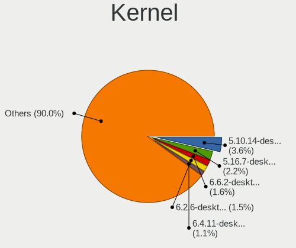

| Version                         | Notebooks | Percent |
|---------------------------------|-----------|---------|
| 5.10.14-desktop-1omv4002        | 155       | 6.68%   |
| 5.16.7-desktop-1omv4003         | 53        | 2.28%   |
| 5.4.0-42-generic                | 44        | 1.9%    |
| 4.9.20-nrj-desktop-1rosa-x86_64 | 25        | 1.08%   |
| 4.9.60-nrj-desktop-1rosa-x86_64 | 24        | 1.03%   |
| 5.4.0-52-generic                | 22        | 0.95%   |
| 5.4.0-48-generic                | 22        | 0.95%   |
| 5.4.0-29-generic                | 20        | 0.86%   |
| 5.4.0-26-generic                | 19        | 0.82%   |
| 5.4.0-58-generic                | 18        | 0.78%   |
| 5.4.0-33-generic                | 18        | 0.78%   |
| 5.3.0-46-generic                | 17        | 0.73%   |
| 5.11.0-37-generic               | 17        | 0.73%   |
| 5.0.0-37-generic                | 17        | 0.73%   |
| 5.4.0-54-generic                | 16        | 0.69%   |
| 4.15.0-desktop-45.1rosa-x86_64  | 16        | 0.69%   |
| 4.1.34-nrj-desktop-2rosa-x86_64 | 16        | 0.69%   |
| 5.8.0-43-generic                | 15        | 0.65%   |
| 5.4.0-40-generic                | 14        | 0.6%    |
| 5.4.0-37-generic                | 14        | 0.6%    |
| 5.3.0-42-generic                | 14        | 0.6%    |
| 5.3.0-40-generic                | 14        | 0.6%    |
| 5.13.0-39-generic               | 14        | 0.6%    |
| 5.11.0-27-generic               | 14        | 0.6%    |
| 5.11.0-25-generic               | 14        | 0.6%    |
| 4.15.0-43-generic               | 13        | 0.56%   |
| 5.4.0-74-generic                | 12        | 0.52%   |
| 5.13.0-27-generic               | 12        | 0.52%   |
| 5.11.0-43-generic               | 12        | 0.52%   |
| 5.11.0-38-generic               | 12        | 0.52%   |
| 5.11.0-34-generic               | 12        | 0.52%   |
| 5.10.0-9-amd64                  | 12        | 0.52%   |
| 4.18.0-25-generic               | 12        | 0.52%   |
| 5.4.0-91-generic                | 11        | 0.47%   |
| 5.4.0-66-generic                | 11        | 0.47%   |
| 5.13.0-28-generic               | 11        | 0.47%   |
| 4.18.0-15-generic               | 11        | 0.47%   |
| 5.8.0-53-generic                | 10        | 0.43%   |
| 5.4.0-77-generic                | 10        | 0.43%   |
| 5.4.0-65-generic                | 10        | 0.43%   |
| 5.4.0-56-generic                | 10        | 0.43%   |
| 5.10.0-8-amd64                  | 10        | 0.43%   |
| 4.18.0-17-generic               | 10        | 0.43%   |
| 5.8.0-50-generic                | 9         | 0.39%   |
| 5.8.0-48-generic                | 9         | 0.39%   |
| 5.4.0-53-generic                | 9         | 0.39%   |
| 5.4.0-45-generic                | 9         | 0.39%   |
| 5.3.0-51-generic                | 9         | 0.39%   |
| 5.14.0-0.bpo.2-amd64            | 9         | 0.39%   |
| 5.11.0-40-generic               | 9         | 0.39%   |
| 5.0.0-32-generic                | 9         | 0.39%   |
| 4.18.0-20-generic               | 9         | 0.39%   |
| 5.8.0-45-generic                | 8         | 0.34%   |
| 5.4.0-80-generic                | 8         | 0.34%   |
| 5.4.0-31-generic                | 8         | 0.34%   |
| 5.3.0-53-generic                | 8         | 0.34%   |
| 5.11.12-desktop-1omv4002        | 8         | 0.34%   |
| 5.0.0-25-generic                | 8         | 0.34%   |
| 4.9.60-nrj-desktop-1rosa-i586   | 8         | 0.34%   |
| 4.9.20-nrj-desktop-1rosa-i586   | 8         | 0.34%   |

Kernel Family
-------------

Linux kernel without a distro release

| Version | Notebooks | Percent |
|---------|-----------|---------|
| 5.4.0   | 415       | 18.98%  |
| 5.10.14 | 156       | 7.13%   |
| 4.15.0  | 143       | 6.54%   |
| 5.11.0  | 142       | 6.49%   |
| 5.8.0   | 128       | 5.85%   |
| 5.3.0   | 103       | 4.71%   |
| 5.13.0  | 84        | 3.84%   |
| 5.0.0   | 61        | 2.79%   |
| 4.18.0  | 56        | 2.56%   |
| 5.10.0  | 55        | 2.51%   |
| 5.16.7  | 54        | 2.47%   |
| 4.9.20  | 34        | 1.55%   |
| 4.9.60  | 32        | 1.46%   |
| 4.19.0  | 27        | 1.23%   |
| 4.1.34  | 22        | 1.01%   |
| 5.14.0  | 18        | 0.82%   |
| 5.15.0  | 15        | 0.69%   |
| 4.1.38  | 14        | 0.64%   |
| 5.9.0   | 11        | 0.5%    |
| 5.11.12 | 11        | 0.5%    |
| 5.4.32  | 10        | 0.46%   |
| 5.5.0   | 8         | 0.37%   |
| 4.9.76  | 8         | 0.37%   |
| 5.7.0   | 7         | 0.32%   |
| 5.16.11 | 7         | 0.32%   |
| 5.16.0  | 7         | 0.32%   |
| 5.15.12 | 7         | 0.32%   |
| 5.15.11 | 7         | 0.32%   |
| 4.9.124 | 7         | 0.32%   |
| 5.6.0   | 6         | 0.27%   |
| 5.4.83  | 6         | 0.27%   |
| 5.17.5  | 6         | 0.27%   |
| 5.17.0  | 6         | 0.27%   |
| 5.13.12 | 6         | 0.27%   |
| 5.9.11  | 5         | 0.23%   |
| 5.9.10  | 5         | 0.23%   |
| 5.8.16  | 5         | 0.23%   |
| 5.6.19  | 5         | 0.23%   |
| 5.6.14  | 5         | 0.23%   |
| 5.5.6   | 5         | 0.23%   |
| 5.15.5  | 5         | 0.23%   |
| 5.14.7  | 5         | 0.23%   |
| 5.11.16 | 5         | 0.23%   |
| 4.9.155 | 5         | 0.23%   |
| 5.9.16  | 4         | 0.18%   |
| 5.9.1   | 4         | 0.18%   |
| 5.8.4   | 4         | 0.18%   |
| 5.8.15  | 4         | 0.18%   |
| 5.6.6   | 4         | 0.18%   |
| 5.6.12  | 4         | 0.18%   |
| 5.4.15  | 4         | 0.18%   |
| 5.14.12 | 4         | 0.18%   |
| 5.12.9  | 4         | 0.18%   |
| 5.12.4  | 4         | 0.18%   |
| 5.11.11 | 4         | 0.18%   |
| 5.11.10 | 4         | 0.18%   |
| 5.10.16 | 4         | 0.18%   |
| 4.9.95  | 4         | 0.18%   |
| 4.9.41  | 4         | 0.18%   |
| 4.9.0   | 4         | 0.18%   |

Kernel Major Ver.
-----------------

Linux kernel major version

| Version | Notebooks | Percent |
|---------|-----------|---------|
| 5.4     | 471       | 22.14%  |
| 5.10    | 258       | 12.13%  |
| 5.11    | 177       | 8.32%   |
| 5.8     | 159       | 7.48%   |
| 4.15    | 143       | 6.72%   |
| 5.3     | 115       | 5.41%   |
| 5.13    | 101       | 4.75%   |
| 5.16    | 100       | 4.7%    |
| 4.9     | 98        | 4.61%   |
| 5.0     | 67        | 3.15%   |
| 5.15    | 61        | 2.87%   |
| 4.18    | 58        | 2.73%   |
| 5.14    | 47        | 2.21%   |
| 5.9     | 43        | 2.02%   |
| 5.6     | 41        | 1.93%   |
| 4.1     | 35        | 1.65%   |
| 4.19    | 33        | 1.55%   |
| 5.12    | 26        | 1.22%   |
| 5.5     | 24        | 1.13%   |
| 5.7     | 22        | 1.03%   |
| 5.17    | 19        | 0.89%   |
| 4.4     | 7         | 0.33%   |
| 5.1     | 6         | 0.28%   |
| 5.2     | 3         | 0.14%   |
| 3.10    | 3         | 0.14%   |
| 4.20    | 2         | 0.09%   |
| 4.13    | 2         | 0.09%   |
| 5.18    | 1         | 0.05%   |
| 4.17    | 1         | 0.05%   |
| 4.14    | 1         | 0.05%   |
| 4.12    | 1         | 0.05%   |
| 4.11    | 1         | 0.05%   |
| 4.10    | 1         | 0.05%   |

Arch
----

OS architecture (x86_64, i586, etc.)

| Name    | Notebooks | Percent |
|---------|-----------|---------|
| x86_64  | 1821      | 94.79%  |
| i686    | 98        | 5.1%    |
| aarch64 | 2         | 0.1%    |

DE
--

Desktop Environment

| Name            | Notebooks | Percent |
|-----------------|-----------|---------|
| GNOME           | 725       | 36.02%  |
| KDE5            | 415       | 20.62%  |
| Unknown         | 239       | 11.87%  |
| XFCE            | 142       | 7.05%   |
| X-Cinnamon      | 112       | 5.56%   |
| KDE4            | 96        | 4.77%   |
| KDE             | 72        | 3.58%   |
| Cinnamon        | 39        | 1.94%   |
| MATE            | 38        | 1.89%   |
| LXDE            | 31        | 1.54%   |
| LXQt            | 29        | 1.44%   |
| Pantheon        | 15        | 0.75%   |
| Budgie          | 12        | 0.6%    |
| i3              | 11        | 0.55%   |
| Deepin          | 9         | 0.45%   |
| Unity           | 7         | 0.35%   |
| GNOME Flashback | 5         | 0.25%   |
| Trinity         | 2         | 0.1%    |
| qtile           | 2         | 0.1%    |
| GNOME Classic   | 2         | 0.1%    |
| Fluxbox         | 2         | 0.1%    |
| dwm             | 2         | 0.1%    |
| awesome         | 2         | 0.1%    |
| sway            | 1         | 0.05%   |
| qt5ct           | 1         | 0.05%   |
| openbox         | 1         | 0.05%   |
| GNUstep         | 1         | 0.05%   |

Display Server
--------------

X11 or Wayland

| Name    | Notebooks | Percent |
|---------|-----------|---------|
| X11     | 1651      | 83.98%  |
| Wayland | 173       | 8.8%    |
| Unknown | 121       | 6.15%   |
| Tty     | 21        | 1.07%   |

Display Manager
---------------

SDDM, LightDM, etc.

| Name    | Notebooks | Percent |
|---------|-----------|---------|
| Unknown | 924       | 46.2%   |
| SDDM    | 435       | 21.75%  |
| GDM     | 263       | 13.15%  |
| LightDM | 111       | 5.55%   |
| KDM     | 98        | 4.9%    |
| TDM     | 95        | 4.75%   |
| GDM3    | 66        | 3.3%    |
| XDM     | 5         | 0.25%   |
| Ly      | 2         | 0.1%    |
| MDM     | 1         | 0.05%   |

OS Lang
-------

Language

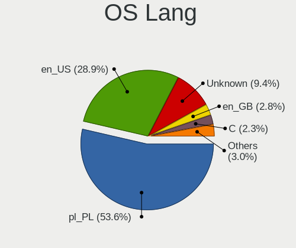

| Lang    | Notebooks | Percent |
|---------|-----------|---------|
| pl_PL   | 1046      | 52.64%  |
| en_US   | 455       | 22.9%   |
| Unknown | 364       | 18.32%  |
| en_GB   | 53        | 2.67%   |
| C       | 30        | 1.51%   |
| szl_PL  | 8         | 0.4%    |
| ru_RU   | 8         | 0.4%    |
| de_DE   | 4         | 0.2%    |
| fr_FR   | 3         | 0.15%   |
| nl_NL   | 2         | 0.1%    |
| en_IE   | 2         | 0.1%    |
| en_DK   | 2         | 0.1%    |
| uk_UA   | 1         | 0.05%   |
| sk_SK   | 1         | 0.05%   |
| ru_UA   | 1         | 0.05%   |
| it_IT   | 1         | 0.05%   |
| hu_HU   | 1         | 0.05%   |
| en_IN   | 1         | 0.05%   |
| en_CA   | 1         | 0.05%   |
| en_AU   | 1         | 0.05%   |
| C.UTF8  | 1         | 0.05%   |
| af_ZA   | 1         | 0.05%   |

Boot Mode
---------

EFI or BIOS

| Mode | Notebooks | Percent |
|------|-----------|---------|
| BIOS | 1052      | 53.84%  |
| EFI  | 902       | 46.16%  |

Filesystem
----------

Type of filesystem

| Type    | Notebooks | Percent |
|---------|-----------|---------|
| Ext4    | 1418      | 71.83%  |
| Overlay | 229       | 11.6%   |
| Unknown | 169       | 8.56%   |
| Btrfs   | 102       | 5.17%   |
| Xfs     | 28        | 1.42%   |
| Zfs     | 12        | 0.61%   |
| F2fs    | 10        | 0.51%   |
| Tmpfs   | 2         | 0.1%    |
| Ext2    | 2         | 0.1%    |
| Rootfs  | 1         | 0.05%   |
| Ext3    | 1         | 0.05%   |

Part. scheme
------------

Scheme of partitioning

| Type    | Notebooks | Percent |
|---------|-----------|---------|
| Unknown | 1047      | 53.34%  |
| GPT     | 601       | 30.62%  |
| MBR     | 315       | 16.05%  |

Dual Boot with Linux/BSD
------------------------

Hosting more than one Linux/BSD

| Dual boot | Notebooks | Percent |
|-----------|-----------|---------|
| No        | 1686      | 86.11%  |
| Yes       | 272       | 13.89%  |

Dual Boot (Win)
---------------

Hosting Linux and Windows

| Dual boot | Notebooks | Percent |
|-----------|-----------|---------|
| No        | 1315      | 67.47%  |
| Yes       | 634       | 32.53%  |

Board
-----

Vendor
------

Motherboard manufacturer

| Name                             | Notebooks | Percent |
|----------------------------------|-----------|---------|
| Lenovo                           | 507       | 26.43%  |
| Dell                             | 400       | 20.86%  |
| Hewlett-Packard                  | 287       | 14.96%  |
| ASUSTek Computer                 | 240       | 12.51%  |
| Acer                             | 128       | 6.67%   |
| Toshiba                          | 60        | 3.13%   |
| Samsung Electronics              | 57        | 2.97%   |
| MSI                              | 43        | 2.24%   |
| Sony                             | 28        | 1.46%   |
| HUAWEI                           | 19        | 0.99%   |
| Fujitsu Siemens                  | 19        | 0.99%   |
| Fujitsu                          | 13        | 0.68%   |
| Notebook                         | 11        | 0.57%   |
| Packard Bell                     | 10        | 0.52%   |
| Apple                            | 10        | 0.52%   |
| eMachines                        | 9         | 0.47%   |
| Google                           | 7         | 0.36%   |
| Timi                             | 6         | 0.31%   |
| Medion                           | 6         | 0.31%   |
| Kiano                            | 4         | 0.21%   |
| Unknown                          | 4         | 0.21%   |
| Clevo                            | 3         | 0.16%   |
| Alienware                        | 3         | 0.16%   |
| Teclast                          | 2         | 0.1%    |
| System76                         | 2         | 0.1%    |
| Star Labs                        | 2         | 0.1%    |
| mPTech                           | 2         | 0.1%    |
| MAXDATA                          | 2         | 0.1%    |
| Maibenben                        | 2         | 0.1%    |
| Kruger&Matz                      | 2         | 0.1%    |
| Intel                            | 2         | 0.1%    |
| IBM                              | 2         | 0.1%    |
| Getac                            | 2         | 0.1%    |
| FUJITSU CLIENT COMPUTING LIMITED | 2         | 0.1%    |
| ALIBABA                          | 2         | 0.1%    |
| Valve                            | 1         | 0.05%   |
| TUXEDO                           | 1         | 0.05%   |
| TrekStor                         | 1         | 0.05%   |
| Schenker                         | 1         | 0.05%   |
| RM                               | 1         | 0.05%   |
| Razer                            | 1         | 0.05%   |
| Primux Tech                      | 1         | 0.05%   |
| Panasonic                        | 1         | 0.05%   |
| Novatech                         | 1         | 0.05%   |
| Monster                          | 1         | 0.05%   |
| Matsushita Electric Industrial   | 1         | 0.05%   |
| LG Electronics                   | 1         | 0.05%   |
| Insyde                           | 1         | 0.05%   |
| Hyperbook                        | 1         | 0.05%   |
| GPD                              | 1         | 0.05%   |
| Gateway                          | 1         | 0.05%   |
| Dynabook                         | 1         | 0.05%   |
| Dream Machines                   | 1         | 0.05%   |
| Dixonsxp                         | 1         | 0.05%   |
| Chuwi                            | 1         | 0.05%   |

Model
-----

Motherboard model

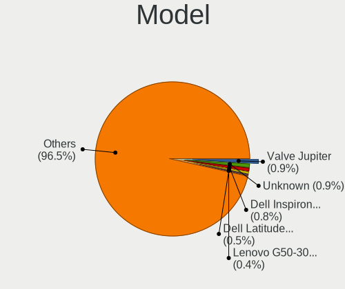

| Name                                 | Notebooks | Percent |
|--------------------------------------|-----------|---------|
| Unknown                              | 19        | 0.99%   |
| Dell Latitude E6400                  | 14        | 0.73%   |
| Lenovo G50-30 80G0                   | 11        | 0.57%   |
| Dell Inspiron 3451                   | 11        | 0.57%   |
| Dell Latitude E6540                  | 10        | 0.52%   |
| Dell Latitude 5480                   | 10        | 0.52%   |
| Dell Latitude D630                   | 9         | 0.47%   |
| Lenovo G580 20150                    | 8         | 0.42%   |
| HP Pavilion dv7                      | 8         | 0.42%   |
| Dell Latitude E6430                  | 8         | 0.42%   |
| Dell Latitude 5490                   | 8         | 0.42%   |
| ASUS X555LJ                          | 8         | 0.42%   |
| HP EliteBook 6930p                   | 7         | 0.36%   |
| Dell Latitude E7440                  | 7         | 0.36%   |
| Dell Latitude E6420                  | 7         | 0.36%   |
| Lenovo Legion Y540-15IRH 81SX        | 6         | 0.31%   |
| Lenovo Legion Y530-15ICH 81FV        | 6         | 0.31%   |
| Lenovo Legion 5 15ARH05 82B5         | 6         | 0.31%   |
| Lenovo IdeaPad 100-15IBY 80MJ        | 6         | 0.31%   |
| Lenovo G500 20236                    | 6         | 0.31%   |
| HP Pavilion Gaming Laptop 15-ec1xxx  | 6         | 0.31%   |
| HP Pavilion g6                       | 6         | 0.31%   |
| HP Laptop 15-db1xxx                  | 6         | 0.31%   |
| HP 15                                | 6         | 0.31%   |
| Dell Latitude E7450                  | 6         | 0.31%   |
| Dell Inspiron 3542                   | 6         | 0.31%   |
| Toshiba Satellite A300               | 5         | 0.26%   |
| Samsung 550P5C/550P7C                | 5         | 0.26%   |
| Lenovo IdeaPad Y510P 20217           | 5         | 0.26%   |
| Lenovo IdeaPad S340-14API 81NB       | 5         | 0.26%   |
| Lenovo IdeaPad Gaming 3 15ARH05 82EY | 5         | 0.26%   |
| Lenovo IdeaPad 700-15ISK 80RU        | 5         | 0.26%   |
| Lenovo IdeaPad 330-15ICH 81FK        | 5         | 0.26%   |
| Lenovo IdeaPad 100-15IBD 80QQ        | 5         | 0.26%   |
| HP Pavilion Laptop 15-eg0xxx         | 5         | 0.26%   |
| HP Pavilion dv6                      | 5         | 0.26%   |
| HP Laptop 15-db0xxx                  | 5         | 0.26%   |
| HP EliteBook 840 G3                  | 5         | 0.26%   |
| Dell Latitude D830                   | 5         | 0.26%   |
| Dell Latitude 5400                   | 5         | 0.26%   |
| Dell Inspiron 7559                   | 5         | 0.26%   |
| ASUS K52F                            | 5         | 0.26%   |
| ASUS K50IJ                           | 5         | 0.26%   |
| Acer Extensa 5220                    | 5         | 0.26%   |
| Toshiba Satellite L300               | 4         | 0.21%   |
| Samsung RF511/RF411/RF711            | 4         | 0.21%   |
| Samsung RC410/RC510/RC710            | 4         | 0.21%   |
| Samsung 350V5C/351V5C/3540VC/3440VC  | 4         | 0.21%   |
| Samsung 300E4C/300E5C/300E7C         | 4         | 0.21%   |
| Lenovo Z70-80 80FG                   | 4         | 0.21%   |
| Lenovo Z51-70 80K6                   | 4         | 0.21%   |
| Lenovo Z50-70 20354                  | 4         | 0.21%   |
| Lenovo Y520-15IKBN 80WK              | 4         | 0.21%   |
| Lenovo IdeaPad Y700-17ISK 80Q0       | 4         | 0.21%   |
| Lenovo IdeaPad Y700-15ISK 80NV       | 4         | 0.21%   |
| Lenovo IdeaPad 5 14ARE05 81YM        | 4         | 0.21%   |
| Lenovo G710 20252                    | 4         | 0.21%   |
| Lenovo G700 20251                    | 4         | 0.21%   |
| Lenovo G550 20023                    | 4         | 0.21%   |
| Lenovo G510 20238                    | 4         | 0.21%   |

Model Family
------------

Motherboard model prefix

| Name                    | Notebooks | Percent |
|-------------------------|-----------|---------|
| Lenovo ThinkPad         | 222       | 11.57%  |
| Dell Latitude           | 211       | 11%     |
| Lenovo IdeaPad          | 107       | 5.58%   |
| Dell Inspiron           | 104       | 5.42%   |
| Acer Aspire             | 77        | 4.01%   |
| HP Pavilion             | 64        | 3.34%   |
| HP EliteBook            | 55        | 2.87%   |
| Toshiba Satellite       | 48        | 2.5%    |
| HP ProBook              | 44        | 2.29%   |
| Lenovo Legion           | 32        | 1.67%   |
| HP Laptop               | 27        | 1.41%   |
| ASUS VivoBook           | 26        | 1.36%   |
| Dell Precision          | 25        | 1.3%    |
| Dell Vostro             | 22        | 1.15%   |
| Dell XPS                | 19        | 0.99%   |
| Unknown                 | 19        | 0.99%   |
| HP Compaq               | 18        | 0.94%   |
| Acer Extensa            | 14        | 0.73%   |
| ASUS TUF                | 13        | 0.68%   |
| HP 250                  | 12        | 0.63%   |
| Fujitsu LIFEBOOK        | 12        | 0.63%   |
| Lenovo G50-30           | 11        | 0.57%   |
| ASUS ASUS               | 11        | 0.57%   |
| Acer TravelMate         | 11        | 0.57%   |
| Packard Bell EasyNote   | 10        | 0.52%   |
| HP ZBook                | 10        | 0.52%   |
| Lenovo G580             | 9         | 0.47%   |
| Dell G3                 | 8         | 0.42%   |
| ASUS X555LJ             | 8         | 0.42%   |
| Acer Swift              | 8         | 0.42%   |
| Lenovo ThinkBook        | 7         | 0.36%   |
| Fujitsu Siemens ESPRIMO | 7         | 0.36%   |
| Fujitsu Siemens AMILO   | 7         | 0.36%   |
| Acer Nitro              | 7         | 0.36%   |
| Lenovo Yoga             | 6         | 0.31%   |
| Lenovo G500             | 6         | 0.31%   |
| Lenovo G50-80           | 6         | 0.31%   |
| HP OMEN                 | 6         | 0.31%   |
| HP 255                  | 6         | 0.31%   |
| HP 15                   | 6         | 0.31%   |
| ASUS ROG                | 6         | 0.31%   |
| Samsung 550P5C          | 5         | 0.26%   |
| Samsung 350V5C          | 5         | 0.26%   |
| ASUS ZenBook            | 5         | 0.26%   |
| ASUS K52F               | 5         | 0.26%   |
| ASUS K50IJ              | 5         | 0.26%   |
| Samsung RF511           | 4         | 0.21%   |
| Samsung RC410           | 4         | 0.21%   |
| Samsung R530            | 4         | 0.21%   |
| Samsung 300E4C          | 4         | 0.21%   |
| MSI GL65                | 4         | 0.21%   |
| Lenovo Z70-80           | 4         | 0.21%   |
| Lenovo Z51-70           | 4         | 0.21%   |
| Lenovo Z50-70           | 4         | 0.21%   |
| Lenovo Y520-15IKBN      | 4         | 0.21%   |
| Lenovo G780             | 4         | 0.21%   |
| Lenovo G710             | 4         | 0.21%   |
| Lenovo G700             | 4         | 0.21%   |
| Lenovo G550             | 4         | 0.21%   |
| Lenovo G510             | 4         | 0.21%   |

MFG Year
--------

Motherboard manufacture year

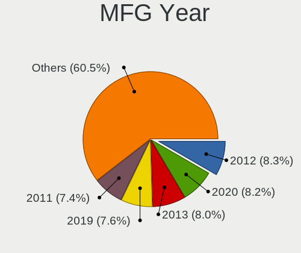

| Year    | Notebooks | Percent |
|---------|-----------|---------|
| 2019    | 178       | 9.28%   |
| 2012    | 167       | 8.71%   |
| 2011    | 165       | 8.6%    |
| 2013    | 164       | 8.55%   |
| 2020    | 143       | 7.46%   |
| 2008    | 142       | 7.4%    |
| 2018    | 137       | 7.14%   |
| 2014    | 131       | 6.83%   |
| 2015    | 124       | 6.47%   |
| 2010    | 117       | 6.1%    |
| 2017    | 94        | 4.9%    |
| 2016    | 92        | 4.8%    |
| 2007    | 86        | 4.48%   |
| 2009    | 76        | 3.96%   |
| 2021    | 64        | 3.34%   |
| 2006    | 29        | 1.51%   |
| 2022    | 3         | 0.16%   |
| 2005    | 3         | 0.16%   |
| Unknown | 2         | 0.1%    |
| 2004    | 1         | 0.05%   |

Form Factor
-----------

Physical design of the computer

| Name     | Notebooks | Percent |
|----------|-----------|---------|
| Notebook | 1918      | 100%    |

Secure Boot
-----------

Enabled or disabled

| State    | Notebooks | Percent |
|----------|-----------|---------|
| Disabled | 1783      | 92.43%  |
| Enabled  | 146       | 7.57%   |

Coreboot
--------

Have coreboot on board

| Used | Notebooks | Percent |
|------|-----------|---------|
| No   | 1910      | 99.58%  |
| Yes  | 8         | 0.42%   |

RAM Size
--------

Total RAM memory

| Size in GB  | Notebooks | Percent |
|-------------|-----------|---------|
| 3.01-4.0    | 529       | 27.27%  |
| 4.01-8.0    | 447       | 23.04%  |
| 8.01-16.0   | 311       | 16.03%  |
| 16.01-24.0  | 297       | 15.31%  |
| 32.01-64.0  | 130       | 6.7%    |
| 1.01-2.0    | 100       | 5.15%   |
| 2.01-3.0    | 75        | 3.87%   |
| 24.01-32.0  | 22        | 1.13%   |
| 0.51-1.0    | 18        | 0.93%   |
| 64.01-256.0 | 11        | 0.57%   |

RAM Used
--------

Used RAM memory

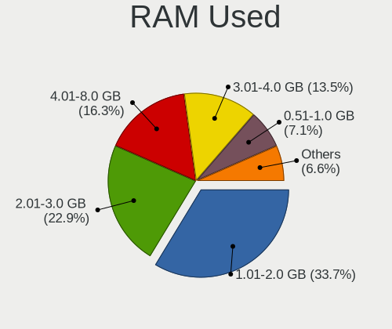

| Used GB    | Notebooks | Percent |
|------------|-----------|---------|
| 1.01-2.0   | 843       | 39.48%  |
| 2.01-3.0   | 463       | 21.69%  |
| 3.01-4.0   | 257       | 12.04%  |
| 4.01-8.0   | 240       | 11.24%  |
| 0.51-1.0   | 219       | 10.26%  |
| 8.01-16.0  | 83        | 3.89%   |
| 0.01-0.5   | 24        | 1.12%   |
| 16.01-24.0 | 5         | 0.23%   |
| 24.01-32.0 | 1         | 0.05%   |

Total Drives
------------

Number of drives on board

| Drives | Notebooks | Percent |
|--------|-----------|---------|
| 1      | 1432      | 73.21%  |
| 2      | 432       | 22.09%  |
| 3      | 50        | 2.56%   |
| 0      | 32        | 1.64%   |
| 4      | 8         | 0.41%   |
| 5      | 2         | 0.1%    |

Has CD-ROM
----------

Has CD-ROM on board

| Presented | Notebooks | Percent |
|-----------|-----------|---------|
| No        | 1061      | 54.8%   |
| Yes       | 875       | 45.2%   |

Has Ethernet
------------

Has Ethernet on board

| Presented | Notebooks | Percent |
|-----------|-----------|---------|
| Yes       | 1714      | 89.09%  |
| No        | 210       | 10.91%  |

Has WiFi
--------

Has WiFi module

| Presented | Notebooks | Percent |
|-----------|-----------|---------|
| Yes       | 1890      | 98.49%  |
| No        | 29        | 1.51%   |

Has Bluetooth
-------------

Has Bluetooth module

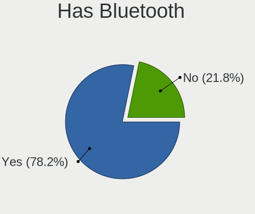

| Presented | Notebooks | Percent |
|-----------|-----------|---------|
| Yes       | 1445      | 74.03%  |
| No        | 507       | 25.97%  |

Location
--------

Country
-------

Geographic location (country)

| Country | Notebooks | Percent |
|---------|-----------|---------|
| Poland  | 1918      | 100%    |

City
----

Geographic location (city)

| City                      | Notebooks | Percent |
|---------------------------|-----------|---------|
| Warsaw                    | 468       | 22.05%  |
| Krakow                    | 161       | 7.59%   |
| Wroclaw                   | 110       | 5.18%   |
| Poznan                    | 110       | 5.18%   |
| Lodz                      | 62        | 2.92%   |
| Gdansk                    | 61        | 2.87%   |
| Katowice                  | 46        | 2.17%   |
| Lublin                    | 29        | 1.37%   |
| Szczecin                  | 25        | 1.18%   |
| Torun                     | 21        | 0.99%   |
| Gdynia                    | 21        | 0.99%   |
| Bialystok                 | 21        | 0.99%   |
| Bydgoszcz                 | 19        | 0.9%    |
| Opole                     | 14        | 0.66%   |
| Kielce                    | 14        | 0.66%   |
| Gliwice                   | 14        | 0.66%   |
| Czstochowa           | 14        | 0.66%   |
| Zabrze                    | 13        | 0.61%   |
| Rzeszw                | 10        | 0.47%   |
| Olsztyn                   | 10        | 0.47%   |
| Bielsko-Biala             | 10        | 0.47%   |
| Sosnowiec                 | 9         | 0.42%   |
| Radom                     | 9         | 0.42%   |
| Elblag                    | 9         | 0.42%   |
| Tychy                     | 8         | 0.38%   |
| Rybnik                    | 7         | 0.33%   |
| Ruda lska        | 7         | 0.33%   |
| Chorzw                | 7         | 0.33%   |
| Supsk                | 6         | 0.28%   |
| Rzeszw                | 6         | 0.28%   |
| Pabianice                 | 6         | 0.28%   |
| Jaworzno                  | 6         | 0.28%   |
| Zbki                 | 5         | 0.24%   |
| Tarnowskie Gory           | 5         | 0.24%   |
| Siechnice                 | 5         | 0.24%   |
| Piaseczno                 | 5         | 0.24%   |
| Olesnica                  | 5         | 0.24%   |
| Mielec                    | 5         | 0.24%   |
| Legionowo                 | 5         | 0.24%   |
| Gorki Wielkie             | 5         | 0.24%   |
| Chojnice                  | 5         | 0.24%   |
| Bytom                     | 5         | 0.24%   |
| witochowice | 4         | 0.19%   |
| Zielona Gra           | 4         | 0.19%   |
| Wocawek         | 4         | 0.19%   |
| Tczew                     | 4         | 0.19%   |
| Tarnw                 | 4         | 0.19%   |
| Stalowa Wola              | 4         | 0.19%   |
| Skawina                   | 4         | 0.19%   |
| Rumia                     | 4         | 0.19%   |
| Pock                 | 4         | 0.19%   |
| Pruszkw               | 4         | 0.19%   |
| Plewiska                  | 4         | 0.19%   |
| Otwock                    | 4         | 0.19%   |
| Ostrw Wielkopolski    | 4         | 0.19%   |
| Nysa                      | 4         | 0.19%   |
| Nowy Scz             | 4         | 0.19%   |
| Legnica                   | 4         | 0.19%   |
| Kedzierzyn-Kozle          | 4         | 0.19%   |
| Kalisz                    | 4         | 0.19%   |

Drives
------

Drive Vendor
------------

Hard drive vendors

| Vendor                         | Notebooks | Drives | Percent |
|--------------------------------|-----------|--------|---------|
| Samsung Electronics            | 318       | 401    | 13.46%  |
| WDC                            | 299       | 369    | 12.66%  |
| Seagate                        | 293       | 370    | 12.4%   |
| Toshiba                        | 173       | 222    | 7.32%   |
| GOODRAM                        | 147       | 189    | 6.22%   |
| Hitachi                        | 108       | 126    | 4.57%   |
| Unknown                        | 102       | 131    | 4.32%   |
| SanDisk                        | 98        | 141    | 4.15%   |
| Intel                          | 89        | 111    | 3.77%   |
| Kingston                       | 88        | 114    | 3.73%   |
| Crucial                        | 86        | 136    | 3.64%   |
| A-DATA Technology              | 85        | 109    | 3.6%    |
| SK Hynix                       | 81        | 101    | 3.43%   |
| HGST                           | 61        | 77     | 2.58%   |
| Micron Technology              | 43        | 54     | 1.82%   |
| PLEXTOR                        | 24        | 36     | 1.02%   |
| Patriot                        | 21        | 28     | 0.89%   |
| SPCC                           | 20        | 26     | 0.85%   |
| KIOXIA                         | 20        | 23     | 0.85%   |
| Fujitsu                        | 16        | 17     | 0.68%   |
| PNY                            | 14        | 15     | 0.59%   |
| LITEON                         | 10        | 16     | 0.42%   |
| KIOXIA-EXCERIA                 | 10        | 11     | 0.42%   |
| Phison                         | 9         | 14     | 0.38%   |
| LITEONIT                       | 9         | 10     | 0.38%   |
| China                          | 9         | 16     | 0.38%   |
| Transcend                      | 8         | 9      | 0.34%   |
| Apacer                         | 8         | 9      | 0.34%   |
| Union Memory                   | 7         | 10     | 0.3%    |
| OCZ                            | 7         | 7      | 0.3%    |
| Lenovo                         | 6         | 9      | 0.25%   |
| HUAWEI                         | 6         | 8      | 0.25%   |
| JMicron                        | 5         | 5      | 0.21%   |
| Lite-On                        | 4         | 5      | 0.17%   |
| USB3.0                         | 3         | 3      | 0.13%   |
| Solid State Storage            | 3         | 3      | 0.13%   |
| Silicon Motion                 | 3         | 4      | 0.13%   |
| KingSpec                       | 3         | 3      | 0.13%   |
| Gigabyte Technology            | 3         | 5      | 0.13%   |
| Corsair                        | 3         | 3      | 0.13%   |
| ASMT                           | 3         | 3      | 0.13%   |
| asmedia                        | 3         | 3      | 0.13%   |
| 2-Power                        | 3         | 3      | 0.13%   |
| YMTC                           | 2         | 2      | 0.08%   |
| XPG                            | 2         | 2      | 0.08%   |
| Union Memory (Shenzhen)        | 2         | 2      | 0.08%   |
| Solid State Storage Technology | 2         | 2      | 0.08%   |
| Realtek Semiconductor          | 2         | 3      | 0.08%   |
| Intenso                        | 2         | 2      | 0.08%   |
| HS-SSD-C100                    | 2         | 2      | 0.08%   |
| BIWIN                          | 2         | 2      | 0.08%   |
| Apple                          | 2         | 2      | 0.08%   |
| ZTE                            | 1         | 1      | 0.04%   |
| Yangtze Memory Technologies    | 1         | 1      | 0.04%   |
| Wolf                           | 1         | 2      | 0.04%   |
| WDC WDS2                       | 1         | 1      | 0.04%   |
| UMIS                           | 1         | 1      | 0.04%   |
| Toshiba America Info Systems   | 1         | 1      | 0.04%   |
| Teclast                        | 1         | 1      | 0.04%   |
| Team                           | 1         | 1      | 0.04%   |

Drive Model
-----------

Hard drive models

| Model                               | Notebooks | Percent |
|-------------------------------------|-----------|---------|
| Seagate ST1000LM035-1RK172 1TB      | 37        | 1.52%   |
| Seagate ST1000LM024 HN-M101MBB 1TB  | 31        | 1.27%   |
| Seagate ST500LT012-1DG142 500GB     | 28        | 1.15%   |
| GOODRAM SSD 120GB                   | 21        | 0.86%   |
| Intel NVMe SSD Drive 512GB          | 20        | 0.82%   |
| Samsung NVMe SSD Drive 512GB        | 19        | 0.78%   |
| Seagate ST9500325AS 500GB           | 18        | 0.74%   |
| Unknown MMC Card  32GB              | 17        | 0.7%    |
| Toshiba MQ01ABD100 1TB              | 17        | 0.7%    |
| HGST HTS721010A9E630 1TB            | 16        | 0.66%   |
| Crucial CT500MX500SSD1 500GB        | 16        | 0.66%   |
| Toshiba MQ01ABF050 500GB            | 15        | 0.61%   |
| Sandisk NVMe SSD Drive 512GB        | 15        | 0.61%   |
| Samsung SSD 850 EVO 250GB           | 15        | 0.61%   |
| Intel SSDPEKNW512G8H 512GB          | 15        | 0.61%   |
| GOODRAM SSD 240GB                   | 14        | 0.57%   |
| Samsung NVMe SSD Drive 256GB        | 13        | 0.53%   |
| GOODRAM SSDPR-CX400-512 512GB       | 13        | 0.53%   |
| Crucial CT1000MX500SSD1 1TB         | 13        | 0.53%   |
| WDC WD10JPCX-24UE4T0 1TB            | 12        | 0.49%   |
| Samsung SSD 860 EVO 500GB           | 12        | 0.49%   |
| Kingston SA400S37240G 240GB SSD     | 11        | 0.45%   |
| HGST HTS725050A7E630 500GB          | 11        | 0.45%   |
| HGST HTS545050A7E680 500GB          | 11        | 0.45%   |
| GOODRAM SSDPR-CX400-256-G2 256GB    | 11        | 0.45%   |
| Unknown MMC Card  64GB              | 10        | 0.41%   |
| Toshiba NVMe SSD Drive 512GB        | 10        | 0.41%   |
| SK Hynix NVMe SSD Drive 512GB       | 10        | 0.41%   |
| Seagate ST500LM012 HN-M500MBB 500GB | 10        | 0.41%   |
| Crucial CT240BX500SSD1 240GB        | 10        | 0.41%   |
| A-DATA SU800 256GB SSD              | 10        | 0.41%   |
| WDC WD10JPVX-22JC3T0 1TB            | 9         | 0.37%   |
| Seagate ST9250315AS 250GB           | 9         | 0.37%   |
| Seagate ST500LT012-9WS142 500GB     | 9         | 0.37%   |
| Seagate ST1000LM014-SSHD-8GB        | 9         | 0.37%   |
| Sandisk NVMe SSD Drive 256GB        | 9         | 0.37%   |
| Samsung SSD 840 EVO 250GB           | 9         | 0.37%   |
| Samsung HM321HI 320GB               | 9         | 0.37%   |
| Patriot Burst 120GB SSD             | 9         | 0.37%   |
| Hitachi HTS545050A7E380 500GB       | 9         | 0.37%   |
| GOODRAM SSDPR-CX400-512-G2 512GB    | 9         | 0.37%   |
| SK Hynix SC311 SATA 256GB SSD       | 8         | 0.33%   |
| Seagate Expansion+ 2TB              | 8         | 0.33%   |
| SanDisk SSD PLUS 240GB              | 8         | 0.33%   |
| Kingston SV300S37A120G 120GB SSD    | 8         | 0.33%   |
| Intel SSDPEKNW512G8 512GB           | 8         | 0.33%   |
| Hitachi HTS545050B9A300 500GB       | 8         | 0.33%   |
| GOODRAM SSDPR-CX400-256 256GB       | 8         | 0.33%   |
| Crucial CT480BX500SSD1 480GB        | 8         | 0.33%   |
| WDC WD2500BEVT-22ZCT0 250GB         | 7         | 0.29%   |
| WDC WD10SPCX-24HWST1 1TB            | 7         | 0.29%   |
| SPCC Solid State Disk 512GB         | 7         | 0.29%   |
| Seagate ST320LT020-9YG142 320GB     | 7         | 0.29%   |
| Seagate ST1000LM014-1EJ164 1TB      | 7         | 0.29%   |
| SanDisk SDSSDA240G 240GB            | 7         | 0.29%   |
| Samsung SSD 860 QVO 1TB             | 7         | 0.29%   |
| Samsung SSD 850 EVO 500GB           | 7         | 0.29%   |
| KIOXIA KBG40ZNS512G NVMe 512GB      | 7         | 0.29%   |
| Kingston SA400S37480G 480GB SSD     | 7         | 0.29%   |
| Kingston SA400S37120G 120GB SSD     | 7         | 0.29%   |

HDD Vendor
----------

Hard disk drive vendors

| Vendor              | Notebooks | Drives | Percent |
|---------------------|-----------|--------|---------|
| Seagate             | 291       | 366    | 34.64%  |
| WDC                 | 210       | 254    | 25%     |
| Toshiba             | 116       | 153    | 13.81%  |
| Hitachi             | 108       | 126    | 12.86%  |
| HGST                | 61        | 77     | 7.26%   |
| Samsung Electronics | 26        | 27     | 3.1%    |
| Fujitsu             | 16        | 17     | 1.9%    |
| Unknown             | 3         | 3      | 0.36%   |
| ASMT                | 3         | 3      | 0.36%   |
| ASMedia             | 2         | 2      | 0.24%   |
| StoreJet            | 1         | 1      | 0.12%   |
| PHD 3.0             | 1         | 1      | 0.12%   |
| LaCie               | 1         | 2      | 0.12%   |
| IBM/Hitachi         | 1         | 1      | 0.12%   |

SSD Vendor
----------

Solid state drive vendors

| Vendor              | Notebooks | Drives | Percent |
|---------------------|-----------|--------|---------|
| Samsung Electronics | 170       | 212    | 18.34%  |
| GOODRAM             | 147       | 189    | 15.86%  |
| Crucial             | 83        | 133    | 8.95%   |
| A-DATA Technology   | 71        | 94     | 7.66%   |
| Kingston            | 69        | 90     | 7.44%   |
| SanDisk             | 67        | 101    | 7.23%   |
| WDC                 | 40        | 45     | 4.31%   |
| Intel               | 29        | 34     | 3.13%   |
| Micron Technology   | 27        | 32     | 2.91%   |
| Toshiba             | 26        | 28     | 2.8%    |
| SK Hynix            | 26        | 35     | 2.8%    |
| PLEXTOR             | 22        | 34     | 2.37%   |
| SPCC                | 19        | 25     | 2.05%   |
| Patriot             | 19        | 26     | 2.05%   |
| PNY                 | 10        | 11     | 1.08%   |
| LITEON              | 10        | 16     | 1.08%   |
| LITEONIT            | 9         | 10     | 0.97%   |
| KIOXIA-EXCERIA      | 9         | 10     | 0.97%   |
| China               | 9         | 16     | 0.97%   |
| Apacer              | 8         | 9      | 0.86%   |
| Transcend           | 7         | 8      | 0.76%   |
| OCZ                 | 7         | 7      | 0.76%   |
| JMicron             | 5         | 5      | 0.54%   |
| USB3.0              | 3         | 3      | 0.32%   |
| KingSpec            | 3         | 3      | 0.32%   |
| 2-Power             | 3         | 3      | 0.32%   |
| Union Memory        | 2         | 2      | 0.22%   |
| Gigabyte Technology | 2         | 4      | 0.22%   |
| BIWIN               | 2         | 2      | 0.22%   |
| Apple               | 2         | 2      | 0.22%   |
| Wolf                | 1         | 2      | 0.11%   |
| WDC WDS2            | 1         | 1      | 0.11%   |
| Teclast             | 1         | 1      | 0.11%   |
| Team                | 1         | 1      | 0.11%   |
| Seagate             | 1         | 1      | 0.11%   |
| RDM-II              | 1         | 1      | 0.11%   |
| Platinet            | 1         | 1      | 0.11%   |
| PHISON              | 1         | 1      | 0.11%   |
| OCZ-VERTEX          | 1         | 1      | 0.11%   |
| Micron_1            | 1         | 1      | 0.11%   |
| MAXTOR              | 1         | 1      | 0.11%   |
| KingFast            | 1         | 1      | 0.11%   |
| KINGBANK            | 1         | 1      | 0.11%   |
| Intenso             | 1         | 1      | 0.11%   |
| Integral            | 1         | 1      | 0.11%   |
| HS-SSD-C100         | 1         | 1      | 0.11%   |
| FORESEE             | 1         | 1      | 0.11%   |
| Corsair             | 1         | 1      | 0.11%   |
| BHT                 | 1         | 1      | 0.11%   |
| ADATA SX            | 1         | 1      | 0.11%   |
| Unknown             | 1         | 1      | 0.11%   |

Drive Kind
----------

HDD or SSD

| Kind    | Notebooks | Drives | Percent |
|---------|-----------|--------|---------|
| SSD     | 847       | 1211   | 37.78%  |
| HDD     | 811       | 1033   | 36.17%  |
| NVMe    | 473       | 624    | 21.1%   |
| MMC     | 91        | 118    | 4.06%   |
| Unknown | 20        | 24     | 0.89%   |

Drive Connector
---------------

SATA, SAS, NVMe, etc.

| Type | Notebooks | Drives | Percent |
|------|-----------|--------|---------|
| SATA | 1481      | 2192   | 70.16%  |
| NVMe | 473       | 623    | 22.41%  |
| MMC  | 91        | 118    | 4.31%   |
| SAS  | 66        | 77     | 3.13%   |

Drive Size
----------

Size of hard drive

| Size in TB | Notebooks | Drives | Percent |
|------------|-----------|--------|---------|
| 0.01-0.5   | 1209      | 1684   | 74.31%  |
| 0.51-1.0   | 378       | 515    | 23.23%  |
| 1.01-2.0   | 36        | 41     | 2.21%   |
| 3.01-4.0   | 2         | 2      | 0.12%   |
| 2.01-3.0   | 1         | 1      | 0.06%   |
| 4.01-10.0  | 1         | 1      | 0.06%   |

Space Total
-----------

Amount of disk space available on the file system

| Size in GB     | Notebooks | Percent |
|----------------|-----------|---------|
| 101-250        | 642       | 31.61%  |
| 251-500        | 447       | 22.01%  |
| 1-20           | 254       | 12.51%  |
| 501-1000       | 211       | 10.39%  |
| 51-100         | 197       | 9.7%    |
| 21-50          | 103       | 5.07%   |
| 1001-2000      | 81        | 3.99%   |
| Unknown        | 62        | 3.05%   |
| 2001-3000      | 18        | 0.89%   |
| More than 3000 | 16        | 0.79%   |

Space Used
----------

Amount of used disk space

| Used GB        | Notebooks | Percent |
|----------------|-----------|---------|
| 1-20           | 929       | 44.17%  |
| 21-50          | 358       | 17.02%  |
| 51-100         | 274       | 13.03%  |
| 101-250        | 257       | 12.22%  |
| 251-500        | 114       | 5.42%   |
| 501-1000       | 79        | 3.76%   |
| Unknown        | 62        | 2.95%   |
| 1001-2000      | 24        | 1.14%   |
| 2001-3000      | 4         | 0.19%   |
| More than 3000 | 2         | 0.1%    |

Malfunc. Drives
---------------

Drive models with a malfunction

| Model                                          | Notebooks | Drives | Percent |
|------------------------------------------------|-----------|--------|---------|
| Seagate ST1000LM024 HN-M101MBB 1TB             | 8         | 9      | 3.52%   |
| Seagate ST500LT012-9WS142 500GB                | 7         | 21     | 3.08%   |
| Seagate ST9500325AS 500GB                      | 6         | 6      | 2.64%   |
| WDC WD5000BEVT-22ZAT0 500GB                    | 4         | 4      | 1.76%   |
| Seagate ST500LT012-1DG142 500GB                | 4         | 6      | 1.76%   |
| Hitachi HTS541612J9SA00 120GB                  | 4         | 5      | 1.76%   |
| HGST HTS545050A7E680 500GB                     | 4         | 4      | 1.76%   |
| WDC WD3200BPVT-80ZEST0 320GB                   | 3         | 3      | 1.32%   |
| WDC WD10JPVX-22JC3T0 1TB                       | 3         | 3      | 1.32%   |
| Toshiba MK1246GSX 120GB                        | 3         | 3      | 1.32%   |
| SK Hynix PC711 HFS512GDE9X073N 512GB           | 3         | 3      | 1.32%   |
| Seagate ST9500420AS 500GB                      | 3         | 3      | 1.32%   |
| Seagate ST9250827AS 250GB                      | 3         | 3      | 1.32%   |
| Seagate ST9250410AS 250GB                      | 3         | 3      | 1.32%   |
| WDC WD1600BEVT-75A23T0 160GB                   | 2         | 2      | 0.88%   |
| Toshiba MQ01ABD100 1TB                         | 2         | 3      | 0.88%   |
| Toshiba MK3265GSX 320GB                        | 2         | 2      | 0.88%   |
| Toshiba MK1637GSX 160GB                        | 2         | 2      | 0.88%   |
| Seagate ST980811AS 80GB                        | 2         | 2      | 0.88%   |
| Seagate ST9320325AS 320GB                      | 2         | 2      | 0.88%   |
| Seagate ST9250315AS 250GB                      | 2         | 2      | 0.88%   |
| Seagate ST9160821AS 160GB                      | 2         | 3      | 0.88%   |
| Seagate ST320LT020-9YG142 320GB                | 2         | 2      | 0.88%   |
| Seagate ST1000LM014-SSHD-8GB                   | 2         | 2      | 0.88%   |
| Seagate ST1000LM014-1EJ164 1TB                 | 2         | 2      | 0.88%   |
| Micron Technology 1100_MTFDDAK256TBN 256GB SSD | 2         | 2      | 0.88%   |
| Kingston SV300S37A120G 120GB SSD               | 2         | 2      | 0.88%   |
| Hitachi HTS543232A7A384 320GB                  | 2         | 3      | 0.88%   |
| Hitachi HTS542516K9SA00 160GB                  | 2         | 2      | 0.88%   |
| Hitachi HTS542512K9SA00 120GB                  | 2         | 2      | 0.88%   |
| HGST HTS725050A7E630 500GB                     | 2         | 3      | 0.88%   |
| HGST HTS545050A7E380 500GB                     | 2         | 2      | 0.88%   |
| A-DATA Technology SU800 512GB SSD              | 2         | 2      | 0.88%   |
| WDC WDS120G2G0A-00JH30 120GB SSD               | 1         | 1      | 0.44%   |
| WDC WD7500BPKT-00PK4T0 752GB                   | 1         | 1      | 0.44%   |
| WDC WD6400BPVT-80HXZT1 640GB                   | 1         | 1      | 0.44%   |
| WDC WD6400BPVT-22HXZT3 640GB                   | 1         | 1      | 0.44%   |
| WDC WD5000LPVX-80V0TT0 500GB                   | 1         | 1      | 0.44%   |
| WDC WD5000LPVX-75V0TT0 500GB                   | 1         | 1      | 0.44%   |
| WDC WD5000LPLX-60ZNTT1 500GB                   | 1         | 1      | 0.44%   |
| WDC WD5000LPCX-60VHAT0 500GB                   | 1         | 1      | 0.44%   |
| WDC WD5000BEVT-26A0RT0 500GB                   | 1         | 1      | 0.44%   |
| WDC WD3200BEVT-80A0RT0 320GB                   | 1         | 1      | 0.44%   |
| WDC WD3200BEVT-60A23T0 320GB                   | 1         | 1      | 0.44%   |
| WDC WD1600BEVT-22ZCT0 160GB                    | 1         | 1      | 0.44%   |
| WDC WD1200BEVS-07LAT0 120GB                    | 1         | 1      | 0.44%   |
| WDC WD10SPZX-24Z10T0 1TB                       | 1         | 1      | 0.44%   |
| WDC WD10JPCX-24UE4T0 1TB                       | 1         | 2      | 0.44%   |
| Toshiba THNSNK256GVN8 M.2 2280 256GB SSD       | 1         | 1      | 0.44%   |
| Toshiba THNSNK128GVN8 M.2 2280 128GB SSD       | 1         | 1      | 0.44%   |
| Toshiba MQ01ACF032 320GB                       | 1         | 1      | 0.44%   |
| Toshiba MQ01ABF050 500GB                       | 1         | 1      | 0.44%   |
| Toshiba MQ01ABD032V 320GB                      | 1         | 2      | 0.44%   |
| Toshiba MK6465GSX 640GB                        | 1         | 2      | 0.44%   |
| Toshiba MK5075GSX 500GB                        | 1         | 1      | 0.44%   |
| Toshiba MK5061GSY 500GB                        | 1         | 1      | 0.44%   |
| Toshiba MK5059GSX 500GB                        | 1         | 1      | 0.44%   |
| Toshiba MK3263GSX 320GB                        | 1         | 1      | 0.44%   |
| Toshiba MK3261GSYN 320GB                       | 1         | 1      | 0.44%   |
| Toshiba MK3252GSX 320GB                        | 1         | 1      | 0.44%   |

Malfunc. Drive Vendor
---------------------

Vendors of faulty drives

| Vendor              | Notebooks | Drives | Percent |
|---------------------|-----------|--------|---------|
| Seagate             | 62        | 83     | 27.43%  |
| Toshiba             | 29        | 44     | 12.83%  |
| Hitachi             | 28        | 31     | 12.39%  |
| WDC                 | 27        | 28     | 11.95%  |
| A-DATA Technology   | 14        | 16     | 6.19%   |
| Samsung Electronics | 11        | 12     | 4.87%   |
| HGST                | 11        | 12     | 4.87%   |
| SK Hynix            | 7         | 7      | 3.1%    |
| Intel               | 5         | 5      | 2.21%   |
| SanDisk             | 4         | 16     | 1.77%   |
| Micron Technology   | 4         | 4      | 1.77%   |
| Kingston            | 4         | 4      | 1.77%   |
| Fujitsu             | 3         | 3      | 1.33%   |
| Crucial             | 3         | 4      | 1.33%   |
| OCZ                 | 2         | 2      | 0.88%   |
| LITEONIT            | 2         | 2      | 0.88%   |
| LITEON              | 2         | 2      | 0.88%   |
| ASMedia             | 2         | 2      | 0.88%   |
| SPCC                | 1         | 1      | 0.44%   |
| PLEXTOR             | 1         | 1      | 0.44%   |
| Platinet            | 1         | 1      | 0.44%   |
| Patriot             | 1         | 2      | 0.44%   |
| Lenovo              | 1         | 1      | 0.44%   |
| Apacer              | 1         | 1      | 0.44%   |

Malfunc. HDD Vendor
-------------------

Vendors of faulty HDD drives

| Vendor              | Notebooks | Drives | Percent |
|---------------------|-----------|--------|---------|
| Seagate             | 62        | 83     | 37.8%   |
| Hitachi             | 28        | 31     | 17.07%  |
| WDC                 | 26        | 27     | 15.85%  |
| Toshiba             | 26        | 41     | 15.85%  |
| HGST                | 11        | 12     | 6.71%   |
| Samsung Electronics | 6         | 6      | 3.66%   |
| Fujitsu             | 3         | 3      | 1.83%   |
| asmedia             | 2         | 2      | 1.22%   |

Malfunc. Drive Kind
-------------------

Kinds of faulty drives

| Kind | Notebooks | Drives | Percent |
|------|-----------|--------|---------|
| HDD  | 164       | 205    | 73.21%  |
| SSD  | 49        | 66     | 21.88%  |
| NVMe | 11        | 13     | 4.91%   |

Failed Drives
-------------

Failed drive models

| Model                           | Notebooks | Drives | Percent |
|---------------------------------|-----------|--------|---------|
| WDC WD800BEVS-75RST0 80GB       | 1         | 1      | 20%     |
| WDC WD3200BEKT-75PVMT1 320GB    | 1         | 1      | 20%     |
| WDC WD2500BEVS-22UST0 250GB     | 1         | 1      | 20%     |
| Toshiba MK3265GSXN 320GB        | 1         | 1      | 20%     |
| Seagate ST320LT020-9YG142 320GB | 1         | 1      | 20%     |

Failed Drive Vendor
-------------------

Failed drive vendors

| Vendor  | Notebooks | Drives | Percent |
|---------|-----------|--------|---------|
| WDC     | 3         | 3      | 60%     |
| Toshiba | 1         | 1      | 20%     |
| Seagate | 1         | 1      | 20%     |

Drive Status
------------

Number of failed and malfunc. drives

| Status   | Notebooks | Drives | Percent |
|----------|-----------|--------|---------|
| Detected | 1016      | 1557   | 50.07%  |
| Works    | 790       | 1164   | 38.94%  |
| Malfunc  | 218       | 284    | 10.74%  |
| Failed   | 5         | 5      | 0.25%   |

Storage controller
------------------

Storage Vendor
--------------

Storage controller vendors

| Vendor                           | Notebooks | Percent |
|----------------------------------|-----------|---------|
| Intel                            | 1537      | 70.12%  |
| AMD                              | 179       | 8.17%   |
| Samsung Electronics              | 133       | 6.07%   |
| Sandisk                          | 81        | 3.7%    |
| SK Hynix                         | 56        | 2.55%   |
| Toshiba America Info Systems     | 32        | 1.46%   |
| KIOXIA                           | 25        | 1.14%   |
| Kingston Technology Company      | 19        | 0.87%   |
| Phison Electronics               | 18        | 0.82%   |
| Nvidia                           | 17        | 0.78%   |
| Micron Technology                | 16        | 0.73%   |
| ADATA Technology                 | 13        | 0.59%   |
| Silicon Integrated Systems [SiS] | 11        | 0.5%    |
| Union Memory (Shenzhen)          | 9         | 0.41%   |
| Realtek Semiconductor            | 7         | 0.32%   |
| Silicon Motion                   | 6         | 0.27%   |
| Lite-On Technology               | 6         | 0.27%   |
| Lenovo                           | 6         | 0.27%   |
| Solid State Storage Technology   | 5         | 0.23%   |
| VIA Technologies                 | 4         | 0.18%   |
| Micron/Crucial Technology        | 4         | 0.18%   |
| JMicron Technology               | 4         | 0.18%   |
| Yangtze Memory Technologies      | 2         | 0.09%   |
| O2 Micro                         | 1         | 0.05%   |
| ASMedia Technology               | 1         | 0.05%   |

Storage Model
-------------

Storage controller models

| Model                                                                                  | Notebooks | Percent |
|----------------------------------------------------------------------------------------|-----------|---------|
| Intel 7 Series Chipset Family 6-port SATA Controller [AHCI mode]                       | 176       | 7.24%   |
| AMD FCH SATA Controller [AHCI mode]                                                    | 146       | 6.01%   |
| Intel Sunrise Point-LP SATA Controller [AHCI mode]                                     | 124       | 5.1%    |
| Intel 82801 Mobile SATA Controller [RAID mode]                                         | 121       | 4.98%   |
| Intel 6 Series/C200 Series Chipset Family 6 port Mobile SATA AHCI Controller           | 115       | 4.73%   |
| Intel 82801IBM/IEM (ICH9M/ICH9M-E) 4 port SATA Controller [AHCI mode]                  | 107       | 4.4%    |
| Intel 8 Series SATA Controller 1 [AHCI mode]                                           | 92        | 3.79%   |
| Intel 82801HM/HEM (ICH8M/ICH8M-E) IDE Controller                                       | 82        | 3.37%   |
| Samsung NVMe SSD Controller SM981/PM981/PM983                                          | 76        | 3.13%   |
| Intel Wildcat Point-LP SATA Controller [AHCI Mode]                                     | 72        | 2.96%   |
| Intel Cannon Lake Mobile PCH SATA AHCI Controller                                      | 66        | 2.72%   |
| Intel 8 Series/C220 Series Chipset Family 6-port SATA Controller 1 [AHCI mode]         | 64        | 2.63%   |
| Intel 82801HM/HEM (ICH8M/ICH8M-E) SATA Controller [AHCI mode]                          | 58        | 2.39%   |
| Intel 5 Series/3400 Series Chipset 4 port SATA AHCI Controller                         | 55        | 2.26%   |
| Intel HM170/QM170 Chipset SATA Controller [AHCI Mode]                                  | 54        | 2.22%   |
| Intel SSD 660P Series                                                                  | 49        | 2.02%   |
| Intel 5 Series/3400 Series Chipset 6 port SATA AHCI Controller                         | 45        | 1.85%   |
| Intel Atom Processor E3800 Series SATA AHCI Controller                                 | 43        | 1.77%   |
| Intel Volume Management Device NVMe RAID Controller                                    | 40        | 1.65%   |
| Samsung NVMe SSD Controller 980                                                        | 35        | 1.44%   |
| Intel 82801HM/HEM (ICH8M/ICH8M-E) SATA Controller [IDE mode]                           | 32        | 1.32%   |
| Intel 82801GBM/GHM (ICH7-M Family) SATA Controller [IDE mode]                          | 29        | 1.19%   |
| AMD SB7x0/SB8x0/SB9x0 SATA Controller [AHCI mode]                                      | 27        | 1.11%   |
| KIOXIA Non-Volatile memory controller                                                  | 24        | 0.99%   |
| Intel Cannon Point-LP SATA Controller [AHCI Mode]                                      | 22        | 0.91%   |
| SK Hynix Gold P31 SSD                                                                  | 20        | 0.82%   |
| Sandisk WD Black SN750 / PC SN730 NVMe SSD                                             | 20        | 0.82%   |
| Intel Comet Lake SATA AHCI Controller                                                  | 20        | 0.82%   |
| SK Hynix BC501 NVMe Solid State Drive                                                  | 16        | 0.66%   |
| Sandisk WD Blue SN500 / PC SN520 NVMe SSD                                              | 16        | 0.66%   |
| Micron Non-Volatile memory controller                                                  | 16        | 0.66%   |
| Intel Q170/Q150/B150/H170/H110/Z170/CM236 Chipset SATA Controller [AHCI Mode]          | 16        | 0.66%   |
| Intel NM10/ICH7 Family SATA Controller [AHCI mode]                                     | 16        | 0.66%   |
| Intel 82801G (ICH7 Family) IDE Controller                                              | 16        | 0.66%   |
| Toshiba America Info Systems XG6 NVMe SSD Controller                                   | 15        | 0.62%   |
| SK Hynix BC511                                                                         | 15        | 0.62%   |
| Sandisk WD Blue SN550 NVMe SSD                                                         | 15        | 0.62%   |
| Intel 82801IBM/IEM (ICH9M/ICH9M-E) 2 port SATA Controller [IDE mode]                   | 15        | 0.62%   |
| Samsung NVMe SSD Controller SM961/PM961/SM963                                          | 14        | 0.58%   |
| Intel 82801GBM/GHM (ICH7-M Family) SATA Controller [AHCI mode]                         | 14        | 0.58%   |
| Intel 7 Series Chipset Family 4-port SATA Controller [IDE mode]                        | 14        | 0.58%   |
| Kingston Company Company Non-Volatile memory controller                                | 13        | 0.53%   |
| Intel Tiger Lake-LP SATA Controller [AHCI mode]                                        | 13        | 0.53%   |
| Intel Atom/Celeron/Pentium Processor x5-E8000/J3xxx/N3xxx Series SATA Controller       | 13        | 0.53%   |
| Intel 7 Series Chipset Family 2-port SATA Controller [IDE mode]                        | 13        | 0.53%   |
| Intel 5 Series/3400 Series Chipset 4 port SATA IDE Controller                          | 13        | 0.53%   |
| ADATA XPG SX8200 Pro PCIe Gen3x4 M.2 2280 Solid State Drive                            | 13        | 0.53%   |
| Sandisk WD Black 2018/SN750 / PC SN720 NVMe SSD                                        | 12        | 0.49%   |
| Intel Mobile 4 Series Chipset PT IDER Controller                                       | 12        | 0.49%   |
| Intel 5 Series/3400 Series Chipset 2 port SATA IDE Controller                          | 12        | 0.49%   |
| Intel 400 Series Chipset Family SATA AHCI Controller                                   | 12        | 0.49%   |
| Silicon Integrated Systems [SiS] 5513 IDE Controller                                   | 11        | 0.45%   |
| Silicon Integrated Systems [SiS] SATA Controller / IDE mode                            | 10        | 0.41%   |
| Sandisk PC SN520 NVMe SSD                                                              | 10        | 0.41%   |
| Phison E12 NVMe Controller                                                             | 10        | 0.41%   |
| Intel Celeron/Pentium Silver Processor SATA Controller                                 | 10        | 0.41%   |
| AMD SB7x0/SB8x0/SB9x0 IDE Controller                                                   | 10        | 0.41%   |
| Union Memory (Shenzhen) Non-Volatile memory controller                                 | 9         | 0.37%   |
| Intel Ice Lake-LP SATA Controller [AHCI mode]                                          | 9         | 0.37%   |
| Intel 6 Series/C200 Series Chipset Family Mobile SATA Controller (IDE mode, ports 4-5) | 9         | 0.37%   |

Storage Kind
------------

Kind of storage controller (IDE, SATA, NVMe, SAS, ...)

| Kind | Notebooks | Percent |
|------|-----------|---------|
| SATA | 1412      | 61.02%  |
| NVMe | 480       | 20.74%  |
| IDE  | 251       | 10.85%  |
| RAID | 171       | 7.39%   |

Processor
---------

CPU Vendor
----------

Processor vendors

| Vendor       | Notebooks | Percent |
|--------------|-----------|---------|
| Intel        | 1652      | 86.13%  |
| AMD          | 263       | 13.71%  |
| QUALCOMM     | 1         | 0.05%   |
| CentaurHauls | 1         | 0.05%   |
| ARM          | 1         | 0.05%   |

CPU Model
---------

Processor models

| Model                                         | Notebooks | Percent |
|-----------------------------------------------|-----------|---------|
| Intel Core i5-2520M CPU @ 2.50GHz             | 33        | 1.72%   |
| Intel Celeron CPU N2840 @ 2.16GHz             | 28        | 1.46%   |
| AMD Ryzen 5 3500U with Radeon Vega Mobile Gfx | 28        | 1.46%   |
| Intel Core i5-8265U CPU @ 1.60GHz             | 25        | 1.3%    |
| Intel Core i5-7200U CPU @ 2.50GHz             | 25        | 1.3%    |
| Intel Core i7-8550U CPU @ 1.80GHz             | 24        | 1.25%   |
| Intel Core i5-3320M CPU @ 2.60GHz             | 24        | 1.25%   |
| Intel Core i7-8565U CPU @ 1.80GHz             | 23        | 1.2%    |
| Intel Core i5-8250U CPU @ 1.60GHz             | 23        | 1.2%    |
| Intel Core i5-5200U CPU @ 2.20GHz             | 23        | 1.2%    |
| Intel Core i7-8750H CPU @ 2.20GHz             | 22        | 1.15%   |
| Intel Core i7-9750H CPU @ 2.60GHz             | 21        | 1.09%   |
| Intel Core i7-7700HQ CPU @ 2.80GHz            | 21        | 1.09%   |
| Intel Core i5-3210M CPU @ 2.50GHz             | 19        | 0.99%   |
| Intel Core i5 CPU M 520 @ 2.40GHz             | 19        | 0.99%   |
| AMD Ryzen 5 4600H with Radeon Graphics        | 19        | 0.99%   |
| Intel Core i5-4300U CPU @ 1.90GHz             | 18        | 0.94%   |
| Intel Core i5-10210U CPU @ 1.60GHz            | 18        | 0.94%   |
| Intel Core i3-5005U CPU @ 2.00GHz             | 18        | 0.94%   |
| Intel Pentium Dual-Core CPU T4200 @ 2.00GHz   | 17        | 0.89%   |
| Intel Core i5-8300H CPU @ 2.30GHz             | 16        | 0.83%   |
| Intel Core i5-6200U CPU @ 2.30GHz             | 16        | 0.83%   |
| Intel Core i3-3110M CPU @ 2.40GHz             | 16        | 0.83%   |
| Intel Core 2 Duo CPU T7500 @ 2.20GHz          | 16        | 0.83%   |
| Intel Core i7-6700HQ CPU @ 2.60GHz            | 15        | 0.78%   |
| Intel Core i5-7300HQ CPU @ 2.50GHz            | 15        | 0.78%   |
| Intel Core i5-5300U CPU @ 2.30GHz             | 15        | 0.78%   |
| Intel Core 2 Duo CPU P8600 @ 2.40GHz          | 15        | 0.78%   |
| Intel 11th Gen Core i7-1165G7 @ 2.80GHz       | 15        | 0.78%   |
| Intel 11th Gen Core i5-1135G7 @ 2.40GHz       | 15        | 0.78%   |
| Intel Core i5-2410M CPU @ 2.30GHz             | 14        | 0.73%   |
| Intel Core i7-7500U CPU @ 2.70GHz             | 13        | 0.68%   |
| Intel Core i5-6300U CPU @ 2.40GHz             | 13        | 0.68%   |
| Intel Core i5-4200U CPU @ 1.60GHz             | 13        | 0.68%   |
| Intel Core i3 CPU M 380 @ 2.53GHz             | 13        | 0.68%   |
| Intel Core 2 Duo CPU P8700 @ 2.53GHz          | 13        | 0.68%   |
| AMD Ryzen 7 5800H with Radeon Graphics        | 13        | 0.68%   |
| AMD Ryzen 7 4800H with Radeon Graphics        | 13        | 0.68%   |
| Intel Core 2 Duo CPU P8400 @ 2.26GHz          | 12        | 0.63%   |
| AMD Ryzen 7 4700U with Radeon Graphics        | 12        | 0.63%   |
| Intel Pentium CPU B960 @ 2.20GHz              | 11        | 0.57%   |
| Intel Core i7-4700MQ CPU @ 2.40GHz            | 11        | 0.57%   |
| Intel Core i5-6300HQ CPU @ 2.30GHz            | 11        | 0.57%   |
| Intel Core i5-4210U CPU @ 1.70GHz             | 11        | 0.57%   |
| Intel Core i3-2310M CPU @ 2.10GHz             | 11        | 0.57%   |
| Intel Atom CPU N270 @ 1.60GHz                 | 11        | 0.57%   |
| Intel Core i7-6500U CPU @ 2.50GHz             | 10        | 0.52%   |
| Intel Core i7-10510U CPU @ 1.80GHz            | 10        | 0.52%   |
| Intel Core i5-3230M CPU @ 2.60GHz             | 10        | 0.52%   |
| Intel Core i5-2430M CPU @ 2.40GHz             | 10        | 0.52%   |
| Intel Core i5-1035G1 CPU @ 1.00GHz            | 10        | 0.52%   |
| Intel Core i3-4005U CPU @ 1.70GHz             | 10        | 0.52%   |
| Intel Core i3-2330M CPU @ 2.20GHz             | 10        | 0.52%   |
| AMD Ryzen 5 2500U with Radeon Vega Mobile Gfx | 10        | 0.52%   |
| Intel Core i5-3340M CPU @ 2.70GHz             | 9         | 0.47%   |
| Intel Core i5 CPU M 430 @ 2.27GHz             | 9         | 0.47%   |
| Intel Core i3-2350M CPU @ 2.30GHz             | 9         | 0.47%   |
| Intel Core i3 CPU M 370 @ 2.40GHz             | 9         | 0.47%   |
| Intel Core 2 Duo CPU T7250 @ 2.00GHz          | 9         | 0.47%   |
| Intel Atom CPU N450 @ 1.66GHz                 | 9         | 0.47%   |

CPU Model Family
----------------

Processor model prefix

| Model                                | Notebooks | Percent |
|--------------------------------------|-----------|---------|
| Intel Core i5                        | 544       | 28.35%  |
| Intel Core i7                        | 382       | 19.91%  |
| Intel Core i3                        | 175       | 9.12%   |
| Intel Core 2 Duo                     | 175       | 9.12%   |
| Intel Celeron                        | 92        | 4.79%   |
| AMD Ryzen 5                          | 81        | 4.22%   |
| Intel Pentium                        | 63        | 3.28%   |
| AMD Ryzen 7                          | 55        | 2.87%   |
| Other                                | 54        | 2.81%   |
| Intel Atom                           | 46        | 2.4%    |
| Intel Pentium Dual-Core              | 35        | 1.82%   |
| Intel Core 2                         | 18        | 0.94%   |
| AMD A6                               | 16        | 0.83%   |
| Intel Genuine                        | 15        | 0.78%   |
| Intel Pentium Dual                   | 13        | 0.68%   |
| AMD A8                               | 12        | 0.63%   |
| AMD Ryzen 7 PRO                      | 11        | 0.57%   |
| AMD A4                               | 11        | 0.57%   |
| AMD E1                               | 9         | 0.47%   |
| Intel Celeron M                      | 8         | 0.42%   |
| Intel Pentium M                      | 7         | 0.36%   |
| AMD Turion 64 X2 Mobile              | 7         | 0.36%   |
| AMD E                                | 7         | 0.36%   |
| Intel Xeon                           | 6         | 0.31%   |
| AMD E2                               | 6         | 0.31%   |
| AMD Athlon X2                        | 6         | 0.31%   |
| AMD A10                              | 6         | 0.31%   |
| AMD Ryzen 3                          | 5         | 0.26%   |
| Intel Core Duo                       | 4         | 0.21%   |
| Intel Celeron Dual-Core              | 4         | 0.21%   |
| AMD Turion X2 Dual-Core Mobile       | 4         | 0.21%   |
| AMD Athlon II                        | 4         | 0.21%   |
| AMD Ryzen 9                          | 3         | 0.16%   |
| AMD Phenom II                        | 3         | 0.16%   |
| Intel Pentium Silver                 | 2         | 0.1%    |
| Intel Core M                         | 2         | 0.1%    |
| Intel Core i9                        | 2         | 0.1%    |
| Intel Core 2 Quad                    | 2         | 0.1%    |
| Intel Core 2 Extreme                 | 2         | 0.1%    |
| AMD V120                             | 2         | 0.1%    |
| AMD Mobile Sempron                   | 2         | 0.1%    |
| AMD C-60                             | 2         | 0.1%    |
| QUALCOMM AArch64                     | 1         | 0.05%   |
| Intel Core m7                        | 1         | 0.05%   |
| Intel Core m5                        | 1         | 0.05%   |
| Intel Core m3                        | 1         | 0.05%   |
| Intel Core 2 Solo                    | 1         | 0.05%   |
| Intel Celeron D                      | 1         | 0.05%   |
| CentaurHauls VIA C7                  | 1         | 0.05%   |
| AMD Turion X2 Ultra Dual-Core Mobile | 1         | 0.05%   |
| AMD Turion II Dual-Core              | 1         | 0.05%   |
| AMD Turion 64 Mobile                 | 1         | 0.05%   |
| AMD Turion                           | 1         | 0.05%   |
| AMD C-50                             | 1         | 0.05%   |
| AMD Athlon 64 X2                     | 1         | 0.05%   |
| AMD Athlon 64                        | 1         | 0.05%   |
| AMD Athlon                           | 1         | 0.05%   |
| AMD A12                              | 1         | 0.05%   |

CPU Cores
---------

Number of processor cores

| Number  | Notebooks | Percent |
|---------|-----------|---------|
| 2       | 1122      | 58.44%  |
| 4       | 544       | 28.33%  |
| 6       | 103       | 5.36%   |
| 8       | 70        | 3.65%   |
| 1       | 57        | 2.97%   |
| Unknown | 20        | 1.04%   |
| 192     | 1         | 0.05%   |
| 14      | 1         | 0.05%   |
| 5       | 1         | 0.05%   |
| 3       | 1         | 0.05%   |

CPU Sockets
-----------

Number of sockets

| Number  | Notebooks | Percent |
|---------|-----------|---------|
| 1       | 1916      | 99.9%   |
| 2       | 1         | 0.05%   |
| Unknown | 1         | 0.05%   |

CPU Threads
-----------

Threads per core (Hyper-Threading)

| Number  | Notebooks | Percent |
|---------|-----------|---------|
| 2       | 1307      | 67.97%  |
| 1       | 596       | 30.99%  |
| Unknown | 20        | 1.04%   |

CPU Op-Modes
------------

CPU Operation Modes (32-bit, 64-bit)

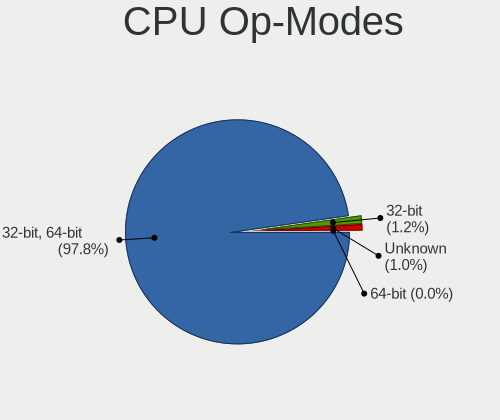

| Op mode        | Notebooks | Percent |
|----------------|-----------|---------|
| 32-bit, 64-bit | 1841      | 95.74%  |
| 32-bit         | 41        | 2.13%   |
| Unknown        | 40        | 2.08%   |
| 64-bit         | 1         | 0.05%   |

CPU Microcode
-------------

Microcode number

| Number     | Notebooks | Percent |
|------------|-----------|---------|
| Unknown    | 309       | 15.69%  |
| 0x206a7    | 148       | 7.51%   |
| 0x306a9    | 140       | 7.11%   |
| 0x1067a    | 96        | 4.87%   |
| 0x40651    | 83        | 4.21%   |
| 0x20655    | 73        | 3.71%   |
| 0x806ec    | 65        | 3.3%    |
| 0x306c3    | 64        | 3.25%   |
| 0x906ea    | 62        | 3.15%   |
| 0x306d4    | 62        | 3.15%   |
| 0x806ea    | 55        | 2.79%   |
| 0x6fd      | 55        | 2.79%   |
| 0x406e3    | 49        | 2.49%   |
| 0x30678    | 49        | 2.49%   |
| 0x806e9    | 42        | 2.13%   |
| 0x10676    | 40        | 2.03%   |
| 0x506e3    | 38        | 1.93%   |
| 0x906e9    | 37        | 1.88%   |
| 0x806c1    | 36        | 1.83%   |
| 0x20652    | 27        | 1.37%   |
| 0x08108102 | 21        | 1.07%   |
| 0x806eb    | 20        | 1.02%   |
| 0x08108109 | 20        | 1.02%   |
| 0x0a50000c | 18        | 0.91%   |
| 0x08600106 | 18        | 0.91%   |
| 0x6fb      | 17        | 0.86%   |
| 0xa0652    | 16        | 0.81%   |
| 0x706e5    | 15        | 0.76%   |
| 0x6f6      | 15        | 0.76%   |
| 0x106ca    | 13        | 0.66%   |
| 0x106c2    | 13        | 0.66%   |
| 0x08600104 | 13        | 0.66%   |
| 0x06001119 | 12        | 0.61%   |
| 0x6e8      | 11        | 0.56%   |
| 0x406c4    | 11        | 0.56%   |
| 0x406c3    | 11        | 0.56%   |
| 0x08600103 | 11        | 0.56%   |
| 0x906ed    | 10        | 0.51%   |
| 0x05000119 | 10        | 0.51%   |
| 0x706a1    | 8         | 0.41%   |
| 0x10661    | 8         | 0.41%   |
| 0x03000027 | 8         | 0.41%   |
| 0x010000c8 | 8         | 0.41%   |
| 0x806d1    | 7         | 0.36%   |
| 0x6fa      | 7         | 0.36%   |
| 0x6ec      | 7         | 0.36%   |
| 0x6d8      | 7         | 0.36%   |
| 0x506c9    | 7         | 0.36%   |
| 0x0700010f | 7         | 0.36%   |
| 0x106e5    | 6         | 0.3%    |
| 0x0810100b | 6         | 0.3%    |
| 0x02000032 | 6         | 0.3%    |
| 0x06006705 | 5         | 0.25%   |
| 0x6f2      | 4         | 0.2%    |
| 0x30673    | 4         | 0.2%    |
| 0x08600102 | 4         | 0.2%    |
| 0x08101007 | 4         | 0.2%    |
| 0x07030106 | 4         | 0.2%    |
| 0x02000057 | 4         | 0.2%    |
| 0x0a50000b | 3         | 0.15%   |

CPU Microarch
-------------

Microarchitecture

| Name             | Notebooks | Percent |
|------------------|-----------|---------|
| KabyLake         | 341       | 17.77%  |
| Haswell          | 175       | 9.12%   |
| SandyBridge      | 168       | 8.75%   |
| IvyBridge        | 164       | 8.55%   |
| Penryn           | 148       | 7.71%   |
| Core             | 117       | 6.1%    |
| Westmere         | 108       | 5.63%   |
| Skylake          | 102       | 5.32%   |
| Silvermont       | 80        | 4.17%   |
| Broadwell        | 80        | 4.17%   |
| Zen 2            | 61        | 3.18%   |
| Zen+             | 51        | 2.66%   |
| TigerLake        | 41        | 2.14%   |
| Bonnell          | 29        | 1.51%   |
| P6               | 26        | 1.35%   |
| IceLake          | 25        | 1.3%    |
| Zen 3            | 24        | 1.25%   |
| CometLake        | 21        | 1.09%   |
| Bobcat           | 17        | 0.89%   |
| Piledriver       | 16        | 0.83%   |
| Zen              | 15        | 0.78%   |
| Unknown          | 14        | 0.73%   |
| K8 Hammer        | 12        | 0.63%   |
| K8 & K10 hybrid  | 12        | 0.63%   |
| Jaguar           | 11        | 0.57%   |
| K10              | 10        | 0.52%   |
| Goldmont plus    | 10        | 0.52%   |
| Puma             | 9         | 0.47%   |
| K10 Llano        | 8         | 0.42%   |
| Excavator        | 8         | 0.42%   |
| Goldmont         | 7         | 0.36%   |
| Nehalem          | 6         | 0.31%   |
| Steamroller      | 2         | 0.1%    |
| Alderlake Hybrid | 1         | 0.05%   |

Graphics
--------

GPU Vendor
----------

Vendors of graphics cards

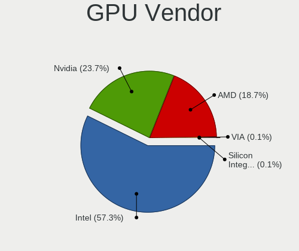

| Vendor                           | Notebooks | Percent |
|----------------------------------|-----------|---------|
| Intel                            | 1450      | 58.51%  |
| Nvidia                           | 599       | 24.17%  |
| AMD                              | 419       | 16.91%  |
| Silicon Integrated Systems [SiS] | 6         | 0.24%   |
| VIA Technologies                 | 4         | 0.16%   |

GPU Model
---------

Graphics card models

| Model                                                                                    | Notebooks | Percent |
|------------------------------------------------------------------------------------------|-----------|---------|
| Intel 3rd Gen Core processor Graphics Controller                                         | 159       | 6.11%   |
| Intel 2nd Generation Core Processor Family Integrated Graphics Controller                | 156       | 6%      |
| Intel Haswell-ULT Integrated Graphics Controller                                         | 95        | 3.65%   |
| Intel Mobile 4 Series Chipset Integrated Graphics Controller                             | 87        | 3.34%   |
| Intel Core Processor Integrated Graphics Controller                                      | 72        | 2.77%   |
| Intel HD Graphics 5500                                                                   | 71        | 2.73%   |
| Intel CoffeeLake-H GT2 [UHD Graphics 630]                                                | 70        | 2.69%   |
| Intel 4th Gen Core Processor Integrated Graphics Controller                              | 70        | 2.69%   |
| Intel UHD Graphics 620                                                                   | 62        | 2.38%   |
| Intel Mobile GM965/GL960 Integrated Graphics Controller (secondary)                      | 60        | 2.31%   |
| Intel Mobile GM965/GL960 Integrated Graphics Controller (primary)                        | 60        | 2.31%   |
| Intel WhiskeyLake-U GT2 [UHD Graphics 620]                                               | 59        | 2.27%   |
| AMD Renoir                                                                               | 56        | 2.15%   |
| Intel Atom Processor Z36xxx/Z37xxx Series Graphics & Display                             | 55        | 2.11%   |
| Intel Skylake GT2 [HD Graphics 520]                                                      | 53        | 2.04%   |
| AMD Picasso/Raven 2 [Radeon Vega Series / Radeon Vega Mobile Series]                     | 52        | 2%      |
| Intel HD Graphics 620                                                                    | 46        | 1.77%   |
| Intel HD Graphics 630                                                                    | 44        | 1.69%   |
| Nvidia GP107M [GeForce GTX 1050 Mobile]                                                  | 41        | 1.58%   |
| Intel TigerLake-LP GT2 [Iris Xe Graphics]                                                | 37        | 1.42%   |
| Intel HD Graphics 530                                                                    | 36        | 1.38%   |
| Intel Mobile 945GM/GMS/GME, 943/940GML Express Integrated Graphics Controller            | 34        | 1.31%   |
| Intel CometLake-U GT2 [UHD Graphics]                                                     | 34        | 1.31%   |
| Nvidia GF117M [GeForce 610M/710M/810M/820M / GT 620M/625M/630M/720M]                     | 32        | 1.23%   |
| Intel Atom/Celeron/Pentium Processor x5-E8000/J3xxx/N3xxx Integrated Graphics Controller | 25        | 0.96%   |
| AMD Sun XT [Radeon HD 8670A/8670M/8690M / R5 M330 / M430 / Radeon 520 Mobile]            | 25        | 0.96%   |
| Nvidia TU117M [GeForce GTX 1650 Mobile / Max-Q]                                          | 24        | 0.92%   |
| Intel Mobile 945GM/GMS, 943/940GML Express Integrated Graphics Controller                | 23        | 0.88%   |
| Nvidia GM107M [GeForce GTX 960M]                                                         | 22        | 0.85%   |
| AMD RV620/M82 [Mobility Radeon HD 3450/3470]                                             | 22        | 0.85%   |
| AMD Cezanne                                                                              | 22        | 0.85%   |
| Nvidia GP107M [GeForce GTX 1050 Ti Mobile]                                               | 18        | 0.69%   |
| Nvidia GM108M [GeForce 840M]                                                             | 18        | 0.69%   |
| Nvidia GK208BM [GeForce 920M]                                                            | 18        | 0.69%   |
| Intel CometLake-H GT2 [UHD Graphics]                                                     | 18        | 0.69%   |
| AMD Thames [Radeon HD 7500M/7600M Series]                                                | 17        | 0.65%   |
| Nvidia TU116M [GeForce GTX 1660 Ti Mobile]                                               | 16        | 0.61%   |
| AMD Topaz XT [Radeon R7 M260/M265 / M340/M360 / M440/M445 / 530/535 / 620/625 Mobile]    | 16        | 0.61%   |
| Nvidia TU117M                                                                            | 15        | 0.58%   |
| Nvidia TU117M [GeForce GTX 1650 Ti Mobile]                                               | 14        | 0.54%   |
| Nvidia GF108M [GeForce GT 540M]                                                          | 14        | 0.54%   |
| Intel Atom Processor D4xx/D5xx/N4xx/N5xx Integrated Graphics Controller                  | 14        | 0.54%   |
| AMD Raven Ridge [Radeon Vega Series / Radeon Vega Mobile Series]                         | 14        | 0.54%   |
| AMD Park [Mobility Radeon HD 5430/5450/5470]                                             | 14        | 0.54%   |
| Nvidia GP108M [GeForce MX150]                                                            | 12        | 0.46%   |
| Nvidia GM108M [GeForce 940MX]                                                            | 12        | 0.46%   |
| AMD Seymour [Radeon HD 6400M/7400M Series]                                               | 12        | 0.46%   |
| Nvidia TU106M [GeForce RTX 2060 Mobile]                                                  | 11        | 0.42%   |
| Intel Mobile 945GSE Express Integrated Graphics Controller                               | 11        | 0.42%   |
| Intel Iris Plus Graphics G1 (Ice Lake)                                                   | 11        | 0.42%   |
| Nvidia GP106M [GeForce GTX 1060 Mobile]                                                  | 10        | 0.38%   |
| Nvidia GA106M [GeForce RTX 3060 Mobile / Max-Q]                                          | 9         | 0.35%   |
| Intel TigerLake-H GT1 [UHD Graphics]                                                     | 9         | 0.35%   |
| AMD RV710/M92 [Mobility Radeon HD 4530/4570/545v]                                        | 9         | 0.35%   |
| AMD Madison [Mobility Radeon HD 5650/5750 / 6530M/6550M]                                 | 9         | 0.35%   |
| Nvidia GM107M [GeForce GTX 950M]                                                         | 8         | 0.31%   |
| Intel GeminiLake [UHD Graphics 600]                                                      | 8         | 0.31%   |
| AMD Sun PRO [Radeon HD 8570A/8570M]                                                      | 8         | 0.31%   |
| Nvidia GM108M [GeForce MX130]                                                            | 7         | 0.27%   |
| Nvidia G98M [Quadro NVS 160M]                                                            | 7         | 0.27%   |

GPU Combo
---------

Combinations of graphics cards

| Name           | Notebooks | Percent |
|----------------|-----------|---------|
| 1 x Intel      | 934       | 48.65%  |
| Intel + Nvidia | 414       | 21.56%  |
| 1 x AMD        | 243       | 12.66%  |
| 1 x Nvidia     | 141       | 7.34%   |
| Intel + AMD    | 102       | 5.31%   |
| AMD + Nvidia   | 44        | 2.29%   |
| 2 x AMD        | 29        | 1.51%   |
| 1 x SiS        | 6         | 0.31%   |
| 1 x VIA        | 4         | 0.21%   |
| Other          | 3         | 0.16%   |

GPU Driver
----------

Free vs proprietary

| Driver      | Notebooks | Percent |
|-------------|-----------|---------|
| Free        | 1613      | 83.1%   |
| Proprietary | 272       | 14.01%  |
| Unknown     | 56        | 2.89%   |

GPU Memory
----------

Total video memory

| Size in GB | Notebooks | Percent |
|------------|-----------|---------|
| Unknown    | 1106      | 56.23%  |
| 1.01-2.0   | 298       | 15.15%  |
| 0.01-0.5   | 261       | 13.27%  |
| 3.01-4.0   | 131       | 6.66%   |
| 0.51-1.0   | 127       | 6.46%   |
| 5.01-6.0   | 34        | 1.73%   |
| 7.01-8.0   | 8         | 0.41%   |
| 2.01-3.0   | 2         | 0.1%    |

Monitor
-------

Monitor Vendor
--------------

Monitor vendors

| Vendor                                | Notebooks | Percent |
|---------------------------------------|-----------|---------|
| AU Optronics                          | 410       | 18.8%   |
| LG Display                            | 365       | 16.74%  |
| Samsung Electronics                   | 293       | 13.43%  |
| BOE                                   | 235       | 10.77%  |
| Chimei Innolux                        | 223       | 10.22%  |
| Chi Mei Optoelectronics               | 83        | 3.81%   |
| Dell                                  | 80        | 3.67%   |
| Lenovo                                | 64        | 2.93%   |
| Iiyama                                | 42        | 1.93%   |
| Goldstar                              | 40        | 1.83%   |
| LG Philips                            | 36        | 1.65%   |
| Sharp                                 | 29        | 1.33%   |
| PANDA                                 | 24        | 1.1%    |
| BenQ                                  | 20        | 0.92%   |
| Philips                               | 19        | 0.87%   |
| NEC Computers                         | 15        | 0.69%   |
| InfoVision                            | 15        | 0.69%   |
| AOC                                   | 15        | 0.69%   |
| Ancor Communications                  | 14        | 0.64%   |
| CPT                                   | 12        | 0.55%   |
| Hewlett-Packard                       | 11        | 0.5%    |
| HannStar                              | 11        | 0.5%    |
| Acer                                  | 11        | 0.5%    |
| LGD                                   | 8         | 0.37%   |
| Apple                                 | 8         | 0.37%   |
| Eizo                                  | 7         | 0.32%   |
| Toshiba                               | 6         | 0.28%   |
| Sony                                  | 5         | 0.23%   |
| Seiko/Epson                           | 5         | 0.23%   |
| InnoLux Display                       | 5         | 0.23%   |
| Fujitsu Siemens                       | 5         | 0.23%   |
| Hitachi                               | 4         | 0.18%   |
| ASUSTek Computer                      | 4         | 0.18%   |
| Vestel Elektronik                     | 3         | 0.14%   |
| Panasonic                             | 3         | 0.14%   |
| LPL                                   | 3         | 0.14%   |
| IBM                                   | 3         | 0.14%   |
| Gateway                               | 3         | 0.14%   |
| CSO                                   | 3         | 0.14%   |
| ViewSonic                             | 2         | 0.09%   |
| RTK                                   | 2         | 0.09%   |
| Quanta Display                        | 2         | 0.09%   |
| Olevia                                | 2         | 0.09%   |
| JDI                                   | 2         | 0.09%   |
| HUAWEI                                | 2         | 0.09%   |
| CMN                                   | 2         | 0.09%   |
| Unknown                               | 2         | 0.09%   |
| Unknown                               | 1         | 0.05%   |
| Toshiba Matsushita Display Technology | 1         | 0.05%   |
| TMX                                   | 1         | 0.05%   |
| STD                                   | 1         | 0.05%   |
| Q@L                                   | 1         | 0.05%   |
| Orion                                 | 1         | 0.05%   |
| Optoma                                | 1         | 0.05%   |
| Nvidia                                | 1         | 0.05%   |
| MStar                                 | 1         | 0.05%   |
| MSI                                   | 1         | 0.05%   |
| Mi                                    | 1         | 0.05%   |
| LP133WP1-TJAA                         | 1         | 0.05%   |
| Lenovo Group Limited                  | 1         | 0.05%   |

Monitor Model
-------------

Monitor models

| Model                                                                    | Notebooks | Percent |
|--------------------------------------------------------------------------|-----------|---------|
| AU Optronics LCD Monitor AUO38ED 1920x1080 344x193mm 15.5-inch           | 25        | 1.13%   |
| Samsung Electronics LCD Monitor SEC5441 1366x768 309x174mm 14.0-inch     | 24        | 1.08%   |
| LG Display LCD Monitor LGD02DC 1366x768 344x194mm 15.5-inch              | 18        | 0.81%   |
| LG Display LCD Monitor LGD033A 1366x768 344x194mm 15.5-inch              | 17        | 0.77%   |
| AU Optronics LCD Monitor AUO21ED 1920x1080 344x193mm 15.5-inch           | 17        | 0.77%   |
| Chimei Innolux LCD Monitor CMN14D4 1920x1080 309x173mm 13.9-inch         | 15        | 0.68%   |
| Chi Mei Optoelectronics LCD Monitor CMO15A7 1366x768 344x193mm 15.5-inch | 14        | 0.63%   |
| Samsung Electronics LCD Monitor SEC544B 1600x900 382x215mm 17.3-inch     | 13        | 0.59%   |
| Lenovo LCD Monitor LEN40B1 1600x900 345x194mm 15.6-inch                  | 13        | 0.59%   |
| BOE LCD Monitor BOE0687 1920x1080 344x193mm 15.5-inch                    | 13        | 0.59%   |
| LG Display LCD Monitor LGD0469 1920x1080 382x215mm 17.3-inch             | 11        | 0.5%    |
| Chimei Innolux LCD Monitor CMN15D5 1920x1080 344x193mm 15.5-inch         | 11        | 0.5%    |
| BOE LCD Monitor BOE06FB 1920x1080 344x194mm 15.5-inch                    | 11        | 0.5%    |
| BOE LCD Monitor BOE0629 1366x768 309x173mm 13.9-inch                     | 11        | 0.5%    |
| AU Optronics LCD Monitor AUO403D 1920x1080 309x173mm 13.9-inch           | 11        | 0.5%    |
| Chimei Innolux LCD Monitor CMN15E7 1920x1080 344x193mm 15.5-inch         | 10        | 0.45%   |
| Chimei Innolux LCD Monitor CMN15C4 1920x1080 344x193mm 15.5-inch         | 10        | 0.45%   |
| AU Optronics LCD Monitor AUO26EC 1366x768 344x193mm 15.5-inch            | 10        | 0.45%   |
| AU Optronics LCD Monitor AUO23EC 1366x768 344x193mm 15.5-inch            | 10        | 0.45%   |
| AU Optronics LCD Monitor AUO22EC 1366x768 344x193mm 15.5-inch            | 10        | 0.45%   |
| AU Optronics LCD Monitor AUO106C 1366x768 277x156mm 12.5-inch            | 10        | 0.45%   |
| Samsung Electronics LCD Monitor SEC3945 1280x800 331x207mm 15.4-inch     | 9         | 0.41%   |
| Chimei Innolux LCD Monitor CMN1728 1600x900 382x215mm 17.3-inch          | 9         | 0.41%   |
| AU Optronics LCD Monitor AUO61ED 1920x1080 344x194mm 15.5-inch           | 9         | 0.41%   |
| AU Optronics LCD Monitor AUO213E 1600x900 309x174mm 14.0-inch            | 9         | 0.41%   |
| AU Optronics LCD Monitor AUO203D 1920x1080 309x174mm 14.0-inch           | 9         | 0.41%   |
| Lenovo LCD Monitor LEN4011 1280x800 261x163mm 12.1-inch                  | 8         | 0.36%   |
| Chi Mei Optoelectronics LCD Monitor CMO15A3 1366x768 344x193mm 15.5-inch | 8         | 0.36%   |
| Samsung Electronics LCD Monitor SDC4C48 1920x1080 239x134mm 10.8-inch    | 7         | 0.32%   |
| Samsung Electronics LCD Monitor SDC4852 1366x768 344x194mm 15.5-inch     | 7         | 0.32%   |
| Dell U2412M DELA07A 1920x1200 518x324mm 24.1-inch                        | 7         | 0.32%   |
| Chimei Innolux LCD Monitor CMN15AB 1366x768 344x194mm 15.5-inch          | 7         | 0.32%   |
| Chimei Innolux LCD Monitor CMN14C9 1920x1080 309x173mm 13.9-inch         | 7         | 0.32%   |
| Chi Mei Optoelectronics LCD Monitor CMO1592 1366x768 344x193mm 15.5-inch | 7         | 0.32%   |
| BOE LCD Monitor BOE06E2 1920x1080 309x173mm 13.9-inch                    | 7         | 0.32%   |
| AU Optronics LCD Monitor AUOD1ED 1920x1080 344x193mm 15.5-inch           | 7         | 0.32%   |
| AU Optronics LCD Monitor AUO46EC 1366x768 344x193mm 15.5-inch            | 7         | 0.32%   |
| AU Optronics LCD Monitor AUO23ED 1920x1080 344x194mm 15.5-inch           | 7         | 0.32%   |
| AU Optronics LCD Monitor AUO20EC 1366x768 344x193mm 15.5-inch            | 7         | 0.32%   |
| Samsung Electronics LCD Monitor SEC4256 1600x900 382x215mm 17.3-inch     | 6         | 0.27%   |
| Samsung Electronics LCD Monitor SEC3741 1366x768 309x174mm 14.0-inch     | 6         | 0.27%   |
| Samsung Electronics LCD Monitor SEC324A 1366x768 344x194mm 15.5-inch     | 6         | 0.27%   |
| Samsung Electronics LCD Monitor SEC304C 1366x768 353x198mm 15.9-inch     | 6         | 0.27%   |
| LG Display LCD Monitor LGD05F2 1920x1080 344x194mm 15.5-inch             | 6         | 0.27%   |
| LG Display LCD Monitor LGD053F 1920x1080 344x194mm 15.5-inch             | 6         | 0.27%   |
| LG Display LCD Monitor LGD0468 1366x768 344x194mm 15.5-inch              | 6         | 0.27%   |
| LG Display LCD Monitor LGD0456 1366x768 344x194mm 15.5-inch              | 6         | 0.27%   |
| LG Display LCD Monitor LGD039F 1366x768 345x194mm 15.6-inch              | 6         | 0.27%   |
| LG Display LCD Monitor LGD01E8 1366x768 344x194mm 15.5-inch              | 6         | 0.27%   |
| Lenovo LCD Monitor LEN4036 1440x900 303x190mm 14.1-inch                  | 6         | 0.27%   |
| HannStar HSD100IFW1 HSD03E9 1024x600 220x129mm 10.0-inch                 | 6         | 0.27%   |
| Dell U2415 DELA0BA 1920x1200 518x324mm 24.1-inch                         | 6         | 0.27%   |
| Chimei Innolux LCD Monitor CMN15BA 1920x1080 344x194mm 15.5-inch         | 6         | 0.27%   |
| Chimei Innolux LCD Monitor CMN1521 1920x1080 344x193mm 15.5-inch         | 6         | 0.27%   |
| BOE LCD Monitor BOE0869 1920x1080 344x194mm 15.5-inch                    | 6         | 0.27%   |
| BOE LCD Monitor BOE0690 1920x1080 344x193mm 15.5-inch                    | 6         | 0.27%   |
| BOE LCD Monitor BOE061D 1366x768 309x173mm 13.9-inch                     | 6         | 0.27%   |
| AU Optronics LCD Monitor AUO8174 1280x800 331x207mm 15.4-inch            | 6         | 0.27%   |
| AU Optronics LCD Monitor AUO8074 1280x800 331x207mm 15.4-inch            | 6         | 0.27%   |
| AU Optronics LCD Monitor AUO45EC 1366x768 344x193mm 15.5-inch            | 6         | 0.27%   |

Monitor Resolution
------------------

Monitor screen resolution

| Resolution         | Notebooks | Percent |
|--------------------|-----------|---------|
| 1920x1080 (FHD)    | 811       | 39.87%  |
| 1366x768 (WXGA)    | 577       | 28.37%  |
| 1600x900 (HD+)     | 153       | 7.52%   |
| 1280x800 (WXGA)    | 146       | 7.18%   |
| 3840x2160 (4K)     | 56        | 2.75%   |
| 2560x1440 (QHD)    | 50        | 2.46%   |
| 1440x900 (WXGA+)   | 50        | 2.46%   |
| 1680x1050 (WSXGA+) | 40        | 1.97%   |
| 1920x1200 (WUXGA)  | 33        | 1.62%   |
| 1024x600           | 24        | 1.18%   |
| 1280x1024 (SXGA)   | 18        | 0.88%   |
| 3440x1440          | 8         | 0.39%   |
| 2560x1600          | 7         | 0.34%   |
| 1024x768 (XGA)     | 7         | 0.34%   |
| 2160x1440          | 6         | 0.29%   |
| Unknown            | 6         | 0.29%   |
| 2560x1080          | 5         | 0.25%   |
| 3840x2400          | 4         | 0.2%    |
| 1680x945           | 4         | 0.2%    |
| 3200x1800 (QHD+)   | 3         | 0.15%   |
| 1400x1050          | 3         | 0.15%   |
| 3840x1080          | 2         | 0.1%    |
| 3286x1080          | 2         | 0.1%    |
| 3000x2000          | 2         | 0.1%    |
| 2288x1287          | 2         | 0.1%    |
| 1280x768           | 2         | 0.1%    |
| 800x1280           | 1         | 0.05%   |
| 6400x1600          | 1         | 0.05%   |
| 3840x1600          | 1         | 0.05%   |
| 3456x2160          | 1         | 0.05%   |
| 3300x2200          | 1         | 0.05%   |
| 3200x2000          | 1         | 0.05%   |
| 2880x1800          | 1         | 0.05%   |
| 2048x1152          | 1         | 0.05%   |
| 1920x540           | 1         | 0.05%   |
| 1920x1280          | 1         | 0.05%   |
| 1600x1200          | 1         | 0.05%   |
| 1360x768           | 1         | 0.05%   |
| 1280x720 (HD)      | 1         | 0.05%   |

Monitor Diagonal
----------------

Diagonal size in inches

| Inches  | Notebooks | Percent |
|---------|-----------|---------|
| 15      | 984       | 45.01%  |
| 14      | 241       | 11.02%  |
| 13      | 231       | 10.57%  |
| 17      | 166       | 7.59%   |
| 24      | 88        | 4.03%   |
| 23      | 71        | 3.25%   |
| 12      | 68        | 3.11%   |
| 27      | 52        | 2.38%   |
| Unknown | 48        | 2.2%    |
| 21      | 47        | 2.15%   |
| 11      | 26        | 1.19%   |
| 10      | 26        | 1.19%   |
| 19      | 19        | 0.87%   |
| 22      | 18        | 0.82%   |
| 18      | 18        | 0.82%   |
| 31      | 14        | 0.64%   |
| 34      | 12        | 0.55%   |
| 16      | 10        | 0.46%   |
| 20      | 7         | 0.32%   |
| 48      | 6         | 0.27%   |
| 84      | 5         | 0.23%   |
| 40      | 5         | 0.23%   |
| 25      | 5         | 0.23%   |
| 72      | 4         | 0.18%   |
| 54      | 2         | 0.09%   |
| 43      | 2         | 0.09%   |
| 37      | 2         | 0.09%   |
| 142     | 1         | 0.05%   |
| 52      | 1         | 0.05%   |
| 35      | 1         | 0.05%   |
| 33      | 1         | 0.05%   |
| 32      | 1         | 0.05%   |
| 29      | 1         | 0.05%   |
| 28      | 1         | 0.05%   |
| 26      | 1         | 0.05%   |
| 3       | 1         | 0.05%   |

Monitor Width
-------------

Physical width

| Width in mm    | Notebooks | Percent |
|----------------|-----------|---------|
| 301-350        | 1319      | 61.26%  |
| 201-300        | 217       | 10.08%  |
| 351-400        | 212       | 9.85%   |
| 501-600        | 196       | 9.1%    |
| 401-500        | 98        | 4.55%   |
| Unknown        | 48        | 2.23%   |
| 601-700        | 19        | 0.88%   |
| 701-800        | 14        | 0.65%   |
| 1501-2000      | 9         | 0.42%   |
| 1001-1500      | 9         | 0.42%   |
| 801-900        | 8         | 0.37%   |
| 901-1000       | 2         | 0.09%   |
| More than 2000 | 1         | 0.05%   |
| 1-100          | 1         | 0.05%   |

Aspect Ratio
------------

Proportional relationship between the width and the height

| Ratio   | Notebooks | Percent |
|---------|-----------|---------|
| 16/9    | 1545      | 80.13%  |
| 16/10   | 271       | 14.06%  |
| Unknown | 38        | 1.97%   |
| 3/2     | 23        | 1.19%   |
| 5/4     | 19        | 0.99%   |
| 4/3     | 15        | 0.78%   |
| 21/9    | 13        | 0.67%   |
| 32/9    | 2         | 0.1%    |
| 1.00    | 1         | 0.05%   |
| 0.62    | 1         | 0.05%   |

Monitor Area
------------

Area in inch

| Area in inch | Notebooks | Percent |
|----------------|-----------|---------|
| 101-110        | 984       | 45.24%  |
| 81-90          | 385       | 17.7%   |
| 201-250        | 172       | 7.91%   |
| 121-130        | 129       | 5.93%   |
| 71-80          | 82        | 3.77%   |
| 61-70          | 68        | 3.13%   |
| 301-350        | 53        | 2.44%   |
| Unknown        | 48        | 2.21%   |
| 251-300        | 42        | 1.93%   |
| 151-200        | 32        | 1.47%   |
| 131-140        | 31        | 1.43%   |
| 351-500        | 28        | 1.29%   |
| 51-60          | 26        | 1.2%    |
| 41-50          | 26        | 1.2%    |
| 141-150        | 25        | 1.15%   |
| More than 1000 | 18        | 0.83%   |
| 91-100         | 12        | 0.55%   |
| 501-1000       | 11        | 0.51%   |
| 111-120        | 2         | 0.09%   |
| 1-40           | 1         | 0.05%   |

Pixel Density
-------------

Pixels per inch

| Density       | Notebooks | Percent |
|---------------|-----------|---------|
| 121-160       | 859       | 40.31%  |
| 101-120       | 646       | 30.31%  |
| 51-100        | 455       | 21.35%  |
| 161-240       | 70        | 3.28%   |
| Unknown       | 48        | 2.25%   |
| More than 240 | 39        | 1.83%   |
| 1-50          | 14        | 0.66%   |

Multiple Monitors
-----------------

Total monitors connected

| Total | Notebooks | Percent |
|-------|-----------|---------|
| 1     | 1564      | 79.63%  |
| 2     | 305       | 15.53%  |
| 0     | 46        | 2.34%   |
| 3     | 43        | 2.19%   |
| 4     | 6         | 0.31%   |

Network
-------

Net Controller Vendor
---------------------

Controller vendors

| Vendor                            | Notebooks | Percent |
|-----------------------------------|-----------|---------|
| Intel                             | 1109      | 34.81%  |
| Realtek Semiconductor             | 898       | 28.19%  |
| Qualcomm Atheros                  | 505       | 15.85%  |
| Broadcom                          | 227       | 7.12%   |
| Broadcom Limited                  | 75        | 2.35%   |
| Marvell Technology Group          | 50        | 1.57%   |
| Dell                              | 49        | 1.54%   |
| Huawei Technologies               | 34        | 1.07%   |
| Ralink                            | 30        | 0.94%   |
| Ericsson Business Mobile Networks | 22        | 0.69%   |
| TP-Link                           | 14        | 0.44%   |
| MEDIATEK                          | 14        | 0.44%   |
| JMicron Technology                | 14        | 0.44%   |
| Samsung Electronics               | 13        | 0.41%   |
| Hewlett-Packard                   | 13        | 0.41%   |
| Sierra Wireless                   | 12        | 0.38%   |
| Xiaomi                            | 11        | 0.35%   |
| Ralink Technology                 | 10        | 0.31%   |
| Silicon Integrated Systems [SiS]  | 9         | 0.28%   |
| Nvidia                            | 9         | 0.28%   |
| Qualcomm Atheros Communications   | 8         | 0.25%   |
| Fibocom                           | 8         | 0.25%   |
| Lenovo                            | 6         | 0.19%   |
| DisplayLink                       | 6         | 0.19%   |
| ASIX Electronics                  | 6         | 0.19%   |
| Qualcomm                          | 5         | 0.16%   |
| Motorola PCS                      | 5         | 0.16%   |
| ASUSTek Computer                  | 5         | 0.16%   |
| VIA Technologies                  | 3         | 0.09%   |
| ZTE WCDMA Technologies MSM        | 2         | 0.06%   |
| Microsoft                         | 2         | 0.06%   |
| Attansic Technology               | 2         | 0.06%   |
| Toshiba                           | 1         | 0.03%   |
| Tenda                             | 1         | 0.03%   |
| Shenzhen Goodix Technology        | 1         | 0.03%   |
| QinHeng Electronics               | 1         | 0.03%   |
| Linksys                           | 1         | 0.03%   |
| LG Electronics                    | 1         | 0.03%   |
| ICS Advent                        | 1         | 0.03%   |
| Edimax Technology                 | 1         | 0.03%   |
| Belkin Components                 | 1         | 0.03%   |
| AMD                               | 1         | 0.03%   |

Net Controller Model
--------------------

Controller models

| Model                                                                   | Notebooks | Percent |
|-------------------------------------------------------------------------|-----------|---------|
| Realtek RTL8111/8168/8411 PCI Express Gigabit Ethernet Controller       | 599       | 15.51%  |
| Realtek RTL810xE PCI Express Fast Ethernet controller                   | 178       | 4.61%   |
| Intel 82579LM Gigabit Network Connection (Lewisville)                   | 112       | 2.9%    |
| Qualcomm Atheros AR9285 Wireless Network Adapter (PCI-Express)          | 90        | 2.33%   |
| Intel Centrino Advanced-N 6205 [Taylor Peak]                            | 88        | 2.28%   |
| Intel Wireless 7260                                                     | 83        | 2.15%   |
| Intel Wireless 8265 / 8275                                              | 74        | 1.92%   |
| Qualcomm Atheros QCA9565 / AR9565 Wireless Network Adapter              | 72        | 1.86%   |
| Intel Wi-Fi 6 AX200                                                     | 66        | 1.71%   |
| Qualcomm Atheros AR9485 Wireless Network Adapter                        | 62        | 1.6%    |
| Intel PRO/Wireless 3945ABG [Golan] Network Connection                   | 60        | 1.55%   |
| Qualcomm Atheros QCA9377 802.11ac Wireless Network Adapter              | 58        | 1.5%    |
| Intel Wireless 8260                                                     | 55        | 1.42%   |
| Intel Cannon Lake PCH CNVi WiFi                                         | 55        | 1.42%   |
| Broadcom BCM4313 802.11bgn Wireless Network Adapter                     | 54        | 1.4%    |
| Intel Wireless 7265                                                     | 48        | 1.24%   |
| Intel Wireless 3160                                                     | 44        | 1.14%   |
| Realtek RTL8153 Gigabit Ethernet Adapter                                | 43        | 1.11%   |
| Realtek RTL8822CE 802.11ac PCIe Wireless Network Adapter                | 42        | 1.09%   |
| Intel 82567LM Gigabit Network Connection                                | 42        | 1.09%   |
| Intel Cannon Point-LP CNVi [Wireless-AC]                                | 41        | 1.06%   |
| Realtek RTL8723BE PCIe Wireless Network Adapter                         | 37        | 0.96%   |
| Realtek RTL8821CE 802.11ac PCIe Wireless Network Adapter                | 36        | 0.93%   |
| Qualcomm Atheros AR242x / AR542x Wireless Network Adapter (PCI-Express) | 36        | 0.93%   |
| Intel Wireless 3165                                                     | 36        | 0.93%   |
| Intel Ethernet Connection I218-LM                                       | 36        | 0.93%   |
| Intel WiFi Link 5100                                                    | 35        | 0.91%   |
| Qualcomm Atheros QCA6174 802.11ac Wireless Network Adapter              | 34        | 0.88%   |
| Intel Wi-Fi 6 AX201                                                     | 34        | 0.88%   |
| Intel 82577LM Gigabit Network Connection                                | 34        | 0.88%   |
| Broadcom BCM43142 802.11b/g/n                                           | 33        | 0.85%   |
| Intel Dual Band Wireless-AC 3165 Plus Bluetooth                         | 32        | 0.83%   |
| Intel Centrino Ultimate-N 6300                                          | 32        | 0.83%   |
| Intel Comet Lake PCH-LP CNVi WiFi                                       | 30        | 0.78%   |
| Qualcomm Atheros QCA8172 Fast Ethernet                                  | 29        | 0.75%   |
| Intel Ethernet Connection I217-LM                                       | 28        | 0.72%   |
| Qualcomm Atheros AR928X Wireless Network Adapter (PCI-Express)          | 26        | 0.67%   |
| Intel Centrino Advanced-N 6235                                          | 26        | 0.67%   |
| Intel PRO/Wireless 5100 AGN [Shiloh] Network Connection                 | 25        | 0.65%   |
| Intel Centrino Advanced-N 6200                                          | 25        | 0.65%   |
| Intel Ethernet Connection (6) I219-V                                    | 23        | 0.6%    |
| Intel PRO/Wireless 4965 AG or AGN [Kedron] Network Connection           | 22        | 0.57%   |
| Intel Ethernet Connection (3) I218-LM                                   | 21        | 0.54%   |
| Intel Centrino Wireless-N 2230                                          | 20        | 0.52%   |
| Intel Ethernet Connection (4) I219-LM                                   | 19        | 0.49%   |
| Intel Dual Band Wireless-AC 3168NGW [Stone Peak]                        | 19        | 0.49%   |
| Qualcomm Atheros QCA8171 Gigabit Ethernet                               | 18        | 0.47%   |
| Intel Comet Lake PCH CNVi WiFi                                          | 18        | 0.47%   |
| Realtek RTL8822BE 802.11a/b/g/n/ac WiFi adapter                         | 17        | 0.44%   |
| Qualcomm Atheros AR8151 v2.0 Gigabit Ethernet                           | 17        | 0.44%   |
| Intel Ethernet Connection I219-LM                                       | 17        | 0.44%   |
| Marvell Group 88E8040 PCI-E Fast Ethernet Controller                    | 16        | 0.41%   |
| Broadcom NetLink BCM5787M Gigabit Ethernet PCI Express                  | 16        | 0.41%   |
| Broadcom Limited BCM4312 802.11b/g LP-PHY                               | 16        | 0.41%   |
| Ralink RT3290 Wireless 802.11n 1T/1R PCIe                               | 15        | 0.39%   |
| Qualcomm Atheros AR8162 Fast Ethernet                                   | 15        | 0.39%   |
| Intel Ethernet Connection (7) I219-LM                                   | 15        | 0.39%   |
| Huawei E353/E3131                                                       | 15        | 0.39%   |
| Broadcom NetLink BCM57780 Gigabit Ethernet PCIe                         | 15        | 0.39%   |
| Intel Centrino Wireless-N 1000 [Condor Peak]                            | 14        | 0.36%   |

Wireless Vendor
---------------

Wireless vendors

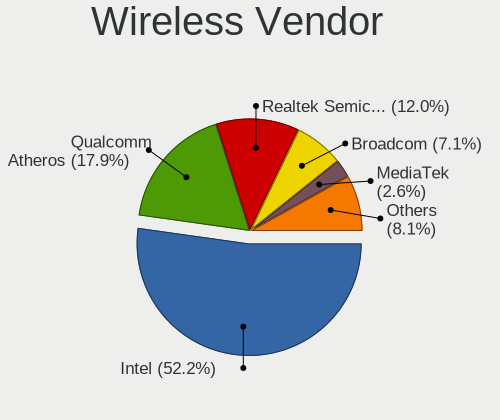

| Vendor                          | Notebooks | Percent |
|---------------------------------|-----------|---------|
| Intel                           | 1051      | 52.42%  |
| Qualcomm Atheros                | 414       | 20.65%  |
| Realtek Semiconductor           | 206       | 10.27%  |
| Broadcom                        | 152       | 7.58%   |
| Broadcom Limited                | 41        | 2.04%   |
| Dell                            | 35        | 1.75%   |
| Ralink                          | 30        | 1.5%    |
| MEDIATEK                        | 12        | 0.6%    |
| TP-Link                         | 11        | 0.55%   |
| Ralink Technology               | 10        | 0.5%    |
| Sierra Wireless                 | 9         | 0.45%   |
| Qualcomm Atheros Communications | 8         | 0.4%    |
| Fibocom                         | 8         | 0.4%    |
| ASUSTek Computer                | 5         | 0.25%   |
| Hewlett-Packard                 | 4         | 0.2%    |
| Qualcomm                        | 3         | 0.15%   |
| Microsoft                       | 2         | 0.1%    |
| Tenda                           | 1         | 0.05%   |
| Linksys                         | 1         | 0.05%   |
| Edimax Technology               | 1         | 0.05%   |
| Belkin Components               | 1         | 0.05%   |

Wireless Model
--------------

Wireless models

| Model                                                                   | Notebooks | Percent |
|-------------------------------------------------------------------------|-----------|---------|
| Qualcomm Atheros AR9285 Wireless Network Adapter (PCI-Express)          | 90        | 4.48%   |
| Intel Centrino Advanced-N 6205 [Taylor Peak]                            | 88        | 4.38%   |
| Intel Wireless 7260                                                     | 83        | 4.13%   |
| Intel Wireless 8265 / 8275                                              | 74        | 3.69%   |
| Qualcomm Atheros QCA9565 / AR9565 Wireless Network Adapter              | 72        | 3.59%   |
| Intel Wi-Fi 6 AX200                                                     | 66        | 3.29%   |
| Qualcomm Atheros AR9485 Wireless Network Adapter                        | 62        | 3.09%   |
| Intel PRO/Wireless 3945ABG [Golan] Network Connection                   | 60        | 2.99%   |
| Qualcomm Atheros QCA9377 802.11ac Wireless Network Adapter              | 58        | 2.89%   |
| Intel Wireless 8260                                                     | 55        | 2.74%   |
| Intel Cannon Lake PCH CNVi WiFi                                         | 55        | 2.74%   |
| Broadcom BCM4313 802.11bgn Wireless Network Adapter                     | 54        | 2.69%   |
| Intel Wireless 7265                                                     | 48        | 2.39%   |
| Intel Wireless 3160                                                     | 44        | 2.19%   |
| Realtek RTL8822CE 802.11ac PCIe Wireless Network Adapter                | 42        | 2.09%   |
| Intel Cannon Point-LP CNVi [Wireless-AC]                                | 41        | 2.04%   |
| Realtek RTL8723BE PCIe Wireless Network Adapter                         | 37        | 1.84%   |
| Realtek RTL8821CE 802.11ac PCIe Wireless Network Adapter                | 36        | 1.79%   |
| Qualcomm Atheros AR242x / AR542x Wireless Network Adapter (PCI-Express) | 36        | 1.79%   |
| Intel Wireless 3165                                                     | 36        | 1.79%   |
| Intel WiFi Link 5100                                                    | 35        | 1.74%   |
| Qualcomm Atheros QCA6174 802.11ac Wireless Network Adapter              | 34        | 1.69%   |
| Intel Wi-Fi 6 AX201                                                     | 34        | 1.69%   |
| Broadcom BCM43142 802.11b/g/n                                           | 33        | 1.64%   |
| Intel Dual Band Wireless-AC 3165 Plus Bluetooth                         | 32        | 1.59%   |
| Intel Centrino Ultimate-N 6300                                          | 32        | 1.59%   |
| Intel Comet Lake PCH-LP CNVi WiFi                                       | 30        | 1.49%   |
| Qualcomm Atheros AR928X Wireless Network Adapter (PCI-Express)          | 26        | 1.29%   |
| Intel Centrino Advanced-N 6235                                          | 26        | 1.29%   |
| Intel PRO/Wireless 5100 AGN [Shiloh] Network Connection                 | 25        | 1.25%   |
| Intel Centrino Advanced-N 6200                                          | 25        | 1.25%   |
| Intel PRO/Wireless 4965 AG or AGN [Kedron] Network Connection           | 22        | 1.1%    |
| Intel Centrino Wireless-N 2230                                          | 20        | 1%      |
| Intel Dual Band Wireless-AC 3168NGW [Stone Peak]                        | 19        | 0.95%   |
| Intel Comet Lake PCH CNVi WiFi                                          | 18        | 0.9%    |
| Realtek RTL8822BE 802.11a/b/g/n/ac WiFi adapter                         | 17        | 0.85%   |
| Broadcom Limited BCM4312 802.11b/g LP-PHY                               | 16        | 0.8%    |
| Ralink RT3290 Wireless 802.11n 1T/1R PCIe                               | 15        | 0.75%   |
| Intel Centrino Wireless-N 1000 [Condor Peak]                            | 14        | 0.7%    |
| Realtek RTL8188EUS 802.11n Wireless Network Adapter                     | 13        | 0.65%   |
| Qualcomm Atheros AR9287 Wireless Network Adapter (PCI-Express)          | 13        | 0.65%   |
| Intel Ultimate N WiFi Link 5300                                         | 13        | 0.65%   |
| Intel Centrino Wireless-N 1030 [Rainbow Peak]                           | 13        | 0.65%   |
| Broadcom BCM4312 802.11b/g LP-PHY                                       | 13        | 0.65%   |
| Dell DW5811e Snapdragon X7 LTE                                    | 12        | 0.6%    |
| Realtek RTL8188CE 802.11b/g/n WiFi Adapter                              | 11        | 0.55%   |
| Qualcomm Atheros AR9462 Wireless Network Adapter                        | 10        | 0.5%    |
| Dell Hub of E-Port Replicator                                           | 10        | 0.5%    |
| Broadcom BCM43228 802.11a/b/g/n                                         | 10        | 0.5%    |
| Broadcom BCM4322 802.11a/b/g/n Wireless LAN Controller                  | 10        | 0.5%    |
| Realtek RTL8852AE 802.11ax PCIe Wireless Network Adapter                | 9         | 0.45%   |
| Intel Wireless-AC 9260                                                  | 9         | 0.45%   |
| Broadcom BCM4311 802.11b/g WLAN                                         | 9         | 0.45%   |
| MEDIATEK MT7921 802.11ax PCI Express Wireless Network Adapter           | 8         | 0.4%    |
| Intel Tiger Lake PCH CNVi WiFi                                          | 8         | 0.4%    |
| Intel Ice Lake-LP PCH CNVi WiFi                                         | 8         | 0.4%    |
| Fibocom L830-EB-00 LTE WWAN Modem                                       | 8         | 0.4%    |
| Qualcomm Atheros AR9271 802.11n                                         | 7         | 0.35%   |
| Broadcom Limited BCM4313 802.11bgn Wireless Network Adapter             | 6         | 0.3%    |
| Realtek RTL8723BU 802.11b/g/n WLAN Adapter                              | 5         | 0.25%   |

Ethernet Vendor
---------------

Ethernet vendors

| Vendor                           | Notebooks | Percent |
|----------------------------------|-----------|---------|
| Realtek Semiconductor            | 830       | 46.84%  |
| Intel                            | 484       | 27.31%  |
| Qualcomm Atheros                 | 158       | 8.92%   |
| Broadcom                         | 101       | 5.7%    |
| Marvell Technology Group         | 50        | 2.82%   |
| Broadcom Limited                 | 35        | 1.98%   |
| Huawei Technologies              | 19        | 1.07%   |
| JMicron Technology               | 14        | 0.79%   |
| Xiaomi                           | 10        | 0.56%   |
| Samsung Electronics              | 10        | 0.56%   |
| Silicon Integrated Systems [SiS] | 9         | 0.51%   |
| Nvidia                           | 9         | 0.51%   |
| Lenovo                           | 6         | 0.34%   |
| DisplayLink                      | 6         | 0.34%   |
| ASIX Electronics                 | 6         | 0.34%   |
| Motorola PCS                     | 5         | 0.28%   |
| VIA Technologies                 | 3         | 0.17%   |
| TP-Link                          | 3         | 0.17%   |
| Sierra Wireless                  | 3         | 0.17%   |
| Qualcomm                         | 2         | 0.11%   |
| Hewlett-Packard                  | 2         | 0.11%   |
| Attansic Technology              | 2         | 0.11%   |
| ZTE WCDMA Technologies MSM       | 1         | 0.06%   |
| QinHeng Electronics              | 1         | 0.06%   |
| MediaTek                         | 1         | 0.06%   |
| LG Electronics                   | 1         | 0.06%   |
| ICS Advent                       | 1         | 0.06%   |

Ethernet Model
--------------

Ethernet models

| Model                                                                          | Notebooks | Percent |
|--------------------------------------------------------------------------------|-----------|---------|
| Realtek RTL8111/8168/8411 PCI Express Gigabit Ethernet Controller              | 599       | 33.63%  |
| Realtek RTL810xE PCI Express Fast Ethernet controller                          | 178       | 9.99%   |
| Intel 82579LM Gigabit Network Connection (Lewisville)                          | 112       | 6.29%   |
| Realtek RTL8153 Gigabit Ethernet Adapter                                       | 43        | 2.41%   |
| Intel 82567LM Gigabit Network Connection                                       | 42        | 2.36%   |
| Intel Ethernet Connection I218-LM                                              | 36        | 2.02%   |
| Intel 82577LM Gigabit Network Connection                                       | 34        | 1.91%   |
| Qualcomm Atheros QCA8172 Fast Ethernet                                         | 29        | 1.63%   |
| Intel Ethernet Connection I217-LM                                              | 28        | 1.57%   |
| Intel Ethernet Connection (6) I219-V                                           | 23        | 1.29%   |
| Intel Ethernet Connection (3) I218-LM                                          | 21        | 1.18%   |
| Intel Ethernet Connection (4) I219-LM                                          | 19        | 1.07%   |
| Qualcomm Atheros QCA8171 Gigabit Ethernet                                      | 18        | 1.01%   |
| Qualcomm Atheros AR8151 v2.0 Gigabit Ethernet                                  | 17        | 0.95%   |
| Intel Ethernet Connection I219-LM                                              | 17        | 0.95%   |
| Marvell Group 88E8040 PCI-E Fast Ethernet Controller                           | 16        | 0.9%    |
| Broadcom NetLink BCM5787M Gigabit Ethernet PCI Express                         | 16        | 0.9%    |
| Qualcomm Atheros AR8162 Fast Ethernet                                          | 15        | 0.84%   |
| Intel Ethernet Connection (7) I219-LM                                          | 15        | 0.84%   |
| Huawei E353/E3131                                                              | 15        | 0.84%   |
| Broadcom NetLink BCM57780 Gigabit Ethernet PCIe                                | 15        | 0.84%   |
| Intel 82579V Gigabit Network Connection                                        | 14        | 0.79%   |
| Realtek RTL-8100/8101L/8139 PCI Fast Ethernet Adapter                          | 13        | 0.73%   |
| JMicron JMC250 PCI Express Gigabit Ethernet Controller                         | 13        | 0.73%   |
| Intel Ethernet Connection (4) I219-V                                           | 13        | 0.73%   |
| Qualcomm Atheros AR8132 Fast Ethernet                                          | 12        | 0.67%   |
| Qualcomm Atheros AR8121/AR8113/AR8114 Gigabit or Fast Ethernet                 | 12        | 0.67%   |
| Intel Ethernet Connection (2) I219-LM                                          | 11        | 0.62%   |
| Qualcomm Atheros AR8131 Gigabit Ethernet                                       | 10        | 0.56%   |
| Intel Ethernet Connection (5) I219-LM                                          | 10        | 0.56%   |
| Intel 82566MM Gigabit Network Connection                                       | 10        | 0.56%   |
| Broadcom NetLink BCM57785 Gigabit Ethernet PCIe                                | 10        | 0.56%   |
| Qualcomm Atheros AR8161 Gigabit Ethernet                                       | 9         | 0.51%   |
| Marvell Group 88E8055 PCI-E Gigabit Ethernet Controller                        | 9         | 0.51%   |
| Broadcom NetXtreme BCM5761 Gigabit Ethernet PCIe                               | 9         | 0.51%   |
| Broadcom NetLink BCM5784M Gigabit Ethernet PCIe                                | 9         | 0.51%   |
| Xiaomi Mi/Redmi series (RNDIS)                                                 | 8         | 0.45%   |
| Silicon Integrated Systems [SiS] 191 Gigabit Ethernet Adapter                  | 8         | 0.45%   |
| Qualcomm Atheros Killer E220x Gigabit Ethernet Controller                      | 8         | 0.45%   |
| Intel Ethernet Connection (6) I219-LM                                          | 8         | 0.45%   |
| Intel 82573L Gigabit Ethernet Controller                                       | 8         | 0.45%   |
| Broadcom NetXtreme BCM5755M Gigabit Ethernet PCI Express                       | 8         | 0.45%   |
| Samsung Galaxy series, misc. (tethering mode)                                  | 7         | 0.39%   |
| Qualcomm Atheros Killer E2400 Gigabit Ethernet Controller                      | 7         | 0.39%   |
| Intel Ethernet Connection I219-V                                               | 7         | 0.39%   |
| Intel Ethernet Connection (10) I219-V                                          | 7         | 0.39%   |
| Broadcom NetXtreme BCM5764M Gigabit Ethernet PCIe                              | 7         | 0.39%   |
| Broadcom NetLink BCM5906M Fast Ethernet PCI Express                            | 7         | 0.39%   |
| Broadcom BCM4401-B0 100Base-TX                                                 | 7         | 0.39%   |
| Qualcomm Atheros Attansic L1 Gigabit Ethernet                                  | 6         | 0.34%   |
| Qualcomm Atheros AR8152 v1.1 Fast Ethernet                                     | 6         | 0.34%   |
| Marvell Group Yukon Optima 88E8059 [PCIe Gigabit Ethernet Controller with AVB] | 6         | 0.34%   |
| Intel Ethernet Connection (7) I219-V                                           | 6         | 0.34%   |
| Broadcom Limited NetXtreme BCM5755M Gigabit Ethernet PCI Express               | 6         | 0.34%   |
| Broadcom Limited NetLink BCM5787M Gigabit Ethernet PCI Express                 | 6         | 0.34%   |
| Qualcomm Atheros AR8152 v2.0 Fast Ethernet                                     | 5         | 0.28%   |
| Motorola PCS moto g(30)                                                        | 5         | 0.28%   |
| Intel Ethernet Connection (13) I219-V                                          | 5         | 0.28%   |
| Intel Ethernet Connection (10) I219-LM                                         | 5         | 0.28%   |
| Broadcom NetXtreme BCM5752 Gigabit Ethernet PCI Express                        | 5         | 0.28%   |

Net Controller Kind
-------------------

Ethernet, WiFi or modem

| Kind     | Notebooks | Percent |
|----------|-----------|---------|
| WiFi     | 1890      | 51.4%   |
| Ethernet | 1713      | 46.59%  |
| Modem    | 72        | 1.96%   |
| Unknown  | 2         | 0.05%   |

Used Controller
---------------

Currently used network controller

| Kind     | Notebooks | Percent |
|----------|-----------|---------|
| WiFi     | 1654      | 67.98%  |
| Ethernet | 777       | 31.94%  |
| Modem    | 2         | 0.08%   |

NICs
----

Total network controllers on board

| Total | Notebooks | Percent |
|-------|-----------|---------|
| 2     | 1623      | 84.53%  |
| 1     | 267       | 13.91%  |
| 0     | 23        | 1.2%    |
| 3     | 7         | 0.36%   |

IPv6
----

IPv6 vs IPv4

| Used | Notebooks | Percent |
|------|-----------|---------|
| No   | 1839      | 94.94%  |
| Yes  | 98        | 5.06%   |

Bluetooth
---------

Bluetooth Vendor
----------------

Controller vendors

| Vendor                          | Notebooks | Percent |
|---------------------------------|-----------|---------|
| Intel                           | 676       | 46.49%  |
| Qualcomm Atheros Communications | 163       | 11.21%  |
| Broadcom                        | 129       | 8.87%   |
| Realtek Semiconductor           | 101       | 6.95%   |
| IMC Networks                    | 62        | 4.26%   |
| Dell                            | 59        | 4.06%   |
| Hewlett-Packard                 | 47        | 3.23%   |
| Foxconn / Hon Hai               | 41        | 2.82%   |
| Lite-On Technology              | 38        | 2.61%   |
| ASUSTek Computer                | 23        | 1.58%   |
| Toshiba                         | 21        | 1.44%   |
| Cambridge Silicon Radio         | 21        | 1.44%   |
| Ralink                          | 15        | 1.03%   |
| Foxconn International           | 13        | 0.89%   |
| Realtek                         | 9         | 0.62%   |
| Apple                           | 9         | 0.62%   |
| Chicony Electronics             | 6         | 0.41%   |
| Taiyo Yuden                     | 5         | 0.34%   |
| Alps Electric                   | 5         | 0.34%   |
| Ralink Technology               | 3         | 0.21%   |
| Micro Star International        | 2         | 0.14%   |
| Integrated System Solution      | 2         | 0.14%   |
| Opticis                         | 1         | 0.07%   |
| MediaTek                        | 1         | 0.07%   |
| Edimax Technology               | 1         | 0.07%   |
| Creative Technology             | 1         | 0.07%   |

Bluetooth Model
---------------

Controller models

| Model                                               | Notebooks | Percent |
|-----------------------------------------------------|-----------|---------|
| Intel Bluetooth wireless interface                  | 339       | 23.31%  |
| Intel Bluetooth 9460/9560 Jefferson Peak (JfP)      | 99        | 6.81%   |
| Intel AX201 Bluetooth                               | 84        | 5.78%   |
| Qualcomm Atheros  Bluetooth Device                  | 66        | 4.54%   |
| Intel AX200 Bluetooth                               | 64        | 4.4%    |
| Realtek Bluetooth Radio                             | 58        | 3.99%   |
| Intel Centrino Bluetooth Wireless Transceiver       | 45        | 3.09%   |
| Qualcomm Atheros AR3012 Bluetooth 4.0               | 41        | 2.82%   |
| Broadcom BCM2045B (BDC-2.1)                         | 32        | 2.2%    |
| Qualcomm Atheros AR3011 Bluetooth                   | 29        | 1.99%   |
| HP Bluetooth 2.0 Interface [Broadcom BCM2045]       | 28        | 1.93%   |
| IMC Networks Bluetooth Radio                        | 25        | 1.72%   |
| Realtek  Bluetooth 4.2 Adapter                      | 24        | 1.65%   |
| Cambridge Silicon Radio Bluetooth Dongle (HCI mode) | 21        | 1.44%   |
| Intel Wireless-AC 3168 Bluetooth                    | 19        | 1.31%   |
| Broadcom BCM20702 Bluetooth 4.0 [ThinkPad]          | 19        | 1.31%   |
| Intel Bluetooth Device                              | 18        | 1.24%   |
| HP Broadcom 2070 Bluetooth Combo                    | 18        | 1.24%   |
| Dell BCM20702A0 Bluetooth Module                    | 17        | 1.17%   |
| Broadcom BCM2070 Bluetooth Device                   | 17        | 1.17%   |
| IMC Networks Bluetooth Device                       | 16        | 1.1%    |
| Ralink RT3290 Bluetooth                             | 15        | 1.03%   |
| Realtek RTL8723B Bluetooth                          | 14        | 0.96%   |
| Foxconn International BCM43142A0 Bluetooth module   | 13        | 0.89%   |
| Dell DW375 Bluetooth Module                         | 13        | 0.89%   |
| Lite-On Bluetooth Device                            | 12        | 0.83%   |
| Qualcomm Atheros QCA61x4 Bluetooth 4.0              | 11        | 0.76%   |
| Lite-On Atheros AR3012 Bluetooth                    | 11        | 0.76%   |
| Qualcomm Atheros AR9462 Bluetooth                   | 10        | 0.69%   |
| IMC Networks Atheros AR3012 Bluetooth 4.0 Adapter   | 10        | 0.69%   |
| Dell Wireless 370 Bluetooth Mini-card               | 10        | 0.69%   |
| Toshiba Integrated Bluetooth HCI                    | 9         | 0.62%   |
| Realtek Bluetooth Radio                             | 9         | 0.62%   |
| Dell Wireless 360 Bluetooth                         | 9         | 0.62%   |
| Broadcom HP Portable SoftSailing                    | 9         | 0.62%   |
| Broadcom BCM2045 Bluetooth                          | 9         | 0.62%   |
| ASUS BT-253 Bluetooth Adapter                       | 9         | 0.62%   |
| Lite-On Qualcomm Atheros QCA9377 Bluetooth          | 8         | 0.55%   |
| Intel Wireless-AC 9260 Bluetooth Adapter            | 8         | 0.55%   |
| Foxconn / Hon Hai Broadcom Bluetooth 2.1 Device     | 8         | 0.55%   |
| Foxconn / Hon Hai Bluetooth Device                  | 8         | 0.55%   |
| ASUS BT-183 Bluetooth 2.0+EDR adapter               | 8         | 0.55%   |
| Broadcom BCM2046 Bluetooth Device                   | 7         | 0.48%   |
| Broadcom BCM2045B (BDC-2.1) [Bluetooth Controller]  | 7         | 0.48%   |
| Chicony Bluetooth (RTL8723BE)                       | 6         | 0.41%   |
| Broadcom BCM43142 Bluetooth 4.0                     | 6         | 0.41%   |
| Qualcomm Atheros Bluetooth USB Host Controller      | 5         | 0.34%   |
| Lite-On Broadcom BCM43142A0 Bluetooth Device        | 5         | 0.34%   |
| Foxconn / Hon Hai BCM20702A0                        | 5         | 0.34%   |
| Dell Wireless 365 Bluetooth                         | 5         | 0.34%   |
| Broadcom BCM2070 Bluetooth 2.1 + EDR                | 5         | 0.34%   |
| Broadcom BCM2045B (BDC-2) [Bluetooth Controller]    | 5         | 0.34%   |
| IMC Networks Wireless_Device                        | 4         | 0.28%   |
| Foxconn / Hon Hai Wireless_Device                   | 4         | 0.28%   |
| Foxconn / Hon Hai Broadcom BCM20702 Bluetooth       | 4         | 0.28%   |
| Foxconn / Hon Hai Bluetooth USB Host Controller     | 4         | 0.28%   |
| Broadcom BCM43142A0 Bluetooth 4.0                   | 4         | 0.28%   |
| Apple Bluetooth Host Controller                     | 4         | 0.28%   |
| Alps Electric BCM2046 Bluetooth Device              | 4         | 0.28%   |
| Toshiba Integrated Bluetooth (Taiyo Yuden)          | 3         | 0.21%   |

Sound
-----

Sound Vendor
------------

Sound card vendors

| Vendor                           | Notebooks | Percent |
|----------------------------------|-----------|---------|
| Intel                            | 1614      | 69.42%  |
| AMD                              | 310       | 13.33%  |
| Nvidia                           | 287       | 12.34%  |
| Silicon Integrated Systems [SiS] | 11        | 0.47%   |
| Creative Technology              | 11        | 0.47%   |
| Realtek Semiconductor            | 10        | 0.43%   |
| C-Media Electronics              | 10        | 0.43%   |
| Lenovo                           | 8         | 0.34%   |
| Plantronics                      | 7         | 0.3%    |
| Logitech                         | 6         | 0.26%   |
| Texas Instruments                | 5         | 0.22%   |
| Dell                             | 5         | 0.22%   |
| VIA Technologies                 | 4         | 0.17%   |
| SteelSeries ApS                  | 4         | 0.17%   |
| Sennheiser Communications        | 3         | 0.13%   |
| Samson Technologies              | 3         | 0.13%   |
| GN Netcom                        | 3         | 0.13%   |
| Focusrite-Novation               | 3         | 0.13%   |
| JMTek                            | 2         | 0.09%   |
| Hewlett-Packard                  | 2         | 0.09%   |
| Generalplus Technology           | 2         | 0.09%   |
| Silicon Motion                   | 1         | 0.04%   |
| SAVITECH                         | 1         | 0.04%   |
| Razer USA                        | 1         | 0.04%   |
| Native Instruments               | 1         | 0.04%   |
| MCS                              | 1         | 0.04%   |
| Mark of the Unicorn              | 1         | 0.04%   |
| M-Audio                          | 1         | 0.04%   |
| Kingston Technology              | 1         | 0.04%   |
| GYROCOM C&C                      | 1         | 0.04%   |
| FiiO Electronics Technology      | 1         | 0.04%   |
| fifinemicrophone.com             | 1         | 0.04%   |
| DigiTech                         | 1         | 0.04%   |
| DEXP BK-20                       | 1         | 0.04%   |
| Cambridge Silicon Radio          | 1         | 0.04%   |
| AudioQuest                       | 1         | 0.04%   |

Sound Model
-----------

Sound card models

| Model                                                                                             | Notebooks | Percent |
|---------------------------------------------------------------------------------------------------|-----------|---------|
| Intel 7 Series/C216 Chipset Family High Definition Audio Controller                               | 199       | 7.18%   |
| Intel Sunrise Point-LP HD Audio                                                                   | 174       | 6.27%   |
| AMD Family 17h/19h HD Audio Controller                                                            | 153       | 5.52%   |
| Intel 82801I (ICH9 Family) HD Audio Controller                                                    | 140       | 5.05%   |
| Intel 6 Series/C200 Series Chipset Family High Definition Audio Controller                        | 132       | 4.76%   |
| Intel 5 Series/3400 Series Chipset High Definition Audio                                          | 114       | 4.11%   |
| Intel 8 Series HD Audio Controller                                                                | 99        | 3.57%   |
| Intel Haswell-ULT HD Audio Controller                                                             | 97        | 3.5%    |
| Intel 82801H (ICH8 Family) HD Audio Controller                                                    | 88        | 3.17%   |
| Intel Cannon Lake PCH cAVS                                                                        | 87        | 3.14%   |
| Intel Broadwell-U Audio Controller                                                                | 80        | 2.88%   |
| Intel Wildcat Point-LP High Definition Audio Controller                                           | 79        | 2.85%   |
| Intel 8 Series/C220 Series Chipset High Definition Audio Controller                               | 77        | 2.78%   |
| Intel Xeon E3-1200 v3/4th Gen Core Processor HD Audio Controller                                  | 67        | 2.42%   |
| AMD Renoir Radeon High Definition Audio Controller                                                | 63        | 2.27%   |
| Intel NM10/ICH7 Family High Definition Audio Controller                                           | 62        | 2.24%   |
| Intel Cannon Point-LP High Definition Audio Controller                                            | 60        | 2.16%   |
| AMD Raven/Raven2/Fenghuang HDMI/DP Audio Controller                                               | 55        | 1.98%   |
| AMD FCH Azalia Controller                                                                         | 55        | 1.98%   |
| Intel Atom Processor Z36xxx/Z37xxx Series High Definition Audio Controller                        | 48        | 1.73%   |
| Nvidia TU107 GeForce GTX 1650 High Definition Audio Controller                                    | 46        | 1.66%   |
| Intel CM238 HD Audio Controller                                                                   | 46        | 1.66%   |
| Intel Tiger Lake-LP Smart Sound Technology Audio Controller                                       | 41        | 1.48%   |
| Intel 100 Series/C230 Series Chipset Family HD Audio Controller                                   | 41        | 1.48%   |
| Nvidia GF108 High Definition Audio Controller                                                     | 39        | 1.41%   |
| Intel Comet Lake PCH-LP cAVS                                                                      | 36        | 1.3%    |
| AMD SBx00 Azalia (Intel HDA)                                                                      | 31        | 1.12%   |
| Nvidia GP107GL High Definition Audio Controller                                                   | 28        | 1.01%   |
| Nvidia GT216 HDMI Audio Controller                                                                | 22        | 0.79%   |
| AMD Kabini HDMI/DP Audio                                                                          | 21        | 0.76%   |
| Intel Comet Lake PCH cAVS                                                                         | 19        | 0.69%   |
| Intel Ice Lake-LP Smart Sound Technology Audio Controller                                         | 18        | 0.65%   |
| Nvidia TU116 High Definition Audio Controller                                                     | 16        | 0.58%   |
| Nvidia GK208 HDMI/DP Audio Controller                                                             | 16        | 0.58%   |
| Intel Atom/Celeron/Pentium Processor x5-E8000/J3xxx/N3xxx Series High Definition Audio Controller | 16        | 0.58%   |
| AMD Wrestler HDMI Audio                                                                           | 16        | 0.58%   |
| AMD Trinity HDMI Audio Controller                                                                 | 16        | 0.58%   |
| AMD Cedar HDMI Audio [Radeon HD 5400/6300/7300 Series]                                            | 16        | 0.58%   |
| Nvidia TU106 High Definition Audio Controller                                                     | 15        | 0.54%   |
| AMD RV710/730 HDMI Audio [Radeon HD 4000 series]                                                  | 12        | 0.43%   |
| AMD RV620 HDMI Audio [Radeon HD 3450/3470/3550/3570]                                              | 12        | 0.43%   |
| Nvidia GP106 High Definition Audio Controller                                                     | 11        | 0.4%    |
| Nvidia GM107 High Definition Audio Controller [GeForce 940MX]                                     | 11        | 0.4%    |
| Nvidia Audio device                                                                               | 11        | 0.4%    |
| Silicon Integrated Systems [SiS] Azalia Audio Controller                                          | 10        | 0.36%   |
| Nvidia High Definition Audio Controller                                                           | 10        | 0.36%   |
| Intel Celeron/Pentium Silver Processor High Definition Audio                                      | 10        | 0.36%   |
| Realtek Semiconductor USB Audio                                                                   | 9         | 0.32%   |
| Nvidia GK107 HDMI Audio Controller                                                                | 9         | 0.32%   |
| Intel Tiger Lake-H HD Audio Controller                                                            | 9         | 0.32%   |
| AMD Redwood HDMI Audio [Radeon HD 5000 Series]                                                    | 9         | 0.32%   |
| Nvidia GF119 HDMI Audio Controller                                                                | 8         | 0.29%   |
| AMD BeaverCreek HDMI Audio [Radeon HD 6500D and 6400G-6600G series]                               | 8         | 0.29%   |
| Nvidia GK106 HDMI Audio Controller                                                                | 7         | 0.25%   |
| Intel Celeron N3350/Pentium N4200/Atom E3900 Series Audio Cluster                                 | 7         | 0.25%   |
| AMD High Definition Audio Controller                                                              | 7         | 0.25%   |
| AMD Family 15h (Models 60h-6fh) Audio Controller                                                  | 7         | 0.25%   |
| Nvidia MCP79 High Definition Audio                                                                | 6         | 0.22%   |
| Nvidia GA104 High Definition Audio Controller                                                     | 6         | 0.22%   |
| AMD Oland/Hainan/Cape Verde/Pitcairn HDMI Audio [Radeon HD 7000 Series]                           | 6         | 0.22%   |

Memory
------

Memory Vendor
-------------

Memory module vendors

| Vendor              | Notebooks | Percent |
|---------------------|-----------|---------|
| Samsung Electronics | 376       | 26.15%  |
| SK Hynix            | 300       | 20.86%  |
| Kingston            | 161       | 11.2%   |
| Micron Technology   | 153       | 10.64%  |
| Unknown             | 123       | 8.55%   |
| GOODRAM             | 66        | 4.59%   |
| Crucial             | 62        | 4.31%   |
| Ramaxel Technology  | 41        | 2.85%   |
| A-DATA Technology   | 31        | 2.16%   |
| Nanya Technology    | 29        | 2.02%   |
| Elpida              | 29        | 2.02%   |
| Patriot             | 11        | 0.76%   |
| Qimonda             | 10        | 0.7%    |
| ASint Technology    | 7         | 0.49%   |
| Unknown (ABCD)      | 6         | 0.42%   |
| Corsair             | 6         | 0.42%   |
| Unknown             | 5         | 0.35%   |
| Unifosa             | 3         | 0.21%   |
| G.Skill             | 3         | 0.21%   |
| 48spaces            | 3         | 0.21%   |
| Wilk                | 2         | 0.14%   |
| Toshiba             | 2         | 0.14%   |
| Swissbit            | 1         | 0.07%   |
| Smart               | 1         | 0.07%   |
| SHARETRONIC         | 1         | 0.07%   |
| PNY                 | 1         | 0.07%   |
| Goldkey             | 1         | 0.07%   |
| fef5                | 1         | 0.07%   |
| Apacer              | 1         | 0.07%   |
| 430112204340C940    | 1         | 0.07%   |
| 430112174392063E    | 1         | 0.07%   |

Memory Model
------------

Memory module models

| Model                                                               | Notebooks | Percent |
|---------------------------------------------------------------------|-----------|---------|
| SK Hynix RAM HMT451S6BFR8A-PB 4GB SODIMM DDR3 1600MT/s              | 22        | 1.43%   |
| SK Hynix RAM HMT41GS6BFR8A-PB 8GB SODIMM DDR3 1600MT/s              | 20        | 1.3%    |
| SK Hynix RAM HMA81GS6AFR8N-UH 8GB SODIMM DDR4 2667MT/s              | 20        | 1.3%    |
| Samsung RAM M471B5173DB0-YK0 4096MB SODIMM DDR3 1600MT/s            | 19        | 1.23%   |
| Unknown RAM Module 2GB SODIMM DDR2 667MT/s                          | 18        | 1.17%   |
| GOODRAM RAM GR2666S464L19/16G 16384MB SODIMM DDR4 2667MT/s          | 18        | 1.17%   |
| Samsung RAM M471B5273CH0-CH9 4096MB SODIMM DDR3 1334MT/s            | 16        | 1.04%   |
| Samsung RAM M471B5173BH0-YK0 4GB SODIMM DDR3 1600MT/s               | 16        | 1.04%   |
| Samsung RAM M471B5273DH0-CH9 4GB SODIMM DDR3 1334MT/s               | 15        | 0.97%   |
| Samsung RAM M471B5173EB0-YK0 4GB SODIMM DDR3 1600MT/s               | 14        | 0.91%   |
| SK Hynix RAM HMT351S6CFR8C-PB 4GB SODIMM DDR3 1600MT/s              | 13        | 0.84%   |
| Samsung RAM M471B5173QH0-YK0 4GB SODIMM DDR3 1600MT/s               | 13        | 0.84%   |
| SK Hynix RAM HMT351S6EFR8A-PB 4GB SODIMM DDR3 1600MT/s              | 12        | 0.78%   |
| Samsung RAM M471B5773DH0-CH9 2GB SODIMM DDR3 1600MT/s               | 12        | 0.78%   |
| Micron RAM 4ATF51264HZ-2G6E1 4096MB SODIMM DDR4 2667MT/s            | 12        | 0.78%   |
| Kingston RAM KHX2400C14S4/16G 16GB SODIMM DDR4 2667MT/s             | 12        | 0.78%   |
| Kingston RAM KHX1600C9S3L/8G 8192MB SODIMM DDR3 1600MT/s            | 12        | 0.78%   |
| Samsung RAM M471B5673FH0-CF8 2GB SODIMM DDR3 1067MT/s               | 11        | 0.71%   |
| Samsung RAM M471A5244CB0-CTD 4GB SODIMM DDR4 3266MT/s               | 11        | 0.71%   |
| GOODRAM RAM GR3200S464L22/16G 16GB SODIMM DDR4 3200MT/s             | 11        | 0.71%   |
| SK Hynix RAM HYMP125S64CP8-S6 2GB SODIMM DDR 975MT/s                | 10        | 0.65%   |
| SK Hynix RAM HMA81GS6JJR8N-VK 8GB SODIMM DDR4 2667MT/s              | 10        | 0.65%   |
| Samsung RAM M471B5773CHS-CH9 2GB SODIMM DDR3 4199MT/s               | 10        | 0.65%   |
| Samsung RAM M471B1G73DB0-YK0 8GB SODIMM DDR3 1600MT/s               | 10        | 0.65%   |
| Samsung RAM M471A2K43CB1-CTD 16GB SODIMM DDR4 2667MT/s              | 10        | 0.65%   |
| Samsung RAM M471B5273EB0-CK0 4GB SODIMM DDR3 4199MT/s               | 9         | 0.58%   |
| Samsung RAM M471A5244CB0-CRC 4096MB SODIMM DDR4 2667MT/s            | 9         | 0.58%   |
| Samsung RAM M471A2K43DB1-CWE 16GB SODIMM DDR4 3200MT/s              | 9         | 0.58%   |
| Samsung RAM M471A1K43CB1-CTD 8GB SODIMM DDR4 2667MT/s               | 9         | 0.58%   |
| Samsung RAM M4 70T5663QZ3-CF7 2GB SODIMM DDR2 2048MT/s              | 9         | 0.58%   |
| Crucial RAM CT102464BF160B.C16 8GB SODIMM DDR3 1600MT/s             | 9         | 0.58%   |
| SK Hynix RAM HMT451S6AFR8A-PB 4096MB SODIMM DDR3 1600MT/s           | 8         | 0.52%   |
| SK Hynix RAM HMT351S6BFR8C-H9 4096MB SODIMM DDR3 1333MT/s           | 8         | 0.52%   |
| SK Hynix RAM HMA851S6AFR6N-UH 4GB SODIMM DDR4 2667MT/s              | 8         | 0.52%   |
| Micron RAM 8ATF1G64HZ-2G6E1 8192MB SODIMM DDR4 2667MT/s             | 8         | 0.52%   |
| Micron RAM 4ATF1G64HZ-3G2E1 8GB SODIMM DDR4 3200MT/s                | 8         | 0.52%   |
| Kingston RAM KHX2666C15S4/16G 16GB SODIMM DDR4 2667MT/s             | 8         | 0.52%   |
| Crucial RAM CT102464BF160B.M16 8GB SODIMM DDR3 1600MT/s             | 8         | 0.52%   |
| Unknown RAM Module 1GB SODIMM DDR2 667MT/s                          | 7         | 0.45%   |
| SK Hynix RAM HMA851S6CJR6N-VK 4GB SODIMM DDR4 2667MT/s              | 7         | 0.45%   |
| SK Hynix RAM HMA82GS6JJR8N-VK 16GB SODIMM DDR4 2667MT/s             | 7         | 0.45%   |
| Samsung RAM M471A1K43DB1-CWE 8GB SODIMM DDR4 3200MT/s               | 7         | 0.45%   |
| Samsung RAM M471A1K43BB0-CPB 8GB SODIMM DDR4 2133MT/s               | 7         | 0.45%   |
| Unknown RAM Module 2GB SODIMM DDR2 533MT/s                          | 6         | 0.39%   |
| Unknown RAM Module 2048MB SODIMM DDR2 667MT/s                       | 6         | 0.39%   |
| SK Hynix RAM HMA41GS6AFR8N-TF 8GB SODIMM DDR4 2667MT/s              | 6         | 0.39%   |
| Samsung RAM M471B5673FH0-CH9 2048MB SODIMM DDR3 1334MT/s            | 6         | 0.39%   |
| Samsung RAM M471A1K43DB1-CTD 8GB SODIMM DDR4 2667MT/s               | 6         | 0.39%   |
| Samsung RAM M471A1K43CB1-CRC 8GB SODIMM DDR4 2667MT/s               | 6         | 0.39%   |
| Micron RAM 4ATF1G64HZ-3G2E2 8GB SODIMM DDR4 3200MT/s                | 6         | 0.39%   |
| Kingston RAM LV32D4S2S8HD-8 8GB SODIMM DDR4 3200MT/s                | 6         | 0.39%   |
| GOODRAM RAM GR2666S464L19S/8G 8192MB SODIMM DDR4 2667MT/s           | 6         | 0.39%   |
| Crucial RAM CT51264BF160BJ.C8F 4096MB SODIMM DDR3 1600MT/s          | 6         | 0.39%   |
| Unknown RAM Module 2048MB SODIMM DDR2 800MT/s                       | 5         | 0.32%   |
| Unknown RAM Module 2048MB SODIMM DDR2                               | 5         | 0.32%   |
| Unknown RAM Module 1024MB SODIMM DDR2                               | 5         | 0.32%   |
| Unknown (ABCD) RAM 123456789012345678 2048MB SODIMM LPDDR4 2400MT/s | 5         | 0.32%   |
| SK Hynix RAM HMT451S6AFR8A-PB 4GB SODIMM DDR3 1600MT/s              | 5         | 0.32%   |
| SK Hynix RAM HMT41GS6AFR8A-PB 8GB SODIMM DDR3 1600MT/s              | 5         | 0.32%   |
| SK Hynix RAM HMT351S6CFR8C-PB 4096MB SODIMM DDR3 1600MT/s           | 5         | 0.32%   |

Memory Kind
-----------

Memory module kinds

| Kind    | Notebooks | Percent |
|---------|-----------|---------|
| DDR3    | 472       | 40%     |
| DDR4    | 444       | 37.63%  |
| DDR2    | 128       | 10.85%  |
| SDRAM   | 56        | 4.75%   |
| LPDDR4  | 31        | 2.63%   |
| LPDDR3  | 25        | 2.12%   |
| Unknown | 10        | 0.85%   |
| DDR     | 9         | 0.76%   |
| DRAM    | 5         | 0.42%   |

Memory Form Factor
------------------

Physical design of the memory module

| Name         | Notebooks | Percent |
|--------------|-----------|---------|
| SODIMM       | 1089      | 93.96%  |
| Row Of Chips | 53        | 4.57%   |
| DIMM         | 7         | 0.6%    |
| Chip         | 7         | 0.6%    |
| Unknown      | 3         | 0.26%   |

Memory Size
-----------

Memory module size

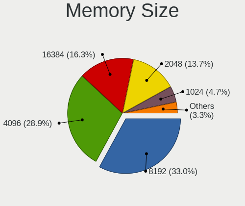

| Size    | Notebooks | Percent |
|---------|-----------|---------|
| 4096    | 396       | 30.58%  |
| 8192    | 368       | 28.42%  |
| 2048    | 245       | 18.92%  |
| 16384   | 175       | 13.51%  |
| 1024    | 88        | 6.8%    |
| 32768   | 11        | 0.85%   |
| 512     | 6         | 0.46%   |
| Unknown | 4         | 0.31%   |
| 1536    | 1         | 0.08%   |
| 256     | 1         | 0.08%   |

Memory Speed
------------

Memory module speed

| Speed   | Notebooks | Percent |
|---------|-----------|---------|
| 1600    | 332       | 25.54%  |
| 2667    | 256       | 19.69%  |
| 3200    | 129       | 9.92%   |
| 1334    | 93        | 7.15%   |
| 2400    | 74        | 5.69%   |
| 2133    | 60        | 4.62%   |
| 667     | 60        | 4.62%   |
| 1333    | 50        | 3.85%   |
| Unknown | 45        | 3.46%   |
| 1067    | 31        | 2.38%   |
| 4199    | 28        | 2.15%   |
| 800     | 25        | 1.92%   |
| 2048    | 22        | 1.69%   |
| 975     | 19        | 1.46%   |
| 533     | 19        | 1.46%   |
| 4267    | 11        | 0.85%   |
| 3266    | 11        | 0.85%   |
| 1867    | 9         | 0.69%   |
| 1066    | 8         | 0.62%   |
| 400     | 4         | 0.31%   |
| 333     | 4         | 0.31%   |
| 4266    | 3         | 0.23%   |
| 3733    | 2         | 0.15%   |
| 2933    | 1         | 0.08%   |
| 2134    | 1         | 0.08%   |
| 1776    | 1         | 0.08%   |
| 1639    | 1         | 0.08%   |
| 933     | 1         | 0.08%   |

Printers & scanners
-------------------

Printer Vendor
--------------

Printer device vendors

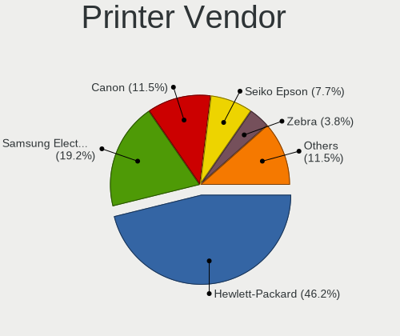

| Vendor              | Notebooks | Percent |
|---------------------|-----------|---------|
| Hewlett-Packard     | 9         | 50%     |
| Seiko Epson         | 2         | 11.11%  |
| Samsung Electronics | 2         | 11.11%  |
| Canon               | 2         | 11.11%  |
| Zebra               | 1         | 5.56%   |
| Xerox               | 1         | 5.56%   |
| Brother Industries  | 1         | 5.56%   |

Printer Model
-------------

Printer device models

| Model                                   | Notebooks | Percent |
|-----------------------------------------|-----------|---------|
| HP Deskjet F2280 series                 | 2         | 11.11%  |
| Zebra ZTC GX420t                        | 1         | 5.56%   |
| Xerox Phaser 6000B                      | 1         | 5.56%   |
| Seiko Epson L395 Series                 | 1         | 5.56%   |
| Seiko Epson AL-M310DN                   | 1         | 5.56%   |
| Samsung Xerox Phaser 3117 Laser Printer | 1         | 5.56%   |
| Samsung SCX-6545 Series                 | 1         | 5.56%   |
| HP LaserJet P1102                       | 1         | 5.56%   |
| HP LaserJet P1005                       | 1         | 5.56%   |
| HP LaserJet 1020                        | 1         | 5.56%   |
| HP LaserJet 1018                        | 1         | 5.56%   |
| HP Deskjet Ink Advant K209a-z           | 1         | 5.56%   |
| HP Deskjet D1500 series                 | 1         | 5.56%   |
| HP Deskjet 2540 series                  | 1         | 5.56%   |
| Canon PIXMA MG5600 Series               | 1         | 5.56%   |
| Canon PIXMA MG3000 series               | 1         | 5.56%   |
| Brother DCP-1610W                       | 1         | 5.56%   |

Scanner Vendor
--------------

Scanner device vendors

| Vendor                 | Notebooks | Percent |
|------------------------|-----------|---------|
| Canon                  | 2         | 50%     |
| Plustek                | 1         | 25%     |
| Microtek International | 1         | 25%     |

Scanner Model
-------------

Scanner device models

| Model                                  | Notebooks | Percent |
|----------------------------------------|-----------|---------|
| Plustek OpticSlim 1200 Scanner         | 1         | 25%     |
| Microtek International USB1200 Scanner | 1         | 25%     |
| Canon CanoScan N670U/N676U/LiDE 20     | 1         | 25%     |
| Canon CanoScan N1240U/LiDE 30          | 1         | 25%     |

Camera
------

Camera Vendor
-------------

Camera device vendors

| Vendor                                 | Notebooks | Percent |
|----------------------------------------|-----------|---------|
| Chicony Electronics                    | 401       | 24.69%  |
| IMC Networks                           | 178       | 10.96%  |
| Microdia                               | 167       | 10.28%  |
| Realtek Semiconductor                  | 160       | 9.85%   |
| Acer                                   | 128       | 7.88%   |
| Sunplus Innovation Technology          | 92        | 5.67%   |
| Quanta                                 | 70        | 4.31%   |
| Suyin                                  | 66        | 4.06%   |
| Cheng Uei Precision Industry (Foxlink) | 64        | 3.94%   |
| Syntek                                 | 54        | 3.33%   |
| Silicon Motion                         | 39        | 2.4%    |
| Lite-On Technology                     | 34        | 2.09%   |
| Ricoh                                  | 23        | 1.42%   |
| Alcor Micro                            | 20        | 1.23%   |
| Lenovo                                 | 18        | 1.11%   |
| Z-Star Microelectronics                | 10        | 0.62%   |
| Luxvisions Innotech Limited            | 10        | 0.62%   |
| Logitech                               | 10        | 0.62%   |
| DigiTech                               | 10        | 0.62%   |
| Apple                                  | 9         | 0.55%   |
| Creative Technology                    | 8         | 0.49%   |
| Primax Electronics                     | 6         | 0.37%   |
| Intel                                  | 6         | 0.37%   |
| ALi                                    | 6         | 0.37%   |
| Microsoft                              | 4         | 0.25%   |
| Generalplus Technology                 | 4         | 0.25%   |
| Importek                               | 3         | 0.18%   |
| DJJHFA1BIF5CB0                         | 3         | 0.18%   |
| Sonix Technology                       | 2         | 0.12%   |
| Samsung Electronics                    | 2         | 0.12%   |
| OmniVision Technologies                | 2         | 0.12%   |
| Foxconn / Hon Hai                      | 2         | 0.12%   |
| Cubeternet                             | 2         | 0.12%   |
| Trust                                  | 1         | 0.06%   |
| Sunplus Technology                     | 1         | 0.06%   |
| Nokia Mobile Phones                    | 1         | 0.06%   |
| Nebraska Furniture Mart                | 1         | 0.06%   |
| Mustek Systems                         | 1         | 0.06%   |
| MacroSilicon                           | 1         | 0.06%   |
| LG Electronics                         | 1         | 0.06%   |
| kingcome                               | 1         | 0.06%   |
| Hewlett-Packard                        | 1         | 0.06%   |
| GEMBIRD                                | 1         | 0.06%   |
| Alpha Imaging Technology               | 1         | 0.06%   |

Camera Model
------------

Camera device models

| Model                                               | Notebooks | Percent |
|-----------------------------------------------------|-----------|---------|
| Chicony Integrated Camera                           | 75        | 4.6%    |
| Realtek Integrated_Webcam_HD                        | 54        | 3.31%   |
| Microdia Integrated_Webcam_HD                       | 53        | 3.25%   |
| Sunplus Integrated_Webcam_HD                        | 46        | 2.82%   |
| IMC Networks Integrated Camera                      | 45        | 2.76%   |
| IMC Networks USB2.0 HD UVC WebCam                   | 39        | 2.39%   |
| Chicony Lenovo EasyCamera                           | 35        | 2.15%   |
| Acer Lenovo EasyCamera                              | 31        | 1.9%    |
| Syntek Lenovo EasyCamera                            | 25        | 1.53%   |
| Microdia Integrated Webcam                          | 25        | 1.53%   |
| Chicony HD WebCam                                   | 25        | 1.53%   |
| Realtek Lenovo EasyCamera                           | 23        | 1.41%   |
| Acer Integrated Camera                              | 21        | 1.29%   |
| Chicony USB2.0 HD UVC WebCam                        | 19        | 1.17%   |
| Realtek USB Camera                                  | 18        | 1.1%    |
| IMC Networks USB2.0 VGA UVC WebCam                  | 18        | 1.1%    |
| Acer Lenovo Integrated Webcam                       | 18        | 1.1%    |
| Lite-On Integrated Camera                           | 17        | 1.04%   |
| Suyin Acer/HP Integrated Webcam [CN0314]            | 16        | 0.98%   |
| Quanta HP TrueVision HD Camera                      | 16        | 0.98%   |
| Suyin Integrated_Webcam_HD                          | 15        | 0.92%   |
| Microdia Laptop_Integrated_Webcam_HD                | 15        | 0.92%   |
| Realtek Integrated Webcam HD                        | 14        | 0.86%   |
| Chicony USB2.0 VGA UVC WebCam                       | 14        | 0.86%   |
| Syntek Integrated Camera                            | 13        | 0.8%    |
| Quanta HD User Facing                               | 13        | 0.8%    |
| IMC Networks Integrated Webcam                      | 13        | 0.8%    |
| Chicony USB 2.0 Camera                              | 13        | 0.8%    |
| Realtek Integrated Webcam                           | 12        | 0.74%   |
| Chicony Lenovo Integrated Camera (0.3MP)            | 12        | 0.74%   |
| Acer SunplusIT Integrated Camera                    | 12        | 0.74%   |
| Chicony Integrated Camera (1280x720@30)             | 11        | 0.68%   |
| Chicony HP HD Camera                                | 11        | 0.68%   |
| Lenovo Integrated Webcam                            | 10        | 0.61%   |
| Cheng Uei Precision Industry (Foxlink) HP HD Camera | 10        | 0.61%   |
| Sunplus HD WebCam                                   | 9         | 0.55%   |
| Quanta HP Webcam                                    | 9         | 0.55%   |
| Chicony VGA Webcam                                  | 9         | 0.55%   |
| Chicony HP HD Webcam [Fixed]                        | 9         | 0.55%   |
| Chicony 2.0M UVC Webcam / CNF7129                   | 9         | 0.55%   |
| Cheng Uei Precision Industry (Foxlink) Webcam       | 9         | 0.55%   |
| Acer EasyCamera                                     | 9         | 0.55%   |
| Acer BisonCam, NB Pro                               | 9         | 0.55%   |
| Silicon Motion WebCam SC-13HDL11939N                | 8         | 0.49%   |
| Microdia Sonix USB 2.0 Camera                       | 8         | 0.49%   |
| IMC Networks UVC VGA Webcam                         | 8         | 0.49%   |
| IMC Networks Lenovo EasyCamera                      | 8         | 0.49%   |
| Chicony TOSHIBA Web Camera - HD                     | 8         | 0.49%   |
| Chicony HP Webcam [2 MP Macro]                      | 8         | 0.49%   |
| Chicony EasyCamera                                  | 8         | 0.49%   |
| Sunplus Laptop_Integrated_Webcam_FHD                | 7         | 0.43%   |
| Silicon Motion WebCam SCB-1100N                     | 7         | 0.43%   |
| Microdia Lenovo EasyCamera                          | 7         | 0.43%   |
| Luxvisions Innotech Limited HP TrueVision HD Camera | 7         | 0.43%   |
| Chicony HP HD Webcam                                | 7         | 0.43%   |
| Chicony 1.3 MPixel UVC Webcam                       | 7         | 0.43%   |
| Cheng Uei Precision Industry (Foxlink) HP Webcam    | 7         | 0.43%   |
| Syntek Sonix 1.3MPixel USB 2.0 Camera               | 6         | 0.37%   |
| Syntek EasyCamera                                   | 6         | 0.37%   |
| Sunplus Laptop Integrated Webcam HD                 | 6         | 0.37%   |

Security
--------

Fingerprint Vendor
------------------

Fingerprint sensor vendors

| Vendor                     | Notebooks | Percent |
|----------------------------|-----------|---------|
| Validity Sensors           | 132       | 39.29%  |
| Synaptics                  | 69        | 20.54%  |
| AuthenTec                  | 44        | 13.1%   |
| Shenzhen Goodix Technology | 35        | 10.42%  |
| Upek                       | 24        | 7.14%   |
| LighTuning Technology      | 14        | 4.17%   |
| STMicroelectronics         | 10        | 2.98%   |
| Elan Microelectronics      | 8         | 2.38%   |

Fingerprint Model
-----------------

Fingerprint sensor models

| Model                                                                      | Notebooks | Percent |
|----------------------------------------------------------------------------|-----------|---------|
| Synaptics Prometheus MIS Touch Fingerprint Reader                          | 27        | 8.04%   |
| Validity Sensors VFS495 Fingerprint Reader                                 | 25        | 7.44%   |
| Upek Biometric Touchchip/Touchstrip Fingerprint Sensor                     | 23        | 6.85%   |
| Validity Sensors VFS5011 Fingerprint Reader                                | 21        | 6.25%   |
| Validity Sensors VFS 5011 fingerprint sensor                               | 19        | 5.65%   |
| Shenzhen Goodix  Fingerprint Device                                        | 18        | 5.36%   |
| AuthenTec AES2810                                                          | 18        | 5.36%   |
| Shenzhen Goodix Fingerprint Reader                                         | 14        | 4.17%   |
| Validity Sensors VFS451 Fingerprint Reader                                 | 13        | 3.87%   |
| Synaptics Metallica MIS Touch Fingerprint Reader                           | 13        | 3.87%   |
| AuthenTec AES2501 Fingerprint Sensor                                       | 13        | 3.87%   |
| STMicroelectronics Fingerprint Reader                                      | 10        | 2.98%   |
| Validity Sensors VFS491                                                    | 9         | 2.68%   |
| Validity Sensors VFS101 Fingerprint Reader                                 | 8         | 2.38%   |
| Synaptics  VFS7552 Touch Fingerprint Sensor with PurePrint                 | 8         | 2.38%   |
| Unknown                                                                    | 8         | 2.38%   |
| Validity Sensors VFS7500 Touch Fingerprint Sensor                          | 7         | 2.08%   |
| Validity Sensors Synaptics VFS7552 Touch Fingerprint Sensor with PurePrint | 6         | 1.79%   |
| Validity Sensors Fingerprint scanner                                       | 6         | 1.79%   |
| LighTuning ES603 Swipe Fingerprint Sensor                                  | 6         | 1.79%   |
| Elan ELAN:Fingerprint                                                      | 6         | 1.79%   |
| AuthenTec AES1600                                                          | 6         | 1.79%   |
| LighTuning EgisTec Touch Fingerprint Sensor                                | 5         | 1.49%   |
| Validity Sensors VFS301 Fingerprint Reader                                 | 4         | 1.19%   |
| Synaptics  FS7604 Touch Fingerprint Sensor with PurePrint                  | 4         | 1.19%   |
| AuthenTec Fingerprint Sensor                                               | 4         | 1.19%   |
| Validity Sensors VFS471 Fingerprint Reader                                 | 3         | 0.89%   |
| Validity Sensors VFS Fingerprint sensor                                    | 3         | 0.89%   |
| Synaptics WBDI Device                                                      | 3         | 0.89%   |
| Synaptics  WBDI                                                            | 3         | 0.89%   |
| Synaptics Metallica MOH Touch Fingerprint Reader                           | 3         | 0.89%   |
| Shenzhen Goodix FingerPrint                                                | 3         | 0.89%   |
| LighTuning Fingerprint Reader                                              | 3         | 0.89%   |
| Validity Sensors VFS7552 Touch Fingerprint Sensor                          | 2         | 0.6%    |
| Validity Sensors Synaptics WBDI                                            | 2         | 0.6%    |
| Validity Sensors Swipe Fingerprint Sensor                                  | 2         | 0.6%    |
| Elan ELAN:ARM-M4                                                           | 2         | 0.6%    |
| AuthenTec AES2550 Fingerprint Sensor                                       | 2         | 0.6%    |
| Validity Sensors VFS300 Fingerprint Reader                                 | 1         | 0.3%    |
| Validity Sensors Synaptics VFS7552 Touch Fingerprint Sensor                | 1         | 0.3%    |
| Upek TCS5B Fingerprint sensor                                              | 1         | 0.3%    |
| AuthenTec AES1660 Fingerprint Sensor                                       | 1         | 0.3%    |

Chipcard Vendor
---------------

Chipcard module vendors

| Vendor                    | Notebooks | Percent |
|---------------------------|-----------|---------|
| Broadcom                  | 146       | 55.94%  |
| Alcor Micro               | 50        | 19.16%  |
| O2 Micro                  | 31        | 11.88%  |
| Lenovo                    | 16        | 6.13%   |
| Upek                      | 13        | 4.98%   |
| Gemalto (was Gemplus)     | 4         | 1.53%   |
| Aladdin Knowledge Systems | 1         | 0.38%   |

Chipcard Model
--------------

Chipcard module models

| Model                                                                        | Notebooks | Percent |
|------------------------------------------------------------------------------|-----------|---------|
| Broadcom BCM5880 Secure Applications Processor                               | 54        | 20.69%  |
| Alcor Micro AU9540 Smartcard Reader                                          | 48        | 18.39%  |
| Broadcom 5880                                                                | 36        | 13.79%  |
| Broadcom 58200                                                               | 29        | 11.11%  |
| O2 Micro OZ776 CCID Smartcard Reader                                         | 26        | 9.96%   |
| Broadcom BCM5880 Secure Applications Processor with fingerprint swipe sensor | 26        | 9.96%   |
| Lenovo Integrated Smart Card Reader                                          | 16        | 6.13%   |
| Upek TouchChip Fingerprint Coprocessor (WBF advanced mode)                   | 13        | 4.98%   |
| O2 Micro Oz776 SmartCard Reader                                              | 5         | 1.92%   |
| Gemalto (was Gemplus) Compact Smart Card Reader Writer                       | 3         | 1.15%   |
| Gemalto (was Gemplus) GemPC Key SmartCard Reader                             | 1         | 0.38%   |
| Broadcom BCM5880 Secure Applications Processor with fingerprint touch sensor | 1         | 0.38%   |
| Alcor Micro Watchdata W 1981                                                 | 1         | 0.38%   |
| Alcor Micro EMV Smartcard Reader                                             | 1         | 0.38%   |
| Aladdin Knowledge Systems Token JC                                           | 1         | 0.38%   |

Unsupported
-----------

Unsupported Devices
-------------------

Total unsupported devices on board

| Total | Notebooks | Percent |
|-------|-----------|---------|
| 0     | 1163      | 59.22%  |
| 1     | 633       | 32.23%  |
| 2     | 144       | 7.33%   |
| 3     | 19        | 0.97%   |
| 7     | 2         | 0.1%    |
| 6     | 1         | 0.05%   |
| 5     | 1         | 0.05%   |
| 4     | 1         | 0.05%   |

Unsupported Device Types
------------------------

Types of unsupported devices

| Type                     | Notebooks | Percent |
|--------------------------|-----------|---------|
| Fingerprint reader       | 333       | 34.4%   |
| Chipcard                 | 242       | 25%     |
| Graphics card            | 178       | 18.39%  |
| Net/wireless             | 58        | 5.99%   |
| Storage                  | 35        | 3.62%   |
| Bluetooth                | 30        | 3.1%    |
| Multimedia controller    | 23        | 2.38%   |
| Communication controller | 14        | 1.45%   |
| Camera                   | 14        | 1.45%   |
| Card reader              | 12        | 1.24%   |
| Sound                    | 7         | 0.72%   |
| Modem                    | 6         | 0.62%   |
| Net/ethernet             | 4         | 0.41%   |
| Firewire controller      | 4         | 0.41%   |
| Flash memory             | 3         | 0.31%   |
| Dvb card                 | 2         | 0.21%   |
| Wireless                 | 1         | 0.1%    |
| Tv card                  | 1         | 0.1%    |
| Network                  | 1         | 0.1%    |

