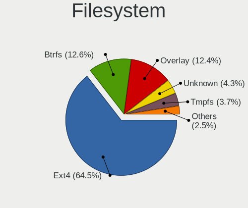
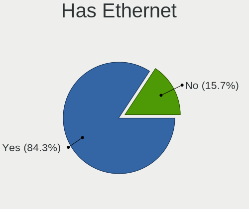
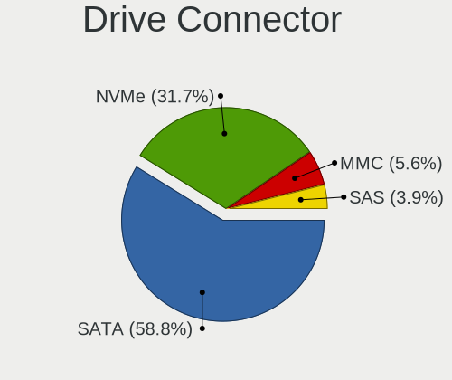
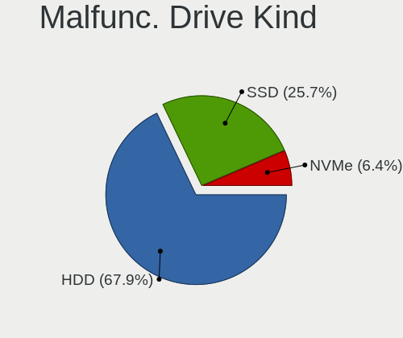
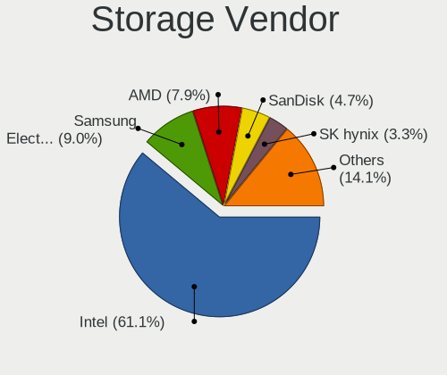
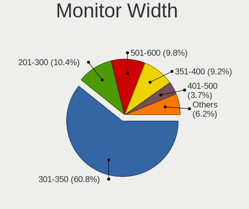

Linux in Poland - Tested Hardware & Statistics (Notebooks)
----------------------------------------------------------

A project to collect tested hardware configurations for Linux in Poland.

Anyone can contribute to this report by the [hw-probe](https://github.com/linuxhw/hw-probe) tool:

    sudo -E hw-probe -all -upload

Please contribute! Especially if your hardware is rare.

Contents
--------

* [ Test Cases ](#test-cases)

* [ System ](#system)
  - [ OS                       ](#os)
  - [ OS Family                ](#os-family)
  - [ Kernel                   ](#kernel)
  - [ Kernel Family            ](#kernel-family)
  - [ Kernel Major Ver.        ](#kernel-major-ver)
  - [ Arch                     ](#arch)
  - [ DE                       ](#de)
  - [ Display Server           ](#display-server)
  - [ Display Manager          ](#display-manager)
  - [ OS Lang                  ](#os-lang)
  - [ Boot Mode                ](#boot-mode)
  - [ Filesystem               ](#filesystem)
  - [ Part. scheme             ](#part-scheme)
  - [ Dual Boot with Linux/BSD ](#dual-boot-with-linuxbsd)
  - [ Dual Boot (Win)          ](#dual-boot-win)

* [ Board ](#board)
  - [ Vendor                   ](#vendor)
  - [ Model                    ](#model)
  - [ Model Family             ](#model-family)
  - [ MFG Year                 ](#mfg-year)
  - [ Form Factor              ](#form-factor)
  - [ Secure Boot              ](#secure-boot)
  - [ Coreboot                 ](#coreboot)
  - [ RAM Size                 ](#ram-size)
  - [ RAM Used                 ](#ram-used)
  - [ Total Drives             ](#total-drives)
  - [ Has CD-ROM               ](#has-cd-rom)
  - [ Has Ethernet             ](#has-ethernet)
  - [ Has WiFi                 ](#has-wifi)
  - [ Has Bluetooth            ](#has-bluetooth)

* [ Location ](#location)
  - [ Country                  ](#country)
  - [ City                     ](#city)

* [ Drives ](#drives)
  - [ Drive Vendor             ](#drive-vendor)
  - [ Drive Model              ](#drive-model)
  - [ HDD Vendor               ](#hdd-vendor)
  - [ SSD Vendor               ](#ssd-vendor)
  - [ Drive Kind               ](#drive-kind)
  - [ Drive Connector          ](#drive-connector)
  - [ Drive Size               ](#drive-size)
  - [ Space Total              ](#space-total)
  - [ Space Used               ](#space-used)
  - [ Malfunc. Drives          ](#malfunc-drives)
  - [ Malfunc. Drive Vendor    ](#malfunc-drive-vendor)
  - [ Malfunc. HDD Vendor      ](#malfunc-hdd-vendor)
  - [ Malfunc. Drive Kind      ](#malfunc-drive-kind)
  - [ Failed Drives            ](#failed-drives)
  - [ Failed Drive Vendor      ](#failed-drive-vendor)
  - [ Drive Status             ](#drive-status)

* [ Storage controller ](#storage-controller)
  - [ Storage Vendor           ](#storage-vendor)
  - [ Storage Model            ](#storage-model)
  - [ Storage Kind             ](#storage-kind)

* [ Processor ](#processor)
  - [ CPU Vendor               ](#cpu-vendor)
  - [ CPU Model                ](#cpu-model)
  - [ CPU Model Family         ](#cpu-model-family)
  - [ CPU Cores                ](#cpu-cores)
  - [ CPU Sockets              ](#cpu-sockets)
  - [ CPU Threads              ](#cpu-threads)
  - [ CPU Op-Modes             ](#cpu-op-modes)
  - [ CPU Microcode            ](#cpu-microcode)
  - [ CPU Microarch            ](#cpu-microarch)

* [ Graphics ](#graphics)
  - [ GPU Vendor               ](#gpu-vendor)
  - [ GPU Model                ](#gpu-model)
  - [ GPU Combo                ](#gpu-combo)
  - [ GPU Driver               ](#gpu-driver)
  - [ GPU Memory               ](#gpu-memory)

* [ Monitor ](#monitor)
  - [ Monitor Vendor           ](#monitor-vendor)
  - [ Monitor Model            ](#monitor-model)
  - [ Monitor Resolution       ](#monitor-resolution)
  - [ Monitor Diagonal         ](#monitor-diagonal)
  - [ Monitor Width            ](#monitor-width)
  - [ Aspect Ratio             ](#aspect-ratio)
  - [ Monitor Area             ](#monitor-area)
  - [ Pixel Density            ](#pixel-density)
  - [ Multiple Monitors        ](#multiple-monitors)

* [ Network ](#network)
  - [ Net Controller Vendor    ](#net-controller-vendor)
  - [ Net Controller Model     ](#net-controller-model)
  - [ Wireless Vendor          ](#wireless-vendor)
  - [ Wireless Model           ](#wireless-model)
  - [ Ethernet Vendor          ](#ethernet-vendor)
  - [ Ethernet Model           ](#ethernet-model)
  - [ Net Controller Kind      ](#net-controller-kind)
  - [ Used Controller          ](#used-controller)
  - [ NICs                     ](#nics)
  - [ IPv6                     ](#ipv6)

* [ Bluetooth ](#bluetooth)
  - [ Bluetooth Vendor         ](#bluetooth-vendor)
  - [ Bluetooth Model          ](#bluetooth-model)

* [ Sound ](#sound)
  - [ Sound Vendor             ](#sound-vendor)
  - [ Sound Model              ](#sound-model)

* [ Memory ](#memory)
  - [ Memory Vendor            ](#memory-vendor)
  - [ Memory Model             ](#memory-model)
  - [ Memory Kind              ](#memory-kind)
  - [ Memory Form Factor       ](#memory-form-factor)
  - [ Memory Size              ](#memory-size)
  - [ Memory Speed             ](#memory-speed)

* [ Printers & scanners ](#printers--scanners)
  - [ Printer Vendor           ](#printer-vendor)
  - [ Printer Model            ](#printer-model)
  - [ Scanner Vendor           ](#scanner-vendor)
  - [ Scanner Model            ](#scanner-model)

* [ Camera ](#camera)
  - [ Camera Vendor            ](#camera-vendor)
  - [ Camera Model             ](#camera-model)

* [ Security ](#security)
  - [ Fingerprint Vendor       ](#fingerprint-vendor)
  - [ Fingerprint Model        ](#fingerprint-model)
  - [ Chipcard Vendor          ](#chipcard-vendor)
  - [ Chipcard Model           ](#chipcard-model)

* [ Unsupported ](#unsupported)
  - [ Unsupported Devices      ](#unsupported-devices)
  - [ Unsupported Device Types ](#unsupported-device-types)

Test Cases
----------

Total: 3464

| Vendor        | Model                       | Probe                                                      | Date         |
|---------------|-----------------------------|------------------------------------------------------------|--------------|
| Lenovo        | IdeaPad 100-15IBD 80QQ      | [929550dc41](https://linux-hardware.org/?probe=929550dc41) | Dec 01, 2022 |
| Lenovo        | Legion Y530-15ICH 81FV      | [615b292682](https://linux-hardware.org/?probe=615b292682) | Dec 01, 2022 |
| HP            | Pavilion dv7                | [aa6cdce8f8](https://linux-hardware.org/?probe=aa6cdce8f8) | Dec 01, 2022 |
| Lenovo        | IdeaPad 310-15IAP 80TT      | [3aa3302b92](https://linux-hardware.org/?probe=3aa3302b92) | Nov 30, 2022 |
| HP            | OMEN Laptop 15-en0xxx       | [c3d55f501c](https://linux-hardware.org/?probe=c3d55f501c) | Nov 30, 2022 |
| ASUSTek       | ASUS TUF Gaming F15 FX50... | [f4de100586](https://linux-hardware.org/?probe=f4de100586) | Nov 29, 2022 |
| Lenovo        | IdeaPad Y700-17ISK 80Q0     | [802af80043](https://linux-hardware.org/?probe=802af80043) | Nov 29, 2022 |
| HP            | Pavilion dv7                | [1ba2fdd19b](https://linux-hardware.org/?probe=1ba2fdd19b) | Nov 29, 2022 |
| Dell          | Latitude E6540              | [48c805974c](https://linux-hardware.org/?probe=48c805974c) | Nov 29, 2022 |
| HP            | Victus by Laptop 16-e0xx... | [9c45563fb6](https://linux-hardware.org/?probe=9c45563fb6) | Nov 29, 2022 |
| HP            | Pavilion dv7                | [db7897d2fc](https://linux-hardware.org/?probe=db7897d2fc) | Nov 28, 2022 |
| HP            | ProBook 640 G2              | [56ceffe338](https://linux-hardware.org/?probe=56ceffe338) | Nov 28, 2022 |
| Dell          | Latitude 3190               | [3c4756b965](https://linux-hardware.org/?probe=3c4756b965) | Nov 28, 2022 |
| HUAWEI        | MRC-WX0                     | [98f550465b](https://linux-hardware.org/?probe=98f550465b) | Nov 28, 2022 |
| Valve         | Jupiter                     | [ef85b8ab38](https://linux-hardware.org/?probe=ef85b8ab38) | Nov 28, 2022 |
| Valve         | Jupiter                     | [622315486c](https://linux-hardware.org/?probe=622315486c) | Nov 28, 2022 |
| ASUSTek       | G75VX                       | [87ef485975](https://linux-hardware.org/?probe=87ef485975) | Nov 27, 2022 |
| Acer          | AO722                       | [fb75768c70](https://linux-hardware.org/?probe=fb75768c70) | Nov 26, 2022 |
| HP            | ProBook 6470b               | [c8da54315e](https://linux-hardware.org/?probe=c8da54315e) | Nov 26, 2022 |
| Dell          | Latitude E6220              | [aa8d2d2fc7](https://linux-hardware.org/?probe=aa8d2d2fc7) | Nov 26, 2022 |
| Dell          | Vostro 5471                 | [7a6ec88b73](https://linux-hardware.org/?probe=7a6ec88b73) | Nov 26, 2022 |
| Dell          | Vostro 5471                 | [b9bbfd7551](https://linux-hardware.org/?probe=b9bbfd7551) | Nov 26, 2022 |
| Lenovo        | B51-80 80LM                 | [848b6ab7b3](https://linux-hardware.org/?probe=848b6ab7b3) | Nov 26, 2022 |
| Lenovo        | B51-80 80LM                 | [c34893c661](https://linux-hardware.org/?probe=c34893c661) | Nov 26, 2022 |
| Valve         | Jupiter                     | [7412d8b03b](https://linux-hardware.org/?probe=7412d8b03b) | Nov 26, 2022 |
| Valve         | Jupiter                     | [24d078fe91](https://linux-hardware.org/?probe=24d078fe91) | Nov 26, 2022 |
| Dell          | Latitude E6420              | [c3e8903f19](https://linux-hardware.org/?probe=c3e8903f19) | Nov 25, 2022 |
| Lenovo        | ThinkBook 14 G2 ITL 20VD    | [4261949a3e](https://linux-hardware.org/?probe=4261949a3e) | Nov 25, 2022 |
| HP            | EliteBook 850 G8 Noteboo... | [8acafcf4ab](https://linux-hardware.org/?probe=8acafcf4ab) | Nov 25, 2022 |
| Dell          | Inspiron 14 Plus 7420       | [a35ca4bbbe](https://linux-hardware.org/?probe=a35ca4bbbe) | Nov 24, 2022 |
| Dell          | Latitude 5310               | [8b4ad51670](https://linux-hardware.org/?probe=8b4ad51670) | Nov 24, 2022 |
| HP            | EliteBook 8560p             | [e7bf51183d](https://linux-hardware.org/?probe=e7bf51183d) | Nov 24, 2022 |
| Dell          | Latitude 5310               | [a5265c8a0e](https://linux-hardware.org/?probe=a5265c8a0e) | Nov 24, 2022 |
| HP            | 250 G6 Notebook PC          | [8f1bec4fe9](https://linux-hardware.org/?probe=8f1bec4fe9) | Nov 24, 2022 |
| ASUSTek       | K51AC                       | [0b2413e13c](https://linux-hardware.org/?probe=0b2413e13c) | Nov 24, 2022 |
| HP            | EliteBook 850 G8 Noteboo... | [e7717a62cb](https://linux-hardware.org/?probe=e7717a62cb) | Nov 23, 2022 |
| HP            | EliteBook 850 G8 Noteboo... | [ac72570183](https://linux-hardware.org/?probe=ac72570183) | Nov 23, 2022 |
| Kruger&Mat... | KM1406                      | [d639be7513](https://linux-hardware.org/?probe=d639be7513) | Nov 23, 2022 |
| Kruger&Mat... | KM1406                      | [a7e0207e4b](https://linux-hardware.org/?probe=a7e0207e4b) | Nov 23, 2022 |
| Lenovo        | IdeaPad 520S-14IKB 80X2     | [57dfd88985](https://linux-hardware.org/?probe=57dfd88985) | Nov 23, 2022 |
| HP            | Pavilion dv6                | [e3921e4da9](https://linux-hardware.org/?probe=e3921e4da9) | Nov 23, 2022 |
| MSI           | Modern 15 A5M               | [51ca9fa048](https://linux-hardware.org/?probe=51ca9fa048) | Nov 23, 2022 |
| MSI           | Modern 15 A5M               | [0ca1ce1d74](https://linux-hardware.org/?probe=0ca1ce1d74) | Nov 23, 2022 |
| HP            | EliteBook 845 G8 Noteboo... | [6d217fbd52](https://linux-hardware.org/?probe=6d217fbd52) | Nov 23, 2022 |
| Lenovo        | ThinkBook 15 G2 ITL 20VE    | [ad63d86cb9](https://linux-hardware.org/?probe=ad63d86cb9) | Nov 23, 2022 |
| HP            | G5000 (GF783EA#AKD)         | [2437328d23](https://linux-hardware.org/?probe=2437328d23) | Nov 22, 2022 |
| Dell          | Latitude 3420               | [30434de3e9](https://linux-hardware.org/?probe=30434de3e9) | Nov 22, 2022 |
| ASUSTek       | VivoBook_ASUSLaptop X160... | [c345afe01a](https://linux-hardware.org/?probe=c345afe01a) | Nov 22, 2022 |
| MSI           | Creator Z17 A12UHST         | [e36ab20d8c](https://linux-hardware.org/?probe=e36ab20d8c) | Nov 22, 2022 |
| MSI           | Creator Z17 A12UHST         | [014cf9f78d](https://linux-hardware.org/?probe=014cf9f78d) | Nov 22, 2022 |
| HP            | EliteBook 850 G8 Noteboo... | [a5dcbbbacd](https://linux-hardware.org/?probe=a5dcbbbacd) | Nov 22, 2022 |
| HP            | EliteBook Folio 1040 G1     | [26ac531682](https://linux-hardware.org/?probe=26ac531682) | Nov 22, 2022 |
| Dell          | Latitude 5410               | [7fd0b3fca7](https://linux-hardware.org/?probe=7fd0b3fca7) | Nov 21, 2022 |
| Dell          | Latitude 5490               | [295073cd07](https://linux-hardware.org/?probe=295073cd07) | Nov 21, 2022 |
| Dell          | Latitude 5310               | [9c19a3de68](https://linux-hardware.org/?probe=9c19a3de68) | Nov 21, 2022 |
| Lenovo        | ThinkPad T14 Gen 3 21AH0... | [0a98e4cae4](https://linux-hardware.org/?probe=0a98e4cae4) | Nov 21, 2022 |
| Dell          | Latitude 3190               | [1cfe937b0e](https://linux-hardware.org/?probe=1cfe937b0e) | Nov 21, 2022 |
| Lenovo        | Legion Y540-15IRH 81SX      | [740b4f9f03](https://linux-hardware.org/?probe=740b4f9f03) | Nov 20, 2022 |
| HP            | Compaq Presario CQ60        | [3f18cccea5](https://linux-hardware.org/?probe=3f18cccea5) | Nov 20, 2022 |
| HUAWEI        | HVY-WXX9                    | [2030d33f00](https://linux-hardware.org/?probe=2030d33f00) | Nov 20, 2022 |
| Lenovo        | IdeaPad Gaming 3 15ACH6 ... | [d8f53f887a](https://linux-hardware.org/?probe=d8f53f887a) | Nov 20, 2022 |
| Lenovo        | IdeaPad Gaming 3 15ACH6 ... | [c967893dd4](https://linux-hardware.org/?probe=c967893dd4) | Nov 20, 2022 |
| ASUSTek       | VivoBook_ASUSLaptop M350... | [1af7bd26fd](https://linux-hardware.org/?probe=1af7bd26fd) | Nov 19, 2022 |
| Lenovo        | S145-15API 81UT             | [fd832d05e2](https://linux-hardware.org/?probe=fd832d05e2) | Nov 19, 2022 |
| ASUSTek       | TUF Gaming FX505DY_FX505... | [8e7aa30e4e](https://linux-hardware.org/?probe=8e7aa30e4e) | Nov 19, 2022 |
| ASUSTek       | VivoBook_ASUSLaptop M350... | [ad7abfb8cb](https://linux-hardware.org/?probe=ad7abfb8cb) | Nov 19, 2022 |
| Acer          | Aspire V3-772G              | [bc46ec232a](https://linux-hardware.org/?probe=bc46ec232a) | Nov 18, 2022 |
| Samsung       | 300V3A/300V4A/300V5A/200... | [4d8be4bb54](https://linux-hardware.org/?probe=4d8be4bb54) | Nov 18, 2022 |
| Lenovo        | IdeaPad L340-17IRH Gamin... | [dd25be7aef](https://linux-hardware.org/?probe=dd25be7aef) | Nov 17, 2022 |
| Dell          | Inspiron 13-5368            | [203df386a1](https://linux-hardware.org/?probe=203df386a1) | Nov 17, 2022 |
| Dell          | Inspiron 3451               | [105a376344](https://linux-hardware.org/?probe=105a376344) | Nov 17, 2022 |
| HP            | Pavilion Aero Laptop 13-... | [5fd36e3d66](https://linux-hardware.org/?probe=5fd36e3d66) | Nov 17, 2022 |
| HP            | Pavilion Aero Laptop 13-... | [62b2a72fa9](https://linux-hardware.org/?probe=62b2a72fa9) | Nov 16, 2022 |
| Lenovo        | ThinkPad T430 23498M7       | [fe520ea826](https://linux-hardware.org/?probe=fe520ea826) | Nov 16, 2022 |
| ASUSTek       | VivoBook_ASUSLaptop M350... | [b5eb364ac6](https://linux-hardware.org/?probe=b5eb364ac6) | Nov 16, 2022 |
| Valve         | Jupiter                     | [4ab915f825](https://linux-hardware.org/?probe=4ab915f825) | Nov 15, 2022 |
| Lenovo        | ThinkPad T14 Gen 1 20S1S... | [d07cacacde](https://linux-hardware.org/?probe=d07cacacde) | Nov 15, 2022 |
| HP            | ProBook 6450b               | [ee3a2a2ef8](https://linux-hardware.org/?probe=ee3a2a2ef8) | Nov 14, 2022 |
| Toshiba       | Satellite P300              | [02285947b8](https://linux-hardware.org/?probe=02285947b8) | Nov 13, 2022 |
| Dell          | Inspiron 3583               | [6fcf5c9bd6](https://linux-hardware.org/?probe=6fcf5c9bd6) | Nov 13, 2022 |
| Acer          | Aspire E1-531G              | [9f3c8742f7](https://linux-hardware.org/?probe=9f3c8742f7) | Nov 13, 2022 |
| Lenovo        | G580 20150                  | [7a628290f2](https://linux-hardware.org/?probe=7a628290f2) | Nov 13, 2022 |
| ASUSTek       | VivoBook_ASUSLaptop M350... | [1067cba3cc](https://linux-hardware.org/?probe=1067cba3cc) | Nov 12, 2022 |
| Dell          | Latitude E6540              | [e28c12e783](https://linux-hardware.org/?probe=e28c12e783) | Nov 11, 2022 |
| ASUSTek       | VivoBook_ASUSLaptop M350... | [59aa7d31d8](https://linux-hardware.org/?probe=59aa7d31d8) | Nov 11, 2022 |
| Apple         | MacBookPro14,1              | [2981b232db](https://linux-hardware.org/?probe=2981b232db) | Nov 11, 2022 |
| Lenovo        | ThinkPad P53 20QNS00Y00     | [3ebec87cd1](https://linux-hardware.org/?probe=3ebec87cd1) | Nov 11, 2022 |
| Lenovo        | G580 20150                  | [11344e1661](https://linux-hardware.org/?probe=11344e1661) | Nov 11, 2022 |
| Dell          | Latitude 7480               | [cd19ef7ab8](https://linux-hardware.org/?probe=cd19ef7ab8) | Nov 10, 2022 |
| Dell          | Latitude 7480               | [100bc3303a](https://linux-hardware.org/?probe=100bc3303a) | Nov 10, 2022 |
| MSI           | Stealth GS77 12UGS          | [bf125e16a2](https://linux-hardware.org/?probe=bf125e16a2) | Nov 10, 2022 |
| Dell          | Latitude E6330              | [04113ad3de](https://linux-hardware.org/?probe=04113ad3de) | Nov 10, 2022 |
| Dell          | Inspiron N7010              | [8d43f2e3fc](https://linux-hardware.org/?probe=8d43f2e3fc) | Nov 10, 2022 |
| Lenovo        | ThinkPad L14 Gen 1 20U50... | [9d27997bce](https://linux-hardware.org/?probe=9d27997bce) | Nov 09, 2022 |
| MSI           | Creator Z17 A12UHST         | [a3b1e0d746](https://linux-hardware.org/?probe=a3b1e0d746) | Nov 09, 2022 |
| Dell          | XPS 15 9550                 | [6642f568d4](https://linux-hardware.org/?probe=6642f568d4) | Nov 09, 2022 |
| MSI           | Stealth GS77 12UGS          | [ae6b308816](https://linux-hardware.org/?probe=ae6b308816) | Nov 08, 2022 |
| Dell          | G5 5587                     | [972a2dcaa0](https://linux-hardware.org/?probe=972a2dcaa0) | Nov 08, 2022 |
| Lenovo        | ThinkPad P53 20QQS2CY00     | [98e9599ea3](https://linux-hardware.org/?probe=98e9599ea3) | Nov 08, 2022 |
| Dell          | Latitude E7470              | [3938dbeadd](https://linux-hardware.org/?probe=3938dbeadd) | Nov 08, 2022 |
| ASUSTek       | Zenbook UM5401QA_UM5401Q... | [d19fce3e6c](https://linux-hardware.org/?probe=d19fce3e6c) | Nov 08, 2022 |
| MSI           | Creator Z17 A12UHST         | [891dbf2492](https://linux-hardware.org/?probe=891dbf2492) | Nov 07, 2022 |
| Acer          | Aspire E5-573G              | [fafbf5ba02](https://linux-hardware.org/?probe=fafbf5ba02) | Nov 07, 2022 |
| HP            | ProBook 5330m               | [7ddff41cb6](https://linux-hardware.org/?probe=7ddff41cb6) | Nov 07, 2022 |
| HP            | ProBook 6570b               | [1fec197471](https://linux-hardware.org/?probe=1fec197471) | Nov 06, 2022 |
| Samsung       | 300E4A/300E5A/300E7A        | [e872e8551e](https://linux-hardware.org/?probe=e872e8551e) | Nov 06, 2022 |
| ASUSTek       | VivoBook_ASUSLaptop M350... | [3ec96d66bb](https://linux-hardware.org/?probe=3ec96d66bb) | Nov 05, 2022 |
| Lenovo        | ThinkPad L480 20LS001AMC    | [010fd86c32](https://linux-hardware.org/?probe=010fd86c32) | Nov 04, 2022 |
| Acer          | Aspire A715-74G             | [fa89b7a988](https://linux-hardware.org/?probe=fa89b7a988) | Nov 04, 2022 |
| Lenovo        | ThinkPad L14 Gen 1 20U50... | [24e798d2a5](https://linux-hardware.org/?probe=24e798d2a5) | Nov 04, 2022 |
| Samsung       | 300E4A/300E5A/300E7A        | [391881cdd5](https://linux-hardware.org/?probe=391881cdd5) | Nov 03, 2022 |
| ASUSTek       | VivoBook_ASUSLaptop M350... | [455bdc6c45](https://linux-hardware.org/?probe=455bdc6c45) | Nov 03, 2022 |
| HP            | EliteBook 745 G2            | [c6505744ca](https://linux-hardware.org/?probe=c6505744ca) | Nov 03, 2022 |
| Dell          | Latitude E6540              | [fe0f06d2d3](https://linux-hardware.org/?probe=fe0f06d2d3) | Nov 02, 2022 |
| Dell          | Latitude E6430              | [2b6012cc1d](https://linux-hardware.org/?probe=2b6012cc1d) | Nov 02, 2022 |
| Dell          | G15 5515                    | [92f1423303](https://linux-hardware.org/?probe=92f1423303) | Nov 02, 2022 |
| Dell          | G15 5515                    | [dae7c630d5](https://linux-hardware.org/?probe=dae7c630d5) | Nov 02, 2022 |
| Lenovo        | ThinkPad E15 Gen 2 20T80... | [310895b721](https://linux-hardware.org/?probe=310895b721) | Nov 01, 2022 |
| HUAWEI        | KPL-W0X                     | [6d6a8caf61](https://linux-hardware.org/?probe=6d6a8caf61) | Nov 01, 2022 |
| HP            | Unknown                     | [1ca885060e](https://linux-hardware.org/?probe=1ca885060e) | Nov 01, 2022 |
| HP            | EliteBook 745 G2            | [0786ded6c8](https://linux-hardware.org/?probe=0786ded6c8) | Oct 31, 2022 |
| Lenovo        | IdeaPad 700-15ISK 80RU      | [b4fedd7c20](https://linux-hardware.org/?probe=b4fedd7c20) | Oct 31, 2022 |
| Dell          | Latitude 3190               | [fe0d1261a6](https://linux-hardware.org/?probe=fe0d1261a6) | Oct 31, 2022 |
| Lenovo        | ThinkPad T14 Gen 1 20S1S... | [24d91cf27b](https://linux-hardware.org/?probe=24d91cf27b) | Oct 30, 2022 |
| HP            | ProBook 6540b               | [be9c128b00](https://linux-hardware.org/?probe=be9c128b00) | Oct 30, 2022 |
| Kiano         | SlimNote 1.0                | [db1ae618d8](https://linux-hardware.org/?probe=db1ae618d8) | Oct 29, 2022 |
| Dell          | Latitude 5501               | [67f979a26d](https://linux-hardware.org/?probe=67f979a26d) | Oct 29, 2022 |
| ASUSTek       | X75VC                       | [9c1ab509ec](https://linux-hardware.org/?probe=9c1ab509ec) | Oct 29, 2022 |
| Lenovo        | ThinkPad T450s 20BWS0DD0... | [973a3662b9](https://linux-hardware.org/?probe=973a3662b9) | Oct 29, 2022 |
| Kruger&Mat... | KM1406                      | [70b8441ccf](https://linux-hardware.org/?probe=70b8441ccf) | Oct 29, 2022 |
| Dell          | Inspiron 7520               | [91f0c87afa](https://linux-hardware.org/?probe=91f0c87afa) | Oct 29, 2022 |
| HP            | 250 G8 Notebook PC          | [59c02d4967](https://linux-hardware.org/?probe=59c02d4967) | Oct 28, 2022 |
| Dell          | Latitude 5531               | [a7ff9a34d2](https://linux-hardware.org/?probe=a7ff9a34d2) | Oct 28, 2022 |
| Dell          | Latitude 5531               | [73ddced77b](https://linux-hardware.org/?probe=73ddced77b) | Oct 28, 2022 |
| HP            | EliteBook 840 G6            | [89cc00ef58](https://linux-hardware.org/?probe=89cc00ef58) | Oct 28, 2022 |
| Fujitsu       | LIFEBOOK U728               | [c5867e7dd3](https://linux-hardware.org/?probe=c5867e7dd3) | Oct 28, 2022 |
| Dell          | XPS 15 9510                 | [d3879c6bb0](https://linux-hardware.org/?probe=d3879c6bb0) | Oct 28, 2022 |
| Lenovo        | ThinkPad T430 23498M7       | [f936993d28](https://linux-hardware.org/?probe=f936993d28) | Oct 28, 2022 |
| Gateway       | P-7805u                     | [7597071801](https://linux-hardware.org/?probe=7597071801) | Oct 28, 2022 |
| Dell          | Latitude E6530              | [71b2df6eff](https://linux-hardware.org/?probe=71b2df6eff) | Oct 27, 2022 |
| Acer          | Aspire A114-32              | [4261d8dd66](https://linux-hardware.org/?probe=4261d8dd66) | Oct 27, 2022 |
| Acer          | Aspire A114-32              | [216730dba7](https://linux-hardware.org/?probe=216730dba7) | Oct 27, 2022 |
| Lenovo        | ThinkPad X220 4291WSH       | [00e77b8815](https://linux-hardware.org/?probe=00e77b8815) | Oct 26, 2022 |
| Dell          | Latitude E6530              | [c271a351aa](https://linux-hardware.org/?probe=c271a351aa) | Oct 26, 2022 |
| Lenovo        | ThinkPad X220 4291WSH       | [94d1c333ac](https://linux-hardware.org/?probe=94d1c333ac) | Oct 26, 2022 |
| HUAWEI        | HKD-WXX                     | [2ff7652d3a](https://linux-hardware.org/?probe=2ff7652d3a) | Oct 26, 2022 |
| Lenovo        | Legion S7 15ACH6 82K8       | [082e572642](https://linux-hardware.org/?probe=082e572642) | Oct 26, 2022 |
| Lenovo        | ThinkPad T490s 20NX002QU... | [6ba1aaf015](https://linux-hardware.org/?probe=6ba1aaf015) | Oct 26, 2022 |
| Lenovo        | ThinkPad T490s 20NX002QU... | [062d1d3b82](https://linux-hardware.org/?probe=062d1d3b82) | Oct 26, 2022 |
| Lenovo        | ThinkPad R500 2716W2K       | [c9a59d0ee9](https://linux-hardware.org/?probe=c9a59d0ee9) | Oct 26, 2022 |
| MSI           | Creator Z17 A12UHST         | [18df556ca1](https://linux-hardware.org/?probe=18df556ca1) | Oct 25, 2022 |
| ASUSTek       | X540SA                      | [a515dd93cd](https://linux-hardware.org/?probe=a515dd93cd) | Oct 25, 2022 |
| Lenovo        | ThinkPad T490 20N3S9DJ00    | [c1a4fde481](https://linux-hardware.org/?probe=c1a4fde481) | Oct 24, 2022 |
| Lenovo        | ThinkPad T490 20N3S9DJ00    | [80bf151a4d](https://linux-hardware.org/?probe=80bf151a4d) | Oct 24, 2022 |
| Dell          | Latitude 3190               | [b116ac92f3](https://linux-hardware.org/?probe=b116ac92f3) | Oct 24, 2022 |
| HP            | ZBook 17 G6                 | [d28d720a26](https://linux-hardware.org/?probe=d28d720a26) | Oct 23, 2022 |
| Dell          | Latitude 7390               | [f282e79ccb](https://linux-hardware.org/?probe=f282e79ccb) | Oct 23, 2022 |
| Dell          | Latitude 7390               | [ec27a5efb5](https://linux-hardware.org/?probe=ec27a5efb5) | Oct 23, 2022 |
| ASUSTek       | ROG Zephyrus G14 GA402RJ... | [1f26696990](https://linux-hardware.org/?probe=1f26696990) | Oct 22, 2022 |
| Lenovo        | ThinkPad SL500 27463ZG      | [88a93e44f9](https://linux-hardware.org/?probe=88a93e44f9) | Oct 22, 2022 |
| ASUSTek       | X550LN                      | [7a6daf6023](https://linux-hardware.org/?probe=7a6daf6023) | Oct 22, 2022 |
| Lenovo        | Legion 5 15ACH6 82JW        | [f5af95bb9a](https://linux-hardware.org/?probe=f5af95bb9a) | Oct 21, 2022 |
| Lenovo        | Legion 5 15ACH6 82JW        | [5def3f5324](https://linux-hardware.org/?probe=5def3f5324) | Oct 21, 2022 |
| Acer          | Aspire A515-51G             | [d607def641](https://linux-hardware.org/?probe=d607def641) | Oct 20, 2022 |
| HP            | Pavilion Aero Laptop 13-... | [7cd6e349f0](https://linux-hardware.org/?probe=7cd6e349f0) | Oct 20, 2022 |
| Lenovo        | IdeaPad Gaming 3 15ACH6 ... | [344040aee1](https://linux-hardware.org/?probe=344040aee1) | Oct 19, 2022 |
| Lenovo        | ThinkPad P14s Gen 2i 20V... | [67ebd92594](https://linux-hardware.org/?probe=67ebd92594) | Oct 19, 2022 |
| MSI           | Creator Z17 A12UHST         | [5d65b94f2b](https://linux-hardware.org/?probe=5d65b94f2b) | Oct 19, 2022 |
| Lenovo        | Legion 5 17ACH6 82K0        | [431a84fc31](https://linux-hardware.org/?probe=431a84fc31) | Oct 18, 2022 |
| ASUSTek       | ROG Strix G513QY_G513QY     | [8bc82af4e5](https://linux-hardware.org/?probe=8bc82af4e5) | Oct 18, 2022 |
| Lenovo        | G580 20150                  | [7639ea3b73](https://linux-hardware.org/?probe=7639ea3b73) | Oct 18, 2022 |
| Dell          | Latitude 5421               | [77cbc2b788](https://linux-hardware.org/?probe=77cbc2b788) | Oct 18, 2022 |
| Dell          | Vostro 7580                 | [69cc3a8c62](https://linux-hardware.org/?probe=69cc3a8c62) | Oct 18, 2022 |
| HP            | ZBook 17 G6                 | [2f27f08ce8](https://linux-hardware.org/?probe=2f27f08ce8) | Oct 17, 2022 |
| HP            | EliteBook 840 G7 Noteboo... | [b8dbd1daf9](https://linux-hardware.org/?probe=b8dbd1daf9) | Oct 17, 2022 |
| Dell          | Inspiron 3541               | [858e5b974b](https://linux-hardware.org/?probe=858e5b974b) | Oct 17, 2022 |
| Dell          | Vostro 15-3568              | [b7ea5640c2](https://linux-hardware.org/?probe=b7ea5640c2) | Oct 17, 2022 |
| Dell          | Latitude E6430              | [2e8f3bd664](https://linux-hardware.org/?probe=2e8f3bd664) | Oct 16, 2022 |
| Acer          | Aspire SW5-012              | [530046bf8a](https://linux-hardware.org/?probe=530046bf8a) | Oct 15, 2022 |
| Lenovo        | IdeaPad 3 15ITL6 82H8       | [bf6d77aefd](https://linux-hardware.org/?probe=bf6d77aefd) | Oct 15, 2022 |
| HUAWEI        | KLVD-WXX9                   | [bb7d61198e](https://linux-hardware.org/?probe=bb7d61198e) | Oct 14, 2022 |
| HP            | ENVY 15                     | [09bfbadebe](https://linux-hardware.org/?probe=09bfbadebe) | Oct 14, 2022 |
| MSI           | MS-N014                     | [87e6e540be](https://linux-hardware.org/?probe=87e6e540be) | Oct 14, 2022 |
| Lenovo        | G500s 20245                 | [61539bde5e](https://linux-hardware.org/?probe=61539bde5e) | Oct 13, 2022 |
| Dell          | Inspiron 5551               | [64865d9bb5](https://linux-hardware.org/?probe=64865d9bb5) | Oct 13, 2022 |
| Lenovo        | ThinkPad Z16 Gen 1 21D40... | [973f501233](https://linux-hardware.org/?probe=973f501233) | Oct 13, 2022 |
| Dell          | Inspiron 3451               | [37b9e0d491](https://linux-hardware.org/?probe=37b9e0d491) | Oct 13, 2022 |
| Lenovo        | G580 20150                  | [8e564b93cb](https://linux-hardware.org/?probe=8e564b93cb) | Oct 13, 2022 |
| Acer          | Aspire A315-21              | [a122b26729](https://linux-hardware.org/?probe=a122b26729) | Oct 12, 2022 |
| Dell          | XPS 13 9310                 | [8437ac2ffc](https://linux-hardware.org/?probe=8437ac2ffc) | Oct 12, 2022 |
| Lenovo        | ThinkPad T530 24297TG       | [d6dec1ab6d](https://linux-hardware.org/?probe=d6dec1ab6d) | Oct 12, 2022 |
| ASUSTek       | X705UDR                     | [5c8601bb4f](https://linux-hardware.org/?probe=5c8601bb4f) | Oct 11, 2022 |
| ASUSTek       | G750JW                      | [251f32c620](https://linux-hardware.org/?probe=251f32c620) | Oct 11, 2022 |
| Lenovo        | ThinkPad X200s 7470A98      | [2aea48a0f2](https://linux-hardware.org/?probe=2aea48a0f2) | Oct 11, 2022 |
| Lenovo        | ThinkPad X200s 7470A98      | [10d90de300](https://linux-hardware.org/?probe=10d90de300) | Oct 11, 2022 |
| Lenovo        | ThinkPad P50 20EQS5MP00     | [83858a99c3](https://linux-hardware.org/?probe=83858a99c3) | Oct 10, 2022 |
| Lenovo        | ThinkPad SL500 27463ZG      | [4c575be5d7](https://linux-hardware.org/?probe=4c575be5d7) | Oct 10, 2022 |
| Acer          | Enduro EUN314-51W           | [14741407aa](https://linux-hardware.org/?probe=14741407aa) | Oct 10, 2022 |
| Dell          | Latitude 3190               | [bee132f486](https://linux-hardware.org/?probe=bee132f486) | Oct 10, 2022 |
| ASUSTek       | GL503VD                     | [1405b367c2](https://linux-hardware.org/?probe=1405b367c2) | Oct 09, 2022 |
| Lenovo        | IdeaPad Y700-15ISK 80NV     | [94ccd99c78](https://linux-hardware.org/?probe=94ccd99c78) | Oct 09, 2022 |
| ASUSTek       | X550VB                      | [a7c1c1cb1b](https://linux-hardware.org/?probe=a7c1c1cb1b) | Oct 09, 2022 |
| Dell          | Inspiron N7010              | [8d58156239](https://linux-hardware.org/?probe=8d58156239) | Oct 09, 2022 |
| Dell          | Precision 7530              | [7f71730e68](https://linux-hardware.org/?probe=7f71730e68) | Oct 07, 2022 |
| Dell          | Inspiron 3451               | [29de9dfa4a](https://linux-hardware.org/?probe=29de9dfa4a) | Oct 07, 2022 |
| ASUSTek       | VivoBook_ASUSLaptop X513... | [ae8f71dbd3](https://linux-hardware.org/?probe=ae8f71dbd3) | Oct 06, 2022 |
| Toshiba       | Satellite L40               | [0f3e9273a6](https://linux-hardware.org/?probe=0f3e9273a6) | Oct 06, 2022 |
| Lenovo        | ThinkPad T480 20L50007PB    | [4c7a6898bf](https://linux-hardware.org/?probe=4c7a6898bf) | Oct 06, 2022 |
| Dell          | Vostro 15-3568              | [ed969ece24](https://linux-hardware.org/?probe=ed969ece24) | Oct 05, 2022 |
| Dell          | Precision 3541              | [bfef2cb8a3](https://linux-hardware.org/?probe=bfef2cb8a3) | Oct 05, 2022 |
| ASUSTek       | X550CC                      | [147483a370](https://linux-hardware.org/?probe=147483a370) | Oct 05, 2022 |
| Valve         | Jupiter                     | [ac2707d2e6](https://linux-hardware.org/?probe=ac2707d2e6) | Oct 05, 2022 |
| Lenovo        | ThinkPad T460p 20FW002CP... | [b7cd76d0b6](https://linux-hardware.org/?probe=b7cd76d0b6) | Oct 05, 2022 |
| ASUSTek       | VivoBook_ASUSLaptop X513... | [d389c9fa00](https://linux-hardware.org/?probe=d389c9fa00) | Oct 05, 2022 |
| Lenovo        | Z51-70 80K6                 | [736ded7422](https://linux-hardware.org/?probe=736ded7422) | Oct 04, 2022 |
| Lenovo        | IdeaPad 3 15ADA05 81W1      | [b8ad7a8464](https://linux-hardware.org/?probe=b8ad7a8464) | Oct 04, 2022 |
| Lenovo        | IdeaPad 330-15IKB 81DE      | [6c821c0c08](https://linux-hardware.org/?probe=6c821c0c08) | Oct 03, 2022 |
| HP            | ProBook 640 G2              | [2dc13504cf](https://linux-hardware.org/?probe=2dc13504cf) | Oct 03, 2022 |
| Lenovo        | ThinkPad T470p 20J7S0QK0... | [a9c2a1eca0](https://linux-hardware.org/?probe=a9c2a1eca0) | Oct 03, 2022 |
| ASUSTek       | 1225B                       | [9bb2d54ca7](https://linux-hardware.org/?probe=9bb2d54ca7) | Oct 03, 2022 |
| Dell          | Inspiron 3451               | [9bf3a4a735](https://linux-hardware.org/?probe=9bf3a4a735) | Oct 03, 2022 |
| Dynabook      | PORTEGE X40-G               | [fc68a9cdbf](https://linux-hardware.org/?probe=fc68a9cdbf) | Oct 03, 2022 |
| Dell          | Latitude 3190               | [29b38a4a94](https://linux-hardware.org/?probe=29b38a4a94) | Oct 03, 2022 |
| Acer          | Aspire 5755G                | [c552cb5631](https://linux-hardware.org/?probe=c552cb5631) | Oct 02, 2022 |
| Lenovo        | Yoga Slim 7 Pro 14ACH5 O... | [05e921b4aa](https://linux-hardware.org/?probe=05e921b4aa) | Oct 02, 2022 |
| Acer          | Aspire 4733Z                | [4be4debbe5](https://linux-hardware.org/?probe=4be4debbe5) | Oct 01, 2022 |
| Lenovo        | ThinkPad SL500 27463ZG      | [34006e3b46](https://linux-hardware.org/?probe=34006e3b46) | Oct 01, 2022 |
| Dell          | Inspiron 3451               | [aee33639b9](https://linux-hardware.org/?probe=aee33639b9) | Oct 01, 2022 |
| Acer          | Aspire A715-74G             | [17abc08754](https://linux-hardware.org/?probe=17abc08754) | Sep 30, 2022 |
| HP            | Pavilion Laptop 17-ar0xx    | [733654d30d](https://linux-hardware.org/?probe=733654d30d) | Sep 30, 2022 |
| Lenovo        | G500s 20245                 | [b9001f7817](https://linux-hardware.org/?probe=b9001f7817) | Sep 29, 2022 |
| HP            | ZBook Firefly 15.6 inch ... | [be74c01cca](https://linux-hardware.org/?probe=be74c01cca) | Sep 29, 2022 |
| Dell          | Latitude E6330              | [b075fbcb56](https://linux-hardware.org/?probe=b075fbcb56) | Sep 29, 2022 |
| Lenovo        | IdeaPad 320-15IKB 81BG      | [82528435d8](https://linux-hardware.org/?probe=82528435d8) | Sep 29, 2022 |
| MSI           | Creator Z17 A12UHST         | [4b9249b9b0](https://linux-hardware.org/?probe=4b9249b9b0) | Sep 29, 2022 |
| Dell          | Inspiron 5558               | [a42a4722f7](https://linux-hardware.org/?probe=a42a4722f7) | Sep 28, 2022 |
| Valve         | Jupiter                     | [bdc84f1b9b](https://linux-hardware.org/?probe=bdc84f1b9b) | Sep 28, 2022 |
| ASUSTek       | Zenbook UM5401QA_UM5401Q... | [04fbd64661](https://linux-hardware.org/?probe=04fbd64661) | Sep 27, 2022 |
| Dell          | Precision 3561              | [77a4030052](https://linux-hardware.org/?probe=77a4030052) | Sep 27, 2022 |
| Toshiba       | Satellite C850-1LK          | [f0240dcb2d](https://linux-hardware.org/?probe=f0240dcb2d) | Sep 27, 2022 |
| Lenovo        | ThinkPad SL500 27463ZG      | [70860ec433](https://linux-hardware.org/?probe=70860ec433) | Sep 26, 2022 |
| Lenovo        | ThinkPad Edge E430 3254A... | [cb5f6f279b](https://linux-hardware.org/?probe=cb5f6f279b) | Sep 26, 2022 |
| Lenovo        | ThinkPad Edge E430 3254A... | [3f11c520e0](https://linux-hardware.org/?probe=3f11c520e0) | Sep 26, 2022 |
| HP            | ZBook 15 G6                 | [476623a6a1](https://linux-hardware.org/?probe=476623a6a1) | Sep 26, 2022 |
| Dell          | Latitude 3190               | [27ac75e10c](https://linux-hardware.org/?probe=27ac75e10c) | Sep 26, 2022 |
| Valve         | Jupiter                     | [ebf3e70cf7](https://linux-hardware.org/?probe=ebf3e70cf7) | Sep 25, 2022 |
| Acer          | P5WE0                       | [124f7bdd77](https://linux-hardware.org/?probe=124f7bdd77) | Sep 25, 2022 |
| HP            | Laptop 17-cp0xxx            | [dafafa97a4](https://linux-hardware.org/?probe=dafafa97a4) | Sep 24, 2022 |
| Lenovo        | ThinkPad X1 Extreme 20MF... | [89a1a3179d](https://linux-hardware.org/?probe=89a1a3179d) | Sep 24, 2022 |
| Toshiba       | Satellite P205              | [2a1450578e](https://linux-hardware.org/?probe=2a1450578e) | Sep 23, 2022 |
| Fujitsu       | LIFEBOOK S760               | [ceda61113a](https://linux-hardware.org/?probe=ceda61113a) | Sep 23, 2022 |
| Toshiba       | Satellite P205              | [98e97d946a](https://linux-hardware.org/?probe=98e97d946a) | Sep 23, 2022 |
| Lenovo        | ThinkPad X270 W10DG 20K5... | [36c369745a](https://linux-hardware.org/?probe=36c369745a) | Sep 23, 2022 |
| Lenovo        | ThinkPad Z16 Gen 1 21D40... | [0121aac33a](https://linux-hardware.org/?probe=0121aac33a) | Sep 22, 2022 |
| Lenovo        | ThinkPad E15 Gen 2 20T80... | [de7c138e21](https://linux-hardware.org/?probe=de7c138e21) | Sep 22, 2022 |
| Lenovo        | G505s 20255                 | [671c1cb6c4](https://linux-hardware.org/?probe=671c1cb6c4) | Sep 21, 2022 |
| ASUSTek       | ROG Zephyrus G14 GA402RJ... | [967110ef60](https://linux-hardware.org/?probe=967110ef60) | Sep 21, 2022 |
| HP            | EliteBook 840 G2            | [030ce84327](https://linux-hardware.org/?probe=030ce84327) | Sep 20, 2022 |
| Framework     | Laptop                      | [dd163cfa96](https://linux-hardware.org/?probe=dd163cfa96) | Sep 20, 2022 |
| ASUSTek       | ASUS TUF Gaming A15 FA50... | [21c74278f8](https://linux-hardware.org/?probe=21c74278f8) | Sep 20, 2022 |
| Dell          | Latitude E4310              | [c77a454d4e](https://linux-hardware.org/?probe=c77a454d4e) | Sep 20, 2022 |
| Dell          | Latitude E4310              | [4e8bf046d8](https://linux-hardware.org/?probe=4e8bf046d8) | Sep 19, 2022 |
| Apple         | MacBook9,1                  | [e6898c8aa0](https://linux-hardware.org/?probe=e6898c8aa0) | Sep 19, 2022 |
| Samsung       | 350V5C/351V5C/3540VC/344... | [85952e171d](https://linux-hardware.org/?probe=85952e171d) | Sep 19, 2022 |
| HP            | ProBook 470 G5              | [eb67db5bff](https://linux-hardware.org/?probe=eb67db5bff) | Sep 19, 2022 |
| Lenovo        | ThinkPad T420 4180MY7       | [e6a930e933](https://linux-hardware.org/?probe=e6a930e933) | Sep 19, 2022 |
| HP            | ProBook 470 G5              | [793fa18b58](https://linux-hardware.org/?probe=793fa18b58) | Sep 19, 2022 |
| ASUSTek       | GL502VSK                    | [a6dc9b627f](https://linux-hardware.org/?probe=a6dc9b627f) | Sep 19, 2022 |
| Toshiba       | PORTEGE Z30-A               | [419bf72e22](https://linux-hardware.org/?probe=419bf72e22) | Sep 19, 2022 |
| Dell          | Latitude 3190               | [f96d782326](https://linux-hardware.org/?probe=f96d782326) | Sep 19, 2022 |
| Valve         | Jupiter                     | [52352bab7a](https://linux-hardware.org/?probe=52352bab7a) | Sep 19, 2022 |
| HP            | Notebook                    | [d29681d2ed](https://linux-hardware.org/?probe=d29681d2ed) | Sep 17, 2022 |
| Lenovo        | ThinkPad T14 Gen 1 20UES... | [9c23c7bb58](https://linux-hardware.org/?probe=9c23c7bb58) | Sep 17, 2022 |
| Lenovo        | G50-80 80E5                 | [5023f912e2](https://linux-hardware.org/?probe=5023f912e2) | Sep 16, 2022 |
| Lenovo        | ThinkPad T420 4180A32       | [44841341fd](https://linux-hardware.org/?probe=44841341fd) | Sep 16, 2022 |
| Dell          | Latitude 5511               | [9a2faa8d22](https://linux-hardware.org/?probe=9a2faa8d22) | Sep 16, 2022 |
| HP            | ProBook 470 G5              | [b15d9e1fe4](https://linux-hardware.org/?probe=b15d9e1fe4) | Sep 16, 2022 |
| ASUSTek       | ROG Zephyrus M16 GU603ZX... | [099e5d3523](https://linux-hardware.org/?probe=099e5d3523) | Sep 16, 2022 |
| Dell          | Inspiron 3451               | [fcdfa43a37](https://linux-hardware.org/?probe=fcdfa43a37) | Sep 15, 2022 |
| Dell          | Inspiron 5584               | [677d683644](https://linux-hardware.org/?probe=677d683644) | Sep 14, 2022 |
| Dell          | Latitude 5521               | [c342e3ab13](https://linux-hardware.org/?probe=c342e3ab13) | Sep 14, 2022 |
| HUAWEI        | KLVL-WXX9                   | [98ae2af06f](https://linux-hardware.org/?probe=98ae2af06f) | Sep 14, 2022 |
| Dell          | Inspiron 3451               | [f06aa45765](https://linux-hardware.org/?probe=f06aa45765) | Sep 13, 2022 |
| Lenovo        | ThinkPad X1 Carbon 6th 2... | [efc31007ac](https://linux-hardware.org/?probe=efc31007ac) | Sep 12, 2022 |
| Dell          | Latitude 3190               | [3c0abb17a9](https://linux-hardware.org/?probe=3c0abb17a9) | Sep 12, 2022 |
| HUAWEI        | KPL-W0X                     | [eff4400b7d](https://linux-hardware.org/?probe=eff4400b7d) | Sep 10, 2022 |
| Lenovo        | ThinkPad L420 7829H86       | [406535e915](https://linux-hardware.org/?probe=406535e915) | Sep 10, 2022 |
| Acer          | Nitro AN517-55              | [16fa00177a](https://linux-hardware.org/?probe=16fa00177a) | Sep 10, 2022 |
| Toshiba       | Satellite L40               | [ef6556670c](https://linux-hardware.org/?probe=ef6556670c) | Sep 09, 2022 |
| Dell          | Latitude E6330              | [9f2183ce75](https://linux-hardware.org/?probe=9f2183ce75) | Sep 09, 2022 |
| ASUSTek       | ROG Strix G533QS_G533QS     | [c2f25bcea8](https://linux-hardware.org/?probe=c2f25bcea8) | Sep 08, 2022 |
| Gigabyte      | AORUS 15G XC                | [ea131dfe2c](https://linux-hardware.org/?probe=ea131dfe2c) | Sep 08, 2022 |
| Dell          | Latitude E6540              | [5700f37281](https://linux-hardware.org/?probe=5700f37281) | Sep 08, 2022 |
| Lenovo        | ThinkBook 14-IIL 20SL       | [6812b52b92](https://linux-hardware.org/?probe=6812b52b92) | Sep 08, 2022 |
| Dell          | Inspiron 3541               | [2cc868e8f0](https://linux-hardware.org/?probe=2cc868e8f0) | Sep 08, 2022 |
| Lenovo        | IdeaPad S540-15IWL GTX 8... | [6ee5358914](https://linux-hardware.org/?probe=6ee5358914) | Sep 08, 2022 |
| ASUSTek       | ROG Zephyrus M16 GU603HR... | [63524aa492](https://linux-hardware.org/?probe=63524aa492) | Sep 07, 2022 |
| HP            | EliteBook 8440p             | [5cf26fac4d](https://linux-hardware.org/?probe=5cf26fac4d) | Sep 07, 2022 |
| Samsung       | RC420/RC520/RC720           | [a6b07acfe5](https://linux-hardware.org/?probe=a6b07acfe5) | Sep 07, 2022 |
| ASUSTek       | ROG Strix G533QS_G533QS     | [4adadf9e6a](https://linux-hardware.org/?probe=4adadf9e6a) | Sep 06, 2022 |
| Lenovo        | Legion 5 15ARH05H 82B1      | [4615004e85](https://linux-hardware.org/?probe=4615004e85) | Sep 06, 2022 |
| Lenovo        | G580 20150                  | [e0bb6ae251](https://linux-hardware.org/?probe=e0bb6ae251) | Sep 05, 2022 |
| Dell          | Latitude 3190               | [25c70ea2f3](https://linux-hardware.org/?probe=25c70ea2f3) | Sep 05, 2022 |
| Lenovo        | IdeaPad 320-15IKB 81BG      | [d802875fec](https://linux-hardware.org/?probe=d802875fec) | Sep 04, 2022 |
| Dell          | Latitude E5430 non-vPro     | [96d17dc188](https://linux-hardware.org/?probe=96d17dc188) | Sep 04, 2022 |
| Dell          | Latitude E6330              | [e4dcf51a84](https://linux-hardware.org/?probe=e4dcf51a84) | Sep 04, 2022 |
| HP            | 620                         | [096486e01d](https://linux-hardware.org/?probe=096486e01d) | Sep 03, 2022 |
| ASUSTek       | VivoBook 15_ASUS Laptop ... | [6b62abaaaf](https://linux-hardware.org/?probe=6b62abaaaf) | Sep 03, 2022 |
| ASUSTek       | VivoBook 15_ASUS Laptop ... | [ec466abbf7](https://linux-hardware.org/?probe=ec466abbf7) | Sep 03, 2022 |
| Dell          | Latitude E6330              | [626c1e28b1](https://linux-hardware.org/?probe=626c1e28b1) | Sep 03, 2022 |
| Dell          | Latitude E6330              | [6c7adba5b6](https://linux-hardware.org/?probe=6c7adba5b6) | Sep 03, 2022 |
| Lenovo        | ThinkPad E15 Gen 3 20YG0... | [6669ffa68e](https://linux-hardware.org/?probe=6669ffa68e) | Sep 02, 2022 |
| Dell          | Latitude E6220              | [e249853663](https://linux-hardware.org/?probe=e249853663) | Sep 02, 2022 |
| Lenovo        | ThinkPad E15 Gen 2 20T80... | [8320ded55c](https://linux-hardware.org/?probe=8320ded55c) | Sep 02, 2022 |
| Valve         | Jupiter                     | [ad3ce497e7](https://linux-hardware.org/?probe=ad3ce497e7) | Sep 02, 2022 |
| Dell          | Latitude E6220              | [99c8b865ad](https://linux-hardware.org/?probe=99c8b865ad) | Sep 02, 2022 |
| Dell          | Latitude E6330              | [179123f301](https://linux-hardware.org/?probe=179123f301) | Sep 01, 2022 |
| Lenovo        | ThinkPad T14 Gen 2i 20W1... | [12abd434b5](https://linux-hardware.org/?probe=12abd434b5) | Sep 01, 2022 |
| Lenovo        | ThinkPad E15 Gen 2 20T80... | [e16313490d](https://linux-hardware.org/?probe=e16313490d) | Sep 01, 2022 |
| Valve         | Jupiter                     | [60db4bfa03](https://linux-hardware.org/?probe=60db4bfa03) | Aug 31, 2022 |
| Dell          | Latitude E6330              | [b5766d41fa](https://linux-hardware.org/?probe=b5766d41fa) | Aug 31, 2022 |
| Lenovo        | ThinkPad L490 20Q5001YPB    | [daae538154](https://linux-hardware.org/?probe=daae538154) | Aug 30, 2022 |
| Dell          | Latitude 3190               | [0998f7a5d1](https://linux-hardware.org/?probe=0998f7a5d1) | Aug 29, 2022 |
| Dell          | Latitude 9420               | [0b8d883170](https://linux-hardware.org/?probe=0b8d883170) | Aug 29, 2022 |
| ASUSTek       | F3E                         | [1314dc63b6](https://linux-hardware.org/?probe=1314dc63b6) | Aug 28, 2022 |
| ASUSTek       | VivoBook_ASUSLaptop M350... | [7ed4b144d7](https://linux-hardware.org/?probe=7ed4b144d7) | Aug 28, 2022 |
| HP            | Pavilion dv6700             | [8fae050683](https://linux-hardware.org/?probe=8fae050683) | Aug 28, 2022 |
| Dell          | Latitude E6400              | [666ba32534](https://linux-hardware.org/?probe=666ba32534) | Aug 28, 2022 |
| HP            | Pavilion dv6700             | [1912258e10](https://linux-hardware.org/?probe=1912258e10) | Aug 27, 2022 |
| Lenovo        | G580 20150                  | [1813b94682](https://linux-hardware.org/?probe=1813b94682) | Aug 27, 2022 |
| HP            | 15                          | [310d617e09](https://linux-hardware.org/?probe=310d617e09) | Aug 26, 2022 |
| ASUSTek       | X705UAP                     | [eacfc15b6c](https://linux-hardware.org/?probe=eacfc15b6c) | Aug 24, 2022 |
| Dell          | Inspiron 5402               | [936ea503c8](https://linux-hardware.org/?probe=936ea503c8) | Aug 24, 2022 |
| Acer          | Aspire E5-571               | [659e36b0ed](https://linux-hardware.org/?probe=659e36b0ed) | Aug 23, 2022 |
| Dell          | Latitude 5521               | [b14afc8c75](https://linux-hardware.org/?probe=b14afc8c75) | Aug 22, 2022 |
| Dell          | XPS 15 9560                 | [29d52f610c](https://linux-hardware.org/?probe=29d52f610c) | Aug 22, 2022 |
| Dell          | Latitude 3190               | [74fd1046be](https://linux-hardware.org/?probe=74fd1046be) | Aug 22, 2022 |
| Lenovo        | ThinkPad T400 6474B84       | [f8a6513790](https://linux-hardware.org/?probe=f8a6513790) | Aug 22, 2022 |
| ASUSTek       | ROG Strix G513QY_G513QY     | [a80c24ae6b](https://linux-hardware.org/?probe=a80c24ae6b) | Aug 21, 2022 |
| Valve         | Jupiter                     | [eb63fecd35](https://linux-hardware.org/?probe=eb63fecd35) | Aug 19, 2022 |
| HP            | Compaq nx7300 (RH678EA#A... | [6fc01cef23](https://linux-hardware.org/?probe=6fc01cef23) | Aug 19, 2022 |
| Acer          | Aspire E5-475               | [f21f1687d5](https://linux-hardware.org/?probe=f21f1687d5) | Aug 19, 2022 |
| Acer          | Aspire E5-475               | [04b38f1dfd](https://linux-hardware.org/?probe=04b38f1dfd) | Aug 19, 2022 |
| Dell          | Latitude E5430 non-vPro     | [ac7fb69037](https://linux-hardware.org/?probe=ac7fb69037) | Aug 19, 2022 |
| Dell          | Latitude 7280               | [63e00d0c9d](https://linux-hardware.org/?probe=63e00d0c9d) | Aug 18, 2022 |
| HP            | ZBook 17 G6                 | [fdcb40d147](https://linux-hardware.org/?probe=fdcb40d147) | Aug 18, 2022 |
| HP            | ZBook 17 G6                 | [cf5500d7b1](https://linux-hardware.org/?probe=cf5500d7b1) | Aug 18, 2022 |
| Lenovo        | ThinkPad E520 1143CWG       | [bc6f3f891a](https://linux-hardware.org/?probe=bc6f3f891a) | Aug 18, 2022 |
| NEC Comput... | PC-LJ730MG6W                | [c0e6c7edb7](https://linux-hardware.org/?probe=c0e6c7edb7) | Aug 17, 2022 |
| MSI           | GT72S 6QE                   | [20121e68c8](https://linux-hardware.org/?probe=20121e68c8) | Aug 16, 2022 |
| Dell          | Latitude 3190               | [5564506d3c](https://linux-hardware.org/?probe=5564506d3c) | Aug 15, 2022 |
| Dell          | Latitude E5430 vPro         | [08f713e80b](https://linux-hardware.org/?probe=08f713e80b) | Aug 13, 2022 |
| HP            | EliteBook 2760p             | [bb4c1e4c3a](https://linux-hardware.org/?probe=bb4c1e4c3a) | Aug 13, 2022 |
| Acer          | Aspire A515-51G             | [f0e405bc07](https://linux-hardware.org/?probe=f0e405bc07) | Aug 13, 2022 |
| ASUSTek       | UX303LAB                    | [169419cea0](https://linux-hardware.org/?probe=169419cea0) | Aug 12, 2022 |
| HP            | ZBook 15 G4                 | [92cacb2a11](https://linux-hardware.org/?probe=92cacb2a11) | Aug 12, 2022 |
| HP            | EliteBook 2760p             | [0ce6a49a7f](https://linux-hardware.org/?probe=0ce6a49a7f) | Aug 12, 2022 |
| Lenovo        | Z710 20250                  | [8c7b1d0773](https://linux-hardware.org/?probe=8c7b1d0773) | Aug 11, 2022 |
| Lenovo        | G580 20150                  | [6a07e79eb7](https://linux-hardware.org/?probe=6a07e79eb7) | Aug 11, 2022 |
| Lenovo        | G580 20150                  | [7e83b07cca](https://linux-hardware.org/?probe=7e83b07cca) | Aug 11, 2022 |
| HP            | 255 G4                      | [3ed3978b93](https://linux-hardware.org/?probe=3ed3978b93) | Aug 11, 2022 |
| Alienware     | M17xR4                      | [a9d3769b5b](https://linux-hardware.org/?probe=a9d3769b5b) | Aug 10, 2022 |
| Dell          | Latitude 5521               | [25f117c439](https://linux-hardware.org/?probe=25f117c439) | Aug 10, 2022 |
| HP            | Pavilion HDX9200            | [079cb2197b](https://linux-hardware.org/?probe=079cb2197b) | Aug 10, 2022 |
| HP            | 255 G4                      | [44b5858d14](https://linux-hardware.org/?probe=44b5858d14) | Aug 10, 2022 |
| HP            | Compaq Presario CQ60        | [20f30b16e5](https://linux-hardware.org/?probe=20f30b16e5) | Aug 09, 2022 |
| Toshiba       | Satellite A300              | [4f83e69c06](https://linux-hardware.org/?probe=4f83e69c06) | Aug 09, 2022 |
| Lenovo        | IdeaPad 320-15IKB 80XL      | [1c9cd79646](https://linux-hardware.org/?probe=1c9cd79646) | Aug 09, 2022 |
| Lenovo        | ThinkPad L480 20LS001AMC    | [47d4f751e1](https://linux-hardware.org/?probe=47d4f751e1) | Aug 09, 2022 |
| Dell          | Latitude 3190               | [5818ff09cb](https://linux-hardware.org/?probe=5818ff09cb) | Aug 08, 2022 |
| Dell          | Vostro 3500                 | [71390cb3ec](https://linux-hardware.org/?probe=71390cb3ec) | Aug 07, 2022 |
| PC Special... | Recoil II                   | [1e05c3546f](https://linux-hardware.org/?probe=1e05c3546f) | Aug 07, 2022 |
| ASUSTek       | K52JT                       | [013f296b81](https://linux-hardware.org/?probe=013f296b81) | Aug 07, 2022 |
| MSI           | Creator Z17 A12UHST         | [ccbb6bb183](https://linux-hardware.org/?probe=ccbb6bb183) | Aug 05, 2022 |
| Samsung       | 355V4C/355V4X/355V5C/355... | [0a34d32db6](https://linux-hardware.org/?probe=0a34d32db6) | Aug 05, 2022 |
| Lenovo        | ThinkPad T440s 20AR003SM... | [e835f1eca5](https://linux-hardware.org/?probe=e835f1eca5) | Aug 04, 2022 |
| Acer          | Aspire E5-571               | [a249c68580](https://linux-hardware.org/?probe=a249c68580) | Aug 04, 2022 |
| Fujitsu Si... | AMILO Li1705                | [87d90381e1](https://linux-hardware.org/?probe=87d90381e1) | Aug 04, 2022 |
| Dell          | Inspiron 3583               | [7f2e8ddf72](https://linux-hardware.org/?probe=7f2e8ddf72) | Aug 04, 2022 |
| ASUSTek       | G550JK                      | [e73f25c149](https://linux-hardware.org/?probe=e73f25c149) | Aug 03, 2022 |
| HP            | Pavilion Laptop 14-dv0xx... | [fcef4276cb](https://linux-hardware.org/?probe=fcef4276cb) | Aug 03, 2022 |
| Lenovo        | Yoga 900-13ISK 80MK         | [1d0650ff70](https://linux-hardware.org/?probe=1d0650ff70) | Aug 03, 2022 |
| MSI           | Creator Z17 A12UHST         | [87533b4847](https://linux-hardware.org/?probe=87533b4847) | Aug 03, 2022 |
| ASUSTek       | G550JK                      | [76414b53ee](https://linux-hardware.org/?probe=76414b53ee) | Aug 03, 2022 |
| HP            | ProBook 650 G8 Notebook ... | [1b11fecca3](https://linux-hardware.org/?probe=1b11fecca3) | Aug 02, 2022 |
| Lenovo        | ThinkPad X220 Tablet 429... | [71c6ba6061](https://linux-hardware.org/?probe=71c6ba6061) | Aug 01, 2022 |
| Dell          | Latitude 3190               | [1f86e5fa57](https://linux-hardware.org/?probe=1f86e5fa57) | Aug 01, 2022 |
| Acer          | Aspire 5730                 | [1541bd94e2](https://linux-hardware.org/?probe=1541bd94e2) | Jul 31, 2022 |
| Acer          | Aspire V5-591G              | [80396b28bf](https://linux-hardware.org/?probe=80396b28bf) | Jul 31, 2022 |
| HP            | 550                         | [efc4b32963](https://linux-hardware.org/?probe=efc4b32963) | Jul 30, 2022 |
| Dell          | XPS M1330                   | [2abad8da86](https://linux-hardware.org/?probe=2abad8da86) | Jul 30, 2022 |
| Acer          | Aspire 5730                 | [8ac8b8a87a](https://linux-hardware.org/?probe=8ac8b8a87a) | Jul 30, 2022 |
| Dell          | Precision 5550              | [e11d4be493](https://linux-hardware.org/?probe=e11d4be493) | Jul 30, 2022 |
| Lenovo        | ThinkPad L480 20LS002CPB    | [35764371d6](https://linux-hardware.org/?probe=35764371d6) | Jul 29, 2022 |
| Dell          | Latitude E7470              | [9f4d55071c](https://linux-hardware.org/?probe=9f4d55071c) | Jul 28, 2022 |
| Dell          | Latitude 5421               | [ec91a9ea85](https://linux-hardware.org/?probe=ec91a9ea85) | Jul 27, 2022 |
| Lenovo        | G50-70 20351                | [4ddfbb6ad8](https://linux-hardware.org/?probe=4ddfbb6ad8) | Jul 26, 2022 |
| Toshiba       | Satellite L750D             | [c8e9ea3fdd](https://linux-hardware.org/?probe=c8e9ea3fdd) | Jul 26, 2022 |
| HP            | Laptop 15s-eq0xxx           | [aabcc30a17](https://linux-hardware.org/?probe=aabcc30a17) | Jul 25, 2022 |
| Dell          | Latitude 3190               | [2ec6ff1812](https://linux-hardware.org/?probe=2ec6ff1812) | Jul 25, 2022 |
| ASUSTek       | VivoBook_ASUSLaptop X435... | [123fc55893](https://linux-hardware.org/?probe=123fc55893) | Jul 24, 2022 |
| Lenovo        | IdeaPad 5 Pro 16IHU6 82L... | [b16e17a798](https://linux-hardware.org/?probe=b16e17a798) | Jul 23, 2022 |
| Lenovo        | G50-30 80G0                 | [597fb27e56](https://linux-hardware.org/?probe=597fb27e56) | Jul 23, 2022 |
| Lenovo        | G50-30 80G0                 | [8b1930ddbd](https://linux-hardware.org/?probe=8b1930ddbd) | Jul 22, 2022 |
| Lenovo        | IdeaPad S145-14IIL 81W6     | [4e47525879](https://linux-hardware.org/?probe=4e47525879) | Jul 22, 2022 |
| Packard Be... | EasyNote TE11BZ             | [e1099c5342](https://linux-hardware.org/?probe=e1099c5342) | Jul 22, 2022 |
| Dell          | Inspiron MM061              | [8e0cd55a28](https://linux-hardware.org/?probe=8e0cd55a28) | Jul 22, 2022 |
| ASUSTek       | X550CL                      | [abd0b78e41](https://linux-hardware.org/?probe=abd0b78e41) | Jul 21, 2022 |
| Dell          | Latitude E6540              | [4688c6f312](https://linux-hardware.org/?probe=4688c6f312) | Jul 21, 2022 |
| HP            | EliteBook 840 G5            | [03afe0a303](https://linux-hardware.org/?probe=03afe0a303) | Jul 20, 2022 |
| HP            | 250 G6 Notebook PC          | [83d1355e61](https://linux-hardware.org/?probe=83d1355e61) | Jul 19, 2022 |
| Dell          | Latitude 3190               | [4fa9fe26c1](https://linux-hardware.org/?probe=4fa9fe26c1) | Jul 18, 2022 |
| Lenovo        | IdeaPad S540-14API 81NH     | [18d1378620](https://linux-hardware.org/?probe=18d1378620) | Jul 16, 2022 |
| MSI           | Creator Z17 A12UHST         | [ef0c958c66](https://linux-hardware.org/?probe=ef0c958c66) | Jul 15, 2022 |
| ASUSTek       | ASUS TUF Gaming F15 FX50... | [329ce2f7f8](https://linux-hardware.org/?probe=329ce2f7f8) | Jul 15, 2022 |
| Lenovo        | G580 20150                  | [d6b737940e](https://linux-hardware.org/?probe=d6b737940e) | Jul 15, 2022 |
| HP            | Pavilion dv6700             | [4d653cf4e6](https://linux-hardware.org/?probe=4d653cf4e6) | Jul 15, 2022 |
| ASUSTek       | ASUS TUF Gaming F15 FX50... | [ea97effc52](https://linux-hardware.org/?probe=ea97effc52) | Jul 14, 2022 |
| HP            | Laptop 15s-eq1xxx           | [57ef4db755](https://linux-hardware.org/?probe=57ef4db755) | Jul 14, 2022 |
| Hyperbook     | Z15 Zen                     | [41129ecc5e](https://linux-hardware.org/?probe=41129ecc5e) | Jul 14, 2022 |
| Dell          | Inspiron 3451               | [c95dd7e491](https://linux-hardware.org/?probe=c95dd7e491) | Jul 13, 2022 |
| Lenovo        | ThinkPad X220 4291WSH       | [f422c77bb1](https://linux-hardware.org/?probe=f422c77bb1) | Jul 12, 2022 |
| HP            | EliteBook 8570w             | [495c5afa4b](https://linux-hardware.org/?probe=495c5afa4b) | Jul 12, 2022 |
| Lenovo        | ThinkPad E15 Gen 2 20T80... | [2566bb66dd](https://linux-hardware.org/?probe=2566bb66dd) | Jul 12, 2022 |
| Dell          | Latitude E6420              | [d3bbc4a899](https://linux-hardware.org/?probe=d3bbc4a899) | Jul 12, 2022 |
| Lenovo        | ThinkPad X220 4291WSH       | [6b29072d9e](https://linux-hardware.org/?probe=6b29072d9e) | Jul 11, 2022 |
| Samsung       | 905S3G/906S3G/915S3G/930... | [24dc866c51](https://linux-hardware.org/?probe=24dc866c51) | Jul 11, 2022 |
| Dell          | Latitude 3190               | [b3c7283cdb](https://linux-hardware.org/?probe=b3c7283cdb) | Jul 11, 2022 |
| HP            | ProBook 4740s               | [18ff2d02bd](https://linux-hardware.org/?probe=18ff2d02bd) | Jul 10, 2022 |
| HUAWEI        | NBLK-WAX9X                  | [6ed9abc24e](https://linux-hardware.org/?probe=6ed9abc24e) | Jul 10, 2022 |
| Lenovo        | ThinkPad R61 8932FJG        | [d783a022b3](https://linux-hardware.org/?probe=d783a022b3) | Jul 08, 2022 |
| Dell          | Latitude D420               | [2e3ded5234](https://linux-hardware.org/?probe=2e3ded5234) | Jul 08, 2022 |
| Acer          | Aspire A715-75G             | [4a6cc98dd6](https://linux-hardware.org/?probe=4a6cc98dd6) | Jul 08, 2022 |
| MSI           | GF63 Thin 8RCS              | [886728c1b6](https://linux-hardware.org/?probe=886728c1b6) | Jul 08, 2022 |
| Lenovo        | ThinkPad P15 Gen 1 20ST0... | [5cf26aa015](https://linux-hardware.org/?probe=5cf26aa015) | Jul 08, 2022 |
| Lenovo        | ThinkPad T410 2537W2L       | [a2e55ad8ac](https://linux-hardware.org/?probe=a2e55ad8ac) | Jul 07, 2022 |
| Lenovo        | ThinkPad X1 Extreme 20MF... | [c75201835c](https://linux-hardware.org/?probe=c75201835c) | Jul 06, 2022 |
| Lenovo        | ThinkPad X1 Extreme 20MF... | [4009adaca2](https://linux-hardware.org/?probe=4009adaca2) | Jul 05, 2022 |
| HP            | OMEN Laptop 15-en0xxx       | [b4732a4bda](https://linux-hardware.org/?probe=b4732a4bda) | Jul 05, 2022 |
| Lenovo        | ThinkPad P53 20QNS00Y00     | [64dc631691](https://linux-hardware.org/?probe=64dc631691) | Jul 05, 2022 |
| HP            | ProBook 6475b               | [02eab8bd42](https://linux-hardware.org/?probe=02eab8bd42) | Jul 05, 2022 |
| ASUSTek       | ROG Strix G533QS_G533QS     | [7d6a8718a8](https://linux-hardware.org/?probe=7d6a8718a8) | Jul 05, 2022 |
| Dell          | Latitude 7280               | [5333012df2](https://linux-hardware.org/?probe=5333012df2) | Jul 04, 2022 |
| Dell          | Latitude 3190               | [f5c0f0798a](https://linux-hardware.org/?probe=f5c0f0798a) | Jul 04, 2022 |
| Dell          | Inspiron 5567               | [740ba48457](https://linux-hardware.org/?probe=740ba48457) | Jul 03, 2022 |
| Dell          | Latitude E6420              | [e1b517f8af](https://linux-hardware.org/?probe=e1b517f8af) | Jul 03, 2022 |
| Dell          | Inspiron 3451               | [a57cf9cc46](https://linux-hardware.org/?probe=a57cf9cc46) | Jul 03, 2022 |
| ASUSTek       | X55U                        | [ed55b4ef39](https://linux-hardware.org/?probe=ed55b4ef39) | Jul 03, 2022 |
| Lenovo        | ThinkPad E470 20H1007MPB    | [7a20748cc1](https://linux-hardware.org/?probe=7a20748cc1) | Jul 03, 2022 |
| Lenovo        | ThinkPad Edge E430 3254A... | [8b717c6bdf](https://linux-hardware.org/?probe=8b717c6bdf) | Jul 02, 2022 |
| Lenovo        | IdeaPad 700-15ISK 80RU      | [10ff366630](https://linux-hardware.org/?probe=10ff366630) | Jul 01, 2022 |
| Lenovo        | IdeaPad 5 15ITL05 82FG      | [2671f4ffe2](https://linux-hardware.org/?probe=2671f4ffe2) | Jul 01, 2022 |
| Lenovo        | ThinkPad T450s 20BX002NM... | [3bb2e1821b](https://linux-hardware.org/?probe=3bb2e1821b) | Jul 01, 2022 |
| Dell          | Latitude 3420               | [651ab17da0](https://linux-hardware.org/?probe=651ab17da0) | Jun 30, 2022 |
| Framework     | Laptop                      | [61a6480a38](https://linux-hardware.org/?probe=61a6480a38) | Jun 30, 2022 |
| Dell          | Inspiron 3451               | [6cf63ca19e](https://linux-hardware.org/?probe=6cf63ca19e) | Jun 30, 2022 |
| Lenovo        | IdeaPad S145-14AST 81ST     | [0e09c926c1](https://linux-hardware.org/?probe=0e09c926c1) | Jun 30, 2022 |
| Dell          | Inspiron M5040              | [64c8f1ad3f](https://linux-hardware.org/?probe=64c8f1ad3f) | Jun 29, 2022 |
| Lenovo        | G580 20150                  | [dbe5fe496a](https://linux-hardware.org/?probe=dbe5fe496a) | Jun 29, 2022 |
| Getac         | B300-X                      | [eb752b6c15](https://linux-hardware.org/?probe=eb752b6c15) | Jun 29, 2022 |
| HP            | Pavilion Gaming Laptop 1... | [6dc02ab574](https://linux-hardware.org/?probe=6dc02ab574) | Jun 29, 2022 |
| Lenovo        | ThinkPad T420 4180MY7       | [a57e4e84f8](https://linux-hardware.org/?probe=a57e4e84f8) | Jun 29, 2022 |
| Dell          | Inspiron M5040              | [a9522b8288](https://linux-hardware.org/?probe=a9522b8288) | Jun 28, 2022 |
| Dell          | Latitude D420               | [c531c131ec](https://linux-hardware.org/?probe=c531c131ec) | Jun 28, 2022 |
| Dell          | Latitude 5511               | [c361c37273](https://linux-hardware.org/?probe=c361c37273) | Jun 28, 2022 |
| Lenovo        | ThinkPad T470 20HES07J00    | [4be29eb5f1](https://linux-hardware.org/?probe=4be29eb5f1) | Jun 27, 2022 |
| Dell          | Latitude 3190               | [3bf5b47ea1](https://linux-hardware.org/?probe=3bf5b47ea1) | Jun 27, 2022 |
| ASUSTek       | X751LK                      | [d7f4b1678b](https://linux-hardware.org/?probe=d7f4b1678b) | Jun 24, 2022 |
| ASUSTek       | X751LK                      | [09dfab066c](https://linux-hardware.org/?probe=09dfab066c) | Jun 24, 2022 |
| Lenovo        | ThinkPad T450 20BUS0QT04    | [0c96d2bc24](https://linux-hardware.org/?probe=0c96d2bc24) | Jun 24, 2022 |
| HP            | Pavilion Laptop 14-dv0xx... | [ac634d8aa9](https://linux-hardware.org/?probe=ac634d8aa9) | Jun 23, 2022 |
| Acer          | Aspire E1-570               | [906b1f465e](https://linux-hardware.org/?probe=906b1f465e) | Jun 23, 2022 |
| Samsung       | 355V4C/356V4C/3445VC/354... | [212cd0ac63](https://linux-hardware.org/?probe=212cd0ac63) | Jun 22, 2022 |
| Lenovo        | G50-30 80G0                 | [f82628e802](https://linux-hardware.org/?probe=f82628e802) | Jun 21, 2022 |
| Lenovo        | G50-30 80G0                 | [402aec2b04](https://linux-hardware.org/?probe=402aec2b04) | Jun 21, 2022 |
| HP            | EliteBook 850 G8 Noteboo... | [d6c4bb6995](https://linux-hardware.org/?probe=d6c4bb6995) | Jun 21, 2022 |
| HP            | EliteBook 850 G8 Noteboo... | [23f396c697](https://linux-hardware.org/?probe=23f396c697) | Jun 21, 2022 |
| HP            | Pavilion Notebook           | [551da1dbb6](https://linux-hardware.org/?probe=551da1dbb6) | Jun 20, 2022 |
| ASUSTek       | ROG Zephyrus G14 GA401QM... | [52aa806063](https://linux-hardware.org/?probe=52aa806063) | Jun 20, 2022 |
| Dell          | Latitude 3190               | [bb05f51a63](https://linux-hardware.org/?probe=bb05f51a63) | Jun 20, 2022 |
| Dell          | Inspiron 3451               | [d9ac6a3f41](https://linux-hardware.org/?probe=d9ac6a3f41) | Jun 19, 2022 |
| Lenovo        | IdeaPad 5 15ITL05 82FG      | [3c8a4e8226](https://linux-hardware.org/?probe=3c8a4e8226) | Jun 18, 2022 |
| Lenovo        | IdeaPad Z570 HuronRiver ... | [ee2f7822c9](https://linux-hardware.org/?probe=ee2f7822c9) | Jun 18, 2022 |
| Lenovo        | B570e HuronRiver Platfor... | [f944290604](https://linux-hardware.org/?probe=f944290604) | Jun 17, 2022 |
| Dell          | Latitude E5450              | [42f5a53e24](https://linux-hardware.org/?probe=42f5a53e24) | Jun 16, 2022 |
| Acer          | Aspire E1-570G              | [060b0319ff](https://linux-hardware.org/?probe=060b0319ff) | Jun 15, 2022 |
| mPTech        | ARC 11.6 128GB HD           | [b9469e3ae8](https://linux-hardware.org/?probe=b9469e3ae8) | Jun 15, 2022 |
| Dell          | Latitude E6430s             | [a1043bd5bf](https://linux-hardware.org/?probe=a1043bd5bf) | Jun 14, 2022 |
| ASUSTek       | 1005P                       | [4bd178fe29](https://linux-hardware.org/?probe=4bd178fe29) | Jun 14, 2022 |
| Lenovo        | ThinkPad T14 Gen 2i 20W1... | [35cbb5ff8b](https://linux-hardware.org/?probe=35cbb5ff8b) | Jun 14, 2022 |
| Dell          | Inspiron 3451               | [7ca7f789d8](https://linux-hardware.org/?probe=7ca7f789d8) | Jun 14, 2022 |
| Dell          | Latitude E5470              | [a4533cfbc7](https://linux-hardware.org/?probe=a4533cfbc7) | Jun 14, 2022 |
| Acer          | Aspire 7738                 | [39646d89f1](https://linux-hardware.org/?probe=39646d89f1) | Jun 14, 2022 |
| Acer          | TravelMate 5760             | [90e189c067](https://linux-hardware.org/?probe=90e189c067) | Jun 13, 2022 |
| Lenovo        | Legion 5 Pro 16ACH6H 82J... | [e33ea31f97](https://linux-hardware.org/?probe=e33ea31f97) | Jun 13, 2022 |
| HP            | EliteBook 850 G2            | [10b796ad9c](https://linux-hardware.org/?probe=10b796ad9c) | Jun 13, 2022 |
| Lenovo        | ThinkPad X220 4291WSH       | [0a985a9f53](https://linux-hardware.org/?probe=0a985a9f53) | Jun 13, 2022 |
| MSI           | Bravo 17 A4DDR              | [fc31a9ec53](https://linux-hardware.org/?probe=fc31a9ec53) | Jun 13, 2022 |
| MSI           | Bravo 17 A4DDR              | [916ce4be3b](https://linux-hardware.org/?probe=916ce4be3b) | Jun 13, 2022 |
| Dell          | Latitude 3190               | [fb55b815b6](https://linux-hardware.org/?probe=fb55b815b6) | Jun 13, 2022 |
| HP            | ZBook Studio G3             | [0dda22b68b](https://linux-hardware.org/?probe=0dda22b68b) | Jun 12, 2022 |
| Lenovo        | ThinkPad T530 23923MG       | [cf21c4e831](https://linux-hardware.org/?probe=cf21c4e831) | Jun 12, 2022 |
| Lenovo        | M490s 20214                 | [961e8807e9](https://linux-hardware.org/?probe=961e8807e9) | Jun 12, 2022 |
| ASUSTek       | K53BR                       | [b64b9e0f4a](https://linux-hardware.org/?probe=b64b9e0f4a) | Jun 12, 2022 |
| ASUSTek       | ROG Strix G533QS_G533QS     | [0c1e336ddc](https://linux-hardware.org/?probe=0c1e336ddc) | Jun 11, 2022 |
| Acer          | Aspire A515-51G             | [785b725767](https://linux-hardware.org/?probe=785b725767) | Jun 10, 2022 |
| Dell          | Latitude 5310               | [fe0ffed6e4](https://linux-hardware.org/?probe=fe0ffed6e4) | Jun 10, 2022 |
| HP            | EliteBook 850 G3            | [e086b31446](https://linux-hardware.org/?probe=e086b31446) | Jun 10, 2022 |
| Lenovo        | ThinkPad P50 20EQS3B30R     | [c97b8918a0](https://linux-hardware.org/?probe=c97b8918a0) | Jun 10, 2022 |
| Dell          | Latitude E6420              | [a92cd16ef7](https://linux-hardware.org/?probe=a92cd16ef7) | Jun 10, 2022 |
| ASUSTek       | TUF Gaming FX504GE_FX80G... | [58d62f94d4](https://linux-hardware.org/?probe=58d62f94d4) | Jun 09, 2022 |
| Lenovo        | ThinkPad T500 2241A87       | [96b00f450d](https://linux-hardware.org/?probe=96b00f450d) | Jun 09, 2022 |
| Acer          | Nitro AN515-54              | [d14ead3bf7](https://linux-hardware.org/?probe=d14ead3bf7) | Jun 09, 2022 |
| HP            | ProBook 450 G5              | [cec4cb4af4](https://linux-hardware.org/?probe=cec4cb4af4) | Jun 09, 2022 |
| Lenovo        | ThinkPad T530 2429B68       | [86e92f8a19](https://linux-hardware.org/?probe=86e92f8a19) | Jun 09, 2022 |
| Lenovo        | Legion Y540-15IRH 81SX      | [ebc62a50b4](https://linux-hardware.org/?probe=ebc62a50b4) | Jun 08, 2022 |
| Acer          | Swift SF314-42              | [5af5c89f5e](https://linux-hardware.org/?probe=5af5c89f5e) | Jun 08, 2022 |
| Dell          | Latitude 5421               | [24665e8e4b](https://linux-hardware.org/?probe=24665e8e4b) | Jun 08, 2022 |
| Dell          | Precision 5550              | [a4bf41771c](https://linux-hardware.org/?probe=a4bf41771c) | Jun 07, 2022 |
| HP            | Pavilion Laptop 14-dv0xx... | [4655b6a8ed](https://linux-hardware.org/?probe=4655b6a8ed) | Jun 07, 2022 |
| Dell          | Inspiron 3451               | [a6feb9dcd2](https://linux-hardware.org/?probe=a6feb9dcd2) | Jun 07, 2022 |
| HP            | Pavilion dv6700             | [a688137dd3](https://linux-hardware.org/?probe=a688137dd3) | Jun 07, 2022 |
| Unknown       | Unknown                     | [c0625a957b](https://linux-hardware.org/?probe=c0625a957b) | Jun 06, 2022 |
| Dell          | Latitude 3190               | [190816b333](https://linux-hardware.org/?probe=190816b333) | Jun 06, 2022 |
| Dell          | Latitude E6430              | [95b7617708](https://linux-hardware.org/?probe=95b7617708) | Jun 05, 2022 |
| MSI           | PR601/VR603                 | [9763977184](https://linux-hardware.org/?probe=9763977184) | Jun 05, 2022 |
| Fujitsu       | FMVA0800C                   | [bacd4a55bb](https://linux-hardware.org/?probe=bacd4a55bb) | Jun 05, 2022 |
| Acer          | Swift SF314-42              | [fbfcffd093](https://linux-hardware.org/?probe=fbfcffd093) | Jun 03, 2022 |
| Lenovo        | G580 20150                  | [ca44145e04](https://linux-hardware.org/?probe=ca44145e04) | Jun 03, 2022 |
| Dell          | Inspiron 3451               | [ba5e3a5d77](https://linux-hardware.org/?probe=ba5e3a5d77) | Jun 02, 2022 |
| Lenovo        | ThinkPad P14s Gen 2a 21A... | [2db8072ec9](https://linux-hardware.org/?probe=2db8072ec9) | Jun 02, 2022 |
| Lenovo        | ThinkPad P14s Gen 2a 21A... | [5b88aad243](https://linux-hardware.org/?probe=5b88aad243) | Jun 02, 2022 |
| Lenovo        | ThinkPad P17 Gen 1 20SQS... | [491a4105d8](https://linux-hardware.org/?probe=491a4105d8) | Jun 01, 2022 |
| Dell          | Inspiron 5749               | [408e42beb8](https://linux-hardware.org/?probe=408e42beb8) | Jun 01, 2022 |
| Lenovo        | IdeaPad Y700-15ISK 80NV     | [d12c2f9f7c](https://linux-hardware.org/?probe=d12c2f9f7c) | Jun 01, 2022 |
| Dell          | Inspiron 3451               | [04e9ce0ba0](https://linux-hardware.org/?probe=04e9ce0ba0) | Jun 01, 2022 |
| Dell          | Inspiron 5521               | [4fdf9880d4](https://linux-hardware.org/?probe=4fdf9880d4) | May 31, 2022 |
| HP            | Pavilion Laptop 14-dv0xx... | [1e6ab0f183](https://linux-hardware.org/?probe=1e6ab0f183) | May 31, 2022 |
| HP            | EliteBook 8440p             | [4df2d3c129](https://linux-hardware.org/?probe=4df2d3c129) | May 31, 2022 |
| HP            | Pavilion Laptop 14-dv0xx... | [9b53c4df9d](https://linux-hardware.org/?probe=9b53c4df9d) | May 31, 2022 |
| HP            | EliteBook 850 G8 Noteboo... | [a08d3e5d4b](https://linux-hardware.org/?probe=a08d3e5d4b) | May 31, 2022 |
| Dell          | Latitude 5511               | [bc6fd9e79d](https://linux-hardware.org/?probe=bc6fd9e79d) | May 30, 2022 |
| Dell          | Latitude 3190               | [e43c62a67a](https://linux-hardware.org/?probe=e43c62a67a) | May 30, 2022 |
| Lenovo        | ThinkPad X1 Carbon Gen 8... | [c71a8e9817](https://linux-hardware.org/?probe=c71a8e9817) | May 29, 2022 |
| HP            | Compaq 6510b (KE135EA#AK... | [28c05654fc](https://linux-hardware.org/?probe=28c05654fc) | May 29, 2022 |
| MSI           | GP76 Leopard 10UE           | [9e74d767a6](https://linux-hardware.org/?probe=9e74d767a6) | May 29, 2022 |
| Dell          | Inspiron 3451               | [8ad9f9f5d9](https://linux-hardware.org/?probe=8ad9f9f5d9) | May 29, 2022 |
| Lenovo        | IdeaPad Z500 20202          | [8e577a4a1a](https://linux-hardware.org/?probe=8e577a4a1a) | May 29, 2022 |
| Lenovo        | Z50-70 20354                | [cd40cf2e16](https://linux-hardware.org/?probe=cd40cf2e16) | May 28, 2022 |
| Lenovo        | ThinkPad X1 Carbon Gen 8... | [b8c8e8baef](https://linux-hardware.org/?probe=b8c8e8baef) | May 27, 2022 |
| Dell          | Inspiron 3451               | [798f65546b](https://linux-hardware.org/?probe=798f65546b) | May 27, 2022 |
| Sony          | VPCEE3S1E                   | [f3c7988996](https://linux-hardware.org/?probe=f3c7988996) | May 27, 2022 |
| Lenovo        | IdeaPad S540-15IWL GTX 8... | [cff9e3245c](https://linux-hardware.org/?probe=cff9e3245c) | May 25, 2022 |
| Samsung       | 350V5C/351V5C/3540VC/344... | [29b8def5b3](https://linux-hardware.org/?probe=29b8def5b3) | May 25, 2022 |
| Dell          | Latitude 5310               | [2117fbfccb](https://linux-hardware.org/?probe=2117fbfccb) | May 25, 2022 |
| HP            | 250 G8 Notebook PC          | [ce09b72069](https://linux-hardware.org/?probe=ce09b72069) | May 25, 2022 |
| HP            | 250 G8 Notebook PC          | [cee3591bcd](https://linux-hardware.org/?probe=cee3591bcd) | May 25, 2022 |
| HUAWEI        | NBLK-WAX9X                  | [0517751353](https://linux-hardware.org/?probe=0517751353) | May 24, 2022 |
| Dell          | Latitude 5310               | [cb40714b3f](https://linux-hardware.org/?probe=cb40714b3f) | May 24, 2022 |
| ASUSTek       | TUF Gaming FX504GE_FX80G... | [ed4df544d6](https://linux-hardware.org/?probe=ed4df544d6) | May 24, 2022 |
| HP            | Pavilion 15                 | [4140810d35](https://linux-hardware.org/?probe=4140810d35) | May 24, 2022 |
| HP            | 250 G8 Notebook PC          | [2f4c72e2a9](https://linux-hardware.org/?probe=2f4c72e2a9) | May 24, 2022 |
| HP            | ProBook 6475b               | [5202cf8c75](https://linux-hardware.org/?probe=5202cf8c75) | May 23, 2022 |
| HP            | Pavilion 15                 | [ca77af8ab9](https://linux-hardware.org/?probe=ca77af8ab9) | May 23, 2022 |
| Lenovo        | ThinkPad T61 7661BM5        | [9a6d69d512](https://linux-hardware.org/?probe=9a6d69d512) | May 22, 2022 |
| Lenovo        | Yoga Slim 9 14ITL5 82D1     | [d728114b9b](https://linux-hardware.org/?probe=d728114b9b) | May 22, 2022 |
| Acer          | Aspire E5-571G              | [8f47f3a71c](https://linux-hardware.org/?probe=8f47f3a71c) | May 22, 2022 |
| Acer          | Nitro AN515-54              | [04a8f20f28](https://linux-hardware.org/?probe=04a8f20f28) | May 21, 2022 |
| Dell          | Inspiron 3451               | [38c450f343](https://linux-hardware.org/?probe=38c450f343) | May 21, 2022 |
| Lenovo        | G50-70 20351                | [b6f469418c](https://linux-hardware.org/?probe=b6f469418c) | May 21, 2022 |
| Dell          | Latitude 5490               | [450756ee49](https://linux-hardware.org/?probe=450756ee49) | May 21, 2022 |
| ASUSTek       | VivoBook_ASUSLaptop X350... | [80d32848bf](https://linux-hardware.org/?probe=80d32848bf) | May 21, 2022 |
| Dell          | Inspiron 3451               | [d14ff2c62e](https://linux-hardware.org/?probe=d14ff2c62e) | May 20, 2022 |
| HP            | EliteBook 8570w             | [3f21c66d5c](https://linux-hardware.org/?probe=3f21c66d5c) | May 20, 2022 |
| HP            | EliteBook 850 G6            | [1b672f1faa](https://linux-hardware.org/?probe=1b672f1faa) | May 20, 2022 |
| HP            | EliteBook 850 G6            | [d2232927a7](https://linux-hardware.org/?probe=d2232927a7) | May 20, 2022 |
| HP            | 250 G4 Notebook PC          | [1472f65ca0](https://linux-hardware.org/?probe=1472f65ca0) | May 19, 2022 |
| Sony          | VGN-NR32L_S                 | [2709583292](https://linux-hardware.org/?probe=2709583292) | May 18, 2022 |
| Lenovo        | IdeaPad S540-14API 81NH     | [5e0b60c547](https://linux-hardware.org/?probe=5e0b60c547) | May 17, 2022 |
| Dell          | Latitude E6230              | [1afeba4362](https://linux-hardware.org/?probe=1afeba4362) | May 17, 2022 |
| Dell          | Inspiron 5735               | [b678e46de2](https://linux-hardware.org/?probe=b678e46de2) | May 17, 2022 |
| Sony          | VGN-FW51MF_H                | [084402167e](https://linux-hardware.org/?probe=084402167e) | May 17, 2022 |
| Toshiba       | Satellite L750D             | [6a84eb18c8](https://linux-hardware.org/?probe=6a84eb18c8) | May 16, 2022 |
| Dell          | Latitude 3190               | [e80556f7d6](https://linux-hardware.org/?probe=e80556f7d6) | May 16, 2022 |
| Dell          | Latitude 5580               | [c2f15d647a](https://linux-hardware.org/?probe=c2f15d647a) | May 15, 2022 |
| Dell          | Inspiron 3583               | [3589bb82ad](https://linux-hardware.org/?probe=3589bb82ad) | May 15, 2022 |
| HP            | Pavilion ZV6100 (EE984EA... | [59c5dbcb22](https://linux-hardware.org/?probe=59c5dbcb22) | May 15, 2022 |
| Lenovo        | ThinkPad T500 2241W2B       | [2bd7b2d9a4](https://linux-hardware.org/?probe=2bd7b2d9a4) | May 14, 2022 |
| Packard Be... | EasyNote ENTF71BM           | [e8808a770a](https://linux-hardware.org/?probe=e8808a770a) | May 14, 2022 |
| Lenovo        | ThinkPad T470 W10DG 20JN... | [5fad688f56](https://linux-hardware.org/?probe=5fad688f56) | May 14, 2022 |
| Dell          | MXG061                      | [36b09ae01e](https://linux-hardware.org/?probe=36b09ae01e) | May 14, 2022 |
| HP            | 250 G4 Notebook PC          | [996bc01199](https://linux-hardware.org/?probe=996bc01199) | May 13, 2022 |
| Lenovo        | ThinkPad Edge E430 3254A... | [761f1a1cbd](https://linux-hardware.org/?probe=761f1a1cbd) | May 13, 2022 |
| Dell          | Inspiron 3541               | [7873185850](https://linux-hardware.org/?probe=7873185850) | May 12, 2022 |
| HP            | EliteBook 820 G1            | [dd51bb3592](https://linux-hardware.org/?probe=dd51bb3592) | May 12, 2022 |
| HP            | EliteBook 850 G8 Noteboo... | [c64195c6bb](https://linux-hardware.org/?probe=c64195c6bb) | May 12, 2022 |
| HP            | EliteBook 840 G1            | [a57e3f28c2](https://linux-hardware.org/?probe=a57e3f28c2) | May 12, 2022 |
| Lenovo        | ThinkPad X200 7458WAY       | [1d845e69bd](https://linux-hardware.org/?probe=1d845e69bd) | May 11, 2022 |
| ASUSTek       | ASUS TUF Gaming A17 FA70... | [7d03983e37](https://linux-hardware.org/?probe=7d03983e37) | May 11, 2022 |
| Dell          | Precision 7530              | [d97721b6cf](https://linux-hardware.org/?probe=d97721b6cf) | May 11, 2022 |
| Dell          | Inspiron 3583               | [5b2b56f445](https://linux-hardware.org/?probe=5b2b56f445) | May 11, 2022 |
| Lenovo        | V15-IIL 82C5                | [b02040672d](https://linux-hardware.org/?probe=b02040672d) | May 11, 2022 |
| Lenovo        | Yoga 300-11IBY 80M0         | [af186fe9e3](https://linux-hardware.org/?probe=af186fe9e3) | May 10, 2022 |
| Lenovo        | Yoga 300-11IBY 80M0         | [b6fed1d4fe](https://linux-hardware.org/?probe=b6fed1d4fe) | May 10, 2022 |
| HP            | EliteBook 820 G3            | [015ede2e58](https://linux-hardware.org/?probe=015ede2e58) | May 09, 2022 |
| HP            | EliteBook 8570w             | [840087bbed](https://linux-hardware.org/?probe=840087bbed) | May 09, 2022 |
| Samsung       | 350V5C/351V5C/3540VC/344... | [9e81b04453](https://linux-hardware.org/?probe=9e81b04453) | May 09, 2022 |
| HP            | EliteBook 8570w             | [d9779b1c50](https://linux-hardware.org/?probe=d9779b1c50) | May 09, 2022 |
| Dell          | MXG061                      | [119f6dd774](https://linux-hardware.org/?probe=119f6dd774) | May 09, 2022 |
| Google        | Relm                        | [37a9101768](https://linux-hardware.org/?probe=37a9101768) | May 09, 2022 |
| Samsung       | 300V3A/300V4A/300V5A/200... | [c302d389bc](https://linux-hardware.org/?probe=c302d389bc) | May 08, 2022 |
| Dell          | Latitude E6220              | [f5ba7cbb31](https://linux-hardware.org/?probe=f5ba7cbb31) | May 08, 2022 |
| Dell          | Vostro 1440                 | [a44eb19e96](https://linux-hardware.org/?probe=a44eb19e96) | May 08, 2022 |
| Dell          | Vostro 1440                 | [356b0ae168](https://linux-hardware.org/?probe=356b0ae168) | May 08, 2022 |
| Lenovo        | G510 20238                  | [8a5f88eca1](https://linux-hardware.org/?probe=8a5f88eca1) | May 08, 2022 |
| ASUSTek       | N76VZ                       | [f1e06f5c2f](https://linux-hardware.org/?probe=f1e06f5c2f) | May 08, 2022 |
| Lenovo        | IdeaPad 3 15ITL6 82H8       | [9a1a0ce2f1](https://linux-hardware.org/?probe=9a1a0ce2f1) | May 08, 2022 |
| HP            | OMEN Laptop 15-en0xxx       | [880b5d5853](https://linux-hardware.org/?probe=880b5d5853) | May 07, 2022 |
| HP            | ProBook 4530s               | [76fc5ea6ce](https://linux-hardware.org/?probe=76fc5ea6ce) | May 06, 2022 |
| Apple         | MacBookPro8,2               | [87e8930fcf](https://linux-hardware.org/?probe=87e8930fcf) | May 06, 2022 |
| ASUSTek       | ASUS TUF Gaming A15 FA50... | [fb4cf43d54](https://linux-hardware.org/?probe=fb4cf43d54) | May 05, 2022 |
| HP            | EliteBook 850 G8 Noteboo... | [503e18f6cb](https://linux-hardware.org/?probe=503e18f6cb) | May 05, 2022 |
| HP            | EliteBook 850 G8 Noteboo... | [76d61df983](https://linux-hardware.org/?probe=76d61df983) | May 05, 2022 |
| Lenovo        | ThinkPad T14 Gen 1 20UD0... | [a9f5b77476](https://linux-hardware.org/?probe=a9f5b77476) | May 04, 2022 |
| Acer          | Nitro AN515-54              | [1d9a559405](https://linux-hardware.org/?probe=1d9a559405) | May 04, 2022 |
| HP            | OMEN by Laptop 16-c0xxx     | [ee3b3dc380](https://linux-hardware.org/?probe=ee3b3dc380) | May 04, 2022 |
| ASUSTek       | N76VZ                       | [b9c2a28ba0](https://linux-hardware.org/?probe=b9c2a28ba0) | May 03, 2022 |
| Lenovo        | ThinkPad T430 2349AK5       | [78f64f92f3](https://linux-hardware.org/?probe=78f64f92f3) | May 03, 2022 |
| ASUSTek       | X550CL                      | [b224821361](https://linux-hardware.org/?probe=b224821361) | May 03, 2022 |
| Toshiba       | Satellite C55t-C            | [7c1211e221](https://linux-hardware.org/?probe=7c1211e221) | May 02, 2022 |
| ASUSTek       | X705UAP                     | [5703c517d1](https://linux-hardware.org/?probe=5703c517d1) | May 02, 2022 |
| Acer          | Aspire E5-571G              | [8df6782398](https://linux-hardware.org/?probe=8df6782398) | May 02, 2022 |
| ASUSTek       | X550CL                      | [5340c940c2](https://linux-hardware.org/?probe=5340c940c2) | May 02, 2022 |
| ASUSTek       | X580VD                      | [920fb8f8d8](https://linux-hardware.org/?probe=920fb8f8d8) | May 01, 2022 |
| ASUSTek       | ASUS EXPERTBOOK B1500CEA... | [112d0557c3](https://linux-hardware.org/?probe=112d0557c3) | May 01, 2022 |
| Fujitsu       | LIFEBOOK S751               | [6150343dc0](https://linux-hardware.org/?probe=6150343dc0) | May 01, 2022 |
| HP            | Pavilion Laptop 15-eg0xx... | [317736e849](https://linux-hardware.org/?probe=317736e849) | May 01, 2022 |
| Toshiba       | Satellite C55t-C            | [dd21a03b63](https://linux-hardware.org/?probe=dd21a03b63) | May 01, 2022 |
| Lenovo        | IdeaPad 100-15IBY 80MJ      | [ea3bd2e330](https://linux-hardware.org/?probe=ea3bd2e330) | May 01, 2022 |
| Apple         | MacBookPro7,1               | [ac3f2c5c61](https://linux-hardware.org/?probe=ac3f2c5c61) | May 01, 2022 |
| Acer          | Extensa 5220                | [ebbd01171d](https://linux-hardware.org/?probe=ebbd01171d) | May 01, 2022 |
| Lenovo        | G510 20238                  | [07e8a61019](https://linux-hardware.org/?probe=07e8a61019) | Apr 30, 2022 |
| ASUSTek       | UX303LAB                    | [4d47234d72](https://linux-hardware.org/?probe=4d47234d72) | Apr 30, 2022 |
| Acer          | Aspire E5-571               | [35b5fa2276](https://linux-hardware.org/?probe=35b5fa2276) | Apr 30, 2022 |
| ASUSTek       | X71Vn                       | [b31a7dce8b](https://linux-hardware.org/?probe=b31a7dce8b) | Apr 29, 2022 |
| Lenovo        | IdeaPad Y700-17ISK 80Q0     | [2c8a1c2444](https://linux-hardware.org/?probe=2c8a1c2444) | Apr 29, 2022 |
| Apple         | MacBook3,1                  | [5c90931c74](https://linux-hardware.org/?probe=5c90931c74) | Apr 28, 2022 |
| Lenovo        | ThinkPad Edge E430 3254A... | [00474d7e97](https://linux-hardware.org/?probe=00474d7e97) | Apr 28, 2022 |
| Lenovo        | ThinkPad Edge E430 3254A... | [3c9c9f209d](https://linux-hardware.org/?probe=3c9c9f209d) | Apr 28, 2022 |
| Dell          | Latitude 5420               | [26abde11eb](https://linux-hardware.org/?probe=26abde11eb) | Apr 28, 2022 |
| Apple         | MacBook3,1                  | [c7da3d4c4f](https://linux-hardware.org/?probe=c7da3d4c4f) | Apr 27, 2022 |
| Acer          | Nitro AN515-43              | [99527fd065](https://linux-hardware.org/?probe=99527fd065) | Apr 26, 2022 |
| Lenovo        | ThinkPad T15 Gen 1 20S60... | [482bb47b36](https://linux-hardware.org/?probe=482bb47b36) | Apr 26, 2022 |
| HP            | EliteBook 8770w             | [4fa8e91f6d](https://linux-hardware.org/?probe=4fa8e91f6d) | Apr 26, 2022 |
| Dell          | Latitude 7520               | [674f3ca531](https://linux-hardware.org/?probe=674f3ca531) | Apr 26, 2022 |
| Lenovo        | ThinkPad T570 W10DG 20JX... | [489a3a5798](https://linux-hardware.org/?probe=489a3a5798) | Apr 26, 2022 |
| Dell          | Precision 7510              | [484a851b85](https://linux-hardware.org/?probe=484a851b85) | Apr 25, 2022 |
| Lenovo        | ThinkPad X270 W10DG 20K5... | [06a00cfce7](https://linux-hardware.org/?probe=06a00cfce7) | Apr 25, 2022 |
| HP            | Pavilion 17                 | [8a86695a31](https://linux-hardware.org/?probe=8a86695a31) | Apr 25, 2022 |
| MSI           | PE60 2QE                    | [703b37d444](https://linux-hardware.org/?probe=703b37d444) | Apr 24, 2022 |
| Lenovo        | Yoga S740-14IIL 81RS        | [ac10947315](https://linux-hardware.org/?probe=ac10947315) | Apr 24, 2022 |
| HUAWEI        | HVY-WXX9                    | [43098a1f34](https://linux-hardware.org/?probe=43098a1f34) | Apr 23, 2022 |
| HP            | EliteBook 8440p             | [487f1a4924](https://linux-hardware.org/?probe=487f1a4924) | Apr 23, 2022 |
| Acer          | Aspire E1-531               | [c1cd0a61e1](https://linux-hardware.org/?probe=c1cd0a61e1) | Apr 23, 2022 |
| HP            | Pavilion 17                 | [851d01ca2e](https://linux-hardware.org/?probe=851d01ca2e) | Apr 23, 2022 |
| Dell          | Inspiron 3542               | [0c301210d8](https://linux-hardware.org/?probe=0c301210d8) | Apr 22, 2022 |
| ASUSTek       | X541UJ                      | [4043c70a42](https://linux-hardware.org/?probe=4043c70a42) | Apr 22, 2022 |
| HUAWEI        | HVY-WXX9                    | [3320719d25](https://linux-hardware.org/?probe=3320719d25) | Apr 22, 2022 |
| MSI           | GE60 2PC                    | [0614a4172b](https://linux-hardware.org/?probe=0614a4172b) | Apr 22, 2022 |
| ASUSTek       | ROG Strix G513QM_G513QM     | [b6a457c33a](https://linux-hardware.org/?probe=b6a457c33a) | Apr 21, 2022 |
| Dell          | Latitude E6420              | [83b008961c](https://linux-hardware.org/?probe=83b008961c) | Apr 21, 2022 |
| Samsung       | RC410/RC510/RC710           | [9adfada605](https://linux-hardware.org/?probe=9adfada605) | Apr 20, 2022 |
| Dell          | Latitude E6420              | [85d321a02b](https://linux-hardware.org/?probe=85d321a02b) | Apr 20, 2022 |
| Dell          | Inspiron 15-3567            | [b87e7c08ab](https://linux-hardware.org/?probe=b87e7c08ab) | Apr 19, 2022 |
| HP            | ProBook 6440b               | [54a85fc99d](https://linux-hardware.org/?probe=54a85fc99d) | Apr 18, 2022 |
| Lenovo        | ThinkPad Edge E430 3254C... | [df0e3664e4](https://linux-hardware.org/?probe=df0e3664e4) | Apr 17, 2022 |
| MSI           | GF75 Thin 10UEK             | [866aa88f0f](https://linux-hardware.org/?probe=866aa88f0f) | Apr 17, 2022 |
| ASUSTek       | S551LB                      | [bb1d6d3623](https://linux-hardware.org/?probe=bb1d6d3623) | Apr 17, 2022 |
| HP            | Pavilion g6                 | [a7f800ed49](https://linux-hardware.org/?probe=a7f800ed49) | Apr 16, 2022 |
| Dell          | Inspiron 5570               | [066d125002](https://linux-hardware.org/?probe=066d125002) | Apr 15, 2022 |
| Acer          | Nitro AN515-42              | [f203fe95e5](https://linux-hardware.org/?probe=f203fe95e5) | Apr 15, 2022 |
| Lenovo        | ThinkPad E15 Gen 2 20T80... | [77cf6f482e](https://linux-hardware.org/?probe=77cf6f482e) | Apr 15, 2022 |
| Lenovo        | IdeaPad 530S-14ARR 81H1     | [13bfd82a49](https://linux-hardware.org/?probe=13bfd82a49) | Apr 14, 2022 |
| ASUSTek       | N61Jv                       | [959c5f2238](https://linux-hardware.org/?probe=959c5f2238) | Apr 14, 2022 |
| Sony          | VGN-FZ11M                   | [23731be3a1](https://linux-hardware.org/?probe=23731be3a1) | Apr 14, 2022 |
| Lenovo        | Legion 5 15ACH6H 82JU       | [154eb4b040](https://linux-hardware.org/?probe=154eb4b040) | Apr 14, 2022 |
| Lenovo        | G500 20236                  | [2decdc1731](https://linux-hardware.org/?probe=2decdc1731) | Apr 14, 2022 |
| Lenovo        | ThinkPad Edge E430 3254C... | [155a0f970f](https://linux-hardware.org/?probe=155a0f970f) | Apr 13, 2022 |
| ASUSTek       | ASUS EXPERTBOOK B1500CEA... | [7e6cb72711](https://linux-hardware.org/?probe=7e6cb72711) | Apr 13, 2022 |
| Lenovo        | ThinkPad X260 20F5S4BY00    | [729b19eda3](https://linux-hardware.org/?probe=729b19eda3) | Apr 13, 2022 |
| Lenovo        | ThinkPad X1 Extreme 20MF... | [f2588a9d63](https://linux-hardware.org/?probe=f2588a9d63) | Apr 13, 2022 |
| Toshiba       | Satellite A300              | [1773d841d4](https://linux-hardware.org/?probe=1773d841d4) | Apr 13, 2022 |
| Dell          | Latitude E6420              | [7491167b48](https://linux-hardware.org/?probe=7491167b48) | Apr 13, 2022 |
| Dell          | Latitude E6420              | [3a6e6c7a62](https://linux-hardware.org/?probe=3a6e6c7a62) | Apr 13, 2022 |
| Dell          | Inspiron 17 7000 Series ... | [c8abf66820](https://linux-hardware.org/?probe=c8abf66820) | Apr 12, 2022 |
| Lenovo        | Legion Y540-15IRH 81SX      | [c3d7c67155](https://linux-hardware.org/?probe=c3d7c67155) | Apr 12, 2022 |
| Dell          | Latitude 5480               | [f733f24fdc](https://linux-hardware.org/?probe=f733f24fdc) | Apr 12, 2022 |
| HUAWEI        | KLVL-WXX9                   | [47cecc43f6](https://linux-hardware.org/?probe=47cecc43f6) | Apr 11, 2022 |
| Lenovo        | 3000 V200 076472G           | [11a06d9b03](https://linux-hardware.org/?probe=11a06d9b03) | Apr 10, 2022 |
| Lenovo        | Legion Y540-15IRH 81SX      | [7f5ccf9e6d](https://linux-hardware.org/?probe=7f5ccf9e6d) | Apr 10, 2022 |
| ASUSTek       | X553MA                      | [68e49479b4](https://linux-hardware.org/?probe=68e49479b4) | Apr 09, 2022 |
| Lenovo        | Z51-70 80K6                 | [dc1db2125f](https://linux-hardware.org/?probe=dc1db2125f) | Apr 08, 2022 |
| Lenovo        | IdeaPad S540-14API 81NH     | [414464db43](https://linux-hardware.org/?probe=414464db43) | Apr 08, 2022 |
| Dell          | Latitude 5480               | [6891954221](https://linux-hardware.org/?probe=6891954221) | Apr 08, 2022 |
| Dell          | Inspiron 5515               | [de3e7023c4](https://linux-hardware.org/?probe=de3e7023c4) | Apr 08, 2022 |
| Lenovo        | ThinkPad E15 Gen 2 20T80... | [556d9d27ef](https://linux-hardware.org/?probe=556d9d27ef) | Apr 07, 2022 |
| Dell          | Latitude E4310              | [e89d84e0dd](https://linux-hardware.org/?probe=e89d84e0dd) | Apr 07, 2022 |
| HP            | EliteBook 840 G2            | [691c061ef4](https://linux-hardware.org/?probe=691c061ef4) | Apr 07, 2022 |
| Dell          | Latitude 5521               | [ce1e3c5551](https://linux-hardware.org/?probe=ce1e3c5551) | Apr 07, 2022 |
| Dell          | Latitude 5480               | [4e82478bdf](https://linux-hardware.org/?probe=4e82478bdf) | Apr 07, 2022 |
| Dell          | MXG061                      | [3ff1cc3367](https://linux-hardware.org/?probe=3ff1cc3367) | Apr 07, 2022 |
| Dell          | MXG061                      | [9c91bd9487](https://linux-hardware.org/?probe=9c91bd9487) | Apr 06, 2022 |
| ASUSTek       | VivoBook E14 E402YA_E402... | [9536873aca](https://linux-hardware.org/?probe=9536873aca) | Apr 06, 2022 |
| Acer          | Aspire E5-774G              | [2e61b0b4d5](https://linux-hardware.org/?probe=2e61b0b4d5) | Apr 05, 2022 |
| Apple         | MacBookAir4,2               | [0c1f8b4efe](https://linux-hardware.org/?probe=0c1f8b4efe) | Apr 05, 2022 |
| Lenovo        | G580 20150                  | [d85f7abf8c](https://linux-hardware.org/?probe=d85f7abf8c) | Apr 05, 2022 |
| Lenovo        | IdeaPad S540-14API 81NH     | [81165aa277](https://linux-hardware.org/?probe=81165aa277) | Apr 05, 2022 |
| Acer          | TravelMate P215-41-G2       | [4e35add210](https://linux-hardware.org/?probe=4e35add210) | Apr 04, 2022 |
| Lenovo        | ThinkPad T14 Gen 2a 20XK... | [37b0484558](https://linux-hardware.org/?probe=37b0484558) | Apr 04, 2022 |
| Dell          | Latitude 5421               | [78ac6f00cd](https://linux-hardware.org/?probe=78ac6f00cd) | Apr 04, 2022 |
| Apple         | MacBookPro12,1              | [44a524bb2f](https://linux-hardware.org/?probe=44a524bb2f) | Apr 03, 2022 |
| Acer          | Nitro AN515-43              | [e6e1af5316](https://linux-hardware.org/?probe=e6e1af5316) | Apr 03, 2022 |
| HP            | Unknown                     | [e33741c278](https://linux-hardware.org/?probe=e33741c278) | Apr 03, 2022 |
| HP            | Pavilion g6                 | [6f774cb7a9](https://linux-hardware.org/?probe=6f774cb7a9) | Apr 03, 2022 |
| Acer          | Nitro AN515-52              | [51980559c7](https://linux-hardware.org/?probe=51980559c7) | Apr 03, 2022 |
| HP            | ProBook 650 G1              | [f13dbb1e06](https://linux-hardware.org/?probe=f13dbb1e06) | Apr 02, 2022 |
| HP            | 255 G7 Notebook PC          | [a7d794c2d8](https://linux-hardware.org/?probe=a7d794c2d8) | Apr 02, 2022 |
| HP            | Unknown                     | [761f0c08b2](https://linux-hardware.org/?probe=761f0c08b2) | Apr 02, 2022 |
| Dell          | Inspiron MM061              | [ca95a8324a](https://linux-hardware.org/?probe=ca95a8324a) | Apr 02, 2022 |
| Dell          | Inspiron MM061              | [a6f8e740aa](https://linux-hardware.org/?probe=a6f8e740aa) | Apr 02, 2022 |
| Lenovo        | IdeaPad S540-15IWL GTX 8... | [f1ceaa5222](https://linux-hardware.org/?probe=f1ceaa5222) | Apr 02, 2022 |
| Lenovo        | Legion 7 16ACHg6 82N6       | [ce4341b7b1](https://linux-hardware.org/?probe=ce4341b7b1) | Apr 01, 2022 |
| HP            | EliteBook 820 G2            | [5308b25e76](https://linux-hardware.org/?probe=5308b25e76) | Mar 31, 2022 |
| Lenovo        | IdeaPad S540-14API 81NH     | [eeb03a5d88](https://linux-hardware.org/?probe=eeb03a5d88) | Mar 31, 2022 |
| Valve         | Jupiter                     | [d8625616de](https://linux-hardware.org/?probe=d8625616de) | Mar 30, 2022 |
| Acer          | Nitro AN515-43              | [d1c02dfaee](https://linux-hardware.org/?probe=d1c02dfaee) | Mar 29, 2022 |
| Lenovo        | Legion Y530-15ICH 81FV      | [fc7ebbef4e](https://linux-hardware.org/?probe=fc7ebbef4e) | Mar 29, 2022 |
| Lenovo        | IdeaPad S540-14API 81NH     | [ab2bed88a7](https://linux-hardware.org/?probe=ab2bed88a7) | Mar 29, 2022 |
| Dell          | XPS 15 7590                 | [426b141f91](https://linux-hardware.org/?probe=426b141f91) | Mar 29, 2022 |
| ASUSTek       | UX310UA                     | [b052cccfb8](https://linux-hardware.org/?probe=b052cccfb8) | Mar 27, 2022 |
| Dell          | MXG071                      | [ac0158dcb9](https://linux-hardware.org/?probe=ac0158dcb9) | Mar 27, 2022 |
| Dell          | Inspiron 5758               | [ddd5e24256](https://linux-hardware.org/?probe=ddd5e24256) | Mar 26, 2022 |
| MAXDATA       | ECO4510IW                   | [d731c99bf8](https://linux-hardware.org/?probe=d731c99bf8) | Mar 26, 2022 |
| Dell          | Latitude E7450              | [db931ebb1f](https://linux-hardware.org/?probe=db931ebb1f) | Mar 25, 2022 |
| Dell          | Latitude 5420               | [fed42f2345](https://linux-hardware.org/?probe=fed42f2345) | Mar 25, 2022 |
| MSI           | Modern 14 B4MW              | [744a69ec7d](https://linux-hardware.org/?probe=744a69ec7d) | Mar 25, 2022 |
| HP            | ProBook 6570b               | [41548696b7](https://linux-hardware.org/?probe=41548696b7) | Mar 23, 2022 |
| HP            | Pavilion ZV6100 (EE984EA... | [282dfe7eb0](https://linux-hardware.org/?probe=282dfe7eb0) | Mar 23, 2022 |
| ASUSTek       | VivoBook_ASUSLaptop X421... | [f7f7b2d459](https://linux-hardware.org/?probe=f7f7b2d459) | Mar 22, 2022 |
| Packard Be... | EasyNote TK85               | [7b2ab61a6e](https://linux-hardware.org/?probe=7b2ab61a6e) | Mar 21, 2022 |
| Dell          | System Inspiron N7110       | [d3b1757cf5](https://linux-hardware.org/?probe=d3b1757cf5) | Mar 21, 2022 |
| Lenovo        | ThinkPad P72 20MBCTO1WW     | [ceb4f22239](https://linux-hardware.org/?probe=ceb4f22239) | Mar 20, 2022 |
| Lenovo        | ThinkPad X230 2325BA3       | [d4170940f0](https://linux-hardware.org/?probe=d4170940f0) | Mar 20, 2022 |
| Lenovo        | ThinkPad P72 20MBCTO1WW     | [7a5bd54a22](https://linux-hardware.org/?probe=7a5bd54a22) | Mar 19, 2022 |
| ASUSTek       | VivoBook S15 X510UF         | [93eefcdc91](https://linux-hardware.org/?probe=93eefcdc91) | Mar 19, 2022 |
| ASUSTek       | K50IJ                       | [5ee99a6dc2](https://linux-hardware.org/?probe=5ee99a6dc2) | Mar 19, 2022 |
| HP            | Laptop 15s-fq2xxx           | [3e69b565cd](https://linux-hardware.org/?probe=3e69b565cd) | Mar 19, 2022 |
| Dell          | MXG071                      | [aefb0e99b0](https://linux-hardware.org/?probe=aefb0e99b0) | Mar 18, 2022 |
| Dell          | Latitude 5285               | [662d409a76](https://linux-hardware.org/?probe=662d409a76) | Mar 18, 2022 |
| Dell          | Latitude 5285               | [fb9225d49b](https://linux-hardware.org/?probe=fb9225d49b) | Mar 18, 2022 |
| Sony          | VGN-NR11Z_S                 | [db19537f6e](https://linux-hardware.org/?probe=db19537f6e) | Mar 16, 2022 |
| Samsung       | N150P/N210P/N220P           | [a524460989](https://linux-hardware.org/?probe=a524460989) | Mar 16, 2022 |
| HUAWEI        | KLVL-WXX9                   | [91eab99551](https://linux-hardware.org/?probe=91eab99551) | Mar 15, 2022 |
| Dell          | Latitude E6410              | [a604ce30de](https://linux-hardware.org/?probe=a604ce30de) | Mar 14, 2022 |
| Dell          | Latitude D630               | [707be96775](https://linux-hardware.org/?probe=707be96775) | Mar 13, 2022 |
| Lenovo        | ThinkPad X230 2325DV5       | [c622952988](https://linux-hardware.org/?probe=c622952988) | Mar 13, 2022 |
| ASUSTek       | X540YA                      | [189a024100](https://linux-hardware.org/?probe=189a024100) | Mar 12, 2022 |
| ASUSTek       | X540YA                      | [5ad420d2d3](https://linux-hardware.org/?probe=5ad420d2d3) | Mar 12, 2022 |
| Lenovo        | G580 20150                  | [1eeedb6d3e](https://linux-hardware.org/?probe=1eeedb6d3e) | Mar 12, 2022 |
| Lenovo        | ThinkPad X220 4291WSH       | [e1e251e8aa](https://linux-hardware.org/?probe=e1e251e8aa) | Mar 12, 2022 |
| Apple         | MacBookPro14,3              | [4d955ba9c5](https://linux-hardware.org/?probe=4d955ba9c5) | Mar 12, 2022 |
| Lenovo        | G780 20138                  | [276b115350](https://linux-hardware.org/?probe=276b115350) | Mar 12, 2022 |
| Dell          | XPS 15 9500                 | [f306866523](https://linux-hardware.org/?probe=f306866523) | Mar 11, 2022 |
| GPD           | MicroPC                     | [a572eb2b39](https://linux-hardware.org/?probe=a572eb2b39) | Mar 11, 2022 |
| HP            | EliteBook 845 G8 Noteboo... | [f031fb1a5a](https://linux-hardware.org/?probe=f031fb1a5a) | Mar 11, 2022 |
| Dell          | XPS 15 9500                 | [7d27557ebe](https://linux-hardware.org/?probe=7d27557ebe) | Mar 11, 2022 |
| HP            | ProBook 6570b               | [7c9eeb8608](https://linux-hardware.org/?probe=7c9eeb8608) | Mar 10, 2022 |
| Acer          | Aspire 5732Z                | [9f926d363e](https://linux-hardware.org/?probe=9f926d363e) | Mar 10, 2022 |
| Lenovo        | ThinkPad T490 20N2000KRT    | [4766fe6362](https://linux-hardware.org/?probe=4766fe6362) | Mar 10, 2022 |
| Lenovo        | Legion 5 15ARH05H 82B1      | [05b4cceab2](https://linux-hardware.org/?probe=05b4cceab2) | Mar 10, 2022 |
| Acer          | Swift SF314-42              | [68e933e6a3](https://linux-hardware.org/?probe=68e933e6a3) | Mar 10, 2022 |
| Fujitsu Si... | AMILO Li3910                | [8762e9c632](https://linux-hardware.org/?probe=8762e9c632) | Mar 10, 2022 |
| Lenovo        | B590 20208                  | [46d63f7527](https://linux-hardware.org/?probe=46d63f7527) | Mar 10, 2022 |
| Acer          | Extensa 5220                | [fa85be94b2](https://linux-hardware.org/?probe=fa85be94b2) | Mar 09, 2022 |
| Lenovo        | ThinkPad X1 Carbon 4th 2... | [d5e5a6fd60](https://linux-hardware.org/?probe=d5e5a6fd60) | Mar 09, 2022 |
| HP            | EliteBook 840 G2            | [b22eb4fbeb](https://linux-hardware.org/?probe=b22eb4fbeb) | Mar 09, 2022 |
| ASUSTek       | F3Sr                        | [ab9d32a3ff](https://linux-hardware.org/?probe=ab9d32a3ff) | Mar 08, 2022 |
| HP            | 15                          | [5b2f656c49](https://linux-hardware.org/?probe=5b2f656c49) | Mar 08, 2022 |
| Toshiba       | Satellite U400              | [e21b12ca9f](https://linux-hardware.org/?probe=e21b12ca9f) | Mar 07, 2022 |
| Dell          | Latitude D830               | [a1fd190f57](https://linux-hardware.org/?probe=a1fd190f57) | Mar 06, 2022 |
| Dell          | MXG071                      | [62a45db2eb](https://linux-hardware.org/?probe=62a45db2eb) | Mar 06, 2022 |
| Lenovo        | G580 20150                  | [a75c798641](https://linux-hardware.org/?probe=a75c798641) | Mar 06, 2022 |
| HUAWEI        | HVY-WXX9                    | [fc4d2904c3](https://linux-hardware.org/?probe=fc4d2904c3) | Mar 06, 2022 |
| MSI           | Vector GP66 12UGS           | [be60e729e2](https://linux-hardware.org/?probe=be60e729e2) | Mar 06, 2022 |
| Lenovo        | ThinkPad T420 4177R3U       | [2d58d0613a](https://linux-hardware.org/?probe=2d58d0613a) | Mar 05, 2022 |
| ASUSTek       | ZenBook UX425QA_UM425QA     | [7e97d74a65](https://linux-hardware.org/?probe=7e97d74a65) | Mar 05, 2022 |
| Acer          | Swift SF314-59              | [d549055064](https://linux-hardware.org/?probe=d549055064) | Mar 05, 2022 |
| Dell          | Inspiron 1545               | [bb9daa5ab1](https://linux-hardware.org/?probe=bb9daa5ab1) | Mar 05, 2022 |
| Lenovo        | ThinkPad X1 Carbon 4th 2... | [d8b5a59b27](https://linux-hardware.org/?probe=d8b5a59b27) | Mar 05, 2022 |
| Dell          | Latitude E5500              | [0f590ac9e5](https://linux-hardware.org/?probe=0f590ac9e5) | Mar 05, 2022 |
| Toshiba       | TECRA M11                   | [ff568f1c19](https://linux-hardware.org/?probe=ff568f1c19) | Mar 05, 2022 |
| Lenovo        | G570 20079                  | [55a854b0c1](https://linux-hardware.org/?probe=55a854b0c1) | Mar 04, 2022 |
| ASUSTek       | F3E                         | [67c210b75c](https://linux-hardware.org/?probe=67c210b75c) | Mar 04, 2022 |
| ASUSTek       | UX303LAB                    | [019eeb069d](https://linux-hardware.org/?probe=019eeb069d) | Mar 03, 2022 |
| Lenovo        | ThinkPad T430 2349T7Z       | [b567c4922e](https://linux-hardware.org/?probe=b567c4922e) | Mar 03, 2022 |
| Dell          | Latitude E7240              | [7004ac549b](https://linux-hardware.org/?probe=7004ac549b) | Mar 03, 2022 |
| Lenovo        | IdeaPad S340-14API 81NB     | [12ab030882](https://linux-hardware.org/?probe=12ab030882) | Mar 02, 2022 |
| ASUSTek       | K50IJ                       | [fde5cc4a6c](https://linux-hardware.org/?probe=fde5cc4a6c) | Mar 01, 2022 |
| Dell          | Latitude 3190               | [964420352c](https://linux-hardware.org/?probe=964420352c) | Feb 28, 2022 |
| Lenovo        | IdeaPad 320-15ISK 80XH      | [58d47eab9c](https://linux-hardware.org/?probe=58d47eab9c) | Feb 28, 2022 |
| ASUSTek       | ASUS TUF Gaming F15 FX50... | [c7db8c9806](https://linux-hardware.org/?probe=c7db8c9806) | Feb 27, 2022 |
| Dell          | G5 5590                     | [f553433011](https://linux-hardware.org/?probe=f553433011) | Feb 27, 2022 |
| Samsung       | NC210/NC110                 | [a593b663f7](https://linux-hardware.org/?probe=a593b663f7) | Feb 27, 2022 |
| Samsung       | NC210/NC110                 | [c9670fc791](https://linux-hardware.org/?probe=c9670fc791) | Feb 27, 2022 |
| Dell          | Latitude E5500              | [c84caad5a2](https://linux-hardware.org/?probe=c84caad5a2) | Feb 26, 2022 |
| Dell          | Latitude E5500              | [38a51b4721](https://linux-hardware.org/?probe=38a51b4721) | Feb 26, 2022 |
| Lenovo        | IdeaPad Y510P 20217         | [cd544b4dbb](https://linux-hardware.org/?probe=cd544b4dbb) | Feb 26, 2022 |
| Acer          | Aspire A515-56              | [bedf3d3105](https://linux-hardware.org/?probe=bedf3d3105) | Feb 26, 2022 |
| Lenovo        | Yoga Slim 7 14IIL05 82A1    | [0022f4a8cc](https://linux-hardware.org/?probe=0022f4a8cc) | Feb 26, 2022 |
| Sony          | VGN-FW21E                   | [930ce5581f](https://linux-hardware.org/?probe=930ce5581f) | Feb 25, 2022 |
| Lenovo        | ThinkPad T430 2350B58       | [f247d6c3ca](https://linux-hardware.org/?probe=f247d6c3ca) | Feb 25, 2022 |
| Lenovo        | ThinkPad T430 2350B58       | [ececeadefe](https://linux-hardware.org/?probe=ececeadefe) | Feb 25, 2022 |
| Google        | Stout                       | [5d6d43c8d1](https://linux-hardware.org/?probe=5d6d43c8d1) | Feb 25, 2022 |
| Google        | Snappy                      | [cf0b11bd65](https://linux-hardware.org/?probe=cf0b11bd65) | Feb 24, 2022 |
| HP            | Compaq 6730s                | [4ef0d3d150](https://linux-hardware.org/?probe=4ef0d3d150) | Feb 23, 2022 |
| ASUSTek       | U32U                        | [b7944a1493](https://linux-hardware.org/?probe=b7944a1493) | Feb 23, 2022 |
| Lenovo        | IdeaPad S340-14API 81NB     | [b27662968a](https://linux-hardware.org/?probe=b27662968a) | Feb 23, 2022 |
| HP            | Laptop 15-db1xxx            | [ad30c9f5ed](https://linux-hardware.org/?probe=ad30c9f5ed) | Feb 23, 2022 |
| Acer          | Aspire A517-52              | [52976ad94b](https://linux-hardware.org/?probe=52976ad94b) | Feb 23, 2022 |
| MSI           | Modern 14 B4MW              | [1527f67c84](https://linux-hardware.org/?probe=1527f67c84) | Feb 23, 2022 |
| Dell          | Latitude E5520              | [323ea2506d](https://linux-hardware.org/?probe=323ea2506d) | Feb 23, 2022 |
| HP            | Pavilion 17                 | [a764257e87](https://linux-hardware.org/?probe=a764257e87) | Feb 23, 2022 |
| HP            | Pavilion 17                 | [fb04348031](https://linux-hardware.org/?probe=fb04348031) | Feb 22, 2022 |
| Dell          | Latitude 5310               | [5ee9055243](https://linux-hardware.org/?probe=5ee9055243) | Feb 22, 2022 |
| ASUSTek       | ZenBook UX425QA_UM425QA     | [78e355e895](https://linux-hardware.org/?probe=78e355e895) | Feb 21, 2022 |
| ASUSTek       | ZenBook UX425QA_UM425QA     | [1adb30dfb2](https://linux-hardware.org/?probe=1adb30dfb2) | Feb 21, 2022 |
| Dell          | Latitude E6440              | [2585c1cfb6](https://linux-hardware.org/?probe=2585c1cfb6) | Feb 21, 2022 |
| Acer          | Aspire E5-511               | [6b5a96e6cf](https://linux-hardware.org/?probe=6b5a96e6cf) | Feb 19, 2022 |
| Toshiba       | dynabook Satellite B552/... | [b86bbc9d7c](https://linux-hardware.org/?probe=b86bbc9d7c) | Feb 19, 2022 |
| ASUSTek       | K50IJ                       | [e8a3ceb5a9](https://linux-hardware.org/?probe=e8a3ceb5a9) | Feb 18, 2022 |
| Lenovo        | ThinkPad T420s 41742AG      | [042758bceb](https://linux-hardware.org/?probe=042758bceb) | Feb 18, 2022 |
| Lenovo        | IdeaPad S340-14API 81NB     | [482b871e32](https://linux-hardware.org/?probe=482b871e32) | Feb 18, 2022 |
| HP            | Laptop 15-db0xxx            | [a59f3617da](https://linux-hardware.org/?probe=a59f3617da) | Feb 18, 2022 |
| Dell          | Precision M4500             | [7a7c096aa2](https://linux-hardware.org/?probe=7a7c096aa2) | Feb 18, 2022 |
| Lenovo        | ThinkPad T61 6458CTO        | [9081d7a51d](https://linux-hardware.org/?probe=9081d7a51d) | Feb 17, 2022 |
| Lenovo        | ThinkPad T61 6458CTO        | [4f0437053f](https://linux-hardware.org/?probe=4f0437053f) | Feb 17, 2022 |
| Dell          | Latitude XT3                | [fc930f1855](https://linux-hardware.org/?probe=fc930f1855) | Feb 17, 2022 |
| Lenovo        | IdeaPad S340-14API 81NB     | [d0e44d293a](https://linux-hardware.org/?probe=d0e44d293a) | Feb 16, 2022 |
| HP            | 250 G7 Notebook PC          | [ec267cea8d](https://linux-hardware.org/?probe=ec267cea8d) | Feb 15, 2022 |
| Dell          | Latitude E6430              | [e1de4e80fe](https://linux-hardware.org/?probe=e1de4e80fe) | Feb 15, 2022 |
| HP            | Grunt                       | [5d685ec102](https://linux-hardware.org/?probe=5d685ec102) | Feb 15, 2022 |
| Getac         | V100-X                      | [396c65c24c](https://linux-hardware.org/?probe=396c65c24c) | Feb 15, 2022 |
| Dell          | Inspiron 5502               | [79b0957899](https://linux-hardware.org/?probe=79b0957899) | Feb 14, 2022 |
| Samsung       | 300E4C/300E5C/300E7C        | [25518083e9](https://linux-hardware.org/?probe=25518083e9) | Feb 14, 2022 |
| Toshiba       | Satellite Pro L650          | [8cc610d205](https://linux-hardware.org/?probe=8cc610d205) | Feb 14, 2022 |
| Samsung       | NC210/NC110                 | [bf2672168d](https://linux-hardware.org/?probe=bf2672168d) | Feb 14, 2022 |
| Google        | Ultima                      | [02007b3643](https://linux-hardware.org/?probe=02007b3643) | Feb 13, 2022 |
| Acer          | TravelMate 6592             | [a12fc5be70](https://linux-hardware.org/?probe=a12fc5be70) | Feb 13, 2022 |
| Acer          | Aspire ES1-523              | [594cf4fa2f](https://linux-hardware.org/?probe=594cf4fa2f) | Feb 13, 2022 |
| Samsung       | NC210/NC110                 | [bcbb1884aa](https://linux-hardware.org/?probe=bcbb1884aa) | Feb 13, 2022 |
| Fujitsu       | CELSIUS H700                | [80008ebc38](https://linux-hardware.org/?probe=80008ebc38) | Feb 13, 2022 |
| Lenovo        | Legion 5 17ACH6 82K0        | [c756082899](https://linux-hardware.org/?probe=c756082899) | Feb 13, 2022 |
| HP            | G72                         | [b27d05f546](https://linux-hardware.org/?probe=b27d05f546) | Feb 12, 2022 |
| ASUSTek       | X550EP                      | [4a316b0aef](https://linux-hardware.org/?probe=4a316b0aef) | Feb 12, 2022 |
| ASUSTek       | X550CA                      | [4fc3af48e2](https://linux-hardware.org/?probe=4fc3af48e2) | Feb 12, 2022 |
| Google        | Kefka                       | [de6a197771](https://linux-hardware.org/?probe=de6a197771) | Feb 12, 2022 |
| Fujitsu Si... | ESPRIMO Mobile V5535        | [889a7efca0](https://linux-hardware.org/?probe=889a7efca0) | Feb 12, 2022 |
| ASUSTek       | A8JR                        | [3fbe9d478e](https://linux-hardware.org/?probe=3fbe9d478e) | Feb 12, 2022 |
| Lenovo        | ThinkPad Edge 0301FAG       | [1f9694d47d](https://linux-hardware.org/?probe=1f9694d47d) | Feb 12, 2022 |
| Dell          | Latitude D630               | [b73fc865fd](https://linux-hardware.org/?probe=b73fc865fd) | Feb 11, 2022 |
| Lenovo        | ThinkPad X240 20AM007QMS    | [d1a972806c](https://linux-hardware.org/?probe=d1a972806c) | Feb 11, 2022 |
| Primux Tec... | Ioxbook1402MC               | [0127dcc4e7](https://linux-hardware.org/?probe=0127dcc4e7) | Feb 11, 2022 |
| Lenovo        | G510 20238                  | [0ab9f95484](https://linux-hardware.org/?probe=0ab9f95484) | Feb 11, 2022 |
| Lenovo        | IdeaPad Y580                | [37a6572cb9](https://linux-hardware.org/?probe=37a6572cb9) | Feb 10, 2022 |
| Lenovo        | G50-70 20351                | [0d63a077fb](https://linux-hardware.org/?probe=0d63a077fb) | Feb 10, 2022 |
| Lenovo        | ThinkPad P14s Gen 2a 21A... | [37506ec01c](https://linux-hardware.org/?probe=37506ec01c) | Feb 10, 2022 |
| Lenovo        | ThinkPad T480 20L50007PB    | [a06da55ebe](https://linux-hardware.org/?probe=a06da55ebe) | Feb 10, 2022 |
| Lenovo        | Legion 5 15ARH05H 82B1      | [a3c5f00a2a](https://linux-hardware.org/?probe=a3c5f00a2a) | Feb 10, 2022 |
| Lenovo        | Legion 5 15ARH05H 82B1      | [e53fb31614](https://linux-hardware.org/?probe=e53fb31614) | Feb 10, 2022 |
| Acer          | TravelMate X349-G2-M        | [99296fdd45](https://linux-hardware.org/?probe=99296fdd45) | Feb 10, 2022 |
| Clevo         | W240BU                      | [dd745527d7](https://linux-hardware.org/?probe=dd745527d7) | Feb 10, 2022 |
| Dell          | Inspiron 5515               | [a3e3482bf8](https://linux-hardware.org/?probe=a3e3482bf8) | Feb 10, 2022 |
| Lenovo        | ThinkPad X240 20AMS36W0X    | [2bf21d3499](https://linux-hardware.org/?probe=2bf21d3499) | Feb 10, 2022 |
| Lenovo        | IdeaPad 100-15IBY 80MJ      | [23251c9e05](https://linux-hardware.org/?probe=23251c9e05) | Feb 10, 2022 |
| ASUSTek       | F3E                         | [1715199afd](https://linux-hardware.org/?probe=1715199afd) | Feb 09, 2022 |
| HP            | Pavilion dv6500             | [c1302b751d](https://linux-hardware.org/?probe=c1302b751d) | Feb 09, 2022 |
| HP            | ProBook 470 G2              | [a2a21ce34a](https://linux-hardware.org/?probe=a2a21ce34a) | Feb 09, 2022 |
| HP            | Pavilion Laptop 15-cs3xx... | [545af13c86](https://linux-hardware.org/?probe=545af13c86) | Feb 09, 2022 |
| Acer          | Aspire A715-74G             | [f997cd1dda](https://linux-hardware.org/?probe=f997cd1dda) | Feb 09, 2022 |
| Lenovo        | IdeaPad S340-14API 81NB     | [c08078130a](https://linux-hardware.org/?probe=c08078130a) | Feb 09, 2022 |
| ASUSTek       | K52Je                       | [e1010983cf](https://linux-hardware.org/?probe=e1010983cf) | Feb 09, 2022 |
| ASUSTek       | VivoBook_ASUS Laptop X50... | [d7b75e7be7](https://linux-hardware.org/?probe=d7b75e7be7) | Feb 08, 2022 |
| Lenovo        | B570e HuronRiver Platfor... | [bedf7835b0](https://linux-hardware.org/?probe=bedf7835b0) | Feb 08, 2022 |
| Lenovo        | G50-30 80G0                 | [18bd9bbbe0](https://linux-hardware.org/?probe=18bd9bbbe0) | Feb 08, 2022 |
| Dell          | XPS 15 9500                 | [f9d02c76f2](https://linux-hardware.org/?probe=f9d02c76f2) | Feb 08, 2022 |
| HP            | 250 G6 Notebook PC          | [fe1ccafd2b](https://linux-hardware.org/?probe=fe1ccafd2b) | Feb 08, 2022 |
| ASUSTek       | VivoBook_ASUSLaptop X513... | [ad879b1190](https://linux-hardware.org/?probe=ad879b1190) | Feb 08, 2022 |
| Lenovo        | G50-30 80G0                 | [6d631d4a4d](https://linux-hardware.org/?probe=6d631d4a4d) | Feb 08, 2022 |
| Lenovo        | ThinkPad T460s 20FAS5WX0... | [6fa180d5fa](https://linux-hardware.org/?probe=6fa180d5fa) | Feb 06, 2022 |
| HUAWEI        | HVY-WXX9                    | [9ed4001ca5](https://linux-hardware.org/?probe=9ed4001ca5) | Feb 06, 2022 |
| ASUSTek       | X55C                        | [ff55557114](https://linux-hardware.org/?probe=ff55557114) | Feb 06, 2022 |
| Dell          | G3 3779                     | [c9185bcf1f](https://linux-hardware.org/?probe=c9185bcf1f) | Feb 06, 2022 |
| Primux Tec... | Ioxbook1402MC               | [2ea417a1d7](https://linux-hardware.org/?probe=2ea417a1d7) | Feb 06, 2022 |
| Dell          | Inspiron 3451               | [f00c7a8507](https://linux-hardware.org/?probe=f00c7a8507) | Feb 06, 2022 |
| Dell          | Inspiron 3451               | [9c87bc4fca](https://linux-hardware.org/?probe=9c87bc4fca) | Feb 05, 2022 |
| Lenovo        | IdeaPad Gaming 3 15ARH05... | [7c19747b0a](https://linux-hardware.org/?probe=7c19747b0a) | Feb 05, 2022 |
| Acer          | Extensa 5620                | [d5048cae9a](https://linux-hardware.org/?probe=d5048cae9a) | Feb 05, 2022 |
| HUAWEI        | HVY-WXX9                    | [7b1b45a8ed](https://linux-hardware.org/?probe=7b1b45a8ed) | Feb 05, 2022 |
| Dell          | Inspiron 5502               | [acacc1d256](https://linux-hardware.org/?probe=acacc1d256) | Feb 05, 2022 |
| Acer          | Aspire SW7-272              | [920f676336](https://linux-hardware.org/?probe=920f676336) | Feb 04, 2022 |
| ASUSTek       | K56CB                       | [f8fa3c70d0](https://linux-hardware.org/?probe=f8fa3c70d0) | Feb 04, 2022 |
| HUAWEI        | KLVL-WXX9                   | [ca238c69a5](https://linux-hardware.org/?probe=ca238c69a5) | Feb 04, 2022 |
| ASUSTek       | K55VJ                       | [f0421851fa](https://linux-hardware.org/?probe=f0421851fa) | Feb 03, 2022 |
| Lenovo        | ThinkPad Edge 0301FAG       | [44efd2d456](https://linux-hardware.org/?probe=44efd2d456) | Feb 03, 2022 |
| Lenovo        | ThinkPad Edge 0301FAG       | [2e33681926](https://linux-hardware.org/?probe=2e33681926) | Feb 03, 2022 |
| Dell          | Latitude 5480               | [c96d03d27f](https://linux-hardware.org/?probe=c96d03d27f) | Feb 03, 2022 |
| Notebook      | NL5xRU                      | [448fbbbd68](https://linux-hardware.org/?probe=448fbbbd68) | Feb 03, 2022 |
| Dell          | Latitude E6230              | [05d9080c0c](https://linux-hardware.org/?probe=05d9080c0c) | Feb 03, 2022 |
| Samsung       | NC210/NC110                 | [cf9bd50b93](https://linux-hardware.org/?probe=cf9bd50b93) | Feb 02, 2022 |
| Dell          | Latitude D630               | [f7a31d8e3e](https://linux-hardware.org/?probe=f7a31d8e3e) | Feb 02, 2022 |
| Lenovo        | Legion 5 15IMH05H 81Y6      | [5a4297dbed](https://linux-hardware.org/?probe=5a4297dbed) | Feb 01, 2022 |
| Dell          | Inspiron 5502               | [b4ed3782aa](https://linux-hardware.org/?probe=b4ed3782aa) | Feb 01, 2022 |
| Dell          | Vostro 3500                 | [c9cae610a6](https://linux-hardware.org/?probe=c9cae610a6) | Feb 01, 2022 |
| ASUSTek       | X71Vn                       | [d780a75ddd](https://linux-hardware.org/?probe=d780a75ddd) | Feb 01, 2022 |
| HP            | Grunt                       | [315d957271](https://linux-hardware.org/?probe=315d957271) | Feb 01, 2022 |
| HP            | Grunt                       | [e95882e549](https://linux-hardware.org/?probe=e95882e549) | Jan 31, 2022 |
| Lenovo        | Yoga 700-14ISK 80QD         | [de0d67e8c4](https://linux-hardware.org/?probe=de0d67e8c4) | Jan 31, 2022 |
| Dell          | Inspiron 7559               | [0f6106ee3e](https://linux-hardware.org/?probe=0f6106ee3e) | Jan 31, 2022 |
| Dell          | Precision M4800             | [cb4d92b5ae](https://linux-hardware.org/?probe=cb4d92b5ae) | Jan 31, 2022 |
| Lenovo        | ThinkPad X270 W10DG 20K5... | [1f2faf4487](https://linux-hardware.org/?probe=1f2faf4487) | Jan 31, 2022 |
| Lenovo        | ThinkPad X270 W10DG 20K5... | [03cb9013e4](https://linux-hardware.org/?probe=03cb9013e4) | Jan 31, 2022 |
| Samsung       | R580                        | [b796f42cc3](https://linux-hardware.org/?probe=b796f42cc3) | Jan 31, 2022 |
| HP            | ProBook 6470b               | [86ba660bb5](https://linux-hardware.org/?probe=86ba660bb5) | Jan 30, 2022 |
| HP            | EliteBook 8540p             | [d4ac78c832](https://linux-hardware.org/?probe=d4ac78c832) | Jan 29, 2022 |
| Dell          | XPS 15 9500                 | [b5db02e326](https://linux-hardware.org/?probe=b5db02e326) | Jan 29, 2022 |
| ASUSTek       | Strix GL703GM_GL703GM       | [15b0649632](https://linux-hardware.org/?probe=15b0649632) | Jan 29, 2022 |
| HP            | Laptop 15-db0xxx            | [5dbc003da9](https://linux-hardware.org/?probe=5dbc003da9) | Jan 28, 2022 |
| Packard Be... | EasyNote TJ65               | [9770dbdaeb](https://linux-hardware.org/?probe=9770dbdaeb) | Jan 28, 2022 |
| Lenovo        | Legion 5 Pro 16ACH6H 82J... | [e72c21afc6](https://linux-hardware.org/?probe=e72c21afc6) | Jan 27, 2022 |
| ASUSTek       | X510UNR                     | [64f7ad2ba1](https://linux-hardware.org/?probe=64f7ad2ba1) | Jan 27, 2022 |
| Dell          | Latitude 5511               | [d2eb83845f](https://linux-hardware.org/?probe=d2eb83845f) | Jan 27, 2022 |
| Lenovo        | G550 20023                  | [8035475525](https://linux-hardware.org/?probe=8035475525) | Jan 27, 2022 |
| HP            | Pavilion Gaming Laptop 1... | [dc0ea304b7](https://linux-hardware.org/?probe=dc0ea304b7) | Jan 26, 2022 |
| Primux Tec... | Ioxbook1402MC               | [75b13d530c](https://linux-hardware.org/?probe=75b13d530c) | Jan 26, 2022 |
| HP            | EliteBook 2570p             | [d79298d8f4](https://linux-hardware.org/?probe=d79298d8f4) | Jan 26, 2022 |
| HP            | Pavilion Gaming Laptop 1... | [04c45929e9](https://linux-hardware.org/?probe=04c45929e9) | Jan 25, 2022 |
| HP            | Pavilion Gaming Laptop 1... | [f38245d80d](https://linux-hardware.org/?probe=f38245d80d) | Jan 25, 2022 |
| Samsung       | RV411/RV511/E3511/S3511/... | [fd43369ab4](https://linux-hardware.org/?probe=fd43369ab4) | Jan 25, 2022 |
| Dell          | Latitude E5410              | [074ed63eb9](https://linux-hardware.org/?probe=074ed63eb9) | Jan 25, 2022 |
| HUAWEI        | KLVL-WXX9                   | [5846d2031f](https://linux-hardware.org/?probe=5846d2031f) | Jan 25, 2022 |
| Dell          | Inspiron 15-3567            | [e12cbc32ea](https://linux-hardware.org/?probe=e12cbc32ea) | Jan 24, 2022 |
| Dell          | Inspiron 3451               | [a212372095](https://linux-hardware.org/?probe=a212372095) | Jan 24, 2022 |
| Lenovo        | Legion Y530-15ICH 81FV      | [b0ac82e1b4](https://linux-hardware.org/?probe=b0ac82e1b4) | Jan 24, 2022 |
| Lenovo        | Legion Y530-15ICH 81FV      | [3f8cbf73ae](https://linux-hardware.org/?probe=3f8cbf73ae) | Jan 24, 2022 |
| Acer          | Aspire V3-571G              | [77e433fe30](https://linux-hardware.org/?probe=77e433fe30) | Jan 23, 2022 |
| Dell          | Latitude E6420              | [1cf74dd114](https://linux-hardware.org/?probe=1cf74dd114) | Jan 23, 2022 |
| HP            | G60                         | [acd0e22a1a](https://linux-hardware.org/?probe=acd0e22a1a) | Jan 23, 2022 |
| Dell          | Latitude 5310               | [424fadc888](https://linux-hardware.org/?probe=424fadc888) | Jan 23, 2022 |
| Lenovo        | Legion Y530-15ICH 81FV      | [427ce82d40](https://linux-hardware.org/?probe=427ce82d40) | Jan 22, 2022 |
| Lenovo        | Unknown                     | [b78e96aff8](https://linux-hardware.org/?probe=b78e96aff8) | Jan 22, 2022 |
| Toshiba       | Satellite L670D             | [51fb2a4a10](https://linux-hardware.org/?probe=51fb2a4a10) | Jan 22, 2022 |
| Dell          | Inspiron 3451               | [cf464f5bce](https://linux-hardware.org/?probe=cf464f5bce) | Jan 22, 2022 |
| ASUSTek       | ASUS TUF Gaming F17 FX70... | [2de98fb4d8](https://linux-hardware.org/?probe=2de98fb4d8) | Jan 22, 2022 |
| Google        | Candy                       | [f050105bbf](https://linux-hardware.org/?probe=f050105bbf) | Jan 21, 2022 |
| ASUSTek       | ZenBook UX325EA_UX325EA     | [b122aab045](https://linux-hardware.org/?probe=b122aab045) | Jan 21, 2022 |
| ASUSTek       | ROG Zephyrus G15 GA503QS... | [178c594c6a](https://linux-hardware.org/?probe=178c594c6a) | Jan 20, 2022 |
| Dell          | Inspiron 3451               | [e47bd66b78](https://linux-hardware.org/?probe=e47bd66b78) | Jan 20, 2022 |
| Lenovo        | ThinkPad L14 Gen 1 20U50... | [cf4e41b312](https://linux-hardware.org/?probe=cf4e41b312) | Jan 19, 2022 |
| Dell          | Latitude 5410               | [a3ae63a084](https://linux-hardware.org/?probe=a3ae63a084) | Jan 19, 2022 |
| Acer          | Swift SF314-42              | [a2e70fe7b1](https://linux-hardware.org/?probe=a2e70fe7b1) | Jan 19, 2022 |
| Lenovo        | IdeaPad Y580                | [2a4100e03c](https://linux-hardware.org/?probe=2a4100e03c) | Jan 18, 2022 |
| ASUSTek       | K45VD                       | [206ce8c174](https://linux-hardware.org/?probe=206ce8c174) | Jan 18, 2022 |
| ASUSTek       | K45VD                       | [6eafcfd89d](https://linux-hardware.org/?probe=6eafcfd89d) | Jan 18, 2022 |
| Acer          | Aspire S3-391               | [a83705b242](https://linux-hardware.org/?probe=a83705b242) | Jan 16, 2022 |
| ASUSTek       | X540LA                      | [79a6d45df0](https://linux-hardware.org/?probe=79a6d45df0) | Jan 15, 2022 |
| Dell          | Inspiron 3451               | [6da7af33f8](https://linux-hardware.org/?probe=6da7af33f8) | Jan 15, 2022 |
| Lenovo        | IdeaPad Z585                | [a72e69708b](https://linux-hardware.org/?probe=a72e69708b) | Jan 14, 2022 |
| Samsung       | 350V5C/351V5C/3540VC/344... | [b4ee61dfc0](https://linux-hardware.org/?probe=b4ee61dfc0) | Jan 14, 2022 |
| Dell          | XPS 15 9500                 | [9a887349f4](https://linux-hardware.org/?probe=9a887349f4) | Jan 14, 2022 |
| Dell          | Latitude 5480               | [d95c781c2e](https://linux-hardware.org/?probe=d95c781c2e) | Jan 14, 2022 |
| Dell          | Latitude 5480               | [d58108295c](https://linux-hardware.org/?probe=d58108295c) | Jan 14, 2022 |
| ASUSTek       | ASUS EXPERTBOOK B1400CEP... | [7dbb72c69c](https://linux-hardware.org/?probe=7dbb72c69c) | Jan 14, 2022 |
| Lenovo        | ThinkPad T440p 20AWS2CH0... | [7f440733c2](https://linux-hardware.org/?probe=7f440733c2) | Jan 13, 2022 |
| Acer          | Aspire 5750G                | [dd5e1ff4bd](https://linux-hardware.org/?probe=dd5e1ff4bd) | Jan 13, 2022 |
| HP            | Notebook                    | [847afd8ac5](https://linux-hardware.org/?probe=847afd8ac5) | Jan 12, 2022 |
| Toshiba       | Satellite A300              | [59338f2a1a](https://linux-hardware.org/?probe=59338f2a1a) | Jan 12, 2022 |
| Lenovo        | ThinkPad T480 20L50007PB    | [da62520ddb](https://linux-hardware.org/?probe=da62520ddb) | Jan 12, 2022 |
| Lenovo        | ThinkPad T480 20L50007PB    | [818285955f](https://linux-hardware.org/?probe=818285955f) | Jan 12, 2022 |
| Dell          | Inspiron 7520               | [e433dbb39d](https://linux-hardware.org/?probe=e433dbb39d) | Jan 12, 2022 |
| Dell          | Inspiron 3593               | [9c5f9bb3c6](https://linux-hardware.org/?probe=9c5f9bb3c6) | Jan 12, 2022 |
| Acer          | Swift SF314-59              | [175b161d3f](https://linux-hardware.org/?probe=175b161d3f) | Jan 11, 2022 |
| Dell          | Latitude 5410               | [20fad714af](https://linux-hardware.org/?probe=20fad714af) | Jan 11, 2022 |
| Dell          | Inspiron 13 5310            | [fd57c1981b](https://linux-hardware.org/?probe=fd57c1981b) | Jan 11, 2022 |
| Dell          | Latitude 7480               | [acbc136d24](https://linux-hardware.org/?probe=acbc136d24) | Jan 10, 2022 |
| Razer         | Blade 15 Base Model (Mid... | [af7d37f35c](https://linux-hardware.org/?probe=af7d37f35c) | Jan 10, 2022 |
| Lenovo        | IdeaPad Y700-15ISK 80NV     | [7225108b91](https://linux-hardware.org/?probe=7225108b91) | Jan 10, 2022 |
| Dell          | Inspiron 3451               | [053236f8c0](https://linux-hardware.org/?probe=053236f8c0) | Jan 09, 2022 |
| ASUSTek       | VivoBook_ASUSLaptop X513... | [0ca0e6ddd6](https://linux-hardware.org/?probe=0ca0e6ddd6) | Jan 08, 2022 |
| Acer          | Aspire 5750G                | [088c5ba19e](https://linux-hardware.org/?probe=088c5ba19e) | Jan 08, 2022 |
| Acer          | Aspire 5750G                | [b4a8ca7f90](https://linux-hardware.org/?probe=b4a8ca7f90) | Jan 08, 2022 |
| Timi          | RedmiBook Pro 15S           | [b09125b81f](https://linux-hardware.org/?probe=b09125b81f) | Jan 08, 2022 |

...

See full list of test cases in the file [Test_Cases.md](</Location/Poland/Notebook/Test_Cases.md>).

System
------

OS
--

Installed operating systems

| Name                         | Notebooks | Percent |
|------------------------------|-----------|---------|
| Ubuntu 20.04                 | 336       | 13.27%  |
| OpenMandriva 4.2             | 186       | 7.35%   |
| Ubuntu 18.04                 | 165       | 6.52%   |
| OpenMandriva 4.3             | 91        | 3.59%   |
| Ubuntu 22.04                 | 83        | 3.28%   |
| Debian 11                    | 71        | 2.8%    |
| ROSA R10                     | 50        | 1.97%   |
| Arch Rolling                 | 45        | 1.78%   |
| Linux Mint 20.1              | 42        | 1.66%   |
| Arch                         | 42        | 1.66%   |
| Linux Mint 20.3              | 41        | 1.62%   |
| KDE neon 20.04               | 40        | 1.58%   |
| ROSA R9                      | 39        | 1.54%   |
| Fedora 36                    | 34        | 1.34%   |
| ROSA R11.1                   | 33        | 1.3%    |
| Linux Mint 20.2              | 33        | 1.3%    |
| Ubuntu 21.04                 | 32        | 1.26%   |
| Ubuntu 20.10                 | 32        | 1.26%   |
| Manjaro                      | 32        | 1.26%   |
| Linux Mint 19.3              | 31        | 1.22%   |
| ROSA R11                     | 29        | 1.15%   |
| Zorin 15                     | 27        | 1.07%   |
| Ubuntu 19.10                 | 27        | 1.07%   |
| Ubuntu 21.10                 | 26        | 1.03%   |
| Linux Mint 20                | 26        | 1.03%   |
| Zorin 16                     | 25        | 0.99%   |
| Xubuntu 20.04                | 25        | 0.99%   |
| ROSA R8                      | 25        | 0.99%   |
| Fedora 33                    | 25        | 0.99%   |
| Fedora 32                    | 24        | 0.95%   |
| Fedora 35                    | 23        | 0.91%   |
| Debian 10                    | 21        | 0.83%   |
| Fedora 34                    | 20        | 0.79%   |
| Pop!_OS 20.04                | 18        | 0.71%   |
| Kubuntu 20.04                | 18        | 0.71%   |
| ROSA R8.1                    | 17        | 0.67%   |
| openSUSE Tumbleweed-XXXXXXXX | 17        | 0.67%   |
| Fedora 31                    | 17        | 0.67%   |
| Pop!_OS 20.10                | 16        | 0.63%   |
| Linux Mint 21                | 15        | 0.59%   |

OS Family
---------

OS without a version

| Name          | Notebooks | Percent |
|---------------|-----------|---------|
| Ubuntu        | 707       | 29.64%  |
| OpenMandriva  | 291       | 12.2%   |
| Linux Mint    | 195       | 8.18%   |
| ROSA          | 178       | 7.46%   |
| Fedora        | 153       | 6.42%   |
| Debian        | 110       | 4.61%   |
| Manjaro       | 99        | 4.15%   |
| Arch          | 84        | 3.52%   |
| Pop!_OS       | 63        | 2.64%   |
| Zorin         | 55        | 2.31%   |
| KDE neon      | 50        | 2.1%    |
| Kubuntu       | 42        | 1.76%   |
| Xubuntu       | 41        | 1.72%   |
| Kali          | 28        | 1.17%   |
| Lubuntu       | 24        | 1.01%   |
| Endless       | 22        | 0.92%   |
| openSUSE      | 19        | 0.8%    |
| Elementary    | 19        | 0.8%    |
| Gentoo        | 18        | 0.75%   |
| ArcoLinux     | 17        | 0.71%   |
| LMDE          | 14        | 0.59%   |
| Clear Linux   | 13        | 0.55%   |
| EndeavourOS   | 11        | 0.46%   |
| Garuda Linux  | 9         | 0.38%   |
| SteamOS       | 8         | 0.34%   |
| LinuxFX       | 8         | 0.34%   |
| Ubuntu MATE   | 7         | 0.29%   |
| Ubuntu Budgie | 7         | 0.29%   |
| Ubuntu Unity  | 6         | 0.25%   |
| Peppermint    | 6         | 0.25%   |
| BlackPanther  | 6         | 0.25%   |
| Nobara        | 5         | 0.21%   |
| MX            | 5         | 0.21%   |
| CentOS        | 5         | 0.21%   |
| Linux Lite    | 4         | 0.17%   |
| Xero          | 3         | 0.13%   |
| Sparky        | 3         | 0.13%   |
| Solus         | 3         | 0.13%   |
| Parrot        | 3         | 0.13%   |
| NixOS         | 3         | 0.13%   |

Kernel
------

Version of the Linux kernel

| Version                         | Notebooks | Percent |
|---------------------------------|-----------|---------|
| 5.10.14-desktop-1omv4002        | 176       | 6.37%   |
| 5.16.7-desktop-1omv4003         | 90        | 3.25%   |
| 5.4.0-42-generic                | 44        | 1.59%   |
| 4.9.20-nrj-desktop-1rosa-x86_64 | 26        | 0.94%   |
| 4.9.60-nrj-desktop-1rosa-x86_64 | 24        | 0.87%   |
| 5.4.0-52-generic                | 22        | 0.8%    |
| 5.4.0-48-generic                | 22        | 0.8%    |
| 5.15.0-52-generic               | 21        | 0.76%   |
| 5.4.0-29-generic                | 20        | 0.72%   |
| 5.4.0-58-generic                | 19        | 0.69%   |
| 5.4.0-26-generic                | 19        | 0.69%   |
| 5.3.0-46-generic                | 18        | 0.65%   |
| 5.15.0-43-generic               | 18        | 0.65%   |
| 5.4.0-33-generic                | 17        | 0.61%   |
| 5.15.0-53-generic               | 17        | 0.61%   |
| 5.11.0-37-generic               | 17        | 0.61%   |
| 5.0.0-37-generic                | 17        | 0.61%   |
| 5.4.0-54-generic                | 16        | 0.58%   |
| 5.15.0-48-generic               | 16        | 0.58%   |
| 4.15.0-desktop-45.1rosa-x86_64  | 16        | 0.58%   |
| 4.1.34-nrj-desktop-2rosa-x86_64 | 16        | 0.58%   |
| 5.8.0-43-generic                | 15        | 0.54%   |
| 5.4.0-40-generic                | 14        | 0.51%   |
| 5.4.0-37-generic                | 14        | 0.51%   |
| 5.3.0-40-generic                | 14        | 0.51%   |
| 5.3.0-42-generic                | 13        | 0.47%   |
| 5.13.0-39-generic               | 13        | 0.47%   |
| 5.13.0-27-generic               | 13        | 0.47%   |
| 5.11.0-25-generic               | 13        | 0.47%   |
| 4.15.0-43-generic               | 13        | 0.47%   |
| 5.4.0-91-generic                | 12        | 0.43%   |
| 5.4.0-74-generic                | 12        | 0.43%   |
| 5.15.0-47-generic               | 12        | 0.43%   |
| 5.13.0-28-generic               | 12        | 0.43%   |
| 5.11.0-43-generic               | 12        | 0.43%   |
| 5.11.0-34-generic               | 12        | 0.43%   |
| 5.11.0-27-generic               | 12        | 0.43%   |
| 5.10.0-9-amd64                  | 12        | 0.43%   |
| 5.4.0-66-generic                | 11        | 0.4%    |
| 5.15.0-50-generic               | 11        | 0.4%    |

Kernel Family
-------------

Linux kernel without a distro release

| Version | Notebooks | Percent |
|---------|-----------|---------|
| 5.4.0   | 433       | 16.5%   |
| 5.10.14 | 177       | 6.75%   |
| 5.15.0  | 147       | 5.6%    |
| 4.15.0  | 147       | 5.6%    |
| 5.11.0  | 141       | 5.37%   |
| 5.8.0   | 127       | 4.84%   |
| 5.13.0  | 113       | 4.31%   |
| 5.3.0   | 103       | 3.93%   |
| 5.16.7  | 91        | 3.47%   |
| 5.10.0  | 81        | 3.09%   |
| 5.0.0   | 61        | 2.32%   |
| 4.18.0  | 58        | 2.21%   |
| 4.9.20  | 35        | 1.33%   |
| 4.9.60  | 32        | 1.22%   |
| 4.19.0  | 30        | 1.14%   |
| 4.1.34  | 22        | 0.84%   |
| 5.14.0  | 21        | 0.8%    |
| 4.1.38  | 14        | 0.53%   |
| 5.11.12 | 13        | 0.5%    |
| 5.19.0  | 12        | 0.46%   |
| 5.9.0   | 11        | 0.42%   |
| 5.17.0  | 11        | 0.42%   |
| 5.4.32  | 10        | 0.38%   |
| 5.17.5  | 10        | 0.38%   |
| 5.5.0   | 8         | 0.3%    |
| 5.4.83  | 8         | 0.3%    |
| 5.16.0  | 8         | 0.3%    |
| 4.9.76  | 8         | 0.3%    |
| 6.0.7   | 7         | 0.27%   |
| 5.19.14 | 7         | 0.27%   |
| 5.18.0  | 7         | 0.27%   |
| 5.16.11 | 7         | 0.27%   |
| 5.15.12 | 7         | 0.27%   |
| 6.0.2   | 6         | 0.23%   |
| 5.7.0   | 6         | 0.23%   |
| 5.6.0   | 6         | 0.23%   |
| 5.18.12 | 6         | 0.23%   |
| 5.15.11 | 6         | 0.23%   |
| 5.13.12 | 6         | 0.23%   |
| 4.9.155 | 6         | 0.23%   |

Kernel Major Ver.
-----------------

Linux kernel major version

| Version | Notebooks | Percent |
|---------|-----------|---------|
| 5.4     | 491       | 19.12%  |
| 5.10    | 307       | 11.95%  |
| 5.15    | 204       | 7.94%   |
| 5.11    | 178       | 6.93%   |
| 5.8     | 158       | 6.15%   |
| 4.15    | 147       | 5.72%   |
| 5.16    | 142       | 5.53%   |
| 5.13    | 130       | 5.06%   |
| 5.3     | 115       | 4.48%   |
| 4.9     | 99        | 3.86%   |
| 5.0     | 67        | 2.61%   |
| 4.18    | 61        | 2.38%   |
| 5.14    | 52        | 2.02%   |
| 5.19    | 47        | 1.83%   |
| 5.17    | 47        | 1.83%   |
| 5.9     | 42        | 1.64%   |
| 5.6     | 41        | 1.6%    |
| 5.18    | 38        | 1.48%   |
| 4.19    | 36        | 1.4%    |
| 4.1     | 35        | 1.36%   |
| 6.0     | 33        | 1.29%   |
| 5.12    | 25        | 0.97%   |
| 5.5     | 23        | 0.9%    |
| 5.7     | 20        | 0.78%   |
| 4.4     | 7         | 0.27%   |
| 5.1     | 6         | 0.23%   |
| 3.10    | 4         | 0.16%   |
| 5.2     | 3         | 0.12%   |
| 4.20    | 2         | 0.08%   |
| 4.13    | 2         | 0.08%   |
| 4.10    | 2         | 0.08%   |
| 4.17    | 1         | 0.04%   |
| 4.14    | 1         | 0.04%   |
| 4.12    | 1         | 0.04%   |
| 4.11    | 1         | 0.04%   |

Arch
----

OS architecture (x86_64, i586, etc.)

| Name    | Notebooks | Percent |
|---------|-----------|---------|
| x86_64  | 2202      | 95.53%  |
| i686    | 102       | 4.43%   |
| aarch64 | 1         | 0.04%   |

DE
--

Desktop Environment

| Name            | Notebooks | Percent |
|-----------------|-----------|---------|
| GNOME           | 895       | 37.09%  |
| KDE5            | 557       | 23.08%  |
| Unknown         | 251       | 10.4%   |
| XFCE            | 165       | 6.84%   |
| X-Cinnamon      | 135       | 5.59%   |
| KDE4            | 97        | 4.02%   |
| KDE             | 71        | 2.94%   |
| MATE            | 45        | 1.86%   |
| Cinnamon        | 40        | 1.66%   |
| LXQt            | 36        | 1.49%   |
| LXDE            | 33        | 1.37%   |
| Pantheon        | 17        | 0.7%    |
| i3              | 15        | 0.62%   |
| Budgie          | 13        | 0.54%   |
| Deepin          | 9         | 0.37%   |
| Unity           | 8         | 0.33%   |
| GNOME Flashback | 5         | 0.21%   |
| sway            | 3         | 0.12%   |
| GNOME Classic   | 3         | 0.12%   |
| awesome         | 3         | 0.12%   |
| Trinity         | 2         | 0.08%   |
| qtile           | 2         | 0.08%   |
| Fluxbox         | 2         | 0.08%   |
| DWM             | 2         | 0.08%   |
| stumpwm         | 1         | 0.04%   |
| qt5ct           | 1         | 0.04%   |
| openbox         | 1         | 0.04%   |
| GNUstep         | 1         | 0.04%   |

Display Server
--------------

X11 or Wayland

| Name    | Notebooks | Percent |
|---------|-----------|---------|
| X11     | 1916      | 80.95%  |
| Wayland | 299       | 12.63%  |
| Unknown | 127       | 5.37%   |
| Tty     | 25        | 1.06%   |

Display Manager
---------------

SDDM, LightDM, etc.

| Name    | Notebooks | Percent |
|---------|-----------|---------|
| Unknown | 1029      | 42.75%  |
| SDDM    | 553       | 22.97%  |
| GDM     | 309       | 12.84%  |
| LightDM | 158       | 6.56%   |
| GDM3    | 154       | 6.4%    |
| KDM     | 99        | 4.11%   |
| TDM     | 95        | 3.95%   |
| XDM     | 5         | 0.21%   |
| Ly      | 2         | 0.08%   |
| SLiM    | 1         | 0.04%   |
| MDM     | 1         | 0.04%   |
| LXDM    | 1         | 0.04%   |

OS Lang
-------

Language

| Lang    | Notebooks | Percent |
|---------|-----------|---------|
| pl_PL   | 1253      | 52.67%  |
| en_US   | 605       | 25.43%  |
| Unknown | 369       | 15.51%  |
| en_GB   | 63        | 2.65%   |
| C       | 37        | 1.56%   |
| ru_RU   | 11        | 0.46%   |
| szl_PL  | 9         | 0.38%   |
| de_DE   | 5         | 0.21%   |
| uk_UA   | 3         | 0.13%   |
| fr_FR   | 3         | 0.13%   |
| en_IE   | 3         | 0.13%   |
| nl_NL   | 2         | 0.08%   |
| it_IT   | 2         | 0.08%   |
| en_DK   | 2         | 0.08%   |
| C.UTF8  | 2         | 0.08%   |
| sk_SK   | 1         | 0.04%   |
| ru_UA   | 1         | 0.04%   |
| hu_HU   | 1         | 0.04%   |
| es_ES   | 1         | 0.04%   |
| en_IN   | 1         | 0.04%   |
| en_CA   | 1         | 0.04%   |
| en_AU   | 1         | 0.04%   |
| en_AG   | 1         | 0.04%   |
| af_ZA   | 1         | 0.04%   |
| aa_DJ   | 1         | 0.04%   |

Boot Mode
---------

EFI or BIOS

| Mode | Notebooks | Percent |
|------|-----------|---------|
| BIOS | 1237      | 52.66%  |
| EFI  | 1112      | 47.34%  |

Filesystem
----------

Type of filesystem

| Type     | Notebooks | Percent |
|----------|-----------|---------|
| Ext4     | 1676      | 70.81%  |
| Overlay  | 278       | 11.74%  |
| Unknown  | 173       | 7.31%   |
| Btrfs    | 168       | 7.1%    |
| Xfs      | 35        | 1.48%   |
| Zfs      | 18        | 0.76%   |
| F2fs     | 9         | 0.38%   |
| Ext2     | 3         | 0.13%   |
| Tmpfs    | 2         | 0.08%   |
| Ext3     | 2         | 0.08%   |
| XXXXX    | 1         | 0.04%   |
| Rootfs   | 1         | 0.04%   |
| Bcachefs | 1         | 0.04%   |

Part. scheme
------------

Scheme of partitioning

| Type    | Notebooks | Percent |
|---------|-----------|---------|
| Unknown | 1175      | 49.89%  |
| GPT     | 791       | 33.59%  |
| MBR     | 389       | 16.52%  |

Dual Boot with Linux/BSD
------------------------

Hosting more than one Linux/BSD

| Dual boot | Notebooks | Percent |
|-----------|-----------|---------|
| No        | 2002      | 85.23%  |
| Yes       | 347       | 14.77%  |

Dual Boot (Win)
---------------

Hosting Linux and Windows

| Dual boot | Notebooks | Percent |
|-----------|-----------|---------|
| No        | 1578      | 67.52%  |
| Yes       | 759       | 32.48%  |

Board
-----

Vendor
------

Motherboard manufacturer

| Name                | Notebooks | Percent |
|---------------------|-----------|---------|
| Lenovo              | 607       | 26.38%  |
| Dell                | 498       | 21.64%  |
| Hewlett-Packard     | 352       | 15.3%   |
| ASUSTek Computer    | 278       | 12.08%  |
| Acer                | 150       | 6.52%   |
| Toshiba             | 66        | 2.87%   |
| Samsung Electronics | 65        | 2.82%   |
| MSI                 | 51        | 2.22%   |
| Sony                | 31        | 1.35%   |
| HUAWEI              | 26        | 1.13%   |
| Fujitsu Siemens     | 20        | 0.87%   |
| Fujitsu             | 18        | 0.78%   |
| Packard Bell        | 12        | 0.52%   |
| Apple               | 12        | 0.52%   |
| Notebook            | 11        | 0.48%   |
| Valve               | 9         | 0.39%   |
| eMachines           | 9         | 0.39%   |
| Google              | 8         | 0.35%   |
| Medion              | 7         | 0.3%    |
| Timi                | 6         | 0.26%   |
| Kiano               | 5         | 0.22%   |
| Kruger&Matz         | 4         | 0.17%   |
| mPTech              | 3         | 0.13%   |
| Clevo               | 3         | 0.13%   |
| Alienware           | 3         | 0.13%   |
| Unknown             | 3         | 0.13%   |
| Teclast             | 2         | 0.09%   |
| System76            | 2         | 0.09%   |
| Star Labs           | 2         | 0.09%   |
| MODECOM             | 2         | 0.09%   |
| MAXDATA             | 2         | 0.09%   |
| Maibenben           | 2         | 0.09%   |
| Intel               | 2         | 0.09%   |
| IBM                 | 2         | 0.09%   |
| Getac               | 2         | 0.09%   |
| Gateway             | 2         | 0.09%   |
| Framework           | 2         | 0.09%   |
| Dynabook            | 2         | 0.09%   |
| TUXEDO              | 1         | 0.04%   |
| TrekStor            | 1         | 0.04%   |

Model
-----

Motherboard model

| Name                                | Notebooks | Percent |
|-------------------------------------|-----------|---------|
| Dell Inspiron 3451                  | 30        | 1.3%    |
| Unknown                             | 22        | 0.96%   |
| Dell Latitude E6400                 | 15        | 0.65%   |
| Dell Latitude E6540                 | 14        | 0.61%   |
| Lenovo G50-30 80G0                  | 12        | 0.52%   |
| Dell Latitude E6430                 | 11        | 0.48%   |
| Dell Latitude 5490                  | 10        | 0.43%   |
| Dell Latitude 5480                  | 10        | 0.43%   |
| Valve Jupiter                       | 9         | 0.39%   |
| HP Pavilion dv7                     | 9         | 0.39%   |
| Dell Latitude D630                  | 9         | 0.39%   |
| Lenovo G580 20150                   | 8         | 0.35%   |
| Dell Latitude E6420                 | 8         | 0.35%   |
| ASUS X555LJ                         | 8         | 0.35%   |
| Lenovo Legion Y540-15IRH 81SX       | 7         | 0.3%    |
| Lenovo Legion Y530-15ICH 81FV       | 7         | 0.3%    |
| HP Pavilion Gaming Laptop 15-ec1xxx | 7         | 0.3%    |
| HP EliteBook 6930p                  | 7         | 0.3%    |
| HP 15                               | 7         | 0.3%    |
| Dell Latitude E7440                 | 7         | 0.3%    |
| Toshiba Satellite A300              | 6         | 0.26%   |
| Lenovo Legion 5 15ARH05 82B5        | 6         | 0.26%   |
| Lenovo IdeaPad 100-15IBY 80MJ       | 6         | 0.26%   |
| Lenovo IdeaPad 100-15IBD 80QQ       | 6         | 0.26%   |
| Lenovo G500 20236                   | 6         | 0.26%   |
| HP Pavilion g6                      | 6         | 0.26%   |
| HP Pavilion dv6                     | 6         | 0.26%   |
| HP Laptop 15-db1xxx                 | 6         | 0.26%   |
| HP 250 G6 Notebook PC               | 6         | 0.26%   |
| Dell Latitude E7450                 | 6         | 0.26%   |
| Dell Latitude E6330                 | 6         | 0.26%   |
| Dell Latitude E5430 non-vPro        | 6         | 0.26%   |
| Dell Inspiron 3542                  | 6         | 0.26%   |
| Samsung 550P5C/550P7C               | 5         | 0.22%   |
| Samsung 350V5C/351V5C/3540VC/3440VC | 5         | 0.22%   |
| Lenovo Z51-70 80K6                  | 5         | 0.22%   |
| Lenovo Z50-70 20354                 | 5         | 0.22%   |
| Lenovo IdeaPad Y700-17ISK 80Q0      | 5         | 0.22%   |
| Lenovo IdeaPad Y700-15ISK 80NV      | 5         | 0.22%   |
| Lenovo IdeaPad Y510P 20217          | 5         | 0.22%   |

Model Family
------------

Motherboard model prefix

| Name                    | Notebooks | Percent |
|-------------------------|-----------|---------|
| Lenovo ThinkPad         | 277       | 12.04%  |
| Dell Latitude           | 256       | 11.13%  |
| Dell Inspiron           | 137       | 5.95%   |
| Lenovo IdeaPad          | 126       | 5.48%   |
| Acer Aspire             | 95        | 4.13%   |
| HP Pavilion             | 78        | 3.39%   |
| HP EliteBook            | 73        | 3.17%   |
| HP ProBook              | 54        | 2.35%   |
| Toshiba Satellite       | 53        | 2.3%    |
| Lenovo Legion           | 38        | 1.65%   |
| ASUS VivoBook           | 32        | 1.39%   |
| Dell Precision          | 31        | 1.35%   |
| HP Laptop               | 30        | 1.3%    |
| Dell Vostro             | 25        | 1.09%   |
| Dell XPS                | 24        | 1.04%   |
| Unknown                 | 22        | 0.96%   |
| HP Compaq               | 19        | 0.83%   |
| HP 250                  | 18        | 0.78%   |
| Fujitsu LIFEBOOK        | 16        | 0.7%    |
| ASUS TUF                | 15        | 0.65%   |
| ASUS ASUS               | 15        | 0.65%   |
| ASUS ROG                | 14        | 0.61%   |
| Acer Extensa            | 14        | 0.61%   |
| HP ZBook                | 13        | 0.56%   |
| Packard Bell EasyNote   | 12        | 0.52%   |
| Lenovo G50-30           | 12        | 0.52%   |
| Acer TravelMate         | 11        | 0.48%   |
| Lenovo Yoga             | 10        | 0.43%   |
| Lenovo ThinkBook        | 10        | 0.43%   |
| Valve Jupiter           | 9         | 0.39%   |
| Lenovo G580             | 9         | 0.39%   |
| Acer Swift              | 9         | 0.39%   |
| HP OMEN                 | 8         | 0.35%   |
| Fujitsu Siemens AMILO   | 8         | 0.35%   |
| Dell G3                 | 8         | 0.35%   |
| ASUS X555LJ             | 8         | 0.35%   |
| HP 15                   | 7         | 0.3%    |
| Fujitsu Siemens ESPRIMO | 7         | 0.3%    |
| Acer Nitro              | 7         | 0.3%    |
| Samsung 350V5C          | 6         | 0.26%   |

MFG Year
--------

Motherboard manufacture year

| Year    | Notebooks | Percent |
|---------|-----------|---------|
| 2019    | 200       | 8.69%   |
| 2013    | 198       | 8.6%    |
| 2012    | 196       | 8.52%   |
| 2011    | 189       | 8.21%   |
| 2020    | 183       | 7.95%   |
| 2008    | 163       | 7.08%   |
| 2018    | 162       | 7.04%   |
| 2014    | 156       | 6.78%   |
| 2015    | 146       | 6.35%   |
| 2010    | 129       | 5.61%   |
| 2017    | 119       | 5.17%   |
| 2021    | 116       | 5.04%   |
| 2016    | 105       | 4.56%   |
| 2007    | 93        | 4.04%   |
| 2009    | 83        | 3.61%   |
| 2006    | 33        | 1.43%   |
| 2022    | 25        | 1.09%   |
| 2005    | 3         | 0.13%   |
| 2004    | 1         | 0.04%   |
| Unknown | 1         | 0.04%   |

Form Factor
-----------

Physical design of the computer

| Name     | Notebooks | Percent |
|----------|-----------|---------|
| Notebook | 2301      | 100%    |

Secure Boot
-----------

Enabled or disabled

| State    | Notebooks | Percent |
|----------|-----------|---------|
| Disabled | 2127      | 91.88%  |
| Enabled  | 188       | 8.12%   |

Coreboot
--------

Have coreboot on board

| Used | Notebooks | Percent |
|------|-----------|---------|
| No   | 2291      | 99.57%  |
| Yes  | 10        | 0.43%   |

RAM Size
--------

Total RAM memory

| Size in GB  | Notebooks | Percent |
|-------------|-----------|---------|
| 3.01-4.0    | 607       | 26.04%  |
| 4.01-8.0    | 539       | 23.12%  |
| 8.01-16.0   | 382       | 16.39%  |
| 16.01-24.0  | 358       | 15.36%  |
| 32.01-64.0  | 188       | 8.07%   |
| 1.01-2.0    | 112       | 4.8%    |
| 2.01-3.0    | 81        | 3.47%   |
| 24.01-32.0  | 25        | 1.07%   |
| 64.01-256.0 | 20        | 0.86%   |
| 0.51-1.0    | 19        | 0.82%   |

RAM Used
--------

Used RAM memory

| Used GB    | Notebooks | Percent |
|------------|-----------|---------|
| 1.01-2.0   | 976       | 38.04%  |
| 2.01-3.0   | 560       | 21.82%  |
| 4.01-8.0   | 319       | 12.43%  |
| 3.01-4.0   | 316       | 12.31%  |
| 0.51-1.0   | 234       | 9.12%   |
| 8.01-16.0  | 114       | 4.44%   |
| 0.01-0.5   | 30        | 1.17%   |
| 16.01-24.0 | 12        | 0.47%   |
| 24.01-32.0 | 5         | 0.19%   |

Total Drives
------------

Number of drives on board

| Drives | Notebooks | Percent |
|--------|-----------|---------|
| 1      | 1717      | 72.94%  |
| 2      | 529       | 22.47%  |
| 3      | 61        | 2.59%   |
| 0      | 36        | 1.53%   |
| 4      | 9         | 0.38%   |
| 5      | 2         | 0.08%   |

Has CD-ROM
----------

Has CD-ROM on board

| Presented | Notebooks | Percent |
|-----------|-----------|---------|
| No        | 1333      | 57.36%  |
| Yes       | 991       | 42.64%  |

Has Ethernet
------------

Has Ethernet on board

| Presented | Notebooks | Percent |
|-----------|-----------|---------|
| Yes       | 2027      | 87.75%  |
| No        | 283       | 12.25%  |

Has WiFi
--------

Has WiFi module

| Presented | Notebooks | Percent |
|-----------|-----------|---------|
| Yes       | 2269      | 98.48%  |
| No        | 35        | 1.52%   |

Has Bluetooth
-------------

Has Bluetooth module

| Presented | Notebooks | Percent |
|-----------|-----------|---------|
| Yes       | 1751      | 74.73%  |
| No        | 592       | 25.27%  |

Location
--------

Country
-------

Geographic location (country)

| Country | Notebooks | Percent |
|---------|-----------|---------|
| Poland  | 2301      | 100%    |

City
----

Geographic location (city)

| City                   | Notebooks | Percent |
|------------------------|-----------|---------|
| Warsaw                 | 537       | 21.64%  |
| Krakow                 | 202       | 8.14%   |
| Wroclaw                | 146       | 5.88%   |
| Poznan                 | 135       | 5.44%   |
| Lodz                   | 84        | 3.39%   |
| Gdansk                 | 78        | 3.14%   |
| Katowice               | 61        | 2.46%   |
| Lublin                 | 32        | 1.29%   |
| Szczecin               | 30        | 1.21%   |
| Gdynia                 | 28        | 1.13%   |
| Torun                  | 20        | 0.81%   |
| Rzeszw               | 20        | 0.81%   |
| Ruda lska          | 20        | 0.81%   |
| Bialystok              | 20        | 0.81%   |
| Czstochowa           | 19        | 0.77%   |
| Bydgoszcz              | 18        | 0.73%   |
| Gliwice                | 15        | 0.6%    |
| Bytom                  | 15        | 0.6%    |
| Olsztyn                | 13        | 0.52%   |
| Chorzw               | 13        | 0.52%   |
| Opole                  | 12        | 0.48%   |
| Kielce                 | 12        | 0.48%   |
| Elblag                 | 12        | 0.48%   |
| Tarnw                | 11        | 0.44%   |
| Sosnowiec              | 11        | 0.44%   |
| Blizniew               | 11        | 0.44%   |
| Pock                 | 10        | 0.4%    |
| Zabrze                 | 9         | 0.36%   |
| Pruszkw              | 9         | 0.36%   |
| Siemianowice lskie | 8         | 0.32%   |
| Bielsko-Biala          | 8         | 0.32%   |
| Tychy                  | 7         | 0.28%   |
| Rybnik                 | 7         | 0.28%   |
| Chojnice               | 7         | 0.28%   |
| Zielona Gra          | 6         | 0.24%   |
| Wejherowo              | 6         | 0.24%   |
| Skawina                | 6         | 0.24%   |
| Puawy                | 6         | 0.24%   |
| Kedzierzyn-Kozle       | 6         | 0.24%   |
| Jastrzbie Zdrj     | 6         | 0.24%   |

Drives
------

Drive Vendor
------------

Hard drive vendors

| Vendor              | Notebooks | Drives | Percent |
|---------------------|-----------|--------|---------|
| Samsung Electronics | 402       | 522    | 14.13%  |
| Seagate             | 347       | 432    | 12.2%   |
| WDC                 | 332       | 407    | 11.67%  |
| Toshiba             | 197       | 246    | 6.92%   |
| GOODRAM             | 177       | 231    | 6.22%   |
| Unknown             | 131       | 166    | 4.6%    |
| SanDisk             | 119       | 151    | 4.18%   |
| Hitachi             | 114       | 137    | 4.01%   |
| Intel               | 109       | 134    | 3.83%   |
| SK hynix            | 105       | 129    | 3.69%   |
| Kingston            | 105       | 137    | 3.69%   |
| Crucial             | 101       | 143    | 3.55%   |
| A-DATA Technology   | 99        | 118    | 3.48%   |
| HGST                | 66        | 82     | 2.32%   |
| Micron Technology   | 56        | 70     | 1.97%   |
| SPCC                | 28        | 34     | 0.98%   |
| KIOXIA              | 27        | 31     | 0.95%   |
| Plextor             | 25        | 36     | 0.88%   |
| Patriot             | 25        | 33     | 0.88%   |
| PNY                 | 20        | 21     | 0.7%    |
| Fujitsu             | 17        | 18     | 0.6%    |
| LITEON              | 14        | 18     | 0.49%   |
| LITEONIT            | 13        | 14     | 0.46%   |
| Phison              | 12        | 17     | 0.42%   |
| KIOXIA-EXCERIA      | 11        | 12     | 0.39%   |
| Transcend           | 10        | 11     | 0.35%   |
| China               | 10        | 13     | 0.35%   |
| Apacer              | 10        | 13     | 0.35%   |
| Phison Electronics  | 8         | 8      | 0.28%   |
| OCZ                 | 7         | 7      | 0.25%   |
| JMicron Technology  | 7         | 7      | 0.25%   |
| Union Memory        | 6         | 9      | 0.21%   |
| Silicon Motion      | 6         | 7      | 0.21%   |
| Lenovo              | 6         | 8      | 0.21%   |
| HUAWEI              | 6         | 8      | 0.21%   |
| Lite-On             | 5         | 6      | 0.18%   |
| XPG                 | 4         | 5      | 0.14%   |
| Corsair             | 4         | 5      | 0.14%   |
| ASMedia             | 4         | 4      | 0.14%   |
| Apple               | 4         | 6      | 0.14%   |

Drive Model
-----------

Hard drive models

| Model                                  | Notebooks | Percent |
|----------------------------------------|-----------|---------|
| Seagate ST500LT012-1DG142 500GB        | 50        | 1.7%    |
| Seagate ST1000LM035-1RK172 1TB         | 43        | 1.46%   |
| Seagate ST1000LM024 HN-M101MBB 1TB     | 36        | 1.22%   |
| Intel NVMe SSD Drive 512GB             | 25        | 0.85%   |
| Samsung NVMe SSD Drive 512GB           | 21        | 0.71%   |
| GOODRAM SSD 120GB                      | 21        | 0.71%   |
| GOODRAM SSDPR-CX400-256-G2 256GB       | 20        | 0.68%   |
| Unknown MMC Card  32GB                 | 19        | 0.65%   |
| Toshiba MQ01ABD100 1TB                 | 19        | 0.65%   |
| Seagate ST9500325AS 500GB              | 19        | 0.65%   |
| Crucial CT500MX500SSD1 500GB           | 19        | 0.65%   |
| HGST HTS721010A9E630 1TB               | 18        | 0.61%   |
| Kingston SA400S37240G 240GB SSD        | 17        | 0.58%   |
| Intel SSDPEKNW512G8H 512GB             | 17        | 0.58%   |
| Crucial CT1000MX500SSD1 1TB            | 17        | 0.58%   |
| SanDisk NVMe SSD Drive 512GB           | 16        | 0.54%   |
| Samsung SSD 850 EVO 250GB              | 16        | 0.54%   |
| Unknown MMC Card  64GB                 | 15        | 0.51%   |
| Toshiba MQ01ABF050 500GB               | 15        | 0.51%   |
| Samsung SM963 2.5" NVMe PCIe SSD 256GB | 15        | 0.51%   |
| GOODRAM SSD 240GB                      | 15        | 0.51%   |
| WDC WD10JPCX-24UE4T0 1TB               | 14        | 0.48%   |
| Samsung SSD 860 EVO 500GB              | 14        | 0.48%   |
| GOODRAM SSDPR-CX400-512 512GB          | 14        | 0.48%   |
| SK hynix NVMe SSD Drive 512GB          | 12        | 0.41%   |
| Seagate Expansion 1TB                  | 12        | 0.41%   |
| HGST HTS725050A7E630 500GB             | 12        | 0.41%   |
| HGST HTS545050A7E680 500GB             | 12        | 0.41%   |
| Crucial CT240BX500SSD1 240GB           | 12        | 0.41%   |
| Toshiba NVMe SSD Drive 512GB           | 11        | 0.37%   |
| Seagate ST1000LM014-SSHD-8GB           | 11        | 0.37%   |
| Samsung SSD 860 EVO 250GB              | 11        | 0.37%   |
| Patriot Burst 120GB SSD                | 11        | 0.37%   |
| GOODRAM SSDPR-CX400-512-G2 512GB       | 11        | 0.37%   |
| WDC WD10JPVX-22JC3T0 1TB               | 10        | 0.34%   |
| SPCC Solid State Disk 512GB            | 10        | 0.34%   |
| Seagate ST9250315AS 250GB              | 10        | 0.34%   |
| Seagate ST500LM012 HN-M500MBB 500GB    | 10        | 0.34%   |
| SanDisk SDSSDA240G 240GB               | 10        | 0.34%   |
| SanDisk NVMe SSD Drive 256GB           | 10        | 0.34%   |

HDD Vendor
----------

Hard disk drive vendors

| Vendor              | Notebooks | Drives | Percent |
|---------------------|-----------|--------|---------|
| Seagate             | 345       | 428    | 36.43%  |
| WDC                 | 226       | 271    | 23.86%  |
| Toshiba             | 132       | 166    | 13.94%  |
| Hitachi             | 114       | 137    | 12.04%  |
| HGST                | 66        | 82     | 6.97%   |
| Samsung Electronics | 32        | 33     | 3.38%   |
| Fujitsu             | 17        | 18     | 1.8%    |
| Unknown             | 4         | 4      | 0.42%   |
| ASMT                | 3         | 3      | 0.32%   |
| ASMedia             | 3         | 3      | 0.32%   |
| StoreJet            | 1         | 1      | 0.11%   |
| SAGE                | 1         | 1      | 0.11%   |
| PHD 3.0             | 1         | 1      | 0.11%   |
| LaCie               | 1         | 2      | 0.11%   |
| IBM/Hitachi         | 1         | 1      | 0.11%   |

SSD Vendor
----------

Solid state drive vendors

| Vendor              | Notebooks | Drives | Percent |
|---------------------|-----------|--------|---------|
| Samsung Electronics | 197       | 257    | 18.01%  |
| Goodram             | 175       | 229    | 16%     |
| Crucial             | 97        | 138    | 8.87%   |
| A-DATA Technology   | 83        | 100    | 7.59%   |
| Kingston            | 82        | 107    | 7.5%    |
| SanDisk             | 77        | 98     | 7.04%   |
| WDC                 | 47        | 52     | 4.3%    |
| Intel               | 32        | 37     | 2.93%   |
| SK hynix            | 31        | 39     | 2.83%   |
| Micron Technology   | 29        | 37     | 2.65%   |
| Toshiba             | 28        | 30     | 2.56%   |
| SPCC                | 27        | 33     | 2.47%   |
| Patriot             | 23        | 31     | 2.1%    |
| Plextor             | 22        | 33     | 2.01%   |
| PNY                 | 15        | 16     | 1.37%   |
| LITEON              | 14        | 18     | 1.28%   |
| LITEONIT            | 13        | 14     | 1.19%   |
| KIOXIA-EXCERIA      | 10        | 11     | 0.91%   |
| China               | 10        | 13     | 0.91%   |
| Transcend           | 9         | 10     | 0.82%   |
| Apacer              | 9         | 12     | 0.82%   |
| OCZ                 | 7         | 7      | 0.64%   |
| JMicron Technology  | 6         | 6      | 0.55%   |
| USB3.0              | 3         | 3      | 0.27%   |
| KingSpec            | 3         | 3      | 0.27%   |
| 2-Power             | 3         | 3      | 0.27%   |
| Union Memory        | 2         | 3      | 0.18%   |
| Team                | 2         | 2      | 0.18%   |
| Ramaxel Technology  | 2         | 2      | 0.18%   |
| HS-SSD-C100         | 2         | 2      | 0.18%   |
| Gigabyte Technology | 2         | 3      | 0.18%   |
| Corsair             | 2         | 2      | 0.18%   |
| BIWIN               | 2         | 2      | 0.18%   |
| Apple               | 2         | 2      | 0.18%   |
| Wolf                | 1         | 2      | 0.09%   |
| WDC WDS2            | 1         | 1      | 0.09%   |
| Verbatim            | 1         | 1      | 0.09%   |
| V Series            | 1         | 1      | 0.09%   |
| Teclast             | 1         | 1      | 0.09%   |
| StoreJet            | 1         | 1      | 0.09%   |

Drive Kind
----------

HDD or SSD

| Kind    | Notebooks | Drives | Percent |
|---------|-----------|--------|---------|
| SSD     | 1002      | 1383   | 37.24%  |
| HDD     | 913       | 1151   | 33.93%  |
| NVMe    | 630       | 841    | 23.41%  |
| MMC     | 118       | 148    | 4.38%   |
| Unknown | 28        | 36     | 1.04%   |

Drive Connector
---------------

SATA, SAS, NVMe, etc.

| Type | Notebooks | Drives | Percent |
|------|-----------|--------|---------|
| SATA | 1710      | 2466   | 67.24%  |
| NVMe | 630       | 840    | 24.77%  |
| MMC  | 118       | 148    | 4.64%   |
| SAS  | 85        | 105    | 3.34%   |

Drive Size
----------

Size of hard drive

| Size in TB | Notebooks | Drives | Percent |
|------------|-----------|--------|---------|
| 0.01-0.5   | 1393      | 1895   | 73.94%  |
| 0.51-1.0   | 451       | 591    | 23.94%  |
| 1.01-2.0   | 34        | 42     | 1.8%    |
| 3.01-4.0   | 3         | 3      | 0.16%   |
| 4.01-10.0  | 2         | 2      | 0.11%   |
| 2.01-3.0   | 1         | 1      | 0.05%   |

Space Total
-----------

Amount of disk space available on the file system

| Size in GB     | Notebooks | Percent |
|----------------|-----------|---------|
| 101-250        | 762       | 31.08%  |
| 251-500        | 544       | 22.19%  |
| 1-20           | 304       | 12.4%   |
| 501-1000       | 264       | 10.77%  |
| 51-100         | 221       | 9.01%   |
| 21-50          | 116       | 4.73%   |
| 1001-2000      | 106       | 4.32%   |
| Unknown        | 86        | 3.51%   |
| 2001-3000      | 27        | 1.1%    |
| More than 3000 | 22        | 0.9%    |

Space Used
----------

Amount of used disk space

| Used GB        | Notebooks | Percent |
|----------------|-----------|---------|
| 1-20           | 1102      | 43.57%  |
| 21-50          | 422       | 16.69%  |
| 101-250        | 326       | 12.89%  |
| 51-100         | 317       | 12.53%  |
| 251-500        | 142       | 5.61%   |
| 501-1000       | 93        | 3.68%   |
| Unknown        | 86        | 3.4%    |
| 1001-2000      | 32        | 1.27%   |
| 2001-3000      | 7         | 0.28%   |
| More than 3000 | 2         | 0.08%   |

Malfunc. Drives
---------------

Drive models with a malfunction

| Model                                          | Notebooks | Drives | Percent |
|------------------------------------------------|-----------|--------|---------|
| Seagate ST1000LM024 HN-M101MBB 1TB             | 8         | 9      | 3.11%   |
| Seagate ST500LT012-9WS142 500GB                | 7         | 26     | 2.72%   |
| Seagate ST9500325AS 500GB                      | 6         | 6      | 2.33%   |
| HGST HTS545050A7E680 500GB                     | 5         | 5      | 1.95%   |
| WDC WD5000BEVT-22ZAT0 500GB                    | 4         | 4      | 1.56%   |
| WDC WD10JPVX-22JC3T0 1TB                       | 4         | 4      | 1.56%   |
| Seagate ST500LT012-1DG142 500GB                | 4         | 6      | 1.56%   |
| Hitachi HTS541612J9SA00 120GB                  | 4         | 5      | 1.56%   |
| WDC WD3200BPVT-80ZEST0 320GB                   | 3         | 3      | 1.17%   |
| Toshiba MQ01ABD100 1TB                         | 3         | 4      | 1.17%   |
| Toshiba MK1246GSX 120GB                        | 3         | 3      | 1.17%   |
| SK hynix PC711 HFS512GDE9X073N 512GB           | 3         | 3      | 1.17%   |
| Seagate ST9500420AS 500GB                      | 3         | 3      | 1.17%   |
| Seagate ST9250827AS 250GB                      | 3         | 3      | 1.17%   |
| Seagate ST9250410AS 250GB                      | 3         | 3      | 1.17%   |
| Seagate ST1000LM014-1EJ164 1TB                 | 3         | 4      | 1.17%   |
| WDC WD1600BEVT-75A23T0 160GB                   | 2         | 2      | 0.78%   |
| WDC WD1600BEVT-22A23T0 160GB                   | 2         | 2      | 0.78%   |
| Toshiba MK3265GSX 320GB                        | 2         | 2      | 0.78%   |
| Toshiba MK1637GSX 160GB                        | 2         | 2      | 0.78%   |
| Seagate ST980811AS 80GB                        | 2         | 2      | 0.78%   |
| Seagate ST9320325AS 320GB                      | 2         | 2      | 0.78%   |
| Seagate ST9250315AS 250GB                      | 2         | 2      | 0.78%   |
| Seagate ST9160821AS 160GB                      | 2         | 3      | 0.78%   |
| Seagate ST320LT020-9YG142 320GB                | 2         | 2      | 0.78%   |
| Seagate ST1000LM014-SSHD-8GB                   | 2         | 2      | 0.78%   |
| SanDisk SD9SN8W-128G-1006 128GB SSD            | 2         | 2      | 0.78%   |
| Samsung Electronics HM250HI 250GB              | 2         | 2      | 0.78%   |
| Micron Technology 1100_MTFDDAK256TBN 256GB SSD | 2         | 2      | 0.78%   |
| LITEONIT LCT-256M3S 2.5 7mm 256GB SSD          | 2         | 2      | 0.78%   |
| Kingston SV300S37A120G 120GB SSD               | 2         | 2      | 0.78%   |
| Hitachi HTS543232A7A384 320GB                  | 2         | 3      | 0.78%   |
| Hitachi HTS543225L9SA00 250GB                  | 2         | 2      | 0.78%   |
| Hitachi HTS542516K9SA00 160GB                  | 2         | 2      | 0.78%   |
| Hitachi HTS542512K9SA00 120GB                  | 2         | 2      | 0.78%   |
| HGST HTS725050A7E630 500GB                     | 2         | 3      | 0.78%   |
| HGST HTS545050A7E380 500GB                     | 2         | 2      | 0.78%   |
| HGST HTS541010A9E680 1TB                       | 2         | 2      | 0.78%   |
| A-DATA Technology SU800 512GB SSD              | 2         | 2      | 0.78%   |
| WDC WDS120G2G0A-00JH30 120GB SSD               | 1         | 1      | 0.39%   |

Malfunc. Drive Vendor
---------------------

Vendors of faulty drives

| Vendor              | Notebooks | Drives | Percent |
|---------------------|-----------|--------|---------|
| Seagate             | 67        | 94     | 26.17%  |
| Toshiba             | 33        | 43     | 12.89%  |
| WDC                 | 32        | 33     | 12.5%   |
| Hitachi             | 29        | 33     | 11.33%  |
| Samsung Electronics | 16        | 17     | 6.25%   |
| HGST                | 14        | 15     | 5.47%   |
| A-DATA Technology   | 14        | 16     | 5.47%   |
| SK hynix            | 8         | 8      | 3.13%   |
| Intel               | 6         | 6      | 2.34%   |
| SanDisk             | 5         | 6      | 1.95%   |
| Micron Technology   | 4         | 4      | 1.56%   |
| Kingston            | 4         | 4      | 1.56%   |
| LITEONIT            | 3         | 3      | 1.17%   |
| LITEON              | 3         | 3      | 1.17%   |
| Fujitsu             | 3         | 3      | 1.17%   |
| Crucial             | 3         | 4      | 1.17%   |
| ASMedia             | 3         | 3      | 1.17%   |
| OCZ                 | 2         | 2      | 0.78%   |
| SPCC                | 1         | 1      | 0.39%   |
| Plextor             | 1         | 1      | 0.39%   |
| Platinet            | 1         | 1      | 0.39%   |
| Patriot             | 1         | 3      | 0.39%   |
| Lexar               | 1         | 1      | 0.39%   |
| Lenovo              | 1         | 1      | 0.39%   |
| Apacer              | 1         | 1      | 0.39%   |

Malfunc. HDD Vendor
-------------------

Vendors of faulty HDD drives

| Vendor              | Notebooks | Drives | Percent |
|---------------------|-----------|--------|---------|
| Seagate             | 67        | 94     | 36.02%  |
| WDC                 | 31        | 32     | 16.67%  |
| Toshiba             | 30        | 40     | 16.13%  |
| Hitachi             | 29        | 33     | 15.59%  |
| HGST                | 14        | 15     | 7.53%   |
| Samsung Electronics | 9         | 9      | 4.84%   |
| Fujitsu             | 3         | 3      | 1.61%   |
| ASMedia             | 3         | 3      | 1.61%   |

Malfunc. Drive Kind
-------------------

Kinds of faulty drives

| Kind | Notebooks | Drives | Percent |
|------|-----------|--------|---------|
| HDD  | 184       | 229    | 73.02%  |
| SSD  | 55        | 62     | 21.83%  |
| NVMe | 13        | 15     | 5.16%   |

Failed Drives
-------------

Failed drive models

| Model                           | Notebooks | Drives | Percent |
|---------------------------------|-----------|--------|---------|
| WDC WD800BEVS-75RST0 80GB       | 1         | 1      | 20%     |
| WDC WD3200BEKT-75PVMT1 320GB    | 1         | 1      | 20%     |
| WDC WD2500BEVS-22UST0 250GB     | 1         | 1      | 20%     |
| Toshiba MK3265GSXN 320GB        | 1         | 1      | 20%     |
| Seagate ST320LT020-9YG142 320GB | 1         | 1      | 20%     |

Failed Drive Vendor
-------------------

Failed drive vendors

| Vendor  | Notebooks | Drives | Percent |
|---------|-----------|--------|---------|
| WDC     | 3         | 3      | 60%     |
| Toshiba | 1         | 1      | 20%     |
| Seagate | 1         | 1      | 20%     |

Drive Status
------------

Number of failed and malfunc. drives

| Status   | Notebooks | Drives | Percent |
|----------|-----------|--------|---------|
| Detected | 1184      | 1827   | 48.54%  |
| Works    | 1004      | 1421   | 41.16%  |
| Malfunc  | 246       | 306    | 10.09%  |
| Failed   | 5         | 5      | 0.21%   |

Storage controller
------------------

Storage Vendor
--------------

Storage controller vendors

| Vendor                           | Notebooks | Percent |
|----------------------------------|-----------|---------|
| Intel                            | 1805      | 67.98%  |
| AMD                              | 214       | 8.06%   |
| Samsung Electronics              | 184       | 6.93%   |
| SanDisk                          | 100       | 3.77%   |
| SK hynix                         | 75        | 2.82%   |
| Toshiba America Info Systems     | 40        | 1.51%   |
| Phison Electronics               | 31        | 1.17%   |
| KIOXIA                           | 30        | 1.13%   |
| Micron Technology                | 27        | 1.02%   |
| Kingston Technology Company      | 25        | 0.94%   |
| ADATA Technology                 | 18        | 0.68%   |
| Nvidia                           | 17        | 0.64%   |
| Silicon Motion                   | 12        | 0.45%   |
| Union Memory (Shenzhen)          | 11        | 0.41%   |
| Silicon Integrated Systems [SiS] | 11        | 0.41%   |
| Realtek Semiconductor            | 8         | 0.3%    |
| Lite-On Technology               | 8         | 0.3%    |
| Solid State Storage Technology   | 6         | 0.23%   |
| Micron/Crucial Technology        | 6         | 0.23%   |
| Lenovo                           | 6         | 0.23%   |
| VIA Technologies                 | 5         | 0.19%   |
| JMicron Technology               | 4         | 0.15%   |
| Yangtze Memory Technologies      | 2         | 0.08%   |
| Shenzhen Longsys Electronics     | 2         | 0.08%   |
| Apple                            | 2         | 0.08%   |
| Silicon Image                    | 1         | 0.04%   |
| O2 Micro                         | 1         | 0.04%   |
| MAXIO Technology (Hangzhou)      | 1         | 0.04%   |
| Marvell Technology Group         | 1         | 0.04%   |
| ASMedia Technology               | 1         | 0.04%   |
| Unknown                          | 1         | 0.04%   |

Storage Model
-------------

Storage controller models

| Model                                                                          | Notebooks | Percent |
|--------------------------------------------------------------------------------|-----------|---------|
| Intel 7 Series Chipset Family 6-port SATA Controller [AHCI mode]               | 200       | 6.81%   |
| AMD FCH SATA Controller [AHCI mode]                                            | 174       | 5.92%   |
| Intel Sunrise Point-LP SATA Controller [AHCI mode]                             | 156       | 5.31%   |
| Intel 82801 Mobile SATA Controller [RAID mode]                                 | 141       | 4.8%    |
| Intel 6 Series/C200 Series Chipset Family 6 port Mobile SATA AHCI Controller   | 135       | 4.6%    |
| Intel 82801IBM/IEM (ICH9M/ICH9M-E) 4 port SATA Controller [AHCI mode]          | 123       | 4.19%   |
| Intel 8 Series SATA Controller 1 [AHCI mode]                                   | 106       | 3.61%   |
| Samsung NVMe SSD Controller SM981/PM981/PM983                                  | 98        | 3.34%   |
| Intel 82801HM/HEM (ICH8M/ICH8M-E) IDE Controller                               | 94        | 3.2%    |
| Intel Wildcat Point-LP SATA Controller [AHCI Mode]                             | 79        | 2.69%   |
| Intel Cannon Lake Mobile PCH SATA AHCI Controller                              | 79        | 2.69%   |
| Intel 8 Series/C220 Series Chipset Family 6-port SATA Controller 1 [AHCI mode] | 71        | 2.42%   |
| Intel 82801HM/HEM (ICH8M/ICH8M-E) SATA Controller [AHCI mode]                  | 70        | 2.38%   |
| Intel Atom Processor E3800 Series SATA AHCI Controller                         | 66        | 2.25%   |
| Intel Volume Management Device NVMe RAID Controller                            | 63        | 2.15%   |
| Intel HM170/QM170 Chipset SATA Controller [AHCI Mode]                          | 62        | 2.11%   |
| Intel 5 Series/3400 Series Chipset 4 port SATA AHCI Controller                 | 56        | 1.91%   |
| Samsung NVMe SSD Controller 980                                                | 55        | 1.87%   |
| Intel SSD 660P Series                                                          | 54        | 1.84%   |
| Intel 5 Series/3400 Series Chipset 6 port SATA AHCI Controller                 | 48        | 1.63%   |
| AMD SB7x0/SB8x0/SB9x0 SATA Controller [AHCI mode]                              | 34        | 1.16%   |
| Intel 82801HM/HEM (ICH8M/ICH8M-E) SATA Controller [IDE mode]                   | 33        | 1.12%   |
| Intel 82801GBM/GHM (ICH7-M Family) SATA Controller [IDE mode]                  | 31        | 1.06%   |
| SK hynix Gold P31/PC711 NVMe Solid State Drive                                 | 30        | 1.02%   |
| KIOXIA NVMe SSD Controller BG4                                                 | 28        | 0.95%   |
| Micron Non-Volatile memory controller                                          | 27        | 0.92%   |
| SanDisk WD Black SN750 / PC SN730 NVMe SSD                                     | 26        | 0.89%   |
| Intel Cannon Point-LP SATA Controller [AHCI Mode]                              | 23        | 0.78%   |
| Toshiba America Info Systems XG6 NVMe SSD Controller                           | 22        | 0.75%   |
| Intel Tiger Lake-LP SATA Controller                                            | 22        | 0.75%   |
| Intel Comet Lake SATA AHCI Controller                                          | 21        | 0.72%   |
| SanDisk WD Blue SN550 NVMe SSD                                                 | 19        | 0.65%   |
| Intel Q170/Q150/B150/H170/H110/Z170/CM236 Chipset SATA Controller [AHCI Mode]  | 19        | 0.65%   |
| SK hynix BC511                                                                 | 18        | 0.61%   |
| SK hynix BC501 NVMe Solid State Drive                                          | 18        | 0.61%   |
| Intel 82801G (ICH7 Family) IDE Controller                                      | 18        | 0.61%   |
| ADATA XPG SX8200 Pro PCIe Gen3x4 M.2 2280 Solid State Drive                    | 18        | 0.61%   |
| SanDisk WD Blue SN500 / PC SN520 NVMe SSD                                      | 17        | 0.58%   |
| Intel NM10/ICH7 Family SATA Controller [AHCI mode]                             | 17        | 0.58%   |
| Samsung NVMe SSD Controller SM961/PM961/SM963                                  | 16        | 0.54%   |

Storage Kind
------------

Kind of storage controller (IDE, SATA, NVMe, SAS, ...)

| Kind | Notebooks | Percent |
|------|-----------|---------|
| SATA | 1662      | 59.44%  |
| NVMe | 639       | 22.85%  |
| IDE  | 280       | 10.01%  |
| RAID | 215       | 7.69%   |

Processor
---------

CPU Vendor
----------

Processor vendors

| Vendor       | Notebooks | Percent |
|--------------|-----------|---------|
| Intel        | 1961      | 85.22%  |
| AMD          | 338       | 14.69%  |
| QUALCOMM     | 1         | 0.04%   |
| CentaurHauls | 1         | 0.04%   |

CPU Model
---------

Processor models

| Model                                         | Notebooks | Percent |
|-----------------------------------------------|-----------|---------|
| Intel Celeron CPU N2840 @ 2.16GHz             | 47        | 2.04%   |
| Intel Core i5-2520M CPU @ 2.50GHz             | 39        | 1.69%   |
| Intel Core i5-7200U CPU @ 2.50GHz             | 36        | 1.56%   |
| AMD Ryzen 5 3500U with Radeon Vega Mobile Gfx | 31        | 1.35%   |
| Intel Core i5-8250U CPU @ 1.60GHz             | 30        | 1.3%    |
| Intel Core i7-8550U CPU @ 1.80GHz             | 29        | 1.26%   |
| Intel Core i5-8265U CPU @ 1.60GHz             | 29        | 1.26%   |
| Intel Core i5-3320M CPU @ 2.60GHz             | 29        | 1.26%   |
| Intel Core i7-8750H CPU @ 2.20GHz             | 27        | 1.17%   |
| Intel Core i5-5200U CPU @ 2.20GHz             | 27        | 1.17%   |
| Intel 11th Gen Core i5-1135G7 @ 2.40GHz       | 26        | 1.13%   |
| Intel Core i7-8565U CPU @ 1.80GHz             | 25        | 1.09%   |
| Intel Core i7-9750H CPU @ 2.60GHz             | 24        | 1.04%   |
| Intel Core i7-7700HQ CPU @ 2.80GHz            | 24        | 1.04%   |
| Intel Core i5-6200U CPU @ 2.30GHz             | 23        | 1%      |
| Intel 11th Gen Core i7-1165G7 @ 2.80GHz       | 22        | 0.96%   |
| AMD Ryzen 5 4600H with Radeon Graphics        | 22        | 0.96%   |
| Intel Core i5-3210M CPU @ 2.50GHz             | 21        | 0.91%   |
| Intel Core i5-8300H CPU @ 2.30GHz             | 20        | 0.87%   |
| Intel Core i7-6700HQ CPU @ 2.60GHz            | 19        | 0.83%   |
| Intel Core i5 CPU M 520 @ 2.40GHz             | 19        | 0.83%   |
| Intel Core i3-5005U CPU @ 2.00GHz             | 19        | 0.83%   |
| Intel Core 2 Duo CPU P8400 @ 2.26GHz          | 19        | 0.83%   |
| Intel Core i5-5300U CPU @ 2.30GHz             | 18        | 0.78%   |
| Intel Core i5-4300U CPU @ 1.90GHz             | 18        | 0.78%   |
| Intel Core i5-10210U CPU @ 1.60GHz            | 18        | 0.78%   |
| AMD Ryzen 7 4800H with Radeon Graphics        | 18        | 0.78%   |
| Intel Pentium Dual-Core CPU T4200 @ 2.00GHz   | 17        | 0.74%   |
| Intel Core i5-3340M CPU @ 2.70GHz             | 17        | 0.74%   |
| Intel Core i3-3110M CPU @ 2.40GHz             | 17        | 0.74%   |
| Intel Core i5-4200U CPU @ 1.60GHz             | 16        | 0.69%   |
| Intel Core i5-2410M CPU @ 2.30GHz             | 16        | 0.69%   |
| Intel Core 2 Duo CPU T7500 @ 2.20GHz          | 16        | 0.69%   |
| Intel Core 2 Duo CPU P8600 @ 2.40GHz          | 16        | 0.69%   |
| AMD Ryzen 7 5800H with Radeon Graphics        | 16        | 0.69%   |
| Intel Core i5-7300HQ CPU @ 2.50GHz            | 15        | 0.65%   |
| Intel Core i5-6300U CPU @ 2.40GHz             | 15        | 0.65%   |
| Intel Core i5-1035G1 CPU @ 1.00GHz            | 15        | 0.65%   |
| Intel Core i5-3230M CPU @ 2.60GHz             | 14        | 0.61%   |
| Intel Core i3 CPU M 380 @ 2.53GHz             | 14        | 0.61%   |

CPU Model Family
----------------

Processor model prefix

| Model                          | Notebooks | Percent |
|--------------------------------|-----------|---------|
| Intel Core i5                  | 643       | 27.93%  |
| Intel Core i7                  | 444       | 19.29%  |
| Intel Core 2 Duo               | 199       | 8.64%   |
| Intel Core i3                  | 197       | 8.56%   |
| Intel Celeron                  | 120       | 5.21%   |
| Other                          | 105       | 4.56%   |
| AMD Ryzen 5                    | 103       | 4.47%   |
| Intel Pentium                  | 74        | 3.21%   |
| AMD Ryzen 7                    | 72        | 3.13%   |
| Intel Atom                     | 50        | 2.17%   |
| Intel Pentium Dual-Core        | 36        | 1.56%   |
| Intel Core 2                   | 20        | 0.87%   |
| AMD A6                         | 20        | 0.87%   |
| Intel Pentium Dual             | 17        | 0.74%   |
| Intel Genuine                  | 15        | 0.65%   |
| AMD A8                         | 14        | 0.61%   |
| AMD Ryzen 7 PRO                | 13        | 0.56%   |
| Intel Celeron M                | 11        | 0.48%   |
| AMD A4                         | 11        | 0.48%   |
| AMD E1                         | 10        | 0.43%   |
| AMD E                          | 10        | 0.43%   |
| AMD A10                        | 9         | 0.39%   |
| Intel Xeon                     | 7         | 0.3%    |
| Intel Pentium M                | 7         | 0.3%    |
| AMD Turion 64 X2 Mobile        | 7         | 0.3%    |
| AMD Ryzen 9                    | 7         | 0.3%    |
| AMD E2                         | 7         | 0.3%    |
| AMD Athlon X2                  | 7         | 0.3%    |
| Intel Core Duo                 | 5         | 0.22%   |
| AMD Ryzen 3                    | 5         | 0.22%   |
| AMD C-60                       | 5         | 0.22%   |
| Intel Core i9                  | 4         | 0.17%   |
| Intel Celeron Dual-Core        | 4         | 0.17%   |
| AMD Turion X2 Dual-Core Mobile | 4         | 0.17%   |
| AMD Phenom II                  | 4         | 0.17%   |
| AMD Athlon II                  | 4         | 0.17%   |
| Intel Pentium Silver           | 2         | 0.09%   |
| Intel Core m5                  | 2         | 0.09%   |
| Intel Core M                   | 2         | 0.09%   |
| Intel Core 2 Quad              | 2         | 0.09%   |

CPU Cores
---------

Number of processor cores

| Number  | Notebooks | Percent |
|---------|-----------|---------|
| 2       | 1309      | 56.84%  |
| 4       | 657       | 28.53%  |
| 6       | 139       | 6.04%   |
| 8       | 101       | 4.39%   |
| 1       | 62        | 2.69%   |
| Unknown | 21        | 0.91%   |
| 14      | 7         | 0.3%    |
| 12      | 3         | 0.13%   |
| 3       | 2         | 0.09%   |
| 192     | 1         | 0.04%   |
| 5       | 1         | 0.04%   |

CPU Sockets
-----------

Number of sockets

| Number  | Notebooks | Percent |
|---------|-----------|---------|
| 1       | 2298      | 99.87%  |
| Unknown | 2         | 0.09%   |
| 2       | 1         | 0.04%   |

CPU Threads
-----------

Threads per core (Hyper-Threading)

| Number  | Notebooks | Percent |
|---------|-----------|---------|
| 2       | 1589      | 68.91%  |
| 1       | 696       | 30.18%  |
| Unknown | 21        | 0.91%   |

CPU Op-Modes
------------

CPU Operation Modes (32-bit, 64-bit)

| Op mode        | Notebooks | Percent |
|----------------|-----------|---------|
| 32-bit, 64-bit | 2223      | 96.4%   |
| 32-bit         | 43        | 1.86%   |
| Unknown        | 39        | 1.69%   |
| 64-bit         | 1         | 0.04%   |

CPU Microcode
-------------

Microcode number

| Number     | Notebooks | Percent |
|------------|-----------|---------|
| Unknown    | 397       | 16.79%  |
| 0x206a7    | 170       | 7.19%   |
| 0x306a9    | 163       | 6.9%    |
| 0x1067a    | 100       | 4.23%   |
| 0x40651    | 90        | 3.81%   |
| 0x20655    | 78        | 3.3%    |
| 0x906ea    | 75        | 3.17%   |
| 0x30678    | 73        | 3.09%   |
| 0x806ec    | 71        | 3%      |
| 0x306c3    | 71        | 3%      |
| 0x306d4    | 68        | 2.88%   |
| 0x806ea    | 66        | 2.79%   |
| 0x6fd      | 64        | 2.71%   |
| 0x806c1    | 61        | 2.58%   |
| 0x406e3    | 59        | 2.5%    |
| 0x806e9    | 53        | 2.24%   |
| 0x10676    | 46        | 1.95%   |
| 0x506e3    | 45        | 1.9%    |
| 0x906e9    | 40        | 1.69%   |
| 0x0a50000c | 33        | 1.4%    |
| 0x20652    | 30        | 1.27%   |
| 0x806eb    | 23        | 0.97%   |
| 0xa0652    | 22        | 0.93%   |
| 0x08600106 | 22        | 0.93%   |
| 0x08108109 | 22        | 0.93%   |
| 0x08108102 | 22        | 0.93%   |
| 0x706e5    | 19        | 0.8%    |
| 0x6fb      | 18        | 0.76%   |
| 0x6f6      | 17        | 0.72%   |
| 0x08600104 | 16        | 0.68%   |
| 0x106ca    | 15        | 0.63%   |
| 0x08600103 | 15        | 0.63%   |
| 0x06001119 | 15        | 0.63%   |
| 0x806d1    | 14        | 0.59%   |
| 0x906ed    | 13        | 0.55%   |
| 0x106c2    | 13        | 0.55%   |
| 0x05000119 | 13        | 0.55%   |
| 0x6e8      | 12        | 0.51%   |
| 0x406c4    | 12        | 0.51%   |
| 0x406c3    | 12        | 0.51%   |

CPU Microarch
-------------

Microarchitecture

| Name             | Notebooks | Percent |
|------------------|-----------|---------|
| KabyLake         | 405       | 17.59%  |
| Haswell          | 199       | 8.64%   |
| SandyBridge      | 194       | 8.42%   |
| IvyBridge        | 194       | 8.42%   |
| Penryn           | 164       | 7.12%   |
| Core             | 135       | 5.86%   |
| Skylake          | 124       | 5.38%   |
| Westmere         | 115       | 4.99%   |
| Silvermont       | 108       | 4.69%   |
| Broadwell        | 88        | 3.82%   |
| Zen 2            | 77        | 3.34%   |
| TigerLake        | 69        | 3%      |
| Zen+             | 56        | 2.43%   |
| Zen 3            | 41        | 1.78%   |
| IceLake          | 37        | 1.61%   |
| Bonnell          | 31        | 1.35%   |
| CometLake        | 29        | 1.26%   |
| Unknown          | 29        | 1.26%   |
| P6               | 28        | 1.22%   |
| Bobcat           | 25        | 1.09%   |
| Piledriver       | 19        | 0.83%   |
| Zen              | 17        | 0.74%   |
| Goldmont plus    | 15        | 0.65%   |
| K8 & K10 hybrid  | 13        | 0.56%   |
| Puma             | 12        | 0.52%   |
| K8 Hammer        | 12        | 0.52%   |
| Jaguar           | 12        | 0.52%   |
| K10              | 11        | 0.48%   |
| Excavator        | 10        | 0.43%   |
| Alderlake Hybrid | 9         | 0.39%   |
| K10 Llano        | 8         | 0.35%   |
| Goldmont         | 8         | 0.35%   |
| Nehalem          | 6         | 0.26%   |
| Steamroller      | 3         | 0.13%   |

Graphics
--------

GPU Vendor
----------

Vendors of graphics cards

| Vendor                           | Notebooks | Percent |
|----------------------------------|-----------|---------|
| Intel                            | 1736      | 58.43%  |
| Nvidia                           | 706       | 23.76%  |
| AMD                              | 518       | 17.44%  |
| Silicon Integrated Systems [SiS] | 6         | 0.2%    |
| VIA Technologies                 | 5         | 0.17%   |

GPU Model
---------

Graphics card models

| Model                                                                                    | Notebooks | Percent |
|------------------------------------------------------------------------------------------|-----------|---------|
| Intel 3rd Gen Core processor Graphics Controller                                         | 187       | 6.01%   |
| Intel 2nd Generation Core Processor Family Integrated Graphics Controller                | 181       | 5.81%   |
| Intel Haswell-ULT Integrated Graphics Controller                                         | 109       | 3.5%    |
| Intel Mobile 4 Series Chipset Integrated Graphics Controller                             | 99        | 3.18%   |
| Intel CoffeeLake-H GT2 [UHD Graphics 630]                                                | 86        | 2.76%   |
| Intel Atom Processor Z36xxx/Z37xxx Series Graphics & Display                             | 80        | 2.57%   |
| Intel HD Graphics 5500                                                                   | 79        | 2.54%   |
| Intel 4th Gen Core Processor Integrated Graphics Controller                              | 79        | 2.54%   |
| Intel UHD Graphics 620                                                                   | 77        | 2.47%   |
| Intel Core Processor Integrated Graphics Controller                                      | 77        | 2.47%   |
| AMD Renoir                                                                               | 72        | 2.31%   |
| Intel Mobile GM965/GL960 Integrated Graphics Controller (secondary)                      | 67        | 2.15%   |
| Intel Mobile GM965/GL960 Integrated Graphics Controller (primary)                        | 67        | 2.15%   |
| Intel WhiskeyLake-U GT2 [UHD Graphics 620]                                               | 66        | 2.12%   |
| Intel Skylake GT2 [HD Graphics 520]                                                      | 66        | 2.12%   |
| Intel TigerLake-LP GT2 [Iris Xe Graphics]                                                | 65        | 2.09%   |
| Intel HD Graphics 620                                                                    | 63        | 2.02%   |
| AMD Picasso/Raven 2 [Radeon Vega Series / Radeon Vega Mobile Series]                     | 57        | 1.83%   |
| Intel HD Graphics 630                                                                    | 47        | 1.51%   |
| Nvidia GP107M [GeForce GTX 1050 Mobile]                                                  | 45        | 1.45%   |
| Intel HD Graphics 530                                                                    | 43        | 1.38%   |
| Intel CometLake-U GT2 [UHD Graphics]                                                     | 38        | 1.22%   |
| AMD Cezanne [Radeon Vega Series / Radeon Vega Mobile Series]                             | 38        | 1.22%   |
| Intel Mobile 945GM/GMS/GME, 943/940GML Express Integrated Graphics Controller            | 37        | 1.19%   |
| Nvidia GF117M [GeForce 610M/710M/810M/820M / GT 620M/625M/630M/720M]                     | 36        | 1.16%   |
| AMD Sun XT [Radeon HD 8670A/8670M/8690M / R5 M330 / M430 / Radeon 520 Mobile]            | 30        | 0.96%   |
| Intel Atom/Celeron/Pentium Processor x5-E8000/J3xxx/N3xxx Integrated Graphics Controller | 28        | 0.9%    |
| Intel Mobile 945GM/GMS, 943/940GML Express Integrated Graphics Controller                | 26        | 0.83%   |
| Nvidia TU117M [GeForce GTX 1650 Mobile / Max-Q]                                          | 25        | 0.8%    |
| Nvidia GM107M [GeForce GTX 960M]                                                         | 25        | 0.8%    |
| Intel CometLake-H GT2 [UHD Graphics]                                                     | 24        | 0.77%   |
| AMD RV620/M82 [Mobility Radeon HD 3450/3470]                                             | 24        | 0.77%   |
| Nvidia GP107M [GeForce GTX 1050 Ti Mobile]                                               | 22        | 0.71%   |
| Nvidia TU116M [GeForce GTX 1660 Ti Mobile]                                               | 21        | 0.67%   |
| Nvidia GM108M [GeForce 840M]                                                             | 21        | 0.67%   |
| Nvidia GK208BM [GeForce 920M]                                                            | 19        | 0.61%   |
| AMD Thames [Radeon HD 7500M/7600M Series]                                                | 19        | 0.61%   |
| AMD Topaz XT [Radeon R7 M260/M265 / M340/M360 / M440/M445 / 530/535 / 620/625 Mobile]    | 18        | 0.58%   |
| Intel TigerLake-H GT1 [UHD Graphics]                                                     | 17        | 0.55%   |
| Nvidia TU117M                                                                            | 16        | 0.51%   |

GPU Combo
---------

Combinations of graphics cards

| Name           | Notebooks | Percent |
|----------------|-----------|---------|
| 1 x Intel      | 1126      | 48.87%  |
| Intel + Nvidia | 488       | 21.18%  |
| 1 x AMD        | 298       | 12.93%  |
| 1 x Nvidia     | 159       | 6.9%    |
| Intel + AMD    | 122       | 5.3%    |
| AMD + Nvidia   | 59        | 2.56%   |
| 2 x AMD        | 38        | 1.65%   |
| 1 x SiS        | 6         | 0.26%   |
| 1 x VIA        | 5         | 0.22%   |
| Other          | 2         | 0.09%   |
| 2 x Intel      | 1         | 0.04%   |

GPU Driver
----------

Free vs proprietary

| Driver      | Notebooks | Percent |
|-------------|-----------|---------|
| Free        | 1942      | 83.35%  |
| Proprietary | 327       | 14.03%  |
| Unknown     | 61        | 2.62%   |

GPU Memory
----------

Total video memory

| Size in GB | Notebooks | Percent |
|------------|-----------|---------|
| Unknown    | 1372      | 58.09%  |
| 1.01-2.0   | 335       | 14.18%  |
| 0.01-0.5   | 305       | 12.91%  |
| 3.01-4.0   | 147       | 6.22%   |
| 0.51-1.0   | 146       | 6.18%   |
| 5.01-6.0   | 38        | 1.61%   |
| 7.01-8.0   | 13        | 0.55%   |
| 2.01-3.0   | 4         | 0.17%   |
| 8.01-16.0  | 2         | 0.08%   |

Monitor
-------

Monitor Vendor
--------------

Monitor vendors

| Vendor                  | Notebooks | Percent |
|-------------------------|-----------|---------|
| AU Optronics            | 492       | 18.5%   |
| LG Display              | 425       | 15.98%  |
| Samsung Electronics     | 337       | 12.67%  |
| BOE                     | 301       | 11.32%  |
| Chimei Innolux          | 281       | 10.56%  |
| Dell                    | 96        | 3.61%   |
| Chi Mei Optoelectronics | 96        | 3.61%   |
| Lenovo                  | 83        | 3.12%   |
| Goldstar                | 53        | 1.99%   |
| Iiyama                  | 50        | 1.88%   |
| LG Philips              | 40        | 1.5%    |
| Sharp                   | 39        | 1.47%   |
| PANDA                   | 27        | 1.02%   |
| Philips                 | 26        | 0.98%   |
| BenQ                    | 23        | 0.86%   |
| NEC Computers           | 19        | 0.71%   |
| Hewlett-Packard         | 19        | 0.71%   |
| AOC                     | 19        | 0.71%   |
| Acer                    | 19        | 0.71%   |
| InfoVision              | 18        | 0.68%   |
| Ancor Communications    | 15        | 0.56%   |
| HannStar                | 13        | 0.49%   |
| CPT                     | 13        | 0.49%   |
| Eizo                    | 10        | 0.38%   |
| Apple                   | 10        | 0.38%   |
| Toshiba                 | 8         | 0.3%    |
| LGD                     | 8         | 0.3%    |
| Seiko/Epson             | 7         | 0.26%   |
| Fujitsu Siemens         | 6         | 0.23%   |
| CSO                     | 6         | 0.23%   |
| ASUSTek Computer        | 6         | 0.23%   |
| Sony                    | 5         | 0.19%   |
| Panasonic               | 5         | 0.19%   |
| InnoLux Display         | 5         | 0.19%   |
| Vestel Elektronik       | 4         | 0.15%   |
| TMX                     | 4         | 0.15%   |
| MSI                     | 4         | 0.15%   |
| Mi                      | 4         | 0.15%   |
| LPL                     | 4         | 0.15%   |
| Hitachi                 | 4         | 0.15%   |

Monitor Model
-------------

Monitor models

| Model                                                                    | Notebooks | Percent |
|--------------------------------------------------------------------------|-----------|---------|
| BOE LCD Monitor BOE0629 1366x768 309x173mm 13.9-inch                     | 30        | 1.1%    |
| AU Optronics LCD Monitor AUO38ED 1920x1080 344x193mm 15.5-inch           | 28        | 1.03%   |
| Samsung Electronics LCD Monitor SEC5441 1366x768 344x194mm 15.5-inch     | 27        | 0.99%   |
| LG Display LCD Monitor LGD02DC 1366x768 344x194mm 15.5-inch              | 21        | 0.77%   |
| AU Optronics LCD Monitor AUO21ED 1920x1080 344x193mm 15.5-inch           | 21        | 0.77%   |
| LG Display LCD Monitor LGD033A 1366x768 344x194mm 15.5-inch              | 18        | 0.66%   |
| Chimei Innolux LCD Monitor CMN14D4 1920x1080 309x173mm 13.9-inch         | 17        | 0.63%   |
| Samsung Electronics LCD Monitor SEC544B 1600x900 310x174mm 14.0-inch     | 15        | 0.55%   |
| Lenovo LCD Monitor LEN40B1 1600x900 345x194mm 15.6-inch                  | 15        | 0.55%   |
| Chi Mei Optoelectronics LCD Monitor CMO15A7 1366x768 344x193mm 15.5-inch | 15        | 0.55%   |
| AU Optronics LCD Monitor AUO403D 1920x1080 309x173mm 13.9-inch           | 14        | 0.52%   |
| BOE LCD Monitor BOE0687 1920x1080 344x193mm 15.5-inch                    | 13        | 0.48%   |
| LG Display LCD Monitor LGD0469 1920x1080 382x215mm 17.3-inch             | 12        | 0.44%   |
| BOE LCD Monitor BOE06FB 1920x1080 344x194mm 15.5-inch                    | 12        | 0.44%   |
| AU Optronics LCD Monitor AUO61ED 1920x1080 344x193mm 15.5-inch           | 12        | 0.44%   |
| AU Optronics LCD Monitor AUO26EC 1366x768 344x193mm 15.5-inch            | 12        | 0.44%   |
| AU Optronics LCD Monitor AUO22EC 1366x768 344x193mm 15.5-inch            | 12        | 0.44%   |
| Chimei Innolux LCD Monitor CMN15D5 1920x1080 344x193mm 15.5-inch         | 11        | 0.4%    |
| Chimei Innolux LCD Monitor CMN15C4 1920x1080 344x193mm 15.5-inch         | 11        | 0.4%    |
| AU Optronics LCD Monitor AUO23EC 1366x768 344x193mm 15.5-inch            | 11        | 0.4%    |
| AU Optronics LCD Monitor AUO106C 1366x768 276x155mm 12.5-inch            | 11        | 0.4%    |
| Chimei Innolux LCD Monitor CMN15E7 1920x1080 344x193mm 15.5-inch         | 10        | 0.37%   |
| Chimei Innolux LCD Monitor CMN14C9 1920x1080 309x173mm 13.9-inch         | 10        | 0.37%   |
| Chi Mei Optoelectronics LCD Monitor CMO15A3 1366x768 344x193mm 15.5-inch | 10        | 0.37%   |
| AU Optronics LCD Monitor AUO213E 1600x900 309x174mm 14.0-inch            | 10        | 0.37%   |
| AU Optronics LCD Monitor AUO203D 1920x1080 309x174mm 14.0-inch           | 10        | 0.37%   |
| Samsung Electronics LCD Monitor SEC3945 1280x800 331x207mm 15.4-inch     | 9         | 0.33%   |
| Samsung Electronics LCD Monitor SEC324A 1366x768 344x194mm 15.5-inch     | 9         | 0.33%   |
| Samsung Electronics LCD Monitor SDC4852 1366x768 344x194mm 15.5-inch     | 9         | 0.33%   |
| Dell U2412M DELA07A 1920x1200 518x324mm 24.1-inch                        | 9         | 0.33%   |
| Chimei Innolux LCD Monitor CMN1728 1600x900 382x215mm 17.3-inch          | 9         | 0.33%   |
| Chimei Innolux LCD Monitor CMN15AB 1366x768 344x194mm 15.5-inch          | 9         | 0.33%   |
| Chimei Innolux LCD Monitor CMN1521 1920x1080 344x193mm 15.5-inch         | 9         | 0.33%   |
| AU Optronics LCD Monitor AUO46EC 1366x768 344x193mm 15.5-inch            | 9         | 0.33%   |
| LG Display LCD Monitor LGD053F 1920x1080 344x194mm 15.5-inch             | 8         | 0.29%   |
| Lenovo LCD Monitor LEN4050 1280x800 331x207mm 15.4-inch                  | 8         | 0.29%   |
| Lenovo LCD Monitor LEN4011 1280x800 261x163mm 12.1-inch                  | 8         | 0.29%   |
| HannStar HSD101PFW2 HSD03E9 1024x600 222x125mm 10.0-inch                 | 8         | 0.29%   |
| Chimei Innolux LCD Monitor CMN15F5 1920x1080 344x193mm 15.5-inch         | 8         | 0.29%   |
| Chi Mei Optoelectronics LCD Monitor CMO1592 1366x768 344x193mm 15.5-inch | 8         | 0.29%   |

Monitor Resolution
------------------

Monitor screen resolution

| Resolution         | Notebooks | Percent |
|--------------------|-----------|---------|
| 1920x1080 (FHD)    | 986       | 39.89%  |
| 1366x768 (WXGA)    | 680       | 27.51%  |
| 1600x900 (HD+)     | 176       | 7.12%   |
| 1280x800 (WXGA)    | 167       | 6.76%   |
| 3840x2160 (4K)     | 77        | 3.11%   |
| 2560x1440 (QHD)    | 65        | 2.63%   |
| 1920x1200 (WUXGA)  | 57        | 2.31%   |
| 1440x900 (WXGA+)   | 56        | 2.27%   |
| 1680x1050 (WSXGA+) | 45        | 1.82%   |
| 1024x600           | 26        | 1.05%   |
| 1280x1024 (SXGA)   | 20        | 0.81%   |
| 3440x1440          | 14        | 0.57%   |
| 2560x1600          | 14        | 0.57%   |
| 800x1280           | 9         | 0.36%   |
| 2560x1080          | 9         | 0.36%   |
| 2160x1440          | 7         | 0.28%   |
| 1024x768 (XGA)     | 7         | 0.28%   |
| Unknown            | 7         | 0.28%   |
| 3840x2400          | 6         | 0.24%   |
| 3200x1800 (QHD+)   | 4         | 0.16%   |
| 2880x1800          | 4         | 0.16%   |
| 1680x945           | 4         | 0.16%   |
| 3286x1080          | 3         | 0.12%   |
| 1400x1050          | 3         | 0.12%   |
| 3840x1600          | 2         | 0.08%   |
| 3840x1080          | 2         | 0.08%   |
| 3000x2000          | 2         | 0.08%   |
| 2288x1287          | 2         | 0.08%   |
| 2256x1504          | 2         | 0.08%   |
| 1280x768           | 2         | 0.08%   |
| 1280x720 (HD)      | 2         | 0.08%   |
| 6400x1600          | 1         | 0.04%   |
| 3456x2160          | 1         | 0.04%   |
| 3300x2200          | 1         | 0.04%   |
| 3200x2000          | 1         | 0.04%   |
| 2520x1680          | 1         | 0.04%   |
| 2304x1440          | 1         | 0.04%   |
| 2240x1400          | 1         | 0.04%   |
| 2048x1152          | 1         | 0.04%   |
| 1920x540           | 1         | 0.04%   |

Monitor Diagonal
----------------

Diagonal size in inches

| Inches  | Notebooks | Percent |
|---------|-----------|---------|
| 15      | 1164      | 43.6%   |
| 13      | 300       | 11.24%  |
| 14      | 296       | 11.09%  |
| 17      | 198       | 7.42%   |
| 24      | 113       | 4.23%   |
| 23      | 90        | 3.37%   |
| 12      | 83        | 3.11%   |
| 27      | 74        | 2.77%   |
| Unknown | 60        | 2.25%   |
| 21      | 52        | 1.95%   |
| 11      | 29        | 1.09%   |
| 10      | 27        | 1.01%   |
| 34      | 24        | 0.9%    |
| 19      | 22        | 0.82%   |
| 22      | 21        | 0.79%   |
| 16      | 19        | 0.71%   |
| 18      | 18        | 0.67%   |
| 31      | 17        | 0.64%   |
| 20      | 9         | 0.34%   |
| 84      | 8         | 0.3%    |
| 48      | 7         | 0.26%   |
| 25      | 7         | 0.26%   |
| 72      | 4         | 0.15%   |
| 40      | 4         | 0.15%   |
| 43      | 3         | 0.11%   |
| 37      | 3         | 0.11%   |
| 32      | 3         | 0.11%   |
| 54      | 2         | 0.07%   |
| 28      | 2         | 0.07%   |
| 26      | 2         | 0.07%   |
| 7       | 2         | 0.07%   |
| 142     | 1         | 0.04%   |
| 52      | 1         | 0.04%   |
| 46      | 1         | 0.04%   |
| 35      | 1         | 0.04%   |
| 33      | 1         | 0.04%   |
| 29      | 1         | 0.04%   |
| 3       | 1         | 0.04%   |

Monitor Width
-------------

Physical width

| Width in mm    | Notebooks | Percent |
|----------------|-----------|---------|
| 301-350        | 1602      | 61.01%  |
| 201-300        | 256       | 9.75%   |
| 501-600        | 254       | 9.67%   |
| 351-400        | 253       | 9.63%   |
| 401-500        | 109       | 4.15%   |
| Unknown        | 60        | 2.28%   |
| 701-800        | 28        | 1.07%   |
| 601-700        | 26        | 0.99%   |
| 1501-2000      | 12        | 0.46%   |
| 1001-1500      | 11        | 0.42%   |
| 801-900        | 8         | 0.3%    |
| 901-1000       | 3         | 0.11%   |
| 1-100          | 3         | 0.11%   |
| More than 2000 | 1         | 0.04%   |

Aspect Ratio
------------

Proportional relationship between the width and the height

| Ratio   | Notebooks | Percent |
|---------|-----------|---------|
| 16/9    | 1860      | 79.42%  |
| 16/10   | 336       | 14.35%  |
| Unknown | 43        | 1.84%   |
| 3/2     | 27        | 1.15%   |
| 21/9    | 27        | 1.15%   |
| 5/4     | 21        | 0.9%    |
| 4/3     | 15        | 0.64%   |
| 0.62    | 7         | 0.3%    |
| 32/9    | 2         | 0.09%   |
| 0.67    | 2         | 0.09%   |
| 6/5     | 1         | 0.04%   |
| 1.00    | 1         | 0.04%   |

Monitor Area
------------

Area in inch

| Area in inch | Notebooks | Percent |
|----------------|-----------|---------|
| 101-110        | 1163      | 43.84%  |
| 81-90          | 493       | 18.58%  |
| 201-250        | 206       | 7.76%   |
| 121-130        | 155       | 5.84%   |
| 71-80          | 97        | 3.66%   |
| 61-70          | 82        | 3.09%   |
| 301-350        | 76        | 2.86%   |
| Unknown        | 60        | 2.26%   |
| 251-300        | 57        | 2.15%   |
| 351-500        | 46        | 1.73%   |
| 151-200        | 38        | 1.43%   |
| 131-140        | 38        | 1.43%   |
| 51-60          | 29        | 1.09%   |
| 41-50          | 27        | 1.02%   |
| 141-150        | 25        | 0.94%   |
| More than 1000 | 22        | 0.83%   |
| 91-100         | 14        | 0.53%   |
| 501-1000       | 12        | 0.45%   |
| 111-120        | 10        | 0.38%   |
| 1-40           | 3         | 0.11%   |

Pixel Density
-------------

Pixels per inch

| Density       | Notebooks | Percent |
|---------------|-----------|---------|
| 121-160       | 1048      | 40.29%  |
| 101-120       | 775       | 29.8%   |
| 51-100        | 547       | 21.03%  |
| 161-240       | 103       | 3.96%   |
| Unknown       | 60        | 2.31%   |
| More than 240 | 51        | 1.96%   |
| 1-50          | 17        | 0.65%   |

Multiple Monitors
-----------------

Total monitors connected

| Total | Notebooks | Percent |
|-------|-----------|---------|
| 1     | 1874      | 79.21%  |
| 2     | 377       | 15.93%  |
| 3     | 59        | 2.49%   |
| 0     | 48        | 2.03%   |
| 4     | 6         | 0.25%   |
| 6     | 1         | 0.04%   |
| 5     | 1         | 0.04%   |

Network
-------

Net Controller Vendor
---------------------

Controller vendors

| Vendor                            | Notebooks | Percent |
|-----------------------------------|-----------|---------|
| Intel                             | 1339      | 35.21%  |
| Realtek Semiconductor             | 1063      | 27.95%  |
| Qualcomm Atheros                  | 589       | 15.49%  |
| Broadcom                          | 260       | 6.84%   |
| Broadcom Limited                  | 79        | 2.08%   |
| Dell                              | 59        | 1.55%   |
| Marvell Technology Group          | 58        | 1.53%   |
| Huawei Technologies               | 57        | 1.5%    |
| Ralink                            | 32        | 0.84%   |
| MediaTek                          | 28        | 0.74%   |
| Ericsson Business Mobile Networks | 25        | 0.66%   |
| TP-Link                           | 20        | 0.53%   |
| Hewlett-Packard                   | 19        | 0.5%    |
| Samsung Electronics               | 17        | 0.45%   |
| Sierra Wireless                   | 15        | 0.39%   |
| JMicron Technology                | 15        | 0.39%   |
| Xiaomi                            | 13        | 0.34%   |
| Lenovo                            | 12        | 0.32%   |
| Ralink Technology                 | 10        | 0.26%   |
| Silicon Integrated Systems [SiS]  | 9         | 0.24%   |
| Nvidia                            | 9         | 0.24%   |
| Qualcomm Atheros Communications   | 8         | 0.21%   |
| Fibocom                           | 8         | 0.21%   |
| DisplayLink                       | 8         | 0.21%   |
| ASIX Electronics                  | 8         | 0.21%   |
| Qualcomm                          | 6         | 0.16%   |
| Motorola PCS                      | 5         | 0.13%   |
| ASUSTek Computer                  | 5         | 0.13%   |
| VIA Technologies                  | 4         | 0.11%   |
| ZTE WCDMA Technologies MSM        | 2         | 0.05%   |
| NetGear                           | 2         | 0.05%   |
| Microsoft                         | 2         | 0.05%   |
| HTC (High Tech Computer)          | 2         | 0.05%   |
| Attansic Technology               | 2         | 0.05%   |
| Toshiba                           | 1         | 0.03%   |
| Tenda                             | 1         | 0.03%   |
| Shenzhen Goodix Technology        | 1         | 0.03%   |
| Sagem                             | 1         | 0.03%   |
| QinHeng Electronics               | 1         | 0.03%   |
| Linksys                           | 1         | 0.03%   |

Net Controller Model
--------------------

Controller models

| Model                                                                   | Notebooks | Percent |
|-------------------------------------------------------------------------|-----------|---------|
| Realtek RTL8111/8168/8411 PCI Express Gigabit Ethernet Controller       | 697       | 15.1%   |
| Realtek RTL810xE PCI Express Fast Ethernet controller                   | 203       | 4.4%    |
| Intel 82579LM Gigabit Network Connection (Lewisville)                   | 137       | 2.97%   |
| Qualcomm Atheros QCA9565 / AR9565 Wireless Network Adapter              | 102       | 2.21%   |
| Intel Centrino Advanced-N 6205 [Taylor Peak]                            | 101       | 2.19%   |
| Qualcomm Atheros AR9285 Wireless Network Adapter (PCI-Express)          | 99        | 2.14%   |
| Intel Wireless 8265 / 8275                                              | 94        | 2.04%   |
| Intel Wi-Fi 6 AX200                                                     | 90        | 1.95%   |
| Intel Wireless 7260                                                     | 87        | 1.88%   |
| Qualcomm Atheros AR9485 Wireless Network Adapter                        | 74        | 1.6%    |
| Intel Wireless 8260                                                     | 71        | 1.54%   |
| Qualcomm Atheros QCA9377 802.11ac Wireless Network Adapter              | 69        | 1.49%   |
| Intel PRO/Wireless 3945ABG [Golan] Network Connection                   | 67        | 1.45%   |
| Intel Cannon Lake PCH CNVi WiFi                                         | 64        | 1.39%   |
| Broadcom BCM4313 802.11bgn Wireless Network Adapter                     | 62        | 1.34%   |
| Realtek RTL8822CE 802.11ac PCIe Wireless Network Adapter                | 61        | 1.32%   |
| Realtek RTL8153 Gigabit Ethernet Adapter                                | 55        | 1.19%   |
| Intel Wi-Fi 6 AX201                                                     | 55        | 1.19%   |
| Intel Wireless 7265                                                     | 52        | 1.13%   |
| Intel Wireless 3160                                                     | 51        | 1.1%    |
| Intel 82567LM Gigabit Network Connection                                | 48        | 1.04%   |
| Intel Cannon Point-LP CNVi [Wireless-AC]                                | 44        | 0.95%   |
| Realtek RTL8723BE PCIe Wireless Network Adapter                         | 43        | 0.93%   |
| Intel Centrino Ultimate-N 6300                                          | 42        | 0.91%   |
| Realtek RTL8821CE 802.11ac PCIe Wireless Network Adapter                | 40        | 0.87%   |
| Qualcomm Atheros QCA6174 802.11ac Wireless Network Adapter              | 40        | 0.87%   |
| Intel Wireless 3165                                                     | 40        | 0.87%   |
| Intel WiFi Link 5100                                                    | 40        | 0.87%   |
| Intel Ethernet Connection I218-LM                                       | 40        | 0.87%   |
| Qualcomm Atheros AR242x / AR542x Wireless Network Adapter (PCI-Express) | 37        | 0.8%    |
| Broadcom BCM43142 802.11b/g/n                                           | 37        | 0.8%    |
| Intel Dual Band Wireless-AC 3165 Plus Bluetooth                         | 36        | 0.78%   |
| Intel 82577LM Gigabit Network Connection                                | 36        | 0.78%   |
| Huawei E353/E3131                                                       | 36        | 0.78%   |
| Intel Comet Lake PCH-LP CNVi WiFi                                       | 34        | 0.74%   |
| Intel PRO/Wireless 5100 AGN [Shiloh] Network Connection                 | 32        | 0.69%   |
| Intel Ethernet Connection I217-LM                                       | 31        | 0.67%   |
| Qualcomm Atheros QCA8172 Fast Ethernet                                  | 30        | 0.65%   |
| Intel Ethernet Connection (6) I219-V                                    | 28        | 0.61%   |
| Intel Ethernet Connection (4) I219-LM                                   | 28        | 0.61%   |

Wireless Vendor
---------------

Wireless vendors

| Vendor                          | Notebooks | Percent |
|---------------------------------|-----------|---------|
| Intel                           | 1270      | 52.65%  |
| Qualcomm Atheros                | 492       | 20.4%   |
| Realtek Semiconductor           | 255       | 10.57%  |
| Broadcom                        | 175       | 7.26%   |
| Broadcom Limited                | 42        | 1.74%   |
| Dell                            | 37        | 1.53%   |
| Ralink                          | 32        | 1.33%   |
| MediaTek                        | 26        | 1.08%   |
| TP-Link                         | 16        | 0.66%   |
| Sierra Wireless                 | 15        | 0.62%   |
| Ralink Technology               | 10        | 0.41%   |
| Qualcomm Atheros Communications | 8         | 0.33%   |
| Hewlett-Packard                 | 8         | 0.33%   |
| Fibocom                         | 8         | 0.33%   |
| ASUSTek Computer                | 5         | 0.21%   |
| Qualcomm                        | 4         | 0.17%   |
| NetGear                         | 2         | 0.08%   |
| Microsoft                       | 2         | 0.08%   |
| Tenda                           | 1         | 0.04%   |
| Sagem                           | 1         | 0.04%   |
| Linksys                         | 1         | 0.04%   |
| Edimax Technology               | 1         | 0.04%   |
| Belkin Components               | 1         | 0.04%   |

Wireless Model
--------------

Wireless models

| Model                                                                   | Notebooks | Percent |
|-------------------------------------------------------------------------|-----------|---------|
| Qualcomm Atheros QCA9565 / AR9565 Wireless Network Adapter              | 102       | 4.22%   |
| Intel Centrino Advanced-N 6205 [Taylor Peak]                            | 101       | 4.18%   |
| Qualcomm Atheros AR9285 Wireless Network Adapter (PCI-Express)          | 99        | 4.1%    |
| Intel Wireless 8265 / 8275                                              | 94        | 3.89%   |
| Intel Wi-Fi 6 AX200                                                     | 90        | 3.73%   |
| Intel Wireless 7260                                                     | 87        | 3.6%    |
| Qualcomm Atheros AR9485 Wireless Network Adapter                        | 74        | 3.06%   |
| Intel Wireless 8260                                                     | 71        | 2.94%   |
| Qualcomm Atheros QCA9377 802.11ac Wireless Network Adapter              | 69        | 2.86%   |
| Intel PRO/Wireless 3945ABG [Golan] Network Connection                   | 67        | 2.77%   |
| Intel Cannon Lake PCH CNVi WiFi                                         | 64        | 2.65%   |
| Broadcom BCM4313 802.11bgn Wireless Network Adapter                     | 62        | 2.57%   |
| Realtek RTL8822CE 802.11ac PCIe Wireless Network Adapter                | 61        | 2.53%   |
| Intel Wi-Fi 6 AX201                                                     | 55        | 2.28%   |
| Intel Wireless 7265                                                     | 52        | 2.15%   |
| Intel Wireless 3160                                                     | 51        | 2.11%   |
| Intel Cannon Point-LP CNVi [Wireless-AC]                                | 44        | 1.82%   |
| Realtek RTL8723BE PCIe Wireless Network Adapter                         | 43        | 1.78%   |
| Intel Centrino Ultimate-N 6300                                          | 42        | 1.74%   |
| Realtek RTL8821CE 802.11ac PCIe Wireless Network Adapter                | 40        | 1.66%   |
| Qualcomm Atheros QCA6174 802.11ac Wireless Network Adapter              | 40        | 1.66%   |
| Intel Wireless 3165                                                     | 40        | 1.66%   |
| Intel WiFi Link 5100                                                    | 40        | 1.66%   |
| Qualcomm Atheros AR242x / AR542x Wireless Network Adapter (PCI-Express) | 37        | 1.53%   |
| Broadcom BCM43142 802.11b/g/n                                           | 37        | 1.53%   |
| Intel Dual Band Wireless-AC 3165 Plus Bluetooth                         | 36        | 1.49%   |
| Intel Comet Lake PCH-LP CNVi WiFi                                       | 34        | 1.41%   |
| Intel PRO/Wireless 5100 AGN [Shiloh] Network Connection                 | 32        | 1.33%   |
| Intel Centrino Advanced-N 6200                                          | 28        | 1.16%   |
| Qualcomm Atheros AR928X Wireless Network Adapter (PCI-Express)          | 27        | 1.12%   |
| Intel PRO/Wireless 4965 AG or AGN [Kedron] Network Connection           | 27        | 1.12%   |
| Intel Centrino Advanced-N 6235                                          | 27        | 1.12%   |
| Intel Comet Lake PCH CNVi WiFi                                          | 25        | 1.04%   |
| Intel Dual Band Wireless-AC 3168NGW [Stone Peak]                        | 24        | 0.99%   |
| Intel Centrino Wireless-N 2230                                          | 23        | 0.95%   |
| MediaTek MT7921 802.11ax PCI Express Wireless Network Adapter           | 19        | 0.79%   |
| Realtek RTL8822BE 802.11a/b/g/n/ac WiFi adapter                         | 18        | 0.75%   |
| Ralink RT3290 Wireless 802.11n 1T/1R PCIe                               | 17        | 0.7%    |
| Intel Centrino Wireless-N 1000 [Condor Peak]                            | 17        | 0.7%    |
| Realtek RTL8188EUS 802.11n Wireless Network Adapter                     | 16        | 0.66%   |

Ethernet Vendor
---------------

Ethernet vendors

| Vendor                           | Notebooks | Percent |
|----------------------------------|-----------|---------|
| Realtek Semiconductor            | 969       | 46.14%  |
| Intel                            | 593       | 28.24%  |
| Qualcomm Atheros                 | 174       | 8.29%   |
| Broadcom                         | 114       | 5.43%   |
| Marvell Technology Group         | 58        | 2.76%   |
| Huawei Technologies              | 41        | 1.95%   |
| Broadcom Limited                 | 38        | 1.81%   |
| Samsung Electronics              | 16        | 0.76%   |
| JMicron Technology               | 15        | 0.71%   |
| Xiaomi                           | 12        | 0.57%   |
| Lenovo                           | 12        | 0.57%   |
| Silicon Integrated Systems [SiS] | 9         | 0.43%   |
| Nvidia                           | 9         | 0.43%   |
| DisplayLink                      | 8         | 0.38%   |
| ASIX Electronics                 | 8         | 0.38%   |
| Motorola PCS                     | 5         | 0.24%   |
| VIA Technologies                 | 4         | 0.19%   |
| TP-Link                          | 4         | 0.19%   |
| Qualcomm                         | 2         | 0.1%    |
| Attansic Technology              | 2         | 0.1%    |
| ZTE WCDMA Technologies MSM       | 1         | 0.05%   |
| QinHeng Electronics              | 1         | 0.05%   |
| MediaTek                         | 1         | 0.05%   |
| LG Electronics                   | 1         | 0.05%   |
| ICS Advent                       | 1         | 0.05%   |
| HTC (High Tech Computer)         | 1         | 0.05%   |
| HMD Global                       | 1         | 0.05%   |

Ethernet Model
--------------

Ethernet models

| Model                                                             | Notebooks | Percent |
|-------------------------------------------------------------------|-----------|---------|
| Realtek RTL8111/8168/8411 PCI Express Gigabit Ethernet Controller | 697       | 33%     |
| Realtek RTL810xE PCI Express Fast Ethernet controller             | 203       | 9.61%   |
| Intel 82579LM Gigabit Network Connection (Lewisville)             | 137       | 6.49%   |
| Realtek RTL8153 Gigabit Ethernet Adapter                          | 55        | 2.6%    |
| Intel 82567LM Gigabit Network Connection                          | 48        | 2.27%   |
| Intel Ethernet Connection I218-LM                                 | 40        | 1.89%   |
| Intel 82577LM Gigabit Network Connection                          | 36        | 1.7%    |
| Huawei E353/E3131                                                 | 36        | 1.7%    |
| Intel Ethernet Connection I217-LM                                 | 31        | 1.47%   |
| Qualcomm Atheros QCA8172 Fast Ethernet                            | 30        | 1.42%   |
| Intel Ethernet Connection (6) I219-V                              | 28        | 1.33%   |
| Intel Ethernet Connection (4) I219-LM                             | 28        | 1.33%   |
| Intel Ethernet Connection (3) I218-LM                             | 25        | 1.18%   |
| Intel Ethernet Connection (7) I219-LM                             | 23        | 1.09%   |
| Intel Ethernet Connection I219-LM                                 | 22        | 1.04%   |
| Qualcomm Atheros QCA8171 Gigabit Ethernet                         | 19        | 0.9%    |
| Qualcomm Atheros AR8151 v2.0 Gigabit Ethernet                     | 19        | 0.9%    |
| Broadcom NetLink BCM5787M Gigabit Ethernet PCI Express            | 19        | 0.9%    |
| Intel Ethernet Connection (4) I219-V                              | 17        | 0.8%    |
| Qualcomm Atheros AR8162 Fast Ethernet                             | 16        | 0.76%   |
| Marvell Group 88E8040 PCI-E Fast Ethernet Controller              | 16        | 0.76%   |
| Intel 82579V Gigabit Network Connection                           | 15        | 0.71%   |
| Broadcom NetLink BCM57780 Gigabit Ethernet PCIe                   | 15        | 0.71%   |
| Realtek RTL-8100/8101L/8139 PCI Fast Ethernet Adapter             | 14        | 0.66%   |
| JMicron JMC250 PCI Express Gigabit Ethernet Controller            | 14        | 0.66%   |
| Qualcomm Atheros AR8132 Fast Ethernet                             | 13        | 0.62%   |
| Qualcomm Atheros AR8121/AR8113/AR8114 Gigabit or Fast Ethernet    | 13        | 0.62%   |
| Intel Ethernet Connection (2) I219-LM                             | 13        | 0.62%   |
| Broadcom NetLink BCM57785 Gigabit Ethernet PCIe                   | 13        | 0.62%   |
| Qualcomm Atheros AR8161 Gigabit Ethernet                          | 11        | 0.52%   |
| Marvell Group 88E8055 PCI-E Gigabit Ethernet Controller           | 11        | 0.52%   |
| Intel Ethernet Connection (5) I219-LM                             | 11        | 0.52%   |
| Intel 82566MM Gigabit Network Connection                          | 11        | 0.52%   |
| Qualcomm Atheros Killer E2400 Gigabit Ethernet Controller         | 10        | 0.47%   |
| Qualcomm Atheros AR8131 Gigabit Ethernet                          | 10        | 0.47%   |
| Intel Ethernet Connection I219-V                                  | 10        | 0.47%   |
| Broadcom NetXtreme BCM5761 Gigabit Ethernet PCIe                  | 10        | 0.47%   |
| Broadcom NetLink BCM5784M Gigabit Ethernet PCIe                   | 10        | 0.47%   |
| Samsung Galaxy series, misc. (tethering mode)                     | 9         | 0.43%   |
| Intel Ethernet Connection (13) I219-V                             | 9         | 0.43%   |

Net Controller Kind
-------------------

Ethernet, WiFi or modem

| Kind     | Notebooks | Percent |
|----------|-----------|---------|
| WiFi     | 2269      | 51.77%  |
| Ethernet | 2024      | 46.18%  |
| Modem    | 86        | 1.96%   |
| Unknown  | 4         | 0.09%   |

Used Controller
---------------

Currently used network controller

| Kind     | Notebooks | Percent |
|----------|-----------|---------|
| WiFi     | 1869      | 77.88%  |
| Ethernet | 531       | 22.13%  |

NICs
----

Total network controllers on board

| Total | Notebooks | Percent |
|-------|-----------|---------|
| 2     | 1898      | 82.38%  |
| 1     | 371       | 16.1%   |
| 0     | 27        | 1.17%   |
| 3     | 8         | 0.35%   |

IPv6
----

IPv6 vs IPv4

| Used | Notebooks | Percent |
|------|-----------|---------|
| No   | 2176      | 93.71%  |
| Yes  | 146       | 6.29%   |

Bluetooth
---------

Bluetooth Vendor
----------------

Controller vendors

| Vendor                          | Notebooks | Percent |
|---------------------------------|-----------|---------|
| Intel                           | 822       | 46.57%  |
| Qualcomm Atheros Communications | 202       | 11.44%  |
| Broadcom                        | 148       | 8.39%   |
| Realtek Semiconductor           | 124       | 7.03%   |
| IMC Networks                    | 85        | 4.82%   |
| Dell                            | 73        | 4.14%   |
| Hewlett-Packard                 | 56        | 3.17%   |
| Foxconn / Hon Hai               | 51        | 2.89%   |
| Lite-On Technology              | 49        | 2.78%   |
| ASUSTek Computer                | 25        | 1.42%   |
| Toshiba                         | 24        | 1.36%   |
| Cambridge Silicon Radio         | 23        | 1.3%    |
| Ralink                          | 17        | 0.96%   |
| Foxconn International           | 14        | 0.79%   |
| Realtek                         | 10        | 0.57%   |
| Apple                           | 9         | 0.51%   |
| Chicony Electronics             | 6         | 0.34%   |
| Taiyo Yuden                     | 5         | 0.28%   |
| Alps Electric                   | 5         | 0.28%   |
| Ralink Technology               | 3         | 0.17%   |
| Integrated System Solution      | 3         | 0.17%   |
| Micro Star International        | 2         | 0.11%   |
| MediaTek                        | 2         | 0.11%   |
| USI                             | 1         | 0.06%   |
| Opticis                         | 1         | 0.06%   |
| Fujitsu                         | 1         | 0.06%   |
| Edimax Technology               | 1         | 0.06%   |
| Creative Technology             | 1         | 0.06%   |
| Askey Computer                  | 1         | 0.06%   |
| AboCom Systems                  | 1         | 0.06%   |

Bluetooth Model
---------------

Controller models

| Model                                               | Notebooks | Percent |
|-----------------------------------------------------|-----------|---------|
| Intel Bluetooth wireless interface                  | 392       | 22.21%  |
| Intel AX201 Bluetooth                               | 120       | 6.8%    |
| Intel Bluetooth 9460/9560 Jefferson Peak (JfP)      | 114       | 6.46%   |
| Qualcomm Atheros  Bluetooth Device                  | 88        | 4.99%   |
| Intel AX200 Bluetooth                               | 85        | 4.82%   |
| Realtek Bluetooth Radio                             | 77        | 4.36%   |
| Qualcomm Atheros AR3012 Bluetooth 4.0               | 49        | 2.78%   |
| Intel Centrino Bluetooth Wireless Transceiver       | 47        | 2.66%   |
| IMC Networks Bluetooth Radio                        | 37        | 2.1%    |
| Broadcom BCM2045B (BDC-2.1)                         | 35        | 1.98%   |
| HP Bluetooth 2.0 Interface [Broadcom BCM2045]       | 33        | 1.87%   |
| Qualcomm Atheros AR3011 Bluetooth                   | 31        | 1.76%   |
| Realtek  Bluetooth 4.2 Adapter                      | 28        | 1.59%   |
| Intel Wireless-AC 3168 Bluetooth                    | 24        | 1.36%   |
| Dell BCM20702A0 Bluetooth Module                    | 24        | 1.36%   |
| Cambridge Silicon Radio Bluetooth Dongle (HCI mode) | 23        | 1.3%    |
| HP Broadcom 2070 Bluetooth Combo                    | 22        | 1.25%   |
| Broadcom BCM20702 Bluetooth 4.0 [ThinkPad]          | 21        | 1.19%   |
| Intel Centrino Advanced-N 6230 Bluetooth adapter    | 20        | 1.13%   |
| Ralink RT3290 Bluetooth                             | 17        | 0.96%   |
| IMC Networks Bluetooth Device                       | 17        | 0.96%   |
| Dell DW375 Bluetooth Module                         | 17        | 0.96%   |
| Broadcom BCM2070 Bluetooth Device                   | 17        | 0.96%   |
| Realtek RTL8723B Bluetooth                          | 16        | 0.91%   |
| Qualcomm Atheros QCA61x4 Bluetooth 4.0              | 14        | 0.79%   |
| Lite-On Bluetooth Device                            | 14        | 0.79%   |
| Lite-On Atheros AR3012 Bluetooth                    | 14        | 0.79%   |
| Foxconn International BCM43142A0 Bluetooth module   | 14        | 0.79%   |
| Qualcomm Atheros AR9462 Bluetooth                   | 12        | 0.68%   |
| IMC Networks Wireless_Device                        | 12        | 0.68%   |
| Broadcom HP Portable SoftSailing                    | 12        | 0.68%   |
| Toshiba Integrated Bluetooth HCI                    | 11        | 0.62%   |
| Lite-On Qualcomm Atheros QCA9377 Bluetooth          | 11        | 0.62%   |
| IMC Networks Atheros AR3012 Bluetooth 4.0 Adapter   | 11        | 0.62%   |
| Dell Wireless 370 Bluetooth Mini-card               | 11        | 0.62%   |
| Broadcom BCM2045B (BDC-2.1) [Bluetooth Controller]  | 11        | 0.62%   |
| Realtek Bluetooth Radio                             | 10        | 0.57%   |
| Intel Wireless-AC 9260 Bluetooth Adapter            | 10        | 0.57%   |
| Foxconn / Hon Hai Bluetooth Device                  | 10        | 0.57%   |
| Foxconn / Hon Hai Wireless_Device                   | 9         | 0.51%   |

Sound
-----

Sound Vendor
------------

Sound card vendors

| Vendor                           | Notebooks | Percent |
|----------------------------------|-----------|---------|
| Intel                            | 1920      | 68.72%  |
| AMD                              | 389       | 13.92%  |
| Nvidia                           | 333       | 11.92%  |
| C-Media Electronics              | 15        | 0.54%   |
| Creative Technology              | 14        | 0.5%    |
| Lenovo                           | 13        | 0.47%   |
| Silicon Integrated Systems [SiS] | 11        | 0.39%   |
| Realtek Semiconductor            | 11        | 0.39%   |
| Plantronics                      | 9         | 0.32%   |
| Logitech                         | 9         | 0.32%   |
| GN Netcom                        | 8         | 0.29%   |
| VIA Technologies                 | 5         | 0.18%   |
| Texas Instruments                | 5         | 0.18%   |
| SteelSeries ApS                  | 5         | 0.18%   |
| Dell                             | 5         | 0.18%   |
| Focusrite-Novation               | 4         | 0.14%   |
| Samson Technologies              | 3         | 0.11%   |
| JMTek                            | 3         | 0.11%   |
| Hewlett-Packard                  | 3         | 0.11%   |
| Sennheiser Communications        | 2         | 0.07%   |
| Kingston Technology              | 2         | 0.07%   |
| Generalplus Technology           | 2         | 0.07%   |
| DSEA A/S                         | 2         | 0.07%   |
| AudioQuest                       | 2         | 0.07%   |
| Yamaha                           | 1         | 0.04%   |
| WL80                             | 1         | 0.04%   |
| Silicon Motion                   | 1         | 0.04%   |
| SAVITECH                         | 1         | 0.04%   |
| Razer USA                        | 1         | 0.04%   |
| Native Instruments               | 1         | 0.04%   |
| MCS                              | 1         | 0.04%   |
| Mark of the Unicorn              | 1         | 0.04%   |
| M-Audio                          | 1         | 0.04%   |
| GYROCOM C&C                      | 1         | 0.04%   |
| FiiO Electronics Technology      | 1         | 0.04%   |
| fifinemicrophone.com             | 1         | 0.04%   |
| Earth Computer Technologies      | 1         | 0.04%   |
| DigiTech                         | 1         | 0.04%   |
| Digidesign                       | 1         | 0.04%   |
| DEXP BK-20                       | 1         | 0.04%   |

Sound Model
-----------

Sound card models

| Model                                                                                             | Notebooks | Percent |
|---------------------------------------------------------------------------------------------------|-----------|---------|
| Intel 7 Series/C216 Chipset Family High Definition Audio Controller                               | 232       | 6.95%   |
| Intel Sunrise Point-LP HD Audio                                                                   | 218       | 6.53%   |
| AMD Family 17h/19h HD Audio Controller                                                            | 198       | 5.93%   |
| Intel 82801I (ICH9 Family) HD Audio Controller                                                    | 157       | 4.7%    |
| Intel 6 Series/C200 Series Chipset Family High Definition Audio Controller                        | 155       | 4.64%   |
| Intel 5 Series/3400 Series Chipset High Definition Audio                                          | 121       | 3.63%   |
| Intel 8 Series HD Audio Controller                                                                | 113       | 3.39%   |
| Intel Haswell-ULT HD Audio Controller                                                             | 111       | 3.33%   |
| Intel Cannon Lake PCH cAVS                                                                        | 106       | 3.18%   |
| Intel 82801H (ICH8 Family) HD Audio Controller                                                    | 101       | 3.03%   |
| AMD Renoir Radeon High Definition Audio Controller                                                | 91        | 2.73%   |
| Intel Broadwell-U Audio Controller                                                                | 88        | 2.64%   |
| Intel Wildcat Point-LP High Definition Audio Controller                                           | 87        | 2.61%   |
| Intel 8 Series/C220 Series Chipset High Definition Audio Controller                               | 87        | 2.61%   |
| Intel Xeon E3-1200 v3/4th Gen Core Processor HD Audio Controller                                  | 77        | 2.31%   |
| Intel Atom Processor Z36xxx/Z37xxx Series High Definition Audio Controller                        | 71        | 2.13%   |
| Intel Tiger Lake-LP Smart Sound Technology Audio Controller                                       | 69        | 2.07%   |
| Intel NM10/ICH7 Family High Definition Audio Controller                                           | 68        | 2.04%   |
| Intel Cannon Point-LP High Definition Audio Controller                                            | 67        | 2.01%   |
| AMD FCH Azalia Controller                                                                         | 66        | 1.98%   |
| AMD Raven/Raven2/Fenghuang HDMI/DP Audio Controller                                               | 62        | 1.86%   |
| Nvidia TU107 GeForce GTX 1650 High Definition Audio Controller                                    | 50        | 1.5%    |
| Intel CM238 HD Audio Controller                                                                   | 50        | 1.5%    |
| Intel 100 Series/C230 Series Chipset Family HD Audio Controller                                   | 49        | 1.47%   |
| Nvidia GF108 High Definition Audio Controller                                                     | 41        | 1.23%   |
| Intel Comet Lake PCH-LP cAVS                                                                      | 40        | 1.2%    |
| AMD SBx00 Azalia (Intel HDA)                                                                      | 38        | 1.14%   |
| Nvidia GP107GL High Definition Audio Controller                                                   | 35        | 1.05%   |
| Intel Comet Lake PCH cAVS                                                                         | 27        | 0.81%   |
| AMD Kabini HDMI/DP Audio                                                                          | 26        | 0.78%   |
| Nvidia GT216 HDMI Audio Controller                                                                | 23        | 0.69%   |
| Intel Ice Lake-LP Smart Sound Technology Audio Controller                                         | 23        | 0.69%   |
| AMD Wrestler HDMI Audio                                                                           | 23        | 0.69%   |
| Nvidia TU116 High Definition Audio Controller                                                     | 21        | 0.63%   |
| Intel Atom/Celeron/Pentium Processor x5-E8000/J3xxx/N3xxx Series High Definition Audio Controller | 19        | 0.57%   |
| AMD Trinity HDMI Audio Controller                                                                 | 19        | 0.57%   |
| AMD Cedar HDMI Audio [Radeon HD 5400/6300/7300 Series]                                            | 18        | 0.54%   |
| Nvidia TU106 High Definition Audio Controller                                                     | 17        | 0.51%   |
| Nvidia GK208 HDMI/DP Audio Controller                                                             | 17        | 0.51%   |
| Intel Tiger Lake-H HD Audio Controller                                                            | 17        | 0.51%   |

Memory
------

Memory Vendor
-------------

Memory module vendors

| Vendor                       | Notebooks | Percent |
|------------------------------|-----------|---------|
| Samsung Electronics          | 503       | 28.32%  |
| SK hynix                     | 363       | 20.44%  |
| Micron Technology            | 192       | 10.81%  |
| Kingston                     | 191       | 10.75%  |
| Unknown                      | 138       | 7.77%   |
| Goodram                      | 83        | 4.67%   |
| Crucial                      | 72        | 4.05%   |
| Ramaxel Technology           | 45        | 2.53%   |
| A-DATA Technology            | 41        | 2.31%   |
| Nanya Technology             | 34        | 1.91%   |
| Elpida                       | 29        | 1.63%   |
| Patriot                      | 13        | 0.73%   |
| Qimonda                      | 10        | 0.56%   |
| Unknown                      | 10        | 0.56%   |
| Corsair                      | 7         | 0.39%   |
| ASint Technology             | 7         | 0.39%   |
| Wilk                         | 6         | 0.34%   |
| Unknown (ABCD)               | 6         | 0.34%   |
| G.Skill                      | 4         | 0.23%   |
| Unifosa                      | 3         | 0.17%   |
| Apacer                       | 3         | 0.17%   |
| 48spaces                     | 3         | 0.17%   |
| Toshiba                      | 2         | 0.11%   |
| Unknown (8A02)               | 1         | 0.06%   |
| Swissbit                     | 1         | 0.06%   |
| Smart                        | 1         | 0.06%   |
| SHARETRONIC                  | 1         | 0.06%   |
| PNY                          | 1         | 0.06%   |
| Patriot Memory (PDP Systems) | 1         | 0.06%   |
| Goldkey                      | 1         | 0.06%   |
| fef5                         | 1         | 0.06%   |
| ChangXin Memory              | 1         | 0.06%   |
| 430112204340C940             | 1         | 0.06%   |
| 430112174392063E             | 1         | 0.06%   |

Memory Model
------------

Memory module models

| Model                                                    | Notebooks | Percent |
|----------------------------------------------------------|-----------|---------|
| Samsung RAM M471B5173BH0-YK0 4GB SODIMM DDR3 1600MT/s    | 35        | 1.84%   |
| SK hynix RAM HMT451S6BFR8A-PB 4GB SODIMM DDR3 1600MT/s   | 26        | 1.37%   |
| Samsung RAM M471B5173DB0-YK0 4096MB SODIMM DDR3 1600MT/s | 25        | 1.31%   |
| Unknown RAM Module 2GB SODIMM DDR2 667MT/s               | 24        | 1.26%   |
| SK hynix RAM HMT351S6CFR8C-PB 4GB SODIMM DDR3 1600MT/s   | 22        | 1.16%   |
| SK hynix RAM HMA81GS6AFR8N-UH 8GB SODIMM DDR4 2667MT/s   | 21        | 1.1%    |
| SK hynix RAM HMT451S6AFR8A-PB 4GB SODIMM DDR3 1600MT/s   | 20        | 1.05%   |
| SK hynix RAM HMT41GS6BFR8A-PB 8GB SODIMM DDR3 1600MT/s   | 20        | 1.05%   |
| GOODRAM RAM GR2666S464L19/16G 16GB SODIMM DDR4 2667MT/s  | 20        | 1.05%   |
| Samsung RAM M471B5773DH0-CH9 2GB SODIMM DDR3 1600MT/s    | 18        | 0.95%   |
| Samsung RAM M471B5273DH0-CH9 4GB SODIMM DDR3 1334MT/s    | 18        | 0.95%   |
| Samsung RAM M471B5273CH0-CH9 4GB SODIMM DDR3 1334MT/s    | 18        | 0.95%   |
| Samsung RAM M471B5173QH0-YK0 4GB SODIMM DDR3 1600MT/s    | 17        | 0.89%   |
| Samsung RAM M471B5173EB0-YK0 4GB SODIMM DDR3 1600MT/s    | 16        | 0.84%   |
| Samsung RAM M471A1G44AB0-CWE 8GB SODIMM DDR4 3200MT/s    | 15        | 0.79%   |
| Samsung RAM M471A2K43DB1-CWE 16GB SODIMM DDR4 3200MT/s   | 14        | 0.74%   |
| Kingston RAM KHX1600C9S3L/8G 8GB SODIMM DDR3 1600MT/s    | 14        | 0.74%   |
| GOODRAM RAM GR3200S464L22/16G 16GB SODIMM DDR4 3200MT/s  | 14        | 0.74%   |
| Samsung RAM M471B5773CHS-CH9 2048MB SODIMM DDR3 4199MT/s | 13        | 0.68%   |
| Micron RAM 4ATF51264HZ-2G6E1 4GB SODIMM DDR4 2667MT/s    | 13        | 0.68%   |
| SK hynix RAM HYMP125S64CP8-S6 2048MB SODIMM DDR 800MT/s  | 12        | 0.63%   |
| Samsung RAM M471B5673FH0-CF8 2GB SODIMM DDR3 1067MT/s    | 12        | 0.63%   |
| Samsung RAM M471B1G73DB0-YK0 8GB SODIMM DDR3 1600MT/s    | 12        | 0.63%   |
| Kingston RAM KHX2400C14S4/16G 16GB SODIMM DDR4 2667MT/s  | 12        | 0.63%   |
| SK hynix RAM HMA851S6AFR6N-UH 4GB SODIMM DDR4 2667MT/s   | 11        | 0.58%   |
| SK hynix RAM HMA81GS6JJR8N-VK 8GB SODIMM DDR4 2667MT/s   | 11        | 0.58%   |
| Samsung RAM M471A5244CB0-CTD 4GB SODIMM DDR4 3266MT/s    | 11        | 0.58%   |
| Micron RAM 4ATF1G64HZ-3G2E1 8GB SODIMM DDR4 3200MT/s     | 11        | 0.58%   |
| Crucial RAM CT102464BF160B.C16 8GB SODIMM DDR3 1600MT/s  | 11        | 0.58%   |
| SK hynix RAM HMT351S6BFR8C-H9 4GB SODIMM DDR3 1333MT/s   | 10        | 0.53%   |
| Samsung RAM M471B5273EB0-CK0 4GB SODIMM DDR3 4199MT/s    | 10        | 0.53%   |
| Samsung RAM M471A2K43CB1-CTD 16GB SODIMM DDR4 8400MT/s   | 10        | 0.53%   |
| Samsung RAM M471A1K43CB1-CTD 8GB SODIMM DDR4 2667MT/s    | 10        | 0.53%   |
| Unknown                                                  | 10        | 0.53%   |
| Unknown RAM Module 1GB SODIMM DDR2 667MT/s               | 9         | 0.47%   |
| Samsung RAM M471B1G73QH0-YK0 8GB SODIMM DDR3 1600MT/s    | 9         | 0.47%   |
| Samsung RAM M471A5244CB0-CRC 4GB SODIMM DDR4 2667MT/s    | 9         | 0.47%   |
| Samsung RAM M471A2G43AB2-CWE 16GB SODIMM DDR4 3200MT/s   | 9         | 0.47%   |
| Samsung RAM M471A1K43DB1-CWE 8192MB SODIMM DDR4 3200MT/s | 9         | 0.47%   |
| Samsung RAM M471A1K43DB1-CTD 8GB SODIMM DDR4 2667MT/s    | 9         | 0.47%   |

Memory Kind
-----------

Memory module kinds

| Kind    | Notebooks | Percent |
|---------|-----------|---------|
| DDR3    | 575       | 39.6%   |
| DDR4    | 564       | 38.84%  |
| DDR2    | 143       | 9.85%   |
| SDRAM   | 65        | 4.48%   |
| LPDDR4  | 40        | 2.75%   |
| LPDDR3  | 30        | 2.07%   |
| Unknown | 11        | 0.76%   |
| DDR     | 10        | 0.69%   |
| DDR5    | 8         | 0.55%   |
| DRAM    | 5         | 0.34%   |
| LPDDR5  | 1         | 0.07%   |

Memory Form Factor
------------------

Physical design of the memory module

| Name         | Notebooks | Percent |
|--------------|-----------|---------|
| SODIMM       | 1339      | 93.77%  |
| Row Of Chips | 67        | 4.69%   |
| Chip         | 10        | 0.7%    |
| DIMM         | 7         | 0.49%   |
| Unknown      | 5         | 0.35%   |

Memory Size
-----------

Memory module size

| Size    | Notebooks | Percent |
|---------|-----------|---------|
| 4096    | 490       | 30.64%  |
| 8192    | 472       | 29.52%  |
| 2048    | 268       | 16.76%  |
| 16384   | 231       | 14.45%  |
| 1024    | 97        | 6.07%   |
| 32768   | 26        | 1.63%   |
| 512     | 9         | 0.56%   |
| Unknown | 4         | 0.25%   |
| 1536    | 1         | 0.06%   |
| 256     | 1         | 0.06%   |

Memory Speed
------------

Memory module speed

| Speed   | Notebooks | Percent |
|---------|-----------|---------|
| 1600    | 415       | 25.89%  |
| 2667    | 296       | 18.47%  |
| 3200    | 197       | 12.29%  |
| 1334    | 105       | 6.55%   |
| 2400    | 88        | 5.49%   |
| 2133    | 74        | 4.62%   |
| 667     | 72        | 4.49%   |
| 1333    | 64        | 3.99%   |
| Unknown | 47        | 2.93%   |
| 4199    | 37        | 2.31%   |
| 1067    | 32        | 2%      |
| 800     | 27        | 1.68%   |
| 2048    | 22        | 1.37%   |
| 975     | 22        | 1.37%   |
| 533     | 22        | 1.37%   |
| 4267    | 13        | 0.81%   |
| 3266    | 11        | 0.69%   |
| 8400    | 10        | 0.62%   |
| 1867    | 10        | 0.62%   |
| 4800    | 9         | 0.56%   |
| 1066    | 9         | 0.56%   |
| 4266    | 4         | 0.25%   |
| 400     | 4         | 0.25%   |
| 333     | 4         | 0.25%   |
| 3733    | 3         | 0.19%   |
| 6400    | 1         | 0.06%   |
| 2933    | 1         | 0.06%   |
| 2134    | 1         | 0.06%   |
| 1776    | 1         | 0.06%   |
| 1639    | 1         | 0.06%   |
| 933     | 1         | 0.06%   |

Printers & scanners
-------------------

Printer Vendor
--------------

Printer device vendors

| Vendor              | Notebooks | Percent |
|---------------------|-----------|---------|
| Hewlett-Packard     | 10        | 47.62%  |
| Samsung Electronics | 3         | 14.29%  |
| Canon               | 3         | 14.29%  |
| Seiko Epson         | 2         | 9.52%   |
| Zebra               | 1         | 4.76%   |
| Xerox               | 1         | 4.76%   |
| Brother Industries  | 1         | 4.76%   |

Printer Model
-------------

Printer device models

| Model                                   | Notebooks | Percent |
|-----------------------------------------|-----------|---------|
| HP Deskjet F2280 series                 | 2         | 9.52%   |
| Zebra ZTC GX420t                        | 1         | 4.76%   |
| Xerox Phaser 6000B                      | 1         | 4.76%   |
| Seiko Epson ET-2600 Series              | 1         | 4.76%   |
| Seiko Epson AL-M310DN                   | 1         | 4.76%   |
| Samsung Xerox Phaser 3117 Laser Printer | 1         | 4.76%   |
| Samsung SCX-6545 Series                 | 1         | 4.76%   |
| Samsung M2020 Series                    | 1         | 4.76%   |
| HP LaserJet P1102                       | 1         | 4.76%   |
| HP LaserJet P1005                       | 1         | 4.76%   |
| HP LaserJet 1020                        | 1         | 4.76%   |
| HP LaserJet 1018                        | 1         | 4.76%   |
| HP Ink Tank Wireless 410 series         | 1         | 4.76%   |
| HP Deskjet Ink Advant K209a-z           | 1         | 4.76%   |
| HP Deskjet D1500 series                 | 1         | 4.76%   |
| HP Deskjet 2540 series                  | 1         | 4.76%   |
| Canon PIXMA MG3000 series               | 1         | 4.76%   |
| Canon MG5600 series                     | 1         | 4.76%   |
| Canon LiDE 400                          | 1         | 4.76%   |
| Brother DCP-1610W                       | 1         | 4.76%   |

Scanner Vendor
--------------

Scanner device vendors

| Vendor                 | Notebooks | Percent |
|------------------------|-----------|---------|
| Canon                  | 2         | 50%     |
| Plustek                | 1         | 25%     |
| Microtek International | 1         | 25%     |

Scanner Model
-------------

Scanner device models

| Model                                  | Notebooks | Percent |
|----------------------------------------|-----------|---------|
| Plustek OpticSlim 1200 Scanner         | 1         | 25%     |
| Microtek International USB1200 Scanner | 1         | 25%     |
| Canon CanoScan N670U/N676U/LiDE 20     | 1         | 25%     |
| Canon CanoScan N1240U/LiDE 30          | 1         | 25%     |

Camera
------

Camera Vendor
-------------

Camera device vendors

| Vendor                                 | Notebooks | Percent |
|----------------------------------------|-----------|---------|
| Chicony Electronics                    | 481       | 24.43%  |
| IMC Networks                           | 217       | 11.02%  |
| Microdia                               | 209       | 10.61%  |
| Realtek Semiconductor                  | 179       | 9.09%   |
| Acer                                   | 154       | 7.82%   |
| Sunplus Innovation Technology          | 111       | 5.64%   |
| Suyin                                  | 95        | 4.82%   |
| Quanta                                 | 88        | 4.47%   |
| Cheng Uei Precision Industry (Foxlink) | 72        | 3.66%   |
| Syntek                                 | 64        | 3.25%   |
| Silicon Motion                         | 48        | 2.44%   |
| Lite-On Technology                     | 40        | 2.03%   |
| Ricoh                                  | 25        | 1.27%   |
| Lenovo                                 | 22        | 1.12%   |
| Alcor Micro                            | 20        | 1.02%   |
| Logitech                               | 18        | 0.91%   |
| Luxvisions Innotech Limited            | 15        | 0.76%   |
| Apple                                  | 13        | 0.66%   |
| DigiTech                               | 11        | 0.56%   |
| Z-Star Microelectronics                | 10        | 0.51%   |
| Creative Technology                    | 10        | 0.51%   |
| Primax Electronics                     | 9         | 0.46%   |
| Intel                                  | 8         | 0.41%   |
| ALi                                    | 8         | 0.41%   |
| Samsung Electronics                    | 5         | 0.25%   |
| DJKANA19IDX53W                         | 5         | 0.25%   |
| Microsoft                              | 4         | 0.2%    |
| Generalplus Technology                 | 4         | 0.2%    |
| Sonix Technology                       | 3         | 0.15%   |
| Importek                               | 3         | 0.15%   |
| Sunplus Technology                     | 2         | 0.1%    |
| OmniVision Technologies                | 2         | 0.1%    |
| Foxconn / Hon Hai                      | 2         | 0.1%    |
| Cubeternet                             | 2         | 0.1%    |
| Trust                                  | 1         | 0.05%   |
| Nokia Mobile Phones                    | 1         | 0.05%   |
| Nebraska Furniture Mart                | 1         | 0.05%   |
| Mustek Systems                         | 1         | 0.05%   |
| MacroSilicon                           | 1         | 0.05%   |
| LG Electronics                         | 1         | 0.05%   |

Camera Model
------------

Camera device models

| Model                                    | Notebooks | Percent |
|------------------------------------------|-----------|---------|
| Chicony Integrated Camera                | 96        | 4.86%   |
| Microdia Integrated_Webcam_HD            | 71        | 3.59%   |
| Realtek Integrated_Webcam_HD             | 59        | 2.99%   |
| IMC Networks Integrated Camera           | 58        | 2.94%   |
| IMC Networks USB2.0 HD UVC WebCam        | 53        | 2.68%   |
| Sunplus Integrated_Webcam_HD             | 49        | 2.48%   |
| Chicony Lenovo EasyCamera                | 39        | 1.97%   |
| Acer Lenovo EasyCamera                   | 35        | 1.77%   |
| Suyin Integrated_Webcam_HD               | 34        | 1.72%   |
| Microdia Integrated Webcam               | 33        | 1.67%   |
| Chicony HD WebCam                        | 33        | 1.67%   |
| Acer Integrated Camera                   | 28        | 1.42%   |
| Syntek Lenovo EasyCamera                 | 27        | 1.37%   |
| Realtek Lenovo EasyCamera                | 25        | 1.27%   |
| Chicony USB2.0 HD UVC WebCam             | 21        | 1.06%   |
| Syntek Integrated Camera                 | 20        | 1.01%   |
| Realtek USB Camera                       | 20        | 1.01%   |
| IMC Networks USB2.0 VGA UVC WebCam       | 20        | 1.01%   |
| Quanta HP TrueVision HD Camera           | 19        | 0.96%   |
| Lite-On Integrated Camera                | 19        | 0.96%   |
| Suyin Acer/HP Integrated Webcam [CN0314] | 18        | 0.91%   |
| Acer Lenovo Integrated Webcam            | 18        | 0.91%   |
| Realtek Integrated Webcam HD             | 17        | 0.86%   |
| Quanta HD User Facing                    | 16        | 0.81%   |
| Microdia Laptop_Integrated_Webcam_HD     | 16        | 0.81%   |
| Chicony USB 2.0 Camera                   | 16        | 0.81%   |
| Chicony HP HD Camera                     | 16        | 0.81%   |
| IMC Networks Integrated Webcam           | 15        | 0.76%   |
| Acer SunplusIT Integrated Camera         | 15        | 0.76%   |
| Chicony USB2.0 VGA UVC WebCam            | 14        | 0.71%   |
| Realtek Integrated Webcam                | 13        | 0.66%   |
| Chicony Lenovo Integrated Camera (0.3MP) | 13        | 0.66%   |
| Chicony HP HD Webcam [Fixed]             | 12        | 0.61%   |
| Sunplus HD WebCam                        | 11        | 0.56%   |
| Chicony Integrated Camera (1280x720@30)  | 11        | 0.56%   |
| Acer EasyCamera                          | 11        | 0.56%   |
| Silicon Motion WebCam SC-13HDL11939N     | 10        | 0.51%   |
| Quanta HP Webcam                         | 10        | 0.51%   |
| Lenovo Integrated Webcam                 | 10        | 0.51%   |
| Chicony VGA WebCam                       | 10        | 0.51%   |

Security
--------

Fingerprint Vendor
------------------

Fingerprint sensor vendors

| Vendor                     | Notebooks | Percent |
|----------------------------|-----------|---------|
| Validity Sensors           | 161       | 37.88%  |
| Synaptics                  | 95        | 22.35%  |
| AuthenTec                  | 52        | 12.24%  |
| Shenzhen Goodix Technology | 48        | 11.29%  |
| Upek                       | 31        | 7.29%   |
| LighTuning Technology      | 15        | 3.53%   |
| STMicroelectronics         | 12        | 2.82%   |
| Elan Microelectronics      | 11        | 2.59%   |

Fingerprint Model
-----------------

Fingerprint sensor models

| Model                                                                      | Notebooks | Percent |
|----------------------------------------------------------------------------|-----------|---------|
| Synaptics Prometheus MIS Touch Fingerprint Reader                          | 38        | 8.94%   |
| Validity Sensors VFS495 Fingerprint Reader                                 | 32        | 7.53%   |
| Upek Biometric Touchchip/Touchstrip Fingerprint Sensor                     | 30        | 7.06%   |
| Shenzhen Goodix  FingerPrint Device                                        | 27        | 6.35%   |
| Validity Sensors VFS5011 Fingerprint Reader                                | 23        | 5.41%   |
| Validity Sensors VFS 5011 fingerprint sensor                               | 21        | 4.94%   |
| AuthenTec AES2810                                                          | 21        | 4.94%   |
| Synaptics Metallica MIS Touch Fingerprint Reader                           | 18        | 4.24%   |
| AuthenTec AES2501 Fingerprint Sensor                                       | 17        | 4%      |
| Shenzhen Goodix Fingerprint Reader                                         | 16        | 3.76%   |
| Validity Sensors VFS451 Fingerprint Reader                                 | 14        | 3.29%   |
| Unknown                                                                    | 13        | 3.06%   |
| Validity Sensors VFS491                                                    | 12        | 2.82%   |
| STMicroelectronics Fingerprint Reader                                      | 12        | 2.82%   |
| Synaptics  VFS7552 Touch Fingerprint Sensor with PurePrint                 | 11        | 2.59%   |
| Validity Sensors VFS7500 Touch Fingerprint Sensor                          | 10        | 2.35%   |
| Validity Sensors VFS101 Fingerprint Reader                                 | 8         | 1.88%   |
| Validity Sensors VFS471 Fingerprint Reader                                 | 7         | 1.65%   |
| Validity Sensors Fingerprint scanner                                       | 7         | 1.65%   |
| Elan ELAN:Fingerprint                                                      | 7         | 1.65%   |
| Validity Sensors Synaptics VFS7552 Touch Fingerprint Sensor with PurePrint | 6         | 1.41%   |
| LighTuning ES603 Swipe Fingerprint Sensor                                  | 6         | 1.41%   |
| AuthenTec AES1600                                                          | 6         | 1.41%   |
| Validity Sensors VFS Fingerprint sensor                                    | 5         | 1.18%   |
| Synaptics  FS7604 Touch Fingerprint Sensor with PurePrint                  | 5         | 1.18%   |
| Shenzhen Goodix FingerPrint                                                | 5         | 1.18%   |
| LighTuning EgisTec Touch Fingerprint Sensor                                | 5         | 1.18%   |
| Validity Sensors VFS301 Fingerprint Reader                                 | 4         | 0.94%   |
| Validity Sensors Synaptics WBDI                                            | 4         | 0.94%   |
| Validity Sensors Swipe Fingerprint Sensor                                  | 4         | 0.94%   |
| Synaptics  WBDI                                                            | 4         | 0.94%   |
| LighTuning Fingerprint Reader                                              | 4         | 0.94%   |
| Elan ELAN:ARM-M4                                                           | 4         | 0.94%   |
| AuthenTec Fingerprint Sensor                                               | 4         | 0.94%   |
| Synaptics WBDI Device                                                      | 3         | 0.71%   |
| Synaptics Metallica MOH Touch Fingerprint Reader                           | 3         | 0.71%   |
| AuthenTec AES2550 Fingerprint Sensor                                       | 3         | 0.71%   |
| Validity Sensors VFS7552 Touch Fingerprint Sensor                          | 2         | 0.47%   |
| Validity Sensors VFS300 Fingerprint Reader                                 | 1         | 0.24%   |
| Validity Sensors Synaptics VFS7552 Touch Fingerprint Sensor                | 1         | 0.24%   |

Chipcard Vendor
---------------

Chipcard module vendors

| Vendor                    | Notebooks | Percent |
|---------------------------|-----------|---------|
| Broadcom                  | 178       | 55.8%   |
| Alcor Micro               | 66        | 20.69%  |
| O2 Micro                  | 36        | 11.29%  |
| Lenovo                    | 18        | 5.64%   |
| Upek                      | 16        | 5.02%   |
| Gemalto (was Gemplus)     | 4         | 1.25%   |
| Aladdin Knowledge Systems | 1         | 0.31%   |

Chipcard Model
--------------

Chipcard module models

| Model                                                                        | Notebooks | Percent |
|------------------------------------------------------------------------------|-----------|---------|
| Alcor Micro AU9540 Smartcard Reader                                          | 64        | 20.06%  |
| Broadcom BCM5880 Secure Applications Processor                               | 58        | 18.18%  |
| Broadcom 5880                                                                | 47        | 14.73%  |
| Broadcom 58200                                                               | 39        | 12.23%  |
| Broadcom BCM5880 Secure Applications Processor with fingerprint swipe sensor | 33        | 10.34%  |
| O2 Micro OZ776 CCID Smartcard Reader                                         | 29        | 9.09%   |
| Lenovo Integrated Smart Card Reader                                          | 18        | 5.64%   |
| Upek TouchChip Fingerprint Coprocessor (WBF advanced mode)                   | 16        | 5.02%   |
| O2 Micro Oz776 SmartCard Reader                                              | 7         | 2.19%   |
| Gemalto (was Gemplus) Compact Smart Card Reader Writer                       | 3         | 0.94%   |
| Gemalto (was Gemplus) GemPC Key SmartCard Reader                             | 1         | 0.31%   |
| Broadcom BCM5880 Secure Applications Processor with fingerprint touch sensor | 1         | 0.31%   |
| Alcor Micro Watchdata W 1981                                                 | 1         | 0.31%   |
| Alcor Micro EMV Smartcard Reader                                             | 1         | 0.31%   |
| Aladdin Knowledge Systems Token JC                                           | 1         | 0.31%   |

Unsupported
-----------

Unsupported Devices
-------------------

Total unsupported devices on board

| Total | Notebooks | Percent |
|-------|-----------|---------|
| 0     | 1377      | 58.37%  |
| 1     | 770       | 32.64%  |
| 2     | 181       | 7.67%   |
| 3     | 23        | 0.97%   |
| 4     | 3         | 0.13%   |
| 7     | 2         | 0.08%   |
| 5     | 2         | 0.08%   |
| 6     | 1         | 0.04%   |

Unsupported Device Types
------------------------

Types of unsupported devices

| Type                     | Notebooks | Percent |
|--------------------------|-----------|---------|
| Fingerprint reader       | 419       | 35.03%  |
| Chipcard                 | 291       | 24.33%  |
| Graphics card            | 213       | 17.81%  |
| Net/wireless             | 74        | 6.19%   |
| Storage                  | 42        | 3.51%   |
| Bluetooth                | 35        | 2.93%   |
| Multimedia controller    | 32        | 2.68%   |
| Communication controller | 21        | 1.76%   |
| Camera                   | 19        | 1.59%   |
| Card reader              | 15        | 1.25%   |
| Sound                    | 10        | 0.84%   |
| Modem                    | 6         | 0.5%    |
| Firewire controller      | 5         | 0.42%   |
| Net/ethernet             | 4         | 0.33%   |
| Flash memory             | 3         | 0.25%   |
| Dvb card                 | 3         | 0.25%   |
| Wireless                 | 1         | 0.08%   |
| Tv card                  | 1         | 0.08%   |
| Storage/raid             | 1         | 0.08%   |
| Network                  | 1         | 0.08%   |

