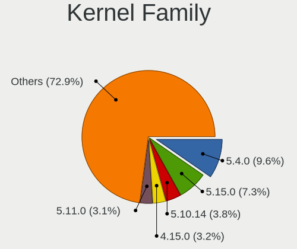
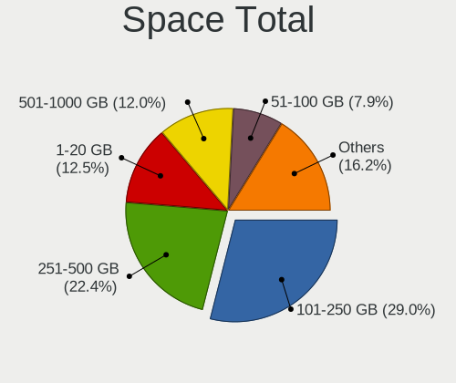
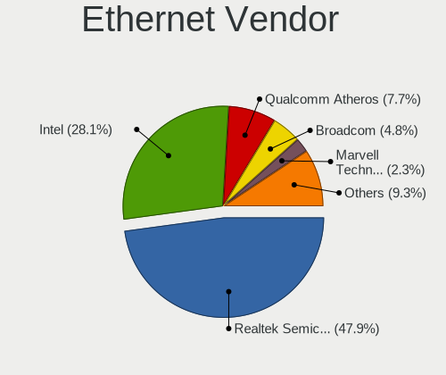
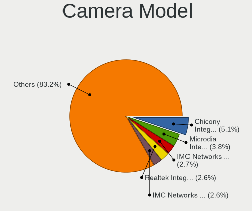

Linux in Poland - Tested Hardware & Statistics (Notebooks)
----------------------------------------------------------

A project to collect tested hardware configurations for Linux in Poland.

Anyone can contribute to this report by the [hw-probe](https://github.com/linuxhw/hw-probe) tool:

    sudo -E hw-probe -all -upload

Please contribute! Especially if your hardware is rare.

Contents
--------

* [ Test Cases ](#test-cases)

* [ System ](#system)
  - [ OS                       ](#os)
  - [ OS Family                ](#os-family)
  - [ Kernel                   ](#kernel)
  - [ Kernel Family            ](#kernel-family)
  - [ Kernel Major Ver.        ](#kernel-major-ver)
  - [ Arch                     ](#arch)
  - [ DE                       ](#de)
  - [ Display Server           ](#display-server)
  - [ Display Manager          ](#display-manager)
  - [ OS Lang                  ](#os-lang)
  - [ Boot Mode                ](#boot-mode)
  - [ Filesystem               ](#filesystem)
  - [ Part. scheme             ](#part-scheme)
  - [ Dual Boot with Linux/BSD ](#dual-boot-with-linuxbsd)
  - [ Dual Boot (Win)          ](#dual-boot-win)

* [ Board ](#board)
  - [ Vendor                   ](#vendor)
  - [ Model                    ](#model)
  - [ Model Family             ](#model-family)
  - [ MFG Year                 ](#mfg-year)
  - [ Form Factor              ](#form-factor)
  - [ Secure Boot              ](#secure-boot)
  - [ Coreboot                 ](#coreboot)
  - [ RAM Size                 ](#ram-size)
  - [ RAM Used                 ](#ram-used)
  - [ Total Drives             ](#total-drives)
  - [ Has CD-ROM               ](#has-cd-rom)
  - [ Has Ethernet             ](#has-ethernet)
  - [ Has WiFi                 ](#has-wifi)
  - [ Has Bluetooth            ](#has-bluetooth)

* [ Location ](#location)
  - [ Country                  ](#country)
  - [ City                     ](#city)

* [ Drives ](#drives)
  - [ Drive Vendor             ](#drive-vendor)
  - [ Drive Model              ](#drive-model)
  - [ HDD Vendor               ](#hdd-vendor)
  - [ SSD Vendor               ](#ssd-vendor)
  - [ Drive Kind               ](#drive-kind)
  - [ Drive Connector          ](#drive-connector)
  - [ Drive Size               ](#drive-size)
  - [ Space Total              ](#space-total)
  - [ Space Used               ](#space-used)
  - [ Malfunc. Drives          ](#malfunc-drives)
  - [ Malfunc. Drive Vendor    ](#malfunc-drive-vendor)
  - [ Malfunc. HDD Vendor      ](#malfunc-hdd-vendor)
  - [ Malfunc. Drive Kind      ](#malfunc-drive-kind)
  - [ Failed Drives            ](#failed-drives)
  - [ Failed Drive Vendor      ](#failed-drive-vendor)
  - [ Drive Status             ](#drive-status)

* [ Storage controller ](#storage-controller)
  - [ Storage Vendor           ](#storage-vendor)
  - [ Storage Model            ](#storage-model)
  - [ Storage Kind             ](#storage-kind)

* [ Processor ](#processor)
  - [ CPU Vendor               ](#cpu-vendor)
  - [ CPU Model                ](#cpu-model)
  - [ CPU Model Family         ](#cpu-model-family)
  - [ CPU Cores                ](#cpu-cores)
  - [ CPU Sockets              ](#cpu-sockets)
  - [ CPU Threads              ](#cpu-threads)
  - [ CPU Op-Modes             ](#cpu-op-modes)
  - [ CPU Microcode            ](#cpu-microcode)
  - [ CPU Microarch            ](#cpu-microarch)

* [ Graphics ](#graphics)
  - [ GPU Vendor               ](#gpu-vendor)
  - [ GPU Model                ](#gpu-model)
  - [ GPU Combo                ](#gpu-combo)
  - [ GPU Driver               ](#gpu-driver)
  - [ GPU Memory               ](#gpu-memory)

* [ Monitor ](#monitor)
  - [ Monitor Vendor           ](#monitor-vendor)
  - [ Monitor Model            ](#monitor-model)
  - [ Monitor Resolution       ](#monitor-resolution)
  - [ Monitor Diagonal         ](#monitor-diagonal)
  - [ Monitor Width            ](#monitor-width)
  - [ Aspect Ratio             ](#aspect-ratio)
  - [ Monitor Area             ](#monitor-area)
  - [ Pixel Density            ](#pixel-density)
  - [ Multiple Monitors        ](#multiple-monitors)

* [ Network ](#network)
  - [ Net Controller Vendor    ](#net-controller-vendor)
  - [ Net Controller Model     ](#net-controller-model)
  - [ Wireless Vendor          ](#wireless-vendor)
  - [ Wireless Model           ](#wireless-model)
  - [ Ethernet Vendor          ](#ethernet-vendor)
  - [ Ethernet Model           ](#ethernet-model)
  - [ Net Controller Kind      ](#net-controller-kind)
  - [ Used Controller          ](#used-controller)
  - [ NICs                     ](#nics)
  - [ IPv6                     ](#ipv6)

* [ Bluetooth ](#bluetooth)
  - [ Bluetooth Vendor         ](#bluetooth-vendor)
  - [ Bluetooth Model          ](#bluetooth-model)

* [ Sound ](#sound)
  - [ Sound Vendor             ](#sound-vendor)
  - [ Sound Model              ](#sound-model)

* [ Memory ](#memory)
  - [ Memory Vendor            ](#memory-vendor)
  - [ Memory Model             ](#memory-model)
  - [ Memory Kind              ](#memory-kind)
  - [ Memory Form Factor       ](#memory-form-factor)
  - [ Memory Size              ](#memory-size)
  - [ Memory Speed             ](#memory-speed)

* [ Printers & scanners ](#printers--scanners)
  - [ Printer Vendor           ](#printer-vendor)
  - [ Printer Model            ](#printer-model)
  - [ Scanner Vendor           ](#scanner-vendor)
  - [ Scanner Model            ](#scanner-model)

* [ Camera ](#camera)
  - [ Camera Vendor            ](#camera-vendor)
  - [ Camera Model             ](#camera-model)

* [ Security ](#security)
  - [ Fingerprint Vendor       ](#fingerprint-vendor)
  - [ Fingerprint Model        ](#fingerprint-model)
  - [ Chipcard Vendor          ](#chipcard-vendor)
  - [ Chipcard Model           ](#chipcard-model)

* [ Unsupported ](#unsupported)
  - [ Unsupported Devices      ](#unsupported-devices)
  - [ Unsupported Device Types ](#unsupported-device-types)

Test Cases
----------

Total: 4259

| Vendor        | Model                       | Probe                                                      | Date         |
|---------------|-----------------------------|------------------------------------------------------------|--------------|
| HP            | Laptop 15-dw1xxx            | [bfde2cf63d](https://linux-hardware.org/?probe=bfde2cf63d) | Jun 10, 2023 |
| HP            | Laptop 15-dw1xxx            | [7c79725474](https://linux-hardware.org/?probe=7c79725474) | Jun 10, 2023 |
| Lenovo        | Y50-70 20378                | [5e060b53c2](https://linux-hardware.org/?probe=5e060b53c2) | Jun 10, 2023 |
| Lenovo        | Y50-70 20378                | [0d548e314b](https://linux-hardware.org/?probe=0d548e314b) | Jun 10, 2023 |
| Dell          | Inspiron 3583               | [2627421665](https://linux-hardware.org/?probe=2627421665) | Jun 09, 2023 |
| HP            | Stream Laptop 14-ds0xxx     | [fb9e2f9fc8](https://linux-hardware.org/?probe=fb9e2f9fc8) | Jun 09, 2023 |
| Panasonic     | CF-53ASCZGFG                | [39e04925ee](https://linux-hardware.org/?probe=39e04925ee) | Jun 08, 2023 |
| Lenovo        | Legion Y740-17IRHg 81UJ     | [c98ac6e82c](https://linux-hardware.org/?probe=c98ac6e82c) | Jun 08, 2023 |
| Lenovo        | Legion Y740-17IRHg 81UJ     | [7879db73f8](https://linux-hardware.org/?probe=7879db73f8) | Jun 08, 2023 |
| Fujitsu       | CELSIUS H730                | [a1e397f4a7](https://linux-hardware.org/?probe=a1e397f4a7) | Jun 07, 2023 |
| ASUSTek       | VivoBook_ASUSLaptop X415... | [c142d83ce5](https://linux-hardware.org/?probe=c142d83ce5) | Jun 07, 2023 |
| Toshiba       | Satellite L40               | [16c5f74991](https://linux-hardware.org/?probe=16c5f74991) | Jun 06, 2023 |
| HUAWEI        | NBLB-WAX9N                  | [e56988bf8e](https://linux-hardware.org/?probe=e56988bf8e) | Jun 06, 2023 |
| ASUSTek       | TUF Gaming FX505DT_FX505... | [fc49284b9f](https://linux-hardware.org/?probe=fc49284b9f) | Jun 06, 2023 |
| Lenovo        | ThinkPad T470s W10DG 20J... | [83982c1aa9](https://linux-hardware.org/?probe=83982c1aa9) | Jun 05, 2023 |
| HUAWEI        | KLVL-WXX9                   | [38882f47af](https://linux-hardware.org/?probe=38882f47af) | Jun 05, 2023 |
| Dell          | Latitude 3190               | [fa8eba55f0](https://linux-hardware.org/?probe=fa8eba55f0) | Jun 05, 2023 |
| Acer          | Swift SF314-43              | [969354604a](https://linux-hardware.org/?probe=969354604a) | Jun 04, 2023 |
| Samsung       | 355V4C/355V4X/355V5C/355... | [514b3788ed](https://linux-hardware.org/?probe=514b3788ed) | Jun 04, 2023 |
| Dell          | Latitude D620               | [0e1b7f4320](https://linux-hardware.org/?probe=0e1b7f4320) | Jun 03, 2023 |
| Acer          | Aspire A114-31              | [7a760e7ad6](https://linux-hardware.org/?probe=7a760e7ad6) | Jun 03, 2023 |
| Lenovo        | ThinkPad L490 20Q5002DMH    | [6d42b7647b](https://linux-hardware.org/?probe=6d42b7647b) | Jun 02, 2023 |
| ASUSTek       | TUF Gaming FX505DT_FX505... | [fa4bd41f4b](https://linux-hardware.org/?probe=fa4bd41f4b) | Jun 02, 2023 |
| Lenovo        | B50-70 20384                | [5e3a2796a9](https://linux-hardware.org/?probe=5e3a2796a9) | Jun 01, 2023 |
| HP            | EliteBook 820 G2            | [c9409c532d](https://linux-hardware.org/?probe=c9409c532d) | Jun 01, 2023 |
| Toshiba       | Satellite L650              | [63eb6978fa](https://linux-hardware.org/?probe=63eb6978fa) | Jun 01, 2023 |
| Lenovo        | B51-80 80LM                 | [69429cb044](https://linux-hardware.org/?probe=69429cb044) | Jun 01, 2023 |
| HP            | EliteBook 840 G4            | [46ccbd2d62](https://linux-hardware.org/?probe=46ccbd2d62) | May 31, 2023 |
| HP            | EliteBook 840 G4            | [b90cb27f97](https://linux-hardware.org/?probe=b90cb27f97) | May 31, 2023 |
| ASUSTek       | TUF Gaming FX505DT_FX505... | [7fed965224](https://linux-hardware.org/?probe=7fed965224) | May 30, 2023 |
| Lenovo        | IdeaPad 510-15IKB 80SV      | [3b186c07a2](https://linux-hardware.org/?probe=3b186c07a2) | May 30, 2023 |
| Dell          | Latitude 3190               | [fe4a8422c8](https://linux-hardware.org/?probe=fe4a8422c8) | May 29, 2023 |
| Dell          | Latitude 7480               | [9eb2396796](https://linux-hardware.org/?probe=9eb2396796) | May 28, 2023 |
| Dell          | Vostro 1015                 | [c51af54d34](https://linux-hardware.org/?probe=c51af54d34) | May 28, 2023 |
| Lenovo        | IdeaPad 100-15IBD 80QQ      | [c2408a1885](https://linux-hardware.org/?probe=c2408a1885) | May 28, 2023 |
| Lenovo        | ThinkPad T470 20HES0FA03    | [c8c8087ee8](https://linux-hardware.org/?probe=c8c8087ee8) | May 27, 2023 |
| ASUSTek       | X555LN                      | [8f16767017](https://linux-hardware.org/?probe=8f16767017) | May 26, 2023 |
| Dell          | Latitude E5440              | [4a5501c365](https://linux-hardware.org/?probe=4a5501c365) | May 26, 2023 |
| Notebook      | NV4xPZ                      | [750cb90d83](https://linux-hardware.org/?probe=750cb90d83) | May 26, 2023 |
| ASUSTek       | GL552VW                     | [0466edde83](https://linux-hardware.org/?probe=0466edde83) | May 25, 2023 |
| ASUSTek       | X551MA                      | [d72352c0dc](https://linux-hardware.org/?probe=d72352c0dc) | May 25, 2023 |
| HP            | EliteBook 840 G3            | [06333c9c97](https://linux-hardware.org/?probe=06333c9c97) | May 24, 2023 |
| Lenovo        | G500s 20245                 | [dd15a8197e](https://linux-hardware.org/?probe=dd15a8197e) | May 24, 2023 |
| Acer          | Aspire E5-571G              | [6531b22151](https://linux-hardware.org/?probe=6531b22151) | May 24, 2023 |
| HP            | Pavilion Aero Laptop 13-... | [ba72bf9d52](https://linux-hardware.org/?probe=ba72bf9d52) | May 24, 2023 |
| Google        | Snappy                      | [8e9ad9e9d3](https://linux-hardware.org/?probe=8e9ad9e9d3) | May 24, 2023 |
| Lenovo        | Unknown                     | [e7148e7a18](https://linux-hardware.org/?probe=e7148e7a18) | May 23, 2023 |
| HP            | 530                         | [70600de142](https://linux-hardware.org/?probe=70600de142) | May 23, 2023 |
| HP            | EliteBook 840 G5            | [74a0ea4304](https://linux-hardware.org/?probe=74a0ea4304) | May 22, 2023 |
| Dell          | Latitude 3190               | [adf9fc9bdb](https://linux-hardware.org/?probe=adf9fc9bdb) | May 22, 2023 |
| ASUSTek       | K84L                        | [5f14f3b293](https://linux-hardware.org/?probe=5f14f3b293) | May 21, 2023 |
| Samsung       | 350V5C/351V5C/3540VC/344... | [03b17bc271](https://linux-hardware.org/?probe=03b17bc271) | May 21, 2023 |
| HP            | Unknown                     | [8894bf0f31](https://linux-hardware.org/?probe=8894bf0f31) | May 21, 2023 |
| Valve         | Jupiter                     | [cf5c419d13](https://linux-hardware.org/?probe=cf5c419d13) | May 20, 2023 |
| Lenovo        | G580 20150                  | [87e60904b9](https://linux-hardware.org/?probe=87e60904b9) | May 20, 2023 |
| Lenovo        | G500s 20245                 | [fc125408b5](https://linux-hardware.org/?probe=fc125408b5) | May 20, 2023 |
| Lenovo        | G580 20150                  | [5acf485cbf](https://linux-hardware.org/?probe=5acf485cbf) | May 20, 2023 |
| Apple         | MacBookAir6,2               | [5a0f8e19ee](https://linux-hardware.org/?probe=5a0f8e19ee) | May 19, 2023 |
| Lenovo        | G500s 20245                 | [8c6b9dc52f](https://linux-hardware.org/?probe=8c6b9dc52f) | May 19, 2023 |
| ASUSTek       | ROG Strix G513RW_G513RW     | [26e8deafbf](https://linux-hardware.org/?probe=26e8deafbf) | May 19, 2023 |
| MSI           | GL75 9SE                    | [7fd4d531c9](https://linux-hardware.org/?probe=7fd4d531c9) | May 18, 2023 |
| HP            | EliteBook 820 G2            | [200610da74](https://linux-hardware.org/?probe=200610da74) | May 17, 2023 |
| Google        | Snappy                      | [d13d8adaf4](https://linux-hardware.org/?probe=d13d8adaf4) | May 17, 2023 |
| Google        | Snappy                      | [0c095bb37a](https://linux-hardware.org/?probe=0c095bb37a) | May 17, 2023 |
| Dell          | Latitude 3190               | [1d867407a6](https://linux-hardware.org/?probe=1d867407a6) | May 15, 2023 |
| Lenovo        | IdeaPad S145-15API 81UT     | [3466945196](https://linux-hardware.org/?probe=3466945196) | May 15, 2023 |
| Lenovo        | B590 20206                  | [70b604bc30](https://linux-hardware.org/?probe=70b604bc30) | May 14, 2023 |
| Lenovo        | IdeaPad Y700-15ISK 80NV     | [5f508efff4](https://linux-hardware.org/?probe=5f508efff4) | May 14, 2023 |
| Lenovo        | B50-70 20384                | [1d3db7b456](https://linux-hardware.org/?probe=1d3db7b456) | May 14, 2023 |
| Fujitsu       | CELSIUS H760                | [5e6faf68dd](https://linux-hardware.org/?probe=5e6faf68dd) | May 14, 2023 |
| Lenovo        | B50-70 20384                | [9459f4eae8](https://linux-hardware.org/?probe=9459f4eae8) | May 14, 2023 |
| Fujitsu       | LIFEBOOK S752               | [97e9f91d90](https://linux-hardware.org/?probe=97e9f91d90) | May 14, 2023 |
| ASUSTek       | K53BR                       | [96a60a2970](https://linux-hardware.org/?probe=96a60a2970) | May 14, 2023 |
| Dell          | Latitude E5530 non-vPro     | [aa5dc9770e](https://linux-hardware.org/?probe=aa5dc9770e) | May 13, 2023 |
| Dell          | Latitude E5530 non-vPro     | [51c66f0f57](https://linux-hardware.org/?probe=51c66f0f57) | May 13, 2023 |
| Lenovo        | G50-30 80G0                 | [31d034ce6e](https://linux-hardware.org/?probe=31d034ce6e) | May 13, 2023 |
| ASUSTek       | ASUS TUF Gaming F15 FX50... | [55abeba9a3](https://linux-hardware.org/?probe=55abeba9a3) | May 13, 2023 |
| Fujitsu       | CELSIUS H760                | [7bb1e2b54e](https://linux-hardware.org/?probe=7bb1e2b54e) | May 13, 2023 |
| Toshiba       | Satellite C55-A-1KZ         | [37c165fa30](https://linux-hardware.org/?probe=37c165fa30) | May 13, 2023 |
| Dell          | Precision 3571              | [9a20dccb42](https://linux-hardware.org/?probe=9a20dccb42) | May 13, 2023 |
| GPU Compan... | GWTN156-11                  | [afb2844cb4](https://linux-hardware.org/?probe=afb2844cb4) | May 13, 2023 |
| Samsung       | RF510/RF410/RF710           | [4820c25349](https://linux-hardware.org/?probe=4820c25349) | May 12, 2023 |
| Samsung       | 350V5C/351V5C/3540VC/344... | [6950584e4c](https://linux-hardware.org/?probe=6950584e4c) | May 12, 2023 |
| HP            | ProBook 4535s               | [0d2f9561ce](https://linux-hardware.org/?probe=0d2f9561ce) | May 12, 2023 |
| Dell          | Latitude 7390               | [cbd8c5fdbe](https://linux-hardware.org/?probe=cbd8c5fdbe) | May 12, 2023 |
| Dell          | Latitude 7390               | [5677bfdac5](https://linux-hardware.org/?probe=5677bfdac5) | May 12, 2023 |
| Toshiba       | Satellite L40               | [9945f20a3a](https://linux-hardware.org/?probe=9945f20a3a) | May 11, 2023 |
| Lenovo        | IdeaPad 3 15ALC6 82KU       | [4ca3ad7158](https://linux-hardware.org/?probe=4ca3ad7158) | May 11, 2023 |
| Valve         | Jupiter                     | [5bfb32e683](https://linux-hardware.org/?probe=5bfb32e683) | May 11, 2023 |
| HP            | EliteBook 745 G3            | [256ad0c4d8](https://linux-hardware.org/?probe=256ad0c4d8) | May 11, 2023 |
| Lenovo        | ThinkPad L470 20J5S01S00    | [8886b2b825](https://linux-hardware.org/?probe=8886b2b825) | May 10, 2023 |
| Lenovo        | Legion 5 Pro 16ACH6 82JS    | [d764690667](https://linux-hardware.org/?probe=d764690667) | May 10, 2023 |
| HP            | Laptop 15s-eq0xxx           | [58000b3a57](https://linux-hardware.org/?probe=58000b3a57) | May 09, 2023 |
| Fujitsu Si... | AMILO Pro Series V3525      | [6272f76b0b](https://linux-hardware.org/?probe=6272f76b0b) | May 09, 2023 |
| HP            | EliteBook 840 14 inch G9... | [a3e5adab46](https://linux-hardware.org/?probe=a3e5adab46) | May 08, 2023 |
| Fujitsu Si... | AMILO Pro Series V3525      | [e3cc11d5e4](https://linux-hardware.org/?probe=e3cc11d5e4) | May 08, 2023 |
| Dell          | Latitude 3190               | [fb4df1325b](https://linux-hardware.org/?probe=fb4df1325b) | May 08, 2023 |
| Valve         | Jupiter                     | [e6397e7f9f](https://linux-hardware.org/?probe=e6397e7f9f) | May 08, 2023 |
| HP            | 15                          | [162a4b16ae](https://linux-hardware.org/?probe=162a4b16ae) | May 08, 2023 |
| Dell          | Latitude 5520               | [4d8ef45cbc](https://linux-hardware.org/?probe=4d8ef45cbc) | May 07, 2023 |
| Acer          | TravelMate 6592             | [d655aad3c5](https://linux-hardware.org/?probe=d655aad3c5) | May 07, 2023 |
| Dell          | Latitude 5290               | [255da608b8](https://linux-hardware.org/?probe=255da608b8) | May 07, 2023 |
| ASUSTek       | Zenbook UM6702RC_RM6702R... | [3cf83f50f0](https://linux-hardware.org/?probe=3cf83f50f0) | May 07, 2023 |
| Toshiba       | Satellite L300D             | [0e2dfb1c74](https://linux-hardware.org/?probe=0e2dfb1c74) | May 06, 2023 |
| ASUSTek       | K75DE                       | [d99045be1c](https://linux-hardware.org/?probe=d99045be1c) | May 05, 2023 |
| Dell          | Inspiron 5770               | [c545869ec5](https://linux-hardware.org/?probe=c545869ec5) | May 05, 2023 |
| HP            | Pavilion Laptop 15-eg0xx... | [51ae873492](https://linux-hardware.org/?probe=51ae873492) | May 04, 2023 |
| HP            | EliteBook 8540p             | [11b0a5baa1](https://linux-hardware.org/?probe=11b0a5baa1) | May 04, 2023 |
| Google        | Meep                        | [1e5e0e6673](https://linux-hardware.org/?probe=1e5e0e6673) | May 04, 2023 |
| Dell          | Latitude 5490               | [20c5ad2ee2](https://linux-hardware.org/?probe=20c5ad2ee2) | May 03, 2023 |
| Dell          | Latitude E6410              | [8830853258](https://linux-hardware.org/?probe=8830853258) | May 03, 2023 |
| Packard Be... | EasyNote TE69BM             | [fc905a42fb](https://linux-hardware.org/?probe=fc905a42fb) | May 03, 2023 |
| Lenovo        | G500s 20245                 | [560b69d616](https://linux-hardware.org/?probe=560b69d616) | May 03, 2023 |
| Packard Be... | EasyNote LJ65               | [795672236a](https://linux-hardware.org/?probe=795672236a) | May 02, 2023 |
| Packard Be... | EasyNote LJ65               | [77860cab79](https://linux-hardware.org/?probe=77860cab79) | May 02, 2023 |
| Dell          | Vostro 3550                 | [a644bc676e](https://linux-hardware.org/?probe=a644bc676e) | May 01, 2023 |
| HP            | Compaq 6910p                | [a697e756f5](https://linux-hardware.org/?probe=a697e756f5) | May 01, 2023 |
| Dell          | Latitude 3190               | [59c654b2ec](https://linux-hardware.org/?probe=59c654b2ec) | May 01, 2023 |
| Dell          | XPS 15 9500                 | [93fef964a7](https://linux-hardware.org/?probe=93fef964a7) | Apr 30, 2023 |
| Dell          | Latitude XT2                | [3cfd979c60](https://linux-hardware.org/?probe=3cfd979c60) | Apr 30, 2023 |
| Acer          | AO725                       | [03e5f661fb](https://linux-hardware.org/?probe=03e5f661fb) | Apr 30, 2023 |
| ASUSTek       | ROG Strix G513QY_G513QY     | [408aa18a63](https://linux-hardware.org/?probe=408aa18a63) | Apr 30, 2023 |
| Lenovo        | IdeaPad L340-17API 81LY     | [44c60dcec2](https://linux-hardware.org/?probe=44c60dcec2) | Apr 30, 2023 |
| Dell          | Inspiron MXC061             | [2d1ab773dd](https://linux-hardware.org/?probe=2d1ab773dd) | Apr 30, 2023 |
| ASUSTek       | ASUS TUF Gaming A15 FA50... | [7c378d88a2](https://linux-hardware.org/?probe=7c378d88a2) | Apr 29, 2023 |
| ASUSTek       | ASUS TUF Gaming A15 FA50... | [f502c40867](https://linux-hardware.org/?probe=f502c40867) | Apr 29, 2023 |
| Acer          | Aspire V5-552G              | [07c58a5169](https://linux-hardware.org/?probe=07c58a5169) | Apr 29, 2023 |
| Timi          | Redmi Book Pro 15 2022      | [a8adc86550](https://linux-hardware.org/?probe=a8adc86550) | Apr 28, 2023 |
| Acer          | Aspire VX5-591G             | [2461a8058f](https://linux-hardware.org/?probe=2461a8058f) | Apr 28, 2023 |
| Lenovo        | ThinkPad T430 2349HNU       | [f1290d4846](https://linux-hardware.org/?probe=f1290d4846) | Apr 28, 2023 |
| ASUSTek       | ASUS TUF Gaming A15 FA50... | [2474e8e580](https://linux-hardware.org/?probe=2474e8e580) | Apr 27, 2023 |
| HP            | 255 G8 Notebook PC          | [adb8f367ea](https://linux-hardware.org/?probe=adb8f367ea) | Apr 27, 2023 |
| HP            | EliteBook 2560p             | [23b5cbfb33](https://linux-hardware.org/?probe=23b5cbfb33) | Apr 27, 2023 |
| Acer          | Aspire 7250                 | [8e8e082e3d](https://linux-hardware.org/?probe=8e8e082e3d) | Apr 26, 2023 |
| Acer          | Aspire 5737Z                | [121eda50b8](https://linux-hardware.org/?probe=121eda50b8) | Apr 26, 2023 |
| HP            | EliteBook 840 G2            | [a3065a1b59](https://linux-hardware.org/?probe=a3065a1b59) | Apr 26, 2023 |
| HP            | Pavilion Gaming Laptop 1... | [d8088982c3](https://linux-hardware.org/?probe=d8088982c3) | Apr 26, 2023 |
| HP            | Pavilion Gaming Laptop 1... | [4cffa55fb1](https://linux-hardware.org/?probe=4cffa55fb1) | Apr 26, 2023 |
| HP            | Laptop 15-db1xxx            | [e6380a2186](https://linux-hardware.org/?probe=e6380a2186) | Apr 26, 2023 |
| HP            | Laptop 15                   | [34a2ebf6a1](https://linux-hardware.org/?probe=34a2ebf6a1) | Apr 26, 2023 |
| HP            | Laptop 15-db1xxx            | [872138980a](https://linux-hardware.org/?probe=872138980a) | Apr 26, 2023 |
| HP            | Pavilion Gaming Laptop 1... | [2122bd37a5](https://linux-hardware.org/?probe=2122bd37a5) | Apr 26, 2023 |
| HP            | Pavilion Gaming Laptop 1... | [af7b14d259](https://linux-hardware.org/?probe=af7b14d259) | Apr 26, 2023 |
| HP            | Pavilion Gaming Laptop 1... | [7fbd802154](https://linux-hardware.org/?probe=7fbd802154) | Apr 26, 2023 |
| HP            | Pavilion Gaming Laptop 1... | [ffe6065419](https://linux-hardware.org/?probe=ffe6065419) | Apr 26, 2023 |
| HP            | Pavilion Gaming Laptop 1... | [94ddc76aae](https://linux-hardware.org/?probe=94ddc76aae) | Apr 26, 2023 |
| Lenovo        | ThinkPad X200 7459KM3       | [cbea785e27](https://linux-hardware.org/?probe=cbea785e27) | Apr 25, 2023 |
| Dell          | Latitude E5470              | [3eb401d939](https://linux-hardware.org/?probe=3eb401d939) | Apr 25, 2023 |
| Dell          | Latitude E5470              | [37fabb89aa](https://linux-hardware.org/?probe=37fabb89aa) | Apr 25, 2023 |
| Lenovo        | G700                        | [75ee4cf99d](https://linux-hardware.org/?probe=75ee4cf99d) | Apr 24, 2023 |
| Lenovo        | ThinkPad E15 Gen 2 20TD0... | [9649423c20](https://linux-hardware.org/?probe=9649423c20) | Apr 24, 2023 |
| Lenovo        | ThinkPad E15 Gen 2 20TD0... | [af486ae4ae](https://linux-hardware.org/?probe=af486ae4ae) | Apr 24, 2023 |
| HP            | ProBook 445 G8 Notebook ... | [de3ad583ab](https://linux-hardware.org/?probe=de3ad583ab) | Apr 24, 2023 |
| Medion        | X681X                       | [d72837ad07](https://linux-hardware.org/?probe=d72837ad07) | Apr 24, 2023 |
| HP            | EliteBook 650 15.6 inch ... | [78686e5784](https://linux-hardware.org/?probe=78686e5784) | Apr 24, 2023 |
| Dell          | Vostro 5402                 | [b6cb9c9140](https://linux-hardware.org/?probe=b6cb9c9140) | Apr 24, 2023 |
| Dell          | Latitude 3190               | [2c21a51932](https://linux-hardware.org/?probe=2c21a51932) | Apr 24, 2023 |
| Samsung       | R510/P510                   | [4b58936ad7](https://linux-hardware.org/?probe=4b58936ad7) | Apr 23, 2023 |
| Dell          | Inspiron 5559               | [e959cc70fa](https://linux-hardware.org/?probe=e959cc70fa) | Apr 23, 2023 |
| Lenovo        | ThinkPad E14 Gen 4 21E30... | [18306b3af6](https://linux-hardware.org/?probe=18306b3af6) | Apr 23, 2023 |
| Dell          | Venue 11 Pro 7130 vPro      | [bee909cfcd](https://linux-hardware.org/?probe=bee909cfcd) | Apr 23, 2023 |
| Dell          | Venue 11 Pro 7130 vPro      | [c101faa12e](https://linux-hardware.org/?probe=c101faa12e) | Apr 23, 2023 |
| Lenovo        | Z51-70 80K6                 | [3d51a6183c](https://linux-hardware.org/?probe=3d51a6183c) | Apr 23, 2023 |
| Dell          | Precision 7550              | [31830a82c6](https://linux-hardware.org/?probe=31830a82c6) | Apr 22, 2023 |
| Dell          | Latitude D620               | [7b0c5ec6f2](https://linux-hardware.org/?probe=7b0c5ec6f2) | Apr 22, 2023 |
| Lenovo        | Legion Y530-15ICH 81FV      | [510237facd](https://linux-hardware.org/?probe=510237facd) | Apr 22, 2023 |
| Gigabyte      | AORUS 15P XD                | [22925aa0c9](https://linux-hardware.org/?probe=22925aa0c9) | Apr 22, 2023 |
| ASUSTek       | ASUS TUF Dash F15 FX516P... | [c1139db413](https://linux-hardware.org/?probe=c1139db413) | Apr 22, 2023 |
| Lenovo        | ThinkPad E15 Gen 4 21E60... | [3056a65306](https://linux-hardware.org/?probe=3056a65306) | Apr 22, 2023 |
| Samsung       | 350V5C/351V5C/3540VC/344... | [87d3a8b29f](https://linux-hardware.org/?probe=87d3a8b29f) | Apr 20, 2023 |
| ASUSTek       | ZenBook UX425EA_UX425EA     | [b7f138b04c](https://linux-hardware.org/?probe=b7f138b04c) | Apr 20, 2023 |
| Dell          | Precision M6600             | [e71bf9e7bb](https://linux-hardware.org/?probe=e71bf9e7bb) | Apr 20, 2023 |
| ASUSTek       | K50IJ                       | [3b07dc847f](https://linux-hardware.org/?probe=3b07dc847f) | Apr 20, 2023 |
| MSI           | Creator Z17 A12UHST         | [1396746fba](https://linux-hardware.org/?probe=1396746fba) | Apr 20, 2023 |
| HP            | 255 G7 Notebook PC          | [b2f977f4a1](https://linux-hardware.org/?probe=b2f977f4a1) | Apr 19, 2023 |
| Acer          | Aspire A715-71G             | [83b48fff59](https://linux-hardware.org/?probe=83b48fff59) | Apr 19, 2023 |
| Dell          | Latitude 7410               | [36e2aea9ea](https://linux-hardware.org/?probe=36e2aea9ea) | Apr 19, 2023 |
| ASUSTek       | TUF Gaming FX705DT_FX705... | [09a37b3301](https://linux-hardware.org/?probe=09a37b3301) | Apr 19, 2023 |
| Lenovo        | ThinkPad T430 2349HNU       | [1548cc4309](https://linux-hardware.org/?probe=1548cc4309) | Apr 19, 2023 |
| Dell          | Precision M6800             | [b39d3f31df](https://linux-hardware.org/?probe=b39d3f31df) | Apr 18, 2023 |
| Lenovo        | Y50-70 20378                | [af6c719754](https://linux-hardware.org/?probe=af6c719754) | Apr 18, 2023 |
| Gigabyte      | G5 GE                       | [f1baab4be4](https://linux-hardware.org/?probe=f1baab4be4) | Apr 17, 2023 |
| Lenovo        | Legion 5 Pro 16ACH6 82JS    | [a0b6c23c0b](https://linux-hardware.org/?probe=a0b6c23c0b) | Apr 17, 2023 |
| Lenovo        | Legion 5 Pro 16ACH6 82JS    | [35ec02005f](https://linux-hardware.org/?probe=35ec02005f) | Apr 17, 2023 |
| Acer          | Swift SFA16-41              | [1232f86e3e](https://linux-hardware.org/?probe=1232f86e3e) | Apr 17, 2023 |
| Dell          | Latitude D830               | [3da091adc2](https://linux-hardware.org/?probe=3da091adc2) | Apr 17, 2023 |
| Dell          | Inspiron 15 7000 Gaming     | [7ca92cfada](https://linux-hardware.org/?probe=7ca92cfada) | Apr 17, 2023 |
| Lenovo        | ThinkPad T480s 20L8SF1X0... | [d567c29052](https://linux-hardware.org/?probe=d567c29052) | Apr 17, 2023 |
| Lenovo        | IdeaPad Z570 HuronRiver ... | [c59c5c0cdf](https://linux-hardware.org/?probe=c59c5c0cdf) | Apr 16, 2023 |
| Lenovo        | IdeaPad Gaming 3 15IAH7 ... | [391b43ba8c](https://linux-hardware.org/?probe=391b43ba8c) | Apr 16, 2023 |
| Dell          | Inspiron 5559               | [b74080b280](https://linux-hardware.org/?probe=b74080b280) | Apr 16, 2023 |
| Dell          | Latitude E6330              | [1a75476b96](https://linux-hardware.org/?probe=1a75476b96) | Apr 16, 2023 |
| Acer          | AO722                       | [af4e100c16](https://linux-hardware.org/?probe=af4e100c16) | Apr 15, 2023 |
| Kiano         | Elegance 14.2               | [34062f30df](https://linux-hardware.org/?probe=34062f30df) | Apr 15, 2023 |
| Acer          | Aspire 5336                 | [7613566248](https://linux-hardware.org/?probe=7613566248) | Apr 15, 2023 |
| Lenovo        | ThinkBook 15 G3 ACL 21A4    | [9206720811](https://linux-hardware.org/?probe=9206720811) | Apr 14, 2023 |
| Valve         | Jupiter                     | [c1558fbc72](https://linux-hardware.org/?probe=c1558fbc72) | Apr 14, 2023 |
| Lenovo        | Legion 5 15IAH7 82RC        | [9cb53e6d6f](https://linux-hardware.org/?probe=9cb53e6d6f) | Apr 13, 2023 |
| Lenovo        | ThinkBook 15 G3 ACL 21A4    | [9341670151](https://linux-hardware.org/?probe=9341670151) | Apr 13, 2023 |
| Lenovo        | ThinkPad X220 4291AY8       | [b2bc70473d](https://linux-hardware.org/?probe=b2bc70473d) | Apr 13, 2023 |
| Fujitsu Si... | AMILO PRO V3515             | [be2d8594c3](https://linux-hardware.org/?probe=be2d8594c3) | Apr 13, 2023 |
| Dell          | Latitude E6230              | [a7cce7ebde](https://linux-hardware.org/?probe=a7cce7ebde) | Apr 12, 2023 |
| Lenovo        | ThinkPad X1 Carbon 3460C... | [f1999ee14e](https://linux-hardware.org/?probe=f1999ee14e) | Apr 11, 2023 |
| Dell          | Latitude 7390               | [9361f06955](https://linux-hardware.org/?probe=9361f06955) | Apr 11, 2023 |
| Lenovo        | ThinkPad T480 20L5S12H00    | [c550410c5b](https://linux-hardware.org/?probe=c550410c5b) | Apr 11, 2023 |
| HP            | Pavilion dv7                | [000c77d7d5](https://linux-hardware.org/?probe=000c77d7d5) | Apr 10, 2023 |
| HP            | Pavilion dv7                | [08e5108cda](https://linux-hardware.org/?probe=08e5108cda) | Apr 10, 2023 |
| Lenovo        | ThinkPad T450 20BUS0QT04    | [90d7e2bb21](https://linux-hardware.org/?probe=90d7e2bb21) | Apr 09, 2023 |
| Lenovo        | ThinkPad X220 4291LR6       | [ea86227d59](https://linux-hardware.org/?probe=ea86227d59) | Apr 09, 2023 |
| HUAWEI        | HVY-WXX9                    | [6b6b2a8633](https://linux-hardware.org/?probe=6b6b2a8633) | Apr 09, 2023 |
| HUAWEI        | HVY-WXX9                    | [00489240d2](https://linux-hardware.org/?probe=00489240d2) | Apr 09, 2023 |
| Lenovo        | IdeaPad S540-14IWL 81ND     | [869d7607e9](https://linux-hardware.org/?probe=869d7607e9) | Apr 08, 2023 |
| Acer          | Aspire 5336                 | [6e419f3401](https://linux-hardware.org/?probe=6e419f3401) | Apr 08, 2023 |
| Toshiba       | Satellite L750D             | [d510eabb78](https://linux-hardware.org/?probe=d510eabb78) | Apr 08, 2023 |
| Toshiba       | Satellite L750D             | [3c8c0e7455](https://linux-hardware.org/?probe=3c8c0e7455) | Apr 08, 2023 |
| Samsung       | 300E4A/300E5A/300E7A        | [370d1404f2](https://linux-hardware.org/?probe=370d1404f2) | Apr 08, 2023 |
| Lenovo        | G50-70 20351                | [b8dd840f5d](https://linux-hardware.org/?probe=b8dd840f5d) | Apr 08, 2023 |
| Samsung       | 400B4C/400B5C/200B4C/200... | [8026ca606e](https://linux-hardware.org/?probe=8026ca606e) | Apr 07, 2023 |
| Dell          | Inspiron 11-3162            | [accdfd2253](https://linux-hardware.org/?probe=accdfd2253) | Apr 07, 2023 |
| Samsung       | 730U3E/740U3E               | [7d4b6838e2](https://linux-hardware.org/?probe=7d4b6838e2) | Apr 07, 2023 |
| HP            | EliteBook 840 G7 Noteboo... | [413528fa5a](https://linux-hardware.org/?probe=413528fa5a) | Apr 07, 2023 |
| MSI           | GP76 Leopard 10UE           | [c7b870bb22](https://linux-hardware.org/?probe=c7b870bb22) | Apr 07, 2023 |
| Toshiba       | Satellite C855-12N          | [69e30b2fd8](https://linux-hardware.org/?probe=69e30b2fd8) | Apr 07, 2023 |
| HP            | 620                         | [2e14b2c046](https://linux-hardware.org/?probe=2e14b2c046) | Apr 07, 2023 |
| ASUSTek       | ASUS TUF Gaming F15 FX50... | [b6f721687e](https://linux-hardware.org/?probe=b6f721687e) | Apr 06, 2023 |
| HP            | ProBook 4740s               | [14fb51de44](https://linux-hardware.org/?probe=14fb51de44) | Apr 06, 2023 |
| eMachines     | E720 V1.09                  | [278ca903ac](https://linux-hardware.org/?probe=278ca903ac) | Apr 06, 2023 |
| Lenovo        | ThinkPad X1 Carbon Gen 1... | [93cb5f66a1](https://linux-hardware.org/?probe=93cb5f66a1) | Apr 06, 2023 |
| Samsung       | 730U3E/740U3E               | [2be8e6430c](https://linux-hardware.org/?probe=2be8e6430c) | Apr 05, 2023 |
| Kruger&Mat... | KM1406                      | [1b536904d4](https://linux-hardware.org/?probe=1b536904d4) | Apr 05, 2023 |
| ASUSTek       | ROG Strix G513QY_G513QY     | [f1398d5ada](https://linux-hardware.org/?probe=f1398d5ada) | Apr 05, 2023 |
| Toshiba       | Satellite C50-A             | [8e02a6dbed](https://linux-hardware.org/?probe=8e02a6dbed) | Apr 05, 2023 |
| Lenovo        | G50-80 80E5                 | [b469666726](https://linux-hardware.org/?probe=b469666726) | Apr 05, 2023 |
| Lenovo        | Legion 5 Pro 16ACH6 82JS    | [56119c4c93](https://linux-hardware.org/?probe=56119c4c93) | Apr 05, 2023 |
| Google        | Cyan                        | [f02aa2a210](https://linux-hardware.org/?probe=f02aa2a210) | Apr 04, 2023 |
| ASUSTek       | ASUS TUF Gaming F15 FX50... | [0c0196b199](https://linux-hardware.org/?probe=0c0196b199) | Apr 04, 2023 |
| Lenovo        | Legion 5 Pro 16ACH6 82JS    | [04afa2e378](https://linux-hardware.org/?probe=04afa2e378) | Apr 04, 2023 |
| Lenovo        | B50-80 80LT                 | [163bfb5525](https://linux-hardware.org/?probe=163bfb5525) | Apr 03, 2023 |
| HP            | Compaq CQ58                 | [f0026163c3](https://linux-hardware.org/?probe=f0026163c3) | Apr 03, 2023 |
| HP            | EliteBook 865 16 inch G9... | [6906a8d309](https://linux-hardware.org/?probe=6906a8d309) | Apr 03, 2023 |
| Lenovo        | ThinkPad E14 Gen 2 20T60... | [71a388a292](https://linux-hardware.org/?probe=71a388a292) | Apr 03, 2023 |
| HP            | Compaq CQ58                 | [7c4676c380](https://linux-hardware.org/?probe=7c4676c380) | Apr 03, 2023 |
| HP            | Stream Notebook             | [27610e0a39](https://linux-hardware.org/?probe=27610e0a39) | Apr 03, 2023 |
| Dell          | Latitude 3190               | [a1fa664431](https://linux-hardware.org/?probe=a1fa664431) | Apr 03, 2023 |
| ASUSTek       | TP300LJ                     | [7da5aab332](https://linux-hardware.org/?probe=7da5aab332) | Apr 02, 2023 |
| Lenovo        | ThinkPad T470 20HES0FA03    | [7274c8222b](https://linux-hardware.org/?probe=7274c8222b) | Apr 02, 2023 |
| HP            | ProBook 455 G1              | [869f36fc4c](https://linux-hardware.org/?probe=869f36fc4c) | Apr 01, 2023 |
| Lenovo        | G560 20042                  | [c5a4783dfb](https://linux-hardware.org/?probe=c5a4783dfb) | Apr 01, 2023 |
| HP            | Compaq Presario CQ60        | [e5a729243d](https://linux-hardware.org/?probe=e5a729243d) | Mar 31, 2023 |
| Samsung       | 950XED                      | [c3b37a213a](https://linux-hardware.org/?probe=c3b37a213a) | Mar 31, 2023 |
| ASUSTek       | ASUS TUF Gaming F15 FX50... | [e2c6f05595](https://linux-hardware.org/?probe=e2c6f05595) | Mar 31, 2023 |
| HUAWEI        | KPL-W0X                     | [6e93ca4159](https://linux-hardware.org/?probe=6e93ca4159) | Mar 31, 2023 |
| Acer          | TravelMate 8172Z            | [10cc090653](https://linux-hardware.org/?probe=10cc090653) | Mar 31, 2023 |
| Dell          | Latitude D620               | [801ede47a2](https://linux-hardware.org/?probe=801ede47a2) | Mar 31, 2023 |
| ASUSTek       | K53SJ                       | [aa9a729217](https://linux-hardware.org/?probe=aa9a729217) | Mar 30, 2023 |
| Samsung       | 355V4C/356V4C/3445VC/354... | [6b9737a62f](https://linux-hardware.org/?probe=6b9737a62f) | Mar 30, 2023 |
| HP            | Laptop 15s-fq2xxx           | [f78b6ab8c5](https://linux-hardware.org/?probe=f78b6ab8c5) | Mar 30, 2023 |
| Dell          | Latitude E6530              | [eb7392d1ae](https://linux-hardware.org/?probe=eb7392d1ae) | Mar 29, 2023 |
| Lenovo        | G570 20079                  | [680c7a04ed](https://linux-hardware.org/?probe=680c7a04ed) | Mar 29, 2023 |
| GPD           | G1621-02                    | [2ed8b6c147](https://linux-hardware.org/?probe=2ed8b6c147) | Mar 29, 2023 |
| ASUSTek       | ASUS TUF Gaming A15 FA50... | [fa1a582da6](https://linux-hardware.org/?probe=fa1a582da6) | Mar 29, 2023 |
| HP            | 250 G6 Notebook PC          | [94cdfc44d1](https://linux-hardware.org/?probe=94cdfc44d1) | Mar 28, 2023 |
| Kiano         | Elegance 14.2               | [ea2013b347](https://linux-hardware.org/?probe=ea2013b347) | Mar 28, 2023 |
| Lenovo        | ThinkPad T470p 20J7S0QK0... | [7f5fb11940](https://linux-hardware.org/?probe=7f5fb11940) | Mar 28, 2023 |
| MSI           | B450 TOMAHAWK MAX           | [856b789461](https://linux-hardware.org/?probe=856b789461) | Mar 28, 2023 |
| Dell          | Latitude 7490               | [41d01ead49](https://linux-hardware.org/?probe=41d01ead49) | Mar 28, 2023 |
| Dell          | Inspiron 5735               | [823a6ece98](https://linux-hardware.org/?probe=823a6ece98) | Mar 27, 2023 |
| Lenovo        | ThinkPad X250 20CLS47P00    | [e287203572](https://linux-hardware.org/?probe=e287203572) | Mar 27, 2023 |
| ASUSTek       | ASUS TUF Gaming F15 FX50... | [60012fd503](https://linux-hardware.org/?probe=60012fd503) | Mar 27, 2023 |
| Dell          | XPS 13 7390                 | [aaeb6059a2](https://linux-hardware.org/?probe=aaeb6059a2) | Mar 27, 2023 |
| Dell          | Precision 7670              | [eece926391](https://linux-hardware.org/?probe=eece926391) | Mar 27, 2023 |
| Dell          | Latitude 3190               | [757f1fc2e7](https://linux-hardware.org/?probe=757f1fc2e7) | Mar 27, 2023 |
| Dell          | Precision 7670              | [5b8f0590ec](https://linux-hardware.org/?probe=5b8f0590ec) | Mar 27, 2023 |
| Lenovo        | ThinkPad T520 4243RP3       | [38fa314d2f](https://linux-hardware.org/?probe=38fa314d2f) | Mar 26, 2023 |
| MSI           | Creator Z16 A11UET          | [0133ab37af](https://linux-hardware.org/?probe=0133ab37af) | Mar 26, 2023 |
| Sony          | VGN-BX61VN                  | [76f62cf9c1](https://linux-hardware.org/?probe=76f62cf9c1) | Mar 26, 2023 |
| Lenovo        | G50-80 80E5                 | [250e0a99d1](https://linux-hardware.org/?probe=250e0a99d1) | Mar 26, 2023 |
| Lenovo        | G510 20238                  | [f406bad420](https://linux-hardware.org/?probe=f406bad420) | Mar 26, 2023 |
| Lenovo        | ThinkPad W520 4282PQ7       | [ff42aa158f](https://linux-hardware.org/?probe=ff42aa158f) | Mar 25, 2023 |
| HP            | Notebook                    | [7c4088912e](https://linux-hardware.org/?probe=7c4088912e) | Mar 25, 2023 |
| Lenovo        | ThinkPad T480s 20L7S0YA0... | [f4cb79dbf8](https://linux-hardware.org/?probe=f4cb79dbf8) | Mar 25, 2023 |
| Valve         | Jupiter                     | [6a7628c31d](https://linux-hardware.org/?probe=6a7628c31d) | Mar 25, 2023 |
| HP            | Pavilion dv6                | [29a94d3d9e](https://linux-hardware.org/?probe=29a94d3d9e) | Mar 25, 2023 |
| HP            | Pavilion dv6                | [c3a6c3f669](https://linux-hardware.org/?probe=c3a6c3f669) | Mar 25, 2023 |
| Lenovo        | IdeaPad 5 15ALC05 82LN      | [7f32708bde](https://linux-hardware.org/?probe=7f32708bde) | Mar 24, 2023 |
| HP            | Pavilion Notebook           | [446c510c65](https://linux-hardware.org/?probe=446c510c65) | Mar 24, 2023 |
| Toshiba       | Satellite C855-12N          | [cb9692876c](https://linux-hardware.org/?probe=cb9692876c) | Mar 24, 2023 |
| Toshiba       | Satellite Pro A50-C         | [2fe9003124](https://linux-hardware.org/?probe=2fe9003124) | Mar 24, 2023 |
| Toshiba       | Satellite Pro A50-C         | [95c5c45220](https://linux-hardware.org/?probe=95c5c45220) | Mar 24, 2023 |
| MSI           | Creator Z17 A12UHST         | [47814b01b6](https://linux-hardware.org/?probe=47814b01b6) | Mar 24, 2023 |
| Sony          | SVE1512M6ESI                | [db00c70eb7](https://linux-hardware.org/?probe=db00c70eb7) | Mar 24, 2023 |
| Dell          | Latitude E7450              | [c1e43b6a40](https://linux-hardware.org/?probe=c1e43b6a40) | Mar 23, 2023 |
| Lenovo        | G580                        | [367ed9241a](https://linux-hardware.org/?probe=367ed9241a) | Mar 23, 2023 |
| Lenovo        | G580                        | [6ee526d77a](https://linux-hardware.org/?probe=6ee526d77a) | Mar 22, 2023 |
| Acer          | Aspire VN7-791              | [054efde4e8](https://linux-hardware.org/?probe=054efde4e8) | Mar 22, 2023 |
| Lenovo        | G50-80 80E5                 | [f6ad6626ff](https://linux-hardware.org/?probe=f6ad6626ff) | Mar 22, 2023 |
| HUAWEI        | KPL-W0X                     | [0ae6ab3ff6](https://linux-hardware.org/?probe=0ae6ab3ff6) | Mar 21, 2023 |
| Unknown       | Unknown                     | [31ee1d66d8](https://linux-hardware.org/?probe=31ee1d66d8) | Mar 21, 2023 |
| HP            | ProBook 445 G8 Notebook ... | [57663c8d60](https://linux-hardware.org/?probe=57663c8d60) | Mar 21, 2023 |
| HP            | ProBook 445 G8 Notebook ... | [f5cbd1977f](https://linux-hardware.org/?probe=f5cbd1977f) | Mar 20, 2023 |
| Dell          | Latitude 3190               | [f4bea67dcc](https://linux-hardware.org/?probe=f4bea67dcc) | Mar 20, 2023 |
| HP            | EliteBook 830 G5            | [ba804b8e21](https://linux-hardware.org/?probe=ba804b8e21) | Mar 20, 2023 |
| Lenovo        | IdeaPad 320-15IAP 80XR      | [919ccc204b](https://linux-hardware.org/?probe=919ccc204b) | Mar 19, 2023 |
| HP            | Pavilion Gaming Laptop 1... | [c89c2e1369](https://linux-hardware.org/?probe=c89c2e1369) | Mar 18, 2023 |
| HP            | Pavilion Gaming Laptop 1... | [31299394e0](https://linux-hardware.org/?probe=31299394e0) | Mar 18, 2023 |
| Fujitsu       | LIFEBOOK AH530              | [e40cf4f577](https://linux-hardware.org/?probe=e40cf4f577) | Mar 18, 2023 |
| Dell          | Venue 11 Pro 7130 MS        | [2a3bb3e212](https://linux-hardware.org/?probe=2a3bb3e212) | Mar 18, 2023 |
| Dell          | Venue 11 Pro 7130 MS        | [56fab2cb17](https://linux-hardware.org/?probe=56fab2cb17) | Mar 18, 2023 |
| Lenovo        | G570 20079                  | [2d7a146140](https://linux-hardware.org/?probe=2d7a146140) | Mar 18, 2023 |
| ASUSTek       | K52Jc                       | [07dc0a0959](https://linux-hardware.org/?probe=07dc0a0959) | Mar 18, 2023 |
| ASUSTek       | K52Jc                       | [f61ec5ce9f](https://linux-hardware.org/?probe=f61ec5ce9f) | Mar 18, 2023 |
| Dell          | Latitude 5420               | [318da7f6c0](https://linux-hardware.org/?probe=318da7f6c0) | Mar 18, 2023 |
| Toshiba       | QOSMIO X500                 | [2ce878e92e](https://linux-hardware.org/?probe=2ce878e92e) | Mar 17, 2023 |
| Dell          | G5 5590                     | [9686d438e6](https://linux-hardware.org/?probe=9686d438e6) | Mar 17, 2023 |
| Lenovo        | Legion 5 Pro 16ACH6 82JS    | [728c9ad9f5](https://linux-hardware.org/?probe=728c9ad9f5) | Mar 17, 2023 |
| HP            | OMEN by Laptop 15-dc0xxx    | [593bd6b3ac](https://linux-hardware.org/?probe=593bd6b3ac) | Mar 17, 2023 |
| Dell          | Latitude E7440              | [8a6e751b61](https://linux-hardware.org/?probe=8a6e751b61) | Mar 16, 2023 |
| HP            | Laptop 15-bs0xx             | [f53eccbbe9](https://linux-hardware.org/?probe=f53eccbbe9) | Mar 16, 2023 |
| Dell          | Latitude 5511               | [7444a8c723](https://linux-hardware.org/?probe=7444a8c723) | Mar 16, 2023 |
| Dell          | Latitude D620               | [1731735e10](https://linux-hardware.org/?probe=1731735e10) | Mar 16, 2023 |
| Lenovo        | ThinkPad E15 Gen 4 21E60... | [eb0beb38eb](https://linux-hardware.org/?probe=eb0beb38eb) | Mar 16, 2023 |
| Lenovo        | IdeaPad Y700-15ISK 80NV     | [c54f2ca880](https://linux-hardware.org/?probe=c54f2ca880) | Mar 16, 2023 |
| Sony          | VPCEH1S1E                   | [9e8a96156c](https://linux-hardware.org/?probe=9e8a96156c) | Mar 15, 2023 |
| Lenovo        | ThinkPad T440p 20AWS19P0... | [6a2d338526](https://linux-hardware.org/?probe=6a2d338526) | Mar 15, 2023 |
| ASUSTek       | TUF Gaming FX504GE_FX80G... | [59d7fa9a34](https://linux-hardware.org/?probe=59d7fa9a34) | Mar 15, 2023 |
| Dell          | Latitude 7390               | [7cc6b3a278](https://linux-hardware.org/?probe=7cc6b3a278) | Mar 15, 2023 |
| ASUSTek       | ROG Strix G513RW_G513RW     | [97fe8661ed](https://linux-hardware.org/?probe=97fe8661ed) | Mar 14, 2023 |
| Kiano         | Elegance 14.2               | [f9ed050c6a](https://linux-hardware.org/?probe=f9ed050c6a) | Mar 14, 2023 |
| Lenovo        | ThinkPad X1 Carbon Gen 9... | [daa3d3869e](https://linux-hardware.org/?probe=daa3d3869e) | Mar 14, 2023 |
| HP            | ProBook 450 G3              | [d422d0d291](https://linux-hardware.org/?probe=d422d0d291) | Mar 14, 2023 |
| Lenovo        | ThinkPad X301 2776LEG       | [7b0df25d34](https://linux-hardware.org/?probe=7b0df25d34) | Mar 14, 2023 |
| Lenovo        | ThinkPad X301 2776LEG       | [65fe38f62e](https://linux-hardware.org/?probe=65fe38f62e) | Mar 14, 2023 |
| Toshiba       | Satellite L40               | [bfc73429bb](https://linux-hardware.org/?probe=bfc73429bb) | Mar 13, 2023 |
| Samsung       | 300E4A/300E5A/300E7A        | [6c76af84cb](https://linux-hardware.org/?probe=6c76af84cb) | Mar 13, 2023 |
| Acer          | Aspire A315-24P             | [b9cfb4b900](https://linux-hardware.org/?probe=b9cfb4b900) | Mar 13, 2023 |
| Acer          | Aspire A315-24P             | [fba21e619d](https://linux-hardware.org/?probe=fba21e619d) | Mar 13, 2023 |
| HP            | Pavilion dv6                | [f649c78020](https://linux-hardware.org/?probe=f649c78020) | Mar 13, 2023 |
| Lenovo        | ThinkPad E15 Gen 4 21E60... | [bc375a2ddd](https://linux-hardware.org/?probe=bc375a2ddd) | Mar 13, 2023 |
| Dell          | Latitude 3190               | [97cc3ffc79](https://linux-hardware.org/?probe=97cc3ffc79) | Mar 13, 2023 |
| ASUSTek       | X551MA                      | [37b002e8ec](https://linux-hardware.org/?probe=37b002e8ec) | Mar 12, 2023 |
| Lenovo        | ThinkPad X240 20AMS0XP0S    | [a2ee9a2818](https://linux-hardware.org/?probe=a2ee9a2818) | Mar 12, 2023 |
| ASUSTek       | N550JK                      | [bb5d069d90](https://linux-hardware.org/?probe=bb5d069d90) | Mar 12, 2023 |
| Google        | Electro                     | [86cbc9d907](https://linux-hardware.org/?probe=86cbc9d907) | Mar 12, 2023 |
| HP            | 250 G6 Notebook PC          | [d173735b81](https://linux-hardware.org/?probe=d173735b81) | Mar 11, 2023 |
| Dell          | Precision M6600             | [9d5e2f1e01](https://linux-hardware.org/?probe=9d5e2f1e01) | Mar 11, 2023 |
| Acer          | Extensa 5620                | [f95239bf35](https://linux-hardware.org/?probe=f95239bf35) | Mar 11, 2023 |
| Kiano         | Elegance 14.2               | [5714b30108](https://linux-hardware.org/?probe=5714b30108) | Mar 11, 2023 |
| Lenovo        | Legion 5 15ARH05H 82B1      | [82b5297ab8](https://linux-hardware.org/?probe=82b5297ab8) | Mar 11, 2023 |
| Lenovo        | ThinkPad T440p 20AWS19P0... | [44867c946f](https://linux-hardware.org/?probe=44867c946f) | Mar 10, 2023 |
| Dell          | Latitude E6530              | [70b72984bc](https://linux-hardware.org/?probe=70b72984bc) | Mar 10, 2023 |
| Lenovo        | ThinkPad Z16 Gen 1 21D40... | [2d99e047c9](https://linux-hardware.org/?probe=2d99e047c9) | Mar 10, 2023 |
| Lenovo        | ThinkPad T430 2349HNU       | [99d5f17b22](https://linux-hardware.org/?probe=99d5f17b22) | Mar 09, 2023 |
| HP            | Laptop 15s-eq0xxx           | [7a7e8bc855](https://linux-hardware.org/?probe=7a7e8bc855) | Mar 09, 2023 |
| ASUSTek       | X550CL                      | [9acfcb9b4f](https://linux-hardware.org/?probe=9acfcb9b4f) | Mar 09, 2023 |
| Lenovo        | IdeaPad Y580                | [cc2d7d8a95](https://linux-hardware.org/?probe=cc2d7d8a95) | Mar 09, 2023 |
| Dell          | Latitude E6440              | [b00f44cd46](https://linux-hardware.org/?probe=b00f44cd46) | Mar 09, 2023 |
| Dell          | Latitude E6440              | [3b9229e07a](https://linux-hardware.org/?probe=3b9229e07a) | Mar 09, 2023 |
| HP            | EliteBook 850 G8 Noteboo... | [c50daaf3b9](https://linux-hardware.org/?probe=c50daaf3b9) | Mar 09, 2023 |
| HP            | EliteBook 845 G8 Noteboo... | [fdc32a6871](https://linux-hardware.org/?probe=fdc32a6871) | Mar 09, 2023 |
| ASUSTek       | X550CL                      | [21f11cf791](https://linux-hardware.org/?probe=21f11cf791) | Mar 09, 2023 |
| HP            | EliteBook 8570w             | [dfd9b7a9b9](https://linux-hardware.org/?probe=dfd9b7a9b9) | Mar 08, 2023 |
| HP            | ENVY 6                      | [4873f7b85f](https://linux-hardware.org/?probe=4873f7b85f) | Mar 08, 2023 |
| Lenovo        | ThinkPad T61 7661BM5        | [daf29f1a82](https://linux-hardware.org/?probe=daf29f1a82) | Mar 08, 2023 |
| Lenovo        | IdeaPad 320-15ISK 80XH      | [233722f0e1](https://linux-hardware.org/?probe=233722f0e1) | Mar 07, 2023 |
| Dell          | Latitude 7290               | [38f12088b2](https://linux-hardware.org/?probe=38f12088b2) | Mar 07, 2023 |
| HUAWEI        | KPL-W0X                     | [76ebbe553f](https://linux-hardware.org/?probe=76ebbe553f) | Mar 06, 2023 |
| Dell          | Latitude 3190               | [a3a4113ab4](https://linux-hardware.org/?probe=a3a4113ab4) | Mar 06, 2023 |
| Lenovo        | Legion 5 17ACH6 82K0        | [6db57d4d9f](https://linux-hardware.org/?probe=6db57d4d9f) | Mar 05, 2023 |
| ASUSTek       | X551MA                      | [b77e06361b](https://linux-hardware.org/?probe=b77e06361b) | Mar 05, 2023 |
| Lenovo        | ThinkPad T440p 20AWS37F0... | [48677f9f86](https://linux-hardware.org/?probe=48677f9f86) | Mar 05, 2023 |
| IGEL Techn... | H830C                       | [3619b3fcee](https://linux-hardware.org/?probe=3619b3fcee) | Mar 05, 2023 |
| ASUSTek       | N71Vg                       | [4d83fda5ba](https://linux-hardware.org/?probe=4d83fda5ba) | Mar 05, 2023 |
| MSI           | B450 TOMAHAWK MAX           | [8b36c984f8](https://linux-hardware.org/?probe=8b36c984f8) | Mar 05, 2023 |
| Lenovo        | IdeaPad L340-15IRH Gamin... | [65006682e6](https://linux-hardware.org/?probe=65006682e6) | Mar 05, 2023 |
| HP            | 15                          | [0efd9be7ae](https://linux-hardware.org/?probe=0efd9be7ae) | Mar 04, 2023 |
| HP            | 15                          | [b8a33a3d73](https://linux-hardware.org/?probe=b8a33a3d73) | Mar 04, 2023 |
| Lenovo        | ThinkPad T420 4177R3U       | [525dd38cf1](https://linux-hardware.org/?probe=525dd38cf1) | Mar 04, 2023 |
| Toshiba       | Satellite L40               | [bd108fcfba](https://linux-hardware.org/?probe=bd108fcfba) | Mar 04, 2023 |
| HP            | Notebook                    | [229fbff95c](https://linux-hardware.org/?probe=229fbff95c) | Mar 04, 2023 |
| HUAWEI        | NBLK-WAX9X                  | [afe8ef7318](https://linux-hardware.org/?probe=afe8ef7318) | Mar 04, 2023 |
| HP            | EliteBook 830 G5            | [82acbe37f7](https://linux-hardware.org/?probe=82acbe37f7) | Mar 04, 2023 |
| Dell          | Vostro 3350                 | [1bfad93a1e](https://linux-hardware.org/?probe=1bfad93a1e) | Mar 04, 2023 |
| Dell          | Vostro 3350                 | [f782f8e288](https://linux-hardware.org/?probe=f782f8e288) | Mar 04, 2023 |
| Apple         | MacBookPro8,2               | [0b0c5a6895](https://linux-hardware.org/?probe=0b0c5a6895) | Mar 04, 2023 |
| ASUSTek       | X550CL                      | [c16eae7537](https://linux-hardware.org/?probe=c16eae7537) | Mar 04, 2023 |
| IGEL Techn... | H830C                       | [4625dc0660](https://linux-hardware.org/?probe=4625dc0660) | Mar 04, 2023 |
| Toshiba       | Satellite L40               | [e3f1423c39](https://linux-hardware.org/?probe=e3f1423c39) | Mar 04, 2023 |
| ASUSTek       | VivoBook_ASUSLaptop S540... | [0228fd4ab1](https://linux-hardware.org/?probe=0228fd4ab1) | Mar 04, 2023 |
| Dell          | Latitude 5480               | [4679c9328e](https://linux-hardware.org/?probe=4679c9328e) | Mar 03, 2023 |
| Lenovo        | Y520-15IKBN 80WK            | [9186971572](https://linux-hardware.org/?probe=9186971572) | Mar 03, 2023 |
| Lenovo        | IdeaPad 320-17ABR 80YN      | [25f45efbc1](https://linux-hardware.org/?probe=25f45efbc1) | Mar 03, 2023 |
| ASUSTek       | X551MA                      | [608c8a42da](https://linux-hardware.org/?probe=608c8a42da) | Mar 03, 2023 |
| ASUSTek       | X551MA                      | [fa55d9fb5c](https://linux-hardware.org/?probe=fa55d9fb5c) | Mar 03, 2023 |
| Lenovo        | ThinkPad T480s 20L8S2B50... | [8268a3bbf3](https://linux-hardware.org/?probe=8268a3bbf3) | Mar 03, 2023 |
| ASUSTek       | N61Vn                       | [9528e36d7b](https://linux-hardware.org/?probe=9528e36d7b) | Mar 03, 2023 |
| Lenovo        | IdeaPad Gaming 3 15ARH05... | [726752f23a](https://linux-hardware.org/?probe=726752f23a) | Mar 02, 2023 |
| Lenovo        | ThinkBook 15 G2 ITL 20VE    | [a5288ab43b](https://linux-hardware.org/?probe=a5288ab43b) | Mar 02, 2023 |
| HP            | ZBook Power G7 Mobile Wo... | [e87ce2454c](https://linux-hardware.org/?probe=e87ce2454c) | Mar 02, 2023 |
| Dell          | Latitude D830               | [83415c82ac](https://linux-hardware.org/?probe=83415c82ac) | Mar 02, 2023 |
| Acer          | Aspire V3-574G              | [e943ab2cde](https://linux-hardware.org/?probe=e943ab2cde) | Mar 01, 2023 |
| Lenovo        | ThinkPad T14 Gen 3 21AH0... | [9b0d952fa9](https://linux-hardware.org/?probe=9b0d952fa9) | Mar 01, 2023 |
| Notebook      | NS50_70MU                   | [18ff6f22a6](https://linux-hardware.org/?probe=18ff6f22a6) | Mar 01, 2023 |
| Dell          | Latitude 5420               | [0596aff5c4](https://linux-hardware.org/?probe=0596aff5c4) | Feb 28, 2023 |
| Lenovo        | Yoga710-14ISK 80TY          | [756e003316](https://linux-hardware.org/?probe=756e003316) | Feb 28, 2023 |
| HP            | ZBook 15u G3                | [9c49a1748b](https://linux-hardware.org/?probe=9c49a1748b) | Feb 28, 2023 |
| Lenovo        | ThinkPad E560 20EV000UUK    | [7060b60651](https://linux-hardware.org/?probe=7060b60651) | Feb 27, 2023 |
| HP            | ProBook 430 G6              | [a184aa7141](https://linux-hardware.org/?probe=a184aa7141) | Feb 27, 2023 |
| Lenovo        | G50-80 80E5                 | [d7bb021829](https://linux-hardware.org/?probe=d7bb021829) | Feb 27, 2023 |
| ASUSTek       | K75VJ                       | [7fc0fff829](https://linux-hardware.org/?probe=7fc0fff829) | Feb 27, 2023 |
| Dell          | Latitude 7390               | [a2167ae72b](https://linux-hardware.org/?probe=a2167ae72b) | Feb 27, 2023 |
| Schenker      | VISION (E22)                | [498444ca02](https://linux-hardware.org/?probe=498444ca02) | Feb 27, 2023 |
| Lenovo        | ThinkPad E15 Gen 2 20T80... | [1ce9430009](https://linux-hardware.org/?probe=1ce9430009) | Feb 27, 2023 |
| HP            | Notebook                    | [a1180ad479](https://linux-hardware.org/?probe=a1180ad479) | Feb 27, 2023 |
| HP            | Notebook                    | [ee2645efa8](https://linux-hardware.org/?probe=ee2645efa8) | Feb 27, 2023 |
| Lenovo        | ThinkPad P14s Gen 2a 21A... | [d57bb59dee](https://linux-hardware.org/?probe=d57bb59dee) | Feb 27, 2023 |
| ASUSTek       | K52F                        | [fa30ea101a](https://linux-hardware.org/?probe=fa30ea101a) | Feb 27, 2023 |
| Dell          | Latitude 3190               | [279b385865](https://linux-hardware.org/?probe=279b385865) | Feb 27, 2023 |
| HP            | Notebook                    | [0d838134b7](https://linux-hardware.org/?probe=0d838134b7) | Feb 27, 2023 |
| Acer          | Aspire ES1-711              | [8e397cc54f](https://linux-hardware.org/?probe=8e397cc54f) | Feb 26, 2023 |
| Gigabyte      | MMLP5AP-00                  | [eb5ca5bb8d](https://linux-hardware.org/?probe=eb5ca5bb8d) | Feb 26, 2023 |
| Valve         | Jupiter                     | [f7289abeb1](https://linux-hardware.org/?probe=f7289abeb1) | Feb 26, 2023 |
| Dell          | Latitude D630               | [cfdc009ff1](https://linux-hardware.org/?probe=cfdc009ff1) | Feb 26, 2023 |
| Acer          | Aspire E5-571G              | [07fe4333eb](https://linux-hardware.org/?probe=07fe4333eb) | Feb 25, 2023 |
| Sony          | VGN-FZ31M                   | [6b830e36f1](https://linux-hardware.org/?probe=6b830e36f1) | Feb 25, 2023 |
| HP            | ZBook 15u G3                | [92879d708d](https://linux-hardware.org/?probe=92879d708d) | Feb 24, 2023 |
| HP            | ZBook 15u G3                | [8a698df80f](https://linux-hardware.org/?probe=8a698df80f) | Feb 24, 2023 |
| HP            | EliteBook 840 G2            | [f1fa3164f9](https://linux-hardware.org/?probe=f1fa3164f9) | Feb 24, 2023 |
| Lenovo        | Legion 5 15ARH05H 82B1      | [00591dc764](https://linux-hardware.org/?probe=00591dc764) | Feb 23, 2023 |
| Lenovo        | Legion 5 Pro 16ACH6H 82J... | [a85b9d1452](https://linux-hardware.org/?probe=a85b9d1452) | Feb 23, 2023 |
| MSI           | B450 TOMAHAWK MAX           | [e2cdf5625c](https://linux-hardware.org/?probe=e2cdf5625c) | Feb 23, 2023 |
| Dell          | XPS 9320                    | [94e7c2d282](https://linux-hardware.org/?probe=94e7c2d282) | Feb 23, 2023 |
| MSI           | B450 TOMAHAWK MAX           | [bfbb3aab2c](https://linux-hardware.org/?probe=bfbb3aab2c) | Feb 23, 2023 |
| ASUSTek       | 1215B                       | [970d77d150](https://linux-hardware.org/?probe=970d77d150) | Feb 22, 2023 |
| Notebook      | NS50_70MU                   | [a213ec0ba4](https://linux-hardware.org/?probe=a213ec0ba4) | Feb 22, 2023 |
| Apple         | MacBookPro8,1               | [b7071da133](https://linux-hardware.org/?probe=b7071da133) | Feb 22, 2023 |
| Dell          | Latitude 5491               | [fd68ba9595](https://linux-hardware.org/?probe=fd68ba9595) | Feb 21, 2023 |
| Fujitsu       | LIFEBOOK E744               | [bdcee122d3](https://linux-hardware.org/?probe=bdcee122d3) | Feb 21, 2023 |
| Lenovo        | ThinkPad L14 Gen 1 20U50... | [88be67bbc1](https://linux-hardware.org/?probe=88be67bbc1) | Feb 21, 2023 |
| Lenovo        | ThinkPad R61 8933W4S        | [fec1a43d91](https://linux-hardware.org/?probe=fec1a43d91) | Feb 21, 2023 |
| Dell          | System XPS L502X            | [7352f47bb0](https://linux-hardware.org/?probe=7352f47bb0) | Feb 20, 2023 |
| Lenovo        | ThinkPad T410s 2924W3S      | [24081de7f1](https://linux-hardware.org/?probe=24081de7f1) | Feb 20, 2023 |
| HP            | 620                         | [c3dae62545](https://linux-hardware.org/?probe=c3dae62545) | Feb 20, 2023 |
| Lenovo        | IdeaPad 100S-14IBR 80R9     | [e61bce94ea](https://linux-hardware.org/?probe=e61bce94ea) | Feb 20, 2023 |
| Acer          | Aspire A515-44              | [5fc82de1e4](https://linux-hardware.org/?probe=5fc82de1e4) | Feb 20, 2023 |
| Fujitsu       | LIFEBOOK E559               | [5e4c3607c7](https://linux-hardware.org/?probe=5e4c3607c7) | Feb 20, 2023 |
| Dell          | Latitude 3190               | [c05229588b](https://linux-hardware.org/?probe=c05229588b) | Feb 20, 2023 |
| Lenovo        | ThinkPad E15 Gen 2 20T80... | [0d1a7d0dbe](https://linux-hardware.org/?probe=0d1a7d0dbe) | Feb 20, 2023 |
| Lenovo        | B570e HuronRiver Platfor... | [3ddfaa902f](https://linux-hardware.org/?probe=3ddfaa902f) | Feb 20, 2023 |
| Acer          | Aspire A515-44              | [14e85e829f](https://linux-hardware.org/?probe=14e85e829f) | Feb 20, 2023 |
| Dell          | Latitude E7270              | [4eb17c846c](https://linux-hardware.org/?probe=4eb17c846c) | Feb 20, 2023 |
| Lenovo        | G510 20238                  | [7bc24845b3](https://linux-hardware.org/?probe=7bc24845b3) | Feb 20, 2023 |
| Lenovo        | G510 20238                  | [d6f20de9d5](https://linux-hardware.org/?probe=d6f20de9d5) | Feb 19, 2023 |
| Dell          | Vostro 5502                 | [49252b4695](https://linux-hardware.org/?probe=49252b4695) | Feb 19, 2023 |
| HP            | Unknown                     | [69b276cb01](https://linux-hardware.org/?probe=69b276cb01) | Feb 19, 2023 |
| ASUSTek       | VivoBook_ASUSLaptop M350... | [5300c136fd](https://linux-hardware.org/?probe=5300c136fd) | Feb 19, 2023 |
| Lenovo        | Legion 5 Pro 16ACH6 82JS    | [5ff3cab69f](https://linux-hardware.org/?probe=5ff3cab69f) | Feb 19, 2023 |
| Apple         | MacBookAir6,1               | [5cade7cfc3](https://linux-hardware.org/?probe=5cade7cfc3) | Feb 19, 2023 |
| Samsung       | 350V5C/351V5C/3540VC/344... | [238f636180](https://linux-hardware.org/?probe=238f636180) | Feb 18, 2023 |
| HP            | EliteBook 850 G8 Noteboo... | [9b53b2b842](https://linux-hardware.org/?probe=9b53b2b842) | Feb 18, 2023 |
| Lenovo        | ThinkBook 14 G2 ITL 20VD    | [cdfcc639d3](https://linux-hardware.org/?probe=cdfcc639d3) | Feb 18, 2023 |
| Lenovo        | IdeaPad 100S-14IBR 80R9     | [cbf0e3814c](https://linux-hardware.org/?probe=cbf0e3814c) | Feb 18, 2023 |
| ASUSTek       | ASUS TUF Gaming F15 FX50... | [a424b3aa47](https://linux-hardware.org/?probe=a424b3aa47) | Feb 18, 2023 |
| Dell          | Latitude 3520               | [8df8f4c6fc](https://linux-hardware.org/?probe=8df8f4c6fc) | Feb 18, 2023 |
| Lenovo        | IdeaPad 100-15IBD 80QQ      | [27958da7cc](https://linux-hardware.org/?probe=27958da7cc) | Feb 18, 2023 |
| Lenovo        | Legion 5 Pro 16ACH6 82JS    | [2f3a14eeaa](https://linux-hardware.org/?probe=2f3a14eeaa) | Feb 18, 2023 |
| MSI           | GL65 9SD                    | [a702514760](https://linux-hardware.org/?probe=a702514760) | Feb 17, 2023 |
| Dell          | Inspiron 5570               | [be29883368](https://linux-hardware.org/?probe=be29883368) | Feb 17, 2023 |
| Dell          | Latitude 5491               | [8a3298cdff](https://linux-hardware.org/?probe=8a3298cdff) | Feb 17, 2023 |
| Dell          | Latitude 5511               | [5c3a80271b](https://linux-hardware.org/?probe=5c3a80271b) | Feb 17, 2023 |
| ASUSTek       | ROG Strix G513QY_G513QY     | [4a5c7432ae](https://linux-hardware.org/?probe=4a5c7432ae) | Feb 17, 2023 |
| HP            | ZBook Studio G3             | [af86e6cb72](https://linux-hardware.org/?probe=af86e6cb72) | Feb 17, 2023 |
| Lenovo        | ThinkPad T61 7661BM5        | [c829d5ed74](https://linux-hardware.org/?probe=c829d5ed74) | Feb 16, 2023 |
| Apple         | MacBookAir6,1               | [c96e404e3f](https://linux-hardware.org/?probe=c96e404e3f) | Feb 16, 2023 |
| Lenovo        | ThinkPad L13 20R30006PB     | [aad1f06bb9](https://linux-hardware.org/?probe=aad1f06bb9) | Feb 16, 2023 |
| MSI           | Creator Z17 A12UHST         | [a70040c510](https://linux-hardware.org/?probe=a70040c510) | Feb 16, 2023 |
| RTD Embedd... | CMA34CR                     | [dd8527bd65](https://linux-hardware.org/?probe=dd8527bd65) | Feb 16, 2023 |
| ASUSTek       | ZenBook UX425EA_UX425EA     | [73787e9141](https://linux-hardware.org/?probe=73787e9141) | Feb 16, 2023 |
| Dell          | Latitude 5480               | [ee1b786fd9](https://linux-hardware.org/?probe=ee1b786fd9) | Feb 15, 2023 |
| Lenovo        | Y50-70 20378                | [09301690c5](https://linux-hardware.org/?probe=09301690c5) | Feb 15, 2023 |
| Lenovo        | ThinkBook 15 G3 ACL 21A4    | [74a61dff13](https://linux-hardware.org/?probe=74a61dff13) | Feb 15, 2023 |
| Lenovo        | Legion 5 Pro 16ACH6 82JS    | [b53cdde5a7](https://linux-hardware.org/?probe=b53cdde5a7) | Feb 15, 2023 |
| HP            | EliteBook 650 15.6 inch ... | [2be1a08ef2](https://linux-hardware.org/?probe=2be1a08ef2) | Feb 15, 2023 |
| GPU Compan... | GWTN141-4                   | [1492f5c475](https://linux-hardware.org/?probe=1492f5c475) | Feb 15, 2023 |
| Dell          | System XPS L502X            | [2ea016be2a](https://linux-hardware.org/?probe=2ea016be2a) | Feb 14, 2023 |
| Lenovo        | Legion 5 Pro 16ACH6 82JS    | [65a5587c6d](https://linux-hardware.org/?probe=65a5587c6d) | Feb 14, 2023 |
| Acer          | Aspire A315-35              | [971fa91888](https://linux-hardware.org/?probe=971fa91888) | Feb 14, 2023 |
| Google        | Lillipup                    | [af7451beff](https://linux-hardware.org/?probe=af7451beff) | Feb 14, 2023 |
| Unknown       | Unknown                     | [1f80b65b37](https://linux-hardware.org/?probe=1f80b65b37) | Feb 13, 2023 |
| Unknown       | Unknown                     | [8b28eb095c](https://linux-hardware.org/?probe=8b28eb095c) | Feb 13, 2023 |
| Medion        | Akoya THE TOUCH 10          | [ec6afad108](https://linux-hardware.org/?probe=ec6afad108) | Feb 13, 2023 |
| Timi          | TM1613                      | [ce33c5c02e](https://linux-hardware.org/?probe=ce33c5c02e) | Feb 13, 2023 |
| Lenovo        | IdeaPad S210 Touch 20257    | [d132553080](https://linux-hardware.org/?probe=d132553080) | Feb 13, 2023 |
| Dell          | Latitude 5511               | [161095d97a](https://linux-hardware.org/?probe=161095d97a) | Feb 13, 2023 |
| TrekStor      | Surfbook W2                 | [f43f606f80](https://linux-hardware.org/?probe=f43f606f80) | Feb 13, 2023 |
| Dell          | Latitude 3190               | [f2fd97186c](https://linux-hardware.org/?probe=f2fd97186c) | Feb 13, 2023 |
| Dell          | Latitude E6420              | [6ffa1ea310](https://linux-hardware.org/?probe=6ffa1ea310) | Feb 12, 2023 |
| ASUSTek       | ASUS TUF Gaming F15 FX50... | [04cfa15383](https://linux-hardware.org/?probe=04cfa15383) | Feb 12, 2023 |
| Lenovo        | ThinkPad T470s 20HGS1LM0... | [8ee6dd00d1](https://linux-hardware.org/?probe=8ee6dd00d1) | Feb 12, 2023 |
| ASUSTek       | VivoBook_ASUSLaptop X412... | [40116058d1](https://linux-hardware.org/?probe=40116058d1) | Feb 11, 2023 |
| ASUSTek       | VivoBook_ASUSLaptop X412... | [8e00bdf032](https://linux-hardware.org/?probe=8e00bdf032) | Feb 11, 2023 |
| Apple         | MacBookAir5,2               | [4f99163f99](https://linux-hardware.org/?probe=4f99163f99) | Feb 11, 2023 |
| Lenovo        | ThinkPad T430 2347BS4       | [682be07637](https://linux-hardware.org/?probe=682be07637) | Feb 11, 2023 |
| Valve         | Jupiter                     | [081d9e5294](https://linux-hardware.org/?probe=081d9e5294) | Feb 11, 2023 |
| HP            | ProBook 430 G3              | [e995a466a1](https://linux-hardware.org/?probe=e995a466a1) | Feb 10, 2023 |
| Toshiba       | Satellite L750              | [b6239c152e](https://linux-hardware.org/?probe=b6239c152e) | Feb 10, 2023 |
| Acer          | Aspire ES1-111M             | [82eea49fcd](https://linux-hardware.org/?probe=82eea49fcd) | Feb 09, 2023 |
| Acer          | Aspire ES1-111M             | [accbac47d5](https://linux-hardware.org/?probe=accbac47d5) | Feb 09, 2023 |
| Lenovo        | ThinkPad T530 2429MY2       | [9b5ffc7c58](https://linux-hardware.org/?probe=9b5ffc7c58) | Feb 09, 2023 |
| MSI           | Creator Z17 A12UHST         | [8885828bb8](https://linux-hardware.org/?probe=8885828bb8) | Feb 09, 2023 |
| Lenovo        | IdeaPad Z570 HuronRiver ... | [467c3e9149](https://linux-hardware.org/?probe=467c3e9149) | Feb 09, 2023 |
| Valve         | Jupiter                     | [26cb195bab](https://linux-hardware.org/?probe=26cb195bab) | Feb 08, 2023 |
| Dell          | Latitude 3570               | [dc460632ef](https://linux-hardware.org/?probe=dc460632ef) | Feb 08, 2023 |
| Lenovo        | Yoga 3 Pro-1370 80HE        | [842956e023](https://linux-hardware.org/?probe=842956e023) | Feb 08, 2023 |
| Dell          | Latitude E6520              | [c9c89084e8](https://linux-hardware.org/?probe=c9c89084e8) | Feb 07, 2023 |
| Dell          | Latitude E4300              | [aaad0477e4](https://linux-hardware.org/?probe=aaad0477e4) | Feb 07, 2023 |
| Lenovo        | IdeaPad 320-15IKB 81BG      | [307d491fc8](https://linux-hardware.org/?probe=307d491fc8) | Feb 07, 2023 |
| Dell          | Latitude 3520               | [d7569fa081](https://linux-hardware.org/?probe=d7569fa081) | Feb 06, 2023 |
| Valve         | Jupiter                     | [edc8beac1f](https://linux-hardware.org/?probe=edc8beac1f) | Feb 06, 2023 |
| Dell          | Latitude 5511               | [57e8ce4f20](https://linux-hardware.org/?probe=57e8ce4f20) | Feb 06, 2023 |
| Dell          | Latitude 3190               | [eafbc050e8](https://linux-hardware.org/?probe=eafbc050e8) | Feb 06, 2023 |
| HP            | EliteBook 820 G2            | [e8c0f3b7de](https://linux-hardware.org/?probe=e8c0f3b7de) | Feb 05, 2023 |
| HP            | EliteBook 820 G2            | [eb5a23a73b](https://linux-hardware.org/?probe=eb5a23a73b) | Feb 05, 2023 |
| Lenovo        | IdeaPad Y580                | [30d8845f10](https://linux-hardware.org/?probe=30d8845f10) | Feb 05, 2023 |
| Lenovo        | ThinkPad T15 Gen 1 20S6C... | [262dfe3aa9](https://linux-hardware.org/?probe=262dfe3aa9) | Feb 05, 2023 |
| Lenovo        | ThinkBook 14s-IWL 20RM      | [dbef2c679a](https://linux-hardware.org/?probe=dbef2c679a) | Feb 05, 2023 |
| Dell          | Inspiron 5570               | [eb399b4ffa](https://linux-hardware.org/?probe=eb399b4ffa) | Feb 05, 2023 |
| Lenovo        | ThinkBook 14s-IWL 20RM      | [14fb68ece0](https://linux-hardware.org/?probe=14fb68ece0) | Feb 05, 2023 |
| Apple         | MacBookPro8,1               | [d6adca1255](https://linux-hardware.org/?probe=d6adca1255) | Feb 04, 2023 |
| Dell          | Inspiron 5570               | [6e8ab1a5cb](https://linux-hardware.org/?probe=6e8ab1a5cb) | Feb 04, 2023 |
| Apple         | MacBookPro8,3               | [9d397c2187](https://linux-hardware.org/?probe=9d397c2187) | Feb 04, 2023 |
| Apple         | MacBookPro8,3               | [7b676dec23](https://linux-hardware.org/?probe=7b676dec23) | Feb 04, 2023 |
| Acer          | Aspire A515-51G             | [149465f225](https://linux-hardware.org/?probe=149465f225) | Feb 04, 2023 |
| Dell          | Vostro 3550                 | [4f1125bc93](https://linux-hardware.org/?probe=4f1125bc93) | Feb 04, 2023 |
| Lenovo        | G510 20238                  | [a385ff6f36](https://linux-hardware.org/?probe=a385ff6f36) | Feb 04, 2023 |
| Lenovo        | ThinkPad R500 2716W2K       | [a645368e82](https://linux-hardware.org/?probe=a645368e82) | Feb 04, 2023 |
| ASUSTek       | VivoBook_ASUS Laptop X50... | [c6dae92093](https://linux-hardware.org/?probe=c6dae92093) | Feb 03, 2023 |
| ASUSTek       | 1101HA                      | [28cb433eb0](https://linux-hardware.org/?probe=28cb433eb0) | Feb 03, 2023 |
| Dell          | Latitude 5480               | [da9f98059c](https://linux-hardware.org/?probe=da9f98059c) | Feb 03, 2023 |
| ASUSTek       | VivoBook_ASUSLaptop X421... | [9c5cfbc1a1](https://linux-hardware.org/?probe=9c5cfbc1a1) | Feb 03, 2023 |
| HP            | Unknown                     | [4b28efe30c](https://linux-hardware.org/?probe=4b28efe30c) | Feb 03, 2023 |
| Samsung       | 530U3C/530U4C/532U3C        | [4b1dc3d64b](https://linux-hardware.org/?probe=4b1dc3d64b) | Feb 02, 2023 |
| Lenovo        | ThinkPad X1 Extreme 20MF... | [1c6ed7ede6](https://linux-hardware.org/?probe=1c6ed7ede6) | Feb 02, 2023 |
| Dell          | Vostro 3580                 | [7efc294bac](https://linux-hardware.org/?probe=7efc294bac) | Feb 02, 2023 |
| MSI           | GV62 7RD                    | [c22fffb4e9](https://linux-hardware.org/?probe=c22fffb4e9) | Feb 02, 2023 |
| Lenovo        | Yoga 3 Pro-1370 80HE        | [ac6a930ffc](https://linux-hardware.org/?probe=ac6a930ffc) | Feb 02, 2023 |
| Dell          | Precision 7540              | [1d0d197808](https://linux-hardware.org/?probe=1d0d197808) | Feb 01, 2023 |
| Dell          | Latitude E7240              | [fe655eca77](https://linux-hardware.org/?probe=fe655eca77) | Jan 31, 2023 |
| Lenovo        | Legion 5 17ACH6H 82JY       | [62f941075c](https://linux-hardware.org/?probe=62f941075c) | Jan 31, 2023 |
| Lenovo        | ThinkPad X1 Extreme 20MF... | [70310e25d1](https://linux-hardware.org/?probe=70310e25d1) | Jan 31, 2023 |
| Dell          | Latitude 5410               | [717012530d](https://linux-hardware.org/?probe=717012530d) | Jan 31, 2023 |
| Unknown       | Unknown                     | [e6c824b966](https://linux-hardware.org/?probe=e6c824b966) | Jan 31, 2023 |
| Lenovo        | Legion Y530-15ICH 81FV      | [aaaa563786](https://linux-hardware.org/?probe=aaaa563786) | Jan 31, 2023 |
| HP            | Compaq 6730s                | [1b083e5b64](https://linux-hardware.org/?probe=1b083e5b64) | Jan 31, 2023 |
| HP            | Compaq 6730s                | [ced2899d20](https://linux-hardware.org/?probe=ced2899d20) | Jan 31, 2023 |
| HP            | ProBook 650 G1              | [fc09442b7c](https://linux-hardware.org/?probe=fc09442b7c) | Jan 30, 2023 |
| HP            | ProBook 650 G1              | [b78602c91d](https://linux-hardware.org/?probe=b78602c91d) | Jan 30, 2023 |
| Dell          | Latitude E5430 non-vPro     | [d1e99e3f04](https://linux-hardware.org/?probe=d1e99e3f04) | Jan 30, 2023 |
| Toshiba       | Satellite P750              | [1cc0f342b5](https://linux-hardware.org/?probe=1cc0f342b5) | Jan 30, 2023 |
| Apple         | MacBookPro5,2               | [4cb11c2a78](https://linux-hardware.org/?probe=4cb11c2a78) | Jan 30, 2023 |
| ASUSTek       | ROG Zephyrus M16 GU603ZX... | [7442c84b55](https://linux-hardware.org/?probe=7442c84b55) | Jan 30, 2023 |
| Dell          | Inspiron 5758               | [de58233dca](https://linux-hardware.org/?probe=de58233dca) | Jan 30, 2023 |
| HP            | ZBook 15u G3                | [7f985597d7](https://linux-hardware.org/?probe=7f985597d7) | Jan 30, 2023 |
| HP            | ZBook 15u G3                | [7a35a6d886](https://linux-hardware.org/?probe=7a35a6d886) | Jan 30, 2023 |
| Dell          | Latitude 5480               | [ee87ac218f](https://linux-hardware.org/?probe=ee87ac218f) | Jan 30, 2023 |
| Dell          | Latitude 5480               | [3cbac640e1](https://linux-hardware.org/?probe=3cbac640e1) | Jan 30, 2023 |
| Dell          | Latitude 3190               | [a53530646a](https://linux-hardware.org/?probe=a53530646a) | Jan 30, 2023 |
| Dell          | Latitude E6520              | [81717ed3df](https://linux-hardware.org/?probe=81717ed3df) | Jan 30, 2023 |
| Apple         | MacBookPro11,1              | [e5af375b93](https://linux-hardware.org/?probe=e5af375b93) | Jan 29, 2023 |
| Apple         | MacBookPro11,1              | [41d67fcba8](https://linux-hardware.org/?probe=41d67fcba8) | Jan 29, 2023 |
| Lenovo        | Legion Y540-15IRH-PG0 81... | [e2fa9aa820](https://linux-hardware.org/?probe=e2fa9aa820) | Jan 29, 2023 |
| ASUSTek       | 1215B                       | [8d26a8d157](https://linux-hardware.org/?probe=8d26a8d157) | Jan 28, 2023 |
| Lenovo        | ThinkPad X1 Extreme 20MF... | [fb7b1bdaf5](https://linux-hardware.org/?probe=fb7b1bdaf5) | Jan 27, 2023 |
| Lenovo        | ThinkPad X1 Carbon 3rd 2... | [f6d7ba9d48](https://linux-hardware.org/?probe=f6d7ba9d48) | Jan 27, 2023 |
| HP            | EliteBook 640 14 inch G9... | [bbdf827cef](https://linux-hardware.org/?probe=bbdf827cef) | Jan 27, 2023 |
| ASUSTek       | X540SA                      | [93aed28230](https://linux-hardware.org/?probe=93aed28230) | Jan 27, 2023 |
| Kruger&Mat... | KM1406                      | [c944e8058f](https://linux-hardware.org/?probe=c944e8058f) | Jan 27, 2023 |
| Samsung       | 350V5C/351V5C/3540VC/344... | [bd7e955a3e](https://linux-hardware.org/?probe=bd7e955a3e) | Jan 27, 2023 |
| Samsung       | 350V5C/351V5C/3540VC/344... | [1f74ea5c27](https://linux-hardware.org/?probe=1f74ea5c27) | Jan 27, 2023 |
| ASUSTek       | ZenBook UX425UA_UM425UA     | [af3748a4f0](https://linux-hardware.org/?probe=af3748a4f0) | Jan 26, 2023 |
| Acer          | Nitro AN517-55              | [7273b8320c](https://linux-hardware.org/?probe=7273b8320c) | Jan 26, 2023 |
| Lenovo        | ThinkPad T440p 20AWS24B0... | [e4ddea6092](https://linux-hardware.org/?probe=e4ddea6092) | Jan 26, 2023 |
| Acer          | Nitro AN517-55              | [2de4e60fef](https://linux-hardware.org/?probe=2de4e60fef) | Jan 26, 2023 |
| HP            | EliteBook Folio 1040 G1     | [4811286faf](https://linux-hardware.org/?probe=4811286faf) | Jan 26, 2023 |
| Dell          | XPS 9320                    | [a1040b4a3f](https://linux-hardware.org/?probe=a1040b4a3f) | Jan 26, 2023 |
| Lenovo        | Legion 5 Pro 16ACH6 82JS    | [26f46d5b40](https://linux-hardware.org/?probe=26f46d5b40) | Jan 25, 2023 |
| Lenovo        | Legion 5 Pro 16ACH6 82JS    | [f1e6112f8c](https://linux-hardware.org/?probe=f1e6112f8c) | Jan 25, 2023 |
| ASUSTek       | VivoBook_ASUSLaptop X350... | [baae797a05](https://linux-hardware.org/?probe=baae797a05) | Jan 25, 2023 |
| ASUSTek       | VivoBook_ASUSLaptop X350... | [427a7fa0cb](https://linux-hardware.org/?probe=427a7fa0cb) | Jan 25, 2023 |
| Lenovo        | IdeaPad 320-15AST 80XV      | [7fcc3fb992](https://linux-hardware.org/?probe=7fcc3fb992) | Jan 25, 2023 |
| Samsung       | R710                        | [17a3e2ddd9](https://linux-hardware.org/?probe=17a3e2ddd9) | Jan 25, 2023 |
| Dell          | Latitude E6520              | [baf618d1a1](https://linux-hardware.org/?probe=baf618d1a1) | Jan 25, 2023 |
| Dell          | Latitude E6520              | [615879d5e9](https://linux-hardware.org/?probe=615879d5e9) | Jan 24, 2023 |
| Dell          | Latitude 5420               | [cd6dc3695e](https://linux-hardware.org/?probe=cd6dc3695e) | Jan 24, 2023 |
| Lenovo        | ThinkPad T500 2082BPG       | [08a30fd24c](https://linux-hardware.org/?probe=08a30fd24c) | Jan 24, 2023 |
| Dell          | Latitude E5530 non-vPro     | [5ddcb9f78b](https://linux-hardware.org/?probe=5ddcb9f78b) | Jan 23, 2023 |
| Samsung       | 300E4A/300E5A/300E7A        | [c8ec385a88](https://linux-hardware.org/?probe=c8ec385a88) | Jan 23, 2023 |
| Dell          | Latitude 3190               | [7d38c480af](https://linux-hardware.org/?probe=7d38c480af) | Jan 23, 2023 |
| Dell          | Latitude E6500              | [ba7c36fe15](https://linux-hardware.org/?probe=ba7c36fe15) | Jan 23, 2023 |
| Lenovo        | ThinkPad R500 2716W2K       | [ffe1ffc80e](https://linux-hardware.org/?probe=ffe1ffc80e) | Jan 23, 2023 |
| HP            | OMEN by Laptop 17-ck0xxx    | [d3686f2fc3](https://linux-hardware.org/?probe=d3686f2fc3) | Jan 21, 2023 |
| Dell          | Latitude 9420               | [4b847961df](https://linux-hardware.org/?probe=4b847961df) | Jan 21, 2023 |
| Dell          | Latitude 5501               | [72581be7e7](https://linux-hardware.org/?probe=72581be7e7) | Jan 21, 2023 |
| Lenovo        | G560 20042                  | [9c78155cfe](https://linux-hardware.org/?probe=9c78155cfe) | Jan 20, 2023 |
| Lenovo        | G560 20042                  | [61e3ee0517](https://linux-hardware.org/?probe=61e3ee0517) | Jan 20, 2023 |
| HP            | Pavilion dv5                | [94ba65752b](https://linux-hardware.org/?probe=94ba65752b) | Jan 20, 2023 |
| Acer          | Aspire A114-31              | [b341182acd](https://linux-hardware.org/?probe=b341182acd) | Jan 20, 2023 |
| Lenovo        | ThinkPad P51 20HJS1EJ1B     | [2ac4b56c2f](https://linux-hardware.org/?probe=2ac4b56c2f) | Jan 20, 2023 |
| ASUSTek       | ROG Strix G713RM_G713RM     | [844d97dd92](https://linux-hardware.org/?probe=844d97dd92) | Jan 20, 2023 |
| Dell          | Precision M6600             | [4d697ebfd5](https://linux-hardware.org/?probe=4d697ebfd5) | Jan 19, 2023 |
| Dell          | Inspiron 5567               | [a993e95dde](https://linux-hardware.org/?probe=a993e95dde) | Jan 19, 2023 |
| MSI           | Creator Z17 A12UHST         | [1fd7f0acb7](https://linux-hardware.org/?probe=1fd7f0acb7) | Jan 19, 2023 |
| Lenovo        | Legion 5 Pro 16ACH6H 82J... | [16f5041f1d](https://linux-hardware.org/?probe=16f5041f1d) | Jan 19, 2023 |
| Lenovo        | Z51-70 80K6                 | [90746298fc](https://linux-hardware.org/?probe=90746298fc) | Jan 19, 2023 |
| Acer          | Aspire A114-31              | [30698dacda](https://linux-hardware.org/?probe=30698dacda) | Jan 19, 2023 |
| Dell          | Latitude 9420               | [3fd325486b](https://linux-hardware.org/?probe=3fd325486b) | Jan 18, 2023 |
| Alienware     | M17xR4                      | [5cce1e5932](https://linux-hardware.org/?probe=5cce1e5932) | Jan 18, 2023 |
| Dell          | Precision 5750              | [592f9624d3](https://linux-hardware.org/?probe=592f9624d3) | Jan 18, 2023 |
| MSI           | GP65 Leopard 10SFK          | [3c09479564](https://linux-hardware.org/?probe=3c09479564) | Jan 18, 2023 |
| Lenovo        | ThinkPad E560 20EV000UUK    | [2ad3913a19](https://linux-hardware.org/?probe=2ad3913a19) | Jan 18, 2023 |
| Lenovo        | ThinkPad E560 20EV000UUK    | [6f463ee96b](https://linux-hardware.org/?probe=6f463ee96b) | Jan 18, 2023 |
| Dell          | Latitude D630               | [0d267a0217](https://linux-hardware.org/?probe=0d267a0217) | Jan 17, 2023 |
| HP            | Pavilion Gaming Notebook    | [03a01ae5f7](https://linux-hardware.org/?probe=03a01ae5f7) | Jan 17, 2023 |
| Lenovo        | ThinkPad E480 20KN0064PB    | [a49c7ed379](https://linux-hardware.org/?probe=a49c7ed379) | Jan 17, 2023 |
| Lenovo        | ThinkPad E480 20KN0064PB    | [9d20f03ffd](https://linux-hardware.org/?probe=9d20f03ffd) | Jan 17, 2023 |
| Lenovo        | IdeaPad Slim 1-14AST-05 ... | [aa6ca0d358](https://linux-hardware.org/?probe=aa6ca0d358) | Jan 17, 2023 |
| ASUSTek       | K53SJ                       | [267ce15a0c](https://linux-hardware.org/?probe=267ce15a0c) | Jan 17, 2023 |
| ASUSTek       | Zenbook UM6702RC_RM6702R... | [21ed6bd75d](https://linux-hardware.org/?probe=21ed6bd75d) | Jan 17, 2023 |
| Dell          | Inspiron 3583               | [79b74ef79b](https://linux-hardware.org/?probe=79b74ef79b) | Jan 16, 2023 |
| HP            | OMEN by Laptop 16-c0xxx     | [11ca9b863c](https://linux-hardware.org/?probe=11ca9b863c) | Jan 16, 2023 |
| Dell          | Inspiron 11 - 3147          | [af542a44ad](https://linux-hardware.org/?probe=af542a44ad) | Jan 16, 2023 |
| Dell          | Latitude 3190               | [96d1e3a219](https://linux-hardware.org/?probe=96d1e3a219) | Jan 16, 2023 |
| Lenovo        | ThinkPad T460s 20FAS5QW0... | [dd953776aa](https://linux-hardware.org/?probe=dd953776aa) | Jan 16, 2023 |
| Lenovo        | ThinkPad T510 4384FF3       | [b62dac21bd](https://linux-hardware.org/?probe=b62dac21bd) | Jan 15, 2023 |
| Chuwi         | AeroBook Pro                | [13da35b0f7](https://linux-hardware.org/?probe=13da35b0f7) | Jan 15, 2023 |
| ASUSTek       | X510UQR                     | [2fb1d0a04c](https://linux-hardware.org/?probe=2fb1d0a04c) | Jan 14, 2023 |
| Acer          | AO725                       | [739986d5fa](https://linux-hardware.org/?probe=739986d5fa) | Jan 14, 2023 |
| Lenovo        | G585                        | [c7453a5e19](https://linux-hardware.org/?probe=c7453a5e19) | Jan 14, 2023 |
| MSI           | GE70 2QD                    | [5e408d7d3d](https://linux-hardware.org/?probe=5e408d7d3d) | Jan 14, 2023 |
| Dell          | Vostro 3550                 | [3f68ef3681](https://linux-hardware.org/?probe=3f68ef3681) | Jan 13, 2023 |
| HP            | EliteBook 8570w             | [84035db95c](https://linux-hardware.org/?probe=84035db95c) | Jan 13, 2023 |
| Samsung       | SR700                       | [329a7864c0](https://linux-hardware.org/?probe=329a7864c0) | Jan 13, 2023 |
| HP            | Notebook                    | [3fc38fa55e](https://linux-hardware.org/?probe=3fc38fa55e) | Jan 13, 2023 |
| Kiano         | Elegance 13.3               | [2e77ce51b9](https://linux-hardware.org/?probe=2e77ce51b9) | Jan 13, 2023 |
| Lenovo        | Legion Y540-17IRH 81Q4      | [05899ebb86](https://linux-hardware.org/?probe=05899ebb86) | Jan 13, 2023 |
| ASUSTek       | VivoBook_ASUSLaptop X421... | [4236e82f21](https://linux-hardware.org/?probe=4236e82f21) | Jan 13, 2023 |
| HP            | ProBook 450 G6              | [f675188c46](https://linux-hardware.org/?probe=f675188c46) | Jan 12, 2023 |
| MSI           | GE70 2QD                    | [8dce1e9fdd](https://linux-hardware.org/?probe=8dce1e9fdd) | Jan 12, 2023 |
| Lenovo        | Legion Y740S-15IMH 81YX     | [b61eb04be5](https://linux-hardware.org/?probe=b61eb04be5) | Jan 11, 2023 |
| Sony          | VPCEJ2S1E                   | [f387a3dcf6](https://linux-hardware.org/?probe=f387a3dcf6) | Jan 11, 2023 |
| MSI           | GL75 9SE                    | [e3478b20bd](https://linux-hardware.org/?probe=e3478b20bd) | Jan 11, 2023 |
| ASUSTek       | 1215N                       | [140d48870a](https://linux-hardware.org/?probe=140d48870a) | Jan 11, 2023 |
| ASUSTek       | 1215N                       | [f6588e6319](https://linux-hardware.org/?probe=f6588e6319) | Jan 11, 2023 |
| ASUSTek       | ASUS TUF Gaming F15 FX50... | [b828defe64](https://linux-hardware.org/?probe=b828defe64) | Jan 11, 2023 |
| Dell          | Latitude D630               | [64877fdf78](https://linux-hardware.org/?probe=64877fdf78) | Jan 11, 2023 |
| ASUSTek       | X550CC                      | [2aa757ef35](https://linux-hardware.org/?probe=2aa757ef35) | Jan 10, 2023 |
| Samsung       | 550P5C/550P7C               | [33529c6c45](https://linux-hardware.org/?probe=33529c6c45) | Jan 10, 2023 |
| Acer          | Extensa 2540                | [6bddd00c3f](https://linux-hardware.org/?probe=6bddd00c3f) | Jan 10, 2023 |
| Dell          | Latitude E4310              | [1cd2d3300a](https://linux-hardware.org/?probe=1cd2d3300a) | Jan 09, 2023 |
| Dell          | Latitude E5470              | [41c1a02ca6](https://linux-hardware.org/?probe=41c1a02ca6) | Jan 09, 2023 |
| Chuwi         | GemiBook                    | [918dc5f283](https://linux-hardware.org/?probe=918dc5f283) | Jan 09, 2023 |
| Lenovo        | ThinkPad X201 3626D15       | [3d615a1b12](https://linux-hardware.org/?probe=3d615a1b12) | Jan 09, 2023 |
| Dell          | Latitude 3190               | [055e045e52](https://linux-hardware.org/?probe=055e045e52) | Jan 09, 2023 |
| MSI           | GT680R/GX680R/GT683R/GT6... | [0b23cb61e0](https://linux-hardware.org/?probe=0b23cb61e0) | Jan 09, 2023 |
| Samsung       | R780/R778                   | [e26d6dd084](https://linux-hardware.org/?probe=e26d6dd084) | Jan 08, 2023 |
| Acer          | Aspire one 1-131            | [06c3411258](https://linux-hardware.org/?probe=06c3411258) | Jan 08, 2023 |
| Lenovo        | G51-35 80M8                 | [fe19098e1d](https://linux-hardware.org/?probe=fe19098e1d) | Jan 08, 2023 |
| Acer          | Aspire A315-41              | [b4ed141fd3](https://linux-hardware.org/?probe=b4ed141fd3) | Jan 08, 2023 |
| Lenovo        | ThinkPad T460 20FMS0BX0T    | [e05bd2254f](https://linux-hardware.org/?probe=e05bd2254f) | Jan 08, 2023 |
| ASUSTek       | ROG Zephyrus G14 GA402RJ... | [de3c61df29](https://linux-hardware.org/?probe=de3c61df29) | Jan 08, 2023 |
| HP            | 655                         | [4c7544d7ad](https://linux-hardware.org/?probe=4c7544d7ad) | Jan 08, 2023 |
| Lenovo        | ThinkPad R61 8918DEG        | [1ad8a2f766](https://linux-hardware.org/?probe=1ad8a2f766) | Jan 08, 2023 |
| HP            | ENVY m6                     | [b5089c7b29](https://linux-hardware.org/?probe=b5089c7b29) | Jan 07, 2023 |
| HP            | ProBook 5330m               | [37416931cd](https://linux-hardware.org/?probe=37416931cd) | Jan 07, 2023 |
| Lenovo        | S145-15API 81UT             | [fafc9e3fb7](https://linux-hardware.org/?probe=fafc9e3fb7) | Jan 07, 2023 |
| Apple         | MacBookPro9,2               | [e0e6ab58b6](https://linux-hardware.org/?probe=e0e6ab58b6) | Jan 06, 2023 |
| Dell          | Latitude E6520              | [96679022de](https://linux-hardware.org/?probe=96679022de) | Jan 06, 2023 |
| MSI           | Creator Z17 A12UHST         | [d0299b2518](https://linux-hardware.org/?probe=d0299b2518) | Jan 06, 2023 |
| Lenovo        | IdeaPad Z570 HuronRiver ... | [c84d3b6b03](https://linux-hardware.org/?probe=c84d3b6b03) | Jan 06, 2023 |
| Lenovo        | Legion 5 17ACH6 82K0        | [9a108faf93](https://linux-hardware.org/?probe=9a108faf93) | Jan 06, 2023 |
| MSI           | GP76 Leopard 10UE           | [117e9ffed7](https://linux-hardware.org/?probe=117e9ffed7) | Jan 06, 2023 |
| MSI           | GP76 Leopard 10UE           | [cacdaaf5c5](https://linux-hardware.org/?probe=cacdaaf5c5) | Jan 05, 2023 |
| Acer          | NG-A715-72G-70F7            | [bbedda14e5](https://linux-hardware.org/?probe=bbedda14e5) | Jan 05, 2023 |
| Acer          | NG-A715-72G-70F7            | [d2c2a681a2](https://linux-hardware.org/?probe=d2c2a681a2) | Jan 05, 2023 |
| Acer          | Aspire A715-74G             | [e0cf0ea368](https://linux-hardware.org/?probe=e0cf0ea368) | Jan 05, 2023 |
| Lenovo        | ThinkPad T460s 20FAS5QW0... | [4853686d6c](https://linux-hardware.org/?probe=4853686d6c) | Jan 05, 2023 |
| ASUSTek       | K55VM                       | [d4d53ed49f](https://linux-hardware.org/?probe=d4d53ed49f) | Jan 04, 2023 |
| ASUSTek       | ASUS TUF Gaming F15 FX50... | [307c51149d](https://linux-hardware.org/?probe=307c51149d) | Jan 03, 2023 |
| Acer          | Nitro AN515-55              | [c5bc3a8eae](https://linux-hardware.org/?probe=c5bc3a8eae) | Jan 03, 2023 |
| HP            | ProBook 450 15.6 inch G9... | [1a3964dd30](https://linux-hardware.org/?probe=1a3964dd30) | Jan 03, 2023 |
| Dell          | XPS 13 7390                 | [b45f76c172](https://linux-hardware.org/?probe=b45f76c172) | Jan 03, 2023 |
| Lenovo        | ThinkPad T460s 20FAS5QW0... | [373efc41b0](https://linux-hardware.org/?probe=373efc41b0) | Jan 03, 2023 |
| Fujitsu       | LIFEBOOK S751               | [5fbed33610](https://linux-hardware.org/?probe=5fbed33610) | Jan 03, 2023 |
| Lenovo        | IdeaPad S540-14IWL 81ND     | [99ba91623a](https://linux-hardware.org/?probe=99ba91623a) | Jan 02, 2023 |
| Acer          | Aspire E1-571               | [eb3f1a0f5f](https://linux-hardware.org/?probe=eb3f1a0f5f) | Jan 02, 2023 |
| Dell          | Latitude 3190               | [19f42109a3](https://linux-hardware.org/?probe=19f42109a3) | Jan 02, 2023 |
| MSI           | PE60 6QE                    | [c331237e28](https://linux-hardware.org/?probe=c331237e28) | Jan 02, 2023 |
| MSI           | PE60 6QE                    | [1ce680cb4d](https://linux-hardware.org/?probe=1ce680cb4d) | Jan 01, 2023 |
| Gigabyte      | RC14UD                      | [24d32a2b05](https://linux-hardware.org/?probe=24d32a2b05) | Jan 01, 2023 |
| Lenovo        | ThinkPad R61 8918DEG        | [48c688033a](https://linux-hardware.org/?probe=48c688033a) | Dec 30, 2022 |
| ASUSTek       | K72F                        | [f761bf9bd6](https://linux-hardware.org/?probe=f761bf9bd6) | Dec 30, 2022 |
| Lenovo        | ThinkPad R61 8918DEG        | [82cbc15539](https://linux-hardware.org/?probe=82cbc15539) | Dec 30, 2022 |
| HP            | EliteBook 745 G5            | [d819dbd901](https://linux-hardware.org/?probe=d819dbd901) | Dec 30, 2022 |
| HP            | ProBook 450 G7              | [ca7468f975](https://linux-hardware.org/?probe=ca7468f975) | Dec 29, 2022 |
| Dell          | Latitude E6420              | [9733c425b6](https://linux-hardware.org/?probe=9733c425b6) | Dec 29, 2022 |
| Lenovo        | Y50-70 20378                | [fe7926d39a](https://linux-hardware.org/?probe=fe7926d39a) | Dec 28, 2022 |
| Dell          | Inspiron 3583               | [41c7a16579](https://linux-hardware.org/?probe=41c7a16579) | Dec 28, 2022 |
| Lenovo        | IdeaPad 3 15ITL6 82H8       | [27e072cb3e](https://linux-hardware.org/?probe=27e072cb3e) | Dec 28, 2022 |
| Lenovo        | Y50-70 20378                | [e232c2de6d](https://linux-hardware.org/?probe=e232c2de6d) | Dec 28, 2022 |
| HP            | EliteBook 745 G3            | [1ca2f43148](https://linux-hardware.org/?probe=1ca2f43148) | Dec 27, 2022 |
| HP            | Pavilion Aero Laptop 13-... | [03cca95360](https://linux-hardware.org/?probe=03cca95360) | Dec 27, 2022 |
| HP            | EliteBook 820 G3            | [95555948a2](https://linux-hardware.org/?probe=95555948a2) | Dec 27, 2022 |
| Acer          | Nitro AN515-44              | [58b02cceb0](https://linux-hardware.org/?probe=58b02cceb0) | Dec 27, 2022 |
| Dell          | Latitude 3190               | [f395b56cec](https://linux-hardware.org/?probe=f395b56cec) | Dec 26, 2022 |
| ASUSTek       | X550LD                      | [e0a09344e0](https://linux-hardware.org/?probe=e0a09344e0) | Dec 26, 2022 |
| ASUSTek       | X550LD                      | [d6948e7207](https://linux-hardware.org/?probe=d6948e7207) | Dec 26, 2022 |
| Acer          | Nitro AN515-31              | [249f50d430](https://linux-hardware.org/?probe=249f50d430) | Dec 25, 2022 |
| Lenovo        | ThinkPad T430 23472Y0       | [4a2d13391c](https://linux-hardware.org/?probe=4a2d13391c) | Dec 25, 2022 |
| GPU Compan... | GWTN141-10                  | [38ed4755c3](https://linux-hardware.org/?probe=38ed4755c3) | Dec 24, 2022 |
| Lenovo        | ThinkBook 14 G2 ITL 20VD    | [af18889189](https://linux-hardware.org/?probe=af18889189) | Dec 23, 2022 |
| HP            | 255 G7 Notebook PC          | [5bedf1557b](https://linux-hardware.org/?probe=5bedf1557b) | Dec 23, 2022 |
| Fujitsu       | LIFEBOOK S751               | [f3dc3c0121](https://linux-hardware.org/?probe=f3dc3c0121) | Dec 22, 2022 |
| Lenovo        | ThinkPad L15 Gen 1 20U70... | [bf600b6f1c](https://linux-hardware.org/?probe=bf600b6f1c) | Dec 22, 2022 |
| Lenovo        | IdeaPad Y510P 20217         | [06d78a17c1](https://linux-hardware.org/?probe=06d78a17c1) | Dec 21, 2022 |
| Dell          | Precision 3520              | [1763494294](https://linux-hardware.org/?probe=1763494294) | Dec 21, 2022 |
| Sony          | SVE1112M1EB                 | [74e100e63b](https://linux-hardware.org/?probe=74e100e63b) | Dec 21, 2022 |
| ASUSTek       | N55SF                       | [b1d6a6a73d](https://linux-hardware.org/?probe=b1d6a6a73d) | Dec 21, 2022 |
| ASUSTek       | N55SF                       | [bbec56fa90](https://linux-hardware.org/?probe=bbec56fa90) | Dec 21, 2022 |
| Dell          | G15 5510                    | [86d0642973](https://linux-hardware.org/?probe=86d0642973) | Dec 20, 2022 |
| ASUSTek       | TUF Gaming FX505GE          | [094e72dc22](https://linux-hardware.org/?probe=094e72dc22) | Dec 20, 2022 |
| Dell          | Inspiron 15 7000 Gaming     | [0d59e38c20](https://linux-hardware.org/?probe=0d59e38c20) | Dec 20, 2022 |
| Lenovo        | ThinkPad L14 Gen 1 20U50... | [37513092d6](https://linux-hardware.org/?probe=37513092d6) | Dec 20, 2022 |
| Lenovo        | IdeaPad 3 15ITL6 82H8       | [03e2c64868](https://linux-hardware.org/?probe=03e2c64868) | Dec 20, 2022 |
| Dell          | Vostro 15 3510              | [f2467d713d](https://linux-hardware.org/?probe=f2467d713d) | Dec 19, 2022 |
| Dell          | Latitude 3190               | [9227c8dbfb](https://linux-hardware.org/?probe=9227c8dbfb) | Dec 19, 2022 |
| Samsung       | 350V5C/351V5C/3540VC/344... | [44a96b54b6](https://linux-hardware.org/?probe=44a96b54b6) | Dec 18, 2022 |
| Apple         | MacBookPro14,1              | [8c0c2353ab](https://linux-hardware.org/?probe=8c0c2353ab) | Dec 18, 2022 |
| Valve         | Jupiter                     | [72f897b9d3](https://linux-hardware.org/?probe=72f897b9d3) | Dec 17, 2022 |
| Toshiba       | Satellite L650              | [7ea253aa11](https://linux-hardware.org/?probe=7ea253aa11) | Dec 17, 2022 |
| Apple         | MacBookPro11,1              | [d3517edb25](https://linux-hardware.org/?probe=d3517edb25) | Dec 17, 2022 |
| Dell          | Latitude E6330              | [ca6551bf8e](https://linux-hardware.org/?probe=ca6551bf8e) | Dec 17, 2022 |
| Dell          | Latitude E5570              | [cc58177561](https://linux-hardware.org/?probe=cc58177561) | Dec 17, 2022 |
| Samsung       | 305E4A/305E5A/305E7A        | [0d7a54bc21](https://linux-hardware.org/?probe=0d7a54bc21) | Dec 16, 2022 |
| Dell          | Latitude E6410              | [173f8a8dc8](https://linux-hardware.org/?probe=173f8a8dc8) | Dec 16, 2022 |
| HP            | OMEN Laptop 15-ek0xxx       | [4f63e7b8d1](https://linux-hardware.org/?probe=4f63e7b8d1) | Dec 15, 2022 |
| Dell          | Latitude 5420               | [5fa4cbba73](https://linux-hardware.org/?probe=5fa4cbba73) | Dec 15, 2022 |
| Lenovo        | ThinkPad T530 24295XU       | [0ebd945403](https://linux-hardware.org/?probe=0ebd945403) | Dec 15, 2022 |
| Gigabyte      | MMLP3AP-00                  | [6b53aab624](https://linux-hardware.org/?probe=6b53aab624) | Dec 14, 2022 |
| Google        | Ultima                      | [867abc2b8f](https://linux-hardware.org/?probe=867abc2b8f) | Dec 14, 2022 |
| ASUSTek       | M3N                         | [4e9f8e4c01](https://linux-hardware.org/?probe=4e9f8e4c01) | Dec 14, 2022 |
| Dell          | Inspiron 3451               | [de7f9d5e33](https://linux-hardware.org/?probe=de7f9d5e33) | Dec 14, 2022 |
| Dell          | XPS L501X                   | [f540185d6c](https://linux-hardware.org/?probe=f540185d6c) | Dec 14, 2022 |
| Dell          | XPS L501X                   | [32e195f4c6](https://linux-hardware.org/?probe=32e195f4c6) | Dec 14, 2022 |
| ASUSTek       | M3N                         | [ff772de294](https://linux-hardware.org/?probe=ff772de294) | Dec 13, 2022 |
| HUAWEI        | HVY-WXX9                    | [37284f659a](https://linux-hardware.org/?probe=37284f659a) | Dec 13, 2022 |
| MSI           | Creator Z17 A12UHST         | [61685b4f1a](https://linux-hardware.org/?probe=61685b4f1a) | Dec 12, 2022 |
| Dell          | Latitude 5411               | [af806502e8](https://linux-hardware.org/?probe=af806502e8) | Dec 12, 2022 |
| Dell          | Latitude 5411               | [334ca886a4](https://linux-hardware.org/?probe=334ca886a4) | Dec 12, 2022 |
| HP            | Pavilion dv7                | [1e10e0306f](https://linux-hardware.org/?probe=1e10e0306f) | Dec 12, 2022 |
| Dell          | Latitude 3190               | [c2c5f3feb3](https://linux-hardware.org/?probe=c2c5f3feb3) | Dec 12, 2022 |
| Apple         | MacBookPro11,1              | [492b382af1](https://linux-hardware.org/?probe=492b382af1) | Dec 11, 2022 |
| HP            | EliteBook 830 G6            | [cea4c76b9d](https://linux-hardware.org/?probe=cea4c76b9d) | Dec 11, 2022 |
| Samsung       | 270E5G/270E5U               | [93075de512](https://linux-hardware.org/?probe=93075de512) | Dec 08, 2022 |
| MSI           | Vector GP76 12UGS           | [d6c55a874f](https://linux-hardware.org/?probe=d6c55a874f) | Dec 08, 2022 |
| Google        | Glimmer                     | [ad4b3f5575](https://linux-hardware.org/?probe=ad4b3f5575) | Dec 08, 2022 |
| Apple         | MacBookPro12,1              | [e15b555b1a](https://linux-hardware.org/?probe=e15b555b1a) | Dec 07, 2022 |
| ASUSTek       | ASUS TUF Gaming F17 FX70... | [3a9774bdac](https://linux-hardware.org/?probe=3a9774bdac) | Dec 07, 2022 |
| Dell          | Latitude 5480               | [0cd7d6e4c0](https://linux-hardware.org/?probe=0cd7d6e4c0) | Dec 07, 2022 |
| Panasonic     | CFMX4-1                     | [c25c16fc1a](https://linux-hardware.org/?probe=c25c16fc1a) | Dec 06, 2022 |
| Dell          | Latitude E7440              | [9a859c9a5d](https://linux-hardware.org/?probe=9a859c9a5d) | Dec 06, 2022 |
| Dell          | Latitude 5310               | [06d96a49a1](https://linux-hardware.org/?probe=06d96a49a1) | Dec 06, 2022 |
| Dell          | Latitude E7440              | [63b84a9439](https://linux-hardware.org/?probe=63b84a9439) | Dec 06, 2022 |
| HP            | EliteBook 8470p             | [e2be1fe149](https://linux-hardware.org/?probe=e2be1fe149) | Dec 06, 2022 |
| Dell          | Latitude 5411               | [62e5941721](https://linux-hardware.org/?probe=62e5941721) | Dec 06, 2022 |
| Dell          | Latitude 5411               | [e0815067bd](https://linux-hardware.org/?probe=e0815067bd) | Dec 06, 2022 |
| Dell          | Latitude 5310               | [f3801600ff](https://linux-hardware.org/?probe=f3801600ff) | Dec 06, 2022 |
| Lenovo        | Y520-15IKBN 80WK            | [119ec75a5f](https://linux-hardware.org/?probe=119ec75a5f) | Dec 05, 2022 |
| Lenovo        | Legion 5 15ACH6H 82JU       | [36985fd47e](https://linux-hardware.org/?probe=36985fd47e) | Dec 05, 2022 |
| Apple         | MacBookPro11,1              | [5b0565920f](https://linux-hardware.org/?probe=5b0565920f) | Dec 05, 2022 |
| ASUSTek       | X555LJ                      | [a849daba2b](https://linux-hardware.org/?probe=a849daba2b) | Dec 05, 2022 |
| Dell          | Latitude 3190               | [12975376ba](https://linux-hardware.org/?probe=12975376ba) | Dec 05, 2022 |
| MSI           | GF63 Thin 9RCX              | [1bf4364f61](https://linux-hardware.org/?probe=1bf4364f61) | Dec 05, 2022 |
| GMKtec        | NucBox5                     | [cdfbbcc5b2](https://linux-hardware.org/?probe=cdfbbcc5b2) | Dec 04, 2022 |
| Lenovo        | G770 20089                  | [d35d60f972](https://linux-hardware.org/?probe=d35d60f972) | Dec 04, 2022 |
| MSI           | Creator Z17 A12UHST         | [afbbf473b9](https://linux-hardware.org/?probe=afbbf473b9) | Dec 04, 2022 |
| Dell          | Vostro 5471                 | [0bad01b327](https://linux-hardware.org/?probe=0bad01b327) | Dec 04, 2022 |
| HP            | Pavilion dv7                | [90c7688386](https://linux-hardware.org/?probe=90c7688386) | Dec 04, 2022 |
| Google        | Lars                        | [efe9cef4b9](https://linux-hardware.org/?probe=efe9cef4b9) | Dec 04, 2022 |
| Dell          | XPS 15 9570                 | [ec5047129a](https://linux-hardware.org/?probe=ec5047129a) | Dec 03, 2022 |
| HP            | Pavilion dv7                | [c398cf4372](https://linux-hardware.org/?probe=c398cf4372) | Dec 03, 2022 |
| HP            | Pavilion dv7                | [e34ad54f3b](https://linux-hardware.org/?probe=e34ad54f3b) | Dec 03, 2022 |
| Google        | Lars                        | [ad022bfd93](https://linux-hardware.org/?probe=ad022bfd93) | Dec 03, 2022 |
| Dell          | G15 5515                    | [218e5c2825](https://linux-hardware.org/?probe=218e5c2825) | Dec 03, 2022 |
| Dell          | Latitude 5480               | [4eba5810d7](https://linux-hardware.org/?probe=4eba5810d7) | Dec 03, 2022 |
| Dell          | Vostro 5502                 | [86341e8306](https://linux-hardware.org/?probe=86341e8306) | Dec 02, 2022 |
| Lenovo        | ThinkBook 15 G2 ITL 20VE    | [4d33c2ab30](https://linux-hardware.org/?probe=4d33c2ab30) | Dec 02, 2022 |
| Lenovo        | IdeaPad 100-15IBD 80QQ      | [929550dc41](https://linux-hardware.org/?probe=929550dc41) | Dec 01, 2022 |
| Lenovo        | Legion Y530-15ICH 81FV      | [615b292682](https://linux-hardware.org/?probe=615b292682) | Dec 01, 2022 |
| HP            | Pavilion dv7                | [aa6cdce8f8](https://linux-hardware.org/?probe=aa6cdce8f8) | Dec 01, 2022 |
| Lenovo        | IdeaPad 310-15IAP 80TT      | [3aa3302b92](https://linux-hardware.org/?probe=3aa3302b92) | Nov 30, 2022 |
| HP            | OMEN Laptop 15-en0xxx       | [c3d55f501c](https://linux-hardware.org/?probe=c3d55f501c) | Nov 30, 2022 |
| ASUSTek       | ASUS TUF Gaming F15 FX50... | [f4de100586](https://linux-hardware.org/?probe=f4de100586) | Nov 29, 2022 |
| Lenovo        | IdeaPad Y700-17ISK 80Q0     | [802af80043](https://linux-hardware.org/?probe=802af80043) | Nov 29, 2022 |
| HP            | Pavilion dv7                | [1ba2fdd19b](https://linux-hardware.org/?probe=1ba2fdd19b) | Nov 29, 2022 |
| Dell          | Latitude E6540              | [48c805974c](https://linux-hardware.org/?probe=48c805974c) | Nov 29, 2022 |
| HP            | Victus by Laptop 16-e0xx... | [9c45563fb6](https://linux-hardware.org/?probe=9c45563fb6) | Nov 29, 2022 |
| HP            | Pavilion dv7                | [db7897d2fc](https://linux-hardware.org/?probe=db7897d2fc) | Nov 28, 2022 |
| HP            | ProBook 640 G2              | [56ceffe338](https://linux-hardware.org/?probe=56ceffe338) | Nov 28, 2022 |
| Dell          | Latitude 3190               | [3c4756b965](https://linux-hardware.org/?probe=3c4756b965) | Nov 28, 2022 |
| HUAWEI        | MRC-WX0                     | [98f550465b](https://linux-hardware.org/?probe=98f550465b) | Nov 28, 2022 |
| Valve         | Jupiter                     | [ef85b8ab38](https://linux-hardware.org/?probe=ef85b8ab38) | Nov 28, 2022 |
| Valve         | Jupiter                     | [622315486c](https://linux-hardware.org/?probe=622315486c) | Nov 28, 2022 |
| ASUSTek       | G75VX                       | [87ef485975](https://linux-hardware.org/?probe=87ef485975) | Nov 27, 2022 |
| Acer          | AO722                       | [fb75768c70](https://linux-hardware.org/?probe=fb75768c70) | Nov 26, 2022 |
| HP            | ProBook 6470b               | [c8da54315e](https://linux-hardware.org/?probe=c8da54315e) | Nov 26, 2022 |
| Dell          | Latitude E6220              | [aa8d2d2fc7](https://linux-hardware.org/?probe=aa8d2d2fc7) | Nov 26, 2022 |
| Dell          | Vostro 5471                 | [7a6ec88b73](https://linux-hardware.org/?probe=7a6ec88b73) | Nov 26, 2022 |
| Dell          | Vostro 5471                 | [b9bbfd7551](https://linux-hardware.org/?probe=b9bbfd7551) | Nov 26, 2022 |
| Lenovo        | B51-80 80LM                 | [848b6ab7b3](https://linux-hardware.org/?probe=848b6ab7b3) | Nov 26, 2022 |
| Lenovo        | B51-80 80LM                 | [c34893c661](https://linux-hardware.org/?probe=c34893c661) | Nov 26, 2022 |
| Valve         | Jupiter                     | [7412d8b03b](https://linux-hardware.org/?probe=7412d8b03b) | Nov 26, 2022 |
| Valve         | Jupiter                     | [24d078fe91](https://linux-hardware.org/?probe=24d078fe91) | Nov 26, 2022 |
| Dell          | Latitude E6420              | [c3e8903f19](https://linux-hardware.org/?probe=c3e8903f19) | Nov 25, 2022 |
| Lenovo        | ThinkBook 14 G2 ITL 20VD    | [4261949a3e](https://linux-hardware.org/?probe=4261949a3e) | Nov 25, 2022 |
| HP            | EliteBook 850 G8 Noteboo... | [8acafcf4ab](https://linux-hardware.org/?probe=8acafcf4ab) | Nov 25, 2022 |
| Dell          | Inspiron 14 Plus 7420       | [a35ca4bbbe](https://linux-hardware.org/?probe=a35ca4bbbe) | Nov 24, 2022 |
| Dell          | Latitude 5310               | [8b4ad51670](https://linux-hardware.org/?probe=8b4ad51670) | Nov 24, 2022 |
| HP            | EliteBook 8560p             | [e7bf51183d](https://linux-hardware.org/?probe=e7bf51183d) | Nov 24, 2022 |
| Dell          | Latitude 5310               | [a5265c8a0e](https://linux-hardware.org/?probe=a5265c8a0e) | Nov 24, 2022 |
| HP            | 250 G6 Notebook PC          | [8f1bec4fe9](https://linux-hardware.org/?probe=8f1bec4fe9) | Nov 24, 2022 |
| ASUSTek       | K51AC                       | [0b2413e13c](https://linux-hardware.org/?probe=0b2413e13c) | Nov 24, 2022 |
| HP            | EliteBook 850 G8 Noteboo... | [e7717a62cb](https://linux-hardware.org/?probe=e7717a62cb) | Nov 23, 2022 |
| HP            | EliteBook 850 G8 Noteboo... | [ac72570183](https://linux-hardware.org/?probe=ac72570183) | Nov 23, 2022 |
| Kruger&Mat... | KM1406                      | [d639be7513](https://linux-hardware.org/?probe=d639be7513) | Nov 23, 2022 |
| Kruger&Mat... | KM1406                      | [a7e0207e4b](https://linux-hardware.org/?probe=a7e0207e4b) | Nov 23, 2022 |
| Lenovo        | IdeaPad 520S-14IKB 80X2     | [57dfd88985](https://linux-hardware.org/?probe=57dfd88985) | Nov 23, 2022 |
| HP            | Pavilion dv6                | [e3921e4da9](https://linux-hardware.org/?probe=e3921e4da9) | Nov 23, 2022 |
| MSI           | Modern 15 A5M               | [51ca9fa048](https://linux-hardware.org/?probe=51ca9fa048) | Nov 23, 2022 |
| MSI           | Modern 15 A5M               | [0ca1ce1d74](https://linux-hardware.org/?probe=0ca1ce1d74) | Nov 23, 2022 |
| HP            | EliteBook 845 G8 Noteboo... | [6d217fbd52](https://linux-hardware.org/?probe=6d217fbd52) | Nov 23, 2022 |
| Lenovo        | ThinkBook 15 G2 ITL 20VE    | [ad63d86cb9](https://linux-hardware.org/?probe=ad63d86cb9) | Nov 23, 2022 |
| HP            | G5000 (GF783EA#AKD)         | [2437328d23](https://linux-hardware.org/?probe=2437328d23) | Nov 22, 2022 |
| Dell          | Latitude 3420               | [30434de3e9](https://linux-hardware.org/?probe=30434de3e9) | Nov 22, 2022 |
| ASUSTek       | VivoBook_ASUSLaptop X160... | [c345afe01a](https://linux-hardware.org/?probe=c345afe01a) | Nov 22, 2022 |
| MSI           | Creator Z17 A12UHST         | [e36ab20d8c](https://linux-hardware.org/?probe=e36ab20d8c) | Nov 22, 2022 |
| MSI           | Creator Z17 A12UHST         | [014cf9f78d](https://linux-hardware.org/?probe=014cf9f78d) | Nov 22, 2022 |
| HP            | EliteBook 850 G8 Noteboo... | [a5dcbbbacd](https://linux-hardware.org/?probe=a5dcbbbacd) | Nov 22, 2022 |
| HP            | EliteBook Folio 1040 G1     | [26ac531682](https://linux-hardware.org/?probe=26ac531682) | Nov 22, 2022 |
| Dell          | Latitude 5410               | [7fd0b3fca7](https://linux-hardware.org/?probe=7fd0b3fca7) | Nov 21, 2022 |
| Dell          | Latitude 5490               | [295073cd07](https://linux-hardware.org/?probe=295073cd07) | Nov 21, 2022 |
| Dell          | Latitude 5310               | [9c19a3de68](https://linux-hardware.org/?probe=9c19a3de68) | Nov 21, 2022 |
| Lenovo        | ThinkPad T14 Gen 3 21AH0... | [0a98e4cae4](https://linux-hardware.org/?probe=0a98e4cae4) | Nov 21, 2022 |
| Dell          | Latitude 3190               | [1cfe937b0e](https://linux-hardware.org/?probe=1cfe937b0e) | Nov 21, 2022 |
| Lenovo        | Legion Y540-15IRH 81SX      | [740b4f9f03](https://linux-hardware.org/?probe=740b4f9f03) | Nov 20, 2022 |
| HP            | Compaq Presario CQ60        | [3f18cccea5](https://linux-hardware.org/?probe=3f18cccea5) | Nov 20, 2022 |
| HUAWEI        | HVY-WXX9                    | [2030d33f00](https://linux-hardware.org/?probe=2030d33f00) | Nov 20, 2022 |
| Lenovo        | IdeaPad Gaming 3 15ACH6 ... | [d8f53f887a](https://linux-hardware.org/?probe=d8f53f887a) | Nov 20, 2022 |
| Lenovo        | IdeaPad Gaming 3 15ACH6 ... | [c967893dd4](https://linux-hardware.org/?probe=c967893dd4) | Nov 20, 2022 |
| ASUSTek       | VivoBook_ASUSLaptop M350... | [1af7bd26fd](https://linux-hardware.org/?probe=1af7bd26fd) | Nov 19, 2022 |
| Lenovo        | S145-15API 81UT             | [fd832d05e2](https://linux-hardware.org/?probe=fd832d05e2) | Nov 19, 2022 |
| ASUSTek       | TUF Gaming FX505DY_FX505... | [8e7aa30e4e](https://linux-hardware.org/?probe=8e7aa30e4e) | Nov 19, 2022 |
| ASUSTek       | VivoBook_ASUSLaptop M350... | [ad7abfb8cb](https://linux-hardware.org/?probe=ad7abfb8cb) | Nov 19, 2022 |
| Acer          | Aspire V3-772G              | [bc46ec232a](https://linux-hardware.org/?probe=bc46ec232a) | Nov 18, 2022 |
| Samsung       | 300V3A/300V4A/300V5A/200... | [4d8be4bb54](https://linux-hardware.org/?probe=4d8be4bb54) | Nov 18, 2022 |
| Lenovo        | IdeaPad L340-17IRH Gamin... | [dd25be7aef](https://linux-hardware.org/?probe=dd25be7aef) | Nov 17, 2022 |
| Dell          | Inspiron 13-5368            | [203df386a1](https://linux-hardware.org/?probe=203df386a1) | Nov 17, 2022 |
| Dell          | Inspiron 3451               | [105a376344](https://linux-hardware.org/?probe=105a376344) | Nov 17, 2022 |
| HP            | Pavilion Aero Laptop 13-... | [5fd36e3d66](https://linux-hardware.org/?probe=5fd36e3d66) | Nov 17, 2022 |
| HP            | Pavilion Aero Laptop 13-... | [62b2a72fa9](https://linux-hardware.org/?probe=62b2a72fa9) | Nov 16, 2022 |
| Lenovo        | ThinkPad T430 23498M7       | [fe520ea826](https://linux-hardware.org/?probe=fe520ea826) | Nov 16, 2022 |
| ASUSTek       | VivoBook_ASUSLaptop M350... | [b5eb364ac6](https://linux-hardware.org/?probe=b5eb364ac6) | Nov 16, 2022 |
| Valve         | Jupiter                     | [4ab915f825](https://linux-hardware.org/?probe=4ab915f825) | Nov 15, 2022 |
| Lenovo        | ThinkPad T14 Gen 1 20S1S... | [d07cacacde](https://linux-hardware.org/?probe=d07cacacde) | Nov 15, 2022 |
| HP            | ProBook 6450b               | [ee3a2a2ef8](https://linux-hardware.org/?probe=ee3a2a2ef8) | Nov 14, 2022 |
| Toshiba       | Satellite P300              | [02285947b8](https://linux-hardware.org/?probe=02285947b8) | Nov 13, 2022 |
| Dell          | Inspiron 3583               | [6fcf5c9bd6](https://linux-hardware.org/?probe=6fcf5c9bd6) | Nov 13, 2022 |
| Acer          | Aspire E1-531G              | [9f3c8742f7](https://linux-hardware.org/?probe=9f3c8742f7) | Nov 13, 2022 |
| Lenovo        | G580 20150                  | [7a628290f2](https://linux-hardware.org/?probe=7a628290f2) | Nov 13, 2022 |
| ASUSTek       | VivoBook_ASUSLaptop M350... | [1067cba3cc](https://linux-hardware.org/?probe=1067cba3cc) | Nov 12, 2022 |
| Dell          | Latitude E6540              | [e28c12e783](https://linux-hardware.org/?probe=e28c12e783) | Nov 11, 2022 |
| ASUSTek       | VivoBook_ASUSLaptop M350... | [59aa7d31d8](https://linux-hardware.org/?probe=59aa7d31d8) | Nov 11, 2022 |
| Apple         | MacBookPro14,1              | [2981b232db](https://linux-hardware.org/?probe=2981b232db) | Nov 11, 2022 |
| Lenovo        | ThinkPad P53 20QNS00Y00     | [3ebec87cd1](https://linux-hardware.org/?probe=3ebec87cd1) | Nov 11, 2022 |
| Lenovo        | G580 20150                  | [11344e1661](https://linux-hardware.org/?probe=11344e1661) | Nov 11, 2022 |
| Dell          | Latitude 7480               | [cd19ef7ab8](https://linux-hardware.org/?probe=cd19ef7ab8) | Nov 10, 2022 |
| Dell          | Latitude 7480               | [100bc3303a](https://linux-hardware.org/?probe=100bc3303a) | Nov 10, 2022 |
| MSI           | Stealth GS77 12UGS          | [bf125e16a2](https://linux-hardware.org/?probe=bf125e16a2) | Nov 10, 2022 |
| Dell          | Latitude E6330              | [04113ad3de](https://linux-hardware.org/?probe=04113ad3de) | Nov 10, 2022 |
| Dell          | Inspiron N7010              | [8d43f2e3fc](https://linux-hardware.org/?probe=8d43f2e3fc) | Nov 10, 2022 |
| Lenovo        | ThinkPad L14 Gen 1 20U50... | [9d27997bce](https://linux-hardware.org/?probe=9d27997bce) | Nov 09, 2022 |
| MSI           | Creator Z17 A12UHST         | [a3b1e0d746](https://linux-hardware.org/?probe=a3b1e0d746) | Nov 09, 2022 |
| Dell          | XPS 15 9550                 | [6642f568d4](https://linux-hardware.org/?probe=6642f568d4) | Nov 09, 2022 |
| MSI           | Stealth GS77 12UGS          | [ae6b308816](https://linux-hardware.org/?probe=ae6b308816) | Nov 08, 2022 |
| Dell          | G5 5587                     | [972a2dcaa0](https://linux-hardware.org/?probe=972a2dcaa0) | Nov 08, 2022 |
| Lenovo        | ThinkPad P53 20QQS2CY00     | [98e9599ea3](https://linux-hardware.org/?probe=98e9599ea3) | Nov 08, 2022 |
| Dell          | Latitude E7470              | [3938dbeadd](https://linux-hardware.org/?probe=3938dbeadd) | Nov 08, 2022 |
| ASUSTek       | Zenbook UM5401QA_UM5401Q... | [d19fce3e6c](https://linux-hardware.org/?probe=d19fce3e6c) | Nov 08, 2022 |
| MSI           | Creator Z17 A12UHST         | [891dbf2492](https://linux-hardware.org/?probe=891dbf2492) | Nov 07, 2022 |
| Acer          | Aspire E5-573G              | [fafbf5ba02](https://linux-hardware.org/?probe=fafbf5ba02) | Nov 07, 2022 |
| HP            | ProBook 5330m               | [7ddff41cb6](https://linux-hardware.org/?probe=7ddff41cb6) | Nov 07, 2022 |
| HP            | ProBook 6570b               | [1fec197471](https://linux-hardware.org/?probe=1fec197471) | Nov 06, 2022 |
| Samsung       | 300E4A/300E5A/300E7A        | [e872e8551e](https://linux-hardware.org/?probe=e872e8551e) | Nov 06, 2022 |
| ASUSTek       | VivoBook_ASUSLaptop M350... | [3ec96d66bb](https://linux-hardware.org/?probe=3ec96d66bb) | Nov 05, 2022 |
| Lenovo        | ThinkPad L480 20LS001AMC    | [010fd86c32](https://linux-hardware.org/?probe=010fd86c32) | Nov 04, 2022 |
| Acer          | Aspire A715-74G             | [fa89b7a988](https://linux-hardware.org/?probe=fa89b7a988) | Nov 04, 2022 |
| Lenovo        | ThinkPad L14 Gen 1 20U50... | [24e798d2a5](https://linux-hardware.org/?probe=24e798d2a5) | Nov 04, 2022 |
| Samsung       | 300E4A/300E5A/300E7A        | [391881cdd5](https://linux-hardware.org/?probe=391881cdd5) | Nov 03, 2022 |
| ASUSTek       | VivoBook_ASUSLaptop M350... | [455bdc6c45](https://linux-hardware.org/?probe=455bdc6c45) | Nov 03, 2022 |
| HP            | EliteBook 745 G2            | [c6505744ca](https://linux-hardware.org/?probe=c6505744ca) | Nov 03, 2022 |
| Dell          | Latitude E6540              | [fe0f06d2d3](https://linux-hardware.org/?probe=fe0f06d2d3) | Nov 02, 2022 |
| Dell          | Latitude E6430              | [2b6012cc1d](https://linux-hardware.org/?probe=2b6012cc1d) | Nov 02, 2022 |
| Dell          | G15 5515                    | [92f1423303](https://linux-hardware.org/?probe=92f1423303) | Nov 02, 2022 |
| Dell          | G15 5515                    | [dae7c630d5](https://linux-hardware.org/?probe=dae7c630d5) | Nov 02, 2022 |
| Lenovo        | ThinkPad E15 Gen 2 20T80... | [310895b721](https://linux-hardware.org/?probe=310895b721) | Nov 01, 2022 |
| HUAWEI        | KPL-W0X                     | [6d6a8caf61](https://linux-hardware.org/?probe=6d6a8caf61) | Nov 01, 2022 |
| HP            | Unknown                     | [1ca885060e](https://linux-hardware.org/?probe=1ca885060e) | Nov 01, 2022 |
| HP            | EliteBook 745 G2            | [0786ded6c8](https://linux-hardware.org/?probe=0786ded6c8) | Oct 31, 2022 |
| Lenovo        | IdeaPad 700-15ISK 80RU      | [b4fedd7c20](https://linux-hardware.org/?probe=b4fedd7c20) | Oct 31, 2022 |
| Dell          | Latitude 3190               | [fe0d1261a6](https://linux-hardware.org/?probe=fe0d1261a6) | Oct 31, 2022 |
| Lenovo        | ThinkPad T14 Gen 1 20S1S... | [24d91cf27b](https://linux-hardware.org/?probe=24d91cf27b) | Oct 30, 2022 |
| HP            | ProBook 6540b               | [be9c128b00](https://linux-hardware.org/?probe=be9c128b00) | Oct 30, 2022 |
| Kiano         | SlimNote 1.0                | [db1ae618d8](https://linux-hardware.org/?probe=db1ae618d8) | Oct 29, 2022 |
| Dell          | Latitude 5501               | [67f979a26d](https://linux-hardware.org/?probe=67f979a26d) | Oct 29, 2022 |
| ASUSTek       | X75VC                       | [9c1ab509ec](https://linux-hardware.org/?probe=9c1ab509ec) | Oct 29, 2022 |
| Lenovo        | ThinkPad T450s 20BWS0DD0... | [973a3662b9](https://linux-hardware.org/?probe=973a3662b9) | Oct 29, 2022 |
| Kruger&Mat... | KM1406                      | [70b8441ccf](https://linux-hardware.org/?probe=70b8441ccf) | Oct 29, 2022 |
| Dell          | Inspiron 7520               | [91f0c87afa](https://linux-hardware.org/?probe=91f0c87afa) | Oct 29, 2022 |
| HP            | 250 G8 Notebook PC          | [59c02d4967](https://linux-hardware.org/?probe=59c02d4967) | Oct 28, 2022 |
| Dell          | Latitude 5531               | [a7ff9a34d2](https://linux-hardware.org/?probe=a7ff9a34d2) | Oct 28, 2022 |
| Dell          | Latitude 5531               | [73ddced77b](https://linux-hardware.org/?probe=73ddced77b) | Oct 28, 2022 |
| HP            | EliteBook 840 G6            | [89cc00ef58](https://linux-hardware.org/?probe=89cc00ef58) | Oct 28, 2022 |
| Fujitsu       | LIFEBOOK U728               | [c5867e7dd3](https://linux-hardware.org/?probe=c5867e7dd3) | Oct 28, 2022 |
| Dell          | XPS 15 9510                 | [d3879c6bb0](https://linux-hardware.org/?probe=d3879c6bb0) | Oct 28, 2022 |
| Lenovo        | ThinkPad T430 23498M7       | [f936993d28](https://linux-hardware.org/?probe=f936993d28) | Oct 28, 2022 |
| Gateway       | P-7805u                     | [7597071801](https://linux-hardware.org/?probe=7597071801) | Oct 28, 2022 |
| Dell          | Latitude E6530              | [71b2df6eff](https://linux-hardware.org/?probe=71b2df6eff) | Oct 27, 2022 |
| Acer          | Aspire A114-32              | [4261d8dd66](https://linux-hardware.org/?probe=4261d8dd66) | Oct 27, 2022 |
| Acer          | Aspire A114-32              | [216730dba7](https://linux-hardware.org/?probe=216730dba7) | Oct 27, 2022 |
| Lenovo        | ThinkPad X220 4291WSH       | [00e77b8815](https://linux-hardware.org/?probe=00e77b8815) | Oct 26, 2022 |
| Dell          | Latitude E6530              | [c271a351aa](https://linux-hardware.org/?probe=c271a351aa) | Oct 26, 2022 |
| Lenovo        | ThinkPad X220 4291WSH       | [94d1c333ac](https://linux-hardware.org/?probe=94d1c333ac) | Oct 26, 2022 |
| HUAWEI        | HKD-WXX                     | [2ff7652d3a](https://linux-hardware.org/?probe=2ff7652d3a) | Oct 26, 2022 |
| Lenovo        | Legion S7 15ACH6 82K8       | [082e572642](https://linux-hardware.org/?probe=082e572642) | Oct 26, 2022 |
| Lenovo        | ThinkPad T490s 20NX002QU... | [6ba1aaf015](https://linux-hardware.org/?probe=6ba1aaf015) | Oct 26, 2022 |
| Lenovo        | ThinkPad T490s 20NX002QU... | [062d1d3b82](https://linux-hardware.org/?probe=062d1d3b82) | Oct 26, 2022 |
| Lenovo        | ThinkPad R500 2716W2K       | [c9a59d0ee9](https://linux-hardware.org/?probe=c9a59d0ee9) | Oct 26, 2022 |
| MSI           | Creator Z17 A12UHST         | [18df556ca1](https://linux-hardware.org/?probe=18df556ca1) | Oct 25, 2022 |
| ASUSTek       | X540SA                      | [a515dd93cd](https://linux-hardware.org/?probe=a515dd93cd) | Oct 25, 2022 |
| Lenovo        | ThinkPad T490 20N3S9DJ00    | [c1a4fde481](https://linux-hardware.org/?probe=c1a4fde481) | Oct 24, 2022 |
| Lenovo        | ThinkPad T490 20N3S9DJ00    | [80bf151a4d](https://linux-hardware.org/?probe=80bf151a4d) | Oct 24, 2022 |
| Dell          | Latitude 3190               | [b116ac92f3](https://linux-hardware.org/?probe=b116ac92f3) | Oct 24, 2022 |
| HP            | ZBook 17 G6                 | [d28d720a26](https://linux-hardware.org/?probe=d28d720a26) | Oct 23, 2022 |
| Dell          | Latitude 7390               | [f282e79ccb](https://linux-hardware.org/?probe=f282e79ccb) | Oct 23, 2022 |
| Dell          | Latitude 7390               | [ec27a5efb5](https://linux-hardware.org/?probe=ec27a5efb5) | Oct 23, 2022 |
| ASUSTek       | ROG Zephyrus G14 GA402RJ... | [1f26696990](https://linux-hardware.org/?probe=1f26696990) | Oct 22, 2022 |
| Lenovo        | ThinkPad SL500 27463ZG      | [88a93e44f9](https://linux-hardware.org/?probe=88a93e44f9) | Oct 22, 2022 |
| ASUSTek       | X550LN                      | [7a6daf6023](https://linux-hardware.org/?probe=7a6daf6023) | Oct 22, 2022 |
| Lenovo        | Legion 5 15ACH6 82JW        | [f5af95bb9a](https://linux-hardware.org/?probe=f5af95bb9a) | Oct 21, 2022 |
| Lenovo        | Legion 5 15ACH6 82JW        | [5def3f5324](https://linux-hardware.org/?probe=5def3f5324) | Oct 21, 2022 |
| Acer          | Aspire A515-51G             | [d607def641](https://linux-hardware.org/?probe=d607def641) | Oct 20, 2022 |
| HP            | Pavilion Aero Laptop 13-... | [7cd6e349f0](https://linux-hardware.org/?probe=7cd6e349f0) | Oct 20, 2022 |
| Lenovo        | IdeaPad Gaming 3 15ACH6 ... | [344040aee1](https://linux-hardware.org/?probe=344040aee1) | Oct 19, 2022 |
| Lenovo        | ThinkPad P14s Gen 2i 20V... | [67ebd92594](https://linux-hardware.org/?probe=67ebd92594) | Oct 19, 2022 |
| MSI           | Creator Z17 A12UHST         | [5d65b94f2b](https://linux-hardware.org/?probe=5d65b94f2b) | Oct 19, 2022 |
| Lenovo        | Legion 5 17ACH6 82K0        | [431a84fc31](https://linux-hardware.org/?probe=431a84fc31) | Oct 18, 2022 |
| ASUSTek       | ROG Strix G513QY_G513QY     | [8bc82af4e5](https://linux-hardware.org/?probe=8bc82af4e5) | Oct 18, 2022 |
| Lenovo        | G580 20150                  | [7639ea3b73](https://linux-hardware.org/?probe=7639ea3b73) | Oct 18, 2022 |
| Dell          | Latitude 5421               | [77cbc2b788](https://linux-hardware.org/?probe=77cbc2b788) | Oct 18, 2022 |
| Dell          | Vostro 7580                 | [69cc3a8c62](https://linux-hardware.org/?probe=69cc3a8c62) | Oct 18, 2022 |
| HP            | ZBook 17 G6                 | [2f27f08ce8](https://linux-hardware.org/?probe=2f27f08ce8) | Oct 17, 2022 |
| HP            | EliteBook 840 G7 Noteboo... | [b8dbd1daf9](https://linux-hardware.org/?probe=b8dbd1daf9) | Oct 17, 2022 |
| Dell          | Inspiron 3541               | [858e5b974b](https://linux-hardware.org/?probe=858e5b974b) | Oct 17, 2022 |
| Dell          | Vostro 15-3568              | [b7ea5640c2](https://linux-hardware.org/?probe=b7ea5640c2) | Oct 17, 2022 |
| Dell          | Latitude E6430              | [2e8f3bd664](https://linux-hardware.org/?probe=2e8f3bd664) | Oct 16, 2022 |
| Acer          | Aspire SW5-012              | [530046bf8a](https://linux-hardware.org/?probe=530046bf8a) | Oct 15, 2022 |
| Lenovo        | IdeaPad 3 15ITL6 82H8       | [bf6d77aefd](https://linux-hardware.org/?probe=bf6d77aefd) | Oct 15, 2022 |
| HUAWEI        | KLVD-WXX9                   | [bb7d61198e](https://linux-hardware.org/?probe=bb7d61198e) | Oct 14, 2022 |
| HP            | ENVY 15                     | [09bfbadebe](https://linux-hardware.org/?probe=09bfbadebe) | Oct 14, 2022 |
| MSI           | MS-N014                     | [87e6e540be](https://linux-hardware.org/?probe=87e6e540be) | Oct 14, 2022 |
| Lenovo        | G500s 20245                 | [61539bde5e](https://linux-hardware.org/?probe=61539bde5e) | Oct 13, 2022 |
| Dell          | Inspiron 5551               | [64865d9bb5](https://linux-hardware.org/?probe=64865d9bb5) | Oct 13, 2022 |
| Lenovo        | ThinkPad Z16 Gen 1 21D40... | [973f501233](https://linux-hardware.org/?probe=973f501233) | Oct 13, 2022 |
| Dell          | Inspiron 3451               | [37b9e0d491](https://linux-hardware.org/?probe=37b9e0d491) | Oct 13, 2022 |
| Lenovo        | G580 20150                  | [8e564b93cb](https://linux-hardware.org/?probe=8e564b93cb) | Oct 13, 2022 |
| Acer          | Aspire A315-21              | [a122b26729](https://linux-hardware.org/?probe=a122b26729) | Oct 12, 2022 |
| Dell          | XPS 13 9310                 | [8437ac2ffc](https://linux-hardware.org/?probe=8437ac2ffc) | Oct 12, 2022 |
| Lenovo        | ThinkPad T530 24297TG       | [d6dec1ab6d](https://linux-hardware.org/?probe=d6dec1ab6d) | Oct 12, 2022 |
| ASUSTek       | X705UDR                     | [5c8601bb4f](https://linux-hardware.org/?probe=5c8601bb4f) | Oct 11, 2022 |
| ASUSTek       | G750JW                      | [251f32c620](https://linux-hardware.org/?probe=251f32c620) | Oct 11, 2022 |
| Lenovo        | ThinkPad X200s 7470A98      | [2aea48a0f2](https://linux-hardware.org/?probe=2aea48a0f2) | Oct 11, 2022 |
| Lenovo        | ThinkPad X200s 7470A98      | [10d90de300](https://linux-hardware.org/?probe=10d90de300) | Oct 11, 2022 |
| Lenovo        | ThinkPad P50 20EQS5MP00     | [83858a99c3](https://linux-hardware.org/?probe=83858a99c3) | Oct 10, 2022 |
| Lenovo        | ThinkPad SL500 27463ZG      | [4c575be5d7](https://linux-hardware.org/?probe=4c575be5d7) | Oct 10, 2022 |
| Acer          | Enduro EUN314-51W           | [14741407aa](https://linux-hardware.org/?probe=14741407aa) | Oct 10, 2022 |
| Dell          | Latitude 3190               | [bee132f486](https://linux-hardware.org/?probe=bee132f486) | Oct 10, 2022 |
| ASUSTek       | GL503VD                     | [1405b367c2](https://linux-hardware.org/?probe=1405b367c2) | Oct 09, 2022 |
| Lenovo        | IdeaPad Y700-15ISK 80NV     | [94ccd99c78](https://linux-hardware.org/?probe=94ccd99c78) | Oct 09, 2022 |
| ASUSTek       | X550VB                      | [a7c1c1cb1b](https://linux-hardware.org/?probe=a7c1c1cb1b) | Oct 09, 2022 |
| Dell          | Inspiron N7010              | [8d58156239](https://linux-hardware.org/?probe=8d58156239) | Oct 09, 2022 |
| Dell          | Precision 7530              | [7f71730e68](https://linux-hardware.org/?probe=7f71730e68) | Oct 07, 2022 |
| Dell          | Inspiron 3451               | [29de9dfa4a](https://linux-hardware.org/?probe=29de9dfa4a) | Oct 07, 2022 |
| ASUSTek       | VivoBook_ASUSLaptop X513... | [ae8f71dbd3](https://linux-hardware.org/?probe=ae8f71dbd3) | Oct 06, 2022 |

...

See full list of test cases in the file [Test_Cases.md](</Location/Poland/Notebook/Test_Cases.md>).

System
------

OS
--

Installed operating systems

| Name                         | Notebooks | Percent |
|------------------------------|-----------|---------|
| Ubuntu 20.04                 | 344       | 11.11%  |
| OpenMandriva 4.2             | 187       | 6.04%   |
| Ubuntu 18.04                 | 166       | 5.36%   |
| Ubuntu 22.04                 | 150       | 4.84%   |
| OpenMandriva 4.3             | 108       | 3.49%   |
| Debian 11                    | 96        | 3.1%    |
| Arch Rolling                 | 57        | 1.84%   |
| OpenMandriva 23.01           | 54        | 1.74%   |
| ROSA R10                     | 50        | 1.61%   |
| Linux Mint 21.1              | 48        | 1.55%   |
| Linux Mint 20.3              | 45        | 1.45%   |
| OpenMandriva 23.03           | 43        | 1.39%   |
| Linux Mint 20.1              | 42        | 1.36%   |
| Arch                         | 42        | 1.36%   |
| KDE neon 20.04               | 40        | 1.29%   |
| Fedora 37                    | 40        | 1.29%   |
| ROSA R9                      | 39        | 1.26%   |
| Zorin 16                     | 38        | 1.23%   |
| ROSA R11.1                   | 36        | 1.16%   |
| Manjaro                      | 36        | 1.16%   |
| Fedora 36                    | 36        | 1.16%   |
| Ubuntu 20.10                 | 33        | 1.07%   |
| Linux Mint 20.2              | 33        | 1.07%   |
| Ubuntu 21.04                 | 32        | 1.03%   |
| Linux Mint 19.3              | 31        | 1%      |
| Ubuntu 22.10                 | 29        | 0.94%   |
| ROSA R11                     | 29        | 0.94%   |
| Zorin 15                     | 27        | 0.87%   |
| Ubuntu 19.10                 | 27        | 0.87%   |
| Linux Mint 20                | 27        | 0.87%   |
| Ubuntu 21.10                 | 26        | 0.84%   |
| Linux Mint 21                | 26        | 0.84%   |
| Xubuntu 20.04                | 25        | 0.81%   |
| ROSA R8                      | 25        | 0.81%   |
| Fedora 33                    | 25        | 0.81%   |
| Fedora 32                    | 24        | 0.78%   |
| Debian 10                    | 24        | 0.78%   |
| openSUSE Tumbleweed-XXXXXXXX | 23        | 0.74%   |
| Fedora 35                    | 23        | 0.74%   |
| Pop!_OS 22.04                | 22        | 0.71%   |

OS Family
---------

OS without a version

| Name          | Notebooks | Percent |
|---------------|-----------|---------|
| Ubuntu        | 813       | 27.92%  |
| OpenMandriva  | 400       | 13.74%  |
| Linux Mint    | 254       | 8.72%   |
| Fedora        | 199       | 6.83%   |
| ROSA          | 184       | 6.32%   |
| Debian        | 146       | 5.01%   |
| Manjaro       | 111       | 3.81%   |
| Arch          | 95        | 3.26%   |
| Pop!_OS       | 75        | 2.58%   |
| Zorin         | 68        | 2.34%   |
| KDE neon      | 57        | 1.96%   |
| Kubuntu       | 54        | 1.85%   |
| Xubuntu       | 47        | 1.61%   |
| Kali          | 38        | 1.3%    |
| openSUSE      | 27        | 0.93%   |
| Lubuntu       | 26        | 0.89%   |
| Elementary    | 24        | 0.82%   |
| Endless       | 23        | 0.79%   |
| Gentoo        | 22        | 0.76%   |
| ArcoLinux     | 21        | 0.72%   |
| SteamOS       | 19        | 0.65%   |
| LMDE          | 18        | 0.62%   |
| EndeavourOS   | 17        | 0.58%   |
| Clear Linux   | 13        | 0.45%   |
| Ubuntu Unity  | 11        | 0.38%   |
| Nobara        | 11        | 0.38%   |
| Garuda Linux  | 10        | 0.34%   |
| Ubuntu MATE   | 9         | 0.31%   |
| Ubuntu Budgie | 9         | 0.31%   |
| MX            | 8         | 0.27%   |
| LinuxFX       | 8         | 0.27%   |
| Peppermint    | 7         | 0.24%   |
| BlackPanther  | 7         | 0.24%   |
| CentOS        | 5         | 0.17%   |
| Xero          | 4         | 0.14%   |
| Parrot        | 4         | 0.14%   |
| NixOS         | 4         | 0.14%   |
| Linux Lite    | 4         | 0.14%   |
| Sparky        | 3         | 0.1%    |
| Solus         | 3         | 0.1%    |

Kernel
------

Version of the Linux kernel

| Version                         | Notebooks | Percent |
|---------------------------------|-----------|---------|
| 5.10.14-desktop-1omv4002        | 177       | 5.22%   |
| 5.16.7-desktop-1omv4003         | 105       | 3.1%    |
| 6.1.1-desktop-1omv2290          | 51        | 1.5%    |
| 5.4.0-42-generic                | 44        | 1.3%    |
| 5.15.0-56-generic               | 42        | 1.24%   |
| 6.2.6-desktop-1omv2390          | 41        | 1.21%   |
| 5.15.0-58-generic               | 27        | 0.8%    |
| 4.9.20-nrj-desktop-1rosa-x86_64 | 26        | 0.77%   |
| 4.9.60-nrj-desktop-1rosa-x86_64 | 24        | 0.71%   |
| 5.4.0-52-generic                | 22        | 0.65%   |
| 5.4.0-48-generic                | 22        | 0.65%   |
| 5.15.0-43-generic               | 22        | 0.65%   |
| 5.15.0-52-generic               | 21        | 0.62%   |
| 5.4.0-29-generic                | 20        | 0.59%   |
| 5.19.0-35-generic               | 20        | 0.59%   |
| 5.4.0-58-generic                | 19        | 0.56%   |
| 5.4.0-26-generic                | 19        | 0.56%   |
| 5.3.0-46-generic                | 18        | 0.53%   |
| 5.15.0-53-generic               | 18        | 0.53%   |
| 5.4.0-33-generic                | 17        | 0.5%    |
| 5.11.0-37-generic               | 17        | 0.5%    |
| 5.0.0-37-generic                | 17        | 0.5%    |
| 5.8.0-43-generic                | 16        | 0.47%   |
| 5.4.0-54-generic                | 16        | 0.47%   |
| 5.15.0-48-generic               | 16        | 0.47%   |
| 4.15.0-desktop-45.1rosa-x86_64  | 16        | 0.47%   |
| 4.1.34-nrj-desktop-2rosa-x86_64 | 16        | 0.47%   |
| 5.4.0-40-generic                | 14        | 0.41%   |
| 5.4.0-37-generic                | 14        | 0.41%   |
| 5.3.0-40-generic                | 14        | 0.41%   |
| 5.19.0-32-generic               | 14        | 0.41%   |
| 5.3.0-42-generic                | 13        | 0.38%   |
| 5.15.0-60-generic               | 13        | 0.38%   |
| 5.13.0-39-generic               | 13        | 0.38%   |
| 5.13.0-27-generic               | 13        | 0.38%   |
| 5.11.0-43-generic               | 13        | 0.38%   |
| 5.11.0-27-generic               | 13        | 0.38%   |
| 5.11.0-25-generic               | 13        | 0.38%   |
| 4.15.0-43-generic               | 13        | 0.38%   |
| 5.4.0-91-generic                | 12        | 0.35%   |

Kernel Family
-------------

Linux kernel without a distro release

| Version | Notebooks | Percent |
|---------|-----------|---------|
| 5.4.0   | 443       | 13.75%  |
| 5.15.0  | 263       | 8.16%   |
| 5.10.14 | 178       | 5.52%   |
| 4.15.0  | 150       | 4.66%   |
| 5.11.0  | 144       | 4.47%   |
| 5.8.0   | 129       | 4%      |
| 5.13.0  | 122       | 3.79%   |
| 5.10.0  | 108       | 3.35%   |
| 5.16.7  | 106       | 3.29%   |
| 5.3.0   | 103       | 3.2%    |
| 5.19.0  | 87        | 2.7%    |
| 5.0.0   | 61        | 1.89%   |
| 4.18.0  | 58        | 1.8%    |
| 6.1.1   | 52        | 1.61%   |
| 6.2.6   | 50        | 1.55%   |
| 4.9.20  | 35        | 1.09%   |
| 4.9.60  | 32        | 0.99%   |
| 4.19.0  | 31        | 0.96%   |
| 5.14.0  | 27        | 0.84%   |
| 6.1.0   | 22        | 0.68%   |
| 4.1.34  | 22        | 0.68%   |
| 6.0.0   | 18        | 0.56%   |
| 5.11.12 | 14        | 0.43%   |
| 4.1.38  | 14        | 0.43%   |
| 5.17.0  | 12        | 0.37%   |
| 6.2.0   | 11        | 0.34%   |
| 6.0.7   | 11        | 0.34%   |
| 5.9.0   | 11        | 0.34%   |
| 5.4.32  | 11        | 0.34%   |
| 5.17.5  | 11        | 0.34%   |
| 6.2.11  | 9         | 0.28%   |
| 5.16.0  | 9         | 0.28%   |
| 5.5.0   | 8         | 0.25%   |
| 5.4.83  | 8         | 0.25%   |
| 4.9.76  | 8         | 0.25%   |
| 6.1.8   | 7         | 0.22%   |
| 6.1.12  | 7         | 0.22%   |
| 6.1.10  | 7         | 0.22%   |
| 6.0.12  | 7         | 0.22%   |
| 5.19.14 | 7         | 0.22%   |

Kernel Major Ver.
-----------------

Linux kernel major version

| Version | Notebooks | Percent |
|---------|-----------|---------|
| 5.4     | 502       | 15.91%  |
| 5.10    | 339       | 10.74%  |
| 5.15    | 328       | 10.4%   |
| 5.11    | 182       | 5.77%   |
| 5.16    | 161       | 5.1%    |
| 5.8     | 160       | 5.07%   |
| 4.15    | 150       | 4.75%   |
| 5.13    | 139       | 4.41%   |
| 6.1     | 130       | 4.12%   |
| 5.19    | 123       | 3.9%    |
| 5.3     | 116       | 3.68%   |
| 6.2     | 107       | 3.39%   |
| 4.9     | 101       | 3.2%    |
| 6.0     | 74        | 2.35%   |
| 5.0     | 67        | 2.12%   |
| 4.18    | 61        | 1.93%   |
| 5.14    | 59        | 1.87%   |
| 5.17    | 49        | 1.55%   |
| 5.9     | 42        | 1.33%   |
| 5.6     | 42        | 1.33%   |
| 5.18    | 39        | 1.24%   |
| 4.19    | 37        | 1.17%   |
| 4.1     | 35        | 1.11%   |
| 5.12    | 25        | 0.79%   |
| 5.5     | 23        | 0.73%   |
| 5.7     | 20        | 0.63%   |
| 6.3     | 12        | 0.38%   |
| 4.4     | 8         | 0.25%   |
| 5.1     | 6         | 0.19%   |
| 5.2     | 4         | 0.13%   |
| 3.10    | 4         | 0.13%   |
| 4.20    | 2         | 0.06%   |
| 4.13    | 2         | 0.06%   |
| 4.10    | 2         | 0.06%   |
| 4.17    | 1         | 0.03%   |
| 4.14    | 1         | 0.03%   |
| 4.12    | 1         | 0.03%   |
| 4.11    | 1         | 0.03%   |

Arch
----

OS architecture (x86_64, i586, etc.)

| Name    | Notebooks | Percent |
|---------|-----------|---------|
| x86_64  | 2689      | 96.07%  |
| i686    | 109       | 3.89%   |
| aarch64 | 1         | 0.04%   |

DE
--

Desktop Environment

| Name            | Notebooks | Percent |
|-----------------|-----------|---------|
| GNOME           | 1097      | 37.33%  |
| KDE5            | 732       | 24.91%  |
| Unknown         | 257       | 8.74%   |
| XFCE            | 207       | 7.04%   |
| X-Cinnamon      | 176       | 5.99%   |
| KDE4            | 98        | 3.33%   |
| KDE             | 71        | 2.42%   |
| MATE            | 68        | 2.31%   |
| LXQt            | 43        | 1.46%   |
| Cinnamon        | 42        | 1.43%   |
| LXDE            | 36        | 1.22%   |
| Pantheon        | 23        | 0.78%   |
| i3              | 16        | 0.54%   |
| Budgie          | 16        | 0.54%   |
| Unity           | 13        | 0.44%   |
| Deepin          | 9         | 0.31%   |
| GNOME Flashback | 7         | 0.24%   |
| awesome         | 4         | 0.14%   |
| sway            | 3         | 0.1%    |
| GNOME Classic   | 3         | 0.1%    |
| Trinity         | 2         | 0.07%   |
| qtile           | 2         | 0.07%   |
| icewm           | 2         | 0.07%   |
| Hyprland        | 2         | 0.07%   |
| fluxbox         | 2         | 0.07%   |
| DWM             | 2         | 0.07%   |
| stumpwm         | 1         | 0.03%   |
| ratflow         | 1         | 0.03%   |
| qt5ct           | 1         | 0.03%   |
| openbox         | 1         | 0.03%   |
| GNUstep         | 1         | 0.03%   |
| BunsenLabs      | 1         | 0.03%   |

Display Server
--------------

X11 or Wayland

| Name        | Notebooks | Percent |
|-------------|-----------|---------|
| X11         | 2269      | 78.73%  |
| Wayland     | 451       | 15.65%  |
| Unknown     | 131       | 4.55%   |
| Tty         | 30        | 1.04%   |
| Unspecified | 1         | 0.03%   |

Display Manager
---------------

SDDM, LightDM, etc.

| Name    | Notebooks | Percent |
|---------|-----------|---------|
| Unknown | 1163      | 39.71%  |
| SDDM    | 689       | 23.52%  |
| GDM     | 357       | 12.19%  |
| GDM3    | 266       | 9.08%   |
| LightDM | 244       | 8.33%   |
| KDM     | 100       | 3.41%   |
| TDM     | 95        | 3.24%   |
| XDM     | 6         | 0.2%    |
| NODM    | 2         | 0.07%   |
| Ly      | 2         | 0.07%   |
| SU      | 1         | 0.03%   |
| SLIMSKI | 1         | 0.03%   |
| SLiM    | 1         | 0.03%   |
| MDM     | 1         | 0.03%   |
| LXDM    | 1         | 0.03%   |

OS Lang
-------

Language

| Lang    | Notebooks | Percent |
|---------|-----------|---------|
| pl_PL   | 1535      | 53.04%  |
| en_US   | 786       | 27.16%  |
| Unknown | 372       | 12.85%  |
| en_GB   | 80        | 2.76%   |
| C       | 52        | 1.8%    |
| ru_RU   | 17        | 0.59%   |
| szl_PL  | 9         | 0.31%   |
| de_DE   | 7         | 0.24%   |
| uk_UA   | 6         | 0.21%   |
| en_IE   | 4         | 0.14%   |
| ru_UA   | 3         | 0.1%    |
| fr_FR   | 3         | 0.1%    |
| nl_NL   | 2         | 0.07%   |
| it_IT   | 2         | 0.07%   |
| hu_HU   | 2         | 0.07%   |
| en_DK   | 2         | 0.07%   |
| C.UTF8  | 2         | 0.07%   |
| sk_SK   | 1         | 0.03%   |
| POSIX   | 1         | 0.03%   |
| es_ES   | 1         | 0.03%   |
| es_AR   | 1         | 0.03%   |
| en_IN   | 1         | 0.03%   |
| en_CA   | 1         | 0.03%   |
| en_AU   | 1         | 0.03%   |
| en_AG   | 1         | 0.03%   |
| af_ZA   | 1         | 0.03%   |
| aa_DJ   | 1         | 0.03%   |

Boot Mode
---------

EFI or BIOS

| Mode | Notebooks | Percent |
|------|-----------|---------|
| BIOS | 1468      | 51.38%  |
| EFI  | 1389      | 48.62%  |

Filesystem
----------

Type of filesystem

| Type     | Notebooks | Percent |
|----------|-----------|---------|
| Ext4     | 1994      | 69.12%  |
| Overlay  | 372       | 12.89%  |
| Btrfs    | 250       | 8.67%   |
| Unknown  | 173       | 6%      |
| Xfs      | 42        | 1.46%   |
| Zfs      | 21        | 0.73%   |
| Tmpfs    | 12        | 0.42%   |
| F2fs     | 9         | 0.31%   |
| Rootfs   | 3         | 0.1%    |
| Ext3     | 3         | 0.1%    |
| Ext2     | 3         | 0.1%    |
| XXXXX    | 1         | 0.03%   |
| Jfs      | 1         | 0.03%   |
| Bcachefs | 1         | 0.03%   |

Part. scheme
------------

Scheme of partitioning

| Type    | Notebooks | Percent |
|---------|-----------|---------|
| Unknown | 1306      | 45.36%  |
| GPT     | 1103      | 38.31%  |
| MBR     | 470       | 16.33%  |

Dual Boot with Linux/BSD
------------------------

Hosting more than one Linux/BSD

| Dual boot | Notebooks | Percent |
|-----------|-----------|---------|
| No        | 2420      | 84.76%  |
| Yes       | 435       | 15.24%  |

Dual Boot (Win)
---------------

Hosting Linux and Windows

| Dual boot | Notebooks | Percent |
|-----------|-----------|---------|
| No        | 1925      | 67.57%  |
| Yes       | 924       | 32.43%  |

Board
-----

Vendor
------

Motherboard manufacturer

| Name                | Notebooks | Percent |
|---------------------|-----------|---------|
| Lenovo              | 731       | 26.15%  |
| Dell                | 590       | 21.11%  |
| Hewlett-Packard     | 429       | 15.35%  |
| ASUSTek Computer    | 327       | 11.7%   |
| Acer                | 182       | 6.51%   |
| Samsung Electronics | 78        | 2.79%   |
| Toshiba             | 76        | 2.72%   |
| MSI                 | 62        | 2.22%   |
| Sony                | 37        | 1.32%   |
| HUAWEI              | 31        | 1.11%   |
| Fujitsu             | 25        | 0.89%   |
| Apple               | 25        | 0.89%   |
| Fujitsu Siemens     | 22        | 0.79%   |
| Valve               | 17        | 0.61%   |
| Google              | 17        | 0.61%   |
| Packard Bell        | 14        | 0.5%    |
| Notebook            | 14        | 0.5%    |
| Kiano               | 10        | 0.36%   |
| eMachines           | 10        | 0.36%   |
| Medion              | 9         | 0.32%   |
| Timi                | 8         | 0.29%   |
| Gigabyte Technology | 6         | 0.21%   |
| Unknown             | 6         | 0.21%   |
| Kruger&Matz         | 4         | 0.14%   |
| Alienware           | 4         | 0.14%   |
| Panasonic           | 3         | 0.11%   |
| mPTech              | 3         | 0.11%   |
| GPU Company         | 3         | 0.11%   |
| Clevo               | 3         | 0.11%   |
| Chuwi               | 3         | 0.11%   |
| TrekStor            | 2         | 0.07%   |
| Teclast             | 2         | 0.07%   |
| System76            | 2         | 0.07%   |
| Star Labs           | 2         | 0.07%   |
| Schenker            | 2         | 0.07%   |
| MODECOM             | 2         | 0.07%   |
| MAXDATA             | 2         | 0.07%   |
| Maibenben           | 2         | 0.07%   |
| Intel               | 2         | 0.07%   |
| IBM                 | 2         | 0.07%   |

Model
-----

Motherboard model

| Name                                | Notebooks | Percent |
|-------------------------------------|-----------|---------|
| Dell Inspiron 3451                  | 31        | 1.11%   |
| Unknown                             | 29        | 1.04%   |
| Valve Jupiter                       | 17        | 0.61%   |
| Dell Latitude E6400                 | 15        | 0.54%   |
| Dell Latitude E6540                 | 14        | 0.5%    |
| Lenovo G50-30 80G0                  | 13        | 0.47%   |
| Dell Latitude 5480                  | 12        | 0.43%   |
| HP Pavilion dv7                     | 11        | 0.39%   |
| Dell Latitude E6430                 | 11        | 0.39%   |
| Dell Latitude D630                  | 11        | 0.39%   |
| Dell Latitude 5490                  | 11        | 0.39%   |
| Lenovo Legion Y530-15ICH 81FV       | 9         | 0.32%   |
| Lenovo G580 20150                   | 9         | 0.32%   |
| HP 15                               | 9         | 0.32%   |
| Dell Latitude E7440                 | 9         | 0.32%   |
| Dell Latitude E6420                 | 9         | 0.32%   |
| ASUS X555LJ                         | 9         | 0.32%   |
| Lenovo G510 20238                   | 8         | 0.29%   |
| HP Pavilion Gaming Laptop 15-ec1xxx | 8         | 0.29%   |
| HP Pavilion dv6                     | 8         | 0.29%   |
| HP Notebook                         | 8         | 0.29%   |
| Dell Latitude E6330                 | 8         | 0.29%   |
| Dell Latitude 5420                  | 8         | 0.29%   |
| Lenovo Legion Y540-15IRH 81SX       | 7         | 0.25%   |
| Lenovo IdeaPad Y700-15ISK 80NV      | 7         | 0.25%   |
| Lenovo IdeaPad 100-15IBD 80QQ       | 7         | 0.25%   |
| Lenovo G50-80 80E5                  | 7         | 0.25%   |
| HUAWEI HVY-WXX9                     | 7         | 0.25%   |
| HP Laptop 15-db1xxx                 | 7         | 0.25%   |
| HP EliteBook 6930p                  | 7         | 0.25%   |
| HP 250 G6 Notebook PC               | 7         | 0.25%   |
| Dell Latitude E7450                 | 7         | 0.25%   |
| Dell Latitude E5470                 | 7         | 0.25%   |
| Dell Latitude E5430 non-vPro        | 7         | 0.25%   |
| Dell Latitude 5511                  | 7         | 0.25%   |
| Toshiba Satellite A300              | 6         | 0.21%   |
| Samsung 550P5C/550P7C               | 6         | 0.21%   |
| Samsung 350V5C/351V5C/3540VC/3440VC | 6         | 0.21%   |
| Lenovo Z51-70 80K6                  | 6         | 0.21%   |
| Lenovo Y520-15IKBN 80WK             | 6         | 0.21%   |

Model Family
------------

Motherboard model prefix

| Name                  | Notebooks | Percent |
|-----------------------|-----------|---------|
| Lenovo ThinkPad       | 328       | 11.74%  |
| Dell Latitude         | 310       | 11.09%  |
| Dell Inspiron         | 149       | 5.33%   |
| Lenovo IdeaPad        | 147       | 5.26%   |
| Acer Aspire           | 115       | 4.11%   |
| HP EliteBook          | 96        | 3.43%   |
| HP Pavilion           | 91        | 3.26%   |
| HP ProBook            | 64        | 2.29%   |
| Toshiba Satellite     | 62        | 2.22%   |
| Lenovo Legion         | 51        | 1.82%   |
| Dell Precision        | 39        | 1.4%    |
| ASUS VivoBook         | 37        | 1.32%   |
| HP Laptop             | 35        | 1.25%   |
| Dell Vostro           | 32        | 1.14%   |
| Dell XPS              | 30        | 1.07%   |
| Unknown               | 29        | 1.04%   |
| ASUS ASUS             | 23        | 0.82%   |
| HP Compaq             | 22        | 0.79%   |
| Fujitsu LIFEBOOK      | 21        | 0.75%   |
| HP 250                | 19        | 0.68%   |
| ASUS TUF              | 18        | 0.64%   |
| Valve Jupiter         | 17        | 0.61%   |
| ASUS ROG              | 17        | 0.61%   |
| HP ZBook              | 16        | 0.57%   |
| Lenovo ThinkBook      | 15        | 0.54%   |
| Acer Extensa          | 15        | 0.54%   |
| Packard Bell EasyNote | 14        | 0.5%    |
| Lenovo G50-30         | 13        | 0.47%   |
| Acer TravelMate       | 12        | 0.43%   |
| Lenovo Yoga           | 11        | 0.39%   |
| Lenovo G580           | 11        | 0.39%   |
| HP OMEN               | 11        | 0.39%   |
| Acer Swift            | 11        | 0.39%   |
| Acer Nitro            | 11        | 0.39%   |
| Fujitsu Siemens AMILO | 10        | 0.36%   |
| Lenovo G50-80         | 9         | 0.32%   |
| HP 255                | 9         | 0.32%   |
| HP 15                 | 9         | 0.32%   |
| ASUS Zenbook          | 9         | 0.32%   |
| ASUS X555LJ           | 9         | 0.32%   |

MFG Year
--------

Motherboard manufacture year

| Year    | Notebooks | Percent |
|---------|-----------|---------|
| 2019    | 237       | 8.48%   |
| 2012    | 237       | 8.48%   |
| 2013    | 233       | 8.34%   |
| 2020    | 230       | 8.23%   |
| 2011    | 227       | 8.12%   |
| 2018    | 190       | 6.8%    |
| 2014    | 183       | 6.55%   |
| 2015    | 181       | 6.48%   |
| 2008    | 176       | 6.3%    |
| 2021    | 159       | 5.69%   |
| 2017    | 150       | 5.37%   |
| 2010    | 145       | 5.19%   |
| 2016    | 124       | 4.44%   |
| 2007    | 107       | 3.83%   |
| 2009    | 99        | 3.54%   |
| 2022    | 72        | 2.58%   |
| 2006    | 35        | 1.25%   |
| 2023    | 4         | 0.14%   |
| 2005    | 3         | 0.11%   |
| 2004    | 2         | 0.07%   |
| Unknown | 1         | 0.04%   |

Form Factor
-----------

Physical design of the computer

| Name     | Notebooks | Percent |
|----------|-----------|---------|
| Notebook | 2795      | 100%    |

Secure Boot
-----------

Enabled or disabled

| State    | Notebooks | Percent |
|----------|-----------|---------|
| Disabled | 2580      | 91.59%  |
| Enabled  | 237       | 8.41%   |

Coreboot
--------

Have coreboot on board

| Used | Notebooks | Percent |
|------|-----------|---------|
| No   | 2776      | 99.32%  |
| Yes  | 19        | 0.68%   |

RAM Size
--------

Total RAM memory

| Size in GB  | Notebooks | Percent |
|-------------|-----------|---------|
| 3.01-4.0    | 709       | 25.03%  |
| 4.01-8.0    | 680       | 24%     |
| 8.01-16.0   | 468       | 16.52%  |
| 16.01-24.0  | 454       | 16.03%  |
| 32.01-64.0  | 232       | 8.19%   |
| 1.01-2.0    | 122       | 4.31%   |
| 2.01-3.0    | 88        | 3.11%   |
| 24.01-32.0  | 32        | 1.13%   |
| 64.01-256.0 | 27        | 0.95%   |
| 0.51-1.0    | 21        | 0.74%   |

RAM Used
--------

Used RAM memory

| Used GB    | Notebooks | Percent |
|------------|-----------|---------|
| 1.01-2.0   | 1160      | 37.08%  |
| 2.01-3.0   | 695       | 22.22%  |
| 4.01-8.0   | 429       | 13.71%  |
| 3.01-4.0   | 388       | 12.4%   |
| 0.51-1.0   | 260       | 8.31%   |
| 8.01-16.0  | 143       | 4.57%   |
| 0.01-0.5   | 30        | 0.96%   |
| 16.01-24.0 | 17        | 0.54%   |
| 24.01-32.0 | 6         | 0.19%   |

Total Drives
------------

Number of drives on board

| Drives | Notebooks | Percent |
|--------|-----------|---------|
| 1      | 2083      | 72.76%  |
| 2      | 650       | 22.7%   |
| 3      | 77        | 2.69%   |
| 0      | 39        | 1.36%   |
| 4      | 11        | 0.38%   |
| 5      | 3         | 0.1%    |

Has CD-ROM
----------

Has CD-ROM on board

| Presented | Notebooks | Percent |
|-----------|-----------|---------|
| No        | 1668      | 59.09%  |
| Yes       | 1155      | 40.91%  |

Has Ethernet
------------

Has Ethernet on board

| Presented | Notebooks | Percent |
|-----------|-----------|---------|
| Yes       | 2435      | 86.78%  |
| No        | 371       | 13.22%  |

Has WiFi
--------

Has WiFi module

| Presented | Notebooks | Percent |
|-----------|-----------|---------|
| Yes       | 2756      | 98.5%   |
| No        | 42        | 1.5%    |

Has Bluetooth
-------------

Has Bluetooth module

| Presented | Notebooks | Percent |
|-----------|-----------|---------|
| Yes       | 2154      | 75.77%  |
| No        | 689       | 24.23%  |

Location
--------

Country
-------

Geographic location (country)

| Country | Notebooks | Percent |
|---------|-----------|---------|
| Poland  | 2795      | 100%    |

City
----

Geographic location (city)

| City                   | Notebooks | Percent |
|------------------------|-----------|---------|
| Warsaw                 | 661       | 21.79%  |
| Krakow                 | 237       | 7.81%   |
| Wroclaw                | 179       | 5.9%    |
| Poznan                 | 172       | 5.67%   |
| Lodz                   | 107       | 3.53%   |
| Gdansk                 | 99        | 3.26%   |
| Katowice               | 77        | 2.54%   |
| Lublin                 | 42        | 1.38%   |
| Gdynia                 | 35        | 1.15%   |
| Szczecin               | 33        | 1.09%   |
| Rzeszw               | 24        | 0.79%   |
| Bialystok              | 24        | 0.79%   |
| Torun                  | 23        | 0.76%   |
| Ruda lska          | 23        | 0.76%   |
| Czstochowa           | 22        | 0.73%   |
| Bydgoszcz              | 21        | 0.69%   |
| Gliwice                | 19        | 0.63%   |
| Elblag                 | 19        | 0.63%   |
| Pock                 | 17        | 0.56%   |
| Olsztyn                | 16        | 0.53%   |
| Bytom                  | 16        | 0.53%   |
| Zabrze                 | 15        | 0.49%   |
| Sosnowiec              | 15        | 0.49%   |
| Opole                  | 15        | 0.49%   |
| Chorzw               | 14        | 0.46%   |
| Tarnw                | 12        | 0.4%    |
| Kielce                 | 12        | 0.4%    |
| Siemianowice lskie | 11        | 0.36%   |
| Blizniew               | 11        | 0.36%   |
| Rybnik                 | 10        | 0.33%   |
| Pruszkw              | 10        | 0.33%   |
| Tychy                  | 9         | 0.3%    |
| Chorzele               | 9         | 0.3%    |
| Bielsko-Biala          | 9         | 0.3%    |
| Wejherowo              | 8         | 0.26%   |
| Skierniewice           | 8         | 0.26%   |
| Skawina                | 8         | 0.26%   |
| Gorzw Wielkopolski   | 8         | 0.26%   |
| Tarnowskie Gory        | 7         | 0.23%   |
| Piaseczno              | 7         | 0.23%   |

Drives
------

Drive Vendor
------------

Hard drive vendors

| Vendor                      | Notebooks | Drives | Percent |
|-----------------------------|-----------|--------|---------|
| Samsung Electronics         | 497       | 656    | 14.2%   |
| Seagate                     | 405       | 503    | 11.57%  |
| WDC                         | 374       | 461    | 10.69%  |
| Toshiba                     | 234       | 290    | 6.69%   |
| GOODRAM                     | 224       | 285    | 6.4%    |
| Unknown                     | 168       | 214    | 4.8%    |
| SanDisk                     | 158       | 196    | 4.51%   |
| Hitachi                     | 134       | 158    | 3.83%   |
| Kingston                    | 129       | 176    | 3.69%   |
| SK hynix                    | 128       | 162    | 3.66%   |
| Intel                       | 126       | 162    | 3.6%    |
| A-DATA Technology           | 122       | 143    | 3.49%   |
| Crucial                     | 118       | 177    | 3.37%   |
| Micron Technology           | 78        | 102    | 2.23%   |
| HGST                        | 72        | 90     | 2.06%   |
| KIOXIA                      | 39        | 44     | 1.11%   |
| Patriot                     | 34        | 42     | 0.97%   |
| SPCC                        | 32        | 38     | 0.91%   |
| PNY                         | 26        | 27     | 0.74%   |
| Plextor                     | 25        | 38     | 0.71%   |
| Fujitsu                     | 23        | 24     | 0.66%   |
| LITEON                      | 19        | 23     | 0.54%   |
| Transcend                   | 17        | 19     | 0.49%   |
| Phison Electronics          | 16        | 16     | 0.46%   |
| Phison                      | 14        | 19     | 0.4%    |
| China                       | 14        | 17     | 0.4%    |
| LITEONIT                    | 13        | 15     | 0.37%   |
| KIOXIA-EXCERIA              | 12        | 13     | 0.34%   |
| Apacer                      | 12        | 19     | 0.34%   |
| Silicon Motion              | 11        | 13     | 0.31%   |
| Apple                       | 11        | 13     | 0.31%   |
| Unknown                     | 10        | 12     | 0.29%   |
| OCZ                         | 8         | 8      | 0.23%   |
| Lenovo                      | 8         | 10     | 0.23%   |
| JMicron Technology          | 8         | 8      | 0.23%   |
| Kingston Technology Company | 7         | 7      | 0.2%    |
| HUAWEI                      | 7         | 9      | 0.2%    |
| Union Memory                | 6         | 9      | 0.17%   |
| Micron/Crucial Technology   | 6         | 6      | 0.17%   |
| Lexar                       | 6         | 6      | 0.17%   |

Drive Model
-----------

Hard drive models

| Model                                               | Notebooks | Percent |
|-----------------------------------------------------|-----------|---------|
| Seagate ST500LT012-1DG142 500GB                     | 57        | 1.57%   |
| Seagate ST1000LM035-1RK172 1TB                      | 47        | 1.3%    |
| Seagate ST1000LM024 HN-M101MBB 1TB                  | 40        | 1.1%    |
| Unknown MMC Card  32GB                              | 28        | 0.77%   |
| GOODRAM SSDPR-CX400-256-G2 256GB                    | 27        | 0.75%   |
| Intel NVMe SSD Drive 512GB                          | 25        | 0.69%   |
| Toshiba MQ01ABD100 1TB                              | 24        | 0.66%   |
| Seagate ST9500325AS 500GB                           | 24        | 0.66%   |
| Crucial CT500MX500SSD1 500GB                        | 24        | 0.66%   |
| GOODRAM SSD 120GB                                   | 23        | 0.64%   |
| Samsung NVMe SSD Drive 512GB                        | 21        | 0.58%   |
| Kingston SA400S37240G 240GB SSD                     | 21        | 0.58%   |
| Crucial CT1000MX500SSD1 1TB                         | 20        | 0.55%   |
| Unknown MMC Card  64GB                              | 19        | 0.52%   |
| Toshiba MQ01ABF050 500GB                            | 19        | 0.52%   |
| Samsung SSD 850 EVO 250GB                           | 19        | 0.52%   |
| Intel SSDPEKNW512G8H 512GB                          | 19        | 0.52%   |
| HGST HTS721010A9E630 1TB                            | 19        | 0.52%   |
| SanDisk NVMe SSD Drive 512GB                        | 18        | 0.5%    |
| Samsung SSD 860 EVO 500GB                           | 18        | 0.5%    |
| Samsung NVMe SSD Controller SM981/PM981/PM983 256GB | 17        | 0.47%   |
| GOODRAM SSDPR-CX400-512 512GB                       | 16        | 0.44%   |
| GOODRAM SSD 240GB                                   | 16        | 0.44%   |
| WDC WD10JPCX-24UE4T0 1TB                            | 15        | 0.41%   |
| Seagate Expansion 1TB                               | 15        | 0.41%   |
| Samsung NVMe SSD Drive 256GB                        | 15        | 0.41%   |
| HGST HTS725050A7E630 500GB                          | 15        | 0.41%   |
| Patriot Burst 120GB SSD                             | 14        | 0.39%   |
| GOODRAM SSDPR-CX400-512-G2 512GB                    | 14        | 0.39%   |
| GOODRAM SSDPR-CX400-256 256GB                       | 14        | 0.39%   |
| Crucial CT240BX500SSD1 240GB                        | 14        | 0.39%   |
| Samsung SSD 980 500GB                               | 13        | 0.36%   |
| Samsung SSD 980 1TB                                 | 13        | 0.36%   |
| A-DATA SU800 256GB SSD                              | 13        | 0.36%   |
| WDC WD10JPVX-22JC3T0 1TB                            | 12        | 0.33%   |
| SK hynix NVMe SSD Drive 512GB                       | 12        | 0.33%   |
| Seagate ST500LM012 HN-M500MBB 500GB                 | 12        | 0.33%   |
| SanDisk SDSSDA240G 240GB                            | 12        | 0.33%   |
| HGST HTS545050A7E680 500GB                          | 12        | 0.33%   |
| Unknown MMC Card  128GB                             | 11        | 0.3%    |

HDD Vendor
----------

Hard disk drive vendors

| Vendor              | Notebooks | Drives | Percent |
|---------------------|-----------|--------|---------|
| Seagate             | 402       | 498    | 36.68%  |
| WDC                 | 253       | 304    | 23.08%  |
| Toshiba             | 158       | 195    | 14.42%  |
| Hitachi             | 134       | 158    | 12.23%  |
| HGST                | 72        | 90     | 6.57%   |
| Samsung Electronics | 33        | 35     | 3.01%   |
| Fujitsu             | 23        | 24     | 2.1%    |
| Unknown             | 5         | 5      | 0.46%   |
| ASMT                | 4         | 4      | 0.36%   |
| USB3.0              | 3         | 3      | 0.27%   |
| ASMedia             | 3         | 3      | 0.27%   |
| StoreJet            | 1         | 1      | 0.09%   |
| SAGE                | 1         | 1      | 0.09%   |
| PHD 3.0             | 1         | 1      | 0.09%   |
| LaCie               | 1         | 2      | 0.09%   |
| IBM/Hitachi         | 1         | 1      | 0.09%   |
| Apple               | 1         | 1      | 0.09%   |

SSD Vendor
----------

Solid state drive vendors

| Vendor              | Notebooks | Drives | Percent |
|---------------------|-----------|--------|---------|
| Samsung Electronics | 229       | 297    | 17.21%  |
| GOODRAM             | 218       | 279    | 16.38%  |
| Crucial             | 114       | 172    | 8.56%   |
| A-DATA Technology   | 104       | 123    | 7.81%   |
| Kingston            | 99        | 130    | 7.44%   |
| SanDisk             | 92        | 116    | 6.91%   |
| WDC                 | 56        | 64     | 4.21%   |
| SK hynix            | 37        | 46     | 2.78%   |
| Intel               | 37        | 42     | 2.78%   |
| Micron Technology   | 35        | 44     | 2.63%   |
| Patriot             | 32        | 40     | 2.4%    |
| Toshiba             | 31        | 34     | 2.33%   |
| SPCC                | 30        | 36     | 2.25%   |
| Plextor             | 22        | 35     | 1.65%   |
| PNY                 | 19        | 20     | 1.43%   |
| LITEON              | 19        | 23     | 1.43%   |
| Transcend           | 16        | 18     | 1.2%    |
| China               | 14        | 17     | 1.05%   |
| LITEONIT            | 13        | 15     | 0.98%   |
| KIOXIA-EXCERIA      | 11        | 12     | 0.83%   |
| Apacer              | 10        | 17     | 0.75%   |
| OCZ                 | 8         | 8      | 0.6%    |
| JMicron Technology  | 7         | 7      | 0.53%   |
| Apple               | 7         | 7      | 0.53%   |
| KingSpec            | 5         | 6      | 0.38%   |
| Gigabyte Technology | 4         | 5      | 0.3%    |
| 2-Power             | 3         | 3      | 0.23%   |
| Unknown             | 3         | 3      | 0.23%   |
| Union Memory        | 2         | 3      | 0.15%   |
| Team                | 2         | 2      | 0.15%   |
| Ramaxel Technology  | 2         | 3      | 0.15%   |
| POLION              | 2         | 2      | 0.15%   |
| Phison              | 2         | 2      | 0.15%   |
| Netac               | 2         | 3      | 0.15%   |
| Micron_1            | 2         | 2      | 0.15%   |
| Intenso             | 2         | 2      | 0.15%   |
| HS-SSD-C100         | 2         | 4      | 0.15%   |
| Corsair             | 2         | 2      | 0.15%   |
| BIWIN               | 2         | 2      | 0.15%   |
| Biostar             | 2         | 2      | 0.15%   |

Drive Kind
----------

HDD or SSD

| Kind    | Notebooks | Drives | Percent |
|---------|-----------|--------|---------|
| SSD     | 1216      | 1682   | 36.94%  |
| HDD     | 1052      | 1326   | 31.96%  |
| NVMe    | 826       | 1143   | 25.09%  |
| MMC     | 161       | 203    | 4.89%   |
| Unknown | 37        | 46     | 1.12%   |

Drive Connector
---------------

SATA, SAS, NVMe, etc.

| Type | Notebooks | Drives | Percent |
|------|-----------|--------|---------|
| SATA | 2017      | 2914   | 64.63%  |
| NVMe | 826       | 1138   | 26.47%  |
| MMC  | 161       | 203    | 5.16%   |
| SAS  | 117       | 145    | 3.75%   |

Drive Size
----------

Size of hard drive

| Size in TB | Notebooks | Drives | Percent |
|------------|-----------|--------|---------|
| 0.01-0.5   | 1648      | 2236   | 73.77%  |
| 0.51-1.0   | 536       | 710    | 23.99%  |
| 1.01-2.0   | 38        | 47     | 1.7%    |
| 4.01-10.0  | 5         | 5      | 0.22%   |
| 2.01-3.0   | 4         | 7      | 0.18%   |
| 3.01-4.0   | 3         | 3      | 0.13%   |

Space Total
-----------

Amount of disk space available on the file system

| Size in GB     | Notebooks | Percent |
|----------------|-----------|---------|
| 101-250        | 902       | 30.16%  |
| 251-500        | 661       | 22.1%   |
| 1-20           | 383       | 12.81%  |
| 501-1000       | 329       | 11%     |
| 51-100         | 259       | 8.66%   |
| 21-50          | 138       | 4.61%   |
| 1001-2000      | 134       | 4.48%   |
| Unknown        | 113       | 3.78%   |
| 2001-3000      | 39        | 1.3%    |
| More than 3000 | 33        | 1.1%    |

Space Used
----------

Amount of used disk space

| Used GB        | Notebooks | Percent |
|----------------|-----------|---------|
| 1-20           | 1339      | 43.25%  |
| 21-50          | 496       | 16.02%  |
| 101-250        | 406       | 13.11%  |
| 51-100         | 392       | 12.66%  |
| 251-500        | 171       | 5.52%   |
| 501-1000       | 116       | 3.75%   |
| Unknown        | 113       | 3.65%   |
| 1001-2000      | 49        | 1.58%   |
| 2001-3000      | 9         | 0.29%   |
| More than 3000 | 5         | 0.16%   |

Malfunc. Drives
---------------

Drive models with a malfunction

| Model                                          | Notebooks | Drives | Percent |
|------------------------------------------------|-----------|--------|---------|
| Seagate ST9500325AS 500GB                      | 9         | 9      | 2.82%   |
| Seagate ST1000LM024 HN-M101MBB 1TB             | 8         | 9      | 2.51%   |
| Seagate ST500LT012-9WS142 500GB                | 7         | 26     | 2.19%   |
| SK hynix PC711 HFS512GDE9X073N 512GB           | 6         | 7      | 1.88%   |
| Seagate ST500LT012-1DG142 500GB                | 6         | 9      | 1.88%   |
| HGST HTS545050A7E680 500GB                     | 5         | 5      | 1.57%   |
| WDC WD5000BEVT-22ZAT0 500GB                    | 4         | 4      | 1.25%   |
| WDC WD10JPVX-22JC3T0 1TB                       | 4         | 4      | 1.25%   |
| Seagate ST1000LM014-1EJ164 1TB                 | 4         | 5      | 1.25%   |
| Hitachi HTS541612J9SA00 120GB                  | 4         | 5      | 1.25%   |
| WDC WD3200BPVT-80ZEST0 320GB                   | 3         | 3      | 0.94%   |
| Toshiba MQ01ABD100 1TB                         | 3         | 4      | 0.94%   |
| Toshiba MK1246GSX 120GB                        | 3         | 3      | 0.94%   |
| Seagate ST980811AS 80GB                        | 3         | 3      | 0.94%   |
| Seagate ST9500420AS 500GB                      | 3         | 3      | 0.94%   |
| Seagate ST9320325AS 320GB                      | 3         | 3      | 0.94%   |
| Seagate ST9250827AS 250GB                      | 3         | 3      | 0.94%   |
| Seagate ST9250410AS 250GB                      | 3         | 3      | 0.94%   |
| Seagate ST320LT020-9YG142 320GB                | 3         | 3      | 0.94%   |
| Hitachi HTS543225L9SA00 250GB                  | 3         | 3      | 0.94%   |
| WDC WD7500BPKT-22PK4T0 752GB                   | 2         | 2      | 0.63%   |
| WDC WD1600BEVT-75A23T0 160GB                   | 2         | 2      | 0.63%   |
| WDC WD1600BEVT-22A23T0 160GB                   | 2         | 2      | 0.63%   |
| Toshiba MK5075GSX 500GB                        | 2         | 2      | 0.63%   |
| Toshiba MK3265GSX 320GB                        | 2         | 2      | 0.63%   |
| Toshiba MK1637GSX 160GB                        | 2         | 2      | 0.63%   |
| Seagate ST9250315AS 250GB                      | 2         | 2      | 0.63%   |
| Seagate ST9160821AS 160GB                      | 2         | 3      | 0.63%   |
| Seagate ST9120822AS 120GB                      | 2         | 2      | 0.63%   |
| Seagate ST500LM012 HN-M500MBB 500GB            | 2         | 2      | 0.63%   |
| Seagate ST1000LM035-1RK172 1TB                 | 2         | 2      | 0.63%   |
| Seagate ST1000LM014-SSHD-8GB                   | 2         | 2      | 0.63%   |
| SanDisk SD9SN8W-128G-1006 128GB SSD            | 2         | 2      | 0.63%   |
| Samsung Electronics HM250HI 250GB              | 2         | 2      | 0.63%   |
| Micron Technology 1100_MTFDDAK256TBN 256GB SSD | 2         | 2      | 0.63%   |
| LITEONIT LCT-256M3S 2.5 7mm 256GB SSD          | 2         | 2      | 0.63%   |
| Kingston SV300S37A120G 120GB SSD               | 2         | 2      | 0.63%   |
| Hitachi HTS725050A9A364 500GB                  | 2         | 3      | 0.63%   |
| Hitachi HTS547575A9E384 752GB                  | 2         | 2      | 0.63%   |
| Hitachi HTS545050A7E380 500GB                  | 2         | 2      | 0.63%   |

Malfunc. Drive Vendor
---------------------

Vendors of faulty drives

| Vendor              | Notebooks | Drives | Percent |
|---------------------|-----------|--------|---------|
| Seagate             | 82        | 110    | 25.79%  |
| WDC                 | 40        | 41     | 12.58%  |
| Toshiba             | 37        | 47     | 11.64%  |
| Hitachi             | 36        | 41     | 11.32%  |
| Samsung Electronics | 18        | 19     | 5.66%   |
| A-DATA Technology   | 18        | 20     | 5.66%   |
| HGST                | 15        | 16     | 4.72%   |
| SK hynix            | 14        | 15     | 4.4%    |
| SanDisk             | 8         | 9      | 2.52%   |
| Kingston            | 6         | 6      | 1.89%   |
| Intel               | 6         | 6      | 1.89%   |
| Micron Technology   | 5         | 5      | 1.57%   |
| Fujitsu             | 5         | 5      | 1.57%   |
| Crucial             | 4         | 11     | 1.26%   |
| LITEONIT            | 3         | 3      | 0.94%   |
| LITEON              | 3         | 3      | 0.94%   |
| ASMedia             | 3         | 3      | 0.94%   |
| Patriot             | 2         | 4      | 0.63%   |
| OCZ                 | 2         | 2      | 0.63%   |
| China               | 2         | 2      | 0.63%   |
| SPCC                | 1         | 1      | 0.31%   |
| RENICE              | 1         | 1      | 0.31%   |
| Plextor             | 1         | 1      | 0.31%   |
| Platinet            | 1         | 1      | 0.31%   |
| Lexar               | 1         | 1      | 0.31%   |
| Lenovo              | 1         | 1      | 0.31%   |
| KingSpec            | 1         | 1      | 0.31%   |
| Apple               | 1         | 1      | 0.31%   |
| Apacer              | 1         | 1      | 0.31%   |

Malfunc. HDD Vendor
-------------------

Vendors of faulty HDD drives

| Vendor              | Notebooks | Drives | Percent |
|---------------------|-----------|--------|---------|
| Seagate             | 82        | 110    | 36.77%  |
| WDC                 | 38        | 39     | 17.04%  |
| Hitachi             | 36        | 41     | 16.14%  |
| Toshiba             | 34        | 44     | 15.25%  |
| HGST                | 15        | 16     | 6.73%   |
| Samsung Electronics | 10        | 10     | 4.48%   |
| Fujitsu             | 5         | 5      | 2.24%   |
| ASMedia             | 3         | 3      | 1.35%   |

Malfunc. Drive Kind
-------------------

Kinds of faulty drives

| Kind | Notebooks | Drives | Percent |
|------|-----------|--------|---------|
| HDD  | 220       | 268    | 70.29%  |
| SSD  | 75        | 88     | 23.96%  |
| NVMe | 18        | 21     | 5.75%   |

Failed Drives
-------------

Failed drive models

| Model                           | Notebooks | Drives | Percent |
|---------------------------------|-----------|--------|---------|
| WDC WD800BEVS-75RST0 80GB       | 1         | 1      | 20%     |
| WDC WD3200BEKT-75PVMT1 320GB    | 1         | 1      | 20%     |
| WDC WD2500BEVS-22UST0 250GB     | 1         | 1      | 20%     |
| Toshiba MK3265GSXN 320GB        | 1         | 1      | 20%     |
| Seagate ST320LT020-9YG142 320GB | 1         | 1      | 20%     |

Failed Drive Vendor
-------------------

Failed drive vendors

| Vendor  | Notebooks | Drives | Percent |
|---------|-----------|--------|---------|
| WDC     | 3         | 3      | 60%     |
| Toshiba | 1         | 1      | 20%     |
| Seagate | 1         | 1      | 20%     |

Drive Status
------------

Number of failed and malfunc. drives

| Status   | Notebooks | Drives | Percent |
|----------|-----------|--------|---------|
| Detected | 1399      | 2201   | 46.85%  |
| Works    | 1275      | 1817   | 42.7%   |
| Malfunc  | 307       | 377    | 10.28%  |
| Failed   | 5         | 5      | 0.17%   |

Storage controller
------------------

Storage Vendor
--------------

Storage controller vendors

| Vendor                           | Notebooks | Percent |
|----------------------------------|-----------|---------|
| Intel                            | 2132      | 65.64%  |
| AMD                              | 270       | 8.31%   |
| Samsung Electronics              | 251       | 7.73%   |
| SanDisk                          | 126       | 3.88%   |
| SK hynix                         | 91        | 2.8%    |
| Toshiba America Info Systems     | 50        | 1.54%   |
| Phison Electronics               | 45        | 1.39%   |
| Micron Technology                | 43        | 1.32%   |
| KIOXIA                           | 40        | 1.23%   |
| Kingston Technology Company      | 36        | 1.11%   |
| ADATA Technology                 | 25        | 0.77%   |
| Silicon Motion                   | 21        | 0.65%   |
| Nvidia                           | 20        | 0.62%   |
| Union Memory (Shenzhen)          | 14        | 0.43%   |
| Silicon Integrated Systems [SiS] | 11        | 0.34%   |
| Micron/Crucial Technology        | 10        | 0.31%   |
| Lite-On Technology               | 9         | 0.28%   |
| Realtek Semiconductor            | 8         | 0.25%   |
| Solid State Storage Technology   | 7         | 0.22%   |
| Lenovo                           | 7         | 0.22%   |
| VIA Technologies                 | 6         | 0.18%   |
| Shenzhen Longsys Electronics     | 6         | 0.18%   |
| JMicron Technology               | 5         | 0.15%   |
| MAXIO Technology (Hangzhou)      | 4         | 0.12%   |
| Yangtze Memory Technologies      | 2         | 0.06%   |
| Marvell Technology Group         | 2         | 0.06%   |
| Apple                            | 2         | 0.06%   |
| Silicon Image                    | 1         | 0.03%   |
| O2 Micro                         | 1         | 0.03%   |
| Biwin Storage Technology         | 1         | 0.03%   |
| ASMedia Technology               | 1         | 0.03%   |
| Unknown                          | 1         | 0.03%   |

Storage Model
-------------

Storage controller models

| Model                                                                          | Notebooks | Percent |
|--------------------------------------------------------------------------------|-----------|---------|
| Intel 7 Series Chipset Family 6-port SATA Controller [AHCI mode]               | 234       | 6.55%   |
| AMD FCH SATA Controller [AHCI mode]                                            | 223       | 6.24%   |
| Intel Sunrise Point-LP SATA Controller [AHCI mode]                             | 187       | 5.23%   |
| Intel 6 Series/C200 Series Chipset Family 6 port Mobile SATA AHCI Controller   | 166       | 4.64%   |
| Intel 82801 Mobile SATA Controller [RAID mode]                                 | 164       | 4.59%   |
| Intel 82801IBM/IEM (ICH9M/ICH9M-E) 4 port SATA Controller [AHCI mode]          | 136       | 3.81%   |
| Intel 8 Series SATA Controller 1 [AHCI mode]                                   | 117       | 3.27%   |
| Samsung NVMe SSD Controller SM981/PM981/PM983                                  | 115       | 3.22%   |
| Intel 82801HM/HEM (ICH8M/ICH8M-E) IDE Controller                               | 103       | 2.88%   |
| Intel Wildcat Point-LP SATA Controller [AHCI Mode]                             | 100       | 2.8%    |
| Intel Cannon Lake Mobile PCH SATA AHCI Controller                              | 97        | 2.71%   |
| Intel 8 Series/C220 Series Chipset Family 6-port SATA Controller 1 [AHCI mode] | 89        | 2.49%   |
| Samsung NVMe SSD Controller 980                                                | 84        | 2.35%   |
| Intel Volume Management Device NVMe RAID Controller                            | 80        | 2.24%   |
| Intel 82801HM/HEM (ICH8M/ICH8M-E) SATA Controller [AHCI mode]                  | 77        | 2.15%   |
| Intel Atom Processor E3800 Series SATA AHCI Controller                         | 76        | 2.13%   |
| Intel HM170/QM170 Chipset SATA Controller [AHCI Mode]                          | 72        | 2.01%   |
| Intel 5 Series/3400 Series Chipset 4 port SATA AHCI Controller                 | 67        | 1.87%   |
| Intel SSD 660P Series                                                          | 60        | 1.68%   |
| Intel 5 Series/3400 Series Chipset 6 port SATA AHCI Controller                 | 57        | 1.59%   |
| Micron NVMe Storage Controller                                                 | 43        | 1.2%    |
| SK hynix Gold P31/PC711 NVMe Solid State Drive                                 | 41        | 1.15%   |
| AMD SB7x0/SB8x0/SB9x0 SATA Controller [AHCI mode]                              | 40        | 1.12%   |
| Intel 82801HM/HEM (ICH8M/ICH8M-E) SATA Controller [IDE mode]                   | 37        | 1.04%   |
| KIOXIA NVMe SSD Controller BG4                                                 | 34        | 0.95%   |
| Intel 82801GBM/GHM (ICH7-M Family) SATA Controller [IDE mode]                  | 32        | 0.9%    |
| SanDisk WD Black SN750 / PC SN730 NVMe SSD                                     | 30        | 0.84%   |
| Intel Tiger Lake-LP SATA Controller                                            | 28        | 0.78%   |
| Toshiba America Info Systems XG6 NVMe SSD Controller                           | 27        | 0.76%   |
| Intel Cannon Point-LP SATA Controller [AHCI Mode]                              | 27        | 0.76%   |
| SanDisk WD Blue SN550 NVMe SSD                                                 | 24        | 0.67%   |
| Samsung NVMe SSD Controller PM9A1/PM9A3/980PRO                                 | 24        | 0.67%   |
| Intel Comet Lake SATA AHCI Controller                                          | 24        | 0.67%   |
| ADATA XPG SX8200 Pro PCIe Gen3x4 M.2 2280 Solid State Drive                    | 24        | 0.67%   |
| Intel 400 Series Chipset Family SATA AHCI Controller                           | 23        | 0.64%   |
| SK hynix BC511                                                                 | 22        | 0.62%   |
| Intel Q170/Q150/B150/H170/H110/Z170/CM236 Chipset SATA Controller [AHCI Mode]  | 22        | 0.62%   |
| SanDisk WD Blue SN500 / PC SN520 NVMe SSD                                      | 21        | 0.59%   |
| Intel 82801G (ICH7 Family) IDE Controller                                      | 20        | 0.56%   |
| SK hynix BC501 NVMe Solid State Drive                                          | 19        | 0.53%   |

Storage Kind
------------

Kind of storage controller (IDE, SATA, NVMe, SAS, ...)

| Kind | Notebooks | Percent |
|------|-----------|---------|
| SATA | 1994      | 58.68%  |
| NVMe | 835       | 24.57%  |
| IDE  | 313       | 9.21%   |
| RAID | 256       | 7.53%   |

Processor
---------

CPU Vendor
----------

Processor vendors

| Vendor       | Notebooks | Percent |
|--------------|-----------|---------|
| Intel        | 2362      | 84.51%  |
| AMD          | 431       | 15.42%  |
| QUALCOMM     | 1         | 0.04%   |
| CentaurHauls | 1         | 0.04%   |

CPU Model
---------

Processor models

| Model                                         | Notebooks | Percent |
|-----------------------------------------------|-----------|---------|
| Intel Celeron CPU N2840 @ 2.16GHz             | 50        | 1.79%   |
| Intel Core i5-2520M CPU @ 2.50GHz             | 46        | 1.64%   |
| Intel Core i5-7200U CPU @ 2.50GHz             | 41        | 1.47%   |
| Intel 11th Gen Core i5-1135G7 @ 2.40GHz       | 41        | 1.47%   |
| Intel Core i5-8250U CPU @ 1.60GHz             | 38        | 1.36%   |
| AMD Ryzen 5 3500U with Radeon Vega Mobile Gfx | 36        | 1.29%   |
| Intel Core i5-5200U CPU @ 2.20GHz             | 35        | 1.25%   |
| Intel Core i5-8265U CPU @ 1.60GHz             | 34        | 1.22%   |
| Intel Core i5-3320M CPU @ 2.60GHz             | 34        | 1.22%   |
| Intel Core i7-9750H CPU @ 2.60GHz             | 31        | 1.11%   |
| Intel Core i7-8750H CPU @ 2.20GHz             | 30        | 1.07%   |
| Intel Core i5-6200U CPU @ 2.30GHz             | 30        | 1.07%   |
| Intel Core i7-8550U CPU @ 1.80GHz             | 29        | 1.04%   |
| Intel Core i7-7700HQ CPU @ 2.80GHz            | 27        | 0.97%   |
| AMD Ryzen 5 4600H with Radeon Graphics        | 27        | 0.97%   |
| Intel Core i7-8565U CPU @ 1.80GHz             | 26        | 0.93%   |
| Intel Core i5-3210M CPU @ 2.50GHz             | 25        | 0.89%   |
| Intel Core i5-8300H CPU @ 2.30GHz             | 24        | 0.86%   |
| Intel Core i7-6700HQ CPU @ 2.60GHz            | 23        | 0.82%   |
| Intel Core i5-5300U CPU @ 2.30GHz             | 23        | 0.82%   |
| Intel 11th Gen Core i7-1165G7 @ 2.80GHz       | 23        | 0.82%   |
| Intel Core i5 CPU M 520 @ 2.40GHz             | 22        | 0.79%   |
| AMD Ryzen 7 5800H with Radeon Graphics        | 21        | 0.75%   |
| AMD Ryzen 7 4800H with Radeon Graphics        | 21        | 0.75%   |
| Intel Core i5-6300U CPU @ 2.40GHz             | 20        | 0.72%   |
| Intel Core i5-4300U CPU @ 1.90GHz             | 20        | 0.72%   |
| Intel Core i5-10210U CPU @ 1.60GHz            | 20        | 0.72%   |
| Intel Core i3-5005U CPU @ 2.00GHz             | 20        | 0.72%   |
| Intel Core 2 Duo CPU P8400 @ 2.26GHz          | 20        | 0.72%   |
| Intel Pentium Dual-Core CPU T4200 @ 2.00GHz   | 19        | 0.68%   |
| Intel Core i5-2410M CPU @ 2.30GHz             | 19        | 0.68%   |
| Intel Core i5-7300HQ CPU @ 2.50GHz            | 17        | 0.61%   |
| Intel Core i5-4200U CPU @ 1.60GHz             | 17        | 0.61%   |
| Intel Core i5-3340M CPU @ 2.70GHz             | 17        | 0.61%   |
| Intel Core i5-3230M CPU @ 2.60GHz             | 17        | 0.61%   |
| Intel Core i3-3110M CPU @ 2.40GHz             | 17        | 0.61%   |
| Intel Core 2 Duo CPU T7500 @ 2.20GHz          | 17        | 0.61%   |
| Intel Core 2 Duo CPU P8600 @ 2.40GHz          | 17        | 0.61%   |
| AMD Custom APU 0405                           | 17        | 0.61%   |
| Intel Core i5-1035G1 CPU @ 1.00GHz            | 16        | 0.57%   |

CPU Model Family
----------------

Processor model prefix

| Model                          | Notebooks | Percent |
|--------------------------------|-----------|---------|
| Intel Core i5                  | 785       | 28.08%  |
| Intel Core i7                  | 529       | 18.92%  |
| Intel Core i3                  | 224       | 8.01%   |
| Intel Core 2 Duo               | 223       | 7.98%   |
| Other                          | 166       | 5.94%   |
| Intel Celeron                  | 157       | 5.62%   |
| AMD Ryzen 5                    | 131       | 4.69%   |
| Intel Pentium                  | 89        | 3.18%   |
| AMD Ryzen 7                    | 89        | 3.18%   |
| Intel Atom                     | 53        | 1.9%    |
| Intel Pentium Dual-Core        | 39        | 1.39%   |
| AMD A6                         | 25        | 0.89%   |
| Intel Core 2                   | 21        | 0.75%   |
| Intel Pentium Dual             | 17        | 0.61%   |
| AMD Ryzen 7 PRO                | 17        | 0.61%   |
| AMD A8                         | 17        | 0.61%   |
| Intel Genuine                  | 16        | 0.57%   |
| AMD E                          | 13        | 0.46%   |
| AMD A4                         | 13        | 0.46%   |
| AMD E1                         | 12        | 0.43%   |
| AMD A10                        | 12        | 0.43%   |
| Intel Celeron M                | 11        | 0.39%   |
| Intel Xeon                     | 10        | 0.36%   |
| AMD Ryzen 9                    | 9         | 0.32%   |
| Intel Pentium M                | 8         | 0.29%   |
| AMD Ryzen 3                    | 8         | 0.29%   |
| AMD E2                         | 8         | 0.29%   |
| AMD Athlon X2                  | 8         | 0.29%   |
| Intel Core Duo                 | 7         | 0.25%   |
| AMD Turion 64 X2 Mobile        | 7         | 0.25%   |
| AMD C-60                       | 6         | 0.21%   |
| Intel Celeron Dual-Core        | 5         | 0.18%   |
| Intel Core i9                  | 4         | 0.14%   |
| AMD Turion X2 Dual-Core Mobile | 4         | 0.14%   |
| AMD Ryzen 5 PRO                | 4         | 0.14%   |
| AMD Phenom II                  | 4         | 0.14%   |
| AMD Athlon II                  | 4         | 0.14%   |
| Intel Pentium Silver           | 3         | 0.11%   |
| Intel Core M                   | 3         | 0.11%   |
| Intel Core m5                  | 2         | 0.07%   |

CPU Cores
---------

Number of processor cores

| Number  | Notebooks | Percent |
|---------|-----------|---------|
| 2       | 1561      | 55.79%  |
| 4       | 806       | 28.81%  |
| 6       | 179       | 6.4%    |
| 8       | 130       | 4.65%   |
| 1       | 67        | 2.39%   |
| Unknown | 21        | 0.75%   |
| 14      | 11        | 0.39%   |
| 12      | 11        | 0.39%   |
| 10      | 7         | 0.25%   |
| 3       | 2         | 0.07%   |
| 192     | 1         | 0.04%   |
| 16      | 1         | 0.04%   |
| 5       | 1         | 0.04%   |

CPU Sockets
-----------

Number of sockets

| Number  | Notebooks | Percent |
|---------|-----------|---------|
| 1       | 2792      | 99.89%  |
| Unknown | 2         | 0.07%   |
| 2       | 1         | 0.04%   |

CPU Threads
-----------

Threads per core (Hyper-Threading)

| Number  | Notebooks | Percent |
|---------|-----------|---------|
| 2       | 1965      | 70.13%  |
| 1       | 815       | 29.09%  |
| Unknown | 21        | 0.75%   |
| 8       | 1         | 0.04%   |

CPU Op-Modes
------------

CPU Operation Modes (32-bit, 64-bit)

| Op mode        | Notebooks | Percent |
|----------------|-----------|---------|
| 32-bit, 64-bit | 2712      | 96.86%  |
| 32-bit         | 48        | 1.71%   |
| Unknown        | 39        | 1.39%   |
| 64-bit         | 1         | 0.04%   |

CPU Microcode
-------------

Microcode number

| Number     | Notebooks | Percent |
|------------|-----------|---------|
| Unknown    | 593       | 20.53%  |
| 0x206a7    | 200       | 6.92%   |
| 0x306a9    | 186       | 6.44%   |
| 0x1067a    | 113       | 3.91%   |
| 0x40651    | 101       | 3.5%    |
| 0x20655    | 87        | 3.01%   |
| 0x306c3    | 86        | 2.98%   |
| 0x906ea    | 83        | 2.87%   |
| 0x806ec    | 83        | 2.87%   |
| 0x306d4    | 81        | 2.8%    |
| 0x30678    | 80        | 2.77%   |
| 0x806c1    | 79        | 2.73%   |
| 0x406e3    | 75        | 2.6%    |
| 0x806ea    | 72        | 2.49%   |
| 0x6fd      | 69        | 2.39%   |
| 0x806e9    | 59        | 2.04%   |
| 0x10676    | 52        | 1.8%    |
| 0x506e3    | 49        | 1.7%    |
| 0x906e9    | 43        | 1.49%   |
| 0x0a50000c | 41        | 1.42%   |
| 0x20652    | 32        | 1.11%   |
| 0xa0652    | 31        | 1.07%   |
| 0x08600106 | 31        | 1.07%   |
| 0x08108102 | 26        | 0.9%    |
| 0x08108109 | 25        | 0.87%   |
| 0x806eb    | 24        | 0.83%   |
| 0x706e5    | 20        | 0.69%   |
| 0x6fb      | 19        | 0.66%   |
| 0x6f6      | 18        | 0.62%   |
| 0x906ed    | 17        | 0.59%   |
| 0x08600104 | 17        | 0.59%   |
| 0x08600103 | 17        | 0.59%   |
| 0x06001119 | 17        | 0.59%   |
| 0x906a3    | 16        | 0.55%   |
| 0x806d1    | 16        | 0.55%   |
| 0x106ca    | 16        | 0.55%   |
| 0x406c3    | 15        | 0.52%   |
| 0x506c9    | 14        | 0.48%   |
| 0x106c2    | 14        | 0.48%   |
| 0x406c4    | 13        | 0.45%   |

CPU Microarch
-------------

Microarchitecture

| Name             | Notebooks | Percent |
|------------------|-----------|---------|
| KabyLake         | 476       | 17.02%  |
| Haswell          | 238       | 8.51%   |
| SandyBridge      | 234       | 8.37%   |
| IvyBridge        | 231       | 8.26%   |
| Penryn           | 186       | 6.65%   |
| Skylake          | 154       | 5.51%   |
| Core             | 143       | 5.11%   |
| Westmere         | 135       | 4.83%   |
| Silvermont       | 129       | 4.61%   |
| Broadwell        | 110       | 3.93%   |
| TigerLake        | 96        | 3.43%   |
| Zen 2            | 92        | 3.29%   |
| Zen+             | 65        | 2.32%   |
| Unknown          | 60        | 2.15%   |
| Zen 3            | 55        | 1.97%   |
| CometLake        | 43        | 1.54%   |
| Icelake          | 39        | 1.39%   |
| Bobcat           | 34        | 1.22%   |
| Bonnell          | 33        | 1.18%   |
| P6               | 32        | 1.14%   |
| Alderlake Hybrid | 27        | 0.97%   |
| Piledriver       | 22        | 0.79%   |
| Zen              | 20        | 0.72%   |
| Goldmont         | 19        | 0.68%   |
| Goldmont plus    | 18        | 0.64%   |
| Excavator        | 18        | 0.64%   |
| K8 & K10 hybrid  | 15        | 0.54%   |
| Puma             | 14        | 0.5%    |
| K8 Hammer        | 13        | 0.46%   |
| K10              | 12        | 0.43%   |
| Jaguar           | 12        | 0.43%   |
| K10 Llano        | 10        | 0.36%   |
| Nehalem          | 7         | 0.25%   |
| Steamroller      | 4         | 0.14%   |
| Tremont          | 1         | 0.04%   |

Graphics
--------

GPU Vendor
----------

Vendors of graphics cards

| Vendor                           | Notebooks | Percent |
|----------------------------------|-----------|---------|
| Intel                            | 2106      | 58.16%  |
| Nvidia                           | 857       | 23.67%  |
| AMD                              | 646       | 17.84%  |
| VIA Technologies                 | 6         | 0.17%   |
| Silicon Integrated Systems [SiS] | 6         | 0.17%   |

GPU Model
---------

Graphics card models

| Model                                                                                    | Notebooks | Percent |
|------------------------------------------------------------------------------------------|-----------|---------|
| Intel 3rd Gen Core processor Graphics Controller                                         | 223       | 5.9%    |
| Intel 2nd Generation Core Processor Family Integrated Graphics Controller                | 215       | 5.69%   |
| Intel Haswell-ULT Integrated Graphics Controller                                         | 125       | 3.31%   |
| Intel Mobile 4 Series Chipset Integrated Graphics Controller                             | 108       | 2.86%   |
| Intel CoffeeLake-H GT2 [UHD Graphics 630]                                                | 103       | 2.72%   |
| Intel 4th Gen Core Processor Integrated Graphics Controller                              | 100       | 2.64%   |
| Intel HD Graphics 5500                                                                   | 98        | 2.59%   |
| Intel UHD Graphics 620                                                                   | 96        | 2.54%   |
| Intel Core Processor Integrated Graphics Controller                                      | 92        | 2.43%   |
| Intel Atom Processor Z36xxx/Z37xxx Series Graphics & Display                             | 92        | 2.43%   |
| Intel TigerLake-LP GT2 [Iris Xe Graphics]                                                | 88        | 2.33%   |
| AMD Renoir                                                                               | 86        | 2.27%   |
| Intel Skylake GT2 [HD Graphics 520]                                                      | 85        | 2.25%   |
| Intel WhiskeyLake-U GT2 [UHD Graphics 620]                                               | 73        | 1.93%   |
| Intel Mobile GM965/GL960 Integrated Graphics Controller (secondary)                      | 72        | 1.9%    |
| Intel Mobile GM965/GL960 Integrated Graphics Controller (primary)                        | 72        | 1.9%    |
| Intel HD Graphics 620                                                                    | 71        | 1.88%   |
| AMD Picasso/Raven 2 [Radeon Vega Series / Radeon Vega Mobile Series]                     | 66        | 1.75%   |
| Intel HD Graphics 630                                                                    | 52        | 1.38%   |
| Intel HD Graphics 530                                                                    | 52        | 1.38%   |
| Nvidia GP107M [GeForce GTX 1050 Mobile]                                                  | 50        | 1.32%   |
| AMD Cezanne [Radeon Vega Series / Radeon Vega Mobile Series]                             | 48        | 1.27%   |
| Intel CometLake-U GT2 [UHD Graphics]                                                     | 47        | 1.24%   |
| Nvidia GF117M [GeForce 610M/710M/810M/820M / GT 620M/625M/630M/720M]                     | 45        | 1.19%   |
| Intel Mobile 945GM/GMS/GME, 943/940GML Express Integrated Graphics Controller            | 40        | 1.06%   |
| AMD Sun XT [Radeon HD 8670A/8670M/8690M / R5 M330 / M430 / Radeon 520 Mobile]            | 39        | 1.03%   |
| Intel CometLake-H GT2 [UHD Graphics]                                                     | 37        | 0.98%   |
| Intel Atom/Celeron/Pentium Processor x5-E8000/J3xxx/N3xxx Integrated Graphics Controller | 37        | 0.98%   |
| Nvidia GM107M [GeForce GTX 960M]                                                         | 31        | 0.82%   |
| Nvidia TU117M [GeForce GTX 1650 Mobile / Max-Q]                                          | 29        | 0.77%   |
| Nvidia GP107M [GeForce GTX 1050 Ti Mobile]                                               | 29        | 0.77%   |
| Intel Mobile 945GM/GMS, 943/940GML Express Integrated Graphics Controller                | 28        | 0.74%   |
| Nvidia TU116M [GeForce GTX 1660 Ti Mobile]                                               | 25        | 0.66%   |
| AMD Topaz XT [Radeon R7 M260/M265 / M340/M360 / M440/M445 / 530/535 / 620/625 Mobile]    | 25        | 0.66%   |
| AMD RV620/M82 [Mobility Radeon HD 3450/3470]                                             | 25        | 0.66%   |
| Nvidia TU117M                                                                            | 24        | 0.63%   |
| Nvidia GM108M [GeForce 840M]                                                             | 22        | 0.58%   |
| Nvidia GK208BM [GeForce 920M]                                                            | 22        | 0.58%   |
| Intel TigerLake-H GT1 [UHD Graphics]                                                     | 22        | 0.58%   |
| AMD Thames [Radeon HD 7500M/7600M Series]                                                | 22        | 0.58%   |

GPU Combo
---------

Combinations of graphics cards

| Name                     | Notebooks | Percent |
|--------------------------|-----------|---------|
| 1 x Intel                | 1349      | 48.08%  |
| Intel + Nvidia           | 593       | 21.13%  |
| 1 x AMD                  | 368       | 13.11%  |
| 1 x Nvidia               | 189       | 6.74%   |
| Intel + AMD              | 156       | 5.56%   |
| AMD + Nvidia             | 74        | 2.64%   |
| 2 x AMD                  | 46        | 1.64%   |
| 2 x Intel                | 11        | 0.39%   |
| Other                    | 6         | 0.21%   |
| 1 x VIA                  | 6         | 0.21%   |
| 1 x SiS                  | 6         | 0.21%   |
| 2 x Nvidia               | 1         | 0.04%   |
| Intel + AMD + 1 x Nvidia | 1         | 0.04%   |

GPU Driver
----------

Free vs proprietary

| Driver      | Notebooks | Percent |
|-------------|-----------|---------|
| Free        | 2367      | 83.61%  |
| Proprietary | 388       | 13.71%  |
| Unknown     | 76        | 2.68%   |

GPU Memory
----------

Total video memory

| Size in GB | Notebooks | Percent |
|------------|-----------|---------|
| Unknown    | 1707      | 59.48%  |
| 1.01-2.0   | 381       | 13.28%  |
| 0.01-0.5   | 364       | 12.68%  |
| 0.51-1.0   | 177       | 6.17%   |
| 3.01-4.0   | 170       | 5.92%   |
| 5.01-6.0   | 47        | 1.64%   |
| 7.01-8.0   | 17        | 0.59%   |
| 2.01-3.0   | 4         | 0.14%   |
| 8.01-16.0  | 3         | 0.1%    |

Monitor
-------

Monitor Vendor
--------------

Monitor vendors

| Vendor                  | Notebooks | Percent |
|-------------------------|-----------|---------|
| AU Optronics            | 579       | 18.04%  |
| LG Display              | 505       | 15.74%  |
| Samsung Electronics     | 402       | 12.53%  |
| BOE                     | 371       | 11.56%  |
| Chimei Innolux          | 347       | 10.81%  |
| Dell                    | 123       | 3.83%   |
| Chi Mei Optoelectronics | 108       | 3.37%   |
| Lenovo                  | 98        | 3.05%   |
| Goldstar                | 63        | 1.96%   |
| Iiyama                  | 56        | 1.75%   |
| Sharp                   | 46        | 1.43%   |
| LG Philips              | 43        | 1.34%   |
| PANDA                   | 37        | 1.15%   |
| Philips                 | 32        | 1%      |
| BenQ                    | 31        | 0.97%   |
| AOC                     | 26        | 0.81%   |
| InfoVision              | 25        | 0.78%   |
| Acer                    | 24        | 0.75%   |
| Hewlett-Packard         | 22        | 0.69%   |
| NEC Computers           | 21        | 0.65%   |
| Apple                   | 20        | 0.62%   |
| HannStar                | 16        | 0.5%    |
| Ancor Communications    | 16        | 0.5%    |
| CPT                     | 15        | 0.47%   |
| Eizo                    | 14        | 0.44%   |
| CSO                     | 11        | 0.34%   |
| Valve                   | 10        | 0.31%   |
| LGD                     | 9         | 0.28%   |
| ASUSTek Computer        | 9         | 0.28%   |
| Toshiba                 | 8         | 0.25%   |
| Seiko/Epson             | 8         | 0.25%   |
| Mi                      | 8         | 0.25%   |
| Sony                    | 7         | 0.22%   |
| MSI                     | 7         | 0.22%   |
| Panasonic               | 6         | 0.19%   |
| Fujitsu Siemens         | 6         | 0.19%   |
| TMX                     | 5         | 0.16%   |
| InnoLux Display         | 5         | 0.16%   |
| IBM                     | 5         | 0.16%   |
| Vestel Elektronik       | 4         | 0.12%   |

Monitor Model
-------------

Monitor models

| Model                                                                    | Notebooks | Percent |
|--------------------------------------------------------------------------|-----------|---------|
| BOE LCD Monitor BOE0629 1366x768 309x173mm 13.9-inch                     | 31        | 0.95%   |
| AU Optronics LCD Monitor AUO38ED 1920x1080 344x193mm 15.5-inch           | 30        | 0.92%   |
| Samsung Electronics LCD Monitor SEC5441 1280x800 331x207mm 15.4-inch     | 28        | 0.85%   |
| LG Display LCD Monitor LGD033A 1366x768 344x194mm 15.5-inch              | 25        | 0.76%   |
| LG Display LCD Monitor LGD02DC 1366x768 344x194mm 15.5-inch              | 24        | 0.73%   |
| Chimei Innolux LCD Monitor CMN14D4 1920x1080 309x173mm 13.9-inch         | 23        | 0.7%    |
| AU Optronics LCD Monitor AUO21ED 1920x1080 344x194mm 15.5-inch           | 22        | 0.67%   |
| Samsung Electronics LCD Monitor SEC544B 1600x900 310x174mm 14.0-inch     | 20        | 0.61%   |
| Lenovo LCD Monitor LEN40B1 1600x900 345x194mm 15.6-inch                  | 17        | 0.52%   |
| Chi Mei Optoelectronics LCD Monitor CMO15A7 1366x768 344x193mm 15.5-inch | 17        | 0.52%   |
| AU Optronics LCD Monitor AUO403D 1920x1080 309x173mm 13.9-inch           | 16        | 0.49%   |
| AU Optronics LCD Monitor AUO26EC 1366x768 344x193mm 15.5-inch            | 15        | 0.46%   |
| Chimei Innolux LCD Monitor CMN15E7 1920x1080 344x193mm 15.5-inch         | 14        | 0.43%   |
| BOE LCD Monitor BOE06FB 1920x1080 344x194mm 15.5-inch                    | 14        | 0.43%   |
| BOE LCD Monitor BOE0687 1920x1080 344x193mm 15.5-inch                    | 14        | 0.43%   |
| LG Display LCD Monitor LGD0469 1920x1080 382x215mm 17.3-inch             | 13        | 0.4%    |
| Chimei Innolux LCD Monitor CMN15D5 1920x1080 344x193mm 15.5-inch         | 13        | 0.4%    |
| Chimei Innolux LCD Monitor CMN15C4 1920x1080 344x193mm 15.5-inch         | 13        | 0.4%    |
| AU Optronics LCD Monitor AUO106C 1366x768 276x155mm 12.5-inch            | 13        | 0.4%    |
| Chimei Innolux LCD Monitor CMN14C9 1920x1080 309x173mm 13.9-inch         | 12        | 0.37%   |
| AU Optronics LCD Monitor AUO46EC 1366x768 344x193mm 15.5-inch            | 12        | 0.37%   |
| AU Optronics LCD Monitor AUO22EC 1366x768 344x193mm 15.5-inch            | 12        | 0.37%   |
| Chimei Innolux LCD Monitor CMN1521 1920x1080 344x193mm 15.5-inch         | 11        | 0.34%   |
| Chi Mei Optoelectronics LCD Monitor CMO15A3 1366x768 344x193mm 15.5-inch | 11        | 0.34%   |
| AU Optronics LCD Monitor AUO23EC 1366x768 344x193mm 15.5-inch            | 11        | 0.34%   |
| AU Optronics LCD Monitor AUO213E 1600x900 309x174mm 14.0-inch            | 11        | 0.34%   |
| Valve ANX7530 U VLV3001 800x1280 100x150mm 7.1-inch                      | 10        | 0.31%   |
| Samsung Electronics LCD Monitor SEC3945 1280x800 331x207mm 15.4-inch     | 10        | 0.31%   |
| Samsung Electronics LCD Monitor SDC4852 1920x1080 344x194mm 15.5-inch    | 10        | 0.31%   |
| PANDA LCD Monitor NCP004D 1920x1080 344x194mm 15.5-inch                  | 10        | 0.31%   |
| Lenovo LCD Monitor LEN4011 1280x800 261x163mm 12.1-inch                  | 10        | 0.31%   |
| Dell U2412M DELA07A 1920x1200 518x324mm 24.1-inch                        | 10        | 0.31%   |
| Chimei Innolux LCD Monitor CMN1728 1600x900 382x215mm 17.3-inch          | 10        | 0.31%   |
| Chimei Innolux LCD Monitor CMN15AB 1366x768 344x193mm 15.5-inch          | 10        | 0.31%   |
| AU Optronics LCD Monitor AUO203D 1920x1080 309x174mm 14.0-inch           | 10        | 0.31%   |
| AU Optronics LCD Monitor AUO123D 1920x1080 309x173mm 13.9-inch           | 10        | 0.31%   |
| Samsung Electronics LCD Monitor SEC324A 1366x768 344x194mm 15.5-inch     | 9         | 0.27%   |
| Samsung Electronics LCD Monitor SDC4C48 1920x1080 239x134mm 10.8-inch    | 9         | 0.27%   |
| LG Display LCD Monitor LGD0590 1920x1080 344x194mm 15.5-inch             | 9         | 0.27%   |
| Lenovo LCD Monitor LEN4050 1280x800 331x207mm 15.4-inch                  | 9         | 0.27%   |

Monitor Resolution
------------------

Monitor screen resolution

| Resolution         | Notebooks | Percent |
|--------------------|-----------|---------|
| 1920x1080 (FHD)    | 1218      | 40.91%  |
| 1366x768 (WXGA)    | 805       | 27.04%  |
| 1600x900 (HD+)     | 207       | 6.95%   |
| 1280x800 (WXGA)    | 183       | 6.15%   |
| 3840x2160 (4K)     | 88        | 2.96%   |
| 2560x1440 (QHD)    | 87        | 2.92%   |
| 1920x1200 (WUXGA)  | 71        | 2.38%   |
| 1440x900 (WXGA+)   | 67        | 2.25%   |
| 1680x1050 (WSXGA+) | 51        | 1.71%   |
| 1024x600           | 26        | 0.87%   |
| 3440x1440          | 22        | 0.74%   |
| 1280x1024 (SXGA)   | 21        | 0.71%   |
| 2560x1600          | 19        | 0.64%   |
| 800x1280           | 13        | 0.44%   |
| 2560x1080          | 12        | 0.4%    |
| 3840x2400          | 10        | 0.34%   |
| 2160x1440          | 9         | 0.3%    |
| Unknown            | 9         | 0.3%    |
| 2880x1800          | 7         | 0.24%   |
| 1024x768 (XGA)     | 7         | 0.24%   |
| 3200x1800 (QHD+)   | 5         | 0.17%   |
| 1680x945           | 4         | 0.13%   |
| 3286x1080          | 3         | 0.1%    |
| 1400x1050          | 3         | 0.1%    |
| 1280x768           | 3         | 0.1%    |
| 3840x1600          | 2         | 0.07%   |
| 3840x1080          | 2         | 0.07%   |
| 3456x2160          | 2         | 0.07%   |
| 3200x2000          | 2         | 0.07%   |
| 3000x2000          | 2         | 0.07%   |
| 2288x1287          | 2         | 0.07%   |
| 2256x1504          | 2         | 0.07%   |
| 1280x720 (HD)      | 2         | 0.07%   |
| 6400x1600          | 1         | 0.03%   |
| 5120x1600          | 1         | 0.03%   |
| 3300x2200          | 1         | 0.03%   |
| 2520x1680          | 1         | 0.03%   |
| 2304x1440          | 1         | 0.03%   |
| 2240x1400          | 1         | 0.03%   |
| 2048x1152          | 1         | 0.03%   |

Monitor Diagonal
----------------

Diagonal size in inches

| Inches  | Notebooks | Percent |
|---------|-----------|---------|
| 15      | 1372      | 42.57%  |
| 13      | 378       | 11.73%  |
| 14      | 348       | 10.8%   |
| 17      | 243       | 7.54%   |
| 24      | 143       | 4.44%   |
| 23      | 107       | 3.32%   |
| 12      | 102       | 3.16%   |
| 27      | 93        | 2.89%   |
| 21      | 67        | 2.08%   |
| Unknown | 56        | 1.74%   |
| 11      | 44        | 1.37%   |
| 34      | 37        | 1.15%   |
| 16      | 28        | 0.87%   |
| 10      | 28        | 0.87%   |
| 22      | 24        | 0.74%   |
| 19      | 24        | 0.74%   |
| 18      | 20        | 0.62%   |
| 31      | 17        | 0.53%   |
| 25      | 11        | 0.34%   |
| 7       | 10        | 0.31%   |
| 48      | 9         | 0.28%   |
| 20      | 9         | 0.28%   |
| 84      | 8         | 0.25%   |
| 40      | 7         | 0.22%   |
| 72      | 5         | 0.16%   |
| 3       | 5         | 0.16%   |
| 32      | 4         | 0.12%   |
| 43      | 3         | 0.09%   |
| 37      | 3         | 0.09%   |
| 28      | 3         | 0.09%   |
| 65      | 2         | 0.06%   |
| 46      | 2         | 0.06%   |
| 26      | 2         | 0.06%   |
| 142     | 1         | 0.03%   |
| 60      | 1         | 0.03%   |
| 54      | 1         | 0.03%   |
| 52      | 1         | 0.03%   |
| 49      | 1         | 0.03%   |
| 35      | 1         | 0.03%   |
| 33      | 1         | 0.03%   |

Monitor Width
-------------

Physical width

| Width in mm    | Notebooks | Percent |
|----------------|-----------|---------|
| 301-350        | 1911      | 60.21%  |
| 201-300        | 325       | 10.24%  |
| 501-600        | 320       | 10.08%  |
| 351-400        | 303       | 9.55%   |
| 401-500        | 130       | 4.1%    |
| Unknown        | 56        | 1.76%   |
| 701-800        | 42        | 1.32%   |
| 601-700        | 27        | 0.85%   |
| 1001-1500      | 17        | 0.54%   |
| 1-100          | 14        | 0.44%   |
| 1501-2000      | 13        | 0.41%   |
| 801-900        | 11        | 0.35%   |
| 901-1000       | 3         | 0.09%   |
| More than 2000 | 1         | 0.03%   |
| 101-200        | 1         | 0.03%   |

Aspect Ratio
------------

Proportional relationship between the width and the height

| Ratio   | Notebooks | Percent |
|---------|-----------|---------|
| 16/9    | 2251      | 79.88%  |
| 16/10   | 394       | 13.98%  |
| Unknown | 46        | 1.63%   |
| 21/9    | 39        | 1.38%   |
| 3/2     | 32        | 1.14%   |
| 5/4     | 22        | 0.78%   |
| 4/3     | 15        | 0.53%   |
| 0.67    | 10        | 0.35%   |
| 6/5     | 5         | 0.18%   |
| 32/9    | 2         | 0.07%   |
| 1.00    | 1         | 0.04%   |
| 0.62    | 1         | 0.04%   |

Monitor Area
------------

Area in inch

| Area in inch | Notebooks | Percent |
|----------------|-----------|---------|
| 101-110        | 1370      | 42.79%  |
| 81-90          | 595       | 18.58%  |
| 201-250        | 258       | 8.06%   |
| 121-130        | 191       | 5.97%   |
| 71-80          | 123       | 3.84%   |
| 61-70          | 101       | 3.15%   |
| 301-350        | 95        | 2.97%   |
| 251-300        | 70        | 2.19%   |
| 351-500        | 60        | 1.87%   |
| Unknown        | 56        | 1.75%   |
| 131-140        | 47        | 1.47%   |
| 51-60          | 44        | 1.37%   |
| 151-200        | 42        | 1.31%   |
| 41-50          | 28        | 0.87%   |
| 141-150        | 28        | 0.87%   |
| More than 1000 | 27        | 0.84%   |
| 111-120        | 18        | 0.56%   |
| 501-1000       | 17        | 0.53%   |
| 91-100         | 17        | 0.53%   |
| 1-40           | 15        | 0.47%   |

Pixel Density
-------------

Pixels per inch

| Density       | Notebooks | Percent |
|---------------|-----------|---------|
| 121-160       | 1287      | 40.92%  |
| 101-120       | 929       | 29.54%  |
| 51-100        | 637       | 20.25%  |
| 161-240       | 146       | 4.64%   |
| More than 240 | 67        | 2.13%   |
| Unknown       | 56        | 1.78%   |
| 1-50          | 23        | 0.73%   |

Multiple Monitors
-----------------

Total monitors connected

| Total | Notebooks | Percent |
|-------|-----------|---------|
| 1     | 2267      | 78.66%  |
| 2     | 467       | 16.2%   |
| 3     | 69        | 2.39%   |
| 0     | 68        | 2.36%   |
| 4     | 9         | 0.31%   |
| 6     | 1         | 0.03%   |
| 5     | 1         | 0.03%   |

Network
-------

Net Controller Vendor
---------------------

Controller vendors

| Vendor                            | Notebooks | Percent |
|-----------------------------------|-----------|---------|
| Intel                             | 1623      | 35.24%  |
| Realtek Semiconductor             | 1307      | 28.38%  |
| Qualcomm Atheros                  | 683       | 14.83%  |
| Broadcom                          | 311       | 6.75%   |
| Broadcom Limited                  | 93        | 2.02%   |
| Dell                              | 79        | 1.72%   |
| Marvell Technology Group          | 66        | 1.43%   |
| Huawei Technologies               | 60        | 1.3%    |
| MediaTek                          | 47        | 1.02%   |
| Ralink                            | 37        | 0.8%    |
| Ericsson Business Mobile Networks | 27        | 0.59%   |
| TP-Link                           | 26        | 0.56%   |
| Hewlett-Packard                   | 24        | 0.52%   |
| Samsung Electronics               | 22        | 0.48%   |
| Sierra Wireless                   | 17        | 0.37%   |
| JMicron Technology                | 17        | 0.37%   |
| Xiaomi                            | 15        | 0.33%   |
| Lenovo                            | 13        | 0.28%   |
| ASIX Electronics                  | 13        | 0.28%   |
| Ralink Technology                 | 12        | 0.26%   |
| Nvidia                            | 11        | 0.24%   |
| Fibocom                           | 10        | 0.22%   |
| DisplayLink                       | 10        | 0.22%   |
| Silicon Integrated Systems [SiS]  | 9         | 0.2%    |
| Qualcomm Atheros Communications   | 9         | 0.2%    |
| Qualcomm                          | 8         | 0.17%   |
| ZTE WCDMA Technologies MSM        | 6         | 0.13%   |
| ASUSTek Computer                  | 6         | 0.13%   |
| VIA Technologies                  | 5         | 0.11%   |
| NetGear                           | 5         | 0.11%   |
| Motorola PCS                      | 5         | 0.11%   |
| Microsoft                         | 3         | 0.07%   |
| HTC (High Tech Computer)          | 3         | 0.07%   |
| Attansic Technology               | 3         | 0.07%   |
| Edimax Technology                 | 2         | 0.04%   |
| Uniden                            | 1         | 0.02%   |
| Toshiba                           | 1         | 0.02%   |
| Sweex                             | 1         | 0.02%   |
| Sigma Designs                     | 1         | 0.02%   |
| Shenzhen Goodix Technology        | 1         | 0.02%   |

Net Controller Model
--------------------

Controller models

| Model                                                                   | Notebooks | Percent |
|-------------------------------------------------------------------------|-----------|---------|
| Realtek RTL8111/8168/8411 PCI Express Gigabit Ethernet Controller       | 854       | 15.26%  |
| Realtek RTL810xE PCI Express Fast Ethernet controller                   | 236       | 4.22%   |
| Intel 82579LM Gigabit Network Connection (Lewisville)                   | 159       | 2.84%   |
| Intel Wireless 8265 / 8275                                              | 122       | 2.18%   |
| Qualcomm Atheros AR9285 Wireless Network Adapter (PCI-Express)          | 120       | 2.14%   |
| Intel Centrino Advanced-N 6205 [Taylor Peak]                            | 120       | 2.14%   |
| Qualcomm Atheros QCA9565 / AR9565 Wireless Network Adapter              | 112       | 2%      |
| Intel Wi-Fi 6 AX200                                                     | 105       | 1.88%   |
| Intel Wireless 7260                                                     | 100       | 1.79%   |
| Intel Wireless 8260                                                     | 87        | 1.55%   |
| Qualcomm Atheros AR9485 Wireless Network Adapter                        | 84        | 1.5%    |
| Realtek RTL8822CE 802.11ac PCIe Wireless Network Adapter                | 81        | 1.45%   |
| Qualcomm Atheros QCA9377 802.11ac Wireless Network Adapter              | 80        | 1.43%   |
| Intel Cannon Lake PCH CNVi WiFi                                         | 77        | 1.38%   |
| Broadcom BCM4313 802.11bgn Wireless Network Adapter                     | 77        | 1.38%   |
| Intel Wi-Fi 6 AX201                                                     | 75        | 1.34%   |
| Realtek RTL8153 Gigabit Ethernet Adapter                                | 74        | 1.32%   |
| Intel PRO/Wireless 3945ABG [Golan] Network Connection                   | 74        | 1.32%   |
| Intel Wireless 7265                                                     | 70        | 1.25%   |
| Intel Wireless 3160                                                     | 64        | 1.14%   |
| Realtek RTL8723BE PCIe Wireless Network Adapter                         | 52        | 0.93%   |
| Intel 82567LM Gigabit Network Connection                                | 52        | 0.93%   |
| Qualcomm Atheros QCA6174 802.11ac Wireless Network Adapter              | 50        | 0.89%   |
| Realtek RTL8821CE 802.11ac PCIe Wireless Network Adapter                | 49        | 0.88%   |
| Intel Wireless 3165                                                     | 49        | 0.88%   |
| Broadcom BCM43142 802.11b/g/n                                           | 49        | 0.88%   |
| Intel Centrino Ultimate-N 6300                                          | 48        | 0.86%   |
| Intel Cannon Point-LP CNVi [Wireless-AC]                                | 48        | 0.86%   |
| Intel Ethernet Connection I218-LM                                       | 44        | 0.79%   |
| Intel Ethernet Connection (4) I219-LM                                   | 44        | 0.79%   |
| Intel WiFi Link 5100                                                    | 43        | 0.77%   |
| Intel 82577LM Gigabit Network Connection                                | 42        | 0.75%   |
| Intel Dual Band Wireless-AC 3165 Plus Bluetooth                         | 41        | 0.73%   |
| Intel Comet Lake PCH-LP CNVi WiFi                                       | 41        | 0.73%   |
| Intel Ethernet Connection I217-LM                                       | 39        | 0.7%    |
| Qualcomm Atheros AR242x / AR542x Wireless Network Adapter (PCI-Express) | 38        | 0.68%   |
| Intel Comet Lake PCH CNVi WiFi                                          | 37        | 0.66%   |
| Huawei E353/E3131                                                       | 37        | 0.66%   |
| Qualcomm Atheros QCA8172 Fast Ethernet                                  | 35        | 0.63%   |
| Intel PRO/Wireless 5100 AGN [Shiloh] Network Connection                 | 33        | 0.59%   |

Wireless Vendor
---------------

Wireless vendors

| Vendor                          | Notebooks | Percent |
|---------------------------------|-----------|---------|
| Intel                           | 1543      | 52.64%  |
| Qualcomm Atheros                | 568       | 19.38%  |
| Realtek Semiconductor           | 321       | 10.95%  |
| Broadcom                        | 215       | 7.34%   |
| Broadcom Limited                | 53        | 1.81%   |
| Dell                            | 50        | 1.71%   |
| MediaTek                        | 44        | 1.5%    |
| Ralink                          | 37        | 1.26%   |
| TP-Link                         | 22        | 0.75%   |
| Sierra Wireless                 | 17        | 0.58%   |
| Ralink Technology               | 12        | 0.41%   |
| Fibocom                         | 10        | 0.34%   |
| Qualcomm Atheros Communications | 9         | 0.31%   |
| Qualcomm                        | 6         | 0.2%    |
| Hewlett-Packard                 | 6         | 0.2%    |
| ASUSTek Computer                | 6         | 0.2%    |
| Microsoft                       | 3         | 0.1%    |
| NetGear                         | 2         | 0.07%   |
| Edimax Technology               | 2         | 0.07%   |
| Sweex                           | 1         | 0.03%   |
| Sagem                           | 1         | 0.03%   |
| Realtek                         | 1         | 0.03%   |
| Linksys                         | 1         | 0.03%   |
| Belkin Components               | 1         | 0.03%   |

Wireless Model
--------------

Wireless models

| Model                                                                   | Notebooks | Percent |
|-------------------------------------------------------------------------|-----------|---------|
| Intel Wireless 8265 / 8275                                              | 122       | 4.16%   |
| Qualcomm Atheros AR9285 Wireless Network Adapter (PCI-Express)          | 120       | 4.09%   |
| Intel Centrino Advanced-N 6205 [Taylor Peak]                            | 120       | 4.09%   |
| Qualcomm Atheros QCA9565 / AR9565 Wireless Network Adapter              | 112       | 3.82%   |
| Intel Wi-Fi 6 AX200                                                     | 105       | 3.58%   |
| Intel Wireless 7260                                                     | 100       | 3.41%   |
| Intel Wireless 8260                                                     | 87        | 2.96%   |
| Qualcomm Atheros AR9485 Wireless Network Adapter                        | 84        | 2.86%   |
| Realtek RTL8822CE 802.11ac PCIe Wireless Network Adapter                | 81        | 2.76%   |
| Qualcomm Atheros QCA9377 802.11ac Wireless Network Adapter              | 80        | 2.73%   |
| Intel Cannon Lake PCH CNVi WiFi                                         | 77        | 2.62%   |
| Broadcom BCM4313 802.11bgn Wireless Network Adapter                     | 77        | 2.62%   |
| Intel Wi-Fi 6 AX201                                                     | 75        | 2.56%   |
| Intel PRO/Wireless 3945ABG [Golan] Network Connection                   | 74        | 2.52%   |
| Intel Wireless 7265                                                     | 70        | 2.39%   |
| Intel Wireless 3160                                                     | 64        | 2.18%   |
| Realtek RTL8723BE PCIe Wireless Network Adapter                         | 52        | 1.77%   |
| Qualcomm Atheros QCA6174 802.11ac Wireless Network Adapter              | 50        | 1.7%    |
| Realtek RTL8821CE 802.11ac PCIe Wireless Network Adapter                | 49        | 1.67%   |
| Intel Wireless 3165                                                     | 49        | 1.67%   |
| Broadcom BCM43142 802.11b/g/n                                           | 49        | 1.67%   |
| Intel Centrino Ultimate-N 6300                                          | 48        | 1.64%   |
| Intel Cannon Point-LP CNVi [Wireless-AC]                                | 48        | 1.64%   |
| Intel WiFi Link 5100                                                    | 43        | 1.47%   |
| Intel Dual Band Wireless-AC 3165 Plus Bluetooth                         | 41        | 1.4%    |
| Intel Comet Lake PCH-LP CNVi WiFi                                       | 41        | 1.4%    |
| Qualcomm Atheros AR242x / AR542x Wireless Network Adapter (PCI-Express) | 38        | 1.29%   |
| Intel Comet Lake PCH CNVi WiFi                                          | 37        | 1.26%   |
| Intel PRO/Wireless 5100 AGN [Shiloh] Network Connection                 | 33        | 1.12%   |
| Intel Centrino Advanced-N 6235                                          | 33        | 1.12%   |
| Intel Centrino Advanced-N 6200                                          | 33        | 1.12%   |
| MediaTek MT7921 802.11ax PCI Express Wireless Network Adapter           | 32        | 1.09%   |
| Intel PRO/Wireless 4965 AG or AGN [Kedron] Network Connection           | 32        | 1.09%   |
| Qualcomm Atheros AR928X Wireless Network Adapter (PCI-Express)          | 30        | 1.02%   |
| Intel Dual Band Wireless-AC 3168NGW [Stone Peak]                        | 29        | 0.99%   |
| Intel Centrino Wireless-N 2230                                          | 27        | 0.92%   |
| Intel Alder Lake-P PCH CNVi WiFi                                        | 25        | 0.85%   |
| Qualcomm Atheros AR9462 Wireless Network Adapter                        | 21        | 0.72%   |
| Ralink RT3290 Wireless 802.11n 1T/1R PCIe                               | 20        | 0.68%   |
| Dell DW5811e Snapdragon X7 LTE                                    | 20        | 0.68%   |

Ethernet Vendor
---------------

Ethernet vendors

| Vendor                           | Notebooks | Percent |
|----------------------------------|-----------|---------|
| Realtek Semiconductor            | 1184      | 46.78%  |
| Intel                            | 717       | 28.33%  |
| Qualcomm Atheros                 | 204       | 8.06%   |
| Broadcom                         | 132       | 5.22%   |
| Marvell Technology Group         | 66        | 2.61%   |
| Huawei Technologies              | 42        | 1.66%   |
| Broadcom Limited                 | 41        | 1.62%   |
| JMicron Technology               | 17        | 0.67%   |
| Samsung Electronics              | 16        | 0.63%   |
| Xiaomi                           | 14        | 0.55%   |
| Lenovo                           | 13        | 0.51%   |
| ASIX Electronics                 | 13        | 0.51%   |
| Nvidia                           | 11        | 0.43%   |
| DisplayLink                      | 10        | 0.4%    |
| Silicon Integrated Systems [SiS] | 9         | 0.36%   |
| ZTE WCDMA Technologies MSM       | 5         | 0.2%    |
| VIA Technologies                 | 5         | 0.2%    |
| Motorola PCS                     | 5         | 0.2%    |
| TP-Link                          | 4         | 0.16%   |
| Hewlett-Packard                  | 4         | 0.16%   |
| NetGear                          | 3         | 0.12%   |
| HTC (High Tech Computer)         | 3         | 0.12%   |
| Attansic Technology              | 3         | 0.12%   |
| Qualcomm                         | 2         | 0.08%   |
| MediaTek                         | 2         | 0.08%   |
| QinHeng Electronics              | 1         | 0.04%   |
| OPPO Electronics                 | 1         | 0.04%   |
| LG Electronics                   | 1         | 0.04%   |
| ICS Advent                       | 1         | 0.04%   |
| HMD Global                       | 1         | 0.04%   |
| Apple                            | 1         | 0.04%   |

Ethernet Model
--------------

Ethernet models

| Model                                                             | Notebooks | Percent |
|-------------------------------------------------------------------|-----------|---------|
| Realtek RTL8111/8168/8411 PCI Express Gigabit Ethernet Controller | 854       | 33.5%   |
| Realtek RTL810xE PCI Express Fast Ethernet controller             | 236       | 9.26%   |
| Intel 82579LM Gigabit Network Connection (Lewisville)             | 159       | 6.24%   |
| Realtek RTL8153 Gigabit Ethernet Adapter                          | 74        | 2.9%    |
| Intel 82567LM Gigabit Network Connection                          | 52        | 2.04%   |
| Intel Ethernet Connection I218-LM                                 | 44        | 1.73%   |
| Intel Ethernet Connection (4) I219-LM                             | 44        | 1.73%   |
| Intel 82577LM Gigabit Network Connection                          | 42        | 1.65%   |
| Intel Ethernet Connection I217-LM                                 | 39        | 1.53%   |
| Huawei E353/E3131                                                 | 37        | 1.45%   |
| Qualcomm Atheros QCA8172 Fast Ethernet                            | 35        | 1.37%   |
| Intel Ethernet Connection (3) I218-LM                             | 31        | 1.22%   |
| Intel Ethernet Connection (6) I219-V                              | 29        | 1.14%   |
| Intel Ethernet Connection I219-LM                                 | 28        | 1.1%    |
| Intel Ethernet Connection (7) I219-LM                             | 26        | 1.02%   |
| Qualcomm Atheros QCA8171 Gigabit Ethernet                         | 23        | 0.9%    |
| Broadcom NetLink BCM5787M Gigabit Ethernet PCI Express            | 22        | 0.86%   |
| Qualcomm Atheros AR8151 v2.0 Gigabit Ethernet                     | 21        | 0.82%   |
| Intel Ethernet Connection (4) I219-V                              | 21        | 0.82%   |
| Qualcomm Atheros AR8162 Fast Ethernet                             | 20        | 0.78%   |
| Intel 82579V Gigabit Network Connection                           | 18        | 0.71%   |
| Marvell Group 88E8055 PCI-E Gigabit Ethernet Controller           | 16        | 0.63%   |
| Marvell Group 88E8040 PCI-E Fast Ethernet Controller              | 16        | 0.63%   |
| JMicron JMC250 PCI Express Gigabit Ethernet Controller            | 16        | 0.63%   |
| Intel Ethernet Connection (2) I219-LM                             | 16        | 0.63%   |
| Broadcom NetLink BCM57780 Gigabit Ethernet PCIe                   | 16        | 0.63%   |
| Realtek RTL-8100/8101L/8139 PCI Fast Ethernet Adapter             | 14        | 0.55%   |
| Qualcomm Atheros AR8132 Fast Ethernet                             | 14        | 0.55%   |
| Qualcomm Atheros AR8131 Gigabit Ethernet                          | 14        | 0.55%   |
| Qualcomm Atheros AR8121/AR8113/AR8114 Gigabit or Fast Ethernet    | 14        | 0.55%   |
| Intel Ethernet Connection I219-V                                  | 14        | 0.55%   |
| Intel Ethernet Connection (5) I219-LM                             | 14        | 0.55%   |
| Qualcomm Atheros AR8152 v2.0 Fast Ethernet                        | 13        | 0.51%   |
| Broadcom NetXtreme BCM5761 Gigabit Ethernet PCIe                  | 13        | 0.51%   |
| Broadcom NetLink BCM57785 Gigabit Ethernet PCIe                   | 13        | 0.51%   |
| Samsung Galaxy series, misc. (tethering mode)                     | 12        | 0.47%   |
| Intel Ethernet Connection (13) I219-V                             | 12        | 0.47%   |
| Intel Ethernet Connection (11) I219-LM                            | 12        | 0.47%   |
| Intel 82566MM Gigabit Network Connection                          | 12        | 0.47%   |
| Qualcomm Atheros AR8161 Gigabit Ethernet                          | 11        | 0.43%   |

Net Controller Kind
-------------------

Ethernet, WiFi or modem

| Kind     | Notebooks | Percent |
|----------|-----------|---------|
| WiFi     | 2756      | 52.01%  |
| Ethernet | 2431      | 45.88%  |
| Modem    | 106       | 2%      |
| Unknown  | 6         | 0.11%   |

Used Controller
---------------

Currently used network controller

| Kind     | Notebooks | Percent |
|----------|-----------|---------|
| WiFi     | 2263      | 77.79%  |
| Ethernet | 646       | 22.21%  |

NICs
----

Total network controllers on board

| Total | Notebooks | Percent |
|-------|-----------|---------|
| 2     | 2278      | 81.42%  |
| 1     | 478       | 17.08%  |
| 0     | 34        | 1.22%   |
| 3     | 8         | 0.29%   |

IPv6
----

IPv6 vs IPv4

| Used | Notebooks | Percent |
|------|-----------|---------|
| No   | 2621      | 92.84%  |
| Yes  | 202       | 7.16%   |

Bluetooth
---------

Bluetooth Vendor
----------------

Controller vendors

| Vendor                          | Notebooks | Percent |
|---------------------------------|-----------|---------|
| Intel                           | 1025      | 47.17%  |
| Qualcomm Atheros Communications | 232       | 10.68%  |
| Broadcom                        | 165       | 7.59%   |
| Realtek Semiconductor           | 158       | 7.27%   |
| IMC Networks                    | 112       | 5.15%   |
| Dell                            | 88        | 4.05%   |
| Foxconn / Hon Hai               | 70        | 3.22%   |
| Lite-On Technology              | 66        | 3.04%   |
| Hewlett-Packard                 | 61        | 2.81%   |
| ASUSTek Computer                | 31        | 1.43%   |
| Toshiba                         | 28        | 1.29%   |
| Cambridge Silicon Radio         | 26        | 1.2%    |
| Apple                           | 21        | 0.97%   |
| Ralink                          | 20        | 0.92%   |
| Foxconn International           | 17        | 0.78%   |
| Realtek                         | 12        | 0.55%   |
| Alps Electric                   | 8         | 0.37%   |
| Chicony Electronics             | 6         | 0.28%   |
| Taiyo Yuden                     | 5         | 0.23%   |
| Ralink Technology               | 3         | 0.14%   |
| MediaTek                        | 3         | 0.14%   |
| Integrated System Solution      | 3         | 0.14%   |
| USI                             | 2         | 0.09%   |
| Opticis                         | 2         | 0.09%   |
| Micro Star International        | 2         | 0.09%   |
| Askey Computer                  | 2         | 0.09%   |
| TP-Link                         | 1         | 0.05%   |
| Fujitsu                         | 1         | 0.05%   |
| Edimax Technology               | 1         | 0.05%   |
| Creative Technology             | 1         | 0.05%   |
| AboCom Systems                  | 1         | 0.05%   |

Bluetooth Model
---------------

Controller models

| Model                                               | Notebooks | Percent |
|-----------------------------------------------------|-----------|---------|
| Intel Bluetooth wireless interface                  | 482       | 22.17%  |
| Intel AX201 Bluetooth                               | 159       | 7.31%   |
| Intel Bluetooth 9460/9560 Jefferson Peak (JfP)      | 135       | 6.21%   |
| Qualcomm Atheros  Bluetooth Device                  | 103       | 4.74%   |
| Intel AX200 Bluetooth                               | 99        | 4.55%   |
| Realtek Bluetooth Radio                             | 97        | 4.46%   |
| Intel Centrino Bluetooth Wireless Transceiver       | 58        | 2.67%   |
| Qualcomm Atheros AR3012 Bluetooth 4.0               | 54        | 2.48%   |
| IMC Networks Bluetooth Radio                        | 48        | 2.21%   |
| Intel Bluetooth Device                              | 42        | 1.93%   |
| Qualcomm Atheros AR3011 Bluetooth                   | 40        | 1.84%   |
| Broadcom BCM2045B (BDC-2.1)                         | 38        | 1.75%   |
| HP Bluetooth 2.0 Interface [Broadcom BCM2045]       | 35        | 1.61%   |
| Realtek  Bluetooth 4.2 Adapter                      | 34        | 1.56%   |
| Intel Wireless-AC 3168 Bluetooth                    | 29        | 1.33%   |
| Dell BCM20702A0 Bluetooth Module                    | 29        | 1.33%   |
| Cambridge Silicon Radio Bluetooth Dongle (HCI mode) | 26        | 1.2%    |
| HP Broadcom 2070 Bluetooth Combo                    | 25        | 1.15%   |
| Broadcom BCM20702 Bluetooth 4.0 [ThinkPad]          | 25        | 1.15%   |
| Dell DW375 Bluetooth Module                         | 24        | 1.1%    |
| Ralink RT3290 Bluetooth                             | 20        | 0.92%   |
| IMC Networks Wireless_Device                        | 20        | 0.92%   |
| Realtek RTL8723B Bluetooth                          | 19        | 0.87%   |
| Lite-On Bluetooth Device                            | 19        | 0.87%   |
| IMC Networks Bluetooth Device                       | 19        | 0.87%   |
| Lite-On Atheros AR3012 Bluetooth                    | 17        | 0.78%   |
| Foxconn International BCM43142A0 Bluetooth module   | 17        | 0.78%   |
| Broadcom BCM2070 Bluetooth Device                   | 17        | 0.78%   |
| Qualcomm Atheros QCA61x4 Bluetooth 4.0              | 15        | 0.69%   |
| Lite-On Qualcomm Atheros QCA9377 Bluetooth          | 14        | 0.64%   |
| IMC Networks Atheros AR3012 Bluetooth 4.0 Adapter   | 13        | 0.6%    |
| Foxconn / Hon Hai MediaTek Bluetooth Adapter        | 13        | 0.6%    |
| Foxconn / Hon Hai Bluetooth Device                  | 13        | 0.6%    |
| Realtek Bluetooth Radio                             | 12        | 0.55%   |
| Qualcomm Atheros AR9462 Bluetooth                   | 12        | 0.55%   |
| Foxconn / Hon Hai Broadcom Bluetooth 2.1 Device     | 12        | 0.55%   |
| Dell Wireless 360 Bluetooth                         | 12        | 0.55%   |
| Broadcom HP Portable SoftSailing                    | 12        | 0.55%   |
| Broadcom BCM2045B (BDC-2.1) [Bluetooth Controller]  | 12        | 0.55%   |
| Toshiba Integrated Bluetooth HCI                    | 11        | 0.51%   |

Sound
-----

Sound Vendor
------------

Sound card vendors

| Vendor                                       | Notebooks | Percent |
|----------------------------------------------|-----------|---------|
| Intel                                        | 2315      | 67.55%  |
| AMD                                          | 487       | 14.21%  |
| Nvidia                                       | 423       | 12.34%  |
| C-Media Electronics                          | 22        | 0.64%   |
| Creative Technology                          | 17        | 0.5%    |
| Lenovo                                       | 16        | 0.47%   |
| Realtek Semiconductor                        | 15        | 0.44%   |
| Logitech                                     | 12        | 0.35%   |
| Silicon Integrated Systems [SiS]             | 11        | 0.32%   |
| Plantronics                                  | 11        | 0.32%   |
| GN Netcom                                    | 9         | 0.26%   |
| Hewlett-Packard                              | 7         | 0.2%    |
| VIA Technologies                             | 6         | 0.18%   |
| SteelSeries ApS                              | 6         | 0.18%   |
| Texas Instruments                            | 5         | 0.15%   |
| Generalplus Technology                       | 5         | 0.15%   |
| Dell                                         | 5         | 0.15%   |
| JMTek                                        | 4         | 0.12%   |
| Focusrite-Novation                           | 4         | 0.12%   |
| Sennheiser Communications                    | 3         | 0.09%   |
| Samson Technologies                          | 3         | 0.09%   |
| Kingston Technology                          | 3         | 0.09%   |
| BEHRINGER International                      | 3         | 0.09%   |
| TTGK Technology                              | 2         | 0.06%   |
| DSEA A/S                                     | 2         | 0.06%   |
| DCMT Technology                              | 2         | 0.06%   |
| AudioQuest                                   | 2         | 0.06%   |
| Zoran Co. Personal Media Division (Nogatech) | 1         | 0.03%   |
| Yamaha                                       | 1         | 0.03%   |
| USB MICROPHONE                               | 1         | 0.03%   |
| Turtle Beach                                 | 1         | 0.03%   |
| THX                                          | 1         | 0.03%   |
| Thesycon Systemsoftware & Consulting         | 1         | 0.03%   |
| Sony                                         | 1         | 0.03%   |
| Silicon Motion                               | 1         | 0.03%   |
| SAVITECH                                     | 1         | 0.03%   |
| RODE Microphones                             | 1         | 0.03%   |
| Razer USA                                    | 1         | 0.03%   |
| Native Instruments                           | 1         | 0.03%   |
| MCS                                          | 1         | 0.03%   |

Sound Model
-----------

Sound card models

| Model                                                                                             | Notebooks | Percent |
|---------------------------------------------------------------------------------------------------|-----------|---------|
| Intel 7 Series/C216 Chipset Family High Definition Audio Controller                               | 273       | 6.66%   |
| Intel Sunrise Point-LP HD Audio                                                                   | 268       | 6.54%   |
| AMD Family 17h/19h HD Audio Controller                                                            | 250       | 6.1%    |
| Intel 6 Series/C200 Series Chipset Family High Definition Audio Controller                        | 190       | 4.64%   |
| Intel 82801I (ICH9 Family) HD Audio Controller                                                    | 174       | 4.24%   |
| Intel 5 Series/3400 Series Chipset High Definition Audio                                          | 142       | 3.46%   |
| Intel 8 Series HD Audio Controller                                                                | 131       | 3.2%    |
| Intel Haswell-ULT HD Audio Controller                                                             | 129       | 3.15%   |
| Intel Cannon Lake PCH cAVS                                                                        | 125       | 3.05%   |
| AMD Renoir Radeon High Definition Audio Controller                                                | 113       | 2.76%   |
| Intel 82801H (ICH8 Family) HD Audio Controller                                                    | 111       | 2.71%   |
| Intel Broadwell-U Audio Controller                                                                | 110       | 2.68%   |
| Intel Wildcat Point-LP High Definition Audio Controller                                           | 109       | 2.66%   |
| Intel 8 Series/C220 Series Chipset High Definition Audio Controller                               | 108       | 2.63%   |
| Intel Xeon E3-1200 v3/4th Gen Core Processor HD Audio Controller                                  | 98        | 2.39%   |
| Intel Tiger Lake-LP Smart Sound Technology Audio Controller                                       | 96        | 2.34%   |
| Intel Atom Processor Z36xxx/Z37xxx Series High Definition Audio Controller                        | 83        | 2.02%   |
| AMD FCH Azalia Controller                                                                         | 79        | 1.93%   |
| Intel Cannon Point-LP High Definition Audio Controller                                            | 74        | 1.81%   |
| AMD Raven/Raven2/Fenghuang HDMI/DP Audio Controller                                               | 73        | 1.78%   |
| Intel NM10/ICH7 Family High Definition Audio Controller                                           | 72        | 1.76%   |
| Nvidia TU107 GeForce GTX 1650 High Definition Audio Controller                                    | 63        | 1.54%   |
| Intel CM238 HD Audio Controller                                                                   | 58        | 1.41%   |
| Intel 100 Series/C230 Series Chipset Family HD Audio Controller                                   | 57        | 1.39%   |
| Nvidia GF108 High Definition Audio Controller                                                     | 50        | 1.22%   |
| Intel Comet Lake PCH-LP cAVS                                                                      | 49        | 1.2%    |
| AMD SBx00 Azalia (Intel HDA)                                                                      | 45        | 1.1%    |
| Nvidia GP107GL High Definition Audio Controller                                                   | 42        | 1.02%   |
| Intel Comet Lake PCH cAVS                                                                         | 41        | 1%      |
| AMD Wrestler HDMI Audio                                                                           | 32        | 0.78%   |
| AMD Kabini HDMI/DP Audio                                                                          | 32        | 0.78%   |
| Intel Alder Lake PCH-P High Definition Audio Controller                                           | 28        | 0.68%   |
| Intel Atom/Celeron/Pentium Processor x5-E8000/J3xxx/N3xxx Series High Definition Audio Controller | 27        | 0.66%   |
| Nvidia GT216 HDMI Audio Controller                                                                | 26        | 0.63%   |
| AMD Rembrandt Radeon High Definition Audio Controller                                             | 26        | 0.63%   |
| Nvidia TU116 High Definition Audio Controller                                                     | 25        | 0.61%   |
| Intel Ice Lake-LP Smart Sound Technology Audio Controller                                         | 24        | 0.59%   |
| Nvidia TU106 High Definition Audio Controller                                                     | 23        | 0.56%   |
| Nvidia GK208 HDMI/DP Audio Controller                                                             | 22        | 0.54%   |
| Intel Tiger Lake-H HD Audio Controller                                                            | 22        | 0.54%   |

Memory
------

Memory Vendor
-------------

Memory module vendors

| Vendor                       | Notebooks | Percent |
|------------------------------|-----------|---------|
| Samsung Electronics          | 617       | 28.17%  |
| SK hynix                     | 450       | 20.55%  |
| Micron Technology            | 245       | 11.19%  |
| Kingston                     | 228       | 10.41%  |
| Unknown                      | 159       | 7.26%   |
| GOODRAM                      | 107       | 4.89%   |
| Crucial                      | 87        | 3.97%   |
| Ramaxel Technology           | 59        | 2.69%   |
| A-DATA Technology            | 47        | 2.15%   |
| Nanya Technology             | 39        | 1.78%   |
| Elpida                       | 37        | 1.69%   |
| Patriot                      | 18        | 0.82%   |
| Unknown (ABCD)               | 12        | 0.55%   |
| Unknown                      | 12        | 0.55%   |
| Qimonda                      | 10        | 0.46%   |
| Wilk                         | 9         | 0.41%   |
| Corsair                      | 8         | 0.37%   |
| ASint Technology             | 7         | 0.32%   |
| G.Skill                      | 5         | 0.23%   |
| fef5                         | 4         | 0.18%   |
| 48spaces                     | 4         | 0.18%   |
| Unifosa                      | 3         | 0.14%   |
| Apacer                       | 3         | 0.14%   |
| Transcend                    | 2         | 0.09%   |
| Toshiba                      | 2         | 0.09%   |
| SHARETRONIC                  | 2         | 0.09%   |
| Patriot Memory (PDP Systems) | 2         | 0.09%   |
| Unknown (8A02)               | 1         | 0.05%   |
| Unknown (768A)               | 1         | 0.05%   |
| Team                         | 1         | 0.05%   |
| Swissbit                     | 1         | 0.05%   |
| Smart                        | 1         | 0.05%   |
| Silicon Power                | 1         | 0.05%   |
| PNY                          | 1         | 0.05%   |
| Goldkey                      | 1         | 0.05%   |
| ChangXin Memory              | 1         | 0.05%   |
| 8CFD000080AD                 | 1         | 0.05%   |
| 430112204340C940             | 1         | 0.05%   |
| 430112174392063E             | 1         | 0.05%   |

Memory Model
------------

Memory module models

| Model                                                            | Notebooks | Percent |
|------------------------------------------------------------------|-----------|---------|
| Samsung RAM M471B5173BH0-YK0 4GB SODIMM DDR3 1600MT/s            | 37        | 1.58%   |
| Samsung RAM M471B5173DB0-YK0 4GB SODIMM DDR3 1600MT/s            | 33        | 1.41%   |
| SK hynix RAM HMT451S6BFR8A-PB 4GB SODIMM DDR3 1600MT/s           | 30        | 1.28%   |
| Unknown RAM Module 2GB SODIMM DDR2 667MT/s                       | 28        | 1.19%   |
| SK hynix RAM HMA81GS6AFR8N-UH 8GB SODIMM DDR4 2667MT/s           | 27        | 1.15%   |
| SK hynix RAM HMT451S6AFR8A-PB 4GB SODIMM DDR3 1600MT/s           | 26        | 1.11%   |
| SK hynix RAM HMT351S6CFR8C-PB 4GB SODIMM DDR3 1600MT/s           | 25        | 1.07%   |
| Samsung RAM M471B5173QH0-YK0 4GB SODIMM DDR3 1600MT/s            | 25        | 1.07%   |
| SK hynix RAM HMT41GS6BFR8A-PB 8GB SODIMM DDR3 1600MT/s           | 24        | 1.02%   |
| Samsung RAM M471B5273DH0-CH9 4GB SODIMM DDR3 1334MT/s            | 24        | 1.02%   |
| GOODRAM RAM GR2666S464L19/16G 16GB SODIMM DDR4 2667MT/s          | 24        | 1.02%   |
| Samsung RAM M471B5173EB0-YK0 4GB SODIMM DDR3 1600MT/s            | 23        | 0.98%   |
| Samsung RAM M471A1G44AB0-CWE 8GB SODIMM DDR4 3200MT/s            | 22        | 0.94%   |
| Samsung RAM M471B5773DH0-CH9 2GB SODIMM DDR3 1600MT/s            | 21        | 0.9%    |
| Samsung RAM M471B5273CH0-CH9 4GB SODIMM DDR3 1334MT/s            | 21        | 0.9%    |
| SK hynix RAM HYMP125S64CP8-S6 2GB SODIMM DDR2 800MT/s            | 18        | 0.77%   |
| Samsung RAM M471A2K43DB1-CWE 16GB SODIMM DDR4 3200MT/s           | 17        | 0.72%   |
| Kingston RAM KHX1600C9S3L/8G 8GB SODIMM DDR3 1600MT/s            | 16        | 0.68%   |
| GOODRAM RAM GR3200S464L22/16G 16GB SODIMM DDR4 3200MT/s          | 16        | 0.68%   |
| Samsung RAM M471B5773CHS-CH9 2GB SODIMM DDR3 4199MT/s            | 15        | 0.64%   |
| Samsung RAM M471A1K43CB1-CTD 8GB SODIMM DDR4 2667MT/s            | 15        | 0.64%   |
| SK hynix RAM HMA81GS6JJR8N-VK 8GB SODIMM DDR4 2667MT/s           | 14        | 0.6%    |
| SK hynix RAM HMA851S6AFR6N-UH 4GB SODIMM DDR4 2667MT/s           | 13        | 0.55%   |
| Samsung RAM M471B5673FH0-CF8 2GB SODIMM DDR3 1067MT/s            | 13        | 0.55%   |
| Samsung RAM M471B1G73QH0-YK0 8GB SODIMM DDR3 1867MT/s            | 13        | 0.55%   |
| Samsung RAM M471B1G73DB0-YK0 8GB SODIMM DDR3 1600MT/s            | 13        | 0.55%   |
| Samsung RAM M471A5244CB0-CTD 4GB SODIMM DDR4 3266MT/s            | 13        | 0.55%   |
| Samsung RAM M471A1K43CB1-CRC 8GB SODIMM DDR4 2667MT/s            | 13        | 0.55%   |
| Micron RAM 4ATF51264HZ-2G6E1 4GB SODIMM DDR4 2667MT/s            | 13        | 0.55%   |
| Crucial RAM CT102464BF160B.C16 8GB SODIMM DDR3 1600MT/s          | 13        | 0.55%   |
| SK hynix RAM HMT351S6EFR8A-PB 4GB SODIMM DDR3 1600MT/s           | 12        | 0.51%   |
| SK hynix RAM HMT351S6BFR8C-H9 4GB SODIMM DDR3 1333MT/s           | 12        | 0.51%   |
| Micron RAM 4ATF1G64HZ-3G2E1 8GB SODIMM DDR4 3200MT/s             | 12        | 0.51%   |
| Kingston RAM KHX2400C14S4/16G 16384MB SODIMM DDR4 2667MT/s       | 12        | 0.51%   |
| Unknown                                                          | 12        | 0.51%   |
| Unknown RAM Module 1GB SODIMM DDR2 667MT/s                       | 11        | 0.47%   |
| Unknown (ABCD) RAM 123456789012345678 2GB SODIMM LPDDR4 2400MT/s | 11        | 0.47%   |
| Samsung RAM M471B5273EB0-CK0 4096MB SODIMM DDR3 4199MT/s         | 11        | 0.47%   |
| Samsung RAM M471A5244CB0-CRC 4GB SODIMM DDR4 2667MT/s            | 11        | 0.47%   |
| Samsung RAM M471A2K43CB1-CTD 16GB SODIMM DDR4 8400MT/s           | 11        | 0.47%   |

Memory Kind
-----------

Memory module kinds

| Kind    | Notebooks | Percent |
|---------|-----------|---------|
| DDR3    | 712       | 39.58%  |
| DDR4    | 701       | 38.97%  |
| DDR2    | 159       | 8.84%   |
| SDRAM   | 75        | 4.17%   |
| LPDDR4  | 60        | 3.34%   |
| LPDDR3  | 35        | 1.95%   |
| Unknown | 17        | 0.94%   |
| DDR5    | 14        | 0.78%   |
| DDR     | 11        | 0.61%   |
| LPDDR5  | 10        | 0.56%   |
| DRAM    | 5         | 0.28%   |

Memory Form Factor
------------------

Physical design of the memory module

| Name            | Notebooks | Percent |
|-----------------|-----------|---------|
| SODIMM          | 1648      | 93.21%  |
| Row Of Chips    | 91        | 5.15%   |
| Chip            | 11        | 0.62%   |
| Unknown         | 10        | 0.57%   |
| DIMM            | 7         | 0.4%    |
| Proprietary Car | 1         | 0.06%   |

Memory Size
-----------

Memory module size

| Size    | Notebooks | Percent |
|---------|-----------|---------|
| 4096    | 613       | 31.09%  |
| 8192    | 602       | 30.53%  |
| 2048    | 314       | 15.92%  |
| 16384   | 279       | 14.15%  |
| 1024    | 111       | 5.63%   |
| 32768   | 36        | 1.83%   |
| 512     | 10        | 0.51%   |
| Unknown | 4         | 0.2%    |
| 131072  | 1         | 0.05%   |
| 1536    | 1         | 0.05%   |
| 256     | 1         | 0.05%   |

Memory Speed
------------

Memory module speed

| Speed   | Notebooks | Percent |
|---------|-----------|---------|
| 1600    | 515       | 26.26%  |
| 2667    | 345       | 17.59%  |
| 3200    | 273       | 13.92%  |
| 1334    | 127       | 6.48%   |
| 2400    | 114       | 5.81%   |
| 2133    | 82        | 4.18%   |
| 667     | 79        | 4.03%   |
| 1333    | 69        | 3.52%   |
| Unknown | 55        | 2.8%    |
| 4199    | 42        | 2.14%   |
| 1067    | 37        | 1.89%   |
| 800     | 33        | 1.68%   |
| 2048    | 26        | 1.33%   |
| 975     | 26        | 1.33%   |
| 533     | 23        | 1.17%   |
| 4267    | 17        | 0.87%   |
| 4800    | 15        | 0.76%   |
| 1867    | 14        | 0.71%   |
| 3266    | 13        | 0.66%   |
| 8400    | 11        | 0.56%   |
| 6400    | 10        | 0.51%   |
| 1066    | 10        | 0.51%   |
| 4266    | 6         | 0.31%   |
| 3733    | 5         | 0.25%   |
| 400     | 4         | 0.2%    |
| 333     | 4         | 0.2%    |
| 2933    | 1         | 0.05%   |
| 2134    | 1         | 0.05%   |
| 1777    | 1         | 0.05%   |
| 1776    | 1         | 0.05%   |
| 1639    | 1         | 0.05%   |
| 933     | 1         | 0.05%   |

Printers & scanners
-------------------

Printer Vendor
--------------

Printer device vendors

| Vendor              | Notebooks | Percent |
|---------------------|-----------|---------|
| Hewlett-Packard     | 10        | 43.48%  |
| Samsung Electronics | 5         | 21.74%  |
| Canon               | 3         | 13.04%  |
| Seiko Epson         | 2         | 8.7%    |
| Zebra               | 1         | 4.35%   |
| Xerox               | 1         | 4.35%   |
| Brother Industries  | 1         | 4.35%   |

Printer Model
-------------

Printer device models

| Model                                   | Notebooks | Percent |
|-----------------------------------------|-----------|---------|
| Samsung M2020 Series                    | 2         | 8.7%    |
| HP Deskjet F2280 series                 | 2         | 8.7%    |
| Zebra ZTC GX420t                        | 1         | 4.35%   |
| Xerox Phaser 6000B                      | 1         | 4.35%   |
| Seiko Epson L396 Series                 | 1         | 4.35%   |
| Seiko Epson AL-M310DN                   | 1         | 4.35%   |
| Samsung Xerox Phaser 3117 Laser Printer | 1         | 4.35%   |
| Samsung SCX-6545 Series                 | 1         | 4.35%   |
| Samsung SCX-3400 Series                 | 1         | 4.35%   |
| HP LaserJet P1102                       | 1         | 4.35%   |
| HP LaserJet P1005                       | 1         | 4.35%   |
| HP LaserJet 1020                        | 1         | 4.35%   |
| HP LaserJet 1018                        | 1         | 4.35%   |
| HP Ink Tank Wireless 410 series         | 1         | 4.35%   |
| HP Deskjet Ink Advant K209a-z           | 1         | 4.35%   |
| HP Deskjet D1500 series                 | 1         | 4.35%   |
| HP Deskjet 2540 series                  | 1         | 4.35%   |
| Canon PIXMA MG3000 series               | 1         | 4.35%   |
| Canon MG5600 series                     | 1         | 4.35%   |
| Canon LiDE 400                          | 1         | 4.35%   |
| Brother DCP-1610W                       | 1         | 4.35%   |

Scanner Vendor
--------------

Scanner device vendors

| Vendor                 | Notebooks | Percent |
|------------------------|-----------|---------|
| Canon                  | 2         | 50%     |
| Plustek                | 1         | 25%     |
| Microtek International | 1         | 25%     |

Scanner Model
-------------

Scanner device models

| Model                                  | Notebooks | Percent |
|----------------------------------------|-----------|---------|
| Plustek OpticSlim 1200 Scanner         | 1         | 25%     |
| Microtek International USB1200 Scanner | 1         | 25%     |
| Canon CanoScan N670U/N676U/LiDE 20     | 1         | 25%     |
| Canon CanoScan N1240U/LiDE 30          | 1         | 25%     |

Camera
------

Camera Vendor
-------------

Camera device vendors

| Vendor                                 | Notebooks | Percent |
|----------------------------------------|-----------|---------|
| Chicony Electronics                    | 577       | 23.92%  |
| IMC Networks                           | 251       | 10.41%  |
| Microdia                               | 240       | 9.95%   |
| Realtek Semiconductor                  | 228       | 9.45%   |
| Sunplus Innovation Technology          | 134       | 5.56%   |
| Bison Electronics                      | 126       | 5.22%   |
| Quanta                                 | 117       | 4.85%   |
| Suyin                                  | 114       | 4.73%   |
| Cheng Uei Precision Industry (Foxlink) | 83        | 3.44%   |
| Syntek                                 | 77        | 3.19%   |
| Acer                                   | 76        | 3.15%   |
| Silicon Motion                         | 56        | 2.32%   |
| Lite-On Technology                     | 54        | 2.24%   |
| Ricoh                                  | 30        | 1.24%   |
| Logitech                               | 28        | 1.16%   |
| Luxvisions Innotech Limited            | 26        | 1.08%   |
| Alcor Micro                            | 26        | 1.08%   |
| Lenovo                                 | 25        | 1.04%   |
| Apple                                  | 23        | 0.95%   |
| Z-Star Microelectronics                | 15        | 0.62%   |
| DigiTech                               | 11        | 0.46%   |
| Creative Technology                    | 10        | 0.41%   |
| Sonix Technology                       | 9         | 0.37%   |
| Samsung Electronics                    | 9         | 0.37%   |
| Primax Electronics                     | 9         | 0.37%   |
| Intel                                  | 9         | 0.37%   |
| ALi                                    | 9         | 0.37%   |
| Microsoft                              | 5         | 0.21%   |
| Generalplus Technology                 | 5         | 0.21%   |
| Importek                               | 4         | 0.17%   |
| Alpha Imaging Technology               | 3         | 0.12%   |
| SunplusIT                              | 2         | 0.08%   |
| Sunplus Technology                     | 2         | 0.08%   |
| OmniVision Technologies                | 2         | 0.08%   |
| MacroSilicon                           | 2         | 0.08%   |
| Foxconn / Hon Hai                      | 2         | 0.08%   |
| Cubeternet                             | 2         | 0.08%   |
| WaveRider Communications               | 1         | 0.04%   |
| Trust                                  | 1         | 0.04%   |
| Razer USA                              | 1         | 0.04%   |

Camera Model
------------

Camera device models

| Model                                    | Notebooks | Percent |
|------------------------------------------|-----------|---------|
| Chicony Integrated Camera                | 111       | 4.59%   |
| Microdia Integrated_Webcam_HD            | 83        | 3.43%   |
| Realtek Integrated_Webcam_HD             | 74        | 3.06%   |
| IMC Networks Integrated Camera           | 67        | 2.77%   |
| IMC Networks USB2.0 HD UVC WebCam        | 62        | 2.56%   |
| Sunplus Integrated_Webcam_HD             | 55        | 2.27%   |
| Chicony Lenovo EasyCamera                | 46        | 1.9%    |
| Chicony HD WebCam                        | 42        | 1.74%   |
| Microdia Integrated Webcam               | 39        | 1.61%   |
| Suyin Integrated_Webcam_HD               | 36        | 1.49%   |
| Syntek Lenovo EasyCamera                 | 30        | 1.24%   |
| Bison Lenovo EasyCamera                  | 30        | 1.24%   |
| Realtek Lenovo EasyCamera                | 29        | 1.2%    |
| Syntek Integrated Camera                 | 27        | 1.12%   |
| Quanta HP TrueVision HD Camera           | 26        | 1.08%   |
| Realtek USB Camera                       | 23        | 0.95%   |
| Lite-On Integrated Camera                | 23        | 0.95%   |
| Chicony HP HD Camera                     | 23        | 0.95%   |
| IMC Networks USB2.0 VGA UVC WebCam       | 21        | 0.87%   |
| Chicony USB2.0 HD UVC WebCam             | 21        | 0.87%   |
| Acer Integrated Camera                   | 21        | 0.87%   |
| Suyin Acer/HP Integrated Webcam [CN0314] | 20        | 0.83%   |
| Bison Integrated Camera                  | 20        | 0.83%   |
| Realtek Integrated Webcam HD             | 19        | 0.79%   |
| Bison SunplusIT Integrated Camera        | 19        | 0.79%   |
| Realtek Integrated Webcam                | 18        | 0.74%   |
| Quanta HD User Facing                    | 18        | 0.74%   |
| Acer Lenovo EasyCamera                   | 18        | 0.74%   |
| Microdia Laptop_Integrated_Webcam_HD     | 17        | 0.7%    |
| Lite-On HP HD Camera                     | 17        | 0.7%    |
| IMC Networks Integrated Webcam           | 17        | 0.7%    |
| Bison Lenovo Integrated Webcam           | 17        | 0.7%    |
| Chicony USB 2.0 Camera                   | 16        | 0.66%   |
| Chicony USB2.0 VGA UVC WebCam            | 15        | 0.62%   |
| Chicony Lenovo Integrated Camera (0.3MP) | 15        | 0.62%   |
| Chicony Integrated Camera (1280x720@30)  | 14        | 0.58%   |
| Chicony VGA WebCam                       | 13        | 0.54%   |
| Chicony HP HD Webcam [Fixed]             | 13        | 0.54%   |
| Sunplus HD WebCam                        | 12        | 0.5%    |
| Quanta HP Webcam                         | 12        | 0.5%    |

Security
--------

Fingerprint Vendor
------------------

Fingerprint sensor vendors

| Vendor                             | Notebooks | Percent |
|------------------------------------|-----------|---------|
| Validity Sensors                   | 189       | 37.95%  |
| Synaptics                          | 108       | 21.69%  |
| Shenzhen Goodix Technology         | 62        | 12.45%  |
| AuthenTec                          | 58        | 11.65%  |
| Upek                               | 36        | 7.23%   |
| Elan Microelectronics              | 16        | 3.21%   |
| LighTuning Technology              | 15        | 3.01%   |
| STMicroelectronics                 | 13        | 2.61%   |
| Realtek USB2.0 Finger Print Bridge | 1         | 0.2%    |

Fingerprint Model
-----------------

Fingerprint sensor models

| Model                                                                      | Notebooks | Percent |
|----------------------------------------------------------------------------|-----------|---------|
| Validity Sensors VFS495 Fingerprint Reader                                 | 40        | 8.03%   |
| Synaptics Prometheus MIS Touch Fingerprint Reader                          | 38        | 7.63%   |
| Upek Biometric Touchchip/Touchstrip Fingerprint Sensor                     | 35        | 7.03%   |
| Shenzhen Goodix  Fingerprint Device                                        | 35        | 7.03%   |
| Validity Sensors VFS5011 Fingerprint Reader                                | 27        | 5.42%   |
| Validity Sensors VFS 5011 fingerprint sensor                               | 23        | 4.62%   |
| AuthenTec AES2810                                                          | 23        | 4.62%   |
| Synaptics Metallica MIS Touch Fingerprint Reader                           | 22        | 4.42%   |
| Shenzhen Goodix Fingerprint Reader                                         | 21        | 4.22%   |
| AuthenTec AES2501 Fingerprint Sensor                                       | 18        | 3.61%   |
| Validity Sensors VFS451 Fingerprint Reader                                 | 14        | 2.81%   |
| Validity Sensors VFS491                                                    | 13        | 2.61%   |
| STMicroelectronics Fingerprint Reader                                      | 13        | 2.61%   |
| Validity Sensors VFS7500 Touch Fingerprint Sensor                          | 11        | 2.21%   |
| Synaptics  VFS7552 Touch Fingerprint Sensor with PurePrint                 | 11        | 2.21%   |
| Elan ELAN:Fingerprint                                                      | 11        | 2.21%   |
| Validity Sensors Synaptics VFS7552 Touch Fingerprint Sensor with PurePrint | 10        | 2.01%   |
| Synaptics FS7604 Touch Fingerprint Sensor with PurePrint                   | 10        | 2.01%   |
| Validity Sensors VFS471 Fingerprint Reader                                 | 9         | 1.81%   |
| Validity Sensors VFS101 Fingerprint Reader                                 | 9         | 1.81%   |
| Validity Sensors Fingerprint scanner                                       | 9         | 1.81%   |
| Validity Sensors Synaptics WBDI                                            | 7         | 1.41%   |
| Synaptics  FS7604 Touch Fingerprint Sensor with PurePrint                  | 7         | 1.41%   |
| Shenzhen Goodix FingerPrint                                                | 6         | 1.2%    |
| LighTuning ES603 Swipe Fingerprint Sensor                                  | 6         | 1.2%    |
| AuthenTec Fingerprint Sensor                                               | 6         | 1.2%    |
| AuthenTec AES1600                                                          | 6         | 1.2%    |
| Validity Sensors VFS Fingerprint sensor                                    | 5         | 1%      |
| LighTuning EgisTec Touch Fingerprint Sensor                                | 5         | 1%      |
| Elan ELAN:ARM-M4                                                           | 5         | 1%      |
| Validity Sensors VFS301 Fingerprint Reader                                 | 4         | 0.8%    |
| Validity Sensors Swipe Fingerprint Sensor                                  | 4         | 0.8%    |
| Synaptics WBDI                                                             | 4         | 0.8%    |
| Synaptics  WBDI                                                            | 4         | 0.8%    |
| Synaptics Metallica MOH Touch Fingerprint Reader                           | 4         | 0.8%    |
| LighTuning Fingerprint Reader                                              | 4         | 0.8%    |
| AuthenTec AES2550 Fingerprint Sensor                                       | 4         | 0.8%    |
| Synaptics WBDI Device                                                      | 3         | 0.6%    |
| Validity Sensors VFS7552 Touch Fingerprint Sensor                          | 2         | 0.4%    |
| Synaptics WBDI Fingerprint Reader USB 086                                  | 2         | 0.4%    |

Chipcard Vendor
---------------

Chipcard module vendors

| Vendor                    | Notebooks | Percent |
|---------------------------|-----------|---------|
| Broadcom                  | 223       | 57.18%  |
| Alcor Micro               | 76        | 19.49%  |
| O2 Micro                  | 45        | 11.54%  |
| Upek                      | 20        | 5.13%   |
| Lenovo                    | 20        | 5.13%   |
| Gemalto (was Gemplus)     | 4         | 1.03%   |
| Clay Logic                | 1         | 0.26%   |
| Aladdin Knowledge Systems | 1         | 0.26%   |

Chipcard Model
--------------

Chipcard module models

| Model                                                                        | Notebooks | Percent |
|------------------------------------------------------------------------------|-----------|---------|
| Alcor Micro AU9540 Smartcard Reader                                          | 74        | 18.97%  |
| Broadcom BCM5880 Secure Applications Processor                               | 69        | 17.69%  |
| Broadcom 5880                                                                | 57        | 14.62%  |
| Broadcom 58200                                                               | 56        | 14.36%  |
| Broadcom BCM5880 Secure Applications Processor with fingerprint swipe sensor | 40        | 10.26%  |
| O2 Micro OZ776 CCID Smartcard Reader                                         | 38        | 9.74%   |
| Upek TouchChip Fingerprint Coprocessor (WBF advanced mode)                   | 20        | 5.13%   |
| Lenovo Integrated Smart Card Reader                                          | 20        | 5.13%   |
| O2 Micro Oz776 SmartCard Reader                                              | 7         | 1.79%   |
| Gemalto (was Gemplus) Compact Smart Card Reader Writer                       | 3         | 0.77%   |
| Gemalto (was Gemplus) GemPC Key SmartCard Reader                             | 1         | 0.26%   |
| Clay Logic Nitrokey Pro                                                      | 1         | 0.26%   |
| Broadcom BCM5880 Secure Applications Processor with fingerprint touch sensor | 1         | 0.26%   |
| Alcor Micro Watchdata W 1981                                                 | 1         | 0.26%   |
| Alcor Micro EMV Smartcard Reader                                             | 1         | 0.26%   |
| Aladdin Knowledge Systems Token JC                                           | 1         | 0.26%   |

Unsupported
-----------

Unsupported Devices
-------------------

Total unsupported devices on board

| Total | Notebooks | Percent |
|-------|-----------|---------|
| 0     | 1646      | 57.33%  |
| 1     | 950       | 33.09%  |
| 2     | 235       | 8.19%   |
| 3     | 32        | 1.11%   |
| 4     | 3         | 0.1%    |
| 7     | 2         | 0.07%   |
| 5     | 2         | 0.07%   |
| 6     | 1         | 0.03%   |

Unsupported Device Types
------------------------

Types of unsupported devices

| Type                     | Notebooks | Percent |
|--------------------------|-----------|---------|
| Fingerprint reader       | 493       | 32.91%  |
| Chipcard                 | 352       | 23.5%   |
| Graphics card            | 305       | 20.36%  |
| Net/wireless             | 95        | 6.34%   |
| Storage                  | 48        | 3.2%    |
| Multimedia controller    | 47        | 3.14%   |
| Bluetooth                | 43        | 2.87%   |
| Camera                   | 32        | 2.14%   |
| Communication controller | 26        | 1.74%   |
| Card reader              | 17        | 1.13%   |
| Sound                    | 10        | 0.67%   |
| Modem                    | 8         | 0.53%   |
| Firewire controller      | 5         | 0.33%   |
| Net/ethernet             | 4         | 0.27%   |
| Flash memory             | 4         | 0.27%   |
| Dvb card                 | 3         | 0.2%    |
| Network                  | 2         | 0.13%   |
| Wireless                 | 1         | 0.07%   |
| Unclassified device      | 1         | 0.07%   |
| Tv card                  | 1         | 0.07%   |
| Storage/raid             | 1         | 0.07%   |

