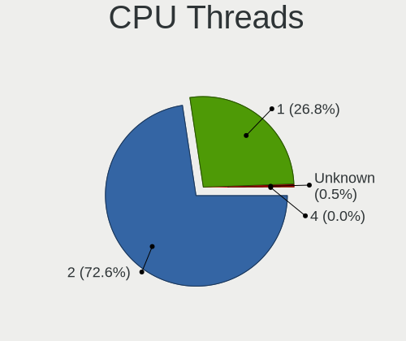
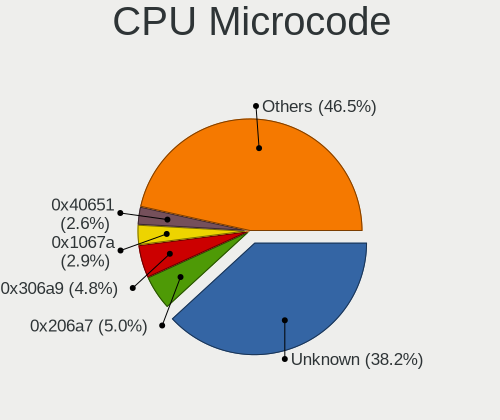
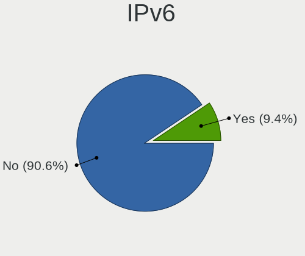
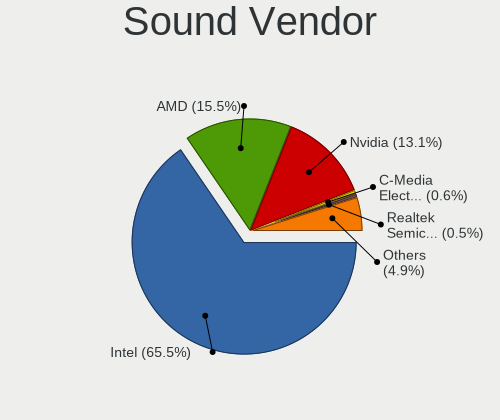

Linux in Poland - Tested Hardware & Statistics (Notebooks)
----------------------------------------------------------

A project to collect tested hardware configurations for Linux in Poland.

Anyone can contribute to this report by the [hw-probe](https://github.com/linuxhw/hw-probe) tool:

    sudo -E hw-probe -all -upload

Please contribute! Especially if your hardware is rare.

Contents
--------

* [ Test Cases ](#test-cases)

* [ System ](#system)
  - [ OS                       ](#os)
  - [ OS Family                ](#os-family)
  - [ Kernel                   ](#kernel)
  - [ Kernel Family            ](#kernel-family)
  - [ Kernel Major Ver.        ](#kernel-major-ver)
  - [ Arch                     ](#arch)
  - [ DE                       ](#de)
  - [ Display Server           ](#display-server)
  - [ Display Manager          ](#display-manager)
  - [ OS Lang                  ](#os-lang)
  - [ Boot Mode                ](#boot-mode)
  - [ Filesystem               ](#filesystem)
  - [ Part. scheme             ](#part-scheme)
  - [ Dual Boot with Linux/BSD ](#dual-boot-with-linuxbsd)
  - [ Dual Boot (Win)          ](#dual-boot-win)

* [ Board ](#board)
  - [ Vendor                   ](#vendor)
  - [ Model                    ](#model)
  - [ Model Family             ](#model-family)
  - [ MFG Year                 ](#mfg-year)
  - [ Form Factor              ](#form-factor)
  - [ Secure Boot              ](#secure-boot)
  - [ Coreboot                 ](#coreboot)
  - [ RAM Size                 ](#ram-size)
  - [ RAM Used                 ](#ram-used)
  - [ Total Drives             ](#total-drives)
  - [ Has CD-ROM               ](#has-cd-rom)
  - [ Has Ethernet             ](#has-ethernet)
  - [ Has WiFi                 ](#has-wifi)
  - [ Has Bluetooth            ](#has-bluetooth)

* [ Location ](#location)
  - [ Country                  ](#country)
  - [ City                     ](#city)

* [ Drives ](#drives)
  - [ Drive Vendor             ](#drive-vendor)
  - [ Drive Model              ](#drive-model)
  - [ HDD Vendor               ](#hdd-vendor)
  - [ SSD Vendor               ](#ssd-vendor)
  - [ Drive Kind               ](#drive-kind)
  - [ Drive Connector          ](#drive-connector)
  - [ Drive Size               ](#drive-size)
  - [ Space Total              ](#space-total)
  - [ Space Used               ](#space-used)
  - [ Malfunc. Drives          ](#malfunc-drives)
  - [ Malfunc. Drive Vendor    ](#malfunc-drive-vendor)
  - [ Malfunc. HDD Vendor      ](#malfunc-hdd-vendor)
  - [ Malfunc. Drive Kind      ](#malfunc-drive-kind)
  - [ Failed Drives            ](#failed-drives)
  - [ Failed Drive Vendor      ](#failed-drive-vendor)
  - [ Drive Status             ](#drive-status)

* [ Storage controller ](#storage-controller)
  - [ Storage Vendor           ](#storage-vendor)
  - [ Storage Model            ](#storage-model)
  - [ Storage Kind             ](#storage-kind)

* [ Processor ](#processor)
  - [ CPU Vendor               ](#cpu-vendor)
  - [ CPU Model                ](#cpu-model)
  - [ CPU Model Family         ](#cpu-model-family)
  - [ CPU Cores                ](#cpu-cores)
  - [ CPU Sockets              ](#cpu-sockets)
  - [ CPU Threads              ](#cpu-threads)
  - [ CPU Op-Modes             ](#cpu-op-modes)
  - [ CPU Microcode            ](#cpu-microcode)
  - [ CPU Microarch            ](#cpu-microarch)

* [ Graphics ](#graphics)
  - [ GPU Vendor               ](#gpu-vendor)
  - [ GPU Model                ](#gpu-model)
  - [ GPU Combo                ](#gpu-combo)
  - [ GPU Driver               ](#gpu-driver)
  - [ GPU Memory               ](#gpu-memory)

* [ Monitor ](#monitor)
  - [ Monitor Vendor           ](#monitor-vendor)
  - [ Monitor Model            ](#monitor-model)
  - [ Monitor Resolution       ](#monitor-resolution)
  - [ Monitor Diagonal         ](#monitor-diagonal)
  - [ Monitor Width            ](#monitor-width)
  - [ Aspect Ratio             ](#aspect-ratio)
  - [ Monitor Area             ](#monitor-area)
  - [ Pixel Density            ](#pixel-density)
  - [ Multiple Monitors        ](#multiple-monitors)

* [ Network ](#network)
  - [ Net Controller Vendor    ](#net-controller-vendor)
  - [ Net Controller Model     ](#net-controller-model)
  - [ Wireless Vendor          ](#wireless-vendor)
  - [ Wireless Model           ](#wireless-model)
  - [ Ethernet Vendor          ](#ethernet-vendor)
  - [ Ethernet Model           ](#ethernet-model)
  - [ Net Controller Kind      ](#net-controller-kind)
  - [ Used Controller          ](#used-controller)
  - [ NICs                     ](#nics)
  - [ IPv6                     ](#ipv6)

* [ Bluetooth ](#bluetooth)
  - [ Bluetooth Vendor         ](#bluetooth-vendor)
  - [ Bluetooth Model          ](#bluetooth-model)

* [ Sound ](#sound)
  - [ Sound Vendor             ](#sound-vendor)
  - [ Sound Model              ](#sound-model)

* [ Memory ](#memory)
  - [ Memory Vendor            ](#memory-vendor)
  - [ Memory Model             ](#memory-model)
  - [ Memory Kind              ](#memory-kind)
  - [ Memory Form Factor       ](#memory-form-factor)
  - [ Memory Size              ](#memory-size)
  - [ Memory Speed             ](#memory-speed)

* [ Printers & scanners ](#printers--scanners)
  - [ Printer Vendor           ](#printer-vendor)
  - [ Printer Model            ](#printer-model)
  - [ Scanner Vendor           ](#scanner-vendor)
  - [ Scanner Model            ](#scanner-model)

* [ Camera ](#camera)
  - [ Camera Vendor            ](#camera-vendor)
  - [ Camera Model             ](#camera-model)

* [ Security ](#security)
  - [ Fingerprint Vendor       ](#fingerprint-vendor)
  - [ Fingerprint Model        ](#fingerprint-model)
  - [ Chipcard Vendor          ](#chipcard-vendor)
  - [ Chipcard Model           ](#chipcard-model)

* [ Unsupported ](#unsupported)
  - [ Unsupported Devices      ](#unsupported-devices)
  - [ Unsupported Device Types ](#unsupported-device-types)

Test Cases
----------

Total: 4895

| Vendor        | Model                       | Probe                                                      | Date         |
|---------------|-----------------------------|------------------------------------------------------------|--------------|
| Lenovo        | ThinkPad T460s 20FAS0600... | [07efd36bbe](https://linux-hardware.org/?probe=07efd36bbe) | Dec 24, 2023 |
| HP            | EliteBook 2530p             | [996611fcab](https://linux-hardware.org/?probe=996611fcab) | Dec 23, 2023 |
| Dell          | Latitude E6530              | [2a62f5f318](https://linux-hardware.org/?probe=2a62f5f318) | Dec 23, 2023 |
| Dell          | Latitude E6530              | [2d9ff2bdb9](https://linux-hardware.org/?probe=2d9ff2bdb9) | Dec 23, 2023 |
| Lenovo        | G50-30 80G0                 | [45b0f5ae9a](https://linux-hardware.org/?probe=45b0f5ae9a) | Dec 23, 2023 |
| HP            | EliteBook 745 G6            | [9bf64ae4b7](https://linux-hardware.org/?probe=9bf64ae4b7) | Dec 23, 2023 |
| ASUSTek       | X555LJ                      | [8f1a82681b](https://linux-hardware.org/?probe=8f1a82681b) | Dec 22, 2023 |
| ASUSTek       | X555LJ                      | [44b0b8bd05](https://linux-hardware.org/?probe=44b0b8bd05) | Dec 22, 2023 |
| Dell          | Latitude 5440               | [d7462b97ac](https://linux-hardware.org/?probe=d7462b97ac) | Dec 22, 2023 |
| Lenovo        | ThinkBook 16 G6 IRL 21KH    | [c6cefd749d](https://linux-hardware.org/?probe=c6cefd749d) | Dec 22, 2023 |
| Dell          | Latitude E6400              | [6e6d4fec11](https://linux-hardware.org/?probe=6e6d4fec11) | Dec 21, 2023 |
| Dell          | Precision M6600             | [5e387ee3ac](https://linux-hardware.org/?probe=5e387ee3ac) | Dec 21, 2023 |
| ASUSTek       | VivoBook_ASUSLaptop X421... | [ec0a846182](https://linux-hardware.org/?probe=ec0a846182) | Dec 21, 2023 |
| Lenovo        | ThinkPad SL 2746E9G         | [594a56a070](https://linux-hardware.org/?probe=594a56a070) | Dec 21, 2023 |
| ASUSTek       | VivoBook_ASUSLaptop X421... | [5632b47c38](https://linux-hardware.org/?probe=5632b47c38) | Dec 21, 2023 |
| Dell          | Latitude E6320              | [a1e4b48d85](https://linux-hardware.org/?probe=a1e4b48d85) | Dec 20, 2023 |
| Fujitsu       | LIFEBOOK U745               | [a2f7b09b87](https://linux-hardware.org/?probe=a2f7b09b87) | Dec 20, 2023 |
| STONE COMP... | NOTCHA-286                  | [c931f0f65a](https://linux-hardware.org/?probe=c931f0f65a) | Dec 20, 2023 |
| Samsung       | 350V5C/351V5C/3540VC/344... | [5615091c1d](https://linux-hardware.org/?probe=5615091c1d) | Dec 20, 2023 |
| Unknown       | Unknown                     | [6f1ca9e563](https://linux-hardware.org/?probe=6f1ca9e563) | Dec 19, 2023 |
| Unknown       | Unknown                     | [13072c9ecc](https://linux-hardware.org/?probe=13072c9ecc) | Dec 19, 2023 |
| Dell          | Latitude 3190               | [a7e488632e](https://linux-hardware.org/?probe=a7e488632e) | Dec 19, 2023 |
| Google        | Phaser360                   | [c739678794](https://linux-hardware.org/?probe=c739678794) | Dec 18, 2023 |
| Dell          | Latitude E6440              | [8d1b130773](https://linux-hardware.org/?probe=8d1b130773) | Dec 18, 2023 |
| Lenovo        | ThinkPad T14 Gen 3 21AH0... | [1a1a04845b](https://linux-hardware.org/?probe=1a1a04845b) | Dec 18, 2023 |
| Lenovo        | ThinkPad T14 Gen 3 21AH0... | [fcc1139818](https://linux-hardware.org/?probe=fcc1139818) | Dec 18, 2023 |
| Fujitsu Si... | LIFEBOOK S6410              | [24edc4b12c](https://linux-hardware.org/?probe=24edc4b12c) | Dec 17, 2023 |
| ASUSTek       | 1215N                       | [9d204d6a41](https://linux-hardware.org/?probe=9d204d6a41) | Dec 17, 2023 |
| ASUSTek       | K84L                        | [3e0ea1ca0a](https://linux-hardware.org/?probe=3e0ea1ca0a) | Dec 17, 2023 |
| Google        | Phaser360                   | [784ed40440](https://linux-hardware.org/?probe=784ed40440) | Dec 16, 2023 |
| HP            | Pavilion Laptop 14-dv0xx... | [f7ffef008a](https://linux-hardware.org/?probe=f7ffef008a) | Dec 16, 2023 |
| HP            | Pavilion Laptop 14-dv0xx... | [fc9b36317a](https://linux-hardware.org/?probe=fc9b36317a) | Dec 16, 2023 |
| Dell          | Inspiron 15-3567            | [3907c9bfa3](https://linux-hardware.org/?probe=3907c9bfa3) | Dec 16, 2023 |
| Lenovo        | B590 20206                  | [b6afc3e929](https://linux-hardware.org/?probe=b6afc3e929) | Dec 16, 2023 |
| Lenovo        | G570 20079                  | [7928703207](https://linux-hardware.org/?probe=7928703207) | Dec 16, 2023 |
| Dell          | Latitude E5410              | [ee4251c01c](https://linux-hardware.org/?probe=ee4251c01c) | Dec 15, 2023 |
| Lenovo        | Yoga Slim 6 14IAP8 82WU     | [c2186c6471](https://linux-hardware.org/?probe=c2186c6471) | Dec 14, 2023 |
| MSI           | GT70 2OC/2OD                | [22910f80b0](https://linux-hardware.org/?probe=22910f80b0) | Dec 14, 2023 |
| Dell          | Latitude E6440              | [cf0bb02399](https://linux-hardware.org/?probe=cf0bb02399) | Dec 13, 2023 |
| HP            | Laptop 15s-eq0xxx           | [56e614b2fe](https://linux-hardware.org/?probe=56e614b2fe) | Dec 12, 2023 |
| Dell          | Latitude 3190               | [faf8105e3c](https://linux-hardware.org/?probe=faf8105e3c) | Dec 12, 2023 |
| HP            | Laptop                      | [8bdb6d048e](https://linux-hardware.org/?probe=8bdb6d048e) | Dec 11, 2023 |
| Dell          | Precision 7520              | [d0f203dcb1](https://linux-hardware.org/?probe=d0f203dcb1) | Dec 11, 2023 |
| Dell          | Precision 7520              | [2e02455101](https://linux-hardware.org/?probe=2e02455101) | Dec 11, 2023 |
| HP            | Pavilion Sleekbook 15       | [baec95bb2f](https://linux-hardware.org/?probe=baec95bb2f) | Dec 11, 2023 |
| Apple         | MacBookPro15,1              | [9d882fc801](https://linux-hardware.org/?probe=9d882fc801) | Dec 11, 2023 |
| HP            | Laptop                      | [b5d2cf7074](https://linux-hardware.org/?probe=b5d2cf7074) | Dec 10, 2023 |
| Lenovo        | ThinkPad T410 2522V3S       | [7a6c259421](https://linux-hardware.org/?probe=7a6c259421) | Dec 10, 2023 |
| Acer          | Nitro AN515-54              | [a29797fb65](https://linux-hardware.org/?probe=a29797fb65) | Dec 10, 2023 |
| Toshiba       | Satellite A660              | [441f997be2](https://linux-hardware.org/?probe=441f997be2) | Dec 10, 2023 |
| ASUSTek       | VivoBook_ASUSLaptop X515... | [63b05d421b](https://linux-hardware.org/?probe=63b05d421b) | Dec 10, 2023 |
| ASUSTek       | VivoBook_ASUSLaptop X515... | [1ecb7258d5](https://linux-hardware.org/?probe=1ecb7258d5) | Dec 10, 2023 |
| Dell          | Latitude 7440               | [2aef8e5157](https://linux-hardware.org/?probe=2aef8e5157) | Dec 09, 2023 |
| ASUSTek       | Zenbook 15 UM3504DA_UM35... | [87be870a89](https://linux-hardware.org/?probe=87be870a89) | Dec 09, 2023 |
| Lenovo        | V14-IIL 82C4                | [459870519f](https://linux-hardware.org/?probe=459870519f) | Dec 09, 2023 |
| Gigabyte      | AORUS 15 9KF                | [d6386ee775](https://linux-hardware.org/?probe=d6386ee775) | Dec 09, 2023 |
| Dell          | Latitude 7490               | [13759c617a](https://linux-hardware.org/?probe=13759c617a) | Dec 08, 2023 |
| Dell          | Latitude E5550              | [740c338fbe](https://linux-hardware.org/?probe=740c338fbe) | Dec 08, 2023 |
| Dell          | Latitude 5511               | [9f006edcd8](https://linux-hardware.org/?probe=9f006edcd8) | Dec 08, 2023 |
| MSI           | Modern 15 B12M              | [da95a095fa](https://linux-hardware.org/?probe=da95a095fa) | Dec 08, 2023 |
| Dell          | Latitude E6430              | [dee39185ec](https://linux-hardware.org/?probe=dee39185ec) | Dec 08, 2023 |
| Dell          | Latitude E5550              | [52866a9d1a](https://linux-hardware.org/?probe=52866a9d1a) | Dec 08, 2023 |
| Lenovo        | ThinkPad X250 20CLS8C000    | [bff5eac6db](https://linux-hardware.org/?probe=bff5eac6db) | Dec 08, 2023 |
| HP            | EliteBook 840 14 inch G1... | [b2fcb75892](https://linux-hardware.org/?probe=b2fcb75892) | Dec 07, 2023 |
| ASUSTek       | ASUS TUF Gaming F15 FX50... | [87aa35c45c](https://linux-hardware.org/?probe=87aa35c45c) | Dec 07, 2023 |
| Lenovo        | IdeaPad 110-15ISK 80UD      | [256fbd42a6](https://linux-hardware.org/?probe=256fbd42a6) | Dec 06, 2023 |
| Lenovo        | ThinkPad X1 Carbon 6th 2... | [3fce748548](https://linux-hardware.org/?probe=3fce748548) | Dec 06, 2023 |
| Packard Be... | EasyNote TSX66HR            | [8ca6149044](https://linux-hardware.org/?probe=8ca6149044) | Dec 06, 2023 |
| Acer          | Aspire A315-23              | [7d11b1aed9](https://linux-hardware.org/?probe=7d11b1aed9) | Dec 06, 2023 |
| ASUSTek       | ASUS TUF Gaming A16 FA61... | [fae6162d7b](https://linux-hardware.org/?probe=fae6162d7b) | Dec 06, 2023 |
| Lenovo        | IdeaPad Y700-15ISK 80NV     | [e6657bb173](https://linux-hardware.org/?probe=e6657bb173) | Dec 06, 2023 |
| Valve         | Galileo                     | [4704035dff](https://linux-hardware.org/?probe=4704035dff) | Dec 06, 2023 |
| HUAWEI        | RLEF-XX                     | [519c5e78fc](https://linux-hardware.org/?probe=519c5e78fc) | Dec 06, 2023 |
| ASUSTek       | N76VZ                       | [3d8844bc98](https://linux-hardware.org/?probe=3d8844bc98) | Dec 05, 2023 |
| Lenovo        | ThinkPad E15 20RD003KMH     | [d54efc5833](https://linux-hardware.org/?probe=d54efc5833) | Dec 05, 2023 |
| ASUSTek       | K53U                        | [b76cef4836](https://linux-hardware.org/?probe=b76cef4836) | Dec 05, 2023 |
| Toshiba       | Satellite L750              | [667c6d4e98](https://linux-hardware.org/?probe=667c6d4e98) | Dec 05, 2023 |
| Valve         | Jupiter                     | [63e8b02453](https://linux-hardware.org/?probe=63e8b02453) | Dec 05, 2023 |
| ASUSTek       | X555LJ                      | [bd98f1df4c](https://linux-hardware.org/?probe=bd98f1df4c) | Dec 04, 2023 |
| HP            | ProBook 650 G1              | [b4b71ada44](https://linux-hardware.org/?probe=b4b71ada44) | Dec 04, 2023 |
| Acer          | Extensa 215-55              | [87616f0d71](https://linux-hardware.org/?probe=87616f0d71) | Dec 04, 2023 |
| Dell          | Inspiron MM061              | [0f629c5ee8](https://linux-hardware.org/?probe=0f629c5ee8) | Dec 04, 2023 |
| HUAWEI        | BOD-WXX9                    | [961b00cfbe](https://linux-hardware.org/?probe=961b00cfbe) | Dec 04, 2023 |
| Samsung       | R530/R730/R540              | [7c16c8b9ac](https://linux-hardware.org/?probe=7c16c8b9ac) | Dec 03, 2023 |
| ASUSTek       | 1215N                       | [49eeb946c5](https://linux-hardware.org/?probe=49eeb946c5) | Dec 03, 2023 |
| ASUSTek       | K53SJ                       | [50979ecbd2](https://linux-hardware.org/?probe=50979ecbd2) | Dec 03, 2023 |
| Lenovo        | V14-IIL 82C4                | [848e0dbd37](https://linux-hardware.org/?probe=848e0dbd37) | Dec 03, 2023 |
| Dell          | Latitude E6410              | [bae67b7a50](https://linux-hardware.org/?probe=bae67b7a50) | Dec 03, 2023 |
| Dell          | System Inspiron N7110       | [f0df20f63f](https://linux-hardware.org/?probe=f0df20f63f) | Dec 03, 2023 |
| Samsung       | 350V5C/351V5C/3540VC/344... | [9abcd3c636](https://linux-hardware.org/?probe=9abcd3c636) | Dec 03, 2023 |
| Medion        | E6214                       | [f5e38ac376](https://linux-hardware.org/?probe=f5e38ac376) | Dec 03, 2023 |
| HP            | Laptop 15s-eq0xxx           | [bc4c5638a3](https://linux-hardware.org/?probe=bc4c5638a3) | Dec 03, 2023 |
| Lenovo        | Legion 5 15ACH6H 82JU       | [a18c178195](https://linux-hardware.org/?probe=a18c178195) | Dec 02, 2023 |
| ASUSTek       | F3E                         | [26a960dd12](https://linux-hardware.org/?probe=26a960dd12) | Dec 02, 2023 |
| Dell          | Precision 5520              | [aa1a1feefc](https://linux-hardware.org/?probe=aa1a1feefc) | Dec 02, 2023 |
| Lenovo        | Legion Y540-15IRH-PG0 81... | [983698f613](https://linux-hardware.org/?probe=983698f613) | Dec 02, 2023 |
| Acer          | Aspire E5-575G              | [561cad738d](https://linux-hardware.org/?probe=561cad738d) | Dec 02, 2023 |
| HP            | EliteBook 8560p             | [186eb0ce63](https://linux-hardware.org/?probe=186eb0ce63) | Dec 02, 2023 |
| HP            | EliteBook 8560p             | [6f6f496558](https://linux-hardware.org/?probe=6f6f496558) | Dec 01, 2023 |
| Lenovo        | G585                        | [a62a35b461](https://linux-hardware.org/?probe=a62a35b461) | Dec 01, 2023 |
| Dell          | Latitude 7440               | [b4179d70c3](https://linux-hardware.org/?probe=b4179d70c3) | Dec 01, 2023 |
| Google        | Fleex                       | [4baac33893](https://linux-hardware.org/?probe=4baac33893) | Dec 01, 2023 |
| Acer          | Aspire A715-74G             | [52a7a60343](https://linux-hardware.org/?probe=52a7a60343) | Dec 01, 2023 |
| Dell          | Inspiron 13-5368            | [ab8935b499](https://linux-hardware.org/?probe=ab8935b499) | Dec 01, 2023 |
| Acer          | Aspire 5750G                | [327582fb65](https://linux-hardware.org/?probe=327582fb65) | Dec 01, 2023 |
| Apple         | MacBook3,1                  | [d536392d03](https://linux-hardware.org/?probe=d536392d03) | Nov 30, 2023 |
| Apple         | MacBook3,1                  | [bfe263dfe0](https://linux-hardware.org/?probe=bfe263dfe0) | Nov 30, 2023 |
| Lenovo        | IdeaPad 305-15IBD 80NJ      | [c7a78a1510](https://linux-hardware.org/?probe=c7a78a1510) | Nov 30, 2023 |
| Toshiba       | Satellite C660              | [03de11e5b3](https://linux-hardware.org/?probe=03de11e5b3) | Nov 30, 2023 |
| Dell          | G15 5515                    | [25c732d6aa](https://linux-hardware.org/?probe=25c732d6aa) | Nov 30, 2023 |
| Lenovo        | IdeaPad 300-15ISK 80Q7      | [d416d62cf1](https://linux-hardware.org/?probe=d416d62cf1) | Nov 29, 2023 |
| Lenovo        | ThinkBook 16 G4+ IAP 21C... | [d0eb22aa03](https://linux-hardware.org/?probe=d0eb22aa03) | Nov 29, 2023 |
| HP            | Pavilion Gaming Laptop 1... | [2d1452d207](https://linux-hardware.org/?probe=2d1452d207) | Nov 29, 2023 |
| Fujitsu       | LIFEBOOK E5512              | [9df65d1a3d](https://linux-hardware.org/?probe=9df65d1a3d) | Nov 29, 2023 |
| Acer          | Aspire E5-575G              | [c5dd65037d](https://linux-hardware.org/?probe=c5dd65037d) | Nov 29, 2023 |
| Dell          | Venue 11 Pro 7130 vPro      | [2a9b640b54](https://linux-hardware.org/?probe=2a9b640b54) | Nov 28, 2023 |
| Dell          | Latitude E5430 non-vPro     | [34f3153910](https://linux-hardware.org/?probe=34f3153910) | Nov 28, 2023 |
| HP            | Laptop 15-db1xxx            | [52a0c464fe](https://linux-hardware.org/?probe=52a0c464fe) | Nov 28, 2023 |
| Dell          | Venue 11 Pro 7130 vPro      | [b8337b50d8](https://linux-hardware.org/?probe=b8337b50d8) | Nov 28, 2023 |
| Lenovo        | IdeaPad Y700-15ISK 80NV     | [0a4f97781c](https://linux-hardware.org/?probe=0a4f97781c) | Nov 27, 2023 |
| Lenovo        | ThinkPad T520 4243PH3       | [63ba3b10d4](https://linux-hardware.org/?probe=63ba3b10d4) | Nov 27, 2023 |
| Clevo         | M720R                       | [cf202bc2be](https://linux-hardware.org/?probe=cf202bc2be) | Nov 27, 2023 |
| Lenovo        | Yoga Slim 7 Pro 14IAH7 8... | [d36366cac6](https://linux-hardware.org/?probe=d36366cac6) | Nov 27, 2023 |
| Acer          | Nitro AN515-54              | [e4cbe05d6d](https://linux-hardware.org/?probe=e4cbe05d6d) | Nov 27, 2023 |
| Dell          | G15 5515                    | [b33a8c3a2e](https://linux-hardware.org/?probe=b33a8c3a2e) | Nov 27, 2023 |
| HP            | ZBook 17 G2                 | [da3ac19523](https://linux-hardware.org/?probe=da3ac19523) | Nov 26, 2023 |
| Dell          | Latitude D630               | [51af6a8f00](https://linux-hardware.org/?probe=51af6a8f00) | Nov 26, 2023 |
| Valve         | Jupiter                     | [95bd4c2832](https://linux-hardware.org/?probe=95bd4c2832) | Nov 26, 2023 |
| Fujitsu       | LIFEBOOK E4511              | [a849237ab7](https://linux-hardware.org/?probe=a849237ab7) | Nov 26, 2023 |
| Chuwi         | GemiBook Plus               | [6316398e5b](https://linux-hardware.org/?probe=6316398e5b) | Nov 26, 2023 |
| HP            | ProBook 5330m               | [74e3bacd14](https://linux-hardware.org/?probe=74e3bacd14) | Nov 25, 2023 |
| Samsung       | RF510/RF410/RF710           | [a642075264](https://linux-hardware.org/?probe=a642075264) | Nov 25, 2023 |
| HP            | EliteBook 735 G6            | [a0480513dd](https://linux-hardware.org/?probe=a0480513dd) | Nov 25, 2023 |
| HP            | EliteBook 2570p             | [e01ac99a92](https://linux-hardware.org/?probe=e01ac99a92) | Nov 25, 2023 |
| Lenovo        | V14-IIL 82C4                | [eb4379efae](https://linux-hardware.org/?probe=eb4379efae) | Nov 24, 2023 |
| Dell          | Inspiron N5040              | [3b51468cdf](https://linux-hardware.org/?probe=3b51468cdf) | Nov 24, 2023 |
| HP            | EliteBook 850 G8 Noteboo... | [2b2ac91a50](https://linux-hardware.org/?probe=2b2ac91a50) | Nov 24, 2023 |
| Packard Be... | EasyNote LJ65               | [50a53cf2b0](https://linux-hardware.org/?probe=50a53cf2b0) | Nov 24, 2023 |
| Lenovo        | ThinkPad X1 Extreme 20MF... | [2852a62f61](https://linux-hardware.org/?probe=2852a62f61) | Nov 24, 2023 |
| HP            | EliteBook 845 G7 Noteboo... | [4b725b7022](https://linux-hardware.org/?probe=4b725b7022) | Nov 24, 2023 |
| Lenovo        | IdeaPad Gaming 3 15IAH7 ... | [2c505c0b1e](https://linux-hardware.org/?probe=2c505c0b1e) | Nov 24, 2023 |
| MSI           | Stealth GS66 12UGS          | [080042a410](https://linux-hardware.org/?probe=080042a410) | Nov 23, 2023 |
| MSI           | Stealth GS66 12UGS          | [f82ecf4011](https://linux-hardware.org/?probe=f82ecf4011) | Nov 23, 2023 |
| Lenovo        | B50-10 80QR                 | [ac0bed612a](https://linux-hardware.org/?probe=ac0bed612a) | Nov 22, 2023 |
| Valve         | Jupiter                     | [b73a5b800d](https://linux-hardware.org/?probe=b73a5b800d) | Nov 22, 2023 |
| mPTech        | ARC 11.6 128GB HD           | [56319a6e9d](https://linux-hardware.org/?probe=56319a6e9d) | Nov 21, 2023 |
| Samsung       | 300V3A/300V4A/300V5A        | [5a2df7d067](https://linux-hardware.org/?probe=5a2df7d067) | Nov 21, 2023 |
| Dell          | Latitude 3190               | [3c5b8541c7](https://linux-hardware.org/?probe=3c5b8541c7) | Nov 21, 2023 |
| Dell          | Latitude E6430              | [442654cab6](https://linux-hardware.org/?probe=442654cab6) | Nov 21, 2023 |
| Samsung       | 350V5C/351V5C/3540VC/344... | [aeb55b832b](https://linux-hardware.org/?probe=aeb55b832b) | Nov 21, 2023 |
| Acer          | Aspire A315-56              | [b2b85808ca](https://linux-hardware.org/?probe=b2b85808ca) | Nov 20, 2023 |
| HP            | Pavilion dv7                | [b11ea54568](https://linux-hardware.org/?probe=b11ea54568) | Nov 20, 2023 |
| Lenovo        | IdeaPad Y700-15ISK 80NV     | [a090e73dbf](https://linux-hardware.org/?probe=a090e73dbf) | Nov 20, 2023 |
| Valve         | Jupiter                     | [08b0fccf59](https://linux-hardware.org/?probe=08b0fccf59) | Nov 20, 2023 |
| HUAWEI        | NBLB-WAX9N                  | [e89473830f](https://linux-hardware.org/?probe=e89473830f) | Nov 19, 2023 |
| Dell          | Latitude E6330              | [3c6e547f2a](https://linux-hardware.org/?probe=3c6e547f2a) | Nov 19, 2023 |
| Lenovo        | ThinkPad X60 1707Y91        | [ac0e28ee75](https://linux-hardware.org/?probe=ac0e28ee75) | Nov 19, 2023 |
| Dell          | Latitude E6330              | [078f4227bd](https://linux-hardware.org/?probe=078f4227bd) | Nov 19, 2023 |
| Toshiba       | Satellite L300D             | [87222a31f3](https://linux-hardware.org/?probe=87222a31f3) | Nov 18, 2023 |
| Lenovo        | IdeaPad Y700-15ISK 80NV     | [088efe59ae](https://linux-hardware.org/?probe=088efe59ae) | Nov 18, 2023 |
| Dell          | Latitude D630               | [54e404f085](https://linux-hardware.org/?probe=54e404f085) | Nov 18, 2023 |
| Dell          | Latitude E6400              | [737ee5a8d3](https://linux-hardware.org/?probe=737ee5a8d3) | Nov 18, 2023 |
| Dell          | Latitude 5490               | [b3da1a92d0](https://linux-hardware.org/?probe=b3da1a92d0) | Nov 17, 2023 |
| HP            | EliteBook 850 G6            | [fa0b8c4a6a](https://linux-hardware.org/?probe=fa0b8c4a6a) | Nov 17, 2023 |
| HP            | ProBook 450 G8 Notebook ... | [da6ffb4c35](https://linux-hardware.org/?probe=da6ffb4c35) | Nov 17, 2023 |
| ASUSTek       | Zenbook 15 UM3504DA_UM35... | [6518d0d83e](https://linux-hardware.org/?probe=6518d0d83e) | Nov 17, 2023 |
| Dell          | Inspiron 7566               | [5709fca952](https://linux-hardware.org/?probe=5709fca952) | Nov 17, 2023 |
| Dell          | Latitude E5430 non-vPro     | [6ea69f0699](https://linux-hardware.org/?probe=6ea69f0699) | Nov 15, 2023 |
| ASUSTek       | VivoBook_ASUSLaptop X421... | [df8a98ef2c](https://linux-hardware.org/?probe=df8a98ef2c) | Nov 14, 2023 |
| Dell          | System Vostro 3750          | [513485cc8f](https://linux-hardware.org/?probe=513485cc8f) | Nov 14, 2023 |
| MSI           | Modern 14 B11MO             | [2095892205](https://linux-hardware.org/?probe=2095892205) | Nov 14, 2023 |
| ASUSTek       | X550JK                      | [200a783f1a](https://linux-hardware.org/?probe=200a783f1a) | Nov 14, 2023 |
| Dell          | System Vostro 3750          | [3c336ad6e1](https://linux-hardware.org/?probe=3c336ad6e1) | Nov 14, 2023 |
| HP            | ZBook 17 G6                 | [b7d9898316](https://linux-hardware.org/?probe=b7d9898316) | Nov 13, 2023 |
| HUAWEI        | BOD-WXX9                    | [113193bb57](https://linux-hardware.org/?probe=113193bb57) | Nov 13, 2023 |
| HP            | Laptop 14-ck0xxx            | [73a53ca5a4](https://linux-hardware.org/?probe=73a53ca5a4) | Nov 13, 2023 |
| Samsung       | 350V5C/351V5C/3540VC/344... | [72639a4231](https://linux-hardware.org/?probe=72639a4231) | Nov 13, 2023 |
| Toshiba       | Satellite L40               | [0d2accfed1](https://linux-hardware.org/?probe=0d2accfed1) | Nov 13, 2023 |
| Timi          | A35S                        | [f225083df7](https://linux-hardware.org/?probe=f225083df7) | Nov 12, 2023 |
| Dell          | Latitude E7440              | [407afcc9d2](https://linux-hardware.org/?probe=407afcc9d2) | Nov 12, 2023 |
| HP            | ProBook 450 G3              | [a749127ad5](https://linux-hardware.org/?probe=a749127ad5) | Nov 11, 2023 |
| HP            | ProBook 450 G3              | [ed70ccc9b1](https://linux-hardware.org/?probe=ed70ccc9b1) | Nov 11, 2023 |
| ASUSTek       | ASUS TUF Gaming F15 FX50... | [5fcb6b8815](https://linux-hardware.org/?probe=5fcb6b8815) | Nov 11, 2023 |
| ASUSTek       | X541NA                      | [951f01b614](https://linux-hardware.org/?probe=951f01b614) | Nov 11, 2023 |
| MSI           | Alpha 17 C7VG               | [99fa1e8cbd](https://linux-hardware.org/?probe=99fa1e8cbd) | Nov 11, 2023 |
| HP            | ZBook 17 G6                 | [c9f63fc134](https://linux-hardware.org/?probe=c9f63fc134) | Nov 11, 2023 |
| HUAWEI        | BOD-WXX9                    | [4e81c16b62](https://linux-hardware.org/?probe=4e81c16b62) | Nov 10, 2023 |
| Dell          | Latitude D630               | [8af88f25f0](https://linux-hardware.org/?probe=8af88f25f0) | Nov 10, 2023 |
| Lenovo        | Legion 5 Pro 16ACH6H 82J... | [b299fd1fe9](https://linux-hardware.org/?probe=b299fd1fe9) | Nov 09, 2023 |
| Medion        | Akoya E1318T                | [4e3e62ee88](https://linux-hardware.org/?probe=4e3e62ee88) | Nov 09, 2023 |
| Acer          | Aspire E1-571               | [665ed1538e](https://linux-hardware.org/?probe=665ed1538e) | Nov 09, 2023 |
| HUAWEI        | KPL-W0X                     | [2e06b9e7ff](https://linux-hardware.org/?probe=2e06b9e7ff) | Nov 09, 2023 |
| Lenovo        | ThinkPad L14 Gen 3 21C10... | [58c681b475](https://linux-hardware.org/?probe=58c681b475) | Nov 09, 2023 |
| Lenovo        | ThinkPad E14 Gen 2 20TA0... | [80431017dc](https://linux-hardware.org/?probe=80431017dc) | Nov 09, 2023 |
| ASUSTek       | VivoBook_ASUSLaptop X421... | [9ae1f9c05f](https://linux-hardware.org/?probe=9ae1f9c05f) | Nov 08, 2023 |
| Lenovo        | Legion 5 15ACH6A 82NW       | [16cf6c0ede](https://linux-hardware.org/?probe=16cf6c0ede) | Nov 08, 2023 |
| MSI           | Alpha 17 C7VG               | [6ac34aa88a](https://linux-hardware.org/?probe=6ac34aa88a) | Nov 06, 2023 |
| Samsung       | 350V5C/351V5C/3540VC/344... | [436bd1729a](https://linux-hardware.org/?probe=436bd1729a) | Nov 06, 2023 |
| Lenovo        | Legion Y540-15IRH 81SX      | [1da691596b](https://linux-hardware.org/?probe=1da691596b) | Nov 06, 2023 |
| Lenovo        | Legion Y540-15IRH 81SX      | [d385d4714c](https://linux-hardware.org/?probe=d385d4714c) | Nov 06, 2023 |
| Lenovo        | IdeaPad S340-15IWL 81N8     | [d40cc6e0a4](https://linux-hardware.org/?probe=d40cc6e0a4) | Nov 05, 2023 |
| Lenovo        | IdeaPad 330-17ICH 81FL      | [e25bb48957](https://linux-hardware.org/?probe=e25bb48957) | Nov 05, 2023 |
| Dell          | XPS 17 9720                 | [39e8a692ae](https://linux-hardware.org/?probe=39e8a692ae) | Nov 05, 2023 |
| ASUSTek       | X541NA                      | [f0399efc08](https://linux-hardware.org/?probe=f0399efc08) | Nov 05, 2023 |
| MSI           | Alpha 17 C7VG               | [fd9594de89](https://linux-hardware.org/?probe=fd9594de89) | Nov 05, 2023 |
| MSI           | Alpha 17 C7VG               | [a5a8cf5c09](https://linux-hardware.org/?probe=a5a8cf5c09) | Nov 05, 2023 |
| MSI           | Alpha 17 C7VG               | [74099b3a6e](https://linux-hardware.org/?probe=74099b3a6e) | Nov 05, 2023 |
| MSI           | Alpha 17 C7VG               | [bdad71bf99](https://linux-hardware.org/?probe=bdad71bf99) | Nov 05, 2023 |
| HP            | 255 G7 Notebook PC          | [bdd24f60d2](https://linux-hardware.org/?probe=bdd24f60d2) | Nov 05, 2023 |
| Lenovo        | ThinkPad T460 20FMS3YT01    | [89b8df73c1](https://linux-hardware.org/?probe=89b8df73c1) | Nov 04, 2023 |
| Dell          | Inspiron 16 5620            | [04d425d450](https://linux-hardware.org/?probe=04d425d450) | Nov 04, 2023 |
| Lenovo        | 80SY                        | [7c7a6ba82f](https://linux-hardware.org/?probe=7c7a6ba82f) | Nov 04, 2023 |
| Unknown       | Unknown                     | [9999b9fa3d](https://linux-hardware.org/?probe=9999b9fa3d) | Nov 04, 2023 |
| MSI           | GV62 7RE                    | [a6ce21c9de](https://linux-hardware.org/?probe=a6ce21c9de) | Nov 04, 2023 |
| Lenovo        | Legion 5 Pro 16ACH6H 82J... | [db71fb65bf](https://linux-hardware.org/?probe=db71fb65bf) | Nov 03, 2023 |
| Dell          | Latitude E6420              | [43ccf36bf0](https://linux-hardware.org/?probe=43ccf36bf0) | Nov 03, 2023 |
| Lenovo        | IdeaPad 5 14ARE05 81YM      | [4ccd2ef567](https://linux-hardware.org/?probe=4ccd2ef567) | Nov 03, 2023 |
| Acer          | Aspire V3-771               | [3a0023b4ba](https://linux-hardware.org/?probe=3a0023b4ba) | Nov 03, 2023 |
| Acer          | Nitro AN515-54              | [3ddccb994b](https://linux-hardware.org/?probe=3ddccb994b) | Nov 03, 2023 |
| ASUSTek       | ZenBook UX325EA_UX325EA     | [027a0a96da](https://linux-hardware.org/?probe=027a0a96da) | Nov 02, 2023 |
| Dell          | Latitude E6420              | [cdef3b5f1c](https://linux-hardware.org/?probe=cdef3b5f1c) | Nov 02, 2023 |
| ASUSTek       | VivoBook_ASUSLaptop M650... | [0c8b2cd660](https://linux-hardware.org/?probe=0c8b2cd660) | Nov 01, 2023 |
| HP            | OMEN Laptop 15-en0xxx       | [45d3b00840](https://linux-hardware.org/?probe=45d3b00840) | Nov 01, 2023 |
| Lenovo        | ThinkPad X1 Carbon Gen 1... | [7dd972fb0d](https://linux-hardware.org/?probe=7dd972fb0d) | Nov 01, 2023 |
| HP            | Pavilion g7                 | [157c592b3a](https://linux-hardware.org/?probe=157c592b3a) | Nov 01, 2023 |
| Dell          | Inspiron 13-5368            | [6d00cda16c](https://linux-hardware.org/?probe=6d00cda16c) | Nov 01, 2023 |
| Dell          | Latitude 3190               | [dc68dc55c9](https://linux-hardware.org/?probe=dc68dc55c9) | Oct 31, 2023 |
| HP            | Laptop 15s-eq0xxx           | [1323e3ad04](https://linux-hardware.org/?probe=1323e3ad04) | Oct 31, 2023 |
| Acer          | Aspire V3-771               | [00ffbda72d](https://linux-hardware.org/?probe=00ffbda72d) | Oct 31, 2023 |
| Apple         | MacBookPro14,1              | [12e8c83970](https://linux-hardware.org/?probe=12e8c83970) | Oct 30, 2023 |
| HP            | Pavilion Gaming Laptop 1... | [fe7dbb2385](https://linux-hardware.org/?probe=fe7dbb2385) | Oct 29, 2023 |
| Dell          | Precision M6600             | [30e8d1522d](https://linux-hardware.org/?probe=30e8d1522d) | Oct 29, 2023 |
| HUAWEI        | HKD-WXX                     | [101c8c676c](https://linux-hardware.org/?probe=101c8c676c) | Oct 29, 2023 |
| Lenovo        | Legion 5 15IAH7 82RC        | [f78fcbc612](https://linux-hardware.org/?probe=f78fcbc612) | Oct 28, 2023 |
| ASUSTek       | ASUS TUF Gaming F15 FX50... | [bbba3e21c7](https://linux-hardware.org/?probe=bbba3e21c7) | Oct 27, 2023 |
| Dell          | Inspiron 1525               | [0a0a08dd5f](https://linux-hardware.org/?probe=0a0a08dd5f) | Oct 26, 2023 |
| MSI           | MS-1688                     | [c3689c0452](https://linux-hardware.org/?probe=c3689c0452) | Oct 26, 2023 |
| Samsung       | 3570R/370R/470R/450R/510... | [7f10f1b379](https://linux-hardware.org/?probe=7f10f1b379) | Oct 26, 2023 |
| ASUSTek       | ROG Zephyrus G14 GA401QC... | [e3c1de1472](https://linux-hardware.org/?probe=e3c1de1472) | Oct 26, 2023 |
| Valve         | Jupiter                     | [38a8824fe8](https://linux-hardware.org/?probe=38a8824fe8) | Oct 25, 2023 |
| HP            | Compaq 610                  | [f449560c8a](https://linux-hardware.org/?probe=f449560c8a) | Oct 25, 2023 |
| Samsung       | 3570R/370R/470R/450R/510... | [6c88fcef70](https://linux-hardware.org/?probe=6c88fcef70) | Oct 25, 2023 |
| ASUSTek       | TUF Gaming FX505DT_FX505... | [3eee01cd16](https://linux-hardware.org/?probe=3eee01cd16) | Oct 24, 2023 |
| Notebook      | P7xxDM(-G)                  | [bb211b2fb4](https://linux-hardware.org/?probe=bb211b2fb4) | Oct 24, 2023 |
| Dell          | Inspiron 5737               | [06247cab2e](https://linux-hardware.org/?probe=06247cab2e) | Oct 24, 2023 |
| Dell          | Inspiron 11 - 3147          | [7be979fc66](https://linux-hardware.org/?probe=7be979fc66) | Oct 23, 2023 |
| Lenovo        | ThinkPad X1 Carbon Gen 1... | [8da5e9e836](https://linux-hardware.org/?probe=8da5e9e836) | Oct 23, 2023 |
| Lenovo        | ThinkPad A485 20MVS0X62X    | [52661c1969](https://linux-hardware.org/?probe=52661c1969) | Oct 22, 2023 |
| HP            | 250 G8 Notebook PC          | [9538ff99bf](https://linux-hardware.org/?probe=9538ff99bf) | Oct 22, 2023 |
| ASUSTek       | K53SV                       | [66d1164d86](https://linux-hardware.org/?probe=66d1164d86) | Oct 21, 2023 |
| Dell          | Precision 5520              | [79b5c73851](https://linux-hardware.org/?probe=79b5c73851) | Oct 21, 2023 |
| HP            | Pavilion Gaming Laptop 1... | [dca6ad28b3](https://linux-hardware.org/?probe=dca6ad28b3) | Oct 21, 2023 |
| Lenovo        | G510 20238                  | [d6bd0eda6d](https://linux-hardware.org/?probe=d6bd0eda6d) | Oct 21, 2023 |
| Dell          | Inspiron 5559               | [83811b2a84](https://linux-hardware.org/?probe=83811b2a84) | Oct 21, 2023 |
| Lenovo        | ThinkPad T470s W10DG 20J... | [1ff62f5fd7](https://linux-hardware.org/?probe=1ff62f5fd7) | Oct 21, 2023 |
| Dell          | XPS 15 9520                 | [7deca235e3](https://linux-hardware.org/?probe=7deca235e3) | Oct 20, 2023 |
| Dell          | Latitude 5440               | [e3760f51a8](https://linux-hardware.org/?probe=e3760f51a8) | Oct 19, 2023 |
| Dell          | Latitude 5440               | [257850f5d8](https://linux-hardware.org/?probe=257850f5d8) | Oct 18, 2023 |
| Dell          | Latitude 5440               | [2097e4ed5e](https://linux-hardware.org/?probe=2097e4ed5e) | Oct 18, 2023 |
| Unknown       | Unknown                     | [e1751f1726](https://linux-hardware.org/?probe=e1751f1726) | Oct 17, 2023 |
| Dell          | Latitude E6420              | [f703c6bd74](https://linux-hardware.org/?probe=f703c6bd74) | Oct 17, 2023 |
| Acer          | Aspire A315-56              | [9eb823dcdd](https://linux-hardware.org/?probe=9eb823dcdd) | Oct 17, 2023 |
| HP            | Laptop 15s-eq2xxx           | [7b5cf8abfc](https://linux-hardware.org/?probe=7b5cf8abfc) | Oct 17, 2023 |
| Dell          | Latitude 3190               | [6524dff50f](https://linux-hardware.org/?probe=6524dff50f) | Oct 17, 2023 |
| HP            | ProBook 6560b               | [3567f55849](https://linux-hardware.org/?probe=3567f55849) | Oct 15, 2023 |
| Lenovo        | IdeaPad Y580 20132          | [77c1531b00](https://linux-hardware.org/?probe=77c1531b00) | Oct 15, 2023 |
| Lenovo        | IdeaPad Y580 20132          | [2960de2715](https://linux-hardware.org/?probe=2960de2715) | Oct 15, 2023 |
| Lenovo        | IdeaPad Y700-15ISK 80NV     | [fd52faa27e](https://linux-hardware.org/?probe=fd52faa27e) | Oct 15, 2023 |
| Lenovo        | IdeaPad Y700-15ISK 80NV     | [39d3b3133e](https://linux-hardware.org/?probe=39d3b3133e) | Oct 14, 2023 |
| HP            | ProBook 6560b               | [49ffe8b6c5](https://linux-hardware.org/?probe=49ffe8b6c5) | Oct 14, 2023 |
| Lenovo        | IdeaPad 320-15IKB 81BG      | [d68359ee50](https://linux-hardware.org/?probe=d68359ee50) | Oct 14, 2023 |
| HP            | EliteBook 830 13 inch G1... | [e9ced529e2](https://linux-hardware.org/?probe=e9ced529e2) | Oct 14, 2023 |
| Lenovo        | ThinkPad T430u 3352A83      | [c5a829d842](https://linux-hardware.org/?probe=c5a829d842) | Oct 14, 2023 |
| Lenovo        | ThinkPad T400 64757D7       | [b374e214af](https://linux-hardware.org/?probe=b374e214af) | Oct 13, 2023 |
| MSI           | GE72 6QF                    | [94f1c85d10](https://linux-hardware.org/?probe=94f1c85d10) | Oct 13, 2023 |
| HP            | Grunt                       | [af80cd9bd6](https://linux-hardware.org/?probe=af80cd9bd6) | Oct 13, 2023 |
| ASUSTek       | X510UQ                      | [0494369566](https://linux-hardware.org/?probe=0494369566) | Oct 12, 2023 |
| Lenovo        | IdeaPad P500 20210          | [ba316cb723](https://linux-hardware.org/?probe=ba316cb723) | Oct 12, 2023 |
| Lenovo        | Legion 5 15ARH7 82RE        | [c83831e304](https://linux-hardware.org/?probe=c83831e304) | Oct 11, 2023 |
| MSI           | GL75 9SE                    | [bffc7bdfe6](https://linux-hardware.org/?probe=bffc7bdfe6) | Oct 11, 2023 |
| Dell          | Latitude 5511               | [164cc57420](https://linux-hardware.org/?probe=164cc57420) | Oct 10, 2023 |
| Dell          | Latitude 5511               | [9827df8ea8](https://linux-hardware.org/?probe=9827df8ea8) | Oct 10, 2023 |
| Dell          | XPS 15 9520                 | [04fbcfc11b](https://linux-hardware.org/?probe=04fbcfc11b) | Oct 10, 2023 |
| Dell          | Latitude E5530 non-vPro     | [df4f5f4e21](https://linux-hardware.org/?probe=df4f5f4e21) | Oct 09, 2023 |
| Acer          | Aspire 5755G                | [d4efaf21cb](https://linux-hardware.org/?probe=d4efaf21cb) | Oct 08, 2023 |
| Google        | Sasuke                      | [ea2d350776](https://linux-hardware.org/?probe=ea2d350776) | Oct 08, 2023 |
| HP            | EliteBook 745 G4            | [8a9290f8a1](https://linux-hardware.org/?probe=8a9290f8a1) | Oct 08, 2023 |
| Acer          | Aspire 5755G                | [889b36122b](https://linux-hardware.org/?probe=889b36122b) | Oct 08, 2023 |
| Google        | Lindar                      | [75852e1ad7](https://linux-hardware.org/?probe=75852e1ad7) | Oct 08, 2023 |
| ASUSTek       | VivoBook 15_ASUS Laptop ... | [3cfe6c7d0c](https://linux-hardware.org/?probe=3cfe6c7d0c) | Oct 08, 2023 |
| Lenovo        | ThinkPad P1 Gen 6 21FV00... | [c0a093d7d2](https://linux-hardware.org/?probe=c0a093d7d2) | Oct 08, 2023 |
| Samsung       | 550P5C/550P7C               | [a95183052c](https://linux-hardware.org/?probe=a95183052c) | Oct 08, 2023 |
| HP            | EliteBook 840 G5            | [3ce37336af](https://linux-hardware.org/?probe=3ce37336af) | Oct 06, 2023 |
| Lenovo        | ThinkPad X270 W10DG 20K6... | [c07c01c9e6](https://linux-hardware.org/?probe=c07c01c9e6) | Oct 06, 2023 |
| Apple         | MacBookAir5,2               | [6c5a7d30f3](https://linux-hardware.org/?probe=6c5a7d30f3) | Oct 06, 2023 |
| HUAWEI        | KLVL-WXX9                   | [3b01422b2a](https://linux-hardware.org/?probe=3b01422b2a) | Oct 05, 2023 |
| Apple         | MacBookAir5,2               | [7ad16296eb](https://linux-hardware.org/?probe=7ad16296eb) | Oct 05, 2023 |
| HP            | EliteBook 735 G6            | [94ac6e4439](https://linux-hardware.org/?probe=94ac6e4439) | Oct 04, 2023 |
| GPU Compan... | GWTN156-11                  | [8a684c7512](https://linux-hardware.org/?probe=8a684c7512) | Oct 04, 2023 |
| Apple         | MacBookPro4,1               | [e31f443ff9](https://linux-hardware.org/?probe=e31f443ff9) | Oct 04, 2023 |
| HP            | EliteBook 840 G2            | [4161bb4b7f](https://linux-hardware.org/?probe=4161bb4b7f) | Oct 04, 2023 |
| HP            | Pavilion Aero Laptop 13-... | [c40f80d33a](https://linux-hardware.org/?probe=c40f80d33a) | Oct 03, 2023 |
| Dell          | Latitude 3190               | [21aac15234](https://linux-hardware.org/?probe=21aac15234) | Oct 03, 2023 |
| Lenovo        | IdeaPad Gaming 3 15ACH6 ... | [001368f3a9](https://linux-hardware.org/?probe=001368f3a9) | Oct 03, 2023 |
| HP            | EliteBook 840 G5            | [880b4780ee](https://linux-hardware.org/?probe=880b4780ee) | Oct 03, 2023 |
| Lenovo        | ThinkPad X390 20Q1S5K400    | [4d9d1bf62a](https://linux-hardware.org/?probe=4d9d1bf62a) | Oct 02, 2023 |
| XIAOMI        | Redmi Book Pro 15 2023      | [09b97f9681](https://linux-hardware.org/?probe=09b97f9681) | Oct 02, 2023 |
| Dell          | Inspiron 13-5368            | [b7463e19f8](https://linux-hardware.org/?probe=b7463e19f8) | Oct 02, 2023 |
| HP            | ProBook 6560b               | [ea59e8557f](https://linux-hardware.org/?probe=ea59e8557f) | Oct 01, 2023 |
| Lenovo        | IdeaPad 3 15ALC6 82KU       | [f52bb9587d](https://linux-hardware.org/?probe=f52bb9587d) | Oct 01, 2023 |
| ASUSTek       | ASUS TUF Gaming F15 FX50... | [34b8e1853b](https://linux-hardware.org/?probe=34b8e1853b) | Oct 01, 2023 |
| ASUSTek       | TUF Gaming FX505DV_FX505... | [6c314cd812](https://linux-hardware.org/?probe=6c314cd812) | Oct 01, 2023 |
| Lenovo        | Legion 5 Pro 16ITH6H 82J... | [61a08e5e89](https://linux-hardware.org/?probe=61a08e5e89) | Oct 01, 2023 |
| ASUSTek       | ZenBook UX325EA_UX325EA     | [0a11dba9ac](https://linux-hardware.org/?probe=0a11dba9ac) | Sep 30, 2023 |
| Lenovo        | Legion 5 15ACH6H 82JU       | [48ff113276](https://linux-hardware.org/?probe=48ff113276) | Sep 30, 2023 |
| Lenovo        | IdeaPad Y700-15ISK 80NV     | [d180995f93](https://linux-hardware.org/?probe=d180995f93) | Sep 30, 2023 |
| Acer          | Aspire E5-571G              | [b223d9b4f5](https://linux-hardware.org/?probe=b223d9b4f5) | Sep 30, 2023 |
| Dell          | Latitude 5430               | [eee2a34ff5](https://linux-hardware.org/?probe=eee2a34ff5) | Sep 30, 2023 |
| HP            | ProBook 6560b               | [904f0eb2cb](https://linux-hardware.org/?probe=904f0eb2cb) | Sep 30, 2023 |
| ASUSTek       | VivoBook 15_ASUS Laptop ... | [a0e4942d9f](https://linux-hardware.org/?probe=a0e4942d9f) | Sep 30, 2023 |
| Lenovo        | ThinkPad 13 2nd Gen 20J2... | [702d68e226](https://linux-hardware.org/?probe=702d68e226) | Sep 30, 2023 |
| HP            | Notebook                    | [193ec8deb3](https://linux-hardware.org/?probe=193ec8deb3) | Sep 30, 2023 |
| Lenovo        | Legion 5 Pro 16ITH6H 82J... | [6e7e482b2d](https://linux-hardware.org/?probe=6e7e482b2d) | Sep 29, 2023 |
| Lenovo        | IdeaPad 3 15ALC6 82KU       | [cd9628c344](https://linux-hardware.org/?probe=cd9628c344) | Sep 29, 2023 |
| HP            | EliteBook 745 G5            | [b734ec49e2](https://linux-hardware.org/?probe=b734ec49e2) | Sep 29, 2023 |
| ASUSTek       | K55VJ                       | [4befa6db63](https://linux-hardware.org/?probe=4befa6db63) | Sep 29, 2023 |
| Lenovo        | IdeaPad Y530                | [83a6d1b19b](https://linux-hardware.org/?probe=83a6d1b19b) | Sep 28, 2023 |
| HP            | 620                         | [1bdfd56638](https://linux-hardware.org/?probe=1bdfd56638) | Sep 27, 2023 |
| HUAWEI        | KLVL-WXX9                   | [5646b6da22](https://linux-hardware.org/?probe=5646b6da22) | Sep 27, 2023 |
| HUAWEI        | KLVL-WXXW                   | [4f1f07158b](https://linux-hardware.org/?probe=4f1f07158b) | Sep 26, 2023 |
| Google        | Blorb                       | [efa4ad9e2c](https://linux-hardware.org/?probe=efa4ad9e2c) | Sep 26, 2023 |
| Lenovo        | ThinkPad T590 20N5S31U02    | [d4137582b5](https://linux-hardware.org/?probe=d4137582b5) | Sep 26, 2023 |
| Google        | Phaser360                   | [95686db08c](https://linux-hardware.org/?probe=95686db08c) | Sep 26, 2023 |
| Lenovo        | ThinkPad T590 20N5S31U02    | [aa988ac4df](https://linux-hardware.org/?probe=aa988ac4df) | Sep 26, 2023 |
| Lenovo        | ThinkPad T480s 20L8S77U1... | [4a3185fd78](https://linux-hardware.org/?probe=4a3185fd78) | Sep 26, 2023 |
| HP            | EliteBook 840 G3            | [5ab77e3f48](https://linux-hardware.org/?probe=5ab77e3f48) | Sep 26, 2023 |
| Dell          | Latitude 3190               | [8ebd8669f2](https://linux-hardware.org/?probe=8ebd8669f2) | Sep 26, 2023 |
| Dell          | Inspiron 3581               | [11796876dd](https://linux-hardware.org/?probe=11796876dd) | Sep 25, 2023 |
| Lenovo        | ThinkPad P15v Gen 3 21D8... | [408377c3fd](https://linux-hardware.org/?probe=408377c3fd) | Sep 24, 2023 |
| Dell          | System Vostro 3750          | [3b050c2582](https://linux-hardware.org/?probe=3b050c2582) | Sep 24, 2023 |
| Lenovo        | IdeaPad 320-15ISK 80XH      | [ff891ca545](https://linux-hardware.org/?probe=ff891ca545) | Sep 24, 2023 |
| HP            | 250 G8 Notebook PC          | [6b3c3ce703](https://linux-hardware.org/?probe=6b3c3ce703) | Sep 23, 2023 |
| HP            | 250 G8 Notebook PC          | [e2dd7767f0](https://linux-hardware.org/?probe=e2dd7767f0) | Sep 23, 2023 |
| Dell          | Precision M6600             | [1cef385aec](https://linux-hardware.org/?probe=1cef385aec) | Sep 23, 2023 |
| HP            | Pavilion Aero Laptop 13-... | [4bf358cd4f](https://linux-hardware.org/?probe=4bf358cd4f) | Sep 22, 2023 |
| Lenovo        | IdeaPad 5 Pro 14ACN6 82L... | [1d9ae81bf1](https://linux-hardware.org/?probe=1d9ae81bf1) | Sep 22, 2023 |
| Dell          | Latitude 5421               | [fd5892945d](https://linux-hardware.org/?probe=fd5892945d) | Sep 21, 2023 |
| Dell          | Latitude 5421               | [50a3d79521](https://linux-hardware.org/?probe=50a3d79521) | Sep 21, 2023 |
| Lenovo        | ThinkPad X270 20HMS0DF00    | [276048d4f4](https://linux-hardware.org/?probe=276048d4f4) | Sep 20, 2023 |
| HP            | ProBook 6560b               | [a7eae64ec7](https://linux-hardware.org/?probe=a7eae64ec7) | Sep 20, 2023 |
| Lenovo        | ThinkPad E580 20KS001RUK    | [9882734ee2](https://linux-hardware.org/?probe=9882734ee2) | Sep 20, 2023 |
| HP            | EliteBook 735 G6            | [0ad032f320](https://linux-hardware.org/?probe=0ad032f320) | Sep 19, 2023 |
| Dell          | Latitude 3190               | [0a698044d8](https://linux-hardware.org/?probe=0a698044d8) | Sep 19, 2023 |
| HP            | Notebook                    | [c41430992d](https://linux-hardware.org/?probe=c41430992d) | Sep 18, 2023 |
| Dell          | Latitude 5490               | [94eb709dfc](https://linux-hardware.org/?probe=94eb709dfc) | Sep 18, 2023 |
| Lenovo        | ThinkPad T460 20FN003LMS    | [13de66f73a](https://linux-hardware.org/?probe=13de66f73a) | Sep 17, 2023 |
| Dell          | Latitude E5420              | [56c6b73d62](https://linux-hardware.org/?probe=56c6b73d62) | Sep 17, 2023 |
| Dell          | Latitude E5420              | [5931b51b00](https://linux-hardware.org/?probe=5931b51b00) | Sep 17, 2023 |
| HP            | G72                         | [b77f2ba361](https://linux-hardware.org/?probe=b77f2ba361) | Sep 17, 2023 |
| XIAOMI        | Redmi Book Pro 15 2023      | [832c9cf416](https://linux-hardware.org/?probe=832c9cf416) | Sep 17, 2023 |
| Lenovo        | Z51-70 80K6                 | [8368825071](https://linux-hardware.org/?probe=8368825071) | Sep 17, 2023 |
| Dell          | Latitude 5421               | [a42c87b953](https://linux-hardware.org/?probe=a42c87b953) | Sep 17, 2023 |
| Lenovo        | ThinkPad T430 2349HNU       | [ef3516c115](https://linux-hardware.org/?probe=ef3516c115) | Sep 17, 2023 |
| IGEL Techn... | M330C                       | [ba678c25e1](https://linux-hardware.org/?probe=ba678c25e1) | Sep 17, 2023 |
| IGEL Techn... | M330C                       | [b056244ce9](https://linux-hardware.org/?probe=b056244ce9) | Sep 17, 2023 |
| ASUSTek       | VivoBook 15_ASUS Laptop ... | [9915642af4](https://linux-hardware.org/?probe=9915642af4) | Sep 16, 2023 |
| Dell          | Latitude 9420               | [35feb16995](https://linux-hardware.org/?probe=35feb16995) | Sep 15, 2023 |
| Dell          | Latitude 9420               | [da407d0553](https://linux-hardware.org/?probe=da407d0553) | Sep 15, 2023 |
| Lenovo        | ThinkPad T470 W10DG 20JN... | [d321e5cfc8](https://linux-hardware.org/?probe=d321e5cfc8) | Sep 14, 2023 |
| Acer          | Nitro AN515-42              | [96f4c972a0](https://linux-hardware.org/?probe=96f4c972a0) | Sep 14, 2023 |
| ASUSTek       | P553UJ                      | [3463413300](https://linux-hardware.org/?probe=3463413300) | Sep 14, 2023 |
| HP            | Pavilion Aero Laptop 13-... | [d4e392a0ad](https://linux-hardware.org/?probe=d4e392a0ad) | Sep 12, 2023 |
| Dell          | Latitude E4200              | [ab13ebe930](https://linux-hardware.org/?probe=ab13ebe930) | Sep 12, 2023 |
| Dell          | Latitude 3190               | [a03ec42023](https://linux-hardware.org/?probe=a03ec42023) | Sep 12, 2023 |
| Lenovo        | G565 20071                  | [34149789e7](https://linux-hardware.org/?probe=34149789e7) | Sep 12, 2023 |
| HP            | 620                         | [59577ac122](https://linux-hardware.org/?probe=59577ac122) | Sep 12, 2023 |
| ASUSTek       | VivoBook 15_ASUS Laptop ... | [27b430aa3f](https://linux-hardware.org/?probe=27b430aa3f) | Sep 11, 2023 |
| Dell          | Precision 5530              | [7e0e7dca27](https://linux-hardware.org/?probe=7e0e7dca27) | Sep 10, 2023 |
| LG Electro... | 15Z990-U.AAS5U1             | [61eed61cd5](https://linux-hardware.org/?probe=61eed61cd5) | Sep 10, 2023 |
| Lenovo        | Legion Y540-17IRH 81Q4      | [f01636c129](https://linux-hardware.org/?probe=f01636c129) | Sep 09, 2023 |
| Lenovo        | ThinkPad L390 20NSS04400    | [e35abd1445](https://linux-hardware.org/?probe=e35abd1445) | Sep 09, 2023 |
| HP            | ProBook 6470b               | [1c8817d025](https://linux-hardware.org/?probe=1c8817d025) | Sep 09, 2023 |
| Acer          | Nitro AN515-44              | [032db27cfa](https://linux-hardware.org/?probe=032db27cfa) | Sep 08, 2023 |
| Lenovo        | G565 20071                  | [786aafb0e9](https://linux-hardware.org/?probe=786aafb0e9) | Sep 07, 2023 |
| ASUSTek       | ASUS TUF Gaming F15 FX50... | [d3e36fc6ea](https://linux-hardware.org/?probe=d3e36fc6ea) | Sep 05, 2023 |
| Dell          | Precision M4800             | [2e40a27b2e](https://linux-hardware.org/?probe=2e40a27b2e) | Sep 04, 2023 |
| Prestigio     | Smartbook PSB116A           | [d70df77a35](https://linux-hardware.org/?probe=d70df77a35) | Sep 04, 2023 |
| ASUSTek       | VivoBook 15_ASUS Laptop ... | [1d6a4b4279](https://linux-hardware.org/?probe=1d6a4b4279) | Sep 04, 2023 |
| HP            | OMEN by Laptop 15-ce0xx     | [2973871c04](https://linux-hardware.org/?probe=2973871c04) | Sep 03, 2023 |
| ASUSTek       | VivoBook_ASUS Laptop X50... | [2a24e7410f](https://linux-hardware.org/?probe=2a24e7410f) | Sep 03, 2023 |
| Unknown       | Unknown                     | [8585671bfb](https://linux-hardware.org/?probe=8585671bfb) | Sep 03, 2023 |
| Lenovo        | ThinkPad E15 Gen 2 20T80... | [efd96ce796](https://linux-hardware.org/?probe=efd96ce796) | Sep 03, 2023 |
| Lenovo        | IdeaPad 300-15ISK 80Q7      | [5f73c55303](https://linux-hardware.org/?probe=5f73c55303) | Sep 03, 2023 |
| Lenovo        | ThinkPad X280 20KESAA400    | [461a3a9bc9](https://linux-hardware.org/?probe=461a3a9bc9) | Sep 02, 2023 |
| Valve         | Jupiter                     | [fd0297e4e0](https://linux-hardware.org/?probe=fd0297e4e0) | Sep 01, 2023 |
| Lenovo        | ThinkPad E15 Gen 2 20T80... | [678bbd1366](https://linux-hardware.org/?probe=678bbd1366) | Sep 01, 2023 |
| Lenovo        | ThinkPad X301 2774LEG       | [50f297712d](https://linux-hardware.org/?probe=50f297712d) | Sep 01, 2023 |
| Dell          | Inspiron 13-5368            | [e811db37c5](https://linux-hardware.org/?probe=e811db37c5) | Sep 01, 2023 |
| Lenovo        | ThinkPad S5-S540 20B3006... | [e33b222d6c](https://linux-hardware.org/?probe=e33b222d6c) | Sep 01, 2023 |
| Lenovo        | IdeaPad 300-15ISK 80Q7      | [b900fd0bc7](https://linux-hardware.org/?probe=b900fd0bc7) | Aug 31, 2023 |
| HP            | ProBook 4530s               | [09fddaab4d](https://linux-hardware.org/?probe=09fddaab4d) | Aug 31, 2023 |
| Dell          | Latitude 7390               | [a9c1ad1756](https://linux-hardware.org/?probe=a9c1ad1756) | Aug 31, 2023 |
| HP            | ProBook 645 G1              | [ca7a99ecd9](https://linux-hardware.org/?probe=ca7a99ecd9) | Aug 31, 2023 |
| Lenovo        | IdeaPad Z570 HuronRiver ... | [76f095d7c2](https://linux-hardware.org/?probe=76f095d7c2) | Aug 31, 2023 |
| Dell          | Inspiron 7520               | [f3e3f12f08](https://linux-hardware.org/?probe=f3e3f12f08) | Aug 30, 2023 |
| Lenovo        | G50-80 80E5                 | [3977e85dce](https://linux-hardware.org/?probe=3977e85dce) | Aug 30, 2023 |
| Dell          | Latitude 5430               | [477898be1f](https://linux-hardware.org/?probe=477898be1f) | Aug 30, 2023 |
| Lenovo        | ThinkPad T470p 20J60014P... | [7690eb9089](https://linux-hardware.org/?probe=7690eb9089) | Aug 30, 2023 |
| Lenovo        | G50-80 80E5                 | [5ba6fd6ca3](https://linux-hardware.org/?probe=5ba6fd6ca3) | Aug 30, 2023 |
| Dell          | Latitude E6520              | [4918e66ad8](https://linux-hardware.org/?probe=4918e66ad8) | Aug 29, 2023 |
| Dell          | Latitude 3190               | [6e16da127a](https://linux-hardware.org/?probe=6e16da127a) | Aug 29, 2023 |
| Dell          | Latitude D630               | [d23ff7e118](https://linux-hardware.org/?probe=d23ff7e118) | Aug 29, 2023 |
| Lenovo        | G570 20079                  | [8741a9bb96](https://linux-hardware.org/?probe=8741a9bb96) | Aug 29, 2023 |
| Lenovo        | G570 20079                  | [7efcdba9ef](https://linux-hardware.org/?probe=7efcdba9ef) | Aug 29, 2023 |
| Lenovo        | Yoga Slim 7 Pro 14IAH7 8... | [7e48b59643](https://linux-hardware.org/?probe=7e48b59643) | Aug 29, 2023 |
| Acer          | Acadia V1.45                | [4bc36b4d27](https://linux-hardware.org/?probe=4bc36b4d27) | Aug 29, 2023 |
| Lenovo        | IdeaPad Z570 HuronRiver ... | [9071631c6d](https://linux-hardware.org/?probe=9071631c6d) | Aug 28, 2023 |
| mPTech        | ARC 11.6 128GB HD           | [4167149587](https://linux-hardware.org/?probe=4167149587) | Aug 26, 2023 |
| Lenovo        | Legion 5 15ARH05 82B5       | [3ee57cbdbe](https://linux-hardware.org/?probe=3ee57cbdbe) | Aug 26, 2023 |
| Lenovo        | ThinkPad E520 1143CWG       | [66d9a31686](https://linux-hardware.org/?probe=66d9a31686) | Aug 25, 2023 |
| Lenovo        | ThinkPad E560 20EV000UUK    | [01ae0852df](https://linux-hardware.org/?probe=01ae0852df) | Aug 25, 2023 |
| Dell          | Latitude E6400              | [4526151015](https://linux-hardware.org/?probe=4526151015) | Aug 25, 2023 |
| Lenovo        | ThinkPad L15 Gen 1 20U8S... | [bb854d7896](https://linux-hardware.org/?probe=bb854d7896) | Aug 25, 2023 |
| Dell          | XPS 9320                    | [1ba8e13634](https://linux-hardware.org/?probe=1ba8e13634) | Aug 24, 2023 |
| Dell          | XPS 13 9310                 | [e6c72eb614](https://linux-hardware.org/?probe=e6c72eb614) | Aug 24, 2023 |
| ASUSTek       | ASUS TUF Gaming F15 FX50... | [12ac0bf5ed](https://linux-hardware.org/?probe=12ac0bf5ed) | Aug 24, 2023 |
| Lenovo        | Legion 5 Pro 16ACH6 82JS    | [097bbaf86a](https://linux-hardware.org/?probe=097bbaf86a) | Aug 24, 2023 |
| Dell          | Latitude 3520               | [92ef936c86](https://linux-hardware.org/?probe=92ef936c86) | Aug 24, 2023 |
| Kiano         | Elegance 14.2               | [71ba491330](https://linux-hardware.org/?probe=71ba491330) | Aug 24, 2023 |
| Dell          | XPS 15 9520                 | [26d59e1060](https://linux-hardware.org/?probe=26d59e1060) | Aug 23, 2023 |
| Dell          | XPS 15 9520                 | [d10b0c4ca0](https://linux-hardware.org/?probe=d10b0c4ca0) | Aug 23, 2023 |
| HP            | Compaq nc8430 (EM741AV)     | [02d656a746](https://linux-hardware.org/?probe=02d656a746) | Aug 22, 2023 |
| ASUSTek       | ASUS TUF Gaming A17 FA70... | [25d163ad9e](https://linux-hardware.org/?probe=25d163ad9e) | Aug 22, 2023 |
| Dell          | Latitude 3190               | [61ddf042df](https://linux-hardware.org/?probe=61ddf042df) | Aug 22, 2023 |
| HP            | Pavilion Gaming Laptop 1... | [c080c15699](https://linux-hardware.org/?probe=c080c15699) | Aug 22, 2023 |
| Lenovo        | Legion 5 15IAH7 82RC        | [5fa4b8ae13](https://linux-hardware.org/?probe=5fa4b8ae13) | Aug 20, 2023 |
| Lenovo        | Legion Y530-15ICH 81FV      | [f5751cb101](https://linux-hardware.org/?probe=f5751cb101) | Aug 19, 2023 |
| Lenovo        | Legion Y530-15ICH 81FV      | [800ad97443](https://linux-hardware.org/?probe=800ad97443) | Aug 19, 2023 |
| Lenovo        | ThinkPad L480 20LTS6S904    | [32ded049ec](https://linux-hardware.org/?probe=32ded049ec) | Aug 17, 2023 |
| Valve         | Jupiter                     | [b2c7c5cb9f](https://linux-hardware.org/?probe=b2c7c5cb9f) | Aug 17, 2023 |
| HP            | Laptop 14-df0xxx            | [7d3c3dc329](https://linux-hardware.org/?probe=7d3c3dc329) | Aug 17, 2023 |
| Lenovo        | Legion 5 15IAH7 82RC        | [75556aed08](https://linux-hardware.org/?probe=75556aed08) | Aug 16, 2023 |
| Samsung       | RF511/RF411/RF711           | [b9134a5ee3](https://linux-hardware.org/?probe=b9134a5ee3) | Aug 16, 2023 |
| HP            | EliteBook 845 G8 Noteboo... | [f3c603341d](https://linux-hardware.org/?probe=f3c603341d) | Aug 16, 2023 |
| Lenovo        | G505s 20255                 | [2486dc323f](https://linux-hardware.org/?probe=2486dc323f) | Aug 16, 2023 |
| Lenovo        | Legion 5 15ARH05H 82B1      | [ef53482168](https://linux-hardware.org/?probe=ef53482168) | Aug 16, 2023 |
| Lenovo        | ThinkPad T470 20HES07J00    | [32ec341753](https://linux-hardware.org/?probe=32ec341753) | Aug 16, 2023 |
| Gigabyte      | RC14UD                      | [51b04bf027](https://linux-hardware.org/?probe=51b04bf027) | Aug 16, 2023 |
| Samsung       | 530U4E/540U4E               | [7189151ffc](https://linux-hardware.org/?probe=7189151ffc) | Aug 15, 2023 |
| Dell          | XPS 15 9570                 | [ce22773504](https://linux-hardware.org/?probe=ce22773504) | Aug 15, 2023 |
| Lenovo        | G580                        | [ceeee3c405](https://linux-hardware.org/?probe=ceeee3c405) | Aug 15, 2023 |
| Lenovo        | Legion 5 15IAH7H 82RB       | [076c807d2d](https://linux-hardware.org/?probe=076c807d2d) | Aug 14, 2023 |
| Samsung       | 530U4E/540U4E               | [6a886e53b9](https://linux-hardware.org/?probe=6a886e53b9) | Aug 14, 2023 |
| HP            | Pavilion dv7                | [8af14f1aaa](https://linux-hardware.org/?probe=8af14f1aaa) | Aug 13, 2023 |
| ASUSTek       | GL552VW                     | [1d77ac2450](https://linux-hardware.org/?probe=1d77ac2450) | Aug 13, 2023 |
| Acer          | Predator G5-793             | [bb25759563](https://linux-hardware.org/?probe=bb25759563) | Aug 13, 2023 |
| HP            | EliteBook 845 G9            | [cf6dfa50ef](https://linux-hardware.org/?probe=cf6dfa50ef) | Aug 12, 2023 |
| Valve         | Jupiter                     | [b770999baf](https://linux-hardware.org/?probe=b770999baf) | Aug 12, 2023 |
| Lenovo        | G580 20150                  | [b296a33ab3](https://linux-hardware.org/?probe=b296a33ab3) | Aug 12, 2023 |
| Apple         | MacBookPro13,3              | [b43e2738d9](https://linux-hardware.org/?probe=b43e2738d9) | Aug 12, 2023 |
| ASUSTek       | GL552VW                     | [6986ca63da](https://linux-hardware.org/?probe=6986ca63da) | Aug 12, 2023 |
| Fujitsu       | FMVA0800C                   | [1dae7b170b](https://linux-hardware.org/?probe=1dae7b170b) | Aug 12, 2023 |
| HP            | Pavilion dv7                | [7e4a63e58c](https://linux-hardware.org/?probe=7e4a63e58c) | Aug 12, 2023 |
| HP            | Pavilion dv7                | [fc48a936d7](https://linux-hardware.org/?probe=fc48a936d7) | Aug 12, 2023 |
| Lenovo        | ThinkPad T430s 2356LPG      | [97dfe9511b](https://linux-hardware.org/?probe=97dfe9511b) | Aug 10, 2023 |
| Google        | Kip                         | [553df8dcdc](https://linux-hardware.org/?probe=553df8dcdc) | Aug 10, 2023 |
| Dell          | Latitude E6540              | [758d587fbb](https://linux-hardware.org/?probe=758d587fbb) | Aug 10, 2023 |
| HP            | ProBook 450 G6              | [c205f19d5e](https://linux-hardware.org/?probe=c205f19d5e) | Aug 09, 2023 |
| HP            | EliteBook 845 G9            | [1ff8d81e4e](https://linux-hardware.org/?probe=1ff8d81e4e) | Aug 09, 2023 |
| ASUSTek       | ASUS TUF Gaming A15 FA50... | [81411c1db8](https://linux-hardware.org/?probe=81411c1db8) | Aug 08, 2023 |
| Acer          | Aspire 5732Z                | [5a0ee0b4c0](https://linux-hardware.org/?probe=5a0ee0b4c0) | Aug 08, 2023 |
| Lenovo        | IdeaPad 330-15IKB 81DC      | [f6b63d9967](https://linux-hardware.org/?probe=f6b63d9967) | Aug 08, 2023 |
| Dell          | Venue 11 Pro 7130 vPro      | [9094c29548](https://linux-hardware.org/?probe=9094c29548) | Aug 07, 2023 |
| HP            | ZBook 15 G3                 | [068b8c5a6f](https://linux-hardware.org/?probe=068b8c5a6f) | Aug 07, 2023 |
| Dell          | Vostro 5471                 | [f4beee823e](https://linux-hardware.org/?probe=f4beee823e) | Aug 07, 2023 |
| HP            | EliteBook 850 G8 Noteboo... | [08b395f8d6](https://linux-hardware.org/?probe=08b395f8d6) | Aug 07, 2023 |
| Lenovo        | B570e HuronRiver Platfor... | [270c9a3ea0](https://linux-hardware.org/?probe=270c9a3ea0) | Aug 06, 2023 |
| Lenovo        | Yoga Slim 7 Pro 14IAH7 8... | [f77c465da0](https://linux-hardware.org/?probe=f77c465da0) | Aug 06, 2023 |
| Lenovo        | B570e HuronRiver Platfor... | [db5a797fc0](https://linux-hardware.org/?probe=db5a797fc0) | Aug 06, 2023 |
| ASUSTek       | ROG Strix G731GU_GL731GU    | [b3c77ee42f](https://linux-hardware.org/?probe=b3c77ee42f) | Aug 05, 2023 |
| Dell          | Latitude 5421               | [d01013b679](https://linux-hardware.org/?probe=d01013b679) | Aug 05, 2023 |
| Dell          | Latitude 5421               | [5dfde4e6ac](https://linux-hardware.org/?probe=5dfde4e6ac) | Aug 05, 2023 |
| Gigabyte      | RC14UD                      | [6ad0758102](https://linux-hardware.org/?probe=6ad0758102) | Aug 04, 2023 |
| Lenovo        | G50-45 80E3                 | [34edcb7dae](https://linux-hardware.org/?probe=34edcb7dae) | Aug 04, 2023 |
| Dell          | Vostro 15 3510              | [bd994e4cc6](https://linux-hardware.org/?probe=bd994e4cc6) | Aug 04, 2023 |
| Dell          | Vostro 15 3510              | [ab2f3b8c7b](https://linux-hardware.org/?probe=ab2f3b8c7b) | Aug 04, 2023 |
| ASUSTek       | TUF Gaming FX505DV_FX505... | [8036065591](https://linux-hardware.org/?probe=8036065591) | Aug 03, 2023 |
| Dell          | Inspiron 13-5368            | [695e2dec6b](https://linux-hardware.org/?probe=695e2dec6b) | Aug 02, 2023 |
| Lenovo        | IdeaPad Gaming 3 15ACH6 ... | [c2c27c3268](https://linux-hardware.org/?probe=c2c27c3268) | Aug 01, 2023 |
| Lenovo        | ThinkPad E15 Gen 3 20YG0... | [762d07665a](https://linux-hardware.org/?probe=762d07665a) | Jul 31, 2023 |
| ASUSTek       | E200HA                      | [6ab93e7940](https://linux-hardware.org/?probe=6ab93e7940) | Jul 30, 2023 |
| Lenovo        | IdeaPad 5 14ARE05 81YM      | [60cfcb00e9](https://linux-hardware.org/?probe=60cfcb00e9) | Jul 30, 2023 |
| Google        | Relm                        | [1c8bd1f9dd](https://linux-hardware.org/?probe=1c8bd1f9dd) | Jul 30, 2023 |
| Lenovo        | ThinkPad A285 20MXS0AE00    | [a6ada51a02](https://linux-hardware.org/?probe=a6ada51a02) | Jul 29, 2023 |
| Dell          | Latitude E7240              | [b794bcdde6](https://linux-hardware.org/?probe=b794bcdde6) | Jul 29, 2023 |
| Dell          | Inspiron 7559               | [fad00d6412](https://linux-hardware.org/?probe=fad00d6412) | Jul 29, 2023 |
| ASUSTek       | X555LJ                      | [690e49362b](https://linux-hardware.org/?probe=690e49362b) | Jul 28, 2023 |
| HP            | Pavilion Gaming Laptop      | [b277fcda26](https://linux-hardware.org/?probe=b277fcda26) | Jul 28, 2023 |
| Toshiba       | Satellite C50D-A-11G        | [b67508b754](https://linux-hardware.org/?probe=b67508b754) | Jul 27, 2023 |
| Lenovo        | IdeaPad Y700-15ISK 80NV     | [e882db39b8](https://linux-hardware.org/?probe=e882db39b8) | Jul 27, 2023 |
| Dell          | Inspiron 3583               | [e235fb3a23](https://linux-hardware.org/?probe=e235fb3a23) | Jul 26, 2023 |
| Dell          | Latitude 9420               | [03c3ca79c4](https://linux-hardware.org/?probe=03c3ca79c4) | Jul 26, 2023 |
| Dell          | XPS 15 9520                 | [24f65961ef](https://linux-hardware.org/?probe=24f65961ef) | Jul 26, 2023 |
| Apple         | MacBookPro9,2               | [af0355313e](https://linux-hardware.org/?probe=af0355313e) | Jul 25, 2023 |
| Lenovo        | ThinkPad L470 20J5S01S00    | [346055ca33](https://linux-hardware.org/?probe=346055ca33) | Jul 25, 2023 |
| Dell          | Latitude 3190               | [b1730d834d](https://linux-hardware.org/?probe=b1730d834d) | Jul 25, 2023 |
| HP            | Pavilion Gaming Laptop 1... | [412bc51f72](https://linux-hardware.org/?probe=412bc51f72) | Jul 24, 2023 |
| Timi          | TM1701                      | [eb1246586e](https://linux-hardware.org/?probe=eb1246586e) | Jul 24, 2023 |
| ASUSTek       | F7E                         | [2aef1cc2c4](https://linux-hardware.org/?probe=2aef1cc2c4) | Jul 24, 2023 |
| Timi          | TM1701                      | [17fefbecba](https://linux-hardware.org/?probe=17fefbecba) | Jul 24, 2023 |
| Lenovo        | G500s 20245                 | [fbfa8af465](https://linux-hardware.org/?probe=fbfa8af465) | Jul 24, 2023 |
| Acer          | Aspire A715-74G             | [b27862dc34](https://linux-hardware.org/?probe=b27862dc34) | Jul 24, 2023 |
| ASUSTek       | X555LD                      | [732fe69d59](https://linux-hardware.org/?probe=732fe69d59) | Jul 23, 2023 |
| HUAWEI        | HVY-WXX9                    | [44958ef86b](https://linux-hardware.org/?probe=44958ef86b) | Jul 23, 2023 |
| Samsung       | 350V5C/351V5C/3540VC/344... | [10e8c0d4ad](https://linux-hardware.org/?probe=10e8c0d4ad) | Jul 23, 2023 |
| Google        | Snappy                      | [a3e6774e43](https://linux-hardware.org/?probe=a3e6774e43) | Jul 23, 2023 |
| Lenovo        | IdeaPad L340-15IRH Gamin... | [467cc30f89](https://linux-hardware.org/?probe=467cc30f89) | Jul 22, 2023 |
| MSI           | PR601/VR603                 | [b982476d84](https://linux-hardware.org/?probe=b982476d84) | Jul 21, 2023 |
| Razer         | Blade 15 Base Model (Mid... | [d2d53e7406](https://linux-hardware.org/?probe=d2d53e7406) | Jul 21, 2023 |
| Lenovo        | ThinkPad E15 Gen 3 20YG0... | [fcdb1fdeed](https://linux-hardware.org/?probe=fcdb1fdeed) | Jul 20, 2023 |
| Lenovo        | ThinkPad E15 Gen 3 20YG0... | [0bd52b9adf](https://linux-hardware.org/?probe=0bd52b9adf) | Jul 20, 2023 |
| Dell          | Latitude 9420               | [750f80b869](https://linux-hardware.org/?probe=750f80b869) | Jul 19, 2023 |
| Dell          | Latitude 9420               | [a4ba4bfde1](https://linux-hardware.org/?probe=a4ba4bfde1) | Jul 19, 2023 |
| Dell          | Latitude E6400              | [7e9ef12f0d](https://linux-hardware.org/?probe=7e9ef12f0d) | Jul 19, 2023 |
| Lenovo        | IdeaPad 320-17ABR 80YN      | [17c6866da9](https://linux-hardware.org/?probe=17c6866da9) | Jul 18, 2023 |
| Lenovo        | ThinkPad E15 Gen 2 20T80... | [35d510901b](https://linux-hardware.org/?probe=35d510901b) | Jul 18, 2023 |
| Teclast       | F6 Pro                      | [d9f3a038e0](https://linux-hardware.org/?probe=d9f3a038e0) | Jul 17, 2023 |
| Lenovo        | ThinkPad P15 Gen 1 20STS... | [18f41b2be6](https://linux-hardware.org/?probe=18f41b2be6) | Jul 17, 2023 |
| Lenovo        | ThinkPad X240 20AMS07T00    | [0c460a8007](https://linux-hardware.org/?probe=0c460a8007) | Jul 17, 2023 |
| Lenovo        | Yoga 3 Pro-1370 80HE        | [111c0b962d](https://linux-hardware.org/?probe=111c0b962d) | Jul 16, 2023 |
| Dell          | Latitude E6440              | [4e40dc49f3](https://linux-hardware.org/?probe=4e40dc49f3) | Jul 16, 2023 |
| HP            | Pavilion HDX9200            | [d893c8a2d1](https://linux-hardware.org/?probe=d893c8a2d1) | Jul 16, 2023 |
| Dell          | Latitude E6330              | [6adb67344f](https://linux-hardware.org/?probe=6adb67344f) | Jul 15, 2023 |
| Lenovo        | ThinkPad T495 20NKS0T101    | [6154504eac](https://linux-hardware.org/?probe=6154504eac) | Jul 15, 2023 |
| ASUSTek       | 1011PX                      | [d91fe40195](https://linux-hardware.org/?probe=d91fe40195) | Jul 15, 2023 |
| MSI           | GE70 2QD                    | [f8ddf3a3a3](https://linux-hardware.org/?probe=f8ddf3a3a3) | Jul 15, 2023 |
| Lenovo        | ThinkPad X240 20AMS07T00    | [8ce6db48b9](https://linux-hardware.org/?probe=8ce6db48b9) | Jul 15, 2023 |
| Lenovo        | ThinkPad T470 20HES0FA03    | [f416cb06c2](https://linux-hardware.org/?probe=f416cb06c2) | Jul 14, 2023 |
| Acer          | Aspire E5-576G              | [0856b48ae7](https://linux-hardware.org/?probe=0856b48ae7) | Jul 13, 2023 |
| Dell          | Latitude E6330              | [58ec0684cd](https://linux-hardware.org/?probe=58ec0684cd) | Jul 13, 2023 |
| Toshiba       | Satellite S75-B             | [ee71e28c8f](https://linux-hardware.org/?probe=ee71e28c8f) | Jul 12, 2023 |
| Lenovo        | ThinkPad T470s 20HGS01A0... | [54e51170a1](https://linux-hardware.org/?probe=54e51170a1) | Jul 11, 2023 |
| ASUSTek       | ZenBook UX433FN_UX433FN     | [a78428eb21](https://linux-hardware.org/?probe=a78428eb21) | Jul 11, 2023 |
| Dell          | Inspiron 5748               | [ec95cc29fd](https://linux-hardware.org/?probe=ec95cc29fd) | Jul 11, 2023 |
| Lenovo        | ThinkPad L470 20J5S01S00    | [ef1f607a84](https://linux-hardware.org/?probe=ef1f607a84) | Jul 11, 2023 |
| ASUSTek       | ROG Strix G531GT_G531GT     | [97f39991c3](https://linux-hardware.org/?probe=97f39991c3) | Jul 11, 2023 |
| Dell          | Latitude 3190               | [f067ca0dbf](https://linux-hardware.org/?probe=f067ca0dbf) | Jul 11, 2023 |
| TUXEDO        | InfinityBook Pro Gen7 (M... | [8b9677cc2a](https://linux-hardware.org/?probe=8b9677cc2a) | Jul 10, 2023 |
| TUXEDO        | InfinityBook Pro Gen7 (M... | [acdd4ea952](https://linux-hardware.org/?probe=acdd4ea952) | Jul 10, 2023 |
| Lenovo        | ThinkPad Edge 0578P6G       | [e79fbdad2d](https://linux-hardware.org/?probe=e79fbdad2d) | Jul 10, 2023 |
| HP            | Pavilion Laptop 15-eh2xx... | [d4ca6c4f81](https://linux-hardware.org/?probe=d4ca6c4f81) | Jul 10, 2023 |
| Samsung       | 350V5C/351V5C/3540VC/344... | [215d2135b3](https://linux-hardware.org/?probe=215d2135b3) | Jul 09, 2023 |
| Lenovo        | ThinkPad E15 Gen 3 20YG0... | [42aaaa0acb](https://linux-hardware.org/?probe=42aaaa0acb) | Jul 09, 2023 |
| HP            | Compaq Presario CQ60        | [60e671ef49](https://linux-hardware.org/?probe=60e671ef49) | Jul 09, 2023 |
| ASUSTek       | X555LJ                      | [2dfec77944](https://linux-hardware.org/?probe=2dfec77944) | Jul 09, 2023 |
| HP            | Laptop 14s-fq0xxx           | [92feea0533](https://linux-hardware.org/?probe=92feea0533) | Jul 08, 2023 |
| HP            | Laptop 14s-fq0xxx           | [2287c62944](https://linux-hardware.org/?probe=2287c62944) | Jul 08, 2023 |
| ASUSTek       | VivoBook_ASUSLaptop X421... | [9b8e16f852](https://linux-hardware.org/?probe=9b8e16f852) | Jul 08, 2023 |
| Toshiba       | PORTEGE M700                | [6a67dec7ab](https://linux-hardware.org/?probe=6a67dec7ab) | Jul 08, 2023 |
| Toshiba       | PORTEGE M700                | [b735ddd9a6](https://linux-hardware.org/?probe=b735ddd9a6) | Jul 08, 2023 |
| TUXEDO        | Stellaris AMD Gen3 (CZN)    | [54ac55c49e](https://linux-hardware.org/?probe=54ac55c49e) | Jul 07, 2023 |
| TUXEDO        | Stellaris AMD Gen3 (CZN)    | [296474a1b1](https://linux-hardware.org/?probe=296474a1b1) | Jul 07, 2023 |
| HP            | Pavilion Laptop 15-eh2xx... | [e4bb31a52c](https://linux-hardware.org/?probe=e4bb31a52c) | Jul 07, 2023 |
| HP            | 255 G7 Notebook PC          | [23a6105e01](https://linux-hardware.org/?probe=23a6105e01) | Jul 06, 2023 |
| Dell          | Latitude 7420               | [44c51e8365](https://linux-hardware.org/?probe=44c51e8365) | Jul 05, 2023 |
| AAEON         | AEC-6637                    | [53f8e37edc](https://linux-hardware.org/?probe=53f8e37edc) | Jul 05, 2023 |
| AAEON         | AEC-6637                    | [a105861e1d](https://linux-hardware.org/?probe=a105861e1d) | Jul 05, 2023 |
| Dell          | Latitude 7420               | [9eae2c6ad4](https://linux-hardware.org/?probe=9eae2c6ad4) | Jul 05, 2023 |
| ASUSTek       | TUF Gaming FX505DT_FX505... | [3e5dc0c313](https://linux-hardware.org/?probe=3e5dc0c313) | Jul 05, 2023 |
| HP            | 550                         | [f788d05211](https://linux-hardware.org/?probe=f788d05211) | Jul 05, 2023 |
| HP            | 650                         | [a3077996ad](https://linux-hardware.org/?probe=a3077996ad) | Jul 05, 2023 |
| Lenovo        | G500s 20245                 | [1a32b23618](https://linux-hardware.org/?probe=1a32b23618) | Jul 04, 2023 |
| Dell          | Latitude 3190               | [b895b6dced](https://linux-hardware.org/?probe=b895b6dced) | Jul 04, 2023 |
| Lenovo        | Yoga 900-13ISK 80MK         | [75a8750d34](https://linux-hardware.org/?probe=75a8750d34) | Jul 03, 2023 |
| Lenovo        | Legion 5 15ACH6 82JW        | [f567c6c550](https://linux-hardware.org/?probe=f567c6c550) | Jul 03, 2023 |
| Google        | Relm                        | [ef72648bb6](https://linux-hardware.org/?probe=ef72648bb6) | Jul 02, 2023 |
| Lenovo        | IdeaPad 100S-14IBR 80R9     | [3f2c5d0eb2](https://linux-hardware.org/?probe=3f2c5d0eb2) | Jul 01, 2023 |
| Samsung       | 350V5C/351V5C/3540VC/344... | [f923d36676](https://linux-hardware.org/?probe=f923d36676) | Jul 01, 2023 |
| Dell          | Inspiron 7720               | [9d8f40247e](https://linux-hardware.org/?probe=9d8f40247e) | Jul 01, 2023 |
| Packard Be... | EasyNote TSX66HR            | [96253a3da8](https://linux-hardware.org/?probe=96253a3da8) | Jul 01, 2023 |
| HP            | EliteBook 820 G2            | [c99236ef84](https://linux-hardware.org/?probe=c99236ef84) | Jun 30, 2023 |
| Lenovo        | ThinkPad T430s 23554L7      | [501b0860c8](https://linux-hardware.org/?probe=501b0860c8) | Jun 30, 2023 |
| Dell          | Latitude E6540              | [a526c901ee](https://linux-hardware.org/?probe=a526c901ee) | Jun 30, 2023 |
| Lenovo        | IdeaPad 5 Pro 16ARH7 82S... | [287d7d6f60](https://linux-hardware.org/?probe=287d7d6f60) | Jun 29, 2023 |
| Lenovo        | IdeaPad 100-15IBY 80MJ      | [723de914e2](https://linux-hardware.org/?probe=723de914e2) | Jun 29, 2023 |
| Acer          | Swift SF314-43              | [363067c171](https://linux-hardware.org/?probe=363067c171) | Jun 29, 2023 |
| Dell          | XPS 15 9570                 | [34df27504f](https://linux-hardware.org/?probe=34df27504f) | Jun 28, 2023 |
| Apple         | MacBookPro7,1               | [5a82f91882](https://linux-hardware.org/?probe=5a82f91882) | Jun 28, 2023 |
| Lenovo        | ThinkPad T430 2349HNU       | [9d6748ef56](https://linux-hardware.org/?probe=9d6748ef56) | Jun 28, 2023 |
| Toshiba       | TECRA R950                  | [cab34ec3dc](https://linux-hardware.org/?probe=cab34ec3dc) | Jun 28, 2023 |
| Lenovo        | IdeaPad 100S-14IBR 80R9     | [ff919014cd](https://linux-hardware.org/?probe=ff919014cd) | Jun 28, 2023 |
| ASUSTek       | K54C                        | [4152d1fcff](https://linux-hardware.org/?probe=4152d1fcff) | Jun 28, 2023 |
| Lenovo        | ThinkPad T430 2349HNU       | [64433a8783](https://linux-hardware.org/?probe=64433a8783) | Jun 27, 2023 |
| Lenovo        | G500s 20245                 | [1aa332e26f](https://linux-hardware.org/?probe=1aa332e26f) | Jun 27, 2023 |
| Valve         | Jupiter                     | [0817dd25ff](https://linux-hardware.org/?probe=0817dd25ff) | Jun 27, 2023 |
| Dell          | Latitude 3190               | [5f68b5235f](https://linux-hardware.org/?probe=5f68b5235f) | Jun 27, 2023 |
| Toshiba       | TECRA R950                  | [f02bb9a43a](https://linux-hardware.org/?probe=f02bb9a43a) | Jun 26, 2023 |
| HP            | 255 G5 Notebook PC          | [cad891675f](https://linux-hardware.org/?probe=cad891675f) | Jun 25, 2023 |
| eMachines     | eME732ZG                    | [4e1d6873ff](https://linux-hardware.org/?probe=4e1d6873ff) | Jun 24, 2023 |
| HP            | EliteBook 855 G8 Noteboo... | [0ec7fedf29](https://linux-hardware.org/?probe=0ec7fedf29) | Jun 24, 2023 |
| Packard Be... | EasyNote TK85               | [314e344780](https://linux-hardware.org/?probe=314e344780) | Jun 24, 2023 |
| Lenovo        | ThinkPad T430 2347BS4       | [a8a9689ea6](https://linux-hardware.org/?probe=a8a9689ea6) | Jun 24, 2023 |
| Lenovo        | ThinkPad L390 20NSS04400    | [feced26491](https://linux-hardware.org/?probe=feced26491) | Jun 23, 2023 |
| Lenovo        | Legion 5 15ACH6 82JW        | [c75670186a](https://linux-hardware.org/?probe=c75670186a) | Jun 23, 2023 |
| Lenovo        | G500s 20245                 | [17db397c48](https://linux-hardware.org/?probe=17db397c48) | Jun 22, 2023 |
| Toshiba       | Satellite Pro C70-B         | [f96a1a3552](https://linux-hardware.org/?probe=f96a1a3552) | Jun 21, 2023 |
| Lenovo        | ThinkPad L470 20J5S01S00    | [5de086be7a](https://linux-hardware.org/?probe=5de086be7a) | Jun 21, 2023 |
| Toshiba       | Satellite Pro C70-B         | [52c4c32098](https://linux-hardware.org/?probe=52c4c32098) | Jun 21, 2023 |
| Notebook      | NV4xPZ                      | [873c70b184](https://linux-hardware.org/?probe=873c70b184) | Jun 21, 2023 |
| Lenovo        | B570 HuronRiver Platform    | [b51dda105a](https://linux-hardware.org/?probe=b51dda105a) | Jun 20, 2023 |
| Toshiba       | Satellite A300              | [f37d67a18d](https://linux-hardware.org/?probe=f37d67a18d) | Jun 19, 2023 |
| Razer         | Blade Stealth 13 (Early ... | [e3843be450](https://linux-hardware.org/?probe=e3843be450) | Jun 18, 2023 |
| HP            | Pavilion dv2                | [3f3b0104a4](https://linux-hardware.org/?probe=3f3b0104a4) | Jun 18, 2023 |
| HP            | Notebook                    | [60eebb0602](https://linux-hardware.org/?probe=60eebb0602) | Jun 18, 2023 |
| Dell          | Latitude 5420               | [f7c9224ef1](https://linux-hardware.org/?probe=f7c9224ef1) | Jun 17, 2023 |
| Dell          | Latitude 5420               | [f553a4e5e7](https://linux-hardware.org/?probe=f553a4e5e7) | Jun 17, 2023 |
| ASUSTek       | ASUS TUF Gaming F15 FX50... | [0d47dc3760](https://linux-hardware.org/?probe=0d47dc3760) | Jun 16, 2023 |
| STONE COMP... | NOTCHA-286                  | [9536ebc16b](https://linux-hardware.org/?probe=9536ebc16b) | Jun 16, 2023 |
| Dell          | Latitude E6400              | [7c59595887](https://linux-hardware.org/?probe=7c59595887) | Jun 16, 2023 |
| STONE COMP... | NOTCHA-286                  | [00a14ade70](https://linux-hardware.org/?probe=00a14ade70) | Jun 16, 2023 |
| Valve         | Jupiter                     | [29869b2464](https://linux-hardware.org/?probe=29869b2464) | Jun 15, 2023 |
| Valve         | Jupiter                     | [bdd96d41a7](https://linux-hardware.org/?probe=bdd96d41a7) | Jun 15, 2023 |
| Lenovo        | ThinkPad E15 Gen 2 20TD0... | [a1c36c44b1](https://linux-hardware.org/?probe=a1c36c44b1) | Jun 15, 2023 |
| Lenovo        | ThinkPad E15 Gen 2 20TD0... | [8d88084588](https://linux-hardware.org/?probe=8d88084588) | Jun 15, 2023 |
| Lenovo        | ThinkPad T490 20N20032US    | [3df7663e0d](https://linux-hardware.org/?probe=3df7663e0d) | Jun 15, 2023 |
| ASUSTek       | K52N                        | [eb2ec7cb3d](https://linux-hardware.org/?probe=eb2ec7cb3d) | Jun 15, 2023 |
| Lenovo        | G500s 20245                 | [8a04ec65f7](https://linux-hardware.org/?probe=8a04ec65f7) | Jun 15, 2023 |
| Acer          | Nitro AN515-44              | [7670492b40](https://linux-hardware.org/?probe=7670492b40) | Jun 15, 2023 |
| Dell          | Latitude 3190               | [2c8d7ef5b6](https://linux-hardware.org/?probe=2c8d7ef5b6) | Jun 12, 2023 |
| MSI           | GE62 6QC                    | [5581a5c589](https://linux-hardware.org/?probe=5581a5c589) | Jun 12, 2023 |
| Google        | Blorb                       | [0083999b8a](https://linux-hardware.org/?probe=0083999b8a) | Jun 12, 2023 |
| Google        | Blorb                       | [516c0548dc](https://linux-hardware.org/?probe=516c0548dc) | Jun 12, 2023 |
| ASUSTek       | ASUS TUF Gaming A17 FA70... | [b88dfc7e5c](https://linux-hardware.org/?probe=b88dfc7e5c) | Jun 11, 2023 |
| ASUSTek       | TUF Gaming FX505DV_FX505... | [67867c022f](https://linux-hardware.org/?probe=67867c022f) | Jun 11, 2023 |
| Dell          | Precision 5520              | [bcbd324c4b](https://linux-hardware.org/?probe=bcbd324c4b) | Jun 11, 2023 |
| Dell          | Precision 5520              | [ab408edcbd](https://linux-hardware.org/?probe=ab408edcbd) | Jun 11, 2023 |
| HP            | Laptop 15-dw1xxx            | [bfde2cf63d](https://linux-hardware.org/?probe=bfde2cf63d) | Jun 10, 2023 |
| HP            | Laptop 15-dw1xxx            | [7c79725474](https://linux-hardware.org/?probe=7c79725474) | Jun 10, 2023 |
| Lenovo        | Y50-70 20378                | [5e060b53c2](https://linux-hardware.org/?probe=5e060b53c2) | Jun 10, 2023 |
| Lenovo        | Y50-70 20378                | [0d548e314b](https://linux-hardware.org/?probe=0d548e314b) | Jun 10, 2023 |
| Dell          | Inspiron 3583               | [2627421665](https://linux-hardware.org/?probe=2627421665) | Jun 09, 2023 |
| HP            | Stream Laptop 14-ds0xxx     | [fb9e2f9fc8](https://linux-hardware.org/?probe=fb9e2f9fc8) | Jun 09, 2023 |
| Panasonic     | CF-53ASCZGFG                | [39e04925ee](https://linux-hardware.org/?probe=39e04925ee) | Jun 08, 2023 |
| Lenovo        | Legion Y740-17IRHg 81UJ     | [c98ac6e82c](https://linux-hardware.org/?probe=c98ac6e82c) | Jun 08, 2023 |
| Lenovo        | Legion Y740-17IRHg 81UJ     | [7879db73f8](https://linux-hardware.org/?probe=7879db73f8) | Jun 08, 2023 |
| Fujitsu       | CELSIUS H730                | [a1e397f4a7](https://linux-hardware.org/?probe=a1e397f4a7) | Jun 07, 2023 |
| ASUSTek       | VivoBook_ASUSLaptop X415... | [c142d83ce5](https://linux-hardware.org/?probe=c142d83ce5) | Jun 07, 2023 |
| Toshiba       | Satellite L40               | [16c5f74991](https://linux-hardware.org/?probe=16c5f74991) | Jun 06, 2023 |
| HUAWEI        | NBLB-WAX9N                  | [e56988bf8e](https://linux-hardware.org/?probe=e56988bf8e) | Jun 06, 2023 |
| ASUSTek       | TUF Gaming FX505DT_FX505... | [fc49284b9f](https://linux-hardware.org/?probe=fc49284b9f) | Jun 06, 2023 |
| Lenovo        | ThinkPad T470s W10DG 20J... | [83982c1aa9](https://linux-hardware.org/?probe=83982c1aa9) | Jun 05, 2023 |
| HUAWEI        | KLVL-WXX9                   | [38882f47af](https://linux-hardware.org/?probe=38882f47af) | Jun 05, 2023 |
| Dell          | Latitude 3190               | [fa8eba55f0](https://linux-hardware.org/?probe=fa8eba55f0) | Jun 05, 2023 |
| Acer          | Swift SF314-43              | [969354604a](https://linux-hardware.org/?probe=969354604a) | Jun 04, 2023 |
| Samsung       | 355V4C/355V4X/355V5C/355... | [514b3788ed](https://linux-hardware.org/?probe=514b3788ed) | Jun 04, 2023 |
| Dell          | Latitude D620               | [0e1b7f4320](https://linux-hardware.org/?probe=0e1b7f4320) | Jun 03, 2023 |
| Acer          | Aspire A114-31              | [7a760e7ad6](https://linux-hardware.org/?probe=7a760e7ad6) | Jun 03, 2023 |
| Lenovo        | ThinkPad L490 20Q5002DMH    | [6d42b7647b](https://linux-hardware.org/?probe=6d42b7647b) | Jun 02, 2023 |
| ASUSTek       | TUF Gaming FX505DT_FX505... | [fa4bd41f4b](https://linux-hardware.org/?probe=fa4bd41f4b) | Jun 02, 2023 |
| Lenovo        | B50-70 20384                | [5e3a2796a9](https://linux-hardware.org/?probe=5e3a2796a9) | Jun 01, 2023 |
| HP            | EliteBook 820 G2            | [c9409c532d](https://linux-hardware.org/?probe=c9409c532d) | Jun 01, 2023 |
| Toshiba       | Satellite L650              | [63eb6978fa](https://linux-hardware.org/?probe=63eb6978fa) | Jun 01, 2023 |
| Lenovo        | B51-80 80LM                 | [69429cb044](https://linux-hardware.org/?probe=69429cb044) | Jun 01, 2023 |
| HP            | EliteBook 840 G4            | [46ccbd2d62](https://linux-hardware.org/?probe=46ccbd2d62) | May 31, 2023 |
| HP            | EliteBook 840 G4            | [b90cb27f97](https://linux-hardware.org/?probe=b90cb27f97) | May 31, 2023 |
| ASUSTek       | TUF Gaming FX505DT_FX505... | [7fed965224](https://linux-hardware.org/?probe=7fed965224) | May 30, 2023 |
| Lenovo        | IdeaPad 510-15IKB 80SV      | [3b186c07a2](https://linux-hardware.org/?probe=3b186c07a2) | May 30, 2023 |
| Dell          | Latitude 3190               | [fe4a8422c8](https://linux-hardware.org/?probe=fe4a8422c8) | May 29, 2023 |
| Dell          | Latitude 7480               | [9eb2396796](https://linux-hardware.org/?probe=9eb2396796) | May 28, 2023 |
| Dell          | Vostro 1015                 | [c51af54d34](https://linux-hardware.org/?probe=c51af54d34) | May 28, 2023 |
| Lenovo        | IdeaPad 100-15IBD 80QQ      | [c2408a1885](https://linux-hardware.org/?probe=c2408a1885) | May 28, 2023 |
| Lenovo        | ThinkPad T470 20HES0FA03    | [c8c8087ee8](https://linux-hardware.org/?probe=c8c8087ee8) | May 27, 2023 |
| ASUSTek       | X555LN                      | [8f16767017](https://linux-hardware.org/?probe=8f16767017) | May 26, 2023 |
| Dell          | Latitude E5440              | [4a5501c365](https://linux-hardware.org/?probe=4a5501c365) | May 26, 2023 |
| Notebook      | NV4xPZ                      | [750cb90d83](https://linux-hardware.org/?probe=750cb90d83) | May 26, 2023 |
| ASUSTek       | GL552VW                     | [0466edde83](https://linux-hardware.org/?probe=0466edde83) | May 25, 2023 |
| ASUSTek       | X551MA                      | [d72352c0dc](https://linux-hardware.org/?probe=d72352c0dc) | May 25, 2023 |
| HP            | EliteBook 840 G3            | [06333c9c97](https://linux-hardware.org/?probe=06333c9c97) | May 24, 2023 |
| Lenovo        | G500s 20245                 | [dd15a8197e](https://linux-hardware.org/?probe=dd15a8197e) | May 24, 2023 |
| Acer          | Aspire E5-571G              | [6531b22151](https://linux-hardware.org/?probe=6531b22151) | May 24, 2023 |
| HP            | Pavilion Aero Laptop 13-... | [ba72bf9d52](https://linux-hardware.org/?probe=ba72bf9d52) | May 24, 2023 |
| Google        | Snappy                      | [8e9ad9e9d3](https://linux-hardware.org/?probe=8e9ad9e9d3) | May 24, 2023 |
| Lenovo        | Unknown                     | [e7148e7a18](https://linux-hardware.org/?probe=e7148e7a18) | May 23, 2023 |
| HP            | 530                         | [70600de142](https://linux-hardware.org/?probe=70600de142) | May 23, 2023 |
| HP            | EliteBook 840 G5            | [74a0ea4304](https://linux-hardware.org/?probe=74a0ea4304) | May 22, 2023 |
| Dell          | Latitude 3190               | [adf9fc9bdb](https://linux-hardware.org/?probe=adf9fc9bdb) | May 22, 2023 |
| ASUSTek       | K84L                        | [5f14f3b293](https://linux-hardware.org/?probe=5f14f3b293) | May 21, 2023 |
| Samsung       | 350V5C/351V5C/3540VC/344... | [03b17bc271](https://linux-hardware.org/?probe=03b17bc271) | May 21, 2023 |
| HP            | Unknown                     | [8894bf0f31](https://linux-hardware.org/?probe=8894bf0f31) | May 21, 2023 |
| Valve         | Jupiter                     | [cf5c419d13](https://linux-hardware.org/?probe=cf5c419d13) | May 20, 2023 |
| Lenovo        | G580 20150                  | [87e60904b9](https://linux-hardware.org/?probe=87e60904b9) | May 20, 2023 |
| Lenovo        | G500s 20245                 | [fc125408b5](https://linux-hardware.org/?probe=fc125408b5) | May 20, 2023 |
| Lenovo        | G580 20150                  | [5acf485cbf](https://linux-hardware.org/?probe=5acf485cbf) | May 20, 2023 |
| Apple         | MacBookAir6,2               | [5a0f8e19ee](https://linux-hardware.org/?probe=5a0f8e19ee) | May 19, 2023 |
| Lenovo        | G500s 20245                 | [8c6b9dc52f](https://linux-hardware.org/?probe=8c6b9dc52f) | May 19, 2023 |
| ASUSTek       | ROG Strix G513RW_G513RW     | [26e8deafbf](https://linux-hardware.org/?probe=26e8deafbf) | May 19, 2023 |
| MSI           | GL75 9SE                    | [7fd4d531c9](https://linux-hardware.org/?probe=7fd4d531c9) | May 18, 2023 |
| HP            | EliteBook 820 G2            | [200610da74](https://linux-hardware.org/?probe=200610da74) | May 17, 2023 |
| Google        | Snappy                      | [d13d8adaf4](https://linux-hardware.org/?probe=d13d8adaf4) | May 17, 2023 |
| Google        | Snappy                      | [0c095bb37a](https://linux-hardware.org/?probe=0c095bb37a) | May 17, 2023 |
| Dell          | Latitude 3190               | [1d867407a6](https://linux-hardware.org/?probe=1d867407a6) | May 15, 2023 |
| Lenovo        | IdeaPad S145-15API 81UT     | [3466945196](https://linux-hardware.org/?probe=3466945196) | May 15, 2023 |
| Lenovo        | B590 20206                  | [70b604bc30](https://linux-hardware.org/?probe=70b604bc30) | May 14, 2023 |
| Lenovo        | IdeaPad Y700-15ISK 80NV     | [5f508efff4](https://linux-hardware.org/?probe=5f508efff4) | May 14, 2023 |
| Lenovo        | B50-70 20384                | [1d3db7b456](https://linux-hardware.org/?probe=1d3db7b456) | May 14, 2023 |
| Fujitsu       | CELSIUS H760                | [5e6faf68dd](https://linux-hardware.org/?probe=5e6faf68dd) | May 14, 2023 |
| Lenovo        | B50-70 20384                | [9459f4eae8](https://linux-hardware.org/?probe=9459f4eae8) | May 14, 2023 |
| Fujitsu       | LIFEBOOK S752               | [97e9f91d90](https://linux-hardware.org/?probe=97e9f91d90) | May 14, 2023 |
| ASUSTek       | K53BR                       | [96a60a2970](https://linux-hardware.org/?probe=96a60a2970) | May 14, 2023 |
| Dell          | Latitude E5530 non-vPro     | [aa5dc9770e](https://linux-hardware.org/?probe=aa5dc9770e) | May 13, 2023 |
| Dell          | Latitude E5530 non-vPro     | [51c66f0f57](https://linux-hardware.org/?probe=51c66f0f57) | May 13, 2023 |
| Lenovo        | G50-30 80G0                 | [31d034ce6e](https://linux-hardware.org/?probe=31d034ce6e) | May 13, 2023 |
| ASUSTek       | ASUS TUF Gaming F15 FX50... | [55abeba9a3](https://linux-hardware.org/?probe=55abeba9a3) | May 13, 2023 |
| Fujitsu       | CELSIUS H760                | [7bb1e2b54e](https://linux-hardware.org/?probe=7bb1e2b54e) | May 13, 2023 |
| Toshiba       | Satellite C55-A-1KZ         | [37c165fa30](https://linux-hardware.org/?probe=37c165fa30) | May 13, 2023 |
| Dell          | Precision 3571              | [9a20dccb42](https://linux-hardware.org/?probe=9a20dccb42) | May 13, 2023 |
| GPU Compan... | GWTN156-11                  | [afb2844cb4](https://linux-hardware.org/?probe=afb2844cb4) | May 13, 2023 |
| Samsung       | RF510/RF410/RF710           | [4820c25349](https://linux-hardware.org/?probe=4820c25349) | May 12, 2023 |
| Samsung       | 350V5C/351V5C/3540VC/344... | [6950584e4c](https://linux-hardware.org/?probe=6950584e4c) | May 12, 2023 |
| HP            | ProBook 4535s               | [0d2f9561ce](https://linux-hardware.org/?probe=0d2f9561ce) | May 12, 2023 |
| Dell          | Latitude 7390               | [cbd8c5fdbe](https://linux-hardware.org/?probe=cbd8c5fdbe) | May 12, 2023 |
| Dell          | Latitude 7390               | [5677bfdac5](https://linux-hardware.org/?probe=5677bfdac5) | May 12, 2023 |
| Toshiba       | Satellite L40               | [9945f20a3a](https://linux-hardware.org/?probe=9945f20a3a) | May 11, 2023 |
| Lenovo        | IdeaPad 3 15ALC6 82KU       | [4ca3ad7158](https://linux-hardware.org/?probe=4ca3ad7158) | May 11, 2023 |
| Valve         | Jupiter                     | [5bfb32e683](https://linux-hardware.org/?probe=5bfb32e683) | May 11, 2023 |
| HP            | EliteBook 745 G3            | [256ad0c4d8](https://linux-hardware.org/?probe=256ad0c4d8) | May 11, 2023 |
| Lenovo        | ThinkPad L470 20J5S01S00    | [8886b2b825](https://linux-hardware.org/?probe=8886b2b825) | May 10, 2023 |
| Lenovo        | Legion 5 Pro 16ACH6 82JS    | [d764690667](https://linux-hardware.org/?probe=d764690667) | May 10, 2023 |
| HP            | Laptop 15s-eq0xxx           | [58000b3a57](https://linux-hardware.org/?probe=58000b3a57) | May 09, 2023 |
| Fujitsu Si... | AMILO Pro Series V3525      | [6272f76b0b](https://linux-hardware.org/?probe=6272f76b0b) | May 09, 2023 |
| HP            | EliteBook 840 14 inch G9... | [a3e5adab46](https://linux-hardware.org/?probe=a3e5adab46) | May 08, 2023 |
| Fujitsu Si... | AMILO Pro Series V3525      | [e3cc11d5e4](https://linux-hardware.org/?probe=e3cc11d5e4) | May 08, 2023 |
| Dell          | Latitude 3190               | [fb4df1325b](https://linux-hardware.org/?probe=fb4df1325b) | May 08, 2023 |
| Valve         | Jupiter                     | [e6397e7f9f](https://linux-hardware.org/?probe=e6397e7f9f) | May 08, 2023 |
| HP            | 15                          | [162a4b16ae](https://linux-hardware.org/?probe=162a4b16ae) | May 08, 2023 |
| Dell          | Latitude 5520               | [4d8ef45cbc](https://linux-hardware.org/?probe=4d8ef45cbc) | May 07, 2023 |
| Acer          | TravelMate 6592             | [d655aad3c5](https://linux-hardware.org/?probe=d655aad3c5) | May 07, 2023 |
| Dell          | Latitude 5290               | [255da608b8](https://linux-hardware.org/?probe=255da608b8) | May 07, 2023 |
| ASUSTek       | Zenbook UM6702RC_RM6702R... | [3cf83f50f0](https://linux-hardware.org/?probe=3cf83f50f0) | May 07, 2023 |
| Toshiba       | Satellite L300D             | [0e2dfb1c74](https://linux-hardware.org/?probe=0e2dfb1c74) | May 06, 2023 |
| ASUSTek       | K75DE                       | [d99045be1c](https://linux-hardware.org/?probe=d99045be1c) | May 05, 2023 |
| Dell          | Inspiron 5770               | [c545869ec5](https://linux-hardware.org/?probe=c545869ec5) | May 05, 2023 |
| HP            | Pavilion Laptop 15-eg0xx... | [51ae873492](https://linux-hardware.org/?probe=51ae873492) | May 04, 2023 |
| HP            | EliteBook 8540p             | [11b0a5baa1](https://linux-hardware.org/?probe=11b0a5baa1) | May 04, 2023 |
| Google        | Meep                        | [1e5e0e6673](https://linux-hardware.org/?probe=1e5e0e6673) | May 04, 2023 |
| Dell          | Latitude 5490               | [20c5ad2ee2](https://linux-hardware.org/?probe=20c5ad2ee2) | May 03, 2023 |
| Dell          | Latitude E6410              | [8830853258](https://linux-hardware.org/?probe=8830853258) | May 03, 2023 |
| Packard Be... | EasyNote TE69BM             | [fc905a42fb](https://linux-hardware.org/?probe=fc905a42fb) | May 03, 2023 |
| Lenovo        | G500s 20245                 | [560b69d616](https://linux-hardware.org/?probe=560b69d616) | May 03, 2023 |
| Packard Be... | EasyNote LJ65               | [795672236a](https://linux-hardware.org/?probe=795672236a) | May 02, 2023 |
| Packard Be... | EasyNote LJ65               | [77860cab79](https://linux-hardware.org/?probe=77860cab79) | May 02, 2023 |
| Dell          | Vostro 3550                 | [a644bc676e](https://linux-hardware.org/?probe=a644bc676e) | May 01, 2023 |
| HP            | Compaq 6910p                | [a697e756f5](https://linux-hardware.org/?probe=a697e756f5) | May 01, 2023 |
| Dell          | Latitude 3190               | [59c654b2ec](https://linux-hardware.org/?probe=59c654b2ec) | May 01, 2023 |
| Dell          | XPS 15 9500                 | [93fef964a7](https://linux-hardware.org/?probe=93fef964a7) | Apr 30, 2023 |
| Dell          | Latitude XT2                | [3cfd979c60](https://linux-hardware.org/?probe=3cfd979c60) | Apr 30, 2023 |
| Acer          | AO725                       | [03e5f661fb](https://linux-hardware.org/?probe=03e5f661fb) | Apr 30, 2023 |
| ASUSTek       | ROG Strix G513QY_G513QY     | [408aa18a63](https://linux-hardware.org/?probe=408aa18a63) | Apr 30, 2023 |
| Lenovo        | IdeaPad L340-17API 81LY     | [44c60dcec2](https://linux-hardware.org/?probe=44c60dcec2) | Apr 30, 2023 |
| Dell          | Inspiron MXC061             | [2d1ab773dd](https://linux-hardware.org/?probe=2d1ab773dd) | Apr 30, 2023 |
| ASUSTek       | ASUS TUF Gaming A15 FA50... | [7c378d88a2](https://linux-hardware.org/?probe=7c378d88a2) | Apr 29, 2023 |
| ASUSTek       | ASUS TUF Gaming A15 FA50... | [f502c40867](https://linux-hardware.org/?probe=f502c40867) | Apr 29, 2023 |
| Acer          | Aspire V5-552G              | [07c58a5169](https://linux-hardware.org/?probe=07c58a5169) | Apr 29, 2023 |
| Timi          | Redmi Book Pro 15 2022      | [a8adc86550](https://linux-hardware.org/?probe=a8adc86550) | Apr 28, 2023 |
| Acer          | Aspire VX5-591G             | [2461a8058f](https://linux-hardware.org/?probe=2461a8058f) | Apr 28, 2023 |
| Lenovo        | ThinkPad T430 2349HNU       | [f1290d4846](https://linux-hardware.org/?probe=f1290d4846) | Apr 28, 2023 |
| ASUSTek       | ASUS TUF Gaming A15 FA50... | [2474e8e580](https://linux-hardware.org/?probe=2474e8e580) | Apr 27, 2023 |
| HP            | 255 G8 Notebook PC          | [adb8f367ea](https://linux-hardware.org/?probe=adb8f367ea) | Apr 27, 2023 |
| HP            | EliteBook 2560p             | [23b5cbfb33](https://linux-hardware.org/?probe=23b5cbfb33) | Apr 27, 2023 |
| Acer          | Aspire 7250                 | [8e8e082e3d](https://linux-hardware.org/?probe=8e8e082e3d) | Apr 26, 2023 |
| Acer          | Aspire 5737Z                | [121eda50b8](https://linux-hardware.org/?probe=121eda50b8) | Apr 26, 2023 |
| HP            | EliteBook 840 G2            | [a3065a1b59](https://linux-hardware.org/?probe=a3065a1b59) | Apr 26, 2023 |
| HP            | Pavilion Gaming Laptop 1... | [d8088982c3](https://linux-hardware.org/?probe=d8088982c3) | Apr 26, 2023 |
| HP            | Pavilion Gaming Laptop 1... | [4cffa55fb1](https://linux-hardware.org/?probe=4cffa55fb1) | Apr 26, 2023 |
| HP            | Laptop 15-db1xxx            | [e6380a2186](https://linux-hardware.org/?probe=e6380a2186) | Apr 26, 2023 |
| HP            | Laptop 15                   | [34a2ebf6a1](https://linux-hardware.org/?probe=34a2ebf6a1) | Apr 26, 2023 |
| HP            | Laptop 15-db1xxx            | [872138980a](https://linux-hardware.org/?probe=872138980a) | Apr 26, 2023 |
| HP            | Pavilion Gaming Laptop 1... | [2122bd37a5](https://linux-hardware.org/?probe=2122bd37a5) | Apr 26, 2023 |
| HP            | Pavilion Gaming Laptop 1... | [af7b14d259](https://linux-hardware.org/?probe=af7b14d259) | Apr 26, 2023 |
| HP            | Pavilion Gaming Laptop 1... | [7fbd802154](https://linux-hardware.org/?probe=7fbd802154) | Apr 26, 2023 |
| HP            | Pavilion Gaming Laptop 1... | [ffe6065419](https://linux-hardware.org/?probe=ffe6065419) | Apr 26, 2023 |
| HP            | Pavilion Gaming Laptop 1... | [94ddc76aae](https://linux-hardware.org/?probe=94ddc76aae) | Apr 26, 2023 |
| Lenovo        | ThinkPad X200 7459KM3       | [cbea785e27](https://linux-hardware.org/?probe=cbea785e27) | Apr 25, 2023 |
| Dell          | Latitude E5470              | [3eb401d939](https://linux-hardware.org/?probe=3eb401d939) | Apr 25, 2023 |
| Dell          | Latitude E5470              | [37fabb89aa](https://linux-hardware.org/?probe=37fabb89aa) | Apr 25, 2023 |
| Lenovo        | G700                        | [75ee4cf99d](https://linux-hardware.org/?probe=75ee4cf99d) | Apr 24, 2023 |
| Lenovo        | ThinkPad E15 Gen 2 20TD0... | [9649423c20](https://linux-hardware.org/?probe=9649423c20) | Apr 24, 2023 |
| Lenovo        | ThinkPad E15 Gen 2 20TD0... | [af486ae4ae](https://linux-hardware.org/?probe=af486ae4ae) | Apr 24, 2023 |
| HP            | ProBook 445 G8 Notebook ... | [de3ad583ab](https://linux-hardware.org/?probe=de3ad583ab) | Apr 24, 2023 |
| Medion        | X681X                       | [d72837ad07](https://linux-hardware.org/?probe=d72837ad07) | Apr 24, 2023 |
| HP            | EliteBook 650 15.6 inch ... | [78686e5784](https://linux-hardware.org/?probe=78686e5784) | Apr 24, 2023 |
| Dell          | Vostro 5402                 | [b6cb9c9140](https://linux-hardware.org/?probe=b6cb9c9140) | Apr 24, 2023 |
| Dell          | Latitude 3190               | [2c21a51932](https://linux-hardware.org/?probe=2c21a51932) | Apr 24, 2023 |
| Samsung       | R510/P510                   | [4b58936ad7](https://linux-hardware.org/?probe=4b58936ad7) | Apr 23, 2023 |
| Dell          | Inspiron 5559               | [e959cc70fa](https://linux-hardware.org/?probe=e959cc70fa) | Apr 23, 2023 |
| Lenovo        | ThinkPad E14 Gen 4 21E30... | [18306b3af6](https://linux-hardware.org/?probe=18306b3af6) | Apr 23, 2023 |
| Dell          | Venue 11 Pro 7130 vPro      | [bee909cfcd](https://linux-hardware.org/?probe=bee909cfcd) | Apr 23, 2023 |
| Dell          | Venue 11 Pro 7130 vPro      | [c101faa12e](https://linux-hardware.org/?probe=c101faa12e) | Apr 23, 2023 |
| Lenovo        | Z51-70 80K6                 | [3d51a6183c](https://linux-hardware.org/?probe=3d51a6183c) | Apr 23, 2023 |
| Dell          | Precision 7550              | [31830a82c6](https://linux-hardware.org/?probe=31830a82c6) | Apr 22, 2023 |
| Dell          | Latitude D620               | [7b0c5ec6f2](https://linux-hardware.org/?probe=7b0c5ec6f2) | Apr 22, 2023 |
| Lenovo        | Legion Y530-15ICH 81FV      | [510237facd](https://linux-hardware.org/?probe=510237facd) | Apr 22, 2023 |
| Gigabyte      | AORUS 15P XD                | [22925aa0c9](https://linux-hardware.org/?probe=22925aa0c9) | Apr 22, 2023 |
| ASUSTek       | ASUS TUF Dash F15 FX516P... | [c1139db413](https://linux-hardware.org/?probe=c1139db413) | Apr 22, 2023 |
| Lenovo        | ThinkPad E15 Gen 4 21E60... | [3056a65306](https://linux-hardware.org/?probe=3056a65306) | Apr 22, 2023 |
| Samsung       | 350V5C/351V5C/3540VC/344... | [87d3a8b29f](https://linux-hardware.org/?probe=87d3a8b29f) | Apr 20, 2023 |
| ASUSTek       | ZenBook UX425EA_UX425EA     | [b7f138b04c](https://linux-hardware.org/?probe=b7f138b04c) | Apr 20, 2023 |
| Dell          | Precision M6600             | [e71bf9e7bb](https://linux-hardware.org/?probe=e71bf9e7bb) | Apr 20, 2023 |
| ASUSTek       | K50IJ                       | [3b07dc847f](https://linux-hardware.org/?probe=3b07dc847f) | Apr 20, 2023 |
| MSI           | Creator Z17 A12UHST         | [1396746fba](https://linux-hardware.org/?probe=1396746fba) | Apr 20, 2023 |
| HP            | 255 G7 Notebook PC          | [b2f977f4a1](https://linux-hardware.org/?probe=b2f977f4a1) | Apr 19, 2023 |
| Acer          | Aspire A715-71G             | [83b48fff59](https://linux-hardware.org/?probe=83b48fff59) | Apr 19, 2023 |
| Dell          | Latitude 7410               | [36e2aea9ea](https://linux-hardware.org/?probe=36e2aea9ea) | Apr 19, 2023 |
| ASUSTek       | TUF Gaming FX705DT_FX705... | [09a37b3301](https://linux-hardware.org/?probe=09a37b3301) | Apr 19, 2023 |
| Lenovo        | ThinkPad T430 2349HNU       | [1548cc4309](https://linux-hardware.org/?probe=1548cc4309) | Apr 19, 2023 |
| Dell          | Precision M6800             | [b39d3f31df](https://linux-hardware.org/?probe=b39d3f31df) | Apr 18, 2023 |
| Lenovo        | Y50-70 20378                | [af6c719754](https://linux-hardware.org/?probe=af6c719754) | Apr 18, 2023 |
| Gigabyte      | G5 GE                       | [f1baab4be4](https://linux-hardware.org/?probe=f1baab4be4) | Apr 17, 2023 |
| Lenovo        | Legion 5 Pro 16ACH6 82JS    | [a0b6c23c0b](https://linux-hardware.org/?probe=a0b6c23c0b) | Apr 17, 2023 |
| Lenovo        | Legion 5 Pro 16ACH6 82JS    | [35ec02005f](https://linux-hardware.org/?probe=35ec02005f) | Apr 17, 2023 |
| Acer          | Swift SFA16-41              | [1232f86e3e](https://linux-hardware.org/?probe=1232f86e3e) | Apr 17, 2023 |
| Dell          | Latitude D830               | [3da091adc2](https://linux-hardware.org/?probe=3da091adc2) | Apr 17, 2023 |
| Dell          | Inspiron 15 7000 Gaming     | [7ca92cfada](https://linux-hardware.org/?probe=7ca92cfada) | Apr 17, 2023 |
| Lenovo        | ThinkPad T480s 20L8SF1X0... | [d567c29052](https://linux-hardware.org/?probe=d567c29052) | Apr 17, 2023 |
| Lenovo        | IdeaPad Z570 HuronRiver ... | [c59c5c0cdf](https://linux-hardware.org/?probe=c59c5c0cdf) | Apr 16, 2023 |
| Lenovo        | IdeaPad Gaming 3 15IAH7 ... | [391b43ba8c](https://linux-hardware.org/?probe=391b43ba8c) | Apr 16, 2023 |
| Dell          | Inspiron 5559               | [b74080b280](https://linux-hardware.org/?probe=b74080b280) | Apr 16, 2023 |
| Dell          | Latitude E6330              | [1a75476b96](https://linux-hardware.org/?probe=1a75476b96) | Apr 16, 2023 |
| Acer          | AO722                       | [af4e100c16](https://linux-hardware.org/?probe=af4e100c16) | Apr 15, 2023 |
| Kiano         | Elegance 14.2               | [34062f30df](https://linux-hardware.org/?probe=34062f30df) | Apr 15, 2023 |
| Acer          | Aspire 5336                 | [7613566248](https://linux-hardware.org/?probe=7613566248) | Apr 15, 2023 |
| Lenovo        | ThinkBook 15 G3 ACL 21A4    | [9206720811](https://linux-hardware.org/?probe=9206720811) | Apr 14, 2023 |
| Valve         | Jupiter                     | [c1558fbc72](https://linux-hardware.org/?probe=c1558fbc72) | Apr 14, 2023 |
| Lenovo        | Legion 5 15IAH7 82RC        | [9cb53e6d6f](https://linux-hardware.org/?probe=9cb53e6d6f) | Apr 13, 2023 |
| Lenovo        | ThinkBook 15 G3 ACL 21A4    | [9341670151](https://linux-hardware.org/?probe=9341670151) | Apr 13, 2023 |
| Lenovo        | ThinkPad X220 4291AY8       | [b2bc70473d](https://linux-hardware.org/?probe=b2bc70473d) | Apr 13, 2023 |
| Fujitsu Si... | AMILO PRO V3515             | [be2d8594c3](https://linux-hardware.org/?probe=be2d8594c3) | Apr 13, 2023 |
| Dell          | Latitude E6230              | [a7cce7ebde](https://linux-hardware.org/?probe=a7cce7ebde) | Apr 12, 2023 |
| Lenovo        | ThinkPad X1 Carbon 3460C... | [f1999ee14e](https://linux-hardware.org/?probe=f1999ee14e) | Apr 11, 2023 |
| Dell          | Latitude 7390               | [9361f06955](https://linux-hardware.org/?probe=9361f06955) | Apr 11, 2023 |
| Lenovo        | ThinkPad T480 20L5S12H00    | [c550410c5b](https://linux-hardware.org/?probe=c550410c5b) | Apr 11, 2023 |
| HP            | Pavilion dv7                | [000c77d7d5](https://linux-hardware.org/?probe=000c77d7d5) | Apr 10, 2023 |
| HP            | Pavilion dv7                | [08e5108cda](https://linux-hardware.org/?probe=08e5108cda) | Apr 10, 2023 |
| Lenovo        | ThinkPad T450 20BUS0QT04    | [90d7e2bb21](https://linux-hardware.org/?probe=90d7e2bb21) | Apr 09, 2023 |
| Lenovo        | ThinkPad X220 4291LR6       | [ea86227d59](https://linux-hardware.org/?probe=ea86227d59) | Apr 09, 2023 |
| HUAWEI        | HVY-WXX9                    | [6b6b2a8633](https://linux-hardware.org/?probe=6b6b2a8633) | Apr 09, 2023 |
| HUAWEI        | HVY-WXX9                    | [00489240d2](https://linux-hardware.org/?probe=00489240d2) | Apr 09, 2023 |
| Lenovo        | IdeaPad S540-14IWL 81ND     | [869d7607e9](https://linux-hardware.org/?probe=869d7607e9) | Apr 08, 2023 |
| Acer          | Aspire 5336                 | [6e419f3401](https://linux-hardware.org/?probe=6e419f3401) | Apr 08, 2023 |
| Toshiba       | Satellite L750D             | [d510eabb78](https://linux-hardware.org/?probe=d510eabb78) | Apr 08, 2023 |
| Toshiba       | Satellite L750D             | [3c8c0e7455](https://linux-hardware.org/?probe=3c8c0e7455) | Apr 08, 2023 |
| Samsung       | 300E4A/300E5A/300E7A        | [370d1404f2](https://linux-hardware.org/?probe=370d1404f2) | Apr 08, 2023 |
| Lenovo        | G50-70 20351                | [b8dd840f5d](https://linux-hardware.org/?probe=b8dd840f5d) | Apr 08, 2023 |
| Samsung       | 400B4C/400B5C/200B4C/200... | [8026ca606e](https://linux-hardware.org/?probe=8026ca606e) | Apr 07, 2023 |
| Dell          | Inspiron 11-3162            | [accdfd2253](https://linux-hardware.org/?probe=accdfd2253) | Apr 07, 2023 |
| Samsung       | 730U3E/740U3E               | [7d4b6838e2](https://linux-hardware.org/?probe=7d4b6838e2) | Apr 07, 2023 |
| HP            | EliteBook 840 G7 Noteboo... | [413528fa5a](https://linux-hardware.org/?probe=413528fa5a) | Apr 07, 2023 |
| MSI           | GP76 Leopard 10UE           | [c7b870bb22](https://linux-hardware.org/?probe=c7b870bb22) | Apr 07, 2023 |
| Toshiba       | Satellite C855-12N          | [69e30b2fd8](https://linux-hardware.org/?probe=69e30b2fd8) | Apr 07, 2023 |
| HP            | 620                         | [2e14b2c046](https://linux-hardware.org/?probe=2e14b2c046) | Apr 07, 2023 |
| ASUSTek       | ASUS TUF Gaming F15 FX50... | [b6f721687e](https://linux-hardware.org/?probe=b6f721687e) | Apr 06, 2023 |
| HP            | ProBook 4740s               | [14fb51de44](https://linux-hardware.org/?probe=14fb51de44) | Apr 06, 2023 |
| eMachines     | E720 V1.09                  | [278ca903ac](https://linux-hardware.org/?probe=278ca903ac) | Apr 06, 2023 |
| Lenovo        | ThinkPad X1 Carbon Gen 1... | [93cb5f66a1](https://linux-hardware.org/?probe=93cb5f66a1) | Apr 06, 2023 |
| Samsung       | 730U3E/740U3E               | [2be8e6430c](https://linux-hardware.org/?probe=2be8e6430c) | Apr 05, 2023 |
| Kruger&Mat... | KM1406                      | [1b536904d4](https://linux-hardware.org/?probe=1b536904d4) | Apr 05, 2023 |
| ASUSTek       | ROG Strix G513QY_G513QY     | [f1398d5ada](https://linux-hardware.org/?probe=f1398d5ada) | Apr 05, 2023 |
| Toshiba       | Satellite C50-A             | [8e02a6dbed](https://linux-hardware.org/?probe=8e02a6dbed) | Apr 05, 2023 |
| Lenovo        | G50-80 80E5                 | [b469666726](https://linux-hardware.org/?probe=b469666726) | Apr 05, 2023 |
| Lenovo        | Legion 5 Pro 16ACH6 82JS    | [56119c4c93](https://linux-hardware.org/?probe=56119c4c93) | Apr 05, 2023 |
| Google        | Cyan                        | [f02aa2a210](https://linux-hardware.org/?probe=f02aa2a210) | Apr 04, 2023 |
| ASUSTek       | ASUS TUF Gaming F15 FX50... | [0c0196b199](https://linux-hardware.org/?probe=0c0196b199) | Apr 04, 2023 |
| Lenovo        | Legion 5 Pro 16ACH6 82JS    | [04afa2e378](https://linux-hardware.org/?probe=04afa2e378) | Apr 04, 2023 |
| Lenovo        | B50-80 80LT                 | [163bfb5525](https://linux-hardware.org/?probe=163bfb5525) | Apr 03, 2023 |
| HP            | Compaq CQ58                 | [f0026163c3](https://linux-hardware.org/?probe=f0026163c3) | Apr 03, 2023 |
| HP            | EliteBook 865 16 inch G9... | [6906a8d309](https://linux-hardware.org/?probe=6906a8d309) | Apr 03, 2023 |
| Lenovo        | ThinkPad E14 Gen 2 20T60... | [71a388a292](https://linux-hardware.org/?probe=71a388a292) | Apr 03, 2023 |
| HP            | Compaq CQ58                 | [7c4676c380](https://linux-hardware.org/?probe=7c4676c380) | Apr 03, 2023 |
| HP            | Stream Notebook             | [27610e0a39](https://linux-hardware.org/?probe=27610e0a39) | Apr 03, 2023 |
| Dell          | Latitude 3190               | [a1fa664431](https://linux-hardware.org/?probe=a1fa664431) | Apr 03, 2023 |
| ASUSTek       | TP300LJ                     | [7da5aab332](https://linux-hardware.org/?probe=7da5aab332) | Apr 02, 2023 |
| Lenovo        | ThinkPad T470 20HES0FA03    | [7274c8222b](https://linux-hardware.org/?probe=7274c8222b) | Apr 02, 2023 |
| HP            | ProBook 455 G1              | [869f36fc4c](https://linux-hardware.org/?probe=869f36fc4c) | Apr 01, 2023 |
| Lenovo        | G560 20042                  | [c5a4783dfb](https://linux-hardware.org/?probe=c5a4783dfb) | Apr 01, 2023 |
| HP            | Compaq Presario CQ60        | [e5a729243d](https://linux-hardware.org/?probe=e5a729243d) | Mar 31, 2023 |
| Samsung       | 950XED                      | [c3b37a213a](https://linux-hardware.org/?probe=c3b37a213a) | Mar 31, 2023 |
| ASUSTek       | ASUS TUF Gaming F15 FX50... | [e2c6f05595](https://linux-hardware.org/?probe=e2c6f05595) | Mar 31, 2023 |
| HUAWEI        | KPL-W0X                     | [6e93ca4159](https://linux-hardware.org/?probe=6e93ca4159) | Mar 31, 2023 |
| Acer          | TravelMate 8172Z            | [10cc090653](https://linux-hardware.org/?probe=10cc090653) | Mar 31, 2023 |
| Dell          | Latitude D620               | [801ede47a2](https://linux-hardware.org/?probe=801ede47a2) | Mar 31, 2023 |
| ASUSTek       | K53SJ                       | [aa9a729217](https://linux-hardware.org/?probe=aa9a729217) | Mar 30, 2023 |
| Samsung       | 355V4C/356V4C/3445VC/354... | [6b9737a62f](https://linux-hardware.org/?probe=6b9737a62f) | Mar 30, 2023 |
| HP            | Laptop 15s-fq2xxx           | [f78b6ab8c5](https://linux-hardware.org/?probe=f78b6ab8c5) | Mar 30, 2023 |
| Dell          | Latitude E6530              | [eb7392d1ae](https://linux-hardware.org/?probe=eb7392d1ae) | Mar 29, 2023 |
| Lenovo        | G570 20079                  | [680c7a04ed](https://linux-hardware.org/?probe=680c7a04ed) | Mar 29, 2023 |
| GPD           | G1621-02                    | [2ed8b6c147](https://linux-hardware.org/?probe=2ed8b6c147) | Mar 29, 2023 |
| ASUSTek       | ASUS TUF Gaming A15 FA50... | [fa1a582da6](https://linux-hardware.org/?probe=fa1a582da6) | Mar 29, 2023 |
| HP            | 250 G6 Notebook PC          | [94cdfc44d1](https://linux-hardware.org/?probe=94cdfc44d1) | Mar 28, 2023 |
| Kiano         | Elegance 14.2               | [ea2013b347](https://linux-hardware.org/?probe=ea2013b347) | Mar 28, 2023 |
| Lenovo        | ThinkPad T470p 20J7S0QK0... | [7f5fb11940](https://linux-hardware.org/?probe=7f5fb11940) | Mar 28, 2023 |
| MSI           | B450 TOMAHAWK MAX           | [856b789461](https://linux-hardware.org/?probe=856b789461) | Mar 28, 2023 |
| Dell          | Latitude 7490               | [41d01ead49](https://linux-hardware.org/?probe=41d01ead49) | Mar 28, 2023 |
| Dell          | Inspiron 5735               | [823a6ece98](https://linux-hardware.org/?probe=823a6ece98) | Mar 27, 2023 |
| Lenovo        | ThinkPad X250 20CLS47P00    | [e287203572](https://linux-hardware.org/?probe=e287203572) | Mar 27, 2023 |
| ASUSTek       | ASUS TUF Gaming F15 FX50... | [60012fd503](https://linux-hardware.org/?probe=60012fd503) | Mar 27, 2023 |
| Dell          | XPS 13 7390                 | [aaeb6059a2](https://linux-hardware.org/?probe=aaeb6059a2) | Mar 27, 2023 |
| Dell          | Precision 7670              | [eece926391](https://linux-hardware.org/?probe=eece926391) | Mar 27, 2023 |
| Dell          | Latitude 3190               | [757f1fc2e7](https://linux-hardware.org/?probe=757f1fc2e7) | Mar 27, 2023 |
| Dell          | Precision 7670              | [5b8f0590ec](https://linux-hardware.org/?probe=5b8f0590ec) | Mar 27, 2023 |
| Lenovo        | ThinkPad T520 4243RP3       | [38fa314d2f](https://linux-hardware.org/?probe=38fa314d2f) | Mar 26, 2023 |
| MSI           | Creator Z16 A11UET          | [0133ab37af](https://linux-hardware.org/?probe=0133ab37af) | Mar 26, 2023 |
| Sony          | VGN-BX61VN                  | [76f62cf9c1](https://linux-hardware.org/?probe=76f62cf9c1) | Mar 26, 2023 |
| Lenovo        | G50-80 80E5                 | [250e0a99d1](https://linux-hardware.org/?probe=250e0a99d1) | Mar 26, 2023 |
| Lenovo        | G510 20238                  | [f406bad420](https://linux-hardware.org/?probe=f406bad420) | Mar 26, 2023 |
| Lenovo        | ThinkPad W520 4282PQ7       | [ff42aa158f](https://linux-hardware.org/?probe=ff42aa158f) | Mar 25, 2023 |
| HP            | Notebook                    | [7c4088912e](https://linux-hardware.org/?probe=7c4088912e) | Mar 25, 2023 |
| Lenovo        | ThinkPad T480s 20L7S0YA0... | [f4cb79dbf8](https://linux-hardware.org/?probe=f4cb79dbf8) | Mar 25, 2023 |
| Valve         | Jupiter                     | [6a7628c31d](https://linux-hardware.org/?probe=6a7628c31d) | Mar 25, 2023 |
| HP            | Pavilion dv6                | [29a94d3d9e](https://linux-hardware.org/?probe=29a94d3d9e) | Mar 25, 2023 |
| HP            | Pavilion dv6                | [c3a6c3f669](https://linux-hardware.org/?probe=c3a6c3f669) | Mar 25, 2023 |
| Lenovo        | IdeaPad 5 15ALC05 82LN      | [7f32708bde](https://linux-hardware.org/?probe=7f32708bde) | Mar 24, 2023 |
| HP            | Pavilion Notebook           | [446c510c65](https://linux-hardware.org/?probe=446c510c65) | Mar 24, 2023 |
| Toshiba       | Satellite C855-12N          | [cb9692876c](https://linux-hardware.org/?probe=cb9692876c) | Mar 24, 2023 |
| Toshiba       | Satellite Pro A50-C         | [2fe9003124](https://linux-hardware.org/?probe=2fe9003124) | Mar 24, 2023 |
| Toshiba       | Satellite Pro A50-C         | [95c5c45220](https://linux-hardware.org/?probe=95c5c45220) | Mar 24, 2023 |
| MSI           | Creator Z17 A12UHST         | [47814b01b6](https://linux-hardware.org/?probe=47814b01b6) | Mar 24, 2023 |
| Sony          | SVE1512M6ESI                | [db00c70eb7](https://linux-hardware.org/?probe=db00c70eb7) | Mar 24, 2023 |
| Dell          | Latitude E7450              | [c1e43b6a40](https://linux-hardware.org/?probe=c1e43b6a40) | Mar 23, 2023 |
| Lenovo        | G580                        | [367ed9241a](https://linux-hardware.org/?probe=367ed9241a) | Mar 23, 2023 |
| Lenovo        | G580                        | [6ee526d77a](https://linux-hardware.org/?probe=6ee526d77a) | Mar 22, 2023 |
| Acer          | Aspire VN7-791              | [054efde4e8](https://linux-hardware.org/?probe=054efde4e8) | Mar 22, 2023 |
| Lenovo        | G50-80 80E5                 | [f6ad6626ff](https://linux-hardware.org/?probe=f6ad6626ff) | Mar 22, 2023 |
| HUAWEI        | KPL-W0X                     | [0ae6ab3ff6](https://linux-hardware.org/?probe=0ae6ab3ff6) | Mar 21, 2023 |
| Unknown       | Unknown                     | [31ee1d66d8](https://linux-hardware.org/?probe=31ee1d66d8) | Mar 21, 2023 |
| HP            | ProBook 445 G8 Notebook ... | [57663c8d60](https://linux-hardware.org/?probe=57663c8d60) | Mar 21, 2023 |
| HP            | ProBook 445 G8 Notebook ... | [f5cbd1977f](https://linux-hardware.org/?probe=f5cbd1977f) | Mar 20, 2023 |
| Dell          | Latitude 3190               | [f4bea67dcc](https://linux-hardware.org/?probe=f4bea67dcc) | Mar 20, 2023 |
| HP            | EliteBook 830 G5            | [ba804b8e21](https://linux-hardware.org/?probe=ba804b8e21) | Mar 20, 2023 |
| Lenovo        | IdeaPad 320-15IAP 80XR      | [919ccc204b](https://linux-hardware.org/?probe=919ccc204b) | Mar 19, 2023 |
| HP            | Pavilion Gaming Laptop 1... | [c89c2e1369](https://linux-hardware.org/?probe=c89c2e1369) | Mar 18, 2023 |
| HP            | Pavilion Gaming Laptop 1... | [31299394e0](https://linux-hardware.org/?probe=31299394e0) | Mar 18, 2023 |
| Fujitsu       | LIFEBOOK AH530              | [e40cf4f577](https://linux-hardware.org/?probe=e40cf4f577) | Mar 18, 2023 |
| Dell          | Venue 11 Pro 7130 MS        | [2a3bb3e212](https://linux-hardware.org/?probe=2a3bb3e212) | Mar 18, 2023 |
| Dell          | Venue 11 Pro 7130 MS        | [56fab2cb17](https://linux-hardware.org/?probe=56fab2cb17) | Mar 18, 2023 |
| Lenovo        | G570 20079                  | [2d7a146140](https://linux-hardware.org/?probe=2d7a146140) | Mar 18, 2023 |
| ASUSTek       | K52Jc                       | [07dc0a0959](https://linux-hardware.org/?probe=07dc0a0959) | Mar 18, 2023 |
| ASUSTek       | K52Jc                       | [f61ec5ce9f](https://linux-hardware.org/?probe=f61ec5ce9f) | Mar 18, 2023 |
| Dell          | Latitude 5420               | [318da7f6c0](https://linux-hardware.org/?probe=318da7f6c0) | Mar 18, 2023 |
| Toshiba       | QOSMIO X500                 | [2ce878e92e](https://linux-hardware.org/?probe=2ce878e92e) | Mar 17, 2023 |
| Dell          | G5 5590                     | [9686d438e6](https://linux-hardware.org/?probe=9686d438e6) | Mar 17, 2023 |
| Lenovo        | Legion 5 Pro 16ACH6 82JS    | [728c9ad9f5](https://linux-hardware.org/?probe=728c9ad9f5) | Mar 17, 2023 |
| HP            | OMEN by Laptop 15-dc0xxx    | [593bd6b3ac](https://linux-hardware.org/?probe=593bd6b3ac) | Mar 17, 2023 |
| Dell          | Latitude E7440              | [8a6e751b61](https://linux-hardware.org/?probe=8a6e751b61) | Mar 16, 2023 |
| HP            | Laptop 15-bs0xx             | [f53eccbbe9](https://linux-hardware.org/?probe=f53eccbbe9) | Mar 16, 2023 |
| Dell          | Latitude 5511               | [7444a8c723](https://linux-hardware.org/?probe=7444a8c723) | Mar 16, 2023 |
| Dell          | Latitude D620               | [1731735e10](https://linux-hardware.org/?probe=1731735e10) | Mar 16, 2023 |
| Lenovo        | ThinkPad E15 Gen 4 21E60... | [eb0beb38eb](https://linux-hardware.org/?probe=eb0beb38eb) | Mar 16, 2023 |
| Lenovo        | IdeaPad Y700-15ISK 80NV     | [c54f2ca880](https://linux-hardware.org/?probe=c54f2ca880) | Mar 16, 2023 |
| Sony          | VPCEH1S1E                   | [9e8a96156c](https://linux-hardware.org/?probe=9e8a96156c) | Mar 15, 2023 |
| Lenovo        | ThinkPad T440p 20AWS19P0... | [6a2d338526](https://linux-hardware.org/?probe=6a2d338526) | Mar 15, 2023 |
| ASUSTek       | TUF Gaming FX504GE_FX80G... | [59d7fa9a34](https://linux-hardware.org/?probe=59d7fa9a34) | Mar 15, 2023 |
| Dell          | Latitude 7390               | [7cc6b3a278](https://linux-hardware.org/?probe=7cc6b3a278) | Mar 15, 2023 |
| ASUSTek       | ROG Strix G513RW_G513RW     | [97fe8661ed](https://linux-hardware.org/?probe=97fe8661ed) | Mar 14, 2023 |
| Kiano         | Elegance 14.2               | [f9ed050c6a](https://linux-hardware.org/?probe=f9ed050c6a) | Mar 14, 2023 |
| Lenovo        | ThinkPad X1 Carbon Gen 9... | [daa3d3869e](https://linux-hardware.org/?probe=daa3d3869e) | Mar 14, 2023 |
| HP            | ProBook 450 G3              | [d422d0d291](https://linux-hardware.org/?probe=d422d0d291) | Mar 14, 2023 |
| Lenovo        | ThinkPad X301 2776LEG       | [7b0df25d34](https://linux-hardware.org/?probe=7b0df25d34) | Mar 14, 2023 |
| Lenovo        | ThinkPad X301 2776LEG       | [65fe38f62e](https://linux-hardware.org/?probe=65fe38f62e) | Mar 14, 2023 |
| Toshiba       | Satellite L40               | [bfc73429bb](https://linux-hardware.org/?probe=bfc73429bb) | Mar 13, 2023 |
| Samsung       | 300E4A/300E5A/300E7A        | [6c76af84cb](https://linux-hardware.org/?probe=6c76af84cb) | Mar 13, 2023 |
| Acer          | Aspire A315-24P             | [b9cfb4b900](https://linux-hardware.org/?probe=b9cfb4b900) | Mar 13, 2023 |
| Acer          | Aspire A315-24P             | [fba21e619d](https://linux-hardware.org/?probe=fba21e619d) | Mar 13, 2023 |
| HP            | Pavilion dv6                | [f649c78020](https://linux-hardware.org/?probe=f649c78020) | Mar 13, 2023 |
| Lenovo        | ThinkPad E15 Gen 4 21E60... | [bc375a2ddd](https://linux-hardware.org/?probe=bc375a2ddd) | Mar 13, 2023 |
| Dell          | Latitude 3190               | [97cc3ffc79](https://linux-hardware.org/?probe=97cc3ffc79) | Mar 13, 2023 |
| ASUSTek       | X551MA                      | [37b002e8ec](https://linux-hardware.org/?probe=37b002e8ec) | Mar 12, 2023 |
| Lenovo        | ThinkPad X240 20AMS0XP0S    | [a2ee9a2818](https://linux-hardware.org/?probe=a2ee9a2818) | Mar 12, 2023 |
| ASUSTek       | N550JK                      | [bb5d069d90](https://linux-hardware.org/?probe=bb5d069d90) | Mar 12, 2023 |
| Google        | Electro                     | [86cbc9d907](https://linux-hardware.org/?probe=86cbc9d907) | Mar 12, 2023 |
| HP            | 250 G6 Notebook PC          | [d173735b81](https://linux-hardware.org/?probe=d173735b81) | Mar 11, 2023 |
| Dell          | Precision M6600             | [9d5e2f1e01](https://linux-hardware.org/?probe=9d5e2f1e01) | Mar 11, 2023 |
| Acer          | Extensa 5620                | [f95239bf35](https://linux-hardware.org/?probe=f95239bf35) | Mar 11, 2023 |
| Kiano         | Elegance 14.2               | [5714b30108](https://linux-hardware.org/?probe=5714b30108) | Mar 11, 2023 |
| Lenovo        | Legion 5 15ARH05H 82B1      | [82b5297ab8](https://linux-hardware.org/?probe=82b5297ab8) | Mar 11, 2023 |
| Lenovo        | ThinkPad T440p 20AWS19P0... | [44867c946f](https://linux-hardware.org/?probe=44867c946f) | Mar 10, 2023 |
| Dell          | Latitude E6530              | [70b72984bc](https://linux-hardware.org/?probe=70b72984bc) | Mar 10, 2023 |
| Lenovo        | ThinkPad Z16 Gen 1 21D40... | [2d99e047c9](https://linux-hardware.org/?probe=2d99e047c9) | Mar 10, 2023 |
| Lenovo        | ThinkPad T430 2349HNU       | [99d5f17b22](https://linux-hardware.org/?probe=99d5f17b22) | Mar 09, 2023 |
| HP            | Laptop 15s-eq0xxx           | [7a7e8bc855](https://linux-hardware.org/?probe=7a7e8bc855) | Mar 09, 2023 |
| ASUSTek       | X550CL                      | [9acfcb9b4f](https://linux-hardware.org/?probe=9acfcb9b4f) | Mar 09, 2023 |
| Lenovo        | IdeaPad Y580                | [cc2d7d8a95](https://linux-hardware.org/?probe=cc2d7d8a95) | Mar 09, 2023 |
| Dell          | Latitude E6440              | [b00f44cd46](https://linux-hardware.org/?probe=b00f44cd46) | Mar 09, 2023 |
| Dell          | Latitude E6440              | [3b9229e07a](https://linux-hardware.org/?probe=3b9229e07a) | Mar 09, 2023 |
| HP            | EliteBook 850 G8 Noteboo... | [c50daaf3b9](https://linux-hardware.org/?probe=c50daaf3b9) | Mar 09, 2023 |
| HP            | EliteBook 845 G8 Noteboo... | [fdc32a6871](https://linux-hardware.org/?probe=fdc32a6871) | Mar 09, 2023 |
| ASUSTek       | X550CL                      | [21f11cf791](https://linux-hardware.org/?probe=21f11cf791) | Mar 09, 2023 |
| HP            | EliteBook 8570w             | [dfd9b7a9b9](https://linux-hardware.org/?probe=dfd9b7a9b9) | Mar 08, 2023 |
| HP            | ENVY 6                      | [4873f7b85f](https://linux-hardware.org/?probe=4873f7b85f) | Mar 08, 2023 |
| Lenovo        | ThinkPad T61 7661BM5        | [daf29f1a82](https://linux-hardware.org/?probe=daf29f1a82) | Mar 08, 2023 |
| Lenovo        | IdeaPad 320-15ISK 80XH      | [233722f0e1](https://linux-hardware.org/?probe=233722f0e1) | Mar 07, 2023 |
| Dell          | Latitude 7290               | [38f12088b2](https://linux-hardware.org/?probe=38f12088b2) | Mar 07, 2023 |

...

See full list of test cases in the file [Test_Cases.md](</Location/Poland/Notebook/Test_Cases.md>).

System
------

OS
--

Installed operating systems

| Name                         | Notebooks | Percent |
|------------------------------|-----------|---------|
| Ubuntu 20.04                 | 350       | 9.82%   |
| Ubuntu 22.04                 | 203       | 5.7%    |
| OpenMandriva 4.2             | 187       | 5.25%   |
| Ubuntu 18.04                 | 166       | 4.66%   |
| OpenMandriva 4.3             | 111       | 3.11%   |
| Debian 11                    | 99        | 2.78%   |
| Arch Rolling                 | 80        | 2.24%   |
| OpenMandriva 23.03           | 66        | 1.85%   |
| OpenMandriva 23.01           | 56        | 1.57%   |
| Linux Mint 21.1              | 55        | 1.54%   |
| ROSA R10                     | 50        | 1.4%    |
| Zorin 16                     | 48        | 1.35%   |
| Linux Mint 20.3              | 46        | 1.29%   |
| Fedora 38                    | 46        | 1.29%   |
| Linux Mint 20.1              | 42        | 1.18%   |
| Arch                         | 42        | 1.18%   |
| Fedora 37                    | 41        | 1.15%   |
| KDE neon 20.04               | 40        | 1.12%   |
| ROSA R9                      | 39        | 1.09%   |
| ROSA R11.1                   | 38        | 1.07%   |
| Manjaro                      | 38        | 1.07%   |
| Pop!_OS 22.04                | 36        | 1.01%   |
| Fedora 36                    | 36        | 1.01%   |
| Debian 12                    | 36        | 1.01%   |
| Linux Mint 20.2              | 34        | 0.95%   |
| Ubuntu 20.10                 | 33        | 0.93%   |
| OpenMandriva 23.08           | 33        | 0.93%   |
| Ubuntu 21.04                 | 32        | 0.9%    |
| Linux Mint 19.3              | 32        | 0.9%    |
| Ubuntu 22.10                 | 31        | 0.87%   |
| ROSA R11                     | 29        | 0.81%   |
| openSUSE Tumbleweed-XXXXXXXX | 28        | 0.79%   |
| Linux Mint 21                | 28        | 0.79%   |
| Zorin 15                     | 27        | 0.76%   |
| Ubuntu 19.10                 | 27        | 0.76%   |
| Linux Mint 21.2              | 27        | 0.76%   |
| Linux Mint 20                | 27        | 0.76%   |
| Ubuntu 21.10                 | 26        | 0.73%   |
| Xubuntu 20.04                | 25        | 0.7%    |
| ROSA R8                      | 25        | 0.7%    |

OS Family
---------

OS without a version

| Name          | Notebooks | Percent |
|---------------|-----------|---------|
| Ubuntu        | 888       | 26.63%  |
| OpenMandriva  | 478       | 14.33%  |
| Linux Mint    | 286       | 8.58%   |
| Fedora        | 243       | 7.29%   |
| ROSA          | 189       | 5.67%   |
| Debian        | 179       | 5.37%   |
| Manjaro       | 120       | 3.6%    |
| Arch          | 118       | 3.54%   |
| Pop!_OS       | 89        | 2.67%   |
| Zorin         | 79        | 2.37%   |
| Kubuntu       | 65        | 1.95%   |
| KDE neon      | 59        | 1.77%   |
| Xubuntu       | 52        | 1.56%   |
| Kali          | 44        | 1.32%   |
| openSUSE      | 35        | 1.05%   |
| SteamOS       | 32        | 0.96%   |
| Lubuntu       | 28        | 0.84%   |
| Elementary    | 27        | 0.81%   |
| LMDE          | 24        | 0.72%   |
| Gentoo        | 24        | 0.72%   |
| Endless       | 24        | 0.72%   |
| ArcoLinux     | 24        | 0.72%   |
| EndeavourOS   | 21        | 0.63%   |
| Nobara        | 13        | 0.39%   |
| MX            | 13        | 0.39%   |
| Clear Linux   | 13        | 0.39%   |
| Xero          | 12        | 0.36%   |
| Garuda Linux  | 12        | 0.36%   |
| Ubuntu Unity  | 11        | 0.33%   |
| Ubuntu MATE   | 11        | 0.33%   |
| Ubuntu Budgie | 9         | 0.27%   |
| LinuxFX       | 8         | 0.24%   |
| Peppermint    | 7         | 0.21%   |
| BlackPanther  | 7         | 0.21%   |
| Parrot        | 5         | 0.15%   |
| NixOS         | 5         | 0.15%   |
| CentOS        | 5         | 0.15%   |
| Artix         | 5         | 0.15%   |
| Linux Lite    | 4         | 0.12%   |
| EuroLinux     | 4         | 0.12%   |

Kernel
------

Version of the Linux kernel

| Version                         | Notebooks | Percent |
|---------------------------------|-----------|---------|
| 5.10.14-desktop-1omv4002        | 177       | 4.54%   |
| 5.16.7-desktop-1omv4003         | 108       | 2.77%   |
| 6.2.6-desktop-1omv2390          | 64        | 1.64%   |
| 6.1.1-desktop-1omv2290          | 53        | 1.36%   |
| 5.4.0-42-generic                | 44        | 1.13%   |
| 5.15.0-56-generic               | 43        | 1.1%    |
| 6.4.11-desktop-1omv2390         | 30        | 0.77%   |
| 5.15.0-58-generic               | 27        | 0.69%   |
| 4.9.20-nrj-desktop-1rosa-x86_64 | 26        | 0.67%   |
| 4.9.60-nrj-desktop-1rosa-x86_64 | 24        | 0.62%   |
| 5.15.0-43-generic               | 23        | 0.59%   |
| 6.6.2-desktop-1omv2390          | 22        | 0.56%   |
| 5.4.0-52-generic                | 22        | 0.56%   |
| 5.4.0-48-generic                | 22        | 0.56%   |
| 5.19.0-35-generic               | 21        | 0.54%   |
| 5.15.0-52-generic               | 21        | 0.54%   |
| 5.4.0-29-generic                | 20        | 0.51%   |
| 5.4.0-58-generic                | 19        | 0.49%   |
| 5.4.0-26-generic                | 19        | 0.49%   |
| 5.3.0-46-generic                | 18        | 0.46%   |
| 5.19.0-32-generic               | 18        | 0.46%   |
| 5.15.0-53-generic               | 18        | 0.46%   |
| 5.4.0-33-generic                | 17        | 0.44%   |
| 5.11.0-37-generic               | 17        | 0.44%   |
| 5.0.0-37-generic                | 17        | 0.44%   |
| 5.8.0-43-generic                | 16        | 0.41%   |
| 5.4.0-54-generic                | 16        | 0.41%   |
| 5.15.0-48-generic               | 16        | 0.41%   |
| 4.15.0-desktop-45.1rosa-x86_64  | 16        | 0.41%   |
| 4.1.34-nrj-desktop-2rosa-x86_64 | 16        | 0.41%   |
| 5.4.0-40-generic                | 14        | 0.36%   |
| 5.4.0-37-generic                | 14        | 0.36%   |
| 5.3.0-40-generic                | 14        | 0.36%   |
| 5.11.0-43-generic               | 14        | 0.36%   |
| 6.1.0-13-amd64                  | 13        | 0.33%   |
| 5.4.0-91-generic                | 13        | 0.33%   |
| 5.3.0-42-generic                | 13        | 0.33%   |
| 5.15.0-60-generic               | 13        | 0.33%   |
| 5.15.0-47-generic               | 13        | 0.33%   |
| 5.13.0-39-generic               | 13        | 0.33%   |

Kernel Family
-------------

Linux kernel without a distro release

| Version | Notebooks | Percent |
|---------|-----------|---------|
| 5.4.0   | 450       | 12.14%  |
| 5.15.0  | 310       | 8.36%   |
| 5.10.14 | 178       | 4.8%    |
| 4.15.0  | 151       | 4.07%   |
| 5.11.0  | 145       | 3.91%   |
| 5.8.0   | 129       | 3.48%   |
| 5.13.0  | 126       | 3.4%    |
| 5.10.0  | 118       | 3.18%   |
| 5.16.7  | 109       | 2.94%   |
| 5.19.0  | 108       | 2.91%   |
| 5.3.0   | 103       | 2.78%   |
| 6.2.6   | 79        | 2.13%   |
| 6.2.0   | 77        | 2.08%   |
| 5.0.0   | 61        | 1.65%   |
| 4.18.0  | 59        | 1.59%   |
| 6.1.1   | 54        | 1.46%   |
| 6.1.0   | 52        | 1.4%    |
| 4.9.20  | 35        | 0.94%   |
| 6.4.11  | 33        | 0.89%   |
| 4.9.60  | 32        | 0.86%   |
| 4.19.0  | 31        | 0.84%   |
| 5.14.0  | 30        | 0.81%   |
| 6.6.2   | 26        | 0.7%    |
| 4.1.34  | 22        | 0.59%   |
| 6.5.0   | 18        | 0.49%   |
| 6.0.0   | 18        | 0.49%   |
| 5.11.12 | 14        | 0.38%   |
| 4.1.38  | 14        | 0.38%   |
| 5.4.32  | 12        | 0.32%   |
| 5.17.0  | 12        | 0.32%   |
| 6.5.5   | 11        | 0.3%    |
| 6.0.7   | 11        | 0.3%    |
| 5.9.0   | 11        | 0.3%    |
| 5.17.5  | 11        | 0.3%    |
| 6.5.9   | 9         | 0.24%   |
| 6.4.12  | 9         | 0.24%   |
| 6.3.5   | 9         | 0.24%   |
| 6.2.11  | 9         | 0.24%   |
| 5.16.0  | 9         | 0.24%   |
| 5.5.0   | 8         | 0.22%   |

Kernel Major Ver.
-----------------

Linux kernel major version

| Version | Notebooks | Percent |
|---------|-----------|---------|
| 5.4     | 510       | 14.04%  |
| 5.15    | 376       | 10.35%  |
| 5.10    | 350       | 9.64%   |
| 6.2     | 209       | 5.75%   |
| 5.11    | 183       | 5.04%   |
| 6.1     | 181       | 4.98%   |
| 5.16    | 164       | 4.52%   |
| 5.8     | 160       | 4.41%   |
| 4.15    | 151       | 4.16%   |
| 5.19    | 144       | 3.96%   |
| 5.13    | 143       | 3.94%   |
| 5.3     | 116       | 3.19%   |
| 4.9     | 101       | 2.78%   |
| 6.0     | 74        | 2.04%   |
| 6.5     | 71        | 1.95%   |
| 6.4     | 71        | 1.95%   |
| 5.0     | 67        | 1.84%   |
| 5.14    | 65        | 1.79%   |
| 4.18    | 62        | 1.71%   |
| 5.17    | 51        | 1.4%    |
| 6.6     | 46        | 1.27%   |
| 5.9     | 42        | 1.16%   |
| 5.6     | 42        | 1.16%   |
| 6.3     | 40        | 1.1%    |
| 5.18    | 40        | 1.1%    |
| 4.19    | 37        | 1.02%   |
| 4.1     | 35        | 0.96%   |
| 5.12    | 25        | 0.69%   |
| 5.5     | 23        | 0.63%   |
| 5.7     | 20        | 0.55%   |
| 4.4     | 8         | 0.22%   |
| 5.1     | 6         | 0.17%   |
| 5.2     | 4         | 0.11%   |
| 3.10    | 4         | 0.11%   |
| 4.20    | 2         | 0.06%   |
| 4.13    | 2         | 0.06%   |
| 4.10    | 2         | 0.06%   |
| 6.7     | 1         | 0.03%   |
| 4.17    | 1         | 0.03%   |
| 4.14    | 1         | 0.03%   |

Arch
----

OS architecture (x86_64, i586, etc.)

| Name    | Notebooks | Percent |
|---------|-----------|---------|
| x86_64  | 3083      | 96.49%  |
| i686    | 111       | 3.47%   |
| aarch64 | 1         | 0.03%   |

DE
--

Desktop Environment

| Name            | Notebooks | Percent |
|-----------------|-----------|---------|
| GNOME           | 1254      | 37.3%   |
| KDE5            | 882       | 26.23%  |
| Unknown         | 268       | 7.97%   |
| XFCE            | 234       | 6.96%   |
| X-Cinnamon      | 208       | 6.19%   |
| KDE4            | 99        | 2.94%   |
| MATE            | 79        | 2.35%   |
| KDE             | 71        | 2.11%   |
| LXQt            | 56        | 1.67%   |
| Cinnamon        | 45        | 1.34%   |
| LXDE            | 37        | 1.1%    |
| Pantheon        | 26        | 0.77%   |
| i3              | 17        | 0.51%   |
| Budgie          | 17        | 0.51%   |
| Unity           | 13        | 0.39%   |
| GNOME Flashback | 9         | 0.27%   |
| Deepin          | 9         | 0.27%   |
| Hyprland        | 7         | 0.21%   |
| sway            | 5         | 0.15%   |
| awesome         | 4         | 0.12%   |
| GNOME Classic   | 3         | 0.09%   |
| trinity         | 2         | 0.06%   |
| qtile           | 2         | 0.06%   |
| icewm           | 2         | 0.06%   |
| GNUstep         | 2         | 0.06%   |
| fluxbox         | 2         | 0.06%   |
| DWM             | 2         | 0.06%   |
| stumpwm         | 1         | 0.03%   |
| ratflow         | 1         | 0.03%   |
| qt5ct           | 1         | 0.03%   |
| openbox         | 1         | 0.03%   |
| MakuluGameR     | 1         | 0.03%   |
| Endless:GNOME   | 1         | 0.03%   |
| BunsenLabs      | 1         | 0.03%   |

Display Server
--------------

X11 or Wayland

| Name        | Notebooks | Percent |
|-------------|-----------|---------|
| X11         | 2491      | 75.37%  |
| Wayland     | 642       | 19.43%  |
| Unknown     | 134       | 4.05%   |
| Tty         | 37        | 1.12%   |
| Unspecified | 1         | 0.03%   |

Display Manager
---------------

SDDM, LightDM, etc.

| Name    | Notebooks | Percent |
|---------|-----------|---------|
| Unknown | 1264      | 37.75%  |
| SDDM    | 820       | 24.49%  |
| GDM     | 388       | 11.59%  |
| GDM3    | 355       | 10.6%   |
| LightDM | 309       | 9.23%   |
| KDM     | 101       | 3.02%   |
| TDM     | 95        | 2.84%   |
| XDM     | 6         | 0.18%   |
| Ly      | 3         | 0.09%   |
| NODM    | 2         | 0.06%   |
| SU      | 1         | 0.03%   |
| SLIMSKI | 1         | 0.03%   |
| SLiM    | 1         | 0.03%   |
| MDM     | 1         | 0.03%   |
| LXDM    | 1         | 0.03%   |

OS Lang
-------

Language

| Lang        | Notebooks | Percent |
|-------------|-----------|---------|
| pl_PL       | 1759      | 53.27%  |
| en_US       | 929       | 28.13%  |
| Unknown     | 375       | 11.36%  |
| en_GB       | 88        | 2.67%   |
| C           | 66        | 2%      |
| ru_RU       | 25        | 0.76%   |
| szl_PL      | 9         | 0.27%   |
| uk_UA       | 7         | 0.21%   |
| de_DE       | 7         | 0.21%   |
| ru_UA       | 5         | 0.15%   |
| en_IE       | 4         | 0.12%   |
| fr_FR       | 3         | 0.09%   |
| en_DK       | 3         | 0.09%   |
| POSIX       | 2         | 0.06%   |
| nl_NL       | 2         | 0.06%   |
| it_IT       | 2         | 0.06%   |
| hu_HU       | 2         | 0.06%   |
| C.UTF8      | 2         | 0.06%   |
| sk_SK       | 1         | 0.03%   |
| es_ES       | 1         | 0.03%   |
| es_AR       | 1         | 0.03%   |
| en_US.utf-8 | 1         | 0.03%   |
| en_IN       | 1         | 0.03%   |
| en_CA       | 1         | 0.03%   |
| en_AU       | 1         | 0.03%   |
| en_AG       | 1         | 0.03%   |
| Default     | 1         | 0.03%   |
| be_BY       | 1         | 0.03%   |
| af_ZA       | 1         | 0.03%   |
| aa_DJ       | 1         | 0.03%   |

Boot Mode
---------

EFI or BIOS

| Mode | Notebooks | Percent |
|------|-----------|---------|
| EFI  | 1636      | 50.05%  |
| BIOS | 1633      | 49.95%  |

Filesystem
----------

Type of filesystem

| Type     | Notebooks | Percent |
|----------|-----------|---------|
| Ext4     | 2236      | 67.45%  |
| Overlay  | 426       | 12.85%  |
| Btrfs    | 327       | 9.86%   |
| Unknown  | 173       | 5.22%   |
| Tmpfs    | 61        | 1.84%   |
| Xfs      | 47        | 1.42%   |
| Zfs      | 23        | 0.69%   |
| F2fs     | 9         | 0.27%   |
| Rootfs   | 3         | 0.09%   |
| Ext3     | 3         | 0.09%   |
| Ext2     | 3         | 0.09%   |
| Bcachefs | 2         | 0.06%   |
| XXXXX    | 1         | 0.03%   |
| Jfs      | 1         | 0.03%   |

Part. scheme
------------

Scheme of partitioning

| Type    | Notebooks | Percent |
|---------|-----------|---------|
| Unknown | 1401      | 42.58%  |
| GPT     | 1365      | 41.49%  |
| MBR     | 524       | 15.93%  |

Dual Boot with Linux/BSD
------------------------

Hosting more than one Linux/BSD

| Dual boot | Notebooks | Percent |
|-----------|-----------|---------|
| No        | 2770      | 84.74%  |
| Yes       | 499       | 15.26%  |

Dual Boot (Win)
---------------

Hosting Linux and Windows

| Dual boot | Notebooks | Percent |
|-----------|-----------|---------|
| No        | 2200      | 67.65%  |
| Yes       | 1052      | 32.35%  |

Board
-----

Vendor
------

Motherboard manufacturer

| Name                | Notebooks | Percent |
|---------------------|-----------|---------|
| Lenovo              | 835       | 26.18%  |
| Dell                | 665       | 20.85%  |
| Hewlett-Packard     | 491       | 15.39%  |
| ASUSTek Computer    | 368       | 11.54%  |
| Acer                | 200       | 6.27%   |
| Toshiba             | 85        | 2.66%   |
| Samsung Electronics | 85        | 2.66%   |
| MSI                 | 71        | 2.23%   |
| HUAWEI              | 40        | 1.25%   |
| Sony                | 37        | 1.16%   |
| Apple               | 32        | 1%      |
| Valve               | 28        | 0.88%   |
| Fujitsu             | 28        | 0.88%   |
| Google              | 26        | 0.82%   |
| Fujitsu Siemens     | 22        | 0.69%   |
| Packard Bell        | 16        | 0.5%    |
| Notebook            | 16        | 0.5%    |
| Medion              | 11        | 0.34%   |
| Kiano               | 11        | 0.34%   |
| eMachines           | 11        | 0.34%   |
| Timi                | 10        | 0.31%   |
| Gigabyte Technology | 8         | 0.25%   |
| Unknown             | 8         | 0.25%   |
| mPTech              | 5         | 0.16%   |
| Kruger&Matz         | 4         | 0.13%   |
| GPU Company         | 4         | 0.13%   |
| Clevo               | 4         | 0.13%   |
| Chuwi               | 4         | 0.13%   |
| Alienware           | 4         | 0.13%   |
| TUXEDO              | 3         | 0.09%   |
| Teclast             | 3         | 0.09%   |
| Panasonic           | 3         | 0.09%   |
| XIAOMI              | 2         | 0.06%   |
| TrekStor            | 2         | 0.06%   |
| System76            | 2         | 0.06%   |
| STONE COMPUTERS     | 2         | 0.06%   |
| Star Labs           | 2         | 0.06%   |
| Schenker            | 2         | 0.06%   |
| Razer               | 2         | 0.06%   |
| MODECOM             | 2         | 0.06%   |

Model
-----

Motherboard model

| Name                                | Notebooks | Percent |
|-------------------------------------|-----------|---------|
| Dell Inspiron 3451                  | 31        | 0.97%   |
| Unknown                             | 31        | 0.97%   |
| Valve Jupiter                       | 27        | 0.85%   |
| Dell Latitude E6400                 | 19        | 0.6%    |
| Dell Latitude E6540                 | 15        | 0.47%   |
| Lenovo G50-30 80G0                  | 14        | 0.44%   |
| HP Pavilion dv7                     | 13        | 0.41%   |
| Dell Latitude E6430                 | 13        | 0.41%   |
| ASUS X555LJ                         | 13        | 0.41%   |
| Dell Latitude D630                  | 12        | 0.38%   |
| Dell Latitude 5490                  | 12        | 0.38%   |
| Dell Latitude 5480                  | 12        | 0.38%   |
| Lenovo Legion Y530-15ICH 81FV       | 10        | 0.31%   |
| Lenovo G580 20150                   | 10        | 0.31%   |
| Dell Latitude E7440                 | 10        | 0.31%   |
| Dell Latitude E6420                 | 10        | 0.31%   |
| Dell Latitude E6330                 | 10        | 0.31%   |
| Lenovo G510 20238                   | 9         | 0.28%   |
| HP Pavilion Gaming Laptop 15-ec1xxx | 9         | 0.28%   |
| HP Notebook                         | 9         | 0.28%   |
| HP 15                               | 9         | 0.28%   |
| Dell Latitude E6440                 | 9         | 0.28%   |
| Dell Latitude E5430 non-vPro        | 9         | 0.28%   |
| Dell Latitude 5420                  | 9         | 0.28%   |
| Lenovo Legion Y540-15IRH 81SX       | 8         | 0.25%   |
| Lenovo IdeaPad Y700-15ISK 80NV      | 8         | 0.25%   |
| Lenovo G50-80 80E5                  | 8         | 0.25%   |
| HP Pavilion dv6                     | 8         | 0.25%   |
| HP Laptop 15-db1xxx                 | 8         | 0.25%   |
| Dell Latitude 5511                  | 8         | 0.25%   |
| Toshiba Satellite A300              | 7         | 0.22%   |
| Samsung 550P5C/550P7C               | 7         | 0.22%   |
| Lenovo Z51-70 80K6                  | 7         | 0.22%   |
| Lenovo Legion 5 15ARH05 82B5        | 7         | 0.22%   |
| Lenovo IdeaPad 100-15IBD 80QQ       | 7         | 0.22%   |
| HUAWEI HVY-WXX9                     | 7         | 0.22%   |
| HP EliteBook 840 G3                 | 7         | 0.22%   |
| HP EliteBook 6930p                  | 7         | 0.22%   |
| HP 255 G7 Notebook PC               | 7         | 0.22%   |
| HP 250 G6 Notebook PC               | 7         | 0.22%   |

Model Family
------------

Motherboard model prefix

| Name                  | Notebooks | Percent |
|-----------------------|-----------|---------|
| Lenovo ThinkPad       | 376       | 11.79%  |
| Dell Latitude         | 350       | 10.97%  |
| Lenovo IdeaPad        | 168       | 5.27%   |
| Dell Inspiron         | 166       | 5.2%    |
| Acer Aspire           | 126       | 3.95%   |
| HP EliteBook          | 113       | 3.54%   |
| HP Pavilion           | 106       | 3.32%   |
| HP ProBook            | 72        | 2.26%   |
| Toshiba Satellite     | 69        | 2.16%   |
| Lenovo Legion         | 64        | 2.01%   |
| Dell Precision        | 46        | 1.44%   |
| ASUS VivoBook         | 43        | 1.35%   |
| HP Laptop             | 41        | 1.29%   |
| Dell XPS              | 35        | 1.1%    |
| Dell Vostro           | 34        | 1.07%   |
| Unknown               | 31        | 0.97%   |
| ASUS ASUS             | 28        | 0.88%   |
| Valve Jupiter         | 27        | 0.85%   |
| HP Compaq             | 25        | 0.78%   |
| Fujitsu LIFEBOOK      | 24        | 0.75%   |
| HP 250                | 21        | 0.66%   |
| ASUS TUF              | 21        | 0.66%   |
| ASUS ROG              | 20        | 0.63%   |
| HP ZBook              | 18        | 0.56%   |
| Lenovo ThinkBook      | 17        | 0.53%   |
| Packard Bell EasyNote | 16        | 0.5%    |
| Acer Extensa          | 16        | 0.5%    |
| Acer Nitro            | 15        | 0.47%   |
| Lenovo Yoga           | 14        | 0.44%   |
| Lenovo G50-30         | 14        | 0.44%   |
| ASUS Zenbook          | 14        | 0.44%   |
| HP OMEN               | 13        | 0.41%   |
| ASUS X555LJ           | 13        | 0.41%   |
| Lenovo G580           | 12        | 0.38%   |
| Acer TravelMate       | 12        | 0.38%   |
| Acer Swift            | 12        | 0.38%   |
| HP 255                | 11        | 0.34%   |
| Lenovo G50-80         | 10        | 0.31%   |
| Fujitsu Siemens AMILO | 10        | 0.31%   |
| Lenovo G510           | 9         | 0.28%   |

MFG Year
--------

Motherboard manufacture year

| Year    | Notebooks | Percent |
|---------|-----------|---------|
| 2012    | 275       | 8.62%   |
| 2019    | 265       | 8.31%   |
| 2020    | 257       | 8.06%   |
| 2011    | 256       | 8.03%   |
| 2013    | 255       | 7.99%   |
| 2018    | 222       | 6.96%   |
| 2014    | 204       | 6.39%   |
| 2008    | 194       | 6.08%   |
| 2021    | 193       | 6.05%   |
| 2015    | 192       | 6.02%   |
| 2017    | 170       | 5.33%   |
| 2010    | 161       | 5.05%   |
| 2016    | 141       | 4.42%   |
| 2007    | 110       | 3.45%   |
| 2022    | 105       | 3.29%   |
| 2009    | 105       | 3.29%   |
| 2023    | 41        | 1.29%   |
| 2006    | 37        | 1.16%   |
| 2005    | 3         | 0.09%   |
| 2004    | 2         | 0.06%   |
| Unknown | 2         | 0.06%   |

Form Factor
-----------

Physical design of the computer

| Name     | Notebooks | Percent |
|----------|-----------|---------|
| Notebook | 3190      | 100%    |

Secure Boot
-----------

Enabled or disabled

| State    | Notebooks | Percent |
|----------|-----------|---------|
| Disabled | 2948      | 91.61%  |
| Enabled  | 270       | 8.39%   |

Coreboot
--------

Have coreboot on board

| Used | Notebooks | Percent |
|------|-----------|---------|
| No   | 3161      | 99.09%  |
| Yes  | 29        | 0.91%   |

RAM Size
--------

Total RAM memory

| Size in GB  | Notebooks | Percent |
|-------------|-----------|---------|
| 4.01-8.0    | 795       | 24.54%  |
| 3.01-4.0    | 773       | 23.86%  |
| 8.01-16.0   | 550       | 16.98%  |
| 16.01-24.0  | 527       | 16.27%  |
| 32.01-64.0  | 276       | 8.52%   |
| 1.01-2.0    | 131       | 4.04%   |
| 2.01-3.0    | 96        | 2.96%   |
| 24.01-32.0  | 38        | 1.17%   |
| 64.01-256.0 | 32        | 0.99%   |
| 0.51-1.0    | 22        | 0.68%   |

RAM Used
--------

Used RAM memory

| Used GB    | Notebooks | Percent |
|------------|-----------|---------|
| 1.01-2.0   | 1277      | 35.68%  |
| 2.01-3.0   | 821       | 22.94%  |
| 4.01-8.0   | 527       | 14.72%  |
| 3.01-4.0   | 456       | 12.74%  |
| 0.51-1.0   | 273       | 7.63%   |
| 8.01-16.0  | 165       | 4.61%   |
| 0.01-0.5   | 32        | 0.89%   |
| 16.01-24.0 | 20        | 0.56%   |
| 24.01-32.0 | 8         | 0.22%   |

Total Drives
------------

Number of drives on board

| Drives  | Notebooks | Percent |
|---------|-----------|---------|
| 1       | 2375      | 72.52%  |
| 2       | 756       | 23.08%  |
| 3       | 86        | 2.63%   |
| 0       | 42        | 1.28%   |
| 4       | 12        | 0.37%   |
| 5       | 3         | 0.09%   |
| Unknown | 1         | 0.03%   |

Has CD-ROM
----------

Has CD-ROM on board

| Presented | Notebooks | Percent |
|-----------|-----------|---------|
| No        | 1935      | 59.98%  |
| Yes       | 1291      | 40.02%  |

Has Ethernet
------------

Has Ethernet on board

| Presented | Notebooks | Percent |
|-----------|-----------|---------|
| Yes       | 2732      | 85.24%  |
| No        | 473       | 14.76%  |

Has WiFi
--------

Has WiFi module

| Presented | Notebooks | Percent |
|-----------|-----------|---------|
| Yes       | 3145      | 98.5%   |
| No        | 48        | 1.5%    |

Has Bluetooth
-------------

Has Bluetooth module

| Presented | Notebooks | Percent |
|-----------|-----------|---------|
| Yes       | 2485      | 76.6%   |
| No        | 759       | 23.4%   |

Location
--------

Country
-------

Geographic location (country)

| Country | Notebooks | Percent |
|---------|-----------|---------|
| Poland  | 3190      | 100%    |

City
----

Geographic location (city)

| City                   | Notebooks | Percent |
|------------------------|-----------|---------|
| Warsaw                 | 761       | 21.91%  |
| Krakow                 | 269       | 7.74%   |
| Wroclaw                | 206       | 5.93%   |
| Poznan                 | 198       | 5.7%    |
| Lodz                   | 122       | 3.51%   |
| Gdansk                 | 116       | 3.34%   |
| Katowice               | 90        | 2.59%   |
| Lublin                 | 51        | 1.47%   |
| Szczecin               | 41        | 1.18%   |
| Gdynia                 | 41        | 1.18%   |
| Bialystok              | 30        | 0.86%   |
| Bydgoszcz              | 29        | 0.83%   |
| Rzeszw               | 26        | 0.75%   |
| Gliwice                | 26        | 0.75%   |
| Ruda lska          | 24        | 0.69%   |
| Czstochowa           | 24        | 0.69%   |
| Torun                  | 23        | 0.66%   |
| Elblag                 | 20        | 0.58%   |
| Bytom                  | 19        | 0.55%   |
| Zabrze                 | 18        | 0.52%   |
| Pock                 | 18        | 0.52%   |
| Olsztyn                | 18        | 0.52%   |
| Kielce                 | 17        | 0.49%   |
| Sosnowiec              | 16        | 0.46%   |
| Opole                  | 16        | 0.46%   |
| Chorzw               | 14        | 0.4%    |
| Tarnw                | 12        | 0.35%   |
| Bielsko-Biala          | 12        | 0.35%   |
| Siemianowice lskie | 11        | 0.32%   |
| Rybnik                 | 11        | 0.32%   |
| Blizniew               | 11        | 0.32%   |
| Pruszkw              | 10        | 0.29%   |
| Chorzele               | 10        | 0.29%   |
| Zielona Gra          | 9         | 0.26%   |
| Tychy                  | 9         | 0.26%   |
| Tarnowskie Gory        | 9         | 0.26%   |
| Skierniewice           | 9         | 0.26%   |
| Piaseczno              | 9         | 0.26%   |
| Wejherowo              | 8         | 0.23%   |
| Skawina                | 8         | 0.23%   |

Drives
------

Drive Vendor
------------

Hard drive vendors

| Vendor                      | Notebooks | Drives | Percent |
|-----------------------------|-----------|--------|---------|
| Samsung Electronics         | 588       | 781    | 14.67%  |
| Seagate                     | 447       | 555    | 11.15%  |
| WDC                         | 412       | 512    | 10.28%  |
| Toshiba                     | 253       | 311    | 6.31%   |
| GOODRAM                     | 252       | 322    | 6.29%   |
| Unknown                     | 197       | 251    | 4.92%   |
| SanDisk                     | 184       | 231    | 4.59%   |
| SK hynix                    | 153       | 190    | 3.82%   |
| Hitachi                     | 152       | 178    | 3.79%   |
| A-DATA Technology           | 144       | 173    | 3.59%   |
| Intel                       | 143       | 189    | 3.57%   |
| Kingston                    | 142       | 197    | 3.54%   |
| Crucial                     | 134       | 205    | 3.34%   |
| Micron Technology           | 100       | 128    | 2.5%    |
| HGST                        | 78        | 96     | 1.95%   |
| KIOXIA                      | 50        | 55     | 1.25%   |
| Patriot                     | 36        | 45     | 0.9%    |
| SPCC                        | 35        | 41     | 0.87%   |
| PNY                         | 30        | 31     | 0.75%   |
| Plextor                     | 27        | 40     | 0.67%   |
| Phison Electronics          | 24        | 24     | 0.6%    |
| Fujitsu                     | 24        | 26     | 0.6%    |
| LITEON                      | 21        | 25     | 0.52%   |
| Transcend                   | 19        | 23     | 0.47%   |
| Phison                      | 19        | 25     | 0.47%   |
| China                       | 19        | 25     | 0.47%   |
| Silicon Motion              | 14        | 18     | 0.35%   |
| Apacer                      | 14        | 25     | 0.35%   |
| Unknown                     | 14        | 18     | 0.35%   |
| LITEONIT                    | 13        | 15     | 0.32%   |
| KIOXIA-EXCERIA              | 13        | 15     | 0.32%   |
| Apple                       | 13        | 16     | 0.32%   |
| Lexar                       | 10        | 10     | 0.25%   |
| Kingston Technology Company | 10        | 10     | 0.25%   |
| ADATA Technology            | 10        | 14     | 0.25%   |
| Lenovo                      | 9         | 11     | 0.22%   |
| JMicron Technology          | 9         | 9      | 0.22%   |
| OCZ                         | 8         | 8      | 0.2%    |
| Gigabyte Technology         | 8         | 9      | 0.2%    |
| Union Memory                | 7         | 11     | 0.17%   |

Drive Model
-----------

Hard drive models

| Model                                               | Notebooks | Percent |
|-----------------------------------------------------|-----------|---------|
| Seagate ST500LT012-1DG142 500GB                     | 59        | 1.42%   |
| Seagate ST1000LM035-1RK172 1TB                      | 49        | 1.18%   |
| Seagate ST1000LM024 HN-M101MBB 1TB                  | 49        | 1.18%   |
| GOODRAM SSDPR-CX400-256-G2 256GB                    | 35        | 0.84%   |
| Samsung NVMe SSD Controller SM981/PM981/PM983 250GB | 34        | 0.82%   |
| Unknown MMC Card  32GB                              | 31        | 0.75%   |
| Crucial CT500MX500SSD1 500GB                        | 27        | 0.65%   |
| Seagate ST9500325AS 500GB                           | 26        | 0.63%   |
| Toshiba MQ01ABD100 1TB                              | 25        | 0.6%    |
| Intel NVMe SSD Drive 512GB                          | 25        | 0.6%    |
| Unknown MMC Card  64GB                              | 23        | 0.55%   |
| Kingston SA400S37240G 240GB SSD                     | 23        | 0.55%   |
| HGST HTS721010A9E630 1TB                            | 23        | 0.55%   |
| GOODRAM SSD 120GB                                   | 23        | 0.55%   |
| Toshiba MQ01ABF050 500GB                            | 21        | 0.51%   |
| Samsung NVMe SSD Drive 512GB                        | 21        | 0.51%   |
| Samsung SSD 850 EVO 250GB                           | 20        | 0.48%   |
| GOODRAM SSD 240GB                                   | 20        | 0.48%   |
| Crucial CT1000MX500SSD1 1TB                         | 20        | 0.48%   |
| SanDisk NVMe SSD Drive 512GB                        | 19        | 0.46%   |
| Samsung SSD 860 EVO 500GB                           | 19        | 0.46%   |
| Intel SSDPEKNW512G8H 512GB                          | 19        | 0.46%   |
| Unknown MMC Card  128GB                             | 17        | 0.41%   |
| Seagate Expansion 1TB                               | 17        | 0.41%   |
| Samsung SSD 980 1TB                                 | 17        | 0.41%   |
| GOODRAM SSDPR-CX400-512-G2 512GB                    | 17        | 0.41%   |
| Crucial CT240BX500SSD1 240GB                        | 17        | 0.41%   |
| HGST HTS725050A7E630 500GB                          | 16        | 0.39%   |
| GOODRAM SSDPR-CX400-512 512GB                       | 16        | 0.39%   |
| WDC WD10JPCX-24UE4T0 1TB                            | 15        | 0.36%   |
| Samsung PM963 2.5" NVMe PCIe SSD 256GB              | 15        | 0.36%   |
| A-DATA SU800 256GB SSD                              | 15        | 0.36%   |
| WDC WD10JPVX-22JC3T0 1TB                            | 14        | 0.34%   |
| Samsung HM321HI 320GB                               | 14        | 0.34%   |
| Phison PS5013 E13 NVMe Controller 512GB             | 14        | 0.34%   |
| Patriot Burst 120GB SSD                             | 14        | 0.34%   |
| GOODRAM SSDPR-CX400-256 256GB                       | 14        | 0.34%   |
| Unknown                                             | 14        | 0.34%   |
| Seagate ST1000LM014-SSHD-8GB                        | 13        | 0.31%   |
| Samsung SSD 980 500GB                               | 13        | 0.31%   |

HDD Vendor
----------

Hard disk drive vendors

| Vendor              | Notebooks | Drives | Percent |
|---------------------|-----------|--------|---------|
| Seagate             | 442       | 547    | 36.93%  |
| WDC                 | 279       | 339    | 23.31%  |
| Toshiba             | 164       | 202    | 13.7%   |
| Hitachi             | 152       | 178    | 12.7%   |
| HGST                | 78        | 96     | 6.52%   |
| Samsung Electronics | 38        | 40     | 3.17%   |
| Fujitsu             | 24        | 26     | 2.01%   |
| Unknown             | 5         | 5      | 0.42%   |
| ASMT                | 4         | 4      | 0.33%   |
| USB3.0              | 3         | 3      | 0.25%   |
| StoreJet            | 2         | 2      | 0.17%   |
| USB                 | 1         | 1      | 0.08%   |
| SAGE                | 1         | 1      | 0.08%   |
| LaCie               | 1         | 2      | 0.08%   |
| IBM/Hitachi         | 1         | 1      | 0.08%   |
| ASMedia             | 1         | 1      | 0.08%   |
| Apple               | 1         | 1      | 0.08%   |

SSD Vendor
----------

Solid state drive vendors

| Vendor              | Notebooks | Drives | Percent |
|---------------------|-----------|--------|---------|
| Samsung Electronics | 254       | 330    | 16.99%  |
| GOODRAM             | 243       | 313    | 16.25%  |
| Crucial             | 130       | 200    | 8.7%    |
| A-DATA Technology   | 124       | 151    | 8.29%   |
| SanDisk             | 106       | 134    | 7.09%   |
| Kingston            | 106       | 143    | 7.09%   |
| WDC                 | 60        | 71     | 4.01%   |
| SK hynix            | 41        | 50     | 2.74%   |
| Micron Technology   | 40        | 49     | 2.68%   |
| Intel               | 39        | 45     | 2.61%   |
| Toshiba             | 36        | 39     | 2.41%   |
| Patriot             | 34        | 43     | 2.27%   |
| SPCC                | 33        | 39     | 2.21%   |
| Plextor             | 24        | 37     | 1.61%   |
| PNY                 | 23        | 24     | 1.54%   |
| LITEON              | 21        | 25     | 1.4%    |
| China               | 19        | 25     | 1.27%   |
| Transcend           | 18        | 22     | 1.2%    |
| LITEONIT            | 13        | 15     | 0.87%   |
| KIOXIA-EXCERIA      | 12        | 14     | 0.8%    |
| Apacer              | 11        | 20     | 0.74%   |
| OCZ                 | 8         | 8      | 0.54%   |
| JMicron Technology  | 8         | 8      | 0.54%   |
| KingSpec            | 7         | 8      | 0.47%   |
| Apple               | 7         | 7      | 0.47%   |
| Team                | 5         | 5      | 0.33%   |
| Gigabyte Technology | 5         | 6      | 0.33%   |
| Unknown             | 4         | 4      | 0.27%   |
| POLION              | 3         | 3      | 0.2%    |
| Corsair             | 3         | 3      | 0.2%    |
| Biostar             | 3         | 3      | 0.2%    |
| 2-Power             | 3         | 3      | 0.2%    |
| Union Memory        | 2         | 3      | 0.13%   |
| Ramaxel Technology  | 2         | 3      | 0.13%   |
| Phison              | 2         | 2      | 0.13%   |
| OWC                 | 2         | 2      | 0.13%   |
| Netac               | 2         | 3      | 0.13%   |
| Micron_1            | 2         | 2      | 0.13%   |
| Intenso             | 2         | 2      | 0.13%   |
| HS-SSD-C100         | 2         | 4      | 0.13%   |

Drive Kind
----------

HDD or SSD

| Kind    | Notebooks | Drives | Percent |
|---------|-----------|--------|---------|
| SSD     | 1363      | 1907   | 36.25%  |
| HDD     | 1148      | 1449   | 30.53%  |
| NVMe    | 1013      | 1413   | 26.94%  |
| MMC     | 194       | 244    | 5.16%   |
| Unknown | 42        | 56     | 1.12%   |

Drive Connector
---------------

SATA, SAS, NVMe, etc.

| Type | Notebooks | Drives | Percent |
|------|-----------|--------|---------|
| SATA | 2226      | 3244   | 62.32%  |
| NVMe | 1013      | 1403   | 28.36%  |
| MMC  | 194       | 244    | 5.43%   |
| SAS  | 139       | 178    | 3.89%   |

Drive Size
----------

Size of hard drive

| Size in TB | Notebooks | Drives | Percent |
|------------|-----------|--------|---------|
| 0.01-0.5   | 1801      | 2468   | 72.97%  |
| 0.51-1.0   | 607       | 814    | 24.59%  |
| 1.01-2.0   | 50        | 61     | 2.03%   |
| 4.01-10.0  | 4         | 4      | 0.16%   |
| 3.01-4.0   | 3         | 3      | 0.12%   |
| 2.01-3.0   | 2         | 5      | 0.08%   |
| 10.01-20.0 | 1         | 1      | 0.04%   |

Space Total
-----------

Amount of disk space available on the file system

| Size in GB     | Notebooks | Percent |
|----------------|-----------|---------|
| 101-250        | 1011      | 29.48%  |
| 251-500        | 762       | 22.22%  |
| 1-20           | 441       | 12.86%  |
| 501-1000       | 377       | 10.99%  |
| 51-100         | 293       | 8.54%   |
| 1001-2000      | 167       | 4.87%   |
| 21-50          | 159       | 4.64%   |
| Unknown        | 130       | 3.79%   |
| 2001-3000      | 50        | 1.46%   |
| More than 3000 | 39        | 1.14%   |

Space Used
----------

Amount of used disk space

| Used GB        | Notebooks | Percent |
|----------------|-----------|---------|
| 1-20           | 1517      | 42.84%  |
| 21-50          | 561       | 15.84%  |
| 101-250        | 475       | 13.41%  |
| 51-100         | 446       | 12.6%   |
| 251-500        | 203       | 5.73%   |
| 501-1000       | 131       | 3.7%    |
| Unknown        | 130       | 3.67%   |
| 1001-2000      | 57        | 1.61%   |
| 2001-3000      | 12        | 0.34%   |
| More than 3000 | 7         | 0.2%    |
| 0              | 2         | 0.06%   |

Malfunc. Drives
---------------

Drive models with a malfunction

| Model                                | Notebooks | Drives | Percent |
|--------------------------------------|-----------|--------|---------|
| Seagate ST9500325AS 500GB            | 10        | 10     | 2.84%   |
| Seagate ST1000LM024 HN-M101MBB 1TB   | 9         | 10     | 2.56%   |
| Seagate ST500LT012-9WS142 500GB      | 8         | 27     | 2.27%   |
| Seagate ST500LT012-1DG142 500GB      | 7         | 10     | 1.99%   |
| SK hynix PC711 HFS512GDE9X073N 512GB | 6         | 7      | 1.7%    |
| HGST HTS545050A7E680 500GB           | 5         | 5      | 1.42%   |
| WDC WD5000BEVT-22ZAT0 500GB          | 4         | 4      | 1.14%   |
| WDC WD10JPVX-22JC3T0 1TB             | 4         | 4      | 1.14%   |
| Seagate ST980811AS 80GB              | 4         | 4      | 1.14%   |
| Seagate ST1000LM014-SSHD-8GB         | 4         | 4      | 1.14%   |
| Seagate ST1000LM014-1EJ164 1TB       | 4         | 5      | 1.14%   |
| Hitachi HTS543225L9SA00 250GB        | 4         | 4      | 1.14%   |
| Hitachi HTS541612J9SA00 120GB        | 4         | 5      | 1.14%   |
| WDC WD3200BPVT-80ZEST0 320GB         | 3         | 3      | 0.85%   |
| WDC WD1600BEVT-75A23T0 160GB         | 3         | 3      | 0.85%   |
| Toshiba MQ01ABD100 1TB               | 3         | 4      | 0.85%   |
| Toshiba MK1246GSX 120GB              | 3         | 3      | 0.85%   |
| Seagate ST9500420AS 500GB            | 3         | 3      | 0.85%   |
| Seagate ST9320325AS 320GB            | 3         | 3      | 0.85%   |
| Seagate ST9250827AS 250GB            | 3         | 4      | 0.85%   |
| Seagate ST9250410AS 250GB            | 3         | 3      | 0.85%   |
| Seagate ST320LT020-9YG142 320GB      | 3         | 3      | 0.85%   |
| SanDisk SD9SN8W-128G-1006 128GB SSD  | 3         | 3      | 0.85%   |
| Hitachi HTS543232A7A384 320GB        | 3         | 4      | 0.85%   |
| A-DATA Technology SU650 240GB SSD    | 3         | 3      | 0.85%   |
| WDC WDS240G2G0A-00JH30 240GB SSD     | 2         | 2      | 0.57%   |
| WDC WD7500BPKT-22PK4T0 752GB         | 2         | 2      | 0.57%   |
| WDC WD3200BEVT-80A0RT0 320GB         | 2         | 2      | 0.57%   |
| WDC WD1600BEVT-22A23T0 160GB         | 2         | 2      | 0.57%   |
| Toshiba MK5075GSX 500GB              | 2         | 2      | 0.57%   |
| Toshiba MK3265GSX 320GB              | 2         | 2      | 0.57%   |
| Toshiba MK1637GSX 160GB              | 2         | 2      | 0.57%   |
| SK hynix BC711 HFM512GD3JX013N 512GB | 2         | 2      | 0.57%   |
| Seagate ST9250410ASG 250GB           | 2         | 2      | 0.57%   |
| Seagate ST9250315AS 250GB            | 2         | 2      | 0.57%   |
| Seagate ST9160821AS 160GB            | 2         | 3      | 0.57%   |
| Seagate ST9120822AS 120GB            | 2         | 2      | 0.57%   |
| Seagate ST500LM012 HN-M500MBB 500GB  | 2         | 3      | 0.57%   |
| Seagate ST1000LM035-1RK172 1TB       | 2         | 2      | 0.57%   |
| Samsung Electronics HM250HI 250GB    | 2         | 2      | 0.57%   |

Malfunc. Drive Vendor
---------------------

Vendors of faulty drives

| Vendor              | Notebooks | Drives | Percent |
|---------------------|-----------|--------|---------|
| Seagate             | 90        | 122    | 25.64%  |
| Hitachi             | 45        | 50     | 12.82%  |
| WDC                 | 43        | 44     | 12.25%  |
| Toshiba             | 37        | 47     | 10.54%  |
| A-DATA Technology   | 20        | 22     | 5.7%    |
| Samsung Electronics | 18        | 20     | 5.13%   |
| SK hynix            | 16        | 17     | 4.56%   |
| HGST                | 15        | 16     | 4.27%   |
| SanDisk             | 9         | 10     | 2.56%   |
| Micron Technology   | 7         | 7      | 1.99%   |
| Kingston            | 7         | 7      | 1.99%   |
| Intel               | 7         | 7      | 1.99%   |
| Fujitsu             | 6         | 7      | 1.71%   |
| Crucial             | 5         | 15     | 1.42%   |
| LITEONIT            | 3         | 3      | 0.85%   |
| LITEON              | 3         | 3      | 0.85%   |
| ASMedia             | 3         | 3      | 0.85%   |
| Patriot             | 2         | 4      | 0.57%   |
| OCZ                 | 2         | 2      | 0.57%   |
| China               | 2         | 3      | 0.57%   |
| SPCC                | 1         | 1      | 0.28%   |
| RENICE              | 1         | 1      | 0.28%   |
| POLION              | 1         | 1      | 0.28%   |
| Plextor             | 1         | 1      | 0.28%   |
| Platinet            | 1         | 1      | 0.28%   |
| OWC                 | 1         | 1      | 0.28%   |
| Lexar               | 1         | 1      | 0.28%   |
| Lenovo              | 1         | 1      | 0.28%   |
| KingSpec            | 1         | 1      | 0.28%   |
| Apple               | 1         | 1      | 0.28%   |
| Apacer              | 1         | 1      | 0.28%   |

Malfunc. HDD Vendor
-------------------

Vendors of faulty HDD drives

| Vendor              | Notebooks | Drives | Percent |
|---------------------|-----------|--------|---------|
| Seagate             | 90        | 122    | 37.34%  |
| Hitachi             | 45        | 50     | 18.67%  |
| WDC                 | 40        | 41     | 16.6%   |
| Toshiba             | 34        | 44     | 14.11%  |
| HGST                | 15        | 16     | 6.22%   |
| Samsung Electronics | 10        | 10     | 4.15%   |
| Fujitsu             | 6         | 7      | 2.49%   |
| ASMedia             | 1         | 1      | 0.41%   |

Malfunc. Drive Kind
-------------------

Kinds of faulty drives

| Kind | Notebooks | Drives | Percent |
|------|-----------|--------|---------|
| HDD  | 235       | 291    | 68.71%  |
| SSD  | 87        | 106    | 25.44%  |
| NVMe | 20        | 23     | 5.85%   |

Failed Drives
-------------

Failed drive models

| Model                           | Notebooks | Drives | Percent |
|---------------------------------|-----------|--------|---------|
| WDC WD800BEVS-75RST0 80GB       | 1         | 1      | 20%     |
| WDC WD3200BEKT-75PVMT1 320GB    | 1         | 1      | 20%     |
| WDC WD2500BEVS-22UST0 250GB     | 1         | 1      | 20%     |
| Toshiba MK3265GSXN 320GB        | 1         | 1      | 20%     |
| Seagate ST320LT020-9YG142 320GB | 1         | 1      | 20%     |

Failed Drive Vendor
-------------------

Failed drive vendors

| Vendor  | Notebooks | Drives | Percent |
|---------|-----------|--------|---------|
| WDC     | 3         | 3      | 60%     |
| Toshiba | 1         | 1      | 20%     |
| Seagate | 1         | 1      | 20%     |

Drive Status
------------

Number of failed and malfunc. drives

| Status   | Notebooks | Drives | Percent |
|----------|-----------|--------|---------|
| Detected | 1575      | 2497   | 46.08%  |
| Works    | 1501      | 2147   | 43.91%  |
| Malfunc  | 337       | 420    | 9.86%   |
| Failed   | 5         | 5      | 0.15%   |

Storage controller
------------------

Storage Vendor
--------------

Storage controller vendors

| Vendor                           | Notebooks | Percent |
|----------------------------------|-----------|---------|
| Intel                            | 2368      | 63.67%  |
| Samsung Electronics              | 313       | 8.42%   |
| AMD                              | 313       | 8.42%   |
| SanDisk                          | 144       | 3.87%   |
| SK hynix                         | 112       | 3.01%   |
| Phison Electronics               | 62        | 1.67%   |
| Micron Technology                | 60        | 1.61%   |
| Toshiba America Info Systems     | 59        | 1.59%   |
| KIOXIA                           | 50        | 1.34%   |
| Kingston Technology Company      | 45        | 1.21%   |
| ADATA Technology                 | 31        | 0.83%   |
| Silicon Motion                   | 26        | 0.7%    |
| Nvidia                           | 22        | 0.59%   |
| Union Memory (Shenzhen)          | 16        | 0.43%   |
| Silicon Integrated Systems [SiS] | 11        | 0.3%    |
| Shenzhen Longsys Electronics     | 11        | 0.3%    |
| Micron/Crucial Technology        | 11        | 0.3%    |
| Realtek Semiconductor            | 9         | 0.24%   |
| Lite-On Technology               | 9         | 0.24%   |
| Solid State Storage Technology   | 8         | 0.22%   |
| Lenovo                           | 8         | 0.22%   |
| VIA Technologies                 | 7         | 0.19%   |
| JMicron Technology               | 5         | 0.13%   |
| MAXIO Technology (Hangzhou)      | 4         | 0.11%   |
| Apple                            | 4         | 0.11%   |
| O2 Micro                         | 3         | 0.08%   |
| Yangtze Memory Technologies      | 2         | 0.05%   |
| Marvell Technology Group         | 2         | 0.05%   |
| Silicon Image                    | 1         | 0.03%   |
| Biwin Storage Technology         | 1         | 0.03%   |
| ASMedia Technology               | 1         | 0.03%   |
| Unknown                          | 1         | 0.03%   |

Storage Model
-------------

Storage controller models

| Model                                                                          | Notebooks | Percent |
|--------------------------------------------------------------------------------|-----------|---------|
| AMD FCH SATA Controller [AHCI mode]                                            | 261       | 6.41%   |
| Intel 7 Series Chipset Family 6-port SATA Controller [AHCI mode]               | 259       | 6.36%   |
| Intel Sunrise Point-LP SATA Controller [AHCI mode]                             | 218       | 5.35%   |
| Intel 6 Series/C200 Series Chipset Family 6 port Mobile SATA AHCI Controller   | 189       | 4.64%   |
| Intel 82801 Mobile SATA Controller [RAID mode]                                 | 185       | 4.54%   |
| Intel 82801IBM/IEM (ICH9M/ICH9M-E) 4 port SATA Controller [AHCI mode]          | 143       | 3.51%   |
| Samsung NVMe SSD Controller SM981/PM981/PM983                                  | 136       | 3.34%   |
| Intel 8 Series SATA Controller 1 [AHCI mode]                                   | 125       | 3.07%   |
| Intel Cannon Lake Mobile PCH SATA AHCI Controller                              | 112       | 2.75%   |
| Intel Wildcat Point-LP SATA Controller [AHCI Mode]                             | 111       | 2.73%   |
| Intel 82801HM/HEM (ICH8M/ICH8M-E) IDE Controller                               | 110       | 2.7%    |
| Samsung NVMe SSD Controller 980 (DRAM-less)                                    | 108       | 2.65%   |
| Intel 8 Series/C220 Series Chipset Family 6-port SATA Controller 1 [AHCI mode] | 97        | 2.38%   |
| Intel Volume Management Device NVMe RAID Controller                            | 93        | 2.28%   |
| Intel 82801HM/HEM (ICH8M/ICH8M-E) SATA Controller [AHCI mode]                  | 82        | 2.01%   |
| Intel HM170/QM170 Chipset SATA Controller [AHCI Mode]                          | 79        | 1.94%   |
| Intel Atom Processor E3800 Series SATA AHCI Controller                         | 79        | 1.94%   |
| Intel 5 Series/3400 Series Chipset 4 port SATA AHCI Controller                 | 77        | 1.89%   |
| Intel SSD 660P Series                                                          | 66        | 1.62%   |
| Intel 5 Series/3400 Series Chipset 6 port SATA AHCI Controller                 | 59        | 1.45%   |
| SK hynix Gold P31/BC711/PC711 NVMe Solid State Drive                           | 51        | 1.25%   |
| Intel 82801HM/HEM (ICH8M/ICH8M-E) SATA Controller [IDE mode]                   | 41        | 1.01%   |
| AMD SB7x0/SB8x0/SB9x0 SATA Controller [AHCI mode]                              | 41        | 1.01%   |
| KIOXIA NVMe SSD Controller BG4 (DRAM-less)                                     | 38        | 0.93%   |
| Samsung NVMe SSD Controller PM9A1/PM9A3/980PRO                                 | 35        | 0.86%   |
| Intel 82801GBM/GHM (ICH7-M Family) SATA Controller [IDE mode]                  | 34        | 0.83%   |
| Toshiba America Info Systems XG6 NVMe SSD Controller                           | 33        | 0.81%   |
| SanDisk Extreme Pro / WD Black SN750 / PC SN730 / Red SN700 NVMe SSD           | 31        | 0.76%   |
| Intel Tiger Lake-LP SATA Controller                                            | 31        | 0.76%   |
| SanDisk Ultra 3D / WD Blue SN550 NVMe SSD                                      | 29        | 0.71%   |
| Intel Cannon Point-LP SATA Controller [AHCI Mode]                              | 29        | 0.71%   |
| Intel Q170/Q150/B150/H170/H110/Z170/CM236 Chipset SATA Controller [AHCI Mode]  | 27        | 0.66%   |
| ADATA XPG SX8200 Pro PCIe Gen3x4 M.2 2280 Solid State Drive                    | 27        | 0.66%   |
| Intel Comet Lake SATA AHCI Controller                                          | 26        | 0.64%   |
| SK hynix BC511 NVMe SSD                                                        | 25        | 0.61%   |
| Intel 400 Series Chipset Family SATA AHCI Controller                           | 24        | 0.59%   |
| SanDisk WD Blue SN500 / PC SN520 x2 M.2 2280 NVMe SSD                          | 23        | 0.56%   |
| Samsung NVMe SSD Controller SM961/PM961/SM963                                  | 22        | 0.54%   |
| Phison PS5013-E13 PCIe3 NVMe Controller (DRAM-less)                            | 22        | 0.54%   |
| Intel Celeron/Pentium Silver Processor SATA Controller                         | 22        | 0.54%   |

Storage Kind
------------

Kind of storage controller (IDE, SATA, NVMe, SAS, ...)

| Kind | Notebooks | Percent |
|------|-----------|---------|
| SATA | 2224      | 57.42%  |
| NVMe | 1022      | 26.39%  |
| IDE  | 335       | 8.65%   |
| RAID | 292       | 7.54%   |

Processor
---------

CPU Vendor
----------

Processor vendors

| Vendor       | Notebooks | Percent |
|--------------|-----------|---------|
| Intel        | 2660      | 83.39%  |
| AMD          | 527       | 16.52%  |
| CentaurHauls | 2         | 0.06%   |
| QUALCOMM     | 1         | 0.03%   |

CPU Model
---------

Processor models

| Model                                         | Notebooks | Percent |
|-----------------------------------------------|-----------|---------|
| Intel Celeron CPU N2840 @ 2.16GHz             | 52        | 1.63%   |
| Intel Core i5-2520M CPU @ 2.50GHz             | 47        | 1.47%   |
| Intel 11th Gen Core i5-1135G7 @ 2.40GHz       | 46        | 1.44%   |
| Intel Core i5-8250U CPU @ 1.60GHz             | 45        | 1.41%   |
| Intel Core i5-7200U CPU @ 2.50GHz             | 44        | 1.38%   |
| Intel Core i5-8265U CPU @ 1.60GHz             | 41        | 1.28%   |
| Intel Core i5-5200U CPU @ 2.20GHz             | 41        | 1.28%   |
| Intel Core i5-3320M CPU @ 2.60GHz             | 41        | 1.28%   |
| AMD Ryzen 5 3500U with Radeon Vega Mobile Gfx | 37        | 1.16%   |
| AMD Ryzen 5 4600H with Radeon Graphics        | 34        | 1.06%   |
| Intel Core i7-9750H CPU @ 2.60GHz             | 33        | 1.03%   |
| Intel Core i7-8750H CPU @ 2.20GHz             | 32        | 1%      |
| Intel Core i5-6200U CPU @ 2.30GHz             | 32        | 1%      |
| Intel Core i7-8550U CPU @ 1.80GHz             | 31        | 0.97%   |
| Intel Core i5-3210M CPU @ 2.50GHz             | 30        | 0.94%   |
| Intel Core i7-7700HQ CPU @ 2.80GHz            | 29        | 0.91%   |
| Intel Core i7-6700HQ CPU @ 2.60GHz            | 29        | 0.91%   |
| Intel Core i5-8300H CPU @ 2.30GHz             | 29        | 0.91%   |
| AMD Custom APU 0405                           | 28        | 0.88%   |
| Intel Core i7-8565U CPU @ 1.80GHz             | 26        | 0.81%   |
| Intel 11th Gen Core i7-1165G7 @ 2.80GHz       | 26        | 0.81%   |
| Intel Core i5-5300U CPU @ 2.30GHz             | 25        | 0.78%   |
| Intel Core i5-6300U CPU @ 2.40GHz             | 24        | 0.75%   |
| AMD Ryzen 7 5800H with Radeon Graphics        | 24        | 0.75%   |
| AMD Ryzen 7 4800H with Radeon Graphics        | 24        | 0.75%   |
| Intel Core i5-2410M CPU @ 2.30GHz             | 23        | 0.72%   |
| Intel Core i7-6500U CPU @ 2.50GHz             | 22        | 0.69%   |
| Intel Core i5 CPU M 520 @ 2.40GHz             | 22        | 0.69%   |
| Intel Core i5-10210U CPU @ 1.60GHz            | 21        | 0.66%   |
| Intel Core i5-4300U CPU @ 1.90GHz             | 20        | 0.63%   |
| Intel Core i5-3230M CPU @ 2.60GHz             | 20        | 0.63%   |
| Intel Core i3-5005U CPU @ 2.00GHz             | 20        | 0.63%   |
| Intel Core 2 Duo CPU P8700 @ 2.53GHz          | 20        | 0.63%   |
| Intel Core 2 Duo CPU P8400 @ 2.26GHz          | 20        | 0.63%   |
| AMD Ryzen 5 5600H with Radeon Graphics        | 20        | 0.63%   |
| Intel Pentium Dual-Core CPU T4200 @ 2.00GHz   | 19        | 0.59%   |
| Intel Core i5-1035G1 CPU @ 1.00GHz            | 19        | 0.59%   |
| Intel Core 2 Duo CPU T7500 @ 2.20GHz          | 19        | 0.59%   |
| AMD Ryzen 5 4500U with Radeon Graphics        | 19        | 0.59%   |
| Intel Core i5-7300HQ CPU @ 2.50GHz            | 18        | 0.56%   |

CPU Model Family
----------------

Processor model prefix

| Model                          | Notebooks | Percent |
|--------------------------------|-----------|---------|
| Intel Core i5                  | 882       | 27.62%  |
| Intel Core i7                  | 586       | 18.35%  |
| Intel Core i3                  | 252       | 7.89%   |
| Intel Core 2 Duo               | 241       | 7.55%   |
| Other                          | 233       | 7.3%    |
| Intel Celeron                  | 176       | 5.51%   |
| AMD Ryzen 5                    | 158       | 4.95%   |
| AMD Ryzen 7                    | 114       | 3.57%   |
| Intel Pentium                  | 101       | 3.16%   |
| Intel Atom                     | 58        | 1.82%   |
| Intel Pentium Dual-Core        | 40        | 1.25%   |
| AMD A6                         | 28        | 0.88%   |
| Intel Core 2                   | 23        | 0.72%   |
| AMD A8                         | 21        | 0.66%   |
| AMD Ryzen 7 PRO                | 20        | 0.63%   |
| Intel Pentium Dual             | 19        | 0.6%    |
| Intel Genuine                  | 16        | 0.5%    |
| AMD A4                         | 16        | 0.5%    |
| AMD E1                         | 13        | 0.41%   |
| AMD E                          | 13        | 0.41%   |
| AMD Ryzen 9                    | 12        | 0.38%   |
| AMD A10                        | 12        | 0.38%   |
| Intel Xeon                     | 11        | 0.34%   |
| Intel Celeron M                | 11        | 0.34%   |
| AMD Ryzen 5 PRO                | 9         | 0.28%   |
| AMD Ryzen 3                    | 9         | 0.28%   |
| Intel Pentium M                | 8         | 0.25%   |
| AMD E2                         | 8         | 0.25%   |
| AMD Athlon X2                  | 8         | 0.25%   |
| Intel Core Duo                 | 7         | 0.22%   |
| AMD Turion 64 X2 Mobile        | 7         | 0.22%   |
| AMD C-60                       | 6         | 0.19%   |
| Intel Core i9                  | 5         | 0.16%   |
| Intel Celeron Dual-Core        | 5         | 0.16%   |
| AMD Athlon II                  | 5         | 0.16%   |
| Intel Pentium Silver           | 4         | 0.13%   |
| AMD Turion X2 Dual-Core Mobile | 4         | 0.13%   |
| AMD Phenom II                  | 4         | 0.13%   |
| Intel Core m3                  | 3         | 0.09%   |
| Intel Core M                   | 3         | 0.09%   |

CPU Cores
---------

Number of processor cores

| Number  | Notebooks | Percent |
|---------|-----------|---------|
| 2       | 1734      | 54.27%  |
| 4       | 926       | 28.98%  |
| 6       | 214       | 6.7%    |
| 8       | 157       | 4.91%   |
| 1       | 74        | 2.32%   |
| 10      | 24        | 0.75%   |
| Unknown | 21        | 0.66%   |
| 14      | 20        | 0.63%   |
| 12      | 19        | 0.59%   |
| 16      | 2         | 0.06%   |
| 3       | 2         | 0.06%   |
| 192     | 1         | 0.03%   |
| 5       | 1         | 0.03%   |

CPU Sockets
-----------

Number of sockets

| Number  | Notebooks | Percent |
|---------|-----------|---------|
| 1       | 3187      | 99.91%  |
| Unknown | 2         | 0.06%   |
| 2       | 1         | 0.03%   |

CPU Threads
-----------

Threads per core (Hyper-Threading)

| Number  | Notebooks | Percent |
|---------|-----------|---------|
| 2       | 2277      | 71.13%  |
| 1       | 901       | 28.15%  |
| Unknown | 21        | 0.66%   |
| 8       | 1         | 0.03%   |
| 4       | 1         | 0.03%   |

CPU Op-Modes
------------

CPU Operation Modes (32-bit, 64-bit)

| Op mode        | Notebooks | Percent |
|----------------|-----------|---------|
| 32-bit, 64-bit | 3107      | 97.25%  |
| 32-bit         | 48        | 1.5%    |
| Unknown        | 39        | 1.22%   |
| 64-bit         | 1         | 0.03%   |

CPU Microcode
-------------

Microcode number

| Number     | Notebooks | Percent |
|------------|-----------|---------|
| Unknown    | 865       | 25.99%  |
| 0x206a7    | 205       | 6.16%   |
| 0x306a9    | 196       | 5.89%   |
| 0x1067a    | 118       | 3.55%   |
| 0x40651    | 104       | 3.13%   |
| 0x20655    | 90        | 2.7%    |
| 0x306c3    | 89        | 2.67%   |
| 0x906ea    | 88        | 2.64%   |
| 0x306d4    | 87        | 2.61%   |
| 0x806ec    | 86        | 2.58%   |
| 0x806c1    | 83        | 2.49%   |
| 0x30678    | 82        | 2.46%   |
| 0x406e3    | 79        | 2.37%   |
| 0x806ea    | 76        | 2.28%   |
| 0x6fd      | 72        | 2.16%   |
| 0x806e9    | 64        | 1.92%   |
| 0x506e3    | 55        | 1.65%   |
| 0x10676    | 52        | 1.56%   |
| 0x0a50000c | 51        | 1.53%   |
| 0x906e9    | 44        | 1.32%   |
| 0x08600106 | 40        | 1.2%    |
| 0xa0652    | 33        | 0.99%   |
| 0x20652    | 32        | 0.96%   |
| 0x08108109 | 30        | 0.9%    |
| 0x08108102 | 28        | 0.84%   |
| 0x806eb    | 25        | 0.75%   |
| 0x706e5    | 23        | 0.69%   |
| 0x6fb      | 20        | 0.6%    |
| 0x08600103 | 20        | 0.6%    |
| 0x08600104 | 19        | 0.57%   |
| 0x906ed    | 18        | 0.54%   |
| 0x906a3    | 18        | 0.54%   |
| 0x806d1    | 18        | 0.54%   |
| 0x6f6      | 18        | 0.54%   |
| 0x06001119 | 18        | 0.54%   |
| 0x406c4    | 16        | 0.48%   |
| 0x106ca    | 16        | 0.48%   |
| 0x506c9    | 15        | 0.45%   |
| 0x406c3    | 15        | 0.45%   |
| 0x106c2    | 14        | 0.42%   |

CPU Microarch
-------------

Microarchitecture

| Name             | Notebooks | Percent |
|------------------|-----------|---------|
| KabyLake         | 533       | 16.7%   |
| SandyBridge      | 263       | 8.24%   |
| IvyBridge        | 258       | 8.08%   |
| Haswell          | 258       | 8.08%   |
| Penryn           | 198       | 6.2%    |
| Skylake          | 184       | 5.76%   |
| Core             | 154       | 4.82%   |
| Westmere         | 149       | 4.67%   |
| Silvermont       | 138       | 4.32%   |
| Broadwell        | 121       | 3.79%   |
| TigerLake        | 113       | 3.54%   |
| Zen 2            | 109       | 3.41%   |
| Unknown          | 95        | 2.98%   |
| Zen+             | 75        | 2.35%   |
| Zen 3            | 73        | 2.29%   |
| Alderlake Hybrid | 57        | 1.79%   |
| Icelake          | 46        | 1.44%   |
| CometLake        | 46        | 1.44%   |
| Bonnell          | 36        | 1.13%   |
| Bobcat           | 36        | 1.13%   |
| P6               | 32        | 1%      |
| Goldmont plus    | 27        | 0.85%   |
| Piledriver       | 26        | 0.81%   |
| Zen              | 24        | 0.75%   |
| Goldmont         | 21        | 0.66%   |
| Excavator        | 21        | 0.66%   |
| Puma             | 16        | 0.5%    |
| K8 & K10 hybrid  | 16        | 0.5%    |
| K8 Hammer        | 14        | 0.44%   |
| K10              | 14        | 0.44%   |
| Jaguar           | 13        | 0.41%   |
| K10 Llano        | 12        | 0.38%   |
| Nehalem          | 7         | 0.22%   |
| Steamroller      | 4         | 0.13%   |
| Tremont          | 2         | 0.06%   |
| Gracemont        | 1         | 0.03%   |

Graphics
--------

GPU Vendor
----------

Vendors of graphics cards

| Vendor                           | Notebooks | Percent |
|----------------------------------|-----------|---------|
| Intel                            | 2384      | 57.64%  |
| Nvidia                           | 974       | 23.55%  |
| AMD                              | 765       | 18.5%   |
| VIA Technologies                 | 7         | 0.17%   |
| Silicon Integrated Systems [SiS] | 6         | 0.15%   |

GPU Model
---------

Graphics card models

| Model                                                                                    | Notebooks | Percent |
|------------------------------------------------------------------------------------------|-----------|---------|
| Intel 3rd Gen Core processor Graphics Controller                                         | 249       | 5.78%   |
| Intel 2nd Generation Core Processor Family Integrated Graphics Controller                | 242       | 5.62%   |
| Intel Haswell-ULT Integrated Graphics Controller                                         | 134       | 3.11%   |
| Intel Mobile 4 Series Chipset Integrated Graphics Controller                             | 117       | 2.72%   |
| Intel CoffeeLake-H GT2 [UHD Graphics 630]                                                | 115       | 2.67%   |
| Intel UHD Graphics 620                                                                   | 110       | 2.55%   |
| Intel 4th Gen Core Processor Integrated Graphics Controller                              | 110       | 2.55%   |
| Intel HD Graphics 5500                                                                   | 108       | 2.51%   |
| Intel Skylake GT2 [HD Graphics 520]                                                      | 103       | 2.39%   |
| Intel TigerLake-LP GT2 [Iris Xe Graphics]                                                | 102       | 2.37%   |
| Intel Core Processor Integrated Graphics Controller                                      | 102       | 2.37%   |
| AMD Renoir [Radeon RX Vega 6 (Ryzen 4000/5000 Mobile Series)]                            | 102       | 2.37%   |
| Intel Atom Processor Z36xxx/Z37xxx Series Graphics & Display                             | 97        | 2.25%   |
| Intel WhiskeyLake-U GT2 [UHD Graphics 620]                                               | 82        | 1.9%    |
| Intel HD Graphics 620                                                                    | 81        | 1.88%   |
| Intel Mobile GM965/GL960 Integrated Graphics Controller (secondary)                      | 78        | 1.81%   |
| Intel Mobile GM965/GL960 Integrated Graphics Controller (primary)                        | 78        | 1.81%   |
| AMD Picasso/Raven 2 [Radeon Vega Series / Radeon Vega Mobile Series]                     | 76        | 1.76%   |
| Intel HD Graphics 530                                                                    | 62        | 1.44%   |
| Nvidia TU117M [GeForce GTX 1650 Mobile / Max-Q]                                          | 61        | 1.42%   |
| AMD Cezanne [Radeon Vega Series / Radeon Vega Mobile Series]                             | 60        | 1.39%   |
| Intel HD Graphics 630                                                                    | 56        | 1.3%    |
| Nvidia GP107M [GeForce GTX 1050 Mobile]                                                  | 54        | 1.25%   |
| Nvidia GF117M [GeForce 610M/710M/810M/820M / GT 620M/625M/630M/720M]                     | 50        | 1.16%   |
| Intel CometLake-U GT2 [UHD Graphics]                                                     | 49        | 1.14%   |
| AMD Sun XT [Radeon HD 8670A/8670M/8690M / R5 M330 / M430 / Radeon 520 Mobile]            | 45        | 1.04%   |
| Intel Atom/Celeron/Pentium Processor x5-E8000/J3xxx/N3xxx Integrated Graphics Controller | 41        | 0.95%   |
| Intel Mobile 945GM/GMS/GME, 943/940GML Express Integrated Graphics Controller            | 40        | 0.93%   |
| Intel CometLake-H GT2 [UHD Graphics]                                                     | 39        | 0.91%   |
| Nvidia GM107M [GeForce GTX 960M]                                                         | 36        | 0.84%   |
| Nvidia GP107M [GeForce GTX 1050 Ti Mobile]                                               | 32        | 0.74%   |
| Intel Alder Lake-P GT2 [Iris Xe Graphics]                                                | 30        | 0.7%    |
| Nvidia TU116M [GeForce GTX 1660 Ti Mobile]                                               | 28        | 0.65%   |
| Intel Mobile 945GM/GMS, 943/940GML Express Integrated Graphics Controller                | 28        | 0.65%   |
| Nvidia GK208BM [GeForce 920M]                                                            | 27        | 0.63%   |
| AMD VanGogh [AMD Custom GPU 0405]                                                        | 27        | 0.63%   |
| AMD Topaz XT [Radeon R7 M260/M265 / M340/M360 / M440/M445 / 530/535 / 620/625 Mobile]    | 27        | 0.63%   |
| AMD RV620/M82 [Mobility Radeon HD 3450/3470]                                             | 27        | 0.63%   |
| Nvidia TU117M [GeForce GTX 1650 Ti Mobile]                                               | 24        | 0.56%   |
| Intel TigerLake-H GT1 [UHD Graphics]                                                     | 24        | 0.56%   |

GPU Combo
---------

Combinations of graphics cards

| Name                     | Notebooks | Percent |
|--------------------------|-----------|---------|
| 1 x Intel                | 1514      | 47.22%  |
| Intel + Nvidia           | 670       | 20.9%   |
| 1 x AMD                  | 442       | 13.79%  |
| 1 x Nvidia               | 206       | 6.43%   |
| Intel + AMD              | 175       | 5.46%   |
| AMD + Nvidia             | 95        | 2.96%   |
| 2 x AMD                  | 51        | 1.59%   |
| 2 x Intel                | 28        | 0.87%   |
| Other                    | 8         | 0.25%   |
| 1 x VIA                  | 7         | 0.22%   |
| 1 x SiS                  | 6         | 0.19%   |
| 2 x Intel + 1 x Nvidia   | 2         | 0.06%   |
| 2 x Nvidia               | 1         | 0.03%   |
| Intel + AMD + 1 x Nvidia | 1         | 0.03%   |

GPU Driver
----------

Free vs proprietary

| Driver      | Notebooks | Percent |
|-------------|-----------|---------|
| Free        | 2711      | 83.75%  |
| Proprietary | 443       | 13.69%  |
| Unknown     | 83        | 2.56%   |

GPU Memory
----------

Total video memory

| Size in GB | Notebooks | Percent |
|------------|-----------|---------|
| Unknown    | 1971      | 60.18%  |
| 1.01-2.0   | 416       | 12.7%   |
| 0.01-0.5   | 412       | 12.58%  |
| 0.51-1.0   | 199       | 6.08%   |
| 3.01-4.0   | 194       | 5.92%   |
| 5.01-6.0   | 52        | 1.59%   |
| 7.01-8.0   | 21        | 0.64%   |
| 2.01-3.0   | 6         | 0.18%   |
| 8.01-16.0  | 4         | 0.12%   |

Monitor
-------

Monitor Vendor
--------------

Monitor vendors

| Vendor                  | Notebooks | Percent |
|-------------------------|-----------|---------|
| AU Optronics            | 658       | 17.88%  |
| LG Display              | 556       | 15.1%   |
| Samsung Electronics     | 453       | 12.31%  |
| BOE                     | 450       | 12.22%  |
| Chimei Innolux          | 402       | 10.92%  |
| Dell                    | 134       | 3.64%   |
| Chi Mei Optoelectronics | 117       | 3.18%   |
| Lenovo                  | 108       | 2.93%   |
| Goldstar                | 73        | 1.98%   |
| Iiyama                  | 64        | 1.74%   |
| Sharp                   | 60        | 1.63%   |
| PANDA                   | 49        | 1.33%   |
| LG Philips              | 47        | 1.28%   |
| BenQ                    | 37        | 1.01%   |
| Philips                 | 36        | 0.98%   |
| InfoVision              | 34        | 0.92%   |
| AOC                     | 29        | 0.79%   |
| Apple                   | 28        | 0.76%   |
| Hewlett-Packard         | 27        | 0.73%   |
| Acer                    | 27        | 0.73%   |
| NEC Computers           | 22        | 0.6%    |
| Valve                   | 21        | 0.57%   |
| HannStar                | 18        | 0.49%   |
| Ancor Communications    | 18        | 0.49%   |
| CSO                     | 17        | 0.46%   |
| Eizo                    | 16        | 0.43%   |
| CPT                     | 16        | 0.43%   |
| ASUSTek Computer        | 10        | 0.27%   |
| Toshiba                 | 9         | 0.24%   |
| TMX                     | 9         | 0.24%   |
| Mi                      | 9         | 0.24%   |
| LGD                     | 9         | 0.24%   |
| Sony                    | 8         | 0.22%   |
| Seiko/Epson             | 8         | 0.22%   |
| MSI                     | 8         | 0.22%   |
| Panasonic               | 6         | 0.16%   |
| InnoLux Display         | 6         | 0.16%   |
| Fujitsu Siemens         | 6         | 0.16%   |
| IBM                     | 5         | 0.14%   |
| Vestel Elektronik       | 4         | 0.11%   |

Monitor Model
-------------

Monitor models

| Model                                                                    | Notebooks | Percent |
|--------------------------------------------------------------------------|-----------|---------|
| Samsung Electronics LCD Monitor SEC5441 1366x768 309x174mm 14.0-inch     | 34        | 0.9%    |
| AU Optronics LCD Monitor AUO38ED 1920x1080 344x193mm 15.5-inch           | 32        | 0.85%   |
| BOE LCD Monitor BOE0629 1366x768 309x173mm 13.9-inch                     | 31        | 0.82%   |
| LG Display LCD Monitor LGD02DC 1366x768 344x194mm 15.5-inch              | 29        | 0.77%   |
| AU Optronics LCD Monitor AUO21ED 1920x1080 344x194mm 15.5-inch           | 29        | 0.77%   |
| LG Display LCD Monitor LGD033A 1366x768 344x194mm 15.5-inch              | 26        | 0.69%   |
| Chimei Innolux LCD Monitor CMN14D4 1920x1080 309x173mm 13.9-inch         | 26        | 0.69%   |
| Valve ANX7530 U VLV3001 800x1280 100x150mm 7.1-inch                      | 20        | 0.53%   |
| Samsung Electronics LCD Monitor SEC544B 1600x900 382x215mm 17.3-inch     | 20        | 0.53%   |
| Chi Mei Optoelectronics LCD Monitor CMO15A7 1366x768 344x193mm 15.5-inch | 20        | 0.53%   |
| AU Optronics LCD Monitor AUO403D 1920x1080 309x174mm 14.0-inch           | 19        | 0.51%   |
| Chimei Innolux LCD Monitor CMN15E7 1920x1080 344x193mm 15.5-inch         | 18        | 0.48%   |
| Lenovo LCD Monitor LEN40B1 1600x900 345x194mm 15.6-inch                  | 17        | 0.45%   |
| Chimei Innolux LCD Monitor CMN15C4 1920x1080 344x193mm 15.5-inch         | 17        | 0.45%   |
| BOE LCD Monitor BOE06FB 1920x1080 344x194mm 15.5-inch                    | 17        | 0.45%   |
| AU Optronics LCD Monitor AUO26EC 1366x768 344x193mm 15.5-inch            | 17        | 0.45%   |
| BOE LCD Monitor BOE0687 1920x1080 344x193mm 15.5-inch                    | 16        | 0.43%   |
| LG Display LCD Monitor LGD0469 1920x1080 382x215mm 17.3-inch             | 14        | 0.37%   |
| Chimei Innolux LCD Monitor CMN15D5 1920x1080 344x193mm 15.5-inch         | 14        | 0.37%   |
| AU Optronics LCD Monitor AUO46EC 1366x768 344x193mm 15.5-inch            | 14        | 0.37%   |
| AU Optronics LCD Monitor AUO106C 1366x768 276x155mm 12.5-inch            | 14        | 0.37%   |
| PANDA LCD Monitor NCP004D 1920x1080 344x194mm 15.5-inch                  | 13        | 0.35%   |
| Chimei Innolux LCD Monitor CMN1521 1920x1080 344x193mm 15.5-inch         | 13        | 0.35%   |
| Chimei Innolux LCD Monitor CMN14C9 1920x1080 309x173mm 13.9-inch         | 13        | 0.35%   |
| AU Optronics LCD Monitor AUO22EC 1366x768 344x193mm 15.5-inch            | 13        | 0.35%   |
| AU Optronics LCD Monitor AUO23EC 1366x768 344x193mm 15.5-inch            | 12        | 0.32%   |
| AU Optronics LCD Monitor AUO213E 1600x900 309x174mm 14.0-inch            | 12        | 0.32%   |
| AU Optronics LCD Monitor AUO203D 1920x1080 309x174mm 14.0-inch           | 12        | 0.32%   |
| AU Optronics LCD Monitor AUO123D 1920x1080 309x173mm 13.9-inch           | 12        | 0.32%   |
| Samsung Electronics LCD Monitor SEC3945 1280x800 330x210mm 15.4-inch     | 11        | 0.29%   |
| Samsung Electronics LCD Monitor SEC324A 1366x768 344x194mm 15.5-inch     | 11        | 0.29%   |
| Samsung Electronics LCD Monitor SDC4852 1366x768 344x194mm 15.5-inch     | 11        | 0.29%   |
| Chimei Innolux LCD Monitor CMN1728 1600x900 382x215mm 17.3-inch          | 11        | 0.29%   |
| Chimei Innolux LCD Monitor CMN15AB 1366x768 344x193mm 15.5-inch          | 11        | 0.29%   |
| Chi Mei Optoelectronics LCD Monitor CMO15A3 1366x768 344x194mm 15.5-inch | 11        | 0.29%   |
| Samsung Electronics LCD Monitor SDC4C48 1920x1080 309x174mm 14.0-inch    | 10        | 0.27%   |
| Lenovo LCD Monitor LEN4011 1280x800 261x163mm 12.1-inch                  | 10        | 0.27%   |
| Dell U2412M DELA07A 1920x1200 518x324mm 24.1-inch                        | 10        | 0.27%   |
| Chi Mei Optoelectronics LCD Monitor CMO1592 1366x768 344x193mm 15.5-inch | 10        | 0.27%   |
| BOE LCD Monitor BOE06E2 1920x1080 309x173mm 13.9-inch                    | 10        | 0.27%   |

Monitor Resolution
------------------

Monitor screen resolution

| Resolution         | Notebooks | Percent |
|--------------------|-----------|---------|
| 1920x1080 (FHD)    | 1414      | 41.36%  |
| 1366x768 (WXGA)    | 904       | 26.44%  |
| 1600x900 (HD+)     | 226       | 6.61%   |
| 1280x800 (WXGA)    | 201       | 5.88%   |
| 2560x1440 (QHD)    | 105       | 3.07%   |
| 3840x2160 (4K)     | 104       | 3.04%   |
| 1920x1200 (WUXGA)  | 92        | 2.69%   |
| 1440x900 (WXGA+)   | 74        | 2.16%   |
| 1680x1050 (WSXGA+) | 53        | 1.55%   |
| 2560x1600          | 27        | 0.79%   |
| 1024x600           | 27        | 0.79%   |
| 800x1280           | 24        | 0.7%    |
| 3440x1440          | 23        | 0.67%   |
| 1280x1024 (SXGA)   | 23        | 0.67%   |
| 2880x1800          | 13        | 0.38%   |
| 2560x1080          | 12        | 0.35%   |
| 2160x1440          | 12        | 0.35%   |
| 3840x2400          | 11        | 0.32%   |
| Unknown            | 10        | 0.29%   |
| 1024x768 (XGA)     | 7         | 0.2%    |
| 3200x1800 (QHD+)   | 5         | 0.15%   |
| 3840x1080          | 4         | 0.12%   |
| 3200x2000          | 4         | 0.12%   |
| 1680x945           | 4         | 0.12%   |
| 3456x2160          | 3         | 0.09%   |
| 3286x1080          | 3         | 0.09%   |
| 2288x1287          | 3         | 0.09%   |
| 1400x1050          | 3         | 0.09%   |
| 1280x768           | 3         | 0.09%   |
| 3840x1600          | 2         | 0.06%   |
| 3000x2000          | 2         | 0.06%   |
| 2520x1680          | 2         | 0.06%   |
| 2256x1504          | 2         | 0.06%   |
| 2240x1400          | 2         | 0.06%   |
| 1920x540           | 2         | 0.06%   |
| 1600x1200          | 2         | 0.06%   |
| 1360x768           | 2         | 0.06%   |
| 1280x720 (HD)      | 2         | 0.06%   |
| 6400x1600          | 1         | 0.03%   |
| 5120x1600          | 1         | 0.03%   |

Monitor Diagonal
----------------

Diagonal size in inches

| Inches  | Notebooks | Percent |
|---------|-----------|---------|
| 15      | 1564      | 42.43%  |
| 13      | 429       | 11.64%  |
| 14      | 412       | 11.18%  |
| 17      | 275       | 7.46%   |
| 24      | 159       | 4.31%   |
| 23      | 118       | 3.2%    |
| 12      | 115       | 3.12%   |
| 27      | 112       | 3.04%   |
| 21      | 76        | 2.06%   |
| Unknown | 56        | 1.52%   |
| 11      | 54        | 1.47%   |
| 16      | 39        | 1.06%   |
| 34      | 38        | 1.03%   |
| 10      | 30        | 0.81%   |
| 19      | 26        | 0.71%   |
| 22      | 25        | 0.68%   |
| 18      | 24        | 0.65%   |
| 31      | 21        | 0.57%   |
| 7       | 21        | 0.57%   |
| 25      | 11        | 0.3%    |
| 48      | 10        | 0.27%   |
| 20      | 10        | 0.27%   |
| 40      | 9         | 0.24%   |
| 84      | 8         | 0.22%   |
| 72      | 5         | 0.14%   |
| 32      | 5         | 0.14%   |
| 3       | 5         | 0.14%   |
| 43      | 4         | 0.11%   |
| 37      | 4         | 0.11%   |
| 28      | 3         | 0.08%   |
| 142     | 2         | 0.05%   |
| 65      | 2         | 0.05%   |
| 54      | 2         | 0.05%   |
| 46      | 2         | 0.05%   |
| 26      | 2         | 0.05%   |
| 86      | 1         | 0.03%   |
| 60      | 1         | 0.03%   |
| 52      | 1         | 0.03%   |
| 49      | 1         | 0.03%   |
| 35      | 1         | 0.03%   |

Monitor Width
-------------

Physical width

| Width in mm    | Notebooks | Percent |
|----------------|-----------|---------|
| 301-350        | 2193      | 60.3%   |
| 201-300        | 378       | 10.39%  |
| 501-600        | 365       | 10.04%  |
| 351-400        | 343       | 9.43%   |
| 401-500        | 145       | 3.99%   |
| Unknown        | 56        | 1.54%   |
| 701-800        | 44        | 1.21%   |
| 601-700        | 34        | 0.93%   |
| 1-100          | 25        | 0.69%   |
| 1001-1500      | 20        | 0.55%   |
| 801-900        | 14        | 0.38%   |
| 1501-2000      | 13        | 0.36%   |
| 901-1000       | 4         | 0.11%   |
| More than 2000 | 2         | 0.05%   |
| 101-200        | 1         | 0.03%   |

Aspect Ratio
------------

Proportional relationship between the width and the height

| Ratio   | Notebooks | Percent |
|---------|-----------|---------|
| 16/9    | 2576      | 79.68%  |
| 16/10   | 461       | 14.26%  |
| Unknown | 46        | 1.42%   |
| 21/9    | 40        | 1.24%   |
| 3/2     | 38        | 1.18%   |
| 5/4     | 25        | 0.77%   |
| 0.67    | 20        | 0.62%   |
| 4/3     | 14        | 0.43%   |
| 6/5     | 5         | 0.15%   |
| 32/9    | 3         | 0.09%   |
| 1.00    | 2         | 0.06%   |
| 0.62    | 2         | 0.06%   |
| 0.56    | 1         | 0.03%   |

Monitor Area
------------

Area in inch

| Area in inch | Notebooks | Percent |
|----------------|-----------|---------|
| 101-110        | 1561      | 42.55%  |
| 81-90          | 690       | 18.81%  |
| 201-250        | 289       | 7.88%   |
| 121-130        | 219       | 5.97%   |
| 71-80          | 142       | 3.87%   |
| 61-70          | 114       | 3.11%   |
| 301-350        | 114       | 3.11%   |
| 251-300        | 78        | 2.13%   |
| 351-500        | 66        | 1.8%    |
| Unknown        | 56        | 1.53%   |
| 51-60          | 54        | 1.47%   |
| 131-140        | 50        | 1.36%   |
| 151-200        | 48        | 1.31%   |
| 141-150        | 31        | 0.84%   |
| More than 1000 | 30        | 0.82%   |
| 41-50          | 30        | 0.82%   |
| 111-120        | 29        | 0.79%   |
| 1-40           | 26        | 0.71%   |
| 501-1000       | 22        | 0.6%    |
| 91-100         | 20        | 0.55%   |

Pixel Density
-------------

Pixels per inch

| Density       | Notebooks | Percent |
|---------------|-----------|---------|
| 121-160       | 1489      | 41.36%  |
| 101-120       | 1035      | 28.75%  |
| 51-100        | 705       | 19.58%  |
| 161-240       | 208       | 5.78%   |
| More than 240 | 79        | 2.19%   |
| Unknown       | 56        | 1.56%   |
| 1-50          | 28        | 0.78%   |

Multiple Monitors
-----------------

Total monitors connected

| Total | Notebooks | Percent |
|-------|-----------|---------|
| 1     | 2590      | 78.68%  |
| 2     | 538       | 16.34%  |
| 3     | 79        | 2.4%    |
| 0     | 74        | 2.25%   |
| 4     | 9         | 0.27%   |
| 6     | 1         | 0.03%   |
| 5     | 1         | 0.03%   |

Network
-------

Net Controller Vendor
---------------------

Controller vendors

| Vendor                            | Notebooks | Percent |
|-----------------------------------|-----------|---------|
| Intel                             | 1846      | 35.34%  |
| Realtek Semiconductor             | 1501      | 28.74%  |
| Qualcomm Atheros                  | 748       | 14.32%  |
| Broadcom                          | 354       | 6.78%   |
| Broadcom Limited                  | 100       | 1.91%   |
| Dell                              | 86        | 1.65%   |
| Marvell Technology Group          | 72        | 1.38%   |
| MediaTek                          | 65        | 1.24%   |
| Huawei Technologies               | 61        | 1.17%   |
| Ralink                            | 38        | 0.73%   |
| TP-Link                           | 33        | 0.63%   |
| Ericsson Business Mobile Networks | 31        | 0.59%   |
| Hewlett-Packard                   | 27        | 0.52%   |
| Samsung Electronics               | 26        | 0.5%    |
| ASIX Electronics                  | 20        | 0.38%   |
| Xiaomi                            | 19        | 0.36%   |
| Sierra Wireless                   | 19        | 0.36%   |
| JMicron Technology                | 17        | 0.33%   |
| Lenovo                            | 15        | 0.29%   |
| DisplayLink                       | 14        | 0.27%   |
| Ralink Technology                 | 12        | 0.23%   |
| Nvidia                            | 12        | 0.23%   |
| Qualcomm Atheros Communications   | 10        | 0.19%   |
| Fibocom                           | 10        | 0.19%   |
| Silicon Integrated Systems [SiS]  | 9         | 0.17%   |
| Qualcomm                          | 9         | 0.17%   |
| ASUSTek Computer                  | 8         | 0.15%   |
| ZTE WCDMA Technologies MSM        | 7         | 0.13%   |
| Motorola PCS                      | 6         | 0.11%   |
| VIA Technologies                  | 5         | 0.1%    |
| NetGear                           | 5         | 0.1%    |
| Attansic Technology               | 5         | 0.1%    |
| Microsoft                         | 3         | 0.06%   |
| HTC (High Tech Computer)          | 3         | 0.06%   |
| Sigma Designs                     | 2         | 0.04%   |
| OPPO Electronics                  | 2         | 0.04%   |
| Edimax Technology                 | 2         | 0.04%   |
| Unknown                           | 2         | 0.04%   |
| ZyXEL Communications              | 1         | 0.02%   |
| Uniden                            | 1         | 0.02%   |

Net Controller Model
--------------------

Controller models

| Model                                                                   | Notebooks | Percent |
|-------------------------------------------------------------------------|-----------|---------|
| Realtek RTL8111/8168/8411 PCI Express Gigabit Ethernet Controller       | 973       | 15.34%  |
| Realtek RTL810xE PCI Express Fast Ethernet controller                   | 257       | 4.05%   |
| Intel 82579LM Gigabit Network Connection (Lewisville)                   | 175       | 2.76%   |
| Intel Wireless 8265 / 8275                                              | 142       | 2.24%   |
| Qualcomm Atheros AR9285 Wireless Network Adapter (PCI-Express)          | 135       | 2.13%   |
| Intel Centrino Advanced-N 6205 [Taylor Peak]                            | 129       | 2.03%   |
| Intel Wi-Fi 6 AX200                                                     | 120       | 1.89%   |
| Qualcomm Atheros QCA9565 / AR9565 Wireless Network Adapter              | 119       | 1.88%   |
| Realtek RTL8822CE 802.11ac PCIe Wireless Network Adapter                | 111       | 1.75%   |
| Intel Wireless 7260                                                     | 109       | 1.72%   |
| Intel Wireless 8260                                                     | 98        | 1.54%   |
| Qualcomm Atheros QCA9377 802.11ac Wireless Network Adapter              | 91        | 1.43%   |
| Intel Wi-Fi 6 AX201                                                     | 90        | 1.42%   |
| Broadcom BCM4313 802.11bgn Wireless Network Adapter                     | 90        | 1.42%   |
| Realtek RTL8153 Gigabit Ethernet Adapter                                | 87        | 1.37%   |
| Qualcomm Atheros AR9485 Wireless Network Adapter                        | 87        | 1.37%   |
| Intel Cannon Lake PCH CNVi WiFi                                         | 82        | 1.29%   |
| Intel Wireless 7265                                                     | 77        | 1.21%   |
| Intel PRO/Wireless 3945ABG [Golan] Network Connection                   | 76        | 1.2%    |
| Intel Wireless 3160                                                     | 68        | 1.07%   |
| Intel Wireless 3165                                                     | 61        | 0.96%   |
| Intel 82567LM Gigabit Network Connection                                | 59        | 0.93%   |
| Qualcomm Atheros QCA6174 802.11ac Wireless Network Adapter              | 58        | 0.91%   |
| Realtek RTL8723BE PCIe Wireless Network Adapter                         | 56        | 0.88%   |
| Intel Cannon Point-LP CNVi [Wireless-AC]                                | 56        | 0.88%   |
| Realtek RTL8821CE 802.11ac PCIe Wireless Network Adapter                | 55        | 0.87%   |
| Broadcom BCM43142 802.11b/g/n                                           | 55        | 0.87%   |
| Intel Centrino Ultimate-N 6300                                          | 53        | 0.84%   |
| Intel Ethernet Connection (4) I219-LM                                   | 52        | 0.82%   |
| Intel Alder Lake-P PCH CNVi WiFi                                        | 48        | 0.76%   |
| Intel WiFi Link 5100                                                    | 47        | 0.74%   |
| Intel Ethernet Connection I218-LM                                       | 47        | 0.74%   |
| Intel Ethernet Connection I217-LM                                       | 46        | 0.73%   |
| Intel Dual Band Wireless-AC 3165 Plus Bluetooth                         | 46        | 0.73%   |
| Intel 82577LM Gigabit Network Connection                                | 44        | 0.69%   |
| MediaTek MT7921 802.11ax PCI Express Wireless Network Adapter           | 43        | 0.68%   |
| Intel Comet Lake PCH-LP CNVi WiFi                                       | 43        | 0.68%   |
| Qualcomm Atheros AR242x / AR542x Wireless Network Adapter (PCI-Express) | 40        | 0.63%   |
| Intel Comet Lake PCH CNVi WiFi                                          | 40        | 0.63%   |
| Intel Centrino Advanced-N 6235                                          | 39        | 0.61%   |

Wireless Vendor
---------------

Wireless vendors

| Vendor                            | Notebooks | Percent |
|-----------------------------------|-----------|---------|
| Intel                             | 1759      | 52.29%  |
| Qualcomm Atheros                  | 623       | 18.52%  |
| Realtek Semiconductor             | 386       | 11.47%  |
| Broadcom                          | 248       | 7.37%   |
| Dell                              | 67        | 1.99%   |
| MediaTek                          | 61        | 1.81%   |
| Broadcom Limited                  | 56        | 1.66%   |
| Ralink                            | 38        | 1.13%   |
| TP-Link                           | 29        | 0.86%   |
| Sierra Wireless                   | 19        | 0.56%   |
| Ralink Technology                 | 12        | 0.36%   |
| Qualcomm Atheros Communications   | 10        | 0.3%    |
| Fibocom                           | 10        | 0.3%    |
| Ericsson Business Mobile Networks | 9         | 0.27%   |
| ASUSTek Computer                  | 8         | 0.24%   |
| Qualcomm                          | 7         | 0.21%   |
| Hewlett-Packard                   | 7         | 0.21%   |
| Microsoft                         | 3         | 0.09%   |
| NetGear                           | 2         | 0.06%   |
| Edimax Technology                 | 2         | 0.06%   |
| Unknown                           | 2         | 0.06%   |
| ZyXEL Communications              | 1         | 0.03%   |
| Tenda                             | 1         | 0.03%   |
| Sweex                             | 1         | 0.03%   |
| Sagem                             | 1         | 0.03%   |
| Linksys                           | 1         | 0.03%   |
| Belkin Components                 | 1         | 0.03%   |

Wireless Model
--------------

Wireless models

| Model                                                                   | Notebooks | Percent |
|-------------------------------------------------------------------------|-----------|---------|
| Intel Wireless 8265 / 8275                                              | 142       | 4.22%   |
| Qualcomm Atheros AR9285 Wireless Network Adapter (PCI-Express)          | 135       | 4.01%   |
| Intel Centrino Advanced-N 6205 [Taylor Peak]                            | 129       | 3.83%   |
| Intel Wi-Fi 6 AX200                                                     | 120       | 3.56%   |
| Qualcomm Atheros QCA9565 / AR9565 Wireless Network Adapter              | 119       | 3.53%   |
| Realtek RTL8822CE 802.11ac PCIe Wireless Network Adapter                | 111       | 3.3%    |
| Intel Wireless 7260                                                     | 109       | 3.24%   |
| Intel Wireless 8260                                                     | 98        | 2.91%   |
| Qualcomm Atheros QCA9377 802.11ac Wireless Network Adapter              | 91        | 2.7%    |
| Intel Wi-Fi 6 AX201                                                     | 90        | 2.67%   |
| Broadcom BCM4313 802.11bgn Wireless Network Adapter                     | 90        | 2.67%   |
| Qualcomm Atheros AR9485 Wireless Network Adapter                        | 87        | 2.58%   |
| Intel Cannon Lake PCH CNVi WiFi                                         | 82        | 2.43%   |
| Intel Wireless 7265                                                     | 77        | 2.29%   |
| Intel PRO/Wireless 3945ABG [Golan] Network Connection                   | 76        | 2.26%   |
| Intel Wireless 3160                                                     | 68        | 2.02%   |
| Intel Wireless 3165                                                     | 61        | 1.81%   |
| Qualcomm Atheros QCA6174 802.11ac Wireless Network Adapter              | 58        | 1.72%   |
| Realtek RTL8723BE PCIe Wireless Network Adapter                         | 56        | 1.66%   |
| Intel Cannon Point-LP CNVi [Wireless-AC]                                | 56        | 1.66%   |
| Realtek RTL8821CE 802.11ac PCIe Wireless Network Adapter                | 55        | 1.63%   |
| Broadcom BCM43142 802.11b/g/n                                           | 55        | 1.63%   |
| Intel Centrino Ultimate-N 6300                                          | 53        | 1.57%   |
| Intel Alder Lake-P PCH CNVi WiFi                                        | 48        | 1.43%   |
| Intel WiFi Link 5100                                                    | 47        | 1.4%    |
| Intel Dual Band Wireless-AC 3165 Plus Bluetooth                         | 46        | 1.37%   |
| MediaTek MT7921 802.11ax PCI Express Wireless Network Adapter           | 43        | 1.28%   |
| Intel Comet Lake PCH-LP CNVi WiFi                                       | 43        | 1.28%   |
| Qualcomm Atheros AR242x / AR542x Wireless Network Adapter (PCI-Express) | 40        | 1.19%   |
| Intel Comet Lake PCH CNVi WiFi                                          | 40        | 1.19%   |
| Intel Centrino Advanced-N 6235                                          | 39        | 1.16%   |
| Intel PRO/Wireless 5100 AGN [Shiloh] Network Connection                 | 38        | 1.13%   |
| Intel PRO/Wireless 4965 AG or AGN [Kedron] Network Connection           | 35        | 1.04%   |
| Intel Centrino Advanced-N 6200                                          | 35        | 1.04%   |
| Intel Dual Band Wireless-AC 3168NGW [Stone Peak]                        | 32        | 0.95%   |
| Qualcomm Atheros AR928X Wireless Network Adapter (PCI-Express)          | 31        | 0.92%   |
| Intel Centrino Wireless-N 2230                                          | 29        | 0.86%   |
| Realtek RTL8852AE 802.11ax PCIe Wireless Network Adapter                | 25        | 0.74%   |
| Qualcomm Atheros AR9462 Wireless Network Adapter                        | 25        | 0.74%   |
| Realtek RTL8822BE 802.11a/b/g/n/ac WiFi adapter                         | 22        | 0.65%   |

Ethernet Vendor
---------------

Ethernet vendors

| Vendor                           | Notebooks | Percent |
|----------------------------------|-----------|---------|
| Realtek Semiconductor            | 1347      | 47.21%  |
| Intel                            | 802       | 28.11%  |
| Qualcomm Atheros                 | 224       | 7.85%   |
| Broadcom                         | 148       | 5.19%   |
| Marvell Technology Group         | 72        | 2.52%   |
| Broadcom Limited                 | 45        | 1.58%   |
| Huawei Technologies              | 43        | 1.51%   |
| ASIX Electronics                 | 20        | 0.7%    |
| Samsung Electronics              | 19        | 0.67%   |
| Xiaomi                           | 18        | 0.63%   |
| JMicron Technology               | 17        | 0.6%    |
| Lenovo                           | 15        | 0.53%   |
| DisplayLink                      | 14        | 0.49%   |
| Nvidia                           | 12        | 0.42%   |
| Silicon Integrated Systems [SiS] | 9         | 0.32%   |
| ZTE WCDMA Technologies MSM       | 6         | 0.21%   |
| Motorola PCS                     | 6         | 0.21%   |
| VIA Technologies                 | 5         | 0.18%   |
| Attansic Technology              | 5         | 0.18%   |
| TP-Link                          | 4         | 0.14%   |
| Hewlett-Packard                  | 4         | 0.14%   |
| NetGear                          | 3         | 0.11%   |
| MediaTek                         | 3         | 0.11%   |
| HTC (High Tech Computer)         | 3         | 0.11%   |
| Qualcomm                         | 2         | 0.07%   |
| OPPO Electronics                 | 2         | 0.07%   |
| QinHeng Electronics              | 1         | 0.04%   |
| LG Electronics                   | 1         | 0.04%   |
| ICS Advent                       | 1         | 0.04%   |
| HMD Global                       | 1         | 0.04%   |
| Apple                            | 1         | 0.04%   |

Ethernet Model
--------------

Ethernet models

| Model                                                             | Notebooks | Percent |
|-------------------------------------------------------------------|-----------|---------|
| Realtek RTL8111/8168/8411 PCI Express Gigabit Ethernet Controller | 973       | 33.87%  |
| Realtek RTL810xE PCI Express Fast Ethernet controller             | 257       | 8.95%   |
| Intel 82579LM Gigabit Network Connection (Lewisville)             | 175       | 6.09%   |
| Realtek RTL8153 Gigabit Ethernet Adapter                          | 87        | 3.03%   |
| Intel 82567LM Gigabit Network Connection                          | 59        | 2.05%   |
| Intel Ethernet Connection (4) I219-LM                             | 52        | 1.81%   |
| Intel Ethernet Connection I218-LM                                 | 47        | 1.64%   |
| Intel Ethernet Connection I217-LM                                 | 46        | 1.6%    |
| Intel 82577LM Gigabit Network Connection                          | 44        | 1.53%   |
| Qualcomm Atheros QCA8172 Fast Ethernet                            | 37        | 1.29%   |
| Huawei E353/E3131                                                 | 37        | 1.29%   |
| Intel Ethernet Connection (3) I218-LM                             | 34        | 1.18%   |
| Intel Ethernet Connection I219-LM                                 | 33        | 1.15%   |
| Intel Ethernet Connection (6) I219-V                              | 33        | 1.15%   |
| Intel Ethernet Connection (7) I219-LM                             | 26        | 0.9%    |
| Qualcomm Atheros QCA8171 Gigabit Ethernet                         | 25        | 0.87%   |
| Intel Ethernet Connection (4) I219-V                              | 25        | 0.87%   |
| Qualcomm Atheros AR8151 v2.0 Gigabit Ethernet                     | 24        | 0.84%   |
| Broadcom NetLink BCM5787M Gigabit Ethernet PCI Express            | 22        | 0.77%   |
| Qualcomm Atheros AR8162 Fast Ethernet                             | 21        | 0.73%   |
| Intel 82579V Gigabit Network Connection                           | 20        | 0.7%    |
| Marvell Group 88E8040 PCI-E Fast Ethernet Controller              | 18        | 0.63%   |
| Intel Ethernet Connection (2) I219-LM                             | 17        | 0.59%   |
| Broadcom NetLink BCM57785 Gigabit Ethernet PCIe                   | 17        | 0.59%   |
| Broadcom NetLink BCM57780 Gigabit Ethernet PCIe                   | 17        | 0.59%   |
| ASIX AX88179 Gigabit Ethernet                                     | 17        | 0.59%   |
| Marvell Group 88E8055 PCI-E Gigabit Ethernet Controller           | 16        | 0.56%   |
| JMicron JMC250 PCI Express Gigabit Ethernet Controller            | 16        | 0.56%   |
| Intel Ethernet Connection I219-V                                  | 16        | 0.56%   |
| Broadcom NetXtreme BCM5761 Gigabit Ethernet PCIe                  | 16        | 0.56%   |
| Samsung Galaxy series, misc. (tethering mode)                     | 15        | 0.52%   |
| Qualcomm Atheros AR8152 v2.0 Fast Ethernet                        | 15        | 0.52%   |
| Qualcomm Atheros AR8132 Fast Ethernet                             | 15        | 0.52%   |
| Qualcomm Atheros AR8131 Gigabit Ethernet                          | 15        | 0.52%   |
| Intel Ethernet Connection (5) I219-LM                             | 15        | 0.52%   |
| Realtek RTL-8100/8101L/8139 PCI Fast Ethernet Adapter             | 14        | 0.49%   |
| Qualcomm Atheros Killer E2400 Gigabit Ethernet Controller         | 14        | 0.49%   |
| Qualcomm Atheros AR8121/AR8113/AR8114 Gigabit or Fast Ethernet    | 14        | 0.49%   |
| Intel Ethernet Connection (11) I219-LM                            | 14        | 0.49%   |
| Realtek RTL8125 2.5GbE Controller                                 | 13        | 0.45%   |

Net Controller Kind
-------------------

Ethernet, WiFi or modem

| Kind     | Notebooks | Percent |
|----------|-----------|---------|
| WiFi     | 3146      | 52.65%  |
| Ethernet | 2728      | 45.66%  |
| Modem    | 94        | 1.57%   |
| Unknown  | 7         | 0.12%   |

Used Controller
---------------

Currently used network controller

| Kind     | Notebooks | Percent |
|----------|-----------|---------|
| WiFi     | 2581      | 77.76%  |
| Ethernet | 738       | 22.24%  |

NICs
----

Total network controllers on board

| Total | Notebooks | Percent |
|-------|-----------|---------|
| 2     | 2550      | 79.84%  |
| 1     | 594       | 18.6%   |
| 0     | 39        | 1.22%   |
| 3     | 11        | 0.34%   |

IPv6
----

IPv6 vs IPv4

| Used | Notebooks | Percent |
|------|-----------|---------|
| No   | 2960      | 91.87%  |
| Yes  | 262       | 8.13%   |

Bluetooth
---------

Bluetooth Vendor
----------------

Controller vendors

| Vendor                          | Notebooks | Percent |
|---------------------------------|-----------|---------|
| Intel                           | 1195      | 47.72%  |
| Qualcomm Atheros Communications | 255       | 10.18%  |
| Realtek Semiconductor           | 192       | 7.67%   |
| Broadcom                        | 177       | 7.07%   |
| IMC Networks                    | 142       | 5.67%   |
| Dell                            | 96        | 3.83%   |
| Foxconn / Hon Hai               | 89        | 3.55%   |
| Lite-On Technology              | 76        | 3.04%   |
| Hewlett-Packard                 | 65        | 2.6%    |
| Toshiba                         | 31        | 1.24%   |
| ASUSTek Computer                | 31        | 1.24%   |
| Cambridge Silicon Radio         | 30        | 1.2%    |
| Apple                           | 26        | 1.04%   |
| Ralink                          | 21        | 0.84%   |
| Foxconn International           | 18        | 0.72%   |
| Realtek                         | 15        | 0.6%    |
| Alps Electric                   | 8         | 0.32%   |
| Chicony Electronics             | 7         | 0.28%   |
| Taiyo Yuden                     | 5         | 0.2%    |
| MediaTek                        | 5         | 0.2%    |
| Ralink Technology               | 3         | 0.12%   |
| Integrated System Solution      | 3         | 0.12%   |
| USI                             | 2         | 0.08%   |
| Opticis                         | 2         | 0.08%   |
| Micro Star International        | 2         | 0.08%   |
| Askey Computer                  | 2         | 0.08%   |
| TP-Link                         | 1         | 0.04%   |
| Fujitsu                         | 1         | 0.04%   |
| Edimax Technology               | 1         | 0.04%   |
| Creative Technology             | 1         | 0.04%   |
| AboCom Systems                  | 1         | 0.04%   |
| Unknown                         | 1         | 0.04%   |

Bluetooth Model
---------------

Controller models

| Model                                               | Notebooks | Percent |
|-----------------------------------------------------|-----------|---------|
| Intel Bluetooth wireless interface                  | 545       | 21.76%  |
| Intel AX201 Bluetooth                               | 190       | 7.58%   |
| Intel Bluetooth 9460/9560 Jefferson Peak (JfP)      | 152       | 6.07%   |
| Intel AX200 Bluetooth                               | 114       | 4.55%   |
| Qualcomm Atheros  Bluetooth Device                  | 112       | 4.47%   |
| Realtek Bluetooth Radio                             | 90        | 3.59%   |
| Intel Centrino Bluetooth Wireless Transceiver       | 65        | 2.59%   |
| IMC Networks Bluetooth Radio                        | 63        | 2.51%   |
| Qualcomm Atheros AR3012 Bluetooth 4.0               | 58        | 2.32%   |
| Qualcomm Atheros AR3011 Bluetooth                   | 44        | 1.76%   |
| Intel Bluetooth Device                              | 41        | 1.64%   |
| Realtek  Bluetooth 4.2 Adapter                      | 40        | 1.6%    |
| Broadcom BCM2045B (BDC-2.1)                         | 40        | 1.6%    |
| Realtek 802.11ac WLAN Adapter                       | 38        | 1.52%   |
| HP Bluetooth 2.0 Interface [Broadcom BCM2045]       | 36        | 1.44%   |
| Dell BCM20702A0 Bluetooth Module                    | 33        | 1.32%   |
| Intel Wireless-AC 3168 Bluetooth                    | 31        | 1.24%   |
| Cambridge Silicon Radio Bluetooth Dongle (HCI mode) | 30        | 1.2%    |
| Intel Centrino Advanced-N 6230 Bluetooth adapter    | 29        | 1.16%   |
| HP Broadcom 2070 Bluetooth Combo                    | 28        | 1.12%   |
| IMC Networks Wireless_Device                        | 27        | 1.08%   |
| Dell DW375 Bluetooth Module                         | 27        | 1.08%   |
| Broadcom BCM20702 Bluetooth 4.0 [ThinkPad]          | 25        | 1%      |
| IMC Networks Bluetooth Device                       | 24        | 0.96%   |
| Lite-On Bluetooth Device                            | 22        | 0.88%   |
| Ralink RT3290 Bluetooth                             | 21        | 0.84%   |
| Realtek RTL8723B Bluetooth                          | 20        | 0.8%    |
| Qualcomm Atheros QCA61x4 Bluetooth 4.0              | 20        | 0.8%    |
| Broadcom BCM2070 Bluetooth Device                   | 19        | 0.76%   |
| Foxconn International BCM43142A0 Bluetooth module   | 18        | 0.72%   |
| Lite-On Atheros AR3012 Bluetooth                    | 17        | 0.68%   |
| Foxconn / Hon Hai MediaTek Bluetooth Adapter        | 17        | 0.68%   |
| Foxconn / Hon Hai Broadcom Bluetooth 2.1 Device     | 17        | 0.68%   |
| Lite-On Qualcomm Atheros QCA9377 Bluetooth          | 16        | 0.64%   |
| Realtek 802.11ac WLAN Adapter                       | 15        | 0.6%    |
| Intel Wireless-AC 9260 Bluetooth Adapter            | 15        | 0.6%    |
| Foxconn / Hon Hai Bluetooth Device                  | 15        | 0.6%    |
| IMC Networks Atheros AR3012 Bluetooth 4.0 Adapter   | 14        | 0.56%   |
| Broadcom HP Portable SoftSailing                    | 14        | 0.56%   |
| Qualcomm Atheros AR9462 Bluetooth                   | 13        | 0.52%   |

Sound
-----

Sound Vendor
------------

Sound card vendors

| Vendor                                       | Notebooks | Percent |
|----------------------------------------------|-----------|---------|
| Intel                                        | 2610      | 66.29%  |
| AMD                                          | 588       | 14.94%  |
| Nvidia                                       | 501       | 12.73%  |
| C-Media Electronics                          | 25        | 0.64%   |
| Lenovo                                       | 19        | 0.48%   |
| Creative Technology                          | 18        | 0.46%   |
| Realtek Semiconductor                        | 17        | 0.43%   |
| GN Netcom                                    | 15        | 0.38%   |
| Logitech                                     | 14        | 0.36%   |
| Plantronics                                  | 12        | 0.3%    |
| Silicon Integrated Systems [SiS]             | 11        | 0.28%   |
| Hewlett-Packard                              | 10        | 0.25%   |
| VIA Technologies                             | 7         | 0.18%   |
| Texas Instruments                            | 6         | 0.15%   |
| SteelSeries ApS                              | 6         | 0.15%   |
| JMTek                                        | 6         | 0.15%   |
| Generalplus Technology                       | 6         | 0.15%   |
| Dell                                         | 6         | 0.15%   |
| Kingston Technology                          | 4         | 0.1%    |
| Focusrite-Novation                           | 4         | 0.1%    |
| DSEA A/S                                     | 4         | 0.1%    |
| Samson Technologies                          | 3         | 0.08%   |
| BEHRINGER International                      | 3         | 0.08%   |
| ASUSTek Computer                             | 3         | 0.08%   |
| TTGK Technology                              | 2         | 0.05%   |
| Sony                                         | 2         | 0.05%   |
| M-Audio                                      | 2         | 0.05%   |
| DCMT Technology                              | 2         | 0.05%   |
| AudioQuest                                   | 2         | 0.05%   |
| Zoran Co. Personal Media Division (Nogatech) | 1         | 0.03%   |
| Yamaha                                       | 1         | 0.03%   |
| Turtle Beach                                 | 1         | 0.03%   |
| THX                                          | 1         | 0.03%   |
| Thesycon Systemsoftware & Consulting         | 1         | 0.03%   |
| Stadium USB microphone                       | 1         | 0.03%   |
| Silicon Motion                               | 1         | 0.03%   |
| Sennheiser Communications                    | 1         | 0.03%   |
| SAVITECH                                     | 1         | 0.03%   |
| RODE Microphones                             | 1         | 0.03%   |
| Razer USA                                    | 1         | 0.03%   |

Sound Model
-----------

Sound card models

| Model                                                                                             | Notebooks | Percent |
|---------------------------------------------------------------------------------------------------|-----------|---------|
| AMD Family 17h/19h HD Audio Controller                                                            | 313       | 6.66%   |
| Intel Sunrise Point-LP HD Audio                                                                   | 312       | 6.63%   |
| Intel 7 Series/C216 Chipset Family High Definition Audio Controller                               | 303       | 6.44%   |
| Intel 6 Series/C200 Series Chipset Family High Definition Audio Controller                        | 216       | 4.59%   |
| Intel 82801I (ICH9 Family) HD Audio Controller                                                    | 185       | 3.93%   |
| Intel 5 Series/3400 Series Chipset High Definition Audio                                          | 156       | 3.32%   |
| AMD Renoir Radeon High Definition Audio Controller                                                | 143       | 3.04%   |
| Intel Cannon Lake PCH cAVS                                                                        | 140       | 2.98%   |
| Intel 8 Series HD Audio Controller                                                                | 140       | 2.98%   |
| Intel Haswell-ULT HD Audio Controller                                                             | 138       | 2.93%   |
| Intel Broadwell-U Audio Controller                                                                | 121       | 2.57%   |
| Intel Wildcat Point-LP High Definition Audio Controller                                           | 120       | 2.55%   |
| Intel 82801H (ICH8 Family) HD Audio Controller                                                    | 120       | 2.55%   |
| Intel 8 Series/C220 Series Chipset High Definition Audio Controller                               | 119       | 2.53%   |
| Intel Tiger Lake-LP Smart Sound Technology Audio Controller                                       | 113       | 2.4%    |
| Intel Xeon E3-1200 v3/4th Gen Core Processor HD Audio Controller                                  | 107       | 2.28%   |
| AMD FCH Azalia Controller                                                                         | 89        | 1.89%   |
| Intel Atom Processor Z36xxx/Z37xxx Series High Definition Audio Controller                        | 87        | 1.85%   |
| Intel Cannon Point-LP High Definition Audio Controller                                            | 83        | 1.76%   |
| AMD Raven/Raven2/Fenghuang HDMI/DP Audio Controller                                               | 83        | 1.76%   |
| Intel NM10/ICH7 Family High Definition Audio Controller                                           | 77        | 1.64%   |
| Nvidia TU107 GeForce GTX 1650 High Definition Audio Controller                                    | 76        | 1.62%   |
| Intel 100 Series/C230 Series Chipset Family HD Audio Controller                                   | 66        | 1.4%    |
| Intel CM238 HD Audio Controller                                                                   | 65        | 1.38%   |
| Nvidia GF108 High Definition Audio Controller                                                     | 60        | 1.28%   |
| Intel Alder Lake PCH-P High Definition Audio Controller                                           | 55        | 1.17%   |
| Intel Comet Lake PCH-LP cAVS                                                                      | 51        | 1.08%   |
| AMD SBx00 Azalia (Intel HDA)                                                                      | 49        | 1.04%   |
| Nvidia GP107GL High Definition Audio Controller                                                   | 48        | 1.02%   |
| AMD Rembrandt Radeon High Definition Audio Controller                                             | 46        | 0.98%   |
| Intel Comet Lake PCH cAVS                                                                         | 44        | 0.94%   |
| AMD Kabini HDMI/DP Audio                                                                          | 36        | 0.77%   |
| AMD Wrestler HDMI Audio                                                                           | 34        | 0.72%   |
| Intel Atom/Celeron/Pentium Processor x5-E8000/J3xxx/N3xxx Series High Definition Audio Controller | 30        | 0.64%   |
| Nvidia Audio device                                                                               | 29        | 0.62%   |
| Intel Ice Lake-LP Smart Sound Technology Audio Controller                                         | 29        | 0.62%   |
| Nvidia TU116 High Definition Audio Controller                                                     | 28        | 0.6%    |
| Nvidia TU106 High Definition Audio Controller                                                     | 27        | 0.57%   |
| Nvidia GT216 HDMI Audio Controller                                                                | 27        | 0.57%   |
| Nvidia GK208 HDMI/DP Audio Controller                                                             | 27        | 0.57%   |

Memory
------

Memory Vendor
-------------

Memory module vendors

| Vendor                       | Notebooks | Percent |
|------------------------------|-----------|---------|
| Samsung Electronics          | 720       | 28.34%  |
| SK hynix                     | 527       | 20.74%  |
| Micron Technology            | 289       | 11.37%  |
| Kingston                     | 255       | 10.04%  |
| Unknown                      | 177       | 6.97%   |
| GOODRAM                      | 127       | 5%      |
| Crucial                      | 101       | 3.97%   |
| Ramaxel Technology           | 64        | 2.52%   |
| A-DATA Technology            | 53        | 2.09%   |
| Nanya Technology             | 46        | 1.81%   |
| Elpida                       | 42        | 1.65%   |
| Patriot                      | 19        | 0.75%   |
| Unknown                      | 16        | 0.63%   |
| Unknown (ABCD)               | 15        | 0.59%   |
| Corsair                      | 11        | 0.43%   |
| Qimonda                      | 10        | 0.39%   |
| Wilk                         | 9         | 0.35%   |
| ASint Technology             | 7         | 0.28%   |
| G.Skill                      | 6         | 0.24%   |
| fef5                         | 4         | 0.16%   |
| 48spaces                     | 4         | 0.16%   |
| Unifosa                      | 3         | 0.12%   |
| Transcend                    | 3         | 0.12%   |
| ff                           | 3         | 0.12%   |
| Apacer                       | 3         | 0.12%   |
| 4ea5                         | 3         | 0.12%   |
| Toshiba                      | 2         | 0.08%   |
| SHARETRONIC                  | 2         | 0.08%   |
| Patriot Memory (PDP Systems) | 2         | 0.08%   |
| ChangXin Memory              | 2         | 0.08%   |
| Unknown (8A02)               | 1         | 0.04%   |
| Unknown (768A)               | 1         | 0.04%   |
| Unknown (0x0E9D)             | 1         | 0.04%   |
| Team                         | 1         | 0.04%   |
| Swissbit                     | 1         | 0.04%   |
| Smart                        | 1         | 0.04%   |
| Silicon Power                | 1         | 0.04%   |
| PUSKILL                      | 1         | 0.04%   |
| PNY                          | 1         | 0.04%   |
| Netlist                      | 1         | 0.04%   |

Memory Model
------------

Memory module models

| Model                                                            | Notebooks | Percent |
|------------------------------------------------------------------|-----------|---------|
| Samsung RAM M471B5173DB0-YK0 4GB SODIMM DDR3 1600MT/s            | 39        | 1.43%   |
| Samsung RAM M471B5173BH0-YK0 4GB SODIMM DDR3 1600MT/s            | 37        | 1.36%   |
| SK hynix RAM HMT451S6BFR8A-PB 4GB SODIMM DDR3 1600MT/s           | 32        | 1.17%   |
| SK hynix RAM HMA81GS6AFR8N-UH 8GB SODIMM DDR4 2667MT/s           | 32        | 1.17%   |
| Unknown RAM Module 2GB SODIMM DDR2 667MT/s                       | 30        | 1.1%    |
| SK hynix RAM HMT41GS6BFR8A-PB 8GB SODIMM DDR3 1600MT/s           | 29        | 1.06%   |
| SK hynix RAM HMT351S6CFR8C-PB 4GB SODIMM DDR3 1600MT/s           | 29        | 1.06%   |
| Samsung RAM M471B5273DH0-CH9 4GB SODIMM DDR3 1334MT/s            | 28        | 1.03%   |
| Samsung RAM M471B5273CH0-CH9 4GB SODIMM DDR3 1334MT/s            | 28        | 1.03%   |
| Samsung RAM M471B5173QH0-YK0 4GB SODIMM DDR3 1600MT/s            | 28        | 1.03%   |
| SK hynix RAM HMT451S6AFR8A-PB 4GB SODIMM DDR3 1600MT/s           | 27        | 0.99%   |
| Samsung RAM M471B5173EB0-YK0 4GB SODIMM DDR3 1600MT/s            | 27        | 0.99%   |
| Samsung RAM M471A1G44AB0-CWE 8GB SODIMM DDR4 3200MT/s            | 25        | 0.92%   |
| GOODRAM RAM GR2666S464L19/16G 16GB SODIMM DDR4 2667MT/s          | 25        | 0.92%   |
| GOODRAM RAM GR3200S464L22/16G 16GB SODIMM DDR4 3200MT/s          | 23        | 0.84%   |
| Samsung RAM M471B5773DH0-CH9 2GB SODIMM DDR3 1600MT/s            | 21        | 0.77%   |
| Samsung RAM M471B5773CHS-CH9 2GB SODIMM DDR3 4199MT/s            | 18        | 0.66%   |
| SK hynix RAM HYMP125S64CP8-S6 2GB SODIMM DDR2 975MT/s            | 17        | 0.62%   |
| Samsung RAM M471A5244CB0-CTD 4GB SODIMM DDR4 3266MT/s            | 17        | 0.62%   |
| Samsung RAM M471A2K43DB1-CWE 16GB SODIMM DDR4 3200MT/s           | 17        | 0.62%   |
| Samsung RAM M471A1K43CB1-CRC 8GB SODIMM DDR4 2667MT/s            | 17        | 0.62%   |
| Samsung RAM M471B5673FH0-CF8 2GB SODIMM DDR3 1067MT/s            | 16        | 0.59%   |
| Samsung RAM M471B1G73DB0-YK0 8GB SODIMM DDR3 1600MT/s            | 16        | 0.59%   |
| Micron RAM 4ATF51264HZ-2G6E1 4GB SODIMM DDR4 2667MT/s            | 16        | 0.59%   |
| Kingston RAM KHX1600C9S3L/8G 8GB SODIMM DDR3 1600MT/s            | 16        | 0.59%   |
| Unknown                                                          | 16        | 0.59%   |
| Samsung RAM M471B1G73QH0-YK0 8GB SODIMM DDR3 1867MT/s            | 15        | 0.55%   |
| Samsung RAM M471A1K43DB1-CTD 8GB SODIMM DDR4 2667MT/s            | 15        | 0.55%   |
| Samsung RAM M471A1K43CB1-CTD 8GB SODIMM DDR4 2667MT/s            | 15        | 0.55%   |
| Micron RAM 4ATF1G64HZ-3G2E1 8GB SODIMM DDR4 3200MT/s             | 15        | 0.55%   |
| SK hynix RAM HMA81GS6JJR8N-VK 8GB SODIMM DDR4 2667MT/s           | 14        | 0.51%   |
| Crucial RAM CT102464BF160B.C16 8GB SODIMM DDR3 1600MT/s          | 14        | 0.51%   |
| Unknown (ABCD) RAM 123456789012345678 2GB SODIMM LPDDR4 2400MT/s | 13        | 0.48%   |
| SK hynix RAM HMT351S6BFR8C-H9 4GB SODIMM DDR3 1333MT/s           | 13        | 0.48%   |
| SK hynix RAM HMAA1GS6CJR6N-XN 8GB SODIMM DDR4 3200MT/s           | 13        | 0.48%   |
| SK hynix RAM HMA851S6AFR6N-UH 4GB SODIMM DDR4 2667MT/s           | 13        | 0.48%   |
| Samsung RAM M471B5273EB0-CK0 4096MB SODIMM DDR3 4199MT/s         | 13        | 0.48%   |
| Unknown RAM Module 1GB SODIMM DDR2 667MT/s                       | 12        | 0.44%   |
| SK hynix RAM HMT351S6EFR8A-PB 4096MB SODIMM DDR3 1600MT/s        | 12        | 0.44%   |
| Samsung RAM M471A1K43DB1-CWE 8GB SODIMM DDR4 3200MT/s            | 12        | 0.44%   |

Memory Kind
-----------

Memory module kinds

| Kind    | Notebooks | Percent |
|---------|-----------|---------|
| DDR4    | 828       | 39.64%  |
| DDR3    | 803       | 38.44%  |
| DDR2    | 177       | 8.47%   |
| SDRAM   | 86        | 4.12%   |
| LPDDR4  | 75        | 3.59%   |
| LPDDR3  | 39        | 1.87%   |
| DDR5    | 25        | 1.2%    |
| LPDDR5  | 22        | 1.05%   |
| Unknown | 18        | 0.86%   |
| DDR     | 11        | 0.53%   |
| DRAM    | 5         | 0.24%   |

Memory Form Factor
------------------

Physical design of the memory module

| Name            | Notebooks | Percent |
|-----------------|-----------|---------|
| SODIMM          | 1899      | 92.63%  |
| Row Of Chips    | 116       | 5.66%   |
| Unknown         | 14        | 0.68%   |
| Chip            | 11        | 0.54%   |
| DIMM            | 9         | 0.44%   |
| Proprietary Car | 1         | 0.05%   |

Memory Size
-----------

Memory module size

| Size    | Notebooks | Percent |
|---------|-----------|---------|
| 8192    | 741       | 32.19%  |
| 4096    | 681       | 29.58%  |
| 2048    | 354       | 15.38%  |
| 16384   | 340       | 14.77%  |
| 1024    | 122       | 5.3%    |
| 32768   | 47        | 2.04%   |
| 512     | 10        | 0.43%   |
| Unknown | 4         | 0.17%   |
| 131072  | 1         | 0.04%   |
| 1536    | 1         | 0.04%   |
| 256     | 1         | 0.04%   |

Memory Speed
------------

Memory module speed

| Speed   | Notebooks | Percent |
|---------|-----------|---------|
| 1600    | 582       | 25.55%  |
| 2667    | 387       | 16.99%  |
| 3200    | 342       | 15.01%  |
| 1334    | 146       | 6.41%   |
| 2400    | 132       | 5.79%   |
| 2133    | 101       | 4.43%   |
| 667     | 87        | 3.82%   |
| 1333    | 75        | 3.29%   |
| Unknown | 55        | 2.41%   |
| 4199    | 49        | 2.15%   |
| 1067    | 43        | 1.89%   |
| 800     | 43        | 1.89%   |
| 2048    | 30        | 1.32%   |
| 975     | 29        | 1.27%   |
| 533     | 24        | 1.05%   |
| 4800    | 23        | 1.01%   |
| 4267    | 23        | 1.01%   |
| 6400    | 22        | 0.97%   |
| 3266    | 17        | 0.75%   |
| 1867    | 15        | 0.66%   |
| 8400    | 11        | 0.48%   |
| 1066    | 10        | 0.44%   |
| 4266    | 7         | 0.31%   |
| 3733    | 6         | 0.26%   |
| 400     | 4         | 0.18%   |
| 333     | 4         | 0.18%   |
| 5600    | 3         | 0.13%   |
| 2933    | 3         | 0.13%   |
| 2134    | 1         | 0.04%   |
| 1777    | 1         | 0.04%   |
| 1776    | 1         | 0.04%   |
| 1639    | 1         | 0.04%   |
| 933     | 1         | 0.04%   |

Printers & scanners
-------------------

Printer Vendor
--------------

Printer device vendors

| Vendor                | Notebooks | Percent |
|-----------------------|-----------|---------|
| Hewlett-Packard       | 11        | 44%     |
| Samsung Electronics   | 5         | 20%     |
| Canon                 | 3         | 12%     |
| Seiko Epson           | 2         | 8%      |
| Zebra                 | 1         | 4%      |
| Xerox                 | 1         | 4%      |
| Lexmark International | 1         | 4%      |
| Brother Industries    | 1         | 4%      |

Printer Model
-------------

Printer device models

| Model                                   | Notebooks | Percent |
|-----------------------------------------|-----------|---------|
| Samsung M2020 Series                    | 2         | 8%      |
| HP Deskjet F2280 series                 | 2         | 8%      |
| Zebra ZTC GX420t                        | 1         | 4%      |
| Xerox Phaser 6000B                      | 1         | 4%      |
| Seiko Epson ET-2600 Series              | 1         | 4%      |
| Seiko Epson AL-M310DN                   | 1         | 4%      |
| Samsung Xerox Phaser 3117 Laser Printer | 1         | 4%      |
| Samsung SCX-6545 Series                 | 1         | 4%      |
| Samsung SCX-3400 Series                 | 1         | 4%      |
| Lexmark International E260dn            | 1         | 4%      |
| HP LaserJet P1102                       | 1         | 4%      |
| HP LaserJet P1005                       | 1         | 4%      |
| HP LaserJet 1020                        | 1         | 4%      |
| HP LaserJet 1018                        | 1         | 4%      |
| HP Ink Tank Wireless 410 series         | 1         | 4%      |
| HP Deskjet Ink Advant K209a-z           | 1         | 4%      |
| HP Deskjet D1500 series                 | 1         | 4%      |
| HP Deskjet 3540 series                  | 1         | 4%      |
| HP Deskjet 2540 series                  | 1         | 4%      |
| Canon PIXMA MG5600 Series               | 1         | 4%      |
| Canon PIXMA MG3000 series               | 1         | 4%      |
| Canon LiDE 400                          | 1         | 4%      |
| Brother DCP-1610W                       | 1         | 4%      |

Scanner Vendor
--------------

Scanner device vendors

| Vendor                 | Notebooks | Percent |
|------------------------|-----------|---------|
| Canon                  | 2         | 50%     |
| Plustek                | 1         | 25%     |
| Microtek International | 1         | 25%     |

Scanner Model
-------------

Scanner device models

| Model                                  | Notebooks | Percent |
|----------------------------------------|-----------|---------|
| Plustek OpticSlim 1200 Scanner         | 1         | 25%     |
| Microtek International USB1200 Scanner | 1         | 25%     |
| Canon CanoScan N670U/N676U/LiDE 20     | 1         | 25%     |
| Canon CanoScan N1240U/LiDE 30          | 1         | 25%     |

Camera
------

Camera Vendor
-------------

Camera device vendors

| Vendor                                 | Notebooks | Percent |
|----------------------------------------|-----------|---------|
| Chicony Electronics                    | 664       | 24.09%  |
| IMC Networks                           | 280       | 10.16%  |
| Microdia                               | 275       | 9.98%   |
| Realtek Semiconductor                  | 255       | 9.25%   |
| Bison Electronics                      | 190       | 6.89%   |
| Sunplus Innovation Technology          | 155       | 5.62%   |
| Quanta                                 | 133       | 4.83%   |
| Suyin                                  | 118       | 4.28%   |
| Cheng Uei Precision Industry (Foxlink) | 93        | 3.37%   |
| Syntek                                 | 88        | 3.19%   |
| Lite-On Technology                     | 66        | 2.39%   |
| Silicon Motion                         | 62        | 2.25%   |
| Acer                                   | 47        | 1.71%   |
| Luxvisions Innotech Limited            | 36        | 1.31%   |
| Ricoh                                  | 33        | 1.2%    |
| Logitech                               | 30        | 1.09%   |
| Apple                                  | 30        | 1.09%   |
| Alcor Micro                            | 29        | 1.05%   |
| Lenovo                                 | 28        | 1.02%   |
| Z-Star Microelectronics                | 15        | 0.54%   |
| Sonix Technology                       | 15        | 0.54%   |
| DigiTech                               | 12        | 0.44%   |
| Intel                                  | 11        | 0.4%    |
| Primax Electronics                     | 10        | 0.36%   |
| Creative Technology                    | 10        | 0.36%   |
| ALi                                    | 10        | 0.36%   |
| Samsung Electronics                    | 9         | 0.33%   |
| SunplusIT                              | 5         | 0.18%   |
| Microsoft                              | 5         | 0.18%   |
| Importek                               | 5         | 0.18%   |
| Generalplus Technology                 | 5         | 0.18%   |
| Sunplus Technology                     | 3         | 0.11%   |
| Alpha Imaging Technology               | 3         | 0.11%   |
| Trust                                  | 2         | 0.07%   |
| OmniVision Technologies                | 2         | 0.07%   |
| MacroSilicon                           | 2         | 0.07%   |
| Foxconn / Hon Hai                      | 2         | 0.07%   |
| Cubeternet                             | 2         | 0.07%   |
| Xiaomi                                 | 1         | 0.04%   |
| WaveRider Communications               | 1         | 0.04%   |

Camera Model
------------

Camera device models

| Model                                               | Notebooks | Percent |
|-----------------------------------------------------|-----------|---------|
| Chicony Integrated Camera                           | 133       | 4.81%   |
| Microdia Integrated_Webcam_HD                       | 97        | 3.51%   |
| Realtek Integrated_Webcam_HD                        | 75        | 2.71%   |
| IMC Networks Integrated Camera                      | 75        | 2.71%   |
| IMC Networks USB2.0 HD UVC WebCam                   | 69        | 2.5%    |
| Sunplus Integrated_Webcam_HD                        | 57        | 2.06%   |
| Chicony Lenovo EasyCamera                           | 49        | 1.77%   |
| Microdia Integrated Webcam                          | 48        | 1.74%   |
| Bison Integrated Camera                             | 42        | 1.52%   |
| Chicony HD WebCam                                   | 41        | 1.48%   |
| Bison Lenovo EasyCamera                             | 37        | 1.34%   |
| Suyin Integrated_Webcam_HD                          | 36        | 1.3%    |
| Syntek Integrated Camera                            | 35        | 1.27%   |
| Syntek Lenovo EasyCamera                            | 33        | 1.19%   |
| Realtek USB Camera                                  | 32        | 1.16%   |
| Lite-On Integrated Camera                           | 31        | 1.12%   |
| Chicony HP HD Camera                                | 31        | 1.12%   |
| Realtek Lenovo EasyCamera                           | 29        | 1.05%   |
| Quanta HP TrueVision HD Camera                      | 28        | 1.01%   |
| Bison Lenovo Integrated Webcam                      | 26        | 0.94%   |
| IMC Networks USB2.0 VGA UVC WebCam                  | 23        | 0.83%   |
| Chicony USB2.0 HD UVC WebCam                        | 21        | 0.76%   |
| Bison SunplusIT Integrated Camera                   | 21        | 0.76%   |
| Suyin Acer/HP Integrated Webcam [CN0314]            | 20        | 0.72%   |
| Realtek Integrated Webcam                           | 20        | 0.72%   |
| Quanta HD User Facing                               | 20        | 0.72%   |
| Microdia Laptop_Integrated_Webcam_HD                | 19        | 0.69%   |
| Lite-On HP HD Camera                                | 18        | 0.65%   |
| Chicony USB2.0 VGA UVC WebCam                       | 18        | 0.65%   |
| Chicony Integrated Camera (1280x720@30)             | 18        | 0.65%   |
| IMC Networks Integrated Webcam                      | 17        | 0.61%   |
| Chicony Lenovo Integrated Camera (0.3MP)            | 16        | 0.58%   |
| IMC Networks UVC VGA Webcam                         | 15        | 0.54%   |
| Bison EasyCamera                                    | 15        | 0.54%   |
| Sunplus HD WebCam                                   | 14        | 0.51%   |
| Sonix USB2.0 HD UVC WebCam                          | 14        | 0.51%   |
| Luxvisions Innotech Limited HP TrueVision HD Camera | 14        | 0.51%   |
| Chicony VGA WebCam                                  | 14        | 0.51%   |
| Chicony USB 2.0 Camera                              | 14        | 0.51%   |
| Chicony HP HD Webcam [Fixed]                        | 14        | 0.51%   |

Security
--------

Fingerprint Vendor
------------------

Fingerprint sensor vendors

| Vendor                             | Notebooks | Percent |
|------------------------------------|-----------|---------|
| Validity Sensors                   | 209       | 36.93%  |
| Synaptics                          | 131       | 23.14%  |
| Shenzhen Goodix Technology         | 70        | 12.37%  |
| AuthenTec                          | 63        | 11.13%  |
| Upek                               | 38        | 6.71%   |
| Elan Microelectronics              | 23        | 4.06%   |
| LighTuning Technology              | 17        | 3%      |
| STMicroelectronics                 | 13        | 2.3%    |
| Realtek USB2.0 Finger Print Bridge | 2         | 0.35%   |

Fingerprint Model
-----------------

Fingerprint sensor models

| Model                                                                      | Notebooks | Percent |
|----------------------------------------------------------------------------|-----------|---------|
| Validity Sensors VFS495 Fingerprint Reader                                 | 44        | 7.77%   |
| Synaptics Prometheus MIS Touch Fingerprint Reader                          | 43        | 7.6%    |
| Shenzhen Goodix  FingerPrint Device                                        | 42        | 7.42%   |
| Upek Biometric Touchchip/Touchstrip Fingerprint Sensor                     | 36        | 6.36%   |
| Validity Sensors VFS5011 Fingerprint Reader                                | 31        | 5.48%   |
| Synaptics Metallica MIS Touch Fingerprint Reader                           | 27        | 4.77%   |
| AuthenTec AES2810                                                          | 26        | 4.59%   |
| Validity Sensors VFS 5011 fingerprint sensor                               | 24        | 4.24%   |
| Shenzhen Goodix Fingerprint Reader                                         | 21        | 3.71%   |
| AuthenTec AES2501 Fingerprint Sensor                                       | 18        | 3.18%   |
| Synaptics Fingerprint reader [HP G6]                                       | 15        | 2.65%   |
| Elan ELAN:Fingerprint                                                      | 15        | 2.65%   |
| Validity Sensors VFS491                                                    | 14        | 2.47%   |
| Validity Sensors VFS451 Fingerprint Reader                                 | 14        | 2.47%   |
| Synaptics FS7604 Touch Fingerprint Sensor with PurePrint                   | 13        | 2.3%    |
| STMicroelectronics Fingerprint Reader                                      | 13        | 2.3%    |
| Validity Sensors VFS7500 Touch Fingerprint Sensor                          | 12        | 2.12%   |
| Validity Sensors VFS471 Fingerprint Reader                                 | 11        | 1.94%   |
| Validity Sensors Synaptics WBDI                                            | 11        | 1.94%   |
| Validity Sensors Synaptics VFS7552 Touch Fingerprint Sensor with PurePrint | 11        | 1.94%   |
| Validity Sensors Fingerprint scanner                                       | 10        | 1.77%   |
| Validity Sensors VFS101 Fingerprint Reader                                 | 9         | 1.59%   |
| Synaptics  FS7604 Touch Fingerprint Sensor with PurePrint                  | 8         | 1.41%   |
| LighTuning ES603 Swipe Fingerprint Sensor                                  | 8         | 1.41%   |
| Elan ELAN:ARM-M4                                                           | 8         | 1.41%   |
| Shenzhen Goodix FingerPrint                                                | 7         | 1.24%   |
| AuthenTec Fingerprint Sensor                                               | 7         | 1.24%   |
| AuthenTec AES1600                                                          | 7         | 1.24%   |
| Validity Sensors VFS301 Fingerprint Reader                                 | 5         | 0.88%   |
| Validity Sensors VFS Fingerprint sensor                                    | 5         | 0.88%   |
| Synaptics Metallica MOH Touch Fingerprint Reader                           | 5         | 0.88%   |
| LighTuning EgisTec Touch Fingerprint Sensor                                | 5         | 0.88%   |
| Validity Sensors Swipe Fingerprint Sensor                                  | 4         | 0.71%   |
| Synaptics WBDI                                                             | 4         | 0.71%   |
| Synaptics UWP WBDI Device                                                  | 4         | 0.71%   |
| Synaptics  WBDI                                                            | 4         | 0.71%   |
| LighTuning Fingerprint Reader                                              | 4         | 0.71%   |
| AuthenTec AES2550 Fingerprint Sensor                                       | 4         | 0.71%   |
| Synaptics WBDI Fingerprint Reader USB 086                                  | 3         | 0.53%   |
| Synaptics WBDI Device                                                      | 3         | 0.53%   |

Chipcard Vendor
---------------

Chipcard module vendors

| Vendor                    | Notebooks | Percent |
|---------------------------|-----------|---------|
| Broadcom                  | 246       | 57.34%  |
| Alcor Micro               | 88        | 20.51%  |
| O2 Micro                  | 46        | 10.72%  |
| Upek                      | 22        | 5.13%   |
| Lenovo                    | 20        | 4.66%   |
| Gemalto (was Gemplus)     | 4         | 0.93%   |
| SCM Microsystems          | 1         | 0.23%   |
| Clay Logic                | 1         | 0.23%   |
| Aladdin Knowledge Systems | 1         | 0.23%   |

Chipcard Model
--------------

Chipcard module models

| Model                                                                        | Notebooks | Percent |
|------------------------------------------------------------------------------|-----------|---------|
| Alcor Micro AU9540 Smartcard Reader                                          | 86        | 20.05%  |
| Broadcom BCM5880 Secure Applications Processor                               | 78        | 18.18%  |
| Broadcom 58200                                                               | 63        | 14.69%  |
| Broadcom 5880                                                                | 59        | 13.75%  |
| Broadcom BCM5880 Secure Applications Processor with fingerprint swipe sensor | 45        | 10.49%  |
| O2 Micro OZ776 CCID Smartcard Reader                                         | 39        | 9.09%   |
| Upek TouchChip Fingerprint Coprocessor (WBF advanced mode)                   | 22        | 5.13%   |
| Lenovo Integrated Smart Card Reader                                          | 20        | 4.66%   |
| O2 Micro Oz776 SmartCard Reader                                              | 7         | 1.63%   |
| Gemalto (was Gemplus) Compact Smart Card Reader Writer                       | 3         | 0.7%    |
| SCM Microsystems SCR3340 - ExpressCard54 Smart Card Reader                   | 1         | 0.23%   |
| Gemalto (was Gemplus) GemPC Key SmartCard Reader                             | 1         | 0.23%   |
| Clay Logic Nitrokey Pro                                                      | 1         | 0.23%   |
| Broadcom BCM5880 Secure Applications Processor with fingerprint touch sensor | 1         | 0.23%   |
| Alcor Micro Watchdata W 1981                                                 | 1         | 0.23%   |
| Alcor Micro EMV Smartcard Reader                                             | 1         | 0.23%   |
| Aladdin Knowledge Systems Token JC                                           | 1         | 0.23%   |

Unsupported
-----------

Unsupported Devices
-------------------

Total unsupported devices on board

| Total | Notebooks | Percent |
|-------|-----------|---------|
| 0     | 1872      | 57.11%  |
| 1     | 1079      | 32.92%  |
| 2     | 276       | 8.42%   |
| 3     | 42        | 1.28%   |
| 4     | 3         | 0.09%   |
| 7     | 2         | 0.06%   |
| 6     | 2         | 0.06%   |
| 5     | 2         | 0.06%   |

Unsupported Device Types
------------------------

Types of unsupported devices

| Type                     | Notebooks | Percent |
|--------------------------|-----------|---------|
| Fingerprint reader       | 559       | 32.33%  |
| Chipcard                 | 387       | 22.38%  |
| Graphics card            | 386       | 22.33%  |
| Net/wireless             | 113       | 6.54%   |
| Multimedia controller    | 55        | 3.18%   |
| Storage                  | 52        | 3.01%   |
| Bluetooth                | 48        | 2.78%   |
| Camera                   | 35        | 2.02%   |
| Communication controller | 27        | 1.56%   |
| Card reader              | 17        | 0.98%   |
| Sound                    | 14        | 0.81%   |
| Modem                    | 9         | 0.52%   |
| Net/ethernet             | 6         | 0.35%   |
| Firewire controller      | 6         | 0.35%   |
| Flash memory             | 5         | 0.29%   |
| Dvb card                 | 3         | 0.17%   |
| Network                  | 2         | 0.12%   |
| Wireless                 | 1         | 0.06%   |
| Unclassified device      | 1         | 0.06%   |
| Tv card                  | 1         | 0.06%   |
| Storage/raid             | 1         | 0.06%   |
| Storage/ide              | 1         | 0.06%   |

