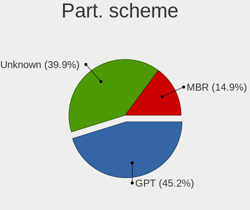
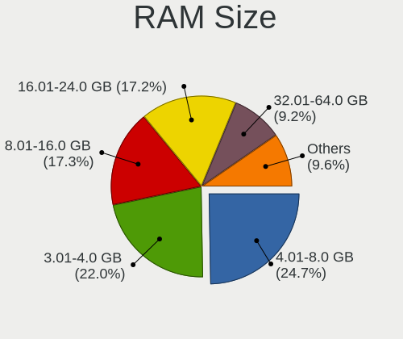
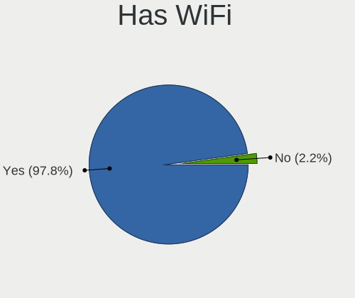
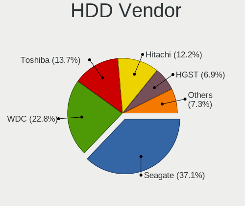
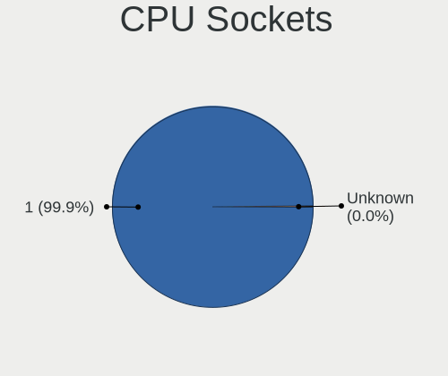
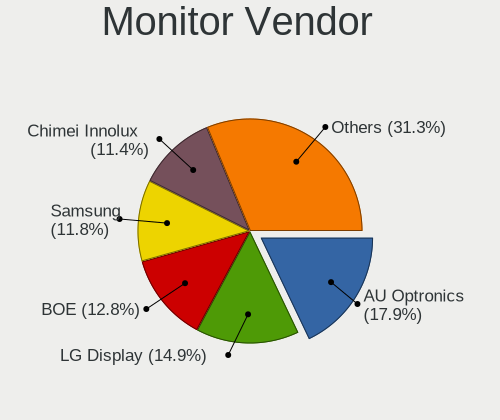
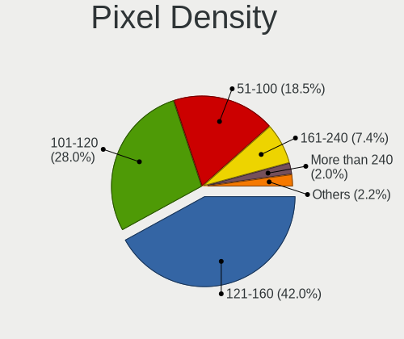
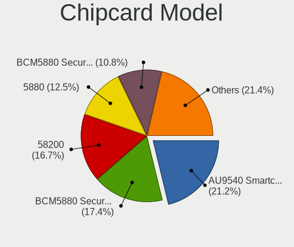

Linux in Poland - Tested Hardware & Statistics (Notebooks)
----------------------------------------------------------

A project to collect tested hardware configurations for Linux in Poland.

Anyone can contribute to this report by the [hw-probe](https://github.com/linuxhw/hw-probe) tool:

    sudo -E hw-probe -all -upload

Please contribute! Especially if your hardware is rare.

Contents
--------

* [ Test Cases ](#test-cases)

* [ System ](#system)
  - [ OS                       ](#os)
  - [ OS Family                ](#os-family)
  - [ Kernel                   ](#kernel)
  - [ Kernel Family            ](#kernel-family)
  - [ Kernel Major Ver.        ](#kernel-major-ver)
  - [ Arch                     ](#arch)
  - [ DE                       ](#de)
  - [ Display Server           ](#display-server)
  - [ Display Manager          ](#display-manager)
  - [ OS Lang                  ](#os-lang)
  - [ Boot Mode                ](#boot-mode)
  - [ Filesystem               ](#filesystem)
  - [ Part. scheme             ](#part-scheme)
  - [ Dual Boot with Linux/BSD ](#dual-boot-with-linuxbsd)
  - [ Dual Boot (Win)          ](#dual-boot-win)

* [ Board ](#board)
  - [ Vendor                   ](#vendor)
  - [ Model                    ](#model)
  - [ Model Family             ](#model-family)
  - [ MFG Year                 ](#mfg-year)
  - [ Form Factor              ](#form-factor)
  - [ Secure Boot              ](#secure-boot)
  - [ Coreboot                 ](#coreboot)
  - [ RAM Size                 ](#ram-size)
  - [ RAM Used                 ](#ram-used)
  - [ Total Drives             ](#total-drives)
  - [ Has CD-ROM               ](#has-cd-rom)
  - [ Has Ethernet             ](#has-ethernet)
  - [ Has WiFi                 ](#has-wifi)
  - [ Has Bluetooth            ](#has-bluetooth)

* [ Location ](#location)
  - [ Country                  ](#country)
  - [ City                     ](#city)

* [ Drives ](#drives)
  - [ Drive Vendor             ](#drive-vendor)
  - [ Drive Model              ](#drive-model)
  - [ HDD Vendor               ](#hdd-vendor)
  - [ SSD Vendor               ](#ssd-vendor)
  - [ Drive Kind               ](#drive-kind)
  - [ Drive Connector          ](#drive-connector)
  - [ Drive Size               ](#drive-size)
  - [ Space Total              ](#space-total)
  - [ Space Used               ](#space-used)
  - [ Malfunc. Drives          ](#malfunc-drives)
  - [ Malfunc. Drive Vendor    ](#malfunc-drive-vendor)
  - [ Malfunc. HDD Vendor      ](#malfunc-hdd-vendor)
  - [ Malfunc. Drive Kind      ](#malfunc-drive-kind)
  - [ Failed Drives            ](#failed-drives)
  - [ Failed Drive Vendor      ](#failed-drive-vendor)
  - [ Drive Status             ](#drive-status)

* [ Storage controller ](#storage-controller)
  - [ Storage Vendor           ](#storage-vendor)
  - [ Storage Model            ](#storage-model)
  - [ Storage Kind             ](#storage-kind)

* [ Processor ](#processor)
  - [ CPU Vendor               ](#cpu-vendor)
  - [ CPU Model                ](#cpu-model)
  - [ CPU Model Family         ](#cpu-model-family)
  - [ CPU Cores                ](#cpu-cores)
  - [ CPU Sockets              ](#cpu-sockets)
  - [ CPU Threads              ](#cpu-threads)
  - [ CPU Op-Modes             ](#cpu-op-modes)
  - [ CPU Microcode            ](#cpu-microcode)
  - [ CPU Microarch            ](#cpu-microarch)

* [ Graphics ](#graphics)
  - [ GPU Vendor               ](#gpu-vendor)
  - [ GPU Model                ](#gpu-model)
  - [ GPU Combo                ](#gpu-combo)
  - [ GPU Driver               ](#gpu-driver)
  - [ GPU Memory               ](#gpu-memory)

* [ Monitor ](#monitor)
  - [ Monitor Vendor           ](#monitor-vendor)
  - [ Monitor Model            ](#monitor-model)
  - [ Monitor Resolution       ](#monitor-resolution)
  - [ Monitor Diagonal         ](#monitor-diagonal)
  - [ Monitor Width            ](#monitor-width)
  - [ Aspect Ratio             ](#aspect-ratio)
  - [ Monitor Area             ](#monitor-area)
  - [ Pixel Density            ](#pixel-density)
  - [ Multiple Monitors        ](#multiple-monitors)

* [ Network ](#network)
  - [ Net Controller Vendor    ](#net-controller-vendor)
  - [ Net Controller Model     ](#net-controller-model)
  - [ Wireless Vendor          ](#wireless-vendor)
  - [ Wireless Model           ](#wireless-model)
  - [ Ethernet Vendor          ](#ethernet-vendor)
  - [ Ethernet Model           ](#ethernet-model)
  - [ Net Controller Kind      ](#net-controller-kind)
  - [ Used Controller          ](#used-controller)
  - [ NICs                     ](#nics)
  - [ IPv6                     ](#ipv6)

* [ Bluetooth ](#bluetooth)
  - [ Bluetooth Vendor         ](#bluetooth-vendor)
  - [ Bluetooth Model          ](#bluetooth-model)

* [ Sound ](#sound)
  - [ Sound Vendor             ](#sound-vendor)
  - [ Sound Model              ](#sound-model)

* [ Memory ](#memory)
  - [ Memory Vendor            ](#memory-vendor)
  - [ Memory Model             ](#memory-model)
  - [ Memory Kind              ](#memory-kind)
  - [ Memory Form Factor       ](#memory-form-factor)
  - [ Memory Size              ](#memory-size)
  - [ Memory Speed             ](#memory-speed)

* [ Printers & scanners ](#printers--scanners)
  - [ Printer Vendor           ](#printer-vendor)
  - [ Printer Model            ](#printer-model)
  - [ Scanner Vendor           ](#scanner-vendor)
  - [ Scanner Model            ](#scanner-model)

* [ Camera ](#camera)
  - [ Camera Vendor            ](#camera-vendor)
  - [ Camera Model             ](#camera-model)

* [ Security ](#security)
  - [ Fingerprint Vendor       ](#fingerprint-vendor)
  - [ Fingerprint Model        ](#fingerprint-model)
  - [ Chipcard Vendor          ](#chipcard-vendor)
  - [ Chipcard Model           ](#chipcard-model)

* [ Unsupported ](#unsupported)
  - [ Unsupported Devices      ](#unsupported-devices)
  - [ Unsupported Device Types ](#unsupported-device-types)

Test Cases
----------

Total: 6119

| Vendor        | Model                       | Probe                                                      | Date         |
|---------------|-----------------------------|------------------------------------------------------------|--------------|
| Acer          | Aspire E5-572G              | [dca3176d13](https://linux-hardware.org/?probe=dca3176d13) | Jan 06, 2025 |
| HP            | EliteBook 8570w             | [0b6fedb6c2](https://linux-hardware.org/?probe=0b6fedb6c2) | Jan 05, 2025 |
| HP            | ProBook 640 G2              | [888e0534d0](https://linux-hardware.org/?probe=888e0534d0) | Jan 05, 2025 |
| Dell          | Inspiron 14 5435            | [d5776f90e8](https://linux-hardware.org/?probe=d5776f90e8) | Jan 05, 2025 |
| Lenovo        | V15 G4 IRU 83A1             | [c4a6747552](https://linux-hardware.org/?probe=c4a6747552) | Jan 04, 2025 |
| Dell          | Latitude E4310              | [68eec2c60e](https://linux-hardware.org/?probe=68eec2c60e) | Jan 04, 2025 |
| Lenovo        | IdeaPad Slim 3 15ABR8 82... | [f453563b1e](https://linux-hardware.org/?probe=f453563b1e) | Jan 02, 2025 |
| Lenovo        | ThinkPad T14s Gen 1 20T0... | [6e552e94aa](https://linux-hardware.org/?probe=6e552e94aa) | Jan 02, 2025 |
| HP            | Laptop 15s-fq2xxx           | [b4f0d1def7](https://linux-hardware.org/?probe=b4f0d1def7) | Jan 02, 2025 |
| Dell          | Inspiron 13-5368            | [bc5f8753e8](https://linux-hardware.org/?probe=bc5f8753e8) | Jan 01, 2025 |
| Purism        | Librem 14                   | [5f54d4d304](https://linux-hardware.org/?probe=5f54d4d304) | Jan 01, 2025 |
| ASUSTek       | ASUS TUF Gaming A15 FA50... | [b80f1b130f](https://linux-hardware.org/?probe=b80f1b130f) | Jan 01, 2025 |
| Dell          | Latitude 7390 2-in-1        | [0837722dea](https://linux-hardware.org/?probe=0837722dea) | Jan 01, 2025 |
| Dell          | Latitude E6400              | [d5dcfbc839](https://linux-hardware.org/?probe=d5dcfbc839) | Dec 31, 2024 |
| Lenovo        | ThinkPad X270 20K5S1A524    | [e45e264430](https://linux-hardware.org/?probe=e45e264430) | Dec 31, 2024 |
| TUXEDO        | Stellaris Slim 15 Intel ... | [b1e2aaf88e](https://linux-hardware.org/?probe=b1e2aaf88e) | Dec 31, 2024 |
| Lenovo        | G510 20238                  | [d970da31bf](https://linux-hardware.org/?probe=d970da31bf) | Dec 31, 2024 |
| Samsung       | 350V5C/351V5C/3540VC/344... | [299e38a1c7](https://linux-hardware.org/?probe=299e38a1c7) | Dec 31, 2024 |
| ASUSTek       | ROG Zephyrus M16 GU603HM... | [783dddde17](https://linux-hardware.org/?probe=783dddde17) | Dec 31, 2024 |
| Lenovo        | Yoga 300-11IBY 80M0         | [63d6d04a10](https://linux-hardware.org/?probe=63d6d04a10) | Dec 30, 2024 |
| Lenovo        | IdeaPad Gaming 3 15ACH6 ... | [406ac061f4](https://linux-hardware.org/?probe=406ac061f4) | Dec 30, 2024 |
| Apple         | MacBookPro9,2               | [3cda74dca1](https://linux-hardware.org/?probe=3cda74dca1) | Dec 29, 2024 |
| Dell          | Latitude 7420               | [981db9e71b](https://linux-hardware.org/?probe=981db9e71b) | Dec 29, 2024 |
| Dell          | Studio 1558                 | [2abf8c0c94](https://linux-hardware.org/?probe=2abf8c0c94) | Dec 29, 2024 |
| Apple         | MacBookAir6,1               | [3421670edf](https://linux-hardware.org/?probe=3421670edf) | Dec 29, 2024 |
| Lenovo        | IdeaPad Y700-15ISK 80NV     | [4122ae81a0](https://linux-hardware.org/?probe=4122ae81a0) | Dec 29, 2024 |
| Lenovo        | ThinkPad R61 8918DFG        | [a7030c8afc](https://linux-hardware.org/?probe=a7030c8afc) | Dec 29, 2024 |
| Lenovo        | B590 20206                  | [f46c163012](https://linux-hardware.org/?probe=f46c163012) | Dec 28, 2024 |
| HUAWEI        | KLVL-WXX9                   | [eb1589c7c0](https://linux-hardware.org/?probe=eb1589c7c0) | Dec 28, 2024 |
| HP            | 250 G8 Notebook PC          | [aa39cd633b](https://linux-hardware.org/?probe=aa39cd633b) | Dec 28, 2024 |
| ASUSTek       | ZenBook UX425EA_UX425EA     | [2ee9b0919f](https://linux-hardware.org/?probe=2ee9b0919f) | Dec 28, 2024 |
| HP            | 250 G8 Notebook PC          | [cc56ca3558](https://linux-hardware.org/?probe=cc56ca3558) | Dec 28, 2024 |
| Dell          | Latitude 7420               | [58cca2986e](https://linux-hardware.org/?probe=58cca2986e) | Dec 28, 2024 |
| Dell          | Latitude E7440              | [53d89b9e96](https://linux-hardware.org/?probe=53d89b9e96) | Dec 28, 2024 |
| ASUSTek       | U36SG                       | [cce3aeb970](https://linux-hardware.org/?probe=cce3aeb970) | Dec 28, 2024 |
| Dell          | Inspiron 15-3552            | [1d01677080](https://linux-hardware.org/?probe=1d01677080) | Dec 27, 2024 |
| Dell          | Inspiron 5558               | [370f0c48c3](https://linux-hardware.org/?probe=370f0c48c3) | Dec 27, 2024 |
| Lenovo        | IdeaPad 330-17AST 81D7      | [145b300a77](https://linux-hardware.org/?probe=145b300a77) | Dec 26, 2024 |
| MSI           | GF63 Thin 10SCSR            | [9d5e0b2b95](https://linux-hardware.org/?probe=9d5e0b2b95) | Dec 26, 2024 |
| Dell          | XPS 13 9370                 | [9d85ecae19](https://linux-hardware.org/?probe=9d85ecae19) | Dec 26, 2024 |
| ASUSTek       | T100TAF                     | [1611168448](https://linux-hardware.org/?probe=1611168448) | Dec 25, 2024 |
| HP            | 630                         | [eb7ed9bf39](https://linux-hardware.org/?probe=eb7ed9bf39) | Dec 25, 2024 |
| Dell          | Inspiron 5577               | [dabaffa853](https://linux-hardware.org/?probe=dabaffa853) | Dec 25, 2024 |
| Chuwi         | FreeBook                    | [91ad67a5f0](https://linux-hardware.org/?probe=91ad67a5f0) | Dec 25, 2024 |
| HP            | Pavilion Gaming Laptop 1... | [ab27b3ad09](https://linux-hardware.org/?probe=ab27b3ad09) | Dec 24, 2024 |
| ASUSTek       | M51Sn                       | [3292249251](https://linux-hardware.org/?probe=3292249251) | Dec 24, 2024 |
| HUAWEI        | NBLB-WAX9N                  | [6524a2db9e](https://linux-hardware.org/?probe=6524a2db9e) | Dec 23, 2024 |
| Lenovo        | ThinkPad T14s Gen 1 20UH... | [482027069e](https://linux-hardware.org/?probe=482027069e) | Dec 23, 2024 |
| ASUSTek       | N55SF                       | [6858c89a4c](https://linux-hardware.org/?probe=6858c89a4c) | Dec 23, 2024 |
| Dell          | Latitude E6440              | [8ef2131731](https://linux-hardware.org/?probe=8ef2131731) | Dec 23, 2024 |
| Dell          | Latitude E6440              | [d5e7ca3b8f](https://linux-hardware.org/?probe=d5e7ca3b8f) | Dec 23, 2024 |
| Lenovo        | ThinkPad A285 20MXS0AE00    | [ab309a9eb4](https://linux-hardware.org/?probe=ab309a9eb4) | Dec 22, 2024 |
| Panasonic     | CFLX6-2                     | [62025e0467](https://linux-hardware.org/?probe=62025e0467) | Dec 22, 2024 |
| ASUSTek       | ASUS TUF Gaming A16 FA61... | [537e296cf8](https://linux-hardware.org/?probe=537e296cf8) | Dec 21, 2024 |
| Lenovo        | ThinkPad T430 2349TUM       | [e919757254](https://linux-hardware.org/?probe=e919757254) | Dec 21, 2024 |
| Lenovo        | ThinkPad T430 2349TUM       | [dcc5c171a9](https://linux-hardware.org/?probe=dcc5c171a9) | Dec 21, 2024 |
| Lenovo        | Yoga Pro 7 14ASP9 83HN      | [847bdd9f95](https://linux-hardware.org/?probe=847bdd9f95) | Dec 21, 2024 |
| Lenovo        | Yoga Pro 7 14ASP9 83HN      | [bae5bf44e3](https://linux-hardware.org/?probe=bae5bf44e3) | Dec 21, 2024 |
| HP            | EliteBook 2530p             | [883099a4db](https://linux-hardware.org/?probe=883099a4db) | Dec 21, 2024 |
| HP            | ENVY Laptop 13-ba1xxx       | [d286a3fd4a](https://linux-hardware.org/?probe=d286a3fd4a) | Dec 21, 2024 |
| Acer          | Aspire V3-371               | [ed218c23ae](https://linux-hardware.org/?probe=ed218c23ae) | Dec 20, 2024 |
| ASUSTek       | ASUS TUF Gaming F15 FX50... | [e2aca4405b](https://linux-hardware.org/?probe=e2aca4405b) | Dec 20, 2024 |
| Acer          | Aspire ES1-711              | [00924d508c](https://linux-hardware.org/?probe=00924d508c) | Dec 20, 2024 |
| HP            | Notebook                    | [ea14f20a1f](https://linux-hardware.org/?probe=ea14f20a1f) | Dec 19, 2024 |
| Lenovo        | V15 G3 IAP CTO 83C4         | [7be6eacddb](https://linux-hardware.org/?probe=7be6eacddb) | Dec 19, 2024 |
| Fujitsu       | LIFEBOOK A512               | [258065d3b9](https://linux-hardware.org/?probe=258065d3b9) | Dec 19, 2024 |
| Lenovo        | ThinkPad T530 2429MY2       | [a6494642a3](https://linux-hardware.org/?probe=a6494642a3) | Dec 18, 2024 |
| Lenovo        | V15 G3 IAP CTO 83C4         | [3948c22f86](https://linux-hardware.org/?probe=3948c22f86) | Dec 17, 2024 |
| ASUSTek       | ASUS TUF Gaming A15 FA50... | [c80c3adbe0](https://linux-hardware.org/?probe=c80c3adbe0) | Dec 17, 2024 |
| Lenovo        | IdeaPad Y580                | [9cbbd96a18](https://linux-hardware.org/?probe=9cbbd96a18) | Dec 17, 2024 |
| Dell          | Inspiron 13-5368            | [40b16d21b4](https://linux-hardware.org/?probe=40b16d21b4) | Dec 16, 2024 |
| ASUSTek       | ASUS TUF Gaming A16 FA61... | [a05e5e0978](https://linux-hardware.org/?probe=a05e5e0978) | Dec 16, 2024 |
| Chuwi         | GemiBook Plus               | [4c1ab45f7f](https://linux-hardware.org/?probe=4c1ab45f7f) | Dec 16, 2024 |
| Dell          | G15 Special Edition 5521    | [d929f4b785](https://linux-hardware.org/?probe=d929f4b785) | Dec 16, 2024 |
| Acer          | Predator G3-572             | [2648bd49c2](https://linux-hardware.org/?probe=2648bd49c2) | Dec 15, 2024 |
| Lenovo        | ThinkPad L520 5016NY9       | [1bc4600530](https://linux-hardware.org/?probe=1bc4600530) | Dec 15, 2024 |
| HP            | Laptop 15s-eq2xxx           | [29ff45ca2d](https://linux-hardware.org/?probe=29ff45ca2d) | Dec 15, 2024 |
| Qilive        | QW20141BPL                  | [87f8d03c80](https://linux-hardware.org/?probe=87f8d03c80) | Dec 15, 2024 |
| HP            | ProBook 470 G1              | [c170cd8911](https://linux-hardware.org/?probe=c170cd8911) | Dec 15, 2024 |
| Apple         | MacBookPro12,1              | [612e52e652](https://linux-hardware.org/?probe=612e52e652) | Dec 14, 2024 |
| Acer          | Aspire A515-51G             | [c9925e1319](https://linux-hardware.org/?probe=c9925e1319) | Dec 14, 2024 |
| Lenovo        | ThinkPad E15 Gen 2 20T80... | [5f3e27d2af](https://linux-hardware.org/?probe=5f3e27d2af) | Dec 13, 2024 |
| ASUSTek       | G60JX                       | [b1cc4820a3](https://linux-hardware.org/?probe=b1cc4820a3) | Dec 13, 2024 |
| Lenovo        | ThinkPad E15 Gen 2 20T80... | [934762c6f1](https://linux-hardware.org/?probe=934762c6f1) | Dec 13, 2024 |
| Dell          | G15 Special Edition 5521    | [34f4dd2388](https://linux-hardware.org/?probe=34f4dd2388) | Dec 12, 2024 |
| Dell          | Latitude E6430              | [9c1b2861a3](https://linux-hardware.org/?probe=9c1b2861a3) | Dec 12, 2024 |
| Sony          | VPCEJ2E1E                   | [11625e4a3c](https://linux-hardware.org/?probe=11625e4a3c) | Dec 12, 2024 |
| Dell          | Latitude E6410              | [4fcefa5df1](https://linux-hardware.org/?probe=4fcefa5df1) | Dec 12, 2024 |
| ASUSTek       | X550CC                      | [4e9ac84a4f](https://linux-hardware.org/?probe=4e9ac84a4f) | Dec 12, 2024 |
| Lenovo        | ThinkPad P50 20EQS3B30R     | [5885521edc](https://linux-hardware.org/?probe=5885521edc) | Dec 12, 2024 |
| Dell          | Latitude E6510              | [532afb1e7d](https://linux-hardware.org/?probe=532afb1e7d) | Dec 12, 2024 |
| HP            | ProBook 640 G1              | [6bd3571c30](https://linux-hardware.org/?probe=6bd3571c30) | Dec 11, 2024 |
| ASUSTek       | ROG Strix G513RW_G513RW     | [719c8de776](https://linux-hardware.org/?probe=719c8de776) | Dec 11, 2024 |
| Dell          | Latitude E6440              | [8a2677fae6](https://linux-hardware.org/?probe=8a2677fae6) | Dec 10, 2024 |
| Lenovo        | IdeaPad Gaming 3 15ARH05... | [986d807d00](https://linux-hardware.org/?probe=986d807d00) | Dec 10, 2024 |
| ASUSTek       | ASUS TUF Gaming A16 FA60... | [b5059cca85](https://linux-hardware.org/?probe=b5059cca85) | Dec 10, 2024 |
| ASUSTek       | ASUS TUF Gaming A16 FA60... | [c43e0a8e7d](https://linux-hardware.org/?probe=c43e0a8e7d) | Dec 10, 2024 |
| HP            | Pavilion dv7                | [8d620075ce](https://linux-hardware.org/?probe=8d620075ce) | Dec 10, 2024 |
| Dell          | XPS 15 9570                 | [46509ed6aa](https://linux-hardware.org/?probe=46509ed6aa) | Dec 09, 2024 |
| Lenovo        | IdeaPad 510-15ISK 80SR      | [8d3e4cf289](https://linux-hardware.org/?probe=8d3e4cf289) | Dec 09, 2024 |
| ASUSTek       | F5V                         | [fc57564f87](https://linux-hardware.org/?probe=fc57564f87) | Dec 09, 2024 |
| Panasonic     | CFLX6-2                     | [192859505f](https://linux-hardware.org/?probe=192859505f) | Dec 09, 2024 |
| ASUSTek       | ASUS TUF Gaming F15 FX50... | [1fcb1559d5](https://linux-hardware.org/?probe=1fcb1559d5) | Dec 08, 2024 |
| Lenovo        | ThinkPad X280 20KES2VQ00    | [0ad8b339cd](https://linux-hardware.org/?probe=0ad8b339cd) | Dec 08, 2024 |
| Google        | Magolor                     | [5e0a4f57a2](https://linux-hardware.org/?probe=5e0a4f57a2) | Dec 07, 2024 |
| Google        | Magolor                     | [4ee0cb05ee](https://linux-hardware.org/?probe=4ee0cb05ee) | Dec 07, 2024 |
| Dell          | Latitude E6430              | [f00b55b52a](https://linux-hardware.org/?probe=f00b55b52a) | Dec 07, 2024 |
| HP            | Laptop 14s-fq0xxx           | [eb8c396630](https://linux-hardware.org/?probe=eb8c396630) | Dec 07, 2024 |
| Lenovo        | IdeaPad Y550P 20035         | [3f3310437b](https://linux-hardware.org/?probe=3f3310437b) | Dec 06, 2024 |
| Dell          | Latitude 3520               | [cffdf7964b](https://linux-hardware.org/?probe=cffdf7964b) | Dec 06, 2024 |
| Lenovo        | G580 2689K9G                | [e20fe2c6e5](https://linux-hardware.org/?probe=e20fe2c6e5) | Dec 06, 2024 |
| Acer          | Extensa 215-32              | [e939582cd7](https://linux-hardware.org/?probe=e939582cd7) | Dec 05, 2024 |
| Lenovo        | G580 2689K9G                | [7ebd98750f](https://linux-hardware.org/?probe=7ebd98750f) | Dec 04, 2024 |
| Fujitsu       | CELSIUS H920                | [8b524abe47](https://linux-hardware.org/?probe=8b524abe47) | Dec 03, 2024 |
| Lenovo        | Legion 5 Pro 16ITH6H 82J... | [215d0f836c](https://linux-hardware.org/?probe=215d0f836c) | Dec 02, 2024 |
| Lenovo        | ThinkPad E15 20RD001FPB     | [fa2477acc2](https://linux-hardware.org/?probe=fa2477acc2) | Dec 01, 2024 |
| Dell          | Inspiron 13-5368            | [5bdedb520c](https://linux-hardware.org/?probe=5bdedb520c) | Dec 01, 2024 |
| Acer          | Aspire V5-573PG             | [29a555e909](https://linux-hardware.org/?probe=29a555e909) | Dec 01, 2024 |
| HP            | Victus by Gaming Laptop ... | [b18d4ba53a](https://linux-hardware.org/?probe=b18d4ba53a) | Nov 30, 2024 |
| Samsung       | 350V5C/351V5C/3540VC/344... | [e73426df00](https://linux-hardware.org/?probe=e73426df00) | Nov 30, 2024 |
| Lenovo        | ThinkPad L520 5016NY9       | [18ee47c1da](https://linux-hardware.org/?probe=18ee47c1da) | Nov 30, 2024 |
| Dell          | Inspiron 3583               | [ae86d50011](https://linux-hardware.org/?probe=ae86d50011) | Nov 30, 2024 |
| Dell          | Inspiron 15-3552            | [3f198d1bea](https://linux-hardware.org/?probe=3f198d1bea) | Nov 30, 2024 |
| Fujitsu       | CELSIUS H920                | [bae9e145b7](https://linux-hardware.org/?probe=bae9e145b7) | Nov 30, 2024 |
| Dell          | Inspiron N5010              | [f7578fb476](https://linux-hardware.org/?probe=f7578fb476) | Nov 29, 2024 |
| Valve         | Galileo                     | [13c5cb5602](https://linux-hardware.org/?probe=13c5cb5602) | Nov 28, 2024 |
| Apple         | MacBookAir4,2               | [6cf2484cd4](https://linux-hardware.org/?probe=6cf2484cd4) | Nov 28, 2024 |
| Lenovo        | ThinkPad T14s Gen 1 20T1... | [fd5c871a74](https://linux-hardware.org/?probe=fd5c871a74) | Nov 27, 2024 |
| Lenovo        | IdeaPad Y530                | [7581417b3e](https://linux-hardware.org/?probe=7581417b3e) | Nov 27, 2024 |
| HP            | ProBook 4330s               | [a2218163e8](https://linux-hardware.org/?probe=a2218163e8) | Nov 27, 2024 |
| Lenovo        | Yoga Slim 6 14IRH8 83E0     | [818cb12ef6](https://linux-hardware.org/?probe=818cb12ef6) | Nov 27, 2024 |
| Lenovo        | Legion 5 Pro 16ITH6H 82J... | [bfd54b7d97](https://linux-hardware.org/?probe=bfd54b7d97) | Nov 26, 2024 |
| Lenovo        | ThinkPad W500 4061B77       | [d1f2cd5f87](https://linux-hardware.org/?probe=d1f2cd5f87) | Nov 26, 2024 |
| Dell          | Latitude E6510              | [68f65df3f5](https://linux-hardware.org/?probe=68f65df3f5) | Nov 25, 2024 |
| Lenovo        | IdeaPad Slim 5 16ABR8 82... | [7204b37e87](https://linux-hardware.org/?probe=7204b37e87) | Nov 24, 2024 |
| Lenovo        | G50-45 80E3                 | [1755731ed3](https://linux-hardware.org/?probe=1755731ed3) | Nov 24, 2024 |
| Valve         | Galileo                     | [df851043c9](https://linux-hardware.org/?probe=df851043c9) | Nov 24, 2024 |
| Toshiba       | TECRA M10                   | [f2db588ac1](https://linux-hardware.org/?probe=f2db588ac1) | Nov 23, 2024 |
| Toshiba       | Satellite L300D             | [a37d362084](https://linux-hardware.org/?probe=a37d362084) | Nov 23, 2024 |
| ASUSTek       | X555LD                      | [ae073052ae](https://linux-hardware.org/?probe=ae073052ae) | Nov 23, 2024 |
| ASUSTek       | TUF Gaming FX505DT_FX505... | [5d4ce9594c](https://linux-hardware.org/?probe=5d4ce9594c) | Nov 23, 2024 |
| ASUSTek       | TUF Gaming FX505DT_FX505... | [aaed88422c](https://linux-hardware.org/?probe=aaed88422c) | Nov 22, 2024 |
| Valve         | Galileo                     | [675c70d8dd](https://linux-hardware.org/?probe=675c70d8dd) | Nov 22, 2024 |
| ASUSTek       | N56JN                       | [e8cb7952c8](https://linux-hardware.org/?probe=e8cb7952c8) | Nov 22, 2024 |
| Valve         | Galileo                     | [918ab68150](https://linux-hardware.org/?probe=918ab68150) | Nov 21, 2024 |
| Lenovo        | ThinkPad L15 Gen 1 20U8S... | [437866e6de](https://linux-hardware.org/?probe=437866e6de) | Nov 21, 2024 |
| Lenovo        | V15-IIL 82C5                | [f149ed620f](https://linux-hardware.org/?probe=f149ed620f) | Nov 21, 2024 |
| ASUSTek       | X751MD                      | [10f66dd3e4](https://linux-hardware.org/?probe=10f66dd3e4) | Nov 20, 2024 |
| Lenovo        | ThinkPad T400 2768W2X       | [3614ea7cf1](https://linux-hardware.org/?probe=3614ea7cf1) | Nov 20, 2024 |
| Lenovo        | ThinkPad T480s 20L8S6N70... | [534e5f57bf](https://linux-hardware.org/?probe=534e5f57bf) | Nov 19, 2024 |
| Dell          | Precision 7680              | [d1e6e2abb4](https://linux-hardware.org/?probe=d1e6e2abb4) | Nov 19, 2024 |
| Lenovo        | Legion 5 15ARH05H 82B1      | [8801ad76a4](https://linux-hardware.org/?probe=8801ad76a4) | Nov 19, 2024 |
| MSI           | GP76 Leopard 11UG           | [cbcaeb0284](https://linux-hardware.org/?probe=cbcaeb0284) | Nov 19, 2024 |
| Lenovo        | IdeaPad 320S-15IKB 80X5     | [a75fff547e](https://linux-hardware.org/?probe=a75fff547e) | Nov 18, 2024 |
| Dell          | Inspiron 7566               | [bcbe3b23dc](https://linux-hardware.org/?probe=bcbe3b23dc) | Nov 18, 2024 |
| Toshiba       | Satellite C660              | [f7e1b632b9](https://linux-hardware.org/?probe=f7e1b632b9) | Nov 18, 2024 |
| HP            | Laptop 15s-eq2xxx           | [216996b5a7](https://linux-hardware.org/?probe=216996b5a7) | Nov 17, 2024 |
| Lenovo        | IdeaPad Slim 5 16ABR8 82... | [da573e5f3a](https://linux-hardware.org/?probe=da573e5f3a) | Nov 17, 2024 |
| Samsung       | 350V5C/351V5C/3540VC/344... | [4dc44df22b](https://linux-hardware.org/?probe=4dc44df22b) | Nov 17, 2024 |
| Lenovo        | ThinkBook 16 G4+ IAP 21C... | [62679a2c28](https://linux-hardware.org/?probe=62679a2c28) | Nov 16, 2024 |
| ASUSTek       | ASUS TUF Gaming A16 FA61... | [7437debd95](https://linux-hardware.org/?probe=7437debd95) | Nov 16, 2024 |
| Acer          | Aspire A317-54              | [bf63a85231](https://linux-hardware.org/?probe=bf63a85231) | Nov 16, 2024 |
| ASUSTek       | X541NA                      | [7da3668ced](https://linux-hardware.org/?probe=7da3668ced) | Nov 16, 2024 |
| Lenovo        | G50-80 80L0                 | [d31664cad1](https://linux-hardware.org/?probe=d31664cad1) | Nov 15, 2024 |
| Lenovo        | Legion 5 15ARH05H 82B1      | [96e212c973](https://linux-hardware.org/?probe=96e212c973) | Nov 15, 2024 |
| Lenovo        | ThinkPad T480 20L5CTO1WW    | [cdda7d4c72](https://linux-hardware.org/?probe=cdda7d4c72) | Nov 15, 2024 |
| Dell          | Precision 7510              | [9955fa5923](https://linux-hardware.org/?probe=9955fa5923) | Nov 14, 2024 |
| HP            | Laptop 14s-fq0xxx           | [8b2918b84c](https://linux-hardware.org/?probe=8b2918b84c) | Nov 14, 2024 |
| Lenovo        | IdeaPad 320S-13IKB 81AK     | [87f330a574](https://linux-hardware.org/?probe=87f330a574) | Nov 14, 2024 |
| Dell          | Latitude 5590               | [b9acbda728](https://linux-hardware.org/?probe=b9acbda728) | Nov 14, 2024 |
| Dell          | Precision M4600             | [578f84fe29](https://linux-hardware.org/?probe=578f84fe29) | Nov 13, 2024 |
| HP            | 630                         | [0103a33e55](https://linux-hardware.org/?probe=0103a33e55) | Nov 13, 2024 |
| Dell          | Precision M6700             | [81ed3cc9db](https://linux-hardware.org/?probe=81ed3cc9db) | Nov 13, 2024 |
| Lenovo        | IdeaPad 100-15IBY 80MJ      | [dc304a3d45](https://linux-hardware.org/?probe=dc304a3d45) | Nov 13, 2024 |
| Advent        | Quantum Q200                | [bfc86b2a40](https://linux-hardware.org/?probe=bfc86b2a40) | Nov 13, 2024 |
| Advent        | Quantum Q200                | [7f8191560c](https://linux-hardware.org/?probe=7f8191560c) | Nov 13, 2024 |
| Advent        | Quantum Q200                | [234c47715e](https://linux-hardware.org/?probe=234c47715e) | Nov 13, 2024 |
| Advent        | Quantum Q200                | [8e96516066](https://linux-hardware.org/?probe=8e96516066) | Nov 13, 2024 |
| Advent        | Quantum Q200                | [fe6f2cf181](https://linux-hardware.org/?probe=fe6f2cf181) | Nov 13, 2024 |
| Advent        | Quantum Q200                | [0e59f90633](https://linux-hardware.org/?probe=0e59f90633) | Nov 13, 2024 |
| Acer          | SFG14-63                    | [48da3de8b8](https://linux-hardware.org/?probe=48da3de8b8) | Nov 11, 2024 |
| Dell          | Latitude E7270              | [453afb8bff](https://linux-hardware.org/?probe=453afb8bff) | Nov 11, 2024 |
| HP            | Pavilion Laptop 15-eh2xx... | [db44b5c0bc](https://linux-hardware.org/?probe=db44b5c0bc) | Nov 11, 2024 |
| Lenovo        | Legion Slim 5 16APH8 82Y... | [5238f646e9](https://linux-hardware.org/?probe=5238f646e9) | Nov 10, 2024 |
| HP            | 620                         | [3dc033a422](https://linux-hardware.org/?probe=3dc033a422) | Nov 10, 2024 |
| Dell          | Precision 3570              | [1219d494cd](https://linux-hardware.org/?probe=1219d494cd) | Nov 10, 2024 |
| Medion        | Akoya E7226T                | [d6b2a726f1](https://linux-hardware.org/?probe=d6b2a726f1) | Nov 09, 2024 |
| Dell          | Latitude 5410               | [e13ea06859](https://linux-hardware.org/?probe=e13ea06859) | Nov 09, 2024 |
| HP            | ProBook 645 G4              | [fd6948a4e9](https://linux-hardware.org/?probe=fd6948a4e9) | Nov 09, 2024 |
| Lenovo        | Legion 5 Pro 16ITH6H 82J... | [f6e6f8fc08](https://linux-hardware.org/?probe=f6e6f8fc08) | Nov 08, 2024 |
| HP            | EliteBook 840 G8 Noteboo... | [5f8ea71a3d](https://linux-hardware.org/?probe=5f8ea71a3d) | Nov 08, 2024 |
| Apple         | MacBookPro14,3              | [5c7bc18987](https://linux-hardware.org/?probe=5c7bc18987) | Nov 08, 2024 |
| Dell          | Latitude 5480               | [8add0ee6f1](https://linux-hardware.org/?probe=8add0ee6f1) | Nov 08, 2024 |
| Notebook      | V5xTNC_TND_TNE              | [b55f8ed34d](https://linux-hardware.org/?probe=b55f8ed34d) | Nov 07, 2024 |
| Acer          | Aspire E5-575G              | [98fe0f8e24](https://linux-hardware.org/?probe=98fe0f8e24) | Nov 06, 2024 |
| Lenovo        | G580 20150                  | [71249fccac](https://linux-hardware.org/?probe=71249fccac) | Nov 06, 2024 |
| Lenovo        | G580 20150                  | [ebcff700e9](https://linux-hardware.org/?probe=ebcff700e9) | Nov 06, 2024 |
| ASUSTek       | VivoBook_ASUSLaptop M740... | [92d4a2f482](https://linux-hardware.org/?probe=92d4a2f482) | Nov 05, 2024 |
| Lenovo        | ThinkPad X201 Tablet 298... | [be6cb34c0c](https://linux-hardware.org/?probe=be6cb34c0c) | Nov 05, 2024 |
| Acer          | Aspire 5750G                | [554b0591cd](https://linux-hardware.org/?probe=554b0591cd) | Nov 05, 2024 |
| Lenovo        | ThinkPad L440 20ASA1HCPB    | [f5b2a0d378](https://linux-hardware.org/?probe=f5b2a0d378) | Nov 05, 2024 |
| HP            | EliteBook 640 14 inch G1... | [60c3fb08a0](https://linux-hardware.org/?probe=60c3fb08a0) | Nov 05, 2024 |
| ASUSTek       | VivoBook_ASUSLaptop X421... | [349d185cd9](https://linux-hardware.org/?probe=349d185cd9) | Nov 04, 2024 |
| Apple         | MacBookAir6,1               | [cd233d88fd](https://linux-hardware.org/?probe=cd233d88fd) | Nov 04, 2024 |
| HP            | OMEN by Laptop 15-dh0xxx    | [a073c7cb1e](https://linux-hardware.org/?probe=a073c7cb1e) | Nov 03, 2024 |
| ASUSTek       | ASUS TUF Gaming A16 FA61... | [1a7bcae2bb](https://linux-hardware.org/?probe=1a7bcae2bb) | Nov 02, 2024 |
| Toshiba       | Satellite L50-A-16Q         | [36a33b21ce](https://linux-hardware.org/?probe=36a33b21ce) | Nov 02, 2024 |
| Lenovo        | ThinkPad E15 Gen 2 20T80... | [09d355ac60](https://linux-hardware.org/?probe=09d355ac60) | Nov 02, 2024 |
| Lenovo        | G700 20251                  | [3af4ad6599](https://linux-hardware.org/?probe=3af4ad6599) | Nov 01, 2024 |
| Dell          | Inspiron 13-5368            | [b10e518561](https://linux-hardware.org/?probe=b10e518561) | Nov 01, 2024 |
| Lenovo        | ThinkPad T440s 20ARA1BSP... | [cb3caddfea](https://linux-hardware.org/?probe=cb3caddfea) | Nov 01, 2024 |
| Notebook      | V54x_6x_TU                  | [d8b514591b](https://linux-hardware.org/?probe=d8b514591b) | Oct 31, 2024 |
| ASUSTek       | VivoBook_ASUSLaptop X515... | [a8f6d80fe9](https://linux-hardware.org/?probe=a8f6d80fe9) | Oct 31, 2024 |
| ASUSTek       | ASUS TUF Gaming F15 FX50... | [289f41056a](https://linux-hardware.org/?probe=289f41056a) | Oct 30, 2024 |
| HP            | 250 G3                      | [fc5662e85b](https://linux-hardware.org/?probe=fc5662e85b) | Oct 30, 2024 |
| Valve         | Jupiter                     | [60613a7f13](https://linux-hardware.org/?probe=60613a7f13) | Oct 30, 2024 |
| Lenovo        | G770 20089                  | [3547cb6c29](https://linux-hardware.org/?probe=3547cb6c29) | Oct 30, 2024 |
| Lenovo        | ThinkPad T510 4349BD8       | [2e8c236061](https://linux-hardware.org/?probe=2e8c236061) | Oct 30, 2024 |
| Lenovo        | ThinkPad L590 20Q7001LPB    | [2f3855ed8d](https://linux-hardware.org/?probe=2f3855ed8d) | Oct 29, 2024 |
| Lenovo        | 3000 G410                   | [cf7fd7d924](https://linux-hardware.org/?probe=cf7fd7d924) | Oct 28, 2024 |
| Lenovo        | 3000 G410                   | [294011f6db](https://linux-hardware.org/?probe=294011f6db) | Oct 28, 2024 |
| Samsung       | RV420/RV520/RV720/E3530/... | [862c7cc007](https://linux-hardware.org/?probe=862c7cc007) | Oct 27, 2024 |
| MSI           | GP73 Leopard 8RE            | [65450952dd](https://linux-hardware.org/?probe=65450952dd) | Oct 27, 2024 |
| MSI           | GL62 6QD                    | [3c9b967190](https://linux-hardware.org/?probe=3c9b967190) | Oct 27, 2024 |
| Lenovo        | ThinkPad 20U8S20200         | [d61740e01b](https://linux-hardware.org/?probe=d61740e01b) | Oct 27, 2024 |
| Lenovo        | ThinkPad T480 20L6S03X00    | [51f7a46777](https://linux-hardware.org/?probe=51f7a46777) | Oct 26, 2024 |
| Apple         | MacBookPro3,1               | [6dadd636e6](https://linux-hardware.org/?probe=6dadd636e6) | Oct 26, 2024 |
| ASUSTek       | VivoBook_ASUSLaptop K360... | [a847cd49b4](https://linux-hardware.org/?probe=a847cd49b4) | Oct 24, 2024 |
| TUXEDO        | InfinityBook Pro AMD Gen... | [6bf81ae3aa](https://linux-hardware.org/?probe=6bf81ae3aa) | Oct 24, 2024 |
| Apple         | MacBookPro3,1               | [3866b77fbe](https://linux-hardware.org/?probe=3866b77fbe) | Oct 24, 2024 |
| Dell          | Latitude 5411               | [54e539128d](https://linux-hardware.org/?probe=54e539128d) | Oct 24, 2024 |
| Acer          | Aspire 7736                 | [213995eb9a](https://linux-hardware.org/?probe=213995eb9a) | Oct 24, 2024 |
| Lenovo        | ThinkPad T480 20L6S03X00    | [e0e5c654b9](https://linux-hardware.org/?probe=e0e5c654b9) | Oct 23, 2024 |
| Lenovo        | ThinkPad E14 Gen 6 21M70... | [14f06670e6](https://linux-hardware.org/?probe=14f06670e6) | Oct 23, 2024 |
| HUAWEI        | KLVL-WXX9                   | [1aba2900e3](https://linux-hardware.org/?probe=1aba2900e3) | Oct 23, 2024 |
| Valve         | Galileo                     | [3c5b93427d](https://linux-hardware.org/?probe=3c5b93427d) | Oct 22, 2024 |
| Lenovo        | ThinkPad P52s 20LB0026US    | [23151fe731](https://linux-hardware.org/?probe=23151fe731) | Oct 22, 2024 |
| Lenovo        | ThinkPad P16s Gen 3 21KS... | [269d64c6cc](https://linux-hardware.org/?probe=269d64c6cc) | Oct 22, 2024 |
| ASUSTek       | VivoBook_ASUSLaptop M360... | [5fde0c28f7](https://linux-hardware.org/?probe=5fde0c28f7) | Oct 22, 2024 |
| Lenovo        | IdeaPad 3 14ALC6 82KT       | [88089aea01](https://linux-hardware.org/?probe=88089aea01) | Oct 21, 2024 |
| HP            | Victus by Laptop 16-e0xx... | [053292a4a6](https://linux-hardware.org/?probe=053292a4a6) | Oct 21, 2024 |
| Lenovo        | IdeaPad Y530                | [2db5209b65](https://linux-hardware.org/?probe=2db5209b65) | Oct 21, 2024 |
| Notebook      | V5xTNC_TND_TNE              | [a5dfae6d7a](https://linux-hardware.org/?probe=a5dfae6d7a) | Oct 21, 2024 |
| TUXEDO        | InfinityBook Pro AMD Gen... | [065d923ad7](https://linux-hardware.org/?probe=065d923ad7) | Oct 21, 2024 |
| Lenovo        | ThinkPad E15 Gen 2 20T80... | [c36ba63903](https://linux-hardware.org/?probe=c36ba63903) | Oct 19, 2024 |
| ASUSTek       | ASUS Vivobook S 14 M5406... | [209877ae34](https://linux-hardware.org/?probe=209877ae34) | Oct 19, 2024 |
| Lenovo        | ThinkPad L14 Gen 1 20U6S... | [c494c18d97](https://linux-hardware.org/?probe=c494c18d97) | Oct 18, 2024 |
| Lenovo        | ThinkPad T490s 20NX006PP... | [76d91a459e](https://linux-hardware.org/?probe=76d91a459e) | Oct 18, 2024 |
| Dell          | Latitude 7480               | [83e587119c](https://linux-hardware.org/?probe=83e587119c) | Oct 18, 2024 |
| ASUSTek       | 1015BXO                     | [1d51d39382](https://linux-hardware.org/?probe=1d51d39382) | Oct 18, 2024 |
| MSI           | GL72 7RD                    | [d5a522aca0](https://linux-hardware.org/?probe=d5a522aca0) | Oct 18, 2024 |
| Lenovo        | ThinkPad E14 20RA0016PB     | [99c42f786e](https://linux-hardware.org/?probe=99c42f786e) | Oct 18, 2024 |
| Lenovo        | V310-15IKB 80T3             | [4012f7ec75](https://linux-hardware.org/?probe=4012f7ec75) | Oct 17, 2024 |
| Lenovo        | ThinkPad X230 2325T5Y       | [2a28f693f8](https://linux-hardware.org/?probe=2a28f693f8) | Oct 17, 2024 |
| ASUSTek       | ASUS EXPERTBOOK L1500CDA... | [16a3b4a2e0](https://linux-hardware.org/?probe=16a3b4a2e0) | Oct 17, 2024 |
| ASUSTek       | VivoBook_ASUSLaptop X515... | [5db9f3ef63](https://linux-hardware.org/?probe=5db9f3ef63) | Oct 17, 2024 |
| Dell          | Vostro 5568                 | [ee0b0344d6](https://linux-hardware.org/?probe=ee0b0344d6) | Oct 17, 2024 |
| Lenovo        | ThinkPad X230 2325T5Y       | [3f8ac2c3d2](https://linux-hardware.org/?probe=3f8ac2c3d2) | Oct 16, 2024 |
| MSI           | GP72MVR 7RFX                | [aa62c4b0dd](https://linux-hardware.org/?probe=aa62c4b0dd) | Oct 16, 2024 |
| MSI           | GP72MVR 7RFX                | [0ce7ce2745](https://linux-hardware.org/?probe=0ce7ce2745) | Oct 16, 2024 |
| HP            | EliteBook 840 G2            | [7bac64408f](https://linux-hardware.org/?probe=7bac64408f) | Oct 16, 2024 |
| Apple         | MacBookAir6,1               | [afbb43d9ac](https://linux-hardware.org/?probe=afbb43d9ac) | Oct 15, 2024 |
| Dell          | Latitude 3540               | [5ab18fa675](https://linux-hardware.org/?probe=5ab18fa675) | Oct 15, 2024 |
| Lenovo        | LOQ 15IAX9 83GS             | [5ddf969934](https://linux-hardware.org/?probe=5ddf969934) | Oct 15, 2024 |
| Lenovo        | ThinkPad T440 20B7S07J00    | [1030956871](https://linux-hardware.org/?probe=1030956871) | Oct 15, 2024 |
| HP            | 255 G7 Notebook PC          | [897729987c](https://linux-hardware.org/?probe=897729987c) | Oct 15, 2024 |
| ASUSTek       | X556UQK                     | [58a249714c](https://linux-hardware.org/?probe=58a249714c) | Oct 15, 2024 |
| ASUSTek       | Vivobook Go E1504FA_E150... | [bf092f4411](https://linux-hardware.org/?probe=bf092f4411) | Oct 15, 2024 |
| HP            | EliteBook 850 G6            | [8218398648](https://linux-hardware.org/?probe=8218398648) | Oct 15, 2024 |
| HP            | ProBook 450 G8 Notebook ... | [742cdb4657](https://linux-hardware.org/?probe=742cdb4657) | Oct 15, 2024 |
| Dell          | Precision M6500             | [102728b70f](https://linux-hardware.org/?probe=102728b70f) | Oct 15, 2024 |
| Lenovo        | ThinkPad R61 8927W2Q        | [f91e72d713](https://linux-hardware.org/?probe=f91e72d713) | Oct 15, 2024 |
| Dell          | Precision M6500             | [5f6091daf1](https://linux-hardware.org/?probe=5f6091daf1) | Oct 15, 2024 |
| Notebook      | NL5xNU                      | [f6958e0f47](https://linux-hardware.org/?probe=f6958e0f47) | Oct 14, 2024 |
| Lenovo        | LOQ 15IAX9 83GS             | [083d1aadd9](https://linux-hardware.org/?probe=083d1aadd9) | Oct 14, 2024 |
| Lenovo        | LOQ 15IAX9 83GS             | [6a71048e50](https://linux-hardware.org/?probe=6a71048e50) | Oct 14, 2024 |
| TongFang      | GX4HRXL                     | [599c1edc57](https://linux-hardware.org/?probe=599c1edc57) | Oct 14, 2024 |
| HP            | ENVY 14                     | [d5f1ec9d65](https://linux-hardware.org/?probe=d5f1ec9d65) | Oct 14, 2024 |
| Dell          | Latitude 3540               | [08840c6bb5](https://linux-hardware.org/?probe=08840c6bb5) | Oct 13, 2024 |
| Lenovo        | ThinkPad T490 20N3S7PL00    | [599154f22e](https://linux-hardware.org/?probe=599154f22e) | Oct 12, 2024 |
| Fujitsu       | CELSIUS H760                | [8ea6d75c59](https://linux-hardware.org/?probe=8ea6d75c59) | Oct 12, 2024 |
| ASUSTek       | K93SV                       | [4b16fe7309](https://linux-hardware.org/?probe=4b16fe7309) | Oct 12, 2024 |
| Lenovo        | ThinkBook 16 G6 IRL 21KH    | [b978305bcb](https://linux-hardware.org/?probe=b978305bcb) | Oct 11, 2024 |
| Valve         | Galileo                     | [772619a68f](https://linux-hardware.org/?probe=772619a68f) | Oct 11, 2024 |
| HP            | 255 G7 Notebook PC          | [0ac52f67b8](https://linux-hardware.org/?probe=0ac52f67b8) | Oct 11, 2024 |
| Dell          | Latitude E5550              | [9ecfbdf292](https://linux-hardware.org/?probe=9ecfbdf292) | Oct 10, 2024 |
| HP            | Victus by Gaming Laptop ... | [ea25986093](https://linux-hardware.org/?probe=ea25986093) | Oct 09, 2024 |
| Lenovo        | ThinkPad P52s 20LB0026US    | [239bd61272](https://linux-hardware.org/?probe=239bd61272) | Oct 09, 2024 |
| Lenovo        | ThinkPad P52s 20LB0026US    | [672ac83ca4](https://linux-hardware.org/?probe=672ac83ca4) | Oct 09, 2024 |
| ASUSTek       | ASUS TUF Gaming F15 FX50... | [7cb8ece683](https://linux-hardware.org/?probe=7cb8ece683) | Oct 08, 2024 |
| Fujitsu       | CELSIUS H760                | [9a9b415ad2](https://linux-hardware.org/?probe=9a9b415ad2) | Oct 08, 2024 |
| HP            | EliteBook 830 G6            | [6d1c874dc7](https://linux-hardware.org/?probe=6d1c874dc7) | Oct 08, 2024 |
| Lenovo        | G580                        | [c0795dde28](https://linux-hardware.org/?probe=c0795dde28) | Oct 07, 2024 |
| Lenovo        | ThinkPad T490 20N3S4N906    | [66340ed1d6](https://linux-hardware.org/?probe=66340ed1d6) | Oct 07, 2024 |
| ASUSTek       | Vivobook Go E1504FA_E150... | [ffe1a4f173](https://linux-hardware.org/?probe=ffe1a4f173) | Oct 06, 2024 |
| Acer          | Aspire A315-56              | [a8c3687b93](https://linux-hardware.org/?probe=a8c3687b93) | Oct 05, 2024 |
| HP            | EliteBook Folio 1020 G1     | [0be7c4d20a](https://linux-hardware.org/?probe=0be7c4d20a) | Oct 05, 2024 |
| Lenovo        | ThinkPad R61 8927W2Q        | [2306ca1f57](https://linux-hardware.org/?probe=2306ca1f57) | Oct 05, 2024 |
| HP            | Pavilion Notebook           | [ffec3065c0](https://linux-hardware.org/?probe=ffec3065c0) | Oct 04, 2024 |
| ASUSTek       | VivoBook_ASUSLaptop M160... | [c0753ecbb0](https://linux-hardware.org/?probe=c0753ecbb0) | Oct 04, 2024 |
| ASUSTek       | K53E                        | [62915aba3a](https://linux-hardware.org/?probe=62915aba3a) | Oct 03, 2024 |
| ASUSTek       | X550CC                      | [8aa7d83ae5](https://linux-hardware.org/?probe=8aa7d83ae5) | Oct 02, 2024 |
| ASUSTek       | X550CC                      | [5e4a8d8e8b](https://linux-hardware.org/?probe=5e4a8d8e8b) | Oct 02, 2024 |
| Notebook      | V5xTNC_TND_TNE              | [4796bede06](https://linux-hardware.org/?probe=4796bede06) | Oct 02, 2024 |
| TongFang      | GM6BG5Q                     | [dc8700d443](https://linux-hardware.org/?probe=dc8700d443) | Oct 02, 2024 |
| ASUSTek       | Zenbook UX5401EA_UX5401E... | [eec6ab8986](https://linux-hardware.org/?probe=eec6ab8986) | Oct 02, 2024 |
| Lenovo        | ThinkPad L520 5016NY9       | [74c455b2e5](https://linux-hardware.org/?probe=74c455b2e5) | Oct 01, 2024 |
| Dell          | Inspiron 13-5368            | [ca16c176d7](https://linux-hardware.org/?probe=ca16c176d7) | Oct 01, 2024 |
| Lenovo        | ThinkPad T440s 20ARA1BSP... | [0c4962e22d](https://linux-hardware.org/?probe=0c4962e22d) | Oct 01, 2024 |
| HP            | 255 15.6 inch G9 Noteboo... | [6526213a5a](https://linux-hardware.org/?probe=6526213a5a) | Sep 30, 2024 |
| HP            | ZBook Firefly 14 G7 Mobi... | [3ae4c69593](https://linux-hardware.org/?probe=3ae4c69593) | Sep 30, 2024 |
| Lenovo        | ThinkBook 14-IIL 20SL       | [20f24b2b95](https://linux-hardware.org/?probe=20f24b2b95) | Sep 30, 2024 |
| Lenovo        | ThinkBook 14-IML 20RV       | [b71712ef82](https://linux-hardware.org/?probe=b71712ef82) | Sep 30, 2024 |
| ASUSTek       | K52Jc                       | [364a24826b](https://linux-hardware.org/?probe=364a24826b) | Sep 29, 2024 |
| Valve         | Jupiter                     | [3b4228b0a8](https://linux-hardware.org/?probe=3b4228b0a8) | Sep 29, 2024 |
| Dell          | Latitude 7390               | [b56180de0c](https://linux-hardware.org/?probe=b56180de0c) | Sep 29, 2024 |
| Lenovo        | ThinkPad T440p 20AWS1KU0... | [d0b1697878](https://linux-hardware.org/?probe=d0b1697878) | Sep 29, 2024 |
| Lenovo        | ThinkPad T440p 20AWS1KU0... | [4c259e45af](https://linux-hardware.org/?probe=4c259e45af) | Sep 29, 2024 |
| ASUSTek       | VivoBook_ASUSLaptop M370... | [b94dbc9df1](https://linux-hardware.org/?probe=b94dbc9df1) | Sep 28, 2024 |
| HP            | Laptop 15s-fq5xxx           | [8f2374a56a](https://linux-hardware.org/?probe=8f2374a56a) | Sep 28, 2024 |
| Dell          | Latitude 5400               | [46fef173c7](https://linux-hardware.org/?probe=46fef173c7) | Sep 28, 2024 |
| HP            | EliteBook 830 G6            | [2aadc44c1e](https://linux-hardware.org/?probe=2aadc44c1e) | Sep 28, 2024 |
| ASUSTek       | Vivobook Go E1504FA_E150... | [acd994dd04](https://linux-hardware.org/?probe=acd994dd04) | Sep 27, 2024 |
| Samsung       | 350V5C/351V5C/3540VC/344... | [fdeaf938be](https://linux-hardware.org/?probe=fdeaf938be) | Sep 27, 2024 |
| Lenovo        | ThinkPad X1 Carbon Gen 9... | [1574fed9a6](https://linux-hardware.org/?probe=1574fed9a6) | Sep 26, 2024 |
| ASUSTek       | VivoBook_ASUSLaptop M360... | [9807a87520](https://linux-hardware.org/?probe=9807a87520) | Sep 26, 2024 |
| Lenovo        | ThinkPad E14 Gen 6 21M70... | [d328b51ed5](https://linux-hardware.org/?probe=d328b51ed5) | Sep 26, 2024 |
| HP            | EliteBook 1040 14 inch G... | [7aadd9066a](https://linux-hardware.org/?probe=7aadd9066a) | Sep 25, 2024 |
| Lenovo        | IdeaPad L340-17IRH Gamin... | [ecea216c09](https://linux-hardware.org/?probe=ecea216c09) | Sep 25, 2024 |
| Dell          | Precision 5750              | [9fe4ca4c16](https://linux-hardware.org/?probe=9fe4ca4c16) | Sep 23, 2024 |
| HP            | Victus by Laptop 16-d0xx... | [0ce1882d68](https://linux-hardware.org/?probe=0ce1882d68) | Sep 23, 2024 |
| Lenovo        | Legion Pro 7 16IRX9H 83D... | [9e42f09067](https://linux-hardware.org/?probe=9e42f09067) | Sep 23, 2024 |
| Dell          | Precision 5750              | [34ccb39f7e](https://linux-hardware.org/?probe=34ccb39f7e) | Sep 23, 2024 |
| Dell          | Latitude E6430              | [c2fd9ae955](https://linux-hardware.org/?probe=c2fd9ae955) | Sep 22, 2024 |
| HP            | Victus by Laptop 16-d0xx... | [9da183dfe9](https://linux-hardware.org/?probe=9da183dfe9) | Sep 22, 2024 |
| HP            | Pavilion 17                 | [fa382cf68a](https://linux-hardware.org/?probe=fa382cf68a) | Sep 22, 2024 |
| HP            | Pavilion 17                 | [107d30d461](https://linux-hardware.org/?probe=107d30d461) | Sep 22, 2024 |
| Acer          | Nitro AN515-58              | [0a8d3ccdb8](https://linux-hardware.org/?probe=0a8d3ccdb8) | Sep 21, 2024 |
| Lenovo        | ThinkBook 16 G6 IRL 21KH    | [f79e932a7a](https://linux-hardware.org/?probe=f79e932a7a) | Sep 21, 2024 |
| Acer          | Extensa 215-55              | [6d55582351](https://linux-hardware.org/?probe=6d55582351) | Sep 20, 2024 |
| Lenovo        | ThinkPad P50 20EQS0LQ00     | [7bee2a725d](https://linux-hardware.org/?probe=7bee2a725d) | Sep 20, 2024 |
| Lenovo        | IdeaPad Gaming 3 15ACH6 ... | [d0cdc2bf1e](https://linux-hardware.org/?probe=d0cdc2bf1e) | Sep 20, 2024 |
| Lenovo        | IdeaPad Gaming 3 15ACH6 ... | [0c5f6243f2](https://linux-hardware.org/?probe=0c5f6243f2) | Sep 20, 2024 |
| Lenovo        | Legion 5 15ARH05 82B5       | [254c659a63](https://linux-hardware.org/?probe=254c659a63) | Sep 20, 2024 |
| Samsung       | 900X3J                      | [84b81dc973](https://linux-hardware.org/?probe=84b81dc973) | Sep 19, 2024 |
| ASUSTek       | ROG Zephyrus G15 GA503RM... | [bb253bd4c8](https://linux-hardware.org/?probe=bb253bd4c8) | Sep 19, 2024 |
| ASUSTek       | ASUS TUF Gaming A15 FA50... | [1f55c8205c](https://linux-hardware.org/?probe=1f55c8205c) | Sep 19, 2024 |
| Lenovo        | IdeaPad Pro 5 16ARP8 83A... | [f70500ed8e](https://linux-hardware.org/?probe=f70500ed8e) | Sep 18, 2024 |
| HUAWEI        | FLMH-XX                     | [c451e8d47c](https://linux-hardware.org/?probe=c451e8d47c) | Sep 18, 2024 |
| Dell          | Inspiron 5559               | [6b59f7d31a](https://linux-hardware.org/?probe=6b59f7d31a) | Sep 18, 2024 |
| Lenovo        | ThinkPad T14 Gen 3 21AH0... | [d58ba7225f](https://linux-hardware.org/?probe=d58ba7225f) | Sep 18, 2024 |
| Lenovo        | ThinkBook 15 G4 IAP 21DJ    | [037d14da08](https://linux-hardware.org/?probe=037d14da08) | Sep 18, 2024 |
| ASUSTek       | VivoBook_ASUSLaptop X160... | [c998f0875e](https://linux-hardware.org/?probe=c998f0875e) | Sep 17, 2024 |
| ASUSTek       | K54C                        | [45499be17a](https://linux-hardware.org/?probe=45499be17a) | Sep 17, 2024 |
| Lenovo        | ThinkBook 14-IML 20RV       | [546a79a8e1](https://linux-hardware.org/?probe=546a79a8e1) | Sep 17, 2024 |
| Lenovo        | V15 G2 ITL 82KB             | [f67ca87ce0](https://linux-hardware.org/?probe=f67ca87ce0) | Sep 16, 2024 |
| Lenovo        | ThinkPad T495 20NKS0JH00    | [9c1b1955e0](https://linux-hardware.org/?probe=9c1b1955e0) | Sep 16, 2024 |
| Notebook      | V5xTNC_TND_TNE              | [a0ea7532bc](https://linux-hardware.org/?probe=a0ea7532bc) | Sep 16, 2024 |
| Dell          | Latitude 5310               | [f0c48c0f9b](https://linux-hardware.org/?probe=f0c48c0f9b) | Sep 15, 2024 |
| Lenovo        | IdeaPad Z570 HuronRiver ... | [35ab57d53c](https://linux-hardware.org/?probe=35ab57d53c) | Sep 15, 2024 |
| Unknown       | Unknown                     | [d625dec0ca](https://linux-hardware.org/?probe=d625dec0ca) | Sep 15, 2024 |
| Dell          | Inspiron 5559               | [51884c16f5](https://linux-hardware.org/?probe=51884c16f5) | Sep 15, 2024 |
| HUAWEI        | BoDE-WXX9                   | [361393e9a8](https://linux-hardware.org/?probe=361393e9a8) | Sep 15, 2024 |
| Lenovo        | ThinkPad T460 20FMS0WN00    | [7fb43e75aa](https://linux-hardware.org/?probe=7fb43e75aa) | Sep 15, 2024 |
| Dell          | Latitude 5310               | [7f39ee7afe](https://linux-hardware.org/?probe=7f39ee7afe) | Sep 14, 2024 |
| Valve         | Galileo                     | [22dbd35551](https://linux-hardware.org/?probe=22dbd35551) | Sep 14, 2024 |
| HP            | EliteBook 855 G8 Noteboo... | [a350f83b22](https://linux-hardware.org/?probe=a350f83b22) | Sep 14, 2024 |
| Lenovo        | Legion Y540-15IRH-PG0 81... | [bc735f4ffd](https://linux-hardware.org/?probe=bc735f4ffd) | Sep 13, 2024 |
| Apple         | MacBook4,1                  | [492b40fefb](https://linux-hardware.org/?probe=492b40fefb) | Sep 13, 2024 |
| Lenovo        | ThinkPad E14 Gen 6 21M70... | [a85edece16](https://linux-hardware.org/?probe=a85edece16) | Sep 12, 2024 |
| Lenovo        | ThinkBook 15 G2 ITL 20VE    | [f7f43b9e05](https://linux-hardware.org/?probe=f7f43b9e05) | Sep 12, 2024 |
| Toshiba       | Satellite L50-B             | [bb130f4634](https://linux-hardware.org/?probe=bb130f4634) | Sep 11, 2024 |
| Lenovo        | IdeaPad Y580                | [885fa56235](https://linux-hardware.org/?probe=885fa56235) | Sep 10, 2024 |
| Dell          | XPS 13 9310                 | [c60525536d](https://linux-hardware.org/?probe=c60525536d) | Sep 10, 2024 |
| ASUSTek       | N551JW                      | [350a0f8841](https://linux-hardware.org/?probe=350a0f8841) | Sep 10, 2024 |
| Notebook      | NJx0PU                      | [a3df6e5e48](https://linux-hardware.org/?probe=a3df6e5e48) | Sep 09, 2024 |
| Samsung       | 350V5C/351V5C/3540VC/344... | [a0efcb0659](https://linux-hardware.org/?probe=a0efcb0659) | Sep 09, 2024 |
| Lenovo        | Legion Slim 5 16AHP9 83D... | [3a9cf94cd4](https://linux-hardware.org/?probe=3a9cf94cd4) | Sep 09, 2024 |
| Lenovo        | Legion Slim 5 16AHP9 83D... | [0a1fa1b0ca](https://linux-hardware.org/?probe=0a1fa1b0ca) | Sep 09, 2024 |
| Dell          | Latitude E6440              | [087a7aaed7](https://linux-hardware.org/?probe=087a7aaed7) | Sep 09, 2024 |
| HP            | EliteBook 8760w             | [78169bfe9b](https://linux-hardware.org/?probe=78169bfe9b) | Sep 08, 2024 |
| Gigabyte      | AORUS 16X 9KG               | [098daa2563](https://linux-hardware.org/?probe=098daa2563) | Sep 08, 2024 |
| Razer         | Blade Stealth 13 (Early ... | [55cb30169f](https://linux-hardware.org/?probe=55cb30169f) | Sep 08, 2024 |
| HP            | EliteBook 6930p             | [7559a6af2d](https://linux-hardware.org/?probe=7559a6af2d) | Sep 08, 2024 |
| Apple         | MacBookPro9,2               | [37dc470c1b](https://linux-hardware.org/?probe=37dc470c1b) | Sep 07, 2024 |
| Valve         | Jupiter                     | [749c1a9107](https://linux-hardware.org/?probe=749c1a9107) | Sep 07, 2024 |
| HP            | EliteBook 850 G8 Noteboo... | [7b5c83b193](https://linux-hardware.org/?probe=7b5c83b193) | Sep 07, 2024 |
| Dell          | Inspiron 5593               | [21df0db147](https://linux-hardware.org/?probe=21df0db147) | Sep 07, 2024 |
| Dell          | Latitude XT3                | [656dbe59fa](https://linux-hardware.org/?probe=656dbe59fa) | Sep 06, 2024 |
| HP            | ProBook 6555b               | [9c54971659](https://linux-hardware.org/?probe=9c54971659) | Sep 06, 2024 |
| Dell          | G15 5511                    | [14ab99a609](https://linux-hardware.org/?probe=14ab99a609) | Sep 06, 2024 |
| Lenovo        | Yoga Slim 7 14APU8 83AA     | [9669441dff](https://linux-hardware.org/?probe=9669441dff) | Sep 06, 2024 |
| Acer          | Nitro AN515-46              | [07328d62b9](https://linux-hardware.org/?probe=07328d62b9) | Sep 06, 2024 |
| Lenovo        | ThinkPad X270 W10DG 20K5... | [15809205b4](https://linux-hardware.org/?probe=15809205b4) | Sep 05, 2024 |
| HP            | ProBook 440 14 inch G9 N... | [734a4c8056](https://linux-hardware.org/?probe=734a4c8056) | Sep 04, 2024 |
| HP            | Pavilion Laptop 15-eh2xx... | [fb0b124a1a](https://linux-hardware.org/?probe=fb0b124a1a) | Sep 04, 2024 |
| Lenovo        | IdeaPad Y580 20132          | [a8eb08ad01](https://linux-hardware.org/?probe=a8eb08ad01) | Sep 04, 2024 |
| Lenovo        | Legion 5 15ACH6H 82JU       | [e1c4b05999](https://linux-hardware.org/?probe=e1c4b05999) | Sep 03, 2024 |
| Unknown       | Unknown                     | [c423e92df6](https://linux-hardware.org/?probe=c423e92df6) | Sep 02, 2024 |
| ASUSTek       | N550LF                      | [62e647ec99](https://linux-hardware.org/?probe=62e647ec99) | Sep 02, 2024 |
| Dell          | Inspiron 13-5368            | [83c8a7748d](https://linux-hardware.org/?probe=83c8a7748d) | Sep 02, 2024 |
| IGEL Techn... | M340C                       | [ee497a27e1](https://linux-hardware.org/?probe=ee497a27e1) | Sep 02, 2024 |
| Samsung       | 300E5EV/300E4EV/270E5EV/... | [1496206429](https://linux-hardware.org/?probe=1496206429) | Sep 02, 2024 |
| HP            | Laptop 14s-fq0xxx           | [4cb4e36130](https://linux-hardware.org/?probe=4cb4e36130) | Sep 01, 2024 |
| ASUSTek       | X541SA                      | [07f002f74d](https://linux-hardware.org/?probe=07f002f74d) | Sep 01, 2024 |
| Packard Be... | EasyNote TE69BM             | [adeeefb303](https://linux-hardware.org/?probe=adeeefb303) | Aug 31, 2024 |
| Dell          | Precision 7520              | [8702794f81](https://linux-hardware.org/?probe=8702794f81) | Aug 31, 2024 |
| Dell          | Precision 7520              | [3ad3935f1f](https://linux-hardware.org/?probe=3ad3935f1f) | Aug 31, 2024 |
| Dell          | Latitude E5470              | [42433b40f6](https://linux-hardware.org/?probe=42433b40f6) | Aug 31, 2024 |
| Valve         | Jupiter                     | [909ac8e9f1](https://linux-hardware.org/?probe=909ac8e9f1) | Aug 31, 2024 |
| Lenovo        | ThinkPad X270 W10DG 20K5... | [8c44e8abf5](https://linux-hardware.org/?probe=8c44e8abf5) | Aug 30, 2024 |
| Lenovo        | G510 20238                  | [787df671fb](https://linux-hardware.org/?probe=787df671fb) | Aug 30, 2024 |
| Lenovo        | G510 20238                  | [ae0bdd4e4a](https://linux-hardware.org/?probe=ae0bdd4e4a) | Aug 30, 2024 |
| Lenovo        | ThinkPad L14 Gen 5 21L2S... | [2c0e8d6521](https://linux-hardware.org/?probe=2c0e8d6521) | Aug 29, 2024 |
| Lenovo        | ThinkPad L14 Gen 5 21L2S... | [c3d33859e4](https://linux-hardware.org/?probe=c3d33859e4) | Aug 29, 2024 |
| Medion        | E6214                       | [255b7c37ae](https://linux-hardware.org/?probe=255b7c37ae) | Aug 28, 2024 |
| Packard Be... | EasyNote LS11HR             | [06c70b0344](https://linux-hardware.org/?probe=06c70b0344) | Aug 28, 2024 |
| Lenovo        | IdeaPad 5 15IIL05 81YK      | [a9f9e36533](https://linux-hardware.org/?probe=a9f9e36533) | Aug 28, 2024 |
| Fujitsu Si... | ESPRIMO Mobile V5505        | [fc08bf5897](https://linux-hardware.org/?probe=fc08bf5897) | Aug 28, 2024 |
| ASUSTek       | VivoBook_ASUSLaptop X421... | [f4acc2572c](https://linux-hardware.org/?probe=f4acc2572c) | Aug 27, 2024 |
| Dell          | Inspiron 1720               | [575740d2e1](https://linux-hardware.org/?probe=575740d2e1) | Aug 26, 2024 |
| Dell          | Precision M4800             | [96502a628e](https://linux-hardware.org/?probe=96502a628e) | Aug 26, 2024 |
| HP            | EliteBook 8540w             | [d1147e71c6](https://linux-hardware.org/?probe=d1147e71c6) | Aug 26, 2024 |
| Notebook      | V5xTNC_TND_TNE              | [25554a90db](https://linux-hardware.org/?probe=25554a90db) | Aug 26, 2024 |
| Apple         | MacBookPro11,1              | [00ebe6174c](https://linux-hardware.org/?probe=00ebe6174c) | Aug 25, 2024 |
| ASUSTek       | ROG Zephyrus G14 GA401II... | [d81b3ada45](https://linux-hardware.org/?probe=d81b3ada45) | Aug 25, 2024 |
| Dynabook      | TECRA A40-G                 | [3ac4ac4f7a](https://linux-hardware.org/?probe=3ac4ac4f7a) | Aug 24, 2024 |
| ASUSTek       | K55VM                       | [f4f3827413](https://linux-hardware.org/?probe=f4f3827413) | Aug 24, 2024 |
| HUAWEI        | HN-WX9X                     | [8ba3a0d44a](https://linux-hardware.org/?probe=8ba3a0d44a) | Aug 24, 2024 |
| Unknown       | Unknown                     | [730397855a](https://linux-hardware.org/?probe=730397855a) | Aug 24, 2024 |
| Lenovo        | ThinkPad T480 20L6S2LK2K    | [60fdc5f12b](https://linux-hardware.org/?probe=60fdc5f12b) | Aug 24, 2024 |
| Sony          | SVF1521H1EB                 | [f7a0c27cba](https://linux-hardware.org/?probe=f7a0c27cba) | Aug 24, 2024 |
| Lenovo        | G510 20238                  | [cc4ef84b83](https://linux-hardware.org/?probe=cc4ef84b83) | Aug 24, 2024 |
| Lenovo        | G510 20238                  | [dd429b2d62](https://linux-hardware.org/?probe=dd429b2d62) | Aug 23, 2024 |
| Samsung       | 350V5C/351V5C/3540VC/344... | [1a72ac87bc](https://linux-hardware.org/?probe=1a72ac87bc) | Aug 23, 2024 |
| MSI           | Modern 14 B11MO             | [544d70d8aa](https://linux-hardware.org/?probe=544d70d8aa) | Aug 23, 2024 |
| ASUSTek       | F5GL                        | [5d61ceae77](https://linux-hardware.org/?probe=5d61ceae77) | Aug 23, 2024 |
| Lenovo        | Legion Pro 7 16IRX9H 83D... | [bf173cf5c4](https://linux-hardware.org/?probe=bf173cf5c4) | Aug 22, 2024 |
| ASUSTek       | F5GL                        | [bd4d3fe3f4](https://linux-hardware.org/?probe=bd4d3fe3f4) | Aug 21, 2024 |
| ASUSTek       | K55VM                       | [8eb09fc7a2](https://linux-hardware.org/?probe=8eb09fc7a2) | Aug 21, 2024 |
| Acer          | Nitro AN515-55              | [8efd1866d7](https://linux-hardware.org/?probe=8efd1866d7) | Aug 20, 2024 |
| Acer          | Aspire A315-23              | [363c7c5396](https://linux-hardware.org/?probe=363c7c5396) | Aug 18, 2024 |
| HP            | Laptop 15s-fq5xxx           | [e98e4930d3](https://linux-hardware.org/?probe=e98e4930d3) | Aug 17, 2024 |
| HP            | EliteBook 860 16 inch G1... | [8467c7a6b8](https://linux-hardware.org/?probe=8467c7a6b8) | Aug 17, 2024 |
| HP            | EliteBook 860 16 inch G1... | [a62b415635](https://linux-hardware.org/?probe=a62b415635) | Aug 17, 2024 |
| Lenovo        | G40-30 80FY                 | [c8438ab694](https://linux-hardware.org/?probe=c8438ab694) | Aug 17, 2024 |
| Lenovo        | V15 G2 ALC 82KD             | [91f9c8f6a1](https://linux-hardware.org/?probe=91f9c8f6a1) | Aug 15, 2024 |
| HP            | Laptop 15s-eq3xxx           | [76a515f444](https://linux-hardware.org/?probe=76a515f444) | Aug 15, 2024 |
| Acer          | Extensa 5220                | [26093b3071](https://linux-hardware.org/?probe=26093b3071) | Aug 15, 2024 |
| ASUSTek       | X555LJ                      | [48e1266f78](https://linux-hardware.org/?probe=48e1266f78) | Aug 14, 2024 |
| Unknown       | Unknown                     | [9983539ea5](https://linux-hardware.org/?probe=9983539ea5) | Aug 14, 2024 |
| Lenovo        | Legion 5 15ACH6H 82JU       | [a1ee6b62d2](https://linux-hardware.org/?probe=a1ee6b62d2) | Aug 14, 2024 |
| Lenovo        | Legion 5 15ACH6H 82JU       | [4e13c8d375](https://linux-hardware.org/?probe=4e13c8d375) | Aug 14, 2024 |
| Acer          | Extensa 5620                | [d596ba355a](https://linux-hardware.org/?probe=d596ba355a) | Aug 14, 2024 |
| ASUSTek       | N73JQ                       | [f8ff89cfe2](https://linux-hardware.org/?probe=f8ff89cfe2) | Aug 14, 2024 |
| Unknown       | Unknown                     | [41e878817e](https://linux-hardware.org/?probe=41e878817e) | Aug 13, 2024 |
| HP            | Laptop 15s-fq5xxx           | [a1b22392bd](https://linux-hardware.org/?probe=a1b22392bd) | Aug 13, 2024 |
| Dell          | Precision 7740              | [eb89b3c012](https://linux-hardware.org/?probe=eb89b3c012) | Aug 13, 2024 |
| Dell          | Inspiron 3593               | [2ac25d0139](https://linux-hardware.org/?probe=2ac25d0139) | Aug 13, 2024 |
| Valve         | Jupiter                     | [9de056a428](https://linux-hardware.org/?probe=9de056a428) | Aug 12, 2024 |
| Lenovo        | ThinkPad A485 20MVS0X62X    | [4e79a5dba0](https://linux-hardware.org/?probe=4e79a5dba0) | Aug 12, 2024 |
| Lenovo        | Legion 5 15ACH6H 82JU       | [147b7c62e6](https://linux-hardware.org/?probe=147b7c62e6) | Aug 12, 2024 |
| Samsung       | RC530/RC730                 | [04e7201341](https://linux-hardware.org/?probe=04e7201341) | Aug 11, 2024 |
| HP            | ProBook 645 G1              | [c403b6b4e3](https://linux-hardware.org/?probe=c403b6b4e3) | Aug 11, 2024 |
| Lenovo        | ThinkPad T480s 20L7S0YA0... | [d02b1db350](https://linux-hardware.org/?probe=d02b1db350) | Aug 11, 2024 |
| Packard Be... | EasyNote TK11BZ             | [105ff99feb](https://linux-hardware.org/?probe=105ff99feb) | Aug 11, 2024 |
| HP            | Unknown                     | [13b4b0bc1c](https://linux-hardware.org/?probe=13b4b0bc1c) | Aug 10, 2024 |
| Dell          | G15 5530                    | [40b6303e93](https://linux-hardware.org/?probe=40b6303e93) | Aug 10, 2024 |
| Dell          | G15 Special Edition 5521    | [f63c3accfa](https://linux-hardware.org/?probe=f63c3accfa) | Aug 10, 2024 |
| Lenovo        | ThinkPad T14 Gen 1 20UES... | [1f82e3ac63](https://linux-hardware.org/?probe=1f82e3ac63) | Aug 09, 2024 |
| Lenovo        | ThinkPad T590 20N5S33K00    | [0aa4deab3e](https://linux-hardware.org/?probe=0aa4deab3e) | Aug 09, 2024 |
| Acer          | Aspire 7738                 | [3798ca53b4](https://linux-hardware.org/?probe=3798ca53b4) | Aug 09, 2024 |
| Lenovo        | ThinkPad T480s 20L8S8MU0... | [39cd01c474](https://linux-hardware.org/?probe=39cd01c474) | Aug 08, 2024 |
| ASUSTek       | N56VM                       | [c30ce9231a](https://linux-hardware.org/?probe=c30ce9231a) | Aug 08, 2024 |
| Packard Be... | EasyNote LJ71               | [4b758953f5](https://linux-hardware.org/?probe=4b758953f5) | Aug 07, 2024 |
| Lenovo        | ThinkPad T450 20BUA13XPB    | [5df0222220](https://linux-hardware.org/?probe=5df0222220) | Aug 07, 2024 |
| Dell          | Latitude 3540               | [c211e993f2](https://linux-hardware.org/?probe=c211e993f2) | Aug 07, 2024 |
| Dell          | G5 5500                     | [529bf5c539](https://linux-hardware.org/?probe=529bf5c539) | Aug 07, 2024 |
| Dell          | G5 5500                     | [6b57608b15](https://linux-hardware.org/?probe=6b57608b15) | Aug 07, 2024 |
| Lenovo        | G50-30 80G0                 | [655bb3c7f9](https://linux-hardware.org/?probe=655bb3c7f9) | Aug 07, 2024 |
| Dell          | Latitude 3540               | [5694031221](https://linux-hardware.org/?probe=5694031221) | Aug 07, 2024 |
| Lenovo        | G70-80 80FF                 | [98e7b18535](https://linux-hardware.org/?probe=98e7b18535) | Aug 07, 2024 |
| Lenovo        | ThinkPad T430s 2356JZ9      | [cc82e0e768](https://linux-hardware.org/?probe=cc82e0e768) | Aug 07, 2024 |
| Dell          | Latitude 7410               | [9f5ed57230](https://linux-hardware.org/?probe=9f5ed57230) | Aug 06, 2024 |
| Lenovo        | ThinkPad X301 4057WSQ       | [49d51f4fe2](https://linux-hardware.org/?probe=49d51f4fe2) | Aug 06, 2024 |
| ASUSTek       | VivoBook_ASUSLaptop M360... | [e799b7c804](https://linux-hardware.org/?probe=e799b7c804) | Aug 06, 2024 |
| Lenovo        | Legion 5 15ACH6H 82JU       | [adef0c8eb2](https://linux-hardware.org/?probe=adef0c8eb2) | Aug 06, 2024 |
| Lenovo        | ThinkPad T440p 20AWS0FP0... | [d0a091005f](https://linux-hardware.org/?probe=d0a091005f) | Aug 05, 2024 |
| ASUSTek       | X751LX                      | [dd1d27f697](https://linux-hardware.org/?probe=dd1d27f697) | Aug 05, 2024 |
| ASUSTek       | ZenBook UX534FT_UX534FT     | [921d206719](https://linux-hardware.org/?probe=921d206719) | Aug 05, 2024 |
| Lenovo        | G710 20252                  | [47543598c1](https://linux-hardware.org/?probe=47543598c1) | Aug 05, 2024 |
| Samsung       | 300E4A/300E5A/300E7A        | [0e789558e1](https://linux-hardware.org/?probe=0e789558e1) | Aug 05, 2024 |
| ASUSTek       | ASUS Vivobook S 16 M5606... | [632c36d368](https://linux-hardware.org/?probe=632c36d368) | Aug 05, 2024 |
| HP            | 620                         | [b5047e656c](https://linux-hardware.org/?probe=b5047e656c) | Aug 05, 2024 |
| HP            | 15                          | [a8346ebc6c](https://linux-hardware.org/?probe=a8346ebc6c) | Aug 04, 2024 |
| HP            | EliteBook 745 G6            | [042df2892c](https://linux-hardware.org/?probe=042df2892c) | Aug 04, 2024 |
| Lenovo        | Y520-15IKBN 80WK            | [f1cba8afd6](https://linux-hardware.org/?probe=f1cba8afd6) | Aug 04, 2024 |
| HP            | G62                         | [cfd261d7d1](https://linux-hardware.org/?probe=cfd261d7d1) | Aug 04, 2024 |
| HP            | Sona                        | [e88aa4fb3a](https://linux-hardware.org/?probe=e88aa4fb3a) | Aug 04, 2024 |
| Lenovo        | IdeaPad 3 15ITL6 82H8       | [e89575b9ca](https://linux-hardware.org/?probe=e89575b9ca) | Aug 04, 2024 |
| HP            | ProBook 4720s               | [2a1381a929](https://linux-hardware.org/?probe=2a1381a929) | Aug 04, 2024 |
| Packard Be... | EasyNote TS44HR             | [8365b8e869](https://linux-hardware.org/?probe=8365b8e869) | Aug 03, 2024 |
| Lenovo        | ThinkPad X250 20CLS4PA00    | [56c7ccb272](https://linux-hardware.org/?probe=56c7ccb272) | Aug 03, 2024 |
| ASUSTek       | X540LJ                      | [8034e44b49](https://linux-hardware.org/?probe=8034e44b49) | Aug 03, 2024 |
| Toshiba       | Satellite L40               | [130c897815](https://linux-hardware.org/?probe=130c897815) | Aug 03, 2024 |
| HP            | Pavilion 13 Aero            | [1f0f61c36b](https://linux-hardware.org/?probe=1f0f61c36b) | Aug 03, 2024 |
| Dell          | Latitude 5400               | [c126120b10](https://linux-hardware.org/?probe=c126120b10) | Aug 02, 2024 |
| ASUSTek       | VivoBook_ASUSLaptop X515... | [57fa1f74eb](https://linux-hardware.org/?probe=57fa1f74eb) | Aug 01, 2024 |
| HP            | 255 G5 Notebook PC          | [2a13961522](https://linux-hardware.org/?probe=2a13961522) | Aug 01, 2024 |
| ASUSTek       | VivoBook_ASUSLaptop X515... | [d78eda12a3](https://linux-hardware.org/?probe=d78eda12a3) | Jul 31, 2024 |
| Dell          | Precision M4500             | [0204ade296](https://linux-hardware.org/?probe=0204ade296) | Jul 31, 2024 |
| Google        | Morphius                    | [01bc3b4c8a](https://linux-hardware.org/?probe=01bc3b4c8a) | Jul 31, 2024 |
| Apple         | MacBookPro12,1              | [79c6d52e0b](https://linux-hardware.org/?probe=79c6d52e0b) | Jul 31, 2024 |
| Lenovo        | ThinkPad E14 Gen 6 21M70... | [4da86e47fb](https://linux-hardware.org/?probe=4da86e47fb) | Jul 30, 2024 |
| HP            | EliteBook 2560p             | [fc39b26e41](https://linux-hardware.org/?probe=fc39b26e41) | Jul 30, 2024 |
| HP            | Compaq CQ58                 | [3c25ad374a](https://linux-hardware.org/?probe=3c25ad374a) | Jul 30, 2024 |
| Lenovo        | ThinkPad T14 Gen 3 21AH0... | [f8bdefd56a](https://linux-hardware.org/?probe=f8bdefd56a) | Jul 30, 2024 |
| Samsung       | 350V5C/351V5C/3540VC/344... | [29f45f37d2](https://linux-hardware.org/?probe=29f45f37d2) | Jul 30, 2024 |
| Lenovo        | ThinkPad R500 2716W2K       | [3056e9ba61](https://linux-hardware.org/?probe=3056e9ba61) | Jul 30, 2024 |
| Valve         | Galileo                     | [f19dfd6066](https://linux-hardware.org/?probe=f19dfd6066) | Jul 29, 2024 |
| Notebook      | V54x_6x_TU                  | [3118d3303f](https://linux-hardware.org/?probe=3118d3303f) | Jul 29, 2024 |
| ASUSTek       | ZenBook UX431DA_UM431DA     | [99f2f580e0](https://linux-hardware.org/?probe=99f2f580e0) | Jul 29, 2024 |
| Dell          | XPS 15 9530                 | [33f7d2da39](https://linux-hardware.org/?probe=33f7d2da39) | Jul 29, 2024 |
| HP            | EliteBook 860 16 inch G1... | [9e998f24b3](https://linux-hardware.org/?probe=9e998f24b3) | Jul 28, 2024 |
| Acer          | Aspire A315-56              | [141be13cc8](https://linux-hardware.org/?probe=141be13cc8) | Jul 28, 2024 |
| Lenovo        | ThinkPad X270 W10DG 20K5... | [4086e32584](https://linux-hardware.org/?probe=4086e32584) | Jul 28, 2024 |
| Lenovo        | B590 20206                  | [9c18477079](https://linux-hardware.org/?probe=9c18477079) | Jul 28, 2024 |
| Lenovo        | B590 20206                  | [52540f6cac](https://linux-hardware.org/?probe=52540f6cac) | Jul 28, 2024 |
| Lenovo        | G510 20238                  | [400a375f95](https://linux-hardware.org/?probe=400a375f95) | Jul 28, 2024 |
| Dell          | Precision M6500             | [0d09509942](https://linux-hardware.org/?probe=0d09509942) | Jul 28, 2024 |
| Acer          | Aspire A515-58M             | [eacf7d3932](https://linux-hardware.org/?probe=eacf7d3932) | Jul 28, 2024 |
| HP            | Notebook                    | [ce0a4e6872](https://linux-hardware.org/?probe=ce0a4e6872) | Jul 27, 2024 |
| Lenovo        | ThinkPad L520 5017B13       | [a5f95384cf](https://linux-hardware.org/?probe=a5f95384cf) | Jul 27, 2024 |
| Dell          | Latitude 7280               | [a9387349cd](https://linux-hardware.org/?probe=a9387349cd) | Jul 27, 2024 |
| Lenovo        | IdeaPad S340-15IWL 81N8     | [34d7c3cb6c](https://linux-hardware.org/?probe=34d7c3cb6c) | Jul 26, 2024 |
| Acer          | Aspire A315-24P             | [9ac1a90655](https://linux-hardware.org/?probe=9ac1a90655) | Jul 26, 2024 |
| HP            | EliteBook 860 16 inch G1... | [13782c63bb](https://linux-hardware.org/?probe=13782c63bb) | Jul 26, 2024 |
| Dell          | Precision M6500             | [b195b218a2](https://linux-hardware.org/?probe=b195b218a2) | Jul 26, 2024 |
| Dell          | Latitude 3330               | [84b860e662](https://linux-hardware.org/?probe=84b860e662) | Jul 26, 2024 |
| Lenovo        | G580 20150                  | [9e97fc13bd](https://linux-hardware.org/?probe=9e97fc13bd) | Jul 26, 2024 |
| Lenovo        | ThinkPad T440p 20AWS2MB0... | [01173c9a5e](https://linux-hardware.org/?probe=01173c9a5e) | Jul 26, 2024 |
| Lenovo        | Z50-70 20354                | [ba90eed6e2](https://linux-hardware.org/?probe=ba90eed6e2) | Jul 25, 2024 |
| Dell          | Latitude E5550              | [5a773c0eae](https://linux-hardware.org/?probe=5a773c0eae) | Jul 25, 2024 |
| HP            | Laptop 15-db1xxx            | [d831c1d59b](https://linux-hardware.org/?probe=d831c1d59b) | Jul 25, 2024 |
| ASUSTek       | ASUS TUF Gaming F15 FX50... | [d852b18f61](https://linux-hardware.org/?probe=d852b18f61) | Jul 25, 2024 |
| ASUSTek       | N53Jg                       | [0d2baab72b](https://linux-hardware.org/?probe=0d2baab72b) | Jul 25, 2024 |
| Acer          | Aspire 7535                 | [a5f61a888d](https://linux-hardware.org/?probe=a5f61a888d) | Jul 24, 2024 |
| Dell          | Latitude E5520              | [94532288fa](https://linux-hardware.org/?probe=94532288fa) | Jul 24, 2024 |
| Dell          | Latitude 7440               | [8417752a08](https://linux-hardware.org/?probe=8417752a08) | Jul 24, 2024 |
| HUAWEI        | NBLK-WAX9X                  | [faa9d8f60f](https://linux-hardware.org/?probe=faa9d8f60f) | Jul 23, 2024 |
| HP            | G72                         | [d1b4f722ff](https://linux-hardware.org/?probe=d1b4f722ff) | Jul 23, 2024 |
| HP            | OMEN by Laptop 15-ce0xx     | [4b9535c4f9](https://linux-hardware.org/?probe=4b9535c4f9) | Jul 22, 2024 |
| Dell          | Latitude E6540              | [3215a021c9](https://linux-hardware.org/?probe=3215a021c9) | Jul 21, 2024 |
| Fujitsu Si... | ESPRIMO Mobile V5505        | [6ba68ff512](https://linux-hardware.org/?probe=6ba68ff512) | Jul 21, 2024 |
| Lenovo        | ThinkPad T420 4180DR4       | [34d1b42bbb](https://linux-hardware.org/?probe=34d1b42bbb) | Jul 21, 2024 |
| HP            | Compaq 6730s                | [c5f3b979d1](https://linux-hardware.org/?probe=c5f3b979d1) | Jul 21, 2024 |
| Acer          | Aspire E1-571G              | [123cc38ec0](https://linux-hardware.org/?probe=123cc38ec0) | Jul 20, 2024 |
| Fujitsu       | CELSIUS H760                | [0e1e7b37d2](https://linux-hardware.org/?probe=0e1e7b37d2) | Jul 20, 2024 |
| HP            | 250 G5 Notebook PC          | [687e56399a](https://linux-hardware.org/?probe=687e56399a) | Jul 20, 2024 |
| HUAWEI        | BOHB-WAX9                   | [342f5b74f4](https://linux-hardware.org/?probe=342f5b74f4) | Jul 19, 2024 |
| ASUSTek       | ASUS TUF Gaming F15 FX50... | [62f4f6b6e5](https://linux-hardware.org/?probe=62f4f6b6e5) | Jul 19, 2024 |
| Notebook      | V54x_6x_TU                  | [5094957ca7](https://linux-hardware.org/?probe=5094957ca7) | Jul 18, 2024 |
| Lenovo        | ThinkPad P53 20QQTINDEX     | [bb285c17a9](https://linux-hardware.org/?probe=bb285c17a9) | Jul 17, 2024 |
| Dell          | Inspiron 5576               | [e6dbbf91bd](https://linux-hardware.org/?probe=e6dbbf91bd) | Jul 17, 2024 |
| Dell          | Latitude 7430               | [75c7701469](https://linux-hardware.org/?probe=75c7701469) | Jul 17, 2024 |
| Lenovo        | ThinkPad T530 2394EM4       | [0153f0e417](https://linux-hardware.org/?probe=0153f0e417) | Jul 17, 2024 |
| Lenovo        | IdeaPad Pro 5 16APH8 83A... | [629974fe46](https://linux-hardware.org/?probe=629974fe46) | Jul 15, 2024 |
| HP            | 250 G8 Notebook PC          | [af8cf94b61](https://linux-hardware.org/?probe=af8cf94b61) | Jul 14, 2024 |
| Lenovo        | IdeaPad S145-15AST 81N3     | [dcb527ee60](https://linux-hardware.org/?probe=dcb527ee60) | Jul 14, 2024 |
| Lenovo        | ThinkPad X201 3680Z2T       | [e24a218e3e](https://linux-hardware.org/?probe=e24a218e3e) | Jul 14, 2024 |
| IGEL Techn... | M350C                       | [0c00a0d53f](https://linux-hardware.org/?probe=0c00a0d53f) | Jul 14, 2024 |
| Lenovo        | ThinkPad T14 Gen 2i 20W0... | [1831f3aaeb](https://linux-hardware.org/?probe=1831f3aaeb) | Jul 14, 2024 |
| Lenovo        | ThinkPad A485 20MVS0X62X    | [037fb75cc0](https://linux-hardware.org/?probe=037fb75cc0) | Jul 14, 2024 |
| Dell          | Vostro 3560                 | [9097ba1da2](https://linux-hardware.org/?probe=9097ba1da2) | Jul 13, 2024 |
| Lenovo        | ThinkPad T14 Gen 2i 20W0... | [ad8ca2a1c1](https://linux-hardware.org/?probe=ad8ca2a1c1) | Jul 13, 2024 |
| HP            | 250 G4                      | [3c53f6ca7d](https://linux-hardware.org/?probe=3c53f6ca7d) | Jul 13, 2024 |
| HP            | 250 G4                      | [83e6a7f553](https://linux-hardware.org/?probe=83e6a7f553) | Jul 13, 2024 |
| Dell          | Latitude E7450              | [49de70aa37](https://linux-hardware.org/?probe=49de70aa37) | Jul 13, 2024 |
| Lenovo        | ThinkPad E16 Gen 1 21JN0... | [a0e9027924](https://linux-hardware.org/?probe=a0e9027924) | Jul 12, 2024 |
| Lenovo        | ThinkPad X395 20NMS0YG00    | [29d651bcd7](https://linux-hardware.org/?probe=29d651bcd7) | Jul 12, 2024 |
| Notebook      | V54x_6x_TU                  | [09e9735cf7](https://linux-hardware.org/?probe=09e9735cf7) | Jul 12, 2024 |
| ASUSTek       | VivoBook_ASUSLaptop X515... | [d3e81e380b](https://linux-hardware.org/?probe=d3e81e380b) | Jul 12, 2024 |
| ASUSTek       | VivoBook_ASUSLaptop M360... | [cda722f1de](https://linux-hardware.org/?probe=cda722f1de) | Jul 12, 2024 |
| HP            | Compaq 6730s                | [095ce40cd9](https://linux-hardware.org/?probe=095ce40cd9) | Jul 10, 2024 |
| HP            | ZBook 17 G6                 | [e8629b6e95](https://linux-hardware.org/?probe=e8629b6e95) | Jul 08, 2024 |
| Dell          | Precision 7520              | [ebba75e9b2](https://linux-hardware.org/?probe=ebba75e9b2) | Jul 06, 2024 |
| Dell          | Latitude E7440              | [d8c472689b](https://linux-hardware.org/?probe=d8c472689b) | Jul 06, 2024 |
| Dell          | Vostro 1440                 | [a029d2f77a](https://linux-hardware.org/?probe=a029d2f77a) | Jul 06, 2024 |
| Dell          | G15 Special Edition 5521    | [79c75669bc](https://linux-hardware.org/?probe=79c75669bc) | Jul 06, 2024 |
| Lenovo        | IdeaPad Z570 HuronRiver ... | [abb0c9862b](https://linux-hardware.org/?probe=abb0c9862b) | Jul 06, 2024 |
| Dell          | Inspiron 3583               | [431b927908](https://linux-hardware.org/?probe=431b927908) | Jul 05, 2024 |
| Packard Be... | EasyNote TE69BM             | [e4f954f464](https://linux-hardware.org/?probe=e4f954f464) | Jul 05, 2024 |
| Dell          | Latitude E7440              | [399463e9be](https://linux-hardware.org/?probe=399463e9be) | Jul 05, 2024 |
| HP            | Notebook                    | [70e60ec604](https://linux-hardware.org/?probe=70e60ec604) | Jul 05, 2024 |
| Valve         | Jupiter                     | [7fb4affa2d](https://linux-hardware.org/?probe=7fb4affa2d) | Jul 04, 2024 |
| HP            | Laptop 14s-fq0xxx           | [53f88a525d](https://linux-hardware.org/?probe=53f88a525d) | Jul 04, 2024 |
| Notebook      | V54x_6x_TU                  | [3153916d90](https://linux-hardware.org/?probe=3153916d90) | Jul 04, 2024 |
| Dell          | Latitude E5430 non-vPro     | [72c4059807](https://linux-hardware.org/?probe=72c4059807) | Jul 04, 2024 |
| Dell          | Latitude 5401               | [8ad3e3f0bf](https://linux-hardware.org/?probe=8ad3e3f0bf) | Jul 03, 2024 |
| Valve         | Jupiter                     | [1ccb426afe](https://linux-hardware.org/?probe=1ccb426afe) | Jul 03, 2024 |
| Acer          | Aspire E1-571               | [942d3a9a8d](https://linux-hardware.org/?probe=942d3a9a8d) | Jul 03, 2024 |
| Notebook      | V54x_6x_TU                  | [86c7943ff2](https://linux-hardware.org/?probe=86c7943ff2) | Jul 03, 2024 |
| HP            | EliteBook 850 G8 Noteboo... | [39731edc7f](https://linux-hardware.org/?probe=39731edc7f) | Jul 03, 2024 |
| Apple         | MacBookPro9,2               | [18f6ed828f](https://linux-hardware.org/?probe=18f6ed828f) | Jul 02, 2024 |
| Valve         | Jupiter                     | [622fb82f08](https://linux-hardware.org/?probe=622fb82f08) | Jul 01, 2024 |
| HP            | Pavilion x2 Detachable      | [3f4813d1b6](https://linux-hardware.org/?probe=3f4813d1b6) | Jul 01, 2024 |
| Dell          | Inspiron 13-5368            | [7315f33997](https://linux-hardware.org/?probe=7315f33997) | Jul 01, 2024 |
| Dell          | Latitude E7450              | [b9d7ac3c17](https://linux-hardware.org/?probe=b9d7ac3c17) | Jun 30, 2024 |
| Dell          | Latitude E7450              | [2ee452abf2](https://linux-hardware.org/?probe=2ee452abf2) | Jun 30, 2024 |
| MSI           | Katana GF76 11UD            | [d0fb82a417](https://linux-hardware.org/?probe=d0fb82a417) | Jun 29, 2024 |
| Samsung       | 350V5C/351V5C/3540VC/344... | [dbfd56c473](https://linux-hardware.org/?probe=dbfd56c473) | Jun 27, 2024 |
| HP            | EliteBook 2170p             | [5439087206](https://linux-hardware.org/?probe=5439087206) | Jun 27, 2024 |
| Lenovo        | ThinkPad E15 Gen 2 20T80... | [213cb740d8](https://linux-hardware.org/?probe=213cb740d8) | Jun 27, 2024 |
| Dell          | Latitude 5521               | [ceab1a3b9d](https://linux-hardware.org/?probe=ceab1a3b9d) | Jun 27, 2024 |
| Dell          | Latitude 5490               | [ee50ee6f84](https://linux-hardware.org/?probe=ee50ee6f84) | Jun 27, 2024 |
| HP            | Pavilion Laptop 15-cs0xx... | [752d814af3](https://linux-hardware.org/?probe=752d814af3) | Jun 27, 2024 |
| Lenovo        | ThinkPad P50 20EQS3B30R     | [25aec769da](https://linux-hardware.org/?probe=25aec769da) | Jun 23, 2024 |
| ASUSTek       | VivoBook_ASUSLaptop M160... | [06343cb698](https://linux-hardware.org/?probe=06343cb698) | Jun 23, 2024 |
| Lenovo        | ThinkPad X230 2325IG8       | [e64978a6d7](https://linux-hardware.org/?probe=e64978a6d7) | Jun 23, 2024 |
| HP            | OMEN Laptop 15-en0xxx       | [7151cd2b92](https://linux-hardware.org/?probe=7151cd2b92) | Jun 22, 2024 |
| MSI           | GS43VR 7RE                  | [64230d8cfa](https://linux-hardware.org/?probe=64230d8cfa) | Jun 21, 2024 |
| ASUSTek       | K50IE                       | [f3d0a9b54e](https://linux-hardware.org/?probe=f3d0a9b54e) | Jun 21, 2024 |
| ASUSTek       | K50IE                       | [829a8f6fa2](https://linux-hardware.org/?probe=829a8f6fa2) | Jun 21, 2024 |
| Lenovo        | ThinkPad X270 20HMS1L60H    | [fbc7ca43d4](https://linux-hardware.org/?probe=fbc7ca43d4) | Jun 20, 2024 |
| MSI           | GE70 2PE                    | [39e6a1cca8](https://linux-hardware.org/?probe=39e6a1cca8) | Jun 20, 2024 |
| Lenovo        | Z51-70 80K6                 | [3aea2776ac](https://linux-hardware.org/?probe=3aea2776ac) | Jun 19, 2024 |
| Notebook      | V54x_6x_TU                  | [ec3a2d66a7](https://linux-hardware.org/?probe=ec3a2d66a7) | Jun 19, 2024 |
| ASUSTek       | ASUS TUF Gaming F15 FX50... | [70b4153854](https://linux-hardware.org/?probe=70b4153854) | Jun 19, 2024 |
| Dell          | Latitude 5531               | [372b0ebce1](https://linux-hardware.org/?probe=372b0ebce1) | Jun 18, 2024 |
| Dell          | Latitude E5500              | [1264354878](https://linux-hardware.org/?probe=1264354878) | Jun 18, 2024 |
| Dell          | G15 5510                    | [b0f24c0066](https://linux-hardware.org/?probe=b0f24c0066) | Jun 18, 2024 |
| MSI           | Stealth GS66 12UGS          | [9552b95a81](https://linux-hardware.org/?probe=9552b95a81) | Jun 16, 2024 |
| HUAWEI        | HKD-WXX                     | [18efc6940b](https://linux-hardware.org/?probe=18efc6940b) | Jun 16, 2024 |
| Lenovo        | ThinkPad T440s 20ARS0HB0... | [6c013b4999](https://linux-hardware.org/?probe=6c013b4999) | Jun 16, 2024 |
| Samsung       | 960XFG                      | [1aeedce146](https://linux-hardware.org/?probe=1aeedce146) | Jun 16, 2024 |
| Samsung       | R530/R730                   | [7b429d7c0c](https://linux-hardware.org/?probe=7b429d7c0c) | Jun 16, 2024 |
| Gigabyte      | RC14UD                      | [70d3f45ff7](https://linux-hardware.org/?probe=70d3f45ff7) | Jun 15, 2024 |
| Acer          | Nitro AN515-46              | [ec45ca6989](https://linux-hardware.org/?probe=ec45ca6989) | Jun 15, 2024 |
| Acer          | Swift SFG14-72              | [9622374c82](https://linux-hardware.org/?probe=9622374c82) | Jun 14, 2024 |
| HUAWEI        | HKD-WXX                     | [6cd4dcbb04](https://linux-hardware.org/?probe=6cd4dcbb04) | Jun 14, 2024 |
| OEM           | Unknown                     | [2f8c9f87bf](https://linux-hardware.org/?probe=2f8c9f87bf) | Jun 14, 2024 |
| ASUSTek       | VivoBook_ASUSLaptop X421... | [fb3d65d430](https://linux-hardware.org/?probe=fb3d65d430) | Jun 13, 2024 |
| Lenovo        | ThinkPad P1 Gen 5 21DCS0... | [410bdc6ced](https://linux-hardware.org/?probe=410bdc6ced) | Jun 13, 2024 |
| HP            | EliteBook 830 13 inch G1... | [ceba3bbf12](https://linux-hardware.org/?probe=ceba3bbf12) | Jun 12, 2024 |
| Lenovo        | Z710 20250                  | [efb49ade5e](https://linux-hardware.org/?probe=efb49ade5e) | Jun 12, 2024 |
| Dell          | Latitude E6430              | [6ebce03bad](https://linux-hardware.org/?probe=6ebce03bad) | Jun 11, 2024 |
| Dell          | Latitude E6430              | [4237463d25](https://linux-hardware.org/?probe=4237463d25) | Jun 10, 2024 |
| Dell          | Latitude E5540              | [ab2e8754ae](https://linux-hardware.org/?probe=ab2e8754ae) | Jun 10, 2024 |
| Samsung       | 550P5C/550P7C               | [e09831a69f](https://linux-hardware.org/?probe=e09831a69f) | Jun 10, 2024 |
| Samsung       | 550P5C/550P7C               | [bd4f059e66](https://linux-hardware.org/?probe=bd4f059e66) | Jun 10, 2024 |
| Lenovo        | ThinkPad T14 Gen 1 20S1S... | [5d93ffb2d7](https://linux-hardware.org/?probe=5d93ffb2d7) | Jun 10, 2024 |
| HP            | Pavilion Laptop 15-eh3xx... | [4a9bdb1cee](https://linux-hardware.org/?probe=4a9bdb1cee) | Jun 09, 2024 |
| Lenovo        | ThinkPad T16 Gen 1 21BV0... | [2ec712b156](https://linux-hardware.org/?probe=2ec712b156) | Jun 09, 2024 |
| PEAQ          | PNB P1115 MD99343           | [4e29fc0839](https://linux-hardware.org/?probe=4e29fc0839) | Jun 09, 2024 |
| Acer          | Aspire S3-391               | [bed64fd65b](https://linux-hardware.org/?probe=bed64fd65b) | Jun 09, 2024 |
| ASUSTek       | ASUS TUF Gaming F15 FX50... | [fd5be4b54f](https://linux-hardware.org/?probe=fd5be4b54f) | Jun 09, 2024 |
| Acer          | Nitro AN515-46              | [addabeb521](https://linux-hardware.org/?probe=addabeb521) | Jun 08, 2024 |
| Dell          | Precision M4800             | [9ffdda9098](https://linux-hardware.org/?probe=9ffdda9098) | Jun 07, 2024 |
| HP            | EliteBook 830 13 inch G1... | [ec37cb6491](https://linux-hardware.org/?probe=ec37cb6491) | Jun 07, 2024 |
| ASUSTek       | X550JK                      | [af9ed36aad](https://linux-hardware.org/?probe=af9ed36aad) | Jun 07, 2024 |
| HUAWEI        | BOHK-WAX9X                  | [9baa52a13a](https://linux-hardware.org/?probe=9baa52a13a) | Jun 07, 2024 |
| Samsung       | 300E5EV/300E4EV/270E5EV/... | [f3d7cbbf95](https://linux-hardware.org/?probe=f3d7cbbf95) | Jun 07, 2024 |
| Samsung       | 300E5EV/300E4EV/270E5EV/... | [1534672887](https://linux-hardware.org/?probe=1534672887) | Jun 07, 2024 |
| ASUSTek       | ASUS TUF Gaming F15 FX50... | [ef2b5374a1](https://linux-hardware.org/?probe=ef2b5374a1) | Jun 07, 2024 |
| Dell          | Latitude 3190               | [931a3406c1](https://linux-hardware.org/?probe=931a3406c1) | Jun 06, 2024 |
| ASUSTek       | ASUS TUF Gaming F15 FX50... | [0f78e21bba](https://linux-hardware.org/?probe=0f78e21bba) | Jun 05, 2024 |
| Lenovo        | Legion 5 15IMH05 82AU       | [574e2fa295](https://linux-hardware.org/?probe=574e2fa295) | Jun 04, 2024 |
| ASUSTek       | VivoBook_ASUSLaptop M360... | [19b496cedf](https://linux-hardware.org/?probe=19b496cedf) | Jun 04, 2024 |
| Toshiba       | Satellite L750              | [ebb7d86561](https://linux-hardware.org/?probe=ebb7d86561) | Jun 04, 2024 |
| Lenovo        | IdeaPad S340-15IWL 81N8     | [4a9643d590](https://linux-hardware.org/?probe=4a9643d590) | Jun 04, 2024 |
| Lenovo        | B590 20206                  | [23feff73ba](https://linux-hardware.org/?probe=23feff73ba) | Jun 02, 2024 |
| HP            | Notebook                    | [1750cc295c](https://linux-hardware.org/?probe=1750cc295c) | Jun 02, 2024 |
| TUXEDO        | Sirius 16 Gen1              | [b70501d2ed](https://linux-hardware.org/?probe=b70501d2ed) | Jun 02, 2024 |
| Lenovo        | IdeaPad 5 Pro 16IHU6 82L... | [0f0a4ed0e7](https://linux-hardware.org/?probe=0f0a4ed0e7) | Jun 02, 2024 |
| ASUSTek       | K55VJ                       | [27a6009e4f](https://linux-hardware.org/?probe=27a6009e4f) | Jun 02, 2024 |
| HP            | Pavilion Gaming Laptop 1... | [ad60dfa1f3](https://linux-hardware.org/?probe=ad60dfa1f3) | Jun 02, 2024 |
| HP            | Laptop 15-dw1xxx            | [b1b2d6a841](https://linux-hardware.org/?probe=b1b2d6a841) | May 30, 2024 |
| ASUSTek       | GL753VE                     | [d7c00401bb](https://linux-hardware.org/?probe=d7c00401bb) | May 30, 2024 |
| Valve         | Jupiter                     | [7358b6d0aa](https://linux-hardware.org/?probe=7358b6d0aa) | May 30, 2024 |
| ASUSTek       | Zenbook 15 UM3504DA_UM35... | [b6fb1f7188](https://linux-hardware.org/?probe=b6fb1f7188) | May 28, 2024 |
| MSI           | GS73VR 7RF                  | [9be3005158](https://linux-hardware.org/?probe=9be3005158) | May 28, 2024 |
| Lenovo        | IdeaPad Y530                | [9f15055ea9](https://linux-hardware.org/?probe=9f15055ea9) | May 27, 2024 |
| ASUSTek       | ASUS TUF Gaming F15 FX50... | [6866d247e2](https://linux-hardware.org/?probe=6866d247e2) | May 27, 2024 |
| Acer          | Aspire 8730                 | [9633277543](https://linux-hardware.org/?probe=9633277543) | May 27, 2024 |
| Fujitsu       | LIFEBOOK E754               | [ded9544565](https://linux-hardware.org/?probe=ded9544565) | May 27, 2024 |
| Lenovo        | ThinkPad T480 20L6S03X00    | [cd97acc1fc](https://linux-hardware.org/?probe=cd97acc1fc) | May 27, 2024 |
| Acer          | Swift SF314-57              | [306f459ef1](https://linux-hardware.org/?probe=306f459ef1) | May 26, 2024 |
| ASUSTek       | F5SR                        | [2cc7e7ef66](https://linux-hardware.org/?probe=2cc7e7ef66) | May 26, 2024 |
| HP            | Pavilion dv6                | [295d1b4150](https://linux-hardware.org/?probe=295d1b4150) | May 26, 2024 |
| Dell          | G15 Special Edition 5521    | [5bb64a1498](https://linux-hardware.org/?probe=5bb64a1498) | May 23, 2024 |
| ASUSTek       | ASUS TUF Gaming A15 FA50... | [b0a5e1d604](https://linux-hardware.org/?probe=b0a5e1d604) | May 23, 2024 |
| ASUSTek       | K46CA                       | [2967c63305](https://linux-hardware.org/?probe=2967c63305) | May 23, 2024 |
| Acer          | Aspire A315-56              | [86d8f50a08](https://linux-hardware.org/?probe=86d8f50a08) | May 22, 2024 |
| Dell          | G15 Special Edition 5521    | [47bfbd5ead](https://linux-hardware.org/?probe=47bfbd5ead) | May 21, 2024 |
| HP            | EliteBook 840 G3            | [ec69d87831](https://linux-hardware.org/?probe=ec69d87831) | May 21, 2024 |
| ASUSTek       | ASUS TUF Gaming F15 FX50... | [8c6b0c896e](https://linux-hardware.org/?probe=8c6b0c896e) | May 21, 2024 |
| Dell          | Latitude E7440              | [61e101b9c2](https://linux-hardware.org/?probe=61e101b9c2) | May 21, 2024 |
| Lenovo        | ThinkPad T14 Gen 3 21AH0... | [71de3759dc](https://linux-hardware.org/?probe=71de3759dc) | May 21, 2024 |
| Dell          | Latitude 3190               | [744cbd30d7](https://linux-hardware.org/?probe=744cbd30d7) | May 21, 2024 |
| ASUSTek       | K55VM                       | [46dd037e60](https://linux-hardware.org/?probe=46dd037e60) | May 20, 2024 |
| Lenovo        | Legion Slim 5 16APH8 82Y... | [17f1be5f27](https://linux-hardware.org/?probe=17f1be5f27) | May 20, 2024 |
| Lenovo        | Legion Slim 5 16APH8 82Y... | [45f50f131b](https://linux-hardware.org/?probe=45f50f131b) | May 20, 2024 |
| Lenovo        | IdeaPadFlex 14 20308        | [15c0b89aa9](https://linux-hardware.org/?probe=15c0b89aa9) | May 20, 2024 |
| Acer          | Aspire SW5-012              | [a7ba598273](https://linux-hardware.org/?probe=a7ba598273) | May 20, 2024 |
| Lenovo        | ThinkPad S2 3rd Gen 20L1... | [a4489ca0de](https://linux-hardware.org/?probe=a4489ca0de) | May 19, 2024 |
| NEC Comput... | PC-VKM17BZG4                | [c3e289516e](https://linux-hardware.org/?probe=c3e289516e) | May 19, 2024 |
| HP            | 650                         | [10b5b7b5a0](https://linux-hardware.org/?probe=10b5b7b5a0) | May 19, 2024 |
| HP            | 650                         | [81e7aa288a](https://linux-hardware.org/?probe=81e7aa288a) | May 19, 2024 |
| Acer          | Aspire 5749Z                | [320fb5a226](https://linux-hardware.org/?probe=320fb5a226) | May 19, 2024 |
| Lenovo        | ThinkPad T480 20L6S03X00    | [bda9402f6c](https://linux-hardware.org/?probe=bda9402f6c) | May 18, 2024 |
| Lenovo        | IdeaPad Z510 20287          | [576d1d71c4](https://linux-hardware.org/?probe=576d1d71c4) | May 17, 2024 |
| Lenovo        | IdeaPad Z510 20287          | [4a0dc87014](https://linux-hardware.org/?probe=4a0dc87014) | May 17, 2024 |
| NEC Comput... | PC-VKM17BZG4                | [5b58bfdcbe](https://linux-hardware.org/?probe=5b58bfdcbe) | May 17, 2024 |
| ASUSTek       | X555LB                      | [8ede4d79cc](https://linux-hardware.org/?probe=8ede4d79cc) | May 17, 2024 |
| Lenovo        | ThinkPad Edge E430 3254A... | [32361c6806](https://linux-hardware.org/?probe=32361c6806) | May 16, 2024 |
| Gigabyte      | G5 MF                       | [5039d987aa](https://linux-hardware.org/?probe=5039d987aa) | May 15, 2024 |
| ASUSTek       | VivoBook_ASUSLaptop M360... | [9eb87e99e4](https://linux-hardware.org/?probe=9eb87e99e4) | May 15, 2024 |
| Samsung       | 350V5C/351V5C/3540VC/344... | [5aa243892b](https://linux-hardware.org/?probe=5aa243892b) | May 15, 2024 |
| Acer          | Swift SFG14-72              | [be37570586](https://linux-hardware.org/?probe=be37570586) | May 14, 2024 |
| UMAX          | VisionBook 12WRx            | [e05dd1d221](https://linux-hardware.org/?probe=e05dd1d221) | May 14, 2024 |
| Acer          | Aspire ES1-523              | [77f81d745d](https://linux-hardware.org/?probe=77f81d745d) | May 13, 2024 |
| MSI           | Raider GE78HX 13VH          | [857eabb890](https://linux-hardware.org/?probe=857eabb890) | May 13, 2024 |
| ASUSTek       | ROG Strix G513IH_G513IH     | [13ea04e30a](https://linux-hardware.org/?probe=13ea04e30a) | May 13, 2024 |
| Google        | Meep                        | [8c7de68350](https://linux-hardware.org/?probe=8c7de68350) | May 13, 2024 |
| Lenovo        | IdeaPad Y530                | [0aa8e51690](https://linux-hardware.org/?probe=0aa8e51690) | May 12, 2024 |
| HP            | EliteBook 840 G2            | [3e4da376ce](https://linux-hardware.org/?probe=3e4da376ce) | May 12, 2024 |
| Apple         | MacBookAir6,2               | [058ca22eca](https://linux-hardware.org/?probe=058ca22eca) | May 12, 2024 |
| Lenovo        | IdeaPad Y530                | [4173e1c263](https://linux-hardware.org/?probe=4173e1c263) | May 12, 2024 |
| Dell          | G15 Special Edition 5521    | [6ac404598d](https://linux-hardware.org/?probe=6ac404598d) | May 12, 2024 |
| ASUSTek       | K95VJ                       | [5a2ea253cd](https://linux-hardware.org/?probe=5a2ea253cd) | May 10, 2024 |
| ASUSTek       | VivoBook_ASUSLaptop X340... | [cb9e265fdf](https://linux-hardware.org/?probe=cb9e265fdf) | May 10, 2024 |
| ASUSTek       | VivoBook_ASUSLaptop X340... | [c2f04d9e68](https://linux-hardware.org/?probe=c2f04d9e68) | May 10, 2024 |
| ASUSTek       | VivoBook_ASUSLaptop X340... | [e4f62ae365](https://linux-hardware.org/?probe=e4f62ae365) | May 10, 2024 |
| Lenovo        | ThinkPad T460 20FMS3YT01    | [379d2d4ab3](https://linux-hardware.org/?probe=379d2d4ab3) | May 10, 2024 |
| Dell          | Latitude E5440              | [b13562712f](https://linux-hardware.org/?probe=b13562712f) | May 10, 2024 |
| Dell          | System XPS L502X            | [10ce0823de](https://linux-hardware.org/?probe=10ce0823de) | May 10, 2024 |
| ASUSTek       | ASUS TUF Gaming F15 FX50... | [821372cdbd](https://linux-hardware.org/?probe=821372cdbd) | May 08, 2024 |
| Lenovo        | G50-45 80E3                 | [801eeb31ef](https://linux-hardware.org/?probe=801eeb31ef) | May 08, 2024 |
| Samsung       | SR700                       | [97ed5b7fc7](https://linux-hardware.org/?probe=97ed5b7fc7) | May 08, 2024 |
| ASUSTek       | ASUS TUF Gaming F17 FX70... | [eb38e0f3a5](https://linux-hardware.org/?probe=eb38e0f3a5) | May 08, 2024 |
| ASUSTek       | ASUS TUF Gaming F17 FX70... | [2f571c8d88](https://linux-hardware.org/?probe=2f571c8d88) | May 07, 2024 |
| Dell          | Latitude 3190               | [102011a182](https://linux-hardware.org/?probe=102011a182) | May 07, 2024 |
| HP            | ENVY Notebook 13-ab0XX      | [7d6b757088](https://linux-hardware.org/?probe=7d6b757088) | May 07, 2024 |
| HP            | ENVY Notebook 13-ab0XX      | [a9d1c1234c](https://linux-hardware.org/?probe=a9d1c1234c) | May 07, 2024 |
| Fujitsu Si... | LIFEBOOK S6410              | [fb78e4f92a](https://linux-hardware.org/?probe=fb78e4f92a) | May 07, 2024 |
| Dell          | Latitude 9430               | [953be205ca](https://linux-hardware.org/?probe=953be205ca) | May 07, 2024 |
| ASUSTek       | Zenbook UX5401ZA_UX5401Z... | [92089af4b7](https://linux-hardware.org/?probe=92089af4b7) | May 06, 2024 |
| Samsung       | 350V5C/351V5C/3540VC/344... | [5bc2e6635d](https://linux-hardware.org/?probe=5bc2e6635d) | May 06, 2024 |
| Lenovo        | Unknown                     | [5087593233](https://linux-hardware.org/?probe=5087593233) | May 06, 2024 |
| HP            | ProBook 455 G7              | [470e53d860](https://linux-hardware.org/?probe=470e53d860) | May 05, 2024 |
| Lenovo        | ThinkPad T440p 20AWS0HN0... | [dcdedc549d](https://linux-hardware.org/?probe=dcdedc549d) | May 05, 2024 |
| Lenovo        | IdeaPad 320-15ISK 80XH      | [55d15ed397](https://linux-hardware.org/?probe=55d15ed397) | May 05, 2024 |
| Lenovo        | ThinkPad T440p 20AWS0HN0... | [68020b1c69](https://linux-hardware.org/?probe=68020b1c69) | May 05, 2024 |
| HP            | Pavilion Laptop 15-cc5xx    | [ab0226a735](https://linux-hardware.org/?probe=ab0226a735) | May 05, 2024 |
| ASUSTek       | ASUS TUF Gaming A16 FA61... | [1f93c42106](https://linux-hardware.org/?probe=1f93c42106) | May 04, 2024 |
| Lenovo        | ThinkBook 16 G6 IRL 21KH    | [b8f0474451](https://linux-hardware.org/?probe=b8f0474451) | May 03, 2024 |
| Lenovo        | ThinkPad E15 Gen 2 20T80... | [67fbb6a446](https://linux-hardware.org/?probe=67fbb6a446) | May 03, 2024 |
| ASUSTek       | VivoBook_ASUSLaptop X515... | [5b3074a531](https://linux-hardware.org/?probe=5b3074a531) | May 03, 2024 |
| Lenovo        | IdeaPad Z500 20202          | [41468a4e5c](https://linux-hardware.org/?probe=41468a4e5c) | May 03, 2024 |
| HP            | ZBook 17 G4                 | [8d618b9f7e](https://linux-hardware.org/?probe=8d618b9f7e) | May 02, 2024 |
| ASUSTek       | GL552VW                     | [f68ba06228](https://linux-hardware.org/?probe=f68ba06228) | May 02, 2024 |
| Apple         | MacBookAir7,2               | [63cf24a977](https://linux-hardware.org/?probe=63cf24a977) | May 02, 2024 |
| Lenovo        | IdeaPad Z500 20202          | [f7e35750cd](https://linux-hardware.org/?probe=f7e35750cd) | May 02, 2024 |
| HP            | Pavilion Gaming Laptop 1... | [091db8dce1](https://linux-hardware.org/?probe=091db8dce1) | May 01, 2024 |
| Valve         | Galileo                     | [fc102d1c7f](https://linux-hardware.org/?probe=fc102d1c7f) | May 01, 2024 |
| Dell          | Inspiron 13-5368            | [ac125025cf](https://linux-hardware.org/?probe=ac125025cf) | May 01, 2024 |
| HP            | Laptop 15s-eq0xxx           | [5eb0bf12fd](https://linux-hardware.org/?probe=5eb0bf12fd) | May 01, 2024 |
| HP            | EliteBook 860 16 inch G1... | [7a9e1274fa](https://linux-hardware.org/?probe=7a9e1274fa) | Apr 30, 2024 |
| Apple         | MacBookPro11,5              | [c0fa280156](https://linux-hardware.org/?probe=c0fa280156) | Apr 30, 2024 |
| Lenovo        | Legion Slim 5 16APH8 82Y... | [c055450efc](https://linux-hardware.org/?probe=c055450efc) | Apr 30, 2024 |
| Lenovo        | Y520-15IKBN 80WK            | [6d235ddbaf](https://linux-hardware.org/?probe=6d235ddbaf) | Apr 29, 2024 |
| Dell          | Inspiron 5748               | [43d176db3e](https://linux-hardware.org/?probe=43d176db3e) | Apr 29, 2024 |
| Google        | Gnawty                      | [c639a31438](https://linux-hardware.org/?probe=c639a31438) | Apr 28, 2024 |
| Google        | Gnawty                      | [c913fe837f](https://linux-hardware.org/?probe=c913fe837f) | Apr 28, 2024 |
| ASUSTek       | X553MA                      | [87b13248a4](https://linux-hardware.org/?probe=87b13248a4) | Apr 28, 2024 |
| MSI           | GT62VR 6RE                  | [b7768b7ee9](https://linux-hardware.org/?probe=b7768b7ee9) | Apr 28, 2024 |
| MSI           | GF63 8RD                    | [01aaa42b00](https://linux-hardware.org/?probe=01aaa42b00) | Apr 28, 2024 |
| Apple         | MacBookPro9,2               | [e298812f38](https://linux-hardware.org/?probe=e298812f38) | Apr 28, 2024 |
| Acer          | Aspire ES1-431              | [ff9ee70831](https://linux-hardware.org/?probe=ff9ee70831) | Apr 28, 2024 |
| Lenovo        | IdeaPad 3 15ITL6 82H8       | [419fb8dfca](https://linux-hardware.org/?probe=419fb8dfca) | Apr 28, 2024 |
| Lenovo        | IdeaPad 3 15ITL6 82H8       | [a154dad3b7](https://linux-hardware.org/?probe=a154dad3b7) | Apr 28, 2024 |
| HP            | OMEN Laptop 15-ek0xxx       | [bbd6e87bc4](https://linux-hardware.org/?probe=bbd6e87bc4) | Apr 27, 2024 |
| Dell          | G15 5520                    | [80975f981b](https://linux-hardware.org/?probe=80975f981b) | Apr 27, 2024 |
| System76      | Galago Pro                  | [06d9cca0d2](https://linux-hardware.org/?probe=06d9cca0d2) | Apr 27, 2024 |
| Acer          | Nitro AN517-42              | [c8d6aba6fa](https://linux-hardware.org/?probe=c8d6aba6fa) | Apr 27, 2024 |
| Valve         | Jupiter                     | [49fd8e0c8f](https://linux-hardware.org/?probe=49fd8e0c8f) | Apr 26, 2024 |
| HP            | EliteBook 850 G8 Noteboo... | [a5cb6f40d5](https://linux-hardware.org/?probe=a5cb6f40d5) | Apr 26, 2024 |
| HP            | EliteBook 860 16 inch G1... | [6d6550e6dc](https://linux-hardware.org/?probe=6d6550e6dc) | Apr 26, 2024 |
| Lenovo        | ThinkPad T570 20HAS03W00    | [6d4f2cc6ca](https://linux-hardware.org/?probe=6d4f2cc6ca) | Apr 26, 2024 |
| HP            | EliteBook 840 G1            | [02246fba3e](https://linux-hardware.org/?probe=02246fba3e) | Apr 26, 2024 |
| ASUSTek       | ASUS TUF Gaming F15 FX50... | [e02463d8d9](https://linux-hardware.org/?probe=e02463d8d9) | Apr 26, 2024 |
| Dell          | Inspiron 15 3511            | [48c356da20](https://linux-hardware.org/?probe=48c356da20) | Apr 25, 2024 |
| Dell          | Precision 3561              | [347e3ff8f6](https://linux-hardware.org/?probe=347e3ff8f6) | Apr 24, 2024 |
| HP            | OMEN Laptop 15-ek0xxx       | [42a4906c7d](https://linux-hardware.org/?probe=42a4906c7d) | Apr 24, 2024 |
| Lenovo        | G500s 20245                 | [9742cd9e94](https://linux-hardware.org/?probe=9742cd9e94) | Apr 24, 2024 |
| Lenovo        | ThinkPad L580 20LW000UPB    | [ed17d0c6d4](https://linux-hardware.org/?probe=ed17d0c6d4) | Apr 24, 2024 |
| Lenovo        | ThinkPad P50 20EQS3B30R     | [524d874cd6](https://linux-hardware.org/?probe=524d874cd6) | Apr 24, 2024 |
| Lenovo        | ThinkPad T580 20LAS8HJ20    | [8a1c282b2e](https://linux-hardware.org/?probe=8a1c282b2e) | Apr 23, 2024 |
| Lenovo        | Legion Slim 5 16APH8 82Y... | [aa99325f06](https://linux-hardware.org/?probe=aa99325f06) | Apr 23, 2024 |
| Unknown       | Unknown                     | [6d5a09c736](https://linux-hardware.org/?probe=6d5a09c736) | Apr 23, 2024 |
| MSI           | Katana GF66 11UE            | [8f4e6cf713](https://linux-hardware.org/?probe=8f4e6cf713) | Apr 23, 2024 |
| Dell          | Precision 3581              | [2e60f977aa](https://linux-hardware.org/?probe=2e60f977aa) | Apr 22, 2024 |
| Toshiba       | Satellite C850D-11C         | [beccadec71](https://linux-hardware.org/?probe=beccadec71) | Apr 22, 2024 |
| Lenovo        | Legion 5 Pro 16ACH6 82JS    | [8b5161f4ab](https://linux-hardware.org/?probe=8b5161f4ab) | Apr 22, 2024 |
| Lenovo        | IdeaPad 100-15IBD 80QQ      | [a8d83edd62](https://linux-hardware.org/?probe=a8d83edd62) | Apr 22, 2024 |
| ASUSTek       | K55DR                       | [3ae44053ef](https://linux-hardware.org/?probe=3ae44053ef) | Apr 21, 2024 |
| Lenovo        | IdeaPad 110-15IBR 80T7      | [65f1fdc927](https://linux-hardware.org/?probe=65f1fdc927) | Apr 21, 2024 |
| Lenovo        | ThinkPad E15 Gen 2 20T80... | [482d5d1221](https://linux-hardware.org/?probe=482d5d1221) | Apr 21, 2024 |
| Toshiba       | Satellite C850D-11C         | [5c2b50c3cc](https://linux-hardware.org/?probe=5c2b50c3cc) | Apr 21, 2024 |
| Lenovo        | G50-45 80E3                 | [61882ea818](https://linux-hardware.org/?probe=61882ea818) | Apr 21, 2024 |
| Lenovo        | G70-70 80HW                 | [73f307b60b](https://linux-hardware.org/?probe=73f307b60b) | Apr 20, 2024 |
| Lenovo        | G50-45 80E3                 | [2ee14c9eff](https://linux-hardware.org/?probe=2ee14c9eff) | Apr 20, 2024 |
| ASUSTek       | ASUS TUF Gaming A15 FA50... | [ee83ed7c12](https://linux-hardware.org/?probe=ee83ed7c12) | Apr 20, 2024 |
| Lenovo        | ThinkPad T14 Gen 3 21AH0... | [96c7946b39](https://linux-hardware.org/?probe=96c7946b39) | Apr 20, 2024 |
| ASUSTek       | K53E                        | [0db457945f](https://linux-hardware.org/?probe=0db457945f) | Apr 20, 2024 |
| HP            | EliteBook 830 G5            | [2df78096e3](https://linux-hardware.org/?probe=2df78096e3) | Apr 20, 2024 |
| HP            | Pavilion g6                 | [0f10b1616f](https://linux-hardware.org/?probe=0f10b1616f) | Apr 20, 2024 |
| Dell          | Vostro 3580                 | [af4cc3e115](https://linux-hardware.org/?probe=af4cc3e115) | Apr 19, 2024 |
| Dell          | Vostro 3580                 | [aa8437e096](https://linux-hardware.org/?probe=aa8437e096) | Apr 19, 2024 |
| Lenovo        | Legion 5 15ARH05H 82B1      | [5bcf08b4b0](https://linux-hardware.org/?probe=5bcf08b4b0) | Apr 19, 2024 |
| HP            | EliteBook 830 G5            | [257bad95d7](https://linux-hardware.org/?probe=257bad95d7) | Apr 18, 2024 |
| ASUSTek       | ASUS TUF Gaming F15 FX50... | [4cec985734](https://linux-hardware.org/?probe=4cec985734) | Apr 18, 2024 |
| HP            | EliteBook 840 G3            | [fc3d11e3f3](https://linux-hardware.org/?probe=fc3d11e3f3) | Apr 18, 2024 |
| ASUSTek       | ROG Strix G513QY_G513QY     | [ba533ecb3a](https://linux-hardware.org/?probe=ba533ecb3a) | Apr 18, 2024 |
| Lenovo        | ThinkPad P16 Gen 2 21FA0... | [445b981f65](https://linux-hardware.org/?probe=445b981f65) | Apr 18, 2024 |
| Samsung       | 300E4A/300E5A/300E7A/343... | [fd71b9d36c](https://linux-hardware.org/?probe=fd71b9d36c) | Apr 17, 2024 |
| Lenovo        | Legion Y540-15IRH 81SX      | [cebfff5171](https://linux-hardware.org/?probe=cebfff5171) | Apr 17, 2024 |
| ASUSTek       | K50IJ                       | [f0d8580bfc](https://linux-hardware.org/?probe=f0d8580bfc) | Apr 16, 2024 |
| ASUSTek       | N73SV                       | [dbf8444f39](https://linux-hardware.org/?probe=dbf8444f39) | Apr 16, 2024 |
| ASUSTek       | ASUS TUF Gaming F15 FX50... | [8740b4588a](https://linux-hardware.org/?probe=8740b4588a) | Apr 16, 2024 |
| Sony          | VPCEH3K1E                   | [79f871b092](https://linux-hardware.org/?probe=79f871b092) | Apr 16, 2024 |
| Lenovo        | IdeaPad 3 17IML05 81WC      | [2667935967](https://linux-hardware.org/?probe=2667935967) | Apr 16, 2024 |
| ASUSTek       | N53SM                       | [0769613e83](https://linux-hardware.org/?probe=0769613e83) | Apr 15, 2024 |
| Acer          | Aspire E1-572G              | [96b786aa6f](https://linux-hardware.org/?probe=96b786aa6f) | Apr 15, 2024 |
| Lenovo        | ThinkPad T480 20L6SAYX00    | [fc73e6bb02](https://linux-hardware.org/?probe=fc73e6bb02) | Apr 15, 2024 |
| Lenovo        | Legion Slim 5 16APH8 82Y... | [aa7ac835c0](https://linux-hardware.org/?probe=aa7ac835c0) | Apr 14, 2024 |
| HUAWEI        | BOD-WXX9                    | [47daf18fca](https://linux-hardware.org/?probe=47daf18fca) | Apr 14, 2024 |
| Panasonic ... | CFSR4-1                     | [f6dcf6b847](https://linux-hardware.org/?probe=f6dcf6b847) | Apr 13, 2024 |
| Lenovo        | ThinkPad E15 Gen 2 20T80... | [2eea232a7e](https://linux-hardware.org/?probe=2eea232a7e) | Apr 13, 2024 |
| ASUSTek       | N53SM                       | [e69871e7f5](https://linux-hardware.org/?probe=e69871e7f5) | Apr 12, 2024 |
| Dell          | G15 5510                    | [e8cfa16a81](https://linux-hardware.org/?probe=e8cfa16a81) | Apr 12, 2024 |
| Dell          | G15 5510                    | [9ed69c889f](https://linux-hardware.org/?probe=9ed69c889f) | Apr 12, 2024 |
| Acer          | Nitro AN515-52              | [e08da0d2dd](https://linux-hardware.org/?probe=e08da0d2dd) | Apr 11, 2024 |
| Lenovo        | ThinkBook 16p Gen 4 21J8    | [53e47366b5](https://linux-hardware.org/?probe=53e47366b5) | Apr 11, 2024 |
| Dell          | Studio 1558                 | [195acc75cf](https://linux-hardware.org/?probe=195acc75cf) | Apr 10, 2024 |
| Dell          | Studio 1558                 | [92678a06a0](https://linux-hardware.org/?probe=92678a06a0) | Apr 10, 2024 |
| MSI           | GL65 9SC                    | [7bc8965c5e](https://linux-hardware.org/?probe=7bc8965c5e) | Apr 10, 2024 |
| ASUSTek       | VivoBook_ASUSLaptop M560... | [96271e0269](https://linux-hardware.org/?probe=96271e0269) | Apr 10, 2024 |
| HP            | ProBook 650 G1              | [bea5a5fbf0](https://linux-hardware.org/?probe=bea5a5fbf0) | Apr 10, 2024 |
| Dell          | Precision M4800             | [e0cd62ded2](https://linux-hardware.org/?probe=e0cd62ded2) | Apr 10, 2024 |
| Dell          | Inspiron 11 - 3147          | [feac4cd679](https://linux-hardware.org/?probe=feac4cd679) | Apr 10, 2024 |
| Dell          | Latitude 7280               | [b9b576262c](https://linux-hardware.org/?probe=b9b576262c) | Apr 09, 2024 |
| Notebook      | P7xxDM2(-G)                 | [ee5809d062](https://linux-hardware.org/?probe=ee5809d062) | Apr 09, 2024 |
| Acer          | Extensa 215-55              | [e24d68d574](https://linux-hardware.org/?probe=e24d68d574) | Apr 08, 2024 |
| Dell          | Latitude 9430               | [4b062024a4](https://linux-hardware.org/?probe=4b062024a4) | Apr 08, 2024 |
| Dell          | Latitude E7250              | [3979d6a4a1](https://linux-hardware.org/?probe=3979d6a4a1) | Apr 07, 2024 |
| Lenovo        | IdeaPad Y700-15ISK 80NV     | [9c0f217fbb](https://linux-hardware.org/?probe=9c0f217fbb) | Apr 07, 2024 |
| HP            | Pavilion Laptop 15-cw1xx... | [a896a98b68](https://linux-hardware.org/?probe=a896a98b68) | Apr 07, 2024 |
| HP            | Pavilion Laptop 15-cw1xx... | [a372d941e8](https://linux-hardware.org/?probe=a372d941e8) | Apr 07, 2024 |
| Samsung       | 350V5C/351V5C/3540VC/344... | [4802cbf930](https://linux-hardware.org/?probe=4802cbf930) | Apr 07, 2024 |
| Lenovo        | ThinkPad T430 2349FC4       | [1b0129f0b0](https://linux-hardware.org/?probe=1b0129f0b0) | Apr 06, 2024 |
| Lenovo        | ThinkPad E15 Gen 2 20T80... | [169c6755af](https://linux-hardware.org/?probe=169c6755af) | Apr 05, 2024 |
| Acer          | Aspire ES1-512              | [47ad6cd23e](https://linux-hardware.org/?probe=47ad6cd23e) | Apr 05, 2024 |
| Acer          | Aspire ES1-512              | [9b5914816a](https://linux-hardware.org/?probe=9b5914816a) | Apr 05, 2024 |
| HP            | Pavilion dv7                | [f7ecb14c8e](https://linux-hardware.org/?probe=f7ecb14c8e) | Apr 05, 2024 |
| HUAWEI        | KPL-W0X                     | [4b06cf61b5](https://linux-hardware.org/?probe=4b06cf61b5) | Apr 04, 2024 |
| ASUSTek       | K93SV                       | [f15f98fdbd](https://linux-hardware.org/?probe=f15f98fdbd) | Apr 04, 2024 |
| Maxcom        | mBook14                     | [c336e74df3](https://linux-hardware.org/?probe=c336e74df3) | Apr 04, 2024 |
| Maxcom        | mBook14                     | [9f682eba49](https://linux-hardware.org/?probe=9f682eba49) | Apr 04, 2024 |
| Lenovo        | IdeaPad 510S-13ISK 80SJ     | [6124084b98](https://linux-hardware.org/?probe=6124084b98) | Apr 03, 2024 |
| Lenovo        | ThinkPad E15 20RD001FPB     | [209962ecb2](https://linux-hardware.org/?probe=209962ecb2) | Apr 03, 2024 |
| Lenovo        | ThinkPad E15 Gen 2 20T80... | [c2482a6360](https://linux-hardware.org/?probe=c2482a6360) | Apr 03, 2024 |
| Lenovo        | ThinkPad E15 20RD001FPB     | [ac7a313a3c](https://linux-hardware.org/?probe=ac7a313a3c) | Apr 03, 2024 |
| HUAWEI        | KLVF-XX                     | [16fc53e7bb](https://linux-hardware.org/?probe=16fc53e7bb) | Apr 03, 2024 |
| Lenovo        | ThinkPad X270 20K5S1A524    | [6668d7d060](https://linux-hardware.org/?probe=6668d7d060) | Apr 02, 2024 |
| Dell          | Latitude 3190               | [c15e7df670](https://linux-hardware.org/?probe=c15e7df670) | Apr 02, 2024 |
| Dell          | System XPS L502X            | [78f6ea571d](https://linux-hardware.org/?probe=78f6ea571d) | Apr 02, 2024 |
| HP            | ENVY Laptop 13-ba1xxx       | [4b4bfa93ee](https://linux-hardware.org/?probe=4b4bfa93ee) | Apr 01, 2024 |
| Dell          | Inspiron 13-5368            | [3c825d9bc6](https://linux-hardware.org/?probe=3c825d9bc6) | Apr 01, 2024 |
| HP            | ProBook 640 G2              | [8e30761a09](https://linux-hardware.org/?probe=8e30761a09) | Apr 01, 2024 |
| Lenovo        | Legion 5 15ARH05H 82B1      | [7244a526b1](https://linux-hardware.org/?probe=7244a526b1) | Apr 01, 2024 |
| HP            | Laptop 15-dw1xxx            | [43a27413f2](https://linux-hardware.org/?probe=43a27413f2) | Mar 31, 2024 |
| ASUSTek       | GL552VW                     | [4c759cffbe](https://linux-hardware.org/?probe=4c759cffbe) | Mar 31, 2024 |
| Lenovo        | ThinkBook 14 G2 ITL 20VD    | [301f4fbe0a](https://linux-hardware.org/?probe=301f4fbe0a) | Mar 31, 2024 |
| Lenovo        | ThinkPad E485 20KUS0DW00    | [350231f567](https://linux-hardware.org/?probe=350231f567) | Mar 31, 2024 |
| Lenovo        | ThinkPad E485 20KUS0DW00    | [89c1c85f43](https://linux-hardware.org/?probe=89c1c85f43) | Mar 31, 2024 |
| Lenovo        | V15 G3 IAP CTO 83C4         | [f1449c2bb2](https://linux-hardware.org/?probe=f1449c2bb2) | Mar 30, 2024 |
| Lenovo        | IdeaPad C340-14API 81N6     | [3aeea5fae7](https://linux-hardware.org/?probe=3aeea5fae7) | Mar 30, 2024 |
| Sony          | VPCCA2S1E                   | [ed8c829953](https://linux-hardware.org/?probe=ed8c829953) | Mar 29, 2024 |
| Notebook      | NV4xPZ                      | [4baac948b7](https://linux-hardware.org/?probe=4baac948b7) | Mar 29, 2024 |
| Lenovo        | Y520-15IKBN 80WK            | [9e7e9b558d](https://linux-hardware.org/?probe=9e7e9b558d) | Mar 29, 2024 |
| Dell          | Inspiron 1750               | [0c73b8ab73](https://linux-hardware.org/?probe=0c73b8ab73) | Mar 29, 2024 |
| HP            | Pavilion Notebook           | [e987865868](https://linux-hardware.org/?probe=e987865868) | Mar 28, 2024 |
| Acer          | Aspire E1-772               | [aff094fa8a](https://linux-hardware.org/?probe=aff094fa8a) | Mar 28, 2024 |
| Dell          | XPS M1530                   | [d252773f43](https://linux-hardware.org/?probe=d252773f43) | Mar 27, 2024 |
| Dell          | Inspiron 3521               | [64c0a44737](https://linux-hardware.org/?probe=64c0a44737) | Mar 27, 2024 |
| Dell          | Latitude 5430               | [85d5f988c9](https://linux-hardware.org/?probe=85d5f988c9) | Mar 26, 2024 |
| Lenovo        | ThinkPad T450s 20BX0011G... | [3e86099c28](https://linux-hardware.org/?probe=3e86099c28) | Mar 26, 2024 |
| Lenovo        | ThinkPad L15 Gen 1 20U30... | [c3a490e0df](https://linux-hardware.org/?probe=c3a490e0df) | Mar 26, 2024 |
| Acer          | Aspire 5610                 | [6f172dbbce](https://linux-hardware.org/?probe=6f172dbbce) | Mar 26, 2024 |
| Dell          | System XPS L502X            | [8ccefaf9d8](https://linux-hardware.org/?probe=8ccefaf9d8) | Mar 25, 2024 |
| Lenovo        | ThinkPad T490 20N3S7432Z    | [82871a2b3b](https://linux-hardware.org/?probe=82871a2b3b) | Mar 25, 2024 |
| Lenovo        | ThinkBook 16 G6 IRL 21KH    | [b81f5867ef](https://linux-hardware.org/?probe=b81f5867ef) | Mar 25, 2024 |
| Lenovo        | IdeaPad Y700-15ISK 80NV     | [5e09efbd44](https://linux-hardware.org/?probe=5e09efbd44) | Mar 25, 2024 |
| ASUSTek       | X541NA                      | [6d98c3288f](https://linux-hardware.org/?probe=6d98c3288f) | Mar 24, 2024 |
| Dell          | Latitude E5550              | [6147d06b0f](https://linux-hardware.org/?probe=6147d06b0f) | Mar 24, 2024 |
| Dell          | Latitude E5470              | [844e9a99df](https://linux-hardware.org/?probe=844e9a99df) | Mar 24, 2024 |
| Dell          | Latitude E5470              | [a268f7138b](https://linux-hardware.org/?probe=a268f7138b) | Mar 24, 2024 |
| Lenovo        | ThinkPad T450s 20BX0011G... | [598015ca49](https://linux-hardware.org/?probe=598015ca49) | Mar 24, 2024 |
| HP            | ProBook 640 G2              | [650cc8e349](https://linux-hardware.org/?probe=650cc8e349) | Mar 22, 2024 |
| Lenovo        | Y70-70 Touch 80DU           | [bea5a82b81](https://linux-hardware.org/?probe=bea5a82b81) | Mar 22, 2024 |
| Lenovo        | Y70-70 Touch 80DU           | [5768f6b7e4](https://linux-hardware.org/?probe=5768f6b7e4) | Mar 22, 2024 |
| Lenovo        | Yoga Slim 7 Pro 14IAH7 8... | [8573996655](https://linux-hardware.org/?probe=8573996655) | Mar 22, 2024 |
| Lenovo        | G770 20089                  | [806788c3e5](https://linux-hardware.org/?probe=806788c3e5) | Mar 21, 2024 |
| Lenovo        | G770 20089                  | [4cb900586e](https://linux-hardware.org/?probe=4cb900586e) | Mar 21, 2024 |
| Lenovo        | IdeaPad P580 20184          | [88b2cdef9f](https://linux-hardware.org/?probe=88b2cdef9f) | Mar 20, 2024 |
| HP            | 15                          | [42f7c3330f](https://linux-hardware.org/?probe=42f7c3330f) | Mar 20, 2024 |
| Dell          | Latitude E6440              | [cca0b27697](https://linux-hardware.org/?probe=cca0b27697) | Mar 19, 2024 |
| Dell          | Latitude E6400              | [b5b129a38b](https://linux-hardware.org/?probe=b5b129a38b) | Mar 19, 2024 |
| ASUSTek       | X550LA                      | [0e6e1ad03f](https://linux-hardware.org/?probe=0e6e1ad03f) | Mar 19, 2024 |
| Acer          | Aspire E5-575G              | [83b5323b19](https://linux-hardware.org/?probe=83b5323b19) | Mar 18, 2024 |
| Notebook      | NV4xPZ                      | [9979f1cf08](https://linux-hardware.org/?probe=9979f1cf08) | Mar 18, 2024 |
| Dell          | Latitude E6530              | [c33e8a8b0a](https://linux-hardware.org/?probe=c33e8a8b0a) | Mar 18, 2024 |
| Lenovo        | IdeaPad Gaming 3 15ACH6 ... | [313c63108b](https://linux-hardware.org/?probe=313c63108b) | Mar 18, 2024 |
| Lenovo        | Legion 5 15ARH05H 82B1      | [2cc34ee9da](https://linux-hardware.org/?probe=2cc34ee9da) | Mar 18, 2024 |
| mPTech        | ARC 11.6 64GB HD            | [da2be1e542](https://linux-hardware.org/?probe=da2be1e542) | Mar 17, 2024 |
| Lenovo        | ThinkPad X270 W10DG 20K5... | [c516b20ec9](https://linux-hardware.org/?probe=c516b20ec9) | Mar 17, 2024 |
| Samsung       | 350V5C/351V5C/3540VC/344... | [19f34423aa](https://linux-hardware.org/?probe=19f34423aa) | Mar 17, 2024 |
| Fujitsu       | LIFEBOOK S752               | [9e47a5f022](https://linux-hardware.org/?probe=9e47a5f022) | Mar 17, 2024 |
| Lenovo        | IdeaPad Slim 5 16ABR8 82... | [16070af93d](https://linux-hardware.org/?probe=16070af93d) | Mar 17, 2024 |
| Acer          | Aspire A114-31              | [899c6f43f5](https://linux-hardware.org/?probe=899c6f43f5) | Mar 16, 2024 |
| Dell          | Latitude E6530              | [d3aedf8e0b](https://linux-hardware.org/?probe=d3aedf8e0b) | Mar 16, 2024 |
| Google        | Glimmer                     | [b5cd167129](https://linux-hardware.org/?probe=b5cd167129) | Mar 16, 2024 |
| Lenovo        | ThinkPad T430 2351BH6       | [cf3786e3ce](https://linux-hardware.org/?probe=cf3786e3ce) | Mar 16, 2024 |
| Lenovo        | ThinkPad T430 2351BH6       | [0fd149f049](https://linux-hardware.org/?probe=0fd149f049) | Mar 16, 2024 |
| Lenovo        | G50-30 80G0                 | [3c7f756761](https://linux-hardware.org/?probe=3c7f756761) | Mar 15, 2024 |
| Dell          | Latitude 5410               | [96bf31d4fd](https://linux-hardware.org/?probe=96bf31d4fd) | Mar 15, 2024 |
| Dell          | Unidentified System         | [bab85b187d](https://linux-hardware.org/?probe=bab85b187d) | Mar 14, 2024 |
| Dell          | Unidentified System         | [27a23c7920](https://linux-hardware.org/?probe=27a23c7920) | Mar 14, 2024 |
| ASUSTek       | K52F                        | [63015aee4d](https://linux-hardware.org/?probe=63015aee4d) | Mar 13, 2024 |
| Acer          | Aspire A715-51G             | [64a6a1066d](https://linux-hardware.org/?probe=64a6a1066d) | Mar 13, 2024 |
| Lenovo        | G580 20150                  | [f8a3a2f198](https://linux-hardware.org/?probe=f8a3a2f198) | Mar 13, 2024 |
| Lenovo        | Legion Slim 5 16APH8 82Y... | [7cefc8c569](https://linux-hardware.org/?probe=7cefc8c569) | Mar 12, 2024 |
| HP            | 250 G6 Notebook PC          | [6b050fbf71](https://linux-hardware.org/?probe=6b050fbf71) | Mar 12, 2024 |
| Lenovo        | IdeaPad 520-15IKB 81BF      | [dc0d7ec098](https://linux-hardware.org/?probe=dc0d7ec098) | Mar 12, 2024 |
| Dell          | Inspiron 11 - 3147          | [8813eb6713](https://linux-hardware.org/?probe=8813eb6713) | Mar 12, 2024 |
| Lenovo        | ThinkBook 14 G2 ITL 20VD    | [e565cd4db7](https://linux-hardware.org/?probe=e565cd4db7) | Mar 11, 2024 |
| Lenovo        | Legion 5 15IAH7H 82RB       | [47a991e51d](https://linux-hardware.org/?probe=47a991e51d) | Mar 11, 2024 |
| Acer          | Aspire A114-31              | [2af6274287](https://linux-hardware.org/?probe=2af6274287) | Mar 09, 2024 |
| Lenovo        | Z50-70 20354                | [ba1a54631e](https://linux-hardware.org/?probe=ba1a54631e) | Mar 09, 2024 |
| Lenovo        | IdeaPad 110-15IBR 80T7      | [58e75df1ae](https://linux-hardware.org/?probe=58e75df1ae) | Mar 09, 2024 |
| Acer          | Nitro AN515-44              | [0371716016](https://linux-hardware.org/?probe=0371716016) | Mar 08, 2024 |
| Acer          | Nitro AN515-44              | [d1ff7df797](https://linux-hardware.org/?probe=d1ff7df797) | Mar 08, 2024 |
| HP            | Notebook                    | [51a929c53a](https://linux-hardware.org/?probe=51a929c53a) | Mar 08, 2024 |
| HP            | EliteBook 830 G5            | [e64e10b115](https://linux-hardware.org/?probe=e64e10b115) | Mar 08, 2024 |
| Lenovo        | ThinkPad T520 42434WG       | [d491000477](https://linux-hardware.org/?probe=d491000477) | Mar 08, 2024 |
| Dell          | Latitude 5480               | [45ac0c15f6](https://linux-hardware.org/?probe=45ac0c15f6) | Mar 08, 2024 |
| Lenovo        | ThinkBook 16 G6 IRL 21KH    | [524c41a601](https://linux-hardware.org/?probe=524c41a601) | Mar 07, 2024 |
| ASUSTek       | ZenBook UX325EA_UX325EA     | [e6af29a837](https://linux-hardware.org/?probe=e6af29a837) | Mar 07, 2024 |
| Lenovo        | ThinkPad X1 Carbon Gen 1... | [2270faaf14](https://linux-hardware.org/?probe=2270faaf14) | Mar 07, 2024 |
| Lenovo        | ThinkPad T420s 4174PEG      | [c4f7f598f1](https://linux-hardware.org/?probe=c4f7f598f1) | Mar 06, 2024 |
| Lenovo        | ThinkPad P1 Gen 2 20QT00... | [b1f55d2745](https://linux-hardware.org/?probe=b1f55d2745) | Mar 06, 2024 |
| Lenovo        | ThinkPad X220 Tablet 429... | [4250cb552f](https://linux-hardware.org/?probe=4250cb552f) | Mar 04, 2024 |
| Lenovo        | ThinkBook 14 G2 ITL 20VD    | [58f62d0638](https://linux-hardware.org/?probe=58f62d0638) | Mar 04, 2024 |
| Acer          | Nitro AN515-54              | [b1cac18eb5](https://linux-hardware.org/?probe=b1cac18eb5) | Mar 04, 2024 |
| HP            | Pavilion dv5                | [fe71fbef49](https://linux-hardware.org/?probe=fe71fbef49) | Mar 04, 2024 |
| Dell          | Latitude 3430               | [4d7bfb4ee6](https://linux-hardware.org/?probe=4d7bfb4ee6) | Mar 03, 2024 |
| HP            | Pavilion Aero Laptop 13-... | [6c93404ad5](https://linux-hardware.org/?probe=6c93404ad5) | Mar 03, 2024 |
| Dell          | Inspiron 15-3567            | [ae4cdbb501](https://linux-hardware.org/?probe=ae4cdbb501) | Mar 03, 2024 |
| Lenovo        | ThinkPad E14 Gen 2 20T60... | [e5e7ecfe73](https://linux-hardware.org/?probe=e5e7ecfe73) | Mar 03, 2024 |
| Dell          | Latitude E6330              | [6a84be56da](https://linux-hardware.org/?probe=6a84be56da) | Mar 02, 2024 |
| Dell          | Latitude E6330              | [99ff4fda14](https://linux-hardware.org/?probe=99ff4fda14) | Mar 02, 2024 |
| Lenovo        | ThinkPad L480 20LTS4Y600    | [e28b6be6f7](https://linux-hardware.org/?probe=e28b6be6f7) | Mar 02, 2024 |
| Acer          | Nitro AN515-46              | [968c22dfbb](https://linux-hardware.org/?probe=968c22dfbb) | Mar 02, 2024 |
| Acer          | TravelMate 5740             | [b1366802c6](https://linux-hardware.org/?probe=b1366802c6) | Mar 01, 2024 |
| HP            | Pavilion Gaming Laptop 1... | [de2901851a](https://linux-hardware.org/?probe=de2901851a) | Mar 01, 2024 |
| Valve         | Galileo                     | [63cd4fe821](https://linux-hardware.org/?probe=63cd4fe821) | Feb 29, 2024 |
| XIAOMI        | Redmi Book Pro 15 2023      | [3226e99762](https://linux-hardware.org/?probe=3226e99762) | Feb 28, 2024 |
| ASUSTek       | X550CC                      | [2085227d01](https://linux-hardware.org/?probe=2085227d01) | Feb 28, 2024 |
| MSI           | GL65 9SC                    | [6981398659](https://linux-hardware.org/?probe=6981398659) | Feb 28, 2024 |
| Google        | Fleex                       | [8e0e838293](https://linux-hardware.org/?probe=8e0e838293) | Feb 28, 2024 |
| Lenovo        | ThinkBook 16p Gen 4 21J8    | [e947cc88f8](https://linux-hardware.org/?probe=e947cc88f8) | Feb 28, 2024 |
| ASUSTek       | X555LN                      | [526a838db8](https://linux-hardware.org/?probe=526a838db8) | Feb 27, 2024 |
| Dell          | Latitude E6540              | [68c08dcc39](https://linux-hardware.org/?probe=68c08dcc39) | Feb 27, 2024 |
| HP            | Compaq nx7400 (RH412EA#A... | [da403ff7aa](https://linux-hardware.org/?probe=da403ff7aa) | Feb 27, 2024 |
| Valve         | Galileo                     | [1eecc5bac8](https://linux-hardware.org/?probe=1eecc5bac8) | Feb 27, 2024 |
| ASUSTek       | VivoBook_ASUSLaptop M370... | [50da9b13a6](https://linux-hardware.org/?probe=50da9b13a6) | Feb 25, 2024 |
| Toshiba       | Satellite A500              | [0a7e7e65e7](https://linux-hardware.org/?probe=0a7e7e65e7) | Feb 23, 2024 |
| Acer          | Nitro AN515-45              | [b3f6c6a205](https://linux-hardware.org/?probe=b3f6c6a205) | Feb 23, 2024 |
| ASUSTek       | X541SA                      | [c5f5f3c521](https://linux-hardware.org/?probe=c5f5f3c521) | Feb 23, 2024 |
| HP            | Pavilion Notebook           | [6cbdc00338](https://linux-hardware.org/?probe=6cbdc00338) | Feb 22, 2024 |
| Dell          | Latitude 7490               | [fe72045f0c](https://linux-hardware.org/?probe=fe72045f0c) | Feb 21, 2024 |
| Dell          | Latitude 7490               | [cb7fb2ce96](https://linux-hardware.org/?probe=cb7fb2ce96) | Feb 21, 2024 |
| HP            | ENVY Laptop 13-ba1xxx       | [165e48292c](https://linux-hardware.org/?probe=165e48292c) | Feb 21, 2024 |
| Toshiba       | Satellite C55-A-1H9         | [dc728bcb77](https://linux-hardware.org/?probe=dc728bcb77) | Feb 21, 2024 |
| Dell          | XPS 15 9570                 | [609d007819](https://linux-hardware.org/?probe=609d007819) | Feb 21, 2024 |
| Acer          | TravelMate P215-53          | [6d5f85311e](https://linux-hardware.org/?probe=6d5f85311e) | Feb 21, 2024 |
| Lenovo        | IdeaPad 330-17ICH 81FL      | [b6d0c92b59](https://linux-hardware.org/?probe=b6d0c92b59) | Feb 21, 2024 |
| Lenovo        | Z50-70 20354                | [754df3f45b](https://linux-hardware.org/?probe=754df3f45b) | Feb 20, 2024 |
| Dell          | XPS 13 7390                 | [c347074123](https://linux-hardware.org/?probe=c347074123) | Feb 20, 2024 |
| Lenovo        | ThinkPad P14s Gen 4 21K5... | [99f1228781](https://linux-hardware.org/?probe=99f1228781) | Feb 20, 2024 |

...

See full list of test cases in the file [Test_Cases.md](</Location/Poland/Notebook/Test_Cases.md>).

System
------

OS
--

Installed operating systems

| Name                         | Notebooks | Percent |
|------------------------------|-----------|---------|
| Ubuntu 20.04                 | 356       | 7.91%   |
| Ubuntu 22.04                 | 254       | 5.64%   |
| OpenMandriva 4.2             | 187       | 4.15%   |
| Ubuntu 18.04                 | 167       | 3.71%   |
| Arch Rolling                 | 134       | 2.98%   |
| OpenMandriva 4.3             | 112       | 2.49%   |
| Debian 11                    | 103       | 2.29%   |
| Debian 12                    | 81        | 1.8%    |
| OpenMandriva 23.03           | 76        | 1.69%   |
| Fedora 39                    | 74        | 1.64%   |
| OpenMandriva 5.0             | 68        | 1.51%   |
| OpenMandriva 23.08           | 62        | 1.38%   |
| Pop!_OS 22.04                | 60        | 1.33%   |
| Ubuntu 24.04                 | 59        | 1.31%   |
| OpenMandriva 23.01           | 56        | 1.24%   |
| Linux Mint 21.1              | 56        | 1.24%   |
| Fedora 40                    | 54        | 1.2%    |
| Zorin 16                     | 53        | 1.18%   |
| OpenMandriva 24.07           | 53        | 1.18%   |
| ROSA R10                     | 50        | 1.11%   |
| Manjaro                      | 49        | 1.09%   |
| Linux Mint 20.3              | 47        | 1.04%   |
| Fedora 38                    | 47        | 1.04%   |
| Linux Mint 20.1              | 42        | 0.93%   |
| Arch                         | 42        | 0.93%   |
| Fedora 37                    | 41        | 0.91%   |
| KDE neon 20.04               | 40        | 0.89%   |
| ROSA R9                      | 39        | 0.87%   |
| ROSA R11.1                   | 39        | 0.87%   |
| openSUSE Tumbleweed-XXXXXXXX | 38        | 0.84%   |
| Fedora 36                    | 36        | 0.8%    |
| Linux Mint 20.2              | 34        | 0.76%   |
| Ubuntu 20.10                 | 33        | 0.73%   |
| Ubuntu 22.10                 | 32        | 0.71%   |
| Ubuntu 21.04                 | 32        | 0.71%   |
| Linux Mint 19.3              | 32        | 0.71%   |
| EndeavourOS Rolling          | 32        | 0.71%   |
| Linux Mint 21.2              | 31        | 0.69%   |
| Kubuntu 22.04                | 30        | 0.67%   |
| ArcoLinux Rolling            | 30        | 0.67%   |

OS Family
---------

OS without a version

| Name          | Notebooks | Percent |
|---------------|-----------|---------|
| Ubuntu        | 1020      | 24.34%  |
| OpenMandriva  | 634       | 15.13%  |
| Fedora        | 358       | 8.54%   |
| Linux Mint    | 326       | 7.78%   |
| Debian        | 238       | 5.68%   |
| ROSA          | 194       | 4.63%   |
| Arch          | 171       | 4.08%   |
| Manjaro       | 143       | 3.41%   |
| Pop!_OS       | 117       | 2.79%   |
| Zorin         | 108       | 2.58%   |
| Kubuntu       | 83        | 1.98%   |
| KDE neon      | 65        | 1.55%   |
| Xubuntu       | 61        | 1.46%   |
| Kali          | 55        | 1.31%   |
| SteamOS       | 50        | 1.19%   |
| openSUSE      | 50        | 1.19%   |
| Elementary    | 37        | 0.88%   |
| ArcoLinux     | 36        | 0.86%   |
| Lubuntu       | 35        | 0.84%   |
| EndeavourOS   | 34        | 0.81%   |
| Gentoo        | 31        | 0.74%   |
| LMDE          | 28        | 0.67%   |
| Endless       | 24        | 0.57%   |
| Nobara        | 21        | 0.5%    |
| MX            | 20        | 0.48%   |
| Garuda Linux  | 17        | 0.41%   |
| Clear Linux   | 16        | 0.38%   |
| Xero          | 14        | 0.33%   |
| Ubuntu MATE   | 14        | 0.33%   |
| Ubuntu Unity  | 12        | 0.29%   |
| Ubuntu Budgie | 11        | 0.26%   |
| Peppermint    | 9         | 0.21%   |
| NixOS         | 9         | 0.21%   |
| LinuxFX       | 8         | 0.19%   |
| Dts-distro    | 7         | 0.17%   |
| BlackPanther  | 7         | 0.17%   |
| Parrot        | 6         | 0.14%   |
| EuroLinux     | 6         | 0.14%   |
| Artix         | 6         | 0.14%   |
| TUXEDO OS     | 5         | 0.12%   |

Kernel
------

Version of the Linux kernel

| Version                         | Notebooks | Percent |
|---------------------------------|-----------|---------|
| 5.10.14-desktop-1omv4002        | 177       | 3.59%   |
| 5.16.7-desktop-1omv4003         | 108       | 2.19%   |
| 6.6.2-desktop-1omv2390          | 79        | 1.6%    |
| 6.2.6-desktop-1omv2390          | 74        | 1.5%    |
| 6.4.11-desktop-1omv2390         | 56        | 1.14%   |
| 6.1.1-desktop-1omv2290          | 53        | 1.07%   |
| 5.4.0-42-generic                | 44        | 0.89%   |
| 5.15.0-56-generic               | 44        | 0.89%   |
| 6.10.0-desktop-1omv2490         | 42        | 0.85%   |
| 5.15.0-58-generic               | 27        | 0.55%   |
| 4.9.20-nrj-desktop-1rosa-x86_64 | 27        | 0.55%   |
| 4.9.60-nrj-desktop-1rosa-x86_64 | 24        | 0.49%   |
| 5.15.0-43-generic               | 23        | 0.47%   |
| 5.4.0-52-generic                | 22        | 0.45%   |
| 5.4.0-48-generic                | 22        | 0.45%   |
| 5.15.0-52-generic               | 22        | 0.45%   |
| 6.12.1-desktop-1omv2490         | 21        | 0.43%   |
| 5.19.0-35-generic               | 21        | 0.43%   |
| 5.4.0-29-generic                | 20        | 0.41%   |
| 5.4.0-58-generic                | 19        | 0.39%   |
| 5.4.0-26-generic                | 19        | 0.39%   |
| 5.3.0-46-generic                | 18        | 0.36%   |
| 5.19.0-32-generic               | 18        | 0.36%   |
| 5.15.0-53-generic               | 18        | 0.36%   |
| 5.0.0-37-generic                | 18        | 0.36%   |
| 6.9.3-76060903-generic          | 17        | 0.34%   |
| 6.8.0-45-generic                | 17        | 0.34%   |
| 5.4.0-33-generic                | 17        | 0.34%   |
| 5.11.0-37-generic               | 17        | 0.34%   |
| 6.8.0-41-generic                | 16        | 0.32%   |
| 6.2.0-26-generic                | 16        | 0.32%   |
| 6.1.0-18-amd64                  | 16        | 0.32%   |
| 5.8.0-43-generic                | 16        | 0.32%   |
| 5.4.0-54-generic                | 16        | 0.32%   |
| 5.15.0-48-generic               | 16        | 0.32%   |
| 4.15.0-desktop-45.1rosa-x86_64  | 16        | 0.32%   |
| 4.1.34-nrj-desktop-2rosa-x86_64 | 16        | 0.32%   |
| 5.15.0-91-generic               | 15        | 0.3%    |
| 6.8.0-49-generic                | 14        | 0.28%   |
| 6.1.0-13-amd64                  | 14        | 0.28%   |

Kernel Family
-------------

Linux kernel without a distro release

| Version | Notebooks | Percent |
|---------|-----------|---------|
| 5.4.0   | 452       | 9.64%   |
| 5.15.0  | 344       | 7.33%   |
| 5.10.14 | 178       | 3.8%    |
| 4.15.0  | 151       | 3.22%   |
| 5.11.0  | 145       | 3.09%   |
| 5.8.0   | 129       | 2.75%   |
| 6.8.0   | 127       | 2.71%   |
| 5.13.0  | 126       | 2.69%   |
| 5.10.0  | 122       | 2.6%    |
| 6.5.0   | 117       | 2.49%   |
| 6.1.0   | 110       | 2.35%   |
| 5.16.7  | 109       | 2.32%   |
| 5.19.0  | 108       | 2.3%    |
| 5.3.0   | 103       | 2.2%    |
| 6.2.0   | 90        | 1.92%   |
| 6.2.6   | 89        | 1.9%    |
| 6.6.2   | 83        | 1.77%   |
| 5.0.0   | 62        | 1.32%   |
| 6.4.11  | 59        | 1.26%   |
| 4.18.0  | 59        | 1.26%   |
| 6.1.1   | 54        | 1.15%   |
| 6.10.0  | 43        | 0.92%   |
| 4.9.20  | 36        | 0.77%   |
| 5.14.0  | 33        | 0.7%    |
| 4.9.60  | 32        | 0.68%   |
| 4.19.0  | 31        | 0.66%   |
| 6.9.3   | 26        | 0.55%   |
| 6.12.1  | 26        | 0.55%   |
| 6.1.52  | 23        | 0.49%   |
| 4.1.34  | 22        | 0.47%   |
| 6.0.0   | 18        | 0.38%   |
| 6.5.6   | 16        | 0.34%   |
| 6.11.0  | 15        | 0.32%   |
| 5.11.12 | 15        | 0.32%   |
| 4.1.38  | 15        | 0.32%   |
| 6.9.7   | 12        | 0.26%   |
| 6.8.7   | 12        | 0.26%   |
| 6.6.9   | 12        | 0.26%   |
| 6.6.8   | 12        | 0.26%   |
| 6.5.5   | 12        | 0.26%   |

Kernel Major Ver.
-----------------

Linux kernel major version

| Version | Notebooks | Percent |
|---------|-----------|---------|
| 5.4     | 513       | 11.18%  |
| 5.15    | 413       | 9%      |
| 5.10    | 355       | 7.73%   |
| 6.1     | 259       | 5.64%   |
| 6.2     | 232       | 5.05%   |
| 6.8     | 188       | 4.1%    |
| 6.6     | 188       | 4.1%    |
| 6.5     | 185       | 4.03%   |
| 5.11    | 183       | 3.99%   |
| 5.16    | 167       | 3.64%   |
| 5.8     | 160       | 3.49%   |
| 4.15    | 151       | 3.29%   |
| 5.19    | 144       | 3.14%   |
| 5.13    | 143       | 3.12%   |
| 5.3     | 116       | 2.53%   |
| 6.4     | 104       | 2.27%   |
| 4.9     | 101       | 2.2%    |
| 6.10    | 90        | 1.96%   |
| 6.9     | 78        | 1.7%    |
| 6.0     | 74        | 1.61%   |
| 5.14    | 72        | 1.57%   |
| 5.0     | 68        | 1.48%   |
| 4.18    | 62        | 1.35%   |
| 6.11    | 61        | 1.33%   |
| 5.17    | 52        | 1.13%   |
| 6.7     | 49        | 1.07%   |
| 6.3     | 43        | 0.94%   |
| 5.9     | 42        | 0.92%   |
| 5.6     | 42        | 0.92%   |
| 5.18    | 41        | 0.89%   |
| 6.12    | 39        | 0.85%   |
| 4.19    | 38        | 0.83%   |
| 4.1     | 36        | 0.78%   |
| 5.12    | 26        | 0.57%   |
| 5.5     | 23        | 0.5%    |
| 5.7     | 20        | 0.44%   |
| 4.4     | 8         | 0.17%   |
| 5.1     | 6         | 0.13%   |
| 5.2     | 4         | 0.09%   |
| 3.10    | 4         | 0.09%   |

Arch
----

OS architecture (x86_64, i586, etc.)

| Name    | Notebooks | Percent |
|---------|-----------|---------|
| x86_64  | 3891      | 97.08%  |
| i686    | 116       | 2.89%   |
| aarch64 | 1         | 0.02%   |

DE
--

Desktop Environment

| Name              | Notebooks | Percent |
|-------------------|-----------|---------|
| GNOME             | 1592      | 37.54%  |
| KDE5              | 1043      | 24.59%  |
| Unknown           | 349       | 8.23%   |
| XFCE              | 297       | 7%      |
| X-Cinnamon        | 257       | 6.06%   |
| KDE4              | 100       | 2.36%   |
| LXQt              | 94        | 2.22%   |
| MATE              | 84        | 1.98%   |
| KDE               | 80        | 1.89%   |
| KDE6              | 73        | 1.72%   |
| Cinnamon          | 50        | 1.18%   |
| LXDE              | 42        | 0.99%   |
| Pantheon          | 36        | 0.85%   |
| i3                | 26        | 0.61%   |
| Budgie            | 23        | 0.54%   |
| Unity             | 13        | 0.31%   |
| Hyprland          | 12        | 0.28%   |
| GNOME Flashback   | 9         | 0.21%   |
| Deepin            | 9         | 0.21%   |
| sway              | 7         | 0.17%   |
| GNOME Classic     | 6         | 0.14%   |
| Trinity           | 4         | 0.09%   |
| openbox           | 4         | 0.09%   |
| COSMIC            | 4         | 0.09%   |
| awesome           | 4         | 0.09%   |
| lightdm-xsession  | 3         | 0.07%   |
| DWM               | 3         | 0.07%   |
| qtile             | 2         | 0.05%   |
| icewm             | 2         | 0.05%   |
| GNUstep           | 2         | 0.05%   |
| Fluxbox           | 2         | 0.05%   |
| BunsenLabs        | 2         | 0.05%   |
| stumpwm           | 1         | 0.02%   |
| ratflow           | 1         | 0.02%   |
| qt5ct             | 1         | 0.02%   |
| MakuluGameR       | 1         | 0.02%   |
| gamescope         | 1         | 0.02%   |
| Endless:GNOME     | 1         | 0.02%   |
| awesome-with-dbus | 1         | 0.02%   |

Display Server
--------------

X11 or Wayland

| Name        | Notebooks | Percent |
|-------------|-----------|---------|
| X11         | 2870      | 68.82%  |
| Wayland     | 1093      | 26.21%  |
| Unknown     | 159       | 3.81%   |
| Tty         | 47        | 1.13%   |
| Unspecified | 1         | 0.02%   |

Display Manager
---------------

SDDM, LightDM, etc.

| Name    | Notebooks | Percent |
|---------|-----------|---------|
| Unknown | 1534      | 36.58%  |
| SDDM    | 1061      | 25.3%   |
| GDM3    | 517       | 12.33%  |
| GDM     | 442       | 10.54%  |
| LightDM | 418       | 9.97%   |
| KDM     | 100       | 2.38%   |
| TDM     | 95        | 2.27%   |
| XDM     | 6         | 0.14%   |
| SLiM    | 4         | 0.1%    |
| LXDM    | 4         | 0.1%    |
| GREETD  | 4         | 0.1%    |
| Ly      | 3         | 0.07%   |
| NODM    | 2         | 0.05%   |
| SU      | 1         | 0.02%   |
| SLIMSKI | 1         | 0.02%   |
| MDM     | 1         | 0.02%   |
| EMPTTY  | 1         | 0.02%   |

OS Lang
-------

Language

| Lang        | Notebooks | Percent |
|-------------|-----------|---------|
| pl_PL       | 2217      | 53.62%  |
| en_US       | 1197      | 28.95%  |
| Unknown     | 389       | 9.41%   |
| en_GB       | 114       | 2.76%   |
| C           | 95        | 2.3%    |
| ru_RU       | 30        | 0.73%   |
| uk_UA       | 17        | 0.41%   |
| szl_PL      | 9         | 0.22%   |
| ru_UA       | 9         | 0.22%   |
| de_DE       | 9         | 0.22%   |
| en_IE       | 7         | 0.17%   |
| it_IT       | 4         | 0.1%    |
| fr_FR       | 4         | 0.1%    |
| en_DK       | 4         | 0.1%    |
| POSIX       | 3         | 0.07%   |
| nl_NL       | 2         | 0.05%   |
| hu_HU       | 2         | 0.05%   |
| es_ES       | 2         | 0.05%   |
| en_AU       | 2         | 0.05%   |
| cs_CZ       | 2         | 0.05%   |
| C.UTF8      | 2         | 0.05%   |
| be_BY       | 2         | 0.05%   |
| UTF-8       | 1         | 0.02%   |
| sk_SK       | 1         | 0.02%   |
| es_MX       | 1         | 0.02%   |
| es_CL       | 1         | 0.02%   |
| es_AR       | 1         | 0.02%   |
| en_US.UTF.8 | 1         | 0.02%   |
| en_US.utf-8 | 1         | 0.02%   |
| en_IN       | 1         | 0.02%   |
| en_CA       | 1         | 0.02%   |
| en_AG       | 1         | 0.02%   |
| Default     | 1         | 0.02%   |
| af_ZA       | 1         | 0.02%   |
| aa_DJ       | 1         | 0.02%   |

Boot Mode
---------

EFI or BIOS

| Mode | Notebooks | Percent |
|------|-----------|---------|
| EFI  | 2059      | 50.11%  |
| BIOS | 2050      | 49.89%  |

Filesystem
----------

Type of filesystem

| Type     | Notebooks | Percent |
|----------|-----------|---------|
| Ext4     | 2689      | 64.52%  |
| Btrfs    | 525       | 12.6%   |
| Overlay  | 516       | 12.38%  |
| Unknown  | 178       | 4.27%   |
| Tmpfs    | 156       | 3.74%   |
| Xfs      | 53        | 1.27%   |
| Zfs      | 25        | 0.6%    |
| F2fs     | 10        | 0.24%   |
| Rootfs   | 5         | 0.12%   |
| Ext2     | 4         | 0.1%    |
| Ext3     | 3         | 0.07%   |
| Bcachefs | 2         | 0.05%   |
| XXXXX    | 1         | 0.02%   |
| Jfs      | 1         | 0.02%   |

Part. scheme
------------

Scheme of partitioning

| Type    | Notebooks | Percent |
|---------|-----------|---------|
| GPT     | 1869      | 45.19%  |
| Unknown | 1652      | 39.94%  |
| MBR     | 615       | 14.87%  |

Dual Boot with Linux/BSD
------------------------

Hosting more than one Linux/BSD

| Dual boot | Notebooks | Percent |
|-----------|-----------|---------|
| No        | 3477      | 84.78%  |
| Yes       | 624       | 15.22%  |

Dual Boot (Win)
---------------

Hosting Linux and Windows

| Dual boot | Notebooks | Percent |
|-----------|-----------|---------|
| No        | 2781      | 68.06%  |
| Yes       | 1305      | 31.94%  |

Board
-----

Vendor
------

Motherboard manufacturer

| Name                | Notebooks | Percent |
|---------------------|-----------|---------|
| Lenovo              | 1072      | 26.78%  |
| Dell                | 805       | 20.11%  |
| Hewlett-Packard     | 610       | 15.24%  |
| ASUSTek Computer    | 474       | 11.84%  |
| Acer                | 256       | 6.4%    |
| Samsung Electronics | 99        | 2.47%   |
| Toshiba             | 98        | 2.45%   |
| MSI                 | 87        | 2.17%   |
| HUAWEI              | 52        | 1.3%    |
| Valve               | 46        | 1.15%   |
| Apple               | 46        | 1.15%   |
| Sony                | 41        | 1.02%   |
| Google              | 34        | 0.85%   |
| Fujitsu             | 31        | 0.77%   |
| Notebook            | 28        | 0.7%    |
| Fujitsu Siemens     | 25        | 0.62%   |
| Packard Bell        | 21        | 0.52%   |
| Medion              | 12        | 0.3%    |
| Kiano               | 12        | 0.3%    |
| eMachines           | 11        | 0.27%   |
| Timi                | 10        | 0.25%   |
| Gigabyte Technology | 10        | 0.25%   |
| Unknown             | 9         | 0.22%   |
| mPTech              | 7         | 0.17%   |
| TUXEDO              | 6         | 0.15%   |
| Chuwi               | 6         | 0.15%   |
| Panasonic           | 4         | 0.1%    |
| Kruger&Matz         | 4         | 0.1%    |
| IGEL Technology     | 4         | 0.1%    |
| GPU Company         | 4         | 0.1%    |
| Clevo               | 4         | 0.1%    |
| Alienware           | 4         | 0.1%    |
| XIAOMI              | 3         | 0.07%   |
| TrekStor            | 3         | 0.07%   |
| Teclast             | 3         | 0.07%   |
| System76            | 3         | 0.07%   |
| Intel               | 3         | 0.07%   |
| Dynabook            | 3         | 0.07%   |
| TongFang            | 2         | 0.05%   |
| STONE COMPUTERS     | 2         | 0.05%   |

Model
-----

Motherboard model

| Name                                | Notebooks | Percent |
|-------------------------------------|-----------|---------|
| Valve Jupiter                       | 38        | 0.95%   |
| Unknown                             | 36        | 0.9%    |
| Dell Inspiron 3451                  | 31        | 0.77%   |
| Dell Latitude E6400                 | 20        | 0.5%    |
| Lenovo G50-30 80G0                  | 16        | 0.4%    |
| HP Pavilion dv7                     | 16        | 0.4%    |
| Dell Latitude E6540                 | 16        | 0.4%    |
| Dell Latitude E6430                 | 16        | 0.4%    |
| HP Notebook                         | 15        | 0.37%   |
| Dell Latitude E7440                 | 15        | 0.37%   |
| Dell Inspiron 13-5368               | 15        | 0.37%   |
| Lenovo G580 20150                   | 14        | 0.35%   |
| Lenovo G510 20238                   | 14        | 0.35%   |
| Dell Latitude 5480                  | 14        | 0.35%   |
| Dell Latitude 5490                  | 13        | 0.32%   |
| ASUS X555LJ                         | 13        | 0.32%   |
| Dell Latitude D630                  | 12        | 0.3%    |
| Dell Latitude E6440                 | 11        | 0.27%   |
| Lenovo Legion Y540-15IRH 81SX       | 10        | 0.25%   |
| Lenovo Legion Y530-15ICH 81FV       | 10        | 0.25%   |
| Lenovo IdeaPad Y700-15ISK 80NV      | 10        | 0.25%   |
| HP Pavilion dv6                     | 10        | 0.25%   |
| Dell Latitude E6420                 | 10        | 0.25%   |
| Dell Latitude E6330                 | 10        | 0.25%   |
| Dell Latitude E5430 non-vPro        | 10        | 0.25%   |
| HP Pavilion Gaming Laptop 15-ec1xxx | 9         | 0.22%   |
| HP Laptop 15-db1xxx                 | 9         | 0.22%   |
| HP EliteBook 840 G3                 | 9         | 0.22%   |
| HP 250 G6 Notebook PC               | 9         | 0.22%   |
| HP 15                               | 9         | 0.22%   |
| Dell Latitude 5420                  | 9         | 0.22%   |
| Dell Latitude 5400                  | 9         | 0.22%   |
| Valve Galileo                       | 8         | 0.2%    |
| Samsung 550P5C/550P7C               | 8         | 0.2%    |
| Lenovo Z50-70 20354                 | 8         | 0.2%    |
| Lenovo Y520-15IKBN 80WK             | 8         | 0.2%    |
| Lenovo ThinkBook 16 G6 IRL 21KH     | 8         | 0.2%    |
| Lenovo Legion 5 15ARH05 82B5        | 8         | 0.2%    |
| Lenovo IdeaPad 100-15IBD 80QQ       | 8         | 0.2%    |
| Lenovo G50-80 80E5                  | 8         | 0.2%    |

Model Family
------------

Motherboard model prefix

| Name                  | Notebooks | Percent |
|-----------------------|-----------|---------|
| Lenovo ThinkPad       | 479       | 11.97%  |
| Dell Latitude         | 420       | 10.49%  |
| Lenovo IdeaPad        | 215       | 5.37%   |
| Dell Inspiron         | 196       | 4.9%    |
| Acer Aspire           | 158       | 3.95%   |
| HP EliteBook          | 137       | 3.42%   |
| HP Pavilion           | 127       | 3.17%   |
| HP ProBook            | 86        | 2.15%   |
| Lenovo Legion         | 83        | 2.07%   |
| Toshiba Satellite     | 81        | 2.02%   |
| ASUS VivoBook         | 67        | 1.67%   |
| Dell Precision        | 63        | 1.57%   |
| HP Laptop             | 53        | 1.32%   |
| ASUS ASUS             | 47        | 1.17%   |
| Dell XPS              | 41        | 1.02%   |
| Valve Jupiter         | 38        | 0.95%   |
| Dell Vostro           | 38        | 0.95%   |
| Unknown               | 36        | 0.9%    |
| Lenovo ThinkBook      | 32        | 0.8%    |
| HP Compaq             | 31        | 0.77%   |
| HP 250                | 28        | 0.7%    |
| Fujitsu LIFEBOOK      | 26        | 0.65%   |
| ASUS ROG              | 26        | 0.65%   |
| Acer Nitro            | 25        | 0.62%   |
| ASUS Zenbook          | 22        | 0.55%   |
| Packard Bell EasyNote | 21        | 0.52%   |
| HP ZBook              | 21        | 0.52%   |
| ASUS TUF              | 21        | 0.52%   |
| Acer Extensa          | 21        | 0.52%   |
| Lenovo Yoga           | 18        | 0.45%   |
| Lenovo G580           | 17        | 0.42%   |
| HP OMEN               | 17        | 0.42%   |
| Lenovo G50-30         | 16        | 0.4%    |
| Acer TravelMate       | 16        | 0.4%    |
| Acer Swift            | 16        | 0.4%    |
| HP Notebook           | 15        | 0.37%   |
| HP 255                | 15        | 0.37%   |
| Lenovo G510           | 14        | 0.35%   |
| ASUS X555LJ           | 13        | 0.32%   |
| Lenovo G50-80         | 11        | 0.27%   |

MFG Year
--------

Motherboard manufacture year

| Year    | Notebooks | Percent |
|---------|-----------|---------|
| 2012    | 334       | 8.34%   |
| 2020    | 327       | 8.17%   |
| 2013    | 321       | 8.02%   |
| 2019    | 305       | 7.62%   |
| 2011    | 295       | 7.37%   |
| 2018    | 275       | 6.87%   |
| 2021    | 261       | 6.52%   |
| 2014    | 244       | 6.1%    |
| 2008    | 230       | 5.75%   |
| 2015    | 220       | 5.5%    |
| 2017    | 211       | 5.27%   |
| 2010    | 193       | 4.82%   |
| 2016    | 170       | 4.25%   |
| 2022    | 158       | 3.95%   |
| 2007    | 128       | 3.2%    |
| 2023    | 126       | 3.15%   |
| 2009    | 117       | 2.92%   |
| 2006    | 43        | 1.07%   |
| 2024    | 38        | 0.95%   |
| 2005    | 3         | 0.07%   |
| 2004    | 2         | 0.05%   |
| Unknown | 2         | 0.05%   |

Form Factor
-----------

Physical design of the computer

| Name     | Notebooks | Percent |
|----------|-----------|---------|
| Notebook | 4003      | 100%    |

Secure Boot
-----------

Enabled or disabled

| State    | Notebooks | Percent |
|----------|-----------|---------|
| Disabled | 3713      | 91.91%  |
| Enabled  | 327       | 8.09%   |

Coreboot
--------

Have coreboot on board

| Used | Notebooks | Percent |
|------|-----------|---------|
| No   | 3964      | 99.03%  |
| Yes  | 39        | 0.97%   |

RAM Size
--------

Total RAM memory

| Size in GB  | Notebooks | Percent |
|-------------|-----------|---------|
| 4.01-8.0    | 1007      | 24.72%  |
| 3.01-4.0    | 897       | 22.02%  |
| 8.01-16.0   | 704       | 17.28%  |
| 16.01-24.0  | 701       | 17.21%  |
| 32.01-64.0  | 374       | 9.18%   |
| 1.01-2.0    | 146       | 3.58%   |
| 2.01-3.0    | 105       | 2.58%   |
| 24.01-32.0  | 64        | 1.57%   |
| 64.01-256.0 | 52        | 1.28%   |
| 0.51-1.0    | 24        | 0.59%   |

RAM Used
--------

Used RAM memory

| Used GB    | Notebooks | Percent |
|------------|-----------|---------|
| 1.01-2.0   | 1515      | 33.68%  |
| 2.01-3.0   | 1030      | 22.9%   |
| 4.01-8.0   | 731       | 16.25%  |
| 3.01-4.0   | 609       | 13.54%  |
| 0.51-1.0   | 318       | 7.07%   |
| 8.01-16.0  | 215       | 4.78%   |
| 0.01-0.5   | 42        | 0.93%   |
| 16.01-24.0 | 27        | 0.6%    |
| 24.01-32.0 | 8         | 0.18%   |
| 32.01-64.0 | 3         | 0.07%   |

Total Drives
------------

Number of drives on board

| Drives | Notebooks | Percent |
|--------|-----------|---------|
| 1      | 2976      | 72.27%  |
| 2      | 963       | 23.39%  |
| 3      | 113       | 2.74%   |
| 0      | 49        | 1.19%   |
| 4      | 14        | 0.34%   |
| 5      | 3         | 0.07%   |

Has CD-ROM
----------

Has CD-ROM on board

| Presented | Notebooks | Percent |
|-----------|-----------|---------|
| No        | 2544      | 63%     |
| Yes       | 1494      | 37%     |

Has Ethernet
------------

Has Ethernet on board

| Presented | Notebooks | Percent |
|-----------|-----------|---------|
| Yes       | 3389      | 84.28%  |
| No        | 632       | 15.72%  |

Has WiFi
--------

Has WiFi module

| Presented | Notebooks | Percent |
|-----------|-----------|---------|
| Yes       | 3922      | 97.83%  |
| No        | 87        | 2.17%   |

Has Bluetooth
-------------

Has Bluetooth module

| Presented | Notebooks | Percent |
|-----------|-----------|---------|
| Yes       | 3184      | 78.23%  |
| No        | 886       | 21.77%  |

Location
--------

Country
-------

Geographic location (country)

| Country | Notebooks | Percent |
|---------|-----------|---------|
| Poland  | 4003      | 100%    |

City
----

Geographic location (city)

| City                   | Notebooks | Percent |
|------------------------|-----------|---------|
| Warsaw                 | 940       | 21.5%   |
| Krakow                 | 336       | 7.69%   |
| Poznan                 | 264       | 6.04%   |
| Wroclaw                | 248       | 5.67%   |
| Gdansk                 | 157       | 3.59%   |
| Lodz                   | 148       | 3.39%   |
| Katowice               | 114       | 2.61%   |
| Szczecin               | 67        | 1.53%   |
| Lublin                 | 64        | 1.46%   |
| Gdynia                 | 57        | 1.3%    |
| Bydgoszcz              | 44        | 1.01%   |
| Bialystok              | 40        | 0.91%   |
| Gliwice                | 37        | 0.85%   |
| Torun                  | 33        | 0.75%   |
| Rzeszw               | 30        | 0.69%   |
| Czstochowa           | 27        | 0.62%   |
| Zabrze                 | 26        | 0.59%   |
| Ruda lska          | 26        | 0.59%   |
| Kielce                 | 26        | 0.59%   |
| Bytom                  | 24        | 0.55%   |
| Sosnowiec              | 23        | 0.53%   |
| Olsztyn                | 23        | 0.53%   |
| Elblag                 | 23        | 0.53%   |
| Pock                 | 20        | 0.46%   |
| Opole                  | 18        | 0.41%   |
| Rybnik                 | 16        | 0.37%   |
| Bielsko-Biala          | 15        | 0.34%   |
| Tychy                  | 14        | 0.32%   |
| Chorzw               | 14        | 0.32%   |
| Zielona Gra          | 13        | 0.3%    |
| Tarnw                | 13        | 0.3%    |
| Tarnowskie Gory        | 11        | 0.25%   |
| Siemianowice lskie | 11        | 0.25%   |
| Pruszkw              | 11        | 0.25%   |
| Mielec                 | 11        | 0.25%   |
| Kalisz                 | 11        | 0.25%   |
| Blizniew               | 11        | 0.25%   |
| Piaseczno              | 10        | 0.23%   |
| Jastrzbie Zdrj     | 10        | 0.23%   |
| Chorzele               | 10        | 0.23%   |

Drives
------

Drive Vendor
------------

Hard drive vendors

| Vendor                       | Notebooks | Drives | Percent |
|------------------------------|-----------|--------|---------|
| Samsung Electronics          | 757       | 1008   | 15.01%  |
| Seagate                      | 513       | 642    | 10.17%  |
| WDC                          | 465       | 583    | 9.22%   |
| GOODRAM                      | 321       | 416    | 6.37%   |
| Toshiba                      | 288       | 351    | 5.71%   |
| SanDisk                      | 270       | 357    | 5.36%   |
| Unknown                      | 252       | 321    | 5%      |
| SK hynix                     | 203       | 249    | 4.03%   |
| Intel                        | 184       | 248    | 3.65%   |
| A-DATA Technology            | 180       | 221    | 3.57%   |
| Kingston                     | 175       | 242    | 3.47%   |
| Hitachi                      | 167       | 196    | 3.31%   |
| Crucial                      | 160       | 258    | 3.17%   |
| Micron Technology            | 154       | 195    | 3.05%   |
| HGST                         | 94        | 114    | 1.86%   |
| KIOXIA                       | 65        | 74     | 1.29%   |
| Patriot                      | 46        | 57     | 0.91%   |
| SPCC                         | 45        | 51     | 0.89%   |
| Phison Electronics           | 41        | 46     | 0.81%   |
| PNY                          | 35        | 38     | 0.69%   |
| Plextor                      | 30        | 44     | 0.6%    |
| Fujitsu                      | 27        | 29     | 0.54%   |
| China                        | 27        | 35     | 0.54%   |
| LITEON                       | 25        | 32     | 0.5%    |
| Kingston Technology Company  | 23        | 24     | 0.46%   |
| Transcend                    | 21        | 27     | 0.42%   |
| Phison                       | 21        | 28     | 0.42%   |
| Apacer                       | 21        | 32     | 0.42%   |
| Unknown                      | 21        | 27     | 0.42%   |
| Silicon Motion               | 20        | 24     | 0.4%    |
| Apple                        | 20        | 26     | 0.4%    |
| LITEONIT                     | 19        | 21     | 0.38%   |
| MAXIO Technology (Hangzhou)  | 18        | 19     | 0.36%   |
| Lexar                        | 18        | 18     | 0.36%   |
| KIOXIA-EXCERIA               | 15        | 17     | 0.3%    |
| ADATA Technology             | 15        | 24     | 0.3%    |
| Shenzhen Longsys Electronics | 14        | 22     | 0.28%   |
| JMicron Technology           | 13        | 13     | 0.26%   |
| Lenovo                       | 12        | 14     | 0.24%   |
| OCZ                          | 9         | 9      | 0.18%   |

Drive Model
-----------

Hard drive models

| Model                                                | Notebooks | Percent |
|------------------------------------------------------|-----------|---------|
| Seagate ST500LT012-1DG142 500GB                      | 64        | 1.23%   |
| Seagate ST1000LM024 HN-M101MBB 1TB                   | 59        | 1.13%   |
| Seagate ST1000LM035-1RK172 1TB                       | 55        | 1.05%   |
| Samsung NVMe SSD Controller SM981/PM981/PM983 512GB  | 54        | 1.03%   |
| GOODRAM SSDPR-CX400-256-G2 256GB                     | 47        | 0.9%    |
| Unknown MMC Card  32GB                               | 42        | 0.8%    |
| GOODRAM SSDPR-CX400-512-G2 512GB                     | 34        | 0.65%   |
| Kingston SA400S37240G 240GB SSD                      | 33        | 0.63%   |
| Crucial CT500MX500SSD1 500GB                         | 33        | 0.63%   |
| Unknown MMC Card  64GB                               | 32        | 0.61%   |
| Seagate ST9500325AS 500GB                            | 32        | 0.61%   |
| HGST HTS721010A9E630 1TB                             | 29        | 0.56%   |
| SanDisk NVMe SSD Drive 512GB                         | 27        | 0.52%   |
| GOODRAM SSD 120GB                                    | 27        | 0.52%   |
| Toshiba MQ01ABD100 1TB                               | 26        | 0.5%    |
| Toshiba MQ01ABF050 500GB                             | 25        | 0.48%   |
| Intel NVMe SSD Drive 512GB                           | 25        | 0.48%   |
| Samsung SSD 980 1TB                                  | 24        | 0.46%   |
| Samsung NVMe SSD Controller PM9A1/PM9A3/980PRO 512GB | 24        | 0.46%   |
| Samsung SSD 980 500GB                                | 23        | 0.44%   |
| Samsung SSD 860 EVO 500GB                            | 23        | 0.44%   |
| Crucial CT1000MX500SSD1 1TB                          | 23        | 0.44%   |
| Samsung SSD 850 EVO 250GB                            | 22        | 0.42%   |
| GOODRAM SSD 240GB                                    | 22        | 0.42%   |
| Unknown MMC Card  128GB                              | 21        | 0.4%    |
| Samsung NVMe SSD Drive 512GB                         | 21        | 0.4%    |
| Unknown                                              | 21        | 0.4%    |
| Seagate Expansion 1TB                                | 19        | 0.36%   |
| Intel SSDPEKNW512G8H 512GB                           | 19        | 0.36%   |
| Crucial CT240BX500SSD1 240GB                         | 19        | 0.36%   |
| Phison PS5013 E13 NVMe Controller 512GB              | 18        | 0.34%   |
| Intel SSDPEKNU512GZ 512GB                            | 18        | 0.34%   |
| HGST HTS725050A7E630 500GB                           | 18        | 0.34%   |
| GOODRAM SSDPR-CX400-256 256GB                        | 18        | 0.34%   |
| Unknown MMC Card  16GB                               | 17        | 0.33%   |
| Seagate ST500LM012 HN-M500MBB 500GB                  | 17        | 0.33%   |
| Intel SSD 660P Series 1024GB                         | 17        | 0.33%   |
| WDC WD10JPCX-24UE4T0 1TB                             | 16        | 0.31%   |
| Seagate ST1000LM014-SSHD-8GB                         | 16        | 0.31%   |
| Sandisk WD Blue SN550 NVMe SSD 256GB                 | 16        | 0.31%   |

HDD Vendor
----------

Hard disk drive vendors

| Vendor              | Notebooks | Drives | Percent |
|---------------------|-----------|--------|---------|
| Seagate             | 508       | 633    | 37.13%  |
| WDC                 | 312       | 382    | 22.81%  |
| Toshiba             | 187       | 227    | 13.67%  |
| Hitachi             | 167       | 196    | 12.21%  |
| HGST                | 94        | 114    | 6.87%   |
| Samsung Electronics | 41        | 45     | 3%      |
| Fujitsu             | 27        | 29     | 1.97%   |
| JMicron Technology  | 9         | 9      | 0.66%   |
| Unknown             | 7         | 7      | 0.51%   |
| ASMT                | 5         | 5      | 0.37%   |
| ASMedia             | 4         | 4      | 0.29%   |
| USB                 | 1         | 1      | 0.07%   |
| StoreJet            | 1         | 1      | 0.07%   |
| SAGE                | 1         | 1      | 0.07%   |
| LaCie               | 1         | 2      | 0.07%   |
| Initio              | 1         | 1      | 0.07%   |
| IBM/Hitachi         | 1         | 1      | 0.07%   |
| Apple               | 1         | 1      | 0.07%   |

SSD Vendor
----------

Solid state drive vendors

| Vendor              | Notebooks | Drives | Percent |
|---------------------|-----------|--------|---------|
| Samsung Electronics | 315       | 398    | 17.12%  |
| GOODRAM             | 310       | 405    | 16.85%  |
| Crucial             | 155       | 252    | 8.42%   |
| A-DATA Technology   | 154       | 192    | 8.37%   |
| SanDisk             | 127       | 160    | 6.9%    |
| Kingston            | 125       | 168    | 6.79%   |
| WDC                 | 69        | 84     | 3.75%   |
| Micron Technology   | 49        | 60     | 2.66%   |
| SK hynix            | 47        | 58     | 2.55%   |
| Intel               | 45        | 52     | 2.45%   |
| SPCC                | 43        | 49     | 2.34%   |
| Patriot             | 43        | 54     | 2.34%   |
| Toshiba             | 40        | 44     | 2.17%   |
| PNY                 | 27        | 30     | 1.47%   |
| Plextor             | 27        | 41     | 1.47%   |
| China               | 27        | 35     | 1.47%   |
| LITEON              | 25        | 32     | 1.36%   |
| Transcend           | 20        | 26     | 1.09%   |
| LITEONIT            | 19        | 21     | 1.03%   |
| Apacer              | 17        | 26     | 0.92%   |
| Apple               | 14        | 17     | 0.76%   |
| KIOXIA-EXCERIA      | 13        | 15     | 0.71%   |
| OCZ                 | 9         | 9      | 0.49%   |
| KingSpec            | 8         | 9      | 0.43%   |
| Team                | 6         | 6      | 0.33%   |
| Unknown             | 6         | 7      | 0.33%   |
| Gigabyte Technology | 5         | 6      | 0.27%   |
| Corsair             | 5         | 5      | 0.27%   |
| Biostar             | 5         | 5      | 0.27%   |
| USB3.0              | 4         | 5      | 0.22%   |
| POLION              | 4         | 4      | 0.22%   |
| Netac               | 4         | 5      | 0.22%   |
| Intenso             | 4         | 5      | 0.22%   |
| 2-Power             | 4         | 4      | 0.22%   |
| XSTAR               | 3         | 3      | 0.16%   |
| Lexar               | 3         | 3      | 0.16%   |
| Union Memory        | 2         | 3      | 0.11%   |
| Ramaxel Technology  | 2         | 3      | 0.11%   |
| Phison              | 2         | 2      | 0.11%   |
| OWC                 | 2         | 2      | 0.11%   |

Drive Kind
----------

HDD or SSD

| Kind    | Notebooks | Drives | Percent |
|---------|-----------|--------|---------|
| SSD     | 1682      | 2362   | 35.64%  |
| NVMe    | 1424      | 2031   | 30.18%  |
| HDD     | 1312      | 1659   | 27.8%   |
| MMC     | 250       | 316    | 5.3%    |
| Unknown | 51        | 68     | 1.08%   |

Drive Connector
---------------

SATA, SAS, NVMe, etc.

| Type | Notebooks | Drives | Percent |
|------|-----------|--------|---------|
| SATA | 2641      | 3887   | 58.82%  |
| NVMe | 1424      | 2011   | 31.71%  |
| MMC  | 250       | 316    | 5.57%   |
| SAS  | 175       | 222    | 3.9%    |

Drive Size
----------

Size of hard drive

| Size in TB | Notebooks | Drives | Percent |
|------------|-----------|--------|---------|
| 0.01-0.5   | 2136      | 2931   | 72.73%  |
| 0.51-1.0   | 725       | 996    | 24.69%  |
| 1.01-2.0   | 63        | 78     | 2.15%   |
| 3.01-4.0   | 5         | 5      | 0.17%   |
| 4.01-10.0  | 5         | 5      | 0.17%   |
| 2.01-3.0   | 2         | 5      | 0.07%   |
| 10.01-20.0 | 1         | 1      | 0.03%   |

Space Total
-----------

Amount of disk space available on the file system

| Size in GB     | Notebooks | Percent |
|----------------|-----------|---------|
| 101-250        | 1250      | 28.96%  |
| 251-500        | 965       | 22.36%  |
| 1-20           | 540       | 12.51%  |
| 501-1000       | 518       | 12%     |
| 51-100         | 343       | 7.95%   |
| 1001-2000      | 227       | 5.26%   |
| 21-50          | 185       | 4.29%   |
| Unknown        | 163       | 3.78%   |
| More than 3000 | 63        | 1.46%   |
| 2001-3000      | 62        | 1.44%   |

Space Used
----------

Amount of used disk space

| Used GB        | Notebooks | Percent |
|----------------|-----------|---------|
| 1-20           | 1868      | 41.92%  |
| 21-50          | 706       | 15.84%  |
| 101-250        | 599       | 13.44%  |
| 51-100         | 540       | 12.12%  |
| 251-500        | 294       | 6.6%    |
| 501-1000       | 177       | 3.97%   |
| Unknown        | 163       | 3.66%   |
| 1001-2000      | 70        | 1.57%   |
| 2001-3000      | 19        | 0.43%   |
| More than 3000 | 11        | 0.25%   |
| 0              | 9         | 0.2%    |

Malfunc. Drives
---------------

Drive models with a malfunction

| Model                                 | Notebooks | Drives | Percent |
|---------------------------------------|-----------|--------|---------|
| Seagate ST9500325AS 500GB             | 11        | 13     | 2.65%   |
| Seagate ST500LT012-9WS142 500GB       | 10        | 30     | 2.41%   |
| Seagate ST500LT012-1DG142 500GB       | 10        | 13     | 2.41%   |
| Seagate ST1000LM024 HN-M101MBB 1TB    | 10        | 11     | 2.41%   |
| SK hynix PC711 HFS512GDE9X073N 512GB  | 7         | 8      | 1.69%   |
| WDC WD10JPVX-22JC3T0 1TB              | 5         | 5      | 1.2%    |
| Seagate ST1000LM014-SSHD-8GB          | 5         | 5      | 1.2%    |
| Seagate ST1000LM014-1EJ164 1TB        | 5         | 6      | 1.2%    |
| Hitachi HTS541612J9SA00 120GB         | 5         | 6      | 1.2%    |
| HGST HTS545050A7E680 500GB            | 5         | 5      | 1.2%    |
| WDC WDS240G2G0A-00JH30 240GB SSD      | 4         | 4      | 0.96%   |
| WDC WD5000BEVT-22ZAT0 500GB           | 4         | 4      | 0.96%   |
| Seagate ST980811AS 80GB               | 4         | 4      | 0.96%   |
| Hitachi HTS543225L9SA00 250GB         | 4         | 4      | 0.96%   |
| WDC WD3200BPVT-80ZEST0 320GB          | 3         | 3      | 0.72%   |
| WDC WD1600BEVT-75A23T0 160GB          | 3         | 4      | 0.72%   |
| Toshiba MQ01ABD100 1TB                | 3         | 4      | 0.72%   |
| Toshiba MK1246GSX 120GB               | 3         | 3      | 0.72%   |
| SK hynix BC711 HFM512GD3JX013N 512GB  | 3         | 3      | 0.72%   |
| Seagate ST9500420AS 500GB             | 3         | 3      | 0.72%   |
| Seagate ST9320325AS 320GB             | 3         | 3      | 0.72%   |
| Seagate ST9250827AS 250GB             | 3         | 4      | 0.72%   |
| Seagate ST9250410AS 250GB             | 3         | 3      | 0.72%   |
| Seagate ST500LM012 HN-M500MBB 500GB   | 3         | 4      | 0.72%   |
| Seagate ST320LT020-9YG142 320GB       | 3         | 4      | 0.72%   |
| Seagate ST1000LM035-1RK172 1TB        | 3         | 3      | 0.72%   |
| SanDisk SD9SN8W-128G-1006 128GB SSD   | 3         | 3      | 0.72%   |
| Samsung Electronics SSD 870 EVO 500GB | 3         | 3      | 0.72%   |
| Hitachi HTS543232A7A384 320GB         | 3         | 4      | 0.72%   |
| Hitachi HTS542516K9SA00 160GB         | 3         | 4      | 0.72%   |
| Hitachi HTS541680J9SA00 80GB          | 3         | 3      | 0.72%   |
| HGST HTS541010A9E680 1TB              | 3         | 3      | 0.72%   |
| Crucial CT275MX300SSD1 275GB          | 3         | 3      | 0.72%   |
| A-DATA Technology SU650 240GB SSD     | 3         | 3      | 0.72%   |
| WDC WD7500BPKT-22PK4T0 752GB          | 2         | 2      | 0.48%   |
| WDC WD5000LPVX-80V0TT0 500GB          | 2         | 2      | 0.48%   |
| WDC WD3200BEVT-80A0RT0 320GB          | 2         | 2      | 0.48%   |
| WDC WD1600BEVT-22A23T0 160GB          | 2         | 2      | 0.48%   |
| Toshiba MQ01ABF050 500GB              | 2         | 2      | 0.48%   |
| Toshiba MK5075GSX 500GB               | 2         | 2      | 0.48%   |

Malfunc. Drive Vendor
---------------------

Vendors of faulty drives

| Vendor                         | Notebooks | Drives | Percent |
|--------------------------------|-----------|--------|---------|
| Seagate                        | 108       | 146    | 26.15%  |
| WDC                            | 52        | 54     | 12.59%  |
| Hitachi                        | 50        | 56     | 12.11%  |
| Toshiba                        | 42        | 52     | 10.17%  |
| Samsung Electronics            | 27        | 30     | 6.54%   |
| A-DATA Technology              | 21        | 23     | 5.08%   |
| SK hynix                       | 18        | 19     | 4.36%   |
| HGST                           | 17        | 18     | 4.12%   |
| SanDisk                        | 10        | 11     | 2.42%   |
| Intel                          | 9         | 9      | 2.18%   |
| Micron Technology              | 7         | 7      | 1.69%   |
| Kingston                       | 7         | 9      | 1.69%   |
| Fujitsu                        | 7         | 8      | 1.69%   |
| Crucial                        | 7         | 22     | 1.69%   |
| OCZ                            | 3         | 3      | 0.73%   |
| LITEONIT                       | 3         | 3      | 0.73%   |
| LITEON                         | 3         | 3      | 0.73%   |
| ASMedia                        | 3         | 3      | 0.73%   |
| POLION                         | 2         | 2      | 0.48%   |
| Patriot                        | 2         | 4      | 0.48%   |
| China                          | 2         | 3      | 0.48%   |
| SPCC                           | 1         | 1      | 0.24%   |
| Solid State Storage Technology | 1         | 1      | 0.24%   |
| RENICE                         | 1         | 1      | 0.24%   |
| Realtek Semiconductor          | 1         | 1      | 0.24%   |
| Plextor                        | 1         | 1      | 0.24%   |
| Platinet                       | 1         | 1      | 0.24%   |
| OWC                            | 1         | 1      | 0.24%   |
| Lexar                          | 1         | 1      | 0.24%   |
| Lenovo                         | 1         | 1      | 0.24%   |
| KingSpec                       | 1         | 1      | 0.24%   |
| GOODRAM                        | 1         | 1      | 0.24%   |
| Apple                          | 1         | 1      | 0.24%   |
| Apacer                         | 1         | 1      | 0.24%   |

Malfunc. HDD Vendor
-------------------

Vendors of faulty HDD drives

| Vendor              | Notebooks | Drives | Percent |
|---------------------|-----------|--------|---------|
| Seagate             | 108       | 146    | 38.43%  |
| Hitachi             | 50        | 56     | 17.79%  |
| WDC                 | 46        | 48     | 16.37%  |
| Toshiba             | 39        | 49     | 13.88%  |
| HGST                | 17        | 18     | 6.05%   |
| Samsung Electronics | 11        | 12     | 3.91%   |
| Fujitsu             | 7         | 8      | 2.49%   |
| ASMedia             | 3         | 3      | 1.07%   |

Malfunc. Drive Kind
-------------------

Kinds of faulty drives

| Kind | Notebooks | Drives | Percent |
|------|-----------|--------|---------|
| HDD  | 275       | 340    | 67.9%   |
| SSD  | 104       | 129    | 25.68%  |
| NVMe | 26        | 29     | 6.42%   |

Failed Drives
-------------

Failed drive models

| Model                           | Notebooks | Drives | Percent |
|---------------------------------|-----------|--------|---------|
| WDC WD800BEVS-75RST0 80GB       | 1         | 1      | 16.67%  |
| WDC WD3200BEKT-75PVMT1 320GB    | 1         | 1      | 16.67%  |
| WDC WD2500BEVS-22UST0 250GB     | 1         | 1      | 16.67%  |
| Toshiba MK3265GSXN 320GB        | 1         | 1      | 16.67%  |
| Seagate ST320LT020-9YG142 320GB | 1         | 1      | 16.67%  |
| HGST HTS725032A7E630 320GB      | 1         | 1      | 16.67%  |

Failed Drive Vendor
-------------------

Failed drive vendors

| Vendor  | Notebooks | Drives | Percent |
|---------|-----------|--------|---------|
| WDC     | 3         | 3      | 50%     |
| Toshiba | 1         | 1      | 16.67%  |
| Seagate | 1         | 1      | 16.67%  |
| HGST    | 1         | 1      | 16.67%  |

Drive Status
------------

Number of failed and malfunc. drives

| Status   | Notebooks | Drives | Percent |
|----------|-----------|--------|---------|
| Detected | 1961      | 3156   | 45.74%  |
| Works    | 1923      | 2776   | 44.86%  |
| Malfunc  | 397       | 498    | 9.26%   |
| Failed   | 6         | 6      | 0.14%   |

Storage controller
------------------

Storage Vendor
--------------

Storage controller vendors

| Vendor                           | Notebooks | Percent |
|----------------------------------|-----------|---------|
| Intel                            | 2890      | 61.07%  |
| Samsung Electronics              | 425       | 8.98%   |
| AMD                              | 375       | 7.92%   |
| SanDisk                          | 221       | 4.67%   |
| SK hynix                         | 155       | 3.28%   |
| Micron Technology                | 105       | 2.22%   |
| Phison Electronics               | 86        | 1.82%   |
| Kingston Technology Company      | 73        | 1.54%   |
| Toshiba America Info Systems     | 70        | 1.48%   |
| KIOXIA                           | 62        | 1.31%   |
| ADATA Technology                 | 42        | 0.89%   |
| Silicon Motion                   | 33        | 0.7%    |
| Nvidia                           | 24        | 0.51%   |
| Shenzhen Longsys Electronics     | 23        | 0.49%   |
| MAXIO Technology (Hangzhou)      | 23        | 0.49%   |
| Union Memory (Shenzhen)          | 16        | 0.34%   |
| Solid State Storage Technology   | 15        | 0.32%   |
| Silicon Integrated Systems [SiS] | 14        | 0.3%    |
| Micron/Crucial Technology        | 14        | 0.3%    |
| Realtek Semiconductor            | 12        | 0.25%   |
| Lenovo                           | 11        | 0.23%   |
| Lite-On Technology               | 10        | 0.21%   |
| VIA Technologies                 | 7         | 0.15%   |
| JMicron Technology               | 5         | 0.11%   |
| O2 Micro                         | 4         | 0.08%   |
| Marvell Technology Group         | 4         | 0.08%   |
| Apple                            | 4         | 0.08%   |
| Yangtze Memory Technologies      | 2         | 0.04%   |
| Unknown                          | 2         | 0.04%   |
| Solidigm                         | 1         | 0.02%   |
| Silicon Image                    | 1         | 0.02%   |
| Netac Technology                 | 1         | 0.02%   |
| Biwin Storage Technology         | 1         | 0.02%   |
| ASMedia Technology               | 1         | 0.02%   |

Storage Model
-------------

Storage controller models

| Model                                                                            | Notebooks | Percent |
|----------------------------------------------------------------------------------|-----------|---------|
| AMD FCH SATA Controller [AHCI mode]                                              | 310       | 6.01%   |
| Intel 7 Series Chipset Family 6-port SATA Controller [AHCI mode]                 | 307       | 5.95%   |
| Intel Sunrise Point-LP SATA Controller [AHCI mode]                               | 268       | 5.2%    |
| Intel 6 Series/C200 Series Chipset Family 6 port Mobile SATA AHCI Controller     | 228       | 4.42%   |
| Intel 82801 Mobile SATA Controller [RAID mode]                                   | 227       | 4.4%    |
| Samsung NVMe SSD Controller SM981/PM981/PM983                                    | 164       | 3.18%   |
| Intel 82801IBM/IEM (ICH9M/ICH9M-E) 4 port SATA Controller [AHCI mode]            | 163       | 3.16%   |
| Intel 8 Series SATA Controller 1 [AHCI mode]                                     | 152       | 2.95%   |
| Samsung NVMe SSD Controller 980 (DRAM-less)                                      | 150       | 2.91%   |
| Intel Volume Management Device NVMe RAID Controller                              | 133       | 2.58%   |
| Intel Cannon Lake Mobile PCH SATA AHCI Controller                                | 129       | 2.5%    |
| Intel 8 Series/C220 Series Chipset Family 6-port SATA Controller 1 [AHCI mode]   | 125       | 2.42%   |
| Intel Wildcat Point-LP SATA Controller [AHCI Mode]                               | 124       | 2.4%    |
| Intel 82801HM/HEM (ICH8M/ICH8M-E) IDE Controller                                 | 123       | 2.38%   |
| Intel HM170/QM170 Chipset SATA Controller [AHCI Mode]                            | 95        | 1.84%   |
| Intel 82801HM/HEM (ICH8M/ICH8M-E) SATA Controller [AHCI mode]                    | 95        | 1.84%   |
| Intel 5 Series/3400 Series Chipset 4 port SATA AHCI Controller                   | 94        | 1.82%   |
| Intel Atom Processor E3800 Series SATA AHCI Controller                           | 89        | 1.73%   |
| Intel SSD 660P Series                                                            | 79        | 1.53%   |
| Intel 5 Series/3400 Series Chipset 6 port SATA AHCI Controller                   | 70        | 1.36%   |
| SK hynix Gold P31/BC711/PC711 NVMe Solid State Drive                             | 65        | 1.26%   |
| Samsung NVMe SSD Controller PM9A1/PM9A3/980PRO                                   | 55        | 1.07%   |
| AMD SB7x0/SB8x0/SB9x0 SATA Controller [AHCI mode]                                | 49        | 0.95%   |
| KIOXIA NVMe SSD Controller BG4 (DRAM-less)                                       | 45        | 0.87%   |
| Intel Tiger Lake-LP SATA Controller                                              | 45        | 0.87%   |
| Intel 82801HM/HEM (ICH8M/ICH8M-E) SATA Controller [IDE mode]                     | 44        | 0.85%   |
| SanDisk Ultra 3D / WD PC SN530, IX SN530, Blue SN550 NVMe SSD (DRAM-less)        | 41        | 0.79%   |
| Toshiba America Info Systems XG6 NVMe SSD Controller                             | 40        | 0.78%   |
| SanDisk Extreme Pro / WD Black SN750 / PC SN730 / Red SN700 NVMe SSD             | 40        | 0.78%   |
| Intel SSD 670p Series [Keystone Harbor]                                          | 37        | 0.72%   |
| Intel Comet Lake SATA AHCI Controller                                            | 36        | 0.7%    |
| Intel Cannon Point-LP SATA Controller [AHCI Mode]                                | 36        | 0.7%    |
| Intel 82801GBM/GHM (ICH7-M Family) SATA Controller [IDE mode]                    | 36        | 0.7%    |
| Intel Q170/Q150/B150/H170/H110/Z170/CM236 Chipset SATA Controller [AHCI Mode]    | 32        | 0.62%   |
| Intel 400 Series Chipset Family SATA AHCI Controller                             | 31        | 0.6%    |
| SK hynix BC511 NVMe SSD                                                          | 30        | 0.58%   |
| Samsung NVMe SSD Controller SM961/PM961/SM963                                    | 30        | 0.58%   |
| Phison PS5013-E13 PCIe3 NVMe Controller (DRAM-less)                              | 29        | 0.56%   |
| Intel Atom/Celeron/Pentium Processor x5-E8000/J3xxx/N3xxx Series SATA Controller | 29        | 0.56%   |
| ADATA XPG SX8200 Pro PCIe Gen3x4 M.2 2280 Solid State Drive                      | 29        | 0.56%   |

Storage Kind
------------

Kind of storage controller (IDE, SATA, NVMe, SAS, ...)

| Kind | Notebooks | Percent |
|------|-----------|---------|
| SATA | 2705      | 55.22%  |
| NVMe | 1434      | 29.27%  |
| RAID | 387       | 7.9%    |
| IDE  | 373       | 7.61%   |

Processor
---------

CPU Vendor
----------

Processor vendors

| Vendor       | Notebooks | Percent |
|--------------|-----------|---------|
| Intel        | 3305      | 82.56%  |
| AMD          | 695       | 17.36%  |
| CentaurHauls | 2         | 0.05%   |
| QUALCOMM     | 1         | 0.02%   |

CPU Model
---------

Processor models

| Model                                         | Notebooks | Percent |
|-----------------------------------------------|-----------|---------|
| Intel Celeron CPU N2840 @ 2.16GHz             | 58        | 1.45%   |
| Intel 11th Gen Core i5-1135G7 @ 2.40GHz       | 57        | 1.42%   |
| Intel Core i5-7200U CPU @ 2.50GHz             | 56        | 1.4%    |
| Intel Core i5-8250U CPU @ 1.60GHz             | 55        | 1.37%   |
| Intel Core i5-2520M CPU @ 2.50GHz             | 51        | 1.27%   |
| Intel Core i5-8265U CPU @ 1.60GHz             | 48        | 1.2%    |
| Intel Core i5-3320M CPU @ 2.60GHz             | 46        | 1.15%   |
| Intel Core i5-5200U CPU @ 2.20GHz             | 44        | 1.1%    |
| AMD Ryzen 5 3500U with Radeon Vega Mobile Gfx | 44        | 1.1%    |
| AMD Custom APU 0405                           | 43        | 1.07%   |
| AMD Ryzen 5 4600H with Radeon Graphics        | 39        | 0.97%   |
| Intel Core i7-9750H CPU @ 2.60GHz             | 38        | 0.95%   |
| Intel Core i7-8750H CPU @ 2.20GHz             | 38        | 0.95%   |
| Intel Core i5-6200U CPU @ 2.30GHz             | 37        | 0.92%   |
| Intel Core i7-8550U CPU @ 1.80GHz             | 36        | 0.9%    |
| Intel Core i7-7700HQ CPU @ 2.80GHz            | 36        | 0.9%    |
| Intel Core i5-3210M CPU @ 2.50GHz             | 36        | 0.9%    |
| Intel Core i5-8300H CPU @ 2.30GHz             | 34        | 0.85%   |
| Intel 11th Gen Core i7-1165G7 @ 2.80GHz       | 33        | 0.82%   |
| Intel Core i7-6700HQ CPU @ 2.60GHz            | 31        | 0.77%   |
| Intel Core i7-6500U CPU @ 2.50GHz             | 31        | 0.77%   |
| Intel Core i5-6300U CPU @ 2.40GHz             | 31        | 0.77%   |
| Intel Core i5-1035G1 CPU @ 1.00GHz            | 31        | 0.77%   |
| AMD Ryzen 7 4800H with Radeon Graphics        | 31        | 0.77%   |
| Intel Core i5-5300U CPU @ 2.30GHz             | 30        | 0.75%   |
| Intel Core i5-10210U CPU @ 1.60GHz            | 29        | 0.72%   |
| AMD Ryzen 5 5600H with Radeon Graphics        | 29        | 0.72%   |
| Intel Core i7-8565U CPU @ 1.80GHz             | 28        | 0.7%    |
| Intel Core i5 CPU M 520 @ 2.40GHz             | 28        | 0.7%    |
| Intel Core i5-4300U CPU @ 1.90GHz             | 27        | 0.67%   |
| AMD Ryzen 7 5800H with Radeon Graphics        | 26        | 0.65%   |
| Intel Core i5-2430M CPU @ 2.40GHz             | 24        | 0.6%    |
| Intel Core i5-2410M CPU @ 2.30GHz             | 24        | 0.6%    |
| Intel Core 2 Duo CPU P8700 @ 2.53GHz          | 24        | 0.6%    |
| Intel Core i5-8350U CPU @ 1.70GHz             | 23        | 0.57%   |
| Intel Core i5-3230M CPU @ 2.60GHz             | 23        | 0.57%   |
| Intel Core i3 CPU M 380 @ 2.53GHz             | 23        | 0.57%   |
| Intel Pentium Dual-Core CPU T4200 @ 2.00GHz   | 22        | 0.55%   |
| Intel Core i5-6300HQ CPU @ 2.30GHz            | 22        | 0.55%   |
| Intel Core i3-5005U CPU @ 2.00GHz             | 22        | 0.55%   |

CPU Model Family
----------------

Processor model prefix

| Model                   | Notebooks | Percent |
|-------------------------|-----------|---------|
| Intel Core i5           | 1078      | 26.9%   |
| Intel Core i7           | 715       | 17.84%  |
| Other                   | 381       | 9.51%   |
| Intel Core i3           | 306       | 7.64%   |
| Intel Core 2 Duo        | 274       | 6.84%   |
| Intel Celeron           | 211       | 5.27%   |
| AMD Ryzen 5             | 201       | 5.02%   |
| AMD Ryzen 7             | 166       | 4.14%   |
| Intel Pentium           | 126       | 3.14%   |
| Intel Atom              | 64        | 1.6%    |
| Intel Pentium Dual-Core | 45        | 1.12%   |
| AMD A6                  | 37        | 0.92%   |
| AMD Ryzen 7 PRO         | 27        | 0.67%   |
| Intel Core 2            | 26        | 0.65%   |
| Intel Pentium Dual      | 24        | 0.6%    |
| AMD A8                  | 22        | 0.55%   |
| AMD A4                  | 18        | 0.45%   |
| Intel Genuine           | 17        | 0.42%   |
| Intel Core              | 16        | 0.4%    |
| AMD E1                  | 16        | 0.4%    |
| AMD Ryzen 3             | 15        | 0.37%   |
| Intel Xeon              | 14        | 0.35%   |
| AMD Ryzen 5 PRO         | 14        | 0.35%   |
| AMD Ryzen 9             | 13        | 0.32%   |
| AMD E                   | 13        | 0.32%   |
| AMD A10                 | 13        | 0.32%   |
| Intel Celeron M         | 12        | 0.3%    |
| AMD E2                  | 9         | 0.22%   |
| AMD Athlon X2           | 9         | 0.22%   |
| Intel Pentium M         | 8         | 0.2%    |
| Intel Core i9           | 8         | 0.2%    |
| Intel Core Duo          | 8         | 0.2%    |
| AMD Turion 64 X2 Mobile | 7         | 0.17%   |
| Intel Celeron Dual-Core | 6         | 0.15%   |
| AMD Ryzen 3 PRO         | 6         | 0.15%   |
| AMD C-60                | 6         | 0.15%   |
| AMD Athlon II           | 6         | 0.15%   |
| AMD Turion II Dual-Core | 5         | 0.12%   |
| Intel Pentium Silver    | 4         | 0.1%    |
| Intel Core M            | 4         | 0.1%    |

CPU Cores
---------

Number of processor cores

| Number  | Notebooks | Percent |
|---------|-----------|---------|
| 2       | 2063      | 51.45%  |
| 4       | 1184      | 29.53%  |
| 6       | 281       | 7.01%   |
| 8       | 226       | 5.64%   |
| 1       | 79        | 1.97%   |
| 10      | 51        | 1.27%   |
| 14      | 41        | 1.02%   |
| 12      | 40        | 1%      |
| Unknown | 21        | 0.52%   |
| 16      | 13        | 0.32%   |
| 24      | 4         | 0.1%    |
| 20      | 2         | 0.05%   |
| 5       | 2         | 0.05%   |
| 3       | 2         | 0.05%   |
| 192     | 1         | 0.02%   |

CPU Sockets
-----------

Number of sockets

| Number  | Notebooks | Percent |
|---------|-----------|---------|
| 1       | 3999      | 99.9%   |
| 2       | 2         | 0.05%   |
| Unknown | 2         | 0.05%   |

CPU Threads
-----------

Threads per core (Hyper-Threading)

| Number  | Notebooks | Percent |
|---------|-----------|---------|
| 2       | 2918      | 72.62%  |
| 1       | 1077      | 26.8%   |
| Unknown | 21        | 0.52%   |
| 8       | 1         | 0.02%   |
| 4       | 1         | 0.02%   |

CPU Op-Modes
------------

CPU Operation Modes (32-bit, 64-bit)

| Op mode        | Notebooks | Percent |
|----------------|-----------|---------|
| 32-bit, 64-bit | 3918      | 97.75%  |
| 32-bit         | 50        | 1.25%   |
| Unknown        | 39        | 0.97%   |
| 64-bit         | 1         | 0.02%   |

CPU Microcode
-------------

Microcode number

| Number     | Notebooks | Percent |
|------------|-----------|---------|
| Unknown    | 1598      | 38.17%  |
| 0x206a7    | 211       | 5.04%   |
| 0x306a9    | 200       | 4.78%   |
| 0x1067a    | 122       | 2.91%   |
| 0x40651    | 108       | 2.58%   |
| 0x20655    | 93        | 2.22%   |
| 0x806c1    | 92        | 2.2%    |
| 0x906ea    | 91        | 2.17%   |
| 0x806ec    | 90        | 2.15%   |
| 0x306c3    | 90        | 2.15%   |
| 0x306d4    | 89        | 2.13%   |
| 0x30678    | 83        | 1.98%   |
| 0x406e3    | 80        | 1.91%   |
| 0x806ea    | 79        | 1.89%   |
| 0x6fd      | 75        | 1.79%   |
| 0x806e9    | 64        | 1.53%   |
| 0x506e3    | 58        | 1.39%   |
| 0x10676    | 53        | 1.27%   |
| 0x0a50000c | 53        | 1.27%   |
| 0x906e9    | 48        | 1.15%   |
| 0x08600106 | 43        | 1.03%   |
| 0xa0652    | 34        | 0.81%   |
| 0x20652    | 32        | 0.76%   |
| 0x08108109 | 32        | 0.76%   |
| 0x08108102 | 28        | 0.67%   |
| 0x706e5    | 26        | 0.62%   |
| 0x806eb    | 25        | 0.6%    |
| 0x6fb      | 20        | 0.48%   |
| 0x08600104 | 20        | 0.48%   |
| 0x08600103 | 20        | 0.48%   |
| 0x06001119 | 20        | 0.48%   |
| 0x906a3    | 19        | 0.45%   |
| 0x806d1    | 19        | 0.45%   |
| 0x906ed    | 18        | 0.43%   |
| 0x6f6      | 18        | 0.43%   |
| 0x506c9    | 17        | 0.41%   |
| 0x406c4    | 17        | 0.41%   |
| 0x106ca    | 17        | 0.41%   |
| 0x406c3    | 16        | 0.38%   |
| 0x08608103 | 16        | 0.38%   |

CPU Microarch
-------------

Microarchitecture

| Name              | Notebooks | Percent |
|-------------------|-----------|---------|
| KabyLake          | 653       | 16.28%  |
| Haswell           | 327       | 8.15%   |
| SandyBridge       | 310       | 7.73%   |
| IvyBridge         | 308       | 7.68%   |
| Penryn            | 229       | 5.71%   |
| Skylake           | 223       | 5.56%   |
| Unknown           | 200       | 4.99%   |
| Westmere          | 177       | 4.41%   |
| Core              | 171       | 4.26%   |
| Silvermont        | 167       | 4.16%   |
| TigerLake         | 149       | 3.72%   |
| Broadwell         | 139       | 3.47%   |
| Zen 2             | 134       | 3.34%   |
| Alderlake Hybrid  | 110       | 2.74%   |
| Zen 3             | 104       | 2.59%   |
| Zen+              | 91        | 2.27%   |
| IceLake           | 70        | 1.75%   |
| CometLake         | 59        | 1.47%   |
| Bobcat            | 41        | 1.02%   |
| Bonnell           | 38        | 0.95%   |
| Goldmont plus     | 35        | 0.87%   |
| P6                | 34        | 0.85%   |
| Piledriver        | 28        | 0.7%    |
| Goldmont          | 28        | 0.7%    |
| Zen               | 27        | 0.67%   |
| Excavator         | 26        | 0.65%   |
| Puma              | 24        | 0.6%    |
| K8 & K10 hybrid   | 19        | 0.47%   |
| K10               | 18        | 0.45%   |
| Jaguar            | 15        | 0.37%   |
| K8 Hammer         | 14        | 0.35%   |
| K10 Llano         | 12        | 0.3%    |
| Nehalem           | 10        | 0.25%   |
| Meteorlake Hybrid | 10        | 0.25%   |
| Steamroller       | 4         | 0.1%    |
| Tremont           | 3         | 0.07%   |
| Gracemont         | 3         | 0.07%   |

Graphics
--------

GPU Vendor
----------

Vendors of graphics cards

| Vendor                           | Notebooks | Percent |
|----------------------------------|-----------|---------|
| Intel                            | 2973      | 57.29%  |
| Nvidia                           | 1231      | 23.72%  |
| AMD                              | 971       | 18.71%  |
| VIA Technologies                 | 7         | 0.13%   |
| Silicon Integrated Systems [SiS] | 7         | 0.13%   |

GPU Model
---------

Graphics card models

| Model                                                                                    | Notebooks | Percent |
|------------------------------------------------------------------------------------------|-----------|---------|
| Intel 3rd Gen Core processor Graphics Controller                                         | 296       | 5.5%    |
| Intel 2nd Generation Core Processor Family Integrated Graphics Controller                | 284       | 5.28%   |
| Intel Haswell-ULT Integrated Graphics Controller                                         | 168       | 3.12%   |
| Intel 4th Gen Core Processor Integrated Graphics Controller                              | 142       | 2.64%   |
| Intel UHD Graphics 620                                                                   | 136       | 2.53%   |
| Intel CoffeeLake-H GT2 [UHD Graphics 630]                                                | 134       | 2.49%   |
| Intel TigerLake-LP GT2 [Iris Xe Graphics]                                                | 132       | 2.45%   |
| Intel Mobile 4 Series Chipset Integrated Graphics Controller                             | 131       | 2.43%   |
| Intel Skylake GT2 [HD Graphics 520]                                                      | 130       | 2.42%   |
| AMD Renoir [Radeon Vega Series / Radeon Vega Mobile Series]                              | 125       | 2.32%   |
| Intel HD Graphics 5500                                                                   | 122       | 2.27%   |
| Intel Core Processor Integrated Graphics Controller                                      | 118       | 2.19%   |
| Intel Atom Processor Z36xxx/Z37xxx Series Graphics & Display                             | 114       | 2.12%   |
| Intel HD Graphics 620                                                                    | 103       | 1.91%   |
| Intel WhiskeyLake-U GT2 [UHD Graphics 620]                                               | 99        | 1.84%   |
| AMD Picasso/Raven 2 [Radeon Vega Series / Radeon Vega Mobile Series]                     | 92        | 1.71%   |
| Intel Mobile GM965/GL960 Integrated Graphics Controller (secondary)                      | 85        | 1.58%   |
| Intel Mobile GM965/GL960 Integrated Graphics Controller (primary)                        | 85        | 1.58%   |
| Nvidia TU117M [GeForce GTX 1650 Mobile / Max-Q]                                          | 74        | 1.37%   |
| Intel HD Graphics 530                                                                    | 70        | 1.3%    |
| AMD Cezanne [Radeon Vega Series / Radeon Vega Mobile Series]                             | 70        | 1.3%    |
| Intel HD Graphics 630                                                                    | 67        | 1.24%   |
| Intel CometLake-U GT2 [UHD Graphics]                                                     | 67        | 1.24%   |
| Nvidia GP107M [GeForce GTX 1050 Mobile]                                                  | 64        | 1.19%   |
| Nvidia GF117M [GeForce 610M/710M/810M/820M / GT 620M/625M/630M/720M]                     | 64        | 1.19%   |
| Intel Atom/Celeron/Pentium Processor x5-E8000/J3xxx/N3xxx Integrated Graphics Controller | 53        | 0.98%   |
| AMD Sun XT [Radeon HD 8670A/8670M/8690M / R5 M330 / M430 / Radeon 520 Mobile]            | 52        | 0.97%   |
| Intel Alder Lake-P GT2 [Iris Xe Graphics]                                                | 49        | 0.91%   |
| Intel CometLake-H GT2 [UHD Graphics]                                                     | 48        | 0.89%   |
| Intel Mobile 945GM/GMS/GME, 943/940GML Express Integrated Graphics Controller            | 43        | 0.8%    |
| Nvidia GM107M [GeForce GTX 960M]                                                         | 42        | 0.78%   |
| Nvidia GP107M [GeForce GTX 1050 Ti Mobile]                                               | 38        | 0.71%   |
| Intel TigerLake-H GT1 [UHD Graphics]                                                     | 38        | 0.71%   |
| AMD VanGogh [AMD Custom GPU 0405]                                                        | 38        | 0.71%   |
| Nvidia TU116M [GeForce GTX 1660 Ti Mobile]                                               | 36        | 0.67%   |
| Intel Iris Plus Graphics G1 (Ice Lake)                                                   | 35        | 0.65%   |
| AMD Rembrandt [Radeon 680M]                                                              | 33        | 0.61%   |
| Intel GeminiLake [UHD Graphics 600]                                                      | 32        | 0.59%   |
| Nvidia GA107M [GeForce RTX 3050 Mobile]                                                  | 31        | 0.58%   |
| Intel Mobile 945GM/GMS, 943/940GML Express Integrated Graphics Controller                | 31        | 0.58%   |

GPU Combo
---------

Combinations of graphics cards

| Name                     | Notebooks | Percent |
|--------------------------|-----------|---------|
| 1 x Intel                | 1883      | 46.77%  |
| Intel + Nvidia           | 845       | 20.99%  |
| 1 x AMD                  | 581       | 14.43%  |
| 1 x Nvidia               | 257       | 6.38%   |
| Intel + AMD              | 204       | 5.07%   |
| AMD + Nvidia             | 125       | 3.1%    |
| 2 x AMD                  | 60        | 1.49%   |
| 2 x Intel                | 44        | 1.09%   |
| Other                    | 9         | 0.22%   |
| 1 x VIA                  | 7         | 0.17%   |
| 1 x SiS                  | 7         | 0.17%   |
| 2 x Intel + 1 x Nvidia   | 2         | 0.05%   |
| 2 x Nvidia               | 1         | 0.02%   |
| Intel + AMD + 1 x Nvidia | 1         | 0.02%   |

GPU Driver
----------

Free vs proprietary

| Driver      | Notebooks | Percent |
|-------------|-----------|---------|
| Free        | 3387      | 83.16%  |
| Proprietary | 544       | 13.36%  |
| Unknown     | 142       | 3.49%   |

GPU Memory
----------

Total video memory

| Size in GB | Notebooks | Percent |
|------------|-----------|---------|
| Unknown    | 2582      | 62.72%  |
| 0.01-0.5   | 501       | 12.17%  |
| 1.01-2.0   | 461       | 11.2%   |
| 0.51-1.0   | 245       | 5.95%   |
| 3.01-4.0   | 220       | 5.34%   |
| 5.01-6.0   | 62        | 1.51%   |
| 7.01-8.0   | 33        | 0.8%    |
| 8.01-16.0  | 7         | 0.17%   |
| 2.01-3.0   | 6         | 0.15%   |

Monitor
-------

Monitor Vendor
--------------

Monitor vendors

| Vendor                  | Notebooks | Percent |
|-------------------------|-----------|---------|
| AU Optronics            | 825       | 17.92%  |
| LG Display              | 686       | 14.9%   |
| BOE                     | 590       | 12.81%  |
| Samsung Electronics     | 541       | 11.75%  |
| Chimei Innolux          | 523       | 11.36%  |
| Dell                    | 167       | 3.63%   |
| Chi Mei Optoelectronics | 147       | 3.19%   |
| Lenovo                  | 123       | 2.67%   |
| Goldstar                | 82        | 1.78%   |
| Iiyama                  | 80        | 1.74%   |
| Sharp                   | 70        | 1.52%   |
| PANDA                   | 70        | 1.52%   |
| LG Philips              | 56        | 1.22%   |
| Philips                 | 43        | 0.93%   |
| InfoVision              | 43        | 0.93%   |
| BenQ                    | 43        | 0.93%   |
| Apple                   | 43        | 0.93%   |
| Valve                   | 38        | 0.83%   |
| Hewlett-Packard         | 35        | 0.76%   |
| AOC                     | 34        | 0.74%   |
| Acer                    | 32        | 0.7%    |
| NEC Computers           | 25        | 0.54%   |
| CSO                     | 25        | 0.54%   |
| HannStar                | 20        | 0.43%   |
| Ancor Communications    | 19        | 0.41%   |
| Eizo                    | 18        | 0.39%   |
| CPT                     | 18        | 0.39%   |
| ASUSTek Computer        | 14        | 0.3%    |
| TMX                     | 12        | 0.26%   |
| Mi                      | 12        | 0.26%   |
| Toshiba                 | 11        | 0.24%   |
| Fujitsu Siemens         | 11        | 0.24%   |
| Sony                    | 10        | 0.22%   |
| MSI                     | 9         | 0.2%    |
| LGD                     | 9         | 0.2%    |
| Seiko/Epson             | 8         | 0.17%   |
| InnoLux Display         | 7         | 0.15%   |
| IBM                     | 7         | 0.15%   |
| Panasonic               | 6         | 0.13%   |
| HKC                     | 5         | 0.11%   |

Monitor Model
-------------

Monitor models

| Model                                                                    | Notebooks | Percent |
|--------------------------------------------------------------------------|-----------|---------|
| Samsung Electronics LCD Monitor SEC5441 1280x800 286x179mm 13.3-inch     | 37        | 0.79%   |
| AU Optronics LCD Monitor AUO38ED 1920x1080 344x193mm 15.5-inch           | 37        | 0.79%   |
| LG Display LCD Monitor LGD02DC 1366x768 344x194mm 15.5-inch              | 33        | 0.7%    |
| Chimei Innolux LCD Monitor CMN14D4 1920x1080 309x173mm 13.9-inch         | 33        | 0.7%    |
| AU Optronics LCD Monitor AUO21ED 1920x1080 344x193mm 15.5-inch           | 32        | 0.68%   |
| Chimei Innolux LCD Monitor CMN15E7 1920x1080 344x193mm 15.5-inch         | 31        | 0.66%   |
| BOE LCD Monitor BOE0629 1366x768 309x173mm 13.9-inch                     | 31        | 0.66%   |
| Valve ANX7530 U VLV3001 800x1280 100x150mm 7.1-inch                      | 30        | 0.64%   |
| LG Display LCD Monitor LGD033A 1366x768 340x190mm 15.3-inch              | 29        | 0.62%   |
| Chi Mei Optoelectronics LCD Monitor CMO15A7 1366x768 344x193mm 15.5-inch | 29        | 0.62%   |
| PANDA LCD Monitor NCP004D 1920x1080 344x194mm 15.5-inch                  | 25        | 0.53%   |
| Samsung Electronics LCD Monitor SEC544B 1600x900 382x215mm 17.3-inch     | 23        | 0.49%   |
| AU Optronics LCD Monitor AUO403D 1920x1080 309x174mm 14.0-inch           | 22        | 0.47%   |
| AU Optronics LCD Monitor AUO26EC 1366x768 344x193mm 15.5-inch            | 21        | 0.45%   |
| Chimei Innolux LCD Monitor CMN15C4 1920x1080 344x193mm 15.5-inch         | 20        | 0.43%   |
| BOE LCD Monitor BOE06FB 1920x1080 344x194mm 15.5-inch                    | 19        | 0.4%    |
| BOE LCD Monitor BOE0687 1920x1080 344x193mm 15.5-inch                    | 19        | 0.4%    |
| Lenovo LCD Monitor LEN40B1 1600x900 344x193mm 15.5-inch                  | 18        | 0.38%   |
| Chimei Innolux LCD Monitor CMN1521 1920x1080 344x193mm 15.5-inch         | 17        | 0.36%   |
| LG Display LCD Monitor LGD0469 1920x1080 382x215mm 17.3-inch             | 16        | 0.34%   |
| Chimei Innolux LCD Monitor CMN15D5 1920x1080 344x193mm 15.5-inch         | 16        | 0.34%   |
| AU Optronics LCD Monitor AUO22EC 1366x768 344x193mm 15.5-inch            | 16        | 0.34%   |
| AU Optronics LCD Monitor AUO106C 1366x768 277x156mm 12.5-inch            | 16        | 0.34%   |
| AU Optronics LCD Monitor AUO46EC 1366x768 344x193mm 15.5-inch            | 15        | 0.32%   |
| Samsung Electronics LCD Monitor SEC324A 1366x768 344x194mm 15.5-inch     | 14        | 0.3%    |
| Samsung Electronics LCD Monitor SDC4852 1366x768 344x194mm 15.5-inch     | 14        | 0.3%    |
| Chimei Innolux LCD Monitor CMN14C9 1920x1080 309x173mm 13.9-inch         | 14        | 0.3%    |
| BOE LCD Monitor BOE06A7 1920x1080 294x165mm 13.3-inch                    | 14        | 0.3%    |
| AU Optronics LCD Monitor AUO213E 1600x900 309x174mm 14.0-inch            | 14        | 0.3%    |
| Chimei Innolux LCD Monitor CMN1728 1600x900 382x215mm 17.3-inch          | 13        | 0.28%   |
| Chimei Innolux LCD Monitor CMN15F5 1920x1080 344x193mm 15.5-inch         | 13        | 0.28%   |
| Chi Mei Optoelectronics LCD Monitor CMO15A3 1366x768 344x193mm 15.5-inch | 13        | 0.28%   |
| AU Optronics LCD Monitor AUOD1ED 1920x1080 344x193mm 15.5-inch           | 13        | 0.28%   |
| AU Optronics LCD Monitor AUO23EC 1366x768 344x193mm 15.5-inch            | 13        | 0.28%   |
| AU Optronics LCD Monitor AUO203D 1920x1080 309x174mm 14.0-inch           | 13        | 0.28%   |
| AU Optronics LCD Monitor AUO123D 1920x1080 309x173mm 13.9-inch           | 13        | 0.28%   |
| Samsung Electronics LCD Monitor SDC5441 1366x768 309x174mm 14.0-inch     | 12        | 0.26%   |
| LG Display LCD Monitor LGD0468 1366x768 344x194mm 15.5-inch              | 12        | 0.26%   |
| Chimei Innolux LCD Monitor CMN15AB 1366x768 344x193mm 15.5-inch          | 12        | 0.26%   |
| BOE LCD Monitor BOE06A5 1366x768 344x194mm 15.5-inch                     | 12        | 0.26%   |

Monitor Resolution
------------------

Monitor screen resolution

| Resolution         | Notebooks | Percent |
|--------------------|-----------|---------|
| 1920x1080 (FHD)    | 1820      | 42.33%  |
| 1366x768 (WXGA)    | 1076      | 25.02%  |
| 1600x900 (HD+)     | 273       | 6.35%   |
| 1280x800 (WXGA)    | 230       | 5.35%   |
| 1920x1200 (WUXGA)  | 138       | 3.21%   |
| 2560x1440 (QHD)    | 137       | 3.19%   |
| 3840x2160 (4K)     | 133       | 3.09%   |
| 1440x900 (WXGA+)   | 82        | 1.91%   |
| 1680x1050 (WSXGA+) | 60        | 1.4%    |
| 2560x1600          | 55        | 1.28%   |
| 800x1280           | 41        | 0.95%   |
| 2880x1800          | 30        | 0.7%    |
| 3440x1440          | 29        | 0.67%   |
| 1280x1024 (SXGA)   | 29        | 0.67%   |
| 1024x600           | 28        | 0.65%   |
| 2160x1440          | 17        | 0.4%    |
| 3840x2400          | 15        | 0.35%   |
| 2560x1080          | 14        | 0.33%   |
| Unknown            | 12        | 0.28%   |
| 1024x768 (XGA)     | 7         | 0.16%   |
| 3200x2000          | 6         | 0.14%   |
| 3200x1800 (QHD+)   | 6         | 0.14%   |
| 2256x1504          | 5         | 0.12%   |
| 3840x1080          | 4         | 0.09%   |
| 3286x1080          | 4         | 0.09%   |
| 1680x945           | 4         | 0.09%   |
| 3840x1600          | 3         | 0.07%   |
| 3456x2160          | 3         | 0.07%   |
| 2520x1680          | 3         | 0.07%   |
| 2288x1287          | 3         | 0.07%   |
| 2240x1400          | 3         | 0.07%   |
| 1920x540           | 3         | 0.07%   |
| 1400x1050          | 3         | 0.07%   |
| 1360x768           | 3         | 0.07%   |
| 1280x768           | 3         | 0.07%   |
| 1280x720 (HD)      | 3         | 0.07%   |
| 3000x2000          | 2         | 0.05%   |
| 2880x1620          | 2         | 0.05%   |
| 1920x1280          | 2         | 0.05%   |
| 1600x1200          | 2         | 0.05%   |

Monitor Diagonal
----------------

Diagonal size in inches

| Inches  | Notebooks | Percent |
|---------|-----------|---------|
| 15      | 1935      | 42.01%  |
| 13      | 540       | 11.72%  |
| 14      | 516       | 11.2%   |
| 17      | 338       | 7.34%   |
| 24      | 194       | 4.21%   |
| 27      | 145       | 3.15%   |
| 12      | 139       | 3.02%   |
| 23      | 127       | 2.76%   |
| 16      | 98        | 2.13%   |
| 21      | 91        | 1.98%   |
| 11      | 65        | 1.41%   |
| Unknown | 60        | 1.3%    |
| 34      | 46        | 1%      |
| 31      | 42        | 0.91%   |
| 7       | 38        | 0.83%   |
| 10      | 32        | 0.69%   |
| 19      | 30        | 0.65%   |
| 18      | 29        | 0.63%   |
| 22      | 28        | 0.61%   |
| 25      | 13        | 0.28%   |
| 40      | 12        | 0.26%   |
| 84      | 10        | 0.22%   |
| 48      | 10        | 0.22%   |
| 20      | 10        | 0.22%   |
| 72      | 6         | 0.13%   |
| 54      | 6         | 0.13%   |
| 32      | 6         | 0.13%   |
| 37      | 5         | 0.11%   |
| 3       | 5         | 0.11%   |
| 43      | 4         | 0.09%   |
| 26      | 4         | 0.09%   |
| 65      | 3         | 0.07%   |
| 28      | 3         | 0.07%   |
| 142     | 2         | 0.04%   |
| 86      | 2         | 0.04%   |
| 46      | 2         | 0.04%   |
| 29      | 2         | 0.04%   |
| 60      | 1         | 0.02%   |
| 55      | 1         | 0.02%   |
| 52      | 1         | 0.02%   |

Monitor Width
-------------

Physical width

| Width in mm    | Notebooks | Percent |
|----------------|-----------|---------|
| 301-350        | 2765      | 60.76%  |
| 201-300        | 475       | 10.44%  |
| 501-600        | 444       | 9.76%   |
| 351-400        | 419       | 9.21%   |
| 401-500        | 167       | 3.67%   |
| Unknown        | 60        | 1.32%   |
| 601-700        | 57        | 1.25%   |
| 701-800        | 53        | 1.16%   |
| 1-100          | 42        | 0.92%   |
| 1001-1500      | 27        | 0.59%   |
| 801-900        | 18        | 0.4%    |
| 1501-2000      | 16        | 0.35%   |
| 901-1000       | 5         | 0.11%   |
| More than 2000 | 2         | 0.04%   |
| 101-200        | 1         | 0.02%   |

Aspect Ratio
------------

Proportional relationship between the width and the height

| Ratio   | Notebooks | Percent |
|---------|-----------|---------|
| 16/9    | 3226      | 79.2%   |
| 16/10   | 603       | 14.8%   |
| 21/9    | 50        | 1.23%   |
| Unknown | 49        | 1.2%    |
| 3/2     | 48        | 1.18%   |
| 5/4     | 31        | 0.76%   |
| 0.67    | 30        | 0.74%   |
| 4/3     | 14        | 0.34%   |
| 0.62    | 9         | 0.22%   |
| 6/5     | 5         | 0.12%   |
| 32/9    | 3         | 0.07%   |
| 1.00    | 2         | 0.05%   |
| 0.56    | 2         | 0.05%   |
| 0.71    | 1         | 0.02%   |

Monitor Area
------------

Area in inch

| Area in inch | Notebooks | Percent |
|----------------|-----------|---------|
| 101-110        | 1936      | 42.19%  |
| 81-90          | 859       | 18.72%  |
| 201-250        | 337       | 7.34%   |
| 121-130        | 271       | 5.91%   |
| 71-80          | 187       | 4.07%   |
| 301-350        | 148       | 3.23%   |
| 61-70          | 137       | 2.99%   |
| 351-500        | 97        | 2.11%   |
| 251-300        | 93        | 2.03%   |
| 111-120        | 82        | 1.79%   |
| 51-60          | 65        | 1.42%   |
| 131-140        | 60        | 1.31%   |
| Unknown        | 60        | 1.31%   |
| 151-200        | 55        | 1.2%    |
| 1-40           | 43        | 0.94%   |
| More than 1000 | 40        | 0.87%   |
| 141-150        | 37        | 0.81%   |
| 41-50          | 32        | 0.7%    |
| 501-1000       | 27        | 0.59%   |
| 91-100         | 23        | 0.5%    |

Pixel Density
-------------

Pixels per inch

| Density       | Notebooks | Percent |
|---------------|-----------|---------|
| 121-160       | 1889      | 42.01%  |
| 101-120       | 1257      | 27.95%  |
| 51-100        | 830       | 18.46%  |
| 161-240       | 332       | 7.38%   |
| More than 240 | 92        | 2.05%   |
| Unknown       | 60        | 1.33%   |
| 1-50          | 37        | 0.82%   |

Multiple Monitors
-----------------

Total monitors connected

| Total | Notebooks | Percent |
|-------|-----------|---------|
| 1     | 3281      | 79.48%  |
| 2     | 647       | 15.67%  |
| 3     | 95        | 2.3%    |
| 0     | 94        | 2.28%   |
| 4     | 9         | 0.22%   |
| 6     | 1         | 0.02%   |
| 5     | 1         | 0.02%   |

Network
-------

Net Controller Vendor
---------------------

Controller vendors

| Vendor                                 | Notebooks | Percent |
|----------------------------------------|-----------|---------|
| Intel                                  | 2306      | 35.24%  |
| Realtek Semiconductor                  | 1913      | 29.23%  |
| Qualcomm Atheros                       | 896       | 13.69%  |
| Broadcom                               | 420       | 6.42%   |
| MediaTek                               | 127       | 1.94%   |
| Broadcom Limited                       | 125       | 1.91%   |
| Dell                                   | 101       | 1.54%   |
| Marvell Technology Group               | 82        | 1.25%   |
| Huawei Technologies                    | 65        | 0.99%   |
| TP-Link                                | 42        | 0.64%   |
| Ralink                                 | 41        | 0.63%   |
| Ericsson Business Mobile Networks      | 41        | 0.63%   |
| Samsung Electronics                    | 33        | 0.5%    |
| Hewlett-Packard                        | 33        | 0.5%    |
| Sierra Wireless                        | 29        | 0.44%   |
| ASIX Electronics                       | 28        | 0.43%   |
| Xiaomi                                 | 27        | 0.41%   |
| JMicron Technology                     | 20        | 0.31%   |
| Qualcomm                               | 18        | 0.28%   |
| DisplayLink                            | 18        | 0.28%   |
| Lenovo                                 | 16        | 0.24%   |
| Ralink Technology                      | 15        | 0.23%   |
| Qualcomm Atheros Communications        | 14        | 0.21%   |
| Nvidia                                 | 13        | 0.2%    |
| Fibocom                                | 13        | 0.2%    |
| Silicon Integrated Systems [SiS]       | 11        | 0.17%   |
| Motorola PCS                           | 11        | 0.17%   |
| ASUSTek Computer                       | 8         | 0.12%   |
| ZTE WCDMA Technologies MSM             | 7         | 0.11%   |
| Attansic Technology                    | 6         | 0.09%   |
| VIA Technologies                       | 5         | 0.08%   |
| NetGear                                | 5         | 0.08%   |
| OPPO Electronics                       | 4         | 0.06%   |
| Microsoft                              | 4         | 0.06%   |
| Suzhou Motorcomm Electronic Technology | 3         | 0.05%   |
| ICS Advent                             | 3         | 0.05%   |
| HTC (High Tech Computer)               | 3         | 0.05%   |
| HMD Global                             | 3         | 0.05%   |
| Edimax Technology                      | 3         | 0.05%   |
| Unknown                                | 3         | 0.05%   |

Net Controller Model
--------------------

Controller models

| Model                                                                   | Notebooks | Percent |
|-------------------------------------------------------------------------|-----------|---------|
| Realtek RTL8111/8168/8211/8411 PCI Express Gigabit Ethernet Controller  | 1228      | 15.49%  |
| Realtek RTL810xE PCI Express Fast Ethernet controller                   | 301       | 3.8%    |
| Intel 82579LM Gigabit Network Connection (Lewisville)                   | 201       | 2.53%   |
| Intel Wireless 8265 / 8275                                              | 175       | 2.21%   |
| Qualcomm Atheros AR9285 Wireless Network Adapter (PCI-Express)          | 162       | 2.04%   |
| Realtek RTL8822CE 802.11ac PCIe Wireless Network Adapter                | 146       | 1.84%   |
| Intel Wi-Fi 6 AX200                                                     | 146       | 1.84%   |
| Qualcomm Atheros QCA9565 / AR9565 Wireless Network Adapter              | 144       | 1.82%   |
| Intel Centrino Advanced-N 6205 [Taylor Peak]                            | 144       | 1.82%   |
| Intel Wireless 7260                                                     | 137       | 1.73%   |
| Realtek RTL8153 Gigabit Ethernet Adapter                                | 120       | 1.51%   |
| Intel Wi-Fi 6 AX201                                                     | 116       | 1.46%   |
| Qualcomm Atheros QCA9377 802.11ac Wireless Network Adapter              | 115       | 1.45%   |
| Intel Wireless 8260                                                     | 113       | 1.42%   |
| Qualcomm Atheros AR9485 Wireless Network Adapter                        | 107       | 1.35%   |
| Broadcom BCM4313 802.11bgn Wireless Network Adapter                     | 105       | 1.32%   |
| Intel Wireless 7265                                                     | 95        | 1.2%    |
| Intel Cannon Lake PCH CNVi WiFi                                         | 93        | 1.17%   |
| Intel Wireless 3165                                                     | 83        | 1.05%   |
| Intel PRO/Wireless 3945ABG [Golan] Network Connection                   | 81        | 1.02%   |
| Intel Wireless 3160                                                     | 78        | 0.98%   |
| Intel Alder Lake-P PCH CNVi WiFi                                        | 76        | 0.96%   |
| MediaTek MT7921 802.11ax PCI Express Wireless Network Adapter           | 73        | 0.92%   |
| Realtek RTL8821CE 802.11ac PCIe Wireless Network Adapter                | 72        | 0.91%   |
| Intel Ethernet Connection (4) I219-LM                                   | 70        | 0.88%   |
| Broadcom BCM43142 802.11b/g/n                                           | 70        | 0.88%   |
| Qualcomm Atheros QCA6174 802.11ac Wireless Network Adapter              | 69        | 0.87%   |
| Intel Cannon Point-LP CNVi [Wireless-AC]                                | 69        | 0.87%   |
| Intel 82567LM Gigabit Network Connection                                | 66        | 0.83%   |
| Realtek RTL8723BE PCIe Wireless Network Adapter                         | 63        | 0.79%   |
| Intel Centrino Ultimate-N 6300                                          | 63        | 0.79%   |
| Intel Ethernet Connection I217-LM                                       | 60        | 0.76%   |
| Intel Ethernet Connection I218-LM                                       | 59        | 0.74%   |
| Intel Comet Lake PCH-LP CNVi WiFi                                       | 59        | 0.74%   |
| Intel WiFi Link 5100                                                    | 55        | 0.69%   |
| Intel 82577LM Gigabit Network Connection                                | 53        | 0.67%   |
| Intel Dual Band Wireless-AC 3165 Plus Bluetooth                         | 51        | 0.64%   |
| Intel Comet Lake PCH CNVi WiFi                                          | 49        | 0.62%   |
| Intel Centrino Advanced-N 6235                                          | 45        | 0.57%   |
| Qualcomm Atheros AR242x / AR542x Wireless Network Adapter (PCI-Express) | 44        | 0.55%   |

Wireless Vendor
---------------

Wireless vendors

| Vendor                          | Notebooks | Percent |
|---------------------------------|-----------|---------|
| Intel                           | 2185      | 52.22%  |
| Qualcomm Atheros                | 749       | 17.9%   |
| Realtek Semiconductor           | 502       | 12%     |
| Broadcom                        | 299       | 7.15%   |
| MediaTek                        | 110       | 2.63%   |
| Broadcom Limited                | 75        | 1.79%   |
| Dell                            | 62        | 1.48%   |
| Ralink                          | 41        | 0.98%   |
| TP-Link                         | 36        | 0.86%   |
| Sierra Wireless                 | 29        | 0.69%   |
| Qualcomm                        | 16        | 0.38%   |
| Ralink Technology               | 15        | 0.36%   |
| Qualcomm Atheros Communications | 14        | 0.33%   |
| Fibocom                         | 13        | 0.31%   |
| Hewlett-Packard                 | 12        | 0.29%   |
| ASUSTek Computer                | 8         | 0.19%   |
| Microsoft                       | 4         | 0.1%    |
| Edimax Technology               | 3         | 0.07%   |
| NetGear                         | 2         | 0.05%   |
| ZyXEL Communications            | 1         | 0.02%   |
| Tenda                           | 1         | 0.02%   |
| Sweex                           | 1         | 0.02%   |
| Sagem                           | 1         | 0.02%   |
| Qualcomm Technologies           | 1         | 0.02%   |
| Linksys                         | 1         | 0.02%   |
| Fujitsu Siemens Computers       | 1         | 0.02%   |
| D-Link                          | 1         | 0.02%   |
| Belkin Components               | 1         | 0.02%   |

Wireless Model
--------------

Wireless models

| Model                                                                   | Notebooks | Percent |
|-------------------------------------------------------------------------|-----------|---------|
| Intel Wireless 8265 / 8275                                              | 175       | 4.17%   |
| Qualcomm Atheros AR9285 Wireless Network Adapter (PCI-Express)          | 162       | 3.86%   |
| Realtek RTL8822CE 802.11ac PCIe Wireless Network Adapter                | 146       | 3.48%   |
| Intel Wi-Fi 6 AX200                                                     | 146       | 3.48%   |
| Qualcomm Atheros QCA9565 / AR9565 Wireless Network Adapter              | 144       | 3.43%   |
| Intel Centrino Advanced-N 6205 [Taylor Peak]                            | 144       | 3.43%   |
| Intel Wireless 7260                                                     | 137       | 3.27%   |
| Intel Wi-Fi 6 AX201                                                     | 116       | 2.77%   |
| Qualcomm Atheros QCA9377 802.11ac Wireless Network Adapter              | 115       | 2.74%   |
| Intel Wireless 8260                                                     | 113       | 2.69%   |
| Qualcomm Atheros AR9485 Wireless Network Adapter                        | 107       | 2.55%   |
| Broadcom BCM4313 802.11bgn Wireless Network Adapter                     | 105       | 2.5%    |
| Intel Wireless 7265                                                     | 95        | 2.27%   |
| Intel Cannon Lake PCH CNVi WiFi                                         | 93        | 2.22%   |
| Intel Wireless 3165                                                     | 83        | 1.98%   |
| Intel PRO/Wireless 3945ABG [Golan] Network Connection                   | 81        | 1.93%   |
| Intel Wireless 3160                                                     | 78        | 1.86%   |
| Intel Alder Lake-P PCH CNVi WiFi                                        | 75        | 1.79%   |
| MediaTek MT7921 802.11ax PCI Express Wireless Network Adapter           | 73        | 1.74%   |
| Realtek RTL8821CE 802.11ac PCIe Wireless Network Adapter                | 72        | 1.72%   |
| Broadcom BCM43142 802.11b/g/n                                           | 70        | 1.67%   |
| Qualcomm Atheros QCA6174 802.11ac Wireless Network Adapter              | 69        | 1.65%   |
| Intel Cannon Point-LP CNVi [Wireless-AC]                                | 69        | 1.65%   |
| Realtek RTL8723BE PCIe Wireless Network Adapter                         | 63        | 1.5%    |
| Intel Centrino Ultimate-N 6300                                          | 63        | 1.5%    |
| Intel Comet Lake PCH-LP CNVi WiFi                                       | 59        | 1.41%   |
| Intel WiFi Link 5100                                                    | 55        | 1.31%   |
| Intel Dual Band Wireless-AC 3165 Plus Bluetooth                         | 51        | 1.22%   |
| Intel Comet Lake PCH CNVi WiFi                                          | 49        | 1.17%   |
| Intel Centrino Advanced-N 6235                                          | 45        | 1.07%   |
| Qualcomm Atheros AR242x / AR542x Wireless Network Adapter (PCI-Express) | 44        | 1.05%   |
| Intel Centrino Advanced-N 6200                                          | 43        | 1.03%   |
| Intel PRO/Wireless 5100 AGN [Shiloh] Network Connection                 | 42        | 1%      |
| Intel PRO/Wireless 4965 AG or AGN [Kedron] Network Connection           | 40        | 0.95%   |
| Intel Dual Band Wireless-AC 3168NGW [Stone Peak]                        | 38        | 0.91%   |
| Qualcomm Atheros AR928X Wireless Network Adapter (PCI-Express)          | 34        | 0.81%   |
| Intel Centrino Wireless-N 2230                                          | 34        | 0.81%   |
| Qualcomm Atheros AR9462 Wireless Network Adapter                        | 30        | 0.72%   |
| Realtek RTL8852AE 802.11ax PCIe Wireless Network Adapter                | 28        | 0.67%   |
| Realtek RTL8822BE 802.11a/b/g/n/ac WiFi adapter                         | 28        | 0.67%   |

Ethernet Vendor
---------------

Ethernet vendors

| Vendor                                 | Notebooks | Percent |
|----------------------------------------|-----------|---------|
| Realtek Semiconductor                  | 1698      | 47.86%  |
| Intel                                  | 997       | 28.1%   |
| Qualcomm Atheros                       | 272       | 7.67%   |
| Broadcom                               | 169       | 4.76%   |
| Marvell Technology Group               | 82        | 2.31%   |
| Broadcom Limited                       | 51        | 1.44%   |
| Huawei Technologies                    | 45        | 1.27%   |
| ASIX Electronics                       | 28        | 0.79%   |
| Xiaomi                                 | 26        | 0.73%   |
| Samsung Electronics                    | 22        | 0.62%   |
| JMicron Technology                     | 20        | 0.56%   |
| DisplayLink                            | 18        | 0.51%   |
| Lenovo                                 | 16        | 0.45%   |
| MediaTek                               | 15        | 0.42%   |
| Nvidia                                 | 13        | 0.37%   |
| Silicon Integrated Systems [SiS]       | 11        | 0.31%   |
| Motorola PCS                           | 11        | 0.31%   |
| TP-Link                                | 6         | 0.17%   |
| Hewlett-Packard                        | 6         | 0.17%   |
| Attansic Technology                    | 6         | 0.17%   |
| VIA Technologies                       | 5         | 0.14%   |
| OPPO Electronics                       | 4         | 0.11%   |
| Suzhou Motorcomm Electronic Technology | 3         | 0.08%   |
| NetGear                                | 3         | 0.08%   |
| ICS Advent                             | 3         | 0.08%   |
| HTC (High Tech Computer)               | 3         | 0.08%   |
| HMD Global                             | 3         | 0.08%   |
| Unknown                                | 3         | 0.08%   |
| Qualcomm                               | 2         | 0.06%   |
| LG Electronics                         | 2         | 0.06%   |
| ZTE WCDMA Technologies MSM             | 1         | 0.03%   |
| TP-Link Corporation Limited.           | 1         | 0.03%   |
| QinHeng Electronics                    | 1         | 0.03%   |
| Dynabook                               | 1         | 0.03%   |
| Apple                                  | 1         | 0.03%   |

Ethernet Model
--------------

Ethernet models

| Model                                                                  | Notebooks | Percent |
|------------------------------------------------------------------------|-----------|---------|
| Realtek RTL8111/8168/8211/8411 PCI Express Gigabit Ethernet Controller | 1228      | 34.31%  |
| Realtek RTL810xE PCI Express Fast Ethernet controller                  | 301       | 8.41%   |
| Intel 82579LM Gigabit Network Connection (Lewisville)                  | 201       | 5.62%   |
| Realtek RTL8153 Gigabit Ethernet Adapter                               | 120       | 3.35%   |
| Intel Ethernet Connection (4) I219-LM                                  | 70        | 1.96%   |
| Intel 82567LM Gigabit Network Connection                               | 66        | 1.84%   |
| Intel Ethernet Connection I217-LM                                      | 60        | 1.68%   |
| Intel Ethernet Connection I218-LM                                      | 59        | 1.65%   |
| Intel 82577LM Gigabit Network Connection                               | 53        | 1.48%   |
| Qualcomm Atheros QCA8172 Fast Ethernet                                 | 42        | 1.17%   |
| Intel Ethernet Connection I219-LM                                      | 41        | 1.15%   |
| Intel Ethernet Connection (3) I218-LM                                  | 39        | 1.09%   |
| Huawei E353/E3131                                                      | 39        | 1.09%   |
| Intel Ethernet Connection (6) I219-V                                   | 38        | 1.06%   |
| Intel Ethernet Connection (4) I219-V                                   | 36        | 1.01%   |
| Qualcomm Atheros AR8151 v2.0 Gigabit Ethernet                          | 33        | 0.92%   |
| Qualcomm Atheros QCA8171 Gigabit Ethernet                              | 30        | 0.84%   |
| Intel Ethernet Connection (7) I219-LM                                  | 30        | 0.84%   |
| Qualcomm Atheros AR8162 Fast Ethernet                                  | 28        | 0.78%   |
| ASIX AX88179 Gigabit Ethernet                                          | 24        | 0.67%   |
| Broadcom NetLink BCM5787M Gigabit Ethernet PCI Express                 | 23        | 0.64%   |
| Broadcom NetLink BCM57785 Gigabit Ethernet PCIe                        | 21        | 0.59%   |
| Samsung Galaxy series, misc. (tethering mode)                          | 20        | 0.56%   |
| Marvell Group 88E8040 PCI-E Fast Ethernet Controller                   | 20        | 0.56%   |
| Intel 82579V Gigabit Network Connection                                | 20        | 0.56%   |
| Qualcomm Atheros AR8152 v2.0 Fast Ethernet                             | 19        | 0.53%   |
| Intel Ethernet Connection (2) I219-LM                                  | 19        | 0.53%   |
| Qualcomm Atheros Killer E2400 Gigabit Ethernet Controller              | 18        | 0.5%    |
| Qualcomm Atheros AR8131 Gigabit Ethernet                               | 18        | 0.5%    |
| JMicron JMC250 PCI Express Gigabit Ethernet Controller                 | 18        | 0.5%    |
| Intel Ethernet Connection (6) I219-LM                                  | 18        | 0.5%    |
| Broadcom NetLink BCM57780 Gigabit Ethernet PCIe                        | 18        | 0.5%    |
| Xiaomi Mi/Redmi series (RNDIS)                                         | 17        | 0.47%   |
| Realtek RTL-8100/8101L/8139 PCI Fast Ethernet Adapter                  | 17        | 0.47%   |
| Qualcomm Atheros AR8161 Gigabit Ethernet                               | 17        | 0.47%   |
| Marvell Group 88E8055 PCI-E Gigabit Ethernet Controller                | 17        | 0.47%   |
| Intel Ethernet Connection I219-V                                       | 17        | 0.47%   |
| Intel Ethernet Connection (5) I219-LM                                  | 17        | 0.47%   |
| Broadcom NetXtreme BCM5761 Gigabit Ethernet PCIe                       | 17        | 0.47%   |
| Realtek RTL8125 2.5GbE Controller                                      | 16        | 0.45%   |

Net Controller Kind
-------------------

Ethernet, WiFi or modem

| Kind     | Notebooks | Percent |
|----------|-----------|---------|
| WiFi     | 3925      | 52.6%   |
| Ethernet | 3384      | 45.35%  |
| Modem    | 149       | 2%      |
| Unknown  | 4         | 0.05%   |

Used Controller
---------------

Currently used network controller

| Kind     | Notebooks | Percent |
|----------|-----------|---------|
| WiFi     | 3224      | 77.5%   |
| Ethernet | 934       | 22.45%  |
| Modem    | 2         | 0.05%   |

NICs
----

Total network controllers on board

| Total | Notebooks | Percent |
|-------|-----------|---------|
| 2     | 3139      | 78.26%  |
| 1     | 811       | 20.22%  |
| 0     | 47        | 1.17%   |
| 3     | 14        | 0.35%   |

IPv6
----

IPv6 vs IPv4

| Used | Notebooks | Percent |
|------|-----------|---------|
| No   | 3662      | 90.6%   |
| Yes  | 380       | 9.4%    |

Bluetooth
---------

Bluetooth Vendor
----------------

Controller vendors

| Vendor                          | Notebooks | Percent |
|---------------------------------|-----------|---------|
| Intel                           | 1552      | 48.23%  |
| Qualcomm Atheros Communications | 308       | 9.57%   |
| Realtek Semiconductor           | 254       | 7.89%   |
| Broadcom                        | 210       | 6.53%   |
| IMC Networks                    | 203       | 6.31%   |
| Foxconn / Hon Hai               | 130       | 4.04%   |
| Dell                            | 109       | 3.39%   |
| Lite-On Technology              | 97        | 3.01%   |
| Hewlett-Packard                 | 79        | 2.45%   |
| Cambridge Silicon Radio         | 42        | 1.31%   |
| Apple                           | 41        | 1.27%   |
| ASUSTek Computer                | 38        | 1.18%   |
| Toshiba                         | 35        | 1.09%   |
| Foxconn International           | 25        | 0.78%   |
| Ralink                          | 24        | 0.75%   |
| Realtek                         | 19        | 0.59%   |
| Chicony Electronics             | 8         | 0.25%   |
| Alps Electric                   | 8         | 0.25%   |
| MediaTek                        | 7         | 0.22%   |
| Taiyo Yuden                     | 5         | 0.16%   |
| USI                             | 4         | 0.12%   |
| Ralink Technology               | 3         | 0.09%   |
| Integrated System Solution      | 3         | 0.09%   |
| TP-Link                         | 2         | 0.06%   |
| Opticis                         | 2         | 0.06%   |
| Micro Star International        | 2         | 0.06%   |
| Askey Computer                  | 2         | 0.06%   |
| SINO WEALTH                     | 1         | 0.03%   |
| Fujitsu                         | 1         | 0.03%   |
| Edimax Technology               | 1         | 0.03%   |
| Creative Technology             | 1         | 0.03%   |
| AboCom Systems                  | 1         | 0.03%   |
| Unknown                         | 1         | 0.03%   |

Bluetooth Model
---------------

Controller models

| Model                                               | Notebooks | Percent |
|-----------------------------------------------------|-----------|---------|
| Intel Bluetooth wireless interface                  | 668       | 20.75%  |
| Intel AX201 Bluetooth                               | 270       | 8.39%   |
| Intel Bluetooth 9460/9560 Jefferson Peak (JfP)      | 187       | 5.81%   |
| Realtek Bluetooth Radio                             | 152       | 4.72%   |
| Intel AX200 Bluetooth                               | 139       | 4.32%   |
| Qualcomm Atheros  Bluetooth Device                  | 135       | 4.19%   |
| Intel AX211 Bluetooth                               | 90        | 2.8%    |
| IMC Networks Bluetooth Radio                        | 87        | 2.7%    |
| Intel Centrino Bluetooth Wireless Transceiver       | 76        | 2.36%   |
| Qualcomm Atheros AR3012 Bluetooth 4.0               | 69        | 2.14%   |
| Qualcomm Atheros AR3011 Bluetooth                   | 55        | 1.71%   |
| IMC Networks Wireless_Device                        | 54        | 1.68%   |
| Realtek  Bluetooth 4.2 Adapter                      | 47        | 1.46%   |
| Broadcom BCM2045B (BDC-2.1)                         | 47        | 1.46%   |
| HP Bluetooth 2.0 Interface [Broadcom BCM2045]       | 43        | 1.34%   |
| Cambridge Silicon Radio Bluetooth Dongle (HCI mode) | 42        | 1.3%    |
| Intel Wireless-AC 3168 Bluetooth                    | 37        | 1.15%   |
| Dell BCM20702A0 Bluetooth Module                    | 37        | 1.15%   |
| Intel Centrino Advanced-N 6230 Bluetooth adapter    | 36        | 1.12%   |
| HP Broadcom 2070 Bluetooth Combo                    | 35        | 1.09%   |
| Dell DW375 Bluetooth Module                         | 33        | 1.02%   |
| IMC Networks Bluetooth Device                       | 28        | 0.87%   |
| Broadcom BCM20702 Bluetooth 4.0 [ThinkPad]          | 28        | 0.87%   |
| Intel AX210 Bluetooth                               | 27        | 0.84%   |
| Foxconn / Hon Hai MediaTek Bluetooth Adapter        | 27        | 0.84%   |
| Qualcomm Atheros QCA61x4 Bluetooth 4.0              | 25        | 0.78%   |
| Foxconn International BCM43142A0 Bluetooth module   | 25        | 0.78%   |
| Ralink RT3290 Bluetooth                             | 24        | 0.75%   |
| Lite-On Bluetooth Device                            | 24        | 0.75%   |
| Realtek RTL8723B Bluetooth                          | 22        | 0.68%   |
| Lite-On Atheros AR3012 Bluetooth                    | 21        | 0.65%   |
| Foxconn / Hon Hai Bluetooth Device                  | 21        | 0.65%   |
| Broadcom BCM2070 Bluetooth Device                   | 21        | 0.65%   |
| Realtek 802.11ac WLAN Adapter                       | 20        | 0.62%   |
| Lite-On Qualcomm Atheros QCA9377 Bluetooth          | 20        | 0.62%   |
| Intel Wireless-AC 9260 Bluetooth Adapter            | 20        | 0.62%   |
| Foxconn / Hon Hai Wireless_Device                   | 20        | 0.62%   |
| Realtek Bluetooth Radio                             | 19        | 0.59%   |
| IMC Networks Atheros AR3012 Bluetooth 4.0 Adapter   | 19        | 0.59%   |
| Foxconn / Hon Hai Broadcom Bluetooth 2.1 Device     | 19        | 0.59%   |

Sound
-----

Sound Vendor
------------

Sound card vendors

| Vendor                                       | Notebooks | Percent |
|----------------------------------------------|-----------|---------|
| Intel                                        | 3249      | 65.46%  |
| AMD                                          | 770       | 15.51%  |
| Nvidia                                       | 649       | 13.08%  |
| C-Media Electronics                          | 29        | 0.58%   |
| Realtek Semiconductor                        | 24        | 0.48%   |
| Lenovo                                       | 22        | 0.44%   |
| Creative Technology                          | 19        | 0.38%   |
| Logitech                                     | 18        | 0.36%   |
| GN Netcom                                    | 17        | 0.34%   |
| Silicon Integrated Systems [SiS]             | 14        | 0.28%   |
| Plantronics                                  | 14        | 0.28%   |
| Hewlett-Packard                              | 12        | 0.24%   |
| VIA Technologies                             | 9         | 0.18%   |
| JMTek                                        | 9         | 0.18%   |
| Generalplus Technology                       | 9         | 0.18%   |
| Texas Instruments                            | 8         | 0.16%   |
| SteelSeries ApS                              | 8         | 0.16%   |
| Dell                                         | 7         | 0.14%   |
| Kingston Technology                          | 5         | 0.1%    |
| Focusrite-Novation                           | 5         | 0.1%    |
| ASUSTek Computer                             | 5         | 0.1%    |
| Samson Technologies                          | 4         | 0.08%   |
| DSEA A/S                                     | 4         | 0.08%   |
| Sony                                         | 3         | 0.06%   |
| M-Audio                                      | 3         | 0.06%   |
| BEHRINGER International                      | 3         | 0.06%   |
| Unknown                                      | 3         | 0.06%   |
| TTGK Technology                              | 2         | 0.04%   |
| RODE Microphones                             | 2         | 0.04%   |
| Razer USA                                    | 2         | 0.04%   |
| KTMicro                                      | 2         | 0.04%   |
| Jieli Technology                             | 2         | 0.04%   |
| AudioQuest                                   | 2         | 0.04%   |
| Zoran Co. Personal Media Division (Nogatech) | 1         | 0.02%   |
| Yamaha                                       | 1         | 0.02%   |
| Turtle Beach                                 | 1         | 0.02%   |
| Trust                                        | 1         | 0.02%   |
| THX                                          | 1         | 0.02%   |
| Thesycon Systemsoftware & Consulting         | 1         | 0.02%   |
| SM950 Microphon                              | 1         | 0.02%   |

Sound Model
-----------

Sound card models

| Model                                                                                             | Notebooks | Percent |
|---------------------------------------------------------------------------------------------------|-----------|---------|
| AMD Family 17h/19h/1ah HD Audio Controller                                                        | 432       | 7.26%   |
| Intel Sunrise Point-LP HD Audio                                                                   | 389       | 6.53%   |
| Intel 7 Series/C216 Chipset Family High Definition Audio Controller                               | 360       | 6.05%   |
| Intel 6 Series/C200 Series Chipset Family High Definition Audio Controller                        | 256       | 4.3%    |
| Intel 82801I (ICH9 Family) HD Audio Controller                                                    | 210       | 3.53%   |
| AMD Renoir Radeon High Definition Audio Controller                                                | 194       | 3.26%   |
| Intel 5 Series/3400 Series Chipset High Definition Audio                                          | 187       | 3.14%   |
| Intel 8 Series HD Audio Controller                                                                | 174       | 2.92%   |
| Intel Haswell-ULT HD Audio Controller                                                             | 172       | 2.89%   |
| Intel Cannon Lake PCH cAVS                                                                        | 165       | 2.77%   |
| Intel 8 Series/C220 Series Chipset High Definition Audio Controller                               | 154       | 2.59%   |
| Intel Tiger Lake-LP Smart Sound Technology Audio Controller                                       | 149       | 2.5%    |
| Intel Broadwell-U Audio Controller                                                                | 139       | 2.33%   |
| Intel Xeon E3-1200 v3/4th Gen Core Processor HD Audio Controller                                  | 138       | 2.32%   |
| Intel Wildcat Point-LP High Definition Audio Controller                                           | 138       | 2.32%   |
| Intel 82801H (ICH8 Family) HD Audio Controller                                                    | 136       | 2.28%   |
| AMD FCH Azalia Controller                                                                         | 104       | 1.75%   |
| Intel Atom Processor Z36xxx/Z37xxx Series High Definition Audio Controller                        | 102       | 1.71%   |
| AMD Raven/Raven2/Fenghuang HDMI/DP Audio Controller                                               | 102       | 1.71%   |
| Intel Cannon Point-LP High Definition Audio Controller                                            | 100       | 1.68%   |
| AMD Rembrandt Radeon High Definition Audio Controller                                             | 100       | 1.68%   |
| Intel Alder Lake PCH-P High Definition Audio Controller                                           | 98        | 1.65%   |
| Nvidia TU107 GeForce GTX 1650 High Definition Audio Controller                                    | 86        | 1.44%   |
| Intel NM10/ICH7 Family High Definition Audio Controller                                           | 83        | 1.39%   |
| Nvidia GF108 High Definition Audio Controller                                                     | 80        | 1.34%   |
| Intel CM238 HD Audio Controller                                                                   | 77        | 1.29%   |
| Intel 100 Series/C230 Series Chipset Family HD Audio Controller                                   | 76        | 1.28%   |
| Intel Comet Lake PCH-LP cAVS                                                                      | 72        | 1.21%   |
| AMD SBx00 Azalia (Intel HDA)                                                                      | 58        | 0.97%   |
| Nvidia GP107GL High Definition Audio Controller                                                   | 57        | 0.96%   |
| Intel Comet Lake PCH cAVS                                                                         | 55        | 0.92%   |
| AMD Kabini HDMI/DP Audio                                                                          | 48        | 0.81%   |
| Intel Ice Lake-LP Smart Sound Technology Audio Controller                                         | 43        | 0.72%   |
| Nvidia GA107 High Definition Audio Controller                                                     | 41        | 0.69%   |
| Intel Atom/Celeron/Pentium Processor x5-E8000/J3xxx/N3xxx Series High Definition Audio Controller | 40        | 0.67%   |
| Intel Tiger Lake-H HD Audio Controller                                                            | 39        | 0.66%   |
| AMD Wrestler HDMI Audio                                                                           | 39        | 0.66%   |
| Nvidia TU116 High Definition Audio Controller                                                     | 37        | 0.62%   |
| Intel Celeron/Pentium Silver Processor High Definition Audio                                      | 36        | 0.6%    |
| Nvidia GT216 HDMI Audio Controller                                                                | 34        | 0.57%   |

Memory
------

Memory Vendor
-------------

Memory module vendors

| Vendor                       | Notebooks | Percent |
|------------------------------|-----------|---------|
| Samsung Electronics          | 891       | 28.01%  |
| SK hynix                     | 656       | 20.62%  |
| Micron Technology            | 359       | 11.29%  |
| Kingston                     | 316       | 9.93%   |
| Unknown                      | 212       | 6.66%   |
| GOODRAM                      | 158       | 4.97%   |
| Crucial                      | 139       | 4.37%   |
| Ramaxel Technology           | 78        | 2.45%   |
| A-DATA Technology            | 58        | 1.82%   |
| Nanya Technology             | 52        | 1.63%   |
| Elpida                       | 51        | 1.6%    |
| Unknown                      | 41        | 1.29%   |
| Patriot                      | 19        | 0.6%    |
| Unknown (ABCD)               | 18        | 0.57%   |
| Corsair                      | 18        | 0.57%   |
| Wilk                         | 15        | 0.47%   |
| Qimonda                      | 10        | 0.31%   |
| G.Skill                      | 10        | 0.31%   |
| ASint Technology             | 10        | 0.31%   |
| ff                           | 5         | 0.16%   |
| 4ea5                         | 5         | 0.16%   |
| 48spaces                     | 5         | 0.16%   |
| Transcend                    | 4         | 0.13%   |
| fef5                         | 4         | 0.13%   |
| Unifosa                      | 3         | 0.09%   |
| Toshiba                      | 3         | 0.09%   |
| SHARETRONIC                  | 3         | 0.09%   |
| Lexar                        | 3         | 0.09%   |
| ChangXin Memory              | 3         | 0.09%   |
| Apacer                       | 3         | 0.09%   |
| Unknown (768A)               | 2         | 0.06%   |
| Silicon Power                | 2         | 0.06%   |
| PUSKILL                      | 2         | 0.06%   |
| PNY                          | 2         | 0.06%   |
| Patriot Memory (PDP Systems) | 2         | 0.06%   |
| Lexar Co Limited             | 2         | 0.06%   |
| Innodisk                     | 2         | 0.06%   |
| 8CFD000080AD                 | 2         | 0.06%   |
| Unknown (8A02)               | 1         | 0.03%   |
| Unknown (0x0E9D)             | 1         | 0.03%   |

Memory Model
------------

Memory module models

| Model                                                            | Notebooks | Percent |
|------------------------------------------------------------------|-----------|---------|
| Samsung RAM M471B5173DB0-YK0 4GB SODIMM DDR3 1600MT/s            | 48        | 1.4%    |
| Unknown                                                          | 41        | 1.2%    |
| SK hynix RAM HMA81GS6AFR8N-UH 8GB SODIMM DDR4 2667MT/s           | 39        | 1.14%   |
| Samsung RAM M471B5173BH0-YK0 4GB SODIMM DDR3 1600MT/s            | 38        | 1.11%   |
| Samsung RAM M471B5273DH0-CH9 4GB SODIMM DDR3 1334MT/s            | 36        | 1.05%   |
| Samsung RAM M471A1G44AB0-CWE 8GB SODIMM DDR4 3200MT/s            | 36        | 1.05%   |
| Unknown RAM Module 2GB SODIMM DDR2 667MT/s                       | 34        | 1%      |
| Samsung RAM M471B5273CH0-CH9 4GB SODIMM DDR3 1334MT/s            | 34        | 1%      |
| Samsung RAM M471B5173EB0-YK0 4GB SODIMM DDR3 1600MT/s            | 34        | 1%      |
| SK hynix RAM HMT41GS6BFR8A-PB 8GB SODIMM DDR3 1600MT/s           | 33        | 0.97%   |
| SK hynix RAM HMT451S6BFR8A-PB 4096MB SODIMM DDR3 1600MT/s        | 32        | 0.94%   |
| SK hynix RAM HMT351S6CFR8C-PB 4GB SODIMM DDR3 1600MT/s           | 32        | 0.94%   |
| Samsung RAM M471B5173QH0-YK0 4GB SODIMM DDR3 1600MT/s            | 32        | 0.94%   |
| SK hynix RAM HMT451S6AFR8A-PB 4GB SODIMM DDR3 1600MT/s           | 31        | 0.91%   |
| GOODRAM RAM GR2666S464L19/16G 16GB SODIMM DDR4 2667MT/s          | 31        | 0.91%   |
| GOODRAM RAM GR3200S464L22/16G 16GB SODIMM DDR4 3200MT/s          | 27        | 0.79%   |
| Samsung RAM M471B5773DH0-CH9 2GB SODIMM DDR3 1600MT/s            | 24        | 0.7%    |
| Samsung RAM M471A5244CB0-CTD 4GB SODIMM DDR4 3266MT/s            | 23        | 0.67%   |
| Samsung RAM M471B5773CHS-CH9 2GB SODIMM DDR3 4199MT/s            | 22        | 0.64%   |
| Samsung RAM M471A1K43CB1-CRC 8GB SODIMM DDR4 2667MT/s            | 22        | 0.64%   |
| SK hynix RAM HMAA1GS6CJR6N-XN 8GB SODIMM DDR4 3200MT/s           | 21        | 0.61%   |
| Samsung RAM M471B1G73QH0-YK0 8GB SODIMM DDR3 1600MT/s            | 20        | 0.59%   |
| Micron RAM 4ATF1G64HZ-3G2E1 8GB SODIMM DDR4 3200MT/s             | 20        | 0.59%   |
| Samsung RAM M471A2K43DB1-CWE 16GB SODIMM DDR4 3200MT/s           | 19        | 0.56%   |
| SK hynix RAM HYMP125S64CP8-S6 2048MB SODIMM DDR2 975MT/s         | 18        | 0.53%   |
| Micron RAM 4ATF51264HZ-2G6E1 4GB SODIMM DDR4 2667MT/s            | 18        | 0.53%   |
| SK hynix RAM HMA81GS6JJR8N-VK 8GB SODIMM DDR4 2667MT/s           | 17        | 0.5%    |
| Samsung RAM M471B5673FH0-CF8 2GB SODIMM DDR3 1067MT/s            | 17        | 0.5%    |
| Samsung RAM M471B1G73DB0-YK0 8GB SODIMM DDR3 1600MT/s            | 17        | 0.5%    |
| Samsung RAM M471A1K43DB1-CTD 8GB SODIMM DDR4 2667MT/s            | 17        | 0.5%    |
| Samsung RAM M471A1K43CB1-CTD 8GB SODIMM DDR4 2667MT/s            | 17        | 0.5%    |
| Unknown (ABCD) RAM 123456789012345678 2GB SODIMM LPDDR3 2400MT/s | 16        | 0.47%   |
| Kingston RAM KHX1600C9S3L/8G 8192MB SODIMM DDR3 1600MT/s         | 16        | 0.47%   |
| Unknown RAM Module 1GB SODIMM DDR2 667MT/s                       | 15        | 0.44%   |
| SK hynix RAM HMT351S6BFR8C-H9 4GB SODIMM DDR3 1333MT/s           | 15        | 0.44%   |
| Micron RAM 4ATF1G64HZ-3G2E2 8GB SODIMM DDR4 3200MT/s             | 15        | 0.44%   |
| Crucial RAM CT102464BF160B.C16 8GB SODIMM DDR3 1600MT/s          | 15        | 0.44%   |
| SK hynix RAM HMA851S6AFR6N-UH 4GB SODIMM DDR4 2667MT/s           | 14        | 0.41%   |
| SK hynix RAM HMA81GS6DJR8N-XN 8GB SODIMM DDR4 3200MT/s           | 14        | 0.41%   |
| Samsung RAM M471A1K43DB1-CWE 8GB SODIMM DDR4 3200MT/s            | 14        | 0.41%   |

Memory Kind
-----------

Memory module kinds

| Kind    | Notebooks | Percent |
|---------|-----------|---------|
| DDR4    | 1060      | 40.44%  |
| DDR3    | 959       | 36.59%  |
| DDR2    | 204       | 7.78%   |
| SDRAM   | 99        | 3.78%   |
| LPDDR4  | 92        | 3.51%   |
| DDR5    | 78        | 2.98%   |
| LPDDR5  | 50        | 1.91%   |
| LPDDR3  | 44        | 1.68%   |
| Unknown | 18        | 0.69%   |
| DDR     | 11        | 0.42%   |
| DRAM    | 6         | 0.23%   |

Memory Form Factor
------------------

Physical design of the memory module

| Name            | Notebooks | Percent |
|-----------------|-----------|---------|
| SODIMM          | 2367      | 91.89%  |
| Row Of Chips    | 172       | 6.68%   |
| Unknown         | 16        | 0.62%   |
| Chip            | 11        | 0.43%   |
| DIMM            | 8         | 0.31%   |
| Proprietary Car | 2         | 0.08%   |

Memory Size
-----------

Memory module size

| Size    | Notebooks | Percent |
|---------|-----------|---------|
| 8192    | 957       | 32.97%  |
| 4096    | 840       | 28.94%  |
| 16384   | 474       | 16.33%  |
| 2048    | 399       | 13.74%  |
| 1024    | 137       | 4.72%   |
| 32768   | 75        | 2.58%   |
| 512     | 10        | 0.34%   |
| Unknown | 4         | 0.14%   |
| 49152   | 2         | 0.07%   |
| 131072  | 1         | 0.03%   |
| 65536   | 1         | 0.03%   |
| 3072    | 1         | 0.03%   |
| 1536    | 1         | 0.03%   |
| 256     | 1         | 0.03%   |

Memory Speed
------------

Memory module speed

| Speed   | Notebooks | Percent |
|---------|-----------|---------|
| 1600    | 677       | 23.75%  |
| 2667    | 471       | 16.52%  |
| 3200    | 460       | 16.13%  |
| 1334    | 178       | 6.24%   |
| 2400    | 174       | 6.1%    |
| 2133    | 122       | 4.28%   |
| 667     | 98        | 3.44%   |
| 1333    | 97        | 3.4%    |
| Unknown | 64        | 2.24%   |
| 4199    | 55        | 1.93%   |
| 800     | 52        | 1.82%   |
| 1067    | 48        | 1.68%   |
| 4800    | 44        | 1.54%   |
| 6400    | 38        | 1.33%   |
| 5600    | 35        | 1.23%   |
| 2048    | 35        | 1.23%   |
| 975     | 32        | 1.12%   |
| 4267    | 30        | 1.05%   |
| 533     | 25        | 0.88%   |
| 3266    | 23        | 0.81%   |
| 1867    | 18        | 0.63%   |
| 1066    | 13        | 0.46%   |
| 8400    | 12        | 0.42%   |
| 4266    | 9         | 0.32%   |
| 7500    | 8         | 0.28%   |
| 3733    | 7         | 0.25%   |
| 2933    | 4         | 0.14%   |
| 400     | 4         | 0.14%   |
| 333     | 4         | 0.14%   |
| 8533    | 3         | 0.11%   |
| 2267    | 2         | 0.07%   |
| 1777    | 2         | 0.07%   |
| 1639    | 2         | 0.07%   |
| 8600    | 1         | 0.04%   |
| 5200    | 1         | 0.04%   |
| 2134    | 1         | 0.04%   |
| 1776    | 1         | 0.04%   |
| 933     | 1         | 0.04%   |

Printers & scanners
-------------------

Printer Vendor
--------------

Printer device vendors

| Vendor                | Notebooks | Percent |
|-----------------------|-----------|---------|
| Hewlett-Packard       | 12        | 46.15%  |
| Samsung Electronics   | 5         | 19.23%  |
| Canon                 | 3         | 11.54%  |
| Seiko Epson           | 2         | 7.69%   |
| Zebra                 | 1         | 3.85%   |
| Xerox                 | 1         | 3.85%   |
| Lexmark International | 1         | 3.85%   |
| Brother Industries    | 1         | 3.85%   |

Printer Model
-------------

Printer device models

| Model                                   | Notebooks | Percent |
|-----------------------------------------|-----------|---------|
| Samsung M2020 Series                    | 2         | 7.69%   |
| HP Deskjet F2280 series                 | 2         | 7.69%   |
| Zebra ZTC GX420t                        | 1         | 3.85%   |
| Xerox Phaser 6000B                      | 1         | 3.85%   |
| Seiko Epson ET-2600 Series              | 1         | 3.85%   |
| Seiko Epson AL-M310DN                   | 1         | 3.85%   |
| Samsung Xerox Phaser 3117 Laser Printer | 1         | 3.85%   |
| Samsung SCX-6545 Series                 | 1         | 3.85%   |
| Samsung SCX-3400 Series                 | 1         | 3.85%   |
| Lexmark International E260dn            | 1         | 3.85%   |
| HP LaserJet P1102                       | 1         | 3.85%   |
| HP LaserJet P1005                       | 1         | 3.85%   |
| HP LaserJet 1020                        | 1         | 3.85%   |
| HP LaserJet 1018                        | 1         | 3.85%   |
| HP Ink Tank Wireless 410 series         | 1         | 3.85%   |
| HP Deskjet Ink Advant K209a-z           | 1         | 3.85%   |
| HP Deskjet D1500 series                 | 1         | 3.85%   |
| HP Deskjet 3540 series                  | 1         | 3.85%   |
| HP Deskjet 2540 series                  | 1         | 3.85%   |
| HP DeskJet 2130 series                  | 1         | 3.85%   |
| Canon PIXMA MG5600 Series               | 1         | 3.85%   |
| Canon PIXMA MG3000 series               | 1         | 3.85%   |
| Canon LiDE 400                          | 1         | 3.85%   |
| Brother DCP-1610W                       | 1         | 3.85%   |

Scanner Vendor
--------------

Scanner device vendors

| Vendor                 | Notebooks | Percent |
|------------------------|-----------|---------|
| Canon                  | 3         | 60%     |
| Plustek                | 1         | 20%     |
| Microtek International | 1         | 20%     |

Scanner Model
-------------

Scanner device models

| Model                                  | Notebooks | Percent |
|----------------------------------------|-----------|---------|
| Plustek OpticSlim 1200 Scanner         | 1         | 20%     |
| Microtek International USB1200 Scanner | 1         | 20%     |
| Canon CanoScan N670U/N676U/LiDE 20     | 1         | 20%     |
| Canon CanoScan N1240U/LiDE 30          | 1         | 20%     |
| Canon CanoScan LIDE 25                 | 1         | 20%     |

Camera
------

Camera Vendor
-------------

Camera device vendors

| Vendor                                 | Notebooks | Percent |
|----------------------------------------|-----------|---------|
| Chicony Electronics                    | 843       | 24.29%  |
| IMC Networks                           | 344       | 9.91%   |
| Microdia                               | 342       | 9.86%   |
| Realtek Semiconductor                  | 312       | 8.99%   |
| Bison Electronics                      | 250       | 7.2%    |
| Sunplus Innovation Technology          | 193       | 5.56%   |
| Quanta                                 | 172       | 4.96%   |
| Suyin                                  | 131       | 3.78%   |
| Syntek                                 | 118       | 3.4%    |
| Cheng Uei Precision Industry (Foxlink) | 107       | 3.08%   |
| Lite-On Technology                     | 80        | 2.31%   |
| Luxvisions Innotech Limited            | 73        | 2.1%    |
| Silicon Motion                         | 70        | 2.02%   |
| Acer                                   | 59        | 1.7%    |
| Ricoh                                  | 40        | 1.15%   |
| Apple                                  | 39        | 1.12%   |
| Logitech                               | 35        | 1.01%   |
| Alcor Micro                            | 35        | 1.01%   |
| Lenovo                                 | 32        | 0.92%   |
| Sonix Technology                       | 31        | 0.89%   |
| Z-Star Microelectronics                | 17        | 0.49%   |
| DigiTech                               | 14        | 0.4%    |
| Intel                                  | 12        | 0.35%   |
| Creative Technology                    | 12        | 0.35%   |
| Samsung Electronics                    | 11        | 0.32%   |
| Primax Electronics                     | 11        | 0.32%   |
| ALi                                    | 11        | 0.32%   |
| ShineTech                              | 8         | 0.23%   |
| SunplusIT                              | 6         | 0.17%   |
| kingcome                               | 6         | 0.17%   |
| Importek                               | 6         | 0.17%   |
| Generalplus Technology                 | 6         | 0.17%   |
| Microsoft                              | 5         | 0.14%   |
| Sunplus Technology                     | 4         | 0.12%   |
| MacroSilicon                           | 3         | 0.09%   |
| Alpha Imaging Technology               | 3         | 0.09%   |
| WaveRider Communications               | 2         | 0.06%   |
| Trust                                  | 2         | 0.06%   |
| OmniVision Technologies                | 2         | 0.06%   |
| icSpring                               | 2         | 0.06%   |

Camera Model
------------

Camera device models

| Model                                               | Notebooks | Percent |
|-----------------------------------------------------|-----------|---------|
| Chicony Integrated Camera                           | 179       | 5.14%   |
| Microdia Integrated_Webcam_HD                       | 131       | 3.76%   |
| IMC Networks Integrated Camera                      | 93        | 2.67%   |
| Realtek Integrated_Webcam_HD                        | 92        | 2.64%   |
| IMC Networks USB2.0 HD UVC WebCam                   | 90        | 2.58%   |
| Sunplus Integrated_Webcam_HD                        | 66        | 1.89%   |
| Syntek Integrated Camera                            | 57        | 1.64%   |
| Chicony Lenovo EasyCamera                           | 57        | 1.64%   |
| Bison Integrated Camera                             | 56        | 1.61%   |
| Microdia Integrated Webcam                          | 54        | 1.55%   |
| Chicony HD WebCam                                   | 48        | 1.38%   |
| Bison Lenovo EasyCamera                             | 45        | 1.29%   |
| Syntek Lenovo EasyCamera                            | 39        | 1.12%   |
| Suyin Integrated_Webcam_HD                          | 37        | 1.06%   |
| Realtek Integrated Webcam HD                        | 37        | 1.06%   |
| Chicony HP HD Camera                                | 37        | 1.06%   |
| Lite-On Integrated Camera                           | 36        | 1.03%   |
| Realtek USB Camera                                  | 34        | 0.98%   |
| Realtek Lenovo EasyCamera                           | 33        | 0.95%   |
| Quanta HP TrueVision HD Camera                      | 31        | 0.89%   |
| Sonix USB2.0 HD UVC WebCam                          | 29        | 0.83%   |
| IMC Networks USB2.0 VGA UVC WebCam                  | 28        | 0.8%    |
| Chicony Integrated Camera (1280x720@30)             | 28        | 0.8%    |
| Bison SunplusIT Integrated Camera                   | 28        | 0.8%    |
| Bison Lenovo Integrated Webcam                      | 28        | 0.8%    |
| Quanta HD User Facing                               | 27        | 0.77%   |
| Luxvisions Innotech Limited HP TrueVision HD Camera | 24        | 0.69%   |
| Suyin Acer/HP Integrated Webcam [CN0314]            | 23        | 0.66%   |
| Chicony USB2.0 HD UVC WebCam                        | 23        | 0.66%   |
| Microdia Laptop_Integrated_Webcam_HD                | 22        | 0.63%   |
| Realtek Integrated Webcam                           | 21        | 0.6%    |
| Chicony USB2.0 VGA UVC WebCam                       | 21        | 0.6%    |
| Lite-On HP HD Camera                                | 20        | 0.57%   |
| Chicony USB 2.0 Camera                              | 20        | 0.57%   |
| Sunplus HD WebCam                                   | 19        | 0.55%   |
| Quanta HP Wide Vision HD Camera                     | 19        | 0.55%   |
| Chicony Lenovo Integrated Camera (0.3MP)            | 19        | 0.55%   |
| IMC Networks UVC VGA Webcam                         | 18        | 0.52%   |
| IMC Networks Integrated Webcam                      | 18        | 0.52%   |
| Bison EasyCamera                                    | 18        | 0.52%   |

Security
--------

Fingerprint Vendor
------------------

Fingerprint sensor vendors

| Vendor                             | Notebooks | Percent |
|------------------------------------|-----------|---------|
| Validity Sensors                   | 252       | 36.31%  |
| Synaptics                          | 169       | 24.35%  |
| Shenzhen Goodix Technology         | 91        | 13.11%  |
| AuthenTec                          | 71        | 10.23%  |
| Upek                               | 45        | 6.48%   |
| Elan Microelectronics              | 29        | 4.18%   |
| LighTuning Technology              | 19        | 2.74%   |
| STMicroelectronics                 | 14        | 2.02%   |
| Realtek USB2.0 Finger Print Bridge | 4         | 0.58%   |

Fingerprint Model
-----------------

Fingerprint sensor models

| Model                                                                      | Notebooks | Percent |
|----------------------------------------------------------------------------|-----------|---------|
| Validity Sensors VFS495 Fingerprint Reader                                 | 55        | 7.93%   |
| Shenzhen Goodix  Fingerprint Device                                        | 55        | 7.93%   |
| Synaptics Prometheus MIS Touch Fingerprint Reader                          | 54        | 7.78%   |
| Upek Biometric Touchchip/Touchstrip Fingerprint Sensor                     | 43        | 6.2%    |
| Validity Sensors VFS5011 Fingerprint Reader                                | 36        | 5.19%   |
| Synaptics Metallica MIS Touch Fingerprint Reader                           | 36        | 5.19%   |
| Validity Sensors VFS 5011 fingerprint sensor                               | 32        | 4.61%   |
| AuthenTec AES2810                                                          | 29        | 4.18%   |
| Shenzhen Goodix Fingerprint Reader                                         | 27        | 3.89%   |
| AuthenTec AES2501 Fingerprint Sensor                                       | 20        | 2.88%   |
| Synaptics Fingerprint reader [HP G6]                                       | 17        | 2.45%   |
| Validity Sensors VFS491                                                    | 16        | 2.31%   |
| Validity Sensors Synaptics WBDI                                            | 16        | 2.31%   |
| Validity Sensors VFS451 Fingerprint Reader                                 | 15        | 2.16%   |
| Synaptics FS7604 Touch Fingerprint Sensor with PurePrint                   | 15        | 2.16%   |
| Elan ELAN:Fingerprint                                                      | 15        | 2.16%   |
| STMicroelectronics Fingerprint Reader                                      | 14        | 2.02%   |
| Validity Sensors VFS7500 Touch Fingerprint Sensor                          | 13        | 1.87%   |
| Validity Sensors VFS471 Fingerprint Reader                                 | 13        | 1.87%   |
| Validity Sensors Synaptics VFS7552 Touch Fingerprint Sensor with PurePrint | 13        | 1.87%   |
| Validity Sensors VFS101 Fingerprint Reader                                 | 12        | 1.73%   |
| Validity Sensors Fingerprint scanner                                       | 12        | 1.73%   |
| Elan ELAN:ARM-M4                                                           | 12        | 1.73%   |
| Synaptics  FS7604 Touch Fingerprint Sensor with PurePrint                  | 10        | 1.44%   |
| Shenzhen Goodix FingerPrint                                                | 9         | 1.3%    |
| AuthenTec AES1600                                                          | 9         | 1.3%    |
| LighTuning ES603 Swipe Fingerprint Sensor                                  | 8         | 1.15%   |
| AuthenTec Fingerprint Sensor                                               | 8         | 1.15%   |
| Validity Sensors VFS301 Fingerprint Reader                                 | 6         | 0.86%   |
| Synaptics UWP WBDI Device                                                  | 6         | 0.86%   |
| Synaptics Metallica MOH Touch Fingerprint Reader                           | 6         | 0.86%   |
| LighTuning EgisTec Touch Fingerprint Sensor                                | 6         | 0.86%   |
| Validity Sensors VFS Fingerprint sensor                                    | 5         | 0.72%   |
| Synaptics  WBDI                                                            | 5         | 0.72%   |
| Synaptics Prometheus Fingerprint Reader                                    | 5         | 0.72%   |
| LighTuning Fingerprint Reader                                              | 5         | 0.72%   |
| Validity Sensors Swipe Fingerprint Sensor                                  | 4         | 0.58%   |
| Synaptics WBDI Device                                                      | 4         | 0.58%   |
| Synaptics WBDI                                                             | 4         | 0.58%   |
| Realtek USB2.0 Finger Print Bridge FocalTech Fingerprint Device            | 4         | 0.58%   |

Chipcard Vendor
---------------

Chipcard module vendors

| Vendor                    | Notebooks | Percent |
|---------------------------|-----------|---------|
| Broadcom                  | 304       | 57.58%  |
| Alcor Micro               | 114       | 21.59%  |
| O2 Micro                  | 50        | 9.47%   |
| Upek                      | 25        | 4.73%   |
| Lenovo                    | 25        | 4.73%   |
| Gemalto (was Gemplus)     | 4         | 0.76%   |
| SCM Microsystems          | 2         | 0.38%   |
| OmniKey                   | 1         | 0.19%   |
| Feitian Technologies      | 1         | 0.19%   |
| Clay Logic                | 1         | 0.19%   |
| Aladdin Knowledge Systems | 1         | 0.19%   |

Chipcard Model
--------------

Chipcard module models

| Model                                                                        | Notebooks | Percent |
|------------------------------------------------------------------------------|-----------|---------|
| Alcor Micro AU9540 Smartcard Reader                                          | 112       | 21.21%  |
| Broadcom BCM5880 Secure Applications Processor                               | 92        | 17.42%  |
| Broadcom 58200                                                               | 88        | 16.67%  |
| Broadcom 5880                                                                | 66        | 12.5%   |
| Broadcom BCM5880 Secure Applications Processor with fingerprint swipe sensor | 57        | 10.8%   |
| O2 Micro OZ776 CCID Smartcard Reader                                         | 43        | 8.14%   |
| Upek TouchChip Fingerprint Coprocessor (WBF advanced mode)                   | 25        | 4.73%   |
| Lenovo Integrated Smart Card Reader                                          | 25        | 4.73%   |
| O2 Micro Oz776 SmartCard Reader                                              | 7         | 1.33%   |
| Gemalto (was Gemplus) Compact Smart Card Reader Writer                       | 3         | 0.57%   |
| SCM Microsystems SCT3522CC token                                             | 1         | 0.19%   |
| SCM Microsystems SCR3340 - ExpressCard54 Smart Card Reader                   | 1         | 0.19%   |
| OmniKey 3x21 Smart Card Reader                                               | 1         | 0.19%   |
| Gemalto (was Gemplus) GemPC Key SmartCard Reader                             | 1         | 0.19%   |
| Feitian Technologies ePass2003                                               | 1         | 0.19%   |
| Clay Logic Nitrokey Pro                                                      | 1         | 0.19%   |
| Broadcom BCM5880 Secure Applications Processor with fingerprint touch sensor | 1         | 0.19%   |
| Alcor Micro Watchdata W 1981                                                 | 1         | 0.19%   |
| Alcor Micro EMV Smartcard Reader                                             | 1         | 0.19%   |
| Aladdin Knowledge Systems Token JC                                           | 1         | 0.19%   |

Unsupported
-----------

Unsupported Devices
-------------------

Total unsupported devices on board

| Total | Notebooks | Percent |
|-------|-----------|---------|
| 0     | 2340      | 56.75%  |
| 1     | 1353      | 32.82%  |
| 2     | 364       | 8.83%   |
| 3     | 52        | 1.26%   |
| 4     | 7         | 0.17%   |
| 6     | 3         | 0.07%   |
| 7     | 2         | 0.05%   |
| 5     | 2         | 0.05%   |

Unsupported Device Types
------------------------

Types of unsupported devices

| Type                     | Notebooks | Percent |
|--------------------------|-----------|---------|
| Fingerprint reader       | 685       | 31.08%  |
| Graphics card            | 528       | 23.96%  |
| Chipcard                 | 468       | 21.23%  |
| Net/wireless             | 157       | 7.12%   |
| Multimedia controller    | 85        | 3.86%   |
| Bluetooth                | 64        | 2.9%    |
| Storage                  | 54        | 2.45%   |
| Camera                   | 48        | 2.18%   |
| Communication controller | 35        | 1.59%   |
| Card reader              | 20        | 0.91%   |
| Sound                    | 17        | 0.77%   |
| Modem                    | 10        | 0.45%   |
| Net/ethernet             | 8         | 0.36%   |
| Firewire controller      | 8         | 0.36%   |
| Flash memory             | 6         | 0.27%   |
| Dvb card                 | 3         | 0.14%   |
| Storage/raid             | 2         | 0.09%   |
| Network                  | 2         | 0.09%   |
| Wireless                 | 1         | 0.05%   |
| Unclassified device      | 1         | 0.05%   |
| Tv card                  | 1         | 0.05%   |
| Storage/ide              | 1         | 0.05%   |

