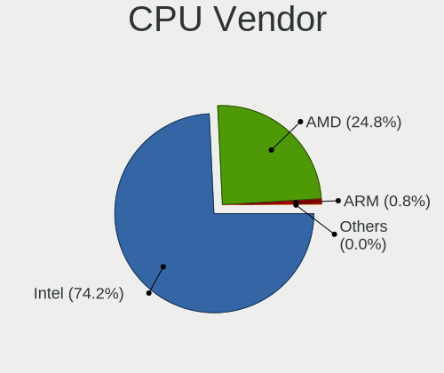
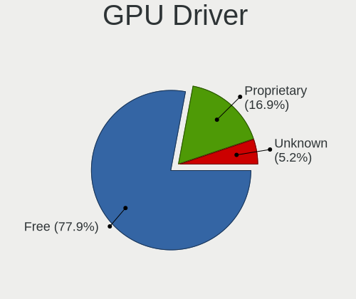
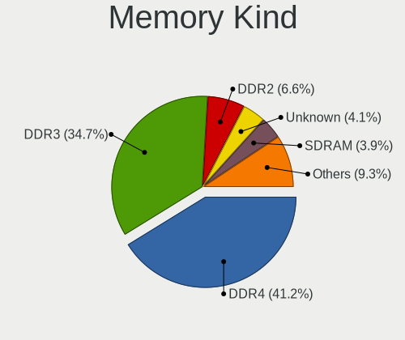
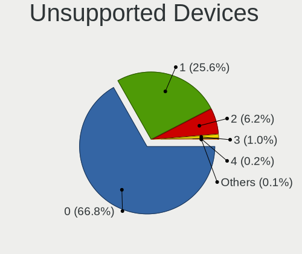

Linux in Poland - Tested Hardware & Statistics
----------------------------------------------

A project to collect tested hardware configurations for Linux in Poland.

Anyone can contribute to this report by the [hw-probe](https://github.com/linuxhw/hw-probe) tool:

    sudo -E hw-probe -all -upload

Please contribute! Especially if your hardware is rare.

This is a report for all computer types. See also reports for [desktops](/Location/Poland/Desktop/README.md) and [notebooks](/Location/Poland/Notebook/README.md).

Contents
--------

* [ Test Cases ](#test-cases)

* [ System ](#system)
  - [ OS                       ](#os)
  - [ OS Family                ](#os-family)
  - [ Kernel                   ](#kernel)
  - [ Kernel Family            ](#kernel-family)
  - [ Kernel Major Ver.        ](#kernel-major-ver)
  - [ Arch                     ](#arch)
  - [ DE                       ](#de)
  - [ Display Server           ](#display-server)
  - [ Display Manager          ](#display-manager)
  - [ OS Lang                  ](#os-lang)
  - [ Boot Mode                ](#boot-mode)
  - [ Filesystem               ](#filesystem)
  - [ Part. scheme             ](#part-scheme)
  - [ Dual Boot with Linux/BSD ](#dual-boot-with-linuxbsd)
  - [ Dual Boot (Win)          ](#dual-boot-win)

* [ Board ](#board)
  - [ Vendor                   ](#vendor)
  - [ Model                    ](#model)
  - [ Model Family             ](#model-family)
  - [ MFG Year                 ](#mfg-year)
  - [ Form Factor              ](#form-factor)
  - [ Secure Boot              ](#secure-boot)
  - [ Coreboot                 ](#coreboot)
  - [ RAM Size                 ](#ram-size)
  - [ RAM Used                 ](#ram-used)
  - [ Total Drives             ](#total-drives)
  - [ Has CD-ROM               ](#has-cd-rom)
  - [ Has Ethernet             ](#has-ethernet)
  - [ Has WiFi                 ](#has-wifi)
  - [ Has Bluetooth            ](#has-bluetooth)

* [ Location ](#location)
  - [ Country                  ](#country)
  - [ City                     ](#city)

* [ Drives ](#drives)
  - [ Drive Vendor             ](#drive-vendor)
  - [ Drive Model              ](#drive-model)
  - [ HDD Vendor               ](#hdd-vendor)
  - [ SSD Vendor               ](#ssd-vendor)
  - [ Drive Kind               ](#drive-kind)
  - [ Drive Connector          ](#drive-connector)
  - [ Drive Size               ](#drive-size)
  - [ Space Total              ](#space-total)
  - [ Space Used               ](#space-used)
  - [ Malfunc. Drives          ](#malfunc-drives)
  - [ Malfunc. Drive Vendor    ](#malfunc-drive-vendor)
  - [ Malfunc. HDD Vendor      ](#malfunc-hdd-vendor)
  - [ Malfunc. Drive Kind      ](#malfunc-drive-kind)
  - [ Failed Drives            ](#failed-drives)
  - [ Failed Drive Vendor      ](#failed-drive-vendor)
  - [ Drive Status             ](#drive-status)

* [ Storage controller ](#storage-controller)
  - [ Storage Vendor           ](#storage-vendor)
  - [ Storage Model            ](#storage-model)
  - [ Storage Kind             ](#storage-kind)

* [ Processor ](#processor)
  - [ CPU Vendor               ](#cpu-vendor)
  - [ CPU Model                ](#cpu-model)
  - [ CPU Model Family         ](#cpu-model-family)
  - [ CPU Cores                ](#cpu-cores)
  - [ CPU Sockets              ](#cpu-sockets)
  - [ CPU Threads              ](#cpu-threads)
  - [ CPU Op-Modes             ](#cpu-op-modes)
  - [ CPU Microcode            ](#cpu-microcode)
  - [ CPU Microarch            ](#cpu-microarch)

* [ Graphics ](#graphics)
  - [ GPU Vendor               ](#gpu-vendor)
  - [ GPU Model                ](#gpu-model)
  - [ GPU Combo                ](#gpu-combo)
  - [ GPU Driver               ](#gpu-driver)
  - [ GPU Memory               ](#gpu-memory)

* [ Monitor ](#monitor)
  - [ Monitor Vendor           ](#monitor-vendor)
  - [ Monitor Model            ](#monitor-model)
  - [ Monitor Resolution       ](#monitor-resolution)
  - [ Monitor Diagonal         ](#monitor-diagonal)
  - [ Monitor Width            ](#monitor-width)
  - [ Aspect Ratio             ](#aspect-ratio)
  - [ Monitor Area             ](#monitor-area)
  - [ Pixel Density            ](#pixel-density)
  - [ Multiple Monitors        ](#multiple-monitors)

* [ Network ](#network)
  - [ Net Controller Vendor    ](#net-controller-vendor)
  - [ Net Controller Model     ](#net-controller-model)
  - [ Wireless Vendor          ](#wireless-vendor)
  - [ Wireless Model           ](#wireless-model)
  - [ Ethernet Vendor          ](#ethernet-vendor)
  - [ Ethernet Model           ](#ethernet-model)
  - [ Net Controller Kind      ](#net-controller-kind)
  - [ Used Controller          ](#used-controller)
  - [ NICs                     ](#nics)
  - [ IPv6                     ](#ipv6)

* [ Bluetooth ](#bluetooth)
  - [ Bluetooth Vendor         ](#bluetooth-vendor)
  - [ Bluetooth Model          ](#bluetooth-model)

* [ Sound ](#sound)
  - [ Sound Vendor             ](#sound-vendor)
  - [ Sound Model              ](#sound-model)

* [ Memory ](#memory)
  - [ Memory Vendor            ](#memory-vendor)
  - [ Memory Model             ](#memory-model)
  - [ Memory Kind              ](#memory-kind)
  - [ Memory Form Factor       ](#memory-form-factor)
  - [ Memory Size              ](#memory-size)
  - [ Memory Speed             ](#memory-speed)

* [ Printers & scanners ](#printers--scanners)
  - [ Printer Vendor           ](#printer-vendor)
  - [ Printer Model            ](#printer-model)
  - [ Scanner Vendor           ](#scanner-vendor)
  - [ Scanner Model            ](#scanner-model)

* [ Camera ](#camera)
  - [ Camera Vendor            ](#camera-vendor)
  - [ Camera Model             ](#camera-model)

* [ Security ](#security)
  - [ Fingerprint Vendor       ](#fingerprint-vendor)
  - [ Fingerprint Model        ](#fingerprint-model)
  - [ Chipcard Vendor          ](#chipcard-vendor)
  - [ Chipcard Model           ](#chipcard-model)

* [ Unsupported ](#unsupported)
  - [ Unsupported Devices      ](#unsupported-devices)
  - [ Unsupported Device Types ](#unsupported-device-types)

Test Cases
----------

Total: 9565

| Vendor        | Model                       | Form-Factor | Probe                                                      | Date         |
|---------------|-----------------------------|-------------|------------------------------------------------------------|--------------|
| ASUSTek       | ROG STRIX B650E-I GAMING... | Desktop     | [bdcf61edde](https://linux-hardware.org/?probe=bdcf61edde) | May 09, 2024 |
| ASUSTek       | ASUS TUF Gaming F15 FX50... | Notebook    | [821372cdbd](https://linux-hardware.org/?probe=821372cdbd) | May 08, 2024 |
| Lenovo        | G50-45 80E3                 | Notebook    | [801eeb31ef](https://linux-hardware.org/?probe=801eeb31ef) | May 08, 2024 |
| ASRock        | B450 Gaming K4              | Desktop     | [5283cfbe48](https://linux-hardware.org/?probe=5283cfbe48) | May 08, 2024 |
| MSI           | Z77A-G43                    | Desktop     | [f7e7eb8397](https://linux-hardware.org/?probe=f7e7eb8397) | May 08, 2024 |
| Samsung       | SR700                       | Notebook    | [97ed5b7fc7](https://linux-hardware.org/?probe=97ed5b7fc7) | May 08, 2024 |
| ASUSTek       | ASUS TUF Gaming F17 FX70... | Notebook    | [eb38e0f3a5](https://linux-hardware.org/?probe=eb38e0f3a5) | May 08, 2024 |
| ASUSTek       | ASUS TUF Gaming F17 FX70... | Notebook    | [2f571c8d88](https://linux-hardware.org/?probe=2f571c8d88) | May 07, 2024 |
| Lenovo        | 3148 SDK0J40700 WIN 3258... | Desktop     | [b24f7286d2](https://linux-hardware.org/?probe=b24f7286d2) | May 07, 2024 |
| Dell          | Latitude 3190               | Notebook    | [102011a182](https://linux-hardware.org/?probe=102011a182) | May 07, 2024 |
| HP            | ENVY Notebook 13-ab0XX      | Notebook    | [7d6b757088](https://linux-hardware.org/?probe=7d6b757088) | May 07, 2024 |
| HP            | ENVY Notebook 13-ab0XX      | Notebook    | [a9d1c1234c](https://linux-hardware.org/?probe=a9d1c1234c) | May 07, 2024 |
| Fujitsu Si... | LIFEBOOK S6410              | Notebook    | [fb78e4f92a](https://linux-hardware.org/?probe=fb78e4f92a) | May 07, 2024 |
| Dell          | Latitude 9430               | Notebook    | [953be205ca](https://linux-hardware.org/?probe=953be205ca) | May 07, 2024 |
| ASUSTek       | Zenbook UX5401ZA_UX5401Z... | Notebook    | [92089af4b7](https://linux-hardware.org/?probe=92089af4b7) | May 06, 2024 |
| Samsung       | 350V5C/351V5C/3540VC/344... | Notebook    | [5bc2e6635d](https://linux-hardware.org/?probe=5bc2e6635d) | May 06, 2024 |
| ASUSTek       | M3A78-CM                    | Desktop     | [0bcef3f207](https://linux-hardware.org/?probe=0bcef3f207) | May 06, 2024 |
| Raspberry ... | Raspberry Pi 3 Model B R... | Soc         | [ab33f7c9fc](https://linux-hardware.org/?probe=ab33f7c9fc) | May 06, 2024 |
| Lenovo        | Unknown                     | Notebook    | [5087593233](https://linux-hardware.org/?probe=5087593233) | May 06, 2024 |
| Gigabyte      | A520 AORUS ELITE            | Desktop     | [8c70aa2f23](https://linux-hardware.org/?probe=8c70aa2f23) | May 05, 2024 |
| HP            | ProBook 455 G7              | Notebook    | [470e53d860](https://linux-hardware.org/?probe=470e53d860) | May 05, 2024 |
| Lenovo        | ThinkPad T440p 20AWS0HN0... | Notebook    | [dcdedc549d](https://linux-hardware.org/?probe=dcdedc549d) | May 05, 2024 |
| Lenovo        | IdeaPad 320-15ISK 80XH      | Notebook    | [55d15ed397](https://linux-hardware.org/?probe=55d15ed397) | May 05, 2024 |
| Lenovo        | ThinkPad T440p 20AWS0HN0... | Notebook    | [68020b1c69](https://linux-hardware.org/?probe=68020b1c69) | May 05, 2024 |
| Gigabyte      | AB350-Gaming-CF             | Desktop     | [5510492a9b](https://linux-hardware.org/?probe=5510492a9b) | May 05, 2024 |
| HP            | Pavilion Laptop 15-cc5xx    | Notebook    | [ab0226a735](https://linux-hardware.org/?probe=ab0226a735) | May 05, 2024 |
| ASUSTek       | ROG STRIX Z690-A GAMING ... | Desktop     | [64b195310b](https://linux-hardware.org/?probe=64b195310b) | May 04, 2024 |
| ASUSTek       | ASUS TUF Gaming A16 FA61... | Notebook    | [1f93c42106](https://linux-hardware.org/?probe=1f93c42106) | May 04, 2024 |
| Gigabyte      | 970A-DS3P                   | Desktop     | [0cf6542a99](https://linux-hardware.org/?probe=0cf6542a99) | May 04, 2024 |
| Lenovo        | ThinkBook 16 G6 IRL 21KH    | Notebook    | [b8f0474451](https://linux-hardware.org/?probe=b8f0474451) | May 03, 2024 |
| Lenovo        | ThinkPad E15 Gen 2 20T80... | Notebook    | [67fbb6a446](https://linux-hardware.org/?probe=67fbb6a446) | May 03, 2024 |
| ASUSTek       | VivoBook_ASUSLaptop X515... | Notebook    | [5b3074a531](https://linux-hardware.org/?probe=5b3074a531) | May 03, 2024 |
| Lenovo        | IdeaPad Z500 20202          | Notebook    | [41468a4e5c](https://linux-hardware.org/?probe=41468a4e5c) | May 03, 2024 |
| HP            | ZBook 17 G4                 | Notebook    | [8d618b9f7e](https://linux-hardware.org/?probe=8d618b9f7e) | May 02, 2024 |
| ASUSTek       | GL552VW                     | Notebook    | [f68ba06228](https://linux-hardware.org/?probe=f68ba06228) | May 02, 2024 |
| Apple         | MacBookAir7,2               | Notebook    | [63cf24a977](https://linux-hardware.org/?probe=63cf24a977) | May 02, 2024 |
| Lenovo        | IdeaPad Z500 20202          | Notebook    | [f7e35750cd](https://linux-hardware.org/?probe=f7e35750cd) | May 02, 2024 |
| HP            | Pavilion Gaming Laptop 1... | Notebook    | [091db8dce1](https://linux-hardware.org/?probe=091db8dce1) | May 01, 2024 |
| Gigabyte      | H81M-HD3                    | Desktop     | [adcbc97b26](https://linux-hardware.org/?probe=adcbc97b26) | May 01, 2024 |
| Valve         | Galileo                     | Notebook    | [fc102d1c7f](https://linux-hardware.org/?probe=fc102d1c7f) | May 01, 2024 |
| Dell          | Inspiron 13-5368            | Notebook    | [ac125025cf](https://linux-hardware.org/?probe=ac125025cf) | May 01, 2024 |
| HP            | Laptop 15s-eq0xxx           | Notebook    | [5eb0bf12fd](https://linux-hardware.org/?probe=5eb0bf12fd) | May 01, 2024 |
| HP            | EliteBook 860 16 inch G1... | Notebook    | [7a9e1274fa](https://linux-hardware.org/?probe=7a9e1274fa) | Apr 30, 2024 |
| Apple         | MacBookPro11,5              | Notebook    | [c0fa280156](https://linux-hardware.org/?probe=c0fa280156) | Apr 30, 2024 |
| Lenovo        | Legion Slim 5 16APH8 82Y... | Notebook    | [c055450efc](https://linux-hardware.org/?probe=c055450efc) | Apr 30, 2024 |
| Lenovo        | Y520-15IKBN 80WK            | Notebook    | [6d235ddbaf](https://linux-hardware.org/?probe=6d235ddbaf) | Apr 29, 2024 |
| ASRock        | A320M-HDV R3.0              | Desktop     | [156f672c14](https://linux-hardware.org/?probe=156f672c14) | Apr 29, 2024 |
| Dell          | Inspiron 5748               | Notebook    | [43d176db3e](https://linux-hardware.org/?probe=43d176db3e) | Apr 29, 2024 |
| Google        | Gnawty                      | Notebook    | [c639a31438](https://linux-hardware.org/?probe=c639a31438) | Apr 28, 2024 |
| Lenovo        | ThinkPad L13 Yoga Gen 2 ... | Convertible | [3abd0e1665](https://linux-hardware.org/?probe=3abd0e1665) | Apr 28, 2024 |
| Google        | Gnawty                      | Notebook    | [c913fe837f](https://linux-hardware.org/?probe=c913fe837f) | Apr 28, 2024 |
| ASUSTek       | X553MA                      | Notebook    | [87b13248a4](https://linux-hardware.org/?probe=87b13248a4) | Apr 28, 2024 |
| HP            | 8266                        | Desktop     | [f71d887eb9](https://linux-hardware.org/?probe=f71d887eb9) | Apr 28, 2024 |
| MSI           | GT62VR 6RE                  | Notebook    | [b7768b7ee9](https://linux-hardware.org/?probe=b7768b7ee9) | Apr 28, 2024 |
| MSI           | GF63 8RD                    | Notebook    | [01aaa42b00](https://linux-hardware.org/?probe=01aaa42b00) | Apr 28, 2024 |
| Apple         | MacBookPro9,2               | Notebook    | [e298812f38](https://linux-hardware.org/?probe=e298812f38) | Apr 28, 2024 |
| ASUSTek       | X99-A                       | Desktop     | [eab08c37f7](https://linux-hardware.org/?probe=eab08c37f7) | Apr 28, 2024 |
| Acer          | Aspire ES1-431              | Notebook    | [ff9ee70831](https://linux-hardware.org/?probe=ff9ee70831) | Apr 28, 2024 |
| Lenovo        | IdeaPad 3 15ITL6 82H8       | Notebook    | [419fb8dfca](https://linux-hardware.org/?probe=419fb8dfca) | Apr 28, 2024 |
| Lenovo        | IdeaPad 3 15ITL6 82H8       | Notebook    | [a154dad3b7](https://linux-hardware.org/?probe=a154dad3b7) | Apr 28, 2024 |
| HP            | OMEN Laptop 15-ek0xxx       | Notebook    | [bbd6e87bc4](https://linux-hardware.org/?probe=bbd6e87bc4) | Apr 27, 2024 |
| Dell          | G15 5520                    | Notebook    | [80975f981b](https://linux-hardware.org/?probe=80975f981b) | Apr 27, 2024 |
| System76      | Galago Pro                  | Notebook    | [06d9cca0d2](https://linux-hardware.org/?probe=06d9cca0d2) | Apr 27, 2024 |
| MSI           | B550-A PRO                  | Desktop     | [63cd7f6146](https://linux-hardware.org/?probe=63cd7f6146) | Apr 27, 2024 |
| Acer          | Nitro AN517-42              | Notebook    | [c8d6aba6fa](https://linux-hardware.org/?probe=c8d6aba6fa) | Apr 27, 2024 |
| Valve         | Jupiter                     | Notebook    | [49fd8e0c8f](https://linux-hardware.org/?probe=49fd8e0c8f) | Apr 26, 2024 |
| HP            | EliteBook 850 G8 Noteboo... | Notebook    | [a5cb6f40d5](https://linux-hardware.org/?probe=a5cb6f40d5) | Apr 26, 2024 |
| HP            | EliteBook 860 16 inch G1... | Notebook    | [6d6550e6dc](https://linux-hardware.org/?probe=6d6550e6dc) | Apr 26, 2024 |
| Lenovo        | ThinkPad T570 20HAS03W00    | Notebook    | [6d4f2cc6ca](https://linux-hardware.org/?probe=6d4f2cc6ca) | Apr 26, 2024 |
| Dell          | 0GTK4K A02                  | Desktop     | [80bf3e1bd7](https://linux-hardware.org/?probe=80bf3e1bd7) | Apr 26, 2024 |
| HP            | EliteBook 840 G1            | Notebook    | [02246fba3e](https://linux-hardware.org/?probe=02246fba3e) | Apr 26, 2024 |
| ASUSTek       | ASUS TUF Gaming F15 FX50... | Notebook    | [e02463d8d9](https://linux-hardware.org/?probe=e02463d8d9) | Apr 26, 2024 |
| MSI           | B250I GAMING PRO AC         | Desktop     | [edf573962d](https://linux-hardware.org/?probe=edf573962d) | Apr 25, 2024 |
| Dell          | Inspiron 15 3511            | Notebook    | [48c356da20](https://linux-hardware.org/?probe=48c356da20) | Apr 25, 2024 |
| Gigabyte      | B450M DS3H-CF               | Desktop     | [61842fb260](https://linux-hardware.org/?probe=61842fb260) | Apr 25, 2024 |
| Inventec      | DQ Class A02                | Desktop     | [5edaa0ed95](https://linux-hardware.org/?probe=5edaa0ed95) | Apr 24, 2024 |
| Gigabyte      | EX58-UD3R                   | Desktop     | [826b210e79](https://linux-hardware.org/?probe=826b210e79) | Apr 24, 2024 |
| Dell          | Latitude 9440 2-in-1        | Convertible | [52e163ab73](https://linux-hardware.org/?probe=52e163ab73) | Apr 24, 2024 |
| Dell          | Precision 3561              | Notebook    | [347e3ff8f6](https://linux-hardware.org/?probe=347e3ff8f6) | Apr 24, 2024 |
| HP            | OMEN Laptop 15-ek0xxx       | Notebook    | [42a4906c7d](https://linux-hardware.org/?probe=42a4906c7d) | Apr 24, 2024 |
| Lenovo        | G500s 20245                 | Notebook    | [9742cd9e94](https://linux-hardware.org/?probe=9742cd9e94) | Apr 24, 2024 |
| Lenovo        | ThinkPad L580 20LW000UPB    | Notebook    | [ed17d0c6d4](https://linux-hardware.org/?probe=ed17d0c6d4) | Apr 24, 2024 |
| ASRock        | B75 Pro3                    | Desktop     | [87a8013072](https://linux-hardware.org/?probe=87a8013072) | Apr 24, 2024 |
| MSI           | B550-A PRO                  | Desktop     | [db4981c2cb](https://linux-hardware.org/?probe=db4981c2cb) | Apr 24, 2024 |
| Lenovo        | ThinkPad P50 20EQS3B30R     | Notebook    | [524d874cd6](https://linux-hardware.org/?probe=524d874cd6) | Apr 24, 2024 |
| Lenovo        | ThinkPad T580 20LAS8HJ20    | Notebook    | [8a1c282b2e](https://linux-hardware.org/?probe=8a1c282b2e) | Apr 23, 2024 |
| Lenovo        | Legion Slim 5 16APH8 82Y... | Notebook    | [aa99325f06](https://linux-hardware.org/?probe=aa99325f06) | Apr 23, 2024 |
| Unknown       | Unknown                     | Notebook    | [6d5a09c736](https://linux-hardware.org/?probe=6d5a09c736) | Apr 23, 2024 |
| MSI           | Katana GF66 11UE            | Notebook    | [8f4e6cf713](https://linux-hardware.org/?probe=8f4e6cf713) | Apr 23, 2024 |
| Lenovo        | 4030                        | Desktop     | [0c37613f84](https://linux-hardware.org/?probe=0c37613f84) | Apr 23, 2024 |
| ASUSTek       | M3A78-CM                    | Desktop     | [cdc42c64dd](https://linux-hardware.org/?probe=cdc42c64dd) | Apr 22, 2024 |
| Intel         | DQ45CB AAE30148-206         | Desktop     | [fb8d3b6c11](https://linux-hardware.org/?probe=fb8d3b6c11) | Apr 22, 2024 |
| MSI           | B550-A PRO                  | Desktop     | [f1d18ed809](https://linux-hardware.org/?probe=f1d18ed809) | Apr 22, 2024 |
| Dell          | Precision 3581              | Notebook    | [2e60f977aa](https://linux-hardware.org/?probe=2e60f977aa) | Apr 22, 2024 |
| Toshiba       | Satellite C850D-11C         | Notebook    | [beccadec71](https://linux-hardware.org/?probe=beccadec71) | Apr 22, 2024 |
| Lenovo        | Legion 5 Pro 16ACH6 82JS    | Notebook    | [8b5161f4ab](https://linux-hardware.org/?probe=8b5161f4ab) | Apr 22, 2024 |
| Lenovo        | IdeaPad 100-15IBD 80QQ      | Notebook    | [a8d83edd62](https://linux-hardware.org/?probe=a8d83edd62) | Apr 22, 2024 |
| ASRock        | B550M-ITX/ac                | Desktop     | [6389731461](https://linux-hardware.org/?probe=6389731461) | Apr 21, 2024 |
| ASUSTek       | K55DR                       | Notebook    | [3ae44053ef](https://linux-hardware.org/?probe=3ae44053ef) | Apr 21, 2024 |
| Lenovo        | IdeaPad 110-15IBR 80T7      | Notebook    | [65f1fdc927](https://linux-hardware.org/?probe=65f1fdc927) | Apr 21, 2024 |
| Unknown       | V0.9x                       | Desktop     | [db770f4cb9](https://linux-hardware.org/?probe=db770f4cb9) | Apr 21, 2024 |
| Lenovo        | ThinkPad E15 Gen 2 20T80... | Notebook    | [482d5d1221](https://linux-hardware.org/?probe=482d5d1221) | Apr 21, 2024 |
| HP            | 805B                        | Desktop     | [06e17f3461](https://linux-hardware.org/?probe=06e17f3461) | Apr 21, 2024 |
| Toshiba       | Satellite C850D-11C         | Notebook    | [5c2b50c3cc](https://linux-hardware.org/?probe=5c2b50c3cc) | Apr 21, 2024 |
| Lenovo        | G50-45 80E3                 | Notebook    | [61882ea818](https://linux-hardware.org/?probe=61882ea818) | Apr 21, 2024 |
| Lenovo        | G70-70 80HW                 | Notebook    | [73f307b60b](https://linux-hardware.org/?probe=73f307b60b) | Apr 20, 2024 |
| Lenovo        | G50-45 80E3                 | Notebook    | [2ee14c9eff](https://linux-hardware.org/?probe=2ee14c9eff) | Apr 20, 2024 |
| ASUSTek       | ASUS TUF Gaming A15 FA50... | Notebook    | [ee83ed7c12](https://linux-hardware.org/?probe=ee83ed7c12) | Apr 20, 2024 |
| MSI           | MAG B460 TORPEDO            | Desktop     | [14ab4e8bf9](https://linux-hardware.org/?probe=14ab4e8bf9) | Apr 20, 2024 |
| MSI           | MS-7235                     | Desktop     | [67ea957848](https://linux-hardware.org/?probe=67ea957848) | Apr 20, 2024 |
| MSI           | B450M PRO-VDH MAX           | Desktop     | [479eb31f54](https://linux-hardware.org/?probe=479eb31f54) | Apr 20, 2024 |
| Lenovo        | ThinkPad T14 Gen 3 21AH0... | Notebook    | [96c7946b39](https://linux-hardware.org/?probe=96c7946b39) | Apr 20, 2024 |
| ASUSTek       | K53E                        | Notebook    | [0db457945f](https://linux-hardware.org/?probe=0db457945f) | Apr 20, 2024 |
| HP            | EliteBook 830 G5            | Notebook    | [2df78096e3](https://linux-hardware.org/?probe=2df78096e3) | Apr 20, 2024 |
| HP            | Pavilion g6                 | Notebook    | [0f10b1616f](https://linux-hardware.org/?probe=0f10b1616f) | Apr 20, 2024 |
| ASUSTek       | A88XM-E                     | Desktop     | [6ff101f38c](https://linux-hardware.org/?probe=6ff101f38c) | Apr 19, 2024 |
| Dell          | Vostro 3580                 | Notebook    | [af4cc3e115](https://linux-hardware.org/?probe=af4cc3e115) | Apr 19, 2024 |
| Dell          | Vostro 3580                 | Notebook    | [aa8437e096](https://linux-hardware.org/?probe=aa8437e096) | Apr 19, 2024 |
| MSI           | MS-7235                     | Desktop     | [d0b1ac0e44](https://linux-hardware.org/?probe=d0b1ac0e44) | Apr 19, 2024 |
| Lenovo        | Legion 5 15ARH05H 82B1      | Notebook    | [5bcf08b4b0](https://linux-hardware.org/?probe=5bcf08b4b0) | Apr 19, 2024 |
| Gigabyte      | B365M DS3H                  | Desktop     | [dbc2dd908b](https://linux-hardware.org/?probe=dbc2dd908b) | Apr 19, 2024 |
| HP            | EliteBook 830 G5            | Notebook    | [257bad95d7](https://linux-hardware.org/?probe=257bad95d7) | Apr 18, 2024 |
| ASUSTek       | ASUS TUF Gaming F15 FX50... | Notebook    | [4cec985734](https://linux-hardware.org/?probe=4cec985734) | Apr 18, 2024 |
| HP            | EliteBook 840 G3            | Notebook    | [fc3d11e3f3](https://linux-hardware.org/?probe=fc3d11e3f3) | Apr 18, 2024 |
| Dell          | Latitude 7320 Detachable    | Tablet      | [25827e36e6](https://linux-hardware.org/?probe=25827e36e6) | Apr 18, 2024 |
| ASUSTek       | ROG Strix G513QY_G513QY     | Notebook    | [ba533ecb3a](https://linux-hardware.org/?probe=ba533ecb3a) | Apr 18, 2024 |
| Lenovo        | ThinkPad P16 Gen 2 21FA0... | Notebook    | [445b981f65](https://linux-hardware.org/?probe=445b981f65) | Apr 18, 2024 |
| Gigabyte      | B360M D3H-CF                | Desktop     | [708c7e8551](https://linux-hardware.org/?probe=708c7e8551) | Apr 18, 2024 |
| Gigabyte      | B360M D3H-CF                | Desktop     | [42b026296c](https://linux-hardware.org/?probe=42b026296c) | Apr 18, 2024 |
| MSI           | B85M-G43                    | Desktop     | [c632093cb8](https://linux-hardware.org/?probe=c632093cb8) | Apr 18, 2024 |
| Fujitsu       | D2778-C1 S26361-D2778-C1    | Desktop     | [a344875df9](https://linux-hardware.org/?probe=a344875df9) | Apr 18, 2024 |
| HP            | 805B                        | Desktop     | [d5bf7c2652](https://linux-hardware.org/?probe=d5bf7c2652) | Apr 18, 2024 |
| Gigabyte      | B450M K-CF                  | Desktop     | [74fb485917](https://linux-hardware.org/?probe=74fb485917) | Apr 17, 2024 |
| Samsung       | 300E4A/300E5A/300E7A/343... | Notebook    | [fd71b9d36c](https://linux-hardware.org/?probe=fd71b9d36c) | Apr 17, 2024 |
| Lenovo        | Legion Y540-15IRH 81SX      | Notebook    | [cebfff5171](https://linux-hardware.org/?probe=cebfff5171) | Apr 17, 2024 |
| WeiBu         | ADL-N Prod                  | Desktop     | [3da2323db4](https://linux-hardware.org/?probe=3da2323db4) | Apr 17, 2024 |
| Gigabyte      | B760M GAMING X AX DDR4      | Desktop     | [e18c7ed37c](https://linux-hardware.org/?probe=e18c7ed37c) | Apr 17, 2024 |
| ASUSTek       | K50IJ                       | Notebook    | [f0d8580bfc](https://linux-hardware.org/?probe=f0d8580bfc) | Apr 16, 2024 |
| ASRock        | Z790 Nova WiFi              | Desktop     | [e7087ec7e4](https://linux-hardware.org/?probe=e7087ec7e4) | Apr 16, 2024 |
| AMI           | Cherry Trail CR             | Desktop     | [e60bc95699](https://linux-hardware.org/?probe=e60bc95699) | Apr 16, 2024 |
| ASUSTek       | N73SV                       | Notebook    | [dbf8444f39](https://linux-hardware.org/?probe=dbf8444f39) | Apr 16, 2024 |
| ASUSTek       | ASUS TUF Gaming F15 FX50... | Notebook    | [8740b4588a](https://linux-hardware.org/?probe=8740b4588a) | Apr 16, 2024 |
| Sony          | VPCEH3K1E                   | Notebook    | [79f871b092](https://linux-hardware.org/?probe=79f871b092) | Apr 16, 2024 |
| Lenovo        | IdeaPad 3 17IML05 81WC      | Notebook    | [2667935967](https://linux-hardware.org/?probe=2667935967) | Apr 16, 2024 |
| MSI           | MPG Z390 GAMING PLUS        | Desktop     | [89c08359b4](https://linux-hardware.org/?probe=89c08359b4) | Apr 15, 2024 |
| ASUSTek       | P7P55D-E PRO                | Desktop     | [dfb33effe1](https://linux-hardware.org/?probe=dfb33effe1) | Apr 15, 2024 |
| ASUSTek       | N53SM                       | Notebook    | [0769613e83](https://linux-hardware.org/?probe=0769613e83) | Apr 15, 2024 |
| Acer          | Aspire E1-572G              | Notebook    | [96b786aa6f](https://linux-hardware.org/?probe=96b786aa6f) | Apr 15, 2024 |
| Lenovo        | ThinkPad T480 20L6SAYX00    | Notebook    | [fc73e6bb02](https://linux-hardware.org/?probe=fc73e6bb02) | Apr 15, 2024 |
| Prestigio     | Smartbook PSB116A           | Desktop     | [044fc5c4f8](https://linux-hardware.org/?probe=044fc5c4f8) | Apr 14, 2024 |
| Lenovo        | Legion Slim 5 16APH8 82Y... | Notebook    | [aa7ac835c0](https://linux-hardware.org/?probe=aa7ac835c0) | Apr 14, 2024 |
| ASRock        | B650M-HDV/M.2               | Desktop     | [8ed3523f0a](https://linux-hardware.org/?probe=8ed3523f0a) | Apr 14, 2024 |
| Lenovo        | HASWELLREFRESHDT 3190005... | All in one  | [e3a19501c5](https://linux-hardware.org/?probe=e3a19501c5) | Apr 14, 2024 |
| HUAWEI        | BOD-WXX9                    | Notebook    | [47daf18fca](https://linux-hardware.org/?probe=47daf18fca) | Apr 14, 2024 |
| Unknown       | Unknown                     | Soc         | [3b976cc347](https://linux-hardware.org/?probe=3b976cc347) | Apr 14, 2024 |
| ASRock        | X670E PG Lightning          | Desktop     | [e3bd195788](https://linux-hardware.org/?probe=e3bd195788) | Apr 14, 2024 |
| Gigabyte      | X570 GAMING X               | Desktop     | [d79972631a](https://linux-hardware.org/?probe=d79972631a) | Apr 14, 2024 |
| Gigabyte      | X570 GAMING X               | Desktop     | [fa6b81bbbf](https://linux-hardware.org/?probe=fa6b81bbbf) | Apr 14, 2024 |
| Panasonic ... | CFSR4-1                     | Notebook    | [f6dcf6b847](https://linux-hardware.org/?probe=f6dcf6b847) | Apr 13, 2024 |
| Prestigio     | Smartbook PSB116A           | Desktop     | [cc592e784e](https://linux-hardware.org/?probe=cc592e784e) | Apr 13, 2024 |
| Fujitsu       | D3313-B1 S26361-D3313-B1    | Desktop     | [2998b9027d](https://linux-hardware.org/?probe=2998b9027d) | Apr 13, 2024 |
| Lenovo        | ThinkPad E15 Gen 2 20T80... | Notebook    | [2eea232a7e](https://linux-hardware.org/?probe=2eea232a7e) | Apr 13, 2024 |
| HP            | Spectre x360 2-in-1 Lapt... | Convertible | [d4509f2690](https://linux-hardware.org/?probe=d4509f2690) | Apr 12, 2024 |
| ASUSTek       | N53SM                       | Notebook    | [e69871e7f5](https://linux-hardware.org/?probe=e69871e7f5) | Apr 12, 2024 |
| Dell          | G15 5510                    | Notebook    | [e8cfa16a81](https://linux-hardware.org/?probe=e8cfa16a81) | Apr 12, 2024 |
| Dell          | G15 5510                    | Notebook    | [9ed69c889f](https://linux-hardware.org/?probe=9ed69c889f) | Apr 12, 2024 |
| ASRock        | B650M-HDV/M.2               | Desktop     | [9958bc908a](https://linux-hardware.org/?probe=9958bc908a) | Apr 12, 2024 |
| Acer          | Nitro AN515-52              | Notebook    | [e08da0d2dd](https://linux-hardware.org/?probe=e08da0d2dd) | Apr 11, 2024 |
| Lenovo        | ThinkBook 16p Gen 4 21J8    | Notebook    | [53e47366b5](https://linux-hardware.org/?probe=53e47366b5) | Apr 11, 2024 |
| ASRock        | B450 Gaming K4              | Desktop     | [57a6443eb0](https://linux-hardware.org/?probe=57a6443eb0) | Apr 11, 2024 |
| Gigabyte      | AB350-Gaming-CF             | Desktop     | [f15f757ee9](https://linux-hardware.org/?probe=f15f757ee9) | Apr 11, 2024 |
| Gigabyte      | B450 AORUS ELITE V2         | Desktop     | [330f3172fe](https://linux-hardware.org/?probe=330f3172fe) | Apr 11, 2024 |
| Gigabyte      | B450 AORUS ELITE V2         | Desktop     | [11b54dd819](https://linux-hardware.org/?probe=11b54dd819) | Apr 10, 2024 |
| Dell          | Studio 1558                 | Notebook    | [195acc75cf](https://linux-hardware.org/?probe=195acc75cf) | Apr 10, 2024 |
| Dell          | Studio 1558                 | Notebook    | [92678a06a0](https://linux-hardware.org/?probe=92678a06a0) | Apr 10, 2024 |
| MSI           | GL65 9SC                    | Notebook    | [7bc8965c5e](https://linux-hardware.org/?probe=7bc8965c5e) | Apr 10, 2024 |
| ASUSTek       | VivoBook_ASUSLaptop M560... | Notebook    | [96271e0269](https://linux-hardware.org/?probe=96271e0269) | Apr 10, 2024 |
| HP            | ProBook 650 G1              | Notebook    | [bea5a5fbf0](https://linux-hardware.org/?probe=bea5a5fbf0) | Apr 10, 2024 |
| ASUSTek       | H110M-R                     | Desktop     | [473b7a412c](https://linux-hardware.org/?probe=473b7a412c) | Apr 10, 2024 |
| ASUSTek       | H110M-R                     | Desktop     | [d8c6b0c73f](https://linux-hardware.org/?probe=d8c6b0c73f) | Apr 10, 2024 |
| Dell          | Precision M4800             | Notebook    | [e0cd62ded2](https://linux-hardware.org/?probe=e0cd62ded2) | Apr 10, 2024 |
| Dell          | Inspiron 11 - 3147          | Notebook    | [feac4cd679](https://linux-hardware.org/?probe=feac4cd679) | Apr 10, 2024 |
| Dell          | Latitude 7280               | Notebook    | [b9b576262c](https://linux-hardware.org/?probe=b9b576262c) | Apr 09, 2024 |
| Notebook      | P7xxDM2(-G)                 | Notebook    | [ee5809d062](https://linux-hardware.org/?probe=ee5809d062) | Apr 09, 2024 |
| Lenovo        | Yoga 6 13ALC7 82UD          | Convertible | [4e30a0df84](https://linux-hardware.org/?probe=4e30a0df84) | Apr 09, 2024 |
| Gigabyte      | A520 AORUS ELITE            | Desktop     | [bef494961d](https://linux-hardware.org/?probe=bef494961d) | Apr 09, 2024 |
| Acer          | Extensa 215-55              | Notebook    | [e24d68d574](https://linux-hardware.org/?probe=e24d68d574) | Apr 08, 2024 |
| ASUSTek       | P7P55 WS SUPERCOMPUTER      | Desktop     | [a3c369db65](https://linux-hardware.org/?probe=a3c369db65) | Apr 08, 2024 |
| Gigabyte      | B550 AORUS ELITE V2         | Desktop     | [da36e04639](https://linux-hardware.org/?probe=da36e04639) | Apr 08, 2024 |
| MSI           | B360M PRO-VD 2019-01-24     | Desktop     | [5452671bee](https://linux-hardware.org/?probe=5452671bee) | Apr 08, 2024 |
| Dell          | Latitude 9440 2-in-1        | Convertible | [8472484320](https://linux-hardware.org/?probe=8472484320) | Apr 08, 2024 |
| Dell          | Latitude 9430               | Notebook    | [4b062024a4](https://linux-hardware.org/?probe=4b062024a4) | Apr 08, 2024 |
| ASUSTek       | ProArt Z790-CREATOR WIFI    | Desktop     | [b66f739603](https://linux-hardware.org/?probe=b66f739603) | Apr 08, 2024 |
| Raspberry ... | Raspberry Pi 3 Model B R... | Soc         | [a0b38f568d](https://linux-hardware.org/?probe=a0b38f568d) | Apr 08, 2024 |
| MSI           | B85M-G43                    | Desktop     | [aabca2aa43](https://linux-hardware.org/?probe=aabca2aa43) | Apr 08, 2024 |
| Dell          | Latitude E7250              | Notebook    | [3979d6a4a1](https://linux-hardware.org/?probe=3979d6a4a1) | Apr 07, 2024 |
| Lenovo        | IdeaPad Y700-15ISK 80NV     | Notebook    | [9c0f217fbb](https://linux-hardware.org/?probe=9c0f217fbb) | Apr 07, 2024 |
| HP            | Pavilion Laptop 15-cw1xx... | Notebook    | [a896a98b68](https://linux-hardware.org/?probe=a896a98b68) | Apr 07, 2024 |
| HP            | Pavilion Laptop 15-cw1xx... | Notebook    | [a372d941e8](https://linux-hardware.org/?probe=a372d941e8) | Apr 07, 2024 |
| ASUSTek       | TUF Gaming B550M-PLUS WI... | Desktop     | [a88186f61b](https://linux-hardware.org/?probe=a88186f61b) | Apr 07, 2024 |
| Samsung       | 350V5C/351V5C/3540VC/344... | Notebook    | [4802cbf930](https://linux-hardware.org/?probe=4802cbf930) | Apr 07, 2024 |
| MSI           | B550-A PRO                  | Desktop     | [3497604929](https://linux-hardware.org/?probe=3497604929) | Apr 07, 2024 |
| MSI           | Z170A GAMING M5             | Desktop     | [3ade43a7b8](https://linux-hardware.org/?probe=3ade43a7b8) | Apr 06, 2024 |
| ASUSTek       | ROG Flow X16 GV601RW_GV6... | Convertible | [ae03ccced5](https://linux-hardware.org/?probe=ae03ccced5) | Apr 06, 2024 |
| Dell          | 0XCR8D A03                  | Desktop     | [bad21847e5](https://linux-hardware.org/?probe=bad21847e5) | Apr 06, 2024 |
| Dell          | 0XCR8D A03                  | Desktop     | [a80358f28f](https://linux-hardware.org/?probe=a80358f28f) | Apr 06, 2024 |
| ASUSTek       | H110M-R                     | Desktop     | [a06f264d4e](https://linux-hardware.org/?probe=a06f264d4e) | Apr 06, 2024 |
| ASUSTek       | H110M-R                     | Desktop     | [a449b1fee1](https://linux-hardware.org/?probe=a449b1fee1) | Apr 06, 2024 |
| Lenovo        | ThinkPad T430 2349FC4       | Notebook    | [1b0129f0b0](https://linux-hardware.org/?probe=1b0129f0b0) | Apr 06, 2024 |
| Lenovo        | ThinkPad E15 Gen 2 20T80... | Notebook    | [169c6755af](https://linux-hardware.org/?probe=169c6755af) | Apr 05, 2024 |
| Gigabyte      | Z170X-Gaming 5              | Desktop     | [6cd475d812](https://linux-hardware.org/?probe=6cd475d812) | Apr 05, 2024 |
| Gigabyte      | B85M-HD3                    | Desktop     | [3d81eb0d82](https://linux-hardware.org/?probe=3d81eb0d82) | Apr 05, 2024 |
| Acer          | Aspire ES1-512              | Notebook    | [47ad6cd23e](https://linux-hardware.org/?probe=47ad6cd23e) | Apr 05, 2024 |
| Acer          | Aspire ES1-512              | Notebook    | [9b5914816a](https://linux-hardware.org/?probe=9b5914816a) | Apr 05, 2024 |
| MSI           | Z590 PRO WIFI               | Desktop     | [b4b9cef6a6](https://linux-hardware.org/?probe=b4b9cef6a6) | Apr 05, 2024 |
| ASUSTek       | P7P55 WS SUPERCOMPUTER      | Desktop     | [4fd520e1ae](https://linux-hardware.org/?probe=4fd520e1ae) | Apr 05, 2024 |
| HP            | Pavilion dv7                | Notebook    | [f7ecb14c8e](https://linux-hardware.org/?probe=f7ecb14c8e) | Apr 05, 2024 |
| Dell          | 0T1D10 A01                  | Desktop     | [bd3b0fd5b1](https://linux-hardware.org/?probe=bd3b0fd5b1) | Apr 04, 2024 |
| HUAWEI        | KPL-W0X                     | Notebook    | [4b06cf61b5](https://linux-hardware.org/?probe=4b06cf61b5) | Apr 04, 2024 |
| ASUSTek       | K93SV                       | Notebook    | [f15f98fdbd](https://linux-hardware.org/?probe=f15f98fdbd) | Apr 04, 2024 |
| Intel         | NUC7JYB M37329-601          | Mini pc     | [7fd822510f](https://linux-hardware.org/?probe=7fd822510f) | Apr 04, 2024 |
| Maxcom        | mBook14                     | Notebook    | [c336e74df3](https://linux-hardware.org/?probe=c336e74df3) | Apr 04, 2024 |
| Maxcom        | mBook14                     | Notebook    | [9f682eba49](https://linux-hardware.org/?probe=9f682eba49) | Apr 04, 2024 |
| Gigabyte      | Z370 AORUS Gaming K3-CF     | Desktop     | [38ce1804a9](https://linux-hardware.org/?probe=38ce1804a9) | Apr 04, 2024 |
| Gigabyte      | AB350-Gaming-CF             | Desktop     | [30921e196b](https://linux-hardware.org/?probe=30921e196b) | Apr 03, 2024 |
| Lenovo        | IdeaPad 510S-13ISK 80SJ     | Notebook    | [6124084b98](https://linux-hardware.org/?probe=6124084b98) | Apr 03, 2024 |
| Lenovo        | ThinkPad E15 20RD001FPB     | Notebook    | [209962ecb2](https://linux-hardware.org/?probe=209962ecb2) | Apr 03, 2024 |
| Lenovo        | ThinkPad E15 Gen 2 20T80... | Notebook    | [c2482a6360](https://linux-hardware.org/?probe=c2482a6360) | Apr 03, 2024 |
| MSI           | H110M PRO-VH                | Desktop     | [a135bec51e](https://linux-hardware.org/?probe=a135bec51e) | Apr 03, 2024 |
| Lenovo        | ThinkPad E15 20RD001FPB     | Notebook    | [ac7a313a3c](https://linux-hardware.org/?probe=ac7a313a3c) | Apr 03, 2024 |
| Gigabyte      | B450M DS3H-CF               | Desktop     | [368787221d](https://linux-hardware.org/?probe=368787221d) | Apr 03, 2024 |
| Gigabyte      | B250M-DS3H-CF               | Desktop     | [da761f866b](https://linux-hardware.org/?probe=da761f866b) | Apr 03, 2024 |
| HUAWEI        | KLVF-XX                     | Notebook    | [16fc53e7bb](https://linux-hardware.org/?probe=16fc53e7bb) | Apr 03, 2024 |
| Lenovo        | ThinkPad X270 20K5S1A524    | Notebook    | [6668d7d060](https://linux-hardware.org/?probe=6668d7d060) | Apr 02, 2024 |
| Gigabyte      | A520 AORUS ELITE            | Desktop     | [3186452a8d](https://linux-hardware.org/?probe=3186452a8d) | Apr 02, 2024 |
| ASRock        | B450 Gaming K4              | Desktop     | [999ca6d09e](https://linux-hardware.org/?probe=999ca6d09e) | Apr 02, 2024 |
| Dell          | Latitude 3190               | Notebook    | [c15e7df670](https://linux-hardware.org/?probe=c15e7df670) | Apr 02, 2024 |
| Dell          | System XPS L502X            | Notebook    | [78f6ea571d](https://linux-hardware.org/?probe=78f6ea571d) | Apr 02, 2024 |
| HP            | ENVY Laptop 13-ba1xxx       | Notebook    | [4b4bfa93ee](https://linux-hardware.org/?probe=4b4bfa93ee) | Apr 01, 2024 |
| Dell          | Inspiron 13-5368            | Notebook    | [3c825d9bc6](https://linux-hardware.org/?probe=3c825d9bc6) | Apr 01, 2024 |
| ASRock        | FM2A88X Extreme6+           | Desktop     | [1f8ed16982](https://linux-hardware.org/?probe=1f8ed16982) | Apr 01, 2024 |
| Raspberry ... | Raspberry Pi 3 Model B R... | Soc         | [8875ed3afe](https://linux-hardware.org/?probe=8875ed3afe) | Apr 01, 2024 |
| HP            | ProBook 640 G2              | Notebook    | [8e30761a09](https://linux-hardware.org/?probe=8e30761a09) | Apr 01, 2024 |
| Gigabyte      | B250M-DS3H-CF               | Desktop     | [013cd55b76](https://linux-hardware.org/?probe=013cd55b76) | Apr 01, 2024 |
| Lenovo        | Legion 5 15ARH05H 82B1      | Notebook    | [7244a526b1](https://linux-hardware.org/?probe=7244a526b1) | Apr 01, 2024 |
| MSI           | MPG Z390 GAMING PLUS        | Desktop     | [4f3083c7fa](https://linux-hardware.org/?probe=4f3083c7fa) | Mar 31, 2024 |
| HP            | Laptop 15-dw1xxx            | Notebook    | [43a27413f2](https://linux-hardware.org/?probe=43a27413f2) | Mar 31, 2024 |
| Gigabyte      | EP35-DS3                    | Desktop     | [3d93a78c1b](https://linux-hardware.org/?probe=3d93a78c1b) | Mar 31, 2024 |
| ASUSTek       | GL552VW                     | Notebook    | [4c759cffbe](https://linux-hardware.org/?probe=4c759cffbe) | Mar 31, 2024 |
| MSI           | H310M PRO-M2                | Desktop     | [b2753ac794](https://linux-hardware.org/?probe=b2753ac794) | Mar 31, 2024 |
| Lenovo        | ThinkBook 14 G2 ITL 20VD    | Notebook    | [301f4fbe0a](https://linux-hardware.org/?probe=301f4fbe0a) | Mar 31, 2024 |
| ASUSTek       | PRIME H310M-D R2.0          | Desktop     | [b251cdc4d6](https://linux-hardware.org/?probe=b251cdc4d6) | Mar 31, 2024 |
| Lenovo        | ThinkPad E485 20KUS0DW00    | Notebook    | [350231f567](https://linux-hardware.org/?probe=350231f567) | Mar 31, 2024 |
| Lenovo        | ThinkPad E485 20KUS0DW00    | Notebook    | [89c1c85f43](https://linux-hardware.org/?probe=89c1c85f43) | Mar 31, 2024 |
| HP            | EliteBook x360 1040 G5      | Convertible | [d49c23b416](https://linux-hardware.org/?probe=d49c23b416) | Mar 31, 2024 |
| Lenovo        | V15 G3 IAP CTO 83C4         | Notebook    | [f1449c2bb2](https://linux-hardware.org/?probe=f1449c2bb2) | Mar 30, 2024 |
| Gigabyte      | B550 AORUS ELITE V2         | Desktop     | [7f3b57dade](https://linux-hardware.org/?probe=7f3b57dade) | Mar 30, 2024 |
| MSI           | B550-A PRO                  | Desktop     | [3eaae650f2](https://linux-hardware.org/?probe=3eaae650f2) | Mar 30, 2024 |
| ASUSTek       | PRIME X370-PRO              | Desktop     | [924fb04b1c](https://linux-hardware.org/?probe=924fb04b1c) | Mar 30, 2024 |
| Lenovo        | IdeaPad C340-14API 81N6     | Notebook    | [3aeea5fae7](https://linux-hardware.org/?probe=3aeea5fae7) | Mar 30, 2024 |
| Gigabyte      | J1900N-D3V                  | Desktop     | [b79b70e996](https://linux-hardware.org/?probe=b79b70e996) | Mar 30, 2024 |
| HP            | Spectre x360 Convertible... | Convertible | [43ed029da9](https://linux-hardware.org/?probe=43ed029da9) | Mar 30, 2024 |
| Sony          | VPCCA2S1E                   | Notebook    | [ed8c829953](https://linux-hardware.org/?probe=ed8c829953) | Mar 29, 2024 |
| PC Engines    | apu6                        | Desktop     | [1a5b773874](https://linux-hardware.org/?probe=1a5b773874) | Mar 29, 2024 |
| PC Engines    | apu4                        | Desktop     | [618a89189b](https://linux-hardware.org/?probe=618a89189b) | Mar 29, 2024 |
| PC Engines    | apu4                        | Desktop     | [1aa2f691fd](https://linux-hardware.org/?probe=1aa2f691fd) | Mar 29, 2024 |
| PC Engines    | apu6                        | Desktop     | [55be2a3f96](https://linux-hardware.org/?probe=55be2a3f96) | Mar 29, 2024 |
| MSI           | B85M-E45                    | Desktop     | [a81e4b4666](https://linux-hardware.org/?probe=a81e4b4666) | Mar 29, 2024 |
| ASUSTek       | PRIME B660M-A WIFI D4       | Desktop     | [b8f102aaac](https://linux-hardware.org/?probe=b8f102aaac) | Mar 29, 2024 |
| Notebook      | NV4xPZ                      | Notebook    | [4baac948b7](https://linux-hardware.org/?probe=4baac948b7) | Mar 29, 2024 |
| Lenovo        | Y520-15IKBN 80WK            | Notebook    | [9e7e9b558d](https://linux-hardware.org/?probe=9e7e9b558d) | Mar 29, 2024 |
| Microsoft     | Surface Book 2              | Tablet      | [29ee5ea6b5](https://linux-hardware.org/?probe=29ee5ea6b5) | Mar 29, 2024 |
| MSI           | MAG B660M MORTAR WIFI DD... | Desktop     | [a87aa51bf9](https://linux-hardware.org/?probe=a87aa51bf9) | Mar 29, 2024 |
| Dell          | Inspiron 1750               | Notebook    | [0c73b8ab73](https://linux-hardware.org/?probe=0c73b8ab73) | Mar 29, 2024 |
| ASRock        | Z87 Extreme6                | Desktop     | [a7ffff15ff](https://linux-hardware.org/?probe=a7ffff15ff) | Mar 28, 2024 |
| HP            | Pavilion Notebook           | Notebook    | [e987865868](https://linux-hardware.org/?probe=e987865868) | Mar 28, 2024 |
| Acer          | Aspire E1-772               | Notebook    | [aff094fa8a](https://linux-hardware.org/?probe=aff094fa8a) | Mar 28, 2024 |
| Gigabyte      | H81M-HD3                    | Desktop     | [af704cb4f0](https://linux-hardware.org/?probe=af704cb4f0) | Mar 28, 2024 |
| Dell          | XPS M1530                   | Notebook    | [d252773f43](https://linux-hardware.org/?probe=d252773f43) | Mar 27, 2024 |
| Dell          | Inspiron 3521               | Notebook    | [64c0a44737](https://linux-hardware.org/?probe=64c0a44737) | Mar 27, 2024 |
| ASUSTek       | TUF Gaming B550-PLUS        | Desktop     | [56d77f445e](https://linux-hardware.org/?probe=56d77f445e) | Mar 27, 2024 |
| Dell          | 0YXT71 A03                  | Desktop     | [d854505a5b](https://linux-hardware.org/?probe=d854505a5b) | Mar 27, 2024 |
| MSI           | MPG Z390 GAMING PLUS        | Desktop     | [e98dcc5095](https://linux-hardware.org/?probe=e98dcc5095) | Mar 26, 2024 |
| Dell          | Latitude 5430               | Notebook    | [85d5f988c9](https://linux-hardware.org/?probe=85d5f988c9) | Mar 26, 2024 |
| Dell          | 0JP3NX A01                  | Desktop     | [01246bca4d](https://linux-hardware.org/?probe=01246bca4d) | Mar 26, 2024 |
| Lenovo        | ThinkPad T450s 20BX0011G... | Notebook    | [3e86099c28](https://linux-hardware.org/?probe=3e86099c28) | Mar 26, 2024 |
| Lenovo        | ThinkPad L15 Gen 1 20U30... | Notebook    | [c3a490e0df](https://linux-hardware.org/?probe=c3a490e0df) | Mar 26, 2024 |
| Acer          | Aspire 5610                 | Notebook    | [6f172dbbce](https://linux-hardware.org/?probe=6f172dbbce) | Mar 26, 2024 |
| Dell          | System XPS L502X            | Notebook    | [8ccefaf9d8](https://linux-hardware.org/?probe=8ccefaf9d8) | Mar 25, 2024 |
| Lenovo        | ThinkPad T490 20N3S7432Z    | Notebook    | [82871a2b3b](https://linux-hardware.org/?probe=82871a2b3b) | Mar 25, 2024 |
| Lenovo        | ThinkBook 16 G6 IRL 21KH    | Notebook    | [b81f5867ef](https://linux-hardware.org/?probe=b81f5867ef) | Mar 25, 2024 |
| ASRock        | Z270 Pro4                   | Desktop     | [321c667929](https://linux-hardware.org/?probe=321c667929) | Mar 25, 2024 |
| ASUSTek       | TUF B360M-PLUS GAMING       | Desktop     | [000bb993d1](https://linux-hardware.org/?probe=000bb993d1) | Mar 25, 2024 |
| MSI           | H110M PRO-VD                | Desktop     | [c250bda654](https://linux-hardware.org/?probe=c250bda654) | Mar 25, 2024 |
| ASUSTek       | M3A78-CM                    | Desktop     | [73b0c5faa2](https://linux-hardware.org/?probe=73b0c5faa2) | Mar 25, 2024 |
| Lenovo        | IdeaPad Y700-15ISK 80NV     | Notebook    | [5e09efbd44](https://linux-hardware.org/?probe=5e09efbd44) | Mar 25, 2024 |
| ASUSTek       | X541NA                      | Notebook    | [6d98c3288f](https://linux-hardware.org/?probe=6d98c3288f) | Mar 24, 2024 |
| Dell          | Latitude E5550              | Notebook    | [6147d06b0f](https://linux-hardware.org/?probe=6147d06b0f) | Mar 24, 2024 |
| Dell          | Latitude E5470              | Notebook    | [844e9a99df](https://linux-hardware.org/?probe=844e9a99df) | Mar 24, 2024 |
| Dell          | Latitude E5470              | Notebook    | [a268f7138b](https://linux-hardware.org/?probe=a268f7138b) | Mar 24, 2024 |
| Lenovo        | ThinkPad T450s 20BX0011G... | Notebook    | [598015ca49](https://linux-hardware.org/?probe=598015ca49) | Mar 24, 2024 |
| HP            | ProBook 640 G2              | Notebook    | [650cc8e349](https://linux-hardware.org/?probe=650cc8e349) | Mar 22, 2024 |
| Lenovo        | Y70-70 Touch 80DU           | Notebook    | [bea5a82b81](https://linux-hardware.org/?probe=bea5a82b81) | Mar 22, 2024 |
| Lenovo        | Y70-70 Touch 80DU           | Notebook    | [5768f6b7e4](https://linux-hardware.org/?probe=5768f6b7e4) | Mar 22, 2024 |
| Lenovo        | 310B SDK0J40697 WIN 3305... | Desktop     | [619de50d8d](https://linux-hardware.org/?probe=619de50d8d) | Mar 22, 2024 |
| Lenovo        | Yoga Slim 7 Pro 14IAH7 8... | Notebook    | [8573996655](https://linux-hardware.org/?probe=8573996655) | Mar 22, 2024 |
| ASRock        | Z790 Riptide WiFi           | Desktop     | [a03071be8b](https://linux-hardware.org/?probe=a03071be8b) | Mar 21, 2024 |
| ASRock        | Z790 Riptide WiFi           | Desktop     | [b8d5bc7323](https://linux-hardware.org/?probe=b8d5bc7323) | Mar 21, 2024 |
| Lenovo        | G770 20089                  | Notebook    | [806788c3e5](https://linux-hardware.org/?probe=806788c3e5) | Mar 21, 2024 |
| Lenovo        | G770 20089                  | Notebook    | [4cb900586e](https://linux-hardware.org/?probe=4cb900586e) | Mar 21, 2024 |
| MSI           | Z97 GAMING 3                | Desktop     | [ed6f176128](https://linux-hardware.org/?probe=ed6f176128) | Mar 20, 2024 |
| Gigabyte      | B550 AORUS PRO              | Desktop     | [fa1b26cc24](https://linux-hardware.org/?probe=fa1b26cc24) | Mar 20, 2024 |
| Lenovo        | IdeaPad P580 20184          | Notebook    | [88b2cdef9f](https://linux-hardware.org/?probe=88b2cdef9f) | Mar 20, 2024 |
| HP            | 15                          | Notebook    | [42f7c3330f](https://linux-hardware.org/?probe=42f7c3330f) | Mar 20, 2024 |
| MSI           | B550M PRO-VDH WIFI          | Desktop     | [8c35e52f29](https://linux-hardware.org/?probe=8c35e52f29) | Mar 20, 2024 |
| ASUSTek       | PRIME B450M-K II            | Desktop     | [b8ecf5e08e](https://linux-hardware.org/?probe=b8ecf5e08e) | Mar 19, 2024 |
| Dell          | Latitude E6440              | Notebook    | [cca0b27697](https://linux-hardware.org/?probe=cca0b27697) | Mar 19, 2024 |
| Dell          | Latitude E6400              | Notebook    | [b5b129a38b](https://linux-hardware.org/?probe=b5b129a38b) | Mar 19, 2024 |
| Lenovo        | 102F                        | Desktop     | [e4e070f4df](https://linux-hardware.org/?probe=e4e070f4df) | Mar 19, 2024 |
| ASUSTek       | X550LA                      | Notebook    | [0e6e1ad03f](https://linux-hardware.org/?probe=0e6e1ad03f) | Mar 19, 2024 |
| Lenovo        | 367D SDK0J40709 WIN         | Desktop     | [178bf2c5e4](https://linux-hardware.org/?probe=178bf2c5e4) | Mar 19, 2024 |
| ASUSTek       | PRIME B450-PLUS             | Desktop     | [345e2df2db](https://linux-hardware.org/?probe=345e2df2db) | Mar 19, 2024 |
| Acer          | Aspire E5-575G              | Notebook    | [83b5323b19](https://linux-hardware.org/?probe=83b5323b19) | Mar 18, 2024 |
| Notebook      | NV4xPZ                      | Notebook    | [9979f1cf08](https://linux-hardware.org/?probe=9979f1cf08) | Mar 18, 2024 |
| HP            | EliteBook x360 1040 G5      | Convertible | [99a87a4f89](https://linux-hardware.org/?probe=99a87a4f89) | Mar 18, 2024 |
| Dell          | 0T656F A01                  | Desktop     | [325c5efb6e](https://linux-hardware.org/?probe=325c5efb6e) | Mar 18, 2024 |
| Dell          | Latitude E6530              | Notebook    | [c33e8a8b0a](https://linux-hardware.org/?probe=c33e8a8b0a) | Mar 18, 2024 |
| Lenovo        | IdeaPad Gaming 3 15ACH6 ... | Notebook    | [313c63108b](https://linux-hardware.org/?probe=313c63108b) | Mar 18, 2024 |
| Lenovo        | Legion 5 15ARH05H 82B1      | Notebook    | [2cc34ee9da](https://linux-hardware.org/?probe=2cc34ee9da) | Mar 18, 2024 |
| mPTech        | ARC 11.6 64GB HD            | Notebook    | [da2be1e542](https://linux-hardware.org/?probe=da2be1e542) | Mar 17, 2024 |
| Lenovo        | ThinkPad X270 W10DG 20K5... | Notebook    | [c516b20ec9](https://linux-hardware.org/?probe=c516b20ec9) | Mar 17, 2024 |
| Samsung       | 350V5C/351V5C/3540VC/344... | Notebook    | [19f34423aa](https://linux-hardware.org/?probe=19f34423aa) | Mar 17, 2024 |
| Fujitsu       | LIFEBOOK S752               | Notebook    | [9e47a5f022](https://linux-hardware.org/?probe=9e47a5f022) | Mar 17, 2024 |
| Lenovo        | IdeaPad Slim 5 16ABR8 82... | Notebook    | [16070af93d](https://linux-hardware.org/?probe=16070af93d) | Mar 17, 2024 |
| Acer          | Aspire A114-31              | Notebook    | [899c6f43f5](https://linux-hardware.org/?probe=899c6f43f5) | Mar 16, 2024 |
| Dell          | Latitude E6530              | Notebook    | [d3aedf8e0b](https://linux-hardware.org/?probe=d3aedf8e0b) | Mar 16, 2024 |
| Google        | Glimmer                     | Notebook    | [b5cd167129](https://linux-hardware.org/?probe=b5cd167129) | Mar 16, 2024 |
| Lenovo        | ThinkPad T430 2351BH6       | Notebook    | [cf3786e3ce](https://linux-hardware.org/?probe=cf3786e3ce) | Mar 16, 2024 |
| Lenovo        | ThinkPad T430 2351BH6       | Notebook    | [0fd149f049](https://linux-hardware.org/?probe=0fd149f049) | Mar 16, 2024 |
| MSI           | PRO Z690-A DDR4             | Desktop     | [8a0b5bf53d](https://linux-hardware.org/?probe=8a0b5bf53d) | Mar 16, 2024 |
| Dell          | 0NDYHG A01                  | Desktop     | [fd065468fe](https://linux-hardware.org/?probe=fd065468fe) | Mar 15, 2024 |
| Lenovo        | G50-30 80G0                 | Notebook    | [3c7f756761](https://linux-hardware.org/?probe=3c7f756761) | Mar 15, 2024 |
| Dell          | Latitude 5410               | Notebook    | [96bf31d4fd](https://linux-hardware.org/?probe=96bf31d4fd) | Mar 15, 2024 |
| MSI           | B450M-A PRO MAX             | Desktop     | [80f8e06be3](https://linux-hardware.org/?probe=80f8e06be3) | Mar 15, 2024 |
| ASUSTek       | TUF B450-PRO GAMING         | Desktop     | [cd91e52611](https://linux-hardware.org/?probe=cd91e52611) | Mar 14, 2024 |
| Lenovo        | 1057 SDK0T76528 WIN 3556... | Desktop     | [ff14bf45ec](https://linux-hardware.org/?probe=ff14bf45ec) | Mar 14, 2024 |
| Dell          | Unidentified System         | Notebook    | [bab85b187d](https://linux-hardware.org/?probe=bab85b187d) | Mar 14, 2024 |
| Dell          | Unidentified System         | Notebook    | [27a23c7920](https://linux-hardware.org/?probe=27a23c7920) | Mar 14, 2024 |
| ASUSTek       | P7P55D EVO                  | Desktop     | [806a262ea9](https://linux-hardware.org/?probe=806a262ea9) | Mar 13, 2024 |
| ASUSTek       | K52F                        | Notebook    | [63015aee4d](https://linux-hardware.org/?probe=63015aee4d) | Mar 13, 2024 |
| Medion        | BTDD-TI                     | All in one  | [075a439ebe](https://linux-hardware.org/?probe=075a439ebe) | Mar 13, 2024 |
| HP            | 802F                        | Desktop     | [b1e3afbbe6](https://linux-hardware.org/?probe=b1e3afbbe6) | Mar 13, 2024 |
| Acer          | Aspire A715-51G             | Notebook    | [64a6a1066d](https://linux-hardware.org/?probe=64a6a1066d) | Mar 13, 2024 |
| Lenovo        | G580 20150                  | Notebook    | [f8a3a2f198](https://linux-hardware.org/?probe=f8a3a2f198) | Mar 13, 2024 |
| Lenovo        | Legion Slim 5 16APH8 82Y... | Notebook    | [7cefc8c569](https://linux-hardware.org/?probe=7cefc8c569) | Mar 12, 2024 |
| HP            | 250 G6 Notebook PC          | Notebook    | [6b050fbf71](https://linux-hardware.org/?probe=6b050fbf71) | Mar 12, 2024 |
| Lenovo        | IdeaPad 520-15IKB 81BF      | Notebook    | [dc0d7ec098](https://linux-hardware.org/?probe=dc0d7ec098) | Mar 12, 2024 |
| Dell          | Inspiron 11 - 3147          | Notebook    | [8813eb6713](https://linux-hardware.org/?probe=8813eb6713) | Mar 12, 2024 |
| AMI           | Aptio CRB                   | Mini pc     | [771c9373e9](https://linux-hardware.org/?probe=771c9373e9) | Mar 11, 2024 |
| Lenovo        | ThinkBook 14 G2 ITL 20VD    | Notebook    | [e565cd4db7](https://linux-hardware.org/?probe=e565cd4db7) | Mar 11, 2024 |
| Lenovo        | Legion 5 15IAH7H 82RB       | Notebook    | [47a991e51d](https://linux-hardware.org/?probe=47a991e51d) | Mar 11, 2024 |
| ASUSTek       | P8B75-M LX                  | Desktop     | [8f95893494](https://linux-hardware.org/?probe=8f95893494) | Mar 10, 2024 |
| Inventec      | DQ Class A02                | Desktop     | [37d048c93a](https://linux-hardware.org/?probe=37d048c93a) | Mar 10, 2024 |
| ASUSTek       | H170I-PRO                   | Desktop     | [87c80982bf](https://linux-hardware.org/?probe=87c80982bf) | Mar 10, 2024 |
| Acer          | Aspire A114-31              | Notebook    | [2af6274287](https://linux-hardware.org/?probe=2af6274287) | Mar 09, 2024 |
| Gigabyte      | B650 GAMING X AX            | Desktop     | [36d3d4da58](https://linux-hardware.org/?probe=36d3d4da58) | Mar 09, 2024 |
| Lenovo        | Z50-70 20354                | Notebook    | [ba1a54631e](https://linux-hardware.org/?probe=ba1a54631e) | Mar 09, 2024 |
| Lenovo        | ThinkPad X1 Yoga 2nd 20J... | Convertible | [e5dfb06241](https://linux-hardware.org/?probe=e5dfb06241) | Mar 09, 2024 |
| Lenovo        | IdeaPad 110-15IBR 80T7      | Notebook    | [58e75df1ae](https://linux-hardware.org/?probe=58e75df1ae) | Mar 09, 2024 |
| Acer          | Nitro AN515-44              | Notebook    | [0371716016](https://linux-hardware.org/?probe=0371716016) | Mar 08, 2024 |
| Acer          | Nitro AN515-44              | Notebook    | [d1ff7df797](https://linux-hardware.org/?probe=d1ff7df797) | Mar 08, 2024 |
| HP            | Notebook                    | Notebook    | [51a929c53a](https://linux-hardware.org/?probe=51a929c53a) | Mar 08, 2024 |
| HP            | EliteBook 830 G5            | Notebook    | [e64e10b115](https://linux-hardware.org/?probe=e64e10b115) | Mar 08, 2024 |
| ASRock        | B450 Gaming K4              | Desktop     | [9f6eb2e3c7](https://linux-hardware.org/?probe=9f6eb2e3c7) | Mar 08, 2024 |
| Lenovo        | ThinkPad T520 42434WG       | Notebook    | [d491000477](https://linux-hardware.org/?probe=d491000477) | Mar 08, 2024 |
| Dell          | Latitude 5480               | Notebook    | [45ac0c15f6](https://linux-hardware.org/?probe=45ac0c15f6) | Mar 08, 2024 |
| Lenovo        | ThinkBook 16 G6 IRL 21KH    | Notebook    | [524c41a601](https://linux-hardware.org/?probe=524c41a601) | Mar 07, 2024 |
| ASUSTek       | ZenBook UX325EA_UX325EA     | Notebook    | [e6af29a837](https://linux-hardware.org/?probe=e6af29a837) | Mar 07, 2024 |
| Lenovo        | ThinkPad X1 Carbon Gen 1... | Notebook    | [2270faaf14](https://linux-hardware.org/?probe=2270faaf14) | Mar 07, 2024 |
| OrangePi      | Zero3                       | Soc         | [a92d36b760](https://linux-hardware.org/?probe=a92d36b760) | Mar 06, 2024 |
| Lenovo        | ThinkPad T420s 4174PEG      | Notebook    | [c4f7f598f1](https://linux-hardware.org/?probe=c4f7f598f1) | Mar 06, 2024 |
| Chuwi         | HeroBox                     | Mini pc     | [5a20f67730](https://linux-hardware.org/?probe=5a20f67730) | Mar 06, 2024 |
| Fujitsu       | D3061-A1 S26361-D3061-A1    | Desktop     | [964e9fc189](https://linux-hardware.org/?probe=964e9fc189) | Mar 06, 2024 |
| Lenovo        | ThinkPad P1 Gen 2 20QT00... | Notebook    | [b1f55d2745](https://linux-hardware.org/?probe=b1f55d2745) | Mar 06, 2024 |
| Gigabyte      | H610M S2H DDR4              | Desktop     | [ce07f0ac70](https://linux-hardware.org/?probe=ce07f0ac70) | Mar 05, 2024 |
| Lenovo        | ThinkPad X220 Tablet 429... | Notebook    | [4250cb552f](https://linux-hardware.org/?probe=4250cb552f) | Mar 04, 2024 |
| Lenovo        | ThinkBook 14 G2 ITL 20VD    | Notebook    | [58f62d0638](https://linux-hardware.org/?probe=58f62d0638) | Mar 04, 2024 |
| Acer          | Nitro AN515-54              | Notebook    | [b1cac18eb5](https://linux-hardware.org/?probe=b1cac18eb5) | Mar 04, 2024 |
| HP            | Pavilion dv5                | Notebook    | [fe71fbef49](https://linux-hardware.org/?probe=fe71fbef49) | Mar 04, 2024 |
| Dell          | Latitude 3430               | Notebook    | [4d7bfb4ee6](https://linux-hardware.org/?probe=4d7bfb4ee6) | Mar 03, 2024 |
| ASUSTek       | H110M-K                     | Desktop     | [7f9c1e49a4](https://linux-hardware.org/?probe=7f9c1e49a4) | Mar 03, 2024 |
| MSI           | B550-A PRO                  | Desktop     | [26ff4f7e05](https://linux-hardware.org/?probe=26ff4f7e05) | Mar 03, 2024 |
| HP            | Pavilion Aero Laptop 13-... | Notebook    | [6c93404ad5](https://linux-hardware.org/?probe=6c93404ad5) | Mar 03, 2024 |
| Dell          | Inspiron 15-3567            | Notebook    | [ae4cdbb501](https://linux-hardware.org/?probe=ae4cdbb501) | Mar 03, 2024 |
| Lenovo        | ThinkPad E14 Gen 2 20T60... | Notebook    | [e5e7ecfe73](https://linux-hardware.org/?probe=e5e7ecfe73) | Mar 03, 2024 |
| Dell          | Latitude E6330              | Notebook    | [6a84be56da](https://linux-hardware.org/?probe=6a84be56da) | Mar 02, 2024 |
| Dell          | Latitude E6330              | Notebook    | [99ff4fda14](https://linux-hardware.org/?probe=99ff4fda14) | Mar 02, 2024 |
| ASUSTek       | PRIME Z370-P                | Desktop     | [0929ad6623](https://linux-hardware.org/?probe=0929ad6623) | Mar 02, 2024 |
| Lenovo        | ThinkPad L480 20LTS4Y600    | Notebook    | [e28b6be6f7](https://linux-hardware.org/?probe=e28b6be6f7) | Mar 02, 2024 |
| Acer          | Nitro AN515-46              | Notebook    | [968c22dfbb](https://linux-hardware.org/?probe=968c22dfbb) | Mar 02, 2024 |
| Acer          | TravelMate 5740             | Notebook    | [b1366802c6](https://linux-hardware.org/?probe=b1366802c6) | Mar 01, 2024 |
| HP            | Pavilion Gaming Laptop 1... | Notebook    | [de2901851a](https://linux-hardware.org/?probe=de2901851a) | Mar 01, 2024 |
| ASUSTek       | M2N-SLI                     | Desktop     | [5fc7d2a8ca](https://linux-hardware.org/?probe=5fc7d2a8ca) | Mar 01, 2024 |
| Valve         | Galileo                     | Notebook    | [63cd4fe821](https://linux-hardware.org/?probe=63cd4fe821) | Feb 29, 2024 |
| HP            | 212A                        | Desktop     | [688db14d79](https://linux-hardware.org/?probe=688db14d79) | Feb 29, 2024 |
| HP            | 8523 A01                    | Mini pc     | [dc76e1da8b](https://linux-hardware.org/?probe=dc76e1da8b) | Feb 28, 2024 |
| XIAOMI        | Redmi Book Pro 15 2023      | Notebook    | [3226e99762](https://linux-hardware.org/?probe=3226e99762) | Feb 28, 2024 |
| Dell          | 0DFRFW A01                  | Desktop     | [0f4cb380d0](https://linux-hardware.org/?probe=0f4cb380d0) | Feb 28, 2024 |
| ASUSTek       | X550CC                      | Notebook    | [2085227d01](https://linux-hardware.org/?probe=2085227d01) | Feb 28, 2024 |
| MSI           | GL65 9SC                    | Notebook    | [6981398659](https://linux-hardware.org/?probe=6981398659) | Feb 28, 2024 |
| Google        | Fleex                       | Notebook    | [8e0e838293](https://linux-hardware.org/?probe=8e0e838293) | Feb 28, 2024 |
| Lenovo        | ThinkBook 16p Gen 4 21J8    | Notebook    | [e947cc88f8](https://linux-hardware.org/?probe=e947cc88f8) | Feb 28, 2024 |
| Huanan        | X99-QD4 V1.0                | Desktop     | [0f88a70c7b](https://linux-hardware.org/?probe=0f88a70c7b) | Feb 27, 2024 |
| Huanan        | X99-QD4 V1.0                | Desktop     | [2fd4bd879c](https://linux-hardware.org/?probe=2fd4bd879c) | Feb 27, 2024 |
| ASUSTek       | X555LN                      | Notebook    | [526a838db8](https://linux-hardware.org/?probe=526a838db8) | Feb 27, 2024 |
| Dell          | Latitude E6540              | Notebook    | [68c08dcc39](https://linux-hardware.org/?probe=68c08dcc39) | Feb 27, 2024 |
| Dell          | 0M863N A01                  | Desktop     | [1db77a3f14](https://linux-hardware.org/?probe=1db77a3f14) | Feb 27, 2024 |
| HP            | Compaq nx7400 (RH412EA#A... | Notebook    | [da403ff7aa](https://linux-hardware.org/?probe=da403ff7aa) | Feb 27, 2024 |
| Valve         | Galileo                     | Notebook    | [1eecc5bac8](https://linux-hardware.org/?probe=1eecc5bac8) | Feb 27, 2024 |
| ASUSTek       | ROG CROSSHAIR VIII DARK ... | Desktop     | [18159e9d65](https://linux-hardware.org/?probe=18159e9d65) | Feb 26, 2024 |
| HP            | 82B5                        | All in one  | [365cbcdf68](https://linux-hardware.org/?probe=365cbcdf68) | Feb 26, 2024 |
| Gigabyte      | AB350-Gaming-CF             | Desktop     | [f88143daa2](https://linux-hardware.org/?probe=f88143daa2) | Feb 26, 2024 |
| ASUSTek       | VivoBook_ASUSLaptop M370... | Notebook    | [50da9b13a6](https://linux-hardware.org/?probe=50da9b13a6) | Feb 25, 2024 |
| Intel         | NUC13ANBi5 M89647-203       | Mini pc     | [85d74f97aa](https://linux-hardware.org/?probe=85d74f97aa) | Feb 25, 2024 |
| Intel         | NUC13ANBi5 M89647-203       | Mini pc     | [7c4d188eab](https://linux-hardware.org/?probe=7c4d188eab) | Feb 24, 2024 |
| ASUSTek       | A68HM-K                     | Desktop     | [9fc2e0ddf4](https://linux-hardware.org/?probe=9fc2e0ddf4) | Feb 24, 2024 |
| Toshiba       | Satellite A500              | Notebook    | [0a7e7e65e7](https://linux-hardware.org/?probe=0a7e7e65e7) | Feb 23, 2024 |
| ASRock        | B650E PG Riptide WiFi       | Desktop     | [91d5b02885](https://linux-hardware.org/?probe=91d5b02885) | Feb 23, 2024 |
| Acer          | Nitro AN515-45              | Notebook    | [b3f6c6a205](https://linux-hardware.org/?probe=b3f6c6a205) | Feb 23, 2024 |
| Gigabyte      | A520 AORUS ELITE            | Desktop     | [2d34bf7198](https://linux-hardware.org/?probe=2d34bf7198) | Feb 23, 2024 |
| ASUSTek       | X541SA                      | Notebook    | [c5f5f3c521](https://linux-hardware.org/?probe=c5f5f3c521) | Feb 23, 2024 |
| ASUSTek       | M3A78-CM                    | Desktop     | [9ff0ddca4e](https://linux-hardware.org/?probe=9ff0ddca4e) | Feb 23, 2024 |
| congatec      | conga-MA7 B.4               | Mini pc     | [3ebbc89b09](https://linux-hardware.org/?probe=3ebbc89b09) | Feb 23, 2024 |
| Dell          | 014GRG A03                  | Desktop     | [17454c7fbf](https://linux-hardware.org/?probe=17454c7fbf) | Feb 22, 2024 |
| HP            | Pavilion Notebook           | Notebook    | [6cbdc00338](https://linux-hardware.org/?probe=6cbdc00338) | Feb 22, 2024 |
| MSI           | MAG B550 TOMAHAWK           | Desktop     | [b9e21044bf](https://linux-hardware.org/?probe=b9e21044bf) | Feb 21, 2024 |
| Dell          | Latitude 7490               | Notebook    | [fe72045f0c](https://linux-hardware.org/?probe=fe72045f0c) | Feb 21, 2024 |
| Dell          | Latitude 7490               | Notebook    | [cb7fb2ce96](https://linux-hardware.org/?probe=cb7fb2ce96) | Feb 21, 2024 |
| ASRock        | G41C-GS                     | Desktop     | [afd3704033](https://linux-hardware.org/?probe=afd3704033) | Feb 21, 2024 |
| HP            | ENVY Laptop 13-ba1xxx       | Notebook    | [165e48292c](https://linux-hardware.org/?probe=165e48292c) | Feb 21, 2024 |
| Toshiba       | Satellite C55-A-1H9         | Notebook    | [dc728bcb77](https://linux-hardware.org/?probe=dc728bcb77) | Feb 21, 2024 |
| Dell          | XPS 15 9570                 | Notebook    | [609d007819](https://linux-hardware.org/?probe=609d007819) | Feb 21, 2024 |
| Acer          | TravelMate P215-53          | Notebook    | [6d5f85311e](https://linux-hardware.org/?probe=6d5f85311e) | Feb 21, 2024 |
| Lenovo        | IdeaPad 330-17ICH 81FL      | Notebook    | [b6d0c92b59](https://linux-hardware.org/?probe=b6d0c92b59) | Feb 21, 2024 |
| Lenovo        | Z50-70 20354                | Notebook    | [754df3f45b](https://linux-hardware.org/?probe=754df3f45b) | Feb 20, 2024 |
| Dell          | XPS 13 7390                 | Notebook    | [c347074123](https://linux-hardware.org/?probe=c347074123) | Feb 20, 2024 |
| Lenovo        | ThinkPad P14s Gen 4 21K5... | Notebook    | [99f1228781](https://linux-hardware.org/?probe=99f1228781) | Feb 20, 2024 |
| Dell          | Latitude 3190               | Notebook    | [1396b535bf](https://linux-hardware.org/?probe=1396b535bf) | Feb 20, 2024 |
| HP            | 3047h                       | Desktop     | [c427822595](https://linux-hardware.org/?probe=c427822595) | Feb 20, 2024 |
| HP            | 3047h                       | Desktop     | [ea79dc34bf](https://linux-hardware.org/?probe=ea79dc34bf) | Feb 20, 2024 |
| HP            | Unknown                     | Notebook    | [9273430bbb](https://linux-hardware.org/?probe=9273430bbb) | Feb 19, 2024 |
| ASUSTek       | PRIME B450M-A II            | Desktop     | [081a22fc69](https://linux-hardware.org/?probe=081a22fc69) | Feb 19, 2024 |
| ASRock        | G41C-GS                     | Desktop     | [b28c13684a](https://linux-hardware.org/?probe=b28c13684a) | Feb 19, 2024 |
| HP            | ZBook 17 G2                 | Notebook    | [7ce601e458](https://linux-hardware.org/?probe=7ce601e458) | Feb 19, 2024 |
| Raspberry ... | Raspberry Pi 3 Model B R... | Soc         | [ed69d93c9c](https://linux-hardware.org/?probe=ed69d93c9c) | Feb 19, 2024 |
| Gigabyte      | AB350-Gaming-CF             | Desktop     | [acc39c2774](https://linux-hardware.org/?probe=acc39c2774) | Feb 19, 2024 |
| Dell          | Inspiron 7520               | Notebook    | [ea9b1047db](https://linux-hardware.org/?probe=ea9b1047db) | Feb 19, 2024 |
| HP            | 250 G4 Notebook PC          | Notebook    | [748aaedb94](https://linux-hardware.org/?probe=748aaedb94) | Feb 18, 2024 |
| Lenovo        | LOQ 15APH8 82XT             | Notebook    | [6c222d9534](https://linux-hardware.org/?probe=6c222d9534) | Feb 18, 2024 |
| Acer          | Nitro AN515-55              | Notebook    | [0ee9f9ca69](https://linux-hardware.org/?probe=0ee9f9ca69) | Feb 18, 2024 |
| Samsung       | 350V5C/351V5C/3540VC/344... | Notebook    | [9ce35fd031](https://linux-hardware.org/?probe=9ce35fd031) | Feb 18, 2024 |
| Toshiba       | Satellite C55-A-1H9         | Notebook    | [02087986d8](https://linux-hardware.org/?probe=02087986d8) | Feb 18, 2024 |
| Dell          | 09430Y A00                  | Desktop     | [9f8d5462dc](https://linux-hardware.org/?probe=9f8d5462dc) | Feb 18, 2024 |
| Dell          | 09430Y A00                  | Desktop     | [6f65212b30](https://linux-hardware.org/?probe=6f65212b30) | Feb 18, 2024 |
| Gigabyte      | GA-MA78GM-S2H               | Desktop     | [206b8bb6e0](https://linux-hardware.org/?probe=206b8bb6e0) | Feb 18, 2024 |
| Acer          | Aspire A515-51              | Notebook    | [15115b84ac](https://linux-hardware.org/?probe=15115b84ac) | Feb 17, 2024 |
| Dell          | Latitude 5400               | Notebook    | [c362b6c965](https://linux-hardware.org/?probe=c362b6c965) | Feb 17, 2024 |
| Dell          | Latitude 5400               | Notebook    | [72681f61cd](https://linux-hardware.org/?probe=72681f61cd) | Feb 17, 2024 |
| Dell          | System XPS L502X            | Notebook    | [b5a8cb21e7](https://linux-hardware.org/?probe=b5a8cb21e7) | Feb 17, 2024 |
| Gigabyte      | B560M D3H                   | Desktop     | [dd40636963](https://linux-hardware.org/?probe=dd40636963) | Feb 17, 2024 |
| Dell          | Studio 1537                 | Notebook    | [9392cffcbe](https://linux-hardware.org/?probe=9392cffcbe) | Feb 17, 2024 |
| Fujitsu       | D3227-A1 S26361-D3227-A1    | Desktop     | [edc56f85b9](https://linux-hardware.org/?probe=edc56f85b9) | Feb 17, 2024 |
| Acer          | Nitro AN515-52              | Notebook    | [d87447cdf2](https://linux-hardware.org/?probe=d87447cdf2) | Feb 16, 2024 |
| Dell          | System XPS L502X            | Notebook    | [0e7ad1a462](https://linux-hardware.org/?probe=0e7ad1a462) | Feb 16, 2024 |
| Lenovo        | ThinkPad T580 20LAS8HJ20    | Notebook    | [8e1d88b922](https://linux-hardware.org/?probe=8e1d88b922) | Feb 16, 2024 |
| Gigabyte      | A520 AORUS ELITE            | Desktop     | [95950fa2f0](https://linux-hardware.org/?probe=95950fa2f0) | Feb 16, 2024 |
| Dell          | Precision 5760              | Notebook    | [ef46809f82](https://linux-hardware.org/?probe=ef46809f82) | Feb 16, 2024 |
| HP            | ProBook 640 G1              | Notebook    | [759b600f96](https://linux-hardware.org/?probe=759b600f96) | Feb 16, 2024 |
| Dell          | Precision 5760              | Notebook    | [596105a102](https://linux-hardware.org/?probe=596105a102) | Feb 16, 2024 |
| ASUSTek       | K53SJ                       | Notebook    | [cb9c23cca6](https://linux-hardware.org/?probe=cb9c23cca6) | Feb 16, 2024 |
| MSI           | B550-A PRO                  | Desktop     | [6679155660](https://linux-hardware.org/?probe=6679155660) | Feb 15, 2024 |
| ASUSTek       | ROG STRIX Z690-A GAMING ... | Desktop     | [f3dad0af31](https://linux-hardware.org/?probe=f3dad0af31) | Feb 15, 2024 |
| Gigabyte      | X470 AORUS ULTRA GAMING-... | Desktop     | [966e0998a7](https://linux-hardware.org/?probe=966e0998a7) | Feb 15, 2024 |
| ASUSTek       | 1015BXO                     | Notebook    | [51e861c84c](https://linux-hardware.org/?probe=51e861c84c) | Feb 15, 2024 |
| Intel         | powered classmate PC        | Notebook    | [acb89a9af9](https://linux-hardware.org/?probe=acb89a9af9) | Feb 14, 2024 |
| ASUSTek       | P8H77-V                     | Desktop     | [f1e9821f67](https://linux-hardware.org/?probe=f1e9821f67) | Feb 14, 2024 |
| ASUSTek       | M3A78-CM                    | Desktop     | [c7fd8dfb5c](https://linux-hardware.org/?probe=c7fd8dfb5c) | Feb 14, 2024 |
| HP            | 8158 A01                    | Mini pc     | [0c43fde5c3](https://linux-hardware.org/?probe=0c43fde5c3) | Feb 14, 2024 |
| Lenovo        | IdeaPad 3 14IIL05 81WD      | Notebook    | [4ceccf5b29](https://linux-hardware.org/?probe=4ceccf5b29) | Feb 14, 2024 |
| Dell          | Latitude 5440               | Notebook    | [71c9d287ab](https://linux-hardware.org/?probe=71c9d287ab) | Feb 14, 2024 |
| Dell          | 0G1CNH A02                  | Server      | [1446d95f0b](https://linux-hardware.org/?probe=1446d95f0b) | Feb 13, 2024 |
| Gigabyte      | 970A-UD3P                   | Desktop     | [1c23d35f29](https://linux-hardware.org/?probe=1c23d35f29) | Feb 13, 2024 |
| Acer          | Aspire ES1-531              | Notebook    | [6ff8090f67](https://linux-hardware.org/?probe=6ff8090f67) | Feb 13, 2024 |
| Dell          | Latitude 3190               | Notebook    | [2f96d064fd](https://linux-hardware.org/?probe=2f96d064fd) | Feb 13, 2024 |
| ASUSTek       | TUF Gaming B650M-E WIFI     | Desktop     | [2ae73a83dc](https://linux-hardware.org/?probe=2ae73a83dc) | Feb 12, 2024 |
| Raspberry ... | Raspberry Pi 3 Model B R... | Soc         | [0c27b7881f](https://linux-hardware.org/?probe=0c27b7881f) | Feb 12, 2024 |
| HP            | ENVY Laptop 13-ba1xxx       | Notebook    | [4a1c99b039](https://linux-hardware.org/?probe=4a1c99b039) | Feb 11, 2024 |
| HP            | ENVY Laptop 13-ba1xxx       | Notebook    | [cbcefb79ab](https://linux-hardware.org/?probe=cbcefb79ab) | Feb 11, 2024 |
| ASUSTek       | ASUS TUF Gaming F17 FX70... | Notebook    | [a88b289b6b](https://linux-hardware.org/?probe=a88b289b6b) | Feb 11, 2024 |
| Acer          | Aspire 7739G                | Notebook    | [a817ec1ea1](https://linux-hardware.org/?probe=a817ec1ea1) | Feb 11, 2024 |
| ASUSTek       | VivoBook_ASUSLaptop X515... | Notebook    | [bd31a096fc](https://linux-hardware.org/?probe=bd31a096fc) | Feb 11, 2024 |
| Notebook      | NS5x_NS7xPU                 | Notebook    | [a1a96da00c](https://linux-hardware.org/?probe=a1a96da00c) | Feb 11, 2024 |
| Fujitsu Si... | AMILO Li 1818               | Notebook    | [1703fc6a96](https://linux-hardware.org/?probe=1703fc6a96) | Feb 11, 2024 |
| Dell          | Latitude 7440               | Notebook    | [5eed7aae1f](https://linux-hardware.org/?probe=5eed7aae1f) | Feb 11, 2024 |
| HP            | ProBook 430 G7              | Notebook    | [65ec83f241](https://linux-hardware.org/?probe=65ec83f241) | Feb 11, 2024 |
| MSI           | X470 GAMING PLUS MAX        | Desktop     | [d0a7bef49e](https://linux-hardware.org/?probe=d0a7bef49e) | Feb 11, 2024 |
| Acer          | Aspire E5-575G              | Notebook    | [3790ad9e05](https://linux-hardware.org/?probe=3790ad9e05) | Feb 10, 2024 |
| ASUSTek       | ROG Strix G733ZW_G733ZW     | Notebook    | [bd1f726085](https://linux-hardware.org/?probe=bd1f726085) | Feb 10, 2024 |
| Gigabyte      | B550 AORUS ELITE            | Desktop     | [7fbd70f2fa](https://linux-hardware.org/?probe=7fbd70f2fa) | Feb 10, 2024 |
| Apple         | Mac-F65AE981FFA204ED Mac... | Mini pc     | [46dfeaca65](https://linux-hardware.org/?probe=46dfeaca65) | Feb 10, 2024 |
| ASUSTek       | X550CL                      | Notebook    | [e62088b6e2](https://linux-hardware.org/?probe=e62088b6e2) | Feb 10, 2024 |
| ASUSTek       | PRIME B760-PLUS             | Desktop     | [4c75dbf3e4](https://linux-hardware.org/?probe=4c75dbf3e4) | Feb 10, 2024 |
| Lenovo        | Legion Y540-15IRH 81SX      | Notebook    | [b230be6dbb](https://linux-hardware.org/?probe=b230be6dbb) | Feb 09, 2024 |
| Dell          | Latitude E5430 vPro         | Notebook    | [9e120d90b8](https://linux-hardware.org/?probe=9e120d90b8) | Feb 09, 2024 |
| ASUSTek       | P8H61-M LX                  | Desktop     | [4c161aa59a](https://linux-hardware.org/?probe=4c161aa59a) | Feb 09, 2024 |
| Dell          | Latitude E6500              | Notebook    | [36491ec65d](https://linux-hardware.org/?probe=36491ec65d) | Feb 09, 2024 |
| HP            | ENVY Laptop 16-h0xxx        | Notebook    | [a39ccb2e5d](https://linux-hardware.org/?probe=a39ccb2e5d) | Feb 09, 2024 |
| Gigabyte      | A520 AORUS ELITE            | Desktop     | [db94db2244](https://linux-hardware.org/?probe=db94db2244) | Feb 09, 2024 |
| Lenovo        | IdeaPad 3 15ADA05 81W1      | Notebook    | [7ec31a37a2](https://linux-hardware.org/?probe=7ec31a37a2) | Feb 08, 2024 |
| HP            | 82B5                        | All in one  | [9a4c2823a1](https://linux-hardware.org/?probe=9a4c2823a1) | Feb 08, 2024 |
| Intel         | NUC7JYB J67969-401          | Mini pc     | [54c69c7b5e](https://linux-hardware.org/?probe=54c69c7b5e) | Feb 08, 2024 |
| HP            | EliteBook 820 G1            | Notebook    | [259ee13863](https://linux-hardware.org/?probe=259ee13863) | Feb 08, 2024 |
| ASUSTek       | ASUS TUF Gaming F17 FX70... | Notebook    | [f8d4d5e573](https://linux-hardware.org/?probe=f8d4d5e573) | Feb 08, 2024 |
| ASUSTek       | P8Z68-V PRO GEN3            | Desktop     | [d099546e70](https://linux-hardware.org/?probe=d099546e70) | Feb 07, 2024 |
| HP            | 8617                        | Desktop     | [dac67e77d7](https://linux-hardware.org/?probe=dac67e77d7) | Feb 07, 2024 |
| MSI           | B360M PRO-VD 2019-01-24     | Desktop     | [4affd322d1](https://linux-hardware.org/?probe=4affd322d1) | Feb 07, 2024 |
| Lenovo        | Z50-70 20354                | Notebook    | [9ceb699fc1](https://linux-hardware.org/?probe=9ceb699fc1) | Feb 07, 2024 |
| Lenovo        | ThinkPad T61 76641GG        | Notebook    | [cca744e815](https://linux-hardware.org/?probe=cca744e815) | Feb 07, 2024 |
| Lenovo        | Z50-70 20354                | Notebook    | [021c8aa71a](https://linux-hardware.org/?probe=021c8aa71a) | Feb 07, 2024 |
| Dell          | Latitude 5440               | Notebook    | [1ed41ebf42](https://linux-hardware.org/?probe=1ed41ebf42) | Feb 07, 2024 |
| Dell          | Latitude 5440               | Notebook    | [0bba2b64a3](https://linux-hardware.org/?probe=0bba2b64a3) | Feb 07, 2024 |
| ASUSTek       | VivoBook_ASUSLaptop X421... | Notebook    | [fc382a6e28](https://linux-hardware.org/?probe=fc382a6e28) | Feb 07, 2024 |
| Lenovo        | ThinkPad T14 Gen 2i 20W1... | Notebook    | [9a9eb96b8f](https://linux-hardware.org/?probe=9a9eb96b8f) | Feb 07, 2024 |
| HP            | 3646h                       | Desktop     | [458c563fc1](https://linux-hardware.org/?probe=458c563fc1) | Feb 07, 2024 |
| Valve         | Galileo                     | Notebook    | [2ec00ae541](https://linux-hardware.org/?probe=2ec00ae541) | Feb 06, 2024 |
| ASUSTek       | M3A78-CM                    | Desktop     | [c2d2eb2434](https://linux-hardware.org/?probe=c2d2eb2434) | Feb 06, 2024 |
| ASUSTek       | PRIME B650-PLUS             | Desktop     | [ee599b6f9d](https://linux-hardware.org/?probe=ee599b6f9d) | Feb 06, 2024 |
| HP            | Elite x2 1013 G3            | Tablet      | [b5ce92b654](https://linux-hardware.org/?probe=b5ce92b654) | Feb 06, 2024 |
| HP            | Elite x2 1013 G3            | Tablet      | [5f6ee69601](https://linux-hardware.org/?probe=5f6ee69601) | Feb 06, 2024 |
| Dell          | Latitude 3190               | Notebook    | [f597a4ca06](https://linux-hardware.org/?probe=f597a4ca06) | Feb 06, 2024 |
| Gigabyte      | GA-970A-UD3                 | Desktop     | [78586dd263](https://linux-hardware.org/?probe=78586dd263) | Feb 06, 2024 |
| Lenovo        | ThinkPad E15 Gen 4 21E60... | Notebook    | [f4989db332](https://linux-hardware.org/?probe=f4989db332) | Feb 05, 2024 |
| HP            | Pavilion dv7                | Notebook    | [2d1b97ab8f](https://linux-hardware.org/?probe=2d1b97ab8f) | Feb 05, 2024 |
| ASUSTek       | VivoBook_ASUSLaptop M560... | Notebook    | [975b3a3b77](https://linux-hardware.org/?probe=975b3a3b77) | Feb 05, 2024 |
| Lenovo        | ThinkBook 16 G6 IRL 21KH    | Notebook    | [493c30897b](https://linux-hardware.org/?probe=493c30897b) | Feb 05, 2024 |
| Raspberry ... | Raspberry Pi 3 Model B R... | Soc         | [db79d01310](https://linux-hardware.org/?probe=db79d01310) | Feb 05, 2024 |
| Gigabyte      | B550 AORUS ELITE V2         | Desktop     | [15012c2832](https://linux-hardware.org/?probe=15012c2832) | Feb 05, 2024 |
| Lenovo        | IdeaPad 510-15ISK 80SR      | Notebook    | [6cb7d42153](https://linux-hardware.org/?probe=6cb7d42153) | Feb 05, 2024 |
| Acer          | Aspire V3-771               | Notebook    | [dfae82a48b](https://linux-hardware.org/?probe=dfae82a48b) | Feb 05, 2024 |
| MSI           | MAG B550 TOMAHAWK           | Desktop     | [427b1d49e5](https://linux-hardware.org/?probe=427b1d49e5) | Feb 05, 2024 |
| Dell          | Studio 1558                 | Notebook    | [4c6066b851](https://linux-hardware.org/?probe=4c6066b851) | Feb 05, 2024 |
| Dell          | Studio 1558                 | Notebook    | [39e1e34bdc](https://linux-hardware.org/?probe=39e1e34bdc) | Feb 05, 2024 |
| Gigabyte      | AB350-Gaming-CF             | Desktop     | [a6b7480c05](https://linux-hardware.org/?probe=a6b7480c05) | Feb 04, 2024 |
| ASUSTek       | ROG STRIX B550-F GAMING     | Desktop     | [b026f0eff6](https://linux-hardware.org/?probe=b026f0eff6) | Feb 04, 2024 |
| Dell          | G15 5511                    | Notebook    | [ca77412e86](https://linux-hardware.org/?probe=ca77412e86) | Feb 04, 2024 |
| Raspberry ... | Raspberry Pi Zero W Rev ... | Soc         | [53977c952b](https://linux-hardware.org/?probe=53977c952b) | Feb 04, 2024 |
| MSI           | B550-A PRO                  | Desktop     | [eb39e76cfd](https://linux-hardware.org/?probe=eb39e76cfd) | Feb 04, 2024 |
| ASUSTek       | K53SC                       | Notebook    | [9ba767a0b6](https://linux-hardware.org/?probe=9ba767a0b6) | Feb 04, 2024 |
| Lenovo        | B575e 20189                 | Notebook    | [f91bd33fa6](https://linux-hardware.org/?probe=f91bd33fa6) | Feb 03, 2024 |
| Acer          | Aspire 7730G                | Notebook    | [cc7b21e463](https://linux-hardware.org/?probe=cc7b21e463) | Feb 03, 2024 |
| Dell          | Latitude E6430              | Notebook    | [912f31f8e6](https://linux-hardware.org/?probe=912f31f8e6) | Feb 03, 2024 |
| Lenovo        | ThinkPad T430 2349HNU       | Notebook    | [f73b7b76a2](https://linux-hardware.org/?probe=f73b7b76a2) | Feb 03, 2024 |
| HP            | 158Ch                       | Mini pc     | [2cef0fa0f1](https://linux-hardware.org/?probe=2cef0fa0f1) | Feb 03, 2024 |
| Medion        | Z170H4-EA                   | Desktop     | [17c714c6b5](https://linux-hardware.org/?probe=17c714c6b5) | Feb 02, 2024 |
| Dell          | Latitude 7390               | Notebook    | [2386e8641f](https://linux-hardware.org/?probe=2386e8641f) | Feb 02, 2024 |
| Dell          | Latitude 7400               | Notebook    | [ad51cec5ea](https://linux-hardware.org/?probe=ad51cec5ea) | Feb 02, 2024 |
| Gigabyte      | A520 AORUS ELITE            | Desktop     | [075ee0ca67](https://linux-hardware.org/?probe=075ee0ca67) | Feb 02, 2024 |
| Lenovo        | ThinkPad E14 Gen 2 20T60... | Notebook    | [47431ad7d9](https://linux-hardware.org/?probe=47431ad7d9) | Feb 02, 2024 |
| Valve         | Galileo                     | Notebook    | [aebc4c73ad](https://linux-hardware.org/?probe=aebc4c73ad) | Feb 01, 2024 |
| Lenovo        | SHARKBAY SDK0E50510 WIN     | Desktop     | [fc6230e374](https://linux-hardware.org/?probe=fc6230e374) | Feb 01, 2024 |
| Gigabyte      | B650 GAMING X AX            | Desktop     | [5bf97512a7](https://linux-hardware.org/?probe=5bf97512a7) | Feb 01, 2024 |
| MSI           | B550-A PRO                  | Desktop     | [c211b49a95](https://linux-hardware.org/?probe=c211b49a95) | Feb 01, 2024 |
| ASUSTek       | ROG Flow X16 GV601RW_GV6... | Convertible | [ae13945074](https://linux-hardware.org/?probe=ae13945074) | Feb 01, 2024 |
| ASUSTek       | PRIME B650-PLUS             | Desktop     | [c83dcb11ca](https://linux-hardware.org/?probe=c83dcb11ca) | Jan 31, 2024 |
| ASUSTek       | M5A97 R2.0                  | Desktop     | [bf9814808f](https://linux-hardware.org/?probe=bf9814808f) | Jan 31, 2024 |
| HP            | Elite x360 830 13 inch G... | Convertible | [d8081ec509](https://linux-hardware.org/?probe=d8081ec509) | Jan 31, 2024 |
| MSI           | B550-A PRO                  | Desktop     | [85c2cd9371](https://linux-hardware.org/?probe=85c2cd9371) | Jan 31, 2024 |
| ASUSTek       | ProArt Z490-CREATOR 10G     | Desktop     | [54beeb17dc](https://linux-hardware.org/?probe=54beeb17dc) | Jan 31, 2024 |
| ASUSTek       | ProArt Z490-CREATOR 10G     | Desktop     | [65272ffc77](https://linux-hardware.org/?probe=65272ffc77) | Jan 31, 2024 |
| Gigabyte      | EP45-UD3R                   | Desktop     | [45a5318a64](https://linux-hardware.org/?probe=45a5318a64) | Jan 31, 2024 |
| HP            | ProBook 450 G8              | Notebook    | [f8d060061c](https://linux-hardware.org/?probe=f8d060061c) | Jan 30, 2024 |
| HP            | ProBook 450 G8              | Notebook    | [4ca13b7d13](https://linux-hardware.org/?probe=4ca13b7d13) | Jan 30, 2024 |
| Dell          | Latitude 3190               | Notebook    | [16f86af47d](https://linux-hardware.org/?probe=16f86af47d) | Jan 30, 2024 |
| ASUSTek       | P5QLD PRO                   | Desktop     | [2558422111](https://linux-hardware.org/?probe=2558422111) | Jan 30, 2024 |
| Lenovo        | ThinkPad T570 20HAS0NU00    | Notebook    | [39f3b9fb56](https://linux-hardware.org/?probe=39f3b9fb56) | Jan 30, 2024 |
| ASRock        | B450M Pro4                  | Desktop     | [c0f87d75df](https://linux-hardware.org/?probe=c0f87d75df) | Jan 29, 2024 |
| Dell          | Latitude E5420              | Notebook    | [fe49c198a3](https://linux-hardware.org/?probe=fe49c198a3) | Jan 29, 2024 |
| Dell          | Latitude E5420              | Notebook    | [d76191acac](https://linux-hardware.org/?probe=d76191acac) | Jan 29, 2024 |
| Dell          | 0GDG8Y A00                  | Desktop     | [9cbabba588](https://linux-hardware.org/?probe=9cbabba588) | Jan 29, 2024 |
| Lenovo        | ThinkPad T14 Gen 3 21AH0... | Notebook    | [913338a499](https://linux-hardware.org/?probe=913338a499) | Jan 29, 2024 |
| Lenovo        | G510 20238                  | Notebook    | [12cf7dfeeb](https://linux-hardware.org/?probe=12cf7dfeeb) | Jan 29, 2024 |
| HP            | 805D                        | Desktop     | [81113f9b0d](https://linux-hardware.org/?probe=81113f9b0d) | Jan 29, 2024 |
| Dell          | Latitude 5511               | Notebook    | [40fad497db](https://linux-hardware.org/?probe=40fad497db) | Jan 29, 2024 |
| Raspberry ... | Raspberry Pi 3 Model B R... | Soc         | [66d4abe24d](https://linux-hardware.org/?probe=66d4abe24d) | Jan 29, 2024 |
| Gigabyte      | AB350-Gaming-CF             | Desktop     | [8949a81c2e](https://linux-hardware.org/?probe=8949a81c2e) | Jan 29, 2024 |
| MSI           | MS-B0961                    | All in one  | [5c66f68a0e](https://linux-hardware.org/?probe=5c66f68a0e) | Jan 29, 2024 |
| MSI           | MS-B0961                    | All in one  | [231209ac00](https://linux-hardware.org/?probe=231209ac00) | Jan 29, 2024 |
| HP            | ProLiant DL385p Gen8        | Server      | [c6ad62b067](https://linux-hardware.org/?probe=c6ad62b067) | Jan 28, 2024 |
| HP            | ProLiant DL380 G6           | Server      | [05b7c13538](https://linux-hardware.org/?probe=05b7c13538) | Jan 28, 2024 |
| ASUSTek       | VivoBook_ASUSLaptop X515... | Notebook    | [f20816d81d](https://linux-hardware.org/?probe=f20816d81d) | Jan 28, 2024 |
| Apple         | MacBookAir6,1               | Notebook    | [d508f78053](https://linux-hardware.org/?probe=d508f78053) | Jan 28, 2024 |
| eMachines     | eME732ZG                    | Notebook    | [50446e8377](https://linux-hardware.org/?probe=50446e8377) | Jan 28, 2024 |
| ASUSTek       | M4N68T-M-V2                 | Desktop     | [5c4d08e0c4](https://linux-hardware.org/?probe=5c4d08e0c4) | Jan 28, 2024 |
| ASRock        | FM2A75M Pro4+               | Desktop     | [d3d40bf0b4](https://linux-hardware.org/?probe=d3d40bf0b4) | Jan 28, 2024 |
| Raspberry ... | Raspberry Pi Zero W Rev ... | Soc         | [d3bd3f1abf](https://linux-hardware.org/?probe=d3bd3f1abf) | Jan 28, 2024 |
| ASUSTek       | M3A78-CM                    | Desktop     | [e17793cd71](https://linux-hardware.org/?probe=e17793cd71) | Jan 28, 2024 |
| Acer          | Aspire A715-42G             | Notebook    | [6e3e887615](https://linux-hardware.org/?probe=6e3e887615) | Jan 27, 2024 |
| ASUSTek       | Maximus VII RANGER          | Desktop     | [23059625c1](https://linux-hardware.org/?probe=23059625c1) | Jan 27, 2024 |
| Lenovo        | B590 20206                  | Notebook    | [31fa6a22ea](https://linux-hardware.org/?probe=31fa6a22ea) | Jan 27, 2024 |
| Gigabyte      | B450M DS3H-CF               | Desktop     | [a6b046b2b7](https://linux-hardware.org/?probe=a6b046b2b7) | Jan 27, 2024 |
| MSI           | MAG B550 TOMAHAWK           | Desktop     | [9eeddc4566](https://linux-hardware.org/?probe=9eeddc4566) | Jan 27, 2024 |
| Gigabyte      | B450M DS3H-CF               | Desktop     | [95541e0847](https://linux-hardware.org/?probe=95541e0847) | Jan 27, 2024 |
| HP            | ZBook 15 G5                 | Notebook    | [73e974c084](https://linux-hardware.org/?probe=73e974c084) | Jan 27, 2024 |
| Dell          | Latitude 5520               | Notebook    | [acedcebd94](https://linux-hardware.org/?probe=acedcebd94) | Jan 26, 2024 |
| mPTech        | Techbite ZIN 3              | Notebook    | [57234bbbc3](https://linux-hardware.org/?probe=57234bbbc3) | Jan 26, 2024 |
| MSI           | B250M BAZOOKA               | Desktop     | [0bd7085870](https://linux-hardware.org/?probe=0bd7085870) | Jan 26, 2024 |
| Lenovo        | IdeaPad 100S-11IBY 80R2     | Notebook    | [01dd8556d5](https://linux-hardware.org/?probe=01dd8556d5) | Jan 26, 2024 |
| Gigabyte      | A520 AORUS ELITE            | Desktop     | [9b7cbb57c7](https://linux-hardware.org/?probe=9b7cbb57c7) | Jan 26, 2024 |
| HP            | 1589                        | Desktop     | [d731924276](https://linux-hardware.org/?probe=d731924276) | Jan 25, 2024 |
| Lenovo        | ThinkBook 16 G6 ABP 21KK    | Notebook    | [3ed9ff642f](https://linux-hardware.org/?probe=3ed9ff642f) | Jan 25, 2024 |
| ASUSTek       | TUF Gaming B550-PLUS WIF... | Desktop     | [813ed73797](https://linux-hardware.org/?probe=813ed73797) | Jan 25, 2024 |
| Dell          | Latitude D620               | Notebook    | [d46bb1fc6b](https://linux-hardware.org/?probe=d46bb1fc6b) | Jan 25, 2024 |
| Lenovo        | IdeaPad S340-14IIL 81VV     | Notebook    | [d530eec023](https://linux-hardware.org/?probe=d530eec023) | Jan 25, 2024 |
| Gigabyte      | B550M DS3H                  | Desktop     | [347b980bdf](https://linux-hardware.org/?probe=347b980bdf) | Jan 25, 2024 |
| Lenovo        | 36D9 SDK0J40700 WIN 3258... | Desktop     | [f05b3ce6a1](https://linux-hardware.org/?probe=f05b3ce6a1) | Jan 25, 2024 |
| ASUSTek       | TUF Gaming B550-PLUS WIF... | Desktop     | [869af9b5c0](https://linux-hardware.org/?probe=869af9b5c0) | Jan 25, 2024 |
| HP            | Pavilion dv6                | Notebook    | [073fe44f35](https://linux-hardware.org/?probe=073fe44f35) | Jan 24, 2024 |
| ASUSTek       | PRIME H510M-E               | Desktop     | [ea518cb09d](https://linux-hardware.org/?probe=ea518cb09d) | Jan 24, 2024 |
| Samsung       | 450R4E/450R5E/450R4V/450... | Notebook    | [0f69d36c02](https://linux-hardware.org/?probe=0f69d36c02) | Jan 24, 2024 |
| Toshiba       | Satellite C650              | Notebook    | [2fa418e377](https://linux-hardware.org/?probe=2fa418e377) | Jan 24, 2024 |
| Apple         | MacBookAir6,1               | Notebook    | [b687521689](https://linux-hardware.org/?probe=b687521689) | Jan 24, 2024 |
| Dell          | Inspiron 7559               | Notebook    | [b82f00532c](https://linux-hardware.org/?probe=b82f00532c) | Jan 24, 2024 |
| Toshiba       | Satellite L40               | Notebook    | [0f0ab308a5](https://linux-hardware.org/?probe=0f0ab308a5) | Jan 23, 2024 |
| Microsoft     | Surface Pro 3               | Tablet      | [b0c74cf9c0](https://linux-hardware.org/?probe=b0c74cf9c0) | Jan 23, 2024 |
| Lenovo        | ThinkPad P50 20EQS3B30R     | Notebook    | [27804a7892](https://linux-hardware.org/?probe=27804a7892) | Jan 23, 2024 |
| Lenovo        | IdeaPad 330-15IKB 81DE      | Notebook    | [7039b3ef95](https://linux-hardware.org/?probe=7039b3ef95) | Jan 23, 2024 |
| Google        | Kefka                       | Notebook    | [6cb0b95d02](https://linux-hardware.org/?probe=6cb0b95d02) | Jan 22, 2024 |
| Gigabyte      | B250M-D3H-CF                | Desktop     | [03a6ed21ba](https://linux-hardware.org/?probe=03a6ed21ba) | Jan 22, 2024 |
| ASUSTek       | X550VC                      | Notebook    | [90ebdf4197](https://linux-hardware.org/?probe=90ebdf4197) | Jan 22, 2024 |
| Acer          | Swift SFX14-51G             | Notebook    | [ac8dbddf38](https://linux-hardware.org/?probe=ac8dbddf38) | Jan 22, 2024 |
| MSI           | Z87-G43 GAMING              | Desktop     | [09efa6e85b](https://linux-hardware.org/?probe=09efa6e85b) | Jan 22, 2024 |
| MSI           | Z87-G43 GAMING              | Desktop     | [4966a58d3c](https://linux-hardware.org/?probe=4966a58d3c) | Jan 22, 2024 |
| HP            | ProBook 6560b               | Notebook    | [6d2bbcc556](https://linux-hardware.org/?probe=6d2bbcc556) | Jan 21, 2024 |
| Lenovo        | ThinkPad T14 Gen 1 20S1S... | Notebook    | [9a1d16aad2](https://linux-hardware.org/?probe=9a1d16aad2) | Jan 21, 2024 |
| Samsung       | X420/X520                   | Notebook    | [9dae8bd2c2](https://linux-hardware.org/?probe=9dae8bd2c2) | Jan 21, 2024 |
| Samsung       | 350V5C/351V5C/3540VC/344... | Notebook    | [73c6b8874b](https://linux-hardware.org/?probe=73c6b8874b) | Jan 21, 2024 |
| HP            | 213D A01                    | Desktop     | [37b7fb4c4e](https://linux-hardware.org/?probe=37b7fb4c4e) | Jan 20, 2024 |
| Gigabyte      | H310M S2V                   | Desktop     | [7be62ed879](https://linux-hardware.org/?probe=7be62ed879) | Jan 20, 2024 |
| HP            | 8055                        | Desktop     | [5e6a445b12](https://linux-hardware.org/?probe=5e6a445b12) | Jan 19, 2024 |
| HP            | ENVY x360 Convertible 15... | Convertible | [5174a4a05a](https://linux-hardware.org/?probe=5174a4a05a) | Jan 19, 2024 |
| HP            | Pavilion dv7                | Notebook    | [da67ecc7a4](https://linux-hardware.org/?probe=da67ecc7a4) | Jan 18, 2024 |
| ASRock        | B450 Pro4                   | Desktop     | [66b278bb03](https://linux-hardware.org/?probe=66b278bb03) | Jan 18, 2024 |
| Dream Mach... | NS5x_NS7xPU                 | Notebook    | [d4604f53fc](https://linux-hardware.org/?probe=d4604f53fc) | Jan 17, 2024 |
| HP            | 1998                        | Desktop     | [b193235ba4](https://linux-hardware.org/?probe=b193235ba4) | Jan 17, 2024 |
| Acer          | Aspire E1-531G              | Notebook    | [2c64046f89](https://linux-hardware.org/?probe=2c64046f89) | Jan 17, 2024 |
| MSI           | A68HM-E33 V2                | Desktop     | [da97b5c9f5](https://linux-hardware.org/?probe=da97b5c9f5) | Jan 17, 2024 |
| HP            | 250 G5 Notebook PC          | Notebook    | [d8e4449d99](https://linux-hardware.org/?probe=d8e4449d99) | Jan 16, 2024 |
| ASUSTek       | Z170 PRO GAMING             | Desktop     | [48399b3fc4](https://linux-hardware.org/?probe=48399b3fc4) | Jan 16, 2024 |
| ASUSTek       | Zenbook UM3402YAR_UM3402... | Notebook    | [dc21da33ed](https://linux-hardware.org/?probe=dc21da33ed) | Jan 16, 2024 |
| ASUSTek       | PRIME X470-PRO              | Desktop     | [cb1fa259a7](https://linux-hardware.org/?probe=cb1fa259a7) | Jan 16, 2024 |
| Toshiba       | Satellite L40               | Notebook    | [f5e9dbe1c8](https://linux-hardware.org/?probe=f5e9dbe1c8) | Jan 16, 2024 |
| HP            | 8617                        | Desktop     | [4ea51313bd](https://linux-hardware.org/?probe=4ea51313bd) | Jan 15, 2024 |
| HP            | EliteBook 830 13 inch G1... | Notebook    | [d462837d11](https://linux-hardware.org/?probe=d462837d11) | Jan 15, 2024 |
| Dell          | 09CGW2 A08                  | Server      | [017c48fd55](https://linux-hardware.org/?probe=017c48fd55) | Jan 14, 2024 |
| Dell          | 09CGW2 A08                  | Server      | [39383a063d](https://linux-hardware.org/?probe=39383a063d) | Jan 14, 2024 |
| Dell          | Latitude E4310              | Notebook    | [a11f178faf](https://linux-hardware.org/?probe=a11f178faf) | Jan 14, 2024 |
| Toshiba       | Satellite C55-A-1H9         | Notebook    | [7fa6a6c318](https://linux-hardware.org/?probe=7fa6a6c318) | Jan 14, 2024 |
| Dell          | Inspiron 5515               | Notebook    | [6523b11a61](https://linux-hardware.org/?probe=6523b11a61) | Jan 14, 2024 |
| Valve         | Jupiter                     | Notebook    | [51d79bc7e2](https://linux-hardware.org/?probe=51d79bc7e2) | Jan 14, 2024 |
| ASRock        | 970 Extreme4                | Desktop     | [7c02fff797](https://linux-hardware.org/?probe=7c02fff797) | Jan 13, 2024 |
| ASRock        | 970 Extreme4                | Desktop     | [9956a82d50](https://linux-hardware.org/?probe=9956a82d50) | Jan 13, 2024 |
| HP            | Compaq 6720s                | Notebook    | [4b6c283ab3](https://linux-hardware.org/?probe=4b6c283ab3) | Jan 13, 2024 |
| ASUSTek       | PRIME B660M-A D4            | Desktop     | [cd57f74a31](https://linux-hardware.org/?probe=cd57f74a31) | Jan 13, 2024 |
| HP            | 1589                        | Desktop     | [194b5a119c](https://linux-hardware.org/?probe=194b5a119c) | Jan 13, 2024 |
| Lenovo        | V15-ADA 82C7                | Notebook    | [9fbe7a7217](https://linux-hardware.org/?probe=9fbe7a7217) | Jan 13, 2024 |
| ASUSTek       | Z87-C                       | Desktop     | [acc914cabd](https://linux-hardware.org/?probe=acc914cabd) | Jan 12, 2024 |
| ASRock        | B360M Pro4                  | Desktop     | [054186ab28](https://linux-hardware.org/?probe=054186ab28) | Jan 12, 2024 |
| HP            | EliteBook 820 G1            | Notebook    | [132b261039](https://linux-hardware.org/?probe=132b261039) | Jan 12, 2024 |
| Lenovo        | ThinkPad T14 Gen 3 21AH0... | Notebook    | [a7a2eedaec](https://linux-hardware.org/?probe=a7a2eedaec) | Jan 12, 2024 |
| Gigabyte      | H310M M.2 x.x               | Desktop     | [f67cc2282f](https://linux-hardware.org/?probe=f67cc2282f) | Jan 12, 2024 |
| Lenovo        | ThinkPad T430 2349FC4       | Notebook    | [655eb2734a](https://linux-hardware.org/?probe=655eb2734a) | Jan 11, 2024 |
| ASUSTek       | ROG STRIX B650E-E GAMING... | Desktop     | [2e0a03aba1](https://linux-hardware.org/?probe=2e0a03aba1) | Jan 11, 2024 |
| HP            | 530 Notebook PC(GH634AA#... | Notebook    | [a17c4145f4](https://linux-hardware.org/?probe=a17c4145f4) | Jan 11, 2024 |
| MSI           | B450M MORTAR                | Desktop     | [1d1f76da3c](https://linux-hardware.org/?probe=1d1f76da3c) | Jan 11, 2024 |
| Apple         | MacBookPro11,4              | Notebook    | [7b242e0b03](https://linux-hardware.org/?probe=7b242e0b03) | Jan 11, 2024 |
| Apple         | MacBookPro11,4              | Notebook    | [a4cfa8b935](https://linux-hardware.org/?probe=a4cfa8b935) | Jan 11, 2024 |
| Lenovo        | ThinkPad P16v Gen 1 21FC... | Notebook    | [9066b38bfc](https://linux-hardware.org/?probe=9066b38bfc) | Jan 11, 2024 |
| Lenovo        | G580 20150                  | Notebook    | [bdddc03230](https://linux-hardware.org/?probe=bdddc03230) | Jan 11, 2024 |
| Dell          | 0D24M8 A00                  | Desktop     | [a482ed79df](https://linux-hardware.org/?probe=a482ed79df) | Jan 11, 2024 |
| Dell          | 0773VG A02                  | Desktop     | [f06d515c8d](https://linux-hardware.org/?probe=f06d515c8d) | Jan 11, 2024 |
| Gigabyte      | B550 AORUS ELITE V2         | Desktop     | [0c54141bbd](https://linux-hardware.org/?probe=0c54141bbd) | Jan 11, 2024 |
| Gigabyte      | B550 AORUS ELITE V2         | Desktop     | [3117cde827](https://linux-hardware.org/?probe=3117cde827) | Jan 11, 2024 |
| Google        | Phaser360                   | Notebook    | [7402fc6e46](https://linux-hardware.org/?probe=7402fc6e46) | Jan 11, 2024 |
| Dell          | 0T1D10 A01                  | Desktop     | [0c1256487e](https://linux-hardware.org/?probe=0c1256487e) | Jan 11, 2024 |
| Dell          | Latitude E7440              | Notebook    | [08decb079c](https://linux-hardware.org/?probe=08decb079c) | Jan 11, 2024 |
| Dell          | Latitude E7240              | Notebook    | [5661525290](https://linux-hardware.org/?probe=5661525290) | Jan 11, 2024 |
| ASUSTek       | PRIME B550M-A               | Desktop     | [a14291c1d2](https://linux-hardware.org/?probe=a14291c1d2) | Jan 11, 2024 |
| Dell          | 0JRTXX A00                  | Mini pc     | [3d30ab92ce](https://linux-hardware.org/?probe=3d30ab92ce) | Jan 10, 2024 |
| HP            | Victus by Gaming Laptop ... | Notebook    | [fb2aecbc70](https://linux-hardware.org/?probe=fb2aecbc70) | Jan 10, 2024 |
| MSI           | Z87I                        | Desktop     | [35114b37dd](https://linux-hardware.org/?probe=35114b37dd) | Jan 10, 2024 |
| Dell          | Inspiron 7737               | Notebook    | [ae41cf1d2f](https://linux-hardware.org/?probe=ae41cf1d2f) | Jan 10, 2024 |
| Acer          | Aspire A715-74G             | Notebook    | [4d6e4c3464](https://linux-hardware.org/?probe=4d6e4c3464) | Jan 10, 2024 |
| Acer          | TravelMate 8572G            | Notebook    | [4322118152](https://linux-hardware.org/?probe=4322118152) | Jan 10, 2024 |
| Dell          | Latitude 5521               | Notebook    | [8058baf2cb](https://linux-hardware.org/?probe=8058baf2cb) | Jan 10, 2024 |
| MSI           | Stealth GS66 12UGS          | Notebook    | [302723b72f](https://linux-hardware.org/?probe=302723b72f) | Jan 10, 2024 |
| ASUSTek       | P5K-E                       | Desktop     | [1cacfbcadd](https://linux-hardware.org/?probe=1cacfbcadd) | Jan 09, 2024 |
| Toshiba       | Satellite C660              | Notebook    | [34eaf45d7f](https://linux-hardware.org/?probe=34eaf45d7f) | Jan 09, 2024 |
| Valve         | Jupiter                     | Notebook    | [62bf989a58](https://linux-hardware.org/?probe=62bf989a58) | Jan 09, 2024 |
| Lenovo        | ThinkBook 16 G6 IRL 21KH    | Notebook    | [62b2915f0f](https://linux-hardware.org/?probe=62b2915f0f) | Jan 09, 2024 |
| ASRock        | B450 Gaming K4              | Desktop     | [9446a22c53](https://linux-hardware.org/?probe=9446a22c53) | Jan 09, 2024 |
| Dell          | Latitude 3190               | Notebook    | [afdd5a1dbe](https://linux-hardware.org/?probe=afdd5a1dbe) | Jan 09, 2024 |
| Lenovo        | IdeaPad Y530                | Notebook    | [344509ac97](https://linux-hardware.org/?probe=344509ac97) | Jan 08, 2024 |
| ASRock        | B450M-HDV R4.0              | Desktop     | [4001af92e2](https://linux-hardware.org/?probe=4001af92e2) | Jan 08, 2024 |
| Toshiba       | Satellite A200              | Notebook    | [4b6c5e1edb](https://linux-hardware.org/?probe=4b6c5e1edb) | Jan 08, 2024 |
| Valve         | Jupiter                     | Notebook    | [bddd9671c1](https://linux-hardware.org/?probe=bddd9671c1) | Jan 08, 2024 |
| Lenovo        | ThinkPad L540 20AUA1E600    | Notebook    | [9d0e13031a](https://linux-hardware.org/?probe=9d0e13031a) | Jan 08, 2024 |
| Raspberry ... | Raspberry Pi 3 Model B R... | Soc         | [ded26713a9](https://linux-hardware.org/?probe=ded26713a9) | Jan 08, 2024 |
| Samsung       | Galaxy Tab 4 10.1 WiFi (... | Soc         | [9097684f8c](https://linux-hardware.org/?probe=9097684f8c) | Jan 08, 2024 |
| MSI           | B550-A PRO                  | Desktop     | [363ad22f1d](https://linux-hardware.org/?probe=363ad22f1d) | Jan 08, 2024 |
| Lenovo        | ThinkPad L15 Gen 1 20U70... | Notebook    | [a9f2ff1fc3](https://linux-hardware.org/?probe=a9f2ff1fc3) | Jan 07, 2024 |
| Lenovo        | ThinkPad L15 Gen 1 20U70... | Notebook    | [dac2172dc5](https://linux-hardware.org/?probe=dac2172dc5) | Jan 07, 2024 |
| Lenovo        | IdeaPad 3 15ADA05 81W1      | Notebook    | [770f12c749](https://linux-hardware.org/?probe=770f12c749) | Jan 07, 2024 |
| Lenovo        | B50-70 20384                | Notebook    | [87e302df7b](https://linux-hardware.org/?probe=87e302df7b) | Jan 07, 2024 |
| Lenovo        | ThinkPad X220 Tablet 429... | Notebook    | [db24e06c04](https://linux-hardware.org/?probe=db24e06c04) | Jan 07, 2024 |
| Dell          | G3 3579                     | Notebook    | [5c48d53216](https://linux-hardware.org/?probe=5c48d53216) | Jan 07, 2024 |
| Dell          | G3 3579                     | Notebook    | [6ee6a6d56a](https://linux-hardware.org/?probe=6ee6a6d56a) | Jan 07, 2024 |
| Raspberry ... | Raspberry Pi Zero W Rev ... | Soc         | [b543dba019](https://linux-hardware.org/?probe=b543dba019) | Jan 07, 2024 |
| Toshiba       | Satellite C55-A-1H9         | Notebook    | [ab8c5bc566](https://linux-hardware.org/?probe=ab8c5bc566) | Jan 07, 2024 |
| MSI           | B460M PRO-VDH WIFI          | Desktop     | [a642b9a382](https://linux-hardware.org/?probe=a642b9a382) | Jan 07, 2024 |
| Lenovo        | ThinkPad T430 2349FC4       | Notebook    | [ea07a49b87](https://linux-hardware.org/?probe=ea07a49b87) | Jan 07, 2024 |
| HP            | ZBook 17 G6                 | Notebook    | [89cde2f9d4](https://linux-hardware.org/?probe=89cde2f9d4) | Jan 06, 2024 |
| ASUSTek       | PRIME B660M-A WIFI D4       | Desktop     | [41582699c7](https://linux-hardware.org/?probe=41582699c7) | Jan 06, 2024 |
| Samsung       | 350V5C/351V5C/3540VC/344... | Notebook    | [0f5ae64d19](https://linux-hardware.org/?probe=0f5ae64d19) | Jan 06, 2024 |
| ASRock        | X570 Phantom Gaming 4       | Desktop     | [0a9a88c59f](https://linux-hardware.org/?probe=0a9a88c59f) | Jan 06, 2024 |
| Dell          | Latitude 7420               | Notebook    | [7b6c854eaf](https://linux-hardware.org/?probe=7b6c854eaf) | Jan 06, 2024 |
| ASUSTek       | VivoBook_ASUSLaptop X515... | Notebook    | [3be696b6a2](https://linux-hardware.org/?probe=3be696b6a2) | Jan 06, 2024 |
| ASUSTek       | PRIME B650M-A WIFI II       | Desktop     | [a7c6792366](https://linux-hardware.org/?probe=a7c6792366) | Jan 05, 2024 |
| ASUSTek       | PRIME B650M-A WIFI II       | Desktop     | [bb1b5c33d2](https://linux-hardware.org/?probe=bb1b5c33d2) | Jan 05, 2024 |
| Gigabyte      | B550 AORUS ELITE V2         | Desktop     | [0f56b6d674](https://linux-hardware.org/?probe=0f56b6d674) | Jan 05, 2024 |
| Dell          | 0T1D10 A01                  | Desktop     | [36fd42ae37](https://linux-hardware.org/?probe=36fd42ae37) | Jan 05, 2024 |
| HP            | Compaq 6730s                | Notebook    | [1ad2b54c9d](https://linux-hardware.org/?probe=1ad2b54c9d) | Jan 05, 2024 |
| ASRock        | X670E Pro RS                | Desktop     | [d7b3301bdb](https://linux-hardware.org/?probe=d7b3301bdb) | Jan 05, 2024 |
| Lenovo        | V15 G3 IAP CTO 83C4         | Notebook    | [050c0c3ac6](https://linux-hardware.org/?probe=050c0c3ac6) | Jan 04, 2024 |
| ASUSTek       | M3A78-CM                    | Desktop     | [7bf93755f2](https://linux-hardware.org/?probe=7bf93755f2) | Jan 04, 2024 |
| Samsung       | DP700A3D-X01PL SEC_SW_RE... | All in one  | [d46262e2ef](https://linux-hardware.org/?probe=d46262e2ef) | Jan 04, 2024 |
| Gigabyte      | A520 AORUS ELITE            | Desktop     | [da0c7ff210](https://linux-hardware.org/?probe=da0c7ff210) | Jan 04, 2024 |
| ASRock        | X570 Phantom Gaming 4       | Desktop     | [436f8ebcc9](https://linux-hardware.org/?probe=436f8ebcc9) | Jan 04, 2024 |
| HP            | ProBook x360 11 G3 EE       | Convertible | [5ca009faf3](https://linux-hardware.org/?probe=5ca009faf3) | Jan 04, 2024 |
| ASUSTek       | VivoBook_ASUSLaptop M150... | Notebook    | [c085db23b6](https://linux-hardware.org/?probe=c085db23b6) | Jan 04, 2024 |
| HP            | Stream Notebook PC 13       | Notebook    | [35597f6ed8](https://linux-hardware.org/?probe=35597f6ed8) | Jan 03, 2024 |
| Lenovo        | ThinkPad X1 Carbon 6th 2... | Notebook    | [e98a083e68](https://linux-hardware.org/?probe=e98a083e68) | Jan 03, 2024 |
| Dell          | Inspiron 5502               | Notebook    | [3486d53d60](https://linux-hardware.org/?probe=3486d53d60) | Jan 03, 2024 |
| AMI           | Cherry Trail CR             | Notebook    | [35f5071102](https://linux-hardware.org/?probe=35f5071102) | Jan 03, 2024 |
| Fujitsu       | D3313-A1 S26361-D3313-A1    | Desktop     | [ee8caab1b7](https://linux-hardware.org/?probe=ee8caab1b7) | Jan 03, 2024 |
| ASRock        | B450 Pro4                   | Desktop     | [457ba2586a](https://linux-hardware.org/?probe=457ba2586a) | Jan 03, 2024 |
| Lenovo        | Legion Pro 5 16IRX8 82WK    | Notebook    | [063cb7f7f8](https://linux-hardware.org/?probe=063cb7f7f8) | Jan 02, 2024 |
| Gigabyte      | AB350-Gaming-CF             | Desktop     | [a0e025d32d](https://linux-hardware.org/?probe=a0e025d32d) | Jan 02, 2024 |
| ASUSTek       | Crosshair V Formula         | Desktop     | [2db319c529](https://linux-hardware.org/?probe=2db319c529) | Jan 02, 2024 |
| Lenovo        | ThinkPad T470s W10DG 20J... | Notebook    | [01650ef12d](https://linux-hardware.org/?probe=01650ef12d) | Jan 02, 2024 |
| Dell          | Inspiron 13-5368            | Notebook    | [811a112c63](https://linux-hardware.org/?probe=811a112c63) | Jan 02, 2024 |
| ASUSTek       | ROG Flow X16 GV601RW_GV6... | Convertible | [4389374c55](https://linux-hardware.org/?probe=4389374c55) | Jan 01, 2024 |
| ASUSTek       | VivoBook_ASUSLaptop X571... | Notebook    | [de7126bf06](https://linux-hardware.org/?probe=de7126bf06) | Jan 01, 2024 |
| Raspberry ... | Raspberry Pi 3 Model B R... | Soc         | [2f74327d87](https://linux-hardware.org/?probe=2f74327d87) | Jan 01, 2024 |
| Toshiba       | Satellite A660              | Notebook    | [34dd6e3ec3](https://linux-hardware.org/?probe=34dd6e3ec3) | Jan 01, 2024 |
| Toshiba       | Satellite A660              | Notebook    | [4b00ffd071](https://linux-hardware.org/?probe=4b00ffd071) | Jan 01, 2024 |
| MSI           | B550-A PRO                  | Desktop     | [3b6183bbb5](https://linux-hardware.org/?probe=3b6183bbb5) | Dec 31, 2023 |
| Dell          | Latitude 7420               | Notebook    | [a32d08979b](https://linux-hardware.org/?probe=a32d08979b) | Dec 31, 2023 |
| ASUSTek       | VivoBook_ASUSLaptop X571... | Notebook    | [cd2840bccc](https://linux-hardware.org/?probe=cd2840bccc) | Dec 31, 2023 |
| Lenovo        | ThinkCentre M91p 7005A21    | Desktop     | [043bcfc503](https://linux-hardware.org/?probe=043bcfc503) | Dec 31, 2023 |
| HP            | Laptop 14s-dq1xxx           | Notebook    | [f5f0fa82e5](https://linux-hardware.org/?probe=f5f0fa82e5) | Dec 31, 2023 |
| Dell          | Latitude 7420               | Notebook    | [9bee55a186](https://linux-hardware.org/?probe=9bee55a186) | Dec 31, 2023 |
| Apple         | MacBookPro6,2               | Notebook    | [1a25482d3d](https://linux-hardware.org/?probe=1a25482d3d) | Dec 31, 2023 |
| Lenovo        | IdeaPad 320-14IAP 80XQ      | Notebook    | [1fedc1bf30](https://linux-hardware.org/?probe=1fedc1bf30) | Dec 31, 2023 |
| Dell          | Latitude D630               | Notebook    | [bbae93d767](https://linux-hardware.org/?probe=bbae93d767) | Dec 31, 2023 |
| Raspberry ... | Raspberry Pi Zero W Rev ... | Soc         | [e51fc438b3](https://linux-hardware.org/?probe=e51fc438b3) | Dec 31, 2023 |
| Lenovo        | ThinkCentre M91p 7005A21    | Desktop     | [e783d0ce11](https://linux-hardware.org/?probe=e783d0ce11) | Dec 31, 2023 |
| Lenovo        | ThinkPad T14s Gen 4 21F8... | Notebook    | [49a4d9cad0](https://linux-hardware.org/?probe=49a4d9cad0) | Dec 31, 2023 |
| MSI           | Z170A TOMAHAWK              | Desktop     | [451e3803a0](https://linux-hardware.org/?probe=451e3803a0) | Dec 31, 2023 |
| HP            | 250 G6 Notebook PC          | Notebook    | [1a5d669774](https://linux-hardware.org/?probe=1a5d669774) | Dec 30, 2023 |
| Lenovo        | IdeaPad Slim 3 15ABR8 82... | Notebook    | [4f95b9d510](https://linux-hardware.org/?probe=4f95b9d510) | Dec 30, 2023 |
| HP            | 1494                        | Desktop     | [a7618ec01a](https://linux-hardware.org/?probe=a7618ec01a) | Dec 30, 2023 |
| ASUSTek       | VivoBook_ASUSLaptop X421... | Notebook    | [f391231013](https://linux-hardware.org/?probe=f391231013) | Dec 30, 2023 |
| Monster       | ABRA A5 V13.4               | Notebook    | [8cb3a2ee0a](https://linux-hardware.org/?probe=8cb3a2ee0a) | Dec 30, 2023 |
| Samsung       | R530/R730/R540              | Notebook    | [c914756956](https://linux-hardware.org/?probe=c914756956) | Dec 30, 2023 |
| Lenovo        | ThinkPad T440p 20AWS4YE0... | Notebook    | [74d75dc18d](https://linux-hardware.org/?probe=74d75dc18d) | Dec 30, 2023 |
| Lenovo        | ThinkPad T440p 20AWS4UD0... | Notebook    | [0305a2f3cf](https://linux-hardware.org/?probe=0305a2f3cf) | Dec 30, 2023 |
| Dell          | Latitude E7440              | Notebook    | [d9fb6a9ead](https://linux-hardware.org/?probe=d9fb6a9ead) | Dec 30, 2023 |
| HP            | Notebook                    | Notebook    | [c5f68d3103](https://linux-hardware.org/?probe=c5f68d3103) | Dec 30, 2023 |
| Acer          | Aspire F5-573G              | Notebook    | [4744ad0a98](https://linux-hardware.org/?probe=4744ad0a98) | Dec 30, 2023 |
| Lenovo        | ThinkPad T430 2349FC4       | Notebook    | [689d3295aa](https://linux-hardware.org/?probe=689d3295aa) | Dec 30, 2023 |
| Monster       | ABRA A5 V13.4               | Notebook    | [274f6e86fc](https://linux-hardware.org/?probe=274f6e86fc) | Dec 29, 2023 |
| Lenovo        | G50-80 80E5                 | Notebook    | [0e612ffdf7](https://linux-hardware.org/?probe=0e612ffdf7) | Dec 29, 2023 |
| HP            | ENVY Laptop 13-ba1xxx       | Notebook    | [99561c9ed3](https://linux-hardware.org/?probe=99561c9ed3) | Dec 29, 2023 |
| HP            | ENVY Laptop 13-ba1xxx       | Notebook    | [13e6674db0](https://linux-hardware.org/?probe=13e6674db0) | Dec 29, 2023 |
| Microsoft     | Surface Go                  | Tablet      | [cf4b641dde](https://linux-hardware.org/?probe=cf4b641dde) | Dec 29, 2023 |
| ASRock        | X570S PG Riptide            | Desktop     | [aa3f2ed203](https://linux-hardware.org/?probe=aa3f2ed203) | Dec 29, 2023 |
| Lenovo        | ThinkPad L14 Gen 2 20X2S... | Notebook    | [09f37233e4](https://linux-hardware.org/?probe=09f37233e4) | Dec 29, 2023 |
| MSI           | B250 PC MATE                | Desktop     | [5429df4a6b](https://linux-hardware.org/?probe=5429df4a6b) | Dec 29, 2023 |
| Gigabyte      | G41M-Combo                  | Desktop     | [0a6df1d55f](https://linux-hardware.org/?probe=0a6df1d55f) | Dec 28, 2023 |
| Gigabyte      | B450 AORUS PRO-CF           | Desktop     | [fa779d28cc](https://linux-hardware.org/?probe=fa779d28cc) | Dec 28, 2023 |
| Gigabyte      | B450 AORUS PRO-CF           | Desktop     | [66f68b08bd](https://linux-hardware.org/?probe=66f68b08bd) | Dec 28, 2023 |
| MSI           | GS70 2OD                    | Notebook    | [13dab050a1](https://linux-hardware.org/?probe=13dab050a1) | Dec 28, 2023 |
| MSI           | GS70 2OD                    | Notebook    | [7092678d3b](https://linux-hardware.org/?probe=7092678d3b) | Dec 28, 2023 |
| Intel         | NUC6CAYB J23203-407         | Mini pc     | [11883e6f6c](https://linux-hardware.org/?probe=11883e6f6c) | Dec 28, 2023 |
| HP            | EliteBook 830 G5            | Notebook    | [c9ac7b8022](https://linux-hardware.org/?probe=c9ac7b8022) | Dec 28, 2023 |
| ASRock        | A300M-STX                   | Desktop     | [755facbd26](https://linux-hardware.org/?probe=755facbd26) | Dec 28, 2023 |
| TrekStor      | Notebook Slim S130          | Notebook    | [9fbe38b102](https://linux-hardware.org/?probe=9fbe38b102) | Dec 28, 2023 |
| Raspberry ... | Raspberry Pi 3 Model B R... | Soc         | [f1144c99b2](https://linux-hardware.org/?probe=f1144c99b2) | Dec 27, 2023 |
| Gigabyte      | 990XA-UD3                   | Desktop     | [fe315c0cf8](https://linux-hardware.org/?probe=fe315c0cf8) | Dec 27, 2023 |
| Gigabyte      | A520 AORUS ELITE            | Desktop     | [619ddf5210](https://linux-hardware.org/?probe=619ddf5210) | Dec 27, 2023 |
| Gigabyte      | Z97M-DS3H                   | Desktop     | [e0b1c57cc6](https://linux-hardware.org/?probe=e0b1c57cc6) | Dec 27, 2023 |
| ASUSTek       | M3A78-CM                    | Desktop     | [983d2046a3](https://linux-hardware.org/?probe=983d2046a3) | Dec 27, 2023 |
| Dell          | Latitude 5400               | Notebook    | [4c2ddb74c4](https://linux-hardware.org/?probe=4c2ddb74c4) | Dec 27, 2023 |
| ASUSTek       | ZenBook UX325EA_UX325EA     | Notebook    | [a8871fb21b](https://linux-hardware.org/?probe=a8871fb21b) | Dec 27, 2023 |
| Hampoo        | L1W6_I1101_C Reserved       | Notebook    | [ad4de7dcab](https://linux-hardware.org/?probe=ad4de7dcab) | Dec 26, 2023 |
| Dell          | Latitude E7450              | Notebook    | [84dc5f09e7](https://linux-hardware.org/?probe=84dc5f09e7) | Dec 26, 2023 |
| Dell          | Latitude 5400               | Notebook    | [35adbae547](https://linux-hardware.org/?probe=35adbae547) | Dec 26, 2023 |
| Samsung       | RV411/RV511/E3511/S3511/... | Notebook    | [8b68f422dd](https://linux-hardware.org/?probe=8b68f422dd) | Dec 26, 2023 |
| Kiano         | Elegance 14.2               | Notebook    | [9c32017999](https://linux-hardware.org/?probe=9c32017999) | Dec 26, 2023 |
| ASUSTek       | ASUS TUF Gaming F15 FX50... | Notebook    | [f58bf5fe4c](https://linux-hardware.org/?probe=f58bf5fe4c) | Dec 26, 2023 |
| Dell          | Latitude 3190               | Notebook    | [e0da711bcb](https://linux-hardware.org/?probe=e0da711bcb) | Dec 26, 2023 |
| Samsung       | 350V5C/351V5C/3540VC/344... | Notebook    | [ed9f6e6354](https://linux-hardware.org/?probe=ed9f6e6354) | Dec 26, 2023 |
| HP            | 255 15.6 inch G9 Noteboo... | Notebook    | [b35c9836e7](https://linux-hardware.org/?probe=b35c9836e7) | Dec 26, 2023 |
| Lenovo        | ThinkPad E470 20H1004UIG    | Notebook    | [69efda7672](https://linux-hardware.org/?probe=69efda7672) | Dec 26, 2023 |
| Lenovo        | ThinkPad T500 20828WG       | Notebook    | [a3edf5e69b](https://linux-hardware.org/?probe=a3edf5e69b) | Dec 26, 2023 |
| Acer          | Nitro AN16-41               | Notebook    | [ae0d837def](https://linux-hardware.org/?probe=ae0d837def) | Dec 26, 2023 |
| Acer          | Aspire A515-56              | Notebook    | [a35ed82108](https://linux-hardware.org/?probe=a35ed82108) | Dec 26, 2023 |
| Acer          | Aspire A515-56              | Notebook    | [d9ec9cb0f7](https://linux-hardware.org/?probe=d9ec9cb0f7) | Dec 26, 2023 |
| Dell          | Precision M4500             | Notebook    | [a98dcc4861](https://linux-hardware.org/?probe=a98dcc4861) | Dec 26, 2023 |
| MSI           | B85-G43                     | Desktop     | [fd632d7a1f](https://linux-hardware.org/?probe=fd632d7a1f) | Dec 25, 2023 |
| Dell          | Latitude 6430U              | Notebook    | [4c20fee408](https://linux-hardware.org/?probe=4c20fee408) | Dec 25, 2023 |
| Acer          | Extensa 215-55              | Notebook    | [54ca5c9e74](https://linux-hardware.org/?probe=54ca5c9e74) | Dec 25, 2023 |
| Dell          | Latitude 5400               | Notebook    | [7ddd773af2](https://linux-hardware.org/?probe=7ddd773af2) | Dec 25, 2023 |
| Gigabyte      | AB350-Gaming-CF             | Desktop     | [47255f4ba3](https://linux-hardware.org/?probe=47255f4ba3) | Dec 25, 2023 |
| Samsung       | NC210/NC110                 | Notebook    | [cba7a81460](https://linux-hardware.org/?probe=cba7a81460) | Dec 25, 2023 |
| Samsung       | NC210/NC110                 | Notebook    | [5820853b65](https://linux-hardware.org/?probe=5820853b65) | Dec 24, 2023 |
| Lenovo        | ThinkCentre M81 5049RK4     | Desktop     | [9ea1bc22a1](https://linux-hardware.org/?probe=9ea1bc22a1) | Dec 24, 2023 |
| Valve         | Jupiter                     | Notebook    | [4c98f6b6f3](https://linux-hardware.org/?probe=4c98f6b6f3) | Dec 24, 2023 |
| ASRock        | Z790 PG Lightning           | Desktop     | [0b5268372a](https://linux-hardware.org/?probe=0b5268372a) | Dec 24, 2023 |
| Raspberry ... | Raspberry Pi Zero W Rev ... | Soc         | [c9bcc97e5b](https://linux-hardware.org/?probe=c9bcc97e5b) | Dec 24, 2023 |
| Gigabyte      | X670 GAMING X AX            | Desktop     | [4452cd4a25](https://linux-hardware.org/?probe=4452cd4a25) | Dec 24, 2023 |
| ASUSTek       | P7P55D-E PRO                | Desktop     | [ef61ad2663](https://linux-hardware.org/?probe=ef61ad2663) | Dec 24, 2023 |
| Lenovo        | ThinkPad T460s 20FAS0600... | Notebook    | [07efd36bbe](https://linux-hardware.org/?probe=07efd36bbe) | Dec 24, 2023 |
| Dell          | 09KPNV A00                  | Desktop     | [a90623afe1](https://linux-hardware.org/?probe=a90623afe1) | Dec 23, 2023 |
| HP            | EliteBook 2530p             | Notebook    | [996611fcab](https://linux-hardware.org/?probe=996611fcab) | Dec 23, 2023 |
| Dell          | Latitude E6530              | Notebook    | [2a62f5f318](https://linux-hardware.org/?probe=2a62f5f318) | Dec 23, 2023 |
| Dell          | Latitude E6530              | Notebook    | [2d9ff2bdb9](https://linux-hardware.org/?probe=2d9ff2bdb9) | Dec 23, 2023 |
| Lenovo        | G50-30 80G0                 | Notebook    | [45b0f5ae9a](https://linux-hardware.org/?probe=45b0f5ae9a) | Dec 23, 2023 |
| ASUSTek       | P7P55D-E                    | Desktop     | [dc2914021f](https://linux-hardware.org/?probe=dc2914021f) | Dec 23, 2023 |
| Lenovo        | SHARKBAY SDK0J40705 WIN ... | Desktop     | [739d4b0840](https://linux-hardware.org/?probe=739d4b0840) | Dec 23, 2023 |
| Gigabyte      | Z97M-DS3H                   | Desktop     | [da051b693c](https://linux-hardware.org/?probe=da051b693c) | Dec 23, 2023 |
| HP            | EliteBook 745 G6            | Notebook    | [9bf64ae4b7](https://linux-hardware.org/?probe=9bf64ae4b7) | Dec 23, 2023 |
| ASUSTek       | X555LJ                      | Notebook    | [8f1a82681b](https://linux-hardware.org/?probe=8f1a82681b) | Dec 22, 2023 |
| ASUSTek       | X555LJ                      | Notebook    | [44b0b8bd05](https://linux-hardware.org/?probe=44b0b8bd05) | Dec 22, 2023 |
| Microsoft     | Surface Go                  | Tablet      | [33d1b64e50](https://linux-hardware.org/?probe=33d1b64e50) | Dec 22, 2023 |
| ASUSTek       | B85-PLUS                    | Desktop     | [58a2ef76f9](https://linux-hardware.org/?probe=58a2ef76f9) | Dec 22, 2023 |
| Microsoft     | Surface Go                  | Tablet      | [8191965e71](https://linux-hardware.org/?probe=8191965e71) | Dec 22, 2023 |
| Dell          | Latitude 5440               | Notebook    | [d7462b97ac](https://linux-hardware.org/?probe=d7462b97ac) | Dec 22, 2023 |
| Lenovo        | ThinkBook 16 G6 IRL 21KH    | Notebook    | [c6cefd749d](https://linux-hardware.org/?probe=c6cefd749d) | Dec 22, 2023 |
| Dell          | Latitude E6400              | Notebook    | [6e6d4fec11](https://linux-hardware.org/?probe=6e6d4fec11) | Dec 21, 2023 |
| Dell          | Precision M6600             | Notebook    | [5e387ee3ac](https://linux-hardware.org/?probe=5e387ee3ac) | Dec 21, 2023 |
| ASUSTek       | VivoBook_ASUSLaptop X421... | Notebook    | [ec0a846182](https://linux-hardware.org/?probe=ec0a846182) | Dec 21, 2023 |
| Lenovo        | ThinkPad SL 2746E9G         | Notebook    | [594a56a070](https://linux-hardware.org/?probe=594a56a070) | Dec 21, 2023 |
| ASUSTek       | VivoBook_ASUSLaptop X421... | Notebook    | [5632b47c38](https://linux-hardware.org/?probe=5632b47c38) | Dec 21, 2023 |
| Dell          | Latitude E6320              | Notebook    | [a1e4b48d85](https://linux-hardware.org/?probe=a1e4b48d85) | Dec 20, 2023 |
| Hampoo        | Cherry Trail CR             | Desktop     | [2c180fa555](https://linux-hardware.org/?probe=2c180fa555) | Dec 20, 2023 |
| Fujitsu       | LIFEBOOK U745               | Notebook    | [a2f7b09b87](https://linux-hardware.org/?probe=a2f7b09b87) | Dec 20, 2023 |
| MSI           | B450-A PRO MAX              | Desktop     | [f46e034f2c](https://linux-hardware.org/?probe=f46e034f2c) | Dec 20, 2023 |
| STONE COMP... | NOTCHA-286                  | Notebook    | [c931f0f65a](https://linux-hardware.org/?probe=c931f0f65a) | Dec 20, 2023 |
| Samsung       | 350V5C/351V5C/3540VC/344... | Notebook    | [5615091c1d](https://linux-hardware.org/?probe=5615091c1d) | Dec 20, 2023 |
| Unknown       | Unknown                     | Notebook    | [6f1ca9e563](https://linux-hardware.org/?probe=6f1ca9e563) | Dec 19, 2023 |
| Unknown       | Unknown                     | Notebook    | [13072c9ecc](https://linux-hardware.org/?probe=13072c9ecc) | Dec 19, 2023 |
| Dell          | Latitude 3190               | Notebook    | [a7e488632e](https://linux-hardware.org/?probe=a7e488632e) | Dec 19, 2023 |
| Google        | Phaser360                   | Notebook    | [c739678794](https://linux-hardware.org/?probe=c739678794) | Dec 18, 2023 |
| Dell          | Latitude E6440              | Notebook    | [8d1b130773](https://linux-hardware.org/?probe=8d1b130773) | Dec 18, 2023 |
| Dell          | 0T10XW A00                  | Desktop     | [ffff088d9c](https://linux-hardware.org/?probe=ffff088d9c) | Dec 18, 2023 |
| ASUSTek       | M3A78-CM                    | Desktop     | [89fd7ee431](https://linux-hardware.org/?probe=89fd7ee431) | Dec 18, 2023 |
| Lenovo        | ThinkPad T14 Gen 3 21AH0... | Notebook    | [1a1a04845b](https://linux-hardware.org/?probe=1a1a04845b) | Dec 18, 2023 |
| Gigabyte      | A520 AORUS ELITE            | Desktop     | [3504b628f1](https://linux-hardware.org/?probe=3504b628f1) | Dec 18, 2023 |
| Lenovo        | ThinkPad T14 Gen 3 21AH0... | Notebook    | [fcc1139818](https://linux-hardware.org/?probe=fcc1139818) | Dec 18, 2023 |
| Gigabyte      | AB350-Gaming-CF             | Desktop     | [e0b7c61c9f](https://linux-hardware.org/?probe=e0b7c61c9f) | Dec 18, 2023 |
| ASRock        | AB350M-HDV                  | Desktop     | [2860ba102d](https://linux-hardware.org/?probe=2860ba102d) | Dec 18, 2023 |
| Fujitsu Si... | LIFEBOOK S6410              | Notebook    | [24edc4b12c](https://linux-hardware.org/?probe=24edc4b12c) | Dec 17, 2023 |
| ASRock        | AB350M-HDV                  | Desktop     | [8d45a13b61](https://linux-hardware.org/?probe=8d45a13b61) | Dec 17, 2023 |
| ASUSTek       | 1215N                       | Notebook    | [9d204d6a41](https://linux-hardware.org/?probe=9d204d6a41) | Dec 17, 2023 |
| ASUSTek       | K84L                        | Notebook    | [3e0ea1ca0a](https://linux-hardware.org/?probe=3e0ea1ca0a) | Dec 17, 2023 |
| MSI           | MS-7255                     | Desktop     | [efdf3ede47](https://linux-hardware.org/?probe=efdf3ede47) | Dec 17, 2023 |
| Gigabyte      | GA-MA69G-S3H                | Desktop     | [d0b623f72b](https://linux-hardware.org/?probe=d0b623f72b) | Dec 17, 2023 |
| Raspberry ... | Raspberry Pi Zero W Rev ... | Soc         | [7ebbee0896](https://linux-hardware.org/?probe=7ebbee0896) | Dec 17, 2023 |
| Inventec      | DQ Class A02                | Desktop     | [73df6dfb3b](https://linux-hardware.org/?probe=73df6dfb3b) | Dec 16, 2023 |
| Google        | Phaser360                   | Notebook    | [784ed40440](https://linux-hardware.org/?probe=784ed40440) | Dec 16, 2023 |
| HP            | Pavilion Laptop 14-dv0xx... | Notebook    | [f7ffef008a](https://linux-hardware.org/?probe=f7ffef008a) | Dec 16, 2023 |
| HP            | Pavilion Laptop 14-dv0xx... | Notebook    | [fc9b36317a](https://linux-hardware.org/?probe=fc9b36317a) | Dec 16, 2023 |
| Dell          | Inspiron 15-3567            | Notebook    | [3907c9bfa3](https://linux-hardware.org/?probe=3907c9bfa3) | Dec 16, 2023 |
| Lenovo        | B590 20206                  | Notebook    | [b6afc3e929](https://linux-hardware.org/?probe=b6afc3e929) | Dec 16, 2023 |
| Lenovo        | G570 20079                  | Notebook    | [7928703207](https://linux-hardware.org/?probe=7928703207) | Dec 16, 2023 |
| HP            | 8265                        | Desktop     | [58cc9fa090](https://linux-hardware.org/?probe=58cc9fa090) | Dec 16, 2023 |
| Microsoft     | Surface Laptop Go           | Tablet      | [091abf1a59](https://linux-hardware.org/?probe=091abf1a59) | Dec 16, 2023 |
| Lenovo        | Legion Go 8APU1 83E1        | Tablet      | [125cbeedba](https://linux-hardware.org/?probe=125cbeedba) | Dec 15, 2023 |
| Dell          | Latitude E5410              | Notebook    | [ee4251c01c](https://linux-hardware.org/?probe=ee4251c01c) | Dec 15, 2023 |
| Dell          | 03NVJ6 A02                  | Desktop     | [7f5a3db82c](https://linux-hardware.org/?probe=7f5a3db82c) | Dec 15, 2023 |
| Lenovo        | Yoga Slim 6 14IAP8 82WU     | Notebook    | [c2186c6471](https://linux-hardware.org/?probe=c2186c6471) | Dec 14, 2023 |
| MSI           | GT70 2OC/2OD                | Notebook    | [22910f80b0](https://linux-hardware.org/?probe=22910f80b0) | Dec 14, 2023 |
| Shenzhen M... | F7BSC                       | Mini pc     | [326d6a97b8](https://linux-hardware.org/?probe=326d6a97b8) | Dec 14, 2023 |
| HP            | 1495                        | Desktop     | [bd97989dd8](https://linux-hardware.org/?probe=bd97989dd8) | Dec 14, 2023 |
| Gigabyte      | B450M DS3H-CF               | Desktop     | [c8d2a05aea](https://linux-hardware.org/?probe=c8d2a05aea) | Dec 14, 2023 |
| ASUSTek       | M5A78L-M LX3                | Desktop     | [a51734cec9](https://linux-hardware.org/?probe=a51734cec9) | Dec 13, 2023 |
| ASUSTek       | P8H61                       | Desktop     | [6f5272ea27](https://linux-hardware.org/?probe=6f5272ea27) | Dec 13, 2023 |
| Dell          | Latitude E6440              | Notebook    | [cf0bb02399](https://linux-hardware.org/?probe=cf0bb02399) | Dec 13, 2023 |
| Fujitsu       | D3600-A1 S26361-D3600-A1    | Desktop     | [0e87f04695](https://linux-hardware.org/?probe=0e87f04695) | Dec 12, 2023 |
| Gigabyte      | 970A-UD3P                   | Desktop     | [82f5fec0c4](https://linux-hardware.org/?probe=82f5fec0c4) | Dec 12, 2023 |
| ASRock        | X470 Master SLI             | Desktop     | [2f96568c78](https://linux-hardware.org/?probe=2f96568c78) | Dec 12, 2023 |
| ASRock        | X470 Master SLI             | Desktop     | [68fe94d3be](https://linux-hardware.org/?probe=68fe94d3be) | Dec 12, 2023 |
| ASRock        | B650M PG Riptide            | Desktop     | [9b92833e92](https://linux-hardware.org/?probe=9b92833e92) | Dec 12, 2023 |
| HP            | Laptop 15s-eq0xxx           | Notebook    | [56e614b2fe](https://linux-hardware.org/?probe=56e614b2fe) | Dec 12, 2023 |
| Dell          | Latitude 3190               | Notebook    | [faf8105e3c](https://linux-hardware.org/?probe=faf8105e3c) | Dec 12, 2023 |
| Raspberry ... | Raspberry Pi                | Soc         | [1c38d5c24a](https://linux-hardware.org/?probe=1c38d5c24a) | Dec 12, 2023 |
| MSI           | H61M-E33                    | Desktop     | [6123a79100](https://linux-hardware.org/?probe=6123a79100) | Dec 12, 2023 |
| HP            | Laptop                      | Notebook    | [8bdb6d048e](https://linux-hardware.org/?probe=8bdb6d048e) | Dec 11, 2023 |
| Gigabyte      | B150M-D3H-CF                | Desktop     | [a46aa4d97c](https://linux-hardware.org/?probe=a46aa4d97c) | Dec 11, 2023 |
| Dell          | Precision 7520              | Notebook    | [d0f203dcb1](https://linux-hardware.org/?probe=d0f203dcb1) | Dec 11, 2023 |
| Dell          | Precision 7520              | Notebook    | [2e02455101](https://linux-hardware.org/?probe=2e02455101) | Dec 11, 2023 |
| HP            | Pavilion Sleekbook 15       | Notebook    | [baec95bb2f](https://linux-hardware.org/?probe=baec95bb2f) | Dec 11, 2023 |
| ASUSTek       | P8Z77-V LX                  | Desktop     | [9e23503add](https://linux-hardware.org/?probe=9e23503add) | Dec 11, 2023 |
| Gigabyte      | A520 AORUS ELITE            | Desktop     | [e07d68d658](https://linux-hardware.org/?probe=e07d68d658) | Dec 11, 2023 |
| ASUSTek       | M3A78-CM                    | Desktop     | [8bf4107eed](https://linux-hardware.org/?probe=8bf4107eed) | Dec 11, 2023 |
| Apple         | MacBookPro15,1              | Notebook    | [9d882fc801](https://linux-hardware.org/?probe=9d882fc801) | Dec 11, 2023 |
| HP            | Laptop                      | Notebook    | [b5d2cf7074](https://linux-hardware.org/?probe=b5d2cf7074) | Dec 10, 2023 |
| Gigabyte      | 970A-DS3P                   | Desktop     | [71de71e3f4](https://linux-hardware.org/?probe=71de71e3f4) | Dec 10, 2023 |
| Gigabyte      | P67A-UD3P-B3                | Desktop     | [e96b9306cb](https://linux-hardware.org/?probe=e96b9306cb) | Dec 10, 2023 |
| Lenovo        | ThinkPad T410 2522V3S       | Notebook    | [7a6c259421](https://linux-hardware.org/?probe=7a6c259421) | Dec 10, 2023 |
| Gigabyte      | 970A-DS3P                   | Desktop     | [64b0038221](https://linux-hardware.org/?probe=64b0038221) | Dec 10, 2023 |
| ASUSTek       | B150M-A/M.2                 | Desktop     | [dd4ad4373b](https://linux-hardware.org/?probe=dd4ad4373b) | Dec 10, 2023 |
| Acer          | Nitro AN515-54              | Notebook    | [a29797fb65](https://linux-hardware.org/?probe=a29797fb65) | Dec 10, 2023 |
| Gigabyte      | Z87X-UD4H-CF                | Desktop     | [a960a2a5b7](https://linux-hardware.org/?probe=a960a2a5b7) | Dec 10, 2023 |
| Toshiba       | Satellite A660              | Notebook    | [441f997be2](https://linux-hardware.org/?probe=441f997be2) | Dec 10, 2023 |
| Dell          | 0HY9JP A02                  | Desktop     | [25d8aaca3c](https://linux-hardware.org/?probe=25d8aaca3c) | Dec 10, 2023 |
| ASUSTek       | VivoBook_ASUSLaptop X515... | Notebook    | [63b05d421b](https://linux-hardware.org/?probe=63b05d421b) | Dec 10, 2023 |
| ASRock        | B450 Gaming K4              | Desktop     | [581807905e](https://linux-hardware.org/?probe=581807905e) | Dec 10, 2023 |
| ASUSTek       | VivoBook_ASUSLaptop X515... | Notebook    | [1ecb7258d5](https://linux-hardware.org/?probe=1ecb7258d5) | Dec 10, 2023 |
| Dell          | Latitude 7440               | Notebook    | [2aef8e5157](https://linux-hardware.org/?probe=2aef8e5157) | Dec 09, 2023 |
| ASUSTek       | Zenbook 15 UM3504DA_UM35... | Notebook    | [87be870a89](https://linux-hardware.org/?probe=87be870a89) | Dec 09, 2023 |
| Lenovo        | V14-IIL 82C4                | Notebook    | [459870519f](https://linux-hardware.org/?probe=459870519f) | Dec 09, 2023 |
| ASRock        | AB350 Pro4                  | Desktop     | [514239398e](https://linux-hardware.org/?probe=514239398e) | Dec 09, 2023 |
| Gigabyte      | AORUS 15 9KF                | Notebook    | [d6386ee775](https://linux-hardware.org/?probe=d6386ee775) | Dec 09, 2023 |
| Dell          | 0NDYHG A01                  | Desktop     | [f7f70db230](https://linux-hardware.org/?probe=f7f70db230) | Dec 08, 2023 |
| Dell          | Latitude 7490               | Notebook    | [13759c617a](https://linux-hardware.org/?probe=13759c617a) | Dec 08, 2023 |
| ASUSTek       | TUF Gaming B550-PLUS        | Desktop     | [cc6cd166f2](https://linux-hardware.org/?probe=cc6cd166f2) | Dec 08, 2023 |
| Dell          | Latitude E5550              | Notebook    | [740c338fbe](https://linux-hardware.org/?probe=740c338fbe) | Dec 08, 2023 |
| Dell          | Latitude 5511               | Notebook    | [9f006edcd8](https://linux-hardware.org/?probe=9f006edcd8) | Dec 08, 2023 |
| MSI           | Modern 15 B12M              | Notebook    | [da95a095fa](https://linux-hardware.org/?probe=da95a095fa) | Dec 08, 2023 |
| Dell          | Latitude E6430              | Notebook    | [dee39185ec](https://linux-hardware.org/?probe=dee39185ec) | Dec 08, 2023 |
| MSI           | G31TM-P35                   | Desktop     | [e241cfaeca](https://linux-hardware.org/?probe=e241cfaeca) | Dec 08, 2023 |
| Microsoft     | Surface Pro                 | Tablet      | [2ab879045f](https://linux-hardware.org/?probe=2ab879045f) | Dec 08, 2023 |
| Dell          | Latitude E5550              | Notebook    | [52866a9d1a](https://linux-hardware.org/?probe=52866a9d1a) | Dec 08, 2023 |
| Lenovo        | ThinkPad X250 20CLS8C000    | Notebook    | [bff5eac6db](https://linux-hardware.org/?probe=bff5eac6db) | Dec 08, 2023 |
| Dell          | 0KP561                      | Desktop     | [bd0971e9cc](https://linux-hardware.org/?probe=bd0971e9cc) | Dec 08, 2023 |
| HP            | EliteBook 840 14 inch G1... | Notebook    | [b2fcb75892](https://linux-hardware.org/?probe=b2fcb75892) | Dec 07, 2023 |
| HP            | 1495                        | Desktop     | [361c8f4360](https://linux-hardware.org/?probe=361c8f4360) | Dec 07, 2023 |
| ASUSTek       | ASUS TUF Gaming F15 FX50... | Notebook    | [87aa35c45c](https://linux-hardware.org/?probe=87aa35c45c) | Dec 07, 2023 |
| Gigabyte      | B650 AORUS ELITE AX         | Desktop     | [3c37d1bb9f](https://linux-hardware.org/?probe=3c37d1bb9f) | Dec 07, 2023 |
| Lenovo        | IdeaPad 110-15ISK 80UD      | Notebook    | [256fbd42a6](https://linux-hardware.org/?probe=256fbd42a6) | Dec 06, 2023 |
| Foxconn       | 2A8C                        | Desktop     | [2a4412d268](https://linux-hardware.org/?probe=2a4412d268) | Dec 06, 2023 |
| Lenovo        | ThinkPad X1 Carbon 6th 2... | Notebook    | [3fce748548](https://linux-hardware.org/?probe=3fce748548) | Dec 06, 2023 |
| Packard Be... | EasyNote TSX66HR            | Notebook    | [8ca6149044](https://linux-hardware.org/?probe=8ca6149044) | Dec 06, 2023 |
| ASUSTek       | M5A97 R2.0                  | Desktop     | [9b6cdd96f4](https://linux-hardware.org/?probe=9b6cdd96f4) | Dec 06, 2023 |
| Acer          | Aspire A315-23              | Notebook    | [7d11b1aed9](https://linux-hardware.org/?probe=7d11b1aed9) | Dec 06, 2023 |
| ASUSTek       | ASUS TUF Gaming A16 FA61... | Notebook    | [fae6162d7b](https://linux-hardware.org/?probe=fae6162d7b) | Dec 06, 2023 |
| Lenovo        | IdeaPad Y700-15ISK 80NV     | Notebook    | [e6657bb173](https://linux-hardware.org/?probe=e6657bb173) | Dec 06, 2023 |
| Valve         | Galileo                     | Notebook    | [4704035dff](https://linux-hardware.org/?probe=4704035dff) | Dec 06, 2023 |
| HUAWEI        | RLEF-XX                     | Notebook    | [519c5e78fc](https://linux-hardware.org/?probe=519c5e78fc) | Dec 06, 2023 |
| ASUSTek       | N76VZ                       | Notebook    | [3d8844bc98](https://linux-hardware.org/?probe=3d8844bc98) | Dec 05, 2023 |
| Dell          | 0T1D10 A01                  | Desktop     | [5fa41b15bb](https://linux-hardware.org/?probe=5fa41b15bb) | Dec 05, 2023 |
| Lenovo        | ThinkPad E15 20RD003KMH     | Notebook    | [d54efc5833](https://linux-hardware.org/?probe=d54efc5833) | Dec 05, 2023 |
| ASUSTek       | K53U                        | Notebook    | [b76cef4836](https://linux-hardware.org/?probe=b76cef4836) | Dec 05, 2023 |
| MSI           | 2A9C                        | Desktop     | [2ae992c0d5](https://linux-hardware.org/?probe=2ae992c0d5) | Dec 05, 2023 |
| Gigabyte      | Z87X-UD4H-CF                | Desktop     | [15d4dc2fe9](https://linux-hardware.org/?probe=15d4dc2fe9) | Dec 05, 2023 |
| Dell          | 0T1D10 A01                  | Desktop     | [65d5ddf61f](https://linux-hardware.org/?probe=65d5ddf61f) | Dec 05, 2023 |
| Gigabyte      | Z97M-DS3H                   | Desktop     | [6d790b9d8c](https://linux-hardware.org/?probe=6d790b9d8c) | Dec 05, 2023 |
| Toshiba       | Satellite L750              | Notebook    | [667c6d4e98](https://linux-hardware.org/?probe=667c6d4e98) | Dec 05, 2023 |
| Valve         | Jupiter                     | Notebook    | [63e8b02453](https://linux-hardware.org/?probe=63e8b02453) | Dec 05, 2023 |
| ASUSTek       | X555LJ                      | Notebook    | [bd98f1df4c](https://linux-hardware.org/?probe=bd98f1df4c) | Dec 04, 2023 |
| HP            | ProBook 650 G1              | Notebook    | [b4b71ada44](https://linux-hardware.org/?probe=b4b71ada44) | Dec 04, 2023 |
| Dell          | 0FG011                      | Desktop     | [4a5701f000](https://linux-hardware.org/?probe=4a5701f000) | Dec 04, 2023 |
| Acer          | Extensa 215-55              | Notebook    | [87616f0d71](https://linux-hardware.org/?probe=87616f0d71) | Dec 04, 2023 |
| Acer          | Veriton S6620G v1.0         | Desktop     | [34095bbfed](https://linux-hardware.org/?probe=34095bbfed) | Dec 04, 2023 |
| Dell          | Inspiron MM061              | Notebook    | [0f629c5ee8](https://linux-hardware.org/?probe=0f629c5ee8) | Dec 04, 2023 |
| Lenovo        | 3151 SDK0J40697 WIN 3305... | Mini pc     | [7b1c8f906b](https://linux-hardware.org/?probe=7b1c8f906b) | Dec 04, 2023 |
| Gigabyte      | AB350-Gaming-CF             | Desktop     | [1fe1dc7462](https://linux-hardware.org/?probe=1fe1dc7462) | Dec 04, 2023 |
| Gigabyte      | Z97M-DS3H                   | Desktop     | [4fd5ba2289](https://linux-hardware.org/?probe=4fd5ba2289) | Dec 04, 2023 |
| HUAWEI        | BOD-WXX9                    | Notebook    | [961b00cfbe](https://linux-hardware.org/?probe=961b00cfbe) | Dec 04, 2023 |
| Samsung       | R530/R730/R540              | Notebook    | [7c16c8b9ac](https://linux-hardware.org/?probe=7c16c8b9ac) | Dec 03, 2023 |
| ASUSTek       | 1215N                       | Notebook    | [49eeb946c5](https://linux-hardware.org/?probe=49eeb946c5) | Dec 03, 2023 |
| ASUSTek       | K53SJ                       | Notebook    | [50979ecbd2](https://linux-hardware.org/?probe=50979ecbd2) | Dec 03, 2023 |
| Lenovo        | V14-IIL 82C4                | Notebook    | [848e0dbd37](https://linux-hardware.org/?probe=848e0dbd37) | Dec 03, 2023 |
| Dell          | Latitude E6410              | Notebook    | [bae67b7a50](https://linux-hardware.org/?probe=bae67b7a50) | Dec 03, 2023 |
| Dell          | System Inspiron N7110       | Notebook    | [f0df20f63f](https://linux-hardware.org/?probe=f0df20f63f) | Dec 03, 2023 |
| Gigabyte      | H77-DS3H                    | Desktop     | [4c97431f16](https://linux-hardware.org/?probe=4c97431f16) | Dec 03, 2023 |
| Samsung       | 350V5C/351V5C/3540VC/344... | Notebook    | [9abcd3c636](https://linux-hardware.org/?probe=9abcd3c636) | Dec 03, 2023 |
| Medion        | E6214                       | Notebook    | [f5e38ac376](https://linux-hardware.org/?probe=f5e38ac376) | Dec 03, 2023 |
| Raspberry ... | Raspberry Pi Zero W Rev ... | Soc         | [45cf863e9b](https://linux-hardware.org/?probe=45cf863e9b) | Dec 03, 2023 |

...

See full list of test cases in the file [Test_Cases.md](</Location/Poland/All/Test_Cases.md>).

System
------

OS
--

Installed operating systems

| Name                         | Computers | Percent |
|------------------------------|-----------|---------|
| Ubuntu 20.04                 | 608       | 9.1%    |
| Ubuntu 22.04                 | 357       | 5.35%   |
| OpenMandriva 4.2             | 318       | 4.76%   |
| Ubuntu 18.04                 | 282       | 4.22%   |
| OpenMandriva 4.3             | 238       | 3.56%   |
| Arch Rolling                 | 201       | 3.01%   |
| Debian 11                    | 173       | 2.59%   |
| OpenMandriva 23.03           | 108       | 1.62%   |
| OpenMandriva 23.08           | 100       | 1.5%    |
| ROSA R10                     | 98        | 1.47%   |
| Fedora 39                    | 95        | 1.42%   |
| Debian 12                    | 95        | 1.42%   |
| Zorin 16                     | 94        | 1.41%   |
| OpenMandriva 23.01           | 93        | 1.39%   |
| Manjaro                      | 83        | 1.24%   |
| Linux Mint 21.1              | 82        | 1.23%   |
| Fedora 38                    | 78        | 1.17%   |
| Pop!_OS 22.04                | 73        | 1.09%   |
| Linux Mint 20.3              | 73        | 1.09%   |
| OpenMandriva 5.0             | 71        | 1.06%   |
| ROSA R9                      | 70        | 1.05%   |
| ROSA R11.1                   | 69        | 1.03%   |
| ROSA R11                     | 69        | 1.03%   |
| Arch                         | 68        | 1.02%   |
| Fedora 37                    | 67        | 1%      |
| Linux Mint 20.1              | 66        | 0.99%   |
| KDE neon 20.04               | 64        | 0.96%   |
| Fedora 36                    | 60        | 0.9%    |
| Ubuntu 20.10                 | 57        | 0.85%   |
| Linux Mint 20.2              | 56        | 0.84%   |
| Linux Mint 21.2              | 52        | 0.78%   |
| Ubuntu 21.04                 | 50        | 0.75%   |
| openSUSE Tumbleweed-XXXXXXXX | 49        | 0.73%   |
| Linux Mint 20                | 49        | 0.73%   |
| Linux Mint 19.3              | 49        | 0.73%   |
| Ubuntu 22.10                 | 48        | 0.72%   |
| Ubuntu 19.10                 | 48        | 0.72%   |
| ArcoLinux Rolling            | 45        | 0.67%   |
| Ubuntu 21.10                 | 44        | 0.66%   |
| ROSA R8                      | 44        | 0.66%   |

OS Family
---------

OS without a version

| Name          | Computers | Percent |
|---------------|-----------|---------|
| Ubuntu        | 1534      | 24.96%  |
| OpenMandriva  | 934       | 15.2%   |
| Linux Mint    | 479       | 7.79%   |
| Fedora        | 464       | 7.55%   |
| ROSA          | 349       | 5.68%   |
| Debian        | 345       | 5.61%   |
| Arch          | 261       | 4.25%   |
| Manjaro       | 225       | 3.66%   |
| Pop!_OS       | 170       | 2.77%   |
| Zorin         | 148       | 2.41%   |
| Kubuntu       | 122       | 1.99%   |
| KDE neon      | 101       | 1.64%   |
| Xubuntu       | 89        | 1.45%   |
| openSUSE      | 69        | 1.12%   |
| Kali          | 60        | 0.98%   |
| Gentoo        | 56        | 0.91%   |
| ArcoLinux     | 51        | 0.83%   |
| SteamOS       | 45        | 0.73%   |
| Lubuntu       | 45        | 0.73%   |
| EndeavourOS   | 45        | 0.73%   |
| Elementary    | 42        | 0.68%   |
| LMDE          | 40        | 0.65%   |
| Endless       | 37        | 0.6%    |
| Nobara        | 27        | 0.44%   |
| MX            | 26        | 0.42%   |
| Ubuntu MATE   | 24        | 0.39%   |
| Clear Linux   | 23        | 0.37%   |
| Ubuntu Unity  | 22        | 0.36%   |
| Xero          | 20        | 0.33%   |
| BlackPanther  | 19        | 0.31%   |
| Garuda Linux  | 18        | 0.29%   |
| CentOS        | 15        | 0.24%   |
| Ubuntu Budgie | 14        | 0.23%   |
| NixOS         | 13        | 0.21%   |
| Peppermint    | 12        | 0.2%    |
| Raspbian      | 10        | 0.16%   |
| LinuxFX       | 10        | 0.16%   |
| EuroLinux     | 10        | 0.16%   |
| Artix         | 9         | 0.15%   |
| Void Linux    | 8         | 0.13%   |

Kernel
------

Version of the Linux kernel

| Version                         | Computers | Percent |
|---------------------------------|-----------|---------|
| 5.10.14-desktop-1omv4002        | 304       | 4.09%   |
| 5.16.7-desktop-1omv4003         | 216       | 2.9%    |
| 6.2.6-desktop-1omv2390          | 103       | 1.38%   |
| 6.6.2-desktop-1omv2390          | 91        | 1.22%   |
| 6.4.11-desktop-1omv2390         | 88        | 1.18%   |
| 6.1.1-desktop-1omv2290          | 83        | 1.12%   |
| 5.4.0-42-generic                | 78        | 1.05%   |
| 5.15.0-56-generic               | 61        | 0.82%   |
| 4.9.60-nrj-desktop-1rosa-x86_64 | 54        | 0.73%   |
| 4.9.20-nrj-desktop-1rosa-x86_64 | 54        | 0.73%   |
| 5.15.0-43-generic               | 41        | 0.55%   |
| 5.4.0-26-generic                | 40        | 0.54%   |
| 5.15.0-58-generic               | 39        | 0.52%   |
| 4.15.0-desktop-45.1rosa-x86_64  | 39        | 0.52%   |
| 5.4.0-52-generic                | 38        | 0.51%   |
| 5.4.0-48-generic                | 36        | 0.48%   |
| 5.15.0-52-generic               | 36        | 0.48%   |
| 5.19.0-35-generic               | 35        | 0.47%   |
| 5.4.0-58-generic                | 32        | 0.43%   |
| 5.4.0-29-generic                | 30        | 0.4%    |
| 5.3.0-46-generic                | 30        | 0.4%    |
| 5.4.0-54-generic                | 29        | 0.39%   |
| 5.19.0-32-generic               | 29        | 0.39%   |
| 5.8.0-43-generic                | 27        | 0.36%   |
| 5.16.13-desktop-1omv4003        | 27        | 0.36%   |
| 5.13.0-39-generic               | 27        | 0.36%   |
| 5.11.0-37-generic               | 27        | 0.36%   |
| 5.4.0-40-generic                | 26        | 0.35%   |
| 5.4.0-37-generic                | 25        | 0.34%   |
| 5.15.0-48-generic               | 25        | 0.34%   |
| 4.1.34-nrj-desktop-2rosa-x86_64 | 24        | 0.32%   |
| 6.2.0-26-generic                | 23        | 0.31%   |
| 5.4.0-66-generic                | 23        | 0.31%   |
| 5.4.0-33-generic                | 23        | 0.31%   |
| 5.15.0-60-generic               | 23        | 0.31%   |
| 5.13.0-27-generic               | 23        | 0.31%   |
| 6.1.0-18-amd64                  | 22        | 0.3%    |
| 5.3.0-42-generic                | 22        | 0.3%    |
| 5.11.0-27-generic               | 22        | 0.3%    |
| 5.0.0-37-generic                | 22        | 0.3%    |

Kernel Family
-------------

Linux kernel without a distro release

| Version | Computers | Percent |
|---------|-----------|---------|
| 5.4.0   | 776       | 11.05%  |
| 5.15.0  | 516       | 7.35%   |
| 5.10.14 | 306       | 4.36%   |
| 4.15.0  | 289       | 4.11%   |
| 5.11.0  | 224       | 3.19%   |
| 5.8.0   | 222       | 3.16%   |
| 5.16.7  | 219       | 3.12%   |
| 5.13.0  | 204       | 2.9%    |
| 5.10.0  | 180       | 2.56%   |
| 5.19.0  | 170       | 2.42%   |
| 5.3.0   | 166       | 2.36%   |
| 6.2.0   | 144       | 2.05%   |
| 6.5.0   | 137       | 1.95%   |
| 6.1.0   | 128       | 1.82%   |
| 6.2.6   | 125       | 1.78%   |
| 5.0.0   | 101       | 1.44%   |
| 6.6.2   | 98        | 1.4%    |
| 6.4.11  | 92        | 1.31%   |
| 4.18.0  | 91        | 1.3%    |
| 6.1.1   | 85        | 1.21%   |
| 4.9.60  | 66        | 0.94%   |
| 4.9.20  | 63        | 0.9%    |
| 4.19.0  | 55        | 0.78%   |
| 5.14.0  | 39        | 0.56%   |
| 4.1.34  | 32        | 0.46%   |
| 5.16.13 | 29        | 0.41%   |
| 4.1.38  | 29        | 0.41%   |
| 6.0.0   | 26        | 0.37%   |
| 6.5.6   | 24        | 0.34%   |
| 5.17.5  | 20        | 0.28%   |
| 5.4.32  | 19        | 0.27%   |
| 5.11.12 | 19        | 0.27%   |
| 6.5.5   | 18        | 0.26%   |
| 5.9.0   | 18        | 0.26%   |
| 6.0.12  | 17        | 0.24%   |
| 4.9.155 | 17        | 0.24%   |
| 6.6.9   | 16        | 0.23%   |
| 6.6.8   | 16        | 0.23%   |
| 6.4.8   | 16        | 0.23%   |
| 6.1.52  | 16        | 0.23%   |

Kernel Major Ver.
-----------------

Linux kernel major version

| Version | Computers | Percent |
|---------|-----------|---------|
| 5.4     | 880       | 12.92%  |
| 5.15    | 666       | 9.78%   |
| 5.10    | 602       | 8.84%   |
| 6.1     | 365       | 5.36%   |
| 6.2     | 357       | 5.24%   |
| 5.16    | 318       | 4.67%   |
| 5.11    | 289       | 4.24%   |
| 4.15    | 289       | 4.24%   |
| 5.8     | 280       | 4.11%   |
| 6.5     | 240       | 3.52%   |
| 5.13    | 235       | 3.45%   |
| 5.19    | 231       | 3.39%   |
| 6.6     | 230       | 3.38%   |
| 5.3     | 186       | 2.73%   |
| 4.9     | 185       | 2.72%   |
| 6.4     | 164       | 2.41%   |
| 6.0     | 131       | 1.92%   |
| 5.0     | 111       | 1.63%   |
| 5.14    | 106       | 1.56%   |
| 4.18    | 103       | 1.51%   |
| 5.17    | 82        | 1.2%    |
| 6.7     | 75        | 1.1%    |
| 6.3     | 75        | 1.1%    |
| 5.9     | 74        | 1.09%   |
| 5.6     | 71        | 1.04%   |
| 5.18    | 71        | 1.04%   |
| 4.19    | 70        | 1.03%   |
| 4.1     | 64        | 0.94%   |
| 5.12    | 61        | 0.9%    |
| 6.8     | 60        | 0.88%   |
| 5.5     | 39        | 0.57%   |
| 5.7     | 35        | 0.51%   |
| 4.4     | 17        | 0.25%   |
| 5.1     | 8         | 0.12%   |
| 3.10    | 7         | 0.1%    |
| 5.2     | 5         | 0.07%   |
| 4.20    | 4         | 0.06%   |
| 4.16    | 3         | 0.04%   |
| 4.13    | 3         | 0.04%   |
| 4.8     | 2         | 0.03%   |

Arch
----

OS architecture (x86_64, i586, etc.)

| Name    | Computers | Percent |
|---------|-----------|---------|
| x86_64  | 5677      | 96.33%  |
| i686    | 159       | 2.7%    |
| aarch64 | 31        | 0.53%   |
| armv7l  | 19        | 0.32%   |
| armv8l  | 3         | 0.05%   |
| armv6l  | 2         | 0.03%   |
| ppc64   | 1         | 0.02%   |
| ppc     | 1         | 0.02%   |

DE
--

Desktop Environment

| Name             | Computers | Percent |
|------------------|-----------|---------|
| GNOME            | 2239      | 36.03%  |
| KDE5             | 1695      | 27.27%  |
| Unknown          | 539       | 8.67%   |
| XFCE             | 433       | 6.97%   |
| X-Cinnamon       | 354       | 5.7%    |
| KDE4             | 178       | 2.86%   |
| MATE             | 150       | 2.41%   |
| KDE              | 129       | 2.08%   |
| LXQt             | 101       | 1.63%   |
| Cinnamon         | 74        | 1.19%   |
| LXDE             | 50        | 0.8%    |
| i3               | 43        | 0.69%   |
| Pantheon         | 41        | 0.66%   |
| Budgie           | 27        | 0.43%   |
| Unity            | 25        | 0.4%    |
| KDE6             | 23        | 0.37%   |
| Deepin           | 16        | 0.26%   |
| Hyprland         | 14        | 0.23%   |
| GNOME Flashback  | 13        | 0.21%   |
| openbox          | 8         | 0.13%   |
| GNOME Classic    | 8         | 0.13%   |
| sway             | 6         | 0.1%    |
| icewm            | 6         | 0.1%    |
| awesome          | 6         | 0.1%    |
| qtile            | 5         | 0.08%   |
| DWM              | 5         | 0.08%   |
| trinity          | 4         | 0.06%   |
| lightdm-xsession | 4         | 0.06%   |
| fluxbox          | 3         | 0.05%   |
| ratflow          | 2         | 0.03%   |
| GNUstep          | 2         | 0.03%   |
| BunsenLabs       | 2         | 0.03%   |
| xmonad           | 1         | 0.02%   |
| stumpwm          | 1         | 0.02%   |
| qt5ct            | 1         | 0.02%   |
| Phosh:GNOME      | 1         | 0.02%   |
| MakuluGameR      | 1         | 0.02%   |
| jwm              | 1         | 0.02%   |
| gnome-xorg       | 1         | 0.02%   |
| gamescope        | 1         | 0.02%   |

Display Server
--------------

X11 or Wayland

| Name        | Computers | Percent |
|-------------|-----------|---------|
| X11         | 4457      | 72.7%   |
| Wayland     | 1271      | 20.73%  |
| Unknown     | 271       | 4.42%   |
| Tty         | 131       | 2.14%   |
| Unspecified | 1         | 0.02%   |

Display Manager
---------------

SDDM, LightDM, etc.

| Name    | Computers | Percent |
|---------|-----------|---------|
| Unknown | 2391      | 38.73%  |
| SDDM    | 1562      | 25.3%   |
| GDM3    | 634       | 10.27%  |
| GDM     | 619       | 10.03%  |
| LightDM | 587       | 9.51%   |
| KDM     | 188       | 3.05%   |
| TDM     | 152       | 2.46%   |
| XDM     | 12        | 0.19%   |
| SLiM    | 5         | 0.08%   |
| LXDM    | 5         | 0.08%   |
| SLIMSKI | 4         | 0.06%   |
| Ly      | 4         | 0.06%   |
| GREETD  | 3         | 0.05%   |
| NODM    | 2         | 0.03%   |
| MDM     | 2         | 0.03%   |
| LY-DM   | 2         | 0.03%   |
| SU      | 1         | 0.02%   |

OS Lang
-------

Language

| Lang        | Computers | Percent |
|-------------|-----------|---------|
| pl_PL       | 3316      | 54.27%  |
| en_US       | 1671      | 27.35%  |
| Unknown     | 659       | 10.79%  |
| en_GB       | 169       | 2.77%   |
| C           | 128       | 2.09%   |
| ru_RU       | 42        | 0.69%   |
| uk_UA       | 15        | 0.25%   |
| ru_UA       | 13        | 0.21%   |
| szl_PL      | 12        | 0.2%    |
| de_DE       | 11        | 0.18%   |
| en_CA       | 8         | 0.13%   |
| fr_FR       | 7         | 0.11%   |
| en_IE       | 7         | 0.11%   |
| POSIX       | 6         | 0.1%    |
| en_DK       | 6         | 0.1%    |
| en_AG       | 4         | 0.07%   |
| C.UTF8      | 4         | 0.07%   |
| it_IT       | 3         | 0.05%   |
| nl_NL       | 2         | 0.03%   |
| hu_HU       | 2         | 0.03%   |
| es_ES       | 2         | 0.03%   |
| en_US.utf-8 | 2         | 0.03%   |
| en_IN       | 2         | 0.03%   |
| be_BY       | 2         | 0.03%   |
| UTF-8       | 1         | 0.02%   |
| sv_SE       | 1         | 0.02%   |
| sk_SK       | 1         | 0.02%   |
| pl_PL.UTF8  | 1         | 0.02%   |
| es_BO       | 1         | 0.02%   |
| es_AR       | 1         | 0.02%   |
| en_US.UTF8  | 1         | 0.02%   |
| en_US.UTF.8 | 1         | 0.02%   |
| en_SE       | 1         | 0.02%   |
| en_GB.UTF8  | 1         | 0.02%   |
| en_AU       | 1         | 0.02%   |
| el_GR       | 1         | 0.02%   |
| de_CH       | 1         | 0.02%   |
| Default     | 1         | 0.02%   |
| cs_CZ       | 1         | 0.02%   |
| af_ZA       | 1         | 0.02%   |

Boot Mode
---------

EFI or BIOS

| Mode | Computers | Percent |
|------|-----------|---------|
| BIOS | 3224      | 53.32%  |
| EFI  | 2823      | 46.68%  |

Filesystem
----------

Type of filesystem

| Type     | Computers | Percent |
|----------|-----------|---------|
| Ext4     | 4016      | 65.32%  |
| Overlay  | 826       | 13.44%  |
| Btrfs    | 673       | 10.95%  |
| Unknown  | 302       | 4.91%   |
| Tmpfs    | 164       | 2.67%   |
| Xfs      | 83        | 1.35%   |
| Zfs      | 36        | 0.59%   |
| F2fs     | 21        | 0.34%   |
| Ext3     | 7         | 0.11%   |
| Ext2     | 7         | 0.11%   |
| Rootfs   | 3         | 0.05%   |
| Jfs      | 3         | 0.05%   |
| Bcachefs | 2         | 0.03%   |
| XXXXXXX  | 1         | 0.02%   |
| XXXXX    | 1         | 0.02%   |
| XXX      | 1         | 0.02%   |
| SquXshfs | 1         | 0.02%   |
| Aufs     | 1         | 0.02%   |

Part. scheme
------------

Scheme of partitioning

| Type    | Computers | Percent |
|---------|-----------|---------|
| Unknown | 2564      | 41.95%  |
| GPT     | 2525      | 41.31%  |
| MBR     | 1023      | 16.74%  |

Dual Boot with Linux/BSD
------------------------

Hosting more than one Linux/BSD

| Dual boot | Computers | Percent |
|-----------|-----------|---------|
| No        | 4941      | 81.59%  |
| Yes       | 1115      | 18.41%  |

Dual Boot (Win)
---------------

Hosting Linux and Windows

| Dual boot | Computers | Percent |
|-----------|-----------|---------|
| No        | 3987      | 66.21%  |
| Yes       | 2035      | 33.79%  |

Board
-----

Vendor
------

Motherboard manufacturer

| Name                    | Computers | Percent |
|-------------------------|-----------|---------|
| Lenovo                  | 1058      | 17.98%  |
| Dell                    | 932       | 15.84%  |
| ASUSTek Computer        | 880       | 14.96%  |
| Hewlett-Packard         | 726       | 12.34%  |
| Gigabyte Technology     | 490       | 8.33%   |
| MSI                     | 435       | 7.39%   |
| Acer                    | 250       | 4.25%   |
| ASRock                  | 206       | 3.5%    |
| Samsung Electronics     | 95        | 1.61%   |
| Toshiba                 | 93        | 1.58%   |
| Fujitsu                 | 66        | 1.12%   |
| Apple                   | 56        | 0.95%   |
| Intel                   | 42        | 0.71%   |
| HUAWEI                  | 42        | 0.71%   |
| Sony                    | 39        | 0.66%   |
| Valve                   | 37        | 0.63%   |
| Fujitsu Siemens         | 35        | 0.59%   |
| Google                  | 32        | 0.54%   |
| Unknown                 | 29        | 0.49%   |
| Raspberry Pi Foundation | 26        | 0.44%   |
| Medion                  | 21        | 0.36%   |
| Notebook                | 19        | 0.32%   |
| Packard Bell            | 16        | 0.27%   |
| Foxconn                 | 15        | 0.25%   |
| Kiano                   | 13        | 0.22%   |
| eMachines               | 12        | 0.2%    |
| Inventec                | 11        | 0.19%   |
| Timi                    | 10        | 0.17%   |
| AMI                     | 10        | 0.17%   |
| mPTech                  | 8         | 0.14%   |
| Microsoft               | 7         | 0.12%   |
| Huanan                  | 7         | 0.12%   |
| ZOTAC                   | 5         | 0.08%   |
| Supermicro              | 5         | 0.08%   |
| Chuwi                   | 5         | 0.08%   |
| Xiaomi                  | 4         | 0.07%   |
| Kruger&Matz             | 4         | 0.07%   |
| GPU Company             | 4         | 0.07%   |
| Gateway                 | 4         | 0.07%   |
| ECS                     | 4         | 0.07%   |

Model
-----

Motherboard model

| Name                                | Computers | Percent |
|-------------------------------------|-----------|---------|
| Unknown                             | 56        | 0.95%   |
| ASUS All Series                     | 37        | 0.63%   |
| Valve Jupiter                       | 31        | 0.53%   |
| Dell Inspiron 3451                  | 31        | 0.53%   |
| Gigabyte B450M DS3H                 | 20        | 0.34%   |
| MSI MS-7B86                         | 19        | 0.32%   |
| Dell Latitude E6400                 | 19        | 0.32%   |
| MSI MS-7817                         | 18        | 0.31%   |
| ASUS SABERTOOTH Z77                 | 18        | 0.31%   |
| Dell OptiPlex 780                   | 16        | 0.27%   |
| Dell Latitude E6540                 | 16        | 0.27%   |
| Lenovo G50-30 80G0                  | 15        | 0.25%   |
| HP Pavilion dv7                     | 15        | 0.25%   |
| MSI MS-7C37                         | 14        | 0.24%   |
| MSI MS-7C02                         | 14        | 0.24%   |
| Dell Latitude E6430                 | 14        | 0.24%   |
| Gigabyte B550 AORUS ELITE V2        | 13        | 0.22%   |
| Dell OptiPlex 7010                  | 13        | 0.22%   |
| Dell Latitude 5480                  | 13        | 0.22%   |
| ASUS X555LJ                         | 13        | 0.22%   |
| Lenovo G580 20150                   | 12        | 0.2%    |
| Dell Latitude E7440                 | 12        | 0.2%    |
| Dell Latitude D630                  | 12        | 0.2%    |
| Dell Latitude 5490                  | 12        | 0.2%    |
| MSI MS-7B79                         | 11        | 0.19%   |
| MSI MS-7816                         | 11        | 0.19%   |
| MSI MS-7721                         | 11        | 0.19%   |
| HP Notebook                         | 11        | 0.19%   |
| Lenovo Legion Y540-15IRH 81SX       | 10        | 0.17%   |
| Lenovo Legion Y530-15ICH 81FV       | 10        | 0.17%   |
| Lenovo IdeaPad Y700-15ISK 80NV      | 10        | 0.17%   |
| Lenovo G510 20238                   | 10        | 0.17%   |
| Gigabyte B450 AORUS ELITE           | 10        | 0.17%   |
| Dell OptiPlex 755                   | 10        | 0.17%   |
| Dell Latitude E6420                 | 10        | 0.17%   |
| Dell Latitude E6330                 | 10        | 0.17%   |
| MSI MS-7A38                         | 9         | 0.15%   |
| HP Pavilion Gaming Laptop 15-ec1xxx | 9         | 0.15%   |
| HP Pavilion dv6                     | 9         | 0.15%   |
| HP 250 G6 Notebook PC               | 9         | 0.15%   |

Model Family
------------

Motherboard model prefix

| Name               | Computers | Percent |
|--------------------|-----------|---------|
| Lenovo ThinkPad    | 432       | 7.34%   |
| Dell Latitude      | 386       | 6.56%   |
| Lenovo IdeaPad     | 192       | 3.26%   |
| Dell Inspiron      | 185       | 3.14%   |
| Acer Aspire        | 145       | 2.46%   |
| HP EliteBook       | 127       | 2.16%   |
| Dell OptiPlex      | 127       | 2.16%   |
| HP Pavilion        | 120       | 2.04%   |
| ASUS PRIME         | 89        | 1.51%   |
| HP Compaq          | 83        | 1.41%   |
| HP ProBook         | 81        | 1.38%   |
| Dell Precision     | 79        | 1.34%   |
| Lenovo Legion      | 77        | 1.31%   |
| Toshiba Satellite  | 76        | 1.29%   |
| ASUS TUF           | 68        | 1.16%   |
| ASUS ROG           | 61        | 1.04%   |
| Unknown            | 56        | 0.95%   |
| ASUS VivoBook      | 53        | 0.9%    |
| Dell Vostro        | 50        | 0.85%   |
| Lenovo ThinkCentre | 48        | 0.82%   |
| HP Laptop          | 42        | 0.71%   |
| Dell XPS           | 37        | 0.63%   |
| ASUS All           | 37        | 0.63%   |
| ASUS ASUS          | 36        | 0.61%   |
| Valve Jupiter      | 31        | 0.53%   |
| Gigabyte B450M     | 30        | 0.51%   |
| HP EliteDesk       | 29        | 0.49%   |
| RPi Raspberry      | 26        | 0.44%   |
| Lenovo ThinkBook   | 26        | 0.44%   |
| Acer Nitro         | 25        | 0.42%   |
| HP 250             | 24        | 0.41%   |
| Fujitsu LIFEBOOK   | 24        | 0.41%   |
| Fujitsu ESPRIMO    | 23        | 0.39%   |
| Lenovo Yoga        | 22        | 0.37%   |
| Gigabyte B550      | 22        | 0.37%   |
| HP ZBook           | 20        | 0.34%   |
| ASUS SABERTOOTH    | 20        | 0.34%   |
| MSI MS-7B86        | 19        | 0.32%   |
| ASUS ZenBook       | 19        | 0.32%   |
| MSI MS-7817        | 18        | 0.31%   |

MFG Year
--------

Motherboard manufacture year

| Year    | Computers | Percent |
|---------|-----------|---------|
| 2012    | 513       | 8.72%   |
| 2018    | 502       | 8.53%   |
| 2013    | 471       | 8.01%   |
| 2020    | 452       | 7.68%   |
| 2019    | 437       | 7.43%   |
| 2011    | 409       | 6.95%   |
| 2014    | 367       | 6.24%   |
| 2017    | 337       | 5.73%   |
| 2021    | 318       | 5.41%   |
| 2015    | 310       | 5.27%   |
| 2008    | 302       | 5.13%   |
| 2010    | 284       | 4.83%   |
| 2016    | 268       | 4.56%   |
| 2009    | 236       | 4.01%   |
| 2007    | 213       | 3.62%   |
| 2022    | 196       | 3.33%   |
| 2023    | 116       | 1.97%   |
| 2006    | 82        | 1.39%   |
| Unknown | 47        | 0.8%    |
| 2005    | 11        | 0.19%   |
| 2004    | 7         | 0.12%   |
| 2024    | 4         | 0.07%   |
| 2001    | 1         | 0.02%   |

Form Factor
-----------

Physical design of the computer

| Name           | Computers | Percent |
|----------------|-----------|---------|
| Notebook       | 3517      | 59.78%  |
| Desktop        | 2092      | 35.56%  |
| Convertible    | 73        | 1.24%   |
| Mini pc        | 61        | 1.04%   |
| System on chip | 46        | 0.78%   |
| Server         | 34        | 0.58%   |
| Tablet         | 27        | 0.46%   |
| All in one     | 26        | 0.44%   |
| Phone          | 7         | 0.12%   |

Secure Boot
-----------

Enabled or disabled

| State    | Computers | Percent |
|----------|-----------|---------|
| Disabled | 5573      | 94.01%  |
| Enabled  | 355       | 5.99%   |

Coreboot
--------

Have coreboot on board

| Used | Computers | Percent |
|------|-----------|---------|
| No   | 5845      | 99.35%  |
| Yes  | 38        | 0.65%   |

RAM Size
--------

Total RAM memory

| Size in GB      | Computers | Percent |
|-----------------|-----------|---------|
| 4.01-8.0        | 1255      | 20.84%  |
| 3.01-4.0        | 1184      | 19.66%  |
| 16.01-24.0      | 1151      | 19.11%  |
| 8.01-16.0       | 1086      | 18.03%  |
| 32.01-64.0      | 668       | 11.09%  |
| 1.01-2.0        | 225       | 3.74%   |
| 64.01-256.0     | 153       | 2.54%   |
| 2.01-3.0        | 132       | 2.19%   |
| 24.01-32.0      | 116       | 1.93%   |
| 0.51-1.0        | 45        | 0.75%   |
| More than 256.0 | 4         | 0.07%   |
| 0.01-0.5        | 4         | 0.07%   |

RAM Used
--------

Used RAM memory

| Used GB         | Computers | Percent |
|-----------------|-----------|---------|
| 1.01-2.0        | 2322      | 34.65%  |
| 2.01-3.0        | 1475      | 22.01%  |
| 4.01-8.0        | 1018      | 15.19%  |
| 3.01-4.0        | 818       | 12.21%  |
| 0.51-1.0        | 559       | 8.34%   |
| 8.01-16.0       | 312       | 4.66%   |
| 0.01-0.5        | 108       | 1.61%   |
| 16.01-24.0      | 57        | 0.85%   |
| 24.01-32.0      | 18        | 0.27%   |
| 32.01-64.0      | 6         | 0.09%   |
| Unknown         | 5         | 0.07%   |
| 64.01-256.0     | 3         | 0.04%   |
| More than 256.0 | 1         | 0.01%   |

Total Drives
------------

Number of drives on board

| Drives  | Computers | Percent |
|---------|-----------|---------|
| 1       | 3597      | 58.58%  |
| 2       | 1547      | 25.2%   |
| 3       | 523       | 8.52%   |
| 4       | 206       | 3.36%   |
| 5       | 94        | 1.53%   |
| 0       | 91        | 1.48%   |
| 6       | 37        | 0.6%    |
| 7       | 21        | 0.34%   |
| 8       | 9         | 0.15%   |
| 9       | 6         | 0.1%    |
| 11      | 3         | 0.05%   |
| 10      | 2         | 0.03%   |
| 16      | 1         | 0.02%   |
| 13      | 1         | 0.02%   |
| 12      | 1         | 0.02%   |
| Unknown | 1         | 0.02%   |

Has CD-ROM
----------

Has CD-ROM on board

| Presented | Computers | Percent |
|-----------|-----------|---------|
| No        | 3535      | 59.29%  |
| Yes       | 2427      | 40.71%  |

Has Ethernet
------------

Has Ethernet on board

| Presented | Computers | Percent |
|-----------|-----------|---------|
| Yes       | 5236      | 88.73%  |
| No        | 665       | 11.27%  |

Has WiFi
--------

Has WiFi module

| Presented | Computers | Percent |
|-----------|-----------|---------|
| Yes       | 4490      | 75.6%   |
| No        | 1449      | 24.4%   |

Has Bluetooth
-------------

Has Bluetooth module

| Presented | Computers | Percent |
|-----------|-----------|---------|
| Yes       | 3478      | 58.07%  |
| No        | 2511      | 41.93%  |

Location
--------

Country
-------

Geographic location (country)

| Country | Computers | Percent |
|---------|-----------|---------|
| Poland  | 5883      | 100%    |

City
----

Geographic location (city)

| City                   | Computers | Percent |
|------------------------|-----------|---------|
| Warsaw                 | 1350      | 20.92%  |
| Krakow                 | 475       | 7.36%   |
| Wroclaw                | 374       | 5.8%    |
| Poznan                 | 339       | 5.25%   |
| Gdansk                 | 218       | 3.38%   |
| Lodz                   | 200       | 3.1%    |
| Katowice               | 171       | 2.65%   |
| Lublin                 | 95        | 1.47%   |
| Gdynia                 | 89        | 1.38%   |
| Szczecin               | 82        | 1.27%   |
| Bialystok              | 62        | 0.96%   |
| Gliwice                | 56        | 0.87%   |
| Bydgoszcz              | 52        | 0.81%   |
| Torun                  | 47        | 0.73%   |
| Czstochowa           | 47        | 0.73%   |
| Rzeszw               | 45        | 0.7%    |
| Ruda lska          | 42        | 0.65%   |
| Bytom                  | 39        | 0.6%    |
| Kielce                 | 35        | 0.54%   |
| Zabrze                 | 33        | 0.51%   |
| Sosnowiec              | 32        | 0.5%    |
| Pock                 | 32        | 0.5%    |
| Elblag                 | 30        | 0.46%   |
| Bielsko-Biala          | 29        | 0.45%   |
| Rybnik                 | 28        | 0.43%   |
| Olsztyn                | 27        | 0.42%   |
| Radom                  | 23        | 0.36%   |
| Opole                  | 23        | 0.36%   |
| Strzyzow               | 22        | 0.34%   |
| Tychy                  | 21        | 0.33%   |
| Chorzw               | 21        | 0.33%   |
| Tarnw                | 20        | 0.31%   |
| Supsk                | 19        | 0.29%   |
| Siemianowice lskie | 19        | 0.29%   |
| Kalisz                 | 18        | 0.28%   |
| Jaworzno               | 18        | 0.28%   |
| Zielona Gra          | 17        | 0.26%   |
| Debica                 | 17        | 0.26%   |
| Cieszyn                | 17        | 0.26%   |
| Tarnowskie Gory        | 15        | 0.23%   |

Drives
------

Drive Vendor
------------

Hard drive vendors

| Vendor                      | Computers | Drives | Percent |
|-----------------------------|-----------|--------|---------|
| Samsung Electronics         | 1229      | 1865   | 13.95%  |
| Seagate                     | 1161      | 1829   | 13.18%  |
| WDC                         | 1103      | 1719   | 12.52%  |
| GOODRAM                     | 617       | 957    | 7%      |
| Toshiba                     | 515       | 765    | 5.85%   |
| SanDisk                     | 346       | 483    | 3.93%   |
| Kingston                    | 343       | 484    | 3.89%   |
| Unknown                     | 332       | 508    | 3.77%   |
| Crucial                     | 332       | 559    | 3.77%   |
| A-DATA Technology           | 329       | 445    | 3.74%   |
| Hitachi                     | 273       | 415    | 3.1%    |
| Intel                       | 215       | 291    | 2.44%   |
| SK hynix                    | 205       | 259    | 2.33%   |
| Micron Technology           | 152       | 195    | 1.73%   |
| HGST                        | 124       | 158    | 1.41%   |
| Patriot                     | 112       | 146    | 1.27%   |
| SPCC                        | 97        | 155    | 1.1%    |
| KIOXIA                      | 69        | 76     | 0.78%   |
| PNY                         | 65        | 73     | 0.74%   |
| Plextor                     | 65        | 86     | 0.74%   |
| Phison Electronics          | 57        | 74     | 0.65%   |
| Phison                      | 47        | 62     | 0.53%   |
| China                       | 45        | 69     | 0.51%   |
| XPG                         | 44        | 63     | 0.5%    |
| Apacer                      | 44        | 71     | 0.5%    |
| ADATA Technology            | 43        | 56     | 0.49%   |
| Fujitsu                     | 41        | 52     | 0.47%   |
| Silicon Motion              | 35        | 43     | 0.4%    |
| OCZ                         | 32        | 35     | 0.36%   |
| Kingston Technology Company | 32        | 33     | 0.36%   |
| Unknown                     | 32        | 36     | 0.36%   |
| Transcend                   | 31        | 35     | 0.35%   |
| LITEON                      | 30        | 39     | 0.34%   |
| Lexar                       | 28        | 32     | 0.32%   |
| Corsair                     | 27        | 37     | 0.31%   |
| Realtek Semiconductor       | 25        | 38     | 0.28%   |
| Apple                       | 25        | 31     | 0.28%   |
| Maxtor                      | 24        | 25     | 0.27%   |
| KIOXIA-EXCERIA              | 24        | 33     | 0.27%   |
| JMicron Technology          | 23        | 29     | 0.26%   |

Drive Model
-----------

Hard drive models

| Model                                              | Computers | Percent |
|----------------------------------------------------|-----------|---------|
| Crucial CT500MX500SSD1 500GB                       | 79        | 0.82%   |
| Samsung NVMe SSD Controller SM981/PM981/PM983 1TB  | 75        | 0.78%   |
| GOODRAM SSDPR-CX400-256-G2 256GB                   | 75        | 0.78%   |
| Seagate ST500LT012-1DG142 500GB                    | 70        | 0.73%   |
| Seagate ST1000LM024 HN-M101MBB 1TB                 | 70        | 0.73%   |
| GOODRAM SSDPR-CX400-512-G2 512GB                   | 65        | 0.67%   |
| Seagate ST1000LM035-1RK172 1TB                     | 64        | 0.66%   |
| Toshiba HDWD110 1TB                                | 62        | 0.64%   |
| Samsung SSD 850 EVO 250GB                          | 59        | 0.61%   |
| Crucial CT1000MX500SSD1 1TB                        | 55        | 0.57%   |
| GOODRAM SSD 120GB                                  | 54        | 0.56%   |
| Unknown MMC Card  32GB                             | 52        | 0.54%   |
| Kingston SA400S37240G 240GB SSD                    | 47        | 0.49%   |
| Seagate ST500DM002-1BD142 500GB                    | 46        | 0.48%   |
| Samsung SSD 860 EVO 500GB                          | 44        | 0.46%   |
| GOODRAM SSD 240GB                                  | 43        | 0.45%   |
| Samsung SSD 980 500GB                              | 42        | 0.44%   |
| Crucial CT240BX500SSD1 240GB                       | 42        | 0.44%   |
| Unknown MMC Card  64GB                             | 41        | 0.43%   |
| Seagate ST1000DM010-2EP102 1TB                     | 41        | 0.43%   |
| Samsung SSD 980 1TB                                | 40        | 0.42%   |
| Samsung NVMe SSD Controller PM9A1/PM9A3/980PRO 1TB | 39        | 0.4%    |
| GOODRAM SSDPR-CX400-512 512GB                      | 39        | 0.4%    |
| Seagate ST9500325AS 500GB                          | 38        | 0.39%   |
| Seagate ST1000DM003-1ER162 1TB                     | 38        | 0.39%   |
| A-DATA SU800 256GB SSD                             | 38        | 0.39%   |
| Kingston SV300S37A120G 120GB SSD                   | 37        | 0.38%   |
| Toshiba MQ01ABD100 1TB                             | 36        | 0.37%   |
| Seagate ST3500418AS 500GB                          | 36        | 0.37%   |
| Samsung SSD 860 EVO 250GB                          | 35        | 0.36%   |
| Patriot Burst 120GB SSD                            | 34        | 0.35%   |
| Seagate Expansion 2TB                              | 33        | 0.34%   |
| GOODRAM SSDPR-CX400-256 256GB                      | 33        | 0.34%   |
| Samsung NVMe SSD Drive 500GB                       | 32        | 0.33%   |
| HGST HTS721010A9E630 1TB                           | 32        | 0.33%   |
| Unknown                                            | 32        | 0.33%   |
| Kingston SA400S37480G 480GB SSD                    | 31        | 0.32%   |
| Toshiba MQ01ABF050 500GB                           | 30        | 0.31%   |
| GOODRAM SSDPR-CX400-128 128GB                      | 30        | 0.31%   |
| Toshiba DT01ACA100 1TB                             | 28        | 0.29%   |

HDD Vendor
----------

Hard disk drive vendors

| Vendor              | Computers | Drives | Percent |
|---------------------|-----------|--------|---------|
| Seagate             | 1153      | 1815   | 36.13%  |
| WDC                 | 918       | 1454   | 28.77%  |
| Toshiba             | 391       | 614    | 12.25%  |
| Hitachi             | 273       | 415    | 8.56%   |
| Samsung Electronics | 193       | 269    | 6.05%   |
| HGST                | 124       | 158    | 3.89%   |
| Fujitsu             | 41        | 52     | 1.28%   |
| Maxtor              | 22        | 23     | 0.69%   |
| JMicron Technology  | 15        | 19     | 0.47%   |
| Unknown             | 10        | 11     | 0.31%   |
| Hewlett-Packard     | 9         | 20     | 0.28%   |
| Apple               | 8         | 8      | 0.25%   |
| ASMT                | 6         | 7      | 0.19%   |
| ASMedia             | 6         | 8      | 0.19%   |
| WD MediaMax         | 3         | 5      | 0.09%   |
| SAGE                | 3         | 3      | 0.09%   |
| IBM/Hitachi         | 2         | 2      | 0.06%   |
| Unknown             | 2         | 2      | 0.06%   |
| Synology            | 1         | 1      | 0.03%   |
| StoreJet            | 1         | 1      | 0.03%   |
| MARVELL             | 1         | 1      | 0.03%   |
| Lenovo              | 1         | 2      | 0.03%   |
| LaCie               | 1         | 2      | 0.03%   |
| Initio              | 1         | 1      | 0.03%   |
| IB-377U3            | 1         | 6      | 0.03%   |
| HPE                 | 1         | 1      | 0.03%   |
| HGST HTS            | 1         | 1      | 0.03%   |
| ExcelStor           | 1         | 1      | 0.03%   |
| ASUSTOR             | 1         | 1      | 0.03%   |
| ASMT109x            | 1         | 1      | 0.03%   |

SSD Vendor
----------

Solid state drive vendors

| Vendor              | Computers | Drives | Percent |
|---------------------|-----------|--------|---------|
| GOODRAM             | 596       | 911    | 18.64%  |
| Samsung Electronics | 506       | 714    | 15.82%  |
| Crucial             | 321       | 546    | 10.04%  |
| A-DATA Technology   | 275       | 370    | 8.6%    |
| Kingston            | 229       | 314    | 7.16%   |
| SanDisk             | 198       | 276    | 6.19%   |
| WDC                 | 102       | 126    | 3.19%   |
| Patriot             | 101       | 135    | 3.16%   |
| SPCC                | 89        | 145    | 2.78%   |
| Intel               | 68        | 83     | 2.13%   |
| Micron Technology   | 66        | 84     | 2.06%   |
| Plextor             | 55        | 76     | 1.72%   |
| Toshiba             | 54        | 59     | 1.69%   |
| SK hynix            | 52        | 62     | 1.63%   |
| PNY                 | 52        | 59     | 1.63%   |
| China               | 44        | 68     | 1.38%   |
| Apacer              | 40        | 65     | 1.25%   |
| OCZ                 | 32        | 35     | 1%      |
| Transcend           | 30        | 34     | 0.94%   |
| LITEON              | 30        | 39     | 0.94%   |
| KIOXIA-EXCERIA      | 20        | 27     | 0.63%   |
| LITEONIT            | 19        | 21     | 0.59%   |
| ASMT                | 14        | 14     | 0.44%   |
| Apple               | 14        | 15     | 0.44%   |
| Team                | 12        | 13     | 0.38%   |
| KingSpec            | 11        | 12     | 0.34%   |
| Corsair             | 11        | 12     | 0.34%   |
| Intenso             | 9         | 15     | 0.28%   |
| Unknown             | 9         | 9      | 0.28%   |
| Lexar               | 8         | 10     | 0.25%   |
| Gigabyte Technology | 7         | 9      | 0.22%   |
| BIWIN               | 6         | 6      | 0.19%   |
| USB3.0              | 5         | 6      | 0.16%   |
| POLION              | 5         | 5      | 0.16%   |
| Hewlett-Packard     | 5         | 5      | 0.16%   |
| Netac               | 4         | 5      | 0.13%   |
| HS-SSD-E100         | 4         | 4      | 0.13%   |
| Biostar             | 4         | 4      | 0.13%   |
| Argon               | 4         | 6      | 0.13%   |
| WDC WDS2            | 3         | 3      | 0.09%   |

Drive Kind
----------

HDD or SSD

| Kind    | Computers | Drives | Percent |
|---------|-----------|--------|---------|
| SSD     | 2773      | 4500   | 35.58%  |
| HDD     | 2704      | 4904   | 34.7%   |
| NVMe    | 1905      | 2894   | 24.45%  |
| MMC     | 314       | 453    | 4.03%   |
| Unknown | 97        | 162    | 1.24%   |

Drive Connector
---------------

SATA, SAS, NVMe, etc.

| Type | Computers | Drives | Percent |
|------|-----------|--------|---------|
| SATA | 4388      | 9129   | 63.45%  |
| NVMe | 1903      | 2880   | 27.52%  |
| MMC  | 314       | 453    | 4.54%   |
| SAS  | 311       | 451    | 4.5%    |

Drive Size
----------

Size of hard drive

| Size in TB | Computers | Drives | Percent |
|------------|-----------|--------|---------|
| 0.01-0.5   | 3553      | 5917   | 63.67%  |
| 0.51-1.0   | 1456      | 2360   | 26.09%  |
| 1.01-2.0   | 341       | 550    | 6.11%   |
| 3.01-4.0   | 89        | 194    | 1.59%   |
| 2.01-3.0   | 75        | 218    | 1.34%   |
| 4.01-10.0  | 52        | 122    | 0.93%   |
| 10.01-20.0 | 14        | 43     | 0.25%   |

Space Total
-----------

Amount of disk space available on the file system

| Size in GB     | Computers | Percent |
|----------------|-----------|---------|
| 101-250        | 1712      | 26.71%  |
| 251-500        | 1237      | 19.3%   |
| 501-1000       | 779       | 12.15%  |
| 1-20           | 762       | 11.89%  |
| 51-100         | 504       | 7.86%   |
| 1001-2000      | 466       | 7.27%   |
| 21-50          | 303       | 4.73%   |
| Unknown        | 278       | 4.34%   |
| More than 3000 | 211       | 3.29%   |
| 2001-3000      | 158       | 2.46%   |

Space Used
----------

Amount of used disk space

| Used GB        | Computers | Percent |
|----------------|-----------|---------|
| 1-20           | 2688      | 40.78%  |
| 21-50          | 969       | 14.7%   |
| 101-250        | 820       | 12.44%  |
| 51-100         | 712       | 10.8%   |
| 251-500        | 439       | 6.66%   |
| 501-1000       | 354       | 5.37%   |
| Unknown        | 278       | 4.22%   |
| 1001-2000      | 188       | 2.85%   |
| More than 3000 | 71        | 1.08%   |
| 2001-3000      | 69        | 1.05%   |
| 0              | 4         | 0.06%   |

Malfunc. Drives
---------------

Drive models with a malfunction

| Model                                | Computers | Drives | Percent |
|--------------------------------------|-----------|--------|---------|
| Seagate ST9500325AS 500GB            | 16        | 19     | 1.94%   |
| Seagate ST3500418AS 500GB            | 12        | 15     | 1.45%   |
| Seagate ST1000LM024 HN-M101MBB 1TB   | 12        | 14     | 1.45%   |
| Seagate ST500LT012-9WS142 500GB      | 10        | 33     | 1.21%   |
| Seagate ST500LT012-1DG142 500GB      | 10        | 13     | 1.21%   |
| Seagate ST500DM002-1BD142 500GB      | 8         | 9      | 0.97%   |
| Seagate ST1000DM003-9YN162 1TB       | 7         | 8      | 0.85%   |
| SK hynix PC711 HFS512GDE9X073N 512GB | 6         | 7      | 0.73%   |
| HGST HTS545050A7E680 500GB           | 6         | 6      | 0.73%   |
| Toshiba MQ01ABD100 1TB               | 5         | 6      | 0.61%   |
| Seagate ST1000LM014-1EJ164 1TB       | 5         | 6      | 0.61%   |
| Kingston SV300S37A120G 120GB SSD     | 5         | 5      | 0.61%   |
| GOODRAM SSD 120GB                    | 5         | 5      | 0.61%   |
| ASMT 2135 240GB                      | 5         | 5      | 0.61%   |
| A-DATA Technology SU800 512GB SSD    | 5         | 5      | 0.61%   |
| WDC WD5000BEVT-22ZAT0 500GB          | 4         | 4      | 0.48%   |
| WDC WD10JPVX-22JC3T0 1TB             | 4         | 4      | 0.48%   |
| Seagate ST980811AS 80GB              | 4         | 4      | 0.48%   |
| Seagate ST9500420AS 500GB            | 4         | 4      | 0.48%   |
| Seagate ST9320325AS 320GB            | 4         | 4      | 0.48%   |
| Seagate ST92505610AS 250GB           | 4         | 4      | 0.48%   |
| Seagate ST500LM012 HN-M500MBB 500GB  | 4         | 5      | 0.48%   |
| Seagate ST3320613AS 320GB            | 4         | 4      | 0.48%   |
| Seagate ST1000LM035-1RK172 1TB       | 4         | 4      | 0.48%   |
| Seagate ST1000LM014-SSHD-8GB         | 4         | 4      | 0.48%   |
| Seagate ST1000DX001-1CM162 1TB       | 4         | 7      | 0.48%   |
| Kingston SA400S37480G 480GB SSD      | 4         | 4      | 0.48%   |
| Hitachi HTS543225L9SA00 250GB        | 4         | 4      | 0.48%   |
| Hitachi HTS542516K9SA00 160GB        | 4         | 6      | 0.48%   |
| Hitachi HTS541612J9SA00 120GB        | 4         | 5      | 0.48%   |
| A-DATA Technology SU650 240GB SSD    | 4         | 4      | 0.48%   |
| WDC WDS240G2G0A-00JH30 240GB SSD     | 3         | 4      | 0.36%   |
| WDC WD5000AVDS-63U7B1 500GB          | 3         | 4      | 0.36%   |
| WDC WD3200BPVT-80ZEST0 320GB         | 3         | 3      | 0.36%   |
| WDC WD1600BEVT-75A23T0 160GB         | 3         | 3      | 0.36%   |
| WDC WD15EARS-00Z5B1 1TB              | 3         | 3      | 0.36%   |
| WDC WD10JFCX-68N6GN0 1TB             | 3         | 4      | 0.36%   |
| Toshiba MK3265GSX 320GB              | 3         | 3      | 0.36%   |
| Toshiba MK1637GSX 160GB              | 3         | 3      | 0.36%   |
| Toshiba MK1246GSX 120GB              | 3         | 3      | 0.36%   |

Malfunc. Drive Vendor
---------------------

Vendors of faulty drives

| Vendor                         | Computers | Drives | Percent |
|--------------------------------|-----------|--------|---------|
| Seagate                        | 232       | 314    | 29.26%  |
| WDC                            | 148       | 210    | 18.66%  |
| Hitachi                        | 73        | 89     | 9.21%   |
| Samsung Electronics            | 59        | 70     | 7.44%   |
| Toshiba                        | 53        | 65     | 6.68%   |
| A-DATA Technology              | 36        | 39     | 4.54%   |
| HGST                           | 20        | 21     | 2.52%   |
| SanDisk                        | 19        | 22     | 2.4%    |
| Kingston                       | 17        | 18     | 2.14%   |
| SK hynix                       | 16        | 17     | 2.02%   |
| Intel                          | 10        | 10     | 1.26%   |
| Fujitsu                        | 10        | 13     | 1.26%   |
| Micron Technology              | 8         | 8      | 1.01%   |
| GOODRAM                        | 8         | 8      | 1.01%   |
| Crucial                        | 8         | 22     | 1.01%   |
| Maxtor                         | 6         | 7      | 0.76%   |
| LITEON                         | 6         | 6      | 0.76%   |
| ASMT                           | 6         | 7      | 0.76%   |
| China                          | 5         | 7      | 0.63%   |
| SPCC                           | 4         | 4      | 0.5%    |
| Patriot                        | 4         | 6      | 0.5%    |
| OCZ                            | 4         | 4      | 0.5%    |
| LITEONIT                       | 4         | 4      | 0.5%    |
| Hewlett-Packard                | 4         | 5      | 0.5%    |
| Apacer                         | 4         | 7      | 0.5%    |
| WD MediaMax                    | 3         | 4      | 0.38%   |
| ASMedia                        | 3         | 3      | 0.38%   |
| SSSTC                          | 2         | 2      | 0.25%   |
| Apple                          | 2         | 2      | 0.25%   |
| Unknown                        | 2         | 2      | 0.25%   |
| XPG                            | 1         | 1      | 0.13%   |
| WDC WDS2                       | 1         | 1      | 0.13%   |
| Solid State Storage Technology | 1         | 1      | 0.13%   |
| SAGE                           | 1         | 1      | 0.13%   |
| RENICE                         | 1         | 1      | 0.13%   |
| Realtek Semiconductor          | 1         | 1      | 0.13%   |
| POLION                         | 1         | 1      | 0.13%   |
| Plextor                        | 1         | 1      | 0.13%   |
| Platinet                       | 1         | 1      | 0.13%   |
| OWC                            | 1         | 1      | 0.13%   |

Malfunc. HDD Vendor
-------------------

Vendors of faulty HDD drives

| Vendor              | Computers | Drives | Percent |
|---------------------|-----------|--------|---------|
| Seagate             | 232       | 314    | 39.26%  |
| WDC                 | 144       | 205    | 24.37%  |
| Hitachi             | 73        | 89     | 12.35%  |
| Toshiba             | 50        | 62     | 8.46%   |
| Samsung Electronics | 43        | 51     | 7.28%   |
| HGST                | 20        | 21     | 3.38%   |
| Fujitsu             | 10        | 13     | 1.69%   |
| Maxtor              | 6         | 7      | 1.02%   |
| WD MediaMax         | 3         | 4      | 0.51%   |
| ASMedia             | 3         | 3      | 0.51%   |
| Hewlett-Packard     | 2         | 3      | 0.34%   |
| SAGE                | 1         | 1      | 0.17%   |
| JMicron Technology  | 1         | 2      | 0.17%   |
| ASMT                | 1         | 2      | 0.17%   |
| Apple               | 1         | 1      | 0.17%   |
| Unknown             | 1         | 1      | 0.17%   |

Malfunc. Drive Kind
-------------------

Kinds of faulty drives

| Kind | Computers | Drives | Percent |
|------|-----------|--------|---------|
| HDD  | 549       | 779    | 73.49%  |
| SSD  | 169       | 204    | 22.62%  |
| NVMe | 29        | 32     | 3.88%   |

Failed Drives
-------------

Failed drive models

| Model                             | Computers | Drives | Percent |
|-----------------------------------|-----------|--------|---------|
| WDC WD800BEVS-75RST0 80GB         | 1         | 1      | 7.14%   |
| WDC WD3200BEVT-22ZCT0 320GB       | 1         | 1      | 7.14%   |
| WDC WD3200BEKT-75PVMT1 320GB      | 1         | 1      | 7.14%   |
| WDC WD2500BEVS-22UST0 250GB       | 1         | 1      | 7.14%   |
| WDC WD1600AAJS-75M0A0 160GB       | 1         | 1      | 7.14%   |
| Toshiba MK3265GSXN 320GB          | 1         | 1      | 7.14%   |
| Toshiba DT01ACA100 1TB            | 1         | 2      | 7.14%   |
| Seagate ST500DM002-1BC142 500GB   | 1         | 1      | 7.14%   |
| Seagate ST320LT020-9YG142 320GB   | 1         | 1      | 7.14%   |
| Seagate ST31000528AS 1TB          | 1         | 1      | 7.14%   |
| Samsung Electronics HD250HJ 250GB | 1         | 1      | 7.14%   |
| OCZ-AGIL ITY3 64GB SSD            | 1         | 1      | 7.14%   |
| HGST HTS725032A7E630 320GB        | 1         | 1      | 7.14%   |
| HGST HTS725025A7 250GB            | 1         | 1      | 7.14%   |

Failed Drive Vendor
-------------------

Failed drive vendors

| Vendor              | Computers | Drives | Percent |
|---------------------|-----------|--------|---------|
| WDC                 | 5         | 5      | 35.71%  |
| Seagate             | 3         | 3      | 21.43%  |
| Toshiba             | 2         | 3      | 14.29%  |
| HGST                | 2         | 2      | 14.29%  |
| Samsung Electronics | 1         | 1      | 7.14%   |
| OCZ-AGIL            | 1         | 1      | 7.14%   |

Drive Status
------------

Number of failed and malfunc. drives

| Status   | Computers | Drives | Percent |
|----------|-----------|--------|---------|
| Detected | 2955      | 6266   | 45.43%  |
| Works    | 2806      | 5617   | 43.14%  |
| Malfunc  | 729       | 1015   | 11.21%  |
| Failed   | 14        | 15     | 0.22%   |

Storage controller
------------------

Storage Vendor
--------------

Storage controller vendors

| Vendor                           | Computers | Percent |
|----------------------------------|-----------|---------|
| Intel                            | 3977      | 52.91%  |
| AMD                              | 1080      | 14.37%  |
| Samsung Electronics              | 623       | 8.29%   |
| SanDisk                          | 238       | 3.17%   |
| Phison Electronics               | 164       | 2.18%   |
| SK hynix                         | 150       | 2%      |
| Kingston Technology Company      | 147       | 1.96%   |
| ADATA Technology                 | 133       | 1.77%   |
| ASMedia Technology               | 122       | 1.62%   |
| JMicron Technology               | 112       | 1.49%   |
| Nvidia                           | 94        | 1.25%   |
| Micron Technology                | 87        | 1.16%   |
| Toshiba America Info Systems     | 75        | 1%      |
| KIOXIA                           | 74        | 0.98%   |
| Silicon Motion                   | 63        | 0.84%   |
| Marvell Technology Group         | 56        | 0.74%   |
| Realtek Semiconductor            | 39        | 0.52%   |
| Shenzhen Longsys Electronics     | 35        | 0.47%   |
| Micron/Crucial Technology        | 32        | 0.43%   |
| Lite-On Technology               | 29        | 0.39%   |
| VIA Technologies                 | 25        | 0.33%   |
| MAXIO Technology (Hangzhou)      | 23        | 0.31%   |
| LSI Logic / Symbios Logic        | 22        | 0.29%   |
| Union Memory (Shenzhen)          | 19        | 0.25%   |
| Solid State Storage Technology   | 14        | 0.19%   |
| Silicon Integrated Systems [SiS] | 11        | 0.15%   |
| Lenovo                           | 11        | 0.15%   |
| Hewlett-Packard                  | 11        | 0.15%   |
| Silicon Image                    | 9         | 0.12%   |
| Broadcom / LSI                   | 9         | 0.12%   |
| Apple                            | 5         | 0.07%   |
| O2 Micro                         | 4         | 0.05%   |
| INNOGRIT                         | 4         | 0.05%   |
| Integrated Technology Express    | 3         | 0.04%   |
| Yangtze Memory Technologies      | 2         | 0.03%   |
| ULi Electronics                  | 2         | 0.03%   |
| Seagate Technology               | 2         | 0.03%   |
| Lite-On IT Corp. / Plextor       | 2         | 0.03%   |
| Adaptec                          | 2         | 0.03%   |
| Tekram Technology                | 1         | 0.01%   |

Storage Model
-------------

Storage controller models

| Model                                                                          | Computers | Percent |
|--------------------------------------------------------------------------------|-----------|---------|
| AMD FCH SATA Controller [AHCI mode]                                            | 679       | 7.74%   |
| Intel 8 Series/C220 Series Chipset Family 6-port SATA Controller 1 [AHCI mode] | 282       | 3.21%   |
| Samsung NVMe SSD Controller SM981/PM981/PM983                                  | 281       | 3.2%    |
| Intel 7 Series Chipset Family 6-port SATA Controller [AHCI mode]               | 281       | 3.2%    |
| Intel Sunrise Point-LP SATA Controller [AHCI mode]                             | 252       | 2.87%   |
| Intel 82801 Mobile SATA Controller [RAID mode]                                 | 209       | 2.38%   |
| Intel 6 Series/C200 Series Chipset Family 6 port Mobile SATA AHCI Controller   | 209       | 2.38%   |
| AMD 400 Series Chipset SATA Controller                                         | 196       | 2.23%   |
| Samsung NVMe SSD Controller 980 (DRAM-less)                                    | 185       | 2.11%   |
| Intel 82801IBM/IEM (ICH9M/ICH9M-E) 4 port SATA Controller [AHCI mode]          | 150       | 1.71%   |
| Intel Q170/Q150/B150/H170/H110/Z170/CM236 Chipset SATA Controller [AHCI Mode]  | 145       | 1.65%   |
| Intel 8 Series SATA Controller 1 [AHCI mode]                                   | 144       | 1.64%   |
| Intel Volume Management Device NVMe RAID Controller                            | 131       | 1.49%   |
| Intel Cannon Lake Mobile PCH SATA AHCI Controller                              | 124       | 1.41%   |
| AMD SB7x0/SB8x0/SB9x0 SATA Controller [AHCI mode]                              | 123       | 1.4%    |
| AMD SB7x0/SB8x0/SB9x0 IDE Controller                                           | 123       | 1.4%    |
| Intel Wildcat Point-LP SATA Controller [AHCI Mode]                             | 119       | 1.36%   |
| ASMedia ASM1061/ASM1062 Serial ATA Controller                                  | 117       | 1.33%   |
| Intel 82801HM/HEM (ICH8M/ICH8M-E) IDE Controller                               | 115       | 1.31%   |
| Intel NM10/ICH7 Family SATA Controller [IDE mode]                              | 108       | 1.23%   |
| ADATA XPG SX8200 Pro PCIe Gen3x4 M.2 2280 Solid State Drive                    | 105       | 1.2%    |
| Intel 7 Series/C210 Series Chipset Family 6-port SATA Controller [AHCI mode]   | 103       | 1.17%   |
| Intel 6 Series/C200 Series Chipset Family 6 port Desktop SATA AHCI Controller  | 97        | 1.11%   |
| Intel 82801G (ICH7 Family) IDE Controller                                      | 95        | 1.08%   |
| Intel Atom Processor E3800 Series SATA AHCI Controller                         | 90        | 1.03%   |
| Intel 82801HM/HEM (ICH8M/ICH8M-E) SATA Controller [AHCI mode]                  | 88        | 1%      |
| AMD SB7x0/SB8x0/SB9x0 SATA Controller [IDE mode]                               | 88        | 1%      |
| Intel HM170/QM170 Chipset SATA Controller [AHCI Mode]                          | 87        | 0.99%   |
| Samsung NVMe SSD Controller PM9A1/PM9A3/980PRO                                 | 86        | 0.98%   |
| Intel 5 Series/3400 Series Chipset 4 port SATA AHCI Controller                 | 85        | 0.97%   |
| Intel SSD 660P Series                                                          | 84        | 0.96%   |
| AMD 500 Series Chipset SATA Controller                                         | 82        | 0.93%   |
| Intel SATA Controller [RAID Mode]                                              | 80        | 0.91%   |
| Intel 200 Series PCH SATA controller [AHCI mode]                               | 80        | 0.91%   |
| JMicron JMB363 SATA/IDE Controller                                             | 77        | 0.88%   |
| Intel 5 Series/3400 Series Chipset 6 port SATA AHCI Controller                 | 76        | 0.87%   |
| Phison E12 NVMe Controller                                                     | 75        | 0.85%   |
| Intel Cannon Lake PCH SATA AHCI Controller                                     | 69        | 0.79%   |
| SK hynix Gold P31/BC711/PC711 NVMe Solid State Drive                           | 59        | 0.67%   |
| Samsung NVMe SSD Controller SM961/PM961/SM963                                  | 56        | 0.64%   |

Storage Kind
------------

Kind of storage controller (IDE, SATA, NVMe, SAS, ...)

| Kind | Computers | Percent |
|------|-----------|---------|
| SATA | 4191      | 55.19%  |
| NVMe | 1921      | 25.3%   |
| IDE  | 966       | 12.72%  |
| RAID | 483       | 6.36%   |
| SAS  | 19        | 0.25%   |
| SCSI | 14        | 0.18%   |

Processor
---------

CPU Vendor
----------

Processor vendors

| Vendor       | Computers | Percent |
|--------------|-----------|---------|
| Intel        | 4407      | 74.91%  |
| AMD          | 1416      | 24.07%  |
| ARM          | 50        | 0.85%   |
| Qualcomm     | 4         | 0.07%   |
| CentaurHauls | 3         | 0.05%   |
| PowerMac11,2 | 1         | 0.02%   |
| PowerBook6,7 | 1         | 0.02%   |
| AppliedMicro | 1         | 0.02%   |

CPU Model
---------

Processor models

| Model                                         | Computers | Percent |
|-----------------------------------------------|-----------|---------|
| Intel 11th Gen Core i5-1135G7 @ 2.40GHz       | 57        | 0.96%   |
| Intel Core i5-7200U CPU @ 2.50GHz             | 56        | 0.95%   |
| Intel Celeron CPU N2840 @ 2.16GHz             | 56        | 0.95%   |
| AMD Ryzen 5 3600 6-Core Processor             | 55        | 0.93%   |
| Intel Core i5-8250U CPU @ 1.60GHz             | 53        | 0.9%    |
| Intel Core i5-2520M CPU @ 2.50GHz             | 50        | 0.85%   |
| Intel Core i5-8265U CPU @ 1.60GHz             | 45        | 0.76%   |
| Intel Core i5-3320M CPU @ 2.60GHz             | 44        | 0.74%   |
| Intel Core i5-5200U CPU @ 2.20GHz             | 42        | 0.71%   |
| AMD Ryzen 5 3500U with Radeon Vega Mobile Gfx | 41        | 0.69%   |
| Intel Core i7-8550U CPU @ 1.80GHz             | 40        | 0.68%   |
| Intel Core 2 Duo CPU E8400 @ 3.00GHz          | 39        | 0.66%   |
| Intel Core i5-6200U CPU @ 2.30GHz             | 38        | 0.64%   |
| Intel Core i7-8750H CPU @ 2.20GHz             | 36        | 0.61%   |
| AMD Custom APU 0405                           | 36        | 0.61%   |
| Intel Core i7-9750H CPU @ 2.60GHz             | 35        | 0.59%   |
| AMD Ryzen 5 4600H with Radeon Graphics        | 35        | 0.59%   |
| Intel Core i5-8300H CPU @ 2.30GHz             | 32        | 0.54%   |
| Intel Core i5-3210M CPU @ 2.50GHz             | 32        | 0.54%   |
| Intel Core i7-6700HQ CPU @ 2.60GHz            | 31        | 0.52%   |
| Intel Core i7-4790 CPU @ 3.60GHz              | 31        | 0.52%   |
| Intel Core i5-3470 CPU @ 3.20GHz              | 31        | 0.52%   |
| Intel Core i5-10210U CPU @ 1.60GHz            | 31        | 0.52%   |
| Intel 11th Gen Core i7-1165G7 @ 2.80GHz       | 31        | 0.52%   |
| Intel Core i7-7700HQ CPU @ 2.80GHz            | 30        | 0.51%   |
| AMD Ryzen 5 2600 Six-Core Processor           | 30        | 0.51%   |
| Intel Core i5-6300U CPU @ 2.40GHz             | 29        | 0.49%   |
| Intel Core i7-8565U CPU @ 1.80GHz             | 28        | 0.47%   |
| Intel Core i5-2400 CPU @ 3.10GHz              | 28        | 0.47%   |
| Intel Core i5-5300U CPU @ 2.30GHz             | 27        | 0.46%   |
| AMD Ryzen 7 4800H with Radeon Graphics        | 27        | 0.46%   |
| AMD Ryzen 7 3700X 8-Core Processor            | 26        | 0.44%   |
| Intel Core i7-6500U CPU @ 2.50GHz             | 25        | 0.42%   |
| Intel Core i5-1035G1 CPU @ 1.00GHz            | 25        | 0.42%   |
| ARM Processor                                 | 25        | 0.42%   |
| AMD Ryzen 7 5800H with Radeon Graphics        | 25        | 0.42%   |
| AMD Ryzen 5 1600 Six-Core Processor           | 25        | 0.42%   |
| Intel Core i5-4300U CPU @ 1.90GHz             | 24        | 0.41%   |
| Intel Core i5-2410M CPU @ 2.30GHz             | 24        | 0.41%   |
| Intel Core i5 CPU M 520 @ 2.40GHz             | 24        | 0.41%   |

CPU Model Family
----------------

Processor model prefix

| Model                   | Computers | Percent |
|-------------------------|-----------|---------|
| Intel Core i5           | 1426      | 24.16%  |
| Intel Core i7           | 873       | 14.79%  |
| Other                   | 419       | 7.1%    |
| AMD Ryzen 5             | 407       | 6.89%   |
| Intel Core i3           | 400       | 6.78%   |
| Intel Core 2 Duo        | 342       | 5.79%   |
| AMD Ryzen 7             | 264       | 4.47%   |
| Intel Celeron           | 259       | 4.39%   |
| Intel Pentium           | 163       | 2.76%   |
| Intel Xeon              | 150       | 2.54%   |
| Intel Atom              | 93        | 1.58%   |
| Intel Pentium Dual-Core | 79        | 1.34%   |
| Intel Core 2 Quad       | 77        | 1.3%    |
| AMD Ryzen 9             | 76        | 1.29%   |
| AMD FX                  | 57        | 0.97%   |
| Intel Core 2            | 47        | 0.8%    |
| AMD A6                  | 46        | 0.78%   |
| AMD Ryzen 3             | 43        | 0.73%   |
| AMD A8                  | 43        | 0.73%   |
| AMD Phenom II X4        | 40        | 0.68%   |
| Intel Pentium Dual      | 39        | 0.66%   |
| AMD Athlon 64 X2        | 36        | 0.61%   |
| AMD A10                 | 34        | 0.58%   |
| AMD Athlon II X2        | 30        | 0.51%   |
| AMD Ryzen 7 PRO         | 23        | 0.39%   |
| AMD A4                  | 23        | 0.39%   |
| Intel Core i9           | 20        | 0.34%   |
| AMD Athlon II X4        | 20        | 0.34%   |
| Intel Genuine           | 19        | 0.32%   |
| AMD GX                  | 19        | 0.32%   |
| AMD Ryzen 5 PRO         | 18        | 0.3%    |
| AMD E                   | 17        | 0.29%   |
| AMD E1                  | 15        | 0.25%   |
| ARM BCM                 | 14        | 0.24%   |
| Intel Pentium Silver    | 13        | 0.22%   |
| Intel Celeron M         | 12        | 0.2%    |
| AMD Ryzen Threadripper  | 11        | 0.19%   |
| AMD Athlon              | 11        | 0.19%   |
| AMD E2                  | 9         | 0.15%   |
| AMD Athlon X2           | 9         | 0.15%   |

CPU Cores
---------

Number of processor cores

| Number  | Computers | Percent |
|---------|-----------|---------|
| 2       | 2434      | 41.14%  |
| 4       | 2033      | 34.36%  |
| 6       | 593       | 10.02%  |
| 8       | 379       | 6.41%   |
| 1       | 120       | 2.03%   |
| 12      | 115       | 1.94%   |
| Unknown | 74        | 1.25%   |
| 10      | 50        | 0.85%   |
| 16      | 35        | 0.59%   |
| 14      | 35        | 0.59%   |
| 3       | 25        | 0.42%   |
| 20      | 7         | 0.12%   |
| 24      | 5         | 0.08%   |
| 32      | 3         | 0.05%   |
| 192     | 1         | 0.02%   |
| 64      | 1         | 0.02%   |
| 48      | 1         | 0.02%   |
| 44      | 1         | 0.02%   |
| 40      | 1         | 0.02%   |
| 28      | 1         | 0.02%   |
| 18      | 1         | 0.02%   |
| 5       | 1         | 0.02%   |

CPU Sockets
-----------

Number of sockets

| Number  | Computers | Percent |
|---------|-----------|---------|
| 1       | 5821      | 98.9%   |
| 2       | 54        | 0.92%   |
| Unknown | 10        | 0.17%   |
| 4       | 1         | 0.02%   |

CPU Threads
-----------

Threads per core (Hyper-Threading)

| Number  | Computers | Percent |
|---------|-----------|---------|
| 2       | 3721      | 62.87%  |
| 1       | 2122      | 35.85%  |
| Unknown | 74        | 1.25%   |
| 8       | 1         | 0.02%   |
| 4       | 1         | 0.02%   |

CPU Op-Modes
------------

CPU Operation Modes (32-bit, 64-bit)

| Op mode        | Computers | Percent |
|----------------|-----------|---------|
| 32-bit, 64-bit | 5745      | 97.49%  |
| Unknown        | 88        | 1.49%   |
| 32-bit         | 56        | 0.95%   |
| 64-bit         | 4         | 0.07%   |

CPU Microcode
-------------

Microcode number

| Number     | Computers | Percent |
|------------|-----------|---------|
| Unknown    | 1914      | 30.96%  |
| 0x306a9    | 304       | 4.92%   |
| 0x206a7    | 297       | 4.8%    |
| 0x306c3    | 262       | 4.24%   |
| 0x1067a    | 233       | 3.77%   |
| 0x906ea    | 140       | 2.26%   |
| 0x506e3    | 126       | 2.04%   |
| 0x40651    | 112       | 1.81%   |
| 0x20655    | 98        | 1.59%   |
| 0x906e9    | 97        | 1.57%   |
| 0x806ec    | 96        | 1.55%   |
| 0x6fd      | 94        | 1.52%   |
| 0x30678    | 94        | 1.52%   |
| 0x806c1    | 92        | 1.49%   |
| 0x306d4    | 92        | 1.49%   |
| 0x806ea    | 85        | 1.37%   |
| 0x406e3    | 83        | 1.34%   |
| 0x10676    | 79        | 1.28%   |
| 0x0800820d | 72        | 1.16%   |
| 0x806e9    | 71        | 1.15%   |
| 0x08701021 | 70        | 1.13%   |
| 0x010000c8 | 67        | 1.08%   |
| 0x0a50000c | 66        | 1.07%   |
| 0x6fb      | 48        | 0.78%   |
| 0x06001119 | 48        | 0.78%   |
| 0x08108109 | 47        | 0.76%   |
| 0x08600106 | 46        | 0.74%   |
| 0x20652    | 34        | 0.55%   |
| 0xa0652    | 33        | 0.53%   |
| 0x6f6      | 33        | 0.53%   |
| 0x406c4    | 30        | 0.49%   |
| 0x08108102 | 30        | 0.49%   |
| 0x806eb    | 29        | 0.47%   |
| 0x0a50000d | 29        | 0.47%   |
| 0x08701013 | 29        | 0.47%   |
| 0xa0653    | 27        | 0.44%   |
| 0x906ed    | 27        | 0.44%   |
| 0x06000852 | 27        | 0.44%   |
| 0x706e5    | 25        | 0.4%    |
| 0x106e5    | 23        | 0.37%   |

CPU Microarch
-------------

Microarchitecture

| Name             | Computers | Percent |
|------------------|-----------|---------|
| KabyLake         | 813       | 13.77%  |
| Haswell          | 542       | 9.18%   |
| IvyBridge        | 428       | 7.25%   |
| SandyBridge      | 413       | 7%      |
| Penryn           | 389       | 6.59%   |
| Skylake          | 321       | 5.44%   |
| Unknown          | 270       | 4.57%   |
| Zen 2            | 266       | 4.51%   |
| Core             | 253       | 4.29%   |
| Zen+             | 201       | 3.41%   |
| Silvermont       | 197       | 3.34%   |
| Westmere         | 194       | 3.29%   |
| Zen 3            | 186       | 3.15%   |
| Broadwell        | 142       | 2.41%   |
| TigerLake        | 140       | 2.37%   |
| K10              | 133       | 2.25%   |
| Alderlake Hybrid | 117       | 1.98%   |
| Piledriver       | 105       | 1.78%   |
| CometLake        | 102       | 1.73%   |
| Zen              | 100       | 1.69%   |
| IceLake          | 69        | 1.17%   |
| K8 Hammer        | 68        | 1.15%   |
| Goldmont plus    | 51        | 0.86%   |
| Bobcat           | 50        | 0.85%   |
| Nehalem          | 49        | 0.83%   |
| Bonnell          | 39        | 0.66%   |
| Excavator        | 38        | 0.64%   |
| P6               | 34        | 0.58%   |
| Jaguar           | 33        | 0.56%   |
| Goldmont         | 32        | 0.54%   |
| Steamroller      | 26        | 0.44%   |
| Puma             | 26        | 0.44%   |
| NetBurst         | 20        | 0.34%   |
| K10 Llano        | 19        | 0.32%   |
| K8 & K10 hybrid  | 16        | 0.27%   |
| Bulldozer        | 13        | 0.22%   |
| Tremont          | 5         | 0.08%   |
| Gracemont        | 3         | 0.05%   |

Graphics
--------

GPU Vendor
----------

Vendors of graphics cards

| Vendor                           | Computers | Percent |
|----------------------------------|-----------|---------|
| Intel                            | 3341      | 47.45%  |
| Nvidia                           | 2076      | 29.48%  |
| AMD                              | 1581      | 22.45%  |
| Matrox Electronics Systems       | 20        | 0.28%   |
| VIA Technologies                 | 8         | 0.11%   |
| ASPEED Technology                | 8         | 0.11%   |
| Silicon Integrated Systems [SiS] | 6         | 0.09%   |
| S3 Graphics                      | 1         | 0.01%   |

GPU Model
---------

Graphics card models

| Model                                                                                    | Computers | Percent |
|------------------------------------------------------------------------------------------|-----------|---------|
| Intel 2nd Generation Core Processor Family Integrated Graphics Controller                | 326       | 4.45%   |
| Intel 3rd Gen Core processor Graphics Controller                                         | 270       | 3.69%   |
| Intel Haswell-ULT Integrated Graphics Controller                                         | 155       | 2.12%   |
| Intel UHD Graphics 620                                                                   | 134       | 1.83%   |
| Intel CoffeeLake-H GT2 [UHD Graphics 630]                                                | 127       | 1.74%   |
| Intel TigerLake-LP GT2 [Iris Xe Graphics]                                                | 125       | 1.71%   |
| Intel Atom Processor Z36xxx/Z37xxx Series Graphics & Display                             | 123       | 1.68%   |
| Intel Mobile 4 Series Chipset Integrated Graphics Controller                             | 122       | 1.67%   |
| Intel 4th Gen Core Processor Integrated Graphics Controller                              | 121       | 1.65%   |
| Intel HD Graphics 530                                                                    | 120       | 1.64%   |
| Intel Skylake GT2 [HD Graphics 520]                                                      | 118       | 1.61%   |
| Intel Xeon E3-1200 v3/4th Gen Core Processor Integrated Graphics Controller              | 117       | 1.6%    |
| Intel HD Graphics 5500                                                                   | 116       | 1.58%   |
| AMD Renoir [Radeon RX Vega 6 (Ryzen 4000/5000 Mobile Series)]                            | 116       | 1.58%   |
| AMD Ellesmere [Radeon RX 470/480/570/570X/580/580X/590]                                  | 115       | 1.57%   |
| Intel Core Processor Integrated Graphics Controller                                      | 111       | 1.52%   |
| Intel HD Graphics 620                                                                    | 106       | 1.45%   |
| AMD Picasso/Raven 2 [Radeon Vega Series / Radeon Vega Mobile Series]                     | 105       | 1.43%   |
| Intel WhiskeyLake-U GT2 [UHD Graphics 620]                                               | 95        | 1.3%    |
| Intel HD Graphics 630                                                                    | 86        | 1.18%   |
| AMD Cezanne [Radeon Vega Series / Radeon Vega Mobile Series]                             | 85        | 1.16%   |
| Intel Mobile GM965/GL960 Integrated Graphics Controller (secondary)                      | 80        | 1.09%   |
| Intel Mobile GM965/GL960 Integrated Graphics Controller (primary)                        | 80        | 1.09%   |
| Intel Atom/Celeron/Pentium Processor x5-E8000/J3xxx/N3xxx Integrated Graphics Controller | 73        | 1%      |
| Nvidia TU117M [GeForce GTX 1650 Mobile / Max-Q]                                          | 66        | 0.9%    |
| Intel CometLake-U GT2 [UHD Graphics]                                                     | 64        | 0.87%   |
| Nvidia GP107M [GeForce GTX 1050 Mobile]                                                  | 63        | 0.86%   |
| Nvidia GF117M [GeForce 610M/710M/810M/820M / GT 620M/625M/630M/720M]                     | 55        | 0.75%   |
| Nvidia GP107 [GeForce GTX 1050 Ti]                                                       | 52        | 0.71%   |
| Intel Xeon E3-1200 v2/3rd Gen Core processor Graphics Controller                         | 51        | 0.7%    |
| AMD Sun XT [Radeon HD 8670A/8670M/8690M / R5 M330 / M430 / Radeon 520 Mobile]            | 50        | 0.68%   |
| AMD Raven Ridge [Radeon Vega Series / Radeon Vega Mobile Series]                         | 50        | 0.68%   |
| Intel 4 Series Chipset Integrated Graphics Controller                                    | 49        | 0.67%   |
| Intel Alder Lake-P GT2 [Iris Xe Graphics]                                                | 46        | 0.63%   |
| Nvidia GP106 [GeForce GTX 1060 6GB]                                                      | 45        | 0.61%   |
| Intel Mobile 945GM/GMS/GME, 943/940GML Express Integrated Graphics Controller            | 43        | 0.59%   |
| Intel CometLake-H GT2 [UHD Graphics]                                                     | 42        | 0.57%   |
| Nvidia GM107M [GeForce GTX 960M]                                                         | 41        | 0.56%   |
| Intel GeminiLake [UHD Graphics 600]                                                      | 39        | 0.53%   |
| Nvidia GP108 [GeForce GT 1030]                                                           | 37        | 0.51%   |

GPU Combo
---------

Combinations of graphics cards

| Name                     | Computers | Percent |
|--------------------------|-----------|---------|
| 1 x Intel                | 2277      | 38.24%  |
| 1 x Nvidia               | 1149      | 19.3%   |
| 1 x AMD                  | 1148      | 19.28%  |
| Intel + Nvidia           | 777       | 13.05%  |
| Intel + AMD              | 207       | 3.48%   |
| AMD + Nvidia             | 138       | 2.32%   |
| 2 x AMD                  | 93        | 1.56%   |
| Other                    | 66        | 1.11%   |
| 2 x Intel                | 43        | 0.72%   |
| 1 x Matrox               | 20        | 0.34%   |
| 2 x Nvidia               | 8         | 0.13%   |
| 1 x VIA                  | 8         | 0.13%   |
| 1 x SiS                  | 6         | 0.1%    |
| 1 x ASPEED               | 5         | 0.08%   |
| Nvidia + ASPEED          | 3         | 0.05%   |
| 3 x AMD                  | 2         | 0.03%   |
| 2 x Intel + 1 x Nvidia   | 2         | 0.03%   |
| 1 x S3 Graphics          | 1         | 0.02%   |
| Intel + AMD + 1 x Nvidia | 1         | 0.02%   |

GPU Driver
----------

Free vs proprietary

| Driver      | Computers | Percent |
|-------------|-----------|---------|
| Free        | 4732      | 78.66%  |
| Proprietary | 1022      | 16.99%  |
| Unknown     | 262       | 4.36%   |

GPU Memory
----------

Total video memory

| Size in GB | Computers | Percent |
|------------|-----------|---------|
| Unknown    | 3263      | 53.36%  |
| 1.01-2.0   | 750       | 12.26%  |
| 0.01-0.5   | 728       | 11.91%  |
| 0.51-1.0   | 499       | 8.16%   |
| 3.01-4.0   | 393       | 6.43%   |
| 7.01-8.0   | 228       | 3.73%   |
| 5.01-6.0   | 143       | 2.34%   |
| 8.01-16.0  | 73        | 1.19%   |
| 2.01-3.0   | 27        | 0.44%   |
| 16.01-24.0 | 10        | 0.16%   |
| 4.01-5.0   | 1         | 0.02%   |

Monitor
-------

Monitor Vendor
--------------

Monitor vendors

| Vendor                  | Computers | Percent |
|-------------------------|-----------|---------|
| Samsung Electronics     | 886       | 13.56%  |
| AU Optronics            | 758       | 11.6%   |
| LG Display              | 621       | 9.5%    |
| BOE                     | 523       | 8%      |
| Chimei Innolux          | 459       | 7.02%   |
| Dell                    | 399       | 6.11%   |
| Goldstar                | 360       | 5.51%   |
| Iiyama                  | 234       | 3.58%   |
| Philips                 | 210       | 3.21%   |
| Lenovo                  | 160       | 2.45%   |
| Hewlett-Packard         | 158       | 2.42%   |
| BenQ                    | 155       | 2.37%   |
| Acer                    | 155       | 2.37%   |
| AOC                     | 131       | 2%      |
| Chi Mei Optoelectronics | 129       | 1.97%   |
| Eizo                    | 93        | 1.42%   |
| NEC Computers           | 91        | 1.39%   |
| Ancor Communications    | 78        | 1.19%   |
| Sharp                   | 70        | 1.07%   |
| PANDA                   | 61        | 0.93%   |
| LG Philips              | 51        | 0.78%   |
| Sony                    | 47        | 0.72%   |
| InfoVision              | 47        | 0.72%   |
| Fujitsu Siemens         | 43        | 0.66%   |
| Apple                   | 43        | 0.66%   |
| ASUSTek Computer        | 39        | 0.6%    |
| LG Electronics          | 37        | 0.57%   |
| Valve                   | 31        | 0.47%   |
| Unknown                 | 26        | 0.4%    |
| HannStar                | 22        | 0.34%   |
| MSI                     | 21        | 0.32%   |
| Toshiba                 | 20        | 0.31%   |
| CSO                     | 20        | 0.31%   |
| Idek Iiyama             | 18        | 0.28%   |
| CPT                     | 17        | 0.26%   |
| Panasonic               | 16        | 0.24%   |
| ViewSonic               | 14        | 0.21%   |
| Gigabyte Technology     | 14        | 0.21%   |
| Gateway                 | 14        | 0.21%   |
| Belinea                 | 13        | 0.2%    |

Monitor Model
-------------

Monitor models

| Model                                                                    | Computers | Percent |
|--------------------------------------------------------------------------|-----------|---------|
| Samsung Electronics LCD Monitor SEC5441 1366x768 344x194mm 15.5-inch     | 35        | 0.51%   |
| Chimei Innolux LCD Monitor CMN14D4 1920x1080 309x173mm 13.9-inch         | 35        | 0.51%   |
| AU Optronics LCD Monitor AUO38ED 1920x1080 344x193mm 15.5-inch           | 34        | 0.5%    |
| BOE LCD Monitor BOE0629 1366x768 309x173mm 13.9-inch                     | 31        | 0.46%   |
| LG Display LCD Monitor LGD02DC 1366x768 344x194mm 15.5-inch              | 29        | 0.43%   |
| AU Optronics LCD Monitor AUO21ED 1920x1080 344x193mm 15.5-inch           | 29        | 0.43%   |
| LG Display LCD Monitor LGD033A 1366x768 344x194mm 15.5-inch              | 28        | 0.41%   |
| Chimei Innolux LCD Monitor CMN15E7 1920x1080 344x193mm 15.5-inch         | 26        | 0.38%   |
| Valve ANX7530 U VLV3001 800x1280 100x150mm 7.1-inch                      | 23        | 0.34%   |
| Dell U2412M DELA07A 1920x1200 518x324mm 24.1-inch                        | 23        | 0.34%   |
| Chi Mei Optoelectronics LCD Monitor CMO15A7 1366x768 344x193mm 15.5-inch | 23        | 0.34%   |
| Samsung Electronics LCD Monitor SEC544B 1600x900 310x174mm 14.0-inch     | 22        | 0.32%   |
| AU Optronics LCD Monitor AUO403D 1920x1080 309x174mm 14.0-inch           | 21        | 0.31%   |
| Philips PHL 223V5 PHLC0CF 1920x1080 477x268mm 21.5-inch                  | 20        | 0.29%   |
| Chimei Innolux LCD Monitor CMN15C4 1920x1080 344x193mm 15.5-inch         | 20        | 0.29%   |
| PANDA LCD Monitor NCP004D 1920x1080 344x194mm 15.5-inch                  | 19        | 0.28%   |
| Goldstar ULTRAWIDE GSM59F1 2560x1080 673x284mm 28.8-inch                 | 19        | 0.28%   |
| BOE LCD Monitor BOE06FB 1920x1080 344x194mm 15.5-inch                    | 19        | 0.28%   |
| AU Optronics LCD Monitor AUO26EC 1366x768 344x193mm 15.5-inch            | 19        | 0.28%   |
| Goldstar IPS FULLHD GSM5AB8 1920x1080 480x270mm 21.7-inch                | 18        | 0.26%   |
| BOE LCD Monitor BOE0687 1920x1080 344x193mm 15.5-inch                    | 18        | 0.26%   |
| Samsung Electronics C24F390 SAM0D2C 1920x1080 521x293mm 23.5-inch        | 17        | 0.25%   |
| Lenovo LCD Monitor LEN40B1 1600x900 345x194mm 15.6-inch                  | 17        | 0.25%   |
| LG Display LCD Monitor LGD0469 1920x1080 382x215mm 17.3-inch             | 16        | 0.24%   |
| AOC 24B2W1 AOC2402 1920x1080 527x296mm 23.8-inch                         | 16        | 0.24%   |
| Chimei Innolux LCD Monitor CMN15D5 1920x1080 344x193mm 15.5-inch         | 15        | 0.22%   |
| AU Optronics LCD Monitor AUO46EC 1366x768 344x193mm 15.5-inch            | 15        | 0.22%   |
| AU Optronics LCD Monitor AUO106C 1366x768 277x156mm 12.5-inch            | 15        | 0.22%   |
| Philips PHL 243V7 PHLC155 1920x1080 527x296mm 23.8-inch                  | 14        | 0.21%   |
| Philips 273PQPY PHLC096 1920x1080 597x336mm 27.0-inch                    | 14        | 0.21%   |
| Samsung Electronics LCD Monitor SDC4852 1366x768 344x194mm 15.5-inch     | 13        | 0.19%   |
| Iiyama PL2530H IVM6132 1920x1080 544x303mm 24.5-inch                     | 13        | 0.19%   |
| Chimei Innolux LCD Monitor CMN1521 1920x1080 344x193mm 15.5-inch         | 13        | 0.19%   |
| Chimei Innolux LCD Monitor CMN14C9 1920x1080 309x173mm 13.9-inch         | 13        | 0.19%   |
| AU Optronics LCD Monitor AUO23EC 1366x768 344x193mm 15.5-inch            | 13        | 0.19%   |
| AU Optronics LCD Monitor AUO22EC 1366x768 344x193mm 15.5-inch            | 13        | 0.19%   |
| AU Optronics LCD Monitor AUO213E 1600x900 309x174mm 14.0-inch            | 13        | 0.19%   |
| AU Optronics LCD Monitor AUO203D 1920x1080 309x174mm 14.0-inch           | 13        | 0.19%   |
| AU Optronics LCD Monitor AUO123D 1920x1080 309x173mm 13.9-inch           | 13        | 0.19%   |
| Samsung Electronics LCD Monitor SEC3945 1280x800 331x207mm 15.4-inch     | 12        | 0.18%   |

Monitor Resolution
------------------

Monitor screen resolution

| Resolution         | Computers | Percent |
|--------------------|-----------|---------|
| 1920x1080 (FHD)    | 2686      | 43.43%  |
| 1366x768 (WXGA)    | 1021      | 16.51%  |
| 2560x1440 (QHD)    | 309       | 5%      |
| 3840x2160 (4K)     | 290       | 4.69%   |
| 1600x900 (HD+)     | 258       | 4.17%   |
| 1280x1024 (SXGA)   | 253       | 4.09%   |
| 1920x1200 (WUXGA)  | 229       | 3.7%    |
| 1280x800 (WXGA)    | 213       | 3.44%   |
| 1680x1050 (WSXGA+) | 205       | 3.32%   |
| 1440x900 (WXGA+)   | 166       | 2.68%   |
| 3440x1440          | 67        | 1.08%   |
| Unknown            | 57        | 0.92%   |
| 2560x1600          | 45        | 0.73%   |
| 2560x1080          | 44        | 0.71%   |
| 800x1280           | 32        | 0.52%   |
| 1024x600           | 28        | 0.45%   |
| 1360x768           | 27        | 0.44%   |
| 1600x1200          | 23        | 0.37%   |
| 1024x768 (XGA)     | 23        | 0.37%   |
| 2880x1800          | 20        | 0.32%   |
| 3840x1080          | 19        | 0.31%   |
| 2160x1440          | 16        | 0.26%   |
| 1920x540           | 13        | 0.21%   |
| 3840x2400          | 12        | 0.19%   |
| 2288x1287          | 11        | 0.18%   |
| 1280x720 (HD)      | 8         | 0.13%   |
| 3200x1800 (QHD+)   | 7         | 0.11%   |
| 3840x1600          | 5         | 0.08%   |
| 3200x2000          | 5         | 0.08%   |
| 2048x1152          | 5         | 0.08%   |
| 1400x1050          | 5         | 0.08%   |
| 1280x768           | 5         | 0.08%   |
| 5120x1440          | 4         | 0.06%   |
| 3840x1200          | 4         | 0.06%   |
| 2736x1824          | 4         | 0.06%   |
| 1920x1280          | 4         | 0.06%   |
| 1680x945           | 4         | 0.06%   |
| 1280x960           | 4         | 0.06%   |
| 4480x1440          | 3         | 0.05%   |
| 3456x2160          | 3         | 0.05%   |

Monitor Diagonal
----------------

Diagonal size in inches

| Inches  | Computers | Percent |
|---------|-----------|---------|
| 15      | 1757      | 26.95%  |
| 24      | 552       | 8.47%   |
| 13      | 505       | 7.75%   |
| 14      | 472       | 7.24%   |
| 27      | 413       | 6.33%   |
| 23      | 404       | 6.2%    |
| 17      | 398       | 6.1%    |
| 21      | 375       | 5.75%   |
| Unknown | 284       | 4.36%   |
| 19      | 222       | 3.4%    |
| 12      | 137       | 2.1%    |
| 22      | 125       | 1.92%   |
| 34      | 104       | 1.6%    |
| 31      | 98        | 1.5%    |
| 18      | 89        | 1.37%   |
| 16      | 64        | 0.98%   |
| 11      | 64        | 0.98%   |
| 20      | 54        | 0.83%   |
| 25      | 36        | 0.55%   |
| 10      | 35        | 0.54%   |
| 72      | 34        | 0.52%   |
| 84      | 32        | 0.49%   |
| 32      | 31        | 0.48%   |
| 7       | 29        | 0.44%   |
| 40      | 28        | 0.43%   |
| 54      | 26        | 0.4%    |
| 65      | 15        | 0.23%   |
| 48      | 15        | 0.23%   |
| 46      | 11        | 0.17%   |
| 33      | 11        | 0.17%   |
| 28      | 11        | 0.17%   |
| 142     | 10        | 0.15%   |
| 43      | 10        | 0.15%   |
| 26      | 10        | 0.15%   |
| 42      | 9         | 0.14%   |
| 37      | 8         | 0.12%   |
| 29      | 5         | 0.08%   |
| 3       | 5         | 0.08%   |
| 55      | 4         | 0.06%   |
| 49      | 4         | 0.06%   |

Monitor Width
-------------

Physical width

| Width in mm    | Computers | Percent |
|----------------|-----------|---------|
| 301-350        | 2584      | 40.34%  |
| 501-600        | 1301      | 20.31%  |
| 401-500        | 711       | 11.1%   |
| 351-400        | 505       | 7.88%   |
| 201-300        | 468       | 7.31%   |
| Unknown        | 284       | 4.43%   |
| 701-800        | 147       | 2.3%    |
| 601-700        | 145       | 2.26%   |
| 1001-1500      | 87        | 1.36%   |
| 1501-2000      | 67        | 1.05%   |
| 801-900        | 45        | 0.7%    |
| 1-100          | 33        | 0.52%   |
| 901-1000       | 17        | 0.27%   |
| More than 2000 | 10        | 0.16%   |
| 101-200        | 1         | 0.02%   |

Aspect Ratio
------------

Proportional relationship between the width and the height

| Ratio   | Computers | Percent |
|---------|-----------|---------|
| 16/9    | 4210      | 71.7%   |
| 16/10   | 872       | 14.85%  |
| Unknown | 245       | 4.17%   |
| 5/4     | 242       | 4.12%   |
| 21/9    | 113       | 1.92%   |
| 3/2     | 69        | 1.18%   |
| 4/3     | 57        | 0.97%   |
| 0.67    | 23        | 0.39%   |
| 32/9    | 11        | 0.19%   |
| 1.00    | 10        | 0.17%   |
| 6/5     | 9         | 0.15%   |
| 0.62    | 7         | 0.12%   |
| 0.56    | 2         | 0.03%   |
| 3.20    | 1         | 0.02%   |
| 0.45    | 1         | 0.02%   |

Monitor Area
------------

Area in inch

| Area in inch | Computers | Percent |
|----------------|-----------|---------|
| 101-110        | 1750      | 27.06%  |
| 201-250        | 1114      | 17.22%  |
| 81-90          | 777       | 12.01%  |
| 301-350        | 420       | 6.49%   |
| 151-200        | 357       | 5.52%   |
| Unknown        | 284       | 4.39%   |
| 251-300        | 281       | 4.34%   |
| 351-500        | 255       | 3.94%   |
| 121-130        | 242       | 3.74%   |
| 71-80          | 197       | 3.05%   |
| 141-150        | 171       | 2.64%   |
| More than 1000 | 146       | 2.26%   |
| 61-70          | 127       | 1.96%   |
| 501-1000       | 79        | 1.22%   |
| 51-60          | 64        | 0.99%   |
| 111-120        | 57        | 0.88%   |
| 131-140        | 54        | 0.83%   |
| 41-50          | 35        | 0.54%   |
| 1-40           | 34        | 0.53%   |
| 91-100         | 24        | 0.37%   |

Pixel Density
-------------

Pixels per inch

| Density       | Computers | Percent |
|---------------|-----------|---------|
| 51-100        | 2122      | 33.77%  |
| 121-160       | 1764      | 28.07%  |
| 101-120       | 1568      | 24.95%  |
| 161-240       | 323       | 5.14%   |
| Unknown       | 284       | 4.52%   |
| 1-50          | 131       | 2.08%   |
| More than 240 | 92        | 1.46%   |

Multiple Monitors
-----------------

Total monitors connected

| Total | Computers | Percent |
|-------|-----------|---------|
| 1     | 4766      | 78.62%  |
| 2     | 897       | 14.8%   |
| 0     | 251       | 4.14%   |
| 3     | 129       | 2.13%   |
| 4     | 16        | 0.26%   |
| 6     | 2         | 0.03%   |
| 5     | 1         | 0.02%   |

Network
-------

Net Controller Vendor
---------------------

Controller vendors

| Vendor                            | Computers | Percent |
|-----------------------------------|-----------|---------|
| Realtek Semiconductor             | 3042      | 33.44%  |
| Intel                             | 2905      | 31.93%  |
| Qualcomm Atheros                  | 1035      | 11.38%  |
| Broadcom                          | 506       | 5.56%   |
| Broadcom Limited                  | 145       | 1.59%   |
| TP-Link                           | 139       | 1.53%   |
| MediaTek                          | 138       | 1.52%   |
| Marvell Technology Group          | 107       | 1.18%   |
| Dell                              | 94        | 1.03%   |
| Huawei Technologies               | 91        | 1%      |
| Ralink                            | 77        | 0.85%   |
| Ralink Technology                 | 76        | 0.84%   |
| Nvidia                            | 65        | 0.71%   |
| Qualcomm Atheros Communications   | 64        | 0.7%    |
| Xiaomi                            | 49        | 0.54%   |
| Samsung Electronics               | 47        | 0.52%   |
| Microsoft                         | 43        | 0.47%   |
| Ericsson Business Mobile Networks | 36        | 0.4%    |
| ASUSTek Computer                  | 32        | 0.35%   |
| Hewlett-Packard                   | 30        | 0.33%   |
| ASIX Electronics                  | 27        | 0.3%    |
| Sierra Wireless                   | 26        | 0.29%   |
| Qualcomm                          | 21        | 0.23%   |
| Lenovo                            | 18        | 0.2%    |
| JMicron Technology                | 18        | 0.2%    |
| DisplayLink                       | 16        | 0.18%   |
| Edimax Technology                 | 15        | 0.16%   |
| Aquantia                          | 15        | 0.16%   |
| Motorola PCS                      | 14        | 0.15%   |
| VIA Technologies                  | 12        | 0.13%   |
| NetGear                           | 12        | 0.13%   |
| FIBOCOM                           | 12        | 0.13%   |
| ZTE WCDMA Technologies MSM        | 10        | 0.11%   |
| Silicon Integrated Systems [SiS]  | 9         | 0.1%    |
| D-Link                            | 9         | 0.1%    |
| OPPO Electronics                  | 7         | 0.08%   |
| Microchip Technology              | 7         | 0.08%   |
| ICS Advent                        | 6         | 0.07%   |
| HTC (High Tech Computer)          | 6         | 0.07%   |
| D-Link System                     | 6         | 0.07%   |

Net Controller Model
--------------------

Controller models

| Model                                                                  | Computers | Percent |
|------------------------------------------------------------------------|-----------|---------|
| Realtek RTL8111/8168/8211/8411 PCI Express Gigabit Ethernet Controller | 2157      | 20.23%  |
| Realtek RTL810xE PCI Express Fast Ethernet controller                  | 301       | 2.82%   |
| Intel 82579LM Gigabit Network Connection (Lewisville)                  | 280       | 2.63%   |
| Intel Wi-Fi 6 AX200                                                    | 201       | 1.89%   |
| Intel Wireless 8265 / 8275                                             | 179       | 1.68%   |
| Qualcomm Atheros AR9285 Wireless Network Adapter (PCI-Express)         | 157       | 1.47%   |
| Intel Wireless 7260                                                    | 137       | 1.28%   |
| Intel Centrino Advanced-N 6205 [Taylor Peak]                           | 136       | 1.28%   |
| Qualcomm Atheros QCA9565 / AR9565 Wireless Network Adapter             | 135       | 1.27%   |
| Realtek RTL8125 2.5GbE Controller                                      | 129       | 1.21%   |
| Realtek RTL8822CE 802.11ac PCIe Wireless Network Adapter               | 123       | 1.15%   |
| Realtek RTL8153 Gigabit Ethernet Adapter                               | 121       | 1.13%   |
| Intel Wireless 8260                                                    | 120       | 1.13%   |
| Qualcomm Atheros AR9485 Wireless Network Adapter                       | 113       | 1.06%   |
| Intel Wi-Fi 6 AX201                                                    | 109       | 1.02%   |
| Qualcomm Atheros QCA9377 802.11ac Wireless Network Adapter             | 107       | 1%      |
| Intel Cannon Lake PCH CNVi WiFi                                        | 106       | 0.99%   |
| Intel Ethernet Connection I217-LM                                      | 101       | 0.95%   |
| Intel Wireless 7265                                                    | 97        | 0.91%   |
| Broadcom BCM4313 802.11bgn Wireless Network Adapter                    | 97        | 0.91%   |
| Intel I211 Gigabit Network Connection                                  | 93        | 0.87%   |
| Intel Wireless 3165                                                    | 80        | 0.75%   |
| Intel PRO/Wireless 3945ABG [Golan] Network Connection                  | 78        | 0.73%   |
| Intel Wireless 3160                                                    | 75        | 0.7%    |
| Qualcomm Atheros QCA6174 802.11ac Wireless Network Adapter             | 74        | 0.69%   |
| Intel Ethernet Connection (2) I219-V                                   | 73        | 0.68%   |
| Intel Alder Lake-P PCH CNVi WiFi                                       | 70        | 0.66%   |
| Realtek RTL8821CE 802.11ac PCIe Wireless Network Adapter               | 69        | 0.65%   |
| Intel Cannon Point-LP CNVi [Wireless-AC]                               | 66        | 0.62%   |
| MediaTek MT7921 802.11ax PCI Express Wireless Network Adapter          | 65        | 0.61%   |
| Intel Ethernet Connection (4) I219-LM                                  | 64        | 0.6%    |
| Intel Dual Band Wireless-AC 3168NGW [Stone Peak]                       | 61        | 0.57%   |
| Broadcom BCM43142 802.11b/g/n                                          | 61        | 0.57%   |
| Intel 82579V Gigabit Network Connection                                | 60        | 0.56%   |
| Intel 82567LM Gigabit Network Connection                               | 60        | 0.56%   |
| Realtek RTL8723BE PCIe Wireless Network Adapter                        | 58        | 0.54%   |
| Intel Dual Band Wireless-AC 3165 Plus Bluetooth                        | 57        | 0.53%   |
| Realtek RTL8188EUS 802.11n Wireless Network Adapter                    | 55        | 0.52%   |
| Intel Comet Lake PCH-LP CNVi WiFi                                      | 55        | 0.52%   |
| Intel Centrino Ultimate-N 6300                                         | 55        | 0.52%   |

Wireless Vendor
---------------

Wireless vendors

| Vendor                          | Computers | Percent |
|---------------------------------|-----------|---------|
| Intel                           | 2243      | 46.86%  |
| Qualcomm Atheros                | 793       | 16.57%  |
| Realtek Semiconductor           | 635       | 13.27%  |
| Broadcom                        | 307       | 6.41%   |
| TP-Link                         | 131       | 2.74%   |
| MediaTek                        | 131       | 2.74%   |
| Ralink                          | 77        | 1.61%   |
| Ralink Technology               | 76        | 1.59%   |
| Broadcom Limited                | 71        | 1.48%   |
| Qualcomm Atheros Communications | 64        | 1.34%   |
| Dell                            | 56        | 1.17%   |
| Microsoft                       | 41        | 0.86%   |
| ASUSTek Computer                | 32        | 0.67%   |
| Sierra Wireless                 | 26        | 0.54%   |
| Edimax Technology               | 15        | 0.31%   |
| Qualcomm                        | 13        | 0.27%   |
| FIBOCOM                         | 12        | 0.25%   |
| Hewlett-Packard                 | 9         | 0.19%   |
| D-Link                          | 9         | 0.19%   |
| NetGear                         | 8         | 0.17%   |
| Marvell Technology Group        | 5         | 0.1%    |
| Sagem                           | 4         | 0.08%   |
| D-Link System                   | 4         | 0.08%   |
| ZyXEL Communications            | 3         | 0.06%   |
| Belkin Components               | 3         | 0.06%   |
| Unknown                         | 3         | 0.06%   |
| ZyDAS                           | 2         | 0.04%   |
| Mercucys                        | 2         | 0.04%   |
| Linksys                         | 2         | 0.04%   |
| Z-Com                           | 1         | 0.02%   |
| Wacom                           | 1         | 0.02%   |
| Tenda                           | 1         | 0.02%   |
| Sweex                           | 1         | 0.02%   |
| Qualcomm Technologies           | 1         | 0.02%   |
| Ovislink                        | 1         | 0.02%   |
| IMC Networks                    | 1         | 0.02%   |
| Fujitsu Siemens Computers       | 1         | 0.02%   |
| AVM                             | 1         | 0.02%   |
| Accton Technology               | 1         | 0.02%   |

Wireless Model
--------------

Wireless models

| Model                                                                   | Computers | Percent |
|-------------------------------------------------------------------------|-----------|---------|
| Intel Wi-Fi 6 AX200                                                     | 201       | 4.19%   |
| Intel Wireless 8265 / 8275                                              | 179       | 3.73%   |
| Qualcomm Atheros AR9285 Wireless Network Adapter (PCI-Express)          | 157       | 3.27%   |
| Intel Wireless 7260                                                     | 137       | 2.85%   |
| Intel Centrino Advanced-N 6205 [Taylor Peak]                            | 136       | 2.83%   |
| Qualcomm Atheros QCA9565 / AR9565 Wireless Network Adapter              | 135       | 2.81%   |
| Realtek RTL8822CE 802.11ac PCIe Wireless Network Adapter                | 123       | 2.56%   |
| Intel Wireless 8260                                                     | 120       | 2.5%    |
| Qualcomm Atheros AR9485 Wireless Network Adapter                        | 113       | 2.35%   |
| Intel Wi-Fi 6 AX201                                                     | 109       | 2.27%   |
| Qualcomm Atheros QCA9377 802.11ac Wireless Network Adapter              | 107       | 2.23%   |
| Intel Cannon Lake PCH CNVi WiFi                                         | 106       | 2.21%   |
| Intel Wireless 7265                                                     | 97        | 2.02%   |
| Broadcom BCM4313 802.11bgn Wireless Network Adapter                     | 97        | 2.02%   |
| Intel Wireless 3165                                                     | 80        | 1.67%   |
| Intel PRO/Wireless 3945ABG [Golan] Network Connection                   | 78        | 1.62%   |
| Intel Wireless 3160                                                     | 75        | 1.56%   |
| Qualcomm Atheros QCA6174 802.11ac Wireless Network Adapter              | 74        | 1.54%   |
| Intel Alder Lake-P PCH CNVi WiFi                                        | 70        | 1.46%   |
| Realtek RTL8821CE 802.11ac PCIe Wireless Network Adapter                | 69        | 1.44%   |
| Intel Cannon Point-LP CNVi [Wireless-AC]                                | 66        | 1.37%   |
| MediaTek MT7921 802.11ax PCI Express Wireless Network Adapter           | 65        | 1.35%   |
| Intel Dual Band Wireless-AC 3168NGW [Stone Peak]                        | 61        | 1.27%   |
| Broadcom BCM43142 802.11b/g/n                                           | 61        | 1.27%   |
| Realtek RTL8723BE PCIe Wireless Network Adapter                         | 58        | 1.21%   |
| Intel Dual Band Wireless-AC 3165 Plus Bluetooth                         | 57        | 1.19%   |
| Realtek RTL8188EUS 802.11n Wireless Network Adapter                     | 55        | 1.15%   |
| Intel Comet Lake PCH-LP CNVi WiFi                                       | 55        | 1.15%   |
| Intel Centrino Ultimate-N 6300                                          | 55        | 1.15%   |
| Intel WiFi Link 5100                                                    | 50        | 1.04%   |
| Qualcomm Atheros AR9271 802.11n                                         | 49        | 1.02%   |
| Intel Wi-Fi 5(802.11ac) Wireless-AC 9x6x [Thunder Peak]                 | 49        | 1.02%   |
| Intel Comet Lake PCH CNVi WiFi                                          | 48        | 1%      |
| TP-Link TL-WN722N v2/v3 [Realtek RTL8188EUS]                            | 43        | 0.9%    |
| Qualcomm Atheros AR242x / AR542x Wireless Network Adapter (PCI-Express) | 42        | 0.87%   |
| MediaTek MT7922 802.11ax PCI Express Wireless Network Adapter           | 41        | 0.85%   |
| Intel Centrino Advanced-N 6235                                          | 41        | 0.85%   |
| Intel PRO/Wireless 5100 AGN [Shiloh] Network Connection                 | 39        | 0.81%   |
| Intel Wi-Fi 6E(802.11ax) AX210/AX1675* 2x2 [Typhoon Peak]               | 38        | 0.79%   |
| Intel Centrino Advanced-N 6200                                          | 37        | 0.77%   |

Ethernet Vendor
---------------

Ethernet vendors

| Vendor                                 | Computers | Percent |
|----------------------------------------|-----------|---------|
| Realtek Semiconductor                  | 2775      | 49.7%   |
| Intel                                  | 1565      | 28.03%  |
| Qualcomm Atheros                       | 361       | 6.46%   |
| Broadcom                               | 249       | 4.46%   |
| Marvell Technology Group               | 103       | 1.84%   |
| Broadcom Limited                       | 75        | 1.34%   |
| Nvidia                                 | 65        | 1.16%   |
| Huawei Technologies                    | 60        | 1.07%   |
| Xiaomi                                 | 48        | 0.86%   |
| Samsung Electronics                    | 45        | 0.81%   |
| ASIX Electronics                       | 27        | 0.48%   |
| Lenovo                                 | 18        | 0.32%   |
| JMicron Technology                     | 18        | 0.32%   |
| DisplayLink                            | 16        | 0.29%   |
| Aquantia                               | 15        | 0.27%   |
| Motorola PCS                           | 13        | 0.23%   |
| VIA Technologies                       | 12        | 0.21%   |
| ZTE WCDMA Technologies MSM             | 9         | 0.16%   |
| TP-Link                                | 9         | 0.16%   |
| Silicon Integrated Systems [SiS]       | 9         | 0.16%   |
| Qualcomm                               | 8         | 0.14%   |
| OPPO Electronics                       | 7         | 0.13%   |
| Microchip Technology                   | 7         | 0.13%   |
| ICS Advent                             | 6         | 0.11%   |
| HTC (High Tech Computer)               | 6         | 0.11%   |
| Attansic Technology                    | 6         | 0.11%   |
| MediaTek                               | 5         | 0.09%   |
| Hewlett-Packard                        | 5         | 0.09%   |
| Sony Ericsson Mobile Communications AB | 4         | 0.07%   |
| NetGear                                | 4         | 0.07%   |
| Google                                 | 4         | 0.07%   |
| Apple                                  | 4         | 0.07%   |
| OnePlus Technology (Shenzhen)          | 3         | 0.05%   |
| NetXen Incorporated                    | 3         | 0.05%   |
| Research In Motion                     | 2         | 0.04%   |
| QLogic                                 | 2         | 0.04%   |
| Mellanox Technologies                  | 2         | 0.04%   |
| HMD Global                             | 2         | 0.04%   |
| D-Link System                          | 2         | 0.04%   |
| 3Com                                   | 2         | 0.04%   |

Ethernet Model
--------------

Ethernet models

| Model                                                                  | Computers | Percent |
|------------------------------------------------------------------------|-----------|---------|
| Realtek RTL8111/8168/8211/8411 PCI Express Gigabit Ethernet Controller | 2157      | 37.98%  |
| Realtek RTL810xE PCI Express Fast Ethernet controller                  | 301       | 5.3%    |
| Intel 82579LM Gigabit Network Connection (Lewisville)                  | 280       | 4.93%   |
| Realtek RTL8125 2.5GbE Controller                                      | 129       | 2.27%   |
| Realtek RTL8153 Gigabit Ethernet Adapter                               | 121       | 2.13%   |
| Intel Ethernet Connection I217-LM                                      | 101       | 1.78%   |
| Intel I211 Gigabit Network Connection                                  | 93        | 1.64%   |
| Intel Ethernet Connection (2) I219-V                                   | 73        | 1.29%   |
| Intel Ethernet Connection (4) I219-LM                                  | 64        | 1.13%   |
| Intel 82579V Gigabit Network Connection                                | 60        | 1.06%   |
| Intel 82567LM Gigabit Network Connection                               | 60        | 1.06%   |
| Intel Ethernet Connection I218-LM                                      | 52        | 0.92%   |
| Realtek RTL-8100/8101L/8139 PCI Fast Ethernet Adapter                  | 51        | 0.9%    |
| Intel Ethernet Connection (7) I219-V                                   | 48        | 0.85%   |
| Huawei E353/E3131                                                      | 48        | 0.85%   |
| Intel 82577LM Gigabit Network Connection                               | 46        | 0.81%   |
| Qualcomm Atheros AR8151 v2.0 Gigabit Ethernet                          | 45        | 0.79%   |
| Intel Ethernet Connection (2) I219-LM                                  | 44        | 0.77%   |
| Intel 82567LM-3 Gigabit Network Connection                             | 43        | 0.76%   |
| Qualcomm Atheros QCA8171 Gigabit Ethernet                              | 42        | 0.74%   |
| Intel Ethernet Controller I225-V                                       | 40        | 0.7%    |
| Intel Ethernet Connection I219-LM                                      | 40        | 0.7%    |
| Qualcomm Atheros QCA8172 Fast Ethernet                                 | 37        | 0.65%   |
| Xiaomi Mi/Redmi series (RNDIS)                                         | 36        | 0.63%   |
| Intel Ethernet Connection (7) I219-LM                                  | 36        | 0.63%   |
| Intel Ethernet Connection (3) I218-LM                                  | 36        | 0.63%   |
| Intel Ethernet Connection (6) I219-V                                   | 35        | 0.62%   |
| Intel Ethernet Connection (4) I219-V                                   | 33        | 0.58%   |
| Qualcomm Atheros Killer E220x Gigabit Ethernet Controller              | 31        | 0.55%   |
| Qualcomm Atheros AR8131 Gigabit Ethernet                               | 30        | 0.53%   |
| Nvidia MCP61 Ethernet                                                  | 30        | 0.53%   |
| Samsung Galaxy series, misc. (tethering mode)                          | 29        | 0.51%   |
| Broadcom NetXtreme BCM5761 Gigabit Ethernet PCIe                       | 29        | 0.51%   |
| Qualcomm Atheros Killer E2400 Gigabit Ethernet Controller              | 27        | 0.48%   |
| Qualcomm Atheros AR8121/AR8113/AR8114 Gigabit or Fast Ethernet         | 27        | 0.48%   |
| Intel Ethernet Connection I217-V                                       | 25        | 0.44%   |
| Qualcomm Atheros AR8162 Fast Ethernet                                  | 24        | 0.42%   |
| Qualcomm Atheros AR8161 Gigabit Ethernet                               | 24        | 0.42%   |
| Intel Ethernet Connection (2) I218-V                                   | 24        | 0.42%   |
| Broadcom NetLink BCM57780 Gigabit Ethernet PCIe                        | 23        | 0.41%   |

Net Controller Kind
-------------------

Ethernet, WiFi or modem

| Kind     | Computers | Percent |
|----------|-----------|---------|
| Ethernet | 5225      | 52.85%  |
| WiFi     | 4488      | 45.4%   |
| Modem    | 155       | 1.57%   |
| Unknown  | 18        | 0.18%   |

Used Controller
---------------

Currently used network controller

| Kind     | Computers | Percent |
|----------|-----------|---------|
| WiFi     | 3447      | 57.51%  |
| Ethernet | 2545      | 42.46%  |
| Modem    | 1         | 0.02%   |
| Unknown  | 1         | 0.02%   |

NICs
----

Total network controllers on board

| Total | Computers | Percent |
|-------|-----------|---------|
| 2     | 3423      | 57.91%  |
| 1     | 2250      | 38.06%  |
| 0     | 125       | 2.11%   |
| 3     | 73        | 1.23%   |
| 4     | 17        | 0.29%   |
| 5     | 11        | 0.19%   |
| 6     | 6         | 0.1%    |
| 8     | 2         | 0.03%   |
| 17    | 1         | 0.02%   |
| 10    | 1         | 0.02%   |
| 9     | 1         | 0.02%   |
| 7     | 1         | 0.02%   |

IPv6
----

IPv6 vs IPv4

| Used | Computers | Percent |
|------|-----------|---------|
| No   | 5447      | 91.64%  |
| Yes  | 497       | 8.36%   |

Bluetooth
---------

Bluetooth Vendor
----------------

Controller vendors

| Vendor                          | Computers | Percent |
|---------------------------------|-----------|---------|
| Intel                           | 1643      | 46.62%  |
| Qualcomm Atheros Communications | 303       | 8.6%    |
| Realtek Semiconductor           | 247       | 7.01%   |
| Cambridge Silicon Radio         | 214       | 6.07%   |
| Broadcom                        | 207       | 5.87%   |
| IMC Networks                    | 173       | 4.91%   |
| Foxconn / Hon Hai               | 118       | 3.35%   |
| ASUSTek Computer                | 107       | 3.04%   |
| Dell                            | 102       | 2.89%   |
| Lite-On Technology              | 89        | 2.53%   |
| Hewlett-Packard                 | 69        | 1.96%   |
| Apple                           | 51        | 1.45%   |
| Toshiba                         | 34        | 0.96%   |
| Ralink                          | 21        | 0.6%    |
| MediaTek                        | 21        | 0.6%    |
| Foxconn International           | 21        | 0.6%    |
| TP-Link                         | 19        | 0.54%   |
| Realtek                         | 19        | 0.54%   |
| Edimax Technology               | 8         | 0.23%   |
| Alps Electric                   | 8         | 0.23%   |
| Integrated System Solution      | 7         | 0.2%    |
| Chicony Electronics             | 7         | 0.2%    |
| Taiyo Yuden                     | 5         | 0.14%   |
| USI                             | 4         | 0.11%   |
| Ralink Technology               | 3         | 0.09%   |
| Marvell Semiconductor           | 3         | 0.09%   |
| Conwise Technology              | 3         | 0.09%   |
| Unknown                         | 3         | 0.09%   |
| Opticis                         | 2         | 0.06%   |
| Micro Star International        | 2         | 0.06%   |
| Logitech                        | 2         | 0.06%   |
| Belkin Components               | 2         | 0.06%   |
| Askey Computer                  | 2         | 0.06%   |
| SINO WEALTH                     | 1         | 0.03%   |
| National Semiconductor          | 1         | 0.03%   |
| Fujitsu                         | 1         | 0.03%   |
| Creative Technology             | 1         | 0.03%   |
| AboCom Systems                  | 1         | 0.03%   |

Bluetooth Model
---------------

Controller models

| Model                                               | Computers | Percent |
|-----------------------------------------------------|-----------|---------|
| Intel Bluetooth wireless interface                  | 414       | 11.74%  |
| Intel Bluetooth Device                              | 269       | 7.63%   |
| Intel AX201 Bluetooth                               | 252       | 7.14%   |
| Cambridge Silicon Radio Bluetooth Dongle (HCI mode) | 214       | 6.07%   |
| Intel Bluetooth 9460/9560 Jefferson Peak (JfP)      | 201       | 5.7%    |
| Intel AX200 Bluetooth                               | 194       | 5.5%    |
| Realtek Bluetooth Radio                             | 138       | 3.91%   |
| Qualcomm Atheros  Bluetooth Device                  | 128       | 3.63%   |
| IMC Networks Bluetooth Radio                        | 74        | 2.1%    |
| Intel AX211 Bluetooth                               | 69        | 1.96%   |
| Intel Centrino Bluetooth Wireless Transceiver       | 68        | 1.93%   |
| Qualcomm Atheros AR3012 Bluetooth 4.0               | 67        | 1.9%    |
| Intel Wireless-AC 3168 Bluetooth                    | 60        | 1.7%    |
| Qualcomm Atheros AR3011 Bluetooth                   | 58        | 1.64%   |
| ASUS Broadcom BCM20702A0 Bluetooth                  | 57        | 1.62%   |
| Intel Wireless-AC 9260 Bluetooth Adapter            | 44        | 1.25%   |
| IMC Networks Wireless_Device                        | 44        | 1.25%   |
| Broadcom BCM2045B (BDC-2.1)                         | 43        | 1.22%   |
| Realtek 802.11ac WLAN Adapter                       | 42        | 1.19%   |
| Intel AX210 Bluetooth                               | 39        | 1.11%   |
| HP Bluetooth 2.0 Interface [Broadcom BCM2045]       | 39        | 1.11%   |
| Dell BCM20702A0 Bluetooth Module                    | 35        | 0.99%   |
| Intel Centrino Advanced-N 6230 Bluetooth adapter    | 34        | 0.96%   |
| Realtek  Bluetooth 4.2 Adapter                      | 31        | 0.88%   |
| Dell DW375 Bluetooth Module                         | 30        | 0.85%   |
| HP Broadcom 2070 Bluetooth Combo                    | 29        | 0.82%   |
| Broadcom BCM20702 Bluetooth 4.0 [ThinkPad]          | 27        | 0.77%   |
| Qualcomm Atheros QCA61x4 Bluetooth 4.0              | 26        | 0.74%   |
| Lite-On Bluetooth Device                            | 25        | 0.71%   |
| IMC Networks Bluetooth Device                       | 25        | 0.71%   |
| Foxconn / Hon Hai MediaTek Bluetooth Adapter        | 25        | 0.71%   |
| Apple Bluetooth Host Controller                     | 22        | 0.62%   |
| Realtek RTL8723B Bluetooth                          | 21        | 0.6%    |
| Ralink RT3290 Bluetooth                             | 21        | 0.6%    |
| Foxconn International BCM43142A0 Bluetooth module   | 21        | 0.6%    |
| MediaTek Wireless_Device                            | 20        | 0.57%   |
| Broadcom BCM2070 Bluetooth Device                   | 20        | 0.57%   |
| TP-Link UB500 Adapter                               | 19        | 0.54%   |
| Realtek Bluetooth Radio                             | 19        | 0.54%   |
| Lite-On Atheros AR3012 Bluetooth                    | 19        | 0.54%   |

Sound
-----

Sound Vendor
------------

Sound card vendors

| Vendor                               | Computers | Percent |
|--------------------------------------|-----------|---------|
| Intel                                | 4243      | 52.11%  |
| AMD                                  | 1632      | 20.04%  |
| Nvidia                               | 1446      | 17.76%  |
| C-Media Electronics                  | 114       | 1.4%    |
| Creative Labs                        | 98        | 1.2%    |
| Creative Technology                  | 57        | 0.7%    |
| Logitech                             | 38        | 0.47%   |
| Realtek Semiconductor                | 28        | 0.34%   |
| VIA Technologies                     | 26        | 0.32%   |
| JMTek                                | 26        | 0.32%   |
| Texas Instruments                    | 24        | 0.29%   |
| SteelSeries ApS                      | 23        | 0.28%   |
| Lenovo                               | 22        | 0.27%   |
| GN Netcom                            | 21        | 0.26%   |
| Plantronics                          | 19        | 0.23%   |
| Kingston Technology                  | 19        | 0.23%   |
| ASUSTek Computer                     | 17        | 0.21%   |
| Generalplus Technology               | 15        | 0.18%   |
| GYROCOM C&C                          | 13        | 0.16%   |
| Dell                                 | 13        | 0.16%   |
| SAVITECH                             | 12        | 0.15%   |
| Hewlett-Packard                      | 12        | 0.15%   |
| Silicon Integrated Systems [SiS]     | 11        | 0.14%   |
| Razer USA                            | 10        | 0.12%   |
| Sony                                 | 9         | 0.11%   |
| M-Audio                              | 8         | 0.1%    |
| Focusrite-Novation                   | 8         | 0.1%    |
| BEHRINGER International              | 8         | 0.1%    |
| Samson Technologies                  | 7         | 0.09%   |
| Trust                                | 6         | 0.07%   |
| AOKEO                                | 6         | 0.07%   |
| Valve Software                       | 5         | 0.06%   |
| RODE Microphones                     | 5         | 0.06%   |
| Micro Star International             | 5         | 0.06%   |
| Corsair                              | 5         | 0.06%   |
| AudioQuest                           | 5         | 0.06%   |
| Unknown                              | 5         | 0.06%   |
| Thesycon Systemsoftware & Consulting | 4         | 0.05%   |
| Stadium USB microphone               | 4         | 0.05%   |
| SM900 Microphon                      | 4         | 0.05%   |

Sound Model
-----------

Sound card models

| Model                                                                      | Computers | Percent |
|----------------------------------------------------------------------------|-----------|---------|
| AMD Family 17h/19h HD Audio Controller                                     | 483       | 5.01%   |
| Intel 7 Series/C216 Chipset Family High Definition Audio Controller        | 447       | 4.64%   |
| Intel Sunrise Point-LP HD Audio                                            | 382       | 3.96%   |
| Intel 6 Series/C200 Series Chipset Family High Definition Audio Controller | 364       | 3.77%   |
| Intel 8 Series/C220 Series Chipset High Definition Audio Controller        | 306       | 3.17%   |
| Intel Xeon E3-1200 v3/4th Gen Core Processor HD Audio Controller           | 246       | 2.55%   |
| Intel 82801I (ICH9 Family) HD Audio Controller                             | 243       | 2.52%   |
| Intel Cannon Lake PCH cAVS                                                 | 228       | 2.36%   |
| AMD SBx00 Azalia (Intel HDA)                                               | 214       | 2.22%   |
| AMD Starship/Matisse HD Audio Controller                                   | 203       | 2.11%   |
| AMD Renoir Radeon High Definition Audio Controller                         | 203       | 2.11%   |
| Intel 5 Series/3400 Series Chipset High Definition Audio                   | 198       | 2.05%   |
| Intel 100 Series/C230 Series Chipset Family HD Audio Controller            | 194       | 2.01%   |
| Intel NM10/ICH7 Family High Definition Audio Controller                    | 189       | 1.96%   |
| AMD FCH Azalia Controller                                                  | 179       | 1.86%   |
| Intel 8 Series HD Audio Controller                                         | 161       | 1.67%   |
| Intel Haswell-ULT HD Audio Controller                                      | 159       | 1.65%   |
| Intel 82801H (ICH8 Family) HD Audio Controller                             | 151       | 1.57%   |
| Intel Tiger Lake-LP Smart Sound Technology Audio Controller                | 140       | 1.45%   |
| AMD Raven/Raven2/Fenghuang HDMI/DP Audio Controller                        | 138       | 1.43%   |
| Nvidia GP107GL High Definition Audio Controller                            | 136       | 1.41%   |
| AMD Family 17h (Models 00h-0fh) HD Audio Controller                        | 134       | 1.39%   |
| Intel Broadwell-U Audio Controller                                         | 133       | 1.38%   |
| Intel Wildcat Point-LP High Definition Audio Controller                    | 130       | 1.35%   |
| AMD Ellesmere HDMI Audio [Radeon RX 470/480 / 570/580/590]                 | 117       | 1.21%   |
| Nvidia GF108 High Definition Audio Controller                              | 114       | 1.18%   |
| Intel Atom Processor Z36xxx/Z37xxx Series High Definition Audio Controller | 104       | 1.08%   |
| AMD Rembrandt Radeon High Definition Audio Controller                      | 101       | 1.05%   |
| Intel Cannon Point-LP High Definition Audio Controller                     | 96        | 1%      |
| Nvidia TU107 GeForce GTX 1650 High Definition Audio Controller             | 88        | 0.91%   |
| Intel 200 Series PCH HD Audio                                              | 87        | 0.9%    |
| Nvidia GP106 High Definition Audio Controller                              | 84        | 0.87%   |
| Intel Alder Lake PCH-P High Definition Audio Controller                    | 83        | 0.86%   |
| Nvidia TU116 High Definition Audio Controller                              | 81        | 0.84%   |
| AMD Oland/Hainan/Cape Verde/Pitcairn HDMI Audio [Radeon HD 7000 Series]    | 79        | 0.82%   |
| Nvidia GK208 HDMI/DP Audio Controller                                      | 77        | 0.8%    |
| AMD Kabini HDMI/DP Audio                                                   | 74        | 0.77%   |
| Intel CM238 HD Audio Controller                                            | 70        | 0.73%   |
| Nvidia GM107 High Definition Audio Controller [GeForce 940MX]              | 68        | 0.71%   |
| Intel Comet Lake PCH-LP cAVS                                               | 67        | 0.69%   |

Memory
------

Memory Vendor
-------------

Memory module vendors

| Vendor                       | Computers | Percent |
|------------------------------|-----------|---------|
| Samsung Electronics          | 942       | 21.16%  |
| SK hynix                     | 733       | 16.47%  |
| Kingston                     | 589       | 13.23%  |
| Unknown                      | 481       | 10.81%  |
| Micron Technology            | 382       | 8.58%   |
| GOODRAM                      | 275       | 6.18%   |
| Crucial                      | 194       | 4.36%   |
| G.Skill                      | 133       | 2.99%   |
| Corsair                      | 106       | 2.38%   |
| A-DATA Technology            | 87        | 1.95%   |
| Ramaxel Technology           | 84        | 1.89%   |
| Nanya Technology             | 69        | 1.55%   |
| Elpida                       | 63        | 1.42%   |
| Patriot                      | 61        | 1.37%   |
| Unknown                      | 43        | 0.97%   |
| Unknown (ABCD)               | 23        | 0.52%   |
| Wilk                         | 22        | 0.49%   |
| Qimonda                      | 13        | 0.29%   |
| Apacer                       | 13        | 0.29%   |
| Wilk Elektronik              | 12        | 0.27%   |
| GeIL                         | 10        | 0.22%   |
| ASint Technology             | 10        | 0.22%   |
| Silicon Power                | 7         | 0.16%   |
| Patriot Memory (PDP Systems) | 6         | 0.13%   |
| 48spaces                     | 6         | 0.13%   |
| Transcend                    | 5         | 0.11%   |
| Lexar                        | 5         | 0.11%   |
| Unifosa                      | 4         | 0.09%   |
| Toshiba                      | 4         | 0.09%   |
| Team                         | 4         | 0.09%   |
| PNY                          | 4         | 0.09%   |
| ff                           | 4         | 0.09%   |
| fef5                         | 4         | 0.09%   |
| 4ea5                         | 4         | 0.09%   |
| PUSKILL                      | 3         | 0.07%   |
| OCZ                          | 3         | 0.07%   |
| Lexar Co Limited             | 3         | 0.07%   |
| ChangXin Memory              | 3         | 0.07%   |
| Unknown (0x0E9D)             | 2         | 0.04%   |
| SHARETRONIC                  | 2         | 0.04%   |

Memory Model
------------

Memory module models

| Model                                                            | Computers | Percent |
|------------------------------------------------------------------|-----------|---------|
| Samsung RAM M471B5173DB0-YK0 4GB SODIMM DDR3 1600MT/s            | 46        | 0.95%   |
| SK hynix RAM HMT451S6BFR8A-PB 4GB SODIMM DDR3 1600MT/s           | 45        | 0.92%   |
| Unknown                                                          | 43        | 0.88%   |
| SK hynix RAM HMA81GS6AFR8N-UH 8GB SODIMM DDR4 2667MT/s           | 38        | 0.78%   |
| Samsung RAM M471B5173BH0-YK0 4GB SODIMM DDR3 1600MT/s            | 37        | 0.76%   |
| SK hynix RAM HMT41GS6BFR8A-PB 8GB SODIMM DDR3 1600MT/s           | 35        | 0.72%   |
| Samsung RAM M471B5173EB0-YK0 4GB SODIMM DDR3 1600MT/s            | 35        | 0.72%   |
| Samsung RAM M471B5173QH0-YK0 4GB SODIMM DDR3 1600MT/s            | 34        | 0.7%    |
| Samsung RAM M471B5273CH0-CH9 4GB SODIMM DDR3 1334MT/s            | 32        | 0.66%   |
| SK hynix RAM HMT351S6CFR8C-PB 4GB SODIMM DDR3 1600MT/s           | 31        | 0.64%   |
| Samsung RAM M471B5273DH0-CH9 4GB SODIMM DDR3 1334MT/s            | 31        | 0.64%   |
| GOODRAM RAM GR2666S464L19/16G 16GB SODIMM DDR4 2667MT/s          | 31        | 0.64%   |
| Unknown RAM Module 2GB SODIMM DDR2 667MT/s                       | 30        | 0.62%   |
| Samsung RAM M471A1G44AB0-CWE 8192MB SODIMM DDR4 3200MT/s         | 29        | 0.6%    |
| GOODRAM RAM GR3200S464L22/16G 16GB SODIMM DDR4 3200MT/s          | 25        | 0.51%   |
| Samsung RAM M471B5773DH0-CH9 2GB SODIMM DDR3 1600MT/s            | 22        | 0.45%   |
| Samsung RAM M471A5244CB0-CTD 4GB SODIMM DDR4 3266MT/s            | 21        | 0.43%   |
| Samsung RAM M471A1K43CB1-CRC 8GB SODIMM DDR4 2667MT/s            | 21        | 0.43%   |
| Samsung RAM M471B5773CHS-CH9 2048MB SODIMM DDR3 4199MT/s         | 19        | 0.39%   |
| Kingston RAM 9905403-559.A00LF 8GB DIMM DDR3 1600MT/s            | 19        | 0.39%   |
| Unknown RAM Module 2048MB DIMM 800MT/s                           | 18        | 0.37%   |
| Samsung RAM M471B1G73QH0-YK0 8GB SODIMM DDR3 1600MT/s            | 18        | 0.37%   |
| Samsung RAM M471B1G73DB0-YK0 8GB SODIMM DDR3 1600MT/s            | 18        | 0.37%   |
| Samsung RAM M471A2K43DB1-CWE 16GB SODIMM DDR4 3200MT/s           | 18        | 0.37%   |
| Micron RAM 4ATF1G64HZ-3G2E1 8GB SODIMM DDR4 3200MT/s             | 18        | 0.37%   |
| Unknown RAM Module 2GB DIMM 800MT/s                              | 17        | 0.35%   |
| SK hynix RAM HYMP125S64CP8-S6 2GB SODIMM DDR2 975MT/s            | 17        | 0.35%   |
| SK hynix RAM HMT451S6AFR8A-PB 4096MB SODIMM DDR3 1600MT/s        | 17        | 0.35%   |
| SK hynix RAM HMAA1GS6CJR6N-XN 8GB SODIMM DDR4 3200MT/s           | 17        | 0.35%   |
| Patriot RAM 3200 C16 Series 8GB DIMM DDR4 3600MT/s               | 17        | 0.35%   |
| Micron RAM 4ATF51264HZ-2G6E1 4GB SODIMM DDR4 2667MT/s            | 17        | 0.35%   |
| Unknown (ABCD) RAM 123456789012345678 2GB SODIMM LPDDR4 2400MT/s | 16        | 0.33%   |
| SK hynix RAM HMA851S6AFR6N-UH 4GB SODIMM DDR4 2667MT/s           | 16        | 0.33%   |
| SK hynix RAM HMA81GS6JJR8N-VK 8GB SODIMM DDR4 2667MT/s           | 16        | 0.33%   |
| Samsung RAM M471B5673FH0-CF8 2GB SODIMM DDR3 1067MT/s            | 16        | 0.33%   |
| Samsung RAM M471A1K43CB1-CTD 8GB SODIMM DDR4 2667MT/s            | 16        | 0.33%   |
| Kingston RAM KHX1600C9S3L/8G 8192MB SODIMM DDR3 1600MT/s         | 16        | 0.33%   |
| Unknown RAM Module 4096MB DIMM 1333MT/s                          | 15        | 0.31%   |
| Samsung RAM M471A1K43DB1-CTD 8GB SODIMM DDR4 2667MT/s            | 15        | 0.31%   |
| GOODRAM RAM GR1600S3V64L11/8G 8GB SODIMM DDR3 1600MT/s           | 15        | 0.31%   |

Memory Kind
-----------

Memory module kinds

| Kind    | Computers | Percent |
|---------|-----------|---------|
| DDR4    | 1526      | 40.51%  |
| DDR3    | 1353      | 35.92%  |
| DDR2    | 265       | 7.03%   |
| Unknown | 164       | 4.35%   |
| SDRAM   | 156       | 4.14%   |
| LPDDR4  | 96        | 2.55%   |
| DDR5    | 79        | 2.1%    |
| LPDDR3  | 48        | 1.27%   |
| DDR     | 36        | 0.96%   |
| LPDDR5  | 32        | 0.85%   |
| DRAM    | 11        | 0.29%   |
| EEPROM  | 1         | 0.03%   |

Memory Form Factor
------------------

Physical design of the memory module

| Name            | Computers | Percent |
|-----------------|-----------|---------|
| SODIMM          | 2227      | 60.12%  |
| DIMM            | 1290      | 34.83%  |
| Row Of Chips    | 153       | 4.13%   |
| Unknown         | 15        | 0.4%    |
| Chip            | 14        | 0.38%   |
| RIMM            | 3         | 0.08%   |
| Proprietary Car | 1         | 0.03%   |
| FB-DIMM         | 1         | 0.03%   |

Memory Size
-----------

Memory module size

| Size    | Computers | Percent |
|---------|-----------|---------|
| 8192    | 1336      | 32.13%  |
| 4096    | 1107      | 26.62%  |
| 2048    | 666       | 16.02%  |
| 16384   | 635       | 15.27%  |
| 1024    | 229       | 5.51%   |
| 32768   | 143       | 3.44%   |
| 512     | 29        | 0.7%    |
| Unknown | 4         | 0.1%    |
| 256     | 3         | 0.07%   |
| 131072  | 2         | 0.05%   |
| 1536    | 2         | 0.05%   |
| 64      | 1         | 0.02%   |
| 1       | 1         | 0.02%   |

Memory Speed
------------

Memory module speed

| Speed   | Computers | Percent |
|---------|-----------|---------|
| 1600    | 911       | 22.04%  |
| 3200    | 525       | 12.7%   |
| 2667    | 502       | 12.15%  |
| 1333    | 270       | 6.53%   |
| 2400    | 248       | 6%      |
| 1334    | 168       | 4.06%   |
| 2133    | 163       | 3.94%   |
| 667     | 150       | 3.63%   |
| 800     | 141       | 3.41%   |
| 3600    | 118       | 2.86%   |
| Unknown | 88        | 2.13%   |
| 1067    | 64        | 1.55%   |
| 1867    | 56        | 1.35%   |
| 4199    | 50        | 1.21%   |
| 4800    | 40        | 0.97%   |
| 6400    | 35        | 0.85%   |
| 533     | 33        | 0.8%    |
| 3733    | 32        | 0.77%   |
| 3000    | 32        | 0.77%   |
| 2048    | 32        | 0.77%   |
| 1066    | 31        | 0.75%   |
| 4267    | 30        | 0.73%   |
| 975     | 30        | 0.73%   |
| 3400    | 27        | 0.65%   |
| 3266    | 25        | 0.6%    |
| 1800    | 25        | 0.6%    |
| 400     | 24        | 0.58%   |
| 2933    | 23        | 0.56%   |
| 1866    | 23        | 0.56%   |
| 2666    | 21        | 0.51%   |
| 3866    | 19        | 0.46%   |
| 3800    | 19        | 0.46%   |
| 5600    | 18        | 0.44%   |
| 6000    | 13        | 0.31%   |
| 8400    | 12        | 0.29%   |
| 333     | 11        | 0.27%   |
| 3333    | 10        | 0.24%   |
| 4266    | 8         | 0.19%   |
| 3933    | 8         | 0.19%   |
| 2866    | 8         | 0.19%   |

Printers & scanners
-------------------

Printer Vendor
--------------

Printer device vendors

| Vendor                | Computers | Percent |
|-----------------------|-----------|---------|
| Hewlett-Packard       | 57        | 45.24%  |
| Samsung Electronics   | 17        | 13.49%  |
| Brother Industries    | 15        | 11.9%   |
| Canon                 | 11        | 8.73%   |
| Seiko Epson           | 9         | 7.14%   |
| Prolific Technology   | 5         | 3.97%   |
| Lexmark International | 4         | 3.17%   |
| Zebra                 | 3         | 2.38%   |
| Xerox                 | 2         | 1.59%   |
| Minolta               | 1         | 0.79%   |
| MIIIW                 | 1         | 0.79%   |
| Datamax-O'Neil        | 1         | 0.79%   |

Printer Model
-------------

Printer device models

| Model                                   | Computers | Percent |
|-----------------------------------------|-----------|---------|
| Samsung M2020 Series                    | 5         | 3.91%   |
| Prolific PL2305 Parallel Port           | 5         | 3.91%   |
| HP LaserJet 1020                        | 5         | 3.91%   |
| HP LaserJet P2015 series                | 3         | 2.34%   |
| HP HP LaserJet M14-M17                  | 3         | 2.34%   |
| Canon iP7200 series                     | 3         | 2.34%   |
| Seiko Epson ET-3850 Series              | 2         | 1.56%   |
| Seiko Epson AL-M310DN                   | 2         | 1.56%   |
| Samsung SCX-3400 Series                 | 2         | 1.56%   |
| Samsung ML-216x Series Laser Printer    | 2         | 1.56%   |
| Samsung ML-2010P Mono Laser Printer     | 2         | 1.56%   |
| HP LaserJet P1102                       | 2         | 1.56%   |
| HP LaserJet 1018                        | 2         | 1.56%   |
| HP Deskjet Ink Advant K209a-z           | 2         | 1.56%   |
| HP Deskjet F4500 series                 | 2         | 1.56%   |
| HP DeskJet F4100 Printer series         | 2         | 1.56%   |
| HP Deskjet F2280 series                 | 2         | 1.56%   |
| HP DeskJet 845c                         | 2         | 1.56%   |
| HP DeskJet 840c                         | 2         | 1.56%   |
| HP DeskJet 4530 series                  | 2         | 1.56%   |
| HP DeskJet 3700 series                  | 2         | 1.56%   |
| HP DeskJet 2600 series                  | 2         | 1.56%   |
| HP Deskjet 2540 series                  | 2         | 1.56%   |
| HP DeskJet 2130 series                  | 2         | 1.56%   |
| HP Deskjet 1050 J410                    | 2         | 1.56%   |
| Canon PIXMA MG5600 Series               | 2         | 1.56%   |
| Canon LiDE 400                          | 2         | 1.56%   |
| Brother DCP-J105                        | 2         | 1.56%   |
| Brother DCP-1610W                       | 2         | 1.56%   |
| Zebra ZTC GX420t                        | 1         | 0.78%   |
| Zebra LP2844 Printer                    | 1         | 0.78%   |
| Zebra LP2824                            | 1         | 0.78%   |
| Xerox WorkCentre PE16                   | 1         | 0.78%   |
| Xerox Phaser 6000B                      | 1         | 0.78%   |
| Seiko Epson Stylus NX230/SX235W Series  | 1         | 0.78%   |
| Seiko Epson L405 Series                 | 1         | 0.78%   |
| Seiko Epson L395 Series                 | 1         | 0.78%   |
| Seiko Epson L1110 Series                | 1         | 0.78%   |
| Seiko Epson ET-2710 Series              | 1         | 0.78%   |
| Samsung Xerox Phaser 3117 Laser Printer | 1         | 0.78%   |

Scanner Vendor
--------------

Scanner device vendors

| Vendor                      | Computers | Percent |
|-----------------------------|-----------|---------|
| Canon                       | 13        | 61.9%   |
| Seiko Epson                 | 2         | 9.52%   |
| Plustek                     | 2         | 9.52%   |
| Ultima Electronics          | 1         | 4.76%   |
| Mustek Systems              | 1         | 4.76%   |
| Microtek International      | 1         | 4.76%   |
| Acer Peripherals (now BenQ) | 1         | 4.76%   |

Scanner Model
-------------

Scanner device models

| Model                                                    | Computers | Percent |
|----------------------------------------------------------|-----------|---------|
| Canon CanoScan LiDE 210                                  | 5         | 23.81%  |
| Canon CanoScan N670U/N676U/LiDE 20                       | 2         | 9.52%   |
| Canon CanoScan LiDE 120                                  | 2         | 9.52%   |
| Canon CanoScan LiDE 110                                  | 2         | 9.52%   |
| Ultima Artec E+ 48U                                      | 1         | 4.76%   |
| Seiko Epson GT-F520/GT-F570 [Perfection 3590 PHOTO]      | 1         | 4.76%   |
| Seiko Epson GT-F500/GT-F550 [Perfection 2480/2580 PHOTO] | 1         | 4.76%   |
| Plustek OpticSlim 1200 Scanner                           | 1         | 4.76%   |
| Plustek OpticPro 1248U Scanner #2                        | 1         | 4.76%   |
| Mustek Systems BearPaw 2448 TA Pro                       | 1         | 4.76%   |
| Microtek International USB1200 Scanner                   | 1         | 4.76%   |
| Canon CanoScan N1240U/LiDE 30                            | 1         | 4.76%   |
| Canon CanoScan LIDE 25                                   | 1         | 4.76%   |
| Acer Peripherals (now BenQ) S2W 3300U/4300U              | 1         | 4.76%   |

Camera
------

Camera Vendor
-------------

Camera device vendors

| Vendor                                 | Computers | Percent |
|----------------------------------------|-----------|---------|
| Chicony Electronics                    | 770       | 22.36%  |
| Microdia                               | 350       | 10.16%  |
| IMC Networks                           | 313       | 9.09%   |
| Realtek Semiconductor                  | 287       | 8.33%   |
| Sunplus Innovation Technology          | 175       | 5.08%   |
| Quanta                                 | 159       | 4.62%   |
| Bison Electronics                      | 158       | 4.59%   |
| Logitech                               | 129       | 3.75%   |
| Suyin                                  | 124       | 3.6%    |
| Acer                                   | 108       | 3.14%   |
| Syntek                                 | 105       | 3.05%   |
| Cheng Uei Precision Industry (Foxlink) | 104       | 3.02%   |
| Lite-On Technology                     | 82        | 2.38%   |
| Silicon Motion                         | 65        | 1.89%   |
| Luxvisions Innotech Limited            | 52        | 1.51%   |
| Apple                                  | 49        | 1.42%   |
| Creative Technology                    | 40        | 1.16%   |
| Ricoh                                  | 37        | 1.07%   |
| Alcor Micro                            | 36        | 1.05%   |
| Lenovo                                 | 30        | 0.87%   |
| Samsung Electronics                    | 28        | 0.81%   |
| Z-Star Microelectronics                | 26        | 0.75%   |
| Microsoft                              | 26        | 0.75%   |
| Sonix Technology                       | 23        | 0.67%   |
| DigiTech                               | 13        | 0.38%   |
| Intel                                  | 11        | 0.32%   |
| Generalplus Technology                 | 11        | 0.32%   |
| ALi                                    | 11        | 0.32%   |
| Primax Electronics                     | 10        | 0.29%   |
| Cubeternet                             | 9         | 0.26%   |
| Jieli Technology                       | 8         | 0.23%   |
| Hewlett-Packard                        | 7         | 0.2%    |
| SunplusIT                              | 6         | 0.17%   |
| Importek                               | 6         | 0.17%   |
| Trust                                  | 5         | 0.15%   |
| MacroSilicon                           | 5         | 0.15%   |
| GEMBIRD                                | 5         | 0.15%   |
| Sunplus Technology                     | 4         | 0.12%   |
| Razer USA                              | 4         | 0.12%   |
| LG Electronics                         | 4         | 0.12%   |

Camera Model
------------

Camera device models

| Model                                    | Computers | Percent |
|------------------------------------------|-----------|---------|
| Chicony Integrated Camera                | 158       | 4.56%   |
| Microdia Integrated_Webcam_HD            | 118       | 3.41%   |
| IMC Networks Integrated Camera           | 87        | 2.51%   |
| Realtek Integrated_Webcam_HD             | 84        | 2.43%   |
| IMC Networks USB2.0 HD UVC WebCam        | 79        | 2.28%   |
| Sunplus Integrated_Webcam_HD             | 61        | 1.76%   |
| Chicony Lenovo EasyCamera                | 54        | 1.56%   |
| Syntek Integrated Camera                 | 49        | 1.42%   |
| Microdia Integrated Webcam               | 49        | 1.42%   |
| Chicony HD WebCam                        | 48        | 1.39%   |
| Bison Integrated Camera                  | 41        | 1.18%   |
| Realtek USB Camera                       | 38        | 1.1%    |
| Syntek Lenovo EasyCamera                 | 36        | 1.04%   |
| Suyin Integrated_Webcam_HD               | 36        | 1.04%   |
| Lite-On Integrated Camera                | 35        | 1.01%   |
| Chicony HP HD Camera                     | 34        | 0.98%   |
| Realtek Lenovo EasyCamera                | 31        | 0.9%    |
| Quanta HP TrueVision HD Camera           | 30        | 0.87%   |
| Microdia USB 2.0 Camera                  | 30        | 0.87%   |
| Logitech Webcam C270                     | 30        | 0.87%   |
| Realtek Integrated Webcam HD             | 29        | 0.84%   |
| Acer Lenovo EasyCamera                   | 29        | 0.84%   |
| Samsung Galaxy series, misc. (MTP mode)  | 26        | 0.75%   |
| Bison Lenovo EasyCamera                  | 26        | 0.75%   |
| Quanta HD User Facing                    | 25        | 0.72%   |
| Acer Integrated Camera                   | 25        | 0.72%   |
| IMC Networks USB2.0 VGA UVC WebCam       | 24        | 0.69%   |
| Chicony USB2.0 HD UVC WebCam             | 24        | 0.69%   |
| Bison SunplusIT Integrated Camera        | 23        | 0.66%   |
| Acer Lenovo Integrated Webcam            | 23        | 0.66%   |
| Chicony Integrated Camera (1280x720@30)  | 22        | 0.64%   |
| Suyin Acer/HP Integrated Webcam [CN0314] | 21        | 0.61%   |
| Sonix USB2.0 HD UVC WebCam               | 21        | 0.61%   |
| Realtek Integrated Webcam                | 21        | 0.61%   |
| Microdia Laptop_Integrated_Webcam_HD     | 21        | 0.61%   |
| Chicony USB2.0 VGA UVC WebCam            | 20        | 0.58%   |
| Apple iPhone 5/5C/5S/6/SE/7/8/X          | 20        | 0.58%   |
| Creative Live! Cam Sync HD [VF0770]      | 19        | 0.55%   |
| Chicony Lenovo Integrated Camera (0.3MP) | 19        | 0.55%   |
| Logitech HD Pro Webcam C920              | 18        | 0.52%   |

Security
--------

Fingerprint Vendor
------------------

Fingerprint sensor vendors

| Vendor                             | Computers | Percent |
|------------------------------------|-----------|---------|
| Validity Sensors                   | 243       | 36.82%  |
| Synaptics                          | 165       | 25%     |
| Shenzhen Goodix Technology         | 81        | 12.27%  |
| AuthenTec                          | 66        | 10%     |
| Upek                               | 41        | 6.21%   |
| Elan Microelectronics              | 27        | 4.09%   |
| LighTuning Technology              | 18        | 2.73%   |
| STMicroelectronics                 | 15        | 2.27%   |
| Realtek USB2.0 Finger Print Bridge | 4         | 0.61%   |

Fingerprint Model
-----------------

Fingerprint sensor models

| Model                                                                      | Computers | Percent |
|----------------------------------------------------------------------------|-----------|---------|
| Validity Sensors VFS495 Fingerprint Reader                                 | 51        | 7.73%   |
| Synaptics Prometheus MIS Touch Fingerprint Reader                          | 50        | 7.58%   |
| Shenzhen Goodix  Fingerprint Device                                        | 45        | 6.82%   |
| Upek Biometric Touchchip/Touchstrip Fingerprint Sensor                     | 39        | 5.91%   |
| Validity Sensors VFS5011 Fingerprint Reader                                | 34        | 5.15%   |
| Synaptics Metallica MIS Touch Fingerprint Reader                           | 30        | 4.55%   |
| Shenzhen Goodix Fingerprint Reader                                         | 29        | 4.39%   |
| AuthenTec AES2810                                                          | 27        | 4.09%   |
| Validity Sensors VFS 5011 fingerprint sensor                               | 26        | 3.94%   |
| Validity Sensors Synaptics WBDI                                            | 21        | 3.18%   |
| AuthenTec AES2501 Fingerprint Sensor                                       | 19        | 2.88%   |
| Validity Sensors Synaptics VFS7552 Touch Fingerprint Sensor with PurePrint | 18        | 2.73%   |
| Synaptics Fingerprint reader [HP G6]                                       | 17        | 2.58%   |
| Elan ELAN:Fingerprint                                                      | 17        | 2.58%   |
| STMicroelectronics Fingerprint Reader                                      | 15        | 2.27%   |
| Validity Sensors VFS7500 Touch Fingerprint Sensor                          | 14        | 2.12%   |
| Validity Sensors VFS491                                                    | 14        | 2.12%   |
| Validity Sensors VFS451 Fingerprint Reader                                 | 14        | 2.12%   |
| Synaptics FS7604 Touch Fingerprint Sensor with PurePrint                   | 14        | 2.12%   |
| Validity Sensors Fingerprint scanner                                       | 12        | 1.82%   |
| Validity Sensors VFS471 Fingerprint Reader                                 | 11        | 1.67%   |
| Validity Sensors VFS101 Fingerprint Reader                                 | 10        | 1.52%   |
| Synaptics  WBDI                                                            | 10        | 1.52%   |
| Synaptics  FS7604 Touch Fingerprint Sensor with PurePrint                  | 10        | 1.52%   |
| Elan ELAN:ARM-M4                                                           | 9         | 1.36%   |
| LighTuning ES603 Swipe Fingerprint Sensor                                  | 8         | 1.21%   |
| AuthenTec AES1600                                                          | 8         | 1.21%   |
| Shenzhen Goodix FingerPrint                                                | 7         | 1.06%   |
| AuthenTec Fingerprint Sensor                                               | 7         | 1.06%   |
| Synaptics Metallica MOH Touch Fingerprint Reader                           | 6         | 0.91%   |
| Validity Sensors VFS301 Fingerprint Reader                                 | 5         | 0.76%   |
| Validity Sensors VFS Fingerprint sensor                                    | 5         | 0.76%   |
| Synaptics WBDI                                                             | 5         | 0.76%   |
| Synaptics UWP WBDI                                                         | 5         | 0.76%   |
| LighTuning Fingerprint Reader                                              | 5         | 0.76%   |
| LighTuning EgisTec Touch Fingerprint Sensor                                | 5         | 0.76%   |
| Validity Sensors Swipe Fingerprint Sensor                                  | 4         | 0.61%   |
| Synaptics WBDI Device                                                      | 4         | 0.61%   |
| Synaptics UWP WBDI Device                                                  | 4         | 0.61%   |
| Realtek USB2.0 Finger Print Bridge FocalTech Fingerprint Device            | 4         | 0.61%   |

Chipcard Vendor
---------------

Chipcard module vendors

| Vendor                    | Computers | Percent |
|---------------------------|-----------|---------|
| Broadcom                  | 276       | 56.56%  |
| Alcor Micro               | 102       | 20.9%   |
| O2 Micro                  | 46        | 9.43%   |
| Upek                      | 23        | 4.71%   |
| Lenovo                    | 21        | 4.3%    |
| Gemalto (was Gemplus)     | 5         | 1.02%   |
| SCM Microsystems          | 3         | 0.61%   |
| OmniKey                   | 3         | 0.61%   |
| Advanced Card Systems     | 3         | 0.61%   |
| Clay Logic                | 2         | 0.41%   |
| CHERRY                    | 2         | 0.41%   |
| Reiner SCT Kartensysteme  | 1         | 0.2%    |
| Aladdin Knowledge Systems | 1         | 0.2%    |

Chipcard Model
--------------

Chipcard module models

| Model                                                                        | Computers | Percent |
|------------------------------------------------------------------------------|-----------|---------|
| Alcor Micro AU9540 Smartcard Reader                                          | 99        | 20.29%  |
| Broadcom BCM5880 Secure Applications Processor                               | 85        | 17.42%  |
| Broadcom 58200                                                               | 81        | 16.6%   |
| Broadcom 5880                                                                | 59        | 12.09%  |
| Broadcom BCM5880 Secure Applications Processor with fingerprint swipe sensor | 50        | 10.25%  |
| O2 Micro OZ776 CCID Smartcard Reader                                         | 39        | 7.99%   |
| Upek TouchChip Fingerprint Coprocessor (WBF advanced mode)                   | 23        | 4.71%   |
| Lenovo Integrated Smart Card Reader                                          | 21        | 4.3%    |
| O2 Micro Oz776 SmartCard Reader                                              | 7         | 1.43%   |
| Gemalto (was Gemplus) Compact Smart Card Reader Writer                       | 3         | 0.61%   |
| OmniKey CardMan 3021 / 3121                                                  | 2         | 0.41%   |
| Gemalto (was Gemplus) GemPC Key SmartCard Reader                             | 2         | 0.41%   |
| Clay Logic Nitrokey Pro                                                      | 2         | 0.41%   |
| Alcor Micro Watchdata W 1981                                                 | 2         | 0.41%   |
| Advanced Card Systems ACR39U                                                 | 2         | 0.41%   |
| SCM Microsystems SCT3522CC token                                             | 1         | 0.2%    |
| SCM Microsystems SCR3340 - ExpressCard54 Smart Card Reader                   | 1         | 0.2%    |
| SCM Microsystems SCR333 SmartCard Reader                                     | 1         | 0.2%    |
| Reiner SCT Kartensysteme cyberJack RFID basis contactless smartcard reader   | 1         | 0.2%    |
| OmniKey CardMan 3121 (HID Technologies)                                      | 1         | 0.2%    |
| CHERRY SmartCard Reader Keyboard KC 1000 SC                                  | 1         | 0.2%    |
| Cherry Smart Terminal XX44                                                   | 1         | 0.2%    |
| Broadcom BCM5880 Secure Applications Processor with fingerprint touch sensor | 1         | 0.2%    |
| Alcor Micro EMV Smartcard Reader                                             | 1         | 0.2%    |
| Aladdin Knowledge Systems Token JC                                           | 1         | 0.2%    |
| Advanced Card Systems ACR1281 1S Dual Reader                                 | 1         | 0.2%    |

Unsupported
-----------

Unsupported Devices
-------------------

Total unsupported devices on board

| Total | Computers | Percent |
|-------|-----------|---------|
| 0     | 4081      | 67.35%  |
| 1     | 1547      | 25.53%  |
| 2     | 360       | 5.94%   |
| 3     | 53        | 0.87%   |
| 4     | 8         | 0.13%   |
| 5     | 4         | 0.07%   |
| 7     | 3         | 0.05%   |
| 6     | 3         | 0.05%   |

Unsupported Device Types
------------------------

Types of unsupported devices

| Type                     | Computers | Percent |
|--------------------------|-----------|---------|
| Fingerprint reader       | 651       | 27.27%  |
| Graphics card            | 579       | 24.26%  |
| Chipcard                 | 435       | 18.22%  |
| Net/wireless             | 222       | 9.3%    |
| Multimedia controller    | 96        | 4.02%   |
| Bluetooth                | 66        | 2.76%   |
| Communication controller | 65        | 2.72%   |
| Storage                  | 55        | 2.3%    |
| Camera                   | 53        | 2.22%   |
| Unassigned class         | 40        | 1.68%   |
| Sound                    | 32        | 1.34%   |
| Card reader              | 21        | 0.88%   |
| Net/ethernet             | 13        | 0.54%   |
| Modem                    | 12        | 0.5%    |
| Firewire controller      | 11        | 0.46%   |
| Network                  | 10        | 0.42%   |
| Storage/ide              | 6         | 0.25%   |
| Flash memory             | 6         | 0.25%   |
| Dvb card                 | 6         | 0.25%   |
| Storage/raid             | 4         | 0.17%   |
| Wireless                 | 1         | 0.04%   |
| Unclassified device      | 1         | 0.04%   |
| Tv card                  | 1         | 0.04%   |
| Storage/nvme             | 1         | 0.04%   |

