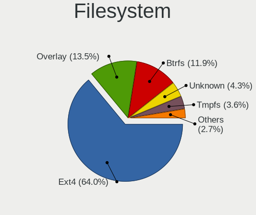
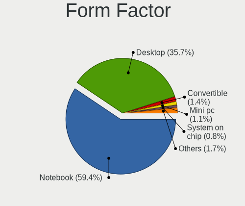
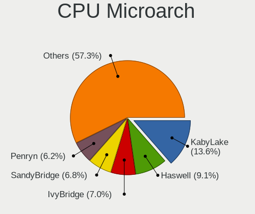
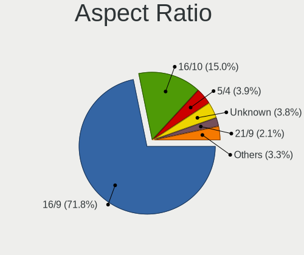

Linux in Poland - Tested Hardware & Statistics
----------------------------------------------

A project to collect tested hardware configurations for Linux in Poland.

Anyone can contribute to this report by the [hw-probe](https://github.com/linuxhw/hw-probe) tool:

    sudo -E hw-probe -all -upload

Please contribute! Especially if your hardware is rare.

This is a report for all computer types. See also reports for [desktops](/Location/Poland/Desktop/README.md) and [notebooks](/Location/Poland/Notebook/README.md).

Contents
--------

* [ Test Cases ](#test-cases)

* [ System ](#system)
  - [ OS                       ](#os)
  - [ OS Family                ](#os-family)
  - [ Kernel                   ](#kernel)
  - [ Kernel Family            ](#kernel-family)
  - [ Kernel Major Ver.        ](#kernel-major-ver)
  - [ Arch                     ](#arch)
  - [ DE                       ](#de)
  - [ Display Server           ](#display-server)
  - [ Display Manager          ](#display-manager)
  - [ OS Lang                  ](#os-lang)
  - [ Boot Mode                ](#boot-mode)
  - [ Filesystem               ](#filesystem)
  - [ Part. scheme             ](#part-scheme)
  - [ Dual Boot with Linux/BSD ](#dual-boot-with-linuxbsd)
  - [ Dual Boot (Win)          ](#dual-boot-win)

* [ Board ](#board)
  - [ Vendor                   ](#vendor)
  - [ Model                    ](#model)
  - [ Model Family             ](#model-family)
  - [ MFG Year                 ](#mfg-year)
  - [ Form Factor              ](#form-factor)
  - [ Secure Boot              ](#secure-boot)
  - [ Coreboot                 ](#coreboot)
  - [ RAM Size                 ](#ram-size)
  - [ RAM Used                 ](#ram-used)
  - [ Total Drives             ](#total-drives)
  - [ Has CD-ROM               ](#has-cd-rom)
  - [ Has Ethernet             ](#has-ethernet)
  - [ Has WiFi                 ](#has-wifi)
  - [ Has Bluetooth            ](#has-bluetooth)

* [ Location ](#location)
  - [ Country                  ](#country)
  - [ City                     ](#city)

* [ Drives ](#drives)
  - [ Drive Vendor             ](#drive-vendor)
  - [ Drive Model              ](#drive-model)
  - [ HDD Vendor               ](#hdd-vendor)
  - [ SSD Vendor               ](#ssd-vendor)
  - [ Drive Kind               ](#drive-kind)
  - [ Drive Connector          ](#drive-connector)
  - [ Drive Size               ](#drive-size)
  - [ Space Total              ](#space-total)
  - [ Space Used               ](#space-used)
  - [ Malfunc. Drives          ](#malfunc-drives)
  - [ Malfunc. Drive Vendor    ](#malfunc-drive-vendor)
  - [ Malfunc. HDD Vendor      ](#malfunc-hdd-vendor)
  - [ Malfunc. Drive Kind      ](#malfunc-drive-kind)
  - [ Failed Drives            ](#failed-drives)
  - [ Failed Drive Vendor      ](#failed-drive-vendor)
  - [ Drive Status             ](#drive-status)

* [ Storage controller ](#storage-controller)
  - [ Storage Vendor           ](#storage-vendor)
  - [ Storage Model            ](#storage-model)
  - [ Storage Kind             ](#storage-kind)

* [ Processor ](#processor)
  - [ CPU Vendor               ](#cpu-vendor)
  - [ CPU Model                ](#cpu-model)
  - [ CPU Model Family         ](#cpu-model-family)
  - [ CPU Cores                ](#cpu-cores)
  - [ CPU Sockets              ](#cpu-sockets)
  - [ CPU Threads              ](#cpu-threads)
  - [ CPU Op-Modes             ](#cpu-op-modes)
  - [ CPU Microcode            ](#cpu-microcode)
  - [ CPU Microarch            ](#cpu-microarch)

* [ Graphics ](#graphics)
  - [ GPU Vendor               ](#gpu-vendor)
  - [ GPU Model                ](#gpu-model)
  - [ GPU Combo                ](#gpu-combo)
  - [ GPU Driver               ](#gpu-driver)
  - [ GPU Memory               ](#gpu-memory)

* [ Monitor ](#monitor)
  - [ Monitor Vendor           ](#monitor-vendor)
  - [ Monitor Model            ](#monitor-model)
  - [ Monitor Resolution       ](#monitor-resolution)
  - [ Monitor Diagonal         ](#monitor-diagonal)
  - [ Monitor Width            ](#monitor-width)
  - [ Aspect Ratio             ](#aspect-ratio)
  - [ Monitor Area             ](#monitor-area)
  - [ Pixel Density            ](#pixel-density)
  - [ Multiple Monitors        ](#multiple-monitors)

* [ Network ](#network)
  - [ Net Controller Vendor    ](#net-controller-vendor)
  - [ Net Controller Model     ](#net-controller-model)
  - [ Wireless Vendor          ](#wireless-vendor)
  - [ Wireless Model           ](#wireless-model)
  - [ Ethernet Vendor          ](#ethernet-vendor)
  - [ Ethernet Model           ](#ethernet-model)
  - [ Net Controller Kind      ](#net-controller-kind)
  - [ Used Controller          ](#used-controller)
  - [ NICs                     ](#nics)
  - [ IPv6                     ](#ipv6)

* [ Bluetooth ](#bluetooth)
  - [ Bluetooth Vendor         ](#bluetooth-vendor)
  - [ Bluetooth Model          ](#bluetooth-model)

* [ Sound ](#sound)
  - [ Sound Vendor             ](#sound-vendor)
  - [ Sound Model              ](#sound-model)

* [ Memory ](#memory)
  - [ Memory Vendor            ](#memory-vendor)
  - [ Memory Model             ](#memory-model)
  - [ Memory Kind              ](#memory-kind)
  - [ Memory Form Factor       ](#memory-form-factor)
  - [ Memory Size              ](#memory-size)
  - [ Memory Speed             ](#memory-speed)

* [ Printers & scanners ](#printers--scanners)
  - [ Printer Vendor           ](#printer-vendor)
  - [ Printer Model            ](#printer-model)
  - [ Scanner Vendor           ](#scanner-vendor)
  - [ Scanner Model            ](#scanner-model)

* [ Camera ](#camera)
  - [ Camera Vendor            ](#camera-vendor)
  - [ Camera Model             ](#camera-model)

* [ Security ](#security)
  - [ Fingerprint Vendor       ](#fingerprint-vendor)
  - [ Fingerprint Model        ](#fingerprint-model)
  - [ Chipcard Vendor          ](#chipcard-vendor)
  - [ Chipcard Model           ](#chipcard-model)

* [ Unsupported ](#unsupported)
  - [ Unsupported Devices      ](#unsupported-devices)
  - [ Unsupported Device Types ](#unsupported-device-types)

Test Cases
----------

Total: 6859

| Vendor        | Model                       | Form-Factor | Probe                                                      | Date         |
|---------------|-----------------------------|-------------|------------------------------------------------------------|--------------|
| Dell          | Latitude 5420               | Notebook    | [0596aff5c4](https://linux-hardware.org/?probe=0596aff5c4) | Feb 28, 2023 |
| Gigabyte      | B450M DS3H-CF               | Desktop     | [52522a762d](https://linux-hardware.org/?probe=52522a762d) | Feb 28, 2023 |
| MSI           | B450M PRO-VDH MAX           | Desktop     | [07bb534dc9](https://linux-hardware.org/?probe=07bb534dc9) | Feb 28, 2023 |
| Lenovo        | Yoga710-14ISK 80TY          | Notebook    | [756e003316](https://linux-hardware.org/?probe=756e003316) | Feb 28, 2023 |
| HP            | ZBook 15u G3                | Notebook    | [9c49a1748b](https://linux-hardware.org/?probe=9c49a1748b) | Feb 28, 2023 |
| Lenovo        | ThinkPad X1 Yoga 1st 20F... | Convertible | [260ece1650](https://linux-hardware.org/?probe=260ece1650) | Feb 28, 2023 |
| Lenovo        | ThinkPad E560 20EV000UUK    | Notebook    | [7060b60651](https://linux-hardware.org/?probe=7060b60651) | Feb 27, 2023 |
| HP            | ProBook 430 G6              | Notebook    | [a184aa7141](https://linux-hardware.org/?probe=a184aa7141) | Feb 27, 2023 |
| Lenovo        | G50-80 80E5                 | Notebook    | [d7bb021829](https://linux-hardware.org/?probe=d7bb021829) | Feb 27, 2023 |
| ASUSTek       | K75VJ                       | Notebook    | [7fc0fff829](https://linux-hardware.org/?probe=7fc0fff829) | Feb 27, 2023 |
| Dell          | Latitude 7390               | Notebook    | [a2167ae72b](https://linux-hardware.org/?probe=a2167ae72b) | Feb 27, 2023 |
| Schenker      | VISION (E22)                | Notebook    | [498444ca02](https://linux-hardware.org/?probe=498444ca02) | Feb 27, 2023 |
| Lenovo        | ThinkPad E15 Gen 2 20T80... | Notebook    | [1ce9430009](https://linux-hardware.org/?probe=1ce9430009) | Feb 27, 2023 |
| HP            | Notebook                    | Notebook    | [a1180ad479](https://linux-hardware.org/?probe=a1180ad479) | Feb 27, 2023 |
| Gigabyte      | A320M-H-CF                  | Desktop     | [409bb06e5e](https://linux-hardware.org/?probe=409bb06e5e) | Feb 27, 2023 |
| HP            | Notebook                    | Notebook    | [ee2645efa8](https://linux-hardware.org/?probe=ee2645efa8) | Feb 27, 2023 |
| Lenovo        | ThinkPad P14s Gen 2a 21A... | Notebook    | [d57bb59dee](https://linux-hardware.org/?probe=d57bb59dee) | Feb 27, 2023 |
| ASUSTek       | K52F                        | Notebook    | [fa30ea101a](https://linux-hardware.org/?probe=fa30ea101a) | Feb 27, 2023 |
| Dell          | Latitude 3190               | Notebook    | [279b385865](https://linux-hardware.org/?probe=279b385865) | Feb 27, 2023 |
| HP            | Notebook                    | Notebook    | [0d838134b7](https://linux-hardware.org/?probe=0d838134b7) | Feb 27, 2023 |
| ASUSTek       | M3A78-CM                    | Desktop     | [aa86292f52](https://linux-hardware.org/?probe=aa86292f52) | Feb 27, 2023 |
| Gigabyte      | AB350-Gaming-CF             | Desktop     | [f8d42c3767](https://linux-hardware.org/?probe=f8d42c3767) | Feb 27, 2023 |
| Gigabyte      | X670E AORUS MASTER          | Desktop     | [589b06afc1](https://linux-hardware.org/?probe=589b06afc1) | Feb 26, 2023 |
| Acer          | Aspire ES1-711              | Notebook    | [8e397cc54f](https://linux-hardware.org/?probe=8e397cc54f) | Feb 26, 2023 |
| Gigabyte      | GA-MA78LMT-US2H             | Desktop     | [df54545112](https://linux-hardware.org/?probe=df54545112) | Feb 26, 2023 |
| Dell          | 0K6VXP A00                  | Mini pc     | [9357168131](https://linux-hardware.org/?probe=9357168131) | Feb 26, 2023 |
| Gigabyte      | MMLP5AP-00                  | Notebook    | [eb5ca5bb8d](https://linux-hardware.org/?probe=eb5ca5bb8d) | Feb 26, 2023 |
| Raspberry ... | Raspberry Pi Zero W Rev ... | Soc         | [f09bf9b926](https://linux-hardware.org/?probe=f09bf9b926) | Feb 26, 2023 |
| ASUSTek       | M3A78-CM                    | Desktop     | [cf1d88a388](https://linux-hardware.org/?probe=cf1d88a388) | Feb 26, 2023 |
| Valve         | Jupiter                     | Notebook    | [f7289abeb1](https://linux-hardware.org/?probe=f7289abeb1) | Feb 26, 2023 |
| Dell          | Latitude D630               | Notebook    | [cfdc009ff1](https://linux-hardware.org/?probe=cfdc009ff1) | Feb 26, 2023 |
| Fujitsu       | D3233-A1 S26361-D3233-A1    | Desktop     | [782598981d](https://linux-hardware.org/?probe=782598981d) | Feb 25, 2023 |
| Gigabyte      | Z690 GAMING X DDR4          | Desktop     | [6a75456290](https://linux-hardware.org/?probe=6a75456290) | Feb 25, 2023 |
| Gigabyte      | Z690 GAMING X DDR4          | Desktop     | [73caef7b95](https://linux-hardware.org/?probe=73caef7b95) | Feb 25, 2023 |
| Acer          | Aspire E5-571G              | Notebook    | [07fe4333eb](https://linux-hardware.org/?probe=07fe4333eb) | Feb 25, 2023 |
| Gigabyte      | G31M-S2L                    | Desktop     | [563101d2b2](https://linux-hardware.org/?probe=563101d2b2) | Feb 25, 2023 |
| Sony          | VGN-FZ31M                   | Notebook    | [6b830e36f1](https://linux-hardware.org/?probe=6b830e36f1) | Feb 25, 2023 |
| MSI           | B350M MORTAR                | Desktop     | [6a7ac3b38b](https://linux-hardware.org/?probe=6a7ac3b38b) | Feb 24, 2023 |
| Gigabyte      | GA-MA78LMT-US2H             | Desktop     | [b2681528bd](https://linux-hardware.org/?probe=b2681528bd) | Feb 24, 2023 |
| ASUSTek       | B150M-A D3                  | Desktop     | [01caadaee0](https://linux-hardware.org/?probe=01caadaee0) | Feb 24, 2023 |
| ASRock        | M3A770DE                    | Desktop     | [b025c7a092](https://linux-hardware.org/?probe=b025c7a092) | Feb 24, 2023 |
| HP            | ZBook 15u G3                | Notebook    | [92879d708d](https://linux-hardware.org/?probe=92879d708d) | Feb 24, 2023 |
| HP            | ZBook 15u G3                | Notebook    | [8a698df80f](https://linux-hardware.org/?probe=8a698df80f) | Feb 24, 2023 |
| HP            | EliteBook 840 G2            | Notebook    | [f1fa3164f9](https://linux-hardware.org/?probe=f1fa3164f9) | Feb 24, 2023 |
| Gigabyte      | B85M-HD3 R4                 | Desktop     | [db83755f3f](https://linux-hardware.org/?probe=db83755f3f) | Feb 24, 2023 |
| ASUSTek       | ROG STRIX Z370-F GAMING     | Desktop     | [79aa51c612](https://linux-hardware.org/?probe=79aa51c612) | Feb 23, 2023 |
| Gigabyte      | Z97-HD3                     | Desktop     | [016a51a4af](https://linux-hardware.org/?probe=016a51a4af) | Feb 23, 2023 |
| Lenovo        | Legion 5 15ARH05H 82B1      | Notebook    | [00591dc764](https://linux-hardware.org/?probe=00591dc764) | Feb 23, 2023 |
| Lenovo        | Legion 5 Pro 16ACH6H 82J... | Notebook    | [a85b9d1452](https://linux-hardware.org/?probe=a85b9d1452) | Feb 23, 2023 |
| MSI           | MS-7C02                     | Notebook    | [e2cdf5625c](https://linux-hardware.org/?probe=e2cdf5625c) | Feb 23, 2023 |
| Dell          | XPS 9320                    | Notebook    | [94e7c2d282](https://linux-hardware.org/?probe=94e7c2d282) | Feb 23, 2023 |
| MSI           | MS-7C02                     | Notebook    | [bfbb3aab2c](https://linux-hardware.org/?probe=bfbb3aab2c) | Feb 23, 2023 |
| Gigabyte      | Z97M-DS3H                   | Desktop     | [821d952d15](https://linux-hardware.org/?probe=821d952d15) | Feb 23, 2023 |
| ASUSTek       | 1215B                       | Notebook    | [970d77d150](https://linux-hardware.org/?probe=970d77d150) | Feb 22, 2023 |
| Notebook      | NS50_70MU                   | Notebook    | [a213ec0ba4](https://linux-hardware.org/?probe=a213ec0ba4) | Feb 22, 2023 |
| Apple         | MacBookPro8,1               | Notebook    | [b7071da133](https://linux-hardware.org/?probe=b7071da133) | Feb 22, 2023 |
| Gigabyte      | GA-MA78LMT-US2H             | Desktop     | [39e6d492c4](https://linux-hardware.org/?probe=39e6d492c4) | Feb 22, 2023 |
| Gigabyte      | GA-MA78LMT-US2H             | Desktop     | [40bc5397ea](https://linux-hardware.org/?probe=40bc5397ea) | Feb 22, 2023 |
| ASRock        | Z690 Extreme                | Desktop     | [16e67a28e4](https://linux-hardware.org/?probe=16e67a28e4) | Feb 22, 2023 |
| ASUSTek       | PRIME B550M-A WIFI II       | Desktop     | [cb79c0ad47](https://linux-hardware.org/?probe=cb79c0ad47) | Feb 22, 2023 |
| ASUSTek       | P10S-I Series               | Desktop     | [f2049b8af1](https://linux-hardware.org/?probe=f2049b8af1) | Feb 21, 2023 |
| Dell          | Latitude 5491               | Notebook    | [fd68ba9595](https://linux-hardware.org/?probe=fd68ba9595) | Feb 21, 2023 |
| ASUSTek       | P10S-I Series               | Desktop     | [ec5a8efdcd](https://linux-hardware.org/?probe=ec5a8efdcd) | Feb 21, 2023 |
| Dell          | 0K6VXP A00                  | Mini pc     | [c3ddf6d592](https://linux-hardware.org/?probe=c3ddf6d592) | Feb 21, 2023 |
| Fujitsu       | LIFEBOOK E744               | Notebook    | [bdcee122d3](https://linux-hardware.org/?probe=bdcee122d3) | Feb 21, 2023 |
| Lenovo        | ThinkPad L14 Gen 1 20U50... | Notebook    | [88be67bbc1](https://linux-hardware.org/?probe=88be67bbc1) | Feb 21, 2023 |
| Lenovo        | ThinkPad R61 8933W4S        | Notebook    | [fec1a43d91](https://linux-hardware.org/?probe=fec1a43d91) | Feb 21, 2023 |
| ASRock        | A520M-HVS                   | Desktop     | [cc8628ae2c](https://linux-hardware.org/?probe=cc8628ae2c) | Feb 20, 2023 |
| Dell          | System XPS L502X            | Notebook    | [7352f47bb0](https://linux-hardware.org/?probe=7352f47bb0) | Feb 20, 2023 |
| Lenovo        | ThinkPad T410s 2924W3S      | Notebook    | [24081de7f1](https://linux-hardware.org/?probe=24081de7f1) | Feb 20, 2023 |
| HP            | 620                         | Notebook    | [c3dae62545](https://linux-hardware.org/?probe=c3dae62545) | Feb 20, 2023 |
| Lenovo        | IdeaPad 100S-14IBR 80R9     | Notebook    | [e61bce94ea](https://linux-hardware.org/?probe=e61bce94ea) | Feb 20, 2023 |
| ASUSTek       | PRIME H310M-K R2.0          | Desktop     | [211cd972f0](https://linux-hardware.org/?probe=211cd972f0) | Feb 20, 2023 |
| Acer          | Aspire A515-44              | Notebook    | [5fc82de1e4](https://linux-hardware.org/?probe=5fc82de1e4) | Feb 20, 2023 |
| Dell          | 0K6VXP A00                  | Mini pc     | [a691e5fdbb](https://linux-hardware.org/?probe=a691e5fdbb) | Feb 20, 2023 |
| Fujitsu       | LIFEBOOK E559               | Notebook    | [5e4c3607c7](https://linux-hardware.org/?probe=5e4c3607c7) | Feb 20, 2023 |
| Dell          | Latitude 3190               | Notebook    | [c05229588b](https://linux-hardware.org/?probe=c05229588b) | Feb 20, 2023 |
| Lenovo        | ThinkPad E15 Gen 2 20T80... | Notebook    | [0d1a7d0dbe](https://linux-hardware.org/?probe=0d1a7d0dbe) | Feb 20, 2023 |
| Lenovo        | B570e HuronRiver Platfor... | Notebook    | [3ddfaa902f](https://linux-hardware.org/?probe=3ddfaa902f) | Feb 20, 2023 |
| Acer          | Aspire A515-44              | Notebook    | [14e85e829f](https://linux-hardware.org/?probe=14e85e829f) | Feb 20, 2023 |
| Dell          | Latitude E7270              | Notebook    | [4eb17c846c](https://linux-hardware.org/?probe=4eb17c846c) | Feb 20, 2023 |
| Gigabyte      | AB350-Gaming-CF             | Desktop     | [cc8a99e630](https://linux-hardware.org/?probe=cc8a99e630) | Feb 20, 2023 |
| Lenovo        | G510 20238                  | Notebook    | [7bc24845b3](https://linux-hardware.org/?probe=7bc24845b3) | Feb 20, 2023 |
| Dell          | 0NHNHP A01                  | Server      | [da74244bff](https://linux-hardware.org/?probe=da74244bff) | Feb 19, 2023 |
| Lenovo        | G510 20238                  | Notebook    | [d6f20de9d5](https://linux-hardware.org/?probe=d6f20de9d5) | Feb 19, 2023 |
| ASUSTek       | M3A78-CM                    | Desktop     | [7b0fb49186](https://linux-hardware.org/?probe=7b0fb49186) | Feb 19, 2023 |
| Dell          | Vostro 5502                 | Notebook    | [49252b4695](https://linux-hardware.org/?probe=49252b4695) | Feb 19, 2023 |
| HP            | Unknown                     | Notebook    | [69b276cb01](https://linux-hardware.org/?probe=69b276cb01) | Feb 19, 2023 |
| Gigabyte      | B75M-D2V                    | Desktop     | [fe04dfeaac](https://linux-hardware.org/?probe=fe04dfeaac) | Feb 19, 2023 |
| ASUSTek       | VivoBook_ASUSLaptop M350... | Notebook    | [5300c136fd](https://linux-hardware.org/?probe=5300c136fd) | Feb 19, 2023 |
| Raspberry ... | Raspberry Pi Zero W Rev ... | Soc         | [9d2009fd11](https://linux-hardware.org/?probe=9d2009fd11) | Feb 19, 2023 |
| Lenovo        | Legion 5 Pro 16ACH6 82JS    | Notebook    | [5ff3cab69f](https://linux-hardware.org/?probe=5ff3cab69f) | Feb 19, 2023 |
| Apple         | MacBookAir6,1               | Notebook    | [5cade7cfc3](https://linux-hardware.org/?probe=5cade7cfc3) | Feb 19, 2023 |
| Samsung       | 350V5C/351V5C/3540VC/344... | Notebook    | [238f636180](https://linux-hardware.org/?probe=238f636180) | Feb 18, 2023 |
| Dell          | 0PU052                      | Desktop     | [a460806b91](https://linux-hardware.org/?probe=a460806b91) | Feb 18, 2023 |
| HP            | EliteBook 850 G8 Noteboo... | Notebook    | [9b53b2b842](https://linux-hardware.org/?probe=9b53b2b842) | Feb 18, 2023 |
| Lenovo        | ThinkBook 14 G2 ITL 20VD    | Notebook    | [cdfcc639d3](https://linux-hardware.org/?probe=cdfcc639d3) | Feb 18, 2023 |
| Lenovo        | IdeaPad 100S-14IBR 80R9     | Notebook    | [cbf0e3814c](https://linux-hardware.org/?probe=cbf0e3814c) | Feb 18, 2023 |
| ASUSTek       | ASUS TUF Gaming F15 FX50... | Notebook    | [a424b3aa47](https://linux-hardware.org/?probe=a424b3aa47) | Feb 18, 2023 |
| MSI           | MPG Z390 GAMING EDGE AC     | Desktop     | [28965259ad](https://linux-hardware.org/?probe=28965259ad) | Feb 18, 2023 |
| Dell          | Latitude 3520               | Notebook    | [8df8f4c6fc](https://linux-hardware.org/?probe=8df8f4c6fc) | Feb 18, 2023 |
| Lenovo        | IdeaPad 100-15IBD 80QQ      | Notebook    | [27958da7cc](https://linux-hardware.org/?probe=27958da7cc) | Feb 18, 2023 |
| Lenovo        | Legion 5 Pro 16ACH6 82JS    | Notebook    | [2f3a14eeaa](https://linux-hardware.org/?probe=2f3a14eeaa) | Feb 18, 2023 |
| MSI           | GL65 9SD                    | Notebook    | [a702514760](https://linux-hardware.org/?probe=a702514760) | Feb 17, 2023 |
| Dell          | Inspiron 5570               | Notebook    | [be29883368](https://linux-hardware.org/?probe=be29883368) | Feb 17, 2023 |
| Dell          | Latitude 5491               | Notebook    | [8a3298cdff](https://linux-hardware.org/?probe=8a3298cdff) | Feb 17, 2023 |
| Dell          | Latitude 5511               | Notebook    | [5c3a80271b](https://linux-hardware.org/?probe=5c3a80271b) | Feb 17, 2023 |
| ASUSTek       | ROG Strix G513QY_G513QY     | Notebook    | [4a5c7432ae](https://linux-hardware.org/?probe=4a5c7432ae) | Feb 17, 2023 |
| Dell          | 03NVJ6 A02                  | Desktop     | [5201547dce](https://linux-hardware.org/?probe=5201547dce) | Feb 17, 2023 |
| Dell          | 03NVJ6 A02                  | Desktop     | [a77d2c8a54](https://linux-hardware.org/?probe=a77d2c8a54) | Feb 17, 2023 |
| Gigabyte      | GA-MA790X-UD3P              | Desktop     | [8efdbecd75](https://linux-hardware.org/?probe=8efdbecd75) | Feb 17, 2023 |
| HP            | ZBook Studio G3             | Notebook    | [af86e6cb72](https://linux-hardware.org/?probe=af86e6cb72) | Feb 17, 2023 |
| Lenovo        | ThinkPad T61 7661BM5        | Notebook    | [c829d5ed74](https://linux-hardware.org/?probe=c829d5ed74) | Feb 16, 2023 |
| Apple         | MacBookAir6,1               | Notebook    | [c96e404e3f](https://linux-hardware.org/?probe=c96e404e3f) | Feb 16, 2023 |
| ASRock        | J3355M                      | Desktop     | [9118f960dd](https://linux-hardware.org/?probe=9118f960dd) | Feb 16, 2023 |
| Acer          | One S1003                   | Tablet      | [2d5943e055](https://linux-hardware.org/?probe=2d5943e055) | Feb 16, 2023 |
| Gigabyte      | EP35-DS4                    | Desktop     | [00d960f926](https://linux-hardware.org/?probe=00d960f926) | Feb 16, 2023 |
| Lenovo        | ThinkPad L13 20R30006PB     | Notebook    | [aad1f06bb9](https://linux-hardware.org/?probe=aad1f06bb9) | Feb 16, 2023 |
| Gigabyte      | MZAPLBP-00                  | Desktop     | [b043125d6e](https://linux-hardware.org/?probe=b043125d6e) | Feb 16, 2023 |
| Gigabyte      | GA-MA790XT-UD4P             | Desktop     | [3ce39f40e7](https://linux-hardware.org/?probe=3ce39f40e7) | Feb 16, 2023 |
| MSI           | Creator Z17 A12UHST         | Notebook    | [a70040c510](https://linux-hardware.org/?probe=a70040c510) | Feb 16, 2023 |
| RTD Embedd... | CMA34CR                     | Notebook    | [dd8527bd65](https://linux-hardware.org/?probe=dd8527bd65) | Feb 16, 2023 |
| ASUSTek       | ZenBook UX425EA_UX425EA     | Notebook    | [73787e9141](https://linux-hardware.org/?probe=73787e9141) | Feb 16, 2023 |
| Dell          | Latitude 5480               | Notebook    | [ee1b786fd9](https://linux-hardware.org/?probe=ee1b786fd9) | Feb 15, 2023 |
| Lenovo        | Y50-70 20378                | Notebook    | [09301690c5](https://linux-hardware.org/?probe=09301690c5) | Feb 15, 2023 |
| MSI           | G41M-P33 Combo              | Desktop     | [5a6d751e4b](https://linux-hardware.org/?probe=5a6d751e4b) | Feb 15, 2023 |
| Lenovo        | ThinkBook 15 G3 ACL 21A4    | Notebook    | [74a61dff13](https://linux-hardware.org/?probe=74a61dff13) | Feb 15, 2023 |
| Lenovo        | Legion 5 Pro 16ACH6 82JS    | Notebook    | [b53cdde5a7](https://linux-hardware.org/?probe=b53cdde5a7) | Feb 15, 2023 |
| HP            | EliteBook 650 15.6 inch ... | Notebook    | [2be1a08ef2](https://linux-hardware.org/?probe=2be1a08ef2) | Feb 15, 2023 |
| MSI           | MS-7235                     | Desktop     | [519f3742a3](https://linux-hardware.org/?probe=519f3742a3) | Feb 15, 2023 |
| ASUSTek       | P8H67-M                     | Desktop     | [ae4f47209a](https://linux-hardware.org/?probe=ae4f47209a) | Feb 15, 2023 |
| Gigabyte      | H410M H V3                  | Desktop     | [59f88fb4d0](https://linux-hardware.org/?probe=59f88fb4d0) | Feb 15, 2023 |
| ASUSTek       | P8H67-M                     | Desktop     | [f1c6e21bfb](https://linux-hardware.org/?probe=f1c6e21bfb) | Feb 15, 2023 |
| Dell          | 0GXM1W A00                  | Desktop     | [3ab6d305fc](https://linux-hardware.org/?probe=3ab6d305fc) | Feb 15, 2023 |
| ASUSTek       | M3A78-CM                    | Desktop     | [2c0799202c](https://linux-hardware.org/?probe=2c0799202c) | Feb 15, 2023 |
| GPU Compan... | GWTN141-4                   | Notebook    | [1492f5c475](https://linux-hardware.org/?probe=1492f5c475) | Feb 15, 2023 |
| MSI           | G41M-P33 Combo              | Desktop     | [1161e39e43](https://linux-hardware.org/?probe=1161e39e43) | Feb 15, 2023 |
| Dell          | System XPS L502X            | Notebook    | [2ea016be2a](https://linux-hardware.org/?probe=2ea016be2a) | Feb 14, 2023 |
| Lenovo        | Legion 5 Pro 16ACH6 82JS    | Notebook    | [65a5587c6d](https://linux-hardware.org/?probe=65a5587c6d) | Feb 14, 2023 |
| Gigabyte      | H55M-USB3                   | Desktop     | [08b959d9ec](https://linux-hardware.org/?probe=08b959d9ec) | Feb 14, 2023 |
| Acer          | Aspire A315-35              | Notebook    | [971fa91888](https://linux-hardware.org/?probe=971fa91888) | Feb 14, 2023 |
| Google        | Lillipup                    | Notebook    | [af7451beff](https://linux-hardware.org/?probe=af7451beff) | Feb 14, 2023 |
| Unknown       | Unknown                     | Notebook    | [1f80b65b37](https://linux-hardware.org/?probe=1f80b65b37) | Feb 13, 2023 |
| Unknown       | Unknown                     | Notebook    | [8b28eb095c](https://linux-hardware.org/?probe=8b28eb095c) | Feb 13, 2023 |
| Medion        | Akoya THE TOUCH 10          | Notebook    | [ec6afad108](https://linux-hardware.org/?probe=ec6afad108) | Feb 13, 2023 |
| ASUSTek       | M3A78-CM                    | Desktop     | [e474459ee0](https://linux-hardware.org/?probe=e474459ee0) | Feb 13, 2023 |
| Timi          | TM1613                      | Notebook    | [ce33c5c02e](https://linux-hardware.org/?probe=ce33c5c02e) | Feb 13, 2023 |
| Lenovo        | IdeaPad S210 Touch 20257    | Notebook    | [d132553080](https://linux-hardware.org/?probe=d132553080) | Feb 13, 2023 |
| Dell          | Latitude 5511               | Notebook    | [161095d97a](https://linux-hardware.org/?probe=161095d97a) | Feb 13, 2023 |
| TrekStor      | Surfbook W2                 | Notebook    | [f43f606f80](https://linux-hardware.org/?probe=f43f606f80) | Feb 13, 2023 |
| Dell          | Latitude 3190               | Notebook    | [f2fd97186c](https://linux-hardware.org/?probe=f2fd97186c) | Feb 13, 2023 |
| Gigabyte      | AB350-Gaming-CF             | Desktop     | [7eb2b7e26f](https://linux-hardware.org/?probe=7eb2b7e26f) | Feb 13, 2023 |
| HP            | 3397                        | Desktop     | [83dc4a9ea0](https://linux-hardware.org/?probe=83dc4a9ea0) | Feb 13, 2023 |
| HP            | 3397                        | Desktop     | [cc7019baaa](https://linux-hardware.org/?probe=cc7019baaa) | Feb 13, 2023 |
| ASUSTek       | M3A78-CM                    | Desktop     | [36a0d5221f](https://linux-hardware.org/?probe=36a0d5221f) | Feb 13, 2023 |
| Dell          | Latitude E6420              | Notebook    | [6ffa1ea310](https://linux-hardware.org/?probe=6ffa1ea310) | Feb 12, 2023 |
| ASUSTek       | ASUS TUF Gaming F15 FX50... | Notebook    | [04cfa15383](https://linux-hardware.org/?probe=04cfa15383) | Feb 12, 2023 |
| MSI           | H310M PRO-M2 PLUS           | Desktop     | [45f78c29cb](https://linux-hardware.org/?probe=45f78c29cb) | Feb 12, 2023 |
| Lenovo        | ThinkPad T470s 20HGS1LM0... | Notebook    | [8ee6dd00d1](https://linux-hardware.org/?probe=8ee6dd00d1) | Feb 12, 2023 |
| Raspberry ... | Raspberry Pi Zero W Rev ... | Soc         | [5120a4cdb5](https://linux-hardware.org/?probe=5120a4cdb5) | Feb 12, 2023 |
| HP            | 3397                        | Desktop     | [cc5cdaf09b](https://linux-hardware.org/?probe=cc5cdaf09b) | Feb 12, 2023 |
| ASUSTek       | PRIME H310M-K R2.0          | Desktop     | [ed3233c97b](https://linux-hardware.org/?probe=ed3233c97b) | Feb 11, 2023 |
| HP            | 3397                        | Desktop     | [b22590d882](https://linux-hardware.org/?probe=b22590d882) | Feb 11, 2023 |
| ASUSTek       | VivoBook_ASUSLaptop X412... | Notebook    | [40116058d1](https://linux-hardware.org/?probe=40116058d1) | Feb 11, 2023 |
| ASUSTek       | PRIME H310M-K R2.0          | Desktop     | [2695a9350a](https://linux-hardware.org/?probe=2695a9350a) | Feb 11, 2023 |
| ASUSTek       | VivoBook_ASUSLaptop X412... | Notebook    | [8e00bdf032](https://linux-hardware.org/?probe=8e00bdf032) | Feb 11, 2023 |
| Apple         | MacBookAir5,2               | Notebook    | [4f99163f99](https://linux-hardware.org/?probe=4f99163f99) | Feb 11, 2023 |
| Lenovo        | ThinkPad T430 2347BS4       | Notebook    | [682be07637](https://linux-hardware.org/?probe=682be07637) | Feb 11, 2023 |
| Valve         | Jupiter                     | Notebook    | [081d9e5294](https://linux-hardware.org/?probe=081d9e5294) | Feb 11, 2023 |
| HP            | Spectre x360 Convertible... | Convertible | [d8a854baec](https://linux-hardware.org/?probe=d8a854baec) | Feb 11, 2023 |
| HP            | Spectre x360 Convertible... | Convertible | [6c1d31a394](https://linux-hardware.org/?probe=6c1d31a394) | Feb 10, 2023 |
| HP            | ProBook 430 G3              | Notebook    | [e995a466a1](https://linux-hardware.org/?probe=e995a466a1) | Feb 10, 2023 |
| Dell          | 04YJ19 A00                  | Desktop     | [972fb9a299](https://linux-hardware.org/?probe=972fb9a299) | Feb 10, 2023 |
| Toshiba       | Satellite L750              | Notebook    | [b6239c152e](https://linux-hardware.org/?probe=b6239c152e) | Feb 10, 2023 |
| Acer          | Aspire ES1-111M             | Notebook    | [82eea49fcd](https://linux-hardware.org/?probe=82eea49fcd) | Feb 09, 2023 |
| Acer          | Aspire ES1-111M             | Notebook    | [accbac47d5](https://linux-hardware.org/?probe=accbac47d5) | Feb 09, 2023 |
| Lenovo        | ThinkPad T530 2429MY2       | Notebook    | [9b5ffc7c58](https://linux-hardware.org/?probe=9b5ffc7c58) | Feb 09, 2023 |
| Dell          | 060J9C A00                  | Mini pc     | [38f4064394](https://linux-hardware.org/?probe=38f4064394) | Feb 09, 2023 |
| MSI           | Creator Z17 A12UHST         | Notebook    | [8885828bb8](https://linux-hardware.org/?probe=8885828bb8) | Feb 09, 2023 |
| ASUSTek       | PRIME B450M-A               | Desktop     | [f669c49cf5](https://linux-hardware.org/?probe=f669c49cf5) | Feb 09, 2023 |
| Gigabyte      | X670E AORUS MASTER          | Desktop     | [ddaad5aa0d](https://linux-hardware.org/?probe=ddaad5aa0d) | Feb 09, 2023 |
| Gigabyte      | B660 DS3H AX DDR4           | Desktop     | [73ae27760d](https://linux-hardware.org/?probe=73ae27760d) | Feb 09, 2023 |
| Lenovo        | IdeaPad Z570 HuronRiver ... | Notebook    | [467c3e9149](https://linux-hardware.org/?probe=467c3e9149) | Feb 09, 2023 |
| Intel         | DG31PR AAD97573-301         | Desktop     | [665f8e7d81](https://linux-hardware.org/?probe=665f8e7d81) | Feb 09, 2023 |
| Valve         | Jupiter                     | Notebook    | [26cb195bab](https://linux-hardware.org/?probe=26cb195bab) | Feb 08, 2023 |
| ASUSTek       | M3A78-CM                    | Desktop     | [c71dba27f2](https://linux-hardware.org/?probe=c71dba27f2) | Feb 08, 2023 |
| Dell          | Latitude 3570               | Notebook    | [dc460632ef](https://linux-hardware.org/?probe=dc460632ef) | Feb 08, 2023 |
| Gigabyte      | X670E AORUS MASTER          | Desktop     | [2b4bc22652](https://linux-hardware.org/?probe=2b4bc22652) | Feb 08, 2023 |
| Lenovo        | Yoga 3 Pro-1370 80HE        | Notebook    | [842956e023](https://linux-hardware.org/?probe=842956e023) | Feb 08, 2023 |
| ASRock        | X470 Gaming K4              | Desktop     | [086ea7a0e6](https://linux-hardware.org/?probe=086ea7a0e6) | Feb 08, 2023 |
| ASRock        | B450 Gaming K4              | Desktop     | [dd8fbe3d62](https://linux-hardware.org/?probe=dd8fbe3d62) | Feb 08, 2023 |
| Dell          | 0DR845                      | Desktop     | [537252420b](https://linux-hardware.org/?probe=537252420b) | Feb 07, 2023 |
| Dell          | Latitude E6520              | Notebook    | [c9c89084e8](https://linux-hardware.org/?probe=c9c89084e8) | Feb 07, 2023 |
| Dell          | Latitude E4300              | Notebook    | [aaad0477e4](https://linux-hardware.org/?probe=aaad0477e4) | Feb 07, 2023 |
| Lenovo        | IdeaPad 320-15IKB 81BG      | Notebook    | [307d491fc8](https://linux-hardware.org/?probe=307d491fc8) | Feb 07, 2023 |
| Foxconn       | NT-A2400&NT-A3500 FAB       | Desktop     | [000ed6c589](https://linux-hardware.org/?probe=000ed6c589) | Feb 07, 2023 |
| Intel         | DG31PR AAD97573-301         | Desktop     | [2080f0edf4](https://linux-hardware.org/?probe=2080f0edf4) | Feb 07, 2023 |
| ASUSTek       | PRIME Z490-P                | Desktop     | [be25e0c930](https://linux-hardware.org/?probe=be25e0c930) | Feb 07, 2023 |
| ASUSTek       | PRIME Z490-P                | Desktop     | [d139473252](https://linux-hardware.org/?probe=d139473252) | Feb 07, 2023 |
| Dell          | Latitude 3520               | Notebook    | [d7569fa081](https://linux-hardware.org/?probe=d7569fa081) | Feb 06, 2023 |
| Valve         | Jupiter                     | Notebook    | [edc8beac1f](https://linux-hardware.org/?probe=edc8beac1f) | Feb 06, 2023 |
| Dell          | Latitude 5511               | Notebook    | [57e8ce4f20](https://linux-hardware.org/?probe=57e8ce4f20) | Feb 06, 2023 |
| Dell          | Latitude 3190               | Notebook    | [eafbc050e8](https://linux-hardware.org/?probe=eafbc050e8) | Feb 06, 2023 |
| Huanan        | X99-T8D V1.2                | Desktop     | [cb7e750cee](https://linux-hardware.org/?probe=cb7e750cee) | Feb 05, 2023 |
| HP            | EliteBook 820 G2            | Notebook    | [e8c0f3b7de](https://linux-hardware.org/?probe=e8c0f3b7de) | Feb 05, 2023 |
| MSI           | H410M-A PRO                 | Desktop     | [6ac747c27e](https://linux-hardware.org/?probe=6ac747c27e) | Feb 05, 2023 |
| HP            | EliteBook 820 G2            | Notebook    | [eb5a23a73b](https://linux-hardware.org/?probe=eb5a23a73b) | Feb 05, 2023 |
| Dell          | 02P9X9 A05                  | Server      | [fb8900f061](https://linux-hardware.org/?probe=fb8900f061) | Feb 05, 2023 |
| Dell          | 0PM2CW A02                  | Server      | [9c7291ae7e](https://linux-hardware.org/?probe=9c7291ae7e) | Feb 05, 2023 |
| HP            | 3397                        | Desktop     | [a8f8381e48](https://linux-hardware.org/?probe=a8f8381e48) | Feb 05, 2023 |
| HP            | 3397                        | Desktop     | [c41ab8c19e](https://linux-hardware.org/?probe=c41ab8c19e) | Feb 05, 2023 |
| HP            | 8054                        | Desktop     | [c709653825](https://linux-hardware.org/?probe=c709653825) | Feb 05, 2023 |
| Lenovo        | IdeaPad Y580                | Notebook    | [30d8845f10](https://linux-hardware.org/?probe=30d8845f10) | Feb 05, 2023 |
| Lenovo        | ThinkPad T15 Gen 1 20S6C... | Notebook    | [262dfe3aa9](https://linux-hardware.org/?probe=262dfe3aa9) | Feb 05, 2023 |
| Lenovo        | ThinkBook 14s-IWL 20RM      | Notebook    | [dbef2c679a](https://linux-hardware.org/?probe=dbef2c679a) | Feb 05, 2023 |
| Raspberry ... | Raspberry Pi Zero W Rev ... | Soc         | [0837ce8a0f](https://linux-hardware.org/?probe=0837ce8a0f) | Feb 05, 2023 |
| Dell          | Inspiron 5570               | Notebook    | [eb399b4ffa](https://linux-hardware.org/?probe=eb399b4ffa) | Feb 05, 2023 |
| MSI           | PRO Z690-A DDR4             | Desktop     | [403785d1ec](https://linux-hardware.org/?probe=403785d1ec) | Feb 05, 2023 |
| Lenovo        | ThinkBook 14s-IWL 20RM      | Notebook    | [14fb68ece0](https://linux-hardware.org/?probe=14fb68ece0) | Feb 05, 2023 |
| Fujitsu       | D3403-A1 S26361-D3403-A1    | Desktop     | [854b52f85c](https://linux-hardware.org/?probe=854b52f85c) | Feb 05, 2023 |
| Apple         | MacBookPro8,1               | Notebook    | [d6adca1255](https://linux-hardware.org/?probe=d6adca1255) | Feb 04, 2023 |
| Dell          | Inspiron 5570               | Notebook    | [6e8ab1a5cb](https://linux-hardware.org/?probe=6e8ab1a5cb) | Feb 04, 2023 |
| Apple         | MacBookPro8,3               | Notebook    | [9d397c2187](https://linux-hardware.org/?probe=9d397c2187) | Feb 04, 2023 |
| Apple         | MacBookPro8,3               | Notebook    | [7b676dec23](https://linux-hardware.org/?probe=7b676dec23) | Feb 04, 2023 |
| Acer          | Aspire A515-51G             | Notebook    | [149465f225](https://linux-hardware.org/?probe=149465f225) | Feb 04, 2023 |
| Dell          | Vostro 3550                 | Notebook    | [4f1125bc93](https://linux-hardware.org/?probe=4f1125bc93) | Feb 04, 2023 |
| Lenovo        | G510 20238                  | Notebook    | [a385ff6f36](https://linux-hardware.org/?probe=a385ff6f36) | Feb 04, 2023 |
| Lenovo        | ThinkPad R500 2716W2K       | Notebook    | [a645368e82](https://linux-hardware.org/?probe=a645368e82) | Feb 04, 2023 |
| Foxconn       | 2ABF                        | Desktop     | [54a305f83e](https://linux-hardware.org/?probe=54a305f83e) | Feb 03, 2023 |
| ASUSTek       | VivoBook_ASUS Laptop X50... | Notebook    | [c6dae92093](https://linux-hardware.org/?probe=c6dae92093) | Feb 03, 2023 |
| ASUSTek       | 1101HA                      | Notebook    | [28cb433eb0](https://linux-hardware.org/?probe=28cb433eb0) | Feb 03, 2023 |
| Dell          | Latitude 5480               | Notebook    | [da9f98059c](https://linux-hardware.org/?probe=da9f98059c) | Feb 03, 2023 |
| ASUSTek       | VivoBook_ASUSLaptop X421... | Notebook    | [9c5cfbc1a1](https://linux-hardware.org/?probe=9c5cfbc1a1) | Feb 03, 2023 |
| ASRock        | Z370 Gaming K6              | Desktop     | [203d5736d7](https://linux-hardware.org/?probe=203d5736d7) | Feb 03, 2023 |
| HP            | 212B                        | Desktop     | [f27b5c4aa0](https://linux-hardware.org/?probe=f27b5c4aa0) | Feb 03, 2023 |
| HP            | Unknown                     | Notebook    | [4b28efe30c](https://linux-hardware.org/?probe=4b28efe30c) | Feb 03, 2023 |
| Gigabyte      | F2A68HM-DS2                 | Desktop     | [a4a3ea0e4e](https://linux-hardware.org/?probe=a4a3ea0e4e) | Feb 02, 2023 |
| Samsung       | 530U3C/530U4C/532U3C        | Notebook    | [4b1dc3d64b](https://linux-hardware.org/?probe=4b1dc3d64b) | Feb 02, 2023 |
| Apple         | Mac-942B5BF58194151B        | All in one  | [5ab474163a](https://linux-hardware.org/?probe=5ab474163a) | Feb 02, 2023 |
| Lenovo        | ThinkPad X1 Extreme 20MF... | Notebook    | [1c6ed7ede6](https://linux-hardware.org/?probe=1c6ed7ede6) | Feb 02, 2023 |
| Dell          | Vostro 3580                 | Notebook    | [7efc294bac](https://linux-hardware.org/?probe=7efc294bac) | Feb 02, 2023 |
| MSI           | X99S SLI PLUS               | Desktop     | [6b007d74de](https://linux-hardware.org/?probe=6b007d74de) | Feb 02, 2023 |
| Gigabyte      | B365M DS3H                  | Desktop     | [f04d195965](https://linux-hardware.org/?probe=f04d195965) | Feb 02, 2023 |
| MSI           | GV62 7RD                    | Notebook    | [c22fffb4e9](https://linux-hardware.org/?probe=c22fffb4e9) | Feb 02, 2023 |
| ASUSTek       | P5QPL-AM                    | Desktop     | [c8ee9be68c](https://linux-hardware.org/?probe=c8ee9be68c) | Feb 02, 2023 |
| Lenovo        | Yoga 3 Pro-1370 80HE        | Notebook    | [ac6a930ffc](https://linux-hardware.org/?probe=ac6a930ffc) | Feb 02, 2023 |
| ASUSTek       | B85M-G                      | Desktop     | [de152b340c](https://linux-hardware.org/?probe=de152b340c) | Feb 01, 2023 |
| Dell          | Precision 7540              | Notebook    | [1d0d197808](https://linux-hardware.org/?probe=1d0d197808) | Feb 01, 2023 |
| Gigabyte      | B365M DS3H                  | Desktop     | [d515d5d9f7](https://linux-hardware.org/?probe=d515d5d9f7) | Feb 01, 2023 |
| Dell          | Latitude E7240              | Notebook    | [fe655eca77](https://linux-hardware.org/?probe=fe655eca77) | Jan 31, 2023 |
| Lenovo        | Legion 5 17ACH6H 82JY       | Notebook    | [62f941075c](https://linux-hardware.org/?probe=62f941075c) | Jan 31, 2023 |
| Lenovo        | ThinkPad X1 Extreme 20MF... | Notebook    | [70310e25d1](https://linux-hardware.org/?probe=70310e25d1) | Jan 31, 2023 |
| Gigabyte      | X670 AORUS ELITE AX         | Desktop     | [4e438c4768](https://linux-hardware.org/?probe=4e438c4768) | Jan 31, 2023 |
| Gigabyte      | X670 AORUS ELITE AX         | Desktop     | [66459fc07c](https://linux-hardware.org/?probe=66459fc07c) | Jan 31, 2023 |
| ASUSTek       | Maximus VII GENE            | Desktop     | [c936c07925](https://linux-hardware.org/?probe=c936c07925) | Jan 31, 2023 |
| Dell          | Latitude 5410               | Notebook    | [717012530d](https://linux-hardware.org/?probe=717012530d) | Jan 31, 2023 |
| Unknown       | Unknown                     | Notebook    | [e6c824b966](https://linux-hardware.org/?probe=e6c824b966) | Jan 31, 2023 |
| Gigabyte      | Z97M-DS3H                   | Desktop     | [360dc83e04](https://linux-hardware.org/?probe=360dc83e04) | Jan 31, 2023 |
| Lenovo        | Legion Y530-15ICH 81FV      | Notebook    | [aaaa563786](https://linux-hardware.org/?probe=aaaa563786) | Jan 31, 2023 |
| HP            | Compaq 6730s                | Notebook    | [1b083e5b64](https://linux-hardware.org/?probe=1b083e5b64) | Jan 31, 2023 |
| HP            | Compaq 6730s                | Notebook    | [ced2899d20](https://linux-hardware.org/?probe=ced2899d20) | Jan 31, 2023 |
| HP            | ProBook 650 G1              | Notebook    | [fc09442b7c](https://linux-hardware.org/?probe=fc09442b7c) | Jan 30, 2023 |
| HP            | ProBook 650 G1              | Notebook    | [b78602c91d](https://linux-hardware.org/?probe=b78602c91d) | Jan 30, 2023 |
| Dell          | Inspiron 5485 2n1           | Convertible | [e335e7282d](https://linux-hardware.org/?probe=e335e7282d) | Jan 30, 2023 |
| Dell          | Latitude E5430 non-vPro     | Notebook    | [d1e99e3f04](https://linux-hardware.org/?probe=d1e99e3f04) | Jan 30, 2023 |
| Toshiba       | Satellite P750              | Notebook    | [1cc0f342b5](https://linux-hardware.org/?probe=1cc0f342b5) | Jan 30, 2023 |
| Apple         | MacBookPro5,2               | Notebook    | [4cb11c2a78](https://linux-hardware.org/?probe=4cb11c2a78) | Jan 30, 2023 |
| ASUSTek       | ROG Zephyrus M16 GU603ZX... | Notebook    | [7442c84b55](https://linux-hardware.org/?probe=7442c84b55) | Jan 30, 2023 |
| Dell          | Inspiron 5758               | Notebook    | [de58233dca](https://linux-hardware.org/?probe=de58233dca) | Jan 30, 2023 |
| HP            | ZBook 15u G3                | Notebook    | [7f985597d7](https://linux-hardware.org/?probe=7f985597d7) | Jan 30, 2023 |
| HP            | ZBook 15u G3                | Notebook    | [7a35a6d886](https://linux-hardware.org/?probe=7a35a6d886) | Jan 30, 2023 |
| Dell          | Latitude 5480               | Notebook    | [ee87ac218f](https://linux-hardware.org/?probe=ee87ac218f) | Jan 30, 2023 |
| Dell          | Latitude 5480               | Notebook    | [3cbac640e1](https://linux-hardware.org/?probe=3cbac640e1) | Jan 30, 2023 |
| HP            | 8054                        | Desktop     | [f2367fdcda](https://linux-hardware.org/?probe=f2367fdcda) | Jan 30, 2023 |
| Dell          | Latitude 3190               | Notebook    | [a53530646a](https://linux-hardware.org/?probe=a53530646a) | Jan 30, 2023 |
| Dell          | Latitude E6520              | Notebook    | [81717ed3df](https://linux-hardware.org/?probe=81717ed3df) | Jan 30, 2023 |
| Gigabyte      | AB350-Gaming-CF             | Desktop     | [5a2c721748](https://linux-hardware.org/?probe=5a2c721748) | Jan 30, 2023 |
| Lenovo        | MIIX 320-10ICR 80XF         | Tablet      | [56622f5d6c](https://linux-hardware.org/?probe=56622f5d6c) | Jan 29, 2023 |
| Apple         | MacBookPro11,1              | Notebook    | [e5af375b93](https://linux-hardware.org/?probe=e5af375b93) | Jan 29, 2023 |
| Apple         | MacBookPro11,1              | Notebook    | [41d67fcba8](https://linux-hardware.org/?probe=41d67fcba8) | Jan 29, 2023 |
| Raspberry ... | Raspberry Pi Zero W Rev ... | Soc         | [1a2fb44fac](https://linux-hardware.org/?probe=1a2fb44fac) | Jan 29, 2023 |
| Lenovo        | Legion Y540-15IRH-PG0 81... | Notebook    | [e2fa9aa820](https://linux-hardware.org/?probe=e2fa9aa820) | Jan 29, 2023 |
| ASUSTek       | 1215B                       | Notebook    | [8d26a8d157](https://linux-hardware.org/?probe=8d26a8d157) | Jan 28, 2023 |
| Dell          | 0HY9JP A00                  | Desktop     | [f4aefcd670](https://linux-hardware.org/?probe=f4aefcd670) | Jan 28, 2023 |
| Apple         | Mac-FFE5EF870D7BA81A iMa... | All in one  | [cf4086f3e4](https://linux-hardware.org/?probe=cf4086f3e4) | Jan 28, 2023 |
| Lenovo        | ThinkPad X1 Extreme 20MF... | Notebook    | [fb7b1bdaf5](https://linux-hardware.org/?probe=fb7b1bdaf5) | Jan 27, 2023 |
| Lenovo        | ThinkPad X1 Carbon 3rd 2... | Notebook    | [f6d7ba9d48](https://linux-hardware.org/?probe=f6d7ba9d48) | Jan 27, 2023 |
| ASUSTek       | TUF Gaming X570-PLUS        | Desktop     | [ff5e2b673e](https://linux-hardware.org/?probe=ff5e2b673e) | Jan 27, 2023 |
| HP            | EliteBook 640 14 inch G9... | Notebook    | [bbdf827cef](https://linux-hardware.org/?probe=bbdf827cef) | Jan 27, 2023 |
| ASUSTek       | X540SA                      | Notebook    | [93aed28230](https://linux-hardware.org/?probe=93aed28230) | Jan 27, 2023 |
| ASUSTek       | M3A78-CM                    | Desktop     | [9001ac4e36](https://linux-hardware.org/?probe=9001ac4e36) | Jan 27, 2023 |
| Kruger&Mat... | KM1406                      | Notebook    | [c944e8058f](https://linux-hardware.org/?probe=c944e8058f) | Jan 27, 2023 |
| Samsung       | 350V5C/351V5C/3540VC/344... | Notebook    | [bd7e955a3e](https://linux-hardware.org/?probe=bd7e955a3e) | Jan 27, 2023 |
| Samsung       | 350V5C/351V5C/3540VC/344... | Notebook    | [1f74ea5c27](https://linux-hardware.org/?probe=1f74ea5c27) | Jan 27, 2023 |
| HP            | x2 210 G2                   | Tablet      | [863136882e](https://linux-hardware.org/?probe=863136882e) | Jan 26, 2023 |
| ASUSTek       | ZenBook UX425UA_UM425UA     | Notebook    | [af3748a4f0](https://linux-hardware.org/?probe=af3748a4f0) | Jan 26, 2023 |
| Acer          | Nitro AN517-55              | Notebook    | [7273b8320c](https://linux-hardware.org/?probe=7273b8320c) | Jan 26, 2023 |
| HP            | 8054                        | Desktop     | [864f5f225e](https://linux-hardware.org/?probe=864f5f225e) | Jan 26, 2023 |
| Lenovo        | ThinkPad T440p 20AWS24B0... | Notebook    | [e4ddea6092](https://linux-hardware.org/?probe=e4ddea6092) | Jan 26, 2023 |
| Acer          | Nitro AN517-55              | Notebook    | [2de4e60fef](https://linux-hardware.org/?probe=2de4e60fef) | Jan 26, 2023 |
| HP            | EliteBook Folio 1040 G1     | Notebook    | [4811286faf](https://linux-hardware.org/?probe=4811286faf) | Jan 26, 2023 |
| Dell          | XPS 9320                    | Notebook    | [a1040b4a3f](https://linux-hardware.org/?probe=a1040b4a3f) | Jan 26, 2023 |
| Lenovo        | Legion 5 Pro 16ACH6 82JS    | Notebook    | [26f46d5b40](https://linux-hardware.org/?probe=26f46d5b40) | Jan 25, 2023 |
| Inventec      | D CLASS A02                 | Desktop     | [2e70086887](https://linux-hardware.org/?probe=2e70086887) | Jan 25, 2023 |
| Lenovo        | Legion 5 Pro 16ACH6 82JS    | Notebook    | [f1e6112f8c](https://linux-hardware.org/?probe=f1e6112f8c) | Jan 25, 2023 |
| ASUSTek       | VivoBook_ASUSLaptop X350... | Notebook    | [baae797a05](https://linux-hardware.org/?probe=baae797a05) | Jan 25, 2023 |
| ASUSTek       | VivoBook_ASUSLaptop X350... | Notebook    | [427a7fa0cb](https://linux-hardware.org/?probe=427a7fa0cb) | Jan 25, 2023 |
| Lenovo        | IdeaPad 320-15AST 80XV      | Notebook    | [7fcc3fb992](https://linux-hardware.org/?probe=7fcc3fb992) | Jan 25, 2023 |
| HP            | 3048h                       | Desktop     | [caabf4189f](https://linux-hardware.org/?probe=caabf4189f) | Jan 25, 2023 |
| Samsung       | R710                        | Notebook    | [17a3e2ddd9](https://linux-hardware.org/?probe=17a3e2ddd9) | Jan 25, 2023 |
| Dell          | Latitude E6520              | Notebook    | [baf618d1a1](https://linux-hardware.org/?probe=baf618d1a1) | Jan 25, 2023 |
| ASRock        | 775XFire-VSTA               | Desktop     | [e80788f790](https://linux-hardware.org/?probe=e80788f790) | Jan 24, 2023 |
| Dell          | Latitude E6520              | Notebook    | [615879d5e9](https://linux-hardware.org/?probe=615879d5e9) | Jan 24, 2023 |
| Dell          | Latitude 5420               | Notebook    | [cd6dc3695e](https://linux-hardware.org/?probe=cd6dc3695e) | Jan 24, 2023 |
| Lenovo        | ThinkPad T500 2082BPG       | Notebook    | [08a30fd24c](https://linux-hardware.org/?probe=08a30fd24c) | Jan 24, 2023 |
| Dell          | Latitude E5530 non-vPro     | Notebook    | [5ddcb9f78b](https://linux-hardware.org/?probe=5ddcb9f78b) | Jan 23, 2023 |
| Samsung       | 300E4A/300E5A/300E7A        | Notebook    | [c8ec385a88](https://linux-hardware.org/?probe=c8ec385a88) | Jan 23, 2023 |
| Dell          | Latitude 3190               | Notebook    | [7d38c480af](https://linux-hardware.org/?probe=7d38c480af) | Jan 23, 2023 |
| MSI           | MAG X570 TOMAHAWK WIFI      | Desktop     | [9fcf89ea7c](https://linux-hardware.org/?probe=9fcf89ea7c) | Jan 23, 2023 |
| Dell          | Latitude E6500              | Notebook    | [ba7c36fe15](https://linux-hardware.org/?probe=ba7c36fe15) | Jan 23, 2023 |
| Gigabyte      | GA-970A-UD3                 | Desktop     | [a8d203f94b](https://linux-hardware.org/?probe=a8d203f94b) | Jan 23, 2023 |
| ASRock        | FM2A55M-VG3+                | Desktop     | [c5da4a997d](https://linux-hardware.org/?probe=c5da4a997d) | Jan 23, 2023 |
| MSI           | B150 PC MATE                | Desktop     | [741901eb8f](https://linux-hardware.org/?probe=741901eb8f) | Jan 23, 2023 |
| Lenovo        | ThinkPad R500 2716W2K       | Notebook    | [ffe1ffc80e](https://linux-hardware.org/?probe=ffe1ffc80e) | Jan 23, 2023 |
| Gigabyte      | AB350-Gaming-CF             | Desktop     | [c2f89a9e58](https://linux-hardware.org/?probe=c2f89a9e58) | Jan 23, 2023 |
| MSI           | MPG X570 GAMING PRO CARB... | Desktop     | [3a42df71d0](https://linux-hardware.org/?probe=3a42df71d0) | Jan 22, 2023 |
| ASUSTek       | K30AD_M31AD_M51AD_M32AD     | Desktop     | [076a3479fa](https://linux-hardware.org/?probe=076a3479fa) | Jan 22, 2023 |
| Raspberry ... | Raspberry Pi Zero W Rev ... | Soc         | [f3d47cfb62](https://linux-hardware.org/?probe=f3d47cfb62) | Jan 22, 2023 |
| Gigabyte      | Z97M-DS3H                   | Desktop     | [d251029940](https://linux-hardware.org/?probe=d251029940) | Jan 22, 2023 |
| Dell          | 0KRC95 A02                  | Desktop     | [ef532b60e6](https://linux-hardware.org/?probe=ef532b60e6) | Jan 21, 2023 |
| HP            | OMEN by Laptop 17-ck0xxx    | Notebook    | [d3686f2fc3](https://linux-hardware.org/?probe=d3686f2fc3) | Jan 21, 2023 |
| Dell          | Latitude 9420               | Notebook    | [4b847961df](https://linux-hardware.org/?probe=4b847961df) | Jan 21, 2023 |
| Dell          | Latitude 5501               | Notebook    | [72581be7e7](https://linux-hardware.org/?probe=72581be7e7) | Jan 21, 2023 |
| Lenovo        | G560 20042                  | Notebook    | [9c78155cfe](https://linux-hardware.org/?probe=9c78155cfe) | Jan 20, 2023 |
| Lenovo        | G560 20042                  | Notebook    | [61e3ee0517](https://linux-hardware.org/?probe=61e3ee0517) | Jan 20, 2023 |
| HP            | Pavilion dv5                | Notebook    | [94ba65752b](https://linux-hardware.org/?probe=94ba65752b) | Jan 20, 2023 |
| Acer          | Aspire A114-31              | Notebook    | [b341182acd](https://linux-hardware.org/?probe=b341182acd) | Jan 20, 2023 |
| ASUSTek       | PRIME B360-PLUS             | Desktop     | [9b4b20b28d](https://linux-hardware.org/?probe=9b4b20b28d) | Jan 20, 2023 |
| Lenovo        | ThinkPad P51 20HJS1EJ1B     | Notebook    | [2ac4b56c2f](https://linux-hardware.org/?probe=2ac4b56c2f) | Jan 20, 2023 |
| Gigabyte      | Z97M-DS3H                   | Desktop     | [6c55213012](https://linux-hardware.org/?probe=6c55213012) | Jan 20, 2023 |
| ASUSTek       | M3A78-CM                    | Desktop     | [1f935f0c7b](https://linux-hardware.org/?probe=1f935f0c7b) | Jan 20, 2023 |
| ASUSTek       | ROG Strix G713RM_G713RM     | Notebook    | [844d97dd92](https://linux-hardware.org/?probe=844d97dd92) | Jan 20, 2023 |
| Dell          | Precision M6600             | Notebook    | [4d697ebfd5](https://linux-hardware.org/?probe=4d697ebfd5) | Jan 19, 2023 |
| MSI           | MPG X570 GAMING PLUS        | Desktop     | [6b5c46a680](https://linux-hardware.org/?probe=6b5c46a680) | Jan 19, 2023 |
| Huanan        | X99-TF V2.0                 | Desktop     | [3fa0103359](https://linux-hardware.org/?probe=3fa0103359) | Jan 19, 2023 |
| Dell          | Inspiron 5567               | Notebook    | [a993e95dde](https://linux-hardware.org/?probe=a993e95dde) | Jan 19, 2023 |
| MSI           | Creator Z17 A12UHST         | Notebook    | [1fd7f0acb7](https://linux-hardware.org/?probe=1fd7f0acb7) | Jan 19, 2023 |
| Lenovo        | Legion 5 Pro 16ACH6H 82J... | Notebook    | [16f5041f1d](https://linux-hardware.org/?probe=16f5041f1d) | Jan 19, 2023 |
| ASUSTek       | P5AD2-E-Premium             | Desktop     | [285c0f23f1](https://linux-hardware.org/?probe=285c0f23f1) | Jan 19, 2023 |
| Lenovo        | Z51-70 80K6                 | Notebook    | [90746298fc](https://linux-hardware.org/?probe=90746298fc) | Jan 19, 2023 |
| Acer          | Aspire A114-31              | Notebook    | [30698dacda](https://linux-hardware.org/?probe=30698dacda) | Jan 19, 2023 |
| Dell          | Latitude 9420               | Notebook    | [3fd325486b](https://linux-hardware.org/?probe=3fd325486b) | Jan 18, 2023 |
| Alienware     | M17xR4                      | Notebook    | [5cce1e5932](https://linux-hardware.org/?probe=5cce1e5932) | Jan 18, 2023 |
| Dell          | 0Y3R3K A00                  | Desktop     | [f2164a9c60](https://linux-hardware.org/?probe=f2164a9c60) | Jan 18, 2023 |
| Dell          | Precision 5750              | Notebook    | [592f9624d3](https://linux-hardware.org/?probe=592f9624d3) | Jan 18, 2023 |
| MSI           | GP65 Leopard 10SFK          | Notebook    | [3c09479564](https://linux-hardware.org/?probe=3c09479564) | Jan 18, 2023 |
| Lenovo        | ThinkPad E560 20EV000UUK    | Notebook    | [2ad3913a19](https://linux-hardware.org/?probe=2ad3913a19) | Jan 18, 2023 |
| Lenovo        | ThinkPad E560 20EV000UUK    | Notebook    | [6f463ee96b](https://linux-hardware.org/?probe=6f463ee96b) | Jan 18, 2023 |
| Dell          | Latitude D630               | Notebook    | [0d267a0217](https://linux-hardware.org/?probe=0d267a0217) | Jan 17, 2023 |
| HP            | Pavilion Gaming Notebook    | Notebook    | [03a01ae5f7](https://linux-hardware.org/?probe=03a01ae5f7) | Jan 17, 2023 |
| Lenovo        | ThinkPad E480 20KN0064PB    | Notebook    | [a49c7ed379](https://linux-hardware.org/?probe=a49c7ed379) | Jan 17, 2023 |
| Lenovo        | ThinkPad E480 20KN0064PB    | Notebook    | [9d20f03ffd](https://linux-hardware.org/?probe=9d20f03ffd) | Jan 17, 2023 |
| Lenovo        | IdeaPad Slim 1-14AST-05 ... | Notebook    | [aa6ca0d358](https://linux-hardware.org/?probe=aa6ca0d358) | Jan 17, 2023 |
| ASUSTek       | K53SJ                       | Notebook    | [267ce15a0c](https://linux-hardware.org/?probe=267ce15a0c) | Jan 17, 2023 |
| ASUSTek       | Zenbook UM6702RC_RM6702R... | Notebook    | [21ed6bd75d](https://linux-hardware.org/?probe=21ed6bd75d) | Jan 17, 2023 |
| Dell          | Inspiron 3583               | Notebook    | [79b74ef79b](https://linux-hardware.org/?probe=79b74ef79b) | Jan 16, 2023 |
| ASUSTek       | M2N-SLI DELUXE              | Desktop     | [d31aea19b2](https://linux-hardware.org/?probe=d31aea19b2) | Jan 16, 2023 |
| HP            | OMEN by Laptop 16-c0xxx     | Notebook    | [11ca9b863c](https://linux-hardware.org/?probe=11ca9b863c) | Jan 16, 2023 |
| Dell          | Inspiron 11 - 3147          | Notebook    | [af542a44ad](https://linux-hardware.org/?probe=af542a44ad) | Jan 16, 2023 |
| ASUSTek       | P5K/EPU                     | Desktop     | [c159b4d65b](https://linux-hardware.org/?probe=c159b4d65b) | Jan 16, 2023 |
| Dell          | Latitude 3190               | Notebook    | [96d1e3a219](https://linux-hardware.org/?probe=96d1e3a219) | Jan 16, 2023 |
| Lenovo        | ThinkPad T460s 20FAS5QW0... | Notebook    | [dd953776aa](https://linux-hardware.org/?probe=dd953776aa) | Jan 16, 2023 |
| Gigabyte      | AB350-Gaming-CF             | Desktop     | [94ba7a4ca6](https://linux-hardware.org/?probe=94ba7a4ca6) | Jan 16, 2023 |
| Gigabyte      | B560M DS3H                  | Desktop     | [be77d8e20d](https://linux-hardware.org/?probe=be77d8e20d) | Jan 15, 2023 |
| Lenovo        | ThinkPad T510 4384FF3       | Notebook    | [b62dac21bd](https://linux-hardware.org/?probe=b62dac21bd) | Jan 15, 2023 |
| Raspberry ... | Raspberry Pi Zero W Rev ... | Soc         | [a1c627f81a](https://linux-hardware.org/?probe=a1c627f81a) | Jan 15, 2023 |
| Chuwi         | AeroBook Pro                | Notebook    | [13da35b0f7](https://linux-hardware.org/?probe=13da35b0f7) | Jan 15, 2023 |
| ASUSTek       | X510UQR                     | Notebook    | [2fb1d0a04c](https://linux-hardware.org/?probe=2fb1d0a04c) | Jan 14, 2023 |
| Acer          | AO725                       | Notebook    | [739986d5fa](https://linux-hardware.org/?probe=739986d5fa) | Jan 14, 2023 |
| ASUSTek       | TUF Gaming Z590-PLUS        | Desktop     | [f5499bf32a](https://linux-hardware.org/?probe=f5499bf32a) | Jan 14, 2023 |
| Gigabyte      | Z97M-D3H                    | Desktop     | [305ff29dad](https://linux-hardware.org/?probe=305ff29dad) | Jan 14, 2023 |
| Lenovo        | G585                        | Notebook    | [c7453a5e19](https://linux-hardware.org/?probe=c7453a5e19) | Jan 14, 2023 |
| MSI           | GE70 2QD                    | Notebook    | [5e408d7d3d](https://linux-hardware.org/?probe=5e408d7d3d) | Jan 14, 2023 |
| ASRock        | H110M-HDV R3.0              | Desktop     | [bed628ce8a](https://linux-hardware.org/?probe=bed628ce8a) | Jan 13, 2023 |
| ASRock        | B450 Gaming K4              | Desktop     | [5bcda073b3](https://linux-hardware.org/?probe=5bcda073b3) | Jan 13, 2023 |
| Dell          | Vostro 3550                 | Notebook    | [3f68ef3681](https://linux-hardware.org/?probe=3f68ef3681) | Jan 13, 2023 |
| ASUSTek       | SABERTOOTH 990FX R2.0       | Desktop     | [c1e0fd9216](https://linux-hardware.org/?probe=c1e0fd9216) | Jan 13, 2023 |
| Fujitsu       | D3401-A1 S26361-D3401-A1    | Desktop     | [6cc45bde0b](https://linux-hardware.org/?probe=6cc45bde0b) | Jan 13, 2023 |
| ASUSTek       | Z87-K                       | Desktop     | [61b7459a43](https://linux-hardware.org/?probe=61b7459a43) | Jan 13, 2023 |
| HP            | EliteBook 8570w             | Notebook    | [84035db95c](https://linux-hardware.org/?probe=84035db95c) | Jan 13, 2023 |
| Samsung       | SR700                       | Notebook    | [329a7864c0](https://linux-hardware.org/?probe=329a7864c0) | Jan 13, 2023 |
| HP            | Notebook                    | Notebook    | [3fc38fa55e](https://linux-hardware.org/?probe=3fc38fa55e) | Jan 13, 2023 |
| ASUSTek       | P9X79 DELUXE                | Desktop     | [d73373e8e9](https://linux-hardware.org/?probe=d73373e8e9) | Jan 13, 2023 |
| ASUSTek       | M3A78-CM                    | Desktop     | [eeeb041ca6](https://linux-hardware.org/?probe=eeeb041ca6) | Jan 13, 2023 |
| Kiano         | Elegance 13.3               | Notebook    | [2e77ce51b9](https://linux-hardware.org/?probe=2e77ce51b9) | Jan 13, 2023 |
| Lenovo        | Legion Y540-17IRH 81Q4      | Notebook    | [05899ebb86](https://linux-hardware.org/?probe=05899ebb86) | Jan 13, 2023 |
| ASUSTek       | VivoBook_ASUSLaptop X421... | Notebook    | [4236e82f21](https://linux-hardware.org/?probe=4236e82f21) | Jan 13, 2023 |
| Gigabyte      | Z97M-DS3H                   | Desktop     | [3dcb242fd6](https://linux-hardware.org/?probe=3dcb242fd6) | Jan 12, 2023 |
| HP            | ProBook 450 G6              | Notebook    | [f675188c46](https://linux-hardware.org/?probe=f675188c46) | Jan 12, 2023 |
| MSI           | GE70 2QD                    | Notebook    | [8dce1e9fdd](https://linux-hardware.org/?probe=8dce1e9fdd) | Jan 12, 2023 |
| MSI           | B450M PRO-VDH MAX           | Desktop     | [ffd5ad6744](https://linux-hardware.org/?probe=ffd5ad6744) | Jan 12, 2023 |
| Lenovo        | Legion Y740S-15IMH 81YX     | Notebook    | [b61eb04be5](https://linux-hardware.org/?probe=b61eb04be5) | Jan 11, 2023 |
| MSI           | X470 GAMING PLUS            | Desktop     | [ba153350d8](https://linux-hardware.org/?probe=ba153350d8) | Jan 11, 2023 |
| ASRock        | X300-ITX                    | Desktop     | [9e74676ba4](https://linux-hardware.org/?probe=9e74676ba4) | Jan 11, 2023 |
| ASRockRack    | X470D4U                     | Desktop     | [b60a38ae60](https://linux-hardware.org/?probe=b60a38ae60) | Jan 11, 2023 |
| Gigabyte      | X570 GAMING X               | Desktop     | [204a5e8a8e](https://linux-hardware.org/?probe=204a5e8a8e) | Jan 11, 2023 |
| MSI           | MAG B550 TOMAHAWK           | Desktop     | [366e5b92d7](https://linux-hardware.org/?probe=366e5b92d7) | Jan 11, 2023 |
| Sony          | VPCEJ2S1E                   | Notebook    | [f387a3dcf6](https://linux-hardware.org/?probe=f387a3dcf6) | Jan 11, 2023 |
| MSI           | GL75 9SE                    | Notebook    | [e3478b20bd](https://linux-hardware.org/?probe=e3478b20bd) | Jan 11, 2023 |
| Gigabyte      | B365M DS3H                  | Desktop     | [78153a929d](https://linux-hardware.org/?probe=78153a929d) | Jan 11, 2023 |
| ASUSTek       | PRIME B660M-K D4            | Desktop     | [f3fe7611d3](https://linux-hardware.org/?probe=f3fe7611d3) | Jan 11, 2023 |
| ASUSTek       | 1215N                       | Notebook    | [140d48870a](https://linux-hardware.org/?probe=140d48870a) | Jan 11, 2023 |
| ASUSTek       | 1215N                       | Notebook    | [f6588e6319](https://linux-hardware.org/?probe=f6588e6319) | Jan 11, 2023 |
| ASUSTek       | P5K/EPU                     | Desktop     | [c6ffd59fb2](https://linux-hardware.org/?probe=c6ffd59fb2) | Jan 11, 2023 |
| ASUSTek       | ASUS TUF Gaming F15 FX50... | Notebook    | [b828defe64](https://linux-hardware.org/?probe=b828defe64) | Jan 11, 2023 |
| Dell          | Latitude D630               | Notebook    | [64877fdf78](https://linux-hardware.org/?probe=64877fdf78) | Jan 11, 2023 |
| ASUSTek       | Z97-PRO GAMER               | Desktop     | [a4ab96067d](https://linux-hardware.org/?probe=a4ab96067d) | Jan 10, 2023 |
| ASUSTek       | X550CC                      | Notebook    | [2aa757ef35](https://linux-hardware.org/?probe=2aa757ef35) | Jan 10, 2023 |
| ASUSTek       | PRIME B450-PLUS             | Desktop     | [eefd133e1f](https://linux-hardware.org/?probe=eefd133e1f) | Jan 10, 2023 |
| Samsung       | 550P5C/550P7C               | Notebook    | [33529c6c45](https://linux-hardware.org/?probe=33529c6c45) | Jan 10, 2023 |
| Acer          | Extensa 2540                | Notebook    | [6bddd00c3f](https://linux-hardware.org/?probe=6bddd00c3f) | Jan 10, 2023 |
| MSI           | B450M PRO-VDH MAX           | Desktop     | [b65fef1f25](https://linux-hardware.org/?probe=b65fef1f25) | Jan 10, 2023 |
| Dell          | Latitude E4310              | Notebook    | [1cd2d3300a](https://linux-hardware.org/?probe=1cd2d3300a) | Jan 09, 2023 |
| Dell          | Latitude E5470              | Notebook    | [41c1a02ca6](https://linux-hardware.org/?probe=41c1a02ca6) | Jan 09, 2023 |
| Chuwi         | GemiBook                    | Notebook    | [918dc5f283](https://linux-hardware.org/?probe=918dc5f283) | Jan 09, 2023 |
| Lenovo        | ThinkPad X201 3626D15       | Notebook    | [3d615a1b12](https://linux-hardware.org/?probe=3d615a1b12) | Jan 09, 2023 |
| Dell          | 0MGK50 A02                  | Desktop     | [045695f1d5](https://linux-hardware.org/?probe=045695f1d5) | Jan 09, 2023 |
| Dell          | 088DT1 A00                  | Desktop     | [f7632cc6ba](https://linux-hardware.org/?probe=f7632cc6ba) | Jan 09, 2023 |
| Dell          | Latitude 3190               | Notebook    | [055e045e52](https://linux-hardware.org/?probe=055e045e52) | Jan 09, 2023 |
| Dell          | Latitude 7330               | Convertible | [02cef1bed5](https://linux-hardware.org/?probe=02cef1bed5) | Jan 09, 2023 |
| Gigabyte      | AB350-Gaming-CF             | Desktop     | [aac6fb4537](https://linux-hardware.org/?probe=aac6fb4537) | Jan 09, 2023 |
| MSI           | GT680R/GX680R/GT683R/GT6... | Notebook    | [0b23cb61e0](https://linux-hardware.org/?probe=0b23cb61e0) | Jan 09, 2023 |
| Samsung       | R780/R778                   | Notebook    | [e26d6dd084](https://linux-hardware.org/?probe=e26d6dd084) | Jan 08, 2023 |
| Acer          | Aspire one 1-131            | Notebook    | [06c3411258](https://linux-hardware.org/?probe=06c3411258) | Jan 08, 2023 |
| Lenovo        | G51-35 80M8                 | Notebook    | [fe19098e1d](https://linux-hardware.org/?probe=fe19098e1d) | Jan 08, 2023 |
| Acer          | Aspire A315-41              | Notebook    | [b4ed141fd3](https://linux-hardware.org/?probe=b4ed141fd3) | Jan 08, 2023 |
| Lenovo        | ThinkPad T460 20FMS0BX0T    | Notebook    | [e05bd2254f](https://linux-hardware.org/?probe=e05bd2254f) | Jan 08, 2023 |
| ASUSTek       | ROG Zephyrus G14 GA402RJ... | Notebook    | [de3c61df29](https://linux-hardware.org/?probe=de3c61df29) | Jan 08, 2023 |
| Lenovo        | SKYBAY NOK                  | Desktop     | [9bbe57d371](https://linux-hardware.org/?probe=9bbe57d371) | Jan 08, 2023 |
| HP            | 655                         | Notebook    | [4c7544d7ad](https://linux-hardware.org/?probe=4c7544d7ad) | Jan 08, 2023 |
| Lenovo        | ThinkPad R61 8918DEG        | Notebook    | [1ad8a2f766](https://linux-hardware.org/?probe=1ad8a2f766) | Jan 08, 2023 |
| Raspberry ... | Raspberry Pi Zero W Rev ... | Soc         | [c0c15dd0d0](https://linux-hardware.org/?probe=c0c15dd0d0) | Jan 08, 2023 |
| Raspberry ... | Raspberry Pi 4 Model B R... | Soc         | [459862f611](https://linux-hardware.org/?probe=459862f611) | Jan 08, 2023 |
| ZOTAC         | ZBOX-MI623/MI643 Rev.00     | Mini pc     | [9750302f80](https://linux-hardware.org/?probe=9750302f80) | Jan 07, 2023 |
| HP            | ENVY m6                     | Notebook    | [b5089c7b29](https://linux-hardware.org/?probe=b5089c7b29) | Jan 07, 2023 |
| MSI           | MS-AC7B1 100                | All in one  | [7df138e48a](https://linux-hardware.org/?probe=7df138e48a) | Jan 07, 2023 |
| HP            | ProBook 5330m               | Notebook    | [37416931cd](https://linux-hardware.org/?probe=37416931cd) | Jan 07, 2023 |
| Gigabyte      | B365M DS3H                  | Desktop     | [0f51a2d7d5](https://linux-hardware.org/?probe=0f51a2d7d5) | Jan 07, 2023 |
| Gigabyte      | Z97X-UD5H-BK                | Desktop     | [531eaa88b5](https://linux-hardware.org/?probe=531eaa88b5) | Jan 07, 2023 |
| Dell          | 0J584C A00                  | Desktop     | [c18913a39e](https://linux-hardware.org/?probe=c18913a39e) | Jan 07, 2023 |
| MSI           | Z590 PRO WIFI               | Desktop     | [98af54429b](https://linux-hardware.org/?probe=98af54429b) | Jan 07, 2023 |
| Lenovo        | S145-15API 81UT             | Notebook    | [fafc9e3fb7](https://linux-hardware.org/?probe=fafc9e3fb7) | Jan 07, 2023 |
| Gigabyte      | Z97M-DS3H                   | Desktop     | [fd20c9e982](https://linux-hardware.org/?probe=fd20c9e982) | Jan 07, 2023 |
| Huanan        | X99-F8 NALEX, NALEX         | Desktop     | [e59b16e379](https://linux-hardware.org/?probe=e59b16e379) | Jan 06, 2023 |
| MSI           | A320M-A PRO                 | Desktop     | [e8147a271c](https://linux-hardware.org/?probe=e8147a271c) | Jan 06, 2023 |
| Apple         | MacBookPro9,2               | Notebook    | [e0e6ab58b6](https://linux-hardware.org/?probe=e0e6ab58b6) | Jan 06, 2023 |
| Fujitsu       | D3430-A1 S26361-D3430-A1    | Desktop     | [2df76bde47](https://linux-hardware.org/?probe=2df76bde47) | Jan 06, 2023 |
| Dell          | Latitude E6520              | Notebook    | [96679022de](https://linux-hardware.org/?probe=96679022de) | Jan 06, 2023 |
| MSI           | Creator Z17 A12UHST         | Notebook    | [d0299b2518](https://linux-hardware.org/?probe=d0299b2518) | Jan 06, 2023 |
| Lenovo        | IdeaPad Z570 HuronRiver ... | Notebook    | [c84d3b6b03](https://linux-hardware.org/?probe=c84d3b6b03) | Jan 06, 2023 |
| ASUSTek       | M3A78-CM                    | Desktop     | [bb78c165c7](https://linux-hardware.org/?probe=bb78c165c7) | Jan 06, 2023 |
| Lenovo        | Legion 5 17ACH6 82K0        | Notebook    | [9a108faf93](https://linux-hardware.org/?probe=9a108faf93) | Jan 06, 2023 |
| MSI           | GP76 Leopard 10UE           | Notebook    | [117e9ffed7](https://linux-hardware.org/?probe=117e9ffed7) | Jan 06, 2023 |
| MSI           | GP76 Leopard 10UE           | Notebook    | [cacdaaf5c5](https://linux-hardware.org/?probe=cacdaaf5c5) | Jan 05, 2023 |
| Acer          | NG-A715-72G-70F7            | Notebook    | [bbedda14e5](https://linux-hardware.org/?probe=bbedda14e5) | Jan 05, 2023 |
| Acer          | NG-A715-72G-70F7            | Notebook    | [d2c2a681a2](https://linux-hardware.org/?probe=d2c2a681a2) | Jan 05, 2023 |
| Acer          | Aspire A715-74G             | Notebook    | [e0cf0ea368](https://linux-hardware.org/?probe=e0cf0ea368) | Jan 05, 2023 |
| Dell          | 0Y3R3K A00                  | Desktop     | [8337b0691c](https://linux-hardware.org/?probe=8337b0691c) | Jan 05, 2023 |
| Lenovo        | ThinkPad T460s 20FAS5QW0... | Notebook    | [4853686d6c](https://linux-hardware.org/?probe=4853686d6c) | Jan 05, 2023 |
| ASUSTek       | K55VM                       | Notebook    | [d4d53ed49f](https://linux-hardware.org/?probe=d4d53ed49f) | Jan 04, 2023 |
| ASUSTek       | ASUS TUF Gaming F15 FX50... | Notebook    | [307c51149d](https://linux-hardware.org/?probe=307c51149d) | Jan 03, 2023 |
| Gigabyte      | X570S AORUS MASTER          | Desktop     | [96150fc8a5](https://linux-hardware.org/?probe=96150fc8a5) | Jan 03, 2023 |
| Acer          | Nitro AN515-55              | Notebook    | [c5bc3a8eae](https://linux-hardware.org/?probe=c5bc3a8eae) | Jan 03, 2023 |
| HP            | ProBook 450 15.6 inch G9... | Notebook    | [1a3964dd30](https://linux-hardware.org/?probe=1a3964dd30) | Jan 03, 2023 |
| ASUSTek       | PRIME B350-PLUS             | Desktop     | [5f0eeeb9e7](https://linux-hardware.org/?probe=5f0eeeb9e7) | Jan 03, 2023 |
| Gigabyte      | Z97M-DS3H                   | Desktop     | [bd3d76fa53](https://linux-hardware.org/?probe=bd3d76fa53) | Jan 03, 2023 |
| Dell          | XPS 13 7390                 | Notebook    | [b45f76c172](https://linux-hardware.org/?probe=b45f76c172) | Jan 03, 2023 |
| Lenovo        | ThinkPad T460s 20FAS5QW0... | Notebook    | [373efc41b0](https://linux-hardware.org/?probe=373efc41b0) | Jan 03, 2023 |
| Fujitsu       | LIFEBOOK S751               | Notebook    | [5fbed33610](https://linux-hardware.org/?probe=5fbed33610) | Jan 03, 2023 |
| Lenovo        | IdeaPad S540-14IWL 81ND     | Notebook    | [99ba91623a](https://linux-hardware.org/?probe=99ba91623a) | Jan 02, 2023 |
| HP            | 304Bh                       | Desktop     | [cfe1407faf](https://linux-hardware.org/?probe=cfe1407faf) | Jan 02, 2023 |
| Acer          | Aspire E1-571               | Notebook    | [eb3f1a0f5f](https://linux-hardware.org/?probe=eb3f1a0f5f) | Jan 02, 2023 |
| Dell          | Latitude 3190               | Notebook    | [19f42109a3](https://linux-hardware.org/?probe=19f42109a3) | Jan 02, 2023 |
| MSI           | PE60 6QE                    | Notebook    | [c331237e28](https://linux-hardware.org/?probe=c331237e28) | Jan 02, 2023 |
| Gigabyte      | AB350-Gaming-CF             | Desktop     | [92052e9c47](https://linux-hardware.org/?probe=92052e9c47) | Jan 02, 2023 |
| MSI           | PE60 6QE                    | Notebook    | [1ce680cb4d](https://linux-hardware.org/?probe=1ce680cb4d) | Jan 01, 2023 |
| Gigabyte      | RC14UD                      | Notebook    | [24d32a2b05](https://linux-hardware.org/?probe=24d32a2b05) | Jan 01, 2023 |
| Raspberry ... | Raspberry Pi Zero W Rev ... | Soc         | [8c4c07c555](https://linux-hardware.org/?probe=8c4c07c555) | Jan 01, 2023 |
| MSI           | B250M PRO-VDH               | Desktop     | [0a4b320a9e](https://linux-hardware.org/?probe=0a4b320a9e) | Dec 31, 2022 |
| MSI           | MPG X570 GAMING PRO CARB... | Desktop     | [1347eaedb9](https://linux-hardware.org/?probe=1347eaedb9) | Dec 31, 2022 |
| Lenovo        | ThinkPad R61 8918DEG        | Notebook    | [48c688033a](https://linux-hardware.org/?probe=48c688033a) | Dec 30, 2022 |
| ASRock        | B450M Pro4                  | Desktop     | [4393041949](https://linux-hardware.org/?probe=4393041949) | Dec 30, 2022 |
| ASUSTek       | K72F                        | Notebook    | [f761bf9bd6](https://linux-hardware.org/?probe=f761bf9bd6) | Dec 30, 2022 |
| Lenovo        | ThinkPad R61 8918DEG        | Notebook    | [82cbc15539](https://linux-hardware.org/?probe=82cbc15539) | Dec 30, 2022 |
| ASUSTek       | M3A78-CM                    | Desktop     | [9a05e8c413](https://linux-hardware.org/?probe=9a05e8c413) | Dec 30, 2022 |
| HP            | EliteBook 745 G5            | Notebook    | [d819dbd901](https://linux-hardware.org/?probe=d819dbd901) | Dec 30, 2022 |
| Gigabyte      | H61M-D2H                    | Desktop     | [28aede6faf](https://linux-hardware.org/?probe=28aede6faf) | Dec 29, 2022 |
| HP            | ProBook 450 G7              | Notebook    | [ca7468f975](https://linux-hardware.org/?probe=ca7468f975) | Dec 29, 2022 |
| Gigabyte      | Z97M-DS3H                   | Desktop     | [9b264f00f0](https://linux-hardware.org/?probe=9b264f00f0) | Dec 29, 2022 |
| Acer          | Nitro N50-610               | Desktop     | [fdb09844e9](https://linux-hardware.org/?probe=fdb09844e9) | Dec 29, 2022 |
| Acer          | Nitro N50-610               | Desktop     | [9ff3461c31](https://linux-hardware.org/?probe=9ff3461c31) | Dec 29, 2022 |
| Dell          | Latitude E6420              | Notebook    | [9733c425b6](https://linux-hardware.org/?probe=9733c425b6) | Dec 29, 2022 |
| Lenovo        | Y50-70 20378                | Notebook    | [fe7926d39a](https://linux-hardware.org/?probe=fe7926d39a) | Dec 28, 2022 |
| Dell          | Inspiron 3583               | Notebook    | [41c7a16579](https://linux-hardware.org/?probe=41c7a16579) | Dec 28, 2022 |
| Lenovo        | IdeaPad 3 15ITL6 82H8       | Notebook    | [27e072cb3e](https://linux-hardware.org/?probe=27e072cb3e) | Dec 28, 2022 |
| Lenovo        | Y50-70 20378                | Notebook    | [e232c2de6d](https://linux-hardware.org/?probe=e232c2de6d) | Dec 28, 2022 |
| HP            | EliteBook 745 G3            | Notebook    | [1ca2f43148](https://linux-hardware.org/?probe=1ca2f43148) | Dec 27, 2022 |
| HP            | Pavilion Aero Laptop 13-... | Notebook    | [03cca95360](https://linux-hardware.org/?probe=03cca95360) | Dec 27, 2022 |
| HP            | EliteBook 820 G3            | Notebook    | [95555948a2](https://linux-hardware.org/?probe=95555948a2) | Dec 27, 2022 |
| Raspberry ... | Raspberry Pi Compute Mod... | Soc         | [06cba3f478](https://linux-hardware.org/?probe=06cba3f478) | Dec 27, 2022 |
| Acer          | Nitro AN515-44              | Notebook    | [58b02cceb0](https://linux-hardware.org/?probe=58b02cceb0) | Dec 27, 2022 |
| Gigabyte      | H270-HD3-CF                 | Desktop     | [031a62faa8](https://linux-hardware.org/?probe=031a62faa8) | Dec 27, 2022 |
| ASRock        | Z390M-ITX/ac                | Desktop     | [23d6589918](https://linux-hardware.org/?probe=23d6589918) | Dec 27, 2022 |
| Dell          | Latitude 3190               | Notebook    | [f395b56cec](https://linux-hardware.org/?probe=f395b56cec) | Dec 26, 2022 |
| Gigabyte      | Z97M-DS3H                   | Desktop     | [02f55ff55b](https://linux-hardware.org/?probe=02f55ff55b) | Dec 26, 2022 |
| ASUSTek       | X550LD                      | Notebook    | [e0a09344e0](https://linux-hardware.org/?probe=e0a09344e0) | Dec 26, 2022 |
| Gigabyte      | AB350-Gaming-CF             | Desktop     | [5d2498f405](https://linux-hardware.org/?probe=5d2498f405) | Dec 26, 2022 |
| ASUSTek       | M4A88T-V EVO/USB3           | Desktop     | [05163a2fb9](https://linux-hardware.org/?probe=05163a2fb9) | Dec 26, 2022 |
| ASUSTek       | X550LD                      | Notebook    | [d6948e7207](https://linux-hardware.org/?probe=d6948e7207) | Dec 26, 2022 |
| Raspberry ... | Raspberry Pi Zero W Rev ... | Soc         | [315cef73cd](https://linux-hardware.org/?probe=315cef73cd) | Dec 25, 2022 |
| Acer          | Nitro AN515-31              | Notebook    | [249f50d430](https://linux-hardware.org/?probe=249f50d430) | Dec 25, 2022 |
| Lenovo        | ThinkPad T430 23472Y0       | Notebook    | [4a2d13391c](https://linux-hardware.org/?probe=4a2d13391c) | Dec 25, 2022 |
| Lenovo        | Yoga 7 14ARB7 82QF          | Convertible | [5ca8ddb512](https://linux-hardware.org/?probe=5ca8ddb512) | Dec 24, 2022 |
| Xiaomi        | Pocophone F1 (Tianma)       | Soc         | [85b5b184bb](https://linux-hardware.org/?probe=85b5b184bb) | Dec 24, 2022 |
| GPU Compan... | GWTN141-10                  | Notebook    | [38ed4755c3](https://linux-hardware.org/?probe=38ed4755c3) | Dec 24, 2022 |
| Lenovo        | ThinkBook 14 G2 ITL 20VD    | Notebook    | [af18889189](https://linux-hardware.org/?probe=af18889189) | Dec 23, 2022 |
| ASUSTek       | M2N-SLI DELUXE              | Desktop     | [0836c3b800](https://linux-hardware.org/?probe=0836c3b800) | Dec 23, 2022 |
| MSI           | Z270 TOMAHAWK               | Desktop     | [b721ac26e2](https://linux-hardware.org/?probe=b721ac26e2) | Dec 23, 2022 |
| ASUSTek       | Z170 PRO GAMING             | Desktop     | [c17fe8cbe0](https://linux-hardware.org/?probe=c17fe8cbe0) | Dec 23, 2022 |
| ASUSTek       | M3A78-CM                    | Desktop     | [0277928378](https://linux-hardware.org/?probe=0277928378) | Dec 23, 2022 |
| HP            | 255 G7 Notebook PC          | Notebook    | [5bedf1557b](https://linux-hardware.org/?probe=5bedf1557b) | Dec 23, 2022 |
| ASUSTek       | TUF Gaming B550-PLUS        | Desktop     | [87da3fdf4d](https://linux-hardware.org/?probe=87da3fdf4d) | Dec 23, 2022 |
| Fujitsu       | LIFEBOOK S751               | Notebook    | [f3dc3c0121](https://linux-hardware.org/?probe=f3dc3c0121) | Dec 22, 2022 |
| Lenovo        | ThinkPad L15 Gen 1 20U70... | Notebook    | [bf600b6f1c](https://linux-hardware.org/?probe=bf600b6f1c) | Dec 22, 2022 |
| ASUSTek       | ASUS EXPERTBOOK B7402FEA... | Convertible | [0cb3ccf545](https://linux-hardware.org/?probe=0cb3ccf545) | Dec 21, 2022 |
| Gigabyte      | Z97M-DS3H                   | Desktop     | [9ada5592f6](https://linux-hardware.org/?probe=9ada5592f6) | Dec 21, 2022 |
| Lenovo        | IdeaPad Y510P 20217         | Notebook    | [06d78a17c1](https://linux-hardware.org/?probe=06d78a17c1) | Dec 21, 2022 |
| Dell          | Precision 3520              | Notebook    | [1763494294](https://linux-hardware.org/?probe=1763494294) | Dec 21, 2022 |
| Sony          | SVE1112M1EB                 | Notebook    | [74e100e63b](https://linux-hardware.org/?probe=74e100e63b) | Dec 21, 2022 |
| HP            | 8266                        | Desktop     | [321dbc66bf](https://linux-hardware.org/?probe=321dbc66bf) | Dec 21, 2022 |
| ASUSTek       | N55SF                       | Notebook    | [b1d6a6a73d](https://linux-hardware.org/?probe=b1d6a6a73d) | Dec 21, 2022 |
| ASUSTek       | PRIME X399-A                | Desktop     | [243fccb6fa](https://linux-hardware.org/?probe=243fccb6fa) | Dec 21, 2022 |
| ASUSTek       | N55SF                       | Notebook    | [bbec56fa90](https://linux-hardware.org/?probe=bbec56fa90) | Dec 21, 2022 |
| Dell          | G15 5510                    | Notebook    | [86d0642973](https://linux-hardware.org/?probe=86d0642973) | Dec 20, 2022 |
| ASUSTek       | TUF Gaming FX505GE          | Notebook    | [094e72dc22](https://linux-hardware.org/?probe=094e72dc22) | Dec 20, 2022 |
| Dell          | Inspiron 15 7000 Gaming     | Notebook    | [0d59e38c20](https://linux-hardware.org/?probe=0d59e38c20) | Dec 20, 2022 |
| Lenovo        | ThinkPad L14 Gen 1 20U50... | Notebook    | [37513092d6](https://linux-hardware.org/?probe=37513092d6) | Dec 20, 2022 |
| Lenovo        | IdeaPad 3 15ITL6 82H8       | Notebook    | [03e2c64868](https://linux-hardware.org/?probe=03e2c64868) | Dec 20, 2022 |
| Dell          | Vostro 15 3510              | Notebook    | [f2467d713d](https://linux-hardware.org/?probe=f2467d713d) | Dec 19, 2022 |
| Dell          | Latitude 3190               | Notebook    | [9227c8dbfb](https://linux-hardware.org/?probe=9227c8dbfb) | Dec 19, 2022 |
| Gigabyte      | AB350-Gaming-CF             | Desktop     | [70a0e2a296](https://linux-hardware.org/?probe=70a0e2a296) | Dec 19, 2022 |
| Samsung       | 350V5C/351V5C/3540VC/344... | Notebook    | [44a96b54b6](https://linux-hardware.org/?probe=44a96b54b6) | Dec 18, 2022 |
| HP            | ProLiant ML350 G6           | Desktop     | [58113862ee](https://linux-hardware.org/?probe=58113862ee) | Dec 18, 2022 |
| Apple         | MacBookPro14,1              | Notebook    | [8c0c2353ab](https://linux-hardware.org/?probe=8c0c2353ab) | Dec 18, 2022 |
| Raspberry ... | Raspberry Pi Zero W Rev ... | Soc         | [85d6221160](https://linux-hardware.org/?probe=85d6221160) | Dec 18, 2022 |
| Foxconn       | A76GMV                      | Desktop     | [722a9911f8](https://linux-hardware.org/?probe=722a9911f8) | Dec 18, 2022 |
| Valve         | Jupiter                     | Notebook    | [72f897b9d3](https://linux-hardware.org/?probe=72f897b9d3) | Dec 17, 2022 |
| MSI           | A88XM-E35                   | Desktop     | [2e3cc90610](https://linux-hardware.org/?probe=2e3cc90610) | Dec 17, 2022 |
| Toshiba       | Satellite L650              | Notebook    | [7ea253aa11](https://linux-hardware.org/?probe=7ea253aa11) | Dec 17, 2022 |
| Apple         | MacBookPro11,1              | Notebook    | [d3517edb25](https://linux-hardware.org/?probe=d3517edb25) | Dec 17, 2022 |
| Dell          | Latitude E6330              | Notebook    | [ca6551bf8e](https://linux-hardware.org/?probe=ca6551bf8e) | Dec 17, 2022 |
| MSI           | A88XM-E35                   | Desktop     | [f0efaa3c30](https://linux-hardware.org/?probe=f0efaa3c30) | Dec 17, 2022 |
| MSI           | A68HM-E33                   | Desktop     | [0df6f80110](https://linux-hardware.org/?probe=0df6f80110) | Dec 17, 2022 |
| Dell          | Latitude E5570              | Notebook    | [cc58177561](https://linux-hardware.org/?probe=cc58177561) | Dec 17, 2022 |
| Samsung       | 305E4A/305E5A/305E7A        | Notebook    | [0d7a54bc21](https://linux-hardware.org/?probe=0d7a54bc21) | Dec 16, 2022 |
| POSIFLEX      | KK-3703 D0                  | Desktop     | [8ce9910b00](https://linux-hardware.org/?probe=8ce9910b00) | Dec 16, 2022 |
| ASUSTek       | M3A78-CM                    | Desktop     | [1860105d14](https://linux-hardware.org/?probe=1860105d14) | Dec 16, 2022 |
| Dell          | Latitude E6410              | Notebook    | [173f8a8dc8](https://linux-hardware.org/?probe=173f8a8dc8) | Dec 16, 2022 |
| HP            | OMEN Laptop 15-ek0xxx       | Notebook    | [4f63e7b8d1](https://linux-hardware.org/?probe=4f63e7b8d1) | Dec 15, 2022 |
| Dell          | Latitude 7330               | Convertible | [b3956235ae](https://linux-hardware.org/?probe=b3956235ae) | Dec 15, 2022 |
| Dell          | Latitude 5420               | Notebook    | [5fa4cbba73](https://linux-hardware.org/?probe=5fa4cbba73) | Dec 15, 2022 |
| Lenovo        | ThinkPad T530 24295XU       | Notebook    | [0ebd945403](https://linux-hardware.org/?probe=0ebd945403) | Dec 15, 2022 |
| Gigabyte      | B550 AORUS ELITE V2         | Desktop     | [ad1e402db3](https://linux-hardware.org/?probe=ad1e402db3) | Dec 15, 2022 |
| Dell          | 05XGC8 A01                  | Desktop     | [f0e99676be](https://linux-hardware.org/?probe=f0e99676be) | Dec 14, 2022 |
| Gigabyte      | MMLP3AP-00                  | Notebook    | [6b53aab624](https://linux-hardware.org/?probe=6b53aab624) | Dec 14, 2022 |
| Google        | Ultima                      | Notebook    | [867abc2b8f](https://linux-hardware.org/?probe=867abc2b8f) | Dec 14, 2022 |
| ASUSTek       | M3N                         | Notebook    | [4e9f8e4c01](https://linux-hardware.org/?probe=4e9f8e4c01) | Dec 14, 2022 |
| Dell          | Inspiron 3451               | Notebook    | [de7f9d5e33](https://linux-hardware.org/?probe=de7f9d5e33) | Dec 14, 2022 |
| Inventec      | D CLASS A02                 | Desktop     | [a607679697](https://linux-hardware.org/?probe=a607679697) | Dec 14, 2022 |
| Inventec      | D CLASS A02                 | Desktop     | [9bd8fecf82](https://linux-hardware.org/?probe=9bd8fecf82) | Dec 14, 2022 |
| ASUSTek       | PRIME X670E-PRO WIFI        | Desktop     | [b7fa78df7a](https://linux-hardware.org/?probe=b7fa78df7a) | Dec 14, 2022 |
| ASUSTek       | P8H61-M LX2/CSM             | Desktop     | [cc6e7dae77](https://linux-hardware.org/?probe=cc6e7dae77) | Dec 14, 2022 |
| Dell          | XPS L501X                   | Notebook    | [f540185d6c](https://linux-hardware.org/?probe=f540185d6c) | Dec 14, 2022 |
| Dell          | XPS L501X                   | Notebook    | [32e195f4c6](https://linux-hardware.org/?probe=32e195f4c6) | Dec 14, 2022 |
| ASUSTek       | M3N                         | Notebook    | [ff772de294](https://linux-hardware.org/?probe=ff772de294) | Dec 13, 2022 |
| HUAWEI        | HVY-WXX9                    | Notebook    | [37284f659a](https://linux-hardware.org/?probe=37284f659a) | Dec 13, 2022 |
| Dell          | Latitude 7330               | Convertible | [95aea2b219](https://linux-hardware.org/?probe=95aea2b219) | Dec 12, 2022 |
| MSI           | Creator Z17 A12UHST         | Notebook    | [61685b4f1a](https://linux-hardware.org/?probe=61685b4f1a) | Dec 12, 2022 |
| Dell          | Latitude 5411               | Notebook    | [af806502e8](https://linux-hardware.org/?probe=af806502e8) | Dec 12, 2022 |
| Dell          | Latitude 5411               | Notebook    | [334ca886a4](https://linux-hardware.org/?probe=334ca886a4) | Dec 12, 2022 |
| HP            | Pavilion dv7                | Notebook    | [1e10e0306f](https://linux-hardware.org/?probe=1e10e0306f) | Dec 12, 2022 |
| Dell          | Latitude 7330               | Convertible | [3bd7f5734d](https://linux-hardware.org/?probe=3bd7f5734d) | Dec 12, 2022 |
| Dell          | Latitude 3190               | Notebook    | [c2c5f3feb3](https://linux-hardware.org/?probe=c2c5f3feb3) | Dec 12, 2022 |
| Gigabyte      | AB350-Gaming-CF             | Desktop     | [177dded9e0](https://linux-hardware.org/?probe=177dded9e0) | Dec 12, 2022 |
| Apple         | MacBookPro11,1              | Notebook    | [492b382af1](https://linux-hardware.org/?probe=492b382af1) | Dec 11, 2022 |
| Raspberry ... | Raspberry Pi Zero W Rev ... | Soc         | [c94af57999](https://linux-hardware.org/?probe=c94af57999) | Dec 11, 2022 |
| HP            | EliteBook 830 G6            | Notebook    | [cea4c76b9d](https://linux-hardware.org/?probe=cea4c76b9d) | Dec 11, 2022 |
| ASUSTek       | P5K Deluxe                  | Desktop     | [6f97813144](https://linux-hardware.org/?probe=6f97813144) | Dec 10, 2022 |
| Lenovo        | 3100 SDK0J40700 WIN 3258... | Desktop     | [ffb030fbbf](https://linux-hardware.org/?probe=ffb030fbbf) | Dec 10, 2022 |
| Lenovo        | 3140 SDK0J40697 WIN 3305... | Desktop     | [ef403a3962](https://linux-hardware.org/?probe=ef403a3962) | Dec 10, 2022 |
| Gigabyte      | GA-970A-UD3                 | Desktop     | [50ccab1267](https://linux-hardware.org/?probe=50ccab1267) | Dec 10, 2022 |
| Fujitsu       | D2628-C1 S26361-D2628-C1    | Desktop     | [fe9424a1f0](https://linux-hardware.org/?probe=fe9424a1f0) | Dec 09, 2022 |
| Dell          | 01TKCC A01                  | Desktop     | [0dc9bb1cf4](https://linux-hardware.org/?probe=0dc9bb1cf4) | Dec 09, 2022 |
| Dell          | Latitude 7330               | Convertible | [67bbcec9fd](https://linux-hardware.org/?probe=67bbcec9fd) | Dec 09, 2022 |
| Lenovo        | ThinkCentre M70e 0829RB4    | Desktop     | [5a5b271c35](https://linux-hardware.org/?probe=5a5b271c35) | Dec 09, 2022 |
| Lenovo        | MIIX 300-10IBY 80NR         | Tablet      | [b9e3c45caa](https://linux-hardware.org/?probe=b9e3c45caa) | Dec 09, 2022 |
| Dell          | 0PM2CW A02                  | Server      | [460791d797](https://linux-hardware.org/?probe=460791d797) | Dec 08, 2022 |
| Samsung       | 270E5G/270E5U               | Notebook    | [93075de512](https://linux-hardware.org/?probe=93075de512) | Dec 08, 2022 |
| MSI           | Vector GP76 12UGS           | Notebook    | [d6c55a874f](https://linux-hardware.org/?probe=d6c55a874f) | Dec 08, 2022 |
| Google        | Glimmer                     | Notebook    | [ad4b3f5575](https://linux-hardware.org/?probe=ad4b3f5575) | Dec 08, 2022 |
| Apple         | MacBookPro12,1              | Notebook    | [e15b555b1a](https://linux-hardware.org/?probe=e15b555b1a) | Dec 07, 2022 |
| Gigabyte      | H61M-S1                     | Desktop     | [8c8e80423c](https://linux-hardware.org/?probe=8c8e80423c) | Dec 07, 2022 |
| Gigabyte      | H61M-S1                     | Desktop     | [37283186c3](https://linux-hardware.org/?probe=37283186c3) | Dec 07, 2022 |
| ASUSTek       | ASUS TUF Gaming F17 FX70... | Notebook    | [3a9774bdac](https://linux-hardware.org/?probe=3a9774bdac) | Dec 07, 2022 |
| Dell          | Latitude 5480               | Notebook    | [0cd7d6e4c0](https://linux-hardware.org/?probe=0cd7d6e4c0) | Dec 07, 2022 |
| Panasonic     | CFMX4-1                     | Notebook    | [c25c16fc1a](https://linux-hardware.org/?probe=c25c16fc1a) | Dec 06, 2022 |
| Dell          | Latitude E7440              | Notebook    | [9a859c9a5d](https://linux-hardware.org/?probe=9a859c9a5d) | Dec 06, 2022 |
| Dell          | Latitude 5310               | Notebook    | [06d96a49a1](https://linux-hardware.org/?probe=06d96a49a1) | Dec 06, 2022 |
| Dell          | Latitude E7440              | Notebook    | [63b84a9439](https://linux-hardware.org/?probe=63b84a9439) | Dec 06, 2022 |
| ASUSTek       | P8Z77-V LX                  | Desktop     | [e64c5d7bdc](https://linux-hardware.org/?probe=e64c5d7bdc) | Dec 06, 2022 |
| HP            | EliteBook 8470p             | Notebook    | [e2be1fe149](https://linux-hardware.org/?probe=e2be1fe149) | Dec 06, 2022 |
| Gigabyte      | Z97M-DS3H                   | Desktop     | [798cf690c5](https://linux-hardware.org/?probe=798cf690c5) | Dec 06, 2022 |
| Dell          | Latitude 5411               | Notebook    | [62e5941721](https://linux-hardware.org/?probe=62e5941721) | Dec 06, 2022 |
| Dell          | Latitude 5411               | Notebook    | [e0815067bd](https://linux-hardware.org/?probe=e0815067bd) | Dec 06, 2022 |
| Dell          | Latitude 5310               | Notebook    | [f3801600ff](https://linux-hardware.org/?probe=f3801600ff) | Dec 06, 2022 |
| ASUSTek       | PRIME B360-PLUS             | Desktop     | [091b8a3a8a](https://linux-hardware.org/?probe=091b8a3a8a) | Dec 05, 2022 |
| ASUSTek       | PRIME B360-PLUS             | Desktop     | [aadffecf5b](https://linux-hardware.org/?probe=aadffecf5b) | Dec 05, 2022 |
| Lenovo        | SHARKBAY 0B98401 WIN        | Desktop     | [a4a47ea164](https://linux-hardware.org/?probe=a4a47ea164) | Dec 05, 2022 |
| Lenovo        | Y520-15IKBN 80WK            | Notebook    | [119ec75a5f](https://linux-hardware.org/?probe=119ec75a5f) | Dec 05, 2022 |
| Lenovo        | Legion 5 15ACH6H 82JU       | Notebook    | [36985fd47e](https://linux-hardware.org/?probe=36985fd47e) | Dec 05, 2022 |
| HP            | ProLiant ML350e Gen8        | Desktop     | [984fe41e3c](https://linux-hardware.org/?probe=984fe41e3c) | Dec 05, 2022 |
| Apple         | MacBookPro11,1              | Notebook    | [5b0565920f](https://linux-hardware.org/?probe=5b0565920f) | Dec 05, 2022 |
| ASUSTek       | X555LJ                      | Notebook    | [a849daba2b](https://linux-hardware.org/?probe=a849daba2b) | Dec 05, 2022 |
| Lenovo        | ThinkPad X1 Yoga 4th 20Q... | Convertible | [6c726b6eb7](https://linux-hardware.org/?probe=6c726b6eb7) | Dec 05, 2022 |
| Lenovo        | ThinkPad X1 Yoga 4th 20Q... | Convertible | [99b35ee6a3](https://linux-hardware.org/?probe=99b35ee6a3) | Dec 05, 2022 |
| ASUSTek       | ROG STRIX X670E-F GAMING... | Desktop     | [ce36bcdf8b](https://linux-hardware.org/?probe=ce36bcdf8b) | Dec 05, 2022 |
| Dell          | Latitude 3190               | Notebook    | [12975376ba](https://linux-hardware.org/?probe=12975376ba) | Dec 05, 2022 |
| MSI           | GF63 Thin 9RCX              | Notebook    | [1bf4364f61](https://linux-hardware.org/?probe=1bf4364f61) | Dec 05, 2022 |
| Raspberry ... | Raspberry Pi 4 Model B R... | Soc         | [7a47529fdc](https://linux-hardware.org/?probe=7a47529fdc) | Dec 04, 2022 |
| GMKtec        | NucBox5                     | Notebook    | [cdfbbcc5b2](https://linux-hardware.org/?probe=cdfbbcc5b2) | Dec 04, 2022 |
| Lenovo        | G770 20089                  | Notebook    | [d35d60f972](https://linux-hardware.org/?probe=d35d60f972) | Dec 04, 2022 |
| MSI           | Creator Z17 A12UHST         | Notebook    | [afbbf473b9](https://linux-hardware.org/?probe=afbbf473b9) | Dec 04, 2022 |
| Dell          | Vostro 5471                 | Notebook    | [0bad01b327](https://linux-hardware.org/?probe=0bad01b327) | Dec 04, 2022 |
| Gigabyte      | B650E AORUS MASTER se2      | Desktop     | [101ea2715c](https://linux-hardware.org/?probe=101ea2715c) | Dec 04, 2022 |
| pine64,roc... | RockPro64 v2.1              | Soc         | [9973baf711](https://linux-hardware.org/?probe=9973baf711) | Dec 04, 2022 |
| ACTION        | ACTINA GA-G31M-S2L          | Desktop     | [2a2934f919](https://linux-hardware.org/?probe=2a2934f919) | Dec 04, 2022 |
| HP            | Pavilion dv7                | Notebook    | [90c7688386](https://linux-hardware.org/?probe=90c7688386) | Dec 04, 2022 |
| Google        | Lars                        | Notebook    | [efe9cef4b9](https://linux-hardware.org/?probe=efe9cef4b9) | Dec 04, 2022 |
| Raspberry ... | Raspberry Pi Zero W Rev ... | Soc         | [0455f2c685](https://linux-hardware.org/?probe=0455f2c685) | Dec 04, 2022 |
| ASUSTek       | M3A78-CM                    | Desktop     | [84a50cd483](https://linux-hardware.org/?probe=84a50cd483) | Dec 03, 2022 |
| Lenovo        | SKYBAY NOK                  | Desktop     | [10315500be](https://linux-hardware.org/?probe=10315500be) | Dec 03, 2022 |
| ASUSTek       | PRIME B450M-A II            | Desktop     | [f8dacfeca3](https://linux-hardware.org/?probe=f8dacfeca3) | Dec 03, 2022 |
| Dell          | XPS 15 9570                 | Notebook    | [ec5047129a](https://linux-hardware.org/?probe=ec5047129a) | Dec 03, 2022 |
| HP            | Pavilion dv7                | Notebook    | [c398cf4372](https://linux-hardware.org/?probe=c398cf4372) | Dec 03, 2022 |
| HP            | Pavilion dv7                | Notebook    | [e34ad54f3b](https://linux-hardware.org/?probe=e34ad54f3b) | Dec 03, 2022 |
| Google        | Lars                        | Notebook    | [ad022bfd93](https://linux-hardware.org/?probe=ad022bfd93) | Dec 03, 2022 |
| Gigabyte      | B550 AORUS ELITE V2         | Desktop     | [6578471259](https://linux-hardware.org/?probe=6578471259) | Dec 03, 2022 |
| Dell          | G15 5515                    | Notebook    | [218e5c2825](https://linux-hardware.org/?probe=218e5c2825) | Dec 03, 2022 |
| Dell          | Latitude 5480               | Notebook    | [4eba5810d7](https://linux-hardware.org/?probe=4eba5810d7) | Dec 03, 2022 |
| ASUSTek       | Z170I PRO GAMING            | Desktop     | [bf8f5e2683](https://linux-hardware.org/?probe=bf8f5e2683) | Dec 03, 2022 |
| ASUSTek       | PRIME X370-PRO              | Desktop     | [9990900d63](https://linux-hardware.org/?probe=9990900d63) | Dec 03, 2022 |
| Raspberry ... | Raspberry Pi 4 Model B R... | Soc         | [7177c55be0](https://linux-hardware.org/?probe=7177c55be0) | Dec 02, 2022 |
| Dell          | Vostro 5502                 | Notebook    | [86341e8306](https://linux-hardware.org/?probe=86341e8306) | Dec 02, 2022 |
| MSI           | A68HM-E33                   | Desktop     | [4e2313d8b7](https://linux-hardware.org/?probe=4e2313d8b7) | Dec 02, 2022 |
| HP            | 0A98h                       | Desktop     | [e1413607aa](https://linux-hardware.org/?probe=e1413607aa) | Dec 02, 2022 |
| Lenovo        | ThinkBook 15 G2 ITL 20VE    | Notebook    | [4d33c2ab30](https://linux-hardware.org/?probe=4d33c2ab30) | Dec 02, 2022 |
| ASUSTek       | PRIME B450M-A II            | Desktop     | [8a25bf4545](https://linux-hardware.org/?probe=8a25bf4545) | Dec 01, 2022 |
| HP            | 0A98h                       | Desktop     | [f2b620c220](https://linux-hardware.org/?probe=f2b620c220) | Dec 01, 2022 |
| Lenovo        | IdeaPad 100-15IBD 80QQ      | Notebook    | [929550dc41](https://linux-hardware.org/?probe=929550dc41) | Dec 01, 2022 |
| Lenovo        | Legion Y530-15ICH 81FV      | Notebook    | [615b292682](https://linux-hardware.org/?probe=615b292682) | Dec 01, 2022 |
| HP            | Pavilion dv7                | Notebook    | [aa6cdce8f8](https://linux-hardware.org/?probe=aa6cdce8f8) | Dec 01, 2022 |
| Fujitsu       | D2917-A1 S26361-D2917-A1    | Desktop     | [dd124e3579](https://linux-hardware.org/?probe=dd124e3579) | Nov 30, 2022 |
| ASUSTek       | PRIME B450M-A II            | Desktop     | [a5b34b67f2](https://linux-hardware.org/?probe=a5b34b67f2) | Nov 30, 2022 |
| Lenovo        | IdeaPad 310-15IAP 80TT      | Notebook    | [3aa3302b92](https://linux-hardware.org/?probe=3aa3302b92) | Nov 30, 2022 |
| HP            | OMEN Laptop 15-en0xxx       | Notebook    | [c3d55f501c](https://linux-hardware.org/?probe=c3d55f501c) | Nov 30, 2022 |
| MACHINIST     | X99-D8-MAX V1.0             | Desktop     | [c2430965a1](https://linux-hardware.org/?probe=c2430965a1) | Nov 30, 2022 |
| MSI           | B560M-A PRO                 | Desktop     | [81bf84e7e5](https://linux-hardware.org/?probe=81bf84e7e5) | Nov 29, 2022 |
| ASUSTek       | PRIME B450M-A II            | Desktop     | [f0dfa48048](https://linux-hardware.org/?probe=f0dfa48048) | Nov 29, 2022 |
| ASUSTek       | ASUS TUF Gaming F15 FX50... | Notebook    | [f4de100586](https://linux-hardware.org/?probe=f4de100586) | Nov 29, 2022 |
| Lenovo        | IdeaPad Y700-17ISK 80Q0     | Notebook    | [802af80043](https://linux-hardware.org/?probe=802af80043) | Nov 29, 2022 |
| HP            | Pavilion dv7                | Notebook    | [1ba2fdd19b](https://linux-hardware.org/?probe=1ba2fdd19b) | Nov 29, 2022 |
| Dell          | Latitude E6540              | Notebook    | [48c805974c](https://linux-hardware.org/?probe=48c805974c) | Nov 29, 2022 |
| HP            | Victus by Laptop 16-e0xx... | Notebook    | [9c45563fb6](https://linux-hardware.org/?probe=9c45563fb6) | Nov 29, 2022 |
| HP            | Pavilion dv7                | Notebook    | [db7897d2fc](https://linux-hardware.org/?probe=db7897d2fc) | Nov 28, 2022 |
| HP            | ProBook 640 G2              | Notebook    | [56ceffe338](https://linux-hardware.org/?probe=56ceffe338) | Nov 28, 2022 |
| Dell          | Latitude 3190               | Notebook    | [3c4756b965](https://linux-hardware.org/?probe=3c4756b965) | Nov 28, 2022 |
| HUAWEI        | MRC-WX0                     | Notebook    | [98f550465b](https://linux-hardware.org/?probe=98f550465b) | Nov 28, 2022 |
| Valve         | Jupiter                     | Notebook    | [ef85b8ab38](https://linux-hardware.org/?probe=ef85b8ab38) | Nov 28, 2022 |
| Valve         | Jupiter                     | Notebook    | [622315486c](https://linux-hardware.org/?probe=622315486c) | Nov 28, 2022 |
| Gigabyte      | AB350-Gaming-CF             | Desktop     | [6bf87b9885](https://linux-hardware.org/?probe=6bf87b9885) | Nov 28, 2022 |
| Raspberry ... | Raspberry Pi Zero W Rev ... | Soc         | [1a316a1239](https://linux-hardware.org/?probe=1a316a1239) | Nov 27, 2022 |
| ASUSTek       | G75VX                       | Notebook    | [87ef485975](https://linux-hardware.org/?probe=87ef485975) | Nov 27, 2022 |
| Acer          | AO722                       | Notebook    | [fb75768c70](https://linux-hardware.org/?probe=fb75768c70) | Nov 26, 2022 |
| HP            | ProBook 6470b               | Notebook    | [c8da54315e](https://linux-hardware.org/?probe=c8da54315e) | Nov 26, 2022 |
| Dell          | Latitude E6220              | Notebook    | [aa8d2d2fc7](https://linux-hardware.org/?probe=aa8d2d2fc7) | Nov 26, 2022 |
| Dell          | Vostro 5471                 | Notebook    | [7a6ec88b73](https://linux-hardware.org/?probe=7a6ec88b73) | Nov 26, 2022 |
| Dell          | Vostro 5471                 | Notebook    | [b9bbfd7551](https://linux-hardware.org/?probe=b9bbfd7551) | Nov 26, 2022 |
| Lenovo        | B51-80 80LM                 | Notebook    | [848b6ab7b3](https://linux-hardware.org/?probe=848b6ab7b3) | Nov 26, 2022 |
| Lenovo        | B51-80 80LM                 | Notebook    | [c34893c661](https://linux-hardware.org/?probe=c34893c661) | Nov 26, 2022 |
| Valve         | Jupiter                     | Notebook    | [7412d8b03b](https://linux-hardware.org/?probe=7412d8b03b) | Nov 26, 2022 |
| Valve         | Jupiter                     | Notebook    | [24d078fe91](https://linux-hardware.org/?probe=24d078fe91) | Nov 26, 2022 |
| Dell          | Latitude E6420              | Notebook    | [c3e8903f19](https://linux-hardware.org/?probe=c3e8903f19) | Nov 25, 2022 |
| Lenovo        | ThinkBook 14 G2 ITL 20VD    | Notebook    | [4261949a3e](https://linux-hardware.org/?probe=4261949a3e) | Nov 25, 2022 |
| HP            | EliteBook 850 G8 Noteboo... | Notebook    | [8acafcf4ab](https://linux-hardware.org/?probe=8acafcf4ab) | Nov 25, 2022 |
| ASUSTek       | M3A78-CM                    | Desktop     | [1bd15590c9](https://linux-hardware.org/?probe=1bd15590c9) | Nov 25, 2022 |
| Gigabyte      | Z97M-DS3H                   | Desktop     | [a17a108297](https://linux-hardware.org/?probe=a17a108297) | Nov 25, 2022 |
| MSI           | B350 GAMING PLUS            | Desktop     | [2b7bb89689](https://linux-hardware.org/?probe=2b7bb89689) | Nov 25, 2022 |
| HP            | 2215                        | Desktop     | [0134898651](https://linux-hardware.org/?probe=0134898651) | Nov 25, 2022 |
| Dell          | Inspiron 14 Plus 7420       | Notebook    | [a35ca4bbbe](https://linux-hardware.org/?probe=a35ca4bbbe) | Nov 24, 2022 |
| HP            | 213D A01                    | Desktop     | [b0c45fb200](https://linux-hardware.org/?probe=b0c45fb200) | Nov 24, 2022 |
| ASUSTek       | Z97-PRO GAMER               | Desktop     | [b154300490](https://linux-hardware.org/?probe=b154300490) | Nov 24, 2022 |
| Dell          | Latitude 5310               | Notebook    | [8b4ad51670](https://linux-hardware.org/?probe=8b4ad51670) | Nov 24, 2022 |
| HP            | EliteBook 8560p             | Notebook    | [e7bf51183d](https://linux-hardware.org/?probe=e7bf51183d) | Nov 24, 2022 |
| Dell          | Latitude 5310               | Notebook    | [a5265c8a0e](https://linux-hardware.org/?probe=a5265c8a0e) | Nov 24, 2022 |
| HP            | 250 G6 Notebook PC          | Notebook    | [8f1bec4fe9](https://linux-hardware.org/?probe=8f1bec4fe9) | Nov 24, 2022 |
| Unknown       | HX90                        | Desktop     | [e1bd045aaa](https://linux-hardware.org/?probe=e1bd045aaa) | Nov 24, 2022 |
| ASUSTek       | K51AC                       | Notebook    | [0b2413e13c](https://linux-hardware.org/?probe=0b2413e13c) | Nov 24, 2022 |
| MSI           | PRO H610M-B DDR4            | Desktop     | [ca7045ed57](https://linux-hardware.org/?probe=ca7045ed57) | Nov 24, 2022 |
| Gigabyte      | B550 AORUS ELITE            | Desktop     | [d2d484b35b](https://linux-hardware.org/?probe=d2d484b35b) | Nov 24, 2022 |
| HP            | EliteBook 850 G8 Noteboo... | Notebook    | [e7717a62cb](https://linux-hardware.org/?probe=e7717a62cb) | Nov 23, 2022 |
| HP            | EliteBook 850 G8 Noteboo... | Notebook    | [ac72570183](https://linux-hardware.org/?probe=ac72570183) | Nov 23, 2022 |
| Kruger&Mat... | KM1406                      | Notebook    | [d639be7513](https://linux-hardware.org/?probe=d639be7513) | Nov 23, 2022 |
| Kruger&Mat... | KM1406                      | Notebook    | [a7e0207e4b](https://linux-hardware.org/?probe=a7e0207e4b) | Nov 23, 2022 |
| Lenovo        | IdeaPad 520S-14IKB 80X2     | Notebook    | [57dfd88985](https://linux-hardware.org/?probe=57dfd88985) | Nov 23, 2022 |
| HP            | Pavilion dv6                | Notebook    | [e3921e4da9](https://linux-hardware.org/?probe=e3921e4da9) | Nov 23, 2022 |
| MSI           | Modern 15 A5M               | Notebook    | [51ca9fa048](https://linux-hardware.org/?probe=51ca9fa048) | Nov 23, 2022 |
| MSI           | Modern 15 A5M               | Notebook    | [0ca1ce1d74](https://linux-hardware.org/?probe=0ca1ce1d74) | Nov 23, 2022 |
| HP            | EliteBook 845 G8 Noteboo... | Notebook    | [6d217fbd52](https://linux-hardware.org/?probe=6d217fbd52) | Nov 23, 2022 |
| ASRock        | H410M-HVS R2.0              | Desktop     | [3f381f9fa3](https://linux-hardware.org/?probe=3f381f9fa3) | Nov 23, 2022 |
| Gigabyte      | B550 AORUS ELITE AX V2      | Desktop     | [7dd9d3bec3](https://linux-hardware.org/?probe=7dd9d3bec3) | Nov 23, 2022 |
| MSI           | X470 GAMING PRO CARBON      | Desktop     | [17b880ceb9](https://linux-hardware.org/?probe=17b880ceb9) | Nov 23, 2022 |
| Lenovo        | ThinkBook 15 G2 ITL 20VE    | Notebook    | [ad63d86cb9](https://linux-hardware.org/?probe=ad63d86cb9) | Nov 23, 2022 |
| HP            | G5000 (GF783EA#AKD)         | Notebook    | [2437328d23](https://linux-hardware.org/?probe=2437328d23) | Nov 22, 2022 |
| Dell          | Latitude 3420               | Notebook    | [30434de3e9](https://linux-hardware.org/?probe=30434de3e9) | Nov 22, 2022 |
| ASUSTek       | VivoBook_ASUSLaptop X160... | Notebook    | [c345afe01a](https://linux-hardware.org/?probe=c345afe01a) | Nov 22, 2022 |
| MSI           | Creator Z17 A12UHST         | Notebook    | [e36ab20d8c](https://linux-hardware.org/?probe=e36ab20d8c) | Nov 22, 2022 |
| MSI           | Creator Z17 A12UHST         | Notebook    | [014cf9f78d](https://linux-hardware.org/?probe=014cf9f78d) | Nov 22, 2022 |
| MSI           | PRO H610M-B DDR4            | Desktop     | [a38b2f2f2a](https://linux-hardware.org/?probe=a38b2f2f2a) | Nov 22, 2022 |
| Lenovo        | SKYBAY NOK                  | Desktop     | [24d16fa5df](https://linux-hardware.org/?probe=24d16fa5df) | Nov 22, 2022 |
| HP            | EliteBook 850 G8 Noteboo... | Notebook    | [a5dcbbbacd](https://linux-hardware.org/?probe=a5dcbbbacd) | Nov 22, 2022 |
| HP            | EliteBook Folio 1040 G1     | Notebook    | [26ac531682](https://linux-hardware.org/?probe=26ac531682) | Nov 22, 2022 |
| MSI           | MPG X570 GAMING PRO CARB... | Desktop     | [4743344f41](https://linux-hardware.org/?probe=4743344f41) | Nov 22, 2022 |
| Dell          | 0PU052                      | Desktop     | [b54afc7e1a](https://linux-hardware.org/?probe=b54afc7e1a) | Nov 21, 2022 |
| Dell          | Latitude 5410               | Notebook    | [7fd0b3fca7](https://linux-hardware.org/?probe=7fd0b3fca7) | Nov 21, 2022 |
| Dell          | Latitude 5490               | Notebook    | [295073cd07](https://linux-hardware.org/?probe=295073cd07) | Nov 21, 2022 |
| Dell          | Latitude 5310               | Notebook    | [9c19a3de68](https://linux-hardware.org/?probe=9c19a3de68) | Nov 21, 2022 |
| ASUSTek       | ROG STRIX X670E-F GAMING... | Desktop     | [64cff39a82](https://linux-hardware.org/?probe=64cff39a82) | Nov 21, 2022 |
| Lenovo        | ThinkPad T14 Gen 3 21AH0... | Notebook    | [0a98e4cae4](https://linux-hardware.org/?probe=0a98e4cae4) | Nov 21, 2022 |
| Lenovo        | MAHOBAY                     | Desktop     | [d74e4882d8](https://linux-hardware.org/?probe=d74e4882d8) | Nov 21, 2022 |
| Dell          | Latitude 3190               | Notebook    | [1cfe937b0e](https://linux-hardware.org/?probe=1cfe937b0e) | Nov 21, 2022 |
| Lenovo        | Legion Y540-15IRH 81SX      | Notebook    | [740b4f9f03](https://linux-hardware.org/?probe=740b4f9f03) | Nov 20, 2022 |
| Foxconn       | 2ABF                        | Desktop     | [aa4bde7d79](https://linux-hardware.org/?probe=aa4bde7d79) | Nov 20, 2022 |
| HP            | Compaq Presario CQ60        | Notebook    | [3f18cccea5](https://linux-hardware.org/?probe=3f18cccea5) | Nov 20, 2022 |
| HUAWEI        | HVY-WXX9                    | Notebook    | [2030d33f00](https://linux-hardware.org/?probe=2030d33f00) | Nov 20, 2022 |
| Gigabyte      | EP45-UD3LR                  | Desktop     | [75a8f2a500](https://linux-hardware.org/?probe=75a8f2a500) | Nov 20, 2022 |
| Raspberry ... | Raspberry Pi Zero W Rev ... | Soc         | [05f54bd8da](https://linux-hardware.org/?probe=05f54bd8da) | Nov 20, 2022 |
| Lenovo        | IdeaPad Gaming 3 15ACH6 ... | Notebook    | [d8f53f887a](https://linux-hardware.org/?probe=d8f53f887a) | Nov 20, 2022 |
| Lenovo        | IdeaPad Gaming 3 15ACH6 ... | Notebook    | [c967893dd4](https://linux-hardware.org/?probe=c967893dd4) | Nov 20, 2022 |
| MSI           | PRO Z690-A WIFI DDR4        | Desktop     | [08372f6535](https://linux-hardware.org/?probe=08372f6535) | Nov 20, 2022 |
| Intel         | NUC8i7HVB J68196-502        | Mini pc     | [8c73ebd2b9](https://linux-hardware.org/?probe=8c73ebd2b9) | Nov 19, 2022 |
| ASUSTek       | VivoBook_ASUSLaptop M350... | Notebook    | [1af7bd26fd](https://linux-hardware.org/?probe=1af7bd26fd) | Nov 19, 2022 |
| Lenovo        | S145-15API 81UT             | Notebook    | [fd832d05e2](https://linux-hardware.org/?probe=fd832d05e2) | Nov 19, 2022 |
| ASUSTek       | TUF Gaming FX505DY_FX505... | Notebook    | [8e7aa30e4e](https://linux-hardware.org/?probe=8e7aa30e4e) | Nov 19, 2022 |
| ASUSTek       | VivoBook_ASUSLaptop M350... | Notebook    | [ad7abfb8cb](https://linux-hardware.org/?probe=ad7abfb8cb) | Nov 19, 2022 |
| ASUSTek       | ROG STRIX X670E-F GAMING... | Desktop     | [598f8e7c34](https://linux-hardware.org/?probe=598f8e7c34) | Nov 19, 2022 |
| Acer          | Aspire V3-772G              | Notebook    | [bc46ec232a](https://linux-hardware.org/?probe=bc46ec232a) | Nov 18, 2022 |
| Gigabyte      | A520M H                     | Desktop     | [c2ad29d3e8](https://linux-hardware.org/?probe=c2ad29d3e8) | Nov 18, 2022 |
| ASUSTek       | M3A78-CM                    | Desktop     | [74a3983b1e](https://linux-hardware.org/?probe=74a3983b1e) | Nov 18, 2022 |
| Samsung       | 300V3A/300V4A/300V5A/200... | Notebook    | [4d8be4bb54](https://linux-hardware.org/?probe=4d8be4bb54) | Nov 18, 2022 |
| Lenovo        | IdeaPad L340-17IRH Gamin... | Notebook    | [dd25be7aef](https://linux-hardware.org/?probe=dd25be7aef) | Nov 17, 2022 |
| ASRock        | X670E Pro RS                | Desktop     | [bfccdbd536](https://linux-hardware.org/?probe=bfccdbd536) | Nov 17, 2022 |
| ASUSTek       | TUF Gaming B550-PLUS        | Desktop     | [bb2db87e9a](https://linux-hardware.org/?probe=bb2db87e9a) | Nov 17, 2022 |
| Dell          | Inspiron 13-5368            | Notebook    | [203df386a1](https://linux-hardware.org/?probe=203df386a1) | Nov 17, 2022 |
| Dell          | Inspiron 3451               | Notebook    | [105a376344](https://linux-hardware.org/?probe=105a376344) | Nov 17, 2022 |
| HP            | Pavilion Aero Laptop 13-... | Notebook    | [5fd36e3d66](https://linux-hardware.org/?probe=5fd36e3d66) | Nov 17, 2022 |
| MSI           | B450M PRO-VDH MAX           | Desktop     | [cdf4d49427](https://linux-hardware.org/?probe=cdf4d49427) | Nov 16, 2022 |
| HP            | Pavilion Aero Laptop 13-... | Notebook    | [62b2a72fa9](https://linux-hardware.org/?probe=62b2a72fa9) | Nov 16, 2022 |
| Lenovo        | ThinkPad T430 23498M7       | Notebook    | [fe520ea826](https://linux-hardware.org/?probe=fe520ea826) | Nov 16, 2022 |
| ASUSTek       | VivoBook_ASUSLaptop M350... | Notebook    | [b5eb364ac6](https://linux-hardware.org/?probe=b5eb364ac6) | Nov 16, 2022 |
| Valve         | Jupiter                     | Notebook    | [4ab915f825](https://linux-hardware.org/?probe=4ab915f825) | Nov 15, 2022 |
| Dell          | 0PU052                      | Desktop     | [802c39b94f](https://linux-hardware.org/?probe=802c39b94f) | Nov 15, 2022 |
| MSI           | B450M PRO-VDH MAX           | Desktop     | [ea39f5300c](https://linux-hardware.org/?probe=ea39f5300c) | Nov 15, 2022 |
| Lenovo        | ThinkPad T14 Gen 1 20S1S... | Notebook    | [d07cacacde](https://linux-hardware.org/?probe=d07cacacde) | Nov 15, 2022 |
| HP            | 22F8                        | Desktop     | [754ebee9c8](https://linux-hardware.org/?probe=754ebee9c8) | Nov 14, 2022 |
| Gigabyte      | AB350-Gaming-CF             | Desktop     | [7f21362848](https://linux-hardware.org/?probe=7f21362848) | Nov 14, 2022 |
| HP            | ProBook 6450b               | Notebook    | [ee3a2a2ef8](https://linux-hardware.org/?probe=ee3a2a2ef8) | Nov 14, 2022 |
| Lenovo        | ThinkPad Yoga 370 20JJS1... | Convertible | [e53d77c404](https://linux-hardware.org/?probe=e53d77c404) | Nov 14, 2022 |
| MSI           | B450M PRO-M2 MAX            | Desktop     | [27d4e1c496](https://linux-hardware.org/?probe=27d4e1c496) | Nov 13, 2022 |
| Toshiba       | Satellite P300              | Notebook    | [02285947b8](https://linux-hardware.org/?probe=02285947b8) | Nov 13, 2022 |
| Dell          | Inspiron 3583               | Notebook    | [6fcf5c9bd6](https://linux-hardware.org/?probe=6fcf5c9bd6) | Nov 13, 2022 |
| Acer          | Aspire E1-531G              | Notebook    | [9f3c8742f7](https://linux-hardware.org/?probe=9f3c8742f7) | Nov 13, 2022 |
| Gigabyte      | Z97M-DS3H                   | Desktop     | [220c131e59](https://linux-hardware.org/?probe=220c131e59) | Nov 13, 2022 |
| Lenovo        | G580 20150                  | Notebook    | [7a628290f2](https://linux-hardware.org/?probe=7a628290f2) | Nov 13, 2022 |
| Raspberry ... | Raspberry Pi Zero W Rev ... | Soc         | [7ca98c421a](https://linux-hardware.org/?probe=7ca98c421a) | Nov 13, 2022 |
| ASUSTek       | VivoBook_ASUSLaptop M350... | Notebook    | [1067cba3cc](https://linux-hardware.org/?probe=1067cba3cc) | Nov 12, 2022 |
| Dell          | Latitude E6540              | Notebook    | [e28c12e783](https://linux-hardware.org/?probe=e28c12e783) | Nov 11, 2022 |
| MSI           | B450 TOMAHAWK MAX           | Desktop     | [e69a98ce67](https://linux-hardware.org/?probe=e69a98ce67) | Nov 11, 2022 |
| ASUSTek       | VivoBook_ASUSLaptop M350... | Notebook    | [59aa7d31d8](https://linux-hardware.org/?probe=59aa7d31d8) | Nov 11, 2022 |
| Apple         | MacBookPro14,1              | Notebook    | [2981b232db](https://linux-hardware.org/?probe=2981b232db) | Nov 11, 2022 |
| ASUSTek       | TUF Z370-PRO GAMING         | Desktop     | [e6ad281519](https://linux-hardware.org/?probe=e6ad281519) | Nov 11, 2022 |
| Lenovo        | ThinkPad P53 20QNS00Y00     | Notebook    | [3ebec87cd1](https://linux-hardware.org/?probe=3ebec87cd1) | Nov 11, 2022 |
| Lenovo        | G580 20150                  | Notebook    | [11344e1661](https://linux-hardware.org/?probe=11344e1661) | Nov 11, 2022 |
| Dell          | Latitude 7480               | Notebook    | [cd19ef7ab8](https://linux-hardware.org/?probe=cd19ef7ab8) | Nov 10, 2022 |
| MSI           | B450M-A PRO MAX             | Desktop     | [485568beb7](https://linux-hardware.org/?probe=485568beb7) | Nov 10, 2022 |
| Dell          | Latitude 7480               | Notebook    | [100bc3303a](https://linux-hardware.org/?probe=100bc3303a) | Nov 10, 2022 |
| MSI           | Stealth GS77 12UGS          | Notebook    | [bf125e16a2](https://linux-hardware.org/?probe=bf125e16a2) | Nov 10, 2022 |
| Dell          | Latitude E6330              | Notebook    | [04113ad3de](https://linux-hardware.org/?probe=04113ad3de) | Nov 10, 2022 |
| Dell          | Inspiron N7010              | Notebook    | [8d43f2e3fc](https://linux-hardware.org/?probe=8d43f2e3fc) | Nov 10, 2022 |
| Gigabyte      | B550M DS3H                  | Desktop     | [6531f0596d](https://linux-hardware.org/?probe=6531f0596d) | Nov 10, 2022 |
| Lenovo        | ThinkPad L14 Gen 1 20U50... | Notebook    | [9d27997bce](https://linux-hardware.org/?probe=9d27997bce) | Nov 09, 2022 |
| MSI           | Creator Z17 A12UHST         | Notebook    | [a3b1e0d746](https://linux-hardware.org/?probe=a3b1e0d746) | Nov 09, 2022 |
| Dell          | XPS 15 9550                 | Notebook    | [6642f568d4](https://linux-hardware.org/?probe=6642f568d4) | Nov 09, 2022 |
| MSI           | Stealth GS77 12UGS          | Notebook    | [ae6b308816](https://linux-hardware.org/?probe=ae6b308816) | Nov 08, 2022 |
| Dell          | G5 5587                     | Notebook    | [972a2dcaa0](https://linux-hardware.org/?probe=972a2dcaa0) | Nov 08, 2022 |
| Lenovo        | ThinkPad P53 20QQS2CY00     | Notebook    | [98e9599ea3](https://linux-hardware.org/?probe=98e9599ea3) | Nov 08, 2022 |
| ASUSTek       | P8H61                       | Desktop     | [3928df6d1f](https://linux-hardware.org/?probe=3928df6d1f) | Nov 08, 2022 |
| Dell          | 0VD92X A00                  | Desktop     | [a22087073b](https://linux-hardware.org/?probe=a22087073b) | Nov 08, 2022 |
| ASUSTek       | M3A78-CM                    | Desktop     | [a8f533624d](https://linux-hardware.org/?probe=a8f533624d) | Nov 08, 2022 |
| Dell          | Latitude E7470              | Notebook    | [3938dbeadd](https://linux-hardware.org/?probe=3938dbeadd) | Nov 08, 2022 |
| ASUSTek       | Zenbook UM5401QA_UM5401Q... | Notebook    | [d19fce3e6c](https://linux-hardware.org/?probe=d19fce3e6c) | Nov 08, 2022 |
| MSI           | Creator Z17 A12UHST         | Notebook    | [891dbf2492](https://linux-hardware.org/?probe=891dbf2492) | Nov 07, 2022 |
| Acer          | Aspire E5-573G              | Notebook    | [fafbf5ba02](https://linux-hardware.org/?probe=fafbf5ba02) | Nov 07, 2022 |
| ASUSTek       | P8H61                       | Desktop     | [97e9d1458f](https://linux-hardware.org/?probe=97e9d1458f) | Nov 07, 2022 |
| Gigabyte      | G41MT-S2                    | Desktop     | [4c91fc2a59](https://linux-hardware.org/?probe=4c91fc2a59) | Nov 07, 2022 |
| HP            | ProBook 5330m               | Notebook    | [7ddff41cb6](https://linux-hardware.org/?probe=7ddff41cb6) | Nov 07, 2022 |
| Intel         | H55                         | Desktop     | [0481a6ff8e](https://linux-hardware.org/?probe=0481a6ff8e) | Nov 07, 2022 |
| Gigabyte      | AB350-Gaming-CF             | Desktop     | [159ca02eca](https://linux-hardware.org/?probe=159ca02eca) | Nov 07, 2022 |
| HP            | ProBook 6570b               | Notebook    | [1fec197471](https://linux-hardware.org/?probe=1fec197471) | Nov 06, 2022 |
| Gigabyte      | H81M-DS2                    | Desktop     | [5deb773641](https://linux-hardware.org/?probe=5deb773641) | Nov 06, 2022 |
| Samsung       | 300E4A/300E5A/300E7A        | Notebook    | [e872e8551e](https://linux-hardware.org/?probe=e872e8551e) | Nov 06, 2022 |
| Intel         | D525MW AAE93082-401         | Desktop     | [d37fe5f0b4](https://linux-hardware.org/?probe=d37fe5f0b4) | Nov 06, 2022 |
| Raspberry ... | Raspberry Pi Zero W Rev ... | Soc         | [e8588245aa](https://linux-hardware.org/?probe=e8588245aa) | Nov 06, 2022 |
| ASUSTek       | VivoBook_ASUSLaptop M350... | Notebook    | [3ec96d66bb](https://linux-hardware.org/?probe=3ec96d66bb) | Nov 05, 2022 |
| ASUSTek       | SABERTOOTH 990FX R2.0       | Desktop     | [55b349ab41](https://linux-hardware.org/?probe=55b349ab41) | Nov 05, 2022 |
| MSI           | B350 GAMING PRO CARBON      | Desktop     | [16b0128664](https://linux-hardware.org/?probe=16b0128664) | Nov 05, 2022 |
| ASRock        | FM2A88X Extreme4+           | Desktop     | [7596586a99](https://linux-hardware.org/?probe=7596586a99) | Nov 05, 2022 |
| Gigabyte      | B560M D3H                   | Desktop     | [e8364f4018](https://linux-hardware.org/?probe=e8364f4018) | Nov 04, 2022 |
| Lenovo        | ThinkPad L480 20LS001AMC    | Notebook    | [010fd86c32](https://linux-hardware.org/?probe=010fd86c32) | Nov 04, 2022 |
| Acer          | Aspire A715-74G             | Notebook    | [fa89b7a988](https://linux-hardware.org/?probe=fa89b7a988) | Nov 04, 2022 |
| Lenovo        | ThinkPad L14 Gen 1 20U50... | Notebook    | [24e798d2a5](https://linux-hardware.org/?probe=24e798d2a5) | Nov 04, 2022 |
| MSI           | Z97-G43                     | Desktop     | [85701968ed](https://linux-hardware.org/?probe=85701968ed) | Nov 04, 2022 |
| Samsung       | 300E4A/300E5A/300E7A        | Notebook    | [391881cdd5](https://linux-hardware.org/?probe=391881cdd5) | Nov 03, 2022 |
| ASUSTek       | VivoBook_ASUSLaptop M350... | Notebook    | [455bdc6c45](https://linux-hardware.org/?probe=455bdc6c45) | Nov 03, 2022 |
| HP            | EliteBook 745 G2            | Notebook    | [c6505744ca](https://linux-hardware.org/?probe=c6505744ca) | Nov 03, 2022 |
| Dell          | Latitude E6540              | Notebook    | [fe0f06d2d3](https://linux-hardware.org/?probe=fe0f06d2d3) | Nov 02, 2022 |
| Dell          | Latitude E6430              | Notebook    | [2b6012cc1d](https://linux-hardware.org/?probe=2b6012cc1d) | Nov 02, 2022 |
| Dell          | G15 5515                    | Notebook    | [92f1423303](https://linux-hardware.org/?probe=92f1423303) | Nov 02, 2022 |
| Fujitsu       | D2628-C1 S26361-D2628-C1    | Desktop     | [a2af2980ad](https://linux-hardware.org/?probe=a2af2980ad) | Nov 02, 2022 |
| Dell          | G15 5515                    | Notebook    | [dae7c630d5](https://linux-hardware.org/?probe=dae7c630d5) | Nov 02, 2022 |
| ASUSTek       | M3A78-CM                    | Desktop     | [5f81698e9a](https://linux-hardware.org/?probe=5f81698e9a) | Nov 02, 2022 |
| ASUSTek       | TUF Gaming B550M-PLUS WI... | Desktop     | [d28b33e126](https://linux-hardware.org/?probe=d28b33e126) | Nov 01, 2022 |
| Fujitsu       | D2628-C1 S26361-D2628-C1    | Desktop     | [245ec71478](https://linux-hardware.org/?probe=245ec71478) | Nov 01, 2022 |
| Lenovo        | ThinkPad E15 Gen 2 20T80... | Notebook    | [310895b721](https://linux-hardware.org/?probe=310895b721) | Nov 01, 2022 |
| HUAWEI        | KPL-W0X                     | Notebook    | [6d6a8caf61](https://linux-hardware.org/?probe=6d6a8caf61) | Nov 01, 2022 |
| HP            | Unknown                     | Notebook    | [1ca885060e](https://linux-hardware.org/?probe=1ca885060e) | Nov 01, 2022 |
| ASUSTek       | SABERTOOTH Z77              | Desktop     | [8b208b8383](https://linux-hardware.org/?probe=8b208b8383) | Oct 31, 2022 |
| HP            | EliteBook 745 G2            | Notebook    | [0786ded6c8](https://linux-hardware.org/?probe=0786ded6c8) | Oct 31, 2022 |
| ASUSTek       | PRIME B450-PLUS             | Desktop     | [ce4bda1df2](https://linux-hardware.org/?probe=ce4bda1df2) | Oct 31, 2022 |
| Lenovo        | IdeaPad 700-15ISK 80RU      | Notebook    | [b4fedd7c20](https://linux-hardware.org/?probe=b4fedd7c20) | Oct 31, 2022 |
| Dell          | 0GXM1W A00                  | Desktop     | [598d815c17](https://linux-hardware.org/?probe=598d815c17) | Oct 31, 2022 |
| Dell          | Latitude 3190               | Notebook    | [fe0d1261a6](https://linux-hardware.org/?probe=fe0d1261a6) | Oct 31, 2022 |
| Gigabyte      | AB350-Gaming-CF             | Desktop     | [c085788e44](https://linux-hardware.org/?probe=c085788e44) | Oct 31, 2022 |
| Gigabyte      | B550 AORUS ELITE V2         | Desktop     | [738569f811](https://linux-hardware.org/?probe=738569f811) | Oct 30, 2022 |
| ASUSTek       | PRIME X470-PRO              | Desktop     | [a8b08a47aa](https://linux-hardware.org/?probe=a8b08a47aa) | Oct 30, 2022 |
| Lenovo        | ThinkPad T14 Gen 1 20S1S... | Notebook    | [24d91cf27b](https://linux-hardware.org/?probe=24d91cf27b) | Oct 30, 2022 |
| HP            | ProBook 6540b               | Notebook    | [be9c128b00](https://linux-hardware.org/?probe=be9c128b00) | Oct 30, 2022 |
| Raspberry ... | Raspberry Pi Zero W Rev ... | Soc         | [9f43a68f81](https://linux-hardware.org/?probe=9f43a68f81) | Oct 30, 2022 |
| MSI           | Z170A GAMING PRO CARBON     | Desktop     | [d0814afd39](https://linux-hardware.org/?probe=d0814afd39) | Oct 29, 2022 |
| Kiano         | SlimNote 1.0                | Notebook    | [db1ae618d8](https://linux-hardware.org/?probe=db1ae618d8) | Oct 29, 2022 |
| Dell          | Latitude 5501               | Notebook    | [67f979a26d](https://linux-hardware.org/?probe=67f979a26d) | Oct 29, 2022 |
| ASUSTek       | X75VC                       | Notebook    | [9c1ab509ec](https://linux-hardware.org/?probe=9c1ab509ec) | Oct 29, 2022 |
| Lenovo        | ThinkPad T450s 20BWS0DD0... | Notebook    | [973a3662b9](https://linux-hardware.org/?probe=973a3662b9) | Oct 29, 2022 |
| Kruger&Mat... | KM1406                      | Notebook    | [70b8441ccf](https://linux-hardware.org/?probe=70b8441ccf) | Oct 29, 2022 |
| Dell          | Inspiron 7520               | Notebook    | [91f0c87afa](https://linux-hardware.org/?probe=91f0c87afa) | Oct 29, 2022 |
| MSI           | B560M PRO                   | Desktop     | [a84dc6f9cb](https://linux-hardware.org/?probe=a84dc6f9cb) | Oct 29, 2022 |
| HP            | 250 G8 Notebook PC          | Notebook    | [59c02d4967](https://linux-hardware.org/?probe=59c02d4967) | Oct 28, 2022 |
| Dell          | Latitude 5531               | Notebook    | [a7ff9a34d2](https://linux-hardware.org/?probe=a7ff9a34d2) | Oct 28, 2022 |
| Dell          | Latitude 5531               | Notebook    | [73ddced77b](https://linux-hardware.org/?probe=73ddced77b) | Oct 28, 2022 |
| HP            | EliteBook 840 G6            | Notebook    | [89cc00ef58](https://linux-hardware.org/?probe=89cc00ef58) | Oct 28, 2022 |
| Fujitsu       | LIFEBOOK U728               | Notebook    | [c5867e7dd3](https://linux-hardware.org/?probe=c5867e7dd3) | Oct 28, 2022 |
| Dell          | XPS 15 9510                 | Notebook    | [d3879c6bb0](https://linux-hardware.org/?probe=d3879c6bb0) | Oct 28, 2022 |
| Gigabyte      | Z97M-DS3H                   | Desktop     | [9914e4d771](https://linux-hardware.org/?probe=9914e4d771) | Oct 28, 2022 |
| HP            | ProBook x360 11 G3 EE       | Convertible | [61e43ba85d](https://linux-hardware.org/?probe=61e43ba85d) | Oct 28, 2022 |
| Lenovo        | ThinkPad T430 23498M7       | Notebook    | [f936993d28](https://linux-hardware.org/?probe=f936993d28) | Oct 28, 2022 |
| Gateway       | P-7805u                     | Notebook    | [7597071801](https://linux-hardware.org/?probe=7597071801) | Oct 28, 2022 |
| Dell          | Latitude E6530              | Notebook    | [71b2df6eff](https://linux-hardware.org/?probe=71b2df6eff) | Oct 27, 2022 |
| Acer          | Aspire A114-32              | Notebook    | [4261d8dd66](https://linux-hardware.org/?probe=4261d8dd66) | Oct 27, 2022 |
| Acer          | Aspire A114-32              | Notebook    | [216730dba7](https://linux-hardware.org/?probe=216730dba7) | Oct 27, 2022 |
| Lenovo        | ThinkPad X220 4291WSH       | Notebook    | [00e77b8815](https://linux-hardware.org/?probe=00e77b8815) | Oct 26, 2022 |
| Dell          | Latitude E6530              | Notebook    | [c271a351aa](https://linux-hardware.org/?probe=c271a351aa) | Oct 26, 2022 |
| Lenovo        | ThinkPad X220 4291WSH       | Notebook    | [94d1c333ac](https://linux-hardware.org/?probe=94d1c333ac) | Oct 26, 2022 |
| HUAWEI        | HKD-WXX                     | Notebook    | [2ff7652d3a](https://linux-hardware.org/?probe=2ff7652d3a) | Oct 26, 2022 |
| Lenovo        | Legion S7 15ACH6 82K8       | Notebook    | [082e572642](https://linux-hardware.org/?probe=082e572642) | Oct 26, 2022 |
| Lenovo        | ThinkPad T490s 20NX002QU... | Notebook    | [6ba1aaf015](https://linux-hardware.org/?probe=6ba1aaf015) | Oct 26, 2022 |
| Lenovo        | ThinkPad T490s 20NX002QU... | Notebook    | [062d1d3b82](https://linux-hardware.org/?probe=062d1d3b82) | Oct 26, 2022 |
| Lenovo        | ThinkPad R500 2716W2K       | Notebook    | [c9a59d0ee9](https://linux-hardware.org/?probe=c9a59d0ee9) | Oct 26, 2022 |
| Gigabyte      | P35-DS3L                    | Desktop     | [2f5cb804c0](https://linux-hardware.org/?probe=2f5cb804c0) | Oct 25, 2022 |
| MSI           | Creator Z17 A12UHST         | Notebook    | [18df556ca1](https://linux-hardware.org/?probe=18df556ca1) | Oct 25, 2022 |
| ASUSTek       | X540SA                      | Notebook    | [a515dd93cd](https://linux-hardware.org/?probe=a515dd93cd) | Oct 25, 2022 |
| ASUSTek       | TUF Gaming X570-PLUS        | Desktop     | [6e98085fc5](https://linux-hardware.org/?probe=6e98085fc5) | Oct 25, 2022 |
| Dell          | 0HY9JP A00                  | Desktop     | [ecbfb1ca5c](https://linux-hardware.org/?probe=ecbfb1ca5c) | Oct 25, 2022 |
| HP            | Pavilion x360 Convertibl... | Convertible | [fbec0d9d0e](https://linux-hardware.org/?probe=fbec0d9d0e) | Oct 24, 2022 |
| Lenovo        | ThinkPad T490 20N3S9DJ00    | Notebook    | [c1a4fde481](https://linux-hardware.org/?probe=c1a4fde481) | Oct 24, 2022 |
| Lenovo        | ThinkPad T490 20N3S9DJ00    | Notebook    | [80bf151a4d](https://linux-hardware.org/?probe=80bf151a4d) | Oct 24, 2022 |
| Dell          | 040DDP A01                  | Desktop     | [083b2c218e](https://linux-hardware.org/?probe=083b2c218e) | Oct 24, 2022 |
| Dell          | Latitude 3190               | Notebook    | [b116ac92f3](https://linux-hardware.org/?probe=b116ac92f3) | Oct 24, 2022 |
| ASUSTek       | M3A78-CM                    | Desktop     | [ce77ed764b](https://linux-hardware.org/?probe=ce77ed764b) | Oct 24, 2022 |
| Gigabyte      | AB350-Gaming-CF             | Desktop     | [d18380bf4c](https://linux-hardware.org/?probe=d18380bf4c) | Oct 24, 2022 |
| HP            | ZBook 17 G6                 | Notebook    | [d28d720a26](https://linux-hardware.org/?probe=d28d720a26) | Oct 23, 2022 |
| Dell          | Latitude 7390               | Notebook    | [f282e79ccb](https://linux-hardware.org/?probe=f282e79ccb) | Oct 23, 2022 |
| Dell          | Latitude 7390               | Notebook    | [ec27a5efb5](https://linux-hardware.org/?probe=ec27a5efb5) | Oct 23, 2022 |
| Raspberry ... | Raspberry Pi Zero W Rev ... | Soc         | [b940acb734](https://linux-hardware.org/?probe=b940acb734) | Oct 23, 2022 |
| ASUSTek       | PRIME X570-PRO              | Desktop     | [9035fff7ea](https://linux-hardware.org/?probe=9035fff7ea) | Oct 23, 2022 |
| ASUSTek       | PRIME X570-PRO              | Desktop     | [3d2171b17e](https://linux-hardware.org/?probe=3d2171b17e) | Oct 23, 2022 |
| ASUSTek       | ROG Zephyrus G14 GA402RJ... | Notebook    | [1f26696990](https://linux-hardware.org/?probe=1f26696990) | Oct 22, 2022 |
| Dell          | 0HX555                      | Desktop     | [86339c4a3f](https://linux-hardware.org/?probe=86339c4a3f) | Oct 22, 2022 |
| Lenovo        | ThinkPad SL500 27463ZG      | Notebook    | [88a93e44f9](https://linux-hardware.org/?probe=88a93e44f9) | Oct 22, 2022 |
| MSI           | PRO Z690-A DDR4             | Desktop     | [1056e456bc](https://linux-hardware.org/?probe=1056e456bc) | Oct 22, 2022 |
| ASUSTek       | X550LN                      | Notebook    | [7a6daf6023](https://linux-hardware.org/?probe=7a6daf6023) | Oct 22, 2022 |
| ASUSTek       | TUF Z370-PRO GAMING         | Desktop     | [624b9f3b57](https://linux-hardware.org/?probe=624b9f3b57) | Oct 22, 2022 |
| HP            | EliteBook x360 1030 G4      | Convertible | [c853f4446a](https://linux-hardware.org/?probe=c853f4446a) | Oct 22, 2022 |
| Lenovo        | Legion 5 15ACH6 82JW        | Notebook    | [f5af95bb9a](https://linux-hardware.org/?probe=f5af95bb9a) | Oct 21, 2022 |
| Lenovo        | Legion 5 15ACH6 82JW        | Notebook    | [5def3f5324](https://linux-hardware.org/?probe=5def3f5324) | Oct 21, 2022 |
| Acer          | Aspire A515-51G             | Notebook    | [d607def641](https://linux-hardware.org/?probe=d607def641) | Oct 20, 2022 |
| HP            | Pavilion Aero Laptop 13-... | Notebook    | [7cd6e349f0](https://linux-hardware.org/?probe=7cd6e349f0) | Oct 20, 2022 |
| Lenovo        | IdeaPad Gaming 3 15ACH6 ... | Notebook    | [344040aee1](https://linux-hardware.org/?probe=344040aee1) | Oct 19, 2022 |
| Gigabyte      | X570 AORUS ELITE            | Desktop     | [7f736b0a22](https://linux-hardware.org/?probe=7f736b0a22) | Oct 19, 2022 |
| HP            | 1825                        | Desktop     | [e0a35f1d0f](https://linux-hardware.org/?probe=e0a35f1d0f) | Oct 19, 2022 |
| Lenovo        | ThinkPad P14s Gen 2i 20V... | Notebook    | [67ebd92594](https://linux-hardware.org/?probe=67ebd92594) | Oct 19, 2022 |
| MSI           | Creator Z17 A12UHST         | Notebook    | [5d65b94f2b](https://linux-hardware.org/?probe=5d65b94f2b) | Oct 19, 2022 |
| Lenovo        | Legion 5 17ACH6 82K0        | Notebook    | [431a84fc31](https://linux-hardware.org/?probe=431a84fc31) | Oct 18, 2022 |
| MSI           | MPG X570 GAMING PLUS        | Desktop     | [fc51a7c9dc](https://linux-hardware.org/?probe=fc51a7c9dc) | Oct 18, 2022 |
| ASUSTek       | ROG Strix G513QY_G513QY     | Notebook    | [8bc82af4e5](https://linux-hardware.org/?probe=8bc82af4e5) | Oct 18, 2022 |
| Dell          | 0XHGV1 A01                  | Desktop     | [fcac80ff4a](https://linux-hardware.org/?probe=fcac80ff4a) | Oct 18, 2022 |
| Lenovo        | G580 20150                  | Notebook    | [7639ea3b73](https://linux-hardware.org/?probe=7639ea3b73) | Oct 18, 2022 |
| Dell          | Latitude 5421               | Notebook    | [77cbc2b788](https://linux-hardware.org/?probe=77cbc2b788) | Oct 18, 2022 |
| Dell          | Vostro 7580                 | Notebook    | [69cc3a8c62](https://linux-hardware.org/?probe=69cc3a8c62) | Oct 18, 2022 |
| HP            | ZBook 17 G6                 | Notebook    | [2f27f08ce8](https://linux-hardware.org/?probe=2f27f08ce8) | Oct 17, 2022 |
| HP            | EliteBook 840 G7 Noteboo... | Notebook    | [b8dbd1daf9](https://linux-hardware.org/?probe=b8dbd1daf9) | Oct 17, 2022 |
| ASUSTek       | M3A78-CM                    | Desktop     | [e8377da07e](https://linux-hardware.org/?probe=e8377da07e) | Oct 17, 2022 |
| Dell          | Inspiron 3541               | Notebook    | [858e5b974b](https://linux-hardware.org/?probe=858e5b974b) | Oct 17, 2022 |
| Gigabyte      | B460M DS3H V2               | Desktop     | [4fe1c6d3e8](https://linux-hardware.org/?probe=4fe1c6d3e8) | Oct 17, 2022 |
| Dell          | Vostro 15-3568              | Notebook    | [b7ea5640c2](https://linux-hardware.org/?probe=b7ea5640c2) | Oct 17, 2022 |
| Lenovo        | MAHOBAY Win8 STD MM DPK ... | Desktop     | [2d7d5c19c0](https://linux-hardware.org/?probe=2d7d5c19c0) | Oct 17, 2022 |
| Dell          | Latitude E6430              | Notebook    | [2e8f3bd664](https://linux-hardware.org/?probe=2e8f3bd664) | Oct 16, 2022 |
| Raspberry ... | Raspberry Pi Zero W Rev ... | Soc         | [e0400f3015](https://linux-hardware.org/?probe=e0400f3015) | Oct 16, 2022 |
| Gigabyte      | H61M-D2H                    | Desktop     | [3c51ad7454](https://linux-hardware.org/?probe=3c51ad7454) | Oct 15, 2022 |
| Acer          | Aspire SW5-012              | Notebook    | [530046bf8a](https://linux-hardware.org/?probe=530046bf8a) | Oct 15, 2022 |
| Lenovo        | IdeaPad 3 15ITL6 82H8       | Notebook    | [bf6d77aefd](https://linux-hardware.org/?probe=bf6d77aefd) | Oct 15, 2022 |
| HUAWEI        | KLVD-WXX9                   | Notebook    | [bb7d61198e](https://linux-hardware.org/?probe=bb7d61198e) | Oct 14, 2022 |
| ASUSTek       | PRIME H510M-A               | Desktop     | [720d282dfe](https://linux-hardware.org/?probe=720d282dfe) | Oct 14, 2022 |
| HP            | ENVY 15                     | Notebook    | [09bfbadebe](https://linux-hardware.org/?probe=09bfbadebe) | Oct 14, 2022 |
| MSI           | MS-N014                     | Notebook    | [87e6e540be](https://linux-hardware.org/?probe=87e6e540be) | Oct 14, 2022 |
| Lenovo        | G500s 20245                 | Notebook    | [61539bde5e](https://linux-hardware.org/?probe=61539bde5e) | Oct 13, 2022 |
| Dell          | Inspiron 5551               | Notebook    | [64865d9bb5](https://linux-hardware.org/?probe=64865d9bb5) | Oct 13, 2022 |
| AMI           | Aptio CRB A                 | Mini pc     | [dd887afd02](https://linux-hardware.org/?probe=dd887afd02) | Oct 13, 2022 |
| Lenovo        | ThinkPad Z16 Gen 1 21D40... | Notebook    | [973f501233](https://linux-hardware.org/?probe=973f501233) | Oct 13, 2022 |
| Dell          | Inspiron 3451               | Notebook    | [37b9e0d491](https://linux-hardware.org/?probe=37b9e0d491) | Oct 13, 2022 |
| Lenovo        | G580 20150                  | Notebook    | [8e564b93cb](https://linux-hardware.org/?probe=8e564b93cb) | Oct 13, 2022 |
| Acer          | Aspire A315-21              | Notebook    | [a122b26729](https://linux-hardware.org/?probe=a122b26729) | Oct 12, 2022 |
| ASUSTek       | P8H61-M LE/USB3             | Desktop     | [7706fb5578](https://linux-hardware.org/?probe=7706fb5578) | Oct 12, 2022 |
| Dell          | XPS 13 9310                 | Notebook    | [8437ac2ffc](https://linux-hardware.org/?probe=8437ac2ffc) | Oct 12, 2022 |
| Lenovo        | ThinkPad T530 24297TG       | Notebook    | [d6dec1ab6d](https://linux-hardware.org/?probe=d6dec1ab6d) | Oct 12, 2022 |
| ASUSTek       | X705UDR                     | Notebook    | [5c8601bb4f](https://linux-hardware.org/?probe=5c8601bb4f) | Oct 11, 2022 |
| ASUSTek       | G750JW                      | Notebook    | [251f32c620](https://linux-hardware.org/?probe=251f32c620) | Oct 11, 2022 |
| MSI           | B450M-A PRO MAX             | Desktop     | [a993db557b](https://linux-hardware.org/?probe=a993db557b) | Oct 11, 2022 |
| ASUSTek       | ROG STRIX B550-I GAMING     | Desktop     | [2f346a2afb](https://linux-hardware.org/?probe=2f346a2afb) | Oct 11, 2022 |
| Lenovo        | ThinkPad X200s 7470A98      | Notebook    | [2aea48a0f2](https://linux-hardware.org/?probe=2aea48a0f2) | Oct 11, 2022 |
| ASRock        | Z170 Extreme4               | Desktop     | [b88e8a8b49](https://linux-hardware.org/?probe=b88e8a8b49) | Oct 11, 2022 |
| Lenovo        | ThinkPad X200s 7470A98      | Notebook    | [10d90de300](https://linux-hardware.org/?probe=10d90de300) | Oct 11, 2022 |
| Lenovo        | ThinkPad P50 20EQS5MP00     | Notebook    | [83858a99c3](https://linux-hardware.org/?probe=83858a99c3) | Oct 10, 2022 |
| Gigabyte      | X570S AORUS MASTER          | Desktop     | [9e82633709](https://linux-hardware.org/?probe=9e82633709) | Oct 10, 2022 |
| Lenovo        | ThinkPad SL500 27463ZG      | Notebook    | [4c575be5d7](https://linux-hardware.org/?probe=4c575be5d7) | Oct 10, 2022 |
| Acer          | Enduro EUN314-51W           | Notebook    | [14741407aa](https://linux-hardware.org/?probe=14741407aa) | Oct 10, 2022 |
| ASUSTek       | M3A78-CM                    | Desktop     | [b04149c5ea](https://linux-hardware.org/?probe=b04149c5ea) | Oct 10, 2022 |
| Dell          | Latitude 3190               | Notebook    | [bee132f486](https://linux-hardware.org/?probe=bee132f486) | Oct 10, 2022 |
| ASUSTek       | ROG STRIX B550-I GAMING     | Desktop     | [cde031e816](https://linux-hardware.org/?probe=cde031e816) | Oct 10, 2022 |
| Gigabyte      | AB350-Gaming-CF             | Desktop     | [d7bcf0afa3](https://linux-hardware.org/?probe=d7bcf0afa3) | Oct 09, 2022 |
| ASUSTek       | P5Q Premium                 | Desktop     | [8c0a201199](https://linux-hardware.org/?probe=8c0a201199) | Oct 09, 2022 |
| ASUSTek       | GL503VD                     | Notebook    | [1405b367c2](https://linux-hardware.org/?probe=1405b367c2) | Oct 09, 2022 |
| Lenovo        | IdeaPad Y700-15ISK 80NV     | Notebook    | [94ccd99c78](https://linux-hardware.org/?probe=94ccd99c78) | Oct 09, 2022 |
| Dell          | 0GM819                      | Desktop     | [e0266a8468](https://linux-hardware.org/?probe=e0266a8468) | Oct 09, 2022 |
| ASUSTek       | H81M-P                      | Desktop     | [907b7761d0](https://linux-hardware.org/?probe=907b7761d0) | Oct 09, 2022 |
| ASUSTek       | H81M-P                      | Desktop     | [f2d9df375d](https://linux-hardware.org/?probe=f2d9df375d) | Oct 09, 2022 |
| ASUSTek       | X550VB                      | Notebook    | [a7c1c1cb1b](https://linux-hardware.org/?probe=a7c1c1cb1b) | Oct 09, 2022 |
| Dell          | Inspiron N7010              | Notebook    | [8d58156239](https://linux-hardware.org/?probe=8d58156239) | Oct 09, 2022 |
| Raspberry ... | Raspberry Pi Zero W Rev ... | Soc         | [cd707a79ef](https://linux-hardware.org/?probe=cd707a79ef) | Oct 09, 2022 |
| Foxconn       | H61MXT1/F2/-S/-V            | Desktop     | [be016db304](https://linux-hardware.org/?probe=be016db304) | Oct 08, 2022 |
| Dell          | Precision 7530              | Notebook    | [7f71730e68](https://linux-hardware.org/?probe=7f71730e68) | Oct 07, 2022 |
| Dell          | Inspiron 3451               | Notebook    | [29de9dfa4a](https://linux-hardware.org/?probe=29de9dfa4a) | Oct 07, 2022 |
| ASUSTek       | PRIME B250M-PLUS            | Desktop     | [8a89e7f4da](https://linux-hardware.org/?probe=8a89e7f4da) | Oct 06, 2022 |
| ASUSTek       | Maximus VII HERO            | Desktop     | [d4a282a4b8](https://linux-hardware.org/?probe=d4a282a4b8) | Oct 06, 2022 |
| ASUSTek       | VivoBook_ASUSLaptop X513... | Notebook    | [ae8f71dbd3](https://linux-hardware.org/?probe=ae8f71dbd3) | Oct 06, 2022 |
| Toshiba       | Satellite L40               | Notebook    | [0f3e9273a6](https://linux-hardware.org/?probe=0f3e9273a6) | Oct 06, 2022 |
| Lenovo        | ThinkPad T480 20L50007PB    | Notebook    | [4c7a6898bf](https://linux-hardware.org/?probe=4c7a6898bf) | Oct 06, 2022 |
| MSI           | B450-A PRO MAX              | Desktop     | [c12ce7288b](https://linux-hardware.org/?probe=c12ce7288b) | Oct 05, 2022 |
| MSI           | B450-A PRO MAX              | Desktop     | [c3306965d6](https://linux-hardware.org/?probe=c3306965d6) | Oct 05, 2022 |
| Dell          | Vostro 15-3568              | Notebook    | [ed969ece24](https://linux-hardware.org/?probe=ed969ece24) | Oct 05, 2022 |
| Dell          | Precision 3541              | Notebook    | [bfef2cb8a3](https://linux-hardware.org/?probe=bfef2cb8a3) | Oct 05, 2022 |
| MSI           | B450M PRO-VDH MAX           | Desktop     | [2423d31aeb](https://linux-hardware.org/?probe=2423d31aeb) | Oct 05, 2022 |
| ASUSTek       | X550CC                      | Notebook    | [147483a370](https://linux-hardware.org/?probe=147483a370) | Oct 05, 2022 |

...

See full list of test cases in the file [Test_Cases.md](</Location/Poland/All/Test_Cases.md>).

System
------

OS
--

Installed operating systems

| Name               | Computers | Percent |
|--------------------|-----------|---------|
| Ubuntu 20.04       | 579       | 12.06%  |
| OpenMandriva 4.2   | 317       | 6.6%    |
| Ubuntu 18.04       | 280       | 5.83%   |
| OpenMandriva 4.3   | 214       | 4.46%   |
| Ubuntu 22.04       | 177       | 3.69%   |
| Debian 11          | 132       | 2.75%   |
| Arch Rolling       | 109       | 2.27%   |
| ROSA R10           | 98        | 2.04%   |
| ROSA R9            | 70        | 1.46%   |
| ROSA R11           | 69        | 1.44%   |
| Arch               | 68        | 1.42%   |
| Manjaro            | 66        | 1.38%   |
| Linux Mint 20.3    | 66        | 1.38%   |
| Linux Mint 20.1    | 66        | 1.38%   |
| OpenMandriva 23.01 | 65        | 1.35%   |
| KDE neon 20.04     | 64        | 1.33%   |
| Zorin 16           | 63        | 1.31%   |
| ROSA R11.1         | 62        | 1.29%   |
| Fedora 36          | 60        | 1.25%   |
| Ubuntu 20.10       | 56        | 1.17%   |
| Linux Mint 20.2    | 52        | 1.08%   |
| Ubuntu 21.04       | 50        | 1.04%   |
| Linux Mint 20      | 49        | 1.02%   |
| Ubuntu 19.10       | 48        | 1%      |
| Linux Mint 19.3    | 48        | 1%      |
| Fedora 37          | 47        | 0.98%   |
| Ubuntu 21.10       | 44        | 0.92%   |
| Fedora 35          | 43        | 0.9%    |
| ROSA R8            | 42        | 0.88%   |
| Fedora 33          | 41        | 0.85%   |
| Fedora 34          | 39        | 0.81%   |
| Xubuntu 20.04      | 38        | 0.79%   |
| Fedora 32          | 38        | 0.79%   |
| Debian 10          | 37        | 0.77%   |
| ROSA R8.1          | 36        | 0.75%   |
| Pop!_OS 20.04      | 36        | 0.75%   |
| Zorin 15           | 35        | 0.73%   |
| Linux Mint 21      | 34        | 0.71%   |
| Kubuntu 20.04      | 34        | 0.71%   |
| Ubuntu 19.04       | 33        | 0.69%   |

OS Family
---------

OS without a version

| Name          | Computers | Percent |
|---------------|-----------|---------|
| Ubuntu        | 1259      | 28.2%   |
| OpenMandriva  | 628       | 14.06%  |
| Linux Mint    | 356       | 7.97%   |
| ROSA          | 329       | 7.37%   |
| Fedora        | 281       | 6.29%   |
| Debian        | 201       | 4.5%    |
| Manjaro       | 185       | 4.14%   |
| Arch          | 170       | 3.81%   |
| Pop!_OS       | 130       | 2.91%   |
| Zorin         | 102       | 2.28%   |
| Kubuntu       | 89        | 1.99%   |
| KDE neon      | 85        | 1.9%    |
| Xubuntu       | 70        | 1.57%   |
| Gentoo        | 43        | 0.96%   |
| Kali          | 39        | 0.87%   |
| openSUSE      | 38        | 0.85%   |
| Endless       | 36        | 0.81%   |
| Lubuntu       | 34        | 0.76%   |
| Elementary    | 30        | 0.67%   |
| ArcoLinux     | 30        | 0.67%   |
| LMDE          | 22        | 0.49%   |
| EndeavourOS   | 21        | 0.47%   |
| Clear Linux   | 21        | 0.47%   |
| Ubuntu Unity  | 19        | 0.43%   |
| BlackPanther  | 17        | 0.38%   |
| Ubuntu MATE   | 15        | 0.34%   |
| MX            | 14        | 0.31%   |
| SteamOS       | 13        | 0.29%   |
| CentOS        | 13        | 0.29%   |
| Nobara        | 12        | 0.27%   |
| Ubuntu Budgie | 11        | 0.25%   |
| LinuxFX       | 10        | 0.22%   |
| Garuda Linux  | 10        | 0.22%   |
| Raspbian      | 8         | 0.18%   |
| Peppermint    | 8         | 0.18%   |
| NixOS         | 7         | 0.16%   |
| Linux Lite    | 6         | 0.13%   |
| Xero          | 5         | 0.11%   |
| RHEL          | 5         | 0.11%   |
| Parrot        | 5         | 0.11%   |

Kernel
------

Version of the Linux kernel

| Version                         | Computers | Percent |
|---------------------------------|-----------|---------|
| 5.10.14-desktop-1omv4002        | 303       | 5.67%   |
| 5.16.7-desktop-1omv4003         | 201       | 3.76%   |
| 5.4.0-42-generic                | 78        | 1.46%   |
| 6.1.1-desktop-1omv2290          | 57        | 1.07%   |
| 4.9.60-nrj-desktop-1rosa-x86_64 | 54        | 1.01%   |
| 4.9.20-nrj-desktop-1rosa-x86_64 | 53        | 0.99%   |
| 5.15.0-56-generic               | 43        | 0.81%   |
| 5.4.0-26-generic                | 40        | 0.75%   |
| 5.15.0-43-generic               | 40        | 0.75%   |
| 4.15.0-desktop-45.1rosa-x86_64  | 39        | 0.73%   |
| 5.4.0-52-generic                | 38        | 0.71%   |
| 5.15.0-58-generic               | 37        | 0.69%   |
| 5.4.0-48-generic                | 36        | 0.67%   |
| 5.15.0-52-generic               | 36        | 0.67%   |
| 5.4.0-58-generic                | 33        | 0.62%   |
| 5.4.0-29-generic                | 30        | 0.56%   |
| 5.3.0-46-generic                | 30        | 0.56%   |
| 5.4.0-54-generic                | 28        | 0.52%   |
| 5.13.0-39-generic               | 27        | 0.51%   |
| 5.11.0-37-generic               | 27        | 0.51%   |
| 5.8.0-43-generic                | 26        | 0.49%   |
| 5.4.0-40-generic                | 26        | 0.49%   |
| 5.4.0-37-generic                | 25        | 0.47%   |
| 5.15.0-48-generic               | 25        | 0.47%   |
| 4.1.34-nrj-desktop-2rosa-x86_64 | 24        | 0.45%   |
| 5.4.0-33-generic                | 23        | 0.43%   |
| 5.13.0-27-generic               | 23        | 0.43%   |
| 5.4.0-66-generic                | 22        | 0.41%   |
| 5.3.0-42-generic                | 22        | 0.41%   |
| 5.11.0-27-generic               | 22        | 0.41%   |
| 5.0.0-37-generic                | 22        | 0.41%   |
| 5.8.0-48-generic                | 20        | 0.37%   |
| 5.4.0-65-generic                | 20        | 0.37%   |
| 5.4.0-56-generic                | 20        | 0.37%   |
| 5.15.0-60-generic               | 20        | 0.37%   |
| 5.13.0-40-generic               | 20        | 0.37%   |
| 5.4.0-91-generic                | 19        | 0.36%   |
| 5.15.0-53-generic               | 19        | 0.36%   |
| 5.8.0-53-generic                | 18        | 0.34%   |
| 5.4.0-74-generic                | 18        | 0.34%   |

Kernel Family
-------------

Linux kernel without a distro release

| Version | Computers | Percent |
|---------|-----------|---------|
| 5.4.0   | 746       | 14.83%  |
| 5.15.0  | 334       | 6.64%   |
| 5.10.14 | 305       | 6.06%   |
| 4.15.0  | 283       | 5.63%   |
| 5.11.0  | 223       | 4.43%   |
| 5.8.0   | 220       | 4.37%   |
| 5.16.7  | 204       | 4.06%   |
| 5.13.0  | 194       | 3.86%   |
| 5.3.0   | 166       | 3.3%    |
| 5.10.0  | 137       | 2.72%   |
| 5.0.0   | 101       | 2.01%   |
| 4.18.0  | 89        | 1.77%   |
| 4.9.60  | 66        | 1.31%   |
| 5.19.0  | 62        | 1.23%   |
| 4.9.20  | 62        | 1.23%   |
| 6.1.1   | 58        | 1.15%   |
| 4.19.0  | 51        | 1.01%   |
| 4.1.34  | 32        | 0.64%   |
| 5.14.0  | 30        | 0.6%    |
| 4.1.38  | 28        | 0.56%   |
| 6.0.0   | 22        | 0.44%   |
| 5.17.5  | 20        | 0.4%    |
| 5.11.12 | 19        | 0.38%   |
| 5.9.0   | 18        | 0.36%   |
| 5.4.32  | 17        | 0.34%   |
| 6.0.12  | 16        | 0.32%   |
| 5.16.13 | 16        | 0.32%   |
| 4.9.76  | 16        | 0.32%   |
| 4.9.155 | 16        | 0.32%   |
| 4.9.124 | 16        | 0.32%   |
| 5.17.0  | 15        | 0.3%    |
| 6.0.8   | 14        | 0.28%   |
| 6.0.7   | 13        | 0.26%   |
| 5.6.0   | 13        | 0.26%   |
| 5.4.83  | 13        | 0.26%   |
| 5.15.12 | 13        | 0.26%   |
| 5.12.4  | 12        | 0.24%   |
| 5.9.16  | 11        | 0.22%   |
| 5.19.5  | 11        | 0.22%   |
| 5.16.0  | 11        | 0.22%   |

Kernel Major Ver.
-----------------

Linux kernel major version

| Version | Computers | Percent |
|---------|-----------|---------|
| 5.4     | 845       | 17.32%  |
| 5.10    | 553       | 11.33%  |
| 5.15    | 471       | 9.65%   |
| 5.16    | 290       | 5.94%   |
| 5.11    | 289       | 5.92%   |
| 4.15    | 283       | 5.8%    |
| 5.8     | 278       | 5.7%    |
| 5.13    | 224       | 4.59%   |
| 5.3     | 185       | 3.79%   |
| 4.9     | 182       | 3.73%   |
| 6.1     | 127       | 2.6%    |
| 6.0     | 121       | 2.48%   |
| 5.19    | 120       | 2.46%   |
| 5.0     | 111       | 2.27%   |
| 4.18    | 101       | 2.07%   |
| 5.14    | 83        | 1.7%    |
| 5.17    | 79        | 1.62%   |
| 5.9     | 74        | 1.52%   |
| 5.6     | 69        | 1.41%   |
| 5.18    | 69        | 1.41%   |
| 4.19    | 64        | 1.31%   |
| 4.1     | 63        | 1.29%   |
| 5.12    | 60        | 1.23%   |
| 5.5     | 39        | 0.8%    |
| 5.7     | 35        | 0.72%   |
| 4.4     | 17        | 0.35%   |
| 5.1     | 8         | 0.16%   |
| 3.10    | 7         | 0.14%   |
| 5.2     | 4         | 0.08%   |
| 4.20    | 4         | 0.08%   |
| 4.16    | 3         | 0.06%   |
| 4.13    | 3         | 0.06%   |
| 6.2     | 2         | 0.04%   |
| 4.8     | 2         | 0.04%   |
| 4.7     | 2         | 0.04%   |
| 4.14    | 2         | 0.04%   |
| 4.12    | 2         | 0.04%   |
| 4.10    | 2         | 0.04%   |
| 3.18    | 2         | 0.04%   |
| 4.17    | 1         | 0.02%   |

Arch
----

OS architecture (x86_64, i586, etc.)

| Name    | Computers | Percent |
|---------|-----------|---------|
| x86_64  | 4111      | 95.56%  |
| i686    | 145       | 3.37%   |
| aarch64 | 24        | 0.56%   |
| armv7l  | 15        | 0.35%   |
| armv8l  | 3         | 0.07%   |
| armv6l  | 2         | 0.05%   |
| ppc64   | 1         | 0.02%   |
| ppc     | 1         | 0.02%   |

DE
--

Desktop Environment

| Name            | Computers | Percent |
|-----------------|-----------|---------|
| GNOME           | 1622      | 35.83%  |
| KDE5            | 1146      | 25.31%  |
| Unknown         | 478       | 10.56%  |
| XFCE            | 313       | 6.91%   |
| X-Cinnamon      | 239       | 5.28%   |
| KDE4            | 175       | 3.87%   |
| KDE             | 126       | 2.78%   |
| MATE            | 103       | 2.28%   |
| Cinnamon        | 64        | 1.41%   |
| LXQt            | 53        | 1.17%   |
| LXDE            | 43        | 0.95%   |
| i3              | 30        | 0.66%   |
| Pantheon        | 28        | 0.62%   |
| Unity           | 22        | 0.49%   |
| Budgie          | 19        | 0.42%   |
| Deepin          | 16        | 0.35%   |
| GNOME Flashback | 10        | 0.22%   |
| GNOME Classic   | 6         | 0.13%   |
| awesome         | 5         | 0.11%   |
| qtile           | 4         | 0.09%   |
| sway            | 3         | 0.07%   |
| openbox         | 3         | 0.07%   |
| Hyprland        | 3         | 0.07%   |
| fluxbox         | 3         | 0.07%   |
| DWM             | 3         | 0.07%   |
| trinity         | 2         | 0.04%   |
| icewm           | 2         | 0.04%   |
| xmonad          | 1         | 0.02%   |
| stumpwm         | 1         | 0.02%   |
| qt5ct           | 1         | 0.02%   |
| jwm             | 1         | 0.02%   |
| GNUstep         | 1         | 0.02%   |
| gnome-xorg      | 1         | 0.02%   |

Display Server
--------------

X11 or Wayland

| Name    | Computers | Percent |
|---------|-----------|---------|
| X11     | 3556      | 80.2%   |
| Wayland | 558       | 12.58%  |
| Unknown | 231       | 5.21%   |
| Tty     | 89        | 2.01%   |

Display Manager
---------------

SDDM, LightDM, etc.

| Name    | Computers | Percent |
|---------|-----------|---------|
| Unknown | 1913      | 42.47%  |
| SDDM    | 1082      | 24.02%  |
| GDM     | 489       | 10.86%  |
| LightDM | 337       | 7.48%   |
| GDM3    | 323       | 7.17%   |
| KDM     | 185       | 4.11%   |
| TDM     | 152       | 3.37%   |
| XDM     | 10        | 0.22%   |
| SLiM    | 3         | 0.07%   |
| Ly      | 3         | 0.07%   |
| LXDM    | 3         | 0.07%   |
| SLIMSKI | 2         | 0.04%   |
| MDM     | 2         | 0.04%   |

OS Lang
-------

Language

| Lang        | Computers | Percent |
|-------------|-----------|---------|
| pl_PL       | 2409      | 53.92%  |
| en_US       | 1113      | 24.91%  |
| Unknown     | 646       | 14.46%  |
| en_GB       | 125       | 2.8%    |
| C           | 74        | 1.66%   |
| ru_RU       | 24        | 0.54%   |
| szl_PL      | 12        | 0.27%   |
| en_CA       | 8         | 0.18%   |
| uk_UA       | 7         | 0.16%   |
| de_DE       | 6         | 0.13%   |
| ru_UA       | 5         | 0.11%   |
| fr_FR       | 5         | 0.11%   |
| en_IE       | 5         | 0.11%   |
| en_AG       | 4         | 0.09%   |
| en_DK       | 3         | 0.07%   |
| C.UTF8      | 3         | 0.07%   |
| nl_NL       | 2         | 0.04%   |
| it_IT       | 2         | 0.04%   |
| hu_HU       | 2         | 0.04%   |
| en_IN       | 2         | 0.04%   |
| sv_SE       | 1         | 0.02%   |
| sk_SK       | 1         | 0.02%   |
| POSIX       | 1         | 0.02%   |
| es_ES       | 1         | 0.02%   |
| en_US.UTF8  | 1         | 0.02%   |
| en_US.utf-8 | 1         | 0.02%   |
| en_SE       | 1         | 0.02%   |
| en_AU       | 1         | 0.02%   |
| el_GR       | 1         | 0.02%   |
| af_ZA       | 1         | 0.02%   |
| aa_DJ       | 1         | 0.02%   |

Boot Mode
---------

EFI or BIOS

| Mode | Computers | Percent |
|------|-----------|---------|
| BIOS | 2453      | 55.76%  |
| EFI  | 1946      | 44.24%  |

Filesystem
----------

Type of filesystem

| Type     | Computers | Percent |
|----------|-----------|---------|
| Ext4     | 3047      | 68.38%  |
| Overlay  | 621       | 13.94%  |
| Btrfs    | 358       | 8.03%   |
| Unknown  | 298       | 6.69%   |
| Xfs      | 59        | 1.32%   |
| Zfs      | 28        | 0.63%   |
| F2fs     | 19        | 0.43%   |
| Ext2     | 7         | 0.16%   |
| Tmpfs    | 6         | 0.13%   |
| Ext3     | 6         | 0.13%   |
| Jfs      | 2         | 0.04%   |
| XXXXX    | 1         | 0.02%   |
| SquXshfs | 1         | 0.02%   |
| Rootfs   | 1         | 0.02%   |
| Bcachefs | 1         | 0.02%   |
| Aufs     | 1         | 0.02%   |

Part. scheme
------------

Scheme of partitioning

| Type    | Computers | Percent |
|---------|-----------|---------|
| Unknown | 2135      | 48.03%  |
| GPT     | 1519      | 34.17%  |
| MBR     | 791       | 17.8%   |

Dual Boot with Linux/BSD
------------------------

Hosting more than one Linux/BSD

| Dual boot | Computers | Percent |
|-----------|-----------|---------|
| No        | 3593      | 81.53%  |
| Yes       | 814       | 18.47%  |

Dual Boot (Win)
---------------

Hosting Linux and Windows

| Dual boot | Computers | Percent |
|-----------|-----------|---------|
| No        | 2871      | 65.37%  |
| Yes       | 1521      | 34.63%  |

Board
-----

Vendor
------

Motherboard manufacturer

| Name                    | Computers | Percent |
|-------------------------|-----------|---------|
| Lenovo                  | 754       | 17.56%  |
| Dell                    | 695       | 16.19%  |
| ASUSTek Computer        | 664       | 15.47%  |
| Hewlett-Packard         | 509       | 11.86%  |
| Gigabyte Technology     | 383       | 8.92%   |
| MSI                     | 329       | 7.66%   |
| Acer                    | 185       | 4.31%   |
| ASRock                  | 151       | 3.52%   |
| Samsung Electronics     | 73        | 1.7%    |
| Toshiba                 | 69        | 1.61%   |
| Fujitsu                 | 48        | 1.12%   |
| Apple                   | 39        | 0.91%   |
| Sony                    | 34        | 0.79%   |
| Fujitsu Siemens         | 31        | 0.72%   |
| HUAWEI                  | 27        | 0.63%   |
| Intel                   | 25        | 0.58%   |
| Raspberry Pi Foundation | 22        | 0.51%   |
| Unknown                 | 18        | 0.42%   |
| Medion                  | 13        | 0.3%    |
| Foxconn                 | 13        | 0.3%    |
| Valve                   | 12        | 0.28%   |
| Packard Bell            | 12        | 0.28%   |
| Notebook                | 12        | 0.28%   |
| Google                  | 12        | 0.28%   |
| eMachines               | 9         | 0.21%   |
| Timi                    | 7         | 0.16%   |
| Kiano                   | 7         | 0.16%   |
| AMI                     | 7         | 0.16%   |
| Inventec                | 6         | 0.14%   |
| Huanan                  | 5         | 0.12%   |
| ZOTAC                   | 4         | 0.09%   |
| mPTech                  | 4         | 0.09%   |
| Kruger&Matz             | 4         | 0.09%   |
| Gateway                 | 4         | 0.09%   |
| ECS                     | 4         | 0.09%   |
| Alienware               | 4         | 0.09%   |
| Supermicro              | 3         | 0.07%   |
| sunxi                   | 3         | 0.07%   |
| Nvidia                  | 3         | 0.07%   |
| Hardkernel              | 3         | 0.07%   |

Model
-----

Motherboard model

| Name                                | Computers | Percent |
|-------------------------------------|-----------|---------|
| Unknown                             | 41        | 0.96%   |
| Dell Inspiron 3451                  | 31        | 0.72%   |
| ASUS All Series                     | 29        | 0.68%   |
| ASUS SABERTOOTH Z77                 | 18        | 0.42%   |
| Gigabyte B450M DS3H                 | 17        | 0.4%    |
| MSI MS-7B86                         | 16        | 0.37%   |
| MSI MS-7817                         | 16        | 0.37%   |
| Dell Latitude E6400                 | 15        | 0.35%   |
| Dell OptiPlex 780                   | 14        | 0.33%   |
| Dell Latitude E6540                 | 14        | 0.33%   |
| Valve Jupiter                       | 12        | 0.28%   |
| MSI MS-7C02                         | 12        | 0.28%   |
| Lenovo G50-30 80G0                  | 12        | 0.28%   |
| Dell Latitude 5480                  | 12        | 0.28%   |
| Dell Latitude E6430                 | 11        | 0.26%   |
| Dell Latitude D630                  | 11        | 0.26%   |
| HP Pavilion dv7                     | 10        | 0.23%   |
| Dell Latitude 5490                  | 10        | 0.23%   |
| Gigabyte B450 AORUS ELITE           | 9         | 0.21%   |
| Dell OptiPlex 755                   | 9         | 0.21%   |
| Dell OptiPlex 7010                  | 9         | 0.21%   |
| Dell Latitude E6420                 | 9         | 0.21%   |
| ASUS X555LJ                         | 9         | 0.21%   |
| ASUS TUF Gaming X570-PLUS           | 9         | 0.21%   |
| MSI MS-7C37                         | 8         | 0.19%   |
| MSI MS-7B79                         | 8         | 0.19%   |
| MSI MS-7A38                         | 8         | 0.19%   |
| MSI MS-7721                         | 8         | 0.19%   |
| Lenovo Legion Y530-15ICH 81FV       | 8         | 0.19%   |
| Lenovo G580 20150                   | 8         | 0.19%   |
| Gigabyte B85M-D3H                   | 8         | 0.19%   |
| Dell Latitude E7440                 | 8         | 0.19%   |
| ASUS PRIME B450M-A                  | 8         | 0.19%   |
| Lenovo Legion Y540-15IRH 81SX       | 7         | 0.16%   |
| Lenovo G510 20238                   | 7         | 0.16%   |
| HP Pavilion Gaming Laptop 15-ec1xxx | 7         | 0.16%   |
| HP Notebook                         | 7         | 0.16%   |
| HP EliteBook 6930p                  | 7         | 0.16%   |
| HP 15                               | 7         | 0.16%   |
| Dell Latitude E6330                 | 7         | 0.16%   |

Model Family
------------

Motherboard model prefix

| Name                    | Computers | Percent |
|-------------------------|-----------|---------|
| Lenovo ThinkPad         | 312       | 7.27%   |
| Dell Latitude           | 287       | 6.69%   |
| Dell Inspiron           | 149       | 3.47%   |
| Lenovo IdeaPad          | 133       | 3.1%    |
| Acer Aspire             | 110       | 2.56%   |
| Dell OptiPlex           | 93        | 2.17%   |
| HP EliteBook            | 86        | 2%      |
| HP Pavilion             | 84        | 1.96%   |
| HP ProBook              | 62        | 1.44%   |
| HP Compaq               | 60        | 1.4%    |
| ASUS PRIME              | 60        | 1.4%    |
| Toshiba Satellite       | 56        | 1.3%    |
| Dell Precision          | 56        | 1.3%    |
| Lenovo Legion           | 48        | 1.12%   |
| ASUS TUF                | 48        | 1.12%   |
| Unknown                 | 41        | 0.96%   |
| Lenovo ThinkCentre      | 39        | 0.91%   |
| ASUS ROG                | 39        | 0.91%   |
| Dell Vostro             | 38        | 0.89%   |
| ASUS VivoBook           | 35        | 0.82%   |
| HP Laptop               | 30        | 0.7%    |
| Dell XPS                | 29        | 0.68%   |
| ASUS All                | 29        | 0.68%   |
| Gigabyte B450M          | 24        | 0.56%   |
| RPi Raspberry           | 22        | 0.51%   |
| ASUS SABERTOOTH         | 20        | 0.47%   |
| Fujitsu LIFEBOOK        | 19        | 0.44%   |
| HP 250                  | 18        | 0.42%   |
| ASUS ASUS               | 18        | 0.42%   |
| Lenovo Yoga             | 17        | 0.4%    |
| HP EliteDesk            | 17        | 0.4%    |
| Fujitsu ESPRIMO         | 17        | 0.4%    |
| MSI MS-7B86             | 16        | 0.37%   |
| MSI MS-7817             | 16        | 0.37%   |
| HP ZBook                | 15        | 0.35%   |
| Acer Extensa            | 15        | 0.35%   |
| Gigabyte X570           | 14        | 0.33%   |
| Lenovo ThinkBook        | 13        | 0.3%    |
| Gigabyte B450           | 13        | 0.3%    |
| Fujitsu Siemens ESPRIMO | 13        | 0.3%    |

MFG Year
--------

Motherboard manufacture year

| Year    | Computers | Percent |
|---------|-----------|---------|
| 2012    | 374       | 8.71%   |
| 2018    | 360       | 8.39%   |
| 2019    | 352       | 8.2%    |
| 2013    | 351       | 8.18%   |
| 2011    | 324       | 7.55%   |
| 2020    | 312       | 7.27%   |
| 2014    | 281       | 6.55%   |
| 2017    | 258       | 6.01%   |
| 2008    | 247       | 5.75%   |
| 2015    | 242       | 5.64%   |
| 2010    | 226       | 5.26%   |
| 2021    | 196       | 4.57%   |
| 2009    | 195       | 4.54%   |
| 2016    | 193       | 4.5%    |
| 2007    | 189       | 4.4%    |
| 2006    | 73        | 1.7%    |
| 2022    | 65        | 1.51%   |
| Unknown | 35        | 0.82%   |
| 2005    | 10        | 0.23%   |
| 2004    | 6         | 0.14%   |
| 2023    | 3         | 0.07%   |
| 2001    | 1         | 0.02%   |

Form Factor
-----------

Physical design of the computer

| Name           | Computers | Percent |
|----------------|-----------|---------|
| Notebook       | 2544      | 59.26%  |
| Desktop        | 1580      | 36.8%   |
| Convertible    | 46        | 1.07%   |
| System on chip | 37        | 0.86%   |
| Mini pc        | 29        | 0.68%   |
| Server         | 20        | 0.47%   |
| All in one     | 18        | 0.42%   |
| Tablet         | 14        | 0.33%   |
| Phone          | 5         | 0.12%   |

Secure Boot
-----------

Enabled or disabled

| State    | Computers | Percent |
|----------|-----------|---------|
| Disabled | 4075      | 94.35%  |
| Enabled  | 244       | 5.65%   |

Coreboot
--------

Have coreboot on board

| Used | Computers | Percent |
|------|-----------|---------|
| No   | 4278      | 99.65%  |
| Yes  | 15        | 0.35%   |

RAM Size
--------

Total RAM memory

| Size in GB      | Computers | Percent |
|-----------------|-----------|---------|
| 3.01-4.0        | 949       | 21.68%  |
| 4.01-8.0        | 896       | 20.47%  |
| 8.01-16.0       | 801       | 18.3%   |
| 16.01-24.0      | 780       | 17.82%  |
| 32.01-64.0      | 444       | 10.14%  |
| 1.01-2.0        | 188       | 4.3%    |
| 2.01-3.0        | 114       | 2.6%    |
| 64.01-256.0     | 93        | 2.12%   |
| 24.01-32.0      | 70        | 1.6%    |
| 0.51-1.0        | 37        | 0.85%   |
| 0.01-0.5        | 4         | 0.09%   |
| More than 256.0 | 1         | 0.02%   |

RAM Used
--------

Used RAM memory

| Used GB     | Computers | Percent |
|-------------|-----------|---------|
| 1.01-2.0    | 1834      | 37.62%  |
| 2.01-3.0    | 1027      | 21.07%  |
| 4.01-8.0    | 632       | 12.96%  |
| 3.01-4.0    | 555       | 11.38%  |
| 0.51-1.0    | 462       | 9.48%   |
| 8.01-16.0   | 210       | 4.31%   |
| 0.01-0.5    | 91        | 1.87%   |
| 16.01-24.0  | 42        | 0.86%   |
| 24.01-32.0  | 12        | 0.25%   |
| 32.01-64.0  | 4         | 0.08%   |
| Unknown     | 4         | 0.08%   |
| 64.01-256.0 | 2         | 0.04%   |

Total Drives
------------

Number of drives on board

| Drives  | Computers | Percent |
|---------|-----------|---------|
| 1       | 2634      | 59.05%  |
| 2       | 1115      | 24.99%  |
| 3       | 371       | 8.32%   |
| 4       | 152       | 3.41%   |
| 0       | 68        | 1.52%   |
| 5       | 64        | 1.43%   |
| 6       | 27        | 0.61%   |
| 7       | 14        | 0.31%   |
| 8       | 7         | 0.16%   |
| 9       | 3         | 0.07%   |
| 11      | 2         | 0.04%   |
| 10      | 2         | 0.04%   |
| 13      | 1         | 0.02%   |
| Unknown | 1         | 0.02%   |

Has CD-ROM
----------

Has CD-ROM on board

| Presented | Computers | Percent |
|-----------|-----------|---------|
| No        | 2434      | 55.93%  |
| Yes       | 1918      | 44.07%  |

Has Ethernet
------------

Has Ethernet on board

| Presented | Computers | Percent |
|-----------|-----------|---------|
| Yes       | 3888      | 90.36%  |
| No        | 415       | 9.64%   |

Has WiFi
--------

Has WiFi module

| Presented | Computers | Percent |
|-----------|-----------|---------|
| Yes       | 3225      | 74.41%  |
| No        | 1109      | 25.59%  |

Has Bluetooth
-------------

Has Bluetooth module

| Presented | Computers | Percent |
|-----------|-----------|---------|
| Yes       | 2421      | 55.43%  |
| No        | 1947      | 44.57%  |

Location
--------

Country
-------

Geographic location (country)

| Country | Computers | Percent |
|---------|-----------|---------|
| Poland  | 4293      | 100%    |

City
----

Geographic location (city)

| City                   | Computers | Percent |
|------------------------|-----------|---------|
| Warsaw                 | 965       | 20.63%  |
| Krakow                 | 350       | 7.48%   |
| Wroclaw                | 274       | 5.86%   |
| Poznan                 | 230       | 4.92%   |
| Gdansk                 | 144       | 3.08%   |
| Lodz                   | 141       | 3.01%   |
| Katowice               | 120       | 2.57%   |
| Lublin                 | 61        | 1.3%    |
| Gdynia                 | 55        | 1.18%   |
| Szczecin               | 49        | 1.05%   |
| Bialystok              | 44        | 0.94%   |
| Czstochowa           | 38        | 0.81%   |
| Gliwice                | 36        | 0.77%   |
| Rzeszw               | 35        | 0.75%   |
| Torun                  | 33        | 0.71%   |
| Bydgoszcz              | 32        | 0.68%   |
| Ruda lska          | 31        | 0.66%   |
| Bytom                  | 31        | 0.66%   |
| Elblag                 | 24        | 0.51%   |
| Sosnowiec              | 23        | 0.49%   |
| Pock                 | 23        | 0.49%   |
| Kielce                 | 22        | 0.47%   |
| Bielsko-Biala          | 21        | 0.45%   |
| Strzyzow               | 20        | 0.43%   |
| Olsztyn                | 20        | 0.43%   |
| Tarnw                | 19        | 0.41%   |
| Chorzw               | 19        | 0.41%   |
| Rybnik                 | 18        | 0.38%   |
| Zabrze                 | 17        | 0.36%   |
| Siemianowice lskie | 17        | 0.36%   |
| Radom                  | 17        | 0.36%   |
| Tychy                  | 16        | 0.34%   |
| Opole                  | 16        | 0.34%   |
| Jaworzno               | 13        | 0.28%   |
| Cieszyn                | 13        | 0.28%   |
| Blizniew               | 13        | 0.28%   |
| Zielona Gra          | 12        | 0.26%   |
| Supsk                | 12        | 0.26%   |
| Piaseczno              | 12        | 0.26%   |
| Debica                 | 12        | 0.26%   |

Drives
------

Drive Vendor
------------

Hard drive vendors

| Vendor                    | Computers | Drives | Percent |
|---------------------------|-----------|--------|---------|
| Seagate                   | 917       | 1413   | 14.45%  |
| WDC                       | 880       | 1336   | 13.87%  |
| Samsung Electronics       | 865       | 1325   | 13.63%  |
| GOODRAM                   | 420       | 611    | 6.62%   |
| Toshiba                   | 398       | 596    | 6.27%   |
| Crucial                   | 244       | 394    | 3.84%   |
| Kingston                  | 243       | 343    | 3.83%   |
| Unknown                   | 234       | 332    | 3.69%   |
| A-DATA Technology         | 233       | 320    | 3.67%   |
| SanDisk                   | 224       | 309    | 3.53%   |
| Hitachi                   | 213       | 302    | 3.36%   |
| Intel                     | 159       | 212    | 2.51%   |
| SK hynix                  | 134       | 175    | 2.11%   |
| HGST                      | 102       | 132    | 1.61%   |
| Micron Technology         | 82        | 108    | 1.29%   |
| Patriot                   | 76        | 100    | 1.2%    |
| SPCC                      | 67        | 99     | 1.06%   |
| Plextor                   | 57        | 74     | 0.9%    |
| PNY                       | 44        | 48     | 0.69%   |
| XPG                       | 41        | 57     | 0.65%   |
| KIOXIA                    | 41        | 46     | 0.65%   |
| Phison                    | 37        | 51     | 0.58%   |
| Fujitsu                   | 36        | 40     | 0.57%   |
| Apacer                    | 35        | 56     | 0.55%   |
| OCZ                       | 28        | 30     | 0.44%   |
| Corsair                   | 25        | 34     | 0.39%   |
| China                     | 25        | 29     | 0.39%   |
| LITEON                    | 24        | 33     | 0.38%   |
| Maxtor                    | 22        | 22     | 0.35%   |
| Phison Electronics        | 20        | 30     | 0.32%   |
| Transcend                 | 19        | 20     | 0.3%    |
| Silicon Motion            | 19        | 22     | 0.3%    |
| Realtek Semiconductor     | 18        | 28     | 0.28%   |
| KIOXIA-EXCERIA            | 18        | 24     | 0.28%   |
| Lite-On                   | 17        | 20     | 0.27%   |
| JMicron Technology        | 17        | 18     | 0.27%   |
| ASMT                      | 17        | 18     | 0.27%   |
| Apple                     | 17        | 21     | 0.27%   |
| LITEONIT                  | 15        | 16     | 0.24%   |
| Micron/Crucial Technology | 14        | 14     | 0.22%   |

Drive Model
-----------

Hard drive models

| Model                                  | Computers | Percent |
|----------------------------------------|-----------|---------|
| Seagate ST500LT012-1DG142 500GB        | 59        | 0.85%   |
| Seagate ST1000LM035-1RK172 1TB         | 56        | 0.81%   |
| Crucial CT500MX500SSD1 500GB           | 54        | 0.78%   |
| Toshiba HDWD110 1TB                    | 51        | 0.73%   |
| Seagate ST1000LM024 HN-M101MBB 1TB     | 51        | 0.73%   |
| Samsung SSD 850 EVO 250GB              | 49        | 0.71%   |
| GOODRAM SSD 120GB                      | 48        | 0.69%   |
| Crucial CT1000MX500SSD1 1TB            | 42        | 0.6%    |
| Seagate ST500DM002-1BD142 500GB        | 38        | 0.55%   |
| GOODRAM SSDPR-CX400-256-G2 256GB       | 38        | 0.55%   |
| Unknown MMC Card  32GB                 | 37        | 0.53%   |
| Samsung SSD 860 EVO 500GB              | 34        | 0.49%   |
| GOODRAM SSDPR-CX400-512 512GB          | 34        | 0.49%   |
| GOODRAM SSD 240GB                      | 34        | 0.49%   |
| Samsung SSD 860 EVO 250GB              | 32        | 0.46%   |
| Samsung NVMe SSD Drive 500GB           | 32        | 0.46%   |
| Kingston SV300S37A120G 120GB SSD       | 32        | 0.46%   |
| Unknown MMC Card  64GB                 | 31        | 0.45%   |
| GOODRAM SSDPR-CX400-512-G2 512GB       | 31        | 0.45%   |
| Toshiba MQ01ABD100 1TB                 | 30        | 0.43%   |
| Seagate ST9500325AS 500GB              | 30        | 0.43%   |
| Kingston SA400S37240G 240GB SSD        | 29        | 0.42%   |
| Samsung NVMe SSD Drive 512GB           | 28        | 0.4%    |
| Crucial CT240BX500SSD1 240GB           | 28        | 0.4%    |
| A-DATA SU800 256GB SSD                 | 28        | 0.4%    |
| Seagate ST3500418AS 500GB              | 27        | 0.39%   |
| Seagate ST1000DM010-2EP102 1TB         | 27        | 0.39%   |
| Seagate ST1000DM003-1ER162 1TB         | 27        | 0.39%   |
| Samsung SM963 2.5" NVMe PCIe SSD 256GB | 27        | 0.39%   |
| Intel NVMe SSD Drive 512GB             | 26        | 0.37%   |
| GOODRAM SSDPR-CX400-256 256GB          | 26        | 0.37%   |
| Samsung HD502HJ 500GB                  | 25        | 0.36%   |
| Patriot Burst 120GB SSD                | 25        | 0.36%   |
| HGST HTS721010A9E630 1TB               | 25        | 0.36%   |
| Seagate Expansion 1TB                  | 24        | 0.35%   |
| GOODRAM SSDPR-CX400-128 128GB          | 24        | 0.35%   |
| SanDisk SDSSDA240G 240GB               | 22        | 0.32%   |
| GOODRAM SSDPR-CL100-120-G2 120GB       | 22        | 0.32%   |
| Toshiba MQ01ABF050 500GB               | 21        | 0.3%    |
| Toshiba DT01ACA100 1TB                 | 21        | 0.3%    |

HDD Vendor
----------

Hard disk drive vendors

| Vendor              | Computers | Drives | Percent |
|---------------------|-----------|--------|---------|
| Seagate             | 914       | 1406   | 35.8%   |
| WDC                 | 735       | 1131   | 28.79%  |
| Toshiba             | 308       | 484    | 12.06%  |
| Hitachi             | 213       | 302    | 8.34%   |
| Samsung Electronics | 163       | 231    | 6.38%   |
| HGST                | 102       | 132    | 4%      |
| Fujitsu             | 36        | 40     | 1.41%   |
| Maxtor              | 20        | 20     | 0.78%   |
| ASMT                | 13        | 14     | 0.51%   |
| JMicron Technology  | 11        | 11     | 0.43%   |
| Unknown             | 9         | 9      | 0.35%   |
| ASMedia             | 5         | 6      | 0.2%    |
| Apple               | 5         | 5      | 0.2%    |
| USB3.0              | 3         | 3      | 0.12%   |
| PHD 3.0             | 2         | 2      | 0.08%   |
| IBM/Hitachi         | 2         | 2      | 0.08%   |
| Unknown             | 2         | 2      | 0.08%   |
| WD MediaMax         | 1         | 2      | 0.04%   |
| Synology            | 1         | 1      | 0.04%   |
| StoreJet            | 1         | 1      | 0.04%   |
| SAGE                | 1         | 1      | 0.04%   |
| MARVELL             | 1         | 1      | 0.04%   |
| LaCie               | 1         | 2      | 0.04%   |
| HPE                 | 1         | 1      | 0.04%   |
| Hewlett-Packard     | 1         | 1      | 0.04%   |
| ExcelStor           | 1         | 1      | 0.04%   |
| ASMT109x            | 1         | 1      | 0.04%   |

SSD Vendor
----------

Solid state drive vendors

| Vendor              | Computers | Drives | Percent |
|---------------------|-----------|--------|---------|
| GOODRAM             | 411       | 594    | 17.99%  |
| Samsung Electronics | 384       | 539    | 16.81%  |
| Crucial             | 235       | 383    | 10.28%  |
| A-DATA Technology   | 190       | 258    | 8.32%   |
| Kingston            | 174       | 243    | 7.61%   |
| SanDisk             | 152       | 216    | 6.65%   |
| WDC                 | 80        | 93     | 3.5%    |
| Patriot             | 67        | 91     | 2.93%   |
| SPCC                | 60        | 90     | 2.63%   |
| Intel               | 53        | 63     | 2.32%   |
| Plextor             | 48        | 65     | 2.1%    |
| Micron Technology   | 46        | 60     | 2.01%   |
| Toshiba             | 42        | 46     | 1.84%   |
| SK hynix            | 35        | 43     | 1.53%   |
| PNY                 | 32        | 36     | 1.4%    |
| Apacer              | 32        | 53     | 1.4%    |
| OCZ                 | 28        | 30     | 1.23%   |
| LITEON              | 24        | 33     | 1.05%   |
| China               | 24        | 28     | 1.05%   |
| Transcend           | 18        | 19     | 0.79%   |
| LITEONIT            | 15        | 16     | 0.66%   |
| KIOXIA-EXCERIA      | 14        | 19     | 0.61%   |
| Apple               | 11        | 11     | 0.48%   |
| Corsair             | 10        | 11     | 0.44%   |
| KingSpec            | 6         | 7      | 0.26%   |
| Intenso             | 6         | 11     | 0.26%   |
| BIWIN               | 5         | 5      | 0.22%   |
| Team                | 4         | 4      | 0.18%   |
| Lexar               | 4         | 4      | 0.18%   |
| ASMT                | 4         | 4      | 0.18%   |
| Argon               | 4         | 6      | 0.18%   |
| Gigabyte Technology | 3         | 4      | 0.13%   |
| 2-Power             | 3         | 3      | 0.13%   |
| Unknown             | 3         | 3      | 0.13%   |
| WDC WDS2            | 2         | 2      | 0.09%   |
| Union Memory        | 2         | 3      | 0.09%   |
| Ramaxel Technology  | 2         | 3      | 0.09%   |
| POLION              | 2         | 2      | 0.09%   |
| Phison              | 2         | 2      | 0.09%   |
| Netac               | 2         | 3      | 0.09%   |

Drive Kind
----------

HDD or SSD

| Kind    | Computers | Drives | Percent |
|---------|-----------|--------|---------|
| HDD     | 2167      | 3812   | 38.39%  |
| SSD     | 2010      | 3155   | 35.61%  |
| NVMe    | 1185      | 1796   | 20.99%  |
| MMC     | 211       | 297    | 3.74%   |
| Unknown | 72        | 104    | 1.28%   |

Drive Connector
---------------

SATA, SAS, NVMe, etc.

| Type | Computers | Drives | Percent |
|------|-----------|--------|---------|
| SATA | 3367      | 6807   | 67.87%  |
| NVMe | 1184      | 1792   | 23.87%  |
| MMC  | 211       | 297    | 4.25%   |
| SAS  | 199       | 268    | 4.01%   |

Drive Size
----------

Size of hard drive

| Size in TB      | Computers | Drives | Percent |
|-----------------|-----------|--------|---------|
| 0.01-0.5        | 2760      | 4533   | 65.48%  |
| 0.51-1.0        | 1079      | 1716   | 25.6%   |
| 1.01-2.0        | 201       | 331    | 4.77%   |
| 2.01-3.0        | 60        | 145    | 1.42%   |
| 3.01-4.0        | 58        | 116    | 1.38%   |
| 4.01-10.0       | 39        | 81     | 0.93%   |
| 10.01-20.0      | 15        | 27     | 0.36%   |
| More than 100.0 | 3         | 18     | 0.07%   |

Space Total
-----------

Amount of disk space available on the file system

| Size in GB     | Computers | Percent |
|----------------|-----------|---------|
| 101-250        | 1292      | 27.77%  |
| 251-500        | 881       | 18.94%  |
| 1-20           | 565       | 12.15%  |
| 501-1000       | 528       | 11.35%  |
| 51-100         | 395       | 8.49%   |
| 1001-2000      | 308       | 6.62%   |
| 21-50          | 237       | 5.09%   |
| Unknown        | 204       | 4.39%   |
| More than 3000 | 139       | 2.99%   |
| 2001-3000      | 103       | 2.21%   |

Space Used
----------

Amount of used disk space

| Used GB        | Computers | Percent |
|----------------|-----------|---------|
| 1-20           | 2009      | 41.92%  |
| 21-50          | 710       | 14.81%  |
| 101-250        | 573       | 11.95%  |
| 51-100         | 522       | 10.89%  |
| 251-500        | 304       | 6.34%   |
| 501-1000       | 243       | 5.07%   |
| Unknown        | 204       | 4.26%   |
| 1001-2000      | 133       | 2.77%   |
| 2001-3000      | 49        | 1.02%   |
| More than 3000 | 46        | 0.96%   |

Malfunc. Drives
---------------

Drive models with a malfunction

| Model                                | Computers | Drives | Percent |
|--------------------------------------|-----------|--------|---------|
| Seagate ST9500325AS 500GB            | 13        | 16     | 2.08%   |
| Seagate ST500LT012-9WS142 500GB      | 9         | 28     | 1.44%   |
| Seagate ST1000LM024 HN-M101MBB 1TB   | 9         | 10     | 1.44%   |
| Seagate ST3500418AS 500GB            | 8         | 11     | 1.28%   |
| Seagate ST500DM002-1BD142 500GB      | 7         | 7      | 1.12%   |
| Seagate ST500LT012-1DG142 500GB      | 6         | 9      | 0.96%   |
| HGST HTS545050A7E680 500GB           | 6         | 6      | 0.96%   |
| Seagate ST1000DM003-9YN162 1TB       | 5         | 5      | 0.8%    |
| Kingston SV300S37A120G 120GB SSD     | 5         | 5      | 0.8%    |
| GOODRAM SSD 120GB                    | 5         | 5      | 0.8%    |
| ASMT 2135 12TB                       | 5         | 5      | 0.8%    |
| WDC WD5000BEVT-22ZAT0 500GB          | 4         | 4      | 0.64%   |
| WDC WD10JPVX-22JC3T0 1TB             | 4         | 4      | 0.64%   |
| Toshiba MQ01ABD100 1TB               | 4         | 5      | 0.64%   |
| Seagate ST9500420AS 500GB            | 4         | 4      | 0.64%   |
| Seagate ST9320325AS 320GB            | 4         | 4      | 0.64%   |
| Seagate ST92505610AS 250GB           | 4         | 4      | 0.64%   |
| Seagate ST3320613AS 320GB            | 4         | 4      | 0.64%   |
| Seagate ST1000DX001-1CM162 1TB       | 4         | 7      | 0.64%   |
| Hitachi HTS541612J9SA00 120GB        | 4         | 5      | 0.64%   |
| WDC WD3200BPVT-80ZEST0 320GB         | 3         | 3      | 0.48%   |
| Toshiba MK3265GSX 320GB              | 3         | 3      | 0.48%   |
| Toshiba MK1637GSX 160GB              | 3         | 3      | 0.48%   |
| Toshiba MK1246GSX 120GB              | 3         | 3      | 0.48%   |
| SK hynix PC711 HFS512GDE9X073N 512GB | 3         | 3      | 0.48%   |
| Seagate ST9250827AS 250GB            | 3         | 3      | 0.48%   |
| Seagate ST9250410AS 250GB            | 3         | 3      | 0.48%   |
| Seagate ST9250315AS 250GB            | 3         | 3      | 0.48%   |
| Seagate ST9160821AS 160GB            | 3         | 4      | 0.48%   |
| Seagate ST500LM012 HN-M500MBB 500GB  | 3         | 3      | 0.48%   |
| Seagate ST3500312CS 500GB            | 3         | 3      | 0.48%   |
| Seagate ST3250410AS 250GB            | 3         | 3      | 0.48%   |
| Seagate ST320LT020-9YG142 320GB      | 3         | 3      | 0.48%   |
| Seagate ST31500341AS 1TB             | 3         | 4      | 0.48%   |
| Seagate ST2000DX002-2DV164 2TB       | 3         | 5      | 0.48%   |
| Seagate ST1000LM014-1EJ164 1TB       | 3         | 4      | 0.48%   |
| Samsung Electronics HD502HJ 500GB    | 3         | 3      | 0.48%   |
| Hitachi HTS543225L9A300 250GB        | 3         | 3      | 0.48%   |
| Hitachi HTS542516K9SA00 160GB        | 3         | 5      | 0.48%   |
| HGST HTS545050A7E380 500GB           | 3         | 3      | 0.48%   |

Malfunc. Drive Vendor
---------------------

Vendors of faulty drives

| Vendor                | Computers | Drives | Percent |
|-----------------------|-----------|--------|---------|
| Seagate               | 179       | 243    | 29.88%  |
| WDC                   | 115       | 167    | 19.2%   |
| Hitachi               | 48        | 62     | 8.01%   |
| Toshiba               | 47        | 58     | 7.85%   |
| Samsung Electronics   | 47        | 54     | 7.85%   |
| A-DATA Technology     | 27        | 30     | 4.51%   |
| HGST                  | 17        | 18     | 2.84%   |
| SanDisk               | 15        | 18     | 2.5%    |
| Kingston              | 12        | 12     | 2%      |
| SK hynix              | 8         | 8      | 1.34%   |
| GOODRAM               | 8         | 8      | 1.34%   |
| Fujitsu               | 8         | 10     | 1.34%   |
| Intel                 | 7         | 7      | 1.17%   |
| ASMT                  | 6         | 7      | 1%      |
| Maxtor                | 5         | 5      | 0.83%   |
| LITEON                | 5         | 5      | 0.83%   |
| Crucial               | 5         | 8      | 0.83%   |
| Micron Technology     | 4         | 4      | 0.67%   |
| LITEONIT              | 4         | 4      | 0.67%   |
| Apacer                | 4         | 7      | 0.67%   |
| SPCC                  | 3         | 3      | 0.5%    |
| OCZ                   | 3         | 3      | 0.5%    |
| Hewlett-Packard       | 3         | 3      | 0.5%    |
| ASMedia               | 3         | 3      | 0.5%    |
| Patriot               | 2         | 4      | 0.33%   |
| XPG                   | 1         | 1      | 0.17%   |
| WDC WDS2              | 1         | 1      | 0.17%   |
| WD MediaMax           | 1         | 2      | 0.17%   |
| SSSTC                 | 1         | 1      | 0.17%   |
| RENICE                | 1         | 1      | 0.17%   |
| Realtek Semiconductor | 1         | 1      | 0.17%   |
| Plextor               | 1         | 1      | 0.17%   |
| Platinet              | 1         | 1      | 0.17%   |
| Lexar                 | 1         | 1      | 0.17%   |
| Lenovo                | 1         | 1      | 0.17%   |
| Corsair               | 1         | 2      | 0.17%   |
| China                 | 1         | 1      | 0.17%   |
| Apple                 | 1         | 1      | 0.17%   |
| Unknown               | 1         | 1      | 0.17%   |

Malfunc. HDD Vendor
-------------------

Vendors of faulty HDD drives

| Vendor              | Computers | Drives | Percent |
|---------------------|-----------|--------|---------|
| Seagate             | 179       | 243    | 38.83%  |
| WDC                 | 112       | 163    | 24.3%   |
| Hitachi             | 48        | 62     | 10.41%  |
| Toshiba             | 44        | 55     | 9.54%   |
| Samsung Electronics | 36        | 42     | 7.81%   |
| HGST                | 17        | 18     | 3.69%   |
| Fujitsu             | 8         | 10     | 1.74%   |
| ASMT                | 6         | 7      | 1.3%    |
| Maxtor              | 5         | 5      | 1.08%   |
| ASMedia             | 3         | 3      | 0.65%   |
| WD MediaMax         | 1         | 2      | 0.22%   |
| Hewlett-Packard     | 1         | 1      | 0.22%   |
| Unknown             | 1         | 1      | 0.22%   |

Malfunc. Drive Kind
-------------------

Kinds of faulty drives

| Kind | Computers | Drives | Percent |
|------|-----------|--------|---------|
| HDD  | 432       | 612    | 76.06%  |
| SSD  | 117       | 134    | 20.6%   |
| NVMe | 19        | 21     | 3.35%   |

Failed Drives
-------------

Failed drive models

| Model                             | Computers | Drives | Percent |
|-----------------------------------|-----------|--------|---------|
| WDC WD800BEVS-75RST0 80GB         | 1         | 1      | 8.33%   |
| WDC WD3200BEVT-22ZCT0 320GB       | 1         | 1      | 8.33%   |
| WDC WD3200BEKT-75PVMT1 320GB      | 1         | 1      | 8.33%   |
| WDC WD2500BEVS-22UST0 250GB       | 1         | 1      | 8.33%   |
| WDC WD1600AAJS-75M0A0 160GB       | 1         | 1      | 8.33%   |
| Toshiba MK3265GSXN 320GB          | 1         | 1      | 8.33%   |
| Toshiba DT01ACA100 1TB            | 1         | 2      | 8.33%   |
| Seagate ST500DM002-1BC142 500GB   | 1         | 1      | 8.33%   |
| Seagate ST320LT020-9YG142 320GB   | 1         | 1      | 8.33%   |
| Samsung Electronics HD250HJ 250GB | 1         | 1      | 8.33%   |
| OCZ-AGIL ITY3 64GB SSD            | 1         | 1      | 8.33%   |
| HGST HTS725025A7 250GB            | 1         | 1      | 8.33%   |

Failed Drive Vendor
-------------------

Failed drive vendors

| Vendor              | Computers | Drives | Percent |
|---------------------|-----------|--------|---------|
| WDC                 | 5         | 5      | 41.67%  |
| Toshiba             | 2         | 3      | 16.67%  |
| Seagate             | 2         | 2      | 16.67%  |
| Samsung Electronics | 1         | 1      | 8.33%   |
| OCZ-AGIL            | 1         | 1      | 8.33%   |
| HGST                | 1         | 1      | 8.33%   |

Drive Status
------------

Number of failed and malfunc. drives

| Status   | Computers | Drives | Percent |
|----------|-----------|--------|---------|
| Detected | 2233      | 4659   | 47.42%  |
| Works    | 1911      | 3725   | 40.58%  |
| Malfunc  | 553       | 767    | 11.74%  |
| Failed   | 12        | 13     | 0.25%   |

Storage controller
------------------

Storage Vendor
--------------

Storage controller vendors

| Vendor                           | Computers | Percent |
|----------------------------------|-----------|---------|
| Intel                            | 3003      | 55.66%  |
| AMD                              | 786       | 14.57%  |
| Samsung Electronics              | 389       | 7.21%   |
| SanDisk                          | 147       | 2.72%   |
| Phison Electronics               | 102       | 1.89%   |
| SK hynix                         | 95        | 1.76%   |
| JMicron Technology               | 91        | 1.69%   |
| ASMedia Technology               | 90        | 1.67%   |
| Nvidia                           | 88        | 1.63%   |
| ADATA Technology                 | 87        | 1.61%   |
| Kingston Technology Company      | 78        | 1.45%   |
| Toshiba America Info Systems     | 50        | 0.93%   |
| KIOXIA                           | 49        | 0.91%   |
| Marvell Technology Group         | 45        | 0.83%   |
| Silicon Motion                   | 40        | 0.74%   |
| Micron Technology                | 37        | 0.69%   |
| Realtek Semiconductor            | 31        | 0.57%   |
| Lite-On Technology               | 26        | 0.48%   |
| Micron/Crucial Technology        | 22        | 0.41%   |
| VIA Technologies                 | 21        | 0.39%   |
| LSI Logic / Symbios Logic        | 16        | 0.3%    |
| Union Memory (Shenzhen)          | 14        | 0.26%   |
| Shenzhen Longsys Electronics     | 12        | 0.22%   |
| Silicon Integrated Systems [SiS] | 11        | 0.2%    |
| Solid State Storage Technology   | 9         | 0.17%   |
| Silicon Image                    | 8         | 0.15%   |
| Broadcom / LSI                   | 8         | 0.15%   |
| Lenovo                           | 7         | 0.13%   |
| Hewlett-Packard                  | 7         | 0.13%   |
| MAXIO Technology (Hangzhou)      | 4         | 0.07%   |
| INNOGRIT                         | 3         | 0.06%   |
| Apple                            | 3         | 0.06%   |
| Yangtze Memory Technologies      | 2         | 0.04%   |
| ULi Electronics                  | 2         | 0.04%   |
| Integrated Technology Express    | 2         | 0.04%   |
| Adaptec                          | 2         | 0.04%   |
| Tekram Technology                | 1         | 0.02%   |
| Seagate Technology               | 1         | 0.02%   |
| OCZ Technology Group             | 1         | 0.02%   |
| O2 Micro                         | 1         | 0.02%   |

Storage Model
-------------

Storage controller models

| Model                                                                          | Computers | Percent |
|--------------------------------------------------------------------------------|-----------|---------|
| AMD FCH SATA Controller [AHCI mode]                                            | 506       | 7.9%    |
| Intel 7 Series Chipset Family 6-port SATA Controller [AHCI mode]               | 223       | 3.48%   |
| Samsung NVMe SSD Controller SM981/PM981/PM983                                  | 212       | 3.31%   |
| Intel 8 Series/C220 Series Chipset Family 6-port SATA Controller 1 [AHCI mode] | 202       | 3.16%   |
| Intel Sunrise Point-LP SATA Controller [AHCI mode]                             | 183       | 2.86%   |
| Intel 82801 Mobile SATA Controller [RAID mode]                                 | 155       | 2.42%   |
| Intel 6 Series/C200 Series Chipset Family 6 port Mobile SATA AHCI Controller   | 153       | 2.39%   |
| AMD 400 Series Chipset SATA Controller                                         | 151       | 2.36%   |
| Intel 82801IBM/IEM (ICH9M/ICH9M-E) 4 port SATA Controller [AHCI mode]          | 126       | 1.97%   |
| Intel 8 Series SATA Controller 1 [AHCI mode]                                   | 115       | 1.8%    |
| Intel Q170/Q150/B150/H170/H110/Z170/CM236 Chipset SATA Controller [AHCI Mode]  | 109       | 1.7%    |
| AMD SB7x0/SB8x0/SB9x0 IDE Controller                                           | 105       | 1.64%   |
| AMD SB7x0/SB8x0/SB9x0 SATA Controller [AHCI mode]                              | 104       | 1.62%   |
| Intel 82801HM/HEM (ICH8M/ICH8M-E) IDE Controller                               | 102       | 1.59%   |
| Intel Cannon Lake Mobile PCH SATA AHCI Controller                              | 92        | 1.44%   |
| Samsung NVMe SSD Controller 980                                                | 91        | 1.42%   |
| Intel Wildcat Point-LP SATA Controller [AHCI Mode]                             | 91        | 1.42%   |
| Intel NM10/ICH7 Family SATA Controller [IDE mode]                              | 90        | 1.41%   |
| ASMedia ASM1062 Serial ATA Controller                                          | 87        | 1.36%   |
| ADATA XPG SX8200 Pro PCIe Gen3x4 M.2 2280 Solid State Drive                    | 83        | 1.3%    |
| Intel 82801G (ICH7 Family) IDE Controller                                      | 79        | 1.23%   |
| Intel 7 Series/C210 Series Chipset Family 6-port SATA Controller [AHCI mode]   | 78        | 1.22%   |
| Intel 6 Series/C200 Series Chipset Family 6 port Desktop SATA AHCI Controller  | 77        | 1.2%    |
| Intel 82801HM/HEM (ICH8M/ICH8M-E) SATA Controller [AHCI mode]                  | 76        | 1.19%   |
| Intel Atom Processor E3800 Series SATA AHCI Controller                         | 75        | 1.17%   |
| Intel Volume Management Device NVMe RAID Controller                            | 74        | 1.16%   |
| AMD SB7x0/SB8x0/SB9x0 SATA Controller [IDE mode]                               | 73        | 1.14%   |
| Intel SSD 660P Series                                                          | 67        | 1.05%   |
| Intel HM170/QM170 Chipset SATA Controller [AHCI Mode]                          | 67        | 1.05%   |
| Intel 5 Series/3400 Series Chipset 6 port SATA AHCI Controller                 | 66        | 1.03%   |
| JMicron JMB363 SATA/IDE Controller                                             | 62        | 0.97%   |
| Intel 5 Series/3400 Series Chipset 4 port SATA AHCI Controller                 | 61        | 0.95%   |
| Intel SATA Controller [RAID mode]                                              | 56        | 0.87%   |
| Intel 200 Series PCH SATA controller [AHCI mode]                               | 56        | 0.87%   |
| Phison E12 NVMe Controller                                                     | 50        | 0.78%   |
| Intel Cannon Lake PCH SATA AHCI Controller                                     | 49        | 0.77%   |
| AMD 500 Series Chipset SATA Controller                                         | 45        | 0.7%    |
| Samsung NVMe SSD Controller SM961/PM961/SM963                                  | 44        | 0.69%   |
| KIOXIA NVMe SSD Controller BG4                                                 | 40        | 0.62%   |
| SK hynix Gold P31/PC711 NVMe Solid State Drive                                 | 38        | 0.59%   |

Storage Kind
------------

Kind of storage controller (IDE, SATA, NVMe, SAS, ...)

| Kind | Computers | Percent |
|------|-----------|---------|
| SATA | 3119      | 56.72%  |
| NVMe | 1201      | 21.84%  |
| IDE  | 821       | 14.93%  |
| RAID | 331       | 6.02%   |
| SCSI | 14        | 0.25%   |
| SAS  | 13        | 0.24%   |

Processor
---------

CPU Vendor
----------

Processor vendors

| Vendor       | Computers | Percent |
|--------------|-----------|---------|
| Intel        | 3247      | 75.63%  |
| AMD          | 999       | 23.27%  |
| ARM          | 40        | 0.93%   |
| QUALCOMM     | 3         | 0.07%   |
| PowerMac11,2 | 1         | 0.02%   |
| PowerBook6,7 | 1         | 0.02%   |
| CentaurHauls | 1         | 0.02%   |
| AppliedMicro | 1         | 0.02%   |

CPU Model
---------

Processor models

| Model                                         | Computers | Percent |
|-----------------------------------------------|-----------|---------|
| Intel Celeron CPU N2840 @ 2.16GHz             | 49        | 1.14%   |
| Intel Core i5-2520M CPU @ 2.50GHz             | 42        | 0.97%   |
| Intel Core i5-7200U CPU @ 2.50GHz             | 40        | 0.93%   |
| AMD Ryzen 5 3600 6-Core Processor             | 38        | 0.88%   |
| Intel Core i5-8250U CPU @ 1.60GHz             | 35        | 0.81%   |
| Intel Core i5-8265U CPU @ 1.60GHz             | 34        | 0.79%   |
| Intel 11th Gen Core i5-1135G7 @ 2.40GHz       | 34        | 0.79%   |
| AMD Ryzen 5 3500U with Radeon Vega Mobile Gfx | 34        | 0.79%   |
| Intel Core i7-8550U CPU @ 1.80GHz             | 33        | 0.77%   |
| Intel Core 2 Duo CPU E8400 @ 3.00GHz          | 33        | 0.77%   |
| Intel Core i5-3320M CPU @ 2.60GHz             | 32        | 0.74%   |
| Intel Core i7-8750H CPU @ 2.20GHz             | 30        | 0.7%    |
| Intel Core i5-5200U CPU @ 2.20GHz             | 30        | 0.7%    |
| Intel Core i5-6200U CPU @ 2.30GHz             | 29        | 0.67%   |
| Intel Core i7-9750H CPU @ 2.60GHz             | 28        | 0.65%   |
| Intel Core i7-8565U CPU @ 1.80GHz             | 28        | 0.65%   |
| Intel Core i7-7700HQ CPU @ 2.80GHz            | 26        | 0.6%    |
| AMD Ryzen 5 2600 Six-Core Processor           | 26        | 0.6%    |
| Intel Core i5-3210M CPU @ 2.50GHz             | 24        | 0.56%   |
| Intel Core i5-10210U CPU @ 1.60GHz            | 24        | 0.56%   |
| AMD Ryzen 5 4600H with Radeon Graphics        | 24        | 0.56%   |
| Intel Core i5-3570K CPU @ 3.40GHz             | 22        | 0.51%   |
| Intel 11th Gen Core i7-1165G7 @ 2.80GHz       | 22        | 0.51%   |
| Intel Core i7-6700HQ CPU @ 2.60GHz            | 21        | 0.49%   |
| Intel Core i5-8300H CPU @ 2.30GHz             | 21        | 0.49%   |
| Intel Core i5-5300U CPU @ 2.30GHz             | 21        | 0.49%   |
| Intel Core i5-3470 CPU @ 3.20GHz              | 21        | 0.49%   |
| Intel Core i5 CPU M 520 @ 2.40GHz             | 21        | 0.49%   |
| ARM Processor                                 | 21        | 0.49%   |
| Intel Core i5-6300U CPU @ 2.40GHz             | 20        | 0.46%   |
| Intel Core i5-2400 CPU @ 3.10GHz              | 20        | 0.46%   |
| Intel Core i3-5005U CPU @ 2.00GHz             | 20        | 0.46%   |
| Intel Core 2 Duo CPU P8400 @ 2.26GHz          | 20        | 0.46%   |
| AMD Ryzen 7 5800H with Radeon Graphics        | 20        | 0.46%   |
| Intel Core i5-4300U CPU @ 1.90GHz             | 19        | 0.44%   |
| AMD Ryzen 7 4800H with Radeon Graphics        | 19        | 0.44%   |
| AMD Ryzen 5 1600 Six-Core Processor           | 19        | 0.44%   |
| Intel Atom x5-Z8350 CPU @ 1.44GHz             | 18        | 0.42%   |
| AMD Ryzen 7 3700X 8-Core Processor            | 18        | 0.42%   |
| AMD Ryzen 7 2700X Eight-Core Processor        | 18        | 0.42%   |

CPU Model Family
----------------

Processor model prefix

| Model                   | Computers | Percent |
|-------------------------|-----------|---------|
| Intel Core i5           | 1045      | 24.27%  |
| Intel Core i7           | 661       | 15.35%  |
| Intel Core i3           | 313       | 7.27%   |
| Intel Core 2 Duo        | 296       | 6.87%   |
| AMD Ryzen 5             | 271       | 6.29%   |
| Other                   | 193       | 4.48%   |
| Intel Celeron           | 183       | 4.25%   |
| AMD Ryzen 7             | 171       | 3.97%   |
| Intel Pentium           | 122       | 2.83%   |
| Intel Xeon              | 109       | 2.53%   |
| Intel Atom              | 77        | 1.79%   |
| Intel Pentium Dual-Core | 66        | 1.53%   |
| Intel Core 2 Quad       | 59        | 1.37%   |
| AMD Ryzen 9             | 49        | 1.14%   |
| AMD FX                  | 47        | 1.09%   |
| Intel Core 2            | 40        | 0.93%   |
| AMD Phenom II X4        | 37        | 0.86%   |
| AMD Ryzen 3             | 35        | 0.81%   |
| AMD A6                  | 34        | 0.79%   |
| Intel Pentium Dual      | 32        | 0.74%   |
| AMD Athlon 64 X2        | 32        | 0.74%   |
| AMD A8                  | 32        | 0.74%   |
| AMD Athlon II X2        | 27        | 0.63%   |
| AMD A10                 | 27        | 0.63%   |
| AMD A4                  | 18        | 0.42%   |
| Intel Genuine           | 17        | 0.39%   |
| AMD Athlon II X4        | 17        | 0.39%   |
| AMD E                   | 16        | 0.37%   |
| Intel Core i9           | 15        | 0.35%   |
| AMD Ryzen 7 PRO         | 15        | 0.35%   |
| AMD E1                  | 12        | 0.28%   |
| Intel Celeron M         | 11        | 0.26%   |
| ARM BCM                 | 11        | 0.26%   |
| AMD Ryzen Threadripper  | 10        | 0.23%   |
| AMD Ryzen 5 PRO         | 9         | 0.21%   |
| AMD GX                  | 9         | 0.21%   |
| AMD Athlon              | 9         | 0.21%   |
| Intel Pentium M         | 8         | 0.19%   |
| Intel Pentium D         | 8         | 0.19%   |
| AMD Turion 64 X2 Mobile | 8         | 0.19%   |

CPU Cores
---------

Number of processor cores

| Number  | Computers | Percent |
|---------|-----------|---------|
| 2       | 1891      | 43.78%  |
| 4       | 1460      | 33.8%   |
| 6       | 411       | 9.52%   |
| 8       | 252       | 5.83%   |
| 1       | 103       | 2.38%   |
| Unknown | 69        | 1.6%    |
| 12      | 57        | 1.32%   |
| 3       | 23        | 0.53%   |
| 16      | 19        | 0.44%   |
| 10      | 12        | 0.28%   |
| 14      | 10        | 0.23%   |
| 32      | 3         | 0.07%   |
| 24      | 2         | 0.05%   |
| 20      | 2         | 0.05%   |
| 192     | 1         | 0.02%   |
| 48      | 1         | 0.02%   |
| 44      | 1         | 0.02%   |
| 18      | 1         | 0.02%   |
| 5       | 1         | 0.02%   |

CPU Sockets
-----------

Number of sockets

| Number  | Computers | Percent |
|---------|-----------|---------|
| 1       | 4252      | 98.98%  |
| 2       | 38        | 0.88%   |
| Unknown | 5         | 0.12%   |
| 4       | 1         | 0.02%   |

CPU Threads
-----------

Threads per core (Hyper-Threading)

| Number  | Computers | Percent |
|---------|-----------|---------|
| 2       | 2587      | 59.9%   |
| 1       | 1662      | 38.48%  |
| Unknown | 69        | 1.6%    |
| 8       | 1         | 0.02%   |

CPU Op-Modes
------------

CPU Operation Modes (32-bit, 64-bit)

| Op mode        | Computers | Percent |
|----------------|-----------|---------|
| 32-bit, 64-bit | 4169      | 96.89%  |
| Unknown        | 81        | 1.88%   |
| 32-bit         | 51        | 1.19%   |
| 64-bit         | 2         | 0.05%   |

CPU Microcode
-------------

Microcode number

| Number     | Computers | Percent |
|------------|-----------|---------|
| Unknown    | 852       | 19.16%  |
| 0x306a9    | 276       | 6.21%   |
| 0x206a7    | 268       | 6.03%   |
| 0x306c3    | 223       | 5.01%   |
| 0x1067a    | 210       | 4.72%   |
| 0x906ea    | 123       | 2.77%   |
| 0x506e3    | 110       | 2.47%   |
| 0x40651    | 102       | 2.29%   |
| 0x20655    | 88        | 1.98%   |
| 0x906e9    | 87        | 1.96%   |
| 0x806ec    | 87        | 1.96%   |
| 0x6fd      | 87        | 1.96%   |
| 0x30678    | 87        | 1.96%   |
| 0x306d4    | 77        | 1.73%   |
| 0x10676    | 75        | 1.69%   |
| 0x806c1    | 74        | 1.66%   |
| 0x406e3    | 73        | 1.64%   |
| 0x806ea    | 72        | 1.62%   |
| 0x806e9    | 63        | 1.42%   |
| 0x0800820d | 61        | 1.37%   |
| 0x010000c8 | 58        | 1.3%    |
| 0x08701021 | 55        | 1.24%   |
| 0x0a50000c | 48        | 1.08%   |
| 0x6fb      | 43        | 0.97%   |
| 0x06001119 | 38        | 0.85%   |
| 0x08108109 | 35        | 0.79%   |
| 0x20652    | 33        | 0.74%   |
| 0x6f6      | 31        | 0.7%    |
| 0xa0652    | 29        | 0.65%   |
| 0x08600106 | 29        | 0.65%   |
| 0x806eb    | 27        | 0.61%   |
| 0x08701013 | 27        | 0.61%   |
| 0x906ed    | 25        | 0.56%   |
| 0x08108102 | 25        | 0.56%   |
| 0x406c4    | 23        | 0.52%   |
| 0xa0653    | 22        | 0.49%   |
| 0x06000852 | 22        | 0.49%   |
| 0x706e5    | 21        | 0.47%   |
| 0x406c3    | 21        | 0.47%   |
| 0x106e5    | 21        | 0.47%   |

CPU Microarch
-------------

Microarchitecture

| Name             | Computers | Percent |
|------------------|-----------|---------|
| KabyLake         | 603       | 14%     |
| Haswell          | 397       | 9.22%   |
| IvyBridge        | 331       | 7.69%   |
| Penryn           | 325       | 7.55%   |
| SandyBridge      | 320       | 7.43%   |
| Skylake          | 226       | 5.25%   |
| Core             | 221       | 5.13%   |
| Zen 2            | 200       | 4.64%   |
| Zen+             | 156       | 3.62%   |
| Westmere         | 153       | 3.55%   |
| Silvermont       | 153       | 3.55%   |
| K10              | 116       | 2.69%   |
| Unknown          | 116       | 2.69%   |
| Broadwell        | 108       | 2.51%   |
| Zen 3            | 97        | 2.25%   |
| Zen              | 87        | 2.02%   |
| TigerLake        | 85        | 1.97%   |
| Piledriver       | 79        | 1.83%   |
| CometLake        | 75        | 1.74%   |
| K8 Hammer        | 63        | 1.46%   |
| IceLake          | 47        | 1.09%   |
| Bobcat           | 40        | 0.93%   |
| Nehalem          | 36        | 0.84%   |
| Bonnell          | 34        | 0.79%   |
| P6               | 30        | 0.7%    |
| Alderlake Hybrid | 26        | 0.6%    |
| Jaguar           | 25        | 0.58%   |
| Goldmont plus    | 25        | 0.58%   |
| Steamroller      | 20        | 0.46%   |
| Excavator        | 20        | 0.46%   |
| NetBurst         | 19        | 0.44%   |
| Puma             | 16        | 0.37%   |
| K10 Llano        | 16        | 0.37%   |
| Goldmont         | 15        | 0.35%   |
| K8 & K10 hybrid  | 14        | 0.33%   |
| Bulldozer        | 12        | 0.28%   |
| Tremont          | 1         | 0.02%   |

Graphics
--------

GPU Vendor
----------

Vendors of graphics cards

| Vendor                           | Computers | Percent |
|----------------------------------|-----------|---------|
| Intel                            | 2419      | 47.28%  |
| Nvidia                           | 1552      | 30.34%  |
| AMD                              | 1117      | 21.83%  |
| Matrox Electronics Systems       | 11        | 0.22%   |
| Silicon Integrated Systems [SiS] | 6         | 0.12%   |
| VIA Technologies                 | 5         | 0.1%    |
| ASPEED Technology                | 5         | 0.1%    |
| S3 Graphics                      | 1         | 0.02%   |

GPU Model
---------

Graphics card models

| Model                                                                                    | Computers | Percent |
|------------------------------------------------------------------------------------------|-----------|---------|
| Intel 2nd Generation Core Processor Family Integrated Graphics Controller                | 257       | 4.82%   |
| Intel 3rd Gen Core processor Graphics Controller                                         | 210       | 3.94%   |
| Intel Haswell-ULT Integrated Graphics Controller                                         | 123       | 2.31%   |
| Intel Mobile 4 Series Chipset Integrated Graphics Controller                             | 101       | 1.89%   |
| Intel CoffeeLake-H GT2 [UHD Graphics 630]                                                | 98        | 1.84%   |
| Intel Atom Processor Z36xxx/Z37xxx Series Graphics & Display                             | 97        | 1.82%   |
| Intel 4th Gen Core Processor Integrated Graphics Controller                              | 89        | 1.67%   |
| Intel UHD Graphics 620                                                                   | 88        | 1.65%   |
| Intel HD Graphics 5500                                                                   | 88        | 1.65%   |
| AMD Ellesmere [Radeon RX 470/480/570/570X/580/580X/590]                                  | 88        | 1.65%   |
| Intel Core Processor Integrated Graphics Controller                                      | 87        | 1.63%   |
| AMD Renoir                                                                               | 85        | 1.59%   |
| Intel Xeon E3-1200 v3/4th Gen Core Processor Integrated Graphics Controller              | 82        | 1.54%   |
| Intel Skylake GT2 [HD Graphics 520]                                                      | 82        | 1.54%   |
| Intel HD Graphics 530                                                                    | 82        | 1.54%   |
| Intel WhiskeyLake-U GT2 [UHD Graphics 620]                                               | 78        | 1.46%   |
| Intel TigerLake-LP GT2 [Iris Xe Graphics]                                                | 78        | 1.46%   |
| AMD Picasso/Raven 2 [Radeon Vega Series / Radeon Vega Mobile Series]                     | 77        | 1.44%   |
| Intel HD Graphics 620                                                                    | 74        | 1.39%   |
| Intel Mobile GM965/GL960 Integrated Graphics Controller (secondary)                      | 70        | 1.31%   |
| Intel Mobile GM965/GL960 Integrated Graphics Controller (primary)                        | 70        | 1.31%   |
| Intel HD Graphics 630                                                                    | 69        | 1.29%   |
| Intel Atom/Celeron/Pentium Processor x5-E8000/J3xxx/N3xxx Integrated Graphics Controller | 55        | 1.03%   |
| AMD Cezanne [Radeon Vega Series / Radeon Vega Mobile Series]                             | 52        | 0.98%   |
| Nvidia GP107M [GeForce GTX 1050 Mobile]                                                  | 49        | 0.92%   |
| Intel CometLake-U GT2 [UHD Graphics]                                                     | 49        | 0.92%   |
| Nvidia GP107 [GeForce GTX 1050 Ti]                                                       | 40        | 0.75%   |
| Nvidia GP106 [GeForce GTX 1060 6GB]                                                      | 39        | 0.73%   |
| Intel 4 Series Chipset Integrated Graphics Controller                                    | 39        | 0.73%   |
| Nvidia GF117M [GeForce 610M/710M/810M/820M / GT 620M/625M/630M/720M]                     | 38        | 0.71%   |
| AMD Raven Ridge [Radeon Vega Series / Radeon Vega Mobile Series]                         | 38        | 0.71%   |
| Intel Xeon E3-1200 v2/3rd Gen Core processor Graphics Controller                         | 37        | 0.69%   |
| Intel Mobile 945GM/GMS/GME, 943/940GML Express Integrated Graphics Controller            | 37        | 0.69%   |
| Intel CometLake-H GT2 [UHD Graphics]                                                     | 32        | 0.6%    |
| AMD Sun XT [Radeon HD 8670A/8670M/8690M / R5 M330 / M430 / Radeon 520 Mobile]            | 32        | 0.6%    |
| Nvidia GT218 [GeForce 210]                                                               | 29        | 0.54%   |
| Nvidia GP108 [GeForce GT 1030]                                                           | 29        | 0.54%   |
| Nvidia GM107M [GeForce GTX 960M]                                                         | 27        | 0.51%   |
| Nvidia TU117M [GeForce GTX 1650 Mobile / Max-Q]                                          | 26        | 0.49%   |
| Nvidia GP107M [GeForce GTX 1050 Ti Mobile]                                               | 26        | 0.49%   |

GPU Combo
---------

Combinations of graphics cards

| Name                     | Computers | Percent |
|--------------------------|-----------|---------|
| 1 x Intel                | 1662      | 38.36%  |
| 1 x Nvidia               | 895       | 20.66%  |
| 1 x AMD                  | 825       | 19.04%  |
| Intel + Nvidia           | 570       | 13.15%  |
| Intel + AMD              | 151       | 3.48%   |
| AMD + Nvidia             | 80        | 1.85%   |
| 2 x AMD                  | 62        | 1.43%   |
| Other                    | 46        | 1.06%   |
| 1 x Matrox               | 11        | 0.25%   |
| 2 x Intel                | 6         | 0.14%   |
| 1 x SiS                  | 6         | 0.14%   |
| 2 x Nvidia               | 5         | 0.12%   |
| 1 x VIA                  | 5         | 0.12%   |
| 1 x ASPEED               | 3         | 0.07%   |
| 3 x AMD                  | 2         | 0.05%   |
| Nvidia + ASPEED          | 2         | 0.05%   |
| 1 x S3 Graphics          | 1         | 0.02%   |
| Intel + AMD + 1 x Nvidia | 1         | 0.02%   |

GPU Driver
----------

Free vs proprietary

| Driver      | Computers | Percent |
|-------------|-----------|---------|
| Free        | 3428      | 78.16%  |
| Proprietary | 762       | 17.37%  |
| Unknown     | 196       | 4.47%   |

GPU Memory
----------

Total video memory

| Size in GB | Computers | Percent |
|------------|-----------|---------|
| Unknown    | 2236      | 50.17%  |
| 1.01-2.0   | 612       | 13.73%  |
| 0.01-0.5   | 577       | 12.95%  |
| 0.51-1.0   | 398       | 8.93%   |
| 3.01-4.0   | 297       | 6.66%   |
| 7.01-8.0   | 173       | 3.88%   |
| 5.01-6.0   | 113       | 2.54%   |
| 8.01-16.0  | 31        | 0.7%    |
| 2.01-3.0   | 16        | 0.36%   |
| 16.01-24.0 | 4         | 0.09%   |

Monitor
-------

Monitor Vendor
--------------

Monitor vendors

| Vendor                  | Computers | Percent |
|-------------------------|-----------|---------|
| Samsung Electronics     | 679       | 14.23%  |
| AU Optronics            | 555       | 11.63%  |
| LG Display              | 464       | 9.73%   |
| BOE                     | 344       | 7.21%   |
| Chimei Innolux          | 316       | 6.62%   |
| Dell                    | 290       | 6.08%   |
| Goldstar                | 267       | 5.6%    |
| Iiyama                  | 159       | 3.33%   |
| Philips                 | 152       | 3.19%   |
| Lenovo                  | 120       | 2.52%   |
| BenQ                    | 118       | 2.47%   |
| Hewlett-Packard         | 115       | 2.41%   |
| Acer                    | 113       | 2.37%   |
| Chi Mei Optoelectronics | 106       | 2.22%   |
| AOC                     | 99        | 2.08%   |
| NEC Computers           | 76        | 1.59%   |
| Eizo                    | 75        | 1.57%   |
| Ancor Communications    | 63        | 1.32%   |
| Sharp                   | 47        | 0.99%   |
| LG Philips              | 40        | 0.84%   |
| Sony                    | 33        | 0.69%   |
| PANDA                   | 33        | 0.69%   |
| Fujitsu Siemens         | 33        | 0.69%   |
| LG Electronics          | 32        | 0.67%   |
| Apple                   | 28        | 0.59%   |
| InfoVision              | 25        | 0.52%   |
| ASUSTek Computer        | 22        | 0.46%   |
| Unknown                 | 17        | 0.36%   |
| Toshiba                 | 17        | 0.36%   |
| HannStar                | 16        | 0.34%   |
| ViewSonic               | 14        | 0.29%   |
| Panasonic               | 14        | 0.29%   |
| MSI                     | 14        | 0.29%   |
| Idek Iiyama             | 14        | 0.29%   |
| CPT                     | 14        | 0.29%   |
| Gateway                 | 13        | 0.27%   |
| Belinea                 | 12        | 0.25%   |
| IBM                     | 10        | 0.21%   |
| LGD                     | 9         | 0.19%   |
| Hitachi                 | 9         | 0.19%   |

Monitor Model
-------------

Monitor models

| Model                                                                    | Computers | Percent |
|--------------------------------------------------------------------------|-----------|---------|
| BOE LCD Monitor BOE0629 1366x768 309x173mm 13.9-inch                     | 31        | 0.62%   |
| AU Optronics LCD Monitor AUO38ED 1920x1080 344x193mm 15.5-inch           | 29        | 0.58%   |
| Samsung Electronics LCD Monitor SEC5441 1366x768 293x165mm 13.2-inch     | 28        | 0.56%   |
| Chimei Innolux LCD Monitor CMN14D4 1920x1080 309x173mm 13.9-inch         | 23        | 0.46%   |
| LG Display LCD Monitor LGD02DC 1366x768 344x194mm 15.5-inch              | 22        | 0.44%   |
| AU Optronics LCD Monitor AUO21ED 1920x1080 344x193mm 15.5-inch           | 22        | 0.44%   |
| LG Display LCD Monitor LGD033A 1366x768 344x194mm 15.5-inch              | 20        | 0.4%    |
| Samsung Electronics LCD Monitor SEC544B 1600x900 382x214mm 17.2-inch     | 19        | 0.38%   |
| Dell U2412M DELA07A 1920x1200 518x324mm 24.1-inch                        | 18        | 0.36%   |
| Goldstar ULTRAWIDE GSM59F1 2560x1080 798x334mm 34.1-inch                 | 17        | 0.34%   |
| Chi Mei Optoelectronics LCD Monitor CMO15A7 1366x768 344x193mm 15.5-inch | 17        | 0.34%   |
| AU Optronics LCD Monitor AUO403D 1920x1080 309x173mm 13.9-inch           | 16        | 0.32%   |
| Lenovo LCD Monitor LEN40B1 1600x900 344x194mm 15.5-inch                  | 15        | 0.3%    |
| AU Optronics LCD Monitor AUO26EC 1366x768 344x193mm 15.5-inch            | 15        | 0.3%    |
| Philips PHL 223V5 PHLC0CF 1920x1080 477x268mm 21.5-inch                  | 14        | 0.28%   |
| Philips 273PQPY PHLC096 1920x1080 597x336mm 27.0-inch                    | 14        | 0.28%   |
| Goldstar IPS FULLHD GSM5AB8 1920x1080 480x270mm 21.7-inch                | 14        | 0.28%   |
| BOE LCD Monitor BOE06FB 1920x1080 344x194mm 15.5-inch                    | 13        | 0.26%   |
| BOE LCD Monitor BOE0687 1920x1080 344x193mm 15.5-inch                    | 13        | 0.26%   |
| Samsung Electronics C24F390 SAM0D2C 1920x1080 521x293mm 23.5-inch        | 12        | 0.24%   |
| LG Display LCD Monitor LGD0469 1920x1080 382x215mm 17.3-inch             | 12        | 0.24%   |
| Chimei Innolux LCD Monitor CMN15E7 1920x1080 344x193mm 15.5-inch         | 12        | 0.24%   |
| Chimei Innolux LCD Monitor CMN15D5 1920x1080 344x193mm 15.5-inch         | 12        | 0.24%   |
| Chimei Innolux LCD Monitor CMN15C4 1920x1080 344x193mm 15.5-inch         | 12        | 0.24%   |
| AU Optronics LCD Monitor AUO61ED 1920x1080 344x193mm 15.5-inch           | 12        | 0.24%   |
| AU Optronics LCD Monitor AUO22EC 1366x768 344x193mm 15.5-inch            | 12        | 0.24%   |
| Philips PHL 243V7 PHLC155 1920x1080 527x296mm 23.8-inch                  | 11        | 0.22%   |
| Chi Mei Optoelectronics LCD Monitor CMO15A3 1366x768 344x193mm 15.5-inch | 11        | 0.22%   |
| AU Optronics LCD Monitor AUO23EC 1366x768 344x193mm 15.5-inch            | 11        | 0.22%   |
| AU Optronics LCD Monitor AUO213E 1600x900 309x174mm 14.0-inch            | 11        | 0.22%   |
| AU Optronics LCD Monitor AUO106C 1366x768 277x156mm 12.5-inch            | 11        | 0.22%   |
| Samsung Electronics LCD Monitor SEC3945 1280x800 331x207mm 15.4-inch     | 10        | 0.2%    |
| Samsung Electronics LCD Monitor SDC4852 1366x768 344x194mm 15.5-inch     | 10        | 0.2%    |
| Goldstar 2D FHD TV GSM59C6 1920x1080 509x286mm 23.0-inch                 | 10        | 0.2%    |
| Chimei Innolux LCD Monitor CMN14C9 1920x1080 309x173mm 13.9-inch         | 10        | 0.2%    |
| AU Optronics LCD Monitor AUO46EC 1366x768 344x193mm 15.5-inch            | 10        | 0.2%    |
| AU Optronics LCD Monitor AUO203D 1920x1080 309x174mm 14.0-inch           | 10        | 0.2%    |
| AOC 24B2W1G5 AOC2402 1920x1080 527x296mm 23.8-inch                       | 10        | 0.2%    |
| Samsung Electronics LCD Monitor SEC324A 1366x768 344x194mm 15.5-inch     | 9         | 0.18%   |
| Samsung Electronics C27F390 SAM0D32 1920x1080 598x336mm 27.0-inch        | 9         | 0.18%   |

Monitor Resolution
------------------

Monitor screen resolution

| Resolution         | Computers | Percent |
|--------------------|-----------|---------|
| 1920x1080 (FHD)    | 1923      | 42.52%  |
| 1366x768 (WXGA)    | 768       | 16.98%  |
| 1280x1024 (SXGA)   | 212       | 4.69%   |
| 3840x2160 (4K)     | 202       | 4.47%   |
| 1600x900 (HD+)     | 201       | 4.44%   |
| 2560x1440 (QHD)    | 191       | 4.22%   |
| 1280x800 (WXGA)    | 178       | 3.94%   |
| 1680x1050 (WSXGA+) | 172       | 3.8%    |
| 1920x1200 (WUXGA)  | 157       | 3.47%   |
| 1440x900 (WXGA+)   | 131       | 2.9%    |
| Unknown            | 46        | 1.02%   |
| 3440x1440          | 42        | 0.93%   |
| 2560x1080          | 39        | 0.86%   |
| 1024x600           | 26        | 0.57%   |
| 2560x1600          | 23        | 0.51%   |
| 1360x768           | 22        | 0.49%   |
| 1024x768 (XGA)     | 21        | 0.46%   |
| 3840x1080          | 19        | 0.42%   |
| 1600x1200          | 18        | 0.4%    |
| 800x1280           | 12        | 0.27%   |
| 1920x540           | 11        | 0.24%   |
| 2160x1440          | 9         | 0.2%    |
| 3200x1800 (QHD+)   | 7         | 0.15%   |
| 2880x1800          | 7         | 0.15%   |
| 3840x2400          | 6         | 0.13%   |
| 1280x720 (HD)      | 6         | 0.13%   |
| 2048x1152          | 5         | 0.11%   |
| 2288x1287          | 4         | 0.09%   |
| 1680x945           | 4         | 0.09%   |
| 1400x1050          | 4         | 0.09%   |
| 5120x1440          | 3         | 0.07%   |
| 3840x1600          | 3         | 0.07%   |
| 3286x1080          | 3         | 0.07%   |
| 3200x1080          | 3         | 0.07%   |
| 1280x960           | 3         | 0.07%   |
| 1280x768           | 3         | 0.07%   |
| 5760x1080          | 2         | 0.04%   |
| 4480x1440          | 2         | 0.04%   |
| 3840x1200          | 2         | 0.04%   |
| 3600x1080          | 2         | 0.04%   |

Monitor Diagonal
----------------

Diagonal size in inches

| Inches  | Computers | Percent |
|---------|-----------|---------|
| 15      | 1291      | 27.02%  |
| 24      | 376       | 7.87%   |
| 13      | 362       | 7.58%   |
| 14      | 340       | 7.12%   |
| 23      | 320       | 6.7%    |
| 17      | 310       | 6.49%   |
| 27      | 285       | 5.96%   |
| 21      | 284       | 5.94%   |
| Unknown | 256       | 5.36%   |
| 19      | 173       | 3.62%   |
| 22      | 104       | 2.18%   |
| 12      | 93        | 1.95%   |
| 34      | 73        | 1.53%   |
| 18      | 68        | 1.42%   |
| 31      | 55        | 1.15%   |
| 20      | 47        | 0.98%   |
| 11      | 38        | 0.8%    |
| 10      | 30        | 0.63%   |
| 84      | 28        | 0.59%   |
| 25      | 27        | 0.57%   |
| 72      | 25        | 0.52%   |
| 32      | 22        | 0.46%   |
| 16      | 22        | 0.46%   |
| 40      | 21        | 0.44%   |
| 54      | 18        | 0.38%   |
| 48      | 15        | 0.31%   |
| 33      | 10        | 0.21%   |
| 65      | 9         | 0.19%   |
| 42      | 8         | 0.17%   |
| 28      | 8         | 0.17%   |
| 49      | 7         | 0.15%   |
| 46      | 6         | 0.13%   |
| 26      | 6         | 0.13%   |
| 37      | 5         | 0.1%    |
| 7       | 5         | 0.1%    |
| 43      | 4         | 0.08%   |
| 39      | 4         | 0.08%   |
| 142     | 3         | 0.06%   |
| 55      | 3         | 0.06%   |
| 35      | 3         | 0.06%   |

Monitor Width
-------------

Physical width

| Width in mm    | Computers | Percent |
|----------------|-----------|---------|
| 301-350        | 1874      | 40.02%  |
| 501-600        | 926       | 19.77%  |
| 401-500        | 557       | 11.89%  |
| 351-400        | 385       | 8.22%   |
| 201-300        | 322       | 6.88%   |
| Unknown        | 256       | 5.47%   |
| 701-800        | 106       | 2.26%   |
| 601-700        | 84        | 1.79%   |
| 1001-1500      | 64        | 1.37%   |
| 1501-2000      | 53        | 1.13%   |
| 801-900        | 34        | 0.73%   |
| 901-1000       | 12        | 0.26%   |
| 1-100          | 6         | 0.13%   |
| More than 2000 | 3         | 0.06%   |
| 101-200        | 1         | 0.02%   |

Aspect Ratio
------------

Proportional relationship between the width and the height

| Ratio   | Computers | Percent |
|---------|-----------|---------|
| 16/9    | 3028      | 70.52%  |
| 16/10   | 639       | 14.88%  |
| Unknown | 219       | 5.1%    |
| 5/4     | 197       | 4.59%   |
| 21/9    | 80        | 1.86%   |
| 4/3     | 49        | 1.14%   |
| 3/2     | 46        | 1.07%   |
| 32/9    | 14        | 0.33%   |
| 0.62    | 8         | 0.19%   |
| 6/5     | 5         | 0.12%   |
| 0.67    | 5         | 0.12%   |
| 1.00    | 3         | 0.07%   |
| 0.56    | 1         | 0.02%   |

Monitor Area
------------

Area in inch

| Area in inch | Computers | Percent |
|----------------|-----------|---------|
| 101-110        | 1285      | 27.15%  |
| 201-250        | 829       | 17.52%  |
| 81-90          | 558       | 11.79%  |
| 151-200        | 292       | 6.17%   |
| 301-350        | 289       | 6.11%   |
| Unknown        | 256       | 5.41%   |
| 251-300        | 190       | 4.01%   |
| 121-130        | 177       | 3.74%   |
| 351-500        | 169       | 3.57%   |
| 141-150        | 144       | 3.04%   |
| 71-80          | 135       | 2.85%   |
| More than 1000 | 105       | 2.22%   |
| 61-70          | 91        | 1.92%   |
| 501-1000       | 59        | 1.25%   |
| 131-140        | 43        | 0.91%   |
| 51-60          | 38        | 0.8%    |
| 41-50          | 30        | 0.63%   |
| 91-100         | 19        | 0.4%    |
| 111-120        | 17        | 0.36%   |
| 1-40           | 7         | 0.15%   |

Pixel Density
-------------

Pixels per inch

| Density       | Computers | Percent |
|---------------|-----------|---------|
| 51-100        | 1616      | 35.21%  |
| 121-160       | 1235      | 26.91%  |
| 101-120       | 1156      | 25.19%  |
| Unknown       | 256       | 5.58%   |
| 161-240       | 172       | 3.75%   |
| 1-50          | 91        | 1.98%   |
| More than 240 | 63        | 1.37%   |

Multiple Monitors
-----------------

Total monitors connected

| Total | Computers | Percent |
|-------|-----------|---------|
| 1     | 3471      | 78.62%  |
| 2     | 653       | 14.79%  |
| 0     | 177       | 4.01%   |
| 3     | 98        | 2.22%   |
| 4     | 14        | 0.32%   |
| 6     | 1         | 0.02%   |
| 5     | 1         | 0.02%   |

Network
-------

Net Controller Vendor
---------------------

Controller vendors

| Vendor                                 | Computers | Percent |
|----------------------------------------|-----------|---------|
| Realtek Semiconductor                  | 2176      | 32.75%  |
| Intel                                  | 2108      | 31.73%  |
| Qualcomm Atheros                       | 813       | 12.24%  |
| Broadcom                               | 388       | 5.84%   |
| Broadcom Limited                       | 115       | 1.73%   |
| TP-Link                                | 96        | 1.44%   |
| Marvell Technology Group               | 88        | 1.32%   |
| Huawei Technologies                    | 86        | 1.29%   |
| Dell                                   | 70        | 1.05%   |
| Ralink                                 | 66        | 0.99%   |
| Ralink Technology                      | 65        | 0.98%   |
| Nvidia                                 | 62        | 0.93%   |
| MediaTek                               | 57        | 0.86%   |
| Qualcomm Atheros Communications        | 43        | 0.65%   |
| Samsung Electronics                    | 38        | 0.57%   |
| Xiaomi                                 | 32        | 0.48%   |
| Microsoft                              | 27        | 0.41%   |
| Ericsson Business Mobile Networks      | 25        | 0.38%   |
| ASUSTek Computer                       | 24        | 0.36%   |
| Hewlett-Packard                        | 22        | 0.33%   |
| Sierra Wireless                        | 16        | 0.24%   |
| JMicron Technology                     | 16        | 0.24%   |
| Lenovo                                 | 13        | 0.2%    |
| ASIX Electronics                       | 13        | 0.2%    |
| Motorola PCS                           | 11        | 0.17%   |
| VIA Technologies                       | 10        | 0.15%   |
| Edimax Technology                      | 10        | 0.15%   |
| DisplayLink                            | 10        | 0.15%   |
| Silicon Integrated Systems [SiS]       | 9         | 0.14%   |
| NetGear                                | 9         | 0.14%   |
| D-Link                                 | 9         | 0.14%   |
| Aquantia                               | 9         | 0.14%   |
| Fibocom                                | 8         | 0.12%   |
| Qualcomm                               | 7         | 0.11%   |
| Sony Ericsson Mobile Communications AB | 5         | 0.08%   |
| OnePlus Technology (Shenzhen)          | 5         | 0.08%   |
| Microchip Technology                   | 5         | 0.08%   |
| HTC (High Tech Computer)               | 5         | 0.08%   |
| ZTE WCDMA Technologies MSM             | 4         | 0.06%   |
| Sagem                                  | 4         | 0.06%   |

Net Controller Model
--------------------

Controller models

| Model                                                             | Computers | Percent |
|-------------------------------------------------------------------|-----------|---------|
| Realtek RTL8111/8168/8411 PCI Express Gigabit Ethernet Controller | 1584      | 20.38%  |
| Realtek RTL810xE PCI Express Fast Ethernet controller             | 239       | 3.08%   |
| Intel 82579LM Gigabit Network Connection (Lewisville)             | 217       | 2.79%   |
| Intel Wi-Fi 6 AX200                                               | 156       | 2.01%   |
| Qualcomm Atheros AR9285 Wireless Network Adapter (PCI-Express)    | 117       | 1.51%   |
| Intel Wireless 8265 / 8275                                        | 117       | 1.51%   |
| Qualcomm Atheros QCA9565 / AR9565 Wireless Network Adapter        | 109       | 1.4%    |
| Intel Centrino Advanced-N 6205 [Taylor Peak]                      | 109       | 1.4%    |
| Intel Wireless 7260                                               | 104       | 1.34%   |
| Qualcomm Atheros AR9485 Wireless Network Adapter                  | 92        | 1.18%   |
| Intel Wireless 8260                                               | 91        | 1.17%   |
| Intel Cannon Lake PCH CNVi WiFi                                   | 85        | 1.09%   |
| Qualcomm Atheros QCA9377 802.11ac Wireless Network Adapter        | 80        | 1.03%   |
| Realtek RTL8153 Gigabit Ethernet Adapter                          | 76        | 0.98%   |
| Intel I211 Gigabit Network Connection                             | 75        | 0.97%   |
| Broadcom BCM4313 802.11bgn Wireless Network Adapter               | 71        | 0.91%   |
| Intel PRO/Wireless 3945ABG [Golan] Network Connection             | 70        | 0.9%    |
| Realtek RTL8822CE 802.11ac PCIe Wireless Network Adapter          | 68        | 0.88%   |
| Intel Wi-Fi 6 AX201                                               | 67        | 0.86%   |
| Intel Wireless 7265                                               | 66        | 0.85%   |
| Intel Ethernet Connection I217-LM                                 | 66        | 0.85%   |
| Realtek RTL8125 2.5GbE Controller                                 | 62        | 0.8%    |
| Intel Wireless 3160                                               | 60        | 0.77%   |
| Intel Wireless 3165                                               | 57        | 0.73%   |
| Intel Ethernet Connection (2) I219-V                              | 55        | 0.71%   |
| Qualcomm Atheros QCA6174 802.11ac Wireless Network Adapter        | 52        | 0.67%   |
| Intel Cannon Point-LP CNVi [Wireless-AC]                          | 52        | 0.67%   |
| Intel 82579V Gigabit Network Connection                           | 51        | 0.66%   |
| Intel 82567LM Gigabit Network Connection                          | 50        | 0.64%   |
| Realtek RTL8188EUS 802.11n Wireless Network Adapter               | 49        | 0.63%   |
| Intel Dual Band Wireless-AC 3168NGW [Stone Peak]                  | 48        | 0.62%   |
| Realtek RTL8723BE PCIe Wireless Network Adapter                   | 47        | 0.6%    |
| Realtek RTL-8100/8101L/8139 PCI Fast Ethernet Adapter             | 47        | 0.6%    |
| Huawei E353/E3131                                                 | 47        | 0.6%    |
| Realtek RTL8821CE 802.11ac PCIe Wireless Network Adapter          | 45        | 0.58%   |
| Intel Dual Band Wireless-AC 3165 Plus Bluetooth                   | 45        | 0.58%   |
| Intel Centrino Ultimate-N 6300                                    | 44        | 0.57%   |
| Intel Comet Lake PCH-LP CNVi WiFi                                 | 43        | 0.55%   |
| Broadcom BCM43142 802.11b/g/n                                     | 43        | 0.55%   |
| Intel WiFi Link 5100                                              | 42        | 0.54%   |

Wireless Vendor
---------------

Wireless vendors

| Vendor                            | Computers | Percent |
|-----------------------------------|-----------|---------|
| Intel                             | 1620      | 47.23%  |
| Qualcomm Atheros                  | 619       | 18.05%  |
| Realtek Semiconductor             | 415       | 12.1%   |
| Broadcom                          | 230       | 6.71%   |
| TP-Link                           | 91        | 2.65%   |
| Ralink                            | 66        | 1.92%   |
| Ralink Technology                 | 65        | 1.9%    |
| Broadcom Limited                  | 57        | 1.66%   |
| Qualcomm Atheros Communications   | 43        | 1.25%   |
| Dell                              | 42        | 1.22%   |
| MediaTek                          | 40        | 1.17%   |
| Microsoft                         | 27        | 0.79%   |
| ASUSTek Computer                  | 24        | 0.7%    |
| Sierra Wireless                   | 16        | 0.47%   |
| Edimax Technology                 | 10        | 0.29%   |
| D-Link                            | 9         | 0.26%   |
| Fibocom                           | 8         | 0.23%   |
| Ericsson Business Mobile Networks | 8         | 0.23%   |
| NetGear                           | 7         | 0.2%    |
| Hewlett-Packard                   | 6         | 0.17%   |
| Sagem                             | 4         | 0.12%   |
| Qualcomm                          | 4         | 0.12%   |
| Belkin Components                 | 3         | 0.09%   |
| ZyXEL Communications              | 2         | 0.06%   |
| ZyDAS                             | 2         | 0.06%   |
| Linksys                           | 2         | 0.06%   |
| D-Link System                     | 2         | 0.06%   |
| Z-Com                             | 1         | 0.03%   |
| Wacom                             | 1         | 0.03%   |
| Tenda                             | 1         | 0.03%   |
| Sweex                             | 1         | 0.03%   |
| Marvell Technology Group          | 1         | 0.03%   |
| IMC Networks                      | 1         | 0.03%   |
| AVM                               | 1         | 0.03%   |
| Accton Technology                 | 1         | 0.03%   |

Wireless Model
--------------

Wireless models

| Model                                                                   | Computers | Percent |
|-------------------------------------------------------------------------|-----------|---------|
| Intel Wi-Fi 6 AX200                                                     | 156       | 4.54%   |
| Qualcomm Atheros AR9285 Wireless Network Adapter (PCI-Express)          | 117       | 3.4%    |
| Intel Wireless 8265 / 8275                                              | 117       | 3.4%    |
| Qualcomm Atheros QCA9565 / AR9565 Wireless Network Adapter              | 109       | 3.17%   |
| Intel Centrino Advanced-N 6205 [Taylor Peak]                            | 109       | 3.17%   |
| Intel Wireless 7260                                                     | 104       | 3.02%   |
| Qualcomm Atheros AR9485 Wireless Network Adapter                        | 92        | 2.68%   |
| Intel Wireless 8260                                                     | 91        | 2.65%   |
| Intel Cannon Lake PCH CNVi WiFi                                         | 85        | 2.47%   |
| Qualcomm Atheros QCA9377 802.11ac Wireless Network Adapter              | 80        | 2.33%   |
| Broadcom BCM4313 802.11bgn Wireless Network Adapter                     | 71        | 2.06%   |
| Intel PRO/Wireless 3945ABG [Golan] Network Connection                   | 70        | 2.04%   |
| Realtek RTL8822CE 802.11ac PCIe Wireless Network Adapter                | 68        | 1.98%   |
| Intel Wi-Fi 6 AX201                                                     | 67        | 1.95%   |
| Intel Wireless 7265                                                     | 66        | 1.92%   |
| Intel Wireless 3160                                                     | 60        | 1.74%   |
| Intel Wireless 3165                                                     | 57        | 1.66%   |
| Qualcomm Atheros QCA6174 802.11ac Wireless Network Adapter              | 52        | 1.51%   |
| Intel Cannon Point-LP CNVi [Wireless-AC]                                | 52        | 1.51%   |
| Realtek RTL8188EUS 802.11n Wireless Network Adapter                     | 49        | 1.42%   |
| Intel Dual Band Wireless-AC 3168NGW [Stone Peak]                        | 48        | 1.4%    |
| Realtek RTL8723BE PCIe Wireless Network Adapter                         | 47        | 1.37%   |
| Realtek RTL8821CE 802.11ac PCIe Wireless Network Adapter                | 45        | 1.31%   |
| Intel Dual Band Wireless-AC 3165 Plus Bluetooth                         | 45        | 1.31%   |
| Intel Centrino Ultimate-N 6300                                          | 44        | 1.28%   |
| Intel Comet Lake PCH-LP CNVi WiFi                                       | 43        | 1.25%   |
| Broadcom BCM43142 802.11b/g/n                                           | 43        | 1.25%   |
| Intel WiFi Link 5100                                                    | 42        | 1.22%   |
| Qualcomm Atheros AR242x / AR542x Wireless Network Adapter (PCI-Express) | 38        | 1.1%    |
| Intel Comet Lake PCH CNVi WiFi                                          | 36        | 1.05%   |
| TP-Link TL-WN722N v2/v3 [Realtek RTL8188EUS]                            | 35        | 1.02%   |
| Intel Wireless-AC 9260                                                  | 34        | 0.99%   |
| Qualcomm Atheros AR9271 802.11n                                         | 33        | 0.96%   |
| Intel Centrino Advanced-N 6200                                          | 33        | 0.96%   |
| Intel PRO/Wireless 5100 AGN [Shiloh] Network Connection                 | 32        | 0.93%   |
| Intel PRO/Wireless 4965 AG or AGN [Kedron] Network Connection           | 30        | 0.87%   |
| Intel Centrino Advanced-N 6235                                          | 30        | 0.87%   |
| Ralink MT7601U Wireless Adapter                                         | 29        | 0.84%   |
| Qualcomm Atheros AR928X Wireless Network Adapter (PCI-Express)          | 28        | 0.81%   |
| Intel Centrino Wireless-N 2230                                          | 27        | 0.79%   |

Ethernet Vendor
---------------

Ethernet vendors

| Vendor                                 | Computers | Percent |
|----------------------------------------|-----------|---------|
| Realtek Semiconductor                  | 2010      | 48.46%  |
| Intel                                  | 1158      | 27.92%  |
| Qualcomm Atheros                       | 280       | 6.75%   |
| Broadcom                               | 197       | 4.75%   |
| Marvell Technology Group               | 88        | 2.12%   |
| Nvidia                                 | 62        | 1.49%   |
| Broadcom Limited                       | 59        | 1.42%   |
| Huawei Technologies                    | 58        | 1.4%    |
| Samsung Electronics                    | 36        | 0.87%   |
| Xiaomi                                 | 31        | 0.75%   |
| MediaTek                               | 16        | 0.39%   |
| JMicron Technology                     | 16        | 0.39%   |
| Lenovo                                 | 13        | 0.31%   |
| ASIX Electronics                       | 13        | 0.31%   |
| VIA Technologies                       | 10        | 0.24%   |
| Motorola PCS                           | 10        | 0.24%   |
| DisplayLink                            | 10        | 0.24%   |
| Silicon Integrated Systems [SiS]       | 9         | 0.22%   |
| Aquantia                               | 9         | 0.22%   |
| TP-Link                                | 6         | 0.14%   |
| Microchip Technology                   | 5         | 0.12%   |
| HTC (High Tech Computer)               | 5         | 0.12%   |
| Sony Ericsson Mobile Communications AB | 4         | 0.1%    |
| ZTE WCDMA Technologies MSM             | 3         | 0.07%   |
| Qualcomm                               | 3         | 0.07%   |
| OnePlus Technology (Shenzhen)          | 3         | 0.07%   |
| Hewlett-Packard                        | 3         | 0.07%   |
| Attansic Technology                    | 3         | 0.07%   |
| Apple                                  | 3         | 0.07%   |
| Research In Motion                     | 2         | 0.05%   |
| QLogic                                 | 2         | 0.05%   |
| OPPO                                   | 2         | 0.05%   |
| NetGear                                | 2         | 0.05%   |
| ICS Advent                             | 2         | 0.05%   |
| Google                                 | 2         | 0.05%   |
| 3Com                                   | 2         | 0.05%   |
| QinHeng Electronics                    | 1         | 0.02%   |
| NetXen Incorporated                    | 1         | 0.02%   |
| Mellanox Technologies                  | 1         | 0.02%   |
| LG Electronics                         | 1         | 0.02%   |

Ethernet Model
--------------

Ethernet models

| Model                                                             | Computers | Percent |
|-------------------------------------------------------------------|-----------|---------|
| Realtek RTL8111/8168/8411 PCI Express Gigabit Ethernet Controller | 1584      | 37.64%  |
| Realtek RTL810xE PCI Express Fast Ethernet controller             | 239       | 5.68%   |
| Intel 82579LM Gigabit Network Connection (Lewisville)             | 217       | 5.16%   |
| Realtek RTL8153 Gigabit Ethernet Adapter                          | 76        | 1.81%   |
| Intel I211 Gigabit Network Connection                             | 75        | 1.78%   |
| Intel Ethernet Connection I217-LM                                 | 66        | 1.57%   |
| Realtek RTL8125 2.5GbE Controller                                 | 62        | 1.47%   |
| Intel Ethernet Connection (2) I219-V                              | 55        | 1.31%   |
| Intel 82579V Gigabit Network Connection                           | 51        | 1.21%   |
| Intel 82567LM Gigabit Network Connection                          | 50        | 1.19%   |
| Realtek RTL-8100/8101L/8139 PCI Fast Ethernet Adapter             | 47        | 1.12%   |
| Huawei E353/E3131                                                 | 47        | 1.12%   |
| Intel Ethernet Connection I218-LM                                 | 42        | 1%      |
| Intel 82577LM Gigabit Network Connection                          | 40        | 0.95%   |
| Intel Ethernet Connection (7) I219-V                              | 38        | 0.9%    |
| Intel 82567LM-3 Gigabit Network Connection                        | 36        | 0.86%   |
| Intel Ethernet Connection (4) I219-LM                             | 34        | 0.81%   |
| Qualcomm Atheros AR8151 v2.0 Gigabit Ethernet                     | 33        | 0.78%   |
| Qualcomm Atheros QCA8171 Gigabit Ethernet                         | 32        | 0.76%   |
| Intel Ethernet Connection (2) I219-LM                             | 32        | 0.76%   |
| Intel Ethernet Connection (7) I219-LM                             | 31        | 0.74%   |
| Qualcomm Atheros QCA8172 Fast Ethernet                            | 30        | 0.71%   |
| Nvidia MCP61 Ethernet                                             | 30        | 0.71%   |
| Intel Ethernet Connection (6) I219-V                              | 29        | 0.69%   |
| Intel Ethernet Connection (3) I218-LM                             | 29        | 0.69%   |
| Intel Ethernet Connection I219-LM                                 | 28        | 0.67%   |
| Qualcomm Atheros AR8121/AR8113/AR8114 Gigabit or Fast Ethernet    | 25        | 0.59%   |
| Qualcomm Atheros Killer E220x Gigabit Ethernet Controller         | 24        | 0.57%   |
| Intel Ethernet Controller I225-V                                  | 23        | 0.55%   |
| Xiaomi Mi/Redmi series (RNDIS)                                    | 22        | 0.52%   |
| Samsung Galaxy series, misc. (tethering mode)                     | 22        | 0.52%   |
| Qualcomm Atheros AR8131 Gigabit Ethernet                          | 22        | 0.52%   |
| Broadcom NetXtreme BCM5761 Gigabit Ethernet PCIe                  | 22        | 0.52%   |
| Broadcom NetLink BCM5787M Gigabit Ethernet PCI Express            | 22        | 0.52%   |
| Qualcomm Atheros AR8161 Gigabit Ethernet                          | 19        | 0.45%   |
| Intel Ethernet Connection (2) I218-V                              | 19        | 0.45%   |
| Broadcom NetLink BCM57780 Gigabit Ethernet PCIe                   | 19        | 0.45%   |
| Qualcomm Atheros Killer E2400 Gigabit Ethernet Controller         | 18        | 0.43%   |
| Qualcomm Atheros AR8162 Fast Ethernet                             | 18        | 0.43%   |
| Marvell Group 88E8056 PCI-E Gigabit Ethernet Controller           | 18        | 0.43%   |

Net Controller Kind
-------------------

Ethernet, WiFi or modem

| Kind     | Computers | Percent |
|----------|-----------|---------|
| Ethernet | 3880      | 53.72%  |
| WiFi     | 3222      | 44.61%  |
| Modem    | 108       | 1.5%    |
| Unknown  | 12        | 0.17%   |

Used Controller
---------------

Currently used network controller

| Kind     | Computers | Percent |
|----------|-----------|---------|
| WiFi     | 2472      | 56.48%  |
| Ethernet | 1904      | 43.5%   |
| Unknown  | 1         | 0.02%   |

NICs
----

Total network controllers on board

| Total | Computers | Percent |
|-------|-----------|---------|
| 2     | 2531      | 58.71%  |
| 1     | 1614      | 37.44%  |
| 0     | 90        | 2.09%   |
| 3     | 57        | 1.32%   |
| 4     | 10        | 0.23%   |
| 5     | 3         | 0.07%   |
| 6     | 2         | 0.05%   |
| 17    | 1         | 0.02%   |
| 10    | 1         | 0.02%   |
| 9     | 1         | 0.02%   |
| 8     | 1         | 0.02%   |

IPv6
----

IPv6 vs IPv4

| Used | Computers | Percent |
|------|-----------|---------|
| No   | 4045      | 93.44%  |
| Yes  | 284       | 6.56%   |

Bluetooth
---------

Bluetooth Vendor
----------------

Controller vendors

| Vendor                          | Computers | Percent |
|---------------------------------|-----------|---------|
| Intel                           | 1119      | 45.67%  |
| Qualcomm Atheros Communications | 234       | 9.55%   |
| Broadcom                        | 175       | 7.14%   |
| Realtek Semiconductor           | 151       | 6.16%   |
| Cambridge Silicon Radio         | 150       | 6.12%   |
| IMC Networks                    | 104       | 4.24%   |
| ASUSTek Computer                | 86        | 3.51%   |
| Dell                            | 82        | 3.35%   |
| Foxconn / Hon Hai               | 68        | 2.78%   |
| Hewlett-Packard                 | 59        | 2.41%   |
| Lite-On Technology              | 58        | 2.37%   |
| Apple                           | 36        | 1.47%   |
| Toshiba                         | 24        | 0.98%   |
| Ralink                          | 17        | 0.69%   |
| Foxconn International           | 15        | 0.61%   |
| Realtek                         | 11        | 0.45%   |
| MediaTek                        | 8         | 0.33%   |
| Integrated System Solution      | 7         | 0.29%   |
| TP-Link                         | 6         | 0.24%   |
| Chicony Electronics             | 6         | 0.24%   |
| Alps Electric                   | 6         | 0.24%   |
| Taiyo Yuden                     | 5         | 0.2%    |
| Edimax Technology               | 5         | 0.2%    |
| Ralink Technology               | 3         | 0.12%   |
| Conwise Technology              | 3         | 0.12%   |
| Micro Star International        | 2         | 0.08%   |
| USI                             | 1         | 0.04%   |
| SINO WEALTH                     | 1         | 0.04%   |
| Opticis                         | 1         | 0.04%   |
| Logitech                        | 1         | 0.04%   |
| Fujitsu                         | 1         | 0.04%   |
| Creative Technology             | 1         | 0.04%   |
| Belkin Components               | 1         | 0.04%   |
| Askey Computer                  | 1         | 0.04%   |
| AboCom Systems                  | 1         | 0.04%   |
| Unknown                         | 1         | 0.04%   |

Bluetooth Model
---------------

Controller models

| Model                                               | Computers | Percent |
|-----------------------------------------------------|-----------|---------|
| Intel Bluetooth wireless interface                  | 487       | 19.86%  |
| Intel AX201 Bluetooth                               | 154       | 6.28%   |
| Intel AX200 Bluetooth                               | 150       | 6.12%   |
| Cambridge Silicon Radio Bluetooth Dongle (HCI mode) | 150       | 6.12%   |
| Intel Bluetooth 9460/9560 Jefferson Peak (JfP)      | 149       | 6.08%   |
| Qualcomm Atheros  Bluetooth Device                  | 101       | 4.12%   |
| Realtek Bluetooth Radio                             | 96        | 3.92%   |
| Intel Centrino Bluetooth Wireless Transceiver       | 54        | 2.2%    |
| Qualcomm Atheros AR3012 Bluetooth 4.0               | 52        | 2.12%   |
| ASUS Broadcom BCM20702A0 Bluetooth                  | 49        | 2%      |
| Intel Wireless-AC 3168 Bluetooth                    | 47        | 1.92%   |
| Qualcomm Atheros AR3011 Bluetooth                   | 42        | 1.71%   |
| IMC Networks Bluetooth Radio                        | 41        | 1.67%   |
| Broadcom BCM2045B (BDC-2.1)                         | 37        | 1.51%   |
| HP Bluetooth 2.0 Interface [Broadcom BCM2045]       | 35        | 1.43%   |
| Realtek  Bluetooth 4.2 Adapter                      | 32        | 1.31%   |
| Intel Wireless-AC 9260 Bluetooth Adapter            | 30        | 1.22%   |
| Dell BCM20702A0 Bluetooth Module                    | 26        | 1.06%   |
| Intel Centrino Advanced-N 6230 Bluetooth adapter    | 24        | 0.98%   |
| HP Broadcom 2070 Bluetooth Combo                    | 23        | 0.94%   |
| Broadcom BCM20702 Bluetooth 4.0 [ThinkPad]          | 23        | 0.94%   |
| Dell DW375 Bluetooth Module                         | 22        | 0.9%    |
| IMC Networks Wireless_Device                        | 19        | 0.77%   |
| IMC Networks Bluetooth Device                       | 19        | 0.77%   |
| Ralink RT3290 Bluetooth                             | 17        | 0.69%   |
| Qualcomm Atheros QCA61x4 Bluetooth 4.0              | 17        | 0.69%   |
| Lite-On Bluetooth Device                            | 17        | 0.69%   |
| Foxconn / Hon Hai Wireless_Device                   | 17        | 0.69%   |
| Broadcom BCM2070 Bluetooth Device                   | 17        | 0.69%   |
| Realtek RTL8723B Bluetooth                          | 16        | 0.65%   |
| Foxconn International BCM43142A0 Bluetooth module   | 15        | 0.61%   |
| Apple Bluetooth Host Controller                     | 15        | 0.61%   |
| Lite-On Qualcomm Atheros QCA9377 Bluetooth          | 14        | 0.57%   |
| Lite-On Atheros AR3012 Bluetooth                    | 14        | 0.57%   |
| Intel AX210 Bluetooth                               | 14        | 0.57%   |
| Qualcomm Atheros AR9462 Bluetooth                   | 13        | 0.53%   |
| IMC Networks Atheros AR3012 Bluetooth 4.0 Adapter   | 13        | 0.53%   |
| Broadcom BCM2045 Bluetooth                          | 13        | 0.53%   |
| Foxconn / Hon Hai Bluetooth Device                  | 12        | 0.49%   |
| Broadcom HP Portable SoftSailing                    | 12        | 0.49%   |

Sound
-----

Sound Vendor
------------

Sound card vendors

| Vendor                               | Computers | Percent |
|--------------------------------------|-----------|---------|
| Intel                                | 3116      | 52.89%  |
| AMD                                  | 1161      | 19.71%  |
| Nvidia                               | 1052      | 17.86%  |
| Creative Labs                        | 79        | 1.34%   |
| C-Media Electronics                  | 79        | 1.34%   |
| Creative Technology                  | 42        | 0.71%   |
| Logitech                             | 25        | 0.42%   |
| Realtek Semiconductor                | 20        | 0.34%   |
| VIA Technologies                     | 19        | 0.32%   |
| Texas Instruments                    | 18        | 0.31%   |
| JMTek                                | 18        | 0.31%   |
| Plantronics                          | 17        | 0.29%   |
| Lenovo                               | 15        | 0.25%   |
| SteelSeries ApS                      | 13        | 0.22%   |
| Kingston Technology                  | 13        | 0.22%   |
| Silicon Integrated Systems [SiS]     | 11        | 0.19%   |
| GYROCOM C&C                          | 11        | 0.19%   |
| GN Netcom                            | 11        | 0.19%   |
| Dell                                 | 11        | 0.19%   |
| Generalplus Technology               | 10        | 0.17%   |
| SAVITECH                             | 7         | 0.12%   |
| Focusrite-Novation                   | 7         | 0.12%   |
| Razer USA                            | 6         | 0.1%    |
| BEHRINGER International              | 6         | 0.1%    |
| ASUSTek Computer                     | 6         | 0.1%    |
| Samson Technologies                  | 5         | 0.08%   |
| Hewlett-Packard                      | 5         | 0.08%   |
| AudioQuest                           | 5         | 0.08%   |
| Valve Software                       | 4         | 0.07%   |
| Sony                                 | 4         | 0.07%   |
| RODE Microphones                     | 4         | 0.07%   |
| M-Audio                              | 4         | 0.07%   |
| USB MICROPHONE                       | 3         | 0.05%   |
| Thesycon Systemsoftware & Consulting | 3         | 0.05%   |
| PreSonus Audio Electronics           | 3         | 0.05%   |
| DSEA A/S                             | 3         | 0.05%   |
| DCMT Technology                      | 3         | 0.05%   |
| Corsair                              | 3         | 0.05%   |
| Cambridge Audio                      | 3         | 0.05%   |
| AOKEO                                | 3         | 0.05%   |

Sound Model
-----------

Sound card models

| Model                                                                      | Computers | Percent |
|----------------------------------------------------------------------------|-----------|---------|
| Intel 7 Series/C216 Chipset Family High Definition Audio Controller        | 350       | 5.05%   |
| AMD Family 17h/19h HD Audio Controller                                     | 288       | 4.15%   |
| Intel 6 Series/C200 Series Chipset Family High Definition Audio Controller | 277       | 4%      |
| Intel Sunrise Point-LP HD Audio                                            | 262       | 3.78%   |
| Intel 8 Series/C220 Series Chipset High Definition Audio Controller        | 216       | 3.12%   |
| Intel 82801I (ICH9 Family) HD Audio Controller                             | 208       | 3%      |
| AMD SBx00 Azalia (Intel HDA)                                               | 179       | 2.58%   |
| Intel Xeon E3-1200 v3/4th Gen Core Processor HD Audio Controller           | 178       | 2.57%   |
| Intel Cannon Lake PCH cAVS                                                 | 171       | 2.47%   |
| Intel 5 Series/3400 Series Chipset High Definition Audio                   | 156       | 2.25%   |
| Intel NM10/ICH7 Family High Definition Audio Controller                    | 155       | 2.24%   |
| AMD Starship/Matisse HD Audio Controller                                   | 143       | 2.06%   |
| Intel 100 Series/C230 Series Chipset Family HD Audio Controller            | 141       | 2.03%   |
| AMD FCH Azalia Controller                                                  | 134       | 1.93%   |
| Intel 82801H (ICH8 Family) HD Audio Controller                             | 131       | 1.89%   |
| Intel 8 Series HD Audio Controller                                         | 127       | 1.83%   |
| Intel Haswell-ULT HD Audio Controller                                      | 125       | 1.8%    |
| AMD Renoir Radeon High Definition Audio Controller                         | 119       | 1.72%   |
| AMD Family 17h (Models 00h-0fh) HD Audio Controller                        | 115       | 1.66%   |
| Nvidia GP107GL High Definition Audio Controller                            | 105       | 1.51%   |
| AMD Raven/Raven2/Fenghuang HDMI/DP Audio Controller                        | 103       | 1.49%   |
| Intel Broadwell-U Audio Controller                                         | 102       | 1.47%   |
| Intel Wildcat Point-LP High Definition Audio Controller                    | 100       | 1.44%   |
| AMD Ellesmere HDMI Audio [Radeon RX 470/480 / 570/580/590]                 | 89        | 1.28%   |
| Nvidia GF108 High Definition Audio Controller                              | 88        | 1.27%   |
| Intel Tiger Lake-LP Smart Sound Technology Audio Controller                | 85        | 1.23%   |
| Intel Atom Processor Z36xxx/Z37xxx Series High Definition Audio Controller | 84        | 1.21%   |
| Intel Cannon Point-LP High Definition Audio Controller                     | 79        | 1.14%   |
| AMD Oland/Hainan/Cape Verde/Pitcairn HDMI Audio [Radeon HD 7000 Series]    | 69        | 1%      |
| Nvidia GP106 High Definition Audio Controller                              | 66        | 0.95%   |
| Intel 200 Series PCH HD Audio                                              | 61        | 0.88%   |
| Nvidia TU107 GeForce GTX 1650 High Definition Audio Controller             | 59        | 0.85%   |
| Nvidia GK208 HDMI/DP Audio Controller                                      | 58        | 0.84%   |
| Intel CM238 HD Audio Controller                                            | 57        | 0.82%   |
| Nvidia TU116 High Definition Audio Controller                              | 54        | 0.78%   |
| Nvidia GP104 High Definition Audio Controller                              | 52        | 0.75%   |
| Nvidia High Definition Audio Controller                                    | 51        | 0.74%   |
| Intel Comet Lake PCH-LP cAVS                                               | 51        | 0.74%   |
| Nvidia GK107 HDMI Audio Controller                                         | 46        | 0.66%   |
| AMD Kabini HDMI/DP Audio                                                   | 46        | 0.66%   |

Memory
------

Memory Vendor
-------------

Memory module vendors

| Vendor                       | Computers | Percent |
|------------------------------|-----------|---------|
| Samsung Electronics          | 655       | 20.8%   |
| SK hynix                     | 521       | 16.54%  |
| Kingston                     | 423       | 13.43%  |
| Unknown                      | 386       | 12.26%  |
| Micron Technology            | 251       | 7.97%   |
| GOODRAM                      | 192       | 6.1%    |
| Crucial                      | 144       | 4.57%   |
| G.Skill                      | 88        | 2.79%   |
| Corsair                      | 74        | 2.35%   |
| A-DATA Technology            | 70        | 2.22%   |
| Ramaxel Technology           | 53        | 1.68%   |
| Nanya Technology             | 51        | 1.62%   |
| Patriot                      | 50        | 1.59%   |
| Elpida                       | 44        | 1.4%    |
| Unknown                      | 23        | 0.73%   |
| Wilk                         | 17        | 0.54%   |
| Qimonda                      | 13        | 0.41%   |
| Unknown (ABCD)               | 10        | 0.32%   |
| Apacer                       | 10        | 0.32%   |
| Wilk Elektronik              | 9         | 0.29%   |
| GeIL                         | 9         | 0.29%   |
| ASint Technology             | 9         | 0.29%   |
| Unifosa                      | 4         | 0.13%   |
| Patriot Memory (PDP Systems) | 4         | 0.13%   |
| 48spaces                     | 4         | 0.13%   |
| Silicon Power                | 3         | 0.1%    |
| OCZ                          | 3         | 0.1%    |
| Transcend                    | 2         | 0.06%   |
| Toshiba                      | 2         | 0.06%   |
| SHARETRONIC                  | 2         | 0.06%   |
| AMD                          | 2         | 0.06%   |
| Aeneon                       | 2         | 0.06%   |
| Unknown (8A02)               | 1         | 0.03%   |
| Unknown (768A)               | 1         | 0.03%   |
| Unknown (0x0702)             | 1         | 0.03%   |
| tigo                         | 1         | 0.03%   |
| Team                         | 1         | 0.03%   |
| Swissbit                     | 1         | 0.03%   |
| Smart                        | 1         | 0.03%   |
| PNY                          | 1         | 0.03%   |

Memory Model
------------

Memory module models

| Model                                                      | Computers | Percent |
|------------------------------------------------------------|-----------|---------|
| Samsung RAM M471B5173BH0-YK0 4GB SODIMM DDR3 1600MT/s      | 36        | 1.05%   |
| Samsung RAM M471B5173DB0-YK0 4GB SODIMM DDR3 1600MT/s      | 31        | 0.9%    |
| SK hynix RAM HMT451S6BFR8A-PB 4GB SODIMM DDR3 1600MT/s     | 30        | 0.87%   |
| Unknown RAM Module 2GB SODIMM DDR2 667MT/s                 | 26        | 0.75%   |
| SK hynix RAM HMA81GS6AFR8N-UH 8GB SODIMM DDR4 2667MT/s     | 25        | 0.73%   |
| SK hynix RAM HMT41GS6BFR8A-PB 8GB SODIMM DDR3 1600MT/s     | 24        | 0.7%    |
| SK hynix RAM HMT351S6CFR8C-PB 4GB SODIMM DDR3 1600MT/s     | 24        | 0.7%    |
| SK hynix RAM HMT451S6AFR8A-PB 4GB SODIMM DDR3 1600MT/s     | 23        | 0.67%   |
| Samsung RAM M471B5173QH0-YK0 4GB SODIMM DDR3 1600MT/s      | 23        | 0.67%   |
| Unknown                                                    | 23        | 0.67%   |
| GOODRAM RAM GR2666S464L19/16G 16GB SODIMM DDR4 2667MT/s    | 22        | 0.64%   |
| Samsung RAM M471B5273DH0-CH9 4GB SODIMM DDR3 1334MT/s      | 21        | 0.61%   |
| Samsung RAM M471B5273CH0-CH9 4GB SODIMM DDR3 1334MT/s      | 21        | 0.61%   |
| Samsung RAM M471B5773DH0-CH9 2GB SODIMM DDR3 1600MT/s      | 20        | 0.58%   |
| Samsung RAM M471A1G44AB0-CWE 8GB SODIMM DDR4 3200MT/s      | 20        | 0.58%   |
| Samsung RAM M471B5173EB0-YK0 4GB SODIMM DDR3 1600MT/s      | 19        | 0.55%   |
| Kingston RAM 9905403-559.A00LF 8GB DIMM DDR3 1600MT/s      | 19        | 0.55%   |
| Unknown RAM Module 2048MB DIMM 800MT/s                     | 18        | 0.52%   |
| SK hynix RAM HYMP125S64CP8-S6 2GB SODIMM DDR2 800MT/s      | 18        | 0.52%   |
| Samsung RAM M471A2K43DB1-CWE 16GB SODIMM DDR4 3200MT/s     | 17        | 0.49%   |
| Kingston RAM KHX1600C9S3L/8G 8GB SODIMM DDR3 1600MT/s      | 16        | 0.46%   |
| Samsung RAM M471B5773CHS-CH9 2GB SODIMM DDR3 4199MT/s      | 15        | 0.44%   |
| Patriot RAM 3200 C16 Series 8GB DIMM DDR4 3266MT/s         | 15        | 0.44%   |
| GOODRAM RAM GR3200S464L22/16G 16GB SODIMM DDR4 3200MT/s    | 15        | 0.44%   |
| SK hynix RAM HMA81GS6JJR8N-VK 8GB SODIMM DDR4 2667MT/s     | 14        | 0.41%   |
| Unknown RAM Module 4096MB DIMM 1333MT/s                    | 13        | 0.38%   |
| SK hynix RAM HMA851S6AFR6N-UH 4GB SODIMM DDR4 2667MT/s     | 13        | 0.38%   |
| Samsung RAM M471A1K43CB1-CTD 8GB SODIMM DDR4 2667MT/s      | 13        | 0.38%   |
| Micron RAM 4ATF51264HZ-2G6E1 4GB SODIMM DDR4 2667MT/s      | 13        | 0.38%   |
| Kingston RAM KHX2400C14S4/16G 16GB SODIMM DDR4 2667MT/s    | 13        | 0.38%   |
| Unknown RAM Module 2048MB DIMM 1333MT/s                    | 12        | 0.35%   |
| SK hynix RAM HMT351S6EFR8A-PB 4GB SODIMM DDR3 1600MT/s     | 12        | 0.35%   |
| Samsung RAM M471B5673FH0-CF8 2GB SODIMM DDR3 1067MT/s      | 12        | 0.35%   |
| Samsung RAM M471B1G73DB0-YK0 8192MB SODIMM DDR3 1600MT/s   | 12        | 0.35%   |
| Samsung RAM M471A5244CB0-CTD 4GB SODIMM DDR4 3266MT/s      | 12        | 0.35%   |
| G.Skill RAM F4-3200C16-8GVKB 8GB DIMM DDR4 3866MT/s        | 12        | 0.35%   |
| G.Skill RAM F4-3000C16-8GISB 8GB DIMM DDR4 3200MT/s        | 12        | 0.35%   |
| Crucial RAM CT102464BF160B.C16 8192MB SODIMM DDR3 1600MT/s | 12        | 0.35%   |
| Unknown RAM Module 2GB DIMM 1333MT/s                       | 11        | 0.32%   |
| SK hynix RAM HMT351S6BFR8C-H9 4GB SODIMM DDR3 1333MT/s     | 11        | 0.32%   |

Memory Kind
-----------

Memory module kinds

| Kind    | Computers | Percent |
|---------|-----------|---------|
| DDR4    | 1056      | 39.61%  |
| DDR3    | 983       | 36.87%  |
| DDR2    | 222       | 8.33%   |
| Unknown | 130       | 4.88%   |
| SDRAM   | 125       | 4.69%   |
| LPDDR4  | 53        | 1.99%   |
| LPDDR3  | 40        | 1.5%    |
| DDR     | 31        | 1.16%   |
| DDR5    | 16        | 0.6%    |
| DRAM    | 6         | 0.23%   |
| LPDDR5  | 4         | 0.15%   |

Memory Form Factor
------------------

Physical design of the memory module

| Name         | Computers | Percent |
|--------------|-----------|---------|
| SODIMM       | 1572      | 60.05%  |
| DIMM         | 937       | 35.79%  |
| Row Of Chips | 87        | 3.32%   |
| Chip         | 12        | 0.46%   |
| Unknown      | 7         | 0.27%   |
| RIMM         | 2         | 0.08%   |
| FB-DIMM      | 1         | 0.04%   |

Memory Size
-----------

Memory module size

| Size    | Computers | Percent |
|---------|-----------|---------|
| 8192    | 884       | 30.13%  |
| 4096    | 825       | 28.12%  |
| 2048    | 518       | 17.66%  |
| 16384   | 399       | 13.6%   |
| 1024    | 189       | 6.44%   |
| 32768   | 84        | 2.86%   |
| 512     | 26        | 0.89%   |
| Unknown | 4         | 0.14%   |
| 1536    | 2         | 0.07%   |
| 256     | 2         | 0.07%   |
| 64      | 1         | 0.03%   |

Memory Speed
------------

Memory module speed

| Speed   | Computers | Percent |
|---------|-----------|---------|
| 1600    | 666       | 22.74%  |
| 2667    | 379       | 12.94%  |
| 3200    | 331       | 11.3%   |
| 1333    | 199       | 6.79%   |
| 2400    | 168       | 5.74%   |
| 667     | 124       | 4.23%   |
| 1334    | 123       | 4.2%    |
| 2133    | 119       | 4.06%   |
| 800     | 112       | 3.82%   |
| Unknown | 75        | 2.56%   |
| 3600    | 68        | 2.32%   |
| 1067    | 52        | 1.78%   |
| 4199    | 40        | 1.37%   |
| 1867    | 37        | 1.26%   |
| 3266    | 34        | 1.16%   |
| 533     | 31        | 1.06%   |
| 2048    | 25        | 0.85%   |
| 1066    | 25        | 0.85%   |
| 975     | 25        | 0.85%   |
| 3000    | 24        | 0.82%   |
| 3400    | 19        | 0.65%   |
| 400     | 19        | 0.65%   |
| 1866    | 17        | 0.58%   |
| 4267    | 16        | 0.55%   |
| 3466    | 16        | 0.55%   |
| 3866    | 15        | 0.51%   |
| 2933    | 15        | 0.51%   |
| 4800    | 14        | 0.48%   |
| 3733    | 14        | 0.48%   |
| 2666    | 12        | 0.41%   |
| 1800    | 12        | 0.41%   |
| 8400    | 10        | 0.34%   |
| 333     | 10        | 0.34%   |
| 3800    | 8         | 0.27%   |
| 2866    | 7         | 0.24%   |
| 49926   | 5         | 0.17%   |
| 6400    | 5         | 0.17%   |
| 4266    | 5         | 0.17%   |
| 2800    | 5         | 0.17%   |
| 1648    | 4         | 0.14%   |

Printers & scanners
-------------------

Printer Vendor
--------------

Printer device vendors

| Vendor                | Computers | Percent |
|-----------------------|-----------|---------|
| Hewlett-Packard       | 48        | 46.6%   |
| Samsung Electronics   | 14        | 13.59%  |
| Brother Industries    | 11        | 10.68%  |
| Canon                 | 10        | 9.71%   |
| Seiko Epson           | 7         | 6.8%    |
| Prolific Technology   | 5         | 4.85%   |
| Zebra                 | 3         | 2.91%   |
| Xerox                 | 2         | 1.94%   |
| MIIIW                 | 1         | 0.97%   |
| Lexmark International | 1         | 0.97%   |
| Datamax-O'Neil        | 1         | 0.97%   |

Printer Model
-------------

Printer device models

| Model                                   | Computers | Percent |
|-----------------------------------------|-----------|---------|
| Prolific PL2305 Parallel Port           | 5         | 4.76%   |
| HP LaserJet 1020                        | 4         | 3.81%   |
| HP LaserJet P2015 series                | 3         | 2.86%   |
| Canon iP7200 series                     | 3         | 2.86%   |
| Seiko Epson AL-M310DN                   | 2         | 1.9%    |
| Samsung SCX-3400 Series                 | 2         | 1.9%    |
| Samsung ML-216x Series Laser Printer    | 2         | 1.9%    |
| Samsung ML-2010P Mono Laser Printer     | 2         | 1.9%    |
| Samsung M2020 Series                    | 2         | 1.9%    |
| HP LaserJet P1102                       | 2         | 1.9%    |
| HP LaserJet M14-M17                     | 2         | 1.9%    |
| HP Deskjet F4500 series                 | 2         | 1.9%    |
| HP DeskJet F4100 Printer series         | 2         | 1.9%    |
| HP Deskjet F2280 series                 | 2         | 1.9%    |
| HP DeskJet 845c                         | 2         | 1.9%    |
| HP DeskJet 840c                         | 2         | 1.9%    |
| HP DeskJet 3700 series                  | 2         | 1.9%    |
| HP DeskJet 2620 All-in-One Printer      | 2         | 1.9%    |
| HP Deskjet 2540 series                  | 2         | 1.9%    |
| HP Deskjet 1050 J410                    | 2         | 1.9%    |
| Canon MG5600 series                     | 2         | 1.9%    |
| Canon LiDE 400                          | 2         | 1.9%    |
| Brother DCP-J105                        | 2         | 1.9%    |
| Brother DCP-1610W                       | 2         | 1.9%    |
| Zebra ZTC GX420t                        | 1         | 0.95%   |
| Zebra LP2844 Printer                    | 1         | 0.95%   |
| Zebra LP2824                            | 1         | 0.95%   |
| Xerox WorkCentre PE16                   | 1         | 0.95%   |
| Xerox Phaser 6000B                      | 1         | 0.95%   |
| Seiko Epson Stylus NX230/SX235W Series  | 1         | 0.95%   |
| Seiko Epson L405 Series                 | 1         | 0.95%   |
| Seiko Epson L396 Series                 | 1         | 0.95%   |
| Seiko Epson L1110 Series                | 1         | 0.95%   |
| Seiko Epson ET-2710 Series              | 1         | 0.95%   |
| Samsung Xerox Phaser 3117 Laser Printer | 1         | 0.95%   |
| Samsung SCX-6545 Series                 | 1         | 0.95%   |
| Samsung SCX-4300 Series                 | 1         | 0.95%   |
| Samsung SCX-4200 series                 | 1         | 0.95%   |
| Samsung ML-3050/ML-3051 Laser Printer   | 1         | 0.95%   |
| Samsung ML-2540 Series Laser Printer    | 1         | 0.95%   |

Scanner Vendor
--------------

Scanner device vendors

| Vendor                      | Computers | Percent |
|-----------------------------|-----------|---------|
| Canon                       | 11        | 61.11%  |
| Seiko Epson                 | 2         | 11.11%  |
| Plustek                     | 2         | 11.11%  |
| Ultima Electronics          | 1         | 5.56%   |
| Microtek International      | 1         | 5.56%   |
| Acer Peripherals (now BenQ) | 1         | 5.56%   |

Scanner Model
-------------

Scanner device models

| Model                                                    | Computers | Percent |
|----------------------------------------------------------|-----------|---------|
| Canon CanoScan LiDE 210                                  | 3         | 16.67%  |
| Canon CanoScan N670U/N676U/LiDE 20                       | 2         | 11.11%  |
| Canon CanoScan LiDE 120                                  | 2         | 11.11%  |
| Canon CanoScan LiDE 110                                  | 2         | 11.11%  |
| Ultima Artec E+ 48U                                      | 1         | 5.56%   |
| Seiko Epson GT-F520/GT-F570 [Perfection 3590 PHOTO]      | 1         | 5.56%   |
| Seiko Epson GT-F500/GT-F550 [Perfection 2480/2580 PHOTO] | 1         | 5.56%   |
| Plustek OpticSlim 1200 Scanner                           | 1         | 5.56%   |
| Plustek OpticPro 1248U Scanner #2                        | 1         | 5.56%   |
| Microtek International USB1200 Scanner                   | 1         | 5.56%   |
| Canon CanoScan N1240U/LiDE 30                            | 1         | 5.56%   |
| Canon CanoScan LIDE 25                                   | 1         | 5.56%   |
| Acer Peripherals (now BenQ) S2W 3300U/4300U              | 1         | 5.56%   |

Camera
------

Camera Vendor
-------------

Camera device vendors

| Vendor                                 | Computers | Percent |
|----------------------------------------|-----------|---------|
| Chicony Electronics                    | 543       | 22.14%  |
| Microdia                               | 252       | 10.27%  |
| IMC Networks                           | 243       | 9.91%   |
| Realtek Semiconductor                  | 208       | 8.48%   |
| Acer                                   | 178       | 7.26%   |
| Sunplus Innovation Technology          | 122       | 4.97%   |
| Quanta                                 | 110       | 4.48%   |
| Suyin                                  | 101       | 4.12%   |
| Logitech                               | 93        | 3.79%   |
| Cheng Uei Precision Industry (Foxlink) | 82        | 3.34%   |
| Syntek                                 | 69        | 2.81%   |
| Lite-On Technology                     | 55        | 2.24%   |
| Silicon Motion                         | 51        | 2.08%   |
| Creative Technology                    | 33        | 1.35%   |
| Apple                                  | 33        | 1.35%   |
| Ricoh                                  | 28        | 1.14%   |
| Lenovo                                 | 25        | 1.02%   |
| Alcor Micro                            | 24        | 0.98%   |
| Z-Star Microelectronics                | 22        | 0.9%    |
| Luxvisions Innotech Limited            | 20        | 0.82%   |
| Samsung Electronics                    | 19        | 0.77%   |
| Microsoft                              | 17        | 0.69%   |
| DigiTech                               | 11        | 0.45%   |
| Primax Electronics                     | 9         | 0.37%   |
| Intel                                  | 8         | 0.33%   |
| Generalplus Technology                 | 8         | 0.33%   |
| ALi                                    | 8         | 0.33%   |
| Cubeternet                             | 7         | 0.29%   |
| Hewlett-Packard                        | 6         | 0.24%   |
| Sonix Technology                       | 5         | 0.2%    |
| LG Electronics                         | 4         | 0.16%   |
| Jieli Technology                       | 4         | 0.16%   |
| Importek                               | 4         | 0.16%   |
| GEMBIRD                                | 4         | 0.16%   |
| Bison Electronics                      | 4         | 0.16%   |
| Aveo Technology                        | 4         | 0.16%   |
| Xiongmai                               | 3         | 0.12%   |
| Trust                                  | 3         | 0.12%   |
| Sunplus Technology                     | 3         | 0.12%   |
| MacroSilicon                           | 3         | 0.12%   |

Camera Model
------------

Camera device models

| Model                                    | Computers | Percent |
|------------------------------------------|-----------|---------|
| Chicony Integrated Camera                | 108       | 4.39%   |
| Microdia Integrated_Webcam_HD            | 80        | 3.25%   |
| Realtek Integrated_Webcam_HD             | 68        | 2.76%   |
| IMC Networks Integrated Camera           | 66        | 2.68%   |
| IMC Networks USB2.0 HD UVC WebCam        | 58        | 2.36%   |
| Sunplus Integrated_Webcam_HD             | 52        | 2.11%   |
| Chicony Lenovo EasyCamera                | 41        | 1.67%   |
| Acer Lenovo EasyCamera                   | 41        | 1.67%   |
| Microdia Integrated Webcam               | 37        | 1.5%    |
| Chicony HD WebCam                        | 37        | 1.5%    |
| Acer Integrated Camera                   | 37        | 1.5%    |
| Suyin Integrated_Webcam_HD               | 35        | 1.42%   |
| Syntek Lenovo EasyCamera                 | 29        | 1.18%   |
| Realtek Lenovo EasyCamera                | 25        | 1.02%   |
| Syntek Integrated Camera                 | 23        | 0.93%   |
| Lite-On Integrated Camera                | 23        | 0.93%   |
| Chicony USB2.0 HD UVC WebCam             | 23        | 0.93%   |
| Logitech Webcam C270                     | 22        | 0.89%   |
| Realtek USB Camera                       | 20        | 0.81%   |
| Quanta HP TrueVision HD Camera           | 20        | 0.81%   |
| IMC Networks USB2.0 VGA UVC WebCam       | 20        | 0.81%   |
| Acer Lenovo Integrated Webcam            | 20        | 0.81%   |
| Suyin Acer/HP Integrated Webcam [CN0314] | 18        | 0.73%   |
| Quanta HD User Facing                    | 18        | 0.73%   |
| Chicony HP HD Camera                     | 18        | 0.73%   |
| Samsung Galaxy A5 (MTP)                  | 17        | 0.69%   |
| Realtek Integrated Webcam HD             | 17        | 0.69%   |
| IMC Networks Integrated Webcam           | 17        | 0.69%   |
| Creative Live! Cam Sync HD [VF0770]      | 17        | 0.69%   |
| Microdia Laptop_Integrated_Webcam_HD     | 16        | 0.65%   |
| Chicony USB 2.0 Camera                   | 16        | 0.65%   |
| Acer SunplusIT Integrated Camera         | 16        | 0.65%   |
| Chicony USB2.0 VGA UVC WebCam            | 15        | 0.61%   |
| Chicony Integrated Camera (1280x720@30)  | 15        | 0.61%   |
| Realtek Integrated Webcam                | 14        | 0.57%   |
| Chicony VGA Webcam                       | 14        | 0.57%   |
| Microdia USB 2.0 Camera                  | 13        | 0.53%   |
| Microdia Sonix USB 2.0 Camera            | 13        | 0.53%   |
| Lite-On HP HD Camera                     | 13        | 0.53%   |
| Chicony Lenovo Integrated Camera (0.3MP) | 13        | 0.53%   |

Security
--------

Fingerprint Vendor
------------------

Fingerprint sensor vendors

| Vendor                     | Computers | Percent |
|----------------------------|-----------|---------|
| Validity Sensors           | 181       | 37.01%  |
| Synaptics                  | 117       | 23.93%  |
| Shenzhen Goodix Technology | 58        | 11.86%  |
| AuthenTec                  | 54        | 11.04%  |
| Upek                       | 35        | 7.16%   |
| Elan Microelectronics      | 16        | 3.27%   |
| LighTuning Technology      | 15        | 3.07%   |
| STMicroelectronics         | 13        | 2.66%   |

Fingerprint Model
-----------------

Fingerprint sensor models

| Model                                                                      | Computers | Percent |
|----------------------------------------------------------------------------|-----------|---------|
| Synaptics Prometheus MIS Touch Fingerprint Reader                          | 40        | 8.18%   |
| Validity Sensors VFS495 Fingerprint Reader                                 | 37        | 7.57%   |
| Upek Biometric Touchchip/Touchstrip Fingerprint Sensor                     | 34        | 6.95%   |
| Shenzhen Goodix  FingerPrint Device                                        | 30        | 6.13%   |
| Validity Sensors VFS5011 Fingerprint Reader                                | 24        | 4.91%   |
| Shenzhen Goodix Fingerprint Reader                                         | 23        | 4.7%    |
| Validity Sensors VFS 5011 fingerprint sensor                               | 22        | 4.5%    |
| AuthenTec AES2810                                                          | 22        | 4.5%    |
| Unknown                                                                    | 21        | 4.29%   |
| Synaptics Metallica MIS Touch Fingerprint Reader                           | 18        | 3.68%   |
| AuthenTec AES2501 Fingerprint Sensor                                       | 17        | 3.48%   |
| Validity Sensors VFS451 Fingerprint Reader                                 | 14        | 2.86%   |
| Synaptics  VFS7552 Touch Fingerprint Sensor with PurePrint                 | 13        | 2.66%   |
| STMicroelectronics Fingerprint Reader                                      | 13        | 2.66%   |
| Validity Sensors VFS7500 Touch Fingerprint Sensor                          | 12        | 2.45%   |
| Validity Sensors VFS491                                                    | 12        | 2.45%   |
| Elan ELAN:Fingerprint                                                      | 11        | 2.25%   |
| Validity Sensors VFS101 Fingerprint Reader                                 | 9         | 1.84%   |
| Validity Sensors Synaptics WBDI                                            | 9         | 1.84%   |
| Validity Sensors Synaptics VFS7552 Touch Fingerprint Sensor with PurePrint | 9         | 1.84%   |
| Synaptics  WBDI                                                            | 9         | 1.84%   |
| Validity Sensors VFS471 Fingerprint Reader                                 | 8         | 1.64%   |
| Validity Sensors Fingerprint scanner                                       | 8         | 1.64%   |
| Synaptics  FS7604 Touch Fingerprint Sensor with PurePrint                  | 7         | 1.43%   |
| AuthenTec AES1600                                                          | 7         | 1.43%   |
| LighTuning ES603 Swipe Fingerprint Sensor                                  | 6         | 1.23%   |
| Validity Sensors VFS Fingerprint sensor                                    | 5         | 1.02%   |
| Synaptics Metallica MOH Touch Fingerprint Reader                           | 5         | 1.02%   |
| Shenzhen Goodix FingerPrint                                                | 5         | 1.02%   |
| LighTuning EgisTec Touch Fingerprint Sensor                                | 5         | 1.02%   |
| Validity Sensors VFS301 Fingerprint Reader                                 | 4         | 0.82%   |
| Validity Sensors Swipe Fingerprint Sensor                                  | 4         | 0.82%   |
| LighTuning Fingerprint Reader                                              | 4         | 0.82%   |
| Elan ELAN:ARM-M4                                                           | 4         | 0.82%   |
| AuthenTec Fingerprint Sensor                                               | 4         | 0.82%   |
| Synaptics WBDI Device                                                      | 3         | 0.61%   |
| AuthenTec AES2550 Fingerprint Sensor                                       | 3         | 0.61%   |
| Validity Sensors VFS7552 Touch Fingerprint Sensor                          | 2         | 0.41%   |
| Validity Sensors VFS300 Fingerprint Reader                                 | 1         | 0.2%    |
| Validity Sensors Synaptics VFS7552 Touch Fingerprint Sensor                | 1         | 0.2%    |

Chipcard Vendor
---------------

Chipcard module vendors

| Vendor                    | Computers | Percent |
|---------------------------|-----------|---------|
| Broadcom                  | 202       | 54.59%  |
| Alcor Micro               | 75        | 20.27%  |
| O2 Micro                  | 40        | 10.81%  |
| Lenovo                    | 20        | 5.41%   |
| Upek                      | 19        | 5.14%   |
| Gemalto (was Gemplus)     | 5         | 1.35%   |
| Advanced Card Systems     | 3         | 0.81%   |
| OmniKey                   | 2         | 0.54%   |
| SCM Microsystems          | 1         | 0.27%   |
| Clay Logic                | 1         | 0.27%   |
| Cherry                    | 1         | 0.27%   |
| Aladdin Knowledge Systems | 1         | 0.27%   |

Chipcard Model
--------------

Chipcard module models

| Model                                                                        | Computers | Percent |
|------------------------------------------------------------------------------|-----------|---------|
| Alcor Micro AU9540 Smartcard Reader                                          | 72        | 19.46%  |
| Broadcom BCM5880 Secure Applications Processor                               | 65        | 17.57%  |
| Broadcom 5880                                                                | 51        | 13.78%  |
| Broadcom 58200                                                               | 50        | 13.51%  |
| Broadcom BCM5880 Secure Applications Processor with fingerprint swipe sensor | 35        | 9.46%   |
| O2 Micro OZ776 CCID Smartcard Reader                                         | 33        | 8.92%   |
| Lenovo Integrated Smart Card Reader                                          | 20        | 5.41%   |
| Upek TouchChip Fingerprint Coprocessor (WBF advanced mode)                   | 19        | 5.14%   |
| O2 Micro Oz776 SmartCard Reader                                              | 7         | 1.89%   |
| Gemalto (was Gemplus) Compact Smart Card Reader Writer                       | 3         | 0.81%   |
| OmniKey CardMan 3021 / 3121                                                  | 2         | 0.54%   |
| Gemalto (was Gemplus) GemPC Key SmartCard Reader                             | 2         | 0.54%   |
| Alcor Micro Watchdata W 1981                                                 | 2         | 0.54%   |
| Advanced Card Systems ACR39U                                                 | 2         | 0.54%   |
| SCM Microsystems SCR333 SmartCard Reader                                     | 1         | 0.27%   |
| Clay Logic Nitrokey Pro                                                      | 1         | 0.27%   |
| Cherry SmartCard Reader Keyboard KC 1000 SC                                  | 1         | 0.27%   |
| Broadcom BCM5880 Secure Applications Processor with fingerprint touch sensor | 1         | 0.27%   |
| Alcor Micro EMV Smartcard Reader                                             | 1         | 0.27%   |
| Aladdin Knowledge Systems Token JC                                           | 1         | 0.27%   |
| Advanced Card Systems ACR1281 1S Dual Reader                                 | 1         | 0.27%   |

Unsupported
-----------

Unsupported Devices
-------------------

Total unsupported devices on board

| Total | Computers | Percent |
|-------|-----------|---------|
| 0     | 3017      | 68.38%  |
| 1     | 1089      | 24.68%  |
| 2     | 257       | 5.83%   |
| 3     | 38        | 0.86%   |
| 4     | 5         | 0.11%   |
| 7     | 3         | 0.07%   |
| 5     | 2         | 0.05%   |
| 6     | 1         | 0.02%   |

Unsupported Device Types
------------------------

Types of unsupported devices

| Type                     | Computers | Percent |
|--------------------------|-----------|---------|
| Fingerprint reader       | 484       | 28.55%  |
| Graphics card            | 392       | 23.13%  |
| Chipcard                 | 332       | 19.59%  |
| Net/wireless             | 146       | 8.61%   |
| Multimedia controller    | 60        | 3.54%   |
| Storage                  | 48        | 2.83%   |
| Communication controller | 46        | 2.71%   |
| Bluetooth                | 44        | 2.6%    |
| Camera                   | 33        | 1.95%   |
| Unassigned class         | 24        | 1.42%   |
| Sound                    | 21        | 1.24%   |
| Card reader              | 17        | 1%      |
| Modem                    | 9         | 0.53%   |
| Net/ethernet             | 7         | 0.41%   |
| Firewire controller      | 7         | 0.41%   |
| Network                  | 6         | 0.35%   |
| Dvb card                 | 6         | 0.35%   |
| Storage/raid             | 4         | 0.24%   |
| Storage/ide              | 4         | 0.24%   |
| Flash memory             | 3         | 0.18%   |
| Wireless                 | 1         | 0.06%   |
| Tv card                  | 1         | 0.06%   |

