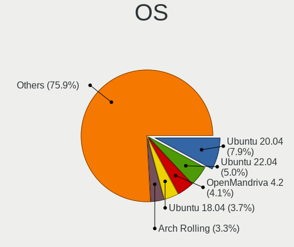
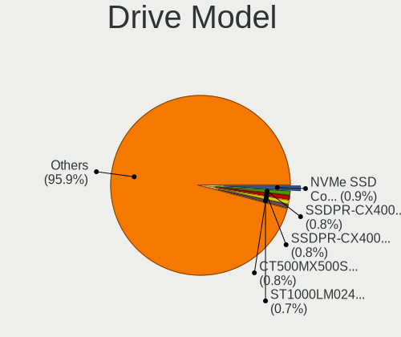
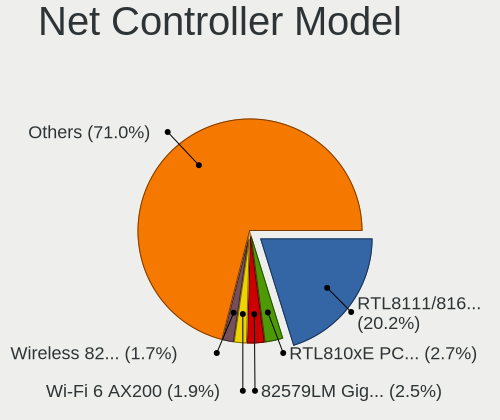

Linux in Poland - Tested Hardware & Statistics
----------------------------------------------

A project to collect tested hardware configurations for Linux in Poland.

Anyone can contribute to this report by the [hw-probe](https://github.com/linuxhw/hw-probe) tool:

    sudo -E hw-probe -all -upload

Please contribute! Especially if your hardware is rare.

This is a report for all computer types. See also reports for [desktops](/Location/Poland/Desktop/README.md) and [notebooks](/Location/Poland/Notebook/README.md).

Contents
--------

* [ Test Cases ](#test-cases)

* [ System ](#system)
  - [ OS                       ](#os)
  - [ OS Family                ](#os-family)
  - [ Kernel                   ](#kernel)
  - [ Kernel Family            ](#kernel-family)
  - [ Kernel Major Ver.        ](#kernel-major-ver)
  - [ Arch                     ](#arch)
  - [ DE                       ](#de)
  - [ Display Server           ](#display-server)
  - [ Display Manager          ](#display-manager)
  - [ OS Lang                  ](#os-lang)
  - [ Boot Mode                ](#boot-mode)
  - [ Filesystem               ](#filesystem)
  - [ Part. scheme             ](#part-scheme)
  - [ Dual Boot with Linux/BSD ](#dual-boot-with-linuxbsd)
  - [ Dual Boot (Win)          ](#dual-boot-win)

* [ Board ](#board)
  - [ Vendor                   ](#vendor)
  - [ Model                    ](#model)
  - [ Model Family             ](#model-family)
  - [ MFG Year                 ](#mfg-year)
  - [ Form Factor              ](#form-factor)
  - [ Secure Boot              ](#secure-boot)
  - [ Coreboot                 ](#coreboot)
  - [ RAM Size                 ](#ram-size)
  - [ RAM Used                 ](#ram-used)
  - [ Total Drives             ](#total-drives)
  - [ Has CD-ROM               ](#has-cd-rom)
  - [ Has Ethernet             ](#has-ethernet)
  - [ Has WiFi                 ](#has-wifi)
  - [ Has Bluetooth            ](#has-bluetooth)

* [ Location ](#location)
  - [ Country                  ](#country)
  - [ City                     ](#city)

* [ Drives ](#drives)
  - [ Drive Vendor             ](#drive-vendor)
  - [ Drive Model              ](#drive-model)
  - [ HDD Vendor               ](#hdd-vendor)
  - [ SSD Vendor               ](#ssd-vendor)
  - [ Drive Kind               ](#drive-kind)
  - [ Drive Connector          ](#drive-connector)
  - [ Drive Size               ](#drive-size)
  - [ Space Total              ](#space-total)
  - [ Space Used               ](#space-used)
  - [ Malfunc. Drives          ](#malfunc-drives)
  - [ Malfunc. Drive Vendor    ](#malfunc-drive-vendor)
  - [ Malfunc. HDD Vendor      ](#malfunc-hdd-vendor)
  - [ Malfunc. Drive Kind      ](#malfunc-drive-kind)
  - [ Failed Drives            ](#failed-drives)
  - [ Failed Drive Vendor      ](#failed-drive-vendor)
  - [ Drive Status             ](#drive-status)

* [ Storage controller ](#storage-controller)
  - [ Storage Vendor           ](#storage-vendor)
  - [ Storage Model            ](#storage-model)
  - [ Storage Kind             ](#storage-kind)

* [ Processor ](#processor)
  - [ CPU Vendor               ](#cpu-vendor)
  - [ CPU Model                ](#cpu-model)
  - [ CPU Model Family         ](#cpu-model-family)
  - [ CPU Cores                ](#cpu-cores)
  - [ CPU Sockets              ](#cpu-sockets)
  - [ CPU Threads              ](#cpu-threads)
  - [ CPU Op-Modes             ](#cpu-op-modes)
  - [ CPU Microcode            ](#cpu-microcode)
  - [ CPU Microarch            ](#cpu-microarch)

* [ Graphics ](#graphics)
  - [ GPU Vendor               ](#gpu-vendor)
  - [ GPU Model                ](#gpu-model)
  - [ GPU Combo                ](#gpu-combo)
  - [ GPU Driver               ](#gpu-driver)
  - [ GPU Memory               ](#gpu-memory)

* [ Monitor ](#monitor)
  - [ Monitor Vendor           ](#monitor-vendor)
  - [ Monitor Model            ](#monitor-model)
  - [ Monitor Resolution       ](#monitor-resolution)
  - [ Monitor Diagonal         ](#monitor-diagonal)
  - [ Monitor Width            ](#monitor-width)
  - [ Aspect Ratio             ](#aspect-ratio)
  - [ Monitor Area             ](#monitor-area)
  - [ Pixel Density            ](#pixel-density)
  - [ Multiple Monitors        ](#multiple-monitors)

* [ Network ](#network)
  - [ Net Controller Vendor    ](#net-controller-vendor)
  - [ Net Controller Model     ](#net-controller-model)
  - [ Wireless Vendor          ](#wireless-vendor)
  - [ Wireless Model           ](#wireless-model)
  - [ Ethernet Vendor          ](#ethernet-vendor)
  - [ Ethernet Model           ](#ethernet-model)
  - [ Net Controller Kind      ](#net-controller-kind)
  - [ Used Controller          ](#used-controller)
  - [ NICs                     ](#nics)
  - [ IPv6                     ](#ipv6)

* [ Bluetooth ](#bluetooth)
  - [ Bluetooth Vendor         ](#bluetooth-vendor)
  - [ Bluetooth Model          ](#bluetooth-model)

* [ Sound ](#sound)
  - [ Sound Vendor             ](#sound-vendor)
  - [ Sound Model              ](#sound-model)

* [ Memory ](#memory)
  - [ Memory Vendor            ](#memory-vendor)
  - [ Memory Model             ](#memory-model)
  - [ Memory Kind              ](#memory-kind)
  - [ Memory Form Factor       ](#memory-form-factor)
  - [ Memory Size              ](#memory-size)
  - [ Memory Speed             ](#memory-speed)

* [ Printers & scanners ](#printers--scanners)
  - [ Printer Vendor           ](#printer-vendor)
  - [ Printer Model            ](#printer-model)
  - [ Scanner Vendor           ](#scanner-vendor)
  - [ Scanner Model            ](#scanner-model)

* [ Camera ](#camera)
  - [ Camera Vendor            ](#camera-vendor)
  - [ Camera Model             ](#camera-model)

* [ Security ](#security)
  - [ Fingerprint Vendor       ](#fingerprint-vendor)
  - [ Fingerprint Model        ](#fingerprint-model)
  - [ Chipcard Vendor          ](#chipcard-vendor)
  - [ Chipcard Model           ](#chipcard-model)

* [ Unsupported ](#unsupported)
  - [ Unsupported Devices      ](#unsupported-devices)
  - [ Unsupported Device Types ](#unsupported-device-types)

Test Cases
----------

Total: 7902

| Vendor        | Model                       | Form-Factor | Probe                                                      | Date         |
|---------------|-----------------------------|-------------|------------------------------------------------------------|--------------|
| ASUSTek       | GL552VW                     | Notebook    | [6986ca63da](https://linux-hardware.org/?probe=6986ca63da) | Aug 12, 2023 |
| Fujitsu       | FMVA0800C                   | Notebook    | [1dae7b170b](https://linux-hardware.org/?probe=1dae7b170b) | Aug 12, 2023 |
| HP            | Pavilion dv7                | Notebook    | [7e4a63e58c](https://linux-hardware.org/?probe=7e4a63e58c) | Aug 12, 2023 |
| HP            | Pavilion dv7                | Notebook    | [fc48a936d7](https://linux-hardware.org/?probe=fc48a936d7) | Aug 12, 2023 |
| Gigabyte      | Z170N-WIFI-CF               | Desktop     | [2ee88f0ec0](https://linux-hardware.org/?probe=2ee88f0ec0) | Aug 11, 2023 |
| HP            | 83E8                        | Desktop     | [a782638343](https://linux-hardware.org/?probe=a782638343) | Aug 11, 2023 |
| Lenovo        | ThinkPad T430s 2356LPG      | Notebook    | [97dfe9511b](https://linux-hardware.org/?probe=97dfe9511b) | Aug 10, 2023 |
| Google        | Kip                         | Notebook    | [553df8dcdc](https://linux-hardware.org/?probe=553df8dcdc) | Aug 10, 2023 |
| ASUSTek       | ROG STRIX B550-F GAMING     | Desktop     | [d38ef662d4](https://linux-hardware.org/?probe=d38ef662d4) | Aug 10, 2023 |
| Unknown       | Unknown                     | Desktop     | [78f477986b](https://linux-hardware.org/?probe=78f477986b) | Aug 10, 2023 |
| Dell          | Latitude E6540              | Notebook    | [758d587fbb](https://linux-hardware.org/?probe=758d587fbb) | Aug 10, 2023 |
| ASUSTek       | PRIME Z270-A                | Desktop     | [a6eabbbfef](https://linux-hardware.org/?probe=a6eabbbfef) | Aug 09, 2023 |
| HP            | ProBook 450 G6              | Notebook    | [c205f19d5e](https://linux-hardware.org/?probe=c205f19d5e) | Aug 09, 2023 |
| HP            | EliteBook 845 G9            | Notebook    | [1ff8d81e4e](https://linux-hardware.org/?probe=1ff8d81e4e) | Aug 09, 2023 |
| ASUSTek       | M3A78-CM                    | Desktop     | [a5e0e043cb](https://linux-hardware.org/?probe=a5e0e043cb) | Aug 09, 2023 |
| ASUSTek       | ASUS TUF Gaming A15 FA50... | Notebook    | [81411c1db8](https://linux-hardware.org/?probe=81411c1db8) | Aug 08, 2023 |
| Acer          | Aspire 5732Z                | Notebook    | [5a0ee0b4c0](https://linux-hardware.org/?probe=5a0ee0b4c0) | Aug 08, 2023 |
| MSI           | 970A-G43 PLUS               | Desktop     | [133d4b58c9](https://linux-hardware.org/?probe=133d4b58c9) | Aug 08, 2023 |
| Lenovo        | IdeaPad 330-15IKB 81DC      | Notebook    | [f6b63d9967](https://linux-hardware.org/?probe=f6b63d9967) | Aug 08, 2023 |
| Gigabyte      | Z97M-DS3H                   | Desktop     | [f2547c0339](https://linux-hardware.org/?probe=f2547c0339) | Aug 08, 2023 |
| ASUSTek       | M3A78-CM                    | Desktop     | [93e4fee7df](https://linux-hardware.org/?probe=93e4fee7df) | Aug 08, 2023 |
| Dell          | Venue 11 Pro 7130 vPro      | Notebook    | [9094c29548](https://linux-hardware.org/?probe=9094c29548) | Aug 07, 2023 |
| MSI           | MAG X670E TOMAHAWK WIFI     | Desktop     | [25bb416eb3](https://linux-hardware.org/?probe=25bb416eb3) | Aug 07, 2023 |
| HP            | ZBook 15 G3                 | Notebook    | [068b8c5a6f](https://linux-hardware.org/?probe=068b8c5a6f) | Aug 07, 2023 |
| Dell          | Vostro 5471                 | Notebook    | [f4beee823e](https://linux-hardware.org/?probe=f4beee823e) | Aug 07, 2023 |
| Gigabyte      | Z97M-DS3H                   | Desktop     | [beecacb434](https://linux-hardware.org/?probe=beecacb434) | Aug 07, 2023 |
| HP            | EliteBook 850 G8 Noteboo... | Notebook    | [08b395f8d6](https://linux-hardware.org/?probe=08b395f8d6) | Aug 07, 2023 |
| Gigabyte      | AB350-Gaming-CF             | Desktop     | [fb8e926bd4](https://linux-hardware.org/?probe=fb8e926bd4) | Aug 07, 2023 |
| ASRock        | B460 Phantom Gaming 4       | Desktop     | [5a254fe1d6](https://linux-hardware.org/?probe=5a254fe1d6) | Aug 06, 2023 |
| ASUSTek       | ROG STRIX B550-A GAMING     | Desktop     | [164e109040](https://linux-hardware.org/?probe=164e109040) | Aug 06, 2023 |
| Lenovo        | B570e HuronRiver Platfor... | Notebook    | [270c9a3ea0](https://linux-hardware.org/?probe=270c9a3ea0) | Aug 06, 2023 |
| Lenovo        | Yoga Slim 7 Pro 14IAH7 8... | Notebook    | [f77c465da0](https://linux-hardware.org/?probe=f77c465da0) | Aug 06, 2023 |
| Lenovo        | B570e HuronRiver Platfor... | Notebook    | [db5a797fc0](https://linux-hardware.org/?probe=db5a797fc0) | Aug 06, 2023 |
| Raspberry ... | Raspberry Pi Zero W Rev ... | Soc         | [23ecc4a8e5](https://linux-hardware.org/?probe=23ecc4a8e5) | Aug 06, 2023 |
| Gigabyte      | 970A-UD3P                   | Desktop     | [dcd061dff8](https://linux-hardware.org/?probe=dcd061dff8) | Aug 05, 2023 |
| Dell          | 0K6VXP A00                  | Mini pc     | [4f0b615c8e](https://linux-hardware.org/?probe=4f0b615c8e) | Aug 05, 2023 |
| ASUSTek       | ROG Strix G731GU_GL731GU    | Notebook    | [b3c77ee42f](https://linux-hardware.org/?probe=b3c77ee42f) | Aug 05, 2023 |
| Dell          | Latitude 5421               | Notebook    | [d01013b679](https://linux-hardware.org/?probe=d01013b679) | Aug 05, 2023 |
| Dell          | Latitude 5421               | Notebook    | [5dfde4e6ac](https://linux-hardware.org/?probe=5dfde4e6ac) | Aug 05, 2023 |
| MSI           | B450 GAMING PRO CARBON A... | Desktop     | [420353bf79](https://linux-hardware.org/?probe=420353bf79) | Aug 04, 2023 |
| Gigabyte      | RC14UD                      | Notebook    | [6ad0758102](https://linux-hardware.org/?probe=6ad0758102) | Aug 04, 2023 |
| Lenovo        | G50-45 80E3                 | Notebook    | [34edcb7dae](https://linux-hardware.org/?probe=34edcb7dae) | Aug 04, 2023 |
| Dell          | Vostro 15 3510              | Notebook    | [bd994e4cc6](https://linux-hardware.org/?probe=bd994e4cc6) | Aug 04, 2023 |
| Dell          | Vostro 15 3510              | Notebook    | [ab2f3b8c7b](https://linux-hardware.org/?probe=ab2f3b8c7b) | Aug 04, 2023 |
| Lenovo        | Gardenia CRB SDK0J40700 ... | All in one  | [9f27152a86](https://linux-hardware.org/?probe=9f27152a86) | Aug 04, 2023 |
| ASUSTek       | TUF Gaming FX505DV_FX505... | Notebook    | [8036065591](https://linux-hardware.org/?probe=8036065591) | Aug 03, 2023 |
| Lenovo        | 3140 SDK0J40697 WIN 3305... | Desktop     | [a61b8168b7](https://linux-hardware.org/?probe=a61b8168b7) | Aug 02, 2023 |
| ECS           | H61H2-M6                    | Desktop     | [12990c5c80](https://linux-hardware.org/?probe=12990c5c80) | Aug 02, 2023 |
| ASUSTek       | M3A78-CM                    | Desktop     | [9be3b9bb83](https://linux-hardware.org/?probe=9be3b9bb83) | Aug 02, 2023 |
| MSI           | X570-A PRO                  | Desktop     | [1acfa69d70](https://linux-hardware.org/?probe=1acfa69d70) | Aug 02, 2023 |
| HP            | 8054                        | Desktop     | [f53df18325](https://linux-hardware.org/?probe=f53df18325) | Aug 02, 2023 |
| Gigabyte      | Z97M-DS3H                   | Desktop     | [8bc1531bf6](https://linux-hardware.org/?probe=8bc1531bf6) | Aug 02, 2023 |
| Raspberry ... | Raspberry Pi 4 Model B R... | Soc         | [ca00849760](https://linux-hardware.org/?probe=ca00849760) | Aug 02, 2023 |
| Dell          | Inspiron 13-5368            | Notebook    | [695e2dec6b](https://linux-hardware.org/?probe=695e2dec6b) | Aug 02, 2023 |
| ASUSTek       | M3A78-CM                    | Desktop     | [5d63b469f8](https://linux-hardware.org/?probe=5d63b469f8) | Aug 01, 2023 |
| Lenovo        | IdeaPad Gaming 3 15ACH6 ... | Notebook    | [c2c27c3268](https://linux-hardware.org/?probe=c2c27c3268) | Aug 01, 2023 |
| ECS           | H61H2-M6                    | Desktop     | [836267e5f7](https://linux-hardware.org/?probe=836267e5f7) | Aug 01, 2023 |
| HP            | 82B5                        | All in one  | [e63af4a7b9](https://linux-hardware.org/?probe=e63af4a7b9) | Aug 01, 2023 |
| Fujitsu       | D3543-A1 S26361-D3543-A1... | Desktop     | [30389578ca](https://linux-hardware.org/?probe=30389578ca) | Aug 01, 2023 |
| Lenovo        | ThinkPad Yoga 370 20JJS1... | Convertible | [af6a2cb993](https://linux-hardware.org/?probe=af6a2cb993) | Jul 31, 2023 |
| Gigabyte      | B75M-D3H                    | Desktop     | [3aeae112c3](https://linux-hardware.org/?probe=3aeae112c3) | Jul 31, 2023 |
| ASRock        | FM2A55M-VG3+                | Desktop     | [ce76d8b410](https://linux-hardware.org/?probe=ce76d8b410) | Jul 31, 2023 |
| Lenovo        | ThinkPad E15 Gen 3 20YG0... | Notebook    | [762d07665a](https://linux-hardware.org/?probe=762d07665a) | Jul 31, 2023 |
| Raspberry ... | Raspberry Pi 3 Model B R... | Soc         | [cd8671be26](https://linux-hardware.org/?probe=cd8671be26) | Jul 31, 2023 |
| ASUSTek       | PRIME Z270-A                | Desktop     | [eb13fb97fb](https://linux-hardware.org/?probe=eb13fb97fb) | Jul 30, 2023 |
| ASUSTek       | E200HA                      | Notebook    | [6ab93e7940](https://linux-hardware.org/?probe=6ab93e7940) | Jul 30, 2023 |
| Lenovo        | IdeaPad 5 14ARE05 81YM      | Notebook    | [60cfcb00e9](https://linux-hardware.org/?probe=60cfcb00e9) | Jul 30, 2023 |
| Intel         | NUC13ANBi5 M89647-202       | Mini pc     | [8e59554b8d](https://linux-hardware.org/?probe=8e59554b8d) | Jul 30, 2023 |
| Google        | Relm                        | Notebook    | [1c8bd1f9dd](https://linux-hardware.org/?probe=1c8bd1f9dd) | Jul 30, 2023 |
| Raspberry ... | Raspberry Pi Zero W Rev ... | Soc         | [39bd06bd9b](https://linux-hardware.org/?probe=39bd06bd9b) | Jul 30, 2023 |
| Lenovo        | ThinkPad A285 20MXS0AE00    | Notebook    | [a6ada51a02](https://linux-hardware.org/?probe=a6ada51a02) | Jul 29, 2023 |
| Dell          | Latitude E7240              | Notebook    | [b794bcdde6](https://linux-hardware.org/?probe=b794bcdde6) | Jul 29, 2023 |
| Dell          | Inspiron 7559               | Notebook    | [fad00d6412](https://linux-hardware.org/?probe=fad00d6412) | Jul 29, 2023 |
| ASRock        | AM1H-ITX                    | Desktop     | [24b2f4274d](https://linux-hardware.org/?probe=24b2f4274d) | Jul 29, 2023 |
| ASUSTek       | X555LJ                      | Notebook    | [690e49362b](https://linux-hardware.org/?probe=690e49362b) | Jul 28, 2023 |
| HP            | Pavilion Gaming Laptop      | Notebook    | [b277fcda26](https://linux-hardware.org/?probe=b277fcda26) | Jul 28, 2023 |
| Gigabyte      | EP45T-UD3LR                 | Desktop     | [c2928283bd](https://linux-hardware.org/?probe=c2928283bd) | Jul 28, 2023 |
| Gigabyte      | B450M DS3H V2               | Desktop     | [ca9b6e0320](https://linux-hardware.org/?probe=ca9b6e0320) | Jul 28, 2023 |
| Toshiba       | Satellite C50D-A-11G        | Notebook    | [b67508b754](https://linux-hardware.org/?probe=b67508b754) | Jul 27, 2023 |
| Gigabyte      | Z97M-DS3H                   | Desktop     | [f0bd5c3409](https://linux-hardware.org/?probe=f0bd5c3409) | Jul 27, 2023 |
| Lenovo        | IdeaPad Y700-15ISK 80NV     | Notebook    | [e882db39b8](https://linux-hardware.org/?probe=e882db39b8) | Jul 27, 2023 |
| Dell          | Inspiron 3583               | Notebook    | [e235fb3a23](https://linux-hardware.org/?probe=e235fb3a23) | Jul 26, 2023 |
| Dell          | Latitude 9420               | Notebook    | [03c3ca79c4](https://linux-hardware.org/?probe=03c3ca79c4) | Jul 26, 2023 |
| ASUSTek       | P5G41T-M                    | Desktop     | [355fadbc12](https://linux-hardware.org/?probe=355fadbc12) | Jul 26, 2023 |
| Lenovo        | ThinkPad X380 Yoga 20LJS... | Convertible | [863a5cb9da](https://linux-hardware.org/?probe=863a5cb9da) | Jul 26, 2023 |
| MSI           | MPG X570 GAMING PLUS        | Desktop     | [e79fd50f34](https://linux-hardware.org/?probe=e79fd50f34) | Jul 26, 2023 |
| Lenovo        | ThinkCentre M58 3231W2Y     | Desktop     | [72f09cd320](https://linux-hardware.org/?probe=72f09cd320) | Jul 26, 2023 |
| Dell          | XPS 15 9520                 | Notebook    | [24f65961ef](https://linux-hardware.org/?probe=24f65961ef) | Jul 26, 2023 |
| ASUSTek       | M5A78L-M LE                 | Desktop     | [3cb7454711](https://linux-hardware.org/?probe=3cb7454711) | Jul 25, 2023 |
| Apple         | MacBookPro9,2               | Notebook    | [af0355313e](https://linux-hardware.org/?probe=af0355313e) | Jul 25, 2023 |
| ASUSTek       | M3A78-CM                    | Desktop     | [290a0dd297](https://linux-hardware.org/?probe=290a0dd297) | Jul 25, 2023 |
| Lenovo        | ThinkPad L470 20J5S01S00    | Notebook    | [346055ca33](https://linux-hardware.org/?probe=346055ca33) | Jul 25, 2023 |
| ZOTAC         | ZBOX-BI322                  | Mini pc     | [f595927b7b](https://linux-hardware.org/?probe=f595927b7b) | Jul 25, 2023 |
| HP            | 212B                        | Desktop     | [8e6a290d51](https://linux-hardware.org/?probe=8e6a290d51) | Jul 25, 2023 |
| ASUSTek       | PRIME B450-PLUS             | Desktop     | [5ec24ea9ad](https://linux-hardware.org/?probe=5ec24ea9ad) | Jul 25, 2023 |
| Dell          | Latitude 3190               | Notebook    | [b1730d834d](https://linux-hardware.org/?probe=b1730d834d) | Jul 25, 2023 |
| ASUSTek       | P8H61-M LX                  | Desktop     | [9ffd99b082](https://linux-hardware.org/?probe=9ffd99b082) | Jul 25, 2023 |
| HP            | Pavilion Gaming Laptop 1... | Notebook    | [412bc51f72](https://linux-hardware.org/?probe=412bc51f72) | Jul 24, 2023 |
| HP            | 198E                        | Desktop     | [c2f7b19d13](https://linux-hardware.org/?probe=c2f7b19d13) | Jul 24, 2023 |
| Gigabyte      | Z97M-DS3H                   | Desktop     | [816a8d70bb](https://linux-hardware.org/?probe=816a8d70bb) | Jul 24, 2023 |
| Timi          | TM1701                      | Notebook    | [eb1246586e](https://linux-hardware.org/?probe=eb1246586e) | Jul 24, 2023 |
| ASUSTek       | F7E                         | Notebook    | [2aef1cc2c4](https://linux-hardware.org/?probe=2aef1cc2c4) | Jul 24, 2023 |
| Timi          | TM1701                      | Notebook    | [17fefbecba](https://linux-hardware.org/?probe=17fefbecba) | Jul 24, 2023 |
| Lenovo        | G500s 20245                 | Notebook    | [fbfa8af465](https://linux-hardware.org/?probe=fbfa8af465) | Jul 24, 2023 |
| Acer          | Aspire A715-74G             | Notebook    | [b27862dc34](https://linux-hardware.org/?probe=b27862dc34) | Jul 24, 2023 |
| Raspberry ... | Raspberry Pi 3 Model B R... | Soc         | [9243bb6a08](https://linux-hardware.org/?probe=9243bb6a08) | Jul 24, 2023 |
| ASUSTek       | M3A78-CM                    | Desktop     | [a2fcdf6c36](https://linux-hardware.org/?probe=a2fcdf6c36) | Jul 24, 2023 |
| ASUSTek       | X555LD                      | Notebook    | [732fe69d59](https://linux-hardware.org/?probe=732fe69d59) | Jul 23, 2023 |
| HUAWEI        | HVY-WXX9                    | Notebook    | [44958ef86b](https://linux-hardware.org/?probe=44958ef86b) | Jul 23, 2023 |
| Samsung       | 350V5C/351V5C/3540VC/344... | Notebook    | [10e8c0d4ad](https://linux-hardware.org/?probe=10e8c0d4ad) | Jul 23, 2023 |
| Raspberry ... | Raspberry Pi Zero W Rev ... | Soc         | [b21b29c46e](https://linux-hardware.org/?probe=b21b29c46e) | Jul 23, 2023 |
| Google        | Snappy                      | Notebook    | [a3e6774e43](https://linux-hardware.org/?probe=a3e6774e43) | Jul 23, 2023 |
| Dell          | 0VD92X A00                  | Desktop     | [675e646d05](https://linux-hardware.org/?probe=675e646d05) | Jul 23, 2023 |
| Lenovo        | IdeaPad L340-15IRH Gamin... | Notebook    | [467cc30f89](https://linux-hardware.org/?probe=467cc30f89) | Jul 22, 2023 |
| ASRock        | B85M                        | Desktop     | [c4f0b0b1fa](https://linux-hardware.org/?probe=c4f0b0b1fa) | Jul 22, 2023 |
| MSI           | PR601/VR603                 | Notebook    | [b982476d84](https://linux-hardware.org/?probe=b982476d84) | Jul 21, 2023 |
| HP            | 3032h                       | Desktop     | [f6a4202b21](https://linux-hardware.org/?probe=f6a4202b21) | Jul 21, 2023 |
| Gigabyte      | H270-HD3-CF                 | Desktop     | [73a56d2df7](https://linux-hardware.org/?probe=73a56d2df7) | Jul 21, 2023 |
| Razer         | Blade 15 Base Model (Mid... | Notebook    | [d2d53e7406](https://linux-hardware.org/?probe=d2d53e7406) | Jul 21, 2023 |
| Lenovo        | ThinkPad E15 Gen 3 20YG0... | Notebook    | [fcdb1fdeed](https://linux-hardware.org/?probe=fcdb1fdeed) | Jul 20, 2023 |
| Lenovo        | ThinkPad E15 Gen 3 20YG0... | Notebook    | [0bd52b9adf](https://linux-hardware.org/?probe=0bd52b9adf) | Jul 20, 2023 |
| Dell          | 0HD5W2 A01                  | Desktop     | [26c19ee81f](https://linux-hardware.org/?probe=26c19ee81f) | Jul 19, 2023 |
| Dell          | Latitude 9420               | Notebook    | [750f80b869](https://linux-hardware.org/?probe=750f80b869) | Jul 19, 2023 |
| Dell          | Latitude 9420               | Notebook    | [a4ba4bfde1](https://linux-hardware.org/?probe=a4ba4bfde1) | Jul 19, 2023 |
| Dell          | Latitude E6400              | Notebook    | [7e9ef12f0d](https://linux-hardware.org/?probe=7e9ef12f0d) | Jul 19, 2023 |
| Lenovo        | IdeaPad 320-17ABR 80YN      | Notebook    | [17c6866da9](https://linux-hardware.org/?probe=17c6866da9) | Jul 18, 2023 |
| ASUSTek       | PRIME X370-PRO              | Desktop     | [8ff38f3782](https://linux-hardware.org/?probe=8ff38f3782) | Jul 18, 2023 |
| Lenovo        | ThinkPad E15 Gen 2 20T80... | Notebook    | [35d510901b](https://linux-hardware.org/?probe=35d510901b) | Jul 18, 2023 |
| Teclast       | F6 Pro                      | Notebook    | [d9f3a038e0](https://linux-hardware.org/?probe=d9f3a038e0) | Jul 17, 2023 |
| Lenovo        | ThinkPad P15 Gen 1 20STS... | Notebook    | [18f41b2be6](https://linux-hardware.org/?probe=18f41b2be6) | Jul 17, 2023 |
| Fujitsu       | D3401-A1 S26361-D3401-A1    | Desktop     | [c527cf56ad](https://linux-hardware.org/?probe=c527cf56ad) | Jul 17, 2023 |
| Lenovo        | ThinkPad X240 20AMS07T00    | Notebook    | [0c460a8007](https://linux-hardware.org/?probe=0c460a8007) | Jul 17, 2023 |
| Gigabyte      | AB350-Gaming-CF             | Desktop     | [f4936b2064](https://linux-hardware.org/?probe=f4936b2064) | Jul 17, 2023 |
| Lenovo        | Yoga 3 Pro-1370 80HE        | Notebook    | [111c0b962d](https://linux-hardware.org/?probe=111c0b962d) | Jul 16, 2023 |
| Dell          | Latitude E6440              | Notebook    | [4e40dc49f3](https://linux-hardware.org/?probe=4e40dc49f3) | Jul 16, 2023 |
| HP            | Pavilion HDX9200            | Notebook    | [d893c8a2d1](https://linux-hardware.org/?probe=d893c8a2d1) | Jul 16, 2023 |
| Dell          | Latitude E6330              | Notebook    | [6adb67344f](https://linux-hardware.org/?probe=6adb67344f) | Jul 15, 2023 |
| Lenovo        | ThinkPad T495 20NKS0T101    | Notebook    | [6154504eac](https://linux-hardware.org/?probe=6154504eac) | Jul 15, 2023 |
| ASUSTek       | 1011PX                      | Notebook    | [d91fe40195](https://linux-hardware.org/?probe=d91fe40195) | Jul 15, 2023 |
| MSI           | GE70 2QD                    | Notebook    | [f8ddf3a3a3](https://linux-hardware.org/?probe=f8ddf3a3a3) | Jul 15, 2023 |
| Lenovo        | ThinkPad X240 20AMS07T00    | Notebook    | [8ce6db48b9](https://linux-hardware.org/?probe=8ce6db48b9) | Jul 15, 2023 |
| Gigabyte      | Z97M-DS3H                   | Desktop     | [9e829a5538](https://linux-hardware.org/?probe=9e829a5538) | Jul 14, 2023 |
| Lenovo        | ThinkPad T470 20HES0FA03    | Notebook    | [f416cb06c2](https://linux-hardware.org/?probe=f416cb06c2) | Jul 14, 2023 |
| Lenovo        | Yoga 530-14ARR 81H9         | Convertible | [f0736c39fe](https://linux-hardware.org/?probe=f0736c39fe) | Jul 13, 2023 |
| Acer          | Aspire E5-576G              | Notebook    | [0856b48ae7](https://linux-hardware.org/?probe=0856b48ae7) | Jul 13, 2023 |
| Dell          | Latitude E6330              | Notebook    | [58ec0684cd](https://linux-hardware.org/?probe=58ec0684cd) | Jul 13, 2023 |
| Toshiba       | Satellite S75-B             | Notebook    | [ee71e28c8f](https://linux-hardware.org/?probe=ee71e28c8f) | Jul 12, 2023 |
| Seeed Stud... | ODYSSEY-X86J4105 SD-BS-C... | Desktop     | [b5374c8055](https://linux-hardware.org/?probe=b5374c8055) | Jul 12, 2023 |
| Lenovo        | 3102 SDK0J40697 WIN 3305... | Desktop     | [67ef58f2b3](https://linux-hardware.org/?probe=67ef58f2b3) | Jul 12, 2023 |
| Lenovo        | ThinkPad T470s 20HGS01A0... | Notebook    | [54e51170a1](https://linux-hardware.org/?probe=54e51170a1) | Jul 11, 2023 |
| ASUSTek       | ZenBook UX433FN_UX433FN     | Notebook    | [a78428eb21](https://linux-hardware.org/?probe=a78428eb21) | Jul 11, 2023 |
| Dell          | Inspiron 5748               | Notebook    | [ec95cc29fd](https://linux-hardware.org/?probe=ec95cc29fd) | Jul 11, 2023 |
| Lenovo        | ThinkPad L470 20J5S01S00    | Notebook    | [ef1f607a84](https://linux-hardware.org/?probe=ef1f607a84) | Jul 11, 2023 |
| ASUSTek       | ROG Strix G531GT_G531GT     | Notebook    | [97f39991c3](https://linux-hardware.org/?probe=97f39991c3) | Jul 11, 2023 |
| Dell          | 0T7D40 A01                  | Desktop     | [1ed238ea9b](https://linux-hardware.org/?probe=1ed238ea9b) | Jul 11, 2023 |
| ASRock        | H81M                        | Desktop     | [042e2e3b56](https://linux-hardware.org/?probe=042e2e3b56) | Jul 11, 2023 |
| ASRock        | H81M                        | Desktop     | [c4b398d08c](https://linux-hardware.org/?probe=c4b398d08c) | Jul 11, 2023 |
| HP            | 82B5                        | All in one  | [3f1fecd5c3](https://linux-hardware.org/?probe=3f1fecd5c3) | Jul 11, 2023 |
| ASUSTek       | M3A78-CM                    | Desktop     | [ab32a0e447](https://linux-hardware.org/?probe=ab32a0e447) | Jul 11, 2023 |
| Dell          | Latitude 3190               | Notebook    | [f067ca0dbf](https://linux-hardware.org/?probe=f067ca0dbf) | Jul 11, 2023 |
| TUXEDO        | InfinityBook Pro Gen7 (M... | Notebook    | [8b9677cc2a](https://linux-hardware.org/?probe=8b9677cc2a) | Jul 10, 2023 |
| TUXEDO        | InfinityBook Pro Gen7 (M... | Notebook    | [acdd4ea952](https://linux-hardware.org/?probe=acdd4ea952) | Jul 10, 2023 |
| Lenovo        | ThinkPad Edge 0578P6G       | Notebook    | [e79fbdad2d](https://linux-hardware.org/?probe=e79fbdad2d) | Jul 10, 2023 |
| Google        | Guado                       | Desktop     | [d14465ad06](https://linux-hardware.org/?probe=d14465ad06) | Jul 10, 2023 |
| Dell          | 09WH54 A00                  | Desktop     | [b118891f3d](https://linux-hardware.org/?probe=b118891f3d) | Jul 10, 2023 |
| ASUSTek       | M3A78-CM                    | Desktop     | [38420a6afe](https://linux-hardware.org/?probe=38420a6afe) | Jul 10, 2023 |
| MSI           | X99A GAMING 9 ACK           | Desktop     | [4a36d070b4](https://linux-hardware.org/?probe=4a36d070b4) | Jul 10, 2023 |
| Lenovo        | SHARKBAY SDK0E50510 WIN     | Desktop     | [73b13fd5eb](https://linux-hardware.org/?probe=73b13fd5eb) | Jul 10, 2023 |
| HP            | 1998                        | Desktop     | [03da98871c](https://linux-hardware.org/?probe=03da98871c) | Jul 10, 2023 |
| HP            | 1998                        | Desktop     | [15e8251d36](https://linux-hardware.org/?probe=15e8251d36) | Jul 10, 2023 |
| HP            | Pavilion Laptop 15-eh2xx... | Notebook    | [d4ca6c4f81](https://linux-hardware.org/?probe=d4ca6c4f81) | Jul 10, 2023 |
| ASUSTek       | PRIME Z690-P D4             | Desktop     | [b91bb21dfc](https://linux-hardware.org/?probe=b91bb21dfc) | Jul 10, 2023 |
| Raspberry ... | Raspberry Pi 3 Model B R... | Soc         | [1e6fc6f253](https://linux-hardware.org/?probe=1e6fc6f253) | Jul 10, 2023 |
| Gigabyte      | AB350-Gaming-CF             | Desktop     | [14c6f3f286](https://linux-hardware.org/?probe=14c6f3f286) | Jul 10, 2023 |
| Gigabyte      | GA-78LMT-S2PT               | Desktop     | [6a55de667a](https://linux-hardware.org/?probe=6a55de667a) | Jul 09, 2023 |
| Samsung       | 350V5C/351V5C/3540VC/344... | Notebook    | [215d2135b3](https://linux-hardware.org/?probe=215d2135b3) | Jul 09, 2023 |
| Lenovo        | ThinkPad E15 Gen 3 20YG0... | Notebook    | [42aaaa0acb](https://linux-hardware.org/?probe=42aaaa0acb) | Jul 09, 2023 |
| HP            | Compaq Presario CQ60        | Notebook    | [60e671ef49](https://linux-hardware.org/?probe=60e671ef49) | Jul 09, 2023 |
| ASUSTek       | X555LJ                      | Notebook    | [2dfec77944](https://linux-hardware.org/?probe=2dfec77944) | Jul 09, 2023 |
| Raspberry ... | Raspberry Pi Zero W Rev ... | Soc         | [b29db59f6a](https://linux-hardware.org/?probe=b29db59f6a) | Jul 09, 2023 |
| HP            | Laptop 14s-fq0xxx           | Notebook    | [92feea0533](https://linux-hardware.org/?probe=92feea0533) | Jul 08, 2023 |
| HP            | Laptop 14s-fq0xxx           | Notebook    | [2287c62944](https://linux-hardware.org/?probe=2287c62944) | Jul 08, 2023 |
| Dell          | 0KC9NP A01                  | Desktop     | [570f59305c](https://linux-hardware.org/?probe=570f59305c) | Jul 08, 2023 |
| Dell          | 0KC9NP A01                  | Desktop     | [6d62d0cdbf](https://linux-hardware.org/?probe=6d62d0cdbf) | Jul 08, 2023 |
| ASUSTek       | VivoBook_ASUSLaptop X421... | Notebook    | [9b8e16f852](https://linux-hardware.org/?probe=9b8e16f852) | Jul 08, 2023 |
| Toshiba       | PORTEGE M700                | Notebook    | [6a67dec7ab](https://linux-hardware.org/?probe=6a67dec7ab) | Jul 08, 2023 |
| Toshiba       | PORTEGE M700                | Notebook    | [b735ddd9a6](https://linux-hardware.org/?probe=b735ddd9a6) | Jul 08, 2023 |
| TUXEDO        | Stellaris AMD Gen3 (CZN)    | Notebook    | [54ac55c49e](https://linux-hardware.org/?probe=54ac55c49e) | Jul 07, 2023 |
| TUXEDO        | Stellaris AMD Gen3 (CZN)    | Notebook    | [296474a1b1](https://linux-hardware.org/?probe=296474a1b1) | Jul 07, 2023 |
| HP            | Pavilion Laptop 15-eh2xx... | Notebook    | [e4bb31a52c](https://linux-hardware.org/?probe=e4bb31a52c) | Jul 07, 2023 |
| ASRock        | X570 Phantom Gaming 4       | Desktop     | [2d342d7a37](https://linux-hardware.org/?probe=2d342d7a37) | Jul 07, 2023 |
| MSI           | MAG B650 TOMAHAWK WIFI      | Desktop     | [49c59b6c86](https://linux-hardware.org/?probe=49c59b6c86) | Jul 07, 2023 |
| MSI           | MAG B650 TOMAHAWK WIFI      | Desktop     | [df2a737853](https://linux-hardware.org/?probe=df2a737853) | Jul 07, 2023 |
| Gigabyte      | Z97M-DS3H                   | Desktop     | [9ecae424ad](https://linux-hardware.org/?probe=9ecae424ad) | Jul 07, 2023 |
| Gigabyte      | B85M-HD3                    | Desktop     | [43034103ef](https://linux-hardware.org/?probe=43034103ef) | Jul 06, 2023 |
| ASUSTek       | Rampage V EDITION 10        | Desktop     | [54611e82ec](https://linux-hardware.org/?probe=54611e82ec) | Jul 06, 2023 |
| Google        | Guado                       | Desktop     | [8bd38f802a](https://linux-hardware.org/?probe=8bd38f802a) | Jul 06, 2023 |
| HP            | 255 G7 Notebook PC          | Notebook    | [23a6105e01](https://linux-hardware.org/?probe=23a6105e01) | Jul 06, 2023 |
| ASRock        | Z370 Killer SLI             | Desktop     | [b7a676e2fc](https://linux-hardware.org/?probe=b7a676e2fc) | Jul 05, 2023 |
| Dell          | Latitude 7420               | Notebook    | [44c51e8365](https://linux-hardware.org/?probe=44c51e8365) | Jul 05, 2023 |
| AAEON         | AEC-6637                    | Notebook    | [53f8e37edc](https://linux-hardware.org/?probe=53f8e37edc) | Jul 05, 2023 |
| AAEON         | AEC-6637                    | Notebook    | [a105861e1d](https://linux-hardware.org/?probe=a105861e1d) | Jul 05, 2023 |
| Dell          | Latitude 7420               | Notebook    | [9eae2c6ad4](https://linux-hardware.org/?probe=9eae2c6ad4) | Jul 05, 2023 |
| Gigabyte      | B660M DS3H DDR4             | Desktop     | [c997aced4e](https://linux-hardware.org/?probe=c997aced4e) | Jul 05, 2023 |
| Gigabyte      | GA-790FXTA-UD5              | Desktop     | [685f105356](https://linux-hardware.org/?probe=685f105356) | Jul 05, 2023 |
| ASUSTek       | TUF Gaming FX505DT_FX505... | Notebook    | [3e5dc0c313](https://linux-hardware.org/?probe=3e5dc0c313) | Jul 05, 2023 |
| HP            | 339A                        | Desktop     | [8d051ead1c](https://linux-hardware.org/?probe=8d051ead1c) | Jul 05, 2023 |
| ASRock        | Z370 Killer SLI             | Desktop     | [e7c0ca1bfc](https://linux-hardware.org/?probe=e7c0ca1bfc) | Jul 05, 2023 |
| HP            | 550                         | Notebook    | [f788d05211](https://linux-hardware.org/?probe=f788d05211) | Jul 05, 2023 |
| HP            | 650                         | Notebook    | [a3077996ad](https://linux-hardware.org/?probe=a3077996ad) | Jul 05, 2023 |
| ASUSTek       | ROG Flow X16 GV601RW_GV6... | Convertible | [71ab16d717](https://linux-hardware.org/?probe=71ab16d717) | Jul 05, 2023 |
| Lenovo        | G500s 20245                 | Notebook    | [1a32b23618](https://linux-hardware.org/?probe=1a32b23618) | Jul 04, 2023 |
| ASRock        | Z170 Extreme4               | Desktop     | [abc4554a51](https://linux-hardware.org/?probe=abc4554a51) | Jul 04, 2023 |
| Lenovo        | ThinkPad Yoga 370 20JJS1... | Convertible | [2be3b17236](https://linux-hardware.org/?probe=2be3b17236) | Jul 04, 2023 |
| Dell          | Latitude 3190               | Notebook    | [b895b6dced](https://linux-hardware.org/?probe=b895b6dced) | Jul 04, 2023 |
| ASRock        | A320M-HDV R3.0              | Desktop     | [df1fff149d](https://linux-hardware.org/?probe=df1fff149d) | Jul 04, 2023 |
| Gigabyte      | B450M GAMING                | Desktop     | [22a13c2e16](https://linux-hardware.org/?probe=22a13c2e16) | Jul 03, 2023 |
| Lenovo        | Yoga 900-13ISK 80MK         | Notebook    | [75a8750d34](https://linux-hardware.org/?probe=75a8750d34) | Jul 03, 2023 |
| Lenovo        | Legion 5 15ACH6 82JW        | Notebook    | [f567c6c550](https://linux-hardware.org/?probe=f567c6c550) | Jul 03, 2023 |
| Raspberry ... | Raspberry Pi 3 Model B R... | Soc         | [8bb4af1cb5](https://linux-hardware.org/?probe=8bb4af1cb5) | Jul 03, 2023 |
| ASUSTek       | M3A78-CM                    | Desktop     | [67281face4](https://linux-hardware.org/?probe=67281face4) | Jul 03, 2023 |
| Gigabyte      | AB350-Gaming-CF             | Desktop     | [f928781025](https://linux-hardware.org/?probe=f928781025) | Jul 03, 2023 |
| Acer          | FX58M                       | Desktop     | [44e563ac2a](https://linux-hardware.org/?probe=44e563ac2a) | Jul 02, 2023 |
| Lenovo        | Yoga 530-14ARR 81H9         | Convertible | [6e52890194](https://linux-hardware.org/?probe=6e52890194) | Jul 02, 2023 |
| MSI           | MS-B9181                    | Desktop     | [fef890b931](https://linux-hardware.org/?probe=fef890b931) | Jul 02, 2023 |
| Google        | Relm                        | Notebook    | [ef72648bb6](https://linux-hardware.org/?probe=ef72648bb6) | Jul 02, 2023 |
| MSI           | MS-B9181                    | Desktop     | [47b3ce0c58](https://linux-hardware.org/?probe=47b3ce0c58) | Jul 02, 2023 |
| Acer          | FX58M                       | Desktop     | [69f3a5d4fb](https://linux-hardware.org/?probe=69f3a5d4fb) | Jul 02, 2023 |
| Gigabyte      | P55M-UD2                    | Desktop     | [babec703df](https://linux-hardware.org/?probe=babec703df) | Jul 02, 2023 |
| Raspberry ... | Raspberry Pi Zero W Rev ... | Soc         | [03879163c2](https://linux-hardware.org/?probe=03879163c2) | Jul 02, 2023 |
| MSI           | MPG X570 GAMING PLUS        | Desktop     | [9e65cd9bd1](https://linux-hardware.org/?probe=9e65cd9bd1) | Jul 02, 2023 |
| Lenovo        | IdeaPad 100S-14IBR 80R9     | Notebook    | [3f2c5d0eb2](https://linux-hardware.org/?probe=3f2c5d0eb2) | Jul 01, 2023 |
| Samsung       | 350V5C/351V5C/3540VC/344... | Notebook    | [f923d36676](https://linux-hardware.org/?probe=f923d36676) | Jul 01, 2023 |
| Dell          | Inspiron 7720               | Notebook    | [9d8f40247e](https://linux-hardware.org/?probe=9d8f40247e) | Jul 01, 2023 |
| Packard Be... | EasyNote TSX66HR            | Notebook    | [96253a3da8](https://linux-hardware.org/?probe=96253a3da8) | Jul 01, 2023 |
| Gigabyte      | Z77X-UD5H                   | Desktop     | [eea1d9623c](https://linux-hardware.org/?probe=eea1d9623c) | Jun 30, 2023 |
| HP            | EliteBook 820 G2            | Notebook    | [c99236ef84](https://linux-hardware.org/?probe=c99236ef84) | Jun 30, 2023 |
| Lenovo        | ThinkPad T430s 23554L7      | Notebook    | [501b0860c8](https://linux-hardware.org/?probe=501b0860c8) | Jun 30, 2023 |
| Dell          | Latitude E6540              | Notebook    | [a526c901ee](https://linux-hardware.org/?probe=a526c901ee) | Jun 30, 2023 |
| Lenovo        | IdeaPad 5 Pro 16ARH7 82S... | Notebook    | [287d7d6f60](https://linux-hardware.org/?probe=287d7d6f60) | Jun 29, 2023 |
| Lenovo        | IdeaPad 100-15IBY 80MJ      | Notebook    | [723de914e2](https://linux-hardware.org/?probe=723de914e2) | Jun 29, 2023 |
| Acer          | Swift SF314-43              | Notebook    | [363067c171](https://linux-hardware.org/?probe=363067c171) | Jun 29, 2023 |
| Medion        | BTDD-TI                     | All in one  | [64b84cf34d](https://linux-hardware.org/?probe=64b84cf34d) | Jun 29, 2023 |
| Gigabyte      | P31-DS3L                    | Desktop     | [0d32728bdf](https://linux-hardware.org/?probe=0d32728bdf) | Jun 28, 2023 |
| Dell          | XPS 15 9570                 | Notebook    | [34df27504f](https://linux-hardware.org/?probe=34df27504f) | Jun 28, 2023 |
| Apple         | MacBookPro7,1               | Notebook    | [5a82f91882](https://linux-hardware.org/?probe=5a82f91882) | Jun 28, 2023 |
| Lenovo        | ThinkPad T430 2349HNU       | Notebook    | [9d6748ef56](https://linux-hardware.org/?probe=9d6748ef56) | Jun 28, 2023 |
| Toshiba       | TECRA R950                  | Notebook    | [cab34ec3dc](https://linux-hardware.org/?probe=cab34ec3dc) | Jun 28, 2023 |
| Lenovo        | IdeaPad 100S-14IBR 80R9     | Notebook    | [ff919014cd](https://linux-hardware.org/?probe=ff919014cd) | Jun 28, 2023 |
| HP            | 21B4 A01                    | Desktop     | [50656fb7ec](https://linux-hardware.org/?probe=50656fb7ec) | Jun 28, 2023 |
| HP            | 21B4 A01                    | Desktop     | [4d9322819d](https://linux-hardware.org/?probe=4d9322819d) | Jun 28, 2023 |
| ASUSTek       | K54C                        | Notebook    | [4152d1fcff](https://linux-hardware.org/?probe=4152d1fcff) | Jun 28, 2023 |
| Lenovo        | ThinkPad T430 2349HNU       | Notebook    | [64433a8783](https://linux-hardware.org/?probe=64433a8783) | Jun 27, 2023 |
| Lenovo        | G500s 20245                 | Notebook    | [1aa332e26f](https://linux-hardware.org/?probe=1aa332e26f) | Jun 27, 2023 |
| Valve         | Jupiter                     | Notebook    | [0817dd25ff](https://linux-hardware.org/?probe=0817dd25ff) | Jun 27, 2023 |
| Dell          | Latitude 3190               | Notebook    | [5f68b5235f](https://linux-hardware.org/?probe=5f68b5235f) | Jun 27, 2023 |
| Gigabyte      | GA-970A-UD3                 | Desktop     | [157d424ec0](https://linux-hardware.org/?probe=157d424ec0) | Jun 26, 2023 |
| Toshiba       | TECRA R950                  | Notebook    | [f02bb9a43a](https://linux-hardware.org/?probe=f02bb9a43a) | Jun 26, 2023 |
| Raspberry ... | Raspberry Pi 3 Model B R... | Soc         | [b4fcf1904c](https://linux-hardware.org/?probe=b4fcf1904c) | Jun 26, 2023 |
| ASUSTek       | M3A78-CM                    | Desktop     | [e55023fb8b](https://linux-hardware.org/?probe=e55023fb8b) | Jun 26, 2023 |
| Gigabyte      | AB350-Gaming-CF             | Desktop     | [0b72aec1b9](https://linux-hardware.org/?probe=0b72aec1b9) | Jun 26, 2023 |
| HP            | 255 G5 Notebook PC          | Notebook    | [cad891675f](https://linux-hardware.org/?probe=cad891675f) | Jun 25, 2023 |
| HP            | 21B4 A01                    | Desktop     | [e277fd2772](https://linux-hardware.org/?probe=e277fd2772) | Jun 25, 2023 |
| Biostar       | H81MHV3 5.0                 | Desktop     | [0f95f72b43](https://linux-hardware.org/?probe=0f95f72b43) | Jun 25, 2023 |
| Raspberry ... | Raspberry Pi Zero W Rev ... | Soc         | [3c54b7ee02](https://linux-hardware.org/?probe=3c54b7ee02) | Jun 25, 2023 |
| ASUSTek       | Z170M-PLUS                  | Desktop     | [b4ab698b09](https://linux-hardware.org/?probe=b4ab698b09) | Jun 25, 2023 |
| eMachines     | eME732ZG                    | Notebook    | [4e1d6873ff](https://linux-hardware.org/?probe=4e1d6873ff) | Jun 24, 2023 |
| HP            | EliteBook 855 G8 Noteboo... | Notebook    | [0ec7fedf29](https://linux-hardware.org/?probe=0ec7fedf29) | Jun 24, 2023 |
| Packard Be... | EasyNote TK85               | Notebook    | [314e344780](https://linux-hardware.org/?probe=314e344780) | Jun 24, 2023 |
| Intel         | H81                         | Desktop     | [65ad18a4bd](https://linux-hardware.org/?probe=65ad18a4bd) | Jun 24, 2023 |
| Lenovo        | ThinkPad T430 2347BS4       | Notebook    | [a8a9689ea6](https://linux-hardware.org/?probe=a8a9689ea6) | Jun 24, 2023 |
| Lenovo        | ThinkPad L390 20NSS04400    | Notebook    | [feced26491](https://linux-hardware.org/?probe=feced26491) | Jun 23, 2023 |
| Lenovo        | Legion 5 15ACH6 82JW        | Notebook    | [c75670186a](https://linux-hardware.org/?probe=c75670186a) | Jun 23, 2023 |
| MSI           | B360M PRO-VD 2019-01-24     | Desktop     | [a036f44a4c](https://linux-hardware.org/?probe=a036f44a4c) | Jun 22, 2023 |
| Lenovo        | G500s 20245                 | Notebook    | [17db397c48](https://linux-hardware.org/?probe=17db397c48) | Jun 22, 2023 |
| Dell          | 0WMJ54 A01                  | Desktop     | [0b8cf1cae7](https://linux-hardware.org/?probe=0b8cf1cae7) | Jun 22, 2023 |
| Medion        | BTDD-TI                     | All in one  | [8845f67824](https://linux-hardware.org/?probe=8845f67824) | Jun 22, 2023 |
| Gigabyte      | X570 AORUS ULTRA            | Desktop     | [d4d7534ac3](https://linux-hardware.org/?probe=d4d7534ac3) | Jun 22, 2023 |
| MSI           | B450 GAMING PRO CARBON A... | Desktop     | [0f5435c665](https://linux-hardware.org/?probe=0f5435c665) | Jun 22, 2023 |
| Toshiba       | Satellite Pro C70-B         | Notebook    | [f96a1a3552](https://linux-hardware.org/?probe=f96a1a3552) | Jun 21, 2023 |
| Lenovo        | ThinkPad L470 20J5S01S00    | Notebook    | [5de086be7a](https://linux-hardware.org/?probe=5de086be7a) | Jun 21, 2023 |
| Toshiba       | Satellite Pro C70-B         | Notebook    | [52c4c32098](https://linux-hardware.org/?probe=52c4c32098) | Jun 21, 2023 |
| Notebook      | NV4xPZ                      | Notebook    | [873c70b184](https://linux-hardware.org/?probe=873c70b184) | Jun 21, 2023 |
| Gigabyte      | H510M S2H V2                | Desktop     | [d7c44291c1](https://linux-hardware.org/?probe=d7c44291c1) | Jun 20, 2023 |
| MSI           | MAG B550 TOMAHAWK           | Desktop     | [bbfb6ff07f](https://linux-hardware.org/?probe=bbfb6ff07f) | Jun 20, 2023 |
| Lenovo        | B570 HuronRiver Platform    | Notebook    | [b51dda105a](https://linux-hardware.org/?probe=b51dda105a) | Jun 20, 2023 |
| Gigabyte      | H510M S2H V2                | Desktop     | [f2d80b2558](https://linux-hardware.org/?probe=f2d80b2558) | Jun 19, 2023 |
| Toshiba       | Satellite A300              | Notebook    | [f37d67a18d](https://linux-hardware.org/?probe=f37d67a18d) | Jun 19, 2023 |
| Raspberry ... | Raspberry Pi                | Soc         | [1559b0a68d](https://linux-hardware.org/?probe=1559b0a68d) | Jun 19, 2023 |
| ASUSTek       | M3A78-CM                    | Desktop     | [22d8476417](https://linux-hardware.org/?probe=22d8476417) | Jun 19, 2023 |
| Gigabyte      | AB350-Gaming-CF             | Desktop     | [e2fc6bb607](https://linux-hardware.org/?probe=e2fc6bb607) | Jun 19, 2023 |
| Razer         | Blade Stealth 13 (Early ... | Notebook    | [e3843be450](https://linux-hardware.org/?probe=e3843be450) | Jun 18, 2023 |
| ASRock        | Z87 Extreme4                | Desktop     | [dcd3e79cb1](https://linux-hardware.org/?probe=dcd3e79cb1) | Jun 18, 2023 |
| HP            | Pavilion dv2                | Notebook    | [3f3b0104a4](https://linux-hardware.org/?probe=3f3b0104a4) | Jun 18, 2023 |
| MSI           | X470 GAMING PLUS            | Desktop     | [17c61c0aee](https://linux-hardware.org/?probe=17c61c0aee) | Jun 18, 2023 |
| Gigabyte      | Z170-Gaming K3-CF           | Desktop     | [6e40a39112](https://linux-hardware.org/?probe=6e40a39112) | Jun 18, 2023 |
| HP            | Notebook                    | Notebook    | [60eebb0602](https://linux-hardware.org/?probe=60eebb0602) | Jun 18, 2023 |
| HP            | Pavilion x2 Detachable      | Tablet      | [e01ed6ab42](https://linux-hardware.org/?probe=e01ed6ab42) | Jun 17, 2023 |
| Dell          | Latitude 5420               | Notebook    | [f7c9224ef1](https://linux-hardware.org/?probe=f7c9224ef1) | Jun 17, 2023 |
| Dell          | Latitude 5420               | Notebook    | [f553a4e5e7](https://linux-hardware.org/?probe=f553a4e5e7) | Jun 17, 2023 |
| Dell          | Latitude 9420               | Convertible | [c60ca4bcc4](https://linux-hardware.org/?probe=c60ca4bcc4) | Jun 17, 2023 |
| Dell          | Latitude 9420               | Convertible | [444f324394](https://linux-hardware.org/?probe=444f324394) | Jun 16, 2023 |
| MSI           | B85-G43 GAMING              | Desktop     | [93da970965](https://linux-hardware.org/?probe=93da970965) | Jun 16, 2023 |
| ASRock        | H61M-VG3                    | Desktop     | [858be00df4](https://linux-hardware.org/?probe=858be00df4) | Jun 16, 2023 |
| ASUSTek       | ASUS TUF Gaming F15 FX50... | Notebook    | [0d47dc3760](https://linux-hardware.org/?probe=0d47dc3760) | Jun 16, 2023 |
| Gigabyte      | Z97M-DS3H                   | Desktop     | [dc48180bc7](https://linux-hardware.org/?probe=dc48180bc7) | Jun 16, 2023 |
| STONE COMP... | NOTCHA-286                  | Notebook    | [9536ebc16b](https://linux-hardware.org/?probe=9536ebc16b) | Jun 16, 2023 |
| Dell          | Latitude E6400              | Notebook    | [7c59595887](https://linux-hardware.org/?probe=7c59595887) | Jun 16, 2023 |
| STONE COMP... | NOTCHA-286                  | Notebook    | [00a14ade70](https://linux-hardware.org/?probe=00a14ade70) | Jun 16, 2023 |
| ASUSTek       | P8H61-M LX R2.0             | Desktop     | [558c031517](https://linux-hardware.org/?probe=558c031517) | Jun 16, 2023 |
| Valve         | Jupiter                     | Notebook    | [29869b2464](https://linux-hardware.org/?probe=29869b2464) | Jun 15, 2023 |
| Valve         | Jupiter                     | Notebook    | [bdd96d41a7](https://linux-hardware.org/?probe=bdd96d41a7) | Jun 15, 2023 |
| Lenovo        | ThinkPad E15 Gen 2 20TD0... | Notebook    | [a1c36c44b1](https://linux-hardware.org/?probe=a1c36c44b1) | Jun 15, 2023 |
| Lenovo        | ThinkPad E15 Gen 2 20TD0... | Notebook    | [8d88084588](https://linux-hardware.org/?probe=8d88084588) | Jun 15, 2023 |
| MSI           | B450 TOMAHAWK               | Desktop     | [16ad11571a](https://linux-hardware.org/?probe=16ad11571a) | Jun 15, 2023 |
| Lenovo        | ThinkPad T490 20N20032US    | Notebook    | [3df7663e0d](https://linux-hardware.org/?probe=3df7663e0d) | Jun 15, 2023 |
| MSI           | MPG Z390 GAMING EDGE AC     | Desktop     | [c612df2e8c](https://linux-hardware.org/?probe=c612df2e8c) | Jun 15, 2023 |
| ASUSTek       | K52N                        | Notebook    | [eb2ec7cb3d](https://linux-hardware.org/?probe=eb2ec7cb3d) | Jun 15, 2023 |
| ASRock        | B85M                        | Desktop     | [19f8b16937](https://linux-hardware.org/?probe=19f8b16937) | Jun 15, 2023 |
| Lenovo        | G500s 20245                 | Notebook    | [8a04ec65f7](https://linux-hardware.org/?probe=8a04ec65f7) | Jun 15, 2023 |
| Acer          | Nitro AN515-44              | Notebook    | [7670492b40](https://linux-hardware.org/?probe=7670492b40) | Jun 15, 2023 |
| Fujitsu       | D3230-A1 S26361-D3230-A1    | Desktop     | [dbe7676807](https://linux-hardware.org/?probe=dbe7676807) | Jun 15, 2023 |
| ASUSTek       | P5G41C-M LX                 | Desktop     | [7ae654d4e2](https://linux-hardware.org/?probe=7ae654d4e2) | Jun 14, 2023 |
| Lenovo        | MAHOBAY NOK                 | Desktop     | [39e2711f1f](https://linux-hardware.org/?probe=39e2711f1f) | Jun 13, 2023 |
| ASUSTek       | PRIME H510M-A               | Desktop     | [2ae3c4aaca](https://linux-hardware.org/?probe=2ae3c4aaca) | Jun 13, 2023 |
| ASUSTek       | M3A78-CM                    | Desktop     | [ad01f2c38d](https://linux-hardware.org/?probe=ad01f2c38d) | Jun 13, 2023 |
| ASUSTek       | P5G41C-M LX                 | Desktop     | [1361d3551c](https://linux-hardware.org/?probe=1361d3551c) | Jun 12, 2023 |
| Xunlong       | Orange Pi PC                | Soc         | [2a93adb1f0](https://linux-hardware.org/?probe=2a93adb1f0) | Jun 12, 2023 |
| Dell          | 0TKM9Y A00                  | Mini pc     | [1fad9d3d52](https://linux-hardware.org/?probe=1fad9d3d52) | Jun 12, 2023 |
| Dell          | Latitude 3190               | Notebook    | [2c8d7ef5b6](https://linux-hardware.org/?probe=2c8d7ef5b6) | Jun 12, 2023 |
| MSI           | GE62 6QC                    | Notebook    | [5581a5c589](https://linux-hardware.org/?probe=5581a5c589) | Jun 12, 2023 |
| Raspberry ... | Raspberry Pi                | Soc         | [2ea9fd5a4a](https://linux-hardware.org/?probe=2ea9fd5a4a) | Jun 12, 2023 |
| ASUSTek       | M3A78-CM                    | Desktop     | [273795ce3d](https://linux-hardware.org/?probe=273795ce3d) | Jun 12, 2023 |
| Google        | Blorb                       | Notebook    | [0083999b8a](https://linux-hardware.org/?probe=0083999b8a) | Jun 12, 2023 |
| Gigabyte      | AB350-Gaming-CF             | Desktop     | [8a9a32ba11](https://linux-hardware.org/?probe=8a9a32ba11) | Jun 12, 2023 |
| Google        | Blorb                       | Notebook    | [516c0548dc](https://linux-hardware.org/?probe=516c0548dc) | Jun 12, 2023 |
| MSI           | B450M-A PRO MAX             | Desktop     | [de08f65c4d](https://linux-hardware.org/?probe=de08f65c4d) | Jun 11, 2023 |
| ASUSTek       | ASUS TUF Gaming A17 FA70... | Notebook    | [b88dfc7e5c](https://linux-hardware.org/?probe=b88dfc7e5c) | Jun 11, 2023 |
| HP            | 3397                        | Desktop     | [9f71c4173c](https://linux-hardware.org/?probe=9f71c4173c) | Jun 11, 2023 |
| ASUSTek       | TUF Gaming FX505DV_FX505... | Notebook    | [67867c022f](https://linux-hardware.org/?probe=67867c022f) | Jun 11, 2023 |
| Dell          | Precision 5520              | Notebook    | [bcbd324c4b](https://linux-hardware.org/?probe=bcbd324c4b) | Jun 11, 2023 |
| Dell          | Precision 5520              | Notebook    | [ab408edcbd](https://linux-hardware.org/?probe=ab408edcbd) | Jun 11, 2023 |
| Gigabyte      | Z97M-DS3H                   | Desktop     | [d6681f05ec](https://linux-hardware.org/?probe=d6681f05ec) | Jun 11, 2023 |
| Raspberry ... | Raspberry Pi Zero W Rev ... | Soc         | [0e257c3bd8](https://linux-hardware.org/?probe=0e257c3bd8) | Jun 11, 2023 |
| HP            | Laptop 15-dw1xxx            | Notebook    | [bfde2cf63d](https://linux-hardware.org/?probe=bfde2cf63d) | Jun 10, 2023 |
| HP            | Laptop 15-dw1xxx            | Notebook    | [7c79725474](https://linux-hardware.org/?probe=7c79725474) | Jun 10, 2023 |
| Lenovo        | Y50-70 20378                | Notebook    | [5e060b53c2](https://linux-hardware.org/?probe=5e060b53c2) | Jun 10, 2023 |
| Lenovo        | Y50-70 20378                | Notebook    | [0d548e314b](https://linux-hardware.org/?probe=0d548e314b) | Jun 10, 2023 |
| Dell          | Inspiron 3583               | Notebook    | [2627421665](https://linux-hardware.org/?probe=2627421665) | Jun 09, 2023 |
| HP            | Stream Laptop 14-ds0xxx     | Notebook    | [fb9e2f9fc8](https://linux-hardware.org/?probe=fb9e2f9fc8) | Jun 09, 2023 |
| ASUSTek       | ROG STRIX B650E-I GAMING... | Desktop     | [92fd36b27a](https://linux-hardware.org/?probe=92fd36b27a) | Jun 09, 2023 |
| Panasonic     | CF-53ASCZGFG                | Notebook    | [39e04925ee](https://linux-hardware.org/?probe=39e04925ee) | Jun 08, 2023 |
| Gigabyte      | Z97M-DS3H                   | Desktop     | [5d8df77ade](https://linux-hardware.org/?probe=5d8df77ade) | Jun 08, 2023 |
| Lenovo        | Legion Y740-17IRHg 81UJ     | Notebook    | [c98ac6e82c](https://linux-hardware.org/?probe=c98ac6e82c) | Jun 08, 2023 |
| MSI           | Z87-G43                     | Desktop     | [554f8ea405](https://linux-hardware.org/?probe=554f8ea405) | Jun 08, 2023 |
| ASRock        | H81M-VG4                    | Desktop     | [04d84e44a5](https://linux-hardware.org/?probe=04d84e44a5) | Jun 08, 2023 |
| Lenovo        | Legion Y740-17IRHg 81UJ     | Notebook    | [7879db73f8](https://linux-hardware.org/?probe=7879db73f8) | Jun 08, 2023 |
| Unknown       | Unknown                     | Soc         | [b23e0f6e09](https://linux-hardware.org/?probe=b23e0f6e09) | Jun 08, 2023 |
| Fujitsu       | CELSIUS H730                | Notebook    | [a1e397f4a7](https://linux-hardware.org/?probe=a1e397f4a7) | Jun 07, 2023 |
| ASUSTek       | VivoBook_ASUSLaptop X415... | Notebook    | [c142d83ce5](https://linux-hardware.org/?probe=c142d83ce5) | Jun 07, 2023 |
| Gigabyte      | B250-FinTech-CF             | Desktop     | [022138ad16](https://linux-hardware.org/?probe=022138ad16) | Jun 06, 2023 |
| Toshiba       | Satellite L40               | Notebook    | [16c5f74991](https://linux-hardware.org/?probe=16c5f74991) | Jun 06, 2023 |
| HUAWEI        | NBLB-WAX9N                  | Notebook    | [e56988bf8e](https://linux-hardware.org/?probe=e56988bf8e) | Jun 06, 2023 |
| ASUSTek       | M3A78-CM                    | Desktop     | [50304f8088](https://linux-hardware.org/?probe=50304f8088) | Jun 06, 2023 |
| ASUSTek       | TUF Gaming FX505DT_FX505... | Notebook    | [fc49284b9f](https://linux-hardware.org/?probe=fc49284b9f) | Jun 06, 2023 |
| ASUSTek       | M3A78-CM                    | Desktop     | [1df787c227](https://linux-hardware.org/?probe=1df787c227) | Jun 05, 2023 |
| Gigabyte      | B250-FinTech-CF             | Desktop     | [e22c496628](https://linux-hardware.org/?probe=e22c496628) | Jun 05, 2023 |
| Lenovo        | ThinkPad T470s W10DG 20J... | Notebook    | [83982c1aa9](https://linux-hardware.org/?probe=83982c1aa9) | Jun 05, 2023 |
| HUAWEI        | KLVL-WXX9                   | Notebook    | [38882f47af](https://linux-hardware.org/?probe=38882f47af) | Jun 05, 2023 |
| Raspberry ... | Raspberry Pi                | Soc         | [72eb9f0d86](https://linux-hardware.org/?probe=72eb9f0d86) | Jun 05, 2023 |
| Gigabyte      | AB350-Gaming-CF             | Desktop     | [580ae6529e](https://linux-hardware.org/?probe=580ae6529e) | Jun 05, 2023 |
| Dell          | Latitude 3190               | Notebook    | [fa8eba55f0](https://linux-hardware.org/?probe=fa8eba55f0) | Jun 05, 2023 |
| Acer          | Swift SF314-43              | Notebook    | [969354604a](https://linux-hardware.org/?probe=969354604a) | Jun 04, 2023 |
| HP            | 21B4 A01                    | Desktop     | [5d394c52ed](https://linux-hardware.org/?probe=5d394c52ed) | Jun 04, 2023 |
| ASUSTek       | P5G41T-M                    | Desktop     | [8706eff580](https://linux-hardware.org/?probe=8706eff580) | Jun 04, 2023 |
| MSI           | X470 GAMING PLUS            | Desktop     | [7af9263ba9](https://linux-hardware.org/?probe=7af9263ba9) | Jun 04, 2023 |
| MSI           | X470 GAMING PLUS            | Desktop     | [ae24cbf98d](https://linux-hardware.org/?probe=ae24cbf98d) | Jun 04, 2023 |
| Samsung       | 355V4C/355V4X/355V5C/355... | Notebook    | [514b3788ed](https://linux-hardware.org/?probe=514b3788ed) | Jun 04, 2023 |
| Raspberry ... | Raspberry Pi Zero W Rev ... | Soc         | [e3770a95f6](https://linux-hardware.org/?probe=e3770a95f6) | Jun 04, 2023 |
| Dell          | Latitude D620               | Notebook    | [0e1b7f4320](https://linux-hardware.org/?probe=0e1b7f4320) | Jun 03, 2023 |
| Acer          | Aspire A114-31              | Notebook    | [7a760e7ad6](https://linux-hardware.org/?probe=7a760e7ad6) | Jun 03, 2023 |
| Lenovo        | ThinkPad L490 20Q5002DMH    | Notebook    | [6d42b7647b](https://linux-hardware.org/?probe=6d42b7647b) | Jun 02, 2023 |
| ASUSTek       | TUF Gaming FX505DT_FX505... | Notebook    | [fa4bd41f4b](https://linux-hardware.org/?probe=fa4bd41f4b) | Jun 02, 2023 |
| ASUSTek       | P8H61                       | Desktop     | [7e9f999121](https://linux-hardware.org/?probe=7e9f999121) | Jun 02, 2023 |
| Gigabyte      | Z97M-DS3H                   | Desktop     | [1a4437e831](https://linux-hardware.org/?probe=1a4437e831) | Jun 02, 2023 |
| Lenovo        | B50-70 20384                | Notebook    | [5e3a2796a9](https://linux-hardware.org/?probe=5e3a2796a9) | Jun 01, 2023 |
| HP            | EliteBook 820 G2            | Notebook    | [c9409c532d](https://linux-hardware.org/?probe=c9409c532d) | Jun 01, 2023 |
| Toshiba       | Satellite L650              | Notebook    | [63eb6978fa](https://linux-hardware.org/?probe=63eb6978fa) | Jun 01, 2023 |
| HP            | 845A                        | Desktop     | [b68054952b](https://linux-hardware.org/?probe=b68054952b) | Jun 01, 2023 |
| Supermicro    | X8DTU                       | Server      | [2e1d03c7da](https://linux-hardware.org/?probe=2e1d03c7da) | Jun 01, 2023 |
| Lenovo        | B51-80 80LM                 | Notebook    | [69429cb044](https://linux-hardware.org/?probe=69429cb044) | Jun 01, 2023 |
| Unknown       | Unknown                     | Phone       | [bd6f4745f0](https://linux-hardware.org/?probe=bd6f4745f0) | Jun 01, 2023 |
| HP            | 82B5                        | All in one  | [77ecbfa91c](https://linux-hardware.org/?probe=77ecbfa91c) | Jun 01, 2023 |
| ASUSTek       | Z97-P                       | Desktop     | [b819db60d1](https://linux-hardware.org/?probe=b819db60d1) | Jun 01, 2023 |
| Intel         | DB75EN AAG39650-302         | Desktop     | [9872e0cb5c](https://linux-hardware.org/?probe=9872e0cb5c) | May 31, 2023 |
| Inventec      | 0PY33N A01                  | Mini pc     | [01452a68b3](https://linux-hardware.org/?probe=01452a68b3) | May 31, 2023 |
| HP            | EliteBook 840 G4            | Notebook    | [46ccbd2d62](https://linux-hardware.org/?probe=46ccbd2d62) | May 31, 2023 |
| HP            | EliteBook 840 G4            | Notebook    | [b90cb27f97](https://linux-hardware.org/?probe=b90cb27f97) | May 31, 2023 |
| Gigabyte      | B250-FinTech-CF             | Desktop     | [1903d991a3](https://linux-hardware.org/?probe=1903d991a3) | May 30, 2023 |
| ASUSTek       | TUF Gaming FX505DT_FX505... | Notebook    | [7fed965224](https://linux-hardware.org/?probe=7fed965224) | May 30, 2023 |
| Lenovo        | IdeaPad 510-15IKB 80SV      | Notebook    | [3b186c07a2](https://linux-hardware.org/?probe=3b186c07a2) | May 30, 2023 |
| Dell          | 02N3WF A01                  | Desktop     | [c02695ea7d](https://linux-hardware.org/?probe=c02695ea7d) | May 30, 2023 |
| ASUSTek       | M3A78-CM                    | Desktop     | [1df34e179b](https://linux-hardware.org/?probe=1df34e179b) | May 30, 2023 |
| Dell          | 040DDP A01                  | Desktop     | [bce6b61241](https://linux-hardware.org/?probe=bce6b61241) | May 29, 2023 |
| Dell          | Latitude 3190               | Notebook    | [fe4a8422c8](https://linux-hardware.org/?probe=fe4a8422c8) | May 29, 2023 |
| ASRock        | H110M-DVS R3.0              | Desktop     | [505b123692](https://linux-hardware.org/?probe=505b123692) | May 29, 2023 |
| Raspberry ... | Raspberry Pi                | Soc         | [ca1cea162c](https://linux-hardware.org/?probe=ca1cea162c) | May 29, 2023 |
| Gigabyte      | AB350-Gaming-CF             | Desktop     | [edfe02a7ae](https://linux-hardware.org/?probe=edfe02a7ae) | May 29, 2023 |
| Lenovo        | MIIX 300-10IBY 80NR         | Tablet      | [92b569d076](https://linux-hardware.org/?probe=92b569d076) | May 28, 2023 |
| ASRock        | G41M-VS3                    | Desktop     | [4d002c31be](https://linux-hardware.org/?probe=4d002c31be) | May 28, 2023 |
| Dell          | Latitude 7480               | Notebook    | [9eb2396796](https://linux-hardware.org/?probe=9eb2396796) | May 28, 2023 |
| Dell          | Vostro 1015                 | Notebook    | [c51af54d34](https://linux-hardware.org/?probe=c51af54d34) | May 28, 2023 |
| Gateway       | DT55                        | Desktop     | [22d84550c6](https://linux-hardware.org/?probe=22d84550c6) | May 28, 2023 |
| Lenovo        | IdeaPad 100-15IBD 80QQ      | Notebook    | [c2408a1885](https://linux-hardware.org/?probe=c2408a1885) | May 28, 2023 |
| Raspberry ... | Raspberry Pi Zero W Rev ... | Soc         | [d06e7ba405](https://linux-hardware.org/?probe=d06e7ba405) | May 28, 2023 |
| HP            | Pavilion x2 Detachable      | Tablet      | [9099d721d2](https://linux-hardware.org/?probe=9099d721d2) | May 27, 2023 |
| Gigabyte      | Z97M-DS3H                   | Desktop     | [8311d009bd](https://linux-hardware.org/?probe=8311d009bd) | May 27, 2023 |
| Lenovo        | ThinkPad T470 20HES0FA03    | Notebook    | [c8c8087ee8](https://linux-hardware.org/?probe=c8c8087ee8) | May 27, 2023 |
| ASRock        | H81M-VG4                    | Desktop     | [4e7b273239](https://linux-hardware.org/?probe=4e7b273239) | May 27, 2023 |
| ASUSTek       | X555LN                      | Notebook    | [8f16767017](https://linux-hardware.org/?probe=8f16767017) | May 26, 2023 |
| ASUSTek       | A8N-E                       | Desktop     | [2baf5b889b](https://linux-hardware.org/?probe=2baf5b889b) | May 26, 2023 |
| ASUSTek       | Rampage V EDITION 10        | Desktop     | [a7fbdc21bc](https://linux-hardware.org/?probe=a7fbdc21bc) | May 26, 2023 |
| Dell          | Latitude E5440              | Notebook    | [4a5501c365](https://linux-hardware.org/?probe=4a5501c365) | May 26, 2023 |
| Notebook      | NV4xPZ                      | Notebook    | [750cb90d83](https://linux-hardware.org/?probe=750cb90d83) | May 26, 2023 |
| Acer          | WG43M                       | Desktop     | [9afcfc4a44](https://linux-hardware.org/?probe=9afcfc4a44) | May 26, 2023 |
| ASRock        | AB350 Pro4                  | Desktop     | [53db1863ab](https://linux-hardware.org/?probe=53db1863ab) | May 25, 2023 |
| ASUSTek       | GL552VW                     | Notebook    | [0466edde83](https://linux-hardware.org/?probe=0466edde83) | May 25, 2023 |
| ASUSTek       | X551MA                      | Notebook    | [d72352c0dc](https://linux-hardware.org/?probe=d72352c0dc) | May 25, 2023 |
| ASUSTek       | M3A78-CM                    | Desktop     | [654aa3909f](https://linux-hardware.org/?probe=654aa3909f) | May 24, 2023 |
| HP            | EliteBook 840 G3            | Notebook    | [06333c9c97](https://linux-hardware.org/?probe=06333c9c97) | May 24, 2023 |
| Lenovo        | G500s 20245                 | Notebook    | [dd15a8197e](https://linux-hardware.org/?probe=dd15a8197e) | May 24, 2023 |
| Acer          | Aspire E5-571G              | Notebook    | [6531b22151](https://linux-hardware.org/?probe=6531b22151) | May 24, 2023 |
| HP            | Pavilion Aero Laptop 13-... | Notebook    | [ba72bf9d52](https://linux-hardware.org/?probe=ba72bf9d52) | May 24, 2023 |
| Google        | Snappy                      | Notebook    | [8e9ad9e9d3](https://linux-hardware.org/?probe=8e9ad9e9d3) | May 24, 2023 |
| Lenovo        | Unknown                     | Notebook    | [e7148e7a18](https://linux-hardware.org/?probe=e7148e7a18) | May 23, 2023 |
| ASUSTek       | ASUS EXPERTBOOK B3402FEA... | Convertible | [b5e28ef2ab](https://linux-hardware.org/?probe=b5e28ef2ab) | May 23, 2023 |
| Microsoft     | Surface Pro                 | Tablet      | [7b6c90320b](https://linux-hardware.org/?probe=7b6c90320b) | May 23, 2023 |
| Gigabyte      | B250-FinTech-CF             | Desktop     | [d8d33293ef](https://linux-hardware.org/?probe=d8d33293ef) | May 23, 2023 |
| ASUSTek       | M3A78-CM                    | Desktop     | [e4f2e7ecb6](https://linux-hardware.org/?probe=e4f2e7ecb6) | May 23, 2023 |
| HP            | 530                         | Notebook    | [70600de142](https://linux-hardware.org/?probe=70600de142) | May 23, 2023 |
| MSI           | B450 TOMAHAWK MAX           | Desktop     | [b7fbda70d3](https://linux-hardware.org/?probe=b7fbda70d3) | May 23, 2023 |
| ASUSTek       | PRIME B760M-A D4            | Desktop     | [6ba02717d9](https://linux-hardware.org/?probe=6ba02717d9) | May 22, 2023 |
| HP            | EliteBook 840 G5            | Notebook    | [74a0ea4304](https://linux-hardware.org/?probe=74a0ea4304) | May 22, 2023 |
| MSI           | B360M PRO-VDH               | Desktop     | [93a41eca5e](https://linux-hardware.org/?probe=93a41eca5e) | May 22, 2023 |
| Dell          | Latitude 3190               | Notebook    | [adf9fc9bdb](https://linux-hardware.org/?probe=adf9fc9bdb) | May 22, 2023 |
| Raspberry ... | Raspberry Pi                | Soc         | [46de86898c](https://linux-hardware.org/?probe=46de86898c) | May 22, 2023 |
| Medion        | BTDD-TI                     | All in one  | [ef28026334](https://linux-hardware.org/?probe=ef28026334) | May 22, 2023 |
| Gigabyte      | AB350-Gaming-CF             | Desktop     | [e7af79968d](https://linux-hardware.org/?probe=e7af79968d) | May 22, 2023 |
| ASUSTek       | K84L                        | Notebook    | [5f14f3b293](https://linux-hardware.org/?probe=5f14f3b293) | May 21, 2023 |
| Inventec      | Dell Wyse Thin Client De... | Mini pc     | [b160fbf41e](https://linux-hardware.org/?probe=b160fbf41e) | May 21, 2023 |
| Inventec      | Dell Wyse Thin Client De... | Mini pc     | [cc90a5ca05](https://linux-hardware.org/?probe=cc90a5ca05) | May 21, 2023 |
| Samsung       | 350V5C/351V5C/3540VC/344... | Notebook    | [03b17bc271](https://linux-hardware.org/?probe=03b17bc271) | May 21, 2023 |
| HP            | Unknown                     | Notebook    | [8894bf0f31](https://linux-hardware.org/?probe=8894bf0f31) | May 21, 2023 |
| Gigabyte      | GA-78LMT-S2PT               | Desktop     | [04ea462ce6](https://linux-hardware.org/?probe=04ea462ce6) | May 21, 2023 |
| Raspberry ... | Raspberry Pi Zero W Rev ... | Soc         | [2e68f6cae7](https://linux-hardware.org/?probe=2e68f6cae7) | May 21, 2023 |
| Lenovo        | MIIX 300-10IBY 80NR         | Tablet      | [f7d7036598](https://linux-hardware.org/?probe=f7d7036598) | May 21, 2023 |
| ASUSTek       | B85M-G                      | Desktop     | [72adb50172](https://linux-hardware.org/?probe=72adb50172) | May 20, 2023 |
| ASUSTek       | B85M-G                      | Desktop     | [50e85498e7](https://linux-hardware.org/?probe=50e85498e7) | May 20, 2023 |
| Valve         | Jupiter                     | Notebook    | [cf5c419d13](https://linux-hardware.org/?probe=cf5c419d13) | May 20, 2023 |
| Lenovo        | G580 20150                  | Notebook    | [87e60904b9](https://linux-hardware.org/?probe=87e60904b9) | May 20, 2023 |
| Lenovo        | G500s 20245                 | Notebook    | [fc125408b5](https://linux-hardware.org/?probe=fc125408b5) | May 20, 2023 |
| Dell          | 0F3KHR A01                  | Desktop     | [c48ab194c6](https://linux-hardware.org/?probe=c48ab194c6) | May 20, 2023 |
| Lenovo        | G580 20150                  | Notebook    | [5acf485cbf](https://linux-hardware.org/?probe=5acf485cbf) | May 20, 2023 |
| Apple         | MacBookAir6,2               | Notebook    | [5a0f8e19ee](https://linux-hardware.org/?probe=5a0f8e19ee) | May 19, 2023 |
| Lenovo        | G500s 20245                 | Notebook    | [8c6b9dc52f](https://linux-hardware.org/?probe=8c6b9dc52f) | May 19, 2023 |
| Gigabyte      | Z97M-DS3H                   | Desktop     | [db9774a799](https://linux-hardware.org/?probe=db9774a799) | May 19, 2023 |
| Gigabyte      | F2A88X-D3H                  | Desktop     | [76bae0c7fb](https://linux-hardware.org/?probe=76bae0c7fb) | May 19, 2023 |
| ASUSTek       | ROG Strix G513RW_G513RW     | Notebook    | [26e8deafbf](https://linux-hardware.org/?probe=26e8deafbf) | May 19, 2023 |
| Intel         | NUC12WSBi7 M46422-304       | Mini pc     | [b63f2ef351](https://linux-hardware.org/?probe=b63f2ef351) | May 18, 2023 |
| Medion        | BTDD-TI                     | All in one  | [cc45e1f2f4](https://linux-hardware.org/?probe=cc45e1f2f4) | May 18, 2023 |
| MSI           | GL75 9SE                    | Notebook    | [7fd4d531c9](https://linux-hardware.org/?probe=7fd4d531c9) | May 18, 2023 |
| ASUSTek       | PRIME Z790-P                | Desktop     | [99d6173179](https://linux-hardware.org/?probe=99d6173179) | May 18, 2023 |
| Dell          | 0GDG8Y A00                  | Desktop     | [bc0a4ba851](https://linux-hardware.org/?probe=bc0a4ba851) | May 18, 2023 |
| Lenovo        | 1030 SDK0J40697 WIN 3305... | Desktop     | [af1e17cc95](https://linux-hardware.org/?probe=af1e17cc95) | May 17, 2023 |
| ASUSTek       | P5G41T-M                    | Desktop     | [89d938fcef](https://linux-hardware.org/?probe=89d938fcef) | May 17, 2023 |
| HP            | EliteBook 820 G2            | Notebook    | [200610da74](https://linux-hardware.org/?probe=200610da74) | May 17, 2023 |
| Google        | Snappy                      | Notebook    | [d13d8adaf4](https://linux-hardware.org/?probe=d13d8adaf4) | May 17, 2023 |
| Intel         | DB75EN AAG39650-302         | Desktop     | [2f6a330442](https://linux-hardware.org/?probe=2f6a330442) | May 17, 2023 |
| Google        | Snappy                      | Notebook    | [0c095bb37a](https://linux-hardware.org/?probe=0c095bb37a) | May 17, 2023 |
| Pegatron      | VIOLET                      | Desktop     | [197ec890d6](https://linux-hardware.org/?probe=197ec890d6) | May 16, 2023 |
| Pegatron      | VIOLET                      | Desktop     | [fa6dc417d4](https://linux-hardware.org/?probe=fa6dc417d4) | May 16, 2023 |
| Foxconn       | P35A01                      | Desktop     | [d3f10a59ba](https://linux-hardware.org/?probe=d3f10a59ba) | May 16, 2023 |
| Intel         | DB75EN AAG39650-302         | Desktop     | [db27da6896](https://linux-hardware.org/?probe=db27da6896) | May 15, 2023 |
| Raspberry ... | Raspberry Pi                | Soc         | [d4ad39c5d7](https://linux-hardware.org/?probe=d4ad39c5d7) | May 15, 2023 |
| ASUSTek       | M3A78-CM                    | Desktop     | [4a352d010e](https://linux-hardware.org/?probe=4a352d010e) | May 15, 2023 |
| Dell          | Latitude 3190               | Notebook    | [1d867407a6](https://linux-hardware.org/?probe=1d867407a6) | May 15, 2023 |
| Gigabyte      | AB350-Gaming-CF             | Desktop     | [0aa84055bf](https://linux-hardware.org/?probe=0aa84055bf) | May 15, 2023 |
| Lenovo        | IdeaPad S145-15API 81UT     | Notebook    | [3466945196](https://linux-hardware.org/?probe=3466945196) | May 15, 2023 |
| HP            | 339A                        | Desktop     | [35fdefb4eb](https://linux-hardware.org/?probe=35fdefb4eb) | May 15, 2023 |
| Lenovo        | B590 20206                  | Notebook    | [70b604bc30](https://linux-hardware.org/?probe=70b604bc30) | May 14, 2023 |
| Lenovo        | IdeaPad Y700-15ISK 80NV     | Notebook    | [5f508efff4](https://linux-hardware.org/?probe=5f508efff4) | May 14, 2023 |
| Lenovo        | B50-70 20384                | Notebook    | [1d3db7b456](https://linux-hardware.org/?probe=1d3db7b456) | May 14, 2023 |
| Fujitsu       | CELSIUS H760                | Notebook    | [5e6faf68dd](https://linux-hardware.org/?probe=5e6faf68dd) | May 14, 2023 |
| Lenovo        | B50-70 20384                | Notebook    | [9459f4eae8](https://linux-hardware.org/?probe=9459f4eae8) | May 14, 2023 |
| Lenovo        | ThinkCentre M58 7627AD5     | Desktop     | [e0b4de3daf](https://linux-hardware.org/?probe=e0b4de3daf) | May 14, 2023 |
| Fujitsu       | LIFEBOOK S752               | Notebook    | [97e9f91d90](https://linux-hardware.org/?probe=97e9f91d90) | May 14, 2023 |
| Raspberry ... | Raspberry Pi Zero W Rev ... | Soc         | [660bd404a0](https://linux-hardware.org/?probe=660bd404a0) | May 14, 2023 |
| ASUSTek       | K53BR                       | Notebook    | [96a60a2970](https://linux-hardware.org/?probe=96a60a2970) | May 14, 2023 |
| Gigabyte      | Z97M-DS3H                   | Desktop     | [091a42a1c0](https://linux-hardware.org/?probe=091a42a1c0) | May 14, 2023 |
| Dell          | Latitude E5530 non-vPro     | Notebook    | [aa5dc9770e](https://linux-hardware.org/?probe=aa5dc9770e) | May 13, 2023 |
| Dell          | Latitude E5530 non-vPro     | Notebook    | [51c66f0f57](https://linux-hardware.org/?probe=51c66f0f57) | May 13, 2023 |
| Inventec      | D CLASS A02                 | Desktop     | [309a617781](https://linux-hardware.org/?probe=309a617781) | May 13, 2023 |
| Lenovo        | G50-30 80G0                 | Notebook    | [31d034ce6e](https://linux-hardware.org/?probe=31d034ce6e) | May 13, 2023 |
| ASUSTek       | ASUS TUF Gaming F15 FX50... | Notebook    | [55abeba9a3](https://linux-hardware.org/?probe=55abeba9a3) | May 13, 2023 |
| Dell          | 0GWHMW A00                  | Desktop     | [d2dbc10885](https://linux-hardware.org/?probe=d2dbc10885) | May 13, 2023 |
| Gigabyte      | B360M DS3H                  | Desktop     | [82dbe1cdf7](https://linux-hardware.org/?probe=82dbe1cdf7) | May 13, 2023 |
| Fujitsu       | CELSIUS H760                | Notebook    | [7bb1e2b54e](https://linux-hardware.org/?probe=7bb1e2b54e) | May 13, 2023 |
| Toshiba       | Satellite C55-A-1KZ         | Notebook    | [37c165fa30](https://linux-hardware.org/?probe=37c165fa30) | May 13, 2023 |
| Dell          | Precision 3571              | Notebook    | [9a20dccb42](https://linux-hardware.org/?probe=9a20dccb42) | May 13, 2023 |
| GPU Compan... | GWTN156-11                  | Notebook    | [afb2844cb4](https://linux-hardware.org/?probe=afb2844cb4) | May 13, 2023 |
| Dell          | 0NDYHG A01                  | Desktop     | [8fdc05a6ad](https://linux-hardware.org/?probe=8fdc05a6ad) | May 13, 2023 |
| Samsung       | RF510/RF410/RF710           | Notebook    | [4820c25349](https://linux-hardware.org/?probe=4820c25349) | May 12, 2023 |
| Samsung       | 350V5C/351V5C/3540VC/344... | Notebook    | [6950584e4c](https://linux-hardware.org/?probe=6950584e4c) | May 12, 2023 |
| Gigabyte      | Z97M-DS3H                   | Desktop     | [29b8cfc7e6](https://linux-hardware.org/?probe=29b8cfc7e6) | May 12, 2023 |
| ASUSTek       | M3A78-CM                    | Desktop     | [9f88d81e33](https://linux-hardware.org/?probe=9f88d81e33) | May 12, 2023 |
| HP            | ProBook 4535s               | Notebook    | [0d2f9561ce](https://linux-hardware.org/?probe=0d2f9561ce) | May 12, 2023 |
| HP            | 3047h                       | Desktop     | [bb0087d307](https://linux-hardware.org/?probe=bb0087d307) | May 12, 2023 |
| Dell          | Latitude 7390               | Notebook    | [cbd8c5fdbe](https://linux-hardware.org/?probe=cbd8c5fdbe) | May 12, 2023 |
| Dell          | Latitude 7390               | Notebook    | [5677bfdac5](https://linux-hardware.org/?probe=5677bfdac5) | May 12, 2023 |
| ASUSTek       | TUF Gaming X670E-PLUS       | Desktop     | [b9a3dfd029](https://linux-hardware.org/?probe=b9a3dfd029) | May 12, 2023 |
| ASUSTek       | ROG STRIX X470-I GAMING     | Desktop     | [39f854e5de](https://linux-hardware.org/?probe=39f854e5de) | May 11, 2023 |
| Toshiba       | Satellite L40               | Notebook    | [9945f20a3a](https://linux-hardware.org/?probe=9945f20a3a) | May 11, 2023 |
| Intel         | DB75EN AAG39650-302         | Desktop     | [e0ebf9fa8a](https://linux-hardware.org/?probe=e0ebf9fa8a) | May 11, 2023 |
| Lenovo        | IdeaPad 3 15ALC6 82KU       | Notebook    | [4ca3ad7158](https://linux-hardware.org/?probe=4ca3ad7158) | May 11, 2023 |
| ASUSTek       | B85-PLUS                    | Desktop     | [9346ce422f](https://linux-hardware.org/?probe=9346ce422f) | May 11, 2023 |
| Valve         | Jupiter                     | Notebook    | [5bfb32e683](https://linux-hardware.org/?probe=5bfb32e683) | May 11, 2023 |
| HP            | EliteBook 745 G3            | Notebook    | [256ad0c4d8](https://linux-hardware.org/?probe=256ad0c4d8) | May 11, 2023 |
| Intel         | NUC12WSBi7 M46422-303       | Mini pc     | [7a97d5d5ab](https://linux-hardware.org/?probe=7a97d5d5ab) | May 10, 2023 |
| Lenovo        | ThinkPad L470 20J5S01S00    | Notebook    | [8886b2b825](https://linux-hardware.org/?probe=8886b2b825) | May 10, 2023 |
| Lenovo        | Legion 5 Pro 16ACH6 82JS    | Notebook    | [d764690667](https://linux-hardware.org/?probe=d764690667) | May 10, 2023 |
| MSI           | B85-G43                     | Desktop     | [878fbbb243](https://linux-hardware.org/?probe=878fbbb243) | May 09, 2023 |
| HP            | Laptop 15s-eq0xxx           | Notebook    | [58000b3a57](https://linux-hardware.org/?probe=58000b3a57) | May 09, 2023 |
| Fujitsu Si... | AMILO Pro Series V3525      | Notebook    | [6272f76b0b](https://linux-hardware.org/?probe=6272f76b0b) | May 09, 2023 |
| HP            | EliteBook 840 14 inch G9... | Notebook    | [a3e5adab46](https://linux-hardware.org/?probe=a3e5adab46) | May 08, 2023 |
| Fujitsu Si... | AMILO Pro Series V3525      | Notebook    | [e3cc11d5e4](https://linux-hardware.org/?probe=e3cc11d5e4) | May 08, 2023 |
| ASUSTek       | M3A78-CM                    | Desktop     | [afe5236688](https://linux-hardware.org/?probe=afe5236688) | May 08, 2023 |
| Dell          | Latitude 3190               | Notebook    | [fb4df1325b](https://linux-hardware.org/?probe=fb4df1325b) | May 08, 2023 |
| Gigabyte      | AB350-Gaming-CF             | Desktop     | [a8e82695ee](https://linux-hardware.org/?probe=a8e82695ee) | May 08, 2023 |
| Valve         | Jupiter                     | Notebook    | [e6397e7f9f](https://linux-hardware.org/?probe=e6397e7f9f) | May 08, 2023 |
| HP            | 15                          | Notebook    | [162a4b16ae](https://linux-hardware.org/?probe=162a4b16ae) | May 08, 2023 |
| Dell          | Latitude 5520               | Notebook    | [4d8ef45cbc](https://linux-hardware.org/?probe=4d8ef45cbc) | May 07, 2023 |
| Acer          | TravelMate 6592             | Notebook    | [d655aad3c5](https://linux-hardware.org/?probe=d655aad3c5) | May 07, 2023 |
| ASUSTek       | PRIME B550M-K               | Desktop     | [c0ade7c98e](https://linux-hardware.org/?probe=c0ade7c98e) | May 07, 2023 |
| Dell          | Latitude 5290               | Notebook    | [255da608b8](https://linux-hardware.org/?probe=255da608b8) | May 07, 2023 |
| ASUSTek       | Zenbook UM6702RC_RM6702R... | Notebook    | [3cf83f50f0](https://linux-hardware.org/?probe=3cf83f50f0) | May 07, 2023 |
| Raspberry ... | Raspberry Pi Zero W Rev ... | Soc         | [a1e7385ffa](https://linux-hardware.org/?probe=a1e7385ffa) | May 07, 2023 |
| Gigabyte      | G41M-Combo                  | Desktop     | [077ced1a40](https://linux-hardware.org/?probe=077ced1a40) | May 06, 2023 |
| Fujitsu Si... | D2804-A1 S26361-D2804-A1    | Desktop     | [4278efc4ca](https://linux-hardware.org/?probe=4278efc4ca) | May 06, 2023 |
| Toshiba       | Satellite L300D             | Notebook    | [0e2dfb1c74](https://linux-hardware.org/?probe=0e2dfb1c74) | May 06, 2023 |
| Gigabyte      | GA-MA785GMT-UD2H            | Desktop     | [50fba20da2](https://linux-hardware.org/?probe=50fba20da2) | May 05, 2023 |
| ASUSTek       | K75DE                       | Notebook    | [d99045be1c](https://linux-hardware.org/?probe=d99045be1c) | May 05, 2023 |
| Gigabyte      | Z97M-DS3H                   | Desktop     | [8774a893d6](https://linux-hardware.org/?probe=8774a893d6) | May 05, 2023 |
| Gigabyte      | Z590 UD AC                  | Desktop     | [b8f920797f](https://linux-hardware.org/?probe=b8f920797f) | May 05, 2023 |
| Dell          | Inspiron 5770               | Notebook    | [c545869ec5](https://linux-hardware.org/?probe=c545869ec5) | May 05, 2023 |
| Gigabyte      | GA-MA790XT-UD4P             | Desktop     | [c9a5bee99d](https://linux-hardware.org/?probe=c9a5bee99d) | May 05, 2023 |
| ASUSTek       | M3A78-CM                    | Desktop     | [6aa9a8317d](https://linux-hardware.org/?probe=6aa9a8317d) | May 04, 2023 |
| HP            | EliteBook x360 1030 G3      | Convertible | [08a19ae7b9](https://linux-hardware.org/?probe=08a19ae7b9) | May 04, 2023 |
| HP            | Pavilion Laptop 15-eg0xx... | Notebook    | [51ae873492](https://linux-hardware.org/?probe=51ae873492) | May 04, 2023 |
| HP            | EliteBook 8540p             | Notebook    | [11b0a5baa1](https://linux-hardware.org/?probe=11b0a5baa1) | May 04, 2023 |
| Google        | Meep                        | Notebook    | [1e5e0e6673](https://linux-hardware.org/?probe=1e5e0e6673) | May 04, 2023 |
| Dell          | Latitude 5490               | Notebook    | [20c5ad2ee2](https://linux-hardware.org/?probe=20c5ad2ee2) | May 03, 2023 |
| Dell          | Latitude E6410              | Notebook    | [8830853258](https://linux-hardware.org/?probe=8830853258) | May 03, 2023 |
| MSI           | B450M MORTAR MAX            | Desktop     | [91f2551511](https://linux-hardware.org/?probe=91f2551511) | May 03, 2023 |
| Packard Be... | EasyNote TE69BM             | Notebook    | [fc905a42fb](https://linux-hardware.org/?probe=fc905a42fb) | May 03, 2023 |
| Lenovo        | G500s 20245                 | Notebook    | [560b69d616](https://linux-hardware.org/?probe=560b69d616) | May 03, 2023 |
| Dell          | 09WH54 A00                  | Desktop     | [0afa4006cd](https://linux-hardware.org/?probe=0afa4006cd) | May 03, 2023 |
| Packard Be... | EasyNote LJ65               | Notebook    | [795672236a](https://linux-hardware.org/?probe=795672236a) | May 02, 2023 |
| Packard Be... | EasyNote LJ65               | Notebook    | [77860cab79](https://linux-hardware.org/?probe=77860cab79) | May 02, 2023 |
| HP            | 1589                        | Desktop     | [c817b08584](https://linux-hardware.org/?probe=c817b08584) | May 02, 2023 |
| HP            | 1589                        | Desktop     | [890241aeb6](https://linux-hardware.org/?probe=890241aeb6) | May 02, 2023 |
| Lenovo        | SHARKBAY NO DPK             | Desktop     | [01bd34ece8](https://linux-hardware.org/?probe=01bd34ece8) | May 01, 2023 |
| Gigabyte      | H110M-DS2-CF                | Desktop     | [211eb49a00](https://linux-hardware.org/?probe=211eb49a00) | May 01, 2023 |
| Gigabyte      | B550 GAMING X V2            | Desktop     | [15c40bae27](https://linux-hardware.org/?probe=15c40bae27) | May 01, 2023 |
| Dell          | Vostro 3550                 | Notebook    | [a644bc676e](https://linux-hardware.org/?probe=a644bc676e) | May 01, 2023 |
| HP            | Compaq 6910p                | Notebook    | [a697e756f5](https://linux-hardware.org/?probe=a697e756f5) | May 01, 2023 |
| Dell          | Latitude 3190               | Notebook    | [59c654b2ec](https://linux-hardware.org/?probe=59c654b2ec) | May 01, 2023 |
| Gigabyte      | AB350-Gaming-CF             | Desktop     | [c03693e806](https://linux-hardware.org/?probe=c03693e806) | May 01, 2023 |
| MSI           | MPG X570 GAMING EDGE WIF... | Desktop     | [2fcc250a35](https://linux-hardware.org/?probe=2fcc250a35) | May 01, 2023 |
| Dell          | XPS 15 9500                 | Notebook    | [93fef964a7](https://linux-hardware.org/?probe=93fef964a7) | Apr 30, 2023 |
| MSI           | B450M PRO-M2                | Desktop     | [b650f0a26e](https://linux-hardware.org/?probe=b650f0a26e) | Apr 30, 2023 |
| Dell          | Latitude XT2                | Notebook    | [3cfd979c60](https://linux-hardware.org/?probe=3cfd979c60) | Apr 30, 2023 |
| Acer          | AO725                       | Notebook    | [03e5f661fb](https://linux-hardware.org/?probe=03e5f661fb) | Apr 30, 2023 |
| ASUSTek       | ROG Strix G513QY_G513QY     | Notebook    | [408aa18a63](https://linux-hardware.org/?probe=408aa18a63) | Apr 30, 2023 |
| Lenovo        | IdeaPad L340-17API 81LY     | Notebook    | [44c60dcec2](https://linux-hardware.org/?probe=44c60dcec2) | Apr 30, 2023 |
| Raspberry ... | Raspberry Pi Zero W Rev ... | Soc         | [ff639a78ec](https://linux-hardware.org/?probe=ff639a78ec) | Apr 30, 2023 |
| Dell          | Inspiron MXC061             | Notebook    | [2d1ab773dd](https://linux-hardware.org/?probe=2d1ab773dd) | Apr 30, 2023 |
| Gigabyte      | X670 AORUS ELITE AX         | Desktop     | [54f8ed91cf](https://linux-hardware.org/?probe=54f8ed91cf) | Apr 30, 2023 |
| ASRock        | Z370 Gaming K6              | Desktop     | [a5ff738639](https://linux-hardware.org/?probe=a5ff738639) | Apr 29, 2023 |
| ASUSTek       | ASUS TUF Gaming A15 FA50... | Notebook    | [7c378d88a2](https://linux-hardware.org/?probe=7c378d88a2) | Apr 29, 2023 |
| MSI           | MPG X570 GAMING PLUS        | Desktop     | [ee996917df](https://linux-hardware.org/?probe=ee996917df) | Apr 29, 2023 |
| ASUSTek       | ASUS TUF Gaming A15 FA50... | Notebook    | [f502c40867](https://linux-hardware.org/?probe=f502c40867) | Apr 29, 2023 |
| Acer          | Aspire V5-552G              | Notebook    | [07c58a5169](https://linux-hardware.org/?probe=07c58a5169) | Apr 29, 2023 |
| Timi          | Redmi Book Pro 15 2022      | Notebook    | [a8adc86550](https://linux-hardware.org/?probe=a8adc86550) | Apr 28, 2023 |
| Acer          | Aspire VX5-591G             | Notebook    | [2461a8058f](https://linux-hardware.org/?probe=2461a8058f) | Apr 28, 2023 |
| Lenovo        | ThinkPad T430 2349HNU       | Notebook    | [f1290d4846](https://linux-hardware.org/?probe=f1290d4846) | Apr 28, 2023 |
| ASRock        | Z170 Extreme4               | Desktop     | [b2c012c1e2](https://linux-hardware.org/?probe=b2c012c1e2) | Apr 27, 2023 |
| ASUSTek       | ASUS TUF Gaming A15 FA50... | Notebook    | [2474e8e580](https://linux-hardware.org/?probe=2474e8e580) | Apr 27, 2023 |
| HP            | 255 G8 Notebook PC          | Notebook    | [adb8f367ea](https://linux-hardware.org/?probe=adb8f367ea) | Apr 27, 2023 |
| HP            | EliteBook 2560p             | Notebook    | [23b5cbfb33](https://linux-hardware.org/?probe=23b5cbfb33) | Apr 27, 2023 |
| Acer          | Aspire 7250                 | Notebook    | [8e8e082e3d](https://linux-hardware.org/?probe=8e8e082e3d) | Apr 26, 2023 |
| Acer          | Aspire 5737Z                | Notebook    | [121eda50b8](https://linux-hardware.org/?probe=121eda50b8) | Apr 26, 2023 |
| ASUSTek       | P5K/EPU                     | Desktop     | [33ef71c7e7](https://linux-hardware.org/?probe=33ef71c7e7) | Apr 26, 2023 |
| ASUSTek       | ROG STRIX X670E-F GAMING... | Desktop     | [f1f2ad2731](https://linux-hardware.org/?probe=f1f2ad2731) | Apr 26, 2023 |
| HP            | EliteBook 840 G2            | Notebook    | [a3065a1b59](https://linux-hardware.org/?probe=a3065a1b59) | Apr 26, 2023 |
| HP            | Pavilion Gaming Laptop 1... | Notebook    | [d8088982c3](https://linux-hardware.org/?probe=d8088982c3) | Apr 26, 2023 |
| HP            | Pavilion Gaming Laptop 1... | Notebook    | [4cffa55fb1](https://linux-hardware.org/?probe=4cffa55fb1) | Apr 26, 2023 |
| HP            | Laptop 15-db1xxx            | Notebook    | [e6380a2186](https://linux-hardware.org/?probe=e6380a2186) | Apr 26, 2023 |
| HP            | Laptop 15                   | Notebook    | [34a2ebf6a1](https://linux-hardware.org/?probe=34a2ebf6a1) | Apr 26, 2023 |
| HP            | Laptop 15-db1xxx            | Notebook    | [872138980a](https://linux-hardware.org/?probe=872138980a) | Apr 26, 2023 |
| HP            | Pavilion Gaming Laptop 1... | Notebook    | [2122bd37a5](https://linux-hardware.org/?probe=2122bd37a5) | Apr 26, 2023 |
| HP            | Pavilion Gaming Laptop 1... | Notebook    | [af7b14d259](https://linux-hardware.org/?probe=af7b14d259) | Apr 26, 2023 |
| HP            | Pavilion Gaming Laptop 1... | Notebook    | [7fbd802154](https://linux-hardware.org/?probe=7fbd802154) | Apr 26, 2023 |
| HP            | Pavilion Gaming Laptop 1... | Notebook    | [ffe6065419](https://linux-hardware.org/?probe=ffe6065419) | Apr 26, 2023 |
| HP            | Pavilion Gaming Laptop 1... | Notebook    | [94ddc76aae](https://linux-hardware.org/?probe=94ddc76aae) | Apr 26, 2023 |
| MSI           | B450M MORTAR MAX            | Desktop     | [856de630ec](https://linux-hardware.org/?probe=856de630ec) | Apr 25, 2023 |
| Dell          | Cherry Trail CR A00         | Mini pc     | [f1fb89d0f7](https://linux-hardware.org/?probe=f1fb89d0f7) | Apr 25, 2023 |
| Dell          | 03NVJ6 A02                  | Desktop     | [74a0632f6e](https://linux-hardware.org/?probe=74a0632f6e) | Apr 25, 2023 |
| Lenovo        | ThinkPad X200 7459KM3       | Notebook    | [cbea785e27](https://linux-hardware.org/?probe=cbea785e27) | Apr 25, 2023 |
| Dell          | Latitude E5470              | Notebook    | [3eb401d939](https://linux-hardware.org/?probe=3eb401d939) | Apr 25, 2023 |
| Dell          | Latitude E5470              | Notebook    | [37fabb89aa](https://linux-hardware.org/?probe=37fabb89aa) | Apr 25, 2023 |
| Lenovo        | G700                        | Notebook    | [75ee4cf99d](https://linux-hardware.org/?probe=75ee4cf99d) | Apr 24, 2023 |
| Lenovo        | ThinkPad E15 Gen 2 20TD0... | Notebook    | [9649423c20](https://linux-hardware.org/?probe=9649423c20) | Apr 24, 2023 |
| Lenovo        | ThinkPad E15 Gen 2 20TD0... | Notebook    | [af486ae4ae](https://linux-hardware.org/?probe=af486ae4ae) | Apr 24, 2023 |
| HP            | ProBook 445 G8 Notebook ... | Notebook    | [de3ad583ab](https://linux-hardware.org/?probe=de3ad583ab) | Apr 24, 2023 |
| Medion        | X681X                       | Notebook    | [d72837ad07](https://linux-hardware.org/?probe=d72837ad07) | Apr 24, 2023 |
| HP            | EliteBook 650 15.6 inch ... | Notebook    | [78686e5784](https://linux-hardware.org/?probe=78686e5784) | Apr 24, 2023 |
| HP            | ENVY x360 Convertible 13... | Convertible | [76b3daef92](https://linux-hardware.org/?probe=76b3daef92) | Apr 24, 2023 |
| Dell          | Vostro 5402                 | Notebook    | [b6cb9c9140](https://linux-hardware.org/?probe=b6cb9c9140) | Apr 24, 2023 |
| Dell          | Latitude 3190               | Notebook    | [2c21a51932](https://linux-hardware.org/?probe=2c21a51932) | Apr 24, 2023 |
| ASUSTek       | M3A78-CM                    | Desktop     | [7bbac9f9bf](https://linux-hardware.org/?probe=7bbac9f9bf) | Apr 24, 2023 |
| Gigabyte      | AB350-Gaming-CF             | Desktop     | [35c362eb4f](https://linux-hardware.org/?probe=35c362eb4f) | Apr 24, 2023 |
| Samsung       | R510/P510                   | Notebook    | [4b58936ad7](https://linux-hardware.org/?probe=4b58936ad7) | Apr 23, 2023 |
| ASUSTek       | M3A78-CM                    | Desktop     | [f98c5f7d2e](https://linux-hardware.org/?probe=f98c5f7d2e) | Apr 23, 2023 |
| Dell          | Inspiron 5559               | Notebook    | [e959cc70fa](https://linux-hardware.org/?probe=e959cc70fa) | Apr 23, 2023 |
| Lenovo        | ThinkPad E14 Gen 4 21E30... | Notebook    | [18306b3af6](https://linux-hardware.org/?probe=18306b3af6) | Apr 23, 2023 |
| Gigabyte      | Z97M-DS3H                   | Desktop     | [652e029529](https://linux-hardware.org/?probe=652e029529) | Apr 23, 2023 |
| Dell          | Venue 11 Pro 7130 vPro      | Notebook    | [bee909cfcd](https://linux-hardware.org/?probe=bee909cfcd) | Apr 23, 2023 |
| Dell          | Venue 11 Pro 7130 vPro      | Notebook    | [c101faa12e](https://linux-hardware.org/?probe=c101faa12e) | Apr 23, 2023 |
| Raspberry ... | Raspberry Pi Zero W Rev ... | Soc         | [1c439a695b](https://linux-hardware.org/?probe=1c439a695b) | Apr 23, 2023 |
| Lenovo        | Z51-70 80K6                 | Notebook    | [3d51a6183c](https://linux-hardware.org/?probe=3d51a6183c) | Apr 23, 2023 |
| Dell          | Precision 7550              | Notebook    | [31830a82c6](https://linux-hardware.org/?probe=31830a82c6) | Apr 22, 2023 |
| Dell          | Latitude D620               | Notebook    | [7b0c5ec6f2](https://linux-hardware.org/?probe=7b0c5ec6f2) | Apr 22, 2023 |
| Lenovo        | Legion Y530-15ICH 81FV      | Notebook    | [510237facd](https://linux-hardware.org/?probe=510237facd) | Apr 22, 2023 |
| Gigabyte      | AORUS 15P XD                | Notebook    | [22925aa0c9](https://linux-hardware.org/?probe=22925aa0c9) | Apr 22, 2023 |
| ASUSTek       | ASUS TUF Dash F15 FX516P... | Notebook    | [c1139db413](https://linux-hardware.org/?probe=c1139db413) | Apr 22, 2023 |
| MSI           | P55-GD65                    | Desktop     | [90cc53b6dd](https://linux-hardware.org/?probe=90cc53b6dd) | Apr 22, 2023 |
| Lenovo        | ThinkPad E15 Gen 4 21E60... | Notebook    | [3056a65306](https://linux-hardware.org/?probe=3056a65306) | Apr 22, 2023 |
| MSI           | B450-A PRO MAX              | Desktop     | [51ef82c2fd](https://linux-hardware.org/?probe=51ef82c2fd) | Apr 21, 2023 |
| Unknown       | Unknown                     | Desktop     | [be207ea29f](https://linux-hardware.org/?probe=be207ea29f) | Apr 21, 2023 |
| Samsung       | 350V5C/351V5C/3540VC/344... | Notebook    | [87d3a8b29f](https://linux-hardware.org/?probe=87d3a8b29f) | Apr 20, 2023 |
| ASUSTek       | ZenBook UX425EA_UX425EA     | Notebook    | [b7f138b04c](https://linux-hardware.org/?probe=b7f138b04c) | Apr 20, 2023 |
| Gigabyte      | Z77-DS3H                    | Desktop     | [cde1ecf1c6](https://linux-hardware.org/?probe=cde1ecf1c6) | Apr 20, 2023 |
| Gigabyte      | Z97M-DS3H                   | Desktop     | [904089ce14](https://linux-hardware.org/?probe=904089ce14) | Apr 20, 2023 |
| Dell          | Precision M6600             | Notebook    | [e71bf9e7bb](https://linux-hardware.org/?probe=e71bf9e7bb) | Apr 20, 2023 |
| ASUSTek       | K50IJ                       | Notebook    | [3b07dc847f](https://linux-hardware.org/?probe=3b07dc847f) | Apr 20, 2023 |
| MSI           | Creator Z17 A12UHST         | Notebook    | [1396746fba](https://linux-hardware.org/?probe=1396746fba) | Apr 20, 2023 |
| HP            | 255 G7 Notebook PC          | Notebook    | [b2f977f4a1](https://linux-hardware.org/?probe=b2f977f4a1) | Apr 19, 2023 |
| Acer          | Aspire A715-71G             | Notebook    | [83b48fff59](https://linux-hardware.org/?probe=83b48fff59) | Apr 19, 2023 |
| Dell          | Latitude 7410               | Notebook    | [36e2aea9ea](https://linux-hardware.org/?probe=36e2aea9ea) | Apr 19, 2023 |
| ASUSTek       | TUF Gaming FX705DT_FX705... | Notebook    | [09a37b3301](https://linux-hardware.org/?probe=09a37b3301) | Apr 19, 2023 |
| Lenovo        | ThinkPad T430 2349HNU       | Notebook    | [1548cc4309](https://linux-hardware.org/?probe=1548cc4309) | Apr 19, 2023 |
| Dell          | Precision M6800             | Notebook    | [b39d3f31df](https://linux-hardware.org/?probe=b39d3f31df) | Apr 18, 2023 |
| Lenovo        | Y50-70 20378                | Notebook    | [af6c719754](https://linux-hardware.org/?probe=af6c719754) | Apr 18, 2023 |
| Gigabyte      | G5 GE                       | Notebook    | [f1baab4be4](https://linux-hardware.org/?probe=f1baab4be4) | Apr 17, 2023 |
| Lenovo        | Legion 5 Pro 16ACH6 82JS    | Notebook    | [a0b6c23c0b](https://linux-hardware.org/?probe=a0b6c23c0b) | Apr 17, 2023 |
| Lenovo        | Legion 5 Pro 16ACH6 82JS    | Notebook    | [35ec02005f](https://linux-hardware.org/?probe=35ec02005f) | Apr 17, 2023 |
| Gigabyte      | G31M-ES2L                   | Desktop     | [0244194778](https://linux-hardware.org/?probe=0244194778) | Apr 17, 2023 |
| Acer          | Swift SFA16-41              | Notebook    | [1232f86e3e](https://linux-hardware.org/?probe=1232f86e3e) | Apr 17, 2023 |
| Dell          | Latitude D830               | Notebook    | [3da091adc2](https://linux-hardware.org/?probe=3da091adc2) | Apr 17, 2023 |
| Dell          | Inspiron 15 7000 Gaming     | Notebook    | [7ca92cfada](https://linux-hardware.org/?probe=7ca92cfada) | Apr 17, 2023 |
| Lenovo        | ThinkPad T480s 20L8SF1X0... | Notebook    | [d567c29052](https://linux-hardware.org/?probe=d567c29052) | Apr 17, 2023 |
| Lenovo        | IdeaPad Z570 HuronRiver ... | Notebook    | [c59c5c0cdf](https://linux-hardware.org/?probe=c59c5c0cdf) | Apr 16, 2023 |
| Lenovo        | IdeaPad Gaming 3 15IAH7 ... | Notebook    | [391b43ba8c](https://linux-hardware.org/?probe=391b43ba8c) | Apr 16, 2023 |
| ASUSTek       | TUF Gaming B550-PLUS WIF... | Desktop     | [c8513ddcf3](https://linux-hardware.org/?probe=c8513ddcf3) | Apr 16, 2023 |
| Dell          | Inspiron 5559               | Notebook    | [b74080b280](https://linux-hardware.org/?probe=b74080b280) | Apr 16, 2023 |
| Raspberry ... | Raspberry Pi Zero W Rev ... | Soc         | [4fad8fc758](https://linux-hardware.org/?probe=4fad8fc758) | Apr 16, 2023 |
| Dell          | Latitude E6330              | Notebook    | [1a75476b96](https://linux-hardware.org/?probe=1a75476b96) | Apr 16, 2023 |
| Acer          | AO722                       | Notebook    | [af4e100c16](https://linux-hardware.org/?probe=af4e100c16) | Apr 15, 2023 |
| Kiano         | Elegance 14.2               | Notebook    | [34062f30df](https://linux-hardware.org/?probe=34062f30df) | Apr 15, 2023 |
| Acer          | Aspire 5336                 | Notebook    | [7613566248](https://linux-hardware.org/?probe=7613566248) | Apr 15, 2023 |
| Lenovo        | ThinkBook 15 G3 ACL 21A4    | Notebook    | [9206720811](https://linux-hardware.org/?probe=9206720811) | Apr 14, 2023 |
| Gigabyte      | Z97X-Gaming 3               | Desktop     | [3c77a2b081](https://linux-hardware.org/?probe=3c77a2b081) | Apr 14, 2023 |
| Valve         | Jupiter                     | Notebook    | [c1558fbc72](https://linux-hardware.org/?probe=c1558fbc72) | Apr 14, 2023 |
| MSI           | B85-G43                     | Desktop     | [0363360efa](https://linux-hardware.org/?probe=0363360efa) | Apr 14, 2023 |
| Lenovo        | Legion 5 15IAH7 82RC        | Notebook    | [9cb53e6d6f](https://linux-hardware.org/?probe=9cb53e6d6f) | Apr 13, 2023 |
| Lenovo        | ThinkBook 15 G3 ACL 21A4    | Notebook    | [9341670151](https://linux-hardware.org/?probe=9341670151) | Apr 13, 2023 |
| Lenovo        | ThinkPad X220 4291AY8       | Notebook    | [b2bc70473d](https://linux-hardware.org/?probe=b2bc70473d) | Apr 13, 2023 |
| Dell          | 0GXM1W A00                  | Desktop     | [f96d907026](https://linux-hardware.org/?probe=f96d907026) | Apr 13, 2023 |
| ASUSTek       | A68HM-K                     | Desktop     | [5586a15d29](https://linux-hardware.org/?probe=5586a15d29) | Apr 13, 2023 |
| Fujitsu Si... | AMILO PRO V3515             | Notebook    | [be2d8594c3](https://linux-hardware.org/?probe=be2d8594c3) | Apr 13, 2023 |
| ASRock        | 970 Pro3 R2.0               | Desktop     | [1d6ace19a5](https://linux-hardware.org/?probe=1d6ace19a5) | Apr 13, 2023 |
| ASRock        | Z170 Extreme4               | Desktop     | [d21971f30f](https://linux-hardware.org/?probe=d21971f30f) | Apr 13, 2023 |
| Dell          | Latitude E6230              | Notebook    | [a7cce7ebde](https://linux-hardware.org/?probe=a7cce7ebde) | Apr 12, 2023 |
| Acer          | WG43M                       | Desktop     | [e22afb229d](https://linux-hardware.org/?probe=e22afb229d) | Apr 12, 2023 |
| Lenovo        | ThinkPad X1 Carbon 3460C... | Notebook    | [f1999ee14e](https://linux-hardware.org/?probe=f1999ee14e) | Apr 11, 2023 |
| HP            | 8158 A01                    | Mini pc     | [a7d7e5c675](https://linux-hardware.org/?probe=a7d7e5c675) | Apr 11, 2023 |
| Gigabyte      | Z97M-DS3H                   | Desktop     | [b85f3476ed](https://linux-hardware.org/?probe=b85f3476ed) | Apr 11, 2023 |
| Dell          | Latitude 7390               | Notebook    | [9361f06955](https://linux-hardware.org/?probe=9361f06955) | Apr 11, 2023 |
| Lenovo        | ThinkPad T480 20L5S12H00    | Notebook    | [c550410c5b](https://linux-hardware.org/?probe=c550410c5b) | Apr 11, 2023 |
| HP            | Pavilion dv7                | Notebook    | [000c77d7d5](https://linux-hardware.org/?probe=000c77d7d5) | Apr 10, 2023 |
| HP            | Pavilion dv7                | Notebook    | [08e5108cda](https://linux-hardware.org/?probe=08e5108cda) | Apr 10, 2023 |
| HP            | 3032h                       | Desktop     | [824604840a](https://linux-hardware.org/?probe=824604840a) | Apr 10, 2023 |
| ASRock        | X370 Gaming X               | Desktop     | [d829fac91c](https://linux-hardware.org/?probe=d829fac91c) | Apr 10, 2023 |
| ASRock        | X370 Gaming X               | Desktop     | [bd05976130](https://linux-hardware.org/?probe=bd05976130) | Apr 10, 2023 |
| ASUSTek       | M3A78-CM                    | Desktop     | [001091b5fd](https://linux-hardware.org/?probe=001091b5fd) | Apr 10, 2023 |
| Gigabyte      | AB350-Gaming-CF             | Desktop     | [34f1d57aec](https://linux-hardware.org/?probe=34f1d57aec) | Apr 10, 2023 |
| ASRock        | X370 Gaming X               | Desktop     | [0beaf2366c](https://linux-hardware.org/?probe=0beaf2366c) | Apr 09, 2023 |
| Lenovo        | ThinkPad T450 20BUS0QT04    | Notebook    | [90d7e2bb21](https://linux-hardware.org/?probe=90d7e2bb21) | Apr 09, 2023 |
| Lenovo        | ThinkPad X220 4291LR6       | Notebook    | [ea86227d59](https://linux-hardware.org/?probe=ea86227d59) | Apr 09, 2023 |
| HUAWEI        | HVY-WXX9                    | Notebook    | [6b6b2a8633](https://linux-hardware.org/?probe=6b6b2a8633) | Apr 09, 2023 |
| HUAWEI        | HVY-WXX9                    | Notebook    | [00489240d2](https://linux-hardware.org/?probe=00489240d2) | Apr 09, 2023 |
| Raspberry ... | Raspberry Pi Zero W Rev ... | Soc         | [6f8748297a](https://linux-hardware.org/?probe=6f8748297a) | Apr 09, 2023 |
| Lenovo        | IdeaPad S540-14IWL 81ND     | Notebook    | [869d7607e9](https://linux-hardware.org/?probe=869d7607e9) | Apr 08, 2023 |
| Acer          | Aspire 5336                 | Notebook    | [6e419f3401](https://linux-hardware.org/?probe=6e419f3401) | Apr 08, 2023 |
| Toshiba       | Satellite L750D             | Notebook    | [d510eabb78](https://linux-hardware.org/?probe=d510eabb78) | Apr 08, 2023 |
| Toshiba       | Satellite L750D             | Notebook    | [3c8c0e7455](https://linux-hardware.org/?probe=3c8c0e7455) | Apr 08, 2023 |
| MSI           | MS-B0A21                    | Desktop     | [93db7f66f1](https://linux-hardware.org/?probe=93db7f66f1) | Apr 08, 2023 |
| Samsung       | 300E4A/300E5A/300E7A        | Notebook    | [370d1404f2](https://linux-hardware.org/?probe=370d1404f2) | Apr 08, 2023 |
| Lenovo        | G50-70 20351                | Notebook    | [b8dd840f5d](https://linux-hardware.org/?probe=b8dd840f5d) | Apr 08, 2023 |
| Samsung       | 400B4C/400B5C/200B4C/200... | Notebook    | [8026ca606e](https://linux-hardware.org/?probe=8026ca606e) | Apr 07, 2023 |
| Dell          | Inspiron 11-3162            | Notebook    | [accdfd2253](https://linux-hardware.org/?probe=accdfd2253) | Apr 07, 2023 |
| Samsung       | 730U3E/740U3E               | Notebook    | [7d4b6838e2](https://linux-hardware.org/?probe=7d4b6838e2) | Apr 07, 2023 |
| HP            | EliteBook 840 G7 Noteboo... | Notebook    | [413528fa5a](https://linux-hardware.org/?probe=413528fa5a) | Apr 07, 2023 |
| MSI           | GP76 Leopard 10UE           | Notebook    | [c7b870bb22](https://linux-hardware.org/?probe=c7b870bb22) | Apr 07, 2023 |
| Toshiba       | Satellite C855-12N          | Notebook    | [69e30b2fd8](https://linux-hardware.org/?probe=69e30b2fd8) | Apr 07, 2023 |
| HP            | 620                         | Notebook    | [2e14b2c046](https://linux-hardware.org/?probe=2e14b2c046) | Apr 07, 2023 |
| ASUSTek       | ASUS TUF Gaming F15 FX50... | Notebook    | [b6f721687e](https://linux-hardware.org/?probe=b6f721687e) | Apr 06, 2023 |
| HP            | ProBook 4740s               | Notebook    | [14fb51de44](https://linux-hardware.org/?probe=14fb51de44) | Apr 06, 2023 |
| ASUSTek       | M3A78-CM                    | Desktop     | [a71051ab5a](https://linux-hardware.org/?probe=a71051ab5a) | Apr 06, 2023 |
| eMachines     | E720 V1.09                  | Notebook    | [278ca903ac](https://linux-hardware.org/?probe=278ca903ac) | Apr 06, 2023 |
| Lenovo        | ThinkPad X1 Carbon Gen 1... | Notebook    | [93cb5f66a1](https://linux-hardware.org/?probe=93cb5f66a1) | Apr 06, 2023 |
| Samsung       | 730U3E/740U3E               | Notebook    | [2be8e6430c](https://linux-hardware.org/?probe=2be8e6430c) | Apr 05, 2023 |
| Kruger&Mat... | KM1406                      | Notebook    | [1b536904d4](https://linux-hardware.org/?probe=1b536904d4) | Apr 05, 2023 |
| ASUSTek       | ROG Strix G513QY_G513QY     | Notebook    | [f1398d5ada](https://linux-hardware.org/?probe=f1398d5ada) | Apr 05, 2023 |
| Toshiba       | Satellite C50-A             | Notebook    | [8e02a6dbed](https://linux-hardware.org/?probe=8e02a6dbed) | Apr 05, 2023 |
| ASRock        | B75 Pro3-M                  | Desktop     | [81b76a458e](https://linux-hardware.org/?probe=81b76a458e) | Apr 05, 2023 |
| Lenovo        | G50-80 80E5                 | Notebook    | [b469666726](https://linux-hardware.org/?probe=b469666726) | Apr 05, 2023 |
| Gigabyte      | B85M-D3H                    | Desktop     | [b9e77efbb1](https://linux-hardware.org/?probe=b9e77efbb1) | Apr 05, 2023 |
| Lenovo        | Legion 5 Pro 16ACH6 82JS    | Notebook    | [56119c4c93](https://linux-hardware.org/?probe=56119c4c93) | Apr 05, 2023 |
| Google        | Cyan                        | Notebook    | [f02aa2a210](https://linux-hardware.org/?probe=f02aa2a210) | Apr 04, 2023 |
| ASUSTek       | ASUS TUF Gaming F15 FX50... | Notebook    | [0c0196b199](https://linux-hardware.org/?probe=0c0196b199) | Apr 04, 2023 |
| Dell          | 0Y2K8N A01                  | Desktop     | [379f9d7af7](https://linux-hardware.org/?probe=379f9d7af7) | Apr 04, 2023 |
| HP            | 82B5                        | All in one  | [59fe255866](https://linux-hardware.org/?probe=59fe255866) | Apr 04, 2023 |
| Gigabyte      | Z97M-DS3H                   | Desktop     | [6e8ca2befa](https://linux-hardware.org/?probe=6e8ca2befa) | Apr 04, 2023 |
| Lenovo        | Legion 5 Pro 16ACH6 82JS    | Notebook    | [04afa2e378](https://linux-hardware.org/?probe=04afa2e378) | Apr 04, 2023 |
| Lenovo        | B50-80 80LT                 | Notebook    | [163bfb5525](https://linux-hardware.org/?probe=163bfb5525) | Apr 03, 2023 |
| MSI           | B360M PRO-VD 2019-01-24     | Desktop     | [64fa944dfd](https://linux-hardware.org/?probe=64fa944dfd) | Apr 03, 2023 |
| HP            | Compaq CQ58                 | Notebook    | [f0026163c3](https://linux-hardware.org/?probe=f0026163c3) | Apr 03, 2023 |
| HP            | EliteBook 865 16 inch G9... | Notebook    | [6906a8d309](https://linux-hardware.org/?probe=6906a8d309) | Apr 03, 2023 |
| Lenovo        | ThinkPad E14 Gen 2 20T60... | Notebook    | [71a388a292](https://linux-hardware.org/?probe=71a388a292) | Apr 03, 2023 |
| HP            | Compaq CQ58                 | Notebook    | [7c4676c380](https://linux-hardware.org/?probe=7c4676c380) | Apr 03, 2023 |
| HP            | Stream Notebook             | Notebook    | [27610e0a39](https://linux-hardware.org/?probe=27610e0a39) | Apr 03, 2023 |
| MSI           | PH67A-C43                   | Desktop     | [8e7c8a3d67](https://linux-hardware.org/?probe=8e7c8a3d67) | Apr 03, 2023 |
| Dell          | Latitude 3190               | Notebook    | [a1fa664431](https://linux-hardware.org/?probe=a1fa664431) | Apr 03, 2023 |
| ASUSTek       | M3A78-CM                    | Desktop     | [59bdd9d328](https://linux-hardware.org/?probe=59bdd9d328) | Apr 03, 2023 |
| Gigabyte      | AB350-Gaming-CF             | Desktop     | [79ec23e706](https://linux-hardware.org/?probe=79ec23e706) | Apr 03, 2023 |
| ASUSTek       | TP300LJ                     | Notebook    | [7da5aab332](https://linux-hardware.org/?probe=7da5aab332) | Apr 02, 2023 |
| Gigabyte      | Z97M-DS3H                   | Desktop     | [c98048fb64](https://linux-hardware.org/?probe=c98048fb64) | Apr 02, 2023 |
| MSI           | G41M-P33 Combo              | Desktop     | [0385e01f4d](https://linux-hardware.org/?probe=0385e01f4d) | Apr 02, 2023 |
| MSI           | G41M-P33 Combo              | Desktop     | [20b1ee364f](https://linux-hardware.org/?probe=20b1ee364f) | Apr 02, 2023 |
| Lenovo        | ThinkPad T470 20HES0FA03    | Notebook    | [7274c8222b](https://linux-hardware.org/?probe=7274c8222b) | Apr 02, 2023 |
| ASUSTek       | ROG Rampage VI EXTREME      | Desktop     | [03fe72ba57](https://linux-hardware.org/?probe=03fe72ba57) | Apr 02, 2023 |
| HP            | Spectre x360 Convertible... | Convertible | [60e80d51ab](https://linux-hardware.org/?probe=60e80d51ab) | Apr 02, 2023 |
| Raspberry ... | Raspberry Pi Zero W Rev ... | Soc         | [a51ad3deda](https://linux-hardware.org/?probe=a51ad3deda) | Apr 02, 2023 |
| HP            | ProBook 455 G1              | Notebook    | [869f36fc4c](https://linux-hardware.org/?probe=869f36fc4c) | Apr 01, 2023 |
| MSI           | MPG X570S CARBON MAX WIF... | Desktop     | [b7848305ec](https://linux-hardware.org/?probe=b7848305ec) | Apr 01, 2023 |
| Intel         | DG41RQ AAE54511-203         | Desktop     | [383835a445](https://linux-hardware.org/?probe=383835a445) | Apr 01, 2023 |
| Lenovo        | G560 20042                  | Notebook    | [c5a4783dfb](https://linux-hardware.org/?probe=c5a4783dfb) | Apr 01, 2023 |
| Dell          | 0TTDMJ A00                  | Desktop     | [5d6606235d](https://linux-hardware.org/?probe=5d6606235d) | Apr 01, 2023 |
| Gigabyte      | Z170-HD3 DDR3-CF            | Desktop     | [dff9959cd7](https://linux-hardware.org/?probe=dff9959cd7) | Mar 31, 2023 |
| HP            | Compaq Presario CQ60        | Notebook    | [e5a729243d](https://linux-hardware.org/?probe=e5a729243d) | Mar 31, 2023 |
| Samsung       | 950XED                      | Notebook    | [c3b37a213a](https://linux-hardware.org/?probe=c3b37a213a) | Mar 31, 2023 |
| Gigabyte      | B550 AORUS ELITE V2         | Desktop     | [4d69417ed0](https://linux-hardware.org/?probe=4d69417ed0) | Mar 31, 2023 |
| ASUSTek       | ASUS TUF Gaming F15 FX50... | Notebook    | [e2c6f05595](https://linux-hardware.org/?probe=e2c6f05595) | Mar 31, 2023 |
| HUAWEI        | KPL-W0X                     | Notebook    | [6e93ca4159](https://linux-hardware.org/?probe=6e93ca4159) | Mar 31, 2023 |
| Acer          | TravelMate 8172Z            | Notebook    | [10cc090653](https://linux-hardware.org/?probe=10cc090653) | Mar 31, 2023 |
| Dell          | Latitude D620               | Notebook    | [801ede47a2](https://linux-hardware.org/?probe=801ede47a2) | Mar 31, 2023 |
| Acer          | WG43M                       | Desktop     | [3b626d2ff9](https://linux-hardware.org/?probe=3b626d2ff9) | Mar 31, 2023 |
| ASUSTek       | K53SJ                       | Notebook    | [aa9a729217](https://linux-hardware.org/?probe=aa9a729217) | Mar 30, 2023 |
| Samsung       | 355V4C/356V4C/3445VC/354... | Notebook    | [6b9737a62f](https://linux-hardware.org/?probe=6b9737a62f) | Mar 30, 2023 |
| ASRock        | X670E PG Lightning          | Desktop     | [6078dd3087](https://linux-hardware.org/?probe=6078dd3087) | Mar 30, 2023 |
| HP            | Laptop 15s-fq2xxx           | Notebook    | [f78b6ab8c5](https://linux-hardware.org/?probe=f78b6ab8c5) | Mar 30, 2023 |
| ASUSTek       | M4A77T/USB3                 | Desktop     | [b593e25f2a](https://linux-hardware.org/?probe=b593e25f2a) | Mar 30, 2023 |
| Intel         | DQ45CB E30148-207           | Desktop     | [e47e1626c3](https://linux-hardware.org/?probe=e47e1626c3) | Mar 29, 2023 |
| Dell          | Latitude E6530              | Notebook    | [eb7392d1ae](https://linux-hardware.org/?probe=eb7392d1ae) | Mar 29, 2023 |
| Lenovo        | G570 20079                  | Notebook    | [680c7a04ed](https://linux-hardware.org/?probe=680c7a04ed) | Mar 29, 2023 |
| ASUSTek       | PRIME B360M-C               | Desktop     | [e7b163ea80](https://linux-hardware.org/?probe=e7b163ea80) | Mar 29, 2023 |
| GPD           | G1621-02                    | Notebook    | [2ed8b6c147](https://linux-hardware.org/?probe=2ed8b6c147) | Mar 29, 2023 |
| ASUSTek       | ASUS TUF Gaming A15 FA50... | Notebook    | [fa1a582da6](https://linux-hardware.org/?probe=fa1a582da6) | Mar 29, 2023 |
| Gigabyte      | B450 AORUS ELITE            | Desktop     | [9edda5f374](https://linux-hardware.org/?probe=9edda5f374) | Mar 28, 2023 |
| Gigabyte      | B450 AORUS ELITE            | Desktop     | [c25f99afed](https://linux-hardware.org/?probe=c25f99afed) | Mar 28, 2023 |
| HP            | 250 G6 Notebook PC          | Notebook    | [94cdfc44d1](https://linux-hardware.org/?probe=94cdfc44d1) | Mar 28, 2023 |
| Kiano         | Elegance 14.2               | Notebook    | [ea2013b347](https://linux-hardware.org/?probe=ea2013b347) | Mar 28, 2023 |
| Lenovo        | ThinkPad T470p 20J7S0QK0... | Notebook    | [7f5fb11940](https://linux-hardware.org/?probe=7f5fb11940) | Mar 28, 2023 |
| MSI           | B450 TOMAHAWK MAX           | Notebook    | [856b789461](https://linux-hardware.org/?probe=856b789461) | Mar 28, 2023 |
| Dell          | Latitude 7490               | Notebook    | [41d01ead49](https://linux-hardware.org/?probe=41d01ead49) | Mar 28, 2023 |
| Dell          | 0G261D A00                  | Desktop     | [f63f67f28f](https://linux-hardware.org/?probe=f63f67f28f) | Mar 28, 2023 |
| ASRock        | Z77 Extreme6                | Desktop     | [365cc196f2](https://linux-hardware.org/?probe=365cc196f2) | Mar 27, 2023 |
| Dell          | Inspiron 5735               | Notebook    | [823a6ece98](https://linux-hardware.org/?probe=823a6ece98) | Mar 27, 2023 |
| Lenovo        | ThinkPad X250 20CLS47P00    | Notebook    | [e287203572](https://linux-hardware.org/?probe=e287203572) | Mar 27, 2023 |
| ASUSTek       | ASUS TUF Gaming F15 FX50... | Notebook    | [60012fd503](https://linux-hardware.org/?probe=60012fd503) | Mar 27, 2023 |
| Gigabyte      | H310M H                     | Desktop     | [16ba0fa199](https://linux-hardware.org/?probe=16ba0fa199) | Mar 27, 2023 |
| ASUSTek       | M3A78-CM                    | Desktop     | [7d0c0336c1](https://linux-hardware.org/?probe=7d0c0336c1) | Mar 27, 2023 |
| Dell          | XPS 13 7390                 | Notebook    | [aaeb6059a2](https://linux-hardware.org/?probe=aaeb6059a2) | Mar 27, 2023 |
| HP            | 895D                        | Desktop     | [1cba23395d](https://linux-hardware.org/?probe=1cba23395d) | Mar 27, 2023 |
| Dell          | Precision 7670              | Notebook    | [eece926391](https://linux-hardware.org/?probe=eece926391) | Mar 27, 2023 |
| Dell          | Latitude 3190               | Notebook    | [757f1fc2e7](https://linux-hardware.org/?probe=757f1fc2e7) | Mar 27, 2023 |
| HP            | 1998                        | Desktop     | [2d5e0737e5](https://linux-hardware.org/?probe=2d5e0737e5) | Mar 27, 2023 |
| Dell          | Precision 7670              | Notebook    | [5b8f0590ec](https://linux-hardware.org/?probe=5b8f0590ec) | Mar 27, 2023 |
| ASUSTek       | STRIX X99 GAMING            | Desktop     | [1c37ecb6c7](https://linux-hardware.org/?probe=1c37ecb6c7) | Mar 26, 2023 |
| ASRock        | AM1H-ITX                    | Desktop     | [8f1dcf05eb](https://linux-hardware.org/?probe=8f1dcf05eb) | Mar 26, 2023 |
| HP            | ProLiant DL360 G7           | Server      | [4e4f63c868](https://linux-hardware.org/?probe=4e4f63c868) | Mar 26, 2023 |
| Acer          | WG43M                       | Desktop     | [74320e2d13](https://linux-hardware.org/?probe=74320e2d13) | Mar 26, 2023 |
| Lenovo        | ThinkPad T520 4243RP3       | Notebook    | [38fa314d2f](https://linux-hardware.org/?probe=38fa314d2f) | Mar 26, 2023 |
| ASRock        | X370 Gaming X               | Desktop     | [0a19e934c3](https://linux-hardware.org/?probe=0a19e934c3) | Mar 26, 2023 |
| MSI           | Creator Z16 A11UET          | Notebook    | [0133ab37af](https://linux-hardware.org/?probe=0133ab37af) | Mar 26, 2023 |
| Sony          | VGN-BX61VN                  | Notebook    | [76f62cf9c1](https://linux-hardware.org/?probe=76f62cf9c1) | Mar 26, 2023 |
| Lenovo        | G50-80 80E5                 | Notebook    | [250e0a99d1](https://linux-hardware.org/?probe=250e0a99d1) | Mar 26, 2023 |
| Raspberry ... | Raspberry Pi Zero W Rev ... | Soc         | [45abc5547d](https://linux-hardware.org/?probe=45abc5547d) | Mar 26, 2023 |
| Lenovo        | G510 20238                  | Notebook    | [f406bad420](https://linux-hardware.org/?probe=f406bad420) | Mar 26, 2023 |
| ASUSTek       | PRIME H310-PLUS             | Desktop     | [4fcf740ee9](https://linux-hardware.org/?probe=4fcf740ee9) | Mar 25, 2023 |
| MSI           | B360M PRO-VD 2019-01-24     | Desktop     | [71fc8dc05c](https://linux-hardware.org/?probe=71fc8dc05c) | Mar 25, 2023 |
| Lenovo        | ThinkPad W520 4282PQ7       | Notebook    | [ff42aa158f](https://linux-hardware.org/?probe=ff42aa158f) | Mar 25, 2023 |
| HP            | EliteBook x360 1040 G5      | Convertible | [1301dd9965](https://linux-hardware.org/?probe=1301dd9965) | Mar 25, 2023 |
| HP            | Notebook                    | Notebook    | [7c4088912e](https://linux-hardware.org/?probe=7c4088912e) | Mar 25, 2023 |
| HP            | EliteBook x360 1040 G5      | Convertible | [eaf933f33a](https://linux-hardware.org/?probe=eaf933f33a) | Mar 25, 2023 |
| ASUSTek       | PRIME H310-PLUS             | Desktop     | [caa720b95b](https://linux-hardware.org/?probe=caa720b95b) | Mar 25, 2023 |
| Lenovo        | ThinkPad T480s 20L7S0YA0... | Notebook    | [f4cb79dbf8](https://linux-hardware.org/?probe=f4cb79dbf8) | Mar 25, 2023 |
| Valve         | Jupiter                     | Notebook    | [6a7628c31d](https://linux-hardware.org/?probe=6a7628c31d) | Mar 25, 2023 |
| Gigabyte      | F2A78M-HD2                  | Desktop     | [c7bf2c9968](https://linux-hardware.org/?probe=c7bf2c9968) | Mar 25, 2023 |
| HP            | Pavilion dv6                | Notebook    | [29a94d3d9e](https://linux-hardware.org/?probe=29a94d3d9e) | Mar 25, 2023 |
| HP            | Pavilion dv6                | Notebook    | [c3a6c3f669](https://linux-hardware.org/?probe=c3a6c3f669) | Mar 25, 2023 |
| Samsung       | 950QED                      | Convertible | [14fa80f70c](https://linux-hardware.org/?probe=14fa80f70c) | Mar 25, 2023 |
| Lenovo        | IdeaPad 5 15ALC05 82LN      | Notebook    | [7f32708bde](https://linux-hardware.org/?probe=7f32708bde) | Mar 24, 2023 |
| HP            | Pavilion Notebook           | Notebook    | [446c510c65](https://linux-hardware.org/?probe=446c510c65) | Mar 24, 2023 |
| Toshiba       | Satellite C855-12N          | Notebook    | [cb9692876c](https://linux-hardware.org/?probe=cb9692876c) | Mar 24, 2023 |
| HP            | 304Ah                       | Desktop     | [43990fede2](https://linux-hardware.org/?probe=43990fede2) | Mar 24, 2023 |
| Toshiba       | Satellite Pro A50-C         | Notebook    | [2fe9003124](https://linux-hardware.org/?probe=2fe9003124) | Mar 24, 2023 |
| Toshiba       | Satellite Pro A50-C         | Notebook    | [95c5c45220](https://linux-hardware.org/?probe=95c5c45220) | Mar 24, 2023 |
| MSI           | Creator Z17 A12UHST         | Notebook    | [47814b01b6](https://linux-hardware.org/?probe=47814b01b6) | Mar 24, 2023 |
| Sony          | SVE1512M6ESI                | Notebook    | [db00c70eb7](https://linux-hardware.org/?probe=db00c70eb7) | Mar 24, 2023 |
| ASRock        | B550M Pro4                  | Desktop     | [d18034c36c](https://linux-hardware.org/?probe=d18034c36c) | Mar 24, 2023 |
| Dell          | 0NDYHG A01                  | Desktop     | [93bc601af0](https://linux-hardware.org/?probe=93bc601af0) | Mar 23, 2023 |
| Dell          | Latitude E7450              | Notebook    | [c1e43b6a40](https://linux-hardware.org/?probe=c1e43b6a40) | Mar 23, 2023 |
| Lenovo        | G580                        | Notebook    | [367ed9241a](https://linux-hardware.org/?probe=367ed9241a) | Mar 23, 2023 |
| Dell          | 0DPRKF A01                  | Server      | [fdc74a5707](https://linux-hardware.org/?probe=fdc74a5707) | Mar 23, 2023 |
| HP            | ENVY x360 Convertible 15... | Convertible | [d32ee19009](https://linux-hardware.org/?probe=d32ee19009) | Mar 23, 2023 |
| Lenovo        | G580                        | Notebook    | [6ee526d77a](https://linux-hardware.org/?probe=6ee526d77a) | Mar 22, 2023 |
| Acer          | Aspire VN7-791              | Notebook    | [054efde4e8](https://linux-hardware.org/?probe=054efde4e8) | Mar 22, 2023 |
| Lenovo        | G50-80 80E5                 | Notebook    | [f6ad6626ff](https://linux-hardware.org/?probe=f6ad6626ff) | Mar 22, 2023 |
| HUAWEI        | KPL-W0X                     | Notebook    | [0ae6ab3ff6](https://linux-hardware.org/?probe=0ae6ab3ff6) | Mar 21, 2023 |
| Unknown       | Unknown                     | Notebook    | [31ee1d66d8](https://linux-hardware.org/?probe=31ee1d66d8) | Mar 21, 2023 |
| Gigabyte      | EX38-DS4                    | Desktop     | [6dd3e18637](https://linux-hardware.org/?probe=6dd3e18637) | Mar 21, 2023 |
| HP            | ProBook 445 G8 Notebook ... | Notebook    | [57663c8d60](https://linux-hardware.org/?probe=57663c8d60) | Mar 21, 2023 |
| HP            | ProBook 445 G8 Notebook ... | Notebook    | [f5cbd1977f](https://linux-hardware.org/?probe=f5cbd1977f) | Mar 20, 2023 |
| Gigabyte      | A520I AC                    | Desktop     | [a9e094374a](https://linux-hardware.org/?probe=a9e094374a) | Mar 20, 2023 |
| Dell          | Latitude 3190               | Notebook    | [f4bea67dcc](https://linux-hardware.org/?probe=f4bea67dcc) | Mar 20, 2023 |
| ASUSTek       | Pro WS WRX80E-SAGE SE WI... | Desktop     | [a03658793c](https://linux-hardware.org/?probe=a03658793c) | Mar 20, 2023 |
| ASUSTek       | Pro WS WRX80E-SAGE SE WI... | Desktop     | [6df656c198](https://linux-hardware.org/?probe=6df656c198) | Mar 20, 2023 |
| Gigabyte      | B450M DS3H-CF               | Desktop     | [1bad88b80e](https://linux-hardware.org/?probe=1bad88b80e) | Mar 20, 2023 |
| HP            | EliteBook 830 G5            | Notebook    | [ba804b8e21](https://linux-hardware.org/?probe=ba804b8e21) | Mar 20, 2023 |
| ASUSTek       | M3A78-CM                    | Desktop     | [7b4a68e88a](https://linux-hardware.org/?probe=7b4a68e88a) | Mar 20, 2023 |
| MSI           | B360M PRO-VD 2019-01-24     | Desktop     | [cd708d0e58](https://linux-hardware.org/?probe=cd708d0e58) | Mar 19, 2023 |
| Gigabyte      | B550 AORUS ELITE V2         | Desktop     | [a71c5a4629](https://linux-hardware.org/?probe=a71c5a4629) | Mar 19, 2023 |
| Gigabyte      | B550 AORUS ELITE AX V2      | Desktop     | [888ec192b4](https://linux-hardware.org/?probe=888ec192b4) | Mar 19, 2023 |
| ASRock        | X370 Gaming X               | Desktop     | [4f98540a7b](https://linux-hardware.org/?probe=4f98540a7b) | Mar 19, 2023 |
| Raspberry ... | Raspberry Pi Zero W Rev ... | Soc         | [efbab00e4b](https://linux-hardware.org/?probe=efbab00e4b) | Mar 19, 2023 |
| Lenovo        | IdeaPad 320-15IAP 80XR      | Notebook    | [919ccc204b](https://linux-hardware.org/?probe=919ccc204b) | Mar 19, 2023 |
| Intel         | DG41RQ AAE54511-203         | Desktop     | [703ea3d03c](https://linux-hardware.org/?probe=703ea3d03c) | Mar 18, 2023 |
| HP            | Pavilion Gaming Laptop 1... | Notebook    | [c89c2e1369](https://linux-hardware.org/?probe=c89c2e1369) | Mar 18, 2023 |
| HP            | Pavilion Gaming Laptop 1... | Notebook    | [31299394e0](https://linux-hardware.org/?probe=31299394e0) | Mar 18, 2023 |
| Fujitsu       | LIFEBOOK AH530              | Notebook    | [e40cf4f577](https://linux-hardware.org/?probe=e40cf4f577) | Mar 18, 2023 |
| Dell          | Venue 11 Pro 7130 MS        | Notebook    | [2a3bb3e212](https://linux-hardware.org/?probe=2a3bb3e212) | Mar 18, 2023 |
| Dell          | Venue 11 Pro 7130 MS        | Notebook    | [56fab2cb17](https://linux-hardware.org/?probe=56fab2cb17) | Mar 18, 2023 |
| Lenovo        | G570 20079                  | Notebook    | [2d7a146140](https://linux-hardware.org/?probe=2d7a146140) | Mar 18, 2023 |
| ASUSTek       | K52Jc                       | Notebook    | [07dc0a0959](https://linux-hardware.org/?probe=07dc0a0959) | Mar 18, 2023 |
| ASUSTek       | K52Jc                       | Notebook    | [f61ec5ce9f](https://linux-hardware.org/?probe=f61ec5ce9f) | Mar 18, 2023 |
| Dell          | Latitude 5420               | Notebook    | [318da7f6c0](https://linux-hardware.org/?probe=318da7f6c0) | Mar 18, 2023 |
| Intel         | DG41RQ AAE54511-203         | Desktop     | [a5775c7491](https://linux-hardware.org/?probe=a5775c7491) | Mar 17, 2023 |
| Intel         | DG41RQ AAE54511-203         | Desktop     | [2a17e297a2](https://linux-hardware.org/?probe=2a17e297a2) | Mar 17, 2023 |
| Toshiba       | QOSMIO X500                 | Notebook    | [2ce878e92e](https://linux-hardware.org/?probe=2ce878e92e) | Mar 17, 2023 |
| Gigabyte      | Z97M-DS3H                   | Desktop     | [96742a0cb2](https://linux-hardware.org/?probe=96742a0cb2) | Mar 17, 2023 |
| Dell          | 0T1D10 A01                  | Desktop     | [c640b09a8b](https://linux-hardware.org/?probe=c640b09a8b) | Mar 17, 2023 |
| Dell          | G5 5590                     | Notebook    | [9686d438e6](https://linux-hardware.org/?probe=9686d438e6) | Mar 17, 2023 |
| Lenovo        | Legion 5 Pro 16ACH6 82JS    | Notebook    | [728c9ad9f5](https://linux-hardware.org/?probe=728c9ad9f5) | Mar 17, 2023 |
| HP            | OMEN by Laptop 15-dc0xxx    | Notebook    | [593bd6b3ac](https://linux-hardware.org/?probe=593bd6b3ac) | Mar 17, 2023 |
| Dell          | Latitude E7440              | Notebook    | [8a6e751b61](https://linux-hardware.org/?probe=8a6e751b61) | Mar 16, 2023 |
| ASRock        | AB350 Pro4                  | Desktop     | [4a452568eb](https://linux-hardware.org/?probe=4a452568eb) | Mar 16, 2023 |
| HP            | Laptop 15-bs0xx             | Notebook    | [f53eccbbe9](https://linux-hardware.org/?probe=f53eccbbe9) | Mar 16, 2023 |
| Dell          | Latitude 5511               | Notebook    | [7444a8c723](https://linux-hardware.org/?probe=7444a8c723) | Mar 16, 2023 |
| HP            | ProLiant DL360 Gen9         | Server      | [e75695c0ea](https://linux-hardware.org/?probe=e75695c0ea) | Mar 16, 2023 |
| HP            | ProLiant DL360 Gen9         | Server      | [d8bdd6ff7c](https://linux-hardware.org/?probe=d8bdd6ff7c) | Mar 16, 2023 |
| Dell          | Latitude D620               | Notebook    | [1731735e10](https://linux-hardware.org/?probe=1731735e10) | Mar 16, 2023 |
| Lenovo        | ThinkPad E15 Gen 4 21E60... | Notebook    | [eb0beb38eb](https://linux-hardware.org/?probe=eb0beb38eb) | Mar 16, 2023 |
| Lenovo        | IdeaPad Y700-15ISK 80NV     | Notebook    | [c54f2ca880](https://linux-hardware.org/?probe=c54f2ca880) | Mar 16, 2023 |
| Sony          | VPCEH1S1E                   | Notebook    | [9e8a96156c](https://linux-hardware.org/?probe=9e8a96156c) | Mar 15, 2023 |
| Lenovo        | ThinkPad T440p 20AWS19P0... | Notebook    | [6a2d338526](https://linux-hardware.org/?probe=6a2d338526) | Mar 15, 2023 |
| Dell          | 03NVJ6 A02                  | Desktop     | [b5281b4ba4](https://linux-hardware.org/?probe=b5281b4ba4) | Mar 15, 2023 |
| ASUSTek       | TUF Gaming FX504GE_FX80G... | Notebook    | [59d7fa9a34](https://linux-hardware.org/?probe=59d7fa9a34) | Mar 15, 2023 |
| Dell          | Latitude 7390               | Notebook    | [7cc6b3a278](https://linux-hardware.org/?probe=7cc6b3a278) | Mar 15, 2023 |
| ASUSTek       | M3A78-CM                    | Desktop     | [8c2507428d](https://linux-hardware.org/?probe=8c2507428d) | Mar 15, 2023 |
| MSI           | B85-G43                     | Desktop     | [d8334d09fa](https://linux-hardware.org/?probe=d8334d09fa) | Mar 15, 2023 |
| Dell          | 0773VG A00                  | Desktop     | [320dab99e7](https://linux-hardware.org/?probe=320dab99e7) | Mar 15, 2023 |
| ASUSTek       | ROG Strix G513RW_G513RW     | Notebook    | [97fe8661ed](https://linux-hardware.org/?probe=97fe8661ed) | Mar 14, 2023 |
| Dell          | 0C96W1 A03                  | Desktop     | [171959ac44](https://linux-hardware.org/?probe=171959ac44) | Mar 14, 2023 |
| Dell          | 0C96W1 A03                  | Desktop     | [9456c9ff8e](https://linux-hardware.org/?probe=9456c9ff8e) | Mar 14, 2023 |
| Kiano         | Elegance 14.2               | Notebook    | [f9ed050c6a](https://linux-hardware.org/?probe=f9ed050c6a) | Mar 14, 2023 |
| Lenovo        | ThinkPad X1 Carbon Gen 9... | Notebook    | [daa3d3869e](https://linux-hardware.org/?probe=daa3d3869e) | Mar 14, 2023 |
| Gigabyte      | P55M-UD2                    | Desktop     | [74cdc2f679](https://linux-hardware.org/?probe=74cdc2f679) | Mar 14, 2023 |
| HP            | ProBook 450 G3              | Notebook    | [d422d0d291](https://linux-hardware.org/?probe=d422d0d291) | Mar 14, 2023 |
| Lenovo        | ThinkPad X301 2776LEG       | Notebook    | [7b0df25d34](https://linux-hardware.org/?probe=7b0df25d34) | Mar 14, 2023 |
| Lenovo        | ThinkPad X301 2776LEG       | Notebook    | [65fe38f62e](https://linux-hardware.org/?probe=65fe38f62e) | Mar 14, 2023 |
| Toshiba       | Satellite L40               | Notebook    | [bfc73429bb](https://linux-hardware.org/?probe=bfc73429bb) | Mar 13, 2023 |
| Samsung       | 300E4A/300E5A/300E7A        | Notebook    | [6c76af84cb](https://linux-hardware.org/?probe=6c76af84cb) | Mar 13, 2023 |
| Acer          | Aspire A315-24P             | Notebook    | [b9cfb4b900](https://linux-hardware.org/?probe=b9cfb4b900) | Mar 13, 2023 |
| Acer          | Aspire A315-24P             | Notebook    | [fba21e619d](https://linux-hardware.org/?probe=fba21e619d) | Mar 13, 2023 |
| HP            | Pavilion dv6                | Notebook    | [f649c78020](https://linux-hardware.org/?probe=f649c78020) | Mar 13, 2023 |
| MSI           | B85-G43                     | Desktop     | [e270b5804a](https://linux-hardware.org/?probe=e270b5804a) | Mar 13, 2023 |
| Lenovo        | ThinkPad E15 Gen 4 21E60... | Notebook    | [bc375a2ddd](https://linux-hardware.org/?probe=bc375a2ddd) | Mar 13, 2023 |
| Dell          | 051FJ8 A02                  | Desktop     | [4c5eee300d](https://linux-hardware.org/?probe=4c5eee300d) | Mar 13, 2023 |
| ASUSTek       | M3A78-CM                    | Desktop     | [a0590e6829](https://linux-hardware.org/?probe=a0590e6829) | Mar 13, 2023 |
| Gigabyte      | X670E AORUS MASTER          | Desktop     | [73d5ba11c5](https://linux-hardware.org/?probe=73d5ba11c5) | Mar 13, 2023 |
| Dell          | Latitude 3190               | Notebook    | [97cc3ffc79](https://linux-hardware.org/?probe=97cc3ffc79) | Mar 13, 2023 |
| Gigabyte      | AB350-Gaming-CF             | Desktop     | [540bfa93eb](https://linux-hardware.org/?probe=540bfa93eb) | Mar 13, 2023 |
| ASUSTek       | ROG STRIX Z490-E GAMING     | Desktop     | [0b0840b785](https://linux-hardware.org/?probe=0b0840b785) | Mar 13, 2023 |
| ASUSTek       | ROG STRIX Z370-F GAMING     | Desktop     | [8f1fe0703b](https://linux-hardware.org/?probe=8f1fe0703b) | Mar 12, 2023 |
| MSI           | A68HM-E33 V2                | Desktop     | [0e2618e3ea](https://linux-hardware.org/?probe=0e2618e3ea) | Mar 12, 2023 |
| ASUSTek       | X551MA                      | Notebook    | [37b002e8ec](https://linux-hardware.org/?probe=37b002e8ec) | Mar 12, 2023 |
| Gigabyte      | B85M-D3H-A                  | Desktop     | [4265744c52](https://linux-hardware.org/?probe=4265744c52) | Mar 12, 2023 |
| Lenovo        | ThinkPad X240 20AMS0XP0S    | Notebook    | [a2ee9a2818](https://linux-hardware.org/?probe=a2ee9a2818) | Mar 12, 2023 |
| ASUSTek       | N550JK                      | Notebook    | [bb5d069d90](https://linux-hardware.org/?probe=bb5d069d90) | Mar 12, 2023 |
| MSI           | MPG X570 GAMING PLUS        | Desktop     | [afe81d4bfa](https://linux-hardware.org/?probe=afe81d4bfa) | Mar 12, 2023 |
| HP            | 213D A01                    | Desktop     | [8c6054a4f7](https://linux-hardware.org/?probe=8c6054a4f7) | Mar 12, 2023 |
| Google        | Electro                     | Notebook    | [86cbc9d907](https://linux-hardware.org/?probe=86cbc9d907) | Mar 12, 2023 |
| Raspberry ... | Raspberry Pi Zero W Rev ... | Soc         | [566beba012](https://linux-hardware.org/?probe=566beba012) | Mar 12, 2023 |
| HP            | 250 G6 Notebook PC          | Notebook    | [d173735b81](https://linux-hardware.org/?probe=d173735b81) | Mar 11, 2023 |
| Dell          | Precision M6600             | Notebook    | [9d5e2f1e01](https://linux-hardware.org/?probe=9d5e2f1e01) | Mar 11, 2023 |
| Acer          | Extensa 5620                | Notebook    | [f95239bf35](https://linux-hardware.org/?probe=f95239bf35) | Mar 11, 2023 |
| Kiano         | Elegance 14.2               | Notebook    | [5714b30108](https://linux-hardware.org/?probe=5714b30108) | Mar 11, 2023 |
| Gigabyte      | B550 AORUS ELITE V2         | Desktop     | [8736fd04a8](https://linux-hardware.org/?probe=8736fd04a8) | Mar 11, 2023 |
| Lenovo        | Legion 5 15ARH05H 82B1      | Notebook    | [82b5297ab8](https://linux-hardware.org/?probe=82b5297ab8) | Mar 11, 2023 |
| MSI           | Z170-A PRO                  | Desktop     | [a83243223a](https://linux-hardware.org/?probe=a83243223a) | Mar 10, 2023 |
| HP            | 0AA0h                       | Desktop     | [f86f0bc187](https://linux-hardware.org/?probe=f86f0bc187) | Mar 10, 2023 |
| Lenovo        | ThinkPad T440p 20AWS19P0... | Notebook    | [44867c946f](https://linux-hardware.org/?probe=44867c946f) | Mar 10, 2023 |
| Dell          | Latitude E6530              | Notebook    | [70b72984bc](https://linux-hardware.org/?probe=70b72984bc) | Mar 10, 2023 |
| Gigabyte      | B450M DS3H-CF               | Desktop     | [bf4c797c87](https://linux-hardware.org/?probe=bf4c797c87) | Mar 10, 2023 |
| Hampoo        | P02BD6_HI-122LP             | Tablet      | [bfd26d4727](https://linux-hardware.org/?probe=bfd26d4727) | Mar 10, 2023 |
| Lenovo        | ThinkPad Z16 Gen 1 21D40... | Notebook    | [2d99e047c9](https://linux-hardware.org/?probe=2d99e047c9) | Mar 10, 2023 |
| Lenovo        | ThinkPad T430 2349HNU       | Notebook    | [99d5f17b22](https://linux-hardware.org/?probe=99d5f17b22) | Mar 09, 2023 |
| HP            | Laptop 15s-eq0xxx           | Notebook    | [7a7e8bc855](https://linux-hardware.org/?probe=7a7e8bc855) | Mar 09, 2023 |
| ASRock        | AM1H-ITX                    | Desktop     | [a0eb3774fc](https://linux-hardware.org/?probe=a0eb3774fc) | Mar 09, 2023 |
| ASUSTek       | X550CL                      | Notebook    | [9acfcb9b4f](https://linux-hardware.org/?probe=9acfcb9b4f) | Mar 09, 2023 |
| Lenovo        | IdeaPad Y580                | Notebook    | [cc2d7d8a95](https://linux-hardware.org/?probe=cc2d7d8a95) | Mar 09, 2023 |
| Dell          | Latitude E6440              | Notebook    | [b00f44cd46](https://linux-hardware.org/?probe=b00f44cd46) | Mar 09, 2023 |
| Dell          | Latitude E6440              | Notebook    | [3b9229e07a](https://linux-hardware.org/?probe=3b9229e07a) | Mar 09, 2023 |
| HP            | EliteBook 850 G8 Noteboo... | Notebook    | [c50daaf3b9](https://linux-hardware.org/?probe=c50daaf3b9) | Mar 09, 2023 |
| MSI           | A68HM-E33 V2                | Desktop     | [670e89da85](https://linux-hardware.org/?probe=670e89da85) | Mar 09, 2023 |
| HP            | EliteBook 845 G8 Noteboo... | Notebook    | [fdc32a6871](https://linux-hardware.org/?probe=fdc32a6871) | Mar 09, 2023 |
| ASUSTek       | X550CL                      | Notebook    | [21f11cf791](https://linux-hardware.org/?probe=21f11cf791) | Mar 09, 2023 |
| ASUSTek       | A68HM-K                     | Desktop     | [12fa2455f7](https://linux-hardware.org/?probe=12fa2455f7) | Mar 08, 2023 |
| HP            | EliteBook 8570w             | Notebook    | [dfd9b7a9b9](https://linux-hardware.org/?probe=dfd9b7a9b9) | Mar 08, 2023 |
| HP            | ENVY 6                      | Notebook    | [4873f7b85f](https://linux-hardware.org/?probe=4873f7b85f) | Mar 08, 2023 |
| ASRock        | Z370M Pro4                  | Desktop     | [c4bb8436ac](https://linux-hardware.org/?probe=c4bb8436ac) | Mar 08, 2023 |
| Lenovo        | MAHOBAY                     | Desktop     | [c756678fad](https://linux-hardware.org/?probe=c756678fad) | Mar 08, 2023 |
| Lenovo        | ThinkPad T61 7661BM5        | Notebook    | [daf29f1a82](https://linux-hardware.org/?probe=daf29f1a82) | Mar 08, 2023 |
| Dell          | 03NVJ6 A02                  | Desktop     | [34696138fe](https://linux-hardware.org/?probe=34696138fe) | Mar 08, 2023 |
| Lenovo        | IdeaPad 320-15ISK 80XH      | Notebook    | [233722f0e1](https://linux-hardware.org/?probe=233722f0e1) | Mar 07, 2023 |
| ASUSTek       | TUF Gaming B450-PLUS II     | Desktop     | [43a939870d](https://linux-hardware.org/?probe=43a939870d) | Mar 07, 2023 |
| ASUSTek       | TUF Gaming B450-PLUS II     | Desktop     | [f64ba0ea72](https://linux-hardware.org/?probe=f64ba0ea72) | Mar 07, 2023 |
| ASUSTek       | M3A78-CM                    | Desktop     | [397eb062bf](https://linux-hardware.org/?probe=397eb062bf) | Mar 07, 2023 |
| Dell          | 0T1D10 A01                  | Desktop     | [ef67915ff3](https://linux-hardware.org/?probe=ef67915ff3) | Mar 07, 2023 |
| Dell          | Latitude 7290               | Notebook    | [38f12088b2](https://linux-hardware.org/?probe=38f12088b2) | Mar 07, 2023 |
| Gigabyte      | Z97M-DS3H                   | Desktop     | [59cb6854e5](https://linux-hardware.org/?probe=59cb6854e5) | Mar 07, 2023 |
| ASUSTek       | A88XM-E                     | Desktop     | [b809f137cd](https://linux-hardware.org/?probe=b809f137cd) | Mar 07, 2023 |
| Dell          | 0K6VXP A00                  | Mini pc     | [838825a42b](https://linux-hardware.org/?probe=838825a42b) | Mar 06, 2023 |
| Microsoft     | Surface Laptop Go 2         | Tablet      | [f5a1ceaa74](https://linux-hardware.org/?probe=f5a1ceaa74) | Mar 06, 2023 |
| ASUSTek       | M5A97 R2.0                  | Desktop     | [0cda9f83b1](https://linux-hardware.org/?probe=0cda9f83b1) | Mar 06, 2023 |
| HUAWEI        | KPL-W0X                     | Notebook    | [76ebbe553f](https://linux-hardware.org/?probe=76ebbe553f) | Mar 06, 2023 |
| Gigabyte      | AB350-Gaming-CF             | Desktop     | [42edcf638d](https://linux-hardware.org/?probe=42edcf638d) | Mar 06, 2023 |
| Dell          | Latitude 3190               | Notebook    | [a3a4113ab4](https://linux-hardware.org/?probe=a3a4113ab4) | Mar 06, 2023 |
| Lenovo        | 312D SDK0J40697 WIN 3305... | Mini pc     | [31a734c56b](https://linux-hardware.org/?probe=31a734c56b) | Mar 06, 2023 |
| Biostar       | TA780G M2+                  | Desktop     | [f5ddb4d21a](https://linux-hardware.org/?probe=f5ddb4d21a) | Mar 05, 2023 |
| Lenovo        | Legion 5 17ACH6 82K0        | Notebook    | [6db57d4d9f](https://linux-hardware.org/?probe=6db57d4d9f) | Mar 05, 2023 |
| MSI           | B550M PRO                   | Desktop     | [6d904e2413](https://linux-hardware.org/?probe=6d904e2413) | Mar 05, 2023 |
| ASUSTek       | TUF Gaming B550-PLUS        | Desktop     | [91fc2d53f8](https://linux-hardware.org/?probe=91fc2d53f8) | Mar 05, 2023 |
| HP            | 18E5                        | Desktop     | [969462a8a0](https://linux-hardware.org/?probe=969462a8a0) | Mar 05, 2023 |
| Dell          | 03NVJ6 A02                  | Desktop     | [80e769b994](https://linux-hardware.org/?probe=80e769b994) | Mar 05, 2023 |
| ASUSTek       | X551MA                      | Notebook    | [b77e06361b](https://linux-hardware.org/?probe=b77e06361b) | Mar 05, 2023 |
| Lenovo        | ThinkPad T440p 20AWS37F0... | Notebook    | [48677f9f86](https://linux-hardware.org/?probe=48677f9f86) | Mar 05, 2023 |
| IGEL Techn... | H830C                       | Notebook    | [3619b3fcee](https://linux-hardware.org/?probe=3619b3fcee) | Mar 05, 2023 |
| Lenovo        | SHARKBAY 0B98401 WIN        | Desktop     | [92b81bb3a1](https://linux-hardware.org/?probe=92b81bb3a1) | Mar 05, 2023 |
| ASUSTek       | A88XM-E                     | Desktop     | [ea145a8349](https://linux-hardware.org/?probe=ea145a8349) | Mar 05, 2023 |
| ASUSTek       | N71Vg                       | Notebook    | [4d83fda5ba](https://linux-hardware.org/?probe=4d83fda5ba) | Mar 05, 2023 |
| Gigabyte      | PH67A-D3-B3                 | Desktop     | [145a0a3b7d](https://linux-hardware.org/?probe=145a0a3b7d) | Mar 05, 2023 |
| MSI           | B450 TOMAHAWK MAX           | Notebook    | [8b36c984f8](https://linux-hardware.org/?probe=8b36c984f8) | Mar 05, 2023 |
| Lenovo        | IdeaPad L340-15IRH Gamin... | Notebook    | [65006682e6](https://linux-hardware.org/?probe=65006682e6) | Mar 05, 2023 |
| ASUSTek       | TUF Gaming B450-PLUS II     | Desktop     | [d9a9f6b904](https://linux-hardware.org/?probe=d9a9f6b904) | Mar 05, 2023 |
| Raspberry ... | Raspberry Pi Zero W Rev ... | Soc         | [773ac5157e](https://linux-hardware.org/?probe=773ac5157e) | Mar 05, 2023 |
| Lenovo        | MAHOBAY Win8 STD MM DPK ... | Desktop     | [cf87d901a9](https://linux-hardware.org/?probe=cf87d901a9) | Mar 05, 2023 |
| ASUSTek       | PRIME B550M-A               | Desktop     | [5eb43b511f](https://linux-hardware.org/?probe=5eb43b511f) | Mar 05, 2023 |
| ASUSTek       | PRIME B550M-A               | Desktop     | [8db9ca3a4b](https://linux-hardware.org/?probe=8db9ca3a4b) | Mar 05, 2023 |

...

See full list of test cases in the file [Test_Cases.md](</Location/Poland/All/Test_Cases.md>).

System
------

OS
--

Installed operating systems

| Name               | Computers | Percent |
|--------------------|-----------|---------|
| Ubuntu 20.04       | 590       | 10.76%  |
| OpenMandriva 4.2   | 317       | 5.78%   |
| Ubuntu 18.04       | 281       | 5.12%   |
| Ubuntu 22.04       | 241       | 4.39%   |
| OpenMandriva 4.3   | 229       | 4.18%   |
| Debian 11          | 158       | 2.88%   |
| Arch Rolling       | 137       | 2.5%    |
| ROSA R10           | 98        | 1.79%   |
| OpenMandriva 23.01 | 89        | 1.62%   |
| OpenMandriva 23.03 | 88        | 1.6%    |
| Zorin 16           | 78        | 1.42%   |
| Linux Mint 21.1    | 77        | 1.4%    |
| Manjaro            | 75        | 1.37%   |
| ROSA R9            | 70        | 1.28%   |
| Linux Mint 20.3    | 70        | 1.28%   |
| ROSA R11           | 69        | 1.26%   |
| Arch               | 68        | 1.24%   |
| Linux Mint 20.1    | 66        | 1.2%    |
| Fedora 37          | 66        | 1.2%    |
| ROSA R11.1         | 65        | 1.19%   |
| KDE neon 20.04     | 64        | 1.17%   |
| Fedora 36          | 60        | 1.09%   |
| Ubuntu 20.10       | 57        | 1.04%   |
| Linux Mint 20.2    | 53        | 0.97%   |
| Pop!_OS 22.04      | 52        | 0.95%   |
| Ubuntu 21.04       | 50        | 0.91%   |
| Linux Mint 20      | 49        | 0.89%   |
| Ubuntu 19.10       | 48        | 0.88%   |
| Linux Mint 19.3    | 48        | 0.88%   |
| Ubuntu 22.10       | 45        | 0.82%   |
| Fedora 38          | 45        | 0.82%   |
| Ubuntu 21.10       | 44        | 0.8%    |
| Fedora 35          | 43        | 0.78%   |
| ROSA R8            | 42        | 0.77%   |
| Fedora 33          | 41        | 0.75%   |
| Debian 10          | 40        | 0.73%   |
| Linux Mint 21      | 39        | 0.71%   |
| Fedora 34          | 39        | 0.71%   |
| Xubuntu 20.04      | 38        | 0.69%   |
| Fedora 32          | 38        | 0.69%   |

OS Family
---------

OS without a version

| Name          | Computers | Percent |
|---------------|-----------|---------|
| Ubuntu        | 1362      | 26.85%  |
| OpenMandriva  | 739       | 14.57%  |
| Linux Mint    | 416       | 8.2%    |
| Fedora        | 339       | 6.68%   |
| ROSA          | 336       | 6.62%   |
| Debian        | 250       | 4.93%   |
| Manjaro       | 200       | 3.94%   |
| Arch          | 197       | 3.88%   |
| Pop!_OS       | 149       | 2.94%   |
| Zorin         | 117       | 2.31%   |
| Kubuntu       | 99        | 1.95%   |
| KDE neon      | 92        | 1.81%   |
| Xubuntu       | 80        | 1.58%   |
| Gentoo        | 47        | 0.93%   |
| openSUSE      | 46        | 0.91%   |
| Kali          | 46        | 0.91%   |
| ArcoLinux     | 41        | 0.81%   |
| Lubuntu       | 37        | 0.73%   |
| Endless       | 36        | 0.71%   |
| Elementary    | 34        | 0.67%   |
| EndeavourOS   | 31        | 0.61%   |
| LMDE          | 29        | 0.57%   |
| SteamOS       | 24        | 0.47%   |
| Ubuntu Unity  | 21        | 0.41%   |
| Clear Linux   | 21        | 0.41%   |
| Ubuntu MATE   | 20        | 0.39%   |
| Nobara        | 19        | 0.37%   |
| MX            | 19        | 0.37%   |
| BlackPanther  | 18        | 0.35%   |
| CentOS        | 14        | 0.28%   |
| Ubuntu Budgie | 13        | 0.26%   |
| Garuda Linux  | 13        | 0.26%   |
| Peppermint    | 10        | 0.2%    |
| LinuxFX       | 10        | 0.2%    |
| Raspbian      | 8         | 0.16%   |
| NixOS         | 8         | 0.16%   |
| Linux Lite    | 8         | 0.16%   |
| Xero          | 7         | 0.14%   |
| EuroLinux     | 7         | 0.14%   |
| Parrot        | 6         | 0.12%   |

Kernel
------

Version of the Linux kernel

| Version                         | Computers | Percent |
|---------------------------------|-----------|---------|
| 5.10.14-desktop-1omv4002        | 303       | 4.95%   |
| 5.16.7-desktop-1omv4003         | 210       | 3.43%   |
| 6.2.6-desktop-1omv2390          | 84        | 1.37%   |
| 6.1.1-desktop-1omv2290          | 80        | 1.31%   |
| 5.4.0-42-generic                | 78        | 1.27%   |
| 5.15.0-56-generic               | 59        | 0.96%   |
| 4.9.60-nrj-desktop-1rosa-x86_64 | 54        | 0.88%   |
| 4.9.20-nrj-desktop-1rosa-x86_64 | 53        | 0.87%   |
| 5.15.0-43-generic               | 41        | 0.67%   |
| 5.4.0-26-generic                | 40        | 0.65%   |
| 5.15.0-58-generic               | 39        | 0.64%   |
| 4.15.0-desktop-45.1rosa-x86_64  | 39        | 0.64%   |
| 5.4.0-52-generic                | 38        | 0.62%   |
| 5.4.0-48-generic                | 36        | 0.59%   |
| 5.15.0-52-generic               | 36        | 0.59%   |
| 5.19.0-35-generic               | 34        | 0.55%   |
| 5.4.0-58-generic                | 33        | 0.54%   |
| 5.4.0-29-generic                | 30        | 0.49%   |
| 5.3.0-46-generic                | 30        | 0.49%   |
| 5.4.0-54-generic                | 28        | 0.46%   |
| 5.19.0-32-generic               | 28        | 0.46%   |
| 5.8.0-43-generic                | 27        | 0.44%   |
| 5.13.0-39-generic               | 27        | 0.44%   |
| 5.11.0-37-generic               | 27        | 0.44%   |
| 5.4.0-40-generic                | 26        | 0.42%   |
| 5.4.0-37-generic                | 25        | 0.41%   |
| 5.15.0-48-generic               | 25        | 0.41%   |
| 4.1.34-nrj-desktop-2rosa-x86_64 | 24        | 0.39%   |
| 5.4.0-66-generic                | 23        | 0.38%   |
| 5.4.0-33-generic                | 23        | 0.38%   |
| 5.13.0-27-generic               | 23        | 0.38%   |
| 5.3.0-42-generic                | 22        | 0.36%   |
| 5.16.13-desktop-1omv4003        | 22        | 0.36%   |
| 5.15.0-60-generic               | 22        | 0.36%   |
| 5.11.0-27-generic               | 22        | 0.36%   |
| 5.0.0-37-generic                | 22        | 0.36%   |
| 5.10.0-21-amd64                 | 21        | 0.34%   |
| 5.8.0-48-generic                | 20        | 0.33%   |
| 5.4.0-91-generic                | 20        | 0.33%   |
| 5.4.0-65-generic                | 20        | 0.33%   |

Kernel Family
-------------

Linux kernel without a distro release

| Version | Computers | Percent |
|---------|-----------|---------|
| 5.4.0   | 765       | 13.26%  |
| 5.15.0  | 419       | 7.26%   |
| 5.10.14 | 305       | 5.29%   |
| 4.15.0  | 287       | 4.97%   |
| 5.11.0  | 223       | 3.87%   |
| 5.8.0   | 222       | 3.85%   |
| 5.16.7  | 213       | 3.69%   |
| 5.13.0  | 202       | 3.5%    |
| 5.3.0   | 166       | 2.88%   |
| 5.10.0  | 166       | 2.88%   |
| 5.19.0  | 163       | 2.83%   |
| 6.2.6   | 106       | 1.84%   |
| 5.0.0   | 101       | 1.75%   |
| 4.18.0  | 91        | 1.58%   |
| 6.1.1   | 82        | 1.42%   |
| 4.9.60  | 66        | 1.14%   |
| 4.9.20  | 62        | 1.07%   |
| 4.19.0  | 54        | 0.94%   |
| 6.1.0   | 44        | 0.76%   |
| 5.14.0  | 35        | 0.61%   |
| 4.1.34  | 32        | 0.55%   |
| 6.2.0   | 28        | 0.49%   |
| 4.1.38  | 28        | 0.49%   |
| 6.0.0   | 26        | 0.45%   |
| 5.16.13 | 24        | 0.42%   |
| 5.17.5  | 20        | 0.35%   |
| 5.11.12 | 19        | 0.33%   |
| 5.9.0   | 18        | 0.31%   |
| 5.4.32  | 18        | 0.31%   |
| 6.0.12  | 17        | 0.29%   |
| 4.9.76  | 16        | 0.28%   |
| 4.9.155 | 16        | 0.28%   |
| 4.9.124 | 16        | 0.28%   |
| 6.0.7   | 15        | 0.26%   |
| 5.17.0  | 15        | 0.26%   |
| 6.3.5   | 14        | 0.24%   |
| 6.0.8   | 14        | 0.24%   |
| 6.1.12  | 13        | 0.23%   |
| 5.6.0   | 13        | 0.23%   |
| 5.4.83  | 13        | 0.23%   |

Kernel Major Ver.
-----------------

Linux kernel major version

| Version | Computers | Percent |
|---------|-----------|---------|
| 5.4     | 866       | 15.49%  |
| 5.10    | 586       | 10.48%  |
| 5.15    | 562       | 10.05%  |
| 5.16    | 307       | 5.49%   |
| 5.11    | 289       | 5.17%   |
| 4.15    | 287       | 5.13%   |
| 5.8     | 280       | 5.01%   |
| 6.1     | 234       | 4.19%   |
| 5.13    | 233       | 4.17%   |
| 5.19    | 221       | 3.95%   |
| 6.2     | 214       | 3.83%   |
| 5.3     | 186       | 3.33%   |
| 4.9     | 184       | 3.29%   |
| 6.0     | 131       | 2.34%   |
| 5.0     | 111       | 1.99%   |
| 4.18    | 103       | 1.84%   |
| 5.14    | 92        | 1.65%   |
| 5.17    | 79        | 1.41%   |
| 5.9     | 74        | 1.32%   |
| 5.6     | 70        | 1.25%   |
| 5.18    | 70        | 1.25%   |
| 4.19    | 67        | 1.2%    |
| 6.3     | 66        | 1.18%   |
| 4.1     | 63        | 1.13%   |
| 5.12    | 60        | 1.07%   |
| 5.5     | 39        | 0.7%    |
| 5.7     | 35        | 0.63%   |
| 6.4     | 17        | 0.3%    |
| 4.4     | 17        | 0.3%    |
| 5.1     | 8         | 0.14%   |
| 3.10    | 7         | 0.13%   |
| 5.2     | 5         | 0.09%   |
| 4.20    | 4         | 0.07%   |
| 4.16    | 3         | 0.05%   |
| 4.13    | 3         | 0.05%   |
| 4.8     | 2         | 0.04%   |
| 4.7     | 2         | 0.04%   |
| 4.14    | 2         | 0.04%   |
| 4.12    | 2         | 0.04%   |
| 4.10    | 2         | 0.04%   |

Arch
----

OS architecture (x86_64, i586, etc.)

| Name    | Computers | Percent |
|---------|-----------|---------|
| x86_64  | 4670      | 95.87%  |
| i686    | 150       | 3.08%   |
| aarch64 | 26        | 0.53%   |
| armv7l  | 18        | 0.37%   |
| armv8l  | 3         | 0.06%   |
| armv6l  | 2         | 0.04%   |
| ppc64   | 1         | 0.02%   |
| ppc     | 1         | 0.02%   |

DE
--

Desktop Environment

| Name            | Computers | Percent |
|-----------------|-----------|---------|
| GNOME           | 1837      | 35.77%  |
| KDE5            | 1352      | 26.32%  |
| Unknown         | 496       | 9.66%   |
| XFCE            | 361       | 7.03%   |
| X-Cinnamon      | 287       | 5.59%   |
| KDE4            | 177       | 3.45%   |
| MATE            | 128       | 2.49%   |
| KDE             | 126       | 2.45%   |
| Cinnamon        | 68        | 1.32%   |
| LXQt            | 67        | 1.3%    |
| LXDE            | 48        | 0.93%   |
| i3              | 35        | 0.68%   |
| Pantheon        | 33        | 0.64%   |
| Unity           | 24        | 0.47%   |
| Budgie          | 21        | 0.41%   |
| Deepin          | 16        | 0.31%   |
| GNOME Flashback | 12        | 0.23%   |
| Hyprland        | 6         | 0.12%   |
| GNOME Classic   | 6         | 0.12%   |
| awesome         | 6         | 0.12%   |
| qtile           | 4         | 0.08%   |
| openbox         | 4         | 0.08%   |
| sway            | 3         | 0.06%   |
| icewm           | 3         | 0.06%   |
| fluxbox         | 3         | 0.06%   |
| DWM             | 3         | 0.06%   |
| Trinity         | 2         | 0.04%   |
| xmonad          | 1         | 0.02%   |
| stumpwm         | 1         | 0.02%   |
| ratflow         | 1         | 0.02%   |
| qt5ct           | 1         | 0.02%   |
| jwm             | 1         | 0.02%   |
| GNUstep         | 1         | 0.02%   |
| gnome-xorg      | 1         | 0.02%   |
| BunsenLabs      | 1         | 0.02%   |

Display Server
--------------

X11 or Wayland

| Name        | Computers | Percent |
|-------------|-----------|---------|
| X11         | 3965      | 78.78%  |
| Wayland     | 720       | 14.31%  |
| Unknown     | 241       | 4.79%   |
| Tty         | 106       | 2.11%   |
| Unspecified | 1         | 0.02%   |

Display Manager
---------------

SDDM, LightDM, etc.

| Name    | Computers | Percent |
|---------|-----------|---------|
| Unknown | 2075      | 40.59%  |
| SDDM    | 1254      | 24.53%  |
| GDM     | 539       | 10.54%  |
| GDM3    | 442       | 8.65%   |
| LightDM | 435       | 8.51%   |
| KDM     | 187       | 3.66%   |
| TDM     | 152       | 2.97%   |
| XDM     | 11        | 0.22%   |
| SLiM    | 3         | 0.06%   |
| Ly      | 3         | 0.06%   |
| LXDM    | 3         | 0.06%   |
| SLIMSKI | 2         | 0.04%   |
| NODM    | 2         | 0.04%   |
| MDM     | 2         | 0.04%   |
| SU      | 1         | 0.02%   |
| LY-DM   | 1         | 0.02%   |

OS Lang
-------

Language

| Lang        | Computers | Percent |
|-------------|-----------|---------|
| pl_PL       | 2733      | 53.97%  |
| en_US       | 1318      | 26.03%  |
| Unknown     | 650       | 12.84%  |
| en_GB       | 143       | 2.82%   |
| C           | 94        | 1.86%   |
| ru_RU       | 31        | 0.61%   |
| szl_PL      | 12        | 0.24%   |
| de_DE       | 11        | 0.22%   |
| uk_UA       | 9         | 0.18%   |
| ru_UA       | 8         | 0.16%   |
| en_CA       | 8         | 0.16%   |
| en_IE       | 6         | 0.12%   |
| fr_FR       | 5         | 0.1%    |
| en_DK       | 4         | 0.08%   |
| en_AG       | 4         | 0.08%   |
| it_IT       | 3         | 0.06%   |
| C.UTF8      | 3         | 0.06%   |
| POSIX       | 2         | 0.04%   |
| nl_NL       | 2         | 0.04%   |
| hu_HU       | 2         | 0.04%   |
| en_US.utf-8 | 2         | 0.04%   |
| en_IN       | 2         | 0.04%   |
| sv_SE       | 1         | 0.02%   |
| sk_SK       | 1         | 0.02%   |
| pl_PL.UTF8  | 1         | 0.02%   |
| es_ES       | 1         | 0.02%   |
| es_AR       | 1         | 0.02%   |
| en_US.UTF8  | 1         | 0.02%   |
| en_SE       | 1         | 0.02%   |
| en_AU       | 1         | 0.02%   |
| el_GR       | 1         | 0.02%   |
| de_CH       | 1         | 0.02%   |
| af_ZA       | 1         | 0.02%   |
| aa_DJ       | 1         | 0.02%   |

Boot Mode
---------

EFI or BIOS

| Mode | Computers | Percent |
|------|-----------|---------|
| BIOS | 2709      | 54.32%  |
| EFI  | 2278      | 45.68%  |

Filesystem
----------

Type of filesystem

| Type     | Computers | Percent |
|----------|-----------|---------|
| Ext4     | 3421      | 67.48%  |
| Overlay  | 696       | 13.73%  |
| Btrfs    | 460       | 9.07%   |
| Unknown  | 299       | 5.9%    |
| Xfs      | 71        | 1.4%    |
| Tmpfs    | 47        | 0.93%   |
| Zfs      | 34        | 0.67%   |
| F2fs     | 19        | 0.37%   |
| Ext2     | 7         | 0.14%   |
| Ext3     | 6         | 0.12%   |
| Rootfs   | 3         | 0.06%   |
| Jfs      | 3         | 0.06%   |
| XXXXX    | 1         | 0.02%   |
| SquXshfs | 1         | 0.02%   |
| Bcachefs | 1         | 0.02%   |
| Aufs     | 1         | 0.02%   |

Part. scheme
------------

Scheme of partitioning

| Type    | Computers | Percent |
|---------|-----------|---------|
| Unknown | 2282      | 45.2%   |
| GPT     | 1894      | 37.51%  |
| MBR     | 873       | 17.29%  |

Dual Boot with Linux/BSD
------------------------

Hosting more than one Linux/BSD

| Dual boot | Computers | Percent |
|-----------|-----------|---------|
| No        | 4064      | 81.22%  |
| Yes       | 940       | 18.78%  |

Dual Boot (Win)
---------------

Hosting Linux and Windows

| Dual boot | Computers | Percent |
|-----------|-----------|---------|
| No        | 3278      | 65.82%  |
| Yes       | 1702      | 34.18%  |

Board
-----

Vendor
------

Motherboard manufacturer

| Name                    | Computers | Percent |
|-------------------------|-----------|---------|
| Lenovo                  | 855       | 17.59%  |
| Dell                    | 776       | 15.96%  |
| ASUSTek Computer        | 737       | 15.16%  |
| Hewlett-Packard         | 599       | 12.32%  |
| Gigabyte Technology     | 422       | 8.68%   |
| MSI                     | 362       | 7.45%   |
| Acer                    | 205       | 4.22%   |
| ASRock                  | 172       | 3.54%   |
| Toshiba                 | 82        | 1.69%   |
| Samsung Electronics     | 80        | 1.65%   |
| Fujitsu                 | 54        | 1.11%   |
| Apple                   | 43        | 0.88%   |
| Sony                    | 37        | 0.76%   |
| Fujitsu Siemens         | 34        | 0.7%    |
| Intel                   | 32        | 0.66%   |
| HUAWEI                  | 31        | 0.64%   |
| Raspberry Pi Foundation | 24        | 0.49%   |
| Unknown                 | 23        | 0.47%   |
| Google                  | 22        | 0.45%   |
| Valve                   | 19        | 0.39%   |
| Packard Bell            | 16        | 0.33%   |
| Notebook                | 15        | 0.31%   |
| Medion                  | 15        | 0.31%   |
| Foxconn                 | 14        | 0.29%   |
| Kiano                   | 11        | 0.23%   |
| eMachines               | 11        | 0.23%   |
| Timi                    | 9         | 0.19%   |
| Inventec                | 9         | 0.19%   |
| AMI                     | 7         | 0.14%   |
| ZOTAC                   | 5         | 0.1%    |
| Supermicro              | 5         | 0.1%    |
| Huanan                  | 5         | 0.1%    |
| mPTech                  | 4         | 0.08%   |
| Kruger&Matz             | 4         | 0.08%   |
| Gateway                 | 4         | 0.08%   |
| ECS                     | 4         | 0.08%   |
| Alienware               | 4         | 0.08%   |
| Xunlong                 | 3         | 0.06%   |
| TUXEDO                  | 3         | 0.06%   |
| Teclast                 | 3         | 0.06%   |

Model
-----

Motherboard model

| Name                                | Computers | Percent |
|-------------------------------------|-----------|---------|
| Unknown                             | 48        | 0.99%   |
| ASUS All Series                     | 33        | 0.68%   |
| Dell Inspiron 3451                  | 31        | 0.64%   |
| Valve Jupiter                       | 19        | 0.39%   |
| Gigabyte B450M DS3H                 | 18        | 0.37%   |
| ASUS SABERTOOTH Z77                 | 18        | 0.37%   |
| MSI MS-7B86                         | 17        | 0.35%   |
| MSI MS-7817                         | 16        | 0.33%   |
| Dell Latitude E6400                 | 16        | 0.33%   |
| Dell OptiPlex 780                   | 15        | 0.31%   |
| Dell Latitude E6540                 | 15        | 0.31%   |
| MSI MS-7C02                         | 13        | 0.27%   |
| Lenovo G50-30 80G0                  | 13        | 0.27%   |
| MSI MS-7C37                         | 12        | 0.25%   |
| HP Pavilion dv7                     | 12        | 0.25%   |
| Dell Latitude 5480                  | 12        | 0.25%   |
| Dell OptiPlex 7010                  | 11        | 0.23%   |
| Dell Latitude E6430                 | 11        | 0.23%   |
| Dell Latitude D630                  | 11        | 0.23%   |
| Dell Latitude 5490                  | 11        | 0.23%   |
| ASUS X555LJ                         | 11        | 0.23%   |
| Gigabyte B450 AORUS ELITE           | 10        | 0.21%   |
| MSI MS-7B79                         | 9         | 0.19%   |
| MSI MS-7721                         | 9         | 0.19%   |
| Lenovo Legion Y530-15ICH 81FV       | 9         | 0.19%   |
| Lenovo G580 20150                   | 9         | 0.19%   |
| HP 15                               | 9         | 0.19%   |
| Gigabyte B85M-D3H                   | 9         | 0.19%   |
| Dell OptiPlex 755                   | 9         | 0.19%   |
| Dell Latitude E7440                 | 9         | 0.19%   |
| Dell Latitude E6420                 | 9         | 0.19%   |
| Dell Latitude 5420                  | 9         | 0.19%   |
| ASUS TUF Gaming X570-PLUS           | 9         | 0.19%   |
| MSI MS-7A38                         | 8         | 0.16%   |
| MSI MS-7816                         | 8         | 0.16%   |
| Lenovo IdeaPad Y700-15ISK 80NV      | 8         | 0.16%   |
| Lenovo G510 20238                   | 8         | 0.16%   |
| HP Pavilion Gaming Laptop 15-ec1xxx | 8         | 0.16%   |
| HP Pavilion dv6                     | 8         | 0.16%   |
| HP Notebook                         | 8         | 0.16%   |

Model Family
------------

Motherboard model prefix

| Name                  | Computers | Percent |
|-----------------------|-----------|---------|
| Lenovo ThinkPad       | 353       | 7.26%   |
| Dell Latitude         | 319       | 6.56%   |
| Dell Inspiron         | 158       | 3.25%   |
| Lenovo IdeaPad        | 155       | 3.19%   |
| Acer Aspire           | 123       | 2.53%   |
| Dell OptiPlex         | 104       | 2.14%   |
| HP EliteBook          | 103       | 2.12%   |
| HP Pavilion           | 101       | 2.08%   |
| HP Compaq             | 69        | 1.42%   |
| ASUS PRIME            | 68        | 1.4%    |
| HP ProBook            | 67        | 1.38%   |
| Dell Precision        | 67        | 1.38%   |
| Toshiba Satellite     | 66        | 1.36%   |
| ASUS TUF              | 55        | 1.13%   |
| Lenovo Legion         | 53        | 1.09%   |
| ASUS ROG              | 49        | 1.01%   |
| Unknown               | 48        | 0.99%   |
| Dell Vostro           | 45        | 0.93%   |
| Lenovo ThinkCentre    | 41        | 0.84%   |
| ASUS VivoBook         | 38        | 0.78%   |
| HP Laptop             | 36        | 0.74%   |
| ASUS All              | 33        | 0.68%   |
| Dell XPS              | 32        | 0.66%   |
| ASUS ASUS             | 27        | 0.56%   |
| Gigabyte B450M        | 26        | 0.53%   |
| RPi Raspberry         | 24        | 0.49%   |
| HP EliteDesk          | 23        | 0.47%   |
| Fujitsu LIFEBOOK      | 21        | 0.43%   |
| ASUS SABERTOOTH       | 20        | 0.41%   |
| Valve Jupiter         | 19        | 0.39%   |
| Lenovo Yoga           | 19        | 0.39%   |
| HP 250                | 19        | 0.39%   |
| Fujitsu ESPRIMO       | 18        | 0.37%   |
| MSI MS-7B86           | 17        | 0.35%   |
| HP ZBook              | 17        | 0.35%   |
| Packard Bell EasyNote | 16        | 0.33%   |
| MSI MS-7817           | 16        | 0.33%   |
| Lenovo ThinkBook      | 15        | 0.31%   |
| Gigabyte B550         | 15        | 0.31%   |
| Acer Extensa          | 15        | 0.31%   |

MFG Year
--------

Motherboard manufacture year

| Year    | Computers | Percent |
|---------|-----------|---------|
| 2012    | 416       | 8.56%   |
| 2018    | 415       | 8.54%   |
| 2013    | 407       | 8.37%   |
| 2019    | 390       | 8.02%   |
| 2020    | 358       | 7.36%   |
| 2011    | 350       | 7.2%    |
| 2014    | 308       | 6.33%   |
| 2017    | 284       | 5.84%   |
| 2015    | 274       | 5.64%   |
| 2008    | 264       | 5.43%   |
| 2021    | 249       | 5.12%   |
| 2010    | 249       | 5.12%   |
| 2016    | 220       | 4.52%   |
| 2009    | 218       | 4.48%   |
| 2007    | 196       | 4.03%   |
| 2022    | 115       | 2.37%   |
| 2006    | 76        | 1.56%   |
| Unknown | 40        | 0.82%   |
| 2023    | 15        | 0.31%   |
| 2005    | 11        | 0.23%   |
| 2004    | 6         | 0.12%   |
| 2001    | 1         | 0.02%   |

Form Factor
-----------

Physical design of the computer

| Name           | Computers | Percent |
|----------------|-----------|---------|
| Notebook       | 2895      | 59.54%  |
| Desktop        | 1759      | 36.18%  |
| Convertible    | 58        | 1.19%   |
| System on chip | 41        | 0.84%   |
| Mini pc        | 39        | 0.8%    |
| Server         | 26        | 0.53%   |
| All in one     | 20        | 0.41%   |
| Tablet         | 18        | 0.37%   |
| Phone          | 6         | 0.12%   |

Secure Boot
-----------

Enabled or disabled

| State    | Computers | Percent |
|----------|-----------|---------|
| Disabled | 4601      | 94.01%  |
| Enabled  | 293       | 5.99%   |

Coreboot
--------

Have coreboot on board

| Used | Computers | Percent |
|------|-----------|---------|
| No   | 4837      | 99.49%  |
| Yes  | 25        | 0.51%   |

RAM Size
--------

Total RAM memory

| Size in GB      | Computers | Percent |
|-----------------|-----------|---------|
| 3.01-4.0        | 1044      | 21%     |
| 4.01-8.0        | 1025      | 20.62%  |
| 16.01-24.0      | 915       | 18.41%  |
| 8.01-16.0       | 904       | 18.19%  |
| 32.01-64.0      | 514       | 10.34%  |
| 1.01-2.0        | 199       | 4%      |
| 2.01-3.0        | 121       | 2.43%   |
| 64.01-256.0     | 115       | 2.31%   |
| 24.01-32.0      | 85        | 1.71%   |
| 0.51-1.0        | 42        | 0.84%   |
| 0.01-0.5        | 4         | 0.08%   |
| More than 256.0 | 3         | 0.06%   |

RAM Used
--------

Used RAM memory

| Used GB     | Computers | Percent |
|-------------|-----------|---------|
| 1.01-2.0    | 2016      | 36.37%  |
| 2.01-3.0    | 1195      | 21.56%  |
| 4.01-8.0    | 770       | 13.89%  |
| 3.01-4.0    | 648       | 11.69%  |
| 0.51-1.0    | 495       | 8.93%   |
| 8.01-16.0   | 249       | 4.49%   |
| 0.01-0.5    | 95        | 1.71%   |
| 16.01-24.0  | 49        | 0.88%   |
| 24.01-32.0  | 14        | 0.25%   |
| Unknown     | 5         | 0.09%   |
| 32.01-64.0  | 4         | 0.07%   |
| 64.01-256.0 | 3         | 0.05%   |

Total Drives
------------

Number of drives on board

| Drives  | Computers | Percent |
|---------|-----------|---------|
| 1       | 2971      | 58.65%  |
| 2       | 1272      | 25.11%  |
| 3       | 434       | 8.57%   |
| 4       | 172       | 3.4%    |
| 0       | 75        | 1.48%   |
| 5       | 74        | 1.46%   |
| 6       | 33        | 0.65%   |
| 7       | 17        | 0.34%   |
| 8       | 7         | 0.14%   |
| 11      | 3         | 0.06%   |
| 9       | 3         | 0.06%   |
| 10      | 2         | 0.04%   |
| 13      | 1         | 0.02%   |
| 12      | 1         | 0.02%   |
| Unknown | 1         | 0.02%   |

Has CD-ROM
----------

Has CD-ROM on board

| Presented | Computers | Percent |
|-----------|-----------|---------|
| No        | 2810      | 56.99%  |
| Yes       | 2121      | 43.01%  |

Has Ethernet
------------

Has Ethernet on board

| Presented | Computers | Percent |
|-----------|-----------|---------|
| Yes       | 4373      | 89.68%  |
| No        | 503       | 10.32%  |

Has WiFi
--------

Has WiFi module

| Presented | Computers | Percent |
|-----------|-----------|---------|
| Yes       | 3688      | 75.13%  |
| No        | 1221      | 24.87%  |

Has Bluetooth
-------------

Has Bluetooth module

| Presented | Computers | Percent |
|-----------|-----------|---------|
| Yes       | 2796      | 56.51%  |
| No        | 2152      | 43.49%  |

Location
--------

Country
-------

Geographic location (country)

| Country | Computers | Percent |
|---------|-----------|---------|
| Poland  | 4862      | 100%    |

City
----

Geographic location (city)

| City                   | Computers | Percent |
|------------------------|-----------|---------|
| Warsaw                 | 1107      | 20.74%  |
| Krakow                 | 389       | 7.29%   |
| Wroclaw                | 319       | 5.98%   |
| Poznan                 | 271       | 5.08%   |
| Gdansk                 | 176       | 3.3%    |
| Lodz                   | 163       | 3.05%   |
| Katowice               | 139       | 2.6%    |
| Lublin                 | 76        | 1.42%   |
| Gdynia                 | 66        | 1.24%   |
| Szczecin               | 57        | 1.07%   |
| Bialystok              | 51        | 0.96%   |
| Czstochowa           | 42        | 0.79%   |
| Gliwice                | 41        | 0.77%   |
| Rzeszw               | 38        | 0.71%   |
| Torun                  | 37        | 0.69%   |
| Bydgoszcz              | 35        | 0.66%   |
| Ruda lska          | 33        | 0.62%   |
| Bytom                  | 33        | 0.62%   |
| Pock                 | 29        | 0.54%   |
| Kielce                 | 27        | 0.51%   |
| Zabrze                 | 26        | 0.49%   |
| Sosnowiec              | 26        | 0.49%   |
| Elblag                 | 26        | 0.49%   |
| Rybnik                 | 24        | 0.45%   |
| Bielsko-Biala          | 24        | 0.45%   |
| Olsztyn                | 23        | 0.43%   |
| Strzyzow               | 21        | 0.39%   |
| Chorzw               | 21        | 0.39%   |
| Radom                  | 20        | 0.37%   |
| Opole                  | 20        | 0.37%   |
| Tarnw                | 19        | 0.36%   |
| Siemianowice lskie | 19        | 0.36%   |
| Tychy                  | 17        | 0.32%   |
| Zielona Gra          | 15        | 0.28%   |
| Cieszyn                | 15        | 0.28%   |
| Legnica                | 14        | 0.26%   |
| Debica                 | 14        | 0.26%   |
| Piaseczno              | 13        | 0.24%   |
| Blizniew               | 13        | 0.24%   |
| Woomin               | 12        | 0.22%   |

Drives
------

Drive Vendor
------------

Hard drive vendors

| Vendor                    | Computers | Drives | Percent |
|---------------------------|-----------|--------|---------|
| Seagate                   | 1003      | 1556   | 13.83%  |
| Samsung Electronics       | 993       | 1531   | 13.7%   |
| WDC                       | 973       | 1504   | 13.42%  |
| GOODRAM                   | 490       | 732    | 6.76%   |
| Toshiba                   | 447       | 669    | 6.17%   |
| Crucial                   | 278       | 460    | 3.83%   |
| Kingston                  | 277       | 396    | 3.82%   |
| A-DATA Technology         | 270       | 369    | 3.72%   |
| Unknown                   | 269       | 396    | 3.71%   |
| SanDisk                   | 262       | 359    | 3.61%   |
| Hitachi                   | 240       | 353    | 3.31%   |
| Intel                     | 181       | 242    | 2.5%    |
| SK hynix                  | 157       | 205    | 2.17%   |
| Micron Technology         | 109       | 142    | 1.5%    |
| HGST                      | 107       | 139    | 1.48%   |
| Patriot                   | 96        | 126    | 1.32%   |
| SPCC                      | 76        | 123    | 1.05%   |
| Plextor                   | 59        | 78     | 0.81%   |
| PNY                       | 55        | 61     | 0.76%   |
| KIOXIA                    | 52        | 58     | 0.72%   |
| XPG                       | 43        | 62     | 0.59%   |
| Fujitsu                   | 41        | 45     | 0.57%   |
| Phison                    | 40        | 55     | 0.55%   |
| Apacer                    | 37        | 60     | 0.51%   |
| China                     | 34        | 50     | 0.47%   |
| Phison Electronics        | 31        | 42     | 0.43%   |
| OCZ                       | 30        | 33     | 0.41%   |
| LITEON                    | 28        | 37     | 0.39%   |
| Silicon Motion            | 27        | 34     | 0.37%   |
| Transcend                 | 26        | 29     | 0.36%   |
| Corsair                   | 25        | 35     | 0.34%   |
| Maxtor                    | 22        | 22     | 0.3%    |
| Realtek Semiconductor     | 21        | 33     | 0.29%   |
| KIOXIA-EXCERIA            | 20        | 27     | 0.28%   |
| JMicron Technology        | 20        | 24     | 0.28%   |
| ASMT                      | 19        | 20     | 0.26%   |
| Apple                     | 19        | 23     | 0.26%   |
| ADATA Technology          | 19        | 23     | 0.26%   |
| Micron/Crucial Technology | 18        | 18     | 0.25%   |
| Unknown                   | 18        | 21     | 0.25%   |

Drive Model
-----------

Hard drive models

| Model                                               | Computers | Percent |
|-----------------------------------------------------|-----------|---------|
| Seagate ST500LT012-1DG142 500GB                     | 65        | 0.82%   |
| Crucial CT500MX500SSD1 500GB                        | 64        | 0.81%   |
| Seagate ST1000LM035-1RK172 1TB                      | 58        | 0.73%   |
| Seagate ST1000LM024 HN-M101MBB 1TB                  | 58        | 0.73%   |
| Toshiba HDWD110 1TB                                 | 56        | 0.7%    |
| Samsung SSD 850 EVO 250GB                           | 53        | 0.67%   |
| GOODRAM SSDPR-CX400-256-G2 256GB                    | 50        | 0.63%   |
| GOODRAM SSD 120GB                                   | 50        | 0.63%   |
| Crucial CT1000MX500SSD1 1TB                         | 46        | 0.58%   |
| Unknown MMC Card  32GB                              | 43        | 0.54%   |
| Samsung SSD 860 EVO 500GB                           | 42        | 0.53%   |
| Seagate ST500DM002-1BD142 500GB                     | 40        | 0.5%    |
| Samsung NVMe SSD Controller SM981/PM981/PM983 500GB | 40        | 0.5%    |
| GOODRAM SSD 240GB                                   | 40        | 0.5%    |
| GOODRAM SSDPR-CX400-512-G2 512GB                    | 37        | 0.47%   |
| GOODRAM SSDPR-CX400-512 512GB                       | 37        | 0.47%   |
| Kingston SA400S37240G 240GB SSD                     | 36        | 0.45%   |
| Crucial CT240BX500SSD1 240GB                        | 35        | 0.44%   |
| Toshiba MQ01ABD100 1TB                              | 34        | 0.43%   |
| Unknown MMC Card  64GB                              | 33        | 0.42%   |
| Samsung SSD 860 EVO 250GB                           | 33        | 0.42%   |
| Kingston SV300S37A120G 120GB SSD                    | 33        | 0.42%   |
| Seagate ST9500325AS 500GB                           | 32        | 0.4%    |
| Seagate ST1000DM010-2EP102 1TB                      | 32        | 0.4%    |
| Samsung SSD 980 1TB                                 | 32        | 0.4%    |
| Samsung NVMe SSD Drive 500GB                        | 32        | 0.4%    |
| A-DATA SU800 256GB SSD                              | 32        | 0.4%    |
| Seagate ST3500418AS 500GB                           | 30        | 0.38%   |
| Patriot Burst 120GB SSD                             | 30        | 0.38%   |
| Seagate ST1000DM003-1ER162 1TB                      | 29        | 0.36%   |
| Samsung NVMe SSD Drive 512GB                        | 28        | 0.35%   |
| GOODRAM SSDPR-CX400-256 256GB                       | 28        | 0.35%   |
| Seagate Expansion 1TB                               | 27        | 0.34%   |
| Samsung NVMe SSD Drive 256GB                        | 27        | 0.34%   |
| Kingston SA400S37480G 480GB SSD                     | 26        | 0.33%   |
| Intel NVMe SSD Drive 512GB                          | 26        | 0.33%   |
| HGST HTS721010A9E630 1TB                            | 26        | 0.33%   |
| GOODRAM SSDPR-CX400-128 128GB                       | 26        | 0.33%   |
| Toshiba MQ01ABF050 500GB                            | 25        | 0.31%   |
| SanDisk SDSSDA240G 240GB                            | 25        | 0.31%   |

HDD Vendor
----------

Hard disk drive vendors

| Vendor              | Computers | Drives | Percent |
|---------------------|-----------|--------|---------|
| Seagate             | 999       | 1548   | 35.78%  |
| WDC                 | 807       | 1271   | 28.9%   |
| Toshiba             | 343       | 539    | 12.29%  |
| Hitachi             | 240       | 353    | 8.6%    |
| Samsung Electronics | 169       | 241    | 6.05%   |
| HGST                | 107       | 139    | 3.83%   |
| Fujitsu             | 41        | 45     | 1.47%   |
| Maxtor              | 20        | 20     | 0.72%   |
| JMicron Technology  | 14        | 17     | 0.5%    |
| ASMT                | 10        | 11     | 0.36%   |
| Unknown             | 9         | 9      | 0.32%   |
| Apple               | 6         | 6      | 0.21%   |
| ASMedia             | 5         | 6      | 0.18%   |
| USB3.0              | 3         | 3      | 0.11%   |
| PHD 3.0             | 3         | 3      | 0.11%   |
| WD MediaMax         | 2         | 3      | 0.07%   |
| IBM/Hitachi         | 2         | 2      | 0.07%   |
| Unknown             | 2         | 2      | 0.07%   |
| Synology            | 1         | 1      | 0.04%   |
| StoreJet            | 1         | 1      | 0.04%   |
| MARVELL             | 1         | 1      | 0.04%   |
| LaCie               | 1         | 2      | 0.04%   |
| HPE                 | 1         | 1      | 0.04%   |
| HGST HTS            | 1         | 1      | 0.04%   |
| Hewlett-Packard     | 1         | 1      | 0.04%   |
| ExcelStor           | 1         | 1      | 0.04%   |
| ASUSTOR             | 1         | 1      | 0.04%   |
| ASMT109x            | 1         | 1      | 0.04%   |

SSD Vendor
----------

Solid state drive vendors

| Vendor              | Computers | Drives | Percent |
|---------------------|-----------|--------|---------|
| GOODRAM             | 476       | 706    | 18%     |
| Samsung Electronics | 433       | 617    | 16.37%  |
| Crucial             | 268       | 448    | 10.13%  |
| A-DATA Technology   | 224       | 304    | 8.47%   |
| Kingston            | 194       | 269    | 7.33%   |
| SanDisk             | 170       | 240    | 6.43%   |
| WDC                 | 91        | 108    | 3.44%   |
| Patriot             | 87        | 117    | 3.29%   |
| SPCC                | 69        | 114    | 2.61%   |
| Intel               | 59        | 71     | 2.23%   |
| Micron Technology   | 55        | 70     | 2.08%   |
| Plextor             | 50        | 69     | 1.89%   |
| Toshiba             | 47        | 52     | 1.78%   |
| SK hynix            | 44        | 53     | 1.66%   |
| PNY                 | 42        | 47     | 1.59%   |
| Apacer              | 34        | 57     | 1.29%   |
| China               | 33        | 49     | 1.25%   |
| OCZ                 | 30        | 33     | 1.13%   |
| LITEON              | 28        | 37     | 1.06%   |
| Transcend           | 25        | 28     | 0.95%   |
| LITEONIT            | 16        | 18     | 0.6%    |
| KIOXIA-EXCERIA      | 16        | 21     | 0.6%    |
| Apple               | 12        | 12     | 0.45%   |
| Corsair             | 10        | 11     | 0.38%   |
| KingSpec            | 9         | 10     | 0.34%   |
| ASMT                | 9         | 9      | 0.34%   |
| Intenso             | 8         | 13     | 0.3%    |
| Gigabyte Technology | 7         | 8      | 0.26%   |
| Team                | 5         | 5      | 0.19%   |
| Lexar               | 5         | 5      | 0.19%   |
| BIWIN               | 5         | 5      | 0.19%   |
| Argon               | 4         | 6      | 0.15%   |
| WDC WDS2            | 3         | 3      | 0.11%   |
| POLION              | 3         | 3      | 0.11%   |
| Phison              | 3         | 3      | 0.11%   |
| Biostar             | 3         | 3      | 0.11%   |
| 2-Power             | 3         | 3      | 0.11%   |
| Unknown             | 3         | 3      | 0.11%   |
| Union Memory        | 2         | 3      | 0.08%   |
| SSSTC               | 2         | 2      | 0.08%   |

Drive Kind
----------

HDD or SSD

| Kind    | Computers | Drives | Percent |
|---------|-----------|--------|---------|
| HDD     | 2376      | 4229   | 36.96%  |
| SSD     | 2296      | 3700   | 35.72%  |
| NVMe    | 1422      | 2162   | 22.12%  |
| MMC     | 250       | 360    | 3.89%   |
| Unknown | 84        | 127    | 1.31%   |

Drive Connector
---------------

SATA, SAS, NVMe, etc.

| Type | Computers | Drives | Percent |
|------|-----------|--------|---------|
| SATA | 3756      | 7732   | 66.29%  |
| NVMe | 1421      | 2155   | 25.08%  |
| MMC  | 250       | 360    | 4.41%   |
| SAS  | 239       | 331    | 4.22%   |

Drive Size
----------

Size of hard drive

| Size in TB | Computers | Drives | Percent |
|------------|-----------|--------|---------|
| 0.01-0.5   | 3056      | 5052   | 64.46%  |
| 0.51-1.0   | 1251      | 2013   | 26.39%  |
| 1.01-2.0   | 245       | 411    | 5.17%   |
| 3.01-4.0   | 69        | 151    | 1.46%   |
| 2.01-3.0   | 61        | 168    | 1.29%   |
| 4.01-10.0  | 44        | 101    | 0.93%   |
| 10.01-20.0 | 15        | 33     | 0.32%   |

Space Total
-----------

Amount of disk space available on the file system

| Size in GB     | Computers | Percent |
|----------------|-----------|---------|
| 101-250        | 1453      | 27.44%  |
| 251-500        | 998       | 18.84%  |
| 1-20           | 644       | 12.16%  |
| 501-1000       | 619       | 11.69%  |
| 51-100         | 441       | 8.33%   |
| 1001-2000      | 364       | 6.87%   |
| 21-50          | 266       | 5.02%   |
| Unknown        | 230       | 4.34%   |
| More than 3000 | 159       | 3%      |
| 2001-3000      | 122       | 2.3%    |

Space Used
----------

Amount of used disk space

| Used GB        | Computers | Percent |
|----------------|-----------|---------|
| 1-20           | 2252      | 41.32%  |
| 21-50          | 802       | 14.72%  |
| 101-250        | 658       | 12.07%  |
| 51-100         | 605       | 11.1%   |
| 251-500        | 346       | 6.35%   |
| 501-1000       | 288       | 5.28%   |
| Unknown        | 230       | 4.22%   |
| 1001-2000      | 160       | 2.94%   |
| 2001-3000      | 56        | 1.03%   |
| More than 3000 | 51        | 0.94%   |
| 0              | 2         | 0.04%   |

Malfunc. Drives
---------------

Drive models with a malfunction

| Model                                | Computers | Drives | Percent |
|--------------------------------------|-----------|--------|---------|
| Seagate ST9500325AS 500GB            | 14        | 17     | 1.96%   |
| Seagate ST1000LM024 HN-M101MBB 1TB   | 11        | 13     | 1.54%   |
| Seagate ST500LT012-9WS142 500GB      | 10        | 29     | 1.4%    |
| Seagate ST3500418AS 500GB            | 9         | 12     | 1.26%   |
| Seagate ST500LT012-1DG142 500GB      | 8         | 11     | 1.12%   |
| Seagate ST500DM002-1BD142 500GB      | 8         | 8      | 1.12%   |
| Seagate ST1000DM003-9YN162 1TB       | 7         | 7      | 0.98%   |
| SK hynix PC711 HFS512GDE9X073N 512GB | 6         | 7      | 0.84%   |
| HGST HTS545050A7E680 500GB           | 6         | 6      | 0.84%   |
| Toshiba MQ01ABD100 1TB               | 5         | 6      | 0.7%    |
| Kingston SV300S37A120G 120GB SSD     | 5         | 5      | 0.7%    |
| GOODRAM SSD 120GB                    | 5         | 5      | 0.7%    |
| ASMT 2135 18TB                       | 5         | 5      | 0.7%    |
| WDC WD5000BEVT-22ZAT0 500GB          | 4         | 4      | 0.56%   |
| WDC WD10JPVX-22JC3T0 1TB             | 4         | 4      | 0.56%   |
| Seagate ST9500420AS 500GB            | 4         | 4      | 0.56%   |
| Seagate ST9320325AS 320GB            | 4         | 4      | 0.56%   |
| Seagate ST92505610AS 250GB           | 4         | 4      | 0.56%   |
| Seagate ST500LM012 HN-M500MBB 500GB  | 4         | 4      | 0.56%   |
| Seagate ST3320613AS 320GB            | 4         | 4      | 0.56%   |
| Seagate ST1000LM014-1EJ164 1TB       | 4         | 5      | 0.56%   |
| Seagate ST1000DX001-1CM162 1TB       | 4         | 7      | 0.56%   |
| Kingston SA400S37480G 480GB SSD      | 4         | 4      | 0.56%   |
| Hitachi HTS543225L9SA00 250GB        | 4         | 4      | 0.56%   |
| Hitachi HTS541612J9SA00 120GB        | 4         | 5      | 0.56%   |
| WDC WD3200BPVT-80ZEST0 320GB         | 3         | 3      | 0.42%   |
| WDC WD10JFCX-68N6GN0 1TB             | 3         | 4      | 0.42%   |
| Toshiba MK3265GSX 320GB              | 3         | 3      | 0.42%   |
| Toshiba MK1637GSX 160GB              | 3         | 3      | 0.42%   |
| Toshiba MK1246GSX 120GB              | 3         | 3      | 0.42%   |
| Seagate ST980811AS 80GB              | 3         | 3      | 0.42%   |
| Seagate ST9250827AS 250GB            | 3         | 4      | 0.42%   |
| Seagate ST9250410AS 250GB            | 3         | 3      | 0.42%   |
| Seagate ST9250315AS 250GB            | 3         | 3      | 0.42%   |
| Seagate ST9160821AS 160GB            | 3         | 4      | 0.42%   |
| Seagate ST3500312CS 500GB            | 3         | 3      | 0.42%   |
| Seagate ST3320418AS 320GB            | 3         | 3      | 0.42%   |
| Seagate ST3250410AS 250GB            | 3         | 3      | 0.42%   |
| Seagate ST320LT020-9YG142 320GB      | 3         | 3      | 0.42%   |
| Seagate ST31500341AS 1TB             | 3         | 4      | 0.42%   |

Malfunc. Drive Vendor
---------------------

Vendors of faulty drives

| Vendor                | Computers | Drives | Percent |
|-----------------------|-----------|--------|---------|
| Seagate               | 201       | 268    | 29.34%  |
| WDC                   | 127       | 183    | 18.54%  |
| Hitachi               | 59        | 74     | 8.61%   |
| Samsung Electronics   | 54        | 62     | 7.88%   |
| Toshiba               | 50        | 61     | 7.3%    |
| A-DATA Technology     | 30        | 33     | 4.38%   |
| SanDisk               | 17        | 20     | 2.48%   |
| HGST                  | 17        | 18     | 2.48%   |
| Kingston              | 15        | 15     | 2.19%   |
| SK hynix              | 14        | 15     | 2.04%   |
| Fujitsu               | 10        | 12     | 1.46%   |
| Intel                 | 8         | 8      | 1.17%   |
| GOODRAM               | 8         | 8      | 1.17%   |
| Micron Technology     | 6         | 6      | 0.88%   |
| LITEON                | 6         | 6      | 0.88%   |
| Crucial               | 6         | 14     | 0.88%   |
| ASMT                  | 6         | 7      | 0.88%   |
| Maxtor                | 5         | 5      | 0.73%   |
| LITEONIT              | 4         | 4      | 0.58%   |
| China                 | 4         | 5      | 0.58%   |
| Apacer                | 4         | 7      | 0.58%   |
| SPCC                  | 3         | 3      | 0.44%   |
| Patriot               | 3         | 5      | 0.44%   |
| OCZ                   | 3         | 3      | 0.44%   |
| Hewlett-Packard       | 3         | 3      | 0.44%   |
| ASMedia               | 3         | 3      | 0.44%   |
| SSSTC                 | 2         | 2      | 0.29%   |
| XPG                   | 1         | 1      | 0.15%   |
| WDC WDS2              | 1         | 1      | 0.15%   |
| WD MediaMax           | 1         | 2      | 0.15%   |
| SAGE                  | 1         | 1      | 0.15%   |
| RENICE                | 1         | 1      | 0.15%   |
| Realtek Semiconductor | 1         | 1      | 0.15%   |
| Plextor               | 1         | 1      | 0.15%   |
| Platinet              | 1         | 1      | 0.15%   |
| Lexar                 | 1         | 1      | 0.15%   |
| Lenovo                | 1         | 1      | 0.15%   |
| KingSpec              | 1         | 1      | 0.15%   |
| KingFast              | 1         | 1      | 0.15%   |
| JMicron Technology    | 1         | 2      | 0.15%   |

Malfunc. HDD Vendor
-------------------

Vendors of faulty HDD drives

| Vendor              | Computers | Drives | Percent |
|---------------------|-----------|--------|---------|
| Seagate             | 201       | 268    | 39.33%  |
| WDC                 | 124       | 179    | 24.27%  |
| Hitachi             | 59        | 74     | 11.55%  |
| Toshiba             | 47        | 58     | 9.2%    |
| Samsung Electronics | 40        | 46     | 7.83%   |
| HGST                | 17        | 18     | 3.33%   |
| Fujitsu             | 10        | 12     | 1.96%   |
| Maxtor              | 5         | 5      | 0.98%   |
| ASMedia             | 3         | 3      | 0.59%   |
| WD MediaMax         | 1         | 2      | 0.2%    |
| JMicron Technology  | 1         | 2      | 0.2%    |
| Hewlett-Packard     | 1         | 1      | 0.2%    |
| ASMT                | 1         | 2      | 0.2%    |
| Unknown             | 1         | 1      | 0.2%    |

Malfunc. Drive Kind
-------------------

Kinds of faulty drives

| Kind | Computers | Drives | Percent |
|------|-----------|--------|---------|
| HDD  | 475       | 671    | 73.64%  |
| SSD  | 146       | 172    | 22.64%  |
| NVMe | 24        | 27     | 3.72%   |

Failed Drives
-------------

Failed drive models

| Model                             | Computers | Drives | Percent |
|-----------------------------------|-----------|--------|---------|
| WDC WD800BEVS-75RST0 80GB         | 1         | 1      | 7.69%   |
| WDC WD3200BEVT-22ZCT0 320GB       | 1         | 1      | 7.69%   |
| WDC WD3200BEKT-75PVMT1 320GB      | 1         | 1      | 7.69%   |
| WDC WD2500BEVS-22UST0 250GB       | 1         | 1      | 7.69%   |
| WDC WD1600AAJS-75M0A0 160GB       | 1         | 1      | 7.69%   |
| Toshiba MK3265GSXN 320GB          | 1         | 1      | 7.69%   |
| Toshiba DT01ACA100 1TB            | 1         | 2      | 7.69%   |
| Seagate ST500DM002-1BC142 500GB   | 1         | 1      | 7.69%   |
| Seagate ST320LT020-9YG142 320GB   | 1         | 1      | 7.69%   |
| Seagate ST31000528AS 1TB          | 1         | 1      | 7.69%   |
| Samsung Electronics HD250HJ 250GB | 1         | 1      | 7.69%   |
| OCZ-AGIL ITY3 64GB SSD            | 1         | 1      | 7.69%   |
| HGST HTS725025A7 250GB            | 1         | 1      | 7.69%   |

Failed Drive Vendor
-------------------

Failed drive vendors

| Vendor              | Computers | Drives | Percent |
|---------------------|-----------|--------|---------|
| WDC                 | 5         | 5      | 38.46%  |
| Seagate             | 3         | 3      | 23.08%  |
| Toshiba             | 2         | 3      | 15.38%  |
| Samsung Electronics | 1         | 1      | 7.69%   |
| OCZ-AGIL            | 1         | 1      | 7.69%   |
| HGST                | 1         | 1      | 7.69%   |

Drive Status
------------

Number of failed and malfunc. drives

| Status   | Computers | Drives | Percent |
|----------|-----------|--------|---------|
| Detected | 2476      | 5248   | 46.22%  |
| Works    | 2239      | 4446   | 41.8%   |
| Malfunc  | 629       | 870    | 11.74%  |
| Failed   | 13        | 14     | 0.24%   |

Storage controller
------------------

Storage Vendor
--------------

Storage controller vendors

| Vendor                           | Computers | Percent |
|----------------------------------|-----------|---------|
| Intel                            | 3356      | 54.69%  |
| AMD                              | 890       | 14.5%   |
| Samsung Electronics              | 470       | 7.66%   |
| SanDisk                          | 175       | 2.85%   |
| Phison Electronics               | 119       | 1.94%   |
| SK hynix                         | 109       | 1.78%   |
| ASMedia Technology               | 104       | 1.69%   |
| JMicron Technology               | 102       | 1.66%   |
| Kingston Technology Company      | 100       | 1.63%   |
| ADATA Technology                 | 100       | 1.63%   |
| Nvidia                           | 93        | 1.52%   |
| Toshiba America Info Systems     | 61        | 0.99%   |
| KIOXIA                           | 58        | 0.95%   |
| Micron Technology                | 55        | 0.9%    |
| Silicon Motion                   | 50        | 0.81%   |
| Marvell Technology Group         | 48        | 0.78%   |
| Realtek Semiconductor            | 34        | 0.55%   |
| Lite-On Technology               | 29        | 0.47%   |
| Micron/Crucial Technology        | 27        | 0.44%   |
| VIA Technologies                 | 22        | 0.36%   |
| LSI Logic / Symbios Logic        | 19        | 0.31%   |
| Union Memory (Shenzhen)          | 16        | 0.26%   |
| Shenzhen Longsys Electronics     | 16        | 0.26%   |
| Silicon Integrated Systems [SiS] | 11        | 0.18%   |
| Solid State Storage Technology   | 9         | 0.15%   |
| Lenovo                           | 9         | 0.15%   |
| Hewlett-Packard                  | 9         | 0.15%   |
| Silicon Image                    | 8         | 0.13%   |
| Broadcom / LSI                   | 8         | 0.13%   |
| MAXIO Technology (Hangzhou)      | 6         | 0.1%    |
| INNOGRIT                         | 3         | 0.05%   |
| Apple                            | 3         | 0.05%   |
| Yangtze Memory Technologies      | 2         | 0.03%   |
| ULi Electronics                  | 2         | 0.03%   |
| Integrated Technology Express    | 2         | 0.03%   |
| Adaptec                          | 2         | 0.03%   |
| Tekram Technology                | 1         | 0.02%   |
| Seagate Technology               | 1         | 0.02%   |
| OCZ Technology Group             | 1         | 0.02%   |
| O2 Micro                         | 1         | 0.02%   |

Storage Model
-------------

Storage controller models

| Model                                                                          | Computers | Percent |
|--------------------------------------------------------------------------------|-----------|---------|
| AMD FCH SATA Controller [AHCI mode]                                            | 588       | 8.13%   |
| Intel 7 Series Chipset Family 6-port SATA Controller [AHCI mode]               | 246       | 3.4%    |
| Intel 8 Series/C220 Series Chipset Family 6-port SATA Controller 1 [AHCI mode] | 238       | 3.29%   |
| Samsung NVMe SSD Controller SM981/PM981/PM983                                  | 233       | 3.22%   |
| Intel Sunrise Point-LP SATA Controller [AHCI mode]                             | 203       | 2.81%   |
| Intel 6 Series/C200 Series Chipset Family 6 port Mobile SATA AHCI Controller   | 172       | 2.38%   |
| Intel 82801 Mobile SATA Controller [RAID mode]                                 | 171       | 2.36%   |
| AMD 400 Series Chipset SATA Controller                                         | 164       | 2.27%   |
| Intel 82801IBM/IEM (ICH9M/ICH9M-E) 4 port SATA Controller [AHCI mode]          | 139       | 1.92%   |
| Samsung NVMe SSD Controller 980                                                | 131       | 1.81%   |
| Intel 8 Series SATA Controller 1 [AHCI mode]                                   | 126       | 1.74%   |
| Intel Q170/Q150/B150/H170/H110/Z170/CM236 Chipset SATA Controller [AHCI Mode]  | 122       | 1.69%   |
| AMD SB7x0/SB8x0/SB9x0 IDE Controller                                           | 112       | 1.55%   |
| AMD SB7x0/SB8x0/SB9x0 SATA Controller [AHCI mode]                              | 111       | 1.53%   |
| Intel 82801HM/HEM (ICH8M/ICH8M-E) IDE Controller                               | 106       | 1.47%   |
| Intel Wildcat Point-LP SATA Controller [AHCI Mode]                             | 104       | 1.44%   |
| Intel Cannon Lake Mobile PCH SATA AHCI Controller                              | 102       | 1.41%   |
| ASMedia ASM1062 Serial ATA Controller                                          | 100       | 1.38%   |
| Intel NM10/ICH7 Family SATA Controller [IDE mode]                              | 97        | 1.34%   |
| Intel Volume Management Device NVMe RAID Controller                            | 91        | 1.26%   |
| Intel 7 Series/C210 Series Chipset Family 6-port SATA Controller [AHCI mode]   | 91        | 1.26%   |
| ADATA XPG SX8200 Pro PCIe Gen3x4 M.2 2280 Solid State Drive                    | 91        | 1.26%   |
| Intel 82801G (ICH7 Family) IDE Controller                                      | 85        | 1.18%   |
| Intel Atom Processor E3800 Series SATA AHCI Controller                         | 82        | 1.13%   |
| Intel 6 Series/C200 Series Chipset Family 6 port Desktop SATA AHCI Controller  | 81        | 1.12%   |
| Intel 82801HM/HEM (ICH8M/ICH8M-E) SATA Controller [AHCI mode]                  | 80        | 1.11%   |
| AMD SB7x0/SB8x0/SB9x0 SATA Controller [IDE mode]                               | 80        | 1.11%   |
| Intel HM170/QM170 Chipset SATA Controller [AHCI Mode]                          | 77        | 1.06%   |
| Intel SSD 660P Series                                                          | 76        | 1.05%   |
| Intel 5 Series/3400 Series Chipset 6 port SATA AHCI Controller                 | 71        | 0.98%   |
| JMicron JMB363 SATA/IDE Controller                                             | 69        | 0.95%   |
| Intel 5 Series/3400 Series Chipset 4 port SATA AHCI Controller                 | 69        | 0.95%   |
| Intel 200 Series PCH SATA controller [AHCI mode]                               | 64        | 0.88%   |
| Intel SATA Controller [RAID mode]                                              | 62        | 0.86%   |
| Intel Cannon Lake PCH SATA AHCI Controller                                     | 60        | 0.83%   |
| Phison E12 NVMe Controller                                                     | 56        | 0.77%   |
| AMD 500 Series Chipset SATA Controller                                         | 56        | 0.77%   |
| Samsung NVMe SSD Controller SM961/PM961/SM963                                  | 49        | 0.68%   |
| SK hynix Gold P31/BC711/PC711 NVMe Solid State Drive                           | 46        | 0.64%   |
| Samsung NVMe SSD Controller PM9A1/PM9A3/980PRO                                 | 46        | 0.64%   |

Storage Kind
------------

Kind of storage controller (IDE, SATA, NVMe, SAS, ...)

| Kind | Computers | Percent |
|------|-----------|---------|
| SATA | 3512      | 56.35%  |
| NVMe | 1438      | 23.07%  |
| IDE  | 877       | 14.07%  |
| RAID | 375       | 6.02%   |
| SAS  | 17        | 0.27%   |
| SCSI | 14        | 0.22%   |

Processor
---------

CPU Vendor
----------

Processor vendors

| Vendor       | Computers | Percent |
|--------------|-----------|---------|
| Intel        | 3661      | 75.3%   |
| AMD          | 1149      | 23.63%  |
| ARM          | 45        | 0.93%   |
| Qualcomm     | 3         | 0.06%   |
| PowerMac11,2 | 1         | 0.02%   |
| PowerBook6,7 | 1         | 0.02%   |
| CentaurHauls | 1         | 0.02%   |
| AppliedMicro | 1         | 0.02%   |

CPU Model
---------

Processor models

| Model                                         | Computers | Percent |
|-----------------------------------------------|-----------|---------|
| Intel Celeron CPU N2840 @ 2.16GHz             | 51        | 1.04%   |
| Intel Core i5-2520M CPU @ 2.50GHz             | 46        | 0.94%   |
| Intel 11th Gen Core i5-1135G7 @ 2.40GHz       | 44        | 0.9%    |
| Intel Core i5-7200U CPU @ 2.50GHz             | 43        | 0.88%   |
| AMD Ryzen 5 3600 6-Core Processor             | 43        | 0.88%   |
| Intel Core i5-8250U CPU @ 1.60GHz             | 42        | 0.86%   |
| Intel Core i5-8265U CPU @ 1.60GHz             | 39        | 0.8%    |
| AMD Ryzen 5 3500U with Radeon Vega Mobile Gfx | 38        | 0.78%   |
| Intel Core i5-5200U CPU @ 2.20GHz             | 36        | 0.74%   |
| Intel Core 2 Duo CPU E8400 @ 3.00GHz          | 36        | 0.74%   |
| Intel Core i5-3320M CPU @ 2.60GHz             | 35        | 0.72%   |
| Intel Core i7-8550U CPU @ 1.80GHz             | 34        | 0.7%    |
| Intel Core i7-9750H CPU @ 2.60GHz             | 32        | 0.65%   |
| Intel Core i5-6200U CPU @ 2.30GHz             | 32        | 0.65%   |
| Intel Core i7-8750H CPU @ 2.20GHz             | 31        | 0.63%   |
| AMD Ryzen 5 4600H with Radeon Graphics        | 30        | 0.61%   |
| Intel Core i7-8565U CPU @ 1.80GHz             | 28        | 0.57%   |
| Intel Core i7-7700HQ CPU @ 2.80GHz            | 27        | 0.55%   |
| Intel Core i5-3470 CPU @ 3.20GHz              | 27        | 0.55%   |
| AMD Ryzen 5 2600 Six-Core Processor           | 27        | 0.55%   |
| Intel Core i7-6700HQ CPU @ 2.60GHz            | 26        | 0.53%   |
| Intel Core i5-3210M CPU @ 2.50GHz             | 26        | 0.53%   |
| Intel Core i7-4790 CPU @ 3.60GHz              | 25        | 0.51%   |
| Intel Core i5-10210U CPU @ 1.60GHz            | 25        | 0.51%   |
| Intel Core i5-8300H CPU @ 2.30GHz             | 24        | 0.49%   |
| Intel Core i5-5300U CPU @ 2.30GHz             | 23        | 0.47%   |
| Intel Core i5-3570K CPU @ 3.40GHz             | 23        | 0.47%   |
| Intel 11th Gen Core i7-1165G7 @ 2.80GHz       | 23        | 0.47%   |
| Intel Core i5 CPU M 520 @ 2.40GHz             | 22        | 0.45%   |
| ARM Processor                                 | 22        | 0.45%   |
| AMD Ryzen 7 2700X Eight-Core Processor        | 22        | 0.45%   |
| AMD Ryzen 5 1600 Six-Core Processor           | 22        | 0.45%   |
| Intel Core i5-6300U CPU @ 2.40GHz             | 21        | 0.43%   |
| Intel Core i5-2400 CPU @ 3.10GHz              | 21        | 0.43%   |
| AMD Ryzen 7 5800H with Radeon Graphics        | 21        | 0.43%   |
| AMD Ryzen 7 4800H with Radeon Graphics        | 21        | 0.43%   |
| AMD Ryzen 7 3700X 8-Core Processor            | 21        | 0.43%   |
| Intel Core i5-6500 CPU @ 3.20GHz              | 20        | 0.41%   |
| Intel Core i5-4300U CPU @ 1.90GHz             | 20        | 0.41%   |
| Intel Core i5-2410M CPU @ 2.30GHz             | 20        | 0.41%   |

CPU Model Family
----------------

Processor model prefix

| Model                   | Computers | Percent |
|-------------------------|-----------|---------|
| Intel Core i5           | 1185      | 24.29%  |
| Intel Core i7           | 744       | 15.25%  |
| Intel Core i3           | 341       | 6.99%   |
| AMD Ryzen 5             | 319       | 6.54%   |
| Intel Core 2 Duo        | 313       | 6.42%   |
| Other                   | 250       | 5.13%   |
| Intel Celeron           | 215       | 4.41%   |
| AMD Ryzen 7             | 199       | 4.08%   |
| Intel Pentium           | 138       | 2.83%   |
| Intel Xeon              | 125       | 2.56%   |
| Intel Atom              | 82        | 1.68%   |
| Intel Pentium Dual-Core | 73        | 1.5%    |
| Intel Core 2 Quad       | 67        | 1.37%   |
| AMD Ryzen 9             | 61        | 1.25%   |
| AMD FX                  | 49        | 1%      |
| Intel Core 2            | 41        | 0.84%   |
| AMD Phenom II X4        | 39        | 0.8%    |
| AMD A6                  | 39        | 0.8%    |
| AMD Ryzen 3             | 37        | 0.76%   |
| AMD A8                  | 36        | 0.74%   |
| Intel Pentium Dual      | 33        | 0.68%   |
| AMD Athlon 64 X2        | 33        | 0.68%   |
| AMD A10                 | 33        | 0.68%   |
| AMD Athlon II X2        | 28        | 0.57%   |
| AMD A4                  | 20        | 0.41%   |
| AMD Ryzen 7 PRO         | 19        | 0.39%   |
| Intel Genuine           | 18        | 0.37%   |
| AMD Athlon II X4        | 18        | 0.37%   |
| AMD E                   | 17        | 0.35%   |
| Intel Core i9           | 16        | 0.33%   |
| AMD E1                  | 14        | 0.29%   |
| AMD GX                  | 13        | 0.27%   |
| ARM BCM                 | 12        | 0.25%   |
| AMD Ryzen 5 PRO         | 12        | 0.25%   |
| Intel Celeron M         | 11        | 0.23%   |
| AMD Ryzen Threadripper  | 11        | 0.23%   |
| AMD Athlon              | 11        | 0.23%   |
| AMD Athlon X2           | 9         | 0.18%   |
| Intel Pentium Silver    | 8         | 0.16%   |
| Intel Pentium M         | 8         | 0.16%   |

CPU Cores
---------

Number of processor cores

| Number  | Computers | Percent |
|---------|-----------|---------|
| 2       | 2093      | 42.78%  |
| 4       | 1674      | 34.22%  |
| 6       | 474       | 9.69%   |
| 8       | 296       | 6.05%   |
| 1       | 110       | 2.25%   |
| 12      | 80        | 1.64%   |
| Unknown | 71        | 1.45%   |
| 16      | 24        | 0.49%   |
| 3       | 23        | 0.47%   |
| 10      | 18        | 0.37%   |
| 14      | 15        | 0.31%   |
| 32      | 3         | 0.06%   |
| 20      | 3         | 0.06%   |
| 24      | 2         | 0.04%   |
| 192     | 1         | 0.02%   |
| 64      | 1         | 0.02%   |
| 48      | 1         | 0.02%   |
| 44      | 1         | 0.02%   |
| 18      | 1         | 0.02%   |
| 5       | 1         | 0.02%   |

CPU Sockets
-----------

Number of sockets

| Number  | Computers | Percent |
|---------|-----------|---------|
| 1       | 4812      | 98.91%  |
| 2       | 45        | 0.92%   |
| Unknown | 7         | 0.14%   |
| 4       | 1         | 0.02%   |

CPU Threads
-----------

Threads per core (Hyper-Threading)

| Number  | Computers | Percent |
|---------|-----------|---------|
| 2       | 2977      | 60.85%  |
| 1       | 1843      | 37.67%  |
| Unknown | 71        | 1.45%   |
| 8       | 1         | 0.02%   |

CPU Op-Modes
------------

CPU Operation Modes (32-bit, 64-bit)

| Op mode        | Computers | Percent |
|----------------|-----------|---------|
| 32-bit, 64-bit | 4731      | 97.11%  |
| Unknown        | 85        | 1.74%   |
| 32-bit         | 54        | 1.11%   |
| 64-bit         | 2         | 0.04%   |

CPU Microcode
-------------

Microcode number

| Number     | Computers | Percent |
|------------|-----------|---------|
| Unknown    | 1163      | 22.92%  |
| 0x306a9    | 293       | 5.77%   |
| 0x206a7    | 283       | 5.58%   |
| 0x306c3    | 248       | 4.89%   |
| 0x1067a    | 225       | 4.43%   |
| 0x906ea    | 133       | 2.62%   |
| 0x506e3    | 118       | 2.33%   |
| 0x40651    | 108       | 2.13%   |
| 0x806ec    | 92        | 1.81%   |
| 0x20655    | 92        | 1.81%   |
| 0x6fd      | 89        | 1.75%   |
| 0x30678    | 89        | 1.75%   |
| 0x906e9    | 88        | 1.73%   |
| 0x306d4    | 85        | 1.67%   |
| 0x806c1    | 84        | 1.66%   |
| 0x806ea    | 79        | 1.56%   |
| 0x406e3    | 79        | 1.56%   |
| 0x10676    | 77        | 1.52%   |
| 0x806e9    | 68        | 1.34%   |
| 0x0800820d | 67        | 1.32%   |
| 0x08701021 | 62        | 1.22%   |
| 0x010000c8 | 61        | 1.2%    |
| 0x0a50000c | 56        | 1.1%    |
| 0x6fb      | 46        | 0.91%   |
| 0x06001119 | 43        | 0.85%   |
| 0x08108109 | 38        | 0.75%   |
| 0x08600106 | 36        | 0.71%   |
| 0x20652    | 34        | 0.67%   |
| 0xa0652    | 32        | 0.63%   |
| 0x6f6      | 32        | 0.63%   |
| 0x08108102 | 30        | 0.59%   |
| 0x806eb    | 28        | 0.55%   |
| 0x406c4    | 28        | 0.55%   |
| 0x08701013 | 27        | 0.53%   |
| 0x906ed    | 26        | 0.51%   |
| 0xa0653    | 25        | 0.49%   |
| 0x06000852 | 23        | 0.45%   |
| 0x706e5    | 22        | 0.43%   |
| 0x106e5    | 22        | 0.43%   |
| 0x08001138 | 22        | 0.43%   |

CPU Microarch
-------------

Microarchitecture

| Name             | Computers | Percent |
|------------------|-----------|---------|
| KabyLake         | 677       | 13.88%  |
| Haswell          | 461       | 9.45%   |
| IvyBridge        | 368       | 7.54%   |
| Penryn           | 353       | 7.24%   |
| SandyBridge      | 350       | 7.18%   |
| Skylake          | 257       | 5.27%   |
| Core             | 230       | 4.72%   |
| Zen 2            | 223       | 4.57%   |
| Zen+             | 174       | 3.57%   |
| Silvermont       | 173       | 3.55%   |
| Westmere         | 169       | 3.46%   |
| Unknown          | 159       | 3.26%   |
| Zen 3            | 125       | 2.56%   |
| K10              | 124       | 2.54%   |
| Broadwell        | 123       | 2.52%   |
| TigerLake        | 104       | 2.13%   |
| Zen              | 93        | 1.91%   |
| CometLake        | 88        | 1.8%    |
| Piledriver       | 87        | 1.78%   |
| K8 Hammer        | 65        | 1.33%   |
| IceLake          | 52        | 1.07%   |
| Alderlake Hybrid | 48        | 0.98%   |
| Bobcat           | 46        | 0.94%   |
| Nehalem          | 40        | 0.82%   |
| Bonnell          | 35        | 0.72%   |
| P6               | 33        | 0.68%   |
| Goldmont plus    | 33        | 0.68%   |
| Jaguar           | 27        | 0.55%   |
| Excavator        | 27        | 0.55%   |
| Goldmont         | 24        | 0.49%   |
| Steamroller      | 23        | 0.47%   |
| Puma             | 21        | 0.43%   |
| NetBurst         | 19        | 0.39%   |
| K10 Llano        | 18        | 0.37%   |
| K8 & K10 hybrid  | 16        | 0.33%   |
| Bulldozer        | 12        | 0.25%   |
| Tremont          | 1         | 0.02%   |

Graphics
--------

GPU Vendor
----------

Vendors of graphics cards

| Vendor                           | Computers | Percent |
|----------------------------------|-----------|---------|
| Intel                            | 2742      | 47.2%   |
| Nvidia                           | 1737      | 29.9%   |
| AMD                              | 1294      | 22.28%  |
| Matrox Electronics Systems       | 15        | 0.26%   |
| ASPEED Technology                | 8         | 0.14%   |
| VIA Technologies                 | 6         | 0.1%    |
| Silicon Integrated Systems [SiS] | 6         | 0.1%    |
| S3 Graphics                      | 1         | 0.02%   |

GPU Model
---------

Graphics card models

| Model                                                                                    | Computers | Percent |
|------------------------------------------------------------------------------------------|-----------|---------|
| Intel 2nd Generation Core Processor Family Integrated Graphics Controller                | 279       | 4.61%   |
| Intel 3rd Gen Core processor Graphics Controller                                         | 231       | 3.82%   |
| Intel Haswell-ULT Integrated Graphics Controller                                         | 136       | 2.25%   |
| Intel Mobile 4 Series Chipset Integrated Graphics Controller                             | 110       | 1.82%   |
| Intel UHD Graphics 620                                                                   | 108       | 1.79%   |
| Intel CoffeeLake-H GT2 [UHD Graphics 630]                                                | 108       | 1.79%   |
| Intel Atom Processor Z36xxx/Z37xxx Series Graphics & Display                             | 107       | 1.77%   |
| Intel 4th Gen Core Processor Integrated Graphics Controller                              | 104       | 1.72%   |
| AMD Ellesmere [Radeon RX 470/480/570/570X/580/580X/590]                                  | 104       | 1.72%   |
| Intel HD Graphics 5500                                                                   | 101       | 1.67%   |
| Intel HD Graphics 530                                                                    | 99        | 1.64%   |
| AMD Renoir                                                                               | 99        | 1.64%   |
| Intel Xeon E3-1200 v3/4th Gen Core Processor Integrated Graphics Controller              | 96        | 1.59%   |
| Intel TigerLake-LP GT2 [Iris Xe Graphics]                                                | 96        | 1.59%   |
| Intel Core Processor Integrated Graphics Controller                                      | 94        | 1.55%   |
| Intel Skylake GT2 [HD Graphics 520]                                                      | 89        | 1.47%   |
| AMD Picasso/Raven 2 [Radeon Vega Series / Radeon Vega Mobile Series]                     | 87        | 1.44%   |
| Intel WhiskeyLake-U GT2 [UHD Graphics 620]                                               | 83        | 1.37%   |
| Intel HD Graphics 620                                                                    | 83        | 1.37%   |
| Intel HD Graphics 630                                                                    | 74        | 1.22%   |
| Intel Mobile GM965/GL960 Integrated Graphics Controller (secondary)                      | 73        | 1.21%   |
| Intel Mobile GM965/GL960 Integrated Graphics Controller (primary)                        | 73        | 1.21%   |
| Intel Atom/Celeron/Pentium Processor x5-E8000/J3xxx/N3xxx Integrated Graphics Controller | 65        | 1.07%   |
| AMD Cezanne [Radeon Vega Series / Radeon Vega Mobile Series]                             | 64        | 1.06%   |
| Intel CometLake-U GT2 [UHD Graphics]                                                     | 54        | 0.89%   |
| Nvidia GP107M [GeForce GTX 1050 Mobile]                                                  | 52        | 0.86%   |
| Nvidia GF117M [GeForce 610M/710M/810M/820M / GT 620M/625M/630M/720M]                     | 47        | 0.78%   |
| Nvidia GP107 [GeForce GTX 1050 Ti]                                                       | 45        | 0.74%   |
| Intel Xeon E3-1200 v2/3rd Gen Core processor Graphics Controller                         | 43        | 0.71%   |
| Intel 4 Series Chipset Integrated Graphics Controller                                    | 43        | 0.71%   |
| AMD Raven Ridge [Radeon Vega Series / Radeon Vega Mobile Series]                         | 43        | 0.71%   |
| Nvidia GP106 [GeForce GTX 1060 6GB]                                                      | 42        | 0.69%   |
| Intel Mobile 945GM/GMS/GME, 943/940GML Express Integrated Graphics Controller            | 40        | 0.66%   |
| AMD Sun XT [Radeon HD 8670A/8670M/8690M / R5 M330 / M430 / Radeon 520 Mobile]            | 40        | 0.66%   |
| Intel CometLake-H GT2 [UHD Graphics]                                                     | 38        | 0.63%   |
| Nvidia GM107M [GeForce GTX 960M]                                                         | 35        | 0.58%   |
| Nvidia TU117M [GeForce GTX 1650 Mobile / Max-Q]                                          | 31        | 0.51%   |
| Nvidia GT218 [GeForce 210]                                                               | 31        | 0.51%   |
| Nvidia GP108 [GeForce GT 1030]                                                           | 30        | 0.5%    |
| Nvidia GP107M [GeForce GTX 1050 Ti Mobile]                                               | 30        | 0.5%    |

GPU Combo
---------

Combinations of graphics cards

| Name                     | Computers | Percent |
|--------------------------|-----------|---------|
| 1 x Intel                | 1872      | 38.08%  |
| 1 x Nvidia               | 979       | 19.91%  |
| 1 x AMD                  | 949       | 19.3%   |
| Intel + Nvidia           | 649       | 13.2%   |
| Intel + AMD              | 174       | 3.54%   |
| AMD + Nvidia             | 100       | 2.03%   |
| 2 x AMD                  | 74        | 1.51%   |
| Other                    | 55        | 1.12%   |
| 2 x Intel                | 19        | 0.39%   |
| 1 x Matrox               | 15        | 0.31%   |
| 2 x Nvidia               | 6         | 0.12%   |
| 1 x VIA                  | 6         | 0.12%   |
| 1 x SiS                  | 6         | 0.12%   |
| 1 x ASPEED               | 5         | 0.1%    |
| Nvidia + ASPEED          | 3         | 0.06%   |
| 3 x AMD                  | 2         | 0.04%   |
| 1 x S3 Graphics          | 1         | 0.02%   |
| Intel + AMD + 1 x Nvidia | 1         | 0.02%   |

GPU Driver
----------

Free vs proprietary

| Driver      | Computers | Percent |
|-------------|-----------|---------|
| Free        | 3890      | 78.4%   |
| Proprietary | 855       | 17.23%  |
| Unknown     | 217       | 4.37%   |

GPU Memory
----------

Total video memory

| Size in GB | Computers | Percent |
|------------|-----------|---------|
| Unknown    | 2585      | 51.17%  |
| 1.01-2.0   | 662       | 13.1%   |
| 0.01-0.5   | 639       | 12.65%  |
| 0.51-1.0   | 440       | 8.71%   |
| 3.01-4.0   | 338       | 6.69%   |
| 7.01-8.0   | 191       | 3.78%   |
| 5.01-6.0   | 125       | 2.47%   |
| 8.01-16.0  | 46        | 0.91%   |
| 2.01-3.0   | 19        | 0.38%   |
| 16.01-24.0 | 6         | 0.12%   |
| 4.01-5.0   | 1         | 0.02%   |

Monitor
-------

Monitor Vendor
--------------

Monitor vendors

| Vendor                  | Computers | Percent |
|-------------------------|-----------|---------|
| Samsung Electronics     | 748       | 13.9%   |
| AU Optronics            | 621       | 11.54%  |
| LG Display              | 527       | 9.79%   |
| BOE                     | 397       | 7.38%   |
| Chimei Innolux          | 371       | 6.89%   |
| Dell                    | 324       | 6.02%   |
| Goldstar                | 296       | 5.5%    |
| Iiyama                  | 184       | 3.42%   |
| Philips                 | 175       | 3.25%   |
| BenQ                    | 137       | 2.55%   |
| Lenovo                  | 136       | 2.53%   |
| Hewlett-Packard         | 132       | 2.45%   |
| Acer                    | 128       | 2.38%   |
| AOC                     | 112       | 2.08%   |
| Chi Mei Optoelectronics | 111       | 2.06%   |
| NEC Computers           | 82        | 1.52%   |
| Eizo                    | 82        | 1.52%   |
| Ancor Communications    | 67        | 1.24%   |
| Sharp                   | 54        | 1%      |
| PANDA                   | 46        | 0.85%   |
| LG Philips              | 45        | 0.84%   |
| Sony                    | 39        | 0.72%   |
| Fujitsu Siemens         | 36        | 0.67%   |
| InfoVision              | 34        | 0.63%   |
| LG Electronics          | 33        | 0.61%   |
| Apple                   | 31        | 0.58%   |
| ASUSTek Computer        | 27        | 0.5%    |
| Unknown                 | 22        | 0.41%   |
| Toshiba                 | 18        | 0.33%   |
| MSI                     | 18        | 0.33%   |
| Idek Iiyama             | 17        | 0.32%   |
| HannStar                | 17        | 0.32%   |
| CPT                     | 15        | 0.28%   |
| ViewSonic               | 14        | 0.26%   |
| Valve                   | 14        | 0.26%   |
| Panasonic               | 14        | 0.26%   |
| Gateway                 | 14        | 0.26%   |
| CSO                     | 13        | 0.24%   |
| Belinea                 | 12        | 0.22%   |
| Mi                      | 10        | 0.19%   |

Monitor Model
-------------

Monitor models

| Model                                                                    | Computers | Percent |
|--------------------------------------------------------------------------|-----------|---------|
| AU Optronics LCD Monitor AUO38ED 1920x1080 344x193mm 15.5-inch           | 32        | 0.57%   |
| BOE LCD Monitor BOE0629 1366x768 309x173mm 13.9-inch                     | 31        | 0.55%   |
| Samsung Electronics LCD Monitor SEC5441 1366x768 344x194mm 15.5-inch     | 28        | 0.5%    |
| Chimei Innolux LCD Monitor CMN14D4 1920x1080 309x173mm 13.9-inch         | 28        | 0.5%    |
| LG Display LCD Monitor LGD033A 1366x768 344x194mm 15.5-inch              | 26        | 0.46%   |
| LG Display LCD Monitor LGD02DC 1366x768 344x194mm 15.5-inch              | 25        | 0.45%   |
| AU Optronics LCD Monitor AUO21ED 1920x1080 344x194mm 15.5-inch           | 23        | 0.41%   |
| Dell U2412M DELA07A 1920x1200 518x324mm 24.1-inch                        | 21        | 0.37%   |
| Samsung Electronics LCD Monitor SEC544B 1600x900 382x214mm 17.2-inch     | 20        | 0.36%   |
| AU Optronics LCD Monitor AUO403D 1920x1080 309x174mm 14.0-inch           | 19        | 0.34%   |
| Philips PHL 223V5 PHLC0CF 1920x1080 477x268mm 21.5-inch                  | 18        | 0.32%   |
| Goldstar ULTRAWIDE GSM59F1 2560x1080 673x284mm 28.8-inch                 | 18        | 0.32%   |
| Lenovo LCD Monitor LEN40B1 1600x900 345x194mm 15.6-inch                  | 17        | 0.3%    |
| Goldstar LG IPS FULLHD GSM5AB8 1920x1080 480x270mm 21.7-inch             | 17        | 0.3%    |
| Chi Mei Optoelectronics LCD Monitor CMO15A7 1366x768 344x193mm 15.5-inch | 17        | 0.3%    |
| AU Optronics LCD Monitor AUO26EC 1366x768 344x193mm 15.5-inch            | 16        | 0.29%   |
| Chimei Innolux LCD Monitor CMN15E7 1920x1080 344x193mm 15.5-inch         | 15        | 0.27%   |
| BOE LCD Monitor BOE0687 1920x1080 344x193mm 15.5-inch                    | 15        | 0.27%   |
| Samsung Electronics C24F390 SAM0D2C 1920x1080 521x293mm 23.5-inch        | 14        | 0.25%   |
| Philips 273PQPY PHLC096 1920x1080 597x336mm 27.0-inch                    | 14        | 0.25%   |
| BOE LCD Monitor BOE06FB 1920x1080 344x194mm 15.5-inch                    | 14        | 0.25%   |
| Philips PHL 243V7 PHLC155 1920x1080 530x300mm 24.0-inch                  | 13        | 0.23%   |
| LG Display LCD Monitor LGD0469 1920x1080 382x215mm 17.3-inch             | 13        | 0.23%   |
| Chimei Innolux LCD Monitor CMN15D5 1920x1080 344x193mm 15.5-inch         | 13        | 0.23%   |
| Chimei Innolux LCD Monitor CMN15C4 1920x1080 344x193mm 15.5-inch         | 13        | 0.23%   |
| AU Optronics LCD Monitor AUO46EC 1366x768 344x193mm 15.5-inch            | 13        | 0.23%   |
| AU Optronics LCD Monitor AUO22EC 1366x768 344x193mm 15.5-inch            | 13        | 0.23%   |
| AU Optronics LCD Monitor AUO106C 1366x768 277x156mm 12.5-inch            | 13        | 0.23%   |
| AOC 24B2W1 AOC2402 1920x1080 527x296mm 23.8-inch                         | 13        | 0.23%   |
| Valve ANX7530 U VLV3001 800x1280 100x150mm 7.1-inch                      | 12        | 0.21%   |
| PANDA LCD Monitor NCP004D 1920x1080 344x194mm 15.5-inch                  | 12        | 0.21%   |
| Chimei Innolux LCD Monitor CMN1521 1920x1080 344x193mm 15.5-inch         | 12        | 0.21%   |
| Chimei Innolux LCD Monitor CMN14C9 1920x1080 309x173mm 13.9-inch         | 12        | 0.21%   |
| AU Optronics LCD Monitor AUO213E 1600x900 309x174mm 14.0-inch            | 12        | 0.21%   |
| Samsung Electronics LCD Monitor SEC3945 1280x800 331x207mm 15.4-inch     | 11        | 0.2%    |
| Iiyama PL2530H IVM6132 1920x1080 544x303mm 24.5-inch                     | 11        | 0.2%    |
| Chi Mei Optoelectronics LCD Monitor CMO15A3 1366x768 344x193mm 15.5-inch | 11        | 0.2%    |
| AU Optronics LCD Monitor AUO23EC 1366x768 344x193mm 15.5-inch            | 11        | 0.2%    |
| Samsung Electronics LCD Monitor SDC4C48 1920x1080 344x194mm 15.5-inch    | 10        | 0.18%   |
| Samsung Electronics LCD Monitor SDC4852 1920x1080 344x194mm 15.5-inch    | 10        | 0.18%   |

Monitor Resolution
------------------

Monitor screen resolution

| Resolution         | Computers | Percent |
|--------------------|-----------|---------|
| 1920x1080 (FHD)    | 2170      | 42.62%  |
| 1366x768 (WXGA)    | 870       | 17.09%  |
| 2560x1440 (QHD)    | 238       | 4.67%   |
| 3840x2160 (4K)     | 231       | 4.54%   |
| 1280x1024 (SXGA)   | 226       | 4.44%   |
| 1600x900 (HD+)     | 225       | 4.42%   |
| 1280x800 (WXGA)    | 191       | 3.75%   |
| 1680x1050 (WSXGA+) | 182       | 3.57%   |
| 1920x1200 (WUXGA)  | 180       | 3.54%   |
| 1440x900 (WXGA+)   | 143       | 2.81%   |
| 3440x1440          | 53        | 1.04%   |
| Unknown            | 51        | 1%      |
| 2560x1080          | 41        | 0.81%   |
| 2560x1600          | 28        | 0.55%   |
| 1024x600           | 27        | 0.53%   |
| 1360x768           | 23        | 0.45%   |
| 1024x768 (XGA)     | 21        | 0.41%   |
| 1600x1200          | 20        | 0.39%   |
| 3840x1080          | 16        | 0.31%   |
| 800x1280           | 15        | 0.29%   |
| 1920x540           | 11        | 0.22%   |
| 3840x2400          | 10        | 0.2%    |
| 2160x1440          | 10        | 0.2%    |
| 2880x1800          | 9         | 0.18%   |
| 2288x1287          | 8         | 0.16%   |
| 3200x1800 (QHD+)   | 7         | 0.14%   |
| 1280x720 (HD)      | 7         | 0.14%   |
| 2048x1152          | 5         | 0.1%    |
| 1280x768           | 5         | 0.1%    |
| 5120x1440          | 4         | 0.08%   |
| 1680x945           | 4         | 0.08%   |
| 1400x1050          | 4         | 0.08%   |
| 3840x1600          | 3         | 0.06%   |
| 3840x1200          | 3         | 0.06%   |
| 3286x1080          | 3         | 0.06%   |
| 3200x1080          | 3         | 0.06%   |
| 1280x960           | 3         | 0.06%   |
| 5760x1080          | 2         | 0.04%   |
| 4480x1440          | 2         | 0.04%   |
| 3600x1080          | 2         | 0.04%   |

Monitor Diagonal
----------------

Diagonal size in inches

| Inches  | Computers | Percent |
|---------|-----------|---------|
| 15      | 1449      | 26.92%  |
| 24      | 439       | 8.16%   |
| 13      | 417       | 7.75%   |
| 14      | 381       | 7.08%   |
| 23      | 356       | 6.61%   |
| 17      | 340       | 6.32%   |
| 27      | 332       | 6.17%   |
| 21      | 320       | 5.94%   |
| Unknown | 259       | 4.81%   |
| 19      | 191       | 3.55%   |
| 12      | 111       | 2.06%   |
| 22      | 108       | 2.01%   |
| 34      | 87        | 1.62%   |
| 18      | 77        | 1.43%   |
| 31      | 63        | 1.17%   |
| 11      | 50        | 0.93%   |
| 20      | 49        | 0.91%   |
| 25      | 34        | 0.63%   |
| 16      | 32        | 0.59%   |
| 10      | 31        | 0.58%   |
| 84      | 29        | 0.54%   |
| 72      | 28        | 0.52%   |
| 32      | 23        | 0.43%   |
| 40      | 21        | 0.39%   |
| 54      | 15        | 0.28%   |
| 48      | 13        | 0.24%   |
| 7       | 12        | 0.22%   |
| 65      | 11        | 0.2%    |
| 46      | 10        | 0.19%   |
| 33      | 10        | 0.19%   |
| 28      | 10        | 0.19%   |
| 43      | 8         | 0.15%   |
| 42      | 8         | 0.15%   |
| 26      | 8         | 0.15%   |
| 142     | 7         | 0.13%   |
| 37      | 5         | 0.09%   |
| 3       | 5         | 0.09%   |
| 49      | 4         | 0.07%   |
| 47      | 4         | 0.07%   |
| 39      | 4         | 0.07%   |

Monitor Width
-------------

Physical width

| Width in mm    | Computers | Percent |
|----------------|-----------|---------|
| 301-350        | 2119      | 40.11%  |
| 501-600        | 1074      | 20.33%  |
| 401-500        | 612       | 11.58%  |
| 351-400        | 426       | 8.06%   |
| 201-300        | 373       | 7.06%   |
| Unknown        | 259       | 4.9%    |
| 701-800        | 121       | 2.29%   |
| 601-700        | 100       | 1.89%   |
| 1001-1500      | 67        | 1.27%   |
| 1501-2000      | 58        | 1.1%    |
| 801-900        | 34        | 0.64%   |
| 901-1000       | 16        | 0.3%    |
| 1-100          | 16        | 0.3%    |
| More than 2000 | 7         | 0.13%   |
| 101-200        | 1         | 0.02%   |

Aspect Ratio
------------

Proportional relationship between the width and the height

| Ratio   | Computers | Percent |
|---------|-----------|---------|
| 16/9    | 3450      | 71.35%  |
| 16/10   | 707       | 14.62%  |
| Unknown | 228       | 4.72%   |
| 5/4     | 212       | 4.38%   |
| 21/9    | 94        | 1.94%   |
| 3/2     | 54        | 1.12%   |
| 4/3     | 51        | 1.05%   |
| 0.67    | 12        | 0.25%   |
| 6/5     | 9         | 0.19%   |
| 32/9    | 9         | 0.19%   |
| 1.00    | 7         | 0.14%   |
| 0.62    | 1         | 0.02%   |
| 0.56    | 1         | 0.02%   |

Monitor Area
------------

Area in inch

| Area in inch | Computers | Percent |
|----------------|-----------|---------|
| 101-110        | 1443      | 27.05%  |
| 201-250        | 945       | 17.71%  |
| 81-90          | 639       | 11.98%  |
| 301-350        | 339       | 6.35%   |
| 151-200        | 316       | 5.92%   |
| Unknown        | 259       | 4.85%   |
| 251-300        | 219       | 4.1%    |
| 121-130        | 199       | 3.73%   |
| 351-500        | 193       | 3.62%   |
| 141-150        | 154       | 2.89%   |
| 71-80          | 152       | 2.85%   |
| More than 1000 | 114       | 2.14%   |
| 61-70          | 106       | 1.99%   |
| 501-1000       | 66        | 1.24%   |
| 51-60          | 50        | 0.94%   |
| 131-140        | 47        | 0.88%   |
| 41-50          | 31        | 0.58%   |
| 111-120        | 26        | 0.49%   |
| 91-100         | 20        | 0.37%   |
| 1-40           | 17        | 0.32%   |

Pixel Density
-------------

Pixels per inch

| Density       | Computers | Percent |
|---------------|-----------|---------|
| 51-100        | 1789      | 34.53%  |
| 121-160       | 1421      | 27.43%  |
| 101-120       | 1324      | 25.55%  |
| Unknown       | 259       | 5%      |
| 161-240       | 208       | 4.01%   |
| 1-50          | 104       | 2.01%   |
| More than 240 | 76        | 1.47%   |

Multiple Monitors
-----------------

Total monitors connected

| Total | Computers | Percent |
|-------|-----------|---------|
| 1     | 3931      | 78.51%  |
| 2     | 747       | 14.92%  |
| 0     | 202       | 4.03%   |
| 3     | 110       | 2.2%    |
| 4     | 15        | 0.3%    |
| 6     | 1         | 0.02%   |
| 5     | 1         | 0.02%   |

Network
-------

Net Controller Vendor
---------------------

Controller vendors

| Vendor                                 | Computers | Percent |
|----------------------------------------|-----------|---------|
| Realtek Semiconductor                  | 2494      | 33.14%  |
| Intel                                  | 2387      | 31.72%  |
| Qualcomm Atheros                       | 898       | 11.93%  |
| Broadcom                               | 426       | 5.66%   |
| Broadcom Limited                       | 125       | 1.66%   |
| TP-Link                                | 113       | 1.5%    |
| Marvell Technology Group               | 93        | 1.24%   |
| Huawei Technologies                    | 88        | 1.17%   |
| Dell                                   | 81        | 1.08%   |
| MediaTek                               | 78        | 1.04%   |
| Ralink                                 | 72        | 0.96%   |
| Ralink Technology                      | 70        | 0.93%   |
| Nvidia                                 | 65        | 0.86%   |
| Qualcomm Atheros Communications        | 55        | 0.73%   |
| Samsung Electronics                    | 40        | 0.53%   |
| Xiaomi                                 | 34        | 0.45%   |
| Microsoft                              | 33        | 0.44%   |
| Ericsson Business Mobile Networks      | 29        | 0.39%   |
| ASUSTek Computer                       | 27        | 0.36%   |
| Hewlett-Packard                        | 24        | 0.32%   |
| ASIX Electronics                       | 19        | 0.25%   |
| Sierra Wireless                        | 18        | 0.24%   |
| JMicron Technology                     | 17        | 0.23%   |
| Lenovo                                 | 15        | 0.2%    |
| NetGear                                | 12        | 0.16%   |
| Edimax Technology                      | 12        | 0.16%   |
| Aquantia                               | 12        | 0.16%   |
| VIA Technologies                       | 11        | 0.15%   |
| Motorola PCS                           | 11        | 0.15%   |
| Fibocom                                | 11        | 0.15%   |
| DisplayLink                            | 10        | 0.13%   |
| Silicon Integrated Systems [SiS]       | 9         | 0.12%   |
| Qualcomm                               | 9         | 0.12%   |
| D-Link                                 | 9         | 0.12%   |
| ZTE WCDMA Technologies MSM             | 8         | 0.11%   |
| OPPO Electronics                       | 6         | 0.08%   |
| Microchip Technology                   | 6         | 0.08%   |
| HTC (High Tech Computer)               | 6         | 0.08%   |
| Sony Ericsson Mobile Communications AB | 5         | 0.07%   |
| OnePlus Technology (Shenzhen)          | 5         | 0.07%   |

Net Controller Model
--------------------

Controller models

| Model                                                             | Computers | Percent |
|-------------------------------------------------------------------|-----------|---------|
| Realtek RTL8111/8168/8411 PCI Express Gigabit Ethernet Controller | 1798      | 20.39%  |
| Realtek RTL810xE PCI Express Fast Ethernet controller             | 264       | 2.99%   |
| Intel 82579LM Gigabit Network Connection (Lewisville)             | 240       | 2.72%   |
| Intel Wi-Fi 6 AX200                                               | 170       | 1.93%   |
| Intel Wireless 8265 / 8275                                        | 141       | 1.6%    |
| Qualcomm Atheros AR9285 Wireless Network Adapter (PCI-Express)    | 132       | 1.5%    |
| Intel Centrino Advanced-N 6205 [Taylor Peak]                      | 121       | 1.37%   |
| Qualcomm Atheros QCA9565 / AR9565 Wireless Network Adapter        | 119       | 1.35%   |
| Intel Wireless 7260                                               | 116       | 1.32%   |
| Intel Wireless 8260                                               | 102       | 1.16%   |
| Qualcomm Atheros AR9485 Wireless Network Adapter                  | 99        | 1.12%   |
| Realtek RTL8822CE 802.11ac PCIe Wireless Network Adapter          | 95        | 1.08%   |
| Realtek RTL8153 Gigabit Ethernet Adapter                          | 93        | 1.05%   |
| Intel Cannon Lake PCH CNVi WiFi                                   | 93        | 1.05%   |
| Qualcomm Atheros QCA9377 802.11ac Wireless Network Adapter        | 87        | 0.99%   |
| Realtek RTL8125 2.5GbE Controller                                 | 82        | 0.93%   |
| Intel Wireless 7265                                               | 82        | 0.93%   |
| Intel I211 Gigabit Network Connection                             | 82        | 0.93%   |
| Intel Ethernet Connection I217-LM                                 | 81        | 0.92%   |
| Intel Wi-Fi 6 AX201                                               | 80        | 0.91%   |
| Broadcom BCM4313 802.11bgn Wireless Network Adapter               | 79        | 0.9%    |
| Intel PRO/Wireless 3945ABG [Golan] Network Connection             | 74        | 0.84%   |
| Intel Wireless 3160                                               | 67        | 0.76%   |
| Intel Wireless 3165                                               | 64        | 0.73%   |
| Intel Ethernet Connection (2) I219-V                              | 64        | 0.73%   |
| Qualcomm Atheros QCA6174 802.11ac Wireless Network Adapter        | 59        | 0.67%   |
| Realtek RTL8821CE 802.11ac PCIe Wireless Network Adapter          | 57        | 0.65%   |
| Intel Cannon Point-LP CNVi [Wireless-AC]                          | 56        | 0.63%   |
| Intel 82579V Gigabit Network Connection                           | 55        | 0.62%   |
| Realtek RTL8723BE PCIe Wireless Network Adapter                   | 53        | 0.6%    |
| Intel Dual Band Wireless-AC 3168NGW [Stone Peak]                  | 53        | 0.6%    |
| Intel 82567LM Gigabit Network Connection                          | 53        | 0.6%    |
| Realtek RTL8188EUS 802.11n Wireless Network Adapter               | 52        | 0.59%   |
| Broadcom BCM43142 802.11b/g/n                                     | 51        | 0.58%   |
| Intel Ethernet Connection (4) I219-LM                             | 50        | 0.57%   |
| Intel Centrino Ultimate-N 6300                                    | 49        | 0.56%   |
| Realtek RTL-8100/8101L/8139 PCI Fast Ethernet Adapter             | 48        | 0.54%   |
| Intel Dual Band Wireless-AC 3165 Plus Bluetooth                   | 48        | 0.54%   |
| Huawei E353/E3131                                                 | 47        | 0.53%   |
| Intel Ethernet Connection I218-LM                                 | 46        | 0.52%   |

Wireless Vendor
---------------

Wireless vendors

| Vendor                            | Computers | Percent |
|-----------------------------------|-----------|---------|
| Intel                             | 1835      | 46.61%  |
| Qualcomm Atheros                  | 684       | 17.37%  |
| Realtek Semiconductor             | 508       | 12.9%   |
| Broadcom                          | 255       | 6.48%   |
| TP-Link                           | 108       | 2.74%   |
| MediaTek                          | 74        | 1.88%   |
| Ralink                            | 72        | 1.83%   |
| Ralink Technology                 | 70        | 1.78%   |
| Broadcom Limited                  | 62        | 1.57%   |
| Qualcomm Atheros Communications   | 55        | 1.4%    |
| Dell                              | 51        | 1.3%    |
| Microsoft                         | 32        | 0.81%   |
| ASUSTek Computer                  | 27        | 0.69%   |
| Sierra Wireless                   | 18        | 0.46%   |
| Edimax Technology                 | 12        | 0.3%    |
| Fibocom                           | 11        | 0.28%   |
| Ericsson Business Mobile Networks | 9         | 0.23%   |
| D-Link                            | 9         | 0.23%   |
| NetGear                           | 8         | 0.2%    |
| Qualcomm                          | 6         | 0.15%   |
| Hewlett-Packard                   | 6         | 0.15%   |
| Sagem                             | 4         | 0.1%    |
| D-Link System                     | 3         | 0.08%   |
| Belkin Components                 | 3         | 0.08%   |
| ZyXEL Communications              | 2         | 0.05%   |
| ZyDAS                             | 2         | 0.05%   |
| Marvell Technology Group          | 2         | 0.05%   |
| Linksys                           | 2         | 0.05%   |
| Z-Com                             | 1         | 0.03%   |
| Wacom                             | 1         | 0.03%   |
| Sweex                             | 1         | 0.03%   |
| Ovislink                          | 1         | 0.03%   |
| IMC Networks                      | 1         | 0.03%   |
| AVM                               | 1         | 0.03%   |
| Accton Technology                 | 1         | 0.03%   |

Wireless Model
--------------

Wireless models

| Model                                                                   | Computers | Percent |
|-------------------------------------------------------------------------|-----------|---------|
| Intel Wi-Fi 6 AX200                                                     | 170       | 4.31%   |
| Intel Wireless 8265 / 8275                                              | 141       | 3.57%   |
| Qualcomm Atheros AR9285 Wireless Network Adapter (PCI-Express)          | 132       | 3.34%   |
| Intel Centrino Advanced-N 6205 [Taylor Peak]                            | 121       | 3.06%   |
| Qualcomm Atheros QCA9565 / AR9565 Wireless Network Adapter              | 119       | 3.01%   |
| Intel Wireless 7260                                                     | 116       | 2.94%   |
| Intel Wireless 8260                                                     | 102       | 2.58%   |
| Qualcomm Atheros AR9485 Wireless Network Adapter                        | 99        | 2.51%   |
| Realtek RTL8822CE 802.11ac PCIe Wireless Network Adapter                | 95        | 2.41%   |
| Intel Cannon Lake PCH CNVi WiFi                                         | 93        | 2.36%   |
| Qualcomm Atheros QCA9377 802.11ac Wireless Network Adapter              | 87        | 2.2%    |
| Intel Wireless 7265                                                     | 82        | 2.08%   |
| Intel Wi-Fi 6 AX201                                                     | 80        | 2.03%   |
| Broadcom BCM4313 802.11bgn Wireless Network Adapter                     | 79        | 2%      |
| Intel PRO/Wireless 3945ABG [Golan] Network Connection                   | 74        | 1.87%   |
| Intel Wireless 3160                                                     | 67        | 1.7%    |
| Intel Wireless 3165                                                     | 64        | 1.62%   |
| Qualcomm Atheros QCA6174 802.11ac Wireless Network Adapter              | 59        | 1.49%   |
| Realtek RTL8821CE 802.11ac PCIe Wireless Network Adapter                | 57        | 1.44%   |
| Intel Cannon Point-LP CNVi [Wireless-AC]                                | 56        | 1.42%   |
| Realtek RTL8723BE PCIe Wireless Network Adapter                         | 53        | 1.34%   |
| Intel Dual Band Wireless-AC 3168NGW [Stone Peak]                        | 53        | 1.34%   |
| Realtek RTL8188EUS 802.11n Wireless Network Adapter                     | 52        | 1.32%   |
| Broadcom BCM43142 802.11b/g/n                                           | 51        | 1.29%   |
| Intel Centrino Ultimate-N 6300                                          | 49        | 1.24%   |
| Intel Dual Band Wireless-AC 3165 Plus Bluetooth                         | 48        | 1.22%   |
| Intel Comet Lake PCH-LP CNVi WiFi                                       | 46        | 1.17%   |
| Intel WiFi Link 5100                                                    | 45        | 1.14%   |
| Intel Comet Lake PCH CNVi WiFi                                          | 43        | 1.09%   |
| Qualcomm Atheros AR9271 802.11n                                         | 42        | 1.06%   |
| MediaTek MT7921 802.11ax PCI Express Wireless Network Adapter           | 41        | 1.04%   |
| Qualcomm Atheros AR242x / AR542x Wireless Network Adapter (PCI-Express) | 40        | 1.01%   |
| Intel Wireless-AC 9260                                                  | 40        | 1.01%   |
| TP-Link TL-WN722N v2/v3 [Realtek RTL8188EUS]                            | 37        | 0.94%   |
| Intel Centrino Advanced-N 6235                                          | 36        | 0.91%   |
| Intel PRO/Wireless 5100 AGN [Shiloh] Network Connection                 | 33        | 0.84%   |
| Intel PRO/Wireless 4965 AG or AGN [Kedron] Network Connection           | 33        | 0.84%   |
| Intel Centrino Advanced-N 6200                                          | 33        | 0.84%   |
| Intel Alder Lake-P PCH CNVi WiFi                                        | 33        | 0.84%   |
| Qualcomm Atheros AR928X Wireless Network Adapter (PCI-Express)          | 32        | 0.81%   |

Ethernet Vendor
---------------

Ethernet vendors

| Vendor                                 | Computers | Percent |
|----------------------------------------|-----------|---------|
| Realtek Semiconductor                  | 2285      | 49.2%   |
| Intel                                  | 1307      | 28.14%  |
| Qualcomm Atheros                       | 312       | 6.72%   |
| Broadcom                               | 213       | 4.59%   |
| Marvell Technology Group               | 92        | 1.98%   |
| Nvidia                                 | 65        | 1.4%    |
| Broadcom Limited                       | 64        | 1.38%   |
| Huawei Technologies                    | 58        | 1.25%   |
| Xiaomi                                 | 33        | 0.71%   |
| Samsung Electronics                    | 28        | 0.6%    |
| ASIX Electronics                       | 19        | 0.41%   |
| JMicron Technology                     | 17        | 0.37%   |
| Lenovo                                 | 15        | 0.32%   |
| Aquantia                               | 12        | 0.26%   |
| VIA Technologies                       | 11        | 0.24%   |
| Motorola PCS                           | 10        | 0.22%   |
| DisplayLink                            | 10        | 0.22%   |
| Silicon Integrated Systems [SiS]       | 9         | 0.19%   |
| ZTE WCDMA Technologies MSM             | 7         | 0.15%   |
| TP-Link                                | 6         | 0.13%   |
| OPPO Electronics                       | 6         | 0.13%   |
| Microchip Technology                   | 6         | 0.13%   |
| HTC (High Tech Computer)               | 6         | 0.13%   |
| Sony Ericsson Mobile Communications AB | 4         | 0.09%   |
| NetGear                                | 4         | 0.09%   |
| ICS Advent                             | 4         | 0.09%   |
| Hewlett-Packard                        | 4         | 0.09%   |
| Attansic Technology                    | 4         | 0.09%   |
| Qualcomm                               | 3         | 0.06%   |
| OnePlus Technology (Shenzhen)          | 3         | 0.06%   |
| MediaTek                               | 3         | 0.06%   |
| Apple                                  | 3         | 0.06%   |
| Research In Motion                     | 2         | 0.04%   |
| QLogic                                 | 2         | 0.04%   |
| NetXen Incorporated                    | 2         | 0.04%   |
| Google                                 | 2         | 0.04%   |
| 3Com                                   | 2         | 0.04%   |
| Tenda                                  | 1         | 0.02%   |
| QinHeng Electronics                    | 1         | 0.02%   |
| Mellanox Technologies                  | 1         | 0.02%   |

Ethernet Model
--------------

Ethernet models

| Model                                                             | Computers | Percent |
|-------------------------------------------------------------------|-----------|---------|
| Realtek RTL8111/8168/8411 PCI Express Gigabit Ethernet Controller | 1798      | 38.11%  |
| Realtek RTL810xE PCI Express Fast Ethernet controller             | 264       | 5.6%    |
| Intel 82579LM Gigabit Network Connection (Lewisville)             | 240       | 5.09%   |
| Realtek RTL8153 Gigabit Ethernet Adapter                          | 93        | 1.97%   |
| Realtek RTL8125 2.5GbE Controller                                 | 82        | 1.74%   |
| Intel I211 Gigabit Network Connection                             | 82        | 1.74%   |
| Intel Ethernet Connection I217-LM                                 | 81        | 1.72%   |
| Intel Ethernet Connection (2) I219-V                              | 64        | 1.36%   |
| Intel 82579V Gigabit Network Connection                           | 55        | 1.17%   |
| Intel 82567LM Gigabit Network Connection                          | 53        | 1.12%   |
| Intel Ethernet Connection (4) I219-LM                             | 50        | 1.06%   |
| Realtek RTL-8100/8101L/8139 PCI Fast Ethernet Adapter             | 48        | 1.02%   |
| Huawei E353/E3131                                                 | 47        | 1%      |
| Intel Ethernet Connection I218-LM                                 | 46        | 0.97%   |
| Intel 82577LM Gigabit Network Connection                          | 42        | 0.89%   |
| Intel Ethernet Connection (7) I219-V                              | 40        | 0.85%   |
| Intel 82567LM-3 Gigabit Network Connection                        | 40        | 0.85%   |
| Intel Ethernet Connection (2) I219-LM                             | 37        | 0.78%   |
| Qualcomm Atheros QCA8171 Gigabit Ethernet                         | 36        | 0.76%   |
| Qualcomm Atheros AR8151 v2.0 Gigabit Ethernet                     | 36        | 0.76%   |
| Qualcomm Atheros QCA8172 Fast Ethernet                            | 35        | 0.74%   |
| Intel Ethernet Connection (7) I219-LM                             | 34        | 0.72%   |
| Intel Ethernet Connection (6) I219-V                              | 32        | 0.68%   |
| Intel Ethernet Connection (3) I218-LM                             | 31        | 0.66%   |
| Nvidia MCP61 Ethernet                                             | 30        | 0.64%   |
| Intel Ethernet Connection I219-LM                                 | 30        | 0.64%   |
| Intel Ethernet Controller I225-V                                  | 28        | 0.59%   |
| Qualcomm Atheros Killer E220x Gigabit Ethernet Controller         | 27        | 0.57%   |
| Qualcomm Atheros AR8131 Gigabit Ethernet                          | 26        | 0.55%   |
| Qualcomm Atheros AR8121/AR8113/AR8114 Gigabit or Fast Ethernet    | 26        | 0.55%   |
| Xiaomi Mi/Redmi series (RNDIS)                                    | 24        | 0.51%   |
| Samsung Galaxy series, misc. (tethering mode)                     | 24        | 0.51%   |
| Broadcom NetXtreme BCM5761 Gigabit Ethernet PCIe                  | 23        | 0.49%   |
| Intel Ethernet Connection (4) I219-V                              | 22        | 0.47%   |
| Broadcom NetLink BCM5787M Gigabit Ethernet PCI Express            | 22        | 0.47%   |
| Intel Ethernet Connection (2) I218-V                              | 21        | 0.45%   |
| Broadcom NetLink BCM57780 Gigabit Ethernet PCIe                   | 21        | 0.45%   |
| Qualcomm Atheros Killer E2400 Gigabit Ethernet Controller         | 20        | 0.42%   |
| Qualcomm Atheros AR8162 Fast Ethernet                             | 20        | 0.42%   |
| Qualcomm Atheros AR8161 Gigabit Ethernet                          | 20        | 0.42%   |

Net Controller Kind
-------------------

Ethernet, WiFi or modem

| Kind     | Computers | Percent |
|----------|-----------|---------|
| Ethernet | 4362      | 53.23%  |
| WiFi     | 3685      | 44.97%  |
| Modem    | 133       | 1.62%   |
| Unknown  | 14        | 0.17%   |

Used Controller
---------------

Currently used network controller

| Kind     | Computers | Percent |
|----------|-----------|---------|
| WiFi     | 2838      | 57.11%  |
| Ethernet | 2128      | 42.83%  |
| Modem    | 2         | 0.04%   |
| Unknown  | 1         | 0.02%   |

NICs
----

Total network controllers on board

| Total | Computers | Percent |
|-------|-----------|---------|
| 2     | 2859      | 58.53%  |
| 1     | 1830      | 37.46%  |
| 0     | 104       | 2.13%   |
| 3     | 65        | 1.33%   |
| 4     | 13        | 0.27%   |
| 5     | 5         | 0.1%    |
| 6     | 4         | 0.08%   |
| 17    | 1         | 0.02%   |
| 10    | 1         | 0.02%   |
| 9     | 1         | 0.02%   |
| 8     | 1         | 0.02%   |
| 7     | 1         | 0.02%   |

IPv6
----

IPv6 vs IPv4

| Used | Computers | Percent |
|------|-----------|---------|
| No   | 4553      | 92.77%  |
| Yes  | 355       | 7.23%   |

Bluetooth
---------

Bluetooth Vendor
----------------

Controller vendors

| Vendor                          | Computers | Percent |
|---------------------------------|-----------|---------|
| Intel                           | 1295      | 45.76%  |
| Qualcomm Atheros Communications | 255       | 9.01%   |
| Realtek Semiconductor           | 194       | 6.86%   |
| Broadcom                        | 184       | 6.5%    |
| Cambridge Silicon Radio         | 181       | 6.4%    |
| IMC Networks                    | 125       | 4.42%   |
| ASUSTek Computer                | 96        | 3.39%   |
| Dell                            | 88        | 3.11%   |
| Foxconn / Hon Hai               | 80        | 2.83%   |
| Lite-On Technology              | 72        | 2.54%   |
| Hewlett-Packard                 | 61        | 2.16%   |
| Apple                           | 40        | 1.41%   |
| Toshiba                         | 31        | 1.1%    |
| Ralink                          | 21        | 0.74%   |
| Foxconn International           | 17        | 0.6%    |
| Realtek                         | 14        | 0.49%   |
| TP-Link                         | 11        | 0.39%   |
| MediaTek                        | 11        | 0.39%   |
| Alps Electric                   | 8         | 0.28%   |
| Integrated System Solution      | 7         | 0.25%   |
| Chicony Electronics             | 6         | 0.21%   |
| Taiyo Yuden                     | 5         | 0.18%   |
| Edimax Technology               | 5         | 0.18%   |
| Ralink Technology               | 3         | 0.11%   |
| Conwise Technology              | 3         | 0.11%   |
| USI                             | 2         | 0.07%   |
| Opticis                         | 2         | 0.07%   |
| Micro Star International        | 2         | 0.07%   |
| Askey Computer                  | 2         | 0.07%   |
| Unknown                         | 2         | 0.07%   |
| SINO WEALTH                     | 1         | 0.04%   |
| Marvell Semiconductor           | 1         | 0.04%   |
| Logitech                        | 1         | 0.04%   |
| Fujitsu                         | 1         | 0.04%   |
| Creative Technology             | 1         | 0.04%   |
| Belkin Components               | 1         | 0.04%   |
| AboCom Systems                  | 1         | 0.04%   |

Bluetooth Model
---------------

Controller models

| Model                                               | Computers | Percent |
|-----------------------------------------------------|-----------|---------|
| Intel Bluetooth wireless interface                  | 562       | 19.84%  |
| Intel AX201 Bluetooth                               | 182       | 6.42%   |
| Cambridge Silicon Radio Bluetooth Dongle (HCI mode) | 181       | 6.39%   |
| Intel Bluetooth 9460/9560 Jefferson Peak (JfP)      | 166       | 5.86%   |
| Intel AX200 Bluetooth                               | 163       | 5.75%   |
| Realtek Bluetooth Radio                             | 126       | 4.45%   |
| Qualcomm Atheros  Bluetooth Device                  | 110       | 3.88%   |
| Intel Centrino Bluetooth Wireless Transceiver       | 62        | 2.19%   |
| Qualcomm Atheros AR3012 Bluetooth 4.0               | 57        | 2.01%   |
| IMC Networks Bluetooth Radio                        | 54        | 1.91%   |
| Intel Wireless-AC 3168 Bluetooth                    | 52        | 1.84%   |
| ASUS Broadcom BCM20702A0 Bluetooth                  | 52        | 1.84%   |
| Qualcomm Atheros AR3011 Bluetooth                   | 48        | 1.69%   |
| Broadcom BCM2045B (BDC-2.1)                         | 39        | 1.38%   |
| Realtek  Bluetooth 4.2 Adapter                      | 38        | 1.34%   |
| Intel Wireless-AC 9260 Bluetooth Adapter            | 35        | 1.24%   |
| HP Bluetooth 2.0 Interface [Broadcom BCM2045]       | 35        | 1.24%   |
| Dell BCM20702A0 Bluetooth Module                    | 29        | 1.02%   |
| Intel Centrino Advanced-N 6230 Bluetooth adapter    | 26        | 0.92%   |
| IMC Networks Wireless_Device                        | 25        | 0.88%   |
| HP Broadcom 2070 Bluetooth Combo                    | 25        | 0.88%   |
| Broadcom BCM20702 Bluetooth 4.0 [ThinkPad]          | 25        | 0.88%   |
| Intel Bluetooth Device                              | 24        | 0.85%   |
| Intel AX210 Bluetooth                               | 24        | 0.85%   |
| Dell DW375 Bluetooth Module                         | 24        | 0.85%   |
| Ralink RT3290 Bluetooth                             | 21        | 0.74%   |
| Lite-On Bluetooth Device                            | 21        | 0.74%   |
| IMC Networks Bluetooth Device                       | 21        | 0.74%   |
| Realtek RTL8723B Bluetooth                          | 19        | 0.67%   |
| Qualcomm Atheros QCA61x4 Bluetooth 4.0              | 18        | 0.64%   |
| Lite-On Atheros AR3012 Bluetooth                    | 17        | 0.6%    |
| Foxconn International BCM43142A0 Bluetooth module   | 17        | 0.6%    |
| Broadcom BCM2070 Bluetooth Device                   | 17        | 0.6%    |
| Apple Bluetooth Host Controller                     | 17        | 0.6%    |
| Foxconn / Hon Hai MediaTek Bluetooth Adapter        | 16        | 0.56%   |
| Lite-On Qualcomm Atheros QCA9377 Bluetooth          | 14        | 0.49%   |
| Foxconn / Hon Hai Broadcom Bluetooth 2.1 Device     | 14        | 0.49%   |
| Qualcomm Atheros AR9462 Bluetooth                   | 13        | 0.46%   |
| IMC Networks Atheros AR3012 Bluetooth 4.0 Adapter   | 13        | 0.46%   |
| Foxconn / Hon Hai Bluetooth Device                  | 13        | 0.46%   |

Sound
-----

Sound Vendor
------------

Sound card vendors

| Vendor                               | Computers | Percent |
|--------------------------------------|-----------|---------|
| Intel                                | 3512      | 52.42%  |
| AMD                                  | 1335      | 19.93%  |
| Nvidia                               | 1189      | 17.75%  |
| C-Media Electronics                  | 97        | 1.45%   |
| Creative Labs                        | 85        | 1.27%   |
| Creative Technology                  | 49        | 0.73%   |
| Logitech                             | 28        | 0.42%   |
| Realtek Semiconductor                | 24        | 0.36%   |
| JMTek                                | 24        | 0.36%   |
| VIA Technologies                     | 21        | 0.31%   |
| Texas Instruments                    | 20        | 0.3%    |
| Plantronics                          | 17        | 0.25%   |
| Lenovo                               | 17        | 0.25%   |
| Kingston Technology                  | 16        | 0.24%   |
| SteelSeries ApS                      | 15        | 0.22%   |
| GN Netcom                            | 14        | 0.21%   |
| GYROCOM C&C                          | 12        | 0.18%   |
| Generalplus Technology               | 12        | 0.18%   |
| Silicon Integrated Systems [SiS]     | 11        | 0.16%   |
| Dell                                 | 11        | 0.16%   |
| ASUSTek Computer                     | 9         | 0.13%   |
| SAVITECH                             | 8         | 0.12%   |
| Hewlett-Packard                      | 8         | 0.12%   |
| BEHRINGER International              | 8         | 0.12%   |
| Razer USA                            | 7         | 0.1%    |
| Focusrite-Novation                   | 7         | 0.1%    |
| Sony                                 | 6         | 0.09%   |
| Samson Technologies                  | 6         | 0.09%   |
| RODE Microphones                     | 5         | 0.07%   |
| AudioQuest                           | 5         | 0.07%   |
| Valve Software                       | 4         | 0.06%   |
| USB MICROPHONE                       | 4         | 0.06%   |
| Trust                                | 4         | 0.06%   |
| M-Audio                              | 4         | 0.06%   |
| AOKEO                                | 4         | 0.06%   |
| Thesycon Systemsoftware & Consulting | 3         | 0.04%   |
| Sennheiser Communications            | 3         | 0.04%   |
| ROCCAT                               | 3         | 0.04%   |
| PreSonus Audio Electronics           | 3         | 0.04%   |
| Micro Star International             | 3         | 0.04%   |

Sound Model
-----------

Sound card models

| Model                                                                      | Computers | Percent |
|----------------------------------------------------------------------------|-----------|---------|
| Intel 7 Series/C216 Chipset Family High Definition Audio Controller        | 390       | 4.93%   |
| AMD Family 17h/19h HD Audio Controller                                     | 355       | 4.49%   |
| Intel 6 Series/C200 Series Chipset Family High Definition Audio Controller | 302       | 3.82%   |
| Intel Sunrise Point-LP HD Audio                                            | 300       | 3.79%   |
| Intel 8 Series/C220 Series Chipset High Definition Audio Controller        | 256       | 3.24%   |
| Intel 82801I (ICH9 Family) HD Audio Controller                             | 224       | 2.83%   |
| Intel Xeon E3-1200 v3/4th Gen Core Processor HD Audio Controller           | 208       | 2.63%   |
| Intel Cannon Lake PCH cAVS                                                 | 192       | 2.43%   |
| AMD SBx00 Azalia (Intel HDA)                                               | 192       | 2.43%   |
| Intel 5 Series/3400 Series Chipset High Definition Audio                   | 172       | 2.17%   |
| Intel NM10/ICH7 Family High Definition Audio Controller                    | 166       | 2.1%    |
| Intel 100 Series/C230 Series Chipset Family HD Audio Controller            | 162       | 2.05%   |
| AMD Starship/Matisse HD Audio Controller                                   | 162       | 2.05%   |
| AMD FCH Azalia Controller                                                  | 154       | 1.95%   |
| AMD Renoir Radeon High Definition Audio Controller                         | 148       | 1.87%   |
| Intel 8 Series HD Audio Controller                                         | 142       | 1.79%   |
| Intel Haswell-ULT HD Audio Controller                                      | 140       | 1.77%   |
| Intel 82801H (ICH8 Family) HD Audio Controller                             | 136       | 1.72%   |
| AMD Family 17h (Models 00h-0fh) HD Audio Controller                        | 124       | 1.57%   |
| Nvidia GP107GL High Definition Audio Controller                            | 115       | 1.45%   |
| Intel Broadwell-U Audio Controller                                         | 115       | 1.45%   |
| AMD Raven/Raven2/Fenghuang HDMI/DP Audio Controller                        | 115       | 1.45%   |
| Intel Wildcat Point-LP High Definition Audio Controller                    | 113       | 1.43%   |
| AMD Ellesmere HDMI Audio [Radeon RX 470/480 / 570/580/590]                 | 105       | 1.33%   |
| Intel Tiger Lake-LP Smart Sound Technology Audio Controller                | 104       | 1.31%   |
| Nvidia GF108 High Definition Audio Controller                              | 93        | 1.18%   |
| Intel Atom Processor Z36xxx/Z37xxx Series High Definition Audio Controller | 92        | 1.16%   |
| Intel Cannon Point-LP High Definition Audio Controller                     | 84        | 1.06%   |
| Nvidia TU107 GeForce GTX 1650 High Definition Audio Controller             | 76        | 0.96%   |
| Nvidia GP106 High Definition Audio Controller                              | 74        | 0.94%   |
| AMD Oland/Hainan/Cape Verde/Pitcairn HDMI Audio [Radeon HD 7000 Series]    | 74        | 0.94%   |
| Intel 200 Series PCH HD Audio                                              | 69        | 0.87%   |
| Nvidia GK208 HDMI/DP Audio Controller                                      | 64        | 0.81%   |
| Nvidia TU116 High Definition Audio Controller                              | 61        | 0.77%   |
| Intel CM238 HD Audio Controller                                            | 61        | 0.77%   |
| Nvidia GM107 High Definition Audio Controller [GeForce 940MX]              | 58        | 0.73%   |
| Nvidia High Definition Audio Controller                                    | 57        | 0.72%   |
| Nvidia GP104 High Definition Audio Controller                              | 56        | 0.71%   |
| Intel Comet Lake PCH-LP cAVS                                               | 56        | 0.71%   |
| AMD Kabini HDMI/DP Audio                                                   | 56        | 0.71%   |

Memory
------

Memory Vendor
-------------

Memory module vendors

| Vendor                       | Computers | Percent |
|------------------------------|-----------|---------|
| Samsung Electronics          | 766       | 21.12%  |
| SK hynix                     | 599       | 16.52%  |
| Kingston                     | 481       | 13.26%  |
| Unknown                      | 412       | 11.36%  |
| Micron Technology            | 311       | 8.57%   |
| Goodram                      | 225       | 6.2%    |
| Crucial                      | 161       | 4.44%   |
| G.Skill                      | 101       | 2.78%   |
| Corsair                      | 87        | 2.4%    |
| A-DATA Technology            | 77        | 2.12%   |
| Ramaxel Technology           | 68        | 1.87%   |
| Nanya Technology             | 57        | 1.57%   |
| Patriot                      | 56        | 1.54%   |
| Elpida                       | 50        | 1.38%   |
| Unknown                      | 25        | 0.69%   |
| Wilk                         | 17        | 0.47%   |
| Unknown (ABCD)               | 17        | 0.47%   |
| Qimonda                      | 13        | 0.36%   |
| Apacer                       | 12        | 0.33%   |
| Wilk Elektronik              | 9         | 0.25%   |
| GeIL                         | 9         | 0.25%   |
| ASint Technology             | 9         | 0.25%   |
| 48spaces                     | 5         | 0.14%   |
| Unifosa                      | 4         | 0.11%   |
| Team                         | 4         | 0.11%   |
| Silicon Power                | 4         | 0.11%   |
| Patriot Memory (PDP Systems) | 4         | 0.11%   |
| fef5                         | 4         | 0.11%   |
| Transcend                    | 3         | 0.08%   |
| Toshiba                      | 3         | 0.08%   |
| OCZ                          | 3         | 0.08%   |
| SHARETRONIC                  | 2         | 0.06%   |
| PNY                          | 2         | 0.06%   |
| AMD                          | 2         | 0.06%   |
| Aeneon                       | 2         | 0.06%   |
| Unknown (8A02)               | 1         | 0.03%   |
| Unknown (768A)               | 1         | 0.03%   |
| Unknown (0x7FFF)             | 1         | 0.03%   |
| Unknown (0x0702)             | 1         | 0.03%   |
| tigo                         | 1         | 0.03%   |

Memory Model
------------

Memory module models

| Model                                                     | Computers | Percent |
|-----------------------------------------------------------|-----------|---------|
| Samsung RAM M471B5173DB0-YK0 4GB SODIMM DDR3 1600MT/s     | 42        | 1.06%   |
| Samsung RAM M471B5173BH0-YK0 4GB SODIMM DDR3 1600MT/s     | 37        | 0.93%   |
| SK hynix RAM HMT451S6BFR8A-PB 4GB SODIMM DDR3 1600MT/s    | 34        | 0.86%   |
| Samsung RAM M471B5173QH0-YK0 4096MB SODIMM DDR3 1600MT/s  | 30        | 0.76%   |
| SK hynix RAM HMT41GS6BFR8A-PB 8GB SODIMM DDR3 1600MT/s    | 29        | 0.73%   |
| Unknown RAM Module 2GB SODIMM DDR2 667MT/s                | 28        | 0.71%   |
| SK hynix RAM HMT451S6AFR8A-PB 4GB SODIMM DDR3 1600MT/s    | 28        | 0.71%   |
| SK hynix RAM HMT351S6CFR8C-PB 4GB SODIMM DDR3 1600MT/s    | 28        | 0.71%   |
| SK hynix RAM HMA81GS6AFR8N-UH 8GB SODIMM DDR4 2667MT/s    | 28        | 0.71%   |
| Samsung RAM M471B5173EB0-YK0 4GB SODIMM DDR3 1600MT/s     | 26        | 0.66%   |
| GOODRAM RAM GR2666S464L19/16G 16GB SODIMM DDR4 2667MT/s   | 25        | 0.63%   |
| Unknown                                                   | 25        | 0.63%   |
| Samsung RAM M471B5273DH0-CH9 4GB SODIMM DDR3 1334MT/s     | 24        | 0.61%   |
| Samsung RAM M471B5273CH0-CH9 4GB SODIMM DDR3 1334MT/s     | 23        | 0.58%   |
| Samsung RAM M471A1G44AB0-CWE 8GB SODIMM DDR4 3200MT/s     | 22        | 0.55%   |
| Samsung RAM M471B5773DH0-CH9 2GB SODIMM 1600MT/s          | 21        | 0.53%   |
| Kingston RAM 9905403-559.A00LF 8GB DIMM DDR3 1600MT/s     | 19        | 0.48%   |
| GOODRAM RAM GR3200S464L22/16G 16GB SODIMM DDR4 3200MT/s   | 19        | 0.48%   |
| Unknown RAM Module 2048MB DIMM 800MT/s                    | 18        | 0.45%   |
| Samsung RAM M471A2K43DB1-CWE 16GB SODIMM DDR4 3200MT/s    | 17        | 0.43%   |
| Samsung RAM M471B1G73DB0-YK0 8GB SODIMM DDR3 1600MT/s     | 16        | 0.4%    |
| Patriot RAM 3200 C16 Series 8192MB DIMM DDR4 3266MT/s     | 16        | 0.4%    |
| Kingston RAM KHX1600C9S3L/8G 8GB SODIMM DDR3 1600MT/s     | 16        | 0.4%    |
| SK hynix RAM HYMP125S64CP8-S6 2GB SODIMM DDR 975MT/s      | 15        | 0.38%   |
| Samsung RAM M471B5773CHS-CH9 2048MB SODIMM DDR3 4199MT/s  | 15        | 0.38%   |
| Samsung RAM M471B1G73QH0-YK0 8GB SODIMM DDR3 1867MT/s     | 15        | 0.38%   |
| Samsung RAM M471A1K43CB1-CTD 8GB SODIMM DDR4 2667MT/s     | 15        | 0.38%   |
| Micron RAM 4ATF51264HZ-2G6E1 4GB SODIMM DDR4 2667MT/s     | 15        | 0.38%   |
| SK hynix RAM HMA851S6AFR6N-UH 4096MB SODIMM DDR4 2667MT/s | 14        | 0.35%   |
| SK hynix RAM HMA81GS6JJR8N-VK 8GB SODIMM DDR4 2667MT/s    | 14        | 0.35%   |
| Samsung RAM M471A5244CB0-CTD 4GB SODIMM DDR4 3266MT/s     | 14        | 0.35%   |
| Micron RAM 4ATF1G64HZ-3G2E1 8GB SODIMM DDR4 3200MT/s      | 14        | 0.35%   |
| Crucial RAM CT102464BF160B.C16 8GB SODIMM DDR3 1600MT/s   | 14        | 0.35%   |
| Unknown RAM Module 4096MB DIMM 1333MT/s                   | 13        | 0.33%   |
| Unknown RAM Module 2GB DIMM 1333MT/s                      | 13        | 0.33%   |
| SK hynix RAM HMAA1GS6CJR6N-XN 8GB SODIMM DDR4 3200MT/s    | 13        | 0.33%   |
| Samsung RAM M471B5673FH0-CF8 2048MB SODIMM DDR3 1067MT/s  | 13        | 0.33%   |
| Samsung RAM M471A1K43DB1-CTD 8GB SODIMM DDR4 2667MT/s     | 13        | 0.33%   |
| Samsung RAM M471A1K43CB1-CRC 8GB SODIMM DDR4 2667MT/s     | 13        | 0.33%   |
| Kingston RAM KHX2400C14S4/16G 16GB SODIMM DDR4 2667MT/s   | 13        | 0.33%   |

Memory Kind
-----------

Memory module kinds

| Kind    | Computers | Percent |
|---------|-----------|---------|
| DDR4    | 1222      | 39.82%  |
| DDR3    | 1133      | 36.92%  |
| DDR2    | 239       | 7.79%   |
| Unknown | 146       | 4.76%   |
| SDRAM   | 135       | 4.4%    |
| LPDDR4  | 73        | 2.38%   |
| LPDDR3  | 43        | 1.4%    |
| DDR     | 32        | 1.04%   |
| DDR5    | 28        | 0.91%   |
| LPDDR5  | 12        | 0.39%   |
| DRAM    | 6         | 0.2%    |

Memory Form Factor
------------------

Physical design of the memory module

| Name            | Computers | Percent |
|-----------------|-----------|---------|
| SODIMM          | 1828      | 60.57%  |
| DIMM            | 1055      | 34.96%  |
| Row Of Chips    | 107       | 3.55%   |
| Chip            | 12        | 0.4%    |
| Unknown         | 12        | 0.4%    |
| RIMM            | 2         | 0.07%   |
| Proprietary Car | 1         | 0.03%   |
| FB-DIMM         | 1         | 0.03%   |

Memory Size
-----------

Memory module size

| Size    | Computers | Percent |
|---------|-----------|---------|
| 8192    | 1070      | 31.62%  |
| 4096    | 937       | 27.69%  |
| 2048    | 568       | 16.78%  |
| 16384   | 465       | 13.74%  |
| 1024    | 204       | 6.03%   |
| 32768   | 102       | 3.01%   |
| 512     | 27        | 0.8%    |
| Unknown | 4         | 0.12%   |
| 131072  | 2         | 0.06%   |
| 1536    | 2         | 0.06%   |
| 256     | 2         | 0.06%   |
| 64      | 1         | 0.03%   |

Memory Speed
------------

Memory module speed

| Speed   | Computers | Percent |
|---------|-----------|---------|
| 1600    | 775       | 23.02%  |
| 2667    | 423       | 12.56%  |
| 3200    | 403       | 11.97%  |
| 1333    | 213       | 6.33%   |
| 2400    | 207       | 6.15%   |
| 1334    | 141       | 4.19%   |
| 2133    | 134       | 3.98%   |
| 667     | 132       | 3.92%   |
| 800     | 124       | 3.68%   |
| Unknown | 80        | 2.38%   |
| 3600    | 79        | 2.35%   |
| 1067    | 56        | 1.66%   |
| 4199    | 43        | 1.28%   |
| 1867    | 42        | 1.25%   |
| 3266    | 33        | 0.98%   |
| 533     | 32        | 0.95%   |
| 2048    | 28        | 0.83%   |
| 1066    | 28        | 0.83%   |
| 975     | 26        | 0.77%   |
| 3000    | 25        | 0.74%   |
| 4800    | 23        | 0.68%   |
| 4267    | 22        | 0.65%   |
| 400     | 21        | 0.62%   |
| 1866    | 20        | 0.59%   |
| 1800    | 20        | 0.59%   |
| 3400    | 19        | 0.56%   |
| 2933    | 18        | 0.53%   |
| 3866    | 15        | 0.45%   |
| 3733    | 14        | 0.42%   |
| 6400    | 13        | 0.39%   |
| 2666    | 13        | 0.39%   |
| 8400    | 11        | 0.33%   |
| 3533    | 11        | 0.33%   |
| 3333    | 10        | 0.3%    |
| 333     | 10        | 0.3%    |
| 3800    | 9         | 0.27%   |
| 4266    | 7         | 0.21%   |
| 3933    | 7         | 0.21%   |
| 2866    | 7         | 0.21%   |
| 3466    | 6         | 0.18%   |

Printers & scanners
-------------------

Printer Vendor
--------------

Printer device vendors

| Vendor                | Computers | Percent |
|-----------------------|-----------|---------|
| Hewlett-Packard       | 49        | 44.95%  |
| Samsung Electronics   | 15        | 13.76%  |
| Brother Industries    | 12        | 11.01%  |
| Canon                 | 10        | 9.17%   |
| Seiko Epson           | 7         | 6.42%   |
| Prolific Technology   | 5         | 4.59%   |
| Zebra                 | 3         | 2.75%   |
| Lexmark International | 3         | 2.75%   |
| Xerox                 | 2         | 1.83%   |
| Minolta               | 1         | 0.92%   |
| MIIIW                 | 1         | 0.92%   |
| Datamax-O'Neil        | 1         | 0.92%   |

Printer Model
-------------

Printer device models

| Model                                   | Computers | Percent |
|-----------------------------------------|-----------|---------|
| Prolific PL2305 Parallel Port           | 5         | 4.5%    |
| HP LaserJet 1020                        | 5         | 4.5%    |
| Samsung M2020 Series                    | 3         | 2.7%    |
| HP LaserJet P2015 series                | 3         | 2.7%    |
| Canon iP7200 series                     | 3         | 2.7%    |
| Seiko Epson AL-M310DN                   | 2         | 1.8%    |
| Samsung SCX-3400 Series                 | 2         | 1.8%    |
| Samsung ML-216x Series Laser Printer    | 2         | 1.8%    |
| Samsung ML-2010P Mono Laser Printer     | 2         | 1.8%    |
| HP LaserJet P1102                       | 2         | 1.8%    |
| HP LaserJet M14-M17                     | 2         | 1.8%    |
| HP Deskjet F4500 series                 | 2         | 1.8%    |
| HP DeskJet F4100 Printer series         | 2         | 1.8%    |
| HP Deskjet F2280 series                 | 2         | 1.8%    |
| HP DeskJet 845c                         | 2         | 1.8%    |
| HP DeskJet 840c                         | 2         | 1.8%    |
| HP DeskJet 3700 series                  | 2         | 1.8%    |
| HP DeskJet 2620 All-in-One Printer      | 2         | 1.8%    |
| HP Deskjet 2540 series                  | 2         | 1.8%    |
| HP Deskjet 1050 J410                    | 2         | 1.8%    |
| Canon MG5600 series                     | 2         | 1.8%    |
| Canon LiDE 400                          | 2         | 1.8%    |
| Brother DCP-J105                        | 2         | 1.8%    |
| Brother DCP-1610W                       | 2         | 1.8%    |
| Zebra ZTC GX420t                        | 1         | 0.9%    |
| Zebra LP2844 Printer                    | 1         | 0.9%    |
| Zebra LP2824                            | 1         | 0.9%    |
| Xerox WorkCentre PE16                   | 1         | 0.9%    |
| Xerox Phaser 6000B                      | 1         | 0.9%    |
| Seiko Epson Stylus NX230/SX235W Series  | 1         | 0.9%    |
| Seiko Epson L405 Series                 | 1         | 0.9%    |
| Seiko Epson L396 Series                 | 1         | 0.9%    |
| Seiko Epson L1110 Series                | 1         | 0.9%    |
| Seiko Epson ET-2710 Series              | 1         | 0.9%    |
| Samsung Xerox Phaser 3117 Laser Printer | 1         | 0.9%    |
| Samsung SCX-6545 Series                 | 1         | 0.9%    |
| Samsung SCX-4300 Series                 | 1         | 0.9%    |
| Samsung SCX-4200 series                 | 1         | 0.9%    |
| Samsung ML-3050/ML-3051 Laser Printer   | 1         | 0.9%    |
| Samsung ML-2540 Series Laser Printer    | 1         | 0.9%    |

Scanner Vendor
--------------

Scanner device vendors

| Vendor                      | Computers | Percent |
|-----------------------------|-----------|---------|
| Canon                       | 13        | 61.9%   |
| Seiko Epson                 | 2         | 9.52%   |
| Plustek                     | 2         | 9.52%   |
| Ultima Electronics          | 1         | 4.76%   |
| Mustek Systems              | 1         | 4.76%   |
| Microtek International      | 1         | 4.76%   |
| Acer Peripherals (now BenQ) | 1         | 4.76%   |

Scanner Model
-------------

Scanner device models

| Model                                                    | Computers | Percent |
|----------------------------------------------------------|-----------|---------|
| Canon CanoScan LiDE 210                                  | 5         | 23.81%  |
| Canon CanoScan N670U/N676U/LiDE 20                       | 2         | 9.52%   |
| Canon CanoScan LiDE 120                                  | 2         | 9.52%   |
| Canon CanoScan LiDE 110                                  | 2         | 9.52%   |
| Ultima Artec E+ 48U                                      | 1         | 4.76%   |
| Seiko Epson GT-F520/GT-F570 [Perfection 3590 PHOTO]      | 1         | 4.76%   |
| Seiko Epson GT-F500/GT-F550 [Perfection 2480/2580 PHOTO] | 1         | 4.76%   |
| Plustek OpticSlim 1200 Scanner                           | 1         | 4.76%   |
| Plustek OpticPro 1248U Scanner #2                        | 1         | 4.76%   |
| Mustek Systems BearPaw 2448 TA Pro                       | 1         | 4.76%   |
| Microtek International USB1200 Scanner                   | 1         | 4.76%   |
| Canon CanoScan N1240U/LiDE 30                            | 1         | 4.76%   |
| Canon CanoScan LIDE 25                                   | 1         | 4.76%   |
| Acer Peripherals (now BenQ) S2W 3300U/4300U              | 1         | 4.76%   |

Camera
------

Camera Vendor
-------------

Camera device vendors

| Vendor                                 | Computers | Percent |
|----------------------------------------|-----------|---------|
| Chicony Electronics                    | 630       | 22.37%  |
| Microdia                               | 278       | 9.87%   |
| IMC Networks                           | 269       | 9.55%   |
| Realtek Semiconductor                  | 238       | 8.45%   |
| Bison Electronics                      | 148       | 5.26%   |
| Sunplus Innovation Technology          | 141       | 5.01%   |
| Quanta                                 | 130       | 4.62%   |
| Suyin                                  | 116       | 4.12%   |
| Logitech                               | 109       | 3.87%   |
| Cheng Uei Precision Industry (Foxlink) | 90        | 3.2%    |
| Syntek                                 | 82        | 2.91%   |
| Acer                                   | 65        | 2.31%   |
| Lite-On Technology                     | 61        | 2.17%   |
| Silicon Motion                         | 56        | 1.99%   |
| Apple                                  | 40        | 1.42%   |
| Creative Technology                    | 35        | 1.24%   |
| Ricoh                                  | 30        | 1.07%   |
| Luxvisions Innotech Limited            | 30        | 1.07%   |
| Alcor Micro                            | 30        | 1.07%   |
| Lenovo                                 | 27        | 0.96%   |
| Z-Star Microelectronics                | 23        | 0.82%   |
| Samsung Electronics                    | 23        | 0.82%   |
| Microsoft                              | 20        | 0.71%   |
| DigiTech                               | 11        | 0.39%   |
| Sonix Technology                       | 10        | 0.36%   |
| Intel                                  | 10        | 0.36%   |
| Primax Electronics                     | 9         | 0.32%   |
| Generalplus Technology                 | 9         | 0.32%   |
| ALi                                    | 9         | 0.32%   |
| Cubeternet                             | 8         | 0.28%   |
| Hewlett-Packard                        | 7         | 0.25%   |
| Jieli Technology                       | 5         | 0.18%   |
| Importek                               | 5         | 0.18%   |
| Sunplus Technology                     | 4         | 0.14%   |
| Razer USA                              | 4         | 0.14%   |
| LG Electronics                         | 4         | 0.14%   |
| GEMBIRD                                | 4         | 0.14%   |
| Aveo Technology                        | 4         | 0.14%   |
| Xiongmai                               | 3         | 0.11%   |
| Trust                                  | 3         | 0.11%   |

Camera Model
------------

Camera device models

| Model                                    | Computers | Percent |
|------------------------------------------|-----------|---------|
| Chicony Integrated Camera                | 122       | 4.32%   |
| Microdia Integrated_Webcam_HD            | 88        | 3.11%   |
| Realtek Integrated_Webcam_HD             | 75        | 2.65%   |
| IMC Networks Integrated Camera           | 73        | 2.58%   |
| IMC Networks USB2.0 HD UVC WebCam        | 67        | 2.37%   |
| Sunplus Integrated_Webcam_HD             | 56        | 1.98%   |
| Chicony Lenovo EasyCamera                | 47        | 1.66%   |
| Chicony HD WebCam                        | 43        | 1.52%   |
| Microdia Integrated Webcam               | 42        | 1.49%   |
| Suyin Integrated_Webcam_HD               | 36        | 1.27%   |
| Syntek Integrated Camera                 | 32        | 1.13%   |
| Syntek Lenovo EasyCamera                 | 30        | 1.06%   |
| Realtek Lenovo EasyCamera                | 29        | 1.03%   |
| Quanta HP TrueVision HD Camera           | 28        | 0.99%   |
| Bison Lenovo EasyCamera                  | 28        | 0.99%   |
| Realtek USB Camera                       | 27        | 0.96%   |
| Acer Integrated Camera                   | 26        | 0.92%   |
| Lite-On Integrated Camera                | 25        | 0.88%   |
| Chicony HP HD Camera                     | 25        | 0.88%   |
| Logitech Webcam C270                     | 24        | 0.85%   |
| Chicony USB2.0 HD UVC WebCam             | 23        | 0.81%   |
| Bison Integrated Camera                  | 22        | 0.78%   |
| Samsung Galaxy series, misc. (MTP mode)  | 21        | 0.74%   |
| IMC Networks USB2.0 VGA UVC WebCam       | 21        | 0.74%   |
| Suyin Acer/HP Integrated Webcam [CN0314] | 20        | 0.71%   |
| Bison Lenovo Integrated Webcam           | 20        | 0.71%   |
| Realtek Integrated Webcam HD             | 19        | 0.67%   |
| Quanta HD User Facing                    | 19        | 0.67%   |
| Microdia Laptop_Integrated_Webcam_HD     | 19        | 0.67%   |
| Bison SunplusIT Integrated Camera        | 19        | 0.67%   |
| Acer Lenovo EasyCamera                   | 19        | 0.67%   |
| Realtek Integrated Webcam                | 18        | 0.64%   |
| Creative Live! Cam Sync HD [VF0770]      | 18        | 0.64%   |
| IMC Networks Integrated Webcam           | 17        | 0.6%    |
| Chicony USB 2.0 Camera                   | 17        | 0.6%    |
| Chicony Integrated Camera (1280x720@30)  | 17        | 0.6%    |
| Chicony USB2.0 VGA UVC WebCam            | 16        | 0.57%   |
| Apple iPhone 5/5C/5S/6/SE/7/8/X          | 16        | 0.57%   |
| Sunplus HD WebCam                        | 15        | 0.53%   |
| Lite-On HP HD Camera                     | 15        | 0.53%   |

Security
--------

Fingerprint Vendor
------------------

Fingerprint sensor vendors

| Vendor                             | Computers | Percent |
|------------------------------------|-----------|---------|
| Validity Sensors                   | 200       | 36.3%   |
| Synaptics                          | 134       | 24.32%  |
| Shenzhen Goodix Technology         | 68        | 12.34%  |
| AuthenTec                          | 61        | 11.07%  |
| Upek                               | 37        | 6.72%   |
| Elan Microelectronics              | 21        | 3.81%   |
| LighTuning Technology              | 15        | 2.72%   |
| STMicroelectronics                 | 14        | 2.54%   |
| Realtek USB2.0 Finger Print Bridge | 1         | 0.18%   |

Fingerprint Model
-----------------

Fingerprint sensor models

| Model                                                                      | Computers | Percent |
|----------------------------------------------------------------------------|-----------|---------|
| Synaptics Prometheus MIS Touch Fingerprint Reader                          | 43        | 7.8%    |
| Validity Sensors VFS495 Fingerprint Reader                                 | 41        | 7.44%   |
| Shenzhen Goodix  Fingerprint Device                                        | 37        | 6.72%   |
| Upek Biometric Touchchip/Touchstrip Fingerprint Sensor                     | 35        | 6.35%   |
| Validity Sensors VFS5011 Fingerprint Reader                                | 27        | 4.9%    |
| Shenzhen Goodix Fingerprint Reader                                         | 25        | 4.54%   |
| Validity Sensors VFS 5011 fingerprint sensor                               | 23        | 4.17%   |
| AuthenTec AES2810                                                          | 23        | 4.17%   |
| Synaptics Metallica MIS Touch Fingerprint Reader                           | 22        | 3.99%   |
| AuthenTec AES2501 Fingerprint Sensor                                       | 18        | 3.27%   |
| Validity Sensors VFS451 Fingerprint Reader                                 | 14        | 2.54%   |
| Synaptics Fingerprint reader [HP G6]                                       | 14        | 2.54%   |
| STMicroelectronics Fingerprint Reader                                      | 14        | 2.54%   |
| Elan ELAN:Fingerprint                                                      | 14        | 2.54%   |
| Validity Sensors VFS491                                                    | 13        | 2.36%   |
| Validity Sensors Synaptics VFS7552 Touch Fingerprint Sensor with PurePrint | 13        | 2.36%   |
| Validity Sensors VFS7500 Touch Fingerprint Sensor                          | 12        | 2.18%   |
| Validity Sensors Synaptics WBDI                                            | 12        | 2.18%   |
| Validity Sensors Fingerprint scanner                                       | 10        | 1.81%   |
| Synaptics FS7604 Touch Fingerprint Sensor with PurePrint                   | 10        | 1.81%   |
| Validity Sensors VFS471 Fingerprint Reader                                 | 9         | 1.63%   |
| Validity Sensors VFS101 Fingerprint Reader                                 | 9         | 1.63%   |
| Synaptics  WBDI                                                            | 9         | 1.63%   |
| Synaptics  FS7604 Touch Fingerprint Sensor with PurePrint                  | 9         | 1.63%   |
| AuthenTec AES1600                                                          | 8         | 1.45%   |
| AuthenTec Fingerprint Sensor                                               | 7         | 1.27%   |
| Shenzhen Goodix FingerPrint                                                | 6         | 1.09%   |
| LighTuning ES603 Swipe Fingerprint Sensor                                  | 6         | 1.09%   |
| Elan ELAN:ARM-M4                                                           | 6         | 1.09%   |
| Validity Sensors VFS Fingerprint sensor                                    | 5         | 0.91%   |
| Synaptics WBDI                                                             | 5         | 0.91%   |
| Synaptics UWP WBDI                                                         | 5         | 0.91%   |
| Synaptics Metallica MOH Touch Fingerprint Reader                           | 5         | 0.91%   |
| LighTuning EgisTec Touch Fingerprint Sensor                                | 5         | 0.91%   |
| Validity Sensors VFS301 Fingerprint Reader                                 | 4         | 0.73%   |
| Validity Sensors Swipe Fingerprint Sensor                                  | 4         | 0.73%   |
| LighTuning Fingerprint Reader                                              | 4         | 0.73%   |
| AuthenTec AES2550 Fingerprint Sensor                                       | 4         | 0.73%   |
| Synaptics WBDI Device                                                      | 3         | 0.54%   |
| Validity Sensors VFS7552 Touch Fingerprint Sensor                          | 2         | 0.36%   |

Chipcard Vendor
---------------

Chipcard module vendors

| Vendor                    | Computers | Percent |
|---------------------------|-----------|---------|
| Broadcom                  | 230       | 55.42%  |
| Alcor Micro               | 82        | 19.76%  |
| O2 Micro                  | 45        | 10.84%  |
| Upek                      | 22        | 5.3%    |
| Lenovo                    | 20        | 4.82%   |
| Gemalto (was Gemplus)     | 5         | 1.2%    |
| Advanced Card Systems     | 3         | 0.72%   |
| OmniKey                   | 2         | 0.48%   |
| Clay Logic                | 2         | 0.48%   |
| SCM Microsystems          | 1         | 0.24%   |
| Reiner SCT Kartensysteme  | 1         | 0.24%   |
| Cherry                    | 1         | 0.24%   |
| Aladdin Knowledge Systems | 1         | 0.24%   |

Chipcard Model
--------------

Chipcard module models

| Model                                                                        | Computers | Percent |
|------------------------------------------------------------------------------|-----------|---------|
| Alcor Micro AU9540 Smartcard Reader                                          | 79        | 19.04%  |
| Broadcom BCM5880 Secure Applications Processor                               | 70        | 16.87%  |
| Broadcom 58200                                                               | 61        | 14.7%   |
| Broadcom 5880                                                                | 57        | 13.73%  |
| Broadcom BCM5880 Secure Applications Processor with fingerprint swipe sensor | 41        | 9.88%   |
| O2 Micro OZ776 CCID Smartcard Reader                                         | 38        | 9.16%   |
| Upek TouchChip Fingerprint Coprocessor (WBF advanced mode)                   | 22        | 5.3%    |
| Lenovo Integrated Smart Card Reader                                          | 20        | 4.82%   |
| O2 Micro Oz776 SmartCard Reader                                              | 7         | 1.69%   |
| Gemalto (was Gemplus) Compact Smart Card Reader Writer                       | 3         | 0.72%   |
| OmniKey CardMan 3021 / 3121                                                  | 2         | 0.48%   |
| Gemalto (was Gemplus) GemPC Key SmartCard Reader                             | 2         | 0.48%   |
| Clay Logic Nitrokey Pro                                                      | 2         | 0.48%   |
| Alcor Micro Watchdata W 1981                                                 | 2         | 0.48%   |
| Advanced Card Systems ACR39U                                                 | 2         | 0.48%   |
| SCM Microsystems SCR333 SmartCard Reader                                     | 1         | 0.24%   |
| Reiner SCT Kartensysteme cyberJack RFID basis contactless smartcard reader   | 1         | 0.24%   |
| Cherry SmartCard Reader Keyboard KC 1000 SC                                  | 1         | 0.24%   |
| Broadcom BCM5880 Secure Applications Processor with fingerprint touch sensor | 1         | 0.24%   |
| Alcor Micro EMV Smartcard Reader                                             | 1         | 0.24%   |
| Aladdin Knowledge Systems Token JC                                           | 1         | 0.24%   |
| Advanced Card Systems ACR1281 1S Dual Reader                                 | 1         | 0.24%   |

Unsupported
-----------

Unsupported Devices
-------------------

Total unsupported devices on board

| Total | Computers | Percent |
|-------|-----------|---------|
| 0     | 3383      | 67.66%  |
| 1     | 1274      | 25.48%  |
| 2     | 289       | 5.78%   |
| 3     | 41        | 0.82%   |
| 4     | 6         | 0.12%   |
| 7     | 3         | 0.06%   |
| 6     | 2         | 0.04%   |
| 5     | 2         | 0.04%   |

Unsupported Device Types
------------------------

Types of unsupported devices

| Type                     | Computers | Percent |
|--------------------------|-----------|---------|
| Fingerprint reader       | 546       | 28.03%  |
| Graphics card            | 463       | 23.77%  |
| Chipcard                 | 371       | 19.05%  |
| Net/wireless             | 169       | 8.68%   |
| Multimedia controller    | 67        | 3.44%   |
| Communication controller | 54        | 2.77%   |
| Bluetooth                | 53        | 2.72%   |
| Storage                  | 50        | 2.57%   |
| Camera                   | 41        | 2.1%    |
| Unassigned class         | 32        | 1.64%   |
| Sound                    | 24        | 1.23%   |
| Card reader              | 19        | 0.98%   |
| Net/ethernet             | 10        | 0.51%   |
| Modem                    | 10        | 0.51%   |
| Network                  | 8         | 0.41%   |
| Firewire controller      | 8         | 0.41%   |
| Storage/ide              | 6         | 0.31%   |
| Dvb card                 | 6         | 0.31%   |
| Storage/raid             | 4         | 0.21%   |
| Flash memory             | 4         | 0.21%   |
| Wireless                 | 1         | 0.05%   |
| Unclassified device      | 1         | 0.05%   |
| Tv card                  | 1         | 0.05%   |

