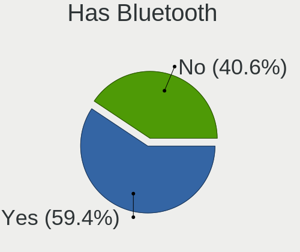
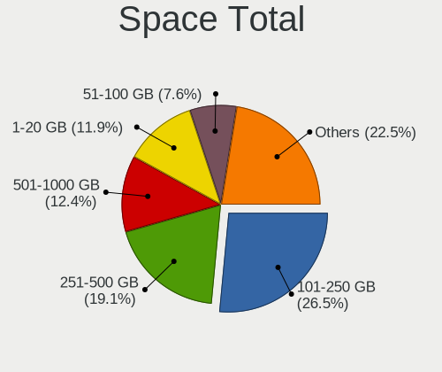
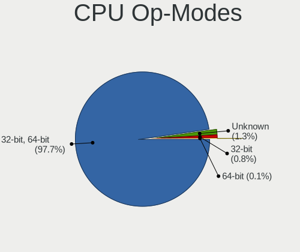
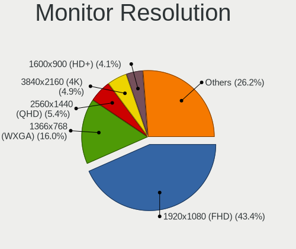
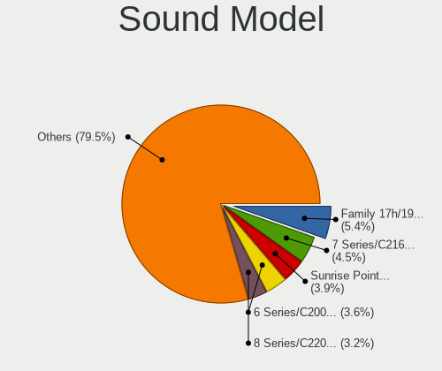
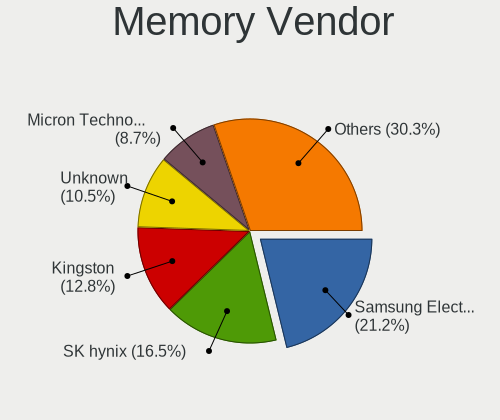
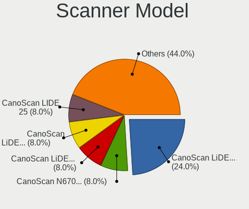

Linux in Poland - Tested Hardware & Statistics
----------------------------------------------

A project to collect tested hardware configurations for Linux in Poland.

Anyone can contribute to this report by the [hw-probe](https://github.com/linuxhw/hw-probe) tool:

    sudo -E hw-probe -all -upload

Please contribute! Especially if your hardware is rare.

This is a report for all computer types. See also reports for [desktops](/Location/Poland/Desktop/README.md) and [notebooks](/Location/Poland/Notebook/README.md).

Contents
--------

* [ Test Cases ](#test-cases)

* [ System ](#system)
  - [ OS                       ](#os)
  - [ OS Family                ](#os-family)
  - [ Kernel                   ](#kernel)
  - [ Kernel Family            ](#kernel-family)
  - [ Kernel Major Ver.        ](#kernel-major-ver)
  - [ Arch                     ](#arch)
  - [ DE                       ](#de)
  - [ Display Server           ](#display-server)
  - [ Display Manager          ](#display-manager)
  - [ OS Lang                  ](#os-lang)
  - [ Boot Mode                ](#boot-mode)
  - [ Filesystem               ](#filesystem)
  - [ Part. scheme             ](#part-scheme)
  - [ Dual Boot with Linux/BSD ](#dual-boot-with-linuxbsd)
  - [ Dual Boot (Win)          ](#dual-boot-win)

* [ Board ](#board)
  - [ Vendor                   ](#vendor)
  - [ Model                    ](#model)
  - [ Model Family             ](#model-family)
  - [ MFG Year                 ](#mfg-year)
  - [ Form Factor              ](#form-factor)
  - [ Secure Boot              ](#secure-boot)
  - [ Coreboot                 ](#coreboot)
  - [ RAM Size                 ](#ram-size)
  - [ RAM Used                 ](#ram-used)
  - [ Total Drives             ](#total-drives)
  - [ Has CD-ROM               ](#has-cd-rom)
  - [ Has Ethernet             ](#has-ethernet)
  - [ Has WiFi                 ](#has-wifi)
  - [ Has Bluetooth            ](#has-bluetooth)

* [ Location ](#location)
  - [ Country                  ](#country)
  - [ City                     ](#city)

* [ Drives ](#drives)
  - [ Drive Vendor             ](#drive-vendor)
  - [ Drive Model              ](#drive-model)
  - [ HDD Vendor               ](#hdd-vendor)
  - [ SSD Vendor               ](#ssd-vendor)
  - [ Drive Kind               ](#drive-kind)
  - [ Drive Connector          ](#drive-connector)
  - [ Drive Size               ](#drive-size)
  - [ Space Total              ](#space-total)
  - [ Space Used               ](#space-used)
  - [ Malfunc. Drives          ](#malfunc-drives)
  - [ Malfunc. Drive Vendor    ](#malfunc-drive-vendor)
  - [ Malfunc. HDD Vendor      ](#malfunc-hdd-vendor)
  - [ Malfunc. Drive Kind      ](#malfunc-drive-kind)
  - [ Failed Drives            ](#failed-drives)
  - [ Failed Drive Vendor      ](#failed-drive-vendor)
  - [ Drive Status             ](#drive-status)

* [ Storage controller ](#storage-controller)
  - [ Storage Vendor           ](#storage-vendor)
  - [ Storage Model            ](#storage-model)
  - [ Storage Kind             ](#storage-kind)

* [ Processor ](#processor)
  - [ CPU Vendor               ](#cpu-vendor)
  - [ CPU Model                ](#cpu-model)
  - [ CPU Model Family         ](#cpu-model-family)
  - [ CPU Cores                ](#cpu-cores)
  - [ CPU Sockets              ](#cpu-sockets)
  - [ CPU Threads              ](#cpu-threads)
  - [ CPU Op-Modes             ](#cpu-op-modes)
  - [ CPU Microcode            ](#cpu-microcode)
  - [ CPU Microarch            ](#cpu-microarch)

* [ Graphics ](#graphics)
  - [ GPU Vendor               ](#gpu-vendor)
  - [ GPU Model                ](#gpu-model)
  - [ GPU Combo                ](#gpu-combo)
  - [ GPU Driver               ](#gpu-driver)
  - [ GPU Memory               ](#gpu-memory)

* [ Monitor ](#monitor)
  - [ Monitor Vendor           ](#monitor-vendor)
  - [ Monitor Model            ](#monitor-model)
  - [ Monitor Resolution       ](#monitor-resolution)
  - [ Monitor Diagonal         ](#monitor-diagonal)
  - [ Monitor Width            ](#monitor-width)
  - [ Aspect Ratio             ](#aspect-ratio)
  - [ Monitor Area             ](#monitor-area)
  - [ Pixel Density            ](#pixel-density)
  - [ Multiple Monitors        ](#multiple-monitors)

* [ Network ](#network)
  - [ Net Controller Vendor    ](#net-controller-vendor)
  - [ Net Controller Model     ](#net-controller-model)
  - [ Wireless Vendor          ](#wireless-vendor)
  - [ Wireless Model           ](#wireless-model)
  - [ Ethernet Vendor          ](#ethernet-vendor)
  - [ Ethernet Model           ](#ethernet-model)
  - [ Net Controller Kind      ](#net-controller-kind)
  - [ Used Controller          ](#used-controller)
  - [ NICs                     ](#nics)
  - [ IPv6                     ](#ipv6)

* [ Bluetooth ](#bluetooth)
  - [ Bluetooth Vendor         ](#bluetooth-vendor)
  - [ Bluetooth Model          ](#bluetooth-model)

* [ Sound ](#sound)
  - [ Sound Vendor             ](#sound-vendor)
  - [ Sound Model              ](#sound-model)

* [ Memory ](#memory)
  - [ Memory Vendor            ](#memory-vendor)
  - [ Memory Model             ](#memory-model)
  - [ Memory Kind              ](#memory-kind)
  - [ Memory Form Factor       ](#memory-form-factor)
  - [ Memory Size              ](#memory-size)
  - [ Memory Speed             ](#memory-speed)

* [ Printers & scanners ](#printers--scanners)
  - [ Printer Vendor           ](#printer-vendor)
  - [ Printer Model            ](#printer-model)
  - [ Scanner Vendor           ](#scanner-vendor)
  - [ Scanner Model            ](#scanner-model)

* [ Camera ](#camera)
  - [ Camera Vendor            ](#camera-vendor)
  - [ Camera Model             ](#camera-model)

* [ Security ](#security)
  - [ Fingerprint Vendor       ](#fingerprint-vendor)
  - [ Fingerprint Model        ](#fingerprint-model)
  - [ Chipcard Vendor          ](#chipcard-vendor)
  - [ Chipcard Model           ](#chipcard-model)

* [ Unsupported ](#unsupported)
  - [ Unsupported Devices      ](#unsupported-devices)
  - [ Unsupported Device Types ](#unsupported-device-types)

Test Cases
----------

Total: 5270

| Vendor        | Model                       | Form-Factor | Probe                                                      | Date         |
|---------------|-----------------------------|-------------|------------------------------------------------------------|--------------|
| Dell          | Inspiron 5749               | Notebook    | [408e42beb8](https://linux-hardware.org/?probe=408e42beb8) | Jun 01, 2022 |
| ASRock        | P67 Pro3                    | Desktop     | [cd48749015](https://linux-hardware.org/?probe=cd48749015) | Jun 01, 2022 |
| Lenovo        | IdeaPad Y700-15ISK 80NV     | Notebook    | [d12c2f9f7c](https://linux-hardware.org/?probe=d12c2f9f7c) | Jun 01, 2022 |
| Dell          | Inspiron 3451               | Notebook    | [04e9ce0ba0](https://linux-hardware.org/?probe=04e9ce0ba0) | Jun 01, 2022 |
| Dell          | Inspiron 5521               | Notebook    | [4fdf9880d4](https://linux-hardware.org/?probe=4fdf9880d4) | May 31, 2022 |
| Huanan        | X99-F8 NALEX                | Desktop     | [5c3c77a5a0](https://linux-hardware.org/?probe=5c3c77a5a0) | May 31, 2022 |
| HP            | Pavilion Laptop 14-dv0xx... | Notebook    | [1e6ab0f183](https://linux-hardware.org/?probe=1e6ab0f183) | May 31, 2022 |
| Huanan        | X99-F8 NALEX                | Desktop     | [11d242c4f4](https://linux-hardware.org/?probe=11d242c4f4) | May 31, 2022 |
| ASRock        | P67 Pro3                    | Desktop     | [0494b65f2c](https://linux-hardware.org/?probe=0494b65f2c) | May 31, 2022 |
| Dell          | 0J3C2F A02                  | Desktop     | [9ff329a1fd](https://linux-hardware.org/?probe=9ff329a1fd) | May 31, 2022 |
| HP            | EliteBook 8440p             | Notebook    | [4df2d3c129](https://linux-hardware.org/?probe=4df2d3c129) | May 31, 2022 |
| ASUSTek       | TUF Gaming X570-PLUS        | Desktop     | [951bd2ea8d](https://linux-hardware.org/?probe=951bd2ea8d) | May 31, 2022 |
| HP            | Pavilion Laptop 14-dv0xx... | Notebook    | [9b53c4df9d](https://linux-hardware.org/?probe=9b53c4df9d) | May 31, 2022 |
| HP            | EliteBook 850 G8 Noteboo... | Notebook    | [a08d3e5d4b](https://linux-hardware.org/?probe=a08d3e5d4b) | May 31, 2022 |
| Gigabyte      | EP45C-DS3R                  | Desktop     | [dc6dbe40d9](https://linux-hardware.org/?probe=dc6dbe40d9) | May 30, 2022 |
| MSI           | B450 TOMAHAWK MAX           | Desktop     | [a6506e0582](https://linux-hardware.org/?probe=a6506e0582) | May 30, 2022 |
| Huanan        | X99-F8 NALEX                | Desktop     | [d6de670b16](https://linux-hardware.org/?probe=d6de670b16) | May 30, 2022 |
| Dell          | Latitude 5511               | Notebook    | [bc6fd9e79d](https://linux-hardware.org/?probe=bc6fd9e79d) | May 30, 2022 |
| Gigabyte      | Z97M-DS3H                   | Desktop     | [3192e3b512](https://linux-hardware.org/?probe=3192e3b512) | May 30, 2022 |
| Dell          | 0GWHMW A01                  | Desktop     | [f427859019](https://linux-hardware.org/?probe=f427859019) | May 30, 2022 |
| Dell          | Latitude 3190               | Notebook    | [e43c62a67a](https://linux-hardware.org/?probe=e43c62a67a) | May 30, 2022 |
| ASRock        | P67 Pro3                    | Desktop     | [e01dc9eb3d](https://linux-hardware.org/?probe=e01dc9eb3d) | May 30, 2022 |
| Lenovo        | ThinkPad X1 Carbon Gen 8... | Notebook    | [c71a8e9817](https://linux-hardware.org/?probe=c71a8e9817) | May 29, 2022 |
| Gigabyte      | AB350-Gaming-CF             | Desktop     | [bd36f27f9b](https://linux-hardware.org/?probe=bd36f27f9b) | May 29, 2022 |
| HP            | Compaq 6510b (KE135EA#AK... | Notebook    | [28c05654fc](https://linux-hardware.org/?probe=28c05654fc) | May 29, 2022 |
| MSI           | GP76 Leopard 10UE           | Notebook    | [9e74d767a6](https://linux-hardware.org/?probe=9e74d767a6) | May 29, 2022 |
| Dell          | Inspiron 3451               | Notebook    | [8ad9f9f5d9](https://linux-hardware.org/?probe=8ad9f9f5d9) | May 29, 2022 |
| Lenovo        | IdeaPad Z500 20202          | Notebook    | [8e577a4a1a](https://linux-hardware.org/?probe=8e577a4a1a) | May 29, 2022 |
| ASRock        | P67 Pro3                    | Desktop     | [40ac10c85e](https://linux-hardware.org/?probe=40ac10c85e) | May 29, 2022 |
| Raspberry ... | Raspberry Pi Zero W Rev ... | Soc         | [a68b786241](https://linux-hardware.org/?probe=a68b786241) | May 29, 2022 |
| ASRock        | P67 Pro3                    | Desktop     | [bd8541bdaa](https://linux-hardware.org/?probe=bd8541bdaa) | May 28, 2022 |
| ASRock        | P67 Pro3                    | Desktop     | [79a9263b65](https://linux-hardware.org/?probe=79a9263b65) | May 28, 2022 |
| Lenovo        | Z50-70 20354                | Notebook    | [cd40cf2e16](https://linux-hardware.org/?probe=cd40cf2e16) | May 28, 2022 |
| Lenovo        | ThinkPad X1 Carbon Gen 8... | Notebook    | [ae044ab2d9](https://linux-hardware.org/?probe=ae044ab2d9) | May 28, 2022 |
| Lenovo        | ThinkPad X1 Carbon Gen 8... | Notebook    | [b8c8e8baef](https://linux-hardware.org/?probe=b8c8e8baef) | May 27, 2022 |
| ASRock        | Z87 Extreme4                | Desktop     | [d3315c5c94](https://linux-hardware.org/?probe=d3315c5c94) | May 27, 2022 |
| Dell          | Inspiron 3451               | Notebook    | [798f65546b](https://linux-hardware.org/?probe=798f65546b) | May 27, 2022 |
| Sony          | VPCEE3S1E                   | Notebook    | [f3c7988996](https://linux-hardware.org/?probe=f3c7988996) | May 27, 2022 |
| Dell          | 09M8Y8 A01                  | Desktop     | [7514f64b6e](https://linux-hardware.org/?probe=7514f64b6e) | May 26, 2022 |
| Dell          | 02P9X9 A05                  | Server      | [495ed7a7a4](https://linux-hardware.org/?probe=495ed7a7a4) | May 26, 2022 |
| Fujitsu       | D2759 S26361-D2759-A13 W... | Server      | [b4cf75e580](https://linux-hardware.org/?probe=b4cf75e580) | May 26, 2022 |
| Dell          | 0MY171 A01                  | Desktop     | [9500786a21](https://linux-hardware.org/?probe=9500786a21) | May 26, 2022 |
| Lenovo        | IdeaPad S540-15IWL GTX 8... | Notebook    | [cff9e3245c](https://linux-hardware.org/?probe=cff9e3245c) | May 25, 2022 |
| Samsung       | 350V5C/351V5C/3540VC/344... | Notebook    | [29b8def5b3](https://linux-hardware.org/?probe=29b8def5b3) | May 25, 2022 |
| Fujitsu       | D2628-C1 S26361-D2628-C1    | Desktop     | [200070a992](https://linux-hardware.org/?probe=200070a992) | May 25, 2022 |
| Dell          | Latitude 5310               | Notebook    | [2117fbfccb](https://linux-hardware.org/?probe=2117fbfccb) | May 25, 2022 |
| Gigabyte      | B550 AORUS ELITE AX V2      | Desktop     | [ea24b77e94](https://linux-hardware.org/?probe=ea24b77e94) | May 25, 2022 |
| HP            | 250 G8 Notebook PC          | Notebook    | [ce09b72069](https://linux-hardware.org/?probe=ce09b72069) | May 25, 2022 |
| Dell          | 0DT029 A00                  | Desktop     | [17b19530f5](https://linux-hardware.org/?probe=17b19530f5) | May 25, 2022 |
| HP            | 250 G8 Notebook PC          | Notebook    | [cee3591bcd](https://linux-hardware.org/?probe=cee3591bcd) | May 25, 2022 |
| Acer          | WG43M                       | Desktop     | [ae5adc512f](https://linux-hardware.org/?probe=ae5adc512f) | May 24, 2022 |
| HUAWEI        | NBLK-WAX9X                  | Notebook    | [0517751353](https://linux-hardware.org/?probe=0517751353) | May 24, 2022 |
| ASUSTek       | M3A78-CM                    | Desktop     | [b253c6e007](https://linux-hardware.org/?probe=b253c6e007) | May 24, 2022 |
| Dell          | Latitude 5310               | Notebook    | [cb40714b3f](https://linux-hardware.org/?probe=cb40714b3f) | May 24, 2022 |
| Hardkernel    | ODROID-M1                   | Soc         | [16c06e9416](https://linux-hardware.org/?probe=16c06e9416) | May 24, 2022 |
| ASUSTek       | TUF Gaming FX504GE_FX80G... | Notebook    | [ed4df544d6](https://linux-hardware.org/?probe=ed4df544d6) | May 24, 2022 |
| HP            | Pavilion 15                 | Notebook    | [4140810d35](https://linux-hardware.org/?probe=4140810d35) | May 24, 2022 |
| HP            | 250 G8 Notebook PC          | Notebook    | [2f4c72e2a9](https://linux-hardware.org/?probe=2f4c72e2a9) | May 24, 2022 |
| Raspberry ... | Raspberry Pi                | Soc         | [add67dab1a](https://linux-hardware.org/?probe=add67dab1a) | May 24, 2022 |
| ASUSTek       | B150M-A/M.2                 | Desktop     | [3aea6596c6](https://linux-hardware.org/?probe=3aea6596c6) | May 23, 2022 |
| Unknown       | Unknown                     | Desktop     | [4e370a75aa](https://linux-hardware.org/?probe=4e370a75aa) | May 23, 2022 |
| HP            | 8158 A01                    | Mini pc     | [8a68f9f326](https://linux-hardware.org/?probe=8a68f9f326) | May 23, 2022 |
| HP            | 8158 A01                    | Mini pc     | [04bee24742](https://linux-hardware.org/?probe=04bee24742) | May 23, 2022 |
| Dell          | 02P9X9 A05                  | Server      | [9c274b7318](https://linux-hardware.org/?probe=9c274b7318) | May 23, 2022 |
| Gigabyte      | Z97M-DS3H                   | Desktop     | [f9e86bb522](https://linux-hardware.org/?probe=f9e86bb522) | May 23, 2022 |
| HP            | ProBook 6475b               | Notebook    | [5202cf8c75](https://linux-hardware.org/?probe=5202cf8c75) | May 23, 2022 |
| Fujitsu       | D2759 S26361-D2759-A13 W... | Server      | [f5aefeb81c](https://linux-hardware.org/?probe=f5aefeb81c) | May 23, 2022 |
| HP            | 1495                        | Desktop     | [adf94f2549](https://linux-hardware.org/?probe=adf94f2549) | May 23, 2022 |
| HP            | 1495                        | Desktop     | [be2c2cbd65](https://linux-hardware.org/?probe=be2c2cbd65) | May 23, 2022 |
| HP            | 1495                        | Desktop     | [9d476ad9d1](https://linux-hardware.org/?probe=9d476ad9d1) | May 23, 2022 |
| HP            | 1495                        | Desktop     | [61f2119a07](https://linux-hardware.org/?probe=61f2119a07) | May 23, 2022 |
| HP            | Pavilion 15                 | Notebook    | [ca77af8ab9](https://linux-hardware.org/?probe=ca77af8ab9) | May 23, 2022 |
| Gigabyte      | X99-UD4-CF                  | Desktop     | [f5ff0b74e4](https://linux-hardware.org/?probe=f5ff0b74e4) | May 23, 2022 |
| Gigabyte      | X99-UD4-CF                  | Desktop     | [9678842f4f](https://linux-hardware.org/?probe=9678842f4f) | May 23, 2022 |
| Gigabyte      | AB350-Gaming-CF             | Desktop     | [f129f3b1d5](https://linux-hardware.org/?probe=f129f3b1d5) | May 22, 2022 |
| Lenovo        | ThinkPad T61 7661BM5        | Notebook    | [9a6d69d512](https://linux-hardware.org/?probe=9a6d69d512) | May 22, 2022 |
| Lenovo        | Yoga Slim 9 14ITL5 82D1     | Notebook    | [d728114b9b](https://linux-hardware.org/?probe=d728114b9b) | May 22, 2022 |
| Fujitsu       | D2628-C1 S26361-D2628-C1    | Desktop     | [70c677bafe](https://linux-hardware.org/?probe=70c677bafe) | May 22, 2022 |
| Acer          | Aspire E5-571G              | Notebook    | [8f47f3a71c](https://linux-hardware.org/?probe=8f47f3a71c) | May 22, 2022 |
| MSI           | Z97 GAMING 3                | Desktop     | [495bcbd710](https://linux-hardware.org/?probe=495bcbd710) | May 22, 2022 |
| MSI           | MS-7235                     | Desktop     | [cb9b6ded76](https://linux-hardware.org/?probe=cb9b6ded76) | May 22, 2022 |
| ASRock        | P67 Pro3                    | Desktop     | [6bb8448487](https://linux-hardware.org/?probe=6bb8448487) | May 22, 2022 |
| Raspberry ... | Raspberry Pi Zero W Rev ... | Soc         | [1544360577](https://linux-hardware.org/?probe=1544360577) | May 22, 2022 |
| Gigabyte      | Z97M-DS3H                   | Desktop     | [ebf2b174b8](https://linux-hardware.org/?probe=ebf2b174b8) | May 22, 2022 |
| Acer          | Nitro AN515-54              | Notebook    | [04a8f20f28](https://linux-hardware.org/?probe=04a8f20f28) | May 21, 2022 |
| Dell          | Inspiron 3451               | Notebook    | [38c450f343](https://linux-hardware.org/?probe=38c450f343) | May 21, 2022 |
| MSI           | MS-7235                     | Desktop     | [4dfaad64fd](https://linux-hardware.org/?probe=4dfaad64fd) | May 21, 2022 |
| Lenovo        | G50-70 20351                | Notebook    | [b6f469418c](https://linux-hardware.org/?probe=b6f469418c) | May 21, 2022 |
| ASRock        | P67 Pro3                    | Desktop     | [855045a0fa](https://linux-hardware.org/?probe=855045a0fa) | May 21, 2022 |
| Dell          | Latitude 5490               | Notebook    | [450756ee49](https://linux-hardware.org/?probe=450756ee49) | May 21, 2022 |
| ASRock        | P67 Pro3                    | Desktop     | [1cbf12b67a](https://linux-hardware.org/?probe=1cbf12b67a) | May 21, 2022 |
| ASUSTek       | VivoBook_ASUSLaptop X350... | Notebook    | [80d32848bf](https://linux-hardware.org/?probe=80d32848bf) | May 21, 2022 |
| Dell          | Inspiron 3451               | Notebook    | [d14ff2c62e](https://linux-hardware.org/?probe=d14ff2c62e) | May 20, 2022 |
| HP            | EliteBook 8570w             | Notebook    | [3f21c66d5c](https://linux-hardware.org/?probe=3f21c66d5c) | May 20, 2022 |
| Fujitsu       | D2628-C1 S26361-D2628-C1    | Desktop     | [73c9c54bb6](https://linux-hardware.org/?probe=73c9c54bb6) | May 20, 2022 |
| Fujitsu       | D2628-C1 S26361-D2628-C1    | Desktop     | [7dcdef576a](https://linux-hardware.org/?probe=7dcdef576a) | May 20, 2022 |
| HP            | EliteBook 850 G6            | Notebook    | [1b672f1faa](https://linux-hardware.org/?probe=1b672f1faa) | May 20, 2022 |
| HP            | EliteBook 850 G6            | Notebook    | [d2232927a7](https://linux-hardware.org/?probe=d2232927a7) | May 20, 2022 |
| Gigabyte      | B85M-D2V                    | Desktop     | [2bc6293c6a](https://linux-hardware.org/?probe=2bc6293c6a) | May 19, 2022 |
| HP            | Spectre x360 Convertible... | Convertible | [7a5744012f](https://linux-hardware.org/?probe=7a5744012f) | May 19, 2022 |
| HP            | 250 G4 Notebook PC          | Notebook    | [1472f65ca0](https://linux-hardware.org/?probe=1472f65ca0) | May 19, 2022 |
| ASUSTek       | Z97-PRO GAMER               | Desktop     | [4a971be254](https://linux-hardware.org/?probe=4a971be254) | May 19, 2022 |
| Sony          | VGN-NR32L_S                 | Notebook    | [2709583292](https://linux-hardware.org/?probe=2709583292) | May 18, 2022 |
| Gigabyte      | Z97M-DS3H                   | Desktop     | [72747e63e5](https://linux-hardware.org/?probe=72747e63e5) | May 18, 2022 |
| HP            | 8054                        | Desktop     | [725f204fd0](https://linux-hardware.org/?probe=725f204fd0) | May 18, 2022 |
| Lenovo        | IdeaPad S540-14API 81NH     | Notebook    | [5e0b60c547](https://linux-hardware.org/?probe=5e0b60c547) | May 17, 2022 |
| Gigabyte      | B85M-D2V                    | Desktop     | [da9da96cda](https://linux-hardware.org/?probe=da9da96cda) | May 17, 2022 |
| Dell          | Latitude E6230              | Notebook    | [1afeba4362](https://linux-hardware.org/?probe=1afeba4362) | May 17, 2022 |
| Dell          | Inspiron 5735               | Notebook    | [b678e46de2](https://linux-hardware.org/?probe=b678e46de2) | May 17, 2022 |
| Raspberry ... | Raspberry Pi                | Soc         | [1dbb37fcd0](https://linux-hardware.org/?probe=1dbb37fcd0) | May 17, 2022 |
| Gigabyte      | Z97M-DS3H                   | Desktop     | [1c9a384e09](https://linux-hardware.org/?probe=1c9a384e09) | May 17, 2022 |
| ASUSTek       | M3A78-CM                    | Desktop     | [d5477b3bb9](https://linux-hardware.org/?probe=d5477b3bb9) | May 17, 2022 |
| Sony          | VGN-FW51MF_H                | Notebook    | [084402167e](https://linux-hardware.org/?probe=084402167e) | May 17, 2022 |
| Toshiba       | Satellite L750D             | Notebook    | [6a84eb18c8](https://linux-hardware.org/?probe=6a84eb18c8) | May 16, 2022 |
| ASUSTek       | TUF Gaming X570-PLUS        | Desktop     | [798d2cee16](https://linux-hardware.org/?probe=798d2cee16) | May 16, 2022 |
| Dell          | Latitude 3190               | Notebook    | [e80556f7d6](https://linux-hardware.org/?probe=e80556f7d6) | May 16, 2022 |
| Dell          | 02P9X9 A05                  | Server      | [ecd211b72b](https://linux-hardware.org/?probe=ecd211b72b) | May 15, 2022 |
| Dell          | 02P9X9 A05                  | Server      | [182b2c11c5](https://linux-hardware.org/?probe=182b2c11c5) | May 15, 2022 |
| Dell          | Latitude 5580               | Notebook    | [c2f15d647a](https://linux-hardware.org/?probe=c2f15d647a) | May 15, 2022 |
| ASUSTek       | M4N68T-M-V2                 | Desktop     | [528659dab4](https://linux-hardware.org/?probe=528659dab4) | May 15, 2022 |
| Dell          | Inspiron 3583               | Notebook    | [3589bb82ad](https://linux-hardware.org/?probe=3589bb82ad) | May 15, 2022 |
| Gigabyte      | Z97M-DS3H                   | Desktop     | [82b98a2f7e](https://linux-hardware.org/?probe=82b98a2f7e) | May 15, 2022 |
| Raspberry ... | Raspberry Pi Zero W Rev ... | Soc         | [df38c8f603](https://linux-hardware.org/?probe=df38c8f603) | May 15, 2022 |
| HP            | Pavilion ZV6100 (EE984EA... | Notebook    | [59c5dbcb22](https://linux-hardware.org/?probe=59c5dbcb22) | May 15, 2022 |
| Lenovo        | ThinkPad T500 2241W2B       | Notebook    | [2bd7b2d9a4](https://linux-hardware.org/?probe=2bd7b2d9a4) | May 14, 2022 |
| Packard Be... | EasyNote ENTF71BM           | Notebook    | [e8808a770a](https://linux-hardware.org/?probe=e8808a770a) | May 14, 2022 |
| Lenovo        | ThinkPad T470 W10DG 20JN... | Notebook    | [5fad688f56](https://linux-hardware.org/?probe=5fad688f56) | May 14, 2022 |
| Dell          | 0HY9JP A02                  | Desktop     | [5f98aaf42c](https://linux-hardware.org/?probe=5f98aaf42c) | May 14, 2022 |
| Dell          | MXG061                      | Notebook    | [36b09ae01e](https://linux-hardware.org/?probe=36b09ae01e) | May 14, 2022 |
| HP            | 250 G4 Notebook PC          | Notebook    | [996bc01199](https://linux-hardware.org/?probe=996bc01199) | May 13, 2022 |
| Lenovo        | ThinkPad Edge E430 3254A... | Notebook    | [761f1a1cbd](https://linux-hardware.org/?probe=761f1a1cbd) | May 13, 2022 |
| Dell          | Inspiron 3541               | Notebook    | [7873185850](https://linux-hardware.org/?probe=7873185850) | May 12, 2022 |
| HP            | EliteBook 820 G1            | Notebook    | [dd51bb3592](https://linux-hardware.org/?probe=dd51bb3592) | May 12, 2022 |
| HP            | EliteBook 850 G8 Noteboo... | Notebook    | [c64195c6bb](https://linux-hardware.org/?probe=c64195c6bb) | May 12, 2022 |
| HP            | EliteBook 840 G1            | Notebook    | [a57e3f28c2](https://linux-hardware.org/?probe=a57e3f28c2) | May 12, 2022 |
| ASUSTek       | P8Z77-V LX                  | Desktop     | [1c124eec80](https://linux-hardware.org/?probe=1c124eec80) | May 12, 2022 |
| Lenovo        | ThinkPad X200 7458WAY       | Notebook    | [1d845e69bd](https://linux-hardware.org/?probe=1d845e69bd) | May 11, 2022 |
| ASUSTek       | ASUS TUF Gaming A17 FA70... | Notebook    | [7d03983e37](https://linux-hardware.org/?probe=7d03983e37) | May 11, 2022 |
| Dell          | Precision 7530              | Notebook    | [d97721b6cf](https://linux-hardware.org/?probe=d97721b6cf) | May 11, 2022 |
| Dell          | Inspiron 3583               | Notebook    | [5b2b56f445](https://linux-hardware.org/?probe=5b2b56f445) | May 11, 2022 |
| Lenovo        | V15-IIL 82C5                | Notebook    | [b02040672d](https://linux-hardware.org/?probe=b02040672d) | May 11, 2022 |
| Gigabyte      | B550 AORUS ELITE            | Desktop     | [1e1a8e1815](https://linux-hardware.org/?probe=1e1a8e1815) | May 10, 2022 |
| ASUSTek       | TUF Gaming B550M-E WIFI     | Desktop     | [56fc7bcca2](https://linux-hardware.org/?probe=56fc7bcca2) | May 10, 2022 |
| Gigabyte      | B550 AORUS ELITE AX V2      | Desktop     | [bad0e8ce3b](https://linux-hardware.org/?probe=bad0e8ce3b) | May 10, 2022 |
| Lenovo        | Yoga 300-11IBY 80M0         | Notebook    | [af186fe9e3](https://linux-hardware.org/?probe=af186fe9e3) | May 10, 2022 |
| Lenovo        | Yoga 300-11IBY 80M0         | Notebook    | [b6fed1d4fe](https://linux-hardware.org/?probe=b6fed1d4fe) | May 10, 2022 |
| Raspberry ... | Raspberry Pi                | Soc         | [5ccbf39183](https://linux-hardware.org/?probe=5ccbf39183) | May 10, 2022 |
| ASRock        | B660M-ITX/ac                | Desktop     | [88d7b71293](https://linux-hardware.org/?probe=88d7b71293) | May 10, 2022 |
| HP            | EliteBook 820 G3            | Notebook    | [015ede2e58](https://linux-hardware.org/?probe=015ede2e58) | May 09, 2022 |
| HP            | EliteBook 8570w             | Notebook    | [840087bbed](https://linux-hardware.org/?probe=840087bbed) | May 09, 2022 |
| Samsung       | 350V5C/351V5C/3540VC/344... | Notebook    | [9e81b04453](https://linux-hardware.org/?probe=9e81b04453) | May 09, 2022 |
| HP            | EliteBook 8570w             | Notebook    | [d9779b1c50](https://linux-hardware.org/?probe=d9779b1c50) | May 09, 2022 |
| Dell          | 07T4MC A06                  | Desktop     | [34e338f194](https://linux-hardware.org/?probe=34e338f194) | May 09, 2022 |
| Dell          | MXG061                      | Notebook    | [119f6dd774](https://linux-hardware.org/?probe=119f6dd774) | May 09, 2022 |
| Google        | Relm                        | Notebook    | [37a9101768](https://linux-hardware.org/?probe=37a9101768) | May 09, 2022 |
| Samsung       | 300V3A/300V4A/300V5A/200... | Notebook    | [c302d389bc](https://linux-hardware.org/?probe=c302d389bc) | May 08, 2022 |
| Gigabyte      | AB350-Gaming-CF             | Desktop     | [81aa293c77](https://linux-hardware.org/?probe=81aa293c77) | May 08, 2022 |
| Dell          | Latitude E6220              | Notebook    | [f5ba7cbb31](https://linux-hardware.org/?probe=f5ba7cbb31) | May 08, 2022 |
| Dell          | Vostro 1440                 | Notebook    | [a44eb19e96](https://linux-hardware.org/?probe=a44eb19e96) | May 08, 2022 |
| Dell          | Vostro 1440                 | Notebook    | [356b0ae168](https://linux-hardware.org/?probe=356b0ae168) | May 08, 2022 |
| Lenovo        | G510 20238                  | Notebook    | [8a5f88eca1](https://linux-hardware.org/?probe=8a5f88eca1) | May 08, 2022 |
| ASUSTek       | N76VZ                       | Notebook    | [f1e06f5c2f](https://linux-hardware.org/?probe=f1e06f5c2f) | May 08, 2022 |
| Lenovo        | IdeaPad 3 15ITL6 82H8       | Notebook    | [9a1a0ce2f1](https://linux-hardware.org/?probe=9a1a0ce2f1) | May 08, 2022 |
| HP            | OMEN Laptop 15-en0xxx       | Notebook    | [880b5d5853](https://linux-hardware.org/?probe=880b5d5853) | May 07, 2022 |
| ASUSTek       | P8Z77-V LX                  | Desktop     | [027968f6e4](https://linux-hardware.org/?probe=027968f6e4) | May 07, 2022 |
| ASUSTek       | P8Z77-V LX                  | Desktop     | [72ae77348e](https://linux-hardware.org/?probe=72ae77348e) | May 07, 2022 |
| ASRock        | H270M Pro4                  | Desktop     | [7fb19cf73f](https://linux-hardware.org/?probe=7fb19cf73f) | May 07, 2022 |
| ASRock        | H270M Pro4                  | Desktop     | [1b6f35a5d0](https://linux-hardware.org/?probe=1b6f35a5d0) | May 07, 2022 |
| MSI           | A320M-A PRO MAX             | Desktop     | [ccb1cda445](https://linux-hardware.org/?probe=ccb1cda445) | May 06, 2022 |
| HP            | ProBook 4530s               | Notebook    | [76fc5ea6ce](https://linux-hardware.org/?probe=76fc5ea6ce) | May 06, 2022 |
| MSI           | A320M-A PRO MAX             | Desktop     | [adf601077e](https://linux-hardware.org/?probe=adf601077e) | May 06, 2022 |
| MSI           | B450-A PRO                  | Desktop     | [5b5ceb0f53](https://linux-hardware.org/?probe=5b5ceb0f53) | May 06, 2022 |
| ASUSTek       | P8Z77-V LX                  | Desktop     | [9f241088c2](https://linux-hardware.org/?probe=9f241088c2) | May 06, 2022 |
| Apple         | MacBookPro8,2               | Notebook    | [87e8930fcf](https://linux-hardware.org/?probe=87e8930fcf) | May 06, 2022 |
| HP            | 0B4Ch D                     | Desktop     | [47982d615d](https://linux-hardware.org/?probe=47982d615d) | May 05, 2022 |
| ASUSTek       | ASUS TUF Gaming A15 FA50... | Notebook    | [fb4cf43d54](https://linux-hardware.org/?probe=fb4cf43d54) | May 05, 2022 |
| HP            | EliteBook 850 G8 Noteboo... | Notebook    | [503e18f6cb](https://linux-hardware.org/?probe=503e18f6cb) | May 05, 2022 |
| HP            | EliteBook 850 G8 Noteboo... | Notebook    | [76d61df983](https://linux-hardware.org/?probe=76d61df983) | May 05, 2022 |
| Lenovo        | ThinkPad T14 Gen 1 20UD0... | Notebook    | [a9f5b77476](https://linux-hardware.org/?probe=a9f5b77476) | May 04, 2022 |
| Acer          | Nitro AN515-54              | Notebook    | [1d9a559405](https://linux-hardware.org/?probe=1d9a559405) | May 04, 2022 |
| HP            | OMEN by Laptop 16-c0xxx     | Notebook    | [ee3b3dc380](https://linux-hardware.org/?probe=ee3b3dc380) | May 04, 2022 |
| ASUSTek       | P8Z77-V LX                  | Desktop     | [97185f1809](https://linux-hardware.org/?probe=97185f1809) | May 04, 2022 |
| Dell          | 0WR7PY A01                  | Desktop     | [9a18a890d4](https://linux-hardware.org/?probe=9a18a890d4) | May 03, 2022 |
| ASUSTek       | N76VZ                       | Notebook    | [b9c2a28ba0](https://linux-hardware.org/?probe=b9c2a28ba0) | May 03, 2022 |
| Lenovo        | ThinkPad T430 2349AK5       | Notebook    | [78f64f92f3](https://linux-hardware.org/?probe=78f64f92f3) | May 03, 2022 |
| ASUSTek       | X550CL                      | Notebook    | [b224821361](https://linux-hardware.org/?probe=b224821361) | May 03, 2022 |
| Toshiba       | Satellite C55t-C            | Notebook    | [7c1211e221](https://linux-hardware.org/?probe=7c1211e221) | May 02, 2022 |
| ASUSTek       | X705UAP                     | Notebook    | [5703c517d1](https://linux-hardware.org/?probe=5703c517d1) | May 02, 2022 |
| Gigabyte      | GA-MA780G-UD3H              | Desktop     | [d0b7db5920](https://linux-hardware.org/?probe=d0b7db5920) | May 02, 2022 |
| Acer          | Aspire E5-571G              | Notebook    | [8df6782398](https://linux-hardware.org/?probe=8df6782398) | May 02, 2022 |
| ASUSTek       | X550CL                      | Notebook    | [5340c940c2](https://linux-hardware.org/?probe=5340c940c2) | May 02, 2022 |
| ASUSTek       | X580VD                      | Notebook    | [920fb8f8d8](https://linux-hardware.org/?probe=920fb8f8d8) | May 01, 2022 |
| ASUSTek       | ASUS EXPERTBOOK B1500CEA... | Notebook    | [112d0557c3](https://linux-hardware.org/?probe=112d0557c3) | May 01, 2022 |
| ASRock        | X370 Gaming X               | Desktop     | [b24677a908](https://linux-hardware.org/?probe=b24677a908) | May 01, 2022 |
| Fujitsu       | LIFEBOOK S751               | Notebook    | [6150343dc0](https://linux-hardware.org/?probe=6150343dc0) | May 01, 2022 |
| HP            | Pavilion Laptop 15-eg0xx... | Notebook    | [317736e849](https://linux-hardware.org/?probe=317736e849) | May 01, 2022 |
| Gigabyte      | H310M S2P                   | Desktop     | [c5303ab540](https://linux-hardware.org/?probe=c5303ab540) | May 01, 2022 |
| HP            | ENVY x360 Convertible 13... | Convertible | [271a0aaed2](https://linux-hardware.org/?probe=271a0aaed2) | May 01, 2022 |
| Toshiba       | Satellite C55t-C            | Notebook    | [dd21a03b63](https://linux-hardware.org/?probe=dd21a03b63) | May 01, 2022 |
| Lenovo        | IdeaPad 100-15IBY 80MJ      | Notebook    | [ea3bd2e330](https://linux-hardware.org/?probe=ea3bd2e330) | May 01, 2022 |
| Apple         | MacBookPro7,1               | Notebook    | [ac3f2c5c61](https://linux-hardware.org/?probe=ac3f2c5c61) | May 01, 2022 |
| Acer          | Extensa 5220                | Notebook    | [ebbd01171d](https://linux-hardware.org/?probe=ebbd01171d) | May 01, 2022 |
| Lenovo        | G510 20238                  | Notebook    | [07e8a61019](https://linux-hardware.org/?probe=07e8a61019) | Apr 30, 2022 |
| Lenovo        | ThinkCentre M58 7627AD5     | Desktop     | [05a686b922](https://linux-hardware.org/?probe=05a686b922) | Apr 30, 2022 |
| ASUSTek       | UX303LAB                    | Notebook    | [4d47234d72](https://linux-hardware.org/?probe=4d47234d72) | Apr 30, 2022 |
| Intel         | DCP847SKE G80890-105        | Desktop     | [45dc47c8aa](https://linux-hardware.org/?probe=45dc47c8aa) | Apr 30, 2022 |
| Acer          | Aspire E5-571               | Notebook    | [35b5fa2276](https://linux-hardware.org/?probe=35b5fa2276) | Apr 30, 2022 |
| Gigabyte      | B560M DS3H V2               | Desktop     | [c2096251fc](https://linux-hardware.org/?probe=c2096251fc) | Apr 30, 2022 |
| Gigabyte      | B85M-D3H                    | Desktop     | [aab74c31b9](https://linux-hardware.org/?probe=aab74c31b9) | Apr 30, 2022 |
| ASUSTek       | X71Vn                       | Notebook    | [b31a7dce8b](https://linux-hardware.org/?probe=b31a7dce8b) | Apr 29, 2022 |
| Lenovo        | IdeaPad Y700-17ISK 80Q0     | Notebook    | [2c8a1c2444](https://linux-hardware.org/?probe=2c8a1c2444) | Apr 29, 2022 |
| Lenovo        | ThinkCentre M57 6072A5G     | Desktop     | [373677ac37](https://linux-hardware.org/?probe=373677ac37) | Apr 28, 2022 |
| ASRock        | G31M-S                      | Desktop     | [296df4a9d4](https://linux-hardware.org/?probe=296df4a9d4) | Apr 28, 2022 |
| Apple         | MacBook3,1                  | Notebook    | [5c90931c74](https://linux-hardware.org/?probe=5c90931c74) | Apr 28, 2022 |
| Lenovo        | ThinkPad Edge E430 3254A... | Notebook    | [00474d7e97](https://linux-hardware.org/?probe=00474d7e97) | Apr 28, 2022 |
| Lenovo        | SKYBAY No DPK               | All in one  | [41f38e1f81](https://linux-hardware.org/?probe=41f38e1f81) | Apr 28, 2022 |
| Lenovo        | ThinkPad Edge E430 3254A... | Notebook    | [3c9c9f209d](https://linux-hardware.org/?probe=3c9c9f209d) | Apr 28, 2022 |
| Dell          | Latitude 5420               | Notebook    | [26abde11eb](https://linux-hardware.org/?probe=26abde11eb) | Apr 28, 2022 |
| ASUSTek       | PRIME H310M-D R2.0          | Desktop     | [2999ff1487](https://linux-hardware.org/?probe=2999ff1487) | Apr 28, 2022 |
| Dell          | 0J3C2F A00                  | Desktop     | [464c70eb8d](https://linux-hardware.org/?probe=464c70eb8d) | Apr 27, 2022 |
| Apple         | MacBook3,1                  | Notebook    | [c7da3d4c4f](https://linux-hardware.org/?probe=c7da3d4c4f) | Apr 27, 2022 |
| ASUSTek       | SABERTOOTH Z77              | Desktop     | [d354934f98](https://linux-hardware.org/?probe=d354934f98) | Apr 27, 2022 |
| Acer          | Nitro AN515-43              | Notebook    | [99527fd065](https://linux-hardware.org/?probe=99527fd065) | Apr 26, 2022 |
| Lenovo        | ThinkPad T15 Gen 1 20S60... | Notebook    | [482bb47b36](https://linux-hardware.org/?probe=482bb47b36) | Apr 26, 2022 |
| HP            | EliteBook 8770w             | Notebook    | [4fa8e91f6d](https://linux-hardware.org/?probe=4fa8e91f6d) | Apr 26, 2022 |
| Dell          | Latitude 7520               | Notebook    | [674f3ca531](https://linux-hardware.org/?probe=674f3ca531) | Apr 26, 2022 |
| Lenovo        | ThinkPad T570 W10DG 20JX... | Notebook    | [489a3a5798](https://linux-hardware.org/?probe=489a3a5798) | Apr 26, 2022 |
| ASUSTek       | ROG CROSSHAIR VIII DARK ... | Desktop     | [f37918f4d4](https://linux-hardware.org/?probe=f37918f4d4) | Apr 26, 2022 |
| Gigabyte      | Z590 D                      | Desktop     | [afad17a56d](https://linux-hardware.org/?probe=afad17a56d) | Apr 26, 2022 |
| HP            | EliteBook 8440p             | Notebook    | [c854b74386](https://linux-hardware.org/?probe=c854b74386) | Apr 25, 2022 |
| Dell          | Precision 7510              | Notebook    | [484a851b85](https://linux-hardware.org/?probe=484a851b85) | Apr 25, 2022 |
| Lenovo        | ThinkPad X270 W10DG 20K5... | Notebook    | [06a00cfce7](https://linux-hardware.org/?probe=06a00cfce7) | Apr 25, 2022 |
| ASRock        | X570 Pro4                   | Desktop     | [678366aef2](https://linux-hardware.org/?probe=678366aef2) | Apr 25, 2022 |
| ASUSTek       | H81M-V3                     | Desktop     | [4d87f6f113](https://linux-hardware.org/?probe=4d87f6f113) | Apr 25, 2022 |
| HP            | Pavilion 17                 | Notebook    | [8a86695a31](https://linux-hardware.org/?probe=8a86695a31) | Apr 25, 2022 |
| MSI           | Z390-A PRO                  | Desktop     | [d4a06d7bbe](https://linux-hardware.org/?probe=d4a06d7bbe) | Apr 24, 2022 |
| Gigabyte      | H310M H                     | Desktop     | [5c94950753](https://linux-hardware.org/?probe=5c94950753) | Apr 24, 2022 |
| MSI           | Z390-A PRO                  | Desktop     | [6c64775a71](https://linux-hardware.org/?probe=6c64775a71) | Apr 24, 2022 |
| MSI           | PE60 2QE                    | Notebook    | [703b37d444](https://linux-hardware.org/?probe=703b37d444) | Apr 24, 2022 |
| HP            | 821D                        | Desktop     | [6a70c646a5](https://linux-hardware.org/?probe=6a70c646a5) | Apr 24, 2022 |
| Lenovo        | Yoga S740-14IIL 81RS        | Notebook    | [ac10947315](https://linux-hardware.org/?probe=ac10947315) | Apr 24, 2022 |
| Gigabyte      | B450M DS3H-CF               | Desktop     | [2b65eeae8d](https://linux-hardware.org/?probe=2b65eeae8d) | Apr 24, 2022 |
| HUAWEI        | HVY-WXX9                    | Notebook    | [43098a1f34](https://linux-hardware.org/?probe=43098a1f34) | Apr 23, 2022 |
| HP            | EliteBook 8440p             | Notebook    | [487f1a4924](https://linux-hardware.org/?probe=487f1a4924) | Apr 23, 2022 |
| Acer          | Aspire E1-531               | Notebook    | [c1cd0a61e1](https://linux-hardware.org/?probe=c1cd0a61e1) | Apr 23, 2022 |
| HP            | Pavilion 17                 | Notebook    | [851d01ca2e](https://linux-hardware.org/?probe=851d01ca2e) | Apr 23, 2022 |
| ASUSTek       | P8H61-M LX R2.0             | Desktop     | [e17b0d706a](https://linux-hardware.org/?probe=e17b0d706a) | Apr 23, 2022 |
| Lenovo        | ThinkPad 10 2nd 20E30013... | Tablet      | [0e7e04c683](https://linux-hardware.org/?probe=0e7e04c683) | Apr 22, 2022 |
| Dell          | Inspiron 3542               | Notebook    | [0c301210d8](https://linux-hardware.org/?probe=0c301210d8) | Apr 22, 2022 |
| ASUSTek       | X541UJ                      | Notebook    | [4043c70a42](https://linux-hardware.org/?probe=4043c70a42) | Apr 22, 2022 |
| HUAWEI        | HVY-WXX9                    | Notebook    | [3320719d25](https://linux-hardware.org/?probe=3320719d25) | Apr 22, 2022 |
| MSI           | GE60 2PC                    | Notebook    | [0614a4172b](https://linux-hardware.org/?probe=0614a4172b) | Apr 22, 2022 |
| ASUSTek       | ROG Strix G513QM_G513QM     | Notebook    | [b6a457c33a](https://linux-hardware.org/?probe=b6a457c33a) | Apr 21, 2022 |
| Gigabyte      | B450M GAMING                | Desktop     | [bf31ebdabe](https://linux-hardware.org/?probe=bf31ebdabe) | Apr 21, 2022 |
| Gigabyte      | Z170-Gaming K3              | Desktop     | [e21b7b0696](https://linux-hardware.org/?probe=e21b7b0696) | Apr 21, 2022 |
| Dell          | Latitude E6420              | Notebook    | [83b008961c](https://linux-hardware.org/?probe=83b008961c) | Apr 21, 2022 |
| ASUSTek       | ROG STRIX B550-F GAMING     | Desktop     | [6af0b2a3c9](https://linux-hardware.org/?probe=6af0b2a3c9) | Apr 21, 2022 |
| MSI           | Z170A GAMING M3             | Desktop     | [84f6645ca5](https://linux-hardware.org/?probe=84f6645ca5) | Apr 20, 2022 |
| Samsung       | RC410/RC510/RC710           | Notebook    | [9adfada605](https://linux-hardware.org/?probe=9adfada605) | Apr 20, 2022 |
| MSI           | MPG Z390 GAMING EDGE AC     | Desktop     | [7beb17ef96](https://linux-hardware.org/?probe=7beb17ef96) | Apr 20, 2022 |
| Gigabyte      | H310M H                     | Desktop     | [9a462cda5a](https://linux-hardware.org/?probe=9a462cda5a) | Apr 20, 2022 |
| Gigabyte      | MZAPLBP-00                  | Desktop     | [62b2cada75](https://linux-hardware.org/?probe=62b2cada75) | Apr 20, 2022 |
| Dell          | Latitude E6420              | Notebook    | [85d321a02b](https://linux-hardware.org/?probe=85d321a02b) | Apr 20, 2022 |
| ASRock        | X470 Taichi Ultimate        | Desktop     | [a92dda8ded](https://linux-hardware.org/?probe=a92dda8ded) | Apr 20, 2022 |
| Dell          | Inspiron 15-3567            | Notebook    | [b87e7c08ab](https://linux-hardware.org/?probe=b87e7c08ab) | Apr 19, 2022 |
| Lenovo        | ThinkStation C20 4263BA7    | Desktop     | [d162e9aa70](https://linux-hardware.org/?probe=d162e9aa70) | Apr 19, 2022 |
| HP            | ProBook 6440b               | Notebook    | [54a85fc99d](https://linux-hardware.org/?probe=54a85fc99d) | Apr 18, 2022 |
| Gigabyte      | B450M DS3H-CF               | Desktop     | [66ac59c0a3](https://linux-hardware.org/?probe=66ac59c0a3) | Apr 18, 2022 |
| Huanan        | X79 249PC V2.2              | Desktop     | [209e881793](https://linux-hardware.org/?probe=209e881793) | Apr 18, 2022 |
| ASUSTek       | P8Z77-V LX                  | Desktop     | [37fa300c26](https://linux-hardware.org/?probe=37fa300c26) | Apr 18, 2022 |
| Lenovo        | ThinkPad Edge E430 3254C... | Notebook    | [df0e3664e4](https://linux-hardware.org/?probe=df0e3664e4) | Apr 17, 2022 |
| MSI           | B450-A PRO MAX              | Desktop     | [9ce44bf30d](https://linux-hardware.org/?probe=9ce44bf30d) | Apr 17, 2022 |
| MSI           | GF75 Thin 10UEK             | Notebook    | [866aa88f0f](https://linux-hardware.org/?probe=866aa88f0f) | Apr 17, 2022 |
| ASUSTek       | S551LB                      | Notebook    | [bb1d6d3623](https://linux-hardware.org/?probe=bb1d6d3623) | Apr 17, 2022 |
| MSI           | B450M PRO-VDH MAX           | Desktop     | [e28ee0bd42](https://linux-hardware.org/?probe=e28ee0bd42) | Apr 16, 2022 |
| HP            | Pavilion g6                 | Notebook    | [a7f800ed49](https://linux-hardware.org/?probe=a7f800ed49) | Apr 16, 2022 |
| Gigabyte      | G41MT-D3                    | Desktop     | [1785652200](https://linux-hardware.org/?probe=1785652200) | Apr 16, 2022 |
| Dell          | Inspiron 5570               | Notebook    | [066d125002](https://linux-hardware.org/?probe=066d125002) | Apr 15, 2022 |
| Gigabyte      | EP31-DS3L                   | Desktop     | [a0a68f0980](https://linux-hardware.org/?probe=a0a68f0980) | Apr 15, 2022 |
| Gigabyte      | H370M DS3H-CF               | Desktop     | [c3eadb27ad](https://linux-hardware.org/?probe=c3eadb27ad) | Apr 15, 2022 |
| Apple         | Mac-35C5E08120C7EEAF Mac... | Mini pc     | [254c1b1f97](https://linux-hardware.org/?probe=254c1b1f97) | Apr 15, 2022 |
| Acer          | Nitro AN515-42              | Notebook    | [f203fe95e5](https://linux-hardware.org/?probe=f203fe95e5) | Apr 15, 2022 |
| ASUSTek       | PRIME X470-PRO              | Desktop     | [8f490a29f3](https://linux-hardware.org/?probe=8f490a29f3) | Apr 15, 2022 |
| Lenovo        | ThinkPad E15 Gen 2 20T80... | Notebook    | [77cf6f482e](https://linux-hardware.org/?probe=77cf6f482e) | Apr 15, 2022 |
| Lenovo        | IdeaPad 530S-14ARR 81H1     | Notebook    | [13bfd82a49](https://linux-hardware.org/?probe=13bfd82a49) | Apr 14, 2022 |
| ASUSTek       | N61Jv                       | Notebook    | [959c5f2238](https://linux-hardware.org/?probe=959c5f2238) | Apr 14, 2022 |
| Sony          | VGN-FZ11M                   | Notebook    | [23731be3a1](https://linux-hardware.org/?probe=23731be3a1) | Apr 14, 2022 |
| Lenovo        | Legion 5 15ACH6H 82JU       | Notebook    | [154eb4b040](https://linux-hardware.org/?probe=154eb4b040) | Apr 14, 2022 |
| Lenovo        | G500 20236                  | Notebook    | [2decdc1731](https://linux-hardware.org/?probe=2decdc1731) | Apr 14, 2022 |
| ASUSTek       | H61M-K                      | Desktop     | [b8da99fd26](https://linux-hardware.org/?probe=b8da99fd26) | Apr 14, 2022 |
| Gigabyte      | Z690 AORUS MASTER           | Desktop     | [0f449aecbc](https://linux-hardware.org/?probe=0f449aecbc) | Apr 13, 2022 |
| Lenovo        | ThinkPad Edge E430 3254C... | Notebook    | [155a0f970f](https://linux-hardware.org/?probe=155a0f970f) | Apr 13, 2022 |
| Apple         | Mac-35C5E08120C7EEAF Mac... | Mini pc     | [c8b5583e88](https://linux-hardware.org/?probe=c8b5583e88) | Apr 13, 2022 |
| ASUSTek       | ASUS EXPERTBOOK B1500CEA... | Notebook    | [7e6cb72711](https://linux-hardware.org/?probe=7e6cb72711) | Apr 13, 2022 |
| Lenovo        | ThinkPad X260 20F5S4BY00    | Notebook    | [729b19eda3](https://linux-hardware.org/?probe=729b19eda3) | Apr 13, 2022 |
| Lenovo        | ThinkPad X1 Extreme 20MF... | Notebook    | [f2588a9d63](https://linux-hardware.org/?probe=f2588a9d63) | Apr 13, 2022 |
| Toshiba       | Satellite A300              | Notebook    | [1773d841d4](https://linux-hardware.org/?probe=1773d841d4) | Apr 13, 2022 |
| ASRock        | H97M Anniversary            | Desktop     | [4a73af14bf](https://linux-hardware.org/?probe=4a73af14bf) | Apr 13, 2022 |
| Dell          | Latitude E6420              | Notebook    | [7491167b48](https://linux-hardware.org/?probe=7491167b48) | Apr 13, 2022 |
| Dell          | Latitude E6420              | Notebook    | [3a6e6c7a62](https://linux-hardware.org/?probe=3a6e6c7a62) | Apr 13, 2022 |
| Dell          | Inspiron 17 7000 Series ... | Notebook    | [c8abf66820](https://linux-hardware.org/?probe=c8abf66820) | Apr 12, 2022 |
| Lenovo        | Legion Y540-15IRH 81SX      | Notebook    | [c3d7c67155](https://linux-hardware.org/?probe=c3d7c67155) | Apr 12, 2022 |
| Raspberry ... | Raspberry Pi                | Soc         | [2202a95625](https://linux-hardware.org/?probe=2202a95625) | Apr 12, 2022 |
| Dell          | Latitude 5480               | Notebook    | [f733f24fdc](https://linux-hardware.org/?probe=f733f24fdc) | Apr 12, 2022 |
| ASUSTek       | PRIME X470-PRO              | Desktop     | [40d527cfe8](https://linux-hardware.org/?probe=40d527cfe8) | Apr 12, 2022 |
| HUAWEI        | KLVL-WXX9                   | Notebook    | [47cecc43f6](https://linux-hardware.org/?probe=47cecc43f6) | Apr 11, 2022 |
| Gigabyte      | B450M DS3H-CF               | Desktop     | [91037ebcec](https://linux-hardware.org/?probe=91037ebcec) | Apr 10, 2022 |
| Lenovo        | 3000 V200 076472G           | Notebook    | [11a06d9b03](https://linux-hardware.org/?probe=11a06d9b03) | Apr 10, 2022 |
| Lenovo        | Legion Y540-15IRH 81SX      | Notebook    | [7f5ccf9e6d](https://linux-hardware.org/?probe=7f5ccf9e6d) | Apr 10, 2022 |
| Dell          | 0HY9JP A02                  | Desktop     | [84b46b3236](https://linux-hardware.org/?probe=84b46b3236) | Apr 09, 2022 |
| MSI           | B450M PRO-VDH PLUS          | Desktop     | [5b861faffd](https://linux-hardware.org/?probe=5b861faffd) | Apr 09, 2022 |
| Fujitsu       | D3430-A1 S26361-D3430-A1    | Desktop     | [73628a9025](https://linux-hardware.org/?probe=73628a9025) | Apr 09, 2022 |
| ASUSTek       | X553MA                      | Notebook    | [68e49479b4](https://linux-hardware.org/?probe=68e49479b4) | Apr 09, 2022 |
| Gigabyte      | F2A88XN-WIFI                | Desktop     | [799106d1e6](https://linux-hardware.org/?probe=799106d1e6) | Apr 09, 2022 |
| MSI           | MPG X570 GAMING PRO CARB... | Desktop     | [d42f8f3535](https://linux-hardware.org/?probe=d42f8f3535) | Apr 08, 2022 |
| Lenovo        | Z51-70 80K6                 | Notebook    | [dc1db2125f](https://linux-hardware.org/?probe=dc1db2125f) | Apr 08, 2022 |
| Gigabyte      | TRX40 AORUS MASTER          | Desktop     | [cdf784520e](https://linux-hardware.org/?probe=cdf784520e) | Apr 08, 2022 |
| Lenovo        | IdeaPad S540-14API 81NH     | Notebook    | [414464db43](https://linux-hardware.org/?probe=414464db43) | Apr 08, 2022 |
| Dell          | 0804P1 A05                  | Server      | [24b220fddb](https://linux-hardware.org/?probe=24b220fddb) | Apr 08, 2022 |
| Apple         | Mac-35C5E08120C7EEAF Mac... | Mini pc     | [76ed100020](https://linux-hardware.org/?probe=76ed100020) | Apr 08, 2022 |
| Dell          | Latitude 5480               | Notebook    | [6891954221](https://linux-hardware.org/?probe=6891954221) | Apr 08, 2022 |
| Dell          | Inspiron 5515               | Notebook    | [de3e7023c4](https://linux-hardware.org/?probe=de3e7023c4) | Apr 08, 2022 |
| Raspberry ... | Raspberry Pi 4 Model B R... | Soc         | [b929783867](https://linux-hardware.org/?probe=b929783867) | Apr 08, 2022 |
| Lenovo        | ThinkPad E15 Gen 2 20T80... | Notebook    | [556d9d27ef](https://linux-hardware.org/?probe=556d9d27ef) | Apr 07, 2022 |
| Dell          | Latitude E4310              | Notebook    | [e89d84e0dd](https://linux-hardware.org/?probe=e89d84e0dd) | Apr 07, 2022 |
| HP            | EliteBook 840 G2            | Notebook    | [691c061ef4](https://linux-hardware.org/?probe=691c061ef4) | Apr 07, 2022 |
| Dell          | Latitude 5521               | Notebook    | [ce1e3c5551](https://linux-hardware.org/?probe=ce1e3c5551) | Apr 07, 2022 |
| Dell          | Latitude 5480               | Notebook    | [4e82478bdf](https://linux-hardware.org/?probe=4e82478bdf) | Apr 07, 2022 |
| Dell          | MXG061                      | Notebook    | [3ff1cc3367](https://linux-hardware.org/?probe=3ff1cc3367) | Apr 07, 2022 |
| ASUSTek       | P8Z77-V LX                  | Desktop     | [94f4873110](https://linux-hardware.org/?probe=94f4873110) | Apr 06, 2022 |
| Dell          | MXG061                      | Notebook    | [9c91bd9487](https://linux-hardware.org/?probe=9c91bd9487) | Apr 06, 2022 |
| ASUSTek       | VivoBook E14 E402YA_E402... | Notebook    | [9536873aca](https://linux-hardware.org/?probe=9536873aca) | Apr 06, 2022 |
| Acer          | Aspire E5-774G              | Notebook    | [2e61b0b4d5](https://linux-hardware.org/?probe=2e61b0b4d5) | Apr 05, 2022 |
| Intel         | DH55TC AAE70932-204         | Desktop     | [336fcaa613](https://linux-hardware.org/?probe=336fcaa613) | Apr 05, 2022 |
| Apple         | MacBookAir4,2               | Notebook    | [0c1f8b4efe](https://linux-hardware.org/?probe=0c1f8b4efe) | Apr 05, 2022 |
| Dell          | 0HY9JP A02                  | Desktop     | [ed1cda9998](https://linux-hardware.org/?probe=ed1cda9998) | Apr 05, 2022 |
| Gigabyte      | G31M-S2L                    | Desktop     | [7842a96018](https://linux-hardware.org/?probe=7842a96018) | Apr 05, 2022 |
| Gigabyte      | H97M-HD3                    | Desktop     | [fc7b16c289](https://linux-hardware.org/?probe=fc7b16c289) | Apr 05, 2022 |
| Lenovo        | G580 20150                  | Notebook    | [d85f7abf8c](https://linux-hardware.org/?probe=d85f7abf8c) | Apr 05, 2022 |
| Lenovo        | IdeaPad S540-14API 81NH     | Notebook    | [81165aa277](https://linux-hardware.org/?probe=81165aa277) | Apr 05, 2022 |
| Raspberry ... | Raspberry Pi                | Soc         | [d51c68f84e](https://linux-hardware.org/?probe=d51c68f84e) | Apr 05, 2022 |
| Acer          | TravelMate P215-41-G2       | Notebook    | [4e35add210](https://linux-hardware.org/?probe=4e35add210) | Apr 04, 2022 |
| Lenovo        | ThinkPad T14 Gen 2a 20XK... | Notebook    | [37b0484558](https://linux-hardware.org/?probe=37b0484558) | Apr 04, 2022 |
| Gigabyte      | H410M H V3                  | Desktop     | [afc10b77f7](https://linux-hardware.org/?probe=afc10b77f7) | Apr 04, 2022 |
| Dell          | Latitude 5421               | Notebook    | [78ac6f00cd](https://linux-hardware.org/?probe=78ac6f00cd) | Apr 04, 2022 |
| Apple         | MacBookPro12,1              | Notebook    | [44a524bb2f](https://linux-hardware.org/?probe=44a524bb2f) | Apr 03, 2022 |
| Raspberry ... | Raspberry Pi 3 Model B R... | Soc         | [359bb41911](https://linux-hardware.org/?probe=359bb41911) | Apr 03, 2022 |
| Dell          | 0NDYHG A01                  | Desktop     | [26629406de](https://linux-hardware.org/?probe=26629406de) | Apr 03, 2022 |
| Gigabyte      | B450M S2H V2                | Desktop     | [f3fde51c72](https://linux-hardware.org/?probe=f3fde51c72) | Apr 03, 2022 |
| Acer          | Nitro AN515-43              | Notebook    | [e6e1af5316](https://linux-hardware.org/?probe=e6e1af5316) | Apr 03, 2022 |
| Fujitsu       | D3313-B1 S26361-D3313-B1    | Desktop     | [01c14c16ca](https://linux-hardware.org/?probe=01c14c16ca) | Apr 03, 2022 |
| HP            | Unknown                     | Notebook    | [e33741c278](https://linux-hardware.org/?probe=e33741c278) | Apr 03, 2022 |
| Lenovo        | ThinkPad L13 Yoga Gen 2a... | Convertible | [6a09ec0e6a](https://linux-hardware.org/?probe=6a09ec0e6a) | Apr 03, 2022 |
| HP            | Pavilion g6                 | Notebook    | [6f774cb7a9](https://linux-hardware.org/?probe=6f774cb7a9) | Apr 03, 2022 |
| Unknown       | Unknown                     | Desktop     | [f6bc1c6219](https://linux-hardware.org/?probe=f6bc1c6219) | Apr 03, 2022 |
| Acer          | Nitro AN515-52              | Notebook    | [51980559c7](https://linux-hardware.org/?probe=51980559c7) | Apr 03, 2022 |
| ASRock        | X370 Killer SLI             | Desktop     | [ffb866117c](https://linux-hardware.org/?probe=ffb866117c) | Apr 02, 2022 |
| HP            | ProBook 650 G1              | Notebook    | [f13dbb1e06](https://linux-hardware.org/?probe=f13dbb1e06) | Apr 02, 2022 |
| ASUSTek       | H81M-PLUS                   | Desktop     | [bd717d57c2](https://linux-hardware.org/?probe=bd717d57c2) | Apr 02, 2022 |
| HP            | 255 G7 Notebook PC          | Notebook    | [a7d794c2d8](https://linux-hardware.org/?probe=a7d794c2d8) | Apr 02, 2022 |
| HP            | Unknown                     | Notebook    | [761f0c08b2](https://linux-hardware.org/?probe=761f0c08b2) | Apr 02, 2022 |
| Dell          | Inspiron MM061              | Notebook    | [ca95a8324a](https://linux-hardware.org/?probe=ca95a8324a) | Apr 02, 2022 |
| Dell          | Inspiron MM061              | Notebook    | [a6f8e740aa](https://linux-hardware.org/?probe=a6f8e740aa) | Apr 02, 2022 |
| Lenovo        | IdeaPad S540-15IWL GTX 8... | Notebook    | [f1ceaa5222](https://linux-hardware.org/?probe=f1ceaa5222) | Apr 02, 2022 |
| Lenovo        | Legion 7 16ACHg6 82N6       | Notebook    | [ce4341b7b1](https://linux-hardware.org/?probe=ce4341b7b1) | Apr 01, 2022 |
| HP            | EliteBook 820 G2            | Notebook    | [5308b25e76](https://linux-hardware.org/?probe=5308b25e76) | Mar 31, 2022 |
| ASRock        | Z390 Taichi                 | Desktop     | [b5995c13e5](https://linux-hardware.org/?probe=b5995c13e5) | Mar 31, 2022 |
| ASRock        | Z390 Taichi                 | Desktop     | [308ec93236](https://linux-hardware.org/?probe=308ec93236) | Mar 31, 2022 |
| Intel         | DH55TC AAE70932-204         | Desktop     | [5b54f9a1e1](https://linux-hardware.org/?probe=5b54f9a1e1) | Mar 31, 2022 |
| MSI           | P45 Neo2-FR                 | Desktop     | [23fa0ec187](https://linux-hardware.org/?probe=23fa0ec187) | Mar 31, 2022 |
| Lenovo        | IdeaPad S540-14API 81NH     | Notebook    | [eeb03a5d88](https://linux-hardware.org/?probe=eeb03a5d88) | Mar 31, 2022 |
| Valve         | Jupiter                     | Notebook    | [d8625616de](https://linux-hardware.org/?probe=d8625616de) | Mar 30, 2022 |
| Acer          | Nitro AN515-43              | Notebook    | [d1c02dfaee](https://linux-hardware.org/?probe=d1c02dfaee) | Mar 29, 2022 |
| Lenovo        | Legion Y530-15ICH 81FV      | Notebook    | [fc7ebbef4e](https://linux-hardware.org/?probe=fc7ebbef4e) | Mar 29, 2022 |
| Lenovo        | IdeaPad S540-14API 81NH     | Notebook    | [ab2bed88a7](https://linux-hardware.org/?probe=ab2bed88a7) | Mar 29, 2022 |
| Dell          | XPS 15 7590                 | Notebook    | [426b141f91](https://linux-hardware.org/?probe=426b141f91) | Mar 29, 2022 |
| Raspberry ... | Raspberry Pi                | Soc         | [5240890472](https://linux-hardware.org/?probe=5240890472) | Mar 29, 2022 |
| ASUSTek       | ROG STRIX X570-E GAMING     | Desktop     | [405fedcff9](https://linux-hardware.org/?probe=405fedcff9) | Mar 28, 2022 |
| Lenovo        | ThinkPad X1 Yoga 2nd 20J... | Convertible | [18a5e10a64](https://linux-hardware.org/?probe=18a5e10a64) | Mar 28, 2022 |
| ASUSTek       | UX310UA                     | Notebook    | [b052cccfb8](https://linux-hardware.org/?probe=b052cccfb8) | Mar 27, 2022 |
| ASUSTek       | P7H55                       | Desktop     | [12a9db8849](https://linux-hardware.org/?probe=12a9db8849) | Mar 27, 2022 |
| Dell          | MXG071                      | Notebook    | [ac0158dcb9](https://linux-hardware.org/?probe=ac0158dcb9) | Mar 27, 2022 |
| Dell          | 0HY9JP A02                  | Desktop     | [693b66ce17](https://linux-hardware.org/?probe=693b66ce17) | Mar 27, 2022 |
| Gigabyte      | M61VME-S2                   | Desktop     | [4e68853105](https://linux-hardware.org/?probe=4e68853105) | Mar 27, 2022 |
| AMD           | 970A-D3                     | Desktop     | [010b978f01](https://linux-hardware.org/?probe=010b978f01) | Mar 26, 2022 |
| Gigabyte      | Z270-Gaming K3              | Desktop     | [fb365f1b1e](https://linux-hardware.org/?probe=fb365f1b1e) | Mar 26, 2022 |
| Dell          | Inspiron 5758               | Notebook    | [ddd5e24256](https://linux-hardware.org/?probe=ddd5e24256) | Mar 26, 2022 |
| MAXDATA       | ECO4510IW                   | Notebook    | [d731c99bf8](https://linux-hardware.org/?probe=d731c99bf8) | Mar 26, 2022 |
| ASUSTek       | P8H61-M LX R2.0             | Desktop     | [c53b2decec](https://linux-hardware.org/?probe=c53b2decec) | Mar 26, 2022 |
| ASRock        | P67 Pro3                    | Desktop     | [515f03c954](https://linux-hardware.org/?probe=515f03c954) | Mar 26, 2022 |
| Gigabyte      | Z270-Gaming K3              | Desktop     | [d8b099aefa](https://linux-hardware.org/?probe=d8b099aefa) | Mar 26, 2022 |
| MSI           | H170 GAMING M3              | Desktop     | [6467169a74](https://linux-hardware.org/?probe=6467169a74) | Mar 26, 2022 |
| Dell          | Latitude E7450              | Notebook    | [db931ebb1f](https://linux-hardware.org/?probe=db931ebb1f) | Mar 25, 2022 |
| MSI           | H170 GAMING M3              | Desktop     | [e1aeadc089](https://linux-hardware.org/?probe=e1aeadc089) | Mar 25, 2022 |
| Lenovo        | SHARKBAY 0B98401 WIN        | Desktop     | [023e66a08d](https://linux-hardware.org/?probe=023e66a08d) | Mar 25, 2022 |
| Dell          | Latitude 5420               | Notebook    | [fed42f2345](https://linux-hardware.org/?probe=fed42f2345) | Mar 25, 2022 |
| Dell          | 00V62H A01                  | Desktop     | [309ea240bd](https://linux-hardware.org/?probe=309ea240bd) | Mar 25, 2022 |
| ASUSTek       | P8Z77-M PRO                 | Desktop     | [2a51a62d10](https://linux-hardware.org/?probe=2a51a62d10) | Mar 25, 2022 |
| MSI           | Modern 14 B4MW              | Notebook    | [744a69ec7d](https://linux-hardware.org/?probe=744a69ec7d) | Mar 25, 2022 |
| HP            | ProBook 6570b               | Notebook    | [41548696b7](https://linux-hardware.org/?probe=41548696b7) | Mar 23, 2022 |
| HP            | Pavilion ZV6100 (EE984EA... | Notebook    | [282dfe7eb0](https://linux-hardware.org/?probe=282dfe7eb0) | Mar 23, 2022 |
| ASUSTek       | VivoBook_ASUSLaptop X421... | Notebook    | [f7f7b2d459](https://linux-hardware.org/?probe=f7f7b2d459) | Mar 22, 2022 |
| ASUSTek       | ROG STRIX X570-E GAMING     | Desktop     | [b2d23b47a5](https://linux-hardware.org/?probe=b2d23b47a5) | Mar 22, 2022 |
| ASUSTek       | B150I PRO GAMING/AURA       | Desktop     | [0839d5feb0](https://linux-hardware.org/?probe=0839d5feb0) | Mar 22, 2022 |
| Gigabyte      | B450 AORUS ELITE            | Desktop     | [188fb139c3](https://linux-hardware.org/?probe=188fb139c3) | Mar 21, 2022 |
| Packard Be... | EasyNote TK85               | Notebook    | [7b2ab61a6e](https://linux-hardware.org/?probe=7b2ab61a6e) | Mar 21, 2022 |
| MSI           | B560-A PRO                  | Desktop     | [70f24bb773](https://linux-hardware.org/?probe=70f24bb773) | Mar 21, 2022 |
| HP            | 802E                        | Desktop     | [b15f756d65](https://linux-hardware.org/?probe=b15f756d65) | Mar 21, 2022 |
| Gigabyte      | P35-DS3P                    | Desktop     | [9c4373296f](https://linux-hardware.org/?probe=9c4373296f) | Mar 21, 2022 |
| Dell          | System Inspiron N7110       | Notebook    | [d3b1757cf5](https://linux-hardware.org/?probe=d3b1757cf5) | Mar 21, 2022 |
| MSI           | H81M-E34                    | Desktop     | [2278c36b03](https://linux-hardware.org/?probe=2278c36b03) | Mar 20, 2022 |
| Lenovo        | ThinkPad P72 20MBCTO1WW     | Notebook    | [ceb4f22239](https://linux-hardware.org/?probe=ceb4f22239) | Mar 20, 2022 |
| Lenovo        | ThinkPad X230 2325BA3       | Notebook    | [d4170940f0](https://linux-hardware.org/?probe=d4170940f0) | Mar 20, 2022 |
| Lenovo        | ThinkPad P72 20MBCTO1WW     | Notebook    | [7a5bd54a22](https://linux-hardware.org/?probe=7a5bd54a22) | Mar 19, 2022 |
| ASUSTek       | VivoBook S15 X510UF         | Notebook    | [93eefcdc91](https://linux-hardware.org/?probe=93eefcdc91) | Mar 19, 2022 |
| ASUSTek       | K50IJ                       | Notebook    | [5ee99a6dc2](https://linux-hardware.org/?probe=5ee99a6dc2) | Mar 19, 2022 |
| Fujitsu       | D3430-A1 S26361-D3430-A1    | Desktop     | [3ba6de8cdd](https://linux-hardware.org/?probe=3ba6de8cdd) | Mar 19, 2022 |
| HP            | Laptop 15s-fq2xxx           | Notebook    | [3e69b565cd](https://linux-hardware.org/?probe=3e69b565cd) | Mar 19, 2022 |
| ASUSTek       | TUF Gaming B550M-PLUS WI... | Desktop     | [9d64fc66c4](https://linux-hardware.org/?probe=9d64fc66c4) | Mar 19, 2022 |
| Dell          | 0P611C A00                  | Desktop     | [0c433bca90](https://linux-hardware.org/?probe=0c433bca90) | Mar 18, 2022 |
| Dell          | MXG071                      | Notebook    | [aefb0e99b0](https://linux-hardware.org/?probe=aefb0e99b0) | Mar 18, 2022 |
| Gigabyte      | A520I AC                    | Desktop     | [5a27854c64](https://linux-hardware.org/?probe=5a27854c64) | Mar 18, 2022 |
| Dell          | Latitude 5285               | Notebook    | [662d409a76](https://linux-hardware.org/?probe=662d409a76) | Mar 18, 2022 |
| Raspberry ... | Raspberry Pi 3 Model B R... | Soc         | [bbc0aab736](https://linux-hardware.org/?probe=bbc0aab736) | Mar 18, 2022 |
| Dell          | Latitude 5285               | Notebook    | [fb9225d49b](https://linux-hardware.org/?probe=fb9225d49b) | Mar 18, 2022 |
| HP            | Pavilion x360 Convertibl... | Convertible | [c4e02e7376](https://linux-hardware.org/?probe=c4e02e7376) | Mar 17, 2022 |
| Sony          | VGN-NR11Z_S                 | Notebook    | [db19537f6e](https://linux-hardware.org/?probe=db19537f6e) | Mar 16, 2022 |
| Samsung       | N150P/N210P/N220P           | Notebook    | [a524460989](https://linux-hardware.org/?probe=a524460989) | Mar 16, 2022 |
| Dell          | 0P611C A00                  | Desktop     | [72593cf88a](https://linux-hardware.org/?probe=72593cf88a) | Mar 16, 2022 |
| ASUSTek       | SABERTOOTH Z77              | Desktop     | [3563d1c4c9](https://linux-hardware.org/?probe=3563d1c4c9) | Mar 16, 2022 |
| MSI           | H110M PRO-D                 | Desktop     | [f7eac945c2](https://linux-hardware.org/?probe=f7eac945c2) | Mar 16, 2022 |
| MSI           | H110M PRO-D                 | Desktop     | [d31414b37d](https://linux-hardware.org/?probe=d31414b37d) | Mar 16, 2022 |
| MSI           | A88XM-E35 V2                | Desktop     | [4c836d3202](https://linux-hardware.org/?probe=4c836d3202) | Mar 16, 2022 |
| Dell          | 0HY9JP A02                  | Desktop     | [bc850554b2](https://linux-hardware.org/?probe=bc850554b2) | Mar 16, 2022 |
| HUAWEI        | KLVL-WXX9                   | Notebook    | [91eab99551](https://linux-hardware.org/?probe=91eab99551) | Mar 15, 2022 |
| Lenovo        | Gardenia CRB SDK0J40700 ... | All in one  | [8408512e28](https://linux-hardware.org/?probe=8408512e28) | Mar 15, 2022 |
| HP            | Spectre x360 Convertible... | Convertible | [10d490dfac](https://linux-hardware.org/?probe=10d490dfac) | Mar 15, 2022 |
| Dell          | Latitude E6410              | Notebook    | [a604ce30de](https://linux-hardware.org/?probe=a604ce30de) | Mar 14, 2022 |
| Lenovo        | MAHOBAY Win8 STD MM DPK ... | Desktop     | [314443b85b](https://linux-hardware.org/?probe=314443b85b) | Mar 14, 2022 |
| Dell          | Latitude D630               | Notebook    | [707be96775](https://linux-hardware.org/?probe=707be96775) | Mar 13, 2022 |
| Lenovo        | ThinkPad X230 2325DV5       | Notebook    | [c622952988](https://linux-hardware.org/?probe=c622952988) | Mar 13, 2022 |
| Intel         | DP43TF AAE34878-403         | Desktop     | [72da5eadd9](https://linux-hardware.org/?probe=72da5eadd9) | Mar 13, 2022 |
| ASUSTek       | P8H61-M LX R2.0             | Desktop     | [a504948f7f](https://linux-hardware.org/?probe=a504948f7f) | Mar 13, 2022 |
| ASUSTek       | X540YA                      | Notebook    | [189a024100](https://linux-hardware.org/?probe=189a024100) | Mar 12, 2022 |
| ASUSTek       | X540YA                      | Notebook    | [5ad420d2d3](https://linux-hardware.org/?probe=5ad420d2d3) | Mar 12, 2022 |
| Lenovo        | G580 20150                  | Notebook    | [1eeedb6d3e](https://linux-hardware.org/?probe=1eeedb6d3e) | Mar 12, 2022 |
| Lenovo        | ThinkPad X220 4291WSH       | Notebook    | [e1e251e8aa](https://linux-hardware.org/?probe=e1e251e8aa) | Mar 12, 2022 |
| MSI           | H81M-P33                    | Desktop     | [138594b67f](https://linux-hardware.org/?probe=138594b67f) | Mar 12, 2022 |
| Apple         | MacBookPro14,3              | Notebook    | [4d955ba9c5](https://linux-hardware.org/?probe=4d955ba9c5) | Mar 12, 2022 |
| MSI           | B560-A PRO                  | Desktop     | [b3b7fa5c21](https://linux-hardware.org/?probe=b3b7fa5c21) | Mar 12, 2022 |
| MSI           | A68HM-E33 V2                | Desktop     | [dfa0722637](https://linux-hardware.org/?probe=dfa0722637) | Mar 12, 2022 |
| Lenovo        | G780 20138                  | Notebook    | [276b115350](https://linux-hardware.org/?probe=276b115350) | Mar 12, 2022 |
| Dell          | XPS 15 9500                 | Notebook    | [f306866523](https://linux-hardware.org/?probe=f306866523) | Mar 11, 2022 |
| ASUSTek       | P8Q77-M                     | Desktop     | [6cd75b6762](https://linux-hardware.org/?probe=6cd75b6762) | Mar 11, 2022 |
| GPD           | MicroPC                     | Notebook    | [a572eb2b39](https://linux-hardware.org/?probe=a572eb2b39) | Mar 11, 2022 |
| Gigabyte      | X470 AORUS ULTRA GAMING-... | Desktop     | [815cb9ab49](https://linux-hardware.org/?probe=815cb9ab49) | Mar 11, 2022 |
| HP            | EliteBook 845 G8 Noteboo... | Notebook    | [f031fb1a5a](https://linux-hardware.org/?probe=f031fb1a5a) | Mar 11, 2022 |
| Raspberry ... | Raspberry Pi 4 Model B R... | Soc         | [bd24a29894](https://linux-hardware.org/?probe=bd24a29894) | Mar 11, 2022 |
| Dell          | XPS 15 9500                 | Notebook    | [7d27557ebe](https://linux-hardware.org/?probe=7d27557ebe) | Mar 11, 2022 |
| HP            | ProBook 6570b               | Notebook    | [7c9eeb8608](https://linux-hardware.org/?probe=7c9eeb8608) | Mar 10, 2022 |
| Acer          | Aspire 5732Z                | Notebook    | [9f926d363e](https://linux-hardware.org/?probe=9f926d363e) | Mar 10, 2022 |
| Lenovo        | ThinkPad T490 20N2000KRT    | Notebook    | [4766fe6362](https://linux-hardware.org/?probe=4766fe6362) | Mar 10, 2022 |
| Lenovo        | Legion 5 15ARH05H 82B1      | Notebook    | [05b4cceab2](https://linux-hardware.org/?probe=05b4cceab2) | Mar 10, 2022 |
| Acer          | Swift SF314-42              | Notebook    | [68e933e6a3](https://linux-hardware.org/?probe=68e933e6a3) | Mar 10, 2022 |
| Fujitsu Si... | AMILO Li3910                | Notebook    | [8762e9c632](https://linux-hardware.org/?probe=8762e9c632) | Mar 10, 2022 |
| Lenovo        | B590 20208                  | Notebook    | [46d63f7527](https://linux-hardware.org/?probe=46d63f7527) | Mar 10, 2022 |
| MSI           | PRESTIGE X570 CREATION      | Desktop     | [2032fbba77](https://linux-hardware.org/?probe=2032fbba77) | Mar 09, 2022 |
| Acer          | Extensa 5220                | Notebook    | [fa85be94b2](https://linux-hardware.org/?probe=fa85be94b2) | Mar 09, 2022 |
| Lenovo        | ThinkPad X1 Carbon 4th 2... | Notebook    | [d5e5a6fd60](https://linux-hardware.org/?probe=d5e5a6fd60) | Mar 09, 2022 |
| HP            | EliteBook 840 G2            | Notebook    | [b22eb4fbeb](https://linux-hardware.org/?probe=b22eb4fbeb) | Mar 09, 2022 |
| ASUSTek       | F3Sr                        | Notebook    | [ab9d32a3ff](https://linux-hardware.org/?probe=ab9d32a3ff) | Mar 08, 2022 |
| HP            | 15                          | Notebook    | [5b2f656c49](https://linux-hardware.org/?probe=5b2f656c49) | Mar 08, 2022 |
| Acer          | WG43M                       | Desktop     | [874dcfa2a0](https://linux-hardware.org/?probe=874dcfa2a0) | Mar 08, 2022 |
| AMI           | Aptio CRB A                 | Mini pc     | [bf7c2c6d9b](https://linux-hardware.org/?probe=bf7c2c6d9b) | Mar 07, 2022 |
| Toshiba       | Satellite U400              | Notebook    | [e21b12ca9f](https://linux-hardware.org/?probe=e21b12ca9f) | Mar 07, 2022 |
| AMI           | Aptio CRB A                 | Mini pc     | [4fc79fb935](https://linux-hardware.org/?probe=4fc79fb935) | Mar 07, 2022 |
| Dell          | Latitude D830               | Notebook    | [a1fd190f57](https://linux-hardware.org/?probe=a1fd190f57) | Mar 06, 2022 |
| Dell          | 0P611C A00                  | Desktop     | [8acced42b7](https://linux-hardware.org/?probe=8acced42b7) | Mar 06, 2022 |
| Dell          | MXG071                      | Notebook    | [62a45db2eb](https://linux-hardware.org/?probe=62a45db2eb) | Mar 06, 2022 |
| Lenovo        | G580 20150                  | Notebook    | [a75c798641](https://linux-hardware.org/?probe=a75c798641) | Mar 06, 2022 |
| HUAWEI        | HVY-WXX9                    | Notebook    | [fc4d2904c3](https://linux-hardware.org/?probe=fc4d2904c3) | Mar 06, 2022 |
| MSI           | Vector GP66 12UGS           | Notebook    | [be60e729e2](https://linux-hardware.org/?probe=be60e729e2) | Mar 06, 2022 |
| Lenovo        | ThinkPad T420 4177R3U       | Notebook    | [2d58d0613a](https://linux-hardware.org/?probe=2d58d0613a) | Mar 05, 2022 |
| ASUSTek       | ZenBook UX425QA_UM425QA     | Notebook    | [7e97d74a65](https://linux-hardware.org/?probe=7e97d74a65) | Mar 05, 2022 |
| Acer          | Swift SF314-59              | Notebook    | [d549055064](https://linux-hardware.org/?probe=d549055064) | Mar 05, 2022 |
| Dell          | Inspiron 1545               | Notebook    | [bb9daa5ab1](https://linux-hardware.org/?probe=bb9daa5ab1) | Mar 05, 2022 |
| Lenovo        | ThinkPad X1 Carbon 4th 2... | Notebook    | [d8b5a59b27](https://linux-hardware.org/?probe=d8b5a59b27) | Mar 05, 2022 |
| Dell          | Latitude E5500              | Notebook    | [0f590ac9e5](https://linux-hardware.org/?probe=0f590ac9e5) | Mar 05, 2022 |
| Toshiba       | TECRA M11                   | Notebook    | [ff568f1c19](https://linux-hardware.org/?probe=ff568f1c19) | Mar 05, 2022 |
| Raspberry ... | Raspberry Pi 4 Model B R... | Soc         | [fae9412031](https://linux-hardware.org/?probe=fae9412031) | Mar 05, 2022 |
| Gigabyte      | G41M-Combo                  | Desktop     | [21e65fb534](https://linux-hardware.org/?probe=21e65fb534) | Mar 04, 2022 |
| ASUSTek       | M2N-CM DVI                  | Desktop     | [499346b7ab](https://linux-hardware.org/?probe=499346b7ab) | Mar 04, 2022 |
| Lenovo        | G570 20079                  | Notebook    | [55a854b0c1](https://linux-hardware.org/?probe=55a854b0c1) | Mar 04, 2022 |
| ASUSTek       | F3E                         | Notebook    | [67c210b75c](https://linux-hardware.org/?probe=67c210b75c) | Mar 04, 2022 |
| ASRock        | B450M-HDV R4.0              | Desktop     | [ddb21aba7b](https://linux-hardware.org/?probe=ddb21aba7b) | Mar 04, 2022 |
| ASUSTek       | UX303LAB                    | Notebook    | [019eeb069d](https://linux-hardware.org/?probe=019eeb069d) | Mar 03, 2022 |
| HP            | 18E7                        | Desktop     | [795f8bd0ed](https://linux-hardware.org/?probe=795f8bd0ed) | Mar 03, 2022 |
| Lenovo        | ThinkPad T430 2349T7Z       | Notebook    | [b567c4922e](https://linux-hardware.org/?probe=b567c4922e) | Mar 03, 2022 |
| Dell          | Latitude E7240              | Notebook    | [7004ac549b](https://linux-hardware.org/?probe=7004ac549b) | Mar 03, 2022 |
| Lenovo        | IdeaPad S340-14API 81NB     | Notebook    | [12ab030882](https://linux-hardware.org/?probe=12ab030882) | Mar 02, 2022 |
| MSI           | A68HM-E33 V2                | Desktop     | [53dd60c906](https://linux-hardware.org/?probe=53dd60c906) | Mar 02, 2022 |
| Acer          | Veriton X6620G v1.0         | Desktop     | [01922bdee0](https://linux-hardware.org/?probe=01922bdee0) | Mar 02, 2022 |
| MSI           | H310M PRO-M2 PLUS           | Desktop     | [61f787045c](https://linux-hardware.org/?probe=61f787045c) | Mar 02, 2022 |
| ASUSTek       | ROG STRIX Z390-I GAMING     | Desktop     | [e6bb78efda](https://linux-hardware.org/?probe=e6bb78efda) | Mar 02, 2022 |
| ASRock        | N68C-GS4 FX                 | Desktop     | [a6b02e2f3b](https://linux-hardware.org/?probe=a6b02e2f3b) | Mar 02, 2022 |
| Apple         | Mac-77F17D7DA9285301 iMa... | All in one  | [841ab4ffe2](https://linux-hardware.org/?probe=841ab4ffe2) | Mar 01, 2022 |
| ASUSTek       | K50IJ                       | Notebook    | [fde5cc4a6c](https://linux-hardware.org/?probe=fde5cc4a6c) | Mar 01, 2022 |
| ASRock        | H110M-DGS R3.0              | Desktop     | [d7b8815296](https://linux-hardware.org/?probe=d7b8815296) | Feb 28, 2022 |
| Dell          | Latitude 3190               | Notebook    | [964420352c](https://linux-hardware.org/?probe=964420352c) | Feb 28, 2022 |
| HP            | 8267 A01                    | Mini pc     | [3c277dc3c1](https://linux-hardware.org/?probe=3c277dc3c1) | Feb 28, 2022 |
| ASRock        | N68-S                       | Desktop     | [56c03860e3](https://linux-hardware.org/?probe=56c03860e3) | Feb 28, 2022 |
| Lenovo        | IdeaPad 320-15ISK 80XH      | Notebook    | [58d47eab9c](https://linux-hardware.org/?probe=58d47eab9c) | Feb 28, 2022 |
| ASUSTek       | ASUS TUF Gaming F15 FX50... | Notebook    | [c7db8c9806](https://linux-hardware.org/?probe=c7db8c9806) | Feb 27, 2022 |
| Gigabyte      | AB350-Gaming-CF             | Desktop     | [875e06d62c](https://linux-hardware.org/?probe=875e06d62c) | Feb 27, 2022 |
| Dell          | G5 5590                     | Notebook    | [f553433011](https://linux-hardware.org/?probe=f553433011) | Feb 27, 2022 |
| Acer          | RS880M05                    | Desktop     | [53e88a31a0](https://linux-hardware.org/?probe=53e88a31a0) | Feb 27, 2022 |
| Samsung       | NC210/NC110                 | Notebook    | [a593b663f7](https://linux-hardware.org/?probe=a593b663f7) | Feb 27, 2022 |
| Samsung       | NC210/NC110                 | Notebook    | [c9670fc791](https://linux-hardware.org/?probe=c9670fc791) | Feb 27, 2022 |
| Dell          | Latitude E5500              | Notebook    | [c84caad5a2](https://linux-hardware.org/?probe=c84caad5a2) | Feb 26, 2022 |
| Dell          | Latitude E5500              | Notebook    | [38a51b4721](https://linux-hardware.org/?probe=38a51b4721) | Feb 26, 2022 |
| Lenovo        | IdeaPad Y510P 20217         | Notebook    | [cd544b4dbb](https://linux-hardware.org/?probe=cd544b4dbb) | Feb 26, 2022 |
| Intel         | X99                         | Desktop     | [9cc44f0705](https://linux-hardware.org/?probe=9cc44f0705) | Feb 26, 2022 |
| ASUSTek       | AM1M-A                      | Desktop     | [6926e87bd5](https://linux-hardware.org/?probe=6926e87bd5) | Feb 26, 2022 |
| ASRock        | B450M-HDV R4.0              | Desktop     | [70fa55ac83](https://linux-hardware.org/?probe=70fa55ac83) | Feb 26, 2022 |
| Acer          | Aspire A515-56              | Notebook    | [bedf3d3105](https://linux-hardware.org/?probe=bedf3d3105) | Feb 26, 2022 |
| MSI           | H410M PRO                   | Desktop     | [60cb5eed90](https://linux-hardware.org/?probe=60cb5eed90) | Feb 26, 2022 |
| Lenovo        | Yoga Slim 7 14IIL05 82A1    | Notebook    | [0022f4a8cc](https://linux-hardware.org/?probe=0022f4a8cc) | Feb 26, 2022 |
| Sony          | VGN-FW21E                   | Notebook    | [930ce5581f](https://linux-hardware.org/?probe=930ce5581f) | Feb 25, 2022 |
| Lenovo        | ThinkPad T430 2350B58       | Notebook    | [f247d6c3ca](https://linux-hardware.org/?probe=f247d6c3ca) | Feb 25, 2022 |
| Lenovo        | ThinkPad T430 2350B58       | Notebook    | [ececeadefe](https://linux-hardware.org/?probe=ececeadefe) | Feb 25, 2022 |
| Google        | Stout                       | Notebook    | [5d6d43c8d1](https://linux-hardware.org/?probe=5d6d43c8d1) | Feb 25, 2022 |
| HP            | 0AA0h                       | Desktop     | [eaf5cda818](https://linux-hardware.org/?probe=eaf5cda818) | Feb 24, 2022 |
| Google        | Snappy                      | Notebook    | [cf0b11bd65](https://linux-hardware.org/?probe=cf0b11bd65) | Feb 24, 2022 |
| HP            | Compaq 6730s                | Notebook    | [4ef0d3d150](https://linux-hardware.org/?probe=4ef0d3d150) | Feb 23, 2022 |
| ASUSTek       | U32U                        | Notebook    | [b7944a1493](https://linux-hardware.org/?probe=b7944a1493) | Feb 23, 2022 |
| Lenovo        | IdeaPad S340-14API 81NB     | Notebook    | [b27662968a](https://linux-hardware.org/?probe=b27662968a) | Feb 23, 2022 |
| HP            | Laptop 15-db1xxx            | Notebook    | [ad30c9f5ed](https://linux-hardware.org/?probe=ad30c9f5ed) | Feb 23, 2022 |
| Acer          | Aspire A517-52              | Notebook    | [52976ad94b](https://linux-hardware.org/?probe=52976ad94b) | Feb 23, 2022 |
| MSI           | Modern 14 B4MW              | Notebook    | [1527f67c84](https://linux-hardware.org/?probe=1527f67c84) | Feb 23, 2022 |
| Dell          | Latitude E5520              | Notebook    | [323ea2506d](https://linux-hardware.org/?probe=323ea2506d) | Feb 23, 2022 |
| HP            | Pavilion 17                 | Notebook    | [a764257e87](https://linux-hardware.org/?probe=a764257e87) | Feb 23, 2022 |
| HP            | Pavilion 17                 | Notebook    | [fb04348031](https://linux-hardware.org/?probe=fb04348031) | Feb 22, 2022 |
| Dell          | Latitude 5310               | Notebook    | [5ee9055243](https://linux-hardware.org/?probe=5ee9055243) | Feb 22, 2022 |
| ASUSTek       | PRIME X470-PRO              | Desktop     | [7e4b379590](https://linux-hardware.org/?probe=7e4b379590) | Feb 22, 2022 |
| MSI           | B450 TOMAHAWK MAX           | Desktop     | [77ab4a5017](https://linux-hardware.org/?probe=77ab4a5017) | Feb 22, 2022 |
| ASRock        | B450M Pro4                  | Desktop     | [5825d4fcaf](https://linux-hardware.org/?probe=5825d4fcaf) | Feb 22, 2022 |
| ASUSTek       | ZenBook UX425QA_UM425QA     | Notebook    | [78e355e895](https://linux-hardware.org/?probe=78e355e895) | Feb 21, 2022 |
| ASUSTek       | ZenBook UX425QA_UM425QA     | Notebook    | [1adb30dfb2](https://linux-hardware.org/?probe=1adb30dfb2) | Feb 21, 2022 |
| Dell          | Latitude E6440              | Notebook    | [2585c1cfb6](https://linux-hardware.org/?probe=2585c1cfb6) | Feb 21, 2022 |
| ASRock        | Z97 Pro4                    | Desktop     | [857a676f79](https://linux-hardware.org/?probe=857a676f79) | Feb 21, 2022 |
| ASUSTek       | TUF Gaming X570-PLUS        | Desktop     | [5b8dafb532](https://linux-hardware.org/?probe=5b8dafb532) | Feb 20, 2022 |
| Acer          | Aspire E5-511               | Notebook    | [6b5a96e6cf](https://linux-hardware.org/?probe=6b5a96e6cf) | Feb 19, 2022 |
| Toshiba       | dynabook Satellite B552/... | Notebook    | [b86bbc9d7c](https://linux-hardware.org/?probe=b86bbc9d7c) | Feb 19, 2022 |
| Fujitsu       | D3431-A1 S26361-D3431-A1    | Desktop     | [f5befc40e5](https://linux-hardware.org/?probe=f5befc40e5) | Feb 19, 2022 |
| Gigabyte      | Z97-HD3                     | Desktop     | [e9d45ff571](https://linux-hardware.org/?probe=e9d45ff571) | Feb 18, 2022 |
| ASUSTek       | K50IJ                       | Notebook    | [e8a3ceb5a9](https://linux-hardware.org/?probe=e8a3ceb5a9) | Feb 18, 2022 |
| Lenovo        | ThinkPad T420s 41742AG      | Notebook    | [042758bceb](https://linux-hardware.org/?probe=042758bceb) | Feb 18, 2022 |
| Lenovo        | IdeaPad S340-14API 81NB     | Notebook    | [482b871e32](https://linux-hardware.org/?probe=482b871e32) | Feb 18, 2022 |
| ASUSTek       | H110M-R                     | Desktop     | [d3787fdf74](https://linux-hardware.org/?probe=d3787fdf74) | Feb 18, 2022 |
| HP            | Laptop 15-db0xxx            | Notebook    | [a59f3617da](https://linux-hardware.org/?probe=a59f3617da) | Feb 18, 2022 |
| MSI           | B360M PRO-VDH               | Desktop     | [dfb03c38d4](https://linux-hardware.org/?probe=dfb03c38d4) | Feb 18, 2022 |
| HP            | 18E4                        | Desktop     | [1ddb4ff651](https://linux-hardware.org/?probe=1ddb4ff651) | Feb 18, 2022 |
| Dell          | Precision M4500             | Notebook    | [7a7c096aa2](https://linux-hardware.org/?probe=7a7c096aa2) | Feb 18, 2022 |
| MSI           | PRO Z690-A WIFI DDR4        | Desktop     | [d2088e6244](https://linux-hardware.org/?probe=d2088e6244) | Feb 18, 2022 |
| ABIT          | IP35-E                      | Desktop     | [67d9f7e94e](https://linux-hardware.org/?probe=67d9f7e94e) | Feb 17, 2022 |
| Lenovo        | ThinkPad T61 6458CTO        | Notebook    | [9081d7a51d](https://linux-hardware.org/?probe=9081d7a51d) | Feb 17, 2022 |
| Lenovo        | ThinkPad T61 6458CTO        | Notebook    | [4f0437053f](https://linux-hardware.org/?probe=4f0437053f) | Feb 17, 2022 |
| Dell          | Latitude XT3                | Notebook    | [fc930f1855](https://linux-hardware.org/?probe=fc930f1855) | Feb 17, 2022 |
| HP            | 821D                        | Desktop     | [f059d8132b](https://linux-hardware.org/?probe=f059d8132b) | Feb 17, 2022 |
| Lenovo        | IdeaPad S340-14API 81NB     | Notebook    | [d0e44d293a](https://linux-hardware.org/?probe=d0e44d293a) | Feb 16, 2022 |
| Gigabyte      | B450M DS3H-CF               | Desktop     | [613a6d2320](https://linux-hardware.org/?probe=613a6d2320) | Feb 16, 2022 |
| HP            | 250 G7 Notebook PC          | Notebook    | [ec267cea8d](https://linux-hardware.org/?probe=ec267cea8d) | Feb 15, 2022 |
| Dell          | 00V62H A01                  | Desktop     | [7e2f445655](https://linux-hardware.org/?probe=7e2f445655) | Feb 15, 2022 |
| Gigabyte      | B550 AORUS ELITE AX V2      | Desktop     | [47ff2c9673](https://linux-hardware.org/?probe=47ff2c9673) | Feb 15, 2022 |
| Dell          | Latitude E6430              | Notebook    | [e1de4e80fe](https://linux-hardware.org/?probe=e1de4e80fe) | Feb 15, 2022 |
| HP            | Grunt                       | Notebook    | [5d685ec102](https://linux-hardware.org/?probe=5d685ec102) | Feb 15, 2022 |
| Getac         | V100-X                      | Notebook    | [396c65c24c](https://linux-hardware.org/?probe=396c65c24c) | Feb 15, 2022 |
| Dell          | Inspiron 5502               | Notebook    | [79b0957899](https://linux-hardware.org/?probe=79b0957899) | Feb 14, 2022 |
| Samsung       | 300E4C/300E5C/300E7C        | Notebook    | [25518083e9](https://linux-hardware.org/?probe=25518083e9) | Feb 14, 2022 |
| ASUSTek       | SABERTOOTH Z77              | Desktop     | [9ca035e8ea](https://linux-hardware.org/?probe=9ca035e8ea) | Feb 14, 2022 |
| Lenovo        | SHARKBAY NO DPK             | Desktop     | [a53c16de6d](https://linux-hardware.org/?probe=a53c16de6d) | Feb 14, 2022 |
| ASUSTek       | TUF Z390M-PRO GAMING        | Desktop     | [aad23e9c01](https://linux-hardware.org/?probe=aad23e9c01) | Feb 14, 2022 |
| Toshiba       | Satellite Pro L650          | Notebook    | [8cc610d205](https://linux-hardware.org/?probe=8cc610d205) | Feb 14, 2022 |
| HP            | x2 210 G2                   | Tablet      | [6cab74e68a](https://linux-hardware.org/?probe=6cab74e68a) | Feb 14, 2022 |
| Samsung       | NC210/NC110                 | Notebook    | [bf2672168d](https://linux-hardware.org/?probe=bf2672168d) | Feb 14, 2022 |
| Lenovo        | ThinkCentre M58 7360WYV     | Desktop     | [dc7929d9bd](https://linux-hardware.org/?probe=dc7929d9bd) | Feb 13, 2022 |
| Gigabyte      | EP35C-DS3R                  | Desktop     | [1bade168b7](https://linux-hardware.org/?probe=1bade168b7) | Feb 13, 2022 |
| Google        | Ultima                      | Notebook    | [02007b3643](https://linux-hardware.org/?probe=02007b3643) | Feb 13, 2022 |
| Acer          | TravelMate 6592             | Notebook    | [a12fc5be70](https://linux-hardware.org/?probe=a12fc5be70) | Feb 13, 2022 |
| Acer          | Aspire ES1-523              | Notebook    | [594cf4fa2f](https://linux-hardware.org/?probe=594cf4fa2f) | Feb 13, 2022 |
| Samsung       | NC210/NC110                 | Notebook    | [bcbb1884aa](https://linux-hardware.org/?probe=bcbb1884aa) | Feb 13, 2022 |
| Fujitsu       | CELSIUS H700                | Notebook    | [80008ebc38](https://linux-hardware.org/?probe=80008ebc38) | Feb 13, 2022 |
| MSI           | Z590 PRO WIFI               | Desktop     | [121d08a889](https://linux-hardware.org/?probe=121d08a889) | Feb 13, 2022 |
| Gigabyte      | B450 AORUS ELITE            | Desktop     | [91d1953478](https://linux-hardware.org/?probe=91d1953478) | Feb 13, 2022 |
| Gigabyte      | B450 AORUS ELITE            | Desktop     | [119cc6c1b1](https://linux-hardware.org/?probe=119cc6c1b1) | Feb 13, 2022 |
| Lenovo        | Legion 5 17ACH6 82K0        | Notebook    | [c756082899](https://linux-hardware.org/?probe=c756082899) | Feb 13, 2022 |
| HP            | 1825                        | Desktop     | [0e6723f81a](https://linux-hardware.org/?probe=0e6723f81a) | Feb 13, 2022 |
| Gigabyte      | 945GCMX-S2                  | Desktop     | [54149177a7](https://linux-hardware.org/?probe=54149177a7) | Feb 12, 2022 |
| HP            | G72                         | Notebook    | [b27d05f546](https://linux-hardware.org/?probe=b27d05f546) | Feb 12, 2022 |
| ASUSTek       | X550EP                      | Notebook    | [4a316b0aef](https://linux-hardware.org/?probe=4a316b0aef) | Feb 12, 2022 |
| Gigabyte      | B85M-D3H                    | Desktop     | [02643059e9](https://linux-hardware.org/?probe=02643059e9) | Feb 12, 2022 |
| ASUSTek       | SABERTOOTH Z77              | Desktop     | [b8658db7ef](https://linux-hardware.org/?probe=b8658db7ef) | Feb 12, 2022 |
| ASUSTek       | X550CA                      | Notebook    | [4fc3af48e2](https://linux-hardware.org/?probe=4fc3af48e2) | Feb 12, 2022 |
| Google        | Kefka                       | Notebook    | [de6a197771](https://linux-hardware.org/?probe=de6a197771) | Feb 12, 2022 |
| ASRock        | 970 Pro3 R2.0               | Desktop     | [e9838d6bb3](https://linux-hardware.org/?probe=e9838d6bb3) | Feb 12, 2022 |
| Gigabyte      | B75M-D3V                    | Desktop     | [84ebaedb6c](https://linux-hardware.org/?probe=84ebaedb6c) | Feb 12, 2022 |
| Fujitsu Si... | ESPRIMO Mobile V5535        | Notebook    | [889a7efca0](https://linux-hardware.org/?probe=889a7efca0) | Feb 12, 2022 |
| ASUSTek       | A8JR                        | Notebook    | [3fbe9d478e](https://linux-hardware.org/?probe=3fbe9d478e) | Feb 12, 2022 |
| Lenovo        | ThinkPad Edge 0301FAG       | Notebook    | [1f9694d47d](https://linux-hardware.org/?probe=1f9694d47d) | Feb 12, 2022 |
| Dell          | Latitude D630               | Notebook    | [b73fc865fd](https://linux-hardware.org/?probe=b73fc865fd) | Feb 11, 2022 |
| Lenovo        | ThinkPad X240 20AM007QMS    | Notebook    | [d1a972806c](https://linux-hardware.org/?probe=d1a972806c) | Feb 11, 2022 |
| Primux Tec... | Ioxbook1402MC               | Notebook    | [0127dcc4e7](https://linux-hardware.org/?probe=0127dcc4e7) | Feb 11, 2022 |
| Lenovo        | G510 20238                  | Notebook    | [0ab9f95484](https://linux-hardware.org/?probe=0ab9f95484) | Feb 11, 2022 |
| HP            | 18E4                        | Desktop     | [ef8e0ed69f](https://linux-hardware.org/?probe=ef8e0ed69f) | Feb 11, 2022 |
| ASRock        | Q1900-ITX                   | Desktop     | [606783a7c4](https://linux-hardware.org/?probe=606783a7c4) | Feb 11, 2022 |
| Medion        | E2228T MD61900              | Convertible | [0b23ffe088](https://linux-hardware.org/?probe=0b23ffe088) | Feb 11, 2022 |
| Lenovo        | IdeaPad Y580                | Notebook    | [37a6572cb9](https://linux-hardware.org/?probe=37a6572cb9) | Feb 10, 2022 |
| Lenovo        | G50-70 20351                | Notebook    | [0d63a077fb](https://linux-hardware.org/?probe=0d63a077fb) | Feb 10, 2022 |
| Gigabyte      | GA-970A-UD3                 | Desktop     | [c68353f191](https://linux-hardware.org/?probe=c68353f191) | Feb 10, 2022 |
| HP            | 212B                        | Desktop     | [fab24340a5](https://linux-hardware.org/?probe=fab24340a5) | Feb 10, 2022 |
| Lenovo        | ThinkPad P14s Gen 2a 21A... | Notebook    | [37506ec01c](https://linux-hardware.org/?probe=37506ec01c) | Feb 10, 2022 |
| Lenovo        | ThinkPad T480 20L50007PB    | Notebook    | [a06da55ebe](https://linux-hardware.org/?probe=a06da55ebe) | Feb 10, 2022 |
| ASUSTek       | PRIME B250M-K               | Desktop     | [6f66651cd1](https://linux-hardware.org/?probe=6f66651cd1) | Feb 10, 2022 |
| Lenovo        | Legion 5 15ARH05H 82B1      | Notebook    | [a3c5f00a2a](https://linux-hardware.org/?probe=a3c5f00a2a) | Feb 10, 2022 |
| Lenovo        | Legion 5 15ARH05H 82B1      | Notebook    | [e53fb31614](https://linux-hardware.org/?probe=e53fb31614) | Feb 10, 2022 |
| Acer          | TravelMate X349-G2-M        | Notebook    | [99296fdd45](https://linux-hardware.org/?probe=99296fdd45) | Feb 10, 2022 |
| Clevo         | W240BU                      | Notebook    | [dd745527d7](https://linux-hardware.org/?probe=dd745527d7) | Feb 10, 2022 |
| Dell          | Inspiron 5515               | Notebook    | [a3e3482bf8](https://linux-hardware.org/?probe=a3e3482bf8) | Feb 10, 2022 |
| MSI           | MAG B550 TOMAHAWK           | Desktop     | [efd6cf168c](https://linux-hardware.org/?probe=efd6cf168c) | Feb 10, 2022 |
| Lenovo        | ThinkPad X240 20AMS36W0X    | Notebook    | [2bf21d3499](https://linux-hardware.org/?probe=2bf21d3499) | Feb 10, 2022 |
| Lenovo        | IdeaPad 100-15IBY 80MJ      | Notebook    | [23251c9e05](https://linux-hardware.org/?probe=23251c9e05) | Feb 10, 2022 |
| ASUSTek       | F3E                         | Notebook    | [1715199afd](https://linux-hardware.org/?probe=1715199afd) | Feb 09, 2022 |
| HP            | Pavilion dv6500             | Notebook    | [c1302b751d](https://linux-hardware.org/?probe=c1302b751d) | Feb 09, 2022 |
| ASRock        | B450 Pro4                   | Desktop     | [9758db6134](https://linux-hardware.org/?probe=9758db6134) | Feb 09, 2022 |
| Gigabyte      | B450M DS3H-CF               | Desktop     | [b01520659c](https://linux-hardware.org/?probe=b01520659c) | Feb 09, 2022 |
| HP            | ProBook 470 G2              | Notebook    | [a2a21ce34a](https://linux-hardware.org/?probe=a2a21ce34a) | Feb 09, 2022 |
| ASRock        | H370M Pro4                  | Desktop     | [acd8487e01](https://linux-hardware.org/?probe=acd8487e01) | Feb 09, 2022 |
| Intel         | DH61WW AAG23116-204         | Desktop     | [638abe9878](https://linux-hardware.org/?probe=638abe9878) | Feb 09, 2022 |
| HP            | Pavilion Laptop 15-cs3xx... | Notebook    | [545af13c86](https://linux-hardware.org/?probe=545af13c86) | Feb 09, 2022 |
| ASUSTek       | Z97I-PLUS                   | Desktop     | [3df98a2c5e](https://linux-hardware.org/?probe=3df98a2c5e) | Feb 09, 2022 |
| ASUSTek       | SABERTOOTH Z77              | Desktop     | [c904b1a608](https://linux-hardware.org/?probe=c904b1a608) | Feb 09, 2022 |
| ASUSTek       | M5A78L-M LE                 | Desktop     | [03c0e0a702](https://linux-hardware.org/?probe=03c0e0a702) | Feb 09, 2022 |
| MSI           | H110M PRO-D 2017-09-06      | Desktop     | [441f4bb2f9](https://linux-hardware.org/?probe=441f4bb2f9) | Feb 09, 2022 |
| Acer          | Aspire A715-74G             | Notebook    | [f997cd1dda](https://linux-hardware.org/?probe=f997cd1dda) | Feb 09, 2022 |
| Lenovo        | IdeaPad S340-14API 81NB     | Notebook    | [c08078130a](https://linux-hardware.org/?probe=c08078130a) | Feb 09, 2022 |
| ASUSTek       | K52Je                       | Notebook    | [e1010983cf](https://linux-hardware.org/?probe=e1010983cf) | Feb 09, 2022 |
| Fujitsu       | D3431-A1 S26361-D3431-A1    | Desktop     | [e19a7be811](https://linux-hardware.org/?probe=e19a7be811) | Feb 09, 2022 |
| Gigabyte      | H310M M.2 x.x               | Desktop     | [cdb7b11995](https://linux-hardware.org/?probe=cdb7b11995) | Feb 09, 2022 |
| ASRock        | B450M Steel Legend          | Desktop     | [f81e6843ba](https://linux-hardware.org/?probe=f81e6843ba) | Feb 08, 2022 |
| ASUSTek       | VivoBook_ASUS Laptop X50... | Notebook    | [d7b75e7be7](https://linux-hardware.org/?probe=d7b75e7be7) | Feb 08, 2022 |
| Lenovo        | B570e HuronRiver Platfor... | Notebook    | [bedf7835b0](https://linux-hardware.org/?probe=bedf7835b0) | Feb 08, 2022 |
| Lenovo        | HASWELLREFRESHDT 3190005... | All in one  | [e18cf3c9d1](https://linux-hardware.org/?probe=e18cf3c9d1) | Feb 08, 2022 |
| Lenovo        | G50-30 80G0                 | Notebook    | [18bd9bbbe0](https://linux-hardware.org/?probe=18bd9bbbe0) | Feb 08, 2022 |
| ASUSTek       | TUF Gaming X570-PLUS        | Desktop     | [c408e51e91](https://linux-hardware.org/?probe=c408e51e91) | Feb 08, 2022 |
| ASRock        | FM2A68M-HD+                 | Desktop     | [8545c3246e](https://linux-hardware.org/?probe=8545c3246e) | Feb 08, 2022 |
| ASUSTek       | PRIME B350-PLUS             | Desktop     | [4ae22f289a](https://linux-hardware.org/?probe=4ae22f289a) | Feb 08, 2022 |
| Dell          | XPS 15 9500                 | Notebook    | [f9d02c76f2](https://linux-hardware.org/?probe=f9d02c76f2) | Feb 08, 2022 |
| HP            | 250 G6 Notebook PC          | Notebook    | [fe1ccafd2b](https://linux-hardware.org/?probe=fe1ccafd2b) | Feb 08, 2022 |
| ASUSTek       | VivoBook_ASUSLaptop X513... | Notebook    | [ad879b1190](https://linux-hardware.org/?probe=ad879b1190) | Feb 08, 2022 |
| Lenovo        | G50-30 80G0                 | Notebook    | [6d631d4a4d](https://linux-hardware.org/?probe=6d631d4a4d) | Feb 08, 2022 |
| HP            | x2 210 G2                   | Tablet      | [8ff26bf040](https://linux-hardware.org/?probe=8ff26bf040) | Feb 08, 2022 |
| ASUSTek       | PRIME B450M-A               | Desktop     | [59e0e72397](https://linux-hardware.org/?probe=59e0e72397) | Feb 08, 2022 |
| ASRock        | X570 Phantom Gaming 4       | Desktop     | [c71df10fb4](https://linux-hardware.org/?probe=c71df10fb4) | Feb 07, 2022 |
| ASRock        | Z170 Extreme4               | Desktop     | [7586ccd3c6](https://linux-hardware.org/?probe=7586ccd3c6) | Feb 07, 2022 |
| HP            | 0AACh                       | Desktop     | [489486e81b](https://linux-hardware.org/?probe=489486e81b) | Feb 07, 2022 |
| Lenovo        | MIIX 320-10ICR 80XF         | Tablet      | [fe0fc0573f](https://linux-hardware.org/?probe=fe0fc0573f) | Feb 07, 2022 |
| Lenovo        | ThinkPad T460s 20FAS5WX0... | Notebook    | [6fa180d5fa](https://linux-hardware.org/?probe=6fa180d5fa) | Feb 06, 2022 |
| Gigabyte      | AB350-Gaming-CF             | Desktop     | [68c1afd184](https://linux-hardware.org/?probe=68c1afd184) | Feb 06, 2022 |
| ASUSTek       | ROG STRIX B550-A GAMING     | Desktop     | [e21a51339e](https://linux-hardware.org/?probe=e21a51339e) | Feb 06, 2022 |
| Acer          | Predator G3120              | Desktop     | [d002f5e1b6](https://linux-hardware.org/?probe=d002f5e1b6) | Feb 06, 2022 |
| Supermicro    | X11SAE-M                    | Server      | [ecb9ec0d34](https://linux-hardware.org/?probe=ecb9ec0d34) | Feb 06, 2022 |
| HUAWEI        | HVY-WXX9                    | Notebook    | [9ed4001ca5](https://linux-hardware.org/?probe=9ed4001ca5) | Feb 06, 2022 |
| ASUSTek       | X55C                        | Notebook    | [ff55557114](https://linux-hardware.org/?probe=ff55557114) | Feb 06, 2022 |
| Dell          | G3 3779                     | Notebook    | [c9185bcf1f](https://linux-hardware.org/?probe=c9185bcf1f) | Feb 06, 2022 |
| Primux Tec... | Ioxbook1402MC               | Notebook    | [2ea417a1d7](https://linux-hardware.org/?probe=2ea417a1d7) | Feb 06, 2022 |
| Dell          | Inspiron 3451               | Notebook    | [f00c7a8507](https://linux-hardware.org/?probe=f00c7a8507) | Feb 06, 2022 |
| Dell          | Inspiron 3451               | Notebook    | [9c87bc4fca](https://linux-hardware.org/?probe=9c87bc4fca) | Feb 05, 2022 |
| Lenovo        | IdeaPad Gaming 3 15ARH05... | Notebook    | [7c19747b0a](https://linux-hardware.org/?probe=7c19747b0a) | Feb 05, 2022 |
| MSI           | Z97 GAMING 3                | Desktop     | [b4feb3ee6c](https://linux-hardware.org/?probe=b4feb3ee6c) | Feb 05, 2022 |
| Acer          | Extensa 5620                | Notebook    | [d5048cae9a](https://linux-hardware.org/?probe=d5048cae9a) | Feb 05, 2022 |
| HUAWEI        | HVY-WXX9                    | Notebook    | [7b1b45a8ed](https://linux-hardware.org/?probe=7b1b45a8ed) | Feb 05, 2022 |
| Dell          | Inspiron 5502               | Notebook    | [acacc1d256](https://linux-hardware.org/?probe=acacc1d256) | Feb 05, 2022 |
| Acer          | Aspire SW7-272              | Notebook    | [920f676336](https://linux-hardware.org/?probe=920f676336) | Feb 04, 2022 |
| MSI           | MS-7392                     | Desktop     | [e8f489c1fc](https://linux-hardware.org/?probe=e8f489c1fc) | Feb 04, 2022 |
| ASUSTek       | K56CB                       | Notebook    | [f8fa3c70d0](https://linux-hardware.org/?probe=f8fa3c70d0) | Feb 04, 2022 |
| MSI           | X470 GAMING PLUS            | Desktop     | [b0c6fdf764](https://linux-hardware.org/?probe=b0c6fdf764) | Feb 04, 2022 |
| Hampoo        | P02BD6_HI-122LP             | Tablet      | [f3814a8fbd](https://linux-hardware.org/?probe=f3814a8fbd) | Feb 04, 2022 |
| HP            | 0A80h                       | Desktop     | [ad7e41ed45](https://linux-hardware.org/?probe=ad7e41ed45) | Feb 04, 2022 |
| Acer          | Revo RN86                   | Desktop     | [d0b5fa877f](https://linux-hardware.org/?probe=d0b5fa877f) | Feb 04, 2022 |
| HUAWEI        | KLVL-WXX9                   | Notebook    | [ca238c69a5](https://linux-hardware.org/?probe=ca238c69a5) | Feb 04, 2022 |
| ASUSTek       | K55VJ                       | Notebook    | [f0421851fa](https://linux-hardware.org/?probe=f0421851fa) | Feb 03, 2022 |
| Lenovo        | ThinkPad Edge 0301FAG       | Notebook    | [44efd2d456](https://linux-hardware.org/?probe=44efd2d456) | Feb 03, 2022 |
| Lenovo        | ThinkPad Edge 0301FAG       | Notebook    | [2e33681926](https://linux-hardware.org/?probe=2e33681926) | Feb 03, 2022 |
| Dell          | Latitude 5480               | Notebook    | [c96d03d27f](https://linux-hardware.org/?probe=c96d03d27f) | Feb 03, 2022 |
| Foxconn       | 2A8Ch                       | Desktop     | [a4978d8283](https://linux-hardware.org/?probe=a4978d8283) | Feb 03, 2022 |
| Foxconn       | 2A8Ch                       | Desktop     | [1e60876b1e](https://linux-hardware.org/?probe=1e60876b1e) | Feb 03, 2022 |
| Notebook      | NL5xRU                      | Notebook    | [448fbbbd68](https://linux-hardware.org/?probe=448fbbbd68) | Feb 03, 2022 |
| Dell          | Latitude E6230              | Notebook    | [05d9080c0c](https://linux-hardware.org/?probe=05d9080c0c) | Feb 03, 2022 |
| Inventec      | Z CLASS A02                 | Desktop     | [32bbd0c80c](https://linux-hardware.org/?probe=32bbd0c80c) | Feb 03, 2022 |
| Samsung       | NC210/NC110                 | Notebook    | [cf9bd50b93](https://linux-hardware.org/?probe=cf9bd50b93) | Feb 02, 2022 |
| MSI           | X570-A PRO                  | Desktop     | [df3c56c53c](https://linux-hardware.org/?probe=df3c56c53c) | Feb 02, 2022 |
| Gigabyte      | Z270-HD3P-CF                | Desktop     | [813bec5fe7](https://linux-hardware.org/?probe=813bec5fe7) | Feb 02, 2022 |
| Dell          | Latitude D630               | Notebook    | [f7a31d8e3e](https://linux-hardware.org/?probe=f7a31d8e3e) | Feb 02, 2022 |
| Lenovo        | Legion 5 15IMH05H 81Y6      | Notebook    | [5a4297dbed](https://linux-hardware.org/?probe=5a4297dbed) | Feb 01, 2022 |
| Dell          | Inspiron 5502               | Notebook    | [b4ed3782aa](https://linux-hardware.org/?probe=b4ed3782aa) | Feb 01, 2022 |
| Dell          | Vostro 3500                 | Notebook    | [c9cae610a6](https://linux-hardware.org/?probe=c9cae610a6) | Feb 01, 2022 |
| ASUSTek       | X71Vn                       | Notebook    | [d780a75ddd](https://linux-hardware.org/?probe=d780a75ddd) | Feb 01, 2022 |
| Dell          | 0MN1TX A02                  | Desktop     | [c22ec93e89](https://linux-hardware.org/?probe=c22ec93e89) | Feb 01, 2022 |
| HP            | Grunt                       | Notebook    | [315d957271](https://linux-hardware.org/?probe=315d957271) | Feb 01, 2022 |
| HP            | Grunt                       | Notebook    | [e95882e549](https://linux-hardware.org/?probe=e95882e549) | Jan 31, 2022 |
| Lenovo        | Yoga 700-14ISK 80QD         | Notebook    | [de0d67e8c4](https://linux-hardware.org/?probe=de0d67e8c4) | Jan 31, 2022 |
| Dell          | Inspiron 7559               | Notebook    | [0f6106ee3e](https://linux-hardware.org/?probe=0f6106ee3e) | Jan 31, 2022 |
| Dell          | Precision M4800             | Notebook    | [cb4d92b5ae](https://linux-hardware.org/?probe=cb4d92b5ae) | Jan 31, 2022 |
| Lenovo        | ThinkPad X270 W10DG 20K5... | Notebook    | [1f2faf4487](https://linux-hardware.org/?probe=1f2faf4487) | Jan 31, 2022 |
| Lenovo        | ThinkPad X270 W10DG 20K5... | Notebook    | [03cb9013e4](https://linux-hardware.org/?probe=03cb9013e4) | Jan 31, 2022 |
| Samsung       | R580                        | Notebook    | [b796f42cc3](https://linux-hardware.org/?probe=b796f42cc3) | Jan 31, 2022 |
| ASRock        | X370 Gaming X               | Desktop     | [67d9bb3ace](https://linux-hardware.org/?probe=67d9bb3ace) | Jan 30, 2022 |
| HP            | ProBook 6470b               | Notebook    | [86ba660bb5](https://linux-hardware.org/?probe=86ba660bb5) | Jan 30, 2022 |
| HP            | EliteBook 8540p             | Notebook    | [d4ac78c832](https://linux-hardware.org/?probe=d4ac78c832) | Jan 29, 2022 |
| Lenovo        | ThinkCentre M58 3231W2Y     | Desktop     | [69b300dfb1](https://linux-hardware.org/?probe=69b300dfb1) | Jan 29, 2022 |
| Dell          | XPS 15 9500                 | Notebook    | [b5db02e326](https://linux-hardware.org/?probe=b5db02e326) | Jan 29, 2022 |
| ASUSTek       | Strix GL703GM_GL703GM       | Notebook    | [15b0649632](https://linux-hardware.org/?probe=15b0649632) | Jan 29, 2022 |
| HP            | Laptop 15-db0xxx            | Notebook    | [5dbc003da9](https://linux-hardware.org/?probe=5dbc003da9) | Jan 28, 2022 |
| Wortmann      | TERRA_PC                    | Desktop     | [4fea20e2bf](https://linux-hardware.org/?probe=4fea20e2bf) | Jan 28, 2022 |
| Packard Be... | EasyNote TJ65               | Notebook    | [9770dbdaeb](https://linux-hardware.org/?probe=9770dbdaeb) | Jan 28, 2022 |
| MSI           | B75MA-P45                   | Desktop     | [4108d2071b](https://linux-hardware.org/?probe=4108d2071b) | Jan 28, 2022 |
| Dell          | 0M9KCM A00                  | Desktop     | [8ce5fcb03f](https://linux-hardware.org/?probe=8ce5fcb03f) | Jan 27, 2022 |
| Lenovo        | Legion 5 Pro 16ACH6H 82J... | Notebook    | [e72c21afc6](https://linux-hardware.org/?probe=e72c21afc6) | Jan 27, 2022 |
| ASUSTek       | X510UNR                     | Notebook    | [64f7ad2ba1](https://linux-hardware.org/?probe=64f7ad2ba1) | Jan 27, 2022 |
| Dell          | Latitude 5511               | Notebook    | [d2eb83845f](https://linux-hardware.org/?probe=d2eb83845f) | Jan 27, 2022 |
| Lenovo        | G550 20023                  | Notebook    | [8035475525](https://linux-hardware.org/?probe=8035475525) | Jan 27, 2022 |
| Acer          | Revo RN86                   | Desktop     | [ce1dd8b1f9](https://linux-hardware.org/?probe=ce1dd8b1f9) | Jan 27, 2022 |
| Gigabyte      | Z270-HD3P-CF                | Desktop     | [e422d19fb3](https://linux-hardware.org/?probe=e422d19fb3) | Jan 27, 2022 |
| Gigabyte      | M61VME-S2                   | Desktop     | [c91d9663e8](https://linux-hardware.org/?probe=c91d9663e8) | Jan 26, 2022 |
| HP            | Pavilion Gaming Laptop 1... | Notebook    | [dc0ea304b7](https://linux-hardware.org/?probe=dc0ea304b7) | Jan 26, 2022 |
| Primux Tec... | Ioxbook1402MC               | Notebook    | [75b13d530c](https://linux-hardware.org/?probe=75b13d530c) | Jan 26, 2022 |
| HP            | EliteBook 2570p             | Notebook    | [d79298d8f4](https://linux-hardware.org/?probe=d79298d8f4) | Jan 26, 2022 |
| HP            | Pavilion Gaming Laptop 1... | Notebook    | [04c45929e9](https://linux-hardware.org/?probe=04c45929e9) | Jan 25, 2022 |
| HP            | Pavilion Gaming Laptop 1... | Notebook    | [f38245d80d](https://linux-hardware.org/?probe=f38245d80d) | Jan 25, 2022 |
| HP            | 1497                        | Desktop     | [a32eadf3ab](https://linux-hardware.org/?probe=a32eadf3ab) | Jan 25, 2022 |
| Samsung       | RV411/RV511/E3511/S3511/... | Notebook    | [fd43369ab4](https://linux-hardware.org/?probe=fd43369ab4) | Jan 25, 2022 |
| Dell          | Latitude E5410              | Notebook    | [074ed63eb9](https://linux-hardware.org/?probe=074ed63eb9) | Jan 25, 2022 |
| HUAWEI        | KLVL-WXX9                   | Notebook    | [5846d2031f](https://linux-hardware.org/?probe=5846d2031f) | Jan 25, 2022 |
| Dell          | Inspiron 15-3567            | Notebook    | [e12cbc32ea](https://linux-hardware.org/?probe=e12cbc32ea) | Jan 24, 2022 |
| Gigabyte      | 970A-DS3P                   | Desktop     | [d0dde4a553](https://linux-hardware.org/?probe=d0dde4a553) | Jan 24, 2022 |
| Dell          | Inspiron 3451               | Notebook    | [a212372095](https://linux-hardware.org/?probe=a212372095) | Jan 24, 2022 |
| Gigabyte      | 965P-S3                     | Desktop     | [9e4aca104e](https://linux-hardware.org/?probe=9e4aca104e) | Jan 24, 2022 |
| Nvidia        | Tegra                       | Soc         | [34d80af75a](https://linux-hardware.org/?probe=34d80af75a) | Jan 24, 2022 |
| Lenovo        | Legion Y530-15ICH 81FV      | Notebook    | [b0ac82e1b4](https://linux-hardware.org/?probe=b0ac82e1b4) | Jan 24, 2022 |
| Lenovo        | Legion Y530-15ICH 81FV      | Notebook    | [3f8cbf73ae](https://linux-hardware.org/?probe=3f8cbf73ae) | Jan 24, 2022 |
| Gigabyte      | 945G-S3                     | Desktop     | [9adb1e8380](https://linux-hardware.org/?probe=9adb1e8380) | Jan 23, 2022 |
| MSI           | Z170A PC MATE               | Desktop     | [dd98b6fbca](https://linux-hardware.org/?probe=dd98b6fbca) | Jan 23, 2022 |
| HP            | 2215                        | Desktop     | [336671cc36](https://linux-hardware.org/?probe=336671cc36) | Jan 23, 2022 |
| Acer          | Aspire V3-571G              | Notebook    | [77e433fe30](https://linux-hardware.org/?probe=77e433fe30) | Jan 23, 2022 |
| Dell          | Latitude E6420              | Notebook    | [1cf74dd114](https://linux-hardware.org/?probe=1cf74dd114) | Jan 23, 2022 |
| HP            | G60                         | Notebook    | [acd0e22a1a](https://linux-hardware.org/?probe=acd0e22a1a) | Jan 23, 2022 |
| HP            | 1998                        | Desktop     | [e728021985](https://linux-hardware.org/?probe=e728021985) | Jan 23, 2022 |
| ASRock        | H510M-ITX/ac                | Desktop     | [606c183545](https://linux-hardware.org/?probe=606c183545) | Jan 23, 2022 |
| Dell          | Latitude 5310               | Notebook    | [424fadc888](https://linux-hardware.org/?probe=424fadc888) | Jan 23, 2022 |
| ASUSTek       | P8H61-M LX R2.0             | Desktop     | [7f92d6ff46](https://linux-hardware.org/?probe=7f92d6ff46) | Jan 22, 2022 |
| MSI           | H110M PRO-VD PLUS           | Desktop     | [c51916b063](https://linux-hardware.org/?probe=c51916b063) | Jan 22, 2022 |
| Lenovo        | Legion Y530-15ICH 81FV      | Notebook    | [427ce82d40](https://linux-hardware.org/?probe=427ce82d40) | Jan 22, 2022 |
| ASRock        | P4i945GC                    | Desktop     | [b4ed754106](https://linux-hardware.org/?probe=b4ed754106) | Jan 22, 2022 |
| Lenovo        | Unknown                     | Notebook    | [b78e96aff8](https://linux-hardware.org/?probe=b78e96aff8) | Jan 22, 2022 |
| Toshiba       | Satellite L670D             | Notebook    | [51fb2a4a10](https://linux-hardware.org/?probe=51fb2a4a10) | Jan 22, 2022 |
| ASRock        | Z87 Killer                  | Desktop     | [0be767a418](https://linux-hardware.org/?probe=0be767a418) | Jan 22, 2022 |
| ASUSTek       | P8H61-M LX R2.0             | Desktop     | [fc20f2e1e3](https://linux-hardware.org/?probe=fc20f2e1e3) | Jan 22, 2022 |
| Dell          | Inspiron 3451               | Notebook    | [cf464f5bce](https://linux-hardware.org/?probe=cf464f5bce) | Jan 22, 2022 |
| ASUSTek       | ASUS TUF Gaming F17 FX70... | Notebook    | [2de98fb4d8](https://linux-hardware.org/?probe=2de98fb4d8) | Jan 22, 2022 |
| ASUSTek       | PRIME X470-PRO              | Desktop     | [6f8113e04c](https://linux-hardware.org/?probe=6f8113e04c) | Jan 21, 2022 |
| Google        | Candy                       | Notebook    | [f050105bbf](https://linux-hardware.org/?probe=f050105bbf) | Jan 21, 2022 |
| Foxconn       | A76GMV                      | Desktop     | [c25b49803b](https://linux-hardware.org/?probe=c25b49803b) | Jan 21, 2022 |
| ASUSTek       | PRIME X470-PRO              | Desktop     | [c7f152495b](https://linux-hardware.org/?probe=c7f152495b) | Jan 21, 2022 |
| ASUSTek       | ZenBook UX325EA_UX325EA     | Notebook    | [b122aab045](https://linux-hardware.org/?probe=b122aab045) | Jan 21, 2022 |
| HP            | 339A                        | Desktop     | [9a1c8ec615](https://linux-hardware.org/?probe=9a1c8ec615) | Jan 21, 2022 |
| MSI           | PRO Z690-A WIFI DDR4        | Desktop     | [1b1004081a](https://linux-hardware.org/?probe=1b1004081a) | Jan 21, 2022 |
| HP            | 1998                        | Desktop     | [d5e17cefbb](https://linux-hardware.org/?probe=d5e17cefbb) | Jan 20, 2022 |
| ASUSTek       | ROG Zephyrus G15 GA503QS... | Notebook    | [178c594c6a](https://linux-hardware.org/?probe=178c594c6a) | Jan 20, 2022 |
| ASRock        | G31M-S                      | Desktop     | [9d338d58c9](https://linux-hardware.org/?probe=9d338d58c9) | Jan 20, 2022 |
| Dell          | Inspiron 3451               | Notebook    | [e47bd66b78](https://linux-hardware.org/?probe=e47bd66b78) | Jan 20, 2022 |
| Medion        | H110H4-EM                   | Desktop     | [64a2a3257d](https://linux-hardware.org/?probe=64a2a3257d) | Jan 20, 2022 |
| MSI           | B450-A PRO MAX              | Desktop     | [72415f94c8](https://linux-hardware.org/?probe=72415f94c8) | Jan 19, 2022 |
| Medion        | H110H4-EM                   | Desktop     | [6eab6bd21a](https://linux-hardware.org/?probe=6eab6bd21a) | Jan 19, 2022 |
| Lenovo        | ThinkPad L14 Gen 1 20U50... | Notebook    | [cf4e41b312](https://linux-hardware.org/?probe=cf4e41b312) | Jan 19, 2022 |
| Dell          | Latitude 5410               | Notebook    | [a3ae63a084](https://linux-hardware.org/?probe=a3ae63a084) | Jan 19, 2022 |
| Acer          | Swift SF314-42              | Notebook    | [a2e70fe7b1](https://linux-hardware.org/?probe=a2e70fe7b1) | Jan 19, 2022 |
| Dell          | 0F6X5P A00                  | Desktop     | [3caf7fb5f2](https://linux-hardware.org/?probe=3caf7fb5f2) | Jan 19, 2022 |
| Gigabyte      | H61M-DS2                    | All in one  | [a965900724](https://linux-hardware.org/?probe=a965900724) | Jan 19, 2022 |
| Lenovo        | IdeaPad Y580                | Notebook    | [2a4100e03c](https://linux-hardware.org/?probe=2a4100e03c) | Jan 18, 2022 |
| Lenovo        | SHARKBAY SDK0E50510 PRO     | Desktop     | [01e009ebd0](https://linux-hardware.org/?probe=01e009ebd0) | Jan 18, 2022 |
| ASUSTek       | K45VD                       | Notebook    | [206ce8c174](https://linux-hardware.org/?probe=206ce8c174) | Jan 18, 2022 |
| ASUSTek       | K45VD                       | Notebook    | [6eafcfd89d](https://linux-hardware.org/?probe=6eafcfd89d) | Jan 18, 2022 |
| ASUSTek       | P9X79                       | Desktop     | [bfb8f77808](https://linux-hardware.org/?probe=bfb8f77808) | Jan 18, 2022 |
| Gigabyte      | X570 AORUS ULTRA            | Desktop     | [e3f87f47e8](https://linux-hardware.org/?probe=e3f87f47e8) | Jan 18, 2022 |
| ASUSTek       | Maximus VIII RANGER         | Desktop     | [2fdc6503ab](https://linux-hardware.org/?probe=2fdc6503ab) | Jan 17, 2022 |
| MSI           | B450M-A PRO MAX             | Desktop     | [e7225dad8e](https://linux-hardware.org/?probe=e7225dad8e) | Jan 17, 2022 |
| Gigabyte      | GA-970A-UD3                 | Desktop     | [b123404920](https://linux-hardware.org/?probe=b123404920) | Jan 17, 2022 |
| MSI           | B450-A PRO MAX              | Desktop     | [5baec4640b](https://linux-hardware.org/?probe=5baec4640b) | Jan 16, 2022 |
| Gigabyte      | 970A-DS3P                   | Desktop     | [d6d4dbbb78](https://linux-hardware.org/?probe=d6d4dbbb78) | Jan 16, 2022 |
| Acer          | Aspire S3-391               | Notebook    | [a83705b242](https://linux-hardware.org/?probe=a83705b242) | Jan 16, 2022 |
| ASRock        | AM1H-ITX                    | Desktop     | [d22612635e](https://linux-hardware.org/?probe=d22612635e) | Jan 16, 2022 |
| Acer          | Veriton X6620G v1.0         | Desktop     | [8ef5b3632a](https://linux-hardware.org/?probe=8ef5b3632a) | Jan 16, 2022 |
| MSI           | B450 TOMAHAWK               | Desktop     | [9324cf10f9](https://linux-hardware.org/?probe=9324cf10f9) | Jan 15, 2022 |
| ASRock        | B550 Taichi                 | Desktop     | [7fca8e1118](https://linux-hardware.org/?probe=7fca8e1118) | Jan 15, 2022 |
| ASUSTek       | X540LA                      | Notebook    | [79a6d45df0](https://linux-hardware.org/?probe=79a6d45df0) | Jan 15, 2022 |
| Dell          | 0D6H9T A00                  | Desktop     | [cd0c65171a](https://linux-hardware.org/?probe=cd0c65171a) | Jan 15, 2022 |
| Dell          | Inspiron 3451               | Notebook    | [6da7af33f8](https://linux-hardware.org/?probe=6da7af33f8) | Jan 15, 2022 |
| Dell          | 0D6H9T A00                  | Desktop     | [77239f8808](https://linux-hardware.org/?probe=77239f8808) | Jan 15, 2022 |
| Lenovo        | IdeaPad Z585                | Notebook    | [a72e69708b](https://linux-hardware.org/?probe=a72e69708b) | Jan 14, 2022 |
| Samsung       | 350V5C/351V5C/3540VC/344... | Notebook    | [b4ee61dfc0](https://linux-hardware.org/?probe=b4ee61dfc0) | Jan 14, 2022 |
| Dell          | XPS 15 9500                 | Notebook    | [9a887349f4](https://linux-hardware.org/?probe=9a887349f4) | Jan 14, 2022 |
| Dell          | Latitude 5480               | Notebook    | [d95c781c2e](https://linux-hardware.org/?probe=d95c781c2e) | Jan 14, 2022 |
| Dell          | Latitude 5480               | Notebook    | [d58108295c](https://linux-hardware.org/?probe=d58108295c) | Jan 14, 2022 |
| ASUSTek       | ASUS EXPERTBOOK B1400CEP... | Notebook    | [7dbb72c69c](https://linux-hardware.org/?probe=7dbb72c69c) | Jan 14, 2022 |
| Lenovo        | ThinkPad T440p 20AWS2CH0... | Notebook    | [7f440733c2](https://linux-hardware.org/?probe=7f440733c2) | Jan 13, 2022 |
| Acer          | Aspire 5750G                | Notebook    | [dd5e1ff4bd](https://linux-hardware.org/?probe=dd5e1ff4bd) | Jan 13, 2022 |
| ASUSTek       | P8H61-M LX R2.0             | Desktop     | [5212a5cb92](https://linux-hardware.org/?probe=5212a5cb92) | Jan 13, 2022 |
| ASUSTek       | P8H61-M LX R2.0             | Desktop     | [63db02d0e6](https://linux-hardware.org/?probe=63db02d0e6) | Jan 13, 2022 |
| HP            | Notebook                    | Notebook    | [847afd8ac5](https://linux-hardware.org/?probe=847afd8ac5) | Jan 12, 2022 |
| Toshiba       | Satellite A300              | Notebook    | [59338f2a1a](https://linux-hardware.org/?probe=59338f2a1a) | Jan 12, 2022 |
| Lenovo        | ThinkPad T480 20L50007PB    | Notebook    | [da62520ddb](https://linux-hardware.org/?probe=da62520ddb) | Jan 12, 2022 |
| Lenovo        | ThinkPad T480 20L50007PB    | Notebook    | [818285955f](https://linux-hardware.org/?probe=818285955f) | Jan 12, 2022 |
| Dell          | Inspiron 7520               | Notebook    | [e433dbb39d](https://linux-hardware.org/?probe=e433dbb39d) | Jan 12, 2022 |
| Dell          | Inspiron 3593               | Notebook    | [9c5f9bb3c6](https://linux-hardware.org/?probe=9c5f9bb3c6) | Jan 12, 2022 |
| Acer          | Swift SF314-59              | Notebook    | [175b161d3f](https://linux-hardware.org/?probe=175b161d3f) | Jan 11, 2022 |
| Dell          | Latitude 5410               | Notebook    | [20fad714af](https://linux-hardware.org/?probe=20fad714af) | Jan 11, 2022 |
| Dell          | Inspiron 13 5310            | Notebook    | [fd57c1981b](https://linux-hardware.org/?probe=fd57c1981b) | Jan 11, 2022 |
| ASRock        | P67 Pro3                    | Desktop     | [12708e4124](https://linux-hardware.org/?probe=12708e4124) | Jan 11, 2022 |
| ASRock        | AM1H-ITX                    | Desktop     | [32aec4ead0](https://linux-hardware.org/?probe=32aec4ead0) | Jan 10, 2022 |
| Dell          | Latitude 7480               | Notebook    | [acbc136d24](https://linux-hardware.org/?probe=acbc136d24) | Jan 10, 2022 |
| Razer         | Blade 15 Base Model (Mid... | Notebook    | [af7d37f35c](https://linux-hardware.org/?probe=af7d37f35c) | Jan 10, 2022 |
| Lenovo        | IdeaPad Y700-15ISK 80NV     | Notebook    | [7225108b91](https://linux-hardware.org/?probe=7225108b91) | Jan 10, 2022 |
| ASRock        | ALiveNF6G-GLAN              | Desktop     | [004087e9c8](https://linux-hardware.org/?probe=004087e9c8) | Jan 09, 2022 |
| ASRock        | Z590 Phantom Gaming 4       | Desktop     | [2213b9d944](https://linux-hardware.org/?probe=2213b9d944) | Jan 09, 2022 |
| Dell          | Inspiron 3451               | Notebook    | [053236f8c0](https://linux-hardware.org/?probe=053236f8c0) | Jan 09, 2022 |
| ASUSTek       | P5B-VM SE                   | Desktop     | [70d1a7ddc8](https://linux-hardware.org/?probe=70d1a7ddc8) | Jan 09, 2022 |
| ASUSTek       | P5B-VM SE                   | Desktop     | [6a043eb515](https://linux-hardware.org/?probe=6a043eb515) | Jan 08, 2022 |
| ASUSTek       | VivoBook_ASUSLaptop X513... | Notebook    | [0ca0e6ddd6](https://linux-hardware.org/?probe=0ca0e6ddd6) | Jan 08, 2022 |
| ASRock        | G31M-S                      | Desktop     | [30212e6fd6](https://linux-hardware.org/?probe=30212e6fd6) | Jan 08, 2022 |
| Acer          | Aspire 5750G                | Notebook    | [088c5ba19e](https://linux-hardware.org/?probe=088c5ba19e) | Jan 08, 2022 |
| Acer          | Aspire 5750G                | Notebook    | [b4a8ca7f90](https://linux-hardware.org/?probe=b4a8ca7f90) | Jan 08, 2022 |
| Timi          | RedmiBook Pro 15S           | Notebook    | [b09125b81f](https://linux-hardware.org/?probe=b09125b81f) | Jan 08, 2022 |
| ASUSTek       | G56JR                       | Notebook    | [2e4539087b](https://linux-hardware.org/?probe=2e4539087b) | Jan 08, 2022 |
| ASUSTek       | ROG STRIX Z370-H GAMING     | Desktop     | [52a27d926e](https://linux-hardware.org/?probe=52a27d926e) | Jan 07, 2022 |
| HP            | 1497                        | Desktop     | [adfca54c7c](https://linux-hardware.org/?probe=adfca54c7c) | Jan 07, 2022 |
| Timi          | RedmiBook Pro 15S           | Notebook    | [034079628f](https://linux-hardware.org/?probe=034079628f) | Jan 07, 2022 |
| Dell          | 0WR7PY A01                  | Desktop     | [87ab60ffc4](https://linux-hardware.org/?probe=87ab60ffc4) | Jan 07, 2022 |
| Lenovo        | Legion 5 17ACH6 82K0        | Notebook    | [a9bef5b272](https://linux-hardware.org/?probe=a9bef5b272) | Jan 07, 2022 |
| MSI           | MAG Z490 TOMAHAWK           | Desktop     | [e51ad2ec06](https://linux-hardware.org/?probe=e51ad2ec06) | Jan 07, 2022 |
| Lenovo        | Legion 5 17ACH6 82K0        | Notebook    | [346c27c2c3](https://linux-hardware.org/?probe=346c27c2c3) | Jan 07, 2022 |
| Lenovo        | Legion 5 17ACH6 82K0        | Notebook    | [960db118f1](https://linux-hardware.org/?probe=960db118f1) | Jan 07, 2022 |
| ASUSTek       | P8H61-M LX R2.0             | Desktop     | [b3d984f6a4](https://linux-hardware.org/?probe=b3d984f6a4) | Jan 07, 2022 |
| ASUSTek       | P5G41T-M LE                 | Desktop     | [711a037e72](https://linux-hardware.org/?probe=711a037e72) | Jan 07, 2022 |
| Dell          | Latitude 5490               | Notebook    | [f4183e203c](https://linux-hardware.org/?probe=f4183e203c) | Jan 07, 2022 |
| Samsung       | 350V5C/351V5C/3540VC/344... | Notebook    | [4815545f1c](https://linux-hardware.org/?probe=4815545f1c) | Jan 07, 2022 |
| Dell          | Latitude 5310               | Notebook    | [29e73cb4ff](https://linux-hardware.org/?probe=29e73cb4ff) | Jan 07, 2022 |
| Primux Tec... | Ioxbook1402MC               | Notebook    | [72a412217c](https://linux-hardware.org/?probe=72a412217c) | Jan 07, 2022 |
| Gigabyte      | Z97N-WIFI                   | Desktop     | [5808f89618](https://linux-hardware.org/?probe=5808f89618) | Jan 07, 2022 |
| ASRock        | Z370 Pro4                   | Desktop     | [51cba69624](https://linux-hardware.org/?probe=51cba69624) | Jan 06, 2022 |
| Gigabyte      | B460M GAMING HD             | Desktop     | [4cfe82fefd](https://linux-hardware.org/?probe=4cfe82fefd) | Jan 06, 2022 |
| Gigabyte      | H61M-S2PV                   | Desktop     | [398f9ebe03](https://linux-hardware.org/?probe=398f9ebe03) | Jan 06, 2022 |
| ASRock        | P67 Pro3                    | Desktop     | [db27d8ec7a](https://linux-hardware.org/?probe=db27d8ec7a) | Jan 06, 2022 |
| Fujitsu Si... | D2179-R1 S26361-D2179-R1    | Server      | [367e589eb0](https://linux-hardware.org/?probe=367e589eb0) | Jan 06, 2022 |
| MSI           | B450M MORTAR MAX            | Desktop     | [da41cecf9e](https://linux-hardware.org/?probe=da41cecf9e) | Jan 05, 2022 |
| Fujitsu       | D3430-A1 S26361-D3430-A1    | Desktop     | [dad1a9143d](https://linux-hardware.org/?probe=dad1a9143d) | Jan 05, 2022 |
| Dell          | Inspiron 3451               | Notebook    | [b34e6337ae](https://linux-hardware.org/?probe=b34e6337ae) | Jan 05, 2022 |
| HUAWEI        | BOHB-WAX9                   | Notebook    | [89ff5af60e](https://linux-hardware.org/?probe=89ff5af60e) | Jan 05, 2022 |
| HUAWEI        | MACHC-WAX9                  | Notebook    | [b0df1464a1](https://linux-hardware.org/?probe=b0df1464a1) | Jan 05, 2022 |
| Dell          | Inspiron 5520               | Notebook    | [5ce6cac5cb](https://linux-hardware.org/?probe=5ce6cac5cb) | Jan 04, 2022 |
| Dell          | 0D28YY A00                  | Desktop     | [8525880542](https://linux-hardware.org/?probe=8525880542) | Jan 04, 2022 |
| HP            | 635                         | Notebook    | [aafd01b4db](https://linux-hardware.org/?probe=aafd01b4db) | Jan 04, 2022 |
| Lenovo        | ThinkPad E14 20RA001DPB     | Notebook    | [cb0f7db023](https://linux-hardware.org/?probe=cb0f7db023) | Jan 04, 2022 |
| Dell          | Precision 5530              | Notebook    | [b385c0a16e](https://linux-hardware.org/?probe=b385c0a16e) | Jan 04, 2022 |
| HP            | ProBook 440 G7              | Notebook    | [e5806fd9d0](https://linux-hardware.org/?probe=e5806fd9d0) | Jan 04, 2022 |
| HP            | Pavilion m6                 | Notebook    | [be191c0d05](https://linux-hardware.org/?probe=be191c0d05) | Jan 04, 2022 |
| ASUSTek       | Z97-PRO GAMER               | Desktop     | [3e37ded7e2](https://linux-hardware.org/?probe=3e37ded7e2) | Jan 04, 2022 |
| Lenovo        | ThinkBook 14-IIL 20SL       | Notebook    | [39c4fe86a8](https://linux-hardware.org/?probe=39c4fe86a8) | Jan 04, 2022 |
| Lenovo        | V15 G2 ITL 82KB             | Notebook    | [95f33224e9](https://linux-hardware.org/?probe=95f33224e9) | Jan 04, 2022 |
| Lenovo        | IdeaPad 100-15IBD 80QQ      | Notebook    | [0c37fe7bda](https://linux-hardware.org/?probe=0c37fe7bda) | Jan 03, 2022 |
| Lenovo        | SKYBAY NOK                  | Desktop     | [7d5840e2c1](https://linux-hardware.org/?probe=7d5840e2c1) | Jan 03, 2022 |
| ASUSTek       | ROG Flow X13 GV301QE_GV3... | Notebook    | [d8b53c12c7](https://linux-hardware.org/?probe=d8b53c12c7) | Jan 03, 2022 |
| Acer          | Aspire E5-571G              | Notebook    | [75edf90312](https://linux-hardware.org/?probe=75edf90312) | Jan 03, 2022 |
| Lenovo        | ThinkBook 14 G2 ITL 20VD    | Notebook    | [22a9d41db0](https://linux-hardware.org/?probe=22a9d41db0) | Jan 02, 2022 |
| ASUSTek       | P8H61-M LX R2.0             | Desktop     | [b924f29b41](https://linux-hardware.org/?probe=b924f29b41) | Jan 02, 2022 |
| ASUSTek       | CM1735                      | Desktop     | [92165700b1](https://linux-hardware.org/?probe=92165700b1) | Jan 02, 2022 |
| Lenovo        | ThinkBook 14 G2 ITL 20VD    | Notebook    | [6100abe0e1](https://linux-hardware.org/?probe=6100abe0e1) | Jan 02, 2022 |
| Dell          | XPS M1530                   | Notebook    | [edfbd4eb1c](https://linux-hardware.org/?probe=edfbd4eb1c) | Jan 02, 2022 |
| HP            | 2179                        | Desktop     | [79bac7ce1b](https://linux-hardware.org/?probe=79bac7ce1b) | Jan 01, 2022 |
| Lenovo        | IdeaPad Y700-15ISK 80NV     | Notebook    | [cbceb1c15b](https://linux-hardware.org/?probe=cbceb1c15b) | Jan 01, 2022 |
| Dell          | Latitude 5591               | Notebook    | [98608743b7](https://linux-hardware.org/?probe=98608743b7) | Jan 01, 2022 |
| Dell          | Latitude 5591               | Notebook    | [21d6b609b1](https://linux-hardware.org/?probe=21d6b609b1) | Jan 01, 2022 |
| Acer          | Swift SF314-59              | Notebook    | [820456adab](https://linux-hardware.org/?probe=820456adab) | Dec 31, 2021 |
| Fujitsu       | D3430-A1 S26361-D3430-A1    | Desktop     | [5b97adba13](https://linux-hardware.org/?probe=5b97adba13) | Dec 31, 2021 |
| HP            | 550                         | Notebook    | [e6c48cf2f4](https://linux-hardware.org/?probe=e6c48cf2f4) | Dec 31, 2021 |
| Gigabyte      | Z97X-Gaming 3               | Desktop     | [89d144f949](https://linux-hardware.org/?probe=89d144f949) | Dec 31, 2021 |
| Lenovo        | ThinkPad T460 20FMS1R01K    | Notebook    | [c6dbec8e70](https://linux-hardware.org/?probe=c6dbec8e70) | Dec 31, 2021 |
| Toshiba       | Satellite L300              | Notebook    | [fc547136cc](https://linux-hardware.org/?probe=fc547136cc) | Dec 31, 2021 |
| HP            | ZBook 15 G4                 | Notebook    | [45c3b9ac54](https://linux-hardware.org/?probe=45c3b9ac54) | Dec 30, 2021 |
| HP            | ZBook 15 G4                 | Notebook    | [18501c3084](https://linux-hardware.org/?probe=18501c3084) | Dec 30, 2021 |
| Hyperbook     | Z15 Zen                     | Notebook    | [6fe0e1a6d0](https://linux-hardware.org/?probe=6fe0e1a6d0) | Dec 30, 2021 |
| HP            | 2179                        | Desktop     | [9b6358ce37](https://linux-hardware.org/?probe=9b6358ce37) | Dec 30, 2021 |
| ASRock        | 945GCM-S                    | Desktop     | [b089710f53](https://linux-hardware.org/?probe=b089710f53) | Dec 30, 2021 |
| Dell          | Inspiron 7559               | Notebook    | [6f1c16d0ed](https://linux-hardware.org/?probe=6f1c16d0ed) | Dec 30, 2021 |
| Dell          | Inspiron 7559               | Notebook    | [8d6558d025](https://linux-hardware.org/?probe=8d6558d025) | Dec 30, 2021 |
| Lenovo        | IdeaPad P500 20210          | Notebook    | [395d599207](https://linux-hardware.org/?probe=395d599207) | Dec 29, 2021 |
| Dell          | 0G919G A00                  | Desktop     | [afdc58ebbb](https://linux-hardware.org/?probe=afdc58ebbb) | Dec 29, 2021 |
| ASUSTek       | P5QPL-AM                    | Desktop     | [f87be438d3](https://linux-hardware.org/?probe=f87be438d3) | Dec 29, 2021 |
| Gigabyte      | H61M-DS2                    | All in one  | [64741af4ef](https://linux-hardware.org/?probe=64741af4ef) | Dec 29, 2021 |
| Acer          | Aspire 5738                 | Notebook    | [86269a3e79](https://linux-hardware.org/?probe=86269a3e79) | Dec 29, 2021 |
| Samsung       | 350V5C/351V5C/3540VC/344... | Notebook    | [5ce89f7099](https://linux-hardware.org/?probe=5ce89f7099) | Dec 29, 2021 |
| HP            | EliteBook 2570p             | Notebook    | [d4f5b3abd7](https://linux-hardware.org/?probe=d4f5b3abd7) | Dec 29, 2021 |
| Gigabyte      | F2A88XN-WIFI                | Desktop     | [bc579cd171](https://linux-hardware.org/?probe=bc579cd171) | Dec 29, 2021 |
| Gigabyte      | F2A88XN-WIFI                | Desktop     | [df438ad11a](https://linux-hardware.org/?probe=df438ad11a) | Dec 29, 2021 |
| Gigabyte      | TRX40 AORUS XTREME          | Desktop     | [cbf9ee4a86](https://linux-hardware.org/?probe=cbf9ee4a86) | Dec 28, 2021 |
| Lenovo        | ThinkBook 13s G3 ACN 20Y... | Notebook    | [a4a4581b6d](https://linux-hardware.org/?probe=a4a4581b6d) | Dec 28, 2021 |
| MSI           | B150M PRO-VDH               | Desktop     | [6af03f4abc](https://linux-hardware.org/?probe=6af03f4abc) | Dec 28, 2021 |
| MSI           | X470 GAMING PLUS            | Desktop     | [e599511f33](https://linux-hardware.org/?probe=e599511f33) | Dec 28, 2021 |
| Gigabyte      | M61VME-S2                   | Desktop     | [c8f8be20da](https://linux-hardware.org/?probe=c8f8be20da) | Dec 28, 2021 |
| Lenovo        | ThinkPad E480 20KN001QPB    | Notebook    | [0615d7a112](https://linux-hardware.org/?probe=0615d7a112) | Dec 28, 2021 |
| ASUSTek       | P5G41T-M/USB3               | Desktop     | [2948415606](https://linux-hardware.org/?probe=2948415606) | Dec 28, 2021 |
| Lenovo        | G50-30 80G0                 | Notebook    | [f74d67441b](https://linux-hardware.org/?probe=f74d67441b) | Dec 27, 2021 |
| ASRock        | B85 Pro4                    | Desktop     | [33433ec5e1](https://linux-hardware.org/?probe=33433ec5e1) | Dec 27, 2021 |
| HP            | EliteBook 2570p             | Notebook    | [4fe6dfc220](https://linux-hardware.org/?probe=4fe6dfc220) | Dec 27, 2021 |
| Dell          | Latitude E6440              | Notebook    | [11c17aeeaa](https://linux-hardware.org/?probe=11c17aeeaa) | Dec 27, 2021 |
| Lenovo        | ThinkPad T460s 20FAS4A20... | Notebook    | [958fdabaef](https://linux-hardware.org/?probe=958fdabaef) | Dec 27, 2021 |
| HP            | ZBook 14                    | Notebook    | [456906dfff](https://linux-hardware.org/?probe=456906dfff) | Dec 27, 2021 |
| Gigabyte      | B450M DS3H-CF               | Desktop     | [5b7f950dfe](https://linux-hardware.org/?probe=5b7f950dfe) | Dec 27, 2021 |
| HP            | Pavilion Notebook           | Notebook    | [20933f8817](https://linux-hardware.org/?probe=20933f8817) | Dec 26, 2021 |
| Dell          | Inspiron 3451               | Notebook    | [d0340265ee](https://linux-hardware.org/?probe=d0340265ee) | Dec 26, 2021 |
| Samsung       | R780/R778                   | Notebook    | [5bfacc89be](https://linux-hardware.org/?probe=5bfacc89be) | Dec 26, 2021 |
| Dell          | Latitude E4300              | Notebook    | [33f7188443](https://linux-hardware.org/?probe=33f7188443) | Dec 25, 2021 |
| Acer          | Aspire 5920G                | Notebook    | [f06229224a](https://linux-hardware.org/?probe=f06229224a) | Dec 25, 2021 |
| HP            | Pavilion g6                 | Notebook    | [1c7a0d3739](https://linux-hardware.org/?probe=1c7a0d3739) | Dec 25, 2021 |
| Gigabyte      | M68M-S2P                    | Desktop     | [c06c8838d2](https://linux-hardware.org/?probe=c06c8838d2) | Dec 24, 2021 |
| Dell          | Inspiron 3451               | Notebook    | [73576a9684](https://linux-hardware.org/?probe=73576a9684) | Dec 24, 2021 |
| Dell          | Latitude E6440              | Notebook    | [03c4e654a0](https://linux-hardware.org/?probe=03c4e654a0) | Dec 24, 2021 |
| Dell          | Latitude E6440              | Notebook    | [8861d2911f](https://linux-hardware.org/?probe=8861d2911f) | Dec 24, 2021 |
| Acer          | TravelMate 5760             | Notebook    | [71526c7767](https://linux-hardware.org/?probe=71526c7767) | Dec 23, 2021 |
| Lenovo        | V14-ADA 82C6                | Notebook    | [c8371f27fd](https://linux-hardware.org/?probe=c8371f27fd) | Dec 23, 2021 |
| HP            | ProBook 450 G8 Notebook ... | Notebook    | [09799e1378](https://linux-hardware.org/?probe=09799e1378) | Dec 23, 2021 |
| HP            | ProBook 450 G8 Notebook ... | Notebook    | [3b41746dad](https://linux-hardware.org/?probe=3b41746dad) | Dec 23, 2021 |
| Gigabyte      | B550I AORUS PRO AX          | Desktop     | [b097a62c18](https://linux-hardware.org/?probe=b097a62c18) | Dec 22, 2021 |
| HP            | Laptop 15s-eq1xxx           | Notebook    | [bdb88d3ef1](https://linux-hardware.org/?probe=bdb88d3ef1) | Dec 22, 2021 |
| HP            | ProBook 6550b               | Notebook    | [14f6337b9a](https://linux-hardware.org/?probe=14f6337b9a) | Dec 22, 2021 |
| MSI           | B360M PRO-VD 2019-01-24     | Desktop     | [7ded80ebab](https://linux-hardware.org/?probe=7ded80ebab) | Dec 22, 2021 |
| MSI           | PRO Z690-A WIFI DDR4        | Desktop     | [51a7e08e9a](https://linux-hardware.org/?probe=51a7e08e9a) | Dec 22, 2021 |
| HP            | Victus by Laptop 16-e0xx... | Notebook    | [254b5ea986](https://linux-hardware.org/?probe=254b5ea986) | Dec 22, 2021 |
| Dell          | Latitude 5490               | Notebook    | [11ae9aa9e4](https://linux-hardware.org/?probe=11ae9aa9e4) | Dec 21, 2021 |
| Dell          | Inspiron 3542               | Notebook    | [be6550186c](https://linux-hardware.org/?probe=be6550186c) | Dec 21, 2021 |
| Acer          | Aspire E5-571G              | Notebook    | [201e93fd24](https://linux-hardware.org/?probe=201e93fd24) | Dec 20, 2021 |
| Dell          | G5 5590                     | Notebook    | [d548c52867](https://linux-hardware.org/?probe=d548c52867) | Dec 20, 2021 |
| Sony          | VPCF23M1E                   | Notebook    | [a7e83ee775](https://linux-hardware.org/?probe=a7e83ee775) | Dec 20, 2021 |
| Sony          | VPCF23M1E                   | Notebook    | [f10ab27170](https://linux-hardware.org/?probe=f10ab27170) | Dec 20, 2021 |
| HP            | Laptop 15-db0xxx            | Notebook    | [450425f52d](https://linux-hardware.org/?probe=450425f52d) | Dec 20, 2021 |
| HP            | Laptop 15-db0xxx            | Notebook    | [95261c40a2](https://linux-hardware.org/?probe=95261c40a2) | Dec 20, 2021 |
| HP            | Pavilion Gaming Laptop 1... | Notebook    | [18fbcba790](https://linux-hardware.org/?probe=18fbcba790) | Dec 20, 2021 |
| eMachines     | Unknown                     | Notebook    | [6b9767faba](https://linux-hardware.org/?probe=6b9767faba) | Dec 20, 2021 |
| Dell          | Precision M6500             | Notebook    | [931f365c60](https://linux-hardware.org/?probe=931f365c60) | Dec 20, 2021 |
| Gigabyte      | B450 AORUS ELITE            | Desktop     | [e26f76134b](https://linux-hardware.org/?probe=e26f76134b) | Dec 20, 2021 |
| HP            | Laptop 15s-eq2xxx           | Notebook    | [899ca3371c](https://linux-hardware.org/?probe=899ca3371c) | Dec 20, 2021 |
| Lenovo        | ThinkPad T14 Gen 1 20UES... | Notebook    | [8e7b51ffdd](https://linux-hardware.org/?probe=8e7b51ffdd) | Dec 19, 2021 |
| Lenovo        | ThinkPad T14 Gen 1 20UES... | Notebook    | [5e3eff3ad0](https://linux-hardware.org/?probe=5e3eff3ad0) | Dec 19, 2021 |
| Lenovo        | IdeaPad 100-15IBD 80QQ      | Notebook    | [90575747f7](https://linux-hardware.org/?probe=90575747f7) | Dec 18, 2021 |
| ASUSTek       | X551CAP                     | Notebook    | [cb7b24735e](https://linux-hardware.org/?probe=cb7b24735e) | Dec 18, 2021 |
| Dell          | Inspiron 5515               | Notebook    | [2e61608393](https://linux-hardware.org/?probe=2e61608393) | Dec 18, 2021 |
| ASUSTek       | TUF Gaming B560-PLUS WIF... | Desktop     | [7dc1a10587](https://linux-hardware.org/?probe=7dc1a10587) | Dec 18, 2021 |
| Dell          | XPS 15 9500                 | Notebook    | [7bb94e89f6](https://linux-hardware.org/?probe=7bb94e89f6) | Dec 18, 2021 |
| Dell          | Inspiron 3451               | Notebook    | [bd37d8fdf8](https://linux-hardware.org/?probe=bd37d8fdf8) | Dec 18, 2021 |
| MSI           | B450M PRO-VDH MAX           | Desktop     | [3879747d77](https://linux-hardware.org/?probe=3879747d77) | Dec 18, 2021 |
| MSI           | X399 SLI PLUS               | Desktop     | [08c23ed037](https://linux-hardware.org/?probe=08c23ed037) | Dec 17, 2021 |
| ASUSTek       | ROG Zephyrus G15 GA503QS... | Notebook    | [5d09272eb0](https://linux-hardware.org/?probe=5d09272eb0) | Dec 17, 2021 |
| Schenker      | XMG PRO (Late 2021)         | Notebook    | [f78514a539](https://linux-hardware.org/?probe=f78514a539) | Dec 17, 2021 |
| HUAWEI        | KLVL-WXX9                   | Notebook    | [99473bac5d](https://linux-hardware.org/?probe=99473bac5d) | Dec 17, 2021 |
| Lenovo        | V14-ADA 82C6                | Notebook    | [a45f76da28](https://linux-hardware.org/?probe=a45f76da28) | Dec 17, 2021 |
| HP            | Laptop 15-db0xxx            | Notebook    | [52f6aa4a91](https://linux-hardware.org/?probe=52f6aa4a91) | Dec 17, 2021 |
| Foxconn       | 9657AA FAB1.2               | Desktop     | [8a1a367aa8](https://linux-hardware.org/?probe=8a1a367aa8) | Dec 17, 2021 |
| Foxconn       | 9657AA FAB1.2               | Desktop     | [1e4d8c2a75](https://linux-hardware.org/?probe=1e4d8c2a75) | Dec 17, 2021 |
| Gigabyte      | H270-HD3-CF                 | Desktop     | [03d816dffc](https://linux-hardware.org/?probe=03d816dffc) | Dec 17, 2021 |
| Lenovo        | Yoga S740-14IIL 81RS        | Notebook    | [6deb57beb2](https://linux-hardware.org/?probe=6deb57beb2) | Dec 17, 2021 |
| ASUSTek       | X550CC                      | Notebook    | [c7147f0bf8](https://linux-hardware.org/?probe=c7147f0bf8) | Dec 16, 2021 |
| Dell          | Latitude E6440              | Notebook    | [5e572f557c](https://linux-hardware.org/?probe=5e572f557c) | Dec 16, 2021 |
| Dell          | Latitude E6440              | Notebook    | [ac94463e37](https://linux-hardware.org/?probe=ac94463e37) | Dec 16, 2021 |
| MSI           | B450M PRO-VDH MAX           | Desktop     | [4995f4578e](https://linux-hardware.org/?probe=4995f4578e) | Dec 16, 2021 |
| Lenovo        | 3098 SDK0E50510 WIN         | Desktop     | [de9106e830](https://linux-hardware.org/?probe=de9106e830) | Dec 16, 2021 |
| Dell          | 0D24M8 A01                  | Desktop     | [a306863279](https://linux-hardware.org/?probe=a306863279) | Dec 16, 2021 |
| ASUSTek       | Z170-P                      | Desktop     | [d4bac456d1](https://linux-hardware.org/?probe=d4bac456d1) | Dec 16, 2021 |
| Lenovo        | Yoga 520-14IKB 81C8         | Convertible | [e5dc04e6a5](https://linux-hardware.org/?probe=e5dc04e6a5) | Dec 16, 2021 |
| ASRock        | AB350 Pro4                  | Desktop     | [783c3be01f](https://linux-hardware.org/?probe=783c3be01f) | Dec 16, 2021 |
| HP            | Laptop 15s-eq2xxx           | Notebook    | [7d95335599](https://linux-hardware.org/?probe=7d95335599) | Dec 16, 2021 |
| ASUSTek       | X550CC                      | Notebook    | [f8a99e7645](https://linux-hardware.org/?probe=f8a99e7645) | Dec 16, 2021 |
| HP            | Laptop 15s-eq2xxx           | Notebook    | [81c5e26bcf](https://linux-hardware.org/?probe=81c5e26bcf) | Dec 16, 2021 |
| Dell          | Inspiron 5520               | Notebook    | [1e451e93a0](https://linux-hardware.org/?probe=1e451e93a0) | Dec 15, 2021 |
| ASUSTek       | Z97-PRO GAMER               | Desktop     | [45a411c9fe](https://linux-hardware.org/?probe=45a411c9fe) | Dec 15, 2021 |
| MSI           | GV72 8RE                    | Notebook    | [6e135ecf11](https://linux-hardware.org/?probe=6e135ecf11) | Dec 15, 2021 |
| Acer          | Aspire E1-772               | Notebook    | [572a123789](https://linux-hardware.org/?probe=572a123789) | Dec 14, 2021 |
| MSI           | MS-B0501 100                | Desktop     | [ca4048db98](https://linux-hardware.org/?probe=ca4048db98) | Dec 14, 2021 |
| ASUSTek       | PRIME B360-PLUS             | Desktop     | [d0889ec2eb](https://linux-hardware.org/?probe=d0889ec2eb) | Dec 14, 2021 |
| HP            | Spectre x360 Convertible... | Convertible | [1e85df2e35](https://linux-hardware.org/?probe=1e85df2e35) | Dec 14, 2021 |
| MSI           | B450M PRO-VDH MAX           | Desktop     | [99b31d7eec](https://linux-hardware.org/?probe=99b31d7eec) | Dec 14, 2021 |
| ASUSTek       | Z97-PRO GAMER               | Desktop     | [53523a4ea7](https://linux-hardware.org/?probe=53523a4ea7) | Dec 14, 2021 |
| Lenovo        | IdeaPad S340-15IIL 81VW     | Notebook    | [515080ae76](https://linux-hardware.org/?probe=515080ae76) | Dec 13, 2021 |
| Dell          | 0T1D10 A01                  | Desktop     | [78db9d87b2](https://linux-hardware.org/?probe=78db9d87b2) | Dec 13, 2021 |
| Dell          | G5 5590                     | Notebook    | [d68d926208](https://linux-hardware.org/?probe=d68d926208) | Dec 13, 2021 |
| Dell          | G5 5590                     | Notebook    | [88f9dfa75d](https://linux-hardware.org/?probe=88f9dfa75d) | Dec 13, 2021 |
| MSI           | MPG B550 GAMING PLUS        | Desktop     | [3030fcf474](https://linux-hardware.org/?probe=3030fcf474) | Dec 13, 2021 |
| Toshiba       | Satellite L40               | Notebook    | [207f5e1cfa](https://linux-hardware.org/?probe=207f5e1cfa) | Dec 12, 2021 |
| HP            | Compaq 6720s                | Notebook    | [b271663561](https://linux-hardware.org/?probe=b271663561) | Dec 12, 2021 |
| HP            | ENVY Laptop 14-eb0xxx       | Notebook    | [f3e7994b41](https://linux-hardware.org/?probe=f3e7994b41) | Dec 12, 2021 |
| HP            | ProBook 6470b               | Notebook    | [a950763fdb](https://linux-hardware.org/?probe=a950763fdb) | Dec 12, 2021 |
| Acer          | Aspire A517-52              | Notebook    | [a51b1f9eb7](https://linux-hardware.org/?probe=a51b1f9eb7) | Dec 11, 2021 |
| Acer          | Aspire A517-52              | Notebook    | [bbf5c7ea28](https://linux-hardware.org/?probe=bbf5c7ea28) | Dec 11, 2021 |
| ASUSTek       | M5A78L-M LX3                | Desktop     | [43dc5e9e17](https://linux-hardware.org/?probe=43dc5e9e17) | Dec 11, 2021 |
| Dell          | Inspiron 13 5310            | Notebook    | [7a721d2c05](https://linux-hardware.org/?probe=7a721d2c05) | Dec 10, 2021 |
| HP            | Compaq 6720s                | Notebook    | [2ef57026bc](https://linux-hardware.org/?probe=2ef57026bc) | Dec 10, 2021 |
| MSI           | X470 GAMING PLUS            | Desktop     | [7319c92561](https://linux-hardware.org/?probe=7319c92561) | Dec 10, 2021 |
| Dell          | Inspiron 13 5310            | Notebook    | [70a974c325](https://linux-hardware.org/?probe=70a974c325) | Dec 10, 2021 |
| HP            | 250 G4 Notebook PC          | Notebook    | [67b13e5bd6](https://linux-hardware.org/?probe=67b13e5bd6) | Dec 10, 2021 |
| Gigabyte      | X570 GAMING X               | Desktop     | [d0f4c6c32f](https://linux-hardware.org/?probe=d0f4c6c32f) | Dec 09, 2021 |
| Gigabyte      | X570 GAMING X               | Desktop     | [c7c63c686c](https://linux-hardware.org/?probe=c7c63c686c) | Dec 09, 2021 |
| Dell          | Latitude E6540              | Notebook    | [d88da2666e](https://linux-hardware.org/?probe=d88da2666e) | Dec 09, 2021 |
| Acer          | WG43M                       | Desktop     | [9cafb5a511](https://linux-hardware.org/?probe=9cafb5a511) | Dec 09, 2021 |
| Gigabyte      | X570 AORUS ULTRA            | Desktop     | [9aaf751364](https://linux-hardware.org/?probe=9aaf751364) | Dec 09, 2021 |
| ASRock        | P67 Pro3                    | Desktop     | [7d033ae039](https://linux-hardware.org/?probe=7d033ae039) | Dec 09, 2021 |
| ASRock        | TRX40 Creator               | Desktop     | [b24408a4d1](https://linux-hardware.org/?probe=b24408a4d1) | Dec 09, 2021 |
| Acer          | Aspire E5-571G              | Notebook    | [53fb790458](https://linux-hardware.org/?probe=53fb790458) | Dec 08, 2021 |
| Dell          | 08WKV3 A00                  | Desktop     | [1bb7cb432f](https://linux-hardware.org/?probe=1bb7cb432f) | Dec 08, 2021 |
| Apple         | MacBookAir7,2               | Notebook    | [cd9c0a60f4](https://linux-hardware.org/?probe=cd9c0a60f4) | Dec 08, 2021 |
| Acer          | Aspire F5-573G              | Notebook    | [5ecda93d81](https://linux-hardware.org/?probe=5ecda93d81) | Dec 08, 2021 |
| ASUSTek       | Maximus V EXTREME           | Desktop     | [db3905e629](https://linux-hardware.org/?probe=db3905e629) | Dec 07, 2021 |
| HP            | Pavilion Gaming Laptop 1... | Notebook    | [4173a9406a](https://linux-hardware.org/?probe=4173a9406a) | Dec 07, 2021 |
| HP            | Laptop 15-db1xxx            | Notebook    | [45c6fce683](https://linux-hardware.org/?probe=45c6fce683) | Dec 07, 2021 |
| HP            | Laptop 15-db1xxx            | Notebook    | [b630c2b983](https://linux-hardware.org/?probe=b630c2b983) | Dec 07, 2021 |
| HP            | Laptop 15                   | Notebook    | [da76eec83a](https://linux-hardware.org/?probe=da76eec83a) | Dec 07, 2021 |
| HP            | Laptop 15-db1xxx            | Notebook    | [0a6e6fb2e6](https://linux-hardware.org/?probe=0a6e6fb2e6) | Dec 07, 2021 |
| HP            | Laptop 15-db1xxx            | Notebook    | [f2a731f5bc](https://linux-hardware.org/?probe=f2a731f5bc) | Dec 07, 2021 |
| HP            | Laptop 15-db1xxx            | Notebook    | [438e75161a](https://linux-hardware.org/?probe=438e75161a) | Dec 07, 2021 |
| HP            | Laptop 15-db1xxx            | Notebook    | [8e20af97d9](https://linux-hardware.org/?probe=8e20af97d9) | Dec 07, 2021 |
| HP            | Laptop 15-db0xxx            | Notebook    | [2df4a34321](https://linux-hardware.org/?probe=2df4a34321) | Dec 07, 2021 |
| MSI           | MPG Z690 EDGE WIFI DDR4     | Desktop     | [b92f432637](https://linux-hardware.org/?probe=b92f432637) | Dec 07, 2021 |
| ASUSTek       | P8H61-M LX R2.0             | Desktop     | [50ea30a8b4](https://linux-hardware.org/?probe=50ea30a8b4) | Dec 07, 2021 |
| Acer          | Aspire 5741G                | Notebook    | [885dd449b6](https://linux-hardware.org/?probe=885dd449b6) | Dec 07, 2021 |
| MSI           | MPG Z690 EDGE WIFI DDR4     | Desktop     | [d8f50aaa2e](https://linux-hardware.org/?probe=d8f50aaa2e) | Dec 07, 2021 |
| Dell          | Latitude E6540              | Notebook    | [73d8738312](https://linux-hardware.org/?probe=73d8738312) | Dec 06, 2021 |
| HP            | Pavilion Gaming Laptop 1... | Notebook    | [be3e1f65e6](https://linux-hardware.org/?probe=be3e1f65e6) | Dec 06, 2021 |
| MSI           | X470 GAMING PLUS            | Desktop     | [8a01b0cd81](https://linux-hardware.org/?probe=8a01b0cd81) | Dec 06, 2021 |
| RM            | NOTEBOOK 320                | Notebook    | [6998aef680](https://linux-hardware.org/?probe=6998aef680) | Dec 06, 2021 |
| Dell          | Latitude E6400              | Notebook    | [b8d03425c9](https://linux-hardware.org/?probe=b8d03425c9) | Dec 05, 2021 |
| ASUSTek       | ROG CROSSHAIR VIII DARK ... | Desktop     | [9c4308e5f7](https://linux-hardware.org/?probe=9c4308e5f7) | Dec 05, 2021 |
| Lenovo        | Legion Y540-15IRH 81SX      | Notebook    | [cddf64fd85](https://linux-hardware.org/?probe=cddf64fd85) | Dec 05, 2021 |
| Gigabyte      | B450 AORUS ELITE            | Desktop     | [f7dc703699](https://linux-hardware.org/?probe=f7dc703699) | Dec 05, 2021 |
| Lenovo        | Legion 5 15ACH6H 82JU       | Notebook    | [ba2a31df8f](https://linux-hardware.org/?probe=ba2a31df8f) | Dec 05, 2021 |
| ASUSTek       | TUF Gaming X570-PLUS        | Desktop     | [85e67dc7fc](https://linux-hardware.org/?probe=85e67dc7fc) | Dec 04, 2021 |
| ASUSTek       | P8H61-M LX R2.0             | Desktop     | [3c693abd6e](https://linux-hardware.org/?probe=3c693abd6e) | Dec 04, 2021 |
| HP            | Laptop 15s-eq2xxx           | Notebook    | [98d2c21ee0](https://linux-hardware.org/?probe=98d2c21ee0) | Dec 04, 2021 |
| ASRock        | Z370 Pro4                   | Desktop     | [4ada22b406](https://linux-hardware.org/?probe=4ada22b406) | Dec 04, 2021 |
| MSI           | GL65 Leopard 9SCXR          | Notebook    | [53bdcf665a](https://linux-hardware.org/?probe=53bdcf665a) | Dec 03, 2021 |
| ASUSTek       | K53TK                       | Notebook    | [043ef58552](https://linux-hardware.org/?probe=043ef58552) | Dec 03, 2021 |
| Dell          | 0J584C A00                  | Desktop     | [d443412bd4](https://linux-hardware.org/?probe=d443412bd4) | Dec 03, 2021 |
| HP            | Pavilion Gaming Laptop 1... | Notebook    | [1adcfe3e5e](https://linux-hardware.org/?probe=1adcfe3e5e) | Dec 03, 2021 |
| ASUSTek       | H81M-K                      | Desktop     | [615600f1dc](https://linux-hardware.org/?probe=615600f1dc) | Dec 03, 2021 |
| HP            | Laptop 15-db0xxx            | Notebook    | [b7a0fe35eb](https://linux-hardware.org/?probe=b7a0fe35eb) | Dec 03, 2021 |
| Lenovo        | V14-ADA 82C6                | Notebook    | [7fd0e9e7cd](https://linux-hardware.org/?probe=7fd0e9e7cd) | Dec 03, 2021 |
| Dell          | Latitude E7440              | Notebook    | [c0bb49bb97](https://linux-hardware.org/?probe=c0bb49bb97) | Dec 02, 2021 |
| Raspberry ... | Raspberry Pi Compute Mod... | Soc         | [67af488496](https://linux-hardware.org/?probe=67af488496) | Dec 02, 2021 |
| HP            | EliteBook 2570p             | Notebook    | [ae56da4786](https://linux-hardware.org/?probe=ae56da4786) | Dec 02, 2021 |
| HP            | Pavilion Gaming Laptop 1... | Notebook    | [4459608572](https://linux-hardware.org/?probe=4459608572) | Dec 02, 2021 |
| mPTech        | ARC 11.6 128GB HD           | Notebook    | [cb2302b704](https://linux-hardware.org/?probe=cb2302b704) | Dec 02, 2021 |
| mPTech        | ARC 11.6 128GB HD           | Notebook    | [f580be444b](https://linux-hardware.org/?probe=f580be444b) | Dec 02, 2021 |
| mPTech        | ARC 11.6 128GB HD           | Notebook    | [e2fbd06e2a](https://linux-hardware.org/?probe=e2fbd06e2a) | Dec 02, 2021 |
| Gigabyte      | X570 AORUS ELITE            | Desktop     | [78c796c1fc](https://linux-hardware.org/?probe=78c796c1fc) | Dec 02, 2021 |
| Gigabyte      | A320M-S2H-CF                | Desktop     | [55a4727c30](https://linux-hardware.org/?probe=55a4727c30) | Dec 01, 2021 |
| Lenovo        | Legion 5 15IMH05H 81Y6      | Notebook    | [562fd676d1](https://linux-hardware.org/?probe=562fd676d1) | Dec 01, 2021 |
| HP            | EliteBook 840 G6            | Notebook    | [b2fe2b3c55](https://linux-hardware.org/?probe=b2fe2b3c55) | Dec 01, 2021 |
| ASUSTek       | X501A                       | Notebook    | [eb126969cb](https://linux-hardware.org/?probe=eb126969cb) | Nov 29, 2021 |
| HP            | Pavilion Gaming Laptop 1... | Notebook    | [12b910d10b](https://linux-hardware.org/?probe=12b910d10b) | Nov 29, 2021 |
| ASRock        | G31M-S                      | Desktop     | [48ad510e26](https://linux-hardware.org/?probe=48ad510e26) | Nov 29, 2021 |
| ASRock        | G31M-S                      | Desktop     | [5f87bf3b90](https://linux-hardware.org/?probe=5f87bf3b90) | Nov 28, 2021 |
| Lenovo        | V560                        | Notebook    | [83e5b46ba2](https://linux-hardware.org/?probe=83e5b46ba2) | Nov 28, 2021 |
| MSI           | H81M-P33                    | Desktop     | [8812103632](https://linux-hardware.org/?probe=8812103632) | Nov 28, 2021 |
| Toshiba       | Satellite L40               | Notebook    | [d031ddee30](https://linux-hardware.org/?probe=d031ddee30) | Nov 28, 2021 |
| ASUSTek       | P8Z77-V LX                  | Desktop     | [17bd2e3558](https://linux-hardware.org/?probe=17bd2e3558) | Nov 28, 2021 |
| HP            | Pavilion dv6                | Notebook    | [5300296119](https://linux-hardware.org/?probe=5300296119) | Nov 27, 2021 |
| MSI           | X470 GAMING PLUS MAX        | Desktop     | [feb01c3dfa](https://linux-hardware.org/?probe=feb01c3dfa) | Nov 27, 2021 |
| Acer          | Ferrari One 200             | Notebook    | [57001d93d1](https://linux-hardware.org/?probe=57001d93d1) | Nov 27, 2021 |
| MSI           | B450-A PRO MAX              | Desktop     | [d949cb9963](https://linux-hardware.org/?probe=d949cb9963) | Nov 27, 2021 |
| HP            | 3047h                       | Desktop     | [4ccf9bec03](https://linux-hardware.org/?probe=4ccf9bec03) | Nov 27, 2021 |
| Lenovo        | V14-ADA 82C6                | Notebook    | [a0f72af8d9](https://linux-hardware.org/?probe=a0f72af8d9) | Nov 26, 2021 |
| Gigabyte      | GA-MA770-UD3                | Desktop     | [551c45ed6b](https://linux-hardware.org/?probe=551c45ed6b) | Nov 26, 2021 |
| Gigabyte      | GA-MA770-UD3                | Desktop     | [58da56c671](https://linux-hardware.org/?probe=58da56c671) | Nov 26, 2021 |
| Lenovo        | IdeaPad 320-15ISK 80XH      | Notebook    | [c207f61d91](https://linux-hardware.org/?probe=c207f61d91) | Nov 26, 2021 |
| Lenovo        | IdeaPad 320-15ISK 80XH      | Notebook    | [96c90ad6c9](https://linux-hardware.org/?probe=96c90ad6c9) | Nov 26, 2021 |
| Lenovo        | IdeaPad 320-15ISK 80XH      | Notebook    | [039dbf659a](https://linux-hardware.org/?probe=039dbf659a) | Nov 26, 2021 |
| MSI           | B460M PRO-VDH               | Desktop     | [4c7d18cb37](https://linux-hardware.org/?probe=4c7d18cb37) | Nov 26, 2021 |
| MSI           | A88XM-E35                   | Desktop     | [46d27320e4](https://linux-hardware.org/?probe=46d27320e4) | Nov 25, 2021 |
| Gigabyte      | B450M DS3H-CF               | Desktop     | [511ebdb8bb](https://linux-hardware.org/?probe=511ebdb8bb) | Nov 25, 2021 |
| Lenovo        | IdeaPad 100-15IBY 80MJ      | Notebook    | [4305ff478f](https://linux-hardware.org/?probe=4305ff478f) | Nov 25, 2021 |
| HP            | EliteBook 8770w             | Notebook    | [9a2052fc8c](https://linux-hardware.org/?probe=9a2052fc8c) | Nov 25, 2021 |
| Dell          | 06390H A01                  | Desktop     | [2cd7410eaf](https://linux-hardware.org/?probe=2cd7410eaf) | Nov 25, 2021 |
| MSI           | Bravo 15 B5DD               | Notebook    | [fc7c1ff3c8](https://linux-hardware.org/?probe=fc7c1ff3c8) | Nov 24, 2021 |
| Dell          | Vostro 5515                 | Notebook    | [85d1947f69](https://linux-hardware.org/?probe=85d1947f69) | Nov 24, 2021 |
| ASUSTek       | PRIME B450M-A               | Desktop     | [10a2275459](https://linux-hardware.org/?probe=10a2275459) | Nov 24, 2021 |
| ASUSTek       | PRIME B450M-A               | Desktop     | [999042ac63](https://linux-hardware.org/?probe=999042ac63) | Nov 24, 2021 |
| Dell          | XPS 13 9360                 | Notebook    | [1feb70590c](https://linux-hardware.org/?probe=1feb70590c) | Nov 23, 2021 |
| Toshiba       | Satellite L40               | Notebook    | [43d9bb451a](https://linux-hardware.org/?probe=43d9bb451a) | Nov 23, 2021 |
| ASRock        | H110M-DVS R3.0              | Desktop     | [b6bbedf1ac](https://linux-hardware.org/?probe=b6bbedf1ac) | Nov 23, 2021 |
| Sony          | VPCSA3N9E                   | Notebook    | [33a3597313](https://linux-hardware.org/?probe=33a3597313) | Nov 23, 2021 |
| Sony          | VPCSA3N9E                   | Notebook    | [c1bf05d67a](https://linux-hardware.org/?probe=c1bf05d67a) | Nov 23, 2021 |
| Lenovo        | ThinkPad T430 2349U2B       | Notebook    | [ff1910fdd1](https://linux-hardware.org/?probe=ff1910fdd1) | Nov 23, 2021 |
| Lenovo        | IdeaPad 100-15IBD 80QQ      | Notebook    | [7e3d18d75e](https://linux-hardware.org/?probe=7e3d18d75e) | Nov 23, 2021 |
| Dell          | Latitude 5421               | Notebook    | [8eacead04b](https://linux-hardware.org/?probe=8eacead04b) | Nov 23, 2021 |
| MSI           | B360M PRO-VD                | Desktop     | [e1f68c6698](https://linux-hardware.org/?probe=e1f68c6698) | Nov 22, 2021 |
| MSI           | B450 TOMAHAWK MAX           | Desktop     | [9fca12db52](https://linux-hardware.org/?probe=9fca12db52) | Nov 22, 2021 |
| ASUSTek       | TP300LJ                     | Notebook    | [f685935861](https://linux-hardware.org/?probe=f685935861) | Nov 22, 2021 |
| Alienware     | M17x                        | Notebook    | [4a2c0b1f38](https://linux-hardware.org/?probe=4a2c0b1f38) | Nov 22, 2021 |
| Alienware     | M17x                        | Notebook    | [13acf7a3f9](https://linux-hardware.org/?probe=13acf7a3f9) | Nov 22, 2021 |
| Dell          | 03NVJ6 A02                  | Desktop     | [8996f56926](https://linux-hardware.org/?probe=8996f56926) | Nov 21, 2021 |
| Dell          | G5 5590                     | Notebook    | [7704b7b3ea](https://linux-hardware.org/?probe=7704b7b3ea) | Nov 21, 2021 |
| ASUSTek       | P5L-VM 1394                 | Desktop     | [a43426b94f](https://linux-hardware.org/?probe=a43426b94f) | Nov 21, 2021 |
| ASUSTek       | M2N                         | Desktop     | [06bba5770c](https://linux-hardware.org/?probe=06bba5770c) | Nov 21, 2021 |
| Fujitsu Si... | ESPRIMO Mobile V6505        | Notebook    | [c99c5700f6](https://linux-hardware.org/?probe=c99c5700f6) | Nov 20, 2021 |
| HP            | Pavilion 15                 | Notebook    | [687ecf1c58](https://linux-hardware.org/?probe=687ecf1c58) | Nov 20, 2021 |
| Fujitsu       | LIFEBOOK E557               | Notebook    | [3012daea66](https://linux-hardware.org/?probe=3012daea66) | Nov 20, 2021 |
| ASUSTek       | M2N                         | Desktop     | [dfc5087439](https://linux-hardware.org/?probe=dfc5087439) | Nov 20, 2021 |
| ASRock        | AB350 Pro4                  | Desktop     | [44b253c551](https://linux-hardware.org/?probe=44b253c551) | Nov 19, 2021 |
| ASRock        | AB350 Pro4                  | Desktop     | [504b7aca94](https://linux-hardware.org/?probe=504b7aca94) | Nov 19, 2021 |
| HP            | ProBook 4530s               | Notebook    | [de11d1bb53](https://linux-hardware.org/?probe=de11d1bb53) | Nov 19, 2021 |
| Lenovo        | ThinkPad T520 4243ED3       | Notebook    | [973921bfad](https://linux-hardware.org/?probe=973921bfad) | Nov 19, 2021 |
| Lenovo        | ACLUAB                      | Notebook    | [902a5ebdf9](https://linux-hardware.org/?probe=902a5ebdf9) | Nov 19, 2021 |
| Lenovo        | G50-30 80G0                 | Notebook    | [1604bcdd0d](https://linux-hardware.org/?probe=1604bcdd0d) | Nov 19, 2021 |
| HP            | 18E4                        | Desktop     | [bc3a8efa45](https://linux-hardware.org/?probe=bc3a8efa45) | Nov 18, 2021 |
| ASUSTek       | TUF Gaming FX505DT_FX505... | Notebook    | [2c4e68ac8d](https://linux-hardware.org/?probe=2c4e68ac8d) | Nov 18, 2021 |
| Lenovo        | IdeaPad 320-15IKB 80XL      | Notebook    | [bb94961cc9](https://linux-hardware.org/?probe=bb94961cc9) | Nov 18, 2021 |
| Toshiba       | Satellite P750              | Notebook    | [2b97e80bbb](https://linux-hardware.org/?probe=2b97e80bbb) | Nov 18, 2021 |
| Lenovo        | B590 20206                  | Notebook    | [c5d3f06c7e](https://linux-hardware.org/?probe=c5d3f06c7e) | Nov 18, 2021 |
| Raspberry ... | Raspberry Pi                | Soc         | [40748c60b0](https://linux-hardware.org/?probe=40748c60b0) | Nov 18, 2021 |
| Lenovo        | ACLUAB                      | Notebook    | [e4959c53dd](https://linux-hardware.org/?probe=e4959c53dd) | Nov 18, 2021 |
| Gigabyte      | B75M-D2V                    | Desktop     | [3528c3828b](https://linux-hardware.org/?probe=3528c3828b) | Nov 18, 2021 |
| Gigabyte      | B560M DS3H                  | Desktop     | [505925412f](https://linux-hardware.org/?probe=505925412f) | Nov 18, 2021 |
| Lenovo        | Z50-70 20354                | Notebook    | [065c8c66d6](https://linux-hardware.org/?probe=065c8c66d6) | Nov 17, 2021 |
| Dell          | Inspiron 7720               | Notebook    | [c4c4707bb6](https://linux-hardware.org/?probe=c4c4707bb6) | Nov 17, 2021 |
| ASUSTek       | P8H61-M LX R2.0             | Desktop     | [8377977aee](https://linux-hardware.org/?probe=8377977aee) | Nov 17, 2021 |
| ASRock        | Q1900M                      | Desktop     | [f2676fac87](https://linux-hardware.org/?probe=f2676fac87) | Nov 17, 2021 |
| MSI           | H310M PRO-VDH               | Desktop     | [645d9fd97e](https://linux-hardware.org/?probe=645d9fd97e) | Nov 17, 2021 |
| MSI           | H310M PRO-VDH               | Desktop     | [d4f2aa5324](https://linux-hardware.org/?probe=d4f2aa5324) | Nov 17, 2021 |
| ASUSTek       | PRIME B450M-K               | Desktop     | [6444d420e3](https://linux-hardware.org/?probe=6444d420e3) | Nov 16, 2021 |
| Dell          | Vostro 5568                 | Notebook    | [403ef45f63](https://linux-hardware.org/?probe=403ef45f63) | Nov 15, 2021 |
| Gigabyte      | B550I AORUS PRO AX          | Desktop     | [68024e0eba](https://linux-hardware.org/?probe=68024e0eba) | Nov 15, 2021 |
| Acer          | Aspire A517-52              | Notebook    | [b384c8f995](https://linux-hardware.org/?probe=b384c8f995) | Nov 15, 2021 |
| Acer          | Aspire A517-52              | Notebook    | [92fe187f42](https://linux-hardware.org/?probe=92fe187f42) | Nov 15, 2021 |
| Gigabyte      | B450M S2H                   | Desktop     | [67a90a8265](https://linux-hardware.org/?probe=67a90a8265) | Nov 14, 2021 |
| HP            | Pavilion dv6                | Notebook    | [5120795ac2](https://linux-hardware.org/?probe=5120795ac2) | Nov 14, 2021 |
| ASUSTek       | PRIME B450M-K               | Desktop     | [2c7f2bbe1e](https://linux-hardware.org/?probe=2c7f2bbe1e) | Nov 14, 2021 |
| Lenovo        | IdeaPad 5 14ARE05 81YM      | Notebook    | [58edd5c8e6](https://linux-hardware.org/?probe=58edd5c8e6) | Nov 14, 2021 |
| ASUSTek       | P8H61                       | Desktop     | [dac2d8a7ac](https://linux-hardware.org/?probe=dac2d8a7ac) | Nov 14, 2021 |
| ASUSTek       | P8H61                       | Desktop     | [26718af2a1](https://linux-hardware.org/?probe=26718af2a1) | Nov 14, 2021 |
| Raspberry ... | Raspberry Pi Zero W Rev ... | Soc         | [a660854871](https://linux-hardware.org/?probe=a660854871) | Nov 14, 2021 |
| ASUSTek       | ROG STRIX B550-F GAMING     | Desktop     | [4cfb74fb42](https://linux-hardware.org/?probe=4cfb74fb42) | Nov 14, 2021 |
| HP            | EliteBook 2540p             | Notebook    | [f32282bac4](https://linux-hardware.org/?probe=f32282bac4) | Nov 14, 2021 |
| Dell          | Latitude 5511               | Notebook    | [dc7c10f4e2](https://linux-hardware.org/?probe=dc7c10f4e2) | Nov 13, 2021 |
| Dell          | Latitude 5511               | Notebook    | [b0ca679bc5](https://linux-hardware.org/?probe=b0ca679bc5) | Nov 13, 2021 |
| MSI           | H81M-P33                    | Desktop     | [76d3a6ff1e](https://linux-hardware.org/?probe=76d3a6ff1e) | Nov 13, 2021 |
| HP            | Spectre x360 Convertible... | Convertible | [fa7207cd74](https://linux-hardware.org/?probe=fa7207cd74) | Nov 13, 2021 |
| Gigabyte      | B450 AORUS ELITE            | Desktop     | [698e22c7f3](https://linux-hardware.org/?probe=698e22c7f3) | Nov 13, 2021 |
| ASRock        | Z87 Killer                  | Desktop     | [0aafc0d981](https://linux-hardware.org/?probe=0aafc0d981) | Nov 13, 2021 |
| Lenovo        | IdeaPadFlex 14 20308        | Notebook    | [1734da4566](https://linux-hardware.org/?probe=1734da4566) | Nov 13, 2021 |
| ASUSTek       | TUF Gaming FX504GD_FX80G... | Notebook    | [31e2521af4](https://linux-hardware.org/?probe=31e2521af4) | Nov 12, 2021 |
| ASRock        | 970 Extreme4                | Desktop     | [a39bc6cd00](https://linux-hardware.org/?probe=a39bc6cd00) | Nov 11, 2021 |
| Dell          | 0GM819                      | Desktop     | [4f630535ad](https://linux-hardware.org/?probe=4f630535ad) | Nov 11, 2021 |
| Lenovo        | G710 20252                  | Notebook    | [752b6b8c82](https://linux-hardware.org/?probe=752b6b8c82) | Nov 11, 2021 |
| Dell          | Inspiron 5577               | Notebook    | [94a5f0e2cd](https://linux-hardware.org/?probe=94a5f0e2cd) | Nov 11, 2021 |
| ASUSTek       | M5A97 R2.0                  | Desktop     | [3d5a6a79f2](https://linux-hardware.org/?probe=3d5a6a79f2) | Nov 10, 2021 |
| ASUSTek       | H97-PRO                     | Desktop     | [198d888b77](https://linux-hardware.org/?probe=198d888b77) | Nov 10, 2021 |
| Fujitsu Si... | ESPRIMO Mobile V6505        | Notebook    | [72dd15e9c5](https://linux-hardware.org/?probe=72dd15e9c5) | Nov 10, 2021 |
| Dell          | Latitude 5490               | Notebook    | [2401d254b6](https://linux-hardware.org/?probe=2401d254b6) | Nov 10, 2021 |
| HP            | ProBook 440 G7              | Notebook    | [de7daa7785](https://linux-hardware.org/?probe=de7daa7785) | Nov 09, 2021 |
| ASUSTek       | X550CC                      | Notebook    | [d45eb47123](https://linux-hardware.org/?probe=d45eb47123) | Nov 09, 2021 |
| Acer          | Aspire E5-575G              | Notebook    | [8d87b37dae](https://linux-hardware.org/?probe=8d87b37dae) | Nov 09, 2021 |
| ASUSTek       | TUF Gaming FX505DU_FX505... | Notebook    | [aad3e601ad](https://linux-hardware.org/?probe=aad3e601ad) | Nov 09, 2021 |
| ASUSTek       | TUF Gaming FX505DU_FX505... | Notebook    | [dd5b331a4c](https://linux-hardware.org/?probe=dd5b331a4c) | Nov 09, 2021 |
| ASRock        | N68C-GS FX                  | Desktop     | [ab82eb7e00](https://linux-hardware.org/?probe=ab82eb7e00) | Nov 09, 2021 |
| Toshiba       | Satellite L40               | Notebook    | [14819265aa](https://linux-hardware.org/?probe=14819265aa) | Nov 09, 2021 |
| MSI           | MPG Z390 GAMING PLUS        | Desktop     | [c75ffcf988](https://linux-hardware.org/?probe=c75ffcf988) | Nov 09, 2021 |
| MSI           | X470 GAMING PLUS            | Desktop     | [ac741fe858](https://linux-hardware.org/?probe=ac741fe858) | Nov 08, 2021 |
| Dell          | Latitude E5470              | Notebook    | [affe63217a](https://linux-hardware.org/?probe=affe63217a) | Nov 07, 2021 |
| ASRock        | P67 Pro3                    | Desktop     | [093415210f](https://linux-hardware.org/?probe=093415210f) | Nov 07, 2021 |
| Lenovo        | Z50-70 20354                | Notebook    | [304acea090](https://linux-hardware.org/?probe=304acea090) | Nov 07, 2021 |
| Raspberry ... | Raspberry Pi Zero W Rev ... | Soc         | [a0411dcb7a](https://linux-hardware.org/?probe=a0411dcb7a) | Nov 07, 2021 |
| Lenovo        | ThinkPad T430 2349KZ7       | Notebook    | [a0efe8f014](https://linux-hardware.org/?probe=a0efe8f014) | Nov 07, 2021 |
| Dell          | Latitude E7440              | Notebook    | [b2560457a5](https://linux-hardware.org/?probe=b2560457a5) | Nov 06, 2021 |
| Gigabyte      | H410M S2H V3                | Desktop     | [48ffd402a1](https://linux-hardware.org/?probe=48ffd402a1) | Nov 06, 2021 |
| Dell          | Latitude E6440              | Notebook    | [38e3c1e18a](https://linux-hardware.org/?probe=38e3c1e18a) | Nov 06, 2021 |
| MAXDATA       | ECO4000IW                   | Notebook    | [090bbdeb4a](https://linux-hardware.org/?probe=090bbdeb4a) | Nov 06, 2021 |
| MAXDATA       | ECO4000IW                   | Notebook    | [5a5fb011c7](https://linux-hardware.org/?probe=5a5fb011c7) | Nov 06, 2021 |
| Lenovo        | MAHOBAY 0B98401 PRO         | Desktop     | [0e2e55a9ee](https://linux-hardware.org/?probe=0e2e55a9ee) | Nov 06, 2021 |
| HP            | 15                          | Notebook    | [48da1734b3](https://linux-hardware.org/?probe=48da1734b3) | Nov 06, 2021 |
| Dell          | Latitude E5530 non-vPro     | Notebook    | [e05f9fb40e](https://linux-hardware.org/?probe=e05f9fb40e) | Nov 06, 2021 |
| Dell          | 0WWJRX A01                  | Desktop     | [4fa10e9d4b](https://linux-hardware.org/?probe=4fa10e9d4b) | Nov 06, 2021 |
| Gigabyte      | G41MT-S2P                   | Desktop     | [cb6063a277](https://linux-hardware.org/?probe=cb6063a277) | Nov 06, 2021 |
| Dell          | Inspiron 5758               | Notebook    | [e48c6982b6](https://linux-hardware.org/?probe=e48c6982b6) | Nov 06, 2021 |
| Lenovo        | ThinkPad L520 5016NY9       | Notebook    | [1ee21cf82c](https://linux-hardware.org/?probe=1ee21cf82c) | Nov 05, 2021 |
| Gigabyte      | B365M DS3H                  | Desktop     | [8e3176012c](https://linux-hardware.org/?probe=8e3176012c) | Nov 05, 2021 |
| HP            | ProBook 6450b               | Notebook    | [603fac0b2e](https://linux-hardware.org/?probe=603fac0b2e) | Nov 04, 2021 |
| Gigabyte      | B365M DS3H                  | Desktop     | [d6e0b55e4c](https://linux-hardware.org/?probe=d6e0b55e4c) | Nov 04, 2021 |
| MSI           | MPG X570 GAMING PLUS        | Desktop     | [13718086c3](https://linux-hardware.org/?probe=13718086c3) | Nov 04, 2021 |
| Lenovo        | ThinkPad T14 Gen 1 20S00... | Notebook    | [0242551427](https://linux-hardware.org/?probe=0242551427) | Nov 04, 2021 |
| MSI           | B450 TOMAHAWK               | Desktop     | [7e09d7d036](https://linux-hardware.org/?probe=7e09d7d036) | Nov 04, 2021 |
| Sony          | VPCEJ2L1E                   | Notebook    | [be178f59f4](https://linux-hardware.org/?probe=be178f59f4) | Nov 03, 2021 |
| HP            | ProBook 440 G7              | Notebook    | [9949b4d2b4](https://linux-hardware.org/?probe=9949b4d2b4) | Nov 03, 2021 |
| Lenovo        | Y520-15IKBN 80WK            | Notebook    | [85dff2829f](https://linux-hardware.org/?probe=85dff2829f) | Nov 03, 2021 |
| ASUSTek       | P8H61-M LX R2.0             | Desktop     | [290c114444](https://linux-hardware.org/?probe=290c114444) | Nov 02, 2021 |
| ASUSTek       | P2540UA                     | Notebook    | [f10ce209c4](https://linux-hardware.org/?probe=f10ce209c4) | Nov 01, 2021 |
| Dell          | 0WWJRX A01                  | Desktop     | [a03dcb58fb](https://linux-hardware.org/?probe=a03dcb58fb) | Nov 01, 2021 |
| Dell          | Latitude 3190               | Notebook    | [592b613273](https://linux-hardware.org/?probe=592b613273) | Nov 01, 2021 |
| ASUSTek       | K50C                        | Notebook    | [99381074cf](https://linux-hardware.org/?probe=99381074cf) | Nov 01, 2021 |
| ASUSTek       | X55CR                       | Notebook    | [56e41862e3](https://linux-hardware.org/?probe=56e41862e3) | Nov 01, 2021 |
| MSI           | B460M PRO                   | Desktop     | [ae3e01fef8](https://linux-hardware.org/?probe=ae3e01fef8) | Oct 31, 2021 |
| MSI           | MPG X570 GAMING PRO CARB... | Desktop     | [93de1508cb](https://linux-hardware.org/?probe=93de1508cb) | Oct 31, 2021 |
| MSI           | MPG Z490 GAMING EDGE WIF... | Desktop     | [5b55e39c35](https://linux-hardware.org/?probe=5b55e39c35) | Oct 31, 2021 |
| HP            | 3048h                       | Desktop     | [b62359fcb1](https://linux-hardware.org/?probe=b62359fcb1) | Oct 31, 2021 |
| Dell          | Inspiron MM061              | Notebook    | [d4f86565b3](https://linux-hardware.org/?probe=d4f86565b3) | Oct 30, 2021 |
| MSI           | Z170A SLI PLUS              | Desktop     | [2d4144d0b9](https://linux-hardware.org/?probe=2d4144d0b9) | Oct 30, 2021 |
| Gigabyte      | 945GCM-S2L                  | Desktop     | [35d876d2dc](https://linux-hardware.org/?probe=35d876d2dc) | Oct 30, 2021 |
| MSI           | H310M PRO-M2 PLUS           | Desktop     | [307da27696](https://linux-hardware.org/?probe=307da27696) | Oct 30, 2021 |
| ASUSTek       | ROG STRIX B550-F GAMING     | Desktop     | [161865edb0](https://linux-hardware.org/?probe=161865edb0) | Oct 30, 2021 |
| ASUSTek       | ROG STRIX B550-F GAMING     | Desktop     | [a4806aa50f](https://linux-hardware.org/?probe=a4806aa50f) | Oct 30, 2021 |
| Gigabyte      | G41MT-S2                    | Desktop     | [f493a9d83b](https://linux-hardware.org/?probe=f493a9d83b) | Oct 29, 2021 |
| Lenovo        | MIIX 320-10ICR 80XF         | Tablet      | [f45a93e403](https://linux-hardware.org/?probe=f45a93e403) | Oct 29, 2021 |
| ASRock        | X370 Gaming X               | Desktop     | [0f4ae74d8e](https://linux-hardware.org/?probe=0f4ae74d8e) | Oct 29, 2021 |
| ASRock        | X370 Gaming X               | Desktop     | [f3f75352e4](https://linux-hardware.org/?probe=f3f75352e4) | Oct 29, 2021 |
| Toshiba       | SandyBridge Platform        | Notebook    | [5576d0d6c5](https://linux-hardware.org/?probe=5576d0d6c5) | Oct 29, 2021 |
| Toshiba       | SandyBridge Platform        | Notebook    | [3c46d5431b](https://linux-hardware.org/?probe=3c46d5431b) | Oct 28, 2021 |
| Lenovo        | ThinkPad R500 27147JG       | Notebook    | [59be8caa30](https://linux-hardware.org/?probe=59be8caa30) | Oct 28, 2021 |
| Gigabyte      | A320M-S2H-CF                | Desktop     | [4f7e3472c2](https://linux-hardware.org/?probe=4f7e3472c2) | Oct 28, 2021 |
| Raspberry ... | Raspberry Pi 4 Model B R... | Soc         | [ccb6826ac1](https://linux-hardware.org/?probe=ccb6826ac1) | Oct 28, 2021 |
| Lenovo        | ThinkPad L590 20Q8S1FX00    | Notebook    | [7555bbd3c1](https://linux-hardware.org/?probe=7555bbd3c1) | Oct 27, 2021 |
| Dell          | XPS 15 7590                 | Notebook    | [e68ff3079c](https://linux-hardware.org/?probe=e68ff3079c) | Oct 27, 2021 |
| MSI           | B450-A PRO                  | Desktop     | [f17090e5d2](https://linux-hardware.org/?probe=f17090e5d2) | Oct 27, 2021 |
| MSI           | B450-A PRO                  | Desktop     | [9654efcb43](https://linux-hardware.org/?probe=9654efcb43) | Oct 27, 2021 |
| Dell          | Latitude 5521               | Notebook    | [e40947106a](https://linux-hardware.org/?probe=e40947106a) | Oct 27, 2021 |
| Dell          | Latitude 5521               | Notebook    | [7fed676309](https://linux-hardware.org/?probe=7fed676309) | Oct 27, 2021 |
| ASRock        | P67 Pro3                    | Desktop     | [8753243650](https://linux-hardware.org/?probe=8753243650) | Oct 27, 2021 |
| MSI           | H61M-P31                    | Desktop     | [e5bf692305](https://linux-hardware.org/?probe=e5bf692305) | Oct 26, 2021 |
| ASUSTek       | P8Z77-V LX                  | Desktop     | [10373a3fda](https://linux-hardware.org/?probe=10373a3fda) | Oct 26, 2021 |
| MSI           | Modern 14 B4MW              | Notebook    | [a904daf48d](https://linux-hardware.org/?probe=a904daf48d) | Oct 26, 2021 |
| HP            | Pavilion Laptop 15-eg0xx... | Notebook    | [984d3d9933](https://linux-hardware.org/?probe=984d3d9933) | Oct 25, 2021 |
| MSI           | MAG Z490 TOMAHAWK           | Desktop     | [f5ede0a97c](https://linux-hardware.org/?probe=f5ede0a97c) | Oct 25, 2021 |
| ASUSTek       | UX360UAK                    | Convertible | [e682afbede](https://linux-hardware.org/?probe=e682afbede) | Oct 25, 2021 |
| Acer          | Aspire A715-74G             | Notebook    | [74e2681797](https://linux-hardware.org/?probe=74e2681797) | Oct 25, 2021 |
| ASRock        | P67 Pro3                    | Desktop     | [547cf0429d](https://linux-hardware.org/?probe=547cf0429d) | Oct 25, 2021 |
| ASRock        | G41M-VS3                    | Desktop     | [452a28e8fa](https://linux-hardware.org/?probe=452a28e8fa) | Oct 25, 2021 |
| HP            | ProBook 6460b               | Notebook    | [18f27d1f5c](https://linux-hardware.org/?probe=18f27d1f5c) | Oct 25, 2021 |
| Fujitsu Si... | AMILO Pi 2540               | Notebook    | [685265dc03](https://linux-hardware.org/?probe=685265dc03) | Oct 25, 2021 |
| Dell          | Latitude 3190               | Notebook    | [d08efa2ef3](https://linux-hardware.org/?probe=d08efa2ef3) | Oct 25, 2021 |
| ASUSTek       | M3A78-CM                    | Desktop     | [aa48dedaf3](https://linux-hardware.org/?probe=aa48dedaf3) | Oct 25, 2021 |
| Gigabyte      | B450 AORUS M                | Desktop     | [93ec7f3964](https://linux-hardware.org/?probe=93ec7f3964) | Oct 24, 2021 |
| ASUSTek       | P5Q3                        | Desktop     | [5dcfd80741](https://linux-hardware.org/?probe=5dcfd80741) | Oct 24, 2021 |
| ASUSTek       | VivoBook_ASUSLaptop X415... | Notebook    | [905ef359d4](https://linux-hardware.org/?probe=905ef359d4) | Oct 24, 2021 |
| Samsung       | R530/R730/R540              | Notebook    | [cae9eeef46](https://linux-hardware.org/?probe=cae9eeef46) | Oct 24, 2021 |
| ASUSTek       | P8Z77-V LX                  | Desktop     | [5bd168595f](https://linux-hardware.org/?probe=5bd168595f) | Oct 24, 2021 |
| Gigabyte      | X570 AORUS MASTER           | Desktop     | [58e3f9c07f](https://linux-hardware.org/?probe=58e3f9c07f) | Oct 23, 2021 |
| Fujitsu Si... | AMILO Li 2727               | Notebook    | [e706532a44](https://linux-hardware.org/?probe=e706532a44) | Oct 23, 2021 |
| Lenovo        | ThinkPad T490 20N20009PB    | Notebook    | [fbe1d68b82](https://linux-hardware.org/?probe=fbe1d68b82) | Oct 23, 2021 |
| Lenovo        | IdeaPad Gaming 3 15ARH05... | Notebook    | [8c961555fe](https://linux-hardware.org/?probe=8c961555fe) | Oct 23, 2021 |
| MSI           | B450M PRO-M2 MAX            | Desktop     | [61823fb44e](https://linux-hardware.org/?probe=61823fb44e) | Oct 22, 2021 |
| Sony          | VGN-FW550F                  | Notebook    | [c2b95c9dfa](https://linux-hardware.org/?probe=c2b95c9dfa) | Oct 22, 2021 |
| System76      | Oryx Pro                    | Notebook    | [19e1d08a20](https://linux-hardware.org/?probe=19e1d08a20) | Oct 21, 2021 |
| MSI           | B450M PRO-VDH MAX           | Desktop     | [b914028ca9](https://linux-hardware.org/?probe=b914028ca9) | Oct 20, 2021 |
| HP            | Laptop 15-db0xxx            | Notebook    | [cd4a22e83b](https://linux-hardware.org/?probe=cd4a22e83b) | Oct 20, 2021 |
| HP            | Pavilion Gaming Laptop 1... | Notebook    | [2c5f518cc8](https://linux-hardware.org/?probe=2c5f518cc8) | Oct 20, 2021 |
| Dell          | Vostro 3350                 | Notebook    | [f418627b61](https://linux-hardware.org/?probe=f418627b61) | Oct 20, 2021 |
| Gigabyte      | B75M-D2V                    | Desktop     | [9fc60b0ba8](https://linux-hardware.org/?probe=9fc60b0ba8) | Oct 19, 2021 |
| ASUSTek       | P7P55 LX                    | Desktop     | [d2e3eb969f](https://linux-hardware.org/?probe=d2e3eb969f) | Oct 18, 2021 |
| ASRock        | B450 Gaming K4              | Desktop     | [92647c0170](https://linux-hardware.org/?probe=92647c0170) | Oct 18, 2021 |
| ASRock        | B450 Gaming K4              | Desktop     | [c7372168fd](https://linux-hardware.org/?probe=c7372168fd) | Oct 18, 2021 |
| Lenovo        | ThinkPad W530 244759G       | Notebook    | [e80bbd929f](https://linux-hardware.org/?probe=e80bbd929f) | Oct 18, 2021 |
| ASUSTek       | P8Z77-M PRO                 | Desktop     | [c3c2bded72](https://linux-hardware.org/?probe=c3c2bded72) | Oct 18, 2021 |
| Gigabyte      | Z270N-WIFI-CF               | Desktop     | [5fce73702a](https://linux-hardware.org/?probe=5fce73702a) | Oct 18, 2021 |
| Lenovo        | ThinkPad T460 20FMS1R01K    | Notebook    | [4dbc231901](https://linux-hardware.org/?probe=4dbc231901) | Oct 18, 2021 |
| Kiano         | IntelectX3HD                | Tablet      | [4459e77fcc](https://linux-hardware.org/?probe=4459e77fcc) | Oct 18, 2021 |
| HP            | 0AA0h                       | Desktop     | [fcd03cf9f8](https://linux-hardware.org/?probe=fcd03cf9f8) | Oct 18, 2021 |
| Gigabyte      | H61M-S2PV                   | Desktop     | [d08969a0a4](https://linux-hardware.org/?probe=d08969a0a4) | Oct 17, 2021 |
| ASUSTek       | K52JT                       | Notebook    | [edec5d042a](https://linux-hardware.org/?probe=edec5d042a) | Oct 17, 2021 |
| Nvidia        | NFORCE 790i ULTRA SLI 2     | Desktop     | [0722780e26](https://linux-hardware.org/?probe=0722780e26) | Oct 17, 2021 |
| Lenovo        | IdeaPad Z570 HuronRiver ... | Notebook    | [70ebf2b6b0](https://linux-hardware.org/?probe=70ebf2b6b0) | Oct 17, 2021 |
| Dell          | Inspiron MM061              | Notebook    | [5b16f69a60](https://linux-hardware.org/?probe=5b16f69a60) | Oct 17, 2021 |
| Dell          | Inspiron MM061              | Notebook    | [caa2855c26](https://linux-hardware.org/?probe=caa2855c26) | Oct 17, 2021 |
| ASUSTek       | P8H61-M LX R2.0             | Desktop     | [35b768567f](https://linux-hardware.org/?probe=35b768567f) | Oct 16, 2021 |
| HP            | Compaq nx7300 (GB918ET#A... | Notebook    | [1e89cec8eb](https://linux-hardware.org/?probe=1e89cec8eb) | Oct 16, 2021 |
| Kiano         | IntelectX3HD                | Tablet      | [0bba28b672](https://linux-hardware.org/?probe=0bba28b672) | Oct 16, 2021 |
| Kiano         | IntelectX3HD                | Tablet      | [2f391b7a23](https://linux-hardware.org/?probe=2f391b7a23) | Oct 16, 2021 |
| Gigabyte      | B450M DS3H-CF               | Desktop     | [093a7d451a](https://linux-hardware.org/?probe=093a7d451a) | Oct 16, 2021 |
| Gigabyte      | B450M GAMING                | Desktop     | [4e08da267c](https://linux-hardware.org/?probe=4e08da267c) | Oct 16, 2021 |
| HP            | Laptop 14-df0xxx            | Notebook    | [ac488ba246](https://linux-hardware.org/?probe=ac488ba246) | Oct 16, 2021 |
| Gigabyte      | H61M-S2PV                   | Desktop     | [e3806f5c09](https://linux-hardware.org/?probe=e3806f5c09) | Oct 16, 2021 |
| Kiano         | IntelectX3HD                | Tablet      | [b522efaa18](https://linux-hardware.org/?probe=b522efaa18) | Oct 16, 2021 |
| Sony          | VPCEB2S1E                   | Notebook    | [b42e7996bf](https://linux-hardware.org/?probe=b42e7996bf) | Oct 15, 2021 |
| ASUSTek       | M4A79XTD EVO                | Desktop     | [9bf523cac3](https://linux-hardware.org/?probe=9bf523cac3) | Oct 15, 2021 |
| Lenovo        | ThinkPad T480S 20L8S14B0... | Notebook    | [b2cbcaa16b](https://linux-hardware.org/?probe=b2cbcaa16b) | Oct 15, 2021 |
| Dell          | 0D6H9T A03                  | Desktop     | [77bb1e0ae4](https://linux-hardware.org/?probe=77bb1e0ae4) | Oct 15, 2021 |
| Lenovo        | ThinkPad T480S 20L8S14B0... | Notebook    | [a1036e0c3d](https://linux-hardware.org/?probe=a1036e0c3d) | Oct 15, 2021 |
| Notebook      | P775DM3(-G)                 | Notebook    | [9403539acc](https://linux-hardware.org/?probe=9403539acc) | Oct 15, 2021 |
| ASUSTek       | P8H61-M LX R2.0             | Desktop     | [e2538800e5](https://linux-hardware.org/?probe=e2538800e5) | Oct 15, 2021 |
| Dell          | Latitude E6440              | Notebook    | [383edb4c99](https://linux-hardware.org/?probe=383edb4c99) | Oct 15, 2021 |
| Lenovo        | G50-80 80L0                 | Notebook    | [0b4287d9aa](https://linux-hardware.org/?probe=0b4287d9aa) | Oct 14, 2021 |
| ASUSTek       | M4A79XTD EVO                | Desktop     | [9c4214d1c5](https://linux-hardware.org/?probe=9c4214d1c5) | Oct 14, 2021 |
| MSI           | MAG Z490 TOMAHAWK           | Desktop     | [0cb83b4b82](https://linux-hardware.org/?probe=0cb83b4b82) | Oct 14, 2021 |
| Toshiba       | Satellite C55-A-1NK         | Notebook    | [a67bc74bfd](https://linux-hardware.org/?probe=a67bc74bfd) | Oct 14, 2021 |
| HP            | EliteBook x360 1040 G6      | Convertible | [465b51acd4](https://linux-hardware.org/?probe=465b51acd4) | Oct 14, 2021 |
| HP            | EliteBook 8540p             | Notebook    | [40f54639e6](https://linux-hardware.org/?probe=40f54639e6) | Oct 14, 2021 |
| Gigabyte      | B450 AORUS ELITE            | Desktop     | [1d5dc0eb72](https://linux-hardware.org/?probe=1d5dc0eb72) | Oct 14, 2021 |
| Lenovo        | IdeaPad Y460                | Notebook    | [80b7f3e584](https://linux-hardware.org/?probe=80b7f3e584) | Oct 13, 2021 |
| Lenovo        | IdeaPad Y460                | Notebook    | [319f34eda6](https://linux-hardware.org/?probe=319f34eda6) | Oct 13, 2021 |
| ASUSTek       | VivoBook_ASUSLaptop X515... | Notebook    | [6559ae09ed](https://linux-hardware.org/?probe=6559ae09ed) | Oct 13, 2021 |
| ASRock        | Z370 Extreme4               | Desktop     | [48560dd08a](https://linux-hardware.org/?probe=48560dd08a) | Oct 13, 2021 |
| Lenovo        | ThinkPad R500 27147JG       | Notebook    | [2404b201f1](https://linux-hardware.org/?probe=2404b201f1) | Oct 12, 2021 |
| Gigabyte      | B450M DS3H-CF               | Desktop     | [7917f7d57f](https://linux-hardware.org/?probe=7917f7d57f) | Oct 12, 2021 |
| Dell          | MXG071                      | Notebook    | [5006aa0f75](https://linux-hardware.org/?probe=5006aa0f75) | Oct 12, 2021 |
| Dell          | XPS 15 9560                 | Notebook    | [69938c221e](https://linux-hardware.org/?probe=69938c221e) | Oct 12, 2021 |
| Lenovo        | ThinkPad T490 20N2000BPB    | Notebook    | [336bb92842](https://linux-hardware.org/?probe=336bb92842) | Oct 12, 2021 |
| Lenovo        | ThinkPad T490 20N2000BPB    | Notebook    | [83b2311bc4](https://linux-hardware.org/?probe=83b2311bc4) | Oct 12, 2021 |
| Dell          | 0P611C A00                  | Desktop     | [c11bd1c981](https://linux-hardware.org/?probe=c11bd1c981) | Oct 11, 2021 |
| Dell          | 0P611C A00                  | Desktop     | [0693495a61](https://linux-hardware.org/?probe=0693495a61) | Oct 11, 2021 |
| HP            | Pavilion x2 Detachable      | Notebook    | [e5702172f9](https://linux-hardware.org/?probe=e5702172f9) | Oct 11, 2021 |
| Gigabyte      | B150M-D3H-CF                | Desktop     | [98fb2fe756](https://linux-hardware.org/?probe=98fb2fe756) | Oct 11, 2021 |
| Gigabyte      | B150M-D3H-CF                | Desktop     | [44c782c730](https://linux-hardware.org/?probe=44c782c730) | Oct 11, 2021 |
| ASRock        | Z390 Extreme4               | Desktop     | [2da9a06ef2](https://linux-hardware.org/?probe=2da9a06ef2) | Oct 11, 2021 |
| ASUSTek       | PRIME H410M-E               | Desktop     | [b79b71ae45](https://linux-hardware.org/?probe=b79b71ae45) | Oct 11, 2021 |
| ASUSTek       | M2A-MX                      | Desktop     | [6301dbd834](https://linux-hardware.org/?probe=6301dbd834) | Oct 11, 2021 |
| Fujitsu Si... | AMILO Li3910                | Notebook    | [bca672fee4](https://linux-hardware.org/?probe=bca672fee4) | Oct 11, 2021 |
| Acer          | Aspire V5-122               | Notebook    | [26c91d93db](https://linux-hardware.org/?probe=26c91d93db) | Oct 10, 2021 |
| Gigabyte      | M61PME-S2P                  | Desktop     | [ea3f4620bf](https://linux-hardware.org/?probe=ea3f4620bf) | Oct 10, 2021 |
| Dell          | Precision 7520              | Notebook    | [672a3afad8](https://linux-hardware.org/?probe=672a3afad8) | Oct 10, 2021 |
| Dell          | MXG061                      | Notebook    | [89a5b20193](https://linux-hardware.org/?probe=89a5b20193) | Oct 10, 2021 |
| Dell          | 0PU052                      | Desktop     | [42be865dc0](https://linux-hardware.org/?probe=42be865dc0) | Oct 10, 2021 |
| Dell          | 0PU052                      | Desktop     | [ec8f46ab8b](https://linux-hardware.org/?probe=ec8f46ab8b) | Oct 10, 2021 |
| ASUSTek       | UX410UAR                    | Notebook    | [de0081e9cc](https://linux-hardware.org/?probe=de0081e9cc) | Oct 10, 2021 |
| Kiano         | IntelectX3HD                | Tablet      | [54a0a80828](https://linux-hardware.org/?probe=54a0a80828) | Oct 10, 2021 |
| Kiano         | IntelectX3HD                | Tablet      | [eddbd68408](https://linux-hardware.org/?probe=eddbd68408) | Oct 10, 2021 |
| Lenovo        | G50-45 80E3                 | Notebook    | [d520f23d4e](https://linux-hardware.org/?probe=d520f23d4e) | Oct 10, 2021 |
| Lenovo        | ThinkBook 14-IIL 20SL       | Notebook    | [ab933b1c15](https://linux-hardware.org/?probe=ab933b1c15) | Oct 09, 2021 |
| Lenovo        | ThinkBook 14-IIL 20SL       | Notebook    | [b00a9b9ff3](https://linux-hardware.org/?probe=b00a9b9ff3) | Oct 09, 2021 |
| Lenovo        | G50-80 80L0                 | Notebook    | [535c97f25b](https://linux-hardware.org/?probe=535c97f25b) | Oct 09, 2021 |
| ASUSTek       | M2N                         | Desktop     | [f319cddaf6](https://linux-hardware.org/?probe=f319cddaf6) | Oct 09, 2021 |
| MSI           | H310M PRO-VH                | Desktop     | [64f79e5d38](https://linux-hardware.org/?probe=64f79e5d38) | Oct 08, 2021 |
| Lenovo        | IdeaPad 510-15IKB 80SV      | Notebook    | [71958172cf](https://linux-hardware.org/?probe=71958172cf) | Oct 08, 2021 |
| Dell          | Inspiron 5567               | Notebook    | [7b09436340](https://linux-hardware.org/?probe=7b09436340) | Oct 08, 2021 |
| Dell          | Latitude E6420              | Notebook    | [b809392380](https://linux-hardware.org/?probe=b809392380) | Oct 08, 2021 |
| Lenovo        | ThinkPad L14 Gen 1 20U10... | Notebook    | [8ae370d365](https://linux-hardware.org/?probe=8ae370d365) | Oct 08, 2021 |
| HP            | Pavilion x2 Detachable      | Notebook    | [f81838645f](https://linux-hardware.org/?probe=f81838645f) | Oct 07, 2021 |
| Acer          | Aspire S3-391               | Notebook    | [12f6dc750d](https://linux-hardware.org/?probe=12f6dc750d) | Oct 07, 2021 |
| MSI           | Z170A SLI PLUS              | Desktop     | [ca217e43ff](https://linux-hardware.org/?probe=ca217e43ff) | Oct 07, 2021 |
| Lenovo        | ThinkPad T520 4242A21       | Notebook    | [3888aa6ed7](https://linux-hardware.org/?probe=3888aa6ed7) | Oct 07, 2021 |
| HP            | 0B4Ch D                     | Desktop     | [b3870611eb](https://linux-hardware.org/?probe=b3870611eb) | Oct 07, 2021 |
| Raspberry ... | Raspberry Pi                | Soc         | [95cd0c0751](https://linux-hardware.org/?probe=95cd0c0751) | Oct 07, 2021 |
| Lenovo        | IdeaPad 5 14ARE05 81YM      | Notebook    | [ae154711ac](https://linux-hardware.org/?probe=ae154711ac) | Oct 07, 2021 |
| MSI           | B450 TOMAHAWK               | Desktop     | [f50b61b450](https://linux-hardware.org/?probe=f50b61b450) | Oct 06, 2021 |
| HP            | 250 G5 Notebook PC          | Notebook    | [d72905575e](https://linux-hardware.org/?probe=d72905575e) | Oct 06, 2021 |
| Dell          | Precision M6800             | Notebook    | [24e7a40a7a](https://linux-hardware.org/?probe=24e7a40a7a) | Oct 06, 2021 |
| Notebook      | PB50_70RF,RD,RC             | Notebook    | [0bdc4aaf4f](https://linux-hardware.org/?probe=0bdc4aaf4f) | Oct 06, 2021 |
| ASUSTek       | P8H61-M LX R2.0             | Desktop     | [372dc0e0aa](https://linux-hardware.org/?probe=372dc0e0aa) | Oct 06, 2021 |
| Lenovo        | ThinkPad L14 Gen 1 20U50... | Notebook    | [ac5c6a0dd6](https://linux-hardware.org/?probe=ac5c6a0dd6) | Oct 06, 2021 |
| Gigabyte      | H61M-S2PV                   | Desktop     | [ed77d40eeb](https://linux-hardware.org/?probe=ed77d40eeb) | Oct 05, 2021 |
| Toshiba       | Satellite C850D-109         | Notebook    | [5fa6fdc89f](https://linux-hardware.org/?probe=5fa6fdc89f) | Oct 05, 2021 |
| Dell          | Latitude 5501               | Notebook    | [633e0959bc](https://linux-hardware.org/?probe=633e0959bc) | Oct 05, 2021 |
| HP            | ProBook 450 G8 Notebook ... | Notebook    | [616d1fe811](https://linux-hardware.org/?probe=616d1fe811) | Oct 05, 2021 |
| HP            | ProBook 450 G8 Notebook ... | Notebook    | [50b7327034](https://linux-hardware.org/?probe=50b7327034) | Oct 05, 2021 |
| Lenovo        | ThinkPad SL500 27463ZG      | Notebook    | [bfbab4f2db](https://linux-hardware.org/?probe=bfbab4f2db) | Oct 05, 2021 |
| ASUSTek       | G751JT                      | Notebook    | [a94f9ab273](https://linux-hardware.org/?probe=a94f9ab273) | Oct 05, 2021 |
| HP            | EliteBook 8460p             | Notebook    | [09f20340ed](https://linux-hardware.org/?probe=09f20340ed) | Oct 05, 2021 |
| ASUSTek       | VivoBook_ASUSLaptop X509... | Notebook    | [c7f1620c1c](https://linux-hardware.org/?probe=c7f1620c1c) | Oct 05, 2021 |
| ASUSTek       | F3Sr                        | Notebook    | [546f7c0dbd](https://linux-hardware.org/?probe=546f7c0dbd) | Oct 05, 2021 |
| MSI           | B450I GAMING PLUS AC        | Desktop     | [1ca6c5085e](https://linux-hardware.org/?probe=1ca6c5085e) | Oct 04, 2021 |
| MSI           | B150M PRO-VDH               | Desktop     | [b895ca1b63](https://linux-hardware.org/?probe=b895ca1b63) | Oct 04, 2021 |
| MSI           | B360M PRO-VD                | Desktop     | [5d1fb1f342](https://linux-hardware.org/?probe=5d1fb1f342) | Oct 04, 2021 |
| HP            | 212B                        | Desktop     | [322371cc6a](https://linux-hardware.org/?probe=322371cc6a) | Oct 04, 2021 |
| HP            | EliteBook 8460p             | Notebook    | [34ce7d14dc](https://linux-hardware.org/?probe=34ce7d14dc) | Oct 04, 2021 |
| Medion        | E7417 MD99269               | Notebook    | [b8ed23fd23](https://linux-hardware.org/?probe=b8ed23fd23) | Oct 03, 2021 |
| Lenovo        | ThinkPad T460s 20FAS4A20... | Notebook    | [9dd1a9f778](https://linux-hardware.org/?probe=9dd1a9f778) | Oct 03, 2021 |
| Toshiba       | Satellite C850D-109         | Notebook    | [dee540ba20](https://linux-hardware.org/?probe=dee540ba20) | Oct 03, 2021 |
| Gigabyte      | GA-970A-UD3                 | Desktop     | [3d18262d97](https://linux-hardware.org/?probe=3d18262d97) | Oct 03, 2021 |
| Dell          | Latitude E6440              | Notebook    | [a8884539e7](https://linux-hardware.org/?probe=a8884539e7) | Oct 02, 2021 |
| MSI           | B360M PRO-VD                | Desktop     | [06e625d98f](https://linux-hardware.org/?probe=06e625d98f) | Oct 02, 2021 |
| MSI           | B450M PRO-VDH MAX           | Desktop     | [ad69186227](https://linux-hardware.org/?probe=ad69186227) | Oct 02, 2021 |
| MSI           | B450M PRO-VDH MAX           | Desktop     | [540dca7da7](https://linux-hardware.org/?probe=540dca7da7) | Oct 02, 2021 |
| HP            | ProBook 430 G6              | Notebook    | [f248667e17](https://linux-hardware.org/?probe=f248667e17) | Oct 01, 2021 |
| Gigabyte      | B85M-D3H                    | Desktop     | [c264fff200](https://linux-hardware.org/?probe=c264fff200) | Oct 01, 2021 |
| Gigabyte      | M61VME-S2                   | Desktop     | [51f657f344](https://linux-hardware.org/?probe=51f657f344) | Oct 01, 2021 |
| Gigabyte      | M61VME-S2                   | Desktop     | [a9ce018e0a](https://linux-hardware.org/?probe=a9ce018e0a) | Oct 01, 2021 |
| Lenovo        | G580 20150                  | Notebook    | [b421c07e30](https://linux-hardware.org/?probe=b421c07e30) | Oct 01, 2021 |
| Hyperbook     | Z15 Zen                     | Notebook    | [33127f8488](https://linux-hardware.org/?probe=33127f8488) | Oct 01, 2021 |
| Lenovo        | ThinkPad T460s 20FAS4A20... | Notebook    | [068d461ab6](https://linux-hardware.org/?probe=068d461ab6) | Sep 30, 2021 |
| Gigabyte      | Z97N-WIFI                   | Desktop     | [539316ac91](https://linux-hardware.org/?probe=539316ac91) | Sep 30, 2021 |
| Raspberry ... | Raspberry Pi 4 Model B R... | Soc         | [4343ca4ad6](https://linux-hardware.org/?probe=4343ca4ad6) | Sep 30, 2021 |
| Raspberry ... | Raspberry Pi                | Soc         | [f7cc61788a](https://linux-hardware.org/?probe=f7cc61788a) | Sep 30, 2021 |
| HP            | Laptop 15s-fq2xxx           | Notebook    | [5937fe1199](https://linux-hardware.org/?probe=5937fe1199) | Sep 30, 2021 |
| Lenovo        | V15-ADA 82C7                | Notebook    | [2bf728a52b](https://linux-hardware.org/?probe=2bf728a52b) | Sep 29, 2021 |
| HP            | Pavilion Laptop 15-eg0xx... | Notebook    | [29decaf664](https://linux-hardware.org/?probe=29decaf664) | Sep 29, 2021 |
| Gigabyte      | Z97N-WIFI                   | Desktop     | [95ae5d0e04](https://linux-hardware.org/?probe=95ae5d0e04) | Sep 29, 2021 |
| HP            | EliteBook 8540p             | Notebook    | [c66307dff5](https://linux-hardware.org/?probe=c66307dff5) | Sep 28, 2021 |
| Intel         | NUC9i9QNB K49243-402        | Mini pc     | [2eb74a58d2](https://linux-hardware.org/?probe=2eb74a58d2) | Sep 28, 2021 |
| Gigabyte      | 945G-S3                     | Desktop     | [53e0a8820c](https://linux-hardware.org/?probe=53e0a8820c) | Sep 28, 2021 |
| HP            | 0B4Ch D                     | Desktop     | [559af7bff6](https://linux-hardware.org/?probe=559af7bff6) | Sep 28, 2021 |
| HP            | 0B4Ch D                     | Desktop     | [2faf81d586](https://linux-hardware.org/?probe=2faf81d586) | Sep 28, 2021 |
| Acer          | Swift SF314-59              | Notebook    | [c764d879fb](https://linux-hardware.org/?probe=c764d879fb) | Sep 27, 2021 |
| Dell          | Latitude E5470              | Notebook    | [e466f1b4d8](https://linux-hardware.org/?probe=e466f1b4d8) | Sep 27, 2021 |
| Lenovo        | G510 20238                  | Notebook    | [1df80706d4](https://linux-hardware.org/?probe=1df80706d4) | Sep 27, 2021 |
| ASUSTek       | SABERTOOTH 990FX            | Desktop     | [37d30a84ca](https://linux-hardware.org/?probe=37d30a84ca) | Sep 27, 2021 |
| Gigabyte      | H61M-DS2                    | All in one  | [a3482755c1](https://linux-hardware.org/?probe=a3482755c1) | Sep 27, 2021 |
| Acer          | Aspire E1-531               | Notebook    | [348655ab4c](https://linux-hardware.org/?probe=348655ab4c) | Sep 27, 2021 |
| MSI           | X399 SLI PLUS               | Desktop     | [4d6c77accb](https://linux-hardware.org/?probe=4d6c77accb) | Sep 26, 2021 |
| HP            | 18E7                        | Desktop     | [94f692683b](https://linux-hardware.org/?probe=94f692683b) | Sep 26, 2021 |
| Lenovo        | IdeaPad N580 20182          | Notebook    | [857dcd9821](https://linux-hardware.org/?probe=857dcd9821) | Sep 25, 2021 |
| Acer          | TravelMate 2490             | Notebook    | [b09a0d7779](https://linux-hardware.org/?probe=b09a0d7779) | Sep 25, 2021 |
| HP            | EliteBook 850 G2            | Notebook    | [b04e958487](https://linux-hardware.org/?probe=b04e958487) | Sep 25, 2021 |
| Dell          | Latitude 5420               | Notebook    | [63d0044154](https://linux-hardware.org/?probe=63d0044154) | Sep 25, 2021 |
| MSI           | MAG B550M BAZOOKA           | Desktop     | [d06dd7e0ec](https://linux-hardware.org/?probe=d06dd7e0ec) | Sep 25, 2021 |
| HUAWEI        | NBLK-WAX9X                  | Notebook    | [0a11365d2c](https://linux-hardware.org/?probe=0a11365d2c) | Sep 25, 2021 |
| Acer          | AO751h                      | Notebook    | [ef2cc33022](https://linux-hardware.org/?probe=ef2cc33022) | Sep 24, 2021 |
| Dell          | Inspiron 5758               | Notebook    | [68df4cb542](https://linux-hardware.org/?probe=68df4cb542) | Sep 24, 2021 |
| Acer          | Swift SF314-59              | Notebook    | [9426a6d4df](https://linux-hardware.org/?probe=9426a6d4df) | Sep 23, 2021 |
| HP            | 18E7                        | Desktop     | [29fa39d7e9](https://linux-hardware.org/?probe=29fa39d7e9) | Sep 23, 2021 |
| HP            | ProBook 450 G7              | Notebook    | [fa1ebe41cf](https://linux-hardware.org/?probe=fa1ebe41cf) | Sep 23, 2021 |
| Dell          | Latitude 3400               | Notebook    | [3e08ff658b](https://linux-hardware.org/?probe=3e08ff658b) | Sep 23, 2021 |
| HP            | 18E7                        | Desktop     | [4c52ebef48](https://linux-hardware.org/?probe=4c52ebef48) | Sep 22, 2021 |
| Lenovo        | IdeaPad 3 15ADA05 81W1      | Notebook    | [ee10593d19](https://linux-hardware.org/?probe=ee10593d19) | Sep 22, 2021 |
| Lenovo        | ThinkPad T61 7661BM5        | Notebook    | [574dd5f703](https://linux-hardware.org/?probe=574dd5f703) | Sep 22, 2021 |
| Dell          | Latitude 5480               | Notebook    | [a62c0b3e81](https://linux-hardware.org/?probe=a62c0b3e81) | Sep 22, 2021 |
| Lenovo        | B50-80 80EW                 | Notebook    | [4612591719](https://linux-hardware.org/?probe=4612591719) | Sep 22, 2021 |
| Lenovo        | B50-80 80EW                 | Notebook    | [1de7220418](https://linux-hardware.org/?probe=1de7220418) | Sep 21, 2021 |
| Lenovo        | ThinkPad T530 2429GG3       | Notebook    | [afe7d6e9b3](https://linux-hardware.org/?probe=afe7d6e9b3) | Sep 21, 2021 |
| ASUSTek       | TUF X470-PLUS GAMING        | Desktop     | [8d112d9531](https://linux-hardware.org/?probe=8d112d9531) | Sep 21, 2021 |
| Dell          | 040DDP A01                  | Desktop     | [f2e1fbb30c](https://linux-hardware.org/?probe=f2e1fbb30c) | Sep 21, 2021 |
| ASUSTek       | TUF X470-PLUS GAMING        | Desktop     | [b767020eb6](https://linux-hardware.org/?probe=b767020eb6) | Sep 21, 2021 |
| Intel         | NUC6i7KYB H90766-406        | Mini pc     | [dfdad0c221](https://linux-hardware.org/?probe=dfdad0c221) | Sep 20, 2021 |
| Acer          | TravelMate 5744             | Notebook    | [63142c25a5](https://linux-hardware.org/?probe=63142c25a5) | Sep 20, 2021 |
| HP            | EliteBook 8540p             | Notebook    | [43ea3f634d](https://linux-hardware.org/?probe=43ea3f634d) | Sep 20, 2021 |
| HP            | EliteBook 8540p             | Notebook    | [b9d1bb46eb](https://linux-hardware.org/?probe=b9d1bb46eb) | Sep 20, 2021 |
| Acer          | TravelMate 5744             | Notebook    | [0bdce8f695](https://linux-hardware.org/?probe=0bdce8f695) | Sep 20, 2021 |
| Dell          | Inspiron N7010              | Notebook    | [84ed555c9f](https://linux-hardware.org/?probe=84ed555c9f) | Sep 20, 2021 |
| ASUSTek       | TUF Gaming FA706IU_FA706... | Notebook    | [9e88464633](https://linux-hardware.org/?probe=9e88464633) | Sep 20, 2021 |
| Dell          | Inspiron N7010              | Notebook    | [20d6b6b193](https://linux-hardware.org/?probe=20d6b6b193) | Sep 20, 2021 |
| ASUSTek       | TUF Gaming FA706IU_FA706... | Notebook    | [8c1a085f29](https://linux-hardware.org/?probe=8c1a085f29) | Sep 20, 2021 |
| Intel         | DP55WB AAE64798-204         | Desktop     | [d4b171dc3d](https://linux-hardware.org/?probe=d4b171dc3d) | Sep 19, 2021 |
| Dell          | Latitude E6430              | Notebook    | [4d1b237d9a](https://linux-hardware.org/?probe=4d1b237d9a) | Sep 19, 2021 |
| ASUSTek       | F5SL                        | Notebook    | [c6ab19297f](https://linux-hardware.org/?probe=c6ab19297f) | Sep 19, 2021 |
| ASUSTek       | TUF B450-PRO GAMING         | Desktop     | [5b1bf150bb](https://linux-hardware.org/?probe=5b1bf150bb) | Sep 19, 2021 |
| ASUSTek       | F5SL                        | Notebook    | [430d65edd4](https://linux-hardware.org/?probe=430d65edd4) | Sep 19, 2021 |
| Apple         | Mac-35C5E08120C7EEAF Mac... | Mini pc     | [e4a3a40ab2](https://linux-hardware.org/?probe=e4a3a40ab2) | Sep 18, 2021 |
| HP            | ProBook 440 G6              | Notebook    | [89c9c70286](https://linux-hardware.org/?probe=89c9c70286) | Sep 18, 2021 |
| Hampoo        | Cherry Trail CR             | Desktop     | [a059116962](https://linux-hardware.org/?probe=a059116962) | Sep 18, 2021 |
| Lenovo        | G50-80 80E5                 | Notebook    | [e895c06cbb](https://linux-hardware.org/?probe=e895c06cbb) | Sep 18, 2021 |
| Gigabyte      | AX370-Gaming 5              | Desktop     | [5608b1aae3](https://linux-hardware.org/?probe=5608b1aae3) | Sep 18, 2021 |
| HP            | 630                         | Notebook    | [9bdc097383](https://linux-hardware.org/?probe=9bdc097383) | Sep 18, 2021 |
| Dell          | Latitude 3550               | Notebook    | [400fe630ee](https://linux-hardware.org/?probe=400fe630ee) | Sep 17, 2021 |
| Dell          | Vostro 3550                 | Notebook    | [1fe8420099](https://linux-hardware.org/?probe=1fe8420099) | Sep 17, 2021 |
| Dell          | Vostro 3550                 | Notebook    | [10f08c1bfd](https://linux-hardware.org/?probe=10f08c1bfd) | Sep 17, 2021 |
| ASUSTek       | Z97-PRO GAMER               | Desktop     | [a428f57f6a](https://linux-hardware.org/?probe=a428f57f6a) | Sep 17, 2021 |
| ASUSTek       | K53E                        | Notebook    | [2e6fad8350](https://linux-hardware.org/?probe=2e6fad8350) | Sep 16, 2021 |
| Gigabyte      | X99-UD3-CF                  | Desktop     | [c70024afd4](https://linux-hardware.org/?probe=c70024afd4) | Sep 16, 2021 |
| Lenovo        | G50-80 80E5                 | Notebook    | [314954eb37](https://linux-hardware.org/?probe=314954eb37) | Sep 14, 2021 |
| Dynabook      | Satellite Pro C50-E-109     | Notebook    | [0fe0fa66d6](https://linux-hardware.org/?probe=0fe0fa66d6) | Sep 14, 2021 |
| Dynabook      | Satellite Pro C50-E-109     | Notebook    | [d5e170957e](https://linux-hardware.org/?probe=d5e170957e) | Sep 14, 2021 |
| ASRock        | B85 Pro4                    | Desktop     | [fd3e875a73](https://linux-hardware.org/?probe=fd3e875a73) | Sep 14, 2021 |
| MSI           | H61M-P20                    | Desktop     | [5c930b615e](https://linux-hardware.org/?probe=5c930b615e) | Sep 14, 2021 |
| Lenovo        | B570 HuronRiver Platform    | Notebook    | [0ddea0a24e](https://linux-hardware.org/?probe=0ddea0a24e) | Sep 14, 2021 |
| ASUSTek       | P8H61-M LX R2.0             | Desktop     | [51a17a84a4](https://linux-hardware.org/?probe=51a17a84a4) | Sep 13, 2021 |
| ASUSTek       | Z170-P                      | Desktop     | [35710b3bec](https://linux-hardware.org/?probe=35710b3bec) | Sep 13, 2021 |
| Lenovo        | ThinkPad L590 20Q8S1FX00    | Notebook    | [c4f8c481e7](https://linux-hardware.org/?probe=c4f8c481e7) | Sep 13, 2021 |
| Acer          | AO751h                      | Notebook    | [0fa0705c39](https://linux-hardware.org/?probe=0fa0705c39) | Sep 13, 2021 |
| Acer          | Nitro AN515-31              | Notebook    | [4ab878b8a3](https://linux-hardware.org/?probe=4ab878b8a3) | Sep 12, 2021 |
| Toshiba       | Satellite A200              | Notebook    | [371cf70da6](https://linux-hardware.org/?probe=371cf70da6) | Sep 11, 2021 |
| Gigabyte      | H61MA-D2V                   | Desktop     | [df2e5620c6](https://linux-hardware.org/?probe=df2e5620c6) | Sep 11, 2021 |
| Gigabyte      | AB350-Gaming-CF             | Desktop     | [55cce80c82](https://linux-hardware.org/?probe=55cce80c82) | Sep 11, 2021 |
| Timi          | TM1613                      | Notebook    | [a79355ced3](https://linux-hardware.org/?probe=a79355ced3) | Sep 10, 2021 |
| HP            | ZBook Studio G3             | Notebook    | [d239ae254a](https://linux-hardware.org/?probe=d239ae254a) | Sep 09, 2021 |
| ASUSTek       | P8H61-M LX R2.0             | Desktop     | [0e6deb049c](https://linux-hardware.org/?probe=0e6deb049c) | Sep 09, 2021 |
| Dell          | G3 3590                     | Notebook    | [cb2b7acd42](https://linux-hardware.org/?probe=cb2b7acd42) | Sep 08, 2021 |
| HP            | EliteBook 840 G6            | Notebook    | [68cb1cf4d0](https://linux-hardware.org/?probe=68cb1cf4d0) | Sep 08, 2021 |
| Lenovo        | IdeaPad 330-15ICH 81FK      | Notebook    | [1d128f0174](https://linux-hardware.org/?probe=1d128f0174) | Sep 07, 2021 |
| ASUSTek       | Z97-PRO GAMER               | Desktop     | [b6b99a61a3](https://linux-hardware.org/?probe=b6b99a61a3) | Sep 07, 2021 |
| ASUSTek       | Z97-PRO GAMER               | Desktop     | [e6b54f6ad3](https://linux-hardware.org/?probe=e6b54f6ad3) | Sep 07, 2021 |
| HP            | 82F1                        | Desktop     | [d7aab7611a](https://linux-hardware.org/?probe=d7aab7611a) | Sep 07, 2021 |
| HP            | 82F1                        | Desktop     | [5f01149ce6](https://linux-hardware.org/?probe=5f01149ce6) | Sep 07, 2021 |
| MSI           | H310M PRO-M2 PLUS           | Desktop     | [d0654a3b7f](https://linux-hardware.org/?probe=d0654a3b7f) | Sep 07, 2021 |
| Fujitsu Si... | D2451-A2 S26361-D2451-A2    | Desktop     | [7106ac4458](https://linux-hardware.org/?probe=7106ac4458) | Sep 07, 2021 |
| ASUSTek       | ROG STRIX B550-F GAMING     | Desktop     | [19555ed132](https://linux-hardware.org/?probe=19555ed132) | Sep 07, 2021 |
| ASUSTek       | X200MA                      | Notebook    | [7373ce3dbf](https://linux-hardware.org/?probe=7373ce3dbf) | Sep 06, 2021 |
| HP            | Pavilion Laptop 15-eg0xx... | Notebook    | [e76ffa7805](https://linux-hardware.org/?probe=e76ffa7805) | Sep 06, 2021 |
| Lenovo        | MAHOBAY                     | Desktop     | [768a809221](https://linux-hardware.org/?probe=768a809221) | Sep 06, 2021 |
| Fujitsu Si... | MS-7504VP-PV                | Desktop     | [53c7457a1d](https://linux-hardware.org/?probe=53c7457a1d) | Sep 06, 2021 |
| Samsung       | 355V4C/355V4X/355V5C/355... | Notebook    | [69a10b35ee](https://linux-hardware.org/?probe=69a10b35ee) | Sep 05, 2021 |
| ASUSTek       | X540LJ                      | Notebook    | [ae188f0f01](https://linux-hardware.org/?probe=ae188f0f01) | Sep 05, 2021 |
| Acer          | Extensa 5620                | Notebook    | [1889e6a3ba](https://linux-hardware.org/?probe=1889e6a3ba) | Sep 05, 2021 |
| Dell          | Precision 5750              | Notebook    | [c3a9056725](https://linux-hardware.org/?probe=c3a9056725) | Sep 05, 2021 |
| Lenovo        | ThinkBook 15-IML 20RW       | Notebook    | [18fe596fba](https://linux-hardware.org/?probe=18fe596fba) | Sep 04, 2021 |
| Lenovo        | ThinkPad L470 20J5S2CP00    | Notebook    | [9ba4ef1dc5](https://linux-hardware.org/?probe=9ba4ef1dc5) | Sep 04, 2021 |
| Intel         | DP55WB AAE64798-204         | Desktop     | [abc17b67fe](https://linux-hardware.org/?probe=abc17b67fe) | Sep 03, 2021 |
| HP            | 3047h                       | Desktop     | [1fe7c1728e](https://linux-hardware.org/?probe=1fe7c1728e) | Sep 03, 2021 |
| Lenovo        | ThinkPad P14s Gen 1 20S4... | Notebook    | [df9db29c8e](https://linux-hardware.org/?probe=df9db29c8e) | Sep 03, 2021 |
| HP            | Laptop 15s-fq2xxx           | Notebook    | [c0307d6467](https://linux-hardware.org/?probe=c0307d6467) | Sep 02, 2021 |
| Lenovo        | IdeaPad 5 14IIL05 81YH      | Notebook    | [52f22a89b7](https://linux-hardware.org/?probe=52f22a89b7) | Sep 02, 2021 |
| ASUSTek       | UX303LNB                    | Notebook    | [e0756d7ae6](https://linux-hardware.org/?probe=e0756d7ae6) | Sep 02, 2021 |
| Dell          | Latitude E6420              | Notebook    | [5eb29b8677](https://linux-hardware.org/?probe=5eb29b8677) | Sep 02, 2021 |
| Lenovo        | ThinkPad E15 Gen 2 20T80... | Notebook    | [5d183d4587](https://linux-hardware.org/?probe=5d183d4587) | Sep 02, 2021 |
| Acer          | Extensa 2540                | Notebook    | [aadcdfe942](https://linux-hardware.org/?probe=aadcdfe942) | Sep 02, 2021 |
| ASUSTek       | ROG CROSSHAIR VIII HERO     | Desktop     | [3fffe95986](https://linux-hardware.org/?probe=3fffe95986) | Sep 02, 2021 |
| HP            | 1998                        | Desktop     | [585ff46bb3](https://linux-hardware.org/?probe=585ff46bb3) | Sep 01, 2021 |
| Dell          | Latitude E6400              | Notebook    | [843b7bd830](https://linux-hardware.org/?probe=843b7bd830) | Sep 01, 2021 |
| HP            | Pavilion g6                 | Notebook    | [a383853f5b](https://linux-hardware.org/?probe=a383853f5b) | Sep 01, 2021 |
| MSI           | GP76 Leopard 10UE           | Notebook    | [2f6876055f](https://linux-hardware.org/?probe=2f6876055f) | Sep 01, 2021 |
| MSI           | GP76 Leopard 10UE           | Notebook    | [33b6748621](https://linux-hardware.org/?probe=33b6748621) | Sep 01, 2021 |
| Fujitsu       | LIFEBOOK U7310              | Notebook    | [6d2339463c](https://linux-hardware.org/?probe=6d2339463c) | Sep 01, 2021 |
| HP            | ZBook Studio G3             | Notebook    | [d0b29312b8](https://linux-hardware.org/?probe=d0b29312b8) | Aug 31, 2021 |
| ASRock        | Z370 Extreme4               | Desktop     | [274aa69a6b](https://linux-hardware.org/?probe=274aa69a6b) | Aug 31, 2021 |
| ASUSTek       | P7P55D-E                    | Desktop     | [4c05b36e94](https://linux-hardware.org/?probe=4c05b36e94) | Aug 31, 2021 |
| Lenovo        | IdeaPad Gaming 3 15ARH05... | Notebook    | [51e23dc2d9](https://linux-hardware.org/?probe=51e23dc2d9) | Aug 31, 2021 |
| Lenovo        | IdeaPad Gaming 3 15ARH05... | Notebook    | [cf3613400f](https://linux-hardware.org/?probe=cf3613400f) | Aug 31, 2021 |
| ASUSTek       | P8H61-M LX R2.0             | Desktop     | [078613f010](https://linux-hardware.org/?probe=078613f010) | Aug 31, 2021 |
| Fujitsu Si... | LIFEBOOK S6420              | Notebook    | [b26e82328a](https://linux-hardware.org/?probe=b26e82328a) | Aug 31, 2021 |
| ASUSTek       | K73SV                       | Notebook    | [e7c8d68b00](https://linux-hardware.org/?probe=e7c8d68b00) | Aug 31, 2021 |
| Novatech      | N15_17RD                    | Notebook    | [959b7d374c](https://linux-hardware.org/?probe=959b7d374c) | Aug 30, 2021 |
| Samsung       | 355V4C/355V4X/355V5C/355... | Notebook    | [2f71514e8f](https://linux-hardware.org/?probe=2f71514e8f) | Aug 30, 2021 |
| ASUSTek       | ROG Strix G512LV_G512LV     | Notebook    | [780244d79f](https://linux-hardware.org/?probe=780244d79f) | Aug 30, 2021 |
| Lenovo        | IdeaPad 530S-14ARR 81H1     | Notebook    | [93d5d9545d](https://linux-hardware.org/?probe=93d5d9545d) | Aug 30, 2021 |
| Samsung       | 355V4C/355V4X/355V5C/355... | Notebook    | [807a80e7fb](https://linux-hardware.org/?probe=807a80e7fb) | Aug 29, 2021 |
| Sony          | SVE1113M1EW                 | Notebook    | [8b0721e72c](https://linux-hardware.org/?probe=8b0721e72c) | Aug 29, 2021 |
| Lenovo        | 312D SDK0J40697 WIN 3305... | Mini pc     | [acbb96ba48](https://linux-hardware.org/?probe=acbb96ba48) | Aug 29, 2021 |
| Gigabyte      | H97-HD3                     | Desktop     | [c72a8f9c61](https://linux-hardware.org/?probe=c72a8f9c61) | Aug 29, 2021 |
| MSI           | H170 GAMING M3              | Desktop     | [7affee0cde](https://linux-hardware.org/?probe=7affee0cde) | Aug 28, 2021 |
| Dell          | Vostro 3500                 | Notebook    | [c08dccf9f6](https://linux-hardware.org/?probe=c08dccf9f6) | Aug 28, 2021 |
| Samsung       | QX310/QX410/QX510/SF310/... | Notebook    | [5f9d928791](https://linux-hardware.org/?probe=5f9d928791) | Aug 27, 2021 |
| Dell          | Inspiron 7577               | Notebook    | [32e3b6d128](https://linux-hardware.org/?probe=32e3b6d128) | Aug 27, 2021 |
| Dell          | Latitude E5500              | Notebook    | [e804de0239](https://linux-hardware.org/?probe=e804de0239) | Aug 27, 2021 |
| Dell          | Inspiron 7577               | Notebook    | [43b3fe5729](https://linux-hardware.org/?probe=43b3fe5729) | Aug 27, 2021 |
| Gigabyte      | Z390 GAMING X-CF            | Desktop     | [9c8cf8ff6a](https://linux-hardware.org/?probe=9c8cf8ff6a) | Aug 27, 2021 |
| HP            | 3396                        | Desktop     | [35b0f473e3](https://linux-hardware.org/?probe=35b0f473e3) | Aug 27, 2021 |
| MSI           | H61M-P20                    | Desktop     | [a4322b4668](https://linux-hardware.org/?probe=a4322b4668) | Aug 27, 2021 |
| Medion        | S4216                       | Notebook    | [677bd3ecb4](https://linux-hardware.org/?probe=677bd3ecb4) | Aug 27, 2021 |
| Medion        | S4216                       | Notebook    | [a0ae7753cf](https://linux-hardware.org/?probe=a0ae7753cf) | Aug 26, 2021 |
| Intel         | DP55WB AAE64798-204         | Desktop     | [2584a3d10e](https://linux-hardware.org/?probe=2584a3d10e) | Aug 26, 2021 |
| Apple         | MacBookPro4,1               | Notebook    | [15951e911d](https://linux-hardware.org/?probe=15951e911d) | Aug 26, 2021 |
| Gigabyte      | H97-HD3                     | Desktop     | [43d70d4502](https://linux-hardware.org/?probe=43d70d4502) | Aug 26, 2021 |
| Fujitsu       | D3600-A1 S26361-D3600-A1    | Desktop     | [9f13d9bb73](https://linux-hardware.org/?probe=9f13d9bb73) | Aug 26, 2021 |
| Dell          | Latitude 5490               | Notebook    | [2311d61068](https://linux-hardware.org/?probe=2311d61068) | Aug 26, 2021 |
| Apple         | Mac-942B59F58194171B iMa... | All in one  | [accc3b9ebb](https://linux-hardware.org/?probe=accc3b9ebb) | Aug 26, 2021 |
| Lenovo        | SHARKBAY SDK0E50510 WIN     | Desktop     | [51661e959e](https://linux-hardware.org/?probe=51661e959e) | Aug 26, 2021 |
| Lenovo        | SHARKBAY SDK0E50510 WIN     | Desktop     | [3a7eb89cd8](https://linux-hardware.org/?probe=3a7eb89cd8) | Aug 25, 2021 |
| Lenovo        | ThinkPad T440p 20AWA0MQ0... | Notebook    | [f6a6d857a7](https://linux-hardware.org/?probe=f6a6d857a7) | Aug 25, 2021 |
| Lenovo        | ThinkCentre M57 6072A5G     | Desktop     | [6c4905a177](https://linux-hardware.org/?probe=6c4905a177) | Aug 25, 2021 |
| Dell          | Inspiron 13-7359            | Notebook    | [0d1a190ded](https://linux-hardware.org/?probe=0d1a190ded) | Aug 25, 2021 |
| Dell          | Inspiron 13-7359            | Notebook    | [347f0ad714](https://linux-hardware.org/?probe=347f0ad714) | Aug 25, 2021 |
| MSI           | MS-163K Ver                 | Notebook    | [836a501df0](https://linux-hardware.org/?probe=836a501df0) | Aug 25, 2021 |
| Lenovo        | ThinkPad L15 Gen 1 20U8S... | Notebook    | [642e4b5727](https://linux-hardware.org/?probe=642e4b5727) | Aug 25, 2021 |
| Lenovo        | ThinkPad L15 Gen 1 20U8S... | Notebook    | [f75424e1e1](https://linux-hardware.org/?probe=f75424e1e1) | Aug 25, 2021 |
| Dell          | 040DDP A01                  | Desktop     | [557d74beb9](https://linux-hardware.org/?probe=557d74beb9) | Aug 25, 2021 |
| Gigabyte      | GA-MA790X-UD3P              | Desktop     | [91083a6c1a](https://linux-hardware.org/?probe=91083a6c1a) | Aug 23, 2021 |
| Lenovo        | ThinkBook 15-IML 20RW       | Notebook    | [14af647cc5](https://linux-hardware.org/?probe=14af647cc5) | Aug 23, 2021 |
| Lenovo        | IdeaPad Y700-15ISK 80NV     | Notebook    | [fa55eabafd](https://linux-hardware.org/?probe=fa55eabafd) | Aug 23, 2021 |
| Dell          | Latitude E6430              | Notebook    | [1d8649d961](https://linux-hardware.org/?probe=1d8649d961) | Aug 23, 2021 |
| Timi          | A35S                        | Notebook    | [d00b7954e8](https://linux-hardware.org/?probe=d00b7954e8) | Aug 23, 2021 |
| Lenovo        | ThinkPad P53 20QQS11X0D     | Notebook    | [e4400028de](https://linux-hardware.org/?probe=e4400028de) | Aug 23, 2021 |
| Dell          | Precision 5560              | Notebook    | [367bbc8b01](https://linux-hardware.org/?probe=367bbc8b01) | Aug 22, 2021 |
| ASUSTek       | PRIME B450M-K               | Desktop     | [1e43a5f2a3](https://linux-hardware.org/?probe=1e43a5f2a3) | Aug 22, 2021 |
| ASUSTek       | PRIME B450M-K               | Desktop     | [c7aac1aef0](https://linux-hardware.org/?probe=c7aac1aef0) | Aug 22, 2021 |
| Dell          | Latitude E6400              | Notebook    | [6f5bf178ae](https://linux-hardware.org/?probe=6f5bf178ae) | Aug 21, 2021 |
| HP            | 14s-dq2003nw                | Notebook    | [f4dcd70da5](https://linux-hardware.org/?probe=f4dcd70da5) | Aug 21, 2021 |
| Dell          | Inspiron N5110              | Notebook    | [a42427bf11](https://linux-hardware.org/?probe=a42427bf11) | Aug 21, 2021 |
| Foxconn       | NT-A2400&NT-A3500 FAB       | Desktop     | [443f040d6b](https://linux-hardware.org/?probe=443f040d6b) | Aug 20, 2021 |
| Lenovo        | G505 20240                  | Notebook    | [5a3e9b5118](https://linux-hardware.org/?probe=5a3e9b5118) | Aug 20, 2021 |
| Dell          | 0HY9JP A02                  | Desktop     | [8da5fad507](https://linux-hardware.org/?probe=8da5fad507) | Aug 20, 2021 |
| ASRock        | P67 Pro3                    | Desktop     | [9d78fc5336](https://linux-hardware.org/?probe=9d78fc5336) | Aug 20, 2021 |
| Dell          | 0P611C A00                  | Desktop     | [eadaa5e6cb](https://linux-hardware.org/?probe=eadaa5e6cb) | Aug 20, 2021 |
| Samsung       | N150                        | Notebook    | [86914b23ac](https://linux-hardware.org/?probe=86914b23ac) | Aug 19, 2021 |
| ASUSTek       | B150M-A/M.2                 | Desktop     | [17dcdbd10b](https://linux-hardware.org/?probe=17dcdbd10b) | Aug 19, 2021 |
| HP            | EliteBook 840 G1            | Notebook    | [b9d5b6e9e9](https://linux-hardware.org/?probe=b9d5b6e9e9) | Aug 19, 2021 |
| Lenovo        | 3102 SDK0J40697 WIN 3305... | Desktop     | [574d8376d0](https://linux-hardware.org/?probe=574d8376d0) | Aug 19, 2021 |
| ASUSTek       | B150M-A/M.2                 | Desktop     | [4689c50342](https://linux-hardware.org/?probe=4689c50342) | Aug 19, 2021 |
| MSI           | VR601                       | Notebook    | [182064e2f6](https://linux-hardware.org/?probe=182064e2f6) | Aug 19, 2021 |
| MSI           | GV62 8RE                    | Notebook    | [29d52530e1](https://linux-hardware.org/?probe=29d52530e1) | Aug 18, 2021 |
| ASUSTek       | X556UA                      | Notebook    | [04710b290b](https://linux-hardware.org/?probe=04710b290b) | Aug 18, 2021 |
| ASUSTek       | M4N68T V2                   | Desktop     | [6441a522b9](https://linux-hardware.org/?probe=6441a522b9) | Aug 18, 2021 |
| HP            | Pavilion Laptop 15-eh0xx... | Notebook    | [251af23ff3](https://linux-hardware.org/?probe=251af23ff3) | Aug 18, 2021 |
| ASUSTek       | P8H61-M LX R2.0             | Desktop     | [eb1e9924f7](https://linux-hardware.org/?probe=eb1e9924f7) | Aug 18, 2021 |
| ASUSTek       | Z170-WS                     | Desktop     | [ac73f29c0f](https://linux-hardware.org/?probe=ac73f29c0f) | Aug 18, 2021 |
| HP            | ENVY 17                     | Notebook    | [339f78f408](https://linux-hardware.org/?probe=339f78f408) | Aug 17, 2021 |
| HP            | ENVY 17                     | Notebook    | [7c9143912d](https://linux-hardware.org/?probe=7c9143912d) | Aug 17, 2021 |
| Samsung       | 300V3A/300V4A/300V5A/200... | Notebook    | [294d9ed470](https://linux-hardware.org/?probe=294d9ed470) | Aug 17, 2021 |
| Packard Be... | EasyNote TK85               | Notebook    | [9e04e05e9a](https://linux-hardware.org/?probe=9e04e05e9a) | Aug 16, 2021 |
| ASUSTek       | ZenBook UX425EA_UX425EA     | Notebook    | [3a489f9498](https://linux-hardware.org/?probe=3a489f9498) | Aug 16, 2021 |
| ASUSTek       | X555LJ                      | Notebook    | [a2ace724aa](https://linux-hardware.org/?probe=a2ace724aa) | Aug 16, 2021 |
| Dell          | Latitude E5500              | Notebook    | [b38276dea9](https://linux-hardware.org/?probe=b38276dea9) | Aug 16, 2021 |
| MSI           | Z270 GAMING PRO CARBON      | Desktop     | [5f48acede8](https://linux-hardware.org/?probe=5f48acede8) | Aug 15, 2021 |
| Dell          | Inspiron 5490               | Notebook    | [704dc02964](https://linux-hardware.org/?probe=704dc02964) | Aug 15, 2021 |
| Fujitsu       | D3222-A1 S26361-D3222-A1    | Desktop     | [f13ee3f357](https://linux-hardware.org/?probe=f13ee3f357) | Aug 15, 2021 |
| ASUSTek       | X555LJ                      | Notebook    | [f642b7d8b4](https://linux-hardware.org/?probe=f642b7d8b4) | Aug 14, 2021 |
| Dell          | Inspiron 5759               | Notebook    | [4302199a2c](https://linux-hardware.org/?probe=4302199a2c) | Aug 14, 2021 |
| Chuwi         | GemiBook                    | Notebook    | [c7d0df9fbb](https://linux-hardware.org/?probe=c7d0df9fbb) | Aug 13, 2021 |
| HP            | 86F1 10100                  | All in one  | [6a303dfe43](https://linux-hardware.org/?probe=6a303dfe43) | Aug 13, 2021 |
| HP            | Pavilion dv7                | Notebook    | [bfb43959b7](https://linux-hardware.org/?probe=bfb43959b7) | Aug 13, 2021 |
| HP            | Laptop 15-ra0xx             | Notebook    | [0e21f00a7b](https://linux-hardware.org/?probe=0e21f00a7b) | Aug 13, 2021 |
| Lenovo        | IdeaPad 5 14ARE05 81YM      | Notebook    | [df5b815e15](https://linux-hardware.org/?probe=df5b815e15) | Aug 12, 2021 |
| eMachines     | Padus                       | Notebook    | [23d6f05daf](https://linux-hardware.org/?probe=23d6f05daf) | Aug 12, 2021 |
| Lenovo        | ThinkPad L590 20Q8S1FX00    | Notebook    | [d24254d911](https://linux-hardware.org/?probe=d24254d911) | Aug 11, 2021 |
| Toshiba       | Satellite L40               | Notebook    | [04f114fb0f](https://linux-hardware.org/?probe=04f114fb0f) | Aug 11, 2021 |
| ASUSTek       | P8H61-M LX R2.0             | Desktop     | [2af094f75d](https://linux-hardware.org/?probe=2af094f75d) | Aug 10, 2021 |
| Lenovo        | ThinkBook 14 G2 ARE 20VF    | Notebook    | [b1ab24250e](https://linux-hardware.org/?probe=b1ab24250e) | Aug 09, 2021 |
| Lenovo        | NO DPK                      | Desktop     | [cd3eba7a96](https://linux-hardware.org/?probe=cd3eba7a96) | Aug 09, 2021 |
| Gigabyte      | Z270-HD3P-CF                | Desktop     | [8ad0df4157](https://linux-hardware.org/?probe=8ad0df4157) | Aug 09, 2021 |
| MSI           | B360M PRO-VD 2019-01-24     | Desktop     | [8168eff4f5](https://linux-hardware.org/?probe=8168eff4f5) | Aug 08, 2021 |
| HP            | Pavilion dv7                | Notebook    | [f4bfa397a6](https://linux-hardware.org/?probe=f4bfa397a6) | Aug 08, 2021 |
| HP            | Pavilion dv7                | Notebook    | [6eefedd8f2](https://linux-hardware.org/?probe=6eefedd8f2) | Aug 08, 2021 |
| Gigabyte      | P35-DS3L                    | Desktop     | [8ec91a1fba](https://linux-hardware.org/?probe=8ec91a1fba) | Aug 08, 2021 |
| Gigabyte      | P35-DS3L                    | Desktop     | [a05d48ccf2](https://linux-hardware.org/?probe=a05d48ccf2) | Aug 08, 2021 |
| ASRock        | P67 Pro3                    | Desktop     | [3eca7094db](https://linux-hardware.org/?probe=3eca7094db) | Aug 08, 2021 |
| Lenovo        | ThinkBook 14 G2 ARE 20VF    | Notebook    | [e18202a558](https://linux-hardware.org/?probe=e18202a558) | Aug 07, 2021 |
| Acer          | Extensa 5220                | Notebook    | [c2e39c0d39](https://linux-hardware.org/?probe=c2e39c0d39) | Aug 07, 2021 |
| Dell          | Latitude E6520              | Notebook    | [e2f15907b9](https://linux-hardware.org/?probe=e2f15907b9) | Aug 07, 2021 |
| Acer          | Extensa 5220                | Notebook    | [b0da636247](https://linux-hardware.org/?probe=b0da636247) | Aug 07, 2021 |
| HP            | ProBook 450 G8 Notebook ... | Notebook    | [ee8e4991d4](https://linux-hardware.org/?probe=ee8e4991d4) | Aug 07, 2021 |
| HP            | EliteBook 850 G2            | Notebook    | [1f4e33083d](https://linux-hardware.org/?probe=1f4e33083d) | Aug 06, 2021 |
| HP            | ProBook 430 G7              | Notebook    | [26b1591e86](https://linux-hardware.org/?probe=26b1591e86) | Aug 06, 2021 |
| ASUSTek       | P8H61-M LX R2.0             | Desktop     | [c149c02018](https://linux-hardware.org/?probe=c149c02018) | Aug 06, 2021 |
| Lenovo        | ThinkPad L14 Gen 1 20U50... | Notebook    | [e0b87e63a3](https://linux-hardware.org/?probe=e0b87e63a3) | Aug 05, 2021 |
| ASRock        | B450 Pro4                   | Desktop     | [1de50a3b72](https://linux-hardware.org/?probe=1de50a3b72) | Aug 05, 2021 |
| Samsung       | QX310/QX410/QX510/SF310/... | Notebook    | [dda551c93b](https://linux-hardware.org/?probe=dda551c93b) | Aug 05, 2021 |
| Gigabyte      | GA-MA78LMT-US2H             | Desktop     | [0601acbf37](https://linux-hardware.org/?probe=0601acbf37) | Aug 05, 2021 |
| HP            | Pavilion dv6                | Notebook    | [4dd419063f](https://linux-hardware.org/?probe=4dd419063f) | Aug 04, 2021 |
| ASUSTek       | ASUS TUF Gaming A17 FA70... | Notebook    | [7084a1f17f](https://linux-hardware.org/?probe=7084a1f17f) | Aug 04, 2021 |
| HP            | 1497                        | Desktop     | [20ebab5f20](https://linux-hardware.org/?probe=20ebab5f20) | Aug 04, 2021 |
| HUAWEI        | HVY-WXX9                    | Notebook    | [b1d2bc3821](https://linux-hardware.org/?probe=b1d2bc3821) | Aug 03, 2021 |
| Lenovo        | ThinkPad T410 2537W2L       | Notebook    | [c14dd630ed](https://linux-hardware.org/?probe=c14dd630ed) | Aug 03, 2021 |
| MSI           | B450 TOMAHAWK               | Desktop     | [ebd09ec38b](https://linux-hardware.org/?probe=ebd09ec38b) | Aug 02, 2021 |
| Dell          | Inspiron 5770               | Notebook    | [0061c42395](https://linux-hardware.org/?probe=0061c42395) | Aug 02, 2021 |
| ASUSTek       | TUF Gaming FX705DT_FX705... | Notebook    | [5ac36e570a](https://linux-hardware.org/?probe=5ac36e570a) | Aug 02, 2021 |
| MSI           | MPG X570 GAMING PLUS        | Desktop     | [4e92657f52](https://linux-hardware.org/?probe=4e92657f52) | Aug 02, 2021 |
| Sony          | VPCF23M1E                   | Notebook    | [7894f9c389](https://linux-hardware.org/?probe=7894f9c389) | Aug 02, 2021 |
| Sony          | VPCF23M1E                   | Notebook    | [66b1fbc566](https://linux-hardware.org/?probe=66b1fbc566) | Aug 02, 2021 |
| HUAWEI        | KLVL-WXX9                   | Notebook    | [d677af1f50](https://linux-hardware.org/?probe=d677af1f50) | Aug 02, 2021 |
| Gigabyte      | B450M S2H V2                | Desktop     | [73249b9da9](https://linux-hardware.org/?probe=73249b9da9) | Aug 01, 2021 |
| Lenovo        | IdeaPad Gaming 3 15IMH05... | Notebook    | [9c7fb8e911](https://linux-hardware.org/?probe=9c7fb8e911) | Aug 01, 2021 |
| ASRock        | H81M-HDS                    | Desktop     | [f6d31fab90](https://linux-hardware.org/?probe=f6d31fab90) | Aug 01, 2021 |
| Lenovo        | SKYBAY NOK                  | Desktop     | [91c5b3d4cc](https://linux-hardware.org/?probe=91c5b3d4cc) | Jul 31, 2021 |
| Dell          | Latitude E5520              | Notebook    | [596506d724](https://linux-hardware.org/?probe=596506d724) | Jul 30, 2021 |
| Samsung       | 350V5C/351V5C/3540VC/344... | Notebook    | [7c60081cf9](https://linux-hardware.org/?probe=7c60081cf9) | Jul 30, 2021 |
| Lenovo        | Legion 5 15ACH6H 82JU       | Notebook    | [e84e4c3d4c](https://linux-hardware.org/?probe=e84e4c3d4c) | Jul 30, 2021 |
| MSI           | G31TM-P21                   | Desktop     | [024df6a0c1](https://linux-hardware.org/?probe=024df6a0c1) | Jul 29, 2021 |
| ASUSTek       | 1201NL                      | Notebook    | [1ff8ed5a66](https://linux-hardware.org/?probe=1ff8ed5a66) | Jul 29, 2021 |
| ASUSTek       | 1201NL                      | Notebook    | [78fb5dfca9](https://linux-hardware.org/?probe=78fb5dfca9) | Jul 29, 2021 |
| ASUSTek       | P8H61-M LX R2.0             | Desktop     | [41c1c2551d](https://linux-hardware.org/?probe=41c1c2551d) | Jul 29, 2021 |
| ASUSTek       | T100HAN                     | Notebook    | [bdea6cca11](https://linux-hardware.org/?probe=bdea6cca11) | Jul 29, 2021 |
| Dell          | Latitude E6400              | Notebook    | [e4da338974](https://linux-hardware.org/?probe=e4da338974) | Jul 28, 2021 |
| Dell          | Latitude E6400              | Notebook    | [3971e088ac](https://linux-hardware.org/?probe=3971e088ac) | Jul 28, 2021 |
| ASUSTek       | X751LB                      | Notebook    | [b7595e3911](https://linux-hardware.org/?probe=b7595e3911) | Jul 28, 2021 |
| ZOTAC         | ZBOX-EN1070/1060,EN1070K... | Mini pc     | [cc099348c2](https://linux-hardware.org/?probe=cc099348c2) | Jul 28, 2021 |
| ASRock        | P67 Pro3                    | Desktop     | [75da5ecc21](https://linux-hardware.org/?probe=75da5ecc21) | Jul 28, 2021 |
| Dell          | Latitude E6400              | Notebook    | [f2aaf2f16a](https://linux-hardware.org/?probe=f2aaf2f16a) | Jul 28, 2021 |
| Lenovo        | ThinkCentre M91p 7033DE6    | Desktop     | [aa42758551](https://linux-hardware.org/?probe=aa42758551) | Jul 27, 2021 |
| Dell          | Inspiron 5758               | Notebook    | [385f3652b7](https://linux-hardware.org/?probe=385f3652b7) | Jul 27, 2021 |
| Lenovo        | ThinkCentre M91p 7033DE6    | Desktop     | [ea9486d3cb](https://linux-hardware.org/?probe=ea9486d3cb) | Jul 27, 2021 |
| Foxconn       | 2AAF                        | Desktop     | [9eb5763b8d](https://linux-hardware.org/?probe=9eb5763b8d) | Jul 27, 2021 |
| Acer          | Extensa 5220                | Notebook    | [e8b82c756d](https://linux-hardware.org/?probe=e8b82c756d) | Jul 26, 2021 |
| Acer          | Extensa 5220                | Notebook    | [82ae089b21](https://linux-hardware.org/?probe=82ae089b21) | Jul 26, 2021 |
| ASRock        | G31M-GS                     | Desktop     | [1ed49dd5fd](https://linux-hardware.org/?probe=1ed49dd5fd) | Jul 26, 2021 |
| HP            | ProBook 445 G7              | Notebook    | [54207766a6](https://linux-hardware.org/?probe=54207766a6) | Jul 26, 2021 |
| HUAWEI        | NBLK-WAX9X                  | Notebook    | [5c61fdfb49](https://linux-hardware.org/?probe=5c61fdfb49) | Jul 25, 2021 |
| Lenovo        | IdeaPad 100-15IBD 80QQ      | Notebook    | [a172262124](https://linux-hardware.org/?probe=a172262124) | Jul 25, 2021 |
| Gigabyte      | GA-MA78LMT-US2H             | Desktop     | [50053faafe](https://linux-hardware.org/?probe=50053faafe) | Jul 25, 2021 |
| Dell          | Inspiron 5570               | Notebook    | [55b330ff33](https://linux-hardware.org/?probe=55b330ff33) | Jul 25, 2021 |
| Sony          | SVE14A1S6EW                 | Notebook    | [d88a05e1ff](https://linux-hardware.org/?probe=d88a05e1ff) | Jul 25, 2021 |
| ASUSTek       | PRIME B250M-A               | Desktop     | [b0f56654dc](https://linux-hardware.org/?probe=b0f56654dc) | Jul 25, 2021 |
| Gigabyte      | B560M D3H                   | Desktop     | [1456f9bf8e](https://linux-hardware.org/?probe=1456f9bf8e) | Jul 23, 2021 |
| Acer          | Aspire 6920                 | Notebook    | [07a2b080a1](https://linux-hardware.org/?probe=07a2b080a1) | Jul 23, 2021 |
| Dell          | Inspiron 3521               | Notebook    | [bea03aa7b8](https://linux-hardware.org/?probe=bea03aa7b8) | Jul 22, 2021 |
| ASUSTek       | P7H55-USB3                  | Desktop     | [cd727a9f3d](https://linux-hardware.org/?probe=cd727a9f3d) | Jul 22, 2021 |
| Timi          | TM1613                      | Notebook    | [3e697ff1fb](https://linux-hardware.org/?probe=3e697ff1fb) | Jul 22, 2021 |
| Packard Be... | EasyNote TE69KB             | Notebook    | [86e553cd69](https://linux-hardware.org/?probe=86e553cd69) | Jul 22, 2021 |
| Dell          | 0W0CHX A01                  | Desktop     | [d4f3e21abc](https://linux-hardware.org/?probe=d4f3e21abc) | Jul 22, 2021 |
| ASUSTek       | P8H61-M LX R2.0             | Desktop     | [f00892d38b](https://linux-hardware.org/?probe=f00892d38b) | Jul 22, 2021 |
| HP            | Stream Notebook PC 13       | Notebook    | [6631c46029](https://linux-hardware.org/?probe=6631c46029) | Jul 22, 2021 |
| Gigabyte      | B460M DS3H                  | Desktop     | [f51701bc3a](https://linux-hardware.org/?probe=f51701bc3a) | Jul 21, 2021 |
| Sony          | SVF1521B1EW                 | Notebook    | [fd3b2d00e9](https://linux-hardware.org/?probe=fd3b2d00e9) | Jul 21, 2021 |
| Lenovo        | ThinkPad X1 Carbon 7th 2... | Notebook    | [94ee455a91](https://linux-hardware.org/?probe=94ee455a91) | Jul 21, 2021 |
| Pine Micro... | Pine64 RockPro64 v2.1       | Soc         | [d0a36c7fab](https://linux-hardware.org/?probe=d0a36c7fab) | Jul 20, 2021 |
| Acer          | Aspire A715-74G             | Notebook    | [727d668263](https://linux-hardware.org/?probe=727d668263) | Jul 20, 2021 |
| Samsung       | 350V5C/351V5C/3540VC/344... | Notebook    | [a0a29ccd45](https://linux-hardware.org/?probe=a0a29ccd45) | Jul 19, 2021 |
| Fujitsu Si... | ESPRIMO Mobile V5505        | Notebook    | [0ae1d8d27e](https://linux-hardware.org/?probe=0ae1d8d27e) | Jul 18, 2021 |
| ASRock        | 880GM-LE FX                 | Desktop     | [19b241a883](https://linux-hardware.org/?probe=19b241a883) | Jul 18, 2021 |
| Acer          | Extensa 5220                | Notebook    | [1617222801](https://linux-hardware.org/?probe=1617222801) | Jul 18, 2021 |
| Lenovo        | ThinkPad X250 20CM003WMS    | Notebook    | [1b947b3e68](https://linux-hardware.org/?probe=1b947b3e68) | Jul 18, 2021 |
| Lenovo        | ThinkPad T500 2089W6A       | Notebook    | [184daa4087](https://linux-hardware.org/?probe=184daa4087) | Jul 18, 2021 |
| Dell          | Studio 1537                 | Notebook    | [10c4e6ba84](https://linux-hardware.org/?probe=10c4e6ba84) | Jul 18, 2021 |
| Lenovo        | G50-30 80G0                 | Notebook    | [41f93c2090](https://linux-hardware.org/?probe=41f93c2090) | Jul 18, 2021 |
| Lenovo        | G50-70 20351                | Notebook    | [fa2db4d6e3](https://linux-hardware.org/?probe=fa2db4d6e3) | Jul 18, 2021 |
| Dell          | Vostro 3300                 | Notebook    | [67e30e41e8](https://linux-hardware.org/?probe=67e30e41e8) | Jul 17, 2021 |
| mPTech        | Techbite ARC 11.6           | Convertible | [69d2b7918a](https://linux-hardware.org/?probe=69d2b7918a) | Jul 17, 2021 |
| Lenovo        | Legion Y540-15IRH 81SX      | Notebook    | [f9dc37b996](https://linux-hardware.org/?probe=f9dc37b996) | Jul 16, 2021 |
| ASUSTek       | K53SJ                       | Notebook    | [79aaf800c6](https://linux-hardware.org/?probe=79aaf800c6) | Jul 16, 2021 |
| Gigabyte      | B550 AORUS ELITE V2         | Desktop     | [9ceb18858a](https://linux-hardware.org/?probe=9ceb18858a) | Jul 16, 2021 |
| Unknown       | Unknown                     | Notebook    | [84f9751b7d](https://linux-hardware.org/?probe=84f9751b7d) | Jul 16, 2021 |
| HP            | ProBook 430 G1              | Notebook    | [8092b68f6b](https://linux-hardware.org/?probe=8092b68f6b) | Jul 15, 2021 |
| Toshiba       | Satellite L40               | Notebook    | [d0d14a03dc](https://linux-hardware.org/?probe=d0d14a03dc) | Jul 15, 2021 |
| MSI           | X399 SLI PLUS               | Desktop     | [00b0b9f630](https://linux-hardware.org/?probe=00b0b9f630) | Jul 15, 2021 |
| Fujitsu       | LIFEBOOK AH531              | Notebook    | [ab47c683a5](https://linux-hardware.org/?probe=ab47c683a5) | Jul 15, 2021 |
| Dell          | 0V8WGR A00                  | Desktop     | [e8fe0e62a8](https://linux-hardware.org/?probe=e8fe0e62a8) | Jul 15, 2021 |
| Acer          | Aspire 8940G                | Notebook    | [9e2433e1be](https://linux-hardware.org/?probe=9e2433e1be) | Jul 14, 2021 |
| Lenovo        | ThinkPad X250 20CM003WMS    | Notebook    | [8d7d83bd4d](https://linux-hardware.org/?probe=8d7d83bd4d) | Jul 14, 2021 |
| Dell          | 0V8WGR A00                  | Desktop     | [2cf38ffd15](https://linux-hardware.org/?probe=2cf38ffd15) | Jul 14, 2021 |
| Lenovo        | IdeaPad 100-15IBD 80QQ      | Notebook    | [9df4795492](https://linux-hardware.org/?probe=9df4795492) | Jul 14, 2021 |
| System76      | Oryx Pro                    | Notebook    | [d39c5bc540](https://linux-hardware.org/?probe=d39c5bc540) | Jul 13, 2021 |
| Gigabyte      | G31M-S2L                    | Desktop     | [8dbd5a3bee](https://linux-hardware.org/?probe=8dbd5a3bee) | Jul 13, 2021 |
| Fujitsu       | D2828-A2 S26361-D2828-A2    | Desktop     | [b31915ba25](https://linux-hardware.org/?probe=b31915ba25) | Jul 13, 2021 |
| Lenovo        | ThinkPad T450 20BUS1KJ0A    | Notebook    | [ef199037df](https://linux-hardware.org/?probe=ef199037df) | Jul 13, 2021 |
| ASUSTek       | TUF Gaming FX505DT_FX505... | Notebook    | [c6b9d9da5c](https://linux-hardware.org/?probe=c6b9d9da5c) | Jul 13, 2021 |
| HP            | Notebook                    | Notebook    | [c9d4d7195a](https://linux-hardware.org/?probe=c9d4d7195a) | Jul 13, 2021 |
| ASUSTek       | TUF Gaming B550M-PLUS       | Desktop     | [f60f031bde](https://linux-hardware.org/?probe=f60f031bde) | Jul 13, 2021 |
| Lenovo        | ThinkPad W530 24479Q7       | Notebook    | [1feeb254be](https://linux-hardware.org/?probe=1feeb254be) | Jul 12, 2021 |
| ASRock        | B450M Pro4                  | Desktop     | [a7a2abffd6](https://linux-hardware.org/?probe=a7a2abffd6) | Jul 12, 2021 |
| Lenovo        | Z70-80 80FG                 | Notebook    | [3389d4947a](https://linux-hardware.org/?probe=3389d4947a) | Jul 12, 2021 |
| HP            | 3047h                       | Desktop     | [27e2083302](https://linux-hardware.org/?probe=27e2083302) | Jul 12, 2021 |
| Dell          | Latitude E6420              | Notebook    | [a8fde5135c](https://linux-hardware.org/?probe=a8fde5135c) | Jul 12, 2021 |
| HP            | 3047h                       | Desktop     | [dd341bf85a](https://linux-hardware.org/?probe=dd341bf85a) | Jul 12, 2021 |
| Sony          | SVT1313M1RS                 | Notebook    | [c082c9de56](https://linux-hardware.org/?probe=c082c9de56) | Jul 11, 2021 |
| ASRock        | P67 Pro3                    | Desktop     | [f2c66dab20](https://linux-hardware.org/?probe=f2c66dab20) | Jul 11, 2021 |
| Samsung       | 350V5C/351V5C/3540VC/344... | Notebook    | [dd650259fb](https://linux-hardware.org/?probe=dd650259fb) | Jul 11, 2021 |
| ASUSTek       | P8H61-M LX R2.0             | Desktop     | [fe6c28a62e](https://linux-hardware.org/?probe=fe6c28a62e) | Jul 11, 2021 |
| Dell          | Inspiron 5485               | Notebook    | [d97549e586](https://linux-hardware.org/?probe=d97549e586) | Jul 11, 2021 |
| Lenovo        | 3000 N200 0769ESG           | Notebook    | [17edd23abd](https://linux-hardware.org/?probe=17edd23abd) | Jul 10, 2021 |
| MSI           | MS-16GH                     | Notebook    | [d5b888da53](https://linux-hardware.org/?probe=d5b888da53) | Jul 10, 2021 |
| HUAWEI        | KLVL-WXX9                   | Notebook    | [66c25f9637](https://linux-hardware.org/?probe=66c25f9637) | Jul 10, 2021 |
| Lenovo        | IdeaPad 5 14ARE05 81YM      | Notebook    | [1ff377eaa8](https://linux-hardware.org/?probe=1ff377eaa8) | Jul 10, 2021 |
| ASUSTek       | K56CB                       | Notebook    | [112f34cf11](https://linux-hardware.org/?probe=112f34cf11) | Jul 09, 2021 |
| AMD           | 970A-D3                     | Desktop     | [95fa7132e5](https://linux-hardware.org/?probe=95fa7132e5) | Jul 09, 2021 |
| Lenovo        | ThinkPad T14 Gen 1 20S1S... | Notebook    | [c4091b8c8c](https://linux-hardware.org/?probe=c4091b8c8c) | Jul 09, 2021 |
| ASRock        | 880GM-LE FX                 | Desktop     | [ed6f3d1c5f](https://linux-hardware.org/?probe=ed6f3d1c5f) | Jul 08, 2021 |
| MSI           | H110M PRO-D 2018-01-02      | Desktop     | [28f5eab76c](https://linux-hardware.org/?probe=28f5eab76c) | Jul 08, 2021 |
| Dell          | Inspiron 7577               | Notebook    | [a0c54a833f](https://linux-hardware.org/?probe=a0c54a833f) | Jul 08, 2021 |
| Lenovo        | ThinkPad T431s 20ACS00K0... | Notebook    | [1921cd1f8b](https://linux-hardware.org/?probe=1921cd1f8b) | Jul 08, 2021 |
| ASUSTek       | X541UV                      | Notebook    | [92ba8a9769](https://linux-hardware.org/?probe=92ba8a9769) | Jul 08, 2021 |
| ASRock        | B150 Gaming K4/Hyper        | Desktop     | [f5a867e446](https://linux-hardware.org/?probe=f5a867e446) | Jul 07, 2021 |
| Gigabyte      | M61PME-S2                   | Desktop     | [8c1e919c7b](https://linux-hardware.org/?probe=8c1e919c7b) | Jul 07, 2021 |
| HP            | 3397                        | Desktop     | [10586fd6fe](https://linux-hardware.org/?probe=10586fd6fe) | Jul 07, 2021 |
| MSI           | MPG B550 GAMING CARBON W... | Desktop     | [f8e4042adf](https://linux-hardware.org/?probe=f8e4042adf) | Jul 07, 2021 |
| Gigabyte      | GA-78LMT-USB3               | Desktop     | [26c314a246](https://linux-hardware.org/?probe=26c314a246) | Jul 07, 2021 |
| Lenovo        | G580 20150                  | Notebook    | [bf1d5b8d96](https://linux-hardware.org/?probe=bf1d5b8d96) | Jul 06, 2021 |
| HUAWEI        | MRC-WX0                     | Notebook    | [5096d7585f](https://linux-hardware.org/?probe=5096d7585f) | Jul 06, 2021 |
| ASRock        | P67 Pro3                    | Desktop     | [0a78c8bdc4](https://linux-hardware.org/?probe=0a78c8bdc4) | Jul 06, 2021 |
| ASUSTek       | X551CAP                     | Notebook    | [bc8df07ff7](https://linux-hardware.org/?probe=bc8df07ff7) | Jul 06, 2021 |
| Dell          | Inspiron 5482               | Notebook    | [0d8c9adb49](https://linux-hardware.org/?probe=0d8c9adb49) | Jul 06, 2021 |
| Dell          | Latitude 5511               | Notebook    | [cac1bff4a1](https://linux-hardware.org/?probe=cac1bff4a1) | Jul 06, 2021 |
| ASUSTek       | X551CAP                     | Notebook    | [c3bed169fd](https://linux-hardware.org/?probe=c3bed169fd) | Jul 06, 2021 |
| Dell          | Inspiron 1545               | Notebook    | [602a2bc224](https://linux-hardware.org/?probe=602a2bc224) | Jul 04, 2021 |
| HP            | 620                         | Notebook    | [4ce2d79bf7](https://linux-hardware.org/?probe=4ce2d79bf7) | Jul 04, 2021 |
| ASUSTek       | 1015BX                      | Notebook    | [abb2b1b3e9](https://linux-hardware.org/?probe=abb2b1b3e9) | Jul 04, 2021 |
| ASUSTek       | B85M-G                      | Desktop     | [56c6bcf36b](https://linux-hardware.org/?probe=56c6bcf36b) | Jul 04, 2021 |
| Raspberry ... | Raspberry Pi 4 Model B R... | Soc         | [5a1557ae1e](https://linux-hardware.org/?probe=5a1557ae1e) | Jul 04, 2021 |
| Acer          | Predator PH315-52           | Notebook    | [d72b695cf6](https://linux-hardware.org/?probe=d72b695cf6) | Jul 04, 2021 |
| Acer          | Predator PH315-52           | Notebook    | [40cde32b5f](https://linux-hardware.org/?probe=40cde32b5f) | Jul 04, 2021 |
| Acer          | Aspire V3-772G              | Notebook    | [35071bd45a](https://linux-hardware.org/?probe=35071bd45a) | Jul 03, 2021 |
| Gigabyte      | B360M D3H-CF                | Desktop     | [68d69df57d](https://linux-hardware.org/?probe=68d69df57d) | Jul 03, 2021 |
| Apple         | Mac-A369DDC4E67F1C45 iMa... | All in one  | [f800a67d4d](https://linux-hardware.org/?probe=f800a67d4d) | Jul 03, 2021 |
| ASRock        | B450 Gaming K4              | Desktop     | [efb2ed36b3](https://linux-hardware.org/?probe=efb2ed36b3) | Jul 02, 2021 |
| Lenovo        | ThinkPad T430 2344CCG       | Notebook    | [95a07415b9](https://linux-hardware.org/?probe=95a07415b9) | Jul 02, 2021 |
| Gigabyte      | GA-MA770T-UD3P              | Desktop     | [ce2833b036](https://linux-hardware.org/?probe=ce2833b036) | Jul 02, 2021 |
| Dell          | Inspiron 1545               | Notebook    | [6cf4f07073](https://linux-hardware.org/?probe=6cf4f07073) | Jul 02, 2021 |
| Lenovo        | IdeaPad L340-15IRH Gamin... | Notebook    | [b83167ba63](https://linux-hardware.org/?probe=b83167ba63) | Jul 02, 2021 |
| Dell          | Inspiron 7773               | Notebook    | [0f2d634052](https://linux-hardware.org/?probe=0f2d634052) | Jul 01, 2021 |
| Apple         | Mac-8ED6AF5B48C039E1 Mac... | Mini pc     | [137eafedc0](https://linux-hardware.org/?probe=137eafedc0) | Jul 01, 2021 |
| MSI           | MAG B550M BAZOOKA           | Desktop     | [4b5c67ca01](https://linux-hardware.org/?probe=4b5c67ca01) | Jun 30, 2021 |
| ASUSTek       | P8H61-M LX R2.0             | Desktop     | [a37dd487ac](https://linux-hardware.org/?probe=a37dd487ac) | Jun 30, 2021 |
| ASUSTek       | TUF Gaming B550-PLUS        | Desktop     | [721a62cb48](https://linux-hardware.org/?probe=721a62cb48) | Jun 29, 2021 |
| ASUSTek       | P8H61-M LX R2.0             | Desktop     | [a8268a0c9d](https://linux-hardware.org/?probe=a8268a0c9d) | Jun 29, 2021 |
| Toshiba       | Satellite L40               | Notebook    | [f78cdfead3](https://linux-hardware.org/?probe=f78cdfead3) | Jun 29, 2021 |
| MSI           | B85M-G43                    | Desktop     | [4598afdf7e](https://linux-hardware.org/?probe=4598afdf7e) | Jun 29, 2021 |
| HP            | ZBook 17 G5                 | Notebook    | [5557a5c23c](https://linux-hardware.org/?probe=5557a5c23c) | Jun 29, 2021 |
| ASUSTek       | X555LJ                      | Notebook    | [a18a5c2798](https://linux-hardware.org/?probe=a18a5c2798) | Jun 28, 2021 |
| Lenovo        | G50-30 80G0                 | Notebook    | [54ab7513c8](https://linux-hardware.org/?probe=54ab7513c8) | Jun 28, 2021 |
| Dell          | Inspiron 5485               | Notebook    | [6b66b2cf07](https://linux-hardware.org/?probe=6b66b2cf07) | Jun 27, 2021 |
| MSI           | B75MA-E33                   | Desktop     | [6711bba80c](https://linux-hardware.org/?probe=6711bba80c) | Jun 27, 2021 |
| Acer          | TravelMate 5310             | Notebook    | [a162c751dd](https://linux-hardware.org/?probe=a162c751dd) | Jun 27, 2021 |
| ASUSTek       | Maximus VIII FORMULA        | Desktop     | [cabbfc392e](https://linux-hardware.org/?probe=cabbfc392e) | Jun 27, 2021 |
| ASRock        | H310CM-DVS                  | Desktop     | [f8e9ea8ffa](https://linux-hardware.org/?probe=f8e9ea8ffa) | Jun 26, 2021 |
| Acer          | TravelMate 5310             | Notebook    | [64f8f6147d](https://linux-hardware.org/?probe=64f8f6147d) | Jun 26, 2021 |
| Lenovo        | SKYBAY NOK                  | Desktop     | [34c78b88c0](https://linux-hardware.org/?probe=34c78b88c0) | Jun 26, 2021 |
| Lenovo        | SKYBAY NOK                  | Desktop     | [0331a8d6fb](https://linux-hardware.org/?probe=0331a8d6fb) | Jun 26, 2021 |
| Acer          | Aspire F5-573G              | Notebook    | [9323ade702](https://linux-hardware.org/?probe=9323ade702) | Jun 26, 2021 |
| Lenovo        | 3100 SDK0J40700 WIN 3258... | Desktop     | [b372f153bc](https://linux-hardware.org/?probe=b372f153bc) | Jun 25, 2021 |
| ASUSTek       | N551JX                      | Notebook    | [c098f76b88](https://linux-hardware.org/?probe=c098f76b88) | Jun 25, 2021 |
| Pine Micro... | Pine64 RockPro64 v2.1       | Soc         | [7dd8d267a7](https://linux-hardware.org/?probe=7dd8d267a7) | Jun 25, 2021 |
| Lenovo        | ThinkPad T490s 20NYS7MM0... | Notebook    | [4e01561e2d](https://linux-hardware.org/?probe=4e01561e2d) | Jun 25, 2021 |
| Fujitsu       | LIFEBOOK AH531              | Notebook    | [55c1824e27](https://linux-hardware.org/?probe=55c1824e27) | Jun 25, 2021 |
| ASUSTek       | PN62                        | Mini pc     | [6ab9b12528](https://linux-hardware.org/?probe=6ab9b12528) | Jun 24, 2021 |
| Lenovo        | ThinkPad T490s 20NYS7MM0... | Notebook    | [424e9fe919](https://linux-hardware.org/?probe=424e9fe919) | Jun 24, 2021 |
| Dell          | Latitude E5540              | Notebook    | [a240b57157](https://linux-hardware.org/?probe=a240b57157) | Jun 24, 2021 |
| ASRock        | X399 Taichi                 | Desktop     | [a664e4cf99](https://linux-hardware.org/?probe=a664e4cf99) | Jun 23, 2021 |
| HARDKERNEL    | ODROID-H2                   | Desktop     | [c9fed56a36](https://linux-hardware.org/?probe=c9fed56a36) | Jun 23, 2021 |
| MSI           | X470 GAMING PLUS            | Desktop     | [6e3bc83381](https://linux-hardware.org/?probe=6e3bc83381) | Jun 23, 2021 |
| Dell          | 06D7TR A00                  | Desktop     | [9d37088823](https://linux-hardware.org/?probe=9d37088823) | Jun 23, 2021 |
| HP            | Compaq 6720s                | Notebook    | [742bbfa6df](https://linux-hardware.org/?probe=742bbfa6df) | Jun 22, 2021 |
| Dell          | Latitude 5511               | Notebook    | [6625368d80](https://linux-hardware.org/?probe=6625368d80) | Jun 21, 2021 |
| HP            | ProLiant DL380 G6           | Server      | [096d3e62fe](https://linux-hardware.org/?probe=096d3e62fe) | Jun 21, 2021 |
| HP            | ProLiant ML150 G5           | Desktop     | [dd931cb4e6](https://linux-hardware.org/?probe=dd931cb4e6) | Jun 21, 2021 |
| ASRock        | Z97 Extreme4                | Desktop     | [9974950d4a](https://linux-hardware.org/?probe=9974950d4a) | Jun 21, 2021 |
| Dell          | Inspiron 3542               | Notebook    | [547e97d703](https://linux-hardware.org/?probe=547e97d703) | Jun 21, 2021 |
| MSI           | Z170A GAMING M3             | Desktop     | [813c6365dd](https://linux-hardware.org/?probe=813c6365dd) | Jun 21, 2021 |
| Gigabyte      | X570 AORUS ELITE            | Desktop     | [a7bf20a30a](https://linux-hardware.org/?probe=a7bf20a30a) | Jun 21, 2021 |
| Lenovo        | ThinkPad T400 6475F75       | Notebook    | [145186e22f](https://linux-hardware.org/?probe=145186e22f) | Jun 21, 2021 |
| HP            | Pavilion Laptop 15-eg0xx... | Notebook    | [5b26e5e2c9](https://linux-hardware.org/?probe=5b26e5e2c9) | Jun 20, 2021 |
| HP            | 1495                        | Desktop     | [03ab704550](https://linux-hardware.org/?probe=03ab704550) | Jun 20, 2021 |
| ASUSTek       | F5V                         | Notebook    | [d6a0692bae](https://linux-hardware.org/?probe=d6a0692bae) | Jun 20, 2021 |
| Dell          | Latitude 5511               | Notebook    | [3b8bd7756c](https://linux-hardware.org/?probe=3b8bd7756c) | Jun 20, 2021 |
| HP            | Compaq nc6320 (ES476EA#A... | Notebook    | [d52a2c8101](https://linux-hardware.org/?probe=d52a2c8101) | Jun 20, 2021 |
| ASUSTek       | P9X79                       | Desktop     | [7c86a49663](https://linux-hardware.org/?probe=7c86a49663) | Jun 20, 2021 |
| Lenovo        | Legion 5 15IMH05 82AU       | Notebook    | [8ac09d11a4](https://linux-hardware.org/?probe=8ac09d11a4) | Jun 20, 2021 |
| Lenovo        | Legion 5 15IMH05 82AU       | Notebook    | [70c10f988f](https://linux-hardware.org/?probe=70c10f988f) | Jun 20, 2021 |
| Fujitsu Si... | AMILO PRO V3515             | Notebook    | [d94415969c](https://linux-hardware.org/?probe=d94415969c) | Jun 19, 2021 |
| ASRock        | X300M-STX                   | Desktop     | [e1d7a4d7d9](https://linux-hardware.org/?probe=e1d7a4d7d9) | Jun 19, 2021 |
| ASUSTek       | PRIME A320M-E               | Desktop     | [edb0b62fe0](https://linux-hardware.org/?probe=edb0b62fe0) | Jun 19, 2021 |
| Dell          | Latitude E7440              | Notebook    | [9302b47a78](https://linux-hardware.org/?probe=9302b47a78) | Jun 19, 2021 |
| Gigabyte      | GA-MA785GT-UD3H             | Desktop     | [ed109bbeda](https://linux-hardware.org/?probe=ed109bbeda) | Jun 19, 2021 |
| Lenovo        | IdeaPad Gaming 3 15IMH05... | Notebook    | [64c8a86c5b](https://linux-hardware.org/?probe=64c8a86c5b) | Jun 19, 2021 |
| Gigabyte      | GA-770T-USB3                | Desktop     | [ecf185efee](https://linux-hardware.org/?probe=ecf185efee) | Jun 19, 2021 |
| Lenovo        | ThinkPad X230 23255JU       | Notebook    | [0a92a62b0e](https://linux-hardware.org/?probe=0a92a62b0e) | Jun 19, 2021 |
| HP            | 3396                        | Desktop     | [8ba99c8dc7](https://linux-hardware.org/?probe=8ba99c8dc7) | Jun 19, 2021 |
| ASUSTek       | P5K                         | Desktop     | [34ef967bda](https://linux-hardware.org/?probe=34ef967bda) | Jun 19, 2021 |
| HP            | OMEN by Laptop              | Notebook    | [4833388359](https://linux-hardware.org/?probe=4833388359) | Jun 18, 2021 |
| Gateway       | DT55                        | Desktop     | [9fb46dff42](https://linux-hardware.org/?probe=9fb46dff42) | Jun 18, 2021 |
| ASUSTek       | P7P55D-E                    | Desktop     | [af93741579](https://linux-hardware.org/?probe=af93741579) | Jun 17, 2021 |
| ASUSTek       | P7P55D-E                    | Desktop     | [deda35b200](https://linux-hardware.org/?probe=deda35b200) | Jun 17, 2021 |
| eMachines     | E720                        | Notebook    | [105c917dcb](https://linux-hardware.org/?probe=105c917dcb) | Jun 17, 2021 |
| Gigabyte      | P31-DS3L                    | Desktop     | [5b93bcdc50](https://linux-hardware.org/?probe=5b93bcdc50) | Jun 17, 2021 |
| Gigabyte      | Z97-HD3                     | Desktop     | [c9eaba9715](https://linux-hardware.org/?probe=c9eaba9715) | Jun 17, 2021 |
| Gigabyte      | Z97-HD3                     | Desktop     | [8462db65b3](https://linux-hardware.org/?probe=8462db65b3) | Jun 17, 2021 |
| HP            | 3396                        | Desktop     | [9ab143ae50](https://linux-hardware.org/?probe=9ab143ae50) | Jun 16, 2021 |
| Acer          | Extensa 5220                | Notebook    | [caf10a35ae](https://linux-hardware.org/?probe=caf10a35ae) | Jun 16, 2021 |
| ASUSTek       | VivoBook_ASUSLaptop X521... | Notebook    | [bcf962ce27](https://linux-hardware.org/?probe=bcf962ce27) | Jun 16, 2021 |
| Lenovo        | ThinkPad X1 Extreme 20MF... | Notebook    | [10938ced47](https://linux-hardware.org/?probe=10938ced47) | Jun 16, 2021 |
| Qualcomm T... | MSM8992 MTP (DT)            | Phone       | [ccc973d4e0](https://linux-hardware.org/?probe=ccc973d4e0) | Jun 16, 2021 |
| Lenovo        | ThinkPad T60 1951A47        | Notebook    | [b62219835b](https://linux-hardware.org/?probe=b62219835b) | Jun 15, 2021 |
| Dell          | XPS 17 9700                 | Notebook    | [2773858bd8](https://linux-hardware.org/?probe=2773858bd8) | Jun 15, 2021 |
| Lenovo        | ThinkPad X250 20CLS0KM00    | Notebook    | [acdf6d35e4](https://linux-hardware.org/?probe=acdf6d35e4) | Jun 15, 2021 |
| HP            | EliteBook 8770w             | Notebook    | [af1c9fe539](https://linux-hardware.org/?probe=af1c9fe539) | Jun 15, 2021 |
| Lenovo        | IdeaPad Gaming 3 15IMH05... | Notebook    | [27be88c747](https://linux-hardware.org/?probe=27be88c747) | Jun 14, 2021 |
| Lenovo        | ThinkPad Yoga 370 20JJS0... | Convertible | [0715bf2b3a](https://linux-hardware.org/?probe=0715bf2b3a) | Jun 14, 2021 |
| ASRock        | B560M-ITX/ac                | Desktop     | [2284cea3c5](https://linux-hardware.org/?probe=2284cea3c5) | Jun 14, 2021 |
| Acer          | Aspire XC-885 V:1.1         | Desktop     | [1dc96e4cb2](https://linux-hardware.org/?probe=1dc96e4cb2) | Jun 14, 2021 |
| HP            | EliteBook 8770w             | Notebook    | [94b276cbba](https://linux-hardware.org/?probe=94b276cbba) | Jun 14, 2021 |
| Gigabyte      | G31M-S2L                    | Desktop     | [320f226d6b](https://linux-hardware.org/?probe=320f226d6b) | Jun 13, 2021 |
| Lenovo        | IdeaPad Gaming 3 15IMH05... | Notebook    | [821204c4fa](https://linux-hardware.org/?probe=821204c4fa) | Jun 13, 2021 |
| Lenovo        | Yoga 300-11IBR 80M1         | Notebook    | [f6a12c9b35](https://linux-hardware.org/?probe=f6a12c9b35) | Jun 13, 2021 |
| Dell          | Latitude E6440              | Notebook    | [908df2d475](https://linux-hardware.org/?probe=908df2d475) | Jun 13, 2021 |
| ASUSTek       | F1A55-M LX                  | Desktop     | [9e7c39435d](https://linux-hardware.org/?probe=9e7c39435d) | Jun 13, 2021 |
| HP            | Pavilion ZV6100 (EE984EA... | Notebook    | [8d5844241c](https://linux-hardware.org/?probe=8d5844241c) | Jun 13, 2021 |
| Lenovo        | ThinkPad Yoga 370 20JJS0... | Convertible | [6fe6a5eabe](https://linux-hardware.org/?probe=6fe6a5eabe) | Jun 12, 2021 |
| Acer          | Aspire XC-885 V:1.1         | Desktop     | [d59e07968c](https://linux-hardware.org/?probe=d59e07968c) | Jun 11, 2021 |
| Samsung       | 350V5C/351V5C/3540VC/344... | Notebook    | [4013bd73ab](https://linux-hardware.org/?probe=4013bd73ab) | Jun 11, 2021 |
| Star Labs     | LabTop                      | Notebook    | [2ef7e9e17c](https://linux-hardware.org/?probe=2ef7e9e17c) | Jun 11, 2021 |
| ASUSTek       | PRIME X570-PRO              | Desktop     | [85b8628f9c](https://linux-hardware.org/?probe=85b8628f9c) | Jun 10, 2021 |
| HP            | 8055                        | Desktop     | [99139c7f32](https://linux-hardware.org/?probe=99139c7f32) | Jun 10, 2021 |
| Dell          | 03X0YG A00                  | Desktop     | [b8b1d9b51f](https://linux-hardware.org/?probe=b8b1d9b51f) | Jun 10, 2021 |
| HP            | 340S G7 Notebook PC         | Notebook    | [3ff7c3c187](https://linux-hardware.org/?probe=3ff7c3c187) | Jun 10, 2021 |
| Dell          | 03X0YG A00                  | Desktop     | [5b7a69b168](https://linux-hardware.org/?probe=5b7a69b168) | Jun 09, 2021 |
| Gigabyte      | Z270-HD3P-CF                | Desktop     | [85ad270405](https://linux-hardware.org/?probe=85ad270405) | Jun 09, 2021 |
| Lenovo        | IdeaPad Yoga 11S 20246      | Notebook    | [4a882e93be](https://linux-hardware.org/?probe=4a882e93be) | Jun 09, 2021 |
| MSI           | Z170A GAMING M3             | Desktop     | [2f2598fde1](https://linux-hardware.org/?probe=2f2598fde1) | Jun 09, 2021 |
| Lenovo        | ThinkPad X240 20AMS1RR0L    | Notebook    | [1a1a97017a](https://linux-hardware.org/?probe=1a1a97017a) | Jun 08, 2021 |
| Timi          | TM1701                      | Notebook    | [b9f5ab4907](https://linux-hardware.org/?probe=b9f5ab4907) | Jun 07, 2021 |
| MSI           | X470 GAMING PLUS MAX        | Desktop     | [7b820949e3](https://linux-hardware.org/?probe=7b820949e3) | Jun 07, 2021 |
| Dell          | Inspiron N7010              | Notebook    | [fba9137c3b](https://linux-hardware.org/?probe=fba9137c3b) | Jun 05, 2021 |
| Dell          | Latitude E4310              | Notebook    | [8d4563315e](https://linux-hardware.org/?probe=8d4563315e) | Jun 05, 2021 |
| Acer          | Nitro AN515-55              | Notebook    | [eba4267910](https://linux-hardware.org/?probe=eba4267910) | Jun 05, 2021 |
| ASUSTek       | Maximus VII RANGER          | Desktop     | [4552fd3861](https://linux-hardware.org/?probe=4552fd3861) | Jun 05, 2021 |
| Lenovo        | ThinkPad P53 20QQS11X0D     | Notebook    | [219eac507a](https://linux-hardware.org/?probe=219eac507a) | Jun 04, 2021 |
| Lenovo        | ThinkPad P53 20QQS11X0D     | Notebook    | [5b3cf6d9cd](https://linux-hardware.org/?probe=5b3cf6d9cd) | Jun 04, 2021 |
| ASUSTek       | M5A78L-M/USB3               | Desktop     | [5f64f722de](https://linux-hardware.org/?probe=5f64f722de) | Jun 04, 2021 |
| HP            | EliteBook 2570p             | Notebook    | [698d0baadd](https://linux-hardware.org/?probe=698d0baadd) | Jun 04, 2021 |
| HP            | 0A80h                       | Desktop     | [ffbf3f551c](https://linux-hardware.org/?probe=ffbf3f551c) | Jun 04, 2021 |
| Apple         | Mac-35C5E08120C7EEAF Mac... | Mini pc     | [a70eb968c9](https://linux-hardware.org/?probe=a70eb968c9) | Jun 03, 2021 |
| HP            | EliteBook 2570p             | Notebook    | [0906a04d03](https://linux-hardware.org/?probe=0906a04d03) | Jun 03, 2021 |
| Acer          | Aspire E5-571               | Notebook    | [31a46644a6](https://linux-hardware.org/?probe=31a46644a6) | Jun 03, 2021 |
| Gigabyte      | F2A88XM-HD3P                | Desktop     | [19bf6ac286](https://linux-hardware.org/?probe=19bf6ac286) | Jun 02, 2021 |
| ASUSTek       | M2N                         | Desktop     | [f5537f32f6](https://linux-hardware.org/?probe=f5537f32f6) | Jun 02, 2021 |
| HP            | 18E7                        | Desktop     | [ac4f9cd1e4](https://linux-hardware.org/?probe=ac4f9cd1e4) | Jun 02, 2021 |
| Monster       | ABRA A5 V11.1               | Notebook    | [5e3023334c](https://linux-hardware.org/?probe=5e3023334c) | Jun 02, 2021 |
| Lenovo        | G505 20240                  | Notebook    | [43d3414168](https://linux-hardware.org/?probe=43d3414168) | Jun 01, 2021 |
| ASUSTek       | P8H61-M LX R2.0             | Desktop     | [ad37db1da8](https://linux-hardware.org/?probe=ad37db1da8) | Jun 01, 2021 |
| Lenovo        | IdeaPad Gaming 3 15IMH05... | Notebook    | [d71fba3e59](https://linux-hardware.org/?probe=d71fba3e59) | Jun 01, 2021 |
| ASUSTek       | ROG CROSSHAIR VIII DARK ... | Desktop     | [20115ee05d](https://linux-hardware.org/?probe=20115ee05d) | May 31, 2021 |
| Lenovo        | IdeaPad L340-15IRH Gamin... | Notebook    | [ab6647f9da](https://linux-hardware.org/?probe=ab6647f9da) | May 31, 2021 |
| Hyperbook     | Z15 Zen                     | Notebook    | [60d8a6b854](https://linux-hardware.org/?probe=60d8a6b854) | May 31, 2021 |
| Lenovo        | ThinkPad T460s 20F9003UP... | Notebook    | [79d4310531](https://linux-hardware.org/?probe=79d4310531) | May 31, 2021 |
| Lenovo        | IdeaPad Gaming 3 15ARH05... | Notebook    | [cb9d7d7035](https://linux-hardware.org/?probe=cb9d7d7035) | May 30, 2021 |
| ASUSTek       | P8H61-M LX R2.0             | Desktop     | [ea164260eb](https://linux-hardware.org/?probe=ea164260eb) | May 30, 2021 |
| Lenovo        | IdeaPad 510-15IKB 80SV      | Notebook    | [64b2cd13d9](https://linux-hardware.org/?probe=64b2cd13d9) | May 30, 2021 |
| ASUSTek       | P5Q                         | Desktop     | [102c78ca6b](https://linux-hardware.org/?probe=102c78ca6b) | May 30, 2021 |
| Lenovo        | V560                        | Notebook    | [62053ae42b](https://linux-hardware.org/?probe=62053ae42b) | May 30, 2021 |
| Lenovo        | ThinkPad L590 20Q8S1FX00    | Notebook    | [d7f2524297](https://linux-hardware.org/?probe=d7f2524297) | May 30, 2021 |
| ASUSTek       | H110M-K                     | Desktop     | [8b94f08ea9](https://linux-hardware.org/?probe=8b94f08ea9) | May 30, 2021 |
| Gigabyte      | F2A68HM-DS2                 | Desktop     | [d37ffbb64d](https://linux-hardware.org/?probe=d37ffbb64d) | May 30, 2021 |
| Fujitsu Si... | LIFEBOOK S6410              | Notebook    | [3b7266d323](https://linux-hardware.org/?probe=3b7266d323) | May 29, 2021 |
| Lenovo        | IdeaPad 720S-14IKB 81BD     | Notebook    | [35941050e8](https://linux-hardware.org/?probe=35941050e8) | May 29, 2021 |
| Lenovo        | IdeaPad Gaming 3 15IMH05... | Notebook    | [1697ac5b27](https://linux-hardware.org/?probe=1697ac5b27) | May 29, 2021 |
| Lenovo        | IdeaPad Gaming 3 15IMH05... | Notebook    | [9fd8771a18](https://linux-hardware.org/?probe=9fd8771a18) | May 29, 2021 |
| HP            | 1825                        | Desktop     | [2efdb3364c](https://linux-hardware.org/?probe=2efdb3364c) | May 29, 2021 |
| HP            | Notebook                    | Notebook    | [ab33ae5ead](https://linux-hardware.org/?probe=ab33ae5ead) | May 28, 2021 |
| Dell          | XPS 13 9310                 | Notebook    | [5de2c933c1](https://linux-hardware.org/?probe=5de2c933c1) | May 28, 2021 |
| Lenovo        | ThinkPad T14 Gen 1 20S1S... | Notebook    | [c51ae8a5ff](https://linux-hardware.org/?probe=c51ae8a5ff) | May 28, 2021 |
| Dell          | Latitude 5420               | Notebook    | [c26ca3767c](https://linux-hardware.org/?probe=c26ca3767c) | May 28, 2021 |
| Raspberry ... | Raspberry Pi                | Soc         | [4f69bed2ff](https://linux-hardware.org/?probe=4f69bed2ff) | May 28, 2021 |
| Lenovo        | G780 20138                  | Notebook    | [5872e567ec](https://linux-hardware.org/?probe=5872e567ec) | May 27, 2021 |
| ASUSTek       | P6X58D PREMIUM              | Desktop     | [04bc38919d](https://linux-hardware.org/?probe=04bc38919d) | May 27, 2021 |
| Samsung       | 350V5C/351V5C/3540VC/344... | Notebook    | [8672754924](https://linux-hardware.org/?probe=8672754924) | May 27, 2021 |
| ASUSTek       | Z170-A                      | Desktop     | [5a56ed934e](https://linux-hardware.org/?probe=5a56ed934e) | May 27, 2021 |
| Gigabyte      | 945GCM-S2L                  | Desktop     | [9890da0efd](https://linux-hardware.org/?probe=9890da0efd) | May 27, 2021 |
| Gigabyte      | 945GCM-S2L                  | Desktop     | [61e1972b06](https://linux-hardware.org/?probe=61e1972b06) | May 27, 2021 |
| Acer          | Aspire A515-44              | Notebook    | [433971ffbb](https://linux-hardware.org/?probe=433971ffbb) | May 27, 2021 |
| Kruger&Mat... | KM1405                      | Notebook    | [09ac90c75f](https://linux-hardware.org/?probe=09ac90c75f) | May 27, 2021 |
| Acer          | Aspire F5-573G              | Notebook    | [7d0b344759](https://linux-hardware.org/?probe=7d0b344759) | May 27, 2021 |
| Acer          | Aspire F5-573G              | Notebook    | [bfb194b61c](https://linux-hardware.org/?probe=bfb194b61c) | May 27, 2021 |
| HARDKERNEL    | ODROID-H2                   | Desktop     | [f1c998fd68](https://linux-hardware.org/?probe=f1c998fd68) | May 27, 2021 |
| Lenovo        | ThinkPad L390 Yoga 20NT0... | Convertible | [87da71bbb9](https://linux-hardware.org/?probe=87da71bbb9) | May 26, 2021 |
| Lenovo        | IdeaPad 310-15ISK 80SM      | Notebook    | [bdc11965b8](https://linux-hardware.org/?probe=bdc11965b8) | May 26, 2021 |
| Samsung       | R540/R580/R780/SA41/E452    | Notebook    | [5eb2429423](https://linux-hardware.org/?probe=5eb2429423) | May 25, 2021 |
| Acer          | Aspire F5-573G              | Notebook    | [800cf633d7](https://linux-hardware.org/?probe=800cf633d7) | May 25, 2021 |
| Lenovo        | IdeaPad S145-14AST 81ST     | Notebook    | [4acec2a80e](https://linux-hardware.org/?probe=4acec2a80e) | May 25, 2021 |
| HUAWEI        | HN-WX9X                     | Notebook    | [2e6a9f05ac](https://linux-hardware.org/?probe=2e6a9f05ac) | May 25, 2021 |
| Lenovo        | IdeaPad S145-14AST 81ST     | Notebook    | [6ae7376091](https://linux-hardware.org/?probe=6ae7376091) | May 25, 2021 |
| Lenovo        | IdeaPad S145-14AST 81ST     | Notebook    | [473088288c](https://linux-hardware.org/?probe=473088288c) | May 25, 2021 |
| HUAWEI        | MRC-WX0                     | Notebook    | [0edccf3386](https://linux-hardware.org/?probe=0edccf3386) | May 24, 2021 |
| Medion        | E6234                       | Notebook    | [313ec752ab](https://linux-hardware.org/?probe=313ec752ab) | May 24, 2021 |
| Lenovo        | ThinkPad T450s 20BX002NM... | Notebook    | [0efe96102c](https://linux-hardware.org/?probe=0efe96102c) | May 24, 2021 |
| ASUSTek       | P8H61-M LX R2.0             | Desktop     | [7b080b315d](https://linux-hardware.org/?probe=7b080b315d) | May 24, 2021 |
| Gigabyte      | X570 AORUS ULTRA            | Desktop     | [49458a2df1](https://linux-hardware.org/?probe=49458a2df1) | May 24, 2021 |
| Gigabyte      | X570 AORUS ULTRA            | Desktop     | [73ff247804](https://linux-hardware.org/?probe=73ff247804) | May 24, 2021 |
| Lenovo        | IdeaPad S340-15IIL 81VW     | Notebook    | [7d39134878](https://linux-hardware.org/?probe=7d39134878) | May 23, 2021 |
| Gigabyte      | G41M-ES2L                   | Desktop     | [862a8136da](https://linux-hardware.org/?probe=862a8136da) | May 23, 2021 |
| HP            | 255 G4                      | Notebook    | [7d26af3d4e](https://linux-hardware.org/?probe=7d26af3d4e) | May 23, 2021 |
| HP            | 21B4 A01                    | Desktop     | [b2a7cbbc72](https://linux-hardware.org/?probe=b2a7cbbc72) | May 23, 2021 |
| Acer          | Aspire 6930G                | Notebook    | [806923e295](https://linux-hardware.org/?probe=806923e295) | May 23, 2021 |
| Dell          | Latitude 5480               | Notebook    | [bc9170f4cd](https://linux-hardware.org/?probe=bc9170f4cd) | May 23, 2021 |
| MSI           | B450M PRO-VDH MAX           | Desktop     | [c13d9f5b1c](https://linux-hardware.org/?probe=c13d9f5b1c) | May 23, 2021 |
| ASRock        | P67 Extreme4 Gen3           | Desktop     | [7c88cbaca4](https://linux-hardware.org/?probe=7c88cbaca4) | May 22, 2021 |
| Lenovo        | ThinkPad T520 42406EG       | Notebook    | [c40baa791f](https://linux-hardware.org/?probe=c40baa791f) | May 22, 2021 |
| Samsung       | 300V3A/300V4A/300V5A/200... | Notebook    | [4d281f5873](https://linux-hardware.org/?probe=4d281f5873) | May 22, 2021 |
| HP            | Pavilion dv5                | Notebook    | [97c2972e03](https://linux-hardware.org/?probe=97c2972e03) | May 22, 2021 |
| ASUSTek       | ASUS TUF Gaming A17 FA70... | Notebook    | [b3da27422d](https://linux-hardware.org/?probe=b3da27422d) | May 22, 2021 |
| ASRock        | X370 Gaming K4              | Desktop     | [4945bb80f6](https://linux-hardware.org/?probe=4945bb80f6) | May 22, 2021 |
| Acer          | Swift SF314-59              | Notebook    | [c781b981de](https://linux-hardware.org/?probe=c781b981de) | May 22, 2021 |
| Dell          | Latitude 5511               | Notebook    | [deaf2969c1](https://linux-hardware.org/?probe=deaf2969c1) | May 21, 2021 |
| HP            | ProBook 430 G2              | Notebook    | [7222fb4719](https://linux-hardware.org/?probe=7222fb4719) | May 21, 2021 |
| HP            | EliteBook 840 G1            | Notebook    | [6573923d55](https://linux-hardware.org/?probe=6573923d55) | May 21, 2021 |
| Dell          | Inspiron 1564               | Notebook    | [3f32698d3d](https://linux-hardware.org/?probe=3f32698d3d) | May 21, 2021 |
| HP            | ProBook 430 G2              | Notebook    | [ab0f931a48](https://linux-hardware.org/?probe=ab0f931a48) | May 20, 2021 |
| HP            | ProBook 430 G2              | Notebook    | [037da9eb75](https://linux-hardware.org/?probe=037da9eb75) | May 20, 2021 |
| Lenovo        | ThinkPad T530 23942U1       | Notebook    | [079f66901d](https://linux-hardware.org/?probe=079f66901d) | May 20, 2021 |
| Gigabyte      | B450M DS3H V2               | Desktop     | [fb56f8288c](https://linux-hardware.org/?probe=fb56f8288c) | May 20, 2021 |
| Dell          | 0MN1TX A02                  | Desktop     | [3649e87174](https://linux-hardware.org/?probe=3649e87174) | May 20, 2021 |
| MSI           | Z490-A PRO                  | Desktop     | [099f671965](https://linux-hardware.org/?probe=099f671965) | May 20, 2021 |
| Dell          | 07T4MC A06                  | Desktop     | [a897526e05](https://linux-hardware.org/?probe=a897526e05) | May 20, 2021 |
| MSI           | GV62 7RD                    | Notebook    | [52f6278051](https://linux-hardware.org/?probe=52f6278051) | May 19, 2021 |
| Lenovo        | G580 20150                  | Notebook    | [5e30bc589e](https://linux-hardware.org/?probe=5e30bc589e) | May 19, 2021 |
| Lenovo        | ThinkPad T460 20FN003NUK    | Notebook    | [a07e4b12f8](https://linux-hardware.org/?probe=a07e4b12f8) | May 19, 2021 |
| ASRock        | B450M-HDV R4.0              | Desktop     | [ddfe84cf8f](https://linux-hardware.org/?probe=ddfe84cf8f) | May 19, 2021 |
| Dell          | Latitude E6230              | Notebook    | [04d10f10d8](https://linux-hardware.org/?probe=04d10f10d8) | May 19, 2021 |
| Dell          | Latitude E6230              | Notebook    | [dfb95afd3c](https://linux-hardware.org/?probe=dfb95afd3c) | May 19, 2021 |
| ASUSTek       | X550CA                      | Notebook    | [bbd306cb28](https://linux-hardware.org/?probe=bbd306cb28) | May 19, 2021 |
| Lenovo        | G700 20251                  | Notebook    | [410ec3d411](https://linux-hardware.org/?probe=410ec3d411) | May 18, 2021 |
| HP            | 21B4 A01                    | Desktop     | [45752d3232](https://linux-hardware.org/?probe=45752d3232) | May 18, 2021 |
| Lenovo        | ThinkPad L14 Gen 1 20U10... | Notebook    | [c0ee92c218](https://linux-hardware.org/?probe=c0ee92c218) | May 17, 2021 |
| HP            | Pavilion dv6                | Notebook    | [fb309a7f37](https://linux-hardware.org/?probe=fb309a7f37) | May 17, 2021 |
| Dell          | 077RRV A00                  | Desktop     | [c9ed9d5dfa](https://linux-hardware.org/?probe=c9ed9d5dfa) | May 17, 2021 |
| Gigabyte      | A320M-H-CF                  | Desktop     | [dbe2caea58](https://linux-hardware.org/?probe=dbe2caea58) | May 17, 2021 |
| Lenovo        | SKYBAY NOK                  | Desktop     | [c98ff79ae8](https://linux-hardware.org/?probe=c98ff79ae8) | May 16, 2021 |
| Dell          | Latitude E5430 non-vPro     | Notebook    | [ee7236c5d8](https://linux-hardware.org/?probe=ee7236c5d8) | May 16, 2021 |
| Dell          | Latitude 5480               | Notebook    | [2c7c1983ac](https://linux-hardware.org/?probe=2c7c1983ac) | May 15, 2021 |
| ASUSTek       | K52F                        | Notebook    | [f34139992a](https://linux-hardware.org/?probe=f34139992a) | May 14, 2021 |
| HP            | ProBook x360 435 G7         | Convertible | [f36ea99568](https://linux-hardware.org/?probe=f36ea99568) | May 14, 2021 |
| Samsung       | R520/R522/R620              | Notebook    | [2216d5b0b1](https://linux-hardware.org/?probe=2216d5b0b1) | May 14, 2021 |
| Samsung       | R520/R522/R620              | Notebook    | [b724b0cc62](https://linux-hardware.org/?probe=b724b0cc62) | May 14, 2021 |
| Gigabyte      | 945GCM-S2L                  | Desktop     | [c431100fe6](https://linux-hardware.org/?probe=c431100fe6) | May 14, 2021 |
| Gigabyte      | G31M-ES2L                   | Desktop     | [c49097ec08](https://linux-hardware.org/?probe=c49097ec08) | May 13, 2021 |
| ASUSTek       | P9X79 DELUXE                | Desktop     | [f759ad1793](https://linux-hardware.org/?probe=f759ad1793) | May 13, 2021 |
| ASUSTek       | P9X79 DELUXE                | Desktop     | [f28f1ea67d](https://linux-hardware.org/?probe=f28f1ea67d) | May 13, 2021 |
| Lenovo        | IdeaPad 100-15IBY 80MJ      | Notebook    | [27271ddc9d](https://linux-hardware.org/?probe=27271ddc9d) | May 12, 2021 |
| Gigabyte      | M61PME-S2P                  | Desktop     | [547d15d845](https://linux-hardware.org/?probe=547d15d845) | May 12, 2021 |
| Lenovo        | ThinkPad L490 20Q50021PB    | Notebook    | [087eaf3a29](https://linux-hardware.org/?probe=087eaf3a29) | May 11, 2021 |
| Lenovo        | ThinkPad L490 20Q50021PB    | Notebook    | [3c41f3372c](https://linux-hardware.org/?probe=3c41f3372c) | May 11, 2021 |
| Gigabyte      | 945GCM-S2L                  | Desktop     | [ca35acdb46](https://linux-hardware.org/?probe=ca35acdb46) | May 11, 2021 |
| Gigabyte      | 945GCM-S2L                  | Desktop     | [39e3ca7ab0](https://linux-hardware.org/?probe=39e3ca7ab0) | May 11, 2021 |
| ASRock        | Z370 Pro4                   | Desktop     | [f088e82ae8](https://linux-hardware.org/?probe=f088e82ae8) | May 11, 2021 |
| HP            | 0B4Ch D                     | Desktop     | [83c114d947](https://linux-hardware.org/?probe=83c114d947) | May 11, 2021 |
| Lenovo        | ThinkPad T450s 20BX002NM... | Notebook    | [96bb924b65](https://linux-hardware.org/?probe=96bb924b65) | May 10, 2021 |
| ASUSTek       | X705UDR                     | Notebook    | [172dc45c89](https://linux-hardware.org/?probe=172dc45c89) | May 10, 2021 |
| Gigabyte      | B365M DS3H                  | Desktop     | [740af6c089](https://linux-hardware.org/?probe=740af6c089) | May 10, 2021 |
| Gigabyte      | H81M-DS2                    | Desktop     | [a7eee355c3](https://linux-hardware.org/?probe=a7eee355c3) | May 10, 2021 |
| ASUSTek       | ASUS TUF Gaming A17 FA70... | Notebook    | [5ca33ceca6](https://linux-hardware.org/?probe=5ca33ceca6) | May 10, 2021 |
| Dell          | Latitude 5520               | Notebook    | [498c016198](https://linux-hardware.org/?probe=498c016198) | May 10, 2021 |
| Gigabyte      | H81M-DS2                    | Desktop     | [fe0d3c24c8](https://linux-hardware.org/?probe=fe0d3c24c8) | May 10, 2021 |
| ASUSTek       | ASUS TUF Gaming A17 FA70... | Notebook    | [fc4143b244](https://linux-hardware.org/?probe=fc4143b244) | May 10, 2021 |
| ASUSTek       | M5A97 LE R2.0               | Desktop     | [df8b93d84c](https://linux-hardware.org/?probe=df8b93d84c) | May 10, 2021 |
| Gigabyte      | B85M-HD3 R4                 | Desktop     | [0950e49e1a](https://linux-hardware.org/?probe=0950e49e1a) | May 09, 2021 |
| ASUSTek       | F5V                         | Notebook    | [9aa5687f87](https://linux-hardware.org/?probe=9aa5687f87) | May 09, 2021 |
| Lenovo        | IdeaPad Gaming 3 15ARH05... | Notebook    | [a91b62859a](https://linux-hardware.org/?probe=a91b62859a) | May 09, 2021 |
| Raspberry ... | Raspberry Pi                | Soc         | [f829fcf4ae](https://linux-hardware.org/?probe=f829fcf4ae) | May 08, 2021 |
| HP            | Pavilion ZV6100 (EE984EA... | Notebook    | [5b8198d382](https://linux-hardware.org/?probe=5b8198d382) | May 08, 2021 |
| HP            | 21B4 A01                    | Desktop     | [d0c8bf4fec](https://linux-hardware.org/?probe=d0c8bf4fec) | May 08, 2021 |
| Gigabyte      | B450M DS3H-CF               | Desktop     | [2b614a90fc](https://linux-hardware.org/?probe=2b614a90fc) | May 08, 2021 |
| Lenovo        | XiaoXin Air 12 80UN         | Notebook    | [210f81171b](https://linux-hardware.org/?probe=210f81171b) | May 08, 2021 |
| Lenovo        | ThinkPad P50 20EN0007MS     | Notebook    | [adfdb43f0b](https://linux-hardware.org/?probe=adfdb43f0b) | May 08, 2021 |
| HP            | 3029h                       | Desktop     | [dfcd82490e](https://linux-hardware.org/?probe=dfcd82490e) | May 08, 2021 |
| HP            | 3029h                       | Desktop     | [f54bf8eeb9](https://linux-hardware.org/?probe=f54bf8eeb9) | May 08, 2021 |
| Dell          | Latitude E7240              | Notebook    | [f1b2530633](https://linux-hardware.org/?probe=f1b2530633) | May 08, 2021 |
| ASUSTek       | Rampage III Extreme         | Desktop     | [673401ac14](https://linux-hardware.org/?probe=673401ac14) | May 07, 2021 |
| Pine Micro... | Pine64 RockPro64 v2.1       | Soc         | [7a02a3717f](https://linux-hardware.org/?probe=7a02a3717f) | May 07, 2021 |
| Gigabyte      | B365M DS3H                  | Desktop     | [31732d19ac](https://linux-hardware.org/?probe=31732d19ac) | May 07, 2021 |
| Hyperbook     | Z15 Zen                     | Notebook    | [baf0379a0a](https://linux-hardware.org/?probe=baf0379a0a) | May 07, 2021 |
| Dell          | Latitude 5480               | Notebook    | [08f77f376e](https://linux-hardware.org/?probe=08f77f376e) | May 05, 2021 |
| HP            | Split 13 x2 PC              | Notebook    | [5834b6321d](https://linux-hardware.org/?probe=5834b6321d) | May 05, 2021 |
| Dell          | Precision M4800             | Notebook    | [de3ac862aa](https://linux-hardware.org/?probe=de3ac862aa) | May 05, 2021 |
| Dell          | Latitude E5430 non-vPro     | Notebook    | [1e27d11b7b](https://linux-hardware.org/?probe=1e27d11b7b) | May 05, 2021 |
| ASUSTek       | M3A78-CM                    | Desktop     | [e305a7301f](https://linux-hardware.org/?probe=e305a7301f) | May 05, 2021 |
| MSI           | Z97-G43                     | Desktop     | [c46c37e02c](https://linux-hardware.org/?probe=c46c37e02c) | May 04, 2021 |
| MSI           | P55-GD80                    | Desktop     | [e9002ad1ad](https://linux-hardware.org/?probe=e9002ad1ad) | May 04, 2021 |
| HP            | Compaq 6730b (NB028EA#AB... | Notebook    | [9028097d4d](https://linux-hardware.org/?probe=9028097d4d) | May 04, 2021 |
| MSI           | B450 GAMING PLUS            | Desktop     | [45f40c1d2b](https://linux-hardware.org/?probe=45f40c1d2b) | May 04, 2021 |
| Lenovo        | ThinkPad T430 2349A52       | Notebook    | [cc62c3dbe6](https://linux-hardware.org/?probe=cc62c3dbe6) | May 04, 2021 |
| Lenovo        | ThinkPad T530 24296JG       | Notebook    | [b201b0b9f2](https://linux-hardware.org/?probe=b201b0b9f2) | May 03, 2021 |
| Dell          | 0MN1TX A02                  | Desktop     | [e71f0f6329](https://linux-hardware.org/?probe=e71f0f6329) | May 03, 2021 |
| Hyperbook     | Z15 Zen                     | Notebook    | [30ecd899c0](https://linux-hardware.org/?probe=30ecd899c0) | May 03, 2021 |
| Dell          | Inspiron 7566               | Notebook    | [176590388d](https://linux-hardware.org/?probe=176590388d) | May 03, 2021 |
| ASUSTek       | ROG STRIX Z370-F GAMING     | Desktop     | [c9f5d6fdd0](https://linux-hardware.org/?probe=c9f5d6fdd0) | May 03, 2021 |
| ASUSTek       | Maximus VII RANGER          | Desktop     | [75ba67766b](https://linux-hardware.org/?probe=75ba67766b) | May 02, 2021 |
| ASUSTek       | Maximus VII RANGER          | Desktop     | [b970eca514](https://linux-hardware.org/?probe=b970eca514) | May 02, 2021 |
| Dell          | Latitude E6510              | Notebook    | [e7e09bf362](https://linux-hardware.org/?probe=e7e09bf362) | May 02, 2021 |
| Intel         | DH67BL AAG10189-209         | Desktop     | [61ae6af54a](https://linux-hardware.org/?probe=61ae6af54a) | May 01, 2021 |
| MSI           | P55-GD80                    | Desktop     | [a950a914fc](https://linux-hardware.org/?probe=a950a914fc) | May 01, 2021 |
| Lenovo        | ThinkPad T490 20N2003NUS    | Notebook    | [52792d3773](https://linux-hardware.org/?probe=52792d3773) | May 01, 2021 |
| ASUSTek       | P8H61-M LX R2.0             | Desktop     | [e019fb0b7a](https://linux-hardware.org/?probe=e019fb0b7a) | May 01, 2021 |
| Huanan        | X79-ZD3 INTEL (INTEL Xeo... | Desktop     | [242451df87](https://linux-hardware.org/?probe=242451df87) | May 01, 2021 |
| HP            | 339A                        | Desktop     | [51ca5c6660](https://linux-hardware.org/?probe=51ca5c6660) | Apr 30, 2021 |
| Dell          | Latitude 5480               | Notebook    | [a9a63b3679](https://linux-hardware.org/?probe=a9a63b3679) | Apr 30, 2021 |
| Lenovo        | ThinkPad T420 42367H8       | Notebook    | [fdee9c4edc](https://linux-hardware.org/?probe=fdee9c4edc) | Apr 30, 2021 |
| Lenovo        | IdeaPad Y530                | Notebook    | [2f2595b01a](https://linux-hardware.org/?probe=2f2595b01a) | Apr 30, 2021 |
| ASUSTek       | P8H61-M LX R2.0             | Desktop     | [ac1ae66d11](https://linux-hardware.org/?probe=ac1ae66d11) | Apr 29, 2021 |
| Unknown       | Unknown                     | Notebook    | [8d12e5a7fd](https://linux-hardware.org/?probe=8d12e5a7fd) | Apr 29, 2021 |
| HP            | 15                          | Notebook    | [acf3030676](https://linux-hardware.org/?probe=acf3030676) | Apr 29, 2021 |
| Dell          | Inspiron M5040              | Notebook    | [a3753ec28c](https://linux-hardware.org/?probe=a3753ec28c) | Apr 29, 2021 |
| MSI           | B450 GAMING PRO CARBON A... | Desktop     | [9337626cbe](https://linux-hardware.org/?probe=9337626cbe) | Apr 29, 2021 |
| Samsung       | 350V5C/351V5C/3540VC/344... | Notebook    | [202dd74f18](https://linux-hardware.org/?probe=202dd74f18) | Apr 29, 2021 |
| MSI           | MEG X570 UNIFY              | Desktop     | [fe32c3d470](https://linux-hardware.org/?probe=fe32c3d470) | Apr 29, 2021 |
| ASUSTek       | ROG ZENITH EXTREME ALPHA    | Desktop     | [69827caaf1](https://linux-hardware.org/?probe=69827caaf1) | Apr 28, 2021 |
| TrekStor      | Surfbook W2                 | Notebook    | [4a35d4cec3](https://linux-hardware.org/?probe=4a35d4cec3) | Apr 28, 2021 |
| HP            | 0B4Ch D                     | Desktop     | [38245f30c8](https://linux-hardware.org/?probe=38245f30c8) | Apr 28, 2021 |
| Lenovo        | ThinkPad X220 4291WSH       | Notebook    | [68610fe700](https://linux-hardware.org/?probe=68610fe700) | Apr 27, 2021 |
| ASUSTek       | M2N68 Plus                  | Desktop     | [2b058a72c6](https://linux-hardware.org/?probe=2b058a72c6) | Apr 27, 2021 |
| ASUSTek       | ROG STRIX Z370-F GAMING     | Desktop     | [eef5b9201a](https://linux-hardware.org/?probe=eef5b9201a) | Apr 27, 2021 |
| ASRock        | ConRoe1333-D667             | Desktop     | [4d5ee48016](https://linux-hardware.org/?probe=4d5ee48016) | Apr 27, 2021 |
| Dell          | Latitude E5520              | Notebook    | [33b9916878](https://linux-hardware.org/?probe=33b9916878) | Apr 27, 2021 |
| ASRock        | 970M Pro3                   | Desktop     | [39f22700f1](https://linux-hardware.org/?probe=39f22700f1) | Apr 26, 2021 |
| ASRock        | 970M Pro3                   | Desktop     | [dcb079576e](https://linux-hardware.org/?probe=dcb079576e) | Apr 26, 2021 |
| ASRock        | ConRoe1333-D667             | Desktop     | [d2b25b94ef](https://linux-hardware.org/?probe=d2b25b94ef) | Apr 26, 2021 |
| Dell          | 03NVJ6 A01                  | Desktop     | [7469d666a9](https://linux-hardware.org/?probe=7469d666a9) | Apr 26, 2021 |
| Gigabyte      | B85M-D3H                    | Desktop     | [b6e69804f3](https://linux-hardware.org/?probe=b6e69804f3) | Apr 26, 2021 |
| Lenovo        | ThinkPad X131e 3372A14      | Notebook    | [3c79681783](https://linux-hardware.org/?probe=3c79681783) | Apr 26, 2021 |
| ASUSTek       | Maximus VII RANGER          | Desktop     | [e6db3b7986](https://linux-hardware.org/?probe=e6db3b7986) | Apr 26, 2021 |
| Gigabyte      | A320M-S2H-CF                | Desktop     | [ee47b44b11](https://linux-hardware.org/?probe=ee47b44b11) | Apr 26, 2021 |
| Gigabyte      | A320M-S2H-CF                | Desktop     | [5323cfbbab](https://linux-hardware.org/?probe=5323cfbbab) | Apr 26, 2021 |
| ASUSTek       | P8H61-M LX R2.0             | Desktop     | [b31d4b72ea](https://linux-hardware.org/?probe=b31d4b72ea) | Apr 25, 2021 |
| ASUSTek       | UX32LN                      | Notebook    | [503a837fd2](https://linux-hardware.org/?probe=503a837fd2) | Apr 25, 2021 |
| HP            | Pavilion dv9000 (RG339UA... | Notebook    | [b4e1cd51bc](https://linux-hardware.org/?probe=b4e1cd51bc) | Apr 25, 2021 |
| Dell          | 0GM819                      | Desktop     | [9be2fda568](https://linux-hardware.org/?probe=9be2fda568) | Apr 25, 2021 |
| MSI           | Z77A-GD55                   | Desktop     | [4ae20b53ca](https://linux-hardware.org/?probe=4ae20b53ca) | Apr 25, 2021 |
| MSI           | GL62 7QF                    | Notebook    | [50b6cbd5c4](https://linux-hardware.org/?probe=50b6cbd5c4) | Apr 25, 2021 |
| HP            | EliteBook 8460p             | Notebook    | [bcea790fba](https://linux-hardware.org/?probe=bcea790fba) | Apr 24, 2021 |
| MSI           | MS-16GH                     | Notebook    | [333cdb35b2](https://linux-hardware.org/?probe=333cdb35b2) | Apr 24, 2021 |
| Samsung       | 530U3C/530U4C/532U3C        | Notebook    | [86f3e41201](https://linux-hardware.org/?probe=86f3e41201) | Apr 24, 2021 |
| MSI           | H81M-P33                    | Desktop     | [2156497a05](https://linux-hardware.org/?probe=2156497a05) | Apr 24, 2021 |
| Gigabyte      | GA-78LMT-USB3 x.x           | Desktop     | [5ebc04c3d2](https://linux-hardware.org/?probe=5ebc04c3d2) | Apr 24, 2021 |
| Samsung       | RC530/RC730                 | Notebook    | [c66166755e](https://linux-hardware.org/?probe=c66166755e) | Apr 23, 2021 |
| HP            | 1497                        | Desktop     | [cfa3220a15](https://linux-hardware.org/?probe=cfa3220a15) | Apr 23, 2021 |
| HP            | 1497                        | Desktop     | [6d68a38b71](https://linux-hardware.org/?probe=6d68a38b71) | Apr 23, 2021 |
| Gigabyte      | 970A-DS3P                   | Desktop     | [befb86f02f](https://linux-hardware.org/?probe=befb86f02f) | Apr 23, 2021 |
| Dell          | Latitude E6440              | Notebook    | [535815022c](https://linux-hardware.org/?probe=535815022c) | Apr 23, 2021 |
| Biostar       | A55MD2                      | Desktop     | [8cd08a4c83](https://linux-hardware.org/?probe=8cd08a4c83) | Apr 23, 2021 |
| Dell          | Latitude 5400               | Notebook    | [241b649ad1](https://linux-hardware.org/?probe=241b649ad1) | Apr 23, 2021 |
| Gigabyte      | GA-990XA-UD3                | Desktop     | [4180e4357f](https://linux-hardware.org/?probe=4180e4357f) | Apr 22, 2021 |
| HP            | Pavilion dv7                | Notebook    | [662a781c83](https://linux-hardware.org/?probe=662a781c83) | Apr 22, 2021 |
| Lenovo        | G570 20079                  | Notebook    | [aaa7df3cd0](https://linux-hardware.org/?probe=aaa7df3cd0) | Apr 22, 2021 |
| Biostar       | A55MD2                      | Desktop     | [2cc54cd731](https://linux-hardware.org/?probe=2cc54cd731) | Apr 22, 2021 |
| ASUSTek       | X751LD                      | Notebook    | [7940f2cc39](https://linux-hardware.org/?probe=7940f2cc39) | Apr 22, 2021 |
| Lenovo        | ThinkPad T420s 4173A57      | Notebook    | [01060ed632](https://linux-hardware.org/?probe=01060ed632) | Apr 22, 2021 |
| HP            | 21B4 A01                    | Desktop     | [399b0bbaf6](https://linux-hardware.org/?probe=399b0bbaf6) | Apr 22, 2021 |
| HP            | ProLiant DL380 Gen9         | Server      | [23f12250e5](https://linux-hardware.org/?probe=23f12250e5) | Apr 22, 2021 |
| MSI           | MPG X570 GAMING PLUS        | Desktop     | [1da5ed3876](https://linux-hardware.org/?probe=1da5ed3876) | Apr 22, 2021 |
| Gigabyte      | B450M DS3H-CF               | Desktop     | [220e356f41](https://linux-hardware.org/?probe=220e356f41) | Apr 22, 2021 |
| ASUSTek       | TUF Gaming B450-PLUS II     | Desktop     | [81a9cbc511](https://linux-hardware.org/?probe=81a9cbc511) | Apr 22, 2021 |
| HP            | 3047h                       | Desktop     | [a99069fd7d](https://linux-hardware.org/?probe=a99069fd7d) | Apr 21, 2021 |
| HP            | Pavilion dv7                | Notebook    | [edf38b6c4a](https://linux-hardware.org/?probe=edf38b6c4a) | Apr 21, 2021 |
| HP            | 250 G4 Notebook PC          | Notebook    | [dfee972647](https://linux-hardware.org/?probe=dfee972647) | Apr 21, 2021 |
| Packard Be... | EasyNote_BU45               | Notebook    | [7d3e06e670](https://linux-hardware.org/?probe=7d3e06e670) | Apr 21, 2021 |
| Packard Be... | EasyNote_BU45               | Notebook    | [c97faabab8](https://linux-hardware.org/?probe=c97faabab8) | Apr 21, 2021 |
| ECS           | H61H2-M6                    | Desktop     | [2702c2cc08](https://linux-hardware.org/?probe=2702c2cc08) | Apr 21, 2021 |
| ECS           | H61H2-M6                    | Desktop     | [4ed3daaf89](https://linux-hardware.org/?probe=4ed3daaf89) | Apr 21, 2021 |
| Qualcomm T... | SDM 660 PM660 + PM660L M... | Soc         | [77a74a66af](https://linux-hardware.org/?probe=77a74a66af) | Apr 21, 2021 |
| MSI           | GL65 Leopard 9SCXR          | Notebook    | [795030a489](https://linux-hardware.org/?probe=795030a489) | Apr 21, 2021 |
| Raspberry ... | Raspberry Pi 4 Model B      | Soc         | [267f559e91](https://linux-hardware.org/?probe=267f559e91) | Apr 20, 2021 |
| Lenovo        | ThinkPad T490 20N2007JPB    | Notebook    | [579b6a0852](https://linux-hardware.org/?probe=579b6a0852) | Apr 20, 2021 |
| Dell          | Vostro 5568                 | Notebook    | [c163b3d990](https://linux-hardware.org/?probe=c163b3d990) | Apr 19, 2021 |
| Medion        | H77H2-EM V1.0               | Desktop     | [5ccf7b1dd8](https://linux-hardware.org/?probe=5ccf7b1dd8) | Apr 19, 2021 |
| ASRock        | B560M-ITX/ac                | Desktop     | [adc5d5d836](https://linux-hardware.org/?probe=adc5d5d836) | Apr 19, 2021 |
| Acer          | Aspire F5-573G              | Notebook    | [1847f80a02](https://linux-hardware.org/?probe=1847f80a02) | Apr 19, 2021 |
| HP            | 3397                        | Desktop     | [8634cd9219](https://linux-hardware.org/?probe=8634cd9219) | Apr 19, 2021 |
| HP            | Pavilion dv7                | Notebook    | [0c3668cad6](https://linux-hardware.org/?probe=0c3668cad6) | Apr 19, 2021 |
| ASUSTek       | F2A85-M PRO                 | Desktop     | [285fc011a7](https://linux-hardware.org/?probe=285fc011a7) | Apr 18, 2021 |
| Gigabyte      | Z97X-Gaming 5               | Desktop     | [d3d9c37ec8](https://linux-hardware.org/?probe=d3d9c37ec8) | Apr 18, 2021 |
| Gigabyte      | Z97X-Gaming 5               | Desktop     | [7b7d660348](https://linux-hardware.org/?probe=7b7d660348) | Apr 18, 2021 |
| ASUSTek       | F2A85-M PRO                 | Desktop     | [24cda07874](https://linux-hardware.org/?probe=24cda07874) | Apr 18, 2021 |
| Gigabyte      | B450M DS3H-CF               | Desktop     | [728e0dcc58](https://linux-hardware.org/?probe=728e0dcc58) | Apr 18, 2021 |
| ASUSTek       | TUF Gaming FX705DT_FX705... | Notebook    | [7ddf65fdea](https://linux-hardware.org/?probe=7ddf65fdea) | Apr 18, 2021 |
| Fujitsu Si... | D2804-A1 S26361-D2804-A1    | Desktop     | [fec7a58b0e](https://linux-hardware.org/?probe=fec7a58b0e) | Apr 18, 2021 |
| Dell          | Latitude E5440              | Notebook    | [38d5e661a5](https://linux-hardware.org/?probe=38d5e661a5) | Apr 18, 2021 |
| MSI           | X370 GAMING PLUS            | Desktop     | [4b65b5304b](https://linux-hardware.org/?probe=4b65b5304b) | Apr 18, 2021 |
| ASUSTek       | ZenBook UX534FTC_UX534FT... | Notebook    | [fc7770a919](https://linux-hardware.org/?probe=fc7770a919) | Apr 18, 2021 |
| Gigabyte      | G31M-ES2C                   | Desktop     | [1b5a4441c9](https://linux-hardware.org/?probe=1b5a4441c9) | Apr 18, 2021 |
| ASUSTek       | P8H61-M LX R2.0             | Desktop     | [8d55a77677](https://linux-hardware.org/?probe=8d55a77677) | Apr 18, 2021 |
| ASUSTek       | PRIME B350-PLUS             | Desktop     | [8db146ea9f](https://linux-hardware.org/?probe=8db146ea9f) | Apr 18, 2021 |
| MSI           | 970A-G43                    | Desktop     | [028c87678a](https://linux-hardware.org/?probe=028c87678a) | Apr 17, 2021 |
| Acer          | Nitro N50-610               | Desktop     | [d526120c36](https://linux-hardware.org/?probe=d526120c36) | Apr 17, 2021 |
| HP            | EliteBook 835 G7 Noteboo... | Notebook    | [ca7d831008](https://linux-hardware.org/?probe=ca7d831008) | Apr 17, 2021 |
| Dell          | Latitude E6540              | Notebook    | [6febd31fed](https://linux-hardware.org/?probe=6febd31fed) | Apr 17, 2021 |
| ASUSTek       | ROG ZENITH EXTREME ALPHA    | Desktop     | [13b77cfa53](https://linux-hardware.org/?probe=13b77cfa53) | Apr 16, 2021 |
| Lenovo        | ThinkPad R61e 7650E8G       | Notebook    | [40e04a5cbb](https://linux-hardware.org/?probe=40e04a5cbb) | Apr 16, 2021 |
| Gigabyte      | B365M DS3H                  | Desktop     | [1749421eaa](https://linux-hardware.org/?probe=1749421eaa) | Apr 16, 2021 |
| Gigabyte      | VM900M                      | Desktop     | [80cc3448b0](https://linux-hardware.org/?probe=80cc3448b0) | Apr 15, 2021 |
| Gigabyte      | GA-MA790XT-UD4P             | Desktop     | [9383f87d8a](https://linux-hardware.org/?probe=9383f87d8a) | Apr 15, 2021 |
| ASRock        | B560M-ITX/ac                | Desktop     | [fa71cac850](https://linux-hardware.org/?probe=fa71cac850) | Apr 14, 2021 |
| ASUSTek       | X555LJ                      | Notebook    | [315aeb7ce7](https://linux-hardware.org/?probe=315aeb7ce7) | Apr 14, 2021 |
| Dell          | Studio 1555                 | Notebook    | [c161e182c2](https://linux-hardware.org/?probe=c161e182c2) | Apr 14, 2021 |
| Dell          | 0GXM1W A00                  | Desktop     | [f89ce77b43](https://linux-hardware.org/?probe=f89ce77b43) | Apr 14, 2021 |
| Gigabyte      | GA-78LMT-USB3 SEx           | Desktop     | [74863db223](https://linux-hardware.org/?probe=74863db223) | Apr 14, 2021 |
| Dell          | Inspiron 5575               | Notebook    | [7753782441](https://linux-hardware.org/?probe=7753782441) | Apr 14, 2021 |
| Pegatron      | Benicia                     | Desktop     | [44a36a56ec](https://linux-hardware.org/?probe=44a36a56ec) | Apr 14, 2021 |
| Samsung       | 550P5C/550P7C               | Notebook    | [b2a0b28a09](https://linux-hardware.org/?probe=b2a0b28a09) | Apr 13, 2021 |
| Gigabyte      | X99-UD4-CF                  | Desktop     | [8e1aa2c9ab](https://linux-hardware.org/?probe=8e1aa2c9ab) | Apr 13, 2021 |
| Lenovo        | ThinkCentre M58 7360AEG     | Desktop     | [d1f16010f7](https://linux-hardware.org/?probe=d1f16010f7) | Apr 13, 2021 |
| Lenovo        | G50-70 20351                | Notebook    | [6aaf1631a2](https://linux-hardware.org/?probe=6aaf1631a2) | Apr 13, 2021 |
| ASUSTek       | TUF X470-PLUS GAMING        | Desktop     | [22d3682bc9](https://linux-hardware.org/?probe=22d3682bc9) | Apr 13, 2021 |
| Dell          | Latitude E6420              | Notebook    | [23d523d496](https://linux-hardware.org/?probe=23d523d496) | Apr 13, 2021 |
| Dell          | Inspiron 5575               | Notebook    | [1ab4c930ea](https://linux-hardware.org/?probe=1ab4c930ea) | Apr 13, 2021 |
| Dell          | Latitude 5480               | Notebook    | [ecc7974e69](https://linux-hardware.org/?probe=ecc7974e69) | Apr 13, 2021 |
| sunxi         | Banana Pi BPI-M2-Ultra      | Soc         | [c0536c5433](https://linux-hardware.org/?probe=c0536c5433) | Apr 13, 2021 |
| ASUSTek       | Rampage III Extreme         | Desktop     | [fb1a69c0f1](https://linux-hardware.org/?probe=fb1a69c0f1) | Apr 12, 2021 |
| Toshiba       | Satellite L40               | Notebook    | [ca0ae55992](https://linux-hardware.org/?probe=ca0ae55992) | Apr 12, 2021 |
| Gigabyte      | EP35-DS4                    | Desktop     | [e4af9801ed](https://linux-hardware.org/?probe=e4af9801ed) | Apr 12, 2021 |
| ASUSTek       | Rampage III Extreme         | Desktop     | [e480eb37d7](https://linux-hardware.org/?probe=e480eb37d7) | Apr 12, 2021 |
| ASUSTek       | M2NPV-VM                    | Desktop     | [88db2a30aa](https://linux-hardware.org/?probe=88db2a30aa) | Apr 12, 2021 |
| Lenovo        | G50-30 80G0                 | Notebook    | [6fdb4cd1c9](https://linux-hardware.org/?probe=6fdb4cd1c9) | Apr 12, 2021 |
| Gigabyte      | Z97-D3H-CF                  | Desktop     | [16d03cb92f](https://linux-hardware.org/?probe=16d03cb92f) | Apr 12, 2021 |
| Lenovo        | G505s 20255                 | Notebook    | [3954e61e9a](https://linux-hardware.org/?probe=3954e61e9a) | Apr 12, 2021 |
| ASUSTek       | P9X79 DELUXE                | Desktop     | [e4a2bb911d](https://linux-hardware.org/?probe=e4a2bb911d) | Apr 11, 2021 |
| ASUSTek       | K53SC                       | Notebook    | [7cd834c7b9](https://linux-hardware.org/?probe=7cd834c7b9) | Apr 11, 2021 |
| Fujitsu       | D3162-A1 S26361-D3162-A1    | Desktop     | [564a68e751](https://linux-hardware.org/?probe=564a68e751) | Apr 11, 2021 |
| Gigabyte      | X399 AORUS Gaming 7         | Desktop     | [61f0309c59](https://linux-hardware.org/?probe=61f0309c59) | Apr 11, 2021 |
| Samsung       | RF511/RF411/RF711           | Notebook    | [c6d1a19e4c](https://linux-hardware.org/?probe=c6d1a19e4c) | Apr 11, 2021 |
| Lenovo        | G710 20252                  | Notebook    | [ee2a454fb6](https://linux-hardware.org/?probe=ee2a454fb6) | Apr 11, 2021 |
| Lenovo        | IdeaPad 100-15IBY 80MJ      | Notebook    | [df7f0018e5](https://linux-hardware.org/?probe=df7f0018e5) | Apr 10, 2021 |
| Lenovo        | IdeaPad 100-15IBY 80MJ      | Notebook    | [02222beb8a](https://linux-hardware.org/?probe=02222beb8a) | Apr 10, 2021 |
| Gigabyte      | F2A68HM-S1                  | Desktop     | [2c5644ed9f](https://linux-hardware.org/?probe=2c5644ed9f) | Apr 10, 2021 |
| HP            | EliteBook 835 G7 Noteboo... | Notebook    | [7b80b7da71](https://linux-hardware.org/?probe=7b80b7da71) | Apr 10, 2021 |
| Gigabyte      | Z170-D3H-CF                 | Desktop     | [6af96b8b4e](https://linux-hardware.org/?probe=6af96b8b4e) | Apr 10, 2021 |
| HP            | Pavilion g6                 | Notebook    | [79f0cadcdc](https://linux-hardware.org/?probe=79f0cadcdc) | Apr 10, 2021 |
| Pine Micro... | Pine64 RockPro64 v2.1       | Soc         | [fc5aeb0b10](https://linux-hardware.org/?probe=fc5aeb0b10) | Apr 09, 2021 |
| HP            | EliteBook 835 G7 Noteboo... | Notebook    | [69bcee1aae](https://linux-hardware.org/?probe=69bcee1aae) | Apr 09, 2021 |
| Gigabyte      | B460M D3H                   | Desktop     | [cb1573e77c](https://linux-hardware.org/?probe=cb1573e77c) | Apr 08, 2021 |
| HP            | ProBook 455 G1              | Notebook    | [417c452c54](https://linux-hardware.org/?probe=417c452c54) | Apr 08, 2021 |
| Dell          | Latitude E6430              | Notebook    | [eb0b8e3f27](https://linux-hardware.org/?probe=eb0b8e3f27) | Apr 08, 2021 |
| Dell          | Latitude E7450              | Notebook    | [8d1df1806c](https://linux-hardware.org/?probe=8d1df1806c) | Apr 08, 2021 |
| Gigabyte      | B550 AORUS ELITE V2         | Desktop     | [bf850e3791](https://linux-hardware.org/?probe=bf850e3791) | Apr 08, 2021 |
| Dell          | Latitude E7450              | Notebook    | [24492fbd03](https://linux-hardware.org/?probe=24492fbd03) | Apr 07, 2021 |
| ASUSTek       | K54HR                       | Notebook    | [6921b899fe](https://linux-hardware.org/?probe=6921b899fe) | Apr 07, 2021 |
| Dell          | Latitude D620               | Notebook    | [30aac9e6d2](https://linux-hardware.org/?probe=30aac9e6d2) | Apr 07, 2021 |
| MSI           | MS-7360                     | Desktop     | [4fddba3fda](https://linux-hardware.org/?probe=4fddba3fda) | Apr 07, 2021 |
| ASUSTek       | TUF Gaming B450-PLUS II     | Desktop     | [10498e9d12](https://linux-hardware.org/?probe=10498e9d12) | Apr 07, 2021 |
| ASUSTek       | G751JY                      | Notebook    | [96cb915b06](https://linux-hardware.org/?probe=96cb915b06) | Apr 07, 2021 |
| Dell          | Inspiron MM061              | Notebook    | [dd0c6f6c9c](https://linux-hardware.org/?probe=dd0c6f6c9c) | Apr 07, 2021 |
| Dell          | Latitude D620               | Notebook    | [51b9f9053f](https://linux-hardware.org/?probe=51b9f9053f) | Apr 06, 2021 |
| HP            | 1632                        | Desktop     | [e40860e952](https://linux-hardware.org/?probe=e40860e952) | Apr 06, 2021 |
| MSI           | MAG Z490 TOMAHAWK           | Desktop     | [0baaf1410f](https://linux-hardware.org/?probe=0baaf1410f) | Apr 06, 2021 |
| Dell          | System XPS L502X            | Notebook    | [fe680d21e1](https://linux-hardware.org/?probe=fe680d21e1) | Apr 06, 2021 |
| Gigabyte      | GA-78LMT-USB3 SEx           | Desktop     | [9adc44600c](https://linux-hardware.org/?probe=9adc44600c) | Apr 06, 2021 |
| Lenovo        | ThinkPad T420 4180ED3       | Notebook    | [7f7509e3cc](https://linux-hardware.org/?probe=7f7509e3cc) | Apr 06, 2021 |
| Samsung       | 355V4C/356V4C/3445VC/354... | Notebook    | [32ae0ad23b](https://linux-hardware.org/?probe=32ae0ad23b) | Apr 06, 2021 |
| Lenovo        | ThinkPad L420 78544LG       | Notebook    | [85e8fabb17](https://linux-hardware.org/?probe=85e8fabb17) | Apr 06, 2021 |
| HP            | EliteBook 840 G3            | Notebook    | [5a663fff6e](https://linux-hardware.org/?probe=5a663fff6e) | Apr 05, 2021 |
| Gigabyte      | AB350M-DS3H V2-CF           | Desktop     | [d517dc305d](https://linux-hardware.org/?probe=d517dc305d) | Apr 05, 2021 |
| HP            | Pavilion Laptop 15-cs0xx... | Notebook    | [ea22b5ae5f](https://linux-hardware.org/?probe=ea22b5ae5f) | Apr 05, 2021 |
| Dell          | Latitude E5440              | Notebook    | [b79a48fb16](https://linux-hardware.org/?probe=b79a48fb16) | Apr 05, 2021 |
| Acer          | Aspire 5735                 | Notebook    | [46dec4bbf3](https://linux-hardware.org/?probe=46dec4bbf3) | Apr 04, 2021 |
| Lenovo        | SKYBAY NOK                  | Desktop     | [66b696e9a1](https://linux-hardware.org/?probe=66b696e9a1) | Apr 04, 2021 |
| Acer          | Aspire E5-571               | Notebook    | [7c881fe5f7](https://linux-hardware.org/?probe=7c881fe5f7) | Apr 04, 2021 |
| ASUSTek       | P8H61-M LX R2.0             | Desktop     | [7f921e9742](https://linux-hardware.org/?probe=7f921e9742) | Apr 03, 2021 |
| Dell          | Latitude 5480               | Notebook    | [e218517867](https://linux-hardware.org/?probe=e218517867) | Apr 03, 2021 |
| Dell          | Latitude 5480               | Notebook    | [a61529e37c](https://linux-hardware.org/?probe=a61529e37c) | Apr 03, 2021 |
| ASUSTek       | P5G41T-M LX                 | Desktop     | [88a775161e](https://linux-hardware.org/?probe=88a775161e) | Apr 03, 2021 |
| HUAWEI        | KLVL-WXX9                   | Notebook    | [bf86f4dfa1](https://linux-hardware.org/?probe=bf86f4dfa1) | Apr 03, 2021 |
| HP            | 3047h                       | Desktop     | [549bfffbe7](https://linux-hardware.org/?probe=549bfffbe7) | Apr 03, 2021 |
| AMD           | 970A-D3                     | Desktop     | [bc3361f320](https://linux-hardware.org/?probe=bc3361f320) | Apr 02, 2021 |
| MSI           | MS-B9181                    | Desktop     | [7c467c7f2b](https://linux-hardware.org/?probe=7c467c7f2b) | Apr 02, 2021 |
| MSI           | MS-B9181                    | Desktop     | [5ed3225348](https://linux-hardware.org/?probe=5ed3225348) | Apr 02, 2021 |
| Dell          | Latitude E5440              | Notebook    | [a5f5b94c28](https://linux-hardware.org/?probe=a5f5b94c28) | Apr 02, 2021 |
| ASUSTek       | P8H61-M LX R2.0             | Desktop     | [8f496b4f1c](https://linux-hardware.org/?probe=8f496b4f1c) | Apr 02, 2021 |
| HP            | Pavilion Notebook           | Notebook    | [8c87b24c9b](https://linux-hardware.org/?probe=8c87b24c9b) | Apr 02, 2021 |
| HP            | Mini 210-1100               | Notebook    | [4b8539128d](https://linux-hardware.org/?probe=4b8539128d) | Apr 01, 2021 |
| HP            | Mini 210-1100               | Notebook    | [a2a1a61099](https://linux-hardware.org/?probe=a2a1a61099) | Apr 01, 2021 |
| Gigabyte      | B450M S2H                   | Desktop     | [a36cdead97](https://linux-hardware.org/?probe=a36cdead97) | Apr 01, 2021 |
| HP            | Laptop 15s-eq0xxx           | Notebook    | [b27e47c9b2](https://linux-hardware.org/?probe=b27e47c9b2) | Apr 01, 2021 |
| Lenovo        | IdeaPad Gaming 3 15ARH05... | Notebook    | [90a928bdc8](https://linux-hardware.org/?probe=90a928bdc8) | Apr 01, 2021 |
| Lenovo        | IdeaPad Gaming 3 15ARH05... | Notebook    | [7c54b51c61](https://linux-hardware.org/?probe=7c54b51c61) | Apr 01, 2021 |
| Lenovo        | G700 20251                  | Notebook    | [2ead31bf10](https://linux-hardware.org/?probe=2ead31bf10) | Apr 01, 2021 |
| Sony          | SVF11N1S2ES                 | Notebook    | [d4f365917b](https://linux-hardware.org/?probe=d4f365917b) | Mar 31, 2021 |
| HP            | 1632                        | Desktop     | [c6df0e432e](https://linux-hardware.org/?probe=c6df0e432e) | Mar 31, 2021 |
| ASUSTek       | P5G41T-M LX                 | Desktop     | [25e78c811a](https://linux-hardware.org/?probe=25e78c811a) | Mar 31, 2021 |
| Dell          | Latitude E6430              | Notebook    | [3f2de2fadd](https://linux-hardware.org/?probe=3f2de2fadd) | Mar 30, 2021 |
| Gigabyte      | B450 AORUS ELITE V2         | Desktop     | [44a5d6634f](https://linux-hardware.org/?probe=44a5d6634f) | Mar 30, 2021 |
| HP            | 1632                        | Desktop     | [8cbfb13fbc](https://linux-hardware.org/?probe=8cbfb13fbc) | Mar 30, 2021 |
| HP            | 1632                        | Desktop     | [50fc7fcff6](https://linux-hardware.org/?probe=50fc7fcff6) | Mar 30, 2021 |
| Gigabyte      | 970A-DS3P                   | Desktop     | [fa469a0435](https://linux-hardware.org/?probe=fa469a0435) | Mar 30, 2021 |
| Dell          | 0YP693 A00                  | Desktop     | [d93369f8d6](https://linux-hardware.org/?probe=d93369f8d6) | Mar 30, 2021 |
| Gigabyte      | B450 AORUS ELITE V2         | Desktop     | [d888cc04a1](https://linux-hardware.org/?probe=d888cc04a1) | Mar 30, 2021 |
| ASRock        | K10N78D                     | Desktop     | [500f4c7c38](https://linux-hardware.org/?probe=500f4c7c38) | Mar 29, 2021 |
| Dell          | 0MN1TX A02                  | Desktop     | [e8a9989d59](https://linux-hardware.org/?probe=e8a9989d59) | Mar 29, 2021 |
| Gigabyte      | M68M-S2P                    | Desktop     | [7048a5521e](https://linux-hardware.org/?probe=7048a5521e) | Mar 29, 2021 |
| Samsung       | RV410/RV510/S3510/E3510     | Notebook    | [165572b91b](https://linux-hardware.org/?probe=165572b91b) | Mar 29, 2021 |
| Samsung       | RV410/RV510/S3510/E3510     | Notebook    | [7b7598b617](https://linux-hardware.org/?probe=7b7598b617) | Mar 29, 2021 |
| HUAWEI        | KLVL-WXX9                   | Notebook    | [fa9618c729](https://linux-hardware.org/?probe=fa9618c729) | Mar 29, 2021 |
| Lenovo        | G580 20150                  | Notebook    | [1cd42a9e46](https://linux-hardware.org/?probe=1cd42a9e46) | Mar 28, 2021 |
| ASUSTek       | ASUS TUF Gaming A17 FA70... | Notebook    | [05175a4f79](https://linux-hardware.org/?probe=05175a4f79) | Mar 28, 2021 |
| ASUSTek       | P5G41T-M LX                 | Desktop     | [22aa359673](https://linux-hardware.org/?probe=22aa359673) | Mar 28, 2021 |
| ASUSTek       | P5G41T-M LX                 | Desktop     | [bc3cceab26](https://linux-hardware.org/?probe=bc3cceab26) | Mar 28, 2021 |
| ASUSTek       | P5G41T-M LX                 | Desktop     | [981ef499d5](https://linux-hardware.org/?probe=981ef499d5) | Mar 28, 2021 |
| ASUSTek       | P5G41T-M LX                 | Desktop     | [f5335bcba5](https://linux-hardware.org/?probe=f5335bcba5) | Mar 28, 2021 |
| HP            | Laptop 15s-eq0xxx           | Notebook    | [80528e6667](https://linux-hardware.org/?probe=80528e6667) | Mar 28, 2021 |
| ASUSTek       | K52Je                       | Notebook    | [c569cad679](https://linux-hardware.org/?probe=c569cad679) | Mar 27, 2021 |
| ASUSTek       | X540LJ                      | Notebook    | [95314d8279](https://linux-hardware.org/?probe=95314d8279) | Mar 27, 2021 |
| MSI           | 970A-G43                    | Desktop     | [a76657cb4a](https://linux-hardware.org/?probe=a76657cb4a) | Mar 27, 2021 |
| MSI           | 970A-G43                    | Desktop     | [b07f9d715f](https://linux-hardware.org/?probe=b07f9d715f) | Mar 27, 2021 |
| Acer          | Aspire 5735                 | Notebook    | [d6f8cd1094](https://linux-hardware.org/?probe=d6f8cd1094) | Mar 27, 2021 |
| ASUSTek       | K52F                        | Notebook    | [841347dfa6](https://linux-hardware.org/?probe=841347dfa6) | Mar 27, 2021 |
| Gigabyte      | H87-HD3                     | Desktop     | [f6a1129d52](https://linux-hardware.org/?probe=f6a1129d52) | Mar 27, 2021 |
| HP            | Pavilion dv9700             | Notebook    | [d89fff22d9](https://linux-hardware.org/?probe=d89fff22d9) | Mar 26, 2021 |
| Gigabyte      | Z490 GAMING X               | Desktop     | [f37546f14b](https://linux-hardware.org/?probe=f37546f14b) | Mar 26, 2021 |
| Dell          | Precision 3551              | Notebook    | [d4a0de01f4](https://linux-hardware.org/?probe=d4a0de01f4) | Mar 26, 2021 |
| MSI           | B450-A PRO MAX              | Desktop     | [7934f42516](https://linux-hardware.org/?probe=7934f42516) | Mar 26, 2021 |
| Medion        | E2216T MD99940              | Notebook    | [85908c047f](https://linux-hardware.org/?probe=85908c047f) | Mar 26, 2021 |
| HP            | ProBook 650 G5              | Notebook    | [6551ad1d8d](https://linux-hardware.org/?probe=6551ad1d8d) | Mar 26, 2021 |
| Dell          | Latitude 5480               | Notebook    | [68418f2d05](https://linux-hardware.org/?probe=68418f2d05) | Mar 25, 2021 |
| Dell          | 0TP412                      | Desktop     | [14bfa58cce](https://linux-hardware.org/?probe=14bfa58cce) | Mar 25, 2021 |
| Gigabyte      | B450M GAMING                | Desktop     | [ce5e898db9](https://linux-hardware.org/?probe=ce5e898db9) | Mar 25, 2021 |
| Dell          | Latitude 3580               | Notebook    | [0de8d9cd4c](https://linux-hardware.org/?probe=0de8d9cd4c) | Mar 25, 2021 |
| ASUSTek       | P8Z77-V LX2                 | Desktop     | [f032f846be](https://linux-hardware.org/?probe=f032f846be) | Mar 25, 2021 |
| HP            | 3032h                       | Desktop     | [9194ca17d2](https://linux-hardware.org/?probe=9194ca17d2) | Mar 25, 2021 |
| HP            | 3047h                       | Desktop     | [54170cbd89](https://linux-hardware.org/?probe=54170cbd89) | Mar 25, 2021 |
| Lenovo        | ThinkPad T480s 20L7001RP... | Notebook    | [1992bbf887](https://linux-hardware.org/?probe=1992bbf887) | Mar 24, 2021 |
| ECS           | H67H2-M                     | Desktop     | [be2c22f48c](https://linux-hardware.org/?probe=be2c22f48c) | Mar 24, 2021 |
| Dell          | G3 3579                     | Notebook    | [156b68440b](https://linux-hardware.org/?probe=156b68440b) | Mar 24, 2021 |
| Dell          | G3 3579                     | Notebook    | [ecfb43444a](https://linux-hardware.org/?probe=ecfb43444a) | Mar 24, 2021 |
| Acer          | Predator G3-572             | Notebook    | [f82fd3fd5d](https://linux-hardware.org/?probe=f82fd3fd5d) | Mar 24, 2021 |
| Dell          | Latitude E5440              | Notebook    | [0a31422c96](https://linux-hardware.org/?probe=0a31422c96) | Mar 24, 2021 |
| Dell          | Latitude E5440              | Notebook    | [6936f24dbb](https://linux-hardware.org/?probe=6936f24dbb) | Mar 24, 2021 |
| Acer          | Aspire V3-571G              | Notebook    | [d39ca36356](https://linux-hardware.org/?probe=d39ca36356) | Mar 24, 2021 |
| Dell          | Latitude E7450              | Notebook    | [e8152a0d94](https://linux-hardware.org/?probe=e8152a0d94) | Mar 24, 2021 |
| Dell          | Inspiron 17 7000 Series ... | Notebook    | [f594b60a6a](https://linux-hardware.org/?probe=f594b60a6a) | Mar 24, 2021 |
| Dell          | Latitude E7250              | Notebook    | [c2e0976ad3](https://linux-hardware.org/?probe=c2e0976ad3) | Mar 24, 2021 |
| Dell          | Latitude E7250              | Notebook    | [b929e06951](https://linux-hardware.org/?probe=b929e06951) | Mar 24, 2021 |
| Dell          | 0F5C5X A00                  | Desktop     | [dae2cd7252](https://linux-hardware.org/?probe=dae2cd7252) | Mar 23, 2021 |
| Google        | Edgar                       | Notebook    | [e31c334180](https://linux-hardware.org/?probe=e31c334180) | Mar 23, 2021 |
| ASUSTek       | F7E                         | Notebook    | [b4cbc9be17](https://linux-hardware.org/?probe=b4cbc9be17) | Mar 23, 2021 |
| Dell          | 0WJ771                      | Desktop     | [aa18fb386c](https://linux-hardware.org/?probe=aa18fb386c) | Mar 23, 2021 |
| Notebook      | N8xxEP6                     | Notebook    | [97abee4193](https://linux-hardware.org/?probe=97abee4193) | Mar 23, 2021 |
| MSI           | MAG Z390 TOMAHAWK           | Desktop     | [76d43984b4](https://linux-hardware.org/?probe=76d43984b4) | Mar 23, 2021 |
| Raspberry ... | Raspberry Pi                | Soc         | [0c715becee](https://linux-hardware.org/?probe=0c715becee) | Mar 23, 2021 |
| Dell          | 0F373D A00                  | Desktop     | [69d783f71b](https://linux-hardware.org/?probe=69d783f71b) | Mar 23, 2021 |
| Dell          | Latitude 5480               | Notebook    | [d946654611](https://linux-hardware.org/?probe=d946654611) | Mar 23, 2021 |
| MSI           | B450M PRO-VDH MAX           | Desktop     | [9a1463fd59](https://linux-hardware.org/?probe=9a1463fd59) | Mar 22, 2021 |
| ASUSTek       | ASUS TUF Gaming A15 FA50... | Notebook    | [1bfcb72af7](https://linux-hardware.org/?probe=1bfcb72af7) | Mar 22, 2021 |
| Samsung       | RF511/RF411/RF711           | Notebook    | [0cdb980333](https://linux-hardware.org/?probe=0cdb980333) | Mar 22, 2021 |
| MSI           | B150 PC MATE                | Desktop     | [b3eab0c7ac](https://linux-hardware.org/?probe=b3eab0c7ac) | Mar 22, 2021 |
| ASUSTek       | PRIME B350-PLUS             | Desktop     | [9820a77c00](https://linux-hardware.org/?probe=9820a77c00) | Mar 22, 2021 |
| ASUSTek       | PN62                        | Mini pc     | [8755a8559b](https://linux-hardware.org/?probe=8755a8559b) | Mar 22, 2021 |
| Medion        | MS-7728                     | Desktop     | [45b65ef256](https://linux-hardware.org/?probe=45b65ef256) | Mar 22, 2021 |
| HP            | Laptop 15-bs1xx             | Notebook    | [23e0f1e344](https://linux-hardware.org/?probe=23e0f1e344) | Mar 21, 2021 |
| Samsung       | 350V5C/351V5C/3540VC/344... | Notebook    | [a3fd6147d4](https://linux-hardware.org/?probe=a3fd6147d4) | Mar 21, 2021 |
| ASUSTek       | UX331UN                     | Notebook    | [2202598855](https://linux-hardware.org/?probe=2202598855) | Mar 21, 2021 |
| Lenovo        | 3706 SDK0J40700 WIN 3258... | Desktop     | [3876e9ed84](https://linux-hardware.org/?probe=3876e9ed84) | Mar 21, 2021 |
| MSI           | GL65 9SD                    | Notebook    | [a2c036cd57](https://linux-hardware.org/?probe=a2c036cd57) | Mar 21, 2021 |
| ASUSTek       | P5B-Premium                 | Desktop     | [ff8752a29b](https://linux-hardware.org/?probe=ff8752a29b) | Mar 21, 2021 |
| Samsung       | 350V5C/351V5C/3540VC/344... | Notebook    | [2fd88858cf](https://linux-hardware.org/?probe=2fd88858cf) | Mar 21, 2021 |
| HP            | 3032h                       | Desktop     | [0e1292c34d](https://linux-hardware.org/?probe=0e1292c34d) | Mar 21, 2021 |
| Gigabyte      | P61-S3                      | Desktop     | [b146f03965](https://linux-hardware.org/?probe=b146f03965) | Mar 20, 2021 |
| Gigabyte      | MZBSWBP-00                  | Desktop     | [e0a36977d5](https://linux-hardware.org/?probe=e0a36977d5) | Mar 20, 2021 |
| ASUSTek       | PN62                        | Mini pc     | [3c21155821](https://linux-hardware.org/?probe=3c21155821) | Mar 20, 2021 |
| ASUSTek       | P5B-Premium                 | Desktop     | [f91df49a9b](https://linux-hardware.org/?probe=f91df49a9b) | Mar 20, 2021 |
| ASUSTek       | PRIME X370-PRO              | Desktop     | [ccdc5f822c](https://linux-hardware.org/?probe=ccdc5f822c) | Mar 20, 2021 |
| Gigabyte      | EP31-DS3L                   | Desktop     | [4941011667](https://linux-hardware.org/?probe=4941011667) | Mar 20, 2021 |
| HP            | Laptop 15s-eq1xxx           | Notebook    | [af1f2a3c0d](https://linux-hardware.org/?probe=af1f2a3c0d) | Mar 20, 2021 |
| ASUSTek       | ROG STRIX Z370-F GAMING     | Desktop     | [f3603f07d8](https://linux-hardware.org/?probe=f3603f07d8) | Mar 20, 2021 |
| Gigabyte      | B450M GAMING                | Desktop     | [4bc74bbe96](https://linux-hardware.org/?probe=4bc74bbe96) | Mar 20, 2021 |
| Lenovo        | V560                        | Notebook    | [0f271bca24](https://linux-hardware.org/?probe=0f271bca24) | Mar 20, 2021 |
| Lenovo        | V560                        | Notebook    | [841e4c52d6](https://linux-hardware.org/?probe=841e4c52d6) | Mar 20, 2021 |
| Toshiba       | Satellite C50-A-1FU         | Notebook    | [f2bb0039c8](https://linux-hardware.org/?probe=f2bb0039c8) | Mar 19, 2021 |
| MSI           | GE62 7RE                    | Notebook    | [b649489e7a](https://linux-hardware.org/?probe=b649489e7a) | Mar 19, 2021 |
| ASRock        | H87 Performance             | Desktop     | [2fea563289](https://linux-hardware.org/?probe=2fea563289) | Mar 18, 2021 |
| Inventec      | Z CLASS A02                 | Desktop     | [c7ae0f501c](https://linux-hardware.org/?probe=c7ae0f501c) | Mar 18, 2021 |
| ASUSTek       | K52F                        | Notebook    | [783c51cebb](https://linux-hardware.org/?probe=783c51cebb) | Mar 18, 2021 |
| Lenovo        | 3000 G530 4151/200          | Notebook    | [ada3204e3c](https://linux-hardware.org/?probe=ada3204e3c) | Mar 18, 2021 |
| Gigabyte      | H110M-S2H-CF                | Desktop     | [17fcafc529](https://linux-hardware.org/?probe=17fcafc529) | Mar 18, 2021 |
| Dell          | Latitude E7450              | Notebook    | [868b9743d3](https://linux-hardware.org/?probe=868b9743d3) | Mar 18, 2021 |
| ASRock        | B450M-HDV R4.0              | Desktop     | [f4c6bd4b6d](https://linux-hardware.org/?probe=f4c6bd4b6d) | Mar 18, 2021 |
| HP            | ProBook 430 G5              | Notebook    | [45a9198d77](https://linux-hardware.org/?probe=45a9198d77) | Mar 18, 2021 |
| ASUSTek       | PRIME B450M-A               | Desktop     | [62042d8665](https://linux-hardware.org/?probe=62042d8665) | Mar 17, 2021 |
| Intel         | X99 V102A                   | Desktop     | [dae376d5ef](https://linux-hardware.org/?probe=dae376d5ef) | Mar 17, 2021 |
| Dell          | Latitude E7450              | Notebook    | [d8b96953e7](https://linux-hardware.org/?probe=d8b96953e7) | Mar 17, 2021 |
| ASRock        | B450 Gaming K4              | Desktop     | [7a547ffb71](https://linux-hardware.org/?probe=7a547ffb71) | Mar 17, 2021 |
| MSI           | 945GCM5-F V2                | Desktop     | [5dab57f432](https://linux-hardware.org/?probe=5dab57f432) | Mar 17, 2021 |
| HP            | 21B4 A01                    | Desktop     | [bab965c49d](https://linux-hardware.org/?probe=bab965c49d) | Mar 17, 2021 |
| Dell          | Latitude E6440              | Notebook    | [8eb5c8aaa9](https://linux-hardware.org/?probe=8eb5c8aaa9) | Mar 17, 2021 |
| Gigabyte      | X570 I AORUS PRO WIFI       | Desktop     | [58e931b96a](https://linux-hardware.org/?probe=58e931b96a) | Mar 17, 2021 |
| Dell          | Studio 1537                 | Notebook    | [3bebd2bd38](https://linux-hardware.org/?probe=3bebd2bd38) | Mar 16, 2021 |
| Dell          | 0MN1TX A02                  | Desktop     | [f6a2473651](https://linux-hardware.org/?probe=f6a2473651) | Mar 16, 2021 |
| Samsung       | R530/R730/R540              | Notebook    | [470f7d39f1](https://linux-hardware.org/?probe=470f7d39f1) | Mar 16, 2021 |
| ASUSTek       | P8H77-M                     | Desktop     | [75989f5524](https://linux-hardware.org/?probe=75989f5524) | Mar 16, 2021 |
| ASUSTek       | P8H77-M                     | Desktop     | [a5d30fdac8](https://linux-hardware.org/?probe=a5d30fdac8) | Mar 16, 2021 |
| Lenovo        | G580 20150                  | Notebook    | [0f7da5e2c9](https://linux-hardware.org/?probe=0f7da5e2c9) | Mar 16, 2021 |
| Lenovo        | ThinkPad T480 20L5001FUS    | Notebook    | [012aeb1225](https://linux-hardware.org/?probe=012aeb1225) | Mar 16, 2021 |
| ASUSTek       | TUF Gaming FX505DU_FX505... | Notebook    | [5265c78fd2](https://linux-hardware.org/?probe=5265c78fd2) | Mar 16, 2021 |
| HP            | 620                         | Notebook    | [783c1586e9](https://linux-hardware.org/?probe=783c1586e9) | Mar 15, 2021 |
| HP            | 620                         | Notebook    | [ab26ddbd07](https://linux-hardware.org/?probe=ab26ddbd07) | Mar 15, 2021 |
| Dell          | Latitude E6320              | Notebook    | [9439943a67](https://linux-hardware.org/?probe=9439943a67) | Mar 15, 2021 |
| Lenovo        | Legion 5 15ARH05 82B5       | Notebook    | [a45db1e30e](https://linux-hardware.org/?probe=a45db1e30e) | Mar 15, 2021 |
| MSI           | MEG X570 UNIFY              | Desktop     | [4f9e368a0f](https://linux-hardware.org/?probe=4f9e368a0f) | Mar 15, 2021 |
| Gigabyte      | GA-78LMT-USB3               | Desktop     | [35db155267](https://linux-hardware.org/?probe=35db155267) | Mar 15, 2021 |
| HP            | 620                         | Notebook    | [101d4cb206](https://linux-hardware.org/?probe=101d4cb206) | Mar 15, 2021 |
| Lenovo        | ThinkPad E595 20NF0002PB    | Notebook    | [48e275709f](https://linux-hardware.org/?probe=48e275709f) | Mar 14, 2021 |
| ASUSTek       | VivoBook_ASUSLaptop X509... | Notebook    | [a115fb2c3d](https://linux-hardware.org/?probe=a115fb2c3d) | Mar 14, 2021 |
| Lenovo        | ThinkPad E14 20RA0012PB     | Notebook    | [bfe29987d3](https://linux-hardware.org/?probe=bfe29987d3) | Mar 14, 2021 |
| HP            | Pavilion g6                 | Notebook    | [6079cacf9b](https://linux-hardware.org/?probe=6079cacf9b) | Mar 14, 2021 |
| Inventec      | Z CLASS A02                 | Desktop     | [a29159a3a6](https://linux-hardware.org/?probe=a29159a3a6) | Mar 14, 2021 |
| Fujitsu Si... | AMILO Li1705                | Notebook    | [c8d6b41485](https://linux-hardware.org/?probe=c8d6b41485) | Mar 14, 2021 |
| Dell          | Latitude E6500              | Notebook    | [bd35d74ca1](https://linux-hardware.org/?probe=bd35d74ca1) | Mar 13, 2021 |
| Gigabyte      | B365M DS3H                  | Desktop     | [50735eb518](https://linux-hardware.org/?probe=50735eb518) | Mar 13, 2021 |
| HP            | Compaq 6710b (GC038ES#AK... | Notebook    | [81edd63c70](https://linux-hardware.org/?probe=81edd63c70) | Mar 13, 2021 |
| Samsung       | R530/R730/R540              | Notebook    | [a9fd173c51](https://linux-hardware.org/?probe=a9fd173c51) | Mar 13, 2021 |
| HP            | EliteBook 840 G3            | Notebook    | [1d763aead9](https://linux-hardware.org/?probe=1d763aead9) | Mar 13, 2021 |
| Lenovo        | IdeaPad Y510P 20217         | Notebook    | [3ead53553c](https://linux-hardware.org/?probe=3ead53553c) | Mar 13, 2021 |
| Dell          | Latitude E5440              | Notebook    | [dcb6245059](https://linux-hardware.org/?probe=dcb6245059) | Mar 13, 2021 |
| HP            | ProBook 6550b               | Notebook    | [b192718656](https://linux-hardware.org/?probe=b192718656) | Mar 13, 2021 |
| MSI           | B150 PC MATE                | Desktop     | [42f0be9696](https://linux-hardware.org/?probe=42f0be9696) | Mar 13, 2021 |
| Lenovo        | Legion Y540-15IRH-PG0 81... | Notebook    | [cc03baf33c](https://linux-hardware.org/?probe=cc03baf33c) | Mar 13, 2021 |
| Dell          | 0D28YY A02                  | Desktop     | [cda9ac1dba](https://linux-hardware.org/?probe=cda9ac1dba) | Mar 12, 2021 |
| Gigabyte      | Z170X-Gaming 7              | Desktop     | [33fda2d090](https://linux-hardware.org/?probe=33fda2d090) | Mar 12, 2021 |
| MSI           | MPG X570 GAMING EDGE WIF... | Desktop     | [5aa5df277a](https://linux-hardware.org/?probe=5aa5df277a) | Mar 12, 2021 |
| MSI           | Z370-A PRO                  | Desktop     | [ad1db00b2c](https://linux-hardware.org/?probe=ad1db00b2c) | Mar 12, 2021 |
| Lenovo        | IdeaPad 5 14ARE05 81YM      | Notebook    | [8f1d03a8c7](https://linux-hardware.org/?probe=8f1d03a8c7) | Mar 12, 2021 |
| Lenovo        | IdeaPad 5 14ARE05 81YM      | Notebook    | [30cda8c21c](https://linux-hardware.org/?probe=30cda8c21c) | Mar 12, 2021 |
| Lenovo        | IdeaPad S340-15IWL 81N8     | Notebook    | [f363f8eee1](https://linux-hardware.org/?probe=f363f8eee1) | Mar 11, 2021 |
| HP            | 250 G6 Notebook PC          | Notebook    | [0ee23eafed](https://linux-hardware.org/?probe=0ee23eafed) | Mar 11, 2021 |
| Lenovo        | ThinkPad T14 Gen 1 20S1S... | Notebook    | [ee5d8875e3](https://linux-hardware.org/?probe=ee5d8875e3) | Mar 11, 2021 |
| Gigabyte      | B450M DS3H V2               | Desktop     | [4fee2aa408](https://linux-hardware.org/?probe=4fee2aa408) | Mar 10, 2021 |
| Dell          | 0YXT71 A03                  | Desktop     | [fe91abca73](https://linux-hardware.org/?probe=fe91abca73) | Mar 10, 2021 |
| Gigabyte      | Z390 GAMING X-CF            | Desktop     | [f0d57310c5](https://linux-hardware.org/?probe=f0d57310c5) | Mar 10, 2021 |
| Dell          | Latitude E7240              | Notebook    | [274f3e7c79](https://linux-hardware.org/?probe=274f3e7c79) | Mar 10, 2021 |
| Gigabyte      | Z390 GAMING X-CF            | Desktop     | [33471c1927](https://linux-hardware.org/?probe=33471c1927) | Mar 10, 2021 |
| HP            | 1494                        | Desktop     | [e36f7358a7](https://linux-hardware.org/?probe=e36f7358a7) | Mar 10, 2021 |
| Acer          | Aspire A315-51              | Notebook    | [3a2579eefd](https://linux-hardware.org/?probe=3a2579eefd) | Mar 10, 2021 |
| Fujitsu Si... | D2811-A1 S26361-D2811-A1    | Desktop     | [72c59ec3d1](https://linux-hardware.org/?probe=72c59ec3d1) | Mar 10, 2021 |
| ASRock        | Z87 Killer                  | Desktop     | [df4c49375e](https://linux-hardware.org/?probe=df4c49375e) | Mar 10, 2021 |
| Lenovo        | ThinkPad X300 40521TG       | Notebook    | [56d9cf2086](https://linux-hardware.org/?probe=56d9cf2086) | Mar 09, 2021 |
| MSI           | GL62 6QD                    | Notebook    | [090f949643](https://linux-hardware.org/?probe=090f949643) | Mar 09, 2021 |
| HP            | EliteBook 8440p             | Notebook    | [63cf53773d](https://linux-hardware.org/?probe=63cf53773d) | Mar 09, 2021 |
| Dell          | Studio 1537                 | Notebook    | [d55e1137f1](https://linux-hardware.org/?probe=d55e1137f1) | Mar 09, 2021 |
| Gigabyte      | X570 AORUS PRO              | Desktop     | [7b470b3a42](https://linux-hardware.org/?probe=7b470b3a42) | Mar 09, 2021 |
| Dell          | Latitude 7400               | Notebook    | [6c6ee27948](https://linux-hardware.org/?probe=6c6ee27948) | Mar 09, 2021 |
| MSI           | B450M PRO-VDH MAX           | Desktop     | [65c7806bad](https://linux-hardware.org/?probe=65c7806bad) | Mar 09, 2021 |
| HP            | EliteBook 6930p             | Notebook    | [1dc2a48a1c](https://linux-hardware.org/?probe=1dc2a48a1c) | Mar 08, 2021 |
| HP            | Unknown                     | Notebook    | [1cd366948c](https://linux-hardware.org/?probe=1cd366948c) | Mar 08, 2021 |
| ASUSTek       | TUF Gaming B450-PLUS II     | Desktop     | [d2da9f1e4d](https://linux-hardware.org/?probe=d2da9f1e4d) | Mar 08, 2021 |
| Gigabyte      | GA-MA69VM-S2                | Desktop     | [3fa7fe2918](https://linux-hardware.org/?probe=3fa7fe2918) | Mar 08, 2021 |
| ASRock        | 960GC-GS FX                 | Desktop     | [2acce8dc12](https://linux-hardware.org/?probe=2acce8dc12) | Mar 08, 2021 |
| ASRock        | 960GC-GS FX                 | Desktop     | [d1c997cd5f](https://linux-hardware.org/?probe=d1c997cd5f) | Mar 08, 2021 |
| HP            | Pavilion Gaming Laptop 1... | Notebook    | [9be60c8533](https://linux-hardware.org/?probe=9be60c8533) | Mar 08, 2021 |
| Toshiba       | TECRA M7                    | Notebook    | [a40f61b08a](https://linux-hardware.org/?probe=a40f61b08a) | Mar 08, 2021 |
| Gigabyte      | 970-GAMING                  | Desktop     | [f05a49c047](https://linux-hardware.org/?probe=f05a49c047) | Mar 08, 2021 |
| HP            | Pavilion Gaming Laptop 1... | Notebook    | [23bd18b9d8](https://linux-hardware.org/?probe=23bd18b9d8) | Mar 08, 2021 |
| Dell          | Latitude 5490               | Notebook    | [266b7dd4f0](https://linux-hardware.org/?probe=266b7dd4f0) | Mar 07, 2021 |
| ASUSTek       | P5E-VM HDMI                 | Desktop     | [9979340d3f](https://linux-hardware.org/?probe=9979340d3f) | Mar 07, 2021 |
| MSI           | A68HM-E33 V2                | Desktop     | [509aee7a35](https://linux-hardware.org/?probe=509aee7a35) | Mar 07, 2021 |
| MSI           | A68HM-E33 V2                | Desktop     | [56c8a3336b](https://linux-hardware.org/?probe=56c8a3336b) | Mar 07, 2021 |
| HP            | Pavilion Gaming Laptop 1... | Notebook    | [11dd7f0a3b](https://linux-hardware.org/?probe=11dd7f0a3b) | Mar 07, 2021 |
| Lenovo        | G505 20240                  | Notebook    | [f4751407dd](https://linux-hardware.org/?probe=f4751407dd) | Mar 06, 2021 |
| Acer          | Aspire A515-55G             | Notebook    | [ffbb1ede83](https://linux-hardware.org/?probe=ffbb1ede83) | Mar 06, 2021 |
| Fujitsu Si... | ESPRIMO Mobile V5505        | Notebook    | [2243503c6a](https://linux-hardware.org/?probe=2243503c6a) | Mar 06, 2021 |
| Acer          | Aspire A515-55G             | Notebook    | [2b1b50dd4b](https://linux-hardware.org/?probe=2b1b50dd4b) | Mar 06, 2021 |
| Lenovo        | ThinkPad T440p 20AWA0LUP... | Notebook    | [3b4b899f7c](https://linux-hardware.org/?probe=3b4b899f7c) | Mar 06, 2021 |
| MSI           | GL65 Leopard 10SDR          | Notebook    | [0b17b24e79](https://linux-hardware.org/?probe=0b17b24e79) | Mar 06, 2021 |
| HP            | 3032h                       | Desktop     | [b5d2eac6a8](https://linux-hardware.org/?probe=b5d2eac6a8) | Mar 06, 2021 |
| Dell          | XPS 13 9360                 | Notebook    | [fb99e5599c](https://linux-hardware.org/?probe=fb99e5599c) | Mar 06, 2021 |
| Dell          | XPS 13 9360                 | Notebook    | [7f36331bd6](https://linux-hardware.org/?probe=7f36331bd6) | Mar 06, 2021 |
| Gigabyte      | P31-DS3L                    | Desktop     | [45f0c2ac56](https://linux-hardware.org/?probe=45f0c2ac56) | Mar 05, 2021 |
| ASUSTek       | M5A99FX PRO R2.0            | Desktop     | [415981e811](https://linux-hardware.org/?probe=415981e811) | Mar 05, 2021 |
| Acer          | Aspire 7551G                | Notebook    | [70bbd4fbf6](https://linux-hardware.org/?probe=70bbd4fbf6) | Mar 05, 2021 |
| Gigabyte      | B365M DS3H                  | Desktop     | [d63ded0915](https://linux-hardware.org/?probe=d63ded0915) | Mar 05, 2021 |
| Gigabyte      | AB350-Gaming-CF             | Desktop     | [f2f5b34cba](https://linux-hardware.org/?probe=f2f5b34cba) | Mar 04, 2021 |
| Intel         | DG31PR AAD97573-301         | Desktop     | [bde1812ae9](https://linux-hardware.org/?probe=bde1812ae9) | Mar 04, 2021 |
| Packard Be... | EasyNote ENTF71BM           | Notebook    | [af88c1060b](https://linux-hardware.org/?probe=af88c1060b) | Mar 04, 2021 |
| ASUSTek       | TUF Gaming B550M-PLUS       | Desktop     | [ad390daa6b](https://linux-hardware.org/?probe=ad390daa6b) | Mar 04, 2021 |
| Gigabyte      | H55M-USB3                   | Desktop     | [041e0131e2](https://linux-hardware.org/?probe=041e0131e2) | Mar 04, 2021 |
| MSI           | A68HM-E33 V2                | Desktop     | [dc44683476](https://linux-hardware.org/?probe=dc44683476) | Mar 04, 2021 |
| MSI           | MS-16Y1                     | Notebook    | [cf94f57846](https://linux-hardware.org/?probe=cf94f57846) | Mar 03, 2021 |
| Gigabyte      | B85M-DS3H-A                 | Desktop     | [fa49dca039](https://linux-hardware.org/?probe=fa49dca039) | Mar 03, 2021 |
| Sony          | SVF1521B1EW                 | Notebook    | [9aea17f283](https://linux-hardware.org/?probe=9aea17f283) | Mar 03, 2021 |
| ASUSTek       | K52F                        | Notebook    | [39e4bc462e](https://linux-hardware.org/?probe=39e4bc462e) | Mar 03, 2021 |
| Lenovo        | ThinkCentre M58 7360AEG     | Desktop     | [2567067c7d](https://linux-hardware.org/?probe=2567067c7d) | Mar 03, 2021 |
| Dell          | Latitude E6430              | Notebook    | [1ca03383c9](https://linux-hardware.org/?probe=1ca03383c9) | Mar 03, 2021 |
| MSI           | B85-G43 GAMING              | Desktop     | [ff7c42f22d](https://linux-hardware.org/?probe=ff7c42f22d) | Mar 03, 2021 |
| Acer          | Aspire 5735                 | Notebook    | [0bec83ee54](https://linux-hardware.org/?probe=0bec83ee54) | Mar 03, 2021 |
| Dell          | Inspiron 1012               | Notebook    | [e66eef020e](https://linux-hardware.org/?probe=e66eef020e) | Mar 03, 2021 |
| Lenovo        | Z51-70 80K6                 | Notebook    | [7044dcc563](https://linux-hardware.org/?probe=7044dcc563) | Mar 02, 2021 |
| Dell          | 03NVJ6 A01                  | Desktop     | [2265f87681](https://linux-hardware.org/?probe=2265f87681) | Mar 02, 2021 |
| Raspberry ... | Raspberry Pi 4 Model B R... | Soc         | [6f0ccf7c19](https://linux-hardware.org/?probe=6f0ccf7c19) | Mar 02, 2021 |
| Gigabyte      | Z77X-UD3H                   | Desktop     | [08b38a0202](https://linux-hardware.org/?probe=08b38a0202) | Mar 02, 2021 |
| Raspberry ... | Raspberry Pi 4 Model B R... | Soc         | [a227875335](https://linux-hardware.org/?probe=a227875335) | Mar 02, 2021 |
| Raspberry ... | Raspberry Pi                | Soc         | [41b4c51802](https://linux-hardware.org/?probe=41b4c51802) | Mar 02, 2021 |
| Dell          | Inspiron 5575               | Notebook    | [c41e6602d6](https://linux-hardware.org/?probe=c41e6602d6) | Mar 02, 2021 |
| Gigabyte      | GA-M56S-S3                  | Desktop     | [d6a37febf5](https://linux-hardware.org/?probe=d6a37febf5) | Mar 02, 2021 |
| Lenovo        | Z51-70 80K6                 | Notebook    | [4bdd4bb849](https://linux-hardware.org/?probe=4bdd4bb849) | Mar 01, 2021 |
| Toshiba       | Satellite A660              | Notebook    | [70166b0f32](https://linux-hardware.org/?probe=70166b0f32) | Mar 01, 2021 |
| HP            | 0A68h                       | Desktop     | [185af633ab](https://linux-hardware.org/?probe=185af633ab) | Mar 01, 2021 |
| Lenovo        | ThinkStation C20 4263BA7    | Desktop     | [540e259415](https://linux-hardware.org/?probe=540e259415) | Mar 01, 2021 |
| HP            | Pavilion Gaming Laptop 1... | Notebook    | [73d528eb79](https://linux-hardware.org/?probe=73d528eb79) | Mar 01, 2021 |
| ASUSTek       | P8B75-M LX                  | Desktop     | [9fb20c11d3](https://linux-hardware.org/?probe=9fb20c11d3) | Mar 01, 2021 |
| MSI           | B450M PRO-VDH MAX           | Desktop     | [e1289a40a1](https://linux-hardware.org/?probe=e1289a40a1) | Feb 28, 2021 |
| Dell          | 0MGK50 A02                  | Desktop     | [2a9c7c67dc](https://linux-hardware.org/?probe=2a9c7c67dc) | Feb 28, 2021 |
| Gigabyte      | H81M-HD3                    | Desktop     | [1eca782ae1](https://linux-hardware.org/?probe=1eca782ae1) | Feb 28, 2021 |
| MSI           | MPG Z390I GAMING EDGE AC    | Desktop     | [bd17bcec26](https://linux-hardware.org/?probe=bd17bcec26) | Feb 28, 2021 |
| MSI           | MPG Z390I GAMING EDGE AC    | Desktop     | [3e501bf682](https://linux-hardware.org/?probe=3e501bf682) | Feb 28, 2021 |
| MSI           | MPG Z390I GAMING EDGE AC    | Desktop     | [79a437a7fa](https://linux-hardware.org/?probe=79a437a7fa) | Feb 28, 2021 |
| ASUSTek       | TUF X470-PLUS GAMING        | Desktop     | [4d037602af](https://linux-hardware.org/?probe=4d037602af) | Feb 28, 2021 |
| MSI           | MPG Z390I GAMING EDGE AC    | Desktop     | [6b1084fddf](https://linux-hardware.org/?probe=6b1084fddf) | Feb 28, 2021 |
| Lenovo        | Yoga Slim 7 14IIL05 82A1    | Notebook    | [f2ce82aade](https://linux-hardware.org/?probe=f2ce82aade) | Feb 27, 2021 |
| Lenovo        | Yoga Slim 7 14IIL05 82A1    | Notebook    | [83b0002691](https://linux-hardware.org/?probe=83b0002691) | Feb 27, 2021 |
| Dell          | DXC061                      | Desktop     | [a77c182e24](https://linux-hardware.org/?probe=a77c182e24) | Feb 27, 2021 |
| ASRock        | A320M-HDV R3.0              | Desktop     | [8c447608d7](https://linux-hardware.org/?probe=8c447608d7) | Feb 27, 2021 |
| Dell          | Latitude E7470              | Notebook    | [9cf2c8472a](https://linux-hardware.org/?probe=9cf2c8472a) | Feb 27, 2021 |
| ASUSTek       | K52JU                       | Notebook    | [35169a92e3](https://linux-hardware.org/?probe=35169a92e3) | Feb 27, 2021 |
| ASUSTek       | Maximus Formula             | Desktop     | [0e0500065a](https://linux-hardware.org/?probe=0e0500065a) | Feb 27, 2021 |
| ASUSTek       | X580VD                      | Notebook    | [495ac14b6a](https://linux-hardware.org/?probe=495ac14b6a) | Feb 27, 2021 |
| HP            | Pavilion Gaming Laptop 1... | Notebook    | [f56a445f41](https://linux-hardware.org/?probe=f56a445f41) | Feb 27, 2021 |
| HP            | 15                          | Notebook    | [260b84c2ed](https://linux-hardware.org/?probe=260b84c2ed) | Feb 27, 2021 |
| Lenovo        | ThinkPad T490 20N2000RPB    | Notebook    | [6c826d6137](https://linux-hardware.org/?probe=6c826d6137) | Feb 27, 2021 |
| Dell          | Inspiron 17 7000 Series ... | Notebook    | [7c4bc3951d](https://linux-hardware.org/?probe=7c4bc3951d) | Feb 26, 2021 |
| HP            | Pavilion Gaming Laptop 1... | Notebook    | [c0eb05b88f](https://linux-hardware.org/?probe=c0eb05b88f) | Feb 26, 2021 |
| ASUSTek       | K53SJ                       | Notebook    | [d4c7792ad9](https://linux-hardware.org/?probe=d4c7792ad9) | Feb 26, 2021 |
| MSI           | MS-163B Ver                 | Desktop     | [0eb235a494](https://linux-hardware.org/?probe=0eb235a494) | Feb 26, 2021 |
| MSI           | MS-163B Ver                 | Desktop     | [500bece661](https://linux-hardware.org/?probe=500bece661) | Feb 26, 2021 |
| Dell          | Latitude E5500              | Notebook    | [a8e17b79ce](https://linux-hardware.org/?probe=a8e17b79ce) | Feb 26, 2021 |
| Lenovo        | Legion 5 15ARH05 82B5       | Notebook    | [a94c08292b](https://linux-hardware.org/?probe=a94c08292b) | Feb 26, 2021 |
| Lenovo        | Legion 5 15ARH05 82B5       | Notebook    | [5769b2367e](https://linux-hardware.org/?probe=5769b2367e) | Feb 26, 2021 |
| Dell          | 0MN1TX A02                  | Desktop     | [3ad6cb2899](https://linux-hardware.org/?probe=3ad6cb2899) | Feb 25, 2021 |
| ASUSTek       | P5B                         | Desktop     | [8ef0467d76](https://linux-hardware.org/?probe=8ef0467d76) | Feb 25, 2021 |
| HP            | 1494                        | Desktop     | [f42ec29805](https://linux-hardware.org/?probe=f42ec29805) | Feb 25, 2021 |
| Unknown       | Unknown                     | Phone       | [91d865065a](https://linux-hardware.org/?probe=91d865065a) | Feb 25, 2021 |
| ASUSTek       | M4A785TD-V EVO              | Desktop     | [39950827bc](https://linux-hardware.org/?probe=39950827bc) | Feb 25, 2021 |
| HP            | Pavilion dv6700             | Notebook    | [82efd891da](https://linux-hardware.org/?probe=82efd891da) | Feb 25, 2021 |
| Dell          | 0WF810                      | Desktop     | [729c977194](https://linux-hardware.org/?probe=729c977194) | Feb 25, 2021 |
| Lenovo        | IdeaPad Gaming 3 15IMH05... | Notebook    | [aec80837fe](https://linux-hardware.org/?probe=aec80837fe) | Feb 25, 2021 |
| Gigabyte      | GA-78LMT-S2PT               | Desktop     | [84982803f8](https://linux-hardware.org/?probe=84982803f8) | Feb 25, 2021 |
| Dell          | Latitude 5480               | Notebook    | [8c6b6512f6](https://linux-hardware.org/?probe=8c6b6512f6) | Feb 25, 2021 |
| ASUSTek       | TUF X470-PLUS GAMING        | Desktop     | [6b721d56ba](https://linux-hardware.org/?probe=6b721d56ba) | Feb 25, 2021 |
| MSI           | 970A-G43                    | Desktop     | [5c188af375](https://linux-hardware.org/?probe=5c188af375) | Feb 25, 2021 |
| HP            | EliteBook 8560w             | Notebook    | [5f55c130d9](https://linux-hardware.org/?probe=5f55c130d9) | Feb 24, 2021 |
| ASUSTek       | M2N-CM DVI                  | Desktop     | [9c85aa9838](https://linux-hardware.org/?probe=9c85aa9838) | Feb 23, 2021 |
| ASUSTek       | M5A78L/USB3                 | Desktop     | [18a30198e5](https://linux-hardware.org/?probe=18a30198e5) | Feb 23, 2021 |
| Dell          | 03NVJ6 A01                  | Desktop     | [393a29bf7a](https://linux-hardware.org/?probe=393a29bf7a) | Feb 23, 2021 |
| LG Electro... | E500-L.APRAY                | Notebook    | [483c20774a](https://linux-hardware.org/?probe=483c20774a) | Feb 23, 2021 |
| Gigabyte      | Z77X-UD3H                   | Desktop     | [2b8986d140](https://linux-hardware.org/?probe=2b8986d140) | Feb 23, 2021 |
| Gigabyte      | Z77X-UD3H                   | Desktop     | [f0c59c70a1](https://linux-hardware.org/?probe=f0c59c70a1) | Feb 23, 2021 |
| Dell          | Latitude 7490               | Notebook    | [0b0f1f4b3c](https://linux-hardware.org/?probe=0b0f1f4b3c) | Feb 23, 2021 |
| Raspberry ... | Raspberry Pi                | Soc         | [1c4d0f1861](https://linux-hardware.org/?probe=1c4d0f1861) | Feb 23, 2021 |
| HP            | Pavilion Laptop 15-cc5xx    | Notebook    | [2f7db9c17d](https://linux-hardware.org/?probe=2f7db9c17d) | Feb 23, 2021 |
| Acer          | Aspire 5310                 | Notebook    | [7138f65a56](https://linux-hardware.org/?probe=7138f65a56) | Feb 22, 2021 |
| Dell          | XPS 15 9500                 | Notebook    | [c8d3075e91](https://linux-hardware.org/?probe=c8d3075e91) | Feb 22, 2021 |
| Lenovo        | ThinkPad T420 4180ED3       | Notebook    | [459a6f66b1](https://linux-hardware.org/?probe=459a6f66b1) | Feb 22, 2021 |
| Lenovo        | ThinkPad T420 4180ED3       | Notebook    | [8c1d37bd59](https://linux-hardware.org/?probe=8c1d37bd59) | Feb 22, 2021 |
| ASUSTek       | ASUS TUF Gaming A15 FA50... | Notebook    | [6d5882d39f](https://linux-hardware.org/?probe=6d5882d39f) | Feb 22, 2021 |
| Gigabyte      | Z270-HD3P-CF                | Desktop     | [3d0fb6587f](https://linux-hardware.org/?probe=3d0fb6587f) | Feb 22, 2021 |
| HP            | ZBook 17 G2                 | Notebook    | [7213996a6e](https://linux-hardware.org/?probe=7213996a6e) | Feb 22, 2021 |
| ASUSTek       | M3A78-CM                    | Desktop     | [ae309000e1](https://linux-hardware.org/?probe=ae309000e1) | Feb 22, 2021 |
| Dell          | Latitude E5440              | Notebook    | [91ba58267f](https://linux-hardware.org/?probe=91ba58267f) | Feb 21, 2021 |
| Dell          | Latitude E5440              | Notebook    | [2ded5685ad](https://linux-hardware.org/?probe=2ded5685ad) | Feb 21, 2021 |
| MSI           | Z87I                        | Desktop     | [3bd10e1f76](https://linux-hardware.org/?probe=3bd10e1f76) | Feb 21, 2021 |
| HUAWEI        | MRC-WX0                     | Notebook    | [191ede6183](https://linux-hardware.org/?probe=191ede6183) | Feb 21, 2021 |
| ASRock        | X370 Gaming X               | Desktop     | [97b686fad6](https://linux-hardware.org/?probe=97b686fad6) | Feb 21, 2021 |
| ASUSTek       | PRIME X370-PRO              | Desktop     | [1314989a9a](https://linux-hardware.org/?probe=1314989a9a) | Feb 21, 2021 |
| ASUSTek       | K53SD                       | Notebook    | [08d1f77b35](https://linux-hardware.org/?probe=08d1f77b35) | Feb 21, 2021 |
| Samsung       | 350V5C/350V5X/350V4C/350... | Notebook    | [f61ed1e295](https://linux-hardware.org/?probe=f61ed1e295) | Feb 20, 2021 |
| Lenovo        | ThinkPad X200 7459V1H       | Notebook    | [4746398cae](https://linux-hardware.org/?probe=4746398cae) | Feb 20, 2021 |
| Toshiba       | Satellite L40               | Notebook    | [68dd7a6142](https://linux-hardware.org/?probe=68dd7a6142) | Feb 20, 2021 |
| Samsung       | 350V5C/351V5C/3540VC/344... | Notebook    | [e248267ae0](https://linux-hardware.org/?probe=e248267ae0) | Feb 20, 2021 |
| Gigabyte      | AB350-Gaming-CF             | Desktop     | [f9639ea950](https://linux-hardware.org/?probe=f9639ea950) | Feb 20, 2021 |
| Raspberry ... | Raspberry Pi Zero W Rev ... | Soc         | [f0a07e0784](https://linux-hardware.org/?probe=f0a07e0784) | Feb 20, 2021 |
| ASUSTek       | TUF Gaming FX705DT_FX705... | Notebook    | [45f6d763fb](https://linux-hardware.org/?probe=45f6d763fb) | Feb 20, 2021 |
| Raspberry ... | Raspberry Pi 3 Model B R... | Soc         | [dd8f825a76](https://linux-hardware.org/?probe=dd8f825a76) | Feb 20, 2021 |
| Raspberry ... | Raspberry Pi 3 Model B R... | Soc         | [ff48f1fbfb](https://linux-hardware.org/?probe=ff48f1fbfb) | Feb 20, 2021 |
| Raspberry ... | Raspberry Pi                | Soc         | [5676f160c8](https://linux-hardware.org/?probe=5676f160c8) | Feb 20, 2021 |
| Dell          | Inspiron 17 7000 Series ... | Notebook    | [555ae73bc5](https://linux-hardware.org/?probe=555ae73bc5) | Feb 20, 2021 |
| Gigabyte      | M61VME-S2                   | Desktop     | [93e9a961df](https://linux-hardware.org/?probe=93e9a961df) | Feb 20, 2021 |
| Gigabyte      | M61VME-S2                   | Desktop     | [ab1bcee66d](https://linux-hardware.org/?probe=ab1bcee66d) | Feb 20, 2021 |
| Gigabyte      | M61VME-S2                   | Desktop     | [9f696723cc](https://linux-hardware.org/?probe=9f696723cc) | Feb 20, 2021 |
| Fujitsu       | D3164-A1 S26361-D3164-A1    | Desktop     | [c81d067d76](https://linux-hardware.org/?probe=c81d067d76) | Feb 19, 2021 |
| HP            | EliteBook 830 G7 Noteboo... | Notebook    | [d8cd4ed2f7](https://linux-hardware.org/?probe=d8cd4ed2f7) | Feb 19, 2021 |
| ASUSTek       | K52N                        | Notebook    | [0139461f57](https://linux-hardware.org/?probe=0139461f57) | Feb 19, 2021 |
| Lenovo        | ThinkPad T61 7659AB7        | Notebook    | [43f03346c5](https://linux-hardware.org/?probe=43f03346c5) | Feb 19, 2021 |
| MSI           | B150M PRO-VD                | Desktop     | [6d13f9c5f7](https://linux-hardware.org/?probe=6d13f9c5f7) | Feb 19, 2021 |
| ASUSTek       | TUF Gaming X570-PLUS        | Desktop     | [60fd38b68c](https://linux-hardware.org/?probe=60fd38b68c) | Feb 19, 2021 |
| ASUSTek       | ZenBook UX393EA_UX393EA     | Notebook    | [6d2cb2d750](https://linux-hardware.org/?probe=6d2cb2d750) | Feb 19, 2021 |
| Acer          | Aspire 6930ZG               | Notebook    | [5e2260251a](https://linux-hardware.org/?probe=5e2260251a) | Feb 19, 2021 |
| ASRock        | H55M-LE                     | Desktop     | [34c66b2293](https://linux-hardware.org/?probe=34c66b2293) | Feb 19, 2021 |
| Gigabyte      | PH67-DS3-B3                 | Desktop     | [bc80a6485e](https://linux-hardware.org/?probe=bc80a6485e) | Feb 18, 2021 |
| Toshiba       | Satellite L300              | Notebook    | [e9b5274c8f](https://linux-hardware.org/?probe=e9b5274c8f) | Feb 18, 2021 |
| Toshiba       | TECRA M7                    | Notebook    | [1754c58f4f](https://linux-hardware.org/?probe=1754c58f4f) | Feb 18, 2021 |
| Gigabyte      | Z390 AORUS MASTER-CF        | Desktop     | [ab88da63cd](https://linux-hardware.org/?probe=ab88da63cd) | Feb 18, 2021 |
| HP            | 1497                        | Desktop     | [94691dc0d4](https://linux-hardware.org/?probe=94691dc0d4) | Feb 18, 2021 |
| Lenovo        | G50-30 80G0                 | Notebook    | [a651e8c39c](https://linux-hardware.org/?probe=a651e8c39c) | Feb 18, 2021 |
| MSI           | B450M-A PRO MAX             | Desktop     | [25bd50f7cc](https://linux-hardware.org/?probe=25bd50f7cc) | Feb 18, 2021 |
| ASUSTek       | PRIME B450M-A               | Desktop     | [b64095c22b](https://linux-hardware.org/?probe=b64095c22b) | Feb 17, 2021 |
| Gigabyte      | H81M-S1                     | Desktop     | [9f76940797](https://linux-hardware.org/?probe=9f76940797) | Feb 17, 2021 |
| ASUSTek       | P8H77-M                     | Desktop     | [1f0567bc6e](https://linux-hardware.org/?probe=1f0567bc6e) | Feb 17, 2021 |
| Dell          | Latitude E4200              | Notebook    | [818892c02b](https://linux-hardware.org/?probe=818892c02b) | Feb 17, 2021 |
| Acer          | Extensa 5635                | Notebook    | [9ca83ed795](https://linux-hardware.org/?probe=9ca83ed795) | Feb 17, 2021 |
| Dell          | Latitude E6330              | Notebook    | [b27e52570f](https://linux-hardware.org/?probe=b27e52570f) | Feb 17, 2021 |
| Lenovo        | Yoga 730-15IKB 81CU         | Convertible | [494fd3428d](https://linux-hardware.org/?probe=494fd3428d) | Feb 17, 2021 |
| MSI           | H310M PRO-VDH               | Desktop     | [e3633e95cd](https://linux-hardware.org/?probe=e3633e95cd) | Feb 17, 2021 |
| Gigabyte      | B450M DS3H-CF               | Desktop     | [345a062971](https://linux-hardware.org/?probe=345a062971) | Feb 17, 2021 |
| ASUSTek       | P8H61-M LX                  | Desktop     | [0f5221a11b](https://linux-hardware.org/?probe=0f5221a11b) | Feb 16, 2021 |
| Lenovo        | IdeaPad 700-15ISK 80RU      | Notebook    | [176eb776c1](https://linux-hardware.org/?probe=176eb776c1) | Feb 16, 2021 |
| HP            | 21B4 A01                    | Desktop     | [0dab6984ed](https://linux-hardware.org/?probe=0dab6984ed) | Feb 16, 2021 |
| Apple         | Mac-F2218EA9                | All in one  | [a58a635395](https://linux-hardware.org/?probe=a58a635395) | Feb 16, 2021 |
| Apple         | Mac-F2218EA9                | All in one  | [465630283a](https://linux-hardware.org/?probe=465630283a) | Feb 16, 2021 |
| Toshiba       | T20                         | Notebook    | [549cb56da8](https://linux-hardware.org/?probe=549cb56da8) | Feb 16, 2021 |
| Lenovo        | SHARKBAY SDK0E50510 WIN     | Desktop     | [5cef878cd5](https://linux-hardware.org/?probe=5cef878cd5) | Feb 16, 2021 |
| Fujitsu Si... | D2811-A1 S26361-D2811-A1    | Desktop     | [5015d9c262](https://linux-hardware.org/?probe=5015d9c262) | Feb 16, 2021 |
| HP            | 3397                        | Desktop     | [ba21eb1e9b](https://linux-hardware.org/?probe=ba21eb1e9b) | Feb 16, 2021 |
| Gigabyte      | G31M-ES2L                   | Desktop     | [2d77c772d6](https://linux-hardware.org/?probe=2d77c772d6) | Feb 16, 2021 |
| Gigabyte      | H81M-S1                     | Desktop     | [a48e3f8e35](https://linux-hardware.org/?probe=a48e3f8e35) | Feb 15, 2021 |
| HP            | Compaq Presario CQ60        | Notebook    | [62c4884ec9](https://linux-hardware.org/?probe=62c4884ec9) | Feb 15, 2021 |
| Gigabyte      | G41M-ES2L                   | Desktop     | [328ec77dd8](https://linux-hardware.org/?probe=328ec77dd8) | Feb 15, 2021 |
| Lenovo        | ThinkPad T500 2089A22       | Notebook    | [3db0e4933f](https://linux-hardware.org/?probe=3db0e4933f) | Feb 15, 2021 |
| HEDYCOMPUT... | OEM V1.0                    | Desktop     | [0b7c832d3c](https://linux-hardware.org/?probe=0b7c832d3c) | Feb 15, 2021 |
| ASRock        | H61M-DG3/USB3               | Desktop     | [6482ac68ac](https://linux-hardware.org/?probe=6482ac68ac) | Feb 15, 2021 |
| ASRock        | ConRoe1333-D667             | Desktop     | [f919a6006e](https://linux-hardware.org/?probe=f919a6006e) | Feb 15, 2021 |
| Dell          | 07T4MC A06                  | Desktop     | [ae053aa0ed](https://linux-hardware.org/?probe=ae053aa0ed) | Feb 15, 2021 |
| ASRock        | H55M-LE                     | Desktop     | [0ff078185a](https://linux-hardware.org/?probe=0ff078185a) | Feb 15, 2021 |
| Gigabyte      | P31-DS3L                    | Desktop     | [a26423d066](https://linux-hardware.org/?probe=a26423d066) | Feb 15, 2021 |
| ASUSTek       | K53SV                       | Notebook    | [56611c95f9](https://linux-hardware.org/?probe=56611c95f9) | Feb 14, 2021 |
| Dell          | Latitude E6410              | Notebook    | [6c4e9a1bb7](https://linux-hardware.org/?probe=6c4e9a1bb7) | Feb 14, 2021 |
| HP            | 8266                        | Desktop     | [e903e5b250](https://linux-hardware.org/?probe=e903e5b250) | Feb 14, 2021 |
| Fujitsu Si... | ESPRIMO Mobile V6505        | Notebook    | [fe4d90d25a](https://linux-hardware.org/?probe=fe4d90d25a) | Feb 14, 2021 |
| Dell          | 0WMJ54 A01                  | Desktop     | [3be9cf8ea6](https://linux-hardware.org/?probe=3be9cf8ea6) | Feb 14, 2021 |
| Dell          | Latitude E6430              | Notebook    | [523e70936d](https://linux-hardware.org/?probe=523e70936d) | Feb 14, 2021 |
| ASRock        | AB350M Pro4                 | Desktop     | [e2dc3ef1ca](https://linux-hardware.org/?probe=e2dc3ef1ca) | Feb 14, 2021 |
| MSI           | 785G-E53                    | Desktop     | [186805415c](https://linux-hardware.org/?probe=186805415c) | Feb 14, 2021 |
| ASRock        | FM2A88X Extreme6+           | Desktop     | [39899b06fa](https://linux-hardware.org/?probe=39899b06fa) | Feb 14, 2021 |
| ASUSTek       | M5A78L-M LX3                | Desktop     | [cbf28f35f1](https://linux-hardware.org/?probe=cbf28f35f1) | Feb 14, 2021 |
| HP            | EliteBook 6930p             | Notebook    | [7a4c225b16](https://linux-hardware.org/?probe=7a4c225b16) | Feb 14, 2021 |
| Acer          | Aspire A515-51              | Notebook    | [93e06bd2dd](https://linux-hardware.org/?probe=93e06bd2dd) | Feb 14, 2021 |
| Toshiba       | Satellite A300              | Notebook    | [01cee69894](https://linux-hardware.org/?probe=01cee69894) | Feb 14, 2021 |
| ASRock        | FM2A88X Extreme6+           | Desktop     | [a9eee5568c](https://linux-hardware.org/?probe=a9eee5568c) | Feb 14, 2021 |
| ASUSTek       | X550CL                      | Notebook    | [d78e139501](https://linux-hardware.org/?probe=d78e139501) | Feb 14, 2021 |
| Dell          | XPS 15 9570                 | Notebook    | [d6cb9e3745](https://linux-hardware.org/?probe=d6cb9e3745) | Feb 14, 2021 |
| ASUSTek       | X550CL                      | Notebook    | [8976a4bb99](https://linux-hardware.org/?probe=8976a4bb99) | Feb 14, 2021 |
| ASRock        | A88M-G                      | Desktop     | [f8751e82d0](https://linux-hardware.org/?probe=f8751e82d0) | Feb 14, 2021 |
| Samsung       | RC410/RC510/RC710           | Notebook    | [d3ca43ef75](https://linux-hardware.org/?probe=d3ca43ef75) | Feb 14, 2021 |
| Lenovo        | ThinkPad X201 36801T8       | Notebook    | [2796d4366f](https://linux-hardware.org/?probe=2796d4366f) | Feb 13, 2021 |
| Lenovo        | B50-45 20388                | Notebook    | [e8e340d720](https://linux-hardware.org/?probe=e8e340d720) | Feb 13, 2021 |
| HP            | 8266                        | Desktop     | [03c55828d2](https://linux-hardware.org/?probe=03c55828d2) | Feb 13, 2021 |
| Lenovo        | IdeaPad Z570 HuronRiver ... | Notebook    | [a7c9465bbe](https://linux-hardware.org/?probe=a7c9465bbe) | Feb 13, 2021 |
| Dell          | Latitude E6540              | Notebook    | [7ff83e40b4](https://linux-hardware.org/?probe=7ff83e40b4) | Feb 13, 2021 |
| Dell          | Latitude E6540              | Notebook    | [6f8c915a41](https://linux-hardware.org/?probe=6f8c915a41) | Feb 13, 2021 |
| HP            | 8266                        | Desktop     | [71772ab5cc](https://linux-hardware.org/?probe=71772ab5cc) | Feb 13, 2021 |
| ASUSTek       | K52Je                       | Notebook    | [477cdb43f3](https://linux-hardware.org/?probe=477cdb43f3) | Feb 13, 2021 |
| Dell          | 0MGK50 A01                  | Desktop     | [9e95b96d22](https://linux-hardware.org/?probe=9e95b96d22) | Feb 13, 2021 |
| Lenovo        | ThinkPad T440s 20ARS0BG0... | Notebook    | [615511f33c](https://linux-hardware.org/?probe=615511f33c) | Feb 13, 2021 |
| ASUSTek       | X540LJ                      | Notebook    | [f0d7150be5](https://linux-hardware.org/?probe=f0d7150be5) | Feb 13, 2021 |
| ASUSTek       | P7P55D-E                    | Desktop     | [c74c010c1b](https://linux-hardware.org/?probe=c74c010c1b) | Feb 13, 2021 |
| ASUSTek       | P7P55D-E                    | Desktop     | [366bf9e761](https://linux-hardware.org/?probe=366bf9e761) | Feb 13, 2021 |
| Acer          | Aspire A315-55G             | Notebook    | [b7d95333dd](https://linux-hardware.org/?probe=b7d95333dd) | Feb 13, 2021 |
| ASUSTek       | GL753VE                     | Notebook    | [458124e7a8](https://linux-hardware.org/?probe=458124e7a8) | Feb 13, 2021 |
| Acer          | Aspire XC-886 V:2.0         | Desktop     | [6ef24a6ac7](https://linux-hardware.org/?probe=6ef24a6ac7) | Feb 13, 2021 |
| HP            | 843C                        | Desktop     | [8286fe4f06](https://linux-hardware.org/?probe=8286fe4f06) | Feb 12, 2021 |
| ASUSTek       | G751JY                      | Notebook    | [86996a8c98](https://linux-hardware.org/?probe=86996a8c98) | Feb 12, 2021 |
| Dell          | Precision M6600             | Notebook    | [ce93ab4159](https://linux-hardware.org/?probe=ce93ab4159) | Feb 12, 2021 |
| Lenovo        | ThinkPad Yoga 11e 5th Ge... | Convertible | [65846cbf2b](https://linux-hardware.org/?probe=65846cbf2b) | Feb 11, 2021 |
| Maibenben     | XiaoMai6 Plus               | Notebook    | [af6a8770fc](https://linux-hardware.org/?probe=af6a8770fc) | Feb 11, 2021 |
| Lenovo        | IdeaPad S340-14IIL 81VV     | Notebook    | [4b2cd43abc](https://linux-hardware.org/?probe=4b2cd43abc) | Feb 10, 2021 |
| Acer          | Aspire xxxx                 | Notebook    | [f48ac39b62](https://linux-hardware.org/?probe=f48ac39b62) | Feb 10, 2021 |
| HP            | ProBook 6460b               | Notebook    | [2b9ad0f01f](https://linux-hardware.org/?probe=2b9ad0f01f) | Feb 09, 2021 |
| ASUSTek       | P5B                         | Desktop     | [d2dd1a0470](https://linux-hardware.org/?probe=d2dd1a0470) | Feb 09, 2021 |
| Lenovo        | 3132 SDK0J40697 WIN 3305... | Desktop     | [4d1748c7f4](https://linux-hardware.org/?probe=4d1748c7f4) | Feb 09, 2021 |
| Toshiba       | Satellite A500              | Notebook    | [f5252e6df4](https://linux-hardware.org/?probe=f5252e6df4) | Feb 09, 2021 |
| ASUSTek       | TUF Gaming X570-PLUS        | Desktop     | [fc619720c8](https://linux-hardware.org/?probe=fc619720c8) | Feb 09, 2021 |
| ASUSTek       | K72Jr                       | Notebook    | [9c7c59c1ef](https://linux-hardware.org/?probe=9c7c59c1ef) | Feb 08, 2021 |
| ASUSTek       | P7P55D-E                    | Desktop     | [1980557f48](https://linux-hardware.org/?probe=1980557f48) | Feb 08, 2021 |
| Gigabyte      | 990FXA-UD3                  | Desktop     | [eb718361d4](https://linux-hardware.org/?probe=eb718361d4) | Feb 08, 2021 |
| ASUSTek       | G751JY                      | Notebook    | [d46feb6fdd](https://linux-hardware.org/?probe=d46feb6fdd) | Feb 08, 2021 |
| MSI           | B450M PRO-VDH MAX           | Desktop     | [895ec88c20](https://linux-hardware.org/?probe=895ec88c20) | Feb 08, 2021 |
| MSI           | B550M PRO-VDH WIFI          | Desktop     | [cb81228b5f](https://linux-hardware.org/?probe=cb81228b5f) | Feb 07, 2021 |
| TUXEDO        | Pulse 15 Gen1               | Notebook    | [cd1d6198da](https://linux-hardware.org/?probe=cd1d6198da) | Feb 07, 2021 |
| MSI           | B450M PRO-VDH MAX           | Desktop     | [03c94ea254](https://linux-hardware.org/?probe=03c94ea254) | Feb 06, 2021 |
| Lenovo        | ThinkPad R61 8943DKG        | Notebook    | [fd7beeb674](https://linux-hardware.org/?probe=fd7beeb674) | Feb 06, 2021 |
| Lenovo        | ThinkPad R61 8943DKG        | Notebook    | [6a3c7e3263](https://linux-hardware.org/?probe=6a3c7e3263) | Feb 06, 2021 |
| Dell          | Latitude E6400              | Notebook    | [bca1a51547](https://linux-hardware.org/?probe=bca1a51547) | Feb 06, 2021 |
| Dell          | Latitude E6400              | Notebook    | [0463be5a39](https://linux-hardware.org/?probe=0463be5a39) | Feb 06, 2021 |
| MSI           | B550M PRO-VDH WIFI          | Desktop     | [22640643b3](https://linux-hardware.org/?probe=22640643b3) | Feb 05, 2021 |
| Dell          | XPS 15 7590                 | Notebook    | [fcb3951f6d](https://linux-hardware.org/?probe=fcb3951f6d) | Feb 05, 2021 |
| Lenovo        | Z51-70 80K6                 | Notebook    | [85175040a6](https://linux-hardware.org/?probe=85175040a6) | Feb 05, 2021 |
| ASUSTek       | P5VD2-MX                    | Desktop     | [f0f594baaf](https://linux-hardware.org/?probe=f0f594baaf) | Feb 04, 2021 |
| Dell          | 05WNJ2 A02                  | Server      | [52b7ceccff](https://linux-hardware.org/?probe=52b7ceccff) | Feb 04, 2021 |
| Samsung       | 355V4C/356V4C/3445VC/354... | Notebook    | [92f4abae01](https://linux-hardware.org/?probe=92f4abae01) | Feb 04, 2021 |
| Acer          | Aspire XC-886 V:2.0         | Desktop     | [9b4519158f](https://linux-hardware.org/?probe=9b4519158f) | Feb 04, 2021 |
| MSI           | B460M PRO                   | Desktop     | [9fcc385df9](https://linux-hardware.org/?probe=9fcc385df9) | Feb 04, 2021 |
| ASUSTek       | 1000H                       | Notebook    | [b3f573b4b4](https://linux-hardware.org/?probe=b3f573b4b4) | Feb 03, 2021 |
| MSI           | B250M PRO-VH                | Desktop     | [6c54b0786f](https://linux-hardware.org/?probe=6c54b0786f) | Feb 03, 2021 |
| ASRock        | AM1H-ITX                    | Desktop     | [a1c5772342](https://linux-hardware.org/?probe=a1c5772342) | Feb 03, 2021 |
| ASRock        | P67 Pro3                    | Desktop     | [5d7941849f](https://linux-hardware.org/?probe=5d7941849f) | Feb 03, 2021 |
| Lenovo        | IdeaPad 1 14ADA05 82GW      | Notebook    | [33884c9c5e](https://linux-hardware.org/?probe=33884c9c5e) | Feb 02, 2021 |
| Gigabyte      | Z77-DS3H                    | Desktop     | [a9d31a9e64](https://linux-hardware.org/?probe=a9d31a9e64) | Feb 02, 2021 |
| Lenovo        | IdeaPad 320-15IKB 80XL      | Notebook    | [b5ecae2a89](https://linux-hardware.org/?probe=b5ecae2a89) | Feb 02, 2021 |
| Lenovo        | IdeaPad 320-15IKB 80XL      | Notebook    | [3af1a79007](https://linux-hardware.org/?probe=3af1a79007) | Feb 02, 2021 |
| Dell          | XPS 15 7590                 | Notebook    | [478a7e2345](https://linux-hardware.org/?probe=478a7e2345) | Feb 02, 2021 |
| Dell          | XPS 15 7590                 | Notebook    | [6cd643cb35](https://linux-hardware.org/?probe=6cd643cb35) | Feb 02, 2021 |
| ASUSTek       | UX410UAR                    | Notebook    | [32729c0d54](https://linux-hardware.org/?probe=32729c0d54) | Feb 01, 2021 |
| sunxi         | Banana Pi BPI-M2-Ultra      | Soc         | [935ccffcd5](https://linux-hardware.org/?probe=935ccffcd5) | Feb 01, 2021 |
| Apple         | Mac-F4238CC8 PVT            | All in one  | [d74c25c65a](https://linux-hardware.org/?probe=d74c25c65a) | Feb 01, 2021 |
| ASUSTek       | UX410UAR                    | Notebook    | [893db563da](https://linux-hardware.org/?probe=893db563da) | Feb 01, 2021 |
| MSI           | B550-A PRO                  | Desktop     | [289898c068](https://linux-hardware.org/?probe=289898c068) | Jan 31, 2021 |
| Dell          | Latitude E6320              | Notebook    | [cfed1ad7b7](https://linux-hardware.org/?probe=cfed1ad7b7) | Jan 31, 2021 |
| Lenovo        | IdeaPad Y700-15ISK 80NV     | Notebook    | [1fb57bfa3f](https://linux-hardware.org/?probe=1fb57bfa3f) | Jan 31, 2021 |
| Dell          | Latitude 7490               | Notebook    | [e467f23b25](https://linux-hardware.org/?probe=e467f23b25) | Jan 30, 2021 |
| Dell          | Latitude E6400              | Notebook    | [a2f26ca9ef](https://linux-hardware.org/?probe=a2f26ca9ef) | Jan 30, 2021 |
| Lenovo        | Z51-70 80K6                 | Notebook    | [196916ac7f](https://linux-hardware.org/?probe=196916ac7f) | Jan 30, 2021 |
| Gigabyte      | GA-G41M-ES2L                | Desktop     | [592c995804](https://linux-hardware.org/?probe=592c995804) | Jan 30, 2021 |
| Lenovo        | AILZx                       | Notebook    | [a0146b437e](https://linux-hardware.org/?probe=a0146b437e) | Jan 30, 2021 |
| HP            | Pavilion Notebook           | Notebook    | [075750df61](https://linux-hardware.org/?probe=075750df61) | Jan 30, 2021 |
| ASUSTek       | P5B-VM                      | Desktop     | [3f0ab2a823](https://linux-hardware.org/?probe=3f0ab2a823) | Jan 30, 2021 |
| HP            | ProBook 6570b               | Notebook    | [e230f33b88](https://linux-hardware.org/?probe=e230f33b88) | Jan 29, 2021 |
| HP            | 86F7                        | All in one  | [82e222b1fa](https://linux-hardware.org/?probe=82e222b1fa) | Jan 29, 2021 |
| Dell          | Latitude E5420              | Notebook    | [06e86eb1c6](https://linux-hardware.org/?probe=06e86eb1c6) | Jan 28, 2021 |
| Dell          | Latitude E6400              | Notebook    | [b0a25214ff](https://linux-hardware.org/?probe=b0a25214ff) | Jan 28, 2021 |
| ASUSTek       | ROG Zephyrus G14 GA401IV... | Notebook    | [311f54d837](https://linux-hardware.org/?probe=311f54d837) | Jan 28, 2021 |
| Dell          | 0T7971 A04                  | Server      | [08919c80e8](https://linux-hardware.org/?probe=08919c80e8) | Jan 28, 2021 |
| Lenovo        | ThinkPad W540 20BHS0B30T    | Notebook    | [5ed4d3f0ad](https://linux-hardware.org/?probe=5ed4d3f0ad) | Jan 28, 2021 |
| Lenovo        | IdeaPad 1 14ADA05 82GW      | Notebook    | [08cd8ecdec](https://linux-hardware.org/?probe=08cd8ecdec) | Jan 28, 2021 |
| Samsung       | Q330                        | Notebook    | [0120157b2e](https://linux-hardware.org/?probe=0120157b2e) | Jan 28, 2021 |
| Lenovo        | ThinkPad L14 Gen 1 20U10... | Notebook    | [3cee886aec](https://linux-hardware.org/?probe=3cee886aec) | Jan 27, 2021 |
| Lenovo        | IdeaPad 300-15ISK 80Q7      | Notebook    | [2fe4ba09e3](https://linux-hardware.org/?probe=2fe4ba09e3) | Jan 27, 2021 |
| Dell          | Precision M4600             | Notebook    | [661670d030](https://linux-hardware.org/?probe=661670d030) | Jan 27, 2021 |
| AMI           | Aptio CRB                   | Mini pc     | [64f7629c6e](https://linux-hardware.org/?probe=64f7629c6e) | Jan 26, 2021 |
| Lenovo        | ThinkPad X220 4290A48       | Notebook    | [7b396d678f](https://linux-hardware.org/?probe=7b396d678f) | Jan 26, 2021 |
| Toshiba       | Satellite W30t-A            | Notebook    | [a093020bad](https://linux-hardware.org/?probe=a093020bad) | Jan 25, 2021 |
| Lenovo        | IdeaPad 1 14ADA05 82GW      | Notebook    | [433fb6f82f](https://linux-hardware.org/?probe=433fb6f82f) | Jan 25, 2021 |
| Toshiba       | Satellite W30t-A            | Notebook    | [0513fa3788](https://linux-hardware.org/?probe=0513fa3788) | Jan 25, 2021 |
| ASRock        | X370 Gaming X               | Desktop     | [8f0d93f4e1](https://linux-hardware.org/?probe=8f0d93f4e1) | Jan 25, 2021 |
| Dell          | XPS 13 9380                 | Notebook    | [a89d5ce873](https://linux-hardware.org/?probe=a89d5ce873) | Jan 25, 2021 |
| Dell          | Latitude E5420              | Notebook    | [035363fe97](https://linux-hardware.org/?probe=035363fe97) | Jan 25, 2021 |
| HP            | Pavilion Laptop 14-ce0xx... | Notebook    | [ab87a4bf23](https://linux-hardware.org/?probe=ab87a4bf23) | Jan 25, 2021 |
| Lenovo        | IdeaPad Y700-15ISK 80NV     | Notebook    | [276ba45744](https://linux-hardware.org/?probe=276ba45744) | Jan 24, 2021 |
| Dell          | 03NVJ6 A01                  | Desktop     | [6e2b81d521](https://linux-hardware.org/?probe=6e2b81d521) | Jan 23, 2021 |
| Toshiba       | Satellite NB10-A-104        | Notebook    | [dcf4ce8aa3](https://linux-hardware.org/?probe=dcf4ce8aa3) | Jan 23, 2021 |
| Lenovo        | ThinkPad Yoga 11e 5th Ge... | Convertible | [8b77ba8825](https://linux-hardware.org/?probe=8b77ba8825) | Jan 23, 2021 |
| Lenovo        | ThinkPad Yoga 11e 5th Ge... | Convertible | [ddd0599bea](https://linux-hardware.org/?probe=ddd0599bea) | Jan 23, 2021 |
| Apple         | MacBookAir6,2               | Notebook    | [b779861ca9](https://linux-hardware.org/?probe=b779861ca9) | Jan 22, 2021 |
| HP            | ProBook 650 G3              | Notebook    | [6d916b1674](https://linux-hardware.org/?probe=6d916b1674) | Jan 22, 2021 |
| MSI           | Z97 GAMING 5                | Desktop     | [4504e288f2](https://linux-hardware.org/?probe=4504e288f2) | Jan 22, 2021 |
| HP            | ProBook 445R G6             | Notebook    | [e5137128ac](https://linux-hardware.org/?probe=e5137128ac) | Jan 21, 2021 |
| HUAWEI        | NBLK-WAX9X                  | Notebook    | [4a298899f0](https://linux-hardware.org/?probe=4a298899f0) | Jan 21, 2021 |
| HP            | Pavilion g6                 | Notebook    | [85d8cfdb75](https://linux-hardware.org/?probe=85d8cfdb75) | Jan 21, 2021 |
| Toshiba       | NB520                       | Notebook    | [9707a44ba5](https://linux-hardware.org/?probe=9707a44ba5) | Jan 21, 2021 |
| Dell          | Latitude E5410              | Notebook    | [67205ed3ee](https://linux-hardware.org/?probe=67205ed3ee) | Jan 20, 2021 |
| Dell          | Latitude D630               | Notebook    | [3bf087d496](https://linux-hardware.org/?probe=3bf087d496) | Jan 20, 2021 |
| Lenovo        | ThinkPad T520 4243Y1N       | Notebook    | [66b47b2f1e](https://linux-hardware.org/?probe=66b47b2f1e) | Jan 20, 2021 |
| Intel         | DG41RQ AAE54511-203         | Desktop     | [fc928f4e01](https://linux-hardware.org/?probe=fc928f4e01) | Jan 20, 2021 |
| HP            | Pavilion dv6                | Notebook    | [6ed5af78cb](https://linux-hardware.org/?probe=6ed5af78cb) | Jan 20, 2021 |
| Dell          | 0TT708 A01                  | Desktop     | [d04b2d493f](https://linux-hardware.org/?probe=d04b2d493f) | Jan 20, 2021 |
| ASUSTek       | PRIME Q270M-C               | Desktop     | [c485dcca0d](https://linux-hardware.org/?probe=c485dcca0d) | Jan 20, 2021 |
| Acer          | TravelMate 5720             | Notebook    | [7de3839eb1](https://linux-hardware.org/?probe=7de3839eb1) | Jan 19, 2021 |
| ASUSTek       | TUF Gaming X570-PLUS        | Desktop     | [3f5115f156](https://linux-hardware.org/?probe=3f5115f156) | Jan 19, 2021 |
| Acer          | Aspire A515-54G             | Notebook    | [708a886fc6](https://linux-hardware.org/?probe=708a886fc6) | Jan 19, 2021 |
| Fujitsu       | D3062-A1 S26361-D3062-A1    | Desktop     | [50a23ca7a6](https://linux-hardware.org/?probe=50a23ca7a6) | Jan 18, 2021 |
| ASUSTek       | T100TA                      | Notebook    | [01f2365d78](https://linux-hardware.org/?probe=01f2365d78) | Jan 18, 2021 |
| MSI           | Z97 GAMING 5                | Desktop     | [dafd82bca6](https://linux-hardware.org/?probe=dafd82bca6) | Jan 18, 2021 |
| Dell          | Latitude 5480               | Notebook    | [c160f7d7d8](https://linux-hardware.org/?probe=c160f7d7d8) | Jan 18, 2021 |
| MSI           | GP73 Leopard 8RE            | Notebook    | [c554fa2a9d](https://linux-hardware.org/?probe=c554fa2a9d) | Jan 17, 2021 |
| ASUSTek       | ROG Zephyrus G14 GA401IV... | Notebook    | [583b44cbe0](https://linux-hardware.org/?probe=583b44cbe0) | Jan 17, 2021 |
| Gigabyte      | GA-MA770T-UD3P              | Desktop     | [b48c163a55](https://linux-hardware.org/?probe=b48c163a55) | Jan 17, 2021 |
| Lenovo        | Z51-70 80K6                 | Notebook    | [6a5c291ed6](https://linux-hardware.org/?probe=6a5c291ed6) | Jan 17, 2021 |
| Gigabyte      | H81M-S2H                    | Desktop     | [bdcbf02e56](https://linux-hardware.org/?probe=bdcbf02e56) | Jan 17, 2021 |
| Dell          | Vostro 3500                 | Notebook    | [65f9808b52](https://linux-hardware.org/?probe=65f9808b52) | Jan 16, 2021 |
| Lenovo        | G500 20236                  | Notebook    | [97693d8949](https://linux-hardware.org/?probe=97693d8949) | Jan 16, 2021 |
| Dell          | Latitude 5490               | Notebook    | [0eff7bc09c](https://linux-hardware.org/?probe=0eff7bc09c) | Jan 15, 2021 |
| MSI           | B450M PRO-VDH MAX           | Desktop     | [98cc7a4bca](https://linux-hardware.org/?probe=98cc7a4bca) | Jan 15, 2021 |
| Dell          | Latitude 5490               | Notebook    | [6348ecbd54](https://linux-hardware.org/?probe=6348ecbd54) | Jan 15, 2021 |
| Dell          | 0TT708 A01                  | Desktop     | [08ac15e868](https://linux-hardware.org/?probe=08ac15e868) | Jan 15, 2021 |
| ASUSTek       | P8H61-M LX R2.0             | Desktop     | [7b44659e6f](https://linux-hardware.org/?probe=7b44659e6f) | Jan 15, 2021 |
| Gigabyte      | GA-MA770T-UD3P              | Desktop     | [893a38628c](https://linux-hardware.org/?probe=893a38628c) | Jan 15, 2021 |
| Dell          | OptiPlex 580                | Desktop     | [ee7a969dba](https://linux-hardware.org/?probe=ee7a969dba) | Jan 14, 2021 |
| Gigabyte      | X570 AORUS PRO              | Desktop     | [07dfac2f92](https://linux-hardware.org/?probe=07dfac2f92) | Jan 14, 2021 |
| Fujitsu       | D3164-A1 S26361-D3164-A1    | Desktop     | [40e5b67358](https://linux-hardware.org/?probe=40e5b67358) | Jan 14, 2021 |
| Dell          | 0TT708 A01                  | Desktop     | [d0da7a44f7](https://linux-hardware.org/?probe=d0da7a44f7) | Jan 14, 2021 |
| Dell          | G3 3579                     | Notebook    | [888385f26b](https://linux-hardware.org/?probe=888385f26b) | Jan 13, 2021 |
| Gigabyte      | Z170X-Gaming 3              | Desktop     | [e4ab17605e](https://linux-hardware.org/?probe=e4ab17605e) | Jan 13, 2021 |
| Lenovo        | 30D0 SDK0J40697 WIN 3305... | Desktop     | [94546682e2](https://linux-hardware.org/?probe=94546682e2) | Jan 13, 2021 |
| Gigabyte      | EX58-UD4P                   | Desktop     | [72ae7fc6e2](https://linux-hardware.org/?probe=72ae7fc6e2) | Jan 13, 2021 |
| Dell          | Precision 5510              | Notebook    | [c9ba475e11](https://linux-hardware.org/?probe=c9ba475e11) | Jan 13, 2021 |
| Gigabyte      | GA-MA770-UD3                | Desktop     | [6b9e20079b](https://linux-hardware.org/?probe=6b9e20079b) | Jan 13, 2021 |
| Gigabyte      | GA-MA770-UD3                | Desktop     | [cbbb4ea83c](https://linux-hardware.org/?probe=cbbb4ea83c) | Jan 13, 2021 |
| ASUSTek       | TUF Gaming X570-PLUS        | Desktop     | [106b086cb1](https://linux-hardware.org/?probe=106b086cb1) | Jan 13, 2021 |
| Dell          | Latitude E6220              | Notebook    | [d47b9df3ef](https://linux-hardware.org/?probe=d47b9df3ef) | Jan 12, 2021 |
| Lenovo        | ThinkPad P50 20EN0007MS     | Notebook    | [6e7dccfbef](https://linux-hardware.org/?probe=6e7dccfbef) | Jan 12, 2021 |
| HP            | 3047h                       | Desktop     | [971be1b408](https://linux-hardware.org/?probe=971be1b408) | Jan 12, 2021 |
| Acer          | Swift SF314-54              | Notebook    | [b4bd0c4eec](https://linux-hardware.org/?probe=b4bd0c4eec) | Jan 12, 2021 |
| ASUSTek       | ROG Zephyrus G15 GA502IV... | Notebook    | [0b6299121b](https://linux-hardware.org/?probe=0b6299121b) | Jan 11, 2021 |
| Gigabyte      | Z270-HD3P-CF                | Desktop     | [4152d7a631](https://linux-hardware.org/?probe=4152d7a631) | Jan 11, 2021 |
| Gigabyte      | Z270-HD3P-CF                | Desktop     | [db5b30e98c](https://linux-hardware.org/?probe=db5b30e98c) | Jan 11, 2021 |
| HP            | 8158 A01                    | Mini pc     | [03a64ea85a](https://linux-hardware.org/?probe=03a64ea85a) | Jan 11, 2021 |
| Fujitsu       | D3164-A1 S26361-D3164-A1    | Desktop     | [4e128ed0ae](https://linux-hardware.org/?probe=4e128ed0ae) | Jan 11, 2021 |
| Dell          | Latitude 5400               | Notebook    | [1ac261bd3d](https://linux-hardware.org/?probe=1ac261bd3d) | Jan 10, 2021 |
| Gigabyte      | H270-HD3-CF                 | Desktop     | [9b5ea6cf78](https://linux-hardware.org/?probe=9b5ea6cf78) | Jan 10, 2021 |
| HP            | 3047h                       | Desktop     | [8426396aa6](https://linux-hardware.org/?probe=8426396aa6) | Jan 10, 2021 |
| ASUSTek       | Rampage V EXTREME           | Desktop     | [c60231f337](https://linux-hardware.org/?probe=c60231f337) | Jan 10, 2021 |
| HUAWEI        | MRC-WX0                     | Notebook    | [af0549fb5d](https://linux-hardware.org/?probe=af0549fb5d) | Jan 09, 2021 |
| HP            | 3047h                       | Desktop     | [220e8e47e6](https://linux-hardware.org/?probe=220e8e47e6) | Jan 09, 2021 |
| Gigabyte      | 945GZM-S2                   | Desktop     | [bdd445b4ec](https://linux-hardware.org/?probe=bdd445b4ec) | Jan 08, 2021 |
| Kiano         | SlimNote 15.6               | Notebook    | [55179f361c](https://linux-hardware.org/?probe=55179f361c) | Jan 08, 2021 |
| Kiano         | SlimNote 15.6               | Notebook    | [5379fd7478](https://linux-hardware.org/?probe=5379fd7478) | Jan 08, 2021 |
| Lenovo        | Y70-70 Touch 80DU           | Notebook    | [86c79e8b12](https://linux-hardware.org/?probe=86c79e8b12) | Jan 08, 2021 |
| ASUSTek       | TUF X470-PLUS GAMING        | Desktop     | [01d6bc5782](https://linux-hardware.org/?probe=01d6bc5782) | Jan 08, 2021 |
| MSI           | P35 Platinum                | Desktop     | [105ebcfc8d](https://linux-hardware.org/?probe=105ebcfc8d) | Jan 08, 2021 |
| ASUSTek       | P5Q-PRO                     | Desktop     | [c270aa43e0](https://linux-hardware.org/?probe=c270aa43e0) | Jan 07, 2021 |
| ASRock        | P67 Pro3                    | Desktop     | [c2a69803bb](https://linux-hardware.org/?probe=c2a69803bb) | Jan 07, 2021 |
| HP            | 18E7                        | Desktop     | [e4889724c6](https://linux-hardware.org/?probe=e4889724c6) | Jan 07, 2021 |
| MSI           | B450 TOMAHAWK MAX           | Desktop     | [1ea76621ef](https://linux-hardware.org/?probe=1ea76621ef) | Jan 07, 2021 |
| Gigabyte      | Z370 AORUS Gaming K3-CF     | Desktop     | [0ce209900e](https://linux-hardware.org/?probe=0ce209900e) | Jan 07, 2021 |
| ASUSTek       | X541NA                      | Notebook    | [427e488582](https://linux-hardware.org/?probe=427e488582) | Jan 06, 2021 |
| Lenovo        | Yoga 530-14IKB 81EK         | Convertible | [fc97b5aabc](https://linux-hardware.org/?probe=fc97b5aabc) | Jan 06, 2021 |
| Lenovo        | ThinkPad T495s 20QKS0SD0... | Notebook    | [643e539134](https://linux-hardware.org/?probe=643e539134) | Jan 06, 2021 |
| Dell          | Latitude E5450              | Notebook    | [46c05c7e80](https://linux-hardware.org/?probe=46c05c7e80) | Jan 06, 2021 |
| Gigabyte      | 970A-UD3P                   | Desktop     | [aa0ef0d07e](https://linux-hardware.org/?probe=aa0ef0d07e) | Jan 06, 2021 |
| ASUSTek       | B85M-G                      | Desktop     | [2bc064730b](https://linux-hardware.org/?probe=2bc064730b) | Jan 06, 2021 |
| HP            | EliteBook 830 G6            | Notebook    | [e52beee2a0](https://linux-hardware.org/?probe=e52beee2a0) | Jan 05, 2021 |
| Lenovo        | Legion 5 15ARH05 82B5       | Notebook    | [d959b1ab29](https://linux-hardware.org/?probe=d959b1ab29) | Jan 05, 2021 |
| HP            | EliteBook 830 G6            | Notebook    | [8a993a22af](https://linux-hardware.org/?probe=8a993a22af) | Jan 05, 2021 |
| HP            | Spectre x360 Convertible... | Convertible | [39eea3508f](https://linux-hardware.org/?probe=39eea3508f) | Jan 05, 2021 |
| Dell          | Latitude E5450              | Notebook    | [677f35cbe6](https://linux-hardware.org/?probe=677f35cbe6) | Jan 05, 2021 |
| MSI           | MAG B550 TOMAHAWK           | Desktop     | [6f95de2b32](https://linux-hardware.org/?probe=6f95de2b32) | Jan 05, 2021 |
| HP            | Pavilion Laptop 15-cs3xx... | Notebook    | [ed14f7bda5](https://linux-hardware.org/?probe=ed14f7bda5) | Jan 05, 2021 |
| Lenovo        | Z51-70 80K6                 | Notebook    | [0e98c81768](https://linux-hardware.org/?probe=0e98c81768) | Jan 04, 2021 |
| HP            | Spectre x360 Convertible... | Convertible | [ba1854362b](https://linux-hardware.org/?probe=ba1854362b) | Jan 04, 2021 |
| Raspberry ... | Raspberry Pi 4 Model B R... | Soc         | [412fb4b348](https://linux-hardware.org/?probe=412fb4b348) | Jan 04, 2021 |
| Lenovo        | Yoga 730-15IKB 81CU         | Convertible | [d243e287ce](https://linux-hardware.org/?probe=d243e287ce) | Jan 03, 2021 |
| ASUSTek       | M5A97                       | Desktop     | [0f975cd5e6](https://linux-hardware.org/?probe=0f975cd5e6) | Jan 03, 2021 |
| Acer          | Nitro AN515-54              | Notebook    | [1531f2977d](https://linux-hardware.org/?probe=1531f2977d) | Jan 03, 2021 |
| Raspberry ... | Raspberry Pi 4 Model B R... | Soc         | [654914cba0](https://linux-hardware.org/?probe=654914cba0) | Jan 03, 2021 |
| Acer          | Nitro AN515-54              | Notebook    | [1c62b396a4](https://linux-hardware.org/?probe=1c62b396a4) | Jan 03, 2021 |
| ASUSTek       | PRIME H310-PLUS             | Desktop     | [746286d315](https://linux-hardware.org/?probe=746286d315) | Jan 03, 2021 |
| Lenovo        | ThinkPad T420s 4174P4G      | Notebook    | [1533a1546d](https://linux-hardware.org/?probe=1533a1546d) | Jan 03, 2021 |
| Sony          | VGN-SZ750N                  | Notebook    | [512116d7c4](https://linux-hardware.org/?probe=512116d7c4) | Jan 03, 2021 |
| Lenovo        | ThinkPad T420s 4174P4G      | Notebook    | [2be7ffed2a](https://linux-hardware.org/?probe=2be7ffed2a) | Jan 02, 2021 |
| Lenovo        | SHARKBAY NOK                | Desktop     | [4cf58c8a8c](https://linux-hardware.org/?probe=4cf58c8a8c) | Jan 02, 2021 |
| ASUSTek       | H81M-P                      | Desktop     | [8357877ce0](https://linux-hardware.org/?probe=8357877ce0) | Jan 02, 2021 |
| Dell          | Latitude D630               | Notebook    | [3edfe3cfa5](https://linux-hardware.org/?probe=3edfe3cfa5) | Jan 01, 2021 |
| Lenovo        | ThinkPad X240 20AMS0XP0S    | Notebook    | [7f209f6d03](https://linux-hardware.org/?probe=7f209f6d03) | Dec 31, 2020 |
| Toshiba       | Satellite L300              | Notebook    | [50fba02dd3](https://linux-hardware.org/?probe=50fba02dd3) | Dec 31, 2020 |
| ASUSTek       | H81M-P                      | Desktop     | [e532649d15](https://linux-hardware.org/?probe=e532649d15) | Dec 30, 2020 |
| MSI           | B450M PRO-VDH MAX           | Desktop     | [7197a45b8a](https://linux-hardware.org/?probe=7197a45b8a) | Dec 30, 2020 |
| Lenovo        | S10-3                       | Notebook    | [642fa35fec](https://linux-hardware.org/?probe=642fa35fec) | Dec 29, 2020 |
| Dell          | Latitude E5470              | Notebook    | [5b6e30ab97](https://linux-hardware.org/?probe=5b6e30ab97) | Dec 29, 2020 |
| Gigabyte      | P61-S3                      | Desktop     | [cdc3efaa7d](https://linux-hardware.org/?probe=cdc3efaa7d) | Dec 29, 2020 |
| Acer          | Aspire A515-43              | Notebook    | [203a1a5e56](https://linux-hardware.org/?probe=203a1a5e56) | Dec 29, 2020 |
| Lenovo        | Y50-70 20378                | Notebook    | [4939079d26](https://linux-hardware.org/?probe=4939079d26) | Dec 29, 2020 |
| Lenovo        | Y50-70 20378                | Notebook    | [9958adeb96](https://linux-hardware.org/?probe=9958adeb96) | Dec 29, 2020 |
| ASUSTek       | M5A97                       | Desktop     | [800aa16703](https://linux-hardware.org/?probe=800aa16703) | Dec 29, 2020 |
| HP            | 843C                        | Desktop     | [42dc66cc7d](https://linux-hardware.org/?probe=42dc66cc7d) | Dec 29, 2020 |
| Gigabyte      | 965P-DS3                    | Desktop     | [f15691ab91](https://linux-hardware.org/?probe=f15691ab91) | Dec 28, 2020 |
| Dell          | Precision 5510              | Notebook    | [27df5fc3a2](https://linux-hardware.org/?probe=27df5fc3a2) | Dec 28, 2020 |
| Dell          | Precision M4600             | Notebook    | [71bb8e2e9a](https://linux-hardware.org/?probe=71bb8e2e9a) | Dec 28, 2020 |
| ASUSTek       | K50IN                       | Notebook    | [87785a4f07](https://linux-hardware.org/?probe=87785a4f07) | Dec 28, 2020 |
| ASUSTek       | PRIME A320M-K               | Desktop     | [281ddba4d1](https://linux-hardware.org/?probe=281ddba4d1) | Dec 28, 2020 |
| ASUSTek       | PRIME A320M-A               | Desktop     | [320746cf4f](https://linux-hardware.org/?probe=320746cf4f) | Dec 28, 2020 |
| ASRock        | AM1H-ITX                    | Desktop     | [2bd69bdc3e](https://linux-hardware.org/?probe=2bd69bdc3e) | Dec 27, 2020 |
| Lenovo        | ThinkPad T420 4236M37       | Notebook    | [da2b217109](https://linux-hardware.org/?probe=da2b217109) | Dec 27, 2020 |
| Dell          | Inspiron 7737               | Notebook    | [ad2b7d7a71](https://linux-hardware.org/?probe=ad2b7d7a71) | Dec 26, 2020 |
| Samsung       | RC410/RC510/RC710           | Notebook    | [0672ff1b5b](https://linux-hardware.org/?probe=0672ff1b5b) | Dec 26, 2020 |
| Lenovo        | XiaoXin Air 12 80UN         | Notebook    | [7339b28f1b](https://linux-hardware.org/?probe=7339b28f1b) | Dec 26, 2020 |
| Lenovo        | XiaoXin Air 12 80UN         | Notebook    | [06c54d29ce](https://linux-hardware.org/?probe=06c54d29ce) | Dec 26, 2020 |
| MSI           | B450M PRO-VDH MAX           | Desktop     | [af6f0d4f11](https://linux-hardware.org/?probe=af6f0d4f11) | Dec 26, 2020 |
| ASUSTek       | P8P67 LE                    | Desktop     | [627ed8e703](https://linux-hardware.org/?probe=627ed8e703) | Dec 25, 2020 |
| MSI           | B450M PRO-VDH MAX           | Desktop     | [803e6b6194](https://linux-hardware.org/?probe=803e6b6194) | Dec 25, 2020 |
| Dell          | Latitude 5591               | Notebook    | [693af1d75c](https://linux-hardware.org/?probe=693af1d75c) | Dec 25, 2020 |
| ASRock        | A75M-HVS                    | Desktop     | [10d8a7d471](https://linux-hardware.org/?probe=10d8a7d471) | Dec 24, 2020 |
| ASUSTek       | K54HR                       | Notebook    | [d43a2f06b0](https://linux-hardware.org/?probe=d43a2f06b0) | Dec 24, 2020 |
| Lenovo        | SKYBAY NOK                  | Desktop     | [1f2d140a80](https://linux-hardware.org/?probe=1f2d140a80) | Dec 24, 2020 |
| Lenovo        | ThinkPad P50 20EN0007MS     | Notebook    | [56d957b79d](https://linux-hardware.org/?probe=56d957b79d) | Dec 24, 2020 |
| MSI           | H81M-P33                    | Desktop     | [73342ba685](https://linux-hardware.org/?probe=73342ba685) | Dec 23, 2020 |
| MSI           | H81M-P33                    | Desktop     | [ce959f9cb1](https://linux-hardware.org/?probe=ce959f9cb1) | Dec 23, 2020 |
| Samsung       | R530/R730                   | Notebook    | [397b075add](https://linux-hardware.org/?probe=397b075add) | Dec 23, 2020 |
| Lenovo        | G580 20150                  | Notebook    | [e0cfafff92](https://linux-hardware.org/?probe=e0cfafff92) | Dec 23, 2020 |
| Dell          | 0D441T A01                  | Desktop     | [5244982406](https://linux-hardware.org/?probe=5244982406) | Dec 23, 2020 |
| Lenovo        | Yoga530-14IKB 81EK          | Convertible | [f45565a5c0](https://linux-hardware.org/?probe=f45565a5c0) | Dec 23, 2020 |
| MSI           | B550-A PRO                  | Desktop     | [958ddd697e](https://linux-hardware.org/?probe=958ddd697e) | Dec 23, 2020 |
| HP            | Laptop 15-da1xxx            | Notebook    | [ddbc27184a](https://linux-hardware.org/?probe=ddbc27184a) | Dec 22, 2020 |
| Lenovo        | Legion Y7000 2019 PG0 81... | Notebook    | [c8f6f71e29](https://linux-hardware.org/?probe=c8f6f71e29) | Dec 22, 2020 |
| HP            | Laptop 15-da1xxx            | Notebook    | [e4c1919a65](https://linux-hardware.org/?probe=e4c1919a65) | Dec 22, 2020 |
| Lenovo        | Y70-70 Touch 80DU           | Notebook    | [023b353ca8](https://linux-hardware.org/?probe=023b353ca8) | Dec 22, 2020 |
| Lenovo        | IdeaPad Gaming 3 15ARH05... | Notebook    | [030e0b056e](https://linux-hardware.org/?probe=030e0b056e) | Dec 21, 2020 |
| Lenovo        | Z70-80 80FG                 | Notebook    | [380ed00e48](https://linux-hardware.org/?probe=380ed00e48) | Dec 21, 2020 |
| Samsung       | 300E4C/300E5C/300E7C        | Notebook    | [5a2f5d3269](https://linux-hardware.org/?probe=5a2f5d3269) | Dec 21, 2020 |
| Gigabyte      | X570 GAMING X               | Desktop     | [01355fa7e2](https://linux-hardware.org/?probe=01355fa7e2) | Dec 20, 2020 |
| Chuwi         | AeroBook                    | Notebook    | [c78a737379](https://linux-hardware.org/?probe=c78a737379) | Dec 20, 2020 |
| Lenovo        | Z70-80 80FG                 | Notebook    | [01cf1c2143](https://linux-hardware.org/?probe=01cf1c2143) | Dec 20, 2020 |
| Dell          | Inspiron 3543               | Notebook    | [cbec704e35](https://linux-hardware.org/?probe=cbec704e35) | Dec 20, 2020 |
| Dell          | Inspiron 3543               | Notebook    | [6338a22607](https://linux-hardware.org/?probe=6338a22607) | Dec 20, 2020 |
| Lenovo        | ThinkCentre Edge91 1855A... | Desktop     | [d35a3f1c77](https://linux-hardware.org/?probe=d35a3f1c77) | Dec 19, 2020 |
| Gigabyte      | B550 AORUS ELITE V2         | Desktop     | [1540ecf29c](https://linux-hardware.org/?probe=1540ecf29c) | Dec 19, 2020 |
| Dell          | Latitude E7240              | Notebook    | [78eea57382](https://linux-hardware.org/?probe=78eea57382) | Dec 19, 2020 |
| Lenovo        | ThinkPad T460s 20F9003UP... | Notebook    | [93a1f17197](https://linux-hardware.org/?probe=93a1f17197) | Dec 18, 2020 |
| ASRock        | Q1900M                      | Desktop     | [bf7250aaf5](https://linux-hardware.org/?probe=bf7250aaf5) | Dec 18, 2020 |
| Gigabyte      | GA-770T-D3L                 | Desktop     | [f819b316d4](https://linux-hardware.org/?probe=f819b316d4) | Dec 17, 2020 |
| ASRock        | Q1900M                      | Desktop     | [6781c8fc16](https://linux-hardware.org/?probe=6781c8fc16) | Dec 17, 2020 |
| Dell          | Latitude 3540               | Notebook    | [b6ecccd3fc](https://linux-hardware.org/?probe=b6ecccd3fc) | Dec 17, 2020 |
| Dell          | Latitude E5420              | Notebook    | [083115f9e3](https://linux-hardware.org/?probe=083115f9e3) | Dec 17, 2020 |
| Lenovo        | ThinkPad X1 Carbon 3460A... | Notebook    | [37be40e77c](https://linux-hardware.org/?probe=37be40e77c) | Dec 16, 2020 |
| Gigabyte      | H81M-S2PV                   | Desktop     | [791fb06fd1](https://linux-hardware.org/?probe=791fb06fd1) | Dec 16, 2020 |
| Fujitsu Si... | D2348-A3 S26361-D2348-A3    | Desktop     | [d66bc8959a](https://linux-hardware.org/?probe=d66bc8959a) | Dec 16, 2020 |
| HP            | ProBook 640 G4              | Notebook    | [84de886ebd](https://linux-hardware.org/?probe=84de886ebd) | Dec 15, 2020 |
| ASRock        | B75M                        | Desktop     | [970b005473](https://linux-hardware.org/?probe=970b005473) | Dec 15, 2020 |
| Lenovo        | ThinkPad X240 20AMA1W5PB    | Notebook    | [3f0fe1cdfc](https://linux-hardware.org/?probe=3f0fe1cdfc) | Dec 15, 2020 |
| Gigabyte      | A320M-S2H-CF                | Desktop     | [9c339444b9](https://linux-hardware.org/?probe=9c339444b9) | Dec 15, 2020 |
| MSI           | GT70 2OC/2OD                | Notebook    | [754f01b23a](https://linux-hardware.org/?probe=754f01b23a) | Dec 15, 2020 |
| Dell          | Latitude 3540               | Notebook    | [0e7b0109bf](https://linux-hardware.org/?probe=0e7b0109bf) | Dec 15, 2020 |
| Toshiba       | Satellite NB10-A-104        | Notebook    | [accb5df8ea](https://linux-hardware.org/?probe=accb5df8ea) | Dec 14, 2020 |
| Lenovo        | MAHOBAY NOK                 | Desktop     | [ded83d24e1](https://linux-hardware.org/?probe=ded83d24e1) | Dec 14, 2020 |
| Samsung       | RC410/RC510/RC710           | Notebook    | [410e54fd22](https://linux-hardware.org/?probe=410e54fd22) | Dec 14, 2020 |
| Dell          | Inspiron 5370               | Notebook    | [b6dc16fa02](https://linux-hardware.org/?probe=b6dc16fa02) | Dec 14, 2020 |
| Dell          | 0NY776                      | Desktop     | [96c413429a](https://linux-hardware.org/?probe=96c413429a) | Dec 14, 2020 |
| Dell          | 0NY776                      | Desktop     | [a3b83d4eeb](https://linux-hardware.org/?probe=a3b83d4eeb) | Dec 14, 2020 |
| Gigabyte      | A320M-S2H-CF                | Desktop     | [19d625a9b1](https://linux-hardware.org/?probe=19d625a9b1) | Dec 14, 2020 |
| HP            | Unknown                     | Notebook    | [b21e2c9366](https://linux-hardware.org/?probe=b21e2c9366) | Dec 14, 2020 |
| Dell          | Inspiron 5370               | Notebook    | [835ced8922](https://linux-hardware.org/?probe=835ced8922) | Dec 14, 2020 |
| Acer          | Spin SP111-32N              | Convertible | [b58cb2cfab](https://linux-hardware.org/?probe=b58cb2cfab) | Dec 13, 2020 |
| Dell          | Inspiron 5737               | Notebook    | [a91a5b0027](https://linux-hardware.org/?probe=a91a5b0027) | Dec 13, 2020 |
| Lenovo        | Yoga 530-14IKB 81EK         | Convertible | [0b1a20efdf](https://linux-hardware.org/?probe=0b1a20efdf) | Dec 13, 2020 |
| ASUSTek       | TUF Gaming FX505DU_FX505... | Notebook    | [f88ce67a85](https://linux-hardware.org/?probe=f88ce67a85) | Dec 13, 2020 |
| Lenovo        | Yoga 530-14IKB 81EK         | Convertible | [7ddc8a6c15](https://linux-hardware.org/?probe=7ddc8a6c15) | Dec 13, 2020 |
| MSI           | 760GM-P34                   | Desktop     | [28704208e4](https://linux-hardware.org/?probe=28704208e4) | Dec 13, 2020 |
| MSI           | 760GM-P34                   | Desktop     | [17e008e904](https://linux-hardware.org/?probe=17e008e904) | Dec 13, 2020 |
| ASRock        | Q1900B-ITX                  | Desktop     | [d64557ca52](https://linux-hardware.org/?probe=d64557ca52) | Dec 12, 2020 |
| Dell          | Latitude D630               | Notebook    | [d064886394](https://linux-hardware.org/?probe=d064886394) | Dec 12, 2020 |
| Dell          | Inspiron 7577               | Notebook    | [fc04589356](https://linux-hardware.org/?probe=fc04589356) | Dec 12, 2020 |
| Dell          | 0CN7X8 A04                  | Server      | [b39bbb71e2](https://linux-hardware.org/?probe=b39bbb71e2) | Dec 12, 2020 |
| ASUSTek       | M4A79XTD EVO                | Desktop     | [50ca008a49](https://linux-hardware.org/?probe=50ca008a49) | Dec 12, 2020 |
| HP            | Compaq 615                  | Notebook    | [a3e4fe42f4](https://linux-hardware.org/?probe=a3e4fe42f4) | Dec 12, 2020 |
| Dell          | Inspiron 3737               | Notebook    | [db241e053d](https://linux-hardware.org/?probe=db241e053d) | Dec 11, 2020 |
| AMI           | Cherry Trail CR             | Desktop     | [6ed2c82a03](https://linux-hardware.org/?probe=6ed2c82a03) | Dec 11, 2020 |
| Dell          | Latitude E7440              | Notebook    | [51ed158010](https://linux-hardware.org/?probe=51ed158010) | Dec 11, 2020 |
| Lenovo        | ThinkPad T14 Gen 1 20UES... | Notebook    | [9a5a4b5f51](https://linux-hardware.org/?probe=9a5a4b5f51) | Dec 11, 2020 |
| Lenovo        | ThinkPad X220 Tablet 429... | Notebook    | [3ce389dc47](https://linux-hardware.org/?probe=3ce389dc47) | Dec 11, 2020 |
| Gigabyte      | B450 GAMING X               | Desktop     | [84fcdb4340](https://linux-hardware.org/?probe=84fcdb4340) | Dec 10, 2020 |
| Gigabyte      | B450 GAMING X               | Desktop     | [5b6ec837e3](https://linux-hardware.org/?probe=5b6ec837e3) | Dec 10, 2020 |
| Samsung       | 900X3C/900X3D/900X4C/900... | Notebook    | [0f2c4cabea](https://linux-hardware.org/?probe=0f2c4cabea) | Dec 10, 2020 |
| Gigabyte      | B450 AORUS ELITE            | Desktop     | [66e73ff3a5](https://linux-hardware.org/?probe=66e73ff3a5) | Dec 10, 2020 |
| HP            | 255 G4 Notebook PC          | Notebook    | [02dd5d410a](https://linux-hardware.org/?probe=02dd5d410a) | Dec 10, 2020 |
| Dell          | Latitude E6500              | Notebook    | [618abfec56](https://linux-hardware.org/?probe=618abfec56) | Dec 10, 2020 |
| Lenovo        | G580 20150                  | Notebook    | [25fc89d9d5](https://linux-hardware.org/?probe=25fc89d9d5) | Dec 09, 2020 |
| Lenovo        | ThinkPad X240 20AMA1W5PB    | Notebook    | [369e282fbb](https://linux-hardware.org/?probe=369e282fbb) | Dec 09, 2020 |
| Insyde        | CAVION BASE 8 MS            | Notebook    | [b2a146e87c](https://linux-hardware.org/?probe=b2a146e87c) | Dec 09, 2020 |
| Insyde        | CAVION BASE 8 MS            | Notebook    | [9a210b4ebc](https://linux-hardware.org/?probe=9a210b4ebc) | Dec 09, 2020 |
| Dell          | Latitude E7240              | Notebook    | [fffc355794](https://linux-hardware.org/?probe=fffc355794) | Dec 09, 2020 |
| Dell          | Latitude E7240              | Notebook    | [940c8e5bd9](https://linux-hardware.org/?probe=940c8e5bd9) | Dec 09, 2020 |
| Gigabyte      | H55M-S2H                    | Desktop     | [9c5f8b71c6](https://linux-hardware.org/?probe=9c5f8b71c6) | Dec 09, 2020 |
| HP            | 255 G4 Notebook PC          | Notebook    | [7667043fb5](https://linux-hardware.org/?probe=7667043fb5) | Dec 09, 2020 |
| ASUSTek       | P8H61-M LX3 R2.0            | Desktop     | [dc49d62741](https://linux-hardware.org/?probe=dc49d62741) | Dec 09, 2020 |
| HP            | Pavilion dv7                | Notebook    | [bc97af07ae](https://linux-hardware.org/?probe=bc97af07ae) | Dec 09, 2020 |
| ASUSTek       | P2540UA                     | Notebook    | [318bce5e19](https://linux-hardware.org/?probe=318bce5e19) | Dec 09, 2020 |
| MSI           | B450M PRO-VDH MAX           | Desktop     | [67d8647df7](https://linux-hardware.org/?probe=67d8647df7) | Dec 08, 2020 |
| HP            | Pavilion dv7                | Notebook    | [a15a1ec23d](https://linux-hardware.org/?probe=a15a1ec23d) | Dec 08, 2020 |
| ASUSTek       | ROG STRIX Z390-F GAMING     | Desktop     | [6e816b21f1](https://linux-hardware.org/?probe=6e816b21f1) | Dec 08, 2020 |
| ASRock        | Z490 Steel Legend           | Desktop     | [62201590bf](https://linux-hardware.org/?probe=62201590bf) | Dec 08, 2020 |
| Dell          | Inspiron 5482               | Notebook    | [ace5719957](https://linux-hardware.org/?probe=ace5719957) | Dec 08, 2020 |
| Dell          | Latitude E6400              | Notebook    | [4d58ac5c1e](https://linux-hardware.org/?probe=4d58ac5c1e) | Dec 08, 2020 |
| HP            | Notebook                    | Notebook    | [c586b8a8a0](https://linux-hardware.org/?probe=c586b8a8a0) | Dec 08, 2020 |
| Monster       | ABRA A5 V11.1               | Notebook    | [ee83040ccf](https://linux-hardware.org/?probe=ee83040ccf) | Dec 08, 2020 |
| ASUSTek       | X541SA                      | Notebook    | [0e47e06422](https://linux-hardware.org/?probe=0e47e06422) | Dec 07, 2020 |
| Acer          | Aspire A315-51              | Notebook    | [6449412d27](https://linux-hardware.org/?probe=6449412d27) | Dec 07, 2020 |
| Gigabyte      | B85M-D3H                    | Desktop     | [8fd1e57a93](https://linux-hardware.org/?probe=8fd1e57a93) | Dec 07, 2020 |
| Samsung       | 300E4C/300E5C/300E7C        | Notebook    | [a31ad6c824](https://linux-hardware.org/?probe=a31ad6c824) | Dec 06, 2020 |
| ASUSTek       | ROG CROSSHAIR VII HERO      | Desktop     | [23588a99c8](https://linux-hardware.org/?probe=23588a99c8) | Dec 06, 2020 |
| ASUSTek       | X541SA                      | Notebook    | [af75aa0b0a](https://linux-hardware.org/?probe=af75aa0b0a) | Dec 06, 2020 |
| Acer          | Aspire 5100                 | Notebook    | [99f748abae](https://linux-hardware.org/?probe=99f748abae) | Dec 06, 2020 |
| Dell          | 042P49 A01                  | Desktop     | [2b287ec16a](https://linux-hardware.org/?probe=2b287ec16a) | Dec 06, 2020 |
| Acer          | Aspire A315-51              | Notebook    | [f660388d77](https://linux-hardware.org/?probe=f660388d77) | Dec 06, 2020 |
| HP            | 3047h                       | Desktop     | [aece6415ff](https://linux-hardware.org/?probe=aece6415ff) | Dec 06, 2020 |
| Lenovo        | ThinkPad T460 20FMS1R01K    | Notebook    | [6fb3ca93cd](https://linux-hardware.org/?probe=6fb3ca93cd) | Dec 05, 2020 |
| HP            | Compaq 8510w                | Notebook    | [8f72110bda](https://linux-hardware.org/?probe=8f72110bda) | Dec 05, 2020 |
| Lenovo        | Unknown                     | Notebook    | [e666a13302](https://linux-hardware.org/?probe=e666a13302) | Dec 04, 2020 |
| Gigabyte      | 990FXA-UD3                  | Desktop     | [239b17299b](https://linux-hardware.org/?probe=239b17299b) | Dec 04, 2020 |
| Fujitsu Si... | D2724-A1 S26361-D2724-A1    | Desktop     | [70ab40ca28](https://linux-hardware.org/?probe=70ab40ca28) | Dec 04, 2020 |
| Lenovo        | Y520-15IKBN 80WK            | Notebook    | [49253d6c3d](https://linux-hardware.org/?probe=49253d6c3d) | Dec 04, 2020 |
| MSI           | X399 SLI PLUS               | Desktop     | [4c70339407](https://linux-hardware.org/?probe=4c70339407) | Dec 03, 2020 |
| Gigabyte      | B75M-D2V                    | Desktop     | [827e9f1654](https://linux-hardware.org/?probe=827e9f1654) | Dec 03, 2020 |
| Gigabyte      | B75M-D2V                    | Desktop     | [5a9e7c8135](https://linux-hardware.org/?probe=5a9e7c8135) | Dec 03, 2020 |
| Dell          | Inspiron 7577               | Notebook    | [52385ebdc9](https://linux-hardware.org/?probe=52385ebdc9) | Dec 03, 2020 |
| ASRock        | B450 Gaming-ITX/ac          | Desktop     | [3ec7b8c5aa](https://linux-hardware.org/?probe=3ec7b8c5aa) | Dec 03, 2020 |
| HP            | ProBook 4540s               | Notebook    | [f465773918](https://linux-hardware.org/?probe=f465773918) | Dec 02, 2020 |
| ZOTAC         | ZBOX-MI551/BOX-MI571 Rev... | Mini pc     | [d8b8ca1e48](https://linux-hardware.org/?probe=d8b8ca1e48) | Dec 02, 2020 |
| Dell          | Latitude E5440              | Notebook    | [0e96d963df](https://linux-hardware.org/?probe=0e96d963df) | Dec 02, 2020 |
| Dell          | Latitude E5440              | Notebook    | [a162a75607](https://linux-hardware.org/?probe=a162a75607) | Dec 02, 2020 |
| ZOTAC         | ZBOX-MI551/BOX-MI571 Rev... | Mini pc     | [d0b60e413e](https://linux-hardware.org/?probe=d0b60e413e) | Dec 02, 2020 |
| Acer          | RS780DV                     | Desktop     | [26cb303009](https://linux-hardware.org/?probe=26cb303009) | Dec 02, 2020 |
| Acer          | RS780DV                     | Desktop     | [5bf74a9c54](https://linux-hardware.org/?probe=5bf74a9c54) | Dec 02, 2020 |
| HP            | Unknown                     | Notebook    | [02f8d4a587](https://linux-hardware.org/?probe=02f8d4a587) | Dec 02, 2020 |
| ASUSTek       | P5B-V                       | Desktop     | [6df82236dd](https://linux-hardware.org/?probe=6df82236dd) | Dec 02, 2020 |
| ASUSTek       | P4P800-VM                   | Desktop     | [bbddf74019](https://linux-hardware.org/?probe=bbddf74019) | Dec 02, 2020 |
| ASUSTek       | P4P800-VM                   | Desktop     | [a41a6916b2](https://linux-hardware.org/?probe=a41a6916b2) | Dec 02, 2020 |
| Kiano         | SlimNote 14,2               | Notebook    | [ba95ae1a0e](https://linux-hardware.org/?probe=ba95ae1a0e) | Dec 01, 2020 |
| HUAWEI        | MRC-WX0                     | Notebook    | [75023dd875](https://linux-hardware.org/?probe=75023dd875) | Dec 01, 2020 |
| HUAWEI        | MRC-WX0                     | Notebook    | [c30c3457c8](https://linux-hardware.org/?probe=c30c3457c8) | Dec 01, 2020 |
| Gigabyte      | B360M DS3H                  | Desktop     | [a89e36e427](https://linux-hardware.org/?probe=a89e36e427) | Dec 01, 2020 |
| Lenovo        | ThinkPad X1 Extreme 20MF... | Notebook    | [d707775593](https://linux-hardware.org/?probe=d707775593) | Nov 30, 2020 |
| Kiano         | SlimNote 14.1               | Notebook    | [a14afa7745](https://linux-hardware.org/?probe=a14afa7745) | Nov 30, 2020 |
| Lenovo        | G500 20236                  | Notebook    | [e06da1a78d](https://linux-hardware.org/?probe=e06da1a78d) | Nov 30, 2020 |
| Lenovo        | Y50-70 20378                | Notebook    | [4a9f777280](https://linux-hardware.org/?probe=4a9f777280) | Nov 30, 2020 |
| MSI           | H81M-E34                    | Desktop     | [37c90096f4](https://linux-hardware.org/?probe=37c90096f4) | Nov 30, 2020 |
| ASUSTek       | ROG CROSSHAIR VII HERO      | Desktop     | [aaae63991f](https://linux-hardware.org/?probe=aaae63991f) | Nov 29, 2020 |
| Lenovo        | IdeaPad 520-15IKB 81BF      | Notebook    | [edf37f23b2](https://linux-hardware.org/?probe=edf37f23b2) | Nov 29, 2020 |
| Acer          | Aspire 5742G                | Notebook    | [bd7b2f05ab](https://linux-hardware.org/?probe=bd7b2f05ab) | Nov 29, 2020 |
| HP            | EliteBook 820 G2            | Notebook    | [50ae7e1f6b](https://linux-hardware.org/?probe=50ae7e1f6b) | Nov 29, 2020 |
| Apple         | Mac-F42C88C8 Proto1         | Desktop     | [9d3034263e](https://linux-hardware.org/?probe=9d3034263e) | Nov 28, 2020 |
| Lenovo        | G580 20150                  | Notebook    | [7e0837d851](https://linux-hardware.org/?probe=7e0837d851) | Nov 28, 2020 |
| Dream Mach... | N85_N87,HJ,HJ1,HK1          | Notebook    | [2920e04db9](https://linux-hardware.org/?probe=2920e04db9) | Nov 28, 2020 |
| Sony          | VPCEB1S1E                   | Notebook    | [ebcb16e616](https://linux-hardware.org/?probe=ebcb16e616) | Nov 27, 2020 |
| Dell          | Inspiron 15-5578            | Notebook    | [f1d03276e5](https://linux-hardware.org/?probe=f1d03276e5) | Nov 27, 2020 |
| Lenovo        | ThinkPad T440s 20ARA17A0... | Notebook    | [84dfba0f3e](https://linux-hardware.org/?probe=84dfba0f3e) | Nov 27, 2020 |
| Unknown       | Intel X79                   | Desktop     | [292eec0743](https://linux-hardware.org/?probe=292eec0743) | Nov 27, 2020 |
| MSI           | B450 GAMING PLUS MAX        | Desktop     | [9f01fc9e95](https://linux-hardware.org/?probe=9f01fc9e95) | Nov 27, 2020 |
| Lenovo        | Legion 5 15IMH05 82AU       | Notebook    | [8c6625208a](https://linux-hardware.org/?probe=8c6625208a) | Nov 27, 2020 |
| Gigabyte      | B250M-D3H-CF                | Desktop     | [3e05e13e7f](https://linux-hardware.org/?probe=3e05e13e7f) | Nov 27, 2020 |
| ASUSTek       | P6T SE                      | Desktop     | [c62207d36c](https://linux-hardware.org/?probe=c62207d36c) | Nov 27, 2020 |
| Lenovo        | Legion 5 15IMH05 82AU       | Notebook    | [c337ddd282](https://linux-hardware.org/?probe=c337ddd282) | Nov 26, 2020 |
| Notebook      | N150CU                      | Notebook    | [d72b191f9e](https://linux-hardware.org/?probe=d72b191f9e) | Nov 26, 2020 |
| HUAWEI        | MACHC-WAX9                  | Notebook    | [1e68dcf83f](https://linux-hardware.org/?probe=1e68dcf83f) | Nov 26, 2020 |
| Acer          | Aspire ES1-711              | Notebook    | [28ffdaea61](https://linux-hardware.org/?probe=28ffdaea61) | Nov 25, 2020 |
| HP            | Pavilion dv7                | Notebook    | [a371243b59](https://linux-hardware.org/?probe=a371243b59) | Nov 25, 2020 |
| HP            | Pavilion dv7                | Notebook    | [64d3eb3797](https://linux-hardware.org/?probe=64d3eb3797) | Nov 25, 2020 |
| HP            | Spectre x360 Convertible... | Convertible | [6a662646af](https://linux-hardware.org/?probe=6a662646af) | Nov 25, 2020 |
| ASUSTek       | M5A97 R2.0                  | Desktop     | [b6c7ac6dff](https://linux-hardware.org/?probe=b6c7ac6dff) | Nov 24, 2020 |
| HP            | Pavilion dv6                | Notebook    | [6f60839685](https://linux-hardware.org/?probe=6f60839685) | Nov 24, 2020 |
| Gigabyte      | H270-HD3-CF                 | Desktop     | [1ddf3dcb25](https://linux-hardware.org/?probe=1ddf3dcb25) | Nov 24, 2020 |
| ASRock        | B450 Steel Legend           | Desktop     | [5603e263b8](https://linux-hardware.org/?probe=5603e263b8) | Nov 24, 2020 |
| Fujitsu       | D3313-S3 S26361-D3313-S3    | Desktop     | [b9d2416a7e](https://linux-hardware.org/?probe=b9d2416a7e) | Nov 24, 2020 |
| Lenovo        | G580                        | Notebook    | [bbca803600](https://linux-hardware.org/?probe=bbca803600) | Nov 23, 2020 |
| Dell          | Inspiron 3542               | Notebook    | [d7a6b8524d](https://linux-hardware.org/?probe=d7a6b8524d) | Nov 23, 2020 |
| Lenovo        | ThinkPad X230 Tablet 343... | Notebook    | [2cd33dbda3](https://linux-hardware.org/?probe=2cd33dbda3) | Nov 23, 2020 |
| Lenovo        | IdeaPad 310-15ISK 80SM      | Notebook    | [3b7dda4bbd](https://linux-hardware.org/?probe=3b7dda4bbd) | Nov 23, 2020 |
| Lenovo        | Legion 5 15ARH05 82B5       | Notebook    | [e64ebc64a2](https://linux-hardware.org/?probe=e64ebc64a2) | Nov 23, 2020 |
| Gigabyte      | Z170-HD3P-CF                | Desktop     | [bcc51eabd1](https://linux-hardware.org/?probe=bcc51eabd1) | Nov 23, 2020 |
| Gigabyte      | Z170-HD3P-CF                | Desktop     | [91e9f98b3c](https://linux-hardware.org/?probe=91e9f98b3c) | Nov 23, 2020 |
| Dell          | Latitude E6420              | Notebook    | [d910629864](https://linux-hardware.org/?probe=d910629864) | Nov 23, 2020 |
| Dell          | Vostro 5590                 | Notebook    | [163dd27c41](https://linux-hardware.org/?probe=163dd27c41) | Nov 23, 2020 |
| Gigabyte      | Z170X-Gaming 5              | Desktop     | [0c626e3392](https://linux-hardware.org/?probe=0c626e3392) | Nov 22, 2020 |
| Lenovo        | ThinkPad X230 Tablet 343... | Notebook    | [ddde85e3ff](https://linux-hardware.org/?probe=ddde85e3ff) | Nov 22, 2020 |
| MSI           | B360M PRO-VDH               | Desktop     | [7f138ba71c](https://linux-hardware.org/?probe=7f138ba71c) | Nov 22, 2020 |
| ASUSTek       | M5A88-M EVO                 | Desktop     | [fedc059c3e](https://linux-hardware.org/?probe=fedc059c3e) | Nov 22, 2020 |
| Dell          | Inspiron 3737               | Notebook    | [7dced8b5ca](https://linux-hardware.org/?probe=7dced8b5ca) | Nov 22, 2020 |
| Gigabyte      | EP45C-DS3R                  | Desktop     | [78a9c315ef](https://linux-hardware.org/?probe=78a9c315ef) | Nov 22, 2020 |
| ASUSTek       | K52Je                       | Notebook    | [8e2440ea6a](https://linux-hardware.org/?probe=8e2440ea6a) | Nov 22, 2020 |
| HP            | 255 G7 Notebook PC          | Notebook    | [81764c3e35](https://linux-hardware.org/?probe=81764c3e35) | Nov 22, 2020 |
| ASUSTek       | M5A97 R2.0                  | Desktop     | [0d17290871](https://linux-hardware.org/?probe=0d17290871) | Nov 22, 2020 |
| Lenovo        | G50-80 80E5                 | Notebook    | [4e371bb406](https://linux-hardware.org/?probe=4e371bb406) | Nov 21, 2020 |
| Dell          | Latitude 5590               | Notebook    | [e0df61e41c](https://linux-hardware.org/?probe=e0df61e41c) | Nov 21, 2020 |
| Dell          | Latitude 5590               | Notebook    | [7e04e196d3](https://linux-hardware.org/?probe=7e04e196d3) | Nov 21, 2020 |
| Dell          | Inspiron 3542               | Notebook    | [1817281db6](https://linux-hardware.org/?probe=1817281db6) | Nov 21, 2020 |
| MSI           | MS-7312                     | Desktop     | [3b58a0d7bd](https://linux-hardware.org/?probe=3b58a0d7bd) | Nov 21, 2020 |
| Gigabyte      | X470 AORUS GAMING 7 WIFI... | Desktop     | [9bdb49d52d](https://linux-hardware.org/?probe=9bdb49d52d) | Nov 21, 2020 |
| Dell          | Latitude XT2                | Notebook    | [9eece2f575](https://linux-hardware.org/?probe=9eece2f575) | Nov 21, 2020 |
| Lenovo        | ThinkPad T60p 8742C4G       | Notebook    | [9d369e30fd](https://linux-hardware.org/?probe=9d369e30fd) | Nov 20, 2020 |
| Dell          | Inspiron 3737               | Notebook    | [80df1af89c](https://linux-hardware.org/?probe=80df1af89c) | Nov 20, 2020 |
| AMI           | Aptio CRB                   | Mini pc     | [6f729d176b](https://linux-hardware.org/?probe=6f729d176b) | Nov 20, 2020 |
| Dell          | Latitude E6400              | Notebook    | [6732c92e0d](https://linux-hardware.org/?probe=6732c92e0d) | Nov 20, 2020 |
| Lenovo        | ThinkPad T430 2347KKG       | Notebook    | [66857b66c3](https://linux-hardware.org/?probe=66857b66c3) | Nov 20, 2020 |
| Dell          | Latitude 5401               | Notebook    | [18b28346e2](https://linux-hardware.org/?probe=18b28346e2) | Nov 20, 2020 |
| ASRock        | Q1900B-ITX                  | Desktop     | [5dadcfe11e](https://linux-hardware.org/?probe=5dadcfe11e) | Nov 20, 2020 |
| Gigabyte      | H81M-S2H                    | Desktop     | [0c4dc064f7](https://linux-hardware.org/?probe=0c4dc064f7) | Nov 19, 2020 |

...

See full list of test cases in the file [Test_Cases.md](</Location/Poland/All/Test_Cases.md>).

System
------

OS
--

Installed operating systems

| Name                         | Computers | Percent |
|------------------------------|-----------|---------|
| Ubuntu 20.04                 | 547       | 14.54%  |
| OpenMandriva 4.2             | 296       | 7.87%   |
| Ubuntu 18.04                 | 278       | 7.39%   |
| OpenMandriva 4.3             | 113       | 3%      |
| ROSA R10                     | 98        | 2.61%   |
| Debian 11                    | 76        | 2.02%   |
| Arch Rolling                 | 72        | 1.91%   |
| ROSA R9                      | 69        | 1.83%   |
| ROSA R11                     | 69        | 1.83%   |
| Linux Mint 20.1              | 65        | 1.73%   |
| Arch                         | 64        | 1.7%    |
| KDE neon 20.04               | 58        | 1.54%   |
| Ubuntu 20.10                 | 56        | 1.49%   |
| ROSA R11.1                   | 56        | 1.49%   |
| Manjaro                      | 53        | 1.41%   |
| Ubuntu 21.04                 | 51        | 1.36%   |
| Linux Mint 20.2              | 51        | 1.36%   |
| Ubuntu 19.10                 | 48        | 1.28%   |
| Linux Mint 20                | 48        | 1.28%   |
| Linux Mint 19.3              | 47        | 1.25%   |
| Linux Mint 20.3              | 45        | 1.2%    |
| Ubuntu 21.10                 | 43        | 1.14%   |
| ROSA R8                      | 42        | 1.12%   |
| Fedora 35                    | 41        | 1.09%   |
| Fedora 33                    | 41        | 1.09%   |
| Zorin 16                     | 38        | 1.01%   |
| Fedora 34                    | 38        | 1.01%   |
| Fedora 32                    | 38        | 1.01%   |
| Xubuntu 20.04                | 37        | 0.98%   |
| ROSA R8.1                    | 36        | 0.96%   |
| Pop!_OS 20.04                | 35        | 0.93%   |
| Debian 10                    | 35        | 0.93%   |
| Zorin 15                     | 34        | 0.9%    |
| Ubuntu 19.04                 | 33        | 0.88%   |
| Kubuntu 20.04                | 33        | 0.88%   |
| Ubuntu 22.04                 | 32        | 0.85%   |
| Fedora 31                    | 30        | 0.8%    |
| Pop!_OS 20.10                | 26        | 0.69%   |
| Ubuntu 18.10                 | 23        | 0.61%   |
| openSUSE Tumbleweed-XXXXXXXX | 22        | 0.58%   |
| Pop!_OS 21.04                | 21        | 0.56%   |
| Linux Mint 19.2              | 21        | 0.56%   |
| Gentoo 2.7                   | 21        | 0.56%   |
| Pop!_OS 21.10                | 20        | 0.53%   |
| OpenMandriva 4.50            | 20        | 0.53%   |
| ArcoLinux Rolling            | 19        | 0.51%   |
| BlackPanther 18.1            | 17        | 0.45%   |
| EndeavourOS Rolling          | 15        | 0.4%    |
| Xubuntu 18.04                | 14        | 0.37%   |
| Ubuntu 16.04                 | 14        | 0.37%   |
| LMDE 4                       | 14        | 0.37%   |
| Linux Mint 19.1              | 14        | 0.37%   |
| Gentoo 2.6                   | 14        | 0.37%   |
| Fedora 36                    | 14        | 0.37%   |
| Debian Testing               | 14        | 0.37%   |
| Elementary 6.1               | 13        | 0.35%   |
| Manjaro 20.1                 | 11        | 0.29%   |
| KDE neon 18.04               | 11        | 0.29%   |
| Elementary 5.1.7             | 10        | 0.27%   |
| ROSA 12.2                    | 9         | 0.24%   |

OS Family
---------

OS without a version

| Name             | Computers | Percent |
|------------------|-----------|---------|
| Ubuntu           | 1071      | 30.5%   |
| OpenMandriva     | 430       | 12.25%  |
| ROSA             | 319       | 9.09%   |
| Linux Mint       | 278       | 7.92%   |
| Fedora           | 196       | 5.58%   |
| Manjaro          | 152       | 4.33%   |
| Debian           | 136       | 3.87%   |
| Arch             | 133       | 3.79%   |
| Pop!_OS          | 103       | 2.93%   |
| Zorin            | 76        | 2.16%   |
| KDE neon         | 68        | 1.94%   |
| Xubuntu          | 63        | 1.79%   |
| Kubuntu          | 55        | 1.57%   |
| Gentoo           | 34        | 0.97%   |
| Endless          | 34        | 0.97%   |
| Kali             | 31        | 0.88%   |
| openSUSE         | 28        | 0.8%    |
| Elementary       | 27        | 0.77%   |
| Lubuntu          | 25        | 0.71%   |
| ArcoLinux        | 24        | 0.68%   |
| Clear Linux      | 19        | 0.54%   |
| EndeavourOS      | 17        | 0.48%   |
| BlackPanther     | 17        | 0.48%   |
| LMDE             | 15        | 0.43%   |
| Ubuntu MATE      | 13        | 0.37%   |
| CentOS           | 12        | 0.34%   |
| Ubuntu Budgie    | 10        | 0.28%   |
| MX               | 8         | 0.23%   |
| LinuxFX          | 8         | 0.23%   |
| Raspbian         | 7         | 0.2%    |
| Peppermint       | 7         | 0.2%    |
| NixOS            | 7         | 0.2%    |
| Linux Lite       | 5         | 0.14%   |
| Garuda Linux     | 5         | 0.14%   |
| Android          | 5         | 0.14%   |
| Xero             | 4         | 0.11%   |
| Solus            | 4         | 0.11%   |
| RHEL             | 4         | 0.11%   |
| Parrot           | 4         | 0.11%   |
| org.kde.Platform | 4         | 0.11%   |
| Deepin           | 4         | 0.11%   |
| Artix            | 4         | 0.11%   |
| Void Linux       | 3         | 0.09%   |
| Sparky           | 3         | 0.09%   |
| Devuan           | 3         | 0.09%   |
| UbuntuDDE        | 2         | 0.06%   |
| Slackware        | 2         | 0.06%   |
| Rocky Linux      | 2         | 0.06%   |
| Reborn OS        | 2         | 0.06%   |
| Q4OS             | 2         | 0.06%   |
| Mageia           | 2         | 0.06%   |
| Feren OS         | 2         | 0.06%   |
| Archman          | 2         | 0.06%   |
| antergos         | 2         | 0.06%   |
| Ubuntu Studio    | 1         | 0.03%   |
| SteamOS          | 1         | 0.03%   |
| SolydXK          | 1         | 0.03%   |
| Sandomierz       | 1         | 0.03%   |
| PureOS           | 1         | 0.03%   |
| Puppy            | 1         | 0.03%   |

Kernel
------

Version of the Linux kernel

| Version                             | Computers | Percent |
|-------------------------------------|-----------|---------|
| 5.10.14-desktop-1omv4002            | 282       | 6.78%   |
| 5.16.7-desktop-1omv4003             | 111       | 2.67%   |
| 5.4.0-42-generic                    | 78        | 1.88%   |
| 4.9.60-nrj-desktop-1rosa-x86_64     | 54        | 1.3%    |
| 4.9.20-nrj-desktop-1rosa-x86_64     | 52        | 1.25%   |
| 5.4.0-26-generic                    | 40        | 0.96%   |
| 4.15.0-desktop-45.1rosa-x86_64      | 39        | 0.94%   |
| 5.4.0-52-generic                    | 38        | 0.91%   |
| 5.4.0-48-generic                    | 36        | 0.87%   |
| 5.4.0-58-generic                    | 32        | 0.77%   |
| 5.4.0-29-generic                    | 30        | 0.72%   |
| 5.3.0-46-generic                    | 30        | 0.72%   |
| 5.4.0-54-generic                    | 28        | 0.67%   |
| 5.13.0-39-generic                   | 27        | 0.65%   |
| 5.11.0-37-generic                   | 27        | 0.65%   |
| 5.8.0-43-generic                    | 26        | 0.63%   |
| 5.4.0-40-generic                    | 26        | 0.63%   |
| 5.4.0-37-generic                    | 25        | 0.6%    |
| 4.1.34-nrj-desktop-2rosa-x86_64     | 24        | 0.58%   |
| 5.4.0-33-generic                    | 23        | 0.55%   |
| 5.4.0-66-generic                    | 22        | 0.53%   |
| 5.3.0-42-generic                    | 22        | 0.53%   |
| 5.13.0-27-generic                   | 22        | 0.53%   |
| 5.11.0-27-generic                   | 22        | 0.53%   |
| 5.0.0-37-generic                    | 22        | 0.53%   |
| 5.8.0-48-generic                    | 20        | 0.48%   |
| 5.4.0-65-generic                    | 20        | 0.48%   |
| 5.4.0-56-generic                    | 20        | 0.48%   |
| 5.13.0-40-generic                   | 20        | 0.48%   |
| 5.8.0-53-generic                    | 18        | 0.43%   |
| 5.4.0-74-generic                    | 18        | 0.43%   |
| 5.4.0-53-generic                    | 18        | 0.43%   |
| 5.3.0-40-generic                    | 18        | 0.43%   |
| 5.11.0-38-generic                   | 18        | 0.43%   |
| 4.15.0-43-generic                   | 18        | 0.43%   |
| 4.1.38-nrj-desktop-2rosa-x86_64     | 18        | 0.43%   |
| 5.8.0-50-generic                    | 17        | 0.41%   |
| 5.4.0-91-generic                    | 17        | 0.41%   |
| 5.4.0-72-generic                    | 17        | 0.41%   |
| 5.11.0-43-generic                   | 17        | 0.41%   |
| 5.11.0-25-generic                   | 17        | 0.41%   |
| 4.18.0-15-generic                   | 17        | 0.41%   |
| 5.11.0-40-generic                   | 16        | 0.38%   |
| 5.11.0-34-generic                   | 16        | 0.38%   |
| 5.10.0-9-amd64                      | 16        | 0.38%   |
| 5.10.0-8-amd64                      | 16        | 0.38%   |
| 5.0.0-32-generic                    | 16        | 0.38%   |
| 4.15.0-desktop-122.124.1rosa-x86_64 | 16        | 0.38%   |
| 5.4.0-47-generic                    | 15        | 0.36%   |
| 5.4.0-81-generic                    | 14        | 0.34%   |
| 5.4.0-31-generic                    | 14        | 0.34%   |
| 5.13.0-28-generic                   | 14        | 0.34%   |
| 5.8.0-14-generic                    | 13        | 0.31%   |
| 5.4.0-7634-generic                  | 13        | 0.31%   |
| 5.3.0-51-generic                    | 13        | 0.31%   |
| 5.3.0-28-generic                    | 13        | 0.31%   |
| 5.13.0-30-generic                   | 13        | 0.31%   |
| 4.18.0-25-generic                   | 13        | 0.31%   |
| 5.8.0-44-generic                    | 12        | 0.29%   |
| 5.4.0-90-generic                    | 12        | 0.29%   |

Kernel Family
-------------

Linux kernel without a distro release

| Version | Computers | Percent |
|---------|-----------|---------|
| 5.4.0   | 710       | 18.17%  |
| 5.10.14 | 284       | 7.27%   |
| 4.15.0  | 277       | 7.09%   |
| 5.8.0   | 219       | 5.61%   |
| 5.11.0  | 219       | 5.61%   |
| 5.3.0   | 166       | 4.25%   |
| 5.13.0  | 164       | 4.2%    |
| 5.16.7  | 114       | 2.92%   |
| 5.0.0   | 101       | 2.59%   |
| 4.18.0  | 87        | 2.23%   |
| 5.10.0  | 81        | 2.07%   |
| 4.9.60  | 66        | 1.69%   |
| 4.9.20  | 61        | 1.56%   |
| 4.19.0  | 49        | 1.25%   |
| 5.15.0  | 43        | 1.1%    |
| 4.1.34  | 32        | 0.82%   |
| 4.1.38  | 28        | 0.72%   |
| 5.14.0  | 20        | 0.51%   |
| 5.9.0   | 18        | 0.46%   |
| 5.11.12 | 17        | 0.44%   |
| 5.4.32  | 16        | 0.41%   |
| 4.9.76  | 16        | 0.41%   |
| 4.9.124 | 16        | 0.41%   |
| 5.6.0   | 13        | 0.33%   |
| 5.17.5  | 13        | 0.33%   |
| 5.15.12 | 13        | 0.33%   |
| 4.9.155 | 13        | 0.33%   |
| 5.12.4  | 12        | 0.31%   |
| 5.9.16  | 11        | 0.28%   |
| 5.4.83  | 11        | 0.28%   |
| 4.18.16 | 11        | 0.28%   |
| 5.9.1   | 10        | 0.26%   |
| 5.17.0  | 10        | 0.26%   |
| 5.15.11 | 10        | 0.26%   |
| 5.11.16 | 10        | 0.26%   |
| 4.9.95  | 10        | 0.26%   |
| 5.6.6   | 9         | 0.23%   |
| 5.5.0   | 9         | 0.23%   |
| 5.16.11 | 9         | 0.23%   |
| 5.16.0  | 9         | 0.23%   |
| 5.15.32 | 9         | 0.23%   |
| 5.15.15 | 9         | 0.23%   |
| 5.10.74 | 9         | 0.23%   |
| 4.4.0   | 9         | 0.23%   |
| 5.8.16  | 8         | 0.2%    |
| 5.7.0   | 8         | 0.2%    |
| 5.6.19  | 8         | 0.2%    |
| 5.15.6  | 8         | 0.2%    |
| 5.15.5  | 8         | 0.2%    |
| 5.12.9  | 8         | 0.2%    |
| 5.11.6  | 8         | 0.2%    |
| 5.8.15  | 7         | 0.18%   |
| 5.6.14  | 7         | 0.18%   |
| 5.5.6   | 7         | 0.18%   |
| 5.4.15  | 7         | 0.18%   |
| 5.17.1  | 7         | 0.18%   |
| 5.15.28 | 7         | 0.18%   |
| 5.14.14 | 7         | 0.18%   |
| 5.9.11  | 6         | 0.15%   |
| 5.9.10  | 6         | 0.15%   |

Kernel Major Ver.
-----------------

Linux kernel major version

| Version | Computers | Percent |
|---------|-----------|---------|
| 5.4     | 806       | 21.19%  |
| 5.10    | 472       | 12.41%  |
| 5.11    | 283       | 7.44%   |
| 5.8     | 277       | 7.28%   |
| 4.15    | 277       | 7.28%   |
| 5.13    | 194       | 5.1%    |
| 5.3     | 185       | 4.86%   |
| 5.16    | 183       | 4.81%   |
| 4.9     | 179       | 4.71%   |
| 5.15    | 146       | 3.84%   |
| 5.0     | 111       | 2.92%   |
| 4.18    | 99        | 2.6%    |
| 5.9     | 74        | 1.95%   |
| 5.14    | 71        | 1.87%   |
| 5.6     | 69        | 1.81%   |
| 4.1     | 63        | 1.66%   |
| 4.19    | 62        | 1.63%   |
| 5.12    | 60        | 1.58%   |
| 5.17    | 55        | 1.45%   |
| 5.5     | 39        | 1.03%   |
| 5.7     | 35        | 0.92%   |
| 4.4     | 16        | 0.42%   |
| 5.1     | 8         | 0.21%   |
| 3.10    | 6         | 0.16%   |
| 5.2     | 4         | 0.11%   |
| 4.20    | 4         | 0.11%   |
| 4.16    | 3         | 0.08%   |
| 4.13    | 3         | 0.08%   |
| 5.18    | 2         | 0.05%   |
| 4.8     | 2         | 0.05%   |
| 4.7     | 2         | 0.05%   |
| 4.14    | 2         | 0.05%   |
| 4.12    | 2         | 0.05%   |
| 4.10    | 2         | 0.05%   |
| 3.18    | 2         | 0.05%   |
| 4.17    | 1         | 0.03%   |
| 4.11    | 1         | 0.03%   |
| 3.16    | 1         | 0.03%   |
| 3.13    | 1         | 0.03%   |
| 2.6     | 1         | 0.03%   |

Arch
----

OS architecture (x86_64, i586, etc.)

| Name    | Computers | Percent |
|---------|-----------|---------|
| x86_64  | 3213      | 94.83%  |
| i686    | 138       | 4.07%   |
| aarch64 | 19        | 0.56%   |
| armv7l  | 12        | 0.35%   |
| armv8l  | 3         | 0.09%   |
| armv6l  | 2         | 0.06%   |
| ppc     | 1         | 0.03%   |

DE
--

Desktop Environment

| Name            | Computers | Percent |
|-----------------|-----------|---------|
| GNOME           | 1255      | 35.14%  |
| KDE5            | 802       | 22.46%  |
| Unknown         | 431       | 12.07%  |
| XFCE            | 253       | 7.08%   |
| X-Cinnamon      | 180       | 5.04%   |
| KDE4            | 173       | 4.84%   |
| KDE             | 124       | 3.47%   |
| MATE            | 78        | 2.18%   |
| Cinnamon        | 60        | 1.68%   |
| LXQt            | 42        | 1.18%   |
| LXDE            | 40        | 1.12%   |
| Pantheon        | 24        | 0.67%   |
| i3              | 23        | 0.64%   |
| Unity           | 17        | 0.48%   |
| Budgie          | 17        | 0.48%   |
| Deepin          | 16        | 0.45%   |
| GNOME Flashback | 9         | 0.25%   |
| qtile           | 4         | 0.11%   |
| GNOME Classic   | 4         | 0.11%   |
| awesome         | 4         | 0.11%   |
| Openbox         | 3         | 0.08%   |
| fluxbox         | 3         | 0.08%   |
| DWM             | 3         | 0.08%   |
| trinity         | 2         | 0.06%   |
| sway            | 1         | 0.03%   |
| qt5ct           | 1         | 0.03%   |
| ICEWM           | 1         | 0.03%   |
| GNUstep         | 1         | 0.03%   |

Display Server
--------------

X11 or Wayland

| Name    | Computers | Percent |
|---------|-----------|---------|
| X11     | 2912      | 83.73%  |
| Wayland | 296       | 8.51%   |
| Unknown | 209       | 6.01%   |
| Tty     | 61        | 1.75%   |

Display Manager
---------------

SDDM, LightDM, etc.

| Name    | Computers | Percent |
|---------|-----------|---------|
| Unknown | 1632      | 46.02%  |
| SDDM    | 799       | 22.53%  |
| GDM     | 404       | 11.39%  |
| LightDM | 218       | 6.15%   |
| KDM     | 183       | 5.16%   |
| TDM     | 155       | 4.37%   |
| GDM3    | 140       | 3.95%   |
| XDM     | 9         | 0.25%   |
| MDM     | 2         | 0.06%   |
| Ly      | 2         | 0.06%   |
| SLiM    | 1         | 0.03%   |
| LXDM    | 1         | 0.03%   |

OS Lang
-------

Language

| Lang       | Computers | Percent |
|------------|-----------|---------|
| pl_PL      | 1895      | 53.79%  |
| en_US      | 780       | 22.14%  |
| Unknown    | 636       | 18.05%  |
| en_GB      | 95        | 2.7%    |
| C          | 56        | 1.59%   |
| ru_RU      | 15        | 0.43%   |
| szl_PL     | 11        | 0.31%   |
| fr_FR      | 4         | 0.11%   |
| de_DE      | 4         | 0.11%   |
| ru_UA      | 3         | 0.09%   |
| en_IE      | 3         | 0.09%   |
| en_DK      | 3         | 0.09%   |
| uk_UA      | 2         | 0.06%   |
| nl_NL      | 2         | 0.06%   |
| en_IN      | 2         | 0.06%   |
| C.UTF8     | 2         | 0.06%   |
| sv_SE      | 1         | 0.03%   |
| sk_SK      | 1         | 0.03%   |
| it_IT      | 1         | 0.03%   |
| hu_HU      | 1         | 0.03%   |
| es_ES      | 1         | 0.03%   |
| en_US.UTF8 | 1         | 0.03%   |
| en_CA      | 1         | 0.03%   |
| en_AU      | 1         | 0.03%   |
| el_GR      | 1         | 0.03%   |
| af_ZA      | 1         | 0.03%   |

Boot Mode
---------

EFI or BIOS

| Mode | Computers | Percent |
|------|-----------|---------|
| BIOS | 1993      | 57.63%  |
| EFI  | 1465      | 42.37%  |

Filesystem
----------

Type of filesystem

| Type     | Computers | Percent |
|----------|-----------|---------|
| Ext4     | 2439      | 69.67%  |
| Overlay  | 456       | 13.02%  |
| Unknown  | 297       | 8.48%   |
| Btrfs    | 209       | 5.97%   |
| Xfs      | 46        | 1.31%   |
| Zfs      | 20        | 0.57%   |
| F2fs     | 16        | 0.46%   |
| Tmpfs    | 6         | 0.17%   |
| Ext3     | 4         | 0.11%   |
| Ext2     | 4         | 0.11%   |
| SquXshfs | 1         | 0.03%   |
| Rootfs   | 1         | 0.03%   |
| Jfs      | 1         | 0.03%   |
| Aufs     | 1         | 0.03%   |

Part. scheme
------------

Scheme of partitioning

| Type    | Computers | Percent |
|---------|-----------|---------|
| Unknown | 1849      | 53.04%  |
| GPT     | 1024      | 29.37%  |
| MBR     | 613       | 17.58%  |

Dual Boot with Linux/BSD
------------------------

Hosting more than one Linux/BSD

| Dual boot | Computers | Percent |
|-----------|-----------|---------|
| No        | 2840      | 81.94%  |
| Yes       | 626       | 18.06%  |

Dual Boot (Win)
---------------

Hosting Linux and Windows

| Dual boot | Computers | Percent |
|-----------|-----------|---------|
| No        | 2246      | 64.99%  |
| Yes       | 1210      | 35.01%  |

Board
-----

Vendor
------

Motherboard manufacturer

| Name                    | Computers | Percent |
|-------------------------|-----------|---------|
| Lenovo                  | 590       | 17.46%  |
| Dell                    | 529       | 15.65%  |
| ASUSTek Computer        | 516       | 15.27%  |
| Hewlett-Packard         | 401       | 11.86%  |
| Gigabyte Technology     | 332       | 9.82%   |
| MSI                     | 254       | 7.51%   |
| Acer                    | 144       | 4.26%   |
| ASRock                  | 128       | 3.79%   |
| Toshiba                 | 61        | 1.8%    |
| Samsung Electronics     | 60        | 1.78%   |
| Fujitsu                 | 37        | 1.09%   |
| Sony                    | 31        | 0.92%   |
| Fujitsu Siemens         | 30        | 0.89%   |
| Apple                   | 23        | 0.68%   |
| Intel                   | 21        | 0.62%   |
| HUAWEI                  | 20        | 0.59%   |
| Raspberry Pi Foundation | 18        | 0.53%   |
| Medion                  | 12        | 0.36%   |
| Packard Bell            | 11        | 0.33%   |
| Notebook                | 11        | 0.33%   |
| Unknown                 | 10        | 0.3%    |
| eMachines               | 9         | 0.27%   |
| Google                  | 8         | 0.24%   |
| Foxconn                 | 8         | 0.24%   |
| Timi                    | 6         | 0.18%   |
| Kiano                   | 5         | 0.15%   |
| AMI                     | 5         | 0.15%   |
| ECS                     | 4         | 0.12%   |
| ZOTAC                   | 3         | 0.09%   |
| Supermicro              | 3         | 0.09%   |
| sunxi                   | 3         | 0.09%   |
| Nvidia                  | 3         | 0.09%   |
| mPTech                  | 3         | 0.09%   |
| Inventec                | 3         | 0.09%   |
| Huanan                  | 3         | 0.09%   |
| HARDKERNEL              | 3         | 0.09%   |
| Gateway                 | 3         | 0.09%   |
| Clevo                   | 3         | 0.09%   |
| Alienware               | 3         | 0.09%   |
| ABIT                    | 3         | 0.09%   |
| Teclast                 | 2         | 0.06%   |
| System76                | 2         | 0.06%   |
| Star Labs               | 2         | 0.06%   |
| Qualcomm Technologies   | 2         | 0.06%   |
| Pine Microsystems       | 2         | 0.06%   |
| Pegatron                | 2         | 0.06%   |
| MODECOM                 | 2         | 0.06%   |
| MAXDATA                 | 2         | 0.06%   |
| Maibenben               | 2         | 0.06%   |
| Kruger&Matz             | 2         | 0.06%   |
| IBM                     | 2         | 0.06%   |
| Hampoo                  | 2         | 0.06%   |
| Getac                   | 2         | 0.06%   |
| Wortmann AG             | 1         | 0.03%   |
| WeiBu                   | 1         | 0.03%   |
| Valve                   | 1         | 0.03%   |
| TUXEDO                  | 1         | 0.03%   |
| TrekStor                | 1         | 0.03%   |
| Shuttle                 | 1         | 0.03%   |
| Schenker                | 1         | 0.03%   |

Model
-----

Motherboard model

| Name                                 | Computers | Percent |
|--------------------------------------|-----------|---------|
| Unknown                              | 30        | 0.89%   |
| ASUS All Series                      | 23        | 0.68%   |
| Dell Inspiron 3451                   | 16        | 0.47%   |
| Dell Latitude E6400                  | 14        | 0.41%   |
| MSI MS-7B86                          | 13        | 0.38%   |
| Gigabyte B450M DS3H                  | 13        | 0.38%   |
| Dell OptiPlex 780                    | 13        | 0.38%   |
| MSI MS-7817                          | 12        | 0.36%   |
| Lenovo G50-30 80G0                   | 11        | 0.33%   |
| Dell Latitude E6540                  | 10        | 0.3%    |
| Dell Latitude 5480                   | 10        | 0.3%    |
| MSI MS-7C02                          | 9         | 0.27%   |
| Dell Latitude D630                   | 9         | 0.27%   |
| Dell Latitude 5490                   | 9         | 0.27%   |
| MSI MS-7B79                          | 8         | 0.24%   |
| Lenovo G580 20150                    | 8         | 0.24%   |
| HP Pavilion dv7                      | 8         | 0.24%   |
| Gigabyte B85M-D3H                    | 8         | 0.24%   |
| Gigabyte B450 AORUS ELITE            | 8         | 0.24%   |
| Dell Latitude E6430                  | 8         | 0.24%   |
| ASUS X555LJ                          | 8         | 0.24%   |
| ASUS TUF Gaming X570-PLUS            | 8         | 0.24%   |
| MSI MS-7A38                          | 7         | 0.21%   |
| HP EliteBook 6930p                   | 7         | 0.21%   |
| Dell OptiPlex 7010                   | 7         | 0.21%   |
| Dell Latitude E7440                  | 7         | 0.21%   |
| Dell Latitude E6420                  | 7         | 0.21%   |
| MSI MS-7C37                          | 6         | 0.18%   |
| MSI MS-7721                          | 6         | 0.18%   |
| Lenovo Legion Y540-15IRH 81SX        | 6         | 0.18%   |
| Lenovo Legion Y530-15ICH 81FV        | 6         | 0.18%   |
| Lenovo Legion 5 15ARH05 82B5         | 6         | 0.18%   |
| Lenovo IdeaPad 100-15IBY 80MJ        | 6         | 0.18%   |
| Lenovo G500 20236                    | 6         | 0.18%   |
| HP Pavilion Gaming Laptop 15-ec1xxx  | 6         | 0.18%   |
| HP Pavilion g6                       | 6         | 0.18%   |
| HP Laptop 15-db1xxx                  | 6         | 0.18%   |
| HP 15                                | 6         | 0.18%   |
| Dell Latitude E7450                  | 6         | 0.18%   |
| Dell Inspiron 3542                   | 6         | 0.18%   |
| ASUS PRIME X470-PRO                  | 6         | 0.18%   |
| ASUS PRIME B450M-A                   | 6         | 0.18%   |
| Toshiba Satellite A300               | 5         | 0.15%   |
| Samsung 550P5C/550P7C                | 5         | 0.15%   |
| Samsung 350V5C/351V5C/3540VC/3440VC  | 5         | 0.15%   |
| RPi Raspberry Pi 4 Model B Rev 1.1   | 5         | 0.15%   |
| MSI MS-7C80                          | 5         | 0.15%   |
| Lenovo Z50-70 20354                  | 5         | 0.15%   |
| Lenovo IdeaPad Y510P 20217           | 5         | 0.15%   |
| Lenovo IdeaPad S340-14API 81NB       | 5         | 0.15%   |
| Lenovo IdeaPad Gaming 3 15ARH05 82EY | 5         | 0.15%   |
| Lenovo IdeaPad 700-15ISK 80RU        | 5         | 0.15%   |
| Lenovo IdeaPad 330-15ICH 81FK        | 5         | 0.15%   |
| Lenovo IdeaPad 100-15IBD 80QQ        | 5         | 0.15%   |
| Lenovo G510 20238                    | 5         | 0.15%   |
| HUAWEI NBLK-WAX9X                    | 5         | 0.15%   |
| HP Pavilion Laptop 15-eg0xxx         | 5         | 0.15%   |
| HP Pavilion dv6                      | 5         | 0.15%   |
| HP Laptop 15-db0xxx                  | 5         | 0.15%   |
| HP EliteBook 840 G3                  | 5         | 0.15%   |

Model Family
------------

Motherboard model prefix

| Name                    | Computers | Percent |
|-------------------------|-----------|---------|
| Lenovo ThinkPad         | 234       | 6.92%   |
| Dell Latitude           | 215       | 6.36%   |
| Dell Inspiron           | 116       | 3.43%   |
| Lenovo IdeaPad          | 109       | 3.22%   |
| Acer Aspire             | 82        | 2.43%   |
| Dell OptiPlex           | 71        | 2.1%    |
| HP Pavilion             | 68        | 2.01%   |
| HP EliteBook            | 62        | 1.83%   |
| HP Compaq               | 53        | 1.57%   |
| Toshiba Satellite       | 49        | 1.45%   |
| HP ProBook              | 46        | 1.36%   |
| Dell Precision          | 44        | 1.3%    |
| ASUS PRIME              | 38        | 1.12%   |
| ASUS TUF                | 37        | 1.09%   |
| Lenovo ThinkCentre      | 33        | 0.98%   |
| Lenovo Legion           | 32        | 0.95%   |
| Unknown                 | 30        | 0.89%   |
| Dell Vostro             | 28        | 0.83%   |
| HP Laptop               | 27        | 0.8%    |
| ASUS VivoBook           | 27        | 0.8%    |
| ASUS ROG                | 23        | 0.68%   |
| ASUS All                | 23        | 0.68%   |
| Gigabyte B450M          | 20        | 0.59%   |
| Dell XPS                | 19        | 0.56%   |
| RPi Raspberry           | 18        | 0.53%   |
| HP 250                  | 15        | 0.44%   |
| Fujitsu LIFEBOOK        | 14        | 0.41%   |
| Acer Extensa            | 14        | 0.41%   |
| MSI MS-7B86             | 13        | 0.38%   |
| Lenovo Yoga             | 13        | 0.38%   |
| Fujitsu Siemens ESPRIMO | 13        | 0.38%   |
| Fujitsu ESPRIMO         | 13        | 0.38%   |
| MSI MS-7817             | 12        | 0.36%   |
| Gigabyte X570           | 12        | 0.36%   |
| Gigabyte B450           | 12        | 0.36%   |
| ASUS ASUS               | 12        | 0.36%   |
| Packard Bell EasyNote   | 11        | 0.33%   |
| Lenovo G50-30           | 11        | 0.33%   |
| HP EliteDesk            | 11        | 0.33%   |
| Acer TravelMate         | 11        | 0.33%   |
| HP ZBook                | 10        | 0.3%    |
| MSI MS-7C02             | 9         | 0.27%   |
| Lenovo G580             | 9         | 0.27%   |
| MSI MS-7B79             | 8         | 0.24%   |
| Lenovo IdeaCentre       | 8         | 0.24%   |
| Gigabyte B85M-D3H       | 8         | 0.24%   |
| Fujitsu Siemens AMILO   | 8         | 0.24%   |
| Dell G3                 | 8         | 0.24%   |
| ASUS X555LJ             | 8         | 0.24%   |
| ASUS M5A97              | 8         | 0.24%   |
| ASRock B450             | 8         | 0.24%   |
| Acer Swift              | 8         | 0.24%   |
| Acer Nitro              | 8         | 0.24%   |
| MSI MS-7A38             | 7         | 0.21%   |
| Lenovo ThinkBook        | 7         | 0.21%   |
| HP OMEN                 | 7         | 0.21%   |
| Dell PowerEdge          | 7         | 0.21%   |
| ASUS P5G41T-M           | 7         | 0.21%   |
| Samsung 350V5C          | 6         | 0.18%   |
| MSI MS-7C37             | 6         | 0.18%   |

MFG Year
--------

Motherboard manufacture year

| Year    | Computers | Percent |
|---------|-----------|---------|
| 2018    | 294       | 8.7%    |
| 2012    | 293       | 8.67%   |
| 2013    | 291       | 8.61%   |
| 2019    | 288       | 8.52%   |
| 2011    | 264       | 7.81%   |
| 2014    | 233       | 6.89%   |
| 2020    | 219       | 6.48%   |
| 2008    | 215       | 6.36%   |
| 2017    | 198       | 5.86%   |
| 2010    | 193       | 5.71%   |
| 2015    | 192       | 5.68%   |
| 2009    | 173       | 5.12%   |
| 2007    | 168       | 4.97%   |
| 2016    | 145       | 4.29%   |
| 2021    | 99        | 2.93%   |
| 2006    | 63        | 1.86%   |
| Unknown | 31        | 0.92%   |
| 2005    | 9         | 0.27%   |
| 2022    | 6         | 0.18%   |
| 2004    | 5         | 0.15%   |
| 2001    | 1         | 0.03%   |

Form Factor
-----------

Physical design of the computer

| Name           | Computers | Percent |
|----------------|-----------|---------|
| Notebook       | 1970      | 58.28%  |
| Desktop        | 1280      | 37.87%  |
| Convertible    | 34        | 1.01%   |
| System on chip | 29        | 0.86%   |
| Mini pc        | 22        | 0.65%   |
| Server         | 17        | 0.5%    |
| All in one     | 14        | 0.41%   |
| Tablet         | 9         | 0.27%   |
| Phone          | 5         | 0.15%   |

Secure Boot
-----------

Enabled or disabled

| State    | Computers | Percent |
|----------|-----------|---------|
| Disabled | 3217      | 94.7%   |
| Enabled  | 180       | 5.3%    |

Coreboot
--------

Have coreboot on board

| Used | Computers | Percent |
|------|-----------|---------|
| No   | 3369      | 99.67%  |
| Yes  | 11        | 0.33%   |

RAM Size
--------

Total RAM memory

| Size in GB      | Computers | Percent |
|-----------------|-----------|---------|
| 3.01-4.0        | 808       | 23.5%   |
| 4.01-8.0        | 696       | 20.24%  |
| 8.01-16.0       | 626       | 18.21%  |
| 16.01-24.0      | 604       | 17.57%  |
| 32.01-64.0      | 290       | 8.44%   |
| 1.01-2.0        | 156       | 4.54%   |
| 2.01-3.0        | 104       | 3.03%   |
| 64.01-256.0     | 62        | 1.8%    |
| 24.01-32.0      | 54        | 1.57%   |
| 0.51-1.0        | 35        | 1.02%   |
| 0.01-0.5        | 2         | 0.06%   |
| More than 256.0 | 1         | 0.03%   |

RAM Used
--------

Used RAM memory

| Used GB    | Computers | Percent |
|------------|-----------|---------|
| 1.01-2.0   | 1503      | 39.34%  |
| 2.01-3.0   | 774       | 20.26%  |
| 4.01-8.0   | 448       | 11.72%  |
| 0.51-1.0   | 418       | 10.94%  |
| 3.01-4.0   | 415       | 10.86%  |
| 8.01-16.0  | 151       | 3.95%   |
| 0.01-0.5   | 74        | 1.94%   |
| 16.01-24.0 | 26        | 0.68%   |
| 24.01-32.0 | 5         | 0.13%   |
| Unknown    | 4         | 0.1%    |
| 32.01-64.0 | 3         | 0.08%   |

Total Drives
------------

Number of drives on board

| Drives  | Computers | Percent |
|---------|-----------|---------|
| 1       | 2055      | 58.68%  |
| 2       | 877       | 25.04%  |
| 3       | 299       | 8.54%   |
| 4       | 109       | 3.11%   |
| 0       | 61        | 1.74%   |
| 5       | 56        | 1.6%    |
| 6       | 21        | 0.6%    |
| 7       | 10        | 0.29%   |
| 8       | 6         | 0.17%   |
| 9       | 3         | 0.09%   |
| 11      | 2         | 0.06%   |
| 10      | 2         | 0.06%   |
| Unknown | 1         | 0.03%   |

Has CD-ROM
----------

Has CD-ROM on board

| Presented | Computers | Percent |
|-----------|-----------|---------|
| No        | 1824      | 53.27%  |
| Yes       | 1600      | 46.73%  |

Has Ethernet
------------

Has Ethernet on board

| Presented | Computers | Percent |
|-----------|-----------|---------|
| Yes       | 3094      | 91.38%  |
| No        | 292       | 8.62%   |

Has WiFi
--------

Has WiFi module

| Presented | Computers | Percent |
|-----------|-----------|---------|
| Yes       | 2504      | 73.52%  |
| No        | 902       | 26.48%  |

Has Bluetooth
-------------

Has Bluetooth module

| Presented | Computers | Percent |
|-----------|-----------|---------|
| Yes       | 1843      | 53.65%  |
| No        | 1592      | 46.35%  |

Location
--------

Country
-------

Geographic location (country)

| Country | Computers | Percent |
|---------|-----------|---------|
| Poland  | 3380      | 100%    |

City
----

Geographic location (city)

| City                   | Computers | Percent |
|------------------------|-----------|---------|
| Warsaw                 | 777       | 21.19%  |
| Krakow                 | 262       | 7.14%   |
| Wroclaw                | 213       | 5.81%   |
| Poznan                 | 191       | 5.21%   |
| Lodz                   | 111       | 3.03%   |
| Gdansk                 | 111       | 3.03%   |
| Katowice               | 94        | 2.56%   |
| Lublin                 | 46        | 1.25%   |
| Gdynia                 | 44        | 1.2%    |
| Szczecin               | 42        | 1.15%   |
| Bialystok              | 32        | 0.87%   |
| Czstochowa           | 30        | 0.82%   |
| Gliwice                | 29        | 0.79%   |
| Rzeszw               | 28        | 0.76%   |
| Torun                  | 27        | 0.74%   |
| Ruda lska          | 26        | 0.71%   |
| Bydgoszcz              | 24        | 0.65%   |
| Pock                 | 21        | 0.57%   |
| Bytom                  | 20        | 0.55%   |
| Sosnowiec              | 19        | 0.52%   |
| Kielce                 | 18        | 0.49%   |
| Chorzw               | 18        | 0.49%   |
| Rybnik                 | 17        | 0.46%   |
| Elblag                 | 17        | 0.46%   |
| Bielsko-Biala          | 17        | 0.46%   |
| Zabrze                 | 15        | 0.41%   |
| Opole                  | 15        | 0.41%   |
| Olsztyn                | 15        | 0.41%   |
| Siemianowice lskie | 13        | 0.35%   |
| Radom                  | 13        | 0.35%   |
| Blizniew               | 13        | 0.35%   |
| Tarnw                | 12        | 0.33%   |
| Tychy                  | 11        | 0.3%    |
| Supsk                | 11        | 0.3%    |
| Zielona Gra          | 10        | 0.27%   |
| Pabianice              | 10        | 0.27%   |
| Cieszyn                | 10        | 0.27%   |
| Swidnica               | 9         | 0.25%   |
| Pruszkw              | 9         | 0.25%   |
| Legnica                | 9         | 0.25%   |
| Jaworzno               | 9         | 0.25%   |
| Debica                 | 9         | 0.25%   |
| Zdunska Wola           | 8         | 0.22%   |
| Woomin               | 8         | 0.22%   |
| Tarnowskie Gory        | 8         | 0.22%   |
| Puawy                | 8         | 0.22%   |
| Chojnice               | 8         | 0.22%   |
| Wodzisaw lski    | 7         | 0.19%   |
| Wejherowo              | 7         | 0.19%   |
| Starachowice           | 7         | 0.19%   |
| Rudzica                | 7         | 0.19%   |
| Racibrz              | 7         | 0.19%   |
| Piaseczno              | 7         | 0.19%   |
| Ostrw Wielkopolski   | 7         | 0.19%   |
| Nowy Scz             | 7         | 0.19%   |
| Mielec                 | 7         | 0.19%   |
| Malbork                | 7         | 0.19%   |
| Koszalin               | 7         | 0.19%   |
| Kalisz                 | 7         | 0.19%   |
| Gorzw Wielkopolski   | 7         | 0.19%   |

Drives
------

Drive Vendor
------------

Hard drive vendors

| Vendor                         | Computers | Drives | Percent |
|--------------------------------|-----------|--------|---------|
| Seagate                        | 756       | 1146   | 15.23%  |
| WDC                            | 743       | 1123   | 14.97%  |
| Samsung Electronics            | 661       | 1004   | 13.32%  |
| Toshiba                        | 331       | 481    | 6.67%   |
| GOODRAM                        | 306       | 432    | 6.17%   |
| Crucial                        | 191       | 304    | 3.85%   |
| Kingston                       | 189       | 263    | 3.81%   |
| Hitachi                        | 189       | 239    | 3.81%   |
| A-DATA Technology              | 187       | 266    | 3.77%   |
| SanDisk                        | 172       | 236    | 3.47%   |
| Unknown                        | 168       | 238    | 3.39%   |
| Intel                          | 131       | 172    | 2.64%   |
| SK Hynix                       | 98        | 127    | 1.97%   |
| HGST                           | 85        | 108    | 1.71%   |
| Patriot                        | 62        | 81     | 1.25%   |
| Micron Technology              | 59        | 77     | 1.19%   |
| SPCC                           | 54        | 72     | 1.09%   |
| PLEXTOR                        | 52        | 67     | 1.05%   |
| PNY                            | 31        | 35     | 0.62%   |
| Phison                         | 31        | 44     | 0.62%   |
| XPG                            | 29        | 40     | 0.58%   |
| Fujitsu                        | 27        | 30     | 0.54%   |
| Apacer                         | 26        | 38     | 0.52%   |
| KIOXIA                         | 24        | 28     | 0.48%   |
| OCZ                            | 23        | 25     | 0.46%   |
| Corsair                        | 20        | 25     | 0.4%    |
| China                          | 19        | 23     | 0.38%   |
| MAXTOR                         | 18        | 18     | 0.36%   |
| LITEON                         | 16        | 25     | 0.32%   |
| Transcend                      | 15        | 16     | 0.3%    |
| Lite-On                        | 15        | 18     | 0.3%    |
| Realtek Semiconductor          | 14        | 24     | 0.28%   |
| KIOXIA-EXCERIA                 | 13        | 18     | 0.26%   |
| JMicron                        | 12        | 13     | 0.24%   |
| LITEONIT                       | 11        | 12     | 0.22%   |
| HUAWEI                         | 11        | 13     | 0.22%   |
| ASMT                           | 11        | 12     | 0.22%   |
| Silicon Motion                 | 10        | 12     | 0.2%    |
| Apple                          | 8         | 9      | 0.16%   |
| Micron/Crucial Technology      | 7         | 7      | 0.14%   |
| Intenso                        | 7         | 12     | 0.14%   |
| Lenovo                         | 6         | 8      | 0.12%   |
| KingSpec                       | 6         | 6      | 0.12%   |
| Union Memory                   | 5         | 7      | 0.1%    |
| Gigabyte Technology            | 5         | 6      | 0.1%    |
| ASMedia                        | 5         | 6      | 0.1%    |
| Team                           | 4         | 8      | 0.08%   |
| HS-SSD-C100                    | 4         | 4      | 0.08%   |
| BIWIN                          | 4         | 4      | 0.08%   |
| Argon                          | 4         | 6      | 0.08%   |
| USB3.0                         | 3         | 3      | 0.06%   |
| Union Memory (Shenzhen)        | 3         | 3      | 0.06%   |
| Solid State Storage Technology | 3         | 3      | 0.06%   |
| Solid State Storage            | 3         | 3      | 0.06%   |
| KingFast                       | 3         | 3      | 0.06%   |
| Hewlett-Packard                | 3         | 3      | 0.06%   |
| 2-Power                        | 3         | 3      | 0.06%   |
| ZTE                            | 2         | 2      | 0.04%   |
| YMTC                           | 2         | 2      | 0.04%   |
| WDC WDS2                       | 2         | 2      | 0.04%   |

Drive Model
-----------

Hard drive models

| Model                               | Computers | Percent |
|-------------------------------------|-----------|---------|
| Seagate ST1000LM035-1RK172 1TB      | 48        | 0.88%   |
| Toshiba HDWD110 1TB                 | 44        | 0.81%   |
| Seagate ST1000LM024 HN-M101MBB 1TB  | 44        | 0.81%   |
| Samsung SSD 850 EVO 250GB           | 39        | 0.72%   |
| Crucial CT500MX500SSD1 500GB        | 39        | 0.72%   |
| Seagate ST500LT012-1DG142 500GB     | 38        | 0.7%    |
| GOODRAM SSD 120GB                   | 36        | 0.66%   |
| Seagate ST500DM002-1BD142 500GB     | 35        | 0.64%   |
| GOODRAM SSD 240GB                   | 31        | 0.57%   |
| GOODRAM SSDPR-CX400-512 512GB       | 30        | 0.55%   |
| Samsung SSD 860 EVO 500GB           | 29        | 0.53%   |
| Crucial CT1000MX500SSD1 1TB         | 28        | 0.52%   |
| Samsung SSD 860 EVO 250GB           | 27        | 0.5%    |
| Samsung NVMe SSD Drive 512GB        | 27        | 0.5%    |
| Samsung NVMe SSD Drive 500GB        | 27        | 0.5%    |
| Kingston SV300S37A120G 120GB SSD    | 27        | 0.5%    |
| Samsung NVMe SSD Drive 256GB        | 26        | 0.48%   |
| Seagate ST9500325AS 500GB           | 25        | 0.46%   |
| Seagate ST3500418AS 500GB           | 25        | 0.46%   |
| Unknown MMC Card  32GB              | 24        | 0.44%   |
| Unknown MMC Card  64GB              | 23        | 0.42%   |
| Toshiba MQ01ABD100 1TB              | 23        | 0.42%   |
| Patriot Burst 120GB SSD             | 23        | 0.42%   |
| Crucial CT240BX500SSD1 240GB        | 23        | 0.42%   |
| Samsung HD502HJ 500GB               | 22        | 0.4%    |
| Intel NVMe SSD Drive 512GB          | 22        | 0.4%    |
| A-DATA SU800 256GB SSD              | 22        | 0.4%    |
| Seagate ST1000DM010-2EP102 1TB      | 20        | 0.37%   |
| Seagate ST1000DM003-1ER162 1TB      | 20        | 0.37%   |
| SanDisk SDSSDA240G 240GB            | 20        | 0.37%   |
| Kingston SA400S37480G 480GB SSD     | 20        | 0.37%   |
| Kingston SA400S37240G 240GB SSD     | 20        | 0.37%   |
| GOODRAM SSDPR-CX400-256 256GB       | 20        | 0.37%   |
| Toshiba MQ01ABF050 500GB            | 19        | 0.35%   |
| Toshiba DT01ACA100 1TB              | 19        | 0.35%   |
| HGST HTS721010A9E630 1TB            | 19        | 0.35%   |
| GOODRAM SSDPR-CX400-256-G2 256GB    | 19        | 0.35%   |
| Intel SSDPEKNW512G8H 512GB          | 18        | 0.33%   |
| Seagate Expansion 4TB               | 17        | 0.31%   |
| Sandisk NVMe SSD Drive 512GB        | 17        | 0.31%   |
| Samsung SSD 840 EVO 120GB           | 17        | 0.31%   |
| GOODRAM SSDPR-CX400-512-G2 512GB    | 17        | 0.31%   |
| GOODRAM SSDPR-CL100-120-G2 120GB    | 17        | 0.31%   |
| A-DATA SX8200PNP 512GB              | 17        | 0.31%   |
| A-DATA SU650 240GB SSD              | 17        | 0.31%   |
| Seagate ST1000DM003-1CH162 1TB      | 16        | 0.29%   |
| SanDisk SSD PLUS 240GB              | 16        | 0.29%   |
| GOODRAM SSDPR-CX400-128 128GB       | 16        | 0.29%   |
| SPCC Solid State Disk 120GB         | 15        | 0.28%   |
| Seagate ST500LM012 HN-M500MBB 500GB | 15        | 0.28%   |
| Samsung SSD 850 EVO 500GB           | 15        | 0.28%   |
| Samsung SSD 970 EVO Plus 500GB      | 14        | 0.26%   |
| Samsung SSD 840 EVO 250GB           | 14        | 0.26%   |
| Samsung HD103SJ 1TB                 | 14        | 0.26%   |
| HGST HTS545050A7E680 500GB          | 14        | 0.26%   |
| Crucial CT250MX500SSD1 250GB        | 14        | 0.26%   |
| Toshiba HDWD130 3TB                 | 13        | 0.24%   |
| SPCC Solid State Disk 512GB         | 13        | 0.24%   |
| Seagate ST2000DM008-2FR102 2TB      | 13        | 0.24%   |
| Samsung SSD 860 EVO 1TB             | 13        | 0.24%   |

HDD Vendor
----------

Hard disk drive vendors

| Vendor              | Computers | Drives | Percent |
|---------------------|-----------|--------|---------|
| Seagate             | 753       | 1141   | 35.39%  |
| WDC                 | 629       | 961    | 29.56%  |
| Toshiba             | 260       | 395    | 12.22%  |
| Hitachi             | 189       | 239    | 8.88%   |
| Samsung Electronics | 137       | 202    | 6.44%   |
| HGST                | 85        | 108    | 3.99%   |
| Fujitsu             | 27        | 30     | 1.27%   |
| MAXTOR              | 16        | 16     | 0.75%   |
| ASMT                | 7         | 8      | 0.33%   |
| Unknown             | 5         | 5      | 0.23%   |
| asmedia             | 4         | 5      | 0.19%   |
| Apple               | 4         | 4      | 0.19%   |
| IBM/Hitachi         | 2         | 2      | 0.09%   |
| WD MediaMax         | 1         | 2      | 0.05%   |
| StoreJet            | 1         | 1      | 0.05%   |
| PHD 3.0             | 1         | 1      | 0.05%   |
| MARVELL             | 1         | 1      | 0.05%   |
| LaCie               | 1         | 2      | 0.05%   |
| HPE                 | 1         | 1      | 0.05%   |
| Hewlett-Packard     | 1         | 1      | 0.05%   |
| ExcelStor           | 1         | 1      | 0.05%   |
| ASMT109x            | 1         | 1      | 0.05%   |
| Unknown             | 1         | 1      | 0.05%   |

SSD Vendor
----------

Solid state drive vendors

| Vendor              | Computers | Drives | Percent |
|---------------------|-----------|--------|---------|
| Samsung Electronics | 314       | 427    | 17.2%   |
| GOODRAM             | 304       | 424    | 16.65%  |
| Crucial             | 185       | 297    | 10.13%  |
| A-DATA Technology   | 152       | 213    | 8.32%   |
| Kingston            | 146       | 198    | 8%      |
| SanDisk             | 130       | 182    | 7.12%   |
| WDC                 | 63        | 74     | 3.45%   |
| Patriot             | 55        | 74     | 3.01%   |
| SPCC                | 49        | 65     | 2.68%   |
| PLEXTOR             | 45        | 60     | 2.46%   |
| Intel               | 45        | 55     | 2.46%   |
| Micron Technology   | 42        | 54     | 2.3%    |
| Toshiba             | 35        | 38     | 1.92%   |
| SK Hynix            | 29        | 37     | 1.59%   |
| Apacer              | 25        | 37     | 1.37%   |
| PNY                 | 23        | 27     | 1.26%   |
| OCZ                 | 23        | 25     | 1.26%   |
| China               | 18        | 22     | 0.99%   |
| LITEON              | 16        | 25     | 0.88%   |
| Transcend           | 14        | 15     | 0.77%   |
| LITEONIT            | 11        | 12     | 0.6%    |
| KIOXIA-EXCERIA      | 11        | 15     | 0.6%    |
| Corsair             | 9         | 10     | 0.49%   |
| JMicron             | 8         | 8      | 0.44%   |
| KingSpec            | 6         | 6      | 0.33%   |
| Intenso             | 5         | 10     | 0.27%   |
| Apple               | 5         | 5      | 0.27%   |
| BIWIN               | 4         | 4      | 0.22%   |
| ASMT                | 4         | 4      | 0.22%   |
| Argon               | 4         | 6      | 0.22%   |
| USB3.0              | 3         | 3      | 0.16%   |
| Team                | 3         | 3      | 0.16%   |
| 2-Power             | 3         | 3      | 0.16%   |
| WDC WDS2            | 2         | 2      | 0.11%   |
| Union Memory        | 2         | 2      | 0.11%   |
| Phison              | 2         | 2      | 0.11%   |
| MAXTOR              | 2         | 2      | 0.11%   |
| HS-SSD-C100         | 2         | 2      | 0.11%   |
| Gigabyte Technology | 2         | 3      | 0.11%   |
| FORESEE             | 2         | 2      | 0.11%   |
| XrayDisk            | 1         | 1      | 0.05%   |
| Wolf                | 1         | 2      | 0.05%   |
| Unknown             | 1         | 1      | 0.05%   |
| Teclast             | 1         | 1      | 0.05%   |
| T-FORCE             | 1         | 1      | 0.05%   |
| Seagate             | 1         | 1      | 0.05%   |
| RDM-II              | 1         | 1      | 0.05%   |
| Platinet            | 1         | 1      | 0.05%   |
| Origin              | 1         | 1      | 0.05%   |
| OCZ-VERTEX          | 1         | 1      | 0.05%   |
| OCZ-AGIL            | 1         | 1      | 0.05%   |
| Micron_1            | 1         | 1      | 0.05%   |
| Lexar               | 1         | 1      | 0.05%   |
| KingFast            | 1         | 1      | 0.05%   |
| KingDian            | 1         | 1      | 0.05%   |
| KINGBANK            | 1         | 1      | 0.05%   |
| Integral            | 1         | 1      | 0.05%   |
| Hewlett-Packard     | 1         | 1      | 0.05%   |
| BHT                 | 1         | 1      | 0.05%   |
| AMD-RAID            | 1         | 2      | 0.05%   |

Drive Kind
----------

HDD or SSD

| Kind    | Computers | Drives | Percent |
|---------|-----------|--------|---------|
| HDD     | 1798      | 3128   | 40.79%  |
| SSD     | 1604      | 2478   | 36.39%  |
| NVMe    | 806       | 1203   | 18.28%  |
| MMC     | 148       | 210    | 3.36%   |
| Unknown | 52        | 77     | 1.18%   |

Drive Connector
---------------

SATA, SAS, NVMe, etc.

| Type | Computers | Drives | Percent |
|------|-----------|--------|---------|
| SATA | 2750      | 5493   | 71.54%  |
| NVMe | 805       | 1201   | 20.94%  |
| MMC  | 148       | 210    | 3.85%   |
| SAS  | 141       | 192    | 3.67%   |

Drive Size
----------

Size of hard drive

| Size in TB | Computers | Drives | Percent |
|------------|-----------|--------|---------|
| 0.01-0.5   | 2265      | 3723   | 65.88%  |
| 0.51-1.0   | 852       | 1346   | 24.78%  |
| 1.01-2.0   | 179       | 290    | 5.21%   |
| 3.01-4.0   | 61        | 98     | 1.77%   |
| 2.01-3.0   | 49        | 89     | 1.43%   |
| 4.01-10.0  | 28        | 54     | 0.81%   |
| 10.01-20.0 | 4         | 6      | 0.12%   |

Space Total
-----------

Amount of disk space available on the file system

| Size in GB     | Computers | Percent |
|----------------|-----------|---------|
| 101-250        | 1042      | 28.57%  |
| 251-500        | 687       | 18.84%  |
| 1-20           | 435       | 11.93%  |
| 501-1000       | 401       | 11%     |
| 51-100         | 331       | 9.08%   |
| 1001-2000      | 232       | 6.36%   |
| 21-50          | 190       | 5.21%   |
| Unknown        | 148       | 4.06%   |
| More than 3000 | 105       | 2.88%   |
| 2001-3000      | 76        | 2.08%   |

Space Used
----------

Amount of used disk space

| Used GB        | Computers | Percent |
|----------------|-----------|---------|
| 1-20           | 1586      | 42.24%  |
| 21-50          | 573       | 15.26%  |
| 101-250        | 424       | 11.29%  |
| 51-100         | 416       | 11.08%  |
| 251-500        | 241       | 6.42%   |
| 501-1000       | 194       | 5.17%   |
| Unknown        | 148       | 3.94%   |
| 1001-2000      | 102       | 2.72%   |
| 2001-3000      | 36        | 0.96%   |
| More than 3000 | 35        | 0.93%   |

Malfunc. Drives
---------------

Drive models with a malfunction

| Model                                       | Computers | Drives | Percent |
|---------------------------------------------|-----------|--------|---------|
| Seagate ST9500325AS 500GB                   | 10        | 13     | 1.98%   |
| Seagate ST1000LM024 HN-M101MBB 1TB          | 9         | 10     | 1.78%   |
| Seagate ST3500418AS 500GB                   | 8         | 11     | 1.58%   |
| Seagate ST500LT012-9WS142 500GB             | 7         | 20     | 1.38%   |
| Seagate ST500LT012-1DG142 500GB             | 5         | 7      | 0.99%   |
| Seagate ST500DM002-1BD142 500GB             | 5         | 5      | 0.99%   |
| Kingston SV300S37A120G 120GB SSD            | 5         | 5      | 0.99%   |
| HGST HTS545050A7E680 500GB                  | 5         | 5      | 0.99%   |
| WDC WD5000BEVT-22ZAT0 500GB                 | 4         | 4      | 0.79%   |
| Seagate ST9500420AS 500GB                   | 4         | 4      | 0.79%   |
| Hitachi HTS541612J9SA00 120GB               | 4         | 5      | 0.79%   |
| WDC WD3200BPVT-80ZEST0 320GB                | 3         | 3      | 0.59%   |
| WDC WD10JPVX-22JC3T0 1TB                    | 3         | 3      | 0.59%   |
| Toshiba MQ01ABD100 1TB                      | 3         | 4      | 0.59%   |
| Toshiba MK3265GSX 320GB                     | 3         | 3      | 0.59%   |
| Toshiba MK1637GSX 160GB                     | 3         | 3      | 0.59%   |
| Toshiba MK1246GSX 120GB                     | 3         | 3      | 0.59%   |
| SK Hynix PC711 HFS512GDE9X073N 512GB        | 3         | 3      | 0.59%   |
| Seagate ST9320325AS 320GB                   | 3         | 3      | 0.59%   |
| Seagate ST9250827AS 250GB                   | 3         | 3      | 0.59%   |
| Seagate ST9250410AS 250GB                   | 3         | 3      | 0.59%   |
| Seagate ST9250315AS 250GB                   | 3         | 3      | 0.59%   |
| Seagate ST9160821AS 160GB                   | 3         | 4      | 0.59%   |
| Seagate ST500LM012 HN-M500MBB 500GB         | 3         | 3      | 0.59%   |
| Seagate ST3500312CS 500GB                   | 3         | 3      | 0.59%   |
| Seagate ST3250410AS 250GB                   | 3         | 3      | 0.59%   |
| Seagate ST1000DM003-9YN162 1TB              | 3         | 3      | 0.59%   |
| Hitachi HTS542516K9SA00 160GB               | 3         | 5      | 0.59%   |
| HGST HTS545050A7E380 500GB                  | 3         | 3      | 0.59%   |
| ASMT 2135 500GB                             | 3         | 3      | 0.59%   |
| WDC WD5002ABYS-01B1B0 500GB                 | 2         | 13     | 0.4%    |
| WDC WD5000AVDS-63U7B1 500GB                 | 2         | 2      | 0.4%    |
| WDC WD5000AACS-00G8B1 500GB                 | 2         | 2      | 0.4%    |
| WDC WD3200AAJS-00B4A0 320GB                 | 2         | 4      | 0.4%    |
| WDC WD20EFRX-68EUZN0 2TB                    | 2         | 10     | 0.4%    |
| WDC WD1600BEVT-75A23T0 160GB                | 2         | 2      | 0.4%    |
| WDC WD15EARS-00Z5B1 1TB                     | 2         | 2      | 0.4%    |
| WDC WD10EADS-22M2B0 1TB                     | 2         | 4      | 0.4%    |
| Toshiba MQ04ABF100 1TB                      | 2         | 3      | 0.4%    |
| Toshiba DT01ACA100 1TB                      | 2         | 2      | 0.4%    |
| Seagate ST980811AS 80GB                     | 2         | 2      | 0.4%    |
| Seagate ST3500320AS 500GB                   | 2         | 2      | 0.4%    |
| Seagate ST3320620AS 320GB                   | 2         | 2      | 0.4%    |
| Seagate ST3320613AS 320GB                   | 2         | 2      | 0.4%    |
| Seagate ST3320418AS 320GB                   | 2         | 2      | 0.4%    |
| Seagate ST320LT020-9YG142 320GB             | 2         | 2      | 0.4%    |
| Seagate ST3200826AS 200GB                   | 2         | 2      | 0.4%    |
| Seagate ST31500341AS 1TB                    | 2         | 3      | 0.4%    |
| Seagate ST31000528AS 1TB                    | 2         | 2      | 0.4%    |
| Seagate ST2000DX002-2DV164 2TB              | 2         | 4      | 0.4%    |
| Seagate ST2000DM001-1CH164 2TB              | 2         | 2      | 0.4%    |
| Seagate ST1000LM014-SSHD-8GB                | 2         | 2      | 0.4%    |
| Seagate ST1000LM014-1EJ164 1TB              | 2         | 2      | 0.4%    |
| Seagate ST1000DX001-1NS162 1TB              | 2         | 4      | 0.4%    |
| Seagate ST1000DX001-1CM162 1TB              | 2         | 5      | 0.4%    |
| SanDisk SDSSDA120G 120GB                    | 2         | 3      | 0.4%    |
| SanDisk SD6SF1M128G1022I 128GB SSD          | 2         | 3      | 0.4%    |
| Samsung Electronics SSD PM810 2.5 7mm 128GB | 2         | 2      | 0.4%    |
| Samsung Electronics HD502HJ 500GB           | 2         | 2      | 0.4%    |
| Samsung Electronics HD322HJ 320GB           | 2         | 2      | 0.4%    |

Malfunc. Drive Vendor
---------------------

Vendors of faulty drives

| Vendor                | Computers | Drives | Percent |
|-----------------------|-----------|--------|---------|
| Seagate               | 148       | 202    | 30.64%  |
| WDC                   | 93        | 142    | 19.25%  |
| Hitachi               | 42        | 51     | 8.7%    |
| Toshiba               | 40        | 50     | 8.28%   |
| Samsung Electronics   | 36        | 42     | 7.45%   |
| A-DATA Technology     | 23        | 26     | 4.76%   |
| HGST                  | 14        | 15     | 2.9%    |
| SanDisk               | 12        | 15     | 2.48%   |
| Kingston              | 11        | 11     | 2.28%   |
| SK Hynix              | 8         | 8      | 1.66%   |
| Fujitsu               | 7         | 9      | 1.45%   |
| Intel                 | 6         | 6      | 1.24%   |
| Micron Technology     | 4         | 4      | 0.83%   |
| ASMT                  | 4         | 5      | 0.83%   |
| SPCC                  | 3         | 3      | 0.62%   |
| MAXTOR                | 3         | 3      | 0.62%   |
| LITEONIT              | 3         | 3      | 0.62%   |
| LITEON                | 3         | 3      | 0.62%   |
| Crucial               | 3         | 4      | 0.62%   |
| Apacer                | 3         | 5      | 0.62%   |
| OCZ                   | 2         | 2      | 0.41%   |
| Hewlett-Packard       | 2         | 2      | 0.41%   |
| asmedia               | 2         | 2      | 0.41%   |
| XPG                   | 1         | 1      | 0.21%   |
| WDC WDS2              | 1         | 1      | 0.21%   |
| WD MediaMax           | 1         | 2      | 0.21%   |
| Realtek Semiconductor | 1         | 1      | 0.21%   |
| PLEXTOR               | 1         | 1      | 0.21%   |
| Platinet              | 1         | 1      | 0.21%   |
| Patriot               | 1         | 2      | 0.21%   |
| Lenovo                | 1         | 1      | 0.21%   |
| GOODRAM               | 1         | 1      | 0.21%   |
| Corsair               | 1         | 2      | 0.21%   |
| Unknown               | 1         | 1      | 0.21%   |

Malfunc. HDD Vendor
-------------------

Vendors of faulty HDD drives

| Vendor              | Computers | Drives | Percent |
|---------------------|-----------|--------|---------|
| Seagate             | 148       | 202    | 39.47%  |
| WDC                 | 91        | 139    | 24.27%  |
| Hitachi             | 42        | 51     | 11.2%   |
| Toshiba             | 37        | 47     | 9.87%   |
| Samsung Electronics | 27        | 32     | 7.2%    |
| HGST                | 14        | 15     | 3.73%   |
| Fujitsu             | 7         | 9      | 1.87%   |
| MAXTOR              | 3         | 3      | 0.8%    |
| asmedia             | 2         | 2      | 0.53%   |
| WD MediaMax         | 1         | 2      | 0.27%   |
| Hewlett-Packard     | 1         | 1      | 0.27%   |
| ASMT                | 1         | 2      | 0.27%   |
| Unknown             | 1         | 1      | 0.27%   |

Malfunc. Drive Kind
-------------------

Kinds of faulty drives

| Kind | Computers | Drives | Percent |
|------|-----------|--------|---------|
| HDD  | 351       | 506    | 76.81%  |
| SSD  | 91        | 104    | 19.91%  |
| NVMe | 15        | 17     | 3.28%   |

Failed Drives
-------------

Failed drive models

| Model                             | Computers | Drives | Percent |
|-----------------------------------|-----------|--------|---------|
| WDC WD800BEVS-75RST0 80GB         | 1         | 1      | 9.09%   |
| WDC WD3200BEVT-22ZCT0 320GB       | 1         | 1      | 9.09%   |
| WDC WD3200BEKT-75PVMT1 320GB      | 1         | 1      | 9.09%   |
| WDC WD2500BEVS-22UST0 250GB       | 1         | 1      | 9.09%   |
| WDC WD1600AAJS-75M0A0 160GB       | 1         | 1      | 9.09%   |
| Toshiba MK3265GSXN 320GB          | 1         | 1      | 9.09%   |
| Toshiba DT01ACA100 1TB            | 1         | 2      | 9.09%   |
| Seagate ST500DM002-1BC142 500GB   | 1         | 1      | 9.09%   |
| Seagate ST320LT020-9YG142 320GB   | 1         | 1      | 9.09%   |
| Samsung Electronics HD250HJ 250GB | 1         | 1      | 9.09%   |
| OCZ-AGIL ITY3 120GB SSD           | 1         | 1      | 9.09%   |

Failed Drive Vendor
-------------------

Failed drive vendors

| Vendor              | Computers | Drives | Percent |
|---------------------|-----------|--------|---------|
| WDC                 | 5         | 5      | 45.45%  |
| Toshiba             | 2         | 3      | 18.18%  |
| Seagate             | 2         | 2      | 18.18%  |
| Samsung Electronics | 1         | 1      | 9.09%   |
| OCZ-AGIL            | 1         | 1      | 9.09%   |

Drive Status
------------

Number of failed and malfunc. drives

| Status   | Computers | Drives | Percent |
|----------|-----------|--------|---------|
| Detected | 1815      | 3719   | 49.19%  |
| Works    | 1420      | 2738   | 38.48%  |
| Malfunc  | 444       | 627    | 12.03%  |
| Failed   | 11        | 12     | 0.3%    |

Storage controller
------------------

Storage Vendor
--------------

Storage controller vendors

| Vendor                           | Computers | Percent |
|----------------------------------|-----------|---------|
| Intel                            | 2414      | 58.1%   |
| AMD                              | 622       | 14.97%  |
| Samsung Electronics              | 265       | 6.38%   |
| Sandisk                          | 104       | 2.5%    |
| Nvidia                           | 81        | 1.95%   |
| JMicron Technology               | 70        | 1.68%   |
| SK Hynix                         | 66        | 1.59%   |
| ASMedia Technology               | 65        | 1.56%   |
| Phison Electronics               | 62        | 1.49%   |
| ADATA Technology                 | 62        | 1.49%   |
| Kingston Technology Company      | 45        | 1.08%   |
| Marvell Technology Group         | 36        | 0.87%   |
| Toshiba America Info Systems     | 35        | 0.84%   |
| KIOXIA                           | 32        | 0.77%   |
| Realtek Semiconductor            | 25        | 0.6%    |
| Silicon Motion                   | 23        | 0.55%   |
| Lite-On Technology               | 21        | 0.51%   |
| VIA Technologies                 | 19        | 0.46%   |
| Micron Technology                | 17        | 0.41%   |
| Micron/Crucial Technology        | 12        | 0.29%   |
| LSI Logic / Symbios Logic        | 12        | 0.29%   |
| Union Memory (Shenzhen)          | 11        | 0.26%   |
| Silicon Integrated Systems [SiS] | 11        | 0.26%   |
| Solid State Storage Technology   | 7         | 0.17%   |
| Lenovo                           | 6         | 0.14%   |
| Silicon Image                    | 5         | 0.12%   |
| Shenzhen Longsys Electronics     | 5         | 0.12%   |
| Broadcom / LSI                   | 5         | 0.12%   |
| Hewlett-Packard                  | 4         | 0.1%    |
| Yangtze Memory Technologies      | 2         | 0.05%   |
| Unknown                          | 2         | 0.05%   |
| ULi Electronics                  | 2         | 0.05%   |
| OCZ Technology Group             | 1         | 0.02%   |
| O2 Micro                         | 1         | 0.02%   |
| Lite-On IT Corp. / Plextor       | 1         | 0.02%   |
| Integrated Technology Express    | 1         | 0.02%   |
| Dell                             | 1         | 0.02%   |
| Apple                            | 1         | 0.02%   |
| Adaptec                          | 1         | 0.02%   |

Storage Model
-------------

Storage controller models

| Model                                                                                   | Computers | Percent |
|-----------------------------------------------------------------------------------------|-----------|---------|
| AMD FCH SATA Controller [AHCI mode]                                                     | 404       | 8.09%   |
| Intel 7 Series Chipset Family 6-port SATA Controller [AHCI mode]                        | 185       | 3.71%   |
| Intel 8 Series/C220 Series Chipset Family 6-port SATA Controller 1 [AHCI mode]          | 167       | 3.34%   |
| Samsung NVMe SSD Controller SM981/PM981/PM983                                           | 158       | 3.16%   |
| Intel Sunrise Point-LP SATA Controller [AHCI mode]                                      | 135       | 2.7%    |
| Intel 82801 Mobile SATA Controller [RAID mode]                                          | 128       | 2.56%   |
| AMD 400 Series Chipset SATA Controller                                                  | 125       | 2.5%    |
| Intel 6 Series/C200 Series Chipset Family 6 port Mobile SATA AHCI Controller            | 119       | 2.38%   |
| Intel 82801IBM/IEM (ICH9M/ICH9M-E) 4 port SATA Controller [AHCI mode]                   | 110       | 2.2%    |
| Intel 8 Series SATA Controller 1 [AHCI mode]                                            | 101       | 2.02%   |
| AMD SB7x0/SB8x0/SB9x0 IDE Controller                                                    | 92        | 1.84%   |
| AMD SB7x0/SB8x0/SB9x0 SATA Controller [AHCI mode]                                       | 88        | 1.76%   |
| Intel Q170/Q150/B150/H170/H110/Z170/CM236 Chipset SATA Controller [AHCI Mode]           | 85        | 1.7%    |
| Intel 82801HM/HEM (ICH8M/ICH8M-E) IDE Controller                                        | 85        | 1.7%    |
| Intel NM10/ICH7 Family SATA Controller [IDE mode]                                       | 81        | 1.62%   |
| Intel Wildcat Point-LP SATA Controller [AHCI Mode]                                      | 74        | 1.48%   |
| Intel 82801G (ICH7 Family) IDE Controller                                               | 71        | 1.42%   |
| Intel Cannon Lake Mobile PCH SATA AHCI Controller                                       | 68        | 1.36%   |
| Intel 6 Series/C200 Series Chipset Family 6 port Desktop SATA AHCI Controller           | 64        | 1.28%   |
| ASMedia ASM1062 Serial ATA Controller                                                   | 64        | 1.28%   |
| AMD SB7x0/SB8x0/SB9x0 SATA Controller [IDE mode]                                        | 64        | 1.28%   |
| Intel SSD 660P Series                                                                   | 63        | 1.26%   |
| Intel 82801HM/HEM (ICH8M/ICH8M-E) SATA Controller [AHCI mode]                           | 61        | 1.22%   |
| ADATA XPG SX8200 Pro PCIe Gen3x4 M.2 2280 Solid State Drive                             | 61        | 1.22%   |
| Intel 7 Series/C210 Series Chipset Family 6-port SATA Controller [AHCI mode]            | 58        | 1.16%   |
| Intel HM170/QM170 Chipset SATA Controller [AHCI Mode]                                   | 55        | 1.1%    |
| Intel 5 Series/3400 Series Chipset 6 port SATA AHCI Controller                          | 55        | 1.1%    |
| Intel 5 Series/3400 Series Chipset 4 port SATA AHCI Controller                          | 55        | 1.1%    |
| Intel Atom Processor E3800 Series SATA AHCI Controller                                  | 54        | 1.08%   |
| Samsung NVMe SSD Controller 980                                                         | 52        | 1.04%   |
| Intel SATA Controller [RAID mode]                                                       | 48        | 0.96%   |
| Intel Volume Management Device NVMe RAID Controller                                     | 44        | 0.88%   |
| JMicron JMB363 SATA/IDE Controller                                                      | 43        | 0.86%   |
| Intel 200 Series PCH SATA controller [AHCI mode]                                        | 42        | 0.84%   |
| Intel Cannon Lake PCH SATA AHCI Controller                                              | 41        | 0.82%   |
| Samsung NVMe SSD Controller SM961/PM961/SM963                                           | 39        | 0.78%   |
| Nvidia MCP61 SATA Controller                                                            | 35        | 0.7%    |
| Nvidia MCP61 IDE                                                                        | 34        | 0.68%   |
| Phison E12 NVMe Controller                                                              | 33        | 0.66%   |
| Intel 82801HM/HEM (ICH8M/ICH8M-E) SATA Controller [IDE mode]                            | 32        | 0.64%   |
| KIOXIA Non-Volatile memory controller                                                   | 31        | 0.62%   |
| Intel Comet Lake SATA AHCI Controller                                                   | 30        | 0.6%    |
| Intel 82801GBM/GHM (ICH7-M Family) SATA Controller [IDE mode]                           | 30        | 0.6%    |
| Intel 9 Series Chipset Family SATA Controller [AHCI Mode]                               | 28        | 0.56%   |
| Intel 5 Series/3400 Series Chipset 4 port SATA IDE Controller                           | 28        | 0.56%   |
| Intel 4 Series Chipset PT IDER Controller                                               | 28        | 0.56%   |
| Intel 5 Series/3400 Series Chipset 2 port SATA IDE Controller                           | 27        | 0.54%   |
| Sandisk WD Black SN750 / PC SN730 NVMe SSD                                              | 26        | 0.52%   |
| AMD 500 Series Chipset SATA Controller                                                  | 24        | 0.48%   |
| Intel Cannon Point-LP SATA Controller [AHCI Mode]                                       | 23        | 0.46%   |
| SK Hynix Gold P31 SSD                                                                   | 21        | 0.42%   |
| Intel 82801I (ICH9 Family) 2 port SATA Controller [IDE mode]                            | 21        | 0.42%   |
| Intel 400 Series Chipset Family SATA AHCI Controller                                    | 21        | 0.42%   |
| SK Hynix BC501 NVMe Solid State Drive                                                   | 20        | 0.4%    |
| Intel 82801JI (ICH10 Family) SATA AHCI Controller                                       | 20        | 0.4%    |
| Kingston Company A2000 NVMe SSD                                                         | 19        | 0.38%   |
| Intel Atom/Celeron/Pentium Processor x5-E8000/J3xxx/N3xxx Series SATA Controller        | 19        | 0.38%   |
| Intel 6 Series/C200 Series Chipset Family Desktop SATA Controller (IDE mode, ports 4-5) | 19        | 0.38%   |
| Intel 6 Series/C200 Series Chipset Family Desktop SATA Controller (IDE mode, ports 0-3) | 19        | 0.38%   |
| Sandisk WD Blue SN550 NVMe SSD                                                          | 18        | 0.36%   |

Storage Kind
------------

Kind of storage controller (IDE, SATA, NVMe, SAS, ...)

| Kind | Computers | Percent |
|------|-----------|---------|
| SATA | 2469      | 57.84%  |
| NVMe | 822       | 19.26%  |
| IDE  | 705       | 16.51%  |
| RAID | 253       | 5.93%   |
| SAS  | 12        | 0.28%   |
| SCSI | 8         | 0.19%   |

Processor
---------

CPU Vendor
----------

Processor vendors

| Vendor       | Computers | Percent |
|--------------|-----------|---------|
| Intel        | 2568      | 75.98%  |
| AMD          | 774       | 22.9%   |
| ARM          | 33        | 0.98%   |
| QUALCOMM     | 2         | 0.06%   |
| PowerBook6,7 | 1         | 0.03%   |
| CentaurHauls | 1         | 0.03%   |
| AppliedMicro | 1         | 0.03%   |

CPU Model
---------

Processor models

| Model                                         | Computers | Percent |
|-----------------------------------------------|-----------|---------|
| Intel Core i5-2520M CPU @ 2.50GHz             | 34        | 1%      |
| Intel Celeron CPU N2840 @ 2.16GHz             | 33        | 0.97%   |
| Intel Core 2 Duo CPU E8400 @ 3.00GHz          | 31        | 0.91%   |
| AMD Ryzen 5 3600 6-Core Processor             | 30        | 0.88%   |
| AMD Ryzen 5 3500U with Radeon Vega Mobile Gfx | 30        | 0.88%   |
| Intel Core i7-8550U CPU @ 1.80GHz             | 28        | 0.83%   |
| Intel Core i5-8265U CPU @ 1.60GHz             | 27        | 0.8%    |
| Intel Core i5-7200U CPU @ 2.50GHz             | 27        | 0.8%    |
| Intel Core i5-8250U CPU @ 1.60GHz             | 25        | 0.74%   |
| Intel Core i7-8565U CPU @ 1.80GHz             | 24        | 0.71%   |
| Intel Core i5-5200U CPU @ 2.20GHz             | 24        | 0.71%   |
| Intel Core i5-3320M CPU @ 2.60GHz             | 24        | 0.71%   |
| AMD Ryzen 5 2600 Six-Core Processor           | 23        | 0.68%   |
| Intel Core i7-8750H CPU @ 2.20GHz             | 22        | 0.65%   |
| Intel Core i7-9750H CPU @ 2.60GHz             | 21        | 0.62%   |
| Intel Core i7-7700HQ CPU @ 2.80GHz            | 21        | 0.62%   |
| Intel Core i5-10210U CPU @ 1.60GHz            | 21        | 0.62%   |
| Intel Core i5-3210M CPU @ 2.50GHz             | 20        | 0.59%   |
| AMD Ryzen 5 4600H with Radeon Graphics        | 20        | 0.59%   |
| Intel Core i5-6200U CPU @ 2.30GHz             | 19        | 0.56%   |
| Intel Core i5 CPU M 520 @ 2.40GHz             | 19        | 0.56%   |
| Intel Core i5-4300U CPU @ 1.90GHz             | 18        | 0.53%   |
| Intel Core i3-5005U CPU @ 2.00GHz             | 18        | 0.53%   |
| Intel Pentium Dual-Core CPU T4200 @ 2.00GHz   | 17        | 0.5%    |
| Intel Core i5-8300H CPU @ 2.30GHz             | 17        | 0.5%    |
| Intel Core i5-3470 CPU @ 3.20GHz              | 17        | 0.5%    |
| Intel Core i5-2400 CPU @ 3.10GHz              | 17        | 0.5%    |
| Intel Core i3-3110M CPU @ 2.40GHz             | 17        | 0.5%    |
| Intel 11th Gen Core i5-1135G7 @ 2.40GHz       | 17        | 0.5%    |
| ARM Processor                                 | 17        | 0.5%    |
| Intel Core i5-7300HQ CPU @ 2.50GHz            | 16        | 0.47%   |
| Intel Core i3-3220 CPU @ 3.30GHz              | 16        | 0.47%   |
| Intel Core 2 Quad CPU Q6600 @ 2.40GHz         | 16        | 0.47%   |
| Intel Core 2 Duo CPU T7500 @ 2.20GHz          | 16        | 0.47%   |
| Intel 11th Gen Core i7-1165G7 @ 2.80GHz       | 16        | 0.47%   |
| Intel Core i7-6700HQ CPU @ 2.60GHz            | 15        | 0.44%   |
| Intel Core i7-4790 CPU @ 3.60GHz              | 15        | 0.44%   |
| Intel Core i5-5300U CPU @ 2.30GHz             | 15        | 0.44%   |
| Intel Core i5-4200U CPU @ 1.60GHz             | 15        | 0.44%   |
| Intel Core 2 Duo CPU P8600 @ 2.40GHz          | 15        | 0.44%   |
| AMD Ryzen 7 4700U with Radeon Graphics        | 15        | 0.44%   |
| AMD Ryzen 7 2700X Eight-Core Processor        | 15        | 0.44%   |
| AMD Ryzen 5 1600 Six-Core Processor           | 15        | 0.44%   |
| Intel Core i5-6300U CPU @ 2.40GHz             | 14        | 0.41%   |
| Intel Core i5-4590 CPU @ 3.30GHz              | 14        | 0.41%   |
| Intel Core i5-2410M CPU @ 2.30GHz             | 14        | 0.41%   |
| Intel Core i3 CPU M 380 @ 2.53GHz             | 14        | 0.41%   |
| Intel Core 2 Duo CPU P8700 @ 2.53GHz          | 14        | 0.41%   |
| AMD Ryzen 9 3900X 12-Core Processor           | 14        | 0.41%   |
| AMD Ryzen 7 4800H with Radeon Graphics        | 14        | 0.41%   |
| Intel Core i7-7500U CPU @ 2.70GHz             | 13        | 0.38%   |
| Intel Core i5-7400 CPU @ 3.00GHz              | 13        | 0.38%   |
| Intel Core i5-1035G1 CPU @ 1.00GHz            | 13        | 0.38%   |
| Intel Core 2 Duo CPU P8400 @ 2.26GHz          | 13        | 0.38%   |
| Intel Atom x5-Z8350 CPU @ 1.44GHz             | 13        | 0.38%   |
| AMD Ryzen 7 5800H with Radeon Graphics        | 13        | 0.38%   |
| AMD Phenom II X4 955 Processor                | 13        | 0.38%   |
| Intel Core i7-6700K CPU @ 4.00GHz             | 12        | 0.35%   |
| Intel Core i7-10510U CPU @ 1.80GHz            | 12        | 0.35%   |
| Intel Core i3-2310M CPU @ 2.10GHz             | 12        | 0.35%   |

CPU Model Family
----------------

Processor model prefix

| Model                          | Computers | Percent |
|--------------------------------|-----------|---------|
| Intel Core i5                  | 808       | 23.85%  |
| Intel Core i7                  | 526       | 15.53%  |
| Intel Core i3                  | 268       | 7.91%   |
| Intel Core 2 Duo               | 248       | 7.32%   |
| AMD Ryzen 5                    | 206       | 6.08%   |
| Intel Celeron                  | 142       | 4.19%   |
| AMD Ryzen 7                    | 117       | 3.45%   |
| Intel Pentium                  | 101       | 2.98%   |
| Other                          | 92        | 2.72%   |
| Intel Xeon                     | 83        | 2.45%   |
| Intel Pentium Dual-Core        | 62        | 1.83%   |
| Intel Atom                     | 62        | 1.83%   |
| Intel Core 2 Quad              | 53        | 1.56%   |
| AMD FX                         | 42        | 1.24%   |
| Intel Core 2                   | 39        | 1.15%   |
| AMD Ryzen 9                    | 33        | 0.97%   |
| AMD Phenom II X4               | 32        | 0.94%   |
| AMD Athlon 64 X2               | 31        | 0.91%   |
| AMD Ryzen 3                    | 28        | 0.83%   |
| AMD A6                         | 28        | 0.83%   |
| Intel Pentium Dual             | 27        | 0.8%    |
| AMD Athlon II X2               | 25        | 0.74%   |
| AMD A8                         | 25        | 0.74%   |
| AMD A10                        | 23        | 0.68%   |
| Intel Genuine                  | 17        | 0.5%    |
| AMD Athlon II X4               | 16        | 0.47%   |
| AMD A4                         | 16        | 0.47%   |
| AMD Ryzen 7 PRO                | 12        | 0.35%   |
| Intel Core i9                  | 11        | 0.32%   |
| AMD E                          | 11        | 0.32%   |
| ARM BCM                        | 10        | 0.3%    |
| AMD E1                         | 10        | 0.3%    |
| AMD Ryzen Threadripper         | 9         | 0.27%   |
| AMD Athlon                     | 9         | 0.27%   |
| Intel Pentium D                | 8         | 0.24%   |
| Intel Celeron M                | 8         | 0.24%   |
| AMD Turion 64 X2 Mobile        | 8         | 0.24%   |
| AMD Athlon 64                  | 8         | 0.24%   |
| Intel Pentium M                | 7         | 0.21%   |
| AMD Athlon X2                  | 7         | 0.21%   |
| Intel Pentium 4                | 6         | 0.18%   |
| AMD GX                         | 6         | 0.18%   |
| AMD E2                         | 6         | 0.18%   |
| AMD Sempron                    | 5         | 0.15%   |
| AMD Phenom II X6               | 5         | 0.15%   |
| AMD Phenom II X2               | 5         | 0.15%   |
| AMD Athlon Dual Core           | 5         | 0.15%   |
| Intel Pentium Gold             | 4         | 0.12%   |
| Intel Core Duo                 | 4         | 0.12%   |
| Intel Celeron Dual-Core        | 4         | 0.12%   |
| AMD Turion X2 Dual-Core Mobile | 4         | 0.12%   |
| AMD Phenom II                  | 4         | 0.12%   |
| AMD Phenom                     | 4         | 0.12%   |
| AMD Athlon II X3               | 4         | 0.12%   |
| AMD Athlon II                  | 4         | 0.12%   |
| Intel Core m3                  | 3         | 0.09%   |
| Intel Core 2 Extreme           | 3         | 0.09%   |
| ARM Allwinner                  | 3         | 0.09%   |
| AMD G                          | 3         | 0.09%   |
| AMD Embedded                   | 3         | 0.09%   |

CPU Cores
---------

Number of processor cores

| Number  | Computers | Percent |
|---------|-----------|---------|
| 2       | 1552      | 45.61%  |
| 4       | 1151      | 33.82%  |
| 6       | 292       | 8.58%   |
| 8       | 170       | 5%      |
| 1       | 88        | 2.59%   |
| Unknown | 67        | 1.97%   |
| 12      | 37        | 1.09%   |
| 3       | 19        | 0.56%   |
| 16      | 10        | 0.29%   |
| 10      | 7         | 0.21%   |
| 32      | 3         | 0.09%   |
| 24      | 2         | 0.06%   |
| 192     | 1         | 0.03%   |
| 48      | 1         | 0.03%   |
| 20      | 1         | 0.03%   |
| 14      | 1         | 0.03%   |
| 5       | 1         | 0.03%   |

CPU Sockets
-----------

Number of sockets

| Number  | Computers | Percent |
|---------|-----------|---------|
| 1       | 3347      | 98.94%  |
| 2       | 32        | 0.95%   |
| Unknown | 3         | 0.09%   |
| 4       | 1         | 0.03%   |

CPU Threads
-----------

Threads per core (Hyper-Threading)

| Number  | Computers | Percent |
|---------|-----------|---------|
| 2       | 1961      | 57.66%  |
| 1       | 1373      | 40.37%  |
| Unknown | 67        | 1.97%   |

CPU Op-Modes
------------

CPU Operation Modes (32-bit, 64-bit)

| Op mode        | Computers | Percent |
|----------------|-----------|---------|
| 32-bit, 64-bit | 3263      | 96.25%  |
| Unknown        | 78        | 2.3%    |
| 32-bit         | 47        | 1.39%   |
| 64-bit         | 2         | 0.06%   |

CPU Microcode
-------------

Microcode number

| Number     | Computers | Percent |
|------------|-----------|---------|
| Unknown    | 610       | 17.5%   |
| 0x306a9    | 221       | 6.34%   |
| 0x206a7    | 218       | 6.25%   |
| 0x1067a    | 191       | 5.48%   |
| 0x306c3    | 190       | 5.45%   |
| 0x906ea    | 98        | 2.81%   |
| 0x40651    | 89        | 2.55%   |
| 0x506e3    | 84        | 2.41%   |
| 0x20655    | 77        | 2.21%   |
| 0x806ec    | 72        | 2.07%   |
| 0x6fd      | 72        | 2.07%   |
| 0x906e9    | 71        | 2.04%   |
| 0x306d4    | 64        | 1.84%   |
| 0x30678    | 62        | 1.78%   |
| 0x806ea    | 61        | 1.75%   |
| 0x10676    | 61        | 1.75%   |
| 0x0800820d | 54        | 1.55%   |
| 0x406e3    | 53        | 1.52%   |
| 0x010000c8 | 53        | 1.52%   |
| 0x806e9    | 49        | 1.41%   |
| 0x08701021 | 42        | 1.2%    |
| 0x806c1    | 40        | 1.15%   |
| 0x6fb      | 38        | 1.09%   |
| 0x06001119 | 31        | 0.89%   |
| 0x08108109 | 30        | 0.86%   |
| 0x6f6      | 29        | 0.83%   |
| 0x20652    | 29        | 0.83%   |
| 0x08701013 | 24        | 0.69%   |
| 0x0a50000c | 23        | 0.66%   |
| 0x806eb    | 22        | 0.63%   |
| 0x08108102 | 22        | 0.63%   |
| 0x06000852 | 22        | 0.63%   |
| 0x406c4    | 20        | 0.57%   |
| 0x106e5    | 20        | 0.57%   |
| 0x706e5    | 19        | 0.55%   |
| 0x08600106 | 19        | 0.55%   |
| 0xa0652    | 17        | 0.49%   |
| 0x406c3    | 17        | 0.49%   |
| 0x08001138 | 17        | 0.49%   |
| 0x06003106 | 16        | 0.46%   |
| 0x906ed    | 15        | 0.43%   |
| 0x106ca    | 14        | 0.4%    |
| 0x10677    | 14        | 0.4%    |
| 0x08600104 | 14        | 0.4%    |
| 0x03000027 | 14        | 0.4%    |
| 0xa0653    | 13        | 0.37%   |
| 0x206c2    | 13        | 0.37%   |
| 0x106c2    | 13        | 0.37%   |
| 0x08600103 | 13        | 0.37%   |
| 0x0810100b | 13        | 0.37%   |
| 0x0700010f | 13        | 0.37%   |
| 0x706a1    | 12        | 0.34%   |
| 0x05000119 | 12        | 0.34%   |
| 0x6f2      | 11        | 0.32%   |
| 0x6e8      | 11        | 0.32%   |
| 0x506c9    | 11        | 0.32%   |
| 0x08001137 | 10        | 0.29%   |
| 0x010000db | 10        | 0.29%   |
| 0xa0655    | 9         | 0.26%   |
| 0x6fa      | 9         | 0.26%   |

CPU Microarch
-------------

Microarchitecture

| Name             | Computers | Percent |
|------------------|-----------|---------|
| KabyLake         | 473       | 13.95%  |
| Haswell          | 330       | 9.73%   |
| Penryn           | 286       | 8.44%   |
| IvyBridge        | 259       | 7.64%   |
| SandyBridge      | 258       | 7.61%   |
| Core             | 191       | 5.63%   |
| Skylake          | 171       | 5.04%   |
| Zen 2            | 154       | 4.54%   |
| Zen+             | 132       | 3.89%   |
| Westmere         | 129       | 3.81%   |
| Silvermont       | 116       | 3.42%   |
| K10              | 103       | 3.04%   |
| Broadwell        | 87        | 2.57%   |
| Zen              | 71        | 2.09%   |
| Piledriver       | 68        | 2.01%   |
| K8 Hammer        | 61        | 1.8%    |
| Unknown          | 61        | 1.8%    |
| Zen 3            | 49        | 1.45%   |
| CometLake        | 46        | 1.36%   |
| TigerLake        | 45        | 1.33%   |
| Icelake          | 34        | 1%      |
| Nehalem          | 33        | 0.97%   |
| Bonnell          | 29        | 0.86%   |
| P6               | 27        | 0.8%    |
| Bobcat           | 25        | 0.74%   |
| Jaguar           | 22        | 0.65%   |
| NetBurst         | 17        | 0.5%    |
| Steamroller      | 16        | 0.47%   |
| K10 Llano        | 15        | 0.44%   |
| Goldmont plus    | 15        | 0.44%   |
| Excavator        | 15        | 0.44%   |
| Puma             | 12        | 0.35%   |
| K8 & K10 hybrid  | 12        | 0.35%   |
| Goldmont         | 11        | 0.32%   |
| Bulldozer        | 10        | 0.29%   |
| Alderlake Hybrid | 7         | 0.21%   |

Graphics
--------

GPU Vendor
----------

Vendors of graphics cards

| Vendor                           | Computers | Percent |
|----------------------------------|-----------|---------|
| Intel                            | 1872      | 46.71%  |
| Nvidia                           | 1248      | 31.14%  |
| AMD                              | 868       | 21.66%  |
| Matrox Electronics Systems       | 8         | 0.2%    |
| Silicon Integrated Systems [SiS] | 6         | 0.15%   |
| VIA Technologies                 | 4         | 0.1%    |
| ASPEED Technology                | 2         | 0.05%   |

GPU Model
---------

Graphics card models

| Model                                                                                    | Computers | Percent |
|------------------------------------------------------------------------------------------|-----------|---------|
| Intel 2nd Generation Core Processor Family Integrated Graphics Controller                | 206       | 4.93%   |
| Intel 3rd Gen Core processor Graphics Controller                                         | 165       | 3.95%   |
| Intel Haswell-ULT Integrated Graphics Controller                                         | 105       | 2.51%   |
| Intel Mobile 4 Series Chipset Integrated Graphics Controller                             | 89        | 2.13%   |
| AMD Ellesmere [Radeon RX 470/480/570/570X/580/580X/590]                                  | 77        | 1.84%   |
| Intel Core Processor Integrated Graphics Controller                                      | 73        | 1.75%   |
| Intel HD Graphics 5500                                                                   | 72        | 1.72%   |
| Intel CoffeeLake-H GT2 [UHD Graphics 630]                                                | 72        | 1.72%   |
| Intel Atom Processor Z36xxx/Z37xxx Series Graphics & Display                             | 71        | 1.7%    |
| Intel 4th Gen Core Processor Integrated Graphics Controller                              | 71        | 1.7%    |
| Intel UHD Graphics 620                                                                   | 69        | 1.65%   |
| AMD Picasso/Raven 2 [Radeon Vega Series / Radeon Vega Mobile Series]                     | 67        | 1.6%    |
| Intel Xeon E3-1200 v3/4th Gen Core Processor Integrated Graphics Controller              | 65        | 1.55%   |
| Intel WhiskeyLake-U GT2 [UHD Graphics 620]                                               | 64        | 1.53%   |
| Intel Mobile GM965/GL960 Integrated Graphics Controller (secondary)                      | 62        | 1.48%   |
| Intel Mobile GM965/GL960 Integrated Graphics Controller (primary)                        | 62        | 1.48%   |
| AMD Renoir                                                                               | 61        | 1.46%   |
| Intel HD Graphics 630                                                                    | 59        | 1.41%   |
| Intel HD Graphics 530                                                                    | 58        | 1.39%   |
| Intel Skylake GT2 [HD Graphics 520]                                                      | 57        | 1.36%   |
| Intel HD Graphics 620                                                                    | 53        | 1.27%   |
| Intel Atom/Celeron/Pentium Processor x5-E8000/J3xxx/N3xxx Integrated Graphics Controller | 44        | 1.05%   |
| Nvidia GP107M [GeForce GTX 1050 Mobile]                                                  | 43        | 1.03%   |
| Intel TigerLake-LP GT2 [Iris Xe Graphics]                                                | 41        | 0.98%   |
| Intel CometLake-U GT2 [UHD Graphics]                                                     | 39        | 0.93%   |
| Intel Mobile 945GM/GMS/GME, 943/940GML Express Integrated Graphics Controller            | 34        | 0.81%   |
| Nvidia GP107 [GeForce GTX 1050 Ti]                                                       | 33        | 0.79%   |
| Nvidia GF117M [GeForce 610M/710M/810M/820M / GT 620M/625M/630M/720M]                     | 32        | 0.77%   |
| Intel Xeon E3-1200 v2/3rd Gen Core processor Graphics Controller                         | 32        | 0.77%   |
| Intel 4 Series Chipset Integrated Graphics Controller                                    | 32        | 0.77%   |
| AMD Raven Ridge [Radeon Vega Series / Radeon Vega Mobile Series]                         | 30        | 0.72%   |
| Nvidia GP106 [GeForce GTX 1060 6GB]                                                      | 28        | 0.67%   |
| Nvidia GT218 [GeForce 210]                                                               | 26        | 0.62%   |
| AMD Cezanne                                                                              | 26        | 0.62%   |
| AMD Sun XT [Radeon HD 8670A/8670M/8690M / R5 M330 / M430 / Radeon 520 Mobile]            | 25        | 0.6%    |
| Nvidia TU117M [GeForce GTX 1650 Mobile / Max-Q]                                          | 24        | 0.57%   |
| Intel Mobile 945GM/GMS, 943/940GML Express Integrated Graphics Controller                | 23        | 0.55%   |
| Nvidia GP107 [GeForce GTX 1050]                                                          | 22        | 0.53%   |
| Nvidia GM107M [GeForce GTX 960M]                                                         | 22        | 0.53%   |
| Nvidia GK208B [GeForce GT 710]                                                           | 22        | 0.53%   |
| AMD RV620/M82 [Mobility Radeon HD 3450/3470]                                             | 22        | 0.53%   |
| Nvidia G96C [GeForce 9500 GT]                                                            | 21        | 0.5%    |
| AMD Navi 10 [Radeon RX 5600 OEM/5600 XT / 5700/5700 XT]                                  | 21        | 0.5%    |
| Nvidia GM108M [GeForce 840M]                                                             | 20        | 0.48%   |
| Nvidia GP107M [GeForce GTX 1050 Ti Mobile]                                               | 19        | 0.45%   |
| Intel CometLake-H GT2 [UHD Graphics]                                                     | 19        | 0.45%   |
| Nvidia TU116M [GeForce GTX 1660 Ti Mobile]                                               | 18        | 0.43%   |
| Nvidia GK208BM [GeForce 920M]                                                            | 18        | 0.43%   |
| Intel CoffeeLake-S GT2 [UHD Graphics 630]                                                | 18        | 0.43%   |
| AMD Thames [Radeon HD 7500M/7600M Series]                                                | 18        | 0.43%   |
| Nvidia GP108 [GeForce GT 1030]                                                           | 17        | 0.41%   |
| Nvidia GP104 [GeForce GTX 1070]                                                          | 17        | 0.41%   |
| Intel 4th Generation Core Processor Family Integrated Graphics Controller                | 17        | 0.41%   |
| Nvidia G94 [GeForce 9600 GT]                                                             | 16        | 0.38%   |
| AMD Topaz XT [Radeon R7 M260/M265 / M340/M360 / M440/M445 / 530/535 / 620/625 Mobile]    | 16        | 0.38%   |
| Nvidia TU117M                                                                            | 15        | 0.36%   |
| Nvidia GM107 [GeForce GTX 750 Ti]                                                        | 15        | 0.36%   |
| Nvidia GF119 [GeForce GT 610]                                                            | 15        | 0.36%   |
| Nvidia TU117M [GeForce GTX 1650 Ti Mobile]                                               | 14        | 0.33%   |
| Nvidia GP104 [GeForce GTX 1080]                                                          | 14        | 0.33%   |

GPU Combo
---------

Combinations of graphics cards

| Name            | Computers | Percent |
|-----------------|-----------|---------|
| 1 x Intel       | 1290      | 37.84%  |
| 1 x Nvidia      | 742       | 21.77%  |
| 1 x AMD         | 653       | 19.16%  |
| Intel + Nvidia  | 444       | 13.02%  |
| Intel + AMD     | 115       | 3.37%   |
| AMD + Nvidia    | 57        | 1.67%   |
| 2 x AMD         | 44        | 1.29%   |
| Other           | 38        | 1.11%   |
| 1 x Matrox      | 8         | 0.23%   |
| 1 x SiS         | 6         | 0.18%   |
| 1 x VIA         | 4         | 0.12%   |
| 2 x Nvidia      | 3         | 0.09%   |
| 3 x AMD         | 2         | 0.06%   |
| Nvidia + ASPEED | 2         | 0.06%   |
| 2 x Intel       | 1         | 0.03%   |

GPU Driver
----------

Free vs proprietary

| Driver      | Computers | Percent |
|-------------|-----------|---------|
| Free        | 2683      | 77.86%  |
| Proprietary | 606       | 17.59%  |
| Unknown     | 157       | 4.56%   |

GPU Memory
----------

Total video memory

| Size in GB | Computers | Percent |
|------------|-----------|---------|
| Unknown    | 1656      | 47.29%  |
| 1.01-2.0   | 529       | 15.11%  |
| 0.01-0.5   | 481       | 13.74%  |
| 0.51-1.0   | 330       | 9.42%   |
| 3.01-4.0   | 252       | 7.2%    |
| 7.01-8.0   | 129       | 3.68%   |
| 5.01-6.0   | 89        | 2.54%   |
| 8.01-16.0  | 22        | 0.63%   |
| 2.01-3.0   | 11        | 0.31%   |
| 16.01-24.0 | 3         | 0.09%   |

Monitor
-------

Monitor Vendor
--------------

Monitor vendors

| Vendor                  | Computers | Percent |
|-------------------------|-----------|---------|
| Samsung Electronics     | 547       | 14.76%  |
| AU Optronics            | 426       | 11.5%   |
| LG Display              | 381       | 10.28%  |
| BOE                     | 257       | 6.94%   |
| Chimei Innolux          | 237       | 6.4%    |
| Dell                    | 227       | 6.13%   |
| Goldstar                | 206       | 5.56%   |
| Iiyama                  | 122       | 3.29%   |
| Philips                 | 109       | 2.94%   |
| BenQ                    | 101       | 2.73%   |
| Lenovo                  | 93        | 2.51%   |
| Hewlett-Packard         | 90        | 2.43%   |
| Chi Mei Optoelectronics | 87        | 2.35%   |
| Acer                    | 86        | 2.32%   |
| AOC                     | 78        | 2.11%   |
| NEC Computers           | 59        | 1.59%   |
| Eizo                    | 55        | 1.48%   |
| Ancor Communications    | 53        | 1.43%   |
| LG Philips              | 36        | 0.97%   |
| Sharp                   | 33        | 0.89%   |
| LG Electronics          | 30        | 0.81%   |
| Sony                    | 28        | 0.76%   |
| PANDA                   | 25        | 0.67%   |
| Fujitsu Siemens         | 25        | 0.67%   |
| InfoVision              | 17        | 0.46%   |
| ASUSTek Computer        | 15        | 0.4%    |
| Unknown                 | 14        | 0.38%   |
| Toshiba                 | 14        | 0.38%   |
| Apple                   | 14        | 0.38%   |
| ViewSonic               | 12        | 0.32%   |
| Panasonic               | 12        | 0.32%   |
| Idek Iiyama             | 12        | 0.32%   |
| CPT                     | 12        | 0.32%   |
| HannStar                | 11        | 0.3%    |
| Gateway                 | 10        | 0.27%   |
| LGD                     | 8         | 0.22%   |
| Belinea                 | 8         | 0.22%   |
| Vestel Elektronik       | 7         | 0.19%   |
| Medion                  | 7         | 0.19%   |
| IBM                     | 7         | 0.19%   |
| Hyundai ImageQuest      | 7         | 0.19%   |
| MSI                     | 6         | 0.16%   |
| InnoLux Display         | 6         | 0.16%   |
| Seiko/Epson             | 5         | 0.13%   |
| Hitachi                 | 5         | 0.13%   |
| LPL                     | 4         | 0.11%   |
| Gigabyte Technology     | 4         | 0.11%   |
| Unknown                 | 4         | 0.11%   |
| Vestel                  | 3         | 0.08%   |
| RTK                     | 3         | 0.08%   |
| Onkyo                   | 3         | 0.08%   |
| CSO                     | 3         | 0.08%   |
| AGO                     | 3         | 0.08%   |
| Xiaomi                  | 2         | 0.05%   |
| Valve                   | 2         | 0.05%   |
| Tech Concepts           | 2         | 0.05%   |
| TCL                     | 2         | 0.05%   |
| S2-Tek                  | 2         | 0.05%   |
| Quanta Display          | 2         | 0.05%   |
| Plain Tree Systems      | 2         | 0.05%   |

Monitor Model
-------------

Monitor models

| Model                                                                    | Computers | Percent |
|--------------------------------------------------------------------------|-----------|---------|
| AU Optronics LCD Monitor AUO38ED 1920x1080 344x193mm 15.5-inch           | 25        | 0.65%   |
| Samsung Electronics LCD Monitor SEC5441 1366x768 309x174mm 14.0-inch     | 24        | 0.62%   |
| LG Display LCD Monitor LGD02DC 1366x768 344x194mm 15.5-inch              | 19        | 0.49%   |
| LG Display LCD Monitor LGD033A 1366x768 344x194mm 15.5-inch              | 17        | 0.44%   |
| Chimei Innolux LCD Monitor CMN14D4 1920x1080 309x173mm 13.9-inch         | 17        | 0.44%   |
| AU Optronics LCD Monitor AUO21ED 1920x1080 344x194mm 15.5-inch           | 17        | 0.44%   |
| BOE LCD Monitor BOE0629 1366x768 309x173mm 13.9-inch                     | 16        | 0.41%   |
| Dell U2412M DELA07A 1920x1200 518x324mm 24.1-inch                        | 14        | 0.36%   |
| Chi Mei Optoelectronics LCD Monitor CMO15A7 1366x768 344x193mm 15.5-inch | 14        | 0.36%   |
| Samsung Electronics LCD Monitor SEC544B 1600x900 310x174mm 14.0-inch     | 13        | 0.34%   |
| Lenovo LCD Monitor LEN40B1 1600x900 344x194mm 15.5-inch                  | 13        | 0.34%   |
| BOE LCD Monitor BOE0687 1920x1080 344x193mm 15.5-inch                    | 13        | 0.34%   |
| Goldstar IPS FULLHD GSM5AB8 1920x1080 480x270mm 21.7-inch                | 12        | 0.31%   |
| AU Optronics LCD Monitor AUO403D 1920x1080 309x174mm 14.0-inch           | 12        | 0.31%   |
| Philips PHL 223V5 PHLC0CF 1920x1080 480x270mm 21.7-inch                  | 11        | 0.29%   |
| LG Display LCD Monitor LGD0469 1920x1080 382x215mm 17.3-inch             | 11        | 0.29%   |
| Chimei Innolux LCD Monitor CMN15D5 1920x1080 344x193mm 15.5-inch         | 11        | 0.29%   |
| BOE LCD Monitor BOE06FB 1920x1080 344x194mm 15.5-inch                    | 11        | 0.29%   |
| AU Optronics LCD Monitor AUO23EC 1366x768 344x193mm 15.5-inch            | 11        | 0.29%   |
| AU Optronics LCD Monitor AUO106C 1366x768 276x155mm 12.5-inch            | 11        | 0.29%   |
| Samsung Electronics LCD Monitor SEC3945 1280x800 331x207mm 15.4-inch     | 10        | 0.26%   |
| Goldstar ULTRAWIDE GSM59F1 2560x1080 673x284mm 28.8-inch                 | 10        | 0.26%   |
| Chimei Innolux LCD Monitor CMN15E7 1920x1080 344x193mm 15.5-inch         | 10        | 0.26%   |
| Chimei Innolux LCD Monitor CMN15C4 1920x1080 344x193mm 15.5-inch         | 10        | 0.26%   |
| AU Optronics LCD Monitor AUO61ED 1920x1080 344x194mm 15.5-inch           | 10        | 0.26%   |
| AU Optronics LCD Monitor AUO26EC 1366x768 344x193mm 15.5-inch            | 10        | 0.26%   |
| AU Optronics LCD Monitor AUO22EC 1366x768 344x193mm 15.5-inch            | 10        | 0.26%   |
| Goldstar 2D FHD LG TV GSM59C6 1920x1080 510x290mm 23.1-inch              | 9         | 0.23%   |
| Chimei Innolux LCD Monitor CMN1728 1600x900 382x215mm 17.3-inch          | 9         | 0.23%   |
| AU Optronics LCD Monitor AUO213E 1600x900 309x174mm 14.0-inch            | 9         | 0.23%   |
| AU Optronics LCD Monitor AUO203D 1920x1080 309x174mm 14.0-inch           | 9         | 0.23%   |
| Samsung Electronics LCD Monitor SDC4852 1366x768 344x194mm 15.5-inch     | 8         | 0.21%   |
| Samsung Electronics C24F390 SAM0D2C 1920x1080 521x293mm 23.5-inch        | 8         | 0.21%   |
| Philips PHL 243V7 PHLC155 1920x1080 527x296mm 23.8-inch                  | 8         | 0.21%   |
| Lenovo LCD Monitor LEN4011 1280x800 261x163mm 12.1-inch                  | 8         | 0.21%   |
| Chimei Innolux LCD Monitor CMN14C9 1920x1080 309x173mm 13.9-inch         | 8         | 0.21%   |
| Chi Mei Optoelectronics LCD Monitor CMO15A3 1366x768 344x193mm 15.5-inch | 8         | 0.21%   |
| Vestel Elektronik 22W_LCD_TV VES3700 1920x540                            | 7         | 0.18%   |
| Samsung Electronics SyncMaster SAM011E 1280x1024 338x270mm 17.0-inch     | 7         | 0.18%   |
| Samsung Electronics LCD Monitor SEC324A 1366x768 344x194mm 15.5-inch     | 7         | 0.18%   |
| Samsung Electronics LCD Monitor SDC4C48 1920x1080 344x194mm 15.5-inch    | 7         | 0.18%   |
| LG Display LCD Monitor LGD039F 1366x768 345x194mm 15.6-inch              | 7         | 0.18%   |
| Iiyama PL2792Q IVM6630 2560x1440 597x336mm 27.0-inch                     | 7         | 0.18%   |
| Iiyama PL2377 IVM561D 1920x1080 510x287mm 23.0-inch                      | 7         | 0.18%   |
| Dell U2415 DELA0BA 1920x1200 518x324mm 24.1-inch                         | 7         | 0.18%   |
| Dell U2412M DELA07B 1920x1200 518x324mm 24.1-inch                        | 7         | 0.18%   |
| Dell P2417H DELA0DB 1920x1080 527x296mm 23.8-inch                        | 7         | 0.18%   |
| Chimei Innolux LCD Monitor CMN15E8 1920x1080 344x193mm 15.5-inch         | 7         | 0.18%   |
| Chimei Innolux LCD Monitor CMN15AB 1366x768 344x193mm 15.5-inch          | 7         | 0.18%   |
| Chi Mei Optoelectronics LCD Monitor CMO1592 1366x768 344x193mm 15.5-inch | 7         | 0.18%   |
| BOE LCD Monitor BOE06E2 1920x1080 309x173mm 13.9-inch                    | 7         | 0.18%   |
| AU Optronics LCD Monitor AUOD1ED 1920x1080 344x193mm 15.5-inch           | 7         | 0.18%   |
| AU Optronics LCD Monitor AUO46EC 1366x768 344x193mm 15.5-inch            | 7         | 0.18%   |
| AU Optronics LCD Monitor AUO23ED 1920x1080 344x193mm 15.5-inch           | 7         | 0.18%   |
| AU Optronics LCD Monitor AUO20EC 1366x768 344x193mm 15.5-inch            | 7         | 0.18%   |
| AOC Q3279WG5B AOC3279 2560x1440 725x428mm 33.1-inch                      | 7         | 0.18%   |
| Samsung Electronics LCD Monitor SEC4256 1600x900 382x215mm 17.3-inch     | 6         | 0.16%   |
| Samsung Electronics LCD Monitor SEC3741 1280x800 286x179mm 13.3-inch     | 6         | 0.16%   |
| Samsung Electronics LCD Monitor SEC304C 1366x768 350x200mm 15.9-inch     | 6         | 0.16%   |
| Panasonic TV MEIA296 1360x768                                            | 6         | 0.16%   |

Monitor Resolution
------------------

Monitor screen resolution

| Resolution         | Computers | Percent |
|--------------------|-----------|---------|
| 1920x1080 (FHD)    | 1487      | 42.12%  |
| 1366x768 (WXGA)    | 630       | 17.85%  |
| 1280x1024 (SXGA)   | 174       | 4.93%   |
| 1600x900 (HD+)     | 166       | 4.7%    |
| 1280x800 (WXGA)    | 150       | 4.25%   |
| 1680x1050 (WSXGA+) | 147       | 4.16%   |
| 3840x2160 (4K)     | 146       | 4.14%   |
| 2560x1440 (QHD)    | 140       | 3.97%   |
| 1920x1200 (WUXGA)  | 109       | 3.09%   |
| 1440x900 (WXGA+)   | 108       | 3.06%   |
| Unknown            | 36        | 1.02%   |
| 3440x1440          | 25        | 0.71%   |
| 1024x600           | 24        | 0.68%   |
| 2560x1080          | 21        | 0.59%   |
| 1360x768           | 18        | 0.51%   |
| 1024x768 (XGA)     | 18        | 0.51%   |
| 1600x1200          | 17        | 0.48%   |
| 3840x1080          | 15        | 0.42%   |
| 2560x1600          | 10        | 0.28%   |
| 1920x540           | 9         | 0.25%   |
| 2160x1440          | 7         | 0.2%    |
| 3200x1800 (QHD+)   | 5         | 0.14%   |
| 2048x1152          | 5         | 0.14%   |
| 1280x720 (HD)      | 5         | 0.14%   |
| 3840x2400          | 4         | 0.11%   |
| 1680x945           | 4         | 0.11%   |
| 1400x1050          | 4         | 0.11%   |
| 3200x1080          | 3         | 0.08%   |
| 2288x1287          | 3         | 0.08%   |
| 1280x960           | 3         | 0.08%   |
| 1280x768           | 3         | 0.08%   |
| 5120x1440          | 2         | 0.06%   |
| 3840x1600          | 2         | 0.06%   |
| 3600x1080          | 2         | 0.06%   |
| 3286x1080          | 2         | 0.06%   |
| 3000x2000          | 2         | 0.06%   |
| 800x1280           | 1         | 0.03%   |
| 720x576            | 1         | 0.03%   |
| 720x480            | 1         | 0.03%   |
| 6400x1600          | 1         | 0.03%   |
| 6400x1440          | 1         | 0.03%   |
| 5760x1200          | 1         | 0.03%   |
| 5120x2160          | 1         | 0.03%   |
| 5120x1080          | 1         | 0.03%   |
| 5040x1050          | 1         | 0.03%   |
| 4920x1200          | 1         | 0.03%   |
| 4480x1600          | 1         | 0.03%   |
| 4480x1440          | 1         | 0.03%   |
| 4480x1200          | 1         | 0.03%   |
| 3840x1200          | 1         | 0.03%   |
| 3600x1200          | 1         | 0.03%   |
| 3456x2160          | 1         | 0.03%   |
| 3300x2200          | 1         | 0.03%   |
| 3200x2000          | 1         | 0.03%   |
| 3200x1200          | 1         | 0.03%   |
| 3040x1050          | 1         | 0.03%   |
| 2880x1800          | 1         | 0.03%   |
| 2640x1024          | 1         | 0.03%   |
| 2384x768           | 1         | 0.03%   |
| 1920x1280          | 1         | 0.03%   |

Monitor Diagonal
----------------

Diagonal size in inches

| Inches  | Computers | Percent |
|---------|-----------|---------|
| 15      | 1031      | 27.79%  |
| 24      | 292       | 7.87%   |
| 13      | 257       | 6.93%   |
| 14      | 255       | 6.87%   |
| 23      | 248       | 6.68%   |
| 17      | 241       | 6.5%    |
| 21      | 237       | 6.39%   |
| Unknown | 215       | 5.8%    |
| 27      | 201       | 5.42%   |
| 19      | 140       | 3.77%   |
| 22      | 84        | 2.26%   |
| 12      | 74        | 1.99%   |
| 18      | 63        | 1.7%    |
| 31      | 46        | 1.24%   |
| 20      | 41        | 1.11%   |
| 34      | 37        | 1%      |
| 11      | 30        | 0.81%   |
| 10      | 27        | 0.73%   |
| 72      | 22        | 0.59%   |
| 25      | 22        | 0.59%   |
| 84      | 21        | 0.57%   |
| 32      | 15        | 0.4%    |
| 54      | 14        | 0.38%   |
| 40      | 11        | 0.3%    |
| 16      | 11        | 0.3%    |
| 48      | 9         | 0.24%   |
| 65      | 7         | 0.19%   |
| 42      | 7         | 0.19%   |
| 33      | 7         | 0.19%   |
| 28      | 6         | 0.16%   |
| 49      | 5         | 0.13%   |
| 39      | 4         | 0.11%   |
| 37      | 4         | 0.11%   |
| 43      | 3         | 0.08%   |
| 35      | 3         | 0.08%   |
| 29      | 3         | 0.08%   |
| 26      | 3         | 0.08%   |
| 142     | 2         | 0.05%   |
| 55      | 2         | 0.05%   |
| 52      | 2         | 0.05%   |
| 50      | 2         | 0.05%   |
| 46      | 2         | 0.05%   |
| 60      | 1         | 0.03%   |
| 59      | 1         | 0.03%   |
| 47      | 1         | 0.03%   |
| 3       | 1         | 0.03%   |

Monitor Width
-------------

Physical width

| Width in mm    | Computers | Percent |
|----------------|-----------|---------|
| 301-350        | 1458      | 40.01%  |
| 501-600        | 703       | 19.29%  |
| 401-500        | 471       | 12.93%  |
| 351-400        | 301       | 8.26%   |
| 201-300        | 244       | 6.7%    |
| Unknown        | 215       | 5.9%    |
| 601-700        | 69        | 1.89%   |
| 701-800        | 59        | 1.62%   |
| 1001-1500      | 46        | 1.26%   |
| 1501-2000      | 43        | 1.18%   |
| 801-900        | 22        | 0.6%    |
| 901-1000       | 10        | 0.27%   |
| More than 2000 | 2         | 0.05%   |
| 1-100          | 1         | 0.03%   |

Aspect Ratio
------------

Proportional relationship between the width and the height

| Ratio   | Computers | Percent |
|---------|-----------|---------|
| 16/9    | 2371      | 70.52%  |
| 16/10   | 495       | 14.72%  |
| Unknown | 192       | 5.71%   |
| 5/4     | 162       | 4.82%   |
| 4/3     | 43        | 1.28%   |
| 21/9    | 41        | 1.22%   |
| 3/2     | 40        | 1.19%   |
| 32/9    | 10        | 0.3%    |
| 6/5     | 5         | 0.15%   |
| 1.00    | 2         | 0.06%   |
| 0.62    | 1         | 0.03%   |

Monitor Area
------------

Area in inch

| Area in inch | Computers | Percent |
|----------------|-----------|---------|
| 101-110        | 1029      | 27.97%  |
| 201-250        | 671       | 18.24%  |
| 81-90          | 409       | 11.12%  |
| 151-200        | 248       | 6.74%   |
| Unknown        | 215       | 5.84%   |
| 301-350        | 204       | 5.54%   |
| 251-300        | 136       | 3.7%    |
| 121-130        | 132       | 3.59%   |
| 141-150        | 122       | 3.32%   |
| 351-500        | 113       | 3.07%   |
| 71-80          | 97        | 2.64%   |
| More than 1000 | 82        | 2.23%   |
| 61-70          | 73        | 1.98%   |
| 501-1000       | 39        | 1.06%   |
| 131-140        | 33        | 0.9%    |
| 51-60          | 30        | 0.82%   |
| 41-50          | 27        | 0.73%   |
| 91-100         | 15        | 0.41%   |
| 111-120        | 3         | 0.08%   |
| 1-40           | 1         | 0.03%   |

Pixel Density
-------------

Pixels per inch

| Density       | Computers | Percent |
|---------------|-----------|---------|
| 51-100        | 1276      | 35.76%  |
| 121-160       | 934       | 26.18%  |
| 101-120       | 922       | 25.84%  |
| Unknown       | 215       | 6.03%   |
| 161-240       | 106       | 2.97%   |
| 1-50          | 73        | 2.05%   |
| More than 240 | 42        | 1.18%   |

Multiple Monitors
-----------------

Total monitors connected

| Total | Computers | Percent |
|-------|-----------|---------|
| 1     | 2752      | 79.56%  |
| 2     | 493       | 14.25%  |
| 0     | 136       | 3.93%   |
| 3     | 67        | 1.94%   |
| 4     | 11        | 0.32%   |

Network
-------

Net Controller Vendor
---------------------

Controller vendors

| Vendor                                 | Computers | Percent |
|----------------------------------------|-----------|---------|
| Realtek Semiconductor                  | 1733      | 33.26%  |
| Intel                                  | 1605      | 30.81%  |
| Qualcomm Atheros                       | 663       | 12.73%  |
| Broadcom                               | 309       | 5.93%   |
| Broadcom Limited                       | 104       | 2%      |
| Marvell Technology Group               | 73        | 1.4%    |
| TP-Link                                | 63        | 1.21%   |
| Huawei Technologies                    | 62        | 1.19%   |
| Ralink Technology                      | 60        | 1.15%   |
| Ralink                                 | 60        | 1.15%   |
| Nvidia                                 | 57        | 1.09%   |
| Dell                                   | 50        | 0.96%   |
| Qualcomm Atheros Communications        | 40        | 0.77%   |
| Xiaomi                                 | 23        | 0.44%   |
| Ericsson Business Mobile Networks      | 23        | 0.44%   |
| Samsung Electronics                    | 22        | 0.42%   |
| Microsoft                              | 22        | 0.42%   |
| ASUSTek Computer                       | 22        | 0.42%   |
| MEDIATEK                               | 20        | 0.38%   |
| JMicron Technology                     | 14        | 0.27%   |
| Hewlett-Packard                        | 14        | 0.27%   |
| Sierra Wireless                        | 13        | 0.25%   |
| Motorola PCS                           | 10        | 0.19%   |
| VIA Technologies                       | 9         | 0.17%   |
| Silicon Integrated Systems [SiS]       | 9         | 0.17%   |
| Fibocom                                | 8         | 0.15%   |
| Edimax Technology                      | 8         | 0.15%   |
| D-Link                                 | 8         | 0.15%   |
| Aquantia                               | 8         | 0.15%   |
| Lenovo                                 | 7         | 0.13%   |
| ASIX Electronics                       | 7         | 0.13%   |
| NetGear                                | 6         | 0.12%   |
| DisplayLink                            | 6         | 0.12%   |
| Qualcomm                               | 5         | 0.1%    |
| Microchip Technology                   | 5         | 0.1%    |
| Sony Ericsson Mobile Communications AB | 4         | 0.08%   |
| Sagem                                  | 4         | 0.08%   |
| OnePlus Technology (Shenzhen)          | 4         | 0.08%   |
| ZTE WCDMA Technologies MSM             | 3         | 0.06%   |
| HTC (High Tech Computer)               | 3         | 0.06%   |
| D-Link System                          | 3         | 0.06%   |
| ZyXEL Communications                   | 2         | 0.04%   |
| ZyDAS                                  | 2         | 0.04%   |
| QLogic                                 | 2         | 0.04%   |
| Loupedeck                              | 2         | 0.04%   |
| Linksys                                | 2         | 0.04%   |
| ICS Advent                             | 2         | 0.04%   |
| Belkin Components                      | 2         | 0.04%   |
| Attansic Technology                    | 2         | 0.04%   |
| Apple                                  | 2         | 0.04%   |
| AMD                                    | 2         | 0.04%   |
| 3Com                                   | 2         | 0.04%   |
| Wacom                                  | 1         | 0.02%   |
| Toshiba                                | 1         | 0.02%   |
| Texas Instruments                      | 1         | 0.02%   |
| Tenda                                  | 1         | 0.02%   |
| Shenzhen Goodix Technology             | 1         | 0.02%   |
| Seeed Technology                       | 1         | 0.02%   |
| Research In Motion                     | 1         | 0.02%   |
| Raspberry Pi                           | 1         | 0.02%   |

Net Controller Model
--------------------

Controller models

| Model                                                                   | Computers | Percent |
|-------------------------------------------------------------------------|-----------|---------|
| Realtek RTL8111/8168/8411 PCI Express Gigabit Ethernet Controller       | 1278      | 21%     |
| Realtek RTL810xE PCI Express Fast Ethernet controller                   | 203       | 3.34%   |
| Intel 82579LM Gigabit Network Connection (Lewisville)                   | 177       | 2.91%   |
| Intel Wi-Fi 6 AX200                                                     | 106       | 1.74%   |
| Qualcomm Atheros AR9285 Wireless Network Adapter (PCI-Express)          | 98        | 1.61%   |
| Intel Wireless 7260                                                     | 94        | 1.54%   |
| Intel Centrino Advanced-N 6205 [Taylor Peak]                            | 89        | 1.46%   |
| Intel Wireless 8265 / 8275                                              | 86        | 1.41%   |
| Qualcomm Atheros QCA9565 / AR9565 Wireless Network Adapter              | 83        | 1.36%   |
| Qualcomm Atheros AR9485 Wireless Network Adapter                        | 76        | 1.25%   |
| Intel Wireless 8260                                                     | 66        | 1.08%   |
| Intel Cannon Lake PCH CNVi WiFi                                         | 65        | 1.07%   |
| Intel I211 Gigabit Network Connection                                   | 64        | 1.05%   |
| Qualcomm Atheros QCA9377 802.11ac Wireless Network Adapter              | 62        | 1.02%   |
| Intel PRO/Wireless 3945ABG [Golan] Network Connection                   | 60        | 0.99%   |
| Broadcom BCM4313 802.11bgn Wireless Network Adapter                     | 56        | 0.92%   |
| Intel Ethernet Connection I217-LM                                       | 54        | 0.89%   |
| Realtek RTL8153 Gigabit Ethernet Adapter                                | 52        | 0.85%   |
| Intel Wireless 7265                                                     | 51        | 0.84%   |
| Realtek RTL8822CE 802.11ac PCIe Wireless Network Adapter                | 49        | 0.81%   |
| Intel Wireless 3160                                                     | 48        | 0.79%   |
| Intel 82567LM Gigabit Network Connection                                | 44        | 0.72%   |
| Intel Wireless 3165                                                     | 43        | 0.71%   |
| Intel Cannon Point-LP CNVi [Wireless-AC]                                | 43        | 0.71%   |
| Realtek RTL8188EUS 802.11n Wireless Network Adapter                     | 42        | 0.69%   |
| Realtek RTL-8100/8101L/8139 PCI Fast Ethernet Adapter                   | 42        | 0.69%   |
| Qualcomm Atheros QCA6174 802.11ac Wireless Network Adapter              | 40        | 0.66%   |
| Intel Ethernet Connection (2) I219-V                                    | 40        | 0.66%   |
| Realtek RTL8821CE 802.11ac PCIe Wireless Network Adapter                | 39        | 0.64%   |
| Realtek RTL8723BE PCIe Wireless Network Adapter                         | 39        | 0.64%   |
| Intel Ethernet Connection I218-LM                                       | 38        | 0.62%   |
| Intel Dual Band Wireless-AC 3168NGW [Stone Peak]                        | 38        | 0.62%   |
| Qualcomm Atheros AR242x / AR542x Wireless Network Adapter (PCI-Express) | 37        | 0.61%   |
| Intel Wi-Fi 6 AX201                                                     | 37        | 0.61%   |
| Intel Dual Band Wireless-AC 3165 Plus Bluetooth                         | 37        | 0.61%   |
| Intel WiFi Link 5100                                                    | 36        | 0.59%   |
| Intel Comet Lake PCH-LP CNVi WiFi                                       | 34        | 0.56%   |
| Intel 82579V Gigabit Network Connection                                 | 34        | 0.56%   |
| Intel 82577LM Gigabit Network Connection                                | 34        | 0.56%   |
| Realtek RTL8125 2.5GbE Controller                                       | 33        | 0.54%   |
| Broadcom BCM43142 802.11b/g/n                                           | 33        | 0.54%   |
| Intel Ethernet Connection (7) I219-V                                    | 32        | 0.53%   |
| Intel Centrino Ultimate-N 6300                                          | 32        | 0.53%   |
| Intel 82567LM-3 Gigabit Network Connection                              | 32        | 0.53%   |
| Qualcomm Atheros QCA8172 Fast Ethernet                                  | 30        | 0.49%   |
| Qualcomm Atheros AR9271 802.11n                                         | 30        | 0.49%   |
| Huawei E353/E3131                                                       | 30        | 0.49%   |
| Nvidia MCP61 Ethernet                                                   | 29        | 0.48%   |
| Intel Wireless-AC 9260                                                  | 28        | 0.46%   |
| Qualcomm Atheros AR8151 v2.0 Gigabit Ethernet                           | 27        | 0.44%   |
| Ralink MT7601U Wireless Adapter                                         | 26        | 0.43%   |
| Qualcomm Atheros QCA8171 Gigabit Ethernet                               | 26        | 0.43%   |
| Qualcomm Atheros AR928X Wireless Network Adapter (PCI-Express)          | 26        | 0.43%   |
| Intel PRO/Wireless 5100 AGN [Shiloh] Network Connection                 | 26        | 0.43%   |
| Intel Centrino Advanced-N 6235                                          | 26        | 0.43%   |
| Intel Ethernet Connection (6) I219-V                                    | 25        | 0.41%   |
| Intel Centrino Advanced-N 6200                                          | 25        | 0.41%   |
| Intel PRO/Wireless 4965 AG or AGN [Kedron] Network Connection           | 24        | 0.39%   |
| Intel Ethernet Connection (2) I219-LM                                   | 24        | 0.39%   |
| TP-Link TL-WN722N v2/v3 [Realtek RTL8188EUS]                            | 23        | 0.38%   |

Wireless Vendor
---------------

Wireless vendors

| Vendor                          | Computers | Percent |
|---------------------------------|-----------|---------|
| Intel                           | 1225      | 46%     |
| Qualcomm Atheros                | 494       | 18.55%  |
| Realtek Semiconductor           | 333       | 12.5%   |
| Broadcom                        | 179       | 6.72%   |
| Ralink Technology               | 60        | 2.25%   |
| Ralink                          | 60        | 2.25%   |
| TP-Link                         | 59        | 2.22%   |
| Broadcom Limited                | 50        | 1.88%   |
| Qualcomm Atheros Communications | 40        | 1.5%    |
| Dell                            | 35        | 1.31%   |
| Microsoft                       | 22        | 0.83%   |
| ASUSTek Computer                | 22        | 0.83%   |
| MEDIATEK                        | 17        | 0.64%   |
| Sierra Wireless                 | 13        | 0.49%   |
| Fibocom                         | 8         | 0.3%    |
| Edimax Technology               | 8         | 0.3%    |
| D-Link                          | 8         | 0.3%    |
| NetGear                         | 5         | 0.19%   |
| Sagem                           | 4         | 0.15%   |
| Hewlett-Packard                 | 4         | 0.15%   |
| Qualcomm                        | 3         | 0.11%   |
| ZyXEL Communications            | 2         | 0.08%   |
| ZyDAS                           | 2         | 0.08%   |
| Linksys                         | 2         | 0.08%   |
| D-Link System                   | 2         | 0.08%   |
| Belkin Components               | 2         | 0.08%   |
| Wacom                           | 1         | 0.04%   |
| Tenda                           | 1         | 0.04%   |
| IMC Networks                    | 1         | 0.04%   |
| AVM                             | 1         | 0.04%   |

Wireless Model
--------------

Wireless models

| Model                                                                   | Computers | Percent |
|-------------------------------------------------------------------------|-----------|---------|
| Intel Wi-Fi 6 AX200                                                     | 106       | 3.97%   |
| Qualcomm Atheros AR9285 Wireless Network Adapter (PCI-Express)          | 98        | 3.67%   |
| Intel Wireless 7260                                                     | 94        | 3.52%   |
| Intel Centrino Advanced-N 6205 [Taylor Peak]                            | 89        | 3.34%   |
| Intel Wireless 8265 / 8275                                              | 86        | 3.22%   |
| Qualcomm Atheros QCA9565 / AR9565 Wireless Network Adapter              | 83        | 3.11%   |
| Qualcomm Atheros AR9485 Wireless Network Adapter                        | 76        | 2.85%   |
| Intel Wireless 8260                                                     | 66        | 2.47%   |
| Intel Cannon Lake PCH CNVi WiFi                                         | 65        | 2.44%   |
| Qualcomm Atheros QCA9377 802.11ac Wireless Network Adapter              | 62        | 2.32%   |
| Intel PRO/Wireless 3945ABG [Golan] Network Connection                   | 60        | 2.25%   |
| Broadcom BCM4313 802.11bgn Wireless Network Adapter                     | 56        | 2.1%    |
| Intel Wireless 7265                                                     | 51        | 1.91%   |
| Realtek RTL8822CE 802.11ac PCIe Wireless Network Adapter                | 49        | 1.84%   |
| Intel Wireless 3160                                                     | 48        | 1.8%    |
| Intel Wireless 3165                                                     | 43        | 1.61%   |
| Intel Cannon Point-LP CNVi [Wireless-AC]                                | 43        | 1.61%   |
| Realtek RTL8188EUS 802.11n Wireless Network Adapter                     | 42        | 1.57%   |
| Qualcomm Atheros QCA6174 802.11ac Wireless Network Adapter              | 40        | 1.5%    |
| Realtek RTL8821CE 802.11ac PCIe Wireless Network Adapter                | 39        | 1.46%   |
| Realtek RTL8723BE PCIe Wireless Network Adapter                         | 39        | 1.46%   |
| Intel Dual Band Wireless-AC 3168NGW [Stone Peak]                        | 38        | 1.42%   |
| Qualcomm Atheros AR242x / AR542x Wireless Network Adapter (PCI-Express) | 37        | 1.39%   |
| Intel Wi-Fi 6 AX201                                                     | 37        | 1.39%   |
| Intel Dual Band Wireless-AC 3165 Plus Bluetooth                         | 37        | 1.39%   |
| Intel WiFi Link 5100                                                    | 36        | 1.35%   |
| Intel Comet Lake PCH-LP CNVi WiFi                                       | 34        | 1.27%   |
| Broadcom BCM43142 802.11b/g/n                                           | 33        | 1.24%   |
| Intel Centrino Ultimate-N 6300                                          | 32        | 1.2%    |
| Qualcomm Atheros AR9271 802.11n                                         | 30        | 1.12%   |
| Intel Wireless-AC 9260                                                  | 28        | 1.05%   |
| Ralink MT7601U Wireless Adapter                                         | 26        | 0.97%   |
| Qualcomm Atheros AR928X Wireless Network Adapter (PCI-Express)          | 26        | 0.97%   |
| Intel PRO/Wireless 5100 AGN [Shiloh] Network Connection                 | 26        | 0.97%   |
| Intel Centrino Advanced-N 6235                                          | 26        | 0.97%   |
| Intel Centrino Advanced-N 6200                                          | 25        | 0.94%   |
| Intel PRO/Wireless 4965 AG or AGN [Kedron] Network Connection           | 24        | 0.9%    |
| TP-Link TL-WN722N v2/v3 [Realtek RTL8188EUS]                            | 23        | 0.86%   |
| Intel Centrino Wireless-N 2230                                          | 22        | 0.82%   |
| Realtek RTL8822BE 802.11a/b/g/n/ac WiFi adapter                         | 21        | 0.79%   |
| Intel Comet Lake PCH CNVi WiFi                                          | 21        | 0.79%   |
| Broadcom Limited BCM4312 802.11b/g LP-PHY                               | 18        | 0.67%   |
| Realtek RTL8188CE 802.11b/g/n WiFi Adapter                              | 17        | 0.64%   |
| Microsoft Xbox 360 Wireless Adapter                                     | 17        | 0.64%   |
| Broadcom BCM43228 802.11a/b/g/n                                         | 17        | 0.64%   |
| Ralink RT5370 Wireless Adapter                                          | 16        | 0.6%    |
| Ralink RT3290 Wireless 802.11n 1T/1R PCIe                               | 16        | 0.6%    |
| Qualcomm Atheros AR9287 Wireless Network Adapter (PCI-Express)          | 16        | 0.6%    |
| Realtek RTL8188CUS 802.11n WLAN Adapter                                 | 15        | 0.56%   |
| Intel Ultimate N WiFi Link 5300                                         | 14        | 0.52%   |
| Intel Centrino Wireless-N 1000 [Condor Peak]                            | 14        | 0.52%   |
| Realtek RTL8192EE PCIe Wireless Network Adapter                         | 13        | 0.49%   |
| Qualcomm Atheros AR9227 Wireless Network Adapter                        | 13        | 0.49%   |
| Intel Centrino Wireless-N 1030 [Rainbow Peak]                           | 13        | 0.49%   |
| Broadcom BCM4312 802.11b/g LP-PHY                                       | 13        | 0.49%   |
| TP-Link 802.11ac WLAN Adapter                                           | 12        | 0.45%   |
| Dell DW5811e Snapdragon X7 LTE                                    | 12        | 0.45%   |
| Broadcom BCM4322 802.11a/b/g/n Wireless LAN Controller                  | 12        | 0.45%   |
| Ralink RT2561/RT61 802.11g PCI                                          | 11        | 0.41%   |
| Qualcomm Atheros AR9462 Wireless Network Adapter                        | 11        | 0.41%   |

Ethernet Vendor
---------------

Ethernet vendors

| Vendor                                 | Computers | Percent |
|----------------------------------------|-----------|---------|
| Realtek Semiconductor                  | 1608      | 49.16%  |
| Intel                                  | 883       | 26.99%  |
| Qualcomm Atheros                       | 242       | 7.4%    |
| Broadcom                               | 158       | 4.83%   |
| Marvell Technology Group               | 73        | 2.23%   |
| Nvidia                                 | 57        | 1.74%   |
| Broadcom Limited                       | 55        | 1.68%   |
| Huawei Technologies                    | 37        | 1.13%   |
| Xiaomi                                 | 22        | 0.67%   |
| Samsung Electronics                    | 19        | 0.58%   |
| JMicron Technology                     | 14        | 0.43%   |
| VIA Technologies                       | 9         | 0.28%   |
| Silicon Integrated Systems [SiS]       | 9         | 0.28%   |
| Motorola PCS                           | 9         | 0.28%   |
| Aquantia                               | 8         | 0.24%   |
| Lenovo                                 | 7         | 0.21%   |
| ASIX Electronics                       | 7         | 0.21%   |
| DisplayLink                            | 6         | 0.18%   |
| TP-Link                                | 5         | 0.15%   |
| Microchip Technology                   | 5         | 0.15%   |
| Sony Ericsson Mobile Communications AB | 4         | 0.12%   |
| OnePlus Technology (Shenzhen)          | 3         | 0.09%   |
| HTC (High Tech Computer)               | 3         | 0.09%   |
| ZTE WCDMA Technologies MSM             | 2         | 0.06%   |
| Qualcomm                               | 2         | 0.06%   |
| QLogic                                 | 2         | 0.06%   |
| MediaTek                               | 2         | 0.06%   |
| ICS Advent                             | 2         | 0.06%   |
| Hewlett-Packard                        | 2         | 0.06%   |
| Attansic Technology                    | 2         | 0.06%   |
| Apple                                  | 2         | 0.06%   |
| 3Com                                   | 2         | 0.06%   |
| Research In Motion                     | 1         | 0.03%   |
| QinHeng Electronics                    | 1         | 0.03%   |
| OPPO Electronics                       | 1         | 0.03%   |
| NetGear                                | 1         | 0.03%   |
| LG Electronics                         | 1         | 0.03%   |
| Google                                 | 1         | 0.03%   |
| Foxconn / Hon Hai                      | 1         | 0.03%   |
| D-Link System                          | 1         | 0.03%   |
| AMD                                    | 1         | 0.03%   |
| ADMtek                                 | 1         | 0.03%   |

Ethernet Model
--------------

Ethernet models

| Model                                                             | Computers | Percent |
|-------------------------------------------------------------------|-----------|---------|
| Realtek RTL8111/8168/8411 PCI Express Gigabit Ethernet Controller | 1278      | 38.49%  |
| Realtek RTL810xE PCI Express Fast Ethernet controller             | 203       | 6.11%   |
| Intel 82579LM Gigabit Network Connection (Lewisville)             | 177       | 5.33%   |
| Intel I211 Gigabit Network Connection                             | 64        | 1.93%   |
| Intel Ethernet Connection I217-LM                                 | 54        | 1.63%   |
| Realtek RTL8153 Gigabit Ethernet Adapter                          | 52        | 1.57%   |
| Intel 82567LM Gigabit Network Connection                          | 44        | 1.33%   |
| Realtek RTL-8100/8101L/8139 PCI Fast Ethernet Adapter             | 42        | 1.27%   |
| Intel Ethernet Connection (2) I219-V                              | 40        | 1.2%    |
| Intel Ethernet Connection I218-LM                                 | 38        | 1.14%   |
| Intel 82579V Gigabit Network Connection                           | 34        | 1.02%   |
| Intel 82577LM Gigabit Network Connection                          | 34        | 1.02%   |
| Realtek RTL8125 2.5GbE Controller                                 | 33        | 0.99%   |
| Intel Ethernet Connection (7) I219-V                              | 32        | 0.96%   |
| Intel 82567LM-3 Gigabit Network Connection                        | 32        | 0.96%   |
| Qualcomm Atheros QCA8172 Fast Ethernet                            | 30        | 0.9%    |
| Huawei E353/E3131                                                 | 30        | 0.9%    |
| Nvidia MCP61 Ethernet                                             | 29        | 0.87%   |
| Qualcomm Atheros AR8151 v2.0 Gigabit Ethernet                     | 27        | 0.81%   |
| Qualcomm Atheros QCA8171 Gigabit Ethernet                         | 26        | 0.78%   |
| Intel Ethernet Connection (6) I219-V                              | 25        | 0.75%   |
| Intel Ethernet Connection (2) I219-LM                             | 24        | 0.72%   |
| Intel Ethernet Connection (4) I219-LM                             | 23        | 0.69%   |
| Qualcomm Atheros Killer E220x Gigabit Ethernet Controller         | 22        | 0.66%   |
| Qualcomm Atheros AR8131 Gigabit Ethernet                          | 21        | 0.63%   |
| Qualcomm Atheros AR8121/AR8113/AR8114 Gigabit or Fast Ethernet    | 21        | 0.63%   |
| Intel Ethernet Connection (3) I218-LM                             | 21        | 0.63%   |
| Intel Ethernet Connection (7) I219-LM                             | 19        | 0.57%   |
| Xiaomi Mi/Redmi series (RNDIS)                                    | 18        | 0.54%   |
| Intel Ethernet Connection I219-LM                                 | 18        | 0.54%   |
| Broadcom NetXtreme BCM5761 Gigabit Ethernet PCIe                  | 17        | 0.51%   |
| Broadcom NetLink BCM57780 Gigabit Ethernet PCIe                   | 17        | 0.51%   |
| Qualcomm Atheros AR8161 Gigabit Ethernet                          | 16        | 0.48%   |
| Marvell Group 88E8040 PCI-E Fast Ethernet Controller              | 16        | 0.48%   |
| Intel Ethernet Connection (2) I218-V                              | 16        | 0.48%   |
| Broadcom NetLink BCM5787M Gigabit Ethernet PCI Express            | 16        | 0.48%   |
| Qualcomm Atheros AR8162 Fast Ethernet                             | 15        | 0.45%   |
| Marvell Group 88E8056 PCI-E Gigabit Ethernet Controller           | 15        | 0.45%   |
| Qualcomm Atheros Killer E2400 Gigabit Ethernet Controller         | 14        | 0.42%   |
| Intel Ethernet Connection (4) I219-V                              | 14        | 0.42%   |
| Qualcomm Atheros Attansic L1 Gigabit Ethernet                     | 13        | 0.39%   |
| JMicron JMC250 PCI Express Gigabit Ethernet Controller            | 13        | 0.39%   |
| Intel Ethernet Connection I217-V                                  | 13        | 0.39%   |
| Samsung Galaxy series, misc. (tethering mode)                     | 12        | 0.36%   |
| Qualcomm Atheros AR8132 Fast Ethernet                             | 12        | 0.36%   |
| Realtek RTL-8110SC/8169SC Gigabit Ethernet                        | 11        | 0.33%   |
| Marvell Group 88E8055 PCI-E Gigabit Ethernet Controller           | 11        | 0.33%   |
| Intel Ethernet Connection (5) I219-LM                             | 11        | 0.33%   |
| Intel 82566MM Gigabit Network Connection                          | 11        | 0.33%   |
| Broadcom NetXtreme BCM5754 Gigabit Ethernet PCI Express           | 11        | 0.33%   |
| Intel 82574L Gigabit Network Connection                           | 10        | 0.3%    |
| Broadcom NetXtreme BCM5764M Gigabit Ethernet PCIe                 | 10        | 0.3%    |
| Broadcom NetLink BCM57785 Gigabit Ethernet PCIe                   | 10        | 0.3%    |
| VIA VT6102/VT6103 [Rhine-II]                                      | 9         | 0.27%   |
| Qualcomm Atheros Killer E2500 Gigabit Ethernet Controller         | 9         | 0.27%   |
| Motorola PCS moto g(6) play                                       | 9         | 0.27%   |
| Intel I210 Gigabit Network Connection                             | 9         | 0.27%   |
| Intel Ethernet Controller I225-V                                  | 9         | 0.27%   |
| Intel Ethernet Connection I219-V                                  | 9         | 0.27%   |
| Intel Ethernet Connection (10) I219-V                             | 9         | 0.27%   |

Net Controller Kind
-------------------

Ethernet, WiFi or modem

| Kind     | Computers | Percent |
|----------|-----------|---------|
| Ethernet | 3091      | 54.3%   |
| WiFi     | 2504      | 43.99%  |
| Modem    | 91        | 1.6%    |
| Unknown  | 6         | 0.11%   |

Used Controller
---------------

Currently used network controller

| Kind     | Computers | Percent |
|----------|-----------|---------|
| WiFi     | 1948      | 56.76%  |
| Ethernet | 1484      | 43.24%  |

NICs
----

Total network controllers on board

| Total | Computers | Percent |
|-------|-----------|---------|
| 2     | 1984      | 58.47%  |
| 1     | 1274      | 37.55%  |
| 0     | 72        | 2.12%   |
| 3     | 48        | 1.41%   |
| 4     | 8         | 0.24%   |
| 6     | 2         | 0.06%   |
| 17    | 1         | 0.03%   |
| 10    | 1         | 0.03%   |
| 9     | 1         | 0.03%   |
| 8     | 1         | 0.03%   |
| 5     | 1         | 0.03%   |

IPv6
----

IPv6 vs IPv4

| Used | Computers | Percent |
|------|-----------|---------|
| No   | 3227      | 94.74%  |
| Yes  | 179       | 5.26%   |

Bluetooth
---------

Bluetooth Vendor
----------------

Controller vendors

| Vendor                          | Computers | Percent |
|---------------------------------|-----------|---------|
| Intel                           | 836       | 44.83%  |
| Qualcomm Atheros Communications | 186       | 9.97%   |
| Broadcom                        | 151       | 8.1%    |
| Realtek Semiconductor           | 123       | 6.6%    |
| Cambridge Silicon Radio         | 119       | 6.38%   |
| ASUSTek Computer                | 71        | 3.81%   |
| IMC Networks                    | 65        | 3.49%   |
| Dell                            | 61        | 3.27%   |
| Hewlett-Packard                 | 47        | 2.52%   |
| Foxconn / Hon Hai               | 43        | 2.31%   |
| Lite-On Technology              | 40        | 2.14%   |
| Apple                           | 23        | 1.23%   |
| Toshiba                         | 21        | 1.13%   |
| Ralink                          | 16        | 0.86%   |
| Foxconn International           | 13        | 0.7%    |
| Realtek                         | 10        | 0.54%   |
| Integrated System Solution      | 6         | 0.32%   |
| Chicony Electronics             | 6         | 0.32%   |
| Taiyo Yuden                     | 5         | 0.27%   |
| Alps Electric                   | 5         | 0.27%   |
| Ralink Technology               | 3         | 0.16%   |
| Edimax Technology               | 3         | 0.16%   |
| Micro Star International        | 2         | 0.11%   |
| MediaTek                        | 2         | 0.11%   |
| Conwise Technology              | 2         | 0.11%   |
| TP-Link                         | 1         | 0.05%   |
| SINO WEALTH                     | 1         | 0.05%   |
| Opticis                         | 1         | 0.05%   |
| Logitech                        | 1         | 0.05%   |
| Creative Technology             | 1         | 0.05%   |
| Unknown                         | 1         | 0.05%   |

Bluetooth Model
---------------

Controller models

| Model                                                 | Computers | Percent |
|-------------------------------------------------------|-----------|---------|
| Intel Bluetooth wireless interface                    | 388       | 20.8%   |
| Cambridge Silicon Radio Bluetooth Dongle (HCI mode)   | 119       | 6.38%   |
| Intel Bluetooth 9460/9560 Jefferson Peak (JfP)        | 114       | 6.11%   |
| Intel AX200 Bluetooth                                 | 104       | 5.58%   |
| Intel AX201 Bluetooth                                 | 98        | 5.25%   |
| Qualcomm Atheros  Bluetooth Device                    | 87        | 4.66%   |
| Realtek Bluetooth Radio                               | 53        | 2.84%   |
| Intel Centrino Bluetooth Wireless Transceiver         | 47        | 2.52%   |
| Qualcomm Atheros AR3012 Bluetooth 4.0                 | 42        | 2.25%   |
| ASUS Broadcom BCM20702A0 Bluetooth                    | 38        | 2.04%   |
| Intel Wireless-AC 3168 Bluetooth                      | 37        | 1.98%   |
| Qualcomm Atheros AR3011 Bluetooth                     | 35        | 1.88%   |
| Broadcom BCM2045B (BDC-2.1)                           | 32        | 1.72%   |
| Realtek  Bluetooth 4.2 Adapter                        | 30        | 1.61%   |
| HP Bluetooth 2.0 Interface [Broadcom BCM2045]         | 28        | 1.5%    |
| Intel Wireless-AC 9260 Bluetooth Adapter              | 26        | 1.39%   |
| IMC Networks Bluetooth Radio                          | 26        | 1.39%   |
| Realtek 802.11ac WLAN Adapter                         | 22        | 1.18%   |
| Broadcom BCM20702 Bluetooth 4.0 [ThinkPad]            | 19        | 1.02%   |
| Intel Centrino Advanced-N 6230 Bluetooth adapter      | 18        | 0.97%   |
| HP Broadcom 2070 Bluetooth Combo                      | 18        | 0.97%   |
| IMC Networks Bluetooth Device                         | 17        | 0.91%   |
| Dell BCM20702A0 Bluetooth Module                      | 17        | 0.91%   |
| Broadcom BCM2070 Bluetooth Device                     | 17        | 0.91%   |
| Ralink RT3290 Bluetooth                               | 16        | 0.86%   |
| Realtek RTL8723B Bluetooth                            | 15        | 0.8%    |
| Qualcomm Atheros QCA61x4 Bluetooth 4.0                | 14        | 0.75%   |
| Dell DW375 Bluetooth Module                           | 14        | 0.75%   |
| Lite-On Bluetooth Device                              | 13        | 0.7%    |
| Foxconn International BCM43142A0 Bluetooth module     | 13        | 0.7%    |
| Lite-On Atheros AR3012 Bluetooth                      | 12        | 0.64%   |
| Broadcom BCM2045 Bluetooth                            | 12        | 0.64%   |
| Broadcom HP Portable SoftSailing                      | 11        | 0.59%   |
| Realtek Bluetooth Radio                               | 10        | 0.54%   |
| IMC Networks Atheros AR3012 Bluetooth 4.0 Adapter     | 10        | 0.54%   |
| Dell Wireless 370 Bluetooth Mini-card                 | 10        | 0.54%   |
| Toshiba Integrated Bluetooth HCI                      | 9         | 0.48%   |
| Dell Wireless 360 Bluetooth                           | 9         | 0.48%   |
| ASUS BT-253 Bluetooth Adapter                         | 9         | 0.48%   |
| Apple Bluetooth Host Controller                       | 9         | 0.48%   |
| Lite-On Qualcomm Atheros QCA9377 Bluetooth            | 8         | 0.43%   |
| Foxconn / Hon Hai Broadcom Bluetooth 2.1 Device       | 8         | 0.43%   |
| Foxconn / Hon Hai Bluetooth Device                    | 8         | 0.43%   |
| Broadcom BCM2045B (BDC-2.1) [Bluetooth Controller]    | 8         | 0.43%   |
| ASUS BT-183 Bluetooth 2.0+EDR adapter                 | 8         | 0.43%   |
| Broadcom BCM2070 Bluetooth 2.1 + EDR                  | 7         | 0.38%   |
| Broadcom BCM2046 Bluetooth Device                     | 7         | 0.38%   |
| Chicony Bluetooth Radio                               | 6         | 0.32%   |
| Broadcom HP Portable Bumble Bee                       | 6         | 0.32%   |
| Broadcom BCM43142 Bluetooth 4.0                       | 6         | 0.32%   |
| Broadcom BCM2045B (BDC-2) [Bluetooth Controller]      | 6         | 0.32%   |
| ASUS ASUS USB-BT500                                   | 6         | 0.32%   |
| Apple Bluetooth USB Host Controller                   | 6         | 0.32%   |
| Lite-On Broadcom BCM43142A0 Bluetooth Device          | 5         | 0.27%   |
| IMC Networks Wireless_Device                          | 5         | 0.27%   |
| Foxconn / Hon Hai Wireless_Device                     | 5         | 0.27%   |
| Foxconn / Hon Hai BCM20702A0                          | 5         | 0.27%   |
| Dell Wireless 365 Bluetooth                           | 5         | 0.27%   |
| Qualcomm Atheros Bluetooth USB Host Controller        | 4         | 0.21%   |
| Integrated System Solution KY-BT100 Bluetooth Adapter | 4         | 0.21%   |

Sound
-----

Sound Vendor
------------

Sound card vendors

| Vendor                               | Computers | Percent |
|--------------------------------------|-----------|---------|
| Intel                                | 2467      | 53.27%  |
| AMD                                  | 904       | 19.52%  |
| Nvidia                               | 838       | 18.1%   |
| Creative Labs                        | 69        | 1.49%   |
| C-Media Electronics                  | 60        | 1.3%    |
| Creative Technology                  | 32        | 0.69%   |
| Logitech                             | 19        | 0.41%   |
| VIA Technologies                     | 18        | 0.39%   |
| Texas Instruments                    | 17        | 0.37%   |
| Realtek Semiconductor                | 14        | 0.3%    |
| Plantronics                          | 13        | 0.28%   |
| JMTek                                | 12        | 0.26%   |
| Silicon Integrated Systems [SiS]     | 11        | 0.24%   |
| GYROCOM C&C                          | 10        | 0.22%   |
| SteelSeries ApS                      | 9         | 0.19%   |
| Dell                                 | 9         | 0.19%   |
| Lenovo                               | 8         | 0.17%   |
| Generalplus Technology               | 7         | 0.15%   |
| Focusrite-Novation                   | 7         | 0.15%   |
| SAVITECH                             | 6         | 0.13%   |
| Samson Technologies                  | 5         | 0.11%   |
| ASUSTek Computer                     | 5         | 0.11%   |
| Valve Software                       | 4         | 0.09%   |
| Sennheiser Communications            | 4         | 0.09%   |
| Razer USA                            | 4         | 0.09%   |
| Kingston Technology                  | 4         | 0.09%   |
| BEHRINGER International              | 4         | 0.09%   |
| PreSonus Audio Electronics           | 3         | 0.06%   |
| M-Audio                              | 3         | 0.06%   |
| Hewlett-Packard                      | 3         | 0.06%   |
| GN Netcom                            | 3         | 0.06%   |
| Corsair                              | 3         | 0.06%   |
| AudioQuest                           | 3         | 0.06%   |
| XMOS                                 | 2         | 0.04%   |
| ULi Electronics                      | 2         | 0.04%   |
| Thesycon Systemsoftware & Consulting | 2         | 0.04%   |
| Sony                                 | 2         | 0.04%   |
| RODE Microphones                     | 2         | 0.04%   |
| Giga-Byte Technology                 | 2         | 0.04%   |
| Ensoniq                              | 2         | 0.04%   |
| DEXP BK-20                           | 2         | 0.04%   |
| Vitana                               | 1         | 0.02%   |
| Unknown                              | 1         | 0.02%   |
| Turtle Beach                         | 1         | 0.02%   |
| Trust                                | 1         | 0.02%   |
| Superlux digit                       | 1         | 0.02%   |
| SM900T Microphone                    | 1         | 0.02%   |
| Silicon Motion                       | 1         | 0.02%   |
| Roland                               | 1         | 0.02%   |
| ROCCAT                               | 1         | 0.02%   |
| QinHeng Electronics                  | 1         | 0.02%   |
| Panasonic (Matsushita)               | 1         | 0.02%   |
| Nordic Semiconductor ASA             | 1         | 0.02%   |
| Nektar                               | 1         | 0.02%   |
| Native Instruments                   | 1         | 0.02%   |
| MCS                                  | 1         | 0.02%   |
| Mark of the Unicorn                  | 1         | 0.02%   |
| KYE Systems (Mouse Systems)          | 1         | 0.02%   |
| Jieli Technology                     | 1         | 0.02%   |
| Holtek Semiconductor                 | 1         | 0.02%   |

Sound Model
-----------

Sound card models

| Model                                                                                             | Computers | Percent |
|---------------------------------------------------------------------------------------------------|-----------|---------|
| Intel 7 Series/C216 Chipset Family High Definition Audio Controller                               | 280       | 5.15%   |
| Intel 6 Series/C200 Series Chipset Family High Definition Audio Controller                        | 219       | 4.02%   |
| AMD Family 17h/19h HD Audio Controller                                                            | 198       | 3.64%   |
| Intel Sunrise Point-LP HD Audio                                                                   | 195       | 3.58%   |
| Intel 8 Series/C220 Series Chipset High Definition Audio Controller                               | 180       | 3.31%   |
| Intel 82801I (ICH9 Family) HD Audio Controller                                                    | 178       | 3.27%   |
| AMD SBx00 Azalia (Intel HDA)                                                                      | 155       | 2.85%   |
| Intel Xeon E3-1200 v3/4th Gen Core Processor HD Audio Controller                                  | 145       | 2.66%   |
| Intel NM10/ICH7 Family High Definition Audio Controller                                           | 140       | 2.57%   |
| Intel 5 Series/3400 Series Chipset High Definition Audio                                          | 135       | 2.48%   |
| Intel Cannon Lake PCH cAVS                                                                        | 133       | 2.44%   |
| Intel 100 Series/C230 Series Chipset Family HD Audio Controller                                   | 114       | 2.1%    |
| Intel 82801H (ICH8 Family) HD Audio Controller                                                    | 112       | 2.06%   |
| Intel 8 Series HD Audio Controller                                                                | 109       | 2%      |
| AMD FCH Azalia Controller                                                                         | 108       | 1.98%   |
| Intel Haswell-ULT HD Audio Controller                                                             | 107       | 1.97%   |
| AMD Starship/Matisse HD Audio Controller                                                          | 105       | 1.93%   |
| AMD Family 17h (Models 00h-0fh) HD Audio Controller                                               | 97        | 1.78%   |
| AMD Raven/Raven2/Fenghuang HDMI/DP Audio Controller                                               | 85        | 1.56%   |
| Nvidia GP107GL High Definition Audio Controller                                                   | 84        | 1.54%   |
| Intel Broadwell-U Audio Controller                                                                | 82        | 1.51%   |
| Intel Wildcat Point-LP High Definition Audio Controller                                           | 81        | 1.49%   |
| AMD Ellesmere HDMI Audio [Radeon RX 470/480 / 570/580/590]                                        | 77        | 1.42%   |
| Nvidia GF108 High Definition Audio Controller                                                     | 74        | 1.36%   |
| AMD Renoir Radeon High Definition Audio Controller                                                | 72        | 1.32%   |
| Intel Cannon Point-LP High Definition Audio Controller                                            | 65        | 1.19%   |
| Intel Atom Processor Z36xxx/Z37xxx Series High Definition Audio Controller                        | 62        | 1.14%   |
| AMD Oland/Hainan/Cape Verde/Pitcairn HDMI Audio [Radeon HD 7000 Series]                           | 56        | 1.03%   |
| Nvidia GP106 High Definition Audio Controller                                                     | 52        | 0.96%   |
| Nvidia TU107 GeForce GTX 1650 High Definition Audio Controller                                    | 50        | 0.92%   |
| Nvidia GK208 HDMI/DP Audio Controller                                                             | 49        | 0.9%    |
| Intel CM238 HD Audio Controller                                                                   | 48        | 0.88%   |
| Nvidia High Definition Audio Controller                                                           | 45        | 0.83%   |
| Intel Tiger Lake-LP Smart Sound Technology Audio Controller                                       | 45        | 0.83%   |
| Intel 200 Series PCH HD Audio                                                                     | 45        | 0.83%   |
| Nvidia GP104 High Definition Audio Controller                                                     | 43        | 0.79%   |
| Nvidia TU116 High Definition Audio Controller                                                     | 41        | 0.75%   |
| Intel Comet Lake PCH-LP cAVS                                                                      | 41        | 0.75%   |
| Nvidia GM107 High Definition Audio Controller [GeForce 940MX]                                     | 38        | 0.7%    |
| Nvidia GK107 HDMI Audio Controller                                                                | 38        | 0.7%    |
| AMD Kabini HDMI/DP Audio                                                                          | 37        | 0.68%   |
| Intel 82801JD/DO (ICH10 Family) HD Audio Controller                                               | 36        | 0.66%   |
| Intel 82801JI (ICH10 Family) HD Audio Controller                                                  | 35        | 0.64%   |
| Nvidia MCP61 High Definition Audio                                                                | 32        | 0.59%   |
| AMD Cedar HDMI Audio [Radeon HD 5400/6300/7300 Series]                                            | 31        | 0.57%   |
| Intel 9 Series Chipset Family HD Audio Controller                                                 | 29        | 0.53%   |
| Intel Comet Lake PCH cAVS                                                                         | 28        | 0.51%   |
| AMD Trinity HDMI Audio Controller                                                                 | 28        | 0.51%   |
| Nvidia GT216 HDMI Audio Controller                                                                | 27        | 0.5%    |
| Nvidia GF119 HDMI Audio Controller                                                                | 27        | 0.5%    |
| AMD RV710/730 HDMI Audio [Radeon HD 4000 series]                                                  | 27        | 0.5%    |
| Nvidia TU106 High Definition Audio Controller                                                     | 26        | 0.48%   |
| AMD Navi 10 HDMI Audio                                                                            | 25        | 0.46%   |
| AMD Baffin HDMI/DP Audio [Radeon RX 550 640SP / RX 560/560X]                                      | 24        | 0.44%   |
| Intel Atom/Celeron/Pentium Processor x5-E8000/J3xxx/N3xxx Series High Definition Audio Controller | 23        | 0.42%   |
| Nvidia GM204 High Definition Audio Controller                                                     | 22        | 0.4%    |
| Intel Ice Lake-LP Smart Sound Technology Audio Controller                                         | 22        | 0.4%    |
| AMD Wrestler HDMI Audio                                                                           | 22        | 0.4%    |
| Nvidia GK106 HDMI Audio Controller                                                                | 21        | 0.39%   |
| AMD Caicos HDMI Audio [Radeon HD 6450 / 7450/8450/8490 OEM / R5 230/235/235X OEM]                 | 18        | 0.33%   |

Memory
------

Memory Vendor
-------------

Memory module vendors

| Vendor                       | Computers | Percent |
|------------------------------|-----------|---------|
| Samsung Electronics          | 472       | 19.66%  |
| SK Hynix                     | 393       | 16.37%  |
| Unknown                      | 330       | 13.74%  |
| Kingston                     | 323       | 13.45%  |
| Micron Technology            | 187       | 7.79%   |
| GOODRAM                      | 142       | 5.91%   |
| Crucial                      | 117       | 4.87%   |
| G.Skill                      | 67        | 2.79%   |
| Corsair                      | 57        | 2.37%   |
| A-DATA Technology            | 46        | 1.92%   |
| Ramaxel Technology           | 45        | 1.87%   |
| Nanya Technology             | 44        | 1.83%   |
| Patriot                      | 38        | 1.58%   |
| Elpida                       | 38        | 1.58%   |
| Qimonda                      | 12        | 0.5%    |
| Unknown (ABCD)               | 9         | 0.37%   |
| ASint Technology             | 9         | 0.37%   |
| Unknown                      | 9         | 0.37%   |
| Wilk Elektronik              | 8         | 0.33%   |
| GeIL                         | 8         | 0.33%   |
| Wilk                         | 6         | 0.25%   |
| Apacer                       | 6         | 0.25%   |
| Unifosa                      | 4         | 0.17%   |
| 48spaces                     | 4         | 0.17%   |
| OCZ                          | 3         | 0.12%   |
| Toshiba                      | 2         | 0.08%   |
| Silicon Power                | 2         | 0.08%   |
| Patriot Memory (PDP Systems) | 2         | 0.08%   |
| Aeneon                       | 2         | 0.08%   |
| Unknown (0x0702)             | 1         | 0.04%   |
| Transcend                    | 1         | 0.04%   |
| Tigo                         | 1         | 0.04%   |
| Team                         | 1         | 0.04%   |
| Swissbit                     | 1         | 0.04%   |
| Smart                        | 1         | 0.04%   |
| SHARETRONIC                  | 1         | 0.04%   |
| PNY                          | 1         | 0.04%   |
| ISD Technology Limited       | 1         | 0.04%   |
| Hewlett-Packard              | 1         | 0.04%   |
| Goldkey                      | 1         | 0.04%   |
| Golden Empire                | 1         | 0.04%   |
| fef5                         | 1         | 0.04%   |
| AMD                          | 1         | 0.04%   |
| 430112204340C940             | 1         | 0.04%   |
| 430112174392063E             | 1         | 0.04%   |

Memory Model
------------

Memory module models

| Model                                                      | Computers | Percent |
|------------------------------------------------------------|-----------|---------|
| SK Hynix RAM HMT451S6BFR8A-PB 4GB SODIMM DDR3 1600MT/s     | 26        | 0.98%   |
| Samsung RAM M471B5173DB0-YK0 4GB SODIMM DDR3 1600MT/s      | 24        | 0.91%   |
| SK Hynix RAM HMT41GS6BFR8A-PB 8GB SODIMM DDR3 1600MT/s     | 23        | 0.87%   |
| SK Hynix RAM HMA81GS6AFR8N-UH 8GB SODIMM DDR4 2667MT/s     | 22        | 0.83%   |
| Samsung RAM M471B5173BH0-YK0 4GB SODIMM DDR3 1600MT/s      | 21        | 0.79%   |
| Unknown RAM Module 2GB SODIMM DDR2 667MT/s                 | 19        | 0.72%   |
| SK Hynix RAM HMT351S6CFR8C-PB 4GB SODIMM DDR3 1600MT/s     | 19        | 0.72%   |
| Unknown RAM Module 2048MB DIMM 800MT/s                     | 18        | 0.68%   |
| GOODRAM RAM GR2666S464L19/16G 16GB SODIMM DDR4 2667MT/s    | 18        | 0.68%   |
| Samsung RAM M471B5273CH0-CH9 4GB SODIMM DDR3 1334MT/s      | 17        | 0.64%   |
| Samsung RAM M471B5173EB0-YK0 4GB SODIMM DDR3 1600MT/s      | 17        | 0.64%   |
| SK Hynix RAM HMT451S6AFR8A-PB 4GB SODIMM DDR3 1600MT/s     | 16        | 0.6%    |
| Samsung RAM M471B5173QH0-YK0 4GB SODIMM DDR3 1600MT/s      | 16        | 0.6%    |
| Samsung RAM M471B5273DH0-CH9 4GB SODIMM DDR3 1334MT/s      | 15        | 0.57%   |
| Samsung RAM M471B5773DH0-CH9 2GB SODIMM DDR3 1600MT/s      | 14        | 0.53%   |
| Unknown RAM Module 4096MB DIMM 1333MT/s                    | 13        | 0.49%   |
| Kingston RAM KHX2400C14S4/16G 16384MB SODIMM DDR4 2667MT/s | 13        | 0.49%   |
| Unknown RAM Module 2048MB DIMM 1333MT/s                    | 12        | 0.45%   |
| Micron RAM 4ATF51264HZ-2G6E1 4GB SODIMM DDR4 2667MT/s      | 12        | 0.45%   |
| Kingston RAM KHX1600C9S3L/8G 8192MB SODIMM DDR3 1600MT/s   | 12        | 0.45%   |
| Samsung RAM M471B5773CHS-CH9 2GB SODIMM DDR3 4199MT/s      | 11        | 0.42%   |
| Samsung RAM M471B5673FH0-CF8 2048MB SODIMM DDR3 1067MT/s   | 11        | 0.42%   |
| Samsung RAM M471B1G73DB0-YK0 8192MB SODIMM DDR3 1600MT/s   | 11        | 0.42%   |
| Samsung RAM M471A5244CB0-CTD 4GB SODIMM DDR4 3266MT/s      | 11        | 0.42%   |
| GOODRAM RAM GR3200S464L22/16G 16GB SODIMM DDR4 3200MT/s    | 11        | 0.42%   |
| SK Hynix RAM HYMP125S64CP8-S6 2GB SODIMM DDR 975MT/s       | 10        | 0.38%   |
| Samsung RAM M471A5244CB0-CRC 4GB SODIMM DDR4 2667MT/s      | 10        | 0.38%   |
| Samsung RAM M471A2K43DB1-CWE 16GB SODIMM DDR4 3200MT/s     | 10        | 0.38%   |
| Samsung RAM M471A2K43CB1-CTD 16GB SODIMM DDR4 2667MT/s     | 10        | 0.38%   |
| Samsung RAM M471A1K43CB1-CTD 8GB SODIMM DDR4 2667MT/s      | 10        | 0.38%   |
| Patriot RAM 3200 C16 Series 8GB DIMM DDR4 3200MT/s         | 10        | 0.38%   |
| G.Skill RAM F4-3200C16-8GVKB 8GB DIMM DDR4 3200MT/s        | 10        | 0.38%   |
| Crucial RAM CT102464BF160B.C16 8192MB SODIMM DDR3 1600MT/s | 10        | 0.38%   |
| Unknown RAM Module 2GB DIMM 800MT/s                        | 9         | 0.34%   |
| Samsung RAM M471B5273EB0-CK0 4GB SODIMM DDR3 4199MT/s      | 9         | 0.34%   |
| Samsung RAM M4 70T5663QZ3-CF7 2GB SODIMM DDR2 2048MT/s     | 9         | 0.34%   |
| Micron RAM 8ATF1G64HZ-2G6E1 8GB SODIMM DDR4 2667MT/s       | 9         | 0.34%   |
| G.Skill RAM F4-3000C16-8GISB 8GB DIMM DDR4 3200MT/s        | 9         | 0.34%   |
| Unknown                                                    | 9         | 0.34%   |
| Unknown RAM Module 2GB DIMM 1333MT/s                       | 8         | 0.3%    |
| Unknown RAM Module 1024MB DIMM 800MT/s                     | 8         | 0.3%    |
| SK Hynix RAM HMT351S6EFR8A-PB 4096MB SODIMM DDR3 1600MT/s  | 8         | 0.3%    |
| SK Hynix RAM HMA851S6CJR6N-VK 4GB SODIMM DDR4 2667MT/s     | 8         | 0.3%    |
| SK Hynix RAM HMA851S6AFR6N-UH 4GB SODIMM DDR4 2667MT/s     | 8         | 0.3%    |
| Micron RAM 4ATF1G64HZ-3G2E1 8GB SODIMM DDR4 3200MT/s       | 8         | 0.3%    |
| Kingston RAM KHX2666C15S4/16G 16GB SODIMM DDR4 2667MT/s    | 8         | 0.3%    |
| Kingston RAM KHX1600C9D3/4GX 4096MB DIMM DDR3 2400MT/s     | 8         | 0.3%    |
| GOODRAM RAM GR1600D364L11/8G 8GB DIMM DDR3 1600MT/s        | 8         | 0.3%    |
| GOODRAM RAM GR1333D364L9/4G 4GB DIMM DDR3 1600MT/s         | 8         | 0.3%    |
| Crucial RAM CT102464BF160B.M16 8GB SODIMM DDR3 1600MT/s    | 8         | 0.3%    |
| Unknown RAM Module 2GB DIMM DDR2 800MT/s                   | 7         | 0.26%   |
| Unknown RAM Module 2048MB DIMM SDRAM                       | 7         | 0.26%   |
| Unknown RAM Module 1GB SODIMM DDR2 667MT/s                 | 7         | 0.26%   |
| SK Hynix RAM HMA82GS6JJR8N-VK 16GB SODIMM DDR4 2667MT/s    | 7         | 0.26%   |
| SK Hynix RAM HMA81GS6JJR8N-VK 8GB SODIMM DDR4 2667MT/s     | 7         | 0.26%   |
| Samsung RAM M471A1K43DB1-CWE 8GB SODIMM DDR4 3200MT/s      | 7         | 0.26%   |
| Samsung RAM M471A1K43DB1-CTD 8GB SODIMM DDR4 2667MT/s      | 7         | 0.26%   |
| Samsung RAM M471A1K43BB0-CPB 8GB SODIMM DDR4 2133MT/s      | 7         | 0.26%   |
| Micron RAM 4ATF1G64HZ-3G2E2 8GB SODIMM DDR4 3200MT/s       | 7         | 0.26%   |
| Kingston RAM KHX2400C15/8G 8192MB DIMM DDR4 2933MT/s       | 7         | 0.26%   |

Memory Kind
-----------

Memory module kinds

| Kind    | Computers | Percent |
|---------|-----------|---------|
| DDR4    | 772       | 37.88%  |
| DDR3    | 757       | 37.14%  |
| DDR2    | 190       | 9.32%   |
| Unknown | 120       | 5.89%   |
| SDRAM   | 101       | 4.96%   |
| LPDDR4  | 36        | 1.77%   |
| LPDDR3  | 28        | 1.37%   |
| DDR     | 28        | 1.37%   |
| DRAM    | 6         | 0.29%   |

Memory Form Factor
------------------

Physical design of the memory module

| Name         | Computers | Percent |
|--------------|-----------|---------|
| SODIMM       | 1189      | 59.42%  |
| DIMM         | 739       | 36.93%  |
| Row Of Chips | 61        | 3.05%   |
| Chip         | 7         | 0.35%   |
| Unknown      | 4         | 0.2%    |
| RIMM         | 1         | 0.05%   |

Memory Size
-----------

Memory module size

| Size    | Computers | Percent |
|---------|-----------|---------|
| 8192    | 648       | 28.81%  |
| 4096    | 633       | 28.15%  |
| 2048    | 453       | 20.14%  |
| 16384   | 271       | 12.05%  |
| 1024    | 165       | 7.34%   |
| 32768   | 48        | 2.13%   |
| 512     | 22        | 0.98%   |
| Unknown | 4         | 0.18%   |
| 1536    | 2         | 0.09%   |
| 256     | 2         | 0.09%   |
| 64      | 1         | 0.04%   |

Memory Speed
------------

Memory module speed

| Speed   | Computers | Percent |
|---------|-----------|---------|
| 1600    | 515       | 22.98%  |
| 2667    | 305       | 13.61%  |
| 3200    | 222       | 9.91%   |
| 1333    | 155       | 6.92%   |
| 2400    | 137       | 6.11%   |
| 800     | 102       | 4.55%   |
| 667     | 102       | 4.55%   |
| 1334    | 100       | 4.46%   |
| 2133    | 85        | 3.79%   |
| Unknown | 68        | 3.03%   |
| 1067    | 46        | 2.05%   |
| 3600    | 44        | 1.96%   |
| 4199    | 29        | 1.29%   |
| 1867    | 28        | 1.25%   |
| 533     | 28        | 1.25%   |
| 1066    | 25        | 1.12%   |
| 2048    | 23        | 1.03%   |
| 2933    | 21        | 0.94%   |
| 3466    | 19        | 0.85%   |
| 3000    | 19        | 0.85%   |
| 975     | 19        | 0.85%   |
| 400     | 16        | 0.71%   |
| 4267    | 12        | 0.54%   |
| 3733    | 11        | 0.49%   |
| 3266    | 11        | 0.49%   |
| 1866    | 11        | 0.49%   |
| 1800    | 11        | 0.49%   |
| 2666    | 8         | 0.36%   |
| 333     | 8         | 0.36%   |
| 3800    | 7         | 0.31%   |
| 3533    | 6         | 0.27%   |
| 4266    | 4         | 0.18%   |
| 3400    | 4         | 0.18%   |
| 2800    | 4         | 0.18%   |
| 49926   | 3         | 0.13%   |
| 2000    | 3         | 0.13%   |
| 1639    | 3         | 0.13%   |
| 4800    | 2         | 0.09%   |
| 3866    | 2         | 0.09%   |
| 3333    | 2         | 0.09%   |
| 1332    | 2         | 0.09%   |
| 266     | 2         | 0.09%   |
| 41632   | 1         | 0.04%   |
| 33859   | 1         | 0.04%   |
| 19791   | 1         | 0.04%   |
| 4400    | 1         | 0.04%   |
| 4000    | 1         | 0.04%   |
| 3334    | 1         | 0.04%   |
| 3151    | 1         | 0.04%   |
| 3066    | 1         | 0.04%   |
| 2200    | 1         | 0.04%   |
| 2176    | 1         | 0.04%   |
| 2134    | 1         | 0.04%   |
| 2132    | 1         | 0.04%   |
| 1776    | 1         | 0.04%   |
| 1162    | 1         | 0.04%   |
| 933     | 1         | 0.04%   |
| 200     | 1         | 0.04%   |
| 66      | 1         | 0.04%   |

Printers & scanners
-------------------

Printer Vendor
--------------

Printer device vendors

| Vendor                | Computers | Percent |
|-----------------------|-----------|---------|
| Hewlett-Packard       | 40        | 45.98%  |
| Samsung Electronics   | 11        | 12.64%  |
| Brother Industries    | 11        | 12.64%  |
| Canon                 | 8         | 9.2%    |
| Seiko Epson           | 7         | 8.05%   |
| Prolific Technology   | 5         | 5.75%   |
| Zebra                 | 2         | 2.3%    |
| Xerox                 | 2         | 2.3%    |
| Lexmark International | 1         | 1.15%   |

Printer Model
-------------

Printer device models

| Model                                   | Computers | Percent |
|-----------------------------------------|-----------|---------|
| Prolific PL2305 Parallel Port           | 5         | 5.68%   |
| HP LaserJet 1020                        | 4         | 4.55%   |
| Canon iP7200 series                     | 3         | 3.41%   |
| Seiko Epson AL-M310DN                   | 2         | 2.27%   |
| Samsung ML-216x Series Laser Printer    | 2         | 2.27%   |
| Samsung ML-2010P Mono Laser Printer     | 2         | 2.27%   |
| HP LaserJet P1102                       | 2         | 2.27%   |
| HP LaserJet M14-M17                     | 2         | 2.27%   |
| HP Deskjet F4500 series                 | 2         | 2.27%   |
| HP Deskjet F2280 series                 | 2         | 2.27%   |
| HP DeskJet 845c                         | 2         | 2.27%   |
| HP DeskJet 3700 series                  | 2         | 2.27%   |
| HP DeskJet 2620 All-in-One Printer      | 2         | 2.27%   |
| HP Deskjet 2540 series                  | 2         | 2.27%   |
| HP Deskjet 1050 J410                    | 2         | 2.27%   |
| Brother DCP-J105                        | 2         | 2.27%   |
| Brother DCP-1610W                       | 2         | 2.27%   |
| Zebra ZTC GX420t                        | 1         | 1.14%   |
| Zebra LP2844 Printer                    | 1         | 1.14%   |
| Xerox WorkCentre PE16                   | 1         | 1.14%   |
| Xerox Phaser 6000B                      | 1         | 1.14%   |
| Seiko Epson Stylus NX230/SX235W Series  | 1         | 1.14%   |
| Seiko Epson L405 Series                 | 1         | 1.14%   |
| Seiko Epson L395 Series                 | 1         | 1.14%   |
| Seiko Epson L1110 Series                | 1         | 1.14%   |
| Seiko Epson ET-2710 Series              | 1         | 1.14%   |
| Samsung Xerox Phaser 3117 Laser Printer | 1         | 1.14%   |
| Samsung SCX-6545 Series                 | 1         | 1.14%   |
| Samsung SCX-4300 Series                 | 1         | 1.14%   |
| Samsung SCX-4200 series                 | 1         | 1.14%   |
| Samsung SCX-3400 Series                 | 1         | 1.14%   |
| Samsung ML-3050/ML-3051 Laser Printer   | 1         | 1.14%   |
| Samsung ML-2540 Series Laser Printer    | 1         | 1.14%   |
| Lexmark International Lexmark E352dn    | 1         | 1.14%   |
| HP Smart Tank 510 series                | 1         | 1.14%   |
| HP Printing Support                     | 1         | 1.14%   |
| HP LaserJet P2015 series                | 1         | 1.14%   |
| HP LaserJet P1005                       | 1         | 1.14%   |
| HP LaserJet M101-M106                   | 1         | 1.14%   |
| HP LaserJet 3030                        | 1         | 1.14%   |
| HP LaserJet 1320                        | 1         | 1.14%   |
| HP LaserJet 1022                        | 1         | 1.14%   |
| HP LaserJet 1018                        | 1         | 1.14%   |
| HP Ink Tank Wireless 410 series         | 1         | 1.14%   |
| HP Deskjet Ink Advant K209a-z           | 1         | 1.14%   |
| HP DeskJet F4100 Printer series         | 1         | 1.14%   |
| HP Deskjet D1500 series                 | 1         | 1.14%   |
| HP DeskJet 840c                         | 1         | 1.14%   |
| HP DeskJet 4530 series                  | 1         | 1.14%   |
| HP DeskJet 2130 series                  | 1         | 1.14%   |
| HP Deskjet 2050 J510                    | 1         | 1.14%   |
| HP Color LaserJet CP1215                | 1         | 1.14%   |
| Canon TS3100 series                     | 1         | 1.14%   |
| Canon PIXMA MG5600 Series               | 1         | 1.14%   |
| Canon PIXMA MG3000 series               | 1         | 1.14%   |
| Canon LiDE 400                          | 1         | 1.14%   |
| Canon iP4800 series                     | 1         | 1.14%   |
| Canon G1010 series                      | 1         | 1.14%   |
| Brother HL-5150D series                 | 1         | 1.14%   |
| Brother DCP-T500W                       | 1         | 1.14%   |

Scanner Vendor
--------------

Scanner device vendors

| Vendor                      | Computers | Percent |
|-----------------------------|-----------|---------|
| Canon                       | 10        | 58.82%  |
| Seiko Epson                 | 2         | 11.76%  |
| Plustek                     | 2         | 11.76%  |
| Ultima Electronics          | 1         | 5.88%   |
| Microtek International      | 1         | 5.88%   |
| Acer Peripherals (now BenQ) | 1         | 5.88%   |

Scanner Model
-------------

Scanner device models

| Model                                                    | Computers | Percent |
|----------------------------------------------------------|-----------|---------|
| Canon CanoScan LiDE 210                                  | 3         | 17.65%  |
| Canon CanoScan N670U/N676U/LiDE 20                       | 2         | 11.76%  |
| Canon CanoScan LiDE 110                                  | 2         | 11.76%  |
| Ultima Artec E+ 48U                                      | 1         | 5.88%   |
| Seiko Epson GT-F520/GT-F570 [Perfection 3590 PHOTO]      | 1         | 5.88%   |
| Seiko Epson GT-F500/GT-F550 [Perfection 2480/2580 PHOTO] | 1         | 5.88%   |
| Plustek OpticSlim 1200 Scanner                           | 1         | 5.88%   |
| Plustek OpticPro 1248U Scanner #2                        | 1         | 5.88%   |
| Microtek International USB1200 Scanner                   | 1         | 5.88%   |
| Canon CanoScan N1240U/LiDE 30                            | 1         | 5.88%   |
| Canon CanoScan LIDE 25                                   | 1         | 5.88%   |
| Canon CanoScan LiDE 120                                  | 1         | 5.88%   |
| Acer Peripherals (now BenQ) S2W 3300U/4300U              | 1         | 5.88%   |

Camera
------

Camera Vendor
-------------

Camera device vendors

| Vendor                                 | Computers | Percent |
|----------------------------------------|-----------|---------|
| Chicony Electronics                    | 423       | 22.42%  |
| Microdia                               | 192       | 10.17%  |
| IMC Networks                           | 188       | 9.96%   |
| Realtek Semiconductor                  | 166       | 8.8%    |
| Acer                                   | 135       | 7.15%   |
| Sunplus Innovation Technology          | 96        | 5.09%   |
| Quanta                                 | 76        | 4.03%   |
| Suyin                                  | 73        | 3.87%   |
| Cheng Uei Precision Industry (Foxlink) | 68        | 3.6%    |
| Logitech                               | 64        | 3.39%   |
| Syntek                                 | 57        | 3.02%   |
| Silicon Motion                         | 41        | 2.17%   |
| Lite-On Technology                     | 39        | 2.07%   |
| Creative Technology                    | 30        | 1.59%   |
| Ricoh                                  | 24        | 1.27%   |
| Alcor Micro                            | 22        | 1.17%   |
| Lenovo                                 | 19        | 1.01%   |
| Apple                                  | 18        | 0.95%   |
| Microsoft                              | 17        | 0.9%    |
| Z-Star Microelectronics                | 16        | 0.85%   |
| Luxvisions Innotech Limited            | 14        | 0.74%   |
| Samsung Electronics                    | 11        | 0.58%   |
| DigiTech                               | 10        | 0.53%   |
| Primax Electronics                     | 7         | 0.37%   |
| Generalplus Technology                 | 7         | 0.37%   |
| Cubeternet                             | 7         | 0.37%   |
| Intel                                  | 6         | 0.32%   |
| Hewlett-Packard                        | 6         | 0.32%   |
| ALi                                    | 6         | 0.32%   |
| LG Electronics                         | 4         | 0.21%   |
| GEMBIRD                                | 4         | 0.21%   |
| Aveo Technology                        | 4         | 0.21%   |
| Xiongmai                               | 3         | 0.16%   |
| Importek                               | 3         | 0.16%   |
| Valve Software                         | 2         | 0.11%   |
| Trust                                  | 2         | 0.11%   |
| Sunplus Technology                     | 2         | 0.11%   |
| Sonix Technology                       | 2         | 0.11%   |
| Pixart Imaging                         | 2         | 0.11%   |
| OmniVision Technologies                | 2         | 0.11%   |
| MacroSilicon                           | 2         | 0.11%   |
| Jieli Technology                       | 2         | 0.11%   |
| Foxconn / Hon Hai                      | 2         | 0.11%   |
| YJX                                    | 1         | 0.05%   |
| Razer USA                              | 1         | 0.05%   |
| Nokia Mobile Phones                    | 1         | 0.05%   |
| Nebraska Furniture Mart                | 1         | 0.05%   |
| Mustek Systems                         | 1         | 0.05%   |
| KYE Systems (Mouse Systems)            | 1         | 0.05%   |
| kingcome                               | 1         | 0.05%   |
| Huawei Technologies                    | 1         | 0.05%   |
| Google                                 | 1         | 0.05%   |
| Etron Technology                       | 1         | 0.05%   |
| Asuscom Network                        | 1         | 0.05%   |
| Arkmicro Technologies                  | 1         | 0.05%   |
| Alpha Imaging Technology               | 1         | 0.05%   |

Camera Model
------------

Camera device models

| Model                                         | Computers | Percent |
|-----------------------------------------------|-----------|---------|
| Chicony Integrated Camera                     | 77        | 4.07%   |
| Microdia Integrated_Webcam_HD                 | 62        | 3.27%   |
| Realtek Integrated_Webcam_HD                  | 54        | 2.85%   |
| IMC Networks Integrated Camera                | 48        | 2.53%   |
| Sunplus Integrated_Webcam_HD                  | 43        | 2.27%   |
| IMC Networks USB2.0 HD UVC WebCam             | 42        | 2.22%   |
| Chicony Lenovo EasyCamera                     | 37        | 1.95%   |
| Acer Lenovo EasyCamera                        | 35        | 1.85%   |
| Syntek Lenovo EasyCamera                      | 25        | 1.32%   |
| Microdia Integrated Webcam                    | 25        | 1.32%   |
| Chicony HD WebCam                             | 25        | 1.32%   |
| Acer Integrated Camera                        | 25        | 1.32%   |
| Realtek Lenovo EasyCamera                     | 24        | 1.27%   |
| Chicony USB2.0 HD UVC WebCam                  | 21        | 1.11%   |
| Suyin Integrated_Webcam_HD                    | 20        | 1.06%   |
| Lite-On Integrated Camera                     | 19        | 1%      |
| IMC Networks USB2.0 VGA UVC WebCam            | 18        | 0.95%   |
| Quanta HP TrueVision HD Camera                | 17        | 0.9%    |
| Creative Live! Cam Sync HD [VF0770]           | 17        | 0.9%    |
| Syntek Integrated Camera                      | 16        | 0.84%   |
| Suyin Acer/HP Integrated Webcam [CN0314]      | 16        | 0.84%   |
| Realtek USB Camera                            | 16        | 0.84%   |
| Microdia Laptop_Integrated_Webcam_HD          | 15        | 0.79%   |
| Acer Lenovo Integrated Webcam                 | 15        | 0.79%   |
| Realtek Integrated Webcam HD                  | 14        | 0.74%   |
| Logitech Webcam C270                          | 14        | 0.74%   |
| Chicony USB2.0 VGA UVC WebCam                 | 14        | 0.74%   |
| Quanta HD User Facing                         | 13        | 0.69%   |
| IMC Networks Integrated Webcam                | 13        | 0.69%   |
| Chicony USB 2.0 Camera                        | 13        | 0.69%   |
| Realtek Integrated Webcam                     | 12        | 0.63%   |
| Microdia Sonix USB 2.0 Camera                 | 12        | 0.63%   |
| Chicony Lenovo Integrated Camera (0.3MP)      | 12        | 0.63%   |
| Chicony Integrated Camera (1280x720@30)       | 12        | 0.63%   |
| Chicony HP HD Camera                          | 12        | 0.63%   |
| Acer SunplusIT Integrated Camera              | 12        | 0.63%   |
| Samsung Galaxy A5 (MTP)                       | 10        | 0.53%   |
| Lenovo Integrated Webcam                      | 10        | 0.53%   |
| Chicony VGA Webcam                            | 10        | 0.53%   |
| Chicony EasyCamera                            | 10        | 0.53%   |
| Sunplus HD WebCam                             | 9         | 0.48%   |
| Silicon Motion WebCam SC-13HDL11939N          | 9         | 0.48%   |
| Quanta HP Webcam                              | 9         | 0.48%   |
| Logitech Webcam C310                          | 9         | 0.48%   |
| Logitech HD Pro Webcam C920                   | 9         | 0.48%   |
| Chicony HP HD Webcam [Fixed]                  | 9         | 0.48%   |
| Chicony HP HD Webcam                          | 9         | 0.48%   |
| Chicony 2.0M UVC Webcam / CNF7129             | 9         | 0.48%   |
| Cheng Uei Precision Industry (Foxlink) Webcam | 9         | 0.48%   |
| Acer EasyCamera                               | 9         | 0.48%   |
| Acer BisonCam, NB Pro                         | 9         | 0.48%   |
| Silicon Motion WebCam SCB-1100N               | 8         | 0.42%   |
| Microdia Webcam Vitade AF                     | 8         | 0.42%   |
| IMC Networks UVC VGA Webcam                   | 8         | 0.42%   |
| IMC Networks Lenovo EasyCamera                | 8         | 0.42%   |
| Chicony TOSHIBA Web Camera - HD               | 8         | 0.42%   |
| Chicony HP Webcam [2 MP Macro]                | 8         | 0.42%   |
| Sunplus Laptop_Integrated_Webcam_FHD          | 7         | 0.37%   |
| Realtek USB2.0 HD UVC WebCam                  | 7         | 0.37%   |
| Quanta HP HD Camera                           | 7         | 0.37%   |

Security
--------

Fingerprint Vendor
------------------

Fingerprint sensor vendors

| Vendor                     | Computers | Percent |
|----------------------------|-----------|---------|
| Validity Sensors           | 140       | 37.94%  |
| Synaptics                  | 84        | 22.76%  |
| AuthenTec                  | 46        | 12.47%  |
| Shenzhen Goodix Technology | 39        | 10.57%  |
| Upek                       | 24        | 6.5%    |
| LighTuning Technology      | 14        | 3.79%   |
| STMicroelectronics         | 12        | 3.25%   |
| Elan Microelectronics      | 10        | 2.71%   |

Fingerprint Model
-----------------

Fingerprint sensor models

| Model                                                                      | Computers | Percent |
|----------------------------------------------------------------------------|-----------|---------|
| Synaptics Prometheus MIS Touch Fingerprint Reader                          | 28        | 7.59%   |
| Validity Sensors VFS495 Fingerprint Reader                                 | 27        | 7.32%   |
| Upek Biometric Touchchip/Touchstrip Fingerprint Sensor                     | 23        | 6.23%   |
| Validity Sensors VFS5011 Fingerprint Reader                                | 21        | 5.69%   |
| Shenzhen Goodix  Fingerprint Device                                        | 20        | 5.42%   |
| Validity Sensors VFS 5011 fingerprint sensor                               | 19        | 5.15%   |
| AuthenTec AES2810                                                          | 19        | 5.15%   |
| Shenzhen Goodix Fingerprint Reader                                         | 16        | 4.34%   |
| Validity Sensors VFS451 Fingerprint Reader                                 | 13        | 3.52%   |
| Synaptics Metallica MIS Touch Fingerprint Reader                           | 13        | 3.52%   |
| AuthenTec AES2501 Fingerprint Sensor                                       | 13        | 3.52%   |
| Unknown                                                                    | 13        | 3.52%   |
| STMicroelectronics Fingerprint Reader                                      | 12        | 3.25%   |
| Validity Sensors VFS491                                                    | 11        | 2.98%   |
| Synaptics  VFS7552 Touch Fingerprint Sensor with PurePrint                 | 10        | 2.71%   |
| Validity Sensors VFS7500 Touch Fingerprint Sensor                          | 8         | 2.17%   |
| Validity Sensors VFS101 Fingerprint Reader                                 | 8         | 2.17%   |
| Synaptics  WBDI                                                            | 8         | 2.17%   |
| Validity Sensors Synaptics VFS7552 Touch Fingerprint Sensor with PurePrint | 7         | 1.9%    |
| Elan ELAN:Fingerprint                                                      | 7         | 1.9%    |
| AuthenTec AES1600                                                          | 7         | 1.9%    |
| Validity Sensors Fingerprint scanner                                       | 6         | 1.63%   |
| LighTuning ES603 Swipe Fingerprint Sensor                                  | 6         | 1.63%   |
| Synaptics  FS7604 Touch Fingerprint Sensor with PurePrint                  | 5         | 1.36%   |
| LighTuning EgisTec Touch Fingerprint Sensor                                | 5         | 1.36%   |
| Validity Sensors VFS301 Fingerprint Reader                                 | 4         | 1.08%   |
| Validity Sensors Synaptics WBDI                                            | 4         | 1.08%   |
| Synaptics Metallica MOH Touch Fingerprint Reader                           | 4         | 1.08%   |
| AuthenTec Fingerprint Sensor                                               | 4         | 1.08%   |
| Validity Sensors VFS471 Fingerprint Reader                                 | 3         | 0.81%   |
| Validity Sensors VFS Fingerprint sensor                                    | 3         | 0.81%   |
| Synaptics WBDI Device                                                      | 3         | 0.81%   |
| Shenzhen Goodix FingerPrint                                                | 3         | 0.81%   |
| LighTuning Fingerprint Reader                                              | 3         | 0.81%   |
| Validity Sensors VFS7552 Touch Fingerprint Sensor                          | 2         | 0.54%   |
| Validity Sensors Swipe Fingerprint Sensor                                  | 2         | 0.54%   |
| Elan ELAN:ARM-M4                                                           | 2         | 0.54%   |
| AuthenTec AES2550 Fingerprint Sensor                                       | 2         | 0.54%   |
| Validity Sensors VFS300 Fingerprint Reader                                 | 1         | 0.27%   |
| Validity Sensors Synaptics VFS7552 Touch Fingerprint Sensor                | 1         | 0.27%   |
| Upek TCS5B Fingerprint sensor                                              | 1         | 0.27%   |
| Elan fingerprint sensor [FeinTech FPS00200]                                | 1         | 0.27%   |
| AuthenTec AES1660 Fingerprint Sensor                                       | 1         | 0.27%   |

Chipcard Vendor
---------------

Chipcard module vendors

| Vendor                    | Computers | Percent |
|---------------------------|-----------|---------|
| Broadcom                  | 151       | 54.91%  |
| Alcor Micro               | 52        | 18.91%  |
| O2 Micro                  | 32        | 11.64%  |
| Lenovo                    | 16        | 5.82%   |
| Upek                      | 13        | 4.73%   |
| Gemalto (was Gemplus)     | 5         | 1.82%   |
| OmniKey                   | 2         | 0.73%   |
| SCM Microsystems          | 1         | 0.36%   |
| Cherry                    | 1         | 0.36%   |
| Aladdin Knowledge Systems | 1         | 0.36%   |
| Advanced Card Systems     | 1         | 0.36%   |

Chipcard Model
--------------

Chipcard module models

| Model                                                                        | Computers | Percent |
|------------------------------------------------------------------------------|-----------|---------|
| Broadcom BCM5880 Secure Applications Processor                               | 55        | 20%     |
| Alcor Micro AU9540 Smartcard Reader                                          | 49        | 17.82%  |
| Broadcom 5880                                                                | 39        | 14.18%  |
| Broadcom 58200                                                               | 30        | 10.91%  |
| O2 Micro OZ776 CCID Smartcard Reader                                         | 26        | 9.45%   |
| Broadcom BCM5880 Secure Applications Processor with fingerprint swipe sensor | 26        | 9.45%   |
| Lenovo Integrated Smart Card Reader                                          | 16        | 5.82%   |
| Upek TouchChip Fingerprint Coprocessor (WBF advanced mode)                   | 13        | 4.73%   |
| O2 Micro Oz776 SmartCard Reader                                              | 6         | 2.18%   |
| Gemalto (was Gemplus) Compact Smart Card Reader Writer                       | 3         | 1.09%   |
| OmniKey CardMan 3021 / 3121                                                  | 2         | 0.73%   |
| Gemalto (was Gemplus) GemPC Key SmartCard Reader                             | 2         | 0.73%   |
| Alcor Micro Watchdata W 1981                                                 | 2         | 0.73%   |
| SCM Microsystems SCR333 SmartCard Reader                                     | 1         | 0.36%   |
| Cherry SmartCard Reader Keyboard KC 1000 SC                                  | 1         | 0.36%   |
| Broadcom BCM5880 Secure Applications Processor with fingerprint touch sensor | 1         | 0.36%   |
| Alcor Micro EMV Smartcard Reader                                             | 1         | 0.36%   |
| Aladdin Knowledge Systems Token JC                                           | 1         | 0.36%   |
| Advanced Card Systems ACR39U                                                 | 1         | 0.36%   |

Unsupported
-----------

Unsupported Devices
-------------------

Total unsupported devices on board

| Total | Computers | Percent |
|-------|-----------|---------|
| 0     | 2413      | 69.68%  |
| 1     | 850       | 24.55%  |
| 2     | 169       | 4.88%   |
| 3     | 24        | 0.69%   |
| 4     | 3         | 0.09%   |
| 7     | 2         | 0.06%   |
| 6     | 1         | 0.03%   |
| 5     | 1         | 0.03%   |

Unsupported Device Types
------------------------

Types of unsupported devices

| Type                     | Computers | Percent |
|--------------------------|-----------|---------|
| Fingerprint reader       | 366       | 29.4%   |
| Graphics card            | 282       | 22.65%  |
| Chipcard                 | 253       | 20.32%  |
| Net/wireless             | 96        | 7.71%   |
| Storage                  | 38        | 3.05%   |
| Multimedia controller    | 38        | 3.05%   |
| Bluetooth                | 36        | 2.89%   |
| Communication controller | 33        | 2.65%   |
| Camera                   | 21        | 1.69%   |
| Unassigned class         | 17        | 1.37%   |
| Sound                    | 16        | 1.29%   |
| Card reader              | 11        | 0.88%   |
| Modem                    | 7         | 0.56%   |
| Net/ethernet             | 6         | 0.48%   |
| Network                  | 5         | 0.4%    |
| Firewire controller      | 5         | 0.4%    |
| Storage/ide              | 4         | 0.32%   |
| Storage/raid             | 3         | 0.24%   |
| Flash memory             | 3         | 0.24%   |
| Dvb card                 | 3         | 0.24%   |
| Wireless                 | 1         | 0.08%   |
| Tv card                  | 1         | 0.08%   |

