Linux in Portugal - Tested Hardware & Statistics
------------------------------------------------

A project to collect tested hardware configurations for Linux in Portugal.

Anyone can contribute to this report by the [hw-probe](https://github.com/linuxhw/hw-probe) tool:

    sudo -E hw-probe -all -upload

Please contribute! Especially if your hardware is rare.

This is a report for all computer types. See also reports for [desktops](/Location/Portugal/Desktop/README.md) and [notebooks](/Location/Portugal/Notebook/README.md).

Contents
--------

* [ Test Cases ](#test-cases)

* [ System ](#system)
  - [ OS                       ](#os)
  - [ OS Family                ](#os-family)
  - [ Kernel                   ](#kernel)
  - [ Kernel Family            ](#kernel-family)
  - [ Kernel Major Ver.        ](#kernel-major-ver)
  - [ Arch                     ](#arch)
  - [ DE                       ](#de)
  - [ Display Server           ](#display-server)
  - [ Display Manager          ](#display-manager)
  - [ OS Lang                  ](#os-lang)
  - [ Boot Mode                ](#boot-mode)
  - [ Filesystem               ](#filesystem)
  - [ Part. scheme             ](#part-scheme)
  - [ Dual Boot with Linux/BSD ](#dual-boot-with-linuxbsd)
  - [ Dual Boot (Win)          ](#dual-boot-win)

* [ Board ](#board)
  - [ Vendor                   ](#vendor)
  - [ Model                    ](#model)
  - [ Model Family             ](#model-family)
  - [ MFG Year                 ](#mfg-year)
  - [ Form Factor              ](#form-factor)
  - [ Secure Boot              ](#secure-boot)
  - [ Coreboot                 ](#coreboot)
  - [ RAM Size                 ](#ram-size)
  - [ RAM Used                 ](#ram-used)
  - [ Total Drives             ](#total-drives)
  - [ Has CD-ROM               ](#has-cd-rom)
  - [ Has Ethernet             ](#has-ethernet)
  - [ Has WiFi                 ](#has-wifi)
  - [ Has Bluetooth            ](#has-bluetooth)

* [ Location ](#location)
  - [ Country                  ](#country)
  - [ City                     ](#city)

* [ Drives ](#drives)
  - [ Drive Vendor             ](#drive-vendor)
  - [ Drive Model              ](#drive-model)
  - [ HDD Vendor               ](#hdd-vendor)
  - [ SSD Vendor               ](#ssd-vendor)
  - [ Drive Kind               ](#drive-kind)
  - [ Drive Connector          ](#drive-connector)
  - [ Drive Size               ](#drive-size)
  - [ Space Total              ](#space-total)
  - [ Space Used               ](#space-used)
  - [ Malfunc. Drives          ](#malfunc-drives)
  - [ Malfunc. Drive Vendor    ](#malfunc-drive-vendor)
  - [ Malfunc. HDD Vendor      ](#malfunc-hdd-vendor)
  - [ Malfunc. Drive Kind      ](#malfunc-drive-kind)
  - [ Failed Drives            ](#failed-drives)
  - [ Failed Drive Vendor      ](#failed-drive-vendor)
  - [ Drive Status             ](#drive-status)

* [ Storage controller ](#storage-controller)
  - [ Storage Vendor           ](#storage-vendor)
  - [ Storage Model            ](#storage-model)
  - [ Storage Kind             ](#storage-kind)

* [ Processor ](#processor)
  - [ CPU Vendor               ](#cpu-vendor)
  - [ CPU Model                ](#cpu-model)
  - [ CPU Model Family         ](#cpu-model-family)
  - [ CPU Cores                ](#cpu-cores)
  - [ CPU Sockets              ](#cpu-sockets)
  - [ CPU Threads              ](#cpu-threads)
  - [ CPU Op-Modes             ](#cpu-op-modes)
  - [ CPU Microcode            ](#cpu-microcode)
  - [ CPU Microarch            ](#cpu-microarch)

* [ Graphics ](#graphics)
  - [ GPU Vendor               ](#gpu-vendor)
  - [ GPU Model                ](#gpu-model)
  - [ GPU Combo                ](#gpu-combo)
  - [ GPU Driver               ](#gpu-driver)
  - [ GPU Memory               ](#gpu-memory)

* [ Monitor ](#monitor)
  - [ Monitor Vendor           ](#monitor-vendor)
  - [ Monitor Model            ](#monitor-model)
  - [ Monitor Resolution       ](#monitor-resolution)
  - [ Monitor Diagonal         ](#monitor-diagonal)
  - [ Monitor Width            ](#monitor-width)
  - [ Aspect Ratio             ](#aspect-ratio)
  - [ Monitor Area             ](#monitor-area)
  - [ Pixel Density            ](#pixel-density)
  - [ Multiple Monitors        ](#multiple-monitors)

* [ Network ](#network)
  - [ Net Controller Vendor    ](#net-controller-vendor)
  - [ Net Controller Model     ](#net-controller-model)
  - [ Wireless Vendor          ](#wireless-vendor)
  - [ Wireless Model           ](#wireless-model)
  - [ Ethernet Vendor          ](#ethernet-vendor)
  - [ Ethernet Model           ](#ethernet-model)
  - [ Net Controller Kind      ](#net-controller-kind)
  - [ Used Controller          ](#used-controller)
  - [ NICs                     ](#nics)
  - [ IPv6                     ](#ipv6)

* [ Bluetooth ](#bluetooth)
  - [ Bluetooth Vendor         ](#bluetooth-vendor)
  - [ Bluetooth Model          ](#bluetooth-model)

* [ Sound ](#sound)
  - [ Sound Vendor             ](#sound-vendor)
  - [ Sound Model              ](#sound-model)

* [ Memory ](#memory)
  - [ Memory Vendor            ](#memory-vendor)
  - [ Memory Model             ](#memory-model)
  - [ Memory Kind              ](#memory-kind)
  - [ Memory Form Factor       ](#memory-form-factor)
  - [ Memory Size              ](#memory-size)
  - [ Memory Speed             ](#memory-speed)

* [ Printers & scanners ](#printers--scanners)
  - [ Printer Vendor           ](#printer-vendor)
  - [ Printer Model            ](#printer-model)
  - [ Scanner Vendor           ](#scanner-vendor)
  - [ Scanner Model            ](#scanner-model)

* [ Camera ](#camera)
  - [ Camera Vendor            ](#camera-vendor)
  - [ Camera Model             ](#camera-model)

* [ Security ](#security)
  - [ Fingerprint Vendor       ](#fingerprint-vendor)
  - [ Fingerprint Model        ](#fingerprint-model)
  - [ Chipcard Vendor          ](#chipcard-vendor)
  - [ Chipcard Model           ](#chipcard-model)

* [ Unsupported ](#unsupported)
  - [ Unsupported Devices      ](#unsupported-devices)
  - [ Unsupported Device Types ](#unsupported-device-types)

Test Cases
----------

Total: 3825

| Vendor        | Model                       | Form-Factor | Probe                                                      | Date         |
|---------------|-----------------------------|-------------|------------------------------------------------------------|--------------|
| Dell          | Pro 14 PC14250              | Notebook    | [a1a6f16626](https://linux-hardware.org/?probe=a1a6f16626) | Jan 03, 2026 |
| Dell          | Pro 14 PC14250              | Notebook    | [b5672f8b8a](https://linux-hardware.org/?probe=b5672f8b8a) | Jan 03, 2026 |
| ASUSTek       | Zenbook UX3402VA_UX3402V... | Notebook    | [8db7bbe19c](https://linux-hardware.org/?probe=8db7bbe19c) | Jan 03, 2026 |
| ASUSTek       | TUF Gaming B550M-E          | Desktop     | [9832a84296](https://linux-hardware.org/?probe=9832a84296) | Jan 03, 2026 |
| Lenovo        | ThinkPad T15 Gen 2i 20W4... | Notebook    | [72bc70dae1](https://linux-hardware.org/?probe=72bc70dae1) | Jan 02, 2026 |
| ASUSTek       | Zenbook UX3402VA_UX3402V... | Notebook    | [8e17835232](https://linux-hardware.org/?probe=8e17835232) | Jan 02, 2026 |
| ASUSTek       | Zenbook UX3402VA_UX3402V... | Notebook    | [00e52ecd2b](https://linux-hardware.org/?probe=00e52ecd2b) | Jan 01, 2026 |
| ASUSTek       | Zenbook UX3402VA_UX3402V... | Notebook    | [fb8f69a7d9](https://linux-hardware.org/?probe=fb8f69a7d9) | Dec 31, 2025 |
| Chuwi         | UBox                        | Mini pc     | [191bd2a5ca](https://linux-hardware.org/?probe=191bd2a5ca) | Dec 30, 2025 |
| ASUSTek       | PRIME Z270-P                | Desktop     | [67fcc1f07f](https://linux-hardware.org/?probe=67fcc1f07f) | Dec 30, 2025 |
| ASUSTek       | Zenbook UX3402VA_UX3402V... | Notebook    | [16a1c3db74](https://linux-hardware.org/?probe=16a1c3db74) | Dec 30, 2025 |
| HP            | 350 G1                      | Notebook    | [b5560a9d30](https://linux-hardware.org/?probe=b5560a9d30) | Dec 29, 2025 |
| Lenovo        | IdeaPad 320-17IKB 80XM      | Notebook    | [969dcd4fe4](https://linux-hardware.org/?probe=969dcd4fe4) | Dec 29, 2025 |
| ASUSTek       | VivoBook_ASUSLaptop M150... | Notebook    | [aabe882551](https://linux-hardware.org/?probe=aabe882551) | Dec 29, 2025 |
| ASUSTek       | Zenbook UX3402VA_UX3402V... | Notebook    | [60ce442816](https://linux-hardware.org/?probe=60ce442816) | Dec 29, 2025 |
| IceWhale T... | ZBB001-BK30032 ZMB          | Desktop     | [89a72c23bf](https://linux-hardware.org/?probe=89a72c23bf) | Dec 29, 2025 |
| Toshiba       | Satellite C660D             | Notebook    | [8f202c43cb](https://linux-hardware.org/?probe=8f202c43cb) | Dec 29, 2025 |
| MSI           | B850 GAMING PLUS WIFI6E     | Desktop     | [df1e39cd6e](https://linux-hardware.org/?probe=df1e39cd6e) | Dec 29, 2025 |
| HP            | 15                          | Notebook    | [f050d7e3b4](https://linux-hardware.org/?probe=f050d7e3b4) | Dec 28, 2025 |
| ASUSTek       | Zenbook UX3402VA_UX3402V... | Notebook    | [05fd374438](https://linux-hardware.org/?probe=05fd374438) | Dec 28, 2025 |
| Chuwi         | UBox                        | Mini pc     | [2223c6c91b](https://linux-hardware.org/?probe=2223c6c91b) | Dec 28, 2025 |
| ASUSTek       | Zenbook UX3402VA_UX3402V... | Notebook    | [de88fac558](https://linux-hardware.org/?probe=de88fac558) | Dec 27, 2025 |
| ASUSTek       | Zenbook UX3402VA_UX3402V... | Notebook    | [8b6b8ad8ae](https://linux-hardware.org/?probe=8b6b8ad8ae) | Dec 26, 2025 |
| HP            | 1998                        | Desktop     | [50d21fc50c](https://linux-hardware.org/?probe=50d21fc50c) | Dec 26, 2025 |
| ASUSTek       | Zenbook UX3402VA_UX3402V... | Notebook    | [84b8852842](https://linux-hardware.org/?probe=84b8852842) | Dec 25, 2025 |
| HUAWEI        | NBLB-WAX9N                  | Notebook    | [f9cc95fe93](https://linux-hardware.org/?probe=f9cc95fe93) | Dec 25, 2025 |
| Fujitsu       | D3062-A1 S26361-D3062-A1    | Desktop     | [b53001f3d4](https://linux-hardware.org/?probe=b53001f3d4) | Dec 24, 2025 |
| ASUSTek       | K55VM                       | Notebook    | [425ed05c6b](https://linux-hardware.org/?probe=425ed05c6b) | Dec 24, 2025 |
| ASUSTek       | Zenbook UX3402VA_UX3402V... | Notebook    | [19b197f8b5](https://linux-hardware.org/?probe=19b197f8b5) | Dec 24, 2025 |
| ASUSTek       | Z97-PRO GAMER               | Desktop     | [f011d81cdf](https://linux-hardware.org/?probe=f011d81cdf) | Dec 23, 2025 |
| ASUSTek       | PRIME Z270-P                | Desktop     | [1696744ca9](https://linux-hardware.org/?probe=1696744ca9) | Dec 23, 2025 |
| Dell          | Latitude 7350 Detachable    | Tablet      | [ff44762c84](https://linux-hardware.org/?probe=ff44762c84) | Dec 23, 2025 |
| ASUSTek       | PRIME B650M-A WIFI II       | Desktop     | [154501cd38](https://linux-hardware.org/?probe=154501cd38) | Dec 23, 2025 |
| ASUSTek       | Zenbook UX3402VA_UX3402V... | Notebook    | [8a5187637e](https://linux-hardware.org/?probe=8a5187637e) | Dec 23, 2025 |
| Unknown       | Unknown                     | Mini pc     | [cf1a9d039b](https://linux-hardware.org/?probe=cf1a9d039b) | Dec 22, 2025 |
| Lenovo        | ThinkPad L13 Yoga Gen 2 ... | Convertible | [f2233119f6](https://linux-hardware.org/?probe=f2233119f6) | Dec 22, 2025 |
| MSI           | X870 GAMING PLUS WIFI       | Desktop     | [ed4efea11a](https://linux-hardware.org/?probe=ed4efea11a) | Dec 22, 2025 |
| HP            | 255 15.6 inch G10 Notebo... | Notebook    | [4d422ff2d0](https://linux-hardware.org/?probe=4d422ff2d0) | Dec 22, 2025 |
| ASUSTek       | Zenbook UX3402VA_UX3402V... | Notebook    | [c3729a7752](https://linux-hardware.org/?probe=c3729a7752) | Dec 22, 2025 |
| Acer          | Aspire V5-531               | Notebook    | [776c6654b0](https://linux-hardware.org/?probe=776c6654b0) | Dec 21, 2025 |
| Google        | Markarth                    | Notebook    | [e86e38f5a2](https://linux-hardware.org/?probe=e86e38f5a2) | Dec 21, 2025 |
| ASUSTek       | Zenbook UX3402VA_UX3402V... | Notebook    | [d4cd56d8dd](https://linux-hardware.org/?probe=d4cd56d8dd) | Dec 21, 2025 |
| Google        | Markarth                    | Notebook    | [7c10e2c4ea](https://linux-hardware.org/?probe=7c10e2c4ea) | Dec 21, 2025 |
| ASUSTek       | G750JX                      | Notebook    | [f9d6799459](https://linux-hardware.org/?probe=f9d6799459) | Dec 21, 2025 |
| MSI           | B650 GAMING PLUS WIFI       | Desktop     | [d814487d6b](https://linux-hardware.org/?probe=d814487d6b) | Dec 20, 2025 |
| ASUSTek       | Zenbook UX3402VA_UX3402V... | Notebook    | [07062bdeec](https://linux-hardware.org/?probe=07062bdeec) | Dec 20, 2025 |
| Gigabyte      | B550 AORUS ELITE AX V2      | Desktop     | [fbcea10748](https://linux-hardware.org/?probe=fbcea10748) | Dec 19, 2025 |
| Packard Be... | ONETWO M3730                | All in one  | [7bd5462fbe](https://linux-hardware.org/?probe=7bd5462fbe) | Dec 19, 2025 |
| ASUSTek       | M5A97 EVO R2.0              | Desktop     | [9a88e5a8e5](https://linux-hardware.org/?probe=9a88e5a8e5) | Dec 19, 2025 |
| ASUSTek       | Zenbook UX3402VA_UX3402V... | Notebook    | [a12eadd229](https://linux-hardware.org/?probe=a12eadd229) | Dec 19, 2025 |
| HP            | OmniBook X Flip Laptop 1... | Convertible | [5d389eb3e6](https://linux-hardware.org/?probe=5d389eb3e6) | Dec 18, 2025 |
| ASUSTek       | Zenbook UX3402VA_UX3402V... | Notebook    | [5a01757378](https://linux-hardware.org/?probe=5a01757378) | Dec 18, 2025 |
| ASUSTek       | Zenbook UX5400EG_UX5400E... | Notebook    | [883a1e3cb2](https://linux-hardware.org/?probe=883a1e3cb2) | Dec 16, 2025 |
| HP            | Laptop 15s-eq2xxx           | Notebook    | [fb209e6f23](https://linux-hardware.org/?probe=fb209e6f23) | Dec 16, 2025 |
| Lenovo        | IdeaPad 3 15ALC6 82MF       | Notebook    | [a6a8ad5fb4](https://linux-hardware.org/?probe=a6a8ad5fb4) | Dec 14, 2025 |
| Lenovo        | IdeaPad 3 15ALC6 82MF       | Notebook    | [d1c58baf59](https://linux-hardware.org/?probe=d1c58baf59) | Dec 14, 2025 |
| ASUSTek       | ASUS Vivobook Go 15 E150... | Notebook    | [dafe6a18cc](https://linux-hardware.org/?probe=dafe6a18cc) | Dec 13, 2025 |
| ASUSTek       | B85-PRO GAMER               | Desktop     | [7547e4bc0e](https://linux-hardware.org/?probe=7547e4bc0e) | Dec 13, 2025 |
| Lenovo        | ThinkPad E490 20N8000RPG    | Notebook    | [df44dd918d](https://linux-hardware.org/?probe=df44dd918d) | Dec 13, 2025 |
| Lenovo        | Yoga Pro 9 16IMH9 83DN      | Notebook    | [c9b7eb3a49](https://linux-hardware.org/?probe=c9b7eb3a49) | Dec 12, 2025 |
| Apple         | MacBookPro5,2               | Notebook    | [779d75015c](https://linux-hardware.org/?probe=779d75015c) | Dec 11, 2025 |
| Apple         | MacBookAir6,1               | Notebook    | [20a5912095](https://linux-hardware.org/?probe=20a5912095) | Dec 09, 2025 |
| MSI           | PRO Z790-A MAX WIFI         | Desktop     | [e72f9e0312](https://linux-hardware.org/?probe=e72f9e0312) | Dec 09, 2025 |
| ASUSTek       | P5KPL-CM                    | Desktop     | [d6aad8e5bc](https://linux-hardware.org/?probe=d6aad8e5bc) | Dec 09, 2025 |
| HP            | Pavilion dv6                | Notebook    | [35482fff5e](https://linux-hardware.org/?probe=35482fff5e) | Dec 07, 2025 |
| HP            | ProBook 650 G2              | Notebook    | [e6e78db6f6](https://linux-hardware.org/?probe=e6e78db6f6) | Dec 07, 2025 |
| ASRock        | X870 Pro RS                 | Desktop     | [10d8d33429](https://linux-hardware.org/?probe=10d8d33429) | Dec 07, 2025 |
| ASUSTek       | TUF Gaming B450-PLUS II     | Desktop     | [8ce77ce7fc](https://linux-hardware.org/?probe=8ce77ce7fc) | Dec 07, 2025 |
| Apple         | MacBookPro11,3              | Notebook    | [70664e04e4](https://linux-hardware.org/?probe=70664e04e4) | Dec 07, 2025 |
| Toshiba       | TECRA R840-146              | Notebook    | [ee7ad6d2bf](https://linux-hardware.org/?probe=ee7ad6d2bf) | Dec 07, 2025 |
| MSI           | MEG X570 UNIFY              | Desktop     | [cf63d55c98](https://linux-hardware.org/?probe=cf63d55c98) | Dec 06, 2025 |
| ASUSTek       | TUF Gaming B450-PLUS II     | Desktop     | [49462508c8](https://linux-hardware.org/?probe=49462508c8) | Dec 06, 2025 |
| ASRock        | B650M-HDV/M.2               | Desktop     | [6973f274fa](https://linux-hardware.org/?probe=6973f274fa) | Dec 06, 2025 |
| Toshiba       | TECRA R840-146              | Notebook    | [90a40f6ba2](https://linux-hardware.org/?probe=90a40f6ba2) | Dec 06, 2025 |
| ASUSTek       | TUF Gaming B850-PLUS WIF... | Desktop     | [3e1fde1bdc](https://linux-hardware.org/?probe=3e1fde1bdc) | Dec 06, 2025 |
| ASUSTek       | VivoBook_ASUSLaptop X571... | Notebook    | [fb31831872](https://linux-hardware.org/?probe=fb31831872) | Dec 06, 2025 |
| ASUSTek       | PRIME X470-PRO              | Desktop     | [aab3ec519c](https://linux-hardware.org/?probe=aab3ec519c) | Dec 06, 2025 |
| Gigabyte      | Z590 AORUS PRO AX           | Desktop     | [0a1e6c8d68](https://linux-hardware.org/?probe=0a1e6c8d68) | Dec 06, 2025 |
| MSI           | MAG B850 TOMAHAWK MAX WI... | Desktop     | [3a1bc55c1e](https://linux-hardware.org/?probe=3a1bc55c1e) | Dec 06, 2025 |
| Dell          | 0VFD52 A00                  | Desktop     | [120393ba4a](https://linux-hardware.org/?probe=120393ba4a) | Dec 05, 2025 |
| Acer          | Spin SP513-52N              | Convertible | [d2d58a553d](https://linux-hardware.org/?probe=d2d58a553d) | Dec 05, 2025 |
| HP            | ProBook 650 G2              | Notebook    | [1adcfe694b](https://linux-hardware.org/?probe=1adcfe694b) | Dec 05, 2025 |
| Lenovo        | Legion 5 15ARH05H 82B1      | Notebook    | [c1bda272e2](https://linux-hardware.org/?probe=c1bda272e2) | Dec 04, 2025 |
| ASUSTek       | Zenbook UM3402YA_UM3402Y... | Notebook    | [5d24ec6e08](https://linux-hardware.org/?probe=5d24ec6e08) | Dec 04, 2025 |
| Lenovo        | Legion 5 15ARH05H 82B1      | Notebook    | [e0484c6bb9](https://linux-hardware.org/?probe=e0484c6bb9) | Dec 04, 2025 |
| Lenovo        | ThinkPad P14s Gen 6 AMD ... | Notebook    | [d7228c1d7a](https://linux-hardware.org/?probe=d7228c1d7a) | Dec 04, 2025 |
| HP            | Pavilion dv6                | Notebook    | [128e98e4a5](https://linux-hardware.org/?probe=128e98e4a5) | Dec 04, 2025 |
| Gigabyte      | X870E AORUS MASTER          | Desktop     | [99d3b5e1c3](https://linux-hardware.org/?probe=99d3b5e1c3) | Dec 03, 2025 |
| Lenovo        | G50-70 20351                | Notebook    | [d101337392](https://linux-hardware.org/?probe=d101337392) | Dec 02, 2025 |
| Lenovo        | G50-70 20351                | Notebook    | [8327db27e3](https://linux-hardware.org/?probe=8327db27e3) | Dec 02, 2025 |
| Acer          | Aspire 5920                 | Notebook    | [fd5f175bd8](https://linux-hardware.org/?probe=fd5f175bd8) | Nov 30, 2025 |
| X-Plus.tec... | X+ Piccolo                  | Notebook    | [82e9cb6214](https://linux-hardware.org/?probe=82e9cb6214) | Nov 30, 2025 |
| Acer          | Aspire 5920                 | Notebook    | [123e441a59](https://linux-hardware.org/?probe=123e441a59) | Nov 30, 2025 |
| MSI           | MPG X570 GAMING PLUS        | Desktop     | [2ade03c88b](https://linux-hardware.org/?probe=2ade03c88b) | Nov 30, 2025 |
| HP            | Pavilion Laptop 15-cs3xx... | Notebook    | [3fdeeec81f](https://linux-hardware.org/?probe=3fdeeec81f) | Nov 28, 2025 |
| Dell          | XPS 13 9310 2-in-1          | Convertible | [703d6b69da](https://linux-hardware.org/?probe=703d6b69da) | Nov 27, 2025 |
| HP            | ProBook 650 G2              | Notebook    | [a8febef4de](https://linux-hardware.org/?probe=a8febef4de) | Nov 26, 2025 |
| HP            | ZBook Power 15.6 inch G8... | Notebook    | [c570091e7b](https://linux-hardware.org/?probe=c570091e7b) | Nov 25, 2025 |
| Microsoft     | Surface Laptop 5            | Tablet      | [c853e9eaa5](https://linux-hardware.org/?probe=c853e9eaa5) | Nov 24, 2025 |
| ASUSTek       | VivoBook_ASUSLaptop X415... | Notebook    | [ef57d4dd32](https://linux-hardware.org/?probe=ef57d4dd32) | Nov 24, 2025 |
| Lenovo        | IdeaPad 3 15ALC6 82KU       | Notebook    | [11dbee4707](https://linux-hardware.org/?probe=11dbee4707) | Nov 21, 2025 |
| ASUSTek       | M5A99X EVO R2.0             | Desktop     | [5ef165822b](https://linux-hardware.org/?probe=5ef165822b) | Nov 20, 2025 |
| MSI           | B550-A PRO                  | Desktop     | [ace65ac649](https://linux-hardware.org/?probe=ace65ac649) | Nov 19, 2025 |
| Lenovo        | IdeaPad 3 15ALC6 82MF       | Notebook    | [0cd297efe8](https://linux-hardware.org/?probe=0cd297efe8) | Nov 19, 2025 |
| HPE           | ML10Gen9                    | Server      | [6dd961598a](https://linux-hardware.org/?probe=6dd961598a) | Nov 17, 2025 |
| HP            | Pavilion Gaming Laptop 1... | Notebook    | [905256ba32](https://linux-hardware.org/?probe=905256ba32) | Nov 17, 2025 |
| MSI           | B550-A PRO                  | Desktop     | [8866643e83](https://linux-hardware.org/?probe=8866643e83) | Nov 16, 2025 |
| MSI           | B450 GAMING PLUS MAX        | Desktop     | [a5841bc50e](https://linux-hardware.org/?probe=a5841bc50e) | Nov 16, 2025 |
| Apple         | MacBookPro11,1              | Notebook    | [7208b18f4c](https://linux-hardware.org/?probe=7208b18f4c) | Nov 16, 2025 |
| ASUSTek       | X450JF                      | Notebook    | [91396df5b7](https://linux-hardware.org/?probe=91396df5b7) | Nov 16, 2025 |
| Dell          | Inspiron 15-3567            | Notebook    | [8f88188be8](https://linux-hardware.org/?probe=8f88188be8) | Nov 15, 2025 |
| ASUSTek       | P5N-E SLI                   | Desktop     | [402ba109bd](https://linux-hardware.org/?probe=402ba109bd) | Nov 14, 2025 |
| HP            | ProBook 6540b               | Notebook    | [04b5da45df](https://linux-hardware.org/?probe=04b5da45df) | Nov 14, 2025 |
| HP            | ProBook 6540b               | Notebook    | [c1a0d51441](https://linux-hardware.org/?probe=c1a0d51441) | Nov 14, 2025 |
| HP            | OMEN Gaming Laptop 16-ap... | Notebook    | [c25eef5e7f](https://linux-hardware.org/?probe=c25eef5e7f) | Nov 13, 2025 |
| Intel         | B75                         | Desktop     | [f2db8ec2de](https://linux-hardware.org/?probe=f2db8ec2de) | Nov 12, 2025 |
| Lenovo        | IdeaPad 3 15ALC6 82MF       | Notebook    | [9fd4d227e5](https://linux-hardware.org/?probe=9fd4d227e5) | Nov 12, 2025 |
| HP            | OMEN Gaming Laptop 16-ap... | Notebook    | [e0d12ca053](https://linux-hardware.org/?probe=e0d12ca053) | Nov 11, 2025 |
| HP            | Laptop 15s-eq0xxx           | Notebook    | [6a6de61eb7](https://linux-hardware.org/?probe=6a6de61eb7) | Nov 11, 2025 |
| Lenovo        | Legion 5 Pro-16ACH06H 82... | Notebook    | [212a4fd29b](https://linux-hardware.org/?probe=212a4fd29b) | Nov 11, 2025 |
| Gigabyte      | B550 GAMING X V2            | Desktop     | [f30fb8208f](https://linux-hardware.org/?probe=f30fb8208f) | Nov 11, 2025 |
| Lenovo        | Legion Go 8APU1 83E1        | Tablet      | [932b3b5edf](https://linux-hardware.org/?probe=932b3b5edf) | Nov 10, 2025 |
| MACHINIST     | X99 PR9                     | Desktop     | [d1e944100f](https://linux-hardware.org/?probe=d1e944100f) | Nov 10, 2025 |
| HP            | Pavilion dv6                | Notebook    | [13e7bbb31a](https://linux-hardware.org/?probe=13e7bbb31a) | Nov 10, 2025 |
| Packard Be... | ONETWO M3730                | All in one  | [bb165b14f8](https://linux-hardware.org/?probe=bb165b14f8) | Nov 09, 2025 |
| Samsung       | 530U4E/540U4E               | Notebook    | [f5e3ac7408](https://linux-hardware.org/?probe=f5e3ac7408) | Nov 09, 2025 |
| Acer          | Aspire A515-57              | Notebook    | [a5c136a422](https://linux-hardware.org/?probe=a5c136a422) | Nov 08, 2025 |
| Dell          | Venue 11 Pro 7140           | Notebook    | [b7005bcb7d](https://linux-hardware.org/?probe=b7005bcb7d) | Nov 08, 2025 |
| Dell          | Latitude 7275               | Tablet      | [d2c54226ce](https://linux-hardware.org/?probe=d2c54226ce) | Nov 07, 2025 |
| Dell          | Latitude 7275               | Tablet      | [4a75725427](https://linux-hardware.org/?probe=4a75725427) | Nov 07, 2025 |
| MSI           | H81M-E33                    | Desktop     | [589803096b](https://linux-hardware.org/?probe=589803096b) | Nov 07, 2025 |
| Intel         | B75                         | Desktop     | [c4a556023a](https://linux-hardware.org/?probe=c4a556023a) | Nov 07, 2025 |
| ASUSTek       | Zenbook UX3402VA_UX3402V... | Notebook    | [0349f223aa](https://linux-hardware.org/?probe=0349f223aa) | Nov 07, 2025 |
| Lenovo        | Legion Go 8APU1 83E1        | Tablet      | [e7a4455cf2](https://linux-hardware.org/?probe=e7a4455cf2) | Nov 07, 2025 |
| HP            | EliteBook 8570p             | Notebook    | [26166146cb](https://linux-hardware.org/?probe=26166146cb) | Nov 07, 2025 |
| Intel         | B75                         | Desktop     | [6a9cd0b8a2](https://linux-hardware.org/?probe=6a9cd0b8a2) | Nov 07, 2025 |
| ASUSTek       | Zenbook UX3402VA_UX3402V... | Notebook    | [47dc10e508](https://linux-hardware.org/?probe=47dc10e508) | Nov 06, 2025 |
| ASUSTek       | Zenbook UX3402VA_UX3402V... | Notebook    | [fc06411722](https://linux-hardware.org/?probe=fc06411722) | Nov 05, 2025 |
| Microsoft     | Surface Laptop 5            | Tablet      | [47d1716f29](https://linux-hardware.org/?probe=47d1716f29) | Nov 05, 2025 |
| HP            | OMEN by Gaming Laptop 16... | Notebook    | [7c3c5f6b10](https://linux-hardware.org/?probe=7c3c5f6b10) | Nov 05, 2025 |
| Lenovo        | LOQ 15ARP9 83JC             | Notebook    | [8942529c9d](https://linux-hardware.org/?probe=8942529c9d) | Nov 04, 2025 |
| HP            | ProBook 650 G2              | Notebook    | [451a7c92a0](https://linux-hardware.org/?probe=451a7c92a0) | Nov 04, 2025 |
| ASUSTek       | Zenbook UX3402VA_UX3402V... | Notebook    | [9af2c03eb1](https://linux-hardware.org/?probe=9af2c03eb1) | Nov 04, 2025 |
| ASUSTek       | VivoBook_ASUSLaptop M150... | Notebook    | [0f0e5c7b1d](https://linux-hardware.org/?probe=0f0e5c7b1d) | Nov 04, 2025 |
| Apple         | MacBookPro6,2               | Notebook    | [d9ad6d9819](https://linux-hardware.org/?probe=d9ad6d9819) | Nov 03, 2025 |
| Gigabyte      | B365M H                     | Desktop     | [bae3b62128](https://linux-hardware.org/?probe=bae3b62128) | Nov 03, 2025 |
| ASUSTek       | Zenbook UX3402VA_UX3402V... | Notebook    | [9269ff3eec](https://linux-hardware.org/?probe=9269ff3eec) | Nov 03, 2025 |
| ASUSTek       | Z87-PLUS                    | Desktop     | [2828307e9b](https://linux-hardware.org/?probe=2828307e9b) | Nov 03, 2025 |
| ASUSTek       | Zenbook UX3402VA_UX3402V... | Notebook    | [6f4e057e67](https://linux-hardware.org/?probe=6f4e057e67) | Nov 02, 2025 |
| ASUSTek       | PRIME H310M-K R2.0          | Desktop     | [64fc3bbe8d](https://linux-hardware.org/?probe=64fc3bbe8d) | Nov 02, 2025 |
| ASUSTek       | P5P43TD PRO                 | Desktop     | [498988c4c4](https://linux-hardware.org/?probe=498988c4c4) | Nov 02, 2025 |
| ASUSTek       | Zenbook UX3402VA_UX3402V... | Notebook    | [558f83cd7c](https://linux-hardware.org/?probe=558f83cd7c) | Nov 01, 2025 |
| Microsoft     | Surface Laptop 5            | Tablet      | [816e28ddf8](https://linux-hardware.org/?probe=816e28ddf8) | Nov 01, 2025 |
| HP            | ProBook 6540b               | Notebook    | [925665e9bb](https://linux-hardware.org/?probe=925665e9bb) | Nov 01, 2025 |
| Acer          | Aspire V5-531               | Notebook    | [ec8ac2b4ac](https://linux-hardware.org/?probe=ec8ac2b4ac) | Oct 31, 2025 |
| Acer          | Aspire V5-531               | Notebook    | [07b42d141a](https://linux-hardware.org/?probe=07b42d141a) | Oct 31, 2025 |
| Lenovo        | V15 G2 ITL 82KB             | Notebook    | [a72ee9126f](https://linux-hardware.org/?probe=a72ee9126f) | Oct 30, 2025 |
| ASUSTek       | Zenbook UX3402VA_UX3402V... | Notebook    | [92c6a3ceff](https://linux-hardware.org/?probe=92c6a3ceff) | Oct 30, 2025 |
| ASUSTek       | Zenbook UX3402VA_UX3402V... | Notebook    | [b4b7b9d3c9](https://linux-hardware.org/?probe=b4b7b9d3c9) | Oct 29, 2025 |
| Intel         | B75                         | Desktop     | [1fea819910](https://linux-hardware.org/?probe=1fea819910) | Oct 28, 2025 |
| Intel         | B75                         | Desktop     | [cfac2b23b9](https://linux-hardware.org/?probe=cfac2b23b9) | Oct 28, 2025 |
| ASUSTek       | Zenbook UX3402VA_UX3402V... | Notebook    | [4388bceba7](https://linux-hardware.org/?probe=4388bceba7) | Oct 28, 2025 |
| ASUSTek       | PRIME H310M-K R2.0          | Desktop     | [f0df9775ba](https://linux-hardware.org/?probe=f0df9775ba) | Oct 28, 2025 |
| Acer          | Aspire A114-31              | Notebook    | [844e569f33](https://linux-hardware.org/?probe=844e569f33) | Oct 27, 2025 |
| MSI           | B450M MORTAR MAX            | Desktop     | [7928accbec](https://linux-hardware.org/?probe=7928accbec) | Oct 27, 2025 |
| ASUSTek       | Zenbook UX3402VA_UX3402V... | Notebook    | [dc08949fc4](https://linux-hardware.org/?probe=dc08949fc4) | Oct 27, 2025 |
| ASUSTek       | VivoBook_ASUSLaptop X512... | Notebook    | [951c79499b](https://linux-hardware.org/?probe=951c79499b) | Oct 27, 2025 |
| ASUSTek       | Zenbook UX3402VA_UX3402V... | Notebook    | [687815a9c4](https://linux-hardware.org/?probe=687815a9c4) | Oct 26, 2025 |
| ASUSTek       | TUF Z390M-PRO GAMING        | Desktop     | [6b0b6aefb3](https://linux-hardware.org/?probe=6b0b6aefb3) | Oct 26, 2025 |
| ASUSTek       | Zenbook UX3402VA_UX3402V... | Notebook    | [31b25ec7ac](https://linux-hardware.org/?probe=31b25ec7ac) | Oct 25, 2025 |
| ASUSTek       | Maximus VIII HERO           | Desktop     | [1af402d671](https://linux-hardware.org/?probe=1af402d671) | Oct 25, 2025 |
| ASUSTek       | Zenbook UX3402VA_UX3402V... | Notebook    | [ee83490d4e](https://linux-hardware.org/?probe=ee83490d4e) | Oct 24, 2025 |
| Lenovo        | ThinkPad Edge E545 20B20... | Notebook    | [7294dbe2aa](https://linux-hardware.org/?probe=7294dbe2aa) | Oct 23, 2025 |
| ASUSTek       | Zenbook UX3402VA_UX3402V... | Notebook    | [06191804d4](https://linux-hardware.org/?probe=06191804d4) | Oct 23, 2025 |
| ASUSTek       | VivoBook_ASUSLaptop X432... | Notebook    | [64c6ead252](https://linux-hardware.org/?probe=64c6ead252) | Oct 23, 2025 |
| ASUSTek       | VivoBook_ASUSLaptop X432... | Notebook    | [10ecfe1506](https://linux-hardware.org/?probe=10ecfe1506) | Oct 23, 2025 |
| Apple         | MacBookPro9,2               | Notebook    | [b4f2a8265f](https://linux-hardware.org/?probe=b4f2a8265f) | Oct 23, 2025 |
| Acer          | Aspire V5-552P              | Notebook    | [2a44336cf0](https://linux-hardware.org/?probe=2a44336cf0) | Oct 22, 2025 |
| Dell          | Latitude 5410               | Notebook    | [a8ca63588c](https://linux-hardware.org/?probe=a8ca63588c) | Oct 22, 2025 |
| ASUSTek       | Zenbook UX3402VA_UX3402V... | Notebook    | [088a558715](https://linux-hardware.org/?probe=088a558715) | Oct 22, 2025 |
| Acer          | Aspire 7736                 | Notebook    | [690520f5f9](https://linux-hardware.org/?probe=690520f5f9) | Oct 21, 2025 |
| Acer          | Aspire 7736                 | Notebook    | [1836a4428d](https://linux-hardware.org/?probe=1836a4428d) | Oct 21, 2025 |
| ASUSTek       | Zenbook UX3402VA_UX3402V... | Notebook    | [768f146258](https://linux-hardware.org/?probe=768f146258) | Oct 21, 2025 |
| Apple         | MacBookPro9,1               | Notebook    | [a4cb311219](https://linux-hardware.org/?probe=a4cb311219) | Oct 20, 2025 |
| HP            | 3397                        | Desktop     | [4598157468](https://linux-hardware.org/?probe=4598157468) | Oct 20, 2025 |
| ASUSTek       | Zenbook UX3402VA_UX3402V... | Notebook    | [ca298cc92d](https://linux-hardware.org/?probe=ca298cc92d) | Oct 20, 2025 |
| ASUSTek       | P5QLD PRO                   | Desktop     | [0c7b127ef8](https://linux-hardware.org/?probe=0c7b127ef8) | Oct 20, 2025 |
| Biostar       | TB85                        | Desktop     | [6a90604419](https://linux-hardware.org/?probe=6a90604419) | Oct 19, 2025 |
| ASUSTek       | X555LDB                     | Notebook    | [81aa6c20ad](https://linux-hardware.org/?probe=81aa6c20ad) | Oct 19, 2025 |
| Toshiba       | Satellite C660D             | Notebook    | [dc8c20a527](https://linux-hardware.org/?probe=dc8c20a527) | Oct 19, 2025 |
| Toshiba       | Satellite C660D             | Notebook    | [0824a7c94b](https://linux-hardware.org/?probe=0824a7c94b) | Oct 19, 2025 |
| ASUSTek       | Zenbook UX3402VA_UX3402V... | Notebook    | [f593ba6ace](https://linux-hardware.org/?probe=f593ba6ace) | Oct 19, 2025 |
| ASUSTek       | X556UF                      | Notebook    | [54cccee894](https://linux-hardware.org/?probe=54cccee894) | Oct 19, 2025 |
| Lenovo        | Y50-70 20378                | Notebook    | [314389ed19](https://linux-hardware.org/?probe=314389ed19) | Oct 18, 2025 |
| HP            | 84FD                        | Desktop     | [face5400ec](https://linux-hardware.org/?probe=face5400ec) | Oct 18, 2025 |
| ASUSTek       | Zenbook UX3402VA_UX3402V... | Notebook    | [243963f1b2](https://linux-hardware.org/?probe=243963f1b2) | Oct 18, 2025 |
| Microsoft     | Surface Laptop 5            | Tablet      | [037db59f1e](https://linux-hardware.org/?probe=037db59f1e) | Oct 17, 2025 |
| ASUSTek       | Zenbook UX3402VA_UX3402V... | Notebook    | [07bf1a74ac](https://linux-hardware.org/?probe=07bf1a74ac) | Oct 17, 2025 |
| ASUSTek       | Zenbook UX3402VA_UX3402V... | Notebook    | [3daa47c557](https://linux-hardware.org/?probe=3daa47c557) | Oct 16, 2025 |
| ASUSTek       | Zenbook UX3402VA_UX3402V... | Notebook    | [9646634d45](https://linux-hardware.org/?probe=9646634d45) | Oct 15, 2025 |
| Apple         | MacBookPro9,2               | Notebook    | [808a7545cc](https://linux-hardware.org/?probe=808a7545cc) | Oct 14, 2025 |
| Gigabyte      | X570 AORUS ELITE            | Desktop     | [1692b20fec](https://linux-hardware.org/?probe=1692b20fec) | Oct 14, 2025 |
| ASUSTek       | Zenbook UX3402VA_UX3402V... | Notebook    | [19158c503e](https://linux-hardware.org/?probe=19158c503e) | Oct 14, 2025 |
| ASRock        | Z590 PG Velocita            | Desktop     | [ad686a7de5](https://linux-hardware.org/?probe=ad686a7de5) | Oct 14, 2025 |
| ASUSTek       | Zenbook UX3402VA_UX3402V... | Notebook    | [0941871acd](https://linux-hardware.org/?probe=0941871acd) | Oct 13, 2025 |
| ASUSTek       | PRIME B760M-A WIFI          | Desktop     | [8a9e9d061b](https://linux-hardware.org/?probe=8a9e9d061b) | Oct 13, 2025 |
| ASUSTek       | K55VM                       | Notebook    | [e767e74299](https://linux-hardware.org/?probe=e767e74299) | Oct 13, 2025 |
| ASUSTek       | G750JX                      | Notebook    | [baa25ae52f](https://linux-hardware.org/?probe=baa25ae52f) | Oct 12, 2025 |
| Microsoft     | Surface Pro 4               | Tablet      | [abd909d521](https://linux-hardware.org/?probe=abd909d521) | Oct 12, 2025 |
| ASRock        | G31M-GS                     | Desktop     | [ce898d4dd9](https://linux-hardware.org/?probe=ce898d4dd9) | Oct 11, 2025 |
| Acer          | Aspire ES1-523              | Notebook    | [7a4c623ab1](https://linux-hardware.org/?probe=7a4c623ab1) | Oct 11, 2025 |
| ASUSTek       | G750JX                      | Notebook    | [f94027975d](https://linux-hardware.org/?probe=f94027975d) | Oct 11, 2025 |
| Lenovo        | ThinkCentre A62 9624A14     | Desktop     | [4a463a2014](https://linux-hardware.org/?probe=4a463a2014) | Oct 10, 2025 |
| Lenovo        | ThinkPad L14 Gen 1 20U6S... | Notebook    | [1bc0dcdbc1](https://linux-hardware.org/?probe=1bc0dcdbc1) | Oct 09, 2025 |
| Lenovo        | 312D SDK0J40697 WIN 3305... | Mini pc     | [91bd526367](https://linux-hardware.org/?probe=91bd526367) | Oct 09, 2025 |
| HP            | ENVY 17                     | Notebook    | [4abca6e37d](https://linux-hardware.org/?probe=4abca6e37d) | Oct 09, 2025 |
| Apple         | Mac-F2268CC8                | All in one  | [720639f98f](https://linux-hardware.org/?probe=720639f98f) | Oct 07, 2025 |
| Dell          | Latitude E7240              | Notebook    | [8d494436e1](https://linux-hardware.org/?probe=8d494436e1) | Oct 06, 2025 |
| HP            | Notebook                    | Notebook    | [7e8b2d1227](https://linux-hardware.org/?probe=7e8b2d1227) | Oct 06, 2025 |
| MSI           | GE60 2PE                    | Notebook    | [faa71b3ca0](https://linux-hardware.org/?probe=faa71b3ca0) | Oct 06, 2025 |
| Lenovo        | ThinkPad T450s 20BWS04P0... | Notebook    | [6650d16d64](https://linux-hardware.org/?probe=6650d16d64) | Oct 05, 2025 |
| Lenovo        | ThinkPad T470s 20HGS1LX0... | Notebook    | [516a9d95ac](https://linux-hardware.org/?probe=516a9d95ac) | Oct 05, 2025 |
| Lenovo        | ThinkPad T470s 20HGS1LX0... | Notebook    | [a9099835f0](https://linux-hardware.org/?probe=a9099835f0) | Oct 05, 2025 |
| Microsoft     | Surface Pro 4               | Tablet      | [f83833a756](https://linux-hardware.org/?probe=f83833a756) | Oct 05, 2025 |
| ASRock        | A520M-HVS                   | Desktop     | [1fd2f63199](https://linux-hardware.org/?probe=1fd2f63199) | Oct 03, 2025 |
| Apple         | MacBookAir7,2               | Notebook    | [37f883de92](https://linux-hardware.org/?probe=37f883de92) | Oct 02, 2025 |
| AZW           | MINI S                      | Mini pc     | [cc74568064](https://linux-hardware.org/?probe=cc74568064) | Oct 01, 2025 |
| ASUSTek       | P8H61-M LE                  | Desktop     | [c2431dbbc0](https://linux-hardware.org/?probe=c2431dbbc0) | Sep 29, 2025 |
| ASUSTek       | M32CD4-K                    | Desktop     | [822186857b](https://linux-hardware.org/?probe=822186857b) | Sep 29, 2025 |
| ASUSTek       | M32CD4-K                    | Desktop     | [fc2b9d91f7](https://linux-hardware.org/?probe=fc2b9d91f7) | Sep 29, 2025 |
| NPC Air       | GRT20241230                 | Desktop     | [f3a6d1a4ec](https://linux-hardware.org/?probe=f3a6d1a4ec) | Sep 25, 2025 |
| Acer          | Nitro AN515-44              | Notebook    | [2487f62533](https://linux-hardware.org/?probe=2487f62533) | Sep 25, 2025 |
| MSI           | X470 GAMING PRO             | Desktop     | [f683ab6f6b](https://linux-hardware.org/?probe=f683ab6f6b) | Sep 24, 2025 |
| MSI           | X470 GAMING PRO             | Desktop     | [48adfc0906](https://linux-hardware.org/?probe=48adfc0906) | Sep 21, 2025 |
| Raspberry ... | Raspberry Pi 5 Model B R... | Soc         | [6f982ada7d](https://linux-hardware.org/?probe=6f982ada7d) | Sep 21, 2025 |
| MSI           | Z97 GAMING 7                | Desktop     | [12bd0ba9f2](https://linux-hardware.org/?probe=12bd0ba9f2) | Sep 20, 2025 |
| MSI           | B450M MORTAR MAX            | Desktop     | [588ff097c4](https://linux-hardware.org/?probe=588ff097c4) | Sep 20, 2025 |
| ASUSTek       | N56VZ                       | Notebook    | [36246eb3fa](https://linux-hardware.org/?probe=36246eb3fa) | Sep 20, 2025 |
| HP            | 3397                        | Desktop     | [17f32f223d](https://linux-hardware.org/?probe=17f32f223d) | Sep 18, 2025 |
| Lenovo        | 3746 WIN SDK0T76465 3422... | All in one  | [a5c231a9ab](https://linux-hardware.org/?probe=a5c231a9ab) | Sep 18, 2025 |
| Lenovo        | 3746 WIN SDK0T76465 3422... | All in one  | [28b80858cb](https://linux-hardware.org/?probe=28b80858cb) | Sep 18, 2025 |
| Gigabyte      | Z590 AORUS ELITE AX         | Desktop     | [3ebcfe13e5](https://linux-hardware.org/?probe=3ebcfe13e5) | Sep 18, 2025 |
| Lenovo        | ThinkPad E14 Gen 7 21SXC... | Notebook    | [db15c6d341](https://linux-hardware.org/?probe=db15c6d341) | Sep 17, 2025 |
| ASRock        | G31M-GS                     | Desktop     | [b940b48979](https://linux-hardware.org/?probe=b940b48979) | Sep 17, 2025 |
| HP            | ENVY x360 Convertible 13... | Convertible | [3c0a7af6d7](https://linux-hardware.org/?probe=3c0a7af6d7) | Sep 17, 2025 |
| ASRock        | G31M-GS                     | Desktop     | [a6d9c8200f](https://linux-hardware.org/?probe=a6d9c8200f) | Sep 17, 2025 |
| ASUSTek       | EX-B150M-V3                 | Desktop     | [1f455940ed](https://linux-hardware.org/?probe=1f455940ed) | Sep 16, 2025 |
| ASUSTek       | ROG STRIX Z690-E GAMING ... | Desktop     | [f21c7ff9ea](https://linux-hardware.org/?probe=f21c7ff9ea) | Sep 16, 2025 |
| ASUSTek       | G750JX                      | Notebook    | [0b199eddb3](https://linux-hardware.org/?probe=0b199eddb3) | Sep 15, 2025 |
| HP            | 339A                        | Desktop     | [9c57273d96](https://linux-hardware.org/?probe=9c57273d96) | Sep 15, 2025 |
| ASRock        | B450 Gaming K4              | Desktop     | [7bdf0e38cf](https://linux-hardware.org/?probe=7bdf0e38cf) | Sep 15, 2025 |
| Unknown       | Unknown                     | Notebook    | [383472fcfd](https://linux-hardware.org/?probe=383472fcfd) | Sep 14, 2025 |
| Lenovo        | Yoga Pro 9 16IAH10 83L0     | Notebook    | [05b17f9507](https://linux-hardware.org/?probe=05b17f9507) | Sep 13, 2025 |
| ASUSTek       | GL553VD                     | Notebook    | [e4bb3ae090](https://linux-hardware.org/?probe=e4bb3ae090) | Sep 12, 2025 |
| Acer          | Aspire E5-571G              | Notebook    | [694d8afd3b](https://linux-hardware.org/?probe=694d8afd3b) | Sep 12, 2025 |
| Acer          | Spin SP513-53N              | Convertible | [45a6148d5a](https://linux-hardware.org/?probe=45a6148d5a) | Sep 11, 2025 |
| Apple         | MacBookPro5,5               | Notebook    | [ed096a9e11](https://linux-hardware.org/?probe=ed096a9e11) | Sep 10, 2025 |
| Apple         | MacBookPro5,5               | Notebook    | [fef513166a](https://linux-hardware.org/?probe=fef513166a) | Sep 10, 2025 |
| ASUSTek       | VivoBook_ASUSLaptop X571... | Notebook    | [51a483219a](https://linux-hardware.org/?probe=51a483219a) | Sep 09, 2025 |
| HP            | ENVY Laptop 15-ep0xxx       | Notebook    | [b6ab720e62](https://linux-hardware.org/?probe=b6ab720e62) | Sep 09, 2025 |
| ASUSTek       | VivoBook_ASUSLaptop X530... | Notebook    | [032a2e2123](https://linux-hardware.org/?probe=032a2e2123) | Sep 08, 2025 |
| Lenovo        | V110-15ISK 80TL             | Notebook    | [b1713902ef](https://linux-hardware.org/?probe=b1713902ef) | Sep 08, 2025 |
| Lenovo        | IdeaPad 3 15ALC6 82KU       | Notebook    | [eb8acdb47a](https://linux-hardware.org/?probe=eb8acdb47a) | Sep 07, 2025 |
| Acer          | Aspire E1-570G              | Notebook    | [778a1f5206](https://linux-hardware.org/?probe=778a1f5206) | Sep 07, 2025 |
| Acer          | Aspire E1-570G              | Notebook    | [b06be86e65](https://linux-hardware.org/?probe=b06be86e65) | Sep 07, 2025 |
| HP            | EliteBook 840 G6            | Notebook    | [40a60abedb](https://linux-hardware.org/?probe=40a60abedb) | Sep 06, 2025 |
| Dell          | 0FDY5C A00                  | Desktop     | [ee90aa09d7](https://linux-hardware.org/?probe=ee90aa09d7) | Sep 05, 2025 |
| Toshiba       | Satellite A300              | Notebook    | [0f197a5152](https://linux-hardware.org/?probe=0f197a5152) | Sep 03, 2025 |
| HP            | 1495                        | Desktop     | [f1b76f8da8](https://linux-hardware.org/?probe=f1b76f8da8) | Sep 03, 2025 |
| Lenovo        | ThinkPad X260 20F6CTO1WW    | Notebook    | [bfd0f89938](https://linux-hardware.org/?probe=bfd0f89938) | Sep 02, 2025 |
| Lenovo        | IdeaPad 1 15AMN7 82VG       | Notebook    | [bfdad44d92](https://linux-hardware.org/?probe=bfdad44d92) | Sep 01, 2025 |
| Apple         | MacBookAir6,2               | Notebook    | [3876baf159](https://linux-hardware.org/?probe=3876baf159) | Aug 31, 2025 |
| HP            | 3048h                       | Desktop     | [99d886651f](https://linux-hardware.org/?probe=99d886651f) | Aug 31, 2025 |
| Samsung       | 940XFG                      | Notebook    | [8e01e3c866](https://linux-hardware.org/?probe=8e01e3c866) | Aug 31, 2025 |
| MSI           | MPG B550 GAMING PLUS        | Desktop     | [3a07b8ef07](https://linux-hardware.org/?probe=3a07b8ef07) | Aug 28, 2025 |
| Dell          | Precision 3591              | Notebook    | [7a4b7bf1a8](https://linux-hardware.org/?probe=7a4b7bf1a8) | Aug 28, 2025 |
| Lenovo        | Legion 5 15ACH6H 82JU       | Notebook    | [ecb2bbd3b2](https://linux-hardware.org/?probe=ecb2bbd3b2) | Aug 27, 2025 |
| Lenovo        | ThinkPad X1 Carbon Gen 1... | Notebook    | [7e511ccb66](https://linux-hardware.org/?probe=7e511ccb66) | Aug 27, 2025 |
| Acer          | Aspire E5-573               | Notebook    | [0bad1a532e](https://linux-hardware.org/?probe=0bad1a532e) | Aug 26, 2025 |
| ASUSTek       | PRIME B760M-A WIFI          | Desktop     | [592c304905](https://linux-hardware.org/?probe=592c304905) | Aug 25, 2025 |
| Shenzhen M... | F7BSC                       | Desktop     | [102050d3a7](https://linux-hardware.org/?probe=102050d3a7) | Aug 25, 2025 |
| HP            | Compaq 6720s                | Notebook    | [eefb5e7541](https://linux-hardware.org/?probe=eefb5e7541) | Aug 24, 2025 |
| ASRock        | B760M-HDV/M.2               | Desktop     | [6c20174a0d](https://linux-hardware.org/?probe=6c20174a0d) | Aug 23, 2025 |
| Acer          | Aspire ES1-520              | Notebook    | [e7ac3b2222](https://linux-hardware.org/?probe=e7ac3b2222) | Aug 23, 2025 |
| ASUSTek       | A88X-PLUS                   | Desktop     | [cfddf6da3c](https://linux-hardware.org/?probe=cfddf6da3c) | Aug 22, 2025 |
| Lenovo        | LOQ 15ARP9 83JC             | Notebook    | [72d4b481b1](https://linux-hardware.org/?probe=72d4b481b1) | Aug 22, 2025 |
| ASRock        | B760M-HDV/M.2               | Desktop     | [b137497b07](https://linux-hardware.org/?probe=b137497b07) | Aug 22, 2025 |
| Lenovo        | IdeaPadFlex 5 14ABR8 82X... | Convertible | [364723a4b9](https://linux-hardware.org/?probe=364723a4b9) | Aug 20, 2025 |
| ASUSTek       | AM1M-A                      | Desktop     | [bd41c32e5d](https://linux-hardware.org/?probe=bd41c32e5d) | Aug 20, 2025 |
| Acer          | Aspire A515-51G             | Notebook    | [f07b5c4fe8](https://linux-hardware.org/?probe=f07b5c4fe8) | Aug 19, 2025 |
| Acer          | Aspire A515-51G             | Notebook    | [fcd86fb929](https://linux-hardware.org/?probe=fcd86fb929) | Aug 19, 2025 |
| ASUSTek       | TUF Gaming B550M-PLUS       | Desktop     | [526db65f2e](https://linux-hardware.org/?probe=526db65f2e) | Aug 16, 2025 |
| ASUSTek       | AM1M-A                      | Desktop     | [c3116712b9](https://linux-hardware.org/?probe=c3116712b9) | Aug 16, 2025 |
| ASUSTek       | STRIX Z270G GAMING          | Desktop     | [2f17048d4d](https://linux-hardware.org/?probe=2f17048d4d) | Aug 16, 2025 |
| Lenovo        | ThinkPad T480 20L50000GE    | Notebook    | [a66be5083d](https://linux-hardware.org/?probe=a66be5083d) | Aug 15, 2025 |
| ASUSTek       | VivoBook_ASUSLaptop X160... | Notebook    | [8470cd8bef](https://linux-hardware.org/?probe=8470cd8bef) | Aug 15, 2025 |
| ASUSTek       | VivoBook_ASUSLaptop X160... | Notebook    | [f0c4ad3b9f](https://linux-hardware.org/?probe=f0c4ad3b9f) | Aug 15, 2025 |
| HP            | 3647h                       | Desktop     | [e026800d44](https://linux-hardware.org/?probe=e026800d44) | Aug 13, 2025 |
| ASUSTek       | ROG CROSSHAIR VIII DARK ... | Desktop     | [38138562ed](https://linux-hardware.org/?probe=38138562ed) | Aug 12, 2025 |
| ASUSTek       | ROG CROSSHAIR VIII DARK ... | Desktop     | [7c855bd29d](https://linux-hardware.org/?probe=7c855bd29d) | Aug 12, 2025 |
| HP            | Pavilion Laptop 14-ec0xx... | Notebook    | [6ec9b4c0b4](https://linux-hardware.org/?probe=6ec9b4c0b4) | Aug 12, 2025 |
| ASUSTek       | H81M-A                      | Desktop     | [044031928a](https://linux-hardware.org/?probe=044031928a) | Aug 12, 2025 |
| Unknown       | Unknown                     | Desktop     | [c721d50a91](https://linux-hardware.org/?probe=c721d50a91) | Aug 12, 2025 |
| Intel         | HM570                       | Desktop     | [beb2028083](https://linux-hardware.org/?probe=beb2028083) | Aug 12, 2025 |
| ASUSTek       | TUF Gaming B550-PLUS WIF... | Desktop     | [2ad5e7dd10](https://linux-hardware.org/?probe=2ad5e7dd10) | Aug 12, 2025 |
| MSI           | B550 GAMING GEN3            | Desktop     | [122f504cb0](https://linux-hardware.org/?probe=122f504cb0) | Aug 11, 2025 |
| MSI           | B550M PRO-VDH               | Desktop     | [efa79f3fa3](https://linux-hardware.org/?probe=efa79f3fa3) | Aug 09, 2025 |
| Sony          | VPCF21Z1E                   | Notebook    | [7d3a9b7d50](https://linux-hardware.org/?probe=7d3a9b7d50) | Aug 09, 2025 |
| Sony          | VPCF21Z1E                   | Notebook    | [bd49cc1c60](https://linux-hardware.org/?probe=bd49cc1c60) | Aug 09, 2025 |
| MSI           | MAG B760 TOMAHAWK WIFI      | Desktop     | [de783c4391](https://linux-hardware.org/?probe=de783c4391) | Aug 08, 2025 |
| Toshiba       | Satellite L50D-B            | Notebook    | [34a92796b6](https://linux-hardware.org/?probe=34a92796b6) | Aug 06, 2025 |
| Shenzhen M... | DRBAA                       | Desktop     | [3835a9f0e1](https://linux-hardware.org/?probe=3835a9f0e1) | Aug 04, 2025 |
| Gigabyte      | B550 AORUS ELITE V2         | Desktop     | [7e7ec4f400](https://linux-hardware.org/?probe=7e7ec4f400) | Aug 03, 2025 |
| Gigabyte      | B85-HD3-A                   | Desktop     | [7bb9ca6433](https://linux-hardware.org/?probe=7bb9ca6433) | Aug 02, 2025 |
| ASUSTek       | PRIME Z790-P                | Desktop     | [c0b1a3ac94](https://linux-hardware.org/?probe=c0b1a3ac94) | Aug 01, 2025 |
| Shenzhen M... | DNBID                       | Desktop     | [2f79e2296e](https://linux-hardware.org/?probe=2f79e2296e) | Jul 30, 2025 |
| AMI           | Aptio CRB                   | Mini pc     | [8dc67a24c2](https://linux-hardware.org/?probe=8dc67a24c2) | Jul 28, 2025 |
| ASUSTek       | ROG Strix G733ZM_G733ZM     | Notebook    | [c55cc7410c](https://linux-hardware.org/?probe=c55cc7410c) | Jul 28, 2025 |
| ASUSTek       | UX370UAF                    | Convertible | [1056690e57](https://linux-hardware.org/?probe=1056690e57) | Jul 28, 2025 |
| Acer          | Nitro AN517-54              | Notebook    | [1b80ad5695](https://linux-hardware.org/?probe=1b80ad5695) | Jul 27, 2025 |
| Unknown       | KHLB0 REFERENCE             | Notebook    | [3cd813d18f](https://linux-hardware.org/?probe=3cd813d18f) | Jul 27, 2025 |
| Lenovo        | IdeaPad 1 15ALC7 82R4       | Notebook    | [a858f9a2dc](https://linux-hardware.org/?probe=a858f9a2dc) | Jul 23, 2025 |
| Lenovo        | IdeaPad Gaming 3 15ACH6 ... | Notebook    | [8e82997bfc](https://linux-hardware.org/?probe=8e82997bfc) | Jul 23, 2025 |
| Gigabyte      | B650 AORUS PRO AX           | Desktop     | [684107e5f7](https://linux-hardware.org/?probe=684107e5f7) | Jul 23, 2025 |
| Unknown       | Unknown                     | Desktop     | [45142201b9](https://linux-hardware.org/?probe=45142201b9) | Jul 22, 2025 |
| MSI           | H97M-E35                    | Desktop     | [ce09dd807b](https://linux-hardware.org/?probe=ce09dd807b) | Jul 22, 2025 |
| Apple         | MacBookPro15,1              | Notebook    | [1650970366](https://linux-hardware.org/?probe=1650970366) | Jul 22, 2025 |
| HP            | Pavilion g4                 | Notebook    | [49dd09a401](https://linux-hardware.org/?probe=49dd09a401) | Jul 20, 2025 |
| HP            | Pavilion g4                 | Notebook    | [6a0a03ffdf](https://linux-hardware.org/?probe=6a0a03ffdf) | Jul 20, 2025 |
| Medion        | P6681 MD60677               | Notebook    | [8d7f19ce6f](https://linux-hardware.org/?probe=8d7f19ce6f) | Jul 19, 2025 |
| Lenovo        | IdeaPad Gaming 3 15IMH05... | Notebook    | [ae3c2c6a6d](https://linux-hardware.org/?probe=ae3c2c6a6d) | Jul 19, 2025 |
| Gigabyte      | B450M GAMING                | Desktop     | [7f2093ab7f](https://linux-hardware.org/?probe=7f2093ab7f) | Jul 17, 2025 |
| Lenovo        | ThinkPad X270 W10DG 20K5... | Notebook    | [9b18359f9c](https://linux-hardware.org/?probe=9b18359f9c) | Jul 17, 2025 |
| Dell          | 0VC8RJ A00                  | Desktop     | [ed68e5c65d](https://linux-hardware.org/?probe=ed68e5c65d) | Jul 17, 2025 |
| Gigabyte      | B650 AORUS ELITE AX V2      | Desktop     | [1e474860ba](https://linux-hardware.org/?probe=1e474860ba) | Jul 17, 2025 |
| Gigabyte      | B85-HD3-A                   | Desktop     | [6ccc6b9382](https://linux-hardware.org/?probe=6ccc6b9382) | Jul 17, 2025 |
| ASUSTek       | ASUS EXPERTBOOK P2451FA_... | Notebook    | [00bfda604a](https://linux-hardware.org/?probe=00bfda604a) | Jul 16, 2025 |
| MSI           | B450M MORTAR MAX            | Desktop     | [5a0d760094](https://linux-hardware.org/?probe=5a0d760094) | Jul 15, 2025 |
| ASUSTek       | ASUS Vivobook S 16 S5606... | Notebook    | [7ce96ab899](https://linux-hardware.org/?probe=7ce96ab899) | Jul 15, 2025 |
| ASUSTek       | X555LD                      | Notebook    | [54e4b12ced](https://linux-hardware.org/?probe=54e4b12ced) | Jul 13, 2025 |
| ASUSTek       | P8H61-I R2.0                | Desktop     | [830ef50dec](https://linux-hardware.org/?probe=830ef50dec) | Jul 13, 2025 |
| ASRock        | B450M-HDV R4.0              | Desktop     | [fcdd0b500c](https://linux-hardware.org/?probe=fcdd0b500c) | Jul 13, 2025 |
| HP            | ZBook 15 G4                 | Notebook    | [779417b752](https://linux-hardware.org/?probe=779417b752) | Jul 13, 2025 |
| Sony          | VPCF11S1E                   | Notebook    | [aefca61cbe](https://linux-hardware.org/?probe=aefca61cbe) | Jul 12, 2025 |
| Lenovo        | SHARKBAY NOK                | Desktop     | [bb262149d4](https://linux-hardware.org/?probe=bb262149d4) | Jul 12, 2025 |
| HP            | 304Ah                       | Desktop     | [f1f5c92b54](https://linux-hardware.org/?probe=f1f5c92b54) | Jul 12, 2025 |
| Lenovo        | ThinkPad SL510 28473QB      | Notebook    | [fccea96792](https://linux-hardware.org/?probe=fccea96792) | Jul 10, 2025 |
| Apple         | MacBookPro11,2              | Notebook    | [75d2dfd313](https://linux-hardware.org/?probe=75d2dfd313) | Jul 09, 2025 |
| Lenovo        | ThinkPad T14s Gen 5 21LS... | Notebook    | [2d1070aab1](https://linux-hardware.org/?probe=2d1070aab1) | Jul 08, 2025 |
| Panasonic     | CF-19AHNCXFG                | Notebook    | [b3d180fb97](https://linux-hardware.org/?probe=b3d180fb97) | Jul 07, 2025 |
| Unknown       | Unknown                     | Desktop     | [dcec780f07](https://linux-hardware.org/?probe=dcec780f07) | Jul 07, 2025 |
| Panasonic     | CF-19AHNCXFG                | Notebook    | [7ab09cd063](https://linux-hardware.org/?probe=7ab09cd063) | Jul 06, 2025 |
| Unknown       | Unknown                     | Desktop     | [7c821cf518](https://linux-hardware.org/?probe=7c821cf518) | Jul 04, 2025 |
| ASUSTek       | ROG STRIX B550-A GAMING     | Desktop     | [99fc128637](https://linux-hardware.org/?probe=99fc128637) | Jul 03, 2025 |
| ASUSTek       | ROG STRIX B550-A GAMING     | Desktop     | [4aab0a2102](https://linux-hardware.org/?probe=4aab0a2102) | Jul 03, 2025 |
| Gigabyte      | 970A-DS3P                   | Desktop     | [4d0d537bb1](https://linux-hardware.org/?probe=4d0d537bb1) | Jul 03, 2025 |
| AZW           | SER8 V10                    | Mini pc     | [87ec17535b](https://linux-hardware.org/?probe=87ec17535b) | Jul 02, 2025 |
| Sony          | VPCEB2S1E                   | Notebook    | [1418cfb1e4](https://linux-hardware.org/?probe=1418cfb1e4) | Jul 02, 2025 |
| Unknown       | Unknown                     | Notebook    | [8b11c4714f](https://linux-hardware.org/?probe=8b11c4714f) | Jul 01, 2025 |
| Acer          | Aspire A515-57              | Notebook    | [32f208119e](https://linux-hardware.org/?probe=32f208119e) | Jul 01, 2025 |
| Gigabyte      | MC62-G40-00 01000100        | Server      | [96a543c238](https://linux-hardware.org/?probe=96a543c238) | Jul 01, 2025 |
| MSI           | B450M MORTAR MAX            | Desktop     | [0d2999abe6](https://linux-hardware.org/?probe=0d2999abe6) | Jun 29, 2025 |
| Inphtech      | Developer N5                | Notebook    | [ef93cea1c7](https://linux-hardware.org/?probe=ef93cea1c7) | Jun 28, 2025 |
| Dell          | Latitude 5590               | Notebook    | [3e0ecf8c1b](https://linux-hardware.org/?probe=3e0ecf8c1b) | Jun 28, 2025 |
| Google        | Akali360                    | Notebook    | [dc6cd8c34b](https://linux-hardware.org/?probe=dc6cd8c34b) | Jun 28, 2025 |
| Lenovo        | IdeaPad 3 15ALC6 82KU       | Notebook    | [1ece4784cb](https://linux-hardware.org/?probe=1ece4784cb) | Jun 27, 2025 |
| Unknown       | Unknown                     | Desktop     | [890ec19d5f](https://linux-hardware.org/?probe=890ec19d5f) | Jun 26, 2025 |
| ASUSTek       | TUF Gaming FX504GM_FX80G... | Notebook    | [374fcde816](https://linux-hardware.org/?probe=374fcde816) | Jun 25, 2025 |
| ASUSTek       | PRIME H310M-E R2.0          | Desktop     | [322f9873ae](https://linux-hardware.org/?probe=322f9873ae) | Jun 23, 2025 |
| ASUSTek       | ROG Flow Z13 GZ301VIC_GZ... | Tablet      | [83299d093a](https://linux-hardware.org/?probe=83299d093a) | Jun 23, 2025 |
| Toshiba       | TECRA M11                   | Notebook    | [33966975c3](https://linux-hardware.org/?probe=33966975c3) | Jun 22, 2025 |
| HP            | Pavilion Gaming Laptop 1... | Notebook    | [39aabeddd8](https://linux-hardware.org/?probe=39aabeddd8) | Jun 22, 2025 |
| Notebook      | N150SD/N155SD               | Notebook    | [c0fb6166f0](https://linux-hardware.org/?probe=c0fb6166f0) | Jun 21, 2025 |
| ASUSTek       | VivoBook_ASUSLaptop M350... | Notebook    | [e22de31875](https://linux-hardware.org/?probe=e22de31875) | Jun 21, 2025 |
| Toshiba       | Satellite L500              | Notebook    | [b5b8fe8cad](https://linux-hardware.org/?probe=b5b8fe8cad) | Jun 20, 2025 |
| Sony          | VPCEB2S1E                   | Notebook    | [79117f37f2](https://linux-hardware.org/?probe=79117f37f2) | Jun 20, 2025 |
| MSI           | MAG B850 TOMAHAWK MAX WI... | Desktop     | [f7c5b322fb](https://linux-hardware.org/?probe=f7c5b322fb) | Jun 19, 2025 |
| MSI           | B650 GAMING PLUS WIFI       | Desktop     | [3897d7b0b9](https://linux-hardware.org/?probe=3897d7b0b9) | Jun 19, 2025 |
| Acer          | RS740DVF                    | Desktop     | [b5c9727fc8](https://linux-hardware.org/?probe=b5c9727fc8) | Jun 18, 2025 |
| ASUSTek       | X541UJ                      | Notebook    | [65b23e22ff](https://linux-hardware.org/?probe=65b23e22ff) | Jun 18, 2025 |
| Lenovo        | ThinkPad T480 20L50000GE    | Notebook    | [ef59c4f130](https://linux-hardware.org/?probe=ef59c4f130) | Jun 17, 2025 |
| Google        | Markarth                    | Notebook    | [f65ca3170c](https://linux-hardware.org/?probe=f65ca3170c) | Jun 17, 2025 |
| ASUSTek       | ProArt B650-CREATOR         | Desktop     | [60631edefb](https://linux-hardware.org/?probe=60631edefb) | Jun 16, 2025 |
| Lenovo        | ThinkPad E14 20RA0016PG     | Notebook    | [ab177216eb](https://linux-hardware.org/?probe=ab177216eb) | Jun 15, 2025 |
| Acer          | Predator PTN16-51           | Notebook    | [058473f685](https://linux-hardware.org/?probe=058473f685) | Jun 14, 2025 |
| Dell          | 02P9X9 A04                  | Server      | [7d395c48fc](https://linux-hardware.org/?probe=7d395c48fc) | Jun 14, 2025 |
| Acer          | Aspire A515-57              | Notebook    | [6112fb997e](https://linux-hardware.org/?probe=6112fb997e) | Jun 14, 2025 |
| GEEKOM        | GT13 Pro                    | Server      | [d3cb1fbf52](https://linux-hardware.org/?probe=d3cb1fbf52) | Jun 13, 2025 |
| HUAWEI        | BOD-WXX9                    | Notebook    | [e9f8556e89](https://linux-hardware.org/?probe=e9f8556e89) | Jun 13, 2025 |
| HP            | Compaq 6730s                | Notebook    | [b73960e0d8](https://linux-hardware.org/?probe=b73960e0d8) | Jun 13, 2025 |
| Valve         | Jupiter                     | Notebook    | [81b14ff42a](https://linux-hardware.org/?probe=81b14ff42a) | Jun 13, 2025 |
| Toshiba       | Satellite C850D-11C         | Notebook    | [b776183fb4](https://linux-hardware.org/?probe=b776183fb4) | Jun 12, 2025 |
| Toshiba       | Satellite C850D-11C         | Notebook    | [4b1c21b622](https://linux-hardware.org/?probe=4b1c21b622) | Jun 12, 2025 |
| Apple         | MacBookPro10,1              | Notebook    | [6a841efdf1](https://linux-hardware.org/?probe=6a841efdf1) | Jun 11, 2025 |
| MSI           | B550 GAMING GEN3            | Desktop     | [8d1dade9b5](https://linux-hardware.org/?probe=8d1dade9b5) | Jun 10, 2025 |
| ASUSTek       | VivoBook_ASUSLaptop X571... | Notebook    | [90b361744a](https://linux-hardware.org/?probe=90b361744a) | Jun 10, 2025 |
| Packard Be... | EasyNote TJ65               | Notebook    | [415bf570d5](https://linux-hardware.org/?probe=415bf570d5) | Jun 09, 2025 |
| Lenovo        | SHARKBAY SDK0E50510 WIN     | Desktop     | [b46df02f7d](https://linux-hardware.org/?probe=b46df02f7d) | Jun 09, 2025 |
| Dell          | Inspiron 1545               | Notebook    | [7e4203164e](https://linux-hardware.org/?probe=7e4203164e) | Jun 09, 2025 |
| Gigabyte      | AERO 15 KD                  | Notebook    | [5ea03ba828](https://linux-hardware.org/?probe=5ea03ba828) | Jun 09, 2025 |
| Lenovo        | Legion Y530-15ICH 81FV      | Notebook    | [7276797749](https://linux-hardware.org/?probe=7276797749) | Jun 09, 2025 |
| Fujitsu       | D3062-A1 S26361-D3062-A1    | Desktop     | [9a3a246495](https://linux-hardware.org/?probe=9a3a246495) | Jun 07, 2025 |
| Gigabyte      | B450M GAMING                | Desktop     | [31cfaf0051](https://linux-hardware.org/?probe=31cfaf0051) | Jun 07, 2025 |
| HP            | Compaq 6730s                | Notebook    | [4ff5c6e670](https://linux-hardware.org/?probe=4ff5c6e670) | Jun 04, 2025 |
| Dell          | Venue 11 Pro 7140           | Notebook    | [5368020290](https://linux-hardware.org/?probe=5368020290) | Jun 04, 2025 |
| ASRock        | X470 Taichi                 | Desktop     | [e7dcc4599a](https://linux-hardware.org/?probe=e7dcc4599a) | Jun 03, 2025 |
| Unknown       | T3 MRD                      | Desktop     | [48782d5be3](https://linux-hardware.org/?probe=48782d5be3) | Jun 03, 2025 |
| Lenovo        | IdeaPad 3 15ALC6 82MF       | Notebook    | [269e9fec09](https://linux-hardware.org/?probe=269e9fec09) | Jun 03, 2025 |
| Lenovo        | IdeaPad 3 15ALC6 82MF       | Notebook    | [e9ada5bd1a](https://linux-hardware.org/?probe=e9ada5bd1a) | Jun 03, 2025 |
| ASUSTek       | P8H61-M LE                  | Desktop     | [a4dafa5bf4](https://linux-hardware.org/?probe=a4dafa5bf4) | Jun 02, 2025 |
| HP            | Spectre x360 Convertible... | Convertible | [4144e03811](https://linux-hardware.org/?probe=4144e03811) | Jun 01, 2025 |
| Lenovo        | Legion Y540-15IRH 81SX      | Notebook    | [cdc559bde7](https://linux-hardware.org/?probe=cdc559bde7) | May 31, 2025 |
| HP            | Laptop 15s-eq2xxx           | Notebook    | [96c12fd8a8](https://linux-hardware.org/?probe=96c12fd8a8) | May 31, 2025 |
| ASUSTek       | K52JB                       | Notebook    | [df1758ab0c](https://linux-hardware.org/?probe=df1758ab0c) | May 29, 2025 |
| Unknown       | Unknown                     | Desktop     | [4918d6634f](https://linux-hardware.org/?probe=4918d6634f) | May 29, 2025 |
| Fujitsu       | D3062-A1 S26361-D3062-A1    | Desktop     | [8e4f136abb](https://linux-hardware.org/?probe=8e4f136abb) | May 27, 2025 |
| HUAWEI        | KLVL-WXXW                   | Notebook    | [f40705242c](https://linux-hardware.org/?probe=f40705242c) | May 26, 2025 |
| MSI           | Cyborg 14 A13VF             | Notebook    | [25ecbb2413](https://linux-hardware.org/?probe=25ecbb2413) | May 24, 2025 |
| Lenovo        | ThinkPad X250 20CM0048US    | Notebook    | [11c5634368](https://linux-hardware.org/?probe=11c5634368) | May 24, 2025 |
| ASUSTek       | ROG STRIX B365-G GAMING     | Desktop     | [60acb210d6](https://linux-hardware.org/?probe=60acb210d6) | May 24, 2025 |
| HP            | ProBook 430 G3              | Notebook    | [d2598fe197](https://linux-hardware.org/?probe=d2598fe197) | May 23, 2025 |
| HP            | ProBook 430 G3              | Notebook    | [156fc12e9a](https://linux-hardware.org/?probe=156fc12e9a) | May 22, 2025 |
| HP            | Pavilion dv5                | Notebook    | [bd81f7a200](https://linux-hardware.org/?probe=bd81f7a200) | May 22, 2025 |
| Apple         | MacBookAir1,1               | Notebook    | [ad5dcf0a77](https://linux-hardware.org/?probe=ad5dcf0a77) | May 22, 2025 |
| HP            | 18E9                        | Desktop     | [29d006f605](https://linux-hardware.org/?probe=29d006f605) | May 22, 2025 |
| MSI           | Cyborg 14 A13VF             | Notebook    | [5059aa7507](https://linux-hardware.org/?probe=5059aa7507) | May 21, 2025 |
| Gigabyte      | B550 AORUS PRO AC           | Desktop     | [1a08ab543e](https://linux-hardware.org/?probe=1a08ab543e) | May 20, 2025 |
| ASUSTek       | PRIME B450M-A II            | Desktop     | [26a43460ce](https://linux-hardware.org/?probe=26a43460ce) | May 20, 2025 |
| ASUSTek       | P8H61-M LE                  | Desktop     | [b4c54b9c8b](https://linux-hardware.org/?probe=b4c54b9c8b) | May 19, 2025 |
| ASUSTek       | P5KPL-CM                    | Desktop     | [4fdbb9481d](https://linux-hardware.org/?probe=4fdbb9481d) | May 19, 2025 |
| ASUSTek       | P5KPL-CM                    | Desktop     | [be557afce9](https://linux-hardware.org/?probe=be557afce9) | May 19, 2025 |
| HP            | OMEN by Laptop PC           | Notebook    | [3ab23fbadb](https://linux-hardware.org/?probe=3ab23fbadb) | May 18, 2025 |
| ASUSTek       | VivoBook_ASUSLaptop X160... | Notebook    | [9337793224](https://linux-hardware.org/?probe=9337793224) | May 17, 2025 |
| Valve         | Jupiter                     | Notebook    | [9942a75cab](https://linux-hardware.org/?probe=9942a75cab) | May 17, 2025 |
| MSI           | B450M MORTAR MAX            | Desktop     | [c38014e05a](https://linux-hardware.org/?probe=c38014e05a) | May 17, 2025 |
| Dell          | Latitude E7440              | Notebook    | [810c3d2cb5](https://linux-hardware.org/?probe=810c3d2cb5) | May 17, 2025 |
| Dell          | Latitude E7440              | Notebook    | [da69c21e22](https://linux-hardware.org/?probe=da69c21e22) | May 16, 2025 |
| Dell          | 0FF3FN A00                  | Desktop     | [617b7a067a](https://linux-hardware.org/?probe=617b7a067a) | May 16, 2025 |
| HP            | Pavilion Gaming Laptop 1... | Notebook    | [b4e18ad377](https://linux-hardware.org/?probe=b4e18ad377) | May 16, 2025 |
| Unknown       | Unknown                     | Notebook    | [e6a20768bc](https://linux-hardware.org/?probe=e6a20768bc) | May 15, 2025 |
| AZW           | J36-V                       | Other       | [1f23dbc5a4](https://linux-hardware.org/?probe=1f23dbc5a4) | May 14, 2025 |
| ASUSTek       | Zenbook UX3402VA_UX3402V... | Notebook    | [587b287c4c](https://linux-hardware.org/?probe=587b287c4c) | May 14, 2025 |
| HP            | EliteBook 850 G6            | Notebook    | [df5db21017](https://linux-hardware.org/?probe=df5db21017) | May 13, 2025 |
| ASUSTek       | P8H61-M LE                  | Desktop     | [5873f9e355](https://linux-hardware.org/?probe=5873f9e355) | May 13, 2025 |
| ASUSTek       | Zenbook UX3402VA_UX3402V... | Notebook    | [3a17b706e3](https://linux-hardware.org/?probe=3a17b706e3) | May 13, 2025 |
| Gigabyte      | B250M-DS3H-CF               | Desktop     | [c43b3edde0](https://linux-hardware.org/?probe=c43b3edde0) | May 12, 2025 |
| ASUSTek       | Zenbook UX3402VA_UX3402V... | Notebook    | [ed44e7702e](https://linux-hardware.org/?probe=ed44e7702e) | May 12, 2025 |
| MSI           | MAG X570 TOMAHAWK WIFI      | Desktop     | [6d84c105da](https://linux-hardware.org/?probe=6d84c105da) | May 12, 2025 |
| Valve         | Jupiter                     | Notebook    | [0d07c585a3](https://linux-hardware.org/?probe=0d07c585a3) | May 11, 2025 |
| Lenovo        | IdeaPadFlex 10 20324        | Notebook    | [2aea60d5a5](https://linux-hardware.org/?probe=2aea60d5a5) | May 11, 2025 |
| Lenovo        | IdeaPadFlex 10 20324        | Notebook    | [cc82fab411](https://linux-hardware.org/?probe=cc82fab411) | May 11, 2025 |
| ASUSTek       | Zenbook UX3402VA_UX3402V... | Notebook    | [92ddeacb9a](https://linux-hardware.org/?probe=92ddeacb9a) | May 11, 2025 |
| ASUSTek       | F5GL                        | Notebook    | [0f408446a0](https://linux-hardware.org/?probe=0f408446a0) | May 10, 2025 |
| Lenovo        | IdeaPad S145-15IIL 82DJ     | Notebook    | [733dbcaf50](https://linux-hardware.org/?probe=733dbcaf50) | May 10, 2025 |
| ASUSTek       | K52JB                       | Notebook    | [94a1ea3745](https://linux-hardware.org/?probe=94a1ea3745) | May 10, 2025 |
| MSI           | B550 GAMING GEN3            | Desktop     | [787583f4c7](https://linux-hardware.org/?probe=787583f4c7) | May 09, 2025 |
| ASRock        | Z890 Nova WiFi              | Desktop     | [bb93dc3b53](https://linux-hardware.org/?probe=bb93dc3b53) | May 09, 2025 |
| Dell          | Latitude 5290 2-in-1        | Notebook    | [4ccb8d2d4b](https://linux-hardware.org/?probe=4ccb8d2d4b) | May 09, 2025 |
| Lenovo        | Y520-15IKBN 80WK            | Notebook    | [96e68c1355](https://linux-hardware.org/?probe=96e68c1355) | May 08, 2025 |
| ASUSTek       | ASUS EXPERTBOOK B1402CVA... | Notebook    | [446992b769](https://linux-hardware.org/?probe=446992b769) | May 07, 2025 |
| Lenovo        | Z40-70 80E6                 | Notebook    | [0f906f6c85](https://linux-hardware.org/?probe=0f906f6c85) | May 07, 2025 |
| Lenovo        | Legion Y530-15ICH 81FV      | Notebook    | [16be0c082e](https://linux-hardware.org/?probe=16be0c082e) | May 07, 2025 |
| Lenovo        | Z40-70 80E6                 | Notebook    | [265b84a7a3](https://linux-hardware.org/?probe=265b84a7a3) | May 06, 2025 |
| MSI           | PRO B660-A DDR4             | Desktop     | [04a97d5ad9](https://linux-hardware.org/?probe=04a97d5ad9) | May 06, 2025 |
| Samsung       | R580/R590                   | Notebook    | [37bbfe5093](https://linux-hardware.org/?probe=37bbfe5093) | May 05, 2025 |
| ASUSTek       | Zenbook UX3402VA_UX3402V... | Notebook    | [b40b2f175f](https://linux-hardware.org/?probe=b40b2f175f) | May 04, 2025 |
| ASUSTek       | GL502VMK                    | Notebook    | [fe8b0541d9](https://linux-hardware.org/?probe=fe8b0541d9) | May 04, 2025 |
| Gigabyte      | B450M GAMING                | Desktop     | [87e2e55a2c](https://linux-hardware.org/?probe=87e2e55a2c) | May 03, 2025 |
| ASUSTek       | Zenbook UX3402VA_UX3402V... | Notebook    | [703a1cbe77](https://linux-hardware.org/?probe=703a1cbe77) | May 03, 2025 |
| MSI           | WS75 9TL                    | Notebook    | [9ebf69be17](https://linux-hardware.org/?probe=9ebf69be17) | Apr 29, 2025 |
| ASUSTek       | K52Jc                       | Notebook    | [aef114054b](https://linux-hardware.org/?probe=aef114054b) | Apr 29, 2025 |
| ASUSTek       | ROG STRIX B365-G GAMING     | Desktop     | [0e8251a6a7](https://linux-hardware.org/?probe=0e8251a6a7) | Apr 29, 2025 |
| HP            | 8396                        | Desktop     | [89d5e8cfca](https://linux-hardware.org/?probe=89d5e8cfca) | Apr 28, 2025 |
| Lenovo        | ThinkPad T440 20B7S1YC00    | Notebook    | [dda462b5d5](https://linux-hardware.org/?probe=dda462b5d5) | Apr 27, 2025 |
| Acer          | Aspire A315-41G             | Notebook    | [c398a7ed29](https://linux-hardware.org/?probe=c398a7ed29) | Apr 27, 2025 |
| Lenovo        | ThinkPad T480 20L50000GE    | Notebook    | [bcae2cc6b4](https://linux-hardware.org/?probe=bcae2cc6b4) | Apr 26, 2025 |
| Toshiba       | QOSMIO F60                  | Notebook    | [7ff34c1fee](https://linux-hardware.org/?probe=7ff34c1fee) | Apr 26, 2025 |
| Fujitsu Si... | AMILO Si 1520               | Notebook    | [c4291eafb0](https://linux-hardware.org/?probe=c4291eafb0) | Apr 25, 2025 |
| Lenovo        | ThinkCentre M58p 6234A1G    | Desktop     | [1fb7a56bb2](https://linux-hardware.org/?probe=1fb7a56bb2) | Apr 25, 2025 |
| ASUSTek       | GL502VMK                    | Notebook    | [83d1386820](https://linux-hardware.org/?probe=83d1386820) | Apr 25, 2025 |
| Dell          | Latitude E6230              | Notebook    | [979f3d135a](https://linux-hardware.org/?probe=979f3d135a) | Apr 24, 2025 |
| Dell          | Latitude E6230              | Notebook    | [e7d50f2146](https://linux-hardware.org/?probe=e7d50f2146) | Apr 24, 2025 |
| HP            | ENVY x360 Convertible 15... | Convertible | [2a77db5621](https://linux-hardware.org/?probe=2a77db5621) | Apr 23, 2025 |
| Toshiba       | QOSMIO F60                  | Notebook    | [230a0f775d](https://linux-hardware.org/?probe=230a0f775d) | Apr 22, 2025 |
| ASUSTek       | TUF Gaming FX504GD_FX80G... | Notebook    | [d799a752d3](https://linux-hardware.org/?probe=d799a752d3) | Apr 22, 2025 |
| Lenovo        | Yoga 720-13IKB 80X6         | Convertible | [9ddb848e6c](https://linux-hardware.org/?probe=9ddb848e6c) | Apr 21, 2025 |
| Apple         | Mac-942B59F58194171B iMa... | All in one  | [13ddeb5624](https://linux-hardware.org/?probe=13ddeb5624) | Apr 21, 2025 |
| Lenovo        | ThinkPad P14s Gen 3 21J5... | Notebook    | [abd4f70454](https://linux-hardware.org/?probe=abd4f70454) | Apr 21, 2025 |
| ASUSTek       | X540LJ                      | Notebook    | [4b723f4c99](https://linux-hardware.org/?probe=4b723f4c99) | Apr 21, 2025 |
| HP            | EliteBook 840 G3            | Notebook    | [3efba5583f](https://linux-hardware.org/?probe=3efba5583f) | Apr 20, 2025 |
| HP            | 8396                        | Desktop     | [60bbd50a0a](https://linux-hardware.org/?probe=60bbd50a0a) | Apr 20, 2025 |
| Lenovo        | IdeaPad 120S-14IAP 81A5     | Notebook    | [ed361b44e9](https://linux-hardware.org/?probe=ed361b44e9) | Apr 19, 2025 |
| Dell          | Latitude E5550              | Notebook    | [08da5a6658](https://linux-hardware.org/?probe=08da5a6658) | Apr 19, 2025 |
| Dell          | Latitude E5550              | Notebook    | [37ed02c15b](https://linux-hardware.org/?probe=37ed02c15b) | Apr 19, 2025 |
| ASUSTek       | K52Jc                       | Notebook    | [5906feacd9](https://linux-hardware.org/?probe=5906feacd9) | Apr 19, 2025 |
| Pegatron      | 2AB5                        | Desktop     | [47180626d6](https://linux-hardware.org/?probe=47180626d6) | Apr 18, 2025 |
| Lenovo        | ThinkPad T480 20L50000GE    | Notebook    | [77f505f1bf](https://linux-hardware.org/?probe=77f505f1bf) | Apr 18, 2025 |
| MSI           | GF63 8RD                    | Notebook    | [254b5f9de9](https://linux-hardware.org/?probe=254b5f9de9) | Apr 18, 2025 |
| MSI           | MPG Z790 CARBON WIFI        | Desktop     | [f86d391222](https://linux-hardware.org/?probe=f86d391222) | Apr 18, 2025 |
| MSI           | MPG Z790 CARBON WIFI        | Desktop     | [5589d43ee7](https://linux-hardware.org/?probe=5589d43ee7) | Apr 18, 2025 |
| Lenovo        | ThinkPad E16 Gen 2 21M5C... | Notebook    | [35492e97ab](https://linux-hardware.org/?probe=35492e97ab) | Apr 18, 2025 |
| ASUSTek       | ROG CROSSHAIR X870E HERO    | Desktop     | [57fccd0a9d](https://linux-hardware.org/?probe=57fccd0a9d) | Apr 18, 2025 |
| Gigabyte      | B760M DS3H AX               | Desktop     | [75c319b91b](https://linux-hardware.org/?probe=75c319b91b) | Apr 17, 2025 |
| Lenovo        | IdeaPad Gaming 3 15IAH7 ... | Notebook    | [71126ce543](https://linux-hardware.org/?probe=71126ce543) | Apr 17, 2025 |
| MSI           | B550 GAMING GEN3            | Desktop     | [c740dd532b](https://linux-hardware.org/?probe=c740dd532b) | Apr 16, 2025 |
| HUAWEI        | KLVL-WXX9                   | Notebook    | [db318ace22](https://linux-hardware.org/?probe=db318ace22) | Apr 16, 2025 |
| Gigabyte      | B550M AORUS PRO             | Desktop     | [e519afbf87](https://linux-hardware.org/?probe=e519afbf87) | Apr 15, 2025 |
| HP            | ProBook 6470b               | Notebook    | [8bd649a1b8](https://linux-hardware.org/?probe=8bd649a1b8) | Apr 12, 2025 |
| HP            | ZBook 15 G4                 | Notebook    | [8f4b7b4ae5](https://linux-hardware.org/?probe=8f4b7b4ae5) | Apr 11, 2025 |
| HP            | ZBook 15 G4                 | Notebook    | [d866f2e741](https://linux-hardware.org/?probe=d866f2e741) | Apr 11, 2025 |
| Lenovo        | ThinkPad X250 20CM0048US    | Notebook    | [be5736a45f](https://linux-hardware.org/?probe=be5736a45f) | Apr 11, 2025 |
| ASUSTek       | VivoBook_ASUSLaptop K360... | Notebook    | [0be4c07948](https://linux-hardware.org/?probe=0be4c07948) | Apr 07, 2025 |
| ASUSTek       | F52Q                        | Notebook    | [1f85e0f86d](https://linux-hardware.org/?probe=1f85e0f86d) | Apr 07, 2025 |
| Apple         | MacBook8,1                  | Notebook    | [0c1206faa7](https://linux-hardware.org/?probe=0c1206faa7) | Apr 06, 2025 |
| Toshiba       | Satellite L650              | Notebook    | [29c45d0942](https://linux-hardware.org/?probe=29c45d0942) | Apr 05, 2025 |
| Intel         | DB85FL AAG89861-203         | Desktop     | [521917a0a9](https://linux-hardware.org/?probe=521917a0a9) | Apr 05, 2025 |
| ASRock        | A520M-HVS                   | Desktop     | [4eeeb80bb6](https://linux-hardware.org/?probe=4eeeb80bb6) | Apr 05, 2025 |
| Lenovo        | IdeaPad Gaming 3 15ACH6 ... | Notebook    | [8ed73cd3c3](https://linux-hardware.org/?probe=8ed73cd3c3) | Apr 05, 2025 |
| Teclast       | F15                         | Notebook    | [c6827b5b0d](https://linux-hardware.org/?probe=c6827b5b0d) | Apr 04, 2025 |
| Dell          | 0FF3FN A00                  | Desktop     | [a37bd071f1](https://linux-hardware.org/?probe=a37bd071f1) | Apr 04, 2025 |
| Gigabyte      | B365M DS3H                  | Desktop     | [f7c76db23f](https://linux-hardware.org/?probe=f7c76db23f) | Apr 04, 2025 |
| Lenovo        | IdeaPad 5 14ALC05 82LM      | Notebook    | [3eb6591769](https://linux-hardware.org/?probe=3eb6591769) | Apr 02, 2025 |
| Lenovo        | IdeaPad 5 14ALC05 82LM      | Notebook    | [b2cd3baa57](https://linux-hardware.org/?probe=b2cd3baa57) | Apr 02, 2025 |
| ASRock        | B650E Taichi                | Desktop     | [28f93a232e](https://linux-hardware.org/?probe=28f93a232e) | Apr 01, 2025 |
| ASUSTek       | VivoBook 15_ASUS Laptop ... | Notebook    | [1d39369e40](https://linux-hardware.org/?probe=1d39369e40) | Apr 01, 2025 |
| ASUSTek       | VivoBook 15_ASUS Laptop ... | Notebook    | [075f44c3e3](https://linux-hardware.org/?probe=075f44c3e3) | Apr 01, 2025 |
| Fujitsu       | D3062-A1 S26361-D3062-A1    | Desktop     | [158a1dcc61](https://linux-hardware.org/?probe=158a1dcc61) | Mar 31, 2025 |
| MSI           | MAG B850 TOMAHAWK MAX WI... | Desktop     | [775e61f6db](https://linux-hardware.org/?probe=775e61f6db) | Mar 31, 2025 |
| Dell          | Sarien                      | Notebook    | [ebecd19c88](https://linux-hardware.org/?probe=ebecd19c88) | Mar 30, 2025 |
| Dell          | Sarien                      | Notebook    | [4169841501](https://linux-hardware.org/?probe=4169841501) | Mar 30, 2025 |
| MSI           | H510M PRO-E                 | Desktop     | [7079cb36a0](https://linux-hardware.org/?probe=7079cb36a0) | Mar 29, 2025 |
| HP            | EliteBook 840 G4            | Notebook    | [cf9b618e32](https://linux-hardware.org/?probe=cf9b618e32) | Mar 28, 2025 |
| Lenovo        | ThinkPad L15 Gen 3 21C30... | Notebook    | [519c148282](https://linux-hardware.org/?probe=519c148282) | Mar 28, 2025 |
| ASUSTek       | VivoBook_ASUSLaptop M150... | Notebook    | [88768e45f0](https://linux-hardware.org/?probe=88768e45f0) | Mar 27, 2025 |
| Unknown       | Unknown                     | Notebook    | [563c747934](https://linux-hardware.org/?probe=563c747934) | Mar 26, 2025 |
| Lenovo        | Yoga 7 14ARB7 82QF          | Convertible | [ff75a70efc](https://linux-hardware.org/?probe=ff75a70efc) | Mar 25, 2025 |
| Gigabyte      | B75N                        | Desktop     | [ce25527310](https://linux-hardware.org/?probe=ce25527310) | Mar 25, 2025 |
| ASUSTek       | TUF Gaming FX505DY_FX505... | Notebook    | [b4fe68ef55](https://linux-hardware.org/?probe=b4fe68ef55) | Mar 24, 2025 |
| ASUSTek       | ROG Strix G533QS_G533QS     | Notebook    | [ebc2eee23d](https://linux-hardware.org/?probe=ebc2eee23d) | Mar 23, 2025 |
| MSI           | B550 GAMING GEN3            | Desktop     | [23f4167957](https://linux-hardware.org/?probe=23f4167957) | Mar 23, 2025 |
| AZW           | J36-V                       | Other       | [6636b25193](https://linux-hardware.org/?probe=6636b25193) | Mar 22, 2025 |
| ASUSTek       | ROG STRIX Z790-F GAMING ... | Desktop     | [16ada12f53](https://linux-hardware.org/?probe=16ada12f53) | Mar 22, 2025 |
| MACHINIST     | E5-MR9A V1.0                | Desktop     | [7211418bc5](https://linux-hardware.org/?probe=7211418bc5) | Mar 22, 2025 |
| Gigabyte      | B75N                        | Desktop     | [23c4380f93](https://linux-hardware.org/?probe=23c4380f93) | Mar 19, 2025 |
| MSI           | B550 GAMING GEN3            | Desktop     | [d0020d1653](https://linux-hardware.org/?probe=d0020d1653) | Mar 19, 2025 |
| Acer          | Aspire E1-570G              | Notebook    | [11d5960382](https://linux-hardware.org/?probe=11d5960382) | Mar 19, 2025 |
| Gigabyte      | AERO 16 OLED BKF            | Notebook    | [f7337ad57d](https://linux-hardware.org/?probe=f7337ad57d) | Mar 18, 2025 |
| HP            | Pavilion Gaming Laptop 1... | Notebook    | [e0092e693c](https://linux-hardware.org/?probe=e0092e693c) | Mar 18, 2025 |
| Gigabyte      | B550 AORUS PRO AC           | Desktop     | [224ef5740b](https://linux-hardware.org/?probe=224ef5740b) | Mar 17, 2025 |
| Lenovo        | 3136 SDK0J40697 WIN 3305... | Mini pc     | [57d965d676](https://linux-hardware.org/?probe=57d965d676) | Mar 17, 2025 |
| Intel         | JSL MRD                     | Desktop     | [75f595b085](https://linux-hardware.org/?probe=75f595b085) | Mar 16, 2025 |
| Gigabyte      | B550 AORUS PRO AC           | Desktop     | [a0651fa164](https://linux-hardware.org/?probe=a0651fa164) | Mar 15, 2025 |
| ASUSTek       | Zenbook UX3402VA_UX3402V... | Notebook    | [19f38ef8cc](https://linux-hardware.org/?probe=19f38ef8cc) | Mar 15, 2025 |
| Dell          | Latitude E7240              | Notebook    | [bf68374c54](https://linux-hardware.org/?probe=bf68374c54) | Mar 14, 2025 |
| ASUSTek       | Zenbook UX3402VA_UX3402V... | Notebook    | [0105f61e9a](https://linux-hardware.org/?probe=0105f61e9a) | Mar 14, 2025 |
| ASUSTek       | VivoBook_ASUSLaptop M150... | Notebook    | [9b71f53122](https://linux-hardware.org/?probe=9b71f53122) | Mar 14, 2025 |
| MSI           | X470 GAMING PRO CARBON      | Desktop     | [431fa4da20](https://linux-hardware.org/?probe=431fa4da20) | Mar 13, 2025 |
| ASUSTek       | TUF Gaming B550-PLUS        | Desktop     | [b46a0e9f46](https://linux-hardware.org/?probe=b46a0e9f46) | Mar 13, 2025 |
| Gigabyte      | X299 UD4 Pro-CF             | Desktop     | [04336eab3b](https://linux-hardware.org/?probe=04336eab3b) | Mar 12, 2025 |
| ASUSTek       | PRIME H270-PLUS             | Desktop     | [fbfe03f140](https://linux-hardware.org/?probe=fbfe03f140) | Mar 11, 2025 |
| AZW           | SER8 V10                    | Mini pc     | [cf221cb370](https://linux-hardware.org/?probe=cf221cb370) | Mar 10, 2025 |
| Lenovo        | Yoga Slim 7 Pro 16ACH6 8... | Notebook    | [b1d2cdae90](https://linux-hardware.org/?probe=b1d2cdae90) | Mar 09, 2025 |
| HUAWEI        | HN-WX9X                     | Notebook    | [0e612c7efd](https://linux-hardware.org/?probe=0e612c7efd) | Mar 09, 2025 |
| HP            | ZBook Firefly 14 inch G1... | Notebook    | [606c78d706](https://linux-hardware.org/?probe=606c78d706) | Mar 07, 2025 |
| ASRock        | ConRoe1333-D667             | Desktop     | [ccc4dcc6a4](https://linux-hardware.org/?probe=ccc4dcc6a4) | Mar 07, 2025 |
| MSI           | MAG B550 TOMAHAWK           | Desktop     | [bbdd54b9d6](https://linux-hardware.org/?probe=bbdd54b9d6) | Mar 07, 2025 |
| MSI           | MAG B550 TOMAHAWK           | Desktop     | [dd0b53659c](https://linux-hardware.org/?probe=dd0b53659c) | Mar 07, 2025 |
| ASUSTek       | PRIME H310M-A R2.0          | Desktop     | [bfba9a49cb](https://linux-hardware.org/?probe=bfba9a49cb) | Mar 07, 2025 |
| TongFang      | GX5HRXL                     | Notebook    | [dcdad2c606](https://linux-hardware.org/?probe=dcdad2c606) | Mar 06, 2025 |
| Dell          | Latitude 7320               | Convertible | [eabcf3d9f4](https://linux-hardware.org/?probe=eabcf3d9f4) | Mar 05, 2025 |
| Google        | Markarth                    | Notebook    | [ed3185ecb8](https://linux-hardware.org/?probe=ed3185ecb8) | Mar 04, 2025 |
| ASUSTek       | TUF Z370-PLUS GAMING        | Desktop     | [7f0335fe31](https://linux-hardware.org/?probe=7f0335fe31) | Mar 04, 2025 |
| HP            | ENVY Laptop 17-da0xxx       | Notebook    | [0d1dfc0f2c](https://linux-hardware.org/?probe=0d1dfc0f2c) | Mar 03, 2025 |
| HP            | 1495                        | Desktop     | [665204e7bd](https://linux-hardware.org/?probe=665204e7bd) | Mar 03, 2025 |
| HP            | 1495                        | Desktop     | [1434a8f1cc](https://linux-hardware.org/?probe=1434a8f1cc) | Mar 03, 2025 |
| Apple         | MacBookAir7,2               | Notebook    | [3dacfa34d2](https://linux-hardware.org/?probe=3dacfa34d2) | Mar 03, 2025 |
| Lenovo        | IdeaPad Gaming 3 15ACH6 ... | Notebook    | [4976fd078d](https://linux-hardware.org/?probe=4976fd078d) | Mar 02, 2025 |
| ASUSTek       | PRIME X570-PRO              | Desktop     | [e20499f07b](https://linux-hardware.org/?probe=e20499f07b) | Mar 02, 2025 |
| HPE           | ProLiant DL385 Gen10        | Server      | [dba0910e0c](https://linux-hardware.org/?probe=dba0910e0c) | Mar 02, 2025 |
| HPE           | ProLiant DL385 Gen10        | Server      | [3d29f41e89](https://linux-hardware.org/?probe=3d29f41e89) | Mar 02, 2025 |
| Thomson       | N17V3C4WH128                | Notebook    | [a78a12c28e](https://linux-hardware.org/?probe=a78a12c28e) | Mar 02, 2025 |
| HP            | ENVY Laptop 17-da0xxx       | Notebook    | [2ddd4ce0e5](https://linux-hardware.org/?probe=2ddd4ce0e5) | Mar 01, 2025 |
| Google        | Markarth                    | Notebook    | [e04006d209](https://linux-hardware.org/?probe=e04006d209) | Mar 01, 2025 |
| Thomson       | N17V3C4WH128                | Notebook    | [77d1cd6e46](https://linux-hardware.org/?probe=77d1cd6e46) | Mar 01, 2025 |
| Lenovo        | ThinkPad P50 20EQS1MA0B     | Notebook    | [184f9a080c](https://linux-hardware.org/?probe=184f9a080c) | Feb 28, 2025 |
| Lenovo        | 102F SDK0E50510 WIN         | Desktop     | [6dc48d06fe](https://linux-hardware.org/?probe=6dc48d06fe) | Feb 27, 2025 |
| ASUSTek       | VivoBook_ASUSLaptop X421... | Notebook    | [f8c49d698f](https://linux-hardware.org/?probe=f8c49d698f) | Feb 26, 2025 |
| Acer          | Swift SF314-52              | Notebook    | [7f3cbf2192](https://linux-hardware.org/?probe=7f3cbf2192) | Feb 26, 2025 |
| Lenovo        | ThinkPad T480s 20L7005UM... | Notebook    | [25c42b8caf](https://linux-hardware.org/?probe=25c42b8caf) | Feb 24, 2025 |
| ASUSTek       | X541UJ                      | Notebook    | [a878762fc6](https://linux-hardware.org/?probe=a878762fc6) | Feb 23, 2025 |
| Apple         | Mac-8ED6AF5B48C039E1 Mac... | Mini pc     | [9a58ecfc5d](https://linux-hardware.org/?probe=9a58ecfc5d) | Feb 23, 2025 |
| Valve         | Jupiter                     | Notebook    | [bb7ebe9031](https://linux-hardware.org/?probe=bb7ebe9031) | Feb 23, 2025 |
| Shenzhen M... | F7BSI                       | Mini pc     | [e78cb16930](https://linux-hardware.org/?probe=e78cb16930) | Feb 23, 2025 |
| Clevo         | W760T/M740T/M760T           | Notebook    | [624b4c7256](https://linux-hardware.org/?probe=624b4c7256) | Feb 22, 2025 |
| ASUSTek       | PN50                        | Mini pc     | [def3f65fdb](https://linux-hardware.org/?probe=def3f65fdb) | Feb 22, 2025 |
| Lenovo        | ThinkPad T480 20L60034MX    | Notebook    | [70f3405696](https://linux-hardware.org/?probe=70f3405696) | Feb 21, 2025 |
| Fujitsu       | D3062-A1 S26361-D3062-A1    | Desktop     | [5cc7b622fd](https://linux-hardware.org/?probe=5cc7b622fd) | Feb 19, 2025 |
| Dell          | Latitude 5290 2-in-1        | Notebook    | [bb0ca52bf9](https://linux-hardware.org/?probe=bb0ca52bf9) | Feb 19, 2025 |
| Fujitsu       | D3062-A1 S26361-D3062-A1    | Desktop     | [a436a89f38](https://linux-hardware.org/?probe=a436a89f38) | Feb 19, 2025 |
| Gigabyte      | X299 UD4 Pro-CF             | Desktop     | [3b1d665d16](https://linux-hardware.org/?probe=3b1d665d16) | Feb 16, 2025 |
| HP            | Laptop 14s-dq3xxx           | Notebook    | [d1644d291b](https://linux-hardware.org/?probe=d1644d291b) | Feb 16, 2025 |
| HP            | mt41                        | Notebook    | [e86336a7aa](https://linux-hardware.org/?probe=e86336a7aa) | Feb 15, 2025 |
| HP            | mt41                        | Notebook    | [c44051311f](https://linux-hardware.org/?probe=c44051311f) | Feb 15, 2025 |
| ASUSTek       | ASUS TUF Gaming A16 FA61... | Notebook    | [4c76077ebf](https://linux-hardware.org/?probe=4c76077ebf) | Feb 15, 2025 |
| Lenovo        | Y520-15IKBN 80WK            | Notebook    | [0e671c910a](https://linux-hardware.org/?probe=0e671c910a) | Feb 12, 2025 |
| HP            | Pavilion g6                 | Notebook    | [2364104d88](https://linux-hardware.org/?probe=2364104d88) | Feb 11, 2025 |
| Intel         | H61 V1.6B                   | Desktop     | [8e3b730422](https://linux-hardware.org/?probe=8e3b730422) | Feb 11, 2025 |
| Dell          | Latitude 5511               | Notebook    | [146d7db46f](https://linux-hardware.org/?probe=146d7db46f) | Feb 10, 2025 |
| ASUSTek       | ROG STRIX X670E-A GAMING... | Desktop     | [88cc810a2d](https://linux-hardware.org/?probe=88cc810a2d) | Feb 10, 2025 |
| Samsung       | 530XBB                      | Notebook    | [c80c008835](https://linux-hardware.org/?probe=c80c008835) | Feb 10, 2025 |
| Sony          | SVE1511A1EW                 | Notebook    | [1dade297f4](https://linux-hardware.org/?probe=1dade297f4) | Feb 09, 2025 |
| Sony          | SVE1511A1EW                 | Notebook    | [2188f7cac1](https://linux-hardware.org/?probe=2188f7cac1) | Feb 09, 2025 |
| Gigabyte      | G6X9KG                      | Notebook    | [9f93bf2377](https://linux-hardware.org/?probe=9f93bf2377) | Feb 09, 2025 |
| ASRock        | B650 PG Lightning           | Desktop     | [8c24c10286](https://linux-hardware.org/?probe=8c24c10286) | Feb 09, 2025 |
| HP            | 8063                        | All in one  | [8e53559548](https://linux-hardware.org/?probe=8e53559548) | Feb 09, 2025 |
| Dell          | Latitude 5511               | Notebook    | [062cf7d079](https://linux-hardware.org/?probe=062cf7d079) | Feb 08, 2025 |
| HP            | Pavilion Gaming Laptop 1... | Notebook    | [e5c5c15668](https://linux-hardware.org/?probe=e5c5c15668) | Feb 08, 2025 |
| Lenovo        | ThinkPad E16 Gen 2 21MAC... | Notebook    | [98a53f66a7](https://linux-hardware.org/?probe=98a53f66a7) | Feb 07, 2025 |
| Dell          | Latitude 5511               | Notebook    | [f1d46b6c95](https://linux-hardware.org/?probe=f1d46b6c95) | Feb 07, 2025 |
| Lenovo        | ThinkPad E16 Gen 2 21MAC... | Notebook    | [cdd69342b7](https://linux-hardware.org/?probe=cdd69342b7) | Feb 07, 2025 |
| Apple         | MacBookPro12,1              | Notebook    | [a28a4f245d](https://linux-hardware.org/?probe=a28a4f245d) | Feb 07, 2025 |
| HP            | 8063                        | All in one  | [11e99a7d18](https://linux-hardware.org/?probe=11e99a7d18) | Feb 07, 2025 |
| HP            | 630                         | Notebook    | [5bd64de108](https://linux-hardware.org/?probe=5bd64de108) | Feb 07, 2025 |
| Lenovo        | ThinkPad E16 Gen 2 21M5C... | Notebook    | [a8421498cc](https://linux-hardware.org/?probe=a8421498cc) | Feb 06, 2025 |
| ASUSTek       | K52F                        | Notebook    | [34d6ec780e](https://linux-hardware.org/?probe=34d6ec780e) | Feb 05, 2025 |
| Lenovo        | ThinkPad T420 4236PK1       | Notebook    | [72d33c34c6](https://linux-hardware.org/?probe=72d33c34c6) | Feb 05, 2025 |
| Lenovo        | LOQ 15IAX9 83GS             | Notebook    | [636c35969b](https://linux-hardware.org/?probe=636c35969b) | Feb 05, 2025 |
| ASUSTek       | VivoBook_ASUSLaptop X160... | Notebook    | [3246a31348](https://linux-hardware.org/?probe=3246a31348) | Feb 04, 2025 |
| Acer          | Aspire ES1-131              | Notebook    | [189e780fc5](https://linux-hardware.org/?probe=189e780fc5) | Feb 02, 2025 |
| Acer          | Aspire ES1-131              | Notebook    | [5f95bc1832](https://linux-hardware.org/?probe=5f95bc1832) | Feb 02, 2025 |
| SLIMBOOK      | EVO14-A8                    | Notebook    | [1e366fbe0e](https://linux-hardware.org/?probe=1e366fbe0e) | Feb 02, 2025 |
| ASUSTek       | PRIME H510M-K R2.0          | Desktop     | [6ff2bc7831](https://linux-hardware.org/?probe=6ff2bc7831) | Feb 02, 2025 |
| HP            | 1589                        | Desktop     | [9f206550f8](https://linux-hardware.org/?probe=9f206550f8) | Feb 02, 2025 |
| ASUSTek       | PRIME Z790-P WIFI           | Desktop     | [a1e4087a33](https://linux-hardware.org/?probe=a1e4087a33) | Feb 01, 2025 |
| Samsung       | 530U3C/530U4C/532U3C        | Notebook    | [de043d5d20](https://linux-hardware.org/?probe=de043d5d20) | Jan 31, 2025 |
| ASUSTek       | K52F                        | Notebook    | [7a4ca13b47](https://linux-hardware.org/?probe=7a4ca13b47) | Jan 31, 2025 |
| Lenovo        | IdeaPad 3 15ALC6 82KU       | Notebook    | [c672a36a14](https://linux-hardware.org/?probe=c672a36a14) | Jan 31, 2025 |
| Lenovo        | Legion Y530-15ICH 81FV      | Notebook    | [e5a6d2e721](https://linux-hardware.org/?probe=e5a6d2e721) | Jan 30, 2025 |
| Acer          | Nitro AN515-45              | Notebook    | [ba7aa0eb79](https://linux-hardware.org/?probe=ba7aa0eb79) | Jan 29, 2025 |
| ASRock        | B650E Taichi                | Desktop     | [dd5025643f](https://linux-hardware.org/?probe=dd5025643f) | Jan 29, 2025 |
| MSI           | B450 GAMING PLUS MAX        | Desktop     | [360002f2d1](https://linux-hardware.org/?probe=360002f2d1) | Jan 28, 2025 |
| Medion        | Akoya E7225                 | Notebook    | [23e6be56c2](https://linux-hardware.org/?probe=23e6be56c2) | Jan 28, 2025 |
| Lenovo        | IdeaPad 3 15ALC6 82KU       | Notebook    | [565344d1b4](https://linux-hardware.org/?probe=565344d1b4) | Jan 28, 2025 |
| Apple         | MacBookPro12,1              | Notebook    | [81a4346b2f](https://linux-hardware.org/?probe=81a4346b2f) | Jan 28, 2025 |
| Lenovo        | IdeaPad Slim 1-14AST-05 ... | Notebook    | [4190fbae0e](https://linux-hardware.org/?probe=4190fbae0e) | Jan 26, 2025 |
| Lenovo        | IdeaPad Slim 1-14AST-05 ... | Notebook    | [b342f5418e](https://linux-hardware.org/?probe=b342f5418e) | Jan 26, 2025 |
| HP            | EliteBook 840 G6            | Notebook    | [af77e8f5b7](https://linux-hardware.org/?probe=af77e8f5b7) | Jan 26, 2025 |
| ASUSTek       | X555LJ                      | Notebook    | [d881ae0dab](https://linux-hardware.org/?probe=d881ae0dab) | Jan 26, 2025 |
| HP            | EliteBook 840 G6            | Notebook    | [5c0ad533d1](https://linux-hardware.org/?probe=5c0ad533d1) | Jan 25, 2025 |
| HP            | 81B4                        | Desktop     | [560f79f740](https://linux-hardware.org/?probe=560f79f740) | Jan 25, 2025 |
| Foxconn       | G41MXE/G41MXE-K             | Desktop     | [a3227af5e1](https://linux-hardware.org/?probe=a3227af5e1) | Jan 25, 2025 |
| Gigabyte      | B550M DS3H                  | Desktop     | [b091eed957](https://linux-hardware.org/?probe=b091eed957) | Jan 25, 2025 |
| Chuwi         | MiniBook X                  | Notebook    | [c2bf31d430](https://linux-hardware.org/?probe=c2bf31d430) | Jan 25, 2025 |
| Dell          | Latitude 7280               | Notebook    | [48bbc9cc70](https://linux-hardware.org/?probe=48bbc9cc70) | Jan 25, 2025 |
| Lenovo        | IdeaPad L340-15IRH Gamin... | Notebook    | [75e6b5b000](https://linux-hardware.org/?probe=75e6b5b000) | Jan 24, 2025 |
| MSI           | Modern 14 A10RB             | Notebook    | [3f584ac5af](https://linux-hardware.org/?probe=3f584ac5af) | Jan 24, 2025 |
| ASRock        | B550M Steel Legend          | Desktop     | [afd443d422](https://linux-hardware.org/?probe=afd443d422) | Jan 24, 2025 |
| HP            | EliteBook 840 G4            | Notebook    | [e5fbd3b626](https://linux-hardware.org/?probe=e5fbd3b626) | Jan 23, 2025 |
| Gigabyte      | X870 GAMING WIFI6           | Desktop     | [b231bab290](https://linux-hardware.org/?probe=b231bab290) | Jan 22, 2025 |
| Apple         | MacBookPro12,1              | Notebook    | [e6b6603f33](https://linux-hardware.org/?probe=e6b6603f33) | Jan 22, 2025 |
| Gigabyte      | H610M H DDR4                | Desktop     | [ce794aa695](https://linux-hardware.org/?probe=ce794aa695) | Jan 21, 2025 |
| HP            | EliteBook 840 G4            | Notebook    | [d17abfa7da](https://linux-hardware.org/?probe=d17abfa7da) | Jan 20, 2025 |
| Packard Be... | EasyNote MH36               | Notebook    | [3ac5de2de7](https://linux-hardware.org/?probe=3ac5de2de7) | Jan 20, 2025 |
| Packard Be... | EasyNote MH36               | Notebook    | [1679f7747b](https://linux-hardware.org/?probe=1679f7747b) | Jan 20, 2025 |
| ASUSTek       | ROG STRIX X370-F GAMING     | Desktop     | [386a1cf1b1](https://linux-hardware.org/?probe=386a1cf1b1) | Jan 20, 2025 |
| Apple         | MacBookPro12,1              | Notebook    | [c11ec5239b](https://linux-hardware.org/?probe=c11ec5239b) | Jan 19, 2025 |
| ASUSTek       | TUF Gaming B550-PLUS        | Desktop     | [b3e5919ae5](https://linux-hardware.org/?probe=b3e5919ae5) | Jan 19, 2025 |
| Dell          | Inspiron 1525               | Notebook    | [b8fb63847c](https://linux-hardware.org/?probe=b8fb63847c) | Jan 19, 2025 |
| Lenovo        | ThinkPad X201 Tablet 083... | Notebook    | [a9a2c1a24a](https://linux-hardware.org/?probe=a9a2c1a24a) | Jan 18, 2025 |
| Apple         | MacBookPro12,1              | Notebook    | [fb51656556](https://linux-hardware.org/?probe=fb51656556) | Jan 17, 2025 |
| ASUSTek       | 1001PXD                     | Notebook    | [42dfaf7c0a](https://linux-hardware.org/?probe=42dfaf7c0a) | Jan 17, 2025 |
| ASUSTek       | TUF Gaming X670E-PLUS       | Desktop     | [9be6fb3d2e](https://linux-hardware.org/?probe=9be6fb3d2e) | Jan 16, 2025 |
| HP            | G62                         | Notebook    | [7b30b133d3](https://linux-hardware.org/?probe=7b30b133d3) | Jan 16, 2025 |
| HP            | 83E2                        | Desktop     | [ca01b81874](https://linux-hardware.org/?probe=ca01b81874) | Jan 14, 2025 |
| Dell          | XPS 13 9310 2-in-1          | Convertible | [ef9505c043](https://linux-hardware.org/?probe=ef9505c043) | Jan 13, 2025 |
| Unknown       | Unknown                     | Desktop     | [e1bd5d456b](https://linux-hardware.org/?probe=e1bd5d456b) | Jan 12, 2025 |
| HP            | G62                         | Notebook    | [fab4a62dfe](https://linux-hardware.org/?probe=fab4a62dfe) | Jan 12, 2025 |
| Unknown       | Unknown                     | Notebook    | [2e987412c4](https://linux-hardware.org/?probe=2e987412c4) | Jan 12, 2025 |
| Acer          | Aspire A315-58              | Notebook    | [8ab7ec90ff](https://linux-hardware.org/?probe=8ab7ec90ff) | Jan 12, 2025 |
| Sony          | SVE1512C6EW                 | Notebook    | [c440cca2b5](https://linux-hardware.org/?probe=c440cca2b5) | Jan 11, 2025 |
| Lenovo        | ThinkPad T480 20L50011US    | Notebook    | [ce2d3f1864](https://linux-hardware.org/?probe=ce2d3f1864) | Jan 11, 2025 |
| AMI           | Aptio CRB                   | Mini pc     | [d8200c281a](https://linux-hardware.org/?probe=d8200c281a) | Jan 10, 2025 |
| ASUSTek       | M2N-X                       | Desktop     | [01ea4251e9](https://linux-hardware.org/?probe=01ea4251e9) | Jan 10, 2025 |
| AMI           | Aptio CRB                   | Mini pc     | [def615c6c0](https://linux-hardware.org/?probe=def615c6c0) | Jan 10, 2025 |
| Valve         | Jupiter                     | Notebook    | [69502919dc](https://linux-hardware.org/?probe=69502919dc) | Jan 10, 2025 |
| ASUSTek       | H81M-A                      | Desktop     | [1ad7bf5b4a](https://linux-hardware.org/?probe=1ad7bf5b4a) | Jan 10, 2025 |
| Intel         | H61 V1.6B                   | Desktop     | [e24f153005](https://linux-hardware.org/?probe=e24f153005) | Jan 10, 2025 |
| Intel         | H61 V1.6B                   | Desktop     | [35749676d3](https://linux-hardware.org/?probe=35749676d3) | Jan 10, 2025 |
| Apple         | MacBookPro12,1              | Notebook    | [332408f32a](https://linux-hardware.org/?probe=332408f32a) | Jan 10, 2025 |
| Lenovo        | NO DPK                      | Desktop     | [a85314ee64](https://linux-hardware.org/?probe=a85314ee64) | Jan 08, 2025 |
| Gigabyte      | P55M-UD2                    | Desktop     | [a5c70b0da3](https://linux-hardware.org/?probe=a5c70b0da3) | Jan 07, 2025 |
| MSI           | MPG Z590 GAMING PLUS        | Desktop     | [dbc98c4f9d](https://linux-hardware.org/?probe=dbc98c4f9d) | Jan 06, 2025 |
| MSI           | MPG Z590 GAMING PLUS        | Desktop     | [ad5192d23c](https://linux-hardware.org/?probe=ad5192d23c) | Jan 06, 2025 |
| Lenovo        | ThinkPad E16 Gen 2 21M5C... | Notebook    | [fe15c1092e](https://linux-hardware.org/?probe=fe15c1092e) | Jan 05, 2025 |
| Apple         | MacBookPro12,1              | Notebook    | [0699689325](https://linux-hardware.org/?probe=0699689325) | Jan 05, 2025 |
| Intel         | H61 V1.6B                   | Desktop     | [eb28b5f6be](https://linux-hardware.org/?probe=eb28b5f6be) | Jan 04, 2025 |
| ASUSTek       | VivoBook_ASUSLaptop TP47... | Convertible | [0ec4580ad5](https://linux-hardware.org/?probe=0ec4580ad5) | Jan 04, 2025 |
| Intel         | H61 V1.6B                   | Desktop     | [699b915313](https://linux-hardware.org/?probe=699b915313) | Jan 03, 2025 |
| MSI           | MPG Z390 GAMING EDGE AC     | Desktop     | [08ef8b7453](https://linux-hardware.org/?probe=08ef8b7453) | Jan 01, 2025 |
| MSI           | MPG Z390 GAMING EDGE AC     | Desktop     | [88aa3ff70d](https://linux-hardware.org/?probe=88aa3ff70d) | Jan 01, 2025 |
| Apple         | MacBookAir7,2               | Notebook    | [0b5dbc9283](https://linux-hardware.org/?probe=0b5dbc9283) | Dec 31, 2024 |
| Apple         | MacBookAir7,2               | Notebook    | [531feb4d85](https://linux-hardware.org/?probe=531feb4d85) | Dec 31, 2024 |
| Unknown       | Unknown                     | Soc         | [8d3dea2269](https://linux-hardware.org/?probe=8d3dea2269) | Dec 31, 2024 |
| ASUSTek       | Zenbook UM3402YA_UM3402Y... | Notebook    | [cc9cdf2e68](https://linux-hardware.org/?probe=cc9cdf2e68) | Dec 31, 2024 |
| ASUSTek       | Zenbook UM3402YA_UM3402Y... | Notebook    | [fae705de3f](https://linux-hardware.org/?probe=fae705de3f) | Dec 31, 2024 |
| Acer          | Aspire ES1-572              | Notebook    | [ab8d0c7c3f](https://linux-hardware.org/?probe=ab8d0c7c3f) | Dec 30, 2024 |
| MSI           | B650M GAMING PLUS WIFI      | Desktop     | [7f4ced1296](https://linux-hardware.org/?probe=7f4ced1296) | Dec 30, 2024 |
| HP            | EliteBook 840 G6            | Notebook    | [5c7d77f22a](https://linux-hardware.org/?probe=5c7d77f22a) | Dec 30, 2024 |
| HP            | 1589                        | Desktop     | [dd5a66147d](https://linux-hardware.org/?probe=dd5a66147d) | Dec 28, 2024 |
| Fujitsu Si... | ESPRIMO Mobile V6535        | Notebook    | [5099a4c834](https://linux-hardware.org/?probe=5099a4c834) | Dec 28, 2024 |
| ASRock        | B550 Phantom Gaming-ITX/... | Desktop     | [a3e88e71e3](https://linux-hardware.org/?probe=a3e88e71e3) | Dec 28, 2024 |
| Toshiba       | Satellite A200              | Notebook    | [9a071c6521](https://linux-hardware.org/?probe=9a071c6521) | Dec 27, 2024 |
| Toshiba       | Satellite A200              | Notebook    | [eea353e34a](https://linux-hardware.org/?probe=eea353e34a) | Dec 27, 2024 |
| ASUSTek       | ASUS Zenbook 14 UX3405MA... | Notebook    | [95d37ca286](https://linux-hardware.org/?probe=95d37ca286) | Dec 25, 2024 |
| Gigabyte      | B450M DS3H V2               | Desktop     | [a0bed8cb3f](https://linux-hardware.org/?probe=a0bed8cb3f) | Dec 23, 2024 |
| Lenovo        | ThinkPad L390 20NR001HPG    | Notebook    | [30c7fd95ce](https://linux-hardware.org/?probe=30c7fd95ce) | Dec 22, 2024 |
| Lenovo        | ThinkPad L15 Gen 3 21C30... | Notebook    | [95bcab10c4](https://linux-hardware.org/?probe=95bcab10c4) | Dec 22, 2024 |
| Lenovo        | IdeaPad 3 15ALC6 82KU       | Notebook    | [532c54f7ee](https://linux-hardware.org/?probe=532c54f7ee) | Dec 22, 2024 |
| Dell          | Inspiron 5566               | Notebook    | [35f435cd1f](https://linux-hardware.org/?probe=35f435cd1f) | Dec 18, 2024 |
| Samsung       | 730U3E/740U3E               | Notebook    | [c5e5057be2](https://linux-hardware.org/?probe=c5e5057be2) | Dec 17, 2024 |
| Lenovo        | ThinkPad A485 20MVS08500    | Notebook    | [64a9a91c57](https://linux-hardware.org/?probe=64a9a91c57) | Dec 14, 2024 |
| Dell          | Latitude 7490               | Notebook    | [14889ddf55](https://linux-hardware.org/?probe=14889ddf55) | Dec 12, 2024 |
| HP            | ENVY 15                     | Notebook    | [bf3def9537](https://linux-hardware.org/?probe=bf3def9537) | Dec 12, 2024 |
| HP            | ENVY 15                     | Notebook    | [3f3b8dc457](https://linux-hardware.org/?probe=3f3b8dc457) | Dec 12, 2024 |
| MSI           | MPG Z790 EDGE TI MAX WIF... | Desktop     | [962e3b7c94](https://linux-hardware.org/?probe=962e3b7c94) | Dec 11, 2024 |
| ASUSTek       | TUF Gaming Z590-PLUS        | Desktop     | [4caf21526d](https://linux-hardware.org/?probe=4caf21526d) | Dec 11, 2024 |
| Lenovo        | ThinkPad A485 20MVS08500    | Notebook    | [bf16c326f0](https://linux-hardware.org/?probe=bf16c326f0) | Dec 11, 2024 |
| ASUSTek       | PRIME B660-PLUS D4          | Desktop     | [bea1bb6368](https://linux-hardware.org/?probe=bea1bb6368) | Dec 10, 2024 |
| Lenovo        | IdeaPad Pro 5 14IMH9 83D... | Notebook    | [1482125b7f](https://linux-hardware.org/?probe=1482125b7f) | Dec 10, 2024 |
| MSI           | Katana GF66 11UE            | Notebook    | [b74e19bf4f](https://linux-hardware.org/?probe=b74e19bf4f) | Dec 10, 2024 |
| Lenovo        | IdeaPad Pro 5 14IMH9 83D... | Notebook    | [64809e77e6](https://linux-hardware.org/?probe=64809e77e6) | Dec 10, 2024 |
| Lenovo        | Y520-15IKBN 80WK            | Notebook    | [23c377735b](https://linux-hardware.org/?probe=23c377735b) | Dec 09, 2024 |
| Lenovo        | IdeaPad 100-15IBY 80MJ      | Notebook    | [3119155502](https://linux-hardware.org/?probe=3119155502) | Dec 07, 2024 |
| Lenovo        | IdeaPad 100-15IBY 80MJ      | Notebook    | [4a921c31f8](https://linux-hardware.org/?probe=4a921c31f8) | Dec 07, 2024 |
| Dell          | Latitude 7280               | Notebook    | [8abf259624](https://linux-hardware.org/?probe=8abf259624) | Dec 06, 2024 |
| HUAWEI        | BC11HGSA0 V100R003          | Server      | [ea4033794a](https://linux-hardware.org/?probe=ea4033794a) | Dec 05, 2024 |
| Samsung       | 530U3C/530U4C/532U3C        | Notebook    | [aaecf0d069](https://linux-hardware.org/?probe=aaecf0d069) | Dec 05, 2024 |
| ASUSTek       | EX-A320M-GAMING             | Desktop     | [b74803c3cf](https://linux-hardware.org/?probe=b74803c3cf) | Dec 04, 2024 |
| Gigabyte      | G5 KF5                      | Notebook    | [e80cdb16ef](https://linux-hardware.org/?probe=e80cdb16ef) | Dec 03, 2024 |
| Apple         | MacBookPro8,1               | Notebook    | [424834b527](https://linux-hardware.org/?probe=424834b527) | Dec 01, 2024 |
| Lenovo        | IdeaPad 1 15ALC7 82R4       | Notebook    | [403c3abe32](https://linux-hardware.org/?probe=403c3abe32) | Dec 01, 2024 |
| Microsoft     | Surface Pro                 | Tablet      | [9102694f7e](https://linux-hardware.org/?probe=9102694f7e) | Nov 30, 2024 |
| Lenovo        | IdeaPad 3 15ALC6 82KU       | Notebook    | [7b31095891](https://linux-hardware.org/?probe=7b31095891) | Nov 29, 2024 |
| ASRock        | A520M-HVS                   | Desktop     | [6fc786e56e](https://linux-hardware.org/?probe=6fc786e56e) | Nov 29, 2024 |
| ASUSTek       | TUF Gaming B650M-E WIFI     | Desktop     | [0ea967f5b3](https://linux-hardware.org/?probe=0ea967f5b3) | Nov 29, 2024 |
| Lenovo        | ThinkPad E14 Gen 6 21M7C... | Notebook    | [a4553836b7](https://linux-hardware.org/?probe=a4553836b7) | Nov 28, 2024 |
| Acer          | Aspire E5-521G              | Notebook    | [234e21b8b6](https://linux-hardware.org/?probe=234e21b8b6) | Nov 28, 2024 |
| Samsung       | 730U3E/740U3E               | Notebook    | [d3202d1f51](https://linux-hardware.org/?probe=d3202d1f51) | Nov 27, 2024 |
| ASUSTek       | TUF Gaming B650M-E WIFI     | Desktop     | [a7486ee19d](https://linux-hardware.org/?probe=a7486ee19d) | Nov 26, 2024 |
| HP            | 84FE                        | Desktop     | [e5540a94da](https://linux-hardware.org/?probe=e5540a94da) | Nov 26, 2024 |
| Unknown       | Unknown                     | Notebook    | [2800502e8a](https://linux-hardware.org/?probe=2800502e8a) | Nov 26, 2024 |
| Unknown       | Unknown                     | Notebook    | [e58584102b](https://linux-hardware.org/?probe=e58584102b) | Nov 26, 2024 |
| Acer          | Aspire E5-521G              | Notebook    | [7a5907751e](https://linux-hardware.org/?probe=7a5907751e) | Nov 25, 2024 |
| Packard Be... | Cuba MS-7301                | Desktop     | [010d6ec397](https://linux-hardware.org/?probe=010d6ec397) | Nov 24, 2024 |
| Gigabyte      | X570 AORUS ELITE            | Desktop     | [c4cdb6e0be](https://linux-hardware.org/?probe=c4cdb6e0be) | Nov 24, 2024 |
| Intel         | B75                         | Desktop     | [b8e4743721](https://linux-hardware.org/?probe=b8e4743721) | Nov 24, 2024 |
| Toshiba       | Satellite C660D             | Notebook    | [1a7221b221](https://linux-hardware.org/?probe=1a7221b221) | Nov 22, 2024 |
| TongFang      | GX4HRXL                     | Notebook    | [6783d8fc06](https://linux-hardware.org/?probe=6783d8fc06) | Nov 21, 2024 |
| TongFang      | GX4HRXL                     | Notebook    | [0475501c8c](https://linux-hardware.org/?probe=0475501c8c) | Nov 21, 2024 |
| Lenovo        | LOQ 15APH8 82XT             | Notebook    | [4a80bcfae8](https://linux-hardware.org/?probe=4a80bcfae8) | Nov 20, 2024 |
| MSI           | Prestige 16 AI Studio B1... | Notebook    | [fa335a2999](https://linux-hardware.org/?probe=fa335a2999) | Nov 20, 2024 |
| Lenovo        | LOQ 15APH8 82XT             | Notebook    | [1f4cfc38ad](https://linux-hardware.org/?probe=1f4cfc38ad) | Nov 18, 2024 |
| Chuwi         | CoreBook X                  | Notebook    | [da340df136](https://linux-hardware.org/?probe=da340df136) | Nov 18, 2024 |
| Gigabyte      | Z590 AORUS ELITE AX         | Desktop     | [cc54459990](https://linux-hardware.org/?probe=cc54459990) | Nov 18, 2024 |
| Lenovo        | ThinkPad E14 Gen 4 21E30... | Notebook    | [9f1e8708e9](https://linux-hardware.org/?probe=9f1e8708e9) | Nov 18, 2024 |
| ASUSTek       | PRIME H610M-K D4            | Desktop     | [e9fe16f1ba](https://linux-hardware.org/?probe=e9fe16f1ba) | Nov 18, 2024 |
| ASUSTek       | X550JK                      | Notebook    | [82b0e4d59c](https://linux-hardware.org/?probe=82b0e4d59c) | Nov 17, 2024 |
| ASUSTek       | X550JK                      | Notebook    | [b343c33a78](https://linux-hardware.org/?probe=b343c33a78) | Nov 17, 2024 |
| ASUSTek       | K31CD-K                     | Desktop     | [652f8667be](https://linux-hardware.org/?probe=652f8667be) | Nov 16, 2024 |
| HP            | Laptop 15-bs0xx             | Notebook    | [a708aafedc](https://linux-hardware.org/?probe=a708aafedc) | Nov 16, 2024 |
| Dell          | Latitude E5500              | Notebook    | [872edd1a02](https://linux-hardware.org/?probe=872edd1a02) | Nov 15, 2024 |
| HP            | Pavilion Gaming Laptop 1... | Notebook    | [47389ed4d4](https://linux-hardware.org/?probe=47389ed4d4) | Nov 15, 2024 |
| Acer          | Aspire A515-51G             | Notebook    | [6fe0c808b4](https://linux-hardware.org/?probe=6fe0c808b4) | Nov 15, 2024 |
| Acer          | Aspire A515-51G             | Notebook    | [8aae6438ce](https://linux-hardware.org/?probe=8aae6438ce) | Nov 15, 2024 |
| ASUSTek       | P5E-VM SE                   | Desktop     | [0c40e6c351](https://linux-hardware.org/?probe=0c40e6c351) | Nov 15, 2024 |
| AZW           | EQ                          | Desktop     | [44a13b55be](https://linux-hardware.org/?probe=44a13b55be) | Nov 10, 2024 |
| ASUSTek       | X201EV                      | Notebook    | [841c78f732](https://linux-hardware.org/?probe=841c78f732) | Nov 10, 2024 |
| Acer          | Extensa 5620                | Notebook    | [3ce6a80956](https://linux-hardware.org/?probe=3ce6a80956) | Nov 10, 2024 |
| Acer          | Extensa 5620                | Notebook    | [2aadd1b426](https://linux-hardware.org/?probe=2aadd1b426) | Nov 10, 2024 |
| ASUSTek       | M4A78LT-M                   | Desktop     | [4a59573437](https://linux-hardware.org/?probe=4a59573437) | Nov 10, 2024 |
| Apple         | Mac-8ED6AF5B48C039E1 Mac... | Mini pc     | [459cda93bc](https://linux-hardware.org/?probe=459cda93bc) | Nov 09, 2024 |
| Valve         | Jupiter                     | Notebook    | [709ca74058](https://linux-hardware.org/?probe=709ca74058) | Nov 09, 2024 |
| ASRock        | A520M-HVS                   | Desktop     | [5f9ee0de7f](https://linux-hardware.org/?probe=5f9ee0de7f) | Nov 07, 2024 |
| MSI           | Prestige 16 AI Studio B1... | Notebook    | [f0052fafb7](https://linux-hardware.org/?probe=f0052fafb7) | Nov 07, 2024 |
| ASUSTek       | PRIME H410M-K R2.0          | Desktop     | [69c74a3a74](https://linux-hardware.org/?probe=69c74a3a74) | Nov 05, 2024 |
| ASUSTek       | G75VW                       | Notebook    | [a51b619e09](https://linux-hardware.org/?probe=a51b619e09) | Nov 05, 2024 |
| ASUSTek       | TUF Z370-PLUS GAMING        | Desktop     | [1d99fd9578](https://linux-hardware.org/?probe=1d99fd9578) | Nov 05, 2024 |
| Dell          | XPS 13 9310 2-in-1          | Convertible | [6fc532fafd](https://linux-hardware.org/?probe=6fc532fafd) | Nov 05, 2024 |
| ASUSTek       | TUF Z370-PLUS GAMING        | Desktop     | [bb24ee2ad4](https://linux-hardware.org/?probe=bb24ee2ad4) | Nov 04, 2024 |
| Lenovo        | ThinkPad X1 Yoga 4th 20S... | Convertible | [7fc44930dd](https://linux-hardware.org/?probe=7fc44930dd) | Nov 04, 2024 |
| Lenovo        | ThinkPad E14 Gen 4 21E30... | Notebook    | [2f6eabb514](https://linux-hardware.org/?probe=2f6eabb514) | Nov 03, 2024 |
| Dell          | XPS 13 9310 2-in-1          | Convertible | [7bfb956994](https://linux-hardware.org/?probe=7bfb956994) | Oct 31, 2024 |
| Lenovo        | IdeaPad 3 15ALC6 82KU       | Notebook    | [3b039374f1](https://linux-hardware.org/?probe=3b039374f1) | Oct 30, 2024 |
| ASUSTek       | P8B75-M LX                  | Desktop     | [0c780bd9a6](https://linux-hardware.org/?probe=0c780bd9a6) | Oct 29, 2024 |
| Dell          | Latitude 5290 2-in-1        | Notebook    | [dcbfa3ffe4](https://linux-hardware.org/?probe=dcbfa3ffe4) | Oct 28, 2024 |
| MACHINIST     | X79 Z9-D7 V2.0              | Desktop     | [435cdf99e6](https://linux-hardware.org/?probe=435cdf99e6) | Oct 27, 2024 |
| ASUSTek       | ASUS EXPERTBOOK P2451FA_... | Notebook    | [cccd0be2aa](https://linux-hardware.org/?probe=cccd0be2aa) | Oct 26, 2024 |
| Lenovo        | ThinkPad E14 Gen 4 21EBC... | Notebook    | [658de26f3f](https://linux-hardware.org/?probe=658de26f3f) | Oct 25, 2024 |
| Lenovo        | IdeaPad Gaming 3 15ACH6 ... | Notebook    | [4b872572eb](https://linux-hardware.org/?probe=4b872572eb) | Oct 25, 2024 |
| Lenovo        | ThinkPad E15 20RD005VRT     | Notebook    | [0faadd1106](https://linux-hardware.org/?probe=0faadd1106) | Oct 24, 2024 |
| ASUSTek       | P50IJ                       | Notebook    | [bf855fcb57](https://linux-hardware.org/?probe=bf855fcb57) | Oct 24, 2024 |
| ASUSTek       | PRIME B360M-K               | Desktop     | [ee37abd88c](https://linux-hardware.org/?probe=ee37abd88c) | Oct 23, 2024 |
| ASUSTek       | UX303UB                     | Notebook    | [14619c281d](https://linux-hardware.org/?probe=14619c281d) | Oct 23, 2024 |
| Lenovo        | IdeaPad 3 15ABA7 82RN       | Notebook    | [c393ac5f48](https://linux-hardware.org/?probe=c393ac5f48) | Oct 23, 2024 |
| Clevo         | M7x0S                       | Notebook    | [053c1ee14c](https://linux-hardware.org/?probe=053c1ee14c) | Oct 22, 2024 |
| HP            | ENVY 17                     | Notebook    | [16523159a4](https://linux-hardware.org/?probe=16523159a4) | Oct 22, 2024 |
| HP            | ENVY 17                     | Notebook    | [adfa890697](https://linux-hardware.org/?probe=adfa890697) | Oct 22, 2024 |
| Lenovo        | ThinkPad X1 Carbon Gen 1... | Notebook    | [f5b00c79d2](https://linux-hardware.org/?probe=f5b00c79d2) | Oct 22, 2024 |
| Lenovo        | IdeaPad 3 15ALC6 82KU       | Notebook    | [ba78d31b05](https://linux-hardware.org/?probe=ba78d31b05) | Oct 21, 2024 |
| Lenovo        | IdeaPad 100-15IBD 80QQ      | Notebook    | [5ddfbb59eb](https://linux-hardware.org/?probe=5ddfbb59eb) | Oct 20, 2024 |
| Fujitsu       | D3041-A1 S26361-D3041-A1    | Desktop     | [daf26b85a4](https://linux-hardware.org/?probe=daf26b85a4) | Oct 19, 2024 |
| ASUSTek       | VivoBook_ASUSLaptop E410... | Notebook    | [9bd3ebe34d](https://linux-hardware.org/?probe=9bd3ebe34d) | Oct 19, 2024 |
| AMI           | Intel                       | Notebook    | [eb14c5b7de](https://linux-hardware.org/?probe=eb14c5b7de) | Oct 19, 2024 |
| HP            | Stream Laptop 14-cb101np    | Notebook    | [e8bc94e534](https://linux-hardware.org/?probe=e8bc94e534) | Oct 17, 2024 |
| HP            | Pavilion Laptop 15-ck0xx    | Notebook    | [0027b8603f](https://linux-hardware.org/?probe=0027b8603f) | Oct 16, 2024 |
| HP            | Pavilion Laptop 15-ck0xx    | Notebook    | [f45e1e8c54](https://linux-hardware.org/?probe=f45e1e8c54) | Oct 16, 2024 |
| ASUSTek       | Rampage IV EXTREME          | Desktop     | [382ec4ffcb](https://linux-hardware.org/?probe=382ec4ffcb) | Oct 15, 2024 |
| ASUSTek       | VivoBook_ASUSLaptop X160... | Notebook    | [5a3c293945](https://linux-hardware.org/?probe=5a3c293945) | Oct 15, 2024 |
| Positivo      | VJF154                      | Notebook    | [dbd1be19a4](https://linux-hardware.org/?probe=dbd1be19a4) | Oct 12, 2024 |
| Positivo      | VJF154                      | Notebook    | [11a95affa0](https://linux-hardware.org/?probe=11a95affa0) | Oct 12, 2024 |
| ASUSTek       | Rampage IV EXTREME          | Desktop     | [85eb259075](https://linux-hardware.org/?probe=85eb259075) | Oct 10, 2024 |
| ASUSTek       | TUF Gaming X670E-PLUS WI... | Desktop     | [67a788fa83](https://linux-hardware.org/?probe=67a788fa83) | Oct 10, 2024 |
| Apple         | Mac-FFE5EF870D7BA81A iMa... | All in one  | [ce74594156](https://linux-hardware.org/?probe=ce74594156) | Oct 10, 2024 |
| Gigabyte      | B450M DS3H V2               | Desktop     | [2b9caff686](https://linux-hardware.org/?probe=2b9caff686) | Oct 09, 2024 |
| Apple         | Mac-FFE5EF870D7BA81A iMa... | All in one  | [8cbb19aedb](https://linux-hardware.org/?probe=8cbb19aedb) | Oct 09, 2024 |
| Acer          | Aspire ES1-520              | Notebook    | [a111863b78](https://linux-hardware.org/?probe=a111863b78) | Oct 08, 2024 |
| Dell          | Latitude E5570              | Notebook    | [81ce53f60c](https://linux-hardware.org/?probe=81ce53f60c) | Oct 07, 2024 |
| Gigabyte      | B85-HD3-A                   | Desktop     | [21d2000163](https://linux-hardware.org/?probe=21d2000163) | Oct 07, 2024 |
| Gigabyte      | B450M DS3H V2               | Desktop     | [d04f626162](https://linux-hardware.org/?probe=d04f626162) | Oct 05, 2024 |
| HUAWEI        | BOHK-WAX9X                  | Notebook    | [e13f29974f](https://linux-hardware.org/?probe=e13f29974f) | Oct 05, 2024 |
| Positivo      | VJF154                      | Notebook    | [70bb906734](https://linux-hardware.org/?probe=70bb906734) | Oct 04, 2024 |
| Apple         | Mac-F42C88C8 Proto1         | Desktop     | [57dbfdf68c](https://linux-hardware.org/?probe=57dbfdf68c) | Oct 04, 2024 |
| Dell          | Latitude 7280               | Notebook    | [6799bfcd82](https://linux-hardware.org/?probe=6799bfcd82) | Oct 03, 2024 |
| Acer          | Nitro AN515-58              | Notebook    | [a4ffdce5bf](https://linux-hardware.org/?probe=a4ffdce5bf) | Oct 01, 2024 |
| Lenovo        | LOQ 15APH8 82XT             | Notebook    | [d6687a8b24](https://linux-hardware.org/?probe=d6687a8b24) | Oct 01, 2024 |
| ASUSTek       | PRIME B450M-A II            | Desktop     | [362eac7c6c](https://linux-hardware.org/?probe=362eac7c6c) | Oct 01, 2024 |
| Lenovo        | IdeaPad 3 15ALC6 82KU       | Notebook    | [a266632de8](https://linux-hardware.org/?probe=a266632de8) | Sep 30, 2024 |
| Notebook      | NLxxPUx                     | Notebook    | [72f90857d6](https://linux-hardware.org/?probe=72f90857d6) | Sep 29, 2024 |
| ASUSTek       | ROG STRIX X670E-A GAMING... | Desktop     | [55d1e16a84](https://linux-hardware.org/?probe=55d1e16a84) | Sep 28, 2024 |
| ASUSTek       | X540SA                      | Notebook    | [2d7db2ffb3](https://linux-hardware.org/?probe=2d7db2ffb3) | Sep 28, 2024 |
| PC Special... | Ionico 15 M                 | Notebook    | [1f586c152d](https://linux-hardware.org/?probe=1f586c152d) | Sep 27, 2024 |
| HP            | 8719                        | Desktop     | [f1362a1ffe](https://linux-hardware.org/?probe=f1362a1ffe) | Sep 26, 2024 |
| HP            | ENVY 15                     | Notebook    | [cec3ec4958](https://linux-hardware.org/?probe=cec3ec4958) | Sep 26, 2024 |
| Lenovo        | IdeaPad 320-15IKB 81BG      | Notebook    | [eed7d93749](https://linux-hardware.org/?probe=eed7d93749) | Sep 26, 2024 |
| Lenovo        | IdeaPad 320-15IKB 81BG      | Notebook    | [3dc1653a8b](https://linux-hardware.org/?probe=3dc1653a8b) | Sep 25, 2024 |
| Lenovo        | Legion 5 15ACH6H 82JU       | Notebook    | [8eb59e41d3](https://linux-hardware.org/?probe=8eb59e41d3) | Sep 24, 2024 |
| Gigabyte      | B85-HD3-A                   | Desktop     | [23a47ab76d](https://linux-hardware.org/?probe=23a47ab76d) | Sep 23, 2024 |
| ASUSTek       | X411UN                      | Notebook    | [d4bc8d6e18](https://linux-hardware.org/?probe=d4bc8d6e18) | Sep 20, 2024 |
| ASUSTek       | X411UN                      | Notebook    | [58db6ddb64](https://linux-hardware.org/?probe=58db6ddb64) | Sep 20, 2024 |
| HP            | EliteBook 840 G6            | Notebook    | [80f2bfeaf7](https://linux-hardware.org/?probe=80f2bfeaf7) | Sep 19, 2024 |
| Gigabyte      | B550M AORUS ELITE           | Desktop     | [31f51ca92c](https://linux-hardware.org/?probe=31f51ca92c) | Sep 19, 2024 |
| HP            | OMEN by Laptop 16-c0xxx     | Notebook    | [27fbea506b](https://linux-hardware.org/?probe=27fbea506b) | Sep 18, 2024 |
| Gigabyte      | B550 AORUS MASTER           | Desktop     | [4516011590](https://linux-hardware.org/?probe=4516011590) | Sep 18, 2024 |
| Raspberry ... | Raspberry Pi 5 Model B R... | Soc         | [2d03646368](https://linux-hardware.org/?probe=2d03646368) | Sep 17, 2024 |
| MSI           | H97M-G43                    | Desktop     | [4dabb8fc52](https://linux-hardware.org/?probe=4dabb8fc52) | Sep 16, 2024 |
| ASUSTek       | VivoBook_ASUSLaptop M650... | Notebook    | [d41454dadb](https://linux-hardware.org/?probe=d41454dadb) | Sep 15, 2024 |
| ASUSTek       | VivoBook_ASUSLaptop M650... | Notebook    | [7f8844716d](https://linux-hardware.org/?probe=7f8844716d) | Sep 15, 2024 |
| MSI           | GF63 Thin 9SC               | Notebook    | [c1b1468e8c](https://linux-hardware.org/?probe=c1b1468e8c) | Sep 15, 2024 |
| MSI           | GF63 Thin 9SC               | Notebook    | [2eb493dceb](https://linux-hardware.org/?probe=2eb493dceb) | Sep 15, 2024 |
| Gigabyte      | GA-MA790GP-UD4H             | Desktop     | [1f2d668bb5](https://linux-hardware.org/?probe=1f2d668bb5) | Sep 14, 2024 |
| Gigabyte      | GA-MA790GP-UD4H             | Desktop     | [21a9a51b58](https://linux-hardware.org/?probe=21a9a51b58) | Sep 14, 2024 |
| Lenovo        | ThinkPad T14 Gen 5 21MCC... | Notebook    | [0f630f3be3](https://linux-hardware.org/?probe=0f630f3be3) | Sep 14, 2024 |
| Lenovo        | ThinkPad T14 Gen 1 20S1S... | Notebook    | [bf0a437c11](https://linux-hardware.org/?probe=bf0a437c11) | Sep 14, 2024 |
| ASUSTek       | VivoBook 15_ASUS Laptop ... | Notebook    | [a8541433e2](https://linux-hardware.org/?probe=a8541433e2) | Sep 13, 2024 |
| ASUSTek       | A88XM-E                     | Desktop     | [7eb7662e43](https://linux-hardware.org/?probe=7eb7662e43) | Sep 12, 2024 |
| Acer          | Extensa 215-55              | Notebook    | [578e2dbf44](https://linux-hardware.org/?probe=578e2dbf44) | Sep 12, 2024 |
| HP            | 15                          | Notebook    | [528cbd024c](https://linux-hardware.org/?probe=528cbd024c) | Sep 12, 2024 |
| ASUSTek       | A88XM-E                     | Desktop     | [d92ffcb137](https://linux-hardware.org/?probe=d92ffcb137) | Sep 12, 2024 |
| MSI           | H310M PRO-M2                | Desktop     | [49437bd1df](https://linux-hardware.org/?probe=49437bd1df) | Sep 11, 2024 |
| ASRock        | A620M-HDV/M.2               | Desktop     | [57cdb71a23](https://linux-hardware.org/?probe=57cdb71a23) | Sep 10, 2024 |
| HP            | EliteBook 8440p             | Notebook    | [8f43afd63c](https://linux-hardware.org/?probe=8f43afd63c) | Sep 09, 2024 |
| HP            | EliteBook 820 G2            | Notebook    | [0ea31e9a91](https://linux-hardware.org/?probe=0ea31e9a91) | Sep 09, 2024 |
| Lenovo        | 36EB SDK0J40700 WIN 3258... | Desktop     | [7676753a53](https://linux-hardware.org/?probe=7676753a53) | Sep 08, 2024 |
| HP            | Spectre Pro x360 G1         | Notebook    | [8fa4b550fc](https://linux-hardware.org/?probe=8fa4b550fc) | Sep 08, 2024 |
| HP            | Compaq Presario CQ61        | Notebook    | [7f219497f7](https://linux-hardware.org/?probe=7f219497f7) | Sep 07, 2024 |
| Notebook      | W65KJ1_KK1                  | Notebook    | [54dc17b5cd](https://linux-hardware.org/?probe=54dc17b5cd) | Sep 07, 2024 |
| Dell          | XPS 15 9510                 | Notebook    | [c36d4de7b4](https://linux-hardware.org/?probe=c36d4de7b4) | Sep 06, 2024 |
| Acer          | Aspire GX-785               | Desktop     | [e50410f0ed](https://linux-hardware.org/?probe=e50410f0ed) | Sep 05, 2024 |
| Acer          | Aspire GX-785               | Desktop     | [f11ea56e9e](https://linux-hardware.org/?probe=f11ea56e9e) | Sep 05, 2024 |
| ASRock        | J4105-ITX                   | Desktop     | [9fa4dfceea](https://linux-hardware.org/?probe=9fa4dfceea) | Sep 03, 2024 |
| Medion        | M14L-256                    | Notebook    | [d675ebbba3](https://linux-hardware.org/?probe=d675ebbba3) | Sep 03, 2024 |
| Lenovo        | ThinkPad E470 20H2S09A00    | Notebook    | [b691dad5ba](https://linux-hardware.org/?probe=b691dad5ba) | Sep 02, 2024 |
| Lenovo        | ThinkPad E16 Gen 1 21JN0... | Notebook    | [46b2c8c407](https://linux-hardware.org/?probe=46b2c8c407) | Sep 02, 2024 |
| Gigabyte      | B85-HD3-A                   | Desktop     | [b6b09bd1d0](https://linux-hardware.org/?probe=b6b09bd1d0) | Sep 02, 2024 |
| Dell          | XPS 13 7390 2-in-1          | Convertible | [8f889d40ea](https://linux-hardware.org/?probe=8f889d40ea) | Sep 02, 2024 |
| Gigabyte      | B85-HD3-A                   | Desktop     | [dfc4b21ef8](https://linux-hardware.org/?probe=dfc4b21ef8) | Sep 01, 2024 |
| MSI           | B150M MORTAR                | Desktop     | [a425964f40](https://linux-hardware.org/?probe=a425964f40) | Sep 01, 2024 |
| Lenovo        | IdeaPad 330S-15ARR 81FB     | Notebook    | [b93d783998](https://linux-hardware.org/?probe=b93d783998) | Aug 31, 2024 |
| Apple         | Mac-F65AE981FFA204ED Mac... | Mini pc     | [975150d0fd](https://linux-hardware.org/?probe=975150d0fd) | Aug 31, 2024 |
| ASUSTek       | ROG STRIX B650E-I GAMING... | Desktop     | [0515980bed](https://linux-hardware.org/?probe=0515980bed) | Aug 31, 2024 |
| ASUSTek       | ROG STRIX B650E-I GAMING... | Desktop     | [4c473e9fe3](https://linux-hardware.org/?probe=4c473e9fe3) | Aug 30, 2024 |
| ASUSTek       | PRIME B550M-A WIFI II       | Desktop     | [3afa3d3f1c](https://linux-hardware.org/?probe=3afa3d3f1c) | Aug 30, 2024 |
| Lenovo        | MIIX 320-10ICR 80XF         | Tablet      | [0c81175b45](https://linux-hardware.org/?probe=0c81175b45) | Aug 29, 2024 |
| HP            | ENVY x360 Convertible 13... | Convertible | [6cda4bbad5](https://linux-hardware.org/?probe=6cda4bbad5) | Aug 28, 2024 |
| MSI           | B85M-E45                    | Desktop     | [7869cac8af](https://linux-hardware.org/?probe=7869cac8af) | Aug 28, 2024 |
| Chuwi         | GemiBook Pro                | Notebook    | [de36345abe](https://linux-hardware.org/?probe=de36345abe) | Aug 27, 2024 |
| Acer          | Aspire E5-551G              | Notebook    | [c28309e2cf](https://linux-hardware.org/?probe=c28309e2cf) | Aug 27, 2024 |
| Lenovo        | IdeaPad Gaming 3 15ACH6 ... | Notebook    | [6ef394b941](https://linux-hardware.org/?probe=6ef394b941) | Aug 27, 2024 |
| HUAWEI        | BOHK-WAX9X                  | Notebook    | [b0c4590621](https://linux-hardware.org/?probe=b0c4590621) | Aug 27, 2024 |
| Acer          | Aspire VN7-792G             | Notebook    | [5b9c3467d8](https://linux-hardware.org/?probe=5b9c3467d8) | Aug 25, 2024 |
| Lenovo        | MIIX 520-12IKB 20M3         | Tablet      | [7173d28018](https://linux-hardware.org/?probe=7173d28018) | Aug 25, 2024 |
| Lenovo        | MIIX 520-12IKB 20M3         | Tablet      | [a8d73271b8](https://linux-hardware.org/?probe=a8d73271b8) | Aug 25, 2024 |
| ASUSTek       | P8B75-M LE                  | Desktop     | [957d49c64e](https://linux-hardware.org/?probe=957d49c64e) | Aug 24, 2024 |
| ASUSTek       | VivoBook_ASUSLaptop X571... | Notebook    | [e0df5dade1](https://linux-hardware.org/?probe=e0df5dade1) | Aug 23, 2024 |
| ASUSTek       | VivoBook_ASUSLaptop X571... | Notebook    | [cec8363b7e](https://linux-hardware.org/?probe=cec8363b7e) | Aug 23, 2024 |
| ASUSTek       | N551JK                      | Notebook    | [68cbab902c](https://linux-hardware.org/?probe=68cbab902c) | Aug 22, 2024 |
| HP            | Laptop 15s-eq0xxx           | Notebook    | [0bb57c91c7](https://linux-hardware.org/?probe=0bb57c91c7) | Aug 21, 2024 |
| Chuwi         | GemiBook Pro                | Notebook    | [d91995f58b](https://linux-hardware.org/?probe=d91995f58b) | Aug 19, 2024 |
| ASUSTek       | ROG STRIX B460-F GAMING     | Desktop     | [7cb7703562](https://linux-hardware.org/?probe=7cb7703562) | Aug 17, 2024 |
| Intel         | DG45ID AAE27729-310         | Desktop     | [af26cce747](https://linux-hardware.org/?probe=af26cce747) | Aug 17, 2024 |
| Intel         | DG45ID AAE27729-310         | Desktop     | [2564478b2d](https://linux-hardware.org/?probe=2564478b2d) | Aug 17, 2024 |
| Dell          | Precision 3581              | Notebook    | [ba1f860fda](https://linux-hardware.org/?probe=ba1f860fda) | Aug 16, 2024 |
| Dell          | Precision 3581              | Notebook    | [fab693cd72](https://linux-hardware.org/?probe=fab693cd72) | Aug 16, 2024 |
| HP            | ENVY Notebook               | Notebook    | [fa59ee7fd3](https://linux-hardware.org/?probe=fa59ee7fd3) | Aug 14, 2024 |
| HP            | Casablanca H510             | Notebook    | [53794a587e](https://linux-hardware.org/?probe=53794a587e) | Aug 12, 2024 |
| Acer          | Extensa 5635G               | Notebook    | [9f423ffc83](https://linux-hardware.org/?probe=9f423ffc83) | Aug 11, 2024 |
| Acer          | Aspire 5738                 | Notebook    | [3778c0a752](https://linux-hardware.org/?probe=3778c0a752) | Aug 10, 2024 |
| Lenovo        | ThinkPad X1 Carbon Gen 1... | Notebook    | [fef6ca7ee4](https://linux-hardware.org/?probe=fef6ca7ee4) | Aug 09, 2024 |
| Gateway       | NV54 Series                 | Notebook    | [5d5a0e08e3](https://linux-hardware.org/?probe=5d5a0e08e3) | Aug 09, 2024 |
| HUAWEI        | KLVL-WXXW                   | Notebook    | [a113fdc5cb](https://linux-hardware.org/?probe=a113fdc5cb) | Aug 08, 2024 |
| HP            | Laptop 15s-eq0xxx           | Notebook    | [959b339997](https://linux-hardware.org/?probe=959b339997) | Aug 07, 2024 |
| HP            | Laptop 15s-eq0xxx           | Notebook    | [6a79a09c14](https://linux-hardware.org/?probe=6a79a09c14) | Aug 07, 2024 |
| Gigabyte      | B760M GAMING X AX DDR4      | Desktop     | [39c7157a05](https://linux-hardware.org/?probe=39c7157a05) | Aug 07, 2024 |
| Gigabyte      | B760M GAMING X AX DDR4      | Desktop     | [45feb5e8ff](https://linux-hardware.org/?probe=45feb5e8ff) | Aug 07, 2024 |
| ASUSTek       | PRIME A520M-E               | Desktop     | [cb8a72934c](https://linux-hardware.org/?probe=cb8a72934c) | Aug 07, 2024 |
| Acer          | Aspire 5738                 | Notebook    | [a66d532e8d](https://linux-hardware.org/?probe=a66d532e8d) | Aug 02, 2024 |
| ASUSTek       | X542URR                     | Notebook    | [fc12ea2e03](https://linux-hardware.org/?probe=fc12ea2e03) | Aug 02, 2024 |
| ASUSTek       | ROG STRIX B550-A GAMING     | Desktop     | [9765ca52cd](https://linux-hardware.org/?probe=9765ca52cd) | Aug 01, 2024 |
| ASUSTek       | VivoBook_ASUSLaptop X160... | Notebook    | [c7919b571d](https://linux-hardware.org/?probe=c7919b571d) | Jul 31, 2024 |
| Fujitsu       | LIFEBOOK U939               | Notebook    | [59f90b88f5](https://linux-hardware.org/?probe=59f90b88f5) | Jul 31, 2024 |
| HUAWEI        | RLEF-XX                     | Notebook    | [2169ee13f7](https://linux-hardware.org/?probe=2169ee13f7) | Jul 29, 2024 |
| Acer          | Aspire 5738                 | Notebook    | [2e72dc261e](https://linux-hardware.org/?probe=2e72dc261e) | Jul 28, 2024 |
| HP            | 81B4                        | Desktop     | [c1f4a61a53](https://linux-hardware.org/?probe=c1f4a61a53) | Jul 28, 2024 |
| ASUSTek       | M3702WFA                    | All in one  | [cc3338da7a](https://linux-hardware.org/?probe=cc3338da7a) | Jul 26, 2024 |
| ASUSTek       | ASUS EXPERTBOOK P2451FA_... | Notebook    | [253d386a46](https://linux-hardware.org/?probe=253d386a46) | Jul 26, 2024 |
| Gigabyte      | X670 AORUS ELITE AX         | Desktop     | [ea83bd1705](https://linux-hardware.org/?probe=ea83bd1705) | Jul 26, 2024 |
| ASUSTek       | K52JB                       | Notebook    | [b84fe5605a](https://linux-hardware.org/?probe=b84fe5605a) | Jul 25, 2024 |
| Acer          | Aspire A315-44P             | Notebook    | [4c33085f6e](https://linux-hardware.org/?probe=4c33085f6e) | Jul 23, 2024 |
| Lenovo        | SKYBAY SDK0J40697 WIN 33... | All in one  | [fe3f87cd1c](https://linux-hardware.org/?probe=fe3f87cd1c) | Jul 22, 2024 |
| Raspberry ... | BCM2835                     | Soc         | [7f3ffff5c4](https://linux-hardware.org/?probe=7f3ffff5c4) | Jul 21, 2024 |
| Acer          | Aspire 5738                 | Notebook    | [4118b16aa8](https://linux-hardware.org/?probe=4118b16aa8) | Jul 20, 2024 |
| ASUSTek       | ASUS EXPERTBOOK P2451FA_... | Notebook    | [dd666c1878](https://linux-hardware.org/?probe=dd666c1878) | Jul 20, 2024 |
| HP            | G62                         | Notebook    | [212822c040](https://linux-hardware.org/?probe=212822c040) | Jul 20, 2024 |
| Toshiba       | QOSMIO X770                 | Notebook    | [c79d310c82](https://linux-hardware.org/?probe=c79d310c82) | Jul 20, 2024 |
| Toshiba       | QOSMIO X770                 | Notebook    | [8bc354cc7e](https://linux-hardware.org/?probe=8bc354cc7e) | Jul 20, 2024 |
| Microsoft     | Surface Go 4                | Tablet      | [de1603934e](https://linux-hardware.org/?probe=de1603934e) | Jul 19, 2024 |
| Lenovo        | ThinkPad T14 Gen 1 20UD0... | Notebook    | [d73df831dd](https://linux-hardware.org/?probe=d73df831dd) | Jul 19, 2024 |
| ASUSTek       | VivoBook_ASUSLaptop K660... | Notebook    | [3bfa6b7e07](https://linux-hardware.org/?probe=3bfa6b7e07) | Jul 19, 2024 |
| Gigabyte      | B550 AORUS ELITE            | Desktop     | [8f90dcefce](https://linux-hardware.org/?probe=8f90dcefce) | Jul 19, 2024 |
| Lenovo        | LOQ 15APH8 82XT             | Notebook    | [38cee88852](https://linux-hardware.org/?probe=38cee88852) | Jul 19, 2024 |
| HP            | Pavilion Gaming Laptop 1... | Notebook    | [de0ec9eb92](https://linux-hardware.org/?probe=de0ec9eb92) | Jul 18, 2024 |
| ASUSTek       | ASUS EXPERTBOOK P2451FA_... | Notebook    | [8f829dd4ac](https://linux-hardware.org/?probe=8f829dd4ac) | Jul 17, 2024 |
| ASUSTek       | PRIME Z490-P                | Desktop     | [535e9dce6d](https://linux-hardware.org/?probe=535e9dce6d) | Jul 17, 2024 |
| Toshiba       | TECRA R950                  | Notebook    | [cc1743ae14](https://linux-hardware.org/?probe=cc1743ae14) | Jul 17, 2024 |
| MSI           | GP62 2QD                    | Notebook    | [d535c8391d](https://linux-hardware.org/?probe=d535c8391d) | Jul 16, 2024 |
| ASUSTek       | TUF B450M-PRO GAMING        | Desktop     | [d1757c7e54](https://linux-hardware.org/?probe=d1757c7e54) | Jul 16, 2024 |
| Lenovo        | ThinkPad X1 Carbon Gen 1... | Notebook    | [a3e43daae8](https://linux-hardware.org/?probe=a3e43daae8) | Jul 15, 2024 |
| Lenovo        | ThinkPad P51s 20HB000VPG    | Notebook    | [fc2a09d595](https://linux-hardware.org/?probe=fc2a09d595) | Jul 11, 2024 |
| Apple         | MacBookPro11,1              | Notebook    | [ea25c8dde3](https://linux-hardware.org/?probe=ea25c8dde3) | Jul 11, 2024 |
| ASUSTek       | X542URR                     | Notebook    | [865ff968f2](https://linux-hardware.org/?probe=865ff968f2) | Jul 11, 2024 |
| HP            | Notebook                    | Notebook    | [51b2655beb](https://linux-hardware.org/?probe=51b2655beb) | Jul 11, 2024 |
| Acer          | Aspire V3-572G              | Notebook    | [18fe6672c4](https://linux-hardware.org/?probe=18fe6672c4) | Jul 11, 2024 |
| Lenovo        | Yoga 520-14IKB 80X8         | Convertible | [f332aac21a](https://linux-hardware.org/?probe=f332aac21a) | Jul 11, 2024 |
| Dell          | Latitude 7480               | Notebook    | [7bd2a14f0d](https://linux-hardware.org/?probe=7bd2a14f0d) | Jul 11, 2024 |
| ASUSTek       | K52JB                       | Notebook    | [d50ec4eed9](https://linux-hardware.org/?probe=d50ec4eed9) | Jul 09, 2024 |
| Lenovo        | Yoga Slim 7 Pro 14ARH7 8... | Notebook    | [0eff33b928](https://linux-hardware.org/?probe=0eff33b928) | Jul 09, 2024 |
| ASUSTek       | VivoBook_ASUSLaptop X515... | Notebook    | [d7c2d0c8e1](https://linux-hardware.org/?probe=d7c2d0c8e1) | Jul 08, 2024 |
| HP            | 3646h                       | Desktop     | [3a80121b77](https://linux-hardware.org/?probe=3a80121b77) | Jul 06, 2024 |
| Lenovo        | ThinkPad X1 Carbon Gen 1... | Notebook    | [70c8da551c](https://linux-hardware.org/?probe=70c8da551c) | Jul 06, 2024 |
| ASUSTek       | M3702WFA                    | All in one  | [56cd7f6292](https://linux-hardware.org/?probe=56cd7f6292) | Jul 06, 2024 |
| Acer          | Aspire V3-572G              | Notebook    | [9f7a6011ec](https://linux-hardware.org/?probe=9f7a6011ec) | Jul 06, 2024 |
| Lenovo        | G50-70 20351                | Notebook    | [41d1f88c89](https://linux-hardware.org/?probe=41d1f88c89) | Jul 06, 2024 |
| HP            | EliteBook 860 16 inch G9... | Notebook    | [ecf533ca1a](https://linux-hardware.org/?probe=ecf533ca1a) | Jul 05, 2024 |
| Lenovo        | 3000 G410                   | Notebook    | [8d4dba044b](https://linux-hardware.org/?probe=8d4dba044b) | Jul 04, 2024 |
| MSI           | Z370 PC PRO                 | Desktop     | [5a26e862a1](https://linux-hardware.org/?probe=5a26e862a1) | Jul 02, 2024 |
| HP            | Laptop 15s-eq2xxx           | Notebook    | [063d89b1aa](https://linux-hardware.org/?probe=063d89b1aa) | Jul 02, 2024 |
| ASUSTek       | X540LJ                      | Notebook    | [c61b3420e8](https://linux-hardware.org/?probe=c61b3420e8) | Jul 01, 2024 |
| ASUSTek       | M3702WFA                    | All in one  | [61b3f8b072](https://linux-hardware.org/?probe=61b3f8b072) | Jul 01, 2024 |
| Apple         | MacBookPro5,5               | Notebook    | [417a336215](https://linux-hardware.org/?probe=417a336215) | Jun 30, 2024 |
| ASUSTek       | K52JB                       | Notebook    | [cda7f38058](https://linux-hardware.org/?probe=cda7f38058) | Jun 29, 2024 |
| ASUSTek       | VivoBook_ASUSLaptop X515... | Notebook    | [9ea8077d23](https://linux-hardware.org/?probe=9ea8077d23) | Jun 28, 2024 |
| Apple         | MacBookPro5,5               | Notebook    | [00bc13ac3d](https://linux-hardware.org/?probe=00bc13ac3d) | Jun 28, 2024 |
| Shenzhen M... | AHWSA                       | Desktop     | [480592ebcd](https://linux-hardware.org/?probe=480592ebcd) | Jun 28, 2024 |
| HP            | Pro x2 612 G2               | Tablet      | [3fe6e4a5ac](https://linux-hardware.org/?probe=3fe6e4a5ac) | Jun 27, 2024 |
| Toshiba       | Satellite L50-B             | Notebook    | [d011c502a1](https://linux-hardware.org/?probe=d011c502a1) | Jun 23, 2024 |
| Apple         | MacBookPro8,1               | Notebook    | [0617f79fab](https://linux-hardware.org/?probe=0617f79fab) | Jun 22, 2024 |
| Lenovo        | Yoga Pro 9 16IMH9 83DN      | Notebook    | [b74a2d1e4d](https://linux-hardware.org/?probe=b74a2d1e4d) | Jun 22, 2024 |
| Valve         | Jupiter                     | Notebook    | [cfb741b75a](https://linux-hardware.org/?probe=cfb741b75a) | Jun 22, 2024 |
| ASRock        | J3355B-ITX                  | Desktop     | [fe967c69f9](https://linux-hardware.org/?probe=fe967c69f9) | Jun 21, 2024 |
| Acer          | Predator PH315-53           | Notebook    | [f99972c013](https://linux-hardware.org/?probe=f99972c013) | Jun 21, 2024 |
| Gigabyte      | P35C-DS3R                   | Desktop     | [c69990f423](https://linux-hardware.org/?probe=c69990f423) | Jun 18, 2024 |
| Dell          | 0T568R A00                  | Desktop     | [7424b536c2](https://linux-hardware.org/?probe=7424b536c2) | Jun 16, 2024 |
| Positivo      | H14BU08                     | Notebook    | [22fef1c434](https://linux-hardware.org/?probe=22fef1c434) | Jun 16, 2024 |
| Chuwi         | X312B                       | Notebook    | [e3f70e6b1d](https://linux-hardware.org/?probe=e3f70e6b1d) | Jun 16, 2024 |
| Acer          | Nitro AN515-58              | Notebook    | [35406d518c](https://linux-hardware.org/?probe=35406d518c) | Jun 14, 2024 |
| INSYS         | GW1-W149                    | Notebook    | [a83f2e7832](https://linux-hardware.org/?probe=a83f2e7832) | Jun 14, 2024 |
| INSYS         | GW1-W149                    | Notebook    | [1cc31e3a28](https://linux-hardware.org/?probe=1cc31e3a28) | Jun 12, 2024 |
| HP            | G62                         | Notebook    | [bf227180be](https://linux-hardware.org/?probe=bf227180be) | Jun 12, 2024 |
| ASUSTek       | P8H61-M LX R2.0             | Desktop     | [4a53c20e53](https://linux-hardware.org/?probe=4a53c20e53) | Jun 12, 2024 |
| Medion        | M14L-256                    | Notebook    | [264a58412a](https://linux-hardware.org/?probe=264a58412a) | Jun 10, 2024 |
| HP            | OMEN by Laptop 16-c0xxx     | Notebook    | [9e5813c818](https://linux-hardware.org/?probe=9e5813c818) | Jun 10, 2024 |

...

See full list of test cases in the file [Test_Cases.md](</Location/Portugal/All/Test_Cases.md>).

System
------

OS
--

Installed operating systems

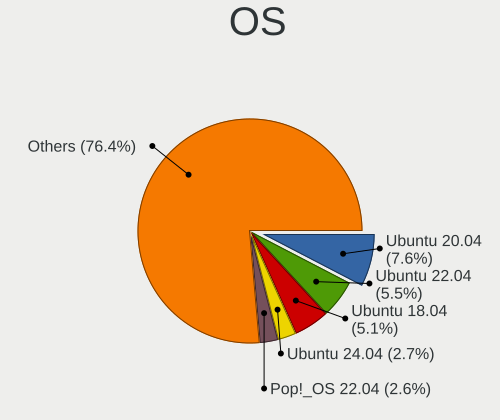

| Name                         | Computers | Percent |
|------------------------------|-----------|---------|
| Ubuntu 20.04                 | 208       | 7.63%   |
| Ubuntu 22.04                 | 151       | 5.54%   |
| Ubuntu 18.04                 | 140       | 5.13%   |
| Ubuntu 24.04                 | 73        | 2.68%   |
| Pop!_OS 22.04                | 72        | 2.64%   |
| Zorin 17                     | 71        | 2.6%    |
| Arch Rolling                 | 71        | 2.6%    |
| Debian 12                    | 53        | 1.94%   |
| OpenMandriva 4.3             | 51        | 1.87%   |
| Zorin 16                     | 47        | 1.72%   |
| Debian 11                    | 44        | 1.61%   |
| OpenMandriva 4.2             | 37        | 1.36%   |
| Manjaro                      | 33        | 1.21%   |
| Fedora 39                    | 33        | 1.21%   |
| Linux Mint 22.1              | 32        | 1.17%   |
| Zorin 15                     | 29        | 1.06%   |
| Pop!_OS 20.04                | 28        | 1.03%   |
| Fedora 42                    | 28        | 1.03%   |
| Fedora 38                    | 28        | 1.03%   |
| ArcoLinux Rolling            | 28        | 1.03%   |
| Zorin 18                     | 26        | 0.95%   |
| Fedora 40                    | 26        | 0.95%   |
| Linux Mint 21.2              | 23        | 0.84%   |
| Linux Mint 20                | 23        | 0.84%   |
| Linux Mint 19.3              | 23        | 0.84%   |
| KDE neon 20.04               | 23        | 0.84%   |
| Fedora 41                    | 23        | 0.84%   |
| Ubuntu 19.10                 | 22        | 0.81%   |
| OpenMandriva 23.08           | 22        | 0.81%   |
| Linux Mint 20.3              | 22        | 0.81%   |
| openSUSE Tumbleweed-XXXXXXXX | 21        | 0.77%   |
| Debian 10                    | 21        | 0.77%   |
| Linux Mint 20.1              | 20        | 0.73%   |
| Fedora 34                    | 20        | 0.73%   |
| Pop!_OS 21.04                | 19        | 0.7%    |
| Linux Mint 21.1              | 19        | 0.7%    |
| Ubuntu 19.04                 | 17        | 0.62%   |
| OpenMandriva 23.01           | 17        | 0.62%   |
| Fedora 36                    | 17        | 0.62%   |
| EndeavourOS Rolling          | 17        | 0.62%   |

OS Family
---------

OS without a version

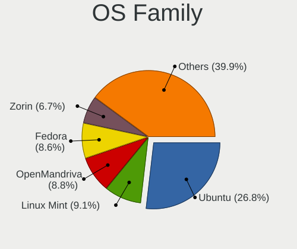

| Name          | Computers | Percent |
|---------------|-----------|---------|
| Ubuntu        | 692       | 26.83%  |
| Linux Mint    | 235       | 9.11%   |
| OpenMandriva  | 228       | 8.84%   |
| Fedora        | 222       | 8.61%   |
| Zorin         | 173       | 6.71%   |
| Pop!_OS       | 148       | 5.74%   |
| Debian        | 147       | 5.7%    |
| Arch          | 87        | 3.37%   |
| Manjaro       | 72        | 2.79%   |
| KDE neon      | 46        | 1.78%   |
| Kubuntu       | 45        | 1.74%   |
| Endless       | 43        | 1.67%   |
| Xubuntu       | 39        | 1.51%   |
| ArcoLinux     | 32        | 1.24%   |
| Elementary    | 30        | 1.16%   |
| openSUSE      | 28        | 1.09%   |
| ROSA          | 24        | 0.93%   |
| Bazzite       | 22        | 0.85%   |
| EndeavourOS   | 18        | 0.7%    |
| Kali          | 14        | 0.54%   |
| NixOS         | 13        | 0.5%    |
| LMDE          | 13        | 0.5%    |
| CachyOS       | 13        | 0.5%    |
| Ubuntu MATE   | 12        | 0.47%   |
| Nobara        | 12        | 0.47%   |
| Ubuntu Unity  | 11        | 0.43%   |
| SteamOS       | 11        | 0.43%   |
| Clear Linux   | 11        | 0.43%   |
| Lubuntu       | 10        | 0.39%   |
| Gentoo        | 9         | 0.35%   |
| Slackware     | 8         | 0.31%   |
| Ubuntu Budgie | 7         | 0.27%   |
| TUXEDO OS     | 6         | 0.23%   |
| Peppermint    | 6         | 0.23%   |
| MX            | 6         | 0.23%   |
| BigLinux      | 6         | 0.23%   |
| Parrot        | 5         | 0.19%   |
| Garuda Linux  | 5         | 0.19%   |
| UbuntuDDE     | 4         | 0.16%   |
| Devuan        | 4         | 0.16%   |

Kernel
------

Version of the Linux kernel

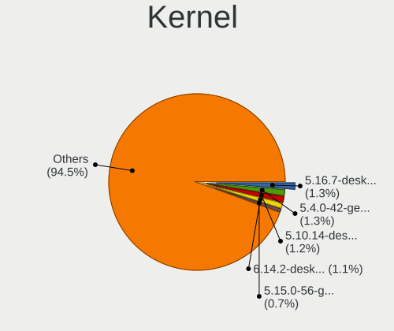

| Version                  | Computers | Percent |
|--------------------------|-----------|---------|
| 5.16.7-desktop-1omv4003  | 40        | 1.32%   |
| 5.4.0-42-generic         | 38        | 1.25%   |
| 5.10.14-desktop-1omv4002 | 36        | 1.19%   |
| 6.14.2-desktop-3omv2590  | 34        | 1.12%   |
| 5.15.0-56-generic        | 20        | 0.66%   |
| 6.4.11-desktop-1omv2390  | 18        | 0.59%   |
| 6.8.0-51-generic         | 17        | 0.56%   |
| 6.8.0-57-generic         | 16        | 0.53%   |
| 6.2.6-76060206-generic   | 16        | 0.53%   |
| 5.4.0-58-generic         | 16        | 0.53%   |
| 5.3.0-46-generic         | 16        | 0.53%   |
| 6.9.3-76060903-generic   | 15        | 0.49%   |
| 6.8.0-52-generic         | 15        | 0.49%   |
| 6.12.1-desktop-1omv2490  | 15        | 0.49%   |
| 6.1.1-desktop-1omv2290   | 15        | 0.49%   |
| 5.4.0-52-generic         | 15        | 0.49%   |
| 6.6.2-desktop-1omv2390   | 14        | 0.46%   |
| 6.14.0-33-generic        | 14        | 0.46%   |
| 5.4.0-29-generic         | 14        | 0.46%   |
| 6.5.0-26-generic         | 13        | 0.43%   |
| 6.2.6-desktop-1omv2390   | 13        | 0.43%   |
| 5.4.0-26-generic         | 13        | 0.43%   |
| 5.15.0-58-generic        | 13        | 0.43%   |
| 5.15.0-52-generic        | 13        | 0.43%   |
| 5.15.0-46-generic        | 13        | 0.43%   |
| 5.14.14-desktop-1omv4050 | 13        | 0.43%   |
| 5.11.0-38-generic        | 13        | 0.43%   |
| 5.0.0-37-generic         | 13        | 0.43%   |
| 6.8.0-48-generic         | 12        | 0.4%    |
| 6.8.0-40-generic         | 12        | 0.4%    |
| 5.3.0-28-generic         | 12        | 0.4%    |
| 5.15.0-48-generic        | 12        | 0.4%    |
| 6.8.0-60-generic         | 11        | 0.36%   |
| 6.8.0-49-generic         | 11        | 0.36%   |
| 6.5.0-35-generic         | 11        | 0.36%   |
| 6.2.0-26-generic         | 11        | 0.36%   |
| 6.14.0-37-generic        | 11        | 0.36%   |
| 6.14.0-29-generic        | 11        | 0.36%   |
| 5.4.0-7634-generic       | 11        | 0.36%   |
| 5.19.0-76051900-generic  | 11        | 0.36%   |

Kernel Family
-------------

Linux kernel without a distro release

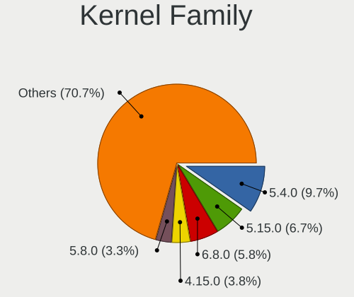

| Version | Computers | Percent |
|---------|-----------|---------|
| 5.4.0   | 278       | 9.72%   |
| 5.15.0  | 192       | 6.72%   |
| 6.8.0   | 167       | 5.84%   |
| 4.15.0  | 109       | 3.81%   |
| 5.8.0   | 93        | 3.25%   |
| 6.14.0  | 87        | 3.04%   |
| 6.5.0   | 86        | 3.01%   |
| 5.11.0  | 85        | 2.97%   |
| 5.3.0   | 83        | 2.9%    |
| 5.13.0  | 72        | 2.52%   |
| 6.2.0   | 71        | 2.48%   |
| 5.19.0  | 65        | 2.27%   |
| 6.1.0   | 59        | 2.06%   |
| 5.0.0   | 59        | 2.06%   |
| 4.18.0  | 49        | 1.71%   |
| 5.10.0  | 48        | 1.68%   |
| 5.16.7  | 40        | 1.4%    |
| 5.10.14 | 38        | 1.33%   |
| 6.14.2  | 36        | 1.26%   |
| 6.2.6   | 29        | 1.01%   |
| 6.11.0  | 24        | 0.84%   |
| 4.19.0  | 24        | 0.84%   |
| 6.4.11  | 18        | 0.63%   |
| 6.12.1  | 18        | 0.63%   |
| 6.1.1   | 18        | 0.63%   |
| 6.9.3   | 16        | 0.56%   |
| 6.12.10 | 16        | 0.56%   |
| 6.6.2   | 15        | 0.52%   |
| 5.14.14 | 13        | 0.45%   |
| 6.5.6   | 11        | 0.38%   |
| 6.8.7   | 10        | 0.35%   |
| 6.5.5   | 10        | 0.35%   |
| 6.17.7  | 9         | 0.31%   |
| 5.11.12 | 9         | 0.31%   |
| 6.17.0  | 7         | 0.24%   |
| 6.15.4  | 7         | 0.24%   |
| 6.11.4  | 7         | 0.24%   |
| 5.14.0  | 7         | 0.24%   |
| 6.8.5   | 6         | 0.21%   |
| 6.8.11  | 6         | 0.21%   |

Kernel Major Ver.
-----------------

Linux kernel major version

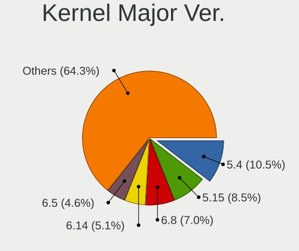

| Version | Computers | Percent |
|---------|-----------|---------|
| 5.4     | 294       | 10.46%  |
| 5.15    | 238       | 8.47%   |
| 6.8     | 198       | 7.04%   |
| 6.14    | 143       | 5.09%   |
| 6.5     | 130       | 4.62%   |
| 6.2     | 125       | 4.45%   |
| 5.8     | 116       | 4.13%   |
| 6.1     | 112       | 3.98%   |
| 4.15    | 110       | 3.91%   |
| 5.10    | 106       | 3.77%   |
| 5.11    | 99        | 3.52%   |
| 6.12    | 88        | 3.13%   |
| 5.3     | 86        | 3.06%   |
| 5.19    | 86        | 3.06%   |
| 5.13    | 86        | 3.06%   |
| 6.6     | 73        | 2.6%    |
| 5.16    | 64        | 2.28%   |
| 5.0     | 60        | 2.13%   |
| 6.11    | 54        | 1.92%   |
| 4.18    | 53        | 1.89%   |
| 6.17    | 40        | 1.42%   |
| 6.4     | 37        | 1.32%   |
| 5.14    | 36        | 1.28%   |
| 6.0     | 34        | 1.21%   |
| 6.9     | 32        | 1.14%   |
| 6.3     | 32        | 1.14%   |
| 6.15    | 28        | 1%      |
| 4.19    | 28        | 1%      |
| 6.16    | 22        | 0.78%   |
| 5.12    | 22        | 0.78%   |
| 6.13    | 20        | 0.71%   |
| 6.10    | 20        | 0.71%   |
| 4.9     | 20        | 0.71%   |
| 5.9     | 16        | 0.57%   |
| 5.7     | 16        | 0.57%   |
| 5.17    | 15        | 0.53%   |
| 5.6     | 14        | 0.5%    |
| 5.18    | 14        | 0.5%    |
| 6.7     | 11        | 0.39%   |
| 5.5     | 10        | 0.36%   |

Arch
----

OS architecture (x86_64, i586, etc.)

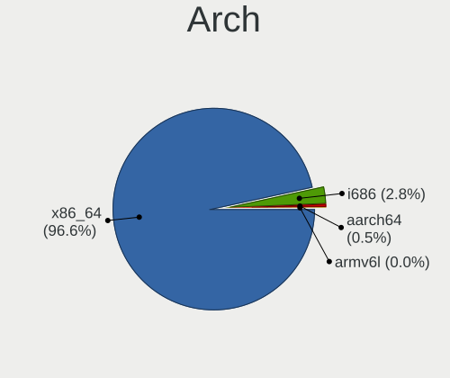

| Name    | Computers | Percent |
|---------|-----------|---------|
| x86_64  | 2376      | 96.59%  |
| i686    | 68        | 2.76%   |
| aarch64 | 13        | 0.53%   |
| armv7l  | 2         | 0.08%   |
| armv6l  | 1         | 0.04%   |

DE
--

Desktop Environment

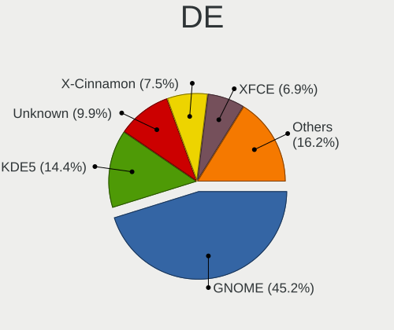

| Name                  | Computers | Percent |
|-----------------------|-----------|---------|
| GNOME                 | 1173      | 45.18%  |
| KDE5                  | 373       | 14.37%  |
| Unknown               | 258       | 9.94%   |
| X-Cinnamon            | 194       | 7.47%   |
| XFCE                  | 178       | 6.86%   |
| KDE6                  | 146       | 5.62%   |
| KDE                   | 48        | 1.85%   |
| MATE                  | 43        | 1.66%   |
| Pantheon              | 28        | 1.08%   |
| Cinnamon              | 19        | 0.73%   |
| Budgie                | 17        | 0.65%   |
| LXQt                  | 16        | 0.62%   |
| KDE4                  | 15        | 0.58%   |
| i3                    | 15        | 0.58%   |
| Unity                 | 12        | 0.46%   |
| GNOME Flashback       | 9         | 0.35%   |
| LXDE                  | 8         | 0.31%   |
| awesome               | 8         | 0.31%   |
| Deepin                | 6         | 0.23%   |
| Hyprland              | 5         | 0.19%   |
| COSMIC                | 5         | 0.19%   |
| Openbox               | 2         | 0.08%   |
| Enlightenment         | 2         | 0.08%   |
| Endless:GNOME         | 2         | 0.08%   |
| dwm                   | 2         | 0.08%   |
| xmonad                | 1         | 0.04%   |
| sway:wlroots:sway-run | 1         | 0.04%   |
| sway:wlroots          | 1         | 0.04%   |
| qtile                 | 1         | 0.04%   |
| Lubuntu               | 1         | 0.04%   |
| lightdm-xsession      | 1         | 0.04%   |
| LeftWM                | 1         | 0.04%   |
| fluxbox               | 1         | 0.04%   |
| DDE                   | 1         | 0.04%   |
| Cutefish              | 1         | 0.04%   |
| chadwm                | 1         | 0.04%   |
| bspwm                 | 1         | 0.04%   |

Display Server
--------------

X11 or Wayland

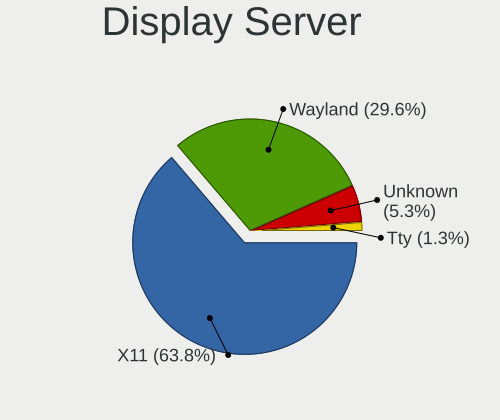

| Name    | Computers | Percent |
|---------|-----------|---------|
| X11     | 1625      | 63.75%  |
| Wayland | 755       | 29.62%  |
| Unknown | 136       | 5.34%   |
| Tty     | 33        | 1.29%   |

Display Manager
---------------

SDDM, LightDM, etc.

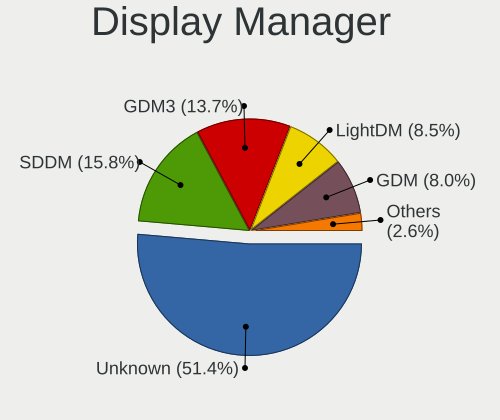

| Name           | Computers | Percent |
|----------------|-----------|---------|
| Unknown        | 1321      | 51.38%  |
| SDDM           | 407       | 15.83%  |
| GDM3           | 351       | 13.65%  |
| LightDM        | 219       | 8.52%   |
| GDM            | 206       | 8.01%   |
| TDM            | 43        | 1.67%   |
| KDM            | 13        | 0.51%   |
| XDM            | 4         | 0.16%   |
| SLiM           | 3         | 0.12%   |
| GREETD         | 3         | 0.12%   |
| COSMIC-GREETER | 1         | 0.04%   |

OS Lang
-------

Language

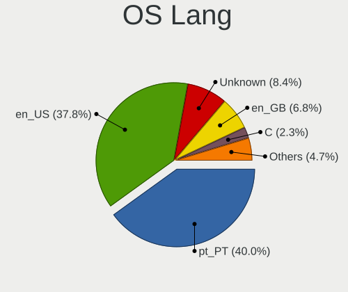

| Lang       | Computers | Percent |
|------------|-----------|---------|
| pt_PT      | 1011      | 40.04%  |
| en_US      | 955       | 37.82%  |
| Unknown    | 211       | 8.36%   |
| en_GB      | 171       | 6.77%   |
| C          | 58        | 2.3%    |
| pt_BR      | 44        | 1.74%   |
| fr_FR      | 14        | 0.55%   |
| de_DE      | 14        | 0.55%   |
| ru_RU      | 9         | 0.36%   |
| es_ES      | 8         | 0.32%   |
| en_IE      | 8         | 0.32%   |
| sv_SE      | 3         | 0.12%   |
| POSIX      | 3         | 0.12%   |
| he_IL      | 3         | 0.12%   |
| it_IT      | 2         | 0.08%   |
| en_DK      | 2         | 0.08%   |
| en_CA      | 2         | 0.08%   |
| sk_SK      | 1         | 0.04%   |
| pt_PT@euro | 1         | 0.04%   |
| nl_NL      | 1         | 0.04%   |
| en_US.UTF8 | 1         | 0.04%   |
| en_PT      | 1         | 0.04%   |
| en_IN      | 1         | 0.04%   |
| Default    | 1         | 0.04%   |

Boot Mode
---------

EFI or BIOS

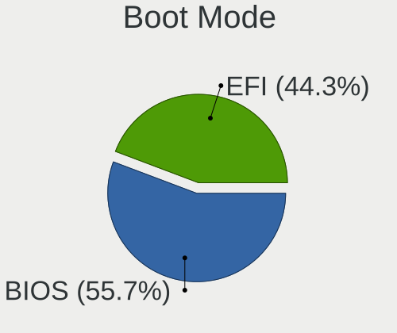

| Mode | Computers | Percent |
|------|-----------|---------|
| BIOS | 1411      | 55.75%  |
| EFI  | 1120      | 44.25%  |

Filesystem
----------

Type of filesystem

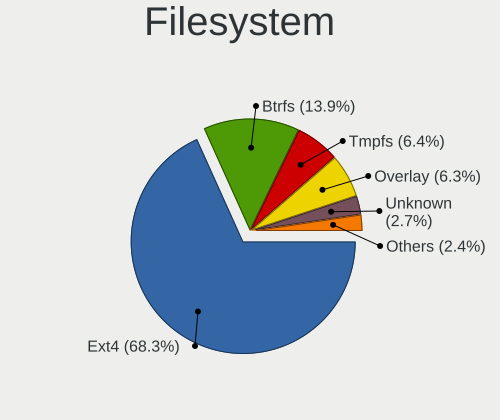

| Type     | Computers | Percent |
|----------|-----------|---------|
| Ext4     | 1738      | 68.26%  |
| Btrfs    | 354       | 13.9%   |
| Tmpfs    | 164       | 6.44%   |
| Overlay  | 161       | 6.32%   |
| Unknown  | 69        | 2.71%   |
| Xfs      | 28        | 1.1%    |
| Zfs      | 17        | 0.67%   |
| Ext3     | 5         | 0.2%    |
| Ext2     | 5         | 0.2%    |
| XXXXX    | 1         | 0.04%   |
| Rootfs   | 1         | 0.04%   |
| Reiserfs | 1         | 0.04%   |
| F2fs     | 1         | 0.04%   |
| Aufs     | 1         | 0.04%   |

Part. scheme
------------

Scheme of partitioning

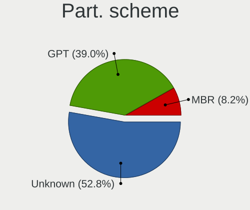

| Type    | Computers | Percent |
|---------|-----------|---------|
| Unknown | 1342      | 52.81%  |
| GPT     | 991       | 39%     |
| MBR     | 208       | 8.19%   |

Dual Boot with Linux/BSD
------------------------

Hosting more than one Linux/BSD

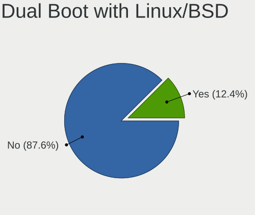

| Dual boot | Computers | Percent |
|-----------|-----------|---------|
| No        | 2192      | 87.57%  |
| Yes       | 311       | 12.43%  |

Dual Boot (Win)
---------------

Hosting Linux and Windows

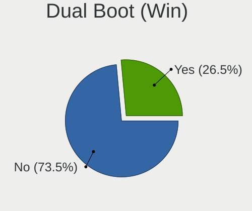

| Dual boot | Computers | Percent |
|-----------|-----------|---------|
| No        | 1848      | 73.54%  |
| Yes       | 665       | 26.46%  |

Board
-----

Vendor
------

Motherboard manufacturer

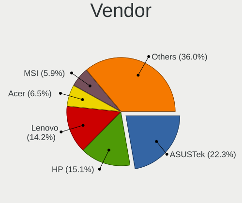

| Name                                 | Computers | Percent |
|--------------------------------------|-----------|---------|
| ASUSTek Computer                     | 547       | 22.26%  |
| Hewlett-Packard                      | 372       | 15.14%  |
| Lenovo                               | 349       | 14.2%   |
| Acer                                 | 159       | 6.47%   |
| MSI                                  | 145       | 5.9%    |
| Dell                                 | 133       | 5.41%   |
| Gigabyte Technology                  | 109       | 4.44%   |
| Toshiba                              | 97        | 3.95%   |
| Apple                                | 75        | 3.05%   |
| Sony                                 | 52        | 2.12%   |
| ASRock                               | 49        | 1.99%   |
| HUAWEI                               | 35        | 1.42%   |
| Intel                                | 27        | 1.1%    |
| Samsung Electronics                  | 26        | 1.06%   |
| Unknown                              | 22        | 0.9%    |
| Fujitsu                              | 21        | 0.85%   |
| Chuwi                                | 14        | 0.57%   |
| Notebook                             | 13        | 0.53%   |
| Packard Bell                         | 12        | 0.49%   |
| Raspberry Pi Foundation              | 11        | 0.45%   |
| Foxconn                              | 9         | 0.37%   |
| AMI                                  | 9         | 0.37%   |
| Valve                                | 8         | 0.33%   |
| TUXEDO                               | 7         | 0.28%   |
| Microsoft                            | 7         | 0.28%   |
| Medion                               | 7         | 0.28%   |
| Clevo                                | 7         | 0.28%   |
| Shenzhen Meigao Electronic Equipment | 6         | 0.24%   |
| eMachines                            | 6         | 0.24%   |
| Biostar                              | 6         | 0.24%   |
| AZW                                  | 6         | 0.24%   |
| SLIMBOOK                             | 5         | 0.2%    |
| Pegatron                             | 5         | 0.2%    |
| Teclast                              | 4         | 0.16%   |
| Positivo                             | 4         | 0.16%   |
| MACHINIST                            | 4         | 0.16%   |
| LG Electronics                       | 4         | 0.16%   |
| INSYS                                | 4         | 0.16%   |
| Google                               | 4         | 0.16%   |
| Fujitsu Siemens                      | 4         | 0.16%   |

Model
-----

Motherboard model

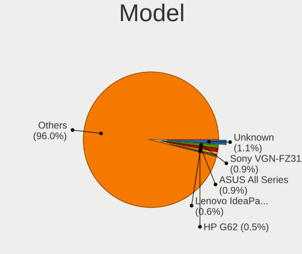

| Name                                   | Computers | Percent |
|----------------------------------------|-----------|---------|
| Unknown                                | 28        | 1.14%   |
| Sony VGN-FZ31Z                         | 22        | 0.9%    |
| ASUS All Series                        | 22        | 0.9%    |
| Lenovo IdeaPad 1 14ADA05 82GW          | 14        | 0.57%   |
| HP G62                                 | 12        | 0.49%   |
| Lenovo Legion 5 15ACH6H 82JU           | 11        | 0.45%   |
| HP Pavilion dv6                        | 11        | 0.45%   |
| HP Notebook                            | 10        | 0.41%   |
| HP Pavilion g6                         | 9         | 0.37%   |
| Valve Jupiter                          | 8         | 0.33%   |
| Toshiba Satellite C660                 | 8         | 0.33%   |
| Toshiba Satellite L650                 | 7         | 0.28%   |
| Lenovo Legion Y530-15ICH 81FV          | 7         | 0.28%   |
| ASUS X555LJ                            | 7         | 0.28%   |
| MSI MS-7C56                            | 6         | 0.24%   |
| MSI MS-7817                            | 6         | 0.24%   |
| HP Pavilion Notebook                   | 6         | 0.24%   |
| HP Pavilion Gaming Laptop 15-ec2xxx    | 6         | 0.24%   |
| HP Laptop 15s-eq2xxx                   | 6         | 0.24%   |
| HP 15                                  | 6         | 0.24%   |
| ASUS X555LD                            | 6         | 0.24%   |
| ASUS X541UJ                            | 6         | 0.24%   |
| Apple MacBookPro8,1                    | 6         | 0.24%   |
| Apple MacBookAir7,2                    | 6         | 0.24%   |
| Acer Extensa 5620                      | 6         | 0.24%   |
| Toshiba Satellite L500                 | 5         | 0.2%    |
| Toshiba Satellite A200                 | 5         | 0.2%    |
| Lenovo Y520-15IKBN 80WK                | 5         | 0.2%    |
| Lenovo Legion 5 15ARH05H 82B1          | 5         | 0.2%    |
| Lenovo IdeaPad Gaming 3 15ACH6 82K2    | 5         | 0.2%    |
| HP OMEN by Laptop                      | 5         | 0.2%    |
| HP Laptop 15s-eq0xxx                   | 5         | 0.2%    |
| HP EliteBook 840 G6                    | 5         | 0.2%    |
| HP Compaq Presario CQ61                | 5         | 0.2%    |
| HP Compaq Elite 8300 SFF               | 5         | 0.2%    |
| ASUS X541UV                            | 5         | 0.2%    |
| ASUS X540LJ                            | 5         | 0.2%    |
| ASUS VivoBook_ASUSLaptop X571GT_X571GT | 5         | 0.2%    |
| ASUS VivoBook_ASUSLaptop X512DA_F512DA | 5         | 0.2%    |
| ASUS VivoBook 15_ASUS Laptop X507LA    | 5         | 0.2%    |

Model Family
------------

Motherboard model prefix

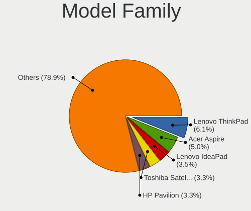

| Name                  | Computers | Percent |
|-----------------------|-----------|---------|
| Lenovo ThinkPad       | 149       | 6.06%   |
| Acer Aspire           | 122       | 4.97%   |
| Lenovo IdeaPad        | 85        | 3.46%   |
| Toshiba Satellite     | 82        | 3.34%   |
| HP Pavilion           | 80        | 3.26%   |
| ASUS VivoBook         | 72        | 2.93%   |
| ASUS PRIME            | 55        | 2.24%   |
| Dell Latitude         | 51        | 2.08%   |
| HP Compaq             | 49        | 1.99%   |
| HP EliteBook          | 46        | 1.87%   |
| ASUS ROG              | 42        | 1.71%   |
| Lenovo Legion         | 33        | 1.34%   |
| HP Laptop             | 32        | 1.3%    |
| ASUS TUF              | 32        | 1.3%    |
| Unknown               | 28        | 1.14%   |
| Sony VGN-FZ31Z        | 22        | 0.9%    |
| HP OMEN               | 22        | 0.9%    |
| Dell XPS              | 22        | 0.9%    |
| ASUS All              | 22        | 0.9%    |
| HP ProBook            | 21        | 0.85%   |
| HP ENVY               | 18        | 0.73%   |
| Dell OptiPlex         | 17        | 0.69%   |
| Dell Inspiron         | 17        | 0.69%   |
| ASUS ZenBook          | 16        | 0.65%   |
| Lenovo Yoga           | 15        | 0.61%   |
| Lenovo ThinkCentre    | 14        | 0.57%   |
| Gigabyte B550         | 13        | 0.53%   |
| HP G62                | 12        | 0.49%   |
| Dell Precision        | 12        | 0.49%   |
| Acer Extensa          | 12        | 0.49%   |
| Acer Nitro            | 11        | 0.45%   |
| RPi Raspberry         | 10        | 0.41%   |
| HP Notebook           | 10        | 0.41%   |
| ASUS P5G41T-M         | 10        | 0.41%   |
| Packard Bell EasyNote | 9         | 0.37%   |
| Fujitsu ESPRIMO       | 9         | 0.37%   |
| ASUS P8H61-M          | 9         | 0.37%   |
| ASUS ASUS             | 9         | 0.37%   |
| Apple MacBookPro11    | 9         | 0.37%   |
| Valve Jupiter         | 8         | 0.33%   |

MFG Year
--------

Motherboard manufacture year

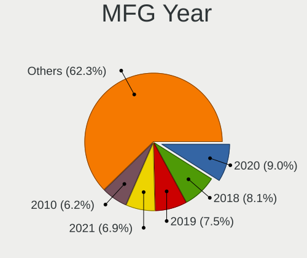

| Year    | Computers | Percent |
|---------|-----------|---------|
| 2020    | 220       | 8.95%   |
| 2018    | 200       | 8.14%   |
| 2019    | 185       | 7.53%   |
| 2021    | 170       | 6.92%   |
| 2010    | 152       | 6.19%   |
| 2012    | 140       | 5.7%    |
| 2013    | 137       | 5.58%   |
| 2014    | 135       | 5.49%   |
| 2017    | 126       | 5.13%   |
| 2015    | 126       | 5.13%   |
| 2016    | 119       | 4.84%   |
| 2009    | 119       | 4.84%   |
| 2008    | 110       | 4.48%   |
| 2022    | 108       | 4.4%    |
| 2011    | 96        | 3.91%   |
| 2007    | 93        | 3.79%   |
| 2023    | 82        | 3.34%   |
| 2024    | 48        | 1.95%   |
| 2006    | 39        | 1.59%   |
| 2025    | 18        | 0.73%   |
| Unknown | 15        | 0.61%   |
| 2005    | 14        | 0.57%   |
| 2004    | 4         | 0.16%   |
| 2003    | 1         | 0.04%   |

Form Factor
-----------

Physical design of the computer

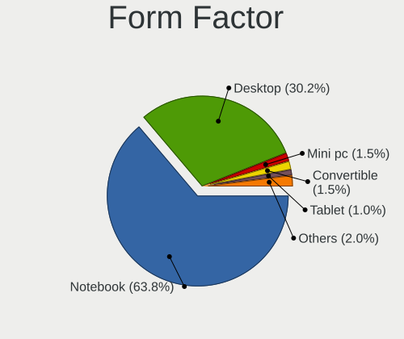

| Name           | Computers | Percent |
|----------------|-----------|---------|
| Notebook       | 1568      | 63.82%  |
| Desktop        | 741       | 30.16%  |
| Convertible    | 37        | 1.51%   |
| Mini pc        | 37        | 1.51%   |
| Tablet         | 25        | 1.02%   |
| All in one     | 19        | 0.77%   |
| Server         | 15        | 0.61%   |
| System on chip | 13        | 0.53%   |
| Other          | 1         | 0.04%   |
| Phone          | 1         | 0.04%   |

Secure Boot
-----------

Enabled or disabled

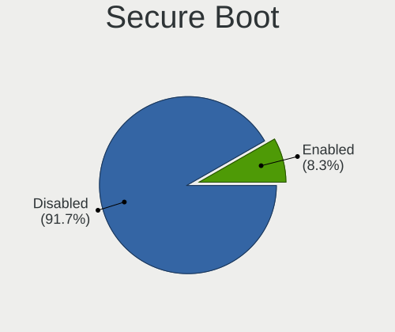

| State    | Computers | Percent |
|----------|-----------|---------|
| Disabled | 2288      | 91.74%  |
| Enabled  | 206       | 8.26%   |

Coreboot
--------

Have coreboot on board

| Used | Computers | Percent |
|------|-----------|---------|
| No   | 2446      | 99.55%  |
| Yes  | 11        | 0.45%   |

RAM Size
--------

Total RAM memory

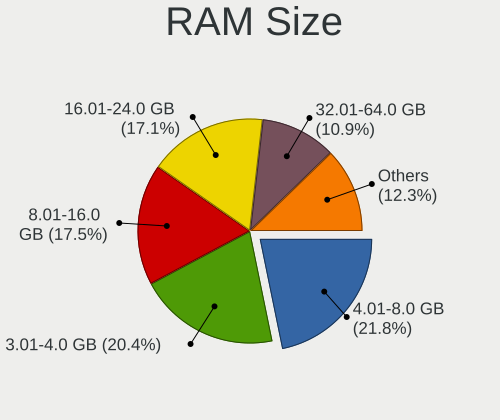

| Size in GB      | Computers | Percent |
|-----------------|-----------|---------|
| 4.01-8.0        | 546       | 21.79%  |
| 3.01-4.0        | 512       | 20.43%  |
| 8.01-16.0       | 438       | 17.48%  |
| 16.01-24.0      | 429       | 17.12%  |
| 32.01-64.0      | 274       | 10.93%  |
| 1.01-2.0        | 109       | 4.35%   |
| 64.01-256.0     | 72        | 2.87%   |
| 24.01-32.0      | 63        | 2.51%   |
| 2.01-3.0        | 47        | 1.88%   |
| 0.51-1.0        | 14        | 0.56%   |
| More than 256.0 | 1         | 0.04%   |
| 0.01-0.5        | 1         | 0.04%   |

RAM Used
--------

Used RAM memory

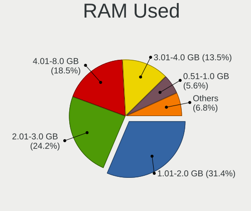

| Used GB     | Computers | Percent |
|-------------|-----------|---------|
| 1.01-2.0    | 867       | 31.4%   |
| 2.01-3.0    | 669       | 24.23%  |
| 4.01-8.0    | 510       | 18.47%  |
| 3.01-4.0    | 374       | 13.55%  |
| 0.51-1.0    | 154       | 5.58%   |
| 8.01-16.0   | 125       | 4.53%   |
| 16.01-24.0  | 25        | 0.91%   |
| 0.01-0.5    | 20        | 0.72%   |
| 24.01-32.0  | 10        | 0.36%   |
| 32.01-64.0  | 4         | 0.14%   |
| 64.01-256.0 | 2         | 0.07%   |
| Unknown     | 1         | 0.04%   |

Total Drives
------------

Number of drives on board

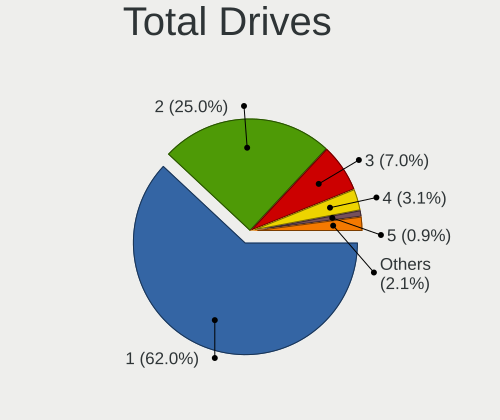

| Drives | Computers | Percent |
|--------|-----------|---------|
| 1      | 1571      | 61.97%  |
| 2      | 633       | 24.97%  |
| 3      | 177       | 6.98%   |
| 4      | 79        | 3.12%   |
| 5      | 23        | 0.91%   |
| 0      | 21        | 0.83%   |
| 6      | 15        | 0.59%   |
| 7      | 5         | 0.2%    |
| 8      | 4         | 0.16%   |
| 11     | 3         | 0.12%   |
| 10     | 2         | 0.08%   |
| 87     | 1         | 0.04%   |
| 13     | 1         | 0.04%   |

Has CD-ROM
----------

Has CD-ROM on board

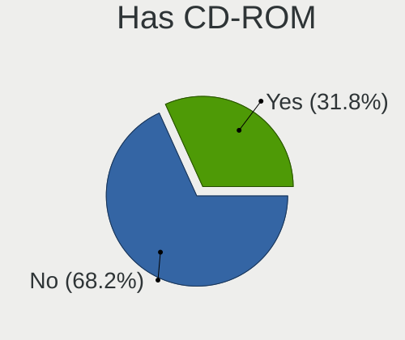

| Presented | Computers | Percent |
|-----------|-----------|---------|
| No        | 1684      | 68.23%  |
| Yes       | 784       | 31.77%  |

Has Ethernet
------------

Has Ethernet on board

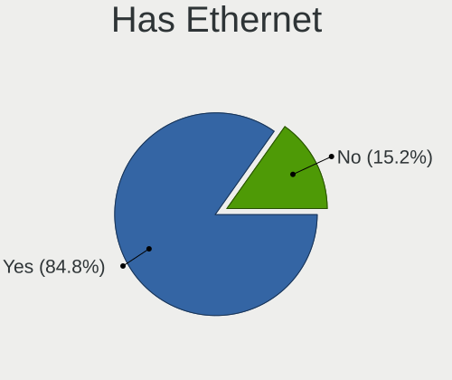

| Presented | Computers | Percent |
|-----------|-----------|---------|
| Yes       | 2093      | 84.81%  |
| No        | 375       | 15.19%  |

Has WiFi
--------

Has WiFi module

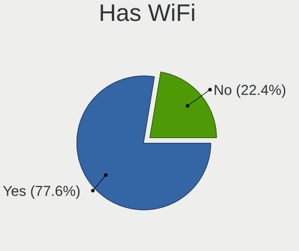

| Presented | Computers | Percent |
|-----------|-----------|---------|
| Yes       | 1920      | 77.61%  |
| No        | 554       | 22.39%  |

Has Bluetooth
-------------

Has Bluetooth module

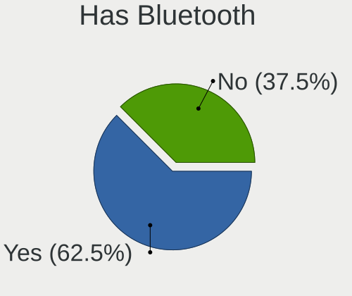

| Presented | Computers | Percent |
|-----------|-----------|---------|
| Yes       | 1560      | 62.5%   |
| No        | 936       | 37.5%   |

Location
--------

Country
-------

Geographic location (country)

| Country  | Computers | Percent |
|----------|-----------|---------|
| Portugal | 2457      | 100%    |

City
----

Geographic location (city)

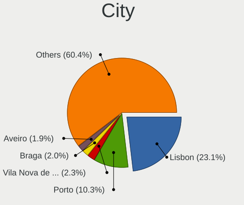

| City                    | Computers | Percent |
|-------------------------|-----------|---------|
| Lisbon                  | 611       | 23.14%  |
| Porto                   | 273       | 10.34%  |
| Vila Nova de Gaia       | 60        | 2.27%   |
| Braga                   | 52        | 1.97%   |
| Aveiro                  | 50        | 1.89%   |
| Amadora                 | 48        | 1.82%   |
| Coimbra                 | 47        | 1.78%   |
| Funchal                 | 45        | 1.7%    |
| Setúbal                | 41        | 1.55%   |
| Leiria                  | 31        | 1.17%   |
| Almada                  | 30        | 1.14%   |
| Faro                    | 28        | 1.06%   |
| Guimaraes               | 27        | 1.02%   |
| Portimao                | 26        | 0.98%   |
| Cascais                 | 25        | 0.95%   |
| Maia                    | 24        | 0.91%   |
| Barreiro                | 23        | 0.87%   |
| Loures                  | 22        | 0.83%   |
| Póvoa de Varzim        | 21        | 0.8%    |
| Evora                   | 20        | 0.76%   |
| Gondomar                | 19        | 0.72%   |
| Viana do Castelo        | 18        | 0.68%   |
| Palmela                 | 18        | 0.68%   |
| Mem Martins             | 18        | 0.68%   |
| Viseu                   | 17        | 0.64%   |
| Sintra                  | 17        | 0.64%   |
| Santarém               | 17        | 0.64%   |
| Odivelas                | 17        | 0.64%   |
| Torres Vedras           | 16        | 0.61%   |
| Barcelos                | 16        | 0.61%   |
| Alverca do Ribatejo     | 16        | 0.61%   |
| Caldas da Rainha        | 15        | 0.57%   |
| Bragança               | 15        | 0.57%   |
| Ponta Delgada           | 14        | 0.53%   |
| Matosinhos Municipality | 14        | 0.53%   |
| Queluz                  | 13        | 0.49%   |
| Povoa de Santa Iria     | 13        | 0.49%   |
| Vila do Conde           | 12        | 0.45%   |
| Quinta Do Conde         | 12        | 0.45%   |
| Paredes                 | 12        | 0.45%   |

Drives
------

Drive Vendor
------------

Hard drive vendors

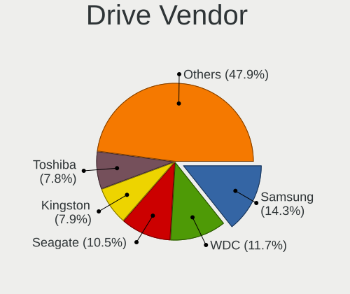

| Vendor                      | Computers | Drives | Percent |
|-----------------------------|-----------|--------|---------|
| Samsung Electronics         | 512       | 712    | 14.31%  |
| WDC                         | 417       | 645    | 11.66%  |
| Seagate                     | 374       | 585    | 10.46%  |
| Kingston                    | 283       | 373    | 7.91%   |
| Toshiba                     | 278       | 395    | 7.77%   |
| SanDisk                     | 221       | 279    | 6.18%   |
| Unknown                     | 155       | 219    | 4.33%   |
| Crucial                     | 146       | 191    | 4.08%   |
| Hitachi                     | 101       | 124    | 2.82%   |
| Micron Technology           | 94        | 111    | 2.63%   |
| Intel                       | 78        | 121    | 2.18%   |
| SK hynix                    | 77        | 102    | 2.15%   |
| HGST                        | 62        | 85     | 1.73%   |
| Phison Electronics          | 45        | 52     | 1.26%   |
| KIOXIA                      | 45        | 74     | 1.26%   |
| China                       | 39        | 49     | 1.09%   |
| Apple                       | 33        | 39     | 0.92%   |
| Kingston Technology Company | 30        | 35     | 0.84%   |
| KIOXIA-EXCERIA              | 29        | 39     | 0.81%   |
| Maxtor                      | 27        | 47     | 0.75%   |
| GOODRAM                     | 27        | 31     | 0.75%   |
| BlueRay                     | 27        | 36     | 0.75%   |
| Micron/Crucial Technology   | 26        | 38     | 0.73%   |
| Fujitsu                     | 24        | 25     | 0.67%   |
| PNY                         | 22        | 29     | 0.62%   |
| A-DATA Technology           | 21        | 22     | 0.59%   |
| S3+                         | 20        | 33     | 0.56%   |
| Emtec                       | 20        | 23     | 0.56%   |
| Phison                      | 14        | 20     | 0.39%   |
| LITEON                      | 14        | 15     | 0.39%   |
| Unknown                     | 14        | 24     | 0.39%   |
| MAXIO Technology (Hangzhou) | 13        | 15     | 0.36%   |
| JMicron Technology          | 13        | 14     | 0.36%   |
| Team                        | 12        | 20     | 0.34%   |
| Silicon Motion              | 12        | 17     | 0.34%   |
| OCZ                         | 12        | 12     | 0.34%   |
| Transcend                   | 11        | 13     | 0.31%   |
| Hewlett-Packard             | 11        | 14     | 0.31%   |
| Gigabyte Technology         | 9         | 11     | 0.25%   |
| Verbatim                    | 8         | 8      | 0.22%   |

Drive Model
-----------

Hard drive models

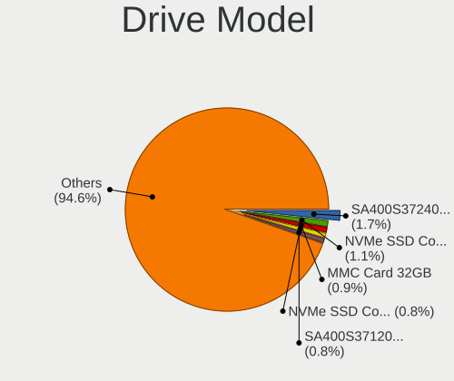

| Model                                                | Computers | Percent |
|------------------------------------------------------|-----------|---------|
| Kingston SA400S37240G 240GB SSD                      | 64        | 1.67%   |
| Samsung NVMe SSD Controller SM981/PM981/PM983 1TB    | 42        | 1.1%    |
| Unknown MMC Card  32GB                               | 36        | 0.94%   |
| Samsung NVMe SSD Controller PM9A1/PM9A3/980PRO 1TB   | 32        | 0.83%   |
| Kingston SA400S37120G 120GB SSD                      | 32        | 0.83%   |
| Unknown MMC Card  64GB                               | 29        | 0.76%   |
| Toshiba MQ01ABD100 1TB                               | 29        | 0.76%   |
| Kingston SA400S37480G 480GB SSD                      | 29        | 0.76%   |
| Seagate ST1000LM024 HN-M101MBB 1TB                   | 26        | 0.68%   |
| Seagate ST1000DM010-2EP102 1TB                       | 26        | 0.68%   |
| Kingston SV300S37A120G 120GB SSD                     | 25        | 0.65%   |
| HGST HTS721010A9E630 1TB                             | 24        | 0.63%   |
| Toshiba MQ01ABF050 500GB                             | 22        | 0.57%   |
| Seagate ST500LT012-1DG142 500GB                      | 21        | 0.55%   |
| Samsung SSD 850 EVO 250GB                            | 21        | 0.55%   |
| Samsung SSD 860 EVO 500GB                            | 20        | 0.52%   |
| Crucial CT500MX500SSD1 500GB                         | 20        | 0.52%   |
| Phison PS5013 E13 NVMe Controller 500GB              | 19        | 0.5%    |
| Kingston SV300S37A240G 240GB SSD                     | 18        | 0.47%   |
| Seagate ST1000LM035-1RK172 1TB                       | 17        | 0.44%   |
| Samsung SSD 850 EVO 500GB                            | 17        | 0.44%   |
| Crucial CT240M500SSD1 240GB                          | 17        | 0.44%   |
| Sandisk WD Blue SN550 NVMe SSD 1024GB                | 16        | 0.42%   |
| Crucial CT240BX500SSD1 240GB                         | 16        | 0.42%   |
| Seagate ST9500325AS 500GB                            | 15        | 0.39%   |
| Seagate ST3500418AS 500GB                            | 15        | 0.39%   |
| Samsung NVMe SSD Controller SM961/PM961/SM963 1024GB | 15        | 0.39%   |
| WDC WDS240G2G0A-00JH30 240GB SSD                     | 14        | 0.37%   |
| Unknown MMC64G  64GB                                 | 14        | 0.37%   |
| Toshiba HDWD110 1TB                                  | 14        | 0.37%   |
| SanDisk NVMe SSD Drive 1TB                           | 14        | 0.37%   |
| Samsung SSD 860 QVO 1TB                              | 14        | 0.37%   |
| Unknown                                              | 14        | 0.37%   |
| Unknown MMC Card  128GB                              | 13        | 0.34%   |
| Toshiba MQ04ABF100 1TB                               | 13        | 0.34%   |
| Emtec X150 240GB                                     | 13        | 0.34%   |
| Toshiba TR200 240GB SSD                              | 12        | 0.31%   |
| Seagate ST2000DM008-2FR102 2TB                       | 12        | 0.31%   |
| SanDisk NVMe SSD Drive 512GB                         | 12        | 0.31%   |
| Samsung SSD 860 EVO 1TB                              | 12        | 0.31%   |

HDD Vendor
----------

Hard disk drive vendors

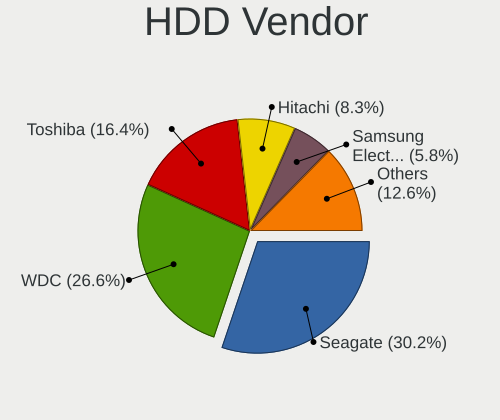

| Vendor              | Computers | Drives | Percent |
|---------------------|-----------|--------|---------|
| Seagate             | 365       | 570    | 30.17%  |
| WDC                 | 322       | 481    | 26.61%  |
| Toshiba             | 199       | 294    | 16.45%  |
| Hitachi             | 101       | 124    | 8.35%   |
| Samsung Electronics | 70        | 97     | 5.79%   |
| HGST                | 62        | 85     | 5.12%   |
| Fujitsu             | 23        | 24     | 1.9%    |
| Maxtor              | 19        | 27     | 1.57%   |
| JMicron Technology  | 10        | 11     | 0.83%   |
| Unknown             | 6         | 8      | 0.5%    |
| Apple               | 6         | 8      | 0.5%    |
| ExcelStor           | 5         | 5      | 0.41%   |
| USB                 | 4         | 4      | 0.33%   |
| TO Exter            | 2         | 2      | 0.17%   |
| MSFT                | 2         | 12     | 0.17%   |
| HPE                 | 2         | 8      | 0.17%   |
| Hewlett-Packard     | 2         | 3      | 0.17%   |
| Dell                | 2         | 4      | 0.17%   |
| ASMedia             | 2         | 3      | 0.17%   |
| USB3.0              | 1         | 1      | 0.08%   |
| Quantum             | 1         | 1      | 0.08%   |
| NETAPP              | 1         | 1      | 0.08%   |
| Intenso             | 1         | 1      | 0.08%   |
| External            | 1         | 1      | 0.08%   |
| Unknown             | 1         | 2      | 0.08%   |

SSD Vendor
----------

Solid state drive vendors

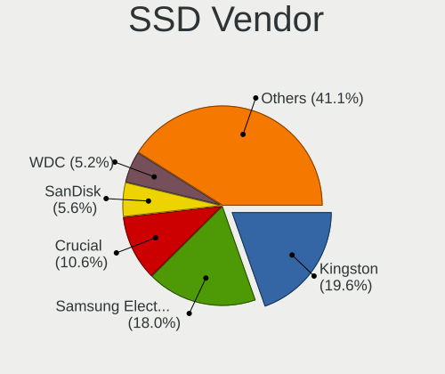

| Vendor              | Computers | Drives | Percent |
|---------------------|-----------|--------|---------|
| Kingston            | 236       | 297    | 19.62%  |
| Samsung Electronics | 216       | 287    | 17.96%  |
| Crucial             | 128       | 168    | 10.64%  |
| SanDisk             | 67        | 80     | 5.57%   |
| WDC                 | 62        | 88     | 5.15%   |
| Toshiba             | 43        | 55     | 3.57%   |
| China               | 39        | 49     | 3.24%   |
| GOODRAM             | 25        | 29     | 2.08%   |
| Micron Technology   | 23        | 28     | 1.91%   |
| BlueRay             | 23        | 26     | 1.91%   |
| Apple               | 22        | 22     | 1.83%   |
| KIOXIA-EXCERIA      | 20        | 28     | 1.66%   |
| Intel               | 20        | 32     | 1.66%   |
| A-DATA Technology   | 20        | 21     | 1.66%   |
| S3+                 | 19        | 32     | 1.58%   |
| Emtec               | 19        | 22     | 1.58%   |
| PNY                 | 17        | 23     | 1.41%   |
| SK hynix            | 16        | 16     | 1.33%   |
| OCZ                 | 12        | 12     | 1%      |
| Transcend           | 11        | 13     | 0.91%   |
| Team                | 11        | 12     | 0.91%   |
| LITEON              | 11        | 12     | 0.91%   |
| Maxtor              | 8         | 20     | 0.67%   |
| Hewlett-Packard     | 8         | 10     | 0.67%   |
| Verbatim            | 7         | 7      | 0.58%   |
| Netac               | 7         | 10     | 0.58%   |
| 2-Power             | 6         | 8      | 0.5%    |
| Unknown             | 6         | 14     | 0.5%    |
| Seagate             | 5         | 7      | 0.42%   |
| KingDian            | 5         | 8      | 0.42%   |
| Gigabyte Technology | 5         | 6      | 0.42%   |
| Unknown             | 4         | 4      | 0.33%   |
| Intenso             | 4         | 7      | 0.33%   |
| Wibtek              | 3         | 4      | 0.25%   |
| Vaseky              | 3         | 3      | 0.25%   |
| Teclast             | 3         | 3      | 0.25%   |
| SPCC                | 3         | 4      | 0.25%   |
| MSI                 | 3         | 9      | 0.25%   |
| LITEONIT            | 3         | 3      | 0.25%   |
| KingSpec            | 3         | 3      | 0.25%   |

Drive Kind
----------

HDD or SSD

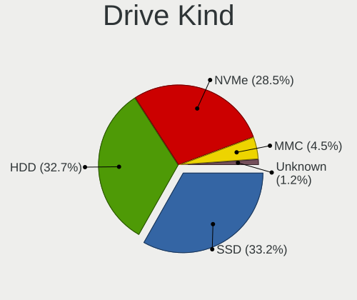

| Kind    | Computers | Drives | Percent |
|---------|-----------|--------|---------|
| SSD     | 1053      | 1553   | 33.2%   |
| HDD     | 1036      | 1777   | 32.66%  |
| NVMe    | 903       | 1385   | 28.47%  |
| MMC     | 143       | 207    | 4.51%   |
| Unknown | 37        | 54     | 1.17%   |

Drive Connector
---------------

SATA, SAS, NVMe, etc.

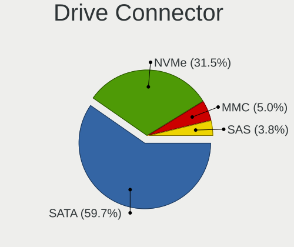

| Type | Computers | Drives | Percent |
|------|-----------|--------|---------|
| SATA | 1706      | 3244   | 59.67%  |
| NVMe | 902       | 1378   | 31.55%  |
| MMC  | 143       | 207    | 5%      |
| SAS  | 108       | 147    | 3.78%   |

Drive Size
----------

Size of hard drive

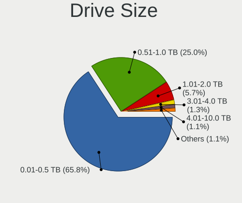

| Size in TB | Computers | Drives | Percent |
|------------|-----------|--------|---------|
| 0.01-0.5   | 1371      | 2158   | 65.82%  |
| 0.51-1.0   | 520       | 778    | 24.96%  |
| 1.01-2.0   | 118       | 187    | 5.66%   |
| 3.01-4.0   | 28        | 46     | 1.34%   |
| 4.01-10.0  | 23        | 44     | 1.1%    |
| 2.01-3.0   | 18        | 24     | 0.86%   |
| 10.01-20.0 | 4         | 92     | 0.19%   |
| 0          | 1         | 1      | 0.05%   |

Space Total
-----------

Amount of disk space available on the file system

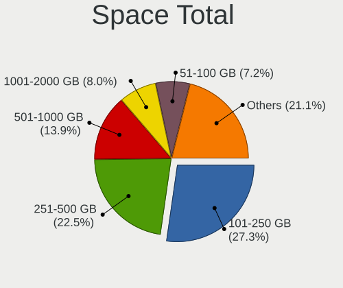

| Size in GB     | Computers | Percent |
|----------------|-----------|---------|
| 101-250        | 716       | 27.27%  |
| 251-500        | 592       | 22.54%  |
| 501-1000       | 365       | 13.9%   |
| 1001-2000      | 209       | 7.96%   |
| 51-100         | 189       | 7.2%    |
| 1-20           | 166       | 6.32%   |
| More than 3000 | 133       | 5.06%   |
| 21-50          | 98        | 3.73%   |
| Unknown        | 85        | 3.24%   |
| 2001-3000      | 73        | 2.78%   |

Space Used
----------

Amount of used disk space

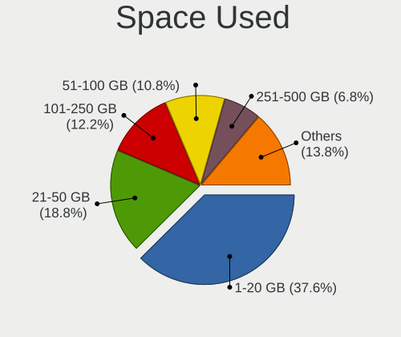

| Used GB        | Computers | Percent |
|----------------|-----------|---------|
| 1-20           | 1027      | 37.58%  |
| 21-50          | 514       | 18.81%  |
| 101-250        | 334       | 12.22%  |
| 51-100         | 294       | 10.76%  |
| 251-500        | 186       | 6.81%   |
| 501-1000       | 124       | 4.54%   |
| 1001-2000      | 90        | 3.29%   |
| Unknown        | 85        | 3.11%   |
| More than 3000 | 41        | 1.5%    |
| 2001-3000      | 32        | 1.17%   |
| 0              | 6         | 0.22%   |

Malfunc. Drives
---------------

Drive models with a malfunction

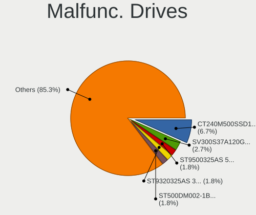

| Model                              | Computers | Drives | Percent |
|------------------------------------|-----------|--------|---------|
| Crucial CT240M500SSD1 240GB        | 15        | 16     | 6.67%   |
| Kingston SV300S37A120G 120GB SSD   | 6         | 6      | 2.67%   |
| Seagate ST9500325AS 500GB          | 4         | 4      | 1.78%   |
| Seagate ST9320325AS 320GB          | 4         | 5      | 1.78%   |
| Seagate ST500DM002-1BD142 500GB    | 4         | 4      | 1.78%   |
| Seagate ST3500418AS 500GB          | 4         | 4      | 1.78%   |
| Toshiba MQ01ABD100 1TB             | 3         | 3      | 1.33%   |
| Seagate ST500LT012-1DG142 500GB    | 3         | 3      | 1.33%   |
| Seagate ST1000LM024 HN-M101MBB 1TB | 3         | 3      | 1.33%   |
| Kingston SV300S37A240G 240GB SSD   | 3         | 3      | 1.33%   |
| Hitachi HTS545050A7E380 500GB      | 3         | 4      | 1.33%   |
| China G521N256GB                   | 3         | 4      | 1.33%   |
| WDC WD800JD-60LSA0 80GB            | 2         | 2      | 0.89%   |
| WDC WD5000AZRX-00A8LB0 500GB       | 2         | 3      | 0.89%   |
| WDC WD5000AAKX-00ERMA0 500GB       | 2         | 2      | 0.89%   |
| WDC WD3200AAJS-00L7A0 320GB        | 2         | 2      | 0.89%   |
| WDC WD1002FBYS-02A6B0 1TB          | 2         | 2      | 0.89%   |
| Toshiba MQ01ABF050 500GB           | 2         | 2      | 0.89%   |
| Toshiba MK2552GSX 250GB            | 2         | 2      | 0.89%   |
| Seagate ST9250827AS 250GB          | 2         | 2      | 0.89%   |
| Seagate ST3320413CS 320GB          | 2         | 2      | 0.89%   |
| Seagate ST1000LM049-2GH172 1TB     | 2         | 2      | 0.89%   |
| Samsung Electronics HD252HJ 250GB  | 2         | 2      | 0.89%   |
| Samsung Electronics HD161HJ 160GB  | 2         | 2      | 0.89%   |
| Kingston SUV400S37240G 240GB SSD   | 2         | 2      | 0.89%   |
| Kingston SA400S37240G 240GB SSD    | 2         | 2      | 0.89%   |
| Hitachi HTS727575A9E364 752GB      | 2         | 2      | 0.89%   |
| Hitachi HTS547550A9E384 500GB      | 2         | 2      | 0.89%   |
| Hitachi HTS543216L9A300 160GB      | 2         | 2      | 0.89%   |
| HGST HTS721010A9E630 1TB           | 2         | 2      | 0.89%   |
| WDC WD7500BPVX-60JC3T0 752GB       | 1         | 2      | 0.44%   |
| WDC WD6400BEVT-22A0RT0 640GB       | 1         | 1      | 0.44%   |
| WDC WD6400AADS-00M2B0 640GB        | 1         | 1      | 0.44%   |
| WDC WD5000LPCX-60VHAT0 500GB       | 1         | 1      | 0.44%   |
| WDC WD5000BPVT-80HXZT1 500GB       | 1         | 1      | 0.44%   |
| WDC WD5000BPVT-22HXZT1 500GB       | 1         | 1      | 0.44%   |
| WDC WD5000AZRX-00A3KB0 500GB       | 1         | 1      | 0.44%   |
| WDC WD5000AAKX-221CA1 500GB        | 1         | 2      | 0.44%   |
| WDC WD5000AAKS-00V1A0 500GB        | 1         | 1      | 0.44%   |
| WDC WD5000AAKS-00A7B0 500GB        | 1         | 4      | 0.44%   |

Malfunc. Drive Vendor
---------------------

Vendors of faulty drives

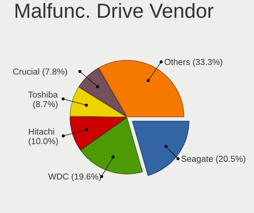

| Vendor                    | Computers | Drives | Percent |
|---------------------------|-----------|--------|---------|
| Seagate                   | 45        | 51     | 20.55%  |
| WDC                       | 43        | 53     | 19.63%  |
| Hitachi                   | 22        | 26     | 10.05%  |
| Toshiba                   | 19        | 20     | 8.68%   |
| Crucial                   | 17        | 19     | 7.76%   |
| Kingston                  | 14        | 15     | 6.39%   |
| Samsung Electronics       | 13        | 15     | 5.94%   |
| SK hynix                  | 6         | 6      | 2.74%   |
| China                     | 6         | 8      | 2.74%   |
| Maxtor                    | 5         | 9      | 2.28%   |
| Intel                     | 4         | 5      | 1.83%   |
| HGST                      | 4         | 4      | 1.83%   |
| SanDisk                   | 2         | 2      | 0.91%   |
| A-DATA Technology         | 2         | 2      | 0.91%   |
| VNYEZ                     | 1         | 1      | 0.46%   |
| USB                       | 1         | 1      | 0.46%   |
| Unknown                   | 1         | 1      | 0.46%   |
| Transcend                 | 1         | 1      | 0.46%   |
| Team                      | 1         | 1      | 0.46%   |
| T-FORCE                   | 1         | 1      | 0.46%   |
| Patriot                   | 1         | 1      | 0.46%   |
| OCZ                       | 1         | 1      | 0.46%   |
| Micron/Crucial Technology | 1         | 1      | 0.46%   |
| Micron Technology         | 1         | 1      | 0.46%   |
| LITEON                    | 1         | 1      | 0.46%   |
| KingDian                  | 1         | 2      | 0.46%   |
| HP Phison                 | 1         | 1      | 0.46%   |
| Fujitsu                   | 1         | 1      | 0.46%   |
| ExcelStor                 | 1         | 1      | 0.46%   |
| Apple                     | 1         | 1      | 0.46%   |
| Unknown                   | 1         | 1      | 0.46%   |

Malfunc. HDD Vendor
-------------------

Vendors of faulty HDD drives

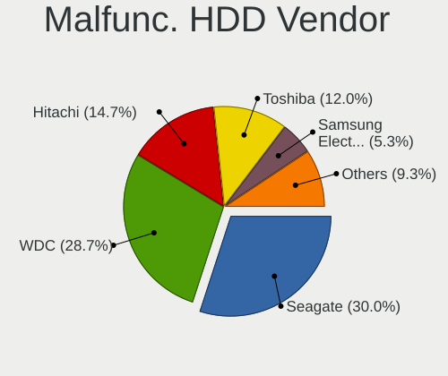

| Vendor              | Computers | Drives | Percent |
|---------------------|-----------|--------|---------|
| Seagate             | 45        | 51     | 30%     |
| WDC                 | 43        | 53     | 28.67%  |
| Hitachi             | 22        | 26     | 14.67%  |
| Toshiba             | 18        | 19     | 12%     |
| Samsung Electronics | 8         | 9      | 5.33%   |
| Maxtor              | 5         | 9      | 3.33%   |
| HGST                | 4         | 4      | 2.67%   |
| USB                 | 1         | 1      | 0.67%   |
| Fujitsu             | 1         | 1      | 0.67%   |
| ExcelStor           | 1         | 1      | 0.67%   |
| Apple               | 1         | 1      | 0.67%   |
| Unknown             | 1         | 1      | 0.67%   |

Malfunc. Drive Kind
-------------------

Kinds of faulty drives

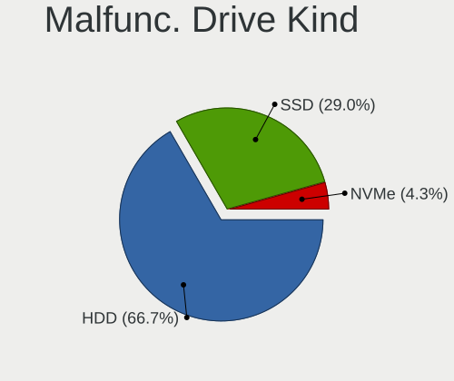

| Kind | Computers | Drives | Percent |
|------|-----------|--------|---------|
| HDD  | 138       | 176    | 66.67%  |
| SSD  | 60        | 68     | 28.99%  |
| NVMe | 9         | 9      | 4.35%   |

Failed Drives
-------------

Failed drive models

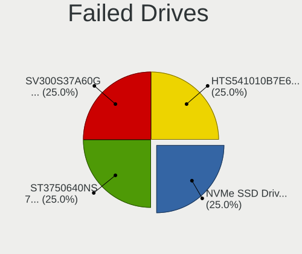

| Model                          | Computers | Drives | Percent |
|--------------------------------|-----------|--------|---------|
| Toshiba NVMe SSD Drive 256GB   | 1         | 1      | 25%     |
| Seagate ST3750640NS 752GB      | 1         | 1      | 25%     |
| Kingston SV300S37A60G 64GB SSD | 1         | 1      | 25%     |
| HGST HTS541010B7E610 1TB       | 1         | 1      | 25%     |

Failed Drive Vendor
-------------------

Failed drive vendors

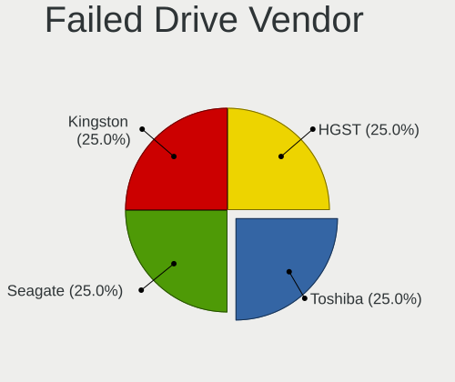

| Vendor   | Computers | Drives | Percent |
|----------|-----------|--------|---------|
| Toshiba  | 1         | 1      | 25%     |
| Seagate  | 1         | 1      | 25%     |
| Kingston | 1         | 1      | 25%     |
| HGST     | 1         | 1      | 25%     |

Drive Status
------------

Number of failed and malfunc. drives

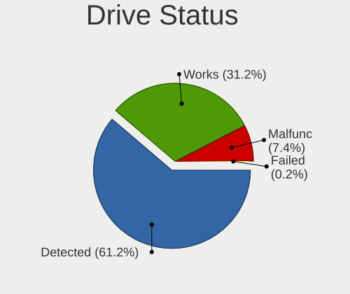

| Status   | Computers | Drives | Percent |
|----------|-----------|--------|---------|
| Detected | 1631      | 3257   | 61.25%  |
| Works    | 830       | 1462   | 31.17%  |
| Malfunc  | 198       | 253    | 7.44%   |
| Failed   | 4         | 4      | 0.15%   |

Storage controller
------------------

Storage Vendor
--------------

Storage controller vendors

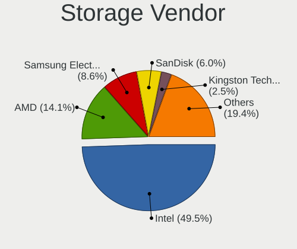

| Vendor                           | Computers | Percent |
|----------------------------------|-----------|---------|
| Intel                            | 1551      | 49.46%  |
| AMD                              | 441       | 14.06%  |
| Samsung Electronics              | 269       | 8.58%   |
| SanDisk                          | 189       | 6.03%   |
| Kingston Technology Company      | 78        | 2.49%   |
| Micron Technology                | 74        | 2.36%   |
| Phison Electronics               | 69        | 2.2%    |
| SK hynix                         | 59        | 1.88%   |
| KIOXIA                           | 52        | 1.66%   |
| ASMedia Technology               | 42        | 1.34%   |
| Micron/Crucial Technology        | 41        | 1.31%   |
| Toshiba America Info Systems     | 40        | 1.28%   |
| Nvidia                           | 37        | 1.18%   |
| JMicron Technology               | 32        | 1.02%   |
| Silicon Integrated Systems [SiS] | 19        | 0.61%   |
| Marvell Technology Group         | 16        | 0.51%   |
| Silicon Motion                   | 15        | 0.48%   |
| MAXIO Technology (Hangzhou)      | 15        | 0.48%   |
| VIA Technologies                 | 14        | 0.45%   |
| Union Memory (Shenzhen)          | 9         | 0.29%   |
| Shenzhen Longsys Electronics     | 8         | 0.26%   |
| Realtek Semiconductor            | 8         | 0.26%   |
| ADATA Technology                 | 8         | 0.26%   |
| LSI Logic / Symbios Logic        | 7         | 0.22%   |
| Lite-On Technology               | 6         | 0.19%   |
| Lenovo                           | 4         | 0.13%   |
| Solidigm                         | 3         | 0.1%    |
| Solid State Storage Technology   | 3         | 0.1%    |
| Shenzhen Techwinsemi Technology  | 3         | 0.1%    |
| O2 Micro                         | 3         | 0.1%    |
| Hewlett-Packard                  | 3         | 0.1%    |
| Broadcom / LSI                   | 3         | 0.1%    |
| Apple                            | 3         | 0.1%    |
| Adaptec                          | 3         | 0.1%    |
| Seagate Technology               | 2         | 0.06%   |
| INNOGRIT                         | 2         | 0.06%   |
| ULi Electronics                  | 1         | 0.03%   |
| Silicon Image                    | 1         | 0.03%   |
| Netac Technology                 | 1         | 0.03%   |
| Hosin Global Electronics         | 1         | 0.03%   |

Storage Model
-------------

Storage controller models

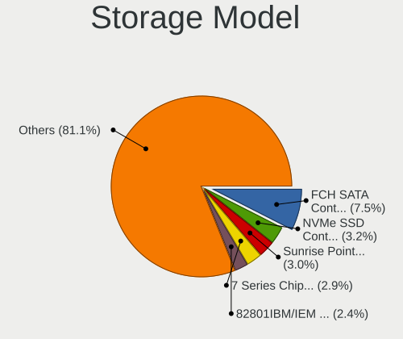

| Model                                                                          | Computers | Percent |
|--------------------------------------------------------------------------------|-----------|---------|
| AMD FCH SATA Controller [AHCI mode]                                            | 270       | 7.49%   |
| Samsung NVMe SSD Controller SM981/PM981/PM983                                  | 115       | 3.19%   |
| Intel Sunrise Point-LP SATA Controller [AHCI mode]                             | 107       | 2.97%   |
| Intel 7 Series Chipset Family 6-port SATA Controller [AHCI mode]               | 103       | 2.86%   |
| Intel 82801IBM/IEM (ICH9M/ICH9M-E) 4 port SATA Controller [AHCI mode]          | 87        | 2.41%   |
| Intel 8 Series/C220 Series Chipset Family 6-port SATA Controller 1 [AHCI mode] | 80        | 2.22%   |
| Intel 6 Series/C200 Series Chipset Family 6 port Mobile SATA AHCI Controller   | 69        | 1.91%   |
| Intel 82801 Mobile SATA Controller [RAID mode]                                 | 68        | 1.89%   |
| Intel 82801HM/HEM (ICH8M/ICH8M-E) IDE Controller                               | 64        | 1.77%   |
| Intel Volume Management Device NVMe RAID Controller                            | 62        | 1.72%   |
| Intel 5 Series/3400 Series Chipset 4 port SATA AHCI Controller                 | 62        | 1.72%   |
| AMD 500 Series Chipset SATA Controller                                         | 61        | 1.69%   |
| Intel 82801G (ICH7 Family) IDE Controller                                      | 57        | 1.58%   |
| Intel 82801HM/HEM (ICH8M/ICH8M-E) SATA Controller [AHCI mode]                  | 56        | 1.55%   |
| Intel 8 Series SATA Controller 1 [AHCI mode]                                   | 53        | 1.47%   |
| Intel NM10/ICH7 Family SATA Controller [IDE mode]                              | 51        | 1.41%   |
| AMD 400 Series Chipset SATA Controller                                         | 49        | 1.36%   |
| Samsung NVMe SSD Controller PM9A1/PM9A3/980PRO                                 | 46        | 1.28%   |
| Intel Q170/Q150/B150/H170/H110/Z170/CM236 Chipset SATA Controller [AHCI Mode]  | 46        | 1.28%   |
| Intel Wildcat Point-LP SATA Controller [AHCI Mode]                             | 45        | 1.25%   |
| Samsung NVMe SSD Controller 980 (DRAM-less)                                    | 43        | 1.19%   |
| Intel Cannon Lake Mobile PCH SATA AHCI Controller                              | 38        | 1.05%   |
| ASMedia ASM1061/ASM1062 Serial ATA Controller                                  | 37        | 1.03%   |
| AMD SB7x0/SB8x0/SB9x0 IDE Controller                                           | 35        | 0.97%   |
| SanDisk Extreme Pro / WD Black SN750 / PC SN730 / Red SN700 NVMe SSD           | 33        | 0.92%   |
| Intel Comet Lake SATA AHCI Controller                                          | 32        | 0.89%   |
| SanDisk Ultra 3D / WD PC SN530, IX SN530, Blue SN550 NVMe SSD (DRAM-less)      | 30        | 0.83%   |
| Samsung NVMe SSD Controller SM961/PM961/SM963                                  | 30        | 0.83%   |
| Intel HM170/QM170 Chipset SATA Controller [AHCI Mode]                          | 30        | 0.83%   |
| AMD 600 Series Chipset SATA Controller                                         | 30        | 0.83%   |
| SanDisk WD SN560/SN740/SN770/SN5000 NVMe SSD                                   | 29        | 0.8%    |
| Intel Cannon Lake PCH SATA AHCI Controller                                     | 29        | 0.8%    |
| AMD SB7x0/SB8x0/SB9x0 SATA Controller [AHCI mode]                              | 29        | 0.8%    |
| Intel 200 Series PCH SATA controller [AHCI mode]                               | 28        | 0.78%   |
| Intel 7 Series/C210 Series Chipset Family 6-port SATA Controller [AHCI mode]   | 27        | 0.75%   |
| Phison E12 NVMe Controller                                                     | 26        | 0.72%   |
| Intel SSD 660P Series                                                          | 26        | 0.72%   |
| Intel 5 Series/3400 Series Chipset 6 port SATA AHCI Controller                 | 26        | 0.72%   |
| Phison PS5013-E13 PCIe3 NVMe Controller (DRAM-less)                            | 24        | 0.67%   |
| Intel SATA Controller [RAID mode]                                              | 24        | 0.67%   |

Storage Kind
------------

Kind of storage controller (IDE, SATA, NVMe, SAS, ...)

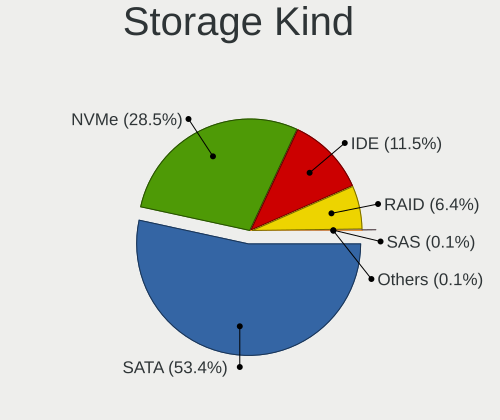

| Kind | Computers | Percent |
|------|-----------|---------|
| SATA | 1689      | 53.4%   |
| NVMe | 903       | 28.55%  |
| IDE  | 363       | 11.48%  |
| RAID | 201       | 6.35%   |
| SAS  | 4         | 0.13%   |
| SCSI | 3         | 0.09%   |

Processor
---------

CPU Vendor
----------

Processor vendors

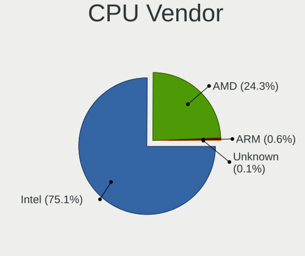

| Vendor  | Computers | Percent |
|---------|-----------|---------|
| Intel   | 1845      | 75.09%  |
| AMD     | 596       | 24.26%  |
| ARM     | 14        | 0.57%   |
| Unknown | 2         | 0.08%   |

CPU Model
---------

Processor models

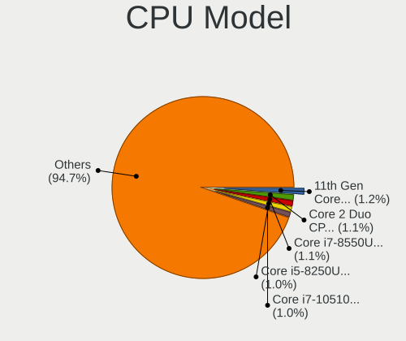

| Model                                         | Computers | Percent |
|-----------------------------------------------|-----------|---------|
| Intel 11th Gen Core i7-1165G7 @ 2.80GHz       | 29        | 1.18%   |
| Intel Core 2 Duo CPU T8300 @ 2.40GHz          | 27        | 1.1%    |
| Intel Core i7-8550U CPU @ 1.80GHz             | 26        | 1.06%   |
| Intel Core i5-8250U CPU @ 1.60GHz             | 25        | 1.01%   |
| Intel Core i7-10510U CPU @ 1.80GHz            | 24        | 0.97%   |
| Intel 11th Gen Core i5-1135G7 @ 2.40GHz       | 24        | 0.97%   |
| Intel Core i7-8565U CPU @ 1.80GHz             | 23        | 0.93%   |
| Intel Core i7-8750H CPU @ 2.20GHz             | 22        | 0.89%   |
| AMD Ryzen 5 3500U with Radeon Vega Mobile Gfx | 22        | 0.89%   |
| Intel Atom x5-Z8350 CPU @ 1.44GHz             | 21        | 0.85%   |
| Intel Core i7-9750H CPU @ 2.60GHz             | 20        | 0.81%   |
| AMD Ryzen 7 5800H with Radeon Graphics        | 20        | 0.81%   |
| Intel Core i5-7200U CPU @ 2.50GHz             | 19        | 0.77%   |
| AMD Ryzen 5 3600 6-Core Processor             | 19        | 0.77%   |
| AMD Ryzen 7 5700U with Radeon Graphics        | 18        | 0.73%   |
| Intel Pentium Dual-Core CPU T4300 @ 2.10GHz   | 16        | 0.65%   |
| Intel Core i7-7500U CPU @ 2.70GHz             | 16        | 0.65%   |
| Intel Core i7-10750H CPU @ 2.60GHz            | 16        | 0.65%   |
| AMD Ryzen 7 4800H with Radeon Graphics        | 16        | 0.65%   |
| Intel Core i7-6700HQ CPU @ 2.60GHz            | 15        | 0.61%   |
| Intel Core i5-8265U CPU @ 1.60GHz             | 15        | 0.61%   |
| Intel Core i5-5200U CPU @ 2.20GHz             | 14        | 0.57%   |
| AMD 3020e with Radeon Graphics                | 14        | 0.57%   |
| Intel Core i7-7700HQ CPU @ 2.80GHz            | 13        | 0.53%   |
| Intel Core i5-3320M CPU @ 2.60GHz             | 13        | 0.53%   |
| Intel Core i5-10210U CPU @ 1.60GHz            | 13        | 0.53%   |
| Intel Core i3-5005U CPU @ 2.00GHz             | 13        | 0.53%   |
| Intel Core i3-3217U CPU @ 1.80GHz             | 13        | 0.53%   |
| Intel Celeron CPU N2840 @ 2.16GHz             | 13        | 0.53%   |
| AMD Ryzen 5 5600H with Radeon Graphics        | 13        | 0.53%   |
| AMD Ryzen 5 5500U with Radeon Graphics        | 13        | 0.53%   |
| Intel Core i7-2630QM CPU @ 2.00GHz            | 12        | 0.49%   |
| Intel Core i5-6300U CPU @ 2.40GHz             | 12        | 0.49%   |
| Intel Core i5-6200U CPU @ 2.30GHz             | 12        | 0.49%   |
| Intel Core i5-3210M CPU @ 2.50GHz             | 12        | 0.49%   |
| Intel Core 2 Quad CPU Q6600 @ 2.40GHz         | 12        | 0.49%   |
| Intel Core i7-6500U CPU @ 2.50GHz             | 11        | 0.45%   |
| Intel Core 2 Duo CPU E8400 @ 3.00GHz          | 11        | 0.45%   |
| ARM Processor                                 | 11        | 0.45%   |
| AMD Ryzen 7 3700X 8-Core Processor            | 11        | 0.45%   |

CPU Model Family
----------------

Processor model prefix

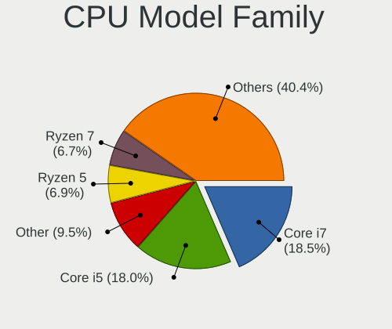

| Model                   | Computers | Percent |
|-------------------------|-----------|---------|
| Intel Core i7           | 456       | 18.51%  |
| Intel Core i5           | 443       | 17.99%  |
| Other                   | 233       | 9.46%   |
| AMD Ryzen 5             | 171       | 6.94%   |
| AMD Ryzen 7             | 166       | 6.74%   |
| Intel Core i3           | 155       | 6.29%   |
| Intel Core 2 Duo        | 138       | 5.6%    |
| Intel Celeron           | 102       | 4.14%   |
| Intel Atom              | 60        | 2.44%   |
| Intel Pentium Dual-Core | 55        | 2.23%   |
| Intel Xeon              | 40        | 1.62%   |
| Intel Pentium           | 40        | 1.62%   |
| AMD Ryzen 9             | 37        | 1.5%    |
| Intel Core 2 Quad       | 34        | 1.38%   |
| Intel Pentium Dual      | 33        | 1.34%   |
| AMD FX                  | 32        | 1.3%    |
| Intel Core 2            | 24        | 0.97%   |
| AMD A4                  | 20        | 0.81%   |
| Intel Core              | 18        | 0.73%   |
| AMD Ryzen 3             | 18        | 0.73%   |
| AMD A6                  | 18        | 0.73%   |
| Intel Genuine           | 17        | 0.69%   |
| AMD A8                  | 16        | 0.65%   |
| Intel Pentium 4         | 14        | 0.57%   |
| AMD A10                 | 10        | 0.41%   |
| AMD Ryzen 7 PRO         | 8         | 0.32%   |
| AMD E2                  | 8         | 0.32%   |
| AMD E                   | 8         | 0.32%   |
| Intel Pentium D         | 7         | 0.28%   |
| Intel Core i9           | 7         | 0.28%   |
| AMD Athlon              | 6         | 0.24%   |
| Intel Pentium M         | 5         | 0.2%    |
| AMD Ryzen Threadripper  | 4         | 0.16%   |
| AMD Ryzen 5 PRO         | 4         | 0.16%   |
| AMD E1                  | 4         | 0.16%   |
| Intel Core M            | 3         | 0.12%   |
| ARM BCM                 | 3         | 0.12%   |
| AMD Phenom II X4        | 3         | 0.12%   |
| AMD Athlon II X3        | 3         | 0.12%   |
| AMD Athlon II X2        | 3         | 0.12%   |

CPU Cores
---------

Number of processor cores

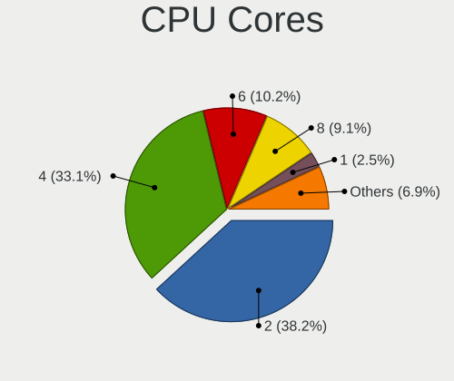

| Number  | Computers | Percent |
|---------|-----------|---------|
| 2       | 939       | 38.16%  |
| 4       | 814       | 33.08%  |
| 6       | 251       | 10.2%   |
| 8       | 225       | 9.14%   |
| 1       | 61        | 2.48%   |
| 10      | 39        | 1.58%   |
| 16      | 34        | 1.38%   |
| 12      | 34        | 1.38%   |
| 14      | 28        | 1.14%   |
| 3       | 15        | 0.61%   |
| Unknown | 8         | 0.33%   |
| 24      | 6         | 0.24%   |
| 20      | 4         | 0.16%   |
| 36      | 1         | 0.04%   |
| 28      | 1         | 0.04%   |
| 18      | 1         | 0.04%   |

CPU Sockets
-----------

Number of sockets

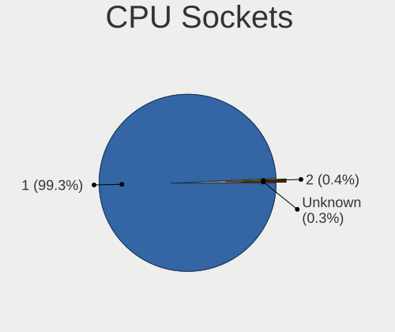

| Number  | Computers | Percent |
|---------|-----------|---------|
| 1       | 2439      | 99.27%  |
| 2       | 11        | 0.45%   |
| Unknown | 7         | 0.28%   |

CPU Threads
-----------

Threads per core (Hyper-Threading)

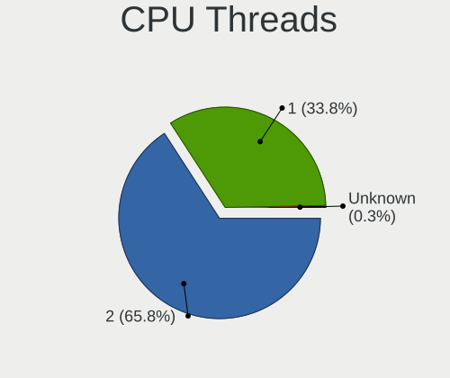

| Number  | Computers | Percent |
|---------|-----------|---------|
| 2       | 1623      | 65.84%  |
| 1       | 834       | 33.83%  |
| Unknown | 8         | 0.32%   |

CPU Op-Modes
------------

CPU Operation Modes (32-bit, 64-bit)

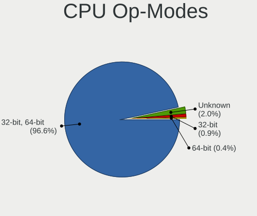

| Op mode        | Computers | Percent |
|----------------|-----------|---------|
| 32-bit, 64-bit | 2385      | 96.6%   |
| Unknown        | 50        | 2.03%   |
| 32-bit         | 23        | 0.93%   |
| 64-bit         | 11        | 0.45%   |

CPU Microcode
-------------

Microcode number

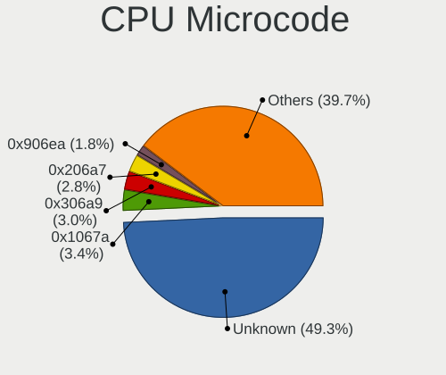

| Number     | Computers | Percent |
|------------|-----------|---------|
| Unknown    | 1264      | 49.26%  |
| 0x1067a    | 88        | 3.43%   |
| 0x306a9    | 77        | 3%      |
| 0x206a7    | 73        | 2.84%   |
| 0x906ea    | 46        | 1.79%   |
| 0x10676    | 44        | 1.71%   |
| 0x306c3    | 42        | 1.64%   |
| 0x806ea    | 41        | 1.6%    |
| 0x806ec    | 40        | 1.56%   |
| 0x6fd      | 36        | 1.4%    |
| 0x506e3    | 30        | 1.17%   |
| 0x40651    | 30        | 1.17%   |
| 0x806c1    | 29        | 1.13%   |
| 0x20655    | 25        | 0.97%   |
| 0x306d4    | 23        | 0.9%    |
| 0x406e3    | 21        | 0.82%   |
| 0x906e9    | 20        | 0.78%   |
| 0x806e9    | 19        | 0.74%   |
| 0x30678    | 19        | 0.74%   |
| 0x20652    | 19        | 0.74%   |
| 0x806eb    | 18        | 0.7%    |
| 0x406c4    | 18        | 0.7%    |
| 0x0a50000c | 18        | 0.7%    |
| 0x08701021 | 17        | 0.66%   |
| 0x06000852 | 17        | 0.66%   |
| 0x08108109 | 16        | 0.62%   |
| 0x6fb      | 15        | 0.58%   |
| 0x6f6      | 14        | 0.55%   |
| 0x106e5    | 14        | 0.55%   |
| 0x08200103 | 14        | 0.55%   |
| 0xa0652    | 13        | 0.51%   |
| 0x0800820d | 13        | 0.51%   |
| 0x0a50000d | 12        | 0.47%   |
| 0x406c3    | 11        | 0.43%   |
| 0x08600106 | 11        | 0.43%   |
| 0x106ca    | 10        | 0.39%   |
| 0x08108102 | 10        | 0.39%   |
| 0x07030105 | 10        | 0.39%   |
| 0x506c9    | 9         | 0.35%   |
| 0x08600104 | 9         | 0.35%   |

CPU Microarch
-------------

Microarchitecture

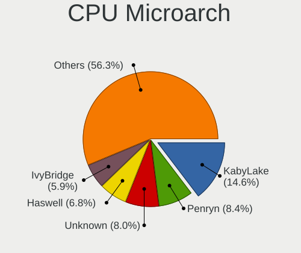

| Name               | Computers | Percent |
|--------------------|-----------|---------|
| KabyLake           | 361       | 14.64%  |
| Penryn             | 206       | 8.35%   |
| Unknown            | 198       | 8.03%   |
| Haswell            | 168       | 6.81%   |
| IvyBridge          | 145       | 5.88%   |
| SandyBridge        | 123       | 4.99%   |
| Zen 3              | 121       | 4.91%   |
| Core               | 109       | 4.42%   |
| Skylake            | 108       | 4.38%   |
| Zen 2              | 89        | 3.61%   |
| Westmere           | 83        | 3.37%   |
| Silvermont         | 81        | 3.28%   |
| Zen+               | 66        | 2.68%   |
| TigerLake          | 66        | 2.68%   |
| Broadwell          | 61        | 2.47%   |
| Alderlake Hybrid   | 61        | 2.47%   |
| Zen                | 49        | 1.99%   |
| CometLake          | 47        | 1.91%   |
| Piledriver         | 37        | 1.5%    |
| Puma               | 26        | 1.05%   |
| Excavator          | 24        | 0.97%   |
| NetBurst           | 23        | 0.93%   |
| Nehalem            | 23        | 0.93%   |
| Icelake            | 23        | 0.93%   |
| Bonnell            | 21        | 0.85%   |
| K10                | 18        | 0.73%   |
| Goldmont plus      | 17        | 0.69%   |
| Goldmont           | 17        | 0.69%   |
| Jaguar             | 14        | 0.57%   |
| P6                 | 13        | 0.53%   |
| Steamroller        | 12        | 0.49%   |
| Tremont            | 11        | 0.45%   |
| K8 Hammer          | 11        | 0.45%   |
| Bobcat             | 11        | 0.45%   |
| Meteorlake Hybrid  | 6         | 0.24%   |
| Gracemont          | 6         | 0.24%   |
| K8 & K10 hybrid    | 4         | 0.16%   |
| Bulldozer          | 3         | 0.12%   |
| K10 Llano          | 2         | 0.08%   |
| ArrowLake-H Hybrid | 2         | 0.08%   |

Graphics
--------

GPU Vendor
----------

Vendors of graphics cards

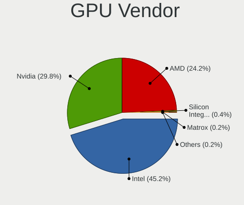

| Vendor                           | Computers | Percent |
|----------------------------------|-----------|---------|
| Intel                            | 1365      | 45.21%  |
| Nvidia                           | 900       | 29.81%  |
| AMD                              | 731       | 24.21%  |
| Silicon Integrated Systems [SiS] | 13        | 0.43%   |
| Matrox Electronics Systems       | 5         | 0.17%   |
| ASPEED Technology                | 4         | 0.13%   |
| Huawei Technologies              | 1         | 0.03%   |

GPU Model
---------

Graphics card models

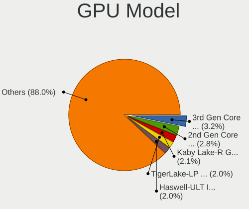

| Model                                                                                    | Computers | Percent |
|------------------------------------------------------------------------------------------|-----------|---------|
| Intel 3rd Gen Core processor Graphics Controller                                         | 100       | 3.2%    |
| Intel 2nd Generation Core Processor Family Integrated Graphics Controller                | 87        | 2.78%   |
| Intel Kaby Lake-R GT2 [UHD Graphics 620]                                                 | 66        | 2.11%   |
| Intel TigerLake-LP GT2 [Iris Xe Graphics]                                                | 61        | 1.95%   |
| Intel Haswell-ULT Integrated Graphics Controller                                         | 61        | 1.95%   |
| AMD Picasso/Raven 2 [Radeon Vega Series / Radeon Vega Mobile Series]                     | 57        | 1.82%   |
| Intel CoffeeLake-H GT2 [UHD Graphics 630]                                                | 54        | 1.73%   |
| Intel Atom/Celeron/Pentium Processor x5-E8000/J3xxx/N3xxx Integrated Graphics Controller | 49        | 1.57%   |
| AMD Cezanne [Radeon Vega Series / Radeon Vega Mobile Series]                             | 48        | 1.54%   |
| Intel WhiskeyLake-U GT2 [UHD Graphics 620]                                               | 47        | 1.5%    |
| Intel Skylake-U GT2 [HD Graphics 520]                                                    | 47        | 1.5%    |
| Intel CometLake-U GT2 [UHD Graphics]                                                     | 46        | 1.47%   |
| Intel Core Processor Integrated Graphics Controller                                      | 45        | 1.44%   |
| Intel Kaby Lake-U GT2 [HD Graphics 620]                                                  | 44        | 1.41%   |
| Intel Broadwell-U GT2 [HD Graphics 5500]                                                 | 44        | 1.41%   |
| Intel Mobile 4 Series Chipset Integrated Graphics Controller                             | 42        | 1.34%   |
| AMD Ellesmere [Radeon RX 470/480/570/570X/580/580X/590]                                  | 41        | 1.31%   |
| AMD Renoir [Radeon Vega Series / Radeon Vega Mobile Series]                              | 40        | 1.28%   |
| Intel 4th Gen Core Processor Integrated Graphics Controller                              | 36        | 1.15%   |
| Nvidia TU117M [GeForce GTX 1650 Mobile / Max-Q]                                          | 31        | 0.99%   |
| Intel Atom Processor Z36xxx/Z37xxx Series Graphics & Display                             | 31        | 0.99%   |
| AMD Lucienne                                                                             | 31        | 0.99%   |
| Intel 4 Series Chipset Integrated Graphics Controller                                    | 30        | 0.96%   |
| Intel Xeon E3-1200 v3/4th Gen Core Processor Integrated Graphics Controller              | 28        | 0.9%    |
| Intel Mobile GM965/GL960 Integrated Graphics Controller (secondary)                      | 28        | 0.9%    |
| Intel Mobile GM965/GL960 Integrated Graphics Controller (primary)                        | 28        | 0.9%    |
| Nvidia GP107M [GeForce GTX 1050 Mobile]                                                  | 27        | 0.86%   |
| Intel CometLake-H GT2 [UHD Graphics]                                                     | 23        | 0.74%   |
| Intel CoffeeLake-S GT2 [UHD Graphics 630]                                                | 23        | 0.74%   |
| Nvidia GK208B [GeForce GT 710]                                                           | 22        | 0.7%    |
| Nvidia GF117M [GeForce 610M/710M/810M/820M / GT 620M/625M/630M/720M]                     | 22        | 0.7%    |
| Nvidia G86M [GeForce 8600M GS]                                                           | 22        | 0.7%    |
| AMD Park [Mobility Radeon HD 5430/5450/5470]                                             | 22        | 0.7%    |
| Nvidia GA106M [GeForce RTX 3060 Mobile / Max-Q]                                          | 21        | 0.67%   |
| Intel Raptor Lake-P [Iris Xe Graphics]                                                   | 21        | 0.67%   |
| AMD Barcelo                                                                              | 20        | 0.64%   |
| Nvidia GP107 [GeForce GTX 1050 Ti]                                                       | 19        | 0.61%   |
| Nvidia GK208BM [GeForce 920M]                                                            | 19        | 0.61%   |
| Intel Skylake-H GT2 [HD Graphics 530]                                                    | 19        | 0.61%   |
| Intel Skylake-S GT2 [HD Graphics 530]                                                    | 18        | 0.58%   |

GPU Combo
---------

Combinations of graphics cards

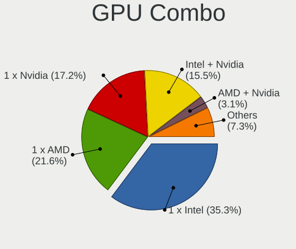

| Name                    | Computers | Percent |
|-------------------------|-----------|---------|
| 1 x Intel               | 877       | 35.26%  |
| 1 x AMD                 | 538       | 21.63%  |
| 1 x Nvidia              | 429       | 17.25%  |
| Intel + Nvidia          | 386       | 15.52%  |
| AMD + Nvidia            | 76        | 3.06%   |
| Intel + AMD             | 70        | 2.81%   |
| 2 x AMD                 | 51        | 2.05%   |
| Other                   | 17        | 0.68%   |
| 2 x Intel               | 15        | 0.6%    |
| 1 x SiS                 | 13        | 0.52%   |
| 2 x Nvidia              | 5         | 0.2%    |
| 1 x Matrox              | 4         | 0.16%   |
| Nvidia + ASPEED         | 3         | 0.12%   |
| Nvidia + Matrox         | 1         | 0.04%   |
| 1 x Huawei Technologies | 1         | 0.04%   |
| 1 x ASPEED              | 1         | 0.04%   |

GPU Driver
----------

Free vs proprietary

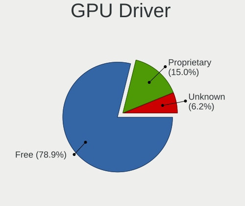

| Driver      | Computers | Percent |
|-------------|-----------|---------|
| Free        | 1975      | 78.87%  |
| Proprietary | 375       | 14.98%  |
| Unknown     | 154       | 6.15%   |

GPU Memory
----------

Total video memory

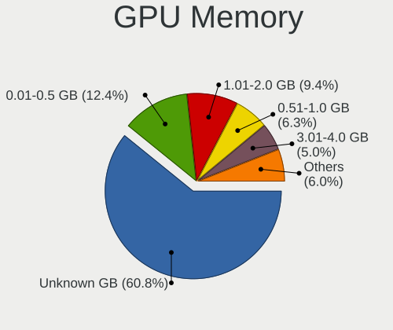

| Size in GB | Computers | Percent |
|------------|-----------|---------|
| Unknown    | 1546      | 60.84%  |
| 0.01-0.5   | 316       | 12.44%  |
| 1.01-2.0   | 238       | 9.37%   |
| 0.51-1.0   | 161       | 6.34%   |
| 3.01-4.0   | 128       | 5.04%   |
| 7.01-8.0   | 64        | 2.52%   |
| 5.01-6.0   | 42        | 1.65%   |
| 8.01-16.0  | 32        | 1.26%   |
| 2.01-3.0   | 8         | 0.31%   |
| 16.01-24.0 | 6         | 0.24%   |

Monitor
-------

Monitor Vendor
--------------

Monitor vendors

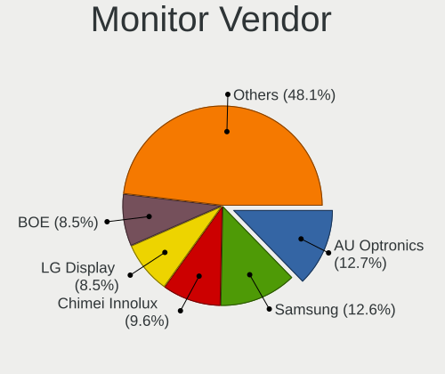

| Vendor                  | Computers | Percent |
|-------------------------|-----------|---------|
| AU Optronics            | 335       | 12.72%  |
| Samsung Electronics     | 332       | 12.6%   |
| Chimei Innolux          | 252       | 9.57%   |
| LG Display              | 225       | 8.54%   |
| BOE                     | 223       | 8.47%   |
| Goldstar                | 193       | 7.33%   |
| Hewlett-Packard         | 108       | 4.1%    |
| Ancor Communications    | 103       | 3.91%   |
| AOC                     | 93        | 3.53%   |
| Apple                   | 65        | 2.47%   |
| Dell                    | 61        | 2.32%   |
| Lenovo                  | 55        | 2.09%   |
| ASUSTek Computer        | 46        | 1.75%   |
| Chi Mei Optoelectronics | 42        | 1.59%   |
| BenQ                    | 42        | 1.59%   |
| Philips                 | 37        | 1.4%    |
| PANDA                   | 33        | 1.25%   |
| Acer                    | 31        | 1.18%   |
| Sharp                   | 30        | 1.14%   |
| LG Philips              | 30        | 1.14%   |
| Sony                    | 21        | 0.8%    |
| MSI                     | 15        | 0.57%   |
| LG Electronics          | 15        | 0.57%   |
| Unknown                 | 13        | 0.49%   |
| ViewSonic               | 11        | 0.42%   |
| InfoVision              | 11        | 0.42%   |
| Gigabyte Technology     | 10        | 0.38%   |
| CPT                     | 10        | 0.38%   |
| Valve                   | 8         | 0.3%    |
| Toshiba                 | 8         | 0.3%    |
| Fujitsu Siemens         | 8         | 0.3%    |
| Mi                      | 7         | 0.27%   |
| HannStar                | 7         | 0.27%   |
| CSO                     | 7         | 0.27%   |
| Seiko/Epson             | 6         | 0.23%   |
| HUAWEI                  | 6         | 0.23%   |
| RTK                     | 5         | 0.19%   |
| HKC                     | 5         | 0.19%   |
| CSW                     | 5         | 0.19%   |
| Vestel Elektronik       | 4         | 0.15%   |

Monitor Model
-------------

Monitor models

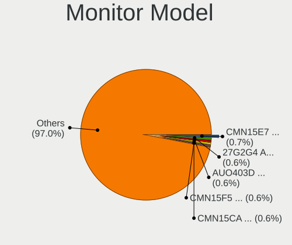

| Model                                                                    | Computers | Percent |
|--------------------------------------------------------------------------|-----------|---------|
| Chimei Innolux LCD Monitor CMN15E7 1920x1080 344x193mm 15.5-inch         | 19        | 0.7%    |
| AOC 27G2G4 AOC2702 1920x1080 598x336mm 27.0-inch                         | 17        | 0.63%   |
| AU Optronics LCD Monitor AUO403D 1920x1080 309x174mm 14.0-inch           | 16        | 0.59%   |
| Chimei Innolux LCD Monitor CMN15F5 1920x1080 344x193mm 15.5-inch         | 15        | 0.55%   |
| Chimei Innolux LCD Monitor CMN15CA 1366x768 344x193mm 15.5-inch          | 15        | 0.55%   |
| AU Optronics LCD Monitor AUO723C 1366x768 309x173mm 13.9-inch            | 14        | 0.52%   |
| Goldstar FULL HD GSM5B55 1920x1080 480x270mm 21.7-inch                   | 13        | 0.48%   |
| Chimei Innolux LCD Monitor CMN14D4 1920x1080 309x173mm 13.9-inch         | 10        | 0.37%   |
| AU Optronics LCD Monitor AUO22EC 1366x768 344x193mm 15.5-inch            | 10        | 0.37%   |
| AU Optronics LCD Monitor AUO21ED 1920x1080 344x193mm 15.5-inch           | 10        | 0.37%   |
| Ancor Communications VX238 ACI23C1 1920x1080 510x290mm 23.1-inch         | 10        | 0.37%   |
| Goldstar HDR WFHD GSM7714 2560x1080 798x334mm 34.1-inch                  | 9         | 0.33%   |
| Chimei Innolux LCD Monitor CMN15E6 1366x768 344x193mm 15.5-inch          | 9         | 0.33%   |
| Chimei Innolux LCD Monitor CMN14D5 1920x1080 309x173mm 13.9-inch         | 9         | 0.33%   |
| BenQ GW2480 BNQ78E7 1920x1080 527x296mm 23.8-inch                        | 9         | 0.33%   |
| AOC 24G2W1G3 AOC2402 1920x1080 527x296mm 23.8-inch                       | 9         | 0.33%   |
| Valve ANX7530 U VLV3001 800x1280 100x150mm 7.1-inch                      | 8         | 0.29%   |
| Chimei Innolux LCD Monitor CMN15DB 1366x768 344x193mm 15.5-inch          | 8         | 0.29%   |
| Chimei Innolux LCD Monitor CMN15BF 1366x768 344x194mm 15.5-inch          | 8         | 0.29%   |
| Chimei Innolux LCD Monitor CMN1521 1920x1080 344x193mm 15.5-inch         | 8         | 0.29%   |
| Chi Mei Optoelectronics LCD Monitor CMO1592 1366x768 344x193mm 15.5-inch | 8         | 0.29%   |
| BOE LCD Monitor BOE0893 2160x1440 296x197mm 14.0-inch                    | 8         | 0.29%   |
| AU Optronics LCD Monitor AUO8174 1280x800 331x207mm 15.4-inch            | 8         | 0.29%   |
| Ancor Communications ASUS VW193D ACI19D5 1440x900 408x255mm 18.9-inch    | 8         | 0.29%   |
| Samsung Electronics S24F350 SAM0D20 1920x1080 521x293mm 23.5-inch        | 7         | 0.26%   |
| Samsung Electronics S22D300 SAM0B3F 1920x1080 477x268mm 21.5-inch        | 7         | 0.26%   |
| PANDA LCD Monitor NCP0036 1920x1080 344x194mm 15.5-inch                  | 7         | 0.26%   |
| LG Display LCD Monitor LGD0521 1920x1080 309x174mm 14.0-inch             | 7         | 0.26%   |
| LG Display LCD Monitor LGD0456 1366x768 344x194mm 15.5-inch              | 7         | 0.26%   |
| LG Display LCD Monitor LGD039F 1366x768 345x194mm 15.6-inch              | 7         | 0.26%   |
| Goldstar LG ULTRAWIDE GSM59F1 2560x1080 670x280mm 28.6-inch              | 7         | 0.26%   |
| Goldstar FULL HD GSM5AB9 1920x1080 480x270mm 21.7-inch                   | 7         | 0.26%   |
| BOE LCD Monitor BOE0877 1920x1080 309x173mm 13.9-inch                    | 7         | 0.26%   |
| BOE LCD Monitor BOE0872 1920x1080 344x194mm 15.5-inch                    | 7         | 0.26%   |
| BOE LCD Monitor BOE0704 1366x768 344x194mm 15.5-inch                     | 7         | 0.26%   |
| BOE LCD Monitor BOE06A5 1366x768 344x194mm 15.5-inch                     | 7         | 0.26%   |
| AU Optronics LCD Monitor AUO26EC 1366x768 344x193mm 15.5-inch            | 7         | 0.26%   |
| Samsung Electronics LCD Monitor SEC5541 1366x768 344x193mm 15.5-inch     | 6         | 0.22%   |
| Samsung Electronics LCD Monitor SEC5441 1280x800 331x207mm 15.4-inch     | 6         | 0.22%   |
| LG Display LCD Monitor LGD045D 1366x768 345x194mm 15.6-inch              | 6         | 0.22%   |

Monitor Resolution
------------------

Monitor screen resolution

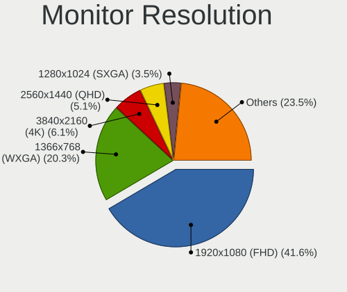

| Resolution         | Computers | Percent |
|--------------------|-----------|---------|
| 1920x1080 (FHD)    | 1040      | 41.55%  |
| 1366x768 (WXGA)    | 509       | 20.34%  |
| 3840x2160 (4K)     | 152       | 6.07%   |
| 2560x1440 (QHD)    | 127       | 5.07%   |
| 1280x1024 (SXGA)   | 88        | 3.52%   |
| 1280x800 (WXGA)    | 87        | 3.48%   |
| 1920x1200 (WUXGA)  | 67        | 2.68%   |
| 1440x900 (WXGA+)   | 65        | 2.6%    |
| 1680x1050 (WSXGA+) | 55        | 2.2%    |
| 1600x900 (HD+)     | 52        | 2.08%   |
| 2880x1800          | 27        | 1.08%   |
| 2560x1080          | 27        | 1.08%   |
| 2560x1600          | 24        | 0.96%   |
| 3440x1440          | 20        | 0.8%    |
| 1360x768           | 19        | 0.76%   |
| Unknown            | 19        | 0.76%   |
| 2160x1440          | 18        | 0.72%   |
| 1024x768 (XGA)     | 12        | 0.48%   |
| 3840x1080          | 9         | 0.36%   |
| 800x1280           | 8         | 0.32%   |
| 3840x2400          | 8         | 0.32%   |
| 1024x600           | 8         | 0.32%   |
| 2288x1287          | 5         | 0.2%    |
| 2880x1620          | 4         | 0.16%   |
| 1920x540           | 4         | 0.16%   |
| 1920x1280          | 4         | 0.16%   |
| 3200x2000          | 3         | 0.12%   |
| 3200x1800 (QHD+)   | 3         | 0.12%   |
| 2880x1920          | 3         | 0.12%   |
| 2256x1504          | 3         | 0.12%   |
| 1600x1200          | 3         | 0.12%   |
| 1400x1050          | 3         | 0.12%   |
| 1152x864           | 3         | 0.12%   |
| 3072x1920          | 2         | 0.08%   |
| 2240x1400          | 2         | 0.08%   |
| 6880x1440          | 1         | 0.04%   |
| 640x480            | 1         | 0.04%   |
| 5760x1080          | 1         | 0.04%   |
| 4560x1080          | 1         | 0.04%   |
| 4480x1600          | 1         | 0.04%   |

Monitor Diagonal
----------------

Diagonal size in inches

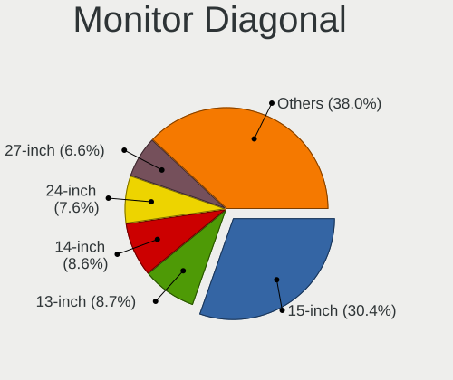

| Inches  | Computers | Percent |
|---------|-----------|---------|
| 15      | 801       | 30.38%  |
| 13      | 229       | 8.68%   |
| 14      | 228       | 8.65%   |
| 24      | 201       | 7.62%   |
| 27      | 175       | 6.64%   |
| 21      | 152       | 5.76%   |
| 23      | 113       | 4.29%   |
| 17      | 107       | 4.06%   |
| Unknown | 96        | 3.64%   |
| 31      | 72        | 2.73%   |
| 19      | 71        | 2.69%   |
| 16      | 47        | 1.78%   |
| 18      | 46        | 1.74%   |
| 12      | 36        | 1.37%   |
| 34      | 31        | 1.18%   |
| 22      | 26        | 0.99%   |
| 20      | 25        | 0.95%   |
| 11      | 20        | 0.76%   |
| 10      | 20        | 0.76%   |
| 84      | 18        | 0.68%   |
| 54      | 13        | 0.49%   |
| 63      | 11        | 0.42%   |
| 32      | 10        | 0.38%   |
| 28      | 10        | 0.38%   |
| 25      | 10        | 0.38%   |
| 40      | 9         | 0.34%   |
| 7       | 8         | 0.3%    |
| 26      | 7         | 0.27%   |
| 72      | 6         | 0.23%   |
| 33      | 6         | 0.23%   |
| 46      | 5         | 0.19%   |
| 48      | 4         | 0.15%   |
| 43      | 3         | 0.11%   |
| 142     | 2         | 0.08%   |
| 86      | 2         | 0.08%   |
| 42      | 2         | 0.08%   |
| 8       | 2         | 0.08%   |
| 82      | 1         | 0.04%   |
| 65      | 1         | 0.04%   |
| 60      | 1         | 0.04%   |

Monitor Width
-------------

Physical width

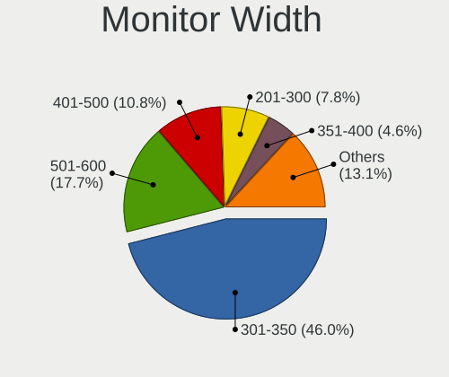

| Width in mm    | Computers | Percent |
|----------------|-----------|---------|
| 301-350        | 1192      | 46.02%  |
| 501-600        | 458       | 17.68%  |
| 401-500        | 279       | 10.77%  |
| 201-300        | 202       | 7.8%    |
| 351-400        | 120       | 4.63%   |
| 601-700        | 98        | 3.78%   |
| Unknown        | 96        | 3.71%   |
| 701-800        | 48        | 1.85%   |
| 1001-1500      | 43        | 1.66%   |
| 1501-2000      | 25        | 0.97%   |
| 801-900        | 12        | 0.46%   |
| 1-100          | 8         | 0.31%   |
| 901-1000       | 5         | 0.19%   |
| More than 2000 | 2         | 0.08%   |
| 101-200        | 2         | 0.08%   |

Aspect Ratio
------------

Proportional relationship between the width and the height

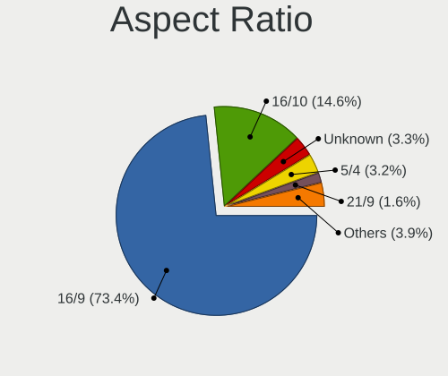

| Ratio   | Computers | Percent |
|---------|-----------|---------|
| 16/9    | 1736      | 73.37%  |
| 16/10   | 346       | 14.62%  |
| Unknown | 78        | 3.3%    |
| 5/4     | 75        | 3.17%   |
| 21/9    | 39        | 1.65%   |
| 3/2     | 37        | 1.56%   |
| 4/3     | 32        | 1.35%   |
| 0.67    | 8         | 0.34%   |
| 6/5     | 5         | 0.21%   |
| 32/9    | 4         | 0.17%   |
| 1.00    | 2         | 0.08%   |
| 0.56    | 2         | 0.08%   |
| 3.40    | 1         | 0.04%   |
| 0.63    | 1         | 0.04%   |

Monitor Area
------------

Area in inch²

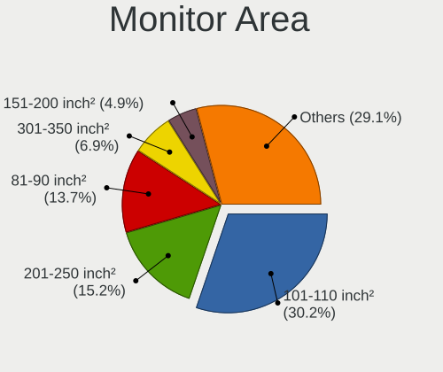

| Area in inch² | Computers | Percent |
|----------------|-----------|---------|
| 101-110        | 793       | 30.22%  |
| 201-250        | 400       | 15.24%  |
| 81-90          | 359       | 13.68%  |
| 301-350        | 181       | 6.9%    |
| 151-200        | 128       | 4.88%   |
| 351-500        | 121       | 4.61%   |
| Unknown        | 96        | 3.66%   |
| 71-80          | 93        | 3.54%   |
| 141-150        | 83        | 3.16%   |
| 251-300        | 76        | 2.9%    |
| More than 1000 | 61        | 2.32%   |
| 121-130        | 51        | 1.94%   |
| 111-120        | 48        | 1.83%   |
| 61-70          | 33        | 1.26%   |
| 501-1000       | 27        | 1.03%   |
| 51-60          | 22        | 0.84%   |
| 41-50          | 19        | 0.72%   |
| 131-140        | 13        | 0.5%    |
| 1-40           | 10        | 0.38%   |
| 91-100         | 10        | 0.38%   |

Pixel Density
-------------

Pixels per inch

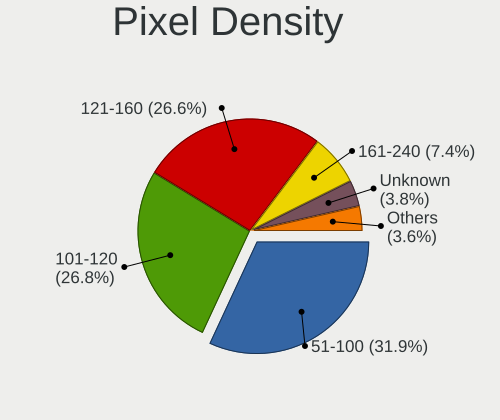

| Density       | Computers | Percent |
|---------------|-----------|---------|
| 51-100        | 811       | 31.92%  |
| 101-120       | 681       | 26.8%   |
| 121-160       | 675       | 26.56%  |
| 161-240       | 187       | 7.36%   |
| Unknown       | 96        | 3.78%   |
| More than 240 | 48        | 1.89%   |
| 1-50          | 43        | 1.69%   |

Multiple Monitors
-----------------

Total monitors connected

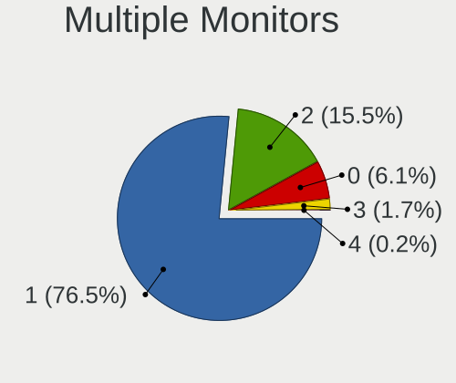

| Total | Computers | Percent |
|-------|-----------|---------|
| 1     | 1941      | 76.54%  |
| 2     | 393       | 15.5%   |
| 0     | 154       | 6.07%   |
| 3     | 44        | 1.74%   |
| 4     | 4         | 0.16%   |

Network
-------

Net Controller Vendor
---------------------

Controller vendors

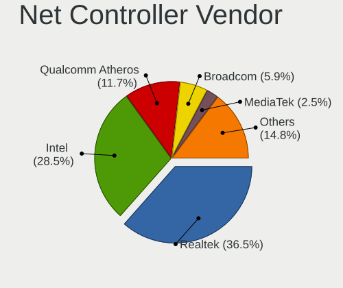

| Vendor                                 | Computers | Percent |
|----------------------------------------|-----------|---------|
| Realtek Semiconductor                  | 1364      | 36.53%  |
| Intel                                  | 1065      | 28.52%  |
| Qualcomm Atheros                       | 438       | 11.73%  |
| Broadcom                               | 221       | 5.92%   |
| MediaTek                               | 95        | 2.54%   |
| TP-Link                                | 81        | 2.17%   |
| Marvell Technology Group               | 72        | 1.93%   |
| Broadcom Limited                       | 48        | 1.29%   |
| Nvidia                                 | 31        | 0.83%   |
| Ralink                                 | 27        | 0.72%   |
| Qualcomm Atheros Communications        | 25        | 0.67%   |
| Silicon Integrated Systems [SiS]       | 19        | 0.51%   |
| ASIX Electronics                       | 19        | 0.51%   |
| Ralink Technology                      | 18        | 0.48%   |
| D-Link                                 | 12        | 0.32%   |
| ASUSTek Computer                       | 12        | 0.32%   |
| Samsung Electronics                    | 11        | 0.29%   |
| Sierra Wireless                        | 9         | 0.24%   |
| Xiaomi                                 | 8         | 0.21%   |
| JMicron Technology                     | 8         | 0.21%   |
| Shenzhen Goodix Technology             | 7         | 0.19%   |
| DisplayLink                            | 7         | 0.19%   |
| VIA Technologies                       | 6         | 0.16%   |
| Microsoft                              | 6         | 0.16%   |
| Lenovo                                 | 6         | 0.16%   |
| D-Link System                          | 6         | 0.16%   |
| Qualcomm                               | 5         | 0.13%   |
| Huawei Technologies                    | 5         | 0.13%   |
| Hewlett-Packard                        | 5         | 0.13%   |
| Ericsson Business Mobile Networks      | 5         | 0.13%   |
| Dell                                   | 5         | 0.13%   |
| Attansic Technology                    | 5         | 0.13%   |
| Suzhou Motorcomm Electronic Technology | 4         | 0.11%   |
| Qualcomm Technologies                  | 4         | 0.11%   |
| ICS Advent                             | 4         | 0.11%   |
| Google                                 | 4         | 0.11%   |
| Fibocom                                | 4         | 0.11%   |
| ADMtek                                 | 4         | 0.11%   |
| Toshiba                                | 3         | 0.08%   |
| Mercucys                               | 3         | 0.08%   |

Net Controller Model
--------------------

Controller models

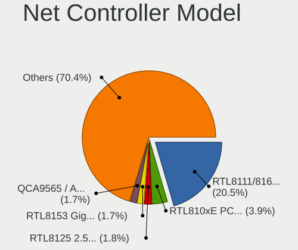

| Model                                                                   | Computers | Percent |
|-------------------------------------------------------------------------|-----------|---------|
| Realtek RTL8111/8168/8211/8411 PCI Express Gigabit Ethernet Controller  | 886       | 20.48%  |
| Realtek RTL810xE PCI Express Fast Ethernet controller                   | 167       | 3.86%   |
| Realtek RTL8125 2.5GbE Controller                                       | 80        | 1.85%   |
| Realtek RTL8153 Gigabit Ethernet Adapter                                | 75        | 1.73%   |
| Qualcomm Atheros QCA9565 / AR9565 Wireless Network Adapter              | 74        | 1.71%   |
| Intel Wi-Fi 6 AX200                                                     | 73        | 1.69%   |
| Qualcomm Atheros AR9285 Wireless Network Adapter (PCI-Express)          | 66        | 1.53%   |
| Intel Wireless 8265 / 8275                                              | 62        | 1.43%   |
| Qualcomm Atheros QCA9377 802.11ac Wireless Network Adapter              | 57        | 1.32%   |
| Intel 82579LM Gigabit Network Connection (Lewisville)                   | 52        | 1.2%    |
| Realtek RTL8822CE 802.11ac PCIe Wireless Network Adapter                | 51        | 1.18%   |
| Realtek RTL8821CE 802.11ac PCIe Wireless Network Adapter                | 51        | 1.18%   |
| Intel Wireless 7265                                                     | 48        | 1.11%   |
| Intel Wi-Fi 6 AX201                                                     | 48        | 1.11%   |
| Qualcomm Atheros AR9485 Wireless Network Adapter                        | 45        | 1.04%   |
| MediaTek MT7921 802.11ax PCIe Wireless Network Adapter [Filogic 330]    | 42        | 0.97%   |
| Intel Comet Lake PCH-LP CNVi WiFi                                       | 41        | 0.95%   |
| Intel Cannon Lake PCH CNVi WiFi                                         | 41        | 0.95%   |
| Intel Wireless 8260                                                     | 36        | 0.83%   |
| Intel Alder Lake-P PCH CNVi WiFi                                        | 36        | 0.83%   |
| Intel Wireless 7260                                                     | 35        | 0.81%   |
| Qualcomm Atheros QCA6174 802.11ac Wireless Network Adapter              | 33        | 0.76%   |
| Broadcom BCM43142 802.11b/g/n                                           | 33        | 0.76%   |
| Intel Cannon Point-LP CNVi [Wireless-AC]                                | 32        | 0.74%   |
| Intel Wireless 3165                                                     | 31        | 0.72%   |
| Intel PRO/Wireless 4965 AG or AGN [Kedron] Network Connection           | 31        | 0.72%   |
| Intel I211 Gigabit Network Connection                                   | 31        | 0.72%   |
| Broadcom BCM4313 802.11bgn Wireless Network Adapter                     | 31        | 0.72%   |
| TP-Link UE300 10/100/1000 LAN (ethernet mode) [Realtek RTL8153]         | 30        | 0.69%   |
| Realtek RTL8723BE PCIe Wireless Network Adapter                         | 30        | 0.69%   |
| Qualcomm Atheros AR242x / AR542x Wireless Network Adapter (PCI-Express) | 30        | 0.69%   |
| MediaTek MT7922 802.11ax PCI Express Wireless Network Adapter           | 27        | 0.62%   |
| Marvell Group 88E8036 PCI-E Fast Ethernet Controller                    | 27        | 0.62%   |
| Realtek RTL8852AE 802.11ax PCIe Wireless Network Adapter                | 25        | 0.58%   |
| Realtek RTL8188EUS 802.11n Wireless Network Adapter                     | 24        | 0.55%   |
| Intel PRO/Wireless 3945ABG [Golan] Network Connection                   | 24        | 0.55%   |
| Intel Centrino Advanced-N 6205 [Taylor Peak]                            | 23        | 0.53%   |
| Intel Comet Lake PCH CNVi WiFi                                          | 22        | 0.51%   |
| Qualcomm Atheros AR928X Wireless Network Adapter (PCI-Express)          | 21        | 0.49%   |
| Intel Ethernet Connection (2) I219-V                                    | 21        | 0.49%   |

Wireless Vendor
---------------

Wireless vendors

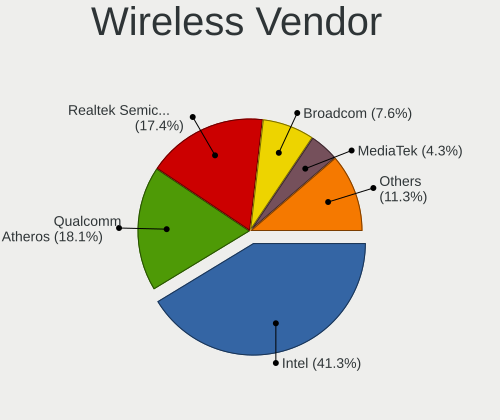

| Vendor                                | Computers | Percent |
|---------------------------------------|-----------|---------|
| Intel                                 | 829       | 41.31%  |
| Qualcomm Atheros                      | 363       | 18.09%  |
| Realtek Semiconductor                 | 350       | 17.44%  |
| Broadcom                              | 152       | 7.57%   |
| MediaTek                              | 86        | 4.29%   |
| TP-Link                               | 51        | 2.54%   |
| Broadcom Limited                      | 34        | 1.69%   |
| Ralink                                | 27        | 1.35%   |
| Qualcomm Atheros Communications       | 25        | 1.25%   |
| Ralink Technology                     | 18        | 0.9%    |
| D-Link                                | 12        | 0.6%    |
| ASUSTek Computer                      | 12        | 0.6%    |
| Sierra Wireless                       | 9         | 0.45%   |
| Microsoft                             | 5         | 0.25%   |
| Marvell Technology Group              | 5         | 0.25%   |
| Dell                                  | 5         | 0.25%   |
| Fibocom                               | 4         | 0.2%    |
| Mercucys                              | 3         | 0.15%   |
| Edimax Technology                     | 3         | 0.15%   |
| TRENDnet                              | 2         | 0.1%    |
| Qualcomm                              | 2         | 0.1%    |
| D-Link System                         | 2         | 0.1%    |
| Belkin Components                     | 2         | 0.1%    |
| Accton Technology                     | 2         | 0.1%    |
| Sitecom Europe                        | 1         | 0.05%   |
| Qualcomm Technologies                 | 1         | 0.05%   |
| Micro Star International              | 1         | 0.05%   |
| 802.11g Adapter [Linksys WUSB54GC v3] | 1         | 0.05%   |

Wireless Model
--------------

Wireless models

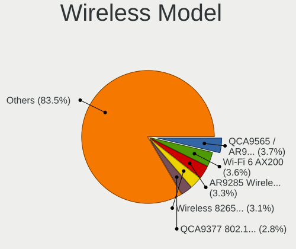

| Model                                                                   | Computers | Percent |
|-------------------------------------------------------------------------|-----------|---------|
| Qualcomm Atheros QCA9565 / AR9565 Wireless Network Adapter              | 74        | 3.68%   |
| Intel Wi-Fi 6 AX200                                                     | 73        | 3.63%   |
| Qualcomm Atheros AR9285 Wireless Network Adapter (PCI-Express)          | 66        | 3.28%   |
| Intel Wireless 8265 / 8275                                              | 62        | 3.08%   |
| Qualcomm Atheros QCA9377 802.11ac Wireless Network Adapter              | 57        | 2.83%   |
| Realtek RTL8822CE 802.11ac PCIe Wireless Network Adapter                | 51        | 2.54%   |
| Realtek RTL8821CE 802.11ac PCIe Wireless Network Adapter                | 51        | 2.54%   |
| Intel Wireless 7265                                                     | 48        | 2.39%   |
| Intel Wi-Fi 6 AX201                                                     | 48        | 2.39%   |
| Qualcomm Atheros AR9485 Wireless Network Adapter                        | 45        | 2.24%   |
| MediaTek MT7921 802.11ax PCIe Wireless Network Adapter [Filogic 330]    | 42        | 2.09%   |
| Intel Comet Lake PCH-LP CNVi WiFi                                       | 41        | 2.04%   |
| Intel Cannon Lake PCH CNVi WiFi                                         | 41        | 2.04%   |
| Intel Wireless 8260                                                     | 36        | 1.79%   |
| Intel Wireless 7260                                                     | 35        | 1.74%   |
| Qualcomm Atheros QCA6174 802.11ac Wireless Network Adapter              | 33        | 1.64%   |
| Broadcom BCM43142 802.11b/g/n                                           | 33        | 1.64%   |
| Intel Cannon Point-LP CNVi [Wireless-AC]                                | 32        | 1.59%   |
| Intel Wireless 3165                                                     | 31        | 1.54%   |
| Intel PRO/Wireless 4965 AG or AGN [Kedron] Network Connection           | 31        | 1.54%   |
| Broadcom BCM4313 802.11bgn Wireless Network Adapter                     | 31        | 1.54%   |
| Realtek RTL8723BE PCIe Wireless Network Adapter                         | 30        | 1.49%   |
| Qualcomm Atheros AR242x / AR542x Wireless Network Adapter (PCI-Express) | 30        | 1.49%   |
| Realtek RTL8852AE 802.11ax PCIe Wireless Network Adapter                | 25        | 1.24%   |
| Realtek RTL8188EUS 802.11n Wireless Network Adapter                     | 24        | 1.19%   |
| Intel PRO/Wireless 3945ABG [Golan] Network Connection                   | 24        | 1.19%   |
| Intel Centrino Advanced-N 6205 [Taylor Peak]                            | 23        | 1.14%   |
| Intel Comet Lake PCH CNVi WiFi                                          | 22        | 1.09%   |
| Qualcomm Atheros AR928X Wireless Network Adapter (PCI-Express)          | 21        | 1.04%   |
| MediaTek MT7922 802.11ax PCI Express Wireless Network Adapter           | 21        | 1.04%   |
| Intel Wireless 3160                                                     | 20        | 0.99%   |
| Intel Wi-Fi 6E(802.11ax) AX210/AX1675* 2x2 [Typhoon Peak]               | 20        | 0.99%   |
| Intel Raptor Lake PCH CNVi WiFi                                         | 20        | 0.99%   |
| Qualcomm Atheros AR9271 802.11n                                         | 18        | 0.9%    |
| Intel Alder Lake-P PCH CNVi WiFi                                        | 18        | 0.9%    |
| Realtek RTL8822BE 802.11a/b/g/n/ac WiFi adapter                         | 17        | 0.85%   |
| Intel WiFi Link 5100                                                    | 17        | 0.85%   |
| Intel Dual Band Wireless-AC 3168NGW [Stone Peak]                        | 17        | 0.85%   |
| Intel Wi-Fi 5(802.11ac) Wireless-AC 9x6x [Thunder Peak]                 | 16        | 0.8%    |
| Intel Dual Band Wireless-AC 3165 Plus Bluetooth                         | 16        | 0.8%    |

Ethernet Vendor
---------------

Ethernet vendors

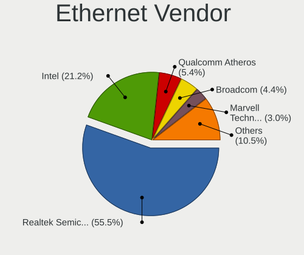

| Vendor                                 | Computers | Percent |
|----------------------------------------|-----------|---------|
| Realtek Semiconductor                  | 1232      | 55.5%   |
| Intel                                  | 471       | 21.22%  |
| Qualcomm Atheros                       | 119       | 5.36%   |
| Broadcom                               | 98        | 4.41%   |
| Marvell Technology Group               | 67        | 3.02%   |
| TP-Link                                | 31        | 1.4%    |
| Nvidia                                 | 31        | 1.4%    |
| Silicon Integrated Systems [SiS]       | 19        | 0.86%   |
| ASIX Electronics                       | 19        | 0.86%   |
| Broadcom Limited                       | 14        | 0.63%   |
| Samsung Electronics                    | 11        | 0.5%    |
| MediaTek                               | 9         | 0.41%   |
| Xiaomi                                 | 8         | 0.36%   |
| JMicron Technology                     | 8         | 0.36%   |
| DisplayLink                            | 7         | 0.32%   |
| VIA Technologies                       | 6         | 0.27%   |
| Lenovo                                 | 6         | 0.27%   |
| Attansic Technology                    | 5         | 0.23%   |
| Suzhou Motorcomm Electronic Technology | 4         | 0.18%   |
| ICS Advent                             | 4         | 0.18%   |
| Huawei Technologies                    | 4         | 0.18%   |
| Hewlett-Packard                        | 4         | 0.18%   |
| Google                                 | 4         | 0.18%   |
| D-Link System                          | 4         | 0.18%   |
| ADMtek                                 | 4         | 0.18%   |
| Qualcomm Technologies                  | 3         | 0.14%   |
| Qualcomm                               | 3         | 0.14%   |
| Aquantia                               | 3         | 0.14%   |
| Apple                                  | 3         | 0.14%   |
| Raspberry Pi                           | 2         | 0.09%   |
| Motorola PCS                           | 2         | 0.09%   |
| Microchip Technology                   | 2         | 0.09%   |
| Mellanox Technologies                  | 2         | 0.09%   |
| LSI                                    | 2         | 0.09%   |
| ZTE WCDMA Technologies MSM             | 1         | 0.05%   |
| T & A Mobile Phones                    | 1         | 0.05%   |
| Standard Microsystems [SMC]            | 1         | 0.05%   |
| Silicom                                | 1         | 0.05%   |
| OPPO Electronics                       | 1         | 0.05%   |
| Microsoft                              | 1         | 0.05%   |

Ethernet Model
--------------

Ethernet models

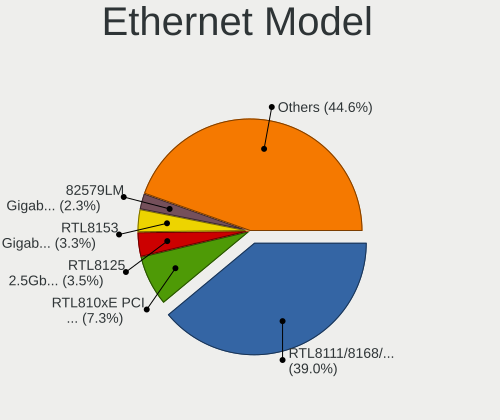

| Model                                                                          | Computers | Percent |
|--------------------------------------------------------------------------------|-----------|---------|
| Realtek RTL8111/8168/8211/8411 PCI Express Gigabit Ethernet Controller         | 886       | 38.96%  |
| Realtek RTL810xE PCI Express Fast Ethernet controller                          | 167       | 7.34%   |
| Realtek RTL8125 2.5GbE Controller                                              | 80        | 3.52%   |
| Realtek RTL8153 Gigabit Ethernet Adapter                                       | 75        | 3.3%    |
| Intel 82579LM Gigabit Network Connection (Lewisville)                          | 52        | 2.29%   |
| Intel I211 Gigabit Network Connection                                          | 31        | 1.36%   |
| TP-Link UE300 10/100/1000 LAN (ethernet mode) [Realtek RTL8153]                | 30        | 1.32%   |
| Marvell Group 88E8036 PCI-E Fast Ethernet Controller                           | 27        | 1.19%   |
| Intel Ethernet Connection (2) I219-V                                           | 21        | 0.92%   |
| Intel 82579V Gigabit Network Connection                                        | 21        | 0.92%   |
| Qualcomm Atheros AR8131 Gigabit Ethernet                                       | 19        | 0.84%   |
| Intel Ethernet Controller I225-V                                               | 19        | 0.84%   |
| Intel Ethernet Connection I217-LM                                              | 18        | 0.79%   |
| Intel Ethernet Connection (4) I219-LM                                          | 18        | 0.79%   |
| Intel Alder Lake-P PCH CNVi WiFi                                               | 18        | 0.79%   |
| Realtek RTL-8100/8101L/8139 PCI Fast Ethernet Adapter                          | 17        | 0.75%   |
| Qualcomm Atheros AR8151 v2.0 Gigabit Ethernet                                  | 17        | 0.75%   |
| Silicon Integrated Systems [SiS] 191 Gigabit Ethernet Adapter                  | 16        | 0.7%    |
| Intel Ethernet Connection I218-LM                                              | 16        | 0.7%    |
| Qualcomm Atheros AR8121/AR8113/AR8114 Gigabit or Fast Ethernet                 | 14        | 0.62%   |
| Broadcom NetXtreme BCM57765 Gigabit Ethernet PCIe                              | 14        | 0.62%   |
| Intel Ethernet Connection (7) I219-V                                           | 13        | 0.57%   |
| Intel 82567LM-3 Gigabit Network Connection                                     | 13        | 0.57%   |
| ASIX AX88179 Gigabit Ethernet                                                  | 13        | 0.57%   |
| Nvidia MCP79 Ethernet                                                          | 12        | 0.53%   |
| Intel Ethernet Connection I219-LM                                              | 12        | 0.53%   |
| Intel Ethernet Connection (4) I219-V                                           | 12        | 0.53%   |
| Intel Ethernet Connection (2) I219-LM                                          | 12        | 0.53%   |
| Intel Ethernet Controller I226-V                                               | 11        | 0.48%   |
| Intel Ethernet Connection (6) I219-V                                           | 11        | 0.48%   |
| Intel 82577LM Gigabit Network Connection                                       | 11        | 0.48%   |
| Qualcomm Atheros QCA8171 Gigabit Ethernet                                      | 10        | 0.44%   |
| Qualcomm Atheros AR8132 Fast Ethernet                                          | 10        | 0.44%   |
| Intel Ethernet Connection (3) I218-LM                                          | 10        | 0.44%   |
| Intel Ethernet Connection (10) I219-V                                          | 10        | 0.44%   |
| Broadcom NetLink BCM5787M Gigabit Ethernet PCI Express                         | 10        | 0.44%   |
| Marvell Group Yukon Optima 88E8059 [PCIe Gigabit Ethernet Controller with AVB] | 9         | 0.4%    |
| Intel Ethernet Connection I217-V                                               | 9         | 0.4%    |
| Intel Ethernet Connection (2) I218-V                                           | 9         | 0.4%    |
| Broadcom NetXtreme BCM5764M Gigabit Ethernet PCIe                              | 9         | 0.4%    |

Net Controller Kind
-------------------

Ethernet, WiFi or modem

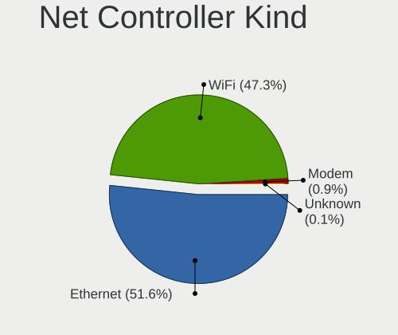

| Kind     | Computers | Percent |
|----------|-----------|---------|
| Ethernet | 2092      | 51.64%  |
| WiFi     | 1918      | 47.35%  |
| Modem    | 35        | 0.86%   |
| Unknown  | 6         | 0.15%   |

Used Controller
---------------

Currently used network controller

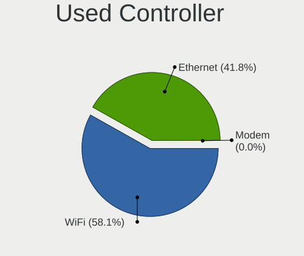

| Kind     | Computers | Percent |
|----------|-----------|---------|
| WiFi     | 1501      | 58.13%  |
| Ethernet | 1080      | 41.83%  |
| Modem    | 1         | 0.04%   |

NICs
----

Total network controllers on board

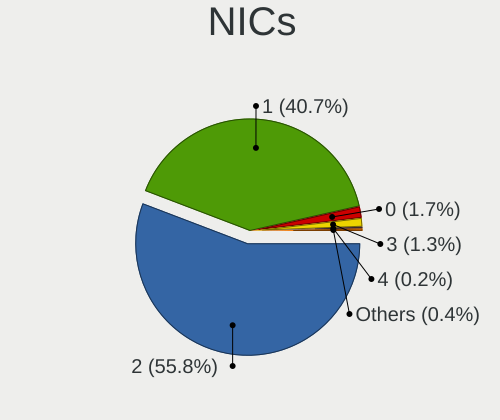

| Total | Computers | Percent |
|-------|-----------|---------|
| 2     | 1376      | 55.8%   |
| 1     | 1003      | 40.67%  |
| 0     | 41        | 1.66%   |
| 3     | 31        | 1.26%   |
| 4     | 6         | 0.24%   |
| 5     | 4         | 0.16%   |
| 6     | 3         | 0.12%   |
| 10    | 2         | 0.08%   |

IPv6
----

IPv6 vs IPv4

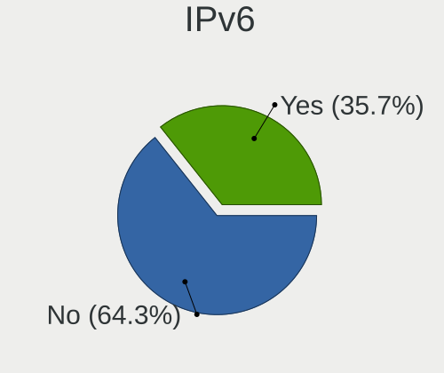

| Used | Computers | Percent |
|------|-----------|---------|
| No   | 1626      | 64.32%  |
| Yes  | 902       | 35.68%  |

Bluetooth
---------

Bluetooth Vendor
----------------

Controller vendors

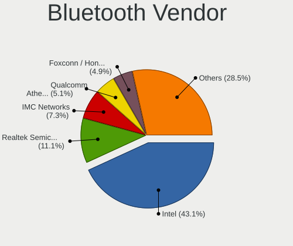

| Vendor                          | Computers | Percent |
|---------------------------------|-----------|---------|
| Intel                           | 680       | 43.15%  |
| Realtek Semiconductor           | 175       | 11.1%   |
| IMC Networks                    | 115       | 7.3%    |
| Qualcomm Atheros Communications | 80        | 5.08%   |
| Foxconn / Hon Hai               | 77        | 4.89%   |
| Apple                           | 69        | 4.38%   |
| Lite-On Technology              | 64        | 4.06%   |
| Cambridge Silicon Radio         | 61        | 3.87%   |
| Broadcom                        | 51        | 3.24%   |
| ASUSTek Computer                | 50        | 3.17%   |
| Toshiba                         | 25        | 1.59%   |
| MediaTek                        | 20        | 1.27%   |
| Hewlett-Packard                 | 20        | 1.27%   |
| Realtek                         | 18        | 1.14%   |
| TP-Link                         | 14        | 0.89%   |
| Dell                            | 14        | 0.89%   |
| Ralink                          | 12        | 0.76%   |
| Alps Electric                   | 7         | 0.44%   |
| Marvell Semiconductor           | 4         | 0.25%   |
| Integrated System Solution      | 3         | 0.19%   |
| Belkin Components               | 3         | 0.19%   |
| USI                             | 2         | 0.13%   |
| Ralink Technology               | 2         | 0.13%   |
| Chicony Electronics             | 2         | 0.13%   |
| Unknown                         | 2         | 0.13%   |
| Roper                           | 1         | 0.06%   |
| Mercucys                        | 1         | 0.06%   |
| Foxconn International           | 1         | 0.06%   |
| Edimax Technology               | 1         | 0.06%   |
| Conwise Technology              | 1         | 0.06%   |
| Actions                         | 1         | 0.06%   |

Bluetooth Model
---------------

Controller models

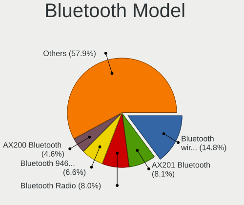

| Model                                                                               | Computers | Percent |
|-------------------------------------------------------------------------------------|-----------|---------|
| Intel Bluetooth wireless interface                                                  | 234       | 14.84%  |
| Intel AX201 Bluetooth                                                               | 127       | 8.05%   |
| Realtek Bluetooth Radio                                                             | 126       | 7.99%   |
| Intel Bluetooth 9460/9560 Jefferson Peak (JfP)                                      | 104       | 6.59%   |
| Intel AX200 Bluetooth                                                               | 73        | 4.63%   |
| Intel Bluetooth Device                                                              | 61        | 3.87%   |
| Cambridge Silicon Radio Bluetooth Dongle (HCI mode)                                 | 61        | 3.87%   |
| IMC Networks Bluetooth Device                                                       | 39        | 2.47%   |
| IMC Networks Wireless_Device                                                        | 37        | 2.35%   |
| Apple Bluetooth Host Controller                                                     | 36        | 2.28%   |
| Realtek  Bluetooth 4.2 Adapter                                                      | 30        | 1.9%    |
| IMC Networks Bluetooth Radio                                                        | 30        | 1.9%    |
| Qualcomm Atheros  Bluetooth Device                                                  | 25        | 1.59%   |
| ASUS Broadcom BCM20702A0 Bluetooth                                                  | 23        | 1.46%   |
| Qualcomm Atheros QCA61x4 Bluetooth 4.0                                              | 22        | 1.4%    |
| Intel AX210 Bluetooth                                                               | 22        | 1.4%    |
| Intel Centrino Bluetooth Wireless Transceiver                                       | 21        | 1.33%   |
| Qualcomm Atheros AR3011 Bluetooth                                                   | 20        | 1.27%   |
| MediaTek Wireless_Device                                                            | 20        | 1.27%   |
| Apple Bluetooth USB Host Controller                                                 | 20        | 1.27%   |
| Foxconn / Hon Hai MediaTek Bluetooth Adapter                                        | 19        | 1.2%    |
| Realtek Bluetooth Radio                                                             | 18        | 1.14%   |
| Lite-On Qualcomm Atheros QCA9377 Bluetooth                                          | 18        | 1.14%   |
| Intel Wireless-AC 3168 Bluetooth                                                    | 18        | 1.14%   |
| Lite-On Bluetooth Device                                                            | 17        | 1.08%   |
| Foxconn / Hon Hai Bluetooth Device                                                  | 17        | 1.08%   |
| Intel Wireless-AC 9260 Bluetooth Adapter                                            | 15        | 0.95%   |
| TP-Link TP-T@- UB500 Adapter                                                        | 14        | 0.89%   |
| Lite-On Atheros AR3012 Bluetooth                                                    | 13        | 0.82%   |
| HP Bluetooth 2.0 Interface [Broadcom BCM2045]                                       | 13        | 0.82%   |
| Ralink RT3290 Bluetooth                                                             | 12        | 0.76%   |
| Foxconn / Hon Hai Wireless_Device                                                   | 12        | 0.76%   |
| ASUS ASUS USB-BT500                                                                 | 11        | 0.7%    |
| Qualcomm Atheros AR3012 Bluetooth 4.0                                               | 10        | 0.63%   |
| Foxconn / Hon Hai Foxconn T77H114 BCM2070 [Single-Chip Bluetooth 2.1 + EDR Adapter] | 9         | 0.57%   |
| Toshiba Integrated Bluetooth HCI                                                    | 8         | 0.51%   |
| HP Broadcom 2070 Bluetooth Combo                                                    | 7         | 0.44%   |
| Apple Built-in Bluetooth 2.0+EDR HCI                                                | 7         | 0.44%   |
| Realtek RTL8821A Bluetooth                                                          | 6         | 0.38%   |
| Lite-On BCM43142A0                                                                  | 6         | 0.38%   |

Sound
-----

Sound Vendor
------------

Sound card vendors

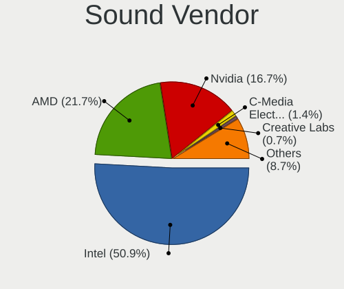

| Vendor                                       | Computers | Percent |
|----------------------------------------------|-----------|---------|
| Intel                                        | 1730      | 50.85%  |
| AMD                                          | 738       | 21.69%  |
| Nvidia                                       | 567       | 16.67%  |
| C-Media Electronics                          | 47        | 1.38%   |
| Creative Labs                                | 23        | 0.68%   |
| Razer USA                                    | 20        | 0.59%   |
| Logitech                                     | 20        | 0.59%   |
| JMTek                                        | 20        | 0.59%   |
| Silicon Integrated Systems [SiS]             | 19        | 0.56%   |
| Kingston Technology                          | 18        | 0.53%   |
| Texas Instruments                            | 16        | 0.47%   |
| Hewlett-Packard                              | 15        | 0.44%   |
| ASUSTek Computer                             | 12        | 0.35%   |
| GN Netcom                                    | 11        | 0.32%   |
| Realtek Semiconductor                        | 10        | 0.29%   |
| Plantronics                                  | 10        | 0.29%   |
| Focusrite-Novation                           | 9         | 0.26%   |
| SteelSeries ApS                              | 8         | 0.24%   |
| Sony                                         | 8         | 0.24%   |
| Micro Star International                     | 8         | 0.24%   |
| Lenovo                                       | 8         | 0.24%   |
| Creative Technology                          | 7         | 0.21%   |
| Corsair                                      | 5         | 0.15%   |
| Generalplus Technology                       | 4         | 0.12%   |
| Thesycon Systemsoftware & Consulting         | 3         | 0.09%   |
| JBL                                          | 3         | 0.09%   |
| Apple                                        | 3         | 0.09%   |
| XMOS                                         | 2         | 0.06%   |
| VIA Technologies                             | 2         | 0.06%   |
| Trust                                        | 2         | 0.06%   |
| Samsung Electronics                          | 2         | 0.06%   |
| Guillemot                                    | 2         | 0.06%   |
| Giga-Byte Technology                         | 2         | 0.06%   |
| EGO SYStems                                  | 2         | 0.06%   |
| DSEA A/S                                     | 2         | 0.06%   |
| Blue Microphones                             | 2         | 0.06%   |
| BEHRINGER International                      | 2         | 0.06%   |
| ASRock                                       | 2         | 0.06%   |
| Zoran Co. Personal Media Division (Nogatech) | 1         | 0.03%   |
| ZOOM                                         | 1         | 0.03%   |

Sound Model
-----------

Sound card models

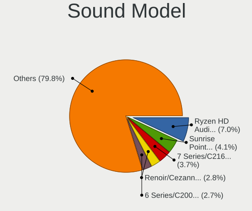

| Model                                                                      | Computers | Percent |
|----------------------------------------------------------------------------|-----------|---------|
| AMD Ryzen HD Audio Controller                                              | 283       | 7%      |
| Intel Sunrise Point-LP HD Audio                                            | 165       | 4.08%   |
| Intel 7 Series/C216 Chipset Family High Definition Audio Controller        | 148       | 3.66%   |
| AMD Renoir/Cezanne HDMI/DP Audio Controller                                | 113       | 2.79%   |
| Intel 6 Series/C200 Series Chipset Family High Definition Audio Controller | 109       | 2.7%    |
| Intel 82801I (ICH9 Family) HD Audio Controller                             | 103       | 2.55%   |
| Intel 5 Series/3400 Series Chipset High Definition Audio                   | 101       | 2.5%    |
| Intel Cannon Lake PCH cAVS                                                 | 91        | 2.25%   |
| Intel 8 Series/C220 Series Chipset High Definition Audio Controller        | 91        | 2.25%   |
| AMD Starship/Matisse HD Audio Controller                                   | 90        | 2.23%   |
| Intel NM10/ICH7 Family High Definition Audio Controller                    | 89        | 2.2%    |
| Intel 82801H (ICH8 Family) HD Audio Controller                             | 73        | 1.81%   |
| AMD Raven/Raven2/Fenghuang HDMI/DP Audio Controller                        | 72        | 1.78%   |
| AMD Radeon High Definition Audio Controller                                | 72        | 1.78%   |
| Intel Xeon E3-1200 v3/4th Gen Core Processor HD Audio Controller           | 66        | 1.63%   |
| Intel Tiger Lake-LP Smart Sound Technology Audio Controller                | 66        | 1.63%   |
| AMD FCH Azalia Controller                                                  | 66        | 1.63%   |
| Intel Haswell-ULT HD Audio Controller                                      | 61        | 1.51%   |
| Intel 100 Series/C230 Series Chipset Family HD Audio Controller            | 61        | 1.51%   |
| Intel 8 Series HD Audio Controller                                         | 60        | 1.48%   |
| Intel Broadwell-U Audio Controller                                         | 58        | 1.43%   |
| AMD SBx00 Azalia (Intel HDA)                                               | 56        | 1.38%   |
| Intel Wildcat Point-LP High Definition Audio Controller                    | 53        | 1.31%   |
| Nvidia GK208 HDMI/DP Audio Controller                                      | 52        | 1.29%   |
| Intel Comet Lake PCH-LP cAVS                                               | 52        | 1.29%   |
| Nvidia GP107GL High Definition Audio Controller                            | 51        | 1.26%   |
| Intel Cannon Point-LP High Definition Audio Controller                     | 49        | 1.21%   |
| AMD Kabini HDMI/DP Audio                                                   | 48        | 1.19%   |
| AMD Ellesmere HDMI Audio [Radeon RX 470/480 / 570/580/590]                 | 44        | 1.09%   |
| Intel Alder Lake PCH-P High Definition Audio Controller                    | 40        | 0.99%   |
| Nvidia TU107 GeForce GTX 1650 High Definition Audio Controller             | 38        | 0.94%   |
| AMD Family 17h (Models 00h-0fh) HD Audio Controller                        | 37        | 0.91%   |
| Nvidia High Definition Audio Controller                                    | 33        | 0.82%   |
| AMD Navi 21/23 HDMI/DP Audio Controller                                    | 33        | 0.82%   |
| AMD Cedar HDMI Audio [Radeon HD 5400/6300/7300 Series]                     | 33        | 0.82%   |
| Nvidia GA106 High Definition Audio Controller                              | 32        | 0.79%   |
| Intel 200 Series PCH HD Audio                                              | 32        | 0.79%   |
| Nvidia TU106 High Definition Audio Controller                              | 30        | 0.74%   |
| Nvidia GF108 High Definition Audio Controller                              | 30        | 0.74%   |
| Intel Comet Lake PCH cAVS                                                  | 30        | 0.74%   |

Memory
------

Memory Vendor
-------------

Memory module vendors

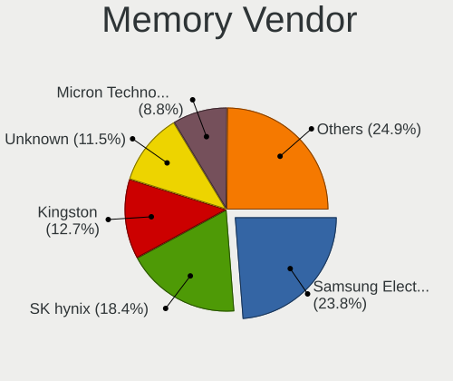

| Vendor              | Computers | Percent |
|---------------------|-----------|---------|
| Samsung Electronics | 320       | 23.77%  |
| SK hynix            | 247       | 18.35%  |
| Kingston            | 171       | 12.7%   |
| Unknown             | 155       | 11.52%  |
| Micron Technology   | 118       | 8.77%   |
| G.Skill             | 71        | 5.27%   |
| Corsair             | 53        | 3.94%   |
| Crucial             | 52        | 3.86%   |
| Ramaxel Technology  | 23        | 1.71%   |
| Elpida              | 21        | 1.56%   |
| Unknown             | 21        | 1.56%   |
| Team                | 17        | 1.26%   |
| A-DATA Technology   | 17        | 1.26%   |
| Nanya Technology    | 9         | 0.67%   |
| Unknown (ABCD)      | 6         | 0.45%   |
| Transcend           | 4         | 0.3%    |
| GOODRAM             | 4         | 0.3%    |
| Silicon Power       | 3         | 0.22%   |
| Lexar               | 3         | 0.22%   |
| ASint Technology    | 3         | 0.22%   |
| Teikon              | 2         | 0.15%   |
| Apacer              | 2         | 0.15%   |
| Unknown (268C)      | 1         | 0.07%   |
| Unknown (0x7301)    | 1         | 0.07%   |
| Unknown (0x02BA)    | 1         | 0.07%   |
| Unigen              | 1         | 0.07%   |
| Unifosa             | 1         | 0.07%   |
| Toshiba             | 1         | 0.07%   |
| Smart Brazil        | 1         | 0.07%   |
| Smart               | 1         | 0.07%   |
| PUSKILL             | 1         | 0.07%   |
| Patriot             | 1         | 0.07%   |
| Netlist             | 1         | 0.07%   |
| Micron/Elpida       | 1         | 0.07%   |
| Kllisre             | 1         | 0.07%   |
| Kimtigo             | 1         | 0.07%   |
| Infineon            | 1         | 0.07%   |
| HPE                 | 1         | 0.07%   |
| Hewlett-Packard     | 1         | 0.07%   |
| Gowe                | 1         | 0.07%   |

Memory Model
------------

Memory module models

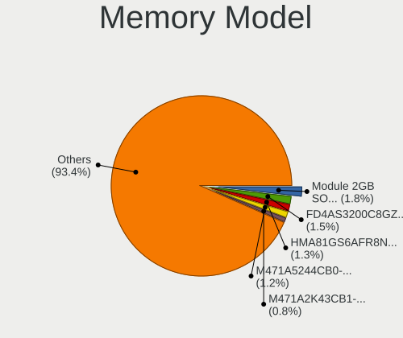

| Model                                                        | Computers | Percent |
|--------------------------------------------------------------|-----------|---------|
| Unknown RAM Module 2GB SODIMM DDR2                           | 26        | 1.8%    |
| Unknown                                                      | 21        | 1.46%   |
| SK hynix RAM HMA81GS6AFR8N-UH 8GB SODIMM DDR4 2667MT/s       | 19        | 1.32%   |
| Samsung RAM M471A5244CB0-CWE 4GB Row Of Chips DDR4 3200MT/s  | 17        | 1.18%   |
| Samsung RAM M471A2K43CB1-CTD 16GB SODIMM DDR4 8400MT/s       | 12        | 0.83%   |
| SK hynix RAM HMAA1GS6CJR6N-XN 8GB SODIMM DDR4 3200MT/s       | 11        | 0.76%   |
| Samsung RAM M471A1K43CB1-CRC 8GB SODIMM DDR4 8400MT/s        | 11        | 0.76%   |
| Samsung RAM M471A1G44BB0-CWE 8GB SODIMM DDR4 3200MT/s        | 11        | 0.76%   |
| Samsung RAM M471A1G44AB0-CWE 8GiB SODIMM DDR4 3200MT/s       | 11        | 0.76%   |
| Samsung RAM M471A5244CB0-CTD 4GB SODIMM DDR4 3266MT/s        | 10        | 0.69%   |
| Samsung RAM M471B5173DB0-YK0 4GB SODIMM DDR3 1600MT/s        | 9         | 0.62%   |
| Samsung RAM M471A1K43DB1-CTD 8GB SODIMM DDR4 2667MT/s        | 9         | 0.62%   |
| Samsung RAM M471A1K43EB1-CWE 8GB SODIMM DDR4 3200MT/s        | 8         | 0.55%   |
| SK hynix RAM HMA851S6AFR6N-UH 4GB SODIMM DDR4 2667MT/s       | 7         | 0.49%   |
| SK hynix RAM HMA81GS6JJR8N-VK 8GB SODIMM DDR4 2667MT/s       | 7         | 0.49%   |
| SK hynix RAM HMA81GS6DJR8N-XN 8GB SODIMM DDR4 3200MT/s       | 7         | 0.49%   |
| Samsung RAM M471B5173QH0-YK0 4GB SODIMM DDR3 1600MT/s        | 7         | 0.49%   |
| Samsung RAM M471B1G73QH0-YK0 8GB SODIMM DDR3 1600MT/s        | 7         | 0.49%   |
| Samsung RAM M471A5244CB0-CRC 4GB SODIMM DDR4 2667MT/s        | 7         | 0.49%   |
| Samsung RAM M471A2K43DB1-CTD 16GB SODIMM DDR4 2667MT/s       | 7         | 0.49%   |
| Samsung RAM M471A1K43DB1-CWE 8GB SODIMM DDR4 3200MT/s        | 7         | 0.49%   |
| SK hynix RAM HMT351S6CFR8C-PB 4GB SODIMM DDR3 1600MT/s       | 6         | 0.42%   |
| SK hynix RAM HMAA1GS6CJR6N-XN 8GB Row Of Chips DDR4 3200MT/s | 6         | 0.42%   |
| SK hynix RAM HMA851S6AFR6N-UH 4GB SODIMM DDR4 2400MT/s       | 6         | 0.42%   |
| Samsung RAM M471B5273DH0-CH9 4GB SODIMM DDR3 1600MT/s        | 6         | 0.42%   |
| Samsung RAM M471A2K43CB1-CRC 16GB SODIMM DDR4 2667MT/s       | 6         | 0.42%   |
| Micron RAM 8ATF1G64HZ-2G6E1 8GB SODIMM DDR4 2667MT/s         | 6         | 0.42%   |
| SK hynix RAM HMT451S6CFR6A-PB 4GB SODIMM DDR3 1600MT/s       | 5         | 0.35%   |
| SK hynix RAM HMA82GS6CJR8N-VK 16GB SODIMM DDR4 2667MT/s      | 5         | 0.35%   |
| Samsung RAM M471B5273CH0-CH9 4GB SODIMM DDR3 1334MT/s        | 5         | 0.35%   |
| Samsung RAM M471B1G73EB0-YK0 8192MB SODIMM DDR3 1600MT/s     | 5         | 0.35%   |
| Samsung RAM M471A2K43DB1-CWE 16GB SODIMM DDR4 3200MT/s       | 5         | 0.35%   |
| Samsung RAM M471A1K43CB1-CTD 8GB SODIMM DDR4 3200MT/s        | 5         | 0.35%   |
| Samsung RAM M471A1K43BB1-CRC 8GB SODIMM DDR4 2667MT/s        | 5         | 0.35%   |
| Micron RAM 8ATF1G64HZ-3G2R1 8GB SODIMM DDR4 3200MT/s         | 5         | 0.35%   |
| Micron RAM 4ATF1G64HZ-3G2E1 8GB SODIMM DDR4 3200MT/s         | 5         | 0.35%   |
| Kingston RAM KF556S40-32 32GB SODIMM DDR5 5600MT/s           | 5         | 0.35%   |
| Kingston RAM 99U5471-012.A00LF 4GB DIMM DDR3 1333MT/s        | 5         | 0.35%   |
| Unknown RAM Module 4GB SODIMM DDR4 2667MT/s                  | 4         | 0.28%   |
| Unknown RAM Module 4GB DIMM 1333MT/s                         | 4         | 0.28%   |

Memory Kind
-----------

Memory module kinds

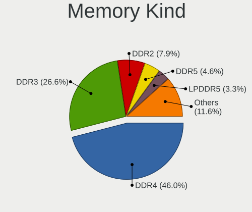

| Kind    | Computers | Percent |
|---------|-----------|---------|
| DDR4    | 538       | 45.98%  |
| DDR3    | 311       | 26.58%  |
| DDR2    | 92        | 7.86%   |
| DDR5    | 54        | 4.62%   |
| LPDDR5  | 39        | 3.33%   |
| LPDDR4  | 37        | 3.16%   |
| SDRAM   | 33        | 2.82%   |
| LPDDR3  | 28        | 2.39%   |
| Unknown | 27        | 2.31%   |
| DDR     | 9         | 0.77%   |
| DRAM    | 2         | 0.17%   |

Memory Form Factor
------------------

Physical design of the memory module

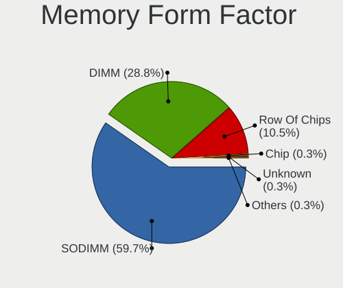

| Name         | Computers | Percent |
|--------------|-----------|---------|
| SODIMM       | 696       | 59.69%  |
| DIMM         | 336       | 28.82%  |
| Row Of Chips | 123       | 10.55%  |
| Chip         | 4         | 0.34%   |
| Unknown      | 4         | 0.34%   |
| FB-DIMM      | 3         | 0.26%   |

Memory Size
-----------

Memory module size

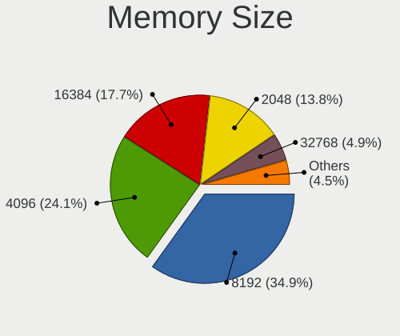

| Size    | Computers | Percent |
|---------|-----------|---------|
| 8192    | 445       | 34.93%  |
| 4096    | 307       | 24.1%   |
| 16384   | 226       | 17.74%  |
| 2048    | 176       | 13.81%  |
| 32768   | 63        | 4.95%   |
| 1024    | 43        | 3.38%   |
| 512     | 7         | 0.55%   |
| 3072    | 2         | 0.16%   |
| 49152   | 1         | 0.08%   |
| 24576   | 1         | 0.08%   |
| 12288   | 1         | 0.08%   |
| 256     | 1         | 0.08%   |
| Unknown | 1         | 0.08%   |

Memory Speed
------------

Memory module speed

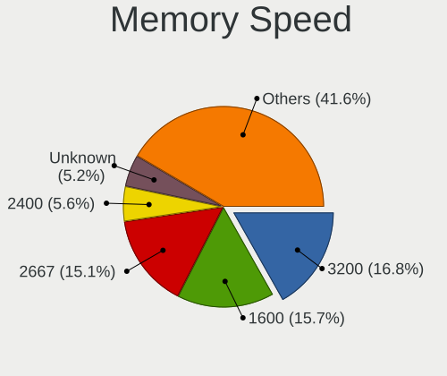

| Speed   | Computers | Percent |
|---------|-----------|---------|
| 3200    | 212       | 16.81%  |
| 1600    | 198       | 15.7%   |
| 2667    | 191       | 15.15%  |
| 2400    | 71        | 5.63%   |
| Unknown | 65        | 5.15%   |
| 1333    | 57        | 4.52%   |
| 2133    | 51        | 4.04%   |
| 667     | 33        | 2.62%   |
| 3600    | 30        | 2.38%   |
| 6400    | 25        | 1.98%   |
| 8400    | 24        | 1.9%    |
| 1067    | 22        | 1.74%   |
| 5600    | 20        | 1.59%   |
| 1334    | 20        | 1.59%   |
| 1867    | 19        | 1.51%   |
| 4267    | 17        | 1.35%   |
| 800     | 17        | 1.35%   |
| 6000    | 15        | 1.19%   |
| 3733    | 14        | 1.11%   |
| 3266    | 14        | 1.11%   |
| 4800    | 13        | 1.03%   |
| 1866    | 10        | 0.79%   |
| 7500    | 9         | 0.71%   |
| 3000    | 9         | 0.71%   |
| 533     | 9         | 0.71%   |
| 4199    | 8         | 0.63%   |
| 2666    | 7         | 0.56%   |
| 1800    | 7         | 0.56%   |
| 3800    | 6         | 0.48%   |
| 2933    | 6         | 0.48%   |
| 2048    | 5         | 0.4%    |
| 1066    | 5         | 0.4%    |
| 400     | 5         | 0.4%    |
| 4000    | 4         | 0.32%   |
| 3400    | 4         | 0.32%   |
| 4266    | 3         | 0.24%   |
| 975     | 3         | 0.24%   |
| 12800   | 2         | 0.16%   |
| 8533    | 2         | 0.16%   |
| 5200    | 2         | 0.16%   |

Printers & scanners
-------------------

Printer Vendor
--------------

Printer device vendors

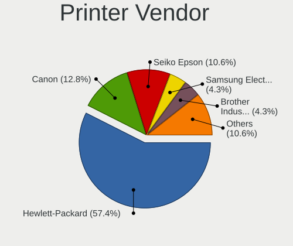

| Vendor                 | Computers | Percent |
|------------------------|-----------|---------|
| Hewlett-Packard        | 27        | 57.45%  |
| Canon                  | 6         | 12.77%  |
| Seiko Epson            | 5         | 10.64%  |
| Samsung Electronics    | 2         | 4.26%   |
| Brother Industries     | 2         | 4.26%   |
| Xerox                  | 1         | 2.13%   |
| STMicroelectronics     | 1         | 2.13%   |
| Panasonic (Matsushita) | 1         | 2.13%   |
| Lexmark International  | 1         | 2.13%   |
| ICS Advent             | 1         | 2.13%   |

Printer Model
-------------

Printer device models

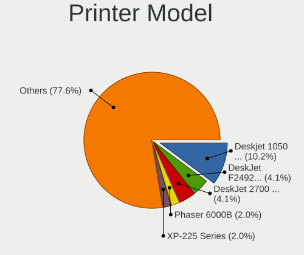

| Model                                                                 | Computers | Percent |
|-----------------------------------------------------------------------|-----------|---------|
| HP Deskjet 1050 J410                                                  | 5         | 10.2%   |
| HP DeskJet F2492 All-in-One                                           | 2         | 4.08%   |
| HP DeskJet 2700 series                                                | 2         | 4.08%   |
| Xerox Phaser 6000B                                                    | 1         | 2.04%   |
| STMicroelectronics LED badge -- mini LED display -- 11x44             | 1         | 2.04%   |
| Seiko Epson XP-225 Series                                             | 1         | 2.04%   |
| Seiko Epson XP-2200 Series                                            | 1         | 2.04%   |
| Seiko Epson ME OFFICE 620F Series/Stylus Office BX305F/BX305FW/TX320F | 1         | 2.04%   |
| Seiko Epson ME 320/330 Series [Stylus SX125]                          | 1         | 2.04%   |
| Seiko Epson AcuLaser C1700                                            | 1         | 2.04%   |
| Samsung ML-1640 Series Laser Printer                                  | 1         | 2.04%   |
| Samsung ML-1610 Mono Laser Printer                                    | 1         | 2.04%   |
| Panasonic (Matsushita) KX-FLB851SP                                    | 1         | 2.04%   |
| Lexmark International E120(n)                                         | 1         | 2.04%   |
| ICS Advent Parallel Adapter                                           | 1         | 2.04%   |
| HP OfficeJet 5200 series                                              | 1         | 2.04%   |
| HP Officejet 4620 series                                              | 1         | 2.04%   |
| HP Officejet 4500 G510g-m                                             | 1         | 2.04%   |
| HP OfficeJet 3830 series                                              | 1         | 2.04%   |
| HP LaserJet Professional P1102w                                       | 1         | 2.04%   |
| HP LaserJet P1102                                                     | 1         | 2.04%   |
| HP LaserJet M14-M17                                                   | 1         | 2.04%   |
| HP LaserJet CP 1025                                                   | 1         | 2.04%   |
| HP ENVY 6000 series                                                   | 1         | 2.04%   |
| HP ENVY 4520 series                                                   | 1         | 2.04%   |
| HP DeskJet F4100 Printer series                                       | 1         | 2.04%   |
| HP DeskJet F300 series                                                | 1         | 2.04%   |
| HP DeskJet 930c                                                       | 1         | 2.04%   |
| HP DeskJet 4100 series                                                | 1         | 2.04%   |
| HP DeskJet 3630 series                                                | 1         | 2.04%   |
| HP Deskjet 3050A                                                      | 1         | 2.04%   |
| HP Deskjet 3050 J610 series                                           | 1         | 2.04%   |
| HP DeskJet 2130 series                                                | 1         | 2.04%   |
| HP Deskjet 1510                                                       | 1         | 2.04%   |
| Canon TS6300 series                                                   | 1         | 2.04%   |
| Canon TS3100 series                                                   | 1         | 2.04%   |
| Canon PIXMA TS6250                                                    | 1         | 2.04%   |
| Canon PIXMA MP280                                                     | 1         | 2.04%   |
| Canon PIXMA MG3600 Series                                             | 1         | 2.04%   |
| Canon PIXMA MG2900 Series                                             | 1         | 2.04%   |

Scanner Vendor
--------------

Scanner device vendors

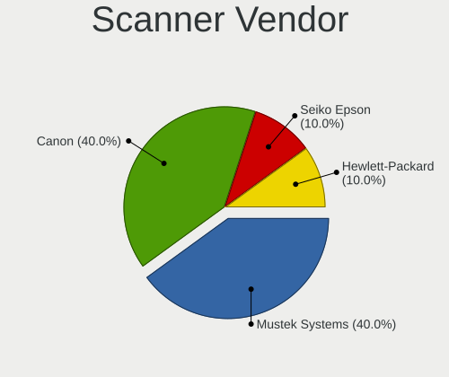

| Vendor          | Computers | Percent |
|-----------------|-----------|---------|
| Mustek Systems  | 5         | 45.45%  |
| Canon           | 4         | 36.36%  |
| Seiko Epson     | 1         | 9.09%   |
| Hewlett-Packard | 1         | 9.09%   |

Scanner Model
-------------

Scanner device models

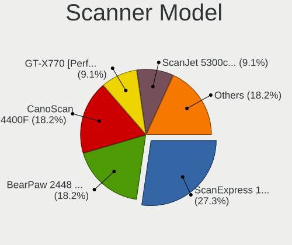

| Model                                 | Computers | Percent |
|---------------------------------------|-----------|---------|
| Mustek Systems ScanExpress 1200 UB    | 3         | 27.27%  |
| Mustek Systems BearPaw 2448 CU Pro    | 2         | 18.18%  |
| Canon CanoScan 4400F                  | 2         | 18.18%  |
| Seiko Epson GT-X770 [Perfection V500] | 1         | 9.09%   |
| HP ScanJet 5300c/5370c                | 1         | 9.09%   |
| Canon CanoScan N670U/N676U/LiDE 20    | 1         | 9.09%   |
| Canon CanoScan LiDE 110               | 1         | 9.09%   |

Camera
------

Camera Vendor
-------------

Camera device vendors

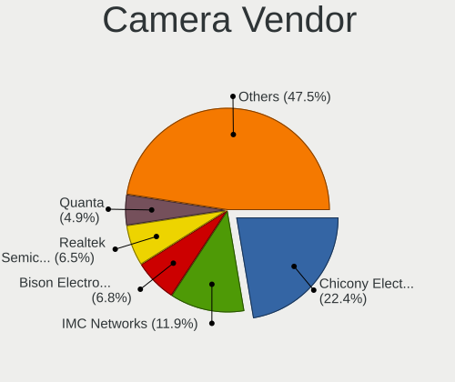

| Vendor                                 | Computers | Percent |
|----------------------------------------|-----------|---------|
| Chicony Electronics                    | 363       | 22.35%  |
| IMC Networks                           | 193       | 11.88%  |
| Bison Electronics                      | 111       | 6.83%   |
| Realtek Semiconductor                  | 106       | 6.53%   |
| Quanta                                 | 79        | 4.86%   |
| Suyin                                  | 74        | 4.56%   |
| Microdia                               | 72        | 4.43%   |
| Sunplus Innovation Technology          | 61        | 3.76%   |
| Logitech                               | 57        | 3.51%   |
| Cheng Uei Precision Industry (Foxlink) | 52        | 3.2%    |
| Syntek                                 | 47        | 2.89%   |
| Apple                                  | 45        | 2.77%   |
| Lite-On Technology                     | 42        | 2.59%   |
| Ricoh                                  | 38        | 2.34%   |
| Luxvisions Innotech Limited            | 33        | 2.03%   |
| Silicon Motion                         | 22        | 1.35%   |
| Microsoft                              | 21        | 1.29%   |
| Sonix Technology                       | 19        | 1.17%   |
| Creative Technology                    | 15        | 0.92%   |
| Alcor Micro                            | 14        | 0.86%   |
| Hewlett-Packard                        | 13        | 0.8%    |
| Z-Star Microelectronics                | 10        | 0.62%   |
| Samsung Electronics                    | 10        | 0.62%   |
| Importek                               | 9         | 0.55%   |
| Generalplus Technology                 | 9         | 0.55%   |
| ShineTech                              | 8         | 0.49%   |
| Lenovo                                 | 8         | 0.49%   |
| Acer                                   | 7         | 0.43%   |
| WaveRider Communications               | 6         | 0.37%   |
| SunplusIT                              | 5         | 0.31%   |
| Razer USA                              | 4         | 0.25%   |
| Primax Electronics                     | 4         | 0.25%   |
| MacroSilicon                           | 4         | 0.25%   |
| kingcome                               | 4         | 0.25%   |
| icSpring                               | 4         | 0.25%   |
| Cubeternet                             | 4         | 0.25%   |
| Aveo Technology                        | 4         | 0.25%   |
| Trust                                  | 3         | 0.18%   |
| Jieli Technology                       | 3         | 0.18%   |
| Anker PowerConf C200                   | 3         | 0.18%   |

Camera Model
------------

Camera device models

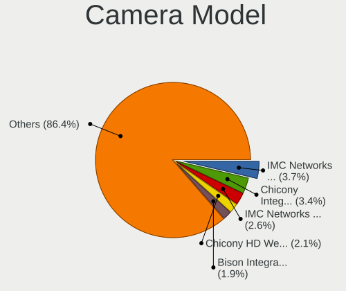

| Model                                               | Computers | Percent |
|-----------------------------------------------------|-----------|---------|
| IMC Networks USB2.0 HD UVC WebCam                   | 60        | 3.68%   |
| Chicony Integrated Camera                           | 55        | 3.37%   |
| IMC Networks Integrated Camera                      | 42        | 2.57%   |
| Chicony HD WebCam                                   | 34        | 2.08%   |
| Bison Integrated Camera                             | 31        | 1.9%    |
| Chicony USB2.0 VGA UVC WebCam                       | 25        | 1.53%   |
| IMC Networks USB2.0 VGA UVC WebCam                  | 24        | 1.47%   |
| Ricoh Visual Communication Camera VGP-VCC8 [R5U870] | 23        | 1.41%   |
| Syntek Integrated Camera                            | 22        | 1.35%   |
| Microdia Integrated_Webcam_HD                       | 21        | 1.29%   |
| Suyin Acer/HP Integrated Webcam [CN0314]            | 17        | 1.04%   |
| Luxvisions Innotech Limited HP TrueVision HD Camera | 17        | 1.04%   |
| Chicony USB 2.0 Camera                              | 17        | 1.04%   |
| Realtek USB Camera                                  | 16        | 0.98%   |
| Apple Built-in iSight                               | 16        | 0.98%   |
| Realtek Integrated_Webcam_HD                        | 15        | 0.92%   |
| Realtek EasyCamera                                  | 15        | 0.92%   |
| Logitech Webcam C270                                | 15        | 0.92%   |
| Lite-On Integrated Camera                           | 15        | 0.92%   |
| Chicony CNF9055 Toshiba Webcam                      | 15        | 0.92%   |
| Quanta HP Wide Vision HD Camera                     | 14        | 0.86%   |
| Chicony TOSHIBA Web Camera - HD                     | 14        | 0.86%   |
| Quanta HP TrueVision HD Camera                      | 12        | 0.74%   |
| Microsoft LifeCam HD-3000                           | 12        | 0.74%   |
| Chicony Integrated Camera (1280x720@30)             | 12        | 0.74%   |
| Chicony HP Truevision HD                            | 12        | 0.74%   |
| Bison HD Webcam                                     | 12        | 0.74%   |
| IMC Networks HD Camera                              | 11        | 0.67%   |
| Suyin HP TrueVision HD                              | 10        | 0.61%   |
| Samsung Galaxy series, misc. (MTP mode)             | 10        | 0.61%   |
| Chicony HP Wide Vision HD Camera                    | 10        | 0.61%   |
| Chicony HD User Facing                              | 10        | 0.61%   |
| Apple FaceTime HD Camera                            | 10        | 0.61%   |
| Sonix USB2.0 FHD UVC WebCam                         | 9         | 0.55%   |
| Realtek HD WebCam                                   | 9         | 0.55%   |
| Microdia Sonix USB 2.0 Camera                       | 9         | 0.55%   |
| HP Webcam HD 2300                                   | 9         | 0.55%   |
| Chicony VGA WebCam                                  | 9         | 0.55%   |
| Chicony EasyCamera                                  | 9         | 0.55%   |
| Chicony Chicony USB2.0 Camera                       | 9         | 0.55%   |

Security
--------

Fingerprint Vendor
------------------

Fingerprint sensor vendors

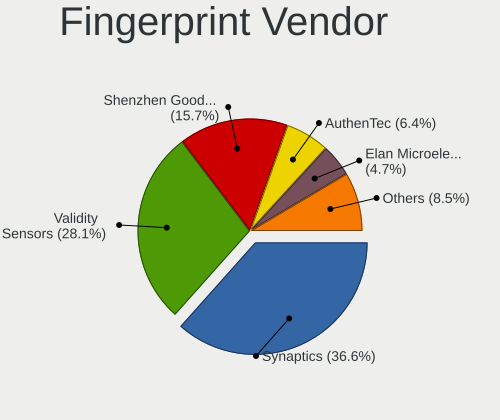

| Vendor                             | Computers | Percent |
|------------------------------------|-----------|---------|
| Synaptics                          | 86        | 36.6%   |
| Validity Sensors                   | 66        | 28.09%  |
| Shenzhen Goodix Technology         | 37        | 15.74%  |
| AuthenTec                          | 15        | 6.38%   |
| Elan Microelectronics              | 11        | 4.68%   |
| LighTuning Technology              | 7         | 2.98%   |
| Upek                               | 6         | 2.55%   |
| STMicroelectronics                 | 3         | 1.28%   |
| Realtek USB2.0 Finger Print Bridge | 3         | 1.28%   |
| Samsung Electronics                | 1         | 0.43%   |

Fingerprint Model
-----------------

Fingerprint sensor models

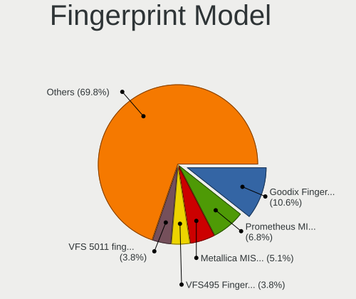

| Model                                                                      | Computers | Percent |
|----------------------------------------------------------------------------|-----------|---------|
| Shenzhen Goodix  Fingerprint Device                                        | 25        | 10.64%  |
| Synaptics Prometheus MIS Touch Fingerprint Reader                          | 16        | 6.81%   |
| Synaptics Metallica MIS Touch Fingerprint Reader                           | 12        | 5.11%   |
| Validity Sensors VFS495 Fingerprint Reader                                 | 9         | 3.83%   |
| Validity Sensors VFS 5011 fingerprint sensor                               | 9         | 3.83%   |
| Shenzhen Goodix Fingerprint Reader                                         | 9         | 3.83%   |
| Validity Sensors Swipe Fingerprint Sensor                                  | 8         | 3.4%    |
| Validity Sensors Synaptics WBDI                                            | 7         | 2.98%   |
| Synaptics WBDI Fingerprint Reader USB 086                                  | 7         | 2.98%   |
| Synaptics Metallica MOH Touch Fingerprint Reader                           | 7         | 2.98%   |
| Synaptics Fingerprint reader [HP G6]                                       | 7         | 2.98%   |
| Synaptics Prometheus Fingerprint Reader                                    | 6         | 2.55%   |
| Elan ELAN:Fingerprint                                                      | 6         | 2.55%   |
| Validity Sensors VFS301 Fingerprint Reader                                 | 5         | 2.13%   |
| Validity Sensors Fingerprint scanner                                       | 5         | 2.13%   |
| Upek Biometric Touchchip/Touchstrip Fingerprint Sensor                     | 5         | 2.13%   |
| Synaptics UWP WBDI Device                                                  | 5         | 2.13%   |
| Synaptics FS7604 Touch Fingerprint Sensor with PurePrint                   | 5         | 2.13%   |
| Elan ELAN:ARM-M4                                                           | 5         | 2.13%   |
| AuthenTec Fingerprint Sensor                                               | 5         | 2.13%   |
| AuthenTec AES1600                                                          | 5         | 2.13%   |
| Validity Sensors VFS7500 Touch Fingerprint Sensor                          | 4         | 1.7%    |
| Validity Sensors VFS451 Fingerprint Reader                                 | 4         | 1.7%    |
| Validity Sensors VFS101 Fingerprint Reader                                 | 4         | 1.7%    |
| Validity Sensors Synaptics VFS7552 Touch Fingerprint Sensor with PurePrint | 4         | 1.7%    |
| Synaptics UWP WBDI                                                         | 4         | 1.7%    |
| Synaptics  FS7604 Touch Fingerprint Sensor with PurePrint                  | 4         | 1.7%    |
| AuthenTec AES2810                                                          | 4         | 1.7%    |
| Validity Sensors VFS491                                                    | 3         | 1.28%   |
| Synaptics WBDI Device                                                      | 3         | 1.28%   |
| Synaptics WBDI                                                             | 3         | 1.28%   |
| Synaptics  WBDI                                                            | 3         | 1.28%   |
| STMicroelectronics Fingerprint Reader                                      | 3         | 1.28%   |
| Shenzhen Goodix FingerPrint                                                | 3         | 1.28%   |
| Realtek USB2.0 Finger Print Bridge FocalTech Fingerprint Device            | 3         | 1.28%   |
| LighTuning ES603 Swipe Fingerprint Sensor                                  | 3         | 1.28%   |
| Validity Sensors VFS Fingerprint sensor                                    | 2         | 0.85%   |
| Synaptics WBDI Fingerprint Reader USB 102                                  | 2         | 0.85%   |
| LighTuning Fingerprint Reader                                              | 2         | 0.85%   |
| LighTuning EgisTec Touch Fingerprint Sensor                                | 2         | 0.85%   |

Chipcard Vendor
---------------

Chipcard module vendors

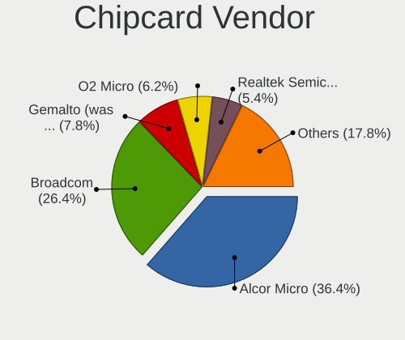

| Vendor                | Computers | Percent |
|-----------------------|-----------|---------|
| Alcor Micro           | 47        | 36.43%  |
| Broadcom              | 34        | 26.36%  |
| Gemalto (was Gemplus) | 10        | 7.75%   |
| O2 Micro              | 8         | 6.2%    |
| Realtek Semiconductor | 7         | 5.43%   |
| Bit4id                | 6         | 4.65%   |
| Upek                  | 3         | 2.33%   |
| Lenovo                | 3         | 2.33%   |
| SCM Microsystems      | 2         | 1.55%   |
| Chicony Electronics   | 2         | 1.55%   |
| Advanced Card Systems | 2         | 1.55%   |
| Yubico.com            | 1         | 0.78%   |
| Hewlett-Packard       | 1         | 0.78%   |
| GHI                   | 1         | 0.78%   |
| Feitian Technologies  | 1         | 0.78%   |
| Cherry                | 1         | 0.78%   |

Chipcard Model
--------------

Chipcard module models

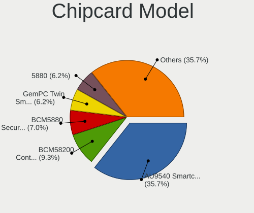

| Model                                                                        | Computers | Percent |
|------------------------------------------------------------------------------|-----------|---------|
| Alcor Micro AU9540 Smartcard Reader                                          | 46        | 35.66%  |
| Broadcom BCM58200 ControlVault 3 (FingerPrint sensor + Contacted SmartCard)  | 12        | 9.3%    |
| Broadcom BCM5880 Secure Applications Processor                               | 9         | 6.98%   |
| Gemalto (was Gemplus) GemPC Twin SmartCard Reader                            | 8         | 6.2%    |
| Broadcom 5880                                                                | 8         | 6.2%    |
| Realtek Semiconductor Smart Card Reader Interface                            | 7         | 5.43%   |
| O2 Micro OZ776 CCID Smartcard Reader                                         | 7         | 5.43%   |
| Bit4id miniLector EVO                                                        | 6         | 4.65%   |
| Broadcom BCM5880 Secure Applications Processor with fingerprint swipe sensor | 4         | 3.1%    |
| Upek TouchChip Fingerprint Coprocessor (WBF advanced mode)                   | 3         | 2.33%   |
| Lenovo Integrated Smart Card Reader                                          | 3         | 2.33%   |
| SCM Microsystems SCR3340 - ExpressCard54 Smart Card Reader                   | 2         | 1.55%   |
| Gemalto (was Gemplus) Compact Smart Card Reader Writer                       | 2         | 1.55%   |
| Chicony Electronics HP Skylab USB Smartcard Keyboard                         | 2         | 1.55%   |
| Advanced Card Systems ACR38 SmartCard Reader                                 | 2         | 1.55%   |
| Yubico.com Yubikey 4/5 U2F+CCID                                              | 1         | 0.78%   |
| O2 Micro Oz776 SmartCard Reader                                              | 1         | 0.78%   |
| Hewlett-Packard SC Keyboard - Apollo (Liteon)                                | 1         | 0.78%   |
| GHI NC001                                                                    | 1         | 0.78%   |
| Feitian Technologies FIDO CCID KB                                            | 1         | 0.78%   |
| Cherry SmartCard Reader Keyboard KC 1000 SC                                  | 1         | 0.78%   |
| Broadcom 58200                                                               | 1         | 0.78%   |
| Alcor Micro Watchdata W 1981                                                 | 1         | 0.78%   |

Unsupported
-----------

Unsupported Devices
-------------------

Total unsupported devices on board

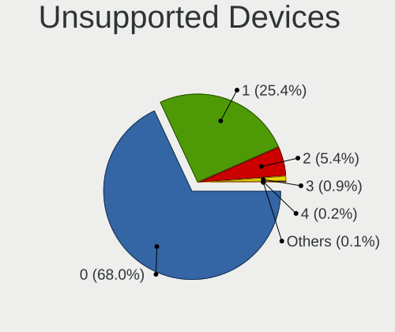

| Total | Computers | Percent |
|-------|-----------|---------|
| 0     | 1726      | 68.03%  |
| 1     | 644       | 25.38%  |
| 2     | 136       | 5.36%   |
| 3     | 24        | 0.95%   |
| 4     | 5         | 0.2%    |
| 5     | 2         | 0.08%   |

Unsupported Device Types
------------------------

Types of unsupported devices

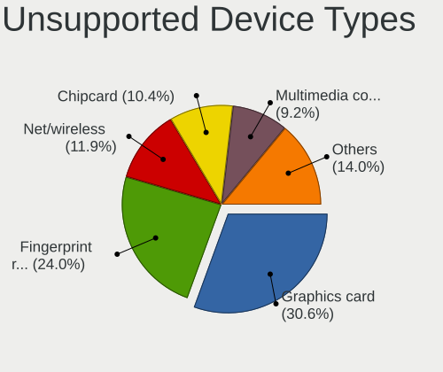

| Type                     | Computers | Percent |
|--------------------------|-----------|---------|
| Graphics card            | 297       | 30.56%  |
| Fingerprint reader       | 233       | 23.97%  |
| Net/wireless             | 116       | 11.93%  |
| Chipcard                 | 101       | 10.39%  |
| Multimedia controller    | 89        | 9.16%   |
| Camera                   | 27        | 2.78%   |
| Bluetooth                | 22        | 2.26%   |
| Communication controller | 19        | 1.95%   |
| Card reader              | 16        | 1.65%   |
| Net/ethernet             | 10        | 1.03%   |
| Storage                  | 8         | 0.82%   |
| Sound                    | 7         | 0.72%   |
| Network                  | 6         | 0.62%   |
| Modem                    | 5         | 0.51%   |
| Unassigned class         | 4         | 0.41%   |
| Flash memory             | 4         | 0.41%   |
| Storage/raid             | 3         | 0.31%   |
| Dvb card                 | 3         | 0.31%   |
| Tv card                  | 1         | 0.1%    |
| Storage/ata              | 1         | 0.1%    |

