Linux in Portugal - Tested Hardware & Statistics
------------------------------------------------

A project to collect tested hardware configurations for Linux in Portugal.

Anyone can contribute to this report by the [hw-probe](https://github.com/linuxhw/hw-probe) tool:

    sudo -E hw-probe -all -upload

Please contribute! Especially if your hardware is rare.

This is a report for all computer types. See also reports for [desktops](/Location/Portugal/Desktop/README.md) and [notebooks](/Location/Portugal/Notebook/README.md).

Contents
--------

* [ Test Cases ](#test-cases)

* [ System ](#system)
  - [ OS                       ](#os)
  - [ OS Family                ](#os-family)
  - [ Kernel                   ](#kernel)
  - [ Kernel Family            ](#kernel-family)
  - [ Kernel Major Ver.        ](#kernel-major-ver)
  - [ Arch                     ](#arch)
  - [ DE                       ](#de)
  - [ Display Server           ](#display-server)
  - [ Display Manager          ](#display-manager)
  - [ OS Lang                  ](#os-lang)
  - [ Boot Mode                ](#boot-mode)
  - [ Filesystem               ](#filesystem)
  - [ Part. scheme             ](#part-scheme)
  - [ Dual Boot with Linux/BSD ](#dual-boot-with-linuxbsd)
  - [ Dual Boot (Win)          ](#dual-boot-win)

* [ Board ](#board)
  - [ Vendor                   ](#vendor)
  - [ Model                    ](#model)
  - [ Model Family             ](#model-family)
  - [ MFG Year                 ](#mfg-year)
  - [ Form Factor              ](#form-factor)
  - [ Secure Boot              ](#secure-boot)
  - [ Coreboot                 ](#coreboot)
  - [ RAM Size                 ](#ram-size)
  - [ RAM Used                 ](#ram-used)
  - [ Total Drives             ](#total-drives)
  - [ Has CD-ROM               ](#has-cd-rom)
  - [ Has Ethernet             ](#has-ethernet)
  - [ Has WiFi                 ](#has-wifi)
  - [ Has Bluetooth            ](#has-bluetooth)

* [ Location ](#location)
  - [ Country                  ](#country)
  - [ City                     ](#city)

* [ Drives ](#drives)
  - [ Drive Vendor             ](#drive-vendor)
  - [ Drive Model              ](#drive-model)
  - [ HDD Vendor               ](#hdd-vendor)
  - [ SSD Vendor               ](#ssd-vendor)
  - [ Drive Kind               ](#drive-kind)
  - [ Drive Connector          ](#drive-connector)
  - [ Drive Size               ](#drive-size)
  - [ Space Total              ](#space-total)
  - [ Space Used               ](#space-used)
  - [ Malfunc. Drives          ](#malfunc-drives)
  - [ Malfunc. Drive Vendor    ](#malfunc-drive-vendor)
  - [ Malfunc. HDD Vendor      ](#malfunc-hdd-vendor)
  - [ Malfunc. Drive Kind      ](#malfunc-drive-kind)
  - [ Failed Drives            ](#failed-drives)
  - [ Failed Drive Vendor      ](#failed-drive-vendor)
  - [ Drive Status             ](#drive-status)

* [ Storage controller ](#storage-controller)
  - [ Storage Vendor           ](#storage-vendor)
  - [ Storage Model            ](#storage-model)
  - [ Storage Kind             ](#storage-kind)

* [ Processor ](#processor)
  - [ CPU Vendor               ](#cpu-vendor)
  - [ CPU Model                ](#cpu-model)
  - [ CPU Model Family         ](#cpu-model-family)
  - [ CPU Cores                ](#cpu-cores)
  - [ CPU Sockets              ](#cpu-sockets)
  - [ CPU Threads              ](#cpu-threads)
  - [ CPU Op-Modes             ](#cpu-op-modes)
  - [ CPU Microcode            ](#cpu-microcode)
  - [ CPU Microarch            ](#cpu-microarch)

* [ Graphics ](#graphics)
  - [ GPU Vendor               ](#gpu-vendor)
  - [ GPU Model                ](#gpu-model)
  - [ GPU Combo                ](#gpu-combo)
  - [ GPU Driver               ](#gpu-driver)
  - [ GPU Memory               ](#gpu-memory)

* [ Monitor ](#monitor)
  - [ Monitor Vendor           ](#monitor-vendor)
  - [ Monitor Model            ](#monitor-model)
  - [ Monitor Resolution       ](#monitor-resolution)
  - [ Monitor Diagonal         ](#monitor-diagonal)
  - [ Monitor Width            ](#monitor-width)
  - [ Aspect Ratio             ](#aspect-ratio)
  - [ Monitor Area             ](#monitor-area)
  - [ Pixel Density            ](#pixel-density)
  - [ Multiple Monitors        ](#multiple-monitors)

* [ Network ](#network)
  - [ Net Controller Vendor    ](#net-controller-vendor)
  - [ Net Controller Model     ](#net-controller-model)
  - [ Wireless Vendor          ](#wireless-vendor)
  - [ Wireless Model           ](#wireless-model)
  - [ Ethernet Vendor          ](#ethernet-vendor)
  - [ Ethernet Model           ](#ethernet-model)
  - [ Net Controller Kind      ](#net-controller-kind)
  - [ Used Controller          ](#used-controller)
  - [ NICs                     ](#nics)
  - [ IPv6                     ](#ipv6)

* [ Bluetooth ](#bluetooth)
  - [ Bluetooth Vendor         ](#bluetooth-vendor)
  - [ Bluetooth Model          ](#bluetooth-model)

* [ Sound ](#sound)
  - [ Sound Vendor             ](#sound-vendor)
  - [ Sound Model              ](#sound-model)

* [ Memory ](#memory)
  - [ Memory Vendor            ](#memory-vendor)
  - [ Memory Model             ](#memory-model)
  - [ Memory Kind              ](#memory-kind)
  - [ Memory Form Factor       ](#memory-form-factor)
  - [ Memory Size              ](#memory-size)
  - [ Memory Speed             ](#memory-speed)

* [ Printers & scanners ](#printers--scanners)
  - [ Printer Vendor           ](#printer-vendor)
  - [ Printer Model            ](#printer-model)
  - [ Scanner Vendor           ](#scanner-vendor)
  - [ Scanner Model            ](#scanner-model)

* [ Camera ](#camera)
  - [ Camera Vendor            ](#camera-vendor)
  - [ Camera Model             ](#camera-model)

* [ Security ](#security)
  - [ Fingerprint Vendor       ](#fingerprint-vendor)
  - [ Fingerprint Model        ](#fingerprint-model)
  - [ Chipcard Vendor          ](#chipcard-vendor)
  - [ Chipcard Model           ](#chipcard-model)

* [ Unsupported ](#unsupported)
  - [ Unsupported Devices      ](#unsupported-devices)
  - [ Unsupported Device Types ](#unsupported-device-types)

Test Cases
----------

Total: 2781

| Vendor        | Model                       | Form-Factor | Probe                                                      | Date         |
|---------------|-----------------------------|-------------|------------------------------------------------------------|--------------|
| ASUSTek       | M5A78L-M PLUS/USB3          | Desktop     | [48be6a2dbb](https://linux-hardware.org/?probe=48be6a2dbb) | May 07, 2024 |
| MSI           | Cyborg 15 A12VF             | Notebook    | [1168634a54](https://linux-hardware.org/?probe=1168634a54) | May 06, 2024 |
| Apple         | Mac-35C5E08120C7EEAF Mac... | Mini pc     | [8dcee212bd](https://linux-hardware.org/?probe=8dcee212bd) | May 05, 2024 |
| Apple         | Mac-35C5E08120C7EEAF Mac... | Mini pc     | [83e37ce2be](https://linux-hardware.org/?probe=83e37ce2be) | May 05, 2024 |
| MSI           | MAG B550 TOMAHAWK           | Desktop     | [9da2a84508](https://linux-hardware.org/?probe=9da2a84508) | May 05, 2024 |
| ASUSTek       | F5SL                        | Notebook    | [da423af0cb](https://linux-hardware.org/?probe=da423af0cb) | May 05, 2024 |
| Gigabyte      | EP43-S3L                    | Desktop     | [96cd4e9337](https://linux-hardware.org/?probe=96cd4e9337) | May 04, 2024 |
| ASUSTek       | ROG Strix G733QM_G733QM     | Notebook    | [c7e3ed99cc](https://linux-hardware.org/?probe=c7e3ed99cc) | May 04, 2024 |
| Raspberry ... | Raspberry Pi 4 Model B R... | Soc         | [264e965e8b](https://linux-hardware.org/?probe=264e965e8b) | May 04, 2024 |
| Raspberry ... | Raspberry Pi 4 Model B R... | Soc         | [8f6497f948](https://linux-hardware.org/?probe=8f6497f948) | May 04, 2024 |
| ASUSTek       | TUF Gaming B460M-PLUS       | Desktop     | [7e4062c114](https://linux-hardware.org/?probe=7e4062c114) | May 03, 2024 |
| ASUSTek       | A88XM-E                     | Desktop     | [df8ef63dc3](https://linux-hardware.org/?probe=df8ef63dc3) | May 02, 2024 |
| INSYS         | GW1-W149                    | Notebook    | [1219dfdc44](https://linux-hardware.org/?probe=1219dfdc44) | May 02, 2024 |
| MSI           | MAG B550 TOMAHAWK           | Desktop     | [9fb4641867](https://linux-hardware.org/?probe=9fb4641867) | May 01, 2024 |
| Lenovo        | IdeaPad 1 15ALC7 82R4       | Notebook    | [f899f3dccf](https://linux-hardware.org/?probe=f899f3dccf) | May 01, 2024 |
| Biostar       | H310MHP                     | Desktop     | [1faa8b5213](https://linux-hardware.org/?probe=1faa8b5213) | Apr 30, 2024 |
| Biostar       | H310MHP                     | Desktop     | [d5bc5a946f](https://linux-hardware.org/?probe=d5bc5a946f) | Apr 30, 2024 |
| Lenovo        | Legion 5 15ACH6H 82JU       | Notebook    | [56c9f37671](https://linux-hardware.org/?probe=56c9f37671) | Apr 29, 2024 |
| Acer          | Nitro AN515-58              | Notebook    | [5192e9d32b](https://linux-hardware.org/?probe=5192e9d32b) | Apr 27, 2024 |
| ASUSTek       | P8Z77-M PRO                 | Desktop     | [686e6cab2f](https://linux-hardware.org/?probe=686e6cab2f) | Apr 26, 2024 |
| ASUSTek       | VivoBook_ASUSLaptop X512... | Notebook    | [4f05e448a7](https://linux-hardware.org/?probe=4f05e448a7) | Apr 26, 2024 |
| HUAWEI        | BOM-WXX9                    | Notebook    | [5fe5c7ed8d](https://linux-hardware.org/?probe=5fe5c7ed8d) | Apr 26, 2024 |
| Dell          | XPS 13 9310 2-in-1          | Convertible | [780095b96e](https://linux-hardware.org/?probe=780095b96e) | Apr 25, 2024 |
| Lenovo        | IdeaPad L340-15IRH Gamin... | Notebook    | [70560c5a36](https://linux-hardware.org/?probe=70560c5a36) | Apr 25, 2024 |
| HP            | 84FD                        | Desktop     | [e0a1835b65](https://linux-hardware.org/?probe=e0a1835b65) | Apr 24, 2024 |
| Acer          | Nitro AN515-58              | Notebook    | [4512bf861b](https://linux-hardware.org/?probe=4512bf861b) | Apr 24, 2024 |
| Dell          | Latitude 5290 2-in-1        | Notebook    | [de4f7d0a06](https://linux-hardware.org/?probe=de4f7d0a06) | Apr 23, 2024 |
| ASUSTek       | M5A78L-M PLUS/USB3          | Desktop     | [68d6575b15](https://linux-hardware.org/?probe=68d6575b15) | Apr 22, 2024 |
| ASUSTek       | ROG CROSSHAIR VIII DARK ... | Desktop     | [d24a794778](https://linux-hardware.org/?probe=d24a794778) | Apr 22, 2024 |
| Lenovo        | ThinkPad X1 Carbon 2nd 2... | Notebook    | [62d4436d4e](https://linux-hardware.org/?probe=62d4436d4e) | Apr 21, 2024 |
| Medion        | M14L-256                    | Notebook    | [21ced95f8d](https://linux-hardware.org/?probe=21ced95f8d) | Apr 21, 2024 |
| LNV           | M14LC2-256                  | Notebook    | [582ccc43d4](https://linux-hardware.org/?probe=582ccc43d4) | Apr 21, 2024 |
| Dell          | Latitude 13                 | Notebook    | [88b6f3f2c8](https://linux-hardware.org/?probe=88b6f3f2c8) | Apr 20, 2024 |
| HP            | Pavilion Notebook           | Notebook    | [8b925ca8f0](https://linux-hardware.org/?probe=8b925ca8f0) | Apr 19, 2024 |
| ASUSTek       | D425MC                      | Desktop     | [7be445a3bf](https://linux-hardware.org/?probe=7be445a3bf) | Apr 19, 2024 |
| ASUSTek       | H110M-D                     | Desktop     | [994b125f04](https://linux-hardware.org/?probe=994b125f04) | Apr 19, 2024 |
| ASUSTek       | PRIME Z790-P WIFI           | Desktop     | [ac52751407](https://linux-hardware.org/?probe=ac52751407) | Apr 16, 2024 |
| INSYS         | GW1-W149                    | Notebook    | [2f53f6286d](https://linux-hardware.org/?probe=2f53f6286d) | Apr 15, 2024 |
| Apple         | MacBookAir2,1               | Notebook    | [9145361a08](https://linux-hardware.org/?probe=9145361a08) | Apr 15, 2024 |
| Gigabyte      | B650M GAMING X AX           | Desktop     | [7a62f23317](https://linux-hardware.org/?probe=7a62f23317) | Apr 14, 2024 |
| Apple         | MacBookAir2,1               | Notebook    | [94a43b871f](https://linux-hardware.org/?probe=94a43b871f) | Apr 14, 2024 |
| HP            | x2 Detachable 10-p0XX       | Tablet      | [ec1f49c1c8](https://linux-hardware.org/?probe=ec1f49c1c8) | Apr 14, 2024 |
| Apple         | MacBookPro11,3              | Notebook    | [159bfe4be5](https://linux-hardware.org/?probe=159bfe4be5) | Apr 13, 2024 |
| Lenovo        | IdeaPad 330S-15IKB 81F5     | Notebook    | [22b0bf7e14](https://linux-hardware.org/?probe=22b0bf7e14) | Apr 13, 2024 |
| HP            | 304Ah                       | Desktop     | [912a8508e6](https://linux-hardware.org/?probe=912a8508e6) | Apr 13, 2024 |
| ASUSTek       | P5QL-ASUS-SE                | Desktop     | [8d6d79b4d7](https://linux-hardware.org/?probe=8d6d79b4d7) | Apr 13, 2024 |
| Apple         | MacBookPro9,1               | Notebook    | [421b7a0e3a](https://linux-hardware.org/?probe=421b7a0e3a) | Apr 12, 2024 |
| Toshiba       | Satellite Pro C50-A-1C8     | Notebook    | [64265aeb0e](https://linux-hardware.org/?probe=64265aeb0e) | Apr 12, 2024 |
| ASUSTek       | X542URR                     | Notebook    | [e3a4e15a6e](https://linux-hardware.org/?probe=e3a4e15a6e) | Apr 12, 2024 |
| Dell          | Precision 3571              | Notebook    | [6bef26b856](https://linux-hardware.org/?probe=6bef26b856) | Apr 10, 2024 |
| HP            | 8719                        | Desktop     | [02086100cf](https://linux-hardware.org/?probe=02086100cf) | Apr 10, 2024 |
| Lenovo        | Legion 5 15ACH6H 82JU       | Notebook    | [67c665fbe5](https://linux-hardware.org/?probe=67c665fbe5) | Apr 09, 2024 |
| ASUSTek       | K55VM                       | Notebook    | [081e45fb7f](https://linux-hardware.org/?probe=081e45fb7f) | Apr 08, 2024 |
| ASUSTek       | ROG STRIX Z390-H GAMING     | Desktop     | [fcb1981db5](https://linux-hardware.org/?probe=fcb1981db5) | Apr 07, 2024 |
| Dell          | Precision 3571              | Notebook    | [fdab7d40f5](https://linux-hardware.org/?probe=fdab7d40f5) | Apr 07, 2024 |
| Pegatron      | 2AB5                        | Desktop     | [6e1a06d52f](https://linux-hardware.org/?probe=6e1a06d52f) | Apr 07, 2024 |
| ASUSTek       | PRIME Z270-P                | Desktop     | [b554cbdc7f](https://linux-hardware.org/?probe=b554cbdc7f) | Apr 06, 2024 |
| Pegatron      | 2AB5                        | Desktop     | [cd847bb556](https://linux-hardware.org/?probe=cd847bb556) | Apr 06, 2024 |
| HP            | EliteBook 840 14 inch G9... | Notebook    | [3eb7bba175](https://linux-hardware.org/?probe=3eb7bba175) | Apr 04, 2024 |
| ASUSTek       | ROG Strix G733QM_G733QM     | Notebook    | [556039fa6c](https://linux-hardware.org/?probe=556039fa6c) | Apr 04, 2024 |
| ASUSTek       | ROG STRIX B450-F GAMING     | Desktop     | [91a3331934](https://linux-hardware.org/?probe=91a3331934) | Apr 03, 2024 |
| ASUSTek       | ZenBook UX425EA_UX425EA     | Notebook    | [9bc584b914](https://linux-hardware.org/?probe=9bc584b914) | Apr 03, 2024 |
| Lenovo        | ThinkPad L15 Gen 3 21C30... | Notebook    | [7a09978e27](https://linux-hardware.org/?probe=7a09978e27) | Apr 03, 2024 |
| Lenovo        | ThinkPad L380 20M50011PG    | Notebook    | [663de4db43](https://linux-hardware.org/?probe=663de4db43) | Apr 03, 2024 |
| Lenovo        | IdeaPad 3 15ALC6 82KU       | Notebook    | [955dc4530f](https://linux-hardware.org/?probe=955dc4530f) | Apr 02, 2024 |
| Dell          | 0T568R A00                  | Desktop     | [28e382c596](https://linux-hardware.org/?probe=28e382c596) | Apr 02, 2024 |
| Lenovo        | ThinkPad T14 Gen 1 20S00... | Notebook    | [083640b754](https://linux-hardware.org/?probe=083640b754) | Mar 31, 2024 |
| Medion        | M14L-256                    | Notebook    | [28c0f833c0](https://linux-hardware.org/?probe=28c0f833c0) | Mar 31, 2024 |
| Dell          | 051FJ8 A01                  | Desktop     | [05e406828c](https://linux-hardware.org/?probe=05e406828c) | Mar 29, 2024 |
| Dell          | Vostro 1015                 | Notebook    | [f9ca91d526](https://linux-hardware.org/?probe=f9ca91d526) | Mar 29, 2024 |
| ASUSTek       | ZenBook UX425EA_UX425EA     | Notebook    | [5b4456a2d6](https://linux-hardware.org/?probe=5b4456a2d6) | Mar 29, 2024 |
| Sony          | VPCY11S1E                   | Notebook    | [905655032f](https://linux-hardware.org/?probe=905655032f) | Mar 29, 2024 |
| Lenovo        | 3746 WIN SDK0T76465 3422... | All in one  | [e9064cfefc](https://linux-hardware.org/?probe=e9064cfefc) | Mar 29, 2024 |
| ASUSTek       | PRIME B450-PLUS             | Desktop     | [25ba3feb6f](https://linux-hardware.org/?probe=25ba3feb6f) | Mar 28, 2024 |
| HP            | 0B54h D                     | Desktop     | [e7d521b51c](https://linux-hardware.org/?probe=e7d521b51c) | Mar 28, 2024 |
| INET          | Z156                        | Notebook    | [fd38934a49](https://linux-hardware.org/?probe=fd38934a49) | Mar 27, 2024 |
| Dell          | 0T568R A00                  | Desktop     | [002137621a](https://linux-hardware.org/?probe=002137621a) | Mar 27, 2024 |
| Dell          | 0GU083 A00                  | Desktop     | [c7a2de496a](https://linux-hardware.org/?probe=c7a2de496a) | Mar 26, 2024 |
| ASUSTek       | TUF B450-PLUS GAMING        | Desktop     | [0f5f660464](https://linux-hardware.org/?probe=0f5f660464) | Mar 26, 2024 |
| HP            | ENVY x360 Convertible 15... | Convertible | [df057e2e9f](https://linux-hardware.org/?probe=df057e2e9f) | Mar 26, 2024 |
| Lenovo        | Legion 5 15ACH6H 82JU       | Notebook    | [c2dedfbe62](https://linux-hardware.org/?probe=c2dedfbe62) | Mar 25, 2024 |
| ASUSTek       | F5RL                        | Notebook    | [6d1c82c10a](https://linux-hardware.org/?probe=6d1c82c10a) | Mar 24, 2024 |
| Medion        | M14L-256                    | Notebook    | [d2fb66e78e](https://linux-hardware.org/?probe=d2fb66e78e) | Mar 22, 2024 |
| ASUSTek       | PRIME X670-P                | Desktop     | [e3c04a457d](https://linux-hardware.org/?probe=e3c04a457d) | Mar 22, 2024 |
| Lenovo        | Legion 5 15ACH6H 82JU       | Notebook    | [99ff7d5b73](https://linux-hardware.org/?probe=99ff7d5b73) | Mar 21, 2024 |
| Lenovo        | IdeaPad L340-15IRH Gamin... | Notebook    | [8041a52ffe](https://linux-hardware.org/?probe=8041a52ffe) | Mar 21, 2024 |
| Unknown       | Apple MacBook Pro (13-in... | Notebook    | [3bc7983914](https://linux-hardware.org/?probe=3bc7983914) | Mar 20, 2024 |
| ASUSTek       | TUF Gaming A520M-PLUS II    | Desktop     | [ae0e79e6da](https://linux-hardware.org/?probe=ae0e79e6da) | Mar 20, 2024 |
| Intel         | DQ45CB AAE30148-207         | Desktop     | [779eb3b38f](https://linux-hardware.org/?probe=779eb3b38f) | Mar 20, 2024 |
| HP            | 8768 A                      | Desktop     | [6c296786d2](https://linux-hardware.org/?probe=6c296786d2) | Mar 19, 2024 |
| Lenovo        | Yoga Slim 7 ProX 14ARH7 ... | Notebook    | [f7da71747e](https://linux-hardware.org/?probe=f7da71747e) | Mar 18, 2024 |
| Dell          | Inspiron 15-3567            | Notebook    | [4c1a37011d](https://linux-hardware.org/?probe=4c1a37011d) | Mar 18, 2024 |
| Dell          | Inspiron 15-3567            | Notebook    | [b322a7f7ff](https://linux-hardware.org/?probe=b322a7f7ff) | Mar 18, 2024 |
| Toshiba       | Satellite C660D             | Notebook    | [63b9e3f1b8](https://linux-hardware.org/?probe=63b9e3f1b8) | Mar 18, 2024 |
| Medion        | E15301                      | Notebook    | [a3f6fc8c36](https://linux-hardware.org/?probe=a3f6fc8c36) | Mar 17, 2024 |
| HP            | Pavilion dv6000 (GF677EA... | Notebook    | [ecbe5ffb1f](https://linux-hardware.org/?probe=ecbe5ffb1f) | Mar 16, 2024 |
| HP            | Pavilion Power Laptop 15... | Notebook    | [8529154b4a](https://linux-hardware.org/?probe=8529154b4a) | Mar 15, 2024 |
| Gigabyte      | B650 GAMING X AX            | Desktop     | [20ce1c7415](https://linux-hardware.org/?probe=20ce1c7415) | Mar 13, 2024 |
| Acer          | Aspire 5742                 | Notebook    | [280af1d066](https://linux-hardware.org/?probe=280af1d066) | Mar 12, 2024 |
| HP            | OMEN by Laptop              | Notebook    | [754b3828fc](https://linux-hardware.org/?probe=754b3828fc) | Mar 12, 2024 |
| HP            | EliteBook Folio 9470m       | Notebook    | [ddf5a549da](https://linux-hardware.org/?probe=ddf5a549da) | Mar 11, 2024 |
| ASUSTek       | ROG Strix G513IE_G513IE     | Notebook    | [695773aa7b](https://linux-hardware.org/?probe=695773aa7b) | Mar 10, 2024 |
| Samsung       | 870Z5E/880Z5E/680Z5E        | Notebook    | [fd7305258c](https://linux-hardware.org/?probe=fd7305258c) | Mar 10, 2024 |
| ASUSTek       | X555LJ                      | Notebook    | [72da032893](https://linux-hardware.org/?probe=72da032893) | Mar 09, 2024 |
| HP            | Laptop 15s-eq0xxx           | Notebook    | [e4a401d044](https://linux-hardware.org/?probe=e4a401d044) | Mar 08, 2024 |
| Lenovo        | ThinkPad T440p              | Notebook    | [fb060608ab](https://linux-hardware.org/?probe=fb060608ab) | Mar 08, 2024 |
| ASUSTek       | M3702WFA                    | All in one  | [9d1db96cef](https://linux-hardware.org/?probe=9d1db96cef) | Mar 07, 2024 |
| AZW           | MINI S 10                   | Desktop     | [2376093717](https://linux-hardware.org/?probe=2376093717) | Mar 06, 2024 |
| AZW           | MINI S 10                   | Desktop     | [3553643ae2](https://linux-hardware.org/?probe=3553643ae2) | Mar 05, 2024 |
| ASUSTek       | PRIME B450M-A               | Desktop     | [bc4fcd2eda](https://linux-hardware.org/?probe=bc4fcd2eda) | Mar 05, 2024 |
| GX55          | Unknown                     | Tablet      | [5db0069937](https://linux-hardware.org/?probe=5db0069937) | Mar 04, 2024 |
| Dell          | Latitude 7280               | Notebook    | [b40f34a4ed](https://linux-hardware.org/?probe=b40f34a4ed) | Mar 02, 2024 |
| AMI           | Intel                       | Notebook    | [e9dc6ddc46](https://linux-hardware.org/?probe=e9dc6ddc46) | Mar 01, 2024 |
| SLIMBOOK      | EXECUTIVE-14                | Notebook    | [39d528dadf](https://linux-hardware.org/?probe=39d528dadf) | Mar 01, 2024 |
| SLIMBOOK      | EXECUTIVE-14                | Notebook    | [5fc24348a8](https://linux-hardware.org/?probe=5fc24348a8) | Mar 01, 2024 |
| ASUSTek       | P5QL-ASUS-SE                | Desktop     | [2ca44d747e](https://linux-hardware.org/?probe=2ca44d747e) | Feb 29, 2024 |
| HP            | Pavilion Laptop 15-eh2xx... | Notebook    | [0510a78cfe](https://linux-hardware.org/?probe=0510a78cfe) | Feb 29, 2024 |
| Dell          | Latitude 7400               | Notebook    | [97c11ef92d](https://linux-hardware.org/?probe=97c11ef92d) | Feb 28, 2024 |
| MSI           | MPG B550 GAMING PLUS        | Desktop     | [ca82540f11](https://linux-hardware.org/?probe=ca82540f11) | Feb 28, 2024 |
| HP            | EliteBook 840 14 inch G9... | Notebook    | [fd37aa8001](https://linux-hardware.org/?probe=fd37aa8001) | Feb 27, 2024 |
| Acer          | NC-E1-530-21174G            | Notebook    | [56d0444e6b](https://linux-hardware.org/?probe=56d0444e6b) | Feb 27, 2024 |
| ASUSTek       | Zenbook UX3402VA_UX3402V... | Notebook    | [0812dc5f8e](https://linux-hardware.org/?probe=0812dc5f8e) | Feb 26, 2024 |
| ASUSTek       | VivoBook_ASUSLaptop X513... | Notebook    | [527feb458b](https://linux-hardware.org/?probe=527feb458b) | Feb 26, 2024 |
| ASRock        | Z97 Pro4                    | Desktop     | [9c48e758c6](https://linux-hardware.org/?probe=9c48e758c6) | Feb 26, 2024 |
| HP            | Pavilion Gaming Laptop 1... | Notebook    | [3b3a145c76](https://linux-hardware.org/?probe=3b3a145c76) | Feb 23, 2024 |
| Lenovo        | ThinkPad T440p              | Notebook    | [da00bee2f4](https://linux-hardware.org/?probe=da00bee2f4) | Feb 23, 2024 |
| ASUSTek       | UX370UAR                    | Convertible | [947549bda4](https://linux-hardware.org/?probe=947549bda4) | Feb 23, 2024 |
| ASUSTek       | ROG STRIX B460-H GAMING     | Desktop     | [b982c9d648](https://linux-hardware.org/?probe=b982c9d648) | Feb 22, 2024 |
| ASUSTek       | VC66                        | Desktop     | [99329fa851](https://linux-hardware.org/?probe=99329fa851) | Feb 20, 2024 |
| Lenovo        | IdeaPad 3 15ALC6 82KU       | Notebook    | [500e3a58df](https://linux-hardware.org/?probe=500e3a58df) | Feb 20, 2024 |
| ASRock        | Z97 Pro4                    | Desktop     | [d6189a161e](https://linux-hardware.org/?probe=d6189a161e) | Feb 20, 2024 |
| ASUSTek       | P5QL-ASUS-SE                | Desktop     | [a187c17778](https://linux-hardware.org/?probe=a187c17778) | Feb 20, 2024 |
| Dell          | 051FJ8 A01                  | Desktop     | [0949817cb6](https://linux-hardware.org/?probe=0949817cb6) | Feb 19, 2024 |
| Medion        | M14L-256                    | Notebook    | [b8b493a84b](https://linux-hardware.org/?probe=b8b493a84b) | Feb 18, 2024 |
| ASUSTek       | ROG STRIX B460-H GAMING     | Desktop     | [accb211189](https://linux-hardware.org/?probe=accb211189) | Feb 17, 2024 |
| Fujitsu       | D3239-A1 S26361-D3239-A1... | Server      | [af268eea23](https://linux-hardware.org/?probe=af268eea23) | Feb 17, 2024 |
| HP            | Pavilion dv6                | Notebook    | [27bd273fa1](https://linux-hardware.org/?probe=27bd273fa1) | Feb 16, 2024 |
| HP            | ENVY Sleekbook 6 PC         | Notebook    | [1fa513616f](https://linux-hardware.org/?probe=1fa513616f) | Feb 16, 2024 |
| HP            | ENVY Sleekbook 6 PC         | Notebook    | [697d384203](https://linux-hardware.org/?probe=697d384203) | Feb 16, 2024 |
| HP            | Pavilion dv6                | Notebook    | [fd84d867f4](https://linux-hardware.org/?probe=fd84d867f4) | Feb 15, 2024 |
| Lenovo        | IdeaPad 500S-13ISK 80Q2     | Notebook    | [e6ae670af4](https://linux-hardware.org/?probe=e6ae670af4) | Feb 15, 2024 |
| Dell          | Latitude 7490               | Notebook    | [2401d4da6d](https://linux-hardware.org/?probe=2401d4da6d) | Feb 15, 2024 |
| HP            | G62                         | Notebook    | [b6daa4e6b1](https://linux-hardware.org/?probe=b6daa4e6b1) | Feb 12, 2024 |
| HP            | 8158 A01                    | Mini pc     | [5096f963ee](https://linux-hardware.org/?probe=5096f963ee) | Feb 09, 2024 |
| HP            | ProBook 6475b               | Notebook    | [e8a155c0d9](https://linux-hardware.org/?probe=e8a155c0d9) | Feb 09, 2024 |
| ASUSTek       | K54LY                       | Notebook    | [44e7b53945](https://linux-hardware.org/?probe=44e7b53945) | Feb 08, 2024 |
| Medion        | M14L-256                    | Notebook    | [f36647da46](https://linux-hardware.org/?probe=f36647da46) | Feb 07, 2024 |
| Dell          | XPS 13 7390 2-in-1          | Convertible | [790b3a7124](https://linux-hardware.org/?probe=790b3a7124) | Feb 07, 2024 |
| Apple         | MacBookPro5,1               | Notebook    | [965e14a38d](https://linux-hardware.org/?probe=965e14a38d) | Feb 06, 2024 |
| Apple         | MacBookPro5,1               | Notebook    | [0f0883d52e](https://linux-hardware.org/?probe=0f0883d52e) | Feb 06, 2024 |
| Dell          | Latitude E5450              | Notebook    | [03b9a11c55](https://linux-hardware.org/?probe=03b9a11c55) | Feb 06, 2024 |
| ASUSTek       | PRIME Z270-A                | Desktop     | [db13e7e823](https://linux-hardware.org/?probe=db13e7e823) | Feb 04, 2024 |
| Dell          | XPS 9320                    | Notebook    | [74d4b364f8](https://linux-hardware.org/?probe=74d4b364f8) | Feb 03, 2024 |
| Gigabyte      | B560M H                     | Desktop     | [84e64db583](https://linux-hardware.org/?probe=84e64db583) | Feb 02, 2024 |
| Dell          | Latitude 7280               | Notebook    | [0a79c87afb](https://linux-hardware.org/?probe=0a79c87afb) | Jan 31, 2024 |
| ASUSTek       | GL552JX                     | Notebook    | [4aebfef2d8](https://linux-hardware.org/?probe=4aebfef2d8) | Jan 31, 2024 |
| Minix         | NEO Z83-4A                  | Notebook    | [a563c8089f](https://linux-hardware.org/?probe=a563c8089f) | Jan 31, 2024 |
| Valve         | Jupiter                     | Notebook    | [282271ee83](https://linux-hardware.org/?probe=282271ee83) | Jan 31, 2024 |
| Valve         | Jupiter                     | Notebook    | [1cdbb473c3](https://linux-hardware.org/?probe=1cdbb473c3) | Jan 30, 2024 |
| HP            | Pavilion Power Laptop 15... | Notebook    | [8098729533](https://linux-hardware.org/?probe=8098729533) | Jan 30, 2024 |
| ASUSTek       | GL552JX                     | Notebook    | [4acec8f3e2](https://linux-hardware.org/?probe=4acec8f3e2) | Jan 30, 2024 |
| Medion        | M14L-256                    | Notebook    | [6bff8bee51](https://linux-hardware.org/?probe=6bff8bee51) | Jan 28, 2024 |
| Toshiba       | Satellite P50-B-10Z         | Notebook    | [574103da6a](https://linux-hardware.org/?probe=574103da6a) | Jan 28, 2024 |
| Dell          | Latitude 7490               | Notebook    | [8687d67e07](https://linux-hardware.org/?probe=8687d67e07) | Jan 27, 2024 |
| HP            | EliteBook 2560p             | Notebook    | [ed987e9ac7](https://linux-hardware.org/?probe=ed987e9ac7) | Jan 27, 2024 |
| HP            | Laptop 15-db0xxx            | Notebook    | [077619fc48](https://linux-hardware.org/?probe=077619fc48) | Jan 27, 2024 |
| Sony          | SVF1521J7EW                 | Notebook    | [ad472454ae](https://linux-hardware.org/?probe=ad472454ae) | Jan 27, 2024 |
| INSYS         | GW1-W149                    | Notebook    | [a37edb118a](https://linux-hardware.org/?probe=a37edb118a) | Jan 26, 2024 |
| Sony          | VGN-CS11S_Q                 | Notebook    | [df687ca726](https://linux-hardware.org/?probe=df687ca726) | Jan 26, 2024 |
| ASUSTek       | VivoBook_ASUSLaptop X415... | Notebook    | [660c45b7e5](https://linux-hardware.org/?probe=660c45b7e5) | Jan 26, 2024 |
| Fujitsu       | D3041-A1 S26361-D3041-A1    | Desktop     | [903d800136](https://linux-hardware.org/?probe=903d800136) | Jan 26, 2024 |
| Fujitsu       | D3041-A1 S26361-D3041-A1    | Desktop     | [7b16c2c1bc](https://linux-hardware.org/?probe=7b16c2c1bc) | Jan 25, 2024 |
| Sony          | VGN-CS11S_Q                 | Notebook    | [4c9e427a30](https://linux-hardware.org/?probe=4c9e427a30) | Jan 25, 2024 |
| Lenovo        | Legion Y530-15ICH 81FV      | Notebook    | [4a41cdcc67](https://linux-hardware.org/?probe=4a41cdcc67) | Jan 25, 2024 |
| Hampoo        | I2W6_AP135 Reserved         | Notebook    | [fe5025efdd](https://linux-hardware.org/?probe=fe5025efdd) | Jan 21, 2024 |
| Lenovo        | ThinkPad E15 Gen 4 21E60... | Notebook    | [d10912daa4](https://linux-hardware.org/?probe=d10912daa4) | Jan 21, 2024 |
| Lenovo        | ThinkPad T460 20FMS0CR00    | Notebook    | [1bfe0bce6d](https://linux-hardware.org/?probe=1bfe0bce6d) | Jan 21, 2024 |
| AMI           | Aptio CRB                   | Mini pc     | [8316bd6b18](https://linux-hardware.org/?probe=8316bd6b18) | Jan 21, 2024 |
| Lenovo        | IdeaPad 3 15ALC6 82KU       | Notebook    | [53887e0fb9](https://linux-hardware.org/?probe=53887e0fb9) | Jan 21, 2024 |
| Dell          | Latitude 7280               | Notebook    | [2b43daee98](https://linux-hardware.org/?probe=2b43daee98) | Jan 20, 2024 |
| Samsung       | 730QED                      | Convertible | [faad9abb88](https://linux-hardware.org/?probe=faad9abb88) | Jan 19, 2024 |
| ASUSTek       | G16CH                       | Desktop     | [a482e4cc60](https://linux-hardware.org/?probe=a482e4cc60) | Jan 18, 2024 |
| ASUSTek       | K30AD_M31AD_M51AD           | Desktop     | [8d2bc7b076](https://linux-hardware.org/?probe=8d2bc7b076) | Jan 18, 2024 |
| Medion        | M14L-256                    | Notebook    | [095760429f](https://linux-hardware.org/?probe=095760429f) | Jan 18, 2024 |
| Unknown       | Unknown                     | Notebook    | [6e08825a5c](https://linux-hardware.org/?probe=6e08825a5c) | Jan 17, 2024 |
| MSI           | PRO H610M-G DDR4            | Desktop     | [9dc779fa6c](https://linux-hardware.org/?probe=9dc779fa6c) | Jan 15, 2024 |
| MSI           | A320M PRO-VH PLUS           | Desktop     | [b18b5a87c1](https://linux-hardware.org/?probe=b18b5a87c1) | Jan 15, 2024 |
| ASUSTek       | Z170 PRO GAMING/AURA        | Desktop     | [64034e1d83](https://linux-hardware.org/?probe=64034e1d83) | Jan 15, 2024 |
| ASUSTek       | Z170 PRO GAMING/AURA        | Desktop     | [37525c1fc4](https://linux-hardware.org/?probe=37525c1fc4) | Jan 15, 2024 |
| MSI           | A320M PRO-VH PLUS           | Desktop     | [fd91d64dae](https://linux-hardware.org/?probe=fd91d64dae) | Jan 14, 2024 |
| Lenovo        | 3141 SDK0J40700 WIN 3258... | Desktop     | [5688ffafb8](https://linux-hardware.org/?probe=5688ffafb8) | Jan 13, 2024 |
| HP            | Laptop 14s-dq0xxx           | Notebook    | [d8a2561e72](https://linux-hardware.org/?probe=d8a2561e72) | Jan 12, 2024 |
| HP            | EliteBook x360 1040 G8 N... | Convertible | [ff101aebc8](https://linux-hardware.org/?probe=ff101aebc8) | Jan 11, 2024 |
| ASUSTek       | ZenBook S UX391UA           | Notebook    | [bc0571ca78](https://linux-hardware.org/?probe=bc0571ca78) | Jan 11, 2024 |
| ASUSTek       | ZenBook S UX391UA           | Notebook    | [21d336676f](https://linux-hardware.org/?probe=21d336676f) | Jan 11, 2024 |
| HUAWEI        | NBLB-WAX9N                  | Notebook    | [8d8f216f10](https://linux-hardware.org/?probe=8d8f216f10) | Jan 10, 2024 |
| Sony          | VGN-FZ31Z                   | Notebook    | [3df7d503da](https://linux-hardware.org/?probe=3df7d503da) | Jan 09, 2024 |
| Dell          | XPS 15 9530                 | Notebook    | [26570f8a8b](https://linux-hardware.org/?probe=26570f8a8b) | Jan 08, 2024 |
| ASUSTek       | X550CC                      | Notebook    | [b4987d6897](https://linux-hardware.org/?probe=b4987d6897) | Jan 08, 2024 |
| ASUSTek       | ROG Maximus Z790 HERO       | Desktop     | [50877161c2](https://linux-hardware.org/?probe=50877161c2) | Jan 08, 2024 |
| ASUSTek       | ROG Maximus Z790 HERO       | Desktop     | [cb7c295dc6](https://linux-hardware.org/?probe=cb7c295dc6) | Jan 08, 2024 |
| Lenovo        | IdeaPad 5 Pro 14ACN6 82L... | Notebook    | [f101013f61](https://linux-hardware.org/?probe=f101013f61) | Jan 07, 2024 |
| ASUSTek       | N550JK                      | Notebook    | [5fe8e3ca15](https://linux-hardware.org/?probe=5fe8e3ca15) | Jan 07, 2024 |
| Acer          | Aspire ES1-572              | Notebook    | [6de42f8573](https://linux-hardware.org/?probe=6de42f8573) | Jan 06, 2024 |
| HP            | x2 Detachable 10-p0XX       | Tablet      | [b380a7aa65](https://linux-hardware.org/?probe=b380a7aa65) | Jan 06, 2024 |
| HP            | Pavilion 10 TS              | Notebook    | [cd7638b3d6](https://linux-hardware.org/?probe=cd7638b3d6) | Jan 05, 2024 |
| ASUSTek       | P50IJ                       | Notebook    | [5a72912f2f](https://linux-hardware.org/?probe=5a72912f2f) | Jan 03, 2024 |
| Intel         | NUC12WSBi5 M46425-302       | Mini pc     | [83106ca0a8](https://linux-hardware.org/?probe=83106ca0a8) | Jan 03, 2024 |
| Acer          | Aspire ES1-520              | Notebook    | [a869979bc4](https://linux-hardware.org/?probe=a869979bc4) | Jan 02, 2024 |
| ASUSTek       | M3702WFA                    | All in one  | [878dc1f9b0](https://linux-hardware.org/?probe=878dc1f9b0) | Jan 02, 2024 |
| ASUSTek       | PRIME X470-PRO              | Desktop     | [68d3d8c6be](https://linux-hardware.org/?probe=68d3d8c6be) | Jan 02, 2024 |
| Lenovo        | Y520-15IKBN 80WK            | Notebook    | [8701a130d2](https://linux-hardware.org/?probe=8701a130d2) | Jan 02, 2024 |
| ASUSTek       | K53SC                       | Notebook    | [1f2ddea9fa](https://linux-hardware.org/?probe=1f2ddea9fa) | Dec 31, 2023 |
| Medion        | M14L-256                    | Notebook    | [0dbbd4db74](https://linux-hardware.org/?probe=0dbbd4db74) | Dec 31, 2023 |
| Toshiba       | Satellite Pro C50-A-1C8     | Notebook    | [8b28cb5a8f](https://linux-hardware.org/?probe=8b28cb5a8f) | Dec 30, 2023 |
| Lenovo        | IdeaPad 320S-13IKB 81AK     | Notebook    | [11892aa026](https://linux-hardware.org/?probe=11892aa026) | Dec 30, 2023 |
| HP            | x2 Detachable 10-p0XX       | Tablet      | [604c05059a](https://linux-hardware.org/?probe=604c05059a) | Dec 29, 2023 |
| HP            | OMEN by Laptop              | Notebook    | [71d20fd45b](https://linux-hardware.org/?probe=71d20fd45b) | Dec 28, 2023 |
| ASRock        | B650M PG Riptide            | Desktop     | [9a27ea61df](https://linux-hardware.org/?probe=9a27ea61df) | Dec 27, 2023 |
| Acer          | Aspire E5-571G              | Notebook    | [a143ecb3c3](https://linux-hardware.org/?probe=a143ecb3c3) | Dec 27, 2023 |
| Dell          | Latitude 7490               | Notebook    | [3c17f0bdce](https://linux-hardware.org/?probe=3c17f0bdce) | Dec 25, 2023 |
| Dell          | Latitude 7490               | Notebook    | [69205c648f](https://linux-hardware.org/?probe=69205c648f) | Dec 24, 2023 |
| Unknown       | Unknown                     | Notebook    | [006211d916](https://linux-hardware.org/?probe=006211d916) | Dec 23, 2023 |
| Toshiba       | QOSMIO X770                 | Notebook    | [dceb1203ed](https://linux-hardware.org/?probe=dceb1203ed) | Dec 23, 2023 |
| Toshiba       | QOSMIO X770                 | Notebook    | [b9557b6218](https://linux-hardware.org/?probe=b9557b6218) | Dec 23, 2023 |
| Lenovo        | MAHOBAY NOK                 | Desktop     | [51cee07e16](https://linux-hardware.org/?probe=51cee07e16) | Dec 22, 2023 |
| ASUSTek       | H110M-K                     | Desktop     | [1049cbc16b](https://linux-hardware.org/?probe=1049cbc16b) | Dec 22, 2023 |
| Toshiba       | Satellite Pro C50-A-1C8     | Notebook    | [bfc1ebaf00](https://linux-hardware.org/?probe=bfc1ebaf00) | Dec 22, 2023 |
| ASUSTek       | M3702WFA                    | All in one  | [9091136a65](https://linux-hardware.org/?probe=9091136a65) | Dec 22, 2023 |
| ASUSTek       | M3702WFA                    | All in one  | [a6d6ecda48](https://linux-hardware.org/?probe=a6d6ecda48) | Dec 21, 2023 |
| HP            | 350 G1                      | Notebook    | [c219133bce](https://linux-hardware.org/?probe=c219133bce) | Dec 20, 2023 |
| Dell          | Latitude E6510              | Notebook    | [e9aceddae8](https://linux-hardware.org/?probe=e9aceddae8) | Dec 19, 2023 |
| Lenovo        | Legion 5 15ARH05H 82B1      | Notebook    | [7b5e55e475](https://linux-hardware.org/?probe=7b5e55e475) | Dec 18, 2023 |
| ASUSTek       | ROG Zephyrus S15 GX502LX... | Notebook    | [357f74bcc2](https://linux-hardware.org/?probe=357f74bcc2) | Dec 17, 2023 |
| ASUSTek       | PRIME B450-PLUS             | Desktop     | [05f4c47ed0](https://linux-hardware.org/?probe=05f4c47ed0) | Dec 16, 2023 |
| Medion        | M14L-256                    | Notebook    | [6cd85934b3](https://linux-hardware.org/?probe=6cd85934b3) | Dec 15, 2023 |
| ASUSTek       | VivoBook_ASUSLaptop X515... | Notebook    | [7a1a444ed0](https://linux-hardware.org/?probe=7a1a444ed0) | Dec 15, 2023 |
| HP            | Laptop 15s-eq0xxx           | Notebook    | [cee2ad1e7c](https://linux-hardware.org/?probe=cee2ad1e7c) | Dec 15, 2023 |
| MSI           | MPG B650 CARBON WIFI        | Desktop     | [dd6121c135](https://linux-hardware.org/?probe=dd6121c135) | Dec 15, 2023 |
| MSI           | MPG B650 CARBON WIFI        | Desktop     | [9268266cec](https://linux-hardware.org/?probe=9268266cec) | Dec 15, 2023 |
| HP            | EliteBook 8530w             | Notebook    | [6ce01d863a](https://linux-hardware.org/?probe=6ce01d863a) | Dec 14, 2023 |
| Toshiba       | Satellite Pro C50-A-1C8     | Notebook    | [a56ec48040](https://linux-hardware.org/?probe=a56ec48040) | Dec 13, 2023 |
| Toshiba       | Satellite Pro C50-A-1C8     | Notebook    | [490ceeb636](https://linux-hardware.org/?probe=490ceeb636) | Dec 13, 2023 |
| HP            | Laptop 15-fd0xxx            | Notebook    | [cdcd6ddfc6](https://linux-hardware.org/?probe=cdcd6ddfc6) | Dec 13, 2023 |
| Intel         | H310 Series                 | Desktop     | [9565b22822](https://linux-hardware.org/?probe=9565b22822) | Dec 13, 2023 |
| HP            | Laptop 15-fd0xxx            | Notebook    | [e6f39159ad](https://linux-hardware.org/?probe=e6f39159ad) | Dec 13, 2023 |
| Medion        | M14L-256                    | Notebook    | [b5e0624a7f](https://linux-hardware.org/?probe=b5e0624a7f) | Dec 12, 2023 |
| HP            | Pavilion Gaming Laptop 1... | Notebook    | [af7be431fb](https://linux-hardware.org/?probe=af7be431fb) | Dec 12, 2023 |
| HP            | Pavilion Gaming Laptop 1... | Notebook    | [d27df22c9a](https://linux-hardware.org/?probe=d27df22c9a) | Dec 11, 2023 |
| MSI           | B450M PRO-VDH MAX           | Desktop     | [d275512269](https://linux-hardware.org/?probe=d275512269) | Dec 11, 2023 |
| HP            | EliteBook 840 14 inch G1... | Notebook    | [17dd4245b8](https://linux-hardware.org/?probe=17dd4245b8) | Dec 11, 2023 |
| Lenovo        | SHARKBAY SDK0E50510 WIN     | Desktop     | [e521354b60](https://linux-hardware.org/?probe=e521354b60) | Dec 11, 2023 |
| Lenovo        | SHARKBAY SDK0E50510 WIN     | Desktop     | [76a6e4545f](https://linux-hardware.org/?probe=76a6e4545f) | Dec 11, 2023 |
| Lenovo        | ThinkPad T530 242922G       | Notebook    | [2b8062d3cc](https://linux-hardware.org/?probe=2b8062d3cc) | Dec 09, 2023 |
| ASUSTek       | TUF Z370-PLUS GAMING        | Desktop     | [7ca4962c57](https://linux-hardware.org/?probe=7ca4962c57) | Dec 08, 2023 |
| Acer          | Aspire A515-45              | Notebook    | [ccc3f6589d](https://linux-hardware.org/?probe=ccc3f6589d) | Dec 07, 2023 |
| Lenovo        | IdeaPad 3 15ALC6 82KU       | Notebook    | [e7fabdedad](https://linux-hardware.org/?probe=e7fabdedad) | Dec 07, 2023 |
| Lenovo        | Yoga Pro 7 14APH8 82Y8      | Notebook    | [3ffedf98eb](https://linux-hardware.org/?probe=3ffedf98eb) | Dec 07, 2023 |
| Dell          | Latitude E5440              | Notebook    | [56987fc258](https://linux-hardware.org/?probe=56987fc258) | Dec 06, 2023 |
| Dell          | Latitude E5440              | Notebook    | [6cdafbd9d1](https://linux-hardware.org/?probe=6cdafbd9d1) | Dec 06, 2023 |
| ASUSTek       | 1015PEM                     | Notebook    | [cbaedb564f](https://linux-hardware.org/?probe=cbaedb564f) | Dec 06, 2023 |
| Dell          | 0YXT71 A03                  | Desktop     | [a3080a2577](https://linux-hardware.org/?probe=a3080a2577) | Dec 06, 2023 |
| Dell          | Inspiron 1545               | Notebook    | [d54ba07f49](https://linux-hardware.org/?probe=d54ba07f49) | Dec 06, 2023 |
| ASUSTek       | PRIME X470-PRO              | Desktop     | [7ccb597e5c](https://linux-hardware.org/?probe=7ccb597e5c) | Dec 05, 2023 |
| ASUSTek       | PRIME X470-PRO              | Desktop     | [be2d11a5b9](https://linux-hardware.org/?probe=be2d11a5b9) | Dec 04, 2023 |
| ASUSTek       | PRIME B350-PLUS             | Desktop     | [a635fe86e0](https://linux-hardware.org/?probe=a635fe86e0) | Dec 04, 2023 |
| ASUSTek       | M4A78LT-M                   | Desktop     | [9edd2d878e](https://linux-hardware.org/?probe=9edd2d878e) | Dec 04, 2023 |
| ASUSTek       | ROG Strix G634JZ_G634JZ     | Notebook    | [2ffb70a1ca](https://linux-hardware.org/?probe=2ffb70a1ca) | Dec 03, 2023 |
| ASUSTek       | PRIME B350-PLUS             | Desktop     | [931c17aeb7](https://linux-hardware.org/?probe=931c17aeb7) | Dec 02, 2023 |
| Gigabyte      | AERO 15 KD                  | Notebook    | [58b6cdf11c](https://linux-hardware.org/?probe=58b6cdf11c) | Dec 02, 2023 |
| ASUSTek       | ROG STRIX Z790-F GAMING ... | Desktop     | [305a40c9b7](https://linux-hardware.org/?probe=305a40c9b7) | Dec 02, 2023 |
| Lenovo        | IdeaPad 3 15ALC6 82KU       | Notebook    | [d4a1f56f8d](https://linux-hardware.org/?probe=d4a1f56f8d) | Dec 01, 2023 |
| HP            | Pavilion Notebook           | Notebook    | [06fdc9d8e6](https://linux-hardware.org/?probe=06fdc9d8e6) | Dec 01, 2023 |
| Dell          | Inspiron 5570               | Notebook    | [6642e4462f](https://linux-hardware.org/?probe=6642e4462f) | Nov 30, 2023 |
| Dell          | 0P301D A00                  | Desktop     | [0d448c331c](https://linux-hardware.org/?probe=0d448c331c) | Nov 30, 2023 |
| TUXEDO        | Book BA1510                 | Notebook    | [0c59322d62](https://linux-hardware.org/?probe=0c59322d62) | Nov 29, 2023 |
| Gigabyte      | AERO 15 KD                  | Notebook    | [772e5ce3f6](https://linux-hardware.org/?probe=772e5ce3f6) | Nov 29, 2023 |
| ASUSTek       | ROG STRIX Z790-F GAMING ... | Desktop     | [fc8b74d0f9](https://linux-hardware.org/?probe=fc8b74d0f9) | Nov 29, 2023 |
| Dell          | 0P301D A00                  | Desktop     | [719e31cd97](https://linux-hardware.org/?probe=719e31cd97) | Nov 27, 2023 |
| Dell          | Latitude 7490               | Notebook    | [70a7c438a1](https://linux-hardware.org/?probe=70a7c438a1) | Nov 27, 2023 |
| Lenovo        | Yoga Pro 7 14APH8 82Y8      | Notebook    | [2ca445207e](https://linux-hardware.org/?probe=2ca445207e) | Nov 26, 2023 |
| ASUSTek       | P7P55D PRO                  | Desktop     | [69ca3b417c](https://linux-hardware.org/?probe=69ca3b417c) | Nov 26, 2023 |
| Gigabyte      | Z270X-Gaming SOC-CF         | Desktop     | [4631cd6f1c](https://linux-hardware.org/?probe=4631cd6f1c) | Nov 26, 2023 |
| MSI           | B450M MORTAR MAX            | Desktop     | [7667f4a2a0](https://linux-hardware.org/?probe=7667f4a2a0) | Nov 26, 2023 |
| Intel         | NUC12WSBi5 M46425-302       | Mini pc     | [106d0f0bff](https://linux-hardware.org/?probe=106d0f0bff) | Nov 24, 2023 |
| HP            | Laptop 15s-fq2xxx           | Notebook    | [aa4097f060](https://linux-hardware.org/?probe=aa4097f060) | Nov 24, 2023 |
| MSI           | MAG B550 TOMAHAWK           | Desktop     | [4cfc87a4cd](https://linux-hardware.org/?probe=4cfc87a4cd) | Nov 24, 2023 |
| Valve         | Jupiter                     | Notebook    | [399542e5be](https://linux-hardware.org/?probe=399542e5be) | Nov 24, 2023 |
| Samsung       | 870Z5E/880Z5E/680Z5E        | Notebook    | [db22f8c316](https://linux-hardware.org/?probe=db22f8c316) | Nov 23, 2023 |
| Acer          | Nitro AN515-58              | Notebook    | [ca5e9fbf52](https://linux-hardware.org/?probe=ca5e9fbf52) | Nov 23, 2023 |
| Acer          | Nitro AN515-58              | Notebook    | [ab672024d6](https://linux-hardware.org/?probe=ab672024d6) | Nov 23, 2023 |
| Lenovo        | Legion 5 15ACH6H 82JU       | Notebook    | [bf30102553](https://linux-hardware.org/?probe=bf30102553) | Nov 23, 2023 |
| ASUSTek       | X542URR                     | Notebook    | [7fb275b8f2](https://linux-hardware.org/?probe=7fb275b8f2) | Nov 22, 2023 |
| MSI           | MAG X570 TOMAHAWK WIFI      | Desktop     | [d1eeb55299](https://linux-hardware.org/?probe=d1eeb55299) | Nov 22, 2023 |
| Dell          | Latitude 7440               | Convertible | [2f33b08515](https://linux-hardware.org/?probe=2f33b08515) | Nov 21, 2023 |
| Samsung       | RC530/RC730                 | Notebook    | [8d328f4394](https://linux-hardware.org/?probe=8d328f4394) | Nov 21, 2023 |
| Toshiba       | Satellite P50-B-11V         | Notebook    | [448150c108](https://linux-hardware.org/?probe=448150c108) | Nov 21, 2023 |
| HUAWEI        | BOHK-WAX9X                  | Notebook    | [ebfe063207](https://linux-hardware.org/?probe=ebfe063207) | Nov 19, 2023 |
| MSI           | MPG B550 GAMING PLUS        | Desktop     | [8049743efd](https://linux-hardware.org/?probe=8049743efd) | Nov 19, 2023 |
| Timi          | TM1701                      | Notebook    | [f14bab873b](https://linux-hardware.org/?probe=f14bab873b) | Nov 18, 2023 |
| HP            | Laptop 15s-eq2xxx           | Notebook    | [f5414a4ffe](https://linux-hardware.org/?probe=f5414a4ffe) | Nov 18, 2023 |
| MSI           | MAG X570S TOMAHAWK MAX W... | Desktop     | [5dfd0d8f38](https://linux-hardware.org/?probe=5dfd0d8f38) | Nov 18, 2023 |
| MSI           | Prestige 14Evo A12M         | Notebook    | [39c61d33cc](https://linux-hardware.org/?probe=39c61d33cc) | Nov 18, 2023 |
| Gigabyte      | X570 I AORUS PRO WIFI       | Desktop     | [0820ebd908](https://linux-hardware.org/?probe=0820ebd908) | Nov 16, 2023 |
| Positivo      | Q432A                       | Convertible | [8fcdcfc99e](https://linux-hardware.org/?probe=8fcdcfc99e) | Nov 15, 2023 |
| Jumper        | EZbook                      | Notebook    | [5623f4ec87](https://linux-hardware.org/?probe=5623f4ec87) | Nov 15, 2023 |
| ASUSTek       | P8B75-M LE                  | Desktop     | [d4baa90ad5](https://linux-hardware.org/?probe=d4baa90ad5) | Nov 14, 2023 |
| HP            | EliteBook 840 14 inch G1... | Notebook    | [f4d839670e](https://linux-hardware.org/?probe=f4d839670e) | Nov 13, 2023 |
| ASUSTek       | P8B75-M LE                  | Desktop     | [5dd5ed8025](https://linux-hardware.org/?probe=5dd5ed8025) | Nov 13, 2023 |
| ASUSTek       | PRIME B660M-A D4            | Desktop     | [79accb8ead](https://linux-hardware.org/?probe=79accb8ead) | Nov 12, 2023 |
| Dell          | Latitude 13                 | Notebook    | [4999e3eba9](https://linux-hardware.org/?probe=4999e3eba9) | Nov 09, 2023 |
| Dell          | Latitude 13                 | Notebook    | [acb0bd4f9d](https://linux-hardware.org/?probe=acb0bd4f9d) | Nov 09, 2023 |
| Gigabyte      | G41MT-S2                    | Desktop     | [c301ae970c](https://linux-hardware.org/?probe=c301ae970c) | Nov 08, 2023 |
| Dell          | XPS 13 9310 2-in-1          | Convertible | [f2a09a997b](https://linux-hardware.org/?probe=f2a09a997b) | Nov 08, 2023 |
| Dell          | XPS 13 9310 2-in-1          | Convertible | [48a0272952](https://linux-hardware.org/?probe=48a0272952) | Nov 08, 2023 |
| HP            | Dragonfly 13.5 inch G4 N... | Notebook    | [4f037eafa8](https://linux-hardware.org/?probe=4f037eafa8) | Nov 08, 2023 |
| HP            | Pavilion Laptop 14-ec0xx... | Notebook    | [216e0bed29](https://linux-hardware.org/?probe=216e0bed29) | Nov 07, 2023 |
| HP            | 2B36                        | Desktop     | [be86be4b09](https://linux-hardware.org/?probe=be86be4b09) | Nov 07, 2023 |
| Apple         | MacBookPro11,4              | Notebook    | [45dfbee68a](https://linux-hardware.org/?probe=45dfbee68a) | Nov 05, 2023 |
| ASRock        | H81M-VG4 R2.0               | Desktop     | [2de5f4ef98](https://linux-hardware.org/?probe=2de5f4ef98) | Nov 05, 2023 |
| Notebook      | N141CU                      | Notebook    | [8f817eeabf](https://linux-hardware.org/?probe=8f817eeabf) | Nov 04, 2023 |
| POV           | I102A                       | Notebook    | [955f97d47e](https://linux-hardware.org/?probe=955f97d47e) | Nov 04, 2023 |
| Lenovo        | IdeaPad 100-15IBY 80MJ      | Notebook    | [abe3da8a30](https://linux-hardware.org/?probe=abe3da8a30) | Nov 03, 2023 |
| Lenovo        | IdeaPad 100-15IBY 80MJ      | Notebook    | [e7ccaf83d7](https://linux-hardware.org/?probe=e7ccaf83d7) | Nov 03, 2023 |
| Fujitsu       | LIFEBOOK S937               | Notebook    | [e4e8acb8db](https://linux-hardware.org/?probe=e4e8acb8db) | Nov 03, 2023 |
| MACHINIST     | H81M-PRO S1 V2.0            | Desktop     | [98b382243b](https://linux-hardware.org/?probe=98b382243b) | Nov 03, 2023 |
| Sony          | VGN-CS21S_R                 | Notebook    | [a7eb8de9f5](https://linux-hardware.org/?probe=a7eb8de9f5) | Nov 01, 2023 |
| ASUSTek       | TUF Z370-PLUS GAMING        | Desktop     | [70365949d8](https://linux-hardware.org/?probe=70365949d8) | Nov 01, 2023 |
| Apple         | MacBookPro8,1               | Notebook    | [f1387b3bd9](https://linux-hardware.org/?probe=f1387b3bd9) | Nov 01, 2023 |
| Intel         | NUC11PHBi7 M26151-404       | Mini pc     | [0ec8ac4d00](https://linux-hardware.org/?probe=0ec8ac4d00) | Nov 01, 2023 |
| Lenovo        | IdeaPad 1 15AMN7 82VG       | Notebook    | [639a14d08d](https://linux-hardware.org/?probe=639a14d08d) | Nov 01, 2023 |
| ASUSTek       | ROG STRIX Z690-F GAMING ... | Desktop     | [7d5fd28d41](https://linux-hardware.org/?probe=7d5fd28d41) | Nov 01, 2023 |
| ABIT          | F-I90HD                     | Desktop     | [2d6d01983c](https://linux-hardware.org/?probe=2d6d01983c) | Nov 01, 2023 |
| Unknown       | Unknown                     | Desktop     | [d58a78a617](https://linux-hardware.org/?probe=d58a78a617) | Oct 31, 2023 |
| ASUSTek       | X555LD                      | Notebook    | [2c79650ee2](https://linux-hardware.org/?probe=2c79650ee2) | Oct 29, 2023 |
| Dell          | Latitude E5400              | Notebook    | [169d73bee0](https://linux-hardware.org/?probe=169d73bee0) | Oct 28, 2023 |
| Clevo         | W240EL/W250ELQ/W270ELQ      | Notebook    | [cb44c39574](https://linux-hardware.org/?probe=cb44c39574) | Oct 27, 2023 |
| MACHINIST     | H81M-PRO S1 V2.0            | Desktop     | [b9ec438e43](https://linux-hardware.org/?probe=b9ec438e43) | Oct 27, 2023 |
| Lenovo        | ThinkPad P1 Gen 6 21FV00... | Notebook    | [3cf7c10977](https://linux-hardware.org/?probe=3cf7c10977) | Oct 25, 2023 |
| HP            | EliteBook 820 G2            | Notebook    | [d6d5273a5a](https://linux-hardware.org/?probe=d6d5273a5a) | Oct 25, 2023 |
| Dell          | Inspiron 11-3168            | Notebook    | [07fd1e8be9](https://linux-hardware.org/?probe=07fd1e8be9) | Oct 25, 2023 |
| MSI           | Z490-A PRO                  | Desktop     | [011bfdd699](https://linux-hardware.org/?probe=011bfdd699) | Oct 24, 2023 |
| Gigabyte      | G5 KC                       | Notebook    | [32743a624c](https://linux-hardware.org/?probe=32743a624c) | Oct 24, 2023 |
| Gigabyte      | G5 KC                       | Notebook    | [23d64978d9](https://linux-hardware.org/?probe=23d64978d9) | Oct 24, 2023 |
| Acer          | Aspire X1900                | Desktop     | [6454f71562](https://linux-hardware.org/?probe=6454f71562) | Oct 23, 2023 |
| Lenovo        | 30D0 SDK0J40697 WIN 3305... | Desktop     | [1e4819e6d1](https://linux-hardware.org/?probe=1e4819e6d1) | Oct 23, 2023 |
| Sony          | VGN-FZ21M                   | Notebook    | [ba7c93bcd4](https://linux-hardware.org/?probe=ba7c93bcd4) | Oct 21, 2023 |
| Toshiba       | Satellite Pro C50-A-1C8     | Notebook    | [801d54f088](https://linux-hardware.org/?probe=801d54f088) | Oct 21, 2023 |
| ASUSTek       | PRIME Z790-P WIFI           | Desktop     | [e7cd525d35](https://linux-hardware.org/?probe=e7cd525d35) | Oct 21, 2023 |
| Toshiba       | Satellite Pro C50-A-1C8     | Notebook    | [69d0758d3d](https://linux-hardware.org/?probe=69d0758d3d) | Oct 19, 2023 |
| MSI           | MPG Z390 GAMING EDGE AC     | Desktop     | [722b608b43](https://linux-hardware.org/?probe=722b608b43) | Oct 18, 2023 |
| ASUSTek       | Vivobook Go E1504FA_E150... | Notebook    | [2408be3605](https://linux-hardware.org/?probe=2408be3605) | Oct 16, 2023 |
| MSI           | B450M PRO-M2                | Desktop     | [d6e1f3c3b8](https://linux-hardware.org/?probe=d6e1f3c3b8) | Oct 15, 2023 |
| MSI           | B450M PRO-M2                | Desktop     | [c99b37a865](https://linux-hardware.org/?probe=c99b37a865) | Oct 15, 2023 |
| Gigabyte      | G7 GD                       | Notebook    | [667243780c](https://linux-hardware.org/?probe=667243780c) | Oct 15, 2023 |
| HP            | EliteBook 840 G2            | Notebook    | [3055b32637](https://linux-hardware.org/?probe=3055b32637) | Oct 15, 2023 |
| Gigabyte      | X570S AORUS PRO AX          | Desktop     | [086ecfefb8](https://linux-hardware.org/?probe=086ecfefb8) | Oct 15, 2023 |
| ASUSTek       | B75M-PLUS                   | Desktop     | [c1baca90e6](https://linux-hardware.org/?probe=c1baca90e6) | Oct 13, 2023 |
| HP            | ZBook Studio G7 Mobile W... | Notebook    | [bd6f7ac948](https://linux-hardware.org/?probe=bd6f7ac948) | Oct 13, 2023 |
| Samsung       | 550XCJ/550XCR               | Notebook    | [3b06edb6bf](https://linux-hardware.org/?probe=3b06edb6bf) | Oct 13, 2023 |
| Lenovo        | Yoga Pro 7 14APH8 82Y8      | Notebook    | [adad0100ea](https://linux-hardware.org/?probe=adad0100ea) | Oct 13, 2023 |
| Lenovo        | ThinkPad X250 20CM0048US    | Notebook    | [cf66338531](https://linux-hardware.org/?probe=cf66338531) | Oct 13, 2023 |
| ASUSTek       | VivoBook 15_ASUS Laptop ... | Notebook    | [20b1614237](https://linux-hardware.org/?probe=20b1614237) | Oct 12, 2023 |
| Dell          | 0200DY A01                  | Desktop     | [4e207b6ab6](https://linux-hardware.org/?probe=4e207b6ab6) | Oct 12, 2023 |
| HP            | ProBook 455 15.6 inch G1... | Notebook    | [cc3dbe7ccd](https://linux-hardware.org/?probe=cc3dbe7ccd) | Oct 12, 2023 |
| HP            | ProBook 455 15.6 inch G1... | Notebook    | [8c1ef64452](https://linux-hardware.org/?probe=8c1ef64452) | Oct 12, 2023 |
| HP            | OMEN Laptop 15-en0xxx       | Notebook    | [d5040f4ca4](https://linux-hardware.org/?probe=d5040f4ca4) | Oct 12, 2023 |
| MSI           | Prestige 16Studio A13VE     | Notebook    | [0209063983](https://linux-hardware.org/?probe=0209063983) | Oct 12, 2023 |
| Acidanther... | Mac-27AD2F918AE68F61 Mac... | Desktop     | [81409b14c4](https://linux-hardware.org/?probe=81409b14c4) | Oct 11, 2023 |
| Fujitsu       | D3041-A1 S26361-D3041-A1    | Desktop     | [0198bbbc8c](https://linux-hardware.org/?probe=0198bbbc8c) | Oct 10, 2023 |
| Lenovo        | ThinkBook 15 G2 ITL 20VE    | Notebook    | [c715105687](https://linux-hardware.org/?probe=c715105687) | Oct 10, 2023 |
| ASUSTek       | K52JB                       | Notebook    | [a2a5c14c8a](https://linux-hardware.org/?probe=a2a5c14c8a) | Oct 09, 2023 |
| MSI           | Summit E16Flip A12UCT       | Notebook    | [882d0daf54](https://linux-hardware.org/?probe=882d0daf54) | Oct 09, 2023 |
| ASUSTek       | K52JB                       | Notebook    | [b3fd22ad8e](https://linux-hardware.org/?probe=b3fd22ad8e) | Oct 08, 2023 |
| HP            | Pavilion 15                 | Notebook    | [ae1e07dd63](https://linux-hardware.org/?probe=ae1e07dd63) | Oct 08, 2023 |
| Lenovo        | 3141 SDK0K17763 WIN 1801... | Desktop     | [da32e6e356](https://linux-hardware.org/?probe=da32e6e356) | Oct 07, 2023 |
| Dell          | XPS 15 9500                 | Notebook    | [ee251b10d4](https://linux-hardware.org/?probe=ee251b10d4) | Oct 07, 2023 |
| Acer          | Aspire X1900                | Desktop     | [38b7e52e6b](https://linux-hardware.org/?probe=38b7e52e6b) | Oct 06, 2023 |
| HP            | Pavilion Laptop 14-ec0xx... | Notebook    | [08aa11c398](https://linux-hardware.org/?probe=08aa11c398) | Oct 05, 2023 |
| Apple         | Mac-942B59F58194171B iMa... | All in one  | [738b1fca84](https://linux-hardware.org/?probe=738b1fca84) | Oct 05, 2023 |
| Chuwi         | LarkBox X                   | Mini pc     | [74c1d9ddfb](https://linux-hardware.org/?probe=74c1d9ddfb) | Oct 05, 2023 |
| HP            | Laptop 15-db0xxx            | Notebook    | [9b841951f2](https://linux-hardware.org/?probe=9b841951f2) | Oct 05, 2023 |
| Lenovo        | Legion 5 15ARH05H 82B1      | Notebook    | [8ba8fa3184](https://linux-hardware.org/?probe=8ba8fa3184) | Oct 05, 2023 |
| HP            | EliteBook 840 G2            | Notebook    | [a90e584705](https://linux-hardware.org/?probe=a90e584705) | Oct 04, 2023 |
| Lenovo        | ThinkPad T14s Gen 1 20UJ... | Notebook    | [bf9ddbe725](https://linux-hardware.org/?probe=bf9ddbe725) | Oct 04, 2023 |
| Acidanther... | Mac-27AD2F918AE68F61 Mac... | Desktop     | [ef154408cf](https://linux-hardware.org/?probe=ef154408cf) | Oct 04, 2023 |
| ASUSTek       | VivoBook_ASUSLaptop X740... | Notebook    | [3a8b2b229a](https://linux-hardware.org/?probe=3a8b2b229a) | Oct 03, 2023 |
| Lenovo        | ThinkBook 14 G2 ITL 20VD    | Notebook    | [b0b5262c87](https://linux-hardware.org/?probe=b0b5262c87) | Oct 02, 2023 |
| MSI           | GF65 Thin 9SEXR             | Notebook    | [1d315fb87d](https://linux-hardware.org/?probe=1d315fb87d) | Oct 02, 2023 |
| Acer          | Aspire X1900                | Desktop     | [5d958ae7d1](https://linux-hardware.org/?probe=5d958ae7d1) | Oct 02, 2023 |
| Lenovo        | Yoga Pro 7 14APH8 82Y8      | Notebook    | [d929b857db](https://linux-hardware.org/?probe=d929b857db) | Oct 01, 2023 |
| ASUSTek       | F7SR                        | Notebook    | [b895fd8bb2](https://linux-hardware.org/?probe=b895fd8bb2) | Sep 30, 2023 |
| ASUSTek       | F7SR                        | Notebook    | [1b7493ae6e](https://linux-hardware.org/?probe=1b7493ae6e) | Sep 30, 2023 |
| Lenovo        | Legion 5 15ACH6H 82JU       | Notebook    | [b6acaf4c61](https://linux-hardware.org/?probe=b6acaf4c61) | Sep 27, 2023 |
| ASUSTek       | K52JB                       | Notebook    | [7524eea19f](https://linux-hardware.org/?probe=7524eea19f) | Sep 26, 2023 |
| HP            | G62                         | Notebook    | [50fef7b3fa](https://linux-hardware.org/?probe=50fef7b3fa) | Sep 26, 2023 |
| Samsung       | 300E5M/300E5L               | Notebook    | [1df46b6215](https://linux-hardware.org/?probe=1df46b6215) | Sep 25, 2023 |
| Samsung       | 300E5M/300E5L               | Notebook    | [1d90b7b714](https://linux-hardware.org/?probe=1d90b7b714) | Sep 25, 2023 |
| ASUSTek       | K55VM                       | Notebook    | [3dd45a6297](https://linux-hardware.org/?probe=3dd45a6297) | Sep 24, 2023 |
| ASRock        | A520M-HVS                   | Desktop     | [0a29d5f7f6](https://linux-hardware.org/?probe=0a29d5f7f6) | Sep 22, 2023 |
| Notebook      | P7xxTM                      | Notebook    | [e14cfa2f1f](https://linux-hardware.org/?probe=e14cfa2f1f) | Sep 22, 2023 |
| Notebook      | P7xxTM                      | Notebook    | [41b1348520](https://linux-hardware.org/?probe=41b1348520) | Sep 22, 2023 |
| Lenovo        | ThinkPad X1 Carbon Gen 9... | Notebook    | [98ab1e6859](https://linux-hardware.org/?probe=98ab1e6859) | Sep 21, 2023 |
| Fujitsu       | D3233-A1 S26361-D3233-A1    | Desktop     | [c933105cd8](https://linux-hardware.org/?probe=c933105cd8) | Sep 21, 2023 |
| ASUSTek       | ZenBook UX333FA_UX333FA     | Notebook    | [7377101d6d](https://linux-hardware.org/?probe=7377101d6d) | Sep 20, 2023 |
| Lenovo        | 3141 SDK0J40700 WIN 3258... | Desktop     | [6088e9b2fa](https://linux-hardware.org/?probe=6088e9b2fa) | Sep 19, 2023 |
| HP            | Laptop 15-bs0xx             | Notebook    | [963330511d](https://linux-hardware.org/?probe=963330511d) | Sep 19, 2023 |
| HP            | Laptop 15-bs0xx             | Notebook    | [5f8df7dfcb](https://linux-hardware.org/?probe=5f8df7dfcb) | Sep 19, 2023 |
| ASRock        | A520M-HVS                   | Desktop     | [2a7bf627ba](https://linux-hardware.org/?probe=2a7bf627ba) | Sep 19, 2023 |
| HP            | Laptop 15-fc0xxx            | Notebook    | [50c2f9349d](https://linux-hardware.org/?probe=50c2f9349d) | Sep 18, 2023 |
| Apple         | Mac-942B59F58194171B iMa... | All in one  | [779e737e23](https://linux-hardware.org/?probe=779e737e23) | Sep 18, 2023 |
| ASRock        | B650M PG Riptide            | Desktop     | [8dd27c1671](https://linux-hardware.org/?probe=8dd27c1671) | Sep 18, 2023 |
| ASRock        | B650M PG Riptide            | Desktop     | [06b00c7739](https://linux-hardware.org/?probe=06b00c7739) | Sep 18, 2023 |
| MSI           | B550M PRO-VDH WIFI          | Desktop     | [8566235f94](https://linux-hardware.org/?probe=8566235f94) | Sep 17, 2023 |
| Chuwi         | LarkBox X                   | Mini pc     | [9cfb7b262c](https://linux-hardware.org/?probe=9cfb7b262c) | Sep 17, 2023 |
| Gigabyte      | A520M H                     | Desktop     | [24efefc447](https://linux-hardware.org/?probe=24efefc447) | Sep 17, 2023 |
| ASUSTek       | EB1501P                     | Desktop     | [70cb61d1dc](https://linux-hardware.org/?probe=70cb61d1dc) | Sep 17, 2023 |
| MSI           | PS42 8RB                    | Notebook    | [2fa07ede2a](https://linux-hardware.org/?probe=2fa07ede2a) | Sep 16, 2023 |
| HP            | 339A                        | Desktop     | [a9eaaaeeb0](https://linux-hardware.org/?probe=a9eaaaeeb0) | Sep 12, 2023 |
| PC Special... | P7xxTM1                     | Notebook    | [2bdbc2f2e7](https://linux-hardware.org/?probe=2bdbc2f2e7) | Sep 12, 2023 |
| ASUSTek       | VivoBook 15_ASUS Laptop ... | Notebook    | [03e666ab42](https://linux-hardware.org/?probe=03e666ab42) | Sep 12, 2023 |
| ASUSTek       | GL553VW                     | Notebook    | [3859055e8d](https://linux-hardware.org/?probe=3859055e8d) | Sep 11, 2023 |
| Lenovo        | ThinkPad T480s 20L8S6RF0... | Notebook    | [6c62d111db](https://linux-hardware.org/?probe=6c62d111db) | Sep 10, 2023 |
| HP            | 339A                        | Desktop     | [18bb44efa6](https://linux-hardware.org/?probe=18bb44efa6) | Sep 10, 2023 |
| Acer          | Aspire 5742G                | Notebook    | [8dc4477486](https://linux-hardware.org/?probe=8dc4477486) | Sep 10, 2023 |
| Acer          | Aspire 5742G                | Notebook    | [e737851117](https://linux-hardware.org/?probe=e737851117) | Sep 10, 2023 |
| Dell          | Inspiron 11-3168            | Notebook    | [57ef365bf9](https://linux-hardware.org/?probe=57ef365bf9) | Sep 10, 2023 |
| Gigabyte      | GA-78LMT-USB3 SEx           | Desktop     | [5e9fc2a82f](https://linux-hardware.org/?probe=5e9fc2a82f) | Sep 09, 2023 |
| Dell          | Latitude E7240              | Notebook    | [79a666783a](https://linux-hardware.org/?probe=79a666783a) | Sep 07, 2023 |
| JGINYUE       | X79M-PLUS V2.2              | Desktop     | [602bfb550f](https://linux-hardware.org/?probe=602bfb550f) | Sep 06, 2023 |
| JGINYUE       | X79M-PLUS V2.2              | Desktop     | [1535be8e5f](https://linux-hardware.org/?probe=1535be8e5f) | Sep 06, 2023 |
| Lenovo        | ThinkPad P1 Gen 6 21FV00... | Notebook    | [c9a07c44d5](https://linux-hardware.org/?probe=c9a07c44d5) | Sep 06, 2023 |
| Gigabyte      | H110M-Gaming3-CF            | Desktop     | [8985e6b1d9](https://linux-hardware.org/?probe=8985e6b1d9) | Sep 05, 2023 |
| HP            | mt40                        | Notebook    | [c3a4682e40](https://linux-hardware.org/?probe=c3a4682e40) | Sep 04, 2023 |
| Lenovo        | ThinkPad SL510 28473QB      | Notebook    | [e1ff8baa87](https://linux-hardware.org/?probe=e1ff8baa87) | Sep 04, 2023 |
| MSI           | H61M-P20                    | Desktop     | [cdf64232fc](https://linux-hardware.org/?probe=cdf64232fc) | Sep 04, 2023 |
| Chuwi         | MiniBook X                  | Convertible | [a298625ea9](https://linux-hardware.org/?probe=a298625ea9) | Sep 04, 2023 |
| Gigabyte      | B450 AORUS ELITE V2         | Desktop     | [2292824064](https://linux-hardware.org/?probe=2292824064) | Sep 04, 2023 |
| ASUSTek       | X555LJ                      | Notebook    | [c13b1a693d](https://linux-hardware.org/?probe=c13b1a693d) | Sep 03, 2023 |
| Acer          | Aspire A515-57              | Notebook    | [1e01a32799](https://linux-hardware.org/?probe=1e01a32799) | Sep 01, 2023 |
| Lenovo        | ThinkPad T440p 20AWS1BL0... | Notebook    | [f1e1512fc9](https://linux-hardware.org/?probe=f1e1512fc9) | Sep 01, 2023 |
| ASUSTek       | P5G41T-M LX                 | Desktop     | [bdae370995](https://linux-hardware.org/?probe=bdae370995) | Aug 30, 2023 |
| ASUSTek       | P8Q77-M                     | Desktop     | [d9760de265](https://linux-hardware.org/?probe=d9760de265) | Aug 30, 2023 |
| ASUSTek       | TUF Gaming B550-PLUS        | Desktop     | [0bf7d37cc9](https://linux-hardware.org/?probe=0bf7d37cc9) | Aug 30, 2023 |
| Apple         | MacBookPro11,1              | Notebook    | [b3caa97382](https://linux-hardware.org/?probe=b3caa97382) | Aug 30, 2023 |
| Lenovo        | 3000 G410                   | Notebook    | [26c592ddd6](https://linux-hardware.org/?probe=26c592ddd6) | Aug 29, 2023 |
| HP            | Laptop 15s-eq1xxx           | Notebook    | [fe431ea565](https://linux-hardware.org/?probe=fe431ea565) | Aug 29, 2023 |
| MSI           | B550-A PRO                  | Desktop     | [a4bd03aafc](https://linux-hardware.org/?probe=a4bd03aafc) | Aug 29, 2023 |
| AMI           | Cherry Trail CR             | Mini pc     | [e27639a1f9](https://linux-hardware.org/?probe=e27639a1f9) | Aug 29, 2023 |
| MSI           | B550-A PRO                  | Desktop     | [19f07f081f](https://linux-hardware.org/?probe=19f07f081f) | Aug 27, 2023 |
| HUAWEI        | KLVL-WXXW                   | Notebook    | [5e7257145a](https://linux-hardware.org/?probe=5e7257145a) | Aug 26, 2023 |
| Lenovo        | Legion Y530-15ICH 81FV      | Notebook    | [627068909d](https://linux-hardware.org/?probe=627068909d) | Aug 25, 2023 |
| HP            | 15                          | Notebook    | [76decc7899](https://linux-hardware.org/?probe=76decc7899) | Aug 25, 2023 |
| HP            | Victus by Laptop 16-e0xx... | Notebook    | [7e6a7de337](https://linux-hardware.org/?probe=7e6a7de337) | Aug 24, 2023 |
| Lenovo        | ThinkPad X1 Carbon 3460A... | Notebook    | [e0a5f63a8b](https://linux-hardware.org/?probe=e0a5f63a8b) | Aug 22, 2023 |
| Acer          | Aspire ES1-520              | Notebook    | [99cdeba16c](https://linux-hardware.org/?probe=99cdeba16c) | Aug 20, 2023 |
| HP            | Pavilion Gaming Laptop 1... | Notebook    | [a665e45380](https://linux-hardware.org/?probe=a665e45380) | Aug 19, 2023 |
| Sony          | VPCF13Z1E                   | Notebook    | [98c9e71be9](https://linux-hardware.org/?probe=98c9e71be9) | Aug 19, 2023 |
| Samsung       | 530U3C/530U4C/532U3C        | Notebook    | [b5e6b20270](https://linux-hardware.org/?probe=b5e6b20270) | Aug 18, 2023 |
| Chuwi         | GemiBook XPro               | Notebook    | [41b34e60fd](https://linux-hardware.org/?probe=41b34e60fd) | Aug 18, 2023 |
| Lenovo        | Legion 5 15ACH6H 82JU       | Notebook    | [82c579f8a7](https://linux-hardware.org/?probe=82c579f8a7) | Aug 16, 2023 |
| HP            | Pavilion dv6                | Notebook    | [ee8c1f96e8](https://linux-hardware.org/?probe=ee8c1f96e8) | Aug 16, 2023 |
| ASUSTek       | VivoBook_ASUSLaptop M650... | Notebook    | [7050972395](https://linux-hardware.org/?probe=7050972395) | Aug 16, 2023 |
| HP            | Laptop 15s-eq2xxx           | Notebook    | [c2cfa9bd7a](https://linux-hardware.org/?probe=c2cfa9bd7a) | Aug 15, 2023 |
| Lenovo        | ThinkPad X1 Carbon 3460A... | Notebook    | [67a1535765](https://linux-hardware.org/?probe=67a1535765) | Aug 15, 2023 |
| ASUSTek       | Vivobook Go E1504FA_E150... | Notebook    | [823e276406](https://linux-hardware.org/?probe=823e276406) | Aug 13, 2023 |
| ASUSTek       | H81M-PLUS                   | Desktop     | [af419fe003](https://linux-hardware.org/?probe=af419fe003) | Aug 12, 2023 |
| ASUSTek       | H81M-PLUS                   | Desktop     | [16cd37e4fe](https://linux-hardware.org/?probe=16cd37e4fe) | Aug 12, 2023 |
| LNV           | L40-70                      | Notebook    | [66fe107447](https://linux-hardware.org/?probe=66fe107447) | Aug 11, 2023 |
| HP            | 250 G3                      | Notebook    | [512fd5d81f](https://linux-hardware.org/?probe=512fd5d81f) | Aug 10, 2023 |
| AMI           | Cherry Trail CR             | Mini pc     | [ccb4eadbca](https://linux-hardware.org/?probe=ccb4eadbca) | Aug 08, 2023 |
| HP            | Notebook                    | Notebook    | [02ceb78a4f](https://linux-hardware.org/?probe=02ceb78a4f) | Aug 07, 2023 |
| Medion        | M14L-256                    | Notebook    | [7d0a8921dc](https://linux-hardware.org/?probe=7d0a8921dc) | Aug 07, 2023 |
| Unknown       | Unknown                     | Desktop     | [45fe14954d](https://linux-hardware.org/?probe=45fe14954d) | Aug 07, 2023 |
| Unknown       | Unknown                     | Desktop     | [d1bca9ae8b](https://linux-hardware.org/?probe=d1bca9ae8b) | Aug 07, 2023 |
| Apple         | MacBook7,1                  | Notebook    | [38d285144e](https://linux-hardware.org/?probe=38d285144e) | Aug 06, 2023 |
| Teclast       | F7S                         | Notebook    | [a844443394](https://linux-hardware.org/?probe=a844443394) | Aug 06, 2023 |
| Unknown       | Unknown                     | Notebook    | [9431f6f4e8](https://linux-hardware.org/?probe=9431f6f4e8) | Aug 06, 2023 |
| MSI           | B450M MORTAR MAX            | Desktop     | [456ac6507d](https://linux-hardware.org/?probe=456ac6507d) | Aug 05, 2023 |
| Teclast       | F7S                         | Notebook    | [71ab18cda5](https://linux-hardware.org/?probe=71ab18cda5) | Aug 05, 2023 |
| HUAWEI        | RLEF-XX                     | Notebook    | [5b0c2b27e7](https://linux-hardware.org/?probe=5b0c2b27e7) | Aug 04, 2023 |
| Lenovo        | IdeaPad 3 15IML05 81WB      | Notebook    | [2825bbd67b](https://linux-hardware.org/?probe=2825bbd67b) | Aug 04, 2023 |
| ASUSTek       | UX430UNR                    | Notebook    | [89c8324528](https://linux-hardware.org/?probe=89c8324528) | Aug 01, 2023 |
| ASUSTek       | M5A78L-M/USB3               | Desktop     | [d58cf2a585](https://linux-hardware.org/?probe=d58cf2a585) | Jul 31, 2023 |
| Sony          | VPCF13Z1E                   | Notebook    | [e52969e6a8](https://linux-hardware.org/?probe=e52969e6a8) | Jul 30, 2023 |
| Lenovo        | G50-45 80E3                 | Notebook    | [002504b8be](https://linux-hardware.org/?probe=002504b8be) | Jul 29, 2023 |
| HP            | Laptop 15-fc0xxx            | Notebook    | [30dabbbc28](https://linux-hardware.org/?probe=30dabbbc28) | Jul 28, 2023 |
| HP            | 3397                        | Desktop     | [e61ccd6dbf](https://linux-hardware.org/?probe=e61ccd6dbf) | Jul 27, 2023 |
| HP            | EliteBook 840 G3            | Notebook    | [5a1f6f3395](https://linux-hardware.org/?probe=5a1f6f3395) | Jul 27, 2023 |
| Sony          | VPCF13Z1E                   | Notebook    | [5022f7359c](https://linux-hardware.org/?probe=5022f7359c) | Jul 26, 2023 |
| Sony          | VPCF13Z1E                   | Notebook    | [f5290b8791](https://linux-hardware.org/?probe=f5290b8791) | Jul 25, 2023 |
| Sony          | VPCF13Z1E                   | Notebook    | [99aacf2d95](https://linux-hardware.org/?probe=99aacf2d95) | Jul 25, 2023 |
| MSI           | Summit E16Flip A12UCT       | Notebook    | [daf09efe6e](https://linux-hardware.org/?probe=daf09efe6e) | Jul 24, 2023 |
| Intel         | Unknown                     | Desktop     | [74d458db75](https://linux-hardware.org/?probe=74d458db75) | Jul 23, 2023 |
| BESSTAR Te... | JB9                         | Desktop     | [ea014bad4f](https://linux-hardware.org/?probe=ea014bad4f) | Jul 22, 2023 |
| Dell          | XPS 13 9310 2-in-1          | Convertible | [17c94eb7a3](https://linux-hardware.org/?probe=17c94eb7a3) | Jul 22, 2023 |
| Chuwi         | Hi10 X                      | Tablet      | [1e0063a74a](https://linux-hardware.org/?probe=1e0063a74a) | Jul 22, 2023 |
| HUAWEI        | NBLB-WAX9N                  | Notebook    | [c1e386e9cc](https://linux-hardware.org/?probe=c1e386e9cc) | Jul 22, 2023 |
| HP            | 829A                        | Mini pc     | [f768f29747](https://linux-hardware.org/?probe=f768f29747) | Jul 22, 2023 |
| Acer          | Extensa 5635ZG              | Notebook    | [337f0cec05](https://linux-hardware.org/?probe=337f0cec05) | Jul 20, 2023 |
| Chuwi         | Hi10 X                      | Tablet      | [a2f35813e6](https://linux-hardware.org/?probe=a2f35813e6) | Jul 19, 2023 |
| Lenovo        | ThinkPad E14 Gen 4 21EBC... | Notebook    | [069bfd995c](https://linux-hardware.org/?probe=069bfd995c) | Jul 15, 2023 |
| HP            | Pavilion Laptop 14-ec0xx... | Notebook    | [7d2f78f0d3](https://linux-hardware.org/?probe=7d2f78f0d3) | Jul 15, 2023 |
| Lenovo        | IdeaPad 320-15AST 80XV      | Notebook    | [20e49aa241](https://linux-hardware.org/?probe=20e49aa241) | Jul 14, 2023 |
| Gigabyte      | B450M DS3H-CF               | Desktop     | [e44fde4d59](https://linux-hardware.org/?probe=e44fde4d59) | Jul 14, 2023 |
| HP            | Pavilion dv3                | Notebook    | [94eeea2364](https://linux-hardware.org/?probe=94eeea2364) | Jul 12, 2023 |
| HP            | EliteBook 645 14 inch G9... | Notebook    | [65f4b4e813](https://linux-hardware.org/?probe=65f4b4e813) | Jul 11, 2023 |
| HP            | EliteBook 840 G6            | Notebook    | [a61e80c022](https://linux-hardware.org/?probe=a61e80c022) | Jul 11, 2023 |
| Dell          | Latitude E5500              | Notebook    | [03798c7840](https://linux-hardware.org/?probe=03798c7840) | Jul 10, 2023 |
| Lenovo        | ThinkPad E14 Gen 4 21EBC... | Notebook    | [50f23f3476](https://linux-hardware.org/?probe=50f23f3476) | Jul 09, 2023 |
| Dell          | XPS 13 9350                 | Notebook    | [9fc07d1102](https://linux-hardware.org/?probe=9fc07d1102) | Jul 08, 2023 |
| Gigabyte      | X399 AORUS PRO-CF           | Desktop     | [4122f6e73c](https://linux-hardware.org/?probe=4122f6e73c) | Jul 06, 2023 |
| HP            | 350 G1                      | Notebook    | [d965c2785d](https://linux-hardware.org/?probe=d965c2785d) | Jul 04, 2023 |
| HP            | 350 G1                      | Notebook    | [bb742c9ffb](https://linux-hardware.org/?probe=bb742c9ffb) | Jul 04, 2023 |
| ASUSTek       | H81M-R                      | Desktop     | [83cd667719](https://linux-hardware.org/?probe=83cd667719) | Jun 30, 2023 |
| Acer          | Aspire 5737Z                | Notebook    | [842aa57faf](https://linux-hardware.org/?probe=842aa57faf) | Jun 30, 2023 |
| ASUSTek       | K56CB                       | Notebook    | [952909bc80](https://linux-hardware.org/?probe=952909bc80) | Jun 29, 2023 |
| MSI           | PS63 Modern 8SC             | Notebook    | [dcbb8108cf](https://linux-hardware.org/?probe=dcbb8108cf) | Jun 29, 2023 |
| Lenovo        | ThinkPad T430 2349OB6       | Notebook    | [f2f66bb9d0](https://linux-hardware.org/?probe=f2f66bb9d0) | Jun 29, 2023 |
| Toshiba       | Satellite X200              | Notebook    | [4a3e7008cf](https://linux-hardware.org/?probe=4a3e7008cf) | Jun 28, 2023 |
| Lenovo        | Legion 5 15ACH6H 82JU       | Notebook    | [c05a780b64](https://linux-hardware.org/?probe=c05a780b64) | Jun 27, 2023 |
| Gigabyte      | AERO 15 KD                  | Notebook    | [1a17b8ee06](https://linux-hardware.org/?probe=1a17b8ee06) | Jun 26, 2023 |
| Gigabyte      | AERO 15 KD                  | Notebook    | [2fd779cefc](https://linux-hardware.org/?probe=2fd779cefc) | Jun 26, 2023 |
| Dell          | XPS 9315                    | Notebook    | [41bb8bd332](https://linux-hardware.org/?probe=41bb8bd332) | Jun 25, 2023 |
| Dell          | 07N90W A01                  | Desktop     | [67a12e071e](https://linux-hardware.org/?probe=67a12e071e) | Jun 25, 2023 |
| ASUSTek       | P8H61-M LX R2.0             | Desktop     | [39ff230ffe](https://linux-hardware.org/?probe=39ff230ffe) | Jun 24, 2023 |
| HP            | EliteBook 840 G5            | Notebook    | [4ad837baa7](https://linux-hardware.org/?probe=4ad837baa7) | Jun 24, 2023 |
| HUAWEI        | BOHK-WAX9X                  | Notebook    | [fe084d5ddb](https://linux-hardware.org/?probe=fe084d5ddb) | Jun 24, 2023 |
| Lenovo        | Legion 5 15ARH05H 82B1      | Notebook    | [4b866ca19f](https://linux-hardware.org/?probe=4b866ca19f) | Jun 22, 2023 |
| HP            | Dragonfly 13.5 inch G4 N... | Notebook    | [22c2768f76](https://linux-hardware.org/?probe=22c2768f76) | Jun 22, 2023 |
| Lenovo        | 1057 SDK0T76530 WIN 3556... | Desktop     | [0502b8f756](https://linux-hardware.org/?probe=0502b8f756) | Jun 20, 2023 |
| Shenzhen M... | F7BFC                       | Desktop     | [6840ce5f21](https://linux-hardware.org/?probe=6840ce5f21) | Jun 20, 2023 |
| Lenovo        | IdeaPad Gaming 3 15IAH7 ... | Notebook    | [f93c91b6d9](https://linux-hardware.org/?probe=f93c91b6d9) | Jun 18, 2023 |
| Intel         | NUC5PPYB H76558-108         | Mini pc     | [1d1386c5e2](https://linux-hardware.org/?probe=1d1386c5e2) | Jun 18, 2023 |
| Lenovo        | IdeaPad Gaming 3 15IAH7 ... | Notebook    | [2f19a23a54](https://linux-hardware.org/?probe=2f19a23a54) | Jun 17, 2023 |
| HP            | 84FD                        | Desktop     | [968b4e287f](https://linux-hardware.org/?probe=968b4e287f) | Jun 17, 2023 |
| Acer          | Aspire ES1-520              | Notebook    | [3d8b5e9564](https://linux-hardware.org/?probe=3d8b5e9564) | Jun 17, 2023 |
| HP            | 84FD                        | Desktop     | [1711c65b62](https://linux-hardware.org/?probe=1711c65b62) | Jun 17, 2023 |
| Acer          | Aspire ES1-520              | Notebook    | [fb8da18b42](https://linux-hardware.org/?probe=fb8da18b42) | Jun 17, 2023 |
| MSI           | MAG B550 TOMAHAWK           | Desktop     | [bcb3a62b53](https://linux-hardware.org/?probe=bcb3a62b53) | Jun 17, 2023 |
| Dell          | Latitude E5400              | Notebook    | [f5d066d8fc](https://linux-hardware.org/?probe=f5d066d8fc) | Jun 16, 2023 |
| Toshiba       | Satellite X200              | Notebook    | [d57a63387d](https://linux-hardware.org/?probe=d57a63387d) | Jun 15, 2023 |
| Toshiba       | Satellite L650              | Notebook    | [d92c0dea02](https://linux-hardware.org/?probe=d92c0dea02) | Jun 14, 2023 |
| Vorke         | V1 Plus                     | Desktop     | [a63988d437](https://linux-hardware.org/?probe=a63988d437) | Jun 14, 2023 |
| HP            | 18E4                        | Desktop     | [a0d8b92e3a](https://linux-hardware.org/?probe=a0d8b92e3a) | Jun 12, 2023 |
| Sony          | SVF1521J7EW                 | Notebook    | [2d04d992c2](https://linux-hardware.org/?probe=2d04d992c2) | Jun 10, 2023 |
| AMI           | Aptio CRB                   | Mini pc     | [edec9d7178](https://linux-hardware.org/?probe=edec9d7178) | Jun 10, 2023 |
| Lenovo        | 32E9 SDK0T76465 WIN 3422... | Desktop     | [2ac8db1b4c](https://linux-hardware.org/?probe=2ac8db1b4c) | Jun 10, 2023 |
| Dell          | XPS 13 7390 2-in-1          | Convertible | [47d37facfc](https://linux-hardware.org/?probe=47d37facfc) | Jun 10, 2023 |
| Lenovo        | Legion 5 15ACH6H 82JU       | Notebook    | [8632ddc565](https://linux-hardware.org/?probe=8632ddc565) | Jun 09, 2023 |
| ASUSTek       | H81M-R                      | Desktop     | [10d01671ad](https://linux-hardware.org/?probe=10d01671ad) | Jun 08, 2023 |
| Chuwi         | GemiBook Pro                | Notebook    | [83adb0e53a](https://linux-hardware.org/?probe=83adb0e53a) | Jun 07, 2023 |
| Lenovo        | ThinkPad T440p              | Notebook    | [d46387134e](https://linux-hardware.org/?probe=d46387134e) | Jun 07, 2023 |
| Chuwi         | GemiBook Pro                | Notebook    | [1378fdec29](https://linux-hardware.org/?probe=1378fdec29) | Jun 07, 2023 |
| ASUSTek       | TUF Z370-PLUS GAMING        | Desktop     | [6cd3cfcacf](https://linux-hardware.org/?probe=6cd3cfcacf) | Jun 06, 2023 |
| Lenovo        | ThinkPad T440p              | Notebook    | [c058d92130](https://linux-hardware.org/?probe=c058d92130) | Jun 05, 2023 |
| Gigabyte      | X570 AORUS PRO              | Desktop     | [efa9cac1df](https://linux-hardware.org/?probe=efa9cac1df) | Jun 04, 2023 |
| Lenovo        | 32E9 SDK0T76465 WIN 3422... | Desktop     | [fa41f1f3c2](https://linux-hardware.org/?probe=fa41f1f3c2) | Jun 04, 2023 |
| ASUSTek       | N56VB                       | Notebook    | [f47c68a2a7](https://linux-hardware.org/?probe=f47c68a2a7) | Jun 04, 2023 |
| Apple         | MacBookPro9,2               | Notebook    | [6964a1da79](https://linux-hardware.org/?probe=6964a1da79) | Jun 03, 2023 |
| Lenovo        | IdeaPad 320-15IKB 80YE      | Notebook    | [767241151a](https://linux-hardware.org/?probe=767241151a) | Jun 03, 2023 |
| Dell          | Latitude 5491               | Notebook    | [6a8a7e6188](https://linux-hardware.org/?probe=6a8a7e6188) | Jun 03, 2023 |
| Lenovo        | Legion 5 15IMH05H 81Y6      | Notebook    | [3de77b392a](https://linux-hardware.org/?probe=3de77b392a) | Jun 02, 2023 |
| ASUSTek       | VivoBook_ASUSLaptop X513... | Notebook    | [109dbbfff0](https://linux-hardware.org/?probe=109dbbfff0) | Jun 02, 2023 |
| ASUSTek       | P8H61-M LX3 PLUS R2.0       | Desktop     | [3f032ab035](https://linux-hardware.org/?probe=3f032ab035) | Jun 02, 2023 |
| HP            | Unknown                     | Notebook    | [626075d6f2](https://linux-hardware.org/?probe=626075d6f2) | Jun 02, 2023 |
| HP            | Unknown                     | Notebook    | [2289bb8d24](https://linux-hardware.org/?probe=2289bb8d24) | Jun 02, 2023 |
| HP            | Laptop 15s-eq2xxx           | Notebook    | [302ae0e2dc](https://linux-hardware.org/?probe=302ae0e2dc) | Jun 02, 2023 |
| Chuwi         | GemiBook Pro                | Notebook    | [f17ebfac4b](https://linux-hardware.org/?probe=f17ebfac4b) | May 31, 2023 |
| HP            | Unknown                     | Notebook    | [3eb658702b](https://linux-hardware.org/?probe=3eb658702b) | May 31, 2023 |
| ASUSTek       | VivoBook_ASUSLaptop X571... | Notebook    | [93ac1fb021](https://linux-hardware.org/?probe=93ac1fb021) | May 31, 2023 |
| ASUSTek       | ZenBook UX333FA_UX333FA     | Notebook    | [5881fb6ae2](https://linux-hardware.org/?probe=5881fb6ae2) | May 30, 2023 |
| HP            | Unknown                     | Notebook    | [2007104aeb](https://linux-hardware.org/?probe=2007104aeb) | May 30, 2023 |
| Lenovo        | ThinkPad E490 20N8000RPG    | Notebook    | [73b8bfb3a5](https://linux-hardware.org/?probe=73b8bfb3a5) | May 29, 2023 |
| Lenovo        | ThinkPad X230 23301E0       | Notebook    | [84781c068a](https://linux-hardware.org/?probe=84781c068a) | May 29, 2023 |
| Lenovo        | ThinkPad X230 23301E0       | Notebook    | [97f0880258](https://linux-hardware.org/?probe=97f0880258) | May 29, 2023 |
| ASUSTek       | H81M-R                      | Desktop     | [1a69603cc6](https://linux-hardware.org/?probe=1a69603cc6) | May 28, 2023 |
| Chuwi         | GemiBook Pro                | Notebook    | [5684d2005d](https://linux-hardware.org/?probe=5684d2005d) | May 28, 2023 |
| ASUSTek       | TUF Gaming FX505DT_FX505... | Notebook    | [462ae1c4f5](https://linux-hardware.org/?probe=462ae1c4f5) | May 28, 2023 |
| HP            | 15                          | Notebook    | [f5373f2397](https://linux-hardware.org/?probe=f5373f2397) | May 27, 2023 |
| HP            | 15                          | Notebook    | [f30c3b3a95](https://linux-hardware.org/?probe=f30c3b3a95) | May 27, 2023 |
| ASUSTek       | VivoBook_ASUSLaptop X580... | Notebook    | [0f3f548ff0](https://linux-hardware.org/?probe=0f3f548ff0) | May 27, 2023 |
| ASUSTek       | H81M-R                      | Desktop     | [8edf21a203](https://linux-hardware.org/?probe=8edf21a203) | May 27, 2023 |
| Sony          | VGN-FZ31Z                   | Notebook    | [31c6913c14](https://linux-hardware.org/?probe=31c6913c14) | May 26, 2023 |
| ASUSTek       | K55VJ                       | Notebook    | [66c9773a5f](https://linux-hardware.org/?probe=66c9773a5f) | May 26, 2023 |
| ASUSTek       | K55VJ                       | Notebook    | [65cc5e45b0](https://linux-hardware.org/?probe=65cc5e45b0) | May 26, 2023 |
| Chuwi         | GemiBook Pro                | Notebook    | [ac87b1945b](https://linux-hardware.org/?probe=ac87b1945b) | May 26, 2023 |
| ASUSTek       | M4A78LT-M                   | Desktop     | [7080c87654](https://linux-hardware.org/?probe=7080c87654) | May 25, 2023 |
| ASUSTek       | GL702ZC                     | Notebook    | [c60d7fabbb](https://linux-hardware.org/?probe=c60d7fabbb) | May 25, 2023 |
| Acer          | Nitro AN515-52              | Notebook    | [b5a283de1d](https://linux-hardware.org/?probe=b5a283de1d) | May 25, 2023 |
| Acer          | Nitro AN515-52              | Notebook    | [0a65452634](https://linux-hardware.org/?probe=0a65452634) | May 24, 2023 |
| ASUSTek       | GL702ZC                     | Notebook    | [9764417bf8](https://linux-hardware.org/?probe=9764417bf8) | May 24, 2023 |
| HP            | Victus by Laptop 16-d1xx... | Notebook    | [d03d942df4](https://linux-hardware.org/?probe=d03d942df4) | May 24, 2023 |
| Vorke         | V1 Plus                     | Desktop     | [81c0b82d6c](https://linux-hardware.org/?probe=81c0b82d6c) | May 24, 2023 |
| Dell          | XPS 15 9500                 | Notebook    | [4c512786cc](https://linux-hardware.org/?probe=4c512786cc) | May 24, 2023 |
| Dell          | XPS 15 9500                 | Notebook    | [da0b980bc3](https://linux-hardware.org/?probe=da0b980bc3) | May 24, 2023 |
| HP            | Pavilion Gaming Laptop 1... | Notebook    | [0aba7a98b9](https://linux-hardware.org/?probe=0aba7a98b9) | May 24, 2023 |
| HP            | ENVY Laptop 13-ba1xxx       | Notebook    | [a11fdd0361](https://linux-hardware.org/?probe=a11fdd0361) | May 23, 2023 |
| ASUSTek       | N56VB                       | Notebook    | [0e982abd6b](https://linux-hardware.org/?probe=0e982abd6b) | May 22, 2023 |
| ASUSTek       | P5Q-PRO                     | Desktop     | [87b976a24c](https://linux-hardware.org/?probe=87b976a24c) | May 22, 2023 |
| Gigabyte      | X470 AORUS ULTRA GAMING-... | Desktop     | [63a27f785d](https://linux-hardware.org/?probe=63a27f785d) | May 22, 2023 |
| HP            | Pavilion Gaming Laptop 1... | Notebook    | [d1c4b3ee44](https://linux-hardware.org/?probe=d1c4b3ee44) | May 22, 2023 |
| Acer          | Nitro AN515-52              | Notebook    | [f250413f11](https://linux-hardware.org/?probe=f250413f11) | May 21, 2023 |
| HP            | EliteBook 820 G2            | Notebook    | [23fb35880e](https://linux-hardware.org/?probe=23fb35880e) | May 21, 2023 |
| Dell          | 02N3WF A01                  | Desktop     | [8d0096c040](https://linux-hardware.org/?probe=8d0096c040) | May 21, 2023 |
| HP            | EliteBook 820 G2            | Notebook    | [d52da23326](https://linux-hardware.org/?probe=d52da23326) | May 21, 2023 |
| HP            | x2 Detachable 10-p0XX       | Tablet      | [ec34d9c9c5](https://linux-hardware.org/?probe=ec34d9c9c5) | May 20, 2023 |
| HP            | Pavilion Sleekbook 14 PC    | Notebook    | [6bef224193](https://linux-hardware.org/?probe=6bef224193) | May 20, 2023 |
| HP            | Unknown                     | Notebook    | [8ae91264ca](https://linux-hardware.org/?probe=8ae91264ca) | May 19, 2023 |
| HP            | Pavilion Notebook           | Notebook    | [73d62695e4](https://linux-hardware.org/?probe=73d62695e4) | May 18, 2023 |
| Acer          | Aspire E5-521               | Notebook    | [05227be8bc](https://linux-hardware.org/?probe=05227be8bc) | May 18, 2023 |
| HP            | Pavilion Notebook           | Notebook    | [56aa17165e](https://linux-hardware.org/?probe=56aa17165e) | May 18, 2023 |
| Lenovo        | ThinkPad X61 7673V4Q        | Notebook    | [7df5747f30](https://linux-hardware.org/?probe=7df5747f30) | May 18, 2023 |
| ASUSTek       | PRIME H410M-R               | Desktop     | [ee37475637](https://linux-hardware.org/?probe=ee37475637) | May 18, 2023 |
| ASUSTek       | PRIME H410M-R               | Desktop     | [68406e2c40](https://linux-hardware.org/?probe=68406e2c40) | May 18, 2023 |
| HUAWEI        | KLVL-WXXW                   | Notebook    | [72b5dfc390](https://linux-hardware.org/?probe=72b5dfc390) | May 15, 2023 |
| Lenovo        | ThinkPad X230 23301E0       | Notebook    | [681e1f8c61](https://linux-hardware.org/?probe=681e1f8c61) | May 15, 2023 |
| HUAWEI        | KLVL-WXXW                   | Notebook    | [d7e4640b82](https://linux-hardware.org/?probe=d7e4640b82) | May 15, 2023 |
| ASUSTek       | X541UJ                      | Notebook    | [9be042ca8a](https://linux-hardware.org/?probe=9be042ca8a) | May 14, 2023 |
| ASUSTek       | N56VB                       | Notebook    | [87d2f8b907](https://linux-hardware.org/?probe=87d2f8b907) | May 14, 2023 |
| ASUSTek       | N56VB                       | Notebook    | [7e2caae7ea](https://linux-hardware.org/?probe=7e2caae7ea) | May 14, 2023 |
| Valve         | Jupiter                     | Notebook    | [9a9b88a86c](https://linux-hardware.org/?probe=9a9b88a86c) | May 14, 2023 |
| Vorke         | V1 Plus                     | Desktop     | [19f095fc02](https://linux-hardware.org/?probe=19f095fc02) | May 13, 2023 |
| Apple         | MacBookPro11,2              | Notebook    | [a2199ee2c6](https://linux-hardware.org/?probe=a2199ee2c6) | May 13, 2023 |
| Lenovo        | ThinkPad X230 23301E0       | Notebook    | [9a5e07f865](https://linux-hardware.org/?probe=9a5e07f865) | May 13, 2023 |
| Lenovo        | ThinkPad X61 7673V4Q        | Notebook    | [38acb76489](https://linux-hardware.org/?probe=38acb76489) | May 11, 2023 |
| HP            | G62                         | Notebook    | [68f5984aa8](https://linux-hardware.org/?probe=68f5984aa8) | May 11, 2023 |
| ASUSTek       | TUF Gaming X570-PLUS        | Desktop     | [fda523de2a](https://linux-hardware.org/?probe=fda523de2a) | May 11, 2023 |
| Dell          | Latitude 5420               | Notebook    | [a3c2a7c9bf](https://linux-hardware.org/?probe=a3c2a7c9bf) | May 11, 2023 |
| ASUSTek       | M5A99X EVO R2.0             | Desktop     | [d9f5e85b9b](https://linux-hardware.org/?probe=d9f5e85b9b) | May 10, 2023 |
| HP            | 225E                        | Desktop     | [06c72d2ecd](https://linux-hardware.org/?probe=06c72d2ecd) | May 10, 2023 |
| Sony          | VGN-FZ31Z                   | Notebook    | [6fe358200a](https://linux-hardware.org/?probe=6fe358200a) | May 09, 2023 |
| ASUSTek       | P8H67                       | Desktop     | [eeb083abcd](https://linux-hardware.org/?probe=eeb083abcd) | May 07, 2023 |
| Lenovo        | G50-70 20351                | Notebook    | [70c3231200](https://linux-hardware.org/?probe=70c3231200) | May 07, 2023 |
| Notebook      | N141CU                      | Notebook    | [535b4ca746](https://linux-hardware.org/?probe=535b4ca746) | May 07, 2023 |
| Acer          | Aspire E5-523G              | Notebook    | [7a77c66c97](https://linux-hardware.org/?probe=7a77c66c97) | May 06, 2023 |
| Lenovo        | Legion Y540-17IRH 81Q4      | Notebook    | [678b4ca4ed](https://linux-hardware.org/?probe=678b4ca4ed) | May 06, 2023 |
| MSI           | MAG B550M BAZOOKA           | Desktop     | [7b0b45831c](https://linux-hardware.org/?probe=7b0b45831c) | May 06, 2023 |
| ASUSTek       | P8H61-M LX3 PLUS R2.0       | Desktop     | [107752eba8](https://linux-hardware.org/?probe=107752eba8) | May 05, 2023 |
| ASUSTek       | P8H61-M LX3 PLUS R2.0       | Desktop     | [d7109f5e05](https://linux-hardware.org/?probe=d7109f5e05) | May 05, 2023 |
| Intel         | NUC11PHBi7 M26151-404       | Mini pc     | [f28f7150ba](https://linux-hardware.org/?probe=f28f7150ba) | May 05, 2023 |
| Valve         | Jupiter                     | Notebook    | [04f1f6146c](https://linux-hardware.org/?probe=04f1f6146c) | May 04, 2023 |
| Dell          | Precision 5540              | Notebook    | [3139d97ce0](https://linux-hardware.org/?probe=3139d97ce0) | May 04, 2023 |
| ASUSTek       | A88X-PLUS                   | Desktop     | [7f1747c3e3](https://linux-hardware.org/?probe=7f1747c3e3) | May 04, 2023 |
| ASUSTek       | A88X-PLUS                   | Desktop     | [a937b9eaeb](https://linux-hardware.org/?probe=a937b9eaeb) | May 04, 2023 |
| Toshiba       | PORTEGE Z830                | Notebook    | [a8cc4a63c2](https://linux-hardware.org/?probe=a8cc4a63c2) | May 03, 2023 |
| ASUSTek       | P8H61-M LX R2.0             | Desktop     | [ae1618c708](https://linux-hardware.org/?probe=ae1618c708) | May 03, 2023 |
| ASUSTek       | TUF Gaming X570-PLUS        | Desktop     | [1e26913701](https://linux-hardware.org/?probe=1e26913701) | May 03, 2023 |
| HP            | Unknown                     | Notebook    | [4d0dc62d87](https://linux-hardware.org/?probe=4d0dc62d87) | May 03, 2023 |
| HP            | Unknown                     | Notebook    | [95bbd82535](https://linux-hardware.org/?probe=95bbd82535) | May 03, 2023 |
| ASUSTek       | VivoBook 15_ASUS Laptop ... | Notebook    | [f3e8baa565](https://linux-hardware.org/?probe=f3e8baa565) | May 01, 2023 |
| HUAWEI        | RLEF-XX                     | Notebook    | [168396ff77](https://linux-hardware.org/?probe=168396ff77) | May 01, 2023 |
| MSI           | B365M PRO-VDH               | Desktop     | [82d7303d5c](https://linux-hardware.org/?probe=82d7303d5c) | May 01, 2023 |
| HP            | ENVY x360 Convertible 13... | Convertible | [5cfdd30fa7](https://linux-hardware.org/?probe=5cfdd30fa7) | May 01, 2023 |
| HUAWEI        | RLEF-XX                     | Notebook    | [b7ca4beb49](https://linux-hardware.org/?probe=b7ca4beb49) | Apr 30, 2023 |
| Gigabyte      | 970A-DS3P                   | Desktop     | [c1fe7a5f87](https://linux-hardware.org/?probe=c1fe7a5f87) | Apr 30, 2023 |
| Acer          | E661GXM                     | Desktop     | [d5433b46bd](https://linux-hardware.org/?probe=d5433b46bd) | Apr 30, 2023 |
| HP            | Pavilion Laptop 14-ec0xx... | Notebook    | [d4cfc1e964](https://linux-hardware.org/?probe=d4cfc1e964) | Apr 30, 2023 |
| ASUSTek       | X542URR                     | Notebook    | [910cdd940c](https://linux-hardware.org/?probe=910cdd940c) | Apr 28, 2023 |
| Lenovo        | G50-70 20351                | Notebook    | [a808e47839](https://linux-hardware.org/?probe=a808e47839) | Apr 28, 2023 |
| Lenovo        | G50-70 20351                | Notebook    | [67ae1efc54](https://linux-hardware.org/?probe=67ae1efc54) | Apr 28, 2023 |
| Lenovo        | ThinkPad E14 Gen 4 21EBC... | Notebook    | [3a6e27c6ce](https://linux-hardware.org/?probe=3a6e27c6ce) | Apr 26, 2023 |
| Intel         | X99H                        | Desktop     | [d0f8c22128](https://linux-hardware.org/?probe=d0f8c22128) | Apr 26, 2023 |
| ASUSTek       | M4A78LT-M                   | Desktop     | [11f1e291a7](https://linux-hardware.org/?probe=11f1e291a7) | Apr 25, 2023 |
| Dell          | Inspiron 5521               | Notebook    | [8de2e801a3](https://linux-hardware.org/?probe=8de2e801a3) | Apr 23, 2023 |
| Fujitsu       | D3161-A1 S26361-D3161-A1    | Desktop     | [67f15c6f4a](https://linux-hardware.org/?probe=67f15c6f4a) | Apr 22, 2023 |
| Lenovo        | IdeaPad 1 14ADA05 82GW      | Notebook    | [1fc445ac89](https://linux-hardware.org/?probe=1fc445ac89) | Apr 22, 2023 |
| HP            | EliteBook 850 G5            | Notebook    | [ba9bbe1e70](https://linux-hardware.org/?probe=ba9bbe1e70) | Apr 21, 2023 |
| Dell          | Precision 5540              | Notebook    | [66b58fad6c](https://linux-hardware.org/?probe=66b58fad6c) | Apr 19, 2023 |
| Dell          | Precision 5540              | Notebook    | [e114fb911c](https://linux-hardware.org/?probe=e114fb911c) | Apr 19, 2023 |
| Lenovo        | ThinkBook 15-IML 20RW       | Notebook    | [b4c6c1198f](https://linux-hardware.org/?probe=b4c6c1198f) | Apr 19, 2023 |
| ASUSTek       | X541UJ                      | Notebook    | [1aa63436a5](https://linux-hardware.org/?probe=1aa63436a5) | Apr 19, 2023 |
| AAEON         | UPS-EHL01 V1.0              | Desktop     | [14471b218c](https://linux-hardware.org/?probe=14471b218c) | Apr 18, 2023 |
| ASUSTek       | TUF Gaming X570-PLUS        | Desktop     | [4174faae23](https://linux-hardware.org/?probe=4174faae23) | Apr 17, 2023 |
| Lenovo        | IdeaPad 1 14ADA05 82GW      | Notebook    | [a2b27dd2d6](https://linux-hardware.org/?probe=a2b27dd2d6) | Apr 17, 2023 |
| Lenovo        | IdeaPad 1 14ADA05 82GW      | Notebook    | [14517ef743](https://linux-hardware.org/?probe=14517ef743) | Apr 17, 2023 |
| Microsoft     | Surface Pro 4               | Tablet      | [4ee307bb03](https://linux-hardware.org/?probe=4ee307bb03) | Apr 14, 2023 |
| ASUSTek       | TUF Gaming FX505GD_FX505... | Notebook    | [1280936eba](https://linux-hardware.org/?probe=1280936eba) | Apr 13, 2023 |
| MSI           | Z370 PC PRO                 | Desktop     | [fb3078d5c3](https://linux-hardware.org/?probe=fb3078d5c3) | Apr 12, 2023 |
| Fujitsu       | LIFEBOOK U7411              | Notebook    | [b054f2bcd1](https://linux-hardware.org/?probe=b054f2bcd1) | Apr 12, 2023 |
| Lenovo        | IdeaPad 1 14ADA05 82GW      | Notebook    | [238037e4b8](https://linux-hardware.org/?probe=238037e4b8) | Apr 11, 2023 |
| ASUSTek       | ROG Zephyrus Duo 16 GX65... | Notebook    | [69f8d7dfdf](https://linux-hardware.org/?probe=69f8d7dfdf) | Apr 11, 2023 |
| Chuwi         | GemiBook Pro                | Notebook    | [e0f6223c25](https://linux-hardware.org/?probe=e0f6223c25) | Apr 10, 2023 |
| Chuwi         | GemiBook Pro                | Notebook    | [cb009d5401](https://linux-hardware.org/?probe=cb009d5401) | Apr 10, 2023 |
| ASUSTek       | P7H55-M PRO                 | Desktop     | [69ee985017](https://linux-hardware.org/?probe=69ee985017) | Apr 09, 2023 |
| Chuwi         | GemiBook Pro                | Notebook    | [617f2a18bb](https://linux-hardware.org/?probe=617f2a18bb) | Apr 09, 2023 |
| Gigabyte      | X470 AORUS ULTRA GAMING-... | Desktop     | [c2132caa73](https://linux-hardware.org/?probe=c2132caa73) | Apr 08, 2023 |
| Apple         | Mac-F4238CC8 PVT            | All in one  | [2f4fb987b8](https://linux-hardware.org/?probe=2f4fb987b8) | Apr 07, 2023 |
| HP            | ProLiant MicroServer Gen... | Desktop     | [0258b5925f](https://linux-hardware.org/?probe=0258b5925f) | Apr 07, 2023 |
| Chuwi         | GemiBook Pro                | Notebook    | [5ff7c0183d](https://linux-hardware.org/?probe=5ff7c0183d) | Apr 07, 2023 |
| Fujitsu       | LIFEBOOK E751               | Notebook    | [0bdc444de8](https://linux-hardware.org/?probe=0bdc444de8) | Apr 05, 2023 |
| Acer          | Aspire XC-330               | Desktop     | [a0e2b31c08](https://linux-hardware.org/?probe=a0e2b31c08) | Apr 05, 2023 |
| Dell          | Latitude 5430               | Notebook    | [6494113c9b](https://linux-hardware.org/?probe=6494113c9b) | Apr 04, 2023 |
| ASUSTek       | TUF Gaming FX705DY_TUF70... | Notebook    | [85e0077c83](https://linux-hardware.org/?probe=85e0077c83) | Apr 03, 2023 |
| HP            | Stream Laptop 14-ax0XX      | Notebook    | [aead33a5e6](https://linux-hardware.org/?probe=aead33a5e6) | Apr 01, 2023 |
| MSI           | MAG A520M VECTOR WIFI       | Desktop     | [3c08cf9aba](https://linux-hardware.org/?probe=3c08cf9aba) | Apr 01, 2023 |
| HP            | Pavilion Laptop 14-ec0xx... | Notebook    | [1da5570114](https://linux-hardware.org/?probe=1da5570114) | Apr 01, 2023 |
| ASUSTek       | VivoBook_ASUSLaptop X512... | Notebook    | [a1fa08efc6](https://linux-hardware.org/?probe=a1fa08efc6) | Mar 30, 2023 |
| HUAWEI        | RLEF-XX                     | Notebook    | [e9988edacd](https://linux-hardware.org/?probe=e9988edacd) | Mar 30, 2023 |
| Dell          | Latitude 7430               | Notebook    | [fdef205301](https://linux-hardware.org/?probe=fdef205301) | Mar 29, 2023 |
| ASUSTek       | P7P55D-E                    | Desktop     | [3db646f782](https://linux-hardware.org/?probe=3db646f782) | Mar 29, 2023 |
| MSI           | MAG X570S TOMAHAWK MAX W... | Desktop     | [3b7fe31c07](https://linux-hardware.org/?probe=3b7fe31c07) | Mar 29, 2023 |
| Gigabyte      | B365M DS3H                  | Desktop     | [e6b01be2f1](https://linux-hardware.org/?probe=e6b01be2f1) | Mar 29, 2023 |
| ASUSTek       | VivoBook_ASUSLaptop X515... | Notebook    | [ebf2728d28](https://linux-hardware.org/?probe=ebf2728d28) | Mar 29, 2023 |
| Acer          | Nitro AN515-45              | Notebook    | [0aabfe954d](https://linux-hardware.org/?probe=0aabfe954d) | Mar 28, 2023 |
| HP            | OMEN by Laptop 15-dc0xxx    | Notebook    | [b7a0579d38](https://linux-hardware.org/?probe=b7a0579d38) | Mar 28, 2023 |
| HP            | Pavilion Laptop 14-ec0xx... | Notebook    | [88d5c3bb9f](https://linux-hardware.org/?probe=88d5c3bb9f) | Mar 28, 2023 |
| HUAWEI        | BOHB-WAX9                   | Notebook    | [d7b0ec58d5](https://linux-hardware.org/?probe=d7b0ec58d5) | Mar 27, 2023 |
| Lenovo        | ThinkPad T14 Gen 3 21AJS... | Notebook    | [701b74ce3e](https://linux-hardware.org/?probe=701b74ce3e) | Mar 27, 2023 |
| ASUSTek       | ASUS TUF Gaming A15 FA50... | Notebook    | [537fc6af0e](https://linux-hardware.org/?probe=537fc6af0e) | Mar 26, 2023 |
| ASUSTek       | B85M-G                      | Desktop     | [e973d0294d](https://linux-hardware.org/?probe=e973d0294d) | Mar 22, 2023 |
| Lenovo        | IP 5-14ALC05 82LM           | Notebook    | [5bacaa401a](https://linux-hardware.org/?probe=5bacaa401a) | Mar 21, 2023 |
| ASUSTek       | VivoBook_ASUSLaptop X571... | Notebook    | [7fb78c1c79](https://linux-hardware.org/?probe=7fb78c1c79) | Mar 20, 2023 |
| ASUSTek       | M5A78L LE                   | Desktop     | [e18778e282](https://linux-hardware.org/?probe=e18778e282) | Mar 20, 2023 |
| Dell          | 0MY171 A00                  | Desktop     | [47fd974afd](https://linux-hardware.org/?probe=47fd974afd) | Mar 20, 2023 |
| HP            | 3646h                       | Desktop     | [812e12695b](https://linux-hardware.org/?probe=812e12695b) | Mar 19, 2023 |
| Intel         | NUC11PHBi7 M26151-404       | Mini pc     | [22290c7abf](https://linux-hardware.org/?probe=22290c7abf) | Mar 19, 2023 |
| Gigabyte      | A520M H                     | Desktop     | [a3cee7c278](https://linux-hardware.org/?probe=a3cee7c278) | Mar 19, 2023 |
| Gigabyte      | GA-78LMT-USB3 SEx           | Desktop     | [7c770db7fd](https://linux-hardware.org/?probe=7c770db7fd) | Mar 18, 2023 |
| Unknown       | Unknown                     | Desktop     | [2389fcea33](https://linux-hardware.org/?probe=2389fcea33) | Mar 17, 2023 |
| ASUSTek       | PRIME H610M-A D4            | Desktop     | [9765f2823e](https://linux-hardware.org/?probe=9765f2823e) | Mar 16, 2023 |
| HUAWEI        | NBLB-WAX9N                  | Notebook    | [f13da06079](https://linux-hardware.org/?probe=f13da06079) | Mar 15, 2023 |
| TUXEDO        | Pulse 15 Gen1               | Notebook    | [e7dd32b931](https://linux-hardware.org/?probe=e7dd32b931) | Mar 15, 2023 |
| TUXEDO        | Pulse 15 Gen1               | Notebook    | [557a08d242](https://linux-hardware.org/?probe=557a08d242) | Mar 15, 2023 |
| Lenovo        | Y520-15IKBN 80WK            | Notebook    | [48370f2817](https://linux-hardware.org/?probe=48370f2817) | Mar 14, 2023 |
| HP            | 3033h                       | Desktop     | [ab5e388ea9](https://linux-hardware.org/?probe=ab5e388ea9) | Mar 14, 2023 |
| Toshiba       | Satellite P300              | Notebook    | [1872bc8b57](https://linux-hardware.org/?probe=1872bc8b57) | Mar 14, 2023 |
| Lenovo        | ThinkPad X1 Extreme Gen ... | Notebook    | [59d2c50a02](https://linux-hardware.org/?probe=59d2c50a02) | Mar 14, 2023 |
| HP            | 3033h                       | Desktop     | [38ac77726b](https://linux-hardware.org/?probe=38ac77726b) | Mar 13, 2023 |
| ASUSTek       | X202EV                      | Notebook    | [db21e9ac28](https://linux-hardware.org/?probe=db21e9ac28) | Mar 13, 2023 |
| ASUSTek       | PRIME H610M-A D4            | Desktop     | [7a20b4f81a](https://linux-hardware.org/?probe=7a20b4f81a) | Mar 12, 2023 |
| HP            | ENVY Notebook               | Notebook    | [8a063efa19](https://linux-hardware.org/?probe=8a063efa19) | Mar 09, 2023 |
| MSI           | GF65 Thin 9SD               | Notebook    | [ea69b96e55](https://linux-hardware.org/?probe=ea69b96e55) | Mar 09, 2023 |
| Dell          | Latitude E4310              | Notebook    | [8dbe3e01fa](https://linux-hardware.org/?probe=8dbe3e01fa) | Mar 08, 2023 |
| Lenovo        | ThinkPad T470 20HD0001PG    | Notebook    | [be61e16d11](https://linux-hardware.org/?probe=be61e16d11) | Mar 08, 2023 |
| Dell          | Latitude E5570              | Notebook    | [5a5d668611](https://linux-hardware.org/?probe=5a5d668611) | Mar 07, 2023 |
| ASRock        | 970M Pro3                   | Desktop     | [2728efea53](https://linux-hardware.org/?probe=2728efea53) | Mar 05, 2023 |
| ASRock        | 970M Pro3                   | Desktop     | [7235211822](https://linux-hardware.org/?probe=7235211822) | Mar 05, 2023 |
| HP            | ENVY x360 Convertible 13... | Convertible | [e61f05b7f6](https://linux-hardware.org/?probe=e61f05b7f6) | Mar 05, 2023 |
| MSI           | GF72 8RD                    | Notebook    | [54eb266d2a](https://linux-hardware.org/?probe=54eb266d2a) | Mar 04, 2023 |
| ASUSTek       | PRIME H410M-R               | Desktop     | [240adbe154](https://linux-hardware.org/?probe=240adbe154) | Mar 04, 2023 |
| Lenovo        | ThinkPad L15 Gen 3 21C30... | Notebook    | [1fb81359e0](https://linux-hardware.org/?probe=1fb81359e0) | Mar 03, 2023 |
| ASUSTek       | ASUS TUF Gaming A15 FA50... | Notebook    | [5715b4e8af](https://linux-hardware.org/?probe=5715b4e8af) | Mar 03, 2023 |
| Lenovo        | IdeaPad 320-15AST 80XV      | Notebook    | [26b308e28a](https://linux-hardware.org/?probe=26b308e28a) | Mar 02, 2023 |
| Dell          | XPS 13 7390 2-in-1          | Convertible | [73776ef4dd](https://linux-hardware.org/?probe=73776ef4dd) | Mar 02, 2023 |
| HUAWEI        | BOHB-WAX9                   | Notebook    | [73c765dbe2](https://linux-hardware.org/?probe=73c765dbe2) | Mar 01, 2023 |
| ASUSTek       | Z87-PRO                     | Desktop     | [7997191f44](https://linux-hardware.org/?probe=7997191f44) | Feb 28, 2023 |
| ASUSTek       | Z87-PRO                     | Desktop     | [9a6bc5f3af](https://linux-hardware.org/?probe=9a6bc5f3af) | Feb 28, 2023 |
| Lenovo        | ThinkPad T480 20L6SEH700    | Notebook    | [4a187e016b](https://linux-hardware.org/?probe=4a187e016b) | Feb 27, 2023 |
| HP            | Compaq 6730b (FU594ES#AB... | Notebook    | [810cdb1ad1](https://linux-hardware.org/?probe=810cdb1ad1) | Feb 26, 2023 |
| ASUSTek       | B85M-E                      | Desktop     | [8fb68b4ad6](https://linux-hardware.org/?probe=8fb68b4ad6) | Feb 26, 2023 |
| Dell          | 0MY171 A00                  | Desktop     | [795f707b1a](https://linux-hardware.org/?probe=795f707b1a) | Feb 25, 2023 |
| Lenovo        | ThinkPad T480 20L5S03600    | Notebook    | [5c9736ab0c](https://linux-hardware.org/?probe=5c9736ab0c) | Feb 25, 2023 |
| HP            | Pavilion Laptop 14-ec0xx... | Notebook    | [7b59cbd067](https://linux-hardware.org/?probe=7b59cbd067) | Feb 25, 2023 |
| ASUSTek       | VivoBook_ASUSLaptop M650... | Notebook    | [d99e163be6](https://linux-hardware.org/?probe=d99e163be6) | Feb 24, 2023 |
| HP            | mt40                        | Notebook    | [16e5f8eb5d](https://linux-hardware.org/?probe=16e5f8eb5d) | Feb 23, 2023 |
| MSI           | GF72 8RD                    | Notebook    | [cf6dad63da](https://linux-hardware.org/?probe=cf6dad63da) | Feb 21, 2023 |
| ASUSTek       | VivoBook_ASUSLaptop X580... | Notebook    | [022527aa4c](https://linux-hardware.org/?probe=022527aa4c) | Feb 21, 2023 |
| ASUSTek       | VivoBook_ASUSLaptop X580... | Notebook    | [3b1afb00a2](https://linux-hardware.org/?probe=3b1afb00a2) | Feb 21, 2023 |
| ASUSTek       | BM6630_BM6330_BP6230        | Desktop     | [e062475561](https://linux-hardware.org/?probe=e062475561) | Feb 20, 2023 |
| ASUSTek       | BM6630_BM6330_BP6230        | Desktop     | [5d6240bcc6](https://linux-hardware.org/?probe=5d6240bcc6) | Feb 19, 2023 |
| ASRock        | 970M Pro3                   | Desktop     | [fe75bac6ce](https://linux-hardware.org/?probe=fe75bac6ce) | Feb 19, 2023 |
| ASRock        | 970M Pro3                   | Desktop     | [605089c66c](https://linux-hardware.org/?probe=605089c66c) | Feb 19, 2023 |
| HUAWEI        | BOHB-WAX9                   | Notebook    | [387aa81d4c](https://linux-hardware.org/?probe=387aa81d4c) | Feb 18, 2023 |
| HUAWEI        | BOHB-WAX9                   | Notebook    | [ebaa8145e1](https://linux-hardware.org/?probe=ebaa8145e1) | Feb 18, 2023 |
| HUAWEI        | BOD-WXX9                    | Notebook    | [a56a788adf](https://linux-hardware.org/?probe=a56a788adf) | Feb 17, 2023 |
| ASUSTek       | ZenBook UX425EA_UX425EA     | Notebook    | [bb1c4209c7](https://linux-hardware.org/?probe=bb1c4209c7) | Feb 17, 2023 |
| HP            | Laptop 15-bs1xx             | Notebook    | [88d9514231](https://linux-hardware.org/?probe=88d9514231) | Feb 17, 2023 |
| HP            | Stream Laptop 14-ax0XX      | Notebook    | [42b7f88059](https://linux-hardware.org/?probe=42b7f88059) | Feb 16, 2023 |
| ASUSTek       | P5G41T-M LE                 | Desktop     | [3ebf4858b8](https://linux-hardware.org/?probe=3ebf4858b8) | Feb 16, 2023 |
| Lenovo        | IdeaPad 110-15ACL 80TJ      | Notebook    | [ef69c22820](https://linux-hardware.org/?probe=ef69c22820) | Feb 16, 2023 |
| Lenovo        | IdeaPad 5 Pro 16ARH7 82S... | Notebook    | [4e6c625797](https://linux-hardware.org/?probe=4e6c625797) | Feb 15, 2023 |
| MSI           | Z68MA-ED55                  | Desktop     | [e2bd6f0fb4](https://linux-hardware.org/?probe=e2bd6f0fb4) | Feb 15, 2023 |
| ASUSTek       | VivoBook_ASUSLaptop X515... | Notebook    | [c2d957f650](https://linux-hardware.org/?probe=c2d957f650) | Feb 15, 2023 |
| Toshiba       | Satellite L500              | Notebook    | [da3617cc40](https://linux-hardware.org/?probe=da3617cc40) | Feb 14, 2023 |
| Gigabyte      | P65                         | Notebook    | [b3d7faba21](https://linux-hardware.org/?probe=b3d7faba21) | Feb 12, 2023 |
| Gigabyte      | GA-78LMT-USB3 SEx           | Desktop     | [4344acac5e](https://linux-hardware.org/?probe=4344acac5e) | Feb 11, 2023 |
| Gigabyte      | P65                         | Notebook    | [25d871afca](https://linux-hardware.org/?probe=25d871afca) | Feb 11, 2023 |
| IBM           | 819046G                     | Desktop     | [a43370bbbd](https://linux-hardware.org/?probe=a43370bbbd) | Feb 11, 2023 |
| Lenovo        | ThinkPad T14 Gen 1 20S00... | Notebook    | [b6b590fcdf](https://linux-hardware.org/?probe=b6b590fcdf) | Feb 11, 2023 |
| Dell          | Latitude 7370               | Notebook    | [30c62c9e44](https://linux-hardware.org/?probe=30c62c9e44) | Feb 10, 2023 |
| Dell          | Latitude 7370               | Notebook    | [b4e7a5cb63](https://linux-hardware.org/?probe=b4e7a5cb63) | Feb 10, 2023 |
| Lenovo        | ThinkPad E14 Gen 2 20TA0... | Notebook    | [25e4994344](https://linux-hardware.org/?probe=25e4994344) | Feb 09, 2023 |
| HP            | ProBook 640 G1              | Notebook    | [d0319bdf17](https://linux-hardware.org/?probe=d0319bdf17) | Feb 09, 2023 |
| Acer          | Aspire S7-391               | Notebook    | [3777a7d1e9](https://linux-hardware.org/?probe=3777a7d1e9) | Feb 08, 2023 |
| MSI           | A78M-E35                    | Desktop     | [ba4515e5ea](https://linux-hardware.org/?probe=ba4515e5ea) | Feb 08, 2023 |
| ASUSTek       | VivoBook 15_ASUS Laptop ... | Notebook    | [f268d3da5e](https://linux-hardware.org/?probe=f268d3da5e) | Feb 08, 2023 |
| Acer          | Aspire V3-572G              | Notebook    | [7b48d97053](https://linux-hardware.org/?probe=7b48d97053) | Feb 07, 2023 |
| Lenovo        | MIIX 320-10ICR 80XF         | Tablet      | [3bba794976](https://linux-hardware.org/?probe=3bba794976) | Feb 05, 2023 |
| Toshiba       | Satellite C660              | Notebook    | [b2247eafed](https://linux-hardware.org/?probe=b2247eafed) | Feb 05, 2023 |
| ASUSTek       | H110M-K                     | Desktop     | [9299261af6](https://linux-hardware.org/?probe=9299261af6) | Feb 05, 2023 |
| Dell          | Precision 7550              | Notebook    | [9608ff008d](https://linux-hardware.org/?probe=9608ff008d) | Feb 04, 2023 |
| Lenovo        | V15 G2 ITL 82KB             | Notebook    | [e3ab731c3c](https://linux-hardware.org/?probe=e3ab731c3c) | Feb 02, 2023 |
| ASUSTek       | Z170-DELUXE                 | Desktop     | [d0cf3a9d76](https://linux-hardware.org/?probe=d0cf3a9d76) | Feb 02, 2023 |
| ASUSTek       | ZenBook UX425JA_UX425JA     | Notebook    | [367646ee16](https://linux-hardware.org/?probe=367646ee16) | Feb 02, 2023 |
| Gigabyte      | B550M AORUS ELITE           | Desktop     | [a8f54f681a](https://linux-hardware.org/?probe=a8f54f681a) | Feb 01, 2023 |
| ASUSTek       | X555LD                      | Notebook    | [b70d834fe5](https://linux-hardware.org/?probe=b70d834fe5) | Jan 29, 2023 |
| INSYS         | GW1-W149                    | Notebook    | [5a4337006d](https://linux-hardware.org/?probe=5a4337006d) | Jan 28, 2023 |
| Gigabyte      | GA-78LMT-USB3 SEx           | Desktop     | [1a9e67408e](https://linux-hardware.org/?probe=1a9e67408e) | Jan 28, 2023 |
| Acer          | Aspire 7750G                | Notebook    | [0b05244a15](https://linux-hardware.org/?probe=0b05244a15) | Jan 27, 2023 |
| ASUSTek       | X541UJ                      | Notebook    | [d9ceb3c732](https://linux-hardware.org/?probe=d9ceb3c732) | Jan 27, 2023 |
| HP            | ProBook 640 G2              | Notebook    | [4e8cd1aa46](https://linux-hardware.org/?probe=4e8cd1aa46) | Jan 26, 2023 |
| Acer          | RS740DVF                    | Desktop     | [6aaeb06f9a](https://linux-hardware.org/?probe=6aaeb06f9a) | Jan 26, 2023 |
| Lenovo        | ThinkPad L490 20Q5002GPG    | Notebook    | [a9567dc72b](https://linux-hardware.org/?probe=a9567dc72b) | Jan 26, 2023 |
| Lenovo        | ThinkPad E14 Gen 3 20Y7C... | Notebook    | [a8ee7729d5](https://linux-hardware.org/?probe=a8ee7729d5) | Jan 23, 2023 |
| HP            | Pavilion x360 Convertibl... | Convertible | [3a542dd368](https://linux-hardware.org/?probe=3a542dd368) | Jan 22, 2023 |
| ASUSTek       | UX360CA                     | Notebook    | [98fa78d117](https://linux-hardware.org/?probe=98fa78d117) | Jan 22, 2023 |
| Acer          | Aspire E1-522               | Notebook    | [ad5202642a](https://linux-hardware.org/?probe=ad5202642a) | Jan 22, 2023 |
| Chuwi         | GemiBook Pro                | Notebook    | [f52614c5aa](https://linux-hardware.org/?probe=f52614c5aa) | Jan 21, 2023 |
| HUAWEI        | BOHK-WAX9X                  | Notebook    | [27e484698b](https://linux-hardware.org/?probe=27e484698b) | Jan 20, 2023 |
| Pegatron      | Narra6                      | Desktop     | [ac9462ee8e](https://linux-hardware.org/?probe=ac9462ee8e) | Jan 20, 2023 |
| Apple         | MacBookPro6,2               | Notebook    | [09dbcb3ae4](https://linux-hardware.org/?probe=09dbcb3ae4) | Jan 20, 2023 |
| Apple         | MacBookPro6,2               | Notebook    | [a929c23a1b](https://linux-hardware.org/?probe=a929c23a1b) | Jan 20, 2023 |
| Lenovo        | ThinkPad T470p 20J60018M... | Notebook    | [9324b897c3](https://linux-hardware.org/?probe=9324b897c3) | Jan 19, 2023 |
| Apple         | Mac-F2238BAE iMac11,3       | All in one  | [11ce0ed5ad](https://linux-hardware.org/?probe=11ce0ed5ad) | Jan 18, 2023 |
| Apple         | MacBookPro6,2               | Notebook    | [95074766b9](https://linux-hardware.org/?probe=95074766b9) | Jan 18, 2023 |
| HP            | ProLiant MicroServer Gen... | Desktop     | [cd6cedc906](https://linux-hardware.org/?probe=cd6cedc906) | Jan 17, 2023 |
| ASUSTek       | Benicia                     | Desktop     | [c0441ff1e5](https://linux-hardware.org/?probe=c0441ff1e5) | Jan 17, 2023 |
| Gigabyte      | GA-78LMT-USB3 SEx           | Desktop     | [60a0157a51](https://linux-hardware.org/?probe=60a0157a51) | Jan 16, 2023 |
| Acer          | Predator PH315-51           | Notebook    | [0b2ae38776](https://linux-hardware.org/?probe=0b2ae38776) | Jan 16, 2023 |
| Lenovo        | ThinkPad L14 Gen 2a 20X5... | Notebook    | [bbf1dabe59](https://linux-hardware.org/?probe=bbf1dabe59) | Jan 14, 2023 |
| ASUSTek       | X541UV                      | Notebook    | [d45c8ef0ac](https://linux-hardware.org/?probe=d45c8ef0ac) | Jan 13, 2023 |
| Acer          | Aspire V5-122               | Notebook    | [a25a7c3fb1](https://linux-hardware.org/?probe=a25a7c3fb1) | Jan 12, 2023 |
| Gigabyte      | GA-78LMT-USB3 SEx           | Desktop     | [7c62282370](https://linux-hardware.org/?probe=7c62282370) | Jan 12, 2023 |
| Lenovo        | ThinkPad L14 Gen 2a 20X5... | Notebook    | [e9783891d1](https://linux-hardware.org/?probe=e9783891d1) | Jan 12, 2023 |
| Acer          | Aspire 5742G                | Notebook    | [07f15478a7](https://linux-hardware.org/?probe=07f15478a7) | Jan 11, 2023 |
| Gigabyte      | GA-78LMT-USB3 SEx           | Desktop     | [71c61d98b9](https://linux-hardware.org/?probe=71c61d98b9) | Jan 10, 2023 |
| MSI           | B350 KRAIT GAMING           | Desktop     | [d27b435baf](https://linux-hardware.org/?probe=d27b435baf) | Jan 10, 2023 |
| ASRock        | A320M-HDV R3.0              | Desktop     | [cb970f09e6](https://linux-hardware.org/?probe=cb970f09e6) | Jan 09, 2023 |
| HP            | 0AA4h                       | Desktop     | [8d177b0b8d](https://linux-hardware.org/?probe=8d177b0b8d) | Jan 09, 2023 |
| MSI           | H97 GAMING 3                | Desktop     | [39ec0d3441](https://linux-hardware.org/?probe=39ec0d3441) | Jan 09, 2023 |
| Unknown       | Unknown                     | Notebook    | [ce97b4a08f](https://linux-hardware.org/?probe=ce97b4a08f) | Jan 08, 2023 |
| ASUSTek       | GL753VE                     | Notebook    | [7e0d372f98](https://linux-hardware.org/?probe=7e0d372f98) | Jan 08, 2023 |
| ASUSTek       | P8Z77-V LX                  | Desktop     | [bdc427771d](https://linux-hardware.org/?probe=bdc427771d) | Jan 08, 2023 |
| ASUSTek       | VivoBook_ASUSLaptop X512... | Notebook    | [50d2637c41](https://linux-hardware.org/?probe=50d2637c41) | Jan 07, 2023 |
| HP            | 83EE                        | Desktop     | [cb43945233](https://linux-hardware.org/?probe=cb43945233) | Jan 07, 2023 |
| MSI           | MPG X570 GAMING EDGE WIF... | Desktop     | [aff5a2ce85](https://linux-hardware.org/?probe=aff5a2ce85) | Jan 07, 2023 |
| Schenker      | XMG FUSION 15 (XFU15L19)    | Notebook    | [b69c9f59d5](https://linux-hardware.org/?probe=b69c9f59d5) | Jan 06, 2023 |
| Gigabyte      | H81M-S1                     | Desktop     | [db0e909d27](https://linux-hardware.org/?probe=db0e909d27) | Jan 06, 2023 |
| HP            | Pavilion dv6                | Notebook    | [9f0fb0adf5](https://linux-hardware.org/?probe=9f0fb0adf5) | Jan 04, 2023 |
| Toshiba       | Satellite C50D-B            | Notebook    | [e4bc0d4130](https://linux-hardware.org/?probe=e4bc0d4130) | Jan 04, 2023 |
| Lenovo        | ThinkPad X1 Extreme Gen ... | Notebook    | [e24802533e](https://linux-hardware.org/?probe=e24802533e) | Jan 03, 2023 |
| ASUSTek       | TUF Gaming B550M-PLUS WI... | Desktop     | [eefb2d0334](https://linux-hardware.org/?probe=eefb2d0334) | Jan 03, 2023 |
| Gigabyte      | Z77P-D3                     | Desktop     | [76d75de6ac](https://linux-hardware.org/?probe=76d75de6ac) | Jan 02, 2023 |
| Raspberry ... | Raspberry Pi 4 Model B R... | Soc         | [dfb32a8abb](https://linux-hardware.org/?probe=dfb32a8abb) | Jan 02, 2023 |
| ASUSTek       | TUF Gaming X570-PLUS        | Desktop     | [bbd09c7b2c](https://linux-hardware.org/?probe=bbd09c7b2c) | Jan 02, 2023 |
| ASUSTek       | TUF Gaming X570-PLUS        | Desktop     | [013b1e7816](https://linux-hardware.org/?probe=013b1e7816) | Jan 02, 2023 |
| Acer          | Aspire 4310                 | Notebook    | [e179184ea3](https://linux-hardware.org/?probe=e179184ea3) | Jan 02, 2023 |
| ASUSTek       | ROG Strix G513RM_G513RM     | Notebook    | [113a2a45b2](https://linux-hardware.org/?probe=113a2a45b2) | Jan 01, 2023 |
| ASUSTek       | TUF Gaming B550-PLUS        | Desktop     | [34528f04fe](https://linux-hardware.org/?probe=34528f04fe) | Jan 01, 2023 |
| ASUSTek       | TUF Gaming B560-PLUS WIF... | Desktop     | [7295ec02b5](https://linux-hardware.org/?probe=7295ec02b5) | Dec 31, 2022 |
| ASUSTek       | PRIME B550M-A               | Desktop     | [2161cbc9a0](https://linux-hardware.org/?probe=2161cbc9a0) | Dec 31, 2022 |
| ASUSTek       | Benicia                     | Desktop     | [9d307c5f2f](https://linux-hardware.org/?probe=9d307c5f2f) | Dec 31, 2022 |
| ASUSTek       | Benicia                     | Desktop     | [bc835cbca9](https://linux-hardware.org/?probe=bc835cbca9) | Dec 31, 2022 |
| ASUSTek       | TUF Gaming B550-PLUS        | Desktop     | [76e9829e66](https://linux-hardware.org/?probe=76e9829e66) | Dec 30, 2022 |
| Toshiba       | Satellite L775-12V          | Notebook    | [2c601f6366](https://linux-hardware.org/?probe=2c601f6366) | Dec 29, 2022 |
| Intel         | NUC10i7FNB K61360-303       | Mini pc     | [042fb842d2](https://linux-hardware.org/?probe=042fb842d2) | Dec 27, 2022 |
| ASUSTek       | B85M-GAMER                  | Desktop     | [ded2e7e4e6](https://linux-hardware.org/?probe=ded2e7e4e6) | Dec 26, 2022 |
| ASUSTek       | TUF Gaming B550M-PLUS WI... | Desktop     | [b181e9e5a3](https://linux-hardware.org/?probe=b181e9e5a3) | Dec 26, 2022 |
| MSI           | B350 KRAIT GAMING           | Desktop     | [896aebf101](https://linux-hardware.org/?probe=896aebf101) | Dec 25, 2022 |
| Gigabyte      | GA-78LMT-USB3 SEx           | Desktop     | [82f8802857](https://linux-hardware.org/?probe=82f8802857) | Dec 24, 2022 |
| Lenovo        | ThinkPad L14 Gen 3 21C5C... | Notebook    | [f980d6ed2e](https://linux-hardware.org/?probe=f980d6ed2e) | Dec 23, 2022 |
| Lenovo        | ThinkPad L14 Gen 3 21C5C... | Notebook    | [a5dcdfece2](https://linux-hardware.org/?probe=a5dcdfece2) | Dec 23, 2022 |
| Dell          | Latitude E4310              | Notebook    | [6386845196](https://linux-hardware.org/?probe=6386845196) | Dec 23, 2022 |
| Dell          | XPS 13 9370                 | Notebook    | [982f470134](https://linux-hardware.org/?probe=982f470134) | Dec 21, 2022 |
| HP            | 0980h                       | Desktop     | [d54665c87c](https://linux-hardware.org/?probe=d54665c87c) | Dec 21, 2022 |
| Dell          | Latitude E4310              | Notebook    | [7b184a032b](https://linux-hardware.org/?probe=7b184a032b) | Dec 21, 2022 |
| MSI           | H81M-P33                    | Desktop     | [5d91d96949](https://linux-hardware.org/?probe=5d91d96949) | Dec 20, 2022 |
| HP            | 0980h                       | Desktop     | [3faf0c7996](https://linux-hardware.org/?probe=3faf0c7996) | Dec 20, 2022 |
| Dell          | Inspiron N5050              | Notebook    | [41fb3c537a](https://linux-hardware.org/?probe=41fb3c537a) | Dec 19, 2022 |
| Thomson       | PT-NEO14A.2WH32             | Notebook    | [d028ff11a9](https://linux-hardware.org/?probe=d028ff11a9) | Dec 18, 2022 |
| Foxconn       | 2ABF                        | Desktop     | [10e579b77e](https://linux-hardware.org/?probe=10e579b77e) | Dec 18, 2022 |
| Dell          | 03V7GF A01                  | Desktop     | [3847c61b81](https://linux-hardware.org/?probe=3847c61b81) | Dec 17, 2022 |
| Dell          | 03V7GF A01                  | Desktop     | [e491b54a3c](https://linux-hardware.org/?probe=e491b54a3c) | Dec 17, 2022 |
| Unknown       | Unknown                     | Desktop     | [988a2e80c0](https://linux-hardware.org/?probe=988a2e80c0) | Dec 17, 2022 |
| Gigabyte      | H57M-USB3                   | Desktop     | [d4812cfdb6](https://linux-hardware.org/?probe=d4812cfdb6) | Dec 13, 2022 |
| Dell          | 0MY171 A00                  | Desktop     | [055bc4ea78](https://linux-hardware.org/?probe=055bc4ea78) | Dec 13, 2022 |
| HUAWEI        | BOHK-WAX9X                  | Notebook    | [49fad98b7b](https://linux-hardware.org/?probe=49fad98b7b) | Dec 12, 2022 |
| Gigabyte      | H57M-USB3                   | Desktop     | [c48aaf8b29](https://linux-hardware.org/?probe=c48aaf8b29) | Dec 12, 2022 |
| Dell          | Precision 5510              | Notebook    | [77b7f6dd95](https://linux-hardware.org/?probe=77b7f6dd95) | Dec 12, 2022 |
| ASRock        | G31M-GS                     | Desktop     | [2e1fc34b39](https://linux-hardware.org/?probe=2e1fc34b39) | Dec 11, 2022 |
| ASUSTek       | ROG CROSSHAIR VIII DARK ... | Desktop     | [d83227cce9](https://linux-hardware.org/?probe=d83227cce9) | Dec 10, 2022 |
| Sony          | VGN-FZ31Z                   | Notebook    | [4f392d3575](https://linux-hardware.org/?probe=4f392d3575) | Dec 10, 2022 |
| HP            | Pavilion Laptop 14-ec0xx... | Notebook    | [8008043900](https://linux-hardware.org/?probe=8008043900) | Dec 10, 2022 |
| Lenovo        | IdeaPad Gaming 3 15ACH6 ... | Notebook    | [de42f36422](https://linux-hardware.org/?probe=de42f36422) | Dec 10, 2022 |
| Acer          | Aspire A315-55G             | Notebook    | [0c6e399e4f](https://linux-hardware.org/?probe=0c6e399e4f) | Dec 09, 2022 |
| Acer          | Aspire A315-55G             | Notebook    | [9c083ab22c](https://linux-hardware.org/?probe=9c083ab22c) | Dec 09, 2022 |
| MSI           | GF72 8RD                    | Notebook    | [f943786d2c](https://linux-hardware.org/?probe=f943786d2c) | Dec 09, 2022 |
| Lenovo        | Legion 5 15ARH05 82B5       | Notebook    | [29c71a771b](https://linux-hardware.org/?probe=29c71a771b) | Dec 08, 2022 |
| ASUSTek       | P5Q DELUXE                  | Desktop     | [1519fb3a87](https://linux-hardware.org/?probe=1519fb3a87) | Dec 06, 2022 |
| MSI           | Z490-A PRO                  | Desktop     | [34157244aa](https://linux-hardware.org/?probe=34157244aa) | Dec 05, 2022 |
| Packard Be... | FIH57                       | Desktop     | [a98f4adbab](https://linux-hardware.org/?probe=a98f4adbab) | Dec 05, 2022 |
| HP            | Pavilion dv6                | Notebook    | [8a940a493b](https://linux-hardware.org/?probe=8a940a493b) | Dec 03, 2022 |
| Gigabyte      | GA-MA785GT-UD3H             | Desktop     | [5ab13c42b3](https://linux-hardware.org/?probe=5ab13c42b3) | Dec 03, 2022 |
| Gigabyte      | GA-MA785GT-UD3H             | Desktop     | [b3ab0684c5](https://linux-hardware.org/?probe=b3ab0684c5) | Dec 03, 2022 |
| ASUSTek       | PRIME B360M-A               | Desktop     | [e28a13071a](https://linux-hardware.org/?probe=e28a13071a) | Dec 02, 2022 |
| ASUSTek       | PRIME B360M-A               | Desktop     | [44a7c01e06](https://linux-hardware.org/?probe=44a7c01e06) | Dec 02, 2022 |
| MSI           | GF72 8RD                    | Notebook    | [c03f783ea5](https://linux-hardware.org/?probe=c03f783ea5) | Dec 01, 2022 |
| ASUSTek       | PRIME B550-PLUS             | Desktop     | [a6a71120f2](https://linux-hardware.org/?probe=a6a71120f2) | Nov 30, 2022 |
| ASUSTek       | Benicia                     | Desktop     | [e5468e4258](https://linux-hardware.org/?probe=e5468e4258) | Nov 30, 2022 |
| Acer          | Nitro AN515-58              | Notebook    | [6bb64e8108](https://linux-hardware.org/?probe=6bb64e8108) | Nov 29, 2022 |
| Acer          | Aspire E1-570G              | Notebook    | [bbb8e289a9](https://linux-hardware.org/?probe=bbb8e289a9) | Nov 29, 2022 |
| Acer          | Aspire E1-570G              | Notebook    | [def1faf044](https://linux-hardware.org/?probe=def1faf044) | Nov 28, 2022 |
| ASUSTek       | N61Vg                       | Notebook    | [b5cc07b253](https://linux-hardware.org/?probe=b5cc07b253) | Nov 27, 2022 |
| MSI           | GF72 8RD                    | Notebook    | [fb92041c1b](https://linux-hardware.org/?probe=fb92041c1b) | Nov 26, 2022 |
| HUAWEI        | BOM-WXX9                    | Notebook    | [59a39475dd](https://linux-hardware.org/?probe=59a39475dd) | Nov 26, 2022 |
| Lenovo        | IdeaPad 320-15IKB 80YE      | Notebook    | [fa21163ace](https://linux-hardware.org/?probe=fa21163ace) | Nov 26, 2022 |
| HP            | 18E7                        | Desktop     | [5a5c2667a5](https://linux-hardware.org/?probe=5a5c2667a5) | Nov 26, 2022 |
| ASUSTek       | F7SR                        | Notebook    | [ecdba533ea](https://linux-hardware.org/?probe=ecdba533ea) | Nov 25, 2022 |
| ASUSTek       | F7SR                        | Notebook    | [8102d8b361](https://linux-hardware.org/?probe=8102d8b361) | Nov 25, 2022 |
| Gigabyte      | B450 AORUS ELITE            | Desktop     | [ccf106edce](https://linux-hardware.org/?probe=ccf106edce) | Nov 24, 2022 |
| Gigabyte      | EG41MF-US2H                 | Desktop     | [07ac3ace2c](https://linux-hardware.org/?probe=07ac3ace2c) | Nov 24, 2022 |
| MSI           | Summit E16Flip A12UCT       | Notebook    | [95f653bddb](https://linux-hardware.org/?probe=95f653bddb) | Nov 24, 2022 |
| MSI           | Summit E16Flip A12UCT       | Notebook    | [a4a2b60b09](https://linux-hardware.org/?probe=a4a2b60b09) | Nov 24, 2022 |
| HUAWEI        | BOD-WXX9                    | Notebook    | [2de63dfd54](https://linux-hardware.org/?probe=2de63dfd54) | Nov 23, 2022 |
| Gigabyte      | GA-78LMT-USB3 SEx           | Desktop     | [99fc338b3e](https://linux-hardware.org/?probe=99fc338b3e) | Nov 23, 2022 |
| HUAWEI        | BOD-WXX9                    | Notebook    | [814f45a510](https://linux-hardware.org/?probe=814f45a510) | Nov 23, 2022 |
| Apple         | MacBookAir5,1               | Notebook    | [2ded48104d](https://linux-hardware.org/?probe=2ded48104d) | Nov 22, 2022 |
| MSI           | 990FXA-GD65                 | Desktop     | [8e134485ce](https://linux-hardware.org/?probe=8e134485ce) | Nov 22, 2022 |
| Lenovo        | IdeaPad 5 14ITL05 82FE      | Notebook    | [0584338e31](https://linux-hardware.org/?probe=0584338e31) | Nov 22, 2022 |
| Acer          | Popcorn                     | Notebook    | [6f446a097a](https://linux-hardware.org/?probe=6f446a097a) | Nov 20, 2022 |
| Apple         | MacBookPro8,1               | Notebook    | [dfb9f9524e](https://linux-hardware.org/?probe=dfb9f9524e) | Nov 20, 2022 |
| MSI           | 990FXA-GD65                 | Desktop     | [d41acd5075](https://linux-hardware.org/?probe=d41acd5075) | Nov 20, 2022 |
| ASRock        | B550 Extreme4               | Desktop     | [7fba8e38dc](https://linux-hardware.org/?probe=7fba8e38dc) | Nov 20, 2022 |
| Dell          | XPS 13 9360                 | Notebook    | [250885e79f](https://linux-hardware.org/?probe=250885e79f) | Nov 19, 2022 |
| Lenovo        | IdeaPad 320-15IKB 80YE      | Notebook    | [02c6e2e360](https://linux-hardware.org/?probe=02c6e2e360) | Nov 18, 2022 |
| Lenovo        | IdeaPad 320-15IKB 80YE      | Notebook    | [d4c27f1388](https://linux-hardware.org/?probe=d4c27f1388) | Nov 18, 2022 |
| HUAWEI        | BOHK-WAX9X                  | Notebook    | [3b33d1989a](https://linux-hardware.org/?probe=3b33d1989a) | Nov 18, 2022 |
| HP            | Pavilion Laptop 14-ec0xx... | Notebook    | [0401b9e939](https://linux-hardware.org/?probe=0401b9e939) | Nov 17, 2022 |
| Lenovo        | Legion 5 15ACH6H 82JU       | Notebook    | [68db7ff193](https://linux-hardware.org/?probe=68db7ff193) | Nov 16, 2022 |
| Acer          | Aspire V3-575G              | Notebook    | [9044e30d53](https://linux-hardware.org/?probe=9044e30d53) | Nov 16, 2022 |
| ASUSTek       | B85M-E                      | Desktop     | [2455b541f5](https://linux-hardware.org/?probe=2455b541f5) | Nov 16, 2022 |
| ASUSTek       | G752VS                      | Notebook    | [364d6d09ab](https://linux-hardware.org/?probe=364d6d09ab) | Nov 14, 2022 |
| HUAWEI        | BOM-WXX9                    | Notebook    | [c54708e797](https://linux-hardware.org/?probe=c54708e797) | Nov 14, 2022 |
| HUAWEI        | BOM-WXX9                    | Notebook    | [c332019d7e](https://linux-hardware.org/?probe=c332019d7e) | Nov 14, 2022 |
| HUAWEI        | NBLK-WAX9X                  | Notebook    | [e54df5cb0d](https://linux-hardware.org/?probe=e54df5cb0d) | Nov 13, 2022 |
| Gigabyte      | GA-78LMT-USB3 SEx           | Desktop     | [2c896d28a8](https://linux-hardware.org/?probe=2c896d28a8) | Nov 13, 2022 |
| ASUSTek       | B85M-GAMER                  | Desktop     | [112508759b](https://linux-hardware.org/?probe=112508759b) | Nov 13, 2022 |
| ASUSTek       | A6JC                        | Notebook    | [dce6c2a8f4](https://linux-hardware.org/?probe=dce6c2a8f4) | Nov 13, 2022 |
| Packard Be... | EasyNote LV11HC             | Notebook    | [244d508935](https://linux-hardware.org/?probe=244d508935) | Nov 12, 2022 |
| ASUSTek       | P5KPL-AM EPU                | Desktop     | [dc1c83bed5](https://linux-hardware.org/?probe=dc1c83bed5) | Nov 11, 2022 |
| HUAWEI        | HVY-WXX9                    | Notebook    | [c1f18206f4](https://linux-hardware.org/?probe=c1f18206f4) | Nov 11, 2022 |
| eMachines     | G525                        | Notebook    | [38b8684942](https://linux-hardware.org/?probe=38b8684942) | Nov 10, 2022 |
| ASUSTek       | N61Vg                       | Notebook    | [5205b24cb0](https://linux-hardware.org/?probe=5205b24cb0) | Nov 08, 2022 |
| Dell          | Latitude E6510              | Notebook    | [befb811cfe](https://linux-hardware.org/?probe=befb811cfe) | Nov 05, 2022 |
| Acer          | Nitro AN515-55              | Notebook    | [a1cef4e43d](https://linux-hardware.org/?probe=a1cef4e43d) | Nov 04, 2022 |
| Acer          | Nitro AN515-55              | Notebook    | [b58a40d876](https://linux-hardware.org/?probe=b58a40d876) | Nov 04, 2022 |
| Microsoft     | Surface Book 2              | Tablet      | [fe997bad04](https://linux-hardware.org/?probe=fe997bad04) | Nov 03, 2022 |
| IP3 Tech      | GB3                         | Mini pc     | [1bbd4f8bd9](https://linux-hardware.org/?probe=1bbd4f8bd9) | Nov 03, 2022 |
| ASUSTek       | N61Vg                       | Notebook    | [27f288e5f1](https://linux-hardware.org/?probe=27f288e5f1) | Nov 01, 2022 |
| ASUSTek       | PRIME B360M-A               | Desktop     | [c46dd8d9b6](https://linux-hardware.org/?probe=c46dd8d9b6) | Nov 01, 2022 |
| Dell          | Latitude E6510              | Notebook    | [b346d71347](https://linux-hardware.org/?probe=b346d71347) | Oct 29, 2022 |
| Acer          | Aspire SW5-012              | Notebook    | [90dd31edc8](https://linux-hardware.org/?probe=90dd31edc8) | Oct 29, 2022 |
| HP            | Pavilion Gaming Laptop 1... | Notebook    | [50a8c356f0](https://linux-hardware.org/?probe=50a8c356f0) | Oct 28, 2022 |
| Pegatron      | TRUCKEE                     | Desktop     | [2a6fe2bcd1](https://linux-hardware.org/?probe=2a6fe2bcd1) | Oct 28, 2022 |
| Acer          | Aspire ES1-131              | Notebook    | [f0edf4897a](https://linux-hardware.org/?probe=f0edf4897a) | Oct 26, 2022 |
| Dell          | Latitude 7320               | Notebook    | [f249267def](https://linux-hardware.org/?probe=f249267def) | Oct 26, 2022 |
| Samsung       | 870Z5E/880Z5E/680Z5E        | Notebook    | [8ebb941ac6](https://linux-hardware.org/?probe=8ebb941ac6) | Oct 26, 2022 |
| ASUSTek       | X542URR                     | Notebook    | [fe6fb20830](https://linux-hardware.org/?probe=fe6fb20830) | Oct 25, 2022 |
| Toshiba       | NB300                       | Notebook    | [c5aa7d3c5f](https://linux-hardware.org/?probe=c5aa7d3c5f) | Oct 25, 2022 |
| Lenovo        | IdeaPad 1 14ADA05 82GW      | Notebook    | [ede3bcd3f3](https://linux-hardware.org/?probe=ede3bcd3f3) | Oct 24, 2022 |
| Gigabyte      | GA-78LMT-USB3 SEx           | Desktop     | [fe9ec739e2](https://linux-hardware.org/?probe=fe9ec739e2) | Oct 24, 2022 |
| ASUSTek       | S550CB                      | Notebook    | [a81f0ecac8](https://linux-hardware.org/?probe=a81f0ecac8) | Oct 24, 2022 |
| Apple         | MacBookPro10,1              | Notebook    | [6354f13944](https://linux-hardware.org/?probe=6354f13944) | Oct 21, 2022 |
| HP            | G62                         | Notebook    | [721c09b331](https://linux-hardware.org/?probe=721c09b331) | Oct 19, 2022 |
| HP            | EliteBook 840 G6            | Notebook    | [e5f7b07e9c](https://linux-hardware.org/?probe=e5f7b07e9c) | Oct 19, 2022 |
| HP            | EliteBook 840 G6            | Notebook    | [25bb674789](https://linux-hardware.org/?probe=25bb674789) | Oct 19, 2022 |
| HP            | 8158 A01                    | Mini pc     | [d7021dfe8a](https://linux-hardware.org/?probe=d7021dfe8a) | Oct 17, 2022 |
| ASUSTek       | ZenBook UX333FA_UX333FA     | Notebook    | [40771441a2](https://linux-hardware.org/?probe=40771441a2) | Oct 17, 2022 |
| ASUSTek       | X541UV                      | Notebook    | [ba7c1c3d83](https://linux-hardware.org/?probe=ba7c1c3d83) | Oct 14, 2022 |
| HP            | 805D                        | Desktop     | [ece9f05ea6](https://linux-hardware.org/?probe=ece9f05ea6) | Oct 14, 2022 |
| HP            | 805D                        | Desktop     | [f10271c447](https://linux-hardware.org/?probe=f10271c447) | Oct 14, 2022 |
| ASRock        | 970M Pro3                   | Desktop     | [ca8ac557b3](https://linux-hardware.org/?probe=ca8ac557b3) | Oct 14, 2022 |
| Toshiba       | Satellite L650              | Notebook    | [89f43e5484](https://linux-hardware.org/?probe=89f43e5484) | Oct 12, 2022 |
| Toshiba       | Satellite L650              | Notebook    | [43f57daebb](https://linux-hardware.org/?probe=43f57daebb) | Oct 12, 2022 |
| HP            | EliteBook 840 G2            | Notebook    | [d83c027361](https://linux-hardware.org/?probe=d83c027361) | Oct 12, 2022 |
| ASUSTek       | N53SV                       | Notebook    | [2460d79ba8](https://linux-hardware.org/?probe=2460d79ba8) | Oct 10, 2022 |
| ASRock        | 970M Pro3                   | Desktop     | [9eaf0bffca](https://linux-hardware.org/?probe=9eaf0bffca) | Oct 09, 2022 |
| Lenovo        | IdeaPad Gaming 3 15ACH6 ... | Notebook    | [184ecb5e76](https://linux-hardware.org/?probe=184ecb5e76) | Oct 08, 2022 |
| ASUSTek       | G752VS                      | Notebook    | [df98c91ed6](https://linux-hardware.org/?probe=df98c91ed6) | Oct 08, 2022 |
| MSI           | B550-A PRO                  | Desktop     | [be6a0fda35](https://linux-hardware.org/?probe=be6a0fda35) | Oct 08, 2022 |
| ASRock        | 970M Pro3                   | Desktop     | [76d2eeb1d0](https://linux-hardware.org/?probe=76d2eeb1d0) | Oct 07, 2022 |
| Lenovo        | IdeaPad 1 14ADA05 82GW      | Notebook    | [8061516838](https://linux-hardware.org/?probe=8061516838) | Oct 06, 2022 |
| ASUSTek       | PRIME H410M-E               | Desktop     | [abe6a3fde2](https://linux-hardware.org/?probe=abe6a3fde2) | Oct 06, 2022 |
| HP            | Pavilion Laptop 14-ec0xx... | Notebook    | [a3d3100ffa](https://linux-hardware.org/?probe=a3d3100ffa) | Oct 05, 2022 |
| Acer          | Aspire ES1-520              | Notebook    | [b50cfdccab](https://linux-hardware.org/?probe=b50cfdccab) | Oct 05, 2022 |
| Lenovo        | Legion 5 15ACH6H 82JU       | Notebook    | [8d863ae2d8](https://linux-hardware.org/?probe=8d863ae2d8) | Oct 04, 2022 |
| Gigabyte      | X470 AORUS ULTRA GAMING-... | Desktop     | [a055ed4d2c](https://linux-hardware.org/?probe=a055ed4d2c) | Oct 03, 2022 |
| ASUSTek       | ROG Strix G713QM_G713QM     | Notebook    | [1e0190a274](https://linux-hardware.org/?probe=1e0190a274) | Oct 03, 2022 |
| HP            | ENVY 15                     | Notebook    | [950623d8b2](https://linux-hardware.org/?probe=950623d8b2) | Oct 02, 2022 |
| ASUSTek       | VivoBook_ASUSLaptop X512... | Notebook    | [d9a196cd8e](https://linux-hardware.org/?probe=d9a196cd8e) | Oct 02, 2022 |
| Lenovo        | IdeaPad 1 14ADA05 82GW      | Notebook    | [516795a4a8](https://linux-hardware.org/?probe=516795a4a8) | Oct 02, 2022 |
| ASUSTek       | PRIME H510M-K               | Desktop     | [5bdf95fbdc](https://linux-hardware.org/?probe=5bdf95fbdc) | Oct 02, 2022 |
| Lenovo        | IdeaPad 1 14ADA05 82GW      | Notebook    | [7ff2c5ad1c](https://linux-hardware.org/?probe=7ff2c5ad1c) | Oct 01, 2022 |
| Lenovo        | IdeaPad 1 14ADA05 82GW      | Notebook    | [a64cec6a4d](https://linux-hardware.org/?probe=a64cec6a4d) | Oct 01, 2022 |
| MSI           | Modern 14 A10M              | Notebook    | [5c5666fa97](https://linux-hardware.org/?probe=5c5666fa97) | Sep 29, 2022 |
| GIADA         | ChiefRiver Platform         | Notebook    | [d0f71cdc7f](https://linux-hardware.org/?probe=d0f71cdc7f) | Sep 26, 2022 |
| ASUSTek       | ROG CROSSHAIR VIII DARK ... | Desktop     | [9fff405744](https://linux-hardware.org/?probe=9fff405744) | Sep 26, 2022 |
| Gigabyte      | B550 GAMING X V2            | Desktop     | [34035b63b6](https://linux-hardware.org/?probe=34035b63b6) | Sep 25, 2022 |
| HP            | ProBook 440 14 inch G9 N... | Notebook    | [84d47822bf](https://linux-hardware.org/?probe=84d47822bf) | Sep 24, 2022 |
| HP            | ProBook 440 14 inch G9 N... | Notebook    | [3afd2e892b](https://linux-hardware.org/?probe=3afd2e892b) | Sep 24, 2022 |

...

See full list of test cases in the file [Test_Cases.md](</Location/Portugal/All/Test_Cases.md>).

System
------

OS
--

Installed operating systems

| Name                         | Computers | Percent |
|------------------------------|-----------|---------|
| Ubuntu 20.04                 | 205       | 10.24%  |
| Ubuntu 18.04                 | 139       | 6.95%   |
| Ubuntu 22.04                 | 130       | 6.5%    |
| OpenMandriva 4.3             | 51        | 2.55%   |
| Pop!_OS 22.04                | 48        | 2.4%    |
| Zorin 16                     | 43        | 2.15%   |
| Debian 11                    | 41        | 2.05%   |
| Arch Rolling                 | 41        | 2.05%   |
| OpenMandriva 4.2             | 36        | 1.8%    |
| Zorin 15                     | 29        | 1.45%   |
| Fedora 39                    | 29        | 1.45%   |
| Pop!_OS 20.04                | 28        | 1.4%    |
| Fedora 38                    | 27        | 1.35%   |
| Debian 12                    | 26        | 1.3%    |
| Manjaro                      | 24        | 1.2%    |
| Linux Mint 21.2              | 23        | 1.15%   |
| Linux Mint 19.3              | 23        | 1.15%   |
| KDE neon 20.04               | 23        | 1.15%   |
| Ubuntu 19.10                 | 22        | 1.1%    |
| Linux Mint 20.3              | 22        | 1.1%    |
| Linux Mint 20                | 22        | 1.1%    |
| Debian 10                    | 21        | 1.05%   |
| ArcoLinux Rolling            | 21        | 1.05%   |
| Linux Mint 20.1              | 20        | 1%      |
| Fedora 34                    | 20        | 1%      |
| Pop!_OS 21.04                | 19        | 0.95%   |
| Linux Mint 21.1              | 19        | 0.95%   |
| Zorin 17                     | 17        | 0.85%   |
| Ubuntu 19.04                 | 17        | 0.85%   |
| openSUSE Tumbleweed-XXXXXXXX | 17        | 0.85%   |
| OpenMandriva 23.08           | 17        | 0.85%   |
| OpenMandriva 23.01           | 17        | 0.85%   |
| Fedora 36                    | 17        | 0.85%   |
| Xubuntu 20.04                | 16        | 0.8%    |
| Ubuntu 23.04                 | 16        | 0.8%    |
| Ubuntu 20.10                 | 16        | 0.8%    |
| OpenMandriva 4.50            | 16        | 0.8%    |
| Arch                         | 16        | 0.8%    |
| Ubuntu 21.10                 | 15        | 0.75%   |
| Ubuntu 21.04                 | 15        | 0.75%   |

OS Family
---------

OS without a version

| Name          | Computers | Percent |
|---------------|-----------|---------|
| Ubuntu        | 581       | 30.77%  |
| Linux Mint    | 171       | 9.06%   |
| OpenMandriva  | 153       | 8.1%    |
| Fedora        | 140       | 7.42%   |
| Pop!_OS       | 121       | 6.41%   |
| Debian        | 102       | 5.4%    |
| Zorin         | 90        | 4.77%   |
| Manjaro       | 60        | 3.18%   |
| Arch          | 57        | 3.02%   |
| Endless       | 41        | 2.17%   |
| KDE neon      | 39        | 2.07%   |
| Xubuntu       | 36        | 1.91%   |
| Kubuntu       | 28        | 1.48%   |
| ArcoLinux     | 24        | 1.27%   |
| openSUSE      | 23        | 1.22%   |
| ROSA          | 22        | 1.17%   |
| Elementary    | 22        | 1.17%   |
| Ubuntu MATE   | 11        | 0.58%   |
| Ubuntu Unity  | 10        | 0.53%   |
| Clear Linux   | 10        | 0.53%   |
| LMDE          | 9         | 0.48%   |
| Kali          | 9         | 0.48%   |
| EndeavourOS   | 9         | 0.48%   |
| Slackware     | 8         | 0.42%   |
| Ubuntu Budgie | 7         | 0.37%   |
| Nobara        | 7         | 0.37%   |
| NixOS         | 7         | 0.37%   |
| SteamOS       | 6         | 0.32%   |
| Lubuntu       | 6         | 0.32%   |
| Gentoo        | 6         | 0.32%   |
| TUXEDO OS     | 5         | 0.26%   |
| MX            | 4         | 0.21%   |
| Devuan        | 4         | 0.21%   |
| BigLinux      | 4         | 0.21%   |
| Xero          | 3         | 0.16%   |
| UbuntuDDE     | 3         | 0.16%   |
| Peppermint    | 3         | 0.16%   |
| Parrot        | 3         | 0.16%   |
| Garuda Linux  | 3         | 0.16%   |
| CentOS        | 3         | 0.16%   |

Kernel
------

Version of the Linux kernel

| Version                  | Computers | Percent |
|--------------------------|-----------|---------|
| 5.16.7-desktop-1omv4003  | 40        | 1.8%    |
| 5.4.0-42-generic         | 38        | 1.71%   |
| 5.10.14-desktop-1omv4002 | 35        | 1.58%   |
| 5.15.0-56-generic        | 19        | 0.86%   |
| 5.4.0-58-generic         | 16        | 0.72%   |
| 5.3.0-46-generic         | 16        | 0.72%   |
| 6.4.11-desktop-1omv2390  | 15        | 0.68%   |
| 6.2.6-76060206-generic   | 15        | 0.68%   |
| 6.1.1-desktop-1omv2290   | 15        | 0.68%   |
| 5.4.0-52-generic         | 15        | 0.68%   |
| 5.4.0-29-generic         | 14        | 0.63%   |
| 6.5.0-26-generic         | 13        | 0.59%   |
| 6.2.6-desktop-1omv2390   | 13        | 0.59%   |
| 5.4.0-26-generic         | 13        | 0.59%   |
| 5.15.0-58-generic        | 13        | 0.59%   |
| 5.15.0-52-generic        | 13        | 0.59%   |
| 5.15.0-46-generic        | 13        | 0.59%   |
| 5.14.14-desktop-1omv4050 | 13        | 0.59%   |
| 5.11.0-38-generic        | 13        | 0.59%   |
| 5.3.0-28-generic         | 12        | 0.54%   |
| 5.15.0-48-generic        | 12        | 0.54%   |
| 5.0.0-37-generic         | 12        | 0.54%   |
| 5.4.0-7634-generic       | 11        | 0.5%    |
| 5.19.0-76051900-generic  | 11        | 0.5%    |
| 5.10.0-8-amd64           | 11        | 0.5%    |
| 6.5.0-14-generic         | 10        | 0.45%   |
| 6.2.0-26-generic         | 10        | 0.45%   |
| 5.8.0-43-generic         | 10        | 0.45%   |
| 5.4.0-48-generic         | 10        | 0.45%   |
| 5.15.0-91-generic        | 10        | 0.45%   |
| 5.15.0-76-generic        | 10        | 0.45%   |
| 5.15.0-41-generic        | 10        | 0.45%   |
| 5.11.0-43-generic        | 10        | 0.45%   |
| 5.0.0-25-generic         | 10        | 0.45%   |
| 4.18.0-15-generic        | 10        | 0.45%   |
| 6.2.0-36-generic         | 9         | 0.41%   |
| 5.8.0-48-generic         | 9         | 0.41%   |
| 5.3.0-40-generic         | 9         | 0.41%   |
| 5.19.0-35-generic        | 9         | 0.41%   |
| 4.18.0-25-generic        | 9         | 0.41%   |

Kernel Family
-------------

Linux kernel without a distro release

| Version | Computers | Percent |
|---------|-----------|---------|
| 5.4.0   | 273       | 13.07%  |
| 5.15.0  | 171       | 8.19%   |
| 4.15.0  | 108       | 5.17%   |
| 5.8.0   | 93        | 4.45%   |
| 5.11.0  | 85        | 4.07%   |
| 5.3.0   | 83        | 3.98%   |
| 5.13.0  | 72        | 3.45%   |
| 6.2.0   | 70        | 3.35%   |
| 6.5.0   | 65        | 3.11%   |
| 5.19.0  | 65        | 3.11%   |
| 5.0.0   | 58        | 2.78%   |
| 4.18.0  | 48        | 2.3%    |
| 5.10.0  | 45        | 2.16%   |
| 5.16.7  | 40        | 1.92%   |
| 5.10.14 | 37        | 1.77%   |
| 6.1.0   | 32        | 1.53%   |
| 6.2.6   | 28        | 1.34%   |
| 4.19.0  | 24        | 1.15%   |
| 6.1.1   | 18        | 0.86%   |
| 6.4.11  | 15        | 0.72%   |
| 5.14.14 | 13        | 0.62%   |
| 6.5.6   | 11        | 0.53%   |
| 6.5.5   | 10        | 0.48%   |
| 5.11.12 | 9         | 0.43%   |
| 6.8.7   | 7         | 0.34%   |
| 6.6.2   | 7         | 0.34%   |
| 5.14.0  | 7         | 0.34%   |
| 6.6.3   | 6         | 0.29%   |
| 6.6.10  | 6         | 0.29%   |
| 6.0.9   | 6         | 0.29%   |
| 6.0.12  | 6         | 0.29%   |
| 4.9.155 | 6         | 0.29%   |
| 4.4.0   | 6         | 0.29%   |
| 6.6.15  | 5         | 0.24%   |
| 6.5.12  | 5         | 0.24%   |
| 6.3.8   | 5         | 0.24%   |
| 6.2.15  | 5         | 0.24%   |
| 6.2.14  | 5         | 0.24%   |
| 6.0.6   | 5         | 0.24%   |
| 6.0.0   | 5         | 0.24%   |

Kernel Major Ver.
-----------------

Linux kernel major version

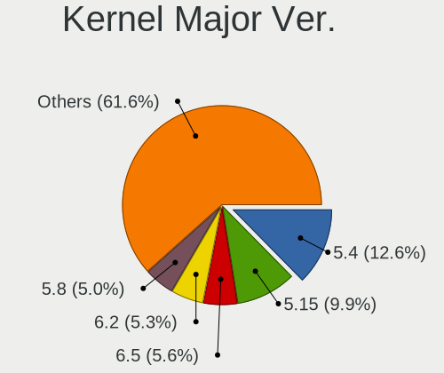

| Version | Computers | Percent |
|---------|-----------|---------|
| 5.4     | 289       | 14.04%  |
| 5.15    | 215       | 10.44%  |
| 6.2     | 124       | 6.02%   |
| 5.8     | 116       | 5.63%   |
| 4.15    | 109       | 5.29%   |
| 6.5     | 108       | 5.25%   |
| 5.10    | 102       | 4.95%   |
| 5.11    | 99        | 4.81%   |
| 5.3     | 86        | 4.18%   |
| 5.13    | 86        | 4.18%   |
| 5.19    | 85        | 4.13%   |
| 6.1     | 83        | 4.03%   |
| 5.16    | 64        | 3.11%   |
| 5.0     | 59        | 2.87%   |
| 4.18    | 52        | 2.53%   |
| 6.6     | 51        | 2.48%   |
| 5.14    | 35        | 1.7%    |
| 6.0     | 34        | 1.65%   |
| 6.4     | 32        | 1.55%   |
| 6.3     | 32        | 1.55%   |
| 4.19    | 28        | 1.36%   |
| 5.12    | 22        | 1.07%   |
| 4.9     | 20        | 0.97%   |
| 5.9     | 16        | 0.78%   |
| 5.7     | 16        | 0.78%   |
| 6.8     | 15        | 0.73%   |
| 5.17    | 15        | 0.73%   |
| 5.6     | 14        | 0.68%   |
| 5.18    | 14        | 0.68%   |
| 5.5     | 10        | 0.49%   |
| 6.7     | 9         | 0.44%   |
| 4.4     | 6         | 0.29%   |
| 5.2     | 4         | 0.19%   |
| 4.12    | 2         | 0.1%    |
| 4.10    | 2         | 0.1%    |
| 5.1     | 1         | 0.05%   |
| 4.1     | 1         | 0.05%   |
| 3.10    | 1         | 0.05%   |
| 2.6     | 1         | 0.05%   |
| Unknown | 1         | 0.05%   |

Arch
----

OS architecture (x86_64, i586, etc.)

| Name    | Computers | Percent |
|---------|-----------|---------|
| x86_64  | 1738      | 95.92%  |
| i686    | 63        | 3.48%   |
| aarch64 | 9         | 0.5%    |
| armv7l  | 2         | 0.11%   |

DE
--

Desktop Environment

| Name             | Computers | Percent |
|------------------|-----------|---------|
| GNOME            | 854       | 44.78%  |
| KDE5             | 334       | 17.51%  |
| Unknown          | 230       | 12.06%  |
| XFCE             | 140       | 7.34%   |
| X-Cinnamon       | 137       | 7.18%   |
| MATE             | 36        | 1.89%   |
| KDE              | 36        | 1.89%   |
| Pantheon         | 21        | 1.1%    |
| Cinnamon         | 17        | 0.89%   |
| Budgie           | 16        | 0.84%   |
| i3               | 15        | 0.79%   |
| KDE4             | 12        | 0.63%   |
| Unity            | 11        | 0.58%   |
| LXQt             | 8         | 0.42%   |
| awesome          | 7         | 0.37%   |
| LXDE             | 6         | 0.31%   |
| GNOME Flashback  | 6         | 0.31%   |
| Deepin           | 5         | 0.26%   |
| KDE6             | 3         | 0.16%   |
| Openbox          | 2         | 0.1%    |
| Hyprland         | 2         | 0.1%    |
| DWM              | 2         | 0.1%    |
| xmonad           | 1         | 0.05%   |
| qtile            | 1         | 0.05%   |
| lightdm-xsession | 1         | 0.05%   |
| LeftWM           | 1         | 0.05%   |
| fluxbox          | 1         | 0.05%   |
| Cutefish         | 1         | 0.05%   |
| bspwm            | 1         | 0.05%   |

Display Server
--------------

X11 or Wayland

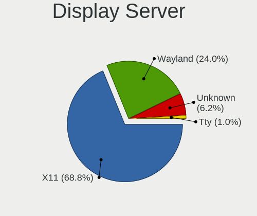

| Name    | Computers | Percent |
|---------|-----------|---------|
| X11     | 1355      | 72.5%   |
| Wayland | 374       | 20.01%  |
| Unknown | 124       | 6.63%   |
| Tty     | 16        | 0.86%   |

Display Manager
---------------

SDDM, LightDM, etc.

| Name    | Computers | Percent |
|---------|-----------|---------|
| Unknown | 984       | 52.12%  |
| SDDM    | 276       | 14.62%  |
| GDM3    | 237       | 12.55%  |
| GDM     | 165       | 8.74%   |
| LightDM | 164       | 8.69%   |
| TDM     | 43        | 2.28%   |
| KDM     | 12        | 0.64%   |
| XDM     | 4         | 0.21%   |
| SLiM    | 2         | 0.11%   |
| GREETD  | 1         | 0.05%   |

OS Lang
-------

Language

| Lang       | Computers | Percent |
|------------|-----------|---------|
| pt_PT      | 758       | 40.67%  |
| en_US      | 665       | 35.68%  |
| Unknown    | 208       | 11.16%  |
| en_GB      | 109       | 5.85%   |
| C          | 38        | 2.04%   |
| pt_BR      | 30        | 1.61%   |
| fr_FR      | 10        | 0.54%   |
| de_DE      | 10        | 0.54%   |
| ru_RU      | 8         | 0.43%   |
| en_IE      | 6         | 0.32%   |
| es_ES      | 5         | 0.27%   |
| sv_SE      | 3         | 0.16%   |
| POSIX      | 3         | 0.16%   |
| it_IT      | 2         | 0.11%   |
| en_CA      | 2         | 0.11%   |
| sk_SK      | 1         | 0.05%   |
| nl_NL      | 1         | 0.05%   |
| en_US.UTF8 | 1         | 0.05%   |
| en_PT      | 1         | 0.05%   |
| en_IN      | 1         | 0.05%   |
| en_DK      | 1         | 0.05%   |
| Default    | 1         | 0.05%   |

Boot Mode
---------

EFI or BIOS

| Mode | Computers | Percent |
|------|-----------|---------|
| BIOS | 1014      | 54.4%   |
| EFI  | 850       | 45.6%   |

Filesystem
----------

Type of filesystem

| Type     | Computers | Percent |
|----------|-----------|---------|
| Ext4     | 1366      | 73.01%  |
| Btrfs    | 193       | 10.32%  |
| Overlay  | 122       | 6.52%   |
| Tmpfs    | 78        | 4.17%   |
| Unknown  | 68        | 3.63%   |
| Xfs      | 22        | 1.18%   |
| Zfs      | 10        | 0.53%   |
| Ext2     | 5         | 0.27%   |
| Ext3     | 4         | 0.21%   |
| Reiserfs | 1         | 0.05%   |
| F2fs     | 1         | 0.05%   |
| Aufs     | 1         | 0.05%   |

Part. scheme
------------

Scheme of partitioning

| Type    | Computers | Percent |
|---------|-----------|---------|
| Unknown | 1025      | 54.87%  |
| GPT     | 666       | 35.65%  |
| MBR     | 177       | 9.48%   |

Dual Boot with Linux/BSD
------------------------

Hosting more than one Linux/BSD

| Dual boot | Computers | Percent |
|-----------|-----------|---------|
| No        | 1612      | 87.56%  |
| Yes       | 229       | 12.44%  |

Dual Boot (Win)
---------------

Hosting Linux and Windows

| Dual boot | Computers | Percent |
|-----------|-----------|---------|
| No        | 1326      | 71.6%   |
| Yes       | 526       | 28.4%   |

Board
-----

Vendor
------

Motherboard manufacturer

| Name                    | Computers | Percent |
|-------------------------|-----------|---------|
| ASUSTek Computer        | 403       | 22.25%  |
| Hewlett-Packard         | 290       | 16.01%  |
| Lenovo                  | 246       | 13.58%  |
| Acer                    | 124       | 6.85%   |
| MSI                     | 105       | 5.8%    |
| Dell                    | 103       | 5.69%   |
| Toshiba                 | 84        | 4.64%   |
| Gigabyte Technology     | 72        | 3.98%   |
| Sony                    | 48        | 2.65%   |
| Apple                   | 46        | 2.54%   |
| ASRock                  | 30        | 1.66%   |
| HUAWEI                  | 25        | 1.38%   |
| Samsung Electronics     | 19        | 1.05%   |
| Intel                   | 19        | 1.05%   |
| Fujitsu                 | 18        | 0.99%   |
| Notebook                | 10        | 0.55%   |
| Unknown                 | 10        | 0.55%   |
| Chuwi                   | 9         | 0.5%    |
| Raspberry Pi Foundation | 8         | 0.44%   |
| Foxconn                 | 8         | 0.44%   |
| TUXEDO                  | 7         | 0.39%   |
| Packard Bell            | 7         | 0.39%   |
| AMI                     | 7         | 0.39%   |
| eMachines               | 6         | 0.33%   |
| Pegatron                | 5         | 0.28%   |
| Medion                  | 5         | 0.28%   |
| Biostar                 | 5         | 0.28%   |
| Valve                   | 4         | 0.22%   |
| Clevo                   | 4         | 0.22%   |
| Teclast                 | 3         | 0.17%   |
| SLIMBOOK                | 3         | 0.17%   |
| Positivo                | 3         | 0.17%   |
| Phoenix/SiS             | 3         | 0.17%   |
| Minix                   | 3         | 0.17%   |
| Microsoft               | 3         | 0.17%   |
| LG Electronics          | 3         | 0.17%   |
| INSYS                   | 3         | 0.17%   |
| PC Specialist           | 2         | 0.11%   |
| OEM                     | 2         | 0.11%   |
| OBSIDIAN-PC             | 2         | 0.11%   |

Model
-----

Motherboard model

| Name                                   | Computers | Percent |
|----------------------------------------|-----------|---------|
| Sony VGN-FZ31Z                         | 22        | 1.21%   |
| ASUS All Series                        | 17        | 0.94%   |
| Unknown                                | 16        | 0.88%   |
| Lenovo IdeaPad 1 14ADA05 82GW          | 14        | 0.77%   |
| HP Pavilion dv6                        | 10        | 0.55%   |
| Lenovo Legion 5 15ACH6H 82JU           | 9         | 0.5%    |
| HP G62                                 | 9         | 0.5%    |
| Toshiba Satellite C660                 | 8         | 0.44%   |
| HP Pavilion g6                         | 8         | 0.44%   |
| HP Notebook                            | 7         | 0.39%   |
| Toshiba Satellite L650                 | 6         | 0.33%   |
| HP Pavilion Notebook                   | 6         | 0.33%   |
| ASUS X555LJ                            | 6         | 0.33%   |
| MSI MS-7817                            | 5         | 0.28%   |
| Lenovo Y520-15IKBN 80WK                | 5         | 0.28%   |
| HP OMEN by Laptop                      | 5         | 0.28%   |
| ASUS X555LD                            | 5         | 0.28%   |
| ASUS X541UV                            | 5         | 0.28%   |
| ASUS VivoBook_ASUSLaptop X512DA_F512DA | 5         | 0.28%   |
| ASUS VivoBook 15_ASUS Laptop X507LA    | 5         | 0.28%   |
| ASUS P5G41T-M LX                       | 5         | 0.28%   |
| ASUS H110M-K                           | 5         | 0.28%   |
| Acer Extensa 5620                      | 5         | 0.28%   |
| Acer Aspire ES1-520                    | 5         | 0.28%   |
| Valve Jupiter                          | 4         | 0.22%   |
| Toshiba Satellite L500                 | 4         | 0.22%   |
| Toshiba Satellite L40                  | 4         | 0.22%   |
| Toshiba Satellite A200                 | 4         | 0.22%   |
| MSI MS-7C91                            | 4         | 0.22%   |
| MSI MS-7C56                            | 4         | 0.22%   |
| Lenovo Legion Y530-15ICH 81FV          | 4         | 0.22%   |
| Lenovo Legion 5 15ARH05H 82B1          | 4         | 0.22%   |
| Lenovo IdeaPad 320-15AST 80XV          | 4         | 0.22%   |
| Lenovo G50-45 80E3                     | 4         | 0.22%   |
| HUAWEI NBLK-WAX9X                      | 4         | 0.22%   |
| HP Pavilion Gaming Laptop 15-ec2xxx    | 4         | 0.22%   |
| HP Pavilion 15                         | 4         | 0.22%   |
| HP OMEN by Laptop 15-dc0xxx            | 4         | 0.22%   |
| HP Compaq Presario CQ60                | 4         | 0.22%   |
| HP Compaq Elite 8300 SFF               | 4         | 0.22%   |

Model Family
------------

Motherboard model prefix

| Name                  | Computers | Percent |
|-----------------------|-----------|---------|
| Lenovo ThinkPad       | 108       | 5.96%   |
| Acer Aspire           | 98        | 5.41%   |
| Toshiba Satellite     | 73        | 4.03%   |
| HP Pavilion           | 71        | 3.92%   |
| Lenovo IdeaPad        | 64        | 3.53%   |
| ASUS VivoBook         | 44        | 2.43%   |
| Dell Latitude         | 37        | 2.04%   |
| HP EliteBook          | 36        | 1.99%   |
| HP Compaq             | 36        | 1.99%   |
| ASUS PRIME            | 34        | 1.88%   |
| ASUS ROG              | 28        | 1.55%   |
| HP Laptop             | 26        | 1.44%   |
| Lenovo Legion         | 24        | 1.33%   |
| Sony VGN-FZ31Z        | 22        | 1.21%   |
| Dell XPS              | 21        | 1.16%   |
| HP ProBook            | 17        | 0.94%   |
| ASUS TUF              | 17        | 0.94%   |
| ASUS All              | 17        | 0.94%   |
| Unknown               | 16        | 0.88%   |
| HP OMEN               | 15        | 0.83%   |
| Dell OptiPlex         | 15        | 0.83%   |
| HP ENVY               | 13        | 0.72%   |
| Dell Inspiron         | 13        | 0.72%   |
| ASUS Zenbook          | 12        | 0.66%   |
| Dell Precision        | 10        | 0.55%   |
| ASUS P5G41T-M         | 10        | 0.55%   |
| HP G62                | 9         | 0.5%    |
| Acer Extensa          | 9         | 0.5%    |
| RPi Raspberry         | 8         | 0.44%   |
| Lenovo Yoga           | 8         | 0.44%   |
| Acer Nitro            | 8         | 0.44%   |
| HP Notebook           | 7         | 0.39%   |
| Fujitsu ESPRIMO       | 7         | 0.39%   |
| ASUS P8H61-M          | 7         | 0.39%   |
| Packard Bell EasyNote | 6         | 0.33%   |
| MSI Modern            | 6         | 0.33%   |
| Lenovo ThinkCentre    | 6         | 0.33%   |
| HP ProLiant           | 6         | 0.33%   |
| HP ProDesk            | 6         | 0.33%   |
| Gigabyte B550         | 6         | 0.33%   |

MFG Year
--------

Motherboard manufacture year

| Year    | Computers | Percent |
|---------|-----------|---------|
| 2020    | 171       | 9.44%   |
| 2018    | 157       | 8.67%   |
| 2019    | 136       | 7.51%   |
| 2010    | 130       | 7.18%   |
| 2021    | 113       | 6.24%   |
| 2012    | 107       | 5.91%   |
| 2013    | 105       | 5.8%    |
| 2014    | 104       | 5.74%   |
| 2015    | 97        | 5.36%   |
| 2008    | 94        | 5.19%   |
| 2017    | 93        | 5.14%   |
| 2016    | 93        | 5.14%   |
| 2009    | 87        | 4.8%    |
| 2007    | 87        | 4.8%    |
| 2011    | 82        | 4.53%   |
| 2022    | 66        | 3.64%   |
| 2006    | 30        | 1.66%   |
| 2023    | 29        | 1.6%    |
| 2005    | 14        | 0.77%   |
| Unknown | 12        | 0.66%   |
| 2004    | 3         | 0.17%   |
| 2003    | 1         | 0.06%   |

Form Factor
-----------

Physical design of the computer

| Name           | Computers | Percent |
|----------------|-----------|---------|
| Notebook       | 1190      | 65.71%  |
| Desktop        | 530       | 29.27%  |
| Convertible    | 23        | 1.27%   |
| Mini pc        | 23        | 1.27%   |
| Tablet         | 14        | 0.77%   |
| All in one     | 12        | 0.66%   |
| System on chip | 9         | 0.5%    |
| Server         | 9         | 0.5%    |
| Phone          | 1         | 0.06%   |

Secure Boot
-----------

Enabled or disabled

| State    | Computers | Percent |
|----------|-----------|---------|
| Disabled | 1685      | 91.53%  |
| Enabled  | 156       | 8.47%   |

Coreboot
--------

Have coreboot on board

| Used | Computers | Percent |
|------|-----------|---------|
| No   | 1803      | 99.56%  |
| Yes  | 8         | 0.44%   |

RAM Size
--------

Total RAM memory

| Size in GB      | Computers | Percent |
|-----------------|-----------|---------|
| 3.01-4.0        | 438       | 23.7%   |
| 4.01-8.0        | 404       | 21.86%  |
| 8.01-16.0       | 318       | 17.21%  |
| 16.01-24.0      | 311       | 16.83%  |
| 32.01-64.0      | 161       | 8.71%   |
| 1.01-2.0        | 102       | 5.52%   |
| 64.01-256.0     | 39        | 2.11%   |
| 2.01-3.0        | 35        | 1.89%   |
| 24.01-32.0      | 25        | 1.35%   |
| 0.51-1.0        | 14        | 0.76%   |
| More than 256.0 | 1         | 0.05%   |

RAM Used
--------

Used RAM memory

| Used GB     | Computers | Percent |
|-------------|-----------|---------|
| 1.01-2.0    | 717       | 35.37%  |
| 2.01-3.0    | 480       | 23.68%  |
| 4.01-8.0    | 318       | 15.69%  |
| 3.01-4.0    | 248       | 12.23%  |
| 0.51-1.0    | 133       | 6.56%   |
| 8.01-16.0   | 84        | 4.14%   |
| 0.01-0.5    | 18        | 0.89%   |
| 16.01-24.0  | 17        | 0.84%   |
| 24.01-32.0  | 8         | 0.39%   |
| 32.01-64.0  | 2         | 0.1%    |
| 64.01-256.0 | 1         | 0.05%   |
| Unknown     | 1         | 0.05%   |

Total Drives
------------

Number of drives on board

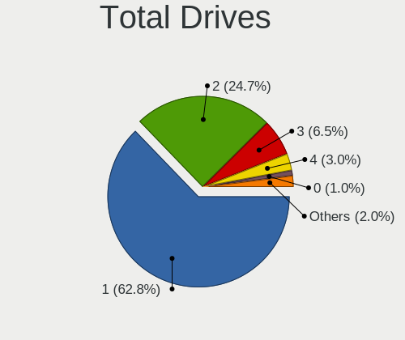

| Drives | Computers | Percent |
|--------|-----------|---------|
| 1      | 1174      | 62.95%  |
| 2      | 458       | 24.56%  |
| 3      | 123       | 6.6%    |
| 4      | 55        | 2.95%   |
| 0      | 19        | 1.02%   |
| 5      | 17        | 0.91%   |
| 6      | 10        | 0.54%   |
| 11     | 2         | 0.11%   |
| 10     | 2         | 0.11%   |
| 7      | 2         | 0.11%   |
| 87     | 1         | 0.05%   |
| 13     | 1         | 0.05%   |
| 8      | 1         | 0.05%   |

Has CD-ROM
----------

Has CD-ROM on board

| Presented | Computers | Percent |
|-----------|-----------|---------|
| No        | 1179      | 64.82%  |
| Yes       | 640       | 35.18%  |

Has Ethernet
------------

Has Ethernet on board

| Presented | Computers | Percent |
|-----------|-----------|---------|
| Yes       | 1546      | 84.95%  |
| No        | 274       | 15.05%  |

Has WiFi
--------

Has WiFi module

| Presented | Computers | Percent |
|-----------|-----------|---------|
| Yes       | 1432      | 78.55%  |
| No        | 391       | 21.45%  |

Has Bluetooth
-------------

Has Bluetooth module

| Presented | Computers | Percent |
|-----------|-----------|---------|
| Yes       | 1090      | 59.3%   |
| No        | 748       | 40.7%   |

Location
--------

Country
-------

Geographic location (country)

| Country  | Computers | Percent |
|----------|-----------|---------|
| Portugal | 1811      | 100%    |

City
----

Geographic location (city)

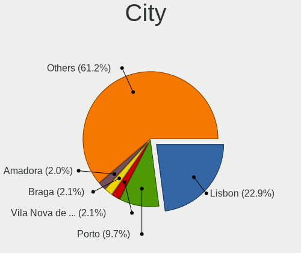

| City                    | Computers | Percent |
|-------------------------|-----------|---------|
| Lisbon                  | 453       | 23.25%  |
| Porto                   | 184       | 9.45%   |
| Coimbra                 | 41        | 2.1%    |
| Amadora                 | 41        | 2.1%    |
| Vila Nova de Gaia       | 40        | 2.05%   |
| Funchal                 | 40        | 2.05%   |
| Braga                   | 39        | 2%      |
| Setbal                | 34        | 1.75%   |
| Aveiro                  | 33        | 1.69%   |
| Leiria                  | 26        | 1.33%   |
| Faro                    | 22        | 1.13%   |
| Cascais                 | 22        | 1.13%   |
| Almada                  | 22        | 1.13%   |
| Loures                  | 21        | 1.08%   |
| Guimaraes               | 20        | 1.03%   |
| Portimao                | 18        | 0.92%   |
| Barreiro                | 16        | 0.82%   |
| Maia                    | 14        | 0.72%   |
| Viana do Castelo        | 13        | 0.67%   |
| Sintra                  | 13        | 0.67%   |
| Mem Martins             | 13        | 0.67%   |
| Matosinhos Municipality | 13        | 0.67%   |
| Evora                   | 13        | 0.67%   |
| Bragana               | 13        | 0.67%   |
| Santarm               | 12        | 0.62%   |
| Odivelas                | 12        | 0.62%   |
| Barcelos                | 12        | 0.62%   |
| Viseu                   | 11        | 0.56%   |
| Torres Vedras           | 11        | 0.56%   |
| Queluz                  | 11        | 0.56%   |
| Pvoa de Varzim        | 11        | 0.56%   |
| Ponta Delgada           | 11        | 0.56%   |
| Amora                   | 11        | 0.56%   |
| Alverca do Ribatejo     | 11        | 0.56%   |
| Vila do Conde           | 10        | 0.51%   |
| Sao Joao da Madeira     | 10        | 0.51%   |
| Povoa de Santa Iria     | 10        | 0.51%   |
| Gondomar                | 10        | 0.51%   |
| Oeiras                  | 9         | 0.46%   |
| Montijo                 | 9         | 0.46%   |

Drives
------

Drive Vendor
------------

Hard drive vendors

| Vendor                      | Computers | Drives | Percent |
|-----------------------------|-----------|--------|---------|
| Samsung Electronics         | 374       | 524    | 14.54%  |
| WDC                         | 328       | 512    | 12.75%  |
| Seagate                     | 297       | 468    | 11.55%  |
| Toshiba                     | 218       | 320    | 8.48%   |
| Kingston                    | 216       | 288    | 8.4%    |
| SanDisk                     | 131       | 158    | 5.09%   |
| Unknown                     | 118       | 170    | 4.59%   |
| Crucial                     | 105       | 136    | 4.08%   |
| Hitachi                     | 83        | 98     | 3.23%   |
| Intel                       | 58        | 91     | 2.26%   |
| HGST                        | 53        | 73     | 2.06%   |
| SK hynix                    | 49        | 61     | 1.91%   |
| Micron Technology           | 49        | 57     | 1.91%   |
| KIOXIA                      | 27        | 47     | 1.05%   |
| Phison Electronics          | 22        | 26     | 0.86%   |
| GOODRAM                     | 22        | 26     | 0.86%   |
| Fujitsu                     | 22        | 23     | 0.86%   |
| Maxtor                      | 21        | 35     | 0.82%   |
| China                       | 20        | 24     | 0.78%   |
| Apple                       | 20        | 23     | 0.78%   |
| KIOXIA-EXCERIA              | 19        | 29     | 0.74%   |
| BlueRay                     | 18        | 23     | 0.7%    |
| S3+                         | 17        | 29     | 0.66%   |
| PNY                         | 15        | 20     | 0.58%   |
| Emtec                       | 14        | 16     | 0.54%   |
| Phison                      | 13        | 19     | 0.51%   |
| JMicron Technology          | 13        | 14     | 0.51%   |
| A-DATA Technology           | 13        | 13     | 0.51%   |
| Micron/Crucial Technology   | 12        | 21     | 0.47%   |
| Unknown                     | 11        | 17     | 0.43%   |
| Kingston Technology Company | 10        | 11     | 0.39%   |
| OCZ                         | 9         | 9      | 0.35%   |
| LITEON                      | 9         | 10     | 0.35%   |
| Transcend                   | 8         | 9      | 0.31%   |
| Hewlett-Packard             | 8         | 9      | 0.31%   |
| Silicon Motion              | 6         | 8      | 0.23%   |
| Netac                       | 6         | 9      | 0.23%   |
| Gigabyte Technology         | 6         | 7      | 0.23%   |
| Team                        | 5         | 6      | 0.19%   |
| KingDian                    | 5         | 8      | 0.19%   |

Drive Model
-----------

Hard drive models

| Model                                              | Computers | Percent |
|----------------------------------------------------|-----------|---------|
| Kingston SA400S37240G 240GB SSD                    | 42        | 1.53%   |
| Kingston SA400S37120G 120GB SSD                    | 30        | 1.09%   |
| Unknown MMC Card  32GB                             | 29        | 1.05%   |
| Samsung NVMe SSD Controller SM981/PM981/PM983 1TB  | 24        | 0.87%   |
| Unknown MMC Card  64GB                             | 23        | 0.84%   |
| Toshiba MQ01ABD100 1TB                             | 23        | 0.84%   |
| Seagate ST1000LM024 HN-M101MBB 1TB                 | 22        | 0.8%    |
| Seagate ST1000DM010-2EP102 1TB                     | 21        | 0.76%   |
| Kingston SV300S37A120G 120GB SSD                   | 21        | 0.76%   |
| HGST HTS721010A9E630 1TB                           | 21        | 0.76%   |
| Seagate ST500LT012-1DG142 500GB                    | 19        | 0.69%   |
| Toshiba MQ01ABF050 500GB                           | 18        | 0.65%   |
| Samsung SSD 850 EVO 250GB                          | 17        | 0.62%   |
| Crucial CT240M500SSD1 240GB                        | 17        | 0.62%   |
| Seagate ST1000LM035-1RK172 1TB                     | 16        | 0.58%   |
| Kingston SV300S37A240G 240GB SSD                   | 16        | 0.58%   |
| Kingston SA400S37480G 480GB SSD                    | 16        | 0.58%   |
| Samsung SSD 860 EVO 500GB                          | 15        | 0.54%   |
| Crucial CT500MX500SSD1 500GB                       | 15        | 0.54%   |
| Unknown MMC64G  64GB                               | 14        | 0.51%   |
| Seagate ST9500325AS 500GB                          | 13        | 0.47%   |
| Samsung NVMe SSD Controller PM9A1/PM9A3/980PRO 1TB | 13        | 0.47%   |
| Toshiba HDWD110 1TB                                | 12        | 0.44%   |
| Seagate ST3500418AS 500GB                          | 12        | 0.44%   |
| SanDisk NVMe SSD Drive 512GB                       | 12        | 0.44%   |
| Samsung SSD 850 EVO 500GB                          | 12        | 0.44%   |
| Crucial CT240BX500SSD1 240GB                       | 12        | 0.44%   |
| WDC WDS240G2G0A-00JH30 240GB SSD                   | 11        | 0.4%    |
| Samsung SSD 860 QVO 1TB                            | 11        | 0.4%    |
| Unknown                                            | 11        | 0.4%    |
| Seagate ST2000DM008-2FR102 2TB                     | 10        | 0.36%   |
| Samsung NVMe SSD Drive 512GB                       | 10        | 0.36%   |
| Phison PS5013 E13 NVMe Controller 512GB            | 10        | 0.36%   |
| JMicron Generic 320GB                              | 10        | 0.36%   |
| Unknown MMC Card  128GB                            | 9         | 0.33%   |
| Toshiba TR200 240GB SSD                            | 9         | 0.33%   |
| Seagate Expansion 2TB                              | 9         | 0.33%   |
| Sandisk WD Blue SN550 NVMe SSD 2TB                 | 9         | 0.33%   |
| Samsung SSD 860 EVO 250GB                          | 9         | 0.33%   |
| Samsung SSD 840 EVO 250GB                          | 9         | 0.33%   |

HDD Vendor
----------

Hard disk drive vendors

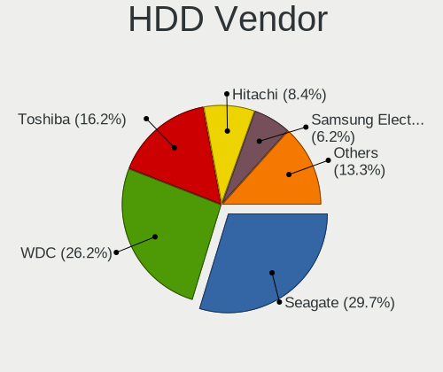

| Vendor              | Computers | Drives | Percent |
|---------------------|-----------|--------|---------|
| Seagate             | 288       | 455    | 29.54%  |
| WDC                 | 256       | 381    | 26.26%  |
| Toshiba             | 160       | 247    | 16.41%  |
| Hitachi             | 83        | 98     | 8.51%   |
| Samsung Electronics | 62        | 88     | 6.36%   |
| HGST                | 53        | 73     | 5.44%   |
| Fujitsu             | 21        | 22     | 2.15%   |
| Maxtor              | 17        | 24     | 1.74%   |
| JMicron Technology  | 10        | 11     | 1.03%   |
| ExcelStor           | 5         | 5      | 0.51%   |
| Apple               | 5         | 6      | 0.51%   |
| Unknown             | 2         | 3      | 0.21%   |
| TO Exter            | 2         | 2      | 0.21%   |
| MSFT                | 2         | 12     | 0.21%   |
| Hewlett-Packard     | 2         | 3      | 0.21%   |
| Dell                | 2         | 4      | 0.21%   |
| ASMedia             | 2         | 3      | 0.21%   |
| Quantum             | 1         | 1      | 0.1%    |
| Intenso             | 1         | 1      | 0.1%    |
| HPE                 | 1         | 4      | 0.1%    |

SSD Vendor
----------

Solid state drive vendors

| Vendor              | Computers | Drives | Percent |
|---------------------|-----------|--------|---------|
| Kingston            | 181       | 232    | 20.97%  |
| Samsung Electronics | 161       | 215    | 18.66%  |
| Crucial             | 96        | 125    | 11.12%  |
| SanDisk             | 51        | 63     | 5.91%   |
| WDC                 | 43        | 64     | 4.98%   |
| Toshiba             | 34        | 45     | 3.94%   |
| GOODRAM             | 20        | 24     | 2.32%   |
| China               | 20        | 24     | 2.32%   |
| Intel               | 18        | 25     | 2.09%   |
| S3+                 | 17        | 29     | 1.97%   |
| BlueRay             | 15        | 17     | 1.74%   |
| Micron Technology   | 13        | 17     | 1.51%   |
| Emtec               | 13        | 15     | 1.51%   |
| Apple               | 13        | 13     | 1.51%   |
| A-DATA Technology   | 13        | 13     | 1.51%   |
| PNY                 | 11        | 15     | 1.27%   |
| KIOXIA-EXCERIA      | 11        | 19     | 1.27%   |
| SK hynix            | 9         | 9      | 1.04%   |
| OCZ                 | 9         | 9      | 1.04%   |
| Transcend           | 8         | 9      | 0.93%   |
| LITEON              | 6         | 7      | 0.7%    |
| Hewlett-Packard     | 6         | 6      | 0.7%    |
| Team                | 5         | 6      | 0.58%   |
| Seagate             | 5         | 7      | 0.58%   |
| Netac               | 5         | 8      | 0.58%   |
| Unknown             | 5         | 10     | 0.58%   |
| USB                 | 4         | 4      | 0.46%   |
| Unknown             | 4         | 4      | 0.46%   |
| Maxtor              | 4         | 11     | 0.46%   |
| KingDian            | 4         | 7      | 0.46%   |
| Gigabyte Technology | 4         | 4      | 0.46%   |
| Vaseky              | 3         | 3      | 0.35%   |
| Intenso             | 3         | 3      | 0.35%   |
| 2-Power             | 3         | 4      | 0.35%   |
| Verbatim            | 2         | 2      | 0.23%   |
| TCSUNBOW            | 2         | 2      | 0.23%   |
| Plextor             | 2         | 2      | 0.23%   |
| LITEONIT            | 2         | 2      | 0.23%   |
| KingSpec            | 2         | 2      | 0.23%   |
| Dogfish             | 2         | 2      | 0.23%   |

Drive Kind
----------

HDD or SSD

| Kind    | Computers | Drives | Percent |
|---------|-----------|--------|---------|
| HDD     | 839       | 1443   | 36.38%  |
| SSD     | 761       | 1117   | 33%     |
| NVMe    | 565       | 843    | 24.5%   |
| MMC     | 113       | 165    | 4.9%    |
| Unknown | 28        | 35     | 1.21%   |

Drive Connector
---------------

SATA, SAS, NVMe, etc.

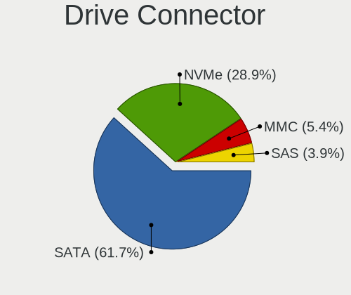

| Type | Computers | Drives | Percent |
|------|-----------|--------|---------|
| SATA | 1315      | 2498   | 63.5%   |
| NVMe | 565       | 838    | 27.28%  |
| MMC  | 113       | 165    | 5.46%   |
| SAS  | 78        | 102    | 3.77%   |

Drive Size
----------

Size of hard drive

| Size in TB | Computers | Drives | Percent |
|------------|-----------|--------|---------|
| 0.01-0.5   | 1066      | 1681   | 66.92%  |
| 0.51-1.0   | 389       | 576    | 24.42%  |
| 1.01-2.0   | 87        | 140    | 5.46%   |
| 2.01-3.0   | 18        | 24     | 1.13%   |
| 3.01-4.0   | 17        | 28     | 1.07%   |
| 4.01-10.0  | 13        | 22     | 0.82%   |
| 10.01-20.0 | 2         | 88     | 0.13%   |
| 0          | 1         | 1      | 0.06%   |

Space Total
-----------

Amount of disk space available on the file system

| Size in GB     | Computers | Percent |
|----------------|-----------|---------|
| 101-250        | 547       | 28.39%  |
| 251-500        | 449       | 23.3%   |
| 501-1000       | 251       | 13.03%  |
| 51-100         | 153       | 7.94%   |
| 1001-2000      | 134       | 6.95%   |
| 1-20           | 133       | 6.9%    |
| More than 3000 | 80        | 4.15%   |
| 21-50          | 80        | 4.15%   |
| Unknown        | 54        | 2.8%    |
| 2001-3000      | 46        | 2.39%   |

Space Used
----------

Amount of used disk space

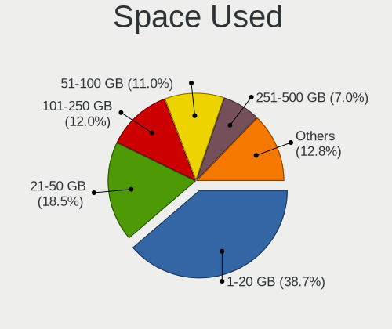

| Used GB        | Computers | Percent |
|----------------|-----------|---------|
| 1-20           | 795       | 39.75%  |
| 21-50          | 372       | 18.6%   |
| 101-250        | 235       | 11.75%  |
| 51-100         | 212       | 10.6%   |
| 251-500        | 139       | 6.95%   |
| 501-1000       | 87        | 4.35%   |
| 1001-2000      | 61        | 3.05%   |
| Unknown        | 54        | 2.7%    |
| More than 3000 | 25        | 1.25%   |
| 2001-3000      | 19        | 0.95%   |
| 0              | 1         | 0.05%   |

Malfunc. Drives
---------------

Drive models with a malfunction

| Model                              | Computers | Drives | Percent |
|------------------------------------|-----------|--------|---------|
| Crucial CT240M500SSD1 240GB        | 15        | 16     | 8.62%   |
| Kingston SV300S37A120G 120GB SSD   | 6         | 6      | 3.45%   |
| Seagate ST3500418AS 500GB          | 4         | 4      | 2.3%    |
| Seagate ST9500325AS 500GB          | 3         | 3      | 1.72%   |
| Seagate ST9320325AS 320GB          | 3         | 4      | 1.72%   |
| Kingston SV300S37A240G 240GB SSD   | 3         | 3      | 1.72%   |
| Hitachi HTS545050A7E380 500GB      | 3         | 3      | 1.72%   |
| WDC WD800JD-60LSA0 80GB            | 2         | 2      | 1.15%   |
| WDC WD3200AAJS-00L7A0 320GB        | 2         | 2      | 1.15%   |
| Toshiba MQ01ABD100 1TB             | 2         | 2      | 1.15%   |
| Toshiba MK2552GSX 250GB            | 2         | 2      | 1.15%   |
| Seagate ST9250827AS 250GB          | 2         | 2      | 1.15%   |
| Seagate ST500LT012-1DG142 500GB    | 2         | 2      | 1.15%   |
| Seagate ST500DM002-1BD142 500GB    | 2         | 2      | 1.15%   |
| Seagate ST3320413CS 320GB          | 2         | 2      | 1.15%   |
| Seagate ST1000LM024 HN-M101MBB 1TB | 2         | 2      | 1.15%   |
| Samsung Electronics HD252HJ 250GB  | 2         | 2      | 1.15%   |
| Kingston SUV400S37240G 240GB SSD   | 2         | 2      | 1.15%   |
| Hitachi HTS547550A9E384 500GB      | 2         | 2      | 1.15%   |
| Hitachi HTS543216L9A300 160GB      | 2         | 2      | 1.15%   |
| HGST HTS721010A9E630 1TB           | 2         | 2      | 1.15%   |
| China G521N256GB SSD               | 2         | 3      | 1.15%   |
| WDC WD7500BPVX-60JC3T0 752GB       | 1         | 2      | 0.57%   |
| WDC WD6400BEVT-22A0RT0 640GB       | 1         | 1      | 0.57%   |
| WDC WD6400AADS-00M2B0 640GB        | 1         | 1      | 0.57%   |
| WDC WD5000LPCX-60VHAT0 500GB       | 1         | 1      | 0.57%   |
| WDC WD5000BPVT-80HXZT1 500GB       | 1         | 1      | 0.57%   |
| WDC WD5000BPVT-22HXZT1 500GB       | 1         | 1      | 0.57%   |
| WDC WD5000AZRX-00A8LB0 500GB       | 1         | 1      | 0.57%   |
| WDC WD5000AZRX-00A3KB0 500GB       | 1         | 1      | 0.57%   |
| WDC WD5000AAKX-00ERMA0 500GB       | 1         | 1      | 0.57%   |
| WDC WD5000AAKS-00V1A0 500GB        | 1         | 1      | 0.57%   |
| WDC WD5000AAKS-00A7B0 500GB        | 1         | 4      | 0.57%   |
| WDC WD5000AADS-00S9B0 500GB        | 1         | 1      | 0.57%   |
| WDC WD40EFRX-68WT0N0 4TB           | 1         | 2      | 0.57%   |
| WDC WD3200BEVT-22A23T0 320GB       | 1         | 1      | 0.57%   |
| WDC WD3200AAJS-07M0A0 320GB        | 1         | 1      | 0.57%   |
| WDC WD3200AAJS-00B4A0 320GB        | 1         | 1      | 0.57%   |
| WDC WD30EZRS-11J99B1 3TB           | 1         | 1      | 0.57%   |
| WDC WD2500JS-40TGB0 250GB          | 1         | 1      | 0.57%   |

Malfunc. Drive Vendor
---------------------

Vendors of faulty drives

| Vendor              | Computers | Drives | Percent |
|---------------------|-----------|--------|---------|
| WDC                 | 38        | 46     | 22.35%  |
| Seagate             | 31        | 35     | 18.24%  |
| Hitachi             | 18        | 19     | 10.59%  |
| Crucial             | 17        | 19     | 10%     |
| Toshiba             | 15        | 16     | 8.82%   |
| Kingston            | 12        | 13     | 7.06%   |
| Samsung Electronics | 9         | 11     | 5.29%   |
| SK hynix            | 4         | 4      | 2.35%   |
| Maxtor              | 4         | 7      | 2.35%   |
| HGST                | 4         | 4      | 2.35%   |
| China               | 3         | 4      | 1.76%   |
| Intel               | 2         | 2      | 1.18%   |
| VNYEZ               | 1         | 1      | 0.59%   |
| USB                 | 1         | 1      | 0.59%   |
| Unknown             | 1         | 1      | 0.59%   |
| T-FORCE             | 1         | 1      | 0.59%   |
| SanDisk             | 1         | 1      | 0.59%   |
| Patriot             | 1         | 1      | 0.59%   |
| LITEON              | 1         | 1      | 0.59%   |
| KingDian            | 1         | 2      | 0.59%   |
| HP Phison           | 1         | 1      | 0.59%   |
| Fujitsu             | 1         | 1      | 0.59%   |
| ExcelStor           | 1         | 1      | 0.59%   |
| Apple               | 1         | 1      | 0.59%   |
| A-DATA Technology   | 1         | 1      | 0.59%   |

Malfunc. HDD Vendor
-------------------

Vendors of faulty HDD drives

| Vendor              | Computers | Drives | Percent |
|---------------------|-----------|--------|---------|
| WDC                 | 38        | 46     | 32.2%   |
| Seagate             | 31        | 35     | 26.27%  |
| Hitachi             | 18        | 19     | 15.25%  |
| Toshiba             | 14        | 15     | 11.86%  |
| Samsung Electronics | 6         | 7      | 5.08%   |
| Maxtor              | 4         | 7      | 3.39%   |
| HGST                | 4         | 4      | 3.39%   |
| Fujitsu             | 1         | 1      | 0.85%   |
| ExcelStor           | 1         | 1      | 0.85%   |
| Apple               | 1         | 1      | 0.85%   |

Malfunc. Drive Kind
-------------------

Kinds of faulty drives

| Kind | Computers | Drives | Percent |
|------|-----------|--------|---------|
| HDD  | 110       | 136    | 67.9%   |
| SSD  | 48        | 54     | 29.63%  |
| NVMe | 4         | 4      | 2.47%   |

Failed Drives
-------------

Failed drive models

| Model                        | Computers | Drives | Percent |
|------------------------------|-----------|--------|---------|
| Toshiba NVMe SSD Drive 256GB | 1         | 1      | 33.33%  |
| Seagate ST3750640NS 752GB    | 1         | 1      | 33.33%  |
| HGST HTS541010B7E610 1TB     | 1         | 1      | 33.33%  |

Failed Drive Vendor
-------------------

Failed drive vendors

| Vendor  | Computers | Drives | Percent |
|---------|-----------|--------|---------|
| Toshiba | 1         | 1      | 33.33%  |
| Seagate | 1         | 1      | 33.33%  |
| HGST    | 1         | 1      | 33.33%  |

Drive Status
------------

Number of failed and malfunc. drives

| Status   | Computers | Drives | Percent |
|----------|-----------|--------|---------|
| Detected | 1195      | 2383   | 61.31%  |
| Works    | 594       | 1023   | 30.48%  |
| Malfunc  | 157       | 194    | 8.06%   |
| Failed   | 3         | 3      | 0.15%   |

Storage controller
------------------

Storage Vendor
--------------

Storage controller vendors

| Vendor                           | Computers | Percent |
|----------------------------------|-----------|---------|
| Intel                            | 1174      | 53%     |
| AMD                              | 316       | 14.27%  |
| Samsung Electronics              | 182       | 8.22%   |
| Sandisk                          | 109       | 4.92%   |
| Kingston Technology Company      | 47        | 2.12%   |
| Phison Electronics               | 42        | 1.9%    |
| SK hynix                         | 38        | 1.72%   |
| Micron Technology                | 37        | 1.67%   |
| KIOXIA                           | 33        | 1.49%   |
| Nvidia                           | 29        | 1.31%   |
| Toshiba America Info Systems     | 28        | 1.26%   |
| JMicron Technology               | 28        | 1.26%   |
| ASMedia Technology               | 25        | 1.13%   |
| Micron/Crucial Technology        | 21        | 0.95%   |
| Silicon Integrated Systems [SiS] | 17        | 0.77%   |
| Marvell Technology Group         | 14        | 0.63%   |
| VIA Technologies                 | 13        | 0.59%   |
| Union Memory (Shenzhen)          | 8         | 0.36%   |
| Silicon Motion                   | 7         | 0.32%   |
| MAXIO Technology (Hangzhou)      | 6         | 0.27%   |
| LSI Logic / Symbios Logic        | 6         | 0.27%   |
| Lite-On Technology               | 6         | 0.27%   |
| ADATA Technology                 | 5         | 0.23%   |
| Shenzhen Longsys Electronics     | 4         | 0.18%   |
| Lenovo                           | 3         | 0.14%   |
| Hewlett-Packard                  | 3         | 0.14%   |
| Solid State Storage Technology   | 2         | 0.09%   |
| Realtek Semiconductor            | 2         | 0.09%   |
| Adaptec                          | 2         | 0.09%   |
| ULi Electronics                  | 1         | 0.05%   |
| Silicon Image                    | 1         | 0.05%   |
| Seagate Technology               | 1         | 0.05%   |
| O2 Micro                         | 1         | 0.05%   |
| Netac Technology                 | 1         | 0.05%   |
| Enmotus                          | 1         | 0.05%   |
| Broadcom / LSI                   | 1         | 0.05%   |
| Apple                            | 1         | 0.05%   |

Storage Model
-------------

Storage controller models

| Model                                                                          | Computers | Percent |
|--------------------------------------------------------------------------------|-----------|---------|
| AMD FCH SATA Controller [AHCI mode]                                            | 213       | 8.22%   |
| Samsung NVMe SSD Controller SM981/PM981/PM983                                  | 89        | 3.43%   |
| Intel 7 Series Chipset Family 6-port SATA Controller [AHCI mode]               | 82        | 3.16%   |
| Intel Sunrise Point-LP SATA Controller [AHCI mode]                             | 76        | 2.93%   |
| Intel 82801IBM/IEM (ICH9M/ICH9M-E) 4 port SATA Controller [AHCI mode]          | 71        | 2.74%   |
| Intel 82801HM/HEM (ICH8M/ICH8M-E) IDE Controller                               | 58        | 2.24%   |
| Intel 8 Series/C220 Series Chipset Family 6-port SATA Controller 1 [AHCI mode] | 58        | 2.24%   |
| Intel 6 Series/C200 Series Chipset Family 6 port Mobile SATA AHCI Controller   | 57        | 2.2%    |
| Intel 82801 Mobile SATA Controller [RAID mode]                                 | 52        | 2.01%   |
| Intel 82801HM/HEM (ICH8M/ICH8M-E) SATA Controller [AHCI mode]                  | 51        | 1.97%   |
| Intel 82801G (ICH7 Family) IDE Controller                                      | 51        | 1.97%   |
| Intel 5 Series/3400 Series Chipset 4 port SATA AHCI Controller                 | 49        | 1.89%   |
| Intel NM10/ICH7 Family SATA Controller [IDE mode]                              | 46        | 1.78%   |
| Intel 8 Series SATA Controller 1 [AHCI mode]                                   | 45        | 1.74%   |
| Intel Volume Management Device NVMe RAID Controller                            | 43        | 1.66%   |
| AMD 400 Series Chipset SATA Controller                                         | 36        | 1.39%   |
| Samsung NVMe SSD Controller 980 (DRAM-less)                                    | 34        | 1.31%   |
| AMD 500 Series Chipset SATA Controller                                         | 34        | 1.31%   |
| Intel Wildcat Point-LP SATA Controller [AHCI Mode]                             | 31        | 1.2%    |
| Intel Q170/Q150/B150/H170/H110/Z170/CM236 Chipset SATA Controller [AHCI Mode]  | 31        | 1.2%    |
| AMD SB7x0/SB8x0/SB9x0 IDE Controller                                           | 30        | 1.16%   |
| Intel Cannon Lake Mobile PCH SATA AHCI Controller                              | 27        | 1.04%   |
| SanDisk Extreme Pro / WD Black SN750 / PC SN730 / Red SN700 NVMe SSD           | 25        | 0.96%   |
| Samsung NVMe SSD Controller PM9A1/PM9A3/980PRO                                 | 25        | 0.96%   |
| Intel HM170/QM170 Chipset SATA Controller [AHCI Mode]                          | 25        | 0.96%   |
| AMD SB7x0/SB8x0/SB9x0 SATA Controller [AHCI mode]                              | 24        | 0.93%   |
| SanDisk Ultra 3D / WD Blue SN550 NVMe SSD                                      | 23        | 0.89%   |
| ASMedia ASM1061/ASM1062 Serial ATA Controller                                  | 22        | 0.85%   |
| Samsung NVMe SSD Controller SM961/PM961/SM963                                  | 21        | 0.81%   |
| Intel Comet Lake SATA AHCI Controller                                          | 21        | 0.81%   |
| Intel Cannon Lake PCH SATA AHCI Controller                                     | 21        | 0.81%   |
| Intel 7 Series/C210 Series Chipset Family 6-port SATA Controller [AHCI mode]   | 21        | 0.81%   |
| AMD SB7x0/SB8x0/SB9x0 SATA Controller [IDE mode]                               | 21        | 0.81%   |
| Intel SATA Controller [RAID mode]                                              | 20        | 0.77%   |
| Intel 5 Series/3400 Series Chipset 6 port SATA AHCI Controller                 | 20        | 0.77%   |
| Phison E12 NVMe Controller                                                     | 19        | 0.73%   |
| Intel SSD 660P Series                                                          | 19        | 0.73%   |
| Intel 200 Series PCH SATA controller [AHCI mode]                               | 18        | 0.69%   |
| Silicon Integrated Systems [SiS] 5513 IDE Controller                           | 17        | 0.66%   |
| Intel Atom Processor E3800 Series SATA AHCI Controller                         | 17        | 0.66%   |

Storage Kind
------------

Kind of storage controller (IDE, SATA, NVMe, SAS, ...)

| Kind | Computers | Percent |
|------|-----------|---------|
| SATA | 1239      | 54.58%  |
| NVMe | 567       | 24.98%  |
| IDE  | 318       | 14.01%  |
| RAID | 141       | 6.21%   |
| SCSI | 3         | 0.13%   |
| SAS  | 2         | 0.09%   |

Processor
---------

CPU Vendor
----------

Processor vendors

| Vendor  | Computers | Percent |
|---------|-----------|---------|
| Intel   | 1388      | 76.64%  |
| AMD     | 412       | 22.75%  |
| ARM     | 10        | 0.55%   |
| Unknown | 1         | 0.06%   |

CPU Model
---------

Processor models

| Model                                         | Computers | Percent |
|-----------------------------------------------|-----------|---------|
| Intel Core 2 Duo CPU T8300 @ 2.40GHz          | 26        | 1.43%   |
| Intel 11th Gen Core i7-1165G7 @ 2.80GHz       | 26        | 1.43%   |
| Intel Core i7-8550U CPU @ 1.80GHz             | 23        | 1.27%   |
| Intel Core i7-8565U CPU @ 1.80GHz             | 21        | 1.16%   |
| Intel Core i7-10510U CPU @ 1.80GHz            | 20        | 1.1%    |
| Intel Atom x5-Z8350 CPU @ 1.44GHz             | 19        | 1.05%   |
| Intel Core i7-8750H CPU @ 2.20GHz             | 17        | 0.94%   |
| Intel 11th Gen Core i5-1135G7 @ 2.40GHz       | 17        | 0.94%   |
| AMD Ryzen 5 3500U with Radeon Vega Mobile Gfx | 17        | 0.94%   |
| AMD Ryzen 7 5800H with Radeon Graphics        | 16        | 0.88%   |
| Intel Core i7-9750H CPU @ 2.60GHz             | 14        | 0.77%   |
| Intel Core i7-6700HQ CPU @ 2.60GHz            | 14        | 0.77%   |
| Intel Core i5-8250U CPU @ 1.60GHz             | 14        | 0.77%   |
| AMD Ryzen 7 4800H with Radeon Graphics        | 14        | 0.77%   |
| AMD Ryzen 5 3600 6-Core Processor             | 14        | 0.77%   |
| AMD 3020e with Radeon Graphics                | 14        | 0.77%   |
| Intel Core i5-3320M CPU @ 2.60GHz             | 13        | 0.72%   |
| Intel Core i7-10750H CPU @ 2.60GHz            | 12        | 0.66%   |
| Intel Core i5-6200U CPU @ 2.30GHz             | 12        | 0.66%   |
| Intel Celeron CPU N2840 @ 2.16GHz             | 12        | 0.66%   |
| Intel Pentium Dual-Core CPU T4300 @ 2.10GHz   | 11        | 0.61%   |
| Intel Core i7-7500U CPU @ 2.70GHz             | 11        | 0.61%   |
| Intel Core i5-8265U CPU @ 1.60GHz             | 11        | 0.61%   |
| Intel Core i5-7200U CPU @ 2.50GHz             | 11        | 0.61%   |
| AMD Ryzen 7 5700U with Radeon Graphics        | 11        | 0.61%   |
| Intel Core i7-2630QM CPU @ 2.00GHz            | 10        | 0.55%   |
| Intel Core i5-5200U CPU @ 2.20GHz             | 10        | 0.55%   |
| Intel Core i5 CPU M 480 @ 2.67GHz             | 10        | 0.55%   |
| Intel Core i3-5005U CPU @ 2.00GHz             | 10        | 0.55%   |
| Intel Core i3-3217U CPU @ 1.80GHz             | 10        | 0.55%   |
| AMD Ryzen 7 3700X 8-Core Processor            | 10        | 0.55%   |
| Intel Core i7-4510U CPU @ 2.00GHz             | 9         | 0.5%    |
| Intel Core i5-3210M CPU @ 2.50GHz             | 9         | 0.5%    |
| Intel Core i5-10210U CPU @ 1.60GHz            | 9         | 0.5%    |
| Intel Core 2 Quad CPU Q6600 @ 2.40GHz         | 9         | 0.5%    |
| Intel Core 2 Duo CPU P8600 @ 2.40GHz          | 9         | 0.5%    |
| Intel Core 2 Duo CPU E8400 @ 3.00GHz          | 9         | 0.5%    |
| Intel Celeron CPU N3060 @ 1.60GHz             | 9         | 0.5%    |
| Intel Pentium Dual CPU T2390 @ 1.86GHz        | 8         | 0.44%   |
| Intel Core i7-8650U CPU @ 1.90GHz             | 8         | 0.44%   |

CPU Model Family
----------------

Processor model prefix

| Model                   | Computers | Percent |
|-------------------------|-----------|---------|
| Intel Core i7           | 346       | 19.08%  |
| Intel Core i5           | 317       | 17.48%  |
| Other                   | 152       | 8.38%   |
| Intel Core i3           | 123       | 6.78%   |
| Intel Core 2 Duo        | 116       | 6.4%    |
| AMD Ryzen 5             | 112       | 6.18%   |
| AMD Ryzen 7             | 104       | 5.74%   |
| Intel Celeron           | 77        | 4.25%   |
| Intel Atom              | 56        | 3.09%   |
| Intel Pentium Dual-Core | 44        | 2.43%   |
| Intel Pentium           | 32        | 1.77%   |
| Intel Xeon              | 30        | 1.65%   |
| Intel Pentium Dual      | 29        | 1.6%    |
| AMD FX                  | 29        | 1.6%    |
| Intel Core 2 Quad       | 26        | 1.43%   |
| Intel Core 2            | 22        | 1.21%   |
| AMD A6                  | 17        | 0.94%   |
| AMD A4                  | 17        | 0.94%   |
| Intel Genuine           | 16        | 0.88%   |
| AMD Ryzen 3             | 15        | 0.83%   |
| Intel Pentium 4         | 14        | 0.77%   |
| AMD Ryzen 9             | 14        | 0.77%   |
| AMD A8                  | 13        | 0.72%   |
| AMD E2                  | 8         | 0.44%   |
| AMD A10                 | 8         | 0.44%   |
| Intel Pentium D         | 6         | 0.33%   |
| AMD E                   | 6         | 0.33%   |
| Intel Pentium M         | 5         | 0.28%   |
| AMD Athlon              | 5         | 0.28%   |
| Intel Core i9           | 4         | 0.22%   |
| AMD Ryzen 7 PRO         | 4         | 0.22%   |
| AMD Ryzen Threadripper  | 3         | 0.17%   |
| AMD Athlon II X3        | 3         | 0.17%   |
| AMD Athlon II X2        | 3         | 0.17%   |
| AMD Athlon 64           | 3         | 0.17%   |
| Intel Pentium Gold      | 2         | 0.11%   |
| Intel Core m3           | 2         | 0.11%   |
| Intel Celeron M         | 2         | 0.11%   |
| ARM BCM                 | 2         | 0.11%   |
| AMD Phenom II X4        | 2         | 0.11%   |

CPU Cores
---------

Number of processor cores

| Number  | Computers | Percent |
|---------|-----------|---------|
| 2       | 755       | 41.62%  |
| 4       | 623       | 34.34%  |
| 6       | 166       | 9.15%   |
| 8       | 130       | 7.17%   |
| 1       | 58        | 3.2%    |
| 10      | 19        | 1.05%   |
| 12      | 17        | 0.94%   |
| 3       | 15        | 0.83%   |
| 16      | 11        | 0.61%   |
| 14      | 11        | 0.61%   |
| Unknown | 5         | 0.28%   |
| 24      | 3         | 0.17%   |
| 36      | 1         | 0.06%   |

CPU Sockets
-----------

Number of sockets

| Number  | Computers | Percent |
|---------|-----------|---------|
| 1       | 1799      | 99.34%  |
| 2       | 8         | 0.44%   |
| Unknown | 4         | 0.22%   |

CPU Threads
-----------

Threads per core (Hyper-Threading)

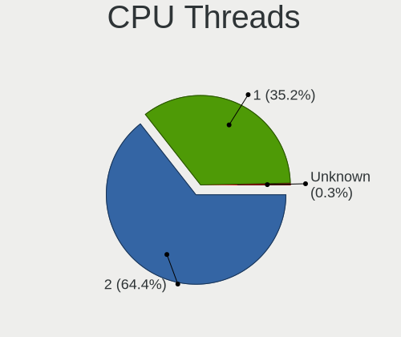

| Number  | Computers | Percent |
|---------|-----------|---------|
| 2       | 1146      | 63.14%  |
| 1       | 664       | 36.58%  |
| Unknown | 5         | 0.28%   |

CPU Op-Modes
------------

CPU Operation Modes (32-bit, 64-bit)

| Op mode        | Computers | Percent |
|----------------|-----------|---------|
| 32-bit, 64-bit | 1743      | 95.61%  |
| Unknown        | 49        | 2.69%   |
| 32-bit         | 23        | 1.26%   |
| 64-bit         | 8         | 0.44%   |

CPU Microcode
-------------

Microcode number

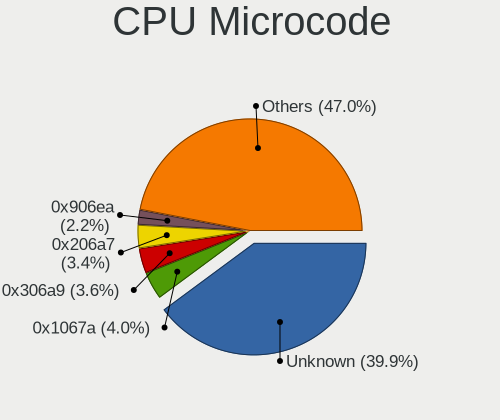

| Number     | Computers | Percent |
|------------|-----------|---------|
| Unknown    | 644       | 33.95%  |
| 0x1067a    | 82        | 4.32%   |
| 0x306a9    | 77        | 4.06%   |
| 0x206a7    | 71        | 3.74%   |
| 0x906ea    | 45        | 2.37%   |
| 0x10676    | 43        | 2.27%   |
| 0x806ec    | 40        | 2.11%   |
| 0x306c3    | 39        | 2.06%   |
| 0x806ea    | 38        | 2%      |
| 0x6fd      | 34        | 1.79%   |
| 0x806c1    | 29        | 1.53%   |
| 0x506e3    | 29        | 1.53%   |
| 0x40651    | 29        | 1.53%   |
| 0x20655    | 23        | 1.21%   |
| 0x406e3    | 21        | 1.11%   |
| 0x306d4    | 21        | 1.11%   |
| 0x906e9    | 20        | 1.05%   |
| 0x806e9    | 19        | 1%      |
| 0x30678    | 19        | 1%      |
| 0x20652    | 19        | 1%      |
| 0x806eb    | 17        | 0.9%    |
| 0x406c4    | 17        | 0.9%    |
| 0x06000852 | 17        | 0.9%    |
| 0x08701021 | 16        | 0.84%   |
| 0x08108109 | 16        | 0.84%   |
| 0x6fb      | 14        | 0.74%   |
| 0x106e5    | 14        | 0.74%   |
| 0x0a50000c | 14        | 0.74%   |
| 0x08200103 | 14        | 0.74%   |
| 0xa0652    | 13        | 0.69%   |
| 0x6f6      | 13        | 0.69%   |
| 0x0800820d | 13        | 0.69%   |
| 0x0a50000d | 12        | 0.63%   |
| 0x406c3    | 11        | 0.58%   |
| 0x08600106 | 11        | 0.58%   |
| 0x08108102 | 10        | 0.53%   |
| 0x07030105 | 10        | 0.53%   |
| 0x106ca    | 9         | 0.47%   |
| 0x08600104 | 9         | 0.47%   |
| 0x706e5    | 8         | 0.42%   |

CPU Microarch
-------------

Microarchitecture

| Name             | Computers | Percent |
|------------------|-----------|---------|
| KabyLake         | 260       | 14.33%  |
| Penryn           | 168       | 9.26%   |
| Haswell          | 125       | 6.89%   |
| IvyBridge        | 117       | 6.45%   |
| SandyBridge      | 97        | 5.34%   |
| Core             | 97        | 5.34%   |
| Skylake          | 83        | 4.57%   |
| Unknown          | 75        | 4.13%   |
| Silvermont       | 72        | 3.97%   |
| Zen 2            | 68        | 3.75%   |
| Westmere         | 65        | 3.58%   |
| Zen 3            | 64        | 3.53%   |
| Zen+             | 56        | 3.09%   |
| TigerLake        | 54        | 2.98%   |
| Zen              | 45        | 2.48%   |
| Broadwell        | 37        | 2.04%   |
| CometLake        | 35        | 1.93%   |
| Alderlake Hybrid | 34        | 1.87%   |
| Piledriver       | 31        | 1.71%   |
| Excavator        | 23        | 1.27%   |
| NetBurst         | 22        | 1.21%   |
| Puma             | 21        | 1.16%   |
| Nehalem          | 20        | 1.1%    |
| Bonnell          | 20        | 1.1%    |
| Icelake          | 16        | 0.88%   |
| K10              | 15        | 0.83%   |
| P6               | 13        | 0.72%   |
| Jaguar           | 13        | 0.72%   |
| Goldmont         | 12        | 0.66%   |
| Steamroller      | 11        | 0.61%   |
| Goldmont plus    | 11        | 0.61%   |
| K8 Hammer        | 9         | 0.5%    |
| Bobcat           | 8         | 0.44%   |
| Tremont          | 6         | 0.33%   |
| K8 & K10 hybrid  | 4         | 0.22%   |
| Gracemont        | 3         | 0.17%   |
| Bulldozer        | 3         | 0.17%   |
| K10 Llano        | 2         | 0.11%   |

Graphics
--------

GPU Vendor
----------

Vendors of graphics cards

| Vendor                           | Computers | Percent |
|----------------------------------|-----------|---------|
| Intel                            | 1002      | 45.16%  |
| Nvidia                           | 664       | 29.92%  |
| AMD                              | 536       | 24.16%  |
| Silicon Integrated Systems [SiS] | 11        | 0.5%    |
| Matrox Electronics Systems       | 3         | 0.14%   |
| ASPEED Technology                | 3         | 0.14%   |

GPU Model
---------

Graphics card models

| Model                                                                                    | Computers | Percent |
|------------------------------------------------------------------------------------------|-----------|---------|
| Intel 3rd Gen Core processor Graphics Controller                                         | 82        | 3.57%   |
| Intel 2nd Generation Core Processor Family Integrated Graphics Controller                | 65        | 2.83%   |
| Intel UHD Graphics 620                                                                   | 50        | 2.18%   |
| Intel TigerLake-LP GT2 [Iris Xe Graphics]                                                | 50        | 2.18%   |
| AMD Picasso/Raven 2 [Radeon Vega Series / Radeon Vega Mobile Series]                     | 49        | 2.13%   |
| Intel Haswell-ULT Integrated Graphics Controller                                         | 48        | 2.09%   |
| Intel Atom/Celeron/Pentium Processor x5-E8000/J3xxx/N3xxx Integrated Graphics Controller | 44        | 1.92%   |
| Intel WhiskeyLake-U GT2 [UHD Graphics 620]                                               | 38        | 1.65%   |
| Intel CoffeeLake-H GT2 [UHD Graphics 630]                                                | 37        | 1.61%   |
| Intel CometLake-U GT2 [UHD Graphics]                                                     | 36        | 1.57%   |
| Intel Skylake GT2 [HD Graphics 520]                                                      | 35        | 1.52%   |
| Intel Core Processor Integrated Graphics Controller                                      | 35        | 1.52%   |
| AMD Ellesmere [Radeon RX 470/480/570/570X/580/580X/590]                                  | 35        | 1.52%   |
| Intel Mobile 4 Series Chipset Integrated Graphics Controller                             | 34        | 1.48%   |
| AMD Renoir [Radeon RX Vega 6 (Ryzen 4000/5000 Mobile Series)]                            | 33        | 1.44%   |
| AMD Cezanne [Radeon Vega Series / Radeon Vega Mobile Series]                             | 32        | 1.39%   |
| Intel HD Graphics 5500                                                                   | 31        | 1.35%   |
| Intel HD Graphics 530                                                                    | 30        | 1.31%   |
| Intel HD Graphics 620                                                                    | 29        | 1.26%   |
| Intel Atom Processor Z36xxx/Z37xxx Series Graphics & Display                             | 27        | 1.18%   |
| Intel 4th Gen Core Processor Integrated Graphics Controller                              | 26        | 1.13%   |
| Intel Mobile GM965/GL960 Integrated Graphics Controller (secondary)                      | 25        | 1.09%   |
| Intel Mobile GM965/GL960 Integrated Graphics Controller (primary)                        | 25        | 1.09%   |
| Intel 4 Series Chipset Integrated Graphics Controller                                    | 25        | 1.09%   |
| Nvidia GP107M [GeForce GTX 1050 Mobile]                                                  | 22        | 0.96%   |
| Nvidia G86M [GeForce 8600M GS]                                                           | 22        | 0.96%   |
| Nvidia TU117M [GeForce GTX 1650 Mobile / Max-Q]                                          | 21        | 0.91%   |
| Intel Xeon E3-1200 v3/4th Gen Core Processor Integrated Graphics Controller              | 20        | 0.87%   |
| AMD Park [Mobility Radeon HD 5430/5450/5470]                                             | 19        | 0.83%   |
| Nvidia GK208B [GeForce GT 710]                                                           | 18        | 0.78%   |
| Intel HD Graphics 630                                                                    | 18        | 0.78%   |
| AMD Lucienne                                                                             | 18        | 0.78%   |
| Nvidia GF117M [GeForce 610M/710M/810M/820M / GT 620M/625M/630M/720M]                     | 17        | 0.74%   |
| Intel CometLake-H GT2 [UHD Graphics]                                                     | 17        | 0.74%   |
| Nvidia GP108M [GeForce MX150]                                                            | 15        | 0.65%   |
| Nvidia GA106M [GeForce RTX 3060 Mobile / Max-Q]                                          | 15        | 0.65%   |
| Intel CoffeeLake-S GT2 [UHD Graphics 630]                                                | 15        | 0.65%   |
| AMD Raven Ridge [Radeon Vega Series / Radeon Vega Mobile Series]                         | 15        | 0.65%   |
| Nvidia GP107 [GeForce GTX 1050 Ti]                                                       | 14        | 0.61%   |
| AMD Stoney [Radeon R2/R3/R4/R5 Graphics]                                                 | 14        | 0.61%   |

GPU Combo
---------

Combinations of graphics cards

| Name            | Computers | Percent |
|-----------------|-----------|---------|
| 1 x Intel       | 641       | 35.05%  |
| 1 x AMD         | 404       | 22.09%  |
| 1 x Nvidia      | 322       | 17.61%  |
| Intel + Nvidia  | 287       | 15.69%  |
| Intel + AMD     | 54        | 2.95%   |
| AMD + Nvidia    | 49        | 2.68%   |
| 2 x AMD         | 31        | 1.69%   |
| Other           | 12        | 0.66%   |
| 1 x SiS         | 11        | 0.6%    |
| 2 x Intel       | 8         | 0.44%   |
| 2 x Nvidia      | 4         | 0.22%   |
| Nvidia + ASPEED | 2         | 0.11%   |
| 1 x Matrox      | 2         | 0.11%   |
| Nvidia + Matrox | 1         | 0.05%   |
| 1 x ASPEED      | 1         | 0.05%   |

GPU Driver
----------

Free vs proprietary

| Driver      | Computers | Percent |
|-------------|-----------|---------|
| Free        | 1426      | 77.29%  |
| Proprietary | 327       | 17.72%  |
| Unknown     | 92        | 4.99%   |

GPU Memory
----------

Total video memory

| Size in GB | Computers | Percent |
|------------|-----------|---------|
| Unknown    | 1029      | 54.94%  |
| 0.01-0.5   | 278       | 14.84%  |
| 1.01-2.0   | 213       | 11.37%  |
| 0.51-1.0   | 142       | 7.58%   |
| 3.01-4.0   | 100       | 5.34%   |
| 7.01-8.0   | 48        | 2.56%   |
| 5.01-6.0   | 37        | 1.98%   |
| 8.01-16.0  | 20        | 1.07%   |
| 2.01-3.0   | 6         | 0.32%   |

Monitor
-------

Monitor Vendor
--------------

Monitor vendors

| Vendor                  | Computers | Percent |
|-------------------------|-----------|---------|
| AU Optronics            | 256       | 13.38%  |
| Samsung Electronics     | 238       | 12.44%  |
| Chimei Innolux          | 188       | 9.83%   |
| LG Display              | 171       | 8.94%   |
| BOE                     | 156       | 8.15%   |
| Goldstar                | 139       | 7.27%   |
| Ancor Communications    | 87        | 4.55%   |
| Hewlett-Packard         | 81        | 4.23%   |
| AOC                     | 51        | 2.67%   |
| Dell                    | 49        | 2.56%   |
| Apple                   | 40        | 2.09%   |
| Lenovo                  | 36        | 1.88%   |
| Chi Mei Optoelectronics | 32        | 1.67%   |
| Philips                 | 31        | 1.62%   |
| BenQ                    | 30        | 1.57%   |
| LG Philips              | 27        | 1.41%   |
| Sharp                   | 24        | 1.25%   |
| ASUSTek Computer        | 24        | 1.25%   |
| PANDA                   | 22        | 1.15%   |
| Acer                    | 20        | 1.05%   |
| Sony                    | 17        | 0.89%   |
| LG Electronics          | 14        | 0.73%   |
| Unknown                 | 12        | 0.63%   |
| InfoVision              | 9         | 0.47%   |
| ViewSonic               | 8         | 0.42%   |
| MSI                     | 8         | 0.42%   |
| CPT                     | 7         | 0.37%   |
| Seiko/Epson             | 6         | 0.31%   |
| HannStar                | 6         | 0.31%   |
| Gigabyte Technology     | 6         | 0.31%   |
| HUAWEI                  | 5         | 0.26%   |
| Fujitsu Siemens         | 5         | 0.26%   |
| Valve                   | 4         | 0.21%   |
| Toshiba                 | 4         | 0.21%   |
| Mi                      | 4         | 0.21%   |
| Lenovo Group Limited    | 4         | 0.21%   |
| HPN                     | 4         | 0.21%   |
| CSO                     | 4         | 0.21%   |
| Unknown                 | 4         | 0.21%   |
| Vestel Elektronik       | 3         | 0.16%   |

Monitor Model
-------------

Monitor models

| Model                                                                    | Computers | Percent |
|--------------------------------------------------------------------------|-----------|---------|
| AU Optronics LCD Monitor AUO723C 1366x768 309x173mm 13.9-inch            | 14        | 0.71%   |
| Chimei Innolux LCD Monitor CMN15F5 1920x1080 344x193mm 15.5-inch         | 13        | 0.66%   |
| AU Optronics LCD Monitor AUO403D 1920x1080 309x174mm 14.0-inch           | 13        | 0.66%   |
| Chimei Innolux LCD Monitor CMN15CA 1366x768 344x193mm 15.5-inch          | 12        | 0.61%   |
| Goldstar FULL HD GSM5B55 1920x1080 480x270mm 21.7-inch                   | 11        | 0.56%   |
| Chimei Innolux LCD Monitor CMN15E7 1920x1080 344x193mm 15.5-inch         | 10        | 0.51%   |
| AU Optronics LCD Monitor AUO22EC 1366x768 344x193mm 15.5-inch            | 10        | 0.51%   |
| Chimei Innolux LCD Monitor CMN14D5 1920x1080 309x173mm 13.9-inch         | 9         | 0.46%   |
| Chimei Innolux LCD Monitor CMN15DB 1366x768 344x193mm 15.5-inch          | 8         | 0.41%   |
| Ancor Communications ASUS VW193D ACI19D5 1440x900 408x255mm 18.9-inch    | 8         | 0.41%   |
| Chimei Innolux LCD Monitor CMN15BF 1366x768 344x194mm 15.5-inch          | 7         | 0.36%   |
| Chimei Innolux LCD Monitor CMN14D4 1920x1080 309x173mm 13.9-inch         | 7         | 0.36%   |
| BOE LCD Monitor BOE0704 1366x768 344x194mm 15.5-inch                     | 7         | 0.36%   |
| BenQ GW2480 BNQ78E7 1920x1080 527x296mm 23.8-inch                        | 7         | 0.36%   |
| Ancor Communications VX238 ACI23C1 1920x1080 510x290mm 23.1-inch         | 7         | 0.36%   |
| Samsung Electronics S24F350 SAM0D20 1920x1080 521x293mm 23.5-inch        | 6         | 0.3%    |
| Samsung Electronics LCD Monitor SEC5541 1366x768 344x193mm 15.5-inch     | 6         | 0.3%    |
| Samsung Electronics LCD Monitor SEC5441 1366x768 344x194mm 15.5-inch     | 6         | 0.3%    |
| LG Display LCD Monitor LGD039F 1366x768 345x194mm 15.6-inch              | 6         | 0.3%    |
| Goldstar HDR WFHD GSM7714 2560x1080 798x334mm 34.1-inch                  | 6         | 0.3%    |
| Chimei Innolux LCD Monitor CMN15E6 1366x768 344x193mm 15.5-inch          | 6         | 0.3%    |
| Chimei Innolux LCD Monitor CMN15C9 1366x768 344x193mm 15.5-inch          | 6         | 0.3%    |
| Chi Mei Optoelectronics LCD Monitor CMO1592 1366x768 344x193mm 15.5-inch | 6         | 0.3%    |
| BOE LCD Monitor BOE0877 1920x1080 309x173mm 13.9-inch                    | 6         | 0.3%    |
| BOE LCD Monitor BOE06A4 1366x768 344x194mm 15.5-inch                     | 6         | 0.3%    |
| AU Optronics LCD Monitor AUO21ED 1920x1080 344x193mm 15.5-inch           | 6         | 0.3%    |
| AU Optronics LCD Monitor AUO18D4 1280x800 216x135mm 10.0-inch            | 6         | 0.3%    |
| AOC 27G2G3 AOC2702 1920x1080 598x336mm 27.0-inch                         | 6         | 0.3%    |
| LG Philips LCD Monitor LPLDD00 1280x800 331x207mm 15.4-inch              | 5         | 0.25%   |
| LG Display LCD Monitor LGD045D 1366x768 345x194mm 15.6-inch              | 5         | 0.25%   |
| LG Display LCD Monitor LGD0456 1366x768 344x194mm 15.5-inch              | 5         | 0.25%   |
| HUAWEI AD80HW HWV2402 1920x1080 527x296mm 23.8-inch                      | 5         | 0.25%   |
| Goldstar ULTRAWIDE GSM59F1 2560x1080 673x284mm 28.8-inch                 | 5         | 0.25%   |
| Goldstar MP59G GSM5B34 1920x1080 480x270mm 21.7-inch                     | 5         | 0.25%   |
| Goldstar FULL HD GSM5AB9 1920x1080 480x270mm 21.7-inch                   | 5         | 0.25%   |
| Chimei Innolux LCD Monitor CMN15E8 1920x1080 344x193mm 15.5-inch         | 5         | 0.25%   |
| Chimei Innolux LCD Monitor CMN15B7 1366x768 344x193mm 15.5-inch          | 5         | 0.25%   |
| Chimei Innolux LCD Monitor CMN15AB 1366x768 344x193mm 15.5-inch          | 5         | 0.25%   |
| Chimei Innolux LCD Monitor CMN1521 1920x1080 344x193mm 15.5-inch         | 5         | 0.25%   |
| Chi Mei Optoelectronics LCD Monitor CMO15A7 1366x768 344x193mm 15.5-inch | 5         | 0.25%   |

Monitor Resolution
------------------

Monitor screen resolution

| Resolution         | Computers | Percent |
|--------------------|-----------|---------|
| 1920x1080 (FHD)    | 741       | 40.8%   |
| 1366x768 (WXGA)    | 422       | 23.24%  |
| 3840x2160 (4K)     | 104       | 5.73%   |
| 1280x1024 (SXGA)   | 81        | 4.46%   |
| 1280x800 (WXGA)    | 69        | 3.8%    |
| 2560x1440 (QHD)    | 61        | 3.36%   |
| 1680x1050 (WSXGA+) | 47        | 2.59%   |
| 1440x900 (WXGA+)   | 46        | 2.53%   |
| 1600x900 (HD+)     | 44        | 2.42%   |
| 1920x1200 (WUXGA)  | 32        | 1.76%   |
| 2560x1080          | 20        | 1.1%    |
| 1360x768           | 17        | 0.94%   |
| Unknown            | 15        | 0.83%   |
| 2560x1600          | 11        | 0.61%   |
| 3440x1440          | 10        | 0.55%   |
| 2160x1440          | 10        | 0.55%   |
| 1024x768 (XGA)     | 10        | 0.55%   |
| 2880x1800          | 9         | 0.5%    |
| 3840x2400          | 7         | 0.39%   |
| 3840x1080          | 7         | 0.39%   |
| 1024x600           | 7         | 0.39%   |
| 800x1280           | 4         | 0.22%   |
| 2288x1287          | 4         | 0.22%   |
| 1920x540           | 4         | 0.22%   |
| 3200x1800 (QHD+)   | 3         | 0.17%   |
| 1400x1050          | 3         | 0.17%   |
| 1152x864           | 3         | 0.17%   |
| 3072x1920          | 2         | 0.11%   |
| 2880x1620          | 2         | 0.11%   |
| 2240x1400          | 2         | 0.11%   |
| 1920x1280          | 2         | 0.11%   |
| 640x480            | 1         | 0.06%   |
| 5760x1080          | 1         | 0.06%   |
| 4560x1080          | 1         | 0.06%   |
| 4480x1600          | 1         | 0.06%   |
| 3840x1600          | 1         | 0.06%   |
| 3840x1100          | 1         | 0.06%   |
| 3520x1080          | 1         | 0.06%   |
| 3360x1080          | 1         | 0.06%   |
| 3360x1050          | 1         | 0.06%   |

Monitor Diagonal
----------------

Diagonal size in inches

| Inches  | Computers | Percent |
|---------|-----------|---------|
| 15      | 614       | 32.03%  |
| 14      | 166       | 8.66%   |
| 13      | 166       | 8.66%   |
| 24      | 135       | 7.04%   |
| 21      | 123       | 6.42%   |
| 27      | 101       | 5.27%   |
| 17      | 92        | 4.8%    |
| Unknown | 84        | 4.38%   |
| 23      | 80        | 4.17%   |
| 19      | 56        | 2.92%   |
| 18      | 33        | 1.72%   |
| 31      | 31        | 1.62%   |
| 34      | 27        | 1.41%   |
| 12      | 25        | 1.3%    |
| 20      | 23        | 1.2%    |
| 22      | 21        | 1.1%    |
| 16      | 19        | 0.99%   |
| 11      | 18        | 0.94%   |
| 10      | 17        | 0.89%   |
| 84      | 14        | 0.73%   |
| 54      | 10        | 0.52%   |
| 40      | 9         | 0.47%   |
| 25      | 8         | 0.42%   |
| 28      | 7         | 0.37%   |
| 72      | 5         | 0.26%   |
| 32      | 5         | 0.26%   |
| 46      | 4         | 0.21%   |
| 33      | 4         | 0.21%   |
| 26      | 4         | 0.21%   |
| 7       | 4         | 0.21%   |
| 48      | 2         | 0.1%    |
| 42      | 2         | 0.1%    |
| 142     | 1         | 0.05%   |
| 60      | 1         | 0.05%   |
| 59      | 1         | 0.05%   |
| 58      | 1         | 0.05%   |
| 39      | 1         | 0.05%   |
| 37      | 1         | 0.05%   |
| 36      | 1         | 0.05%   |
| 8       | 1         | 0.05%   |

Monitor Width
-------------

Physical width

| Width in mm    | Computers | Percent |
|----------------|-----------|---------|
| 301-350        | 898       | 47.77%  |
| 501-600        | 291       | 15.48%  |
| 401-500        | 222       | 11.81%  |
| 201-300        | 144       | 7.66%   |
| 351-400        | 98        | 5.21%   |
| Unknown        | 84        | 4.47%   |
| 601-700        | 49        | 2.61%   |
| 701-800        | 37        | 1.97%   |
| 1501-2000      | 19        | 1.01%   |
| 1001-1500      | 19        | 1.01%   |
| 801-900        | 11        | 0.59%   |
| 1-100          | 4         | 0.21%   |
| 901-1000       | 2         | 0.11%   |
| More than 2000 | 1         | 0.05%   |
| 101-200        | 1         | 0.05%   |

Aspect Ratio
------------

Proportional relationship between the width and the height

| Ratio   | Computers | Percent |
|---------|-----------|---------|
| 16/9    | 1268      | 73.34%  |
| 16/10   | 225       | 13.01%  |
| Unknown | 73        | 4.22%   |
| 5/4     | 70        | 4.05%   |
| 21/9    | 31        | 1.79%   |
| 4/3     | 27        | 1.56%   |
| 3/2     | 22        | 1.27%   |
| 6/5     | 5         | 0.29%   |
| 0.67    | 4         | 0.23%   |
| 32/9    | 2         | 0.12%   |
| 3.40    | 1         | 0.06%   |
| 1.00    | 1         | 0.06%   |

Monitor Area
------------

Area in inch

| Area in inch | Computers | Percent |
|----------------|-----------|---------|
| 101-110        | 606       | 31.79%  |
| 201-250        | 293       | 15.37%  |
| 81-90          | 258       | 13.54%  |
| 301-350        | 105       | 5.51%   |
| 151-200        | 103       | 5.4%    |
| Unknown        | 84        | 4.41%   |
| 141-150        | 72        | 3.78%   |
| 71-80          | 71        | 3.73%   |
| 351-500        | 68        | 3.57%   |
| 251-300        | 48        | 2.52%   |
| 121-130        | 40        | 2.1%    |
| More than 1000 | 34        | 1.78%   |
| 61-70          | 22        | 1.15%   |
| 111-120        | 21        | 1.1%    |
| 501-1000       | 20        | 1.05%   |
| 51-60          | 19        | 1%      |
| 41-50          | 17        | 0.89%   |
| 131-140        | 11        | 0.58%   |
| 91-100         | 9         | 0.47%   |
| 1-40           | 5         | 0.26%   |

Pixel Density
-------------

Pixels per inch

| Density       | Computers | Percent |
|---------------|-----------|---------|
| 51-100        | 588       | 31.87%  |
| 101-120       | 530       | 28.73%  |
| 121-160       | 485       | 26.29%  |
| 161-240       | 105       | 5.69%   |
| Unknown       | 84        | 4.55%   |
| More than 240 | 31        | 1.68%   |
| 1-50          | 22        | 1.19%   |

Multiple Monitors
-----------------

Total monitors connected

| Total | Computers | Percent |
|-------|-----------|---------|
| 1     | 1436      | 77.08%  |
| 2     | 272       | 14.6%   |
| 0     | 120       | 6.44%   |
| 3     | 31        | 1.66%   |
| 4     | 4         | 0.21%   |

Network
-------

Net Controller Vendor
---------------------

Controller vendors

| Vendor                            | Computers | Percent |
|-----------------------------------|-----------|---------|
| Realtek Semiconductor             | 996       | 36.6%   |
| Intel                             | 765       | 28.11%  |
| Qualcomm Atheros                  | 356       | 13.08%  |
| Broadcom                          | 173       | 6.36%   |
| Marvell Technology Group          | 61        | 2.24%   |
| TP-Link                           | 59        | 2.17%   |
| MediaTek                          | 35        | 1.29%   |
| Broadcom Limited                  | 34        | 1.25%   |
| Ralink                            | 24        | 0.88%   |
| Nvidia                            | 24        | 0.88%   |
| Qualcomm Atheros Communications   | 20        | 0.74%   |
| Silicon Integrated Systems [SiS]  | 17        | 0.62%   |
| Ralink Technology                 | 15        | 0.55%   |
| ASIX Electronics                  | 13        | 0.48%   |
| D-Link                            | 9         | 0.33%   |
| ASUSTek Computer                  | 9         | 0.33%   |
| Sierra Wireless                   | 6         | 0.22%   |
| Samsung Electronics               | 6         | 0.22%   |
| VIA Technologies                  | 5         | 0.18%   |
| Lenovo                            | 5         | 0.18%   |
| JMicron Technology                | 5         | 0.18%   |
| Huawei Technologies               | 5         | 0.18%   |
| Ericsson Business Mobile Networks | 5         | 0.18%   |
| DisplayLink                       | 5         | 0.18%   |
| Microsoft                         | 4         | 0.15%   |
| ICS Advent                        | 4         | 0.15%   |
| Hewlett-Packard                   | 4         | 0.15%   |
| Dell                              | 4         | 0.15%   |
| D-Link System                     | 4         | 0.15%   |
| Attansic Technology               | 4         | 0.15%   |
| Mercucys                          | 3         | 0.11%   |
| Edimax Technology                 | 3         | 0.11%   |
| ADMtek                            | 3         | 0.11%   |
| Xiaomi                            | 2         | 0.07%   |
| TRENDnet                          | 2         | 0.07%   |
| Mellanox Technologies             | 2         | 0.07%   |
| FIBOCOM                           | 2         | 0.07%   |
| Dresden Elektronik                | 2         | 0.07%   |
| Belkin Components                 | 2         | 0.07%   |
| ASR Microelectronics              | 2         | 0.07%   |

Net Controller Model
--------------------

Controller models

| Model                                                                   | Computers | Percent |
|-------------------------------------------------------------------------|-----------|---------|
| Realtek RTL8111/8168/8211/8411 PCI Express Gigabit Ethernet Controller  | 671       | 21.23%  |
| Realtek RTL810xE PCI Express Fast Ethernet controller                   | 134       | 4.24%   |
| Qualcomm Atheros QCA9565 / AR9565 Wireless Network Adapter              | 58        | 1.83%   |
| Intel Wi-Fi 6 AX200                                                     | 58        | 1.83%   |
| Qualcomm Atheros AR9285 Wireless Network Adapter (PCI-Express)          | 56        | 1.77%   |
| Realtek RTL8153 Gigabit Ethernet Adapter                                | 54        | 1.71%   |
| Qualcomm Atheros QCA9377 802.11ac Wireless Network Adapter              | 43        | 1.36%   |
| Intel Wireless 8265 / 8275                                              | 43        | 1.36%   |
| Realtek RTL8821CE 802.11ac PCIe Wireless Network Adapter                | 42        | 1.33%   |
| Intel 82579LM Gigabit Network Connection (Lewisville)                   | 40        | 1.27%   |
| Intel Wi-Fi 6 AX201                                                     | 39        | 1.23%   |
| Qualcomm Atheros AR9485 Wireless Network Adapter                        | 36        | 1.14%   |
| Realtek RTL8822CE 802.11ac PCIe Wireless Network Adapter                | 35        | 1.11%   |
| Realtek RTL8125 2.5GbE Controller                                       | 34        | 1.08%   |
| Intel Wireless 7265                                                     | 34        | 1.08%   |
| Intel PRO/Wireless 4965 AG or AGN [Kedron] Network Connection           | 31        | 0.98%   |
| Intel Comet Lake PCH-LP CNVi WiFi                                       | 30        | 0.95%   |
| Qualcomm Atheros AR242x / AR542x Wireless Network Adapter (PCI-Express) | 28        | 0.89%   |
| Intel Cannon Lake PCH CNVi WiFi                                         | 28        | 0.89%   |
| Broadcom BCM43142 802.11b/g/n                                           | 28        | 0.89%   |
| Qualcomm Atheros QCA6174 802.11ac Wireless Network Adapter              | 27        | 0.85%   |
| Marvell Group 88E8036 PCI-E Fast Ethernet Controller                    | 27        | 0.85%   |
| Intel Wireless 7260                                                     | 27        | 0.85%   |
| Intel Wireless 3165                                                     | 27        | 0.85%   |
| TP-Link UE300 10/100/1000 LAN (ethernet mode) [Realtek RTL8153]         | 26        | 0.82%   |
| Intel Cannon Point-LP CNVi [Wireless-AC]                                | 26        | 0.82%   |
| Realtek RTL8723BE PCIe Wireless Network Adapter                         | 25        | 0.79%   |
| Intel Wireless 8260                                                     | 25        | 0.79%   |
| Intel Alder Lake-P PCH CNVi WiFi                                        | 25        | 0.79%   |
| Broadcom BCM4313 802.11bgn Wireless Network Adapter                     | 25        | 0.79%   |
| MediaTek MT7921 802.11ax PCI Express Wireless Network Adapter           | 22        | 0.7%    |
| Intel I211 Gigabit Network Connection                                   | 22        | 0.7%    |
| Realtek RTL8852AE 802.11ax PCIe Wireless Network Adapter                | 21        | 0.66%   |
| Intel Centrino Advanced-N 6205 [Taylor Peak]                            | 21        | 0.66%   |
| Realtek RTL8188EUS 802.11n Wireless Network Adapter                     | 20        | 0.63%   |
| Intel PRO/Wireless 3945ABG [Golan] Network Connection                   | 20        | 0.63%   |
| Qualcomm Atheros AR8131 Gigabit Ethernet                                | 18        | 0.57%   |
| Intel 82579V Gigabit Network Connection                                 | 18        | 0.57%   |
| Intel Ethernet Connection (2) I219-V                                    | 17        | 0.54%   |
| Qualcomm Atheros AR9271 802.11n                                         | 16        | 0.51%   |

Wireless Vendor
---------------

Wireless vendors

| Vendor                                | Computers | Percent |
|---------------------------------------|-----------|---------|
| Intel                                 | 617       | 41.33%  |
| Qualcomm Atheros                      | 293       | 19.62%  |
| Realtek Semiconductor                 | 265       | 17.75%  |
| Broadcom                              | 119       | 7.97%   |
| TP-Link                               | 34        | 2.28%   |
| MediaTek                              | 34        | 2.28%   |
| Ralink                                | 24        | 1.61%   |
| Broadcom Limited                      | 21        | 1.41%   |
| Qualcomm Atheros Communications       | 20        | 1.34%   |
| Ralink Technology                     | 15        | 1%      |
| D-Link                                | 9         | 0.6%    |
| ASUSTek Computer                      | 9         | 0.6%    |
| Sierra Wireless                       | 6         | 0.4%    |
| Dell                                  | 4         | 0.27%   |
| Microsoft                             | 3         | 0.2%    |
| Mercucys                              | 3         | 0.2%    |
| Marvell Technology Group              | 3         | 0.2%    |
| Edimax Technology                     | 3         | 0.2%    |
| TRENDnet                              | 2         | 0.13%   |
| FIBOCOM                               | 2         | 0.13%   |
| Belkin Components                     | 2         | 0.13%   |
| Sitecom Europe                        | 1         | 0.07%   |
| Micro Star International              | 1         | 0.07%   |
| D-Link System                         | 1         | 0.07%   |
| Accton Technology                     | 1         | 0.07%   |
| 802.11g Adapter [Linksys WUSB54GC v3] | 1         | 0.07%   |

Wireless Model
--------------

Wireless models

| Model                                                                   | Computers | Percent |
|-------------------------------------------------------------------------|-----------|---------|
| Qualcomm Atheros QCA9565 / AR9565 Wireless Network Adapter              | 58        | 3.88%   |
| Intel Wi-Fi 6 AX200                                                     | 58        | 3.88%   |
| Qualcomm Atheros AR9285 Wireless Network Adapter (PCI-Express)          | 56        | 3.75%   |
| Qualcomm Atheros QCA9377 802.11ac Wireless Network Adapter              | 43        | 2.88%   |
| Intel Wireless 8265 / 8275                                              | 43        | 2.88%   |
| Realtek RTL8821CE 802.11ac PCIe Wireless Network Adapter                | 42        | 2.81%   |
| Intel Wi-Fi 6 AX201                                                     | 39        | 2.61%   |
| Qualcomm Atheros AR9485 Wireless Network Adapter                        | 36        | 2.41%   |
| Realtek RTL8822CE 802.11ac PCIe Wireless Network Adapter                | 35        | 2.34%   |
| Intel Wireless 7265                                                     | 34        | 2.27%   |
| Intel PRO/Wireless 4965 AG or AGN [Kedron] Network Connection           | 31        | 2.07%   |
| Intel Comet Lake PCH-LP CNVi WiFi                                       | 30        | 2.01%   |
| Qualcomm Atheros AR242x / AR542x Wireless Network Adapter (PCI-Express) | 28        | 1.87%   |
| Intel Cannon Lake PCH CNVi WiFi                                         | 28        | 1.87%   |
| Broadcom BCM43142 802.11b/g/n                                           | 28        | 1.87%   |
| Qualcomm Atheros QCA6174 802.11ac Wireless Network Adapter              | 27        | 1.81%   |
| Intel Wireless 7260                                                     | 27        | 1.81%   |
| Intel Wireless 3165                                                     | 27        | 1.81%   |
| Intel Cannon Point-LP CNVi [Wireless-AC]                                | 26        | 1.74%   |
| Realtek RTL8723BE PCIe Wireless Network Adapter                         | 25        | 1.67%   |
| Intel Wireless 8260                                                     | 25        | 1.67%   |
| Intel Alder Lake-P PCH CNVi WiFi                                        | 25        | 1.67%   |
| Broadcom BCM4313 802.11bgn Wireless Network Adapter                     | 25        | 1.67%   |
| MediaTek MT7921 802.11ax PCI Express Wireless Network Adapter           | 22        | 1.47%   |
| Realtek RTL8852AE 802.11ax PCIe Wireless Network Adapter                | 21        | 1.4%    |
| Intel Centrino Advanced-N 6205 [Taylor Peak]                            | 21        | 1.4%    |
| Realtek RTL8188EUS 802.11n Wireless Network Adapter                     | 20        | 1.34%   |
| Intel PRO/Wireless 3945ABG [Golan] Network Connection                   | 20        | 1.34%   |
| Qualcomm Atheros AR9271 802.11n                                         | 16        | 1.07%   |
| Intel Wireless 3160                                                     | 16        | 1.07%   |
| Intel Comet Lake PCH CNVi WiFi                                          | 16        | 1.07%   |
| Qualcomm Atheros AR928X Wireless Network Adapter (PCI-Express)          | 15        | 1%      |
| Intel WiFi Link 5100                                                    | 14        | 0.94%   |
| TP-Link TL-WN823N v2/v3 [Realtek RTL8192EU]                             | 13        | 0.87%   |
| Intel Wi-Fi 5(802.11ac) Wireless-AC 9x6x [Thunder Peak]                 | 13        | 0.87%   |
| Realtek RTL8191SEvB Wireless LAN Controller                             | 12        | 0.8%    |
| Ralink RT3290 Wireless 802.11n 1T/1R PCIe                               | 12        | 0.8%    |
| Qualcomm Atheros AR9287 Wireless Network Adapter (PCI-Express)          | 11        | 0.74%   |
| Intel PRO/Wireless 5100 AGN [Shiloh] Network Connection                 | 11        | 0.74%   |
| Intel Dual Band Wireless-AC 3168NGW [Stone Peak]                        | 11        | 0.74%   |

Ethernet Vendor
---------------

Ethernet vendors

| Vendor                           | Computers | Percent |
|----------------------------------|-----------|---------|
| Realtek Semiconductor            | 904       | 56.08%  |
| Intel                            | 316       | 19.6%   |
| Qualcomm Atheros                 | 103       | 6.39%   |
| Broadcom                         | 74        | 4.59%   |
| Marvell Technology Group         | 58        | 3.6%    |
| TP-Link                          | 26        | 1.61%   |
| Nvidia                           | 24        | 1.49%   |
| Silicon Integrated Systems [SiS] | 17        | 1.05%   |
| Broadcom Limited                 | 13        | 0.81%   |
| ASIX Electronics                 | 13        | 0.81%   |
| Samsung Electronics              | 6         | 0.37%   |
| VIA Technologies                 | 5         | 0.31%   |
| Lenovo                           | 5         | 0.31%   |
| JMicron Technology               | 5         | 0.31%   |
| DisplayLink                      | 5         | 0.31%   |
| ICS Advent                       | 4         | 0.25%   |
| Huawei Technologies              | 4         | 0.25%   |
| Attansic Technology              | 4         | 0.25%   |
| Hewlett-Packard                  | 3         | 0.19%   |
| D-Link System                    | 3         | 0.19%   |
| ADMtek                           | 3         | 0.19%   |
| Xiaomi                           | 2         | 0.12%   |
| Mellanox Technologies            | 2         | 0.12%   |
| Apple                            | 2         | 0.12%   |
| T & A Mobile Phones              | 1         | 0.06%   |
| Standard Microsystems            | 1         | 0.06%   |
| Silicom                          | 1         | 0.06%   |
| Qualcomm                         | 1         | 0.06%   |
| Microsoft                        | 1         | 0.06%   |
| Microchip Technology             | 1         | 0.06%   |
| MediaTek                         | 1         | 0.06%   |
| LSI                              | 1         | 0.06%   |
| Archos                           | 1         | 0.06%   |
| Allwinner Technology             | 1         | 0.06%   |
| Accton Technology                | 1         | 0.06%   |

Ethernet Model
--------------

Ethernet models

| Model                                                                          | Computers | Percent |
|--------------------------------------------------------------------------------|-----------|---------|
| Realtek RTL8111/8168/8211/8411 PCI Express Gigabit Ethernet Controller         | 671       | 40.89%  |
| Realtek RTL810xE PCI Express Fast Ethernet controller                          | 134       | 8.17%   |
| Realtek RTL8153 Gigabit Ethernet Adapter                                       | 54        | 3.29%   |
| Intel 82579LM Gigabit Network Connection (Lewisville)                          | 40        | 2.44%   |
| Realtek RTL8125 2.5GbE Controller                                              | 34        | 2.07%   |
| Marvell Group 88E8036 PCI-E Fast Ethernet Controller                           | 27        | 1.65%   |
| TP-Link UE300 10/100/1000 LAN (ethernet mode) [Realtek RTL8153]                | 26        | 1.58%   |
| Intel I211 Gigabit Network Connection                                          | 22        | 1.34%   |
| Qualcomm Atheros AR8131 Gigabit Ethernet                                       | 18        | 1.1%    |
| Intel 82579V Gigabit Network Connection                                        | 18        | 1.1%    |
| Intel Ethernet Connection (2) I219-V                                           | 17        | 1.04%   |
| Qualcomm Atheros AR8151 v2.0 Gigabit Ethernet                                  | 16        | 0.98%   |
| Realtek RTL-8100/8101L/8139 PCI Fast Ethernet Adapter                          | 15        | 0.91%   |
| Intel Ethernet Connection I217-LM                                              | 15        | 0.91%   |
| Silicon Integrated Systems [SiS] 191 Gigabit Ethernet Adapter                  | 14        | 0.85%   |
| Intel Ethernet Connection (4) I219-LM                                          | 14        | 0.85%   |
| Qualcomm Atheros AR8121/AR8113/AR8114 Gigabit or Fast Ethernet                 | 12        | 0.73%   |
| Intel Ethernet Connection I218-LM                                              | 12        | 0.73%   |
| Qualcomm Atheros AR8132 Fast Ethernet                                          | 10        | 0.61%   |
| Intel 82577LM Gigabit Network Connection                                       | 9         | 0.55%   |
| Intel 82567LM-3 Gigabit Network Connection                                     | 9         | 0.55%   |
| Intel Ethernet Connection I219-LM                                              | 8         | 0.49%   |
| Intel Ethernet Connection (7) I219-V                                           | 8         | 0.49%   |
| Intel Ethernet Connection (6) I219-V                                           | 8         | 0.49%   |
| Intel Ethernet Connection (2) I218-V                                           | 8         | 0.49%   |
| Broadcom NetXtreme BCM57765 Gigabit Ethernet PCIe                              | 8         | 0.49%   |
| Broadcom NetLink BCM5787M Gigabit Ethernet PCI Express                         | 8         | 0.49%   |
| Broadcom NetLink BCM57780 Gigabit Ethernet PCIe                                | 8         | 0.49%   |
| ASIX AX88179 Gigabit Ethernet                                                  | 8         | 0.49%   |
| Qualcomm Atheros AR8161 Gigabit Ethernet                                       | 7         | 0.43%   |
| Nvidia MCP79 Ethernet                                                          | 7         | 0.43%   |
| Marvell Group Yukon Optima 88E8059 [PCIe Gigabit Ethernet Controller with AVB] | 7         | 0.43%   |
| Intel Ethernet Controller I225-V                                               | 7         | 0.43%   |
| Intel Ethernet Connection (4) I219-V                                           | 7         | 0.43%   |
| Intel Ethernet Connection (3) I218-LM                                          | 7         | 0.43%   |
| Intel 82567LM Gigabit Network Connection                                       | 7         | 0.43%   |
| Broadcom NetXtreme BCM5764M Gigabit Ethernet PCIe                              | 7         | 0.43%   |
| Qualcomm Atheros AR8152 v1.1 Fast Ethernet                                     | 6         | 0.37%   |
| Nvidia MCP61 Ethernet                                                          | 6         | 0.37%   |
| Intel Ethernet Connection I217-V                                               | 6         | 0.37%   |

Net Controller Kind
-------------------

Ethernet, WiFi or modem

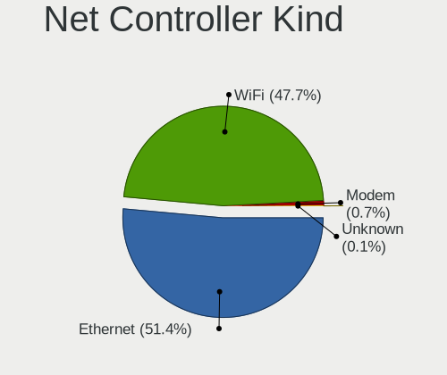

| Kind     | Computers | Percent |
|----------|-----------|---------|
| Ethernet | 1545      | 51.52%  |
| WiFi     | 1429      | 47.65%  |
| Modem    | 21        | 0.7%    |
| Unknown  | 4         | 0.13%   |

Used Controller
---------------

Currently used network controller

| Kind     | Computers | Percent |
|----------|-----------|---------|
| WiFi     | 1123      | 59.14%  |
| Ethernet | 776       | 40.86%  |

NICs
----

Total network controllers on board

| Total | Computers | Percent |
|-------|-----------|---------|
| 2     | 1019      | 56.11%  |
| 1     | 732       | 40.31%  |
| 0     | 37        | 2.04%   |
| 3     | 18        | 0.99%   |
| 6     | 3         | 0.17%   |
| 5     | 3         | 0.17%   |
| 10    | 2         | 0.11%   |
| 4     | 2         | 0.11%   |

IPv6
----

IPv6 vs IPv4

| Used | Computers | Percent |
|------|-----------|---------|
| No   | 1299      | 69.76%  |
| Yes  | 563       | 30.24%  |

Bluetooth
---------

Bluetooth Vendor
----------------

Controller vendors

| Vendor                          | Computers | Percent |
|---------------------------------|-----------|---------|
| Intel                           | 468       | 42.55%  |
| Realtek Semiconductor           | 130       | 11.82%  |
| IMC Networks                    | 70        | 6.36%   |
| Qualcomm Atheros Communications | 67        | 6.09%   |
| Foxconn / Hon Hai               | 49        | 4.45%   |
| Lite-On Technology              | 46        | 4.18%   |
| Cambridge Silicon Radio         | 45        | 4.09%   |
| Apple                           | 43        | 3.91%   |
| ASUSTek Computer                | 41        | 3.73%   |
| Broadcom                        | 40        | 3.64%   |
| Toshiba                         | 21        | 1.91%   |
| Hewlett-Packard                 | 17        | 1.55%   |
| Realtek                         | 12        | 1.09%   |
| Ralink                          | 12        | 1.09%   |
| Dell                            | 12        | 1.09%   |
| Alps Electric                   | 6         | 0.55%   |
| MediaTek                        | 5         | 0.45%   |
| TP-Link                         | 3         | 0.27%   |
| Belkin Components               | 3         | 0.27%   |
| Ralink Technology               | 2         | 0.18%   |
| Marvell Semiconductor           | 2         | 0.18%   |
| Chicony Electronics             | 2         | 0.18%   |
| Integrated System Solution      | 1         | 0.09%   |
| Foxconn International           | 1         | 0.09%   |
| Conwise Technology              | 1         | 0.09%   |
| Actions                         | 1         | 0.09%   |

Bluetooth Model
---------------

Controller models

| Model                                                                               | Computers | Percent |
|-------------------------------------------------------------------------------------|-----------|---------|
| Intel Bluetooth wireless interface                                                  | 108       | 9.82%   |
| Realtek Bluetooth Radio                                                             | 87        | 7.91%   |
| Intel AX201 Bluetooth                                                               | 87        | 7.91%   |
| Intel Bluetooth 9460/9560 Jefferson Peak (JfP)                                      | 72        | 6.55%   |
| Intel Bluetooth Device                                                              | 65        | 5.91%   |
| Intel AX200 Bluetooth                                                               | 58        | 5.27%   |
| Cambridge Silicon Radio Bluetooth Dongle (HCI mode)                                 | 45        | 4.09%   |
| IMC Networks Bluetooth Device                                                       | 32        | 2.91%   |
| Intel AX211 Bluetooth                                                               | 24        | 2.18%   |
| Qualcomm Atheros QCA61x4 Bluetooth 4.0                                              | 21        | 1.91%   |
| Apple Bluetooth Host Controller                                                     | 21        | 1.91%   |
| Realtek  Bluetooth 4.2 Adapter                                                      | 20        | 1.82%   |
| Qualcomm Atheros  Bluetooth Device                                                  | 19        | 1.73%   |
| IMC Networks Bluetooth Radio                                                        | 19        | 1.73%   |
| ASUS Broadcom BCM20702A0 Bluetooth                                                  | 19        | 1.73%   |
| Qualcomm Atheros AR3011 Bluetooth                                                   | 18        | 1.64%   |
| Intel Centrino Bluetooth Wireless Transceiver                                       | 17        | 1.55%   |
| Intel Wireless-AC 9260 Bluetooth Adapter                                            | 13        | 1.18%   |
| Realtek Bluetooth Radio                                                             | 12        | 1.09%   |
| Ralink RT3290 Bluetooth                                                             | 12        | 1.09%   |
| Lite-On Qualcomm Atheros QCA9377 Bluetooth                                          | 12        | 1.09%   |
| Intel Wireless-AC 3168 Bluetooth                                                    | 12        | 1.09%   |
| IMC Networks Wireless_Device                                                        | 12        | 1.09%   |
| HP Bluetooth 2.0 Interface [Broadcom BCM2045]                                       | 12        | 1.09%   |
| Apple Bluetooth USB Host Controller                                                 | 12        | 1.09%   |
| Realtek 802.11ac WLAN Adapter                                                       | 11        | 1%      |
| Lite-On Atheros AR3012 Bluetooth                                                    | 11        | 1%      |
| Lite-On Bluetooth Device                                                            | 10        | 0.91%   |
| Foxconn / Hon Hai Bluetooth Device                                                  | 10        | 0.91%   |
| Foxconn / Hon Hai MediaTek Bluetooth Adapter                                        | 8         | 0.73%   |
| Qualcomm Atheros AR3012 Bluetooth 4.0                                               | 7         | 0.64%   |
| Intel AX210 Bluetooth                                                               | 7         | 0.64%   |
| Foxconn / Hon Hai Foxconn T77H114 BCM2070 [Single-Chip Bluetooth 2.1 + EDR Adapter] | 7         | 0.64%   |
| ASUS ASUS USB-BT500                                                                 | 7         | 0.64%   |
| Realtek RTL8821A Bluetooth                                                          | 6         | 0.55%   |
| Foxconn / Hon Hai Wireless_Device                                                   | 6         | 0.55%   |
| Broadcom BCM20702 Bluetooth 4.0 [ThinkPad]                                          | 6         | 0.55%   |
| Toshiba Integrated Bluetooth HCI                                                    | 5         | 0.45%   |
| Toshiba Askey Bluetooth Module                                                      | 5         | 0.45%   |
| MediaTek Wireless_Device                                                            | 5         | 0.45%   |

Sound
-----

Sound Vendor
------------

Sound card vendors

| Vendor                                       | Computers | Percent |
|----------------------------------------------|-----------|---------|
| Intel                                        | 1292      | 52.48%  |
| AMD                                          | 528       | 21.45%  |
| Nvidia                                       | 393       | 15.96%  |
| C-Media Electronics                          | 32        | 1.3%    |
| Creative Labs                                | 20        | 0.81%   |
| Silicon Integrated Systems [SiS]             | 17        | 0.69%   |
| Logitech                                     | 16        | 0.65%   |
| Kingston Technology                          | 14        | 0.57%   |
| Razer USA                                    | 13        | 0.53%   |
| JMTek                                        | 13        | 0.53%   |
| Texas Instruments                            | 12        | 0.49%   |
| Hewlett-Packard                              | 10        | 0.41%   |
| GN Netcom                                    | 10        | 0.41%   |
| Realtek Semiconductor                        | 9         | 0.37%   |
| Plantronics                                  | 7         | 0.28%   |
| ASUSTek Computer                             | 7         | 0.28%   |
| Focusrite-Novation                           | 6         | 0.24%   |
| Lenovo                                       | 5         | 0.2%    |
| Creative Technology                          | 5         | 0.2%    |
| Sony                                         | 3         | 0.12%   |
| Micro Star International                     | 3         | 0.12%   |
| Generalplus Technology                       | 3         | 0.12%   |
| Corsair                                      | 3         | 0.12%   |
| VIA Technologies                             | 2         | 0.08%   |
| SteelSeries ApS                              | 2         | 0.08%   |
| Guillemot                                    | 2         | 0.08%   |
| EGO SYStems                                  | 2         | 0.08%   |
| DSEA A/S                                     | 2         | 0.08%   |
| Apple                                        | 2         | 0.08%   |
| Zoran Co. Personal Media Division (Nogatech) | 1         | 0.04%   |
| XMOS                                         | 1         | 0.04%   |
| WinChipHead                                  | 1         | 0.04%   |
| ULi Electronics                              | 1         | 0.04%   |
| Turtle Beach                                 | 1         | 0.04%   |
| Trust                                        | 1         | 0.04%   |
| Thesycon Systemsoftware & Consulting         | 1         | 0.04%   |
| Silicon Motion                               | 1         | 0.04%   |
| Sennheiser Communications                    | 1         | 0.04%   |
| Samsung Electronics                          | 1         | 0.04%   |
| Samson Technologies                          | 1         | 0.04%   |

Sound Model
-----------

Sound card models

| Model                                                                      | Computers | Percent |
|----------------------------------------------------------------------------|-----------|---------|
| AMD Family 17h/19h HD Audio Controller                                     | 174       | 6%      |
| Intel Sunrise Point-LP HD Audio                                            | 117       | 4.04%   |
| Intel 7 Series/C216 Chipset Family High Definition Audio Controller        | 117       | 4.04%   |
| Intel 6 Series/C200 Series Chipset Family High Definition Audio Controller | 89        | 3.07%   |
| Intel 82801I (ICH9 Family) HD Audio Controller                             | 83        | 2.86%   |
| Intel NM10/ICH7 Family High Definition Audio Controller                    | 81        | 2.8%    |
| Intel 5 Series/3400 Series Chipset High Definition Audio                   | 81        | 2.8%    |
| AMD Renoir Radeon High Definition Audio Controller                         | 69        | 2.38%   |
| Intel 82801H (ICH8 Family) HD Audio Controller                             | 67        | 2.31%   |
| Intel Cannon Lake PCH cAVS                                                 | 66        | 2.28%   |
| Intel 8 Series/C220 Series Chipset High Definition Audio Controller        | 65        | 2.24%   |
| AMD Raven/Raven2/Fenghuang HDMI/DP Audio Controller                        | 61        | 2.1%    |
| AMD FCH Azalia Controller                                                  | 55        | 1.9%    |
| Intel Tiger Lake-LP Smart Sound Technology Audio Controller                | 54        | 1.86%   |
| AMD Starship/Matisse HD Audio Controller                                   | 53        | 1.83%   |
| Intel Haswell-ULT HD Audio Controller                                      | 48        | 1.66%   |
| AMD SBx00 Azalia (Intel HDA)                                               | 48        | 1.66%   |
| Intel 8 Series HD Audio Controller                                         | 47        | 1.62%   |
| Intel Xeon E3-1200 v3/4th Gen Core Processor HD Audio Controller           | 46        | 1.59%   |
| Intel 100 Series/C230 Series Chipset Family HD Audio Controller            | 46        | 1.59%   |
| AMD Kabini HDMI/DP Audio                                                   | 42        | 1.45%   |
| Intel Comet Lake PCH-LP cAVS                                               | 41        | 1.41%   |
| Nvidia GK208 HDMI/DP Audio Controller                                      | 39        | 1.35%   |
| Intel Cannon Point-LP High Definition Audio Controller                     | 39        | 1.35%   |
| Nvidia GP107GL High Definition Audio Controller                            | 38        | 1.31%   |
| Intel Broadwell-U Audio Controller                                         | 36        | 1.24%   |
| AMD Ellesmere HDMI Audio [Radeon RX 470/480 / 570/580/590]                 | 36        | 1.24%   |
| Intel Wildcat Point-LP High Definition Audio Controller                    | 35        | 1.21%   |
| AMD Family 17h (Models 00h-0fh) HD Audio Controller                        | 35        | 1.21%   |
| Nvidia TU107 GeForce GTX 1650 High Definition Audio Controller             | 27        | 0.93%   |
| Intel Alder Lake PCH-P High Definition Audio Controller                    | 27        | 0.93%   |
| AMD Cedar HDMI Audio [Radeon HD 5400/6300/7300 Series]                     | 27        | 0.93%   |
| Nvidia High Definition Audio Controller                                    | 26        | 0.9%    |
| Nvidia GF108 High Definition Audio Controller                              | 26        | 0.9%    |
| AMD RV710/730 HDMI Audio [Radeon HD 4000 series]                           | 23        | 0.79%   |
| AMD Family 15h (Models 60h-6fh) Audio Controller                           | 23        | 0.79%   |
| Nvidia TU106 High Definition Audio Controller                              | 21        | 0.72%   |
| Nvidia GA106 High Definition Audio Controller                              | 21        | 0.72%   |
| Intel Comet Lake PCH cAVS                                                  | 21        | 0.72%   |
| Intel 200 Series PCH HD Audio                                              | 21        | 0.72%   |

Memory
------

Memory Vendor
-------------

Memory module vendors

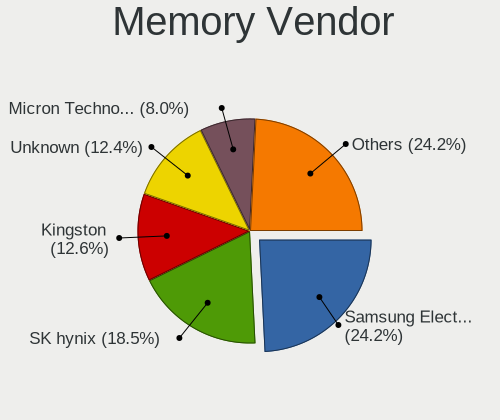

| Vendor              | Computers | Percent |
|---------------------|-----------|---------|
| Samsung Electronics | 239       | 24.02%  |
| SK hynix            | 184       | 18.49%  |
| Unknown             | 129       | 12.96%  |
| Kingston            | 129       | 12.96%  |
| Micron Technology   | 81        | 8.14%   |
| G.Skill             | 51        | 5.13%   |
| Crucial             | 36        | 3.62%   |
| Corsair             | 33        | 3.32%   |
| Ramaxel Technology  | 16        | 1.61%   |
| Team                | 13        | 1.31%   |
| A-DATA Technology   | 13        | 1.31%   |
| Unknown             | 13        | 1.31%   |
| Elpida              | 12        | 1.21%   |
| Nanya Technology    | 7         | 0.7%    |
| Unknown (ABCD)      | 5         | 0.5%    |
| Transcend           | 4         | 0.4%    |
| GOODRAM             | 4         | 0.4%    |
| Lexar               | 3         | 0.3%    |
| Silicon Power       | 2         | 0.2%    |
| ASint Technology    | 2         | 0.2%    |
| Apacer              | 2         | 0.2%    |
| Unigen              | 1         | 0.1%    |
| Unifosa             | 1         | 0.1%    |
| Toshiba             | 1         | 0.1%    |
| Teikon              | 1         | 0.1%    |
| Smart               | 1         | 0.1%    |
| PUSKILL             | 1         | 0.1%    |
| Patriot             | 1         | 0.1%    |
| Netlist             | 1         | 0.1%    |
| Kllisre             | 1         | 0.1%    |
| Kimtigo             | 1         | 0.1%    |
| Infineon            | 1         | 0.1%    |
| Hewlett-Packard     | 1         | 0.1%    |
| Goldkey             | 1         | 0.1%    |
| Essencore Limited   | 1         | 0.1%    |
| CSX                 | 1         | 0.1%    |
| Atermiter           | 1         | 0.1%    |
| 48spaces            | 1         | 0.1%    |

Memory Model
------------

Memory module models

| Model                                                        | Computers | Percent |
|--------------------------------------------------------------|-----------|---------|
| Unknown RAM Module 2GB SODIMM DDR2                           | 25        | 2.35%   |
| SK hynix RAM HMA81GS6AFR8N-UH 8GB SODIMM DDR4 2667MT/s       | 17        | 1.6%    |
| Samsung RAM M471A5244CB0-CWE 4GB Row Of Chips DDR4 3200MT/s  | 16        | 1.5%    |
| Unknown                                                      | 13        | 1.22%   |
| Samsung RAM M471A2K43CB1-CTD 16GB SODIMM DDR4 8400MT/s       | 11        | 1.03%   |
| Samsung RAM M471A1K43CB1-CRC 8GB SODIMM DDR4 2667MT/s        | 9         | 0.85%   |
| SK hynix RAM HMAA1GS6CJR6N-XN 8GB SODIMM DDR4 3200MT/s       | 8         | 0.75%   |
| Samsung RAM M471B5173DB0-YK0 4GB SODIMM DDR3 1600MT/s        | 8         | 0.75%   |
| Samsung RAM M471A5244CB0-CTD 4GB SODIMM DDR4 3266MT/s        | 8         | 0.75%   |
| Samsung RAM M471B1G73QH0-YK0 8GB SODIMM DDR3 1600MT/s        | 7         | 0.66%   |
| Samsung RAM M471A2K43DB1-CTD 16GB SODIMM DDR4 2667MT/s       | 7         | 0.66%   |
| Samsung RAM M471B5273DH0-CH9 4GB SODIMM DDR3 1334MT/s        | 6         | 0.56%   |
| Samsung RAM M471A5244CB0-CRC 4GB SODIMM DDR4 2667MT/s        | 6         | 0.56%   |
| Samsung RAM M471A1G44AB0-CWE 8192MB SODIMM DDR4 3200MT/s     | 6         | 0.56%   |
| SK hynix RAM HMT351S6CFR8C-PB 4GB SODIMM DDR3 1600MT/s       | 5         | 0.47%   |
| SK hynix RAM HMA851S6AFR6N-UH 4GB SODIMM DDR4 2667MT/s       | 5         | 0.47%   |
| SK hynix RAM HMA851S6AFR6N-UH 4GB SODIMM DDR4 2400MT/s       | 5         | 0.47%   |
| SK hynix RAM HMA82GS6CJR8N-VK 16GB SODIMM DDR4 2667MT/s      | 5         | 0.47%   |
| SK hynix RAM HMA81GS6JJR8N-VK 8GB SODIMM DDR4 2667MT/s       | 5         | 0.47%   |
| Samsung RAM M471B1G73EB0-YK0 8GB SODIMM DDR3 1600MT/s        | 5         | 0.47%   |
| Samsung RAM M471A2K43CB1-CRC 16GB SODIMM DDR4 2667MT/s       | 5         | 0.47%   |
| Samsung RAM M471A1K43DB1-CWE 8GB SODIMM DDR4 3200MT/s        | 5         | 0.47%   |
| Samsung RAM M471A1K43DB1-CTD 8GB SODIMM DDR4 2667MT/s        | 5         | 0.47%   |
| SK hynix RAM HMT451S6CFR6A-PB 4GB SODIMM DDR3 1600MT/s       | 4         | 0.38%   |
| Samsung RAM M471B5273CH0-CK0 4096MB SODIMM DDR3 1600MT/s     | 4         | 0.38%   |
| Samsung RAM M471B5273CH0-CH9 4GB SODIMM DDR3 1334MT/s        | 4         | 0.38%   |
| Samsung RAM M471B5173EB0-YK0 4GB SODIMM DDR3 1600MT/s        | 4         | 0.38%   |
| Samsung RAM M471A2K43DB1-CWE 16GB SODIMM DDR4 3200MT/s       | 4         | 0.38%   |
| Samsung RAM M471A1G44BB0-CWE 8GB SODIMM DDR4 3200MT/s        | 4         | 0.38%   |
| Samsung RAM K4EBE304EB-EGCG 8GB Row Of Chips LPDDR3 2133MT/s | 4         | 0.38%   |
| Micron RAM 8ATF1G64HZ-2G6E1 8GB SODIMM DDR4 2667MT/s         | 4         | 0.38%   |
| Micron RAM 8ATF1G64HZ-2G3B1 8GB SODIMM DDR4 2400MT/s         | 4         | 0.38%   |
| Micron RAM 4ATF51264HZ-2G6E1 4GB SODIMM DDR4 2667MT/s        | 4         | 0.38%   |
| Micron RAM 4ATF1G64HZ-3G2E1 8GB SODIMM DDR4 3200MT/s         | 4         | 0.38%   |
| Kingston RAM KHX2666C15S4/16G 16GB SODIMM DDR4 2667MT/s      | 4         | 0.38%   |
| Kingston RAM 99U5471-012.A00LF 4GB DIMM DDR3 1600MT/s        | 4         | 0.38%   |
| Corsair RAM CMK16GX4M2B3200C16 8GB DIMM DDR4 3600MT/s        | 4         | 0.38%   |
| Unknown RAM Module 4GB DIMM 1333MT/s                         | 3         | 0.28%   |
| Unknown RAM Module 2GB SODIMM DDR2 667MT/s                   | 3         | 0.28%   |
| Unknown RAM Module 2GB DIMM DDR3 1333MT/s                    | 3         | 0.28%   |

Memory Kind
-----------

Memory module kinds

| Kind    | Computers | Percent |
|---------|-----------|---------|
| DDR4    | 398       | 45.8%   |
| DDR3    | 253       | 29.11%  |
| DDR2    | 79        | 9.09%   |
| LPDDR4  | 28        | 3.22%   |
| Unknown | 24        | 2.76%   |
| SDRAM   | 23        | 2.65%   |
| LPDDR3  | 22        | 2.53%   |
| LPDDR5  | 17        | 1.96%   |
| DDR5    | 16        | 1.84%   |
| DDR     | 9         | 1.04%   |

Memory Form Factor
------------------

Physical design of the memory module

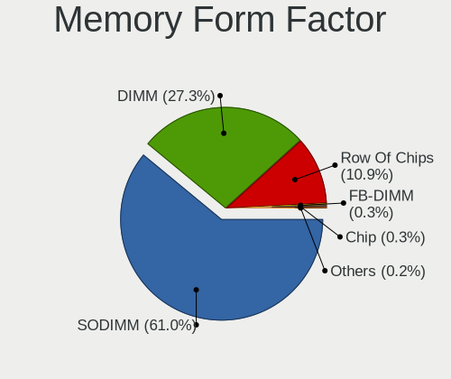

| Name         | Computers | Percent |
|--------------|-----------|---------|
| SODIMM       | 527       | 60.78%  |
| DIMM         | 245       | 28.26%  |
| Row Of Chips | 88        | 10.15%  |
| Chip         | 3         | 0.35%   |
| FB-DIMM      | 2         | 0.23%   |
| Unknown      | 2         | 0.23%   |

Memory Size
-----------

Memory module size

| Size    | Computers | Percent |
|---------|-----------|---------|
| 8192    | 331       | 35.18%  |
| 4096    | 246       | 26.14%  |
| 2048    | 143       | 15.2%   |
| 16384   | 141       | 14.98%  |
| 32768   | 36        | 3.83%   |
| 1024    | 34        | 3.61%   |
| 512     | 6         | 0.64%   |
| 12288   | 1         | 0.11%   |
| 3072    | 1         | 0.11%   |
| 256     | 1         | 0.11%   |
| Unknown | 1         | 0.11%   |

Memory Speed
------------

Memory module speed

| Speed   | Computers | Percent |
|---------|-----------|---------|
| 1600    | 162       | 17.31%  |
| 2667    | 153       | 16.35%  |
| 3200    | 144       | 15.38%  |
| Unknown | 59        | 6.3%    |
| 2400    | 51        | 5.45%   |
| 1333    | 51        | 5.45%   |
| 2133    | 40        | 4.27%   |
| 667     | 29        | 3.1%    |
| 1334    | 23        | 2.46%   |
| 6400    | 17        | 1.82%   |
| 3600    | 17        | 1.82%   |
| 1067    | 14        | 1.5%    |
| 4267    | 13        | 1.39%   |
| 1867    | 13        | 1.39%   |
| 800     | 13        | 1.39%   |
| 8400    | 12        | 1.28%   |
| 4800    | 10        | 1.07%   |
| 3266    | 10        | 1.07%   |
| 3000    | 8         | 0.85%   |
| 1866    | 8         | 0.85%   |
| 533     | 8         | 0.85%   |
| 3733    | 7         | 0.75%   |
| 2666    | 7         | 0.75%   |
| 4199    | 6         | 0.64%   |
| 3800    | 4         | 0.43%   |
| 2048    | 4         | 0.43%   |
| 1800    | 4         | 0.43%   |
| 1066    | 4         | 0.43%   |
| 400     | 4         | 0.43%   |
| 6000    | 3         | 0.32%   |
| 4000    | 3         | 0.32%   |
| 3400    | 3         | 0.32%   |
| 2933    | 3         | 0.32%   |
| 975     | 3         | 0.32%   |
| 4266    | 2         | 0.21%   |
| 3866    | 2         | 0.21%   |
| 3534    | 2         | 0.21%   |
| 2733    | 2         | 0.21%   |
| 2000    | 2         | 0.21%   |
| 43889   | 1         | 0.11%   |

Printers & scanners
-------------------

Printer Vendor
--------------

Printer device vendors

| Vendor                 | Computers | Percent |
|------------------------|-----------|---------|
| Hewlett-Packard        | 23        | 60.53%  |
| Seiko Epson            | 5         | 13.16%  |
| Canon                  | 3         | 7.89%   |
| Brother Industries     | 2         | 5.26%   |
| Xerox                  | 1         | 2.63%   |
| STMicroelectronics     | 1         | 2.63%   |
| Samsung Electronics    | 1         | 2.63%   |
| Panasonic (Matsushita) | 1         | 2.63%   |
| Lexmark International  | 1         | 2.63%   |

Printer Model
-------------

Printer device models

| Model                                                                 | Computers | Percent |
|-----------------------------------------------------------------------|-----------|---------|
| HP Deskjet 1050 J410                                                  | 5         | 12.5%   |
| HP DeskJet F2492 All-in-One                                           | 2         | 5%      |
| Xerox Phaser 6000B                                                    | 1         | 2.5%    |
| STMicroelectronics LED badge -- mini LED display -- 11x44             | 1         | 2.5%    |
| Seiko Epson XP-225 Series                                             | 1         | 2.5%    |
| Seiko Epson XP-2200 Series                                            | 1         | 2.5%    |
| Seiko Epson ME OFFICE 620F Series/Stylus Office BX305F/BX305FW/TX320F | 1         | 2.5%    |
| Seiko Epson ME 320/330 Series [Stylus SX125]                          | 1         | 2.5%    |
| Seiko Epson AcuLaser C1700                                            | 1         | 2.5%    |
| Samsung ML-1640 Series Laser Printer                                  | 1         | 2.5%    |
| Panasonic (Matsushita) KX-FLB851SP                                    | 1         | 2.5%    |
| Lexmark International E120(n)                                         | 1         | 2.5%    |
| HP OfficeJet 5200 series                                              | 1         | 2.5%    |
| HP Officejet 4620 series                                              | 1         | 2.5%    |
| HP Officejet 4500 G510g-m                                             | 1         | 2.5%    |
| HP OfficeJet 3830 series                                              | 1         | 2.5%    |
| HP LaserJet Professional P1102w                                       | 1         | 2.5%    |
| HP HP LaserJet M14-M17                                                | 1         | 2.5%    |
| HP ENVY 6000 series                                                   | 1         | 2.5%    |
| HP ENVY 4520 series                                                   | 1         | 2.5%    |
| HP DeskJet F4100 Printer series                                       | 1         | 2.5%    |
| HP DeskJet F300 series                                                | 1         | 2.5%    |
| HP DeskJet 930c                                                       | 1         | 2.5%    |
| HP DeskJet 4100 series                                                | 1         | 2.5%    |
| HP DeskJet 3630 series                                                | 1         | 2.5%    |
| HP Deskjet 3050A                                                      | 1         | 2.5%    |
| HP Deskjet 3050 J610 series                                           | 1         | 2.5%    |
| HP DeskJet 2700 series                                                | 1         | 2.5%    |
| HP DeskJet 2130 series                                                | 1         | 2.5%    |
| Canon TS6300 series                                                   | 1         | 2.5%    |
| Canon PIXMA TS6250                                                    | 1         | 2.5%    |
| Canon PIXMA MG2900 Series                                             | 1         | 2.5%    |
| Canon LBP6200                                                         | 1         | 2.5%    |
| Brother DCP-L3550CDW                                                  | 1         | 2.5%    |
| Brother DCP-1610W                                                     | 1         | 2.5%    |

Scanner Vendor
--------------

Scanner device vendors

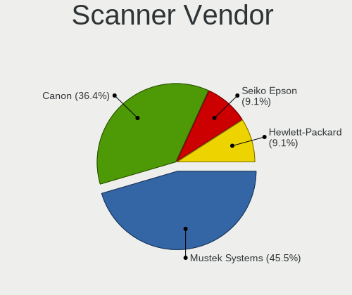

| Vendor          | Computers | Percent |
|-----------------|-----------|---------|
| Mustek Systems  | 5         | 45.45%  |
| Canon           | 4         | 36.36%  |
| Seiko Epson     | 1         | 9.09%   |
| Hewlett-Packard | 1         | 9.09%   |

Scanner Model
-------------

Scanner device models

| Model                                 | Computers | Percent |
|---------------------------------------|-----------|---------|
| Mustek Systems ScanExpress 1200 UB    | 3         | 27.27%  |
| Mustek Systems BearPaw 2448 CU Pro    | 2         | 18.18%  |
| Canon CanoScan 4400F                  | 2         | 18.18%  |
| Seiko Epson GT-X770 [Perfection V500] | 1         | 9.09%   |
| HP ScanJet 5300c/5370c                | 1         | 9.09%   |
| Canon CanoScan N670U/N676U/LiDE 20    | 1         | 9.09%   |
| Canon CanoScan LiDE 110               | 1         | 9.09%   |

Camera
------

Camera Vendor
-------------

Camera device vendors

| Vendor                                 | Computers | Percent |
|----------------------------------------|-----------|---------|
| Chicony Electronics                    | 280       | 23.01%  |
| IMC Networks                           | 143       | 11.75%  |
| Realtek Semiconductor                  | 83        | 6.82%   |
| Quanta                                 | 57        | 4.68%   |
| Suyin                                  | 56        | 4.6%    |
| Microdia                               | 55        | 4.52%   |
| Bison Electronics                      | 53        | 4.35%   |
| Sunplus Innovation Technology          | 45        | 3.7%    |
| Logitech                               | 41        | 3.37%   |
| Cheng Uei Precision Industry (Foxlink) | 41        | 3.37%   |
| Ricoh                                  | 36        | 2.96%   |
| Syntek                                 | 34        | 2.79%   |
| Lite-On Technology                     | 34        | 2.79%   |
| Apple                                  | 33        | 2.71%   |
| Acer                                   | 31        | 2.55%   |
| Luxvisions Innotech Limited            | 22        | 1.81%   |
| Microsoft                              | 17        | 1.4%    |
| Silicon Motion                         | 16        | 1.31%   |
| Creative Technology                    | 13        | 1.07%   |
| Hewlett-Packard                        | 11        | 0.9%    |
| Alcor Micro                            | 11        | 0.9%    |
| Z-Star Microelectronics                | 8         | 0.66%   |
| Sonix Technology                       | 8         | 0.66%   |
| Lenovo                                 | 8         | 0.66%   |
| Importek                               | 8         | 0.66%   |
| Generalplus Technology                 | 8         | 0.66%   |
| Samsung Electronics                    | 7         | 0.58%   |
| WaveRider Communications               | 5         | 0.41%   |
| SunplusIT                              | 5         | 0.41%   |
| Cubeternet                             | 4         | 0.33%   |
| Aveo Technology                        | 4         | 0.33%   |
| MacroSilicon                           | 3         | 0.25%   |
| ALi                                    | 3         | 0.25%   |
| Y Media                                | 2         | 0.16%   |
| Trust                                  | 2         | 0.16%   |
| Primax Electronics                     | 2         | 0.16%   |
| Philips (or NXP)                       | 2         | 0.16%   |
| Jieli Technology                       | 2         | 0.16%   |
| icSpring                               | 2         | 0.16%   |
| DigiTech                               | 2         | 0.16%   |

Camera Model
------------

Camera device models

| Model                                               | Computers | Percent |
|-----------------------------------------------------|-----------|---------|
| IMC Networks USB2.0 HD UVC WebCam                   | 40        | 3.27%   |
| Chicony Integrated Camera                           | 39        | 3.19%   |
| IMC Networks Integrated Camera                      | 28        | 2.29%   |
| Chicony HD WebCam                                   | 24        | 1.96%   |
| Ricoh Visual Communication Camera VGP-VCC8 [R5U870] | 23        | 1.88%   |
| IMC Networks USB2.0 VGA UVC WebCam                  | 21        | 1.72%   |
| Realtek USB Camera                                  | 19        | 1.55%   |
| Microdia Integrated_Webcam_HD                       | 19        | 1.55%   |
| Chicony USB2.0 VGA UVC WebCam                       | 18        | 1.47%   |
| Realtek EasyCamera                                  | 14        | 1.14%   |
| Bison Integrated Camera                             | 14        | 1.14%   |
| Syntek Integrated Camera                            | 13        | 1.06%   |
| Chicony CNF9055 Toshiba Webcam                      | 13        | 1.06%   |
| Suyin Acer/HP Integrated Webcam [CN0314]            | 12        | 0.98%   |
| Quanta HP Wide Vision HD Camera                     | 12        | 0.98%   |
| Luxvisions Innotech Limited HP TrueVision HD Camera | 12        | 0.98%   |
| Logitech Webcam C270                                | 12        | 0.98%   |
| Lite-On Integrated Camera                           | 12        | 0.98%   |
| Chicony TOSHIBA Web Camera - HD                     | 12        | 0.98%   |
| Acer Integrated Camera                              | 12        | 0.98%   |
| Realtek Integrated_Webcam_HD                        | 11        | 0.9%    |
| Chicony USB 2.0 Camera                              | 11        | 0.9%    |
| Chicony HP Truevision HD                            | 11        | 0.9%    |
| Apple Built-in iSight                               | 11        | 0.9%    |
| Microsoft LifeCam HD-3000                           | 10        | 0.82%   |
| IMC Networks HD Camera                              | 10        | 0.82%   |
| Bison HD Webcam                                     | 10        | 0.82%   |
| Quanta HP TrueVision HD Camera                      | 9         | 0.74%   |
| Suyin USB 2.0 Camera                                | 8         | 0.65%   |
| Realtek HD WebCam                                   | 8         | 0.65%   |
| Microdia Sonix USB 2.0 Camera                       | 8         | 0.65%   |
| Chicony VGA Webcam                                  | 8         | 0.65%   |
| Chicony HP HD Camera                                | 8         | 0.65%   |
| Apple iPhone 5/5C/5S/6/SE/7/8/X                     | 8         | 0.65%   |
| Sunplus HD WebCam                                   | 7         | 0.57%   |
| Samsung Galaxy series, misc. (MTP mode)             | 7         | 0.57%   |
| Quanta HP HD Camera                                 | 7         | 0.57%   |
| IMC Networks ov9734_azurewave_camera                | 7         | 0.57%   |
| HP Webcam HD 2300                                   | 7         | 0.57%   |
| Chicony USB2.0 HD UVC WebCam                        | 7         | 0.57%   |

Security
--------

Fingerprint Vendor
------------------

Fingerprint sensor vendors

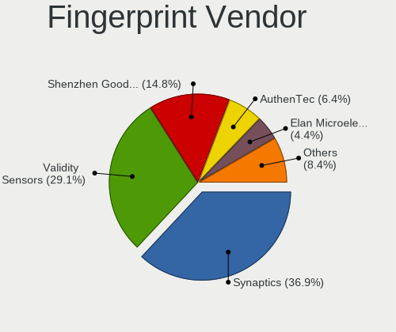

| Vendor                             | Computers | Percent |
|------------------------------------|-----------|---------|
| Synaptics                          | 64        | 35.36%  |
| Validity Sensors                   | 53        | 29.28%  |
| Shenzhen Goodix Technology         | 27        | 14.92%  |
| AuthenTec                          | 12        | 6.63%   |
| Elan Microelectronics              | 9         | 4.97%   |
| Upek                               | 6         | 3.31%   |
| LighTuning Technology              | 5         | 2.76%   |
| STMicroelectronics                 | 3         | 1.66%   |
| Realtek USB2.0 Finger Print Bridge | 2         | 1.1%    |

Fingerprint Model
-----------------

Fingerprint sensor models

| Model                                                                      | Computers | Percent |
|----------------------------------------------------------------------------|-----------|---------|
| Shenzhen Goodix  Fingerprint Device                                        | 19        | 10.5%   |
| Synaptics Prometheus MIS Touch Fingerprint Reader                          | 12        | 6.63%   |
| Validity Sensors VFS 5011 fingerprint sensor                               | 8         | 4.42%   |
| Synaptics Metallica MIS Touch Fingerprint Reader                           | 8         | 4.42%   |
| Validity Sensors VFS495 Fingerprint Reader                                 | 6         | 3.31%   |
| Synaptics WBDI Fingerprint Reader USB 086                                  | 6         | 3.31%   |
| Validity Sensors VFS301 Fingerprint Reader                                 | 5         | 2.76%   |
| Validity Sensors Synaptics WBDI                                            | 5         | 2.76%   |
| Validity Sensors Swipe Fingerprint Sensor                                  | 5         | 2.76%   |
| Upek Biometric Touchchip/Touchstrip Fingerprint Sensor                     | 5         | 2.76%   |
| Synaptics UWP WBDI Device                                                  | 5         | 2.76%   |
| Synaptics Metallica MOH Touch Fingerprint Reader                           | 5         | 2.76%   |
| Synaptics Fingerprint reader [HP G6]                                       | 5         | 2.76%   |
| Shenzhen Goodix Fingerprint Reader                                         | 5         | 2.76%   |
| Elan ELAN:ARM-M4                                                           | 5         | 2.76%   |
| AuthenTec AES1600                                                          | 5         | 2.76%   |
| Validity Sensors VFS101 Fingerprint Reader                                 | 4         | 2.21%   |
| Validity Sensors Synaptics VFS7552 Touch Fingerprint Sensor with PurePrint | 4         | 2.21%   |
| Validity Sensors Fingerprint scanner                                       | 4         | 2.21%   |
| Synaptics UWP WBDI                                                         | 4         | 2.21%   |
| Synaptics  FS7604 Touch Fingerprint Sensor with PurePrint                  | 4         | 2.21%   |
| Synaptics FS7604 Touch Fingerprint Sensor with PurePrint                   | 4         | 2.21%   |
| Elan ELAN:Fingerprint                                                      | 4         | 2.21%   |
| AuthenTec AES2810                                                          | 4         | 2.21%   |
| Validity Sensors VFS7500 Touch Fingerprint Sensor                          | 3         | 1.66%   |
| Validity Sensors VFS491                                                    | 3         | 1.66%   |
| Synaptics WBDI Device                                                      | 3         | 1.66%   |
| Synaptics WBDI                                                             | 3         | 1.66%   |
| STMicroelectronics Fingerprint Reader                                      | 3         | 1.66%   |
| Shenzhen Goodix FingerPrint                                                | 3         | 1.66%   |
| Validity Sensors VFS451 Fingerprint Reader                                 | 2         | 1.1%    |
| Validity Sensors VFS Fingerprint sensor                                    | 2         | 1.1%    |
| Synaptics WBDI Fingerprint Reader USB 102                                  | 2         | 1.1%    |
| Realtek USB2.0 Finger Print Bridge FocalTech Fingerprint Device            | 2         | 1.1%    |
| LighTuning Fingerprint Reader                                              | 2         | 1.1%    |
| LighTuning ES603 Swipe Fingerprint Sensor                                  | 2         | 1.1%    |
| AuthenTec Fingerprint Sensor                                               | 2         | 1.1%    |
| Validity Sensors VFS5011 Fingerprint Reader                                | 1         | 0.55%   |
| Validity Sensors VFS471 Fingerprint Reader                                 | 1         | 0.55%   |
| Upek TCS5B Fingerprint sensor                                              | 1         | 0.55%   |

Chipcard Vendor
---------------

Chipcard module vendors

| Vendor                | Computers | Percent |
|-----------------------|-----------|---------|
| Alcor Micro           | 31        | 31.96%  |
| Broadcom              | 26        | 26.8%   |
| Gemalto (was Gemplus) | 10        | 10.31%  |
| O2 Micro              | 6         | 6.19%   |
| Realtek Semiconductor | 4         | 4.12%   |
| Bit4id                | 4         | 4.12%   |
| Upek                  | 3         | 3.09%   |
| Lenovo                | 3         | 3.09%   |
| SCM Microsystems      | 2         | 2.06%   |
| Chicony Electronics   | 2         | 2.06%   |
| Advanced Card Systems | 2         | 2.06%   |
| Yubico.com            | 1         | 1.03%   |
| Hewlett-Packard       | 1         | 1.03%   |
| Feitian Technologies  | 1         | 1.03%   |
| CHERRY                | 1         | 1.03%   |

Chipcard Model
--------------

Chipcard module models

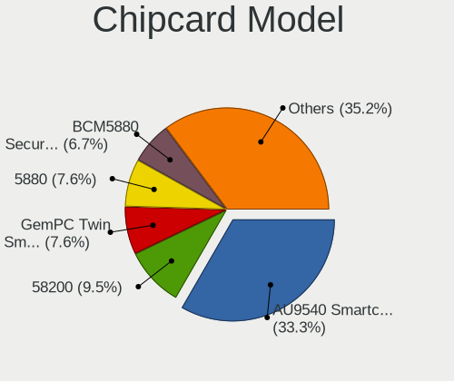

| Model                                                                        | Computers | Percent |
|------------------------------------------------------------------------------|-----------|---------|
| Alcor Micro AU9540 Smartcard Reader                                          | 30        | 30.93%  |
| Broadcom 58200                                                               | 9         | 9.28%   |
| Gemalto (was Gemplus) GemPC Twin SmartCard Reader                            | 8         | 8.25%   |
| Broadcom BCM5880 Secure Applications Processor                               | 7         | 7.22%   |
| Broadcom 5880                                                                | 7         | 7.22%   |
| O2 Micro OZ776 CCID Smartcard Reader                                         | 5         | 5.15%   |
| Realtek Semiconductor Smart Card Reader Interface                            | 4         | 4.12%   |
| Bit4id miniLector EVO                                                        | 4         | 4.12%   |
| Upek TouchChip Fingerprint Coprocessor (WBF advanced mode)                   | 3         | 3.09%   |
| Lenovo Integrated Smart Card Reader                                          | 3         | 3.09%   |
| Broadcom BCM5880 Secure Applications Processor with fingerprint swipe sensor | 3         | 3.09%   |
| SCM Microsystems SCR3340 - ExpressCard54 Smart Card Reader                   | 2         | 2.06%   |
| Gemalto (was Gemplus) Compact Smart Card Reader Writer                       | 2         | 2.06%   |
| Chicony Electronics HP Skylab USB Smartcard Keyboard                         | 2         | 2.06%   |
| Advanced Card Systems ACR38 SmartCard Reader                                 | 2         | 2.06%   |
| Yubico.com Yubikey 4/5 U2F+CCID                                              | 1         | 1.03%   |
| O2 Micro Oz776 SmartCard Reader                                              | 1         | 1.03%   |
| Hewlett-Packard SC Keyboard - Apollo (Liteon)                                | 1         | 1.03%   |
| Feitian Technologies FIDO CCID KB                                            | 1         | 1.03%   |
| CHERRY SmartCard Reader Keyboard KC 1000 SC                                  | 1         | 1.03%   |
| Alcor Micro Watchdata W 1981                                                 | 1         | 1.03%   |

Unsupported
-----------

Unsupported Devices
-------------------

Total unsupported devices on board

| Total | Computers | Percent |
|-------|-----------|---------|
| 0     | 1301      | 69.76%  |
| 1     | 442       | 23.7%   |
| 2     | 95        | 5.09%   |
| 3     | 20        | 1.07%   |
| 4     | 5         | 0.27%   |
| 5     | 2         | 0.11%   |

Unsupported Device Types
------------------------

Types of unsupported devices

| Type                     | Computers | Percent |
|--------------------------|-----------|---------|
| Graphics card            | 192       | 28.07%  |
| Fingerprint reader       | 179       | 26.17%  |
| Net/wireless             | 76        | 11.11%  |
| Chipcard                 | 74        | 10.82%  |
| Multimedia controller    | 60        | 8.77%   |
| Camera                   | 23        | 3.36%   |
| Bluetooth                | 21        | 3.07%   |
| Card reader              | 13        | 1.9%    |
| Communication controller | 11        | 1.61%   |
| Storage                  | 7         | 1.02%   |
| Network                  | 5         | 0.73%   |
| Modem                    | 5         | 0.73%   |
| Net/ethernet             | 4         | 0.58%   |
| Flash memory             | 4         | 0.58%   |
| Sound                    | 3         | 0.44%   |
| Dvb card                 | 3         | 0.44%   |
| Unassigned class         | 2         | 0.29%   |
| Storage/raid             | 1         | 0.15%   |
| Storage/ata              | 1         | 0.15%   |

