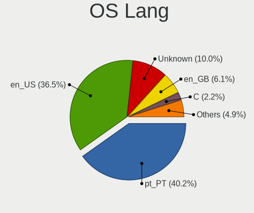
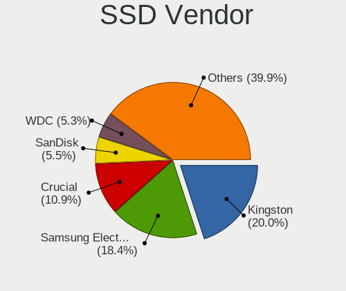
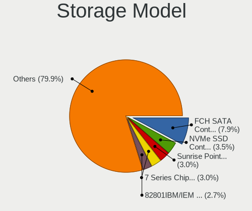
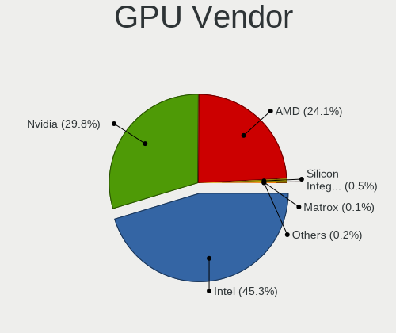
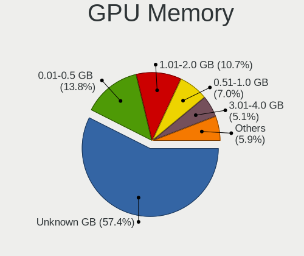
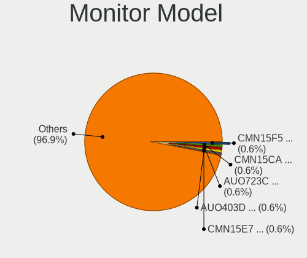
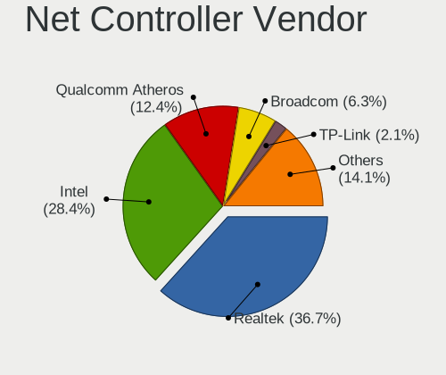
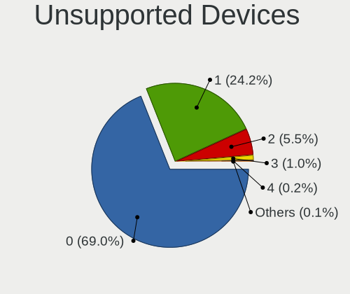

Linux in Portugal - Tested Hardware & Statistics
------------------------------------------------

A project to collect tested hardware configurations for Linux in Portugal.

Anyone can contribute to this report by the [hw-probe](https://github.com/linuxhw/hw-probe) tool:

    sudo -E hw-probe -all -upload

Please contribute! Especially if your hardware is rare.

This is a report for all computer types. See also reports for [desktops](/Location/Portugal/Desktop/README.md) and [notebooks](/Location/Portugal/Notebook/README.md).

Contents
--------

* [ Test Cases ](#test-cases)

* [ System ](#system)
  - [ OS                       ](#os)
  - [ OS Family                ](#os-family)
  - [ Kernel                   ](#kernel)
  - [ Kernel Family            ](#kernel-family)
  - [ Kernel Major Ver.        ](#kernel-major-ver)
  - [ Arch                     ](#arch)
  - [ DE                       ](#de)
  - [ Display Server           ](#display-server)
  - [ Display Manager          ](#display-manager)
  - [ OS Lang                  ](#os-lang)
  - [ Boot Mode                ](#boot-mode)
  - [ Filesystem               ](#filesystem)
  - [ Part. scheme             ](#part-scheme)
  - [ Dual Boot with Linux/BSD ](#dual-boot-with-linuxbsd)
  - [ Dual Boot (Win)          ](#dual-boot-win)

* [ Board ](#board)
  - [ Vendor                   ](#vendor)
  - [ Model                    ](#model)
  - [ Model Family             ](#model-family)
  - [ MFG Year                 ](#mfg-year)
  - [ Form Factor              ](#form-factor)
  - [ Secure Boot              ](#secure-boot)
  - [ Coreboot                 ](#coreboot)
  - [ RAM Size                 ](#ram-size)
  - [ RAM Used                 ](#ram-used)
  - [ Total Drives             ](#total-drives)
  - [ Has CD-ROM               ](#has-cd-rom)
  - [ Has Ethernet             ](#has-ethernet)
  - [ Has WiFi                 ](#has-wifi)
  - [ Has Bluetooth            ](#has-bluetooth)

* [ Location ](#location)
  - [ Country                  ](#country)
  - [ City                     ](#city)

* [ Drives ](#drives)
  - [ Drive Vendor             ](#drive-vendor)
  - [ Drive Model              ](#drive-model)
  - [ HDD Vendor               ](#hdd-vendor)
  - [ SSD Vendor               ](#ssd-vendor)
  - [ Drive Kind               ](#drive-kind)
  - [ Drive Connector          ](#drive-connector)
  - [ Drive Size               ](#drive-size)
  - [ Space Total              ](#space-total)
  - [ Space Used               ](#space-used)
  - [ Malfunc. Drives          ](#malfunc-drives)
  - [ Malfunc. Drive Vendor    ](#malfunc-drive-vendor)
  - [ Malfunc. HDD Vendor      ](#malfunc-hdd-vendor)
  - [ Malfunc. Drive Kind      ](#malfunc-drive-kind)
  - [ Failed Drives            ](#failed-drives)
  - [ Failed Drive Vendor      ](#failed-drive-vendor)
  - [ Drive Status             ](#drive-status)

* [ Storage controller ](#storage-controller)
  - [ Storage Vendor           ](#storage-vendor)
  - [ Storage Model            ](#storage-model)
  - [ Storage Kind             ](#storage-kind)

* [ Processor ](#processor)
  - [ CPU Vendor               ](#cpu-vendor)
  - [ CPU Model                ](#cpu-model)
  - [ CPU Model Family         ](#cpu-model-family)
  - [ CPU Cores                ](#cpu-cores)
  - [ CPU Sockets              ](#cpu-sockets)
  - [ CPU Threads              ](#cpu-threads)
  - [ CPU Op-Modes             ](#cpu-op-modes)
  - [ CPU Microcode            ](#cpu-microcode)
  - [ CPU Microarch            ](#cpu-microarch)

* [ Graphics ](#graphics)
  - [ GPU Vendor               ](#gpu-vendor)
  - [ GPU Model                ](#gpu-model)
  - [ GPU Combo                ](#gpu-combo)
  - [ GPU Driver               ](#gpu-driver)
  - [ GPU Memory               ](#gpu-memory)

* [ Monitor ](#monitor)
  - [ Monitor Vendor           ](#monitor-vendor)
  - [ Monitor Model            ](#monitor-model)
  - [ Monitor Resolution       ](#monitor-resolution)
  - [ Monitor Diagonal         ](#monitor-diagonal)
  - [ Monitor Width            ](#monitor-width)
  - [ Aspect Ratio             ](#aspect-ratio)
  - [ Monitor Area             ](#monitor-area)
  - [ Pixel Density            ](#pixel-density)
  - [ Multiple Monitors        ](#multiple-monitors)

* [ Network ](#network)
  - [ Net Controller Vendor    ](#net-controller-vendor)
  - [ Net Controller Model     ](#net-controller-model)
  - [ Wireless Vendor          ](#wireless-vendor)
  - [ Wireless Model           ](#wireless-model)
  - [ Ethernet Vendor          ](#ethernet-vendor)
  - [ Ethernet Model           ](#ethernet-model)
  - [ Net Controller Kind      ](#net-controller-kind)
  - [ Used Controller          ](#used-controller)
  - [ NICs                     ](#nics)
  - [ IPv6                     ](#ipv6)

* [ Bluetooth ](#bluetooth)
  - [ Bluetooth Vendor         ](#bluetooth-vendor)
  - [ Bluetooth Model          ](#bluetooth-model)

* [ Sound ](#sound)
  - [ Sound Vendor             ](#sound-vendor)
  - [ Sound Model              ](#sound-model)

* [ Memory ](#memory)
  - [ Memory Vendor            ](#memory-vendor)
  - [ Memory Model             ](#memory-model)
  - [ Memory Kind              ](#memory-kind)
  - [ Memory Form Factor       ](#memory-form-factor)
  - [ Memory Size              ](#memory-size)
  - [ Memory Speed             ](#memory-speed)

* [ Printers & scanners ](#printers--scanners)
  - [ Printer Vendor           ](#printer-vendor)
  - [ Printer Model            ](#printer-model)
  - [ Scanner Vendor           ](#scanner-vendor)
  - [ Scanner Model            ](#scanner-model)

* [ Camera ](#camera)
  - [ Camera Vendor            ](#camera-vendor)
  - [ Camera Model             ](#camera-model)

* [ Security ](#security)
  - [ Fingerprint Vendor       ](#fingerprint-vendor)
  - [ Fingerprint Model        ](#fingerprint-model)
  - [ Chipcard Vendor          ](#chipcard-vendor)
  - [ Chipcard Model           ](#chipcard-model)

* [ Unsupported ](#unsupported)
  - [ Unsupported Devices      ](#unsupported-devices)
  - [ Unsupported Device Types ](#unsupported-device-types)

Test Cases
----------

Total: 3134

| Vendor        | Model                       | Form-Factor | Probe                                                      | Date         |
|---------------|-----------------------------|-------------|------------------------------------------------------------|--------------|
| MSI           | MPG Z590 GAMING PLUS        | Desktop     | [dbc98c4f9d](https://linux-hardware.org/?probe=dbc98c4f9d) | Jan 06, 2025 |
| MSI           | MPG Z590 GAMING PLUS        | Desktop     | [ad5192d23c](https://linux-hardware.org/?probe=ad5192d23c) | Jan 06, 2025 |
| Lenovo        | ThinkPad E16 Gen 2 21M5C... | Notebook    | [fe15c1092e](https://linux-hardware.org/?probe=fe15c1092e) | Jan 05, 2025 |
| Apple         | MacBookPro12,1              | Notebook    | [0699689325](https://linux-hardware.org/?probe=0699689325) | Jan 05, 2025 |
| Intel         | H61 V1.6B                   | Desktop     | [eb28b5f6be](https://linux-hardware.org/?probe=eb28b5f6be) | Jan 04, 2025 |
| ASUSTek       | VivoBook_ASUSLaptop TP47... | Convertible | [0ec4580ad5](https://linux-hardware.org/?probe=0ec4580ad5) | Jan 04, 2025 |
| Intel         | H61 V1.6B                   | Desktop     | [699b915313](https://linux-hardware.org/?probe=699b915313) | Jan 03, 2025 |
| MSI           | MPG Z390 GAMING EDGE AC     | Desktop     | [08ef8b7453](https://linux-hardware.org/?probe=08ef8b7453) | Jan 01, 2025 |
| MSI           | MPG Z390 GAMING EDGE AC     | Desktop     | [88aa3ff70d](https://linux-hardware.org/?probe=88aa3ff70d) | Jan 01, 2025 |
| Apple         | MacBookAir7,2               | Notebook    | [0b5dbc9283](https://linux-hardware.org/?probe=0b5dbc9283) | Dec 31, 2024 |
| Apple         | MacBookAir7,2               | Notebook    | [531feb4d85](https://linux-hardware.org/?probe=531feb4d85) | Dec 31, 2024 |
| Unknown       | Unknown                     | Soc         | [8d3dea2269](https://linux-hardware.org/?probe=8d3dea2269) | Dec 31, 2024 |
| ASUSTek       | Zenbook UM3402YA_UM3402Y... | Notebook    | [cc9cdf2e68](https://linux-hardware.org/?probe=cc9cdf2e68) | Dec 31, 2024 |
| ASUSTek       | Zenbook UM3402YA_UM3402Y... | Notebook    | [fae705de3f](https://linux-hardware.org/?probe=fae705de3f) | Dec 31, 2024 |
| Acer          | Aspire ES1-572              | Notebook    | [ab8d0c7c3f](https://linux-hardware.org/?probe=ab8d0c7c3f) | Dec 30, 2024 |
| MSI           | B650M GAMING PLUS WIFI      | Desktop     | [7f4ced1296](https://linux-hardware.org/?probe=7f4ced1296) | Dec 30, 2024 |
| HP            | EliteBook 840 G6            | Notebook    | [5c7d77f22a](https://linux-hardware.org/?probe=5c7d77f22a) | Dec 30, 2024 |
| HP            | 1589                        | Desktop     | [dd5a66147d](https://linux-hardware.org/?probe=dd5a66147d) | Dec 28, 2024 |
| Fujitsu Si... | ESPRIMO Mobile V6535        | Notebook    | [5099a4c834](https://linux-hardware.org/?probe=5099a4c834) | Dec 28, 2024 |
| ASRock        | B550 Phantom Gaming-ITX/... | Desktop     | [a3e88e71e3](https://linux-hardware.org/?probe=a3e88e71e3) | Dec 28, 2024 |
| Toshiba       | Satellite A200              | Notebook    | [9a071c6521](https://linux-hardware.org/?probe=9a071c6521) | Dec 27, 2024 |
| Toshiba       | Satellite A200              | Notebook    | [eea353e34a](https://linux-hardware.org/?probe=eea353e34a) | Dec 27, 2024 |
| ASUSTek       | ASUS Zenbook 14 UX3405MA... | Notebook    | [95d37ca286](https://linux-hardware.org/?probe=95d37ca286) | Dec 25, 2024 |
| Gigabyte      | B450M DS3H V2               | Desktop     | [a0bed8cb3f](https://linux-hardware.org/?probe=a0bed8cb3f) | Dec 23, 2024 |
| Lenovo        | ThinkPad L390 20NR001HPG    | Notebook    | [30c7fd95ce](https://linux-hardware.org/?probe=30c7fd95ce) | Dec 22, 2024 |
| Lenovo        | ThinkPad L15 Gen 3 21C30... | Notebook    | [95bcab10c4](https://linux-hardware.org/?probe=95bcab10c4) | Dec 22, 2024 |
| Lenovo        | IdeaPad 3 15ALC6 82KU       | Notebook    | [532c54f7ee](https://linux-hardware.org/?probe=532c54f7ee) | Dec 22, 2024 |
| Dell          | Inspiron 5566               | Notebook    | [35f435cd1f](https://linux-hardware.org/?probe=35f435cd1f) | Dec 18, 2024 |
| Samsung       | 730U3E/740U3E               | Notebook    | [c5e5057be2](https://linux-hardware.org/?probe=c5e5057be2) | Dec 17, 2024 |
| Lenovo        | ThinkPad A485 20MVS08500    | Notebook    | [64a9a91c57](https://linux-hardware.org/?probe=64a9a91c57) | Dec 14, 2024 |
| Dell          | Latitude 7490               | Notebook    | [14889ddf55](https://linux-hardware.org/?probe=14889ddf55) | Dec 12, 2024 |
| HP            | ENVY 15                     | Notebook    | [bf3def9537](https://linux-hardware.org/?probe=bf3def9537) | Dec 12, 2024 |
| HP            | ENVY 15                     | Notebook    | [3f3b8dc457](https://linux-hardware.org/?probe=3f3b8dc457) | Dec 12, 2024 |
| MSI           | MPG Z790 EDGE TI MAX WIF... | Desktop     | [962e3b7c94](https://linux-hardware.org/?probe=962e3b7c94) | Dec 11, 2024 |
| ASUSTek       | TUF Gaming Z590-PLUS        | Desktop     | [4caf21526d](https://linux-hardware.org/?probe=4caf21526d) | Dec 11, 2024 |
| Lenovo        | ThinkPad A485 20MVS08500    | Notebook    | [bf16c326f0](https://linux-hardware.org/?probe=bf16c326f0) | Dec 11, 2024 |
| ASUSTek       | PRIME B660-PLUS D4          | Desktop     | [bea1bb6368](https://linux-hardware.org/?probe=bea1bb6368) | Dec 10, 2024 |
| Lenovo        | IdeaPad Pro 5 14IMH9 83D... | Notebook    | [1482125b7f](https://linux-hardware.org/?probe=1482125b7f) | Dec 10, 2024 |
| MSI           | Katana GF66 11UE            | Notebook    | [b74e19bf4f](https://linux-hardware.org/?probe=b74e19bf4f) | Dec 10, 2024 |
| Lenovo        | IdeaPad Pro 5 14IMH9 83D... | Notebook    | [64809e77e6](https://linux-hardware.org/?probe=64809e77e6) | Dec 10, 2024 |
| Lenovo        | Y520-15IKBN 80WK            | Notebook    | [23c377735b](https://linux-hardware.org/?probe=23c377735b) | Dec 09, 2024 |
| Lenovo        | IdeaPad 100-15IBY 80MJ      | Notebook    | [3119155502](https://linux-hardware.org/?probe=3119155502) | Dec 07, 2024 |
| Lenovo        | IdeaPad 100-15IBY 80MJ      | Notebook    | [4a921c31f8](https://linux-hardware.org/?probe=4a921c31f8) | Dec 07, 2024 |
| Dell          | Latitude 7280               | Notebook    | [8abf259624](https://linux-hardware.org/?probe=8abf259624) | Dec 06, 2024 |
| HUAWEI        | BC11HGSA0 V100R003          | Server      | [ea4033794a](https://linux-hardware.org/?probe=ea4033794a) | Dec 05, 2024 |
| Samsung       | 530U3C/530U4C/532U3C        | Notebook    | [aaecf0d069](https://linux-hardware.org/?probe=aaecf0d069) | Dec 05, 2024 |
| ASUSTek       | EX-A320M-GAMING             | Desktop     | [b74803c3cf](https://linux-hardware.org/?probe=b74803c3cf) | Dec 04, 2024 |
| Gigabyte      | G5 KF5                      | Notebook    | [e80cdb16ef](https://linux-hardware.org/?probe=e80cdb16ef) | Dec 03, 2024 |
| Apple         | MacBookPro8,1               | Notebook    | [424834b527](https://linux-hardware.org/?probe=424834b527) | Dec 01, 2024 |
| Lenovo        | IdeaPad 1 15ALC7 82R4       | Notebook    | [403c3abe32](https://linux-hardware.org/?probe=403c3abe32) | Dec 01, 2024 |
| Microsoft     | Surface Pro                 | Tablet      | [9102694f7e](https://linux-hardware.org/?probe=9102694f7e) | Nov 30, 2024 |
| Lenovo        | IdeaPad 3 15ALC6 82KU       | Notebook    | [7b31095891](https://linux-hardware.org/?probe=7b31095891) | Nov 29, 2024 |
| ASRock        | A520M-HVS                   | Desktop     | [6fc786e56e](https://linux-hardware.org/?probe=6fc786e56e) | Nov 29, 2024 |
| ASUSTek       | TUF Gaming B650M-E WIFI     | Desktop     | [0ea967f5b3](https://linux-hardware.org/?probe=0ea967f5b3) | Nov 29, 2024 |
| Lenovo        | ThinkPad E14 Gen 6 21M7C... | Notebook    | [a4553836b7](https://linux-hardware.org/?probe=a4553836b7) | Nov 28, 2024 |
| Acer          | Aspire E5-521G              | Notebook    | [234e21b8b6](https://linux-hardware.org/?probe=234e21b8b6) | Nov 28, 2024 |
| Samsung       | 730U3E/740U3E               | Notebook    | [d3202d1f51](https://linux-hardware.org/?probe=d3202d1f51) | Nov 27, 2024 |
| ASUSTek       | TUF Gaming B650M-E WIFI     | Desktop     | [a7486ee19d](https://linux-hardware.org/?probe=a7486ee19d) | Nov 26, 2024 |
| HP            | 84FE                        | Desktop     | [e5540a94da](https://linux-hardware.org/?probe=e5540a94da) | Nov 26, 2024 |
| Unknown       | Unknown                     | Notebook    | [2800502e8a](https://linux-hardware.org/?probe=2800502e8a) | Nov 26, 2024 |
| Unknown       | Unknown                     | Notebook    | [e58584102b](https://linux-hardware.org/?probe=e58584102b) | Nov 26, 2024 |
| Acer          | Aspire E5-521G              | Notebook    | [7a5907751e](https://linux-hardware.org/?probe=7a5907751e) | Nov 25, 2024 |
| Packard Be... | Cuba MS-7301                | Desktop     | [010d6ec397](https://linux-hardware.org/?probe=010d6ec397) | Nov 24, 2024 |
| Gigabyte      | X570 AORUS ELITE            | Desktop     | [c4cdb6e0be](https://linux-hardware.org/?probe=c4cdb6e0be) | Nov 24, 2024 |
| Intel         | B75                         | Desktop     | [b8e4743721](https://linux-hardware.org/?probe=b8e4743721) | Nov 24, 2024 |
| Toshiba       | Satellite C660D             | Notebook    | [1a7221b221](https://linux-hardware.org/?probe=1a7221b221) | Nov 22, 2024 |
| TongFang      | GX4HRXL                     | Notebook    | [6783d8fc06](https://linux-hardware.org/?probe=6783d8fc06) | Nov 21, 2024 |
| TongFang      | GX4HRXL                     | Notebook    | [0475501c8c](https://linux-hardware.org/?probe=0475501c8c) | Nov 21, 2024 |
| Lenovo        | LOQ 15APH8 82XT             | Notebook    | [4a80bcfae8](https://linux-hardware.org/?probe=4a80bcfae8) | Nov 20, 2024 |
| MSI           | Prestige 16 AI Studio B1... | Notebook    | [fa335a2999](https://linux-hardware.org/?probe=fa335a2999) | Nov 20, 2024 |
| Lenovo        | LOQ 15APH8 82XT             | Notebook    | [1f4cfc38ad](https://linux-hardware.org/?probe=1f4cfc38ad) | Nov 18, 2024 |
| Chuwi         | CoreBook X                  | Notebook    | [da340df136](https://linux-hardware.org/?probe=da340df136) | Nov 18, 2024 |
| Gigabyte      | Z590 AORUS ELITE AX         | Desktop     | [cc54459990](https://linux-hardware.org/?probe=cc54459990) | Nov 18, 2024 |
| Lenovo        | ThinkPad E14 Gen 4 21E30... | Notebook    | [9f1e8708e9](https://linux-hardware.org/?probe=9f1e8708e9) | Nov 18, 2024 |
| ASUSTek       | PRIME H610M-K D4            | Desktop     | [e9fe16f1ba](https://linux-hardware.org/?probe=e9fe16f1ba) | Nov 18, 2024 |
| ASUSTek       | X550JK                      | Notebook    | [82b0e4d59c](https://linux-hardware.org/?probe=82b0e4d59c) | Nov 17, 2024 |
| ASUSTek       | X550JK                      | Notebook    | [b343c33a78](https://linux-hardware.org/?probe=b343c33a78) | Nov 17, 2024 |
| ASUSTek       | K31CD-K                     | Desktop     | [652f8667be](https://linux-hardware.org/?probe=652f8667be) | Nov 16, 2024 |
| HP            | Laptop 15-bs0xx             | Notebook    | [a708aafedc](https://linux-hardware.org/?probe=a708aafedc) | Nov 16, 2024 |
| Dell          | Latitude E5500              | Notebook    | [872edd1a02](https://linux-hardware.org/?probe=872edd1a02) | Nov 15, 2024 |
| HP            | Pavilion Gaming Laptop 1... | Notebook    | [47389ed4d4](https://linux-hardware.org/?probe=47389ed4d4) | Nov 15, 2024 |
| Acer          | Aspire A515-51G             | Notebook    | [6fe0c808b4](https://linux-hardware.org/?probe=6fe0c808b4) | Nov 15, 2024 |
| Acer          | Aspire A515-51G             | Notebook    | [8aae6438ce](https://linux-hardware.org/?probe=8aae6438ce) | Nov 15, 2024 |
| ASUSTek       | P5E-VM SE                   | Desktop     | [0c40e6c351](https://linux-hardware.org/?probe=0c40e6c351) | Nov 15, 2024 |
| AZW           | EQ                          | Desktop     | [44a13b55be](https://linux-hardware.org/?probe=44a13b55be) | Nov 10, 2024 |
| ASUSTek       | X201EV                      | Notebook    | [841c78f732](https://linux-hardware.org/?probe=841c78f732) | Nov 10, 2024 |
| Acer          | Extensa 5620                | Notebook    | [3ce6a80956](https://linux-hardware.org/?probe=3ce6a80956) | Nov 10, 2024 |
| Acer          | Extensa 5620                | Notebook    | [2aadd1b426](https://linux-hardware.org/?probe=2aadd1b426) | Nov 10, 2024 |
| ASUSTek       | M4A78LT-M                   | Desktop     | [4a59573437](https://linux-hardware.org/?probe=4a59573437) | Nov 10, 2024 |
| Apple         | Mac-8ED6AF5B48C039E1 Mac... | Mini pc     | [459cda93bc](https://linux-hardware.org/?probe=459cda93bc) | Nov 09, 2024 |
| Valve         | Jupiter                     | Notebook    | [709ca74058](https://linux-hardware.org/?probe=709ca74058) | Nov 09, 2024 |
| ASRock        | A520M-HVS                   | Desktop     | [5f9ee0de7f](https://linux-hardware.org/?probe=5f9ee0de7f) | Nov 07, 2024 |
| MSI           | Prestige 16 AI Studio B1... | Notebook    | [f0052fafb7](https://linux-hardware.org/?probe=f0052fafb7) | Nov 07, 2024 |
| ASUSTek       | PRIME H410M-K R2.0          | Desktop     | [69c74a3a74](https://linux-hardware.org/?probe=69c74a3a74) | Nov 05, 2024 |
| ASUSTek       | G75VW                       | Notebook    | [a51b619e09](https://linux-hardware.org/?probe=a51b619e09) | Nov 05, 2024 |
| ASUSTek       | TUF Z370-PLUS GAMING        | Desktop     | [1d99fd9578](https://linux-hardware.org/?probe=1d99fd9578) | Nov 05, 2024 |
| Dell          | XPS 13 9310 2-in-1          | Convertible | [6fc532fafd](https://linux-hardware.org/?probe=6fc532fafd) | Nov 05, 2024 |
| ASUSTek       | TUF Z370-PLUS GAMING        | Desktop     | [bb24ee2ad4](https://linux-hardware.org/?probe=bb24ee2ad4) | Nov 04, 2024 |
| Lenovo        | ThinkPad X1 Yoga 4th 20S... | Convertible | [7fc44930dd](https://linux-hardware.org/?probe=7fc44930dd) | Nov 04, 2024 |
| Lenovo        | ThinkPad E14 Gen 4 21E30... | Notebook    | [2f6eabb514](https://linux-hardware.org/?probe=2f6eabb514) | Nov 03, 2024 |
| Dell          | XPS 13 9310 2-in-1          | Convertible | [7bfb956994](https://linux-hardware.org/?probe=7bfb956994) | Oct 31, 2024 |
| Lenovo        | IdeaPad 3 15ALC6 82KU       | Notebook    | [3b039374f1](https://linux-hardware.org/?probe=3b039374f1) | Oct 30, 2024 |
| ASUSTek       | P8B75-M LX                  | Desktop     | [0c780bd9a6](https://linux-hardware.org/?probe=0c780bd9a6) | Oct 29, 2024 |
| Dell          | Latitude 5290 2-in-1        | Notebook    | [dcbfa3ffe4](https://linux-hardware.org/?probe=dcbfa3ffe4) | Oct 28, 2024 |
| MACHINIST     | X79 Z9-D7 V2.0              | Desktop     | [435cdf99e6](https://linux-hardware.org/?probe=435cdf99e6) | Oct 27, 2024 |
| ASUSTek       | ASUS EXPERTBOOK P2451FA_... | Notebook    | [cccd0be2aa](https://linux-hardware.org/?probe=cccd0be2aa) | Oct 26, 2024 |
| Lenovo        | ThinkPad E14 Gen 4 21EBC... | Notebook    | [658de26f3f](https://linux-hardware.org/?probe=658de26f3f) | Oct 25, 2024 |
| Lenovo        | IdeaPad Gaming 3 15ACH6 ... | Notebook    | [4b872572eb](https://linux-hardware.org/?probe=4b872572eb) | Oct 25, 2024 |
| Lenovo        | ThinkPad E15 20RD005VRT     | Notebook    | [0faadd1106](https://linux-hardware.org/?probe=0faadd1106) | Oct 24, 2024 |
| ASUSTek       | P50IJ                       | Notebook    | [bf855fcb57](https://linux-hardware.org/?probe=bf855fcb57) | Oct 24, 2024 |
| ASUSTek       | PRIME B360M-K               | Desktop     | [ee37abd88c](https://linux-hardware.org/?probe=ee37abd88c) | Oct 23, 2024 |
| ASUSTek       | UX303UB                     | Notebook    | [14619c281d](https://linux-hardware.org/?probe=14619c281d) | Oct 23, 2024 |
| Lenovo        | IdeaPad 3 15ABA7 82RN       | Notebook    | [c393ac5f48](https://linux-hardware.org/?probe=c393ac5f48) | Oct 23, 2024 |
| Clevo         | M7x0S                       | Notebook    | [053c1ee14c](https://linux-hardware.org/?probe=053c1ee14c) | Oct 22, 2024 |
| HP            | ENVY 17                     | Notebook    | [16523159a4](https://linux-hardware.org/?probe=16523159a4) | Oct 22, 2024 |
| HP            | ENVY 17                     | Notebook    | [adfa890697](https://linux-hardware.org/?probe=adfa890697) | Oct 22, 2024 |
| Lenovo        | ThinkPad X1 Carbon Gen 1... | Notebook    | [f5b00c79d2](https://linux-hardware.org/?probe=f5b00c79d2) | Oct 22, 2024 |
| Lenovo        | IdeaPad 3 15ALC6 82KU       | Notebook    | [ba78d31b05](https://linux-hardware.org/?probe=ba78d31b05) | Oct 21, 2024 |
| Lenovo        | IdeaPad 100-15IBD 80QQ      | Notebook    | [5ddfbb59eb](https://linux-hardware.org/?probe=5ddfbb59eb) | Oct 20, 2024 |
| Fujitsu       | D3041-A1 S26361-D3041-A1    | Desktop     | [daf26b85a4](https://linux-hardware.org/?probe=daf26b85a4) | Oct 19, 2024 |
| ASUSTek       | VivoBook_ASUSLaptop E410... | Notebook    | [9bd3ebe34d](https://linux-hardware.org/?probe=9bd3ebe34d) | Oct 19, 2024 |
| AMI           | Intel                       | Notebook    | [eb14c5b7de](https://linux-hardware.org/?probe=eb14c5b7de) | Oct 19, 2024 |
| HP            | Stream Laptop 14-cb101np    | Notebook    | [e8bc94e534](https://linux-hardware.org/?probe=e8bc94e534) | Oct 17, 2024 |
| HP            | Pavilion Laptop 15-ck0xx    | Notebook    | [0027b8603f](https://linux-hardware.org/?probe=0027b8603f) | Oct 16, 2024 |
| HP            | Pavilion Laptop 15-ck0xx    | Notebook    | [f45e1e8c54](https://linux-hardware.org/?probe=f45e1e8c54) | Oct 16, 2024 |
| ASUSTek       | Rampage IV EXTREME          | Desktop     | [382ec4ffcb](https://linux-hardware.org/?probe=382ec4ffcb) | Oct 15, 2024 |
| ASUSTek       | VivoBook_ASUSLaptop X160... | Notebook    | [5a3c293945](https://linux-hardware.org/?probe=5a3c293945) | Oct 15, 2024 |
| Positivo      | VJF154                      | Notebook    | [dbd1be19a4](https://linux-hardware.org/?probe=dbd1be19a4) | Oct 12, 2024 |
| Positivo      | VJF154                      | Notebook    | [11a95affa0](https://linux-hardware.org/?probe=11a95affa0) | Oct 12, 2024 |
| ASUSTek       | Rampage IV EXTREME          | Desktop     | [85eb259075](https://linux-hardware.org/?probe=85eb259075) | Oct 10, 2024 |
| ASUSTek       | TUF Gaming X670E-PLUS WI... | Desktop     | [67a788fa83](https://linux-hardware.org/?probe=67a788fa83) | Oct 10, 2024 |
| Apple         | Mac-FFE5EF870D7BA81A iMa... | All in one  | [ce74594156](https://linux-hardware.org/?probe=ce74594156) | Oct 10, 2024 |
| Gigabyte      | B450M DS3H V2               | Desktop     | [2b9caff686](https://linux-hardware.org/?probe=2b9caff686) | Oct 09, 2024 |
| Apple         | Mac-FFE5EF870D7BA81A iMa... | All in one  | [8cbb19aedb](https://linux-hardware.org/?probe=8cbb19aedb) | Oct 09, 2024 |
| Acer          | Aspire ES1-520              | Notebook    | [a111863b78](https://linux-hardware.org/?probe=a111863b78) | Oct 08, 2024 |
| Dell          | Latitude E5570              | Notebook    | [81ce53f60c](https://linux-hardware.org/?probe=81ce53f60c) | Oct 07, 2024 |
| Gigabyte      | B85-HD3-A                   | Desktop     | [21d2000163](https://linux-hardware.org/?probe=21d2000163) | Oct 07, 2024 |
| Gigabyte      | B450M DS3H V2               | Desktop     | [d04f626162](https://linux-hardware.org/?probe=d04f626162) | Oct 05, 2024 |
| HUAWEI        | BOHK-WAX9X                  | Notebook    | [e13f29974f](https://linux-hardware.org/?probe=e13f29974f) | Oct 05, 2024 |
| Positivo      | VJF154                      | Notebook    | [70bb906734](https://linux-hardware.org/?probe=70bb906734) | Oct 04, 2024 |
| Apple         | Mac-F42C88C8 Proto1         | Desktop     | [57dbfdf68c](https://linux-hardware.org/?probe=57dbfdf68c) | Oct 04, 2024 |
| Dell          | Latitude 7280               | Notebook    | [6799bfcd82](https://linux-hardware.org/?probe=6799bfcd82) | Oct 03, 2024 |
| Acer          | Nitro AN515-58              | Notebook    | [a4ffdce5bf](https://linux-hardware.org/?probe=a4ffdce5bf) | Oct 01, 2024 |
| Lenovo        | LOQ 15APH8 82XT             | Notebook    | [d6687a8b24](https://linux-hardware.org/?probe=d6687a8b24) | Oct 01, 2024 |
| ASUSTek       | PRIME B450M-A II            | Desktop     | [362eac7c6c](https://linux-hardware.org/?probe=362eac7c6c) | Oct 01, 2024 |
| Lenovo        | IdeaPad 3 15ALC6 82KU       | Notebook    | [a266632de8](https://linux-hardware.org/?probe=a266632de8) | Sep 30, 2024 |
| Notebook      | NLxxPUx                     | Notebook    | [72f90857d6](https://linux-hardware.org/?probe=72f90857d6) | Sep 29, 2024 |
| ASUSTek       | ROG STRIX X670E-A GAMING... | Desktop     | [55d1e16a84](https://linux-hardware.org/?probe=55d1e16a84) | Sep 28, 2024 |
| ASUSTek       | X540SA                      | Notebook    | [2d7db2ffb3](https://linux-hardware.org/?probe=2d7db2ffb3) | Sep 28, 2024 |
| PC Special... | Ionico 15 M                 | Notebook    | [1f586c152d](https://linux-hardware.org/?probe=1f586c152d) | Sep 27, 2024 |
| HP            | 8719                        | Desktop     | [f1362a1ffe](https://linux-hardware.org/?probe=f1362a1ffe) | Sep 26, 2024 |
| HP            | ENVY 15                     | Notebook    | [cec3ec4958](https://linux-hardware.org/?probe=cec3ec4958) | Sep 26, 2024 |
| Lenovo        | IdeaPad 320-15IKB 81BG      | Notebook    | [eed7d93749](https://linux-hardware.org/?probe=eed7d93749) | Sep 26, 2024 |
| Lenovo        | IdeaPad 320-15IKB 81BG      | Notebook    | [3dc1653a8b](https://linux-hardware.org/?probe=3dc1653a8b) | Sep 25, 2024 |
| Lenovo        | Legion 5 15ACH6H 82JU       | Notebook    | [8eb59e41d3](https://linux-hardware.org/?probe=8eb59e41d3) | Sep 24, 2024 |
| Gigabyte      | B85-HD3-A                   | Desktop     | [23a47ab76d](https://linux-hardware.org/?probe=23a47ab76d) | Sep 23, 2024 |
| ASUSTek       | X411UN                      | Notebook    | [d4bc8d6e18](https://linux-hardware.org/?probe=d4bc8d6e18) | Sep 20, 2024 |
| ASUSTek       | X411UN                      | Notebook    | [58db6ddb64](https://linux-hardware.org/?probe=58db6ddb64) | Sep 20, 2024 |
| HP            | EliteBook 840 G6            | Notebook    | [80f2bfeaf7](https://linux-hardware.org/?probe=80f2bfeaf7) | Sep 19, 2024 |
| Gigabyte      | B550M AORUS ELITE           | Desktop     | [31f51ca92c](https://linux-hardware.org/?probe=31f51ca92c) | Sep 19, 2024 |
| HP            | OMEN by Laptop 16-c0xxx     | Notebook    | [27fbea506b](https://linux-hardware.org/?probe=27fbea506b) | Sep 18, 2024 |
| Gigabyte      | B550 AORUS MASTER           | Desktop     | [4516011590](https://linux-hardware.org/?probe=4516011590) | Sep 18, 2024 |
| Raspberry ... | Raspberry Pi 5 Model B R... | Soc         | [2d03646368](https://linux-hardware.org/?probe=2d03646368) | Sep 17, 2024 |
| MSI           | H97M-G43                    | Desktop     | [4dabb8fc52](https://linux-hardware.org/?probe=4dabb8fc52) | Sep 16, 2024 |
| ASUSTek       | VivoBook_ASUSLaptop M650... | Notebook    | [d41454dadb](https://linux-hardware.org/?probe=d41454dadb) | Sep 15, 2024 |
| ASUSTek       | VivoBook_ASUSLaptop M650... | Notebook    | [7f8844716d](https://linux-hardware.org/?probe=7f8844716d) | Sep 15, 2024 |
| MSI           | GF63 Thin 9SC               | Notebook    | [c1b1468e8c](https://linux-hardware.org/?probe=c1b1468e8c) | Sep 15, 2024 |
| MSI           | GF63 Thin 9SC               | Notebook    | [2eb493dceb](https://linux-hardware.org/?probe=2eb493dceb) | Sep 15, 2024 |
| Gigabyte      | GA-MA790GP-UD4H             | Desktop     | [1f2d668bb5](https://linux-hardware.org/?probe=1f2d668bb5) | Sep 14, 2024 |
| Gigabyte      | GA-MA790GP-UD4H             | Desktop     | [21a9a51b58](https://linux-hardware.org/?probe=21a9a51b58) | Sep 14, 2024 |
| Lenovo        | ThinkPad T14 Gen 5 21MCC... | Notebook    | [0f630f3be3](https://linux-hardware.org/?probe=0f630f3be3) | Sep 14, 2024 |
| Lenovo        | ThinkPad T14 Gen 1 20S1S... | Notebook    | [bf0a437c11](https://linux-hardware.org/?probe=bf0a437c11) | Sep 14, 2024 |
| ASUSTek       | VivoBook 15_ASUS Laptop ... | Notebook    | [a8541433e2](https://linux-hardware.org/?probe=a8541433e2) | Sep 13, 2024 |
| ASUSTek       | A88XM-E                     | Desktop     | [7eb7662e43](https://linux-hardware.org/?probe=7eb7662e43) | Sep 12, 2024 |
| Acer          | Extensa 215-55              | Notebook    | [578e2dbf44](https://linux-hardware.org/?probe=578e2dbf44) | Sep 12, 2024 |
| HP            | 15                          | Notebook    | [528cbd024c](https://linux-hardware.org/?probe=528cbd024c) | Sep 12, 2024 |
| ASUSTek       | A88XM-E                     | Desktop     | [d92ffcb137](https://linux-hardware.org/?probe=d92ffcb137) | Sep 12, 2024 |
| MSI           | H310M PRO-M2                | Desktop     | [49437bd1df](https://linux-hardware.org/?probe=49437bd1df) | Sep 11, 2024 |
| ASRock        | A620M-HDV/M.2               | Desktop     | [57cdb71a23](https://linux-hardware.org/?probe=57cdb71a23) | Sep 10, 2024 |
| HP            | EliteBook 8440p             | Notebook    | [8f43afd63c](https://linux-hardware.org/?probe=8f43afd63c) | Sep 09, 2024 |
| HP            | EliteBook 820 G2            | Notebook    | [0ea31e9a91](https://linux-hardware.org/?probe=0ea31e9a91) | Sep 09, 2024 |
| Lenovo        | 36EB SDK0J40700 WIN 3258... | Desktop     | [7676753a53](https://linux-hardware.org/?probe=7676753a53) | Sep 08, 2024 |
| HP            | Spectre Pro x360 G1         | Notebook    | [8fa4b550fc](https://linux-hardware.org/?probe=8fa4b550fc) | Sep 08, 2024 |
| HP            | Compaq Presario CQ61        | Notebook    | [7f219497f7](https://linux-hardware.org/?probe=7f219497f7) | Sep 07, 2024 |
| Notebook      | W65KJ1_KK1                  | Notebook    | [54dc17b5cd](https://linux-hardware.org/?probe=54dc17b5cd) | Sep 07, 2024 |
| Dell          | XPS 15 9510                 | Notebook    | [c36d4de7b4](https://linux-hardware.org/?probe=c36d4de7b4) | Sep 06, 2024 |
| Acer          | Aspire GX-785               | Desktop     | [e50410f0ed](https://linux-hardware.org/?probe=e50410f0ed) | Sep 05, 2024 |
| Acer          | Aspire GX-785               | Desktop     | [f11ea56e9e](https://linux-hardware.org/?probe=f11ea56e9e) | Sep 05, 2024 |
| ASRock        | J4105-ITX                   | Desktop     | [9fa4dfceea](https://linux-hardware.org/?probe=9fa4dfceea) | Sep 03, 2024 |
| Medion        | M14L-256                    | Notebook    | [d675ebbba3](https://linux-hardware.org/?probe=d675ebbba3) | Sep 03, 2024 |
| Lenovo        | ThinkPad E470 20H2S09A00    | Notebook    | [b691dad5ba](https://linux-hardware.org/?probe=b691dad5ba) | Sep 02, 2024 |
| Lenovo        | ThinkPad E16 Gen 1 21JN0... | Notebook    | [46b2c8c407](https://linux-hardware.org/?probe=46b2c8c407) | Sep 02, 2024 |
| Gigabyte      | B85-HD3-A                   | Desktop     | [b6b09bd1d0](https://linux-hardware.org/?probe=b6b09bd1d0) | Sep 02, 2024 |
| Dell          | XPS 13 7390 2-in-1          | Convertible | [8f889d40ea](https://linux-hardware.org/?probe=8f889d40ea) | Sep 02, 2024 |
| Gigabyte      | B85-HD3-A                   | Desktop     | [dfc4b21ef8](https://linux-hardware.org/?probe=dfc4b21ef8) | Sep 01, 2024 |
| MSI           | B150M MORTAR                | Desktop     | [a425964f40](https://linux-hardware.org/?probe=a425964f40) | Sep 01, 2024 |
| Lenovo        | IdeaPad 330S-15ARR 81FB     | Notebook    | [b93d783998](https://linux-hardware.org/?probe=b93d783998) | Aug 31, 2024 |
| Apple         | Mac-F65AE981FFA204ED Mac... | Mini pc     | [975150d0fd](https://linux-hardware.org/?probe=975150d0fd) | Aug 31, 2024 |
| ASUSTek       | ROG STRIX B650E-I GAMING... | Desktop     | [0515980bed](https://linux-hardware.org/?probe=0515980bed) | Aug 31, 2024 |
| ASUSTek       | ROG STRIX B650E-I GAMING... | Desktop     | [4c473e9fe3](https://linux-hardware.org/?probe=4c473e9fe3) | Aug 30, 2024 |
| ASUSTek       | PRIME B550M-A WIFI II       | Desktop     | [3afa3d3f1c](https://linux-hardware.org/?probe=3afa3d3f1c) | Aug 30, 2024 |
| Lenovo        | MIIX 320-10ICR 80XF         | Tablet      | [0c81175b45](https://linux-hardware.org/?probe=0c81175b45) | Aug 29, 2024 |
| HP            | ENVY x360 Convertible 13... | Convertible | [6cda4bbad5](https://linux-hardware.org/?probe=6cda4bbad5) | Aug 28, 2024 |
| MSI           | B85M-E45                    | Desktop     | [7869cac8af](https://linux-hardware.org/?probe=7869cac8af) | Aug 28, 2024 |
| Chuwi         | GemiBook Pro                | Notebook    | [de36345abe](https://linux-hardware.org/?probe=de36345abe) | Aug 27, 2024 |
| Acer          | Aspire E5-551G              | Notebook    | [c28309e2cf](https://linux-hardware.org/?probe=c28309e2cf) | Aug 27, 2024 |
| Lenovo        | IdeaPad Gaming 3 15ACH6 ... | Notebook    | [6ef394b941](https://linux-hardware.org/?probe=6ef394b941) | Aug 27, 2024 |
| HUAWEI        | BOHK-WAX9X                  | Notebook    | [b0c4590621](https://linux-hardware.org/?probe=b0c4590621) | Aug 27, 2024 |
| Acer          | Aspire VN7-792G             | Notebook    | [5b9c3467d8](https://linux-hardware.org/?probe=5b9c3467d8) | Aug 25, 2024 |
| Lenovo        | MIIX 520-12IKB 20M3         | Tablet      | [7173d28018](https://linux-hardware.org/?probe=7173d28018) | Aug 25, 2024 |
| Lenovo        | MIIX 520-12IKB 20M3         | Tablet      | [a8d73271b8](https://linux-hardware.org/?probe=a8d73271b8) | Aug 25, 2024 |
| ASUSTek       | P8B75-M LE                  | Desktop     | [957d49c64e](https://linux-hardware.org/?probe=957d49c64e) | Aug 24, 2024 |
| ASUSTek       | VivoBook_ASUSLaptop X571... | Notebook    | [e0df5dade1](https://linux-hardware.org/?probe=e0df5dade1) | Aug 23, 2024 |
| ASUSTek       | VivoBook_ASUSLaptop X571... | Notebook    | [cec8363b7e](https://linux-hardware.org/?probe=cec8363b7e) | Aug 23, 2024 |
| ASUSTek       | N551JK                      | Notebook    | [68cbab902c](https://linux-hardware.org/?probe=68cbab902c) | Aug 22, 2024 |
| HP            | Laptop 15s-eq0xxx           | Notebook    | [0bb57c91c7](https://linux-hardware.org/?probe=0bb57c91c7) | Aug 21, 2024 |
| Chuwi         | GemiBook Pro                | Notebook    | [d91995f58b](https://linux-hardware.org/?probe=d91995f58b) | Aug 19, 2024 |
| ASUSTek       | ROG STRIX B460-F GAMING     | Desktop     | [7cb7703562](https://linux-hardware.org/?probe=7cb7703562) | Aug 17, 2024 |
| Intel         | DG45ID AAE27729-310         | Desktop     | [af26cce747](https://linux-hardware.org/?probe=af26cce747) | Aug 17, 2024 |
| Intel         | DG45ID AAE27729-310         | Desktop     | [2564478b2d](https://linux-hardware.org/?probe=2564478b2d) | Aug 17, 2024 |
| Dell          | Precision 3581              | Notebook    | [ba1f860fda](https://linux-hardware.org/?probe=ba1f860fda) | Aug 16, 2024 |
| Dell          | Precision 3581              | Notebook    | [fab693cd72](https://linux-hardware.org/?probe=fab693cd72) | Aug 16, 2024 |
| HP            | ENVY Notebook               | Notebook    | [fa59ee7fd3](https://linux-hardware.org/?probe=fa59ee7fd3) | Aug 14, 2024 |
| HP            | Casablanca H510             | Notebook    | [53794a587e](https://linux-hardware.org/?probe=53794a587e) | Aug 12, 2024 |
| Acer          | Extensa 5635G               | Notebook    | [9f423ffc83](https://linux-hardware.org/?probe=9f423ffc83) | Aug 11, 2024 |
| Acer          | Aspire 5738                 | Notebook    | [3778c0a752](https://linux-hardware.org/?probe=3778c0a752) | Aug 10, 2024 |
| Lenovo        | ThinkPad X1 Carbon Gen 1... | Notebook    | [fef6ca7ee4](https://linux-hardware.org/?probe=fef6ca7ee4) | Aug 09, 2024 |
| Gateway       | NV54 Series                 | Notebook    | [5d5a0e08e3](https://linux-hardware.org/?probe=5d5a0e08e3) | Aug 09, 2024 |
| HUAWEI        | KLVL-WXXW                   | Notebook    | [a113fdc5cb](https://linux-hardware.org/?probe=a113fdc5cb) | Aug 08, 2024 |
| HP            | Laptop 15s-eq0xxx           | Notebook    | [959b339997](https://linux-hardware.org/?probe=959b339997) | Aug 07, 2024 |
| HP            | Laptop 15s-eq0xxx           | Notebook    | [6a79a09c14](https://linux-hardware.org/?probe=6a79a09c14) | Aug 07, 2024 |
| Gigabyte      | B760M GAMING X AX DDR4      | Desktop     | [39c7157a05](https://linux-hardware.org/?probe=39c7157a05) | Aug 07, 2024 |
| Gigabyte      | B760M GAMING X AX DDR4      | Desktop     | [45feb5e8ff](https://linux-hardware.org/?probe=45feb5e8ff) | Aug 07, 2024 |
| ASUSTek       | PRIME A520M-E               | Desktop     | [cb8a72934c](https://linux-hardware.org/?probe=cb8a72934c) | Aug 07, 2024 |
| Acer          | Aspire 5738                 | Notebook    | [a66d532e8d](https://linux-hardware.org/?probe=a66d532e8d) | Aug 02, 2024 |
| ASUSTek       | X542URR                     | Notebook    | [fc12ea2e03](https://linux-hardware.org/?probe=fc12ea2e03) | Aug 02, 2024 |
| ASUSTek       | ROG STRIX B550-A GAMING     | Desktop     | [9765ca52cd](https://linux-hardware.org/?probe=9765ca52cd) | Aug 01, 2024 |
| ASUSTek       | VivoBook_ASUSLaptop X160... | Notebook    | [c7919b571d](https://linux-hardware.org/?probe=c7919b571d) | Jul 31, 2024 |
| Fujitsu       | LIFEBOOK U939               | Notebook    | [59f90b88f5](https://linux-hardware.org/?probe=59f90b88f5) | Jul 31, 2024 |
| HUAWEI        | RLEF-XX                     | Notebook    | [2169ee13f7](https://linux-hardware.org/?probe=2169ee13f7) | Jul 29, 2024 |
| Acer          | Aspire 5738                 | Notebook    | [2e72dc261e](https://linux-hardware.org/?probe=2e72dc261e) | Jul 28, 2024 |
| HP            | 81B4                        | Desktop     | [c1f4a61a53](https://linux-hardware.org/?probe=c1f4a61a53) | Jul 28, 2024 |
| ASUSTek       | M3702WFA                    | All in one  | [cc3338da7a](https://linux-hardware.org/?probe=cc3338da7a) | Jul 26, 2024 |
| ASUSTek       | ASUS EXPERTBOOK P2451FA_... | Notebook    | [253d386a46](https://linux-hardware.org/?probe=253d386a46) | Jul 26, 2024 |
| Gigabyte      | X670 AORUS ELITE AX         | Desktop     | [ea83bd1705](https://linux-hardware.org/?probe=ea83bd1705) | Jul 26, 2024 |
| ASUSTek       | K52JB                       | Notebook    | [b84fe5605a](https://linux-hardware.org/?probe=b84fe5605a) | Jul 25, 2024 |
| Acer          | Aspire A315-44P             | Notebook    | [4c33085f6e](https://linux-hardware.org/?probe=4c33085f6e) | Jul 23, 2024 |
| Lenovo        | SKYBAY SDK0J40697 WIN 33... | All in one  | [fe3f87cd1c](https://linux-hardware.org/?probe=fe3f87cd1c) | Jul 22, 2024 |
| Raspberry ... | BCM2835                     | Soc         | [7f3ffff5c4](https://linux-hardware.org/?probe=7f3ffff5c4) | Jul 21, 2024 |
| Acer          | Aspire 5738                 | Notebook    | [4118b16aa8](https://linux-hardware.org/?probe=4118b16aa8) | Jul 20, 2024 |
| ASUSTek       | ASUS EXPERTBOOK P2451FA_... | Notebook    | [dd666c1878](https://linux-hardware.org/?probe=dd666c1878) | Jul 20, 2024 |
| HP            | G62                         | Notebook    | [212822c040](https://linux-hardware.org/?probe=212822c040) | Jul 20, 2024 |
| Toshiba       | QOSMIO X770                 | Notebook    | [c79d310c82](https://linux-hardware.org/?probe=c79d310c82) | Jul 20, 2024 |
| Toshiba       | QOSMIO X770                 | Notebook    | [8bc354cc7e](https://linux-hardware.org/?probe=8bc354cc7e) | Jul 20, 2024 |
| Microsoft     | Surface Go 4                | Tablet      | [de1603934e](https://linux-hardware.org/?probe=de1603934e) | Jul 19, 2024 |
| Lenovo        | ThinkPad T14 Gen 1 20UD0... | Notebook    | [d73df831dd](https://linux-hardware.org/?probe=d73df831dd) | Jul 19, 2024 |
| ASUSTek       | VivoBook_ASUSLaptop K660... | Notebook    | [3bfa6b7e07](https://linux-hardware.org/?probe=3bfa6b7e07) | Jul 19, 2024 |
| Gigabyte      | B550 AORUS ELITE            | Desktop     | [8f90dcefce](https://linux-hardware.org/?probe=8f90dcefce) | Jul 19, 2024 |
| Lenovo        | LOQ 15APH8 82XT             | Notebook    | [38cee88852](https://linux-hardware.org/?probe=38cee88852) | Jul 19, 2024 |
| HP            | Pavilion Gaming Laptop 1... | Notebook    | [de0ec9eb92](https://linux-hardware.org/?probe=de0ec9eb92) | Jul 18, 2024 |
| ASUSTek       | ASUS EXPERTBOOK P2451FA_... | Notebook    | [8f829dd4ac](https://linux-hardware.org/?probe=8f829dd4ac) | Jul 17, 2024 |
| ASUSTek       | PRIME Z490-P                | Desktop     | [535e9dce6d](https://linux-hardware.org/?probe=535e9dce6d) | Jul 17, 2024 |
| Toshiba       | TECRA R950                  | Notebook    | [cc1743ae14](https://linux-hardware.org/?probe=cc1743ae14) | Jul 17, 2024 |
| MSI           | GP62 2QD                    | Notebook    | [d535c8391d](https://linux-hardware.org/?probe=d535c8391d) | Jul 16, 2024 |
| ASUSTek       | TUF B450M-PRO GAMING        | Desktop     | [d1757c7e54](https://linux-hardware.org/?probe=d1757c7e54) | Jul 16, 2024 |
| Lenovo        | ThinkPad X1 Carbon Gen 1... | Notebook    | [a3e43daae8](https://linux-hardware.org/?probe=a3e43daae8) | Jul 15, 2024 |
| Lenovo        | ThinkPad P51s 20HB000VPG    | Notebook    | [fc2a09d595](https://linux-hardware.org/?probe=fc2a09d595) | Jul 11, 2024 |
| Apple         | MacBookPro11,1              | Notebook    | [ea25c8dde3](https://linux-hardware.org/?probe=ea25c8dde3) | Jul 11, 2024 |
| ASUSTek       | X542URR                     | Notebook    | [865ff968f2](https://linux-hardware.org/?probe=865ff968f2) | Jul 11, 2024 |
| HP            | Notebook                    | Notebook    | [51b2655beb](https://linux-hardware.org/?probe=51b2655beb) | Jul 11, 2024 |
| Acer          | Aspire V3-572G              | Notebook    | [18fe6672c4](https://linux-hardware.org/?probe=18fe6672c4) | Jul 11, 2024 |
| Lenovo        | Yoga 520-14IKB 80X8         | Convertible | [f332aac21a](https://linux-hardware.org/?probe=f332aac21a) | Jul 11, 2024 |
| Dell          | Latitude 7480               | Notebook    | [7bd2a14f0d](https://linux-hardware.org/?probe=7bd2a14f0d) | Jul 11, 2024 |
| ASUSTek       | K52JB                       | Notebook    | [d50ec4eed9](https://linux-hardware.org/?probe=d50ec4eed9) | Jul 09, 2024 |
| Lenovo        | Yoga Slim 7 Pro 14ARH7 8... | Notebook    | [0eff33b928](https://linux-hardware.org/?probe=0eff33b928) | Jul 09, 2024 |
| ASUSTek       | VivoBook_ASUSLaptop X515... | Notebook    | [d7c2d0c8e1](https://linux-hardware.org/?probe=d7c2d0c8e1) | Jul 08, 2024 |
| HP            | 3646h                       | Desktop     | [3a80121b77](https://linux-hardware.org/?probe=3a80121b77) | Jul 06, 2024 |
| Lenovo        | ThinkPad X1 Carbon Gen 1... | Notebook    | [70c8da551c](https://linux-hardware.org/?probe=70c8da551c) | Jul 06, 2024 |
| ASUSTek       | M3702WFA                    | All in one  | [56cd7f6292](https://linux-hardware.org/?probe=56cd7f6292) | Jul 06, 2024 |
| Acer          | Aspire V3-572G              | Notebook    | [9f7a6011ec](https://linux-hardware.org/?probe=9f7a6011ec) | Jul 06, 2024 |
| Lenovo        | G50-70 20351                | Notebook    | [41d1f88c89](https://linux-hardware.org/?probe=41d1f88c89) | Jul 06, 2024 |
| HP            | EliteBook 860 16 inch G9... | Notebook    | [ecf533ca1a](https://linux-hardware.org/?probe=ecf533ca1a) | Jul 05, 2024 |
| Lenovo        | 3000 G410                   | Notebook    | [8d4dba044b](https://linux-hardware.org/?probe=8d4dba044b) | Jul 04, 2024 |
| MSI           | Z370 PC PRO                 | Desktop     | [5a26e862a1](https://linux-hardware.org/?probe=5a26e862a1) | Jul 02, 2024 |
| HP            | Laptop 15s-eq2xxx           | Notebook    | [063d89b1aa](https://linux-hardware.org/?probe=063d89b1aa) | Jul 02, 2024 |
| ASUSTek       | X540LJ                      | Notebook    | [c61b3420e8](https://linux-hardware.org/?probe=c61b3420e8) | Jul 01, 2024 |
| ASUSTek       | M3702WFA                    | All in one  | [61b3f8b072](https://linux-hardware.org/?probe=61b3f8b072) | Jul 01, 2024 |
| Apple         | MacBookPro5,5               | Notebook    | [417a336215](https://linux-hardware.org/?probe=417a336215) | Jun 30, 2024 |
| ASUSTek       | K52JB                       | Notebook    | [cda7f38058](https://linux-hardware.org/?probe=cda7f38058) | Jun 29, 2024 |
| ASUSTek       | VivoBook_ASUSLaptop X515... | Notebook    | [9ea8077d23](https://linux-hardware.org/?probe=9ea8077d23) | Jun 28, 2024 |
| Apple         | MacBookPro5,5               | Notebook    | [00bc13ac3d](https://linux-hardware.org/?probe=00bc13ac3d) | Jun 28, 2024 |
| Shenzhen M... | AHWSA                       | Desktop     | [480592ebcd](https://linux-hardware.org/?probe=480592ebcd) | Jun 28, 2024 |
| HP            | Pro x2 612 G2               | Tablet      | [3fe6e4a5ac](https://linux-hardware.org/?probe=3fe6e4a5ac) | Jun 27, 2024 |
| Toshiba       | Satellite L50-B             | Notebook    | [d011c502a1](https://linux-hardware.org/?probe=d011c502a1) | Jun 23, 2024 |
| Apple         | MacBookPro8,1               | Notebook    | [0617f79fab](https://linux-hardware.org/?probe=0617f79fab) | Jun 22, 2024 |
| Lenovo        | Yoga Pro 9 16IMH9 83DN      | Notebook    | [b74a2d1e4d](https://linux-hardware.org/?probe=b74a2d1e4d) | Jun 22, 2024 |
| Valve         | Jupiter                     | Notebook    | [cfb741b75a](https://linux-hardware.org/?probe=cfb741b75a) | Jun 22, 2024 |
| ASRock        | J3355B-ITX                  | Desktop     | [fe967c69f9](https://linux-hardware.org/?probe=fe967c69f9) | Jun 21, 2024 |
| Acer          | Predator PH315-53           | Notebook    | [f99972c013](https://linux-hardware.org/?probe=f99972c013) | Jun 21, 2024 |
| Gigabyte      | P35C-DS3R                   | Desktop     | [c69990f423](https://linux-hardware.org/?probe=c69990f423) | Jun 18, 2024 |
| Dell          | 0T568R A00                  | Desktop     | [7424b536c2](https://linux-hardware.org/?probe=7424b536c2) | Jun 16, 2024 |
| Positivo      | H14BU08                     | Notebook    | [22fef1c434](https://linux-hardware.org/?probe=22fef1c434) | Jun 16, 2024 |
| Chuwi         | X312B                       | Notebook    | [e3f70e6b1d](https://linux-hardware.org/?probe=e3f70e6b1d) | Jun 16, 2024 |
| Acer          | Nitro AN515-58              | Notebook    | [35406d518c](https://linux-hardware.org/?probe=35406d518c) | Jun 14, 2024 |
| INSYS         | GW1-W149                    | Notebook    | [a83f2e7832](https://linux-hardware.org/?probe=a83f2e7832) | Jun 14, 2024 |
| INSYS         | GW1-W149                    | Notebook    | [1cc31e3a28](https://linux-hardware.org/?probe=1cc31e3a28) | Jun 12, 2024 |
| HP            | G62                         | Notebook    | [bf227180be](https://linux-hardware.org/?probe=bf227180be) | Jun 12, 2024 |
| ASUSTek       | P8H61-M LX R2.0             | Desktop     | [4a53c20e53](https://linux-hardware.org/?probe=4a53c20e53) | Jun 12, 2024 |
| Medion        | M14L-256                    | Notebook    | [264a58412a](https://linux-hardware.org/?probe=264a58412a) | Jun 10, 2024 |
| HP            | OMEN by Laptop 16-c0xxx     | Notebook    | [9e5813c818](https://linux-hardware.org/?probe=9e5813c818) | Jun 10, 2024 |
| ASUSTek       | K52JB                       | Notebook    | [8b00c7ecac](https://linux-hardware.org/?probe=8b00c7ecac) | Jun 10, 2024 |
| Clevo         | M7x0S                       | Notebook    | [083608ca16](https://linux-hardware.org/?probe=083608ca16) | Jun 09, 2024 |
| Clevo         | M7x0S                       | Notebook    | [d18139eed5](https://linux-hardware.org/?probe=d18139eed5) | Jun 09, 2024 |
| Dell          | Latitude E7470              | Notebook    | [5ffd29a612](https://linux-hardware.org/?probe=5ffd29a612) | Jun 08, 2024 |
| HP            | Compaq Presario CQ61        | Notebook    | [4a7e35bc25](https://linux-hardware.org/?probe=4a7e35bc25) | Jun 07, 2024 |
| Intel         | NUC11PHBi7 M26151-404       | Mini pc     | [cbcac05a33](https://linux-hardware.org/?probe=cbcac05a33) | Jun 07, 2024 |
| Apple         | MacBookPro7,1               | Notebook    | [2b7a701c8d](https://linux-hardware.org/?probe=2b7a701c8d) | Jun 07, 2024 |
| Apple         | MacBookPro7,1               | Notebook    | [ce136ae7b1](https://linux-hardware.org/?probe=ce136ae7b1) | Jun 07, 2024 |
| HP            | Compaq Presario CQ61        | Notebook    | [36506257c0](https://linux-hardware.org/?probe=36506257c0) | Jun 06, 2024 |
| LG Electro... | P1-J331P                    | Notebook    | [a24862e047](https://linux-hardware.org/?probe=a24862e047) | Jun 02, 2024 |
| LG Electro... | P1-J331P                    | Notebook    | [948cbb9a59](https://linux-hardware.org/?probe=948cbb9a59) | Jun 02, 2024 |
| HP            | G62                         | Notebook    | [8134433799](https://linux-hardware.org/?probe=8134433799) | Jun 02, 2024 |
| Lenovo        | Legion Y530-15ICH 81FV      | Notebook    | [ab1fae990c](https://linux-hardware.org/?probe=ab1fae990c) | Jun 02, 2024 |
| Lenovo        | ThinkPad X61 7673V4Q        | Notebook    | [f0cd5ab7c3](https://linux-hardware.org/?probe=f0cd5ab7c3) | Jun 02, 2024 |
| HP            | Notebook                    | Notebook    | [3cc66a2fed](https://linux-hardware.org/?probe=3cc66a2fed) | May 31, 2024 |
| Acer          | Nitro AN515-58              | Notebook    | [596586e57d](https://linux-hardware.org/?probe=596586e57d) | May 31, 2024 |
| Gigabyte      | P35C-DS3R                   | Desktop     | [ed1d7d2ed8](https://linux-hardware.org/?probe=ed1d7d2ed8) | May 31, 2024 |
| Gigabyte      | P35C-DS3R                   | Desktop     | [cc7156c042](https://linux-hardware.org/?probe=cc7156c042) | May 30, 2024 |
| ASUSTek       | PRIME Z590M-PLUS            | Desktop     | [3d4af5e677](https://linux-hardware.org/?probe=3d4af5e677) | May 29, 2024 |
| Acer          | Nitro AN515-58              | Notebook    | [2d90991e7f](https://linux-hardware.org/?probe=2d90991e7f) | May 28, 2024 |
| Gigabyte      | B650 GAMING X AX            | Desktop     | [c43796f81e](https://linux-hardware.org/?probe=c43796f81e) | May 27, 2024 |
| Avell High... | A62 LIV                     | Notebook    | [970d874c5d](https://linux-hardware.org/?probe=970d874c5d) | May 26, 2024 |
| SLIMBOOK      | EXCALIBUR-16-AMD7           | Notebook    | [875be34b1d](https://linux-hardware.org/?probe=875be34b1d) | May 25, 2024 |
| Acer          | Aspire M3910                | Desktop     | [f200488a1f](https://linux-hardware.org/?probe=f200488a1f) | May 24, 2024 |
| Lenovo        | LOQ 16IRH8 82XW             | Notebook    | [2918fb5b8f](https://linux-hardware.org/?probe=2918fb5b8f) | May 24, 2024 |
| Lenovo        | IdeaPad 3 15ALC6 82KU       | Notebook    | [6f1ba28a0e](https://linux-hardware.org/?probe=6f1ba28a0e) | May 22, 2024 |
| Dynabook      | PORTEGE X50-G               | Notebook    | [995067b4e8](https://linux-hardware.org/?probe=995067b4e8) | May 22, 2024 |
| Acer          | Aspire V3-572G              | Notebook    | [afbfc24291](https://linux-hardware.org/?probe=afbfc24291) | May 22, 2024 |
| HP            | Pavilion Laptop 14-ec0xx... | Notebook    | [cd9282328c](https://linux-hardware.org/?probe=cd9282328c) | May 20, 2024 |
| HP            | Pavilion Laptop 14-ec0xx... | Notebook    | [874014185a](https://linux-hardware.org/?probe=874014185a) | May 20, 2024 |
| ASUSTek       | P8H61-M LX R2.0             | Desktop     | [1634ff5a9e](https://linux-hardware.org/?probe=1634ff5a9e) | May 19, 2024 |
| HP            | OMEN by Laptop 15-ce0xx     | Notebook    | [77c05dbd69](https://linux-hardware.org/?probe=77c05dbd69) | May 17, 2024 |
| Acer          | Nitro AN515-51              | Notebook    | [cba3f4fd9d](https://linux-hardware.org/?probe=cba3f4fd9d) | May 17, 2024 |
| Lenovo        | ThinkPad X1 Carbon 2nd 2... | Notebook    | [37000360b7](https://linux-hardware.org/?probe=37000360b7) | May 16, 2024 |
| Medion        | M14L-256                    | Notebook    | [94e8eba5f5](https://linux-hardware.org/?probe=94e8eba5f5) | May 15, 2024 |
| ASUSTek       | ROG STRIX X570-E GAMING     | Desktop     | [ab6a57393a](https://linux-hardware.org/?probe=ab6a57393a) | May 13, 2024 |
| Dell          | Latitude 5410               | Notebook    | [f953fc7767](https://linux-hardware.org/?probe=f953fc7767) | May 13, 2024 |
| Packard Be... | EasyNote TS11HR             | Notebook    | [0681add602](https://linux-hardware.org/?probe=0681add602) | May 12, 2024 |
| HP            | Spectre x360 Convertible... | Convertible | [5556a52ea1](https://linux-hardware.org/?probe=5556a52ea1) | May 11, 2024 |
| MSI           | MAG B650 TOMAHAWK WIFI      | Desktop     | [f129104c67](https://linux-hardware.org/?probe=f129104c67) | May 11, 2024 |
| Intel         | NUC6i7KYB H90766-402        | Mini pc     | [52c58eeec2](https://linux-hardware.org/?probe=52c58eeec2) | May 10, 2024 |
| HP            | Pavilion Gaming Laptop 1... | Notebook    | [884ad885b6](https://linux-hardware.org/?probe=884ad885b6) | May 10, 2024 |
| ASUSTek       | P5QL-ASUS-SE                | Desktop     | [bc65c4e522](https://linux-hardware.org/?probe=bc65c4e522) | May 09, 2024 |
| ASUSTek       | M5A78L-M PLUS/USB3          | Desktop     | [48be6a2dbb](https://linux-hardware.org/?probe=48be6a2dbb) | May 07, 2024 |
| MSI           | Cyborg 15 A12VF             | Notebook    | [1168634a54](https://linux-hardware.org/?probe=1168634a54) | May 06, 2024 |
| Apple         | Mac-35C5E08120C7EEAF Mac... | Mini pc     | [8dcee212bd](https://linux-hardware.org/?probe=8dcee212bd) | May 05, 2024 |
| Apple         | Mac-35C5E08120C7EEAF Mac... | Mini pc     | [83e37ce2be](https://linux-hardware.org/?probe=83e37ce2be) | May 05, 2024 |
| MSI           | MAG B550 TOMAHAWK           | Desktop     | [9da2a84508](https://linux-hardware.org/?probe=9da2a84508) | May 05, 2024 |
| ASUSTek       | F5SL                        | Notebook    | [da423af0cb](https://linux-hardware.org/?probe=da423af0cb) | May 05, 2024 |
| Gigabyte      | EP43-S3L                    | Desktop     | [96cd4e9337](https://linux-hardware.org/?probe=96cd4e9337) | May 04, 2024 |
| ASUSTek       | ROG Strix G733QM_G733QM     | Notebook    | [c7e3ed99cc](https://linux-hardware.org/?probe=c7e3ed99cc) | May 04, 2024 |
| Raspberry ... | Raspberry Pi 4 Model B R... | Soc         | [264e965e8b](https://linux-hardware.org/?probe=264e965e8b) | May 04, 2024 |
| Raspberry ... | Raspberry Pi 4 Model B R... | Soc         | [8f6497f948](https://linux-hardware.org/?probe=8f6497f948) | May 04, 2024 |
| ASUSTek       | TUF Gaming B460M-PLUS       | Desktop     | [7e4062c114](https://linux-hardware.org/?probe=7e4062c114) | May 03, 2024 |
| ASUSTek       | A88XM-E                     | Desktop     | [df8ef63dc3](https://linux-hardware.org/?probe=df8ef63dc3) | May 02, 2024 |
| INSYS         | GW1-W149                    | Notebook    | [1219dfdc44](https://linux-hardware.org/?probe=1219dfdc44) | May 02, 2024 |
| MSI           | MAG B550 TOMAHAWK           | Desktop     | [9fb4641867](https://linux-hardware.org/?probe=9fb4641867) | May 01, 2024 |
| Lenovo        | IdeaPad 1 15ALC7 82R4       | Notebook    | [f899f3dccf](https://linux-hardware.org/?probe=f899f3dccf) | May 01, 2024 |
| Biostar       | H310MHP                     | Desktop     | [1faa8b5213](https://linux-hardware.org/?probe=1faa8b5213) | Apr 30, 2024 |
| Biostar       | H310MHP                     | Desktop     | [d5bc5a946f](https://linux-hardware.org/?probe=d5bc5a946f) | Apr 30, 2024 |
| Lenovo        | Legion 5 15ACH6H 82JU       | Notebook    | [56c9f37671](https://linux-hardware.org/?probe=56c9f37671) | Apr 29, 2024 |
| Acer          | Nitro AN515-58              | Notebook    | [5192e9d32b](https://linux-hardware.org/?probe=5192e9d32b) | Apr 27, 2024 |
| ASUSTek       | P8Z77-M PRO                 | Desktop     | [686e6cab2f](https://linux-hardware.org/?probe=686e6cab2f) | Apr 26, 2024 |
| ASUSTek       | VivoBook_ASUSLaptop X512... | Notebook    | [4f05e448a7](https://linux-hardware.org/?probe=4f05e448a7) | Apr 26, 2024 |
| HUAWEI        | BOM-WXX9                    | Notebook    | [5fe5c7ed8d](https://linux-hardware.org/?probe=5fe5c7ed8d) | Apr 26, 2024 |
| Dell          | XPS 13 9310 2-in-1          | Convertible | [780095b96e](https://linux-hardware.org/?probe=780095b96e) | Apr 25, 2024 |
| Lenovo        | IdeaPad L340-15IRH Gamin... | Notebook    | [70560c5a36](https://linux-hardware.org/?probe=70560c5a36) | Apr 25, 2024 |
| HP            | 84FD                        | Desktop     | [e0a1835b65](https://linux-hardware.org/?probe=e0a1835b65) | Apr 24, 2024 |
| Acer          | Nitro AN515-58              | Notebook    | [4512bf861b](https://linux-hardware.org/?probe=4512bf861b) | Apr 24, 2024 |
| Dell          | Latitude 5290 2-in-1        | Notebook    | [de4f7d0a06](https://linux-hardware.org/?probe=de4f7d0a06) | Apr 23, 2024 |
| ASUSTek       | M5A78L-M PLUS/USB3          | Desktop     | [68d6575b15](https://linux-hardware.org/?probe=68d6575b15) | Apr 22, 2024 |
| ASUSTek       | ROG CROSSHAIR VIII DARK ... | Desktop     | [d24a794778](https://linux-hardware.org/?probe=d24a794778) | Apr 22, 2024 |
| Lenovo        | ThinkPad X1 Carbon 2nd 2... | Notebook    | [62d4436d4e](https://linux-hardware.org/?probe=62d4436d4e) | Apr 21, 2024 |
| Medion        | M14L-256                    | Notebook    | [21ced95f8d](https://linux-hardware.org/?probe=21ced95f8d) | Apr 21, 2024 |
| LNV           | M14LC2-256                  | Notebook    | [582ccc43d4](https://linux-hardware.org/?probe=582ccc43d4) | Apr 21, 2024 |
| Dell          | Latitude 13                 | Notebook    | [88b6f3f2c8](https://linux-hardware.org/?probe=88b6f3f2c8) | Apr 20, 2024 |
| HP            | Pavilion Notebook           | Notebook    | [8b925ca8f0](https://linux-hardware.org/?probe=8b925ca8f0) | Apr 19, 2024 |
| ASUSTek       | D425MC                      | Desktop     | [7be445a3bf](https://linux-hardware.org/?probe=7be445a3bf) | Apr 19, 2024 |
| ASUSTek       | H110M-D                     | Desktop     | [994b125f04](https://linux-hardware.org/?probe=994b125f04) | Apr 19, 2024 |
| ASUSTek       | PRIME Z790-P WIFI           | Desktop     | [ac52751407](https://linux-hardware.org/?probe=ac52751407) | Apr 16, 2024 |
| INSYS         | GW1-W149                    | Notebook    | [2f53f6286d](https://linux-hardware.org/?probe=2f53f6286d) | Apr 15, 2024 |
| Apple         | MacBookAir2,1               | Notebook    | [9145361a08](https://linux-hardware.org/?probe=9145361a08) | Apr 15, 2024 |
| Gigabyte      | B650M GAMING X AX           | Desktop     | [7a62f23317](https://linux-hardware.org/?probe=7a62f23317) | Apr 14, 2024 |
| Apple         | MacBookAir2,1               | Notebook    | [94a43b871f](https://linux-hardware.org/?probe=94a43b871f) | Apr 14, 2024 |
| HP            | x2 Detachable 10-p0XX       | Tablet      | [ec1f49c1c8](https://linux-hardware.org/?probe=ec1f49c1c8) | Apr 14, 2024 |
| Apple         | MacBookPro11,3              | Notebook    | [159bfe4be5](https://linux-hardware.org/?probe=159bfe4be5) | Apr 13, 2024 |
| Lenovo        | IdeaPad 330S-15IKB 81F5     | Notebook    | [22b0bf7e14](https://linux-hardware.org/?probe=22b0bf7e14) | Apr 13, 2024 |
| HP            | 304Ah                       | Desktop     | [912a8508e6](https://linux-hardware.org/?probe=912a8508e6) | Apr 13, 2024 |
| ASUSTek       | P5QL-ASUS-SE                | Desktop     | [8d6d79b4d7](https://linux-hardware.org/?probe=8d6d79b4d7) | Apr 13, 2024 |
| Apple         | MacBookPro9,1               | Notebook    | [421b7a0e3a](https://linux-hardware.org/?probe=421b7a0e3a) | Apr 12, 2024 |
| Toshiba       | Satellite Pro C50-A-1C8     | Notebook    | [64265aeb0e](https://linux-hardware.org/?probe=64265aeb0e) | Apr 12, 2024 |
| ASUSTek       | X542URR                     | Notebook    | [e3a4e15a6e](https://linux-hardware.org/?probe=e3a4e15a6e) | Apr 12, 2024 |
| Dell          | Precision 3571              | Notebook    | [6bef26b856](https://linux-hardware.org/?probe=6bef26b856) | Apr 10, 2024 |
| HP            | 8719                        | Desktop     | [02086100cf](https://linux-hardware.org/?probe=02086100cf) | Apr 10, 2024 |
| Lenovo        | Legion 5 15ACH6H 82JU       | Notebook    | [67c665fbe5](https://linux-hardware.org/?probe=67c665fbe5) | Apr 09, 2024 |
| ASUSTek       | K55VM                       | Notebook    | [081e45fb7f](https://linux-hardware.org/?probe=081e45fb7f) | Apr 08, 2024 |
| ASUSTek       | ROG STRIX Z390-H GAMING     | Desktop     | [fcb1981db5](https://linux-hardware.org/?probe=fcb1981db5) | Apr 07, 2024 |
| Dell          | Precision 3571              | Notebook    | [fdab7d40f5](https://linux-hardware.org/?probe=fdab7d40f5) | Apr 07, 2024 |
| Pegatron      | 2AB5                        | Desktop     | [6e1a06d52f](https://linux-hardware.org/?probe=6e1a06d52f) | Apr 07, 2024 |
| ASUSTek       | PRIME Z270-P                | Desktop     | [b554cbdc7f](https://linux-hardware.org/?probe=b554cbdc7f) | Apr 06, 2024 |
| Pegatron      | 2AB5                        | Desktop     | [cd847bb556](https://linux-hardware.org/?probe=cd847bb556) | Apr 06, 2024 |
| HP            | EliteBook 840 14 inch G9... | Notebook    | [3eb7bba175](https://linux-hardware.org/?probe=3eb7bba175) | Apr 04, 2024 |
| ASUSTek       | ROG Strix G733QM_G733QM     | Notebook    | [556039fa6c](https://linux-hardware.org/?probe=556039fa6c) | Apr 04, 2024 |
| ASUSTek       | ROG STRIX B450-F GAMING     | Desktop     | [91a3331934](https://linux-hardware.org/?probe=91a3331934) | Apr 03, 2024 |
| ASUSTek       | ZenBook UX425EA_UX425EA     | Notebook    | [9bc584b914](https://linux-hardware.org/?probe=9bc584b914) | Apr 03, 2024 |
| Lenovo        | ThinkPad L15 Gen 3 21C30... | Notebook    | [7a09978e27](https://linux-hardware.org/?probe=7a09978e27) | Apr 03, 2024 |
| Lenovo        | ThinkPad L380 20M50011PG    | Notebook    | [663de4db43](https://linux-hardware.org/?probe=663de4db43) | Apr 03, 2024 |
| Lenovo        | IdeaPad 3 15ALC6 82KU       | Notebook    | [955dc4530f](https://linux-hardware.org/?probe=955dc4530f) | Apr 02, 2024 |
| Dell          | 0T568R A00                  | Desktop     | [28e382c596](https://linux-hardware.org/?probe=28e382c596) | Apr 02, 2024 |
| Lenovo        | ThinkPad T14 Gen 1 20S00... | Notebook    | [083640b754](https://linux-hardware.org/?probe=083640b754) | Mar 31, 2024 |
| Medion        | M14L-256                    | Notebook    | [28c0f833c0](https://linux-hardware.org/?probe=28c0f833c0) | Mar 31, 2024 |
| Dell          | 051FJ8 A01                  | Desktop     | [05e406828c](https://linux-hardware.org/?probe=05e406828c) | Mar 29, 2024 |
| Dell          | Vostro 1015                 | Notebook    | [f9ca91d526](https://linux-hardware.org/?probe=f9ca91d526) | Mar 29, 2024 |
| ASUSTek       | ZenBook UX425EA_UX425EA     | Notebook    | [5b4456a2d6](https://linux-hardware.org/?probe=5b4456a2d6) | Mar 29, 2024 |
| Sony          | VPCY11S1E                   | Notebook    | [905655032f](https://linux-hardware.org/?probe=905655032f) | Mar 29, 2024 |
| Lenovo        | 3746 WIN SDK0T76465 3422... | All in one  | [e9064cfefc](https://linux-hardware.org/?probe=e9064cfefc) | Mar 29, 2024 |
| ASUSTek       | PRIME B450-PLUS             | Desktop     | [25ba3feb6f](https://linux-hardware.org/?probe=25ba3feb6f) | Mar 28, 2024 |
| HP            | 0B54h D                     | Desktop     | [e7d521b51c](https://linux-hardware.org/?probe=e7d521b51c) | Mar 28, 2024 |
| INET          | Z156                        | Notebook    | [fd38934a49](https://linux-hardware.org/?probe=fd38934a49) | Mar 27, 2024 |
| Dell          | 0T568R A00                  | Desktop     | [002137621a](https://linux-hardware.org/?probe=002137621a) | Mar 27, 2024 |
| Dell          | 0GU083 A00                  | Desktop     | [c7a2de496a](https://linux-hardware.org/?probe=c7a2de496a) | Mar 26, 2024 |
| ASUSTek       | TUF B450-PLUS GAMING        | Desktop     | [0f5f660464](https://linux-hardware.org/?probe=0f5f660464) | Mar 26, 2024 |
| HP            | ENVY x360 Convertible 15... | Convertible | [df057e2e9f](https://linux-hardware.org/?probe=df057e2e9f) | Mar 26, 2024 |
| Lenovo        | Legion 5 15ACH6H 82JU       | Notebook    | [c2dedfbe62](https://linux-hardware.org/?probe=c2dedfbe62) | Mar 25, 2024 |
| ASUSTek       | F5RL                        | Notebook    | [6d1c82c10a](https://linux-hardware.org/?probe=6d1c82c10a) | Mar 24, 2024 |
| Medion        | M14L-256                    | Notebook    | [d2fb66e78e](https://linux-hardware.org/?probe=d2fb66e78e) | Mar 22, 2024 |
| ASUSTek       | PRIME X670-P                | Desktop     | [e3c04a457d](https://linux-hardware.org/?probe=e3c04a457d) | Mar 22, 2024 |
| Lenovo        | Legion 5 15ACH6H 82JU       | Notebook    | [99ff7d5b73](https://linux-hardware.org/?probe=99ff7d5b73) | Mar 21, 2024 |
| Lenovo        | IdeaPad L340-15IRH Gamin... | Notebook    | [8041a52ffe](https://linux-hardware.org/?probe=8041a52ffe) | Mar 21, 2024 |
| Unknown       | Apple MacBook Pro (13-in... | Notebook    | [3bc7983914](https://linux-hardware.org/?probe=3bc7983914) | Mar 20, 2024 |
| ASUSTek       | TUF Gaming A520M-PLUS II    | Desktop     | [ae0e79e6da](https://linux-hardware.org/?probe=ae0e79e6da) | Mar 20, 2024 |
| Intel         | DQ45CB AAE30148-207         | Desktop     | [779eb3b38f](https://linux-hardware.org/?probe=779eb3b38f) | Mar 20, 2024 |
| HP            | 8768 A                      | Desktop     | [6c296786d2](https://linux-hardware.org/?probe=6c296786d2) | Mar 19, 2024 |
| Lenovo        | Yoga Slim 7 ProX 14ARH7 ... | Notebook    | [f7da71747e](https://linux-hardware.org/?probe=f7da71747e) | Mar 18, 2024 |
| Dell          | Inspiron 15-3567            | Notebook    | [4c1a37011d](https://linux-hardware.org/?probe=4c1a37011d) | Mar 18, 2024 |
| Dell          | Inspiron 15-3567            | Notebook    | [b322a7f7ff](https://linux-hardware.org/?probe=b322a7f7ff) | Mar 18, 2024 |
| Toshiba       | Satellite C660D             | Notebook    | [63b9e3f1b8](https://linux-hardware.org/?probe=63b9e3f1b8) | Mar 18, 2024 |
| Medion        | E15301                      | Notebook    | [a3f6fc8c36](https://linux-hardware.org/?probe=a3f6fc8c36) | Mar 17, 2024 |
| HP            | Pavilion dv6000 (GF677EA... | Notebook    | [ecbe5ffb1f](https://linux-hardware.org/?probe=ecbe5ffb1f) | Mar 16, 2024 |
| HP            | Pavilion Power Laptop 15... | Notebook    | [8529154b4a](https://linux-hardware.org/?probe=8529154b4a) | Mar 15, 2024 |
| Gigabyte      | B650 GAMING X AX            | Desktop     | [20ce1c7415](https://linux-hardware.org/?probe=20ce1c7415) | Mar 13, 2024 |
| Acer          | Aspire 5742                 | Notebook    | [280af1d066](https://linux-hardware.org/?probe=280af1d066) | Mar 12, 2024 |
| HP            | OMEN by Laptop              | Notebook    | [754b3828fc](https://linux-hardware.org/?probe=754b3828fc) | Mar 12, 2024 |
| HP            | EliteBook Folio 9470m       | Notebook    | [ddf5a549da](https://linux-hardware.org/?probe=ddf5a549da) | Mar 11, 2024 |
| ASUSTek       | ROG Strix G513IE_G513IE     | Notebook    | [695773aa7b](https://linux-hardware.org/?probe=695773aa7b) | Mar 10, 2024 |
| Samsung       | 870Z5E/880Z5E/680Z5E        | Notebook    | [fd7305258c](https://linux-hardware.org/?probe=fd7305258c) | Mar 10, 2024 |
| ASUSTek       | X555LJ                      | Notebook    | [72da032893](https://linux-hardware.org/?probe=72da032893) | Mar 09, 2024 |
| HP            | Laptop 15s-eq0xxx           | Notebook    | [e4a401d044](https://linux-hardware.org/?probe=e4a401d044) | Mar 08, 2024 |
| Lenovo        | ThinkPad T440p              | Notebook    | [fb060608ab](https://linux-hardware.org/?probe=fb060608ab) | Mar 08, 2024 |
| ASUSTek       | M3702WFA                    | All in one  | [9d1db96cef](https://linux-hardware.org/?probe=9d1db96cef) | Mar 07, 2024 |
| AZW           | MINI S 10                   | Desktop     | [2376093717](https://linux-hardware.org/?probe=2376093717) | Mar 06, 2024 |
| AZW           | MINI S 10                   | Desktop     | [3553643ae2](https://linux-hardware.org/?probe=3553643ae2) | Mar 05, 2024 |
| ASUSTek       | PRIME B450M-A               | Desktop     | [bc4fcd2eda](https://linux-hardware.org/?probe=bc4fcd2eda) | Mar 05, 2024 |
| GX55          | Unknown                     | Tablet      | [5db0069937](https://linux-hardware.org/?probe=5db0069937) | Mar 04, 2024 |
| Dell          | Latitude 7280               | Notebook    | [b40f34a4ed](https://linux-hardware.org/?probe=b40f34a4ed) | Mar 02, 2024 |
| AMI           | Intel                       | Notebook    | [e9dc6ddc46](https://linux-hardware.org/?probe=e9dc6ddc46) | Mar 01, 2024 |
| SLIMBOOK      | EXECUTIVE-14                | Notebook    | [39d528dadf](https://linux-hardware.org/?probe=39d528dadf) | Mar 01, 2024 |
| SLIMBOOK      | EXECUTIVE-14                | Notebook    | [5fc24348a8](https://linux-hardware.org/?probe=5fc24348a8) | Mar 01, 2024 |
| ASUSTek       | P5QL-ASUS-SE                | Desktop     | [2ca44d747e](https://linux-hardware.org/?probe=2ca44d747e) | Feb 29, 2024 |
| HP            | Pavilion Laptop 15-eh2xx... | Notebook    | [0510a78cfe](https://linux-hardware.org/?probe=0510a78cfe) | Feb 29, 2024 |
| Dell          | Latitude 7400               | Notebook    | [97c11ef92d](https://linux-hardware.org/?probe=97c11ef92d) | Feb 28, 2024 |
| MSI           | MPG B550 GAMING PLUS        | Desktop     | [ca82540f11](https://linux-hardware.org/?probe=ca82540f11) | Feb 28, 2024 |
| HP            | EliteBook 840 14 inch G9... | Notebook    | [fd37aa8001](https://linux-hardware.org/?probe=fd37aa8001) | Feb 27, 2024 |
| Acer          | NC-E1-530-21174G            | Notebook    | [56d0444e6b](https://linux-hardware.org/?probe=56d0444e6b) | Feb 27, 2024 |
| ASUSTek       | Zenbook UX3402VA_UX3402V... | Notebook    | [0812dc5f8e](https://linux-hardware.org/?probe=0812dc5f8e) | Feb 26, 2024 |
| ASUSTek       | VivoBook_ASUSLaptop X513... | Notebook    | [527feb458b](https://linux-hardware.org/?probe=527feb458b) | Feb 26, 2024 |
| ASRock        | Z97 Pro4                    | Desktop     | [9c48e758c6](https://linux-hardware.org/?probe=9c48e758c6) | Feb 26, 2024 |
| HP            | Pavilion Gaming Laptop 1... | Notebook    | [3b3a145c76](https://linux-hardware.org/?probe=3b3a145c76) | Feb 23, 2024 |
| Lenovo        | ThinkPad T440p              | Notebook    | [da00bee2f4](https://linux-hardware.org/?probe=da00bee2f4) | Feb 23, 2024 |
| ASUSTek       | UX370UAR                    | Convertible | [947549bda4](https://linux-hardware.org/?probe=947549bda4) | Feb 23, 2024 |
| ASUSTek       | ROG STRIX B460-H GAMING     | Desktop     | [b982c9d648](https://linux-hardware.org/?probe=b982c9d648) | Feb 22, 2024 |
| ASUSTek       | VC66                        | Desktop     | [99329fa851](https://linux-hardware.org/?probe=99329fa851) | Feb 20, 2024 |
| Lenovo        | IdeaPad 3 15ALC6 82KU       | Notebook    | [500e3a58df](https://linux-hardware.org/?probe=500e3a58df) | Feb 20, 2024 |
| ASRock        | Z97 Pro4                    | Desktop     | [d6189a161e](https://linux-hardware.org/?probe=d6189a161e) | Feb 20, 2024 |
| ASUSTek       | P5QL-ASUS-SE                | Desktop     | [a187c17778](https://linux-hardware.org/?probe=a187c17778) | Feb 20, 2024 |
| Dell          | 051FJ8 A01                  | Desktop     | [0949817cb6](https://linux-hardware.org/?probe=0949817cb6) | Feb 19, 2024 |
| Medion        | M14L-256                    | Notebook    | [b8b493a84b](https://linux-hardware.org/?probe=b8b493a84b) | Feb 18, 2024 |
| ASUSTek       | ROG STRIX B460-H GAMING     | Desktop     | [accb211189](https://linux-hardware.org/?probe=accb211189) | Feb 17, 2024 |
| Fujitsu       | D3239-A1 S26361-D3239-A1... | Server      | [af268eea23](https://linux-hardware.org/?probe=af268eea23) | Feb 17, 2024 |
| HP            | Pavilion dv6                | Notebook    | [27bd273fa1](https://linux-hardware.org/?probe=27bd273fa1) | Feb 16, 2024 |
| HP            | ENVY Sleekbook 6 PC         | Notebook    | [1fa513616f](https://linux-hardware.org/?probe=1fa513616f) | Feb 16, 2024 |
| HP            | ENVY Sleekbook 6 PC         | Notebook    | [697d384203](https://linux-hardware.org/?probe=697d384203) | Feb 16, 2024 |
| HP            | Pavilion dv6                | Notebook    | [fd84d867f4](https://linux-hardware.org/?probe=fd84d867f4) | Feb 15, 2024 |
| Lenovo        | IdeaPad 500S-13ISK 80Q2     | Notebook    | [e6ae670af4](https://linux-hardware.org/?probe=e6ae670af4) | Feb 15, 2024 |
| Dell          | Latitude 7490               | Notebook    | [2401d4da6d](https://linux-hardware.org/?probe=2401d4da6d) | Feb 15, 2024 |
| HP            | G62                         | Notebook    | [b6daa4e6b1](https://linux-hardware.org/?probe=b6daa4e6b1) | Feb 12, 2024 |
| HP            | 8158 A01                    | Mini pc     | [5096f963ee](https://linux-hardware.org/?probe=5096f963ee) | Feb 09, 2024 |
| HP            | ProBook 6475b               | Notebook    | [e8a155c0d9](https://linux-hardware.org/?probe=e8a155c0d9) | Feb 09, 2024 |
| ASUSTek       | K54LY                       | Notebook    | [44e7b53945](https://linux-hardware.org/?probe=44e7b53945) | Feb 08, 2024 |
| Medion        | M14L-256                    | Notebook    | [f36647da46](https://linux-hardware.org/?probe=f36647da46) | Feb 07, 2024 |
| Dell          | XPS 13 7390 2-in-1          | Convertible | [790b3a7124](https://linux-hardware.org/?probe=790b3a7124) | Feb 07, 2024 |
| Apple         | MacBookPro5,1               | Notebook    | [965e14a38d](https://linux-hardware.org/?probe=965e14a38d) | Feb 06, 2024 |
| Apple         | MacBookPro5,1               | Notebook    | [0f0883d52e](https://linux-hardware.org/?probe=0f0883d52e) | Feb 06, 2024 |
| Dell          | Latitude E5450              | Notebook    | [03b9a11c55](https://linux-hardware.org/?probe=03b9a11c55) | Feb 06, 2024 |
| ASUSTek       | PRIME Z270-A                | Desktop     | [db13e7e823](https://linux-hardware.org/?probe=db13e7e823) | Feb 04, 2024 |
| Dell          | XPS 9320                    | Notebook    | [74d4b364f8](https://linux-hardware.org/?probe=74d4b364f8) | Feb 03, 2024 |
| Gigabyte      | B560M H                     | Desktop     | [84e64db583](https://linux-hardware.org/?probe=84e64db583) | Feb 02, 2024 |
| Dell          | Latitude 7280               | Notebook    | [0a79c87afb](https://linux-hardware.org/?probe=0a79c87afb) | Jan 31, 2024 |
| ASUSTek       | GL552JX                     | Notebook    | [4aebfef2d8](https://linux-hardware.org/?probe=4aebfef2d8) | Jan 31, 2024 |
| Minix         | NEO Z83-4A                  | Notebook    | [a563c8089f](https://linux-hardware.org/?probe=a563c8089f) | Jan 31, 2024 |
| Valve         | Jupiter                     | Notebook    | [282271ee83](https://linux-hardware.org/?probe=282271ee83) | Jan 31, 2024 |
| Valve         | Jupiter                     | Notebook    | [1cdbb473c3](https://linux-hardware.org/?probe=1cdbb473c3) | Jan 30, 2024 |
| HP            | Pavilion Power Laptop 15... | Notebook    | [8098729533](https://linux-hardware.org/?probe=8098729533) | Jan 30, 2024 |
| ASUSTek       | GL552JX                     | Notebook    | [4acec8f3e2](https://linux-hardware.org/?probe=4acec8f3e2) | Jan 30, 2024 |
| Medion        | M14L-256                    | Notebook    | [6bff8bee51](https://linux-hardware.org/?probe=6bff8bee51) | Jan 28, 2024 |
| Toshiba       | Satellite P50-B-10Z         | Notebook    | [574103da6a](https://linux-hardware.org/?probe=574103da6a) | Jan 28, 2024 |
| Dell          | Latitude 7490               | Notebook    | [8687d67e07](https://linux-hardware.org/?probe=8687d67e07) | Jan 27, 2024 |
| HP            | EliteBook 2560p             | Notebook    | [ed987e9ac7](https://linux-hardware.org/?probe=ed987e9ac7) | Jan 27, 2024 |
| HP            | Laptop 15-db0xxx            | Notebook    | [077619fc48](https://linux-hardware.org/?probe=077619fc48) | Jan 27, 2024 |
| Sony          | SVF1521J7EW                 | Notebook    | [ad472454ae](https://linux-hardware.org/?probe=ad472454ae) | Jan 27, 2024 |
| INSYS         | GW1-W149                    | Notebook    | [a37edb118a](https://linux-hardware.org/?probe=a37edb118a) | Jan 26, 2024 |
| Sony          | VGN-CS11S_Q                 | Notebook    | [df687ca726](https://linux-hardware.org/?probe=df687ca726) | Jan 26, 2024 |
| ASUSTek       | VivoBook_ASUSLaptop X415... | Notebook    | [660c45b7e5](https://linux-hardware.org/?probe=660c45b7e5) | Jan 26, 2024 |
| Fujitsu       | D3041-A1 S26361-D3041-A1    | Desktop     | [903d800136](https://linux-hardware.org/?probe=903d800136) | Jan 26, 2024 |
| Fujitsu       | D3041-A1 S26361-D3041-A1    | Desktop     | [7b16c2c1bc](https://linux-hardware.org/?probe=7b16c2c1bc) | Jan 25, 2024 |
| Sony          | VGN-CS11S_Q                 | Notebook    | [4c9e427a30](https://linux-hardware.org/?probe=4c9e427a30) | Jan 25, 2024 |
| Lenovo        | Legion Y530-15ICH 81FV      | Notebook    | [4a41cdcc67](https://linux-hardware.org/?probe=4a41cdcc67) | Jan 25, 2024 |
| Hampoo        | I2W6_AP135 Reserved         | Notebook    | [fe5025efdd](https://linux-hardware.org/?probe=fe5025efdd) | Jan 21, 2024 |
| Lenovo        | ThinkPad E15 Gen 4 21E60... | Notebook    | [d10912daa4](https://linux-hardware.org/?probe=d10912daa4) | Jan 21, 2024 |
| Lenovo        | ThinkPad T460 20FMS0CR00    | Notebook    | [1bfe0bce6d](https://linux-hardware.org/?probe=1bfe0bce6d) | Jan 21, 2024 |
| AMI           | Aptio CRB                   | Mini pc     | [8316bd6b18](https://linux-hardware.org/?probe=8316bd6b18) | Jan 21, 2024 |
| Lenovo        | IdeaPad 3 15ALC6 82KU       | Notebook    | [53887e0fb9](https://linux-hardware.org/?probe=53887e0fb9) | Jan 21, 2024 |
| Dell          | Latitude 7280               | Notebook    | [2b43daee98](https://linux-hardware.org/?probe=2b43daee98) | Jan 20, 2024 |
| Samsung       | 730QED                      | Convertible | [faad9abb88](https://linux-hardware.org/?probe=faad9abb88) | Jan 19, 2024 |
| ASUSTek       | G16CH                       | Desktop     | [a482e4cc60](https://linux-hardware.org/?probe=a482e4cc60) | Jan 18, 2024 |
| ASUSTek       | K30AD_M31AD_M51AD           | Desktop     | [8d2bc7b076](https://linux-hardware.org/?probe=8d2bc7b076) | Jan 18, 2024 |
| Medion        | M14L-256                    | Notebook    | [095760429f](https://linux-hardware.org/?probe=095760429f) | Jan 18, 2024 |
| Unknown       | Unknown                     | Notebook    | [6e08825a5c](https://linux-hardware.org/?probe=6e08825a5c) | Jan 17, 2024 |
| MSI           | PRO H610M-G DDR4            | Desktop     | [9dc779fa6c](https://linux-hardware.org/?probe=9dc779fa6c) | Jan 15, 2024 |
| MSI           | A320M PRO-VH PLUS           | Desktop     | [b18b5a87c1](https://linux-hardware.org/?probe=b18b5a87c1) | Jan 15, 2024 |
| ASUSTek       | Z170 PRO GAMING/AURA        | Desktop     | [64034e1d83](https://linux-hardware.org/?probe=64034e1d83) | Jan 15, 2024 |
| ASUSTek       | Z170 PRO GAMING/AURA        | Desktop     | [37525c1fc4](https://linux-hardware.org/?probe=37525c1fc4) | Jan 15, 2024 |
| MSI           | A320M PRO-VH PLUS           | Desktop     | [fd91d64dae](https://linux-hardware.org/?probe=fd91d64dae) | Jan 14, 2024 |
| Lenovo        | 3141 SDK0J40700 WIN 3258... | Desktop     | [5688ffafb8](https://linux-hardware.org/?probe=5688ffafb8) | Jan 13, 2024 |
| HP            | Laptop 14s-dq0xxx           | Notebook    | [d8a2561e72](https://linux-hardware.org/?probe=d8a2561e72) | Jan 12, 2024 |
| HP            | EliteBook x360 1040 G8 N... | Convertible | [ff101aebc8](https://linux-hardware.org/?probe=ff101aebc8) | Jan 11, 2024 |
| ASUSTek       | ZenBook S UX391UA           | Notebook    | [bc0571ca78](https://linux-hardware.org/?probe=bc0571ca78) | Jan 11, 2024 |
| ASUSTek       | ZenBook S UX391UA           | Notebook    | [21d336676f](https://linux-hardware.org/?probe=21d336676f) | Jan 11, 2024 |
| HUAWEI        | NBLB-WAX9N                  | Notebook    | [8d8f216f10](https://linux-hardware.org/?probe=8d8f216f10) | Jan 10, 2024 |
| Sony          | VGN-FZ31Z                   | Notebook    | [3df7d503da](https://linux-hardware.org/?probe=3df7d503da) | Jan 09, 2024 |
| Dell          | XPS 15 9530                 | Notebook    | [26570f8a8b](https://linux-hardware.org/?probe=26570f8a8b) | Jan 08, 2024 |
| ASUSTek       | X550CC                      | Notebook    | [b4987d6897](https://linux-hardware.org/?probe=b4987d6897) | Jan 08, 2024 |
| ASUSTek       | ROG Maximus Z790 HERO       | Desktop     | [50877161c2](https://linux-hardware.org/?probe=50877161c2) | Jan 08, 2024 |
| ASUSTek       | ROG Maximus Z790 HERO       | Desktop     | [cb7c295dc6](https://linux-hardware.org/?probe=cb7c295dc6) | Jan 08, 2024 |
| Lenovo        | IdeaPad 5 Pro 14ACN6 82L... | Notebook    | [f101013f61](https://linux-hardware.org/?probe=f101013f61) | Jan 07, 2024 |
| ASUSTek       | N550JK                      | Notebook    | [5fe8e3ca15](https://linux-hardware.org/?probe=5fe8e3ca15) | Jan 07, 2024 |
| Acer          | Aspire ES1-572              | Notebook    | [6de42f8573](https://linux-hardware.org/?probe=6de42f8573) | Jan 06, 2024 |
| HP            | x2 Detachable 10-p0XX       | Tablet      | [b380a7aa65](https://linux-hardware.org/?probe=b380a7aa65) | Jan 06, 2024 |
| HP            | Pavilion 10 TS              | Notebook    | [cd7638b3d6](https://linux-hardware.org/?probe=cd7638b3d6) | Jan 05, 2024 |
| ASUSTek       | P50IJ                       | Notebook    | [5a72912f2f](https://linux-hardware.org/?probe=5a72912f2f) | Jan 03, 2024 |
| Intel         | NUC12WSBi5 M46425-302       | Mini pc     | [83106ca0a8](https://linux-hardware.org/?probe=83106ca0a8) | Jan 03, 2024 |
| Acer          | Aspire ES1-520              | Notebook    | [a869979bc4](https://linux-hardware.org/?probe=a869979bc4) | Jan 02, 2024 |
| ASUSTek       | M3702WFA                    | All in one  | [878dc1f9b0](https://linux-hardware.org/?probe=878dc1f9b0) | Jan 02, 2024 |
| ASUSTek       | PRIME X470-PRO              | Desktop     | [68d3d8c6be](https://linux-hardware.org/?probe=68d3d8c6be) | Jan 02, 2024 |
| Lenovo        | Y520-15IKBN 80WK            | Notebook    | [8701a130d2](https://linux-hardware.org/?probe=8701a130d2) | Jan 02, 2024 |
| ASUSTek       | K53SC                       | Notebook    | [1f2ddea9fa](https://linux-hardware.org/?probe=1f2ddea9fa) | Dec 31, 2023 |
| Medion        | M14L-256                    | Notebook    | [0dbbd4db74](https://linux-hardware.org/?probe=0dbbd4db74) | Dec 31, 2023 |
| Toshiba       | Satellite Pro C50-A-1C8     | Notebook    | [8b28cb5a8f](https://linux-hardware.org/?probe=8b28cb5a8f) | Dec 30, 2023 |
| Lenovo        | IdeaPad 320S-13IKB 81AK     | Notebook    | [11892aa026](https://linux-hardware.org/?probe=11892aa026) | Dec 30, 2023 |
| HP            | x2 Detachable 10-p0XX       | Tablet      | [604c05059a](https://linux-hardware.org/?probe=604c05059a) | Dec 29, 2023 |
| HP            | OMEN by Laptop              | Notebook    | [71d20fd45b](https://linux-hardware.org/?probe=71d20fd45b) | Dec 28, 2023 |
| ASRock        | B650M PG Riptide            | Desktop     | [9a27ea61df](https://linux-hardware.org/?probe=9a27ea61df) | Dec 27, 2023 |
| Acer          | Aspire E5-571G              | Notebook    | [a143ecb3c3](https://linux-hardware.org/?probe=a143ecb3c3) | Dec 27, 2023 |
| Dell          | Latitude 7490               | Notebook    | [3c17f0bdce](https://linux-hardware.org/?probe=3c17f0bdce) | Dec 25, 2023 |
| Dell          | Latitude 7490               | Notebook    | [69205c648f](https://linux-hardware.org/?probe=69205c648f) | Dec 24, 2023 |
| Unknown       | Unknown                     | Notebook    | [006211d916](https://linux-hardware.org/?probe=006211d916) | Dec 23, 2023 |
| Toshiba       | QOSMIO X770                 | Notebook    | [dceb1203ed](https://linux-hardware.org/?probe=dceb1203ed) | Dec 23, 2023 |
| Toshiba       | QOSMIO X770                 | Notebook    | [b9557b6218](https://linux-hardware.org/?probe=b9557b6218) | Dec 23, 2023 |
| Lenovo        | MAHOBAY NOK                 | Desktop     | [51cee07e16](https://linux-hardware.org/?probe=51cee07e16) | Dec 22, 2023 |
| ASUSTek       | H110M-K                     | Desktop     | [1049cbc16b](https://linux-hardware.org/?probe=1049cbc16b) | Dec 22, 2023 |
| Toshiba       | Satellite Pro C50-A-1C8     | Notebook    | [bfc1ebaf00](https://linux-hardware.org/?probe=bfc1ebaf00) | Dec 22, 2023 |
| ASUSTek       | M3702WFA                    | All in one  | [9091136a65](https://linux-hardware.org/?probe=9091136a65) | Dec 22, 2023 |
| ASUSTek       | M3702WFA                    | All in one  | [a6d6ecda48](https://linux-hardware.org/?probe=a6d6ecda48) | Dec 21, 2023 |
| HP            | 350 G1                      | Notebook    | [c219133bce](https://linux-hardware.org/?probe=c219133bce) | Dec 20, 2023 |
| Dell          | Latitude E6510              | Notebook    | [e9aceddae8](https://linux-hardware.org/?probe=e9aceddae8) | Dec 19, 2023 |
| Lenovo        | Legion 5 15ARH05H 82B1      | Notebook    | [7b5e55e475](https://linux-hardware.org/?probe=7b5e55e475) | Dec 18, 2023 |
| ASUSTek       | ROG Zephyrus S15 GX502LX... | Notebook    | [357f74bcc2](https://linux-hardware.org/?probe=357f74bcc2) | Dec 17, 2023 |
| ASUSTek       | PRIME B450-PLUS             | Desktop     | [05f4c47ed0](https://linux-hardware.org/?probe=05f4c47ed0) | Dec 16, 2023 |
| Medion        | M14L-256                    | Notebook    | [6cd85934b3](https://linux-hardware.org/?probe=6cd85934b3) | Dec 15, 2023 |
| ASUSTek       | VivoBook_ASUSLaptop X515... | Notebook    | [7a1a444ed0](https://linux-hardware.org/?probe=7a1a444ed0) | Dec 15, 2023 |
| HP            | Laptop 15s-eq0xxx           | Notebook    | [cee2ad1e7c](https://linux-hardware.org/?probe=cee2ad1e7c) | Dec 15, 2023 |
| MSI           | MPG B650 CARBON WIFI        | Desktop     | [dd6121c135](https://linux-hardware.org/?probe=dd6121c135) | Dec 15, 2023 |
| MSI           | MPG B650 CARBON WIFI        | Desktop     | [9268266cec](https://linux-hardware.org/?probe=9268266cec) | Dec 15, 2023 |
| HP            | EliteBook 8530w             | Notebook    | [6ce01d863a](https://linux-hardware.org/?probe=6ce01d863a) | Dec 14, 2023 |
| Toshiba       | Satellite Pro C50-A-1C8     | Notebook    | [a56ec48040](https://linux-hardware.org/?probe=a56ec48040) | Dec 13, 2023 |
| Toshiba       | Satellite Pro C50-A-1C8     | Notebook    | [490ceeb636](https://linux-hardware.org/?probe=490ceeb636) | Dec 13, 2023 |
| HP            | Laptop 15-fd0xxx            | Notebook    | [cdcd6ddfc6](https://linux-hardware.org/?probe=cdcd6ddfc6) | Dec 13, 2023 |
| Intel         | H310 Series                 | Desktop     | [9565b22822](https://linux-hardware.org/?probe=9565b22822) | Dec 13, 2023 |
| HP            | Laptop 15-fd0xxx            | Notebook    | [e6f39159ad](https://linux-hardware.org/?probe=e6f39159ad) | Dec 13, 2023 |
| Medion        | M14L-256                    | Notebook    | [b5e0624a7f](https://linux-hardware.org/?probe=b5e0624a7f) | Dec 12, 2023 |
| HP            | Pavilion Gaming Laptop 1... | Notebook    | [af7be431fb](https://linux-hardware.org/?probe=af7be431fb) | Dec 12, 2023 |
| HP            | Pavilion Gaming Laptop 1... | Notebook    | [d27df22c9a](https://linux-hardware.org/?probe=d27df22c9a) | Dec 11, 2023 |
| MSI           | B450M PRO-VDH MAX           | Desktop     | [d275512269](https://linux-hardware.org/?probe=d275512269) | Dec 11, 2023 |
| HP            | EliteBook 840 14 inch G1... | Notebook    | [17dd4245b8](https://linux-hardware.org/?probe=17dd4245b8) | Dec 11, 2023 |
| Lenovo        | SHARKBAY SDK0E50510 WIN     | Desktop     | [e521354b60](https://linux-hardware.org/?probe=e521354b60) | Dec 11, 2023 |
| Lenovo        | SHARKBAY SDK0E50510 WIN     | Desktop     | [76a6e4545f](https://linux-hardware.org/?probe=76a6e4545f) | Dec 11, 2023 |
| Lenovo        | ThinkPad T530 242922G       | Notebook    | [2b8062d3cc](https://linux-hardware.org/?probe=2b8062d3cc) | Dec 09, 2023 |
| ASUSTek       | TUF Z370-PLUS GAMING        | Desktop     | [7ca4962c57](https://linux-hardware.org/?probe=7ca4962c57) | Dec 08, 2023 |
| Acer          | Aspire A515-45              | Notebook    | [ccc3f6589d](https://linux-hardware.org/?probe=ccc3f6589d) | Dec 07, 2023 |
| Lenovo        | IdeaPad 3 15ALC6 82KU       | Notebook    | [e7fabdedad](https://linux-hardware.org/?probe=e7fabdedad) | Dec 07, 2023 |
| Lenovo        | Yoga Pro 7 14APH8 82Y8      | Notebook    | [3ffedf98eb](https://linux-hardware.org/?probe=3ffedf98eb) | Dec 07, 2023 |
| Dell          | Latitude E5440              | Notebook    | [56987fc258](https://linux-hardware.org/?probe=56987fc258) | Dec 06, 2023 |
| Dell          | Latitude E5440              | Notebook    | [6cdafbd9d1](https://linux-hardware.org/?probe=6cdafbd9d1) | Dec 06, 2023 |
| ASUSTek       | 1015PEM                     | Notebook    | [cbaedb564f](https://linux-hardware.org/?probe=cbaedb564f) | Dec 06, 2023 |
| Dell          | 0YXT71 A03                  | Desktop     | [a3080a2577](https://linux-hardware.org/?probe=a3080a2577) | Dec 06, 2023 |
| Dell          | Inspiron 1545               | Notebook    | [d54ba07f49](https://linux-hardware.org/?probe=d54ba07f49) | Dec 06, 2023 |
| ASUSTek       | PRIME X470-PRO              | Desktop     | [7ccb597e5c](https://linux-hardware.org/?probe=7ccb597e5c) | Dec 05, 2023 |
| ASUSTek       | PRIME X470-PRO              | Desktop     | [be2d11a5b9](https://linux-hardware.org/?probe=be2d11a5b9) | Dec 04, 2023 |
| ASUSTek       | PRIME B350-PLUS             | Desktop     | [a635fe86e0](https://linux-hardware.org/?probe=a635fe86e0) | Dec 04, 2023 |
| ASUSTek       | M4A78LT-M                   | Desktop     | [9edd2d878e](https://linux-hardware.org/?probe=9edd2d878e) | Dec 04, 2023 |
| ASUSTek       | ROG Strix G634JZ_G634JZ     | Notebook    | [2ffb70a1ca](https://linux-hardware.org/?probe=2ffb70a1ca) | Dec 03, 2023 |
| ASUSTek       | PRIME B350-PLUS             | Desktop     | [931c17aeb7](https://linux-hardware.org/?probe=931c17aeb7) | Dec 02, 2023 |
| Gigabyte      | AERO 15 KD                  | Notebook    | [58b6cdf11c](https://linux-hardware.org/?probe=58b6cdf11c) | Dec 02, 2023 |
| ASUSTek       | ROG STRIX Z790-F GAMING ... | Desktop     | [305a40c9b7](https://linux-hardware.org/?probe=305a40c9b7) | Dec 02, 2023 |
| Lenovo        | IdeaPad 3 15ALC6 82KU       | Notebook    | [d4a1f56f8d](https://linux-hardware.org/?probe=d4a1f56f8d) | Dec 01, 2023 |
| HP            | Pavilion Notebook           | Notebook    | [06fdc9d8e6](https://linux-hardware.org/?probe=06fdc9d8e6) | Dec 01, 2023 |
| Dell          | Inspiron 5570               | Notebook    | [6642e4462f](https://linux-hardware.org/?probe=6642e4462f) | Nov 30, 2023 |
| Dell          | 0P301D A00                  | Desktop     | [0d448c331c](https://linux-hardware.org/?probe=0d448c331c) | Nov 30, 2023 |
| TUXEDO        | Book BA1510                 | Notebook    | [0c59322d62](https://linux-hardware.org/?probe=0c59322d62) | Nov 29, 2023 |
| Gigabyte      | AERO 15 KD                  | Notebook    | [772e5ce3f6](https://linux-hardware.org/?probe=772e5ce3f6) | Nov 29, 2023 |
| ASUSTek       | ROG STRIX Z790-F GAMING ... | Desktop     | [fc8b74d0f9](https://linux-hardware.org/?probe=fc8b74d0f9) | Nov 29, 2023 |
| Dell          | 0P301D A00                  | Desktop     | [719e31cd97](https://linux-hardware.org/?probe=719e31cd97) | Nov 27, 2023 |
| Dell          | Latitude 7490               | Notebook    | [70a7c438a1](https://linux-hardware.org/?probe=70a7c438a1) | Nov 27, 2023 |
| Lenovo        | Yoga Pro 7 14APH8 82Y8      | Notebook    | [2ca445207e](https://linux-hardware.org/?probe=2ca445207e) | Nov 26, 2023 |
| ASUSTek       | P7P55D PRO                  | Desktop     | [69ca3b417c](https://linux-hardware.org/?probe=69ca3b417c) | Nov 26, 2023 |
| Gigabyte      | Z270X-Gaming SOC-CF         | Desktop     | [4631cd6f1c](https://linux-hardware.org/?probe=4631cd6f1c) | Nov 26, 2023 |
| MSI           | B450M MORTAR MAX            | Desktop     | [7667f4a2a0](https://linux-hardware.org/?probe=7667f4a2a0) | Nov 26, 2023 |
| Intel         | NUC12WSBi5 M46425-302       | Mini pc     | [106d0f0bff](https://linux-hardware.org/?probe=106d0f0bff) | Nov 24, 2023 |
| HP            | Laptop 15s-fq2xxx           | Notebook    | [aa4097f060](https://linux-hardware.org/?probe=aa4097f060) | Nov 24, 2023 |
| MSI           | MAG B550 TOMAHAWK           | Desktop     | [4cfc87a4cd](https://linux-hardware.org/?probe=4cfc87a4cd) | Nov 24, 2023 |
| Valve         | Jupiter                     | Notebook    | [399542e5be](https://linux-hardware.org/?probe=399542e5be) | Nov 24, 2023 |
| Samsung       | 870Z5E/880Z5E/680Z5E        | Notebook    | [db22f8c316](https://linux-hardware.org/?probe=db22f8c316) | Nov 23, 2023 |
| Acer          | Nitro AN515-58              | Notebook    | [ca5e9fbf52](https://linux-hardware.org/?probe=ca5e9fbf52) | Nov 23, 2023 |
| Acer          | Nitro AN515-58              | Notebook    | [ab672024d6](https://linux-hardware.org/?probe=ab672024d6) | Nov 23, 2023 |
| Lenovo        | Legion 5 15ACH6H 82JU       | Notebook    | [bf30102553](https://linux-hardware.org/?probe=bf30102553) | Nov 23, 2023 |
| ASUSTek       | X542URR                     | Notebook    | [7fb275b8f2](https://linux-hardware.org/?probe=7fb275b8f2) | Nov 22, 2023 |
| MSI           | MAG X570 TOMAHAWK WIFI      | Desktop     | [d1eeb55299](https://linux-hardware.org/?probe=d1eeb55299) | Nov 22, 2023 |
| Dell          | Latitude 7440               | Convertible | [2f33b08515](https://linux-hardware.org/?probe=2f33b08515) | Nov 21, 2023 |
| Samsung       | RC530/RC730                 | Notebook    | [8d328f4394](https://linux-hardware.org/?probe=8d328f4394) | Nov 21, 2023 |
| Toshiba       | Satellite P50-B-11V         | Notebook    | [448150c108](https://linux-hardware.org/?probe=448150c108) | Nov 21, 2023 |
| HUAWEI        | BOHK-WAX9X                  | Notebook    | [ebfe063207](https://linux-hardware.org/?probe=ebfe063207) | Nov 19, 2023 |
| MSI           | MPG B550 GAMING PLUS        | Desktop     | [8049743efd](https://linux-hardware.org/?probe=8049743efd) | Nov 19, 2023 |
| Timi          | TM1701                      | Notebook    | [f14bab873b](https://linux-hardware.org/?probe=f14bab873b) | Nov 18, 2023 |
| HP            | Laptop 15s-eq2xxx           | Notebook    | [f5414a4ffe](https://linux-hardware.org/?probe=f5414a4ffe) | Nov 18, 2023 |
| MSI           | MAG X570S TOMAHAWK MAX W... | Desktop     | [5dfd0d8f38](https://linux-hardware.org/?probe=5dfd0d8f38) | Nov 18, 2023 |
| MSI           | Prestige 14Evo A12M         | Notebook    | [39c61d33cc](https://linux-hardware.org/?probe=39c61d33cc) | Nov 18, 2023 |
| Gigabyte      | X570 I AORUS PRO WIFI       | Desktop     | [0820ebd908](https://linux-hardware.org/?probe=0820ebd908) | Nov 16, 2023 |
| Positivo      | Q432A                       | Convertible | [8fcdcfc99e](https://linux-hardware.org/?probe=8fcdcfc99e) | Nov 15, 2023 |
| Jumper        | EZbook                      | Notebook    | [5623f4ec87](https://linux-hardware.org/?probe=5623f4ec87) | Nov 15, 2023 |
| ASUSTek       | P8B75-M LE                  | Desktop     | [d4baa90ad5](https://linux-hardware.org/?probe=d4baa90ad5) | Nov 14, 2023 |
| HP            | EliteBook 840 14 inch G1... | Notebook    | [f4d839670e](https://linux-hardware.org/?probe=f4d839670e) | Nov 13, 2023 |
| ASUSTek       | P8B75-M LE                  | Desktop     | [5dd5ed8025](https://linux-hardware.org/?probe=5dd5ed8025) | Nov 13, 2023 |
| ASUSTek       | PRIME B660M-A D4            | Desktop     | [79accb8ead](https://linux-hardware.org/?probe=79accb8ead) | Nov 12, 2023 |
| Dell          | Latitude 13                 | Notebook    | [4999e3eba9](https://linux-hardware.org/?probe=4999e3eba9) | Nov 09, 2023 |
| Dell          | Latitude 13                 | Notebook    | [acb0bd4f9d](https://linux-hardware.org/?probe=acb0bd4f9d) | Nov 09, 2023 |
| Gigabyte      | G41MT-S2                    | Desktop     | [c301ae970c](https://linux-hardware.org/?probe=c301ae970c) | Nov 08, 2023 |
| Dell          | XPS 13 9310 2-in-1          | Convertible | [f2a09a997b](https://linux-hardware.org/?probe=f2a09a997b) | Nov 08, 2023 |
| Dell          | XPS 13 9310 2-in-1          | Convertible | [48a0272952](https://linux-hardware.org/?probe=48a0272952) | Nov 08, 2023 |
| HP            | Dragonfly 13.5 inch G4 N... | Notebook    | [4f037eafa8](https://linux-hardware.org/?probe=4f037eafa8) | Nov 08, 2023 |
| HP            | Pavilion Laptop 14-ec0xx... | Notebook    | [216e0bed29](https://linux-hardware.org/?probe=216e0bed29) | Nov 07, 2023 |
| HP            | 2B36                        | Desktop     | [be86be4b09](https://linux-hardware.org/?probe=be86be4b09) | Nov 07, 2023 |
| Apple         | MacBookPro11,4              | Notebook    | [45dfbee68a](https://linux-hardware.org/?probe=45dfbee68a) | Nov 05, 2023 |
| ASRock        | H81M-VG4 R2.0               | Desktop     | [2de5f4ef98](https://linux-hardware.org/?probe=2de5f4ef98) | Nov 05, 2023 |
| Notebook      | N141CU                      | Notebook    | [8f817eeabf](https://linux-hardware.org/?probe=8f817eeabf) | Nov 04, 2023 |
| POV           | I102A                       | Notebook    | [955f97d47e](https://linux-hardware.org/?probe=955f97d47e) | Nov 04, 2023 |
| Lenovo        | IdeaPad 100-15IBY 80MJ      | Notebook    | [abe3da8a30](https://linux-hardware.org/?probe=abe3da8a30) | Nov 03, 2023 |
| Lenovo        | IdeaPad 100-15IBY 80MJ      | Notebook    | [e7ccaf83d7](https://linux-hardware.org/?probe=e7ccaf83d7) | Nov 03, 2023 |
| Fujitsu       | LIFEBOOK S937               | Notebook    | [e4e8acb8db](https://linux-hardware.org/?probe=e4e8acb8db) | Nov 03, 2023 |
| MACHINIST     | H81M-PRO S1 V2.0            | Desktop     | [98b382243b](https://linux-hardware.org/?probe=98b382243b) | Nov 03, 2023 |
| Sony          | VGN-CS21S_R                 | Notebook    | [a7eb8de9f5](https://linux-hardware.org/?probe=a7eb8de9f5) | Nov 01, 2023 |
| ASUSTek       | TUF Z370-PLUS GAMING        | Desktop     | [70365949d8](https://linux-hardware.org/?probe=70365949d8) | Nov 01, 2023 |
| Apple         | MacBookPro8,1               | Notebook    | [f1387b3bd9](https://linux-hardware.org/?probe=f1387b3bd9) | Nov 01, 2023 |
| Intel         | NUC11PHBi7 M26151-404       | Mini pc     | [0ec8ac4d00](https://linux-hardware.org/?probe=0ec8ac4d00) | Nov 01, 2023 |
| Lenovo        | IdeaPad 1 15AMN7 82VG       | Notebook    | [639a14d08d](https://linux-hardware.org/?probe=639a14d08d) | Nov 01, 2023 |
| ASUSTek       | ROG STRIX Z690-F GAMING ... | Desktop     | [7d5fd28d41](https://linux-hardware.org/?probe=7d5fd28d41) | Nov 01, 2023 |
| ABIT          | F-I90HD                     | Desktop     | [2d6d01983c](https://linux-hardware.org/?probe=2d6d01983c) | Nov 01, 2023 |
| Unknown       | Unknown                     | Desktop     | [d58a78a617](https://linux-hardware.org/?probe=d58a78a617) | Oct 31, 2023 |
| ASUSTek       | X555LD                      | Notebook    | [2c79650ee2](https://linux-hardware.org/?probe=2c79650ee2) | Oct 29, 2023 |
| Dell          | Latitude E5400              | Notebook    | [169d73bee0](https://linux-hardware.org/?probe=169d73bee0) | Oct 28, 2023 |
| Clevo         | W240EL/W250ELQ/W270ELQ      | Notebook    | [cb44c39574](https://linux-hardware.org/?probe=cb44c39574) | Oct 27, 2023 |
| MACHINIST     | H81M-PRO S1 V2.0            | Desktop     | [b9ec438e43](https://linux-hardware.org/?probe=b9ec438e43) | Oct 27, 2023 |
| Lenovo        | ThinkPad P1 Gen 6 21FV00... | Notebook    | [3cf7c10977](https://linux-hardware.org/?probe=3cf7c10977) | Oct 25, 2023 |
| HP            | EliteBook 820 G2            | Notebook    | [d6d5273a5a](https://linux-hardware.org/?probe=d6d5273a5a) | Oct 25, 2023 |
| Dell          | Inspiron 11-3168            | Notebook    | [07fd1e8be9](https://linux-hardware.org/?probe=07fd1e8be9) | Oct 25, 2023 |
| MSI           | Z490-A PRO                  | Desktop     | [011bfdd699](https://linux-hardware.org/?probe=011bfdd699) | Oct 24, 2023 |
| Gigabyte      | G5 KC                       | Notebook    | [32743a624c](https://linux-hardware.org/?probe=32743a624c) | Oct 24, 2023 |
| Gigabyte      | G5 KC                       | Notebook    | [23d64978d9](https://linux-hardware.org/?probe=23d64978d9) | Oct 24, 2023 |
| Acer          | Aspire X1900                | Desktop     | [6454f71562](https://linux-hardware.org/?probe=6454f71562) | Oct 23, 2023 |
| Lenovo        | 30D0 SDK0J40697 WIN 3305... | Desktop     | [1e4819e6d1](https://linux-hardware.org/?probe=1e4819e6d1) | Oct 23, 2023 |
| Sony          | VGN-FZ21M                   | Notebook    | [ba7c93bcd4](https://linux-hardware.org/?probe=ba7c93bcd4) | Oct 21, 2023 |
| Toshiba       | Satellite Pro C50-A-1C8     | Notebook    | [801d54f088](https://linux-hardware.org/?probe=801d54f088) | Oct 21, 2023 |
| ASUSTek       | PRIME Z790-P WIFI           | Desktop     | [e7cd525d35](https://linux-hardware.org/?probe=e7cd525d35) | Oct 21, 2023 |
| Toshiba       | Satellite Pro C50-A-1C8     | Notebook    | [69d0758d3d](https://linux-hardware.org/?probe=69d0758d3d) | Oct 19, 2023 |
| MSI           | MPG Z390 GAMING EDGE AC     | Desktop     | [722b608b43](https://linux-hardware.org/?probe=722b608b43) | Oct 18, 2023 |
| ASUSTek       | Vivobook Go E1504FA_E150... | Notebook    | [2408be3605](https://linux-hardware.org/?probe=2408be3605) | Oct 16, 2023 |
| MSI           | B450M PRO-M2                | Desktop     | [d6e1f3c3b8](https://linux-hardware.org/?probe=d6e1f3c3b8) | Oct 15, 2023 |
| MSI           | B450M PRO-M2                | Desktop     | [c99b37a865](https://linux-hardware.org/?probe=c99b37a865) | Oct 15, 2023 |
| Gigabyte      | G7 GD                       | Notebook    | [667243780c](https://linux-hardware.org/?probe=667243780c) | Oct 15, 2023 |
| HP            | EliteBook 840 G2            | Notebook    | [3055b32637](https://linux-hardware.org/?probe=3055b32637) | Oct 15, 2023 |
| Gigabyte      | X570S AORUS PRO AX          | Desktop     | [086ecfefb8](https://linux-hardware.org/?probe=086ecfefb8) | Oct 15, 2023 |
| ASUSTek       | B75M-PLUS                   | Desktop     | [c1baca90e6](https://linux-hardware.org/?probe=c1baca90e6) | Oct 13, 2023 |
| HP            | ZBook Studio G7 Mobile W... | Notebook    | [bd6f7ac948](https://linux-hardware.org/?probe=bd6f7ac948) | Oct 13, 2023 |
| Samsung       | 550XCJ/550XCR               | Notebook    | [3b06edb6bf](https://linux-hardware.org/?probe=3b06edb6bf) | Oct 13, 2023 |
| Lenovo        | Yoga Pro 7 14APH8 82Y8      | Notebook    | [adad0100ea](https://linux-hardware.org/?probe=adad0100ea) | Oct 13, 2023 |
| Lenovo        | ThinkPad X250 20CM0048US    | Notebook    | [cf66338531](https://linux-hardware.org/?probe=cf66338531) | Oct 13, 2023 |
| ASUSTek       | VivoBook 15_ASUS Laptop ... | Notebook    | [20b1614237](https://linux-hardware.org/?probe=20b1614237) | Oct 12, 2023 |
| Dell          | 0200DY A01                  | Desktop     | [4e207b6ab6](https://linux-hardware.org/?probe=4e207b6ab6) | Oct 12, 2023 |
| HP            | ProBook 455 15.6 inch G1... | Notebook    | [cc3dbe7ccd](https://linux-hardware.org/?probe=cc3dbe7ccd) | Oct 12, 2023 |
| HP            | ProBook 455 15.6 inch G1... | Notebook    | [8c1ef64452](https://linux-hardware.org/?probe=8c1ef64452) | Oct 12, 2023 |
| HP            | OMEN Laptop 15-en0xxx       | Notebook    | [d5040f4ca4](https://linux-hardware.org/?probe=d5040f4ca4) | Oct 12, 2023 |
| MSI           | Prestige 16Studio A13VE     | Notebook    | [0209063983](https://linux-hardware.org/?probe=0209063983) | Oct 12, 2023 |
| Acidanther... | Mac-27AD2F918AE68F61 Mac... | Desktop     | [81409b14c4](https://linux-hardware.org/?probe=81409b14c4) | Oct 11, 2023 |
| Fujitsu       | D3041-A1 S26361-D3041-A1    | Desktop     | [0198bbbc8c](https://linux-hardware.org/?probe=0198bbbc8c) | Oct 10, 2023 |
| Lenovo        | ThinkBook 15 G2 ITL 20VE    | Notebook    | [c715105687](https://linux-hardware.org/?probe=c715105687) | Oct 10, 2023 |
| ASUSTek       | K52JB                       | Notebook    | [a2a5c14c8a](https://linux-hardware.org/?probe=a2a5c14c8a) | Oct 09, 2023 |
| MSI           | Summit E16Flip A12UCT       | Notebook    | [882d0daf54](https://linux-hardware.org/?probe=882d0daf54) | Oct 09, 2023 |
| ASUSTek       | K52JB                       | Notebook    | [b3fd22ad8e](https://linux-hardware.org/?probe=b3fd22ad8e) | Oct 08, 2023 |
| HP            | Pavilion 15                 | Notebook    | [ae1e07dd63](https://linux-hardware.org/?probe=ae1e07dd63) | Oct 08, 2023 |
| Lenovo        | 3141 SDK0K17763 WIN 1801... | Desktop     | [da32e6e356](https://linux-hardware.org/?probe=da32e6e356) | Oct 07, 2023 |
| Dell          | XPS 15 9500                 | Notebook    | [ee251b10d4](https://linux-hardware.org/?probe=ee251b10d4) | Oct 07, 2023 |
| Acer          | Aspire X1900                | Desktop     | [38b7e52e6b](https://linux-hardware.org/?probe=38b7e52e6b) | Oct 06, 2023 |
| HP            | Pavilion Laptop 14-ec0xx... | Notebook    | [08aa11c398](https://linux-hardware.org/?probe=08aa11c398) | Oct 05, 2023 |
| Apple         | Mac-942B59F58194171B iMa... | All in one  | [738b1fca84](https://linux-hardware.org/?probe=738b1fca84) | Oct 05, 2023 |
| Chuwi         | LarkBox X                   | Mini pc     | [74c1d9ddfb](https://linux-hardware.org/?probe=74c1d9ddfb) | Oct 05, 2023 |
| HP            | Laptop 15-db0xxx            | Notebook    | [9b841951f2](https://linux-hardware.org/?probe=9b841951f2) | Oct 05, 2023 |
| Lenovo        | Legion 5 15ARH05H 82B1      | Notebook    | [8ba8fa3184](https://linux-hardware.org/?probe=8ba8fa3184) | Oct 05, 2023 |
| HP            | EliteBook 840 G2            | Notebook    | [a90e584705](https://linux-hardware.org/?probe=a90e584705) | Oct 04, 2023 |
| Lenovo        | ThinkPad T14s Gen 1 20UJ... | Notebook    | [bf9ddbe725](https://linux-hardware.org/?probe=bf9ddbe725) | Oct 04, 2023 |
| Acidanther... | Mac-27AD2F918AE68F61 Mac... | Desktop     | [ef154408cf](https://linux-hardware.org/?probe=ef154408cf) | Oct 04, 2023 |
| ASUSTek       | VivoBook_ASUSLaptop X740... | Notebook    | [3a8b2b229a](https://linux-hardware.org/?probe=3a8b2b229a) | Oct 03, 2023 |
| Lenovo        | ThinkBook 14 G2 ITL 20VD    | Notebook    | [b0b5262c87](https://linux-hardware.org/?probe=b0b5262c87) | Oct 02, 2023 |
| MSI           | GF65 Thin 9SEXR             | Notebook    | [1d315fb87d](https://linux-hardware.org/?probe=1d315fb87d) | Oct 02, 2023 |
| Acer          | Aspire X1900                | Desktop     | [5d958ae7d1](https://linux-hardware.org/?probe=5d958ae7d1) | Oct 02, 2023 |
| Lenovo        | Yoga Pro 7 14APH8 82Y8      | Notebook    | [d929b857db](https://linux-hardware.org/?probe=d929b857db) | Oct 01, 2023 |
| ASUSTek       | F7SR                        | Notebook    | [b895fd8bb2](https://linux-hardware.org/?probe=b895fd8bb2) | Sep 30, 2023 |
| ASUSTek       | F7SR                        | Notebook    | [1b7493ae6e](https://linux-hardware.org/?probe=1b7493ae6e) | Sep 30, 2023 |
| Lenovo        | Legion 5 15ACH6H 82JU       | Notebook    | [b6acaf4c61](https://linux-hardware.org/?probe=b6acaf4c61) | Sep 27, 2023 |
| ASUSTek       | K52JB                       | Notebook    | [7524eea19f](https://linux-hardware.org/?probe=7524eea19f) | Sep 26, 2023 |
| HP            | G62                         | Notebook    | [50fef7b3fa](https://linux-hardware.org/?probe=50fef7b3fa) | Sep 26, 2023 |
| Samsung       | 300E5M/300E5L               | Notebook    | [1df46b6215](https://linux-hardware.org/?probe=1df46b6215) | Sep 25, 2023 |
| Samsung       | 300E5M/300E5L               | Notebook    | [1d90b7b714](https://linux-hardware.org/?probe=1d90b7b714) | Sep 25, 2023 |
| ASUSTek       | K55VM                       | Notebook    | [3dd45a6297](https://linux-hardware.org/?probe=3dd45a6297) | Sep 24, 2023 |
| ASRock        | A520M-HVS                   | Desktop     | [0a29d5f7f6](https://linux-hardware.org/?probe=0a29d5f7f6) | Sep 22, 2023 |
| Notebook      | P7xxTM                      | Notebook    | [e14cfa2f1f](https://linux-hardware.org/?probe=e14cfa2f1f) | Sep 22, 2023 |
| Notebook      | P7xxTM                      | Notebook    | [41b1348520](https://linux-hardware.org/?probe=41b1348520) | Sep 22, 2023 |
| Lenovo        | ThinkPad X1 Carbon Gen 9... | Notebook    | [98ab1e6859](https://linux-hardware.org/?probe=98ab1e6859) | Sep 21, 2023 |
| Fujitsu       | D3233-A1 S26361-D3233-A1    | Desktop     | [c933105cd8](https://linux-hardware.org/?probe=c933105cd8) | Sep 21, 2023 |
| ASUSTek       | ZenBook UX333FA_UX333FA     | Notebook    | [7377101d6d](https://linux-hardware.org/?probe=7377101d6d) | Sep 20, 2023 |
| Lenovo        | 3141 SDK0J40700 WIN 3258... | Desktop     | [6088e9b2fa](https://linux-hardware.org/?probe=6088e9b2fa) | Sep 19, 2023 |
| HP            | Laptop 15-bs0xx             | Notebook    | [963330511d](https://linux-hardware.org/?probe=963330511d) | Sep 19, 2023 |
| HP            | Laptop 15-bs0xx             | Notebook    | [5f8df7dfcb](https://linux-hardware.org/?probe=5f8df7dfcb) | Sep 19, 2023 |
| ASRock        | A520M-HVS                   | Desktop     | [2a7bf627ba](https://linux-hardware.org/?probe=2a7bf627ba) | Sep 19, 2023 |
| HP            | Laptop 15-fc0xxx            | Notebook    | [50c2f9349d](https://linux-hardware.org/?probe=50c2f9349d) | Sep 18, 2023 |
| Apple         | Mac-942B59F58194171B iMa... | All in one  | [779e737e23](https://linux-hardware.org/?probe=779e737e23) | Sep 18, 2023 |
| ASRock        | B650M PG Riptide            | Desktop     | [8dd27c1671](https://linux-hardware.org/?probe=8dd27c1671) | Sep 18, 2023 |
| ASRock        | B650M PG Riptide            | Desktop     | [06b00c7739](https://linux-hardware.org/?probe=06b00c7739) | Sep 18, 2023 |
| MSI           | B550M PRO-VDH WIFI          | Desktop     | [8566235f94](https://linux-hardware.org/?probe=8566235f94) | Sep 17, 2023 |
| Chuwi         | LarkBox X                   | Mini pc     | [9cfb7b262c](https://linux-hardware.org/?probe=9cfb7b262c) | Sep 17, 2023 |
| Gigabyte      | A520M H                     | Desktop     | [24efefc447](https://linux-hardware.org/?probe=24efefc447) | Sep 17, 2023 |
| ASUSTek       | EB1501P                     | Desktop     | [70cb61d1dc](https://linux-hardware.org/?probe=70cb61d1dc) | Sep 17, 2023 |
| MSI           | PS42 8RB                    | Notebook    | [2fa07ede2a](https://linux-hardware.org/?probe=2fa07ede2a) | Sep 16, 2023 |
| HP            | 339A                        | Desktop     | [a9eaaaeeb0](https://linux-hardware.org/?probe=a9eaaaeeb0) | Sep 12, 2023 |
| PC Special... | P7xxTM1                     | Notebook    | [2bdbc2f2e7](https://linux-hardware.org/?probe=2bdbc2f2e7) | Sep 12, 2023 |
| ASUSTek       | VivoBook 15_ASUS Laptop ... | Notebook    | [03e666ab42](https://linux-hardware.org/?probe=03e666ab42) | Sep 12, 2023 |
| ASUSTek       | GL553VW                     | Notebook    | [3859055e8d](https://linux-hardware.org/?probe=3859055e8d) | Sep 11, 2023 |
| Lenovo        | ThinkPad T480s 20L8S6RF0... | Notebook    | [6c62d111db](https://linux-hardware.org/?probe=6c62d111db) | Sep 10, 2023 |
| HP            | 339A                        | Desktop     | [18bb44efa6](https://linux-hardware.org/?probe=18bb44efa6) | Sep 10, 2023 |
| Acer          | Aspire 5742G                | Notebook    | [8dc4477486](https://linux-hardware.org/?probe=8dc4477486) | Sep 10, 2023 |
| Acer          | Aspire 5742G                | Notebook    | [e737851117](https://linux-hardware.org/?probe=e737851117) | Sep 10, 2023 |
| Dell          | Inspiron 11-3168            | Notebook    | [57ef365bf9](https://linux-hardware.org/?probe=57ef365bf9) | Sep 10, 2023 |
| Gigabyte      | GA-78LMT-USB3 SEx           | Desktop     | [5e9fc2a82f](https://linux-hardware.org/?probe=5e9fc2a82f) | Sep 09, 2023 |
| Dell          | Latitude E7240              | Notebook    | [79a666783a](https://linux-hardware.org/?probe=79a666783a) | Sep 07, 2023 |
| JGINYUE       | X79M-PLUS V2.2              | Desktop     | [602bfb550f](https://linux-hardware.org/?probe=602bfb550f) | Sep 06, 2023 |
| JGINYUE       | X79M-PLUS V2.2              | Desktop     | [1535be8e5f](https://linux-hardware.org/?probe=1535be8e5f) | Sep 06, 2023 |
| Lenovo        | ThinkPad P1 Gen 6 21FV00... | Notebook    | [c9a07c44d5](https://linux-hardware.org/?probe=c9a07c44d5) | Sep 06, 2023 |
| Gigabyte      | H110M-Gaming3-CF            | Desktop     | [8985e6b1d9](https://linux-hardware.org/?probe=8985e6b1d9) | Sep 05, 2023 |
| HP            | mt40                        | Notebook    | [c3a4682e40](https://linux-hardware.org/?probe=c3a4682e40) | Sep 04, 2023 |
| Lenovo        | ThinkPad SL510 28473QB      | Notebook    | [e1ff8baa87](https://linux-hardware.org/?probe=e1ff8baa87) | Sep 04, 2023 |
| MSI           | H61M-P20                    | Desktop     | [cdf64232fc](https://linux-hardware.org/?probe=cdf64232fc) | Sep 04, 2023 |
| Chuwi         | MiniBook X                  | Convertible | [a298625ea9](https://linux-hardware.org/?probe=a298625ea9) | Sep 04, 2023 |
| Gigabyte      | B450 AORUS ELITE V2         | Desktop     | [2292824064](https://linux-hardware.org/?probe=2292824064) | Sep 04, 2023 |
| ASUSTek       | X555LJ                      | Notebook    | [c13b1a693d](https://linux-hardware.org/?probe=c13b1a693d) | Sep 03, 2023 |
| Acer          | Aspire A515-57              | Notebook    | [1e01a32799](https://linux-hardware.org/?probe=1e01a32799) | Sep 01, 2023 |
| Lenovo        | ThinkPad T440p 20AWS1BL0... | Notebook    | [f1e1512fc9](https://linux-hardware.org/?probe=f1e1512fc9) | Sep 01, 2023 |
| ASUSTek       | P5G41T-M LX                 | Desktop     | [bdae370995](https://linux-hardware.org/?probe=bdae370995) | Aug 30, 2023 |
| ASUSTek       | P8Q77-M                     | Desktop     | [d9760de265](https://linux-hardware.org/?probe=d9760de265) | Aug 30, 2023 |
| ASUSTek       | TUF Gaming B550-PLUS        | Desktop     | [0bf7d37cc9](https://linux-hardware.org/?probe=0bf7d37cc9) | Aug 30, 2023 |
| Apple         | MacBookPro11,1              | Notebook    | [b3caa97382](https://linux-hardware.org/?probe=b3caa97382) | Aug 30, 2023 |
| Lenovo        | 3000 G410                   | Notebook    | [26c592ddd6](https://linux-hardware.org/?probe=26c592ddd6) | Aug 29, 2023 |
| HP            | Laptop 15s-eq1xxx           | Notebook    | [fe431ea565](https://linux-hardware.org/?probe=fe431ea565) | Aug 29, 2023 |
| MSI           | B550-A PRO                  | Desktop     | [a4bd03aafc](https://linux-hardware.org/?probe=a4bd03aafc) | Aug 29, 2023 |
| AMI           | Cherry Trail CR             | Mini pc     | [e27639a1f9](https://linux-hardware.org/?probe=e27639a1f9) | Aug 29, 2023 |
| MSI           | B550-A PRO                  | Desktop     | [19f07f081f](https://linux-hardware.org/?probe=19f07f081f) | Aug 27, 2023 |
| HUAWEI        | KLVL-WXXW                   | Notebook    | [5e7257145a](https://linux-hardware.org/?probe=5e7257145a) | Aug 26, 2023 |
| Lenovo        | Legion Y530-15ICH 81FV      | Notebook    | [627068909d](https://linux-hardware.org/?probe=627068909d) | Aug 25, 2023 |
| HP            | 15                          | Notebook    | [76decc7899](https://linux-hardware.org/?probe=76decc7899) | Aug 25, 2023 |
| HP            | Victus by Laptop 16-e0xx... | Notebook    | [7e6a7de337](https://linux-hardware.org/?probe=7e6a7de337) | Aug 24, 2023 |
| Lenovo        | ThinkPad X1 Carbon 3460A... | Notebook    | [e0a5f63a8b](https://linux-hardware.org/?probe=e0a5f63a8b) | Aug 22, 2023 |
| Acer          | Aspire ES1-520              | Notebook    | [99cdeba16c](https://linux-hardware.org/?probe=99cdeba16c) | Aug 20, 2023 |
| HP            | Pavilion Gaming Laptop 1... | Notebook    | [a665e45380](https://linux-hardware.org/?probe=a665e45380) | Aug 19, 2023 |
| Sony          | VPCF13Z1E                   | Notebook    | [98c9e71be9](https://linux-hardware.org/?probe=98c9e71be9) | Aug 19, 2023 |
| Samsung       | 530U3C/530U4C/532U3C        | Notebook    | [b5e6b20270](https://linux-hardware.org/?probe=b5e6b20270) | Aug 18, 2023 |
| Chuwi         | GemiBook XPro               | Notebook    | [41b34e60fd](https://linux-hardware.org/?probe=41b34e60fd) | Aug 18, 2023 |
| Lenovo        | Legion 5 15ACH6H 82JU       | Notebook    | [82c579f8a7](https://linux-hardware.org/?probe=82c579f8a7) | Aug 16, 2023 |
| HP            | Pavilion dv6                | Notebook    | [ee8c1f96e8](https://linux-hardware.org/?probe=ee8c1f96e8) | Aug 16, 2023 |
| ASUSTek       | VivoBook_ASUSLaptop M650... | Notebook    | [7050972395](https://linux-hardware.org/?probe=7050972395) | Aug 16, 2023 |
| HP            | Laptop 15s-eq2xxx           | Notebook    | [c2cfa9bd7a](https://linux-hardware.org/?probe=c2cfa9bd7a) | Aug 15, 2023 |
| Lenovo        | ThinkPad X1 Carbon 3460A... | Notebook    | [67a1535765](https://linux-hardware.org/?probe=67a1535765) | Aug 15, 2023 |
| ASUSTek       | Vivobook Go E1504FA_E150... | Notebook    | [823e276406](https://linux-hardware.org/?probe=823e276406) | Aug 13, 2023 |
| ASUSTek       | H81M-PLUS                   | Desktop     | [af419fe003](https://linux-hardware.org/?probe=af419fe003) | Aug 12, 2023 |
| ASUSTek       | H81M-PLUS                   | Desktop     | [16cd37e4fe](https://linux-hardware.org/?probe=16cd37e4fe) | Aug 12, 2023 |
| LNV           | L40-70                      | Notebook    | [66fe107447](https://linux-hardware.org/?probe=66fe107447) | Aug 11, 2023 |
| HP            | 250 G3                      | Notebook    | [512fd5d81f](https://linux-hardware.org/?probe=512fd5d81f) | Aug 10, 2023 |
| AMI           | Cherry Trail CR             | Mini pc     | [ccb4eadbca](https://linux-hardware.org/?probe=ccb4eadbca) | Aug 08, 2023 |
| HP            | Notebook                    | Notebook    | [02ceb78a4f](https://linux-hardware.org/?probe=02ceb78a4f) | Aug 07, 2023 |
| Medion        | M14L-256                    | Notebook    | [7d0a8921dc](https://linux-hardware.org/?probe=7d0a8921dc) | Aug 07, 2023 |
| Unknown       | Unknown                     | Desktop     | [45fe14954d](https://linux-hardware.org/?probe=45fe14954d) | Aug 07, 2023 |
| Unknown       | Unknown                     | Desktop     | [d1bca9ae8b](https://linux-hardware.org/?probe=d1bca9ae8b) | Aug 07, 2023 |
| Apple         | MacBook7,1                  | Notebook    | [38d285144e](https://linux-hardware.org/?probe=38d285144e) | Aug 06, 2023 |
| Teclast       | F7S                         | Notebook    | [a844443394](https://linux-hardware.org/?probe=a844443394) | Aug 06, 2023 |
| Unknown       | Unknown                     | Notebook    | [9431f6f4e8](https://linux-hardware.org/?probe=9431f6f4e8) | Aug 06, 2023 |
| MSI           | B450M MORTAR MAX            | Desktop     | [456ac6507d](https://linux-hardware.org/?probe=456ac6507d) | Aug 05, 2023 |
| Teclast       | F7S                         | Notebook    | [71ab18cda5](https://linux-hardware.org/?probe=71ab18cda5) | Aug 05, 2023 |
| HUAWEI        | RLEF-XX                     | Notebook    | [5b0c2b27e7](https://linux-hardware.org/?probe=5b0c2b27e7) | Aug 04, 2023 |
| Lenovo        | IdeaPad 3 15IML05 81WB      | Notebook    | [2825bbd67b](https://linux-hardware.org/?probe=2825bbd67b) | Aug 04, 2023 |
| ASUSTek       | UX430UNR                    | Notebook    | [89c8324528](https://linux-hardware.org/?probe=89c8324528) | Aug 01, 2023 |
| ASUSTek       | M5A78L-M/USB3               | Desktop     | [d58cf2a585](https://linux-hardware.org/?probe=d58cf2a585) | Jul 31, 2023 |
| Sony          | VPCF13Z1E                   | Notebook    | [e52969e6a8](https://linux-hardware.org/?probe=e52969e6a8) | Jul 30, 2023 |
| Lenovo        | G50-45 80E3                 | Notebook    | [002504b8be](https://linux-hardware.org/?probe=002504b8be) | Jul 29, 2023 |
| HP            | Laptop 15-fc0xxx            | Notebook    | [30dabbbc28](https://linux-hardware.org/?probe=30dabbbc28) | Jul 28, 2023 |
| HP            | 3397                        | Desktop     | [e61ccd6dbf](https://linux-hardware.org/?probe=e61ccd6dbf) | Jul 27, 2023 |
| HP            | EliteBook 840 G3            | Notebook    | [5a1f6f3395](https://linux-hardware.org/?probe=5a1f6f3395) | Jul 27, 2023 |
| Sony          | VPCF13Z1E                   | Notebook    | [5022f7359c](https://linux-hardware.org/?probe=5022f7359c) | Jul 26, 2023 |
| Sony          | VPCF13Z1E                   | Notebook    | [f5290b8791](https://linux-hardware.org/?probe=f5290b8791) | Jul 25, 2023 |
| Sony          | VPCF13Z1E                   | Notebook    | [99aacf2d95](https://linux-hardware.org/?probe=99aacf2d95) | Jul 25, 2023 |
| MSI           | Summit E16Flip A12UCT       | Notebook    | [daf09efe6e](https://linux-hardware.org/?probe=daf09efe6e) | Jul 24, 2023 |
| Intel         | Unknown                     | Desktop     | [74d458db75](https://linux-hardware.org/?probe=74d458db75) | Jul 23, 2023 |
| BESSTAR Te... | JB9                         | Desktop     | [ea014bad4f](https://linux-hardware.org/?probe=ea014bad4f) | Jul 22, 2023 |
| Dell          | XPS 13 9310 2-in-1          | Convertible | [17c94eb7a3](https://linux-hardware.org/?probe=17c94eb7a3) | Jul 22, 2023 |
| Chuwi         | Hi10 X                      | Tablet      | [1e0063a74a](https://linux-hardware.org/?probe=1e0063a74a) | Jul 22, 2023 |
| HUAWEI        | NBLB-WAX9N                  | Notebook    | [c1e386e9cc](https://linux-hardware.org/?probe=c1e386e9cc) | Jul 22, 2023 |
| HP            | 829A                        | Mini pc     | [f768f29747](https://linux-hardware.org/?probe=f768f29747) | Jul 22, 2023 |
| Acer          | Extensa 5635ZG              | Notebook    | [337f0cec05](https://linux-hardware.org/?probe=337f0cec05) | Jul 20, 2023 |
| Chuwi         | Hi10 X                      | Tablet      | [a2f35813e6](https://linux-hardware.org/?probe=a2f35813e6) | Jul 19, 2023 |
| Lenovo        | ThinkPad E14 Gen 4 21EBC... | Notebook    | [069bfd995c](https://linux-hardware.org/?probe=069bfd995c) | Jul 15, 2023 |
| HP            | Pavilion Laptop 14-ec0xx... | Notebook    | [7d2f78f0d3](https://linux-hardware.org/?probe=7d2f78f0d3) | Jul 15, 2023 |
| Lenovo        | IdeaPad 320-15AST 80XV      | Notebook    | [20e49aa241](https://linux-hardware.org/?probe=20e49aa241) | Jul 14, 2023 |
| Gigabyte      | B450M DS3H-CF               | Desktop     | [e44fde4d59](https://linux-hardware.org/?probe=e44fde4d59) | Jul 14, 2023 |
| HP            | Pavilion dv3                | Notebook    | [94eeea2364](https://linux-hardware.org/?probe=94eeea2364) | Jul 12, 2023 |
| HP            | EliteBook 645 14 inch G9... | Notebook    | [65f4b4e813](https://linux-hardware.org/?probe=65f4b4e813) | Jul 11, 2023 |
| HP            | EliteBook 840 G6            | Notebook    | [a61e80c022](https://linux-hardware.org/?probe=a61e80c022) | Jul 11, 2023 |
| Dell          | Latitude E5500              | Notebook    | [03798c7840](https://linux-hardware.org/?probe=03798c7840) | Jul 10, 2023 |
| Lenovo        | ThinkPad E14 Gen 4 21EBC... | Notebook    | [50f23f3476](https://linux-hardware.org/?probe=50f23f3476) | Jul 09, 2023 |
| Dell          | XPS 13 9350                 | Notebook    | [9fc07d1102](https://linux-hardware.org/?probe=9fc07d1102) | Jul 08, 2023 |
| Gigabyte      | X399 AORUS PRO-CF           | Desktop     | [4122f6e73c](https://linux-hardware.org/?probe=4122f6e73c) | Jul 06, 2023 |
| HP            | 350 G1                      | Notebook    | [d965c2785d](https://linux-hardware.org/?probe=d965c2785d) | Jul 04, 2023 |
| HP            | 350 G1                      | Notebook    | [bb742c9ffb](https://linux-hardware.org/?probe=bb742c9ffb) | Jul 04, 2023 |
| ASUSTek       | H81M-R                      | Desktop     | [83cd667719](https://linux-hardware.org/?probe=83cd667719) | Jun 30, 2023 |
| Acer          | Aspire 5737Z                | Notebook    | [842aa57faf](https://linux-hardware.org/?probe=842aa57faf) | Jun 30, 2023 |
| ASUSTek       | K56CB                       | Notebook    | [952909bc80](https://linux-hardware.org/?probe=952909bc80) | Jun 29, 2023 |
| MSI           | PS63 Modern 8SC             | Notebook    | [dcbb8108cf](https://linux-hardware.org/?probe=dcbb8108cf) | Jun 29, 2023 |
| Lenovo        | ThinkPad T430 2349OB6       | Notebook    | [f2f66bb9d0](https://linux-hardware.org/?probe=f2f66bb9d0) | Jun 29, 2023 |
| Toshiba       | Satellite X200              | Notebook    | [4a3e7008cf](https://linux-hardware.org/?probe=4a3e7008cf) | Jun 28, 2023 |
| Lenovo        | Legion 5 15ACH6H 82JU       | Notebook    | [c05a780b64](https://linux-hardware.org/?probe=c05a780b64) | Jun 27, 2023 |
| Gigabyte      | AERO 15 KD                  | Notebook    | [1a17b8ee06](https://linux-hardware.org/?probe=1a17b8ee06) | Jun 26, 2023 |
| Gigabyte      | AERO 15 KD                  | Notebook    | [2fd779cefc](https://linux-hardware.org/?probe=2fd779cefc) | Jun 26, 2023 |
| Dell          | XPS 9315                    | Notebook    | [41bb8bd332](https://linux-hardware.org/?probe=41bb8bd332) | Jun 25, 2023 |
| Dell          | 07N90W A01                  | Desktop     | [67a12e071e](https://linux-hardware.org/?probe=67a12e071e) | Jun 25, 2023 |
| ASUSTek       | P8H61-M LX R2.0             | Desktop     | [39ff230ffe](https://linux-hardware.org/?probe=39ff230ffe) | Jun 24, 2023 |
| HP            | EliteBook 840 G5            | Notebook    | [4ad837baa7](https://linux-hardware.org/?probe=4ad837baa7) | Jun 24, 2023 |
| HUAWEI        | BOHK-WAX9X                  | Notebook    | [fe084d5ddb](https://linux-hardware.org/?probe=fe084d5ddb) | Jun 24, 2023 |
| Lenovo        | Legion 5 15ARH05H 82B1      | Notebook    | [4b866ca19f](https://linux-hardware.org/?probe=4b866ca19f) | Jun 22, 2023 |
| HP            | Dragonfly 13.5 inch G4 N... | Notebook    | [22c2768f76](https://linux-hardware.org/?probe=22c2768f76) | Jun 22, 2023 |
| Lenovo        | 1057 SDK0T76530 WIN 3556... | Desktop     | [0502b8f756](https://linux-hardware.org/?probe=0502b8f756) | Jun 20, 2023 |
| Shenzhen M... | F7BFC                       | Desktop     | [6840ce5f21](https://linux-hardware.org/?probe=6840ce5f21) | Jun 20, 2023 |
| Lenovo        | IdeaPad Gaming 3 15IAH7 ... | Notebook    | [f93c91b6d9](https://linux-hardware.org/?probe=f93c91b6d9) | Jun 18, 2023 |
| Intel         | NUC5PPYB H76558-108         | Mini pc     | [1d1386c5e2](https://linux-hardware.org/?probe=1d1386c5e2) | Jun 18, 2023 |
| Lenovo        | IdeaPad Gaming 3 15IAH7 ... | Notebook    | [2f19a23a54](https://linux-hardware.org/?probe=2f19a23a54) | Jun 17, 2023 |
| HP            | 84FD                        | Desktop     | [968b4e287f](https://linux-hardware.org/?probe=968b4e287f) | Jun 17, 2023 |
| Acer          | Aspire ES1-520              | Notebook    | [3d8b5e9564](https://linux-hardware.org/?probe=3d8b5e9564) | Jun 17, 2023 |
| HP            | 84FD                        | Desktop     | [1711c65b62](https://linux-hardware.org/?probe=1711c65b62) | Jun 17, 2023 |
| Acer          | Aspire ES1-520              | Notebook    | [fb8da18b42](https://linux-hardware.org/?probe=fb8da18b42) | Jun 17, 2023 |
| MSI           | MAG B550 TOMAHAWK           | Desktop     | [bcb3a62b53](https://linux-hardware.org/?probe=bcb3a62b53) | Jun 17, 2023 |
| Dell          | Latitude E5400              | Notebook    | [f5d066d8fc](https://linux-hardware.org/?probe=f5d066d8fc) | Jun 16, 2023 |
| Toshiba       | Satellite X200              | Notebook    | [d57a63387d](https://linux-hardware.org/?probe=d57a63387d) | Jun 15, 2023 |
| Toshiba       | Satellite L650              | Notebook    | [d92c0dea02](https://linux-hardware.org/?probe=d92c0dea02) | Jun 14, 2023 |
| Vorke         | V1 Plus                     | Desktop     | [a63988d437](https://linux-hardware.org/?probe=a63988d437) | Jun 14, 2023 |
| HP            | 18E4                        | Desktop     | [a0d8b92e3a](https://linux-hardware.org/?probe=a0d8b92e3a) | Jun 12, 2023 |
| Sony          | SVF1521J7EW                 | Notebook    | [2d04d992c2](https://linux-hardware.org/?probe=2d04d992c2) | Jun 10, 2023 |
| AMI           | Aptio CRB                   | Mini pc     | [edec9d7178](https://linux-hardware.org/?probe=edec9d7178) | Jun 10, 2023 |
| Lenovo        | 32E9 SDK0T76465 WIN 3422... | Desktop     | [2ac8db1b4c](https://linux-hardware.org/?probe=2ac8db1b4c) | Jun 10, 2023 |
| Dell          | XPS 13 7390 2-in-1          | Convertible | [47d37facfc](https://linux-hardware.org/?probe=47d37facfc) | Jun 10, 2023 |
| Lenovo        | Legion 5 15ACH6H 82JU       | Notebook    | [8632ddc565](https://linux-hardware.org/?probe=8632ddc565) | Jun 09, 2023 |
| ASUSTek       | H81M-R                      | Desktop     | [10d01671ad](https://linux-hardware.org/?probe=10d01671ad) | Jun 08, 2023 |
| Chuwi         | GemiBook Pro                | Notebook    | [83adb0e53a](https://linux-hardware.org/?probe=83adb0e53a) | Jun 07, 2023 |
| Lenovo        | ThinkPad T440p              | Notebook    | [d46387134e](https://linux-hardware.org/?probe=d46387134e) | Jun 07, 2023 |
| Chuwi         | GemiBook Pro                | Notebook    | [1378fdec29](https://linux-hardware.org/?probe=1378fdec29) | Jun 07, 2023 |
| ASUSTek       | TUF Z370-PLUS GAMING        | Desktop     | [6cd3cfcacf](https://linux-hardware.org/?probe=6cd3cfcacf) | Jun 06, 2023 |
| Lenovo        | ThinkPad T440p              | Notebook    | [c058d92130](https://linux-hardware.org/?probe=c058d92130) | Jun 05, 2023 |
| Gigabyte      | X570 AORUS PRO              | Desktop     | [efa9cac1df](https://linux-hardware.org/?probe=efa9cac1df) | Jun 04, 2023 |
| Lenovo        | 32E9 SDK0T76465 WIN 3422... | Desktop     | [fa41f1f3c2](https://linux-hardware.org/?probe=fa41f1f3c2) | Jun 04, 2023 |
| ASUSTek       | N56VB                       | Notebook    | [f47c68a2a7](https://linux-hardware.org/?probe=f47c68a2a7) | Jun 04, 2023 |
| Apple         | MacBookPro9,2               | Notebook    | [6964a1da79](https://linux-hardware.org/?probe=6964a1da79) | Jun 03, 2023 |
| Lenovo        | IdeaPad 320-15IKB 80YE      | Notebook    | [767241151a](https://linux-hardware.org/?probe=767241151a) | Jun 03, 2023 |
| Dell          | Latitude 5491               | Notebook    | [6a8a7e6188](https://linux-hardware.org/?probe=6a8a7e6188) | Jun 03, 2023 |
| Lenovo        | Legion 5 15IMH05H 81Y6      | Notebook    | [3de77b392a](https://linux-hardware.org/?probe=3de77b392a) | Jun 02, 2023 |
| ASUSTek       | VivoBook_ASUSLaptop X513... | Notebook    | [109dbbfff0](https://linux-hardware.org/?probe=109dbbfff0) | Jun 02, 2023 |
| ASUSTek       | P8H61-M LX3 PLUS R2.0       | Desktop     | [3f032ab035](https://linux-hardware.org/?probe=3f032ab035) | Jun 02, 2023 |
| HP            | Unknown                     | Notebook    | [626075d6f2](https://linux-hardware.org/?probe=626075d6f2) | Jun 02, 2023 |
| HP            | Unknown                     | Notebook    | [2289bb8d24](https://linux-hardware.org/?probe=2289bb8d24) | Jun 02, 2023 |
| HP            | Laptop 15s-eq2xxx           | Notebook    | [302ae0e2dc](https://linux-hardware.org/?probe=302ae0e2dc) | Jun 02, 2023 |
| Chuwi         | GemiBook Pro                | Notebook    | [f17ebfac4b](https://linux-hardware.org/?probe=f17ebfac4b) | May 31, 2023 |
| HP            | Unknown                     | Notebook    | [3eb658702b](https://linux-hardware.org/?probe=3eb658702b) | May 31, 2023 |
| ASUSTek       | VivoBook_ASUSLaptop X571... | Notebook    | [93ac1fb021](https://linux-hardware.org/?probe=93ac1fb021) | May 31, 2023 |
| ASUSTek       | ZenBook UX333FA_UX333FA     | Notebook    | [5881fb6ae2](https://linux-hardware.org/?probe=5881fb6ae2) | May 30, 2023 |
| HP            | Unknown                     | Notebook    | [2007104aeb](https://linux-hardware.org/?probe=2007104aeb) | May 30, 2023 |
| Lenovo        | ThinkPad E490 20N8000RPG    | Notebook    | [73b8bfb3a5](https://linux-hardware.org/?probe=73b8bfb3a5) | May 29, 2023 |
| Lenovo        | ThinkPad X230 23301E0       | Notebook    | [84781c068a](https://linux-hardware.org/?probe=84781c068a) | May 29, 2023 |
| Lenovo        | ThinkPad X230 23301E0       | Notebook    | [97f0880258](https://linux-hardware.org/?probe=97f0880258) | May 29, 2023 |
| ASUSTek       | H81M-R                      | Desktop     | [1a69603cc6](https://linux-hardware.org/?probe=1a69603cc6) | May 28, 2023 |
| Chuwi         | GemiBook Pro                | Notebook    | [5684d2005d](https://linux-hardware.org/?probe=5684d2005d) | May 28, 2023 |
| ASUSTek       | TUF Gaming FX505DT_FX505... | Notebook    | [462ae1c4f5](https://linux-hardware.org/?probe=462ae1c4f5) | May 28, 2023 |
| HP            | 15                          | Notebook    | [f5373f2397](https://linux-hardware.org/?probe=f5373f2397) | May 27, 2023 |
| HP            | 15                          | Notebook    | [f30c3b3a95](https://linux-hardware.org/?probe=f30c3b3a95) | May 27, 2023 |
| ASUSTek       | VivoBook_ASUSLaptop X580... | Notebook    | [0f3f548ff0](https://linux-hardware.org/?probe=0f3f548ff0) | May 27, 2023 |
| ASUSTek       | H81M-R                      | Desktop     | [8edf21a203](https://linux-hardware.org/?probe=8edf21a203) | May 27, 2023 |
| Sony          | VGN-FZ31Z                   | Notebook    | [31c6913c14](https://linux-hardware.org/?probe=31c6913c14) | May 26, 2023 |
| ASUSTek       | K55VJ                       | Notebook    | [66c9773a5f](https://linux-hardware.org/?probe=66c9773a5f) | May 26, 2023 |
| ASUSTek       | K55VJ                       | Notebook    | [65cc5e45b0](https://linux-hardware.org/?probe=65cc5e45b0) | May 26, 2023 |
| Chuwi         | GemiBook Pro                | Notebook    | [ac87b1945b](https://linux-hardware.org/?probe=ac87b1945b) | May 26, 2023 |
| ASUSTek       | M4A78LT-M                   | Desktop     | [7080c87654](https://linux-hardware.org/?probe=7080c87654) | May 25, 2023 |
| ASUSTek       | GL702ZC                     | Notebook    | [c60d7fabbb](https://linux-hardware.org/?probe=c60d7fabbb) | May 25, 2023 |
| Acer          | Nitro AN515-52              | Notebook    | [b5a283de1d](https://linux-hardware.org/?probe=b5a283de1d) | May 25, 2023 |
| Acer          | Nitro AN515-52              | Notebook    | [0a65452634](https://linux-hardware.org/?probe=0a65452634) | May 24, 2023 |
| ASUSTek       | GL702ZC                     | Notebook    | [9764417bf8](https://linux-hardware.org/?probe=9764417bf8) | May 24, 2023 |
| HP            | Victus by Laptop 16-d1xx... | Notebook    | [d03d942df4](https://linux-hardware.org/?probe=d03d942df4) | May 24, 2023 |
| Vorke         | V1 Plus                     | Desktop     | [81c0b82d6c](https://linux-hardware.org/?probe=81c0b82d6c) | May 24, 2023 |
| Dell          | XPS 15 9500                 | Notebook    | [4c512786cc](https://linux-hardware.org/?probe=4c512786cc) | May 24, 2023 |
| Dell          | XPS 15 9500                 | Notebook    | [da0b980bc3](https://linux-hardware.org/?probe=da0b980bc3) | May 24, 2023 |
| HP            | Pavilion Gaming Laptop 1... | Notebook    | [0aba7a98b9](https://linux-hardware.org/?probe=0aba7a98b9) | May 24, 2023 |
| HP            | ENVY Laptop 13-ba1xxx       | Notebook    | [a11fdd0361](https://linux-hardware.org/?probe=a11fdd0361) | May 23, 2023 |
| ASUSTek       | N56VB                       | Notebook    | [0e982abd6b](https://linux-hardware.org/?probe=0e982abd6b) | May 22, 2023 |
| ASUSTek       | P5Q-PRO                     | Desktop     | [87b976a24c](https://linux-hardware.org/?probe=87b976a24c) | May 22, 2023 |
| Gigabyte      | X470 AORUS ULTRA GAMING-... | Desktop     | [63a27f785d](https://linux-hardware.org/?probe=63a27f785d) | May 22, 2023 |
| HP            | Pavilion Gaming Laptop 1... | Notebook    | [d1c4b3ee44](https://linux-hardware.org/?probe=d1c4b3ee44) | May 22, 2023 |
| Acer          | Nitro AN515-52              | Notebook    | [f250413f11](https://linux-hardware.org/?probe=f250413f11) | May 21, 2023 |
| HP            | EliteBook 820 G2            | Notebook    | [23fb35880e](https://linux-hardware.org/?probe=23fb35880e) | May 21, 2023 |
| Dell          | 02N3WF A01                  | Desktop     | [8d0096c040](https://linux-hardware.org/?probe=8d0096c040) | May 21, 2023 |
| HP            | EliteBook 820 G2            | Notebook    | [d52da23326](https://linux-hardware.org/?probe=d52da23326) | May 21, 2023 |
| HP            | x2 Detachable 10-p0XX       | Tablet      | [ec34d9c9c5](https://linux-hardware.org/?probe=ec34d9c9c5) | May 20, 2023 |
| HP            | Pavilion Sleekbook 14 PC    | Notebook    | [6bef224193](https://linux-hardware.org/?probe=6bef224193) | May 20, 2023 |
| HP            | Unknown                     | Notebook    | [8ae91264ca](https://linux-hardware.org/?probe=8ae91264ca) | May 19, 2023 |
| HP            | Pavilion Notebook           | Notebook    | [73d62695e4](https://linux-hardware.org/?probe=73d62695e4) | May 18, 2023 |
| Acer          | Aspire E5-521               | Notebook    | [05227be8bc](https://linux-hardware.org/?probe=05227be8bc) | May 18, 2023 |
| HP            | Pavilion Notebook           | Notebook    | [56aa17165e](https://linux-hardware.org/?probe=56aa17165e) | May 18, 2023 |
| Lenovo        | ThinkPad X61 7673V4Q        | Notebook    | [7df5747f30](https://linux-hardware.org/?probe=7df5747f30) | May 18, 2023 |
| ASUSTek       | PRIME H410M-R               | Desktop     | [ee37475637](https://linux-hardware.org/?probe=ee37475637) | May 18, 2023 |
| ASUSTek       | PRIME H410M-R               | Desktop     | [68406e2c40](https://linux-hardware.org/?probe=68406e2c40) | May 18, 2023 |
| HUAWEI        | KLVL-WXXW                   | Notebook    | [72b5dfc390](https://linux-hardware.org/?probe=72b5dfc390) | May 15, 2023 |
| Lenovo        | ThinkPad X230 23301E0       | Notebook    | [681e1f8c61](https://linux-hardware.org/?probe=681e1f8c61) | May 15, 2023 |
| HUAWEI        | KLVL-WXXW                   | Notebook    | [d7e4640b82](https://linux-hardware.org/?probe=d7e4640b82) | May 15, 2023 |
| ASUSTek       | X541UJ                      | Notebook    | [9be042ca8a](https://linux-hardware.org/?probe=9be042ca8a) | May 14, 2023 |
| ASUSTek       | N56VB                       | Notebook    | [87d2f8b907](https://linux-hardware.org/?probe=87d2f8b907) | May 14, 2023 |
| ASUSTek       | N56VB                       | Notebook    | [7e2caae7ea](https://linux-hardware.org/?probe=7e2caae7ea) | May 14, 2023 |
| Valve         | Jupiter                     | Notebook    | [9a9b88a86c](https://linux-hardware.org/?probe=9a9b88a86c) | May 14, 2023 |
| Vorke         | V1 Plus                     | Desktop     | [19f095fc02](https://linux-hardware.org/?probe=19f095fc02) | May 13, 2023 |
| Apple         | MacBookPro11,2              | Notebook    | [a2199ee2c6](https://linux-hardware.org/?probe=a2199ee2c6) | May 13, 2023 |
| Lenovo        | ThinkPad X230 23301E0       | Notebook    | [9a5e07f865](https://linux-hardware.org/?probe=9a5e07f865) | May 13, 2023 |
| Lenovo        | ThinkPad X61 7673V4Q        | Notebook    | [38acb76489](https://linux-hardware.org/?probe=38acb76489) | May 11, 2023 |
| HP            | G62                         | Notebook    | [68f5984aa8](https://linux-hardware.org/?probe=68f5984aa8) | May 11, 2023 |
| ASUSTek       | TUF Gaming X570-PLUS        | Desktop     | [fda523de2a](https://linux-hardware.org/?probe=fda523de2a) | May 11, 2023 |
| Dell          | Latitude 5420               | Notebook    | [a3c2a7c9bf](https://linux-hardware.org/?probe=a3c2a7c9bf) | May 11, 2023 |
| ASUSTek       | M5A99X EVO R2.0             | Desktop     | [d9f5e85b9b](https://linux-hardware.org/?probe=d9f5e85b9b) | May 10, 2023 |
| HP            | 225E                        | Desktop     | [06c72d2ecd](https://linux-hardware.org/?probe=06c72d2ecd) | May 10, 2023 |
| Sony          | VGN-FZ31Z                   | Notebook    | [6fe358200a](https://linux-hardware.org/?probe=6fe358200a) | May 09, 2023 |
| ASUSTek       | P8H67                       | Desktop     | [eeb083abcd](https://linux-hardware.org/?probe=eeb083abcd) | May 07, 2023 |
| Lenovo        | G50-70 20351                | Notebook    | [70c3231200](https://linux-hardware.org/?probe=70c3231200) | May 07, 2023 |
| Notebook      | N141CU                      | Notebook    | [535b4ca746](https://linux-hardware.org/?probe=535b4ca746) | May 07, 2023 |
| Acer          | Aspire E5-523G              | Notebook    | [7a77c66c97](https://linux-hardware.org/?probe=7a77c66c97) | May 06, 2023 |
| Lenovo        | Legion Y540-17IRH 81Q4      | Notebook    | [678b4ca4ed](https://linux-hardware.org/?probe=678b4ca4ed) | May 06, 2023 |
| MSI           | MAG B550M BAZOOKA           | Desktop     | [7b0b45831c](https://linux-hardware.org/?probe=7b0b45831c) | May 06, 2023 |
| ASUSTek       | P8H61-M LX3 PLUS R2.0       | Desktop     | [107752eba8](https://linux-hardware.org/?probe=107752eba8) | May 05, 2023 |
| ASUSTek       | P8H61-M LX3 PLUS R2.0       | Desktop     | [d7109f5e05](https://linux-hardware.org/?probe=d7109f5e05) | May 05, 2023 |
| Intel         | NUC11PHBi7 M26151-404       | Mini pc     | [f28f7150ba](https://linux-hardware.org/?probe=f28f7150ba) | May 05, 2023 |
| Valve         | Jupiter                     | Notebook    | [04f1f6146c](https://linux-hardware.org/?probe=04f1f6146c) | May 04, 2023 |
| Dell          | Precision 5540              | Notebook    | [3139d97ce0](https://linux-hardware.org/?probe=3139d97ce0) | May 04, 2023 |
| ASUSTek       | A88X-PLUS                   | Desktop     | [7f1747c3e3](https://linux-hardware.org/?probe=7f1747c3e3) | May 04, 2023 |
| ASUSTek       | A88X-PLUS                   | Desktop     | [a937b9eaeb](https://linux-hardware.org/?probe=a937b9eaeb) | May 04, 2023 |
| Toshiba       | PORTEGE Z830                | Notebook    | [a8cc4a63c2](https://linux-hardware.org/?probe=a8cc4a63c2) | May 03, 2023 |
| ASUSTek       | P8H61-M LX R2.0             | Desktop     | [ae1618c708](https://linux-hardware.org/?probe=ae1618c708) | May 03, 2023 |
| ASUSTek       | TUF Gaming X570-PLUS        | Desktop     | [1e26913701](https://linux-hardware.org/?probe=1e26913701) | May 03, 2023 |

...

See full list of test cases in the file [Test_Cases.md](</Location/Portugal/All/Test_Cases.md>).

System
------

OS
--

Installed operating systems

| Name                         | Computers | Percent |
|------------------------------|-----------|---------|
| Ubuntu 20.04                 | 206       | 9.14%   |
| Ubuntu 22.04                 | 143       | 6.34%   |
| Ubuntu 18.04                 | 140       | 6.21%   |
| Pop!_OS 22.04                | 58        | 2.57%   |
| Arch Rolling                 | 57        | 2.53%   |
| OpenMandriva 4.3             | 51        | 2.26%   |
| Zorin 16                     | 45        | 2%      |
| Debian 12                    | 42        | 1.86%   |
| Debian 11                    | 42        | 1.86%   |
| Zorin 17                     | 40        | 1.77%   |
| OpenMandriva 4.2             | 37        | 1.64%   |
| Ubuntu 24.04                 | 35        | 1.55%   |
| Fedora 39                    | 33        | 1.46%   |
| Zorin 15                     | 29        | 1.29%   |
| Pop!_OS 20.04                | 28        | 1.24%   |
| Fedora 38                    | 28        | 1.24%   |
| Manjaro                      | 26        | 1.15%   |
| Fedora 40                    | 26        | 1.15%   |
| ArcoLinux Rolling            | 25        | 1.11%   |
| Linux Mint 21.2              | 23        | 1.02%   |
| Linux Mint 20                | 23        | 1.02%   |
| Linux Mint 19.3              | 23        | 1.02%   |
| KDE neon 20.04               | 23        | 1.02%   |
| Ubuntu 19.10                 | 22        | 0.98%   |
| OpenMandriva 23.08           | 22        | 0.98%   |
| Linux Mint 20.3              | 22        | 0.98%   |
| Debian 10                    | 21        | 0.93%   |
| Linux Mint 20.1              | 20        | 0.89%   |
| Fedora 34                    | 20        | 0.89%   |
| Pop!_OS 21.04                | 19        | 0.84%   |
| openSUSE Tumbleweed-XXXXXXXX | 19        | 0.84%   |
| Linux Mint 21.1              | 19        | 0.84%   |
| Ubuntu 19.04                 | 17        | 0.75%   |
| OpenMandriva 23.01           | 17        | 0.75%   |
| Fedora 36                    | 17        | 0.75%   |
| Xubuntu 20.04                | 16        | 0.71%   |
| Ubuntu 23.04                 | 16        | 0.71%   |
| Ubuntu 20.10                 | 16        | 0.71%   |
| OpenMandriva 4.50            | 16        | 0.71%   |
| Arch                         | 16        | 0.71%   |

OS Family
---------

OS without a version

| Name          | Computers | Percent |
|---------------|-----------|---------|
| Ubuntu        | 631       | 29.61%  |
| Linux Mint    | 185       | 8.68%   |
| Fedora        | 177       | 8.31%   |
| OpenMandriva  | 167       | 7.84%   |
| Pop!_OS       | 131       | 6.15%   |
| Debian        | 118       | 5.54%   |
| Zorin         | 114       | 5.35%   |
| Arch          | 73        | 3.43%   |
| Manjaro       | 63        | 2.96%   |
| Endless       | 42        | 1.97%   |
| KDE neon      | 40        | 1.88%   |
| Xubuntu       | 36        | 1.69%   |
| Kubuntu       | 34        | 1.6%    |
| ArcoLinux     | 29        | 1.36%   |
| openSUSE      | 27        | 1.27%   |
| Elementary    | 26        | 1.22%   |
| ROSA          | 24        | 1.13%   |
| Ubuntu MATE   | 11        | 0.52%   |
| Kali          | 11        | 0.52%   |
| EndeavourOS   | 11        | 0.52%   |
| Ubuntu Unity  | 10        | 0.47%   |
| Nobara        | 10        | 0.47%   |
| NixOS         | 10        | 0.47%   |
| LMDE          | 10        | 0.47%   |
| Clear Linux   | 10        | 0.47%   |
| Lubuntu       | 9         | 0.42%   |
| SteamOS       | 8         | 0.38%   |
| Slackware     | 8         | 0.38%   |
| Gentoo        | 8         | 0.38%   |
| Ubuntu Budgie | 7         | 0.33%   |
| TUXEDO OS     | 5         | 0.23%   |
| Peppermint    | 5         | 0.23%   |
| MX            | 5         | 0.23%   |
| BigLinux      | 5         | 0.23%   |
| UbuntuDDE     | 4         | 0.19%   |
| Parrot        | 4         | 0.19%   |
| Devuan        | 4         | 0.19%   |
| Xero          | 3         | 0.14%   |
| Rocky Linux   | 3         | 0.14%   |
| Raspbian      | 3         | 0.14%   |

Kernel
------

Version of the Linux kernel

| Version                  | Computers | Percent |
|--------------------------|-----------|---------|
| 5.16.7-desktop-1omv4003  | 40        | 1.6%    |
| 5.4.0-42-generic         | 38        | 1.52%   |
| 5.10.14-desktop-1omv4002 | 36        | 1.44%   |
| 5.15.0-56-generic        | 20        | 0.8%    |
| 6.4.11-desktop-1omv2390  | 18        | 0.72%   |
| 6.2.6-76060206-generic   | 16        | 0.64%   |
| 5.4.0-58-generic         | 16        | 0.64%   |
| 5.3.0-46-generic         | 16        | 0.64%   |
| 6.1.1-desktop-1omv2290   | 15        | 0.6%    |
| 5.4.0-52-generic         | 15        | 0.6%    |
| 5.4.0-29-generic         | 14        | 0.56%   |
| 6.5.0-26-generic         | 13        | 0.52%   |
| 6.2.6-desktop-1omv2390   | 13        | 0.52%   |
| 5.4.0-26-generic         | 13        | 0.52%   |
| 5.15.0-58-generic        | 13        | 0.52%   |
| 5.15.0-52-generic        | 13        | 0.52%   |
| 5.15.0-46-generic        | 13        | 0.52%   |
| 5.14.14-desktop-1omv4050 | 13        | 0.52%   |
| 5.11.0-38-generic        | 13        | 0.52%   |
| 5.0.0-37-generic         | 13        | 0.52%   |
| 6.8.0-48-generic         | 12        | 0.48%   |
| 5.3.0-28-generic         | 12        | 0.48%   |
| 5.15.0-48-generic        | 12        | 0.48%   |
| 6.8.0-40-generic         | 11        | 0.44%   |
| 6.5.0-35-generic         | 11        | 0.44%   |
| 5.4.0-7634-generic       | 11        | 0.44%   |
| 5.19.0-76051900-generic  | 11        | 0.44%   |
| 5.10.0-8-amd64           | 11        | 0.44%   |
| 6.9.3-76060903-generic   | 10        | 0.4%    |
| 6.8.0-49-generic         | 10        | 0.4%    |
| 6.8.0-41-generic         | 10        | 0.4%    |
| 6.5.0-14-generic         | 10        | 0.4%    |
| 6.2.0-26-generic         | 10        | 0.4%    |
| 5.8.0-43-generic         | 10        | 0.4%    |
| 5.4.0-48-generic         | 10        | 0.4%    |
| 5.15.0-91-generic        | 10        | 0.4%    |
| 5.15.0-76-generic        | 10        | 0.4%    |
| 5.15.0-41-generic        | 10        | 0.4%    |
| 5.11.0-43-generic        | 10        | 0.4%    |
| 5.0.0-25-generic         | 10        | 0.4%    |

Kernel Family
-------------

Linux kernel without a distro release

| Version | Computers | Percent |
|---------|-----------|---------|
| 5.4.0   | 277       | 11.74%  |
| 5.15.0  | 183       | 7.75%   |
| 4.15.0  | 109       | 4.62%   |
| 5.8.0   | 93        | 3.94%   |
| 6.5.0   | 85        | 3.6%    |
| 5.11.0  | 85        | 3.6%    |
| 5.3.0   | 83        | 3.52%   |
| 6.8.0   | 77        | 3.26%   |
| 5.13.0  | 72        | 3.05%   |
| 6.2.0   | 70        | 2.97%   |
| 5.19.0  | 65        | 2.75%   |
| 5.0.0   | 59        | 2.5%    |
| 4.18.0  | 49        | 2.08%   |
| 6.1.0   | 48        | 2.03%   |
| 5.10.0  | 46        | 1.95%   |
| 5.16.7  | 40        | 1.69%   |
| 5.10.14 | 38        | 1.61%   |
| 6.2.6   | 29        | 1.23%   |
| 4.19.0  | 24        | 1.02%   |
| 6.4.11  | 18        | 0.76%   |
| 6.1.1   | 18        | 0.76%   |
| 5.14.14 | 13        | 0.55%   |
| 6.9.3   | 11        | 0.47%   |
| 6.5.6   | 11        | 0.47%   |
| 6.8.7   | 10        | 0.42%   |
| 6.5.5   | 10        | 0.42%   |
| 6.6.2   | 9         | 0.38%   |
| 5.11.12 | 9         | 0.38%   |
| 5.14.0  | 7         | 0.3%    |
| 6.8.5   | 6         | 0.25%   |
| 6.8.11  | 6         | 0.25%   |
| 6.6.3   | 6         | 0.25%   |
| 6.6.10  | 6         | 0.25%   |
| 6.0.9   | 6         | 0.25%   |
| 6.0.12  | 6         | 0.25%   |
| 4.9.155 | 6         | 0.25%   |
| 4.4.0   | 6         | 0.25%   |
| 6.6.15  | 5         | 0.21%   |
| 6.5.9   | 5         | 0.21%   |
| 6.5.12  | 5         | 0.21%   |

Kernel Major Ver.
-----------------

Linux kernel major version

| Version | Computers | Percent |
|---------|-----------|---------|
| 5.4     | 293       | 12.62%  |
| 5.15    | 229       | 9.87%   |
| 6.5     | 129       | 5.56%   |
| 6.2     | 124       | 5.34%   |
| 5.8     | 116       | 5%      |
| 4.15    | 110       | 4.74%   |
| 6.8     | 105       | 4.52%   |
| 5.10    | 104       | 4.48%   |
| 6.1     | 101       | 4.35%   |
| 5.11    | 99        | 4.27%   |
| 5.3     | 86        | 3.71%   |
| 5.19    | 86        | 3.71%   |
| 5.13    | 86        | 3.71%   |
| 6.6     | 65        | 2.8%    |
| 5.16    | 64        | 2.76%   |
| 5.0     | 60        | 2.59%   |
| 4.18    | 53        | 2.28%   |
| 6.4     | 37        | 1.59%   |
| 5.14    | 36        | 1.55%   |
| 6.0     | 34        | 1.46%   |
| 6.3     | 32        | 1.38%   |
| 6.11    | 28        | 1.21%   |
| 4.19    | 28        | 1.21%   |
| 6.9     | 27        | 1.16%   |
| 5.12    | 22        | 0.95%   |
| 4.9     | 20        | 0.86%   |
| 6.10    | 19        | 0.82%   |
| 5.9     | 16        | 0.69%   |
| 5.7     | 16        | 0.69%   |
| 5.17    | 15        | 0.65%   |
| 5.6     | 14        | 0.6%    |
| 5.18    | 14        | 0.6%    |
| 6.12    | 13        | 0.56%   |
| 6.7     | 11        | 0.47%   |
| 5.5     | 10        | 0.43%   |
| 4.4     | 6         | 0.26%   |
| 5.2     | 4         | 0.17%   |
| 4.12    | 2         | 0.09%   |
| 4.10    | 2         | 0.09%   |
| 5.1     | 1         | 0.04%   |

Arch
----

OS architecture (x86_64, i586, etc.)

| Name    | Computers | Percent |
|---------|-----------|---------|
| x86_64  | 1955      | 95.97%  |
| i686    | 68        | 3.34%   |
| aarch64 | 11        | 0.54%   |
| armv7l  | 2         | 0.1%    |
| armv6l  | 1         | 0.05%   |

DE
--

Desktop Environment

| Name             | Computers | Percent |
|------------------|-----------|---------|
| GNOME            | 978       | 45.57%  |
| KDE5             | 354       | 16.5%   |
| Unknown          | 244       | 11.37%  |
| XFCE             | 159       | 7.41%   |
| X-Cinnamon       | 147       | 6.85%   |
| KDE              | 39        | 1.82%   |
| MATE             | 38        | 1.77%   |
| KDE6             | 28        | 1.3%    |
| Pantheon         | 24        | 1.12%   |
| Cinnamon         | 18        | 0.84%   |
| Budgie           | 17        | 0.79%   |
| i3               | 15        | 0.7%    |
| KDE4             | 14        | 0.65%   |
| Unity            | 11        | 0.51%   |
| LXQt             | 11        | 0.51%   |
| LXDE             | 8         | 0.37%   |
| GNOME Flashback  | 8         | 0.37%   |
| awesome          | 8         | 0.37%   |
| Deepin           | 6         | 0.28%   |
| Hyprland         | 3         | 0.14%   |
| Openbox          | 2         | 0.09%   |
| dwm              | 2         | 0.09%   |
| xmonad           | 1         | 0.05%   |
| qtile            | 1         | 0.05%   |
| Lubuntu          | 1         | 0.05%   |
| lightdm-xsession | 1         | 0.05%   |
| LeftWM           | 1         | 0.05%   |
| fluxbox          | 1         | 0.05%   |
| Enlightenment    | 1         | 0.05%   |
| Endless:GNOME    | 1         | 0.05%   |
| DDE              | 1         | 0.05%   |
| Cutefish         | 1         | 0.05%   |
| COSMIC           | 1         | 0.05%   |
| bspwm            | 1         | 0.05%   |

Display Server
--------------

X11 or Wayland

| Name    | Computers | Percent |
|---------|-----------|---------|
| X11     | 1450      | 68.82%  |
| Wayland | 505       | 23.97%  |
| Unknown | 131       | 6.22%   |
| Tty     | 21        | 1%      |

Display Manager
---------------

SDDM, LightDM, etc.

| Name    | Computers | Percent |
|---------|-----------|---------|
| Unknown | 1093      | 51.39%  |
| SDDM    | 313       | 14.72%  |
| GDM3    | 288       | 13.54%  |
| LightDM | 188       | 8.84%   |
| GDM     | 180       | 8.46%   |
| TDM     | 43        | 2.02%   |
| KDM     | 13        | 0.61%   |
| XDM     | 4         | 0.19%   |
| SLiM    | 3         | 0.14%   |
| GREETD  | 2         | 0.09%   |

OS Lang
-------

Language

| Lang       | Computers | Percent |
|------------|-----------|---------|
| pt_PT      | 841       | 40.18%  |
| en_US      | 764       | 36.5%   |
| Unknown    | 210       | 10.03%  |
| en_GB      | 128       | 6.12%   |
| C          | 47        | 2.25%   |
| pt_BR      | 36        | 1.72%   |
| fr_FR      | 11        | 0.53%   |
| de_DE      | 11        | 0.53%   |
| ru_RU      | 8         | 0.38%   |
| es_ES      | 8         | 0.38%   |
| en_IE      | 7         | 0.33%   |
| sv_SE      | 3         | 0.14%   |
| POSIX      | 3         | 0.14%   |
| he_IL      | 3         | 0.14%   |
| it_IT      | 2         | 0.1%    |
| en_DK      | 2         | 0.1%    |
| en_CA      | 2         | 0.1%    |
| sk_SK      | 1         | 0.05%   |
| pt_PT@euro | 1         | 0.05%   |
| nl_NL      | 1         | 0.05%   |
| en_US.UTF8 | 1         | 0.05%   |
| en_PT      | 1         | 0.05%   |
| en_IN      | 1         | 0.05%   |
| Default    | 1         | 0.05%   |

Boot Mode
---------

EFI or BIOS

| Mode | Computers | Percent |
|------|-----------|---------|
| BIOS | 1149      | 54.87%  |
| EFI  | 945       | 45.13%  |

Filesystem
----------

Type of filesystem

| Type     | Computers | Percent |
|----------|-----------|---------|
| Ext4     | 1491      | 70.93%  |
| Btrfs    | 251       | 11.94%  |
| Overlay  | 131       | 6.23%   |
| Tmpfs    | 112       | 5.33%   |
| Unknown  | 69        | 3.28%   |
| Xfs      | 24        | 1.14%   |
| Zfs      | 11        | 0.52%   |
| Ext3     | 5         | 0.24%   |
| Ext2     | 5         | 0.24%   |
| Reiserfs | 1         | 0.05%   |
| F2fs     | 1         | 0.05%   |
| Aufs     | 1         | 0.05%   |

Part. scheme
------------

Scheme of partitioning

| Type    | Computers | Percent |
|---------|-----------|---------|
| Unknown | 1126      | 53.59%  |
| GPT     | 779       | 37.08%  |
| MBR     | 196       | 9.33%   |

Dual Boot with Linux/BSD
------------------------

Hosting more than one Linux/BSD

| Dual boot | Computers | Percent |
|-----------|-----------|---------|
| No        | 1812      | 87.62%  |
| Yes       | 256       | 12.38%  |

Dual Boot (Win)
---------------

Hosting Linux and Windows

| Dual boot | Computers | Percent |
|-----------|-----------|---------|
| No        | 1507      | 72.42%  |
| Yes       | 574       | 27.58%  |

Board
-----

Vendor
------

Motherboard manufacturer

| Name                    | Computers | Percent |
|-------------------------|-----------|---------|
| ASUSTek Computer        | 450       | 22.12%  |
| Hewlett-Packard         | 321       | 15.78%  |
| Lenovo                  | 284       | 13.96%  |
| Acer                    | 138       | 6.78%   |
| MSI                     | 117       | 5.75%   |
| Dell                    | 109       | 5.36%   |
| Toshiba                 | 87        | 4.28%   |
| Gigabyte Technology     | 84        | 4.13%   |
| Apple                   | 57        | 2.8%    |
| Sony                    | 48        | 2.36%   |
| ASRock                  | 35        | 1.72%   |
| HUAWEI                  | 30        | 1.47%   |
| Intel                   | 23        | 1.13%   |
| Samsung Electronics     | 21        | 1.03%   |
| Fujitsu                 | 20        | 0.98%   |
| Notebook                | 12        | 0.59%   |
| Chuwi                   | 12        | 0.59%   |
| Unknown                 | 12        | 0.59%   |
| Raspberry Pi Foundation | 10        | 0.49%   |
| Packard Bell            | 9         | 0.44%   |
| Foxconn                 | 8         | 0.39%   |
| AMI                     | 8         | 0.39%   |
| TUXEDO                  | 7         | 0.34%   |
| Valve                   | 6         | 0.29%   |
| eMachines               | 6         | 0.29%   |
| Clevo                   | 6         | 0.29%   |
| Pegatron                | 5         | 0.25%   |
| Microsoft               | 5         | 0.25%   |
| Medion                  | 5         | 0.25%   |
| Biostar                 | 5         | 0.25%   |
| SLIMBOOK                | 4         | 0.2%    |
| Positivo                | 4         | 0.2%    |
| LG Electronics          | 4         | 0.2%    |
| INSYS                   | 4         | 0.2%    |
| Teclast                 | 3         | 0.15%   |
| Phoenix/SiS             | 3         | 0.15%   |
| PC Specialist           | 3         | 0.15%   |
| Minix                   | 3         | 0.15%   |
| Fujitsu Siemens         | 3         | 0.15%   |
| TongFang                | 2         | 0.1%    |

Model
-----

Motherboard model

| Name                                   | Computers | Percent |
|----------------------------------------|-----------|---------|
| Sony VGN-FZ31Z                         | 22        | 1.08%   |
| Unknown                                | 18        | 0.88%   |
| ASUS All Series                        | 17        | 0.84%   |
| Lenovo IdeaPad 1 14ADA05 82GW          | 14        | 0.69%   |
| HP G62                                 | 11        | 0.54%   |
| Lenovo Legion 5 15ACH6H 82JU           | 10        | 0.49%   |
| HP Pavilion dv6                        | 10        | 0.49%   |
| HP Notebook                            | 9         | 0.44%   |
| Toshiba Satellite C660                 | 8         | 0.39%   |
| HP Pavilion g6                         | 8         | 0.39%   |
| Valve Jupiter                          | 6         | 0.29%   |
| Toshiba Satellite L650                 | 6         | 0.29%   |
| HP Pavilion Notebook                   | 6         | 0.29%   |
| ASUS X555LJ                            | 6         | 0.29%   |
| Apple MacBookPro8,1                    | 6         | 0.29%   |
| Acer Extensa 5620                      | 6         | 0.29%   |
| Toshiba Satellite A200                 | 5         | 0.25%   |
| MSI MS-7817                            | 5         | 0.25%   |
| Lenovo Y520-15IKBN 80WK                | 5         | 0.25%   |
| Lenovo Legion Y530-15ICH 81FV          | 5         | 0.25%   |
| HP Pavilion Gaming Laptop 15-ec2xxx    | 5         | 0.25%   |
| HP OMEN by Laptop                      | 5         | 0.25%   |
| HP Compaq Presario CQ61                | 5         | 0.25%   |
| HP 15                                  | 5         | 0.25%   |
| ASUS X555LD                            | 5         | 0.25%   |
| ASUS X541UV                            | 5         | 0.25%   |
| ASUS VivoBook_ASUSLaptop X512DA_F512DA | 5         | 0.25%   |
| ASUS VivoBook 15_ASUS Laptop X507LA    | 5         | 0.25%   |
| ASUS P5G41T-M LX                       | 5         | 0.25%   |
| ASUS H110M-K                           | 5         | 0.25%   |
| Acer Aspire ES1-520                    | 5         | 0.25%   |
| Toshiba Satellite L500                 | 4         | 0.2%    |
| Toshiba Satellite L40                  | 4         | 0.2%    |
| MSI MS-7C91                            | 4         | 0.2%    |
| MSI MS-7C56                            | 4         | 0.2%    |
| Lenovo Legion 5 15ARH05H 82B1          | 4         | 0.2%    |
| Lenovo IdeaPad 320-15AST 80XV          | 4         | 0.2%    |
| Lenovo G50-45 80E3                     | 4         | 0.2%    |
| HUAWEI NBLK-WAX9X                      | 4         | 0.2%    |
| HUAWEI BOHK-WAX9X                      | 4         | 0.2%    |

Model Family
------------

Motherboard model prefix

| Name                  | Computers | Percent |
|-----------------------|-----------|---------|
| Lenovo ThinkPad       | 126       | 6.19%   |
| Acer Aspire           | 107       | 5.26%   |
| Toshiba Satellite     | 75        | 3.69%   |
| HP Pavilion           | 74        | 3.64%   |
| Lenovo IdeaPad        | 73        | 3.59%   |
| ASUS VivoBook         | 54        | 2.65%   |
| ASUS PRIME            | 43        | 2.11%   |
| HP EliteBook          | 41        | 2.02%   |
| Dell Latitude         | 40        | 1.97%   |
| HP Compaq             | 39        | 1.92%   |
| ASUS ROG              | 33        | 1.62%   |
| HP Laptop             | 28        | 1.38%   |
| Lenovo Legion         | 26        | 1.28%   |
| Sony VGN-FZ31Z        | 22        | 1.08%   |
| Dell XPS              | 22        | 1.08%   |
| ASUS TUF              | 21        | 1.03%   |
| HP OMEN               | 18        | 0.88%   |
| Unknown               | 18        | 0.88%   |
| HP ProBook            | 17        | 0.84%   |
| ASUS All              | 17        | 0.84%   |
| HP ENVY               | 16        | 0.79%   |
| Dell OptiPlex         | 15        | 0.74%   |
| Dell Inspiron         | 14        | 0.69%   |
| ASUS ZenBook          | 13        | 0.64%   |
| Acer Extensa          | 12        | 0.59%   |
| HP G62                | 11        | 0.54%   |
| Dell Precision        | 11        | 0.54%   |
| Lenovo Yoga           | 10        | 0.49%   |
| ASUS P5G41T-M         | 10        | 0.49%   |
| RPi Raspberry         | 9         | 0.44%   |
| HP Notebook           | 9         | 0.44%   |
| Acer Nitro            | 9         | 0.44%   |
| Gigabyte B550         | 8         | 0.39%   |
| Fujitsu ESPRIMO       | 8         | 0.39%   |
| ASUS P8H61-M          | 8         | 0.39%   |
| Packard Bell EasyNote | 7         | 0.34%   |
| Lenovo ThinkCentre    | 7         | 0.34%   |
| Fujitsu LIFEBOOK      | 7         | 0.34%   |
| Apple MacBookPro8     | 7         | 0.34%   |
| Valve Jupiter         | 6         | 0.29%   |

MFG Year
--------

Motherboard manufacture year

| Year    | Computers | Percent |
|---------|-----------|---------|
| 2020    | 193       | 9.49%   |
| 2018    | 168       | 8.26%   |
| 2019    | 152       | 7.47%   |
| 2010    | 139       | 6.83%   |
| 2021    | 137       | 6.74%   |
| 2012    | 120       | 5.9%    |
| 2015    | 112       | 5.51%   |
| 2014    | 111       | 5.46%   |
| 2013    | 111       | 5.46%   |
| 2017    | 106       | 5.21%   |
| 2009    | 101       | 4.97%   |
| 2016    | 99        | 4.87%   |
| 2008    | 97        | 4.77%   |
| 2007    | 93        | 4.57%   |
| 2022    | 84        | 4.13%   |
| 2011    | 84        | 4.13%   |
| 2023    | 54        | 2.65%   |
| 2006    | 31        | 1.52%   |
| 2005    | 14        | 0.69%   |
| Unknown | 13        | 0.64%   |
| 2024    | 11        | 0.54%   |
| 2004    | 3         | 0.15%   |
| 2003    | 1         | 0.05%   |

Form Factor
-----------

Physical design of the computer

| Name           | Computers | Percent |
|----------------|-----------|---------|
| Notebook       | 1330      | 65.39%  |
| Desktop        | 595       | 29.25%  |
| Convertible    | 27        | 1.33%   |
| Mini pc        | 26        | 1.28%   |
| Tablet         | 19        | 0.93%   |
| All in one     | 14        | 0.69%   |
| System on chip | 12        | 0.59%   |
| Server         | 10        | 0.49%   |
| Phone          | 1         | 0.05%   |

Secure Boot
-----------

Enabled or disabled

| State    | Computers | Percent |
|----------|-----------|---------|
| Disabled | 1892      | 91.58%  |
| Enabled  | 174       | 8.42%   |

Coreboot
--------

Have coreboot on board

| Used | Computers | Percent |
|------|-----------|---------|
| No   | 2026      | 99.61%  |
| Yes  | 8         | 0.39%   |

RAM Size
--------

Total RAM memory

| Size in GB      | Computers | Percent |
|-----------------|-----------|---------|
| 3.01-4.0        | 462       | 22.23%  |
| 4.01-8.0        | 453       | 21.8%   |
| 8.01-16.0       | 362       | 17.42%  |
| 16.01-24.0      | 359       | 17.28%  |
| 32.01-64.0      | 198       | 9.53%   |
| 1.01-2.0        | 104       | 5%      |
| 64.01-256.0     | 45        | 2.17%   |
| 2.01-3.0        | 42        | 2.02%   |
| 24.01-32.0      | 37        | 1.78%   |
| 0.51-1.0        | 14        | 0.67%   |
| More than 256.0 | 1         | 0.05%   |
| 0.01-0.5        | 1         | 0.05%   |

RAM Used
--------

Used RAM memory

| Used GB     | Computers | Percent |
|-------------|-----------|---------|
| 1.01-2.0    | 759       | 33.26%  |
| 2.01-3.0    | 550       | 24.1%   |
| 4.01-8.0    | 387       | 16.96%  |
| 3.01-4.0    | 295       | 12.93%  |
| 0.51-1.0    | 143       | 6.27%   |
| 8.01-16.0   | 98        | 4.29%   |
| 0.01-0.5    | 20        | 0.88%   |
| 16.01-24.0  | 18        | 0.79%   |
| 24.01-32.0  | 8         | 0.35%   |
| 32.01-64.0  | 2         | 0.09%   |
| 64.01-256.0 | 1         | 0.04%   |
| Unknown     | 1         | 0.04%   |

Total Drives
------------

Number of drives on board

| Drives | Computers | Percent |
|--------|-----------|---------|
| 1      | 1317      | 62.8%   |
| 2      | 519       | 24.75%  |
| 3      | 136       | 6.49%   |
| 4      | 63        | 3%      |
| 0      | 20        | 0.95%   |
| 5      | 19        | 0.91%   |
| 6      | 11        | 0.52%   |
| 11     | 3         | 0.14%   |
| 7      | 3         | 0.14%   |
| 10     | 2         | 0.1%    |
| 8      | 2         | 0.1%    |
| 87     | 1         | 0.05%   |
| 13     | 1         | 0.05%   |

Has CD-ROM
----------

Has CD-ROM on board

| Presented | Computers | Percent |
|-----------|-----------|---------|
| No        | 1350      | 66.05%  |
| Yes       | 694       | 33.95%  |

Has Ethernet
------------

Has Ethernet on board

| Presented | Computers | Percent |
|-----------|-----------|---------|
| Yes       | 1728      | 84.5%   |
| No        | 317       | 15.5%   |

Has WiFi
--------

Has WiFi module

| Presented | Computers | Percent |
|-----------|-----------|---------|
| Yes       | 1603      | 78.31%  |
| No        | 444       | 21.69%  |

Has Bluetooth
-------------

Has Bluetooth module

| Presented | Computers | Percent |
|-----------|-----------|---------|
| Yes       | 1256      | 60.82%  |
| No        | 809       | 39.18%  |

Location
--------

Country
-------

Geographic location (country)

| Country  | Computers | Percent |
|----------|-----------|---------|
| Portugal | 2034      | 100%    |

City
----

Geographic location (city)

| City                    | Computers | Percent |
|-------------------------|-----------|---------|
| Lisbon                  | 501       | 22.93%  |
| Porto                   | 211       | 9.66%   |
| Vila Nova de Gaia       | 46        | 2.11%   |
| Braga                   | 45        | 2.06%   |
| Amadora                 | 44        | 2.01%   |
| Coimbra                 | 43        | 1.97%   |
| Funchal                 | 42        | 1.92%   |
| Setbal                | 38        | 1.74%   |
| Aveiro                  | 38        | 1.74%   |
| Leiria                  | 29        | 1.33%   |
| Faro                    | 24        | 1.1%    |
| Almada                  | 24        | 1.1%    |
| Portimao                | 23        | 1.05%   |
| Guimaraes               | 22        | 1.01%   |
| Cascais                 | 22        | 1.01%   |
| Loures                  | 21        | 0.96%   |
| Barreiro                | 19        | 0.87%   |
| Evora                   | 16        | 0.73%   |
| Mem Martins             | 15        | 0.69%   |
| Maia                    | 15        | 0.69%   |
| Viana do Castelo        | 14        | 0.64%   |
| Sintra                  | 14        | 0.64%   |
| Pvoa de Varzim        | 14        | 0.64%   |
| Matosinhos Municipality | 14        | 0.64%   |
| Bragana               | 14        | 0.64%   |
| Viseu                   | 13        | 0.59%   |
| Santarm               | 13        | 0.59%   |
| Odivelas                | 13        | 0.59%   |
| Gondomar                | 13        | 0.59%   |
| Barcelos                | 13        | 0.59%   |
| Torres Vedras           | 12        | 0.55%   |
| Povoa de Santa Iria     | 12        | 0.55%   |
| Ponta Delgada           | 12        | 0.55%   |
| Palmela                 | 12        | 0.55%   |
| Caldas da Rainha        | 12        | 0.55%   |
| Amora                   | 12        | 0.55%   |
| Alverca do Ribatejo     | 12        | 0.55%   |
| Sao Joao da Madeira     | 11        | 0.5%    |
| Queluz                  | 11        | 0.5%    |
| Albufeira               | 11        | 0.5%    |

Drives
------

Drive Vendor
------------

Hard drive vendors

| Vendor                      | Computers | Drives | Percent |
|-----------------------------|-----------|--------|---------|
| Samsung Electronics         | 429       | 598    | 14.71%  |
| WDC                         | 363       | 561    | 12.44%  |
| Seagate                     | 325       | 510    | 11.14%  |
| Toshiba                     | 236       | 343    | 8.09%   |
| Kingston                    | 234       | 313    | 8.02%   |
| SanDisk                     | 147       | 179    | 5.04%   |
| Unknown                     | 136       | 190    | 4.66%   |
| Crucial                     | 119       | 153    | 4.08%   |
| Hitachi                     | 89        | 106    | 3.05%   |
| Intel                       | 66        | 104    | 2.26%   |
| Micron Technology           | 64        | 78     | 2.19%   |
| SK hynix                    | 57        | 74     | 1.95%   |
| HGST                        | 55        | 78     | 1.89%   |
| KIOXIA                      | 36        | 62     | 1.23%   |
| Phison Electronics          | 34        | 38     | 1.17%   |
| China                       | 29        | 35     | 0.99%   |
| GOODRAM                     | 26        | 30     | 0.89%   |
| Maxtor                      | 24        | 39     | 0.82%   |
| Fujitsu                     | 24        | 25     | 0.82%   |
| KIOXIA-EXCERIA              | 22        | 32     | 0.75%   |
| BlueRay                     | 22        | 28     | 0.75%   |
| Apple                       | 22        | 26     | 0.75%   |
| S3+                         | 19        | 32     | 0.65%   |
| PNY                         | 19        | 25     | 0.65%   |
| Kingston Technology Company | 18        | 19     | 0.62%   |
| A-DATA Technology           | 18        | 18     | 0.62%   |
| Micron/Crucial Technology   | 14        | 25     | 0.48%   |
| Emtec                       | 14        | 16     | 0.48%   |
| Phison                      | 13        | 19     | 0.45%   |
| JMicron Technology          | 13        | 14     | 0.45%   |
| Unknown                     | 13        | 22     | 0.45%   |
| OCZ                         | 10        | 10     | 0.34%   |
| LITEON                      | 10        | 11     | 0.34%   |
| Transcend                   | 8         | 9      | 0.27%   |
| Silicon Motion              | 8         | 10     | 0.27%   |
| Hewlett-Packard             | 8         | 9      | 0.27%   |
| Team                        | 7         | 8      | 0.24%   |
| Netac                       | 7         | 10     | 0.24%   |
| MAXIO Technology (Hangzhou) | 6         | 7      | 0.21%   |
| Gigabyte Technology         | 6         | 7      | 0.21%   |

Drive Model
-----------

Hard drive models

| Model                                                | Computers | Percent |
|------------------------------------------------------|-----------|---------|
| Kingston SA400S37240G 240GB SSD                      | 47        | 1.51%   |
| Samsung NVMe SSD Controller SM981/PM981/PM983 512GB  | 35        | 1.12%   |
| Unknown MMC Card  32GB                               | 34        | 1.09%   |
| Kingston SA400S37120G 120GB SSD                      | 30        | 0.96%   |
| Toshiba MQ01ABD100 1TB                               | 25        | 0.8%    |
| Unknown MMC Card  64GB                               | 24        | 0.77%   |
| Seagate ST1000LM024 HN-M101MBB 1TB                   | 24        | 0.77%   |
| Seagate ST1000DM010-2EP102 1TB                       | 24        | 0.77%   |
| Kingston SV300S37A120G 120GB SSD                     | 23        | 0.74%   |
| Samsung NVMe SSD Controller PM9A1/PM9A3/980PRO 512GB | 22        | 0.71%   |
| HGST HTS721010A9E630 1TB                             | 22        | 0.71%   |
| Seagate ST500LT012-1DG142 500GB                      | 21        | 0.67%   |
| Toshiba MQ01ABF050 500GB                             | 20        | 0.64%   |
| Samsung SSD 850 EVO 250GB                            | 19        | 0.61%   |
| Kingston SA400S37480G 480GB SSD                      | 19        | 0.61%   |
| Seagate ST1000LM035-1RK172 1TB                       | 17        | 0.55%   |
| Phison PS5013 E13 NVMe Controller 512GB              | 17        | 0.55%   |
| Crucial CT240M500SSD1 240GB                          | 17        | 0.55%   |
| Samsung SSD 860 EVO 500GB                            | 16        | 0.51%   |
| Kingston SV300S37A240G 240GB SSD                     | 16        | 0.51%   |
| Crucial CT500MX500SSD1 500GB                         | 16        | 0.51%   |
| Unknown MMC64G  64GB                                 | 14        | 0.45%   |
| Samsung SSD 850 EVO 500GB                            | 14        | 0.45%   |
| WDC WDS240G2G0A-00JH30 240GB SSD                     | 13        | 0.42%   |
| Toshiba HDWD110 1TB                                  | 13        | 0.42%   |
| Seagate ST9500325AS 500GB                            | 13        | 0.42%   |
| Seagate ST3500418AS 500GB                            | 13        | 0.42%   |
| Samsung SSD 860 QVO 1TB                              | 13        | 0.42%   |
| Unknown                                              | 13        | 0.42%   |
| SanDisk NVMe SSD Drive 512GB                         | 12        | 0.38%   |
| Crucial CT240BX500SSD1 240GB                         | 12        | 0.38%   |
| Unknown MMC Card  128GB                              | 11        | 0.35%   |
| Toshiba TR200 240GB SSD                              | 11        | 0.35%   |
| Toshiba MQ04ABF100 1TB                               | 11        | 0.35%   |
| Seagate ST2000DM008-2FR102 2TB                       | 11        | 0.35%   |
| Sandisk WD Blue SN550 NVMe SSD 256GB                 | 10        | 0.32%   |
| Samsung NVMe SSD Drive 512GB                         | 10        | 0.32%   |
| JMicron Generic 500GB                                | 10        | 0.32%   |
| Seagate ST9320325AS 320GB                            | 9         | 0.29%   |
| Seagate Expansion 1TB                                | 9         | 0.29%   |

HDD Vendor
----------

Hard disk drive vendors

| Vendor              | Computers | Drives | Percent |
|---------------------|-----------|--------|---------|
| Seagate             | 316       | 495    | 29.7%   |
| WDC                 | 279       | 414    | 26.22%  |
| Toshiba             | 172       | 263    | 16.17%  |
| Hitachi             | 89        | 106    | 8.36%   |
| Samsung Electronics | 66        | 93     | 6.2%    |
| HGST                | 55        | 78     | 5.17%   |
| Fujitsu             | 23        | 24     | 2.16%   |
| Maxtor              | 18        | 25     | 1.69%   |
| JMicron Technology  | 10        | 11     | 0.94%   |
| Apple               | 6         | 8      | 0.56%   |
| Unknown             | 5         | 6      | 0.47%   |
| ExcelStor           | 5         | 5      | 0.47%   |
| USB                 | 4         | 4      | 0.38%   |
| TO Exter            | 2         | 2      | 0.19%   |
| MSFT                | 2         | 12     | 0.19%   |
| Hewlett-Packard     | 2         | 3      | 0.19%   |
| Dell                | 2         | 4      | 0.19%   |
| ASMedia             | 2         | 3      | 0.19%   |
| Quantum             | 1         | 1      | 0.09%   |
| NETAPP              | 1         | 1      | 0.09%   |
| Intenso             | 1         | 1      | 0.09%   |
| HPE                 | 1         | 4      | 0.09%   |
| External            | 1         | 1      | 0.09%   |
| ASMT                | 1         | 1      | 0.09%   |

SSD Vendor
----------

Solid state drive vendors

| Vendor              | Computers | Drives | Percent |
|---------------------|-----------|--------|---------|
| Kingston            | 195       | 252    | 19.98%  |
| Samsung Electronics | 180       | 240    | 18.44%  |
| Crucial             | 106       | 138    | 10.86%  |
| SanDisk             | 54        | 67     | 5.53%   |
| WDC                 | 52        | 75     | 5.33%   |
| Toshiba             | 37        | 48     | 3.79%   |
| China               | 29        | 35     | 2.97%   |
| GOODRAM             | 24        | 28     | 2.46%   |
| S3+                 | 19        | 32     | 1.95%   |
| BlueRay             | 19        | 21     | 1.95%   |
| Intel               | 18        | 28     | 1.84%   |
| Micron Technology   | 17        | 21     | 1.74%   |
| A-DATA Technology   | 17        | 17     | 1.74%   |
| PNY                 | 14        | 19     | 1.43%   |
| KIOXIA-EXCERIA      | 14        | 22     | 1.43%   |
| Apple               | 14        | 14     | 1.43%   |
| Emtec               | 13        | 15     | 1.33%   |
| SK hynix            | 11        | 11     | 1.13%   |
| OCZ                 | 10        | 10     | 1.02%   |
| Transcend           | 8         | 9      | 0.82%   |
| Team                | 7         | 8      | 0.72%   |
| LITEON              | 7         | 8      | 0.72%   |
| Netac               | 6         | 9      | 0.61%   |
| Maxtor              | 6         | 14     | 0.61%   |
| Hewlett-Packard     | 6         | 6      | 0.61%   |
| Unknown             | 6         | 14     | 0.61%   |
| Seagate             | 5         | 7      | 0.51%   |
| 2-Power             | 5         | 7      | 0.51%   |
| Unknown             | 4         | 4      | 0.41%   |
| KingDian            | 4         | 7      | 0.41%   |
| Intenso             | 4         | 5      | 0.41%   |
| Gigabyte Technology | 4         | 4      | 0.41%   |
| Verbatim            | 3         | 3      | 0.31%   |
| Vaseky              | 3         | 3      | 0.31%   |
| INNOVATION IT       | 3         | 3      | 0.31%   |
| Corsair             | 3         | 3      | 0.31%   |
| Apacer              | 3         | 3      | 0.31%   |
| Wibtek              | 2         | 2      | 0.2%    |
| Teclast             | 2         | 2      | 0.2%    |
| TCSUNBOW            | 2         | 2      | 0.2%    |

Drive Kind
----------

HDD or SSD

| Kind    | Computers | Drives | Percent |
|---------|-----------|--------|---------|
| HDD     | 911       | 1565   | 34.92%  |
| SSD     | 862       | 1262   | 33.04%  |
| NVMe    | 679       | 1015   | 26.03%  |
| MMC     | 127       | 181    | 4.87%   |
| Unknown | 30        | 38     | 1.15%   |

Drive Connector
---------------

SATA, SAS, NVMe, etc.

| Type | Computers | Drives | Percent |
|------|-----------|--------|---------|
| SATA | 1448      | 2748   | 61.75%  |
| NVMe | 678       | 1007   | 28.91%  |
| MMC  | 127       | 181    | 5.42%   |
| SAS  | 92        | 125    | 3.92%   |

Drive Size
----------

Size of hard drive

| Size in TB | Computers | Drives | Percent |
|------------|-----------|--------|---------|
| 0.01-0.5   | 1161      | 1837   | 66.3%   |
| 0.51-1.0   | 437       | 662    | 24.96%  |
| 1.01-2.0   | 95        | 146    | 5.43%   |
| 4.01-10.0  | 22        | 48     | 1.26%   |
| 2.01-3.0   | 18        | 24     | 1.03%   |
| 3.01-4.0   | 14        | 20     | 0.8%    |
| 10.01-20.0 | 3         | 89     | 0.17%   |
| 0          | 1         | 1      | 0.06%   |

Space Total
-----------

Amount of disk space available on the file system

| Size in GB     | Computers | Percent |
|----------------|-----------|---------|
| 101-250        | 604       | 27.82%  |
| 251-500        | 497       | 22.89%  |
| 501-1000       | 294       | 13.54%  |
| 51-100         | 165       | 7.6%    |
| 1001-2000      | 160       | 7.37%   |
| 1-20           | 145       | 6.68%   |
| More than 3000 | 104       | 4.79%   |
| 21-50          | 87        | 4.01%   |
| Unknown        | 62        | 2.86%   |
| 2001-3000      | 53        | 2.44%   |

Space Used
----------

Amount of used disk space

| Used GB        | Computers | Percent |
|----------------|-----------|---------|
| 1-20           | 872       | 38.7%   |
| 21-50          | 417       | 18.51%  |
| 101-250        | 270       | 11.98%  |
| 51-100         | 248       | 11.01%  |
| 251-500        | 158       | 7.01%   |
| 501-1000       | 99        | 4.39%   |
| 1001-2000      | 69        | 3.06%   |
| Unknown        | 62        | 2.75%   |
| More than 3000 | 34        | 1.51%   |
| 2001-3000      | 23        | 1.02%   |
| 0              | 1         | 0.04%   |

Malfunc. Drives
---------------

Drive models with a malfunction

| Model                              | Computers | Drives | Percent |
|------------------------------------|-----------|--------|---------|
| Crucial CT240M500SSD1 240GB        | 15        | 16     | 7.85%   |
| Kingston SV300S37A120G 120GB SSD   | 6         | 6      | 3.14%   |
| Seagate ST9320325AS 320GB          | 4         | 5      | 2.09%   |
| Seagate ST3500418AS 500GB          | 4         | 4      | 2.09%   |
| Seagate ST9500325AS 500GB          | 3         | 3      | 1.57%   |
| Seagate ST500LT012-1DG142 500GB    | 3         | 3      | 1.57%   |
| Seagate ST1000LM024 HN-M101MBB 1TB | 3         | 3      | 1.57%   |
| Kingston SV300S37A240G 240GB SSD   | 3         | 3      | 1.57%   |
| Hitachi HTS545050A7E380 500GB      | 3         | 3      | 1.57%   |
| China G521N256GB                   | 3         | 4      | 1.57%   |
| WDC WD800JD-60LSA0 80GB            | 2         | 2      | 1.05%   |
| WDC WD3200AAJS-00L7A0 320GB        | 2         | 2      | 1.05%   |
| Toshiba MQ01ABD100 1TB             | 2         | 2      | 1.05%   |
| Toshiba MK2552GSX 250GB            | 2         | 2      | 1.05%   |
| Seagate ST9250827AS 250GB          | 2         | 2      | 1.05%   |
| Seagate ST500DM002-1BD142 500GB    | 2         | 2      | 1.05%   |
| Seagate ST3320413CS 320GB          | 2         | 2      | 1.05%   |
| Samsung Electronics HD252HJ 250GB  | 2         | 2      | 1.05%   |
| Samsung Electronics HD161HJ 160GB  | 2         | 2      | 1.05%   |
| Kingston SUV400S37240G 240GB SSD   | 2         | 2      | 1.05%   |
| Hitachi HTS547550A9E384 500GB      | 2         | 2      | 1.05%   |
| Hitachi HTS543216L9A300 160GB      | 2         | 2      | 1.05%   |
| HGST HTS721010A9E630 1TB           | 2         | 2      | 1.05%   |
| WDC WD7500BPVX-60JC3T0 752GB       | 1         | 2      | 0.52%   |
| WDC WD6400BEVT-22A0RT0 640GB       | 1         | 1      | 0.52%   |
| WDC WD6400AADS-00M2B0 640GB        | 1         | 1      | 0.52%   |
| WDC WD5000LPCX-60VHAT0 500GB       | 1         | 1      | 0.52%   |
| WDC WD5000BPVT-80HXZT1 500GB       | 1         | 1      | 0.52%   |
| WDC WD5000BPVT-22HXZT1 500GB       | 1         | 1      | 0.52%   |
| WDC WD5000AZRX-00A8LB0 500GB       | 1         | 1      | 0.52%   |
| WDC WD5000AZRX-00A3KB0 500GB       | 1         | 1      | 0.52%   |
| WDC WD5000AAKX-221CA1 500GB        | 1         | 1      | 0.52%   |
| WDC WD5000AAKX-00ERMA0 500GB       | 1         | 1      | 0.52%   |
| WDC WD5000AAKS-00V1A0 500GB        | 1         | 1      | 0.52%   |
| WDC WD5000AAKS-00A7B0 500GB        | 1         | 4      | 0.52%   |
| WDC WD5000AADS-00S9B0 500GB        | 1         | 1      | 0.52%   |
| WDC WD40EFRX-68WT0N0 4TB           | 1         | 2      | 0.52%   |
| WDC WD3200BEVT-22A23T0 320GB       | 1         | 1      | 0.52%   |
| WDC WD3200AAJS-07M0A0 320GB        | 1         | 1      | 0.52%   |
| WDC WD3200AAJS-00B4A0 320GB        | 1         | 1      | 0.52%   |

Malfunc. Drive Vendor
---------------------

Vendors of faulty drives

| Vendor                    | Computers | Drives | Percent |
|---------------------------|-----------|--------|---------|
| WDC                       | 39        | 47     | 20.86%  |
| Seagate                   | 36        | 40     | 19.25%  |
| Hitachi                   | 20        | 21     | 10.7%   |
| Crucial                   | 17        | 19     | 9.09%   |
| Toshiba                   | 15        | 16     | 8.02%   |
| Kingston                  | 12        | 13     | 6.42%   |
| Samsung Electronics       | 10        | 12     | 5.35%   |
| China                     | 6         | 7      | 3.21%   |
| SK hynix                  | 5         | 5      | 2.67%   |
| Maxtor                    | 4         | 7      | 2.14%   |
| HGST                      | 4         | 4      | 2.14%   |
| Intel                     | 3         | 4      | 1.6%    |
| VNYEZ                     | 1         | 1      | 0.53%   |
| USB                       | 1         | 1      | 0.53%   |
| Unknown                   | 1         | 1      | 0.53%   |
| T-FORCE                   | 1         | 1      | 0.53%   |
| SanDisk                   | 1         | 1      | 0.53%   |
| Patriot                   | 1         | 1      | 0.53%   |
| OCZ                       | 1         | 1      | 0.53%   |
| Micron/Crucial Technology | 1         | 1      | 0.53%   |
| Micron Technology         | 1         | 1      | 0.53%   |
| LITEON                    | 1         | 1      | 0.53%   |
| KingDian                  | 1         | 2      | 0.53%   |
| HP Phison                 | 1         | 1      | 0.53%   |
| Fujitsu                   | 1         | 1      | 0.53%   |
| ExcelStor                 | 1         | 1      | 0.53%   |
| Apple                     | 1         | 1      | 0.53%   |
| A-DATA Technology         | 1         | 1      | 0.53%   |

Malfunc. HDD Vendor
-------------------

Vendors of faulty HDD drives

| Vendor              | Computers | Drives | Percent |
|---------------------|-----------|--------|---------|
| WDC                 | 39        | 47     | 30.47%  |
| Seagate             | 36        | 40     | 28.13%  |
| Hitachi             | 20        | 21     | 15.63%  |
| Toshiba             | 14        | 15     | 10.94%  |
| Samsung Electronics | 7         | 8      | 5.47%   |
| Maxtor              | 4         | 7      | 3.13%   |
| HGST                | 4         | 4      | 3.13%   |
| USB                 | 1         | 1      | 0.78%   |
| Fujitsu             | 1         | 1      | 0.78%   |
| ExcelStor           | 1         | 1      | 0.78%   |
| Apple               | 1         | 1      | 0.78%   |

Malfunc. Drive Kind
-------------------

Kinds of faulty drives

| Kind | Computers | Drives | Percent |
|------|-----------|--------|---------|
| HDD  | 120       | 146    | 67.04%  |
| SSD  | 52        | 59     | 29.05%  |
| NVMe | 7         | 7      | 3.91%   |

Failed Drives
-------------

Failed drive models

| Model                        | Computers | Drives | Percent |
|------------------------------|-----------|--------|---------|
| Toshiba NVMe SSD Drive 256GB | 1         | 1      | 33.33%  |
| Seagate ST3750640NS 752GB    | 1         | 1      | 33.33%  |
| HGST HTS541010B7E610 1TB     | 1         | 1      | 33.33%  |

Failed Drive Vendor
-------------------

Failed drive vendors

| Vendor  | Computers | Drives | Percent |
|---------|-----------|--------|---------|
| Toshiba | 1         | 1      | 33.33%  |
| Seagate | 1         | 1      | 33.33%  |
| HGST    | 1         | 1      | 33.33%  |

Drive Status
------------

Number of failed and malfunc. drives

| Status   | Computers | Drives | Percent |
|----------|-----------|--------|---------|
| Detected | 1343      | 2677   | 61.21%  |
| Works    | 676       | 1169   | 30.81%  |
| Malfunc  | 172       | 212    | 7.84%   |
| Failed   | 3         | 3      | 0.14%   |

Storage controller
------------------

Storage Vendor
--------------

Storage controller vendors

| Vendor                           | Computers | Percent |
|----------------------------------|-----------|---------|
| Intel                            | 1305      | 51.83%  |
| AMD                              | 353       | 14.02%  |
| Samsung Electronics              | 219       | 8.7%    |
| SanDisk                          | 126       | 5%      |
| Kingston Technology Company      | 58        | 2.3%    |
| Phison Electronics               | 56        | 2.22%   |
| Micron Technology                | 49        | 1.95%   |
| SK hynix                         | 44        | 1.75%   |
| KIOXIA                           | 42        | 1.67%   |
| Toshiba America Info Systems     | 31        | 1.23%   |
| Nvidia                           | 31        | 1.23%   |
| JMicron Technology               | 30        | 1.19%   |
| ASMedia Technology               | 28        | 1.11%   |
| Micron/Crucial Technology        | 26        | 1.03%   |
| Silicon Integrated Systems [SiS] | 19        | 0.75%   |
| VIA Technologies                 | 14        | 0.56%   |
| Marvell Technology Group         | 14        | 0.56%   |
| Silicon Motion                   | 9         | 0.36%   |
| Union Memory (Shenzhen)          | 8         | 0.32%   |
| MAXIO Technology (Hangzhou)      | 8         | 0.32%   |
| LSI Logic / Symbios Logic        | 6         | 0.24%   |
| Lite-On Technology               | 6         | 0.24%   |
| ADATA Technology                 | 6         | 0.24%   |
| Shenzhen Longsys Electronics     | 4         | 0.16%   |
| Realtek Semiconductor            | 3         | 0.12%   |
| Lenovo                           | 3         | 0.12%   |
| Hewlett-Packard                  | 3         | 0.12%   |
| Solidigm                         | 2         | 0.08%   |
| Solid State Storage Technology   | 2         | 0.08%   |
| Seagate Technology               | 2         | 0.08%   |
| O2 Micro                         | 2         | 0.08%   |
| Broadcom / LSI                   | 2         | 0.08%   |
| Adaptec                          | 2         | 0.08%   |
| ULi Electronics                  | 1         | 0.04%   |
| Silicon Image                    | 1         | 0.04%   |
| Netac Technology                 | 1         | 0.04%   |
| Enmotus                          | 1         | 0.04%   |
| Apple                            | 1         | 0.04%   |

Storage Model
-------------

Storage controller models

| Model                                                                          | Computers | Percent |
|--------------------------------------------------------------------------------|-----------|---------|
| AMD FCH SATA Controller [AHCI mode]                                            | 231       | 7.89%   |
| Samsung NVMe SSD Controller SM981/PM981/PM983                                  | 103       | 3.52%   |
| Intel Sunrise Point-LP SATA Controller [AHCI mode]                             | 89        | 3.04%   |
| Intel 7 Series Chipset Family 6-port SATA Controller [AHCI mode]               | 89        | 3.04%   |
| Intel 82801IBM/IEM (ICH9M/ICH9M-E) 4 port SATA Controller [AHCI mode]          | 78        | 2.66%   |
| Intel 8 Series/C220 Series Chipset Family 6-port SATA Controller 1 [AHCI mode] | 64        | 2.19%   |
| Intel 6 Series/C200 Series Chipset Family 6 port Mobile SATA AHCI Controller   | 62        | 2.12%   |
| Intel 82801HM/HEM (ICH8M/ICH8M-E) IDE Controller                               | 60        | 2.05%   |
| Intel 82801 Mobile SATA Controller [RAID mode]                                 | 56        | 1.91%   |
| Intel 82801HM/HEM (ICH8M/ICH8M-E) SATA Controller [AHCI mode]                  | 52        | 1.78%   |
| Intel 82801G (ICH7 Family) IDE Controller                                      | 52        | 1.78%   |
| Intel 5 Series/3400 Series Chipset 4 port SATA AHCI Controller                 | 52        | 1.78%   |
| Intel Volume Management Device NVMe RAID Controller                            | 49        | 1.67%   |
| Intel NM10/ICH7 Family SATA Controller [IDE mode]                              | 47        | 1.6%    |
| Intel 8 Series SATA Controller 1 [AHCI mode]                                   | 47        | 1.6%    |
| AMD 500 Series Chipset SATA Controller                                         | 42        | 1.43%   |
| Samsung NVMe SSD Controller 980 (DRAM-less)                                    | 40        | 1.37%   |
| AMD 400 Series Chipset SATA Controller                                         | 40        | 1.37%   |
| Intel Wildcat Point-LP SATA Controller [AHCI Mode]                             | 37        | 1.26%   |
| Intel Q170/Q150/B150/H170/H110/Z170/CM236 Chipset SATA Controller [AHCI Mode]  | 37        | 1.26%   |
| Samsung NVMe SSD Controller PM9A1/PM9A3/980PRO                                 | 35        | 1.19%   |
| AMD SB7x0/SB8x0/SB9x0 IDE Controller                                           | 32        | 1.09%   |
| Intel Cannon Lake Mobile PCH SATA AHCI Controller                              | 29        | 0.99%   |
| SanDisk Extreme Pro / WD Black SN750 / PC SN730 / Red SN700 NVMe SSD           | 28        | 0.96%   |
| Intel HM170/QM170 Chipset SATA Controller [AHCI Mode]                          | 28        | 0.96%   |
| Intel Comet Lake SATA AHCI Controller                                          | 27        | 0.92%   |
| Intel Cannon Lake PCH SATA AHCI Controller                                     | 25        | 0.85%   |
| ASMedia ASM1061/ASM1062 Serial ATA Controller                                  | 25        | 0.85%   |
| SanDisk Ultra 3D / WD PC SN530, IX SN530, Blue SN550 NVMe SSD (DRAM-less)      | 24        | 0.82%   |
| AMD SB7x0/SB8x0/SB9x0 SATA Controller [AHCI mode]                              | 24        | 0.82%   |
| Phison E12 NVMe Controller                                                     | 23        | 0.79%   |
| Intel 7 Series/C210 Series Chipset Family 6-port SATA Controller [AHCI mode]   | 23        | 0.79%   |
| AMD SB7x0/SB8x0/SB9x0 SATA Controller [IDE mode]                               | 23        | 0.79%   |
| Samsung NVMe SSD Controller SM961/PM961/SM963                                  | 22        | 0.75%   |
| Phison PS5013-E13 PCIe3 NVMe Controller (DRAM-less)                            | 22        | 0.75%   |
| Intel SATA Controller [RAID Mode]                                              | 22        | 0.75%   |
| Intel 5 Series/3400 Series Chipset 6 port SATA AHCI Controller                 | 21        | 0.72%   |
| Intel SSD 660P Series                                                          | 20        | 0.68%   |
| Silicon Integrated Systems [SiS] 5513 IDE Controller                           | 19        | 0.65%   |
| Intel SSD 670p Series [Keystone Harbor]                                        | 19        | 0.65%   |

Storage Kind
------------

Kind of storage controller (IDE, SATA, NVMe, SAS, ...)

| Kind | Computers | Percent |
|------|-----------|---------|
| SATA | 1390      | 54.04%  |
| NVMe | 680       | 26.44%  |
| IDE  | 336       | 13.06%  |
| RAID | 160       | 6.22%   |
| SAS  | 3         | 0.12%   |
| SCSI | 3         | 0.12%   |

Processor
---------

CPU Vendor
----------

Processor vendors

| Vendor  | Computers | Percent |
|---------|-----------|---------|
| Intel   | 1552      | 76.3%   |
| AMD     | 468       | 23.01%  |
| ARM     | 13        | 0.64%   |
| Unknown | 1         | 0.05%   |

CPU Model
---------

Processor models

| Model                                         | Computers | Percent |
|-----------------------------------------------|-----------|---------|
| Intel 11th Gen Core i7-1165G7 @ 2.80GHz       | 27        | 1.33%   |
| Intel Core 2 Duo CPU T8300 @ 2.40GHz          | 26        | 1.28%   |
| Intel Core i7-8550U CPU @ 1.80GHz             | 25        | 1.23%   |
| Intel Core i7-10510U CPU @ 1.80GHz            | 23        | 1.13%   |
| Intel Core i7-8565U CPU @ 1.80GHz             | 22        | 1.08%   |
| Intel Atom x5-Z8350 CPU @ 1.44GHz             | 20        | 0.98%   |
| AMD Ryzen 5 3500U with Radeon Vega Mobile Gfx | 20        | 0.98%   |
| Intel Core i5-8250U CPU @ 1.60GHz             | 19        | 0.93%   |
| Intel 11th Gen Core i5-1135G7 @ 2.40GHz       | 19        | 0.93%   |
| Intel Core i7-8750H CPU @ 2.20GHz             | 18        | 0.88%   |
| AMD Ryzen 7 5800H with Radeon Graphics        | 18        | 0.88%   |
| Intel Core i7-9750H CPU @ 2.60GHz             | 17        | 0.83%   |
| AMD Ryzen 5 3600 6-Core Processor             | 17        | 0.83%   |
| AMD Ryzen 7 5700U with Radeon Graphics        | 16        | 0.79%   |
| Intel Core i7-6700HQ CPU @ 2.60GHz            | 15        | 0.74%   |
| Intel Pentium Dual-Core CPU T4300 @ 2.10GHz   | 14        | 0.69%   |
| Intel Core i7-10750H CPU @ 2.60GHz            | 14        | 0.69%   |
| AMD Ryzen 7 4800H with Radeon Graphics        | 14        | 0.69%   |
| AMD 3020e with Radeon Graphics                | 14        | 0.69%   |
| Intel Core i7-7500U CPU @ 2.70GHz             | 13        | 0.64%   |
| Intel Core i5-7200U CPU @ 2.50GHz             | 13        | 0.64%   |
| Intel Core i5-3320M CPU @ 2.60GHz             | 13        | 0.64%   |
| Intel Celeron CPU N2840 @ 2.16GHz             | 13        | 0.64%   |
| Intel Core i5-8265U CPU @ 1.60GHz             | 12        | 0.59%   |
| Intel Core i5-6200U CPU @ 2.30GHz             | 12        | 0.59%   |
| Intel Core i3-5005U CPU @ 2.00GHz             | 12        | 0.59%   |
| Intel Core i7-2630QM CPU @ 2.00GHz            | 11        | 0.54%   |
| Intel Core i5-5200U CPU @ 2.20GHz             | 11        | 0.54%   |
| AMD Ryzen 7 3700X 8-Core Processor            | 11        | 0.54%   |
| Intel Core i7-7700HQ CPU @ 2.80GHz            | 10        | 0.49%   |
| Intel Core i5-3210M CPU @ 2.50GHz             | 10        | 0.49%   |
| Intel Core i5-10210U CPU @ 1.60GHz            | 10        | 0.49%   |
| Intel Core i5 CPU M 480 @ 2.67GHz             | 10        | 0.49%   |
| Intel Core i3-3217U CPU @ 1.80GHz             | 10        | 0.49%   |
| Intel Core 2 Quad CPU Q6600 @ 2.40GHz         | 10        | 0.49%   |
| ARM Processor                                 | 10        | 0.49%   |
| Intel Pentium Dual CPU T2390 @ 1.86GHz        | 9         | 0.44%   |
| Intel Core i7-6500U CPU @ 2.50GHz             | 9         | 0.44%   |
| Intel Core i7-4510U CPU @ 2.00GHz             | 9         | 0.44%   |
| Intel Core i5-6300U CPU @ 2.40GHz             | 9         | 0.44%   |

CPU Model Family
----------------

Processor model prefix

| Model                   | Computers | Percent |
|-------------------------|-----------|---------|
| Intel Core i7           | 391       | 19.19%  |
| Intel Core i5           | 356       | 17.48%  |
| Other                   | 185       | 9.08%   |
| Intel Core i3           | 131       | 6.43%   |
| AMD Ryzen 7             | 130       | 6.38%   |
| AMD Ryzen 5             | 127       | 6.23%   |
| Intel Core 2 Duo        | 124       | 6.09%   |
| Intel Celeron           | 87        | 4.27%   |
| Intel Atom              | 57        | 2.8%    |
| Intel Pentium Dual-Core | 49        | 2.41%   |
| Intel Pentium           | 36        | 1.77%   |
| Intel Xeon              | 34        | 1.67%   |
| Intel Pentium Dual      | 31        | 1.52%   |
| Intel Core 2 Quad       | 29        | 1.42%   |
| AMD FX                  | 29        | 1.42%   |
| Intel Core 2            | 23        | 1.13%   |
| AMD Ryzen 9             | 19        | 0.93%   |
| AMD A6                  | 17        | 0.83%   |
| AMD A4                  | 17        | 0.83%   |
| Intel Genuine           | 16        | 0.79%   |
| AMD Ryzen 3             | 16        | 0.79%   |
| AMD A8                  | 15        | 0.74%   |
| Intel Pentium 4         | 14        | 0.69%   |
| AMD E2                  | 8         | 0.39%   |
| AMD A10                 | 8         | 0.39%   |
| Intel Pentium D         | 7         | 0.34%   |
| AMD Ryzen 7 PRO         | 6         | 0.29%   |
| AMD E                   | 6         | 0.29%   |
| Intel Pentium M         | 5         | 0.25%   |
| Intel Core              | 5         | 0.25%   |
| AMD Athlon              | 5         | 0.25%   |
| Intel Core i9           | 4         | 0.2%    |
| ARM BCM                 | 3         | 0.15%   |
| AMD Ryzen Threadripper  | 3         | 0.15%   |
| AMD Phenom II X4        | 3         | 0.15%   |
| AMD Athlon II X3        | 3         | 0.15%   |
| AMD Athlon II X2        | 3         | 0.15%   |
| AMD Athlon 64           | 3         | 0.15%   |
| Intel Pentium Gold      | 2         | 0.1%    |
| Intel Core m3           | 2         | 0.1%    |

CPU Cores
---------

Number of processor cores

| Number  | Computers | Percent |
|---------|-----------|---------|
| 2       | 818       | 40.16%  |
| 4       | 691       | 33.92%  |
| 6       | 193       | 9.47%   |
| 8       | 166       | 8.15%   |
| 1       | 59        | 2.9%    |
| 10      | 28        | 1.37%   |
| 12      | 20        | 0.98%   |
| 16      | 17        | 0.83%   |
| 14      | 17        | 0.83%   |
| 3       | 15        | 0.74%   |
| Unknown | 7         | 0.34%   |
| 24      | 4         | 0.2%    |
| 36      | 1         | 0.05%   |
| 28      | 1         | 0.05%   |

CPU Sockets
-----------

Number of sockets

| Number  | Computers | Percent |
|---------|-----------|---------|
| 1       | 2018      | 99.21%  |
| 2       | 10        | 0.49%   |
| Unknown | 6         | 0.29%   |

CPU Threads
-----------

Threads per core (Hyper-Threading)

| Number  | Computers | Percent |
|---------|-----------|---------|
| 2       | 1314      | 64.41%  |
| 1       | 719       | 35.25%  |
| Unknown | 7         | 0.34%   |

CPU Op-Modes
------------

CPU Operation Modes (32-bit, 64-bit)

| Op mode        | Computers | Percent |
|----------------|-----------|---------|
| 32-bit, 64-bit | 1964      | 95.99%  |
| Unknown        | 50        | 2.44%   |
| 32-bit         | 23        | 1.12%   |
| 64-bit         | 9         | 0.44%   |

CPU Microcode
-------------

Microcode number

| Number     | Computers | Percent |
|------------|-----------|---------|
| Unknown    | 850       | 39.87%  |
| 0x1067a    | 86        | 4.03%   |
| 0x306a9    | 77        | 3.61%   |
| 0x206a7    | 72        | 3.38%   |
| 0x906ea    | 46        | 2.16%   |
| 0x10676    | 44        | 2.06%   |
| 0x806ea    | 41        | 1.92%   |
| 0x806ec    | 40        | 1.88%   |
| 0x306c3    | 40        | 1.88%   |
| 0x6fd      | 35        | 1.64%   |
| 0x506e3    | 30        | 1.41%   |
| 0x40651    | 30        | 1.41%   |
| 0x806c1    | 29        | 1.36%   |
| 0x20655    | 24        | 1.13%   |
| 0x306d4    | 22        | 1.03%   |
| 0x406e3    | 21        | 0.98%   |
| 0x906e9    | 20        | 0.94%   |
| 0x806e9    | 19        | 0.89%   |
| 0x30678    | 19        | 0.89%   |
| 0x20652    | 19        | 0.89%   |
| 0x806eb    | 18        | 0.84%   |
| 0x406c4    | 18        | 0.84%   |
| 0x08701021 | 17        | 0.8%    |
| 0x06000852 | 17        | 0.8%    |
| 0x0a50000c | 16        | 0.75%   |
| 0x08108109 | 16        | 0.75%   |
| 0x6fb      | 14        | 0.66%   |
| 0x6f6      | 14        | 0.66%   |
| 0x106e5    | 14        | 0.66%   |
| 0x08200103 | 14        | 0.66%   |
| 0xa0652    | 13        | 0.61%   |
| 0x0800820d | 13        | 0.61%   |
| 0x0a50000d | 12        | 0.56%   |
| 0x406c3    | 11        | 0.52%   |
| 0x08600106 | 11        | 0.52%   |
| 0x08108102 | 10        | 0.47%   |
| 0x07030105 | 10        | 0.47%   |
| 0x106ca    | 9         | 0.42%   |
| 0x08600104 | 9         | 0.42%   |
| 0x706e5    | 8         | 0.38%   |

CPU Microarch
-------------

Microarchitecture

| Name              | Computers | Percent |
|-------------------|-----------|---------|
| KabyLake          | 297       | 14.56%  |
| Penryn            | 184       | 9.02%   |
| Haswell           | 136       | 6.67%   |
| IvyBridge         | 129       | 6.32%   |
| Unknown           | 119       | 5.83%   |
| SandyBridge       | 105       | 5.15%   |
| Core              | 101       | 4.95%   |
| Skylake           | 92        | 4.51%   |
| Zen 3             | 80        | 3.92%   |
| Silvermont        | 75        | 3.68%   |
| Zen 2             | 74        | 3.63%   |
| Westmere          | 70        | 3.43%   |
| Zen+              | 61        | 2.99%   |
| TigerLake         | 57        | 2.79%   |
| Zen               | 47        | 2.3%    |
| Broadwell         | 47        | 2.3%    |
| Alderlake Hybrid  | 42        | 2.06%   |
| CometLake         | 41        | 2.01%   |
| Piledriver        | 31        | 1.52%   |
| Puma              | 23        | 1.13%   |
| NetBurst          | 23        | 1.13%   |
| Excavator         | 23        | 1.13%   |
| Nehalem           | 20        | 0.98%   |
| Bonnell           | 20        | 0.98%   |
| IceLake           | 19        | 0.93%   |
| K10               | 17        | 0.83%   |
| Goldmont plus     | 15        | 0.74%   |
| P6                | 13        | 0.64%   |
| Jaguar            | 13        | 0.64%   |
| Goldmont          | 13        | 0.64%   |
| Steamroller       | 11        | 0.54%   |
| K8 Hammer         | 9         | 0.44%   |
| Tremont           | 8         | 0.39%   |
| Bobcat            | 8         | 0.39%   |
| Meteorlake Hybrid | 4         | 0.2%    |
| K8 & K10 hybrid   | 4         | 0.2%    |
| Gracemont         | 4         | 0.2%    |
| Bulldozer         | 3         | 0.15%   |
| K10 Llano         | 2         | 0.1%    |

Graphics
--------

GPU Vendor
----------

Vendors of graphics cards

| Vendor                           | Computers | Percent |
|----------------------------------|-----------|---------|
| Intel                            | 1133      | 45.32%  |
| Nvidia                           | 745       | 29.8%   |
| AMD                              | 602       | 24.08%  |
| Silicon Integrated Systems [SiS] | 13        | 0.52%   |
| Matrox Electronics Systems       | 3         | 0.12%   |
| ASPEED Technology                | 3         | 0.12%   |
| Huawei Technologies              | 1         | 0.04%   |

GPU Model
---------

Graphics card models

| Model                                                                                    | Computers | Percent |
|------------------------------------------------------------------------------------------|-----------|---------|
| Intel 3rd Gen Core processor Graphics Controller                                         | 88        | 3.4%    |
| Intel 2nd Generation Core Processor Family Integrated Graphics Controller                | 72        | 2.79%   |
| Intel UHD Graphics 620                                                                   | 57        | 2.21%   |
| Intel TigerLake-LP GT2 [Iris Xe Graphics]                                                | 53        | 2.05%   |
| AMD Picasso/Raven 2 [Radeon Vega Series / Radeon Vega Mobile Series]                     | 53        | 2.05%   |
| Intel Haswell-ULT Integrated Graphics Controller                                         | 51        | 1.97%   |
| Intel Atom/Celeron/Pentium Processor x5-E8000/J3xxx/N3xxx Integrated Graphics Controller | 46        | 1.78%   |
| Intel WhiskeyLake-U GT2 [UHD Graphics 620]                                               | 42        | 1.62%   |
| Intel CometLake-U GT2 [UHD Graphics]                                                     | 41        | 1.59%   |
| Intel CoffeeLake-H GT2 [UHD Graphics 630]                                                | 41        | 1.59%   |
| Intel Skylake GT2 [HD Graphics 520]                                                      | 39        | 1.51%   |
| AMD Cezanne [Radeon Vega Series / Radeon Vega Mobile Series]                             | 39        | 1.51%   |
| Intel HD Graphics 5500                                                                   | 37        | 1.43%   |
| Intel Core Processor Integrated Graphics Controller                                      | 37        | 1.43%   |
| Intel Mobile 4 Series Chipset Integrated Graphics Controller                             | 36        | 1.39%   |
| AMD Ellesmere [Radeon RX 470/480/570/570X/580/580X/590]                                  | 36        | 1.39%   |
| Intel HD Graphics 620                                                                    | 34        | 1.32%   |
| Intel HD Graphics 530                                                                    | 34        | 1.32%   |
| AMD Renoir [Radeon Vega Series / Radeon Vega Mobile Series]                              | 34        | 1.32%   |
| Intel 4th Gen Core Processor Integrated Graphics Controller                              | 32        | 1.24%   |
| Intel Atom Processor Z36xxx/Z37xxx Series Graphics & Display                             | 28        | 1.08%   |
| Intel 4 Series Chipset Integrated Graphics Controller                                    | 27        | 1.04%   |
| Nvidia TU117M [GeForce GTX 1650 Mobile / Max-Q]                                          | 26        | 1.01%   |
| Intel Mobile GM965/GL960 Integrated Graphics Controller (secondary)                      | 26        | 1.01%   |
| Intel Mobile GM965/GL960 Integrated Graphics Controller (primary)                        | 26        | 1.01%   |
| Nvidia GP107M [GeForce GTX 1050 Mobile]                                                  | 23        | 0.89%   |
| AMD Lucienne                                                                             | 23        | 0.89%   |
| Nvidia G86M [GeForce 8600M GS]                                                           | 22        | 0.85%   |
| Intel HD Graphics 630                                                                    | 22        | 0.85%   |
| Intel Xeon E3-1200 v3/4th Gen Core Processor Integrated Graphics Controller              | 21        | 0.81%   |
| Nvidia GK208B [GeForce GT 710]                                                           | 20        | 0.77%   |
| AMD Park [Mobility Radeon HD 5430/5450/5470]                                             | 20        | 0.77%   |
| Intel CometLake-H GT2 [UHD Graphics]                                                     | 19        | 0.74%   |
| Nvidia GF117M [GeForce 610M/710M/810M/820M / GT 620M/625M/630M/720M]                     | 18        | 0.7%    |
| Nvidia GP108M [GeForce MX150]                                                            | 17        | 0.66%   |
| Nvidia GA106M [GeForce RTX 3060 Mobile / Max-Q]                                          | 17        | 0.66%   |
| Intel CoffeeLake-S GT2 [UHD Graphics 630]                                                | 17        | 0.66%   |
| AMD Raven Ridge [Radeon Vega Series / Radeon Vega Mobile Series]                         | 17        | 0.66%   |
| Nvidia GP107 [GeForce GTX 1050 Ti]                                                       | 16        | 0.62%   |
| AMD Mullins [Radeon R4/R5 Graphics]                                                      | 16        | 0.62%   |

GPU Combo
---------

Combinations of graphics cards

| Name                    | Computers | Percent |
|-------------------------|-----------|---------|
| 1 x Intel               | 724       | 35.23%  |
| 1 x AMD                 | 446       | 21.7%   |
| 1 x Nvidia              | 355       | 17.27%  |
| Intel + Nvidia          | 323       | 15.72%  |
| Intel + AMD             | 63        | 3.07%   |
| AMD + Nvidia            | 60        | 2.92%   |
| 2 x AMD                 | 35        | 1.7%    |
| Other                   | 15        | 0.73%   |
| 1 x SiS                 | 13        | 0.63%   |
| 2 x Intel               | 10        | 0.49%   |
| 2 x Nvidia              | 4         | 0.19%   |
| Nvidia + ASPEED         | 2         | 0.1%    |
| 1 x Matrox              | 2         | 0.1%    |
| Nvidia + Matrox         | 1         | 0.05%   |
| 1 x Huawei Technologies | 1         | 0.05%   |
| 1 x ASPEED              | 1         | 0.05%   |

GPU Driver
----------

Free vs proprietary

| Driver      | Computers | Percent |
|-------------|-----------|---------|
| Free        | 1591      | 76.67%  |
| Proprietary | 372       | 17.93%  |
| Unknown     | 112       | 5.4%    |

GPU Memory
----------

Total video memory

| Size in GB | Computers | Percent |
|------------|-----------|---------|
| Unknown    | 1207      | 57.42%  |
| 0.01-0.5   | 291       | 13.84%  |
| 1.01-2.0   | 225       | 10.7%   |
| 0.51-1.0   | 148       | 7.04%   |
| 3.01-4.0   | 108       | 5.14%   |
| 7.01-8.0   | 53        | 2.52%   |
| 5.01-6.0   | 39        | 1.86%   |
| 8.01-16.0  | 21        | 1%      |
| 2.01-3.0   | 7         | 0.33%   |
| 16.01-24.0 | 3         | 0.14%   |

Monitor
-------

Monitor Vendor
--------------

Monitor vendors

| Vendor                  | Computers | Percent |
|-------------------------|-----------|---------|
| AU Optronics            | 285       | 13.11%  |
| Samsung Electronics     | 270       | 12.42%  |
| Chimei Innolux          | 218       | 10.03%  |
| LG Display              | 190       | 8.74%   |
| BOE                     | 182       | 8.37%   |
| Goldstar                | 156       | 7.18%   |
| Ancor Communications    | 93        | 4.28%   |
| Hewlett-Packard         | 88        | 4.05%   |
| AOC                     | 70        | 3.22%   |
| Dell                    | 56        | 2.58%   |
| Apple                   | 48        | 2.21%   |
| Lenovo                  | 38        | 1.75%   |
| BenQ                    | 36        | 1.66%   |
| Chi Mei Optoelectronics | 35        | 1.61%   |
| ASUSTek Computer        | 33        | 1.52%   |
| Philips                 | 31        | 1.43%   |
| LG Philips              | 28        | 1.29%   |
| Sharp                   | 26        | 1.2%    |
| PANDA                   | 23        | 1.06%   |
| Acer                    | 22        | 1.01%   |
| Sony                    | 18        | 0.83%   |
| LG Electronics          | 14        | 0.64%   |
| Unknown                 | 13        | 0.6%    |
| MSI                     | 11        | 0.51%   |
| ViewSonic               | 10        | 0.46%   |
| InfoVision              | 9         | 0.41%   |
| Gigabyte Technology     | 8         | 0.37%   |
| CSO                     | 7         | 0.32%   |
| CPT                     | 7         | 0.32%   |
| Valve                   | 6         | 0.28%   |
| Seiko/Epson             | 6         | 0.28%   |
| Mi                      | 6         | 0.28%   |
| HUAWEI                  | 6         | 0.28%   |
| HannStar                | 6         | 0.28%   |
| Fujitsu Siemens         | 6         | 0.28%   |
| Toshiba                 | 5         | 0.23%   |
| Lenovo Group Limited    | 4         | 0.18%   |
| Iiyama                  | 4         | 0.18%   |
| HPN                     | 4         | 0.18%   |
| HKC                     | 4         | 0.18%   |

Monitor Model
-------------

Monitor models

| Model                                                                    | Computers | Percent |
|--------------------------------------------------------------------------|-----------|---------|
| Chimei Innolux LCD Monitor CMN15F5 1920x1080 344x193mm 15.5-inch         | 14        | 0.63%   |
| Chimei Innolux LCD Monitor CMN15CA 1366x768 344x193mm 15.5-inch          | 14        | 0.63%   |
| AU Optronics LCD Monitor AUO723C 1366x768 309x173mm 13.9-inch            | 14        | 0.63%   |
| AU Optronics LCD Monitor AUO403D 1920x1080 309x174mm 14.0-inch           | 14        | 0.63%   |
| Chimei Innolux LCD Monitor CMN15E7 1920x1080 344x193mm 15.5-inch         | 13        | 0.58%   |
| AOC Q27G2WG4 AOC2702 2560x1440 597x336mm 27.0-inch                       | 12        | 0.54%   |
| Goldstar FULL HD GSM5B55 1920x1080 480x270mm 21.7-inch                   | 11        | 0.49%   |
| AU Optronics LCD Monitor AUO22EC 1366x768 344x193mm 15.5-inch            | 10        | 0.45%   |
| Ancor Communications VX238 ACI23C1 1920x1080 510x290mm 23.1-inch         | 10        | 0.45%   |
| Chimei Innolux LCD Monitor CMN14D5 1920x1080 309x173mm 13.9-inch         | 9         | 0.4%    |
| BenQ GW2480 BNQ78E7 1920x1080 527x296mm 23.8-inch                        | 9         | 0.4%    |
| Chimei Innolux LCD Monitor CMN15DB 1366x768 344x193mm 15.5-inch          | 8         | 0.36%   |
| Chimei Innolux LCD Monitor CMN1521 1920x1080 344x193mm 15.5-inch         | 8         | 0.36%   |
| Chimei Innolux LCD Monitor CMN14D4 1920x1080 309x173mm 13.9-inch         | 8         | 0.36%   |
| AU Optronics LCD Monitor AUO21ED 1920x1080 344x193mm 15.5-inch           | 8         | 0.36%   |
| Ancor Communications ASUS VW193D ACI19D5 1440x900 408x255mm 18.9-inch    | 8         | 0.36%   |
| Goldstar ULTRAWIDE GSM59F1 2560x1080 677x290mm 29.0-inch                 | 7         | 0.31%   |
| Goldstar HDR WFHD GSM7714 2560x1080 798x334mm 34.1-inch                  | 7         | 0.31%   |
| Chimei Innolux LCD Monitor CMN15E6 1366x768 344x193mm 15.5-inch          | 7         | 0.31%   |
| Chimei Innolux LCD Monitor CMN15BF 1366x768 344x193mm 15.5-inch          | 7         | 0.31%   |
| Chi Mei Optoelectronics LCD Monitor CMO1592 1366x768 350x190mm 15.7-inch | 7         | 0.31%   |
| BOE LCD Monitor BOE0872 1920x1080 344x194mm 15.5-inch                    | 7         | 0.31%   |
| BOE LCD Monitor BOE0704 1366x768 344x194mm 15.5-inch                     | 7         | 0.31%   |
| AU Optronics LCD Monitor AUO8174 1280x800 331x207mm 15.4-inch            | 7         | 0.31%   |
| Valve ANX7530 U VLV3001 800x1280 100x150mm 7.1-inch                      | 6         | 0.27%   |
| Samsung Electronics S24F350 SAM0D20 1920x1080 521x293mm 23.5-inch        | 6         | 0.27%   |
| Samsung Electronics LCD Monitor SEC5541 1366x768 344x193mm 15.5-inch     | 6         | 0.27%   |
| Samsung Electronics LCD Monitor SEC5441 1280x800 286x179mm 13.3-inch     | 6         | 0.27%   |
| LG Display LCD Monitor LGD0456 1366x768 344x194mm 15.5-inch              | 6         | 0.27%   |
| LG Display LCD Monitor LGD039F 1366x768 345x194mm 15.6-inch              | 6         | 0.27%   |
| HUAWEI AD80HW HWV2402 1920x1080 527x296mm 23.8-inch                      | 6         | 0.27%   |
| Goldstar FULL HD GSM5AB9 1920x1080 480x270mm 21.7-inch                   | 6         | 0.27%   |
| Chimei Innolux LCD Monitor CMN15C9 1366x768 344x193mm 15.5-inch          | 6         | 0.27%   |
| Chi Mei Optoelectronics LCD Monitor CMO15A7 1366x768 344x193mm 15.5-inch | 6         | 0.27%   |
| BOE LCD Monitor BOE0893 2160x1440 296x197mm 14.0-inch                    | 6         | 0.27%   |
| BOE LCD Monitor BOE0877 1920x1080 309x173mm 13.9-inch                    | 6         | 0.27%   |
| BOE LCD Monitor BOE06A4 1366x768 344x194mm 15.5-inch                     | 6         | 0.27%   |
| AU Optronics LCD Monitor AUO18D4 1280x800 216x135mm 10.0-inch            | 6         | 0.27%   |
| AOC 27G1G4 AOC2701 1920x1080 598x336mm 27.0-inch                         | 6         | 0.27%   |
| AOC 24B1W1 AOC2401 1920x1080 527x296mm 23.8-inch                         | 6         | 0.27%   |

Monitor Resolution
------------------

Monitor screen resolution

| Resolution         | Computers | Percent |
|--------------------|-----------|---------|
| 1920x1080 (FHD)    | 847       | 41.14%  |
| 1366x768 (WXGA)    | 446       | 21.66%  |
| 3840x2160 (4K)     | 124       | 6.02%   |
| 2560x1440 (QHD)    | 85        | 4.13%   |
| 1280x1024 (SXGA)   | 84        | 4.08%   |
| 1280x800 (WXGA)    | 76        | 3.69%   |
| 1440x900 (WXGA+)   | 52        | 2.53%   |
| 1920x1200 (WUXGA)  | 48        | 2.33%   |
| 1680x1050 (WSXGA+) | 48        | 2.33%   |
| 1600x900 (HD+)     | 44        | 2.14%   |
| 2560x1080          | 23        | 1.12%   |
| 1360x768           | 17        | 0.83%   |
| 2880x1800          | 16        | 0.78%   |
| Unknown            | 16        | 0.78%   |
| 2560x1600          | 15        | 0.73%   |
| 3440x1440          | 14        | 0.68%   |
| 2160x1440          | 13        | 0.63%   |
| 1024x768 (XGA)     | 10        | 0.49%   |
| 3840x1080          | 9         | 0.44%   |
| 3840x2400          | 8         | 0.39%   |
| 1024x600           | 7         | 0.34%   |
| 800x1280           | 6         | 0.29%   |
| 2288x1287          | 5         | 0.24%   |
| 1920x540           | 4         | 0.19%   |
| 1920x1280          | 4         | 0.19%   |
| 3200x1800 (QHD+)   | 3         | 0.15%   |
| 1400x1050          | 3         | 0.15%   |
| 1152x864           | 3         | 0.15%   |
| 3072x1920          | 2         | 0.1%    |
| 2880x1920          | 2         | 0.1%    |
| 2880x1620          | 2         | 0.1%    |
| 2240x1400          | 2         | 0.1%    |
| 1600x1200          | 2         | 0.1%    |
| 640x480            | 1         | 0.05%   |
| 5760x1080          | 1         | 0.05%   |
| 4560x1080          | 1         | 0.05%   |
| 4480x1600          | 1         | 0.05%   |
| 3840x1600          | 1         | 0.05%   |
| 3840x1100          | 1         | 0.05%   |
| 3520x1080          | 1         | 0.05%   |

Monitor Diagonal
----------------

Diagonal size in inches

| Inches  | Computers | Percent |
|---------|-----------|---------|
| 15      | 681       | 31.34%  |
| 14      | 190       | 8.74%   |
| 13      | 188       | 8.65%   |
| 24      | 161       | 7.41%   |
| 27      | 129       | 5.94%   |
| 21      | 123       | 5.66%   |
| 17      | 93        | 4.28%   |
| 23      | 90        | 4.14%   |
| Unknown | 88        | 4.05%   |
| 19      | 63        | 2.9%    |
| 31      | 51        | 2.35%   |
| 18      | 38        | 1.75%   |
| 34      | 34        | 1.56%   |
| 16      | 31        | 1.43%   |
| 12      | 27        | 1.24%   |
| 20      | 23        | 1.06%   |
| 22      | 22        | 1.01%   |
| 11      | 19        | 0.87%   |
| 10      | 18        | 0.83%   |
| 84      | 16        | 0.74%   |
| 54      | 11        | 0.51%   |
| 25      | 9         | 0.41%   |
| 40      | 8         | 0.37%   |
| 32      | 8         | 0.37%   |
| 28      | 7         | 0.32%   |
| 33      | 6         | 0.28%   |
| 7       | 6         | 0.28%   |
| 72      | 5         | 0.23%   |
| 46      | 5         | 0.23%   |
| 26      | 5         | 0.23%   |
| 48      | 4         | 0.18%   |
| 142     | 2         | 0.09%   |
| 42      | 2         | 0.09%   |
| 60      | 1         | 0.05%   |
| 59      | 1         | 0.05%   |
| 58      | 1         | 0.05%   |
| 55      | 1         | 0.05%   |
| 52      | 1         | 0.05%   |
| 43      | 1         | 0.05%   |
| 39      | 1         | 0.05%   |

Monitor Width
-------------

Physical width

| Width in mm    | Computers | Percent |
|----------------|-----------|---------|
| 301-350        | 1005      | 47.18%  |
| 501-600        | 351       | 16.48%  |
| 401-500        | 230       | 10.8%   |
| 201-300        | 165       | 7.75%   |
| 351-400        | 103       | 4.84%   |
| Unknown        | 88        | 4.13%   |
| 601-700        | 71        | 3.33%   |
| 701-800        | 49        | 2.3%    |
| 1001-1500      | 25        | 1.17%   |
| 1501-2000      | 21        | 0.99%   |
| 801-900        | 10        | 0.47%   |
| 1-100          | 6         | 0.28%   |
| 901-1000       | 3         | 0.14%   |
| More than 2000 | 2         | 0.09%   |
| 101-200        | 1         | 0.05%   |

Aspect Ratio
------------

Proportional relationship between the width and the height

| Ratio   | Computers | Percent |
|---------|-----------|---------|
| 16/9    | 1429      | 73.02%  |
| 16/10   | 268       | 13.69%  |
| Unknown | 74        | 3.78%   |
| 5/4     | 72        | 3.68%   |
| 21/9    | 38        | 1.94%   |
| 4/3     | 29        | 1.48%   |
| 3/2     | 29        | 1.48%   |
| 0.67    | 6         | 0.31%   |
| 6/5     | 5         | 0.26%   |
| 32/9    | 4         | 0.2%    |
| 1.00    | 2         | 0.1%    |
| 3.40    | 1         | 0.05%   |

Monitor Area
------------

Area in inch

| Area in inch | Computers | Percent |
|----------------|-----------|---------|
| 101-110        | 673       | 31.13%  |
| 201-250        | 321       | 14.85%  |
| 81-90          | 296       | 13.69%  |
| 301-350        | 133       | 6.15%   |
| 151-200        | 113       | 5.23%   |
| 351-500        | 100       | 4.63%   |
| Unknown        | 88        | 4.07%   |
| 71-80          | 79        | 3.65%   |
| 141-150        | 76        | 3.52%   |
| 251-300        | 57        | 2.64%   |
| 121-130        | 41        | 1.9%    |
| More than 1000 | 40        | 1.85%   |
| 111-120        | 32        | 1.48%   |
| 61-70          | 24        | 1.11%   |
| 501-1000       | 23        | 1.06%   |
| 51-60          | 21        | 0.97%   |
| 41-50          | 17        | 0.79%   |
| 131-140        | 12        | 0.56%   |
| 91-100         | 9         | 0.42%   |
| 1-40           | 7         | 0.32%   |

Pixel Density
-------------

Pixels per inch

| Density       | Computers | Percent |
|---------------|-----------|---------|
| 51-100        | 679       | 32.44%  |
| 101-120       | 570       | 27.23%  |
| 121-160       | 557       | 26.61%  |
| 161-240       | 135       | 6.45%   |
| Unknown       | 88        | 4.2%    |
| More than 240 | 38        | 1.82%   |
| 1-50          | 26        | 1.24%   |

Multiple Monitors
-----------------

Total monitors connected

| Total | Computers | Percent |
|-------|-----------|---------|
| 1     | 1608      | 76.72%  |
| 2     | 320       | 15.27%  |
| 0     | 128       | 6.11%   |
| 3     | 36        | 1.72%   |
| 4     | 4         | 0.19%   |

Network
-------

Net Controller Vendor
---------------------

Controller vendors

| Vendor                                 | Computers | Percent |
|----------------------------------------|-----------|---------|
| Realtek Semiconductor                  | 1124      | 36.72%  |
| Intel                                  | 870       | 28.42%  |
| Qualcomm Atheros                       | 379       | 12.38%  |
| Broadcom                               | 192       | 6.27%   |
| TP-Link                                | 64        | 2.09%   |
| Marvell Technology Group               | 62        | 2.03%   |
| MediaTek                               | 57        | 1.86%   |
| Broadcom Limited                       | 38        | 1.24%   |
| Nvidia                                 | 25        | 0.82%   |
| Ralink                                 | 24        | 0.78%   |
| Qualcomm Atheros Communications        | 23        | 0.75%   |
| Silicon Integrated Systems [SiS]       | 19        | 0.62%   |
| Ralink Technology                      | 17        | 0.56%   |
| ASIX Electronics                       | 14        | 0.46%   |
| D-Link                                 | 10        | 0.33%   |
| ASUSTek Computer                       | 9         | 0.29%   |
| Samsung Electronics                    | 7         | 0.23%   |
| Xiaomi                                 | 6         | 0.2%    |
| VIA Technologies                       | 6         | 0.2%    |
| Sierra Wireless                        | 6         | 0.2%    |
| Lenovo                                 | 6         | 0.2%    |
| JMicron Technology                     | 6         | 0.2%    |
| Huawei Technologies                    | 5         | 0.16%   |
| Ericsson Business Mobile Networks      | 5         | 0.16%   |
| DisplayLink                            | 5         | 0.16%   |
| Dell                                   | 5         | 0.16%   |
| Microsoft                              | 4         | 0.13%   |
| ICS Advent                             | 4         | 0.13%   |
| Hewlett-Packard                        | 4         | 0.13%   |
| D-Link System                          | 4         | 0.13%   |
| Attansic Technology                    | 4         | 0.13%   |
| ADMtek                                 | 4         | 0.13%   |
| Qualcomm                               | 3         | 0.1%    |
| Mercucys                               | 3         | 0.1%    |
| Fibocom                                | 3         | 0.1%    |
| Edimax Technology                      | 3         | 0.1%    |
| Accton Technology                      | 3         | 0.1%    |
| ZTE WCDMA Technologies MSM             | 2         | 0.07%   |
| TRENDnet                               | 2         | 0.07%   |
| Suzhou Motorcomm Electronic Technology | 2         | 0.07%   |

Net Controller Model
--------------------

Controller models

| Model                                                                   | Computers | Percent |
|-------------------------------------------------------------------------|-----------|---------|
| Realtek RTL8111/8168/8211/8411 PCI Express Gigabit Ethernet Controller  | 747       | 21.02%  |
| Realtek RTL810xE PCI Express Fast Ethernet controller                   | 148       | 4.17%   |
| Intel Wi-Fi 6 AX200                                                     | 63        | 1.77%   |
| Realtek RTL8153 Gigabit Ethernet Adapter                                | 61        | 1.72%   |
| Qualcomm Atheros QCA9565 / AR9565 Wireless Network Adapter              | 60        | 1.69%   |
| Qualcomm Atheros AR9285 Wireless Network Adapter (PCI-Express)          | 58        | 1.63%   |
| Intel Wireless 8265 / 8275                                              | 51        | 1.44%   |
| Realtek RTL8821CE 802.11ac PCIe Wireless Network Adapter                | 46        | 1.29%   |
| Qualcomm Atheros QCA9377 802.11ac Wireless Network Adapter              | 46        | 1.29%   |
| Realtek RTL8125 2.5GbE Controller                                       | 45        | 1.27%   |
| Realtek RTL8822CE 802.11ac PCIe Wireless Network Adapter                | 41        | 1.15%   |
| Intel Wi-Fi 6 AX201                                                     | 41        | 1.15%   |
| Intel 82579LM Gigabit Network Connection (Lewisville)                   | 41        | 1.15%   |
| Qualcomm Atheros AR9485 Wireless Network Adapter                        | 39        | 1.1%    |
| Intel Wireless 7265                                                     | 38        | 1.07%   |
| Intel Comet Lake PCH-LP CNVi WiFi                                       | 36        | 1.01%   |
| Intel Cannon Lake PCH CNVi WiFi                                         | 32        | 0.9%    |
| Intel PRO/Wireless 4965 AG or AGN [Kedron] Network Connection           | 31        | 0.87%   |
| Intel Alder Lake-P PCH CNVi WiFi                                        | 31        | 0.87%   |
| Qualcomm Atheros QCA6174 802.11ac Wireless Network Adapter              | 30        | 0.84%   |
| Qualcomm Atheros AR242x / AR542x Wireless Network Adapter (PCI-Express) | 30        | 0.84%   |
| MediaTek MT7921 802.11ax PCI Express Wireless Network Adapter           | 30        | 0.84%   |
| Intel Wireless 7260                                                     | 30        | 0.84%   |
| Intel Wireless 3165                                                     | 29        | 0.82%   |
| Intel Cannon Point-LP CNVi [Wireless-AC]                                | 29        | 0.82%   |
| Broadcom BCM43142 802.11b/g/n                                           | 29        | 0.82%   |
| Broadcom BCM4313 802.11bgn Wireless Network Adapter                     | 29        | 0.82%   |
| Realtek RTL8723BE PCIe Wireless Network Adapter                         | 28        | 0.79%   |
| Intel Wireless 8260                                                     | 28        | 0.79%   |
| TP-Link UE300 10/100/1000 LAN (ethernet mode) [Realtek RTL8153]         | 27        | 0.76%   |
| Marvell Group 88E8036 PCI-E Fast Ethernet Controller                    | 27        | 0.76%   |
| Intel I211 Gigabit Network Connection                                   | 24        | 0.68%   |
| Realtek RTL8852AE 802.11ax PCIe Wireless Network Adapter                | 23        | 0.65%   |
| Realtek RTL8188EUS 802.11n Wireless Network Adapter                     | 21        | 0.59%   |
| Intel PRO/Wireless 3945ABG [Golan] Network Connection                   | 21        | 0.59%   |
| Intel Centrino Advanced-N 6205 [Taylor Peak]                            | 21        | 0.59%   |
| Intel 82579V Gigabit Network Connection                                 | 20        | 0.56%   |
| Qualcomm Atheros AR8131 Gigabit Ethernet                                | 19        | 0.53%   |
| Intel Comet Lake PCH CNVi WiFi                                          | 18        | 0.51%   |
| Qualcomm Atheros AR9271 802.11n                                         | 17        | 0.48%   |

Wireless Vendor
---------------

Wireless vendors

| Vendor                                | Computers | Percent |
|---------------------------------------|-----------|---------|
| Intel                                 | 697       | 41.71%  |
| Qualcomm Atheros                      | 312       | 18.67%  |
| Realtek Semiconductor                 | 297       | 17.77%  |
| Broadcom                              | 132       | 7.9%    |
| MediaTek                              | 49        | 2.93%   |
| TP-Link                               | 37        | 2.21%   |
| Broadcom Limited                      | 25        | 1.5%    |
| Ralink                                | 24        | 1.44%   |
| Qualcomm Atheros Communications       | 23        | 1.38%   |
| Ralink Technology                     | 17        | 1.02%   |
| D-Link                                | 10        | 0.6%    |
| ASUSTek Computer                      | 9         | 0.54%   |
| Sierra Wireless                       | 6         | 0.36%   |
| Dell                                  | 5         | 0.3%    |
| Marvell Technology Group              | 4         | 0.24%   |
| Microsoft                             | 3         | 0.18%   |
| Mercucys                              | 3         | 0.18%   |
| Fibocom                               | 3         | 0.18%   |
| Edimax Technology                     | 3         | 0.18%   |
| TRENDnet                              | 2         | 0.12%   |
| Belkin Components                     | 2         | 0.12%   |
| Accton Technology                     | 2         | 0.12%   |
| Sitecom Europe                        | 1         | 0.06%   |
| Qualcomm Technologies                 | 1         | 0.06%   |
| Qualcomm                              | 1         | 0.06%   |
| Micro Star International              | 1         | 0.06%   |
| D-Link System                         | 1         | 0.06%   |
| 802.11g Adapter [Linksys WUSB54GC v3] | 1         | 0.06%   |

Wireless Model
--------------

Wireless models

| Model                                                                   | Computers | Percent |
|-------------------------------------------------------------------------|-----------|---------|
| Intel Wi-Fi 6 AX200                                                     | 63        | 3.76%   |
| Qualcomm Atheros QCA9565 / AR9565 Wireless Network Adapter              | 60        | 3.58%   |
| Qualcomm Atheros AR9285 Wireless Network Adapter (PCI-Express)          | 58        | 3.46%   |
| Intel Wireless 8265 / 8275                                              | 51        | 3.05%   |
| Realtek RTL8821CE 802.11ac PCIe Wireless Network Adapter                | 46        | 2.75%   |
| Qualcomm Atheros QCA9377 802.11ac Wireless Network Adapter              | 46        | 2.75%   |
| Realtek RTL8822CE 802.11ac PCIe Wireless Network Adapter                | 41        | 2.45%   |
| Intel Wi-Fi 6 AX201                                                     | 41        | 2.45%   |
| Qualcomm Atheros AR9485 Wireless Network Adapter                        | 39        | 2.33%   |
| Intel Wireless 7265                                                     | 38        | 2.27%   |
| Intel Comet Lake PCH-LP CNVi WiFi                                       | 36        | 2.15%   |
| Intel Cannon Lake PCH CNVi WiFi                                         | 32        | 1.91%   |
| Intel PRO/Wireless 4965 AG or AGN [Kedron] Network Connection           | 31        | 1.85%   |
| Qualcomm Atheros QCA6174 802.11ac Wireless Network Adapter              | 30        | 1.79%   |
| Qualcomm Atheros AR242x / AR542x Wireless Network Adapter (PCI-Express) | 30        | 1.79%   |
| MediaTek MT7921 802.11ax PCI Express Wireless Network Adapter           | 30        | 1.79%   |
| Intel Wireless 7260                                                     | 30        | 1.79%   |
| Intel Wireless 3165                                                     | 29        | 1.73%   |
| Intel Cannon Point-LP CNVi [Wireless-AC]                                | 29        | 1.73%   |
| Intel Alder Lake-P PCH CNVi WiFi                                        | 29        | 1.73%   |
| Broadcom BCM43142 802.11b/g/n                                           | 29        | 1.73%   |
| Broadcom BCM4313 802.11bgn Wireless Network Adapter                     | 29        | 1.73%   |
| Realtek RTL8723BE PCIe Wireless Network Adapter                         | 28        | 1.67%   |
| Intel Wireless 8260                                                     | 28        | 1.67%   |
| Realtek RTL8852AE 802.11ax PCIe Wireless Network Adapter                | 23        | 1.37%   |
| Realtek RTL8188EUS 802.11n Wireless Network Adapter                     | 21        | 1.25%   |
| Intel PRO/Wireless 3945ABG [Golan] Network Connection                   | 21        | 1.25%   |
| Intel Centrino Advanced-N 6205 [Taylor Peak]                            | 21        | 1.25%   |
| Intel Comet Lake PCH CNVi WiFi                                          | 18        | 1.08%   |
| Qualcomm Atheros AR9271 802.11n                                         | 17        | 1.02%   |
| Qualcomm Atheros AR928X Wireless Network Adapter (PCI-Express)          | 17        | 1.02%   |
| Intel Wireless 3160                                                     | 17        | 1.02%   |
| Intel WiFi Link 5100                                                    | 16        | 0.96%   |
| Intel Wi-Fi 5(802.11ac) Wireless-AC 9x6x [Thunder Peak]                 | 15        | 0.9%    |
| TP-Link TL-WN823N v2/v3 [Realtek RTL8192EU]                             | 14        | 0.84%   |
| Realtek RTL8822BE 802.11a/b/g/n/ac WiFi adapter                         | 14        | 0.84%   |
| Intel Raptor Lake PCH CNVi WiFi                                         | 14        | 0.84%   |
| Intel Dual Band Wireless-AC 3168NGW [Stone Peak]                        | 14        | 0.84%   |
| Intel Centrino Advanced-N 6235                                          | 14        | 0.84%   |
| Realtek RTL8852BE PCIe 802.11ax Wireless Network Controller             | 13        | 0.78%   |

Ethernet Vendor
---------------

Ethernet vendors

| Vendor                                 | Computers | Percent |
|----------------------------------------|-----------|---------|
| Realtek Semiconductor                  | 1014      | 55.87%  |
| Intel                                  | 365       | 20.11%  |
| Qualcomm Atheros                       | 108       | 5.95%   |
| Broadcom                               | 86        | 4.74%   |
| Marvell Technology Group               | 58        | 3.2%    |
| TP-Link                                | 28        | 1.54%   |
| Nvidia                                 | 25        | 1.38%   |
| Silicon Integrated Systems [SiS]       | 19        | 1.05%   |
| ASIX Electronics                       | 14        | 0.77%   |
| Broadcom Limited                       | 13        | 0.72%   |
| MediaTek                               | 8         | 0.44%   |
| Xiaomi                                 | 6         | 0.33%   |
| VIA Technologies                       | 6         | 0.33%   |
| Lenovo                                 | 6         | 0.33%   |
| JMicron Technology                     | 6         | 0.33%   |
| DisplayLink                            | 5         | 0.28%   |
| Samsung Electronics                    | 4         | 0.22%   |
| ICS Advent                             | 4         | 0.22%   |
| Huawei Technologies                    | 4         | 0.22%   |
| Attansic Technology                    | 4         | 0.22%   |
| ADMtek                                 | 4         | 0.22%   |
| Hewlett-Packard                        | 3         | 0.17%   |
| D-Link System                          | 3         | 0.17%   |
| Suzhou Motorcomm Electronic Technology | 2         | 0.11%   |
| Qualcomm                               | 2         | 0.11%   |
| Microchip Technology                   | 2         | 0.11%   |
| Mellanox Technologies                  | 2         | 0.11%   |
| LSI                                    | 2         | 0.11%   |
| Apple                                  | 2         | 0.11%   |
| ZTE WCDMA Technologies MSM             | 1         | 0.06%   |
| T & A Mobile Phones                    | 1         | 0.06%   |
| Silicom                                | 1         | 0.06%   |
| Raspberry Pi                           | 1         | 0.06%   |
| OPPO Electronics                       | 1         | 0.06%   |
| Microsoft                              | 1         | 0.06%   |
| Archos                                 | 1         | 0.06%   |
| Aquantia                               | 1         | 0.06%   |
| Allwinner Technology                   | 1         | 0.06%   |
| Accton Technology                      | 1         | 0.06%   |

Ethernet Model
--------------

Ethernet models

| Model                                                                          | Computers | Percent |
|--------------------------------------------------------------------------------|-----------|---------|
| Realtek RTL8111/8168/8211/8411 PCI Express Gigabit Ethernet Controller         | 747       | 40.38%  |
| Realtek RTL810xE PCI Express Fast Ethernet controller                          | 148       | 8%      |
| Realtek RTL8153 Gigabit Ethernet Adapter                                       | 61        | 3.3%    |
| Realtek RTL8125 2.5GbE Controller                                              | 45        | 2.43%   |
| Intel 82579LM Gigabit Network Connection (Lewisville)                          | 41        | 2.22%   |
| TP-Link UE300 10/100/1000 LAN (ethernet mode) [Realtek RTL8153]                | 27        | 1.46%   |
| Marvell Group 88E8036 PCI-E Fast Ethernet Controller                           | 27        | 1.46%   |
| Intel I211 Gigabit Network Connection                                          | 24        | 1.3%    |
| Intel 82579V Gigabit Network Connection                                        | 20        | 1.08%   |
| Qualcomm Atheros AR8131 Gigabit Ethernet                                       | 19        | 1.03%   |
| Qualcomm Atheros AR8151 v2.0 Gigabit Ethernet                                  | 17        | 0.92%   |
| Intel Ethernet Connection (2) I219-V                                           | 17        | 0.92%   |
| Silicon Integrated Systems [SiS] 191 Gigabit Ethernet Adapter                  | 16        | 0.86%   |
| Realtek RTL-8100/8101L/8139 PCI Fast Ethernet Adapter                          | 16        | 0.86%   |
| Intel Ethernet Controller I225-V                                               | 15        | 0.81%   |
| Intel Ethernet Connection I217-LM                                              | 15        | 0.81%   |
| Intel Ethernet Connection (4) I219-LM                                          | 15        | 0.81%   |
| Qualcomm Atheros AR8121/AR8113/AR8114 Gigabit or Fast Ethernet                 | 12        | 0.65%   |
| Intel Ethernet Connection I218-LM                                              | 12        | 0.65%   |
| Intel Ethernet Connection (7) I219-V                                           | 11        | 0.59%   |
| Broadcom NetXtreme BCM57765 Gigabit Ethernet PCIe                              | 11        | 0.59%   |
| Qualcomm Atheros AR8132 Fast Ethernet                                          | 10        | 0.54%   |
| Intel 82577LM Gigabit Network Connection                                       | 10        | 0.54%   |
| Intel 82567LM-3 Gigabit Network Connection                                     | 10        | 0.54%   |
| Intel Ethernet Connection I219-LM                                              | 9         | 0.49%   |
| Intel Ethernet Connection (6) I219-V                                           | 9         | 0.49%   |
| Intel Ethernet Connection (10) I219-V                                          | 9         | 0.49%   |
| Broadcom NetLink BCM5787M Gigabit Ethernet PCI Express                         | 9         | 0.49%   |
| ASIX AX88179 Gigabit Ethernet                                                  | 9         | 0.49%   |
| Nvidia MCP79 Ethernet                                                          | 8         | 0.43%   |
| Intel Ethernet Connection (4) I219-V                                           | 8         | 0.43%   |
| Intel Ethernet Connection (3) I218-LM                                          | 8         | 0.43%   |
| Intel Ethernet Connection (2) I219-LM                                          | 8         | 0.43%   |
| Intel Ethernet Connection (2) I218-V                                           | 8         | 0.43%   |
| Broadcom NetXtreme BCM5764M Gigabit Ethernet PCIe                              | 8         | 0.43%   |
| Broadcom NetLink BCM57780 Gigabit Ethernet PCIe                                | 8         | 0.43%   |
| Qualcomm Atheros AR8161 Gigabit Ethernet                                       | 7         | 0.38%   |
| MediaTek MT7922 802.11ax PCI Express Wireless Network Adapter                  | 7         | 0.38%   |
| Marvell Group Yukon Optima 88E8059 [PCIe Gigabit Ethernet Controller with AVB] | 7         | 0.38%   |
| Intel Ethernet Connection (6) I219-LM                                          | 7         | 0.38%   |

Net Controller Kind
-------------------

Ethernet, WiFi or modem

| Kind     | Computers | Percent |
|----------|-----------|---------|
| Ethernet | 1727      | 51.44%  |
| WiFi     | 1601      | 47.69%  |
| Modem    | 25        | 0.74%   |
| Unknown  | 4         | 0.12%   |

Used Controller
---------------

Currently used network controller

| Kind     | Computers | Percent |
|----------|-----------|---------|
| WiFi     | 1267      | 59.32%  |
| Ethernet | 867       | 40.59%  |
| Modem    | 2         | 0.09%   |

NICs
----

Total network controllers on board

| Total | Computers | Percent |
|-------|-----------|---------|
| 2     | 1143      | 56.03%  |
| 1     | 825       | 40.44%  |
| 0     | 39        | 1.91%   |
| 3     | 21        | 1.03%   |
| 5     | 4         | 0.2%    |
| 6     | 3         | 0.15%   |
| 4     | 3         | 0.15%   |
| 10    | 2         | 0.1%    |

IPv6
----

IPv6 vs IPv4

| Used | Computers | Percent |
|------|-----------|---------|
| No   | 1413      | 67.58%  |
| Yes  | 678       | 32.42%  |

Bluetooth
---------

Bluetooth Vendor
----------------

Controller vendors

| Vendor                          | Computers | Percent |
|---------------------------------|-----------|---------|
| Intel                           | 548       | 43.22%  |
| Realtek Semiconductor           | 145       | 11.44%  |
| IMC Networks                    | 86        | 6.78%   |
| Qualcomm Atheros Communications | 71        | 5.6%    |
| Foxconn / Hon Hai               | 58        | 4.57%   |
| Apple                           | 54        | 4.26%   |
| Cambridge Silicon Radio         | 51        | 4.02%   |
| Lite-On Technology              | 50        | 3.94%   |
| Broadcom                        | 44        | 3.47%   |
| ASUSTek Computer                | 44        | 3.47%   |
| Toshiba                         | 21        | 1.66%   |
| Hewlett-Packard                 | 18        | 1.42%   |
| Realtek                         | 15        | 1.18%   |
| Ralink                          | 12        | 0.95%   |
| Dell                            | 12        | 0.95%   |
| MediaTek                        | 11        | 0.87%   |
| Alps Electric                   | 6         | 0.47%   |
| TP-Link                         | 4         | 0.32%   |
| Marvell Semiconductor           | 3         | 0.24%   |
| Belkin Components               | 3         | 0.24%   |
| Ralink Technology               | 2         | 0.16%   |
| Chicony Electronics             | 2         | 0.16%   |
| USI                             | 1         | 0.08%   |
| Roper                           | 1         | 0.08%   |
| Integrated System Solution      | 1         | 0.08%   |
| Foxconn International           | 1         | 0.08%   |
| Edimax Technology               | 1         | 0.08%   |
| Conwise Technology              | 1         | 0.08%   |
| Actions                         | 1         | 0.08%   |
| Unknown                         | 1         | 0.08%   |

Bluetooth Model
---------------

Controller models

| Model                                                                               | Computers | Percent |
|-------------------------------------------------------------------------------------|-----------|---------|
| Intel Bluetooth wireless interface                                                  | 195       | 15.38%  |
| Intel AX201 Bluetooth                                                               | 105       | 8.28%   |
| Realtek Bluetooth Radio                                                             | 97        | 7.65%   |
| Intel Bluetooth 9460/9560 Jefferson Peak (JfP)                                      | 85        | 6.7%    |
| Intel AX200 Bluetooth                                                               | 63        | 4.97%   |
| Cambridge Silicon Radio Bluetooth Dongle (HCI mode)                                 | 51        | 4.02%   |
| Intel AX211 Bluetooth                                                               | 33        | 2.6%    |
| IMC Networks Bluetooth Device                                                       | 33        | 2.6%    |
| Realtek  Bluetooth 4.2 Adapter                                                      | 28        | 2.21%   |
| Apple Bluetooth Host Controller                                                     | 28        | 2.21%   |
| IMC Networks Bluetooth Radio                                                        | 24        | 1.89%   |
| Qualcomm Atheros QCA61x4 Bluetooth 4.0                                              | 22        | 1.74%   |
| Qualcomm Atheros  Bluetooth Device                                                  | 21        | 1.66%   |
| IMC Networks Wireless_Device                                                        | 21        | 1.66%   |
| ASUS Broadcom BCM20702A0 Bluetooth                                                  | 21        | 1.66%   |
| Qualcomm Atheros AR3011 Bluetooth                                                   | 19        | 1.5%    |
| Intel Centrino Bluetooth Wireless Transceiver                                       | 19        | 1.5%    |
| Realtek Bluetooth Radio                                                             | 15        | 1.18%   |
| Intel Wireless-AC 3168 Bluetooth                                                    | 15        | 1.18%   |
| Apple Bluetooth USB Host Controller                                                 | 15        | 1.18%   |
| Intel Wireless-AC 9260 Bluetooth Adapter                                            | 14        | 1.1%    |
| Lite-On Qualcomm Atheros QCA9377 Bluetooth                                          | 13        | 1.03%   |
| Ralink RT3290 Bluetooth                                                             | 12        | 0.95%   |
| Lite-On Bluetooth Device                                                            | 12        | 0.95%   |
| Intel AX210 Bluetooth                                                               | 12        | 0.95%   |
| HP Bluetooth 2.0 Interface [Broadcom BCM2045]                                       | 12        | 0.95%   |
| Foxconn / Hon Hai MediaTek Bluetooth Adapter                                        | 12        | 0.95%   |
| Foxconn / Hon Hai Bluetooth Device                                                  | 12        | 0.95%   |
| MediaTek Wireless_Device                                                            | 11        | 0.87%   |
| Lite-On Atheros AR3012 Bluetooth                                                    | 11        | 0.87%   |
| Foxconn / Hon Hai Wireless_Device                                                   | 8         | 0.63%   |
| ASUS ASUS USB-BT500                                                                 | 8         | 0.63%   |
| Qualcomm Atheros AR3012 Bluetooth 4.0                                               | 7         | 0.55%   |
| Foxconn / Hon Hai Foxconn T77H114 BCM2070 [Single-Chip Bluetooth 2.1 + EDR Adapter] | 7         | 0.55%   |
| Realtek RTL8821A Bluetooth                                                          | 6         | 0.47%   |
| Realtek 802.11ac WLAN Adapter                                                       | 6         | 0.47%   |
| HP Broadcom 2070 Bluetooth Combo                                                    | 6         | 0.47%   |
| Broadcom BCM20702 Bluetooth 4.0 [ThinkPad]                                          | 6         | 0.47%   |
| Toshiba Integrated Bluetooth HCI                                                    | 5         | 0.39%   |
| Toshiba Askey Bluetooth Module                                                      | 5         | 0.39%   |

Sound
-----

Sound Vendor
------------

Sound card vendors

| Vendor                                       | Computers | Percent |
|----------------------------------------------|-----------|---------|
| Intel                                        | 1448      | 52.05%  |
| AMD                                          | 594       | 21.35%  |
| Nvidia                                       | 444       | 15.96%  |
| C-Media Electronics                          | 40        | 1.44%   |
| Creative Labs                                | 22        | 0.79%   |
| Silicon Integrated Systems [SiS]             | 19        | 0.68%   |
| Logitech                                     | 16        | 0.58%   |
| Kingston Technology                          | 16        | 0.58%   |
| Razer USA                                    | 15        | 0.54%   |
| JMTek                                        | 15        | 0.54%   |
| Texas Instruments                            | 14        | 0.5%    |
| Hewlett-Packard                              | 11        | 0.4%    |
| Realtek Semiconductor                        | 10        | 0.36%   |
| GN Netcom                                    | 10        | 0.36%   |
| ASUSTek Computer                             | 10        | 0.36%   |
| Plantronics                                  | 8         | 0.29%   |
| Lenovo                                       | 7         | 0.25%   |
| Focusrite-Novation                           | 6         | 0.22%   |
| Sony                                         | 5         | 0.18%   |
| Micro Star International                     | 5         | 0.18%   |
| Creative Technology                          | 5         | 0.18%   |
| Corsair                                      | 5         | 0.18%   |
| SteelSeries ApS                              | 4         | 0.14%   |
| Generalplus Technology                       | 3         | 0.11%   |
| VIA Technologies                             | 2         | 0.07%   |
| Thesycon Systemsoftware & Consulting         | 2         | 0.07%   |
| Samsung Electronics                          | 2         | 0.07%   |
| Guillemot                                    | 2         | 0.07%   |
| EGO SYStems                                  | 2         | 0.07%   |
| DSEA A/S                                     | 2         | 0.07%   |
| Apple                                        | 2         | 0.07%   |
| Zoran Co. Personal Media Division (Nogatech) | 1         | 0.04%   |
| XMOS                                         | 1         | 0.04%   |
| WinChipHead                                  | 1         | 0.04%   |
| Valve Software                               | 1         | 0.04%   |
| ULi Electronics                              | 1         | 0.04%   |
| Turtle Beach                                 | 1         | 0.04%   |
| Trust                                        | 1         | 0.04%   |
| Sunplus Innovation Technology                | 1         | 0.04%   |
| Silicon Motion                               | 1         | 0.04%   |

Sound Model
-----------

Sound card models

| Model                                                                      | Computers | Percent |
|----------------------------------------------------------------------------|-----------|---------|
| AMD Family 17h/19h/1ah HD Audio Controller                                 | 211       | 6.43%   |
| Intel Sunrise Point-LP HD Audio                                            | 135       | 4.11%   |
| Intel 7 Series/C216 Chipset Family High Definition Audio Controller        | 128       | 3.9%    |
| Intel 6 Series/C200 Series Chipset Family High Definition Audio Controller | 95        | 2.89%   |
| Intel 82801I (ICH9 Family) HD Audio Controller                             | 92        | 2.8%    |
| Intel 5 Series/3400 Series Chipset High Definition Audio                   | 86        | 2.62%   |
| AMD Renoir Radeon High Definition Audio Controller                         | 85        | 2.59%   |
| Intel NM10/ICH7 Family High Definition Audio Controller                    | 83        | 2.53%   |
| Intel Cannon Lake PCH cAVS                                                 | 74        | 2.25%   |
| Intel 8 Series/C220 Series Chipset High Definition Audio Controller        | 72        | 2.19%   |
| Intel 82801H (ICH8 Family) HD Audio Controller                             | 69        | 2.1%    |
| AMD Raven/Raven2/Fenghuang HDMI/DP Audio Controller                        | 67        | 2.04%   |
| AMD Starship/Matisse HD Audio Controller                                   | 62        | 1.89%   |
| Intel Tiger Lake-LP Smart Sound Technology Audio Controller                | 57        | 1.74%   |
| AMD FCH Azalia Controller                                                  | 57        | 1.74%   |
| Intel 100 Series/C230 Series Chipset Family HD Audio Controller            | 54        | 1.64%   |
| Intel Xeon E3-1200 v3/4th Gen Core Processor HD Audio Controller           | 53        | 1.61%   |
| Intel Haswell-ULT HD Audio Controller                                      | 51        | 1.55%   |
| Intel 8 Series HD Audio Controller                                         | 50        | 1.52%   |
| AMD SBx00 Azalia (Intel HDA)                                               | 50        | 1.52%   |
| Intel Comet Lake PCH-LP cAVS                                               | 47        | 1.43%   |
| Intel Broadwell-U Audio Controller                                         | 45        | 1.37%   |
| Nvidia GP107GL High Definition Audio Controller                            | 44        | 1.34%   |
| Intel Cannon Point-LP High Definition Audio Controller                     | 44        | 1.34%   |
| AMD Kabini HDMI/DP Audio                                                   | 44        | 1.34%   |
| Nvidia GK208 HDMI/DP Audio Controller                                      | 43        | 1.31%   |
| Intel Wildcat Point-LP High Definition Audio Controller                    | 42        | 1.28%   |
| AMD Ellesmere HDMI Audio [Radeon RX 470/480 / 570/580/590]                 | 38        | 1.16%   |
| AMD Rembrandt Radeon High Definition Audio Controller                      | 37        | 1.13%   |
| AMD Family 17h (Models 00h-0fh) HD Audio Controller                        | 36        | 1.1%    |
| Intel Alder Lake PCH-P High Definition Audio Controller                    | 34        | 1.04%   |
| Nvidia TU107 GeForce GTX 1650 High Definition Audio Controller             | 31        | 0.94%   |
| AMD Cedar HDMI Audio [Radeon HD 5400/6300/7300 Series]                     | 29        | 0.88%   |
| Nvidia High Definition Audio Controller                                    | 28        | 0.85%   |
| Nvidia GF108 High Definition Audio Controller                              | 27        | 0.82%   |
| Nvidia TU106 High Definition Audio Controller                              | 26        | 0.79%   |
| Intel Comet Lake PCH cAVS                                                  | 25        | 0.76%   |
| AMD RV710/730 HDMI Audio [Radeon HD 4000 series]                           | 25        | 0.76%   |
| Nvidia GA106 High Definition Audio Controller                              | 24        | 0.73%   |
| AMD Navi 21/23 HDMI/DP Audio Controller                                    | 24        | 0.73%   |

Memory
------

Memory Vendor
-------------

Memory module vendors

| Vendor              | Computers | Percent |
|---------------------|-----------|---------|
| Samsung Electronics | 272       | 24.22%  |
| SK hynix            | 208       | 18.52%  |
| Kingston            | 142       | 12.64%  |
| Unknown             | 139       | 12.38%  |
| Micron Technology   | 90        | 8.01%   |
| G.Skill             | 56        | 4.99%   |
| Crucial             | 43        | 3.83%   |
| Corsair             | 38        | 3.38%   |
| Ramaxel Technology  | 21        | 1.87%   |
| Elpida              | 17        | 1.51%   |
| Team                | 16        | 1.42%   |
| A-DATA Technology   | 15        | 1.34%   |
| Unknown             | 13        | 1.16%   |
| Nanya Technology    | 7         | 0.62%   |
| Unknown (ABCD)      | 5         | 0.45%   |
| Transcend           | 4         | 0.36%   |
| GOODRAM             | 4         | 0.36%   |
| Silicon Power       | 3         | 0.27%   |
| Lexar               | 3         | 0.27%   |
| Teikon              | 2         | 0.18%   |
| ASint Technology    | 2         | 0.18%   |
| Apacer              | 2         | 0.18%   |
| Unknown (268C)      | 1         | 0.09%   |
| Unknown (0x7301)    | 1         | 0.09%   |
| Unknown (0x02BA)    | 1         | 0.09%   |
| Unigen              | 1         | 0.09%   |
| Unifosa             | 1         | 0.09%   |
| Toshiba             | 1         | 0.09%   |
| Smart               | 1         | 0.09%   |
| PUSKILL             | 1         | 0.09%   |
| Patriot             | 1         | 0.09%   |
| Netlist             | 1         | 0.09%   |
| Micron/Elpida       | 1         | 0.09%   |
| Kllisre             | 1         | 0.09%   |
| Kimtigo             | 1         | 0.09%   |
| Infineon            | 1         | 0.09%   |
| Hewlett-Packard     | 1         | 0.09%   |
| Goldkey             | 1         | 0.09%   |
| Essencore Limited   | 1         | 0.09%   |
| CSX                 | 1         | 0.09%   |

Memory Model
------------

Memory module models

| Model                                                               | Computers | Percent |
|---------------------------------------------------------------------|-----------|---------|
| Unknown RAM Module 2GB SODIMM DDR2                                  | 26        | 2.16%   |
| SK hynix RAM HMA81GS6AFR8N-UH 8GB SODIMM DDR4 2667MT/s              | 18        | 1.5%    |
| Samsung RAM M471A5244CB0-CWE 4096MB Row Of Chips DDR4 3200MT/s      | 16        | 1.33%   |
| Unknown                                                             | 13        | 1.08%   |
| Samsung RAM M471A2K43CB1-CTD 16GB SODIMM DDR4 8400MT/s              | 11        | 0.91%   |
| Samsung RAM M471A1K43CB1-CRC 8GB SODIMM DDR4 2667MT/s               | 11        | 0.91%   |
| SK hynix RAM HMAA1GS6CJR6N-XN 8GB SODIMM DDR4 3200MT/s              | 10        | 0.83%   |
| Samsung RAM M471A5244CB0-CTD 4GB SODIMM DDR4 3266MT/s               | 10        | 0.83%   |
| Samsung RAM M471A1G44AB0-CWE 8GB SODIMM DDR4 3200MT/s               | 9         | 0.75%   |
| Samsung RAM M471B5173DB0-YK0 4GB SODIMM DDR3 1600MT/s               | 8         | 0.67%   |
| Samsung RAM M471A1K43DB1-CTD 8GB SODIMM DDR4 2667MT/s               | 8         | 0.67%   |
| SK hynix RAM HMA81GS6DJR8N-XN 8GB SODIMM DDR4 3200MT/s              | 7         | 0.58%   |
| Samsung RAM M471B1G73QH0-YK0 8GB SODIMM DDR3 1600MT/s               | 7         | 0.58%   |
| Samsung RAM M471A5244CB0-CRC 4GB SODIMM DDR4 2667MT/s               | 7         | 0.58%   |
| Samsung RAM M471A2K43DB1-CTD 16GB SODIMM DDR4 2667MT/s              | 7         | 0.58%   |
| Samsung RAM M471A1G44BB0-CWE 8GB SODIMM DDR4 3200MT/s               | 7         | 0.58%   |
| SK hynix RAM HMA851S6AFR6N-UH 4GB SODIMM DDR4 2667MT/s              | 6         | 0.5%    |
| SK hynix RAM HMA81GS6JJR8N-VK 8GB SODIMM DDR4 2667MT/s              | 6         | 0.5%    |
| Samsung RAM M471B5273DH0-CH9 4GB SODIMM DDR3 1334MT/s               | 6         | 0.5%    |
| Samsung RAM M471A1K43DB1-CWE 8GB SODIMM DDR4 3200MT/s               | 6         | 0.5%    |
| SK hynix RAM HMT351S6CFR8C-PB 4GB SODIMM DDR3 1600MT/s              | 5         | 0.42%   |
| SK hynix RAM HMAA1GS6CJR6N-XN 8GB Row Of Chips DDR4 3200MT/s        | 5         | 0.42%   |
| SK hynix RAM HMA851S6AFR6N-UH 4GB SODIMM DDR4 2400MT/s              | 5         | 0.42%   |
| SK hynix RAM HMA82GS6CJR8N-VK 16GB SODIMM DDR4 2667MT/s             | 5         | 0.42%   |
| Samsung RAM M471B5173QH0-YK0 4GB SODIMM DDR3 1600MT/s               | 5         | 0.42%   |
| Samsung RAM M471B1G73EB0-YK0 8GB SODIMM DDR3 1600MT/s               | 5         | 0.42%   |
| Samsung RAM M471A2K43CB1-CRC 16GB SODIMM DDR4 2667MT/s              | 5         | 0.42%   |
| Micron RAM 8ATF1G64HZ-2G6E1 8GB SODIMM DDR4 2667MT/s                | 5         | 0.42%   |
| Kingston RAM 99U5471-012.A00LF 4GB DIMM DDR3 1333MT/s               | 5         | 0.42%   |
| Team RAM TEAMGROUP-UD4-3200 8GB DIMM DDR4 3733MT/s                  | 4         | 0.33%   |
| SK hynix RAM HMT451S6CFR6A-PB 4GB SODIMM DDR3 1600MT/s              | 4         | 0.33%   |
| SK hynix RAM HMA851S6DJR6N-XN 4GB SODIMM DDR4 3200MT/s              | 4         | 0.33%   |
| SK hynix RAM HMA851S6CJR6N-VK 4GB SODIMM DDR4 2667MT/s              | 4         | 0.33%   |
| SK hynix RAM H9CCNNNCLGALAR-NVD 8192MB Row Of Chips LPDDR3 2133MT/s | 4         | 0.33%   |
| Samsung RAM M471B5273CH0-CK0 4GB SODIMM DDR3 1600MT/s               | 4         | 0.33%   |
| Samsung RAM M471B5273CH0-CH9 4GB SODIMM DDR3 1334MT/s               | 4         | 0.33%   |
| Samsung RAM M471B5173EB0-YK0 4GB SODIMM DDR3 1600MT/s               | 4         | 0.33%   |
| Samsung RAM M471A5244CB0-CWE 4096MB SODIMM DDR4 3200MT/s            | 4         | 0.33%   |
| Samsung RAM M471A2K43DB1-CWE 16GB SODIMM DDR4 3200MT/s              | 4         | 0.33%   |
| Samsung RAM M471A1K43EB1-CWE 8GB SODIMM DDR4 3200MT/s               | 4         | 0.33%   |

Memory Kind
-----------

Memory module kinds

| Kind    | Computers | Percent |
|---------|-----------|---------|
| DDR4    | 449       | 45.96%  |
| DDR3    | 273       | 27.94%  |
| DDR2    | 85        | 8.7%    |
| LPDDR4  | 34        | 3.48%   |
| LPDDR3  | 27        | 2.76%   |
| SDRAM   | 25        | 2.56%   |
| DDR5    | 25        | 2.56%   |
| Unknown | 25        | 2.56%   |
| LPDDR5  | 24        | 2.46%   |
| DDR     | 9         | 0.92%   |
| DRAM    | 1         | 0.1%    |

Memory Form Factor
------------------

Physical design of the memory module

| Name         | Computers | Percent |
|--------------|-----------|---------|
| SODIMM       | 594       | 60.99%  |
| DIMM         | 266       | 27.31%  |
| Row Of Chips | 106       | 10.88%  |
| FB-DIMM      | 3         | 0.31%   |
| Chip         | 3         | 0.31%   |
| Unknown      | 2         | 0.21%   |

Memory Size
-----------

Memory module size

| Size    | Computers | Percent |
|---------|-----------|---------|
| 8192    | 376       | 35.4%   |
| 4096    | 270       | 25.42%  |
| 16384   | 165       | 15.54%  |
| 2048    | 157       | 14.78%  |
| 32768   | 43        | 4.05%   |
| 1024    | 39        | 3.67%   |
| 512     | 7         | 0.66%   |
| 49152   | 1         | 0.09%   |
| 12288   | 1         | 0.09%   |
| 3072    | 1         | 0.09%   |
| 256     | 1         | 0.09%   |
| Unknown | 1         | 0.09%   |

Memory Speed
------------

Memory module speed

| Speed   | Computers | Percent |
|---------|-----------|---------|
| 2667    | 173       | 16.41%  |
| 1600    | 172       | 16.32%  |
| 3200    | 169       | 16.03%  |
| Unknown | 61        | 5.79%   |
| 2400    | 60        | 5.69%   |
| 1333    | 57        | 5.41%   |
| 2133    | 42        | 3.98%   |
| 667     | 30        | 2.85%   |
| 1334    | 26        | 2.47%   |
| 6400    | 18        | 1.71%   |
| 3600    | 18        | 1.71%   |
| 1067    | 18        | 1.71%   |
| 4267    | 16        | 1.52%   |
| 1867    | 15        | 1.42%   |
| 800     | 15        | 1.42%   |
| 4800    | 13        | 1.23%   |
| 8400    | 12        | 1.14%   |
| 3733    | 12        | 1.14%   |
| 3266    | 12        | 1.14%   |
| 533     | 9         | 0.85%   |
| 3000    | 8         | 0.76%   |
| 1866    | 8         | 0.76%   |
| 5600    | 7         | 0.66%   |
| 4199    | 7         | 0.66%   |
| 2666    | 7         | 0.66%   |
| 4000    | 5         | 0.47%   |
| 7500    | 4         | 0.38%   |
| 3800    | 4         | 0.38%   |
| 3400    | 4         | 0.38%   |
| 2933    | 4         | 0.38%   |
| 2048    | 4         | 0.38%   |
| 1800    | 4         | 0.38%   |
| 1066    | 4         | 0.38%   |
| 400     | 4         | 0.38%   |
| 6000    | 3         | 0.28%   |
| 4266    | 3         | 0.28%   |
| 975     | 3         | 0.28%   |
| 7467    | 2         | 0.19%   |
| 3534    | 2         | 0.19%   |
| 3466    | 2         | 0.19%   |

Printers & scanners
-------------------

Printer Vendor
--------------

Printer device vendors

| Vendor                 | Computers | Percent |
|------------------------|-----------|---------|
| Hewlett-Packard        | 26        | 61.9%   |
| Seiko Epson            | 5         | 11.9%   |
| Canon                  | 4         | 9.52%   |
| Brother Industries     | 2         | 4.76%   |
| Xerox                  | 1         | 2.38%   |
| STMicroelectronics     | 1         | 2.38%   |
| Samsung Electronics    | 1         | 2.38%   |
| Panasonic (Matsushita) | 1         | 2.38%   |
| Lexmark International  | 1         | 2.38%   |

Printer Model
-------------

Printer device models

| Model                                                                 | Computers | Percent |
|-----------------------------------------------------------------------|-----------|---------|
| HP Deskjet 1050 J410                                                  | 5         | 11.36%  |
| HP DeskJet F2492 All-in-One                                           | 2         | 4.55%   |
| HP DeskJet 2700 series                                                | 2         | 4.55%   |
| Xerox Phaser 6000B                                                    | 1         | 2.27%   |
| STMicroelectronics LED badge -- mini LED display -- 11x44             | 1         | 2.27%   |
| Seiko Epson XP-225 Series                                             | 1         | 2.27%   |
| Seiko Epson XP-2200 Series                                            | 1         | 2.27%   |
| Seiko Epson ME OFFICE 620F Series/Stylus Office BX305F/BX305FW/TX320F | 1         | 2.27%   |
| Seiko Epson ME 320/330 Series [Stylus SX125]                          | 1         | 2.27%   |
| Seiko Epson AcuLaser C1700                                            | 1         | 2.27%   |
| Samsung ML-1640 Series Laser Printer                                  | 1         | 2.27%   |
| Panasonic (Matsushita) KX-FLB851SP                                    | 1         | 2.27%   |
| Lexmark International E120(n)                                         | 1         | 2.27%   |
| HP OfficeJet 5200 series                                              | 1         | 2.27%   |
| HP Officejet 4620 series                                              | 1         | 2.27%   |
| HP Officejet 4500 G510g-m                                             | 1         | 2.27%   |
| HP OfficeJet 3830 series                                              | 1         | 2.27%   |
| HP LaserJet Professional P1102w                                       | 1         | 2.27%   |
| HP LaserJet CP 1025                                                   | 1         | 2.27%   |
| HP HP LaserJet M14-M17                                                | 1         | 2.27%   |
| HP ENVY 6000 series                                                   | 1         | 2.27%   |
| HP ENVY 4520 series                                                   | 1         | 2.27%   |
| HP DeskJet F4100 Printer series                                       | 1         | 2.27%   |
| HP DeskJet F300 series                                                | 1         | 2.27%   |
| HP DeskJet 930c                                                       | 1         | 2.27%   |
| HP DeskJet 4100 series                                                | 1         | 2.27%   |
| HP DeskJet 3630 series                                                | 1         | 2.27%   |
| HP Deskjet 3050A                                                      | 1         | 2.27%   |
| HP Deskjet 3050 J610 series                                           | 1         | 2.27%   |
| HP DeskJet 2130 series                                                | 1         | 2.27%   |
| HP Deskjet 1510                                                       | 1         | 2.27%   |
| Canon TS6300 series                                                   | 1         | 2.27%   |
| Canon PIXMA TS6250                                                    | 1         | 2.27%   |
| Canon PIXMA MP280                                                     | 1         | 2.27%   |
| Canon PIXMA MG2900 Series                                             | 1         | 2.27%   |
| Canon LBP6200                                                         | 1         | 2.27%   |
| Brother DCP-L3550CDW                                                  | 1         | 2.27%   |
| Brother DCP-1610W                                                     | 1         | 2.27%   |

Scanner Vendor
--------------

Scanner device vendors

| Vendor          | Computers | Percent |
|-----------------|-----------|---------|
| Mustek Systems  | 5         | 45.45%  |
| Canon           | 4         | 36.36%  |
| Seiko Epson     | 1         | 9.09%   |
| Hewlett-Packard | 1         | 9.09%   |

Scanner Model
-------------

Scanner device models

| Model                                 | Computers | Percent |
|---------------------------------------|-----------|---------|
| Mustek Systems ScanExpress 1200 UB    | 3         | 27.27%  |
| Mustek Systems BearPaw 2448 CU Pro    | 2         | 18.18%  |
| Canon CanoScan 4400F                  | 2         | 18.18%  |
| Seiko Epson GT-X770 [Perfection V500] | 1         | 9.09%   |
| HP ScanJet 5300c/5370c                | 1         | 9.09%   |
| Canon CanoScan N670U/N676U/LiDE 20    | 1         | 9.09%   |
| Canon CanoScan LiDE 110               | 1         | 9.09%   |

Camera
------

Camera Vendor
-------------

Camera device vendors

| Vendor                                 | Computers | Percent |
|----------------------------------------|-----------|---------|
| Chicony Electronics                    | 309       | 22.69%  |
| IMC Networks                           | 159       | 11.67%  |
| Realtek Semiconductor                  | 92        | 6.75%   |
| Bison Electronics                      | 77        | 5.65%   |
| Quanta                                 | 67        | 4.92%   |
| Suyin                                  | 64        | 4.7%    |
| Microdia                               | 61        | 4.48%   |
| Sunplus Innovation Technology          | 48        | 3.52%   |
| Logitech                               | 48        | 3.52%   |
| Cheng Uei Precision Industry (Foxlink) | 44        | 3.23%   |
| Syntek                                 | 38        | 2.79%   |
| Apple                                  | 38        | 2.79%   |
| Ricoh                                  | 36        | 2.64%   |
| Lite-On Technology                     | 35        | 2.57%   |
| Luxvisions Innotech Limited            | 25        | 1.84%   |
| Acer                                   | 23        | 1.69%   |
| Silicon Motion                         | 19        | 1.4%    |
| Microsoft                              | 18        | 1.32%   |
| Sonix Technology                       | 15        | 1.1%    |
| Creative Technology                    | 14        | 1.03%   |
| Hewlett-Packard                        | 12        | 0.88%   |
| Alcor Micro                            | 11        | 0.81%   |
| Z-Star Microelectronics                | 8         | 0.59%   |
| Samsung Electronics                    | 8         | 0.59%   |
| Lenovo                                 | 8         | 0.59%   |
| Importek                               | 8         | 0.59%   |
| Generalplus Technology                 | 8         | 0.59%   |
| WaveRider Communications               | 5         | 0.37%   |
| SunplusIT                              | 5         | 0.37%   |
| MacroSilicon                           | 4         | 0.29%   |
| Cubeternet                             | 4         | 0.29%   |
| Aveo Technology                        | 4         | 0.29%   |
| Trust                                  | 3         | 0.22%   |
| icSpring                               | 3         | 0.22%   |
| ALi                                    | 3         | 0.22%   |
| Y Media                                | 2         | 0.15%   |
| Shinetech                              | 2         | 0.15%   |
| Primax Electronics                     | 2         | 0.15%   |
| Philips (or NXP)                       | 2         | 0.15%   |
| kingcome                               | 2         | 0.15%   |

Camera Model
------------

Camera device models

| Model                                               | Computers | Percent |
|-----------------------------------------------------|-----------|---------|
| IMC Networks USB2.0 HD UVC WebCam                   | 45        | 3.29%   |
| Chicony Integrated Camera                           | 45        | 3.29%   |
| IMC Networks Integrated Camera                      | 34        | 2.48%   |
| Chicony HD WebCam                                   | 27        | 1.97%   |
| Ricoh Visual Communication Camera VGP-VCC8 [R5U870] | 23        | 1.68%   |
| IMC Networks USB2.0 VGA UVC WebCam                  | 22        | 1.61%   |
| Bison Integrated Camera                             | 22        | 1.61%   |
| Chicony USB2.0 VGA UVC WebCam                       | 20        | 1.46%   |
| Microdia Integrated_Webcam_HD                       | 19        | 1.39%   |
| Chicony USB 2.0 Camera                              | 17        | 1.24%   |
| Syntek Integrated Camera                            | 15        | 1.1%    |
| Suyin Acer/HP Integrated Webcam [CN0314]            | 15        | 1.1%    |
| Logitech Webcam C270                                | 15        | 1.1%    |
| Realtek EasyCamera                                  | 14        | 1.02%   |
| Quanta HP Wide Vision HD Camera                     | 14        | 1.02%   |
| Realtek USB Camera                                  | 13        | 0.95%   |
| Luxvisions Innotech Limited HP TrueVision HD Camera | 13        | 0.95%   |
| Chicony TOSHIBA Web Camera - HD                     | 13        | 0.95%   |
| Chicony CNF9055 Toshiba Webcam                      | 13        | 0.95%   |
| Apple Built-in iSight                               | 13        | 0.95%   |
| Realtek Integrated_Webcam_HD                        | 12        | 0.88%   |
| Chicony HP Truevision HD                            | 12        | 0.88%   |
| Sunplus HD WebCam                                   | 11        | 0.8%    |
| Quanta HP TrueVision HD Camera                      | 11        | 0.8%    |
| Microsoft LifeCam HD-3000                           | 11        | 0.8%    |
| Lite-On Integrated Camera                           | 11        | 0.8%    |
| IMC Networks HD Camera                              | 10        | 0.73%   |
| Bison HD Webcam                                     | 10        | 0.73%   |
| Suyin HP Truevision HD                              | 9         | 0.66%   |
| Microdia Sonix USB 2.0 Camera                       | 9         | 0.66%   |
| Apple FaceTime HD Camera                            | 9         | 0.66%   |
| Suyin USB 2.0 Camera                                | 8         | 0.58%   |
| Samsung Galaxy series, misc. (MTP mode)             | 8         | 0.58%   |
| Realtek HD WebCam                                   | 8         | 0.58%   |
| Realtek 2SF022                                      | 8         | 0.58%   |
| Quanta HP HD Camera                                 | 8         | 0.58%   |
| IMC Networks ov9734_azurewave_camera                | 8         | 0.58%   |
| HP HP Webcam HD 2300                                | 8         | 0.58%   |
| Chicony VGA Webcam                                  | 8         | 0.58%   |
| Chicony USB2.0 Camera                               | 8         | 0.58%   |

Security
--------

Fingerprint Vendor
------------------

Fingerprint sensor vendors

| Vendor                             | Computers | Percent |
|------------------------------------|-----------|---------|
| Synaptics                          | 75        | 36.95%  |
| Validity Sensors                   | 59        | 29.06%  |
| Shenzhen Goodix Technology         | 30        | 14.78%  |
| AuthenTec                          | 13        | 6.4%    |
| Elan Microelectronics              | 9         | 4.43%   |
| Upek                               | 6         | 2.96%   |
| LighTuning Technology              | 5         | 2.46%   |
| STMicroelectronics                 | 3         | 1.48%   |
| Realtek USB2.0 Finger Print Bridge | 3         | 1.48%   |

Fingerprint Model
-----------------

Fingerprint sensor models

| Model                                                                      | Computers | Percent |
|----------------------------------------------------------------------------|-----------|---------|
| Shenzhen Goodix  Fingerprint Device                                        | 22        | 10.84%  |
| Synaptics Prometheus MIS Touch Fingerprint Reader                          | 15        | 7.39%   |
| Validity Sensors VFS 5011 fingerprint sensor                               | 8         | 3.94%   |
| Validity Sensors Swipe Fingerprint Sensor                                  | 8         | 3.94%   |
| Synaptics Metallica MIS Touch Fingerprint Reader                           | 8         | 3.94%   |
| Validity Sensors VFS495 Fingerprint Reader                                 | 6         | 2.96%   |
| Validity Sensors Synaptics WBDI                                            | 6         | 2.96%   |
| Synaptics WBDI Fingerprint Reader USB 086                                  | 6         | 2.96%   |
| Synaptics Metallica MOH Touch Fingerprint Reader                           | 6         | 2.96%   |
| Synaptics Fingerprint reader [HP G6]                                       | 6         | 2.96%   |
| Validity Sensors VFS301 Fingerprint Reader                                 | 5         | 2.46%   |
| Validity Sensors Fingerprint scanner                                       | 5         | 2.46%   |
| Upek Biometric Touchchip/Touchstrip Fingerprint Sensor                     | 5         | 2.46%   |
| Synaptics UWP WBDI Device                                                  | 5         | 2.46%   |
| Synaptics Prometheus Fingerprint Reader                                    | 5         | 2.46%   |
| Shenzhen Goodix Fingerprint Reader                                         | 5         | 2.46%   |
| Elan ELAN:ARM-M4                                                           | 5         | 2.46%   |
| AuthenTec AES1600                                                          | 5         | 2.46%   |
| Validity Sensors VFS101 Fingerprint Reader                                 | 4         | 1.97%   |
| Validity Sensors Synaptics VFS7552 Touch Fingerprint Sensor with PurePrint | 4         | 1.97%   |
| Synaptics UWP WBDI                                                         | 4         | 1.97%   |
| Synaptics  FS7604 Touch Fingerprint Sensor with PurePrint                  | 4         | 1.97%   |
| Synaptics FS7604 Touch Fingerprint Sensor with PurePrint                   | 4         | 1.97%   |
| Elan ELAN:Fingerprint                                                      | 4         | 1.97%   |
| AuthenTec AES2810                                                          | 4         | 1.97%   |
| Validity Sensors VFS7500 Touch Fingerprint Sensor                          | 3         | 1.48%   |
| Validity Sensors VFS491                                                    | 3         | 1.48%   |
| Validity Sensors VFS451 Fingerprint Reader                                 | 3         | 1.48%   |
| Synaptics WBDI Device                                                      | 3         | 1.48%   |
| Synaptics WBDI                                                             | 3         | 1.48%   |
| STMicroelectronics Fingerprint Reader                                      | 3         | 1.48%   |
| Shenzhen Goodix FingerPrint                                                | 3         | 1.48%   |
| Realtek USB2.0 Finger Print Bridge FocalTech Fingerprint Device            | 3         | 1.48%   |
| AuthenTec Fingerprint Sensor                                               | 3         | 1.48%   |
| Validity Sensors VFS Fingerprint sensor                                    | 2         | 0.99%   |
| Synaptics WBDI Fingerprint Reader USB 102                                  | 2         | 0.99%   |
| Synaptics  WBDI                                                            | 2         | 0.99%   |
| LighTuning Fingerprint Reader                                              | 2         | 0.99%   |
| LighTuning ES603 Swipe Fingerprint Sensor                                  | 2         | 0.99%   |
| Validity Sensors VFS5011 Fingerprint Reader                                | 1         | 0.49%   |

Chipcard Vendor
---------------

Chipcard module vendors

| Vendor                | Computers | Percent |
|-----------------------|-----------|---------|
| Alcor Micro           | 36        | 34.29%  |
| Broadcom              | 28        | 26.67%  |
| Gemalto (was Gemplus) | 10        | 9.52%   |
| O2 Micro              | 6         | 5.71%   |
| Realtek Semiconductor | 5         | 4.76%   |
| Bit4id                | 4         | 3.81%   |
| Upek                  | 3         | 2.86%   |
| Lenovo                | 3         | 2.86%   |
| SCM Microsystems      | 2         | 1.9%    |
| Chicony Electronics   | 2         | 1.9%    |
| Advanced Card Systems | 2         | 1.9%    |
| Yubico.com            | 1         | 0.95%   |
| Hewlett-Packard       | 1         | 0.95%   |
| Feitian Technologies  | 1         | 0.95%   |
| CHERRY                | 1         | 0.95%   |

Chipcard Model
--------------

Chipcard module models

| Model                                                                        | Computers | Percent |
|------------------------------------------------------------------------------|-----------|---------|
| Alcor Micro AU9540 Smartcard Reader                                          | 35        | 33.33%  |
| Broadcom 58200                                                               | 10        | 9.52%   |
| Gemalto (was Gemplus) GemPC Twin SmartCard Reader                            | 8         | 7.62%   |
| Broadcom 5880                                                                | 8         | 7.62%   |
| Broadcom BCM5880 Secure Applications Processor                               | 7         | 6.67%   |
| Realtek Semiconductor Smart Card Reader Interface                            | 5         | 4.76%   |
| O2 Micro OZ776 CCID Smartcard Reader                                         | 5         | 4.76%   |
| Bit4id miniLector EVO                                                        | 4         | 3.81%   |
| Upek TouchChip Fingerprint Coprocessor (WBF advanced mode)                   | 3         | 2.86%   |
| Lenovo Integrated Smart Card Reader                                          | 3         | 2.86%   |
| Broadcom BCM5880 Secure Applications Processor with fingerprint swipe sensor | 3         | 2.86%   |
| SCM Microsystems SCR3340 - ExpressCard54 Smart Card Reader                   | 2         | 1.9%    |
| Gemalto (was Gemplus) Compact Smart Card Reader Writer                       | 2         | 1.9%    |
| Chicony Electronics HP Skylab USB Smartcard Keyboard                         | 2         | 1.9%    |
| Advanced Card Systems ACR38 SmartCard Reader                                 | 2         | 1.9%    |
| Yubico.com Yubikey 4/5 U2F+CCID                                              | 1         | 0.95%   |
| O2 Micro Oz776 SmartCard Reader                                              | 1         | 0.95%   |
| Hewlett-Packard SC Keyboard - Apollo (Liteon)                                | 1         | 0.95%   |
| Feitian Technologies FIDO CCID KB                                            | 1         | 0.95%   |
| CHERRY SmartCard Reader Keyboard KC 1000 SC                                  | 1         | 0.95%   |
| Alcor Micro Watchdata W 1981                                                 | 1         | 0.95%   |

Unsupported
-----------

Unsupported Devices
-------------------

Total unsupported devices on board

| Total | Computers | Percent |
|-------|-----------|---------|
| 0     | 1448      | 68.99%  |
| 1     | 507       | 24.15%  |
| 2     | 115       | 5.48%   |
| 3     | 22        | 1.05%   |
| 4     | 5         | 0.24%   |
| 5     | 2         | 0.1%    |

Unsupported Device Types
------------------------

Types of unsupported devices

| Type                     | Computers | Percent |
|--------------------------|-----------|---------|
| Graphics card            | 239       | 30.18%  |
| Fingerprint reader       | 201       | 25.38%  |
| Net/wireless             | 87        | 10.98%  |
| Chipcard                 | 81        | 10.23%  |
| Multimedia controller    | 69        | 8.71%   |
| Camera                   | 25        | 3.16%   |
| Bluetooth                | 21        | 2.65%   |
| Communication controller | 15        | 1.89%   |
| Card reader              | 14        | 1.77%   |
| Storage                  | 7         | 0.88%   |
| Net/ethernet             | 6         | 0.76%   |
| Network                  | 5         | 0.63%   |
| Modem                    | 5         | 0.63%   |
| Sound                    | 4         | 0.51%   |
| Flash memory             | 4         | 0.51%   |
| Unassigned class         | 3         | 0.38%   |
| Dvb card                 | 3         | 0.38%   |
| Tv card                  | 1         | 0.13%   |
| Storage/raid             | 1         | 0.13%   |
| Storage/ata              | 1         | 0.13%   |

