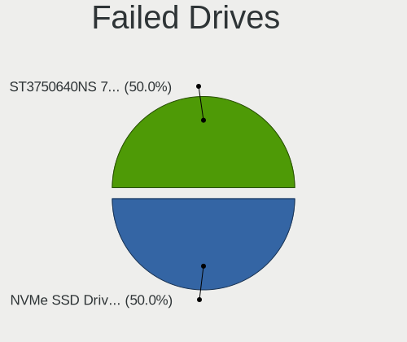

Linux in Portugal - Tested Hardware & Statistics (Desktops)
-----------------------------------------------------------

A project to collect tested hardware configurations for Linux in Portugal.

Anyone can contribute to this report by the [hw-probe](https://github.com/linuxhw/hw-probe) tool:

    sudo -E hw-probe -all -upload

Please contribute! Especially if your hardware is rare.

Contents
--------

* [ Test Cases ](#test-cases)

* [ System ](#system)
  - [ OS                       ](#os)
  - [ OS Family                ](#os-family)
  - [ Kernel                   ](#kernel)
  - [ Kernel Family            ](#kernel-family)
  - [ Kernel Major Ver.        ](#kernel-major-ver)
  - [ Arch                     ](#arch)
  - [ DE                       ](#de)
  - [ Display Server           ](#display-server)
  - [ Display Manager          ](#display-manager)
  - [ OS Lang                  ](#os-lang)
  - [ Boot Mode                ](#boot-mode)
  - [ Filesystem               ](#filesystem)
  - [ Part. scheme             ](#part-scheme)
  - [ Dual Boot with Linux/BSD ](#dual-boot-with-linuxbsd)
  - [ Dual Boot (Win)          ](#dual-boot-win)

* [ Board ](#board)
  - [ Vendor                   ](#vendor)
  - [ Model                    ](#model)
  - [ Model Family             ](#model-family)
  - [ MFG Year                 ](#mfg-year)
  - [ Form Factor              ](#form-factor)
  - [ Secure Boot              ](#secure-boot)
  - [ Coreboot                 ](#coreboot)
  - [ RAM Size                 ](#ram-size)
  - [ RAM Used                 ](#ram-used)
  - [ Total Drives             ](#total-drives)
  - [ Has CD-ROM               ](#has-cd-rom)
  - [ Has Ethernet             ](#has-ethernet)
  - [ Has WiFi                 ](#has-wifi)
  - [ Has Bluetooth            ](#has-bluetooth)

* [ Location ](#location)
  - [ Country                  ](#country)
  - [ City                     ](#city)

* [ Drives ](#drives)
  - [ Drive Vendor             ](#drive-vendor)
  - [ Drive Model              ](#drive-model)
  - [ HDD Vendor               ](#hdd-vendor)
  - [ SSD Vendor               ](#ssd-vendor)
  - [ Drive Kind               ](#drive-kind)
  - [ Drive Connector          ](#drive-connector)
  - [ Drive Size               ](#drive-size)
  - [ Space Total              ](#space-total)
  - [ Space Used               ](#space-used)
  - [ Malfunc. Drives          ](#malfunc-drives)
  - [ Malfunc. Drive Vendor    ](#malfunc-drive-vendor)
  - [ Malfunc. HDD Vendor      ](#malfunc-hdd-vendor)
  - [ Malfunc. Drive Kind      ](#malfunc-drive-kind)
  - [ Failed Drives            ](#failed-drives)
  - [ Failed Drive Vendor      ](#failed-drive-vendor)
  - [ Drive Status             ](#drive-status)

* [ Storage controller ](#storage-controller)
  - [ Storage Vendor           ](#storage-vendor)
  - [ Storage Model            ](#storage-model)
  - [ Storage Kind             ](#storage-kind)

* [ Processor ](#processor)
  - [ CPU Vendor               ](#cpu-vendor)
  - [ CPU Model                ](#cpu-model)
  - [ CPU Model Family         ](#cpu-model-family)
  - [ CPU Cores                ](#cpu-cores)
  - [ CPU Sockets              ](#cpu-sockets)
  - [ CPU Threads              ](#cpu-threads)
  - [ CPU Op-Modes             ](#cpu-op-modes)
  - [ CPU Microcode            ](#cpu-microcode)
  - [ CPU Microarch            ](#cpu-microarch)

* [ Graphics ](#graphics)
  - [ GPU Vendor               ](#gpu-vendor)
  - [ GPU Model                ](#gpu-model)
  - [ GPU Combo                ](#gpu-combo)
  - [ GPU Driver               ](#gpu-driver)
  - [ GPU Memory               ](#gpu-memory)

* [ Monitor ](#monitor)
  - [ Monitor Vendor           ](#monitor-vendor)
  - [ Monitor Model            ](#monitor-model)
  - [ Monitor Resolution       ](#monitor-resolution)
  - [ Monitor Diagonal         ](#monitor-diagonal)
  - [ Monitor Width            ](#monitor-width)
  - [ Aspect Ratio             ](#aspect-ratio)
  - [ Monitor Area             ](#monitor-area)
  - [ Pixel Density            ](#pixel-density)
  - [ Multiple Monitors        ](#multiple-monitors)

* [ Network ](#network)
  - [ Net Controller Vendor    ](#net-controller-vendor)
  - [ Net Controller Model     ](#net-controller-model)
  - [ Wireless Vendor          ](#wireless-vendor)
  - [ Wireless Model           ](#wireless-model)
  - [ Ethernet Vendor          ](#ethernet-vendor)
  - [ Ethernet Model           ](#ethernet-model)
  - [ Net Controller Kind      ](#net-controller-kind)
  - [ Used Controller          ](#used-controller)
  - [ NICs                     ](#nics)
  - [ IPv6                     ](#ipv6)

* [ Bluetooth ](#bluetooth)
  - [ Bluetooth Vendor         ](#bluetooth-vendor)
  - [ Bluetooth Model          ](#bluetooth-model)

* [ Sound ](#sound)
  - [ Sound Vendor             ](#sound-vendor)
  - [ Sound Model              ](#sound-model)

* [ Memory ](#memory)
  - [ Memory Vendor            ](#memory-vendor)
  - [ Memory Model             ](#memory-model)
  - [ Memory Kind              ](#memory-kind)
  - [ Memory Form Factor       ](#memory-form-factor)
  - [ Memory Size              ](#memory-size)
  - [ Memory Speed             ](#memory-speed)

* [ Printers & scanners ](#printers--scanners)
  - [ Printer Vendor           ](#printer-vendor)
  - [ Printer Model            ](#printer-model)
  - [ Scanner Vendor           ](#scanner-vendor)
  - [ Scanner Model            ](#scanner-model)

* [ Camera ](#camera)
  - [ Camera Vendor            ](#camera-vendor)
  - [ Camera Model             ](#camera-model)

* [ Security ](#security)
  - [ Fingerprint Vendor       ](#fingerprint-vendor)
  - [ Fingerprint Model        ](#fingerprint-model)
  - [ Chipcard Vendor          ](#chipcard-vendor)
  - [ Chipcard Model           ](#chipcard-model)

* [ Unsupported ](#unsupported)
  - [ Unsupported Devices      ](#unsupported-devices)
  - [ Unsupported Device Types ](#unsupported-device-types)

Test Cases
----------

Total: 645

| Vendor        | Model                       | Probe                                                      | Date         |
|---------------|-----------------------------|------------------------------------------------------------|--------------|
| Gigabyte      | 970A-DS3P                   | [c1fe7a5f87](https://linux-hardware.org/?probe=c1fe7a5f87) | Apr 30, 2023 |
| Acer          | E661GXM                     | [d5433b46bd](https://linux-hardware.org/?probe=d5433b46bd) | Apr 30, 2023 |
| Intel         | X99H                        | [d0f8c22128](https://linux-hardware.org/?probe=d0f8c22128) | Apr 26, 2023 |
| ASUSTek       | M4A78LT-M                   | [11f1e291a7](https://linux-hardware.org/?probe=11f1e291a7) | Apr 25, 2023 |
| Fujitsu       | D3161-A1 S26361-D3161-A1    | [67f15c6f4a](https://linux-hardware.org/?probe=67f15c6f4a) | Apr 22, 2023 |
| AAEON         | UPS-EHL01 V1.0              | [14471b218c](https://linux-hardware.org/?probe=14471b218c) | Apr 18, 2023 |
| ASUSTek       | TUF Gaming X570-PLUS        | [4174faae23](https://linux-hardware.org/?probe=4174faae23) | Apr 17, 2023 |
| MSI           | Z370 PC PRO                 | [fb3078d5c3](https://linux-hardware.org/?probe=fb3078d5c3) | Apr 12, 2023 |
| ASUSTek       | P7H55-M PRO                 | [69ee985017](https://linux-hardware.org/?probe=69ee985017) | Apr 09, 2023 |
| Gigabyte      | X470 AORUS ULTRA GAMING-... | [c2132caa73](https://linux-hardware.org/?probe=c2132caa73) | Apr 08, 2023 |
| HP            | ProLiant MicroServer Gen... | [0258b5925f](https://linux-hardware.org/?probe=0258b5925f) | Apr 07, 2023 |
| Acer          | Aspire XC-330               | [a0e2b31c08](https://linux-hardware.org/?probe=a0e2b31c08) | Apr 05, 2023 |
| MSI           | MAG A520M VECTOR WIFI       | [3c08cf9aba](https://linux-hardware.org/?probe=3c08cf9aba) | Apr 01, 2023 |
| ASUSTek       | P7P55D-E                    | [3db646f782](https://linux-hardware.org/?probe=3db646f782) | Mar 29, 2023 |
| MSI           | MAG X570S TOMAHAWK MAX W... | [3b7fe31c07](https://linux-hardware.org/?probe=3b7fe31c07) | Mar 29, 2023 |
| Gigabyte      | B365M DS3H                  | [e6b01be2f1](https://linux-hardware.org/?probe=e6b01be2f1) | Mar 29, 2023 |
| ASUSTek       | B85M-G                      | [e973d0294d](https://linux-hardware.org/?probe=e973d0294d) | Mar 22, 2023 |
| ASUSTek       | M5A78L LE                   | [e18778e282](https://linux-hardware.org/?probe=e18778e282) | Mar 20, 2023 |
| Dell          | 0MY171 A00                  | [47fd974afd](https://linux-hardware.org/?probe=47fd974afd) | Mar 20, 2023 |
| HP            | 3646h                       | [812e12695b](https://linux-hardware.org/?probe=812e12695b) | Mar 19, 2023 |
| Gigabyte      | A520M H                     | [a3cee7c278](https://linux-hardware.org/?probe=a3cee7c278) | Mar 19, 2023 |
| Gigabyte      | GA-78LMT-USB3 SEx           | [7c770db7fd](https://linux-hardware.org/?probe=7c770db7fd) | Mar 18, 2023 |
| Unknown       | Unknown                     | [2389fcea33](https://linux-hardware.org/?probe=2389fcea33) | Mar 17, 2023 |
| ASUSTek       | PRIME H610M-A D4            | [9765f2823e](https://linux-hardware.org/?probe=9765f2823e) | Mar 16, 2023 |
| HP            | 3033h                       | [ab5e388ea9](https://linux-hardware.org/?probe=ab5e388ea9) | Mar 14, 2023 |
| HP            | 3033h                       | [38ac77726b](https://linux-hardware.org/?probe=38ac77726b) | Mar 13, 2023 |
| ASUSTek       | PRIME H610M-A D4            | [7a20b4f81a](https://linux-hardware.org/?probe=7a20b4f81a) | Mar 12, 2023 |
| ASRock        | 970M Pro3                   | [2728efea53](https://linux-hardware.org/?probe=2728efea53) | Mar 05, 2023 |
| ASRock        | 970M Pro3                   | [7235211822](https://linux-hardware.org/?probe=7235211822) | Mar 05, 2023 |
| ASUSTek       | PRIME H410M-R               | [240adbe154](https://linux-hardware.org/?probe=240adbe154) | Mar 04, 2023 |
| ASUSTek       | Z87-PRO                     | [7997191f44](https://linux-hardware.org/?probe=7997191f44) | Feb 28, 2023 |
| ASUSTek       | Z87-PRO                     | [9a6bc5f3af](https://linux-hardware.org/?probe=9a6bc5f3af) | Feb 28, 2023 |
| ASUSTek       | B85M-E                      | [8fb68b4ad6](https://linux-hardware.org/?probe=8fb68b4ad6) | Feb 26, 2023 |
| Dell          | 0MY171 A00                  | [795f707b1a](https://linux-hardware.org/?probe=795f707b1a) | Feb 25, 2023 |
| ASUSTek       | BM6630_BM6330_BP6230        | [e062475561](https://linux-hardware.org/?probe=e062475561) | Feb 20, 2023 |
| ASUSTek       | BM6630_BM6330_BP6230        | [5d6240bcc6](https://linux-hardware.org/?probe=5d6240bcc6) | Feb 19, 2023 |
| ASRock        | 970M Pro3                   | [fe75bac6ce](https://linux-hardware.org/?probe=fe75bac6ce) | Feb 19, 2023 |
| ASRock        | 970M Pro3                   | [605089c66c](https://linux-hardware.org/?probe=605089c66c) | Feb 19, 2023 |
| ASUSTek       | P5G41T-M LE                 | [3ebf4858b8](https://linux-hardware.org/?probe=3ebf4858b8) | Feb 16, 2023 |
| MSI           | Z68MA-ED55                  | [e2bd6f0fb4](https://linux-hardware.org/?probe=e2bd6f0fb4) | Feb 15, 2023 |
| Gigabyte      | GA-78LMT-USB3 SEx           | [4344acac5e](https://linux-hardware.org/?probe=4344acac5e) | Feb 11, 2023 |
| IBM           | 819046G                     | [a43370bbbd](https://linux-hardware.org/?probe=a43370bbbd) | Feb 11, 2023 |
| MSI           | A78M-E35                    | [ba4515e5ea](https://linux-hardware.org/?probe=ba4515e5ea) | Feb 08, 2023 |
| ASUSTek       | H110M-K                     | [9299261af6](https://linux-hardware.org/?probe=9299261af6) | Feb 05, 2023 |
| ASUSTek       | Z170-DELUXE                 | [d0cf3a9d76](https://linux-hardware.org/?probe=d0cf3a9d76) | Feb 02, 2023 |
| Gigabyte      | B550M AORUS ELITE           | [a8f54f681a](https://linux-hardware.org/?probe=a8f54f681a) | Feb 01, 2023 |
| Gigabyte      | GA-78LMT-USB3 SEx           | [1a9e67408e](https://linux-hardware.org/?probe=1a9e67408e) | Jan 28, 2023 |
| Acer          | RS740DVF                    | [6aaeb06f9a](https://linux-hardware.org/?probe=6aaeb06f9a) | Jan 26, 2023 |
| Pegatron      | Narra6                      | [ac9462ee8e](https://linux-hardware.org/?probe=ac9462ee8e) | Jan 20, 2023 |
| HP            | ProLiant MicroServer Gen... | [cd6cedc906](https://linux-hardware.org/?probe=cd6cedc906) | Jan 17, 2023 |
| ASUSTek       | Benicia                     | [c0441ff1e5](https://linux-hardware.org/?probe=c0441ff1e5) | Jan 17, 2023 |
| Gigabyte      | GA-78LMT-USB3 SEx           | [60a0157a51](https://linux-hardware.org/?probe=60a0157a51) | Jan 16, 2023 |
| Gigabyte      | GA-78LMT-USB3 SEx           | [7c62282370](https://linux-hardware.org/?probe=7c62282370) | Jan 12, 2023 |
| Gigabyte      | GA-78LMT-USB3 SEx           | [71c61d98b9](https://linux-hardware.org/?probe=71c61d98b9) | Jan 10, 2023 |
| MSI           | B350 KRAIT GAMING           | [d27b435baf](https://linux-hardware.org/?probe=d27b435baf) | Jan 10, 2023 |
| ASRock        | A320M-HDV R3.0              | [cb970f09e6](https://linux-hardware.org/?probe=cb970f09e6) | Jan 09, 2023 |
| HP            | 0AA4h                       | [8d177b0b8d](https://linux-hardware.org/?probe=8d177b0b8d) | Jan 09, 2023 |
| MSI           | H97 GAMING 3                | [39ec0d3441](https://linux-hardware.org/?probe=39ec0d3441) | Jan 09, 2023 |
| ASUSTek       | P8Z77-V LX                  | [bdc427771d](https://linux-hardware.org/?probe=bdc427771d) | Jan 08, 2023 |
| HP            | 83EE                        | [cb43945233](https://linux-hardware.org/?probe=cb43945233) | Jan 07, 2023 |
| MSI           | MPG X570 GAMING EDGE WIF... | [aff5a2ce85](https://linux-hardware.org/?probe=aff5a2ce85) | Jan 07, 2023 |
| Gigabyte      | H81M-S1                     | [db0e909d27](https://linux-hardware.org/?probe=db0e909d27) | Jan 06, 2023 |
| ASUSTek       | TUF Gaming B550M-PLUS WI... | [eefb2d0334](https://linux-hardware.org/?probe=eefb2d0334) | Jan 03, 2023 |
| Gigabyte      | Z77P-D3                     | [76d75de6ac](https://linux-hardware.org/?probe=76d75de6ac) | Jan 02, 2023 |
| ASUSTek       | TUF Gaming X570-PLUS        | [bbd09c7b2c](https://linux-hardware.org/?probe=bbd09c7b2c) | Jan 02, 2023 |
| ASUSTek       | TUF Gaming X570-PLUS        | [013b1e7816](https://linux-hardware.org/?probe=013b1e7816) | Jan 02, 2023 |
| ASUSTek       | TUF Gaming B550-PLUS        | [34528f04fe](https://linux-hardware.org/?probe=34528f04fe) | Jan 01, 2023 |
| ASUSTek       | TUF Gaming B560-PLUS WIF... | [7295ec02b5](https://linux-hardware.org/?probe=7295ec02b5) | Dec 31, 2022 |
| ASUSTek       | PRIME B550M-A               | [2161cbc9a0](https://linux-hardware.org/?probe=2161cbc9a0) | Dec 31, 2022 |
| ASUSTek       | Benicia                     | [9d307c5f2f](https://linux-hardware.org/?probe=9d307c5f2f) | Dec 31, 2022 |
| ASUSTek       | Benicia                     | [bc835cbca9](https://linux-hardware.org/?probe=bc835cbca9) | Dec 31, 2022 |
| ASUSTek       | TUF Gaming B550-PLUS        | [76e9829e66](https://linux-hardware.org/?probe=76e9829e66) | Dec 30, 2022 |
| ASUSTek       | B85M-GAMER                  | [ded2e7e4e6](https://linux-hardware.org/?probe=ded2e7e4e6) | Dec 26, 2022 |
| ASUSTek       | TUF Gaming B550M-PLUS WI... | [b181e9e5a3](https://linux-hardware.org/?probe=b181e9e5a3) | Dec 26, 2022 |
| MSI           | B350 KRAIT GAMING           | [896aebf101](https://linux-hardware.org/?probe=896aebf101) | Dec 25, 2022 |
| Gigabyte      | GA-78LMT-USB3 SEx           | [82f8802857](https://linux-hardware.org/?probe=82f8802857) | Dec 24, 2022 |
| HP            | 0980h                       | [d54665c87c](https://linux-hardware.org/?probe=d54665c87c) | Dec 21, 2022 |
| MSI           | H81M-P33                    | [5d91d96949](https://linux-hardware.org/?probe=5d91d96949) | Dec 20, 2022 |
| HP            | 0980h                       | [3faf0c7996](https://linux-hardware.org/?probe=3faf0c7996) | Dec 20, 2022 |
| Foxconn       | 2ABF                        | [10e579b77e](https://linux-hardware.org/?probe=10e579b77e) | Dec 18, 2022 |
| Dell          | 03V7GF A01                  | [3847c61b81](https://linux-hardware.org/?probe=3847c61b81) | Dec 17, 2022 |
| Dell          | 03V7GF A01                  | [e491b54a3c](https://linux-hardware.org/?probe=e491b54a3c) | Dec 17, 2022 |
| Unknown       | Unknown                     | [988a2e80c0](https://linux-hardware.org/?probe=988a2e80c0) | Dec 17, 2022 |
| Gigabyte      | H57M-USB3                   | [d4812cfdb6](https://linux-hardware.org/?probe=d4812cfdb6) | Dec 13, 2022 |
| Dell          | 0MY171 A00                  | [055bc4ea78](https://linux-hardware.org/?probe=055bc4ea78) | Dec 13, 2022 |
| Gigabyte      | H57M-USB3                   | [c48aaf8b29](https://linux-hardware.org/?probe=c48aaf8b29) | Dec 12, 2022 |
| ASRock        | G31M-GS                     | [2e1fc34b39](https://linux-hardware.org/?probe=2e1fc34b39) | Dec 11, 2022 |
| ASUSTek       | ROG CROSSHAIR VIII DARK ... | [d83227cce9](https://linux-hardware.org/?probe=d83227cce9) | Dec 10, 2022 |
| ASUSTek       | P5Q DELUXE                  | [1519fb3a87](https://linux-hardware.org/?probe=1519fb3a87) | Dec 06, 2022 |
| MSI           | Z490-A PRO                  | [34157244aa](https://linux-hardware.org/?probe=34157244aa) | Dec 05, 2022 |
| Packard Be... | FIH57                       | [a98f4adbab](https://linux-hardware.org/?probe=a98f4adbab) | Dec 05, 2022 |
| Gigabyte      | GA-MA785GT-UD3H             | [5ab13c42b3](https://linux-hardware.org/?probe=5ab13c42b3) | Dec 03, 2022 |
| Gigabyte      | GA-MA785GT-UD3H             | [b3ab0684c5](https://linux-hardware.org/?probe=b3ab0684c5) | Dec 03, 2022 |
| ASUSTek       | PRIME B360M-A               | [e28a13071a](https://linux-hardware.org/?probe=e28a13071a) | Dec 02, 2022 |
| ASUSTek       | PRIME B360M-A               | [44a7c01e06](https://linux-hardware.org/?probe=44a7c01e06) | Dec 02, 2022 |
| ASUSTek       | PRIME B550-PLUS             | [a6a71120f2](https://linux-hardware.org/?probe=a6a71120f2) | Nov 30, 2022 |
| ASUSTek       | Benicia                     | [e5468e4258](https://linux-hardware.org/?probe=e5468e4258) | Nov 30, 2022 |
| HP            | 18E7                        | [5a5c2667a5](https://linux-hardware.org/?probe=5a5c2667a5) | Nov 26, 2022 |
| Gigabyte      | B450 AORUS ELITE            | [ccf106edce](https://linux-hardware.org/?probe=ccf106edce) | Nov 24, 2022 |
| Gigabyte      | EG41MF-US2H                 | [07ac3ace2c](https://linux-hardware.org/?probe=07ac3ace2c) | Nov 24, 2022 |
| Gigabyte      | GA-78LMT-USB3 SEx           | [99fc338b3e](https://linux-hardware.org/?probe=99fc338b3e) | Nov 23, 2022 |
| MSI           | 990FXA-GD65                 | [8e134485ce](https://linux-hardware.org/?probe=8e134485ce) | Nov 22, 2022 |
| MSI           | 990FXA-GD65                 | [d41acd5075](https://linux-hardware.org/?probe=d41acd5075) | Nov 20, 2022 |
| ASRock        | B550 Extreme4               | [7fba8e38dc](https://linux-hardware.org/?probe=7fba8e38dc) | Nov 20, 2022 |
| ASUSTek       | B85M-E                      | [2455b541f5](https://linux-hardware.org/?probe=2455b541f5) | Nov 16, 2022 |
| Gigabyte      | GA-78LMT-USB3 SEx           | [2c896d28a8](https://linux-hardware.org/?probe=2c896d28a8) | Nov 13, 2022 |
| ASUSTek       | B85M-GAMER                  | [112508759b](https://linux-hardware.org/?probe=112508759b) | Nov 13, 2022 |
| ASUSTek       | P5KPL-AM EPU                | [dc1c83bed5](https://linux-hardware.org/?probe=dc1c83bed5) | Nov 11, 2022 |
| ASUSTek       | PRIME B360M-A               | [c46dd8d9b6](https://linux-hardware.org/?probe=c46dd8d9b6) | Nov 01, 2022 |
| Pegatron      | TRUCKEE                     | [2a6fe2bcd1](https://linux-hardware.org/?probe=2a6fe2bcd1) | Oct 28, 2022 |
| Gigabyte      | GA-78LMT-USB3 SEx           | [fe9ec739e2](https://linux-hardware.org/?probe=fe9ec739e2) | Oct 24, 2022 |
| HP            | 805D                        | [ece9f05ea6](https://linux-hardware.org/?probe=ece9f05ea6) | Oct 14, 2022 |
| HP            | 805D                        | [f10271c447](https://linux-hardware.org/?probe=f10271c447) | Oct 14, 2022 |
| ASRock        | 970M Pro3                   | [ca8ac557b3](https://linux-hardware.org/?probe=ca8ac557b3) | Oct 14, 2022 |
| ASRock        | 970M Pro3                   | [9eaf0bffca](https://linux-hardware.org/?probe=9eaf0bffca) | Oct 09, 2022 |
| MSI           | B550-A PRO                  | [be6a0fda35](https://linux-hardware.org/?probe=be6a0fda35) | Oct 08, 2022 |
| ASRock        | 970M Pro3                   | [76d2eeb1d0](https://linux-hardware.org/?probe=76d2eeb1d0) | Oct 07, 2022 |
| ASUSTek       | PRIME H410M-E               | [abe6a3fde2](https://linux-hardware.org/?probe=abe6a3fde2) | Oct 06, 2022 |
| Gigabyte      | X470 AORUS ULTRA GAMING-... | [a055ed4d2c](https://linux-hardware.org/?probe=a055ed4d2c) | Oct 03, 2022 |
| ASUSTek       | PRIME H510M-K               | [5bdf95fbdc](https://linux-hardware.org/?probe=5bdf95fbdc) | Oct 02, 2022 |
| ASUSTek       | ROG CROSSHAIR VIII DARK ... | [9fff405744](https://linux-hardware.org/?probe=9fff405744) | Sep 26, 2022 |
| Gigabyte      | B550 GAMING X V2            | [34035b63b6](https://linux-hardware.org/?probe=34035b63b6) | Sep 25, 2022 |
| ASRock        | B550 Pro4                   | [a1009d700e](https://linux-hardware.org/?probe=a1009d700e) | Sep 21, 2022 |
| ASUSTek       | PRIME A320M-K               | [70a7e5cad3](https://linux-hardware.org/?probe=70a7e5cad3) | Sep 20, 2022 |
| MSI           | Z77A-G45                    | [b5a8d40602](https://linux-hardware.org/?probe=b5a8d40602) | Sep 18, 2022 |
| ASUSTek       | P5L-VM 1394                 | [a7931f2026](https://linux-hardware.org/?probe=a7931f2026) | Sep 10, 2022 |
| ASUSTek       | ROG STRIX X470-F GAMING     | [038f57c2d8](https://linux-hardware.org/?probe=038f57c2d8) | Sep 06, 2022 |
| ASUSTek       | PRIME H510M-K               | [6fa51d2c4e](https://linux-hardware.org/?probe=6fa51d2c4e) | Aug 31, 2022 |
| OEM           | Intel H81                   | [4b45e6dc61](https://linux-hardware.org/?probe=4b45e6dc61) | Aug 31, 2022 |
| ASUSTek       | Benicia                     | [08f930384d](https://linux-hardware.org/?probe=08f930384d) | Aug 25, 2022 |
| Gigabyte      | Z390 AORUS ELITE-CF         | [ba3fb2513f](https://linux-hardware.org/?probe=ba3fb2513f) | Aug 21, 2022 |
| Gigabyte      | Z390 AORUS ELITE-CF         | [7ee8720a43](https://linux-hardware.org/?probe=7ee8720a43) | Aug 21, 2022 |
| MSI           | Z370 PC PRO                 | [9131aa23c4](https://linux-hardware.org/?probe=9131aa23c4) | Aug 20, 2022 |
| Gigabyte      | GA-78LMT-USB3 SEx           | [ed1f055157](https://linux-hardware.org/?probe=ed1f055157) | Aug 19, 2022 |
| Gigabyte      | GA-78LMT-USB3 SEx           | [764eaea2ba](https://linux-hardware.org/?probe=764eaea2ba) | Aug 19, 2022 |
| MSI           | B85M-E45                    | [cb991c0789](https://linux-hardware.org/?probe=cb991c0789) | Aug 17, 2022 |
| ASUSTek       | Basswood                    | [26e4efad3f](https://linux-hardware.org/?probe=26e4efad3f) | Aug 14, 2022 |
| ASRock        | H410M-HVS                   | [4d1acc8488](https://linux-hardware.org/?probe=4d1acc8488) | Aug 11, 2022 |
| Lenovo        | 3141 SDK0J40700 WIN 3258... | [48b0dfdee0](https://linux-hardware.org/?probe=48b0dfdee0) | Aug 10, 2022 |
| ASUSTek       | P8Z77-V                     | [18935d4aff](https://linux-hardware.org/?probe=18935d4aff) | Aug 07, 2022 |
| ASUSTek       | P8H67                       | [508b0275e3](https://linux-hardware.org/?probe=508b0275e3) | Aug 02, 2022 |
| Gigabyte      | H110M-Gaming3-CF            | [99a140d79b](https://linux-hardware.org/?probe=99a140d79b) | Aug 01, 2022 |
| ASUSTek       | P5G41C-M LX                 | [4e30dc6361](https://linux-hardware.org/?probe=4e30dc6361) | Jul 31, 2022 |
| Gigabyte      | B450M DS3H-CF               | [ea83758651](https://linux-hardware.org/?probe=ea83758651) | Jul 30, 2022 |
| ASUSTek       | ROG STRIX X470-F GAMING     | [0c310749f1](https://linux-hardware.org/?probe=0c310749f1) | Jul 26, 2022 |
| ASUSTek       | Z97-PRO GAMER               | [ae71cae955](https://linux-hardware.org/?probe=ae71cae955) | Jul 25, 2022 |
| ASUSTek       | PRIME H570M-PLUS            | [b3dbd37276](https://linux-hardware.org/?probe=b3dbd37276) | Jul 22, 2022 |
| MSI           | A78M-E45 V2                 | [c5007c5729](https://linux-hardware.org/?probe=c5007c5729) | Jul 22, 2022 |
| ASUSTek       | P8Z77-V                     | [bb9f40d075](https://linux-hardware.org/?probe=bb9f40d075) | Jul 18, 2022 |
| ASUSTek       | M5A97 EVO R2.0              | [e1313016ee](https://linux-hardware.org/?probe=e1313016ee) | Jul 17, 2022 |
| ASUSTek       | EX-A320M-GAMING             | [68884b1723](https://linux-hardware.org/?probe=68884b1723) | Jul 17, 2022 |
| Acer          | FMCP7AM                     | [f2fc2e98c3](https://linux-hardware.org/?probe=f2fc2e98c3) | Jul 10, 2022 |
| Lenovo        | SHARKBAY NOK                | [15088a414c](https://linux-hardware.org/?probe=15088a414c) | Jul 03, 2022 |
| MSI           | B450M BAZOOKA V2            | [bded0a2071](https://linux-hardware.org/?probe=bded0a2071) | Jul 03, 2022 |
| HP            | 8169                        | [18c6ea7678](https://linux-hardware.org/?probe=18c6ea7678) | Jul 01, 2022 |
| HP            | 8169                        | [c479baadc1](https://linux-hardware.org/?probe=c479baadc1) | Jul 01, 2022 |
| MSI           | A78M-E45 V2                 | [e4cd6586b4](https://linux-hardware.org/?probe=e4cd6586b4) | Jun 26, 2022 |
| Gigabyte      | H310M H                     | [90038bfa8e](https://linux-hardware.org/?probe=90038bfa8e) | Jun 22, 2022 |
| MSI           | A78M-E45 V2                 | [97b9d51036](https://linux-hardware.org/?probe=97b9d51036) | Jun 20, 2022 |
| MSI           | B85M-E45                    | [58c2ff96e3](https://linux-hardware.org/?probe=58c2ff96e3) | Jun 17, 2022 |
| MSI           | A78M-E45 V2                 | [86394fa5df](https://linux-hardware.org/?probe=86394fa5df) | Jun 16, 2022 |
| MSI           | A78M-E45 V2                 | [a2d26ab800](https://linux-hardware.org/?probe=a2d26ab800) | Jun 14, 2022 |
| ASUSTek       | AT5IONT-I                   | [70438d549d](https://linux-hardware.org/?probe=70438d549d) | Jun 14, 2022 |
| ASUSTek       | AT5IONT-I                   | [56abd525d8](https://linux-hardware.org/?probe=56abd525d8) | Jun 14, 2022 |
| MSI           | B460M-A PRO                 | [c858bede94](https://linux-hardware.org/?probe=c858bede94) | Jun 05, 2022 |
| Dell          | 05XGC8 A01                  | [2a1316250b](https://linux-hardware.org/?probe=2a1316250b) | Jun 05, 2022 |
| MSI           | MAG B550M BAZOOKA           | [9399a639c8](https://linux-hardware.org/?probe=9399a639c8) | May 29, 2022 |
| MSI           | MAG B550M BAZOOKA           | [42b16ce834](https://linux-hardware.org/?probe=42b16ce834) | May 28, 2022 |
| MSI           | MAG B550M BAZOOKA           | [4620e51e7b](https://linux-hardware.org/?probe=4620e51e7b) | May 28, 2022 |
| Fujitsu       | D3403-A1 S26361-D3403-A1    | [ccf347729e](https://linux-hardware.org/?probe=ccf347729e) | May 19, 2022 |
| Fujitsu       | D3161-A1 S26361-D3161-A1    | [93b08c2d75](https://linux-hardware.org/?probe=93b08c2d75) | May 19, 2022 |
| ASUSTek       | Maximus IV Extreme          | [08dedbb3cb](https://linux-hardware.org/?probe=08dedbb3cb) | May 18, 2022 |
| Dell          | 0HN7XN A00                  | [6fba9a10da](https://linux-hardware.org/?probe=6fba9a10da) | May 18, 2022 |
| ASUSTek       | SABERTOOTH 990FX R2.0       | [a83bed6668](https://linux-hardware.org/?probe=a83bed6668) | May 16, 2022 |
| ASUSTek       | PRIME B450-PLUS             | [a2ae5d95dd](https://linux-hardware.org/?probe=a2ae5d95dd) | May 15, 2022 |
| ASRockRack    | X399D8A-2T                  | [f1d2fbc435](https://linux-hardware.org/?probe=f1d2fbc435) | May 12, 2022 |
| Gigabyte      | Z77P-D3                     | [40de59e6f7](https://linux-hardware.org/?probe=40de59e6f7) | May 10, 2022 |
| ASUSTek       | PRIME B360M-A               | [c589ad9143](https://linux-hardware.org/?probe=c589ad9143) | May 07, 2022 |
| ASUSTek       | M4A78LT-M                   | [2a10a13430](https://linux-hardware.org/?probe=2a10a13430) | May 06, 2022 |
| ASRock        | Z77 Pro3                    | [050aee0a5f](https://linux-hardware.org/?probe=050aee0a5f) | May 03, 2022 |
| MSI           | MS-7053                     | [6de132b805](https://linux-hardware.org/?probe=6de132b805) | May 02, 2022 |
| ASUSTek       | PRIME B360M-A               | [519ed87066](https://linux-hardware.org/?probe=519ed87066) | Apr 29, 2022 |
| ASUSTek       | PRIME B360M-A               | [c46a1d595b](https://linux-hardware.org/?probe=c46a1d595b) | Apr 29, 2022 |
| HP            | 8719                        | [7e0ae3d91f](https://linux-hardware.org/?probe=7e0ae3d91f) | Apr 22, 2022 |
| ASUSTek       | P5G41T-M LX3                | [a21dad9ee4](https://linux-hardware.org/?probe=a21dad9ee4) | Apr 20, 2022 |
| Gigabyte      | B550 GAMING X V2            | [278c76b54f](https://linux-hardware.org/?probe=278c76b54f) | Apr 18, 2022 |
| Gigabyte      | B550 GAMING X V2            | [5f49d4d7d8](https://linux-hardware.org/?probe=5f49d4d7d8) | Apr 14, 2022 |
| ASUSTek       | P5G41T-M LX                 | [db8350499d](https://linux-hardware.org/?probe=db8350499d) | Apr 09, 2022 |
| Gigabyte      | B550 GAMING X V2            | [9493efcabe](https://linux-hardware.org/?probe=9493efcabe) | Apr 03, 2022 |
| Gigabyte      | G31M-ES2L                   | [90a8431fc2](https://linux-hardware.org/?probe=90a8431fc2) | Mar 22, 2022 |
| Gigabyte      | A520M H                     | [46b8c80485](https://linux-hardware.org/?probe=46b8c80485) | Mar 17, 2022 |
| ASUSTek       | B85M-E                      | [36c1044633](https://linux-hardware.org/?probe=36c1044633) | Mar 16, 2022 |
| Gigabyte      | A520M H                     | [483e47645c](https://linux-hardware.org/?probe=483e47645c) | Mar 16, 2022 |
| ASUSTek       | PRIME H510M-K               | [8a97b4f2d3](https://linux-hardware.org/?probe=8a97b4f2d3) | Mar 09, 2022 |
| HP            | 0A54h                       | [2dfc948414](https://linux-hardware.org/?probe=2dfc948414) | Mar 08, 2022 |
| Gigabyte      | G31M-S2L                    | [dd40993d97](https://linux-hardware.org/?probe=dd40993d97) | Mar 03, 2022 |
| HP            | 3396                        | [f952a8f044](https://linux-hardware.org/?probe=f952a8f044) | Mar 01, 2022 |
| MSI           | B85M-E45                    | [42fba9424e](https://linux-hardware.org/?probe=42fba9424e) | Feb 27, 2022 |
| Minix         | NEO Z83-4 V1.1              | [8aa7469422](https://linux-hardware.org/?probe=8aa7469422) | Feb 27, 2022 |
| Biostar       | H81MHV3                     | [3fd07aef04](https://linux-hardware.org/?probe=3fd07aef04) | Feb 25, 2022 |
| ASUSTek       | PRIME X570-P                | [eacd6c646c](https://linux-hardware.org/?probe=eacd6c646c) | Feb 22, 2022 |
| IBM           | 819046G                     | [54b0798b76](https://linux-hardware.org/?probe=54b0798b76) | Feb 22, 2022 |
| ASUSTek       | P5VDC-X                     | [40943e3ee0](https://linux-hardware.org/?probe=40943e3ee0) | Feb 22, 2022 |
| HP            | 83F3                        | [9421f4385a](https://linux-hardware.org/?probe=9421f4385a) | Feb 18, 2022 |
| ASUSTek       | ROG STRIX B560-F GAMING ... | [f7ee45924c](https://linux-hardware.org/?probe=f7ee45924c) | Feb 17, 2022 |
| ASRock        | B550M Pro4                  | [b39fbbaec6](https://linux-hardware.org/?probe=b39fbbaec6) | Feb 16, 2022 |
| ASUSTek       | ROG STRIX X570-E GAMING     | [8f1ce82db7](https://linux-hardware.org/?probe=8f1ce82db7) | Feb 15, 2022 |
| MSI           | MS-7053                     | [2ee97bf0a8](https://linux-hardware.org/?probe=2ee97bf0a8) | Feb 13, 2022 |
| MSI           | H61M-P20                    | [81b315b229](https://linux-hardware.org/?probe=81b315b229) | Feb 09, 2022 |
| MSI           | B85M-E45                    | [3653d29a0a](https://linux-hardware.org/?probe=3653d29a0a) | Feb 07, 2022 |
| Foxconn       | H67M-S/H67M-V/H67           | [a3f3367577](https://linux-hardware.org/?probe=a3f3367577) | Feb 02, 2022 |
| ASUSTek       | P5K3L-ASUS-S1-P5G35         | [f9e7838b90](https://linux-hardware.org/?probe=f9e7838b90) | Jan 31, 2022 |
| Foxconn       | nT-i1000 Series PCB         | [72374dc22c](https://linux-hardware.org/?probe=72374dc22c) | Jan 26, 2022 |
| Foxconn       | nT-i1000 Series PCB         | [78cdf0490a](https://linux-hardware.org/?probe=78cdf0490a) | Jan 26, 2022 |
| Gigabyte      | H110M-Gaming3-CF            | [5b23faaf76](https://linux-hardware.org/?probe=5b23faaf76) | Jan 22, 2022 |
| Gigabyte      | H110M-Gaming3-CF            | [3791490565](https://linux-hardware.org/?probe=3791490565) | Jan 22, 2022 |
| Lenovo        | 313C SDK0J40697 WIN 3305... | [6cad862612](https://linux-hardware.org/?probe=6cad862612) | Jan 21, 2022 |
| MSI           | MS-7053                     | [8844db2984](https://linux-hardware.org/?probe=8844db2984) | Jan 13, 2022 |
| ASUSTek       | P5K PRO                     | [9338817523](https://linux-hardware.org/?probe=9338817523) | Jan 13, 2022 |
| ASUSTek       | V-P7H55E                    | [7fc2d44a4a](https://linux-hardware.org/?probe=7fc2d44a4a) | Jan 11, 2022 |
| ASUSTek       | M5A78L-M/USB3               | [409de37ae4](https://linux-hardware.org/?probe=409de37ae4) | Jan 09, 2022 |
| Gigabyte      | P41T-D3P                    | [1c94714d99](https://linux-hardware.org/?probe=1c94714d99) | Jan 01, 2022 |
| Google        | Sion                        | [08215c86b6](https://linux-hardware.org/?probe=08215c86b6) | Dec 31, 2021 |
| ASUSTek       | A_F_K31AN                   | [4bd56c7243](https://linux-hardware.org/?probe=4bd56c7243) | Dec 29, 2021 |
| RKM           | Cherry Trail CR             | [907cacf8cc](https://linux-hardware.org/?probe=907cacf8cc) | Dec 29, 2021 |
| Huanan        | X79-8D VAA31                | [79be6da608](https://linux-hardware.org/?probe=79be6da608) | Dec 26, 2021 |
| HP            | 1998                        | [fffadbe1cf](https://linux-hardware.org/?probe=fffadbe1cf) | Dec 25, 2021 |
| Lenovo        | 3141 SDK0J40700 WIN 3258... | [855061aa1a](https://linux-hardware.org/?probe=855061aa1a) | Dec 18, 2021 |
| MSI           | MS-7053                     | [3e9330e811](https://linux-hardware.org/?probe=3e9330e811) | Dec 18, 2021 |
| MSI           | MS-7053                     | [b32db3cd18](https://linux-hardware.org/?probe=b32db3cd18) | Dec 18, 2021 |
| Gigabyte      | B550 AORUS ELITE            | [830b8475ac](https://linux-hardware.org/?probe=830b8475ac) | Dec 15, 2021 |
| ASUSTek       | PRIME X570-P                | [1812d44a36](https://linux-hardware.org/?probe=1812d44a36) | Dec 12, 2021 |
| Gigabyte      | B550M AORUS PRO             | [d1e767dfde](https://linux-hardware.org/?probe=d1e767dfde) | Dec 11, 2021 |
| ASUSTek       | P5G41T-M LX                 | [8b03acc524](https://linux-hardware.org/?probe=8b03acc524) | Dec 11, 2021 |
| Pegatron      | Benicia                     | [d50daedc5d](https://linux-hardware.org/?probe=d50daedc5d) | Nov 26, 2021 |
| ASUSTek       | P8Z77-V PRO                 | [22f1f5326e](https://linux-hardware.org/?probe=22f1f5326e) | Nov 21, 2021 |
| Biostar       | FX9830M                     | [f845fe2694](https://linux-hardware.org/?probe=f845fe2694) | Nov 19, 2021 |
| Gigabyte      | G31M-ES2L                   | [f30f49d634](https://linux-hardware.org/?probe=f30f49d634) | Nov 16, 2021 |
| Gigabyte      | G31M-ES2L                   | [fccd73da9d](https://linux-hardware.org/?probe=fccd73da9d) | Nov 12, 2021 |
| Dell          | 0HD5W2 A00                  | [d4c15ae33a](https://linux-hardware.org/?probe=d4c15ae33a) | Nov 08, 2021 |
| Minix         | NEO Z83-4 V1.1              | [c7b52e35cf](https://linux-hardware.org/?probe=c7b52e35cf) | Nov 08, 2021 |
| ASUSTek       | H87M-PLUS                   | [72e74c86fb](https://linux-hardware.org/?probe=72e74c86fb) | Nov 04, 2021 |
| ASUSTek       | H87M-PLUS                   | [bbb4e58192](https://linux-hardware.org/?probe=bbb4e58192) | Nov 04, 2021 |
| ASUSTek       | P5LD2-SE                    | [4f817c0167](https://linux-hardware.org/?probe=4f817c0167) | Nov 03, 2021 |
| ASUSTek       | PRIME H310M-K R2.0          | [b643635a41](https://linux-hardware.org/?probe=b643635a41) | Nov 02, 2021 |
| ASUSTek       | P5LD2-SE                    | [8ba60d9634](https://linux-hardware.org/?probe=8ba60d9634) | Nov 01, 2021 |
| MSI           | P55-CD53                    | [d342f4e0a4](https://linux-hardware.org/?probe=d342f4e0a4) | Oct 29, 2021 |
| ASUSTek       | A_F_K31AN                   | [ebd51400e3](https://linux-hardware.org/?probe=ebd51400e3) | Oct 25, 2021 |
| ASUSTek       | B85M-E                      | [7a6479dc2d](https://linux-hardware.org/?probe=7a6479dc2d) | Oct 23, 2021 |
| ASUSTek       | M32CD_A_F_K20CD_K31CD       | [7313df4bd9](https://linux-hardware.org/?probe=7313df4bd9) | Oct 17, 2021 |
| MSI           | MPG B550 GAMING EDGE WIF... | [005e2591e8](https://linux-hardware.org/?probe=005e2591e8) | Oct 17, 2021 |
| ASUSTek       | PRIME H510M-K               | [2ee0e02dca](https://linux-hardware.org/?probe=2ee0e02dca) | Oct 08, 2021 |
| ASUSTek       | H81M-A                      | [b73e4dc969](https://linux-hardware.org/?probe=b73e4dc969) | Oct 07, 2021 |
| ASUSTek       | PRIME H510M-K               | [cc60b4cc30](https://linux-hardware.org/?probe=cc60b4cc30) | Oct 07, 2021 |
| ASUSTek       | PRIME H510M-K               | [dae39c15c9](https://linux-hardware.org/?probe=dae39c15c9) | Oct 06, 2021 |
| MSI           | MPG B550 GAMING PLUS        | [eeae519a3e](https://linux-hardware.org/?probe=eeae519a3e) | Oct 04, 2021 |
| ASRock        | B450M Pro4                  | [a198e8517a](https://linux-hardware.org/?probe=a198e8517a) | Oct 01, 2021 |
| ASUSTek       | P5KC                        | [c6c9f72f10](https://linux-hardware.org/?probe=c6c9f72f10) | Sep 29, 2021 |
| ASUSTek       | M4N68T-M                    | [adaee7ea4e](https://linux-hardware.org/?probe=adaee7ea4e) | Sep 28, 2021 |
| ASUSTek       | PRIME H510M-K               | [c11c48b5d6](https://linux-hardware.org/?probe=c11c48b5d6) | Sep 24, 2021 |
| ASUSTek       | PRIME H510M-K               | [66900d1009](https://linux-hardware.org/?probe=66900d1009) | Sep 24, 2021 |
| ASUSTek       | PRIME X570-P                | [d8d6573dea](https://linux-hardware.org/?probe=d8d6573dea) | Sep 23, 2021 |
| Shuttle       | NC03U                       | [c5f76c4400](https://linux-hardware.org/?probe=c5f76c4400) | Sep 22, 2021 |
| Foxconn       | A74ML-K                     | [b7a9a59c77](https://linux-hardware.org/?probe=b7a9a59c77) | Sep 19, 2021 |
| MSI           | MPG X570 GAMING EDGE WIF... | [a7a8c2cead](https://linux-hardware.org/?probe=a7a8c2cead) | Sep 18, 2021 |
| Biostar       | A68MHE                      | [8a2cdafa86](https://linux-hardware.org/?probe=8a2cdafa86) | Sep 18, 2021 |
| Lenovo        | 3141 SDK0J40700 WIN 3258... | [82058974d9](https://linux-hardware.org/?probe=82058974d9) | Sep 17, 2021 |
| Libretrend    | LT1000                      | [781fa86fea](https://linux-hardware.org/?probe=781fa86fea) | Sep 17, 2021 |
| ASUSTek       | H81M-PLUS                   | [e8ac4691b0](https://linux-hardware.org/?probe=e8ac4691b0) | Sep 16, 2021 |
| ASRock        | X570M Pro4                  | [297bbaf6a4](https://linux-hardware.org/?probe=297bbaf6a4) | Sep 14, 2021 |
| Acer          | Elena                       | [c05122b62f](https://linux-hardware.org/?probe=c05122b62f) | Sep 14, 2021 |
| ASUSTek       | B85M-E                      | [1ef0a151b1](https://linux-hardware.org/?probe=1ef0a151b1) | Sep 12, 2021 |
| ASUSTek       | ROG CROSSHAIR VI EXTREME    | [4404093ccf](https://linux-hardware.org/?probe=4404093ccf) | Sep 12, 2021 |
| MSI           | B350 TOMAHAWK ARCTIC        | [b92b2f815b](https://linux-hardware.org/?probe=b92b2f815b) | Sep 07, 2021 |
| ASUSTek       | P5L8L-SE                    | [32e39bbd4f](https://linux-hardware.org/?probe=32e39bbd4f) | Sep 02, 2021 |
| ASUSTek       | P5Q DELUXE                  | [243dba3b27](https://linux-hardware.org/?probe=243dba3b27) | Sep 02, 2021 |
| Fujitsu       | D3041-A1 S26361-D3041-A1    | [ca0e00bc0f](https://linux-hardware.org/?probe=ca0e00bc0f) | Sep 01, 2021 |
| ASRock        | N68-VS3 FX                  | [450ffd830c](https://linux-hardware.org/?probe=450ffd830c) | Sep 01, 2021 |
| ASUSTek       | P8H67                       | [73edbfaf52](https://linux-hardware.org/?probe=73edbfaf52) | Sep 01, 2021 |
| ASUSTek       | P8H67                       | [cefaaa7f19](https://linux-hardware.org/?probe=cefaaa7f19) | Sep 01, 2021 |
| ASRock        | 760GM-HDV                   | [7b2322353d](https://linux-hardware.org/?probe=7b2322353d) | Aug 29, 2021 |
| Unknown       | 1.0                         | [5e638360a8](https://linux-hardware.org/?probe=5e638360a8) | Aug 24, 2021 |
| ECS           | Livermore8                  | [a86f5a7745](https://linux-hardware.org/?probe=a86f5a7745) | Aug 18, 2021 |
| Unknown       | Unknown                     | [65ebd0006e](https://linux-hardware.org/?probe=65ebd0006e) | Aug 16, 2021 |
| ASUSTek       | P5P43TD PRO                 | [0576757382](https://linux-hardware.org/?probe=0576757382) | Aug 08, 2021 |
| Biostar       | A68MHE                      | [160e00a244](https://linux-hardware.org/?probe=160e00a244) | Aug 04, 2021 |
| Foxconn       | G41MXE/G41MXE-K             | [a6df82ec75](https://linux-hardware.org/?probe=a6df82ec75) | Jul 30, 2021 |
| Foxconn       | G41MXE/G41MXE-K             | [b33ddef912](https://linux-hardware.org/?probe=b33ddef912) | Jul 30, 2021 |
| HP            | ProLiant ML350 G5           | [189789f8d5](https://linux-hardware.org/?probe=189789f8d5) | Jul 23, 2021 |
| Intel         | DH61WW AAG23116-206         | [bdd8ae093d](https://linux-hardware.org/?probe=bdd8ae093d) | Jul 21, 2021 |
| Dell          | 04MFRM A02                  | [9d92f05e1c](https://linux-hardware.org/?probe=9d92f05e1c) | Jul 17, 2021 |
| Dell          | 04MFRM A02                  | [2b2a31a2f9](https://linux-hardware.org/?probe=2b2a31a2f9) | Jul 17, 2021 |
| Gigabyte      | B550 AORUS ELITE V2         | [1056457127](https://linux-hardware.org/?probe=1056457127) | Jul 17, 2021 |
| ASUSTek       | Crosshair IV Formula        | [4004b6bcb6](https://linux-hardware.org/?probe=4004b6bcb6) | Jul 16, 2021 |
| ASUSTek       | Crosshair IV Formula        | [1a9dfe2f20](https://linux-hardware.org/?probe=1a9dfe2f20) | Jul 16, 2021 |
| Gigabyte      | H110-D3A-CF                 | [e2a2b5ba07](https://linux-hardware.org/?probe=e2a2b5ba07) | Jul 13, 2021 |
| Gigabyte      | B365M HD3                   | [e663cfd24c](https://linux-hardware.org/?probe=e663cfd24c) | Jul 10, 2021 |
| ASRock        | N68-VS3 FX                  | [3bde956fe7](https://linux-hardware.org/?probe=3bde956fe7) | Jul 08, 2021 |
| ASUSTek       | PRIME H310M-K R2.0          | [119260db14](https://linux-hardware.org/?probe=119260db14) | Jul 05, 2021 |
| ASUSTek       | P8H67-V                     | [66b161d8d5](https://linux-hardware.org/?probe=66b161d8d5) | Jul 02, 2021 |
| HP            | ProLiant ML350 G5           | [bc362bd630](https://linux-hardware.org/?probe=bc362bd630) | Jun 30, 2021 |
| ASRock        | H370M-ITX/ac                | [a6c720d609](https://linux-hardware.org/?probe=a6c720d609) | Jun 29, 2021 |
| ASUSTek       | PRIME B450-PLUS             | [d2a4ffa502](https://linux-hardware.org/?probe=d2a4ffa502) | Jun 26, 2021 |
| MSI           | Z590-A PRO                  | [d6df0a85b4](https://linux-hardware.org/?probe=d6df0a85b4) | Jun 12, 2021 |
| MSI           | Z590-A PRO                  | [c7295eb580](https://linux-hardware.org/?probe=c7295eb580) | Jun 12, 2021 |
| ASUSTek       | STRIX Z270H GAMING          | [d19e5c9398](https://linux-hardware.org/?probe=d19e5c9398) | Jun 11, 2021 |
| MSI           | B250 PC MATE                | [efa385c98c](https://linux-hardware.org/?probe=efa385c98c) | Jun 11, 2021 |
| ASUSTek       | D425MC                      | [aa893a2c50](https://linux-hardware.org/?probe=aa893a2c50) | Jun 10, 2021 |
| ASUSTek       | TUF Gaming Z490-PLUS        | [599b4af4cf](https://linux-hardware.org/?probe=599b4af4cf) | Jun 06, 2021 |
| ASUSTek       | D425MC                      | [fc261e7b44](https://linux-hardware.org/?probe=fc261e7b44) | Jun 06, 2021 |
| Gigabyte      | Z77P-D3                     | [6a2bb03dcb](https://linux-hardware.org/?probe=6a2bb03dcb) | Jun 02, 2021 |
| ASUSTek       | D425MC                      | [d78ca41229](https://linux-hardware.org/?probe=d78ca41229) | Jun 01, 2021 |
| Gigabyte      | G41MT-S2                    | [5efbefcaa5](https://linux-hardware.org/?probe=5efbefcaa5) | May 30, 2021 |
| MSI           | Z490-A PRO                  | [654c105561](https://linux-hardware.org/?probe=654c105561) | May 28, 2021 |
| ASUSTek       | H110M-R                     | [62b22bfb20](https://linux-hardware.org/?probe=62b22bfb20) | May 26, 2021 |
| HP            | 3397                        | [ee57980b90](https://linux-hardware.org/?probe=ee57980b90) | May 25, 2021 |
| HP            | 1497                        | [7fa5ad3e42](https://linux-hardware.org/?probe=7fa5ad3e42) | May 25, 2021 |
| ASUSTek       | Z97-A                       | [0767c99abb](https://linux-hardware.org/?probe=0767c99abb) | May 19, 2021 |
| MSI           | B450 GAMING PRO CARBON M... | [0548f9650b](https://linux-hardware.org/?probe=0548f9650b) | May 18, 2021 |
| MSI           | H270M BAZOOKA               | [c2fdd4a7da](https://linux-hardware.org/?probe=c2fdd4a7da) | May 06, 2021 |
| ASUSTek       | P5S-MX SE                   | [2853189089](https://linux-hardware.org/?probe=2853189089) | May 01, 2021 |
| ASUSTek       | P5S-MX SE                   | [0d40576169](https://linux-hardware.org/?probe=0d40576169) | Apr 27, 2021 |
| NEC Comput... | PALOMAR                     | [3eebff8fad](https://linux-hardware.org/?probe=3eebff8fad) | Apr 16, 2021 |
| ASUSTek       | P9X79                       | [e9636d21ef](https://linux-hardware.org/?probe=e9636d21ef) | Apr 15, 2021 |
| MSI           | MPG Z390 GAMING PRO CARB... | [f0a9a9b376](https://linux-hardware.org/?probe=f0a9a9b376) | Apr 15, 2021 |
| ASUSTek       | PRIME X570-PRO              | [0f16d1f407](https://linux-hardware.org/?probe=0f16d1f407) | Apr 15, 2021 |
| MSI           | 760GA-P43                   | [f836b01395](https://linux-hardware.org/?probe=f836b01395) | Apr 14, 2021 |
| ASUSTek       | P5KC                        | [b9b6d74f4e](https://linux-hardware.org/?probe=b9b6d74f4e) | Apr 13, 2021 |
| Dell          | 0FH884                      | [93acc58efb](https://linux-hardware.org/?probe=93acc58efb) | Apr 10, 2021 |
| NEC Comput... | PALOMAR                     | [69d2761186](https://linux-hardware.org/?probe=69d2761186) | Apr 09, 2021 |
| ASUSTek       | P5KC                        | [2147d0b585](https://linux-hardware.org/?probe=2147d0b585) | Apr 08, 2021 |
| Gigabyte      | Z97X-Gaming 3               | [3a66ababd9](https://linux-hardware.org/?probe=3a66ababd9) | Apr 08, 2021 |
| ASUSTek       | ROG STRIX B360-F GAMING     | [9b436e3e3c](https://linux-hardware.org/?probe=9b436e3e3c) | Apr 07, 2021 |
| Dell          | 0G261D A00                  | [8b417f82c5](https://linux-hardware.org/?probe=8b417f82c5) | Apr 06, 2021 |
| ASUSTek       | M5A78L-M/USB3               | [ed7761776f](https://linux-hardware.org/?probe=ed7761776f) | Apr 02, 2021 |
| ASUSTek       | PRIME B450M-A II            | [292671b8bb](https://linux-hardware.org/?probe=292671b8bb) | Mar 26, 2021 |
| Fujitsu       | D3219-A1 S26361-D3219-A1    | [25b48fc578](https://linux-hardware.org/?probe=25b48fc578) | Mar 26, 2021 |
| ASUSTek       | P8H67-M LE                  | [d85cd54281](https://linux-hardware.org/?probe=d85cd54281) | Mar 21, 2021 |
| Gigabyte      | G41M-Combo                  | [b5838dd904](https://linux-hardware.org/?probe=b5838dd904) | Mar 20, 2021 |
| ASUSTek       | TUF Gaming Z490-PLUS        | [d699973a80](https://linux-hardware.org/?probe=d699973a80) | Mar 15, 2021 |
| Pegatron      | 2A94h                       | [3b44f86cb2](https://linux-hardware.org/?probe=3b44f86cb2) | Mar 14, 2021 |
| ASRock        | A520M-HDV                   | [53bee57a08](https://linux-hardware.org/?probe=53bee57a08) | Mar 14, 2021 |
| MSI           | X470 GAMING PRO             | [d80b4b42b5](https://linux-hardware.org/?probe=d80b4b42b5) | Mar 10, 2021 |
| ASUSTek       | P5G41T-M LE                 | [a4382b583f](https://linux-hardware.org/?probe=a4382b583f) | Mar 09, 2021 |
| Gigabyte      | GA-MA785GT-UD3H             | [aeb9dde634](https://linux-hardware.org/?probe=aeb9dde634) | Mar 09, 2021 |
| Acer          | FMCP7AM                     | [0f4686671e](https://linux-hardware.org/?probe=0f4686671e) | Mar 05, 2021 |
| ASUSTek       | A_F_K31DA_K31DAG_K20DA      | [84d8d1fd23](https://linux-hardware.org/?probe=84d8d1fd23) | Mar 03, 2021 |
| Gigabyte      | GA-MA785GT-UD3H             | [f2186654a5](https://linux-hardware.org/?probe=f2186654a5) | Mar 03, 2021 |
| HP            | 3646h                       | [ae2d7f8ca8](https://linux-hardware.org/?probe=ae2d7f8ca8) | Mar 02, 2021 |
| Dell          | 0FH884                      | [e8894d16b4](https://linux-hardware.org/?probe=e8894d16b4) | Mar 02, 2021 |
| HP            | 08B8h                       | [c6f567409e](https://linux-hardware.org/?probe=c6f567409e) | Mar 02, 2021 |
| Acer          | FMCP7AM                     | [e73467285a](https://linux-hardware.org/?probe=e73467285a) | Mar 01, 2021 |
| Dell          | 0FH884                      | [3f73f703ea](https://linux-hardware.org/?probe=3f73f703ea) | Feb 25, 2021 |
| Dell          | 0FH884                      | [9ef7d7ac26](https://linux-hardware.org/?probe=9ef7d7ac26) | Feb 24, 2021 |
| ASUSTek       | PRIME B450-PLUS             | [e0b5fd0d0f](https://linux-hardware.org/?probe=e0b5fd0d0f) | Feb 22, 2021 |
| BCM           | RX965Q                      | [889ee09398](https://linux-hardware.org/?probe=889ee09398) | Feb 21, 2021 |
| Gigabyte      | AB350M-Gaming 3-CF          | [a4096f684a](https://linux-hardware.org/?probe=a4096f684a) | Feb 21, 2021 |
| Lenovo        | MAHOBAY NOK                 | [517098f97e](https://linux-hardware.org/?probe=517098f97e) | Feb 19, 2021 |
| ASUSTek       | M5A78L-M/USB3               | [aadae3018a](https://linux-hardware.org/?probe=aadae3018a) | Feb 19, 2021 |
| ASRock        | AB350M Pro4                 | [427b038f6c](https://linux-hardware.org/?probe=427b038f6c) | Feb 16, 2021 |
| MSI           | MS-7145                     | [9339e94272](https://linux-hardware.org/?probe=9339e94272) | Feb 15, 2021 |
| ASRock        | J3455M                      | [3858448941](https://linux-hardware.org/?probe=3858448941) | Feb 15, 2021 |
| ASUSTek       | P8H61-M LE R2.0             | [5e21989251](https://linux-hardware.org/?probe=5e21989251) | Feb 14, 2021 |
| HP            | 2B36                        | [822dd71f17](https://linux-hardware.org/?probe=822dd71f17) | Feb 14, 2021 |
| Acer          | Aspire X1900                | [15ea004f33](https://linux-hardware.org/?probe=15ea004f33) | Feb 14, 2021 |
| MSI           | 890FXA-GD70                 | [ea6af67da0](https://linux-hardware.org/?probe=ea6af67da0) | Feb 13, 2021 |
| MSI           | G41M-P43 Combo              | [9854e43724](https://linux-hardware.org/?probe=9854e43724) | Feb 11, 2021 |
| ASUSTek       | PRIME H310M-K R2.0          | [039362868b](https://linux-hardware.org/?probe=039362868b) | Feb 03, 2021 |
| ASUSTek       | PRIME H310M-K R2.0          | [4c1fa69861](https://linux-hardware.org/?probe=4c1fa69861) | Feb 03, 2021 |
| MSI           | B360 GAMING PLUS            | [f409735b4a](https://linux-hardware.org/?probe=f409735b4a) | Feb 01, 2021 |
| ASRock        | AB350M Pro4                 | [f82376b2fc](https://linux-hardware.org/?probe=f82376b2fc) | Feb 01, 2021 |
| ASUSTek       | PRIME B450-PLUS             | [159f94f03e](https://linux-hardware.org/?probe=159f94f03e) | Jan 29, 2021 |
| Dell          | 0GU083 A00                  | [b56844119d](https://linux-hardware.org/?probe=b56844119d) | Jan 29, 2021 |
| ASUSTek       | M32CD_A_F_K20CD_K31CD       | [273c518e4f](https://linux-hardware.org/?probe=273c518e4f) | Jan 28, 2021 |
| ASUSTek       | PRIME B350M-A               | [511b309049](https://linux-hardware.org/?probe=511b309049) | Jan 27, 2021 |
| MSI           | A320M PRO-VD/S              | [b0c09b63f4](https://linux-hardware.org/?probe=b0c09b63f4) | Jan 18, 2021 |
| MSI           | A320M PRO-VD/S              | [48710cf657](https://linux-hardware.org/?probe=48710cf657) | Jan 18, 2021 |
| ASUSTek       | P5SD2-VM                    | [9847d231eb](https://linux-hardware.org/?probe=9847d231eb) | Jan 14, 2021 |
| ASUSTek       | P5SD2-VM                    | [ee830fe216](https://linux-hardware.org/?probe=ee830fe216) | Jan 12, 2021 |
| ASUSTek       | P5G41T-M LX                 | [4db19bc22f](https://linux-hardware.org/?probe=4db19bc22f) | Jan 09, 2021 |
| HP            | 3397                        | [4c8e59bc44](https://linux-hardware.org/?probe=4c8e59bc44) | Jan 09, 2021 |
| HP            | Asterope                    | [9d863bfc8f](https://linux-hardware.org/?probe=9d863bfc8f) | Jan 08, 2021 |
| ASRock        | 775Dual-VSTA                | [e45a885545](https://linux-hardware.org/?probe=e45a885545) | Jan 03, 2021 |
| ASUSTek       | H87M-E                      | [d5d1562a32](https://linux-hardware.org/?probe=d5d1562a32) | Jan 01, 2021 |
| ASUSTek       | H87M-E                      | [b4a1983b91](https://linux-hardware.org/?probe=b4a1983b91) | Dec 27, 2020 |
| ASUSTek       | ROG CROSSHAIR VI HERO       | [660a038a14](https://linux-hardware.org/?probe=660a038a14) | Dec 23, 2020 |
| Dell          | 0RF703                      | [6f883fe6f5](https://linux-hardware.org/?probe=6f883fe6f5) | Dec 20, 2020 |
| ASUSTek       | PRIME B450-PLUS             | [609543807e](https://linux-hardware.org/?probe=609543807e) | Dec 19, 2020 |
| Gigabyte      | P75-D3                      | [e50b2ea863](https://linux-hardware.org/?probe=e50b2ea863) | Dec 16, 2020 |
| ASUSTek       | B150M PRO GAMING            | [50e588847b](https://linux-hardware.org/?probe=50e588847b) | Dec 16, 2020 |
| HP            | 3031h                       | [b1c4657359](https://linux-hardware.org/?probe=b1c4657359) | Dec 16, 2020 |
| ASUSTek       | H87M-E                      | [ba189ceaa2](https://linux-hardware.org/?probe=ba189ceaa2) | Dec 14, 2020 |
| Intel         | D865GSA AAD53275-204        | [1decb62bf9](https://linux-hardware.org/?probe=1decb62bf9) | Dec 13, 2020 |
| Intel         | D865GSA AAD53275-204        | [b94183234b](https://linux-hardware.org/?probe=b94183234b) | Dec 13, 2020 |
| MSI           | X470 GAMING PRO             | [b910c55313](https://linux-hardware.org/?probe=b910c55313) | Dec 01, 2020 |
| ASUSTek       | D425MC                      | [a2a7090e43](https://linux-hardware.org/?probe=a2a7090e43) | Nov 23, 2020 |
| MSI           | 990FXA GAMING               | [c67dd69ea3](https://linux-hardware.org/?probe=c67dd69ea3) | Nov 21, 2020 |
| MSI           | 990FXA GAMING               | [7b6ef87411](https://linux-hardware.org/?probe=7b6ef87411) | Nov 21, 2020 |
| ASUSTek       | STRIX B250G GAMING          | [3914e82da0](https://linux-hardware.org/?probe=3914e82da0) | Nov 14, 2020 |
| Gigabyte      | B550 AORUS ELITE            | [65b64eedcc](https://linux-hardware.org/?probe=65b64eedcc) | Nov 13, 2020 |
| Gigabyte      | F2A68HM-DS2                 | [a255bdcfbc](https://linux-hardware.org/?probe=a255bdcfbc) | Nov 12, 2020 |
| ASUSTek       | D425MC                      | [50665babae](https://linux-hardware.org/?probe=50665babae) | Nov 09, 2020 |
| ASUSTek       | STRIX B250G GAMING          | [4abd6c9e42](https://linux-hardware.org/?probe=4abd6c9e42) | Nov 08, 2020 |
| ASUSTek       | M32CD_A_F_K20CD_K31CD       | [0e4becb647](https://linux-hardware.org/?probe=0e4becb647) | Nov 06, 2020 |
| MSI           | G41M-P43 Combo              | [1d92dd04a2](https://linux-hardware.org/?probe=1d92dd04a2) | Oct 30, 2020 |
| ASUSTek       | P5G41T-M LE                 | [5d0df96501](https://linux-hardware.org/?probe=5d0df96501) | Oct 29, 2020 |
| ASUSTek       | P5G41T-M LE                 | [e4af11643b](https://linux-hardware.org/?probe=e4af11643b) | Oct 29, 2020 |
| ASUSTek       | ROG STRIX B550-I GAMING     | [20acead566](https://linux-hardware.org/?probe=20acead566) | Oct 26, 2020 |
| ASUSTek       | PRIME B450-PLUS             | [4b14ad2894](https://linux-hardware.org/?probe=4b14ad2894) | Oct 25, 2020 |
| ASUSTek       | P5G41T-M LX2/GB             | [8136a41002](https://linux-hardware.org/?probe=8136a41002) | Oct 24, 2020 |
| ASUSTek       | P8P67                       | [17105ed101](https://linux-hardware.org/?probe=17105ed101) | Oct 23, 2020 |
| ASUSTek       | B85M-E                      | [b6190da277](https://linux-hardware.org/?probe=b6190da277) | Oct 23, 2020 |
| ASUSTek       | H110M-K                     | [08c91cec4d](https://linux-hardware.org/?probe=08c91cec4d) | Oct 21, 2020 |
| Fujitsu       | D2679-B1 S26361-D2679-Bx... | [b2c4383da1](https://linux-hardware.org/?probe=b2c4383da1) | Oct 20, 2020 |
| ASUSTek       | M32CD_A_F_K20CD_K31CD       | [12fab28ee5](https://linux-hardware.org/?probe=12fab28ee5) | Oct 14, 2020 |
| ASUSTek       | P5LD2-SE                    | [53e64ff105](https://linux-hardware.org/?probe=53e64ff105) | Oct 12, 2020 |
| ASUSTek       | SABERTOOTH 990FX R2.0       | [bfe6259c0c](https://linux-hardware.org/?probe=bfe6259c0c) | Oct 12, 2020 |
| ASUSTek       | Salmon                      | [1a9191eedc](https://linux-hardware.org/?probe=1a9191eedc) | Oct 12, 2020 |
| Gigabyte      | GA-78LMT-USB3 SEx           | [19ef25af06](https://linux-hardware.org/?probe=19ef25af06) | Oct 09, 2020 |
| ASUSTek       | P5G41C-M LX                 | [d8d853d435](https://linux-hardware.org/?probe=d8d853d435) | Oct 09, 2020 |
| ASUSTek       | P8Z77-V LK                  | [490b10c9b5](https://linux-hardware.org/?probe=490b10c9b5) | Oct 03, 2020 |
| ASUSTek       | P9X79                       | [0cca3e59e7](https://linux-hardware.org/?probe=0cca3e59e7) | Oct 02, 2020 |
| MSI           | B350 PC MATE                | [fb4c90c999](https://linux-hardware.org/?probe=fb4c90c999) | Oct 02, 2020 |
| Foxconn       | 2ACA                        | [d1ca27b882](https://linux-hardware.org/?probe=d1ca27b882) | Oct 02, 2020 |
| ASUSTek       | Salmon                      | [67ec1c9e21](https://linux-hardware.org/?probe=67ec1c9e21) | Sep 30, 2020 |
| MSI           | B450M MORTAR                | [eb4023b66b](https://linux-hardware.org/?probe=eb4023b66b) | Sep 29, 2020 |
| MSI           | B150M MORTAR                | [1919443ef9](https://linux-hardware.org/?probe=1919443ef9) | Sep 29, 2020 |
| ASUSTek       | PRIME A320M-K               | [aa8ff9653f](https://linux-hardware.org/?probe=aa8ff9653f) | Sep 28, 2020 |
| Medion        | MS-7728                     | [27aa2e9b05](https://linux-hardware.org/?probe=27aa2e9b05) | Sep 28, 2020 |
| MSI           | B350M BAZOOKA               | [bc99ab4879](https://linux-hardware.org/?probe=bc99ab4879) | Sep 28, 2020 |
| ASUSTek       | P8H61-M LX                  | [f6ce95194c](https://linux-hardware.org/?probe=f6ce95194c) | Sep 27, 2020 |
| ASRock        | 775Dual-VSTA                | [40ed4cc83b](https://linux-hardware.org/?probe=40ed4cc83b) | Sep 24, 2020 |
| Gigabyte      | B550 AORUS ELITE            | [1abfd8ee8e](https://linux-hardware.org/?probe=1abfd8ee8e) | Sep 23, 2020 |
| ASUSTek       | Z97-A                       | [caef8bbdd2](https://linux-hardware.org/?probe=caef8bbdd2) | Sep 23, 2020 |
| ASRock        | X399 Taichi                 | [785a16d818](https://linux-hardware.org/?probe=785a16d818) | Sep 18, 2020 |
| ASUSTek       | P5GC-MX/1333                | [dc4566d1a7](https://linux-hardware.org/?probe=dc4566d1a7) | Sep 16, 2020 |
| Gigabyte      | B550 AORUS ELITE            | [deaed50282](https://linux-hardware.org/?probe=deaed50282) | Sep 04, 2020 |
| ASUSTek       | SABERTOOTH 990FX R2.0       | [24077cd964](https://linux-hardware.org/?probe=24077cd964) | Sep 03, 2020 |
| ASUSTek       | M4A88TD-M EVO               | [b084c1b4b6](https://linux-hardware.org/?probe=b084c1b4b6) | Aug 29, 2020 |
| ASUSTek       | Maximus VIII RANGER         | [6fbe8eb952](https://linux-hardware.org/?probe=6fbe8eb952) | Aug 29, 2020 |
| Foxconn       | 2ACA                        | [3293f910eb](https://linux-hardware.org/?probe=3293f910eb) | Aug 26, 2020 |
| Foxconn       | 2ACA                        | [20eb163379](https://linux-hardware.org/?probe=20eb163379) | Aug 26, 2020 |
| Gigabyte      | G31M-ES2L                   | [ed4a78cd06](https://linux-hardware.org/?probe=ed4a78cd06) | Aug 24, 2020 |
| Gigabyte      | EP45C-DS3R                  | [3baa06afa2](https://linux-hardware.org/?probe=3baa06afa2) | Aug 24, 2020 |
| ASUSTek       | P8H61-M LX                  | [dcc65ae2a7](https://linux-hardware.org/?probe=dcc65ae2a7) | Aug 23, 2020 |
| ASUSTek       | B85M-E                      | [cb8240a746](https://linux-hardware.org/?probe=cb8240a746) | Aug 21, 2020 |
| ASUSTek       | P5KPL-AM IN/GB              | [004f0c4c8d](https://linux-hardware.org/?probe=004f0c4c8d) | Aug 19, 2020 |
| Gigabyte      | B75M-D3V                    | [a8a68b1821](https://linux-hardware.org/?probe=a8a68b1821) | Aug 10, 2020 |
| MSI           | G41M-P43 Combo              | [312331a2e9](https://linux-hardware.org/?probe=312331a2e9) | Aug 10, 2020 |
| ASRock        | B450M Pro4-F                | [bd00a821fd](https://linux-hardware.org/?probe=bd00a821fd) | Aug 07, 2020 |
| ASUSTek       | H87M-PLUS                   | [82f189206f](https://linux-hardware.org/?probe=82f189206f) | Aug 03, 2020 |
| ASUSTek       | PRIME B350-PLUS             | [fff6cf2563](https://linux-hardware.org/?probe=fff6cf2563) | Aug 02, 2020 |
| ASRock        | 775Dual-VSTA                | [a2ad60fd2b](https://linux-hardware.org/?probe=a2ad60fd2b) | Aug 01, 2020 |
| Gigabyte      | B450 AORUS ELITE            | [b981971204](https://linux-hardware.org/?probe=b981971204) | Aug 01, 2020 |
| Gigabyte      | B450 AORUS ELITE            | [2195cd2a66](https://linux-hardware.org/?probe=2195cd2a66) | Aug 01, 2020 |
| Gigabyte      | GA-78LMT-USB3 SEx           | [5e834a1db4](https://linux-hardware.org/?probe=5e834a1db4) | Jul 26, 2020 |
| ASUSTek       | B85M-E                      | [d745653595](https://linux-hardware.org/?probe=d745653595) | Jul 25, 2020 |
| MSI           | H81M-E33                    | [2ea88d42b6](https://linux-hardware.org/?probe=2ea88d42b6) | Jul 24, 2020 |
| Intel         | H81                         | [cd0d9e970b](https://linux-hardware.org/?probe=cd0d9e970b) | Jul 24, 2020 |
| ASUSTek       | P5VD2-MX                    | [b145b99009](https://linux-hardware.org/?probe=b145b99009) | Jul 24, 2020 |
| MSI           | B450 TOMAHAWK               | [b76c563f0f](https://linux-hardware.org/?probe=b76c563f0f) | Jul 24, 2020 |
| Gigabyte      | X570 I AORUS PRO WIFI       | [9f64ca3b62](https://linux-hardware.org/?probe=9f64ca3b62) | Jul 24, 2020 |
| ASUSTek       | H110M-K                     | [8aeea51ed4](https://linux-hardware.org/?probe=8aeea51ed4) | Jul 24, 2020 |
| ASUSTek       | B85M-E                      | [256e33e5db](https://linux-hardware.org/?probe=256e33e5db) | Jul 24, 2020 |
| Gigabyte      | B450M DS3H-CF               | [df67dac45a](https://linux-hardware.org/?probe=df67dac45a) | Jul 23, 2020 |
| ASUSTek       | PRIME Z390-P                | [fcea9afdb8](https://linux-hardware.org/?probe=fcea9afdb8) | Jul 18, 2020 |
| Apple         | Mac-F4208DC8 PVT            | [ed3275a3ef](https://linux-hardware.org/?probe=ed3275a3ef) | Jul 13, 2020 |
| ASUSTek       | P8H61-M                     | [a96a1f0249](https://linux-hardware.org/?probe=a96a1f0249) | Jul 08, 2020 |
| Apple         | Mac-F4208DC8 PVT            | [b5a22259cb](https://linux-hardware.org/?probe=b5a22259cb) | Jul 06, 2020 |
| Apple         | Mac-F4208DC8 PVT            | [3194e779dc](https://linux-hardware.org/?probe=3194e779dc) | Jul 05, 2020 |
| Acer          | Aspire M3910                | [574212361b](https://linux-hardware.org/?probe=574212361b) | Jun 28, 2020 |
| ASRock        | AB350M Pro4                 | [14e2fc82a2](https://linux-hardware.org/?probe=14e2fc82a2) | Jun 25, 2020 |
| Dell          | 09WH54 A00                  | [5c11bd4168](https://linux-hardware.org/?probe=5c11bd4168) | Jun 21, 2020 |
| Lenovo        | 313C SDK0J40697 WIN 3305... | [edab290676](https://linux-hardware.org/?probe=edab290676) | Jun 20, 2020 |
| ASUSTek       | H110M-K                     | [4d9b1b16c1](https://linux-hardware.org/?probe=4d9b1b16c1) | Jun 16, 2020 |
| HP            | 0A60h                       | [51cea91fd2](https://linux-hardware.org/?probe=51cea91fd2) | Jun 13, 2020 |
| ASRock        | 775Dual-VSTA                | [0e5ac5a0bf](https://linux-hardware.org/?probe=0e5ac5a0bf) | Jun 12, 2020 |
| HP            | 8436                        | [a714970832](https://linux-hardware.org/?probe=a714970832) | Jun 11, 2020 |
| HP            | 843B                        | [dddd13622f](https://linux-hardware.org/?probe=dddd13622f) | Jun 10, 2020 |
| MSI           | G41M-P26                    | [01089d258b](https://linux-hardware.org/?probe=01089d258b) | Jun 09, 2020 |
| ASUSTek       | H110M-K                     | [e87bd7a1e6](https://linux-hardware.org/?probe=e87bd7a1e6) | Jun 09, 2020 |
| ASRock        | 775Dual-VSTA                | [a4f3841c00](https://linux-hardware.org/?probe=a4f3841c00) | May 29, 2020 |
| Gigabyte      | B75M-D3H                    | [2e9b2bd361](https://linux-hardware.org/?probe=2e9b2bd361) | May 26, 2020 |
| ASUSTek       | PRIME A320M-K               | [2b0f0312d9](https://linux-hardware.org/?probe=2b0f0312d9) | May 20, 2020 |
| HP            | 0A54h                       | [0eb9ef0dd8](https://linux-hardware.org/?probe=0eb9ef0dd8) | May 18, 2020 |
| HP            | 0A54h                       | [c6dfcc177a](https://linux-hardware.org/?probe=c6dfcc177a) | May 17, 2020 |
| MSI           | B150M BAZOOKA PLUS          | [6042465eaf](https://linux-hardware.org/?probe=6042465eaf) | May 10, 2020 |
| ASUSTek       | ROG STRIX X470-F GAMING     | [b03c78fe4f](https://linux-hardware.org/?probe=b03c78fe4f) | May 09, 2020 |
| HP            | 3397                        | [3e224cf71e](https://linux-hardware.org/?probe=3e224cf71e) | May 07, 2020 |
| ASRock        | 775Dual-VSTA                | [3fe70d9fdd](https://linux-hardware.org/?probe=3fe70d9fdd) | May 06, 2020 |
| HP            | 8436                        | [cca70af9c6](https://linux-hardware.org/?probe=cca70af9c6) | May 05, 2020 |
| Acer          | Aspire X1900                | [8504ed80cb](https://linux-hardware.org/?probe=8504ed80cb) | May 05, 2020 |
| ASUSTek       | P8H61-M LX R2.0             | [7e0d4adca9](https://linux-hardware.org/?probe=7e0d4adca9) | May 04, 2020 |
| MSI           | 970A SLI Krait Edition      | [019e7deab8](https://linux-hardware.org/?probe=019e7deab8) | May 02, 2020 |
| HP            | 0AE8h C                     | [94f0b85b34](https://linux-hardware.org/?probe=94f0b85b34) | May 01, 2020 |
| ASRock        | 775Dual-VSTA                | [8fa9935547](https://linux-hardware.org/?probe=8fa9935547) | Apr 27, 2020 |
| Gigabyte      | B75M-D3V                    | [997cebc492](https://linux-hardware.org/?probe=997cebc492) | Apr 26, 2020 |
| Gigabyte      | B75M-D3V                    | [0001f7367a](https://linux-hardware.org/?probe=0001f7367a) | Apr 25, 2020 |
| Intel         | H81                         | [20f12251b6](https://linux-hardware.org/?probe=20f12251b6) | Apr 24, 2020 |
| ECS           | Nettle2                     | [ababaf523c](https://linux-hardware.org/?probe=ababaf523c) | Apr 19, 2020 |
| ASUSTek       | P8H61-M LX R2.0             | [4389b84dc5](https://linux-hardware.org/?probe=4389b84dc5) | Apr 16, 2020 |
| ASUSTek       | P5LD2-SE                    | [6d04e1a950](https://linux-hardware.org/?probe=6d04e1a950) | Apr 13, 2020 |
| ASUSTek       | ROG STRIX X470-F GAMING     | [b70c50223a](https://linux-hardware.org/?probe=b70c50223a) | Apr 13, 2020 |
| MSI           | AMETHYST-M                  | [d42d07bebb](https://linux-hardware.org/?probe=d42d07bebb) | Apr 13, 2020 |
| ASUSTek       | Z97-PRO GAMER               | [8ceac6a75e](https://linux-hardware.org/?probe=8ceac6a75e) | Apr 13, 2020 |
| ASUSTek       | Z97-PRO GAMER               | [6b51a788d2](https://linux-hardware.org/?probe=6b51a788d2) | Apr 13, 2020 |
| MSI           | AMETHYST-M                  | [7c3997226d](https://linux-hardware.org/?probe=7c3997226d) | Apr 12, 2020 |
| ASUSTek       | M5A78L-M LX3                | [946ccde46f](https://linux-hardware.org/?probe=946ccde46f) | Apr 11, 2020 |
| Dell          | 0D28YY A00                  | [df89132283](https://linux-hardware.org/?probe=df89132283) | Apr 07, 2020 |
| Dell          | 0D28YY A00                  | [b87bc42bd0](https://linux-hardware.org/?probe=b87bc42bd0) | Apr 07, 2020 |
| Gigabyte      | B450M S2H                   | [1d19709a92](https://linux-hardware.org/?probe=1d19709a92) | Apr 07, 2020 |
| eMachines     | EMCP73M                     | [7ff7403af5](https://linux-hardware.org/?probe=7ff7403af5) | Apr 05, 2020 |
| ASUSTek       | P5LD2-SE                    | [21301abfd3](https://linux-hardware.org/?probe=21301abfd3) | Apr 03, 2020 |
| ASUSTek       | H97M-PLUS                   | [f33249c23f](https://linux-hardware.org/?probe=f33249c23f) | Apr 02, 2020 |
| ASUSTek       | A88X-PLUS                   | [eca8e2e768](https://linux-hardware.org/?probe=eca8e2e768) | Apr 02, 2020 |
| Dell          | 0D28YY A00                  | [616bad5cf3](https://linux-hardware.org/?probe=616bad5cf3) | Apr 01, 2020 |
| Gigabyte      | H310M H x.x                 | [b162dadd40](https://linux-hardware.org/?probe=b162dadd40) | Apr 01, 2020 |
| ASUSTek       | SABERTOOTH 990FX R2.0       | [6ec95a666d](https://linux-hardware.org/?probe=6ec95a666d) | Apr 01, 2020 |
| MSI           | MS-7341 10                  | [05450f5d8f](https://linux-hardware.org/?probe=05450f5d8f) | Mar 26, 2020 |
| MSI           | MS-7341 10                  | [98321d452d](https://linux-hardware.org/?probe=98321d452d) | Mar 21, 2020 |
| Acer          | RS740DVF                    | [93b6fee4e0](https://linux-hardware.org/?probe=93b6fee4e0) | Mar 12, 2020 |
| Acer          | RS740DVF                    | [be9d829372](https://linux-hardware.org/?probe=be9d829372) | Mar 11, 2020 |
| ASUSTek       | Z97-A                       | [40aef28c8a](https://linux-hardware.org/?probe=40aef28c8a) | Mar 08, 2020 |
| ASUSTek       | P5Q SE/R                    | [e7178ba8e7](https://linux-hardware.org/?probe=e7178ba8e7) | Mar 06, 2020 |
| AMI           | Cherry Trail CR             | [7f33611531](https://linux-hardware.org/?probe=7f33611531) | Mar 06, 2020 |
| AMI           | Cherry Trail CR             | [6ba8797a59](https://linux-hardware.org/?probe=6ba8797a59) | Mar 06, 2020 |
| Gigabyte      | H310M H x.x                 | [e5d85d26dd](https://linux-hardware.org/?probe=e5d85d26dd) | Mar 05, 2020 |
| ASRock        | B450M-HDV R4.0              | [e302ca148e](https://linux-hardware.org/?probe=e302ca148e) | Mar 05, 2020 |
| Acer          | RS740DVF                    | [aeb499b9d4](https://linux-hardware.org/?probe=aeb499b9d4) | Mar 04, 2020 |
| ASUSTek       | P5QL-ASUS-SE                | [b822a2ccbc](https://linux-hardware.org/?probe=b822a2ccbc) | Mar 02, 2020 |
| ASUSTek       | M3N-H/HDMI                  | [4b08896af8](https://linux-hardware.org/?probe=4b08896af8) | Mar 01, 2020 |
| ASUSTek       | P5G41T-M LX                 | [900ebfc65f](https://linux-hardware.org/?probe=900ebfc65f) | Mar 01, 2020 |
| MSI           | 970A GAMING PRO CARBON      | [84a38bd601](https://linux-hardware.org/?probe=84a38bd601) | Mar 01, 2020 |
| ASUSTek       | P5G41T-M LX                 | [f29225f74c](https://linux-hardware.org/?probe=f29225f74c) | Feb 24, 2020 |
| Medion        | MS-7366                     | [63d7b30a5a](https://linux-hardware.org/?probe=63d7b30a5a) | Feb 23, 2020 |
| Medion        | MS-7366                     | [ca03901ede](https://linux-hardware.org/?probe=ca03901ede) | Feb 23, 2020 |
| ASUSTek       | P5G41T-M LX                 | [e60551ae18](https://linux-hardware.org/?probe=e60551ae18) | Feb 22, 2020 |
| HP            | 2B36                        | [9e63f29da5](https://linux-hardware.org/?probe=9e63f29da5) | Feb 17, 2020 |
| Gigabyte      | G1.Sniper B6-CF             | [34bc4e6ef8](https://linux-hardware.org/?probe=34bc4e6ef8) | Feb 07, 2020 |
| Gigabyte      | G1.Sniper B6-CF             | [dcb876e046](https://linux-hardware.org/?probe=dcb876e046) | Feb 07, 2020 |
| ASUSTek       | P5LD2-VM                    | [3b118987fd](https://linux-hardware.org/?probe=3b118987fd) | Feb 03, 2020 |
| ASUSTek       | P5LD2-VM                    | [7eb3d3f57c](https://linux-hardware.org/?probe=7eb3d3f57c) | Jan 27, 2020 |
| HP            | 843B                        | [603aa1061c](https://linux-hardware.org/?probe=603aa1061c) | Jan 26, 2020 |
| HP            | 843B                        | [3673691cb2](https://linux-hardware.org/?probe=3673691cb2) | Jan 24, 2020 |
| HP            | 843B                        | [19231872c2](https://linux-hardware.org/?probe=19231872c2) | Jan 24, 2020 |
| Gigabyte      | B450M S2H                   | [ce8c8e3437](https://linux-hardware.org/?probe=ce8c8e3437) | Jan 19, 2020 |
| ASRock        | N68C-GS FX                  | [ed869b8762](https://linux-hardware.org/?probe=ed869b8762) | Jan 16, 2020 |
| ASRock        | N68-GS4/USB3 FX R2.0        | [1a903c9d61](https://linux-hardware.org/?probe=1a903c9d61) | Jan 14, 2020 |
| Huanan        | X79 VAA1                    | [bf970865ee](https://linux-hardware.org/?probe=bf970865ee) | Jan 13, 2020 |
| Dell          | 0GU083 A00                  | [f0711f3888](https://linux-hardware.org/?probe=f0711f3888) | Jan 10, 2020 |
| ASUSTek       | P5K SE/EPU                  | [5ee0f1db4c](https://linux-hardware.org/?probe=5ee0f1db4c) | Dec 19, 2019 |
| ASUSTek       | P5K SE/EPU                  | [9761122ab6](https://linux-hardware.org/?probe=9761122ab6) | Dec 17, 2019 |
| ASUSTek       | PRIME B250M-A               | [ae2fce57b5](https://linux-hardware.org/?probe=ae2fce57b5) | Dec 15, 2019 |
| Gigabyte      | B450M S2H                   | [65309beec0](https://linux-hardware.org/?probe=65309beec0) | Dec 09, 2019 |
| Gigabyte      | B450M S2H                   | [69cdd45ef3](https://linux-hardware.org/?probe=69cdd45ef3) | Dec 07, 2019 |
| Gigabyte      | B450M S2H                   | [985f0a93d2](https://linux-hardware.org/?probe=985f0a93d2) | Dec 07, 2019 |
| ASRock        | ConRoe945G-DVI              | [984156a325](https://linux-hardware.org/?probe=984156a325) | Dec 05, 2019 |
| ASUSTek       | P5KPL-AM SE                 | [e62db6e4e2](https://linux-hardware.org/?probe=e62db6e4e2) | Dec 02, 2019 |
| ASUSTek       | PRIME B250M-A               | [636cf95a59](https://linux-hardware.org/?probe=636cf95a59) | Nov 28, 2019 |
| Gigabyte      | B450M S2H                   | [e08baa017d](https://linux-hardware.org/?probe=e08baa017d) | Nov 23, 2019 |
| MSI           | 760GA-P43                   | [8e365df17f](https://linux-hardware.org/?probe=8e365df17f) | Nov 23, 2019 |
| Gigabyte      | G31M-ES2L                   | [0a1bc31c2a](https://linux-hardware.org/?probe=0a1bc31c2a) | Nov 19, 2019 |
| MSI           | B360M PRO-VDH               | [f83d0a812d](https://linux-hardware.org/?probe=f83d0a812d) | Nov 15, 2019 |
| Gigabyte      | AX370M-Gaming 3-CF          | [1679a050fb](https://linux-hardware.org/?probe=1679a050fb) | Nov 15, 2019 |
| Gigabyte      | AX370M-Gaming 3-CF          | [7850ee9963](https://linux-hardware.org/?probe=7850ee9963) | Nov 14, 2019 |
| ASUSTek       | P7H55-M                     | [376e73248b](https://linux-hardware.org/?probe=376e73248b) | Nov 10, 2019 |
| ASUSTek       | P7H55-M                     | [79e7d0b350](https://linux-hardware.org/?probe=79e7d0b350) | Nov 10, 2019 |
| Gigabyte      | B450M S2H                   | [b90be9510c](https://linux-hardware.org/?probe=b90be9510c) | Nov 07, 2019 |
| ASUSTek       | PRIME B250M-A               | [eb9fc83248](https://linux-hardware.org/?probe=eb9fc83248) | Nov 04, 2019 |
| ASUSTek       | PRIME B250M-A               | [1300445d89](https://linux-hardware.org/?probe=1300445d89) | Nov 03, 2019 |
| ASUSTek       | P5P43TD PRO                 | [b56c2b2e60](https://linux-hardware.org/?probe=b56c2b2e60) | Nov 02, 2019 |
| Dell          | 0KWVT8 A02                  | [6ed3187d7a](https://linux-hardware.org/?probe=6ed3187d7a) | Nov 01, 2019 |
| Intel         | D945GCZ AAC99321-502        | [9939882441](https://linux-hardware.org/?probe=9939882441) | Oct 15, 2019 |
| Intel         | D945GCZ AAC99321-502        | [7062600603](https://linux-hardware.org/?probe=7062600603) | Oct 15, 2019 |
| eMachines     | EL1850                      | [0ab5268867](https://linux-hardware.org/?probe=0ab5268867) | Oct 12, 2019 |
| GIADA         | SHARKBAY JHS688             | [51a3f3bf52](https://linux-hardware.org/?probe=51a3f3bf52) | Oct 07, 2019 |
| Unknown       | Unknown                     | [3a75852dac](https://linux-hardware.org/?probe=3a75852dac) | Oct 05, 2019 |
| Acer          | GRS400M                     | [1d3dc49b0a](https://linux-hardware.org/?probe=1d3dc49b0a) | Sep 29, 2019 |
| ASUSTek       | Z170-A                      | [8a875af2b7](https://linux-hardware.org/?probe=8a875af2b7) | Sep 28, 2019 |
| Acer          | GRS400M                     | [e510d98ae4](https://linux-hardware.org/?probe=e510d98ae4) | Sep 22, 2019 |
| Acer          | GRS400M                     | [213156ffb7](https://linux-hardware.org/?probe=213156ffb7) | Sep 22, 2019 |
| Gigabyte      | F2A68HM-DS2                 | [b2450355f1](https://linux-hardware.org/?probe=b2450355f1) | Sep 22, 2019 |
| HP            | 18E4                        | [169718ec5d](https://linux-hardware.org/?probe=169718ec5d) | Sep 20, 2019 |
| Gigabyte      | G31M-ES2L                   | [1e6cb16b41](https://linux-hardware.org/?probe=1e6cb16b41) | Sep 16, 2019 |
| ASUSTek       | P8H67-V                     | [b0c20b14d8](https://linux-hardware.org/?probe=b0c20b14d8) | Sep 13, 2019 |
| Gigabyte      | G31M-ES2L                   | [bb555c11ae](https://linux-hardware.org/?probe=bb555c11ae) | Sep 11, 2019 |
| ASUSTek       | M4A78 PRO                   | [85dbb03610](https://linux-hardware.org/?probe=85dbb03610) | Sep 02, 2019 |
| ASUSTek       | P8H67-M PRO                 | [e287f6207b](https://linux-hardware.org/?probe=e287f6207b) | Aug 28, 2019 |
| Intel         | D33217CK G76541-301         | [11b398d3ef](https://linux-hardware.org/?probe=11b398d3ef) | Aug 20, 2019 |
| MSI           | B360M PRO-VDH               | [2d45947160](https://linux-hardware.org/?probe=2d45947160) | Aug 09, 2019 |
| Gigabyte      | B75M-D3V                    | [eaac8d48ee](https://linux-hardware.org/?probe=eaac8d48ee) | Jul 29, 2019 |
| Gigabyte      | 970A-UD3P                   | [8cdd8ffe23](https://linux-hardware.org/?probe=8cdd8ffe23) | Jul 26, 2019 |
| Gigabyte      | 970A-UD3P                   | [69d1517ba1](https://linux-hardware.org/?probe=69d1517ba1) | Jul 26, 2019 |
| ASUSTek       | PRIME B250M-A               | [7f1f084a4f](https://linux-hardware.org/?probe=7f1f084a4f) | Jul 22, 2019 |
| Acer          | Aspire X1900                | [3c153b6c2a](https://linux-hardware.org/?probe=3c153b6c2a) | Jul 01, 2019 |
| ASUSTek       | PRIME B250M-A               | [26bcd3b325](https://linux-hardware.org/?probe=26bcd3b325) | Jun 27, 2019 |
| MSI           | Z68A-GD80                   | [c63ed488ad](https://linux-hardware.org/?probe=c63ed488ad) | Jun 21, 2019 |
| MSI           | Z68A-GD80                   | [ef06e84cda](https://linux-hardware.org/?probe=ef06e84cda) | Jun 20, 2019 |
| Gigabyte      | Z97-HD3                     | [5bb09aeb32](https://linux-hardware.org/?probe=5bb09aeb32) | Jun 19, 2019 |
| Dell          | 03NVJ6 A02                  | [160c2de51f](https://linux-hardware.org/?probe=160c2de51f) | Jun 17, 2019 |
| MSI           | B75A-G41                    | [0a593d376a](https://linux-hardware.org/?probe=0a593d376a) | Jun 16, 2019 |
| Gigabyte      | 8I915P-D                    | [1012bd5a43](https://linux-hardware.org/?probe=1012bd5a43) | Jun 16, 2019 |
| Gigabyte      | 8I915P-D                    | [770fa46180](https://linux-hardware.org/?probe=770fa46180) | Jun 16, 2019 |
| Gigabyte      | X58A-UD7                    | [a72ee8fc63](https://linux-hardware.org/?probe=a72ee8fc63) | Jun 11, 2019 |
| ASRock        | 970 Extreme4                | [0fa01e4d66](https://linux-hardware.org/?probe=0fa01e4d66) | Jun 06, 2019 |
| OEM           | EIRD-SAM                    | [db87d8567e](https://linux-hardware.org/?probe=db87d8567e) | May 30, 2019 |
| HP            | 1494                        | [25810f9dc3](https://linux-hardware.org/?probe=25810f9dc3) | May 28, 2019 |
| ASUSTek       | PRIME B250M-A               | [6555e3060d](https://linux-hardware.org/?probe=6555e3060d) | May 26, 2019 |
| Gigabyte      | H55M-S2H                    | [7d62e5bc34](https://linux-hardware.org/?probe=7d62e5bc34) | May 21, 2019 |
| ASUSTek       | PRIME B250M-A               | [a595e6c0f8](https://linux-hardware.org/?probe=a595e6c0f8) | May 19, 2019 |
| ASUSTek       | P5B-VM                      | [79d120d78a](https://linux-hardware.org/?probe=79d120d78a) | May 18, 2019 |
| ASUSTek       | PRIME B250M-A               | [5c5bd85a88](https://linux-hardware.org/?probe=5c5bd85a88) | May 15, 2019 |
| ASUSTek       | PRIME B250M-A               | [eea01b0dc4](https://linux-hardware.org/?probe=eea01b0dc4) | May 15, 2019 |
| ASUSTek       | PRIME B250M-A               | [b0e6f5b516](https://linux-hardware.org/?probe=b0e6f5b516) | May 14, 2019 |
| eMachines     | EMCP73M                     | [d2994e2fad](https://linux-hardware.org/?probe=d2994e2fad) | Apr 23, 2019 |
| ASUSTek       | H81-GAMER                   | [9145f41194](https://linux-hardware.org/?probe=9145f41194) | Apr 22, 2019 |
| ASUSTek       | H110M-K                     | [73b13633f2](https://linux-hardware.org/?probe=73b13633f2) | Apr 19, 2019 |
| Acer          | FMP55                       | [8c28446a53](https://linux-hardware.org/?probe=8c28446a53) | Apr 19, 2019 |
| ASUSTek       | B85M-G                      | [658bcf12c4](https://linux-hardware.org/?probe=658bcf12c4) | Apr 15, 2019 |
| Foxconn       | G31MXP FAB:1.1              | [84ae7d38dd](https://linux-hardware.org/?probe=84ae7d38dd) | Apr 14, 2019 |
| ASUSTek       | Benicia                     | [1f8cda3921](https://linux-hardware.org/?probe=1f8cda3921) | Apr 09, 2019 |
| ASUSTek       | Benicia                     | [b1615f3369](https://linux-hardware.org/?probe=b1615f3369) | Apr 09, 2019 |
| HP            | ProLiant ML310e Gen8        | [6ffa42170b](https://linux-hardware.org/?probe=6ffa42170b) | Mar 30, 2019 |
| HP            | 1494                        | [44ac651021](https://linux-hardware.org/?probe=44ac651021) | Mar 28, 2019 |
| ASUSTek       | PRIME B250M-A               | [2f6bc6be29](https://linux-hardware.org/?probe=2f6bc6be29) | Mar 28, 2019 |
| Gigabyte      | G1.Sniper B6-CF             | [c20b184fc3](https://linux-hardware.org/?probe=c20b184fc3) | Mar 27, 2019 |
| ASRock        | 970 Extreme4                | [e2e8bb29ea](https://linux-hardware.org/?probe=e2e8bb29ea) | Mar 22, 2019 |
| Intel         | D2500HN AAG81480-500        | [18f900cb5b](https://linux-hardware.org/?probe=18f900cb5b) | Mar 04, 2019 |
| MSI           | H81M-E33                    | [920d422115](https://linux-hardware.org/?probe=920d422115) | Feb 06, 2019 |
| HP            | 843B                        | [5ffb1194b1](https://linux-hardware.org/?probe=5ffb1194b1) | Jan 30, 2019 |
| MSI           | H310M PRO-VD                | [33c6c6f3a6](https://linux-hardware.org/?probe=33c6c6f3a6) | Jan 14, 2019 |
| ASRock        | Q1900B-ITX                  | [18ca69190b](https://linux-hardware.org/?probe=18ca69190b) | Jan 07, 2019 |
| ABIT          | F-I90HD                     | [b158a21c8f](https://linux-hardware.org/?probe=b158a21c8f) | Dec 22, 2018 |
| Gigabyte      | H55M-S2H                    | [34831e35fd](https://linux-hardware.org/?probe=34831e35fd) | Dec 18, 2018 |
| ASUSTek       | M5A97 R2.0                  | [89b0446385](https://linux-hardware.org/?probe=89b0446385) | Dec 14, 2018 |
| HP            | 3031h                       | [0c08eee650](https://linux-hardware.org/?probe=0c08eee650) | Dec 12, 2018 |
| HP            | 3031h                       | [2c22bfe429](https://linux-hardware.org/?probe=2c22bfe429) | Dec 12, 2018 |
| ASUSTek       | H110M-K                     | [5169edc36e](https://linux-hardware.org/?probe=5169edc36e) | Dec 12, 2018 |
| HP            | 3646h                       | [d930f87402](https://linux-hardware.org/?probe=d930f87402) | Dec 11, 2018 |
| ASUSTek       | P5G41T-M LX2/GB             | [fe5f95f298](https://linux-hardware.org/?probe=fe5f95f298) | Nov 14, 2018 |
| Gigabyte      | GA-MA785GMT-UD2H            | [ca9cd7920f](https://linux-hardware.org/?probe=ca9cd7920f) | Oct 24, 2018 |
| Gigabyte      | GA-MA785GMT-UD2H            | [edc37ce67e](https://linux-hardware.org/?probe=edc37ce67e) | Oct 24, 2018 |
| ASUSTek       | M5A78L LE                   | [762df5fa40](https://linux-hardware.org/?probe=762df5fa40) | Oct 22, 2018 |
| ASUSTek       | PRIME B350-PLUS             | [e2d2b150a5](https://linux-hardware.org/?probe=e2d2b150a5) | Sep 26, 2018 |
| Foxconn       | NT-A2400&NT-A3500 FAB       | [491d157b81](https://linux-hardware.org/?probe=491d157b81) | Jun 03, 2017 |

...

See full list of test cases in the file [Test_Cases.md](</Location/Portugal/Desktop/Test_Cases.md>).

System
------

OS
--

Installed operating systems

| Name                         | Desktops | Percent |
|------------------------------|----------|---------|
| Ubuntu 20.04                 | 59       | 12.77%  |
| Ubuntu 18.04                 | 49       | 10.61%  |
| Ubuntu 22.04                 | 17       | 3.68%   |
| OpenMandriva 4.3             | 14       | 3.03%   |
| OpenMandriva 4.2             | 14       | 3.03%   |
| Debian 11                    | 13       | 2.81%   |
| Linux Mint 20                | 10       | 2.16%   |
| Linux Mint 19.3              | 10       | 2.16%   |
| ArcoLinux Rolling            | 9        | 1.95%   |
| Zorin 16                     | 8        | 1.73%   |
| Ubuntu 21.04                 | 8        | 1.73%   |
| Pop!_OS 22.04                | 8        | 1.73%   |
| Ubuntu 19.10                 | 7        | 1.52%   |
| Pop!_OS 20.04                | 7        | 1.52%   |
| OpenMandriva 23.01           | 7        | 1.52%   |
| Manjaro                      | 7        | 1.52%   |
| Arch Rolling                 | 7        | 1.52%   |
| Linux Mint 20.2              | 6        | 1.3%    |
| Fedora 31                    | 6        | 1.3%    |
| Ubuntu 20.10                 | 5        | 1.08%   |
| Pop!_OS 21.04                | 5        | 1.08%   |
| openSUSE Tumbleweed-XXXXXXXX | 5        | 1.08%   |
| Linux Mint 21.1              | 5        | 1.08%   |
| Linux Mint 20.1              | 5        | 1.08%   |
| Fedora 36                    | 5        | 1.08%   |
| Zorin 15                     | 4        | 0.87%   |
| Xubuntu 20.04                | 4        | 0.87%   |
| Xubuntu 18.04                | 4        | 0.87%   |
| Pop!_OS 21.10                | 4        | 0.87%   |
| OpenMandriva 4.50            | 4        | 0.87%   |
| OpenMandriva 23.03           | 4        | 0.87%   |
| Linux Mint 20.3              | 4        | 0.87%   |
| Fedora 37                    | 4        | 0.87%   |
| Fedora 32                    | 4        | 0.87%   |
| Debian 10                    | 4        | 0.87%   |
| Ubuntu Unity 16.04           | 3        | 0.65%   |
| Ubuntu MATE 22.04            | 3        | 0.65%   |
| Ubuntu 22.10                 | 3        | 0.65%   |
| Ubuntu 19.04                 | 3        | 0.65%   |
| ROSA R11.1                   | 3        | 0.65%   |

OS Family
---------

OS without a version

| Name          | Desktops | Percent |
|---------------|----------|---------|
| Ubuntu        | 151      | 34.87%  |
| Linux Mint    | 46       | 10.62%  |
| OpenMandriva  | 41       | 9.47%   |
| Pop!_OS       | 24       | 5.54%   |
| Fedora        | 22       | 5.08%   |
| Debian        | 21       | 4.85%   |
| Manjaro       | 17       | 3.93%   |
| Zorin         | 13       | 3%      |
| Xubuntu       | 9        | 2.08%   |
| ArcoLinux     | 9        | 2.08%   |
| Arch          | 9        | 2.08%   |
| ROSA          | 8        | 1.85%   |
| Kubuntu       | 7        | 1.62%   |
| Endless       | 7        | 1.62%   |
| openSUSE      | 6        | 1.39%   |
| Ubuntu Unity  | 4        | 0.92%   |
| Ubuntu MATE   | 4        | 0.92%   |
| Ubuntu Budgie | 3        | 0.69%   |
| KDE neon      | 3        | 0.69%   |
| Elementary    | 3        | 0.69%   |
| UbuntuDDE     | 2        | 0.46%   |
| Slackware     | 2        | 0.46%   |
| LMDE          | 2        | 0.46%   |
| EndeavourOS   | 2        | 0.46%   |
| Clear Linux   | 2        | 0.46%   |
| CentOS        | 2        | 0.46%   |
| BigLinux      | 2        | 0.46%   |
| Xero          | 1        | 0.23%   |
| SteamOS       | 1        | 0.23%   |
| Solus         | 1        | 0.23%   |
| Rocky Linux   | 1        | 0.23%   |
| Puppy         | 1        | 0.23%   |
| Peppermint    | 1        | 0.23%   |
| Nobara        | 1        | 0.23%   |
| Lubuntu       | 1        | 0.23%   |
| Gentoo        | 1        | 0.23%   |
| Feren OS      | 1        | 0.23%   |
| BlackPanther  | 1        | 0.23%   |
| Alpine        | 1        | 0.23%   |

Kernel
------

Version of the Linux kernel

| Version                          | Desktops | Percent |
|----------------------------------|----------|---------|
| 5.10.14-desktop-1omv4002         | 14       | 2.66%   |
| 5.4.0-42-generic                 | 13       | 2.47%   |
| 5.16.7-desktop-1omv4003          | 12       | 2.28%   |
| 5.15.0-56-generic                | 6        | 1.14%   |
| 6.1.1-desktop-1omv2290           | 5        | 0.95%   |
| 5.8.0-43-generic                 | 5        | 0.95%   |
| 5.4.0-58-generic                 | 5        | 0.95%   |
| 5.4.0-48-generic                 | 5        | 0.95%   |
| 5.4.0-26-generic                 | 5        | 0.95%   |
| 5.10.0-8-amd64                   | 5        | 0.95%   |
| 6.2.6-desktop-1omv2390           | 4        | 0.76%   |
| 5.8.0-48-generic                 | 4        | 0.76%   |
| 5.8.0-44-generic                 | 4        | 0.76%   |
| 5.4.0-77-generic                 | 4        | 0.76%   |
| 5.4.0-52-generic                 | 4        | 0.76%   |
| 5.19.0-76051900-generic          | 4        | 0.76%   |
| 5.19.0-35-generic                | 4        | 0.76%   |
| 5.15.0-58-generic                | 4        | 0.76%   |
| 5.15.0-57-generic                | 4        | 0.76%   |
| 5.13.0-7614-generic              | 4        | 0.76%   |
| 6.0.6-76060006-generic           | 3        | 0.57%   |
| 5.4.0-7634-generic               | 3        | 0.57%   |
| 5.4.0-40-generic                 | 3        | 0.57%   |
| 5.4.0-37-generic                 | 3        | 0.57%   |
| 5.4.0-29-generic                 | 3        | 0.57%   |
| 5.4.0-28-generic                 | 3        | 0.57%   |
| 5.3.0-51-generic                 | 3        | 0.57%   |
| 5.3.0-46-generic                 | 3        | 0.57%   |
| 5.3.0-40-generic                 | 3        | 0.57%   |
| 5.15.0-48-generic                | 3        | 0.57%   |
| 5.15.0-46-generic                | 3        | 0.57%   |
| 5.15.0-43-generic                | 3        | 0.57%   |
| 5.15.0-40-generic                | 3        | 0.57%   |
| 5.13.0-28-generic                | 3        | 0.57%   |
| 5.11.0-38-generic                | 3        | 0.57%   |
| 5.11.0-34-generic                | 3        | 0.57%   |
| 5.0.0-37-generic                 | 3        | 0.57%   |
| 5.0.0-23-generic                 | 3        | 0.57%   |
| 4.9.155-nrj-desktop-1rosa-x86_64 | 3        | 0.57%   |
| 4.18.0-17-generic                | 3        | 0.57%   |

Kernel Family
-------------

Linux kernel without a distro release

| Version | Desktops | Percent |
|---------|----------|---------|
| 5.4.0   | 78       | 16.02%  |
| 4.15.0  | 40       | 8.21%   |
| 5.15.0  | 36       | 7.39%   |
| 5.8.0   | 28       | 5.75%   |
| 5.3.0   | 25       | 5.13%   |
| 5.11.0  | 22       | 4.52%   |
| 5.13.0  | 17       | 3.49%   |
| 5.19.0  | 16       | 3.29%   |
| 5.0.0   | 16       | 3.29%   |
| 5.10.14 | 14       | 2.87%   |
| 4.18.0  | 13       | 2.67%   |
| 5.16.7  | 12       | 2.46%   |
| 5.10.0  | 10       | 2.05%   |
| 6.1.1   | 6        | 1.23%   |
| 6.2.6   | 5        | 1.03%   |
| 6.0.9   | 5        | 1.03%   |
| 4.19.0  | 5        | 1.03%   |
| 5.15.7  | 4        | 0.82%   |
| 5.11.12 | 4        | 0.82%   |
| 4.9.155 | 4        | 0.82%   |
| 6.1.4   | 3        | 0.62%   |
| 6.0.6   | 3        | 0.62%   |
| 5.13.19 | 3        | 0.62%   |
| 6.2.7   | 2        | 0.41%   |
| 6.2.0   | 2        | 0.41%   |
| 6.0.7   | 2        | 0.41%   |
| 5.8.6   | 2        | 0.41%   |
| 5.8.12  | 2        | 0.41%   |
| 5.7.10  | 2        | 0.41%   |
| 5.7.0   | 2        | 0.41%   |
| 5.6.10  | 2        | 0.41%   |
| 5.19.12 | 2        | 0.41%   |
| 5.18.16 | 2        | 0.41%   |
| 5.12.4  | 2        | 0.41%   |
| 5.10.74 | 2        | 0.41%   |
| 4.10.0  | 2        | 0.41%   |
| 6.2.8   | 1        | 0.21%   |
| 6.2.2   | 1        | 0.21%   |
| 6.2.13  | 1        | 0.21%   |
| 6.2.1   | 1        | 0.21%   |

Kernel Major Ver.
-----------------

Linux kernel major version

| Version | Desktops | Percent |
|---------|----------|---------|
| 5.4     | 84       | 17.65%  |
| 5.15    | 48       | 10.08%  |
| 4.15    | 41       | 8.61%   |
| 5.8     | 35       | 7.35%   |
| 5.10    | 28       | 5.88%   |
| 5.11    | 27       | 5.67%   |
| 5.3     | 25       | 5.25%   |
| 5.13    | 24       | 5.04%   |
| 5.19    | 23       | 4.83%   |
| 5.16    | 16       | 3.36%   |
| 5.0     | 16       | 3.36%   |
| 4.18    | 16       | 3.36%   |
| 6.2     | 13       | 2.73%   |
| 6.0     | 12       | 2.52%   |
| 6.1     | 10       | 2.1%    |
| 4.9     | 8        | 1.68%   |
| 5.18    | 7        | 1.47%   |
| 5.7     | 6        | 1.26%   |
| 4.19    | 6        | 1.26%   |
| 5.9     | 5        | 1.05%   |
| 5.14    | 5        | 1.05%   |
| 5.12    | 5        | 1.05%   |
| 5.6     | 3        | 0.63%   |
| 5.5     | 3        | 0.63%   |
| 5.17    | 3        | 0.63%   |
| 4.10    | 2        | 0.42%   |
| 5.2     | 1        | 0.21%   |
| 5.1     | 1        | 0.21%   |
| 4.4     | 1        | 0.21%   |
| 4.12    | 1        | 0.21%   |
| 2.6     | 1        | 0.21%   |

Arch
----

OS architecture (x86_64, i586, etc.)

| Name   | Desktops | Percent |
|--------|----------|---------|
| x86_64 | 395      | 96.11%  |
| i686   | 16       | 3.89%   |

DE
--

Desktop Environment

| Name            | Desktops | Percent |
|-----------------|----------|---------|
| GNOME           | 177      | 40.32%  |
| Unknown         | 71       | 16.17%  |
| KDE5            | 67       | 15.26%  |
| XFCE            | 36       | 8.2%    |
| X-Cinnamon      | 35       | 7.97%   |
| KDE             | 11       | 2.51%   |
| MATE            | 9        | 2.05%   |
| Budgie          | 7        | 1.59%   |
| Unity           | 4        | 0.91%   |
| Pantheon        | 4        | 0.91%   |
| Cinnamon        | 4        | 0.91%   |
| awesome         | 4        | 0.91%   |
| KDE4            | 3        | 0.68%   |
| Deepin          | 2        | 0.46%   |
| qtile           | 1        | 0.23%   |
| LXQt            | 1        | 0.23%   |
| LeftWM          | 1        | 0.23%   |
| i3              | 1        | 0.23%   |
| GNOME Flashback | 1        | 0.23%   |

Display Server
--------------

X11 or Wayland

| Name    | Desktops | Percent |
|---------|----------|---------|
| X11     | 327      | 77.49%  |
| Wayland | 46       | 10.9%   |
| Unknown | 44       | 10.43%  |
| Tty     | 5        | 1.18%   |

Display Manager
---------------

SDDM, LightDM, etc.

| Name    | Desktops | Percent |
|---------|----------|---------|
| Unknown | 244      | 57.01%  |
| SDDM    | 60       | 14.02%  |
| LightDM | 38       | 8.88%   |
| GDM3    | 35       | 8.18%   |
| GDM     | 33       | 7.71%   |
| TDM     | 14       | 3.27%   |
| KDM     | 3        | 0.7%    |
| XDM     | 1        | 0.23%   |

OS Lang
-------

Language

| Lang    | Desktops | Percent |
|---------|----------|---------|
| pt_PT   | 191      | 44.73%  |
| en_US   | 124      | 29.04%  |
| Unknown | 64       | 14.99%  |
| en_GB   | 18       | 4.22%   |
| C       | 9        | 2.11%   |
| pt_BR   | 5        | 1.17%   |
| fr_FR   | 4        | 0.94%   |
| sv_SE   | 3        | 0.7%    |
| ru_RU   | 3        | 0.7%    |
| es_ES   | 2        | 0.47%   |
| en_CA   | 2        | 0.47%   |
| de_DE   | 2        | 0.47%   |

Boot Mode
---------

EFI or BIOS

| Mode | Desktops | Percent |
|------|----------|---------|
| BIOS | 295      | 69.58%  |
| EFI  | 129      | 30.42%  |

Filesystem
----------

Type of filesystem

| Type    | Desktops | Percent |
|---------|----------|---------|
| Ext4    | 316      | 74.7%   |
| Overlay | 40       | 9.46%   |
| Btrfs   | 32       | 7.57%   |
| Unknown | 22       | 5.2%    |
| Xfs     | 8        | 1.89%   |
| Zfs     | 2        | 0.47%   |
| Tmpfs   | 1        | 0.24%   |
| F2fs    | 1        | 0.24%   |
| Aufs    | 1        | 0.24%   |

Part. scheme
------------

Scheme of partitioning

| Type    | Desktops | Percent |
|---------|----------|---------|
| Unknown | 263      | 61.31%  |
| GPT     | 111      | 25.87%  |
| MBR     | 55       | 12.82%  |

Dual Boot with Linux/BSD
------------------------

Hosting more than one Linux/BSD

| Dual boot | Desktops | Percent |
|-----------|----------|---------|
| No        | 348      | 83.05%  |
| Yes       | 71       | 16.95%  |

Dual Boot (Win)
---------------

Hosting Linux and Windows

| Dual boot | Desktops | Percent |
|-----------|----------|---------|
| No        | 288      | 68.25%  |
| Yes       | 134      | 31.75%  |

Board
-----

Vendor
------

Motherboard manufacturer

| Name                | Desktops | Percent |
|---------------------|----------|---------|
| ASUSTek Computer    | 151      | 36.74%  |
| MSI                 | 56       | 13.63%  |
| Gigabyte Technology | 55       | 13.38%  |
| Hewlett-Packard     | 34       | 8.27%   |
| ASRock              | 26       | 6.33%   |
| Dell                | 15       | 3.65%   |
| Acer                | 11       | 2.68%   |
| Foxconn             | 8        | 1.95%   |
| Intel               | 7        | 1.7%    |
| Fujitsu             | 6        | 1.46%   |
| Pegatron            | 4        | 0.97%   |
| Lenovo              | 4        | 0.97%   |
| Unknown             | 4        | 0.97%   |
| eMachines           | 3        | 0.73%   |
| Biostar             | 3        | 0.73%   |
| OEM                 | 2        | 0.49%   |
| Minix               | 2        | 0.49%   |
| Medion              | 2        | 0.49%   |
| Huanan              | 2        | 0.49%   |
| ECS                 | 2        | 0.49%   |
| Shuttle             | 1        | 0.24%   |
| RKM                 | 1        | 0.24%   |
| Packard Bell        | 1        | 0.24%   |
| NEC Computers       | 1        | 0.24%   |
| Libretrend          | 1        | 0.24%   |
| IBM                 | 1        | 0.24%   |
| Google              | 1        | 0.24%   |
| GIADA               | 1        | 0.24%   |
| BCM                 | 1        | 0.24%   |
| ASRockRack          | 1        | 0.24%   |
| Apple               | 1        | 0.24%   |
| AMI                 | 1        | 0.24%   |
| ABIT                | 1        | 0.24%   |
| AAEON               | 1        | 0.24%   |

Model
-----

Motherboard model

| Name                               | Desktops | Percent |
|------------------------------------|----------|---------|
| ASUS All Series                    | 15       | 3.65%   |
| MSI MS-7817                        | 5        | 1.22%   |
| ASUS P5G41T-M LX                   | 4        | 0.97%   |
| ASUS H110M-K                       | 4        | 0.97%   |
| Unknown                            | 4        | 0.97%   |
| HP Compaq Elite 8300 SFF           | 3        | 0.73%   |
| Gigabyte GA-78LMT-USB3 6.0         | 3        | 0.73%   |
| Gigabyte B550 AORUS ELITE          | 3        | 0.73%   |
| ASUS PRIME H510M-K                 | 3        | 0.73%   |
| ASUS PRIME A320M-K                 | 3        | 0.73%   |
| ASUS M5A78L-M/USB3                 | 3        | 0.73%   |
| MSI MS-7C75                        | 2        | 0.49%   |
| MSI MS-7C37                        | 2        | 0.49%   |
| MSI MS-7A38                        | 2        | 0.49%   |
| MSI MS-7A34                        | 2        | 0.49%   |
| MSI MS-7721                        | 2        | 0.49%   |
| MSI MS-7640                        | 2        | 0.49%   |
| MSI MS-7592                        | 2        | 0.49%   |
| Minix Z83-4                        | 2        | 0.49%   |
| HP Compaq dc7900 Small Form Factor | 2        | 0.49%   |
| HP Compaq dc7700 Small Form Factor | 2        | 0.49%   |
| HP Compaq 8000 Elite SFF PC        | 2        | 0.49%   |
| Gigabyte H55M-S2H                  | 2        | 0.49%   |
| Gigabyte H110M-Gaming 3            | 2        | 0.49%   |
| Gigabyte G31M-ES2L                 | 2        | 0.49%   |
| Gigabyte B550 GAMING X V2          | 2        | 0.49%   |
| Gigabyte B450M DS3H                | 2        | 0.49%   |
| Gigabyte B450 AORUS ELITE          | 2        | 0.49%   |
| Gigabyte A520M H                   | 2        | 0.49%   |
| Fujitsu ESPRIMO E710               | 2        | 0.49%   |
| eMachines EL1830                   | 2        | 0.49%   |
| Dell Precision WorkStation 490     | 2        | 0.49%   |
| ASUS TUF Gaming X570-PLUS          | 2        | 0.49%   |
| ASUS SABERTOOTH 990FX R2.0         | 2        | 0.49%   |
| ASUS ROG STRIX X470-F GAMING       | 2        | 0.49%   |
| ASUS PRIME B450-PLUS               | 2        | 0.49%   |
| ASUS PRIME B350-PLUS               | 2        | 0.49%   |
| ASUS P9X79                         | 2        | 0.49%   |
| ASUS P8H67-V                       | 2        | 0.49%   |
| ASUS P8H67                         | 2        | 0.49%   |

Model Family
------------

Motherboard model prefix

| Name                   | Desktops | Percent |
|------------------------|----------|---------|
| ASUS PRIME             | 24       | 5.84%   |
| HP Compaq              | 16       | 3.89%   |
| ASUS All               | 15       | 3.65%   |
| Dell OptiPlex          | 10       | 2.43%   |
| Acer Aspire            | 10       | 2.43%   |
| ASUS ROG               | 9        | 2.19%   |
| ASUS P5G41T-M          | 9        | 2.19%   |
| HP ProDesk             | 6        | 1.46%   |
| Gigabyte B550          | 6        | 1.46%   |
| ASUS TUF               | 6        | 1.46%   |
| MSI MS-7817            | 5        | 1.22%   |
| Fujitsu ESPRIMO        | 4        | 0.97%   |
| Dell Precision         | 4        | 0.97%   |
| ASUS P8Z77-V           | 4        | 0.97%   |
| ASUS P8H61-M           | 4        | 0.97%   |
| ASUS M5A78L-M          | 4        | 0.97%   |
| ASUS H110M-K           | 4        | 0.97%   |
| Unknown                | 4        | 0.97%   |
| Lenovo ThinkCentre     | 3        | 0.73%   |
| HP ProLiant            | 3        | 0.73%   |
| HP Pavilion            | 3        | 0.73%   |
| Gigabyte GA-78LMT-USB3 | 3        | 0.73%   |
| Gigabyte B450M         | 3        | 0.73%   |
| ASUS P5Q               | 3        | 0.73%   |
| ASUS P5KPL-AM          | 3        | 0.73%   |
| ASUS A                 | 3        | 0.73%   |
| MSI MS-7C75            | 2        | 0.49%   |
| MSI MS-7C37            | 2        | 0.49%   |
| MSI MS-7A38            | 2        | 0.49%   |
| MSI MS-7A34            | 2        | 0.49%   |
| MSI MS-7721            | 2        | 0.49%   |
| MSI MS-7640            | 2        | 0.49%   |
| MSI MS-7592            | 2        | 0.49%   |
| Minix Z83-4            | 2        | 0.49%   |
| Gigabyte H55M-S2H      | 2        | 0.49%   |
| Gigabyte H310M         | 2        | 0.49%   |
| Gigabyte H110M-Gaming  | 2        | 0.49%   |
| Gigabyte G31M-ES2L     | 2        | 0.49%   |
| Gigabyte B550M         | 2        | 0.49%   |
| Gigabyte B450          | 2        | 0.49%   |

MFG Year
--------

Motherboard manufacture year

| Year | Desktops | Percent |
|------|----------|---------|
| 2018 | 41       | 9.98%   |
| 2012 | 39       | 9.49%   |
| 2020 | 35       | 8.52%   |
| 2009 | 32       | 7.79%   |
| 2010 | 31       | 7.54%   |
| 2011 | 23       | 5.6%    |
| 2019 | 22       | 5.35%   |
| 2008 | 22       | 5.35%   |
| 2014 | 21       | 5.11%   |
| 2013 | 21       | 5.11%   |
| 2017 | 20       | 4.87%   |
| 2015 | 20       | 4.87%   |
| 2006 | 20       | 4.87%   |
| 2021 | 18       | 4.38%   |
| 2016 | 16       | 3.89%   |
| 2007 | 15       | 3.65%   |
| 2005 | 7        | 1.7%    |
| 2022 | 4        | 0.97%   |
| 2004 | 3        | 0.73%   |
| 2003 | 1        | 0.24%   |

Form Factor
-----------

Physical design of the computer

| Name    | Desktops | Percent |
|---------|----------|---------|
| Desktop | 411      | 100%    |

Secure Boot
-----------

Enabled or disabled

| State    | Desktops | Percent |
|----------|----------|---------|
| Disabled | 405      | 97.59%  |
| Enabled  | 10       | 2.41%   |

Coreboot
--------

Have coreboot on board

| Used | Desktops | Percent |
|------|----------|---------|
| No   | 409      | 99.51%  |
| Yes  | 2        | 0.49%   |

RAM Size
--------

Total RAM memory

| Size in GB  | Desktops | Percent |
|-------------|----------|---------|
| 16.01-24.0  | 100      | 23.31%  |
| 3.01-4.0    | 96       | 22.38%  |
| 8.01-16.0   | 79       | 18.41%  |
| 4.01-8.0    | 53       | 12.35%  |
| 32.01-64.0  | 46       | 10.72%  |
| 1.01-2.0    | 22       | 5.13%   |
| 2.01-3.0    | 13       | 3.03%   |
| 64.01-256.0 | 11       | 2.56%   |
| 24.01-32.0  | 8        | 1.86%   |
| 0.51-1.0    | 1        | 0.23%   |

RAM Used
--------

Used RAM memory

| Used GB    | Desktops | Percent |
|------------|----------|---------|
| 1.01-2.0   | 180      | 38.88%  |
| 2.01-3.0   | 93       | 20.09%  |
| 4.01-8.0   | 73       | 15.77%  |
| 3.01-4.0   | 48       | 10.37%  |
| 0.51-1.0   | 34       | 7.34%   |
| 8.01-16.0  | 21       | 4.54%   |
| 0.01-0.5   | 6        | 1.3%    |
| 24.01-32.0 | 3        | 0.65%   |
| 16.01-24.0 | 3        | 0.65%   |
| 32.01-64.0 | 1        | 0.22%   |
| Unknown    | 1        | 0.22%   |

Total Drives
------------

Number of drives on board

| Drives | Desktops | Percent |
|--------|----------|---------|
| 1      | 160      | 37.21%  |
| 2      | 138      | 32.09%  |
| 3      | 65       | 15.12%  |
| 4      | 38       | 8.84%   |
| 5      | 9        | 2.09%   |
| 0      | 8        | 1.86%   |
| 6      | 7        | 1.63%   |
| 10     | 2        | 0.47%   |
| 7      | 2        | 0.47%   |
| 8      | 1        | 0.23%   |

Has CD-ROM
----------

Has CD-ROM on board

| Presented | Desktops | Percent |
|-----------|----------|---------|
| No        | 223      | 53.73%  |
| Yes       | 192      | 46.27%  |

Has Ethernet
------------

Has Ethernet on board

| Presented | Desktops | Percent |
|-----------|----------|---------|
| Yes       | 409      | 99.51%  |
| No        | 2        | 0.49%   |

Has WiFi
--------

Has WiFi module

| Presented | Desktops | Percent |
|-----------|----------|---------|
| No        | 273      | 64.85%  |
| Yes       | 148      | 35.15%  |

Has Bluetooth
-------------

Has Bluetooth module

| Presented | Desktops | Percent |
|-----------|----------|---------|
| No        | 334      | 79.15%  |
| Yes       | 88       | 20.85%  |

Location
--------

Country
-------

Geographic location (country)

| Country  | Desktops | Percent |
|----------|----------|---------|
| Portugal | 411      | 100%    |

City
----

Geographic location (city)

| City                    | Desktops | Percent |
|-------------------------|----------|---------|
| Lisbon                  | 99       | 22.65%  |
| Porto                   | 32       | 7.32%   |
| Braga                   | 13       | 2.97%   |
| Leiria                  | 11       | 2.52%   |
| Coimbra                 | 10       | 2.29%   |
| Setúbal                | 9        | 2.06%   |
| Amadora                 | 9        | 2.06%   |
| Aveiro                  | 8        | 1.83%   |
| Faro                    | 7        | 1.6%    |
| Vila Nova de Gaia       | 6        | 1.37%   |
| Torres Vedras           | 6        | 1.37%   |
| Quinta Do Conde         | 6        | 1.37%   |
| Portimao                | 6        | 1.37%   |
| Amora                   | 6        | 1.37%   |
| Povoa de Santa Iria     | 5        | 1.14%   |
| Evora                   | 5        | 1.14%   |
| Vila do Conde           | 4        | 0.92%   |
| Sintra                  | 4        | 0.92%   |
| Sao Domingos de Rana    | 4        | 0.92%   |
| Montijo                 | 4        | 0.92%   |
| Mafra                   | 4        | 0.92%   |
| Guimaraes               | 4        | 0.92%   |
| Trofa                   | 3        | 0.69%   |
| Senhora da Hora         | 3        | 0.69%   |
| Póvoa de Varzim        | 3        | 0.69%   |
| Ponta Delgada           | 3        | 0.69%   |
| Odivelas                | 3        | 0.69%   |
| Mem Martins             | 3        | 0.69%   |
| Matosinhos Municipality | 3        | 0.69%   |
| Loures                  | 3        | 0.69%   |
| Covilha                 | 3        | 0.69%   |
| Chaves                  | 3        | 0.69%   |
| Cascais                 | 3        | 0.69%   |
| Barreiro                | 3        | 0.69%   |
| Baixa da Banheira       | 3        | 0.69%   |
| Azeitao                 | 3        | 0.69%   |
| Viseu                   | 2        | 0.46%   |
| Vila Real               | 2        | 0.46%   |
| Vila Nova de Famalicao  | 2        | 0.46%   |
| Vila Caiz               | 2        | 0.46%   |

Drives
------

Drive Vendor
------------

Hard drive vendors

| Vendor                    | Desktops | Drives | Percent |
|---------------------------|----------|--------|---------|
| WDC                       | 145      | 267    | 19.28%  |
| Seagate                   | 117      | 179    | 15.56%  |
| Samsung Electronics       | 104      | 165    | 13.83%  |
| Kingston                  | 87       | 126    | 11.57%  |
| Toshiba                   | 56       | 97     | 7.45%   |
| Hitachi                   | 35       | 43     | 4.65%   |
| Crucial                   | 33       | 46     | 4.39%   |
| Sandisk                   | 19       | 24     | 2.53%   |
| Maxtor                    | 18       | 25     | 2.39%   |
| Unknown                   | 10       | 12     | 1.33%   |
| PNY                       | 9        | 13     | 1.2%    |
| GOODRAM                   | 9        | 12     | 1.2%    |
| BlueRay                   | 8        | 9      | 1.06%   |
| Phison                    | 7        | 13     | 0.93%   |
| KIOXIA-EXCERIA            | 6        | 7      | 0.8%    |
| Intel                     | 6        | 8      | 0.8%    |
| Hewlett-Packard           | 5        | 6      | 0.66%   |
| China                     | 5        | 5      | 0.66%   |
| KIOXIA                    | 4        | 6      | 0.53%   |
| HGST                      | 4        | 9      | 0.53%   |
| ExcelStor                 | 4        | 4      | 0.53%   |
| S3+                       | 3        | 3      | 0.4%    |
| Phison Electronics        | 3        | 4      | 0.4%    |
| Micron/Crucial Technology | 3        | 4      | 0.4%    |
| Gigabyte Technology       | 3        | 3      | 0.4%    |
| Fujitsu                   | 3        | 3      | 0.4%    |
| Emtec                     | 3        | 3      | 0.4%    |
| A-DATA Technology         | 3        | 3      | 0.4%    |
| XPG                       | 2        | 3      | 0.27%   |
| Vaseky                    | 2        | 2      | 0.27%   |
| Team                      | 2        | 2      | 0.27%   |
| SK hynix                  | 2        | 2      | 0.27%   |
| OCZ                       | 2        | 2      | 0.27%   |
| KingDian                  | 2        | 5      | 0.27%   |
| 2-Power                   | 2        | 3      | 0.27%   |
| Zheino                    | 1        | 2      | 0.13%   |
| XrayDisk                  | 1        | 2      | 0.13%   |
| Transcend                 | 1        | 1      | 0.13%   |
| T-FORCE                   | 1        | 2      | 0.13%   |
| Silicon Motion            | 1        | 1      | 0.13%   |

Drive Model
-----------

Hard drive models

| Model                                             | Desktops | Percent |
|---------------------------------------------------|----------|---------|
| Kingston SA400S37240G 240GB SSD                   | 23       | 2.73%   |
| Seagate ST1000DM010-2EP102 1TB                    | 14       | 1.66%   |
| Kingston SA400S37120G 120GB SSD                   | 11       | 1.31%   |
| Seagate ST3500418AS 500GB                         | 10       | 1.19%   |
| Kingston SV300S37A240G 240GB SSD                  | 9        | 1.07%   |
| Samsung SSD 850 EVO 250GB                         | 8        | 0.95%   |
| Toshiba HDWD110 1TB                               | 7        | 0.83%   |
| Seagate ST2000DM008-2FR102 2TB                    | 7        | 0.83%   |
| Kingston SV300S37A120G 120GB SSD                  | 7        | 0.83%   |
| Kingston SUV400S37120G 120GB SSD                  | 7        | 0.83%   |
| Samsung SSD 860 EVO 500GB                         | 6        | 0.71%   |
| Kingston SA400S37480G 480GB SSD                   | 6        | 0.71%   |
| Toshiba DT01ACA050 500GB                          | 5        | 0.59%   |
| Samsung SSD 840 EVO 250GB                         | 5        | 0.59%   |
| Samsung HD502IJ 500GB                             | 5        | 0.59%   |
| Samsung HD161HJ 160GB                             | 5        | 0.59%   |
| Samsung HD103UJ 1TB                               | 5        | 0.59%   |
| Crucial CT500MX500SSD1 500GB                      | 5        | 0.59%   |
| WDC WDS240G2G0A-00JH30 240GB SSD                  | 4        | 0.48%   |
| WDC WD3200AAJS-00L7A0 320GB                       | 4        | 0.48%   |
| WDC WD20EARX-00PASB0 2TB                          | 4        | 0.48%   |
| WDC WD10EZEX-08WN4A0 1TB                          | 4        | 0.48%   |
| WDC WD10EZEX-00BN5A0 1TB                          | 4        | 0.48%   |
| WDC WD10EARS-00Y5B1 1TB                           | 4        | 0.48%   |
| WDC WD10EALX-009BA0 1TB                           | 4        | 0.48%   |
| Toshiba DT01ACA100 1TB                            | 4        | 0.48%   |
| Seagate ST3250820AS 250GB                         | 4        | 0.48%   |
| Seagate Expansion Desk 8TB                        | 4        | 0.48%   |
| Samsung SSD 840 Series 120GB                      | 4        | 0.48%   |
| Samsung NVMe SSD Drive 500GB                      | 4        | 0.48%   |
| Samsung NVMe SSD Controller SM981/PM981/PM983 1TB | 4        | 0.48%   |
| Samsung HD502HJ 500GB                             | 4        | 0.48%   |
| Samsung HD252HJ 250GB                             | 4        | 0.48%   |
| Samsung HD160JJ/ 160GB                            | 4        | 0.48%   |
| Samsung HD103SJ 1TB                               | 4        | 0.48%   |
| Maxtor 6L200M0 208GB                              | 4        | 0.48%   |
| Kingston SA400S37960G 960GB SSD                   | 4        | 0.48%   |
| Hitachi HDP725050GLA360 500GB                     | 4        | 0.48%   |
| Crucial CT240BX500SSD1 240GB                      | 4        | 0.48%   |
| WDC WDS100T2B0A-00SM50 1TB SSD                    | 3        | 0.36%   |

HDD Vendor
----------

Hard disk drive vendors

| Vendor              | Desktops | Drives | Percent |
|---------------------|----------|--------|---------|
| WDC                 | 124      | 220    | 31.47%  |
| Seagate             | 113      | 175    | 28.68%  |
| Toshiba             | 46       | 77     | 11.68%  |
| Samsung Electronics | 44       | 66     | 11.17%  |
| Hitachi             | 35       | 43     | 8.88%   |
| Maxtor              | 17       | 24     | 4.31%   |
| HGST                | 4        | 9      | 1.02%   |
| ExcelStor           | 4        | 4      | 1.02%   |
| Fujitsu             | 2        | 2      | 0.51%   |
| Unknown             | 1        | 1      | 0.25%   |
| Quantum             | 1        | 1      | 0.25%   |
| JMicron Technology  | 1        | 1      | 0.25%   |
| Hewlett-Packard     | 1        | 2      | 0.25%   |
| ASMedia             | 1        | 2      | 0.25%   |

SSD Vendor
----------

Solid state drive vendors

| Vendor              | Desktops | Drives | Percent |
|---------------------|----------|--------|---------|
| Kingston            | 81       | 113    | 29.67%  |
| Samsung Electronics | 45       | 72     | 16.48%  |
| Crucial             | 30       | 43     | 10.99%  |
| WDC                 | 18       | 35     | 6.59%   |
| SanDisk             | 13       | 16     | 4.76%   |
| Toshiba             | 10       | 17     | 3.66%   |
| GOODRAM             | 7        | 10     | 2.56%   |
| PNY                 | 6        | 9      | 2.2%    |
| BlueRay             | 6        | 6      | 2.2%    |
| China               | 5        | 5      | 1.83%   |
| Unknown             | 4        | 4      | 1.47%   |
| Intel               | 4        | 5      | 1.47%   |
| Hewlett-Packard     | 4        | 4      | 1.47%   |
| S3+                 | 3        | 3      | 1.1%    |
| Emtec               | 3        | 3      | 1.1%    |
| A-DATA Technology   | 3        | 3      | 1.1%    |
| Vaseky              | 2        | 2      | 0.73%   |
| Team                | 2        | 2      | 0.73%   |
| SK hynix            | 2        | 2      | 0.73%   |
| OCZ                 | 2        | 2      | 0.73%   |
| KIOXIA-EXCERIA      | 2        | 2      | 0.73%   |
| KingDian            | 2        | 5      | 0.73%   |
| Gigabyte Technology | 2        | 2      | 0.73%   |
| 2-Power             | 2        | 3      | 0.73%   |
| Zheino              | 1        | 2      | 0.37%   |
| XrayDisk            | 1        | 2      | 0.37%   |
| Transcend           | 1        | 1      | 0.37%   |
| Seagate             | 1        | 1      | 0.37%   |
| Patriot             | 1        | 1      | 0.37%   |
| Mushkin             | 1        | 1      | 0.37%   |
| Micron Technology   | 1        | 1      | 0.37%   |
| Maxtor              | 1        | 1      | 0.37%   |
| LITEON              | 1        | 1      | 0.37%   |
| Intenso             | 1        | 1      | 0.37%   |
| INNOVATION IT       | 1        | 1      | 0.37%   |
| INDMEM              | 1        | 1      | 0.37%   |
| Fujitsu             | 1        | 1      | 0.37%   |
| Faspeed             | 1        | 1      | 0.37%   |
| BAITITON            | 1        | 1      | 0.37%   |

Drive Kind
----------

HDD or SSD

| Kind    | Desktops | Drives | Percent |
|---------|----------|--------|---------|
| HDD     | 292      | 627    | 48.18%  |
| SSD     | 227      | 385    | 37.46%  |
| NVMe    | 72       | 118    | 11.88%  |
| Unknown | 10       | 13     | 1.65%   |
| MMC     | 5        | 5      | 0.83%   |

Drive Connector
---------------

SATA, SAS, NVMe, etc.

| Type | Desktops | Drives | Percent |
|------|----------|--------|---------|
| SATA | 375      | 999    | 79.79%  |
| NVMe | 72       | 118    | 15.32%  |
| SAS  | 18       | 26     | 3.83%   |
| MMC  | 5        | 5      | 1.06%   |

Drive Size
----------

Size of hard drive

| Size in TB | Desktops | Drives | Percent |
|------------|----------|--------|---------|
| 0.01-0.5   | 316      | 641    | 60.08%  |
| 0.51-1.0   | 130      | 246    | 24.71%  |
| 1.01-2.0   | 42       | 66     | 7.98%   |
| 4.01-10.0  | 14       | 21     | 2.66%   |
| 2.01-3.0   | 13       | 17     | 2.47%   |
| 3.01-4.0   | 9        | 16     | 1.71%   |
| 10.01-20.0 | 1        | 4      | 0.19%   |
| 0          | 1        | 1      | 0.19%   |

Space Total
-----------

Amount of disk space available on the file system

| Size in GB     | Desktops | Percent |
|----------------|----------|---------|
| 101-250        | 118      | 26.46%  |
| 251-500        | 84       | 18.83%  |
| 501-1000       | 54       | 12.11%  |
| 1001-2000      | 36       | 8.07%   |
| 1-20           | 35       | 7.85%   |
| 51-100         | 34       | 7.62%   |
| More than 3000 | 32       | 7.17%   |
| 2001-3000      | 22       | 4.93%   |
| 21-50          | 16       | 3.59%   |
| Unknown        | 15       | 3.36%   |

Space Used
----------

Amount of used disk space

| Used GB        | Desktops | Percent |
|----------------|----------|---------|
| 1-20           | 180      | 39.3%   |
| 21-50          | 66       | 14.41%  |
| 51-100         | 45       | 9.83%   |
| 101-250        | 44       | 9.61%   |
| 501-1000       | 32       | 6.99%   |
| 251-500        | 31       | 6.77%   |
| 1001-2000      | 25       | 5.46%   |
| Unknown        | 15       | 3.28%   |
| More than 3000 | 10       | 2.18%   |
| 2001-3000      | 10       | 2.18%   |

Malfunc. Drives
---------------

Drive models with a malfunction

| Model                                               | Desktops | Drives | Percent |
|-----------------------------------------------------|----------|--------|---------|
| Seagate ST3500418AS 500GB                           | 3        | 3      | 4.76%   |
| WDC WD800JD-60LSA0 80GB                             | 2        | 2      | 3.17%   |
| WDC WD3200AAJS-00L7A0 320GB                         | 2        | 2      | 3.17%   |
| Toshiba MK2552GSX 250GB                             | 2        | 2      | 3.17%   |
| Samsung Electronics HD252HJ 250GB                   | 2        | 2      | 3.17%   |
| WDC WD6400AADS-00M2B0 640GB                         | 1        | 1      | 1.59%   |
| WDC WD5000LPCX-60VHAT0 500GB                        | 1        | 1      | 1.59%   |
| WDC WD5000BPVT-22HXZT1 500GB                        | 1        | 1      | 1.59%   |
| WDC WD5000AZRX-00A3KB0 500GB                        | 1        | 1      | 1.59%   |
| WDC WD5000AAKS-00V1A0 500GB                         | 1        | 1      | 1.59%   |
| WDC WD5000AAKS-00A7B0 500GB                         | 1        | 4      | 1.59%   |
| WDC WD40EFRX-68WT0N0 4TB                            | 1        | 2      | 1.59%   |
| WDC WD3200AAJS-00B4A0 320GB                         | 1        | 1      | 1.59%   |
| WDC WD30EZRS-11J99B1 3TB                            | 1        | 1      | 1.59%   |
| WDC WD2500JS-40TGB0 250GB                           | 1        | 1      | 1.59%   |
| WDC WD20EARS-00MVWB0 2TB                            | 1        | 1      | 1.59%   |
| WDC WD10EZRZ-00Z5HB0 1TB                            | 1        | 1      | 1.59%   |
| WDC WD10EZEX-00BN5A0 1TB                            | 1        | 1      | 1.59%   |
| WDC WD10EAVS-00D7B1 1TB                             | 1        | 1      | 1.59%   |
| WDC WD10EARS-00Y5B1 1TB                             | 1        | 1      | 1.59%   |
| WDC WD10EALX-009BA0 1TB                             | 1        | 1      | 1.59%   |
| WDC WD10EADS-11M2B1 1TB                             | 1        | 1      | 1.59%   |
| WDC WD1002FBYS-02A6B0 1TB                           | 1        | 1      | 1.59%   |
| WDC WD1001FALS-00J7B0 1TB                           | 1        | 4      | 1.59%   |
| Unknown FM-25S2S-60GBP2 64GB SSD                    | 1        | 1      | 1.59%   |
| Toshiba MK3252GSX 320GB                             | 1        | 2      | 1.59%   |
| SK hynix SH920 2.5 7MM 512GB SSD                    | 1        | 1      | 1.59%   |
| Seagate ST9500325AS 500GB                           | 1        | 1      | 1.59%   |
| Seagate ST9250827AS 250GB                           | 1        | 1      | 1.59%   |
| Seagate ST500DM002-1BD142 500GB                     | 1        | 1      | 1.59%   |
| Seagate ST480HM000-1G5162 480GB                     | 1        | 1      | 1.59%   |
| Seagate ST3320820AS 320GB                           | 1        | 1      | 1.59%   |
| Seagate ST3250820AS 250GB                           | 1        | 1      | 1.59%   |
| Seagate ST3160812AS 160GB                           | 1        | 1      | 1.59%   |
| Seagate ST2000DM001-9YN164 2TB                      | 1        | 1      | 1.59%   |
| Samsung Electronics SSD 970 EVO 1TB S5H9NS0N573051A | 1        | 1      | 1.59%   |
| Samsung Electronics SSD 840 Series 120GB            | 1        | 2      | 1.59%   |
| Samsung Electronics HD501LJ 500GB                   | 1        | 1      | 1.59%   |
| Samsung Electronics HD161HJ 160GB                   | 1        | 1      | 1.59%   |
| Samsung Electronics HD103SI 1TB                     | 1        | 1      | 1.59%   |

Malfunc. Drive Vendor
---------------------

Vendors of faulty drives

| Vendor              | Desktops | Drives | Percent |
|---------------------|----------|--------|---------|
| WDC                 | 23       | 30     | 38.33%  |
| Seagate             | 9        | 11     | 15%     |
| Samsung Electronics | 6        | 8      | 10%     |
| Hitachi             | 6        | 6      | 10%     |
| Maxtor              | 4        | 7      | 6.67%   |
| Toshiba             | 3        | 4      | 5%      |
| Kingston            | 2        | 2      | 3.33%   |
| Crucial             | 2        | 2      | 3.33%   |
| Unknown             | 1        | 1      | 1.67%   |
| SK hynix            | 1        | 1      | 1.67%   |
| Patriot             | 1        | 1      | 1.67%   |
| KingDian            | 1        | 2      | 1.67%   |
| China               | 1        | 1      | 1.67%   |

Malfunc. HDD Vendor
-------------------

Vendors of faulty HDD drives

| Vendor              | Desktops | Drives | Percent |
|---------------------|----------|--------|---------|
| WDC                 | 23       | 30     | 46.94%  |
| Seagate             | 9        | 11     | 18.37%  |
| Hitachi             | 6        | 6      | 12.24%  |
| Samsung Electronics | 4        | 5      | 8.16%   |
| Maxtor              | 4        | 7      | 8.16%   |
| Toshiba             | 3        | 4      | 6.12%   |

Malfunc. Drive Kind
-------------------

Kinds of faulty drives

| Kind | Desktops | Drives | Percent |
|------|----------|--------|---------|
| HDD  | 45       | 63     | 80.36%  |
| SSD  | 10       | 12     | 17.86%  |
| NVMe | 1        | 1      | 1.79%   |

Failed Drives
-------------

Failed drive models

| Model                     | Desktops | Drives | Percent |
|---------------------------|----------|--------|---------|
| Seagate ST3750640NS 752GB | 1        | 1      | 100%    |

Failed Drive Vendor
-------------------

Failed drive vendors

| Vendor  | Desktops | Drives | Percent |
|---------|----------|--------|---------|
| Seagate | 1        | 1      | 100%    |

Drive Status
------------

Number of failed and malfunc. drives

| Status   | Desktops | Drives | Percent |
|----------|----------|--------|---------|
| Detected | 283      | 794    | 61.26%  |
| Works    | 125      | 277    | 27.06%  |
| Malfunc  | 53       | 76     | 11.47%  |
| Failed   | 1        | 1      | 0.22%   |

Storage controller
------------------

Storage Vendor
--------------

Storage controller vendors

| Vendor                           | Desktops | Percent |
|----------------------------------|----------|---------|
| Intel                            | 264      | 47.31%  |
| AMD                              | 122      | 21.86%  |
| Samsung Electronics              | 25       | 4.48%   |
| JMicron Technology               | 21       | 3.76%   |
| ASMedia Technology               | 17       | 3.05%   |
| SanDisk                          | 15       | 2.69%   |
| Phison Electronics               | 15       | 2.69%   |
| VIA Technologies                 | 13       | 2.33%   |
| Nvidia                           | 12       | 2.15%   |
| Marvell Technology Group         | 12       | 2.15%   |
| KIOXIA                           | 8        | 1.43%   |
| Kingston Technology Company      | 8        | 1.43%   |
| Micron/Crucial Technology        | 5        | 0.9%    |
| Silicon Integrated Systems [SiS] | 4        | 0.72%   |
| Shenzhen Longsys Electronics     | 3        | 0.54%   |
| LSI Logic / Symbios Logic        | 3        | 0.54%   |
| ADATA Technology                 | 3        | 0.54%   |
| Adaptec                          | 2        | 0.36%   |
| ULi Electronics                  | 1        | 0.18%   |
| Toshiba America Info Systems     | 1        | 0.18%   |
| Silicon Motion                   | 1        | 0.18%   |
| Realtek Semiconductor            | 1        | 0.18%   |
| Micron Technology                | 1        | 0.18%   |
| Hewlett-Packard                  | 1        | 0.18%   |

Storage Model
-------------

Storage controller models

| Model                                                                                   | Desktops | Percent |
|-----------------------------------------------------------------------------------------|----------|---------|
| AMD FCH SATA Controller [AHCI mode]                                                     | 57       | 7.64%   |
| Intel NM10/ICH7 Family SATA Controller [IDE mode]                                       | 41       | 5.5%    |
| Intel 82801G (ICH7 Family) IDE Controller                                               | 35       | 4.69%   |
| AMD SB7x0/SB8x0/SB9x0 IDE Controller                                                    | 26       | 3.49%   |
| Intel 8 Series/C220 Series Chipset Family 6-port SATA Controller 1 [AHCI mode]          | 23       | 3.08%   |
| AMD 500 Series Chipset SATA Controller                                                  | 23       | 3.08%   |
| Intel Q170/Q150/B150/H170/H110/Z170/CM236 Chipset SATA Controller [AHCI Mode]           | 21       | 2.82%   |
| AMD 400 Series Chipset SATA Controller                                                  | 21       | 2.82%   |
| AMD SB7x0/SB8x0/SB9x0 SATA Controller [IDE mode]                                        | 18       | 2.41%   |
| Samsung NVMe SSD Controller SM981/PM981/PM983                                           | 17       | 2.28%   |
| AMD SB7x0/SB8x0/SB9x0 SATA Controller [AHCI mode]                                       | 17       | 2.28%   |
| Intel Cannon Lake PCH SATA AHCI Controller                                              | 14       | 1.88%   |
| Intel 7 Series/C210 Series Chipset Family 6-port SATA Controller [AHCI mode]            | 14       | 1.88%   |
| Intel 6 Series/C200 Series Chipset Family Desktop SATA Controller (IDE mode, ports 4-5) | 14       | 1.88%   |
| ASMedia ASM1062 Serial ATA Controller                                                   | 14       | 1.88%   |
| Intel 6 Series/C200 Series Chipset Family Desktop SATA Controller (IDE mode, ports 0-3) | 13       | 1.74%   |
| Intel 6 Series/C200 Series Chipset Family 6 port Desktop SATA AHCI Controller           | 13       | 1.74%   |
| Phison E12 NVMe Controller                                                              | 11       | 1.47%   |
| JMicron JMB363 SATA/IDE Controller                                                      | 11       | 1.47%   |
| Intel SATA Controller [RAID mode]                                                       | 11       | 1.47%   |
| Intel 9 Series Chipset Family SATA Controller [AHCI Mode]                               | 10       | 1.34%   |
| Intel 200 Series PCH SATA controller [AHCI mode]                                        | 10       | 1.34%   |
| AMD 300 Series Chipset SATA Controller                                                  | 9        | 1.21%   |
| Intel 500 Series Chipset Family SATA AHCI Controller                                    | 7        | 0.94%   |
| VIA VT6415 PATA IDE Host Controller                                                     | 6        | 0.8%    |
| Nvidia MCP61 SATA Controller                                                            | 6        | 0.8%    |
| JMicron JMB368 IDE controller                                                           | 6        | 0.8%    |
| Intel 82801H (ICH8 Family) 4 port SATA Controller [IDE mode]                            | 6        | 0.8%    |
| Intel 5 Series/3400 Series Chipset 6 port SATA AHCI Controller                          | 6        | 0.8%    |
| Intel 4 Series Chipset PT IDER Controller                                               | 6        | 0.8%    |
| AMD FCH SATA Controller D                                                               | 6        | 0.8%    |
| KIOXIA NVMe SSD                                                                         | 5        | 0.67%   |
| Intel 82801JI (ICH10 Family) SATA AHCI Controller                                       | 5        | 0.67%   |
| Intel 82801JI (ICH10 Family) 4 port SATA IDE Controller #1                              | 5        | 0.67%   |
| Intel 631xESB/632xESB IDE Controller                                                    | 5        | 0.67%   |
| Intel 5 Series/3400 Series Chipset 4 port SATA IDE Controller                           | 5        | 0.67%   |
| Intel 5 Series/3400 Series Chipset 2 port SATA IDE Controller                           | 5        | 0.67%   |
| VIA VT82C586A/B/VT82C686/A/B/VT823x/A/C PIPC Bus Master IDE                             | 4        | 0.54%   |
| Silicon Integrated Systems [SiS] 5513 IDE Controller                                    | 4        | 0.54%   |
| Samsung NVMe SSD Controller PM9A1/PM9A3/980PRO                                          | 4        | 0.54%   |

Storage Kind
------------

Kind of storage controller (IDE, SATA, NVMe, SAS, ...)

| Kind | Desktops | Percent |
|------|----------|---------|
| SATA | 284      | 51.82%  |
| IDE  | 161      | 29.38%  |
| NVMe | 73       | 13.32%  |
| RAID | 26       | 4.74%   |
| SCSI | 3        | 0.55%   |
| SAS  | 1        | 0.18%   |

Processor
---------

CPU Vendor
----------

Processor vendors

| Vendor | Desktops | Percent |
|--------|----------|---------|
| Intel  | 283      | 68.86%  |
| AMD    | 128      | 31.14%  |

CPU Model
---------

Processor models

| Model                                       | Desktops | Percent |
|---------------------------------------------|----------|---------|
| AMD Ryzen 5 3600 6-Core Processor           | 8        | 1.94%   |
| Intel Core 2 Quad CPU Q6600 @ 2.40GHz       | 7        | 1.69%   |
| AMD Ryzen 7 3700X 8-Core Processor          | 7        | 1.69%   |
| AMD Ryzen 5 1600 Six-Core Processor         | 7        | 1.69%   |
| Intel Pentium 4 CPU 3.00GHz                 | 6        | 1.45%   |
| Intel Core i5-4460 CPU @ 3.20GHz            | 6        | 1.45%   |
| Intel Core 2 Duo CPU E8400 @ 3.00GHz        | 6        | 1.45%   |
| AMD Ryzen 5 2600 Six-Core Processor         | 6        | 1.45%   |
| AMD FX-8320 Eight-Core Processor            | 6        | 1.45%   |
| AMD FX-6300 Six-Core Processor              | 6        | 1.45%   |
| Intel Core i7-4790K CPU @ 4.00GHz           | 5        | 1.21%   |
| Intel Core i5-2400 CPU @ 3.10GHz            | 5        | 1.21%   |
| AMD Ryzen 5 5600X 6-Core Processor          | 5        | 1.21%   |
| Intel Pentium D CPU 3.00GHz                 | 4        | 0.97%   |
| Intel Core i7-3770 CPU @ 3.40GHz            | 4        | 0.97%   |
| Intel Core i5-6400 CPU @ 2.70GHz            | 4        | 0.97%   |
| Intel Core i3-2100 CPU @ 3.10GHz            | 4        | 0.97%   |
| Intel Core 2 Quad CPU Q9550 @ 2.83GHz       | 4        | 0.97%   |
| Intel Pentium Dual-Core CPU E5400 @ 2.70GHz | 3        | 0.73%   |
| Intel Pentium Dual-Core CPU E5200 @ 2.50GHz | 3        | 0.73%   |
| Intel Core i7-8700 CPU @ 3.20GHz            | 3        | 0.73%   |
| Intel Core i7-2600 CPU @ 3.40GHz            | 3        | 0.73%   |
| Intel Core i5-7400 CPU @ 3.00GHz            | 3        | 0.73%   |
| Intel Core i5-6500 CPU @ 3.20GHz            | 3        | 0.73%   |
| Intel Core i5-4590 CPU @ 3.30GHz            | 3        | 0.73%   |
| Intel Core i5-4570 CPU @ 3.20GHz            | 3        | 0.73%   |
| Intel Core i5-3570 CPU @ 3.40GHz            | 3        | 0.73%   |
| Intel Core i5-3470 CPU @ 3.20GHz            | 3        | 0.73%   |
| Intel Core i3-6100 CPU @ 3.70GHz            | 3        | 0.73%   |
| Intel Core 2 Quad CPU Q8200 @ 2.33GHz       | 3        | 0.73%   |
| Intel Core 2 Duo CPU E8600 @ 3.33GHz        | 3        | 0.73%   |
| Intel Core 2 Duo CPU E7500 @ 2.93GHz        | 3        | 0.73%   |
| Intel Core 2 CPU 6300 @ 1.86GHz             | 3        | 0.73%   |
| Intel Atom x5-Z8350 CPU @ 1.44GHz           | 3        | 0.73%   |
| Intel 11th Gen Core i5-11600 @ 2.80GHz      | 3        | 0.73%   |
| AMD Ryzen 7 5800X3D 8-Core Processor        | 3        | 0.73%   |
| AMD Ryzen 7 2700X Eight-Core Processor      | 3        | 0.73%   |
| AMD Ryzen 7 2700 Eight-Core Processor       | 3        | 0.73%   |
| AMD Ryzen 5 3600X 6-Core Processor          | 3        | 0.73%   |
| AMD FX-8350 Eight-Core Processor            | 3        | 0.73%   |

CPU Model Family
----------------

Processor model prefix

| Model                   | Desktops | Percent |
|-------------------------|----------|---------|
| Intel Core i5           | 67       | 16.22%  |
| Intel Core i7           | 39       | 9.44%   |
| AMD Ryzen 5             | 39       | 9.44%   |
| Intel Core i3           | 28       | 6.78%   |
| AMD FX                  | 26       | 6.3%    |
| Intel Xeon              | 22       | 5.33%   |
| AMD Ryzen 7             | 22       | 5.33%   |
| Intel Core 2 Quad       | 21       | 5.08%   |
| Intel Pentium Dual-Core | 15       | 3.63%   |
| Intel Core 2 Duo        | 15       | 3.63%   |
| Intel Pentium 4         | 14       | 3.39%   |
| Other                   | 11       | 2.66%   |
| Intel Pentium           | 11       | 2.66%   |
| Intel Core 2            | 10       | 2.42%   |
| Intel Celeron           | 10       | 2.42%   |
| Intel Atom              | 7        | 1.69%   |
| Intel Pentium D         | 6        | 1.45%   |
| Intel Pentium Dual      | 5        | 1.21%   |
| AMD Ryzen 3             | 5        | 1.21%   |
| AMD A10                 | 4        | 0.97%   |
| AMD Athlon II X3        | 3        | 0.73%   |
| AMD Athlon II X2        | 3        | 0.73%   |
| AMD Athlon 64           | 3        | 0.73%   |
| Intel Pentium Gold      | 2        | 0.48%   |
| Intel Core i9           | 2        | 0.48%   |
| AMD Ryzen Threadripper  | 2        | 0.48%   |
| AMD Ryzen 9             | 2        | 0.48%   |
| AMD E                   | 2        | 0.48%   |
| AMD Athlon              | 2        | 0.48%   |
| AMD A6                  | 2        | 0.48%   |
| Intel Pentium Silver    | 1        | 0.24%   |
| Intel Genuine           | 1        | 0.24%   |
| AMD Sempron             | 1        | 0.24%   |
| AMD Ryzen 7 PRO         | 1        | 0.24%   |
| AMD Phenom II X6        | 1        | 0.24%   |
| AMD Phenom II X4        | 1        | 0.24%   |
| AMD Phenom II X3        | 1        | 0.24%   |
| AMD Phenom              | 1        | 0.24%   |
| AMD Athlon X4           | 1        | 0.24%   |
| AMD Athlon Dual Core    | 1        | 0.24%   |

CPU Cores
---------

Number of processor cores

| Number  | Desktops | Percent |
|---------|----------|---------|
| 4       | 159      | 38.41%  |
| 2       | 118      | 28.5%   |
| 6       | 55       | 13.29%  |
| 8       | 35       | 8.45%   |
| 1       | 24       | 5.8%    |
| 3       | 13       | 3.14%   |
| 16      | 3        | 0.72%   |
| 12      | 3        | 0.72%   |
| 10      | 2        | 0.48%   |
| 24      | 1        | 0.24%   |
| Unknown | 1        | 0.24%   |

CPU Sockets
-----------

Number of sockets

| Number | Desktops | Percent |
|--------|----------|---------|
| 1      | 405      | 98.54%  |
| 2      | 6        | 1.46%   |

CPU Threads
-----------

Threads per core (Hyper-Threading)

| Number  | Desktops | Percent |
|---------|----------|---------|
| 2       | 206      | 49.88%  |
| 1       | 206      | 49.88%  |
| Unknown | 1        | 0.24%   |

CPU Op-Modes
------------

CPU Operation Modes (32-bit, 64-bit)

| Op mode        | Desktops | Percent |
|----------------|----------|---------|
| 32-bit, 64-bit | 397      | 95.2%   |
| Unknown        | 15       | 3.6%    |
| 32-bit         | 4        | 0.96%   |
| 64-bit         | 1        | 0.24%   |

CPU Microcode
-------------

Microcode number

| Number     | Desktops | Percent |
|------------|----------|---------|
| Unknown    | 111      | 25.4%   |
| 0x1067a    | 28       | 6.41%   |
| 0x306c3    | 22       | 5.03%   |
| 0x206a7    | 22       | 5.03%   |
| 0x306a9    | 21       | 4.81%   |
| 0x506e3    | 15       | 3.43%   |
| 0x06000852 | 15       | 3.43%   |
| 0x08701021 | 13       | 2.97%   |
| 0x906ea    | 12       | 2.75%   |
| 0x0800820d | 11       | 2.52%   |
| 0x6fb      | 10       | 2.29%   |
| 0x906e9    | 8        | 1.83%   |
| 0x106e5    | 6        | 1.37%   |
| 0x10676    | 6        | 1.37%   |
| 0xa0655    | 5        | 1.14%   |
| 0x10677    | 5        | 1.14%   |
| 0xf43      | 4        | 0.92%   |
| 0xf41      | 4        | 0.92%   |
| 0xa0671    | 4        | 0.92%   |
| 0x6fd      | 4        | 0.92%   |
| 0x6f6      | 4        | 0.92%   |
| 0x6f2      | 4        | 0.92%   |
| 0x06000822 | 4        | 0.92%   |
| 0x010000c8 | 4        | 0.92%   |
| 0xf65      | 3        | 0.69%   |
| 0x906eb    | 3        | 0.69%   |
| 0x406c4    | 3        | 0.69%   |
| 0x30678    | 3        | 0.69%   |
| 0x206d7    | 3        | 0.69%   |
| 0x0a201016 | 3        | 0.69%   |
| 0x08101016 | 3        | 0.69%   |
| 0xf64      | 2        | 0.46%   |
| 0xf62      | 2        | 0.46%   |
| 0xf4a      | 2        | 0.46%   |
| 0xf34      | 2        | 0.46%   |
| 0x906ec    | 2        | 0.46%   |
| 0x6f7      | 2        | 0.46%   |
| 0x30661    | 2        | 0.46%   |
| 0x20652    | 2        | 0.46%   |
| 0x0a20120a | 2        | 0.46%   |

CPU Microarch
-------------

Microarchitecture

| Name             | Desktops | Percent |
|------------------|----------|---------|
| Penryn           | 47       | 11.38%  |
| Haswell          | 37       | 8.96%   |
| KabyLake         | 31       | 7.51%   |
| Core             | 30       | 7.26%   |
| SandyBridge      | 25       | 6.05%   |
| Piledriver       | 25       | 6.05%   |
| IvyBridge        | 24       | 5.81%   |
| Zen 2            | 22       | 5.33%   |
| NetBurst         | 22       | 5.33%   |
| Skylake          | 21       | 5.08%   |
| Zen+             | 19       | 4.6%    |
| Zen 3            | 16       | 3.87%   |
| Zen              | 16       | 3.87%   |
| K10              | 12       | 2.91%   |
| CometLake        | 9        | 2.18%   |
| Silvermont       | 8        | 1.94%   |
| Nehalem          | 8        | 1.94%   |
| Westmere         | 6        | 1.45%   |
| K8 Hammer        | 5        | 1.21%   |
| Excavator        | 5        | 1.21%   |
| Unknown          | 5        | 1.21%   |
| Icelake          | 4        | 0.97%   |
| Steamroller      | 3        | 0.73%   |
| Bulldozer        | 3        | 0.73%   |
| Bonnell          | 3        | 0.73%   |
| Bobcat           | 2        | 0.48%   |
| Tremont          | 1        | 0.24%   |
| Puma             | 1        | 0.24%   |
| Goldmont plus    | 1        | 0.24%   |
| Goldmont         | 1        | 0.24%   |
| Alderlake Hybrid | 1        | 0.24%   |

Graphics
--------

GPU Vendor
----------

Vendors of graphics cards

| Vendor                           | Desktops | Percent |
|----------------------------------|----------|---------|
| Nvidia                           | 160      | 36.45%  |
| AMD                              | 145      | 33.03%  |
| Intel                            | 129      | 29.38%  |
| Silicon Integrated Systems [SiS] | 2        | 0.46%   |
| Matrox Electronics Systems       | 2        | 0.46%   |
| ASPEED Technology                | 1        | 0.23%   |

GPU Model
---------

Graphics card models

| Model                                                                                    | Desktops | Percent |
|------------------------------------------------------------------------------------------|----------|---------|
| AMD Ellesmere [Radeon RX 470/480/570/570X/580/580X/590]                                  | 27       | 5.96%   |
| Intel 4 Series Chipset Integrated Graphics Controller                                    | 19       | 4.19%   |
| Nvidia GK208B [GeForce GT 710]                                                           | 16       | 3.53%   |
| Intel Xeon E3-1200 v3/4th Gen Core Processor Integrated Graphics Controller              | 15       | 3.31%   |
| Nvidia GT218 [GeForce 210]                                                               | 11       | 2.43%   |
| Nvidia GP107 [GeForce GTX 1050 Ti]                                                       | 11       | 2.43%   |
| Intel HD Graphics 530                                                                    | 10       | 2.21%   |
| Intel CoffeeLake-S GT2 [UHD Graphics 630]                                                | 10       | 2.21%   |
| Intel 2nd Generation Core Processor Family Integrated Graphics Controller                | 10       | 2.21%   |
| Intel Xeon E3-1200 v2/3rd Gen Core processor Graphics Controller                         | 7        | 1.55%   |
| Intel 82G33/G31 Express Integrated Graphics Controller                                   | 7        | 1.55%   |
| AMD Cedar [Radeon HD 5000/6000/7350/8350 Series]                                         | 7        | 1.55%   |
| Nvidia GP107 [GeForce GTX 1050]                                                          | 6        | 1.32%   |
| AMD Navi 10 [Radeon RX 5600 OEM/5600 XT / 5700/5700 XT]                                  | 6        | 1.32%   |
| Nvidia GP106 [GeForce GTX 1060 3GB]                                                      | 5        | 1.1%    |
| Nvidia GM204 [GeForce GTX 970]                                                           | 5        | 1.1%    |
| Intel Atom/Celeron/Pentium Processor x5-E8000/J3xxx/N3xxx Integrated Graphics Controller | 5        | 1.1%    |
| Intel 82Q963/Q965 Integrated Graphics Controller                                         | 5        | 1.1%    |
| AMD Raven Ridge [Radeon Vega Series / Radeon Vega Mobile Series]                         | 5        | 1.1%    |
| AMD Lexa PRO [Radeon 540/540X/550/550X / RX 540X/550/550X]                               | 5        | 1.1%    |
| AMD Caicos [Radeon HD 6450/7450/8450 / R5 230 OEM]                                       | 5        | 1.1%    |
| Nvidia GM206 [GeForce GTX 960]                                                           | 4        | 0.88%   |
| Intel 82945G/GZ Integrated Graphics Controller                                           | 4        | 0.88%   |
| AMD RS780L [Radeon 3000]                                                                 | 4        | 0.88%   |
| AMD Caicos PRO [Radeon HD 7450]                                                          | 4        | 0.88%   |
| Nvidia TU116 [GeForce GTX 1660 SUPER]                                                    | 3        | 0.66%   |
| Nvidia TU106 [GeForce RTX 2060 Rev. A]                                                   | 3        | 0.66%   |
| Nvidia GT216 [GeForce 315]                                                               | 3        | 0.66%   |
| Nvidia GP108 [GeForce GT 1030]                                                           | 3        | 0.66%   |
| Nvidia GP106 [GeForce GTX 1060 6GB]                                                      | 3        | 0.66%   |
| Nvidia GP102 [GeForce GTX 1080 Ti]                                                       | 3        | 0.66%   |
| Nvidia GM107 [GeForce GTX 750 Ti]                                                        | 3        | 0.66%   |
| Nvidia GK208B [GeForce GT 720]                                                           | 3        | 0.66%   |
| Nvidia GK106 [GeForce GTX 660]                                                           | 3        | 0.66%   |
| Nvidia GF119 [GeForce GT 610]                                                            | 3        | 0.66%   |
| Nvidia GF108 [GeForce GT 730]                                                            | 3        | 0.66%   |
| Nvidia GA104 [GeForce RTX 3060 Ti Lite Hash Rate]                                        | 3        | 0.66%   |
| Intel RocketLake-S GT1 [UHD Graphics 750]                                                | 3        | 0.66%   |
| Intel Core Processor Integrated Graphics Controller                                      | 3        | 0.66%   |
| Intel CometLake-S GT2 [UHD Graphics 630]                                                 | 3        | 0.66%   |

GPU Combo
---------

Combinations of graphics cards

| Name            | Desktops | Percent |
|-----------------|----------|---------|
| 1 x Nvidia      | 152      | 36.19%  |
| 1 x AMD         | 135      | 32.14%  |
| 1 x Intel       | 114      | 27.14%  |
| 2 x AMD         | 7        | 1.67%   |
| 2 x Nvidia      | 2        | 0.48%   |
| 1 x SiS         | 2        | 0.48%   |
| AMD + Nvidia    | 2        | 0.48%   |
| 2 x Intel       | 1        | 0.24%   |
| Nvidia + Matrox | 1        | 0.24%   |
| Nvidia + ASPEED | 1        | 0.24%   |
| 1 x Matrox      | 1        | 0.24%   |
| Intel + Nvidia  | 1        | 0.24%   |
| Intel + AMD     | 1        | 0.24%   |

GPU Driver
----------

Free vs proprietary

| Driver      | Desktops | Percent |
|-------------|----------|---------|
| Free        | 306      | 73.21%  |
| Proprietary | 93       | 22.25%  |
| Unknown     | 19       | 4.55%   |

GPU Memory
----------

Total video memory

| Size in GB | Desktops | Percent |
|------------|----------|---------|
| Unknown    | 183      | 42.76%  |
| 0.01-0.5   | 56       | 13.08%  |
| 0.51-1.0   | 54       | 12.62%  |
| 1.01-2.0   | 53       | 12.38%  |
| 3.01-4.0   | 36       | 8.41%   |
| 7.01-8.0   | 27       | 6.31%   |
| 5.01-6.0   | 9        | 2.1%    |
| 8.01-16.0  | 7        | 1.64%   |
| 2.01-3.0   | 3        | 0.7%    |

Monitor
-------

Monitor Vendor
--------------

Monitor vendors

| Vendor               | Desktops | Percent |
|----------------------|----------|---------|
| Samsung Electronics  | 83       | 19.3%   |
| Goldstar             | 68       | 15.81%  |
| Hewlett-Packard      | 52       | 12.09%  |
| Ancor Communications | 52       | 12.09%  |
| Dell                 | 19       | 4.42%   |
| AOC                  | 19       | 4.42%   |
| BenQ                 | 18       | 4.19%   |
| Philips              | 16       | 3.72%   |
| ASUSTek Computer     | 10       | 2.33%   |
| LG Electronics       | 9        | 2.09%   |
| Acer                 | 9        | 2.09%   |
| Unknown              | 8        | 1.86%   |
| Sony                 | 8        | 1.86%   |
| Lenovo               | 6        | 1.4%    |
| Fujitsu Siemens      | 4        | 0.93%   |
| ViewSonic            | 3        | 0.7%    |
| HPN                  | 3        | 0.7%    |
| AVX                  | 3        | 0.7%    |
| Apple                | 3        | 0.7%    |
| ___                  | 2        | 0.47%   |
| Vestel Elektronik    | 2        | 0.47%   |
| Mi                   | 2        | 0.47%   |
| Lenovo Group Limited | 2        | 0.47%   |
| Gigabyte Technology  | 2        | 0.47%   |
| AUS                  | 2        | 0.47%   |
| Vestel               | 1        | 0.23%   |
| Toshiba              | 1        | 0.23%   |
| TEO                  | 1        | 0.23%   |
| TCL                  | 1        | 0.23%   |
| Targa Visionary      | 1        | 0.23%   |
| TAR                  | 1        | 0.23%   |
| STN                  | 1        | 0.23%   |
| RTK                  | 1        | 0.23%   |
| NEC Computers        | 1        | 0.23%   |
| MSI                  | 1        | 0.23%   |
| KOC                  | 1        | 0.23%   |
| Iiyama               | 1        | 0.23%   |
| IBM                  | 1        | 0.23%   |
| HXF                  | 1        | 0.23%   |
| HUAWEI               | 1        | 0.23%   |

Monitor Model
-------------

Monitor models

| Model                                                                  | Desktops | Percent |
|------------------------------------------------------------------------|----------|---------|
| Goldstar FULL HD GSM5ABB 1920x1080 480x270mm 21.7-inch                 | 4        | 0.88%   |
| BenQ GW2480 BNQ78E7 1920x1080 527x296mm 23.8-inch                      | 4        | 0.88%   |
| Ancor Communications VX238 ACI23C1 1920x1080 510x290mm 23.1-inch       | 4        | 0.88%   |
| Ancor Communications ASUS VP228 ACI22C3 1920x1080 476x268mm 21.5-inch  | 4        | 0.88%   |
| Samsung Electronics S24F350 SAM0D20 1920x1080 521x293mm 23.5-inch      | 3        | 0.66%   |
| Samsung Electronics S24D300 SAM0B43 1920x1080 531x299mm 24.0-inch      | 3        | 0.66%   |
| Samsung Electronics LCD Monitor SAM0902 1920x1080 890x500mm 40.2-inch  | 3        | 0.66%   |
| Goldstar M227WD GSM56D5 1920x1080 476x268mm 21.5-inch                  | 3        | 0.66%   |
| Goldstar L1919S GSM4AF0 1280x1024 376x301mm 19.0-inch                  | 3        | 0.66%   |
| Goldstar FULL HD GSM5B55 1920x1080 480x270mm 21.7-inch                 | 3        | 0.66%   |
| Goldstar FULL HD GSM5AB9 1920x1080 480x270mm 21.7-inch                 | 3        | 0.66%   |
| AVX AVT GC513 AVX0034 1920x1080 698x392mm 31.5-inch                    | 3        | 0.66%   |
| Ancor Communications VX228 ACI22C1 1920x1080 476x268mm 21.5-inch       | 3        | 0.66%   |
| Ancor Communications VE228 ACI22FA 1920x1080 477x268mm 21.5-inch       | 3        | 0.66%   |
| Ancor Communications ASUS VW193D ACI19D5 1440x900 408x255mm 18.9-inch  | 3        | 0.66%   |
| Ancor Communications ASUS VS247 ACI249A 1920x1080 521x293mm 23.5-inch  | 3        | 0.66%   |
| Ancor Communications ASUS VS197 ACI19F2 1366x768 410x230mm 18.5-inch   | 3        | 0.66%   |
| Acer KA270H ACR0522 1920x1080 598x336mm 27.0-inch                      | 3        | 0.66%   |
| ___ LCDTV16 ___0101 1360x768                                           | 2        | 0.44%   |
| Vestel Elektronik 55UHD_LCD_TV VES3700 3840x2160 1872x1053mm 84.6-inch | 2        | 0.44%   |
| Unknown LCD Monitor SAMSUNG 1920x1080                                  | 2        | 0.44%   |
| Sony SDM-HX73 SNY2870 1280x1024 338x270mm 17.0-inch                    | 2        | 0.44%   |
| Sony SDM-HS93 SNY1190 1280x1024 357x286mm 18.0-inch                    | 2        | 0.44%   |
| Samsung Electronics SyncMaster SAM03F0 1680x1050 433x271mm 20.1-inch   | 2        | 0.44%   |
| Samsung Electronics SyncMaster SAM037A 1680x1050 433x271mm 20.1-inch   | 2        | 0.44%   |
| Samsung Electronics SyncMaster SAM0301 1680x1050 459x296mm 21.5-inch   | 2        | 0.44%   |
| Samsung Electronics SyncMaster SAM0230 1280x1024 376x301mm 19.0-inch   | 2        | 0.44%   |
| Samsung Electronics S22F350 SAM0D1A 1920x1080 477x268mm 21.5-inch      | 2        | 0.44%   |
| Samsung Electronics S19D300 SAM0B34 1366x768 410x230mm 18.5-inch       | 2        | 0.44%   |
| Samsung Electronics LCD Monitor SyncMaster 1920x1080                   | 2        | 0.44%   |
| Samsung Electronics LCD Monitor SyncMaster 1440x900                    | 2        | 0.44%   |
| Samsung Electronics LCD Monitor SAM0992 1920x1080 890x500mm 40.2-inch  | 2        | 0.44%   |
| Philips PHL 223V5 PHLC0CF 1920x1080 477x268mm 21.5-inch                | 2        | 0.44%   |
| Philips 170S PHL082B 1280x1024 338x270mm 17.0-inch                     | 2        | 0.44%   |
| Philips 170S PHL081E 1280x1024 338x270mm 17.0-inch                     | 2        | 0.44%   |
| Lenovo Q24i-10 LEN65F3 1920x1080 527x296mm 23.8-inch                   | 2        | 0.44%   |
| Hewlett-Packard w2408 HWP26CF 1920x1200 518x324mm 24.1-inch            | 2        | 0.44%   |
| Hewlett-Packard w1907 HWP26A2 1440x900 408x255mm 18.9-inch             | 2        | 0.44%   |
| Hewlett-Packard LE1901w HWP2842 1440x900 410x256mm 19.0-inch           | 2        | 0.44%   |
| Hewlett-Packard L1950 HWP26E7 1280x1024 380x300mm 19.1-inch            | 2        | 0.44%   |

Monitor Resolution
------------------

Monitor screen resolution

| Resolution         | Desktops | Percent |
|--------------------|----------|---------|
| 1920x1080 (FHD)    | 190      | 44.71%  |
| 1280x1024 (SXGA)   | 62       | 14.59%  |
| 3840x2160 (4K)     | 37       | 8.71%   |
| 1680x1050 (WSXGA+) | 22       | 5.18%   |
| 2560x1440 (QHD)    | 19       | 4.47%   |
| 1440x900 (WXGA+)   | 19       | 4.47%   |
| 1366x768 (WXGA)    | 16       | 3.76%   |
| 1600x900 (HD+)     | 11       | 2.59%   |
| 1920x1200 (WUXGA)  | 9        | 2.12%   |
| Unknown            | 8        | 1.88%   |
| 1360x768           | 7        | 1.65%   |
| 2560x1080          | 4        | 0.94%   |
| 1024x768 (XGA)     | 4        | 0.94%   |
| 3840x1080          | 3        | 0.71%   |
| 3440x1440          | 3        | 0.71%   |
| 1152x864           | 3        | 0.71%   |
| 4560x1080          | 1        | 0.24%   |
| 4480x1600          | 1        | 0.24%   |
| 3360x1080          | 1        | 0.24%   |
| 3360x1050          | 1        | 0.24%   |
| 2944x1080          | 1        | 0.24%   |
| 2560x2520          | 1        | 0.24%   |
| 1920x540           | 1        | 0.24%   |
| 1400x1050          | 1        | 0.24%   |

Monitor Diagonal
----------------

Diagonal size in inches

| Inches  | Desktops | Percent |
|---------|----------|---------|
| 21      | 65       | 15.01%  |
| 24      | 54       | 12.47%  |
| Unknown | 48       | 11.09%  |
| 23      | 46       | 10.62%  |
| 27      | 37       | 8.55%   |
| 19      | 37       | 8.55%   |
| 17      | 33       | 7.62%   |
| 18      | 23       | 5.31%   |
| 20      | 17       | 3.93%   |
| 15      | 12       | 2.77%   |
| 31      | 11       | 2.54%   |
| 22      | 8        | 1.85%   |
| 84      | 7        | 1.62%   |
| 54      | 5        | 1.15%   |
| 34      | 5        | 1.15%   |
| 72      | 3        | 0.69%   |
| 33      | 3        | 0.69%   |
| 32      | 3        | 0.69%   |
| 25      | 3        | 0.69%   |
| 46      | 2        | 0.46%   |
| 40      | 2        | 0.46%   |
| 28      | 2        | 0.46%   |
| 58      | 1        | 0.23%   |
| 48      | 1        | 0.23%   |
| 42      | 1        | 0.23%   |
| 39      | 1        | 0.23%   |
| 26      | 1        | 0.23%   |
| 16      | 1        | 0.23%   |
| 10      | 1        | 0.23%   |

Monitor Width
-------------

Physical width

| Width in mm | Desktops | Percent |
|-------------|----------|---------|
| 501-600     | 127      | 30.09%  |
| 401-500     | 124      | 29.38%  |
| Unknown     | 48       | 11.37%  |
| 301-350     | 46       | 10.9%   |
| 351-400     | 24       | 5.69%   |
| 601-700     | 18       | 4.27%   |
| 701-800     | 11       | 2.61%   |
| 1501-2000   | 10       | 2.37%   |
| 1001-1500   | 9        | 2.13%   |
| 801-900     | 3        | 0.71%   |
| 201-300     | 1        | 0.24%   |
| 901-1000    | 1        | 0.24%   |

Aspect Ratio
------------

Proportional relationship between the width and the height

| Ratio   | Desktops | Percent |
|---------|----------|---------|
| 16/9    | 238      | 58.91%  |
| 5/4     | 52       | 12.87%  |
| 16/10   | 43       | 10.64%  |
| Unknown | 43       | 10.64%  |
| 4/3     | 15       | 3.71%   |
| 21/9    | 6        | 1.49%   |
| 6/5     | 3        | 0.74%   |
| 3/2     | 3        | 0.74%   |
| 32/9    | 1        | 0.25%   |

Monitor Area
------------

Area in inch²

| Area in inch² | Desktops | Percent |
|----------------|----------|---------|
| 201-250        | 149      | 34.98%  |
| 151-200        | 66       | 15.49%  |
| 141-150        | 52       | 12.21%  |
| Unknown        | 48       | 11.27%  |
| 301-350        | 38       | 8.92%   |
| 351-500        | 22       | 5.16%   |
| More than 1000 | 17       | 3.99%   |
| 251-300        | 14       | 3.29%   |
| 111-120        | 7        | 1.64%   |
| 501-1000       | 6        | 1.41%   |
| 101-110        | 5        | 1.17%   |
| 41-50          | 1        | 0.23%   |
| 131-140        | 1        | 0.23%   |

Pixel Density
-------------

Pixels per inch

| Density | Desktops | Percent |
|---------|----------|---------|
| 51-100  | 248      | 60.78%  |
| 101-120 | 83       | 20.34%  |
| Unknown | 48       | 11.76%  |
| 1-50    | 12       | 2.94%   |
| 121-160 | 12       | 2.94%   |
| 161-240 | 5        | 1.23%   |

Multiple Monitors
-----------------

Total monitors connected

| Total | Desktops | Percent |
|-------|----------|---------|
| 1     | 331      | 78.07%  |
| 2     | 54       | 12.74%  |
| 0     | 31       | 7.31%   |
| 3     | 7        | 1.65%   |
| 4     | 1        | 0.24%   |

Network
-------

Net Controller Vendor
---------------------

Controller vendors

| Vendor                                | Desktops | Percent |
|---------------------------------------|----------|---------|
| Realtek Semiconductor                 | 257      | 47.07%  |
| Intel                                 | 117      | 21.43%  |
| Qualcomm Atheros                      | 50       | 9.16%   |
| TP-Link                               | 17       | 3.11%   |
| Broadcom                              | 16       | 2.93%   |
| Qualcomm Atheros Communications       | 14       | 2.56%   |
| Nvidia                                | 12       | 2.2%    |
| Ralink Technology                     | 8        | 1.47%   |
| Marvell Technology Group              | 6        | 1.1%    |
| VIA Technologies                      | 5        | 0.92%   |
| D-Link                                | 5        | 0.92%   |
| Silicon Integrated Systems [SiS]      | 4        | 0.73%   |
| Samsung Electronics                   | 3        | 0.55%   |
| Ralink                                | 3        | 0.55%   |
| Edimax Technology                     | 3        | 0.55%   |
| Broadcom Limited                      | 3        | 0.55%   |
| ASUSTek Computer                      | 3        | 0.55%   |
| D-Link System                         | 2        | 0.37%   |
| ADMtek                                | 2        | 0.37%   |
| Accton Technology                     | 2        | 0.37%   |
| TRENDnet                              | 1        | 0.18%   |
| Smart Link                            | 1        | 0.18%   |
| Sitecom Europe                        | 1        | 0.18%   |
| Motorola                              | 1        | 0.18%   |
| Microsoft                             | 1        | 0.18%   |
| Mellanox Technologies                 | 1        | 0.18%   |
| MediaTek                              | 1        | 0.18%   |
| Huawei Technologies                   | 1        | 0.18%   |
| Dresden Elektronik                    | 1        | 0.18%   |
| dog hunter                            | 1        | 0.18%   |
| Belkin Components                     | 1        | 0.18%   |
| ASIX Electronics                      | 1        | 0.18%   |
| Apple                                 | 1        | 0.18%   |
| 802.11g Adapter [Linksys WUSB54GC v3] | 1        | 0.18%   |

Net Controller Model
--------------------

Controller models

| Model                                                                                | Desktops | Percent |
|--------------------------------------------------------------------------------------|----------|---------|
| Realtek RTL8111/8168/8411 PCI Express Gigabit Ethernet Controller                    | 215      | 35.6%   |
| Intel I211 Gigabit Network Connection                                                | 16       | 2.65%   |
| Realtek RTL8125 2.5GbE Controller                                                    | 15       | 2.48%   |
| Qualcomm Atheros AR9271 802.11n                                                      | 11       | 1.82%   |
| Intel Ethernet Connection (2) I219-V                                                 | 10       | 1.66%   |
| Intel 82579V Gigabit Network Connection                                              | 9        | 1.49%   |
| Intel 82579LM Gigabit Network Connection (Lewisville)                                | 9        | 1.49%   |
| Realtek RTL-8100/8101L/8139 PCI Fast Ethernet Adapter                                | 8        | 1.32%   |
| TP-Link TL-WN823N v2/v3 [Realtek RTL8192EU]                                          | 7        | 1.16%   |
| Realtek RTL8188EUS 802.11n Wireless Network Adapter                                  | 7        | 1.16%   |
| Realtek RTL810xE PCI Express Fast Ethernet controller                                | 7        | 1.16%   |
| Qualcomm Atheros AR8131 Gigabit Ethernet                                             | 7        | 1.16%   |
| Intel Ethernet Connection (2) I218-V                                                 | 7        | 1.16%   |
| Intel 82567LM-3 Gigabit Network Connection                                           | 7        | 1.16%   |
| Realtek RTL8192CU 802.11n WLAN Adapter                                               | 6        | 0.99%   |
| Qualcomm Atheros AR9227 Wireless Network Adapter                                     | 6        | 0.99%   |
| Qualcomm Atheros AR8151 v2.0 Gigabit Ethernet                                        | 6        | 0.99%   |
| Nvidia MCP61 Ethernet                                                                | 6        | 0.99%   |
| Intel Wi-Fi 6 AX200                                                                  | 6        | 0.99%   |
| Realtek RTL8821CE 802.11ac PCIe Wireless Network Adapter                             | 5        | 0.83%   |
| Ralink MT7601U Wireless Adapter                                                      | 5        | 0.83%   |
| Qualcomm Atheros AR8121/AR8113/AR8114 Gigabit or Fast Ethernet                       | 5        | 0.83%   |
| Intel Ethernet Connection (7) I219-V                                                 | 5        | 0.83%   |
| Intel Dual Band Wireless-AC 3168NGW [Stone Peak]                                     | 5        | 0.83%   |
| VIA VT6102/VT6103 [Rhine-II]                                                         | 4        | 0.66%   |
| Realtek RTL8188EE Wireless Network Adapter                                           | 4        | 0.66%   |
| Qualcomm Atheros Attansic L1 Gigabit Ethernet                                        | 4        | 0.66%   |
| Qualcomm Atheros AR9485 Wireless Network Adapter                                     | 4        | 0.66%   |
| Intel Wireless 7265                                                                  | 4        | 0.66%   |
| Intel Ethernet Connection I217-LM                                                    | 4        | 0.66%   |
| Intel Ethernet Connection (2) I219-LM                                                | 4        | 0.66%   |
| Intel Ethernet Connection (14) I219-V                                                | 4        | 0.66%   |
| Broadcom NetXtreme BCM5751 Gigabit Ethernet PCI Express                              | 4        | 0.66%   |
| Realtek RTL8169 PCI Gigabit Ethernet Controller                                      | 3        | 0.5%    |
| Qualcomm Atheros Killer E220x Gigabit Ethernet Controller                            | 3        | 0.5%    |
| Qualcomm Atheros TP-Link TL-WN821N v3 / TL-WN822N v2 802.11n [Atheros AR7010+AR9287] | 3        | 0.5%    |
| Nvidia MCP73 Ethernet                                                                | 3        | 0.5%    |
| Intel Ethernet Controller I225-V                                                     | 3        | 0.5%    |
| Intel Ethernet Connection I217-V                                                     | 3        | 0.5%    |
| Intel 82566DM Gigabit Network Connection                                             | 3        | 0.5%    |

Wireless Vendor
---------------

Wireless vendors

| Vendor                                | Desktops | Percent |
|---------------------------------------|----------|---------|
| Realtek Semiconductor                 | 38       | 25.17%  |
| Intel                                 | 26       | 17.22%  |
| Qualcomm Atheros                      | 24       | 15.89%  |
| TP-Link                               | 16       | 10.6%   |
| Qualcomm Atheros Communications       | 14       | 9.27%   |
| Ralink Technology                     | 8        | 5.3%    |
| D-Link                                | 5        | 3.31%   |
| Ralink                                | 3        | 1.99%   |
| Edimax Technology                     | 3        | 1.99%   |
| Broadcom                              | 3        | 1.99%   |
| ASUSTek Computer                      | 3        | 1.99%   |
| TRENDnet                              | 1        | 0.66%   |
| Sitecom Europe                        | 1        | 0.66%   |
| Microsoft                             | 1        | 0.66%   |
| MediaTek                              | 1        | 0.66%   |
| Broadcom Limited                      | 1        | 0.66%   |
| Belkin Components                     | 1        | 0.66%   |
| Accton Technology                     | 1        | 0.66%   |
| 802.11g Adapter [Linksys WUSB54GC v3] | 1        | 0.66%   |

Wireless Model
--------------

Wireless models

| Model                                                                                | Desktops | Percent |
|--------------------------------------------------------------------------------------|----------|---------|
| Qualcomm Atheros AR9271 802.11n                                                      | 11       | 7.24%   |
| TP-Link TL-WN823N v2/v3 [Realtek RTL8192EU]                                          | 7        | 4.61%   |
| Realtek RTL8188EUS 802.11n Wireless Network Adapter                                  | 7        | 4.61%   |
| Realtek RTL8192CU 802.11n WLAN Adapter                                               | 6        | 3.95%   |
| Qualcomm Atheros AR9227 Wireless Network Adapter                                     | 6        | 3.95%   |
| Intel Wi-Fi 6 AX200                                                                  | 6        | 3.95%   |
| Realtek RTL8821CE 802.11ac PCIe Wireless Network Adapter                             | 5        | 3.29%   |
| Ralink MT7601U Wireless Adapter                                                      | 5        | 3.29%   |
| Intel Dual Band Wireless-AC 3168NGW [Stone Peak]                                     | 5        | 3.29%   |
| Realtek RTL8188EE Wireless Network Adapter                                           | 4        | 2.63%   |
| Qualcomm Atheros AR9485 Wireless Network Adapter                                     | 4        | 2.63%   |
| Intel Wireless 7265                                                                  | 4        | 2.63%   |
| Qualcomm Atheros TP-Link TL-WN821N v3 / TL-WN822N v2 802.11n [Atheros AR7010+AR9287] | 3        | 1.97%   |
| TP-Link TL-WN821N v5/v6 [RTL8192EU]                                                  | 2        | 1.32%   |
| TP-Link TL-WN722N v2/v3 [Realtek RTL8188EUS]                                         | 2        | 1.32%   |
| TP-Link AC600 wireless Realtek RTL8811AU [Archer T2U Nano]                           | 2        | 1.32%   |
| Realtek RTL88x2bu [AC1200 Techkey]                                                   | 2        | 1.32%   |
| Realtek RTL8812AE 802.11ac PCIe Wireless Network Adapter                             | 2        | 1.32%   |
| Realtek RTL8192EE PCIe Wireless Network Adapter                                      | 2        | 1.32%   |
| Realtek RTL8187B Wireless 802.11g 54Mbps Network Adapter                             | 2        | 1.32%   |
| Qualcomm Atheros AR93xx Wireless Network Adapter                                     | 2        | 1.32%   |
| Qualcomm Atheros AR9287 Wireless Network Adapter (PCI-Express)                       | 2        | 1.32%   |
| Qualcomm Atheros AR9285 Wireless Network Adapter (PCI-Express)                       | 2        | 1.32%   |
| Intel Wireless-AC 9260                                                               | 2        | 1.32%   |
| Intel Wireless 3160                                                                  | 2        | 1.32%   |
| Intel Cannon Lake PCH CNVi WiFi                                                      | 2        | 1.32%   |
| Edimax EW-7811Un 802.11n Wireless Adapter [Realtek RTL8188CUS]                       | 2        | 1.32%   |
| TRENDnet TEW-805UB 300Mbps+867Mbps Wireless AC Adapter [Realtek RTL8812AU]           | 1        | 0.66%   |
| TP-Link TL-WN822N Version 4 RTL8192EU                                                | 1        | 0.66%   |
| TP-Link 802.11ac WLAN Adapter                                                        | 1        | 0.66%   |
| TP-Link 802.11ac NIC                                                                 | 1        | 0.66%   |
| Sitecom Europe WL-345 Wireless USB adapter 300N X3                                   | 1        | 0.66%   |
| Realtek RTL8852BE PCIe 802.11ax Wireless Network Controller                          | 1        | 0.66%   |
| Realtek RTL8822BE 802.11a/b/g/n/ac WiFi adapter                                      | 1        | 0.66%   |
| Realtek RTL8814AU 802.11a/b/g/n/ac Wireless Adapter                                  | 1        | 0.66%   |
| Realtek RTL8191SU 802.11n WLAN Adapter                                               | 1        | 0.66%   |
| Realtek RTL8188GU 802.11n WLAN Adapter (After Modeswitch)                            | 1        | 0.66%   |
| Realtek RTL8188FTV 802.11b/g/n 1T1R 2.4G WLAN Adapter                                | 1        | 0.66%   |
| Realtek RTL8188CUS 802.11n WLAN Adapter                                              | 1        | 0.66%   |
| Realtek RTL8188CE 802.11b/g/n WiFi Adapter                                           | 1        | 0.66%   |

Ethernet Vendor
---------------

Ethernet vendors

| Vendor                           | Desktops | Percent |
|----------------------------------|----------|---------|
| Realtek Semiconductor            | 244      | 56.48%  |
| Intel                            | 105      | 24.31%  |
| Qualcomm Atheros                 | 29       | 6.71%   |
| Broadcom                         | 13       | 3.01%   |
| Nvidia                           | 12       | 2.78%   |
| Marvell Technology Group         | 6        | 1.39%   |
| VIA Technologies                 | 5        | 1.16%   |
| Silicon Integrated Systems [SiS] | 4        | 0.93%   |
| Samsung Electronics              | 2        | 0.46%   |
| D-Link System                    | 2        | 0.46%   |
| Broadcom Limited                 | 2        | 0.46%   |
| ADMtek                           | 2        | 0.46%   |
| TP-Link                          | 1        | 0.23%   |
| Mellanox Technologies            | 1        | 0.23%   |
| Huawei Technologies              | 1        | 0.23%   |
| ASIX Electronics                 | 1        | 0.23%   |
| Apple                            | 1        | 0.23%   |
| Accton Technology                | 1        | 0.23%   |

Ethernet Model
--------------

Ethernet models

| Model                                                             | Desktops | Percent |
|-------------------------------------------------------------------|----------|---------|
| Realtek RTL8111/8168/8411 PCI Express Gigabit Ethernet Controller | 215      | 48.1%   |
| Intel I211 Gigabit Network Connection                             | 16       | 3.58%   |
| Realtek RTL8125 2.5GbE Controller                                 | 15       | 3.36%   |
| Intel Ethernet Connection (2) I219-V                              | 10       | 2.24%   |
| Intel 82579V Gigabit Network Connection                           | 9        | 2.01%   |
| Intel 82579LM Gigabit Network Connection (Lewisville)             | 9        | 2.01%   |
| Realtek RTL-8100/8101L/8139 PCI Fast Ethernet Adapter             | 8        | 1.79%   |
| Realtek RTL810xE PCI Express Fast Ethernet controller             | 7        | 1.57%   |
| Qualcomm Atheros AR8131 Gigabit Ethernet                          | 7        | 1.57%   |
| Intel Ethernet Connection (2) I218-V                              | 7        | 1.57%   |
| Intel 82567LM-3 Gigabit Network Connection                        | 7        | 1.57%   |
| Qualcomm Atheros AR8151 v2.0 Gigabit Ethernet                     | 6        | 1.34%   |
| Nvidia MCP61 Ethernet                                             | 6        | 1.34%   |
| Qualcomm Atheros AR8121/AR8113/AR8114 Gigabit or Fast Ethernet    | 5        | 1.12%   |
| Intel Ethernet Connection (7) I219-V                              | 5        | 1.12%   |
| VIA VT6102/VT6103 [Rhine-II]                                      | 4        | 0.89%   |
| Qualcomm Atheros Attansic L1 Gigabit Ethernet                     | 4        | 0.89%   |
| Intel Ethernet Connection I217-LM                                 | 4        | 0.89%   |
| Intel Ethernet Connection (2) I219-LM                             | 4        | 0.89%   |
| Intel Ethernet Connection (14) I219-V                             | 4        | 0.89%   |
| Broadcom NetXtreme BCM5751 Gigabit Ethernet PCI Express           | 4        | 0.89%   |
| Realtek RTL8169 PCI Gigabit Ethernet Controller                   | 3        | 0.67%   |
| Qualcomm Atheros Killer E220x Gigabit Ethernet Controller         | 3        | 0.67%   |
| Nvidia MCP73 Ethernet                                             | 3        | 0.67%   |
| Intel Ethernet Controller I225-V                                  | 3        | 0.67%   |
| Intel Ethernet Connection I217-V                                  | 3        | 0.67%   |
| Intel 82566DM Gigabit Network Connection                          | 3        | 0.67%   |
| Broadcom NetXtreme BCM5752 Gigabit Ethernet PCI Express           | 3        | 0.67%   |
| Silicon Integrated Systems [SiS] SiS900 PCI Fast Ethernet         | 2        | 0.45%   |
| Silicon Integrated Systems [SiS] 191 Gigabit Ethernet Adapter     | 2        | 0.45%   |
| Samsung Galaxy series, misc. (tethering mode)                     | 2        | 0.45%   |
| Nvidia MCP79 Ethernet                                             | 2        | 0.45%   |
| Marvell Group 88E8071 PCI-E Gigabit Ethernet Controller           | 2        | 0.45%   |
| Marvell Group 88E8056 PCI-E Gigabit Ethernet Controller           | 2        | 0.45%   |
| Marvell Group 88E8001 Gigabit Ethernet Controller                 | 2        | 0.45%   |
| Intel I210 Gigabit Network Connection                             | 2        | 0.45%   |
| Intel Ethernet Connection (7) I219-LM                             | 2        | 0.45%   |
| Intel 82578DC Gigabit Network Connection                          | 2        | 0.45%   |
| Intel 82571EB/82571GB Gigabit Ethernet Controller (Copper)        | 2        | 0.45%   |
| Intel 82566DM-2 Gigabit Network Connection                        | 2        | 0.45%   |

Net Controller Kind
-------------------

Ethernet, WiFi or modem

| Kind     | Desktops | Percent |
|----------|----------|---------|
| Ethernet | 409      | 73.04%  |
| WiFi     | 146      | 26.07%  |
| Modem    | 5        | 0.89%   |

Used Controller
---------------

Currently used network controller

| Kind     | Desktops | Percent |
|----------|----------|---------|
| Ethernet | 327      | 76.4%   |
| WiFi     | 101      | 23.6%   |

NICs
----

Total network controllers on board

| Total | Desktops | Percent |
|-------|----------|---------|
| 1     | 306      | 73.91%  |
| 2     | 94       | 22.71%  |
| 3     | 10       | 2.42%   |
| 5     | 2        | 0.48%   |
| 6     | 1        | 0.24%   |
| 0     | 1        | 0.24%   |

IPv6
----

IPv6 vs IPv4

| Used | Desktops | Percent |
|------|----------|---------|
| No   | 323      | 76.54%  |
| Yes  | 99       | 23.46%  |

Bluetooth
---------

Bluetooth Vendor
----------------

Controller vendors

| Vendor                          | Desktops | Percent |
|---------------------------------|----------|---------|
| Cambridge Silicon Radio         | 30       | 33.33%  |
| Intel                           | 24       | 26.67%  |
| ASUSTek Computer                | 16       | 17.78%  |
| Realtek Semiconductor           | 8        | 8.89%   |
| TP-Link                         | 2        | 2.22%   |
| IMC Networks                    | 2        | 2.22%   |
| Broadcom                        | 2        | 2.22%   |
| Belkin Components               | 2        | 2.22%   |
| Toshiba                         | 1        | 1.11%   |
| Qualcomm Atheros Communications | 1        | 1.11%   |
| MediaTek                        | 1        | 1.11%   |
| Apple                           | 1        | 1.11%   |

Bluetooth Model
---------------

Controller models

| Model                                                 | Desktops | Percent |
|-------------------------------------------------------|----------|---------|
| Cambridge Silicon Radio Bluetooth Dongle (HCI mode)   | 30       | 33.33%  |
| ASUS Broadcom BCM20702A0 Bluetooth                    | 9        | 10%     |
| Intel AX200 Bluetooth                                 | 7        | 7.78%   |
| Intel Bluetooth wireless interface                    | 6        | 6.67%   |
| Realtek Bluetooth Radio                               | 5        | 5.56%   |
| Intel Wireless-AC 3168 Bluetooth                      | 5        | 5.56%   |
| Realtek  Bluetooth 4.2 Adapter                        | 3        | 3.33%   |
| ASUS ASUS USB-BT500                                   | 3        | 3.33%   |
| TP-Link UB500 Adapter                                 | 2        | 2.22%   |
| Intel Wireless-AC 9260 Bluetooth Adapter              | 2        | 2.22%   |
| Intel Bluetooth 9460/9560 Jefferson Peak (JfP)        | 2        | 2.22%   |
| Broadcom BCM20702A0 Bluetooth 4.0                     | 2        | 2.22%   |
| Toshiba Atheros AR3012 Bluetooth                      | 1        | 1.11%   |
| Qualcomm Atheros Bluetooth USB Host Controller        | 1        | 1.11%   |
| MediaTek Wireless_Device                              | 1        | 1.11%   |
| Intel AX210 Bluetooth                                 | 1        | 1.11%   |
| Intel AX201 Bluetooth                                 | 1        | 1.11%   |
| IMC Networks Wireless_Device                          | 1        | 1.11%   |
| IMC Networks Bluetooth Device                         | 1        | 1.11%   |
| Belkin Components Bluetooth Mini Dongle               | 1        | 1.11%   |
| Belkin Components Bluetooth Device with trace filter  | 1        | 1.11%   |
| ASUS Qualcomm Bluetooth 4.1                           | 1        | 1.11%   |
| ASUS Broadcom BCM20702 Single-Chip Bluetooth 4.0 + LE | 1        | 1.11%   |
| ASUS Bluetooth Radio                                  | 1        | 1.11%   |
| ASUS Bluetooth Adapter                                | 1        | 1.11%   |
| Apple Bluetooth HCI                                   | 1        | 1.11%   |

Sound
-----

Sound Vendor
------------

Sound card vendors

| Vendor                               | Desktops | Percent |
|--------------------------------------|----------|---------|
| Intel                                | 253      | 36.77%  |
| AMD                                  | 183      | 26.6%   |
| Nvidia                               | 146      | 21.22%  |
| Creative Labs                        | 20       | 2.91%   |
| C-Media Electronics                  | 16       | 2.33%   |
| Logitech                             | 9        | 1.31%   |
| Kingston Technology                  | 8        | 1.16%   |
| JMTek                                | 8        | 1.16%   |
| Razer USA                            | 5        | 0.73%   |
| Texas Instruments                    | 4        | 0.58%   |
| Silicon Integrated Systems [SiS]     | 4        | 0.58%   |
| Focusrite-Novation                   | 3        | 0.44%   |
| ASUSTek Computer                     | 3        | 0.44%   |
| VIA Technologies                     | 2        | 0.29%   |
| SteelSeries ApS                      | 2        | 0.29%   |
| WinChipHead                          | 1        | 0.15%   |
| ULi Electronics                      | 1        | 0.15%   |
| Turtle Beach                         | 1        | 0.15%   |
| Thesycon Systemsoftware & Consulting | 1        | 0.15%   |
| Sennheiser Communications            | 1        | 0.15%   |
| Samsung Electronics                  | 1        | 0.15%   |
| Samson Technologies                  | 1        | 0.15%   |
| Realtek Semiconductor                | 1        | 0.15%   |
| Plantronics                          | 1        | 0.15%   |
| Philips (or NXP)                     | 1        | 0.15%   |
| Microchip Technology                 | 1        | 0.15%   |
| Micro Star International             | 1        | 0.15%   |
| Hewlett-Packard                      | 1        | 0.15%   |
| Harman                               | 1        | 0.15%   |
| Guillemot                            | 1        | 0.15%   |
| Generalplus Technology               | 1        | 0.15%   |
| Evolution Electronics                | 1        | 0.15%   |
| EGO SYStems                          | 1        | 0.15%   |
| Corsair                              | 1        | 0.15%   |
| Blue Microphones                     | 1        | 0.15%   |
| Arturia                              | 1        | 0.15%   |
| Apple                                | 1        | 0.15%   |

Sound Model
-----------

Sound card models

| Model                                                                             | Desktops | Percent |
|-----------------------------------------------------------------------------------|----------|---------|
| Intel NM10/ICH7 Family High Definition Audio Controller                           | 41       | 5.25%   |
| AMD SBx00 Azalia (Intel HDA)                                                      | 36       | 4.61%   |
| AMD Starship/Matisse HD Audio Controller                                          | 33       | 4.23%   |
| AMD Family 17h (Models 00h-0fh) HD Audio Controller                               | 27       | 3.46%   |
| AMD Ellesmere HDMI Audio [Radeon RX 470/480 / 570/580/590]                        | 27       | 3.46%   |
| Intel 8 Series/C220 Series Chipset High Definition Audio Controller               | 25       | 3.2%    |
| Intel 6 Series/C200 Series Chipset Family High Definition Audio Controller        | 24       | 3.07%   |
| Nvidia GK208 HDMI/DP Audio Controller                                             | 23       | 2.94%   |
| Intel 100 Series/C230 Series Chipset Family HD Audio Controller                   | 20       | 2.56%   |
| Intel 7 Series/C216 Chipset Family High Definition Audio Controller               | 18       | 2.3%    |
| Nvidia GP107GL High Definition Audio Controller                                   | 17       | 2.18%   |
| Intel Xeon E3-1200 v3/4th Gen Core Processor HD Audio Controller                  | 15       | 1.92%   |
| Intel Cannon Lake PCH cAVS                                                        | 15       | 1.92%   |
| AMD Family 17h/19h HD Audio Controller                                            | 13       | 1.66%   |
| Nvidia High Definition Audio Controller                                           | 12       | 1.54%   |
| Intel 5 Series/3400 Series Chipset High Definition Audio                          | 11       | 1.41%   |
| Intel 200 Series PCH HD Audio                                                     | 11       | 1.41%   |
| Intel 9 Series Chipset Family HD Audio Controller                                 | 10       | 1.28%   |
| Intel 82801JI (ICH10 Family) HD Audio Controller                                  | 10       | 1.28%   |
| Nvidia GF108 High Definition Audio Controller                                     | 9        | 1.15%   |
| AMD Navi 21/23 HDMI/DP Audio Controller                                           | 9        | 1.15%   |
| AMD Cedar HDMI Audio [Radeon HD 5400/6300/7300 Series]                            | 9        | 1.15%   |
| AMD Caicos HDMI Audio [Radeon HD 6450 / 7450/8450/8490 OEM / R5 230/235/235X OEM] | 9        | 1.15%   |
| Nvidia GP106 High Definition Audio Controller                                     | 8        | 1.02%   |
| Intel 82801H (ICH8 Family) HD Audio Controller                                    | 8        | 1.02%   |
| AMD Baffin HDMI/DP Audio [Radeon RX 550 640SP / RX 560/560X]                      | 8        | 1.02%   |
| Intel 82801I (ICH9 Family) HD Audio Controller                                    | 7        | 0.9%    |
| AMD RV710/730 HDMI Audio [Radeon HD 4000 series]                                  | 7        | 0.9%    |
| AMD Oland/Hainan/Cape Verde/Pitcairn HDMI Audio [Radeon HD 7000 Series]           | 7        | 0.9%    |
| AMD Navi 10 HDMI Audio                                                            | 7        | 0.9%    |
| Nvidia MCP61 High Definition Audio                                                | 6        | 0.77%   |
| Intel Tiger Lake-H HD Audio Controller                                            | 6        | 0.77%   |
| Intel 82801JD/DO (ICH10 Family) HD Audio Controller                               | 6        | 0.77%   |
| AMD Raven/Raven2/Fenghuang HDMI/DP Audio Controller                               | 6        | 0.77%   |
| AMD FCH Azalia Controller                                                         | 6        | 0.77%   |
| Nvidia TU116 High Definition Audio Controller                                     | 5        | 0.64%   |
| Nvidia TU106 High Definition Audio Controller                                     | 5        | 0.64%   |
| Nvidia GM204 High Definition Audio Controller                                     | 5        | 0.64%   |
| Nvidia GM107 High Definition Audio Controller [GeForce 940MX]                     | 5        | 0.64%   |
| Nvidia GF119 HDMI Audio Controller                                                | 5        | 0.64%   |

Memory
------

Memory Vendor
-------------

Memory module vendors

| Vendor              | Desktops | Percent |
|---------------------|----------|---------|
| Kingston            | 47       | 23.15%  |
| Unknown             | 45       | 22.17%  |
| G.Skill             | 30       | 14.78%  |
| SK hynix            | 15       | 7.39%   |
| Crucial             | 15       | 7.39%   |
| Corsair             | 15       | 7.39%   |
| Samsung Electronics | 10       | 4.93%   |
| Team                | 5        | 2.46%   |
| Micron Technology   | 5        | 2.46%   |
| Nanya Technology    | 2        | 0.99%   |
| A-DATA Technology   | 2        | 0.99%   |
| Unknown             | 2        | 0.99%   |
| Unknown (ABCD)      | 1        | 0.49%   |
| Unifosa             | 1        | 0.49%   |
| Transcend           | 1        | 0.49%   |
| Silicon Power       | 1        | 0.49%   |
| Ramaxel Technology  | 1        | 0.49%   |
| Patriot             | 1        | 0.49%   |
| Lexar               | 1        | 0.49%   |
| Infineon            | 1        | 0.49%   |
| Elpida              | 1        | 0.49%   |
| Apacer              | 1        | 0.49%   |

Memory Model
------------

Memory module models

| Model                                                    | Desktops | Percent |
|----------------------------------------------------------|----------|---------|
| Unknown RAM Module 4GB DIMM 1333MT/s                     | 3        | 1.29%   |
| Unknown RAM Module 2048MB DIMM DDR2 667MT/s              | 3        | 1.29%   |
| Kingston RAM KHX1600C10D3/8G 8GB DIMM DDR3 1600MT/s      | 3        | 1.29%   |
| Unknown RAM Module 8GB DIMM 1600MT/s                     | 2        | 0.86%   |
| Unknown RAM Module 8GB DIMM 1333MT/s                     | 2        | 0.86%   |
| Unknown RAM Module 4GB DIMM                              | 2        | 0.86%   |
| Unknown RAM Module 4096MB DIMM                           | 2        | 0.86%   |
| Unknown RAM Module 2GB DIMM 1333MT/s                     | 2        | 0.86%   |
| Unknown RAM Module 2048MB DIMM 1333MT/s                  | 2        | 0.86%   |
| Unknown RAM Module 1GB DIMM SDRAM                        | 2        | 0.86%   |
| Team RAM TEAMGROUP-UD4-2666 8GB DIMM DDR4 3000MT/s       | 2        | 0.86%   |
| Kingston RAM KHX2400C15/8G 8GB DIMM DDR4 3400MT/s        | 2        | 0.86%   |
| Kingston RAM KHX1600C10D3/8GX 8GB DIMM DDR3 1600MT/s     | 2        | 0.86%   |
| Kingston RAM 99U5471-012.A00LF 4GB DIMM DDR3 1600MT/s    | 2        | 0.86%   |
| Kingston RAM 9905471-011.A00LF 4096MB DIMM DDR3 1600MT/s | 2        | 0.86%   |
| G.Skill RAM F4-3200C16-8GTZR 8GB DIMM DDR4 3200MT/s      | 2        | 0.86%   |
| G.Skill RAM F4-2400C15-16GIS 16GB DIMM DDR4 2400MT/s     | 2        | 0.86%   |
| G.Skill RAM F3-12800CL9-4GBXL 4GB DIMM DDR3 1867MT/s     | 2        | 0.86%   |
| G.Skill RAM F3-12800CL9-4 4GB DIMM DDR3 1866MT/s         | 2        | 0.86%   |
| G.Skill RAM F3-12800CL9-2GBXL 2GB DIMM DDR3 1600MT/s     | 2        | 0.86%   |
| Crucial RAM CT51264BA160BJ.M8F 4GB DIMM DDR3 1600MT/s    | 2        | 0.86%   |
| Crucial RAM CT51264BA160B.C16F 4096MB DIMM DDR3 1600MT/s | 2        | 0.86%   |
| Crucial RAM CT102464BA160B.C16 8GB DIMM DDR3 1600MT/s    | 2        | 0.86%   |
| Corsair RAM CMK16GX4M2B3200C16 8GB DIMM DDR4 3600MT/s    | 2        | 0.86%   |
| Unknown                                                  | 2        | 0.86%   |
| Unknown RAM Module 8GB DIMM DDR3 1600MT/s                | 1        | 0.43%   |
| Unknown RAM Module 8GB DIMM DDR 1333MT/s                 | 1        | 0.43%   |
| Unknown RAM Module 8192MB DIMM DDR3 1333MT/s             | 1        | 0.43%   |
| Unknown RAM Module 512MB DIMM 533MT/s                    | 1        | 0.43%   |
| Unknown RAM Module 4GB DIMM DDR3 1600MT/s                | 1        | 0.43%   |
| Unknown RAM Module 4GB DIMM DDR 1333MT/s                 | 1        | 0.43%   |
| Unknown RAM Module 4GB DIMM 667MT/s                      | 1        | 0.43%   |
| Unknown RAM Module 4GB DIMM 400MT/s                      | 1        | 0.43%   |
| Unknown RAM Module 4096MB DIMM 1333MT/s                  | 1        | 0.43%   |
| Unknown RAM Module 2GB DIMM SDRAM                        | 1        | 0.43%   |
| Unknown RAM Module 2GB DIMM DDR2 800MT/s                 | 1        | 0.43%   |
| Unknown RAM Module 2GB DIMM DDR2 667MT/s                 | 1        | 0.43%   |
| Unknown RAM Module 2GB DIMM DDR2 400MT/s                 | 1        | 0.43%   |
| Unknown RAM Module 2GB DIMM DDR2 1067MT/s                | 1        | 0.43%   |
| Unknown RAM Module 2GB DIMM DDR2                         | 1        | 0.43%   |

Memory Kind
-----------

Memory module kinds

| Kind    | Desktops | Percent |
|---------|----------|---------|
| DDR4    | 66       | 35.68%  |
| DDR3    | 64       | 34.59%  |
| Unknown | 21       | 11.35%  |
| DDR2    | 16       | 8.65%   |
| SDRAM   | 11       | 5.95%   |
| DDR     | 5        | 2.7%    |
| LPDDR4  | 2        | 1.08%   |

Memory Form Factor
------------------

Physical design of the memory module

| Name         | Desktops | Percent |
|--------------|----------|---------|
| DIMM         | 176      | 96.7%   |
| SODIMM       | 5        | 2.75%   |
| Row Of Chips | 1        | 0.55%   |

Memory Size
-----------

Memory module size

| Size  | Desktops | Percent |
|-------|----------|---------|
| 8192  | 69       | 33.99%  |
| 4096  | 52       | 25.62%  |
| 2048  | 40       | 19.7%   |
| 16384 | 23       | 11.33%  |
| 1024  | 11       | 5.42%   |
| 32768 | 5        | 2.46%   |
| 512   | 2        | 0.99%   |
| 256   | 1        | 0.49%   |

Memory Speed
------------

Memory module speed

| Speed   | Desktops | Percent |
|---------|----------|---------|
| 1600    | 43       | 20.67%  |
| 1333    | 29       | 13.94%  |
| 2400    | 14       | 6.73%   |
| 3200    | 12       | 5.77%   |
| Unknown | 11       | 5.29%   |
| 2667    | 10       | 4.81%   |
| 3600    | 9        | 4.33%   |
| 667     | 9        | 4.33%   |
| 2133    | 7        | 3.37%   |
| 800     | 7        | 3.37%   |
| 1867    | 6        | 2.88%   |
| 3000    | 5        | 2.4%    |
| 2666    | 4        | 1.92%   |
| 1866    | 4        | 1.92%   |
| 533     | 4        | 1.92%   |
| 400     | 4        | 1.92%   |
| 3800    | 3        | 1.44%   |
| 3400    | 3        | 1.44%   |
| 4000    | 2        | 0.96%   |
| 2048    | 2        | 0.96%   |
| 2000    | 2        | 0.96%   |
| 1800    | 2        | 0.96%   |
| 43889   | 1        | 0.48%   |
| 4267    | 1        | 0.48%   |
| 3866    | 1        | 0.48%   |
| 3733    | 1        | 0.48%   |
| 3534    | 1        | 0.48%   |
| 3466    | 1        | 0.48%   |
| 3334    | 1        | 0.48%   |
| 3266    | 1        | 0.48%   |
| 3066    | 1        | 0.48%   |
| 2733    | 1        | 0.48%   |
| 2465    | 1        | 0.48%   |
| 2187    | 1        | 0.48%   |
| 2134    | 1        | 0.48%   |
| 1648    | 1        | 0.48%   |
| 1067    | 1        | 0.48%   |
| 1066    | 1        | 0.48%   |

Printers & scanners
-------------------

Printer Vendor
--------------

Printer device vendors

| Vendor                | Desktops | Percent |
|-----------------------|----------|---------|
| Hewlett-Packard       | 16       | 64%     |
| Canon                 | 3        | 12%     |
| Seiko Epson           | 2        | 8%      |
| Brother Industries    | 2        | 8%      |
| Xerox                 | 1        | 4%      |
| Lexmark International | 1        | 4%      |

Printer Model
-------------

Printer device models

| Model                                        | Desktops | Percent |
|----------------------------------------------|----------|---------|
| HP Deskjet 1050 J410                         | 5        | 18.52%  |
| Xerox Phaser 6000B                           | 1        | 3.7%    |
| Seiko Epson XP-225 Series                    | 1        | 3.7%    |
| Seiko Epson ME 320/330 Series [Stylus SX125] | 1        | 3.7%    |
| Lexmark International E120(n)                | 1        | 3.7%    |
| HP OfficeJet 5200 series                     | 1        | 3.7%    |
| HP Officejet 4620 series                     | 1        | 3.7%    |
| HP Officejet 4500 G510g-m                    | 1        | 3.7%    |
| HP LaserJet Professional P1102w              | 1        | 3.7%    |
| HP LaserJet M14-M17                          | 1        | 3.7%    |
| HP ENVY 6000 series                          | 1        | 3.7%    |
| HP ENVY 4520 series                          | 1        | 3.7%    |
| HP DeskJet F300 series                       | 1        | 3.7%    |
| HP DeskJet 930c                              | 1        | 3.7%    |
| HP DeskJet 3630 series                       | 1        | 3.7%    |
| HP Deskjet 3050 J610 series                  | 1        | 3.7%    |
| HP DeskJet 2700 series                       | 1        | 3.7%    |
| Canon TS6300 series                          | 1        | 3.7%    |
| Canon PIXMA TS6250                           | 1        | 3.7%    |
| Canon PIXMA MG2900 Series                    | 1        | 3.7%    |
| Canon LBP6200                                | 1        | 3.7%    |
| Brother DCP-L3550CDW series                  | 1        | 3.7%    |
| Brother DCP-1610W                            | 1        | 3.7%    |

Scanner Vendor
--------------

Scanner device vendors

| Vendor          | Desktops | Percent |
|-----------------|----------|---------|
| Mustek Systems  | 4        | 44.44%  |
| Canon           | 3        | 33.33%  |
| Seiko Epson     | 1        | 11.11%  |
| Hewlett-Packard | 1        | 11.11%  |

Scanner Model
-------------

Scanner device models

| Model                                 | Desktops | Percent |
|---------------------------------------|----------|---------|
| Mustek Systems ScanExpress 1200 UB    | 3        | 33.33%  |
| Seiko Epson GT-X770 [Perfection V500] | 1        | 11.11%  |
| Mustek Systems BearPaw 2448 CU Pro    | 1        | 11.11%  |
| HP ScanJet 5300c/5370c                | 1        | 11.11%  |
| Canon CanoScan N670U/N676U/LiDE 20    | 1        | 11.11%  |
| Canon CanoScan LiDE 110               | 1        | 11.11%  |
| Canon CanoScan 4400F                  | 1        | 11.11%  |

Camera
------

Camera Vendor
-------------

Camera device vendors

| Vendor                        | Desktops | Percent |
|-------------------------------|----------|---------|
| Logitech                      | 22       | 25.58%  |
| Microsoft                     | 13       | 15.12%  |
| Creative Technology           | 10       | 11.63%  |
| Hewlett-Packard               | 9        | 10.47%  |
| Microdia                      | 4        | 4.65%   |
| Cubeternet                    | 4        | 4.65%   |
| Samsung Electronics           | 3        | 3.49%   |
| Aveo Technology               | 3        | 3.49%   |
| Sunplus Innovation Technology | 2        | 2.33%   |
| Realtek Semiconductor         | 2        | 2.33%   |
| Philips (or NXP)              | 2        | 2.33%   |
| Generalplus Technology        | 2        | 2.33%   |
| Chicony Electronics           | 2        | 2.33%   |
| Z-Star Microelectronics       | 1        | 1.16%   |
| Xiaomi                        | 1        | 1.16%   |
| WaveRider Communications      | 1        | 1.16%   |
| Razer USA                     | 1        | 1.16%   |
| KYE Systems (Mouse Systems)   | 1        | 1.16%   |
| Jieli Technology              | 1        | 1.16%   |
| Huawei Technologies           | 1        | 1.16%   |
| Apple                         | 1        | 1.16%   |

Camera Model
------------

Camera device models

| Model                                   | Desktops | Percent |
|-----------------------------------------|----------|---------|
| Microsoft LifeCam HD-3000               | 8        | 9.3%    |
| HP Webcam HD 2300                       | 7        | 8.14%   |
| Logitech Webcam C270                    | 5        | 5.81%   |
| Logitech Webcam C310                    | 4        | 4.65%   |
| Logitech C922 Pro Stream Webcam         | 4        | 4.65%   |
| Samsung Galaxy series, misc. (MTP mode) | 3        | 3.49%   |
| Creative Live! Cam Sync 1080p           | 3        | 3.49%   |
| Aveo UVC camera (Bresser microscope)    | 3        | 3.49%   |
| Microsoft LifeCam VX-800                | 2        | 2.33%   |
| Microsoft LifeCam VX-2000               | 2        | 2.33%   |
| Microdia Sonix USB 2.0 Camera           | 2        | 2.33%   |
| Logitech QuickCam Express               | 2        | 2.33%   |
| Generalplus 808 Camera                  | 2        | 2.33%   |
| Cubeternet USB2.0 Camera                | 2        | 2.33%   |
| Cubeternet GL-UPC822 UVC WebCam         | 2        | 2.33%   |
| Creative Live! Cam Sync 1080p V2        | 2        | 2.33%   |
| Z-Star Vega USB 2.0 Camera              | 1        | 1.16%   |
| Xiaomi Mi 9 Lite                        | 1        | 1.16%   |
| WaveRider USB 2.0 Camera                | 1        | 1.16%   |
| Sunplus HD 720P webcam                  | 1        | 1.16%   |
| Sunplus FHD Camera Microphone           | 1        | 1.16%   |
| Realtek FULL HD WEB CAM                 | 1        | 1.16%   |
| Realtek FULL HD 1080P Webcam            | 1        | 1.16%   |
| Razer USA Razer Kiyo Pro                | 1        | 1.16%   |
| Philips (or NXP) Webcam SPC530NC        | 1        | 1.16%   |
| Philips (or NXP) SPZ2500                | 1        | 1.16%   |
| Microsoft LifeCam VX-700                | 1        | 1.16%   |
| Microdia CyberTrack H6                  | 1        | 1.16%   |
| Microdia Camera                         | 1        | 1.16%   |
| Logitech Webcam C925e                   | 1        | 1.16%   |
| Logitech Webcam C200                    | 1        | 1.16%   |
| Logitech Webcam C170                    | 1        | 1.16%   |
| Logitech QuickCam Pro 4000              | 1        | 1.16%   |
| Logitech HD Webcam C910                 | 1        | 1.16%   |
| Logitech HD Webcam C525                 | 1        | 1.16%   |
| Logitech Brio 500                       | 1        | 1.16%   |
| KYE Systems (Mouse Systems) Eye 320     | 1        | 1.16%   |
| Jieli USB PHY 2.0                       | 1        | 1.16%   |
| Huawei HiCamera                         | 1        | 1.16%   |
| HP Webcam HD 4310                       | 1        | 1.16%   |

Security
--------

Fingerprint Vendor
------------------

Fingerprint sensor vendors

| Vendor    | Desktops | Percent |
|-----------|----------|---------|
| AuthenTec | 2        | 100%    |

Fingerprint Model
-----------------

Fingerprint sensor models

| Model             | Desktops | Percent |
|-------------------|----------|---------|
| AuthenTec AES1600 | 2        | 100%    |

Chipcard Vendor
---------------

Chipcard module vendors

| Vendor                | Desktops | Percent |
|-----------------------|----------|---------|
| Gemalto (was Gemplus) | 3        | 30%     |
| Bit4id                | 3        | 30%     |
| Alcor Micro           | 2        | 20%     |
| Realtek Semiconductor | 1        | 10%     |
| Chicony Electronics   | 1        | 10%     |

Chipcard Model
--------------

Chipcard module models

| Model                                                | Desktops | Percent |
|------------------------------------------------------|----------|---------|
| Gemalto (was Gemplus) GemPC Twin SmartCard Reader    | 3        | 30%     |
| Bit4id miniLector EVO                                | 3        | 30%     |
| Realtek Semiconductor Smart Card Reader Interface    | 1        | 10%     |
| Chicony Electronics HP Skylab USB Smartcard Keyboard | 1        | 10%     |
| Alcor Micro Watchdata W 1981                         | 1        | 10%     |
| Alcor Micro AU9540 Smartcard Reader                  | 1        | 10%     |

Unsupported
-----------

Unsupported Devices
-------------------

Total unsupported devices on board

| Total | Desktops | Percent |
|-------|----------|---------|
| 0     | 368      | 87%     |
| 1     | 47       | 11.11%  |
| 2     | 7        | 1.65%   |
| 3     | 1        | 0.24%   |

Unsupported Device Types
------------------------

Types of unsupported devices

| Type                     | Desktops | Percent |
|--------------------------|----------|---------|
| Graphics card            | 29       | 46.77%  |
| Net/wireless             | 8        | 12.9%   |
| Chipcard                 | 7        | 11.29%  |
| Multimedia controller    | 3        | 4.84%   |
| Camera                   | 3        | 4.84%   |
| Bluetooth                | 3        | 4.84%   |
| Network                  | 2        | 3.23%   |
| Fingerprint reader       | 2        | 3.23%   |
| Sound                    | 1        | 1.61%   |
| Net/ethernet             | 1        | 1.61%   |
| Modem                    | 1        | 1.61%   |
| Communication controller | 1        | 1.61%   |
| Card reader              | 1        | 1.61%   |

