Linux in Portugal - Tested Hardware & Statistics (Desktops)
-----------------------------------------------------------

A project to collect tested hardware configurations for Linux in Portugal.

Anyone can contribute to this report by the [hw-probe](https://github.com/linuxhw/hw-probe) tool:

    sudo -E hw-probe -all -upload

Please contribute! Especially if your hardware is rare.

Contents
--------

* [ Test Cases ](#test-cases)

* [ System ](#system)
  - [ OS                       ](#os)
  - [ OS Family                ](#os-family)
  - [ Kernel                   ](#kernel)
  - [ Kernel Family            ](#kernel-family)
  - [ Kernel Major Ver.        ](#kernel-major-ver)
  - [ Arch                     ](#arch)
  - [ DE                       ](#de)
  - [ Display Server           ](#display-server)
  - [ Display Manager          ](#display-manager)
  - [ OS Lang                  ](#os-lang)
  - [ Boot Mode                ](#boot-mode)
  - [ Filesystem               ](#filesystem)
  - [ Part. scheme             ](#part-scheme)
  - [ Dual Boot with Linux/BSD ](#dual-boot-with-linuxbsd)
  - [ Dual Boot (Win)          ](#dual-boot-win)

* [ Board ](#board)
  - [ Vendor                   ](#vendor)
  - [ Model                    ](#model)
  - [ Model Family             ](#model-family)
  - [ MFG Year                 ](#mfg-year)
  - [ Form Factor              ](#form-factor)
  - [ Secure Boot              ](#secure-boot)
  - [ Coreboot                 ](#coreboot)
  - [ RAM Size                 ](#ram-size)
  - [ RAM Used                 ](#ram-used)
  - [ Total Drives             ](#total-drives)
  - [ Has CD-ROM               ](#has-cd-rom)
  - [ Has Ethernet             ](#has-ethernet)
  - [ Has WiFi                 ](#has-wifi)
  - [ Has Bluetooth            ](#has-bluetooth)

* [ Location ](#location)
  - [ Country                  ](#country)
  - [ City                     ](#city)

* [ Drives ](#drives)
  - [ Drive Vendor             ](#drive-vendor)
  - [ Drive Model              ](#drive-model)
  - [ HDD Vendor               ](#hdd-vendor)
  - [ SSD Vendor               ](#ssd-vendor)
  - [ Drive Kind               ](#drive-kind)
  - [ Drive Connector          ](#drive-connector)
  - [ Drive Size               ](#drive-size)
  - [ Space Total              ](#space-total)
  - [ Space Used               ](#space-used)
  - [ Malfunc. Drives          ](#malfunc-drives)
  - [ Malfunc. Drive Vendor    ](#malfunc-drive-vendor)
  - [ Malfunc. HDD Vendor      ](#malfunc-hdd-vendor)
  - [ Malfunc. Drive Kind      ](#malfunc-drive-kind)
  - [ Failed Drives            ](#failed-drives)
  - [ Failed Drive Vendor      ](#failed-drive-vendor)
  - [ Drive Status             ](#drive-status)

* [ Storage controller ](#storage-controller)
  - [ Storage Vendor           ](#storage-vendor)
  - [ Storage Model            ](#storage-model)
  - [ Storage Kind             ](#storage-kind)

* [ Processor ](#processor)
  - [ CPU Vendor               ](#cpu-vendor)
  - [ CPU Model                ](#cpu-model)
  - [ CPU Model Family         ](#cpu-model-family)
  - [ CPU Cores                ](#cpu-cores)
  - [ CPU Sockets              ](#cpu-sockets)
  - [ CPU Threads              ](#cpu-threads)
  - [ CPU Op-Modes             ](#cpu-op-modes)
  - [ CPU Microcode            ](#cpu-microcode)
  - [ CPU Microarch            ](#cpu-microarch)

* [ Graphics ](#graphics)
  - [ GPU Vendor               ](#gpu-vendor)
  - [ GPU Model                ](#gpu-model)
  - [ GPU Combo                ](#gpu-combo)
  - [ GPU Driver               ](#gpu-driver)
  - [ GPU Memory               ](#gpu-memory)

* [ Monitor ](#monitor)
  - [ Monitor Vendor           ](#monitor-vendor)
  - [ Monitor Model            ](#monitor-model)
  - [ Monitor Resolution       ](#monitor-resolution)
  - [ Monitor Diagonal         ](#monitor-diagonal)
  - [ Monitor Width            ](#monitor-width)
  - [ Aspect Ratio             ](#aspect-ratio)
  - [ Monitor Area             ](#monitor-area)
  - [ Pixel Density            ](#pixel-density)
  - [ Multiple Monitors        ](#multiple-monitors)

* [ Network ](#network)
  - [ Net Controller Vendor    ](#net-controller-vendor)
  - [ Net Controller Model     ](#net-controller-model)
  - [ Wireless Vendor          ](#wireless-vendor)
  - [ Wireless Model           ](#wireless-model)
  - [ Ethernet Vendor          ](#ethernet-vendor)
  - [ Ethernet Model           ](#ethernet-model)
  - [ Net Controller Kind      ](#net-controller-kind)
  - [ Used Controller          ](#used-controller)
  - [ NICs                     ](#nics)
  - [ IPv6                     ](#ipv6)

* [ Bluetooth ](#bluetooth)
  - [ Bluetooth Vendor         ](#bluetooth-vendor)
  - [ Bluetooth Model          ](#bluetooth-model)

* [ Sound ](#sound)
  - [ Sound Vendor             ](#sound-vendor)
  - [ Sound Model              ](#sound-model)

* [ Memory ](#memory)
  - [ Memory Vendor            ](#memory-vendor)
  - [ Memory Model             ](#memory-model)
  - [ Memory Kind              ](#memory-kind)
  - [ Memory Form Factor       ](#memory-form-factor)
  - [ Memory Size              ](#memory-size)
  - [ Memory Speed             ](#memory-speed)

* [ Printers & scanners ](#printers--scanners)
  - [ Printer Vendor           ](#printer-vendor)
  - [ Printer Model            ](#printer-model)
  - [ Scanner Vendor           ](#scanner-vendor)
  - [ Scanner Model            ](#scanner-model)

* [ Camera ](#camera)
  - [ Camera Vendor            ](#camera-vendor)
  - [ Camera Model             ](#camera-model)

* [ Security ](#security)
  - [ Fingerprint Vendor       ](#fingerprint-vendor)
  - [ Fingerprint Model        ](#fingerprint-model)
  - [ Chipcard Vendor          ](#chipcard-vendor)
  - [ Chipcard Model           ](#chipcard-model)

* [ Unsupported ](#unsupported)
  - [ Unsupported Devices      ](#unsupported-devices)
  - [ Unsupported Device Types ](#unsupported-device-types)

Test Cases
----------

Total: 1152

| Vendor        | Model                       | Probe                                                      | Date         |
|---------------|-----------------------------|------------------------------------------------------------|--------------|
| ASUSTek       | TUF Gaming B550M-E          | [9832a84296](https://linux-hardware.org/?probe=9832a84296) | Jan 03, 2026 |
| ASUSTek       | PRIME Z270-P                | [67fcc1f07f](https://linux-hardware.org/?probe=67fcc1f07f) | Dec 30, 2025 |
| IceWhale T... | ZBB001-BK30032 ZMB          | [89a72c23bf](https://linux-hardware.org/?probe=89a72c23bf) | Dec 29, 2025 |
| MSI           | B850 GAMING PLUS WIFI6E     | [df1e39cd6e](https://linux-hardware.org/?probe=df1e39cd6e) | Dec 29, 2025 |
| HP            | 1998                        | [50d21fc50c](https://linux-hardware.org/?probe=50d21fc50c) | Dec 26, 2025 |
| Fujitsu       | D3062-A1 S26361-D3062-A1    | [b53001f3d4](https://linux-hardware.org/?probe=b53001f3d4) | Dec 24, 2025 |
| ASUSTek       | Z97-PRO GAMER               | [f011d81cdf](https://linux-hardware.org/?probe=f011d81cdf) | Dec 23, 2025 |
| ASUSTek       | PRIME Z270-P                | [1696744ca9](https://linux-hardware.org/?probe=1696744ca9) | Dec 23, 2025 |
| ASUSTek       | PRIME B650M-A WIFI II       | [154501cd38](https://linux-hardware.org/?probe=154501cd38) | Dec 23, 2025 |
| MSI           | X870 GAMING PLUS WIFI       | [ed4efea11a](https://linux-hardware.org/?probe=ed4efea11a) | Dec 22, 2025 |
| MSI           | B650 GAMING PLUS WIFI       | [d814487d6b](https://linux-hardware.org/?probe=d814487d6b) | Dec 20, 2025 |
| Gigabyte      | B550 AORUS ELITE AX V2      | [fbcea10748](https://linux-hardware.org/?probe=fbcea10748) | Dec 19, 2025 |
| ASUSTek       | M5A97 EVO R2.0              | [9a88e5a8e5](https://linux-hardware.org/?probe=9a88e5a8e5) | Dec 19, 2025 |
| ASUSTek       | B85-PRO GAMER               | [7547e4bc0e](https://linux-hardware.org/?probe=7547e4bc0e) | Dec 13, 2025 |
| MSI           | PRO Z790-A MAX WIFI         | [e72f9e0312](https://linux-hardware.org/?probe=e72f9e0312) | Dec 09, 2025 |
| ASUSTek       | P5KPL-CM                    | [d6aad8e5bc](https://linux-hardware.org/?probe=d6aad8e5bc) | Dec 09, 2025 |
| ASRock        | X870 Pro RS                 | [10d8d33429](https://linux-hardware.org/?probe=10d8d33429) | Dec 07, 2025 |
| ASUSTek       | TUF Gaming B450-PLUS II     | [8ce77ce7fc](https://linux-hardware.org/?probe=8ce77ce7fc) | Dec 07, 2025 |
| MSI           | MEG X570 UNIFY              | [cf63d55c98](https://linux-hardware.org/?probe=cf63d55c98) | Dec 06, 2025 |
| ASUSTek       | TUF Gaming B450-PLUS II     | [49462508c8](https://linux-hardware.org/?probe=49462508c8) | Dec 06, 2025 |
| ASRock        | B650M-HDV/M.2               | [6973f274fa](https://linux-hardware.org/?probe=6973f274fa) | Dec 06, 2025 |
| ASUSTek       | TUF Gaming B850-PLUS WIF... | [3e1fde1bdc](https://linux-hardware.org/?probe=3e1fde1bdc) | Dec 06, 2025 |
| ASUSTek       | PRIME X470-PRO              | [aab3ec519c](https://linux-hardware.org/?probe=aab3ec519c) | Dec 06, 2025 |
| Gigabyte      | Z590 AORUS PRO AX           | [0a1e6c8d68](https://linux-hardware.org/?probe=0a1e6c8d68) | Dec 06, 2025 |
| MSI           | MAG B850 TOMAHAWK MAX WI... | [3a1bc55c1e](https://linux-hardware.org/?probe=3a1bc55c1e) | Dec 06, 2025 |
| Dell          | 0VFD52 A00                  | [120393ba4a](https://linux-hardware.org/?probe=120393ba4a) | Dec 05, 2025 |
| Gigabyte      | X870E AORUS MASTER          | [99d3b5e1c3](https://linux-hardware.org/?probe=99d3b5e1c3) | Dec 03, 2025 |
| MSI           | MPG X570 GAMING PLUS        | [2ade03c88b](https://linux-hardware.org/?probe=2ade03c88b) | Nov 30, 2025 |
| ASUSTek       | M5A99X EVO R2.0             | [5ef165822b](https://linux-hardware.org/?probe=5ef165822b) | Nov 20, 2025 |
| MSI           | B550-A PRO                  | [ace65ac649](https://linux-hardware.org/?probe=ace65ac649) | Nov 19, 2025 |
| MSI           | B550-A PRO                  | [8866643e83](https://linux-hardware.org/?probe=8866643e83) | Nov 16, 2025 |
| MSI           | B450 GAMING PLUS MAX        | [a5841bc50e](https://linux-hardware.org/?probe=a5841bc50e) | Nov 16, 2025 |
| ASUSTek       | P5N-E SLI                   | [402ba109bd](https://linux-hardware.org/?probe=402ba109bd) | Nov 14, 2025 |
| Intel         | B75                         | [f2db8ec2de](https://linux-hardware.org/?probe=f2db8ec2de) | Nov 12, 2025 |
| Gigabyte      | B550 GAMING X V2            | [f30fb8208f](https://linux-hardware.org/?probe=f30fb8208f) | Nov 11, 2025 |
| MACHINIST     | X99 PR9                     | [d1e944100f](https://linux-hardware.org/?probe=d1e944100f) | Nov 10, 2025 |
| MSI           | H81M-E33                    | [589803096b](https://linux-hardware.org/?probe=589803096b) | Nov 07, 2025 |
| Intel         | B75                         | [c4a556023a](https://linux-hardware.org/?probe=c4a556023a) | Nov 07, 2025 |
| Intel         | B75                         | [6a9cd0b8a2](https://linux-hardware.org/?probe=6a9cd0b8a2) | Nov 07, 2025 |
| Gigabyte      | B365M H                     | [bae3b62128](https://linux-hardware.org/?probe=bae3b62128) | Nov 03, 2025 |
| ASUSTek       | Z87-PLUS                    | [2828307e9b](https://linux-hardware.org/?probe=2828307e9b) | Nov 03, 2025 |
| ASUSTek       | PRIME H310M-K R2.0          | [64fc3bbe8d](https://linux-hardware.org/?probe=64fc3bbe8d) | Nov 02, 2025 |
| ASUSTek       | P5P43TD PRO                 | [498988c4c4](https://linux-hardware.org/?probe=498988c4c4) | Nov 02, 2025 |
| Intel         | B75                         | [1fea819910](https://linux-hardware.org/?probe=1fea819910) | Oct 28, 2025 |
| Intel         | B75                         | [cfac2b23b9](https://linux-hardware.org/?probe=cfac2b23b9) | Oct 28, 2025 |
| ASUSTek       | PRIME H310M-K R2.0          | [f0df9775ba](https://linux-hardware.org/?probe=f0df9775ba) | Oct 28, 2025 |
| MSI           | B450M MORTAR MAX            | [7928accbec](https://linux-hardware.org/?probe=7928accbec) | Oct 27, 2025 |
| ASUSTek       | TUF Z390M-PRO GAMING        | [6b0b6aefb3](https://linux-hardware.org/?probe=6b0b6aefb3) | Oct 26, 2025 |
| ASUSTek       | Maximus VIII HERO           | [1af402d671](https://linux-hardware.org/?probe=1af402d671) | Oct 25, 2025 |
| HP            | 3397                        | [4598157468](https://linux-hardware.org/?probe=4598157468) | Oct 20, 2025 |
| ASUSTek       | P5QLD PRO                   | [0c7b127ef8](https://linux-hardware.org/?probe=0c7b127ef8) | Oct 20, 2025 |
| Biostar       | TB85                        | [6a90604419](https://linux-hardware.org/?probe=6a90604419) | Oct 19, 2025 |
| HP            | 84FD                        | [face5400ec](https://linux-hardware.org/?probe=face5400ec) | Oct 18, 2025 |
| Gigabyte      | X570 AORUS ELITE            | [1692b20fec](https://linux-hardware.org/?probe=1692b20fec) | Oct 14, 2025 |
| ASRock        | Z590 PG Velocita            | [ad686a7de5](https://linux-hardware.org/?probe=ad686a7de5) | Oct 14, 2025 |
| ASUSTek       | PRIME B760M-A WIFI          | [8a9e9d061b](https://linux-hardware.org/?probe=8a9e9d061b) | Oct 13, 2025 |
| ASRock        | G31M-GS                     | [ce898d4dd9](https://linux-hardware.org/?probe=ce898d4dd9) | Oct 11, 2025 |
| Lenovo        | ThinkCentre A62 9624A14     | [4a463a2014](https://linux-hardware.org/?probe=4a463a2014) | Oct 10, 2025 |
| ASRock        | A520M-HVS                   | [1fd2f63199](https://linux-hardware.org/?probe=1fd2f63199) | Oct 03, 2025 |
| ASUSTek       | P8H61-M LE                  | [c2431dbbc0](https://linux-hardware.org/?probe=c2431dbbc0) | Sep 29, 2025 |
| ASUSTek       | M32CD4-K                    | [822186857b](https://linux-hardware.org/?probe=822186857b) | Sep 29, 2025 |
| ASUSTek       | M32CD4-K                    | [fc2b9d91f7](https://linux-hardware.org/?probe=fc2b9d91f7) | Sep 29, 2025 |
| NPC Air       | GRT20241230                 | [f3a6d1a4ec](https://linux-hardware.org/?probe=f3a6d1a4ec) | Sep 25, 2025 |
| MSI           | X470 GAMING PRO             | [f683ab6f6b](https://linux-hardware.org/?probe=f683ab6f6b) | Sep 24, 2025 |
| MSI           | X470 GAMING PRO             | [48adfc0906](https://linux-hardware.org/?probe=48adfc0906) | Sep 21, 2025 |
| MSI           | Z97 GAMING 7                | [12bd0ba9f2](https://linux-hardware.org/?probe=12bd0ba9f2) | Sep 20, 2025 |
| MSI           | B450M MORTAR MAX            | [588ff097c4](https://linux-hardware.org/?probe=588ff097c4) | Sep 20, 2025 |
| HP            | 3397                        | [17f32f223d](https://linux-hardware.org/?probe=17f32f223d) | Sep 18, 2025 |
| Gigabyte      | Z590 AORUS ELITE AX         | [3ebcfe13e5](https://linux-hardware.org/?probe=3ebcfe13e5) | Sep 18, 2025 |
| ASRock        | G31M-GS                     | [b940b48979](https://linux-hardware.org/?probe=b940b48979) | Sep 17, 2025 |
| ASRock        | G31M-GS                     | [a6d9c8200f](https://linux-hardware.org/?probe=a6d9c8200f) | Sep 17, 2025 |
| ASUSTek       | EX-B150M-V3                 | [1f455940ed](https://linux-hardware.org/?probe=1f455940ed) | Sep 16, 2025 |
| ASUSTek       | ROG STRIX Z690-E GAMING ... | [f21c7ff9ea](https://linux-hardware.org/?probe=f21c7ff9ea) | Sep 16, 2025 |
| HP            | 339A                        | [9c57273d96](https://linux-hardware.org/?probe=9c57273d96) | Sep 15, 2025 |
| ASRock        | B450 Gaming K4              | [7bdf0e38cf](https://linux-hardware.org/?probe=7bdf0e38cf) | Sep 15, 2025 |
| Dell          | 0FDY5C A00                  | [ee90aa09d7](https://linux-hardware.org/?probe=ee90aa09d7) | Sep 05, 2025 |
| HP            | 1495                        | [f1b76f8da8](https://linux-hardware.org/?probe=f1b76f8da8) | Sep 03, 2025 |
| HP            | 3048h                       | [99d886651f](https://linux-hardware.org/?probe=99d886651f) | Aug 31, 2025 |
| MSI           | MPG B550 GAMING PLUS        | [3a07b8ef07](https://linux-hardware.org/?probe=3a07b8ef07) | Aug 28, 2025 |
| ASUSTek       | PRIME B760M-A WIFI          | [592c304905](https://linux-hardware.org/?probe=592c304905) | Aug 25, 2025 |
| Shenzhen M... | F7BSC                       | [102050d3a7](https://linux-hardware.org/?probe=102050d3a7) | Aug 25, 2025 |
| ASRock        | B760M-HDV/M.2               | [6c20174a0d](https://linux-hardware.org/?probe=6c20174a0d) | Aug 23, 2025 |
| ASUSTek       | A88X-PLUS                   | [cfddf6da3c](https://linux-hardware.org/?probe=cfddf6da3c) | Aug 22, 2025 |
| ASRock        | B760M-HDV/M.2               | [b137497b07](https://linux-hardware.org/?probe=b137497b07) | Aug 22, 2025 |
| ASUSTek       | AM1M-A                      | [bd41c32e5d](https://linux-hardware.org/?probe=bd41c32e5d) | Aug 20, 2025 |
| ASUSTek       | TUF Gaming B550M-PLUS       | [526db65f2e](https://linux-hardware.org/?probe=526db65f2e) | Aug 16, 2025 |
| ASUSTek       | AM1M-A                      | [c3116712b9](https://linux-hardware.org/?probe=c3116712b9) | Aug 16, 2025 |
| ASUSTek       | STRIX Z270G GAMING          | [2f17048d4d](https://linux-hardware.org/?probe=2f17048d4d) | Aug 16, 2025 |
| HP            | 3647h                       | [e026800d44](https://linux-hardware.org/?probe=e026800d44) | Aug 13, 2025 |
| ASUSTek       | ROG CROSSHAIR VIII DARK ... | [38138562ed](https://linux-hardware.org/?probe=38138562ed) | Aug 12, 2025 |
| ASUSTek       | ROG CROSSHAIR VIII DARK ... | [7c855bd29d](https://linux-hardware.org/?probe=7c855bd29d) | Aug 12, 2025 |
| ASUSTek       | H81M-A                      | [044031928a](https://linux-hardware.org/?probe=044031928a) | Aug 12, 2025 |
| Unknown       | Unknown                     | [c721d50a91](https://linux-hardware.org/?probe=c721d50a91) | Aug 12, 2025 |
| Intel         | HM570                       | [beb2028083](https://linux-hardware.org/?probe=beb2028083) | Aug 12, 2025 |
| ASUSTek       | TUF Gaming B550-PLUS WIF... | [2ad5e7dd10](https://linux-hardware.org/?probe=2ad5e7dd10) | Aug 12, 2025 |
| MSI           | B550 GAMING GEN3            | [122f504cb0](https://linux-hardware.org/?probe=122f504cb0) | Aug 11, 2025 |
| MSI           | B550M PRO-VDH               | [efa79f3fa3](https://linux-hardware.org/?probe=efa79f3fa3) | Aug 09, 2025 |
| MSI           | MAG B760 TOMAHAWK WIFI      | [de783c4391](https://linux-hardware.org/?probe=de783c4391) | Aug 08, 2025 |
| Shenzhen M... | DRBAA                       | [3835a9f0e1](https://linux-hardware.org/?probe=3835a9f0e1) | Aug 04, 2025 |
| Gigabyte      | B550 AORUS ELITE V2         | [7e7ec4f400](https://linux-hardware.org/?probe=7e7ec4f400) | Aug 03, 2025 |
| Gigabyte      | B85-HD3-A                   | [7bb9ca6433](https://linux-hardware.org/?probe=7bb9ca6433) | Aug 02, 2025 |
| ASUSTek       | PRIME Z790-P                | [c0b1a3ac94](https://linux-hardware.org/?probe=c0b1a3ac94) | Aug 01, 2025 |
| Shenzhen M... | DNBID                       | [2f79e2296e](https://linux-hardware.org/?probe=2f79e2296e) | Jul 30, 2025 |
| Gigabyte      | B650 AORUS PRO AX           | [684107e5f7](https://linux-hardware.org/?probe=684107e5f7) | Jul 23, 2025 |
| Unknown       | Unknown                     | [45142201b9](https://linux-hardware.org/?probe=45142201b9) | Jul 22, 2025 |
| MSI           | H97M-E35                    | [ce09dd807b](https://linux-hardware.org/?probe=ce09dd807b) | Jul 22, 2025 |
| Gigabyte      | B450M GAMING                | [7f2093ab7f](https://linux-hardware.org/?probe=7f2093ab7f) | Jul 17, 2025 |
| Dell          | 0VC8RJ A00                  | [ed68e5c65d](https://linux-hardware.org/?probe=ed68e5c65d) | Jul 17, 2025 |
| Gigabyte      | B650 AORUS ELITE AX V2      | [1e474860ba](https://linux-hardware.org/?probe=1e474860ba) | Jul 17, 2025 |
| Gigabyte      | B85-HD3-A                   | [6ccc6b9382](https://linux-hardware.org/?probe=6ccc6b9382) | Jul 17, 2025 |
| MSI           | B450M MORTAR MAX            | [5a0d760094](https://linux-hardware.org/?probe=5a0d760094) | Jul 15, 2025 |
| ASUSTek       | P8H61-I R2.0                | [830ef50dec](https://linux-hardware.org/?probe=830ef50dec) | Jul 13, 2025 |
| ASRock        | B450M-HDV R4.0              | [fcdd0b500c](https://linux-hardware.org/?probe=fcdd0b500c) | Jul 13, 2025 |
| Lenovo        | SHARKBAY NOK                | [bb262149d4](https://linux-hardware.org/?probe=bb262149d4) | Jul 12, 2025 |
| HP            | 304Ah                       | [f1f5c92b54](https://linux-hardware.org/?probe=f1f5c92b54) | Jul 12, 2025 |
| Unknown       | Unknown                     | [dcec780f07](https://linux-hardware.org/?probe=dcec780f07) | Jul 07, 2025 |
| Unknown       | Unknown                     | [7c821cf518](https://linux-hardware.org/?probe=7c821cf518) | Jul 04, 2025 |
| ASUSTek       | ROG STRIX B550-A GAMING     | [99fc128637](https://linux-hardware.org/?probe=99fc128637) | Jul 03, 2025 |
| ASUSTek       | ROG STRIX B550-A GAMING     | [4aab0a2102](https://linux-hardware.org/?probe=4aab0a2102) | Jul 03, 2025 |
| Gigabyte      | 970A-DS3P                   | [4d0d537bb1](https://linux-hardware.org/?probe=4d0d537bb1) | Jul 03, 2025 |
| MSI           | B450M MORTAR MAX            | [0d2999abe6](https://linux-hardware.org/?probe=0d2999abe6) | Jun 29, 2025 |
| Unknown       | Unknown                     | [890ec19d5f](https://linux-hardware.org/?probe=890ec19d5f) | Jun 26, 2025 |
| ASUSTek       | PRIME H310M-E R2.0          | [322f9873ae](https://linux-hardware.org/?probe=322f9873ae) | Jun 23, 2025 |
| MSI           | MAG B850 TOMAHAWK MAX WI... | [f7c5b322fb](https://linux-hardware.org/?probe=f7c5b322fb) | Jun 19, 2025 |
| MSI           | B650 GAMING PLUS WIFI       | [3897d7b0b9](https://linux-hardware.org/?probe=3897d7b0b9) | Jun 19, 2025 |
| Acer          | RS740DVF                    | [b5c9727fc8](https://linux-hardware.org/?probe=b5c9727fc8) | Jun 18, 2025 |
| ASUSTek       | ProArt B650-CREATOR         | [60631edefb](https://linux-hardware.org/?probe=60631edefb) | Jun 16, 2025 |
| MSI           | B550 GAMING GEN3            | [8d1dade9b5](https://linux-hardware.org/?probe=8d1dade9b5) | Jun 10, 2025 |
| Lenovo        | SHARKBAY SDK0E50510 WIN     | [b46df02f7d](https://linux-hardware.org/?probe=b46df02f7d) | Jun 09, 2025 |
| Fujitsu       | D3062-A1 S26361-D3062-A1    | [9a3a246495](https://linux-hardware.org/?probe=9a3a246495) | Jun 07, 2025 |
| Gigabyte      | B450M GAMING                | [31cfaf0051](https://linux-hardware.org/?probe=31cfaf0051) | Jun 07, 2025 |
| ASRock        | X470 Taichi                 | [e7dcc4599a](https://linux-hardware.org/?probe=e7dcc4599a) | Jun 03, 2025 |
| Unknown       | T3 MRD                      | [48782d5be3](https://linux-hardware.org/?probe=48782d5be3) | Jun 03, 2025 |
| ASUSTek       | P8H61-M LE                  | [a4dafa5bf4](https://linux-hardware.org/?probe=a4dafa5bf4) | Jun 02, 2025 |
| Unknown       | Unknown                     | [4918d6634f](https://linux-hardware.org/?probe=4918d6634f) | May 29, 2025 |
| Fujitsu       | D3062-A1 S26361-D3062-A1    | [8e4f136abb](https://linux-hardware.org/?probe=8e4f136abb) | May 27, 2025 |
| ASUSTek       | ROG STRIX B365-G GAMING     | [60acb210d6](https://linux-hardware.org/?probe=60acb210d6) | May 24, 2025 |
| HP            | 18E9                        | [29d006f605](https://linux-hardware.org/?probe=29d006f605) | May 22, 2025 |
| Gigabyte      | B550 AORUS PRO AC           | [1a08ab543e](https://linux-hardware.org/?probe=1a08ab543e) | May 20, 2025 |
| ASUSTek       | PRIME B450M-A II            | [26a43460ce](https://linux-hardware.org/?probe=26a43460ce) | May 20, 2025 |
| ASUSTek       | P8H61-M LE                  | [b4c54b9c8b](https://linux-hardware.org/?probe=b4c54b9c8b) | May 19, 2025 |
| ASUSTek       | P5KPL-CM                    | [4fdbb9481d](https://linux-hardware.org/?probe=4fdbb9481d) | May 19, 2025 |
| ASUSTek       | P5KPL-CM                    | [be557afce9](https://linux-hardware.org/?probe=be557afce9) | May 19, 2025 |
| MSI           | B450M MORTAR MAX            | [c38014e05a](https://linux-hardware.org/?probe=c38014e05a) | May 17, 2025 |
| Dell          | 0FF3FN A00                  | [617b7a067a](https://linux-hardware.org/?probe=617b7a067a) | May 16, 2025 |
| ASUSTek       | P8H61-M LE                  | [5873f9e355](https://linux-hardware.org/?probe=5873f9e355) | May 13, 2025 |
| Gigabyte      | B250M-DS3H-CF               | [c43b3edde0](https://linux-hardware.org/?probe=c43b3edde0) | May 12, 2025 |
| MSI           | MAG X570 TOMAHAWK WIFI      | [6d84c105da](https://linux-hardware.org/?probe=6d84c105da) | May 12, 2025 |
| MSI           | B550 GAMING GEN3            | [787583f4c7](https://linux-hardware.org/?probe=787583f4c7) | May 09, 2025 |
| ASRock        | Z890 Nova WiFi              | [bb93dc3b53](https://linux-hardware.org/?probe=bb93dc3b53) | May 09, 2025 |
| MSI           | PRO B660-A DDR4             | [04a97d5ad9](https://linux-hardware.org/?probe=04a97d5ad9) | May 06, 2025 |
| Gigabyte      | B450M GAMING                | [87e2e55a2c](https://linux-hardware.org/?probe=87e2e55a2c) | May 03, 2025 |
| ASUSTek       | ROG STRIX B365-G GAMING     | [0e8251a6a7](https://linux-hardware.org/?probe=0e8251a6a7) | Apr 29, 2025 |
| HP            | 8396                        | [89d5e8cfca](https://linux-hardware.org/?probe=89d5e8cfca) | Apr 28, 2025 |
| Lenovo        | ThinkCentre M58p 6234A1G    | [1fb7a56bb2](https://linux-hardware.org/?probe=1fb7a56bb2) | Apr 25, 2025 |
| HP            | 8396                        | [60bbd50a0a](https://linux-hardware.org/?probe=60bbd50a0a) | Apr 20, 2025 |
| Pegatron      | 2AB5                        | [47180626d6](https://linux-hardware.org/?probe=47180626d6) | Apr 18, 2025 |
| MSI           | MPG Z790 CARBON WIFI        | [f86d391222](https://linux-hardware.org/?probe=f86d391222) | Apr 18, 2025 |
| MSI           | MPG Z790 CARBON WIFI        | [5589d43ee7](https://linux-hardware.org/?probe=5589d43ee7) | Apr 18, 2025 |
| ASUSTek       | ROG CROSSHAIR X870E HERO    | [57fccd0a9d](https://linux-hardware.org/?probe=57fccd0a9d) | Apr 18, 2025 |
| Gigabyte      | B760M DS3H AX               | [75c319b91b](https://linux-hardware.org/?probe=75c319b91b) | Apr 17, 2025 |
| MSI           | B550 GAMING GEN3            | [c740dd532b](https://linux-hardware.org/?probe=c740dd532b) | Apr 16, 2025 |
| Gigabyte      | B550M AORUS PRO             | [e519afbf87](https://linux-hardware.org/?probe=e519afbf87) | Apr 15, 2025 |
| Intel         | DB85FL AAG89861-203         | [521917a0a9](https://linux-hardware.org/?probe=521917a0a9) | Apr 05, 2025 |
| ASRock        | A520M-HVS                   | [4eeeb80bb6](https://linux-hardware.org/?probe=4eeeb80bb6) | Apr 05, 2025 |
| Dell          | 0FF3FN A00                  | [a37bd071f1](https://linux-hardware.org/?probe=a37bd071f1) | Apr 04, 2025 |
| Gigabyte      | B365M DS3H                  | [f7c76db23f](https://linux-hardware.org/?probe=f7c76db23f) | Apr 04, 2025 |
| ASRock        | B650E Taichi                | [28f93a232e](https://linux-hardware.org/?probe=28f93a232e) | Apr 01, 2025 |
| Fujitsu       | D3062-A1 S26361-D3062-A1    | [158a1dcc61](https://linux-hardware.org/?probe=158a1dcc61) | Mar 31, 2025 |
| MSI           | MAG B850 TOMAHAWK MAX WI... | [775e61f6db](https://linux-hardware.org/?probe=775e61f6db) | Mar 31, 2025 |
| MSI           | H510M PRO-E                 | [7079cb36a0](https://linux-hardware.org/?probe=7079cb36a0) | Mar 29, 2025 |
| Gigabyte      | B75N                        | [ce25527310](https://linux-hardware.org/?probe=ce25527310) | Mar 25, 2025 |
| MSI           | B550 GAMING GEN3            | [23f4167957](https://linux-hardware.org/?probe=23f4167957) | Mar 23, 2025 |
| ASUSTek       | ROG STRIX Z790-F GAMING ... | [16ada12f53](https://linux-hardware.org/?probe=16ada12f53) | Mar 22, 2025 |
| MACHINIST     | E5-MR9A V1.0                | [7211418bc5](https://linux-hardware.org/?probe=7211418bc5) | Mar 22, 2025 |
| Gigabyte      | B75N                        | [23c4380f93](https://linux-hardware.org/?probe=23c4380f93) | Mar 19, 2025 |
| MSI           | B550 GAMING GEN3            | [d0020d1653](https://linux-hardware.org/?probe=d0020d1653) | Mar 19, 2025 |
| Gigabyte      | B550 AORUS PRO AC           | [224ef5740b](https://linux-hardware.org/?probe=224ef5740b) | Mar 17, 2025 |
| Intel         | JSL MRD                     | [75f595b085](https://linux-hardware.org/?probe=75f595b085) | Mar 16, 2025 |
| Gigabyte      | B550 AORUS PRO AC           | [a0651fa164](https://linux-hardware.org/?probe=a0651fa164) | Mar 15, 2025 |
| MSI           | X470 GAMING PRO CARBON      | [431fa4da20](https://linux-hardware.org/?probe=431fa4da20) | Mar 13, 2025 |
| ASUSTek       | TUF Gaming B550-PLUS        | [b46a0e9f46](https://linux-hardware.org/?probe=b46a0e9f46) | Mar 13, 2025 |
| Gigabyte      | X299 UD4 Pro-CF             | [04336eab3b](https://linux-hardware.org/?probe=04336eab3b) | Mar 12, 2025 |
| ASUSTek       | PRIME H270-PLUS             | [fbfe03f140](https://linux-hardware.org/?probe=fbfe03f140) | Mar 11, 2025 |
| ASRock        | ConRoe1333-D667             | [ccc4dcc6a4](https://linux-hardware.org/?probe=ccc4dcc6a4) | Mar 07, 2025 |
| MSI           | MAG B550 TOMAHAWK           | [bbdd54b9d6](https://linux-hardware.org/?probe=bbdd54b9d6) | Mar 07, 2025 |
| MSI           | MAG B550 TOMAHAWK           | [dd0b53659c](https://linux-hardware.org/?probe=dd0b53659c) | Mar 07, 2025 |
| ASUSTek       | PRIME H310M-A R2.0          | [bfba9a49cb](https://linux-hardware.org/?probe=bfba9a49cb) | Mar 07, 2025 |
| ASUSTek       | TUF Z370-PLUS GAMING        | [7f0335fe31](https://linux-hardware.org/?probe=7f0335fe31) | Mar 04, 2025 |
| HP            | 1495                        | [665204e7bd](https://linux-hardware.org/?probe=665204e7bd) | Mar 03, 2025 |
| HP            | 1495                        | [1434a8f1cc](https://linux-hardware.org/?probe=1434a8f1cc) | Mar 03, 2025 |
| ASUSTek       | PRIME X570-PRO              | [e20499f07b](https://linux-hardware.org/?probe=e20499f07b) | Mar 02, 2025 |
| Lenovo        | 102F SDK0E50510 WIN         | [6dc48d06fe](https://linux-hardware.org/?probe=6dc48d06fe) | Feb 27, 2025 |
| Fujitsu       | D3062-A1 S26361-D3062-A1    | [5cc7b622fd](https://linux-hardware.org/?probe=5cc7b622fd) | Feb 19, 2025 |
| Fujitsu       | D3062-A1 S26361-D3062-A1    | [a436a89f38](https://linux-hardware.org/?probe=a436a89f38) | Feb 19, 2025 |
| Gigabyte      | X299 UD4 Pro-CF             | [3b1d665d16](https://linux-hardware.org/?probe=3b1d665d16) | Feb 16, 2025 |
| Intel         | H61 V1.6B                   | [8e3b730422](https://linux-hardware.org/?probe=8e3b730422) | Feb 11, 2025 |
| ASUSTek       | ROG STRIX X670E-A GAMING... | [88cc810a2d](https://linux-hardware.org/?probe=88cc810a2d) | Feb 10, 2025 |
| ASRock        | B650 PG Lightning           | [8c24c10286](https://linux-hardware.org/?probe=8c24c10286) | Feb 09, 2025 |
| ASUSTek       | PRIME H510M-K R2.0          | [6ff2bc7831](https://linux-hardware.org/?probe=6ff2bc7831) | Feb 02, 2025 |
| HP            | 1589                        | [9f206550f8](https://linux-hardware.org/?probe=9f206550f8) | Feb 02, 2025 |
| ASUSTek       | PRIME Z790-P WIFI           | [a1e4087a33](https://linux-hardware.org/?probe=a1e4087a33) | Feb 01, 2025 |
| ASRock        | B650E Taichi                | [dd5025643f](https://linux-hardware.org/?probe=dd5025643f) | Jan 29, 2025 |
| MSI           | B450 GAMING PLUS MAX        | [360002f2d1](https://linux-hardware.org/?probe=360002f2d1) | Jan 28, 2025 |
| HP            | 81B4                        | [560f79f740](https://linux-hardware.org/?probe=560f79f740) | Jan 25, 2025 |
| Foxconn       | G41MXE/G41MXE-K             | [a3227af5e1](https://linux-hardware.org/?probe=a3227af5e1) | Jan 25, 2025 |
| Gigabyte      | B550M DS3H                  | [b091eed957](https://linux-hardware.org/?probe=b091eed957) | Jan 25, 2025 |
| ASRock        | B550M Steel Legend          | [afd443d422](https://linux-hardware.org/?probe=afd443d422) | Jan 24, 2025 |
| Gigabyte      | X870 GAMING WIFI6           | [b231bab290](https://linux-hardware.org/?probe=b231bab290) | Jan 22, 2025 |
| Gigabyte      | H610M H DDR4                | [ce794aa695](https://linux-hardware.org/?probe=ce794aa695) | Jan 21, 2025 |
| ASUSTek       | ROG STRIX X370-F GAMING     | [386a1cf1b1](https://linux-hardware.org/?probe=386a1cf1b1) | Jan 20, 2025 |
| ASUSTek       | TUF Gaming B550-PLUS        | [b3e5919ae5](https://linux-hardware.org/?probe=b3e5919ae5) | Jan 19, 2025 |
| ASUSTek       | TUF Gaming X670E-PLUS       | [9be6fb3d2e](https://linux-hardware.org/?probe=9be6fb3d2e) | Jan 16, 2025 |
| HP            | 83E2                        | [ca01b81874](https://linux-hardware.org/?probe=ca01b81874) | Jan 14, 2025 |
| Unknown       | Unknown                     | [e1bd5d456b](https://linux-hardware.org/?probe=e1bd5d456b) | Jan 12, 2025 |
| ASUSTek       | M2N-X                       | [01ea4251e9](https://linux-hardware.org/?probe=01ea4251e9) | Jan 10, 2025 |
| ASUSTek       | H81M-A                      | [1ad7bf5b4a](https://linux-hardware.org/?probe=1ad7bf5b4a) | Jan 10, 2025 |
| Intel         | H61 V1.6B                   | [e24f153005](https://linux-hardware.org/?probe=e24f153005) | Jan 10, 2025 |
| Intel         | H61 V1.6B                   | [35749676d3](https://linux-hardware.org/?probe=35749676d3) | Jan 10, 2025 |
| Lenovo        | NO DPK                      | [a85314ee64](https://linux-hardware.org/?probe=a85314ee64) | Jan 08, 2025 |
| Gigabyte      | P55M-UD2                    | [a5c70b0da3](https://linux-hardware.org/?probe=a5c70b0da3) | Jan 07, 2025 |
| MSI           | MPG Z590 GAMING PLUS        | [dbc98c4f9d](https://linux-hardware.org/?probe=dbc98c4f9d) | Jan 06, 2025 |
| MSI           | MPG Z590 GAMING PLUS        | [ad5192d23c](https://linux-hardware.org/?probe=ad5192d23c) | Jan 06, 2025 |
| Intel         | H61 V1.6B                   | [eb28b5f6be](https://linux-hardware.org/?probe=eb28b5f6be) | Jan 04, 2025 |
| Intel         | H61 V1.6B                   | [699b915313](https://linux-hardware.org/?probe=699b915313) | Jan 03, 2025 |
| MSI           | MPG Z390 GAMING EDGE AC     | [08ef8b7453](https://linux-hardware.org/?probe=08ef8b7453) | Jan 01, 2025 |
| MSI           | MPG Z390 GAMING EDGE AC     | [88aa3ff70d](https://linux-hardware.org/?probe=88aa3ff70d) | Jan 01, 2025 |
| MSI           | B650M GAMING PLUS WIFI      | [7f4ced1296](https://linux-hardware.org/?probe=7f4ced1296) | Dec 30, 2024 |
| HP            | 1589                        | [dd5a66147d](https://linux-hardware.org/?probe=dd5a66147d) | Dec 28, 2024 |
| ASRock        | B550 Phantom Gaming-ITX/... | [a3e88e71e3](https://linux-hardware.org/?probe=a3e88e71e3) | Dec 28, 2024 |
| Gigabyte      | B450M DS3H V2               | [a0bed8cb3f](https://linux-hardware.org/?probe=a0bed8cb3f) | Dec 23, 2024 |
| MSI           | MPG Z790 EDGE TI MAX WIF... | [962e3b7c94](https://linux-hardware.org/?probe=962e3b7c94) | Dec 11, 2024 |
| ASUSTek       | TUF Gaming Z590-PLUS        | [4caf21526d](https://linux-hardware.org/?probe=4caf21526d) | Dec 11, 2024 |
| ASUSTek       | PRIME B660-PLUS D4          | [bea1bb6368](https://linux-hardware.org/?probe=bea1bb6368) | Dec 10, 2024 |
| ASUSTek       | EX-A320M-GAMING             | [b74803c3cf](https://linux-hardware.org/?probe=b74803c3cf) | Dec 04, 2024 |
| ASRock        | A520M-HVS                   | [6fc786e56e](https://linux-hardware.org/?probe=6fc786e56e) | Nov 29, 2024 |
| ASUSTek       | TUF Gaming B650M-E WIFI     | [0ea967f5b3](https://linux-hardware.org/?probe=0ea967f5b3) | Nov 29, 2024 |
| ASUSTek       | TUF Gaming B650M-E WIFI     | [a7486ee19d](https://linux-hardware.org/?probe=a7486ee19d) | Nov 26, 2024 |
| HP            | 84FE                        | [e5540a94da](https://linux-hardware.org/?probe=e5540a94da) | Nov 26, 2024 |
| Packard Be... | Cuba MS-7301                | [010d6ec397](https://linux-hardware.org/?probe=010d6ec397) | Nov 24, 2024 |
| Gigabyte      | X570 AORUS ELITE            | [c4cdb6e0be](https://linux-hardware.org/?probe=c4cdb6e0be) | Nov 24, 2024 |
| Intel         | B75                         | [b8e4743721](https://linux-hardware.org/?probe=b8e4743721) | Nov 24, 2024 |
| Gigabyte      | Z590 AORUS ELITE AX         | [cc54459990](https://linux-hardware.org/?probe=cc54459990) | Nov 18, 2024 |
| ASUSTek       | PRIME H610M-K D4            | [e9fe16f1ba](https://linux-hardware.org/?probe=e9fe16f1ba) | Nov 18, 2024 |
| ASUSTek       | K31CD-K                     | [652f8667be](https://linux-hardware.org/?probe=652f8667be) | Nov 16, 2024 |
| ASUSTek       | P5E-VM SE                   | [0c40e6c351](https://linux-hardware.org/?probe=0c40e6c351) | Nov 15, 2024 |
| AZW           | EQ                          | [44a13b55be](https://linux-hardware.org/?probe=44a13b55be) | Nov 10, 2024 |
| ASUSTek       | M4A78LT-M                   | [4a59573437](https://linux-hardware.org/?probe=4a59573437) | Nov 10, 2024 |
| ASRock        | A520M-HVS                   | [5f9ee0de7f](https://linux-hardware.org/?probe=5f9ee0de7f) | Nov 07, 2024 |
| ASUSTek       | PRIME H410M-K R2.0          | [69c74a3a74](https://linux-hardware.org/?probe=69c74a3a74) | Nov 05, 2024 |
| ASUSTek       | TUF Z370-PLUS GAMING        | [1d99fd9578](https://linux-hardware.org/?probe=1d99fd9578) | Nov 05, 2024 |
| ASUSTek       | TUF Z370-PLUS GAMING        | [bb24ee2ad4](https://linux-hardware.org/?probe=bb24ee2ad4) | Nov 04, 2024 |
| ASUSTek       | P8B75-M LX                  | [0c780bd9a6](https://linux-hardware.org/?probe=0c780bd9a6) | Oct 29, 2024 |
| MACHINIST     | X79 Z9-D7 V2.0              | [435cdf99e6](https://linux-hardware.org/?probe=435cdf99e6) | Oct 27, 2024 |
| ASUSTek       | PRIME B360M-K               | [ee37abd88c](https://linux-hardware.org/?probe=ee37abd88c) | Oct 23, 2024 |
| Fujitsu       | D3041-A1 S26361-D3041-A1    | [daf26b85a4](https://linux-hardware.org/?probe=daf26b85a4) | Oct 19, 2024 |
| ASUSTek       | Rampage IV EXTREME          | [382ec4ffcb](https://linux-hardware.org/?probe=382ec4ffcb) | Oct 15, 2024 |
| ASUSTek       | Rampage IV EXTREME          | [85eb259075](https://linux-hardware.org/?probe=85eb259075) | Oct 10, 2024 |
| ASUSTek       | TUF Gaming X670E-PLUS WI... | [67a788fa83](https://linux-hardware.org/?probe=67a788fa83) | Oct 10, 2024 |
| Gigabyte      | B450M DS3H V2               | [2b9caff686](https://linux-hardware.org/?probe=2b9caff686) | Oct 09, 2024 |
| Gigabyte      | B85-HD3-A                   | [21d2000163](https://linux-hardware.org/?probe=21d2000163) | Oct 07, 2024 |
| Gigabyte      | B450M DS3H V2               | [d04f626162](https://linux-hardware.org/?probe=d04f626162) | Oct 05, 2024 |
| Apple         | Mac-F42C88C8 Proto1         | [57dbfdf68c](https://linux-hardware.org/?probe=57dbfdf68c) | Oct 04, 2024 |
| ASUSTek       | PRIME B450M-A II            | [362eac7c6c](https://linux-hardware.org/?probe=362eac7c6c) | Oct 01, 2024 |
| ASUSTek       | ROG STRIX X670E-A GAMING... | [55d1e16a84](https://linux-hardware.org/?probe=55d1e16a84) | Sep 28, 2024 |
| HP            | 8719                        | [f1362a1ffe](https://linux-hardware.org/?probe=f1362a1ffe) | Sep 26, 2024 |
| Gigabyte      | B85-HD3-A                   | [23a47ab76d](https://linux-hardware.org/?probe=23a47ab76d) | Sep 23, 2024 |
| Gigabyte      | B550M AORUS ELITE           | [31f51ca92c](https://linux-hardware.org/?probe=31f51ca92c) | Sep 19, 2024 |
| Gigabyte      | B550 AORUS MASTER           | [4516011590](https://linux-hardware.org/?probe=4516011590) | Sep 18, 2024 |
| MSI           | H97M-G43                    | [4dabb8fc52](https://linux-hardware.org/?probe=4dabb8fc52) | Sep 16, 2024 |
| Gigabyte      | GA-MA790GP-UD4H             | [1f2d668bb5](https://linux-hardware.org/?probe=1f2d668bb5) | Sep 14, 2024 |
| Gigabyte      | GA-MA790GP-UD4H             | [21a9a51b58](https://linux-hardware.org/?probe=21a9a51b58) | Sep 14, 2024 |
| ASUSTek       | A88XM-E                     | [7eb7662e43](https://linux-hardware.org/?probe=7eb7662e43) | Sep 12, 2024 |
| ASUSTek       | A88XM-E                     | [d92ffcb137](https://linux-hardware.org/?probe=d92ffcb137) | Sep 12, 2024 |
| MSI           | H310M PRO-M2                | [49437bd1df](https://linux-hardware.org/?probe=49437bd1df) | Sep 11, 2024 |
| ASRock        | A620M-HDV/M.2               | [57cdb71a23](https://linux-hardware.org/?probe=57cdb71a23) | Sep 10, 2024 |
| Lenovo        | 36EB SDK0J40700 WIN 3258... | [7676753a53](https://linux-hardware.org/?probe=7676753a53) | Sep 08, 2024 |
| Acer          | Aspire GX-785               | [e50410f0ed](https://linux-hardware.org/?probe=e50410f0ed) | Sep 05, 2024 |
| Acer          | Aspire GX-785               | [f11ea56e9e](https://linux-hardware.org/?probe=f11ea56e9e) | Sep 05, 2024 |
| ASRock        | J4105-ITX                   | [9fa4dfceea](https://linux-hardware.org/?probe=9fa4dfceea) | Sep 03, 2024 |
| Gigabyte      | B85-HD3-A                   | [b6b09bd1d0](https://linux-hardware.org/?probe=b6b09bd1d0) | Sep 02, 2024 |
| Gigabyte      | B85-HD3-A                   | [dfc4b21ef8](https://linux-hardware.org/?probe=dfc4b21ef8) | Sep 01, 2024 |
| MSI           | B150M MORTAR                | [a425964f40](https://linux-hardware.org/?probe=a425964f40) | Sep 01, 2024 |
| ASUSTek       | ROG STRIX B650E-I GAMING... | [0515980bed](https://linux-hardware.org/?probe=0515980bed) | Aug 31, 2024 |
| ASUSTek       | ROG STRIX B650E-I GAMING... | [4c473e9fe3](https://linux-hardware.org/?probe=4c473e9fe3) | Aug 30, 2024 |
| ASUSTek       | PRIME B550M-A WIFI II       | [3afa3d3f1c](https://linux-hardware.org/?probe=3afa3d3f1c) | Aug 30, 2024 |
| MSI           | B85M-E45                    | [7869cac8af](https://linux-hardware.org/?probe=7869cac8af) | Aug 28, 2024 |
| ASUSTek       | P8B75-M LE                  | [957d49c64e](https://linux-hardware.org/?probe=957d49c64e) | Aug 24, 2024 |
| ASUSTek       | ROG STRIX B460-F GAMING     | [7cb7703562](https://linux-hardware.org/?probe=7cb7703562) | Aug 17, 2024 |
| Intel         | DG45ID AAE27729-310         | [af26cce747](https://linux-hardware.org/?probe=af26cce747) | Aug 17, 2024 |
| Intel         | DG45ID AAE27729-310         | [2564478b2d](https://linux-hardware.org/?probe=2564478b2d) | Aug 17, 2024 |
| Gigabyte      | B760M GAMING X AX DDR4      | [39c7157a05](https://linux-hardware.org/?probe=39c7157a05) | Aug 07, 2024 |
| Gigabyte      | B760M GAMING X AX DDR4      | [45feb5e8ff](https://linux-hardware.org/?probe=45feb5e8ff) | Aug 07, 2024 |
| ASUSTek       | PRIME A520M-E               | [cb8a72934c](https://linux-hardware.org/?probe=cb8a72934c) | Aug 07, 2024 |
| ASUSTek       | ROG STRIX B550-A GAMING     | [9765ca52cd](https://linux-hardware.org/?probe=9765ca52cd) | Aug 01, 2024 |
| HP            | 81B4                        | [c1f4a61a53](https://linux-hardware.org/?probe=c1f4a61a53) | Jul 28, 2024 |
| Gigabyte      | X670 AORUS ELITE AX         | [ea83bd1705](https://linux-hardware.org/?probe=ea83bd1705) | Jul 26, 2024 |
| Gigabyte      | B550 AORUS ELITE            | [8f90dcefce](https://linux-hardware.org/?probe=8f90dcefce) | Jul 19, 2024 |
| ASUSTek       | PRIME Z490-P                | [535e9dce6d](https://linux-hardware.org/?probe=535e9dce6d) | Jul 17, 2024 |
| ASUSTek       | TUF B450M-PRO GAMING        | [d1757c7e54](https://linux-hardware.org/?probe=d1757c7e54) | Jul 16, 2024 |
| HP            | 3646h                       | [3a80121b77](https://linux-hardware.org/?probe=3a80121b77) | Jul 06, 2024 |
| MSI           | Z370 PC PRO                 | [5a26e862a1](https://linux-hardware.org/?probe=5a26e862a1) | Jul 02, 2024 |
| Shenzhen M... | AHWSA                       | [480592ebcd](https://linux-hardware.org/?probe=480592ebcd) | Jun 28, 2024 |
| ASRock        | J3355B-ITX                  | [fe967c69f9](https://linux-hardware.org/?probe=fe967c69f9) | Jun 21, 2024 |
| Gigabyte      | P35C-DS3R                   | [c69990f423](https://linux-hardware.org/?probe=c69990f423) | Jun 18, 2024 |
| Dell          | 0T568R A00                  | [7424b536c2](https://linux-hardware.org/?probe=7424b536c2) | Jun 16, 2024 |
| ASUSTek       | P8H61-M LX R2.0             | [4a53c20e53](https://linux-hardware.org/?probe=4a53c20e53) | Jun 12, 2024 |
| Gigabyte      | P35C-DS3R                   | [ed1d7d2ed8](https://linux-hardware.org/?probe=ed1d7d2ed8) | May 31, 2024 |
| Gigabyte      | P35C-DS3R                   | [cc7156c042](https://linux-hardware.org/?probe=cc7156c042) | May 30, 2024 |
| ASUSTek       | PRIME Z590M-PLUS            | [3d4af5e677](https://linux-hardware.org/?probe=3d4af5e677) | May 29, 2024 |
| Gigabyte      | B650 GAMING X AX            | [c43796f81e](https://linux-hardware.org/?probe=c43796f81e) | May 27, 2024 |
| Acer          | Aspire M3910                | [f200488a1f](https://linux-hardware.org/?probe=f200488a1f) | May 24, 2024 |
| ASUSTek       | P8H61-M LX R2.0             | [1634ff5a9e](https://linux-hardware.org/?probe=1634ff5a9e) | May 19, 2024 |
| ASUSTek       | ROG STRIX X570-E GAMING     | [ab6a57393a](https://linux-hardware.org/?probe=ab6a57393a) | May 13, 2024 |
| MSI           | MAG B650 TOMAHAWK WIFI      | [f129104c67](https://linux-hardware.org/?probe=f129104c67) | May 11, 2024 |
| ASUSTek       | P5QL-ASUS-SE                | [bc65c4e522](https://linux-hardware.org/?probe=bc65c4e522) | May 09, 2024 |
| ASUSTek       | M5A78L-M PLUS/USB3          | [48be6a2dbb](https://linux-hardware.org/?probe=48be6a2dbb) | May 07, 2024 |
| MSI           | MAG B550 TOMAHAWK           | [9da2a84508](https://linux-hardware.org/?probe=9da2a84508) | May 05, 2024 |
| Gigabyte      | EP43-S3L                    | [96cd4e9337](https://linux-hardware.org/?probe=96cd4e9337) | May 04, 2024 |
| ASUSTek       | TUF Gaming B460M-PLUS       | [7e4062c114](https://linux-hardware.org/?probe=7e4062c114) | May 03, 2024 |
| ASUSTek       | A88XM-E                     | [df8ef63dc3](https://linux-hardware.org/?probe=df8ef63dc3) | May 02, 2024 |
| MSI           | MAG B550 TOMAHAWK           | [9fb4641867](https://linux-hardware.org/?probe=9fb4641867) | May 01, 2024 |
| Biostar       | H310MHP                     | [1faa8b5213](https://linux-hardware.org/?probe=1faa8b5213) | Apr 30, 2024 |
| Biostar       | H310MHP                     | [d5bc5a946f](https://linux-hardware.org/?probe=d5bc5a946f) | Apr 30, 2024 |
| ASUSTek       | P8Z77-M PRO                 | [686e6cab2f](https://linux-hardware.org/?probe=686e6cab2f) | Apr 26, 2024 |
| HP            | 84FD                        | [e0a1835b65](https://linux-hardware.org/?probe=e0a1835b65) | Apr 24, 2024 |
| ASUSTek       | M5A78L-M PLUS/USB3          | [68d6575b15](https://linux-hardware.org/?probe=68d6575b15) | Apr 22, 2024 |
| ASUSTek       | ROG CROSSHAIR VIII DARK ... | [d24a794778](https://linux-hardware.org/?probe=d24a794778) | Apr 22, 2024 |
| ASUSTek       | D425MC                      | [7be445a3bf](https://linux-hardware.org/?probe=7be445a3bf) | Apr 19, 2024 |
| ASUSTek       | H110M-D                     | [994b125f04](https://linux-hardware.org/?probe=994b125f04) | Apr 19, 2024 |
| ASUSTek       | PRIME Z790-P WIFI           | [ac52751407](https://linux-hardware.org/?probe=ac52751407) | Apr 16, 2024 |
| Gigabyte      | B650M GAMING X AX           | [7a62f23317](https://linux-hardware.org/?probe=7a62f23317) | Apr 14, 2024 |
| HP            | 304Ah                       | [912a8508e6](https://linux-hardware.org/?probe=912a8508e6) | Apr 13, 2024 |
| ASUSTek       | P5QL-ASUS-SE                | [8d6d79b4d7](https://linux-hardware.org/?probe=8d6d79b4d7) | Apr 13, 2024 |
| HP            | 8719                        | [02086100cf](https://linux-hardware.org/?probe=02086100cf) | Apr 10, 2024 |
| ASUSTek       | ROG STRIX Z390-H GAMING     | [fcb1981db5](https://linux-hardware.org/?probe=fcb1981db5) | Apr 07, 2024 |
| Pegatron      | 2AB5                        | [6e1a06d52f](https://linux-hardware.org/?probe=6e1a06d52f) | Apr 07, 2024 |
| ASUSTek       | PRIME Z270-P                | [b554cbdc7f](https://linux-hardware.org/?probe=b554cbdc7f) | Apr 06, 2024 |
| Pegatron      | 2AB5                        | [cd847bb556](https://linux-hardware.org/?probe=cd847bb556) | Apr 06, 2024 |
| ASUSTek       | ROG STRIX B450-F GAMING     | [91a3331934](https://linux-hardware.org/?probe=91a3331934) | Apr 03, 2024 |
| Dell          | 0T568R A00                  | [28e382c596](https://linux-hardware.org/?probe=28e382c596) | Apr 02, 2024 |
| Dell          | 051FJ8 A01                  | [05e406828c](https://linux-hardware.org/?probe=05e406828c) | Mar 29, 2024 |
| ASUSTek       | PRIME B450-PLUS             | [25ba3feb6f](https://linux-hardware.org/?probe=25ba3feb6f) | Mar 28, 2024 |
| HP            | 0B54h D                     | [e7d521b51c](https://linux-hardware.org/?probe=e7d521b51c) | Mar 28, 2024 |
| Dell          | 0T568R A00                  | [002137621a](https://linux-hardware.org/?probe=002137621a) | Mar 27, 2024 |
| Dell          | 0GU083 A00                  | [c7a2de496a](https://linux-hardware.org/?probe=c7a2de496a) | Mar 26, 2024 |
| ASUSTek       | TUF B450-PLUS GAMING        | [0f5f660464](https://linux-hardware.org/?probe=0f5f660464) | Mar 26, 2024 |
| ASUSTek       | PRIME X670-P                | [e3c04a457d](https://linux-hardware.org/?probe=e3c04a457d) | Mar 22, 2024 |
| ASUSTek       | TUF Gaming A520M-PLUS II    | [ae0e79e6da](https://linux-hardware.org/?probe=ae0e79e6da) | Mar 20, 2024 |
| Intel         | DQ45CB AAE30148-207         | [779eb3b38f](https://linux-hardware.org/?probe=779eb3b38f) | Mar 20, 2024 |
| HP            | 8768 A                      | [6c296786d2](https://linux-hardware.org/?probe=6c296786d2) | Mar 19, 2024 |
| Gigabyte      | B650 GAMING X AX            | [20ce1c7415](https://linux-hardware.org/?probe=20ce1c7415) | Mar 13, 2024 |
| AZW           | MINI S 10                   | [2376093717](https://linux-hardware.org/?probe=2376093717) | Mar 06, 2024 |
| AZW           | MINI S 10                   | [3553643ae2](https://linux-hardware.org/?probe=3553643ae2) | Mar 05, 2024 |
| ASUSTek       | PRIME B450M-A               | [bc4fcd2eda](https://linux-hardware.org/?probe=bc4fcd2eda) | Mar 05, 2024 |
| ASUSTek       | P5QL-ASUS-SE                | [2ca44d747e](https://linux-hardware.org/?probe=2ca44d747e) | Feb 29, 2024 |
| MSI           | MPG B550 GAMING PLUS        | [ca82540f11](https://linux-hardware.org/?probe=ca82540f11) | Feb 28, 2024 |
| ASRock        | Z97 Pro4                    | [9c48e758c6](https://linux-hardware.org/?probe=9c48e758c6) | Feb 26, 2024 |
| ASUSTek       | ROG STRIX B460-H GAMING     | [b982c9d648](https://linux-hardware.org/?probe=b982c9d648) | Feb 22, 2024 |
| ASUSTek       | VC66                        | [99329fa851](https://linux-hardware.org/?probe=99329fa851) | Feb 20, 2024 |
| ASRock        | Z97 Pro4                    | [d6189a161e](https://linux-hardware.org/?probe=d6189a161e) | Feb 20, 2024 |
| ASUSTek       | P5QL-ASUS-SE                | [a187c17778](https://linux-hardware.org/?probe=a187c17778) | Feb 20, 2024 |
| Dell          | 051FJ8 A01                  | [0949817cb6](https://linux-hardware.org/?probe=0949817cb6) | Feb 19, 2024 |
| ASUSTek       | ROG STRIX B460-H GAMING     | [accb211189](https://linux-hardware.org/?probe=accb211189) | Feb 17, 2024 |
| ASUSTek       | PRIME Z270-A                | [db13e7e823](https://linux-hardware.org/?probe=db13e7e823) | Feb 04, 2024 |
| Gigabyte      | B560M H                     | [84e64db583](https://linux-hardware.org/?probe=84e64db583) | Feb 02, 2024 |
| Fujitsu       | D3041-A1 S26361-D3041-A1    | [903d800136](https://linux-hardware.org/?probe=903d800136) | Jan 26, 2024 |
| Fujitsu       | D3041-A1 S26361-D3041-A1    | [7b16c2c1bc](https://linux-hardware.org/?probe=7b16c2c1bc) | Jan 25, 2024 |
| ASUSTek       | G16CH                       | [a482e4cc60](https://linux-hardware.org/?probe=a482e4cc60) | Jan 18, 2024 |
| ASUSTek       | K30AD_M31AD_M51AD           | [8d2bc7b076](https://linux-hardware.org/?probe=8d2bc7b076) | Jan 18, 2024 |
| MSI           | PRO H610M-G DDR4            | [9dc779fa6c](https://linux-hardware.org/?probe=9dc779fa6c) | Jan 15, 2024 |
| MSI           | A320M PRO-VH PLUS           | [b18b5a87c1](https://linux-hardware.org/?probe=b18b5a87c1) | Jan 15, 2024 |
| ASUSTek       | Z170 PRO GAMING/AURA        | [64034e1d83](https://linux-hardware.org/?probe=64034e1d83) | Jan 15, 2024 |
| ASUSTek       | Z170 PRO GAMING/AURA        | [37525c1fc4](https://linux-hardware.org/?probe=37525c1fc4) | Jan 15, 2024 |
| MSI           | A320M PRO-VH PLUS           | [fd91d64dae](https://linux-hardware.org/?probe=fd91d64dae) | Jan 14, 2024 |
| Lenovo        | 3141 SDK0J40700 WIN 3258... | [5688ffafb8](https://linux-hardware.org/?probe=5688ffafb8) | Jan 13, 2024 |
| ASUSTek       | ROG Maximus Z790 HERO       | [50877161c2](https://linux-hardware.org/?probe=50877161c2) | Jan 08, 2024 |
| ASUSTek       | ROG Maximus Z790 HERO       | [cb7c295dc6](https://linux-hardware.org/?probe=cb7c295dc6) | Jan 08, 2024 |
| ASUSTek       | PRIME X470-PRO              | [68d3d8c6be](https://linux-hardware.org/?probe=68d3d8c6be) | Jan 02, 2024 |
| ASRock        | B650M PG Riptide            | [9a27ea61df](https://linux-hardware.org/?probe=9a27ea61df) | Dec 27, 2023 |
| Lenovo        | MAHOBAY NOK                 | [51cee07e16](https://linux-hardware.org/?probe=51cee07e16) | Dec 22, 2023 |
| ASUSTek       | H110M-K                     | [1049cbc16b](https://linux-hardware.org/?probe=1049cbc16b) | Dec 22, 2023 |
| ASUSTek       | PRIME B450-PLUS             | [05f4c47ed0](https://linux-hardware.org/?probe=05f4c47ed0) | Dec 16, 2023 |
| MSI           | MPG B650 CARBON WIFI        | [dd6121c135](https://linux-hardware.org/?probe=dd6121c135) | Dec 15, 2023 |
| MSI           | MPG B650 CARBON WIFI        | [9268266cec](https://linux-hardware.org/?probe=9268266cec) | Dec 15, 2023 |
| Intel         | H310 Series                 | [9565b22822](https://linux-hardware.org/?probe=9565b22822) | Dec 13, 2023 |
| MSI           | B450M PRO-VDH MAX           | [d275512269](https://linux-hardware.org/?probe=d275512269) | Dec 11, 2023 |
| Lenovo        | SHARKBAY SDK0E50510 WIN     | [e521354b60](https://linux-hardware.org/?probe=e521354b60) | Dec 11, 2023 |
| Lenovo        | SHARKBAY SDK0E50510 WIN     | [76a6e4545f](https://linux-hardware.org/?probe=76a6e4545f) | Dec 11, 2023 |
| ASUSTek       | TUF Z370-PLUS GAMING        | [7ca4962c57](https://linux-hardware.org/?probe=7ca4962c57) | Dec 08, 2023 |
| Dell          | 0YXT71 A03                  | [a3080a2577](https://linux-hardware.org/?probe=a3080a2577) | Dec 06, 2023 |
| ASUSTek       | PRIME X470-PRO              | [7ccb597e5c](https://linux-hardware.org/?probe=7ccb597e5c) | Dec 05, 2023 |
| ASUSTek       | PRIME X470-PRO              | [be2d11a5b9](https://linux-hardware.org/?probe=be2d11a5b9) | Dec 04, 2023 |
| ASUSTek       | PRIME B350-PLUS             | [a635fe86e0](https://linux-hardware.org/?probe=a635fe86e0) | Dec 04, 2023 |
| ASUSTek       | M4A78LT-M                   | [9edd2d878e](https://linux-hardware.org/?probe=9edd2d878e) | Dec 04, 2023 |
| ASUSTek       | PRIME B350-PLUS             | [931c17aeb7](https://linux-hardware.org/?probe=931c17aeb7) | Dec 02, 2023 |
| ASUSTek       | ROG STRIX Z790-F GAMING ... | [305a40c9b7](https://linux-hardware.org/?probe=305a40c9b7) | Dec 02, 2023 |
| Dell          | 0P301D A00                  | [0d448c331c](https://linux-hardware.org/?probe=0d448c331c) | Nov 30, 2023 |
| ASUSTek       | ROG STRIX Z790-F GAMING ... | [fc8b74d0f9](https://linux-hardware.org/?probe=fc8b74d0f9) | Nov 29, 2023 |
| Dell          | 0P301D A00                  | [719e31cd97](https://linux-hardware.org/?probe=719e31cd97) | Nov 27, 2023 |
| ASUSTek       | P7P55D PRO                  | [69ca3b417c](https://linux-hardware.org/?probe=69ca3b417c) | Nov 26, 2023 |
| Gigabyte      | Z270X-Gaming SOC-CF         | [4631cd6f1c](https://linux-hardware.org/?probe=4631cd6f1c) | Nov 26, 2023 |
| MSI           | B450M MORTAR MAX            | [7667f4a2a0](https://linux-hardware.org/?probe=7667f4a2a0) | Nov 26, 2023 |
| MSI           | MAG B550 TOMAHAWK           | [4cfc87a4cd](https://linux-hardware.org/?probe=4cfc87a4cd) | Nov 24, 2023 |
| MSI           | MAG X570 TOMAHAWK WIFI      | [d1eeb55299](https://linux-hardware.org/?probe=d1eeb55299) | Nov 22, 2023 |
| MSI           | MPG B550 GAMING PLUS        | [8049743efd](https://linux-hardware.org/?probe=8049743efd) | Nov 19, 2023 |
| MSI           | MAG X570S TOMAHAWK MAX W... | [5dfd0d8f38](https://linux-hardware.org/?probe=5dfd0d8f38) | Nov 18, 2023 |
| Gigabyte      | X570 I AORUS PRO WIFI       | [0820ebd908](https://linux-hardware.org/?probe=0820ebd908) | Nov 16, 2023 |
| ASUSTek       | P8B75-M LE                  | [d4baa90ad5](https://linux-hardware.org/?probe=d4baa90ad5) | Nov 14, 2023 |
| ASUSTek       | P8B75-M LE                  | [5dd5ed8025](https://linux-hardware.org/?probe=5dd5ed8025) | Nov 13, 2023 |
| ASUSTek       | PRIME B660M-A D4            | [79accb8ead](https://linux-hardware.org/?probe=79accb8ead) | Nov 12, 2023 |
| Gigabyte      | G41MT-S2                    | [c301ae970c](https://linux-hardware.org/?probe=c301ae970c) | Nov 08, 2023 |
| HP            | 2B36                        | [be86be4b09](https://linux-hardware.org/?probe=be86be4b09) | Nov 07, 2023 |
| ASRock        | H81M-VG4 R2.0               | [2de5f4ef98](https://linux-hardware.org/?probe=2de5f4ef98) | Nov 05, 2023 |
| MACHINIST     | H81M-PRO S1 V2.0            | [98b382243b](https://linux-hardware.org/?probe=98b382243b) | Nov 03, 2023 |
| ASUSTek       | TUF Z370-PLUS GAMING        | [70365949d8](https://linux-hardware.org/?probe=70365949d8) | Nov 01, 2023 |
| ASUSTek       | ROG STRIX Z690-F GAMING ... | [7d5fd28d41](https://linux-hardware.org/?probe=7d5fd28d41) | Nov 01, 2023 |
| ABIT          | F-I90HD                     | [2d6d01983c](https://linux-hardware.org/?probe=2d6d01983c) | Nov 01, 2023 |
| Unknown       | Unknown                     | [d58a78a617](https://linux-hardware.org/?probe=d58a78a617) | Oct 31, 2023 |
| MACHINIST     | H81M-PRO S1 V2.0            | [b9ec438e43](https://linux-hardware.org/?probe=b9ec438e43) | Oct 27, 2023 |
| MSI           | Z490-A PRO                  | [011bfdd699](https://linux-hardware.org/?probe=011bfdd699) | Oct 24, 2023 |
| Acer          | Aspire X1900                | [6454f71562](https://linux-hardware.org/?probe=6454f71562) | Oct 23, 2023 |
| Lenovo        | 30D0 SDK0J40697 WIN 3305... | [1e4819e6d1](https://linux-hardware.org/?probe=1e4819e6d1) | Oct 23, 2023 |
| ASUSTek       | PRIME Z790-P WIFI           | [e7cd525d35](https://linux-hardware.org/?probe=e7cd525d35) | Oct 21, 2023 |
| MSI           | MPG Z390 GAMING EDGE AC     | [722b608b43](https://linux-hardware.org/?probe=722b608b43) | Oct 18, 2023 |
| MSI           | B450M PRO-M2                | [d6e1f3c3b8](https://linux-hardware.org/?probe=d6e1f3c3b8) | Oct 15, 2023 |
| MSI           | B450M PRO-M2                | [c99b37a865](https://linux-hardware.org/?probe=c99b37a865) | Oct 15, 2023 |
| Gigabyte      | X570S AORUS PRO AX          | [086ecfefb8](https://linux-hardware.org/?probe=086ecfefb8) | Oct 15, 2023 |
| ASUSTek       | B75M-PLUS                   | [c1baca90e6](https://linux-hardware.org/?probe=c1baca90e6) | Oct 13, 2023 |
| Dell          | 0200DY A01                  | [4e207b6ab6](https://linux-hardware.org/?probe=4e207b6ab6) | Oct 12, 2023 |
| MSI           | B450-A PRO MAX              | [81409b14c4](https://linux-hardware.org/?probe=81409b14c4) | Oct 11, 2023 |
| Fujitsu       | D3041-A1 S26361-D3041-A1    | [0198bbbc8c](https://linux-hardware.org/?probe=0198bbbc8c) | Oct 10, 2023 |
| Lenovo        | 3141 SDK0K17763 WIN 1801... | [da32e6e356](https://linux-hardware.org/?probe=da32e6e356) | Oct 07, 2023 |
| Acer          | Aspire X1900                | [38b7e52e6b](https://linux-hardware.org/?probe=38b7e52e6b) | Oct 06, 2023 |
| MSI           | B450-A PRO MAX              | [ef154408cf](https://linux-hardware.org/?probe=ef154408cf) | Oct 04, 2023 |
| Acer          | Aspire X1900                | [5d958ae7d1](https://linux-hardware.org/?probe=5d958ae7d1) | Oct 02, 2023 |
| ASRock        | A520M-HVS                   | [0a29d5f7f6](https://linux-hardware.org/?probe=0a29d5f7f6) | Sep 22, 2023 |
| Fujitsu       | D3233-A1 S26361-D3233-A1    | [c933105cd8](https://linux-hardware.org/?probe=c933105cd8) | Sep 21, 2023 |
| Lenovo        | 3141 SDK0J40700 WIN 3258... | [6088e9b2fa](https://linux-hardware.org/?probe=6088e9b2fa) | Sep 19, 2023 |
| ASRock        | A520M-HVS                   | [2a7bf627ba](https://linux-hardware.org/?probe=2a7bf627ba) | Sep 19, 2023 |
| ASRock        | B650M PG Riptide            | [8dd27c1671](https://linux-hardware.org/?probe=8dd27c1671) | Sep 18, 2023 |
| ASRock        | B650M PG Riptide            | [06b00c7739](https://linux-hardware.org/?probe=06b00c7739) | Sep 18, 2023 |
| MSI           | B550M PRO-VDH WIFI          | [8566235f94](https://linux-hardware.org/?probe=8566235f94) | Sep 17, 2023 |
| Gigabyte      | A520M H                     | [24efefc447](https://linux-hardware.org/?probe=24efefc447) | Sep 17, 2023 |
| ASUSTek       | EB1501P                     | [70cb61d1dc](https://linux-hardware.org/?probe=70cb61d1dc) | Sep 17, 2023 |
| HP            | 339A                        | [a9eaaaeeb0](https://linux-hardware.org/?probe=a9eaaaeeb0) | Sep 12, 2023 |
| HP            | 339A                        | [18bb44efa6](https://linux-hardware.org/?probe=18bb44efa6) | Sep 10, 2023 |
| Gigabyte      | GA-78LMT-USB3 SEx           | [5e9fc2a82f](https://linux-hardware.org/?probe=5e9fc2a82f) | Sep 09, 2023 |
| JGINYUE       | X79M-PLUS V2.2              | [602bfb550f](https://linux-hardware.org/?probe=602bfb550f) | Sep 06, 2023 |
| JGINYUE       | X79M-PLUS V2.2              | [1535be8e5f](https://linux-hardware.org/?probe=1535be8e5f) | Sep 06, 2023 |
| Gigabyte      | H110M-Gaming3-CF            | [8985e6b1d9](https://linux-hardware.org/?probe=8985e6b1d9) | Sep 05, 2023 |
| MSI           | H61M-P20                    | [cdf64232fc](https://linux-hardware.org/?probe=cdf64232fc) | Sep 04, 2023 |
| Gigabyte      | B450 AORUS ELITE V2         | [2292824064](https://linux-hardware.org/?probe=2292824064) | Sep 04, 2023 |
| ASUSTek       | P5G41T-M LX                 | [bdae370995](https://linux-hardware.org/?probe=bdae370995) | Aug 30, 2023 |
| ASUSTek       | P8Q77-M                     | [d9760de265](https://linux-hardware.org/?probe=d9760de265) | Aug 30, 2023 |
| ASUSTek       | TUF Gaming B550-PLUS        | [0bf7d37cc9](https://linux-hardware.org/?probe=0bf7d37cc9) | Aug 30, 2023 |
| MSI           | B550-A PRO                  | [a4bd03aafc](https://linux-hardware.org/?probe=a4bd03aafc) | Aug 29, 2023 |
| MSI           | B550-A PRO                  | [19f07f081f](https://linux-hardware.org/?probe=19f07f081f) | Aug 27, 2023 |
| ASUSTek       | H81M-PLUS                   | [af419fe003](https://linux-hardware.org/?probe=af419fe003) | Aug 12, 2023 |
| ASUSTek       | H81M-PLUS                   | [16cd37e4fe](https://linux-hardware.org/?probe=16cd37e4fe) | Aug 12, 2023 |
| Unknown       | Unknown                     | [45fe14954d](https://linux-hardware.org/?probe=45fe14954d) | Aug 07, 2023 |
| Unknown       | Unknown                     | [d1bca9ae8b](https://linux-hardware.org/?probe=d1bca9ae8b) | Aug 07, 2023 |
| MSI           | B450M MORTAR MAX            | [456ac6507d](https://linux-hardware.org/?probe=456ac6507d) | Aug 05, 2023 |
| ASUSTek       | M5A78L-M/USB3               | [d58cf2a585](https://linux-hardware.org/?probe=d58cf2a585) | Jul 31, 2023 |
| HP            | 3397                        | [e61ccd6dbf](https://linux-hardware.org/?probe=e61ccd6dbf) | Jul 27, 2023 |
| Intel         | Unknown                     | [74d458db75](https://linux-hardware.org/?probe=74d458db75) | Jul 23, 2023 |
| BESSTAR Te... | JB9                         | [ea014bad4f](https://linux-hardware.org/?probe=ea014bad4f) | Jul 22, 2023 |
| Gigabyte      | B450M DS3H-CF               | [e44fde4d59](https://linux-hardware.org/?probe=e44fde4d59) | Jul 14, 2023 |
| Gigabyte      | X399 AORUS PRO-CF           | [4122f6e73c](https://linux-hardware.org/?probe=4122f6e73c) | Jul 06, 2023 |
| ASUSTek       | H81M-R                      | [83cd667719](https://linux-hardware.org/?probe=83cd667719) | Jun 30, 2023 |
| Dell          | 07N90W A01                  | [67a12e071e](https://linux-hardware.org/?probe=67a12e071e) | Jun 25, 2023 |
| ASUSTek       | P8H61-M LX R2.0             | [39ff230ffe](https://linux-hardware.org/?probe=39ff230ffe) | Jun 24, 2023 |
| Lenovo        | 1057 SDK0T76530 WIN 3556... | [0502b8f756](https://linux-hardware.org/?probe=0502b8f756) | Jun 20, 2023 |
| Shenzhen M... | F7BFC                       | [6840ce5f21](https://linux-hardware.org/?probe=6840ce5f21) | Jun 20, 2023 |
| HP            | 84FD                        | [968b4e287f](https://linux-hardware.org/?probe=968b4e287f) | Jun 17, 2023 |
| HP            | 84FD                        | [1711c65b62](https://linux-hardware.org/?probe=1711c65b62) | Jun 17, 2023 |
| MSI           | MAG B550 TOMAHAWK           | [bcb3a62b53](https://linux-hardware.org/?probe=bcb3a62b53) | Jun 17, 2023 |
| Vorke         | V1 Plus                     | [a63988d437](https://linux-hardware.org/?probe=a63988d437) | Jun 14, 2023 |
| HP            | 18E4                        | [a0d8b92e3a](https://linux-hardware.org/?probe=a0d8b92e3a) | Jun 12, 2023 |
| Lenovo        | 32E9 SDK0T76465 WIN 3422... | [2ac8db1b4c](https://linux-hardware.org/?probe=2ac8db1b4c) | Jun 10, 2023 |
| ASUSTek       | H81M-R                      | [10d01671ad](https://linux-hardware.org/?probe=10d01671ad) | Jun 08, 2023 |
| ASUSTek       | TUF Z370-PLUS GAMING        | [6cd3cfcacf](https://linux-hardware.org/?probe=6cd3cfcacf) | Jun 06, 2023 |
| Gigabyte      | X570 AORUS PRO              | [efa9cac1df](https://linux-hardware.org/?probe=efa9cac1df) | Jun 04, 2023 |
| Lenovo        | 32E9 SDK0T76465 WIN 3422... | [fa41f1f3c2](https://linux-hardware.org/?probe=fa41f1f3c2) | Jun 04, 2023 |
| ASUSTek       | P8H61-M LX3 PLUS R2.0       | [3f032ab035](https://linux-hardware.org/?probe=3f032ab035) | Jun 02, 2023 |
| ASUSTek       | H81M-R                      | [1a69603cc6](https://linux-hardware.org/?probe=1a69603cc6) | May 28, 2023 |
| ASUSTek       | H81M-R                      | [8edf21a203](https://linux-hardware.org/?probe=8edf21a203) | May 27, 2023 |
| ASUSTek       | M4A78LT-M                   | [7080c87654](https://linux-hardware.org/?probe=7080c87654) | May 25, 2023 |
| Vorke         | V1 Plus                     | [81c0b82d6c](https://linux-hardware.org/?probe=81c0b82d6c) | May 24, 2023 |
| ASUSTek       | P5Q-PRO                     | [87b976a24c](https://linux-hardware.org/?probe=87b976a24c) | May 22, 2023 |
| Gigabyte      | X470 AORUS ULTRA GAMING-... | [63a27f785d](https://linux-hardware.org/?probe=63a27f785d) | May 22, 2023 |
| Dell          | 02N3WF A01                  | [8d0096c040](https://linux-hardware.org/?probe=8d0096c040) | May 21, 2023 |
| ASUSTek       | PRIME H410M-R               | [ee37475637](https://linux-hardware.org/?probe=ee37475637) | May 18, 2023 |
| ASUSTek       | PRIME H410M-R               | [68406e2c40](https://linux-hardware.org/?probe=68406e2c40) | May 18, 2023 |
| Vorke         | V1 Plus                     | [19f095fc02](https://linux-hardware.org/?probe=19f095fc02) | May 13, 2023 |
| ASUSTek       | TUF Gaming X570-PLUS        | [fda523de2a](https://linux-hardware.org/?probe=fda523de2a) | May 11, 2023 |
| ASUSTek       | M5A99X EVO R2.0             | [d9f5e85b9b](https://linux-hardware.org/?probe=d9f5e85b9b) | May 10, 2023 |
| HP            | 225E                        | [06c72d2ecd](https://linux-hardware.org/?probe=06c72d2ecd) | May 10, 2023 |
| ASUSTek       | P8H67                       | [eeb083abcd](https://linux-hardware.org/?probe=eeb083abcd) | May 07, 2023 |
| MSI           | MAG B550M BAZOOKA           | [7b0b45831c](https://linux-hardware.org/?probe=7b0b45831c) | May 06, 2023 |
| ASUSTek       | P8H61-M LX3 PLUS R2.0       | [107752eba8](https://linux-hardware.org/?probe=107752eba8) | May 05, 2023 |
| ASUSTek       | P8H61-M LX3 PLUS R2.0       | [d7109f5e05](https://linux-hardware.org/?probe=d7109f5e05) | May 05, 2023 |
| ASUSTek       | A88X-PLUS                   | [7f1747c3e3](https://linux-hardware.org/?probe=7f1747c3e3) | May 04, 2023 |
| ASUSTek       | A88X-PLUS                   | [a937b9eaeb](https://linux-hardware.org/?probe=a937b9eaeb) | May 04, 2023 |
| ASUSTek       | P8H61-M LX R2.0             | [ae1618c708](https://linux-hardware.org/?probe=ae1618c708) | May 03, 2023 |
| ASUSTek       | TUF Gaming X570-PLUS        | [1e26913701](https://linux-hardware.org/?probe=1e26913701) | May 03, 2023 |
| MSI           | B365M PRO-VDH               | [82d7303d5c](https://linux-hardware.org/?probe=82d7303d5c) | May 01, 2023 |
| Gigabyte      | 970A-DS3P                   | [c1fe7a5f87](https://linux-hardware.org/?probe=c1fe7a5f87) | Apr 30, 2023 |
| Acer          | E661GXM                     | [d5433b46bd](https://linux-hardware.org/?probe=d5433b46bd) | Apr 30, 2023 |
| Intel         | X99H                        | [d0f8c22128](https://linux-hardware.org/?probe=d0f8c22128) | Apr 26, 2023 |
| ASUSTek       | M4A78LT-M                   | [11f1e291a7](https://linux-hardware.org/?probe=11f1e291a7) | Apr 25, 2023 |
| Fujitsu       | D3161-A1 S26361-D3161-A1    | [67f15c6f4a](https://linux-hardware.org/?probe=67f15c6f4a) | Apr 22, 2023 |
| AAEON         | UPS-EHL01 V1.0              | [14471b218c](https://linux-hardware.org/?probe=14471b218c) | Apr 18, 2023 |
| ASUSTek       | TUF Gaming X570-PLUS        | [4174faae23](https://linux-hardware.org/?probe=4174faae23) | Apr 17, 2023 |
| MSI           | Z370 PC PRO                 | [fb3078d5c3](https://linux-hardware.org/?probe=fb3078d5c3) | Apr 12, 2023 |
| ASUSTek       | P7H55-M PRO                 | [69ee985017](https://linux-hardware.org/?probe=69ee985017) | Apr 09, 2023 |
| Gigabyte      | X470 AORUS ULTRA GAMING-... | [c2132caa73](https://linux-hardware.org/?probe=c2132caa73) | Apr 08, 2023 |
| HP            | ProLiant MicroServer Gen... | [0258b5925f](https://linux-hardware.org/?probe=0258b5925f) | Apr 07, 2023 |
| Acer          | Aspire XC-330               | [a0e2b31c08](https://linux-hardware.org/?probe=a0e2b31c08) | Apr 05, 2023 |
| MSI           | MAG A520M VECTOR WIFI       | [3c08cf9aba](https://linux-hardware.org/?probe=3c08cf9aba) | Apr 01, 2023 |
| ASUSTek       | P7P55D-E                    | [3db646f782](https://linux-hardware.org/?probe=3db646f782) | Mar 29, 2023 |
| MSI           | MAG X570S TOMAHAWK MAX W... | [3b7fe31c07](https://linux-hardware.org/?probe=3b7fe31c07) | Mar 29, 2023 |
| Gigabyte      | B365M DS3H                  | [e6b01be2f1](https://linux-hardware.org/?probe=e6b01be2f1) | Mar 29, 2023 |
| ASUSTek       | B85M-G                      | [e973d0294d](https://linux-hardware.org/?probe=e973d0294d) | Mar 22, 2023 |
| ASUSTek       | M5A78L LE                   | [e18778e282](https://linux-hardware.org/?probe=e18778e282) | Mar 20, 2023 |
| Dell          | 0MY171 A00                  | [47fd974afd](https://linux-hardware.org/?probe=47fd974afd) | Mar 20, 2023 |
| HP            | 3646h                       | [812e12695b](https://linux-hardware.org/?probe=812e12695b) | Mar 19, 2023 |
| Gigabyte      | A520M H                     | [a3cee7c278](https://linux-hardware.org/?probe=a3cee7c278) | Mar 19, 2023 |
| Gigabyte      | GA-78LMT-USB3 SEx           | [7c770db7fd](https://linux-hardware.org/?probe=7c770db7fd) | Mar 18, 2023 |
| Unknown       | Unknown                     | [2389fcea33](https://linux-hardware.org/?probe=2389fcea33) | Mar 17, 2023 |
| ASUSTek       | PRIME H610M-A D4            | [9765f2823e](https://linux-hardware.org/?probe=9765f2823e) | Mar 16, 2023 |
| HP            | 3033h                       | [ab5e388ea9](https://linux-hardware.org/?probe=ab5e388ea9) | Mar 14, 2023 |
| HP            | 3033h                       | [38ac77726b](https://linux-hardware.org/?probe=38ac77726b) | Mar 13, 2023 |
| ASUSTek       | PRIME H610M-A D4            | [7a20b4f81a](https://linux-hardware.org/?probe=7a20b4f81a) | Mar 12, 2023 |
| ASRock        | 970M Pro3                   | [2728efea53](https://linux-hardware.org/?probe=2728efea53) | Mar 05, 2023 |
| ASRock        | 970M Pro3                   | [7235211822](https://linux-hardware.org/?probe=7235211822) | Mar 05, 2023 |
| ASUSTek       | PRIME H410M-R               | [240adbe154](https://linux-hardware.org/?probe=240adbe154) | Mar 04, 2023 |
| ASUSTek       | Z87-PRO                     | [7997191f44](https://linux-hardware.org/?probe=7997191f44) | Feb 28, 2023 |
| ASUSTek       | Z87-PRO                     | [9a6bc5f3af](https://linux-hardware.org/?probe=9a6bc5f3af) | Feb 28, 2023 |
| ASUSTek       | B85M-E                      | [8fb68b4ad6](https://linux-hardware.org/?probe=8fb68b4ad6) | Feb 26, 2023 |
| Dell          | 0MY171 A00                  | [795f707b1a](https://linux-hardware.org/?probe=795f707b1a) | Feb 25, 2023 |
| ASUSTek       | BM6630_BM6330_BP6230        | [e062475561](https://linux-hardware.org/?probe=e062475561) | Feb 20, 2023 |
| ASUSTek       | BM6630_BM6330_BP6230        | [5d6240bcc6](https://linux-hardware.org/?probe=5d6240bcc6) | Feb 19, 2023 |
| ASRock        | 970M Pro3                   | [fe75bac6ce](https://linux-hardware.org/?probe=fe75bac6ce) | Feb 19, 2023 |
| ASRock        | 970M Pro3                   | [605089c66c](https://linux-hardware.org/?probe=605089c66c) | Feb 19, 2023 |
| ASUSTek       | P5G41T-M LE                 | [3ebf4858b8](https://linux-hardware.org/?probe=3ebf4858b8) | Feb 16, 2023 |
| MSI           | Z68MA-ED55                  | [e2bd6f0fb4](https://linux-hardware.org/?probe=e2bd6f0fb4) | Feb 15, 2023 |
| Gigabyte      | GA-78LMT-USB3 SEx           | [4344acac5e](https://linux-hardware.org/?probe=4344acac5e) | Feb 11, 2023 |
| IBM           | 819046G                     | [a43370bbbd](https://linux-hardware.org/?probe=a43370bbbd) | Feb 11, 2023 |
| MSI           | A78M-E35                    | [ba4515e5ea](https://linux-hardware.org/?probe=ba4515e5ea) | Feb 08, 2023 |
| ASUSTek       | H110M-K                     | [9299261af6](https://linux-hardware.org/?probe=9299261af6) | Feb 05, 2023 |
| ASUSTek       | Z170-DELUXE                 | [d0cf3a9d76](https://linux-hardware.org/?probe=d0cf3a9d76) | Feb 02, 2023 |
| Gigabyte      | B550M AORUS ELITE           | [a8f54f681a](https://linux-hardware.org/?probe=a8f54f681a) | Feb 01, 2023 |
| Gigabyte      | GA-78LMT-USB3 SEx           | [1a9e67408e](https://linux-hardware.org/?probe=1a9e67408e) | Jan 28, 2023 |
| Acer          | RS740DVF                    | [6aaeb06f9a](https://linux-hardware.org/?probe=6aaeb06f9a) | Jan 26, 2023 |
| Pegatron      | Narra6                      | [ac9462ee8e](https://linux-hardware.org/?probe=ac9462ee8e) | Jan 20, 2023 |
| HP            | ProLiant MicroServer Gen... | [cd6cedc906](https://linux-hardware.org/?probe=cd6cedc906) | Jan 17, 2023 |
| ASUSTek       | Benicia                     | [c0441ff1e5](https://linux-hardware.org/?probe=c0441ff1e5) | Jan 17, 2023 |
| Gigabyte      | GA-78LMT-USB3 SEx           | [60a0157a51](https://linux-hardware.org/?probe=60a0157a51) | Jan 16, 2023 |
| Gigabyte      | GA-78LMT-USB3 SEx           | [7c62282370](https://linux-hardware.org/?probe=7c62282370) | Jan 12, 2023 |
| Gigabyte      | GA-78LMT-USB3 SEx           | [71c61d98b9](https://linux-hardware.org/?probe=71c61d98b9) | Jan 10, 2023 |
| MSI           | B350 KRAIT GAMING           | [d27b435baf](https://linux-hardware.org/?probe=d27b435baf) | Jan 10, 2023 |
| ASRock        | A320M-HDV R3.0              | [cb970f09e6](https://linux-hardware.org/?probe=cb970f09e6) | Jan 09, 2023 |
| HP            | 0AA4h                       | [8d177b0b8d](https://linux-hardware.org/?probe=8d177b0b8d) | Jan 09, 2023 |
| MSI           | H97 GAMING 3                | [39ec0d3441](https://linux-hardware.org/?probe=39ec0d3441) | Jan 09, 2023 |
| ASUSTek       | P8Z77-V LX                  | [bdc427771d](https://linux-hardware.org/?probe=bdc427771d) | Jan 08, 2023 |
| HP            | 83EE                        | [cb43945233](https://linux-hardware.org/?probe=cb43945233) | Jan 07, 2023 |
| MSI           | MPG X570 GAMING EDGE WIF... | [aff5a2ce85](https://linux-hardware.org/?probe=aff5a2ce85) | Jan 07, 2023 |
| Gigabyte      | H81M-S1                     | [db0e909d27](https://linux-hardware.org/?probe=db0e909d27) | Jan 06, 2023 |
| ASUSTek       | TUF Gaming B550M-PLUS WI... | [eefb2d0334](https://linux-hardware.org/?probe=eefb2d0334) | Jan 03, 2023 |
| Gigabyte      | Z77P-D3                     | [76d75de6ac](https://linux-hardware.org/?probe=76d75de6ac) | Jan 02, 2023 |
| ASUSTek       | TUF Gaming X570-PLUS        | [bbd09c7b2c](https://linux-hardware.org/?probe=bbd09c7b2c) | Jan 02, 2023 |
| ASUSTek       | TUF Gaming X570-PLUS        | [013b1e7816](https://linux-hardware.org/?probe=013b1e7816) | Jan 02, 2023 |
| ASUSTek       | TUF Gaming B550-PLUS        | [34528f04fe](https://linux-hardware.org/?probe=34528f04fe) | Jan 01, 2023 |
| ASUSTek       | TUF Gaming B560-PLUS WIF... | [7295ec02b5](https://linux-hardware.org/?probe=7295ec02b5) | Dec 31, 2022 |
| ASUSTek       | PRIME B550M-A               | [2161cbc9a0](https://linux-hardware.org/?probe=2161cbc9a0) | Dec 31, 2022 |
| ASUSTek       | Benicia                     | [9d307c5f2f](https://linux-hardware.org/?probe=9d307c5f2f) | Dec 31, 2022 |
| ASUSTek       | Benicia                     | [bc835cbca9](https://linux-hardware.org/?probe=bc835cbca9) | Dec 31, 2022 |
| ASUSTek       | TUF Gaming B550-PLUS        | [76e9829e66](https://linux-hardware.org/?probe=76e9829e66) | Dec 30, 2022 |
| ASUSTek       | B85M-GAMER                  | [ded2e7e4e6](https://linux-hardware.org/?probe=ded2e7e4e6) | Dec 26, 2022 |
| ASUSTek       | TUF Gaming B550M-PLUS WI... | [b181e9e5a3](https://linux-hardware.org/?probe=b181e9e5a3) | Dec 26, 2022 |
| MSI           | B350 KRAIT GAMING           | [896aebf101](https://linux-hardware.org/?probe=896aebf101) | Dec 25, 2022 |
| Gigabyte      | GA-78LMT-USB3 SEx           | [82f8802857](https://linux-hardware.org/?probe=82f8802857) | Dec 24, 2022 |
| HP            | 0980h                       | [d54665c87c](https://linux-hardware.org/?probe=d54665c87c) | Dec 21, 2022 |
| MSI           | H81M-P33                    | [5d91d96949](https://linux-hardware.org/?probe=5d91d96949) | Dec 20, 2022 |
| HP            | 0980h                       | [3faf0c7996](https://linux-hardware.org/?probe=3faf0c7996) | Dec 20, 2022 |
| Foxconn       | 2ABF                        | [10e579b77e](https://linux-hardware.org/?probe=10e579b77e) | Dec 18, 2022 |
| Dell          | 03V7GF A01                  | [3847c61b81](https://linux-hardware.org/?probe=3847c61b81) | Dec 17, 2022 |
| Dell          | 03V7GF A01                  | [e491b54a3c](https://linux-hardware.org/?probe=e491b54a3c) | Dec 17, 2022 |
| Unknown       | Unknown                     | [988a2e80c0](https://linux-hardware.org/?probe=988a2e80c0) | Dec 17, 2022 |
| Gigabyte      | H57M-USB3                   | [d4812cfdb6](https://linux-hardware.org/?probe=d4812cfdb6) | Dec 13, 2022 |
| Dell          | 0MY171 A00                  | [055bc4ea78](https://linux-hardware.org/?probe=055bc4ea78) | Dec 13, 2022 |
| Gigabyte      | H57M-USB3                   | [c48aaf8b29](https://linux-hardware.org/?probe=c48aaf8b29) | Dec 12, 2022 |
| ASRock        | G31M-GS                     | [2e1fc34b39](https://linux-hardware.org/?probe=2e1fc34b39) | Dec 11, 2022 |
| ASUSTek       | ROG CROSSHAIR VIII DARK ... | [d83227cce9](https://linux-hardware.org/?probe=d83227cce9) | Dec 10, 2022 |
| ASUSTek       | P5Q DELUXE                  | [1519fb3a87](https://linux-hardware.org/?probe=1519fb3a87) | Dec 06, 2022 |
| MSI           | Z490-A PRO                  | [34157244aa](https://linux-hardware.org/?probe=34157244aa) | Dec 05, 2022 |
| Packard Be... | FIH57                       | [a98f4adbab](https://linux-hardware.org/?probe=a98f4adbab) | Dec 05, 2022 |
| Gigabyte      | GA-MA785GT-UD3H             | [5ab13c42b3](https://linux-hardware.org/?probe=5ab13c42b3) | Dec 03, 2022 |
| Gigabyte      | GA-MA785GT-UD3H             | [b3ab0684c5](https://linux-hardware.org/?probe=b3ab0684c5) | Dec 03, 2022 |
| ASUSTek       | PRIME B360M-A               | [e28a13071a](https://linux-hardware.org/?probe=e28a13071a) | Dec 02, 2022 |
| ASUSTek       | PRIME B360M-A               | [44a7c01e06](https://linux-hardware.org/?probe=44a7c01e06) | Dec 02, 2022 |
| ASUSTek       | PRIME B550-PLUS             | [a6a71120f2](https://linux-hardware.org/?probe=a6a71120f2) | Nov 30, 2022 |
| ASUSTek       | Benicia                     | [e5468e4258](https://linux-hardware.org/?probe=e5468e4258) | Nov 30, 2022 |
| HP            | 18E7                        | [5a5c2667a5](https://linux-hardware.org/?probe=5a5c2667a5) | Nov 26, 2022 |
| Gigabyte      | B450 AORUS ELITE            | [ccf106edce](https://linux-hardware.org/?probe=ccf106edce) | Nov 24, 2022 |
| Gigabyte      | EG41MF-US2H                 | [07ac3ace2c](https://linux-hardware.org/?probe=07ac3ace2c) | Nov 24, 2022 |
| Gigabyte      | GA-78LMT-USB3 SEx           | [99fc338b3e](https://linux-hardware.org/?probe=99fc338b3e) | Nov 23, 2022 |
| MSI           | 990FXA-GD65                 | [8e134485ce](https://linux-hardware.org/?probe=8e134485ce) | Nov 22, 2022 |
| MSI           | 990FXA-GD65                 | [d41acd5075](https://linux-hardware.org/?probe=d41acd5075) | Nov 20, 2022 |
| ASRock        | B550 Extreme4               | [7fba8e38dc](https://linux-hardware.org/?probe=7fba8e38dc) | Nov 20, 2022 |
| ASUSTek       | B85M-E                      | [2455b541f5](https://linux-hardware.org/?probe=2455b541f5) | Nov 16, 2022 |
| Gigabyte      | GA-78LMT-USB3 SEx           | [2c896d28a8](https://linux-hardware.org/?probe=2c896d28a8) | Nov 13, 2022 |
| ASUSTek       | B85M-GAMER                  | [112508759b](https://linux-hardware.org/?probe=112508759b) | Nov 13, 2022 |
| ASUSTek       | P5KPL-AM EPU                | [dc1c83bed5](https://linux-hardware.org/?probe=dc1c83bed5) | Nov 11, 2022 |
| ASUSTek       | PRIME B360M-A               | [c46dd8d9b6](https://linux-hardware.org/?probe=c46dd8d9b6) | Nov 01, 2022 |
| Pegatron      | TRUCKEE                     | [2a6fe2bcd1](https://linux-hardware.org/?probe=2a6fe2bcd1) | Oct 28, 2022 |
| Gigabyte      | GA-78LMT-USB3 SEx           | [fe9ec739e2](https://linux-hardware.org/?probe=fe9ec739e2) | Oct 24, 2022 |
| HP            | 805D                        | [ece9f05ea6](https://linux-hardware.org/?probe=ece9f05ea6) | Oct 14, 2022 |
| HP            | 805D                        | [f10271c447](https://linux-hardware.org/?probe=f10271c447) | Oct 14, 2022 |
| ASRock        | 970M Pro3                   | [ca8ac557b3](https://linux-hardware.org/?probe=ca8ac557b3) | Oct 14, 2022 |
| ASRock        | 970M Pro3                   | [9eaf0bffca](https://linux-hardware.org/?probe=9eaf0bffca) | Oct 09, 2022 |
| MSI           | B550-A PRO                  | [be6a0fda35](https://linux-hardware.org/?probe=be6a0fda35) | Oct 08, 2022 |
| ASRock        | 970M Pro3                   | [76d2eeb1d0](https://linux-hardware.org/?probe=76d2eeb1d0) | Oct 07, 2022 |
| ASUSTek       | PRIME H410M-E               | [abe6a3fde2](https://linux-hardware.org/?probe=abe6a3fde2) | Oct 06, 2022 |
| Gigabyte      | X470 AORUS ULTRA GAMING-... | [a055ed4d2c](https://linux-hardware.org/?probe=a055ed4d2c) | Oct 03, 2022 |
| ASUSTek       | PRIME H510M-K               | [5bdf95fbdc](https://linux-hardware.org/?probe=5bdf95fbdc) | Oct 02, 2022 |
| ASUSTek       | ROG CROSSHAIR VIII DARK ... | [9fff405744](https://linux-hardware.org/?probe=9fff405744) | Sep 26, 2022 |
| Gigabyte      | B550 GAMING X V2            | [34035b63b6](https://linux-hardware.org/?probe=34035b63b6) | Sep 25, 2022 |
| ASRock        | B550 Pro4                   | [a1009d700e](https://linux-hardware.org/?probe=a1009d700e) | Sep 21, 2022 |
| ASUSTek       | PRIME A320M-K               | [70a7e5cad3](https://linux-hardware.org/?probe=70a7e5cad3) | Sep 20, 2022 |
| MSI           | Z77A-G45                    | [b5a8d40602](https://linux-hardware.org/?probe=b5a8d40602) | Sep 18, 2022 |
| ASUSTek       | P5L-VM 1394                 | [a7931f2026](https://linux-hardware.org/?probe=a7931f2026) | Sep 10, 2022 |
| ASUSTek       | ROG STRIX X470-F GAMING     | [038f57c2d8](https://linux-hardware.org/?probe=038f57c2d8) | Sep 06, 2022 |
| ASUSTek       | PRIME H510M-K               | [6fa51d2c4e](https://linux-hardware.org/?probe=6fa51d2c4e) | Aug 31, 2022 |
| OEM           | Intel H81                   | [4b45e6dc61](https://linux-hardware.org/?probe=4b45e6dc61) | Aug 31, 2022 |
| ASUSTek       | Benicia                     | [08f930384d](https://linux-hardware.org/?probe=08f930384d) | Aug 25, 2022 |
| Gigabyte      | Z390 AORUS ELITE-CF         | [ba3fb2513f](https://linux-hardware.org/?probe=ba3fb2513f) | Aug 21, 2022 |
| Gigabyte      | Z390 AORUS ELITE-CF         | [7ee8720a43](https://linux-hardware.org/?probe=7ee8720a43) | Aug 21, 2022 |
| MSI           | Z370 PC PRO                 | [9131aa23c4](https://linux-hardware.org/?probe=9131aa23c4) | Aug 20, 2022 |
| Gigabyte      | GA-78LMT-USB3 SEx           | [ed1f055157](https://linux-hardware.org/?probe=ed1f055157) | Aug 19, 2022 |
| Gigabyte      | GA-78LMT-USB3 SEx           | [764eaea2ba](https://linux-hardware.org/?probe=764eaea2ba) | Aug 19, 2022 |
| MSI           | B85M-E45                    | [cb991c0789](https://linux-hardware.org/?probe=cb991c0789) | Aug 17, 2022 |
| ASUSTek       | Basswood                    | [26e4efad3f](https://linux-hardware.org/?probe=26e4efad3f) | Aug 14, 2022 |
| ASRock        | H410M-HVS                   | [4d1acc8488](https://linux-hardware.org/?probe=4d1acc8488) | Aug 11, 2022 |
| Lenovo        | 3141 SDK0J40700 WIN 3258... | [48b0dfdee0](https://linux-hardware.org/?probe=48b0dfdee0) | Aug 10, 2022 |
| ASUSTek       | P8Z77-V                     | [18935d4aff](https://linux-hardware.org/?probe=18935d4aff) | Aug 07, 2022 |
| ASUSTek       | P8H67                       | [508b0275e3](https://linux-hardware.org/?probe=508b0275e3) | Aug 02, 2022 |
| Gigabyte      | H110M-Gaming3-CF            | [99a140d79b](https://linux-hardware.org/?probe=99a140d79b) | Aug 01, 2022 |
| ASUSTek       | P5G41C-M LX                 | [4e30dc6361](https://linux-hardware.org/?probe=4e30dc6361) | Jul 31, 2022 |
| Gigabyte      | B450M DS3H-CF               | [ea83758651](https://linux-hardware.org/?probe=ea83758651) | Jul 30, 2022 |
| ASUSTek       | ROG STRIX X470-F GAMING     | [0c310749f1](https://linux-hardware.org/?probe=0c310749f1) | Jul 26, 2022 |
| ASUSTek       | Z97-PRO GAMER               | [ae71cae955](https://linux-hardware.org/?probe=ae71cae955) | Jul 25, 2022 |
| ASUSTek       | PRIME H570M-PLUS            | [b3dbd37276](https://linux-hardware.org/?probe=b3dbd37276) | Jul 22, 2022 |
| MSI           | A78M-E45 V2                 | [c5007c5729](https://linux-hardware.org/?probe=c5007c5729) | Jul 22, 2022 |
| ASUSTek       | P8Z77-V                     | [bb9f40d075](https://linux-hardware.org/?probe=bb9f40d075) | Jul 18, 2022 |
| ASUSTek       | M5A97 EVO R2.0              | [e1313016ee](https://linux-hardware.org/?probe=e1313016ee) | Jul 17, 2022 |
| ASUSTek       | EX-A320M-GAMING             | [68884b1723](https://linux-hardware.org/?probe=68884b1723) | Jul 17, 2022 |
| Acer          | FMCP7AM                     | [f2fc2e98c3](https://linux-hardware.org/?probe=f2fc2e98c3) | Jul 10, 2022 |
| Lenovo        | SHARKBAY NOK                | [15088a414c](https://linux-hardware.org/?probe=15088a414c) | Jul 03, 2022 |
| MSI           | B450M BAZOOKA V2            | [bded0a2071](https://linux-hardware.org/?probe=bded0a2071) | Jul 03, 2022 |
| HP            | 8169                        | [18c6ea7678](https://linux-hardware.org/?probe=18c6ea7678) | Jul 01, 2022 |
| HP            | 8169                        | [c479baadc1](https://linux-hardware.org/?probe=c479baadc1) | Jul 01, 2022 |
| MSI           | A78M-E45 V2                 | [e4cd6586b4](https://linux-hardware.org/?probe=e4cd6586b4) | Jun 26, 2022 |
| Gigabyte      | H310M H                     | [90038bfa8e](https://linux-hardware.org/?probe=90038bfa8e) | Jun 22, 2022 |
| MSI           | A78M-E45 V2                 | [97b9d51036](https://linux-hardware.org/?probe=97b9d51036) | Jun 20, 2022 |
| MSI           | B85M-E45                    | [58c2ff96e3](https://linux-hardware.org/?probe=58c2ff96e3) | Jun 17, 2022 |
| MSI           | A78M-E45 V2                 | [86394fa5df](https://linux-hardware.org/?probe=86394fa5df) | Jun 16, 2022 |
| MSI           | A78M-E45 V2                 | [a2d26ab800](https://linux-hardware.org/?probe=a2d26ab800) | Jun 14, 2022 |
| ASUSTek       | AT5IONT-I                   | [70438d549d](https://linux-hardware.org/?probe=70438d549d) | Jun 14, 2022 |
| ASUSTek       | AT5IONT-I                   | [56abd525d8](https://linux-hardware.org/?probe=56abd525d8) | Jun 14, 2022 |
| MSI           | B460M-A PRO                 | [c858bede94](https://linux-hardware.org/?probe=c858bede94) | Jun 05, 2022 |
| Dell          | 05XGC8 A01                  | [2a1316250b](https://linux-hardware.org/?probe=2a1316250b) | Jun 05, 2022 |
| MSI           | MAG B550M BAZOOKA           | [9399a639c8](https://linux-hardware.org/?probe=9399a639c8) | May 29, 2022 |
| MSI           | MAG B550M BAZOOKA           | [42b16ce834](https://linux-hardware.org/?probe=42b16ce834) | May 28, 2022 |
| MSI           | MAG B550M BAZOOKA           | [4620e51e7b](https://linux-hardware.org/?probe=4620e51e7b) | May 28, 2022 |
| Fujitsu       | D3403-A1 S26361-D3403-A1    | [ccf347729e](https://linux-hardware.org/?probe=ccf347729e) | May 19, 2022 |
| Fujitsu       | D3161-A1 S26361-D3161-A1    | [93b08c2d75](https://linux-hardware.org/?probe=93b08c2d75) | May 19, 2022 |
| ASUSTek       | Maximus IV Extreme          | [08dedbb3cb](https://linux-hardware.org/?probe=08dedbb3cb) | May 18, 2022 |
| Dell          | 0HN7XN A00                  | [6fba9a10da](https://linux-hardware.org/?probe=6fba9a10da) | May 18, 2022 |
| ASUSTek       | SABERTOOTH 990FX R2.0       | [a83bed6668](https://linux-hardware.org/?probe=a83bed6668) | May 16, 2022 |
| ASUSTek       | PRIME B450-PLUS             | [a2ae5d95dd](https://linux-hardware.org/?probe=a2ae5d95dd) | May 15, 2022 |
| ASRockRack    | X399D8A-2T                  | [f1d2fbc435](https://linux-hardware.org/?probe=f1d2fbc435) | May 12, 2022 |
| Gigabyte      | Z77P-D3                     | [40de59e6f7](https://linux-hardware.org/?probe=40de59e6f7) | May 10, 2022 |
| ASUSTek       | PRIME B360M-A               | [c589ad9143](https://linux-hardware.org/?probe=c589ad9143) | May 07, 2022 |
| ASUSTek       | M4A78LT-M                   | [2a10a13430](https://linux-hardware.org/?probe=2a10a13430) | May 06, 2022 |
| ASRock        | Z77 Pro3                    | [050aee0a5f](https://linux-hardware.org/?probe=050aee0a5f) | May 03, 2022 |
| MSI           | MS-7053                     | [6de132b805](https://linux-hardware.org/?probe=6de132b805) | May 02, 2022 |
| ASUSTek       | PRIME B360M-A               | [519ed87066](https://linux-hardware.org/?probe=519ed87066) | Apr 29, 2022 |
| ASUSTek       | PRIME B360M-A               | [c46a1d595b](https://linux-hardware.org/?probe=c46a1d595b) | Apr 29, 2022 |
| HP            | 8719                        | [7e0ae3d91f](https://linux-hardware.org/?probe=7e0ae3d91f) | Apr 22, 2022 |
| ASUSTek       | P5G41T-M LX3                | [a21dad9ee4](https://linux-hardware.org/?probe=a21dad9ee4) | Apr 20, 2022 |
| Gigabyte      | B550 GAMING X V2            | [278c76b54f](https://linux-hardware.org/?probe=278c76b54f) | Apr 18, 2022 |
| Gigabyte      | B550 GAMING X V2            | [5f49d4d7d8](https://linux-hardware.org/?probe=5f49d4d7d8) | Apr 14, 2022 |
| ASUSTek       | P5G41T-M LX                 | [db8350499d](https://linux-hardware.org/?probe=db8350499d) | Apr 09, 2022 |
| Gigabyte      | B550 GAMING X V2            | [9493efcabe](https://linux-hardware.org/?probe=9493efcabe) | Apr 03, 2022 |
| Gigabyte      | G31M-ES2L                   | [90a8431fc2](https://linux-hardware.org/?probe=90a8431fc2) | Mar 22, 2022 |
| Gigabyte      | A520M H                     | [46b8c80485](https://linux-hardware.org/?probe=46b8c80485) | Mar 17, 2022 |
| ASUSTek       | B85M-E                      | [36c1044633](https://linux-hardware.org/?probe=36c1044633) | Mar 16, 2022 |
| Gigabyte      | A520M H                     | [483e47645c](https://linux-hardware.org/?probe=483e47645c) | Mar 16, 2022 |
| ASUSTek       | PRIME H510M-K               | [8a97b4f2d3](https://linux-hardware.org/?probe=8a97b4f2d3) | Mar 09, 2022 |
| HP            | 0A54h                       | [2dfc948414](https://linux-hardware.org/?probe=2dfc948414) | Mar 08, 2022 |
| Gigabyte      | G31M-S2L                    | [dd40993d97](https://linux-hardware.org/?probe=dd40993d97) | Mar 03, 2022 |
| HP            | 3396                        | [f952a8f044](https://linux-hardware.org/?probe=f952a8f044) | Mar 01, 2022 |
| MSI           | B85M-E45                    | [42fba9424e](https://linux-hardware.org/?probe=42fba9424e) | Feb 27, 2022 |
| Minix         | NEO Z83-4 V1.1              | [8aa7469422](https://linux-hardware.org/?probe=8aa7469422) | Feb 27, 2022 |
| Biostar       | H81MHV3                     | [3fd07aef04](https://linux-hardware.org/?probe=3fd07aef04) | Feb 25, 2022 |
| ASUSTek       | PRIME X570-P                | [eacd6c646c](https://linux-hardware.org/?probe=eacd6c646c) | Feb 22, 2022 |
| IBM           | 819046G                     | [54b0798b76](https://linux-hardware.org/?probe=54b0798b76) | Feb 22, 2022 |
| ASUSTek       | P5VDC-X                     | [40943e3ee0](https://linux-hardware.org/?probe=40943e3ee0) | Feb 22, 2022 |
| HP            | 83F3                        | [9421f4385a](https://linux-hardware.org/?probe=9421f4385a) | Feb 18, 2022 |
| ASUSTek       | ROG STRIX B560-F GAMING ... | [f7ee45924c](https://linux-hardware.org/?probe=f7ee45924c) | Feb 17, 2022 |
| ASRock        | B550M Pro4                  | [b39fbbaec6](https://linux-hardware.org/?probe=b39fbbaec6) | Feb 16, 2022 |
| ASUSTek       | ROG STRIX X570-E GAMING     | [8f1ce82db7](https://linux-hardware.org/?probe=8f1ce82db7) | Feb 15, 2022 |
| MSI           | MS-7053                     | [2ee97bf0a8](https://linux-hardware.org/?probe=2ee97bf0a8) | Feb 13, 2022 |
| MSI           | H61M-P20                    | [81b315b229](https://linux-hardware.org/?probe=81b315b229) | Feb 09, 2022 |
| MSI           | B85M-E45                    | [3653d29a0a](https://linux-hardware.org/?probe=3653d29a0a) | Feb 07, 2022 |
| Foxconn       | H67M-S/H67M-V/H67           | [a3f3367577](https://linux-hardware.org/?probe=a3f3367577) | Feb 02, 2022 |
| ASUSTek       | P5K3L-ASUS-S1-P5G35         | [f9e7838b90](https://linux-hardware.org/?probe=f9e7838b90) | Jan 31, 2022 |
| Foxconn       | nT-i1000 Series PCB         | [72374dc22c](https://linux-hardware.org/?probe=72374dc22c) | Jan 26, 2022 |
| Foxconn       | nT-i1000 Series PCB         | [78cdf0490a](https://linux-hardware.org/?probe=78cdf0490a) | Jan 26, 2022 |
| Gigabyte      | H110M-Gaming3-CF            | [5b23faaf76](https://linux-hardware.org/?probe=5b23faaf76) | Jan 22, 2022 |
| Gigabyte      | H110M-Gaming3-CF            | [3791490565](https://linux-hardware.org/?probe=3791490565) | Jan 22, 2022 |
| Lenovo        | 313C SDK0J40697 WIN 3305... | [6cad862612](https://linux-hardware.org/?probe=6cad862612) | Jan 21, 2022 |
| MSI           | MS-7053                     | [8844db2984](https://linux-hardware.org/?probe=8844db2984) | Jan 13, 2022 |
| ASUSTek       | P5K PRO                     | [9338817523](https://linux-hardware.org/?probe=9338817523) | Jan 13, 2022 |
| ASUSTek       | V-P7H55E                    | [7fc2d44a4a](https://linux-hardware.org/?probe=7fc2d44a4a) | Jan 11, 2022 |
| ASUSTek       | M5A78L-M/USB3               | [409de37ae4](https://linux-hardware.org/?probe=409de37ae4) | Jan 09, 2022 |
| Gigabyte      | P41T-D3P                    | [1c94714d99](https://linux-hardware.org/?probe=1c94714d99) | Jan 01, 2022 |
| Google        | Sion                        | [08215c86b6](https://linux-hardware.org/?probe=08215c86b6) | Dec 31, 2021 |
| ASUSTek       | A_F_K31AN                   | [4bd56c7243](https://linux-hardware.org/?probe=4bd56c7243) | Dec 29, 2021 |
| RKM           | Cherry Trail CR             | [907cacf8cc](https://linux-hardware.org/?probe=907cacf8cc) | Dec 29, 2021 |
| Huanan        | X79-8D VAA31                | [79be6da608](https://linux-hardware.org/?probe=79be6da608) | Dec 26, 2021 |
| HP            | 1998                        | [fffadbe1cf](https://linux-hardware.org/?probe=fffadbe1cf) | Dec 25, 2021 |
| Lenovo        | 3141 SDK0J40700 WIN 3258... | [855061aa1a](https://linux-hardware.org/?probe=855061aa1a) | Dec 18, 2021 |
| MSI           | MS-7053                     | [3e9330e811](https://linux-hardware.org/?probe=3e9330e811) | Dec 18, 2021 |
| MSI           | MS-7053                     | [b32db3cd18](https://linux-hardware.org/?probe=b32db3cd18) | Dec 18, 2021 |
| Gigabyte      | B550 AORUS ELITE            | [830b8475ac](https://linux-hardware.org/?probe=830b8475ac) | Dec 15, 2021 |
| ASUSTek       | PRIME X570-P                | [1812d44a36](https://linux-hardware.org/?probe=1812d44a36) | Dec 12, 2021 |
| Gigabyte      | B550M AORUS PRO             | [d1e767dfde](https://linux-hardware.org/?probe=d1e767dfde) | Dec 11, 2021 |
| ASUSTek       | P5G41T-M LX                 | [8b03acc524](https://linux-hardware.org/?probe=8b03acc524) | Dec 11, 2021 |
| Pegatron      | Benicia                     | [d50daedc5d](https://linux-hardware.org/?probe=d50daedc5d) | Nov 26, 2021 |
| ASUSTek       | P8Z77-V PRO                 | [22f1f5326e](https://linux-hardware.org/?probe=22f1f5326e) | Nov 21, 2021 |
| Biostar       | FX9830M                     | [f845fe2694](https://linux-hardware.org/?probe=f845fe2694) | Nov 19, 2021 |
| Gigabyte      | G31M-ES2L                   | [f30f49d634](https://linux-hardware.org/?probe=f30f49d634) | Nov 16, 2021 |
| Gigabyte      | G31M-ES2L                   | [fccd73da9d](https://linux-hardware.org/?probe=fccd73da9d) | Nov 12, 2021 |
| Dell          | 0HD5W2 A00                  | [d4c15ae33a](https://linux-hardware.org/?probe=d4c15ae33a) | Nov 08, 2021 |
| Minix         | NEO Z83-4 V1.1              | [c7b52e35cf](https://linux-hardware.org/?probe=c7b52e35cf) | Nov 08, 2021 |
| ASUSTek       | H87M-PLUS                   | [72e74c86fb](https://linux-hardware.org/?probe=72e74c86fb) | Nov 04, 2021 |
| ASUSTek       | H87M-PLUS                   | [bbb4e58192](https://linux-hardware.org/?probe=bbb4e58192) | Nov 04, 2021 |
| ASUSTek       | P5LD2-SE                    | [4f817c0167](https://linux-hardware.org/?probe=4f817c0167) | Nov 03, 2021 |
| ASUSTek       | PRIME H310M-K R2.0          | [b643635a41](https://linux-hardware.org/?probe=b643635a41) | Nov 02, 2021 |
| ASUSTek       | P5LD2-SE                    | [8ba60d9634](https://linux-hardware.org/?probe=8ba60d9634) | Nov 01, 2021 |
| MSI           | P55-CD53                    | [d342f4e0a4](https://linux-hardware.org/?probe=d342f4e0a4) | Oct 29, 2021 |
| ASUSTek       | A_F_K31AN                   | [ebd51400e3](https://linux-hardware.org/?probe=ebd51400e3) | Oct 25, 2021 |
| ASUSTek       | B85M-E                      | [7a6479dc2d](https://linux-hardware.org/?probe=7a6479dc2d) | Oct 23, 2021 |
| ASUSTek       | M32CD_A_F_K20CD_K31CD       | [7313df4bd9](https://linux-hardware.org/?probe=7313df4bd9) | Oct 17, 2021 |
| MSI           | MPG B550 GAMING EDGE WIF... | [005e2591e8](https://linux-hardware.org/?probe=005e2591e8) | Oct 17, 2021 |
| ASUSTek       | PRIME H510M-K               | [2ee0e02dca](https://linux-hardware.org/?probe=2ee0e02dca) | Oct 08, 2021 |
| ASUSTek       | H81M-A                      | [b73e4dc969](https://linux-hardware.org/?probe=b73e4dc969) | Oct 07, 2021 |
| ASUSTek       | PRIME H510M-K               | [cc60b4cc30](https://linux-hardware.org/?probe=cc60b4cc30) | Oct 07, 2021 |
| ASUSTek       | PRIME H510M-K               | [dae39c15c9](https://linux-hardware.org/?probe=dae39c15c9) | Oct 06, 2021 |
| MSI           | MPG B550 GAMING PLUS        | [eeae519a3e](https://linux-hardware.org/?probe=eeae519a3e) | Oct 04, 2021 |
| ASRock        | B450M Pro4                  | [a198e8517a](https://linux-hardware.org/?probe=a198e8517a) | Oct 01, 2021 |
| ASUSTek       | P5KC                        | [c6c9f72f10](https://linux-hardware.org/?probe=c6c9f72f10) | Sep 29, 2021 |
| ASUSTek       | M4N68T-M                    | [adaee7ea4e](https://linux-hardware.org/?probe=adaee7ea4e) | Sep 28, 2021 |
| ASUSTek       | PRIME H510M-K               | [c11c48b5d6](https://linux-hardware.org/?probe=c11c48b5d6) | Sep 24, 2021 |
| ASUSTek       | PRIME H510M-K               | [66900d1009](https://linux-hardware.org/?probe=66900d1009) | Sep 24, 2021 |
| ASUSTek       | PRIME X570-P                | [d8d6573dea](https://linux-hardware.org/?probe=d8d6573dea) | Sep 23, 2021 |
| Shuttle       | NC03U                       | [c5f76c4400](https://linux-hardware.org/?probe=c5f76c4400) | Sep 22, 2021 |
| Foxconn       | A74ML-K                     | [b7a9a59c77](https://linux-hardware.org/?probe=b7a9a59c77) | Sep 19, 2021 |
| MSI           | MPG X570 GAMING EDGE WIF... | [a7a8c2cead](https://linux-hardware.org/?probe=a7a8c2cead) | Sep 18, 2021 |
| Biostar       | A68MHE                      | [8a2cdafa86](https://linux-hardware.org/?probe=8a2cdafa86) | Sep 18, 2021 |
| Lenovo        | 3141 SDK0J40700 WIN 3258... | [82058974d9](https://linux-hardware.org/?probe=82058974d9) | Sep 17, 2021 |
| Libretrend    | LT1000                      | [781fa86fea](https://linux-hardware.org/?probe=781fa86fea) | Sep 17, 2021 |
| ASUSTek       | H81M-PLUS                   | [e8ac4691b0](https://linux-hardware.org/?probe=e8ac4691b0) | Sep 16, 2021 |
| ASRock        | X570M Pro4                  | [297bbaf6a4](https://linux-hardware.org/?probe=297bbaf6a4) | Sep 14, 2021 |
| Acer          | Elena                       | [c05122b62f](https://linux-hardware.org/?probe=c05122b62f) | Sep 14, 2021 |
| ASUSTek       | B85M-E                      | [1ef0a151b1](https://linux-hardware.org/?probe=1ef0a151b1) | Sep 12, 2021 |
| ASUSTek       | ROG CROSSHAIR VI EXTREME    | [4404093ccf](https://linux-hardware.org/?probe=4404093ccf) | Sep 12, 2021 |
| MSI           | B350 TOMAHAWK ARCTIC        | [b92b2f815b](https://linux-hardware.org/?probe=b92b2f815b) | Sep 07, 2021 |
| ASUSTek       | P5L8L-SE                    | [32e39bbd4f](https://linux-hardware.org/?probe=32e39bbd4f) | Sep 02, 2021 |
| ASUSTek       | P5Q DELUXE                  | [243dba3b27](https://linux-hardware.org/?probe=243dba3b27) | Sep 02, 2021 |
| Fujitsu       | D3041-A1 S26361-D3041-A1    | [ca0e00bc0f](https://linux-hardware.org/?probe=ca0e00bc0f) | Sep 01, 2021 |
| ASRock        | N68-VS3 FX                  | [450ffd830c](https://linux-hardware.org/?probe=450ffd830c) | Sep 01, 2021 |
| ASUSTek       | P8H67                       | [73edbfaf52](https://linux-hardware.org/?probe=73edbfaf52) | Sep 01, 2021 |
| ASUSTek       | P8H67                       | [cefaaa7f19](https://linux-hardware.org/?probe=cefaaa7f19) | Sep 01, 2021 |
| ASRock        | 760GM-HDV                   | [7b2322353d](https://linux-hardware.org/?probe=7b2322353d) | Aug 29, 2021 |
| Unknown       | 1.0                         | [5e638360a8](https://linux-hardware.org/?probe=5e638360a8) | Aug 24, 2021 |
| ECS           | Livermore8                  | [a86f5a7745](https://linux-hardware.org/?probe=a86f5a7745) | Aug 18, 2021 |
| Unknown       | Unknown                     | [65ebd0006e](https://linux-hardware.org/?probe=65ebd0006e) | Aug 16, 2021 |
| ASUSTek       | P5P43TD PRO                 | [0576757382](https://linux-hardware.org/?probe=0576757382) | Aug 08, 2021 |
| Biostar       | A68MHE                      | [160e00a244](https://linux-hardware.org/?probe=160e00a244) | Aug 04, 2021 |
| Foxconn       | G41MXE/G41MXE-K             | [a6df82ec75](https://linux-hardware.org/?probe=a6df82ec75) | Jul 30, 2021 |
| Foxconn       | G41MXE/G41MXE-K             | [b33ddef912](https://linux-hardware.org/?probe=b33ddef912) | Jul 30, 2021 |
| HP            | ProLiant ML350 G5           | [189789f8d5](https://linux-hardware.org/?probe=189789f8d5) | Jul 23, 2021 |
| Intel         | DH61WW AAG23116-206         | [bdd8ae093d](https://linux-hardware.org/?probe=bdd8ae093d) | Jul 21, 2021 |
| Dell          | 04MFRM A02                  | [9d92f05e1c](https://linux-hardware.org/?probe=9d92f05e1c) | Jul 17, 2021 |
| Dell          | 04MFRM A02                  | [2b2a31a2f9](https://linux-hardware.org/?probe=2b2a31a2f9) | Jul 17, 2021 |
| Gigabyte      | B550 AORUS ELITE V2         | [1056457127](https://linux-hardware.org/?probe=1056457127) | Jul 17, 2021 |
| ASUSTek       | Crosshair IV Formula        | [4004b6bcb6](https://linux-hardware.org/?probe=4004b6bcb6) | Jul 16, 2021 |
| ASUSTek       | Crosshair IV Formula        | [1a9dfe2f20](https://linux-hardware.org/?probe=1a9dfe2f20) | Jul 16, 2021 |
| Gigabyte      | H110-D3A-CF                 | [e2a2b5ba07](https://linux-hardware.org/?probe=e2a2b5ba07) | Jul 13, 2021 |
| Gigabyte      | B365M HD3                   | [e663cfd24c](https://linux-hardware.org/?probe=e663cfd24c) | Jul 10, 2021 |
| ASRock        | N68-VS3 FX                  | [3bde956fe7](https://linux-hardware.org/?probe=3bde956fe7) | Jul 08, 2021 |
| ASUSTek       | PRIME H310M-K R2.0          | [119260db14](https://linux-hardware.org/?probe=119260db14) | Jul 05, 2021 |
| ASUSTek       | P8H67-V                     | [66b161d8d5](https://linux-hardware.org/?probe=66b161d8d5) | Jul 02, 2021 |
| HP            | ProLiant ML350 G5           | [bc362bd630](https://linux-hardware.org/?probe=bc362bd630) | Jun 30, 2021 |
| ASRock        | H370M-ITX/ac                | [a6c720d609](https://linux-hardware.org/?probe=a6c720d609) | Jun 29, 2021 |
| ASUSTek       | PRIME B450-PLUS             | [d2a4ffa502](https://linux-hardware.org/?probe=d2a4ffa502) | Jun 26, 2021 |
| MSI           | Z590-A PRO                  | [d6df0a85b4](https://linux-hardware.org/?probe=d6df0a85b4) | Jun 12, 2021 |
| MSI           | Z590-A PRO                  | [c7295eb580](https://linux-hardware.org/?probe=c7295eb580) | Jun 12, 2021 |
| ASUSTek       | STRIX Z270H GAMING          | [d19e5c9398](https://linux-hardware.org/?probe=d19e5c9398) | Jun 11, 2021 |
| MSI           | B250 PC MATE                | [efa385c98c](https://linux-hardware.org/?probe=efa385c98c) | Jun 11, 2021 |
| ASUSTek       | D425MC                      | [aa893a2c50](https://linux-hardware.org/?probe=aa893a2c50) | Jun 10, 2021 |
| ASUSTek       | TUF Gaming Z490-PLUS        | [599b4af4cf](https://linux-hardware.org/?probe=599b4af4cf) | Jun 06, 2021 |
| ASUSTek       | D425MC                      | [fc261e7b44](https://linux-hardware.org/?probe=fc261e7b44) | Jun 06, 2021 |
| Gigabyte      | Z77P-D3                     | [6a2bb03dcb](https://linux-hardware.org/?probe=6a2bb03dcb) | Jun 02, 2021 |
| ASUSTek       | D425MC                      | [d78ca41229](https://linux-hardware.org/?probe=d78ca41229) | Jun 01, 2021 |
| Gigabyte      | G41MT-S2                    | [5efbefcaa5](https://linux-hardware.org/?probe=5efbefcaa5) | May 30, 2021 |
| MSI           | Z490-A PRO                  | [654c105561](https://linux-hardware.org/?probe=654c105561) | May 28, 2021 |
| ASUSTek       | H110M-R                     | [62b22bfb20](https://linux-hardware.org/?probe=62b22bfb20) | May 26, 2021 |
| HP            | 3397                        | [ee57980b90](https://linux-hardware.org/?probe=ee57980b90) | May 25, 2021 |
| HP            | 1497                        | [7fa5ad3e42](https://linux-hardware.org/?probe=7fa5ad3e42) | May 25, 2021 |
| ASUSTek       | Z97-A                       | [0767c99abb](https://linux-hardware.org/?probe=0767c99abb) | May 19, 2021 |
| MSI           | B450 GAMING PRO CARBON M... | [0548f9650b](https://linux-hardware.org/?probe=0548f9650b) | May 18, 2021 |
| MSI           | H270M BAZOOKA               | [c2fdd4a7da](https://linux-hardware.org/?probe=c2fdd4a7da) | May 06, 2021 |
| ASUSTek       | P5S-MX SE                   | [2853189089](https://linux-hardware.org/?probe=2853189089) | May 01, 2021 |
| ASUSTek       | P5S-MX SE                   | [0d40576169](https://linux-hardware.org/?probe=0d40576169) | Apr 27, 2021 |
| NEC Comput... | PALOMAR                     | [3eebff8fad](https://linux-hardware.org/?probe=3eebff8fad) | Apr 16, 2021 |
| ASUSTek       | P9X79                       | [e9636d21ef](https://linux-hardware.org/?probe=e9636d21ef) | Apr 15, 2021 |
| MSI           | MPG Z390 GAMING PRO CARB... | [f0a9a9b376](https://linux-hardware.org/?probe=f0a9a9b376) | Apr 15, 2021 |
| ASUSTek       | PRIME X570-PRO              | [0f16d1f407](https://linux-hardware.org/?probe=0f16d1f407) | Apr 15, 2021 |
| MSI           | 760GA-P43                   | [f836b01395](https://linux-hardware.org/?probe=f836b01395) | Apr 14, 2021 |
| ASUSTek       | P5KC                        | [b9b6d74f4e](https://linux-hardware.org/?probe=b9b6d74f4e) | Apr 13, 2021 |
| Dell          | 0FH884                      | [93acc58efb](https://linux-hardware.org/?probe=93acc58efb) | Apr 10, 2021 |
| NEC Comput... | PALOMAR                     | [69d2761186](https://linux-hardware.org/?probe=69d2761186) | Apr 09, 2021 |
| ASUSTek       | P5KC                        | [2147d0b585](https://linux-hardware.org/?probe=2147d0b585) | Apr 08, 2021 |
| Gigabyte      | Z97X-Gaming 3               | [3a66ababd9](https://linux-hardware.org/?probe=3a66ababd9) | Apr 08, 2021 |
| ASUSTek       | ROG STRIX B360-F GAMING     | [9b436e3e3c](https://linux-hardware.org/?probe=9b436e3e3c) | Apr 07, 2021 |
| Dell          | 0G261D A00                  | [8b417f82c5](https://linux-hardware.org/?probe=8b417f82c5) | Apr 06, 2021 |
| ASUSTek       | M5A78L-M/USB3               | [ed7761776f](https://linux-hardware.org/?probe=ed7761776f) | Apr 02, 2021 |
| ASUSTek       | PRIME B450M-A II            | [292671b8bb](https://linux-hardware.org/?probe=292671b8bb) | Mar 26, 2021 |
| Fujitsu       | D3219-A1 S26361-D3219-A1    | [25b48fc578](https://linux-hardware.org/?probe=25b48fc578) | Mar 26, 2021 |
| ASUSTek       | P8H67-M LE                  | [d85cd54281](https://linux-hardware.org/?probe=d85cd54281) | Mar 21, 2021 |
| Gigabyte      | G41M-Combo                  | [b5838dd904](https://linux-hardware.org/?probe=b5838dd904) | Mar 20, 2021 |
| ASUSTek       | TUF Gaming Z490-PLUS        | [d699973a80](https://linux-hardware.org/?probe=d699973a80) | Mar 15, 2021 |
| Pegatron      | 2A94h                       | [3b44f86cb2](https://linux-hardware.org/?probe=3b44f86cb2) | Mar 14, 2021 |
| ASRock        | A520M-HDV                   | [53bee57a08](https://linux-hardware.org/?probe=53bee57a08) | Mar 14, 2021 |
| MSI           | X470 GAMING PRO             | [d80b4b42b5](https://linux-hardware.org/?probe=d80b4b42b5) | Mar 10, 2021 |
| ASUSTek       | P5G41T-M LE                 | [a4382b583f](https://linux-hardware.org/?probe=a4382b583f) | Mar 09, 2021 |
| Gigabyte      | GA-MA785GT-UD3H             | [aeb9dde634](https://linux-hardware.org/?probe=aeb9dde634) | Mar 09, 2021 |
| Acer          | FMCP7AM                     | [0f4686671e](https://linux-hardware.org/?probe=0f4686671e) | Mar 05, 2021 |
| ASUSTek       | A_F_K31DA_K31DAG_K20DA      | [84d8d1fd23](https://linux-hardware.org/?probe=84d8d1fd23) | Mar 03, 2021 |
| Gigabyte      | GA-MA785GT-UD3H             | [f2186654a5](https://linux-hardware.org/?probe=f2186654a5) | Mar 03, 2021 |
| HP            | 3646h                       | [ae2d7f8ca8](https://linux-hardware.org/?probe=ae2d7f8ca8) | Mar 02, 2021 |
| Dell          | 0FH884                      | [e8894d16b4](https://linux-hardware.org/?probe=e8894d16b4) | Mar 02, 2021 |
| HP            | 08B8h                       | [c6f567409e](https://linux-hardware.org/?probe=c6f567409e) | Mar 02, 2021 |
| Acer          | FMCP7AM                     | [e73467285a](https://linux-hardware.org/?probe=e73467285a) | Mar 01, 2021 |
| Dell          | 0FH884                      | [3f73f703ea](https://linux-hardware.org/?probe=3f73f703ea) | Feb 25, 2021 |
| Dell          | 0FH884                      | [9ef7d7ac26](https://linux-hardware.org/?probe=9ef7d7ac26) | Feb 24, 2021 |
| ASUSTek       | PRIME B450-PLUS             | [e0b5fd0d0f](https://linux-hardware.org/?probe=e0b5fd0d0f) | Feb 22, 2021 |
| BCM           | RX965Q                      | [889ee09398](https://linux-hardware.org/?probe=889ee09398) | Feb 21, 2021 |
| Gigabyte      | AB350M-Gaming 3-CF          | [a4096f684a](https://linux-hardware.org/?probe=a4096f684a) | Feb 21, 2021 |
| Lenovo        | MAHOBAY NOK                 | [517098f97e](https://linux-hardware.org/?probe=517098f97e) | Feb 19, 2021 |
| ASUSTek       | M5A78L-M/USB3               | [aadae3018a](https://linux-hardware.org/?probe=aadae3018a) | Feb 19, 2021 |
| ASRock        | AB350M Pro4                 | [427b038f6c](https://linux-hardware.org/?probe=427b038f6c) | Feb 16, 2021 |
| MSI           | MS-7145                     | [9339e94272](https://linux-hardware.org/?probe=9339e94272) | Feb 15, 2021 |
| ASRock        | J3455M                      | [3858448941](https://linux-hardware.org/?probe=3858448941) | Feb 15, 2021 |
| ASUSTek       | P8H61-M LE R2.0             | [5e21989251](https://linux-hardware.org/?probe=5e21989251) | Feb 14, 2021 |
| HP            | 2B36                        | [822dd71f17](https://linux-hardware.org/?probe=822dd71f17) | Feb 14, 2021 |
| Acer          | Aspire X1900                | [15ea004f33](https://linux-hardware.org/?probe=15ea004f33) | Feb 14, 2021 |
| MSI           | 890FXA-GD70                 | [ea6af67da0](https://linux-hardware.org/?probe=ea6af67da0) | Feb 13, 2021 |
| MSI           | G41M-P43 Combo              | [9854e43724](https://linux-hardware.org/?probe=9854e43724) | Feb 11, 2021 |
| ASUSTek       | PRIME H310M-K R2.0          | [039362868b](https://linux-hardware.org/?probe=039362868b) | Feb 03, 2021 |
| ASUSTek       | PRIME H310M-K R2.0          | [4c1fa69861](https://linux-hardware.org/?probe=4c1fa69861) | Feb 03, 2021 |
| MSI           | B360 GAMING PLUS            | [f409735b4a](https://linux-hardware.org/?probe=f409735b4a) | Feb 01, 2021 |
| ASRock        | AB350M Pro4                 | [f82376b2fc](https://linux-hardware.org/?probe=f82376b2fc) | Feb 01, 2021 |
| ASUSTek       | PRIME B450-PLUS             | [159f94f03e](https://linux-hardware.org/?probe=159f94f03e) | Jan 29, 2021 |
| Dell          | 0GU083 A00                  | [b56844119d](https://linux-hardware.org/?probe=b56844119d) | Jan 29, 2021 |
| ASUSTek       | M32CD_A_F_K20CD_K31CD       | [273c518e4f](https://linux-hardware.org/?probe=273c518e4f) | Jan 28, 2021 |
| ASUSTek       | PRIME B350M-A               | [511b309049](https://linux-hardware.org/?probe=511b309049) | Jan 27, 2021 |
| MSI           | A320M PRO-VD/S              | [b0c09b63f4](https://linux-hardware.org/?probe=b0c09b63f4) | Jan 18, 2021 |
| MSI           | A320M PRO-VD/S              | [48710cf657](https://linux-hardware.org/?probe=48710cf657) | Jan 18, 2021 |
| ASUSTek       | P5SD2-VM                    | [9847d231eb](https://linux-hardware.org/?probe=9847d231eb) | Jan 14, 2021 |
| ASUSTek       | P5SD2-VM                    | [ee830fe216](https://linux-hardware.org/?probe=ee830fe216) | Jan 12, 2021 |
| ASUSTek       | P5G41T-M LX                 | [4db19bc22f](https://linux-hardware.org/?probe=4db19bc22f) | Jan 09, 2021 |
| HP            | 3397                        | [4c8e59bc44](https://linux-hardware.org/?probe=4c8e59bc44) | Jan 09, 2021 |
| HP            | Asterope                    | [9d863bfc8f](https://linux-hardware.org/?probe=9d863bfc8f) | Jan 08, 2021 |
| ASRock        | 775Dual-VSTA                | [e45a885545](https://linux-hardware.org/?probe=e45a885545) | Jan 03, 2021 |
| ASUSTek       | H87M-E                      | [d5d1562a32](https://linux-hardware.org/?probe=d5d1562a32) | Jan 01, 2021 |
| ASUSTek       | H87M-E                      | [b4a1983b91](https://linux-hardware.org/?probe=b4a1983b91) | Dec 27, 2020 |
| ASUSTek       | ROG CROSSHAIR VI HERO       | [660a038a14](https://linux-hardware.org/?probe=660a038a14) | Dec 23, 2020 |
| Dell          | 0RF703                      | [6f883fe6f5](https://linux-hardware.org/?probe=6f883fe6f5) | Dec 20, 2020 |
| ASUSTek       | PRIME B450-PLUS             | [609543807e](https://linux-hardware.org/?probe=609543807e) | Dec 19, 2020 |
| Gigabyte      | P75-D3                      | [e50b2ea863](https://linux-hardware.org/?probe=e50b2ea863) | Dec 16, 2020 |
| ASUSTek       | B150M PRO GAMING            | [50e588847b](https://linux-hardware.org/?probe=50e588847b) | Dec 16, 2020 |
| HP            | 3031h                       | [b1c4657359](https://linux-hardware.org/?probe=b1c4657359) | Dec 16, 2020 |
| ASUSTek       | H87M-E                      | [ba189ceaa2](https://linux-hardware.org/?probe=ba189ceaa2) | Dec 14, 2020 |
| Intel         | D865GSA AAD53275-204        | [1decb62bf9](https://linux-hardware.org/?probe=1decb62bf9) | Dec 13, 2020 |
| Intel         | D865GSA AAD53275-204        | [b94183234b](https://linux-hardware.org/?probe=b94183234b) | Dec 13, 2020 |
| MSI           | X470 GAMING PRO             | [b910c55313](https://linux-hardware.org/?probe=b910c55313) | Dec 01, 2020 |
| ASUSTek       | D425MC                      | [a2a7090e43](https://linux-hardware.org/?probe=a2a7090e43) | Nov 23, 2020 |
| MSI           | 990FXA GAMING               | [c67dd69ea3](https://linux-hardware.org/?probe=c67dd69ea3) | Nov 21, 2020 |
| MSI           | 990FXA GAMING               | [7b6ef87411](https://linux-hardware.org/?probe=7b6ef87411) | Nov 21, 2020 |
| ASUSTek       | STRIX B250G GAMING          | [3914e82da0](https://linux-hardware.org/?probe=3914e82da0) | Nov 14, 2020 |
| Gigabyte      | B550 AORUS ELITE            | [65b64eedcc](https://linux-hardware.org/?probe=65b64eedcc) | Nov 13, 2020 |
| Gigabyte      | F2A68HM-DS2                 | [a255bdcfbc](https://linux-hardware.org/?probe=a255bdcfbc) | Nov 12, 2020 |
| ASUSTek       | D425MC                      | [50665babae](https://linux-hardware.org/?probe=50665babae) | Nov 09, 2020 |
| ASUSTek       | STRIX B250G GAMING          | [4abd6c9e42](https://linux-hardware.org/?probe=4abd6c9e42) | Nov 08, 2020 |
| ASUSTek       | M32CD_A_F_K20CD_K31CD       | [0e4becb647](https://linux-hardware.org/?probe=0e4becb647) | Nov 06, 2020 |
| MSI           | G41M-P43 Combo              | [1d92dd04a2](https://linux-hardware.org/?probe=1d92dd04a2) | Oct 30, 2020 |
| ASUSTek       | P5G41T-M LE                 | [5d0df96501](https://linux-hardware.org/?probe=5d0df96501) | Oct 29, 2020 |
| ASUSTek       | P5G41T-M LE                 | [e4af11643b](https://linux-hardware.org/?probe=e4af11643b) | Oct 29, 2020 |
| ASUSTek       | ROG STRIX B550-I GAMING     | [20acead566](https://linux-hardware.org/?probe=20acead566) | Oct 26, 2020 |
| ASUSTek       | PRIME B450-PLUS             | [4b14ad2894](https://linux-hardware.org/?probe=4b14ad2894) | Oct 25, 2020 |
| ASUSTek       | P5G41T-M LX2/GB             | [8136a41002](https://linux-hardware.org/?probe=8136a41002) | Oct 24, 2020 |
| ASUSTek       | P8P67                       | [17105ed101](https://linux-hardware.org/?probe=17105ed101) | Oct 23, 2020 |
| ASUSTek       | B85M-E                      | [b6190da277](https://linux-hardware.org/?probe=b6190da277) | Oct 23, 2020 |
| ASUSTek       | H110M-K                     | [08c91cec4d](https://linux-hardware.org/?probe=08c91cec4d) | Oct 21, 2020 |
| Fujitsu       | D2679-B1 S26361-D2679-Bx... | [b2c4383da1](https://linux-hardware.org/?probe=b2c4383da1) | Oct 20, 2020 |
| ASUSTek       | M32CD_A_F_K20CD_K31CD       | [12fab28ee5](https://linux-hardware.org/?probe=12fab28ee5) | Oct 14, 2020 |
| ASUSTek       | P5LD2-SE                    | [53e64ff105](https://linux-hardware.org/?probe=53e64ff105) | Oct 12, 2020 |
| ASUSTek       | SABERTOOTH 990FX R2.0       | [bfe6259c0c](https://linux-hardware.org/?probe=bfe6259c0c) | Oct 12, 2020 |
| ASUSTek       | Salmon                      | [1a9191eedc](https://linux-hardware.org/?probe=1a9191eedc) | Oct 12, 2020 |
| Gigabyte      | GA-78LMT-USB3 SEx           | [19ef25af06](https://linux-hardware.org/?probe=19ef25af06) | Oct 09, 2020 |
| ASUSTek       | P5G41C-M LX                 | [d8d853d435](https://linux-hardware.org/?probe=d8d853d435) | Oct 09, 2020 |
| ASUSTek       | P8Z77-V LK                  | [490b10c9b5](https://linux-hardware.org/?probe=490b10c9b5) | Oct 03, 2020 |
| ASUSTek       | P9X79                       | [0cca3e59e7](https://linux-hardware.org/?probe=0cca3e59e7) | Oct 02, 2020 |
| MSI           | B350 PC MATE                | [fb4c90c999](https://linux-hardware.org/?probe=fb4c90c999) | Oct 02, 2020 |
| Foxconn       | 2ACA                        | [d1ca27b882](https://linux-hardware.org/?probe=d1ca27b882) | Oct 02, 2020 |
| ASUSTek       | Salmon                      | [67ec1c9e21](https://linux-hardware.org/?probe=67ec1c9e21) | Sep 30, 2020 |
| MSI           | B450M MORTAR                | [eb4023b66b](https://linux-hardware.org/?probe=eb4023b66b) | Sep 29, 2020 |
| MSI           | B150M MORTAR                | [1919443ef9](https://linux-hardware.org/?probe=1919443ef9) | Sep 29, 2020 |
| ASUSTek       | PRIME A320M-K               | [aa8ff9653f](https://linux-hardware.org/?probe=aa8ff9653f) | Sep 28, 2020 |
| Medion        | MS-7728                     | [27aa2e9b05](https://linux-hardware.org/?probe=27aa2e9b05) | Sep 28, 2020 |
| MSI           | B350M BAZOOKA               | [bc99ab4879](https://linux-hardware.org/?probe=bc99ab4879) | Sep 28, 2020 |
| ASUSTek       | P8H61-M LX                  | [f6ce95194c](https://linux-hardware.org/?probe=f6ce95194c) | Sep 27, 2020 |
| ASRock        | 775Dual-VSTA                | [40ed4cc83b](https://linux-hardware.org/?probe=40ed4cc83b) | Sep 24, 2020 |
| Gigabyte      | B550 AORUS ELITE            | [1abfd8ee8e](https://linux-hardware.org/?probe=1abfd8ee8e) | Sep 23, 2020 |
| ASUSTek       | Z97-A                       | [caef8bbdd2](https://linux-hardware.org/?probe=caef8bbdd2) | Sep 23, 2020 |
| ASRock        | X399 Taichi                 | [785a16d818](https://linux-hardware.org/?probe=785a16d818) | Sep 18, 2020 |
| ASUSTek       | P5GC-MX/1333                | [dc4566d1a7](https://linux-hardware.org/?probe=dc4566d1a7) | Sep 16, 2020 |
| Gigabyte      | B550 AORUS ELITE            | [deaed50282](https://linux-hardware.org/?probe=deaed50282) | Sep 04, 2020 |
| ASUSTek       | SABERTOOTH 990FX R2.0       | [24077cd964](https://linux-hardware.org/?probe=24077cd964) | Sep 03, 2020 |
| ASUSTek       | M4A88TD-M EVO               | [b084c1b4b6](https://linux-hardware.org/?probe=b084c1b4b6) | Aug 29, 2020 |
| ASUSTek       | Maximus VIII RANGER         | [6fbe8eb952](https://linux-hardware.org/?probe=6fbe8eb952) | Aug 29, 2020 |
| Foxconn       | 2ACA                        | [3293f910eb](https://linux-hardware.org/?probe=3293f910eb) | Aug 26, 2020 |
| Foxconn       | 2ACA                        | [20eb163379](https://linux-hardware.org/?probe=20eb163379) | Aug 26, 2020 |
| Gigabyte      | G31M-ES2L                   | [ed4a78cd06](https://linux-hardware.org/?probe=ed4a78cd06) | Aug 24, 2020 |
| Gigabyte      | EP45C-DS3R                  | [3baa06afa2](https://linux-hardware.org/?probe=3baa06afa2) | Aug 24, 2020 |
| ASUSTek       | P8H61-M LX                  | [dcc65ae2a7](https://linux-hardware.org/?probe=dcc65ae2a7) | Aug 23, 2020 |
| ASUSTek       | B85M-E                      | [cb8240a746](https://linux-hardware.org/?probe=cb8240a746) | Aug 21, 2020 |
| ASUSTek       | P5KPL-AM IN/GB              | [004f0c4c8d](https://linux-hardware.org/?probe=004f0c4c8d) | Aug 19, 2020 |
| Gigabyte      | B75M-D3V                    | [a8a68b1821](https://linux-hardware.org/?probe=a8a68b1821) | Aug 10, 2020 |
| MSI           | G41M-P43 Combo              | [312331a2e9](https://linux-hardware.org/?probe=312331a2e9) | Aug 10, 2020 |
| ASRock        | B450M Pro4-F                | [bd00a821fd](https://linux-hardware.org/?probe=bd00a821fd) | Aug 07, 2020 |
| ASUSTek       | H87M-PLUS                   | [82f189206f](https://linux-hardware.org/?probe=82f189206f) | Aug 03, 2020 |
| ASUSTek       | PRIME B350-PLUS             | [fff6cf2563](https://linux-hardware.org/?probe=fff6cf2563) | Aug 02, 2020 |
| ASRock        | 775Dual-VSTA                | [a2ad60fd2b](https://linux-hardware.org/?probe=a2ad60fd2b) | Aug 01, 2020 |
| Gigabyte      | B450 AORUS ELITE            | [b981971204](https://linux-hardware.org/?probe=b981971204) | Aug 01, 2020 |
| Gigabyte      | B450 AORUS ELITE            | [2195cd2a66](https://linux-hardware.org/?probe=2195cd2a66) | Aug 01, 2020 |
| Gigabyte      | GA-78LMT-USB3 SEx           | [5e834a1db4](https://linux-hardware.org/?probe=5e834a1db4) | Jul 26, 2020 |
| ASUSTek       | B85M-E                      | [d745653595](https://linux-hardware.org/?probe=d745653595) | Jul 25, 2020 |
| MSI           | H81M-E33                    | [2ea88d42b6](https://linux-hardware.org/?probe=2ea88d42b6) | Jul 24, 2020 |
| Intel         | H81                         | [cd0d9e970b](https://linux-hardware.org/?probe=cd0d9e970b) | Jul 24, 2020 |
| ASUSTek       | P5VD2-MX                    | [b145b99009](https://linux-hardware.org/?probe=b145b99009) | Jul 24, 2020 |
| MSI           | B450 TOMAHAWK               | [b76c563f0f](https://linux-hardware.org/?probe=b76c563f0f) | Jul 24, 2020 |
| Gigabyte      | X570 I AORUS PRO WIFI       | [9f64ca3b62](https://linux-hardware.org/?probe=9f64ca3b62) | Jul 24, 2020 |
| ASUSTek       | H110M-K                     | [8aeea51ed4](https://linux-hardware.org/?probe=8aeea51ed4) | Jul 24, 2020 |
| ASUSTek       | B85M-E                      | [256e33e5db](https://linux-hardware.org/?probe=256e33e5db) | Jul 24, 2020 |
| Gigabyte      | B450M DS3H-CF               | [df67dac45a](https://linux-hardware.org/?probe=df67dac45a) | Jul 23, 2020 |
| ASUSTek       | PRIME Z390-P                | [fcea9afdb8](https://linux-hardware.org/?probe=fcea9afdb8) | Jul 18, 2020 |
| Apple         | Mac-F4208DC8 PVT            | [ed3275a3ef](https://linux-hardware.org/?probe=ed3275a3ef) | Jul 13, 2020 |
| ASUSTek       | P8H61-M                     | [a96a1f0249](https://linux-hardware.org/?probe=a96a1f0249) | Jul 08, 2020 |
| Apple         | Mac-F4208DC8 PVT            | [b5a22259cb](https://linux-hardware.org/?probe=b5a22259cb) | Jul 06, 2020 |
| Apple         | Mac-F4208DC8 PVT            | [3194e779dc](https://linux-hardware.org/?probe=3194e779dc) | Jul 05, 2020 |
| Acer          | Aspire M3910                | [574212361b](https://linux-hardware.org/?probe=574212361b) | Jun 28, 2020 |
| ASRock        | AB350M Pro4                 | [14e2fc82a2](https://linux-hardware.org/?probe=14e2fc82a2) | Jun 25, 2020 |
| Dell          | 09WH54 A00                  | [5c11bd4168](https://linux-hardware.org/?probe=5c11bd4168) | Jun 21, 2020 |
| Lenovo        | 313C SDK0J40697 WIN 3305... | [edab290676](https://linux-hardware.org/?probe=edab290676) | Jun 20, 2020 |
| ASUSTek       | H110M-K                     | [4d9b1b16c1](https://linux-hardware.org/?probe=4d9b1b16c1) | Jun 16, 2020 |
| HP            | 0A60h                       | [51cea91fd2](https://linux-hardware.org/?probe=51cea91fd2) | Jun 13, 2020 |
| ASRock        | 775Dual-VSTA                | [0e5ac5a0bf](https://linux-hardware.org/?probe=0e5ac5a0bf) | Jun 12, 2020 |
| HP            | 8436                        | [a714970832](https://linux-hardware.org/?probe=a714970832) | Jun 11, 2020 |
| HP            | 843B                        | [dddd13622f](https://linux-hardware.org/?probe=dddd13622f) | Jun 10, 2020 |
| MSI           | G41M-P26                    | [01089d258b](https://linux-hardware.org/?probe=01089d258b) | Jun 09, 2020 |
| ASUSTek       | H110M-K                     | [e87bd7a1e6](https://linux-hardware.org/?probe=e87bd7a1e6) | Jun 09, 2020 |
| ASRock        | 775Dual-VSTA                | [a4f3841c00](https://linux-hardware.org/?probe=a4f3841c00) | May 29, 2020 |
| Gigabyte      | B75M-D3H                    | [2e9b2bd361](https://linux-hardware.org/?probe=2e9b2bd361) | May 26, 2020 |
| ASUSTek       | PRIME A320M-K               | [2b0f0312d9](https://linux-hardware.org/?probe=2b0f0312d9) | May 20, 2020 |
| HP            | 0A54h                       | [0eb9ef0dd8](https://linux-hardware.org/?probe=0eb9ef0dd8) | May 18, 2020 |
| HP            | 0A54h                       | [c6dfcc177a](https://linux-hardware.org/?probe=c6dfcc177a) | May 17, 2020 |
| MSI           | B150M BAZOOKA PLUS          | [6042465eaf](https://linux-hardware.org/?probe=6042465eaf) | May 10, 2020 |
| ASUSTek       | ROG STRIX X470-F GAMING     | [b03c78fe4f](https://linux-hardware.org/?probe=b03c78fe4f) | May 09, 2020 |
| HP            | 3397                        | [3e224cf71e](https://linux-hardware.org/?probe=3e224cf71e) | May 07, 2020 |
| ASRock        | 775Dual-VSTA                | [3fe70d9fdd](https://linux-hardware.org/?probe=3fe70d9fdd) | May 06, 2020 |
| HP            | 8436                        | [cca70af9c6](https://linux-hardware.org/?probe=cca70af9c6) | May 05, 2020 |
| Acer          | Aspire X1900                | [8504ed80cb](https://linux-hardware.org/?probe=8504ed80cb) | May 05, 2020 |
| ASUSTek       | P8H61-M LX R2.0             | [7e0d4adca9](https://linux-hardware.org/?probe=7e0d4adca9) | May 04, 2020 |
| MSI           | 970A SLI Krait Edition      | [019e7deab8](https://linux-hardware.org/?probe=019e7deab8) | May 02, 2020 |

...

See full list of test cases in the file [Test_Cases.md](</Location/Portugal/Desktop/Test_Cases.md>).

System
------

OS
--

Installed operating systems

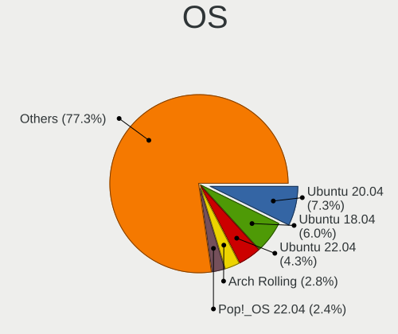

| Name                         | Desktops | Percent |
|------------------------------|----------|---------|
| Ubuntu 20.04                 | 60       | 7.29%   |
| Ubuntu 18.04                 | 49       | 5.95%   |
| Ubuntu 22.04                 | 35       | 4.25%   |
| Arch Rolling                 | 23       | 2.79%   |
| Pop!_OS 22.04                | 20       | 2.43%   |
| Zorin 17                     | 18       | 2.19%   |
| Ubuntu 24.04                 | 18       | 2.19%   |
| Debian 12                    | 18       | 2.19%   |
| Debian 11                    | 17       | 2.07%   |
| ArcoLinux Rolling            | 15       | 1.82%   |
| Zorin 16                     | 14       | 1.7%    |
| OpenMandriva 4.3             | 14       | 1.7%    |
| OpenMandriva 4.2             | 14       | 1.7%    |
| Manjaro                      | 13       | 1.58%   |
| Fedora 39                    | 12       | 1.46%   |
| Linux Mint 22.1              | 11       | 1.34%   |
| Linux Mint 20                | 11       | 1.34%   |
| Linux Mint 19.3              | 10       | 1.22%   |
| OpenMandriva 23.08           | 9        | 1.09%   |
| Ubuntu 21.04                 | 8        | 0.97%   |
| openSUSE Tumbleweed-XXXXXXXX | 8        | 0.97%   |
| Zorin 18                     | 7        | 0.85%   |
| Ubuntu 19.10                 | 7        | 0.85%   |
| Pop!_OS 20.04                | 7        | 0.85%   |
| OpenMandriva 6.0             | 7        | 0.85%   |
| OpenMandriva 23.01           | 7        | 0.85%   |
| Linux Mint 21.1              | 7        | 0.85%   |
| Fedora 42                    | 7        | 0.85%   |
| Fedora 41                    | 7        | 0.85%   |
| Fedora 40                    | 7        | 0.85%   |
| Fedora 38                    | 7        | 0.85%   |
| EndeavourOS Rolling          | 7        | 0.85%   |
| Bazzite 42                   | 7        | 0.85%   |
| Ubuntu 23.04                 | 6        | 0.73%   |
| OpenMandriva 25.90           | 6        | 0.73%   |
| OpenMandriva 24.12           | 6        | 0.73%   |
| Linux Mint 21.2              | 6        | 0.73%   |
| Linux Mint 20.2              | 6        | 0.73%   |
| Fedora 31                    | 6        | 0.73%   |
| Debian 13                    | 6        | 0.73%   |

OS Family
---------

OS without a version

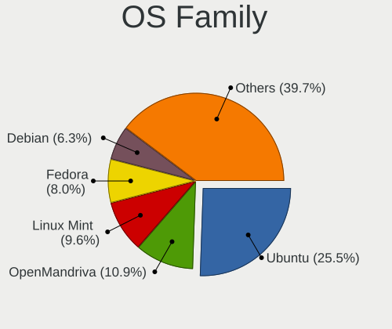

| Name              | Desktops | Percent |
|-------------------|----------|---------|
| Ubuntu            | 200      | 25.54%  |
| OpenMandriva      | 85       | 10.86%  |
| Linux Mint        | 75       | 9.58%   |
| Fedora            | 63       | 8.05%   |
| Debian            | 49       | 6.26%   |
| Zorin             | 44       | 5.62%   |
| Pop!_OS           | 36       | 4.6%    |
| Manjaro           | 25       | 3.19%   |
| Arch              | 25       | 3.19%   |
| Kubuntu           | 18       | 2.3%    |
| ArcoLinux         | 16       | 2.04%   |
| Xubuntu           | 12       | 1.53%   |
| Bazzite           | 12       | 1.53%   |
| ROSA              | 11       | 1.4%    |
| openSUSE          | 10       | 1.28%   |
| KDE neon          | 8        | 1.02%   |
| Elementary        | 8        | 1.02%   |
| Endless           | 7        | 0.89%   |
| EndeavourOS       | 7        | 0.89%   |
| CachyOS           | 7        | 0.89%   |
| Nobara            | 5        | 0.64%   |
| Ubuntu Unity      | 4        | 0.51%   |
| Ubuntu MATE       | 4        | 0.51%   |
| LMDE              | 4        | 0.51%   |
| Garuda Linux      | 4        | 0.51%   |
| Clear Linux       | 4        | 0.51%   |
| Ubuntu Budgie     | 3        | 0.38%   |
| CentOS            | 3        | 0.38%   |
| BigLinux          | 3        | 0.38%   |
| Vanilla           | 2        | 0.26%   |
| UbuntuDDE         | 2        | 0.26%   |
| SteamOS           | 2        | 0.26%   |
| Slackware         | 2        | 0.26%   |
| Peppermint        | 2        | 0.26%   |
| Gentoo            | 2        | 0.26%   |
| Xero              | 1        | 0.13%   |
| TUXEDO OS         | 1        | 0.13%   |
| Solus             | 1        | 0.13%   |
| Slackware-current | 1        | 0.13%   |
| Rocky Linux       | 1        | 0.13%   |

Kernel
------

Version of the Linux kernel

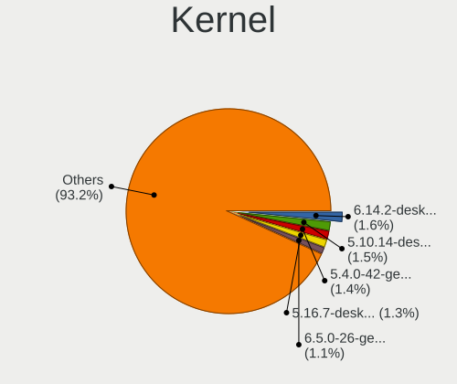

| Version                  | Desktops | Percent |
|--------------------------|----------|---------|
| 6.14.2-desktop-3omv2590  | 15       | 1.6%    |
| 5.10.14-desktop-1omv4002 | 14       | 1.49%   |
| 5.4.0-42-generic         | 13       | 1.38%   |
| 5.16.7-desktop-1omv4003  | 12       | 1.28%   |
| 6.5.0-26-generic         | 10       | 1.06%   |
| 6.4.11-desktop-1omv2390  | 9        | 0.96%   |
| 6.9.3-76060903-generic   | 7        | 0.74%   |
| 6.8.0-48-generic         | 6        | 0.64%   |
| 6.12.1-desktop-1omv2490  | 6        | 0.64%   |
| 5.15.0-76-generic        | 6        | 0.64%   |
| 5.15.0-56-generic        | 6        | 0.64%   |
| 6.8.0-60-generic         | 5        | 0.53%   |
| 6.8.0-51-generic         | 5        | 0.53%   |
| 6.8.0-40-generic         | 5        | 0.53%   |
| 6.6.2-desktop-1omv2390   | 5        | 0.53%   |
| 6.2.6-desktop-1omv2390   | 5        | 0.53%   |
| 6.14.0-37-generic        | 5        | 0.53%   |
| 6.1.1-desktop-1omv2290   | 5        | 0.53%   |
| 5.8.0-43-generic         | 5        | 0.53%   |
| 5.4.0-58-generic         | 5        | 0.53%   |
| 5.4.0-48-generic         | 5        | 0.53%   |
| 5.4.0-26-generic         | 5        | 0.53%   |
| 5.15.0-91-generic        | 5        | 0.53%   |
| 5.10.0-8-amd64           | 5        | 0.53%   |
| 6.8.0-57-generic         | 4        | 0.43%   |
| 6.8.0-41-generic         | 4        | 0.43%   |
| 5.8.0-48-generic         | 4        | 0.43%   |
| 5.8.0-44-generic         | 4        | 0.43%   |
| 5.4.0-77-generic         | 4        | 0.43%   |
| 5.4.0-52-generic         | 4        | 0.43%   |
| 5.19.0-76051900-generic  | 4        | 0.43%   |
| 5.19.0-35-generic        | 4        | 0.43%   |
| 5.15.0-58-generic        | 4        | 0.43%   |
| 5.15.0-57-generic        | 4        | 0.43%   |
| 5.13.0-7614-generic      | 4        | 0.43%   |
| 6.8.7-200.fc39.x86_64    | 3        | 0.32%   |
| 6.8.0-45-generic         | 3        | 0.32%   |
| 6.5.6-76060506-generic   | 3        | 0.32%   |
| 6.5.5-desktop-1omv2390   | 3        | 0.32%   |
| 6.5.12-300.fc39.x86_64   | 3        | 0.32%   |

Kernel Family
-------------

Linux kernel without a distro release

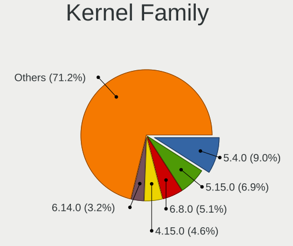

| Version | Desktops | Percent |
|---------|----------|---------|
| 5.4.0   | 79       | 9.03%   |
| 5.15.0  | 60       | 6.86%   |
| 6.8.0   | 45       | 5.14%   |
| 4.15.0  | 40       | 4.57%   |
| 6.14.0  | 28       | 3.2%    |
| 5.8.0   | 28       | 3.2%    |
| 6.5.0   | 26       | 2.97%   |
| 5.3.0   | 25       | 2.86%   |
| 5.11.0  | 22       | 2.51%   |
| 5.19.0  | 17       | 1.94%   |
| 5.13.0  | 17       | 1.94%   |
| 6.2.0   | 16       | 1.83%   |
| 6.14.2  | 16       | 1.83%   |
| 5.0.0   | 16       | 1.83%   |
| 5.10.14 | 14       | 1.6%    |
| 5.10.0  | 14       | 1.6%    |
| 6.1.0   | 13       | 1.49%   |
| 4.18.0  | 13       | 1.49%   |
| 5.16.7  | 12       | 1.37%   |
| 6.4.11  | 9        | 1.03%   |
| 6.12.1  | 8        | 0.91%   |
| 6.9.3   | 7        | 0.8%    |
| 6.2.6   | 7        | 0.8%    |
| 6.1.1   | 6        | 0.69%   |
| 6.8.7   | 5        | 0.57%   |
| 6.6.2   | 5        | 0.57%   |
| 6.5.5   | 5        | 0.57%   |
| 6.17.7  | 5        | 0.57%   |
| 6.12.10 | 5        | 0.57%   |
| 6.11.0  | 5        | 0.57%   |
| 6.0.9   | 5        | 0.57%   |
| 4.19.0  | 5        | 0.57%   |
| 6.5.6   | 4        | 0.46%   |
| 6.5.12  | 4        | 0.46%   |
| 6.3.5   | 4        | 0.46%   |
| 6.16.4  | 4        | 0.46%   |
| 6.15.4  | 4        | 0.46%   |
| 6.12.9  | 4        | 0.46%   |
| 5.15.7  | 4        | 0.46%   |
| 5.11.12 | 4        | 0.46%   |

Kernel Major Ver.
-----------------

Linux kernel major version

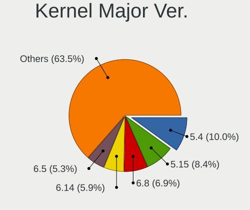

| Version | Desktops | Percent |
|---------|----------|---------|
| 5.4     | 85       | 9.96%   |
| 5.15    | 72       | 8.44%   |
| 6.8     | 59       | 6.92%   |
| 6.14    | 50       | 5.86%   |
| 6.5     | 45       | 5.28%   |
| 4.15    | 41       | 4.81%   |
| 5.8     | 35       | 4.1%    |
| 6.2     | 34       | 3.99%   |
| 5.10    | 32       | 3.75%   |
| 6.12    | 29       | 3.4%    |
| 6.1     | 28       | 3.28%   |
| 5.11    | 27       | 3.17%   |
| 5.3     | 25       | 2.93%   |
| 5.19    | 24       | 2.81%   |
| 5.13    | 24       | 2.81%   |
| 6.6     | 19       | 2.23%   |
| 6.15    | 16       | 1.88%   |
| 6.11    | 16       | 1.88%   |
| 5.16    | 16       | 1.88%   |
| 5.0     | 16       | 1.88%   |
| 4.18    | 16       | 1.88%   |
| 6.17    | 15       | 1.76%   |
| 6.0     | 13       | 1.52%   |
| 6.16    | 12       | 1.41%   |
| 6.9     | 10       | 1.17%   |
| 6.4     | 10       | 1.17%   |
| 6.3     | 8        | 0.94%   |
| 4.9     | 8        | 0.94%   |
| 6.13    | 7        | 0.82%   |
| 5.18    | 7        | 0.82%   |
| 6.10    | 6        | 0.7%    |
| 5.7     | 6        | 0.7%    |
| 5.14    | 6        | 0.7%    |
| 4.19    | 6        | 0.7%    |
| 5.9     | 5        | 0.59%   |
| 5.12    | 5        | 0.59%   |
| 5.6     | 3        | 0.35%   |
| 5.5     | 3        | 0.35%   |
| 5.17    | 3        | 0.35%   |
| 6.7     | 2        | 0.23%   |

Arch
----

OS architecture (x86_64, i586, etc.)

| Name   | Desktops | Percent |
|--------|----------|---------|
| x86_64 | 723      | 97.57%  |
| i686   | 18       | 2.43%   |

DE
--

Desktop Environment

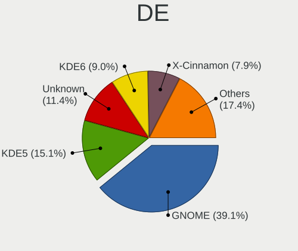

| Name                  | Desktops | Percent |
|-----------------------|----------|---------|
| GNOME                 | 308      | 39.14%  |
| KDE5                  | 119      | 15.12%  |
| Unknown               | 90       | 11.44%  |
| KDE6                  | 71       | 9.02%   |
| X-Cinnamon            | 62       | 7.88%   |
| XFCE                  | 56       | 7.12%   |
| KDE                   | 15       | 1.91%   |
| MATE                  | 11       | 1.4%    |
| Pantheon              | 9        | 1.14%   |
| Budgie                | 8        | 1.02%   |
| awesome               | 6        | 0.76%   |
| Cinnamon              | 5        | 0.64%   |
| Unity                 | 4        | 0.51%   |
| KDE4                  | 4        | 0.51%   |
| GNOME Flashback       | 4        | 0.51%   |
| LXQt                  | 3        | 0.38%   |
| i3                    | 3        | 0.38%   |
| Hyprland              | 2        | 0.25%   |
| Deepin                | 2        | 0.25%   |
| sway:wlroots:sway-run | 1        | 0.13%   |
| qtile                 | 1        | 0.13%   |
| LXDE                  | 1        | 0.13%   |
| LeftWM                | 1        | 0.13%   |
| chadwm                | 1        | 0.13%   |

Display Server
--------------

X11 or Wayland

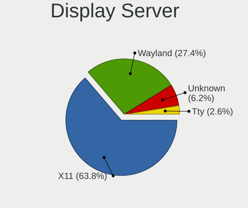

| Name    | Desktops | Percent |
|---------|----------|---------|
| X11     | 491      | 63.77%  |
| Wayland | 211      | 27.4%   |
| Unknown | 48       | 6.23%   |
| Tty     | 20       | 2.6%    |

Display Manager
---------------

SDDM, LightDM, etc.

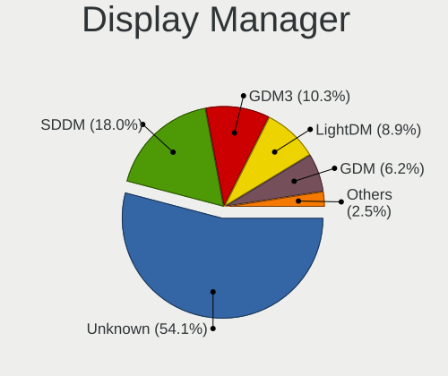

| Name    | Desktops | Percent |
|---------|----------|---------|
| Unknown | 418      | 54.08%  |
| SDDM    | 139      | 17.98%  |
| GDM3    | 80       | 10.35%  |
| LightDM | 69       | 8.93%   |
| GDM     | 48       | 6.21%   |
| TDM     | 14       | 1.81%   |
| KDM     | 3        | 0.39%   |
| XDM     | 1        | 0.13%   |
| GREETD  | 1        | 0.13%   |

OS Lang
-------

Language

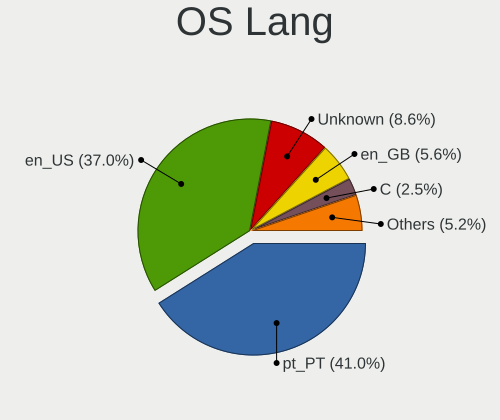

| Lang       | Desktops | Percent |
|------------|----------|---------|
| pt_PT      | 314      | 41.05%  |
| en_US      | 283      | 36.99%  |
| Unknown    | 66       | 8.63%   |
| en_GB      | 43       | 5.62%   |
| C          | 19       | 2.48%   |
| ru_RU      | 7        | 0.92%   |
| pt_BR      | 7        | 0.92%   |
| fr_FR      | 7        | 0.92%   |
| de_DE      | 5        | 0.65%   |
| sv_SE      | 3        | 0.39%   |
| es_ES      | 3        | 0.39%   |
| en_IE      | 3        | 0.39%   |
| en_CA      | 2        | 0.26%   |
| pt_PT@euro | 1        | 0.13%   |
| en_PT      | 1        | 0.13%   |
| en_DK      | 1        | 0.13%   |

Boot Mode
---------

EFI or BIOS

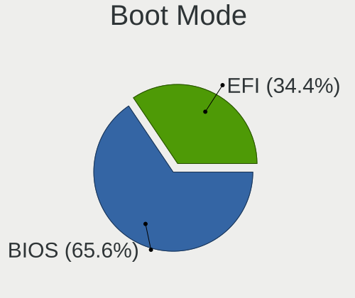

| Mode | Desktops | Percent |
|------|----------|---------|
| BIOS | 501      | 65.58%  |
| EFI  | 263      | 34.42%  |

Filesystem
----------

Type of filesystem

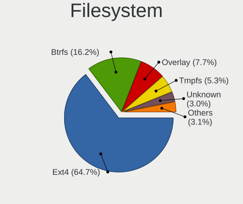

| Type    | Desktops | Percent |
|---------|----------|---------|
| Ext4    | 498      | 64.68%  |
| Btrfs   | 125      | 16.23%  |
| Overlay | 59       | 7.66%   |
| Tmpfs   | 41       | 5.32%   |
| Unknown | 23       | 2.99%   |
| Xfs     | 13       | 1.69%   |
| Zfs     | 6        | 0.78%   |
| XXXXX   | 1        | 0.13%   |
| Rootfs  | 1        | 0.13%   |
| F2fs    | 1        | 0.13%   |
| Ext3    | 1        | 0.13%   |
| Aufs    | 1        | 0.13%   |

Part. scheme
------------

Scheme of partitioning

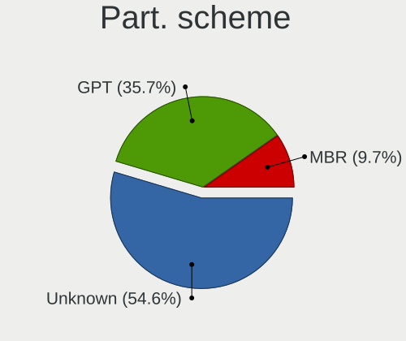

| Type    | Desktops | Percent |
|---------|----------|---------|
| Unknown | 421      | 54.6%   |
| GPT     | 275      | 35.67%  |
| MBR     | 75       | 9.73%   |

Dual Boot with Linux/BSD
------------------------

Hosting more than one Linux/BSD

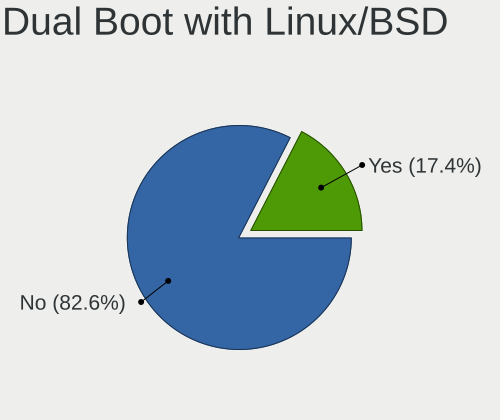

| Dual boot | Desktops | Percent |
|-----------|----------|---------|
| No        | 625      | 82.56%  |
| Yes       | 132      | 17.44%  |

Dual Boot (Win)
---------------

Hosting Linux and Windows

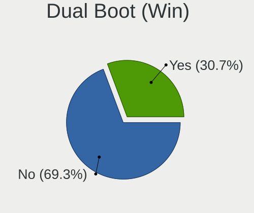

| Dual boot | Desktops | Percent |
|-----------|----------|---------|
| No        | 529      | 69.33%  |
| Yes       | 234      | 30.67%  |

Board
-----

Vendor
------

Motherboard manufacturer

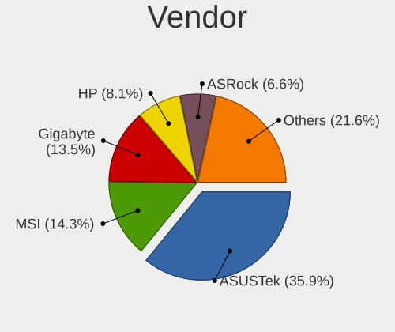

| Name                                 | Desktops | Percent |
|--------------------------------------|----------|---------|
| ASUSTek Computer                     | 266      | 35.9%   |
| MSI                                  | 106      | 14.3%   |
| Gigabyte Technology                  | 100      | 13.5%   |
| Hewlett-Packard                      | 60       | 8.1%    |
| ASRock                               | 49       | 6.61%   |
| Dell                                 | 26       | 3.51%   |
| Lenovo                               | 17       | 2.29%   |
| Intel                                | 17       | 2.29%   |
| Acer                                 | 14       | 1.89%   |
| Fujitsu                              | 11       | 1.48%   |
| Foxconn                              | 9        | 1.21%   |
| Unknown                              | 9        | 1.21%   |
| Biostar                              | 6        | 0.81%   |
| Shenzhen Meigao Electronic Equipment | 5        | 0.67%   |
| Pegatron                             | 5        | 0.67%   |
| MACHINIST                            | 4        | 0.54%   |
| eMachines                            | 3        | 0.4%    |
| Packard Bell                         | 2        | 0.27%   |
| OEM                                  | 2        | 0.27%   |
| Minix                                | 2        | 0.27%   |
| Medion                               | 2        | 0.27%   |
| Huanan                               | 2        | 0.27%   |
| ECS                                  | 2        | 0.27%   |
| AZW                                  | 2        | 0.27%   |
| Apple                                | 2        | 0.27%   |
| ABIT                                 | 2        | 0.27%   |
| Vorke                                | 1        | 0.13%   |
| Shuttle                              | 1        | 0.13%   |
| RKM                                  | 1        | 0.13%   |
| NPC Air                              | 1        | 0.13%   |
| NEC Computers                        | 1        | 0.13%   |
| Libretrend                           | 1        | 0.13%   |
| JGINYUE                              | 1        | 0.13%   |
| IceWhale Technology                  | 1        | 0.13%   |
| IBM                                  | 1        | 0.13%   |
| Google                               | 1        | 0.13%   |
| GIADA                                | 1        | 0.13%   |
| BESSTAR Tech                         | 1        | 0.13%   |
| BCM                                  | 1        | 0.13%   |
| ASRockRack                           | 1        | 0.13%   |

Model
-----

Motherboard model

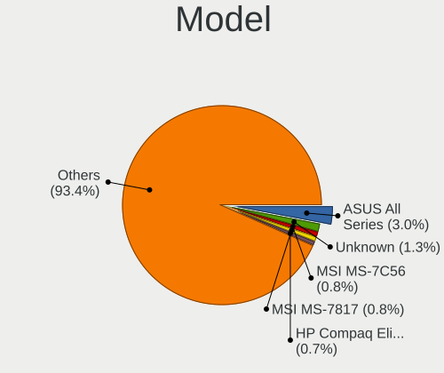

| Name                                              | Desktops | Percent |
|---------------------------------------------------|----------|---------|
| ASUS All Series                                   | 22       | 2.97%   |
| Unknown                                           | 10       | 1.35%   |
| MSI MS-7C56                                       | 6        | 0.81%   |
| MSI MS-7817                                       | 6        | 0.81%   |
| HP Compaq Elite 8300 SFF                          | 5        | 0.67%   |
| ASUS P5G41T-M LX                                  | 5        | 0.67%   |
| ASUS H110M-K                                      | 5        | 0.67%   |
| MSI MS-7C95                                       | 4        | 0.54%   |
| MSI MS-7C91                                       | 4        | 0.54%   |
| MSI MS-7B89                                       | 4        | 0.54%   |
| MSI MS-7B86                                       | 4        | 0.54%   |
| HP OMEN by Obelisk Desktop 875-0xxx               | 4        | 0.54%   |
| Gigabyte B550 AORUS ELITE                         | 4        | 0.54%   |
| ASUS P8H61-M LX R2.0                              | 4        | 0.54%   |
| ASUS M5A78L-M/USB3                                | 4        | 0.54%   |
| MSI MS-7C37                                       | 3        | 0.4%    |
| MSI MS-7B17                                       | 3        | 0.4%    |
| MSI MS-7A38                                       | 3        | 0.4%    |
| HP Compaq 8000 Elite SFF PC                       | 3        | 0.4%    |
| Gigabyte GA-78LMT-USB3 6.0                        | 3        | 0.4%    |
| Gigabyte B550 GAMING X V2                         | 3        | 0.4%    |
| Gigabyte B450M DS3H                               | 3        | 0.4%    |
| Fujitsu ESPRIMO P3521                             | 3        | 0.4%    |
| ASUS TUF Gaming B550-PLUS                         | 3        | 0.4%    |
| ASUS PRIME H510M-K                                | 3        | 0.4%    |
| ASUS PRIME B450-PLUS                              | 3        | 0.4%    |
| ASUS PRIME B350-PLUS                              | 3        | 0.4%    |
| ASUS PRIME A320M-K                                | 3        | 0.4%    |
| ASUS P5P43TD PRO                                  | 3        | 0.4%    |
| ASRock A520M-HVS                                  | 3        | 0.4%    |
| Shenzhen Meigao Electronic Equipment Venus Series | 2        | 0.27%   |
| MSI MS-7C75                                       | 2        | 0.27%   |
| MSI MS-7B79                                       | 2        | 0.27%   |
| MSI MS-7A34                                       | 2        | 0.27%   |
| MSI MS-7972                                       | 2        | 0.27%   |
| MSI MS-7721                                       | 2        | 0.27%   |
| MSI MS-7640                                       | 2        | 0.27%   |
| MSI MS-7592                                       | 2        | 0.27%   |
| Minix Z83-4                                       | 2        | 0.27%   |
| Intel B75                                         | 2        | 0.27%   |

Model Family
------------

Motherboard model prefix

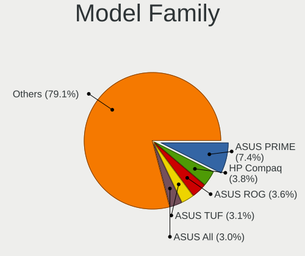

| Name                   | Desktops | Percent |
|------------------------|----------|---------|
| ASUS PRIME             | 55       | 7.42%   |
| HP Compaq              | 28       | 3.78%   |
| ASUS ROG               | 27       | 3.64%   |
| ASUS TUF               | 23       | 3.1%    |
| ASUS All               | 22       | 2.97%   |
| Dell OptiPlex          | 16       | 2.16%   |
| Gigabyte B550          | 13       | 1.75%   |
| Acer Aspire            | 13       | 1.75%   |
| Lenovo ThinkCentre     | 11       | 1.48%   |
| ASUS P5G41T-M          | 10       | 1.35%   |
| Unknown                | 10       | 1.35%   |
| Fujitsu ESPRIMO        | 9        | 1.21%   |
| ASUS P8H61-M           | 9        | 1.21%   |
| HP ProDesk             | 7        | 0.94%   |
| MSI MS-7C56            | 6        | 0.81%   |
| MSI MS-7817            | 6        | 0.81%   |
| Gigabyte B450M         | 6        | 0.81%   |
| ASUS M5A78L-M          | 6        | 0.81%   |
| HP EliteDesk           | 5        | 0.67%   |
| Gigabyte X570          | 5        | 0.67%   |
| Gigabyte B550M         | 5        | 0.67%   |
| ASUS H110M-K           | 5        | 0.67%   |
| MSI MS-7C95            | 4        | 0.54%   |
| MSI MS-7C91            | 4        | 0.54%   |
| MSI MS-7B89            | 4        | 0.54%   |
| MSI MS-7B86            | 4        | 0.54%   |
| HP OMEN                | 4        | 0.54%   |
| Dell Precision         | 4        | 0.54%   |
| ASUS P8Z77-V           | 4        | 0.54%   |
| MSI MS-7C37            | 3        | 0.4%    |
| MSI MS-7B17            | 3        | 0.4%    |
| MSI MS-7A38            | 3        | 0.4%    |
| Lenovo IdeaCentre      | 3        | 0.4%    |
| HP ProLiant            | 3        | 0.4%    |
| HP Pavilion            | 3        | 0.4%    |
| Gigabyte GA-78LMT-USB3 | 3        | 0.4%    |
| Gigabyte B650          | 3        | 0.4%    |
| Gigabyte B450          | 3        | 0.4%    |
| Dell Vostro            | 3        | 0.4%    |
| ASUS STRIX             | 3        | 0.4%    |

MFG Year
--------

Motherboard manufacture year

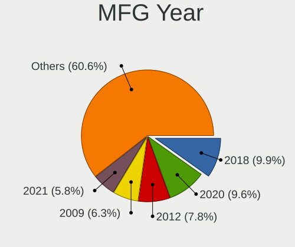

| Year | Desktops | Percent |
|------|----------|---------|
| 2018 | 73       | 9.85%   |
| 2020 | 71       | 9.58%   |
| 2012 | 58       | 7.83%   |
| 2009 | 47       | 6.34%   |
| 2021 | 43       | 5.8%    |
| 2019 | 43       | 5.8%    |
| 2014 | 40       | 5.4%    |
| 2010 | 40       | 5.4%    |
| 2013 | 37       | 4.99%   |
| 2022 | 35       | 4.72%   |
| 2008 | 33       | 4.45%   |
| 2016 | 31       | 4.18%   |
| 2023 | 30       | 4.05%   |
| 2017 | 30       | 4.05%   |
| 2011 | 30       | 4.05%   |
| 2015 | 29       | 3.91%   |
| 2007 | 22       | 2.97%   |
| 2006 | 21       | 2.83%   |
| 2024 | 12       | 1.62%   |
| 2005 | 7        | 0.94%   |
| 2025 | 4        | 0.54%   |
| 2004 | 4        | 0.54%   |
| 2003 | 1        | 0.13%   |

Form Factor
-----------

Physical design of the computer

| Name    | Desktops | Percent |
|---------|----------|---------|
| Desktop | 741      | 100%    |

Secure Boot
-----------

Enabled or disabled

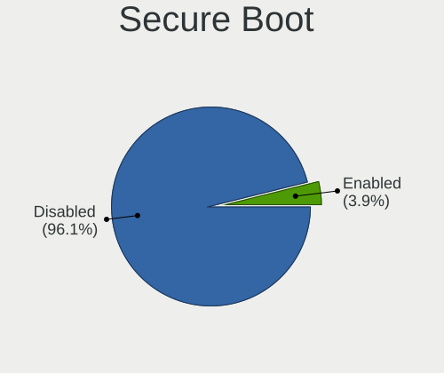

| State    | Desktops | Percent |
|----------|----------|---------|
| Disabled | 717      | 96.11%  |
| Enabled  | 29       | 3.89%   |

Coreboot
--------

Have coreboot on board

| Used | Desktops | Percent |
|------|----------|---------|
| No   | 739      | 99.73%  |
| Yes  | 2        | 0.27%   |

RAM Size
--------

Total RAM memory

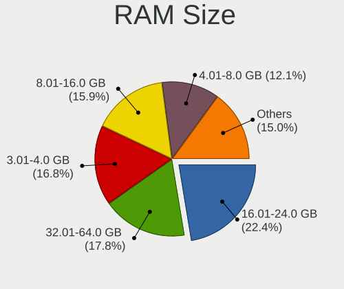

| Size in GB  | Desktops | Percent |
|-------------|----------|---------|
| 16.01-24.0  | 172      | 22.4%   |
| 32.01-64.0  | 137      | 17.84%  |
| 3.01-4.0    | 129      | 16.8%   |
| 8.01-16.0   | 122      | 15.89%  |
| 4.01-8.0    | 93       | 12.11%  |
| 64.01-256.0 | 43       | 5.6%    |
| 24.01-32.0  | 33       | 4.3%    |
| 1.01-2.0    | 23       | 2.99%   |
| 2.01-3.0    | 15       | 1.95%   |
| 0.51-1.0    | 1        | 0.13%   |

RAM Used
--------

Used RAM memory

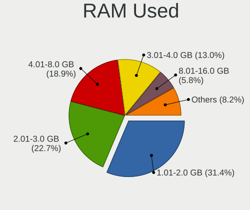

| Used GB    | Desktops | Percent |
|------------|----------|---------|
| 1.01-2.0   | 263      | 31.38%  |
| 2.01-3.0   | 190      | 22.67%  |
| 4.01-8.0   | 158      | 18.85%  |
| 3.01-4.0   | 109      | 13.01%  |
| 8.01-16.0  | 49       | 5.85%   |
| 0.51-1.0   | 44       | 5.25%   |
| 16.01-24.0 | 10       | 1.19%   |
| 0.01-0.5   | 7        | 0.84%   |
| 24.01-32.0 | 4        | 0.48%   |
| 32.01-64.0 | 3        | 0.36%   |
| Unknown    | 1        | 0.12%   |

Total Drives
------------

Number of drives on board

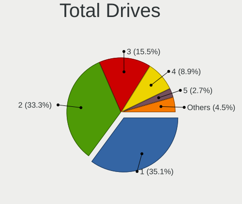

| Drives | Desktops | Percent |
|--------|----------|---------|
| 1      | 275      | 35.12%  |
| 2      | 261      | 33.33%  |
| 3      | 121      | 15.45%  |
| 4      | 70       | 8.94%   |
| 5      | 21       | 2.68%   |
| 6      | 14       | 1.79%   |
| 0      | 9        | 1.15%   |
| 7      | 5        | 0.64%   |
| 8      | 3        | 0.38%   |
| 10     | 2        | 0.26%   |
| 13     | 1        | 0.13%   |
| 11     | 1        | 0.13%   |

Has CD-ROM
----------

Has CD-ROM on board

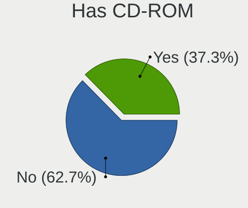

| Presented | Desktops | Percent |
|-----------|----------|---------|
| No        | 468      | 62.65%  |
| Yes       | 279      | 37.35%  |

Has Ethernet
------------

Has Ethernet on board

| Presented | Desktops | Percent |
|-----------|----------|---------|
| Yes       | 738      | 99.6%   |
| No        | 3        | 0.4%    |

Has WiFi
--------

Has WiFi module

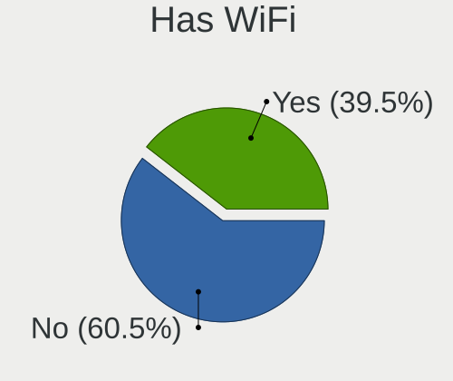

| Presented | Desktops | Percent |
|-----------|----------|---------|
| No        | 458      | 60.5%   |
| Yes       | 299      | 39.5%   |

Has Bluetooth
-------------

Has Bluetooth module

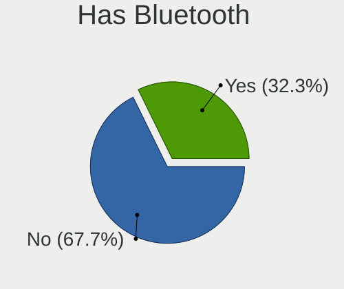

| Presented | Desktops | Percent |
|-----------|----------|---------|
| No        | 514      | 67.72%  |
| Yes       | 245      | 32.28%  |

Location
--------

Country
-------

Geographic location (country)

| Country  | Desktops | Percent |
|----------|----------|---------|
| Portugal | 741      | 100%    |

City
----

Geographic location (city)

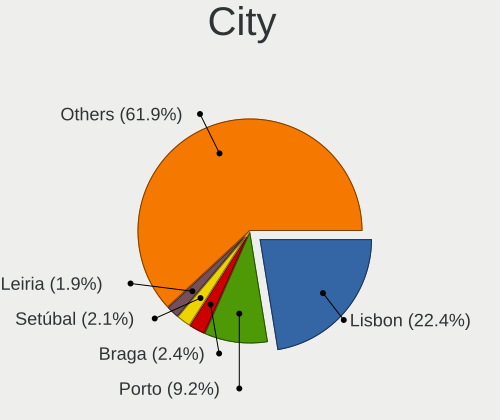

| City                    | Desktops | Percent |
|-------------------------|----------|---------|
| Lisbon                  | 178      | 22.45%  |
| Porto                   | 73       | 9.21%   |
| Braga                   | 19       | 2.4%    |
| Setúbal                | 17       | 2.14%   |
| Leiria                  | 15       | 1.89%   |
| Aveiro                  | 14       | 1.77%   |
| Amadora                 | 14       | 1.77%   |
| Vila Nova de Gaia       | 13       | 1.64%   |
| Coimbra                 | 13       | 1.64%   |
| Portimao                | 10       | 1.26%   |
| Faro                    | 10       | 1.26%   |
| Evora                   | 10       | 1.26%   |
| Gondomar                | 9        | 1.13%   |
| Quinta Do Conde         | 8        | 1.01%   |
| Maia                    | 8        | 1.01%   |
| Almada                  | 8        | 1.01%   |
| Torres Vedras           | 7        | 0.88%   |
| Palmela                 | 7        | 0.88%   |
| Odivelas                | 7        | 0.88%   |
| Amora                   | 7        | 0.88%   |
| Sintra                  | 6        | 0.76%   |
| Povoa de Santa Iria     | 6        | 0.76%   |
| Ponta Delgada           | 6        | 0.76%   |
| Mem Martins             | 6        | 0.76%   |
| Loures                  | 6        | 0.76%   |
| Guimaraes               | 6        | 0.76%   |
| Covilha                 | 6        | 0.76%   |
| Viana do Castelo        | 5        | 0.63%   |
| Santarém               | 5        | 0.63%   |
| Póvoa de Varzim        | 5        | 0.63%   |
| Matosinhos Municipality | 5        | 0.63%   |
| Mafra                   | 5        | 0.63%   |
| Funchal                 | 5        | 0.63%   |
| Barreiro                | 5        | 0.63%   |
| Vila do Conde           | 4        | 0.5%    |
| Trofa                   | 4        | 0.5%    |
| Tomar                   | 4        | 0.5%    |
| Senhora da Hora         | 4        | 0.5%    |
| Sao Domingos de Rana    | 4        | 0.5%    |
| Queluz                  | 4        | 0.5%    |

Drives
------

Drive Vendor
------------

Hard drive vendors

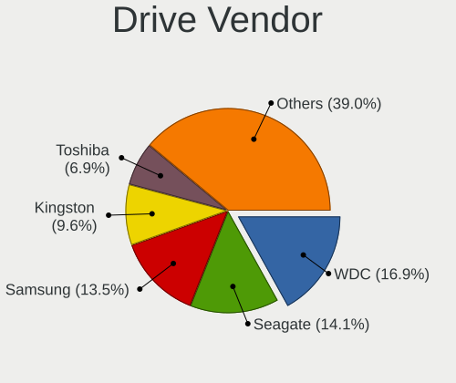

| Vendor                      | Desktops | Drives | Percent |
|-----------------------------|----------|--------|---------|
| WDC                         | 243      | 421    | 16.93%  |
| Seagate                     | 202      | 316    | 14.08%  |
| Samsung Electronics         | 194      | 300    | 13.52%  |
| Kingston                    | 138      | 202    | 9.62%   |
| Toshiba                     | 99       | 153    | 6.9%    |
| Sandisk                     | 70       | 98     | 4.88%   |
| Crucial                     | 66       | 91     | 4.6%    |
| Hitachi                     | 44       | 60     | 3.07%   |
| Phison Electronics          | 21       | 23     | 1.46%   |
| Maxtor                      | 21       | 29     | 1.46%   |
| Kingston Technology Company | 20       | 25     | 1.39%   |
| Unknown                     | 18       | 22     | 1.25%   |
| KIOXIA-EXCERIA              | 17       | 27     | 1.18%   |
| BlueRay                     | 17       | 21     | 1.18%   |
| Micron/Crucial Technology   | 16       | 18     | 1.11%   |
| PNY                         | 15       | 19     | 1.05%   |
| GOODRAM                     | 14       | 18     | 0.98%   |
| China                       | 14       | 22     | 0.98%   |
| Micron Technology           | 11       | 11     | 0.77%   |
| MAXIO Technology (Hangzhou) | 10       | 11     | 0.7%    |
| KIOXIA                      | 10       | 12     | 0.7%    |
| HGST                        | 10       | 18     | 0.7%    |
| Emtec                       | 10       | 11     | 0.7%    |
| OCZ                         | 8        | 8      | 0.56%   |
| Intel                       | 8        | 12     | 0.56%   |
| S3+                         | 7        | 8      | 0.49%   |
| Phison                      | 7        | 13     | 0.49%   |
| Hewlett-Packard             | 7        | 10     | 0.49%   |
| Gigabyte Technology         | 6        | 7      | 0.42%   |
| Team                        | 5        | 12     | 0.35%   |
| SK hynix                    | 5        | 6      | 0.35%   |
| ExcelStor                   | 5        | 5      | 0.35%   |
| A-DATA Technology           | 5        | 5      | 0.35%   |
| T-FORCE                     | 4        | 5      | 0.28%   |
| Intenso                     | 4        | 7      | 0.28%   |
| ADATA Technology            | 4        | 4      | 0.28%   |
| Realtek Semiconductor       | 3        | 4      | 0.21%   |
| MSI                         | 3        | 9      | 0.21%   |
| Fujitsu                     | 3        | 3      | 0.21%   |
| EAGET                       | 3        | 8      | 0.21%   |

Drive Model
-----------

Hard drive models

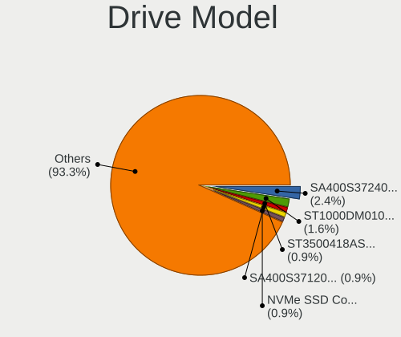

| Model                                              | Desktops | Percent |
|----------------------------------------------------|----------|---------|
| Kingston SA400S37240G 240GB SSD                    | 38       | 2.36%   |
| Seagate ST1000DM010-2EP102 1TB                     | 25       | 1.55%   |
| Seagate ST3500418AS 500GB                          | 15       | 0.93%   |
| Kingston SA400S37120G 120GB SSD                    | 15       | 0.93%   |
| Samsung NVMe SSD Controller SM981/PM981/PM983 1TB  | 14       | 0.87%   |
| Samsung NVMe SSD Controller PM9A1/PM9A3/980PRO 1TB | 14       | 0.87%   |
| Toshiba HDWD110 1TB                                | 13       | 0.81%   |
| Seagate ST2000DM008-2FR102 2TB                     | 12       | 0.75%   |
| Samsung SSD 850 EVO 250GB                          | 12       | 0.75%   |
| Samsung SSD 860 EVO 500GB                          | 11       | 0.68%   |
| Kingston SV300S37A240G 240GB SSD                   | 10       | 0.62%   |
| Kingston SV300S37A120G 120GB SSD                   | 10       | 0.62%   |
| Seagate ST500DM002-1BD142 500GB                    | 9        | 0.56%   |
| Kingston Company SNV2S1000G 1TB                    | 9        | 0.56%   |
| Kingston SA400S37480G 480GB SSD                    | 9        | 0.56%   |
| WDC WD10EZEX-08WN4A0 1TB                           | 8        | 0.5%    |
| Toshiba DT01ACA100 1TB                             | 8        | 0.5%    |
| Micron/Crucial P2 NVMe PCIe SSD 2TB                | 8        | 0.5%    |
| Kingston SUV400S37120G 120GB SSD                   | 8        | 0.5%    |
| Kingston SA400S37960G 960GB SSD                    | 8        | 0.5%    |
| Crucial CT500MX500SSD1 500GB                       | 8        | 0.5%    |
| WDC WDS100T2B0A-00SM50 1TB SSD                     | 7        | 0.44%   |
| Toshiba DT01ACA050 500GB                           | 7        | 0.44%   |
| Seagate ST4000DM004-2CV104 4TB                     | 7        | 0.44%   |
| Seagate ST2000DM008-2UB102 2TB                     | 7        | 0.44%   |
| Sandisk WD_BLACK SN770 1TB                         | 7        | 0.44%   |
| SanDisk NVMe SSD Drive 1TB                         | 7        | 0.44%   |
| Samsung SSD 850 EVO 500GB                          | 7        | 0.44%   |
| Phison E12 NVMe Controller 1TB                     | 7        | 0.44%   |
| Crucial CT1000MX500SSD1 1TB                        | 7        | 0.44%   |
| WDC WD20EARX-00PASB0 2TB                           | 6        | 0.37%   |
| WDC WD10EARS-00Y5B1 1TB                            | 6        | 0.37%   |
| Toshiba MQ01ABD100 1TB                             | 6        | 0.37%   |
| Toshiba HDWD120 2TB                                | 6        | 0.37%   |
| Samsung SSD 850 PRO 256GB                          | 6        | 0.37%   |
| Samsung HD161HJ 160GB                              | 6        | 0.37%   |
| KIOXIA NVMe SSD 1TB                                | 6        | 0.37%   |
| Crucial CT240BX500SSD1 240GB                       | 6        | 0.37%   |
| WDC WDS240G2G0A-00JH30 240GB SSD                   | 5        | 0.31%   |
| WDC WD5000AAKX-60U6AA0 500GB                       | 5        | 0.31%   |

HDD Vendor
----------

Hard disk drive vendors

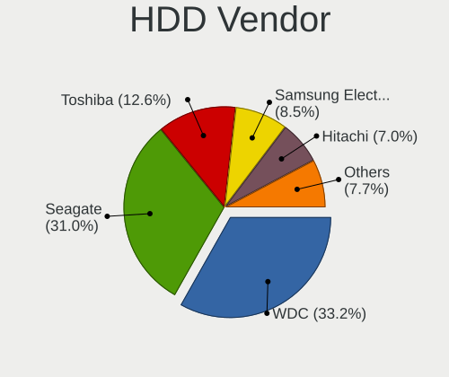

| Vendor              | Desktops | Drives | Percent |
|---------------------|----------|--------|---------|
| WDC                 | 210      | 348    | 33.18%  |
| Seagate             | 196      | 308    | 30.96%  |
| Toshiba             | 80       | 122    | 12.64%  |
| Samsung Electronics | 54       | 80     | 8.53%   |
| Hitachi             | 44       | 60     | 6.95%   |
| Maxtor              | 19       | 27     | 3%      |
| HGST                | 10       | 18     | 1.58%   |
| ExcelStor           | 5        | 5      | 0.79%   |
| Unknown             | 4        | 6      | 0.63%   |
| JMicron Technology  | 2        | 2      | 0.32%   |
| Fujitsu             | 2        | 2      | 0.32%   |
| Apple               | 2        | 4      | 0.32%   |
| TO Exter            | 1        | 1      | 0.16%   |
| Quantum             | 1        | 1      | 0.16%   |
| Hewlett-Packard     | 1        | 2      | 0.16%   |
| External            | 1        | 1      | 0.16%   |
| ASMedia             | 1        | 2      | 0.16%   |

SSD Vendor
----------

Solid state drive vendors

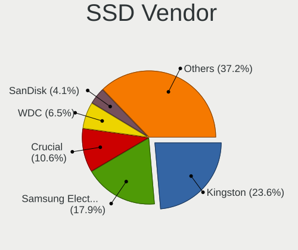

| Vendor              | Desktops | Drives | Percent |
|---------------------|----------|--------|---------|
| Kingston            | 120      | 162    | 23.62%  |
| Samsung Electronics | 91       | 129    | 17.91%  |
| Crucial             | 54       | 75     | 10.63%  |
| WDC                 | 33       | 54     | 6.5%    |
| SanDisk             | 21       | 24     | 4.13%   |
| BlueRay             | 15       | 16     | 2.95%   |
| Toshiba             | 14       | 23     | 2.76%   |
| China               | 14       | 22     | 2.76%   |
| GOODRAM             | 12       | 16     | 2.36%   |
| PNY                 | 11       | 14     | 2.17%   |
| Emtec               | 10       | 11     | 1.97%   |
| KIOXIA-EXCERIA      | 9        | 17     | 1.77%   |
| OCZ                 | 8        | 8      | 1.57%   |
| S3+                 | 7        | 8      | 1.38%   |
| Intel               | 6        | 9      | 1.18%   |
| Hewlett-Packard     | 6        | 8      | 1.18%   |
| Micron Technology   | 5        | 5      | 0.98%   |
| A-DATA Technology   | 5        | 5      | 0.98%   |
| Unknown             | 4        | 4      | 0.79%   |
| Team                | 4        | 4      | 0.79%   |
| Intenso             | 4        | 7      | 0.79%   |
| Gigabyte Technology | 4        | 5      | 0.79%   |
| SK hynix            | 3        | 3      | 0.59%   |
| MSI                 | 3        | 9      | 0.59%   |
| EAGET               | 3        | 8      | 0.59%   |
| Apacer              | 3        | 4      | 0.59%   |
| 2-Power             | 3        | 4      | 0.59%   |
| Zheino              | 2        | 3      | 0.39%   |
| Verbatim            | 2        | 2      | 0.39%   |
| Vaseky              | 2        | 2      | 0.39%   |
| T-FORCE             | 2        | 2      | 0.39%   |
| Seagate             | 2        | 2      | 0.39%   |
| Netac               | 2        | 3      | 0.39%   |
| Maxtor              | 2        | 2      | 0.39%   |
| LITEON              | 2        | 2      | 0.39%   |
| KingDian            | 2        | 5      | 0.39%   |
| XrayDisk            | 1        | 2      | 0.2%    |
| Transcend           | 1        | 1      | 0.2%    |
| SPCC                | 1        | 1      | 0.2%    |
| Patriot             | 1        | 1      | 0.2%    |

Drive Kind
----------

HDD or SSD

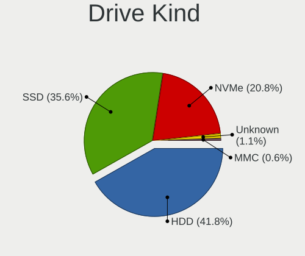

| Kind    | Desktops | Drives | Percent |
|---------|----------|--------|---------|
| HDD     | 480      | 989    | 41.81%  |
| SSD     | 409      | 697    | 35.63%  |
| NVMe    | 239      | 423    | 20.82%  |
| Unknown | 13       | 18     | 1.13%   |
| MMC     | 7        | 8      | 0.61%   |

Drive Connector
---------------

SATA, SAS, NVMe, etc.

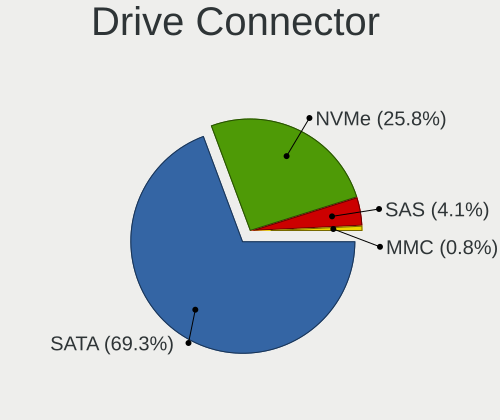

| Type | Desktops | Drives | Percent |
|------|----------|--------|---------|
| SATA | 642      | 1647   | 69.33%  |
| NVMe | 239      | 421    | 25.81%  |
| SAS  | 38       | 59     | 4.1%    |
| MMC  | 7        | 8      | 0.76%   |

Drive Size
----------

Size of hard drive

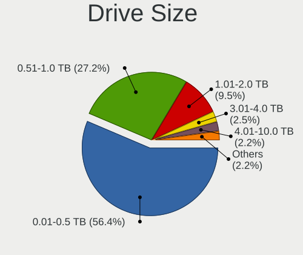

| Size in TB | Desktops | Drives | Percent |
|------------|----------|--------|---------|
| 0.01-0.5   | 512      | 1014   | 56.39%  |
| 0.51-1.0   | 247      | 430    | 27.2%   |
| 1.01-2.0   | 86       | 132    | 9.47%   |
| 3.01-4.0   | 23       | 41     | 2.53%   |
| 4.01-10.0  | 20       | 40     | 2.2%    |
| 2.01-3.0   | 16       | 20     | 1.76%   |
| 10.01-20.0 | 3        | 8      | 0.33%   |
| 0          | 1        | 1      | 0.11%   |

Space Total
-----------

Amount of disk space available on the file system

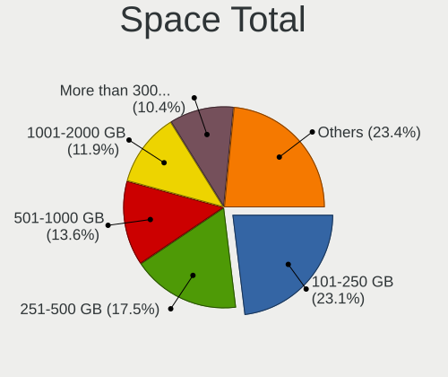

| Size in GB     | Desktops | Percent |
|----------------|----------|---------|
| 101-250        | 186      | 23.08%  |
| 251-500        | 141      | 17.49%  |
| 501-1000       | 110      | 13.65%  |
| 1001-2000      | 96       | 11.91%  |
| More than 3000 | 84       | 10.42%  |
| 1-20           | 52       | 6.45%   |
| 2001-3000      | 42       | 5.21%   |
| 51-100         | 42       | 5.21%   |
| Unknown        | 31       | 3.85%   |
| 21-50          | 22       | 2.73%   |

Space Used
----------

Amount of used disk space

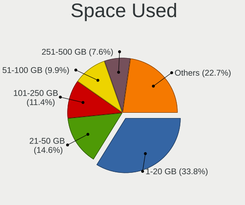

| Used GB        | Desktops | Percent |
|----------------|----------|---------|
| 1-20           | 283      | 33.81%  |
| 21-50          | 122      | 14.58%  |
| 101-250        | 95       | 11.35%  |
| 51-100         | 83       | 9.92%   |
| 251-500        | 64       | 7.65%   |
| 501-1000       | 61       | 7.29%   |
| 1001-2000      | 51       | 6.09%   |
| Unknown        | 31       | 3.7%    |
| More than 3000 | 25       | 2.99%   |
| 2001-3000      | 21       | 2.51%   |
| 0              | 1        | 0.12%   |

Malfunc. Drives
---------------

Drive models with a malfunction

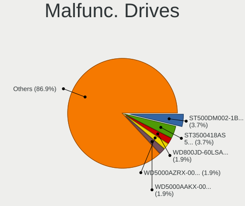

| Model                             | Desktops | Drives | Percent |
|-----------------------------------|----------|--------|---------|
| Seagate ST500DM002-1BD142 500GB   | 4        | 4      | 3.74%   |
| Seagate ST3500418AS 500GB         | 4        | 4      | 3.74%   |
| WDC WD800JD-60LSA0 80GB           | 2        | 2      | 1.87%   |
| WDC WD5000AZRX-00A8LB0 500GB      | 2        | 3      | 1.87%   |
| WDC WD5000AAKX-00ERMA0 500GB      | 2        | 2      | 1.87%   |
| WDC WD3200AAJS-00L7A0 320GB       | 2        | 2      | 1.87%   |
| WDC WD1002FBYS-02A6B0 1TB         | 2        | 2      | 1.87%   |
| Toshiba MK2552GSX 250GB           | 2        | 2      | 1.87%   |
| Seagate ST3320413CS 320GB         | 2        | 2      | 1.87%   |
| Samsung Electronics HD252HJ 250GB | 2        | 2      | 1.87%   |
| Samsung Electronics HD161HJ 160GB | 2        | 2      | 1.87%   |
| WDC WD6400AADS-00M2B0 640GB       | 1        | 1      | 0.93%   |
| WDC WD5000LPCX-60VHAT0 500GB      | 1        | 1      | 0.93%   |
| WDC WD5000BPVT-22HXZT1 500GB      | 1        | 1      | 0.93%   |
| WDC WD5000AZRX-00A3KB0 500GB      | 1        | 1      | 0.93%   |
| WDC WD5000AAKX-221CA1 500GB       | 1        | 2      | 0.93%   |
| WDC WD5000AAKS-00V1A0 500GB       | 1        | 1      | 0.93%   |
| WDC WD5000AAKS-00A7B0 500GB       | 1        | 4      | 0.93%   |
| WDC WD5000AADS-00S9B0 500GB       | 1        | 1      | 0.93%   |
| WDC WD40EFRX-68WT0N0 4TB          | 1        | 2      | 0.93%   |
| WDC WD3200AAJS-07M0A0 320GB       | 1        | 1      | 0.93%   |
| WDC WD3200AAJS-00B4A0 320GB       | 1        | 1      | 0.93%   |
| WDC WD30EZRS-11J99B1 3TB          | 1        | 1      | 0.93%   |
| WDC WD2500JS-40TGB0 250GB         | 1        | 1      | 0.93%   |
| WDC WD20EARX-00PASB0 2TB          | 1        | 1      | 0.93%   |
| WDC WD20EARS-00MVWB0 2TB          | 1        | 1      | 0.93%   |
| WDC WD15EARS-60MVWB0 1TB          | 1        | 1      | 0.93%   |
| WDC WD10EZRZ-00Z5HB0 1TB          | 1        | 1      | 0.93%   |
| WDC WD10EZEX-60WN4A0 1TB          | 1        | 1      | 0.93%   |
| WDC WD10EZEX-00BN5A0 1TB          | 1        | 1      | 0.93%   |
| WDC WD10EAVS-00D7B1 1TB           | 1        | 1      | 0.93%   |
| WDC WD10EAVS-00D7B0 1TB           | 1        | 1      | 0.93%   |
| WDC WD10EARS-00Y5B1 1TB           | 1        | 1      | 0.93%   |
| WDC WD10EALX-009BA0 1TB           | 1        | 1      | 0.93%   |
| WDC WD10EADS-11M2B1 1TB           | 1        | 1      | 0.93%   |
| WDC WD1001FALS-00J7B0 1TB         | 1        | 4      | 0.93%   |
| Unknown FM-25S2S-60GBP2 64GB SSD  | 1        | 1      | 0.93%   |
| Toshiba MQ01ABD100 1TB            | 1        | 1      | 0.93%   |
| Toshiba MK3252GSX 320GB           | 1        | 2      | 0.93%   |
| Toshiba HDWK105 500GB             | 1        | 1      | 0.93%   |

Malfunc. Drive Vendor
---------------------

Vendors of faulty drives

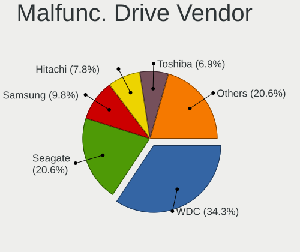

| Vendor              | Desktops | Drives | Percent |
|---------------------|----------|--------|---------|
| WDC                 | 35       | 44     | 34.31%  |
| Seagate             | 21       | 25     | 20.59%  |
| Samsung Electronics | 10       | 12     | 9.8%    |
| Hitachi             | 8        | 10     | 7.84%   |
| Toshiba             | 7        | 8      | 6.86%   |
| Maxtor              | 5        | 9      | 4.9%    |
| Kingston            | 4        | 4      | 3.92%   |
| Crucial             | 2        | 3      | 1.96%   |
| China               | 2        | 3      | 1.96%   |
| Unknown             | 1        | 1      | 0.98%   |
| Team                | 1        | 1      | 0.98%   |
| T-FORCE             | 1        | 1      | 0.98%   |
| SK hynix            | 1        | 1      | 0.98%   |
| Patriot             | 1        | 1      | 0.98%   |
| KingDian            | 1        | 2      | 0.98%   |
| Intel               | 1        | 1      | 0.98%   |
| ExcelStor           | 1        | 1      | 0.98%   |

Malfunc. HDD Vendor
-------------------

Vendors of faulty HDD drives

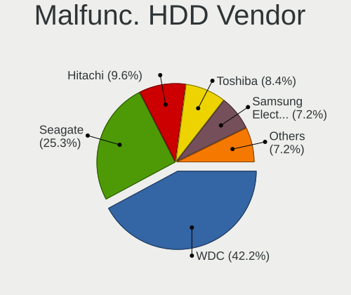

| Vendor              | Desktops | Drives | Percent |
|---------------------|----------|--------|---------|
| WDC                 | 35       | 44     | 42.17%  |
| Seagate             | 21       | 25     | 25.3%   |
| Hitachi             | 8        | 10     | 9.64%   |
| Toshiba             | 7        | 8      | 8.43%   |
| Samsung Electronics | 6        | 7      | 7.23%   |
| Maxtor              | 5        | 9      | 6.02%   |
| ExcelStor           | 1        | 1      | 1.2%    |

Malfunc. Drive Kind
-------------------

Kinds of faulty drives

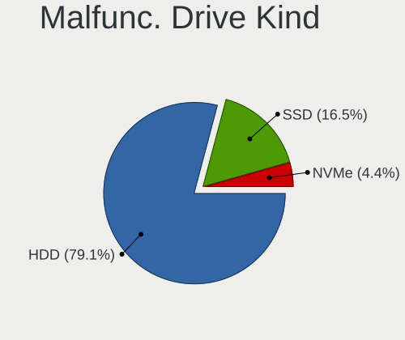

| Kind | Desktops | Drives | Percent |
|------|----------|--------|---------|
| HDD  | 72       | 104    | 79.12%  |
| SSD  | 15       | 19     | 16.48%  |
| NVMe | 4        | 4      | 4.4%    |

Failed Drives
-------------

Failed drive models

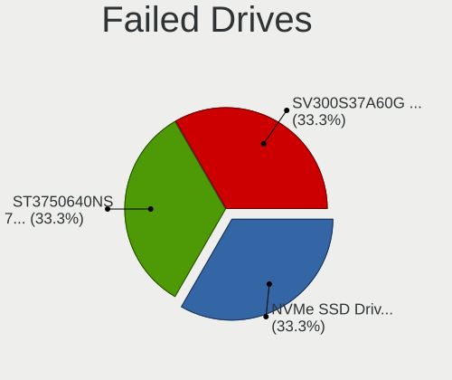

| Model                          | Desktops | Drives | Percent |
|--------------------------------|----------|--------|---------|
| Toshiba NVMe SSD Drive 256GB   | 1        | 1      | 33.33%  |
| Seagate ST3750640NS 752GB      | 1        | 1      | 33.33%  |
| Kingston SV300S37A60G 64GB SSD | 1        | 1      | 33.33%  |

Failed Drive Vendor
-------------------

Failed drive vendors

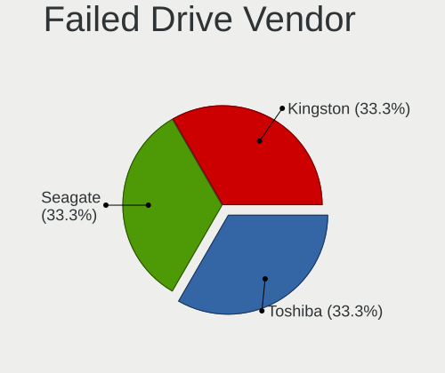

| Vendor   | Desktops | Drives | Percent |
|----------|----------|--------|---------|
| Toshiba  | 1        | 1      | 33.33%  |
| Seagate  | 1        | 1      | 33.33%  |
| Kingston | 1        | 1      | 33.33%  |

Drive Status
------------

Number of failed and malfunc. drives

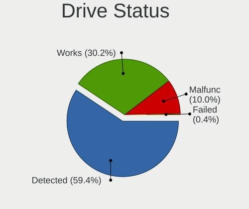

| Status   | Desktops | Drives | Percent |
|----------|----------|--------|---------|
| Detected | 497      | 1398   | 59.38%  |
| Works    | 253      | 607    | 30.23%  |
| Malfunc  | 84       | 127    | 10.04%  |
| Failed   | 3        | 3      | 0.36%   |

Storage controller
------------------

Storage Vendor
--------------

Storage controller vendors

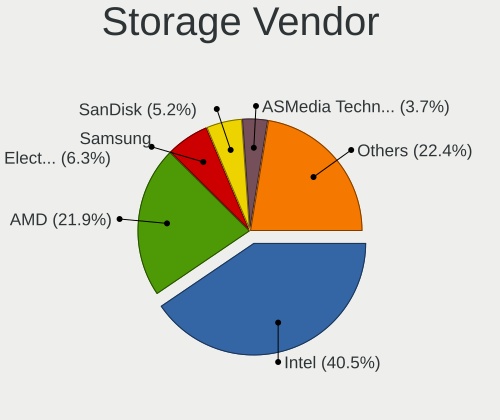

| Vendor                           | Desktops | Percent |
|----------------------------------|----------|---------|
| Intel                            | 459      | 40.51%  |
| AMD                              | 248      | 21.89%  |
| Samsung Electronics              | 71       | 6.27%   |
| SanDisk                          | 59       | 5.21%   |
| ASMedia Technology               | 42       | 3.71%   |
| Kingston Technology Company      | 39       | 3.44%   |
| Phison Electronics               | 37       | 3.27%   |
| JMicron Technology               | 28       | 2.47%   |
| Micron/Crucial Technology        | 25       | 2.21%   |
| KIOXIA                           | 18       | 1.59%   |
| VIA Technologies                 | 14       | 1.24%   |
| Nvidia                           | 14       | 1.24%   |
| Marvell Technology Group         | 13       | 1.15%   |
| MAXIO Technology (Hangzhou)      | 12       | 1.06%   |
| Micron Technology                | 9        | 0.79%   |
| Toshiba America Info Systems     | 6        | 0.53%   |
| Shenzhen Longsys Electronics     | 6        | 0.53%   |
| ADATA Technology                 | 6        | 0.53%   |
| Silicon Integrated Systems [SiS] | 4        | 0.35%   |
| Realtek Semiconductor            | 4        | 0.35%   |
| LSI Logic / Symbios Logic        | 3        | 0.26%   |
| SK hynix                         | 2        | 0.18%   |
| Shenzhen Techwinsemi Technology  | 2        | 0.18%   |
| Seagate Technology               | 2        | 0.18%   |
| INNOGRIT                         | 2        | 0.18%   |
| Adaptec                          | 2        | 0.18%   |
| Union Memory (Shenzhen)          | 1        | 0.09%   |
| ULi Electronics                  | 1        | 0.09%   |
| Silicon Motion                   | 1        | 0.09%   |
| Hosin Global Electronics         | 1        | 0.09%   |
| Hewlett-Packard                  | 1        | 0.09%   |
| Broadcom / LSI                   | 1        | 0.09%   |

Storage Model
-------------

Storage controller models

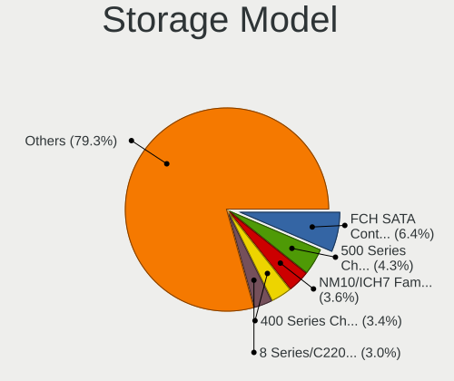

| Model                                                                                   | Desktops | Percent |
|-----------------------------------------------------------------------------------------|----------|---------|
| AMD FCH SATA Controller [AHCI mode]                                                     | 91       | 6.43%   |
| AMD 500 Series Chipset SATA Controller                                                  | 61       | 4.31%   |
| Intel NM10/ICH7 Family SATA Controller [IDE mode]                                       | 51       | 3.6%    |
| AMD 400 Series Chipset SATA Controller                                                  | 48       | 3.39%   |
| Intel 8 Series/C220 Series Chipset Family 6-port SATA Controller 1 [AHCI mode]          | 42       | 2.97%   |
| Intel 82801G (ICH7 Family) IDE Controller                                               | 41       | 2.9%    |
| ASMedia ASM1061/ASM1062 Serial ATA Controller                                           | 37       | 2.61%   |
| Intel Q170/Q150/B150/H170/H110/Z170/CM236 Chipset SATA Controller [AHCI Mode]           | 35       | 2.47%   |
| Samsung NVMe SSD Controller SM981/PM981/PM983                                           | 33       | 2.33%   |
| AMD SB7x0/SB8x0/SB9x0 IDE Controller                                                    | 33       | 2.33%   |
| AMD 600 Series Chipset SATA Controller                                                  | 30       | 2.12%   |
| Intel 7 Series/C210 Series Chipset Family 6-port SATA Controller [AHCI mode]            | 26       | 1.84%   |
| Intel Cannon Lake PCH SATA AHCI Controller                                              | 25       | 1.77%   |
| Intel 200 Series PCH SATA controller [AHCI mode]                                        | 25       | 1.77%   |
| AMD SB7x0/SB8x0/SB9x0 SATA Controller [IDE mode]                                        | 23       | 1.62%   |
| Intel SATA Controller [RAID mode]                                                       | 22       | 1.55%   |
| AMD SB7x0/SB8x0/SB9x0 SATA Controller [AHCI mode]                                       | 21       | 1.48%   |
| Samsung NVMe SSD Controller PM9A1/PM9A3/980PRO                                          | 20       | 1.41%   |
| Phison E12 NVMe Controller                                                              | 20       | 1.41%   |
| Intel 6 Series/C200 Series Chipset Family Desktop SATA Controller (IDE mode, ports 4-5) | 20       | 1.41%   |
| Intel 6 Series/C200 Series Chipset Family Desktop SATA Controller (IDE mode, ports 0-3) | 19       | 1.34%   |
| Intel 6 Series/C200 Series Chipset Family 6 port Desktop SATA AHCI Controller           | 19       | 1.34%   |
| Intel Raptor Lake SATA AHCI Controller                                                  | 15       | 1.06%   |
| Intel 9 Series Chipset Family SATA Controller [AHCI Mode]                               | 15       | 1.06%   |
| Intel 500 Series Chipset Family SATA AHCI Controller                                    | 15       | 1.06%   |
| JMicron JMB363 SATA/IDE Controller                                                      | 13       | 0.92%   |
| Intel Alder Lake-S PCH SATA Controller [AHCI Mode]                                      | 13       | 0.92%   |
| SanDisk WD SN560/SN740/SN770/SN5000 NVMe SSD                                            | 12       | 0.85%   |
| KIOXIA NVMe SSD                                                                         | 12       | 0.85%   |
| Intel 4 Series Chipset PT IDER Controller                                               | 12       | 0.85%   |
| Micron/Crucial P2 [Nick P2] / P3 / P3 Plus NVMe PCIe SSD (DRAM-less)                    | 11       | 0.78%   |
| Intel 82801JI (ICH10 Family) SATA AHCI Controller                                       | 10       | 0.71%   |
| AMD 300 Series Chipset SATA Controller                                                  | 10       | 0.71%   |
| JMicron JMB368 IDE controller                                                           | 9        | 0.64%   |
| Intel RST Volume Management Device Controller                                           | 9        | 0.64%   |
| Intel 5 Series/3400 Series Chipset 6 port SATA AHCI Controller                          | 9        | 0.64%   |
| Sandisk WD Black SN850X NVMe SSD                                                        | 8        | 0.56%   |
| SanDisk Ultra 3D / WD Blue SN570 NVMe SSD (DRAM-less)                                   | 8        | 0.56%   |
| SanDisk Extreme Pro / WD Black SN750 / PC SN730 / Red SN700 NVMe SSD                    | 8        | 0.56%   |
| Samsung NVMe SSD Controller S4LV008[Pascal]                                             | 8        | 0.56%   |

Storage Kind
------------

Kind of storage controller (IDE, SATA, NVMe, SAS, ...)

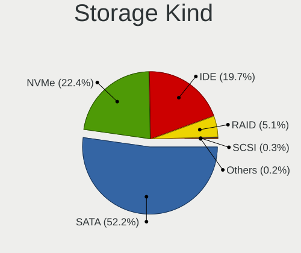

| Kind | Desktops | Percent |
|------|----------|---------|
| SATA | 561      | 52.23%  |
| NVMe | 241      | 22.44%  |
| IDE  | 212      | 19.74%  |
| RAID | 55       | 5.12%   |
| SCSI | 3        | 0.28%   |
| SAS  | 2        | 0.19%   |

Processor
---------

CPU Vendor
----------

Processor vendors

| Vendor | Desktops | Percent |
|--------|----------|---------|
| Intel  | 482      | 65.05%  |
| AMD    | 259      | 34.95%  |

CPU Model
---------

Processor models

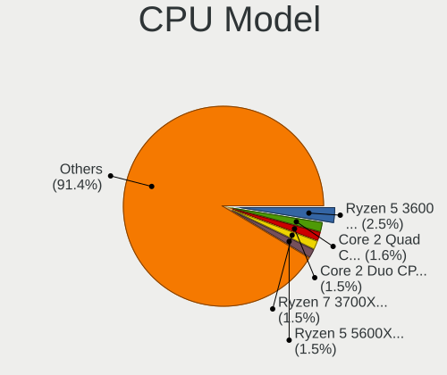

| Model                                  | Desktops | Percent |
|----------------------------------------|----------|---------|
| AMD Ryzen 5 3600 6-Core Processor      | 19       | 2.55%   |
| Intel Core 2 Quad CPU Q6600 @ 2.40GHz  | 12       | 1.61%   |
| Intel Core 2 Duo CPU E8400 @ 3.00GHz   | 11       | 1.47%   |
| AMD Ryzen 7 3700X 8-Core Processor     | 11       | 1.47%   |
| AMD Ryzen 5 5600X 6-Core Processor     | 11       | 1.47%   |
| Intel Core i5-2400 CPU @ 3.10GHz       | 9        | 1.21%   |
| AMD Ryzen 5 2600 Six-Core Processor    | 9        | 1.21%   |
| AMD Ryzen 5 1600 Six-Core Processor    | 9        | 1.21%   |
| Intel Core i7-3770 CPU @ 3.40GHz       | 8        | 1.07%   |
| Intel Core i5-4460 CPU @ 3.20GHz       | 8        | 1.07%   |
| Intel Core i3-3220 CPU @ 3.30GHz       | 8        | 1.07%   |
| Intel Core 2 Quad CPU Q9550 @ 2.83GHz  | 8        | 1.07%   |
| Intel Core 2 Duo CPU E7500 @ 2.93GHz   | 8        | 1.07%   |
| Intel Core i7-4790K CPU @ 4.00GHz      | 7        | 0.94%   |
| Intel Core i5-7400 CPU @ 3.00GHz       | 7        | 0.94%   |
| AMD Ryzen 7 5800X 8-Core Processor     | 7        | 0.94%   |
| AMD Ryzen 5 5600 6-Core Processor      | 7        | 0.94%   |
| AMD FX-8320 Eight-Core Processor       | 7        | 0.94%   |
| AMD FX-6300 Six-Core Processor         | 7        | 0.94%   |
| Intel Pentium 4 CPU 3.00GHz            | 6        | 0.8%    |
| Intel Core i7-8700 CPU @ 3.20GHz       | 6        | 0.8%    |
| AMD Ryzen 7 5700X 8-Core Processor     | 6        | 0.8%    |
| Intel Pentium D CPU 3.00GHz            | 5        | 0.67%   |
| Intel Core i7-10700K CPU @ 3.80GHz     | 5        | 0.67%   |
| Intel Core i5-9400F CPU @ 2.90GHz      | 5        | 0.67%   |
| Intel Core i5-4440 CPU @ 3.10GHz       | 5        | 0.67%   |
| Intel Core i5-3470 CPU @ 3.20GHz       | 5        | 0.67%   |
| AMD Ryzen 7 5800X3D 8-Core Processor   | 5        | 0.67%   |
| AMD Ryzen 7 2700 Eight-Core Processor  | 5        | 0.67%   |
| AMD Ryzen 5 5600G with Radeon Graphics | 5        | 0.67%   |
| AMD Ryzen 5 3600X 6-Core Processor     | 5        | 0.67%   |
| AMD FX-8350 Eight-Core Processor       | 5        | 0.67%   |
| Intel Core i7-7700K CPU @ 4.20GHz      | 4        | 0.54%   |
| Intel Core i7-2600 CPU @ 3.40GHz       | 4        | 0.54%   |
| Intel Core i5-6400 CPU @ 2.70GHz       | 4        | 0.54%   |
| Intel Core i5-4590T CPU @ 2.00GHz      | 4        | 0.54%   |
| Intel Core i5-4590 CPU @ 3.30GHz       | 4        | 0.54%   |
| Intel Core i5-3570 CPU @ 3.40GHz       | 4        | 0.54%   |
| Intel Core i3-8100 CPU @ 3.60GHz       | 4        | 0.54%   |
| Intel Core i3-7100 CPU @ 3.90GHz       | 4        | 0.54%   |

CPU Model Family
----------------

Processor model prefix

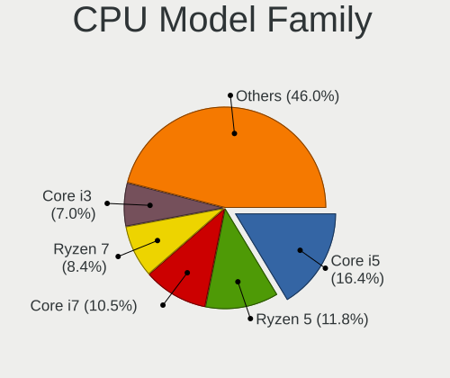

| Model                   | Desktops | Percent |
|-------------------------|----------|---------|
| Intel Core i5           | 122      | 16.35%  |
| AMD Ryzen 5             | 88       | 11.8%   |
| Intel Core i7           | 78       | 10.46%  |
| AMD Ryzen 7             | 63       | 8.45%   |
| Intel Core i3           | 52       | 6.97%   |
| Other                   | 40       | 5.36%   |
| Intel Core 2 Quad       | 33       | 4.42%   |
| Intel Xeon              | 32       | 4.29%   |
| AMD FX                  | 31       | 4.16%   |
| Intel Core 2 Duo        | 25       | 3.35%   |
| AMD Ryzen 9             | 25       | 3.35%   |
| Intel Celeron           | 18       | 2.41%   |
| Intel Pentium Dual-Core | 17       | 2.28%   |
| Intel Pentium           | 15       | 2.01%   |
| Intel Pentium 4         | 14       | 1.88%   |
| Intel Core 2            | 10       | 1.34%   |
| Intel Atom              | 10       | 1.34%   |
| Intel Pentium D         | 7        | 0.94%   |
| Intel Pentium Dual      | 6        | 0.8%    |
| AMD Ryzen 3             | 6        | 0.8%    |
| AMD A10                 | 5        | 0.67%   |
| AMD A6                  | 4        | 0.54%   |
| Intel Core i9           | 3        | 0.4%    |
| AMD Ryzen Threadripper  | 3        | 0.4%    |
| AMD Phenom II X4        | 3        | 0.4%    |
| AMD Athlon II X3        | 3        | 0.4%    |
| AMD Athlon II X2        | 3        | 0.4%    |
| AMD Athlon 64           | 3        | 0.4%    |
| AMD Athlon              | 3        | 0.4%    |
| Intel Pentium Gold      | 2        | 0.27%   |
| Intel Genuine           | 2        | 0.27%   |
| AMD Phenom II X6        | 2        | 0.27%   |
| AMD E                   | 2        | 0.27%   |
| AMD Athlon Dual Core    | 2        | 0.27%   |
| AMD Athlon 64 X2        | 2        | 0.27%   |
| AMD A8                  | 2        | 0.27%   |
| Intel Pentium Silver    | 1        | 0.13%   |
| Intel Core              | 1        | 0.13%   |
| AMD Sempron             | 1        | 0.13%   |
| AMD Ryzen 7 PRO         | 1        | 0.13%   |

CPU Cores
---------

Number of processor cores

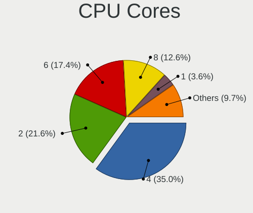

| Number  | Desktops | Percent |
|---------|----------|---------|
| 4       | 261      | 35.03%  |
| 2       | 161      | 21.61%  |
| 6       | 130      | 17.45%  |
| 8       | 94       | 12.62%  |
| 1       | 27       | 3.62%   |
| 16      | 19       | 2.55%   |
| 12      | 16       | 2.15%   |
| 3       | 14       | 1.88%   |
| 14      | 7        | 0.94%   |
| 10      | 6        | 0.81%   |
| 24      | 4        | 0.54%   |
| 20      | 4        | 0.54%   |
| 18      | 1        | 0.13%   |
| Unknown | 1        | 0.13%   |

CPU Sockets
-----------

Number of sockets

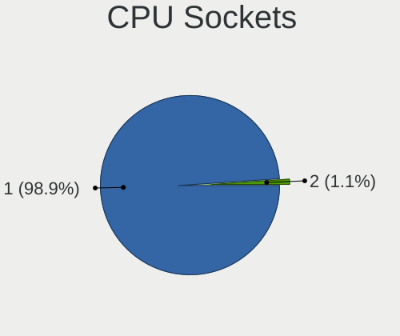

| Number | Desktops | Percent |
|--------|----------|---------|
| 1      | 733      | 98.92%  |
| 2      | 8        | 1.08%   |

CPU Threads
-----------

Threads per core (Hyper-Threading)

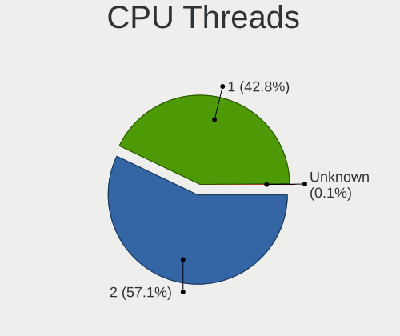

| Number  | Desktops | Percent |
|---------|----------|---------|
| 2       | 426      | 57.1%   |
| 1       | 319      | 42.76%  |
| Unknown | 1        | 0.13%   |

CPU Op-Modes
------------

CPU Operation Modes (32-bit, 64-bit)

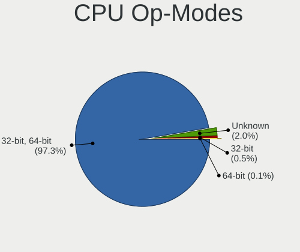

| Op mode        | Desktops | Percent |
|----------------|----------|---------|
| 32-bit, 64-bit | 727      | 97.32%  |
| Unknown        | 15       | 2.01%   |
| 32-bit         | 4        | 0.54%   |
| 64-bit         | 1        | 0.13%   |

CPU Microcode
-------------

Microcode number

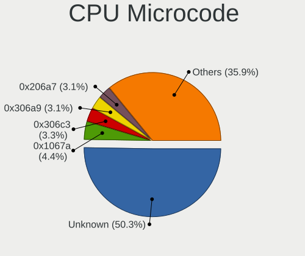

| Number     | Desktops | Percent |
|------------|----------|---------|
| Unknown    | 392      | 50.26%  |
| 0x1067a    | 34       | 4.36%   |
| 0x306c3    | 26       | 3.33%   |
| 0x306a9    | 24       | 3.08%   |
| 0x206a7    | 24       | 3.08%   |
| 0x08701021 | 17       | 2.18%   |
| 0x06000852 | 17       | 2.18%   |
| 0x506e3    | 16       | 2.05%   |
| 0x906ea    | 13       | 1.67%   |
| 0x0800820d | 13       | 1.67%   |
| 0x906e9    | 11       | 1.41%   |
| 0x6fb      | 11       | 1.41%   |
| 0x106e5    | 6        | 0.77%   |
| 0x10676    | 6        | 0.77%   |
| 0xa0655    | 5        | 0.64%   |
| 0x6fd      | 5        | 0.64%   |
| 0x10677    | 5        | 0.64%   |
| 0x08701030 | 5        | 0.64%   |
| 0x08101016 | 5        | 0.64%   |
| 0x010000c8 | 5        | 0.64%   |
| 0xf43      | 4        | 0.51%   |
| 0xf41      | 4        | 0.51%   |
| 0xa0671    | 4        | 0.51%   |
| 0x6f6      | 4        | 0.51%   |
| 0x6f2      | 4        | 0.51%   |
| 0x0a20120a | 4        | 0.51%   |
| 0x0a201016 | 4        | 0.51%   |
| 0x08701013 | 4        | 0.51%   |
| 0x08001137 | 4        | 0.51%   |
| 0x06000822 | 4        | 0.51%   |
| 0xf65      | 3        | 0.38%   |
| 0x906eb    | 3        | 0.38%   |
| 0x406c4    | 3        | 0.38%   |
| 0x30678    | 3        | 0.38%   |
| 0x206d7    | 3        | 0.38%   |
| 0x0800820b | 3        | 0.38%   |
| 0x08001129 | 3        | 0.38%   |
| 0xf64      | 2        | 0.26%   |
| 0xf62      | 2        | 0.26%   |
| 0xf4a      | 2        | 0.26%   |

CPU Microarch
-------------

Microarchitecture

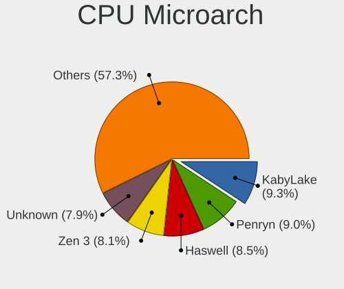

| Name             | Desktops | Percent |
|------------------|----------|---------|
| KabyLake         | 69       | 9.26%   |
| Penryn           | 67       | 8.99%   |
| Haswell          | 63       | 8.46%   |
| Zen 3            | 60       | 8.05%   |
| Unknown          | 59       | 7.92%   |
| Zen 2            | 47       | 6.31%   |
| IvyBridge        | 45       | 6.04%   |
| SandyBridge      | 38       | 5.1%    |
| Core             | 38       | 5.1%    |
| Piledriver       | 30       | 4.03%   |
| Skylake          | 28       | 3.76%   |
| Zen+             | 25       | 3.36%   |
| NetBurst         | 23       | 3.09%   |
| Zen              | 22       | 2.95%   |
| CometLake        | 18       | 2.42%   |
| Alderlake Hybrid | 17       | 2.28%   |
| K10              | 16       | 2.15%   |
| Westmere         | 11       | 1.48%   |
| Nehalem          | 11       | 1.48%   |
| Silvermont       | 9        | 1.21%   |
| K8 Hammer        | 7        | 0.94%   |
| Icelake          | 7        | 0.94%   |
| Steamroller      | 6        | 0.81%   |
| Excavator        | 6        | 0.81%   |
| Goldmont         | 4        | 0.54%   |
| Bonnell          | 4        | 0.54%   |
| Tremont          | 3        | 0.4%    |
| Bulldozer        | 3        | 0.4%    |
| Gracemont        | 2        | 0.27%   |
| Goldmont plus    | 2        | 0.27%   |
| Bobcat           | 2        | 0.27%   |
| Puma             | 1        | 0.13%   |
| Jaguar           | 1        | 0.13%   |
| Broadwell        | 1        | 0.13%   |

Graphics
--------

GPU Vendor
----------

Vendors of graphics cards

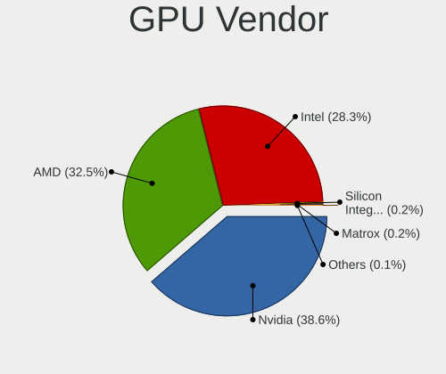

| Vendor                           | Desktops | Percent |
|----------------------------------|----------|---------|
| Nvidia                           | 313      | 38.64%  |
| AMD                              | 263      | 32.47%  |
| Intel                            | 229      | 28.27%  |
| Silicon Integrated Systems [SiS] | 2        | 0.25%   |
| Matrox Electronics Systems       | 2        | 0.25%   |
| ASPEED Technology                | 1        | 0.12%   |

GPU Model
---------

Graphics card models

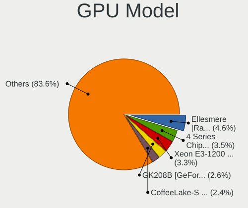

| Model                                                                                    | Desktops | Percent |
|------------------------------------------------------------------------------------------|----------|---------|
| AMD Ellesmere [Radeon RX 470/480/570/570X/580/580X/590]                                  | 39       | 4.61%   |
| Intel 4 Series Chipset Integrated Graphics Controller                                    | 30       | 3.55%   |
| Intel Xeon E3-1200 v3/4th Gen Core Processor Integrated Graphics Controller              | 28       | 3.31%   |
| Nvidia GK208B [GeForce GT 710]                                                           | 22       | 2.6%    |
| Intel CoffeeLake-S GT2 [UHD Graphics 630]                                                | 20       | 2.36%   |
| Intel 2nd Generation Core Processor Family Integrated Graphics Controller                | 20       | 2.36%   |
| Nvidia GP107 [GeForce GTX 1050 Ti]                                                       | 19       | 2.25%   |
| AMD Raphael                                                                              | 17       | 2.01%   |
| Nvidia GT218 [GeForce 210]                                                               | 16       | 1.89%   |
| Intel Skylake-S GT2 [HD Graphics 530]                                                    | 15       | 1.77%   |
| Intel Xeon E3-1200 v2/3rd Gen Core processor Graphics Controller                         | 13       | 1.54%   |
| AMD Cedar [Radeon HD 5000/6000/7350/8350 Series]                                         | 12       | 1.42%   |
| AMD Navi 22 [Radeon RX 6700/6700 XT/6750 XT / 6800M/6850M XT]                            | 11       | 1.3%    |
| AMD Navi 10 [Radeon RX 5600 OEM/5600 XT / 5700/5700 XT]                                  | 11       | 1.3%    |
| Nvidia GP106 [GeForce GTX 1060 6GB]                                                      | 10       | 1.18%   |
| AMD Navi 32 [Radeon RX 7700 XT / 7800 XT]                                                | 9        | 1.06%   |
| AMD Cezanne [Radeon Vega Series / Radeon Vega Mobile Series]                             | 9        | 1.06%   |
| Nvidia GP108 [GeForce GT 1030]                                                           | 8        | 0.95%   |
| Nvidia GP107 [GeForce GTX 1050]                                                          | 8        | 0.95%   |
| Nvidia GP106 [GeForce GTX 1060 3GB]                                                      | 8        | 0.95%   |
| Nvidia GM206 [GeForce GTX 960]                                                           | 8        | 0.95%   |
| Nvidia GA106 [GeForce RTX 3060 Lite Hash Rate]                                           | 8        | 0.95%   |
| Intel Kaby Lake-S GT2 [HD Graphics 630]                                                  | 8        | 0.95%   |
| AMD Navi 23 [Radeon RX 6600/6600 XT/6600M]                                               | 8        | 0.95%   |
| Nvidia TU117 [GeForce GTX 1650]                                                          | 7        | 0.83%   |
| Intel 82G33/G31 Express Integrated Graphics Controller                                   | 7        | 0.83%   |
| AMD Navi 21 [Radeon RX 6800/6800 XT / 6900 XT]                                           | 7        | 0.83%   |
| AMD Granite Ridge [Radeon Graphics]                                                      | 7        | 0.83%   |
| Nvidia GM204 [GeForce GTX 970]                                                           | 6        | 0.71%   |
| Nvidia GF119 [GeForce GT 610]                                                            | 6        | 0.71%   |
| Nvidia GA104 [GeForce RTX 3060 Ti Lite Hash Rate]                                        | 6        | 0.71%   |
| Intel RocketLake-S GT1 [UHD Graphics 750]                                                | 6        | 0.71%   |
| Intel Atom/Celeron/Pentium Processor x5-E8000/J3xxx/N3xxx Integrated Graphics Controller | 6        | 0.71%   |
| AMD Raven Ridge [Radeon Vega Series / Radeon Vega Mobile Series]                         | 6        | 0.71%   |
| AMD Lexa PRO [Radeon 540/540X/550/550X / RX 540X/550/550X]                               | 6        | 0.71%   |
| AMD Caicos [Radeon HD 6450/7450/8450 / R5 230 OEM]                                       | 6        | 0.71%   |
| Nvidia TU116 [GeForce GTX 1660 SUPER]                                                    | 5        | 0.59%   |
| Nvidia TU106 [GeForce RTX 2060 Rev. A]                                                   | 5        | 0.59%   |
| Nvidia GA104 [GeForce RTX 3070 Ti]                                                       | 5        | 0.59%   |
| Intel Raptor Lake-S GT1 [UHD Graphics 770]                                               | 5        | 0.59%   |

GPU Combo
---------

Combinations of graphics cards

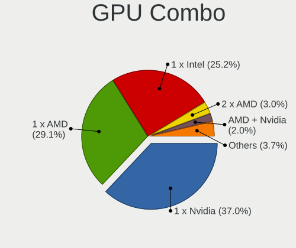

| Name            | Desktops | Percent |
|-----------------|----------|---------|
| 1 x Nvidia      | 282      | 37.01%  |
| 1 x AMD         | 222      | 29.13%  |
| 1 x Intel       | 192      | 25.2%   |
| 2 x AMD         | 23       | 3.02%   |
| AMD + Nvidia    | 15       | 1.97%   |
| Intel + Nvidia  | 10       | 1.31%   |
| Intel + AMD     | 5        | 0.66%   |
| 2 x Intel       | 4        | 0.52%   |
| 2 x Nvidia      | 3        | 0.39%   |
| 1 x SiS         | 2        | 0.26%   |
| Other           | 1        | 0.13%   |
| Nvidia + Matrox | 1        | 0.13%   |
| Nvidia + ASPEED | 1        | 0.13%   |
| 1 x Matrox      | 1        | 0.13%   |

GPU Driver
----------

Free vs proprietary

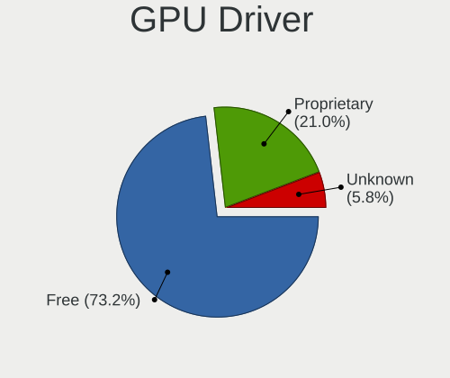

| Driver      | Desktops | Percent |
|-------------|----------|---------|
| Free        | 557      | 73.19%  |
| Proprietary | 160      | 21.02%  |
| Unknown     | 44       | 5.78%   |

GPU Memory
----------

Total video memory

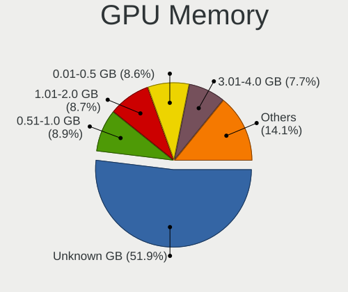

| Size in GB | Desktops | Percent |
|------------|----------|---------|
| Unknown    | 404      | 51.93%  |
| 0.51-1.0   | 69       | 8.87%   |
| 1.01-2.0   | 68       | 8.74%   |
| 0.01-0.5   | 67       | 8.61%   |
| 3.01-4.0   | 60       | 7.71%   |
| 7.01-8.0   | 52       | 6.68%   |
| 8.01-16.0  | 31       | 3.98%   |
| 5.01-6.0   | 17       | 2.19%   |
| 16.01-24.0 | 6        | 0.77%   |
| 2.01-3.0   | 4        | 0.51%   |

Monitor
-------

Monitor Vendor
--------------

Monitor vendors

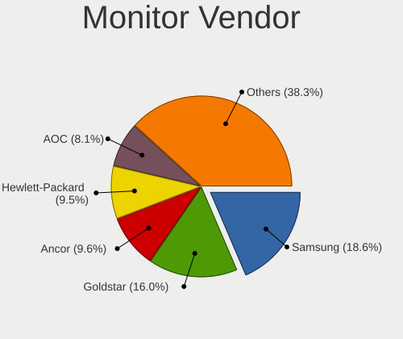

| Vendor               | Desktops | Percent |
|----------------------|----------|---------|
| Samsung Electronics  | 147      | 18.56%  |
| Goldstar             | 127      | 16.04%  |
| Ancor Communications | 76       | 9.6%    |
| Hewlett-Packard      | 75       | 9.47%   |
| AOC                  | 64       | 8.08%   |
| ASUSTek Computer     | 34       | 4.29%   |
| Dell                 | 33       | 4.17%   |
| BenQ                 | 28       | 3.54%   |
| Philips              | 24       | 3.03%   |
| Acer                 | 20       | 2.53%   |
| Lenovo               | 16       | 2.02%   |
| Sony                 | 12       | 1.52%   |
| LG Electronics       | 12       | 1.52%   |
| Unknown              | 10       | 1.26%   |
| Gigabyte Technology  | 8        | 1.01%   |
| Fujitsu Siemens      | 8        | 1.01%   |
| MSI                  | 7        | 0.88%   |
| ViewSonic            | 6        | 0.76%   |
| Mi                   | 4        | 0.51%   |
| Vestel Elektronik    | 3        | 0.38%   |
| RTK                  | 3        | 0.38%   |
| HPN                  | 3        | 0.38%   |
| AVX                  | 3        | 0.38%   |
| Apple                | 3        | 0.38%   |
| ___                  | 2        | 0.25%   |
| Toshiba              | 2        | 0.25%   |
| TCL                  | 2        | 0.25%   |
| Targa Visionary      | 2        | 0.25%   |
| Plain Tree Systems   | 2        | 0.25%   |
| Lenovo Group Limited | 2        | 0.25%   |
| Iiyama               | 2        | 0.25%   |
| HUAWEI               | 2        | 0.25%   |
| HJW                  | 2        | 0.25%   |
| Corsair              | 2        | 0.25%   |
| AUS                  | 2        | 0.25%   |
| AGO                  | 2        | 0.25%   |
| Unknown              | 2        | 0.25%   |
| Xiaomi               | 1        | 0.13%   |
| WSX                  | 1        | 0.13%   |
| VIZTA                | 1        | 0.13%   |

Monitor Model
-------------

Monitor models

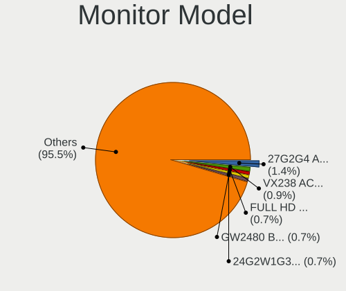

| Model                                                                 | Desktops | Percent |
|-----------------------------------------------------------------------|----------|---------|
| AOC 27G2G4 AOC2702 1920x1080 598x336mm 27.0-inch                      | 12       | 1.42%   |
| Ancor Communications VX238 ACI23C1 1920x1080 510x290mm 23.1-inch      | 8        | 0.95%   |
| Goldstar FULL HD GSM5B55 1920x1080 480x270mm 21.7-inch                | 6        | 0.71%   |
| BenQ GW2480 BNQ78E7 1920x1080 527x296mm 23.8-inch                     | 6        | 0.71%   |
| AOC 24G2W1G3 AOC2402 1920x1080 527x296mm 23.8-inch                    | 6        | 0.71%   |
| AOC 2590G4 AOC2590 1920x1080 544x303mm 24.5-inch                      | 5        | 0.59%   |
| Ancor Communications VE228 ACI22FA 1920x1080 477x268mm 21.5-inch      | 5        | 0.59%   |
| Ancor Communications ASUS VW193D ACI19D5 1440x900 408x255mm 18.9-inch | 5        | 0.59%   |
| Ancor Communications ASUS VS197 ACI19F2 1366x768 410x230mm 18.5-inch  | 5        | 0.59%   |
| Samsung Electronics S24F350 SAM0D20 1920x1080 521x293mm 23.5-inch     | 4        | 0.47%   |
| Goldstar HDR WFHD GSM7714 2560x1080 798x334mm 34.1-inch               | 4        | 0.47%   |
| Goldstar HDR 4K GSM7707 3840x2160 600x340mm 27.2-inch                 | 4        | 0.47%   |
| Goldstar FULL HD GSM5ABB 1920x1080 480x270mm 21.7-inch                | 4        | 0.47%   |
| Goldstar FULL HD GSM5AB9 1920x1080 480x270mm 21.7-inch                | 4        | 0.47%   |
| AOC 24B1W1 AOC2401 1920x1080 527x296mm 23.8-inch                      | 4        | 0.47%   |
| Ancor Communications VX228 ACI22C1 1920x1080 476x268mm 21.5-inch      | 4        | 0.47%   |
| Ancor Communications ASUS VP228 ACI22C3 1920x1080 476x268mm 21.5-inch | 4        | 0.47%   |
| Vestel Elektronik 40UHD_LCD_TV VES3700 3840x2160 880x500mm 39.8-inch  | 3        | 0.36%   |
| Unknown LCD Monitor SAMSUNG 1920x1080                                 | 3        | 0.36%   |
| Samsung Electronics SyncMaster SAM036F 1440x900 428x255mm 19.6-inch   | 3        | 0.36%   |
| Samsung Electronics S24D300 SAM0B43 1920x1080 531x299mm 24.0-inch     | 3        | 0.36%   |
| Samsung Electronics S22F350 SAM0D1A 1920x1080 477x268mm 21.5-inch     | 3        | 0.36%   |
| Samsung Electronics S22D300 SAM0B3F 1920x1080 477x268mm 21.5-inch     | 3        | 0.36%   |
| Samsung Electronics LCD Monitor SyncMaster 1440x900                   | 3        | 0.36%   |
| Samsung Electronics LCD Monitor SAM0902 1920x1080 890x500mm 40.2-inch | 3        | 0.36%   |
| Samsung Electronics LCD Monitor SAM04FB 1920x1080                     | 3        | 0.36%   |
| Samsung Electronics LC49G95T SAM7053 3840x1080 1193x336mm 48.8-inch   | 3        | 0.36%   |
| Lenovo L29w-30 LEN66E5 2560x1080 673x284mm 28.8-inch                  | 3        | 0.36%   |
| Hewlett-Packard w2228h HWP2810 1920x1200 473x296mm 22.0-inch          | 3        | 0.36%   |
| Hewlett-Packard LE1901w HWP2842 1440x900 410x256mm 19.0-inch          | 3        | 0.36%   |
| Hewlett-Packard 24f HPN3545 1920x1080 527x296mm 23.8-inch             | 3        | 0.36%   |
| Goldstar W1943 GSM4BAD 1360x768 406x229mm 18.4-inch                   | 3        | 0.36%   |
| Goldstar ULTRAGEAR GSM7766 2560x1440 697x392mm 31.5-inch              | 3        | 0.36%   |
| Goldstar ULTRAGEAR GSM5BD3 2560x1440 697x392mm 31.5-inch              | 3        | 0.36%   |
| Goldstar ULTRAGEAR GSM5B72 1920x1080 531x298mm 24.0-inch              | 3        | 0.36%   |
| Goldstar ULTRAGEAR GSM5B71 1920x1080 597x336mm 27.0-inch              | 3        | 0.36%   |
| Goldstar M227WD GSM56D5 1920x1080 476x268mm 21.5-inch                 | 3        | 0.36%   |
| Goldstar L1919S GSM4AF0 1280x1024 376x301mm 19.0-inch                 | 3        | 0.36%   |
| Goldstar FULL HD GSM5B54 1920x1080 480x270mm 21.7-inch                | 3        | 0.36%   |
| Goldstar E1940 GSM4BD6 1360x768 406x229mm 18.4-inch                   | 3        | 0.36%   |

Monitor Resolution
------------------

Monitor screen resolution

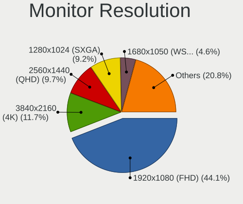

| Resolution         | Desktops | Percent |
|--------------------|----------|---------|
| 1920x1080 (FHD)    | 346      | 44.08%  |
| 3840x2160 (4K)     | 92       | 11.72%  |
| 2560x1440 (QHD)    | 76       | 9.68%   |
| 1280x1024 (SXGA)   | 72       | 9.17%   |
| 1680x1050 (WSXGA+) | 36       | 4.59%   |
| 1440x900 (WXGA+)   | 36       | 4.59%   |
| 1366x768 (WXGA)    | 23       | 2.93%   |
| 1920x1200 (WUXGA)  | 13       | 1.66%   |
| 1360x768           | 13       | 1.66%   |
| 1600x900 (HD+)     | 12       | 1.53%   |
| Unknown            | 11       | 1.4%    |
| 3440x1440          | 10       | 1.27%   |
| 2560x1080          | 10       | 1.27%   |
| 3840x1080          | 8        | 1.02%   |
| 1024x768 (XGA)     | 6        | 0.76%   |
| 1920x540           | 3        | 0.38%   |
| 1152x864           | 3        | 0.38%   |
| 2160x1440          | 2        | 0.25%   |
| 6880x1440          | 1        | 0.13%   |
| 4560x1080          | 1        | 0.13%   |
| 4480x1600          | 1        | 0.13%   |
| 3440x2138          | 1        | 0.13%   |
| 3360x1080          | 1        | 0.13%   |
| 3360x1050          | 1        | 0.13%   |
| 2944x1080          | 1        | 0.13%   |
| 2560x2520          | 1        | 0.13%   |
| 2288x1287          | 1        | 0.13%   |
| 1600x1200          | 1        | 0.13%   |
| 1400x1050          | 1        | 0.13%   |
| 1280x720 (HD)      | 1        | 0.13%   |
| 1024x600           | 1        | 0.13%   |

Monitor Diagonal
----------------

Diagonal size in inches

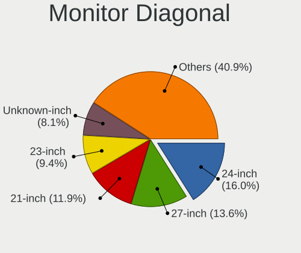

| Inches  | Desktops | Percent |
|---------|----------|---------|
| 24      | 128      | 16.02%  |
| 27      | 109      | 13.64%  |
| 21      | 95       | 11.89%  |
| 23      | 75       | 9.39%   |
| Unknown | 65       | 8.14%   |
| 19      | 55       | 6.88%   |
| 31      | 38       | 4.76%   |
| 18      | 38       | 4.76%   |
| 17      | 36       | 4.51%   |
| 20      | 20       | 2.5%    |
| 22      | 17       | 2.13%   |
| 15      | 16       | 2%      |
| 84      | 13       | 1.63%   |
| 54      | 11       | 1.38%   |
| 34      | 11       | 1.38%   |
| 32      | 9        | 1.13%   |
| 63      | 6        | 0.75%   |
| 33      | 5        | 0.63%   |
| 28      | 5        | 0.63%   |
| 25      | 5        | 0.63%   |
| 72      | 4        | 0.5%    |
| 48      | 4        | 0.5%    |
| 46      | 4        | 0.5%    |
| 40      | 4        | 0.5%    |
| 26      | 3        | 0.38%   |
| 16      | 3        | 0.38%   |
| 43      | 2        | 0.25%   |
| 42      | 2        | 0.25%   |
| 12      | 2        | 0.25%   |
| 10      | 2        | 0.25%   |
| 142     | 1        | 0.13%   |
| 82      | 1        | 0.13%   |
| 65      | 1        | 0.13%   |
| 59      | 1        | 0.13%   |
| 58      | 1        | 0.13%   |
| 55      | 1        | 0.13%   |
| 52      | 1        | 0.13%   |
| 44      | 1        | 0.13%   |
| 39      | 1        | 0.13%   |
| 35      | 1        | 0.13%   |

Monitor Width
-------------

Physical width

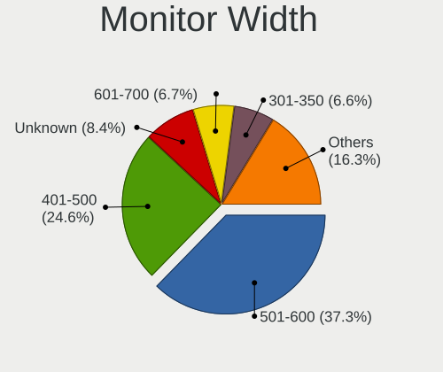

| Width in mm    | Desktops | Percent |
|----------------|----------|---------|
| 501-600        | 288      | 37.31%  |
| 401-500        | 190      | 24.61%  |
| Unknown        | 65       | 8.42%   |
| 601-700        | 52       | 6.74%   |
| 301-350        | 51       | 6.61%   |
| 351-400        | 35       | 4.53%   |
| 1001-1500      | 31       | 4.02%   |
| 701-800        | 25       | 3.24%   |
| 1501-2000      | 18       | 2.33%   |
| 801-900        | 6        | 0.78%   |
| 201-300        | 6        | 0.78%   |
| 901-1000       | 4        | 0.52%   |
| More than 2000 | 1        | 0.13%   |

Aspect Ratio
------------

Proportional relationship between the width and the height

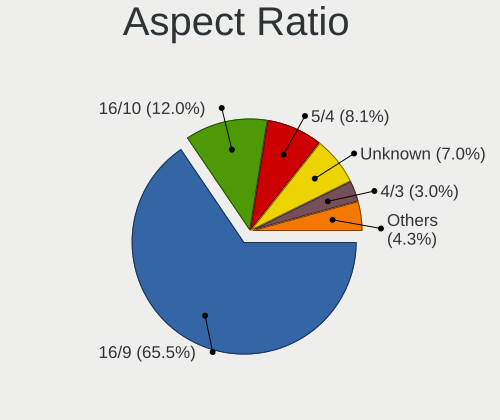

| Ratio   | Desktops | Percent |
|---------|----------|---------|
| 16/9    | 475      | 65.52%  |
| 16/10   | 87       | 12%     |
| 5/4     | 59       | 8.14%   |
| Unknown | 51       | 7.03%   |
| 4/3     | 22       | 3.03%   |
| 21/9    | 16       | 2.21%   |
| 3/2     | 6        | 0.83%   |
| 6/5     | 4        | 0.55%   |
| 32/9    | 4        | 0.55%   |
| 1.00    | 1        | 0.14%   |

Monitor Area
------------

Area in inch²

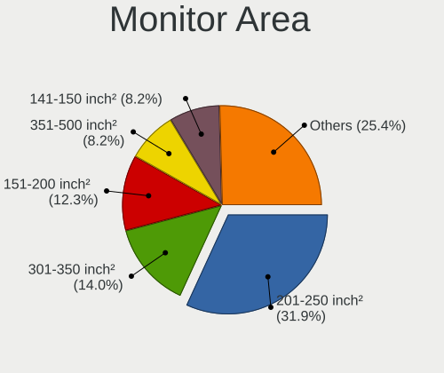

| Area in inch² | Desktops | Percent |
|----------------|----------|---------|
| 201-250        | 252      | 31.86%  |
| 301-350        | 111      | 14.03%  |
| 151-200        | 97       | 12.26%  |
| 351-500        | 65       | 8.22%   |
| 141-150        | 65       | 8.22%   |
| Unknown        | 65       | 8.22%   |
| 251-300        | 51       | 6.45%   |
| More than 1000 | 42       | 5.31%   |
| 501-1000       | 17       | 2.15%   |
| 111-120        | 9        | 1.14%   |
| 101-110        | 9        | 1.14%   |
| 71-80          | 3        | 0.38%   |
| 41-50          | 2        | 0.25%   |
| 131-140        | 2        | 0.25%   |
| 121-130        | 1        | 0.13%   |

Pixel Density
-------------

Pixels per inch

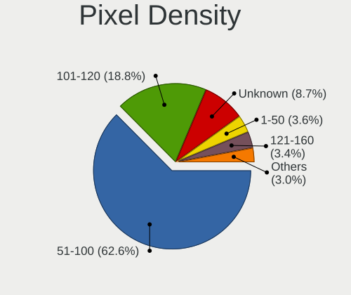

| Density | Desktops | Percent |
|---------|----------|---------|
| 51-100  | 466      | 62.55%  |
| 101-120 | 140      | 18.79%  |
| Unknown | 65       | 8.72%   |
| 1-50    | 27       | 3.62%   |
| 121-160 | 25       | 3.36%   |
| 161-240 | 22       | 2.95%   |

Multiple Monitors
-----------------

Total monitors connected

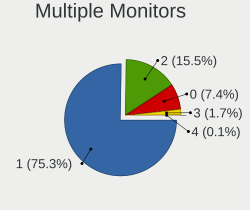

| Total | Desktops | Percent |
|-------|----------|---------|
| 1     | 578      | 75.26%  |
| 2     | 119      | 15.49%  |
| 0     | 57       | 7.42%   |
| 3     | 13       | 1.69%   |
| 4     | 1        | 0.13%   |

Network
-------

Net Controller Vendor
---------------------

Controller vendors

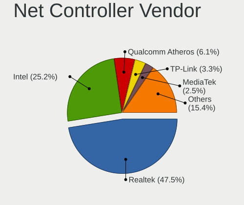

| Vendor                           | Desktops | Percent |
|----------------------------------|----------|---------|
| Realtek Semiconductor            | 488      | 47.47%  |
| Intel                            | 259      | 25.19%  |
| Qualcomm Atheros                 | 63       | 6.13%   |
| TP-Link                          | 34       | 3.31%   |
| MediaTek                         | 26       | 2.53%   |
| Broadcom                         | 22       | 2.14%   |
| Qualcomm Atheros Communications  | 18       | 1.75%   |
| Nvidia                           | 14       | 1.36%   |
| Ralink Technology                | 11       | 1.07%   |
| Marvell Technology Group         | 7        | 0.68%   |
| D-Link                           | 7        | 0.68%   |
| VIA Technologies                 | 6        | 0.58%   |
| ASUSTek Computer                 | 6        | 0.58%   |
| Xiaomi                           | 5        | 0.49%   |
| Samsung Electronics              | 5        | 0.49%   |
| Microsoft                        | 5        | 0.49%   |
| Silicon Integrated Systems [SiS] | 4        | 0.39%   |
| Qualcomm Technologies            | 4        | 0.39%   |
| D-Link System                    | 4        | 0.39%   |
| Broadcom Limited                 | 4        | 0.39%   |
| ADMtek                           | 4        | 0.39%   |
| Ralink                           | 3        | 0.29%   |
| Edimax Technology                | 3        | 0.29%   |
| Aquantia                         | 3        | 0.29%   |
| Accton Technology                | 3        | 0.29%   |
| Huawei Technologies              | 2        | 0.19%   |
| Google                           | 2        | 0.19%   |
| Dresden Elektronik               | 2        | 0.19%   |
| TRENDnet                         | 1        | 0.1%    |
| Standard Microsystems [SMC]      | 1        | 0.1%    |
| Smart Link                       | 1        | 0.1%    |
| Sitecom Europe                   | 1        | 0.1%    |
| Motorola                         | 1        | 0.1%    |
| MicroPython                      | 1        | 0.1%    |
| Mellanox Technologies            | 1        | 0.1%    |
| dog hunter                       | 1        | 0.1%    |
| Belkin Components                | 1        | 0.1%    |
| ASIX Electronics                 | 1        | 0.1%    |
| Apple                            | 1        | 0.1%    |
| aicsemi                          | 1        | 0.1%    |

Net Controller Model
--------------------

Controller models

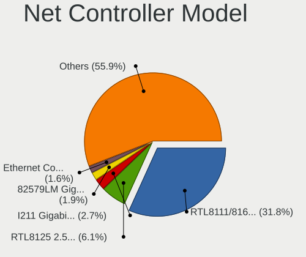

| Model                                                                  | Desktops | Percent |
|------------------------------------------------------------------------|----------|---------|
| Realtek RTL8111/8168/8211/8411 PCI Express Gigabit Ethernet Controller | 366      | 31.77%  |
| Realtek RTL8125 2.5GbE Controller                                      | 70       | 6.08%   |
| Intel I211 Gigabit Network Connection                                  | 31       | 2.69%   |
| Intel 82579LM Gigabit Network Connection (Lewisville)                  | 22       | 1.91%   |
| Intel Ethernet Connection (2) I219-V                                   | 19       | 1.65%   |
| Intel Ethernet Controller I225-V                                       | 18       | 1.56%   |
| Intel Wi-Fi 6 AX200                                                    | 16       | 1.39%   |
| Qualcomm Atheros AR9271 802.11n                                        | 13       | 1.13%   |
| Intel 82567LM-3 Gigabit Network Connection                             | 13       | 1.13%   |
| TP-Link TL-WN823N v2/v3 [Realtek RTL8192EU]                            | 12       | 1.04%   |
| Realtek RTL8188EUS 802.11n Wireless Network Adapter                    | 12       | 1.04%   |
| Realtek RTL810xE PCI Express Fast Ethernet controller                  | 11       | 0.95%   |
| Realtek RTL-8100/8101L/8139 PCI Fast Ethernet Adapter                  | 11       | 0.95%   |
| MediaTek MT7922 802.11ax PCI Express Wireless Network Adapter          | 11       | 0.95%   |
| Intel Ethernet Connection (7) I219-V                                   | 11       | 0.95%   |
| Intel Dual Band Wireless-AC 3168NGW [Stone Peak]                       | 11       | 0.95%   |
| Intel Wi-Fi 6E(802.11ax) AX210/AX1675* 2x2 [Typhoon Peak]              | 10       | 0.87%   |
| Intel Ethernet Controller I226-V                                       | 10       | 0.87%   |
| Intel 82579V Gigabit Network Connection                                | 10       | 0.87%   |
| Realtek RTL8192CU 802.11n WLAN Adapter                                 | 9        | 0.78%   |
| Realtek 802.11ac NIC                                                   | 9        | 0.78%   |
| Intel Ethernet Connection I217-LM                                      | 9        | 0.78%   |
| Intel Ethernet Connection (2) I218-V                                   | 9        | 0.78%   |
| TP-Link AC600 wireless Realtek RTL8811AU [Archer T2U Nano]             | 8        | 0.69%   |
| Realtek RTL8821CE 802.11ac PCIe Wireless Network Adapter               | 8        | 0.69%   |
| Qualcomm Atheros AR8131 Gigabit Ethernet                               | 8        | 0.69%   |
| Intel Ethernet Connection I217-V                                       | 8        | 0.69%   |
| Qualcomm Atheros AR9227 Wireless Network Adapter                       | 7        | 0.61%   |
| Qualcomm Atheros AR8121/AR8113/AR8114 Gigabit or Fast Ethernet         | 7        | 0.61%   |
| Intel Wireless 7265                                                    | 7        | 0.61%   |
| Intel 700 Series Chipset CNVi WiFi                                     | 7        | 0.61%   |
| Realtek RTL8812AE 802.11ac PCIe Wireless Network Adapter               | 6        | 0.52%   |
| Qualcomm Atheros AR8151 v2.0 Gigabit Ethernet                          | 6        | 0.52%   |
| Nvidia MCP61 Ethernet                                                  | 6        | 0.52%   |
| Intel Ethernet Connection (2) I219-LM                                  | 6        | 0.52%   |
| Intel Ethernet Connection (14) I219-V                                  | 6        | 0.52%   |
| Xiaomi Mi/Redmi series (RNDIS)                                         | 5        | 0.43%   |
| VIA VT6102/VT6103 [Rhine-II]                                           | 5        | 0.43%   |
| Realtek RTL88x2bu [AC1200 Techkey]                                     | 5        | 0.43%   |
| Realtek RTL8822BE 802.11a/b/g/n/ac WiFi adapter                        | 5        | 0.43%   |

Wireless Vendor
---------------

Wireless vendors

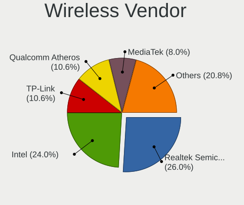

| Vendor                                | Desktops | Percent |
|---------------------------------------|----------|---------|
| Realtek Semiconductor                 | 81       | 25.96%  |
| Intel                                 | 75       | 24.04%  |
| TP-Link                               | 33       | 10.58%  |
| Qualcomm Atheros                      | 33       | 10.58%  |
| MediaTek                              | 25       | 8.01%   |
| Qualcomm Atheros Communications       | 18       | 5.77%   |
| Ralink Technology                     | 11       | 3.53%   |
| D-Link                                | 7        | 2.24%   |
| ASUSTek Computer                      | 6        | 1.92%   |
| Microsoft                             | 5        | 1.6%    |
| Broadcom                              | 4        | 1.28%   |
| Ralink                                | 3        | 0.96%   |
| Edimax Technology                     | 3        | 0.96%   |
| Accton Technology                     | 2        | 0.64%   |
| TRENDnet                              | 1        | 0.32%   |
| Sitecom Europe                        | 1        | 0.32%   |
| Qualcomm Technologies                 | 1        | 0.32%   |
| Broadcom Limited                      | 1        | 0.32%   |
| Belkin Components                     | 1        | 0.32%   |
| 802.11g Adapter [Linksys WUSB54GC v3] | 1        | 0.32%   |

Wireless Model
--------------

Wireless models

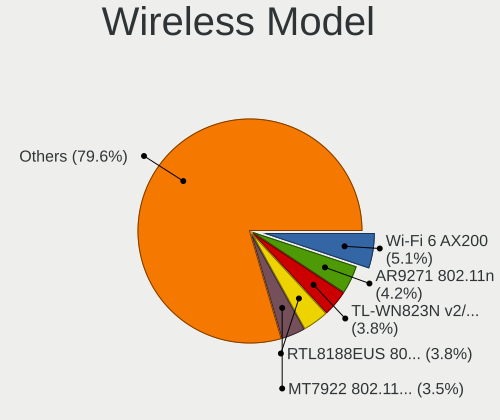

| Model                                                                                | Desktops | Percent |
|--------------------------------------------------------------------------------------|----------|---------|
| Intel Wi-Fi 6 AX200                                                                  | 16       | 5.11%   |
| Qualcomm Atheros AR9271 802.11n                                                      | 13       | 4.15%   |
| TP-Link TL-WN823N v2/v3 [Realtek RTL8192EU]                                          | 12       | 3.83%   |
| Realtek RTL8188EUS 802.11n Wireless Network Adapter                                  | 12       | 3.83%   |
| MediaTek MT7922 802.11ax PCI Express Wireless Network Adapter                        | 11       | 3.51%   |
| Intel Dual Band Wireless-AC 3168NGW [Stone Peak]                                     | 11       | 3.51%   |
| Intel Wi-Fi 6E(802.11ax) AX210/AX1675* 2x2 [Typhoon Peak]                            | 10       | 3.19%   |
| Realtek RTL8192CU 802.11n WLAN Adapter                                               | 9        | 2.88%   |
| Realtek 802.11ac NIC                                                                 | 9        | 2.88%   |
| TP-Link AC600 wireless Realtek RTL8811AU [Archer T2U Nano]                           | 8        | 2.56%   |
| Realtek RTL8821CE 802.11ac PCIe Wireless Network Adapter                             | 8        | 2.56%   |
| Qualcomm Atheros AR9227 Wireless Network Adapter                                     | 7        | 2.24%   |
| Intel Wireless 7265                                                                  | 7        | 2.24%   |
| Intel 700 Series Chipset CNVi WiFi                                                   | 7        | 2.24%   |
| Realtek RTL8812AE 802.11ac PCIe Wireless Network Adapter                             | 6        | 1.92%   |
| Realtek RTL88x2bu [AC1200 Techkey]                                                   | 5        | 1.6%    |
| Realtek RTL8822BE 802.11a/b/g/n/ac WiFi adapter                                      | 5        | 1.6%    |
| Realtek RTL8192EE PCIe Wireless Network Adapter                                      | 5        | 1.6%    |
| Ralink MT7601U Wireless Adapter                                                      | 5        | 1.6%    |
| MediaTek MT7921 802.11ax PCIe Wireless Network Adapter [Filogic 330]                 | 5        | 1.6%    |
| Intel Wi-Fi 5(802.11ac) Wireless-AC 9x6x [Thunder Peak]                              | 5        | 1.6%    |
| Realtek RTL8188EE Wireless Network Adapter                                           | 4        | 1.28%   |
| Qualcomm Atheros TP-Link TL-WN821N v3 / TL-WN822N v2 802.11n [Atheros AR7010+AR9287] | 4        | 1.28%   |
| Qualcomm Atheros AR9485 Wireless Network Adapter                                     | 4        | 1.28%   |
| Qualcomm Atheros AR9285 Wireless Network Adapter (PCI-Express)                       | 4        | 1.28%   |
| Microsoft Xbox Wireless Adapter for Windows                                          | 4        | 1.28%   |
| MediaTek MT7921K (RZ608) Wi-Fi 6E 80MHz                                              | 4        | 1.28%   |
| Intel Cannon Lake PCH CNVi WiFi                                                      | 4        | 1.28%   |
| TP-Link Archer T3U [Realtek RTL8812BU]                                               | 3        | 0.96%   |
| Realtek RTL8187B Wireless 802.11g 54Mbps Network Adapter                             | 3        | 0.96%   |
| Qualcomm Atheros QCA9377 802.11ac Wireless Network Adapter                           | 3        | 0.96%   |
| Qualcomm Atheros AR93xx Wireless Network Adapter                                     | 3        | 0.96%   |
| MediaTek MT7902 802.11ax PCIe Wireless Network Adapter [Filogic 310]                 | 3        | 0.96%   |
| Intel Wireless 8260                                                                  | 3        | 0.96%   |
| ASUS N10 Nano 802.11n Network Adapter [Realtek RTL8192CU]                            | 3        | 0.96%   |
| TP-Link TL-WN822N Version 4 RTL8192EU                                                | 2        | 0.64%   |
| TP-Link TL-WN821N v5/v6 [RTL8192EU]                                                  | 2        | 0.64%   |
| TP-Link TL-WN722N v2/v3 [Realtek RTL8188EUS]                                         | 2        | 0.64%   |
| TP-Link Archer T2U PLUS [RTL8821AU]                                                  | 2        | 0.64%   |
| Realtek RTL8852CE PCIe 802.11ax Wireless Network Controller                          | 2        | 0.64%   |

Ethernet Vendor
---------------

Ethernet vendors

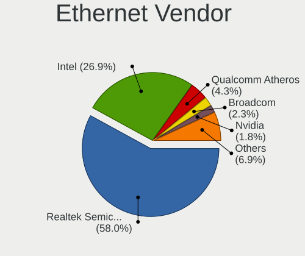

| Vendor                           | Desktops | Percent |
|----------------------------------|----------|---------|
| Realtek Semiconductor            | 462      | 57.97%  |
| Intel                            | 214      | 26.85%  |
| Qualcomm Atheros                 | 34       | 4.27%   |
| Broadcom                         | 18       | 2.26%   |
| Nvidia                           | 14       | 1.76%   |
| Marvell Technology Group         | 7        | 0.88%   |
| VIA Technologies                 | 6        | 0.75%   |
| Xiaomi                           | 5        | 0.63%   |
| Samsung Electronics              | 5        | 0.63%   |
| Silicon Integrated Systems [SiS] | 4        | 0.5%    |
| D-Link System                    | 4        | 0.5%    |
| ADMtek                           | 4        | 0.5%    |
| Qualcomm Technologies            | 3        | 0.38%   |
| Broadcom Limited                 | 3        | 0.38%   |
| Aquantia                         | 3        | 0.38%   |
| Huawei Technologies              | 2        | 0.25%   |
| Google                           | 2        | 0.25%   |
| TP-Link                          | 1        | 0.13%   |
| Standard Microsystems [SMC]      | 1        | 0.13%   |
| Mellanox Technologies            | 1        | 0.13%   |
| MediaTek                         | 1        | 0.13%   |
| ASIX Electronics                 | 1        | 0.13%   |
| Apple                            | 1        | 0.13%   |
| Accton Technology                | 1        | 0.13%   |

Ethernet Model
--------------

Ethernet models

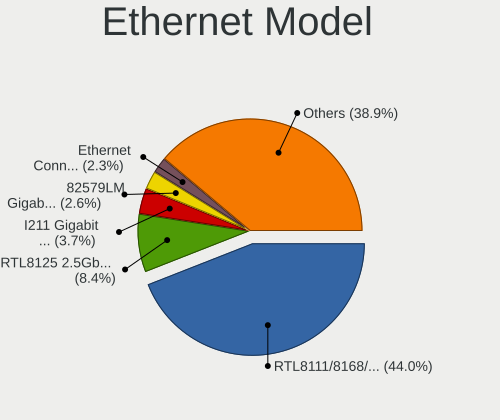

| Model                                                                  | Desktops | Percent |
|------------------------------------------------------------------------|----------|---------|
| Realtek RTL8111/8168/8211/8411 PCI Express Gigabit Ethernet Controller | 366      | 44.04%  |
| Realtek RTL8125 2.5GbE Controller                                      | 70       | 8.42%   |
| Intel I211 Gigabit Network Connection                                  | 31       | 3.73%   |
| Intel 82579LM Gigabit Network Connection (Lewisville)                  | 22       | 2.65%   |
| Intel Ethernet Connection (2) I219-V                                   | 19       | 2.29%   |
| Intel Ethernet Controller I225-V                                       | 18       | 2.17%   |
| Intel 82567LM-3 Gigabit Network Connection                             | 13       | 1.56%   |
| Realtek RTL810xE PCI Express Fast Ethernet controller                  | 11       | 1.32%   |
| Realtek RTL-8100/8101L/8139 PCI Fast Ethernet Adapter                  | 11       | 1.32%   |
| Intel Ethernet Connection (7) I219-V                                   | 11       | 1.32%   |
| Intel Ethernet Controller I226-V                                       | 10       | 1.2%    |
| Intel 82579V Gigabit Network Connection                                | 10       | 1.2%    |
| Intel Ethernet Connection I217-LM                                      | 9        | 1.08%   |
| Intel Ethernet Connection (2) I218-V                                   | 9        | 1.08%   |
| Qualcomm Atheros AR8131 Gigabit Ethernet                               | 8        | 0.96%   |
| Intel Ethernet Connection I217-V                                       | 8        | 0.96%   |
| Qualcomm Atheros AR8121/AR8113/AR8114 Gigabit or Fast Ethernet         | 7        | 0.84%   |
| Qualcomm Atheros AR8151 v2.0 Gigabit Ethernet                          | 6        | 0.72%   |
| Nvidia MCP61 Ethernet                                                  | 6        | 0.72%   |
| Intel Ethernet Connection (2) I219-LM                                  | 6        | 0.72%   |
| Intel Ethernet Connection (14) I219-V                                  | 6        | 0.72%   |
| Xiaomi Mi/Redmi series (RNDIS)                                         | 5        | 0.6%    |
| VIA VT6102/VT6103 [Rhine-II]                                           | 5        | 0.6%    |
| Realtek RTL8126 5GbE Controller                                        | 5        | 0.6%    |
| Qualcomm Atheros Attansic L1 Gigabit Ethernet                          | 5        | 0.6%    |
| Realtek RTL8153 Gigabit Ethernet Adapter                               | 4        | 0.48%   |
| Qualcomm Atheros Killer E220x Gigabit Ethernet Controller              | 4        | 0.48%   |
| D-Link System DGE-528T Gigabit Ethernet Adapter                        | 4        | 0.48%   |
| Broadcom NetXtreme BCM5751 Gigabit Ethernet PCI Express                | 4        | 0.48%   |
| ADMtek NC100 Network Everywhere Fast Ethernet 10/100                   | 4        | 0.48%   |
| Samsung GT-I9070 (network tethering, USB debugging enabled)            | 3        | 0.36%   |
| Samsung Galaxy series, misc. (tethering mode)                          | 3        | 0.36%   |
| Realtek RTL8852BE PCIe 802.11ax Wireless Network Controller            | 3        | 0.36%   |
| Realtek RTL8169 PCI Gigabit Ethernet Controller                        | 3        | 0.36%   |
| Realtek Killer E3000 2.5GbE Controller                                 | 3        | 0.36%   |
| Qualcomm WCN785x Wi-Fi 7(802.11be) 320MHz 2x2 [FastConnect 7800]       | 3        | 0.36%   |
| Nvidia MCP73 Ethernet                                                  | 3        | 0.36%   |
| Intel Ethernet Controller 10-Gigabit X540-AT2                          | 3        | 0.36%   |
| Intel Ethernet Connection (7) I219-LM                                  | 3        | 0.36%   |
| Intel Ethernet Connection (17) I219-V                                  | 3        | 0.36%   |

Net Controller Kind
-------------------

Ethernet, WiFi or modem

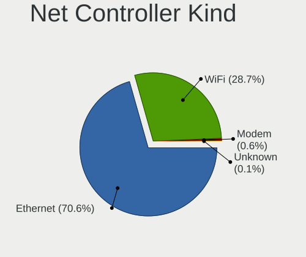

| Kind     | Desktops | Percent |
|----------|----------|---------|
| Ethernet | 738      | 70.62%  |
| WiFi     | 300      | 28.71%  |
| Modem    | 6        | 0.57%   |
| Unknown  | 1        | 0.1%    |

Used Controller
---------------

Currently used network controller

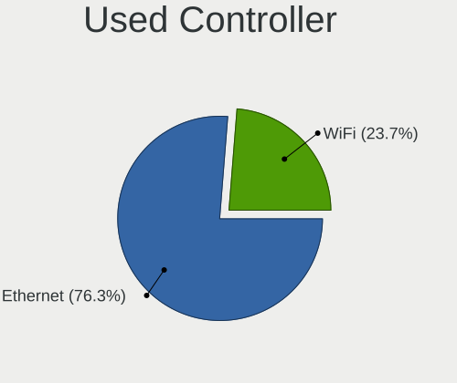

| Kind     | Desktops | Percent |
|----------|----------|---------|
| Ethernet | 591      | 76.26%  |
| WiFi     | 184      | 23.74%  |

NICs
----

Total network controllers on board

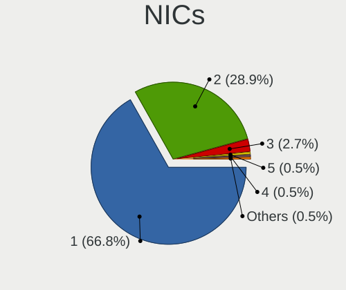

| Total | Desktops | Percent |
|-------|----------|---------|
| 1     | 500      | 66.84%  |
| 2     | 216      | 28.88%  |
| 3     | 20       | 2.67%   |
| 5     | 4        | 0.53%   |
| 4     | 4        | 0.53%   |
| 0     | 3        | 0.4%    |
| 6     | 1        | 0.13%   |

IPv6
----

IPv6 vs IPv4

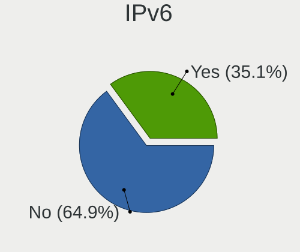

| Used | Desktops | Percent |
|------|----------|---------|
| No   | 496      | 64.92%  |
| Yes  | 268      | 35.08%  |

Bluetooth
---------

Bluetooth Vendor
----------------

Controller vendors

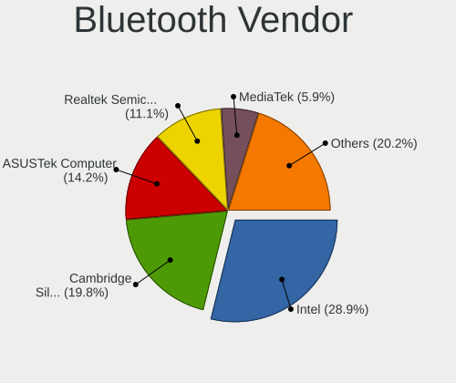

| Vendor                          | Desktops | Percent |
|---------------------------------|----------|---------|
| Intel                           | 73       | 28.85%  |
| Cambridge Silicon Radio         | 50       | 19.76%  |
| ASUSTek Computer                | 36       | 14.23%  |
| Realtek Semiconductor           | 28       | 11.07%  |
| MediaTek                        | 15       | 5.93%   |
| TP-Link                         | 14       | 5.53%   |
| IMC Networks                    | 11       | 4.35%   |
| Foxconn / Hon Hai               | 8        | 3.16%   |
| Qualcomm Atheros Communications | 3        | 1.19%   |
| Integrated System Solution      | 3        | 1.19%   |
| Belkin Components               | 3        | 1.19%   |
| Broadcom                        | 2        | 0.79%   |
| Apple                           | 2        | 0.79%   |
| Unknown                         | 2        | 0.79%   |
| Toshiba                         | 1        | 0.4%    |
| Edimax Technology               | 1        | 0.4%    |
| Actions                         | 1        | 0.4%    |

Bluetooth Model
---------------

Controller models

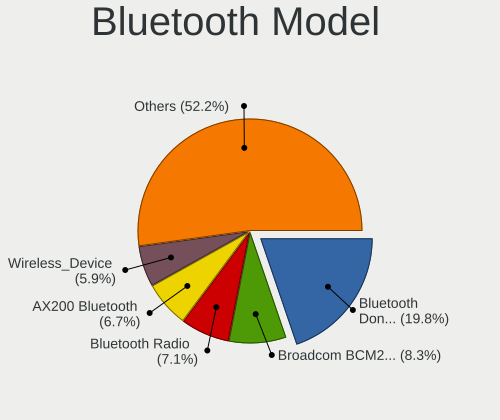

| Model                                                 | Desktops | Percent |
|-------------------------------------------------------|----------|---------|
| Cambridge Silicon Radio Bluetooth Dongle (HCI mode)   | 50       | 19.76%  |
| ASUS Broadcom BCM20702A0 Bluetooth                    | 21       | 8.3%    |
| Realtek Bluetooth Radio                               | 18       | 7.11%   |
| Intel AX200 Bluetooth                                 | 17       | 6.72%   |
| MediaTek Wireless_Device                              | 15       | 5.93%   |
| TP-Link TP-T@- UB500 Adapter                          | 14       | 5.53%   |
| Intel Bluetooth wireless interface                    | 13       | 5.14%   |
| Intel Wireless-AC 3168 Bluetooth                      | 11       | 4.35%   |
| Intel AX210 Bluetooth                                 | 10       | 3.95%   |
| ASUS ASUS USB-BT500                                   | 10       | 3.95%   |
| Realtek  Bluetooth 4.2 Adapter                        | 7        | 2.77%   |
| IMC Networks Wireless_Device                          | 7        | 2.77%   |
| Intel Bluetooth Device                                | 6        | 2.37%   |
| Intel Bluetooth 9460/9560 Jefferson Peak (JfP)        | 6        | 2.37%   |
| Intel AX201 Bluetooth                                 | 6        | 2.37%   |
| Foxconn / Hon Hai Bluetooth Device                    | 5        | 1.98%   |
| Intel Wireless-AC 9260 Bluetooth Adapter              | 4        | 1.58%   |
| Realtek Bluetooth 5.3 Radio                           | 3        | 1.19%   |
| Integrated System Solution KY-BT100 Bluetooth Adapter | 3        | 1.19%   |
| IMC Networks Bluetooth Device                         | 3        | 1.19%   |
| Foxconn / Hon Hai Wireless_Device                     | 3        | 1.19%   |
| Broadcom BCM20702A0 Bluetooth 4.0                     | 2        | 0.79%   |
| ASUS Qualcomm Bluetooth 4.1                           | 2        | 0.79%   |
| Apple Bluetooth HCI                                   | 2        | 0.79%   |
| Unknown                                               | 2        | 0.79%   |
| Toshiba Atheros AR3012 Bluetooth                      | 1        | 0.4%    |
| Qualcomm Atheros  Bluetooth Device                    | 1        | 0.4%    |
| Qualcomm Atheros Bluetooth USB Host Controller        | 1        | 0.4%    |
| Qualcomm Atheros AR3011 Bluetooth                     | 1        | 0.4%    |
| IMC Networks Bluetooth Radio                          | 1        | 0.4%    |
| Edimax Bluetooth Device                               | 1        | 0.4%    |
| Belkin Components F8T065BF Mini Bluetooth 4.0 Adapter | 1        | 0.4%    |
| Belkin Components Bluetooth Mini Dongle               | 1        | 0.4%    |
| Belkin Components Bluetooth Device with trace filter  | 1        | 0.4%    |
| ASUS Broadcom BCM20702 Single-Chip Bluetooth 4.0 + LE | 1        | 0.4%    |
| ASUS Bluetooth Radio                                  | 1        | 0.4%    |
| ASUS Bluetooth Adapter                                | 1        | 0.4%    |
| Actions general adapter                               | 1        | 0.4%    |

Sound
-----

Sound Vendor
------------

Sound card vendors

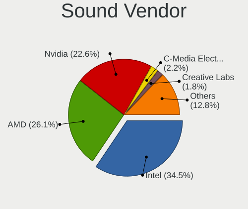

| Vendor                               | Desktops | Percent |
|--------------------------------------|----------|---------|
| Intel                                | 446      | 34.47%  |
| AMD                                  | 338      | 26.12%  |
| Nvidia                               | 292      | 22.57%  |
| C-Media Electronics                  | 29       | 2.24%   |
| Creative Labs                        | 23       | 1.78%   |
| Kingston Technology                  | 16       | 1.24%   |
| Razer USA                            | 15       | 1.16%   |
| Logitech                             | 14       | 1.08%   |
| JMTek                                | 12       | 0.93%   |
| Texas Instruments                    | 11       | 0.85%   |
| ASUSTek Computer                     | 10       | 0.77%   |
| SteelSeries ApS                      | 7        | 0.54%   |
| Micro Star International             | 7        | 0.54%   |
| Focusrite-Novation                   | 7        | 0.54%   |
| Hewlett-Packard                      | 6        | 0.46%   |
| Sony                                 | 4        | 0.31%   |
| Silicon Integrated Systems [SiS]     | 4        | 0.31%   |
| Creative Technology                  | 3        | 0.23%   |
| Corsair                              | 3        | 0.23%   |
| VIA Technologies                     | 2        | 0.15%   |
| Thesycon Systemsoftware & Consulting | 2        | 0.15%   |
| JBL                                  | 2        | 0.15%   |
| Generalplus Technology               | 2        | 0.15%   |
| Blue Microphones                     | 2        | 0.15%   |
| ASRock                               | 2        | 0.15%   |
| ZOOM                                 | 1        | 0.08%   |
| XMOS                                 | 1        | 0.08%   |
| WinChipHead                          | 1        | 0.08%   |
| Valve Software                       | 1        | 0.08%   |
| ULi Electronics                      | 1        | 0.08%   |
| Turtle Beach                         | 1        | 0.08%   |
| Trust                                | 1        | 0.08%   |
| Sunplus Innovation Technology        | 1        | 0.08%   |
| Samsung Electronics                  | 1        | 0.08%   |
| Samson Technologies                  | 1        | 0.08%   |
| Realtek Semiconductor                | 1        | 0.08%   |
| PreSonus Audio Electronics           | 1        | 0.08%   |
| Plantronics                          | 1        | 0.08%   |
| Philips (or NXP)                     | 1        | 0.08%   |
| Nexight                              | 1        | 0.08%   |

Sound Model
-----------

Sound card models

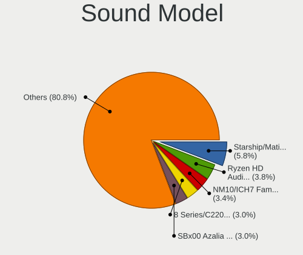

| Model                                                                             | Desktops | Percent |
|-----------------------------------------------------------------------------------|----------|---------|
| AMD Starship/Matisse HD Audio Controller                                          | 88       | 5.82%   |
| AMD Ryzen HD Audio Controller                                                     | 58       | 3.83%   |
| Intel NM10/ICH7 Family High Definition Audio Controller                           | 52       | 3.44%   |
| Intel 8 Series/C220 Series Chipset High Definition Audio Controller               | 46       | 3.04%   |
| AMD SBx00 Azalia (Intel HDA)                                                      | 46       | 3.04%   |
| AMD Ellesmere HDMI Audio [Radeon RX 470/480 / 570/580/590]                        | 42       | 2.78%   |
| Intel 7 Series/C216 Chipset Family High Definition Audio Controller               | 37       | 2.45%   |
| AMD Family 17h (Models 00h-0fh) HD Audio Controller                               | 36       | 2.38%   |
| Intel 6 Series/C200 Series Chipset Family High Definition Audio Controller        | 35       | 2.31%   |
| Intel 100 Series/C230 Series Chipset Family HD Audio Controller                   | 34       | 2.25%   |
| Nvidia GK208 HDMI/DP Audio Controller                                             | 33       | 2.18%   |
| AMD Navi 21/23 HDMI/DP Audio Controller                                           | 31       | 2.05%   |
| Intel Xeon E3-1200 v3/4th Gen Core Processor HD Audio Controller                  | 30       | 1.98%   |
| AMD Radeon High Definition Audio Controller                                       | 30       | 1.98%   |
| Intel 200 Series PCH HD Audio                                                     | 29       | 1.92%   |
| Intel Cannon Lake PCH cAVS                                                        | 28       | 1.85%   |
| Nvidia GP107GL High Definition Audio Controller                                   | 27       | 1.78%   |
| Nvidia GA104 High Definition Audio Controller                                     | 20       | 1.32%   |
| Nvidia High Definition Audio Controller                                           | 19       | 1.26%   |
| Nvidia GP106 High Definition Audio Controller                                     | 18       | 1.19%   |
| Intel 82801JI (ICH10 Family) HD Audio Controller                                  | 18       | 1.19%   |
| Intel 5 Series/3400 Series Chipset High Definition Audio                          | 18       | 1.19%   |
| AMD Renoir/Cezanne HDMI/DP Audio Controller                                       | 18       | 1.19%   |
| AMD Navi 31 HDMI/DP Audio                                                         | 18       | 1.19%   |
| Nvidia TU116 High Definition Audio Controller                                     | 16       | 1.06%   |
| Intel 9 Series Chipset Family HD Audio Controller                                 | 15       | 0.99%   |
| Intel Raptor Lake High Definition Audio Controller                                | 14       | 0.93%   |
| Nvidia GA106 High Definition Audio Controller                                     | 13       | 0.86%   |
| Intel Alder Lake-S HD Audio Controller                                            | 13       | 0.86%   |
| AMD Navi 10 HDMI Audio                                                            | 13       | 0.86%   |
| AMD Cedar HDMI Audio [Radeon HD 5400/6300/7300 Series]                            | 13       | 0.86%   |
| Nvidia TU106 High Definition Audio Controller                                     | 12       | 0.79%   |
| Intel Tiger Lake-H HD Audio Controller                                            | 12       | 0.79%   |
| Intel 82801JD/DO (ICH10 Family) HD Audio Controller                               | 12       | 0.79%   |
| AMD Oland/Hainan/Cape Verde/Pitcairn HDMI Audio [Radeon HD 7000 Series]           | 12       | 0.79%   |
| AMD Caicos HDMI Audio [Radeon HD 6450 / 7450/8450/8490 OEM / R5 230/235/235X OEM] | 11       | 0.73%   |
| Kingston Technology HyperX 7.1 Audio                                              | 10       | 0.66%   |
| AMD RV710/730 HDMI Audio [Radeon HD 4000 series]                                  | 10       | 0.66%   |
| AMD FCH Azalia Controller                                                         | 10       | 0.66%   |
| AMD Baffin HDMI/DP Audio [Radeon RX 550 640SP / RX 560/560X]                      | 10       | 0.66%   |

Memory
------

Memory Vendor
-------------

Memory module vendors

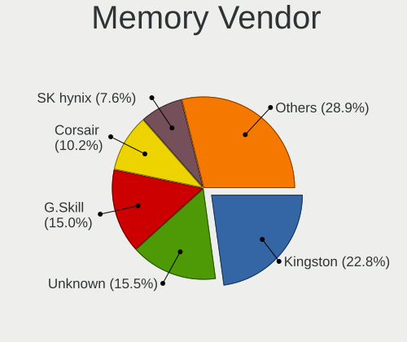

| Vendor              | Desktops | Percent |
|---------------------|----------|---------|
| Kingston            | 87       | 22.83%  |
| Unknown             | 59       | 15.49%  |
| G.Skill             | 57       | 14.96%  |
| Corsair             | 39       | 10.24%  |
| SK hynix            | 29       | 7.61%   |
| Samsung Electronics | 26       | 6.82%   |
| Crucial             | 24       | 6.3%    |
| Team                | 13       | 3.41%   |
| Micron Technology   | 11       | 2.89%   |
| Unknown             | 10       | 2.62%   |
| Nanya Technology    | 3        | 0.79%   |
| GOODRAM             | 3        | 0.79%   |
| A-DATA Technology   | 3        | 0.79%   |
| Silicon Power       | 2        | 0.52%   |
| Ramaxel Technology  | 2        | 0.52%   |
| ASint Technology    | 2        | 0.52%   |
| Unknown (ABCD)      | 1        | 0.26%   |
| Unknown (0x02BA)    | 1        | 0.26%   |
| Unifosa             | 1        | 0.26%   |
| Transcend           | 1        | 0.26%   |
| Patriot             | 1        | 0.26%   |
| Lexar               | 1        | 0.26%   |
| Infineon            | 1        | 0.26%   |
| Elpida              | 1        | 0.26%   |
| Cors                | 1        | 0.26%   |
| Atermiter           | 1        | 0.26%   |
| Apacer              | 1        | 0.26%   |

Memory Model
------------

Memory module models

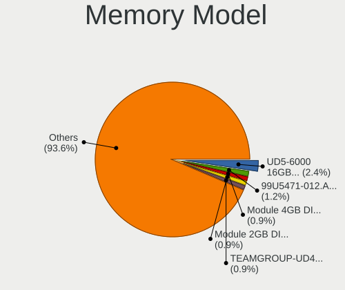

| Model                                                  | Desktops | Percent |
|--------------------------------------------------------|----------|---------|
| Unknown                                                | 10       | 2.37%   |
| Kingston RAM 99U5471-012.A00LF 4GB DIMM DDR3 1333MT/s  | 5        | 1.18%   |
| Unknown RAM Module 4GB DIMM 1333MT/s                   | 4        | 0.95%   |
| Unknown RAM Module 2GB DIMM SDRAM                      | 4        | 0.95%   |
| Team RAM TEAMGROUP-UD4-3200 8GB DIMM DDR4 3733MT/s     | 4        | 0.95%   |
| Kingston RAM KHX1600C10D3/8G 8GB DIMM DDR3 2133MT/s    | 4        | 0.95%   |
| Kingston RAM KF3200C16D4/8GX 8GiB DIMM DDR4 3600MT/s   | 4        | 0.95%   |
| Corsair RAM CMK32GX4M2E3200C16 16GB DIMM DDR4 3600MT/s | 4        | 0.95%   |
| Corsair RAM CMK16GX4M2B3200C16 8GB DIMM DDR4 3600MT/s  | 4        | 0.95%   |
| Unknown RAM Module 2GB DIMM DDR2 1067MT/s              | 3        | 0.71%   |
| Unknown RAM Module 2GB DIMM 1333MT/s                   | 3        | 0.71%   |
| Unknown RAM Module 2048MB DIMM DDR2 667MT/s            | 3        | 0.71%   |
| Unknown RAM Module 1GB DIMM SDRAM                      | 3        | 0.71%   |
| Kingston RAM KHX3200C16D4/8GX 8GB DIMM DDR4 3733MT/s   | 3        | 0.71%   |
| Kingston RAM KHX2400C15/8G 8GB DIMM DDR4 3400MT/s      | 3        | 0.71%   |
| G.Skill RAM F5-6000J3038F16G 16GB DIMM DDR5 6000MT/s   | 3        | 0.71%   |
| G.Skill RAM F4-3200C16-8GTZR 8GB DIMM DDR4 3200MT/s    | 3        | 0.71%   |
| G.Skill RAM F4-2400C15-16GIS 16GB DIMM DDR4 2400MT/s   | 3        | 0.71%   |
| Corsair RAM CMK32GX5M2B6000Z30 16GB DIMM DDR5 6000MT/s | 3        | 0.71%   |
| Unknown RAM Module 8GB DIMM 1600MT/s                   | 2        | 0.47%   |
| Unknown RAM Module 8GB DIMM 1333MT/s                   | 2        | 0.47%   |
| Unknown RAM Module 4GB DIMM                            | 2        | 0.47%   |
| Unknown RAM Module 4096MB DIMM                         | 2        | 0.47%   |
| Unknown RAM Module 2GB DIMM DDR2 800MT/s               | 2        | 0.47%   |
| Unknown RAM Module 2GB DIMM DDR2 400MT/s               | 2        | 0.47%   |
| Unknown RAM Module 2GB DIMM DDR2                       | 2        | 0.47%   |
| Unknown RAM Module 2GB DIMM 800MT/s                    | 2        | 0.47%   |
| Unknown RAM Module 2GB DIMM                            | 2        | 0.47%   |
| Unknown RAM Module 2048MB DIMM 1333MT/s                | 2        | 0.47%   |
| Team RAM TEAMGROUP-UD4-2666 8GB DIMM DDR4 3000MT/s     | 2        | 0.47%   |
| SK hynix RAM HMT351U6EFR8C-PB 4GB DIMM DDR3 1600MT/s   | 2        | 0.47%   |
| SK hynix RAM HMT351U6CFR8C-PB 4GB DIMM DDR3 1800MT/s   | 2        | 0.47%   |
| Samsung RAM M378B5773CH0-CH9 2GB DIMM DDR3 1867MT/s    | 2        | 0.47%   |
| Samsung RAM M378B5673EH1-CH9 2GB DIMM DDR3 1333MT/s    | 2        | 0.47%   |
| Samsung RAM M378B5173DB0-CK0 4096MB DIMM DDR3 1600MT/s | 2        | 0.47%   |
| Samsung RAM M378A1K43CB2-CTD 8GB DIMM DDR4 3266MT/s    | 2        | 0.47%   |
| Micron RAM 8JTF51264AZ-1G6E1 4GB DIMM DDR3 1600MT/s    | 2        | 0.47%   |
| Kingston RAM KHX2666C16/8G 8GiB DIMM DDR4 3466MT/s     | 2        | 0.47%   |
| Kingston RAM KHX1866C10D3/8G 8GB DIMM DDR3 1867MT/s    | 2        | 0.47%   |
| Kingston RAM KHX1600C10D3/8GX 8GB DIMM DDR3 1600MT/s   | 2        | 0.47%   |

Memory Kind
-----------

Memory module kinds

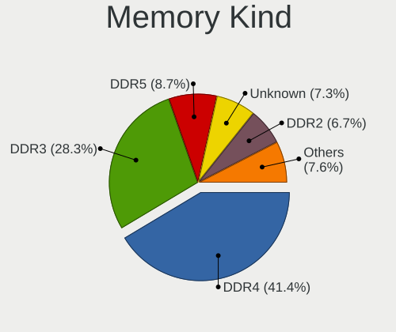

| Kind    | Desktops | Percent |
|---------|----------|---------|
| DDR4    | 142      | 41.4%   |
| DDR3    | 97       | 28.28%  |
| DDR5    | 30       | 8.75%   |
| Unknown | 25       | 7.29%   |
| DDR2    | 23       | 6.71%   |
| SDRAM   | 18       | 5.25%   |
| DDR     | 5        | 1.46%   |
| LPDDR4  | 2        | 0.58%   |
| LPDDR5  | 1        | 0.29%   |

Memory Form Factor
------------------

Physical design of the memory module

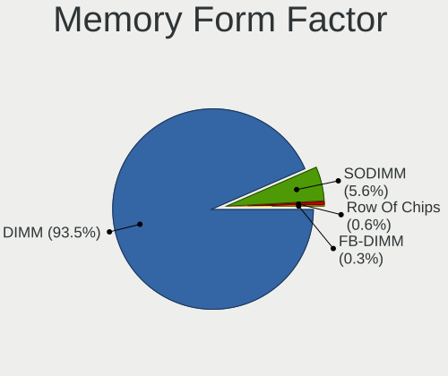

| Name         | Desktops | Percent |
|--------------|----------|---------|
| DIMM         | 315      | 93.47%  |
| SODIMM       | 19       | 5.64%   |
| Row Of Chips | 2        | 0.59%   |
| FB-DIMM      | 1        | 0.3%    |

Memory Size
-----------

Memory module size

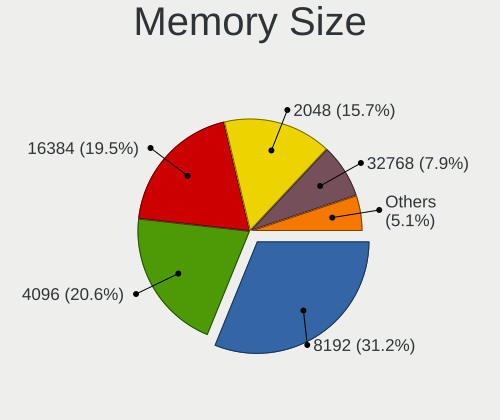

| Size  | Desktops | Percent |
|-------|----------|---------|
| 8192  | 115      | 31.17%  |
| 4096  | 76       | 20.6%   |
| 16384 | 72       | 19.51%  |
| 2048  | 58       | 15.72%  |
| 32768 | 29       | 7.86%   |
| 1024  | 14       | 3.79%   |
| 512   | 2        | 0.54%   |
| 49152 | 1        | 0.27%   |
| 24576 | 1        | 0.27%   |
| 256   | 1        | 0.27%   |

Memory Speed
------------

Memory module speed

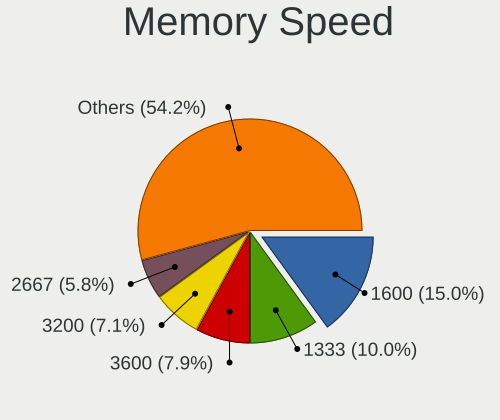

| Speed   | Desktops | Percent |
|---------|----------|---------|
| 1600    | 57       | 15%     |
| 1333    | 38       | 10%     |
| 3600    | 30       | 7.89%   |
| 3200    | 27       | 7.11%   |
| 2667    | 22       | 5.79%   |
| 2400    | 19       | 5%      |
| Unknown | 16       | 4.21%   |
| 6000    | 15       | 3.95%   |
| 3733    | 12       | 3.16%   |
| 2133    | 12       | 3.16%   |
| 800     | 10       | 2.63%   |
| 667     | 9        | 2.37%   |
| 1867    | 8        | 2.11%   |
| 1866    | 8        | 2.11%   |
| 3000    | 7        | 1.84%   |
| 2666    | 7        | 1.84%   |
| 1800    | 7        | 1.84%   |
| 3800    | 6        | 1.58%   |
| 4800    | 5        | 1.32%   |
| 1067    | 5        | 1.32%   |
| 400     | 5        | 1.32%   |
| 5600    | 4        | 1.05%   |
| 4000    | 4        | 1.05%   |
| 3400    | 4        | 1.05%   |
| 3266    | 4        | 1.05%   |
| 533     | 4        | 1.05%   |
| 5200    | 2        | 0.53%   |
| 3933    | 2        | 0.53%   |
| 3866    | 2        | 0.53%   |
| 3466    | 2        | 0.53%   |
| 2933    | 2        | 0.53%   |
| 2733    | 2        | 0.53%   |
| 2048    | 2        | 0.53%   |
| 2000    | 2        | 0.53%   |
| 1066    | 2        | 0.53%   |
| 43889   | 1        | 0.26%   |
| 12800   | 1        | 0.26%   |
| 6400    | 1        | 0.26%   |
| 6200    | 1        | 0.26%   |
| 5800    | 1        | 0.26%   |

Printers & scanners
-------------------

Printer Vendor
--------------

Printer device vendors

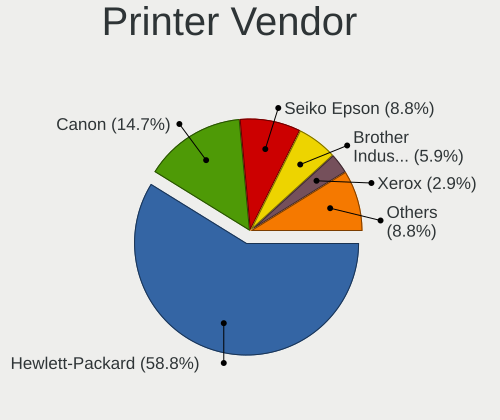

| Vendor                | Desktops | Percent |
|-----------------------|----------|---------|
| Hewlett-Packard       | 20       | 58.82%  |
| Canon                 | 5        | 14.71%  |
| Seiko Epson           | 3        | 8.82%   |
| Brother Industries    | 2        | 5.88%   |
| Xerox                 | 1        | 2.94%   |
| Samsung Electronics   | 1        | 2.94%   |
| Lexmark International | 1        | 2.94%   |
| ICS Advent            | 1        | 2.94%   |

Printer Model
-------------

Printer device models

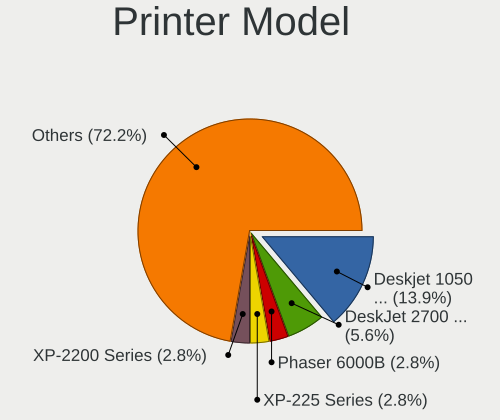

| Model                                        | Desktops | Percent |
|----------------------------------------------|----------|---------|
| HP Deskjet 1050 J410                         | 5        | 13.89%  |
| HP DeskJet 2700 series                       | 2        | 5.56%   |
| Xerox Phaser 6000B                           | 1        | 2.78%   |
| Seiko Epson XP-225 Series                    | 1        | 2.78%   |
| Seiko Epson XP-2200 Series                   | 1        | 2.78%   |
| Seiko Epson ME 320/330 Series [Stylus SX125] | 1        | 2.78%   |
| Samsung ML-1610 Mono Laser Printer           | 1        | 2.78%   |
| Lexmark International E120(n)                | 1        | 2.78%   |
| ICS Advent Parallel Adapter                  | 1        | 2.78%   |
| HP OfficeJet 5200 series                     | 1        | 2.78%   |
| HP Officejet 4620 series                     | 1        | 2.78%   |
| HP Officejet 4500 G510g-m                    | 1        | 2.78%   |
| HP LaserJet Professional P1102w              | 1        | 2.78%   |
| HP LaserJet M14-M17                          | 1        | 2.78%   |
| HP ENVY 6000 series                          | 1        | 2.78%   |
| HP ENVY 4520 series                          | 1        | 2.78%   |
| HP DeskJet F300 series                       | 1        | 2.78%   |
| HP DeskJet F2492 All-in-One                  | 1        | 2.78%   |
| HP DeskJet 930c                              | 1        | 2.78%   |
| HP DeskJet 4100 series                       | 1        | 2.78%   |
| HP DeskJet 3630 series                       | 1        | 2.78%   |
| HP Deskjet 3050 J610 series                  | 1        | 2.78%   |
| HP Deskjet 1510                              | 1        | 2.78%   |
| Canon TS6300 series                          | 1        | 2.78%   |
| Canon TS3100 series                          | 1        | 2.78%   |
| Canon PIXMA TS6250                           | 1        | 2.78%   |
| Canon PIXMA MP280                            | 1        | 2.78%   |
| Canon PIXMA MG2900 Series                    | 1        | 2.78%   |
| Canon LBP6200                                | 1        | 2.78%   |
| Brother DCP-L3550CDW                         | 1        | 2.78%   |
| Brother DCP-1610W                            | 1        | 2.78%   |

Scanner Vendor
--------------

Scanner device vendors

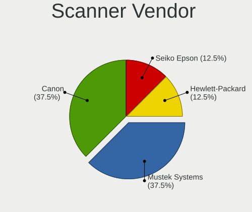

| Vendor          | Desktops | Percent |
|-----------------|----------|---------|
| Mustek Systems  | 4        | 40%     |
| Canon           | 4        | 40%     |
| Seiko Epson     | 1        | 10%     |
| Hewlett-Packard | 1        | 10%     |

Scanner Model
-------------

Scanner device models

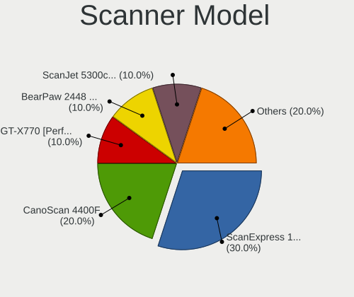

| Model                                 | Desktops | Percent |
|---------------------------------------|----------|---------|
| Mustek Systems ScanExpress 1200 UB    | 3        | 30%     |
| Canon CanoScan 4400F                  | 2        | 20%     |
| Seiko Epson GT-X770 [Perfection V500] | 1        | 10%     |
| Mustek Systems BearPaw 2448 CU Pro    | 1        | 10%     |
| HP ScanJet 5300c/5370c                | 1        | 10%     |
| Canon CanoScan N670U/N676U/LiDE 20    | 1        | 10%     |
| Canon CanoScan LiDE 110               | 1        | 10%     |

Camera
------

Camera Vendor
-------------

Camera device vendors

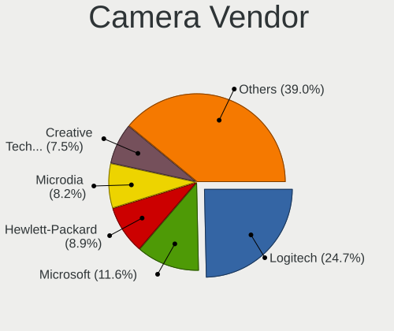

| Vendor                             | Desktops | Percent |
|------------------------------------|----------|---------|
| Logitech                           | 36       | 24.66%  |
| Microsoft                          | 17       | 11.64%  |
| Hewlett-Packard                    | 13       | 8.9%    |
| Microdia                           | 12       | 8.22%   |
| Creative Technology                | 11       | 7.53%   |
| Sunplus Innovation Technology      | 8        | 5.48%   |
| Samsung Electronics                | 4        | 2.74%   |
| Realtek Semiconductor              | 4        | 2.74%   |
| Cubeternet                         | 4        | 2.74%   |
| Aveo Technology                    | 4        | 2.74%   |
| Razer USA                          | 3        | 2.05%   |
| Generalplus Technology             | 3        | 2.05%   |
| Chicony Electronics                | 3        | 2.05%   |
| Apple                              | 3        | 2.05%   |
| Z-Star Microelectronics            | 2        | 1.37%   |
| WaveRider Communications           | 2        | 1.37%   |
| Trust                              | 2        | 1.37%   |
| Philips (or NXP)                   | 2        | 1.37%   |
| MacroSilicon                       | 2        | 1.37%   |
| Jieli Technology                   | 2        | 1.37%   |
| Xiaomi                             | 1        | 0.68%   |
| Valve Software                     | 1        | 0.68%   |
| Orbbec 3D Technology International | 1        | 0.68%   |
| Nexight                            | 1        | 0.68%   |
| KYE Systems (Mouse Systems)        | 1        | 0.68%   |
| Huawei Technologies                | 1        | 0.68%   |
| eMeet                              | 1        | 0.68%   |
| ARC International                  | 1        | 0.68%   |
| Unknown                            | 1        | 0.68%   |

Camera Model
------------

Camera device models

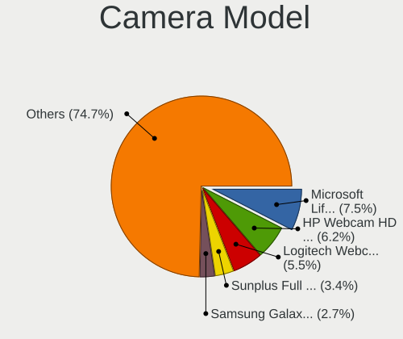

| Model                                    | Desktops | Percent |
|------------------------------------------|----------|---------|
| Microsoft LifeCam HD-3000                | 11       | 7.53%   |
| HP Webcam HD 2300                        | 9        | 6.16%   |
| Logitech Webcam C270                     | 8        | 5.48%   |
| Sunplus Full HD webcam                   | 5        | 3.42%   |
| Samsung Galaxy series, misc. (MTP mode)  | 4        | 2.74%   |
| Microdia USB 2.0 Camera                  | 4        | 2.74%   |
| Logitech Webcam C310                     | 4        | 2.74%   |
| Logitech C922 Pro Stream Webcam          | 4        | 2.74%   |
| Aveo UVC camera (Bresser microscope)     | 4        | 2.74%   |
| Microsoft LifeCam VX-800                 | 3        | 2.05%   |
| Microdia Sonix USB 2.0 Camera            | 3        | 2.05%   |
| Creative Live! Cam Sync 1080p            | 3        | 2.05%   |
| WaveRider USB Live camera                | 2        | 1.37%   |
| Sunplus Integrated Camera                | 2        | 1.37%   |
| Realtek USB Camera                       | 2        | 1.37%   |
| Razer USA Razer Kiyo Pro                 | 2        | 1.37%   |
| Microsoft LifeCam VX-2000                | 2        | 1.37%   |
| Microdia Camera                          | 2        | 1.37%   |
| Logitech QuickCam Express                | 2        | 1.37%   |
| Logitech Logitech Webcam C925e           | 2        | 1.37%   |
| Logitech HD Pro Webcam C920              | 2        | 1.37%   |
| Logitech C920 PRO HD Webcam              | 2        | 1.37%   |
| Jieli USB PHY 2.0                        | 2        | 1.37%   |
| HP Webcam HD 4310                        | 2        | 1.37%   |
| HP 320 FHD Webcam                        | 2        | 1.37%   |
| Generalplus 808 Camera #9 (web-cam mode) | 2        | 1.37%   |
| Cubeternet USB2.0 Camera                 | 2        | 1.37%   |
| Cubeternet GL-UPC822 UVC WebCam          | 2        | 1.37%   |
| Creative Live! Cam Sync HD [VF0770]      | 2        | 1.37%   |
| Creative Live! Cam Sync 1080p V2         | 2        | 1.37%   |
| Apple iPhone 5/5C/5S/6/SE/7/8/X          | 2        | 1.37%   |
| Z-Star Vega USB 2.0 Camera               | 1        | 0.68%   |
| Z-Star Saturn USB 2.0 Camera             | 1        | 0.68%   |
| Xiaomi Redmi Note 10 Pro Max             | 1        | 0.68%   |
| Valve Software 3D Camera                 | 1        | 0.68%   |
| Trust USB Camera                         | 1        | 0.68%   |
| Trust Full HD Webcam                     | 1        | 0.68%   |
| Sunplus SPCA2281 Web Camera              | 1        | 0.68%   |
| Realtek Thronmax Stream Go Pro Webcam    | 1        | 0.68%   |
| Realtek FULL HD 1080P Webcam             | 1        | 0.68%   |

Security
--------

Fingerprint Vendor
------------------

Fingerprint sensor vendors

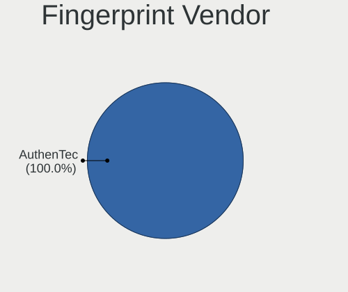

| Vendor    | Desktops | Percent |
|-----------|----------|---------|
| AuthenTec | 2        | 100%    |

Fingerprint Model
-----------------

Fingerprint sensor models

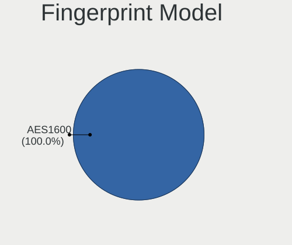

| Model             | Desktops | Percent |
|-------------------|----------|---------|
| AuthenTec AES1600 | 2        | 100%    |

Chipcard Vendor
---------------

Chipcard module vendors

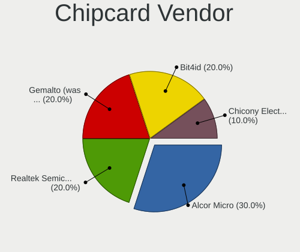

| Vendor                | Desktops | Percent |
|-----------------------|----------|---------|
| Alcor Micro           | 6        | 30%     |
| Realtek Semiconductor | 4        | 20%     |
| Gemalto (was Gemplus) | 4        | 20%     |
| Bit4id                | 4        | 20%     |
| Chicony Electronics   | 2        | 10%     |

Chipcard Model
--------------

Chipcard module models

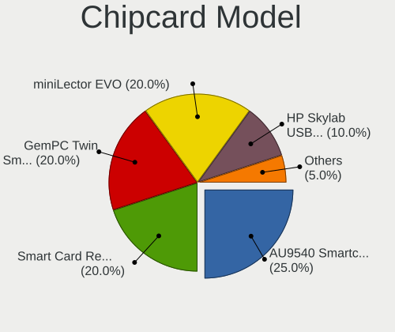

| Model                                                | Desktops | Percent |
|------------------------------------------------------|----------|---------|
| Alcor Micro AU9540 Smartcard Reader                  | 5        | 25%     |
| Realtek Semiconductor Smart Card Reader Interface    | 4        | 20%     |
| Gemalto (was Gemplus) GemPC Twin SmartCard Reader    | 4        | 20%     |
| Bit4id miniLector EVO                                | 4        | 20%     |
| Chicony Electronics HP Skylab USB Smartcard Keyboard | 2        | 10%     |
| Alcor Micro Watchdata W 1981                         | 1        | 5%      |

Unsupported
-----------

Unsupported Devices
-------------------

Total unsupported devices on board

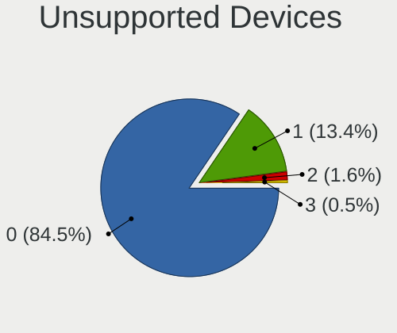

| Total | Desktops | Percent |
|-------|----------|---------|
| 0     | 642      | 84.47%  |
| 1     | 102      | 13.42%  |
| 2     | 12       | 1.58%   |
| 3     | 4        | 0.53%   |

Unsupported Device Types
------------------------

Types of unsupported devices

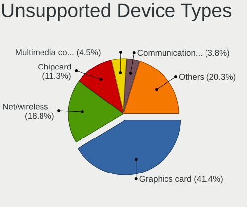

| Type                     | Desktops | Percent |
|--------------------------|----------|---------|
| Graphics card            | 55       | 41.35%  |
| Net/wireless             | 25       | 18.8%   |
| Chipcard                 | 15       | 11.28%  |
| Multimedia controller    | 6        | 4.51%   |
| Communication controller | 5        | 3.76%   |
| Camera                   | 4        | 3.01%   |
| Storage/raid             | 3        | 2.26%   |
| Sound                    | 3        | 2.26%   |
| Network                  | 3        | 2.26%   |
| Net/ethernet             | 3        | 2.26%   |
| Bluetooth                | 3        | 2.26%   |
| Fingerprint reader       | 2        | 1.5%    |
| Dvb card                 | 2        | 1.5%    |
| Unassigned class         | 1        | 0.75%   |
| Tv card                  | 1        | 0.75%   |
| Modem                    | 1        | 0.75%   |
| Card reader              | 1        | 0.75%   |

