Linux in Portugal - Tested Hardware & Statistics (Notebooks)
------------------------------------------------------------

A project to collect tested hardware configurations for Linux in Portugal.

Anyone can contribute to this report by the [hw-probe](https://github.com/linuxhw/hw-probe) tool:

    sudo -E hw-probe -all -upload

Please contribute! Especially if your hardware is rare.

Contents
--------

* [ Test Cases ](#test-cases)

* [ System ](#system)
  - [ OS                       ](#os)
  - [ OS Family                ](#os-family)
  - [ Kernel                   ](#kernel)
  - [ Kernel Family            ](#kernel-family)
  - [ Kernel Major Ver.        ](#kernel-major-ver)
  - [ Arch                     ](#arch)
  - [ DE                       ](#de)
  - [ Display Server           ](#display-server)
  - [ Display Manager          ](#display-manager)
  - [ OS Lang                  ](#os-lang)
  - [ Boot Mode                ](#boot-mode)
  - [ Filesystem               ](#filesystem)
  - [ Part. scheme             ](#part-scheme)
  - [ Dual Boot with Linux/BSD ](#dual-boot-with-linuxbsd)
  - [ Dual Boot (Win)          ](#dual-boot-win)

* [ Board ](#board)
  - [ Vendor                   ](#vendor)
  - [ Model                    ](#model)
  - [ Model Family             ](#model-family)
  - [ MFG Year                 ](#mfg-year)
  - [ Form Factor              ](#form-factor)
  - [ Secure Boot              ](#secure-boot)
  - [ Coreboot                 ](#coreboot)
  - [ RAM Size                 ](#ram-size)
  - [ RAM Used                 ](#ram-used)
  - [ Total Drives             ](#total-drives)
  - [ Has CD-ROM               ](#has-cd-rom)
  - [ Has Ethernet             ](#has-ethernet)
  - [ Has WiFi                 ](#has-wifi)
  - [ Has Bluetooth            ](#has-bluetooth)

* [ Location ](#location)
  - [ Country                  ](#country)
  - [ City                     ](#city)

* [ Drives ](#drives)
  - [ Drive Vendor             ](#drive-vendor)
  - [ Drive Model              ](#drive-model)
  - [ HDD Vendor               ](#hdd-vendor)
  - [ SSD Vendor               ](#ssd-vendor)
  - [ Drive Kind               ](#drive-kind)
  - [ Drive Connector          ](#drive-connector)
  - [ Drive Size               ](#drive-size)
  - [ Space Total              ](#space-total)
  - [ Space Used               ](#space-used)
  - [ Malfunc. Drives          ](#malfunc-drives)
  - [ Malfunc. Drive Vendor    ](#malfunc-drive-vendor)
  - [ Malfunc. HDD Vendor      ](#malfunc-hdd-vendor)
  - [ Malfunc. Drive Kind      ](#malfunc-drive-kind)
  - [ Failed Drives            ](#failed-drives)
  - [ Failed Drive Vendor      ](#failed-drive-vendor)
  - [ Drive Status             ](#drive-status)

* [ Storage controller ](#storage-controller)
  - [ Storage Vendor           ](#storage-vendor)
  - [ Storage Model            ](#storage-model)
  - [ Storage Kind             ](#storage-kind)

* [ Processor ](#processor)
  - [ CPU Vendor               ](#cpu-vendor)
  - [ CPU Model                ](#cpu-model)
  - [ CPU Model Family         ](#cpu-model-family)
  - [ CPU Cores                ](#cpu-cores)
  - [ CPU Sockets              ](#cpu-sockets)
  - [ CPU Threads              ](#cpu-threads)
  - [ CPU Op-Modes             ](#cpu-op-modes)
  - [ CPU Microcode            ](#cpu-microcode)
  - [ CPU Microarch            ](#cpu-microarch)

* [ Graphics ](#graphics)
  - [ GPU Vendor               ](#gpu-vendor)
  - [ GPU Model                ](#gpu-model)
  - [ GPU Combo                ](#gpu-combo)
  - [ GPU Driver               ](#gpu-driver)
  - [ GPU Memory               ](#gpu-memory)

* [ Monitor ](#monitor)
  - [ Monitor Vendor           ](#monitor-vendor)
  - [ Monitor Model            ](#monitor-model)
  - [ Monitor Resolution       ](#monitor-resolution)
  - [ Monitor Diagonal         ](#monitor-diagonal)
  - [ Monitor Width            ](#monitor-width)
  - [ Aspect Ratio             ](#aspect-ratio)
  - [ Monitor Area             ](#monitor-area)
  - [ Pixel Density            ](#pixel-density)
  - [ Multiple Monitors        ](#multiple-monitors)

* [ Network ](#network)
  - [ Net Controller Vendor    ](#net-controller-vendor)
  - [ Net Controller Model     ](#net-controller-model)
  - [ Wireless Vendor          ](#wireless-vendor)
  - [ Wireless Model           ](#wireless-model)
  - [ Ethernet Vendor          ](#ethernet-vendor)
  - [ Ethernet Model           ](#ethernet-model)
  - [ Net Controller Kind      ](#net-controller-kind)
  - [ Used Controller          ](#used-controller)
  - [ NICs                     ](#nics)
  - [ IPv6                     ](#ipv6)

* [ Bluetooth ](#bluetooth)
  - [ Bluetooth Vendor         ](#bluetooth-vendor)
  - [ Bluetooth Model          ](#bluetooth-model)

* [ Sound ](#sound)
  - [ Sound Vendor             ](#sound-vendor)
  - [ Sound Model              ](#sound-model)

* [ Memory ](#memory)
  - [ Memory Vendor            ](#memory-vendor)
  - [ Memory Model             ](#memory-model)
  - [ Memory Kind              ](#memory-kind)
  - [ Memory Form Factor       ](#memory-form-factor)
  - [ Memory Size              ](#memory-size)
  - [ Memory Speed             ](#memory-speed)

* [ Printers & scanners ](#printers--scanners)
  - [ Printer Vendor           ](#printer-vendor)
  - [ Printer Model            ](#printer-model)
  - [ Scanner Vendor           ](#scanner-vendor)
  - [ Scanner Model            ](#scanner-model)

* [ Camera ](#camera)
  - [ Camera Vendor            ](#camera-vendor)
  - [ Camera Model             ](#camera-model)

* [ Security ](#security)
  - [ Fingerprint Vendor       ](#fingerprint-vendor)
  - [ Fingerprint Model        ](#fingerprint-model)
  - [ Chipcard Vendor          ](#chipcard-vendor)
  - [ Chipcard Model           ](#chipcard-model)

* [ Unsupported ](#unsupported)
  - [ Unsupported Devices      ](#unsupported-devices)
  - [ Unsupported Device Types ](#unsupported-device-types)

Test Cases
----------

Total: 1266

| Vendor        | Model                       | Probe                                                      | Date         |
|---------------|-----------------------------|------------------------------------------------------------|--------------|
| Toshiba       | Satellite L775-12V          | [2c601f6366](https://linux-hardware.org/?probe=2c601f6366) | Dec 29, 2022 |
| Lenovo        | ThinkPad L14 Gen 3 21C5C... | [f980d6ed2e](https://linux-hardware.org/?probe=f980d6ed2e) | Dec 23, 2022 |
| Lenovo        | ThinkPad L14 Gen 3 21C5C... | [a5dcdfece2](https://linux-hardware.org/?probe=a5dcdfece2) | Dec 23, 2022 |
| Dell          | Latitude E4310              | [6386845196](https://linux-hardware.org/?probe=6386845196) | Dec 23, 2022 |
| Dell          | XPS 13 9370                 | [982f470134](https://linux-hardware.org/?probe=982f470134) | Dec 21, 2022 |
| Dell          | Latitude E4310              | [7b184a032b](https://linux-hardware.org/?probe=7b184a032b) | Dec 21, 2022 |
| Dell          | Inspiron N5050              | [41fb3c537a](https://linux-hardware.org/?probe=41fb3c537a) | Dec 19, 2022 |
| Thomson       | PT-NEO14A.2WH32             | [d028ff11a9](https://linux-hardware.org/?probe=d028ff11a9) | Dec 18, 2022 |
| HUAWEI        | BOHK-WAX9X                  | [49fad98b7b](https://linux-hardware.org/?probe=49fad98b7b) | Dec 12, 2022 |
| Dell          | Precision 5510              | [77b7f6dd95](https://linux-hardware.org/?probe=77b7f6dd95) | Dec 12, 2022 |
| Sony          | VGN-FZ31Z                   | [4f392d3575](https://linux-hardware.org/?probe=4f392d3575) | Dec 10, 2022 |
| HP            | Pavilion Laptop 14-ec0xx... | [8008043900](https://linux-hardware.org/?probe=8008043900) | Dec 10, 2022 |
| Lenovo        | IdeaPad Gaming 3 15ACH6 ... | [de42f36422](https://linux-hardware.org/?probe=de42f36422) | Dec 10, 2022 |
| Acer          | Aspire A315-55G             | [0c6e399e4f](https://linux-hardware.org/?probe=0c6e399e4f) | Dec 09, 2022 |
| Acer          | Aspire A315-55G             | [9c083ab22c](https://linux-hardware.org/?probe=9c083ab22c) | Dec 09, 2022 |
| MSI           | GF72 8RD                    | [f943786d2c](https://linux-hardware.org/?probe=f943786d2c) | Dec 09, 2022 |
| Lenovo        | Legion 5 15ARH05 82B5       | [29c71a771b](https://linux-hardware.org/?probe=29c71a771b) | Dec 08, 2022 |
| HP            | Pavilion dv6                | [8a940a493b](https://linux-hardware.org/?probe=8a940a493b) | Dec 03, 2022 |
| MSI           | GF72 8RD                    | [c03f783ea5](https://linux-hardware.org/?probe=c03f783ea5) | Dec 01, 2022 |
| Acer          | Nitro AN515-58              | [6bb64e8108](https://linux-hardware.org/?probe=6bb64e8108) | Nov 29, 2022 |
| Acer          | Aspire E1-570G              | [bbb8e289a9](https://linux-hardware.org/?probe=bbb8e289a9) | Nov 29, 2022 |
| Acer          | Aspire E1-570G              | [def1faf044](https://linux-hardware.org/?probe=def1faf044) | Nov 28, 2022 |
| ASUSTek       | N61Vg                       | [b5cc07b253](https://linux-hardware.org/?probe=b5cc07b253) | Nov 27, 2022 |
| MSI           | GF72 8RD                    | [fb92041c1b](https://linux-hardware.org/?probe=fb92041c1b) | Nov 26, 2022 |
| HUAWEI        | BOM-WXX9                    | [59a39475dd](https://linux-hardware.org/?probe=59a39475dd) | Nov 26, 2022 |
| Lenovo        | IdeaPad 320-15IKB 80YE      | [fa21163ace](https://linux-hardware.org/?probe=fa21163ace) | Nov 26, 2022 |
| ASUSTek       | F7SR                        | [ecdba533ea](https://linux-hardware.org/?probe=ecdba533ea) | Nov 25, 2022 |
| ASUSTek       | F7SR                        | [8102d8b361](https://linux-hardware.org/?probe=8102d8b361) | Nov 25, 2022 |
| MSI           | Summit E16Flip A12UCT       | [95f653bddb](https://linux-hardware.org/?probe=95f653bddb) | Nov 24, 2022 |
| MSI           | Summit E16Flip A12UCT       | [a4a2b60b09](https://linux-hardware.org/?probe=a4a2b60b09) | Nov 24, 2022 |
| HUAWEI        | BOD-WXX9                    | [2de63dfd54](https://linux-hardware.org/?probe=2de63dfd54) | Nov 23, 2022 |
| HUAWEI        | BOD-WXX9                    | [814f45a510](https://linux-hardware.org/?probe=814f45a510) | Nov 23, 2022 |
| Apple         | MacBookAir5,1               | [2ded48104d](https://linux-hardware.org/?probe=2ded48104d) | Nov 22, 2022 |
| Lenovo        | IdeaPad 5 14ITL05 82FE      | [0584338e31](https://linux-hardware.org/?probe=0584338e31) | Nov 22, 2022 |
| Acer          | Popcorn                     | [6f446a097a](https://linux-hardware.org/?probe=6f446a097a) | Nov 20, 2022 |
| Apple         | MacBookPro8,1               | [dfb9f9524e](https://linux-hardware.org/?probe=dfb9f9524e) | Nov 20, 2022 |
| Dell          | XPS 13 9360                 | [250885e79f](https://linux-hardware.org/?probe=250885e79f) | Nov 19, 2022 |
| Lenovo        | IdeaPad 320-15IKB 80YE      | [02c6e2e360](https://linux-hardware.org/?probe=02c6e2e360) | Nov 18, 2022 |
| Lenovo        | IdeaPad 320-15IKB 80YE      | [d4c27f1388](https://linux-hardware.org/?probe=d4c27f1388) | Nov 18, 2022 |
| HUAWEI        | BOHK-WAX9X                  | [3b33d1989a](https://linux-hardware.org/?probe=3b33d1989a) | Nov 18, 2022 |
| HP            | Pavilion Laptop 14-ec0xx... | [0401b9e939](https://linux-hardware.org/?probe=0401b9e939) | Nov 17, 2022 |
| Lenovo        | Legion 5 15ACH6H 82JU       | [68db7ff193](https://linux-hardware.org/?probe=68db7ff193) | Nov 16, 2022 |
| Acer          | Aspire V3-575G              | [9044e30d53](https://linux-hardware.org/?probe=9044e30d53) | Nov 16, 2022 |
| ASUSTek       | G752VS                      | [364d6d09ab](https://linux-hardware.org/?probe=364d6d09ab) | Nov 14, 2022 |
| HUAWEI        | BOM-WXX9                    | [c54708e797](https://linux-hardware.org/?probe=c54708e797) | Nov 14, 2022 |
| HUAWEI        | BOM-WXX9                    | [c332019d7e](https://linux-hardware.org/?probe=c332019d7e) | Nov 14, 2022 |
| HUAWEI        | NBLK-WAX9X                  | [e54df5cb0d](https://linux-hardware.org/?probe=e54df5cb0d) | Nov 13, 2022 |
| ASUSTek       | A6JC                        | [dce6c2a8f4](https://linux-hardware.org/?probe=dce6c2a8f4) | Nov 13, 2022 |
| Packard Be... | EasyNote LV11HC             | [244d508935](https://linux-hardware.org/?probe=244d508935) | Nov 12, 2022 |
| HUAWEI        | HVY-WXX9                    | [c1f18206f4](https://linux-hardware.org/?probe=c1f18206f4) | Nov 11, 2022 |
| eMachines     | G525                        | [38b8684942](https://linux-hardware.org/?probe=38b8684942) | Nov 10, 2022 |
| ASUSTek       | N61Vg                       | [5205b24cb0](https://linux-hardware.org/?probe=5205b24cb0) | Nov 08, 2022 |
| Dell          | Latitude E6510              | [befb811cfe](https://linux-hardware.org/?probe=befb811cfe) | Nov 05, 2022 |
| Acer          | Nitro AN515-55              | [a1cef4e43d](https://linux-hardware.org/?probe=a1cef4e43d) | Nov 04, 2022 |
| Acer          | Nitro AN515-55              | [b58a40d876](https://linux-hardware.org/?probe=b58a40d876) | Nov 04, 2022 |
| ASUSTek       | N61Vg                       | [27f288e5f1](https://linux-hardware.org/?probe=27f288e5f1) | Nov 01, 2022 |
| Dell          | Latitude E6510              | [b346d71347](https://linux-hardware.org/?probe=b346d71347) | Oct 29, 2022 |
| Acer          | Aspire SW5-012              | [90dd31edc8](https://linux-hardware.org/?probe=90dd31edc8) | Oct 29, 2022 |
| HP            | Pavilion Gaming Laptop 1... | [50a8c356f0](https://linux-hardware.org/?probe=50a8c356f0) | Oct 28, 2022 |
| Acer          | Aspire ES1-131              | [f0edf4897a](https://linux-hardware.org/?probe=f0edf4897a) | Oct 26, 2022 |
| Dell          | Latitude 7320               | [f249267def](https://linux-hardware.org/?probe=f249267def) | Oct 26, 2022 |
| Samsung       | 870Z5E/880Z5E/680Z5E        | [8ebb941ac6](https://linux-hardware.org/?probe=8ebb941ac6) | Oct 26, 2022 |
| ASUSTek       | X542URR                     | [fe6fb20830](https://linux-hardware.org/?probe=fe6fb20830) | Oct 25, 2022 |
| Toshiba       | NB300                       | [c5aa7d3c5f](https://linux-hardware.org/?probe=c5aa7d3c5f) | Oct 25, 2022 |
| Lenovo        | IdeaPad 1 14ADA05 82GW      | [ede3bcd3f3](https://linux-hardware.org/?probe=ede3bcd3f3) | Oct 24, 2022 |
| ASUSTek       | S550CB                      | [a81f0ecac8](https://linux-hardware.org/?probe=a81f0ecac8) | Oct 24, 2022 |
| Apple         | MacBookPro10,1              | [6354f13944](https://linux-hardware.org/?probe=6354f13944) | Oct 21, 2022 |
| HP            | G62                         | [721c09b331](https://linux-hardware.org/?probe=721c09b331) | Oct 19, 2022 |
| HP            | EliteBook 840 G6            | [e5f7b07e9c](https://linux-hardware.org/?probe=e5f7b07e9c) | Oct 19, 2022 |
| HP            | EliteBook 840 G6            | [25bb674789](https://linux-hardware.org/?probe=25bb674789) | Oct 19, 2022 |
| ASUSTek       | ZenBook UX333FA_UX333FA     | [40771441a2](https://linux-hardware.org/?probe=40771441a2) | Oct 17, 2022 |
| ASUSTek       | X541UV                      | [ba7c1c3d83](https://linux-hardware.org/?probe=ba7c1c3d83) | Oct 14, 2022 |
| Toshiba       | Satellite L650              | [89f43e5484](https://linux-hardware.org/?probe=89f43e5484) | Oct 12, 2022 |
| Toshiba       | Satellite L650              | [43f57daebb](https://linux-hardware.org/?probe=43f57daebb) | Oct 12, 2022 |
| HP            | EliteBook 840 G2            | [d83c027361](https://linux-hardware.org/?probe=d83c027361) | Oct 12, 2022 |
| ASUSTek       | N53SV                       | [2460d79ba8](https://linux-hardware.org/?probe=2460d79ba8) | Oct 10, 2022 |
| Lenovo        | IdeaPad Gaming 3 15ACH6 ... | [184ecb5e76](https://linux-hardware.org/?probe=184ecb5e76) | Oct 08, 2022 |
| ASUSTek       | G752VS                      | [df98c91ed6](https://linux-hardware.org/?probe=df98c91ed6) | Oct 08, 2022 |
| Lenovo        | IdeaPad 1 14ADA05 82GW      | [8061516838](https://linux-hardware.org/?probe=8061516838) | Oct 06, 2022 |
| HP            | Pavilion Laptop 14-ec0xx... | [a3d3100ffa](https://linux-hardware.org/?probe=a3d3100ffa) | Oct 05, 2022 |
| Acer          | Aspire ES1-520              | [b50cfdccab](https://linux-hardware.org/?probe=b50cfdccab) | Oct 05, 2022 |
| Lenovo        | Legion 5 15ACH6H 82JU       | [8d863ae2d8](https://linux-hardware.org/?probe=8d863ae2d8) | Oct 04, 2022 |
| ASUSTek       | ROG Strix G713QM_G713QM     | [1e0190a274](https://linux-hardware.org/?probe=1e0190a274) | Oct 03, 2022 |
| HP            | ENVY 15                     | [950623d8b2](https://linux-hardware.org/?probe=950623d8b2) | Oct 02, 2022 |
| ASUSTek       | VivoBook_ASUSLaptop X512... | [d9a196cd8e](https://linux-hardware.org/?probe=d9a196cd8e) | Oct 02, 2022 |
| Lenovo        | IdeaPad 1 14ADA05 82GW      | [516795a4a8](https://linux-hardware.org/?probe=516795a4a8) | Oct 02, 2022 |
| Lenovo        | IdeaPad 1 14ADA05 82GW      | [7ff2c5ad1c](https://linux-hardware.org/?probe=7ff2c5ad1c) | Oct 01, 2022 |
| Lenovo        | IdeaPad 1 14ADA05 82GW      | [a64cec6a4d](https://linux-hardware.org/?probe=a64cec6a4d) | Oct 01, 2022 |
| MSI           | Modern 14 A10M              | [5c5666fa97](https://linux-hardware.org/?probe=5c5666fa97) | Sep 29, 2022 |
| GIADA         | ChiefRiver Platform         | [d0f71cdc7f](https://linux-hardware.org/?probe=d0f71cdc7f) | Sep 26, 2022 |
| HP            | ProBook 440 14 inch G9 N... | [84d47822bf](https://linux-hardware.org/?probe=84d47822bf) | Sep 24, 2022 |
| HP            | ProBook 440 14 inch G9 N... | [3afd2e892b](https://linux-hardware.org/?probe=3afd2e892b) | Sep 24, 2022 |
| Acer          | Predator PH315-51           | [24ae1f3fb8](https://linux-hardware.org/?probe=24ae1f3fb8) | Sep 23, 2022 |
| ASUSTek       | X556UF                      | [47f145c034](https://linux-hardware.org/?probe=47f145c034) | Sep 23, 2022 |
| ASUSTek       | X556UF                      | [2f1fe986d8](https://linux-hardware.org/?probe=2f1fe986d8) | Sep 23, 2022 |
| ASUSTek       | ROG Strix G513IC_G513IC     | [7910fab01e](https://linux-hardware.org/?probe=7910fab01e) | Sep 22, 2022 |
| Lenovo        | ThinkPad E15 Gen 4 21EDC... | [910b604abc](https://linux-hardware.org/?probe=910b604abc) | Sep 21, 2022 |
| Lenovo        | ThinkPad X1 Carbon Gen 1... | [b72e23e590](https://linux-hardware.org/?probe=b72e23e590) | Sep 20, 2022 |
| Toshiba       | Satellite P845T             | [0d5f5ac925](https://linux-hardware.org/?probe=0d5f5ac925) | Sep 17, 2022 |
| HP            | Pavilion Laptop 14-ec0xx... | [dd6d053ae2](https://linux-hardware.org/?probe=dd6d053ae2) | Sep 17, 2022 |
| ASUSTek       | N550LF                      | [73f2edfe65](https://linux-hardware.org/?probe=73f2edfe65) | Sep 16, 2022 |
| ASUSTek       | X555LJ                      | [5d27ea49aa](https://linux-hardware.org/?probe=5d27ea49aa) | Sep 13, 2022 |
| Lenovo        | ThinkPad T14 Gen 1 20S1S... | [d4fb6aa0ae](https://linux-hardware.org/?probe=d4fb6aa0ae) | Sep 13, 2022 |
| Lenovo        | IdeaPad 1 14ADA05 82GW      | [e558fd5212](https://linux-hardware.org/?probe=e558fd5212) | Sep 13, 2022 |
| Lenovo        | ThinkPad W540 20BG0016US    | [9f0543edc4](https://linux-hardware.org/?probe=9f0543edc4) | Sep 11, 2022 |
| Chuwi         | CoreBook X                  | [4f29128588](https://linux-hardware.org/?probe=4f29128588) | Sep 11, 2022 |
| System76      | Oryx Pro                    | [d84de42ab6](https://linux-hardware.org/?probe=d84de42ab6) | Sep 10, 2022 |
| Lenovo        | ThinkPad X1 Carbon Gen 1... | [ab939db2c0](https://linux-hardware.org/?probe=ab939db2c0) | Sep 10, 2022 |
| ASUSTek       | ZenBook UX533FD_UX533FD     | [f9604390e8](https://linux-hardware.org/?probe=f9604390e8) | Sep 10, 2022 |
| HP            | EliteBook 840 G6            | [132a8e025a](https://linux-hardware.org/?probe=132a8e025a) | Sep 07, 2022 |
| ASUSTek       | VivoBook_ASUSLaptop X512... | [5d61bcd114](https://linux-hardware.org/?probe=5d61bcd114) | Sep 06, 2022 |
| Lenovo        | IdeaPad 5 14ABA7 82SE       | [bcd73bee62](https://linux-hardware.org/?probe=bcd73bee62) | Sep 06, 2022 |
| HP            | Pavilion g6                 | [770b1a8154](https://linux-hardware.org/?probe=770b1a8154) | Sep 05, 2022 |
| HUAWEI        | BOHK-WAX9X                  | [c2cd1091cd](https://linux-hardware.org/?probe=c2cd1091cd) | Sep 04, 2022 |
| Lenovo        | IdeaPad 1 14ADA05 82GW      | [66724351c4](https://linux-hardware.org/?probe=66724351c4) | Sep 04, 2022 |
| Sony          | VGN-FZ31Z                   | [b99831e9f4](https://linux-hardware.org/?probe=b99831e9f4) | Sep 03, 2022 |
| Samsung       | 300E4C/300E5C/300E7C        | [a74d79fc0b](https://linux-hardware.org/?probe=a74d79fc0b) | Sep 02, 2022 |
| Lenovo        | IdeaPad 1 14ADA05 82GW      | [8a7e7ce8ea](https://linux-hardware.org/?probe=8a7e7ce8ea) | Sep 01, 2022 |
| ASUSTek       | X541UJ                      | [0cd33aa36a](https://linux-hardware.org/?probe=0cd33aa36a) | Aug 31, 2022 |
| HP            | Pavilion Gaming Laptop 1... | [11efd3dbe0](https://linux-hardware.org/?probe=11efd3dbe0) | Aug 30, 2022 |
| Toshiba       | Satellite A300              | [f90886ae85](https://linux-hardware.org/?probe=f90886ae85) | Aug 30, 2022 |
| Lenovo        | IdeaPad 1 14ADA05 82GW      | [3b26a2ffe2](https://linux-hardware.org/?probe=3b26a2ffe2) | Aug 29, 2022 |
| Lenovo        | IdeaPad 1 14ADA05 82GW      | [98ac365e3c](https://linux-hardware.org/?probe=98ac365e3c) | Aug 28, 2022 |
| HP            | Pavilion Laptop 14-ec0xx... | [73db272ecb](https://linux-hardware.org/?probe=73db272ecb) | Aug 28, 2022 |
| Lenovo        | IdeaPad 1 14ADA05 82GW      | [ee07c7a93a](https://linux-hardware.org/?probe=ee07c7a93a) | Aug 27, 2022 |
| HP            | Laptop 15s-fq2xxx           | [8ffebf0c43](https://linux-hardware.org/?probe=8ffebf0c43) | Aug 26, 2022 |
| ASUSTek       | N61Vg                       | [30be913709](https://linux-hardware.org/?probe=30be913709) | Aug 25, 2022 |
| HP            | ProBook 640 G2              | [fc50d4e200](https://linux-hardware.org/?probe=fc50d4e200) | Aug 25, 2022 |
| ASUSTek       | ASUS TUF Gaming A15 FA50... | [cb533d9c12](https://linux-hardware.org/?probe=cb533d9c12) | Aug 22, 2022 |
| Lenovo        | ThinkPad P50 20EN0005PG     | [69c8e5eedc](https://linux-hardware.org/?probe=69c8e5eedc) | Aug 19, 2022 |
| ASUSTek       | ZenBook UX425IA_UM425IA     | [2bf774fae7](https://linux-hardware.org/?probe=2bf774fae7) | Aug 18, 2022 |
| HUAWEI        | BOHK-WAX9X                  | [57732104cd](https://linux-hardware.org/?probe=57732104cd) | Aug 17, 2022 |
| HP            | Pavilion Gaming Laptop 1... | [315da58d24](https://linux-hardware.org/?probe=315da58d24) | Aug 16, 2022 |
| Lenovo        | ThinkPad T430 2349V4B       | [0f919e20c7](https://linux-hardware.org/?probe=0f919e20c7) | Aug 14, 2022 |
| Apple         | MacBookPro5,5               | [76483c9f78](https://linux-hardware.org/?probe=76483c9f78) | Aug 14, 2022 |
| ASUSTek       | N53SN                       | [6cb4ac4247](https://linux-hardware.org/?probe=6cb4ac4247) | Aug 14, 2022 |
| HP            | Pavilion Gaming Laptop 1... | [73a3d7c1cf](https://linux-hardware.org/?probe=73a3d7c1cf) | Aug 12, 2022 |
| MSI           | Modern 14 A10RB             | [9979c66e3e](https://linux-hardware.org/?probe=9979c66e3e) | Aug 11, 2022 |
| ASUSTek       | VivoBook_ASUSLaptop X513... | [9d6be5eb68](https://linux-hardware.org/?probe=9d6be5eb68) | Aug 08, 2022 |
| Apple         | MacBookAir6,1               | [154468415c](https://linux-hardware.org/?probe=154468415c) | Aug 05, 2022 |
| Apple         | MacBookAir6,1               | [6f355de994](https://linux-hardware.org/?probe=6f355de994) | Aug 04, 2022 |
| Toshiba       | Satellite U840              | [5ebf9417bf](https://linux-hardware.org/?probe=5ebf9417bf) | Aug 04, 2022 |
| MSI           | Modern 14 A10RB             | [abf1fcf08b](https://linux-hardware.org/?probe=abf1fcf08b) | Aug 02, 2022 |
| HP            | Laptop 15s-eq0xxx           | [d1ae6a188c](https://linux-hardware.org/?probe=d1ae6a188c) | Jul 31, 2022 |
| HP            | Laptop 15s-eq0xxx           | [bce4496b78](https://linux-hardware.org/?probe=bce4496b78) | Jul 31, 2022 |
| HP            | Pavilion dv2000 (RQ116PA... | [c6ce2d4317](https://linux-hardware.org/?probe=c6ce2d4317) | Jul 31, 2022 |
| HP            | Pavilion dv2000 (RQ116PA... | [eca5fa0c39](https://linux-hardware.org/?probe=eca5fa0c39) | Jul 31, 2022 |
| HUAWEI        | BOHK-WAX9X                  | [bc5b132a8d](https://linux-hardware.org/?probe=bc5b132a8d) | Jul 29, 2022 |
| Toshiba       | Satellite U840              | [c3f00f5b90](https://linux-hardware.org/?probe=c3f00f5b90) | Jul 29, 2022 |
| ASUSTek       | N53SN                       | [2e35ef4a8a](https://linux-hardware.org/?probe=2e35ef4a8a) | Jul 28, 2022 |
| HP            | Pavilion Gaming Laptop 1... | [e95cafce19](https://linux-hardware.org/?probe=e95cafce19) | Jul 26, 2022 |
| HP            | Pavilion Laptop 14-ec0xx... | [ae16c8863a](https://linux-hardware.org/?probe=ae16c8863a) | Jul 25, 2022 |
| ASUSTek       | X540LJ                      | [264bb2f2a1](https://linux-hardware.org/?probe=264bb2f2a1) | Jul 23, 2022 |
| ASUSTek       | X540LJ                      | [fc5c252e6e](https://linux-hardware.org/?probe=fc5c252e6e) | Jul 23, 2022 |
| Acer          | Aspire A515-45              | [323aa03c61](https://linux-hardware.org/?probe=323aa03c61) | Jul 18, 2022 |
| Dell          | XPS 15 7590                 | [528f562110](https://linux-hardware.org/?probe=528f562110) | Jul 18, 2022 |
| Packard Be... | EasyNote LV11HC             | [c0693d5f9a](https://linux-hardware.org/?probe=c0693d5f9a) | Jul 18, 2022 |
| Sony          | SVF1521F6EW                 | [3f359d9763](https://linux-hardware.org/?probe=3f359d9763) | Jul 17, 2022 |
| Sony          | VPCEB3L1E                   | [310a2ada05](https://linux-hardware.org/?probe=310a2ada05) | Jul 13, 2022 |
| Sony          | VPCEB3L1E                   | [247411abde](https://linux-hardware.org/?probe=247411abde) | Jul 13, 2022 |
| Sony          | VPCEB3L1E                   | [9af59fca26](https://linux-hardware.org/?probe=9af59fca26) | Jul 08, 2022 |
| ASUSTek       | X540LJ                      | [5994a314d0](https://linux-hardware.org/?probe=5994a314d0) | Jul 05, 2022 |
| ASUSTek       | K53SC                       | [4f31f807cb](https://linux-hardware.org/?probe=4f31f807cb) | Jul 05, 2022 |
| Sony          | VGN-FZ31Z                   | [62d8b20ff8](https://linux-hardware.org/?probe=62d8b20ff8) | Jul 04, 2022 |
| HP            | Stream Laptop 14-ax0XX      | [03bede7266](https://linux-hardware.org/?probe=03bede7266) | Jul 03, 2022 |
| Acer          | Aspire A515-54G             | [c0975c6877](https://linux-hardware.org/?probe=c0975c6877) | Jul 02, 2022 |
| ASUSTek       | N61Jq                       | [19b3d15d92](https://linux-hardware.org/?probe=19b3d15d92) | Jul 02, 2022 |
| Acer          | Aspire A515-54G             | [92d695d6be](https://linux-hardware.org/?probe=92d695d6be) | Jul 02, 2022 |
| HP            | EliteBook 840 G1            | [b691598870](https://linux-hardware.org/?probe=b691598870) | Jul 01, 2022 |
| ASUSTek       | ZenBook UX425EA_UX425EA     | [91c5f849c5](https://linux-hardware.org/?probe=91c5f849c5) | Jun 29, 2022 |
| ASUSTek       | Zephyrus G GU502DU_GA502... | [17cb04c5f5](https://linux-hardware.org/?probe=17cb04c5f5) | Jun 29, 2022 |
| HP            | Pavilion Gaming Laptop 1... | [1c4ace32a2](https://linux-hardware.org/?probe=1c4ace32a2) | Jun 27, 2022 |
| HP            | Pavilion Gaming Laptop 1... | [d4b96de9b6](https://linux-hardware.org/?probe=d4b96de9b6) | Jun 24, 2022 |
| Sony          | VPCEH2J1E                   | [7dde3ae196](https://linux-hardware.org/?probe=7dde3ae196) | Jun 23, 2022 |
| HP            | EliteBook 820 G1            | [ff4b7698ed](https://linux-hardware.org/?probe=ff4b7698ed) | Jun 23, 2022 |
| Lenovo        | ThinkPad E14 Gen 3 20Y7C... | [fd65aaa4b3](https://linux-hardware.org/?probe=fd65aaa4b3) | Jun 21, 2022 |
| Toshiba       | NB305                       | [1280ac15ba](https://linux-hardware.org/?probe=1280ac15ba) | Jun 17, 2022 |
| HP            | Pavilion Notebook           | [d9b85c0e15](https://linux-hardware.org/?probe=d9b85c0e15) | Jun 16, 2022 |
| ASUSTek       | ROG Strix G531GT_G531GT     | [4b1946451e](https://linux-hardware.org/?probe=4b1946451e) | Jun 15, 2022 |
| ASUSTek       | E403SA                      | [9ca6a865ff](https://linux-hardware.org/?probe=9ca6a865ff) | Jun 11, 2022 |
| Apple         | MacBookAir6,1               | [f0883ab59b](https://linux-hardware.org/?probe=f0883ab59b) | Jun 10, 2022 |
| ASUSTek       | VivoBook 15_ASUS Laptop ... | [35dc89f7ff](https://linux-hardware.org/?probe=35dc89f7ff) | Jun 09, 2022 |
| Toshiba       | QOSMIO X770                 | [d11736c26f](https://linux-hardware.org/?probe=d11736c26f) | Jun 09, 2022 |
| Toshiba       | Satellite T130              | [b5ba2dac2a](https://linux-hardware.org/?probe=b5ba2dac2a) | Jun 06, 2022 |
| Toshiba       | Satellite T130              | [3fe154a2ce](https://linux-hardware.org/?probe=3fe154a2ce) | Jun 06, 2022 |
| Sony          | VGN-FZ31Z                   | [f9b7b79d5a](https://linux-hardware.org/?probe=f9b7b79d5a) | Jun 04, 2022 |
| Dell          | Latitude E6400              | [67a5bdc1aa](https://linux-hardware.org/?probe=67a5bdc1aa) | Jun 04, 2022 |
| HP            | Compaq nx7300 (RU464EA#A... | [a44ec57985](https://linux-hardware.org/?probe=a44ec57985) | Jun 02, 2022 |
| HP            | EliteBook 840 G2            | [8aff04335d](https://linux-hardware.org/?probe=8aff04335d) | Jun 01, 2022 |
| HP            | Pavilion Laptop 14-ec0xx... | [029a55ffb4](https://linux-hardware.org/?probe=029a55ffb4) | Jun 01, 2022 |
| Chuwi         | GemiBook Pro                | [24fb23a450](https://linux-hardware.org/?probe=24fb23a450) | May 31, 2022 |
| Lenovo        | ThinkPad T530 2394C98       | [b5aebb2490](https://linux-hardware.org/?probe=b5aebb2490) | May 30, 2022 |
| HP            | Pavilion Laptop 14-ec0xx... | [f47dbc0616](https://linux-hardware.org/?probe=f47dbc0616) | May 30, 2022 |
| Lenovo        | ThinkPad X1 Carbon 6th 2... | [e72ac27af1](https://linux-hardware.org/?probe=e72ac27af1) | May 30, 2022 |
| Acer          | Swift SF314-54              | [eb522816a1](https://linux-hardware.org/?probe=eb522816a1) | May 29, 2022 |
| ASUSTek       | VivoBook_ASUSLaptop X509... | [de7ed0046e](https://linux-hardware.org/?probe=de7ed0046e) | May 29, 2022 |
| Lenovo        | ThinkPad X230 2325N66       | [2061351dbc](https://linux-hardware.org/?probe=2061351dbc) | May 28, 2022 |
| Lenovo        | ThinkPad L490 20Q5002GPG    | [9e1d2f7e8a](https://linux-hardware.org/?probe=9e1d2f7e8a) | May 26, 2022 |
| Lenovo        | IdeaPad 330-15IKB 81DC      | [533beb13eb](https://linux-hardware.org/?probe=533beb13eb) | May 26, 2022 |
| HP            | OMEN Laptop 15-en0xxx       | [d98649058e](https://linux-hardware.org/?probe=d98649058e) | May 24, 2022 |
| HP            | OMEN Laptop 15-en0xxx       | [00a44d4f7e](https://linux-hardware.org/?probe=00a44d4f7e) | May 21, 2022 |
| HP            | EliteBook 8540w             | [2f973c22ec](https://linux-hardware.org/?probe=2f973c22ec) | May 19, 2022 |
| Lenovo        | ThinkBook 14 G2 ITL 20VD    | [1ef52e97fa](https://linux-hardware.org/?probe=1ef52e97fa) | May 18, 2022 |
| Apple         | MacBookAir7,2               | [a46fea4edb](https://linux-hardware.org/?probe=a46fea4edb) | May 18, 2022 |
| Notebook      | NB50TJ1_TK1                 | [8789da25ba](https://linux-hardware.org/?probe=8789da25ba) | May 14, 2022 |
| ASUSTek       | VivoBook_ASUSLaptop X705... | [58f371c0d7](https://linux-hardware.org/?probe=58f371c0d7) | May 13, 2022 |
| Lenovo        | ThinkPad X61 7673AQ5        | [42a17c86f4](https://linux-hardware.org/?probe=42a17c86f4) | May 13, 2022 |
| MSI           | GT72VR 6RD                  | [c4cf6c9cd0](https://linux-hardware.org/?probe=c4cf6c9cd0) | May 12, 2022 |
| MSI           | Modern 15 A10RAS            | [3e844bb07a](https://linux-hardware.org/?probe=3e844bb07a) | May 08, 2022 |
| Lenovo        | ThinkPad X1 Carbon 5th 2... | [f837aaeb12](https://linux-hardware.org/?probe=f837aaeb12) | May 08, 2022 |
| HP            | Pavilion g6                 | [69406bff46](https://linux-hardware.org/?probe=69406bff46) | May 08, 2022 |
| HP            | Pavilion g6                 | [56ca785331](https://linux-hardware.org/?probe=56ca785331) | May 08, 2022 |
| HP            | Pavilion Laptop 14-ec0xx... | [d24187e845](https://linux-hardware.org/?probe=d24187e845) | May 05, 2022 |
| HP            | ProBook 640 G2              | [50ccff3e1a](https://linux-hardware.org/?probe=50ccff3e1a) | May 04, 2022 |
| ASUSTek       | X540SAA                     | [9943699a6b](https://linux-hardware.org/?probe=9943699a6b) | May 04, 2022 |
| HP            | EliteBook 840 G5            | [47aaf6f556](https://linux-hardware.org/?probe=47aaf6f556) | May 04, 2022 |
| HP            | Pavilion Laptop 15-cs0xx... | [0a6358dc13](https://linux-hardware.org/?probe=0a6358dc13) | May 03, 2022 |
| Sony          | VGN-FZ31Z                   | [ebe91972ba](https://linux-hardware.org/?probe=ebe91972ba) | May 01, 2022 |
| HP            | ENVY Laptop 15-ep0xxx       | [96dbfb494e](https://linux-hardware.org/?probe=96dbfb494e) | Apr 29, 2022 |
| ASUSTek       | X540SAA                     | [6c8e397ca3](https://linux-hardware.org/?probe=6c8e397ca3) | Apr 29, 2022 |
| Lenovo        | G50-45 80E3                 | [910267bbd5](https://linux-hardware.org/?probe=910267bbd5) | Apr 28, 2022 |
| Lenovo        | G50-45 80E3                 | [22dd67107b](https://linux-hardware.org/?probe=22dd67107b) | Apr 28, 2022 |
| HP            | Laptop 15s-fq2xxx           | [91c7a6b5a0](https://linux-hardware.org/?probe=91c7a6b5a0) | Apr 27, 2022 |
| Lenovo        | ThinkPad L490 20Q5002GPG    | [9e591226b7](https://linux-hardware.org/?probe=9e591226b7) | Apr 26, 2022 |
| Lenovo        | ThinkPad X201 Tablet 083... | [e3ece9d899](https://linux-hardware.org/?probe=e3ece9d899) | Apr 26, 2022 |
| ASUSTek       | VivoBook_ASUSLaptop X530... | [5c309ec35d](https://linux-hardware.org/?probe=5c309ec35d) | Apr 26, 2022 |
| Lenovo        | ThinkPad X201 Tablet 083... | [8e7b2c79a0](https://linux-hardware.org/?probe=8e7b2c79a0) | Apr 25, 2022 |
| ASUSTek       | X540LJ                      | [8e0c841b78](https://linux-hardware.org/?probe=8e0c841b78) | Apr 25, 2022 |
| ASUSTek       | VivoBook_ASUSLaptop X530... | [710ddc650e](https://linux-hardware.org/?probe=710ddc650e) | Apr 25, 2022 |
| ASUSTek       | VivoBook_ASUSLaptop X512... | [7fc8d31b49](https://linux-hardware.org/?probe=7fc8d31b49) | Apr 24, 2022 |
| ASUSTek       | 1215N                       | [93ad513620](https://linux-hardware.org/?probe=93ad513620) | Apr 24, 2022 |
| ASUSTek       | ZenBook UX425EA_UX425EA     | [6162231453](https://linux-hardware.org/?probe=6162231453) | Apr 23, 2022 |
| ASUSTek       | ZenBook UX425EA_UX425EA     | [9146df4426](https://linux-hardware.org/?probe=9146df4426) | Apr 23, 2022 |
| Apple         | MacBookPro7,1               | [2641eee3f1](https://linux-hardware.org/?probe=2641eee3f1) | Apr 21, 2022 |
| ASUSTek       | X102BA                      | [00fbb5cbff](https://linux-hardware.org/?probe=00fbb5cbff) | Apr 20, 2022 |
| Lenovo        | ThinkPad L390 20NR001EPG    | [d83b89a414](https://linux-hardware.org/?probe=d83b89a414) | Apr 20, 2022 |
| HP            | Pavilion g6                 | [0c4c081e71](https://linux-hardware.org/?probe=0c4c081e71) | Apr 17, 2022 |
| Toshiba       | Satellite L775-151          | [957020b872](https://linux-hardware.org/?probe=957020b872) | Apr 16, 2022 |
| Toshiba       | Satellite L775-151          | [706f14a3e6](https://linux-hardware.org/?probe=706f14a3e6) | Apr 16, 2022 |
| Teclast       | F6 Plus                     | [a9407bd227](https://linux-hardware.org/?probe=a9407bd227) | Apr 16, 2022 |
| Teclast       | F6 Plus                     | [7403ce7189](https://linux-hardware.org/?probe=7403ce7189) | Apr 16, 2022 |
| Toshiba       | Satellite L300              | [242592fee5](https://linux-hardware.org/?probe=242592fee5) | Apr 15, 2022 |
| Lenovo        | IdeaPad 530S-14IKB 81EU     | [7436528d4f](https://linux-hardware.org/?probe=7436528d4f) | Apr 14, 2022 |
| Toshiba       | Satellite P70-B             | [6c01bb2cc3](https://linux-hardware.org/?probe=6c01bb2cc3) | Apr 13, 2022 |
| Lenovo        | IdeaPad 5 Pro 14ACN6 82L... | [bc22c713a7](https://linux-hardware.org/?probe=bc22c713a7) | Apr 13, 2022 |
| HP            | ZBook Power G7 Mobile Wo... | [fba984b898](https://linux-hardware.org/?probe=fba984b898) | Apr 11, 2022 |
| Positivo      | H14BU08                     | [11014257c0](https://linux-hardware.org/?probe=11014257c0) | Apr 11, 2022 |
| Lenovo        | ThinkPad X1 Carbon 4th 2... | [4ca643452e](https://linux-hardware.org/?probe=4ca643452e) | Apr 10, 2022 |
| HP            | Pavilion Laptop 15-eg0xx... | [8adf631258](https://linux-hardware.org/?probe=8adf631258) | Apr 08, 2022 |
| Lenovo        | ThinkBook 13s G2 ITL 20V... | [00c3a80eb1](https://linux-hardware.org/?probe=00c3a80eb1) | Apr 07, 2022 |
| HP            | Pavilion Gaming Laptop 1... | [ec5daa2c06](https://linux-hardware.org/?probe=ec5daa2c06) | Apr 06, 2022 |
| HP            | Victus by Laptop 16-e0xx... | [191c569aa7](https://linux-hardware.org/?probe=191c569aa7) | Apr 05, 2022 |
| ASUSTek       | T100TA                      | [dbfc15621f](https://linux-hardware.org/?probe=dbfc15621f) | Apr 04, 2022 |
| ASUSTek       | X555LJ                      | [f9bbaea819](https://linux-hardware.org/?probe=f9bbaea819) | Apr 01, 2022 |
| ASUSTek       | X555LJ                      | [944f40aa28](https://linux-hardware.org/?probe=944f40aa28) | Apr 01, 2022 |
| TUXEDO        | InfinityBook S 14 Gen6      | [847b8f0788](https://linux-hardware.org/?probe=847b8f0788) | Apr 01, 2022 |
| HP            | Pavilion g6                 | [5dce001675](https://linux-hardware.org/?probe=5dce001675) | Mar 31, 2022 |
| MSI           | Modern 14 B11M              | [3cdc036c09](https://linux-hardware.org/?probe=3cdc036c09) | Mar 30, 2022 |
| Toshiba       | Satellite C660              | [60a6bafd86](https://linux-hardware.org/?probe=60a6bafd86) | Mar 30, 2022 |
| Fujitsu       | LIFEBOOK S752               | [73c18f75a9](https://linux-hardware.org/?probe=73c18f75a9) | Mar 29, 2022 |
| HP            | Pavilion Laptop 14-ec0xx... | [41870b3fdb](https://linux-hardware.org/?probe=41870b3fdb) | Mar 28, 2022 |
| ASUSTek       | T100TA                      | [fa6858ef16](https://linux-hardware.org/?probe=fa6858ef16) | Mar 28, 2022 |
| Lenovo        | IdeaPad 5 15ARE05 81YQ      | [fc92c7a9d2](https://linux-hardware.org/?probe=fc92c7a9d2) | Mar 28, 2022 |
| ASUSTek       | GL552VW                     | [7e8bfac4b7](https://linux-hardware.org/?probe=7e8bfac4b7) | Mar 27, 2022 |
| MSI           | GL65 Leopard 10SFK          | [96afe8ccf1](https://linux-hardware.org/?probe=96afe8ccf1) | Mar 25, 2022 |
| MSI           | Modern 14 B11M              | [a2921a6b4c](https://linux-hardware.org/?probe=a2921a6b4c) | Mar 25, 2022 |
| MSI           | Modern 14 B11M              | [ca5720c46b](https://linux-hardware.org/?probe=ca5720c46b) | Mar 25, 2022 |
| Toshiba       | Satellite P50-B-10V         | [1f6acfd782](https://linux-hardware.org/?probe=1f6acfd782) | Mar 24, 2022 |
| ASUSTek       | X510UNR                     | [ab3b8653a6](https://linux-hardware.org/?probe=ab3b8653a6) | Mar 23, 2022 |
| Apple         | MacBookAir3,1               | [482fbd3456](https://linux-hardware.org/?probe=482fbd3456) | Mar 21, 2022 |
| HP            | ProBook 640 G2              | [17ceb0fd9f](https://linux-hardware.org/?probe=17ceb0fd9f) | Mar 19, 2022 |
| ASUSTek       | X541UV                      | [a23f80c36b](https://linux-hardware.org/?probe=a23f80c36b) | Mar 19, 2022 |
| MSI           | Stealth GS66 12UGS          | [882be4cd35](https://linux-hardware.org/?probe=882be4cd35) | Mar 19, 2022 |
| HP            | ProBook 640 G2              | [9024337e9f](https://linux-hardware.org/?probe=9024337e9f) | Mar 19, 2022 |
| Lenovo        | IdeaPad 110-15ACL 80TJ      | [5b345c55f7](https://linux-hardware.org/?probe=5b345c55f7) | Mar 16, 2022 |
| HP            | 250 G8 Notebook PC          | [90bbda2f8c](https://linux-hardware.org/?probe=90bbda2f8c) | Mar 16, 2022 |
| Acer          | Nitro AN515-54              | [1fea8c1b2b](https://linux-hardware.org/?probe=1fea8c1b2b) | Mar 16, 2022 |
| Lenovo        | ThinkPad L490 20Q5002GPG    | [fabbaeb1bb](https://linux-hardware.org/?probe=fabbaeb1bb) | Mar 16, 2022 |
| Fujitsu Si... | ESPRIMO Mobile V5535        | [3aded823d8](https://linux-hardware.org/?probe=3aded823d8) | Mar 13, 2022 |
| ASUSTek       | ZenBook UX431FA             | [b3cbed05f5](https://linux-hardware.org/?probe=b3cbed05f5) | Mar 10, 2022 |
| Lenovo        | Legion 5 15ARH05H 82B1      | [8469a31d58](https://linux-hardware.org/?probe=8469a31d58) | Mar 10, 2022 |
| Sony          | VGN-FZ31Z                   | [17e3cb9771](https://linux-hardware.org/?probe=17e3cb9771) | Mar 10, 2022 |
| ASUSTek       | X541UV                      | [aef8901d13](https://linux-hardware.org/?probe=aef8901d13) | Mar 08, 2022 |
| ASUSTek       | X541UV                      | [6bed69bcdb](https://linux-hardware.org/?probe=6bed69bcdb) | Mar 08, 2022 |
| Lenovo        | Legion 5 15ACH6H 82JU       | [8a4f961472](https://linux-hardware.org/?probe=8a4f961472) | Mar 08, 2022 |
| Lenovo        | Legion 5 15ACH6H 82JU       | [4d33fc28da](https://linux-hardware.org/?probe=4d33fc28da) | Mar 08, 2022 |
| Acer          | Aspire E5-551G              | [18bc15734f](https://linux-hardware.org/?probe=18bc15734f) | Mar 07, 2022 |
| ASUSTek       | X541UV                      | [a90d26bc2d](https://linux-hardware.org/?probe=a90d26bc2d) | Mar 06, 2022 |
| Lenovo        | ThinkPad W541 20EGS03100    | [f7b51cf262](https://linux-hardware.org/?probe=f7b51cf262) | Mar 05, 2022 |
| ASUSTek       | X541UV                      | [b5678eb9d3](https://linux-hardware.org/?probe=b5678eb9d3) | Mar 05, 2022 |
| Apple         | MacBookPro8,3               | [87a5df55b8](https://linux-hardware.org/?probe=87a5df55b8) | Mar 04, 2022 |
| ASUSTek       | T100TA                      | [485c2b3aa7](https://linux-hardware.org/?probe=485c2b3aa7) | Mar 04, 2022 |
| HUAWEI        | BOHK-WAX9X                  | [c1b8c2903d](https://linux-hardware.org/?probe=c1b8c2903d) | Mar 02, 2022 |
| Acer          | Aspire A515-54G             | [67241eca45](https://linux-hardware.org/?probe=67241eca45) | Mar 02, 2022 |
| Acer          | Aspire A515-54G             | [06455796f9](https://linux-hardware.org/?probe=06455796f9) | Mar 01, 2022 |
| Sony          | VGN-FZ31Z                   | [01b50ec980](https://linux-hardware.org/?probe=01b50ec980) | Mar 01, 2022 |
| Sony          | VGN-FZ31Z                   | [1d156021e3](https://linux-hardware.org/?probe=1d156021e3) | Feb 26, 2022 |
| Sony          | VGN-FZ31Z                   | [b223305dc1](https://linux-hardware.org/?probe=b223305dc1) | Feb 26, 2022 |
| OBSIDIAN-P... | N13_N140ZU                  | [9f2fdbfce5](https://linux-hardware.org/?probe=9f2fdbfce5) | Feb 25, 2022 |
| Positivo      | H14BU08                     | [b3cb8e0d72](https://linux-hardware.org/?probe=b3cb8e0d72) | Feb 25, 2022 |
| HP            | ProBook 440 G8 Notebook ... | [e72b93aadf](https://linux-hardware.org/?probe=e72b93aadf) | Feb 24, 2022 |
| Apple         | MacBookPro12,1              | [e9d9cfb3e9](https://linux-hardware.org/?probe=e9d9cfb3e9) | Feb 24, 2022 |
| Samsung       | QX310/QX410/QX510/SF310/... | [20b0cf0db9](https://linux-hardware.org/?probe=20b0cf0db9) | Feb 24, 2022 |
| HP            | ProBook 440 G8 Notebook ... | [48d36e9bae](https://linux-hardware.org/?probe=48d36e9bae) | Feb 24, 2022 |
| HP            | ProBook 440 G8 Notebook ... | [60adc82fb8](https://linux-hardware.org/?probe=60adc82fb8) | Feb 23, 2022 |
| HP            | Pavilion Gaming Laptop 1... | [cf3e28fb31](https://linux-hardware.org/?probe=cf3e28fb31) | Feb 23, 2022 |
| Apple         | MacBookPro12,1              | [677ffe54b5](https://linux-hardware.org/?probe=677ffe54b5) | Feb 23, 2022 |
| SLIMBOOK      | TITAN                       | [2a35f863c2](https://linux-hardware.org/?probe=2a35f863c2) | Feb 21, 2022 |
| Lenovo        | ThinkPad T540p 20BFS23T0... | [c49acb0edf](https://linux-hardware.org/?probe=c49acb0edf) | Feb 21, 2022 |
| Lenovo        | ThinkPad T540p 20BFS23T0... | [6f13abc9eb](https://linux-hardware.org/?probe=6f13abc9eb) | Feb 21, 2022 |
| Lenovo        | IdeaPad 320-15AST 80XV      | [013349e12a](https://linux-hardware.org/?probe=013349e12a) | Feb 19, 2022 |
| HP            | EliteBook 840 G6            | [b6f947ed63](https://linux-hardware.org/?probe=b6f947ed63) | Feb 18, 2022 |
| Dell          | Latitude E6440              | [1d4bac917c](https://linux-hardware.org/?probe=1d4bac917c) | Feb 18, 2022 |
| ASUSTek       | T100TA                      | [9f0a454d8b](https://linux-hardware.org/?probe=9f0a454d8b) | Feb 18, 2022 |
| ASUSTek       | X555LJ                      | [c2f63ae6d7](https://linux-hardware.org/?probe=c2f63ae6d7) | Feb 14, 2022 |
| Acer          | Aspire 5715Z                | [cdd4414bbd](https://linux-hardware.org/?probe=cdd4414bbd) | Feb 13, 2022 |
| Apple         | MacBookPro12,1              | [aeec085062](https://linux-hardware.org/?probe=aeec085062) | Feb 13, 2022 |
| ASUSTek       | X541UV                      | [fb81da9fa5](https://linux-hardware.org/?probe=fb81da9fa5) | Feb 13, 2022 |
| Dell          | Precision 3561              | [23c3392c57](https://linux-hardware.org/?probe=23c3392c57) | Feb 12, 2022 |
| ASUSTek       | VivoBook_ASUSLaptop X513... | [6c64279dbc](https://linux-hardware.org/?probe=6c64279dbc) | Feb 12, 2022 |
| ASUSTek       | K50IJ                       | [0dd30d1e7e](https://linux-hardware.org/?probe=0dd30d1e7e) | Feb 11, 2022 |
| Lenovo        | ThinkPad W510 4389BB4       | [ecaa14289f](https://linux-hardware.org/?probe=ecaa14289f) | Feb 09, 2022 |
| HP            | Compaq Presario CQ60        | [f5d9f92aad](https://linux-hardware.org/?probe=f5d9f92aad) | Feb 09, 2022 |
| Lenovo        | ThinkPad P50 20EN0005PG     | [0043180375](https://linux-hardware.org/?probe=0043180375) | Feb 07, 2022 |
| HP            | Victus by Laptop 16-e0xx... | [70122a3cd0](https://linux-hardware.org/?probe=70122a3cd0) | Feb 07, 2022 |
| Lenovo        | IdeaPad C340-14API 81N6     | [6bee100b0a](https://linux-hardware.org/?probe=6bee100b0a) | Feb 06, 2022 |
| Lenovo        | IdeaPad C340-14API 81N6     | [a554a842f7](https://linux-hardware.org/?probe=a554a842f7) | Feb 05, 2022 |
| Dell          | Latitude D630               | [66fe60e209](https://linux-hardware.org/?probe=66fe60e209) | Feb 04, 2022 |
| Lenovo        | Yoga S740-14IIL 81RS        | [722271e199](https://linux-hardware.org/?probe=722271e199) | Feb 04, 2022 |
| HP            | Pavilion Notebook           | [62cf8cdd3c](https://linux-hardware.org/?probe=62cf8cdd3c) | Feb 02, 2022 |
| Dell          | Latitude D630               | [c4b7202805](https://linux-hardware.org/?probe=c4b7202805) | Feb 01, 2022 |
| Sony          | VGN-FZ31Z                   | [c3e03d2551](https://linux-hardware.org/?probe=c3e03d2551) | Feb 01, 2022 |
| HP            | Pavilion Laptop 14-ec0xx... | [e0c36731ca](https://linux-hardware.org/?probe=e0c36731ca) | Jan 31, 2022 |
| Lenovo        | ThinkPad E14 Gen 2 20TA0... | [b4f3d4f1ee](https://linux-hardware.org/?probe=b4f3d4f1ee) | Jan 30, 2022 |
| HP            | Pavilion Gaming Laptop 1... | [77d230b476](https://linux-hardware.org/?probe=77d230b476) | Jan 29, 2022 |
| Acer          | Aspire E5-551G              | [435c894ed4](https://linux-hardware.org/?probe=435c894ed4) | Jan 29, 2022 |
| Toshiba       | Satellite C660              | [8609aaadb3](https://linux-hardware.org/?probe=8609aaadb3) | Jan 27, 2022 |
| ASUSTek       | N56VZ                       | [6f1b0cf9e0](https://linux-hardware.org/?probe=6f1b0cf9e0) | Jan 26, 2022 |
| Apple         | MacBookAir1,1               | [dfbdc8f20b](https://linux-hardware.org/?probe=dfbdc8f20b) | Jan 25, 2022 |
| ASUSTek       | ZenBook UX431FA             | [519a7a72ab](https://linux-hardware.org/?probe=519a7a72ab) | Jan 24, 2022 |
| Toshiba       | Satellite C660              | [b3aec22953](https://linux-hardware.org/?probe=b3aec22953) | Jan 24, 2022 |
| Apple         | MacBookPro9,2               | [90249388ff](https://linux-hardware.org/?probe=90249388ff) | Jan 22, 2022 |
| Toshiba       | Satellite A200              | [9086ec49b6](https://linux-hardware.org/?probe=9086ec49b6) | Jan 21, 2022 |
| Lenovo        | ThinkPad P15v Gen 1 20TQ... | [6fd36db1e0](https://linux-hardware.org/?probe=6fd36db1e0) | Jan 18, 2022 |
| Lenovo        | ThinkPad P15v Gen 1 20TQ... | [6f87d7372b](https://linux-hardware.org/?probe=6f87d7372b) | Jan 18, 2022 |
| Sony          | VGN-FZ31Z                   | [c7f9080e23](https://linux-hardware.org/?probe=c7f9080e23) | Jan 18, 2022 |
| Acer          | Aspire ES1-512              | [ca83027c67](https://linux-hardware.org/?probe=ca83027c67) | Jan 18, 2022 |
| ASUSTek       | VivoBook_ASUSLaptop X515... | [b27ed63a97](https://linux-hardware.org/?probe=b27ed63a97) | Jan 16, 2022 |
| Toshiba       | Satellite C660              | [a4b1346944](https://linux-hardware.org/?probe=a4b1346944) | Jan 13, 2022 |
| Lenovo        | Legion 5 15ACH6H 82JU       | [a8ff8d111b](https://linux-hardware.org/?probe=a8ff8d111b) | Jan 11, 2022 |
| Lenovo        | ThinkPad E15 20RD0015PG     | [008fd40914](https://linux-hardware.org/?probe=008fd40914) | Jan 11, 2022 |
| HP            | OMEN by Laptop 15-dc0xxx    | [5ba5bfc822](https://linux-hardware.org/?probe=5ba5bfc822) | Jan 11, 2022 |
| HP            | Laptop 15s-fq2xxx           | [468890e10d](https://linux-hardware.org/?probe=468890e10d) | Jan 08, 2022 |
| Sony          | VGN-FZ31Z                   | [7587e6c439](https://linux-hardware.org/?probe=7587e6c439) | Jan 08, 2022 |
| ASUSTek       | ROG Strix G533QS_G533QS     | [a3194a0ed3](https://linux-hardware.org/?probe=a3194a0ed3) | Jan 06, 2022 |
| HP            | Victus by Laptop 16-e0xx... | [a140e77bfe](https://linux-hardware.org/?probe=a140e77bfe) | Jan 05, 2022 |
| Toshiba       | Satellite L50D-B            | [e253741d9f](https://linux-hardware.org/?probe=e253741d9f) | Jan 05, 2022 |
| HP            | ProBook 4530s               | [c68e298c14](https://linux-hardware.org/?probe=c68e298c14) | Jan 04, 2022 |
| Lenovo        | ThinkPad L530 24791S8       | [030611ecba](https://linux-hardware.org/?probe=030611ecba) | Jan 04, 2022 |
| MSI           | Modern 14 A10RB             | [83285ade95](https://linux-hardware.org/?probe=83285ade95) | Jan 02, 2022 |
| MSI           | Modern 14 A10RB             | [602fe88681](https://linux-hardware.org/?probe=602fe88681) | Jan 02, 2022 |
| Timi          | TM1701                      | [594f40016d](https://linux-hardware.org/?probe=594f40016d) | Jan 02, 2022 |
| ASUSTek       | X542URR                     | [8af11eb0f1](https://linux-hardware.org/?probe=8af11eb0f1) | Jan 02, 2022 |
| Dell          | Latitude D420               | [3caac63d5f](https://linux-hardware.org/?probe=3caac63d5f) | Dec 31, 2021 |
| Sony          | VGN-FZ31Z                   | [38b3f4d971](https://linux-hardware.org/?probe=38b3f4d971) | Dec 30, 2021 |
| Sony          | VGN-FZ31Z                   | [d1a2146c05](https://linux-hardware.org/?probe=d1a2146c05) | Dec 29, 2021 |
| HP            | EliteBook 840 G7 Noteboo... | [4dfe6a5b8c](https://linux-hardware.org/?probe=4dfe6a5b8c) | Dec 29, 2021 |
| Toshiba       | Satellite C660              | [6f891ac715](https://linux-hardware.org/?probe=6f891ac715) | Dec 29, 2021 |
| HP            | Victus by Laptop 16-e0xx... | [d988f944f8](https://linux-hardware.org/?probe=d988f944f8) | Dec 28, 2021 |
| HUAWEI        | BOHK-WAX9X                  | [1daccedded](https://linux-hardware.org/?probe=1daccedded) | Dec 26, 2021 |
| Apple         | MacBookAir7,2               | [99bea5df6c](https://linux-hardware.org/?probe=99bea5df6c) | Dec 25, 2021 |
| ASUSTek       | VivoBook_ASUSLaptop X571... | [fe1f7f03e2](https://linux-hardware.org/?probe=fe1f7f03e2) | Dec 21, 2021 |
| Lenovo        | ThinkPad L15 Gen 2 20X3C... | [40282bb1fd](https://linux-hardware.org/?probe=40282bb1fd) | Dec 21, 2021 |
| Acer          | Aspire ES1-520              | [7a43d12de6](https://linux-hardware.org/?probe=7a43d12de6) | Dec 20, 2021 |
| ASUSTek       | T100HAN                     | [ad0dc6b737](https://linux-hardware.org/?probe=ad0dc6b737) | Dec 17, 2021 |
| ASUSTek       | T100HAN                     | [67b8998643](https://linux-hardware.org/?probe=67b8998643) | Dec 17, 2021 |
| Dell          | XPS 15 9500                 | [f9a4ac885d](https://linux-hardware.org/?probe=f9a4ac885d) | Dec 17, 2021 |
| MSI           | Alpha 15 A4DEK              | [0ecac9e450](https://linux-hardware.org/?probe=0ecac9e450) | Dec 16, 2021 |
| Toshiba       | QOSMIO X770                 | [c8c9ab4cf8](https://linux-hardware.org/?probe=c8c9ab4cf8) | Dec 16, 2021 |
| MSI           | Alpha 15 A4DEK              | [4b7a0b485e](https://linux-hardware.org/?probe=4b7a0b485e) | Dec 15, 2021 |
| Lenovo        | IdeaPad 3 15ALC6 82KU       | [93957ddac1](https://linux-hardware.org/?probe=93957ddac1) | Dec 13, 2021 |
| Sony          | VGN-SZ2HP_B                 | [a5d51adfab](https://linux-hardware.org/?probe=a5d51adfab) | Dec 13, 2021 |
| Lenovo        | Z51-70 80K6                 | [3faa0a2aad](https://linux-hardware.org/?probe=3faa0a2aad) | Dec 11, 2021 |
| Fujitsu       | LIFEBOOK U7411              | [65bc5c1c5b](https://linux-hardware.org/?probe=65bc5c1c5b) | Dec 11, 2021 |
| ASUSTek       | ZenBook UX325EA_UX325EA     | [11fb7ea1d7](https://linux-hardware.org/?probe=11fb7ea1d7) | Dec 08, 2021 |
| ASUSTek       | ZenBook UX325EA_UX325EA     | [23579d8b3a](https://linux-hardware.org/?probe=23579d8b3a) | Dec 08, 2021 |
| ASUSTek       | ZenBook UX325EA_UX325EA     | [66796a4303](https://linux-hardware.org/?probe=66796a4303) | Dec 06, 2021 |
| Lenovo        | ThinkPad X1 Carbon Gen 9... | [1d9d5bfe12](https://linux-hardware.org/?probe=1d9d5bfe12) | Dec 05, 2021 |
| Lenovo        | IdeaPad 320-15AST 80XV      | [aa4d4e3b08](https://linux-hardware.org/?probe=aa4d4e3b08) | Dec 04, 2021 |
| Lenovo        | ThinkPad R61 89337HG        | [670c02b990](https://linux-hardware.org/?probe=670c02b990) | Dec 02, 2021 |
| HP            | Victus by Laptop 16-e0xx... | [c68a7d50dc](https://linux-hardware.org/?probe=c68a7d50dc) | Dec 02, 2021 |
| HP            | Victus by Laptop 16-e0xx... | [49055ba417](https://linux-hardware.org/?probe=49055ba417) | Dec 01, 2021 |
| Sony          | VGN-FZ31Z                   | [8e4401834b](https://linux-hardware.org/?probe=8e4401834b) | Dec 01, 2021 |
| TUXEDO        | InfinityBook Pro 14 Gen6    | [40a204e5f1](https://linux-hardware.org/?probe=40a204e5f1) | Nov 30, 2021 |
| Packard Be... | EasyNote_MX37-V-101PT       | [6f8e7042c4](https://linux-hardware.org/?probe=6f8e7042c4) | Nov 30, 2021 |
| Acer          | Aspire A315-57G             | [cfc036a421](https://linux-hardware.org/?probe=cfc036a421) | Nov 29, 2021 |
| HP            | OMEN by Laptop              | [4dec490a3f](https://linux-hardware.org/?probe=4dec490a3f) | Nov 29, 2021 |
| Acer          | Aspire E5-521               | [48d70742bb](https://linux-hardware.org/?probe=48d70742bb) | Nov 28, 2021 |
| Lenovo        | ThinkPad L470 W10DG 20JV... | [1a717e5780](https://linux-hardware.org/?probe=1a717e5780) | Nov 28, 2021 |
| HP            | EliteBook 840 G8 Noteboo... | [19fc23d020](https://linux-hardware.org/?probe=19fc23d020) | Nov 27, 2021 |
| HP            | Pavilion 15                 | [0f1442bb2c](https://linux-hardware.org/?probe=0f1442bb2c) | Nov 22, 2021 |
| HP            | 15 TS                       | [50a260e4dc](https://linux-hardware.org/?probe=50a260e4dc) | Nov 21, 2021 |
| Clevo         | M7X0SU                      | [a9638079c6](https://linux-hardware.org/?probe=a9638079c6) | Nov 20, 2021 |
| ASUSTek       | UX303LAB                    | [21a3bdf255](https://linux-hardware.org/?probe=21a3bdf255) | Nov 19, 2021 |
| Lenovo        | ThinkPad E15 Gen 3 20YG0... | [8fc5db0cd9](https://linux-hardware.org/?probe=8fc5db0cd9) | Nov 17, 2021 |
| Sony          | VGN-FZ31Z                   | [2c4fd499c5](https://linux-hardware.org/?probe=2c4fd499c5) | Nov 17, 2021 |
| HP            | Pavilion dv6                | [3f54f48e23](https://linux-hardware.org/?probe=3f54f48e23) | Nov 17, 2021 |
| HUAWEI        | BOHK-WAX9X                  | [5f28060674](https://linux-hardware.org/?probe=5f28060674) | Nov 16, 2021 |
| ASUSTek       | X540YA                      | [72e7bebf84](https://linux-hardware.org/?probe=72e7bebf84) | Nov 16, 2021 |
| ASUSTek       | X540YA                      | [39d8ea222a](https://linux-hardware.org/?probe=39d8ea222a) | Nov 16, 2021 |
| HUAWEI        | WRT-WX9                     | [6c0ee3ae74](https://linux-hardware.org/?probe=6c0ee3ae74) | Nov 12, 2021 |
| HP            | Laptop 15-dw3xxx            | [be61c60b41](https://linux-hardware.org/?probe=be61c60b41) | Nov 12, 2021 |
| HP            | Laptop 15-dw3xxx            | [9fa65491aa](https://linux-hardware.org/?probe=9fa65491aa) | Nov 12, 2021 |
| ASUSTek       | X202EV                      | [ff0732f245](https://linux-hardware.org/?probe=ff0732f245) | Nov 11, 2021 |
| Sony          | VGN-FZ31Z                   | [fe8ba3f801](https://linux-hardware.org/?probe=fe8ba3f801) | Nov 11, 2021 |
| ASUSTek       | T102HA                      | [d648620b1a](https://linux-hardware.org/?probe=d648620b1a) | Nov 10, 2021 |
| Lenovo        | ThinkPad T420 4177Q5U       | [02ce053478](https://linux-hardware.org/?probe=02ce053478) | Nov 10, 2021 |
| HP            | EliteBook 840 G8 Noteboo... | [c13d42cb63](https://linux-hardware.org/?probe=c13d42cb63) | Nov 10, 2021 |
| HP            | EliteBook 840 G8 Noteboo... | [8403f5c97f](https://linux-hardware.org/?probe=8403f5c97f) | Nov 09, 2021 |
| Lenovo        | IdeaPad 5 Pro 16ACH6 82L... | [5dbef9a6a7](https://linux-hardware.org/?probe=5dbef9a6a7) | Nov 09, 2021 |
| Lenovo        | IdeaPad 5 Pro 16ACH6 82L... | [a2d1a17ff1](https://linux-hardware.org/?probe=a2d1a17ff1) | Nov 09, 2021 |
| TUXEDO        | InfinityBook Pro 14 Gen6    | [a0d13572a5](https://linux-hardware.org/?probe=a0d13572a5) | Nov 06, 2021 |
| HP            | G62                         | [a4a0360f3a](https://linux-hardware.org/?probe=a4a0360f3a) | Nov 06, 2021 |
| HP            | G62                         | [cd87bfa19b](https://linux-hardware.org/?probe=cd87bfa19b) | Nov 06, 2021 |
| Lenovo        | Legion 5 15ACH6H 82JU       | [87daccdc88](https://linux-hardware.org/?probe=87daccdc88) | Nov 05, 2021 |
| HP            | OMEN by Laptop              | [0b933dd493](https://linux-hardware.org/?probe=0b933dd493) | Nov 03, 2021 |
| Toshiba       | Satellite C660              | [c22b81abd4](https://linux-hardware.org/?probe=c22b81abd4) | Nov 02, 2021 |
| Sony          | VPCYB1S1E                   | [bbe04676c1](https://linux-hardware.org/?probe=bbe04676c1) | Nov 02, 2021 |
| Sony          | VPCYB1S1E                   | [09eba8bb5f](https://linux-hardware.org/?probe=09eba8bb5f) | Nov 02, 2021 |
| Standard      | Unknown                     | [3cccd4bf9f](https://linux-hardware.org/?probe=3cccd4bf9f) | Nov 02, 2021 |
| HP            | ProBook 445 G7              | [ca8418c85b](https://linux-hardware.org/?probe=ca8418c85b) | Nov 02, 2021 |
| Acer          | Aspire E1-570G              | [9c6c7691c9](https://linux-hardware.org/?probe=9c6c7691c9) | Nov 02, 2021 |
| Acer          | Aspire 4732Z                | [7095848f26](https://linux-hardware.org/?probe=7095848f26) | Oct 31, 2021 |
| Acer          | Aspire 4732Z                | [ce23f8d9f9](https://linux-hardware.org/?probe=ce23f8d9f9) | Oct 30, 2021 |
| Standard      | Unknown                     | [1bf7e2da2f](https://linux-hardware.org/?probe=1bf7e2da2f) | Oct 28, 2021 |
| Lenovo        | IdeaPad 3 15ALC6 82KU       | [9276790a36](https://linux-hardware.org/?probe=9276790a36) | Oct 28, 2021 |
| Acer          | Aspire 5732Z                | [9d4f7a1a4b](https://linux-hardware.org/?probe=9d4f7a1a4b) | Oct 27, 2021 |
| ASUSTek       | X453MA                      | [4a70424b2f](https://linux-hardware.org/?probe=4a70424b2f) | Oct 27, 2021 |
| ASUSTek       | X540YA                      | [9b382500c5](https://linux-hardware.org/?probe=9b382500c5) | Oct 27, 2021 |
| Dell          | Latitude E5400              | [7049bbe182](https://linux-hardware.org/?probe=7049bbe182) | Oct 24, 2021 |
| Lenovo        | IdeaPad 5 14ITL05 82FE      | [4826046b43](https://linux-hardware.org/?probe=4826046b43) | Oct 24, 2021 |
| Toshiba       | Satellite T130              | [b3e2853259](https://linux-hardware.org/?probe=b3e2853259) | Oct 24, 2021 |
| Toshiba       | Satellite T130              | [5af2c96114](https://linux-hardware.org/?probe=5af2c96114) | Oct 24, 2021 |
| HUAWEI        | BOHK-WAX9X                  | [7aac95cd60](https://linux-hardware.org/?probe=7aac95cd60) | Oct 23, 2021 |
| HP            | Notebook                    | [fb90bf9dc7](https://linux-hardware.org/?probe=fb90bf9dc7) | Oct 21, 2021 |
| ASUSTek       | X555LD                      | [eef17ea12f](https://linux-hardware.org/?probe=eef17ea12f) | Oct 20, 2021 |
| Lenovo        | ThinkPad T480 20L6S7PE06    | [28857899a2](https://linux-hardware.org/?probe=28857899a2) | Oct 20, 2021 |
| HP            | Compaq Presario CQ60        | [0b02aa22d4](https://linux-hardware.org/?probe=0b02aa22d4) | Oct 17, 2021 |
| HP            | Pavilion x2 Detachable      | [c17c589af5](https://linux-hardware.org/?probe=c17c589af5) | Oct 17, 2021 |
| Toshiba       | Satellite C660              | [c70057c643](https://linux-hardware.org/?probe=c70057c643) | Oct 16, 2021 |
| HUAWEI        | BOHK-WAX9X                  | [6360789a1c](https://linux-hardware.org/?probe=6360789a1c) | Oct 14, 2021 |
| eMachines     | E520 V1.06                  | [97c667e3c0](https://linux-hardware.org/?probe=97c667e3c0) | Oct 14, 2021 |
| HP            | EliteBook 840 G3            | [b3f6912fdd](https://linux-hardware.org/?probe=b3f6912fdd) | Oct 11, 2021 |
| HP            | Pavilion g6                 | [5eba384acd](https://linux-hardware.org/?probe=5eba384acd) | Oct 11, 2021 |
| HP            | Notebook                    | [732cc33a53](https://linux-hardware.org/?probe=732cc33a53) | Oct 11, 2021 |
| Samsung       | 300E4A/300E5A/300E7A/343... | [77a6cb9eba](https://linux-hardware.org/?probe=77a6cb9eba) | Oct 07, 2021 |
| Samsung       | 300E4A/300E5A/300E7A/343... | [99c08de77b](https://linux-hardware.org/?probe=99c08de77b) | Oct 07, 2021 |
| HP            | G62                         | [6cbed79ca9](https://linux-hardware.org/?probe=6cbed79ca9) | Oct 05, 2021 |
| Dell          | XPS 13 7390                 | [843d9a14d4](https://linux-hardware.org/?probe=843d9a14d4) | Oct 05, 2021 |
| Toshiba       | Satellite A100              | [b1996e39c6](https://linux-hardware.org/?probe=b1996e39c6) | Oct 05, 2021 |
| Toshiba       | Satellite A100              | [47def5d058](https://linux-hardware.org/?probe=47def5d058) | Oct 05, 2021 |
| Lenovo        | IdeaPad L340-15IRH Gamin... | [96cf9ba56a](https://linux-hardware.org/?probe=96cf9ba56a) | Sep 30, 2021 |
| ASUSTek       | X453MA                      | [782dfc1a5f](https://linux-hardware.org/?probe=782dfc1a5f) | Sep 30, 2021 |
| Toshiba       | Satellite L500              | [07116867d0](https://linux-hardware.org/?probe=07116867d0) | Sep 30, 2021 |
| Unknown       | Unknown                     | [1466ee93ee](https://linux-hardware.org/?probe=1466ee93ee) | Sep 29, 2021 |
| SLIMBOOK      | TITAN                       | [985d394a66](https://linux-hardware.org/?probe=985d394a66) | Sep 29, 2021 |
| HP            | Pavilion dv6                | [0a3653d139](https://linux-hardware.org/?probe=0a3653d139) | Sep 27, 2021 |
| Acer          | Aspire ES1-512              | [d573d0691e](https://linux-hardware.org/?probe=d573d0691e) | Sep 27, 2021 |
| Acer          | Aspire ES1-512              | [6aa9666f2c](https://linux-hardware.org/?probe=6aa9666f2c) | Sep 27, 2021 |
| HP            | Pavilion dv6                | [a5de874a12](https://linux-hardware.org/?probe=a5de874a12) | Sep 26, 2021 |
| Dell          | Latitude 5400               | [c94a87ddcd](https://linux-hardware.org/?probe=c94a87ddcd) | Sep 26, 2021 |
| Fujitsu       | LIFEBOOK AH552/SL           | [adefc47ea8](https://linux-hardware.org/?probe=adefc47ea8) | Sep 22, 2021 |
| Toshiba       | PORTEGE Z30-A               | [13b9ce0773](https://linux-hardware.org/?probe=13b9ce0773) | Sep 22, 2021 |
| HP            | Laptop 15-bs0xx             | [6a1f29d17c](https://linux-hardware.org/?probe=6a1f29d17c) | Sep 22, 2021 |
| Dynabook      | PORTEGE X50-G               | [da8279a7a9](https://linux-hardware.org/?probe=da8279a7a9) | Sep 22, 2021 |
| ASUSTek       | ROG Strix G533QS_G533QS     | [8a14f4f8ce](https://linux-hardware.org/?probe=8a14f4f8ce) | Sep 20, 2021 |
| Lenovo        | ThinkPad E14 Gen 2 20TA0... | [61fd64b037](https://linux-hardware.org/?probe=61fd64b037) | Sep 19, 2021 |
| Sony          | VGN-FZ31Z                   | [134fab4631](https://linux-hardware.org/?probe=134fab4631) | Sep 17, 2021 |
| Sony          | VGN-FZ31Z                   | [78a5f6cc5b](https://linux-hardware.org/?probe=78a5f6cc5b) | Sep 16, 2021 |
| Sony          | VGN-FZ31Z                   | [fd9704ad22](https://linux-hardware.org/?probe=fd9704ad22) | Sep 16, 2021 |
| ASUSTek       | F5SL                        | [e6e93168a6](https://linux-hardware.org/?probe=e6e93168a6) | Sep 15, 2021 |
| Sony          | VGN-FZ21M                   | [f68a8cedaa](https://linux-hardware.org/?probe=f68a8cedaa) | Sep 15, 2021 |
| Lenovo        | ThinkPad X1 Carbon 4th 2... | [232a307a5b](https://linux-hardware.org/?probe=232a307a5b) | Sep 14, 2021 |
| Acer          | Aspire ES1-520              | [4b4f263238](https://linux-hardware.org/?probe=4b4f263238) | Sep 14, 2021 |
| Intel         | powered classmate PC        | [15cb9c7764](https://linux-hardware.org/?probe=15cb9c7764) | Sep 12, 2021 |
| HUAWEI        | NBLK-WAX9X                  | [bfe6584c68](https://linux-hardware.org/?probe=bfe6584c68) | Sep 12, 2021 |
| HUAWEI        | NBLK-WAX9X                  | [e82ca3db5b](https://linux-hardware.org/?probe=e82ca3db5b) | Sep 12, 2021 |
| MSI           | GE75 Raider 8RF             | [350527f093](https://linux-hardware.org/?probe=350527f093) | Sep 10, 2021 |
| HUAWEI        | BOHK-WAX9X                  | [13d65a1a4e](https://linux-hardware.org/?probe=13d65a1a4e) | Sep 09, 2021 |
| HP            | Pavilion Gaming Laptop 1... | [c50b07bfbc](https://linux-hardware.org/?probe=c50b07bfbc) | Sep 08, 2021 |
| HP            | Pavilion Gaming Laptop 1... | [24053a2921](https://linux-hardware.org/?probe=24053a2921) | Sep 07, 2021 |
| Lenovo        | Legion 5 15ARH05 82B5       | [b34fb7492d](https://linux-hardware.org/?probe=b34fb7492d) | Sep 07, 2021 |
| HP            | Pavilion Gaming Laptop 1... | [e65bcd50d4](https://linux-hardware.org/?probe=e65bcd50d4) | Sep 05, 2021 |
| ASUSTek       | K53SV                       | [f617f97f20](https://linux-hardware.org/?probe=f617f97f20) | Sep 03, 2021 |
| Dell          | XPS 13 7390                 | [be1de37337](https://linux-hardware.org/?probe=be1de37337) | Sep 03, 2021 |
| ASUSTek       | TUF Gaming FX505DD_FX505... | [62e286b6bc](https://linux-hardware.org/?probe=62e286b6bc) | Aug 31, 2021 |
| Lenovo        | ThinkPad T430 2349V4B       | [33a45018fc](https://linux-hardware.org/?probe=33a45018fc) | Aug 31, 2021 |
| Lenovo        | ThinkPad L14 Gen 1 20U10... | [84ed2a684d](https://linux-hardware.org/?probe=84ed2a684d) | Aug 30, 2021 |
| Lenovo        | Legion 5 15ARH05 82B5       | [6d630f76dc](https://linux-hardware.org/?probe=6d630f76dc) | Aug 30, 2021 |
| Apple         | MacBookAir3,1               | [c431035e14](https://linux-hardware.org/?probe=c431035e14) | Aug 28, 2021 |
| HP            | EliteBook 820 G1            | [fcfdefc5ce](https://linux-hardware.org/?probe=fcfdefc5ce) | Aug 24, 2021 |
| Acer          | Aspire one 1-431            | [1d73bf7163](https://linux-hardware.org/?probe=1d73bf7163) | Aug 23, 2021 |
| HP            | Compaq Presario CQ50        | [afde6653db](https://linux-hardware.org/?probe=afde6653db) | Aug 20, 2021 |
| ASUSTek       | K52Je                       | [d35de28c56](https://linux-hardware.org/?probe=d35de28c56) | Aug 17, 2021 |
| Samsung       | 905S3G/906S3G/915S3G/930... | [c2dee4fe1c](https://linux-hardware.org/?probe=c2dee4fe1c) | Aug 14, 2021 |
| HP            | Compaq Presario CQ71        | [c1e4d1748b](https://linux-hardware.org/?probe=c1e4d1748b) | Aug 14, 2021 |
| ASUSTek       | K52Je                       | [ae9629c543](https://linux-hardware.org/?probe=ae9629c543) | Aug 13, 2021 |
| Teclast       | TbooK 11                    | [d045383640](https://linux-hardware.org/?probe=d045383640) | Aug 12, 2021 |
| Teclast       | TbooK 11                    | [f3e17cb791](https://linux-hardware.org/?probe=f3e17cb791) | Aug 12, 2021 |
| ASUSTek       | X541UV                      | [3f45acb762](https://linux-hardware.org/?probe=3f45acb762) | Aug 11, 2021 |
| ASUSTek       | VivoBook_ASUSLaptop X513... | [3fb07ec1ab](https://linux-hardware.org/?probe=3fb07ec1ab) | Aug 11, 2021 |
| MSI           | Alpha 15 A4DEK              | [f8bd1ccc54](https://linux-hardware.org/?probe=f8bd1ccc54) | Aug 09, 2021 |
| Lenovo        | ThinkPad T490 20N2CTO1WW    | [f8727e28db](https://linux-hardware.org/?probe=f8727e28db) | Aug 05, 2021 |
| MSI           | Alpha 15 A4DEK              | [77c994366c](https://linux-hardware.org/?probe=77c994366c) | Aug 04, 2021 |
| Apple         | MacBookPro8,1               | [ea96dd2fc0](https://linux-hardware.org/?probe=ea96dd2fc0) | Aug 03, 2021 |
| Acer          | Extensa 5635ZG              | [7b18fd92ec](https://linux-hardware.org/?probe=7b18fd92ec) | Aug 01, 2021 |
| Lenovo        | ThinkPad T14 Gen 1 20S1S... | [dde43dfc5f](https://linux-hardware.org/?probe=dde43dfc5f) | Jul 31, 2021 |
| Acer          | Extensa 5635ZG              | [920920b284](https://linux-hardware.org/?probe=920920b284) | Jul 30, 2021 |
| HP            | EliteBook 840 G1            | [a4d0bd11cf](https://linux-hardware.org/?probe=a4d0bd11cf) | Jul 30, 2021 |
| Packard Be... | EasyNote MB65               | [f659f0645c](https://linux-hardware.org/?probe=f659f0645c) | Jul 28, 2021 |
| Toshiba       | Satellite L50-B             | [0e3d86e5fc](https://linux-hardware.org/?probe=0e3d86e5fc) | Jul 28, 2021 |
| HP            | Pavilion Laptop 15-eg0xx... | [e877303c3f](https://linux-hardware.org/?probe=e877303c3f) | Jul 28, 2021 |
| Lenovo        | ThinkPad P52 20M9CTO1WW     | [abdeaec5ce](https://linux-hardware.org/?probe=abdeaec5ce) | Jul 28, 2021 |
| Lenovo        | ThinkPad P52 20M9CTO1WW     | [5258847421](https://linux-hardware.org/?probe=5258847421) | Jul 28, 2021 |
| ASUSTek       | X550DP                      | [fab8695920](https://linux-hardware.org/?probe=fab8695920) | Jul 27, 2021 |
| HUAWEI        | BOHK-WAX9X                  | [ec1cea0d9d](https://linux-hardware.org/?probe=ec1cea0d9d) | Jul 25, 2021 |
| Lenovo        | IdeaPad 300-15ISK 80Q7      | [a2ba4d937e](https://linux-hardware.org/?probe=a2ba4d937e) | Jul 25, 2021 |
| Lenovo        | ThinkPad T490 20N3S27C00    | [f4f26a9357](https://linux-hardware.org/?probe=f4f26a9357) | Jul 24, 2021 |
| Sony          | VGN-AW21Z_B                 | [16afdefee9](https://linux-hardware.org/?probe=16afdefee9) | Jul 23, 2021 |
| Fujitsu       | LIFEBOOK U7411              | [ad8fb39682](https://linux-hardware.org/?probe=ad8fb39682) | Jul 23, 2021 |
| Lenovo        | ThinkPad T480 20L5S03600    | [996bc7336f](https://linux-hardware.org/?probe=996bc7336f) | Jul 23, 2021 |
| Lenovo        | ThinkPad T480 20L5S03600    | [84d70d9bde](https://linux-hardware.org/?probe=84d70d9bde) | Jul 23, 2021 |
| Toshiba       | Satellite M70               | [ffe4b92da3](https://linux-hardware.org/?probe=ffe4b92da3) | Jul 21, 2021 |
| Toshiba       | Satellite C50-B             | [288b6b0769](https://linux-hardware.org/?probe=288b6b0769) | Jul 16, 2021 |
| Toshiba       | Satellite P50-C             | [3b8ead252b](https://linux-hardware.org/?probe=3b8ead252b) | Jul 15, 2021 |
| HP            | Compaq Presario CQ71        | [d26cb48393](https://linux-hardware.org/?probe=d26cb48393) | Jul 14, 2021 |
| Fujitsu       | LIFEBOOK U7411              | [9d1dfce344](https://linux-hardware.org/?probe=9d1dfce344) | Jul 13, 2021 |
| ASUSTek       | T100HAN                     | [9d9f33c5e5](https://linux-hardware.org/?probe=9d9f33c5e5) | Jul 12, 2021 |
| Acer          | NC-V3-575G-58LU             | [da6da7fbd6](https://linux-hardware.org/?probe=da6da7fbd6) | Jul 11, 2021 |
| ASUSTek       | G50V                        | [ec1ddd4644](https://linux-hardware.org/?probe=ec1ddd4644) | Jul 11, 2021 |
| Lenovo        | ThinkPad T430 2349V4B       | [d39fe8e9d4](https://linux-hardware.org/?probe=d39fe8e9d4) | Jul 11, 2021 |
| Dell          | Latitude D530               | [d48cd58890](https://linux-hardware.org/?probe=d48cd58890) | Jul 09, 2021 |
| Dell          | Precision M4600             | [388aad414f](https://linux-hardware.org/?probe=388aad414f) | Jul 08, 2021 |
| Dell          | Latitude D530               | [21ad721b61](https://linux-hardware.org/?probe=21ad721b61) | Jul 07, 2021 |
| SLIMBOOK      | TITAN                       | [59233d0bff](https://linux-hardware.org/?probe=59233d0bff) | Jul 07, 2021 |
| Acer          | Aspire 5738                 | [77c0819e0f](https://linux-hardware.org/?probe=77c0819e0f) | Jul 07, 2021 |
| Toshiba       | Satellite C50-B             | [0bdc8750c3](https://linux-hardware.org/?probe=0bdc8750c3) | Jul 05, 2021 |
| Lenovo        | ThinkPad T14 Gen 1 20S1S... | [0e79f21646](https://linux-hardware.org/?probe=0e79f21646) | Jul 05, 2021 |
| Lenovo        | ThinkPad T430 2349V4B       | [d6ef1b054b](https://linux-hardware.org/?probe=d6ef1b054b) | Jun 28, 2021 |
| HUAWEI        | BOHK-WAX9X                  | [65c54db09e](https://linux-hardware.org/?probe=65c54db09e) | Jun 27, 2021 |
| ASUSTek       | VivoBook 15_ASUS Laptop ... | [f3430744d8](https://linux-hardware.org/?probe=f3430744d8) | Jun 24, 2021 |
| HP            | ENVY 17                     | [c6b33cf692](https://linux-hardware.org/?probe=c6b33cf692) | Jun 22, 2021 |
| HP            | EliteBook 820 G1            | [46e46cdce1](https://linux-hardware.org/?probe=46e46cdce1) | Jun 20, 2021 |
| Dell          | XPS 13 9305                 | [02ee8d11bc](https://linux-hardware.org/?probe=02ee8d11bc) | Jun 19, 2021 |
| Lenovo        | Yoga 300-11IBR 80M1         | [259fc86278](https://linux-hardware.org/?probe=259fc86278) | Jun 18, 2021 |
| Dell          | XPS 13 9305                 | [d1799a89c4](https://linux-hardware.org/?probe=d1799a89c4) | Jun 17, 2021 |
| Dell          | Latitude E6520              | [718e90b724](https://linux-hardware.org/?probe=718e90b724) | Jun 17, 2021 |
| HP            | Pavilion Laptop 15-cw0xx... | [b796c5a183](https://linux-hardware.org/?probe=b796c5a183) | Jun 16, 2021 |
| HP            | OMEN by Laptop 15-dc1xxx    | [0c01b21401](https://linux-hardware.org/?probe=0c01b21401) | Jun 15, 2021 |
| SLIMBOOK      | PROX15-INTEL                | [f471ae0176](https://linux-hardware.org/?probe=f471ae0176) | Jun 15, 2021 |
| ASUSTek       | K73SV                       | [228feaed8e](https://linux-hardware.org/?probe=228feaed8e) | Jun 12, 2021 |
| Google        | Coral                       | [f6cf3ed923](https://linux-hardware.org/?probe=f6cf3ed923) | Jun 11, 2021 |
| HP            | Slate 2                     | [0d820f363e](https://linux-hardware.org/?probe=0d820f363e) | Jun 10, 2021 |
| HP            | Slate 2                     | [ecb6d7d96f](https://linux-hardware.org/?probe=ecb6d7d96f) | Jun 10, 2021 |
| Acer          | Extensa 5635ZG              | [540d6fca8e](https://linux-hardware.org/?probe=540d6fca8e) | Jun 07, 2021 |
| Acer          | Aspire E5-523G              | [b092f36afc](https://linux-hardware.org/?probe=b092f36afc) | Jun 06, 2021 |
| HP            | ProBook 4520s               | [87f9426157](https://linux-hardware.org/?probe=87f9426157) | Jun 06, 2021 |
| HP            | Pavilion Gaming Laptop 1... | [25a53bf5a0](https://linux-hardware.org/?probe=25a53bf5a0) | Jun 05, 2021 |
| Dell          | Precision M4600             | [b1bc313622](https://linux-hardware.org/?probe=b1bc313622) | Jun 04, 2021 |
| ASUSTek       | T100HAN                     | [d13f35a6f4](https://linux-hardware.org/?probe=d13f35a6f4) | Jun 04, 2021 |
| Toshiba       | Satellite C660D             | [39a33d288a](https://linux-hardware.org/?probe=39a33d288a) | Jun 03, 2021 |
| HP            | ProBook 450 G6              | [af16143ad8](https://linux-hardware.org/?probe=af16143ad8) | Jun 03, 2021 |
| Toshiba       | PORTEGE Z930                | [4a95259edd](https://linux-hardware.org/?probe=4a95259edd) | Jun 03, 2021 |
| Acer          | Aspire A315-41              | [15de6a42cc](https://linux-hardware.org/?probe=15de6a42cc) | Jun 01, 2021 |
| Lenovo        | IdeaPad 320-15IKB 80XL      | [0540d35606](https://linux-hardware.org/?probe=0540d35606) | May 31, 2021 |
| ASUSTek       | T100HAN                     | [ca42a42366](https://linux-hardware.org/?probe=ca42a42366) | May 30, 2021 |
| Acer          | Aspire ES1-572              | [c16c3f3c20](https://linux-hardware.org/?probe=c16c3f3c20) | May 29, 2021 |
| Samsung       | 700T                        | [374154a439](https://linux-hardware.org/?probe=374154a439) | May 29, 2021 |
| HUAWEI        | BOHK-WAX9X                  | [430907546b](https://linux-hardware.org/?probe=430907546b) | May 29, 2021 |
| HP            | Pavilion g6                 | [03f3d2f19b](https://linux-hardware.org/?probe=03f3d2f19b) | May 27, 2021 |
| ASUSTek       | X555LD                      | [a0ab13de0b](https://linux-hardware.org/?probe=a0ab13de0b) | May 26, 2021 |
| ASUSTek       | T100HAN                     | [20badd4bf8](https://linux-hardware.org/?probe=20badd4bf8) | May 24, 2021 |
| HUAWEI        | WRT-WX9                     | [8865e5f33f](https://linux-hardware.org/?probe=8865e5f33f) | May 21, 2021 |
| ASUSTek       | X540YA                      | [c7d85ee10a](https://linux-hardware.org/?probe=c7d85ee10a) | May 21, 2021 |
| Toshiba       | PORTEGE Z930                | [e006b8bf83](https://linux-hardware.org/?probe=e006b8bf83) | May 18, 2021 |
| ASUSTek       | X541UJ                      | [0fc9152ae2](https://linux-hardware.org/?probe=0fc9152ae2) | May 16, 2021 |
| Acer          | Aspire E5-411               | [e9004a67e9](https://linux-hardware.org/?probe=e9004a67e9) | May 16, 2021 |
| HP            | EliteBook Folio 1040 G1     | [1e47d123cc](https://linux-hardware.org/?probe=1e47d123cc) | May 15, 2021 |
| ASUSTek       | T100HAN                     | [7195f02080](https://linux-hardware.org/?probe=7195f02080) | May 13, 2021 |
| ASUSTek       | 1215N                       | [2e4383bd79](https://linux-hardware.org/?probe=2e4383bd79) | May 13, 2021 |
| Acer          | Aspire 5750                 | [51386797f0](https://linux-hardware.org/?probe=51386797f0) | May 11, 2021 |
| HP            | Laptop 17-ak0xx             | [b2207b19c0](https://linux-hardware.org/?probe=b2207b19c0) | May 09, 2021 |
| INSYS         | CD9-G148                    | [162b7d2dd4](https://linux-hardware.org/?probe=162b7d2dd4) | May 07, 2021 |
| Lenovo        | ThinkPad X1 Carbon 7th 2... | [34b008d2a3](https://linux-hardware.org/?probe=34b008d2a3) | May 06, 2021 |
| Lenovo        | Yoga S740-14IIL 81RS        | [8edf563281](https://linux-hardware.org/?probe=8edf563281) | May 03, 2021 |
| eMachines     | eME728                      | [9c098c150f](https://linux-hardware.org/?probe=9c098c150f) | May 01, 2021 |
| HUAWEI        | BOHK-WAX9X                  | [8956498c75](https://linux-hardware.org/?probe=8956498c75) | Apr 29, 2021 |
| Lenovo        | ThinkPad P50 20EN0005PG     | [b3a280cc6b](https://linux-hardware.org/?probe=b3a280cc6b) | Apr 29, 2021 |
| Positivo      | H14BU08                     | [0074b53665](https://linux-hardware.org/?probe=0074b53665) | Apr 28, 2021 |
| ASUSTek       | K73SV                       | [d810797575](https://linux-hardware.org/?probe=d810797575) | Apr 28, 2021 |
| ASUSTek       | K73SV                       | [b70e4fe78b](https://linux-hardware.org/?probe=b70e4fe78b) | Apr 27, 2021 |
| Lenovo        | ThinkPad X1 Carbon 7th 2... | [bf2ec3a69c](https://linux-hardware.org/?probe=bf2ec3a69c) | Apr 26, 2021 |
| ASUSTek       | X555LJ                      | [3febe6795e](https://linux-hardware.org/?probe=3febe6795e) | Apr 26, 2021 |
| Lenovo        | ThinkPad X1 Carbon 7th 2... | [0bcc333251](https://linux-hardware.org/?probe=0bcc333251) | Apr 25, 2021 |
| HP            | Pavilion Gaming Laptop 1... | [508213fd9c](https://linux-hardware.org/?probe=508213fd9c) | Apr 25, 2021 |
| JPSaCouto     | Intel powered classmate ... | [f82c8e8839](https://linux-hardware.org/?probe=f82c8e8839) | Apr 25, 2021 |
| JPSaCouto     | Intel powered classmate ... | [bcca68ee1a](https://linux-hardware.org/?probe=bcca68ee1a) | Apr 25, 2021 |
| HP            | Laptop 15-gw0xxx            | [bbb889a0ca](https://linux-hardware.org/?probe=bbb889a0ca) | Apr 25, 2021 |
| ASUSTek       | T100HAN                     | [a8ff3e1736](https://linux-hardware.org/?probe=a8ff3e1736) | Apr 22, 2021 |
| ASUSTek       | T100HAN                     | [2c4f2ffa49](https://linux-hardware.org/?probe=2c4f2ffa49) | Apr 20, 2021 |
| Dell          | XPS 13 7390                 | [b1801d62cb](https://linux-hardware.org/?probe=b1801d62cb) | Apr 20, 2021 |
| ASUSTek       | ROG Zephyrus G14 GA401IV... | [a008c4e692](https://linux-hardware.org/?probe=a008c4e692) | Apr 19, 2021 |
| ASUSTek       | T100HAN                     | [5ff0bb6a88](https://linux-hardware.org/?probe=5ff0bb6a88) | Apr 18, 2021 |
| Toshiba       | Satellite L50D-B            | [4b47248331](https://linux-hardware.org/?probe=4b47248331) | Apr 18, 2021 |
| Toshiba       | Satellite L50D-B            | [2df86fbb1c](https://linux-hardware.org/?probe=2df86fbb1c) | Apr 18, 2021 |
| Sony          | VGN-FZ140N                  | [b46e85cdb2](https://linux-hardware.org/?probe=b46e85cdb2) | Apr 17, 2021 |
| HP            | Pavilion dv6                | [cc367d13cf](https://linux-hardware.org/?probe=cc367d13cf) | Apr 16, 2021 |
| HP            | Pavilion dv6                | [d5b4576543](https://linux-hardware.org/?probe=d5b4576543) | Apr 16, 2021 |
| Lenovo        | B50-10 80QR                 | [a5d4730bbe](https://linux-hardware.org/?probe=a5d4730bbe) | Apr 16, 2021 |
| HP            | Pavilion dv6                | [10a2c15ac0](https://linux-hardware.org/?probe=10a2c15ac0) | Apr 12, 2021 |
| Dell          | XPS 13 7390                 | [2c074aa232](https://linux-hardware.org/?probe=2c074aa232) | Apr 12, 2021 |
| Toshiba       | Satellite L40               | [0f6ed90100](https://linux-hardware.org/?probe=0f6ed90100) | Apr 11, 2021 |
| HP            | Pavilion dv6                | [5c83ad0f56](https://linux-hardware.org/?probe=5c83ad0f56) | Apr 10, 2021 |
| Toshiba       | Satellite L650              | [5652130b72](https://linux-hardware.org/?probe=5652130b72) | Apr 09, 2021 |
| Acer          | Aspire A515-51G             | [0af274abed](https://linux-hardware.org/?probe=0af274abed) | Apr 03, 2021 |
| Acer          | Aspire A515-51G             | [21263e72df](https://linux-hardware.org/?probe=21263e72df) | Apr 03, 2021 |
| eMachines     | eME728                      | [1db163e222](https://linux-hardware.org/?probe=1db163e222) | Apr 02, 2021 |
| Dell          | Latitude E5410              | [5d8f94313f](https://linux-hardware.org/?probe=5d8f94313f) | Apr 02, 2021 |
| Acer          | Aspire A315-41              | [2ba4e8be53](https://linux-hardware.org/?probe=2ba4e8be53) | Apr 02, 2021 |
| Phoenix/Si... | M7X0SU                      | [44b42fe693](https://linux-hardware.org/?probe=44b42fe693) | Apr 02, 2021 |
| HP            | Pavilion dv6                | [9d7000a50b](https://linux-hardware.org/?probe=9d7000a50b) | Mar 31, 2021 |
| ASUSTek       | ROG Zephyrus G14 GA401IV... | [859d3df16d](https://linux-hardware.org/?probe=859d3df16d) | Mar 30, 2021 |
| HUAWEI        | BOHK-WAX9X                  | [8d09fd5fad](https://linux-hardware.org/?probe=8d09fd5fad) | Mar 29, 2021 |
| Lenovo        | ThinkPad E14 Gen 2 20TAC... | [417973ae47](https://linux-hardware.org/?probe=417973ae47) | Mar 27, 2021 |
| Lenovo        | ThinkPad X390 20Q1S17H02    | [8a1509f6f9](https://linux-hardware.org/?probe=8a1509f6f9) | Mar 24, 2021 |
| Toshiba       | PORTEGE Z30-A               | [804865062f](https://linux-hardware.org/?probe=804865062f) | Mar 23, 2021 |
| Lenovo        | ThinkPad E14 Gen 2 20T60... | [186f54f898](https://linux-hardware.org/?probe=186f54f898) | Mar 20, 2021 |
| Lenovo        | Legion Y530-15ICH 81FV      | [36ba280ff4](https://linux-hardware.org/?probe=36ba280ff4) | Mar 20, 2021 |
| HP            | Compaq Presario CQ60        | [29b5b3b3c4](https://linux-hardware.org/?probe=29b5b3b3c4) | Mar 18, 2021 |
| ASUSTek       | VivoBook 15_ASUS Laptop ... | [bcb52364ec](https://linux-hardware.org/?probe=bcb52364ec) | Mar 18, 2021 |
| ASUSTek       | T100HAN                     | [4d004db7b4](https://linux-hardware.org/?probe=4d004db7b4) | Mar 17, 2021 |
| ASUSTek       | T100HAN                     | [375e68fd9f](https://linux-hardware.org/?probe=375e68fd9f) | Mar 17, 2021 |
| Toshiba       | Satellite T110              | [e974c29a53](https://linux-hardware.org/?probe=e974c29a53) | Mar 17, 2021 |
| Lenovo        | ThinkPad T440p 20AWS1WS0... | [616d32ae4b](https://linux-hardware.org/?probe=616d32ae4b) | Mar 16, 2021 |
| Lenovo        | ThinkPad T440p 20AWS1WS0... | [67f54ece11](https://linux-hardware.org/?probe=67f54ece11) | Mar 15, 2021 |
| HUAWEI        | BOHK-WAX9X                  | [bcdd60dc85](https://linux-hardware.org/?probe=bcdd60dc85) | Mar 14, 2021 |
| Lenovo        | ThinkPad R400 7443E1G       | [10584ae27b](https://linux-hardware.org/?probe=10584ae27b) | Mar 13, 2021 |
| Lenovo        | ThinkPad T14 Gen 1 20S1S... | [14d6107700](https://linux-hardware.org/?probe=14d6107700) | Mar 13, 2021 |
| Lenovo        | ThinkPad T14 Gen 1 20S1S... | [3043c4c8ed](https://linux-hardware.org/?probe=3043c4c8ed) | Mar 13, 2021 |
| HP            | ZBook Power G7 Mobile Wo... | [edbe4b927f](https://linux-hardware.org/?probe=edbe4b927f) | Mar 12, 2021 |
| MSI           | Prestige 15 A10SC           | [6bcf98bb2b](https://linux-hardware.org/?probe=6bcf98bb2b) | Mar 10, 2021 |
| Alienware     | 17 R3                       | [8582334b5a](https://linux-hardware.org/?probe=8582334b5a) | Mar 10, 2021 |
| HP            | G62                         | [2be248991e](https://linux-hardware.org/?probe=2be248991e) | Mar 08, 2021 |
| Acer          | Aspire E5-521               | [d2ee782761](https://linux-hardware.org/?probe=d2ee782761) | Mar 07, 2021 |
| HP            | G62                         | [4d4a5d0369](https://linux-hardware.org/?probe=4d4a5d0369) | Mar 07, 2021 |
| HUAWEI        | BOHK-WAX9X                  | [0f1bf2c9c8](https://linux-hardware.org/?probe=0f1bf2c9c8) | Mar 06, 2021 |
| Acer          | Aspire 5551G                | [eb7deed365](https://linux-hardware.org/?probe=eb7deed365) | Mar 05, 2021 |
| ASUSTek       | X102BA                      | [5b648fcc6b](https://linux-hardware.org/?probe=5b648fcc6b) | Mar 04, 2021 |
| Lenovo        | ThinkPad SL500 27466CS      | [f2d482cf8d](https://linux-hardware.org/?probe=f2d482cf8d) | Mar 02, 2021 |
| HP            | Pavilion x2 Detachable      | [9eb3ae4c15](https://linux-hardware.org/?probe=9eb3ae4c15) | Feb 26, 2021 |
| HP            | Laptop 15s-fq2xxx           | [83587f3565](https://linux-hardware.org/?probe=83587f3565) | Feb 25, 2021 |
| HP            | OMEN by Laptop 15-dc0xxx    | [c584e27b6c](https://linux-hardware.org/?probe=c584e27b6c) | Feb 25, 2021 |
| Apple         | MacBookPro9,2               | [7a2466e991](https://linux-hardware.org/?probe=7a2466e991) | Feb 25, 2021 |
| Acer          | Aspire E5-573G              | [55a00ca46d](https://linux-hardware.org/?probe=55a00ca46d) | Feb 24, 2021 |
| Sony          | 91                          | [adfdcf1669](https://linux-hardware.org/?probe=adfdcf1669) | Feb 24, 2021 |
| HP            | Laptop 15-da0xxx            | [86f60bbc44](https://linux-hardware.org/?probe=86f60bbc44) | Feb 23, 2021 |
| HP            | Laptop 15-da0xxx            | [6a9341e4ab](https://linux-hardware.org/?probe=6a9341e4ab) | Feb 22, 2021 |
| Acer          | Aspire ES1-512              | [cfc54d6468](https://linux-hardware.org/?probe=cfc54d6468) | Feb 21, 2021 |
| Acer          | Aspire E5-521G              | [7b0155df52](https://linux-hardware.org/?probe=7b0155df52) | Feb 20, 2021 |
| Apple         | MacBookPro9,2               | [022bccde17](https://linux-hardware.org/?probe=022bccde17) | Feb 19, 2021 |
| HP            | G62                         | [bf7d5b9736](https://linux-hardware.org/?probe=bf7d5b9736) | Feb 19, 2021 |
| Sony          | SVE1512C6EW                 | [477d0e5a6d](https://linux-hardware.org/?probe=477d0e5a6d) | Feb 17, 2021 |
| HUAWEI        | BOHK-WAX9X                  | [2e3039e232](https://linux-hardware.org/?probe=2e3039e232) | Feb 15, 2021 |
| ASUSTek       | X555LD                      | [78355d7193](https://linux-hardware.org/?probe=78355d7193) | Feb 14, 2021 |
| TUXEDO        | Pulse 14 Gen1               | [ba8153abd8](https://linux-hardware.org/?probe=ba8153abd8) | Feb 14, 2021 |
| Lenovo        | IdeaPad 720S-13ARR 81BR     | [3cc715f92a](https://linux-hardware.org/?probe=3cc715f92a) | Feb 14, 2021 |
| Lenovo        | ThinkPad T14 Gen 1 20S00... | [c097a16392](https://linux-hardware.org/?probe=c097a16392) | Feb 14, 2021 |
| Lenovo        | ThinkPad T14 Gen 1 20S00... | [252b674af4](https://linux-hardware.org/?probe=252b674af4) | Feb 14, 2021 |
| Acer          | Aspire 5732Z                | [a72e26c3bd](https://linux-hardware.org/?probe=a72e26c3bd) | Feb 14, 2021 |
| HP            | G62                         | [3acbc7c7e3](https://linux-hardware.org/?probe=3acbc7c7e3) | Feb 13, 2021 |
| MSI           | GS65 Stealth Thin 8RE       | [d948546be2](https://linux-hardware.org/?probe=d948546be2) | Feb 13, 2021 |
| MSI           | GS65 Stealth Thin 8RE       | [63e4ddb6a6](https://linux-hardware.org/?probe=63e4ddb6a6) | Feb 13, 2021 |
| HP            | Pavilion Notebook           | [fcc62099b2](https://linux-hardware.org/?probe=fcc62099b2) | Feb 13, 2021 |
| Toshiba       | Satellite M50D-A            | [248337d69a](https://linux-hardware.org/?probe=248337d69a) | Feb 13, 2021 |
| Lenovo        | ThinkPad T495s 20QJCTO1W... | [922c8b7dfd](https://linux-hardware.org/?probe=922c8b7dfd) | Feb 11, 2021 |
| HUAWEI        | NBLK-WAX9X                  | [e2f6310b33](https://linux-hardware.org/?probe=e2f6310b33) | Feb 11, 2021 |
| MSI           | GT680R/GX680R/GT683R/GT6... | [57f509711d](https://linux-hardware.org/?probe=57f509711d) | Feb 10, 2021 |
| Lenovo        | Yoga S740-14IIL 81RS        | [1ddd62bb74](https://linux-hardware.org/?probe=1ddd62bb74) | Feb 10, 2021 |
| HP            | Compaq Presario CQ61        | [88bc30b5c4](https://linux-hardware.org/?probe=88bc30b5c4) | Feb 07, 2021 |
| HP            | Pavilion dv5                | [25a5b76a4b](https://linux-hardware.org/?probe=25a5b76a4b) | Feb 07, 2021 |
| HUAWEI        | BOHK-WAX9X                  | [b94aa04034](https://linux-hardware.org/?probe=b94aa04034) | Feb 06, 2021 |
| ASUSTek       | E203NAS                     | [a97e612dd4](https://linux-hardware.org/?probe=a97e612dd4) | Feb 05, 2021 |
| Lenovo        | IdeaPad 110-15AST 80TR      | [33311133f5](https://linux-hardware.org/?probe=33311133f5) | Feb 03, 2021 |
| HP            | G62                         | [af6f8ed7d3](https://linux-hardware.org/?probe=af6f8ed7d3) | Feb 01, 2021 |
| Notebook      | N2x0WU                      | [fad3702ef5](https://linux-hardware.org/?probe=fad3702ef5) | Feb 01, 2021 |
| HP            | Compaq Presario CQ50        | [98a871c74d](https://linux-hardware.org/?probe=98a871c74d) | Feb 01, 2021 |
| HP            | ProBook 6550b               | [b41bf411ae](https://linux-hardware.org/?probe=b41bf411ae) | Jan 31, 2021 |
| Toshiba       | Satellite C50D-B            | [5b1624d2fa](https://linux-hardware.org/?probe=5b1624d2fa) | Jan 31, 2021 |
| ASUSTek       | S400CA                      | [9749eb6d22](https://linux-hardware.org/?probe=9749eb6d22) | Jan 31, 2021 |
| Acer          | Aspire E1-570G              | [19e6d6afd7](https://linux-hardware.org/?probe=19e6d6afd7) | Jan 28, 2021 |
| HP            | ProBook 6550b               | [90cc726402](https://linux-hardware.org/?probe=90cc726402) | Jan 27, 2021 |
| Acer          | Aspire E1-570G              | [f8f4880823](https://linux-hardware.org/?probe=f8f4880823) | Jan 26, 2021 |
| Clevo         | W760T/M740T/M760T           | [4b75664c6f](https://linux-hardware.org/?probe=4b75664c6f) | Jan 25, 2021 |
| MSI           | GF75 Thin 10SCSR            | [7a6ed88f27](https://linux-hardware.org/?probe=7a6ed88f27) | Jan 24, 2021 |
| MSI           | GF75 Thin 10SCSR            | [f04b769e0d](https://linux-hardware.org/?probe=f04b769e0d) | Jan 24, 2021 |
| ASUSTek       | X541UVK                     | [bb710f7faa](https://linux-hardware.org/?probe=bb710f7faa) | Jan 23, 2021 |
| ASUSTek       | X541UVK                     | [541bbe8e75](https://linux-hardware.org/?probe=541bbe8e75) | Jan 23, 2021 |
| ASUSTek       | ZenBook UX450FDX_UX480FD    | [6eb0721a80](https://linux-hardware.org/?probe=6eb0721a80) | Jan 23, 2021 |
| Lenovo        | ThinkPad T440 20B7S0JF07    | [fab6e1d3ad](https://linux-hardware.org/?probe=fab6e1d3ad) | Jan 21, 2021 |
| Lenovo        | ThinkPad T440 20B7S0JF07    | [5311f338e0](https://linux-hardware.org/?probe=5311f338e0) | Jan 21, 2021 |
| Acer          | Aspire E5-521               | [50ee0ac068](https://linux-hardware.org/?probe=50ee0ac068) | Jan 20, 2021 |
| ASUSTek       | N56VZ                       | [039ce9b983](https://linux-hardware.org/?probe=039ce9b983) | Jan 19, 2021 |
| HP            | ProBook 6475b               | [82693f57b0](https://linux-hardware.org/?probe=82693f57b0) | Jan 13, 2021 |
| ASUSTek       | VivoBook 15_ASUS Laptop ... | [313cc475fc](https://linux-hardware.org/?probe=313cc475fc) | Jan 11, 2021 |
| Notebook      | NV4XMZ                      | [130719e683](https://linux-hardware.org/?probe=130719e683) | Jan 09, 2021 |
| Lenovo        | ThinkPad T430 2349V4B       | [ffeb181a7f](https://linux-hardware.org/?probe=ffeb181a7f) | Jan 08, 2021 |
| Lenovo        | ThinkPad T430 2349V4B       | [5b2eb10b23](https://linux-hardware.org/?probe=5b2eb10b23) | Jan 08, 2021 |
| Lenovo        | ThinkPad T480 20L6SEH700    | [cce564cea6](https://linux-hardware.org/?probe=cce564cea6) | Jan 07, 2021 |
| HP            | Compaq Presario CQ61        | [87076627c9](https://linux-hardware.org/?probe=87076627c9) | Jan 04, 2021 |
| HP            | ProBook 6475b               | [31a4449ada](https://linux-hardware.org/?probe=31a4449ada) | Dec 30, 2020 |
| HP            | EliteBook 745 G6            | [abbb1bd093](https://linux-hardware.org/?probe=abbb1bd093) | Dec 28, 2020 |
| HUAWEI        | NBLK-WAX9X                  | [a37f3f2e39](https://linux-hardware.org/?probe=a37f3f2e39) | Dec 28, 2020 |
| ASUSTek       | VivoBook_ASUSLaptop X512... | [7deeb9d310](https://linux-hardware.org/?probe=7deeb9d310) | Dec 28, 2020 |
| Toshiba       | Satellite Pro L770-14H      | [82de56046c](https://linux-hardware.org/?probe=82de56046c) | Dec 27, 2020 |
| Acer          | Aspire 5715Z                | [8e6e0fd1c6](https://linux-hardware.org/?probe=8e6e0fd1c6) | Dec 24, 2020 |
| HUAWEI        | BOHK-WAX9X                  | [0405731f25](https://linux-hardware.org/?probe=0405731f25) | Dec 23, 2020 |
| Toshiba       | Satellite P70-B             | [ec3a105576](https://linux-hardware.org/?probe=ec3a105576) | Dec 23, 2020 |
| Chuwi         | AeroBook                    | [94ca964c09](https://linux-hardware.org/?probe=94ca964c09) | Dec 21, 2020 |
| Chuwi         | AeroBook                    | [2639bb9e02](https://linux-hardware.org/?probe=2639bb9e02) | Dec 20, 2020 |
| Acer          | Aspire E1-570G              | [54c4be3905](https://linux-hardware.org/?probe=54c4be3905) | Dec 19, 2020 |
| HP            | HDX18                       | [933b4f749c](https://linux-hardware.org/?probe=933b4f749c) | Dec 18, 2020 |
| Lenovo        | ThinkPad X201 3680U18       | [ad31517eff](https://linux-hardware.org/?probe=ad31517eff) | Dec 18, 2020 |
| HP            | ProBook 6475b               | [c00a760aca](https://linux-hardware.org/?probe=c00a760aca) | Dec 18, 2020 |
| ASUSTek       | M51Vr                       | [a389e8ebce](https://linux-hardware.org/?probe=a389e8ebce) | Dec 18, 2020 |
| Toshiba       | TECRA R840                  | [731c5ca5c0](https://linux-hardware.org/?probe=731c5ca5c0) | Dec 16, 2020 |
| Lenovo        | IdeaPad 5 14IIL05 81YH      | [ea3546c2f4](https://linux-hardware.org/?probe=ea3546c2f4) | Dec 16, 2020 |
| HP            | OMEN by Laptop 15-dc0xxx    | [3da605fec6](https://linux-hardware.org/?probe=3da605fec6) | Dec 14, 2020 |
| Samsung       | 530U4E/540U4E               | [415b67ede5](https://linux-hardware.org/?probe=415b67ede5) | Dec 12, 2020 |
| HP            | Pavilion Gaming Laptop 1... | [c04e40195e](https://linux-hardware.org/?probe=c04e40195e) | Dec 11, 2020 |
| HP            | ProBook 6475b               | [e9ec659df5](https://linux-hardware.org/?probe=e9ec659df5) | Dec 07, 2020 |
| PC Special... | GK5NR0O                     | [1dfbed1284](https://linux-hardware.org/?probe=1dfbed1284) | Dec 05, 2020 |
| Acer          | Aspire ES1-512              | [575ce0ade3](https://linux-hardware.org/?probe=575ce0ade3) | Dec 04, 2020 |
| HP            | EliteBook 2560p             | [704777ce16](https://linux-hardware.org/?probe=704777ce16) | Dec 03, 2020 |
| Fujitsu       | STYLISTIC Q704              | [caa54ddfda](https://linux-hardware.org/?probe=caa54ddfda) | Dec 02, 2020 |
| HUAWEI        | BOHK-WAX9X                  | [bb94d818b6](https://linux-hardware.org/?probe=bb94d818b6) | Nov 27, 2020 |
| HP            | OMEN by Laptop              | [0aa60b7f1f](https://linux-hardware.org/?probe=0aa60b7f1f) | Nov 27, 2020 |
| HP            | Laptop 15s-eq0xxx           | [4932c526f1](https://linux-hardware.org/?probe=4932c526f1) | Nov 26, 2020 |
| HUAWEI        | WRT-WX9                     | [a247637afb](https://linux-hardware.org/?probe=a247637afb) | Nov 23, 2020 |
| Toshiba       | Satellite L40               | [6dcbbd7118](https://linux-hardware.org/?probe=6dcbbd7118) | Nov 22, 2020 |
| Fujitsu Si... | ESPRIMO Mobile V5515        | [19118ea389](https://linux-hardware.org/?probe=19118ea389) | Nov 21, 2020 |
| Fujitsu Si... | ESPRIMO Mobile V5515        | [0429ace281](https://linux-hardware.org/?probe=0429ace281) | Nov 21, 2020 |
| ASUSTek       | X540LJ                      | [57ffeceb02](https://linux-hardware.org/?probe=57ffeceb02) | Nov 21, 2020 |
| Lenovo        | ThinkPad T430 2349V4B       | [989a5dd973](https://linux-hardware.org/?probe=989a5dd973) | Nov 20, 2020 |
| HP            | ProBook 6475b               | [973a088e4b](https://linux-hardware.org/?probe=973a088e4b) | Nov 18, 2020 |
| Acer          | Aspire A315-55G             | [2faf707e94](https://linux-hardware.org/?probe=2faf707e94) | Nov 18, 2020 |
| Acer          | Aspire ES1-512              | [53302b8e3b](https://linux-hardware.org/?probe=53302b8e3b) | Nov 18, 2020 |
| Acer          | Aspire ES1-512              | [af75ae9ad7](https://linux-hardware.org/?probe=af75ae9ad7) | Nov 18, 2020 |
| Acer          | Aspire E1-570G              | [3ac799a86e](https://linux-hardware.org/?probe=3ac799a86e) | Nov 17, 2020 |
| Lenovo        | Y520-15IKBN 80WK            | [5f82a45024](https://linux-hardware.org/?probe=5f82a45024) | Nov 17, 2020 |
| HP            | Pavilion dv6                | [15406baef7](https://linux-hardware.org/?probe=15406baef7) | Nov 16, 2020 |
| Toshiba       | Satellite C660              | [a5ce6d0206](https://linux-hardware.org/?probe=a5ce6d0206) | Nov 11, 2020 |
| HP            | EliteBook 8470p             | [4efe41437c](https://linux-hardware.org/?probe=4efe41437c) | Nov 10, 2020 |
| Toshiba       | Satellite A300              | [2caf4e2e66](https://linux-hardware.org/?probe=2caf4e2e66) | Nov 09, 2020 |
| Lenovo        | Legion 5 15ARH05 82B5       | [ae8eac8bfa](https://linux-hardware.org/?probe=ae8eac8bfa) | Nov 09, 2020 |
| Lenovo        | ThinkPad T470 20HD005NPG    | [85783d0461](https://linux-hardware.org/?probe=85783d0461) | Nov 09, 2020 |
| HUAWEI        | BOHK-WAX9X                  | [b5a263b4b2](https://linux-hardware.org/?probe=b5a263b4b2) | Nov 08, 2020 |
| Acer          | Aspire F5-573G              | [dec186ab5a](https://linux-hardware.org/?probe=dec186ab5a) | Nov 08, 2020 |
| Dell          | Inspiron N4050              | [25cad13082](https://linux-hardware.org/?probe=25cad13082) | Nov 08, 2020 |
| Lenovo        | ThinkPad E490 20N8000RPG    | [db604734d1](https://linux-hardware.org/?probe=db604734d1) | Nov 08, 2020 |
| Toshiba       | Satellite L755              | [596e65d9a3](https://linux-hardware.org/?probe=596e65d9a3) | Nov 08, 2020 |
| Toshiba       | Satellite C660              | [d5f99c156c](https://linux-hardware.org/?probe=d5f99c156c) | Nov 07, 2020 |
| Toshiba       | Satellite C660              | [45404bd97a](https://linux-hardware.org/?probe=45404bd97a) | Nov 07, 2020 |
| Toshiba       | Satellite L50-A-122         | [f8123b4683](https://linux-hardware.org/?probe=f8123b4683) | Nov 07, 2020 |
| HP            | ProBook 4520s               | [c55a9ad855](https://linux-hardware.org/?probe=c55a9ad855) | Nov 06, 2020 |
| ASUSTek       | 1001PXD                     | [d50b2e1307](https://linux-hardware.org/?probe=d50b2e1307) | Nov 05, 2020 |
| HP            | EliteBook 840 G7 Noteboo... | [220fe23808](https://linux-hardware.org/?probe=220fe23808) | Nov 03, 2020 |
| HP            | Laptop 15-da0xxx            | [4cfd6b02fc](https://linux-hardware.org/?probe=4cfd6b02fc) | Nov 02, 2020 |
| HP            | Laptop 15-da0xxx            | [d39b8abd00](https://linux-hardware.org/?probe=d39b8abd00) | Nov 02, 2020 |
| HP            | ProBook 4520s               | [963a5a268a](https://linux-hardware.org/?probe=963a5a268a) | Nov 02, 2020 |
| Lenovo        | ThinkPad X230 2325DN0       | [6e8fe08e17](https://linux-hardware.org/?probe=6e8fe08e17) | Nov 02, 2020 |
| HP            | EliteBook 840 G7 Noteboo... | [15cb102ee8](https://linux-hardware.org/?probe=15cb102ee8) | Nov 02, 2020 |
| Toshiba       | Satellite L50-A-122         | [8a8e86a89f](https://linux-hardware.org/?probe=8a8e86a89f) | Nov 02, 2020 |
| Toshiba       | Satellite L50-A-122         | [11edf88035](https://linux-hardware.org/?probe=11edf88035) | Nov 01, 2020 |
| Apple         | MacBook4,1                  | [0f9cbe4b62](https://linux-hardware.org/?probe=0f9cbe4b62) | Nov 01, 2020 |
| Acer          | TravelMate 6593             | [46917be341](https://linux-hardware.org/?probe=46917be341) | Oct 31, 2020 |
| HUAWEI        | MACHC-WAX9                  | [d1e313f801](https://linux-hardware.org/?probe=d1e313f801) | Oct 31, 2020 |
| HUAWEI        | BOHK-WAX9X                  | [b047c6be9a](https://linux-hardware.org/?probe=b047c6be9a) | Oct 29, 2020 |
| Dell          | XPS 13 9380                 | [ed4cfd4a87](https://linux-hardware.org/?probe=ed4cfd4a87) | Oct 26, 2020 |
| Dell          | Inspiron 5458               | [1d90877f81](https://linux-hardware.org/?probe=1d90877f81) | Oct 26, 2020 |
| Dell          | Inspiron 5458               | [70e9c8c86d](https://linux-hardware.org/?probe=70e9c8c86d) | Oct 26, 2020 |
| Toshiba       | Satellite A200              | [cb8f91cd5d](https://linux-hardware.org/?probe=cb8f91cd5d) | Oct 24, 2020 |
| Lenovo        | G50-30 80G0                 | [b6cf7f3ac1](https://linux-hardware.org/?probe=b6cf7f3ac1) | Oct 24, 2020 |
| Sony          | VGN-FW180E                  | [7a48a240b3](https://linux-hardware.org/?probe=7a48a240b3) | Oct 22, 2020 |
| Apple         | MacBookAir9,1               | [cb7aac8083](https://linux-hardware.org/?probe=cb7aac8083) | Oct 21, 2020 |
| ASUSTek       | VivoBook 15_ASUS Laptop ... | [e070ae2fd4](https://linux-hardware.org/?probe=e070ae2fd4) | Oct 19, 2020 |
| Dell          | Inspiron 5570               | [225dbd1e07](https://linux-hardware.org/?probe=225dbd1e07) | Oct 19, 2020 |
| ASUSTek       | VivoBook 15_ASUS Laptop ... | [dffc9d85ac](https://linux-hardware.org/?probe=dffc9d85ac) | Oct 19, 2020 |
| ASUSTek       | M51Vr                       | [3d18405fd6](https://linux-hardware.org/?probe=3d18405fd6) | Oct 18, 2020 |
| Lenovo        | G50-70 20351                | [0f732b8d65](https://linux-hardware.org/?probe=0f732b8d65) | Oct 17, 2020 |
| HP            | Pavilion Notebook           | [9193175b26](https://linux-hardware.org/?probe=9193175b26) | Oct 14, 2020 |
| HP            | Compaq 6735s                | [6e8a85a125](https://linux-hardware.org/?probe=6e8a85a125) | Oct 14, 2020 |
| HP            | Pavilion 15                 | [cdeccc0d99](https://linux-hardware.org/?probe=cdeccc0d99) | Oct 13, 2020 |
| Dell          | XPS 13 7390                 | [cdb7cd1f54](https://linux-hardware.org/?probe=cdb7cd1f54) | Oct 13, 2020 |
| Toshiba       | Satellite P50-C             | [5a416fb424](https://linux-hardware.org/?probe=5a416fb424) | Oct 12, 2020 |
| Apple         | MacBookAir9,1               | [132912b6d5](https://linux-hardware.org/?probe=132912b6d5) | Oct 11, 2020 |
| Acer          | Aspire A315-55G             | [4a62c9205b](https://linux-hardware.org/?probe=4a62c9205b) | Oct 10, 2020 |
| Toshiba       | Satellite A660              | [b38d9e5755](https://linux-hardware.org/?probe=b38d9e5755) | Oct 10, 2020 |
| HP            | ProBook 440 G6              | [2f16a60e70](https://linux-hardware.org/?probe=2f16a60e70) | Oct 07, 2020 |
| HP            | OMEN by Laptop 15-dc1xxx    | [beb9e327ad](https://linux-hardware.org/?probe=beb9e327ad) | Oct 06, 2020 |
| Lenovo        | IdeaPad 320-15AST 80XV      | [4ec2f0a6cc](https://linux-hardware.org/?probe=4ec2f0a6cc) | Sep 29, 2020 |
| Dell          | Latitude 5480               | [9d564410ca](https://linux-hardware.org/?probe=9d564410ca) | Sep 28, 2020 |
| HP            | Stream Notebook PC 13       | [de7c2cac49](https://linux-hardware.org/?probe=de7c2cac49) | Sep 26, 2020 |
| Lenovo        | IdeaPad 5 14ARE05 81YM      | [6e5da39670](https://linux-hardware.org/?probe=6e5da39670) | Sep 24, 2020 |
| Notebook      | W65_67SJ                    | [da03090968](https://linux-hardware.org/?probe=da03090968) | Sep 23, 2020 |
| ASUSTek       | F7F                         | [0ffb1837f3](https://linux-hardware.org/?probe=0ffb1837f3) | Sep 20, 2020 |
| Toshiba       | Satellite C660              | [ba30a12748](https://linux-hardware.org/?probe=ba30a12748) | Sep 19, 2020 |
| Lenovo        | IdeaPad 300-15ISK 80Q7      | [7363b843fc](https://linux-hardware.org/?probe=7363b843fc) | Sep 19, 2020 |
| Phoenix/Si... | M720SR                      | [d6868a3eb3](https://linux-hardware.org/?probe=d6868a3eb3) | Sep 15, 2020 |
| Dell          | XPS 13 7390                 | [cddf6052a4](https://linux-hardware.org/?probe=cddf6052a4) | Sep 15, 2020 |
| Acer          | Aspire 7220                 | [4a9d4cd1c8](https://linux-hardware.org/?probe=4a9d4cd1c8) | Sep 15, 2020 |
| Acer          | Aspire 7220                 | [08231ea366](https://linux-hardware.org/?probe=08231ea366) | Sep 14, 2020 |
| Acer          | Aspire E5-571G              | [c10fa7f017](https://linux-hardware.org/?probe=c10fa7f017) | Sep 09, 2020 |
| Lenovo        | IdeaPad S340-14IML 81N9     | [e8d3301c2f](https://linux-hardware.org/?probe=e8d3301c2f) | Sep 09, 2020 |
| ASUSTek       | K52JU                       | [5a5da0bf01](https://linux-hardware.org/?probe=5a5da0bf01) | Sep 08, 2020 |
| Lenovo        | ThinkPad X1 Carbon 4th 2... | [f3296e1cd6](https://linux-hardware.org/?probe=f3296e1cd6) | Sep 05, 2020 |
| MSI           | GP62 2QE                    | [378c90c5a0](https://linux-hardware.org/?probe=378c90c5a0) | Sep 03, 2020 |
| HUAWEI        | WRT-WX9                     | [d957788781](https://linux-hardware.org/?probe=d957788781) | Sep 03, 2020 |
| Dell          | Latitude E6220              | [4dbb344e4e](https://linux-hardware.org/?probe=4dbb344e4e) | Sep 02, 2020 |
| Dell          | Latitude E6220              | [4a7fb29d5b](https://linux-hardware.org/?probe=4a7fb29d5b) | Sep 02, 2020 |
| Acer          | Aspire one V1.13            | [37b4d70de4](https://linux-hardware.org/?probe=37b4d70de4) | Sep 01, 2020 |
| HP            | Pavilion g6                 | [ffd9afb017](https://linux-hardware.org/?probe=ffd9afb017) | Sep 01, 2020 |
| Lenovo        | ThinkPad X220 42915D0       | [1ff043896e](https://linux-hardware.org/?probe=1ff043896e) | Aug 31, 2020 |
| HP            | Pavilion Laptop 15-cs0xx... | [776a4390b7](https://linux-hardware.org/?probe=776a4390b7) | Aug 26, 2020 |
| TUXEDO        | Unknown                     | [8d654053ba](https://linux-hardware.org/?probe=8d654053ba) | Aug 25, 2020 |
| Lenovo        | ThinkPad X200 7458AK8       | [3e352fadf2](https://linux-hardware.org/?probe=3e352fadf2) | Aug 25, 2020 |
| Fujitsu       | STYLISTIC Q704              | [dbabe28124](https://linux-hardware.org/?probe=dbabe28124) | Aug 24, 2020 |
| Dell          | Inspiron 1545               | [0502d22a6e](https://linux-hardware.org/?probe=0502d22a6e) | Aug 22, 2020 |
| Dell          | Inspiron 1545               | [d4741fd8da](https://linux-hardware.org/?probe=d4741fd8da) | Aug 22, 2020 |
| Dell          | Latitude 7400               | [05a5042676](https://linux-hardware.org/?probe=05a5042676) | Aug 22, 2020 |
| HP            | Pavilion g6                 | [9bccb9af27](https://linux-hardware.org/?probe=9bccb9af27) | Aug 20, 2020 |
| MSI           | PE60 6QD                    | [3b353ca451](https://linux-hardware.org/?probe=3b353ca451) | Aug 20, 2020 |
| Dell          | Inspiron 1545               | [20a0eaa36a](https://linux-hardware.org/?probe=20a0eaa36a) | Aug 20, 2020 |
| ASUSTek       | VivoBook_ASUSLaptop X530... | [97b4a263d8](https://linux-hardware.org/?probe=97b4a263d8) | Aug 18, 2020 |
| ASUSTek       | K52JU                       | [e5da0afa90](https://linux-hardware.org/?probe=e5da0afa90) | Aug 18, 2020 |
| ASUSTek       | K52JU                       | [f8b66ba7f3](https://linux-hardware.org/?probe=f8b66ba7f3) | Aug 18, 2020 |
| ASUSTek       | K52JU                       | [7c0ca84517](https://linux-hardware.org/?probe=7c0ca84517) | Aug 18, 2020 |
| ASUSTek       | VivoBook_ASUSLaptop X530... | [29ca4e2b8c](https://linux-hardware.org/?probe=29ca4e2b8c) | Aug 17, 2020 |
| HP            | Pavilion g6                 | [8622ed021c](https://linux-hardware.org/?probe=8622ed021c) | Aug 17, 2020 |
| HP            | Pavilion g6                 | [926ccd304f](https://linux-hardware.org/?probe=926ccd304f) | Aug 15, 2020 |
| Acer          | Aspire one V1.13            | [c2802686dc](https://linux-hardware.org/?probe=c2802686dc) | Aug 15, 2020 |
| Dell          | Latitude 5400               | [c83cae8311](https://linux-hardware.org/?probe=c83cae8311) | Aug 13, 2020 |
| Acer          | Aspire 3820                 | [82be60b2ad](https://linux-hardware.org/?probe=82be60b2ad) | Aug 13, 2020 |
| Lenovo        | ThinkPad X230 2324M26       | [9e936d64dc](https://linux-hardware.org/?probe=9e936d64dc) | Aug 12, 2020 |
| Notebook      | N15_17RD                    | [7f22033e89](https://linux-hardware.org/?probe=7f22033e89) | Aug 11, 2020 |
| Apple         | MacBook6,1                  | [36dc269753](https://linux-hardware.org/?probe=36dc269753) | Aug 09, 2020 |
| Lenovo        | ThinkPad T60 2008U5A        | [dc6150daab](https://linux-hardware.org/?probe=dc6150daab) | Aug 08, 2020 |
| Lenovo        | ThinkPad E590 20NB0029PG    | [f93a4e17ee](https://linux-hardware.org/?probe=f93a4e17ee) | Aug 07, 2020 |
| ASUSTek       | G73Sw                       | [438644b7bc](https://linux-hardware.org/?probe=438644b7bc) | Aug 06, 2020 |
| ASUSTek       | G73Sw                       | [86a2fcb3ba](https://linux-hardware.org/?probe=86a2fcb3ba) | Aug 06, 2020 |
| HP            | Pavilion dv6                | [9c60c0d2ae](https://linux-hardware.org/?probe=9c60c0d2ae) | Aug 02, 2020 |
| Dell          | Latitude E5520              | [a3cb51ad9f](https://linux-hardware.org/?probe=a3cb51ad9f) | Aug 02, 2020 |
| Fujitsu       | STYLISTIC Q704              | [52a7e36042](https://linux-hardware.org/?probe=52a7e36042) | Aug 02, 2020 |
| HP            | Pavilion dv6                | [5c0e6e7ab8](https://linux-hardware.org/?probe=5c0e6e7ab8) | Aug 02, 2020 |
| Dell          | G3 3590                     | [8ef35f93a1](https://linux-hardware.org/?probe=8ef35f93a1) | Jul 30, 2020 |
| Lenovo        | ThinkPad T60 2008U5A        | [963da8c053](https://linux-hardware.org/?probe=963da8c053) | Jul 30, 2020 |
| HP            | 15                          | [337dcd22df](https://linux-hardware.org/?probe=337dcd22df) | Jul 30, 2020 |
| Lenovo        | IdeaPad S145-15API 81UT     | [66a6dcc790](https://linux-hardware.org/?probe=66a6dcc790) | Jul 30, 2020 |
| Acer          | Aspire ES1-520              | [55d2cc0731](https://linux-hardware.org/?probe=55d2cc0731) | Jul 29, 2020 |
| Samsung       | 355V4C/355V4X/355V5C/355... | [358be6b820](https://linux-hardware.org/?probe=358be6b820) | Jul 28, 2020 |
| Acer          | Crane II                    | [10a0d7e3a2](https://linux-hardware.org/?probe=10a0d7e3a2) | Jul 28, 2020 |
| Lenovo        | IdeaPad 330-15AST 81D6      | [80126ea21a](https://linux-hardware.org/?probe=80126ea21a) | Jul 26, 2020 |
| HP            | ProBook 640 G5              | [a427246eff](https://linux-hardware.org/?probe=a427246eff) | Jul 26, 2020 |
| ASUSTek       | K53U                        | [b79e3fda60](https://linux-hardware.org/?probe=b79e3fda60) | Jul 26, 2020 |
| Acer          | Aspire VN7-571G             | [f86039bb51](https://linux-hardware.org/?probe=f86039bb51) | Jul 26, 2020 |
| Dell          | G3 3590                     | [c0a8f31a29](https://linux-hardware.org/?probe=c0a8f31a29) | Jul 25, 2020 |
| ASUSTek       | X550LB                      | [21f4f262c0](https://linux-hardware.org/?probe=21f4f262c0) | Jul 25, 2020 |
| Dell          | G3 3590                     | [162780067f](https://linux-hardware.org/?probe=162780067f) | Jul 24, 2020 |
| Dell          | G3 3590                     | [81ec9d95ca](https://linux-hardware.org/?probe=81ec9d95ca) | Jul 24, 2020 |
| Acer          | Extensa 5620                | [9cd383a169](https://linux-hardware.org/?probe=9cd383a169) | Jul 24, 2020 |
| Lenovo        | ThinkPad T60 2008U5A        | [f9587afe50](https://linux-hardware.org/?probe=f9587afe50) | Jul 24, 2020 |
| Lenovo        | ThinkPad T60 2008U5A        | [3748a04de5](https://linux-hardware.org/?probe=3748a04de5) | Jul 24, 2020 |
| Lenovo        | Y520-15IKBN 80WK            | [53a67f2e4c](https://linux-hardware.org/?probe=53a67f2e4c) | Jul 24, 2020 |
| Lenovo        | IdeaPad 330S-15ARR 81FB     | [7f236555bc](https://linux-hardware.org/?probe=7f236555bc) | Jul 24, 2020 |
| ASUSTek       | ROG Strix G531GU_G531GU     | [05dd571fe3](https://linux-hardware.org/?probe=05dd571fe3) | Jul 24, 2020 |
| Lenovo        | IdeaPad S145-15API 81UT     | [50839500b3](https://linux-hardware.org/?probe=50839500b3) | Jul 24, 2020 |
| HP            | Laptop 15-bw0xx             | [a3434f6fd7](https://linux-hardware.org/?probe=a3434f6fd7) | Jul 24, 2020 |
| Lenovo        | ThinkPad T440 20B7S14N0U    | [b9e28a3149](https://linux-hardware.org/?probe=b9e28a3149) | Jul 24, 2020 |
| Dell          | Latitude E5570              | [ad0b0af916](https://linux-hardware.org/?probe=ad0b0af916) | Jul 24, 2020 |
| Sony          | VPCSB1S1E                   | [38e79c26b0](https://linux-hardware.org/?probe=38e79c26b0) | Jul 24, 2020 |
| Notebook      | N2x0WU                      | [92dd0362a1](https://linux-hardware.org/?probe=92dd0362a1) | Jul 23, 2020 |
| HP            | Pavilion DV9000 (RY715EA... | [b3c779f8be](https://linux-hardware.org/?probe=b3c779f8be) | Jul 21, 2020 |
| Toshiba       | Satellite A200              | [28e350dd6b](https://linux-hardware.org/?probe=28e350dd6b) | Jul 17, 2020 |
| Acer          | Aspire 5715Z                | [929559cae0](https://linux-hardware.org/?probe=929559cae0) | Jul 17, 2020 |
| Lenovo        | ThinkPad T430 2349S31       | [e3c066c916](https://linux-hardware.org/?probe=e3c066c916) | Jul 16, 2020 |
| ASUSTek       | VivoBook_ASUSLaptop X530... | [a6c67b0097](https://linux-hardware.org/?probe=a6c67b0097) | Jul 16, 2020 |
| ASUSTek       | VivoBook_ASUSLaptop X530... | [0c9962d0a7](https://linux-hardware.org/?probe=0c9962d0a7) | Jul 15, 2020 |
| Dell          | Latitude E6410              | [35ad33c2ed](https://linux-hardware.org/?probe=35ad33c2ed) | Jul 14, 2020 |
| Lenovo        | ThinkPad T60 2008U5A        | [134823bc84](https://linux-hardware.org/?probe=134823bc84) | Jul 13, 2020 |
| HP            | Pavilion dv7                | [b35c308549](https://linux-hardware.org/?probe=b35c308549) | Jul 12, 2020 |
| Lenovo        | IdeaPad S145-15API 81UT     | [8164d6222a](https://linux-hardware.org/?probe=8164d6222a) | Jul 11, 2020 |
| Lenovo        | IdeaPad S145-15API 81UT     | [478d2b6718](https://linux-hardware.org/?probe=478d2b6718) | Jul 11, 2020 |
| HP            | OMEN by Laptop 15-dc0xxx    | [5dea1bac37](https://linux-hardware.org/?probe=5dea1bac37) | Jul 09, 2020 |
| ASUSTek       | X75VD                       | [746c3fd55c](https://linux-hardware.org/?probe=746c3fd55c) | Jul 08, 2020 |
| ASUSTek       | M51Vr                       | [7353f36490](https://linux-hardware.org/?probe=7353f36490) | Jul 07, 2020 |
| Acer          | Extensa 5620                | [acea261722](https://linux-hardware.org/?probe=acea261722) | Jul 05, 2020 |
| ASUSTek       | N56VZ                       | [72895f1853](https://linux-hardware.org/?probe=72895f1853) | Jul 04, 2020 |
| Acer          | Extensa 5620                | [75671b7c65](https://linux-hardware.org/?probe=75671b7c65) | Jul 04, 2020 |
| HP            | Notebook                    | [1b077e7d7e](https://linux-hardware.org/?probe=1b077e7d7e) | Jun 30, 2020 |
| HP            | Pavilion dv7                | [81b53c7180](https://linux-hardware.org/?probe=81b53c7180) | Jun 28, 2020 |
| Google        | Coral                       | [96a7dea193](https://linux-hardware.org/?probe=96a7dea193) | Jun 26, 2020 |
| Apple         | MacBookPro11,5              | [4d62dbbf1a](https://linux-hardware.org/?probe=4d62dbbf1a) | Jun 23, 2020 |
| HP            | EliteBook 8440p             | [dd3630bd3a](https://linux-hardware.org/?probe=dd3630bd3a) | Jun 22, 2020 |
| HP            | 15                          | [aa5d7e28d3](https://linux-hardware.org/?probe=aa5d7e28d3) | Jun 21, 2020 |
| HP            | EliteBook 6930p (FG248EC... | [9f9ce82dd2](https://linux-hardware.org/?probe=9f9ce82dd2) | Jun 20, 2020 |
| HP            | Pavilion dv6000 (GF678EA... | [34891ad0e7](https://linux-hardware.org/?probe=34891ad0e7) | Jun 20, 2020 |
| ASUSTek       | VivoBook 15_ASUS Laptop ... | [129dd42273](https://linux-hardware.org/?probe=129dd42273) | Jun 19, 2020 |
| ASUSTek       | VivoBook_ASUSLaptop X412... | [7c6cd7ef16](https://linux-hardware.org/?probe=7c6cd7ef16) | Jun 19, 2020 |
| Apple         | MacBookPro11,5              | [663c7f6726](https://linux-hardware.org/?probe=663c7f6726) | Jun 17, 2020 |
| Apple         | MacBookPro11,5              | [6374d83ea8](https://linux-hardware.org/?probe=6374d83ea8) | Jun 17, 2020 |
| ASUSTek       | F5RL                        | [6a1a56701c](https://linux-hardware.org/?probe=6a1a56701c) | Jun 15, 2020 |
| Acer          | Aspire A515-52G             | [3295e856ac](https://linux-hardware.org/?probe=3295e856ac) | Jun 15, 2020 |
| HP            | G62                         | [ee5b5b6cd3](https://linux-hardware.org/?probe=ee5b5b6cd3) | Jun 15, 2020 |
| HP            | Stream Notebook PC 13       | [9dce53774f](https://linux-hardware.org/?probe=9dce53774f) | Jun 13, 2020 |
| ASUSTek       | TUF Gaming FA506II_FA506... | [326d9506fd](https://linux-hardware.org/?probe=326d9506fd) | Jun 12, 2020 |
| OBSIDIAN-P... | PB50_70RF,RD,RC             | [b082e5e951](https://linux-hardware.org/?probe=b082e5e951) | Jun 12, 2020 |
| ASUSTek       | UX31A                       | [8b949c747a](https://linux-hardware.org/?probe=8b949c747a) | Jun 09, 2020 |
| Packard Be... | EasyNote TE69KB             | [366d90da94](https://linux-hardware.org/?probe=366d90da94) | Jun 09, 2020 |
| ASUSTek       | TUF Gaming FX505DY_FX505... | [e85322a96b](https://linux-hardware.org/?probe=e85322a96b) | Jun 07, 2020 |
| ASUSTek       | TUF Gaming FX505DY_FX505... | [3c361a1a11](https://linux-hardware.org/?probe=3c361a1a11) | Jun 07, 2020 |
| HP            | Pavilion x2 Detachable      | [59a3069c78](https://linux-hardware.org/?probe=59a3069c78) | Jun 05, 2020 |
| HP            | Pavilion dv6                | [be5149199f](https://linux-hardware.org/?probe=be5149199f) | Jun 02, 2020 |
| Acer          | Aspire E5-551G              | [2502afac74](https://linux-hardware.org/?probe=2502afac74) | May 31, 2020 |
| Acer          | Aspire A315-41              | [665b2837c7](https://linux-hardware.org/?probe=665b2837c7) | May 27, 2020 |
| Lenovo        | IdeaPad Yoga 11S 20246      | [4d01f011b7](https://linux-hardware.org/?probe=4d01f011b7) | May 26, 2020 |
| Samsung       | RF510/RF410/RF710           | [1dbe669cde](https://linux-hardware.org/?probe=1dbe669cde) | May 26, 2020 |
| ASUSTek       | M51Vr                       | [09a42f5993](https://linux-hardware.org/?probe=09a42f5993) | May 25, 2020 |
| ASUSTek       | K50IJ                       | [28b8e0c435](https://linux-hardware.org/?probe=28b8e0c435) | May 24, 2020 |
| Lenovo        | IdeaPad L340-15IRH Gamin... | [d0eb4bdd9f](https://linux-hardware.org/?probe=d0eb4bdd9f) | May 24, 2020 |
| ASUSTek       | UX21E                       | [624b94e83f](https://linux-hardware.org/?probe=624b94e83f) | May 23, 2020 |
| Lenovo        | Yoga 500-14IBD 80NE         | [712fe5dea2](https://linux-hardware.org/?probe=712fe5dea2) | May 22, 2020 |
| ASUSTek       | X540SA                      | [422af622b3](https://linux-hardware.org/?probe=422af622b3) | May 22, 2020 |
| Sony          | VGN-AW11Z_B                 | [71a7a9f1f3](https://linux-hardware.org/?probe=71a7a9f1f3) | May 22, 2020 |
| Acer          | Aspire 6935                 | [52f897b868](https://linux-hardware.org/?probe=52f897b868) | May 19, 2020 |
| Toshiba       | Satellite A300              | [19ad402a3e](https://linux-hardware.org/?probe=19ad402a3e) | May 19, 2020 |
| ASUSTek       | N56VZ                       | [354c7a0254](https://linux-hardware.org/?probe=354c7a0254) | May 16, 2020 |
| Acer          | Aspire F5-573G              | [7eea93aa65](https://linux-hardware.org/?probe=7eea93aa65) | May 16, 2020 |
| HP            | Compaq nc6400 (EH522AV)     | [6b3d175af8](https://linux-hardware.org/?probe=6b3d175af8) | May 16, 2020 |
| Lenovo        | ThinkPad L490 20Q5002GPG    | [2fffd0fb6f](https://linux-hardware.org/?probe=2fffd0fb6f) | May 15, 2020 |
| HP            | Compaq Presario CQ61        | [500d482b95](https://linux-hardware.org/?probe=500d482b95) | May 14, 2020 |
| ASUSTek       | VivoBook S15 X510UNO        | [4f0daacff5](https://linux-hardware.org/?probe=4f0daacff5) | May 13, 2020 |
| Toshiba       | Satellite L500              | [e05eec0d3b](https://linux-hardware.org/?probe=e05eec0d3b) | May 13, 2020 |
| HP            | Compaq CQ61-325EP BY C@V... | [8be04a5b15](https://linux-hardware.org/?probe=8be04a5b15) | May 13, 2020 |
| ASUSTek       | X541UV                      | [ef54ae912e](https://linux-hardware.org/?probe=ef54ae912e) | May 13, 2020 |
| Samsung       | 300V3A/300V4A/300V5A/200... | [86be4046c6](https://linux-hardware.org/?probe=86be4046c6) | May 12, 2020 |
| Acer          | Extensa 5620                | [b1d7424497](https://linux-hardware.org/?probe=b1d7424497) | May 12, 2020 |
| Acer          | Extensa 5620                | [c10732b0e9](https://linux-hardware.org/?probe=c10732b0e9) | May 12, 2020 |
| Samsung       | 300V3A/300V4A/300V5A/200... | [28e28faadd](https://linux-hardware.org/?probe=28e28faadd) | May 12, 2020 |
| HP            | Pavilion g6                 | [4309075650](https://linux-hardware.org/?probe=4309075650) | May 11, 2020 |
| Packard Be... | EasyNote TE69KB             | [85b7c6f1e1](https://linux-hardware.org/?probe=85b7c6f1e1) | May 10, 2020 |
| Lenovo        | Legion Y530-15ICH-1060 8... | [d4aecaf9a1](https://linux-hardware.org/?probe=d4aecaf9a1) | May 10, 2020 |
| Acer          | Aspire 5741ZG               | [d913d495b3](https://linux-hardware.org/?probe=d913d495b3) | May 09, 2020 |
| Lenovo        | IdeaPad 530S-14IKB 81EU     | [9d1f705622](https://linux-hardware.org/?probe=9d1f705622) | May 09, 2020 |
| Acer          | Aspire 5741ZG               | [48ffea6ac5](https://linux-hardware.org/?probe=48ffea6ac5) | May 08, 2020 |
| ASUSTek       | Zephyrus M GU502GV_GU502... | [e0968088b3](https://linux-hardware.org/?probe=e0968088b3) | May 08, 2020 |
| ASUSTek       | W5A                         | [dc722cc814](https://linux-hardware.org/?probe=dc722cc814) | May 07, 2020 |
| Lenovo        | IdeaPad 310-15ISK 80SM      | [02c194091d](https://linux-hardware.org/?probe=02c194091d) | May 07, 2020 |
| ASUSTek       | W5A                         | [87796c2fd4](https://linux-hardware.org/?probe=87796c2fd4) | May 07, 2020 |
| Sony          | VPCEB3L1E                   | [4676dcb610](https://linux-hardware.org/?probe=4676dcb610) | May 06, 2020 |
| Acer          | Aspire F5-573G              | [0b67b7c423](https://linux-hardware.org/?probe=0b67b7c423) | May 06, 2020 |
| Dell          | XPS 13 9360                 | [f77b98ed81](https://linux-hardware.org/?probe=f77b98ed81) | May 06, 2020 |
| MSI           | GL63 8SD                    | [ed478a23f1](https://linux-hardware.org/?probe=ed478a23f1) | May 06, 2020 |
| HP            | Pavilion g6                 | [161df63686](https://linux-hardware.org/?probe=161df63686) | May 06, 2020 |
| Toshiba       | Satellite L500              | [6929f3e263](https://linux-hardware.org/?probe=6929f3e263) | May 06, 2020 |
| HP            | Compaq CQ61-325EP BY C@V... | [955e7f9a64](https://linux-hardware.org/?probe=955e7f9a64) | May 05, 2020 |
| Acer          | Aspire E1-570G              | [3040c8c898](https://linux-hardware.org/?probe=3040c8c898) | May 04, 2020 |
| HP            | OMEN by Laptop 15-ce0xx     | [e32c5acfe5](https://linux-hardware.org/?probe=e32c5acfe5) | May 03, 2020 |
| Acer          | Aspire E5-411               | [6a02e2d796](https://linux-hardware.org/?probe=6a02e2d796) | May 02, 2020 |
| Acer          | Aspire E5-411               | [b98fbe6a79](https://linux-hardware.org/?probe=b98fbe6a79) | May 02, 2020 |
| HP            | Pavilion g4                 | [7fed6506a9](https://linux-hardware.org/?probe=7fed6506a9) | May 02, 2020 |
| Lenovo        | IdeaPad 330S-15IKB 81F5     | [4e1e8dcb47](https://linux-hardware.org/?probe=4e1e8dcb47) | May 01, 2020 |
| HP            | Pavilion x2 Detachable      | [d97791976f](https://linux-hardware.org/?probe=d97791976f) | May 01, 2020 |
| HP            | Pavilion x2 Detachable      | [4b6ec5f44b](https://linux-hardware.org/?probe=4b6ec5f44b) | May 01, 2020 |
| Toshiba       | QOSMIO X870                 | [f8954092c7](https://linux-hardware.org/?probe=f8954092c7) | Apr 30, 2020 |
| Lenovo        | IdeaPad 100-15IBY 80MJ      | [4f983cbe33](https://linux-hardware.org/?probe=4f983cbe33) | Apr 29, 2020 |
| Toshiba       | Satellite C40-C             | [c814f4654d](https://linux-hardware.org/?probe=c814f4654d) | Apr 29, 2020 |
| HP            | Stream Notebook PC 14       | [80bd170d43](https://linux-hardware.org/?probe=80bd170d43) | Apr 29, 2020 |
| HP            | Stream Notebook PC 14       | [63b7e9a54f](https://linux-hardware.org/?probe=63b7e9a54f) | Apr 29, 2020 |
| HP            | Stream Notebook PC 14       | [a6a28cebd0](https://linux-hardware.org/?probe=a6a28cebd0) | Apr 29, 2020 |
| HP            | Stream Notebook PC 14       | [9b2814c819](https://linux-hardware.org/?probe=9b2814c819) | Apr 29, 2020 |
| Notebook      | NH5xAx                      | [7a226afe60](https://linux-hardware.org/?probe=7a226afe60) | Apr 28, 2020 |
| Samsung       | RF510/RF410/RF710           | [6cb8f7029e](https://linux-hardware.org/?probe=6cb8f7029e) | Apr 28, 2020 |
| Samsung       | RF510/RF410/RF710           | [a59c2a0386](https://linux-hardware.org/?probe=a59c2a0386) | Apr 28, 2020 |
| Acer          | Aspire 5560                 | [3245191989](https://linux-hardware.org/?probe=3245191989) | Apr 27, 2020 |
| Acer          | Aspire 5560                 | [040c797da4](https://linux-hardware.org/?probe=040c797da4) | Apr 27, 2020 |
| Acer          | Aspire 5560                 | [a6a2764d5d](https://linux-hardware.org/?probe=a6a2764d5d) | Apr 27, 2020 |
| ASUSTek       | TAICHI21A                   | [4c07474beb](https://linux-hardware.org/?probe=4c07474beb) | Apr 25, 2020 |
| ASUSTek       | X542URR                     | [a43d67cd48](https://linux-hardware.org/?probe=a43d67cd48) | Apr 24, 2020 |
| OBSIDIAN-P... | PB50_70RF,RD,RC             | [a337a16245](https://linux-hardware.org/?probe=a337a16245) | Apr 23, 2020 |
| Toshiba       | Satellite A300              | [b1b163fbde](https://linux-hardware.org/?probe=b1b163fbde) | Apr 21, 2020 |
| Toshiba       | Satellite A300              | [f2c64575f6](https://linux-hardware.org/?probe=f2c64575f6) | Apr 21, 2020 |
| Packard Be... | EasyNote MX52               | [e96baf72c0](https://linux-hardware.org/?probe=e96baf72c0) | Apr 21, 2020 |

...

See full list of test cases in the file [Test_Cases.md](</Location/Portugal/Notebook/Test_Cases.md>).

System
------

OS
--

Installed operating systems

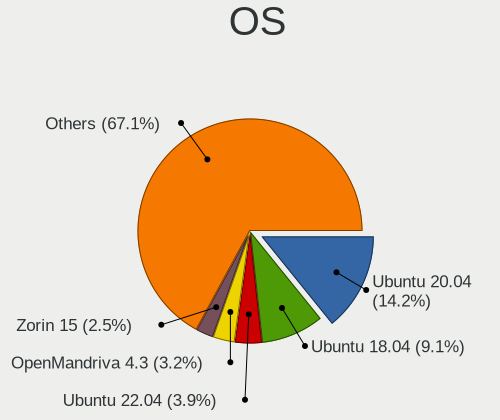

| Name                         | Notebooks | Percent |
|------------------------------|-----------|---------|
| Ubuntu 20.04                 | 134       | 14.53%  |
| Ubuntu 18.04                 | 86        | 9.33%   |
| Ubuntu 22.04                 | 35        | 3.8%    |
| OpenMandriva 4.3             | 30        | 3.25%   |
| Zorin 15                     | 24        | 2.6%    |
| OpenMandriva 4.2             | 21        | 2.28%   |
| KDE neon 20.04               | 19        | 2.06%   |
| Pop!_OS 20.04                | 18        | 1.95%   |
| Linux Mint 20.3              | 17        | 1.84%   |
| Debian 10                    | 17        | 1.84%   |
| Zorin 16                     | 16        | 1.74%   |
| Fedora 34                    | 16        | 1.74%   |
| Debian 11                    | 15        | 1.63%   |
| Ubuntu 19.10                 | 14        | 1.52%   |
| Linux Mint 20.1              | 14        | 1.52%   |
| Pop!_OS 21.04                | 13        | 1.41%   |
| Arch                         | 13        | 1.41%   |
| Xubuntu 20.04                | 12        | 1.3%    |
| Ubuntu 21.10                 | 12        | 1.3%    |
| Ubuntu 19.04                 | 12        | 1.3%    |
| Pop!_OS 20.10                | 12        | 1.3%    |
| OpenMandriva 4.50            | 12        | 1.3%    |
| Linux Mint 19.3              | 12        | 1.3%    |
| Pop!_OS 22.04                | 11        | 1.19%   |
| Manjaro                      | 11        | 1.19%   |
| Fedora 33                    | 11        | 1.19%   |
| Arch Rolling                 | 11        | 1.19%   |
| Xubuntu 18.04                | 10        | 1.08%   |
| Linux Mint 21                | 10        | 1.08%   |
| Linux Mint 20                | 10        | 1.08%   |
| Fedora 36                    | 10        | 1.08%   |
| Ubuntu 20.10                 | 9         | 0.98%   |
| Pop!_OS 21.10                | 9         | 0.98%   |
| Linux Mint 19.1              | 9         | 0.98%   |
| Fedora 35                    | 8         | 0.87%   |
| openSUSE Tumbleweed-XXXXXXXX | 7         | 0.76%   |
| Linux Mint 19.2              | 7         | 0.76%   |
| KDE neon 18.04               | 6         | 0.65%   |
| Elementary 6.1               | 6         | 0.65%   |
| Debian Testing               | 6         | 0.65%   |

OS Family
---------

OS without a version

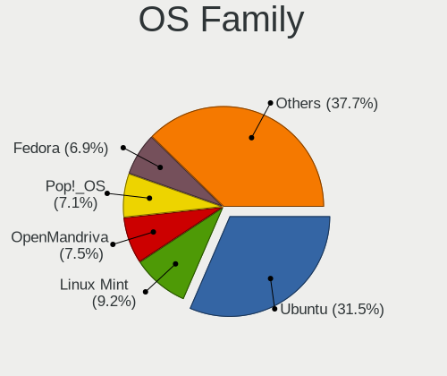

| Name          | Notebooks | Percent |
|---------------|-----------|---------|
| Ubuntu        | 302       | 34.36%  |
| Linux Mint    | 79        | 8.99%   |
| OpenMandriva  | 63        | 7.17%   |
| Pop!_OS       | 62        | 7.05%   |
| Fedora        | 50        | 5.69%   |
| Zorin         | 40        | 4.55%   |
| Debian        | 37        | 4.21%   |
| Endless       | 32        | 3.64%   |
| Manjaro       | 30        | 3.41%   |
| KDE neon      | 26        | 2.96%   |
| Arch          | 25        | 2.84%   |
| Xubuntu       | 24        | 2.73%   |
| Elementary    | 13        | 1.48%   |
| ROSA          | 11        | 1.25%   |
| openSUSE      | 10        | 1.14%   |
| Kubuntu       | 10        | 1.14%   |
| Ubuntu Unity  | 6         | 0.68%   |
| ArcoLinux     | 5         | 0.57%   |
| Ubuntu MATE   | 4         | 0.46%   |
| Slackware     | 4         | 0.46%   |
| Lubuntu       | 4         | 0.46%   |
| LMDE          | 4         | 0.46%   |
| Gentoo        | 4         | 0.46%   |
| EndeavourOS   | 4         | 0.46%   |
| Clear Linux   | 4         | 0.46%   |
| Ubuntu Budgie | 3         | 0.34%   |
| Nobara        | 3         | 0.34%   |
| Peppermint    | 2         | 0.23%   |
| Parrot        | 2         | 0.23%   |
| MX            | 2         | 0.23%   |
| UbuntuDDE     | 1         | 0.11%   |
| RHEL          | 1         | 0.11%   |
| Reborn OS     | 1         | 0.11%   |
| PureOS        | 1         | 0.11%   |
| NixOS         | 1         | 0.11%   |
| LinuxFX       | 1         | 0.11%   |
| Linux Lite    | 1         | 0.11%   |
| Kali          | 1         | 0.11%   |
| Garuda Linux  | 1         | 0.11%   |
| Devuan        | 1         | 0.11%   |

Kernel
------

Version of the Linux kernel

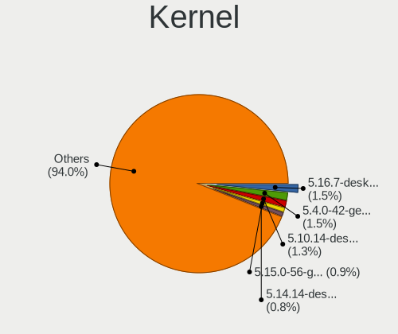

| Version                  | Notebooks | Percent |
|--------------------------|-----------|---------|
| 5.16.7-desktop-1omv4003  | 25        | 2.49%   |
| 5.4.0-42-generic         | 24        | 2.39%   |
| 5.10.14-desktop-1omv4002 | 20        | 1.99%   |
| 5.3.0-46-generic         | 12        | 1.19%   |
| 5.4.0-29-generic         | 11        | 1.09%   |
| 5.15.0-52-generic        | 11        | 1.09%   |
| 5.14.14-desktop-1omv4050 | 11        | 1.09%   |
| 5.4.0-58-generic         | 10        | 1%      |
| 5.4.0-52-generic         | 10        | 1%      |
| 5.15.0-48-generic        | 10        | 1%      |
| 5.11.0-38-generic        | 10        | 1%      |
| 5.3.0-28-generic         | 9         | 0.9%    |
| 5.15.0-41-generic        | 9         | 0.9%    |
| 4.18.0-15-generic        | 9         | 0.9%    |
| 5.4.0-7634-generic       | 8         | 0.8%    |
| 5.15.0-46-generic        | 8         | 0.8%    |
| 5.0.0-25-generic         | 8         | 0.8%    |
| 5.4.0-31-generic         | 7         | 0.7%    |
| 5.4.0-26-generic         | 7         | 0.7%    |
| 5.19.0-76051900-generic  | 7         | 0.7%    |
| 5.15.0-56-generic        | 7         | 0.7%    |
| 5.13.0-39-generic        | 7         | 0.7%    |
| 5.11.0-43-generic        | 7         | 0.7%    |
| 5.0.0-37-generic         | 7         | 0.7%    |
| 4.18.0-25-generic        | 7         | 0.7%    |
| 4.15.0-46-generic        | 7         | 0.7%    |
| 5.8.0-63-generic         | 6         | 0.6%    |
| 5.4.0-91-generic         | 6         | 0.6%    |
| 5.4.0-65-generic         | 6         | 0.6%    |
| 5.3.0-40-generic         | 6         | 0.6%    |
| 5.11.0-7620-generic      | 6         | 0.6%    |
| 5.8.0-7642-generic       | 5         | 0.5%    |
| 5.8.0-55-generic         | 5         | 0.5%    |
| 5.8.0-48-generic         | 5         | 0.5%    |
| 5.8.0-43-generic         | 5         | 0.5%    |
| 5.4.0-54-generic         | 5         | 0.5%    |
| 5.4.0-48-generic         | 5         | 0.5%    |
| 5.4.0-37-generic         | 5         | 0.5%    |
| 5.4.0-19-generic         | 5         | 0.5%    |
| 5.15.0-53-generic        | 5         | 0.5%    |

Kernel Family
-------------

Linux kernel without a distro release

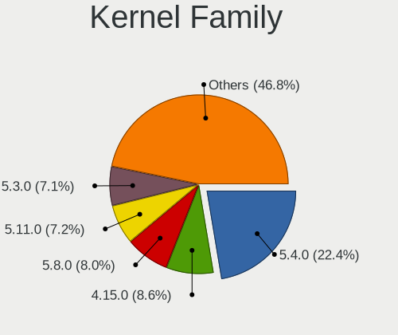

| Version | Notebooks | Percent |
|---------|-----------|---------|
| 5.4.0   | 183       | 19.37%  |
| 4.15.0  | 67        | 7.09%   |
| 5.8.0   | 63        | 6.67%   |
| 5.11.0  | 60        | 6.35%   |
| 5.15.0  | 57        | 6.03%   |
| 5.3.0   | 55        | 5.82%   |
| 5.13.0  | 47        | 4.97%   |
| 5.0.0   | 38        | 4.02%   |
| 4.18.0  | 34        | 3.6%    |
| 5.16.7  | 25        | 2.65%   |
| 5.10.14 | 21        | 2.22%   |
| 5.10.0  | 18        | 1.9%    |
| 4.19.0  | 17        | 1.8%    |
| 5.19.0  | 12        | 1.27%   |
| 5.14.14 | 11        | 1.16%   |
| 4.4.0   | 5         | 0.53%   |
| 6.0.0   | 4         | 0.42%   |
| 5.6.0   | 4         | 0.42%   |
| 5.14.0  | 4         | 0.42%   |
| 5.11.12 | 4         | 0.42%   |
| 5.8.16  | 3         | 0.32%   |
| 5.7.9   | 3         | 0.32%   |
| 5.19.5  | 3         | 0.32%   |
| 5.16.15 | 3         | 0.32%   |
| 5.16.11 | 3         | 0.32%   |
| 5.16.0  | 3         | 0.32%   |
| 5.15.15 | 3         | 0.32%   |
| 5.15.11 | 3         | 0.32%   |
| 5.14.16 | 3         | 0.32%   |
| 5.12.7  | 3         | 0.32%   |
| 5.12.4  | 3         | 0.32%   |
| 4.9.60  | 3         | 0.32%   |
| 4.9.0   | 3         | 0.32%   |
| 6.0.6   | 2         | 0.21%   |
| 6.0.11  | 2         | 0.21%   |
| 6.0.10  | 2         | 0.21%   |
| 5.9.10  | 2         | 0.21%   |
| 5.9.0   | 2         | 0.21%   |
| 5.8.3   | 2         | 0.21%   |
| 5.8.18  | 2         | 0.21%   |

Kernel Major Ver.
-----------------

Linux kernel major version

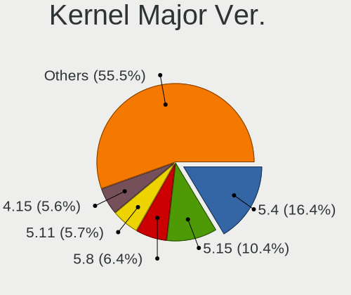

| Version | Notebooks | Percent |
|---------|-----------|---------|
| 5.4     | 193       | 20.55%  |
| 5.15    | 81        | 8.63%   |
| 5.8     | 77        | 8.2%    |
| 5.11    | 68        | 7.24%   |
| 4.15    | 67        | 7.14%   |
| 5.3     | 58        | 6.18%   |
| 5.10    | 53        | 5.64%   |
| 5.13    | 52        | 5.54%   |
| 5.16    | 43        | 4.58%   |
| 5.0     | 39        | 4.15%   |
| 4.18    | 35        | 3.73%   |
| 5.19    | 24        | 2.56%   |
| 5.14    | 24        | 2.56%   |
| 4.19    | 20        | 2.13%   |
| 5.12    | 16        | 1.7%    |
| 6.0     | 14        | 1.49%   |
| 4.9     | 12        | 1.28%   |
| 5.7     | 10        | 1.06%   |
| 5.6     | 10        | 1.06%   |
| 5.17    | 10        | 1.06%   |
| 5.9     | 9         | 0.96%   |
| 5.5     | 6         | 0.64%   |
| 5.18    | 6         | 0.64%   |
| 4.4     | 5         | 0.53%   |
| 5.2     | 2         | 0.21%   |
| 6.1     | 1         | 0.11%   |
| 4.12    | 1         | 0.11%   |
| 4.1     | 1         | 0.11%   |
| 3.10    | 1         | 0.11%   |
| Unknown | 1         | 0.11%   |

Arch
----

OS architecture (x86_64, i586, etc.)

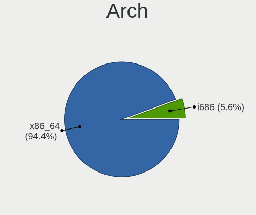

| Name   | Notebooks | Percent |
|--------|-----------|---------|
| x86_64 | 803       | 94.47%  |
| i686   | 47        | 5.53%   |

DE
--

Desktop Environment

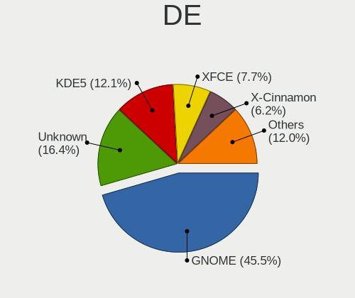

| Name            | Notebooks | Percent |
|-----------------|-----------|---------|
| GNOME           | 406       | 45.62%  |
| Unknown         | 133       | 14.94%  |
| KDE5            | 126       | 14.16%  |
| XFCE            | 68        | 7.64%   |
| X-Cinnamon      | 58        | 6.52%   |
| KDE             | 18        | 2.02%   |
| MATE            | 17        | 1.91%   |
| Pantheon        | 11        | 1.24%   |
| KDE4            | 9         | 1.01%   |
| i3              | 8         | 0.9%    |
| Unity           | 7         | 0.79%   |
| Cinnamon        | 7         | 0.79%   |
| Budgie          | 6         | 0.67%   |
| LXQt            | 4         | 0.45%   |
| LXDE            | 4         | 0.45%   |
| GNOME Flashback | 2         | 0.22%   |
| Deepin          | 2         | 0.22%   |
| awesome         | 2         | 0.22%   |
| Openbox         | 1         | 0.11%   |
| fluxbox         | 1         | 0.11%   |

Display Server
--------------

X11 or Wayland

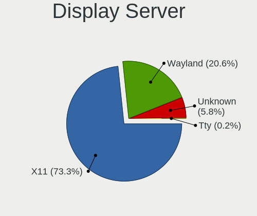

| Name    | Notebooks | Percent |
|---------|-----------|---------|
| X11     | 691       | 79.52%  |
| Wayland | 113       | 13%     |
| Unknown | 65        | 7.48%   |

Display Manager
---------------

SDDM, LightDM, etc.

| Name    | Notebooks | Percent |
|---------|-----------|---------|
| Unknown | 507       | 57.55%  |
| SDDM    | 112       | 12.71%  |
| GDM     | 95        | 10.78%  |
| GDM3    | 76        | 8.63%   |
| LightDM | 51        | 5.79%   |
| TDM     | 28        | 3.18%   |
| KDM     | 9         | 1.02%   |
| XDM     | 3         | 0.34%   |

OS Lang
-------

Language

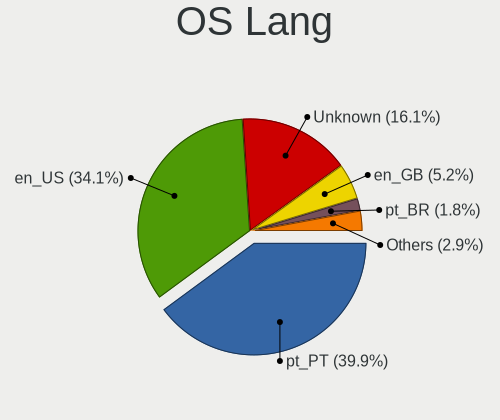

| Lang    | Notebooks | Percent |
|---------|-----------|---------|
| pt_PT   | 340       | 39.04%  |
| en_US   | 305       | 35.02%  |
| Unknown | 129       | 14.81%  |
| en_GB   | 47        | 5.4%    |
| pt_BR   | 17        | 1.95%   |
| C       | 15        | 1.72%   |
| en_IE   | 4         | 0.46%   |
| ru_RU   | 2         | 0.23%   |
| POSIX   | 2         | 0.23%   |
| fr_FR   | 2         | 0.23%   |
| es_ES   | 2         | 0.23%   |
| de_DE   | 2         | 0.23%   |
| sk_SK   | 1         | 0.11%   |
| it_IT   | 1         | 0.11%   |
| en_IN   | 1         | 0.11%   |
| Default | 1         | 0.11%   |

Boot Mode
---------

EFI or BIOS

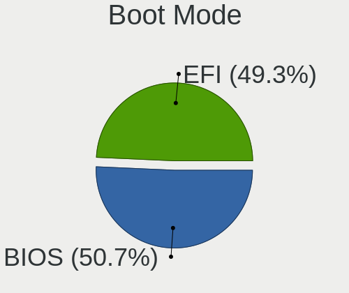

| Mode | Notebooks | Percent |
|------|-----------|---------|
| BIOS | 456       | 52.35%  |
| EFI  | 415       | 47.65%  |

Filesystem
----------

Type of filesystem

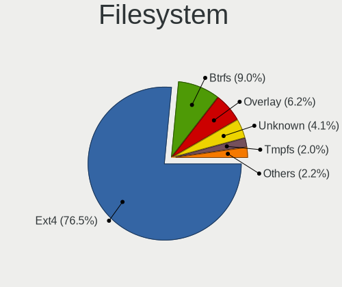

| Type     | Notebooks | Percent |
|----------|-----------|---------|
| Ext4     | 688       | 80.19%  |
| Btrfs    | 56        | 6.53%   |
| Overlay  | 53        | 6.18%   |
| Unknown  | 44        | 5.13%   |
| Zfs      | 5         | 0.58%   |
| Xfs      | 5         | 0.58%   |
| Ext2     | 4         | 0.47%   |
| Ext3     | 2         | 0.23%   |
| Reiserfs | 1         | 0.12%   |

Part. scheme
------------

Scheme of partitioning

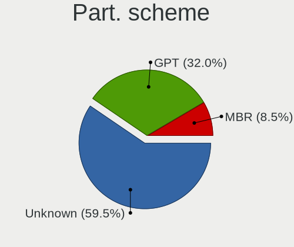

| Type    | Notebooks | Percent |
|---------|-----------|---------|
| Unknown | 542       | 62.51%  |
| GPT     | 254       | 29.3%   |
| MBR     | 71        | 8.19%   |

Dual Boot with Linux/BSD
------------------------

Hosting more than one Linux/BSD

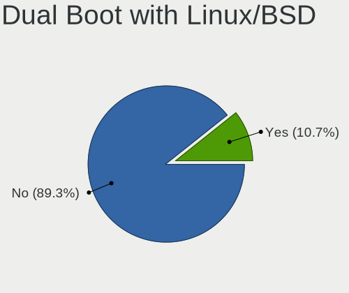

| Dual boot | Notebooks | Percent |
|-----------|-----------|---------|
| No        | 765       | 89.26%  |
| Yes       | 92        | 10.74%  |

Dual Boot (Win)
---------------

Hosting Linux and Windows

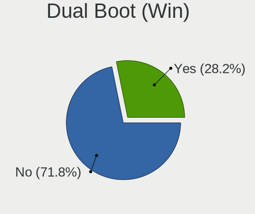

| Dual boot | Notebooks | Percent |
|-----------|-----------|---------|
| No        | 611       | 70.88%  |
| Yes       | 251       | 29.12%  |

Board
-----

Vendor
------

Motherboard manufacturer

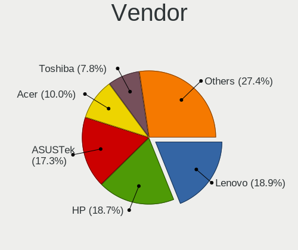

| Name                | Notebooks | Percent |
|---------------------|-----------|---------|
| Hewlett-Packard     | 157       | 18.49%  |
| Lenovo              | 154       | 18.14%  |
| ASUSTek Computer    | 146       | 17.2%   |
| Acer                | 87        | 10.25%  |
| Toshiba             | 74        | 8.72%   |
| Dell                | 43        | 5.06%   |
| Sony                | 41        | 4.83%   |
| MSI                 | 23        | 2.71%   |
| Apple               | 22        | 2.59%   |
| HUAWEI              | 15        | 1.77%   |
| Samsung Electronics | 14        | 1.65%   |
| Notebook            | 9         | 1.06%   |
| Packard Bell        | 6         | 0.71%   |
| TUXEDO              | 5         | 0.59%   |
| Fujitsu             | 4         | 0.47%   |
| Phoenix/SiS         | 3         | 0.35%   |
| LG Electronics      | 3         | 0.35%   |
| Intel               | 3         | 0.35%   |
| eMachines           | 3         | 0.35%   |
| Clevo               | 3         | 0.35%   |
| Chuwi               | 3         | 0.35%   |
| Teclast             | 2         | 0.24%   |
| SLIMBOOK            | 2         | 0.24%   |
| Positivo            | 2         | 0.24%   |
| OBSIDIAN-PC         | 2         | 0.24%   |
| Fujitsu Siemens     | 2         | 0.24%   |
| Alienware           | 2         | 0.24%   |
| Unknown             | 2         | 0.24%   |
| Timi                | 1         | 0.12%   |
| Thomson             | 1         | 0.12%   |
| System76            | 1         | 0.12%   |
| Standard            | 1         | 0.12%   |
| Qilive              | 1         | 0.12%   |
| Purism              | 1         | 0.12%   |
| PC Specialist       | 1         | 0.12%   |
| LIVEFAN             | 1         | 0.12%   |
| Linx                | 1         | 0.12%   |
| Jumper              | 1         | 0.12%   |
| JPSaCouto           | 1         | 0.12%   |
| INSYS               | 1         | 0.12%   |

Model
-----

Motherboard model

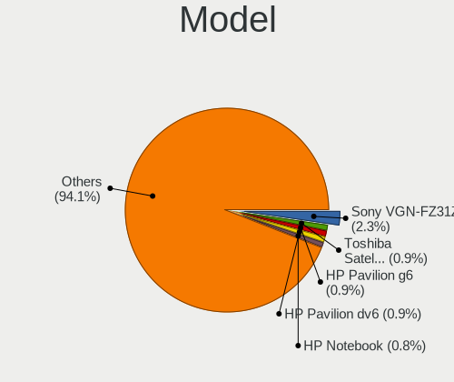

| Name                                   | Notebooks | Percent |
|----------------------------------------|-----------|---------|
| Sony VGN-FZ31Z                         | 20        | 2.36%   |
| Lenovo IdeaPad 1 14ADA05 82GW          | 11        | 1.3%    |
| HP Pavilion g6                         | 8         | 0.94%   |
| Toshiba Satellite C660                 | 7         | 0.82%   |
| HP Pavilion dv6                        | 7         | 0.82%   |
| HP G62                                 | 7         | 0.82%   |
| HP Notebook                            | 6         | 0.71%   |
| Toshiba Satellite L650                 | 5         | 0.59%   |
| Lenovo Legion 5 15ACH6H 82JU           | 5         | 0.59%   |
| ASUS X555LJ                            | 5         | 0.59%   |
| Acer Extensa 5620                      | 5         | 0.59%   |
| Toshiba Satellite L40                  | 4         | 0.47%   |
| Toshiba Satellite A200                 | 4         | 0.47%   |
| HUAWEI NBLK-WAX9X                      | 4         | 0.47%   |
| HP Pavilion Notebook                   | 4         | 0.47%   |
| HP Compaq Presario CQ60                | 4         | 0.47%   |
| ASUS X555LD                            | 4         | 0.47%   |
| ASUS X541UV                            | 4         | 0.47%   |
| ASUS VivoBook 15_ASUS Laptop X507LA    | 4         | 0.47%   |
| Acer Aspire E5-551G                    | 4         | 0.47%   |
| Unknown                                | 4         | 0.47%   |
| Toshiba Satellite L50D-B               | 3         | 0.35%   |
| Toshiba Satellite L500                 | 3         | 0.35%   |
| MSI Modern 14 A10RB                    | 3         | 0.35%   |
| Lenovo Y520-15IKBN 80WK                | 3         | 0.35%   |
| Lenovo Legion 5 15ARH05 82B5           | 3         | 0.35%   |
| Lenovo IdeaPad 320-15AST 80XV          | 3         | 0.35%   |
| Lenovo G50-45 80E3                     | 3         | 0.35%   |
| Intel powered classmate PC             | 3         | 0.35%   |
| HUAWEI WRT-WX9                         | 3         | 0.35%   |
| HP Pavilion Gaming Laptop 15-ec2xxx    | 3         | 0.35%   |
| HP Pavilion 15                         | 3         | 0.35%   |
| HP OMEN by Laptop 15-dc0xxx            | 3         | 0.35%   |
| HP OMEN by Laptop                      | 3         | 0.35%   |
| HP Compaq Presario CQ61                | 3         | 0.35%   |
| Dell XPS 13 7390                       | 3         | 0.35%   |
| ASUS X542URR                           | 3         | 0.35%   |
| ASUS X540LJ                            | 3         | 0.35%   |
| ASUS VivoBook_ASUSLaptop X530FN_S530FN | 3         | 0.35%   |
| ASUS K50IJ                             | 3         | 0.35%   |

Model Family
------------

Motherboard model prefix

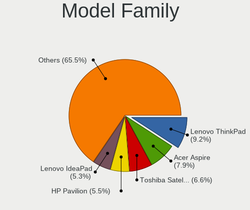

| Name                  | Notebooks | Percent |
|-----------------------|-----------|---------|
| Lenovo ThinkPad       | 74        | 8.72%   |
| Acer Aspire           | 70        | 8.24%   |
| Toshiba Satellite     | 64        | 7.54%   |
| HP Pavilion           | 52        | 6.12%   |
| Lenovo IdeaPad        | 47        | 5.54%   |
| ASUS VivoBook         | 25        | 2.94%   |
| HP EliteBook          | 22        | 2.59%   |
| Sony VGN-FZ31Z        | 20        | 2.36%   |
| Dell Latitude         | 19        | 2.24%   |
| HP Compaq             | 16        | 1.88%   |
| Lenovo Legion         | 13        | 1.53%   |
| HP ProBook            | 13        | 1.53%   |
| HP Laptop             | 11        | 1.3%    |
| Dell XPS              | 11        | 1.3%    |
| HP OMEN               | 9         | 1.06%   |
| Dell Inspiron         | 9         | 1.06%   |
| ASUS ZenBook          | 8         | 0.94%   |
| Acer Extensa          | 8         | 0.94%   |
| HP G62                | 7         | 0.82%   |
| Packard Bell EasyNote | 6         | 0.71%   |
| MSI Modern            | 6         | 0.71%   |
| HP Notebook           | 6         | 0.71%   |
| ASUS ROG              | 6         | 0.71%   |
| HP ENVY               | 5         | 0.59%   |
| ASUS X555LJ           | 5         | 0.59%   |
| Lenovo Yoga           | 4         | 0.47%   |
| HUAWEI NBLK-WAX9X     | 4         | 0.47%   |
| ASUS X555LD           | 4         | 0.47%   |
| ASUS X541UV           | 4         | 0.47%   |
| Apple MacBookPro8     | 4         | 0.47%   |
| Unknown               | 4         | 0.47%   |
| TUXEDO InfinityBook   | 3         | 0.35%   |
| Toshiba QOSMIO        | 3         | 0.35%   |
| Toshiba PORTEGE       | 3         | 0.35%   |
| Lenovo Y520-15IKBN    | 3         | 0.35%   |
| Lenovo G50-45         | 3         | 0.35%   |
| Intel powered         | 3         | 0.35%   |
| HUAWEI WRT-WX9        | 3         | 0.35%   |
| HP ZBook              | 3         | 0.35%   |
| HP Stream             | 3         | 0.35%   |

MFG Year
--------

Motherboard manufacture year

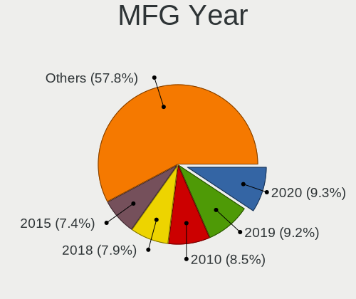

| Year    | Notebooks | Percent |
|---------|-----------|---------|
| 2020    | 79        | 9.31%   |
| 2019    | 78        | 9.19%   |
| 2010    | 72        | 8.48%   |
| 2018    | 67        | 7.89%   |
| 2015    | 62        | 7.3%    |
| 2014    | 55        | 6.48%   |
| 2007    | 55        | 6.48%   |
| 2013    | 53        | 6.24%   |
| 2008    | 49        | 5.77%   |
| 2011    | 47        | 5.54%   |
| 2021    | 42        | 4.95%   |
| 2016    | 42        | 4.95%   |
| 2017    | 41        | 4.83%   |
| 2012    | 40        | 4.71%   |
| 2009    | 40        | 4.71%   |
| 2006    | 10        | 1.18%   |
| 2022    | 8         | 0.94%   |
| 2005    | 7         | 0.82%   |
| Unknown | 2         | 0.24%   |

Form Factor
-----------

Physical design of the computer

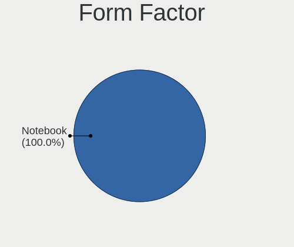

| Name     | Notebooks | Percent |
|----------|-----------|---------|
| Notebook | 849       | 100%    |

Secure Boot
-----------

Enabled or disabled

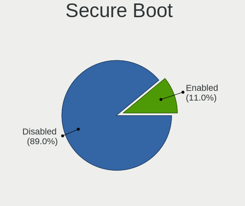

| State    | Notebooks | Percent |
|----------|-----------|---------|
| Disabled | 778       | 89.84%  |
| Enabled  | 88        | 10.16%  |

Coreboot
--------

Have coreboot on board

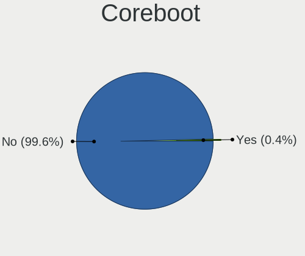

| Used | Notebooks | Percent |
|------|-----------|---------|
| No   | 847       | 99.76%  |
| Yes  | 2         | 0.24%   |

RAM Size
--------

Total RAM memory

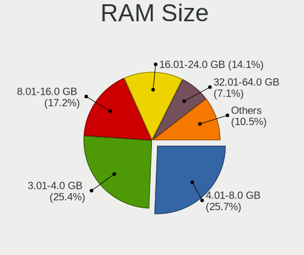

| Size in GB  | Notebooks | Percent |
|-------------|-----------|---------|
| 3.01-4.0    | 251       | 29.32%  |
| 4.01-8.0    | 217       | 25.35%  |
| 8.01-16.0   | 123       | 14.37%  |
| 16.01-24.0  | 108       | 12.62%  |
| 1.01-2.0    | 65        | 7.59%   |
| 32.01-64.0  | 55        | 6.43%   |
| 2.01-3.0    | 17        | 1.99%   |
| 0.51-1.0    | 11        | 1.29%   |
| 24.01-32.0  | 5         | 0.58%   |
| 64.01-256.0 | 4         | 0.47%   |

RAM Used
--------

Used RAM memory

| Used GB    | Notebooks | Percent |
|------------|-----------|---------|
| 1.01-2.0   | 359       | 38.6%   |
| 2.01-3.0   | 203       | 21.83%  |
| 4.01-8.0   | 130       | 13.98%  |
| 3.01-4.0   | 111       | 11.94%  |
| 0.51-1.0   | 79        | 8.49%   |
| 8.01-16.0  | 34        | 3.66%   |
| 16.01-24.0 | 7         | 0.75%   |
| 0.01-0.5   | 6         | 0.65%   |
| 24.01-32.0 | 1         | 0.11%   |

Total Drives
------------

Number of drives on board

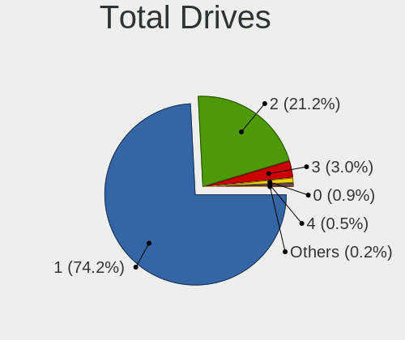

| Drives | Notebooks | Percent |
|--------|-----------|---------|
| 1      | 645       | 74.48%  |
| 2      | 185       | 21.36%  |
| 3      | 23        | 2.66%   |
| 0      | 10        | 1.15%   |
| 4      | 2         | 0.23%   |
| 5      | 1         | 0.12%   |

Has CD-ROM
----------

Has CD-ROM on board

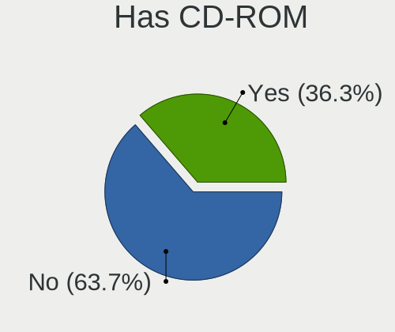

| Presented | Notebooks | Percent |
|-----------|-----------|---------|
| No        | 534       | 62.82%  |
| Yes       | 316       | 37.18%  |

Has Ethernet
------------

Has Ethernet on board

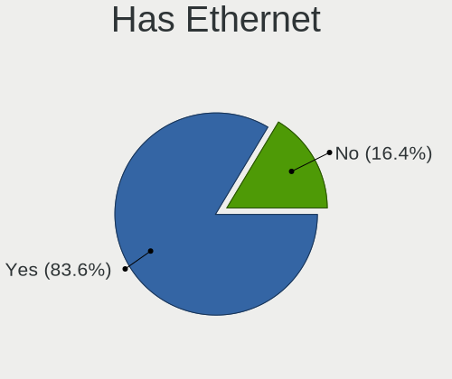

| Presented | Notebooks | Percent |
|-----------|-----------|---------|
| Yes       | 711       | 83.26%  |
| No        | 143       | 16.74%  |

Has WiFi
--------

Has WiFi module

| Presented | Notebooks | Percent |
|-----------|-----------|---------|
| Yes       | 827       | 97.41%  |
| No        | 22        | 2.59%   |

Has Bluetooth
-------------

Has Bluetooth module

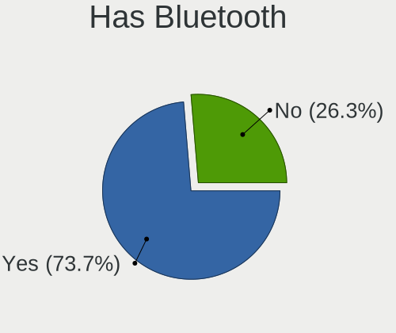

| Presented | Notebooks | Percent |
|-----------|-----------|---------|
| Yes       | 601       | 70.05%  |
| No        | 257       | 29.95%  |

Location
--------

Country
-------

Geographic location (country)

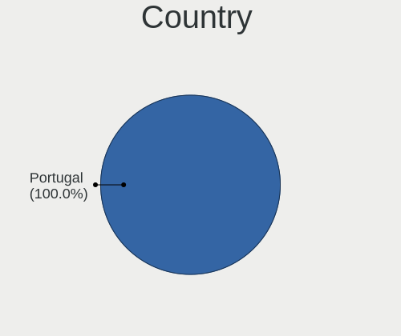

| Country  | Notebooks | Percent |
|----------|-----------|---------|
| Portugal | 849       | 100%    |

City
----

Geographic location (city)

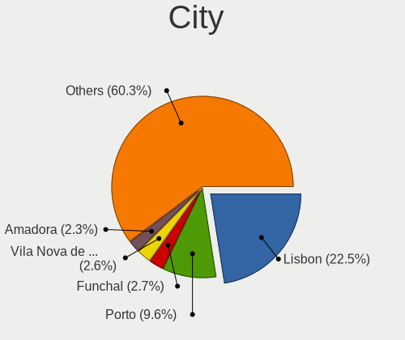

| City                    | Notebooks | Percent |
|-------------------------|-----------|---------|
| Lisbon                  | 195       | 21.57%  |
| Porto                   | 79        | 8.74%   |
| Funchal                 | 27        | 2.99%   |
| Vila Nova de Gaia       | 24        | 2.65%   |
| Amadora                 | 19        | 2.1%    |
| Braga                   | 16        | 1.77%   |
| Coimbra                 | 15        | 1.66%   |
| Cascais                 | 14        | 1.55%   |
| Aveiro                  | 14        | 1.55%   |
| Setúbal                | 13        | 1.44%   |
| Loures                  | 13        | 1.44%   |
| Bragança               | 11        | 1.22%   |
| Faro                    | 10        | 1.11%   |
| Sintra                  | 9         | 1%      |
| Leiria                  | 9         | 1%      |
| Almada                  | 9         | 1%      |
| Santarém               | 8         | 0.88%   |
| Póvoa de Varzim        | 8         | 0.88%   |
| Mem Martins             | 8         | 0.88%   |
| Feira                   | 8         | 0.88%   |
| Alverca do Ribatejo     | 8         | 0.88%   |
| Santo Tirso             | 7         | 0.77%   |
| Carnaxide               | 7         | 0.77%   |
| Viseu                   | 6         | 0.66%   |
| Viana do Castelo        | 6         | 0.66%   |
| Odivelas                | 6         | 0.66%   |
| Matosinhos Municipality | 6         | 0.66%   |
| Guimaraes               | 6         | 0.66%   |
| Evora                   | 6         | 0.66%   |
| Cacem                   | 6         | 0.66%   |
| Águeda Municipality    | 6         | 0.66%   |
| Vila Nova de Famalicao  | 5         | 0.55%   |
| Maia                    | 5         | 0.55%   |
| Lagos                   | 5         | 0.55%   |
| Estoril                 | 5         | 0.55%   |
| Barcelos                | 5         | 0.55%   |
| Albufeira               | 5         | 0.55%   |
| Trofa                   | 4         | 0.44%   |
| Tondela                 | 4         | 0.44%   |
| Sao Joao da Madeira     | 4         | 0.44%   |

Drives
------

Drive Vendor
------------

Hard drive vendors

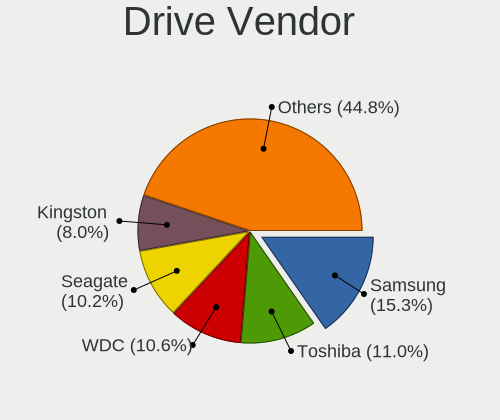

| Vendor                      | Notebooks | Drives | Percent |
|-----------------------------|-----------|--------|---------|
| Samsung Electronics         | 154       | 198    | 15.05%  |
| Toshiba                     | 116       | 136    | 11.34%  |
| WDC                         | 112       | 150    | 10.95%  |
| Seagate                     | 106       | 127    | 10.36%  |
| Kingston                    | 85        | 97     | 8.31%   |
| Unknown                     | 60        | 89     | 5.87%   |
| SanDisk                     | 56        | 65     | 5.47%   |
| Crucial                     | 40        | 51     | 3.91%   |
| Hitachi                     | 39        | 42     | 3.81%   |
| HGST                        | 36        | 44     | 3.52%   |
| SK hynix                    | 26        | 30     | 2.54%   |
| Intel                       | 24        | 38     | 2.35%   |
| Micron Technology           | 18        | 21     | 1.76%   |
| Fujitsu                     | 17        | 18     | 1.66%   |
| KIOXIA                      | 12        | 21     | 1.17%   |
| Apple                       | 11        | 11     | 1.08%   |
| GOODRAM                     | 8         | 8      | 0.78%   |
| A-DATA Technology           | 7         | 7      | 0.68%   |
| S3+                         | 6         | 14     | 0.59%   |
| JMicron Technology          | 6         | 6      | 0.59%   |
| Transcend                   | 4         | 5      | 0.39%   |
| PNY                         | 4         | 5      | 0.39%   |
| LITEON                      | 4         | 5      | 0.39%   |
| Emtec                       | 4         | 5      | 0.39%   |
| China                       | 4         | 5      | 0.39%   |
| BlueRay                     | 4         | 5      | 0.39%   |
| Team                        | 3         | 4      | 0.29%   |
| Silicon Motion              | 3         | 3      | 0.29%   |
| Phison                      | 3         | 3      | 0.29%   |
| Maxtor                      | 3         | 10     | 0.29%   |
| Union Memory (Shenzhen)     | 2         | 5      | 0.2%    |
| UMIS                        | 2         | 2      | 0.2%    |
| OCZ                         | 2         | 2      | 0.2%    |
| Netac                       | 2         | 2      | 0.2%    |
| Micron/Crucial Technology   | 2         | 3      | 0.2%    |
| Lite-On                     | 2         | 2      | 0.2%    |
| Lenovo                      | 2         | 2      | 0.2%    |
| Kingston Technology Company | 2         | 2      | 0.2%    |
| KingDian                    | 2         | 2      | 0.2%    |
| Hewlett-Packard             | 2         | 2      | 0.2%    |

Drive Model
-----------

Hard drive models

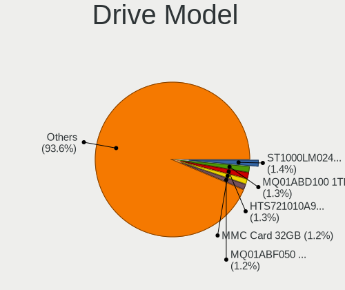

| Model                                  | Notebooks | Percent |
|----------------------------------------|-----------|---------|
| Seagate ST1000LM024 HN-M101MBB 1TB     | 17        | 1.61%   |
| HGST HTS721010A9E630 1TB               | 17        | 1.61%   |
| Toshiba MQ01ABD100 1TB                 | 16        | 1.52%   |
| Kingston SA400S37120G 120GB SSD        | 15        | 1.42%   |
| Unknown MMC Card  32GB                 | 14        | 1.33%   |
| Toshiba MQ01ABF050 500GB               | 13        | 1.23%   |
| Crucial CT240M500SSD1 240GB            | 13        | 1.23%   |
| Kingston SV300S37A120G 120GB SSD       | 12        | 1.14%   |
| Unknown MMC64G  64GB                   | 11        | 1.04%   |
| Seagate ST500LT012-1DG142 500GB        | 11        | 1.04%   |
| Seagate ST1000LM035-1RK172 1TB         | 11        | 1.04%   |
| SanDisk NVMe SSD Drive 512GB           | 10        | 0.95%   |
| Unknown MMC Card  64GB                 | 9         | 0.85%   |
| Seagate ST9500325AS 500GB              | 9         | 0.85%   |
| Kingston SA400S37240G 240GB SSD        | 9         | 0.85%   |
| Samsung NVMe SSD Drive 512GB           | 8         | 0.76%   |
| Toshiba TR200 240GB SSD                | 7         | 0.66%   |
| SanDisk NVMe SSD Drive 256GB           | 7         | 0.66%   |
| Samsung SSD 860 EVO 500GB              | 7         | 0.66%   |
| Samsung SSD 850 EVO 500GB              | 7         | 0.66%   |
| Samsung SM963 2.5" NVMe PCIe SSD 256GB | 7         | 0.66%   |
| Kingston SA400S37480G 480GB SSD        | 7         | 0.66%   |
| Kingston NVMe SSD Drive 512GB          | 7         | 0.66%   |
| WDC WDS240G2G0A-00JH30 240GB SSD       | 6         | 0.57%   |
| WDC WD5000LPVX-22V0TT0 500GB           | 6         | 0.57%   |
| WDC WD3200BEVT-22ZCT0 320GB            | 6         | 0.57%   |
| Toshiba MQ04ABF100 1TB                 | 6         | 0.57%   |
| SK hynix NVMe SSD Drive 512GB          | 6         | 0.57%   |
| SK hynix NVMe SSD Drive 256GB          | 6         | 0.57%   |
| SanDisk NVMe SSD Drive 1024GB          | 6         | 0.57%   |
| Samsung NVMe SSD Drive 1024GB          | 6         | 0.57%   |
| Micron NVMe SSD Drive 512GB            | 6         | 0.57%   |
| HGST HTS541010A9E680 1TB               | 6         | 0.57%   |
| Crucial CT240BX500SSD1 240GB           | 6         | 0.57%   |
| WDC WD10JPVX-22JC3T0 1TB               | 5         | 0.47%   |
| Seagate ST9320325AS 320GB              | 5         | 0.47%   |
| Seagate Expansion 4TB                  | 5         | 0.47%   |
| Samsung SSD 860 QVO 1TB                | 5         | 0.47%   |
| Samsung SSD 860 EVO 1TB                | 5         | 0.47%   |
| Samsung SSD 850 EVO 250GB              | 5         | 0.47%   |

HDD Vendor
----------

Hard disk drive vendors

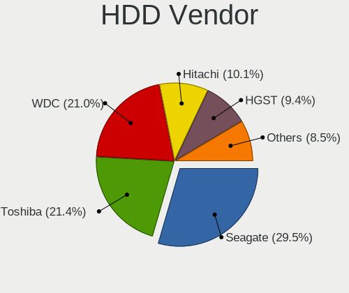

| Vendor              | Notebooks | Drives | Percent |
|---------------------|-----------|--------|---------|
| Seagate             | 105       | 122    | 28.85%  |
| Toshiba             | 80        | 98     | 21.98%  |
| WDC                 | 73        | 89     | 20.05%  |
| Hitachi             | 39        | 42     | 10.71%  |
| HGST                | 36        | 44     | 9.89%   |
| Fujitsu             | 17        | 18     | 4.67%   |
| Samsung Electronics | 11        | 11     | 3.02%   |
| USB3.0              | 1         | 1      | 0.27%   |
| USB                 | 1         | 1      | 0.27%   |
| ASMedia             | 1         | 1      | 0.27%   |

SSD Vendor
----------

Solid state drive vendors

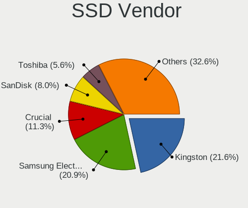

| Vendor              | Notebooks | Drives | Percent |
|---------------------|-----------|--------|---------|
| Kingston            | 70        | 80     | 20.65%  |
| Samsung Electronics | 69        | 85     | 20.35%  |
| Crucial             | 39        | 49     | 11.5%   |
| SanDisk             | 25        | 30     | 7.37%   |
| Toshiba             | 18        | 20     | 5.31%   |
| WDC                 | 15        | 16     | 4.42%   |
| Apple               | 10        | 10     | 2.95%   |
| GOODRAM             | 8         | 8      | 2.36%   |
| Intel               | 7         | 9      | 2.06%   |
| A-DATA Technology   | 7         | 7      | 2.06%   |
| S3+                 | 6         | 14     | 1.77%   |
| SK hynix            | 5         | 5      | 1.47%   |
| Transcend           | 4         | 5      | 1.18%   |
| Micron Technology   | 4         | 6      | 1.18%   |
| Emtec               | 4         | 5      | 1.18%   |
| China               | 4         | 5      | 1.18%   |
| BlueRay             | 4         | 5      | 1.18%   |
| Team                | 3         | 4      | 0.88%   |
| PNY                 | 3         | 4      | 0.88%   |
| Maxtor              | 3         | 10     | 0.88%   |
| JMicron Technology  | 3         | 3      | 0.88%   |
| Seagate             | 2         | 4      | 0.59%   |
| OCZ                 | 2         | 2      | 0.59%   |
| Netac               | 2         | 2      | 0.59%   |
| LITEON              | 2         | 3      | 0.59%   |
| KingDian            | 2         | 2      | 0.59%   |
| Hewlett-Packard     | 2         | 2      | 0.59%   |
| Verbatim            | 1         | 1      | 0.29%   |
| Vaseky              | 1         | 1      | 0.29%   |
| Teclast             | 1         | 1      | 0.29%   |
| TEAM T25            | 1         | 1      | 0.29%   |
| TCSUNBOW            | 1         | 1      | 0.29%   |
| Plextor             | 1         | 1      | 0.29%   |
| OSC                 | 1         | 1      | 0.29%   |
| LITEONIT            | 1         | 1      | 0.29%   |
| Lexar               | 1         | 1      | 0.29%   |
| KIOXIA-EXCERIA      | 1         | 1      | 0.29%   |
| KingSpec            | 1         | 1      | 0.29%   |
| Gigabyte Technology | 1         | 1      | 0.29%   |
| Corsair             | 1         | 1      | 0.29%   |

Drive Kind
----------

HDD or SSD

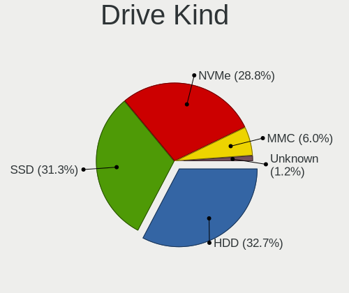

| Kind    | Notebooks | Drives | Percent |
|---------|-----------|--------|---------|
| HDD     | 359       | 427    | 36.48%  |
| SSD     | 315       | 411    | 32.01%  |
| NVMe    | 242       | 340    | 24.59%  |
| MMC     | 59        | 90     | 6%      |
| Unknown | 9         | 9      | 0.91%   |

Drive Connector
---------------

SATA, SAS, NVMe, etc.

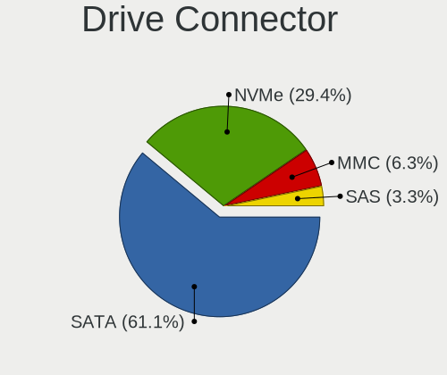

| Type | Notebooks | Drives | Percent |
|------|-----------|--------|---------|
| SATA | 604       | 815    | 64.88%  |
| NVMe | 242       | 340    | 25.99%  |
| MMC  | 59        | 90     | 6.34%   |
| SAS  | 26        | 32     | 2.79%   |

Drive Size
----------

Size of hard drive

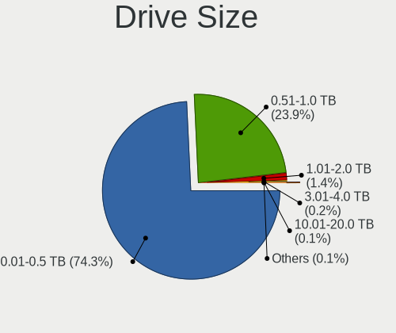

| Size in TB | Notebooks | Drives | Percent |
|------------|-----------|--------|---------|
| 0.01-0.5   | 485       | 636    | 74.05%  |
| 0.51-1.0   | 156       | 184    | 23.82%  |
| 1.01-2.0   | 8         | 11     | 1.22%   |
| 3.01-4.0   | 6         | 7      | 0.92%   |

Space Total
-----------

Amount of disk space available on the file system

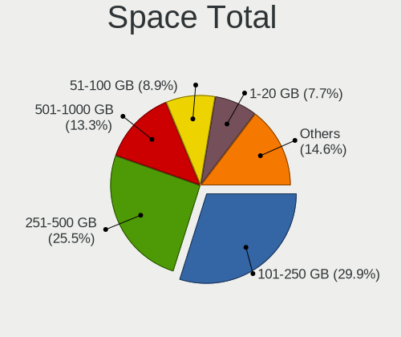

| Size in GB     | Notebooks | Percent |
|----------------|-----------|---------|
| 101-250        | 268       | 30.25%  |
| 251-500        | 224       | 25.28%  |
| 501-1000       | 118       | 13.32%  |
| 51-100         | 78        | 8.8%    |
| 1-20           | 66        | 7.45%   |
| 1001-2000      | 46        | 5.19%   |
| 21-50          | 42        | 4.74%   |
| Unknown        | 20        | 2.26%   |
| 2001-3000      | 13        | 1.47%   |
| More than 3000 | 11        | 1.24%   |

Space Used
----------

Amount of used disk space

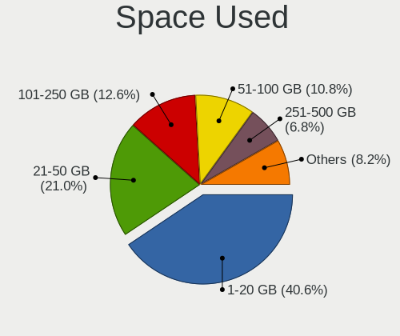

| Used GB        | Notebooks | Percent |
|----------------|-----------|---------|
| 1-20           | 381       | 41.55%  |
| 21-50          | 192       | 20.94%  |
| 101-250        | 114       | 12.43%  |
| 51-100         | 103       | 11.23%  |
| 251-500        | 62        | 6.76%   |
| 501-1000       | 23        | 2.51%   |
| Unknown        | 20        | 2.18%   |
| 1001-2000      | 17        | 1.85%   |
| More than 3000 | 4         | 0.44%   |
| 2001-3000      | 1         | 0.11%   |

Malfunc. Drives
---------------

Drive models with a malfunction

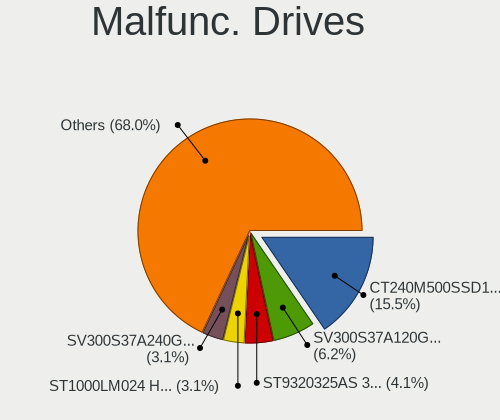

| Model                               | Notebooks | Drives | Percent |
|-------------------------------------|-----------|--------|---------|
| Crucial CT240M500SSD1 240GB         | 13        | 13     | 22.81%  |
| Kingston SV300S37A120G 120GB SSD    | 6         | 6      | 10.53%  |
| Seagate ST500LT012-1DG142 500GB     | 2         | 2      | 3.51%   |
| Seagate ST1000LM024 HN-M101MBB 1TB  | 2         | 2      | 3.51%   |
| Kingston SV300S37A240G 240GB SSD    | 2         | 2      | 3.51%   |
| Hitachi HTS545050A7E380 500GB       | 2         | 2      | 3.51%   |
| HGST HTS721010A9E630 1TB            | 2         | 2      | 3.51%   |
| WDC WD5000BPVT-80HXZT1 500GB        | 1         | 1      | 1.75%   |
| WDC WD10JPVT-22A1YT0 1TB            | 1         | 1      | 1.75%   |
| Toshiba Q300. 240GB SSD             | 1         | 1      | 1.75%   |
| Toshiba MQ01ABF050 500GB            | 1         | 1      | 1.75%   |
| Toshiba MQ01ABD100 1TB              | 1         | 1      | 1.75%   |
| Toshiba MK7575GSX 752GB             | 1         | 1      | 1.75%   |
| Toshiba MK5065GSX 500GB             | 1         | 1      | 1.75%   |
| Toshiba MK3276GSX 320GB             | 1         | 1      | 1.75%   |
| Seagate ST9750420AS 752GB           | 1         | 1      | 1.75%   |
| Seagate ST9500325AS 500GB           | 1         | 1      | 1.75%   |
| Seagate ST9320325AS 320GB           | 1         | 1      | 1.75%   |
| Seagate ST9160310AS 160GB           | 1         | 2      | 1.75%   |
| Seagate ST500LM012 HN-M500MBB 500GB | 1         | 1      | 1.75%   |
| Seagate ST1000LM035-1RK172 1TB      | 1         | 1      | 1.75%   |
| SanDisk SSD U100 24GB               | 1         | 1      | 1.75%   |
| Samsung Electronics SSD 870 EVO 1TB | 1         | 1      | 1.75%   |
| Samsung Electronics HM320JI 320GB   | 1         | 1      | 1.75%   |
| Samsung Electronics HM251HI 250GB   | 1         | 1      | 1.75%   |
| Kingston SUV400S37240G 240GB SSD    | 1         | 1      | 1.75%   |
| Hitachi HTS727575A9E364 752GB       | 1         | 1      | 1.75%   |
| Hitachi HTS725050A9A364 500GB       | 1         | 1      | 1.75%   |
| Hitachi HTS545025B9A300 250GB       | 1         | 1      | 1.75%   |
| Hitachi HTS543232A7A384 320GB       | 1         | 1      | 1.75%   |
| Hitachi HTS543225L9A300 250GB       | 1         | 1      | 1.75%   |
| Hitachi HTS543216L9A300 160GB       | 1         | 1      | 1.75%   |
| Hitachi HTS541010G9SA00 100GB       | 1         | 1      | 1.75%   |
| Fujitsu MHW2080BH PL 80GB           | 1         | 1      | 1.75%   |
| A-DATA Technology SP920SS 128GB SSD | 1         | 1      | 1.75%   |

Malfunc. Drive Vendor
---------------------

Vendors of faulty drives

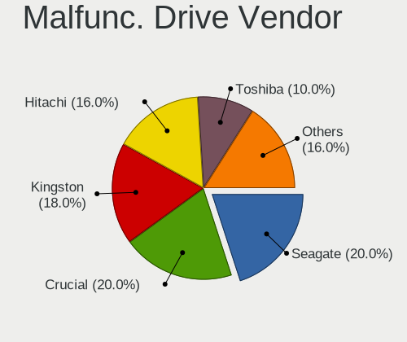

| Vendor              | Notebooks | Drives | Percent |
|---------------------|-----------|--------|---------|
| Crucial             | 13        | 13     | 22.81%  |
| Seagate             | 10        | 11     | 17.54%  |
| Kingston            | 9         | 9      | 15.79%  |
| Hitachi             | 9         | 9      | 15.79%  |
| Toshiba             | 6         | 6      | 10.53%  |
| Samsung Electronics | 3         | 3      | 5.26%   |
| WDC                 | 2         | 2      | 3.51%   |
| HGST                | 2         | 2      | 3.51%   |
| SanDisk             | 1         | 1      | 1.75%   |
| Fujitsu             | 1         | 1      | 1.75%   |
| A-DATA Technology   | 1         | 1      | 1.75%   |

Malfunc. HDD Vendor
-------------------

Vendors of faulty HDD drives

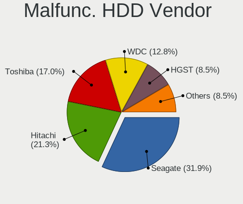

| Vendor              | Notebooks | Drives | Percent |
|---------------------|-----------|--------|---------|
| Seagate             | 10        | 11     | 32.26%  |
| Hitachi             | 9         | 9      | 29.03%  |
| Toshiba             | 5         | 5      | 16.13%  |
| WDC                 | 2         | 2      | 6.45%   |
| Samsung Electronics | 2         | 2      | 6.45%   |
| HGST                | 2         | 2      | 6.45%   |
| Fujitsu             | 1         | 1      | 3.23%   |

Malfunc. Drive Kind
-------------------

Kinds of faulty drives

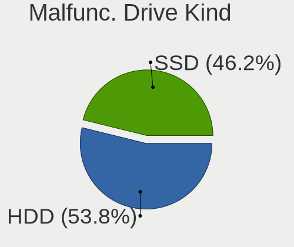

| Kind | Notebooks | Drives | Percent |
|------|-----------|--------|---------|
| HDD  | 31        | 32     | 54.39%  |
| SSD  | 26        | 26     | 45.61%  |

Failed Drives
-------------

Failed drive models

Zero info for selected period =(

Failed Drive Vendor
-------------------

Failed drive vendors

Zero info for selected period =(

Drive Status
------------

Number of failed and malfunc. drives

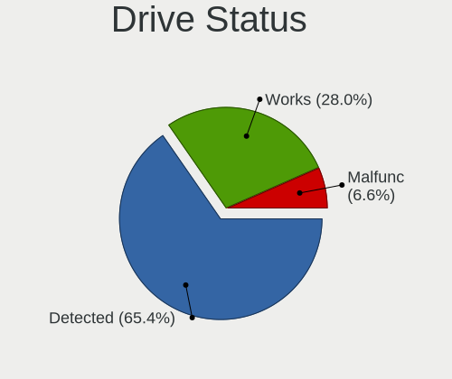

| Status   | Notebooks | Drives | Percent |
|----------|-----------|--------|---------|
| Detected | 573       | 864    | 65.11%  |
| Works    | 250       | 355    | 28.41%  |
| Malfunc  | 57        | 58     | 6.48%   |

Storage controller
------------------

Storage Vendor
--------------

Storage controller vendors

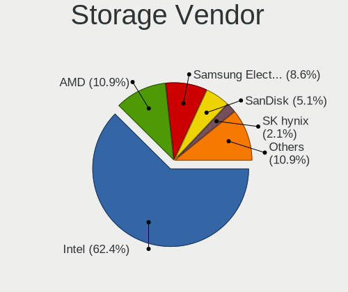

| Vendor                           | Notebooks | Percent |
|----------------------------------|-----------|---------|
| Intel                            | 583       | 61.11%  |
| AMD                              | 100       | 10.48%  |
| Samsung Electronics              | 83        | 8.7%    |
| SanDisk                          | 50        | 5.24%   |
| Toshiba America Info Systems     | 20        | 2.1%    |
| SK hynix                         | 19        | 1.99%   |
| Kingston Technology Company      | 17        | 1.78%   |
| Micron Technology                | 14        | 1.47%   |
| Silicon Integrated Systems [SiS] | 12        | 1.26%   |
| Nvidia                           | 11        | 1.15%   |
| KIOXIA                           | 11        | 1.15%   |
| Union Memory (Shenzhen)          | 6         | 0.63%   |
| Phison Electronics               | 5         | 0.52%   |
| Micron/Crucial Technology        | 4         | 0.42%   |
| Lite-On Technology               | 4         | 0.42%   |
| JMicron Technology               | 4         | 0.42%   |
| Silicon Motion                   | 3         | 0.31%   |
| Lenovo                           | 2         | 0.21%   |
| Solid State Storage Technology   | 1         | 0.1%    |
| Silicon Image                    | 1         | 0.1%    |
| Realtek Semiconductor            | 1         | 0.1%    |
| Marvell Technology Group         | 1         | 0.1%    |
| Enmotus                          | 1         | 0.1%    |
| Apple                            | 1         | 0.1%    |

Storage Model
-------------

Storage controller models

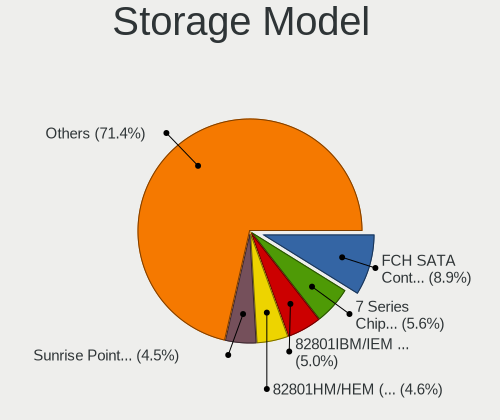

| Model                                                                          | Notebooks | Percent |
|--------------------------------------------------------------------------------|-----------|---------|
| AMD FCH SATA Controller [AHCI mode]                                            | 93        | 8.76%   |
| Intel 7 Series Chipset Family 6-port SATA Controller [AHCI mode]               | 62        | 5.84%   |
| Intel 82801IBM/IEM (ICH9M/ICH9M-E) 4 port SATA Controller [AHCI mode]          | 58        | 5.46%   |
| Intel 82801HM/HEM (ICH8M/ICH8M-E) IDE Controller                               | 53        | 4.99%   |
| Intel 6 Series/C200 Series Chipset Family 6 port Mobile SATA AHCI Controller   | 49        | 4.61%   |
| Intel Sunrise Point-LP SATA Controller [AHCI mode]                             | 47        | 4.43%   |
| Intel 82801HM/HEM (ICH8M/ICH8M-E) SATA Controller [AHCI mode]                  | 46        | 4.33%   |
| Samsung NVMe SSD Controller SM981/PM981/PM983                                  | 43        | 4.05%   |
| Intel 5 Series/3400 Series Chipset 4 port SATA AHCI Controller                 | 36        | 3.39%   |
| Intel 82801 Mobile SATA Controller [RAID mode]                                 | 33        | 3.11%   |
| Intel 8 Series SATA Controller 1 [AHCI mode]                                   | 32        | 3.01%   |
| Intel Wildcat Point-LP SATA Controller [AHCI Mode]                             | 23        | 2.17%   |
| Intel 8 Series/C220 Series Chipset Family 6-port SATA Controller 1 [AHCI mode] | 20        | 1.88%   |
| Samsung NVMe SSD Controller 980                                                | 19        | 1.79%   |
| Intel Cannon Lake Mobile PCH SATA AHCI Controller                              | 18        | 1.69%   |
| SanDisk WD Black SN750 / PC SN730 NVMe SSD                                     | 17        | 1.6%    |
| Intel Volume Management Device NVMe RAID Controller                            | 16        | 1.51%   |
| Intel HM170/QM170 Chipset SATA Controller [AHCI Mode]                          | 16        | 1.51%   |
| Micron Non-Volatile memory controller                                          | 14        | 1.32%   |
| Silicon Integrated Systems [SiS] 5513 IDE Controller                           | 12        | 1.13%   |
| SanDisk WD Blue SN550 NVMe SSD                                                 | 12        | 1.13%   |
| Intel SSD 660P Series                                                          | 12        | 1.13%   |
| Intel Atom Processor E3800 Series SATA AHCI Controller                         | 12        | 1.13%   |
| Silicon Integrated Systems [SiS] SATA Controller / IDE mode                    | 11        | 1.04%   |
| Samsung NVMe SSD Controller SM961/PM961/SM963                                  | 10        | 0.94%   |
| Intel NM10/ICH7 Family SATA Controller [AHCI mode]                             | 10        | 0.94%   |
| Intel Cannon Point-LP SATA Controller [AHCI Mode]                              | 10        | 0.94%   |
| Intel 82801G (ICH7 Family) IDE Controller                                      | 10        | 0.94%   |
| Intel 82801GBM/GHM (ICH7-M Family) SATA Controller [IDE mode]                  | 9         | 0.85%   |
| Intel 5 Series/3400 Series Chipset 6 port SATA AHCI Controller                 | 9         | 0.85%   |
| Toshiba America Info Systems XG6 NVMe SSD Controller                           | 8         | 0.75%   |
| SanDisk WD Black 2018/SN750 / PC SN720 NVMe SSD                                | 8         | 0.75%   |
| KIOXIA NVMe SSD Controller BG4                                                 | 8         | 0.75%   |
| SanDisk WD Blue SN500 / PC SN520 NVMe SSD                                      | 7         | 0.66%   |
| Kingston Company U-SNS8154P3 NVMe SSD                                          | 7         | 0.66%   |
| Kingston Company Company Non-Volatile memory controller                        | 7         | 0.66%   |
| Intel 82801HM/HEM (ICH8M/ICH8M-E) SATA Controller [IDE mode]                   | 7         | 0.66%   |
| Intel 82801GBM/GHM (ICH7-M Family) SATA Controller [AHCI mode]                 | 7         | 0.66%   |
| Toshiba America Info Systems BG3 NVMe SSD Controller                           | 6         | 0.56%   |
| Samsung NVMe SSD Controller PM9A1/PM9A3/980PRO                                 | 6         | 0.56%   |

Storage Kind
------------

Kind of storage controller (IDE, SATA, NVMe, SAS, ...)

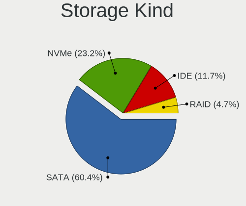

| Kind | Notebooks | Percent |
|------|-----------|---------|
| SATA | 605       | 59.78%  |
| NVMe | 243       | 24.01%  |
| IDE  | 114       | 11.26%  |
| RAID | 50        | 4.94%   |

Processor
---------

CPU Vendor
----------

Processor vendors

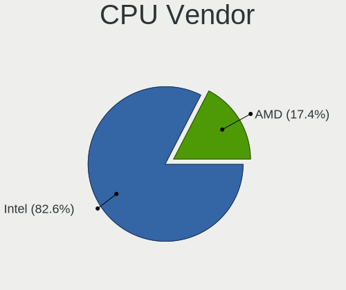

| Vendor | Notebooks | Percent |
|--------|-----------|---------|
| Intel  | 700       | 82.45%  |
| AMD    | 149       | 17.55%  |

CPU Model
---------

Processor models

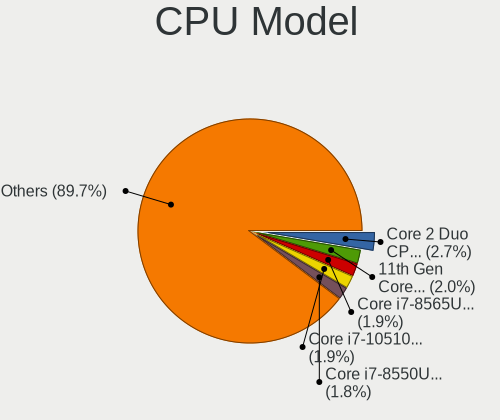

| Model                                         | Notebooks | Percent |
|-----------------------------------------------|-----------|---------|
| Intel Core 2 Duo CPU T8300 @ 2.40GHz          | 23        | 2.71%   |
| Intel Core i7-8565U CPU @ 1.80GHz             | 17        | 2%      |
| Intel Core i7-10510U CPU @ 1.80GHz            | 17        | 2%      |
| Intel 11th Gen Core i7-1165G7 @ 2.80GHz       | 17        | 2%      |
| Intel Core i7-8550U CPU @ 1.80GHz             | 15        | 1.77%   |
| Intel Core i7-8750H CPU @ 2.20GHz             | 12        | 1.41%   |
| Intel Pentium Dual-Core CPU T4300 @ 2.10GHz   | 11        | 1.3%    |
| Intel Core i7-6700HQ CPU @ 2.60GHz            | 11        | 1.3%    |
| Intel Core i5-8250U CPU @ 1.60GHz             | 11        | 1.3%    |
| Intel Celeron CPU N2840 @ 2.16GHz             | 11        | 1.3%    |
| AMD Ryzen 5 3500U with Radeon Vega Mobile Gfx | 11        | 1.3%    |
| AMD 3020e with Radeon Graphics                | 11        | 1.3%    |
| Intel Core i5-8265U CPU @ 1.60GHz             | 10        | 1.18%   |
| Intel Core i5-3320M CPU @ 2.60GHz             | 10        | 1.18%   |
| Intel 11th Gen Core i5-1135G7 @ 2.40GHz       | 10        | 1.18%   |
| AMD Ryzen 7 4800H with Radeon Graphics        | 10        | 1.18%   |
| Intel Core i7-9750H CPU @ 2.60GHz             | 9         | 1.06%   |
| Intel Core i7-2630QM CPU @ 2.00GHz            | 9         | 1.06%   |
| Intel Core i5-3210M CPU @ 2.50GHz             | 9         | 1.06%   |
| Intel Core i3-5005U CPU @ 2.00GHz             | 9         | 1.06%   |
| Intel Core i7-7500U CPU @ 2.70GHz             | 8         | 0.94%   |
| Intel Core i7-4510U CPU @ 2.00GHz             | 8         | 0.94%   |
| Intel Core i5 CPU M 480 @ 2.67GHz             | 8         | 0.94%   |
| Intel Core 2 Duo CPU P8700 @ 2.53GHz          | 8         | 0.94%   |
| Intel Pentium Dual CPU T2390 @ 1.86GHz        | 7         | 0.82%   |
| Intel Core i7-6500U CPU @ 2.50GHz             | 7         | 0.82%   |
| Intel Core i7-10750H CPU @ 2.60GHz            | 7         | 0.82%   |
| Intel Core i7 CPU Q 720 @ 1.60GHz             | 7         | 0.82%   |
| Intel Core i5-6200U CPU @ 2.30GHz             | 7         | 0.82%   |
| Intel Core i5-5200U CPU @ 2.20GHz             | 7         | 0.82%   |
| Intel Core i5-2520M CPU @ 2.50GHz             | 7         | 0.82%   |
| Intel Core i3-3217U CPU @ 1.80GHz             | 7         | 0.82%   |
| AMD Ryzen 7 5800H with Radeon Graphics        | 7         | 0.82%   |
| Intel Pentium Dual-Core CPU T4500 @ 2.30GHz   | 6         | 0.71%   |
| Intel Pentium Dual CPU T3400 @ 2.16GHz        | 6         | 0.71%   |
| Intel Core i5-3317U CPU @ 1.70GHz             | 6         | 0.71%   |
| Intel Core i5-2410M CPU @ 2.30GHz             | 6         | 0.71%   |
| Intel Core i3 CPU M 330 @ 2.13GHz             | 6         | 0.71%   |
| Intel Core 2 Duo CPU P8600 @ 2.40GHz          | 6         | 0.71%   |
| Intel Core 2 CPU T5600 @ 1.83GHz              | 6         | 0.71%   |

CPU Model Family
----------------

Processor model prefix

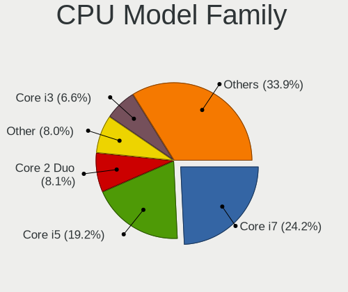

| Model                   | Notebooks | Percent |
|-------------------------|-----------|---------|
| Intel Core i7           | 207       | 24.38%  |
| Intel Core i5           | 167       | 19.67%  |
| Intel Core 2 Duo        | 73        | 8.6%    |
| Intel Core i3           | 56        | 6.6%    |
| Other                   | 53        | 6.24%   |
| Intel Celeron           | 36        | 4.24%   |
| AMD Ryzen 7             | 34        | 4%      |
| Intel Atom              | 32        | 3.77%   |
| AMD Ryzen 5             | 30        | 3.53%   |
| Intel Pentium Dual-Core | 24        | 2.83%   |
| Intel Pentium Dual      | 23        | 2.71%   |
| Intel Pentium           | 14        | 1.65%   |
| Intel Genuine           | 13        | 1.53%   |
| AMD A4                  | 11        | 1.3%    |
| Intel Core 2            | 9         | 1.06%   |
| AMD A8                  | 8         | 0.94%   |
| AMD A6                  | 8         | 0.94%   |
| AMD E2                  | 7         | 0.82%   |
| AMD Ryzen 9             | 6         | 0.71%   |
| AMD Ryzen 3             | 6         | 0.71%   |
| Intel Pentium M         | 5         | 0.59%   |
| AMD A10                 | 4         | 0.47%   |
| AMD E                   | 3         | 0.35%   |
| AMD Athlon              | 3         | 0.35%   |
| AMD Ryzen 7 PRO         | 2         | 0.24%   |
| AMD Mobile Sempron      | 2         | 0.24%   |
| AMD E1                  | 2         | 0.24%   |
| Intel Core m3           | 1         | 0.12%   |
| Intel Core i9           | 1         | 0.12%   |
| Intel Celeron M         | 1         | 0.12%   |
| Intel Celeron Dual-Core | 1         | 0.12%   |
| AMD Turion 64 X2 Mobile | 1         | 0.12%   |
| AMD Turion              | 1         | 0.12%   |
| AMD Ryzen 5 PRO         | 1         | 0.12%   |
| AMD Quad-Core           | 1         | 0.12%   |
| AMD Phenom II           | 1         | 0.12%   |
| AMD FX                  | 1         | 0.12%   |
| AMD Athlon 64 X2        | 1         | 0.12%   |

CPU Cores
---------

Number of processor cores

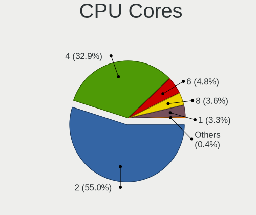

| Number | Notebooks | Percent |
|--------|-----------|---------|
| 2      | 458       | 53.95%  |
| 4      | 271       | 31.92%  |
| 6      | 48        | 5.65%   |
| 8      | 37        | 4.36%   |
| 1      | 27        | 3.18%   |
| 12     | 4         | 0.47%   |
| 14     | 2         | 0.24%   |
| 10     | 1         | 0.12%   |
| 3      | 1         | 0.12%   |

CPU Sockets
-----------

Number of sockets

| Number | Notebooks | Percent |
|--------|-----------|---------|
| 1      | 849       | 100%    |

CPU Threads
-----------

Threads per core (Hyper-Threading)

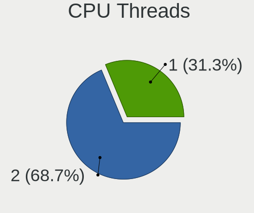

| Number | Notebooks | Percent |
|--------|-----------|---------|
| 2      | 560       | 65.96%  |
| 1      | 289       | 34.04%  |

CPU Op-Modes
------------

CPU Operation Modes (32-bit, 64-bit)

| Op mode        | Notebooks | Percent |
|----------------|-----------|---------|
| 32-bit, 64-bit | 801       | 94.01%  |
| Unknown        | 29        | 3.4%    |
| 32-bit         | 19        | 2.23%   |
| 64-bit         | 3         | 0.35%   |

CPU Microcode
-------------

Microcode number

| Number     | Notebooks | Percent |
|------------|-----------|---------|
| Unknown    | 182       | 20.78%  |
| 0x306a9    | 48        | 5.48%   |
| 0x206a7    | 46        | 5.25%   |
| 0x1067a    | 41        | 4.68%   |
| 0x10676    | 34        | 3.88%   |
| 0x806ec    | 33        | 3.77%   |
| 0x6fd      | 30        | 3.42%   |
| 0x806ea    | 27        | 3.08%   |
| 0x906ea    | 26        | 2.97%   |
| 0x40651    | 24        | 2.74%   |
| 0x806c1    | 23        | 2.63%   |
| 0x306d4    | 20        | 2.28%   |
| 0x20655    | 17        | 1.94%   |
| 0x806eb    | 16        | 1.83%   |
| 0x406e3    | 16        | 1.83%   |
| 0x20652    | 15        | 1.71%   |
| 0x806e9    | 14        | 1.6%    |
| 0x506e3    | 13        | 1.48%   |
| 0x306c3    | 13        | 1.48%   |
| 0x30678    | 13        | 1.48%   |
| 0x08200103 | 11        | 1.26%   |
| 0x08108109 | 11        | 1.26%   |
| 0x406c3    | 10        | 1.14%   |
| 0xa0652    | 9         | 1.03%   |
| 0x0a50000c | 9         | 1.03%   |
| 0x406c4    | 8         | 0.91%   |
| 0x106ca    | 8         | 0.91%   |
| 0x08108102 | 8         | 0.91%   |
| 0x6f6      | 7         | 0.8%    |
| 0x07030105 | 7         | 0.8%    |
| 0x6d8      | 6         | 0.68%   |
| 0x106e5    | 6         | 0.68%   |
| 0x08600104 | 6         | 0.68%   |
| 0x08600103 | 6         | 0.68%   |
| 0x06006704 | 6         | 0.68%   |
| 0x906e9    | 5         | 0.57%   |
| 0x08600106 | 5         | 0.57%   |
| 0x0810100b | 5         | 0.57%   |
| 0x0700010f | 5         | 0.57%   |
| 0x906a3    | 4         | 0.46%   |

CPU Microarch
-------------

Microarchitecture

| Name             | Notebooks | Percent |
|------------------|-----------|---------|
| KabyLake         | 139       | 16.37%  |
| Penryn           | 86        | 10.13%  |
| IvyBridge        | 60        | 7.07%   |
| SandyBridge      | 57        | 6.71%   |
| Haswell          | 54        | 6.36%   |
| Core             | 53        | 6.24%   |
| Westmere         | 42        | 4.95%   |
| Silvermont       | 42        | 4.95%   |
| Skylake          | 40        | 4.71%   |
| TigerLake        | 30        | 3.53%   |
| Broadwell        | 28        | 3.3%    |
| Zen+             | 22        | 2.59%   |
| Zen 2            | 22        | 2.59%   |
| Zen 3            | 20        | 2.36%   |
| Zen              | 19        | 2.24%   |
| Bonnell          | 15        | 1.77%   |
| Puma             | 14        | 1.65%   |
| P6               | 13        | 1.53%   |
| Excavator        | 13        | 1.53%   |
| CometLake        | 13        | 1.53%   |
| Jaguar           | 8         | 0.94%   |
| Unknown          | 8         | 0.94%   |
| Nehalem          | 7         | 0.82%   |
| IceLake          | 6         | 0.71%   |
| Steamroller      | 5         | 0.59%   |
| Goldmont plus    | 5         | 0.59%   |
| Bobcat           | 5         | 0.59%   |
| Alderlake Hybrid | 5         | 0.59%   |
| K8 Hammer        | 4         | 0.47%   |
| K8 & K10 hybrid  | 4         | 0.47%   |
| Piledriver       | 3         | 0.35%   |
| Goldmont         | 3         | 0.35%   |
| K10 Llano        | 2         | 0.24%   |
| Tremont          | 1         | 0.12%   |
| K10              | 1         | 0.12%   |

Graphics
--------

GPU Vendor
----------

Vendors of graphics cards

| Vendor                           | Notebooks | Percent |
|----------------------------------|-----------|---------|
| Intel                            | 556       | 49.91%  |
| Nvidia                           | 320       | 28.73%  |
| AMD                              | 229       | 20.56%  |
| Silicon Integrated Systems [SiS] | 9         | 0.81%   |

GPU Model
---------

Graphics card models

| Model                                                                                    | Notebooks | Percent |
|------------------------------------------------------------------------------------------|-----------|---------|
| Intel 3rd Gen Core processor Graphics Controller                                         | 60        | 5.15%   |
| Intel 2nd Generation Core Processor Family Integrated Graphics Controller                | 43        | 3.69%   |
| Intel Haswell-ULT Integrated Graphics Controller                                         | 34        | 2.92%   |
| AMD Picasso/Raven 2 [Radeon Vega Series / Radeon Vega Mobile Series]                     | 33        | 2.83%   |
| Intel WhiskeyLake-U GT2 [UHD Graphics 620]                                               | 32        | 2.74%   |
| Intel UHD Graphics 620                                                                   | 30        | 2.57%   |
| Intel TigerLake-LP GT2 [Iris Xe Graphics]                                                | 29        | 2.49%   |
| Intel Mobile 4 Series Chipset Integrated Graphics Controller                             | 25        | 2.14%   |
| Intel Core Processor Integrated Graphics Controller                                      | 24        | 2.06%   |
| Intel CometLake-U GT2 [UHD Graphics]                                                     | 24        | 2.06%   |
| Intel Mobile GM965/GL960 Integrated Graphics Controller (secondary)                      | 23        | 1.97%   |
| Intel Mobile GM965/GL960 Integrated Graphics Controller (primary)                        | 23        | 1.97%   |
| Intel HD Graphics 5500                                                                   | 23        | 1.97%   |
| Intel CoffeeLake-H GT2 [UHD Graphics 630]                                                | 23        | 1.97%   |
| Intel Atom/Celeron/Pentium Processor x5-E8000/J3xxx/N3xxx Integrated Graphics Controller | 23        | 1.97%   |
| Intel Skylake GT2 [HD Graphics 520]                                                      | 22        | 1.89%   |
| Nvidia G86M [GeForce 8600M GS]                                                           | 20        | 1.72%   |
| AMD Renoir                                                                               | 20        | 1.72%   |
| Intel Atom Processor Z36xxx/Z37xxx Series Graphics & Display                             | 19        | 1.63%   |
| Intel 4th Gen Core Processor Integrated Graphics Controller                              | 18        | 1.54%   |
| Intel HD Graphics 620                                                                    | 16        | 1.37%   |
| AMD Park [Mobility Radeon HD 5430/5450/5470]                                             | 15        | 1.29%   |
| AMD Cezanne [Radeon Vega Series / Radeon Vega Mobile Series]                             | 15        | 1.29%   |
| Nvidia GF117M [GeForce 610M/710M/810M/820M / GT 620M/625M/630M/720M]                     | 13        | 1.11%   |
| Intel HD Graphics 530                                                                    | 13        | 1.11%   |
| Nvidia GP108M [GeForce MX150]                                                            | 12        | 1.03%   |
| Nvidia GP107M [GeForce GTX 1050 Mobile]                                                  | 12        | 1.03%   |
| AMD Stoney [Radeon R2/R3/R4/R5 Graphics]                                                 | 11        | 0.94%   |
| Nvidia TU117M [GeForce GTX 1650 Mobile / Max-Q]                                          | 10        | 0.86%   |
| Nvidia GP108M [GeForce MX250]                                                            | 10        | 0.86%   |
| Nvidia GK208BM [GeForce 920M]                                                            | 10        | 0.86%   |
| Intel CometLake-H GT2 [UHD Graphics]                                                     | 10        | 0.86%   |
| AMD Sun XT [Radeon HD 8670A/8670M/8690M / R5 M330 / M430 / Radeon 520 Mobile]            | 10        | 0.86%   |
| Nvidia GK208M [GeForce GT 740M]                                                          | 9         | 0.77%   |
| Intel Mobile 945GM/GMS/GME, 943/940GML Express Integrated Graphics Controller            | 9         | 0.77%   |
| AMD Mullins [Radeon R4/R5 Graphics]                                                      | 9         | 0.77%   |
| Silicon Integrated Systems [SiS] 771/671 PCIE VGA Display Adapter                        | 8         | 0.69%   |
| Intel Atom Processor D4xx/D5xx/N4xx/N5xx Integrated Graphics Controller                  | 8         | 0.69%   |
| AMD Thames [Radeon HD 7500M/7600M Series]                                                | 8         | 0.69%   |
| AMD Raven Ridge [Radeon Vega Series / Radeon Vega Mobile Series]                         | 8         | 0.69%   |

GPU Combo
---------

Combinations of graphics cards

| Name           | Notebooks | Percent |
|----------------|-----------|---------|
| 1 x Intel      | 316       | 37.18%  |
| Intel + Nvidia | 197       | 23.18%  |
| 1 x AMD        | 143       | 16.82%  |
| 1 x Nvidia     | 98        | 11.53%  |
| Intel + AMD    | 43        | 5.06%   |
| AMD + Nvidia   | 25        | 2.94%   |
| 2 x AMD        | 19        | 2.24%   |
| 1 x SiS        | 9         | 1.06%   |

GPU Driver
----------

Free vs proprietary

| Driver      | Notebooks | Percent |
|-------------|-----------|---------|
| Free        | 696       | 80.65%  |
| Proprietary | 138       | 15.99%  |
| Unknown     | 29        | 3.36%   |

GPU Memory
----------

Total video memory

| Size in GB | Notebooks | Percent |
|------------|-----------|---------|
| Unknown    | 459       | 52.76%  |
| 0.01-0.5   | 156       | 17.93%  |
| 1.01-2.0   | 124       | 14.25%  |
| 0.51-1.0   | 67        | 7.7%    |
| 3.01-4.0   | 39        | 4.48%   |
| 5.01-6.0   | 16        | 1.84%   |
| 7.01-8.0   | 7         | 0.8%    |
| 2.01-3.0   | 2         | 0.23%   |

Monitor
-------

Monitor Vendor
--------------

Monitor vendors

| Vendor                  | Notebooks | Percent |
|-------------------------|-----------|---------|
| AU Optronics            | 188       | 20.59%  |
| Chimei Innolux          | 127       | 13.91%  |
| LG Display              | 114       | 12.49%  |
| BOE                     | 95        | 10.41%  |
| Samsung Electronics     | 90        | 9.86%   |
| Goldstar                | 32        | 3.5%    |
| Chi Mei Optoelectronics | 29        | 3.18%   |
| Apple                   | 22        | 2.41%   |
| LG Philips              | 20        | 2.19%   |
| PANDA                   | 17        | 1.86%   |
| Lenovo                  | 17        | 1.86%   |
| Dell                    | 17        | 1.86%   |
| Ancor Communications    | 16        | 1.75%   |
| Hewlett-Packard         | 15        | 1.64%   |
| Sharp                   | 11        | 1.2%    |
| AOC                     | 10        | 1.1%    |
| Philips                 | 9         | 0.99%   |
| BenQ                    | 8         | 0.88%   |
| CPT                     | 7         | 0.77%   |
| Sony                    | 5         | 0.55%   |
| Seiko/Epson             | 5         | 0.55%   |
| InfoVision              | 5         | 0.55%   |
| Acer                    | 5         | 0.55%   |
| MSI                     | 4         | 0.44%   |
| ASUSTek Computer        | 4         | 0.44%   |
| Toshiba                 | 3         | 0.33%   |
| LGD                     | 3         | 0.33%   |
| LG Electronics          | 3         | 0.33%   |
| HannStar                | 3         | 0.33%   |
| CSO                     | 3         | 0.33%   |
| ViewSonic               | 2         | 0.22%   |
| Unknown                 | 2         | 0.22%   |
| Panasonic               | 2         | 0.22%   |
| HUAWEI                  | 2         | 0.22%   |
| CVT                     | 2         | 0.22%   |
| RTK                     | 1         | 0.11%   |
| Plain Tree Systems      | 1         | 0.11%   |
| Nvidia                  | 1         | 0.11%   |
| Mi                      | 1         | 0.11%   |
| Lenovo Group Limited    | 1         | 0.11%   |

Monitor Model
-------------

Monitor models

| Model                                                                    | Notebooks | Percent |
|--------------------------------------------------------------------------|-----------|---------|
| AU Optronics LCD Monitor AUO723C 1366x768 309x173mm 13.9-inch            | 11        | 1.19%   |
| AU Optronics LCD Monitor AUO403D 1920x1080 309x173mm 13.9-inch           | 11        | 1.19%   |
| Chimei Innolux LCD Monitor CMN15CA 1366x768 344x193mm 15.5-inch          | 9         | 0.97%   |
| AU Optronics LCD Monitor AUO22EC 1366x768 344x193mm 15.5-inch            | 9         | 0.97%   |
| Chimei Innolux LCD Monitor CMN15DB 1366x768 344x193mm 15.5-inch          | 8         | 0.86%   |
| Chimei Innolux LCD Monitor CMN15F5 1920x1080 344x193mm 15.5-inch         | 6         | 0.65%   |
| Chimei Innolux LCD Monitor CMN15BF 1366x768 344x193mm 15.5-inch          | 6         | 0.65%   |
| Chimei Innolux LCD Monitor CMN14D5 1920x1080 309x173mm 13.9-inch         | 6         | 0.65%   |
| BOE LCD Monitor BOE0704 1366x768 344x194mm 15.5-inch                     | 6         | 0.65%   |
| AU Optronics LCD Monitor AUO61ED 1920x1080 344x194mm 15.5-inch           | 6         | 0.65%   |
| Samsung Electronics LCD Monitor SEC5541 1366x768 344x193mm 15.5-inch     | 5         | 0.54%   |
| Samsung Electronics LCD Monitor SEC5441 1366x768 344x194mm 15.5-inch     | 5         | 0.54%   |
| LG Philips LCD Monitor LPLDD00 1280x800 331x207mm 15.4-inch              | 5         | 0.54%   |
| LG Display LCD Monitor LGD045D 1366x768 345x194mm 15.6-inch              | 5         | 0.54%   |
| Chimei Innolux LCD Monitor CMN15E7 1920x1080 344x193mm 15.5-inch         | 5         | 0.54%   |
| Chimei Innolux LCD Monitor CMN15E6 1366x768 344x193mm 15.5-inch          | 5         | 0.54%   |
| Chi Mei Optoelectronics LCD Monitor CMO1592 1366x768 344x193mm 15.5-inch | 5         | 0.54%   |
| AU Optronics LCD Monitor AUO8174 1280x800 331x207mm 15.4-inch            | 5         | 0.54%   |
| AU Optronics LCD Monitor AUO5B2D 1920x1080 293x162mm 13.2-inch           | 5         | 0.54%   |
| AU Optronics LCD Monitor AUO21ED 1920x1080 344x193mm 15.5-inch           | 5         | 0.54%   |
| AU Optronics LCD Monitor AUO21EC 1366x768 344x193mm 15.5-inch            | 5         | 0.54%   |
| Samsung Electronics LCD Monitor SEC544B 1600x900 382x214mm 17.2-inch     | 4         | 0.43%   |
| Samsung Electronics LCD Monitor SEC3945 1280x800 331x207mm 15.4-inch     | 4         | 0.43%   |
| LG Display LCD Monitor LGD0456 1366x768 344x194mm 15.5-inch              | 4         | 0.43%   |
| LG Display LCD Monitor LGD039F 1366x768 345x194mm 15.6-inch              | 4         | 0.43%   |
| Chimei Innolux LCD Monitor CMN15C9 1366x768 344x193mm 15.5-inch          | 4         | 0.43%   |
| Chimei Innolux LCD Monitor CMN15B7 1366x768 344x193mm 15.5-inch          | 4         | 0.43%   |
| Chimei Innolux LCD Monitor CMN15AB 1366x768 344x194mm 15.5-inch          | 4         | 0.43%   |
| Chimei Innolux LCD Monitor CMN1493 1366x768 309x173mm 13.9-inch          | 4         | 0.43%   |
| Chi Mei Optoelectronics LCD Monitor CMO15A7 1366x768 344x193mm 15.5-inch | 4         | 0.43%   |
| BOE LCD Monitor BOE0872 1920x1080 344x194mm 15.5-inch                    | 4         | 0.43%   |
| BOE LCD Monitor BOE07F1 1920x1080 344x193mm 15.5-inch                    | 4         | 0.43%   |
| BOE LCD Monitor BOE06A5 1366x768 344x194mm 15.5-inch                     | 4         | 0.43%   |
| AU Optronics LCD Monitor AUOD1ED 1920x1080 344x193mm 15.5-inch           | 4         | 0.43%   |
| AU Optronics LCD Monitor AUO40EC 1366x768 344x193mm 15.5-inch            | 4         | 0.43%   |
| AU Optronics LCD Monitor AUO38ED 1920x1080 344x193mm 15.5-inch           | 4         | 0.43%   |
| Sony NvidiaDefault SNY05FA 1366x768 290x170mm 13.2-inch                  | 3         | 0.32%   |
| Samsung Electronics LCD Monitor SEC3030 1024x600 223x125mm 10.1-inch     | 3         | 0.32%   |
| PANDA LCD Monitor NCP004D 1920x1080 344x194mm 15.5-inch                  | 3         | 0.32%   |
| LG Philips LP154WX4-TLC8 LPL0120 1280x800 331x207mm 15.4-inch            | 3         | 0.32%   |

Monitor Resolution
------------------

Monitor screen resolution

| Resolution         | Notebooks | Percent |
|--------------------|-----------|---------|
| 1366x768 (WXGA)    | 312       | 36.92%  |
| 1920x1080 (FHD)    | 306       | 36.21%  |
| 1280x800 (WXGA)    | 58        | 6.86%   |
| 1600x900 (HD+)     | 28        | 3.31%   |
| 3840x2160 (4K)     | 27        | 3.2%    |
| 1440x900 (WXGA+)   | 16        | 1.89%   |
| 1280x1024 (SXGA)   | 12        | 1.42%   |
| 2560x1440 (QHD)    | 11        | 1.3%    |
| 1680x1050 (WSXGA+) | 11        | 1.3%    |
| 1920x1200 (WUXGA)  | 7         | 0.83%   |
| 2560x1080          | 6         | 0.71%   |
| 1024x600           | 6         | 0.71%   |
| 3440x1440          | 5         | 0.59%   |
| 2160x1440          | 5         | 0.59%   |
| 1360x768           | 5         | 0.59%   |
| 2880x1800          | 4         | 0.47%   |
| 2560x1600          | 4         | 0.47%   |
| 1024x768 (XGA)     | 4         | 0.47%   |
| Unknown            | 4         | 0.47%   |
| 3200x1800 (QHD+)   | 2         | 0.24%   |
| 1400x1050          | 2         | 0.24%   |
| 640x480            | 1         | 0.12%   |
| 3840x2400          | 1         | 0.12%   |
| 3840x1080          | 1         | 0.12%   |
| 3520x1080          | 1         | 0.12%   |
| 3280x1080          | 1         | 0.12%   |
| 3000x2000          | 1         | 0.12%   |
| 2726x768           | 1         | 0.12%   |
| 2288x1287          | 1         | 0.12%   |
| 2240x1400          | 1         | 0.12%   |
| 1600x1200          | 1         | 0.12%   |

Monitor Diagonal
----------------

Diagonal size in inches

| Inches  | Notebooks | Percent |
|---------|-----------|---------|
| 15      | 435       | 47.75%  |
| 14      | 109       | 11.96%  |
| 13      | 101       | 11.09%  |
| 17      | 47        | 5.16%   |
| 24      | 30        | 3.29%   |
| 21      | 27        | 2.96%   |
| 27      | 25        | 2.74%   |
| Unknown | 22        | 2.41%   |
| 23      | 21        | 2.31%   |
| 12      | 18        | 1.98%   |
| 11      | 14        | 1.54%   |
| 34      | 12        | 1.32%   |
| 10      | 9         | 0.99%   |
| 22      | 7         | 0.77%   |
| 19      | 6         | 0.66%   |
| 16      | 5         | 0.55%   |
| 31      | 4         | 0.44%   |
| 18      | 4         | 0.44%   |
| 20      | 3         | 0.33%   |
| 84      | 2         | 0.22%   |
| 72      | 2         | 0.22%   |
| 40      | 2         | 0.22%   |
| 26      | 2         | 0.22%   |
| 25      | 2         | 0.22%   |
| 54      | 1         | 0.11%   |
| 8       | 1         | 0.11%   |

Monitor Width
-------------

Physical width

| Width in mm | Notebooks | Percent |
|-------------|-----------|---------|
| 301-350     | 588       | 65.48%  |
| 201-300     | 92        | 10.24%  |
| 501-600     | 72        | 8.02%   |
| 351-400     | 52        | 5.79%   |
| 401-500     | 45        | 5.01%   |
| Unknown     | 22        | 2.45%   |
| 701-800     | 12        | 1.34%   |
| 601-700     | 7         | 0.78%   |
| 1501-2000   | 4         | 0.45%   |
| 801-900     | 2         | 0.22%   |
| 101-200     | 1         | 0.11%   |
| 1001-1500   | 1         | 0.11%   |

Aspect Ratio
------------

Proportional relationship between the width and the height

| Ratio   | Notebooks | Percent |
|---------|-----------|---------|
| 16/9    | 646       | 80.15%  |
| 16/10   | 102       | 12.66%  |
| Unknown | 20        | 2.48%   |
| 5/4     | 11        | 1.36%   |
| 21/9    | 11        | 1.36%   |
| 4/3     | 8         | 0.99%   |
| 3/2     | 8         | 0.99%   |

Monitor Area
------------

Area in inch²

| Area in inch² | Notebooks | Percent |
|----------------|-----------|---------|
| 101-110        | 435       | 47.85%  |
| 81-90          | 169       | 18.59%  |
| 201-250        | 71        | 7.81%   |
| 71-80          | 40        | 4.4%    |
| 121-130        | 29        | 3.19%   |
| 301-350        | 26        | 2.86%   |
| Unknown        | 22        | 2.42%   |
| 61-70          | 18        | 1.98%   |
| 351-500        | 15        | 1.65%   |
| 151-200        | 15        | 1.65%   |
| 51-60          | 14        | 1.54%   |
| 141-150        | 13        | 1.43%   |
| 251-300        | 10        | 1.1%    |
| 41-50          | 9         | 0.99%   |
| 131-140        | 8         | 0.88%   |
| More than 1000 | 5         | 0.55%   |
| 91-100         | 4         | 0.44%   |
| 501-1000       | 3         | 0.33%   |
| 111-120        | 2         | 0.22%   |
| 1-40           | 1         | 0.11%   |

Pixel Density
-------------

Pixels per inch

| Density       | Notebooks | Percent |
|---------------|-----------|---------|
| 101-120       | 323       | 36.5%   |
| 121-160       | 301       | 34.01%  |
| 51-100        | 180       | 20.34%  |
| 161-240       | 41        | 4.63%   |
| Unknown       | 22        | 2.49%   |
| More than 240 | 15        | 1.69%   |
| 1-50          | 3         | 0.34%   |

Multiple Monitors
-----------------

Total monitors connected

| Total | Notebooks | Percent |
|-------|-----------|---------|
| 1     | 684       | 78.71%  |
| 2     | 128       | 14.73%  |
| 0     | 39        | 4.49%   |
| 3     | 15        | 1.73%   |
| 4     | 3         | 0.35%   |

Network
-------

Net Controller Vendor
---------------------

Controller vendors

| Vendor                            | Notebooks | Percent |
|-----------------------------------|-----------|---------|
| Realtek Semiconductor             | 445       | 32.53%  |
| Intel                             | 379       | 27.7%   |
| Qualcomm Atheros                  | 249       | 18.2%   |
| Broadcom                          | 103       | 7.53%   |
| Marvell Technology Group          | 43        | 3.14%   |
| TP-Link                           | 24        | 1.75%   |
| Broadcom Limited                  | 17        | 1.24%   |
| MediaTek                          | 13        | 0.95%   |
| Silicon Integrated Systems [SiS]  | 12        | 0.88%   |
| Ralink                            | 12        | 0.88%   |
| Nvidia                            | 8         | 0.58%   |
| Sierra Wireless                   | 4         | 0.29%   |
| Ralink Technology                 | 4         | 0.29%   |
| JMicron Technology                | 4         | 0.29%   |
| Ericsson Business Mobile Networks | 4         | 0.29%   |
| D-Link                            | 4         | 0.29%   |
| Attansic Technology               | 4         | 0.29%   |
| ASIX Electronics                  | 4         | 0.29%   |
| ICS Advent                        | 3         | 0.22%   |
| Hewlett-Packard                   | 3         | 0.22%   |
| DisplayLink                       | 3         | 0.22%   |
| ASUSTek Computer                  | 3         | 0.22%   |
| Samsung Electronics               | 2         | 0.15%   |
| Qualcomm Atheros Communications   | 2         | 0.15%   |
| Lenovo                            | 2         | 0.15%   |
| Huawei Technologies               | 2         | 0.15%   |
| Fibocom                           | 2         | 0.15%   |
| Xiaomi                            | 1         | 0.07%   |
| TRENDnet                          | 1         | 0.07%   |
| Toshiba                           | 1         | 0.07%   |
| T & A Mobile Phones               | 1         | 0.07%   |
| SparkFun                          | 1         | 0.07%   |
| Qualcomm                          | 1         | 0.07%   |
| Micro Star International          | 1         | 0.07%   |
| LSI                               | 1         | 0.07%   |
| GrupoPIE PORTUGAL                 | 1         | 0.07%   |
| Dell                              | 1         | 0.07%   |
| Belkin Components                 | 1         | 0.07%   |
| Archos                            | 1         | 0.07%   |
| Allwinner Technology              | 1         | 0.07%   |

Net Controller Model
--------------------

Controller models

| Model                                                                   | Notebooks | Percent |
|-------------------------------------------------------------------------|-----------|---------|
| Realtek RTL8111/8168/8411 PCI Express Gigabit Ethernet Controller       | 272       | 16.95%  |
| Realtek RTL810xE PCI Express Fast Ethernet controller                   | 103       | 6.42%   |
| Qualcomm Atheros QCA9565 / AR9565 Wireless Network Adapter              | 49        | 3.05%   |
| Qualcomm Atheros AR9285 Wireless Network Adapter (PCI-Express)          | 44        | 2.74%   |
| Qualcomm Atheros QCA9377 802.11ac Wireless Network Adapter              | 35        | 2.18%   |
| Intel Wi-Fi 6 AX200                                                     | 33        | 2.06%   |
| Intel PRO/Wireless 4965 AG or AGN [Kedron] Network Connection           | 28        | 1.74%   |
| Qualcomm Atheros AR9485 Wireless Network Adapter                        | 26        | 1.62%   |
| Realtek RTL8153 Gigabit Ethernet Adapter                                | 25        | 1.56%   |
| Marvell Group 88E8036 PCI-E Fast Ethernet Controller                    | 25        | 1.56%   |
| Qualcomm Atheros AR242x / AR542x Wireless Network Adapter (PCI-Express) | 24        | 1.5%    |
| Intel Wireless 8265 / 8275                                              | 24        | 1.5%    |
| Broadcom BCM43142 802.11b/g/n                                           | 24        | 1.5%    |
| Qualcomm Atheros QCA6174 802.11ac Wireless Network Adapter              | 22        | 1.37%   |
| Intel Cannon Point-LP CNVi [Wireless-AC]                                | 22        | 1.37%   |
| Broadcom BCM4313 802.11bgn Wireless Network Adapter                     | 21        | 1.31%   |
| Intel Wireless 7260                                                     | 20        | 1.25%   |
| Intel Wi-Fi 6 AX201                                                     | 20        | 1.25%   |
| Realtek RTL8821CE 802.11ac PCIe Wireless Network Adapter                | 19        | 1.18%   |
| Intel PRO/Wireless 3945ABG [Golan] Network Connection                   | 19        | 1.18%   |
| Realtek RTL8723BE PCIe Wireless Network Adapter                         | 18        | 1.12%   |
| TP-Link UE300 10/100/1000 LAN (ethernet mode) [Realtek RTL8153]         | 17        | 1.06%   |
| Intel Comet Lake PCH-LP CNVi WiFi                                       | 17        | 1.06%   |
| Intel Cannon Lake PCH CNVi WiFi                                         | 17        | 1.06%   |
| Intel 82579LM Gigabit Network Connection (Lewisville)                   | 17        | 1.06%   |
| Realtek RTL8822CE 802.11ac PCIe Wireless Network Adapter                | 16        | 1%      |
| Intel Wireless 7265                                                     | 16        | 1%      |
| Intel Centrino Advanced-N 6205 [Taylor Peak]                            | 16        | 1%      |
| Realtek RTL8852AE 802.11ax PCIe Wireless Network Adapter                | 13        | 0.81%   |
| Intel Wireless 8260                                                     | 13        | 0.81%   |
| Intel Wireless 3165                                                     | 12        | 0.75%   |
| Silicon Integrated Systems [SiS] 191 Gigabit Ethernet Adapter           | 11        | 0.69%   |
| Qualcomm Atheros AR928X Wireless Network Adapter (PCI-Express)          | 11        | 0.69%   |
| MediaTek MT7921 802.11ax PCI Express Wireless Network Adapter           | 11        | 0.69%   |
| Intel Wireless 3160                                                     | 11        | 0.69%   |
| Realtek RTL8191SEvB Wireless LAN Controller                             | 10        | 0.62%   |
| Intel WiFi Link 5100                                                    | 10        | 0.62%   |
| Intel PRO/Wireless 5100 AGN [Shiloh] Network Connection                 | 10        | 0.62%   |
| Intel Comet Lake PCH CNVi WiFi                                          | 10        | 0.62%   |
| Realtek RTL8188EUS 802.11n Wireless Network Adapter                     | 9         | 0.56%   |

Wireless Vendor
---------------

Wireless vendors

| Vendor                          | Notebooks | Percent |
|---------------------------------|-----------|---------|
| Intel                           | 367       | 42.72%  |
| Qualcomm Atheros                | 218       | 25.38%  |
| Realtek Semiconductor           | 125       | 14.55%  |
| Broadcom                        | 82        | 9.55%   |
| Ralink                          | 12        | 1.4%    |
| MediaTek                        | 12        | 1.4%    |
| Broadcom Limited                | 12        | 1.4%    |
| TP-Link                         | 8         | 0.93%   |
| Sierra Wireless                 | 4         | 0.47%   |
| Ralink Technology               | 4         | 0.47%   |
| D-Link                          | 4         | 0.47%   |
| ASUSTek Computer                | 3         | 0.35%   |
| Qualcomm Atheros Communications | 2         | 0.23%   |
| Fibocom                         | 2         | 0.23%   |
| TRENDnet                        | 1         | 0.12%   |
| Micro Star International        | 1         | 0.12%   |
| Dell                            | 1         | 0.12%   |
| Belkin Components               | 1         | 0.12%   |

Wireless Model
--------------

Wireless models

| Model                                                                   | Notebooks | Percent |
|-------------------------------------------------------------------------|-----------|---------|
| Qualcomm Atheros QCA9565 / AR9565 Wireless Network Adapter              | 49        | 5.7%    |
| Qualcomm Atheros AR9285 Wireless Network Adapter (PCI-Express)          | 44        | 5.12%   |
| Qualcomm Atheros QCA9377 802.11ac Wireless Network Adapter              | 35        | 4.07%   |
| Intel Wi-Fi 6 AX200                                                     | 33        | 3.84%   |
| Intel PRO/Wireless 4965 AG or AGN [Kedron] Network Connection           | 28        | 3.26%   |
| Qualcomm Atheros AR9485 Wireless Network Adapter                        | 26        | 3.03%   |
| Qualcomm Atheros AR242x / AR542x Wireless Network Adapter (PCI-Express) | 24        | 2.79%   |
| Intel Wireless 8265 / 8275                                              | 24        | 2.79%   |
| Broadcom BCM43142 802.11b/g/n                                           | 24        | 2.79%   |
| Qualcomm Atheros QCA6174 802.11ac Wireless Network Adapter              | 22        | 2.56%   |
| Intel Cannon Point-LP CNVi [Wireless-AC]                                | 22        | 2.56%   |
| Broadcom BCM4313 802.11bgn Wireless Network Adapter                     | 21        | 2.44%   |
| Intel Wireless 7260                                                     | 20        | 2.33%   |
| Intel Wi-Fi 6 AX201                                                     | 20        | 2.33%   |
| Realtek RTL8821CE 802.11ac PCIe Wireless Network Adapter                | 19        | 2.21%   |
| Intel PRO/Wireless 3945ABG [Golan] Network Connection                   | 19        | 2.21%   |
| Realtek RTL8723BE PCIe Wireless Network Adapter                         | 18        | 2.1%    |
| Intel Comet Lake PCH-LP CNVi WiFi                                       | 17        | 1.98%   |
| Intel Cannon Lake PCH CNVi WiFi                                         | 17        | 1.98%   |
| Realtek RTL8822CE 802.11ac PCIe Wireless Network Adapter                | 16        | 1.86%   |
| Intel Wireless 7265                                                     | 16        | 1.86%   |
| Intel Centrino Advanced-N 6205 [Taylor Peak]                            | 16        | 1.86%   |
| Realtek RTL8852AE 802.11ax PCIe Wireless Network Adapter                | 13        | 1.51%   |
| Intel Wireless 8260                                                     | 13        | 1.51%   |
| Intel Wireless 3165                                                     | 12        | 1.4%    |
| Qualcomm Atheros AR928X Wireless Network Adapter (PCI-Express)          | 11        | 1.28%   |
| MediaTek MT7921 802.11ax PCI Express Wireless Network Adapter           | 11        | 1.28%   |
| Intel Wireless 3160                                                     | 11        | 1.28%   |
| Realtek RTL8191SEvB Wireless LAN Controller                             | 10        | 1.16%   |
| Intel WiFi Link 5100                                                    | 10        | 1.16%   |
| Intel PRO/Wireless 5100 AGN [Shiloh] Network Connection                 | 10        | 1.16%   |
| Intel Comet Lake PCH CNVi WiFi                                          | 10        | 1.16%   |
| Realtek RTL8188EUS 802.11n Wireless Network Adapter                     | 9         | 1.05%   |
| Intel Centrino Wireless-N 1000 [Condor Peak]                            | 8         | 0.93%   |
| Intel Centrino Advanced-N 6235                                          | 8         | 0.93%   |
| Intel Wireless-AC 9260                                                  | 7         | 0.81%   |
| Intel Centrino Ultimate-N 6300                                          | 7         | 0.81%   |
| Realtek RTL8822BE 802.11a/b/g/n/ac WiFi adapter                         | 6         | 0.7%    |
| Intel Dual Band Wireless-AC 3165 Plus Bluetooth                         | 6         | 0.7%    |
| Broadcom BCM43224 802.11a/b/g/n                                         | 6         | 0.7%    |

Ethernet Vendor
---------------

Ethernet vendors

| Vendor                           | Notebooks | Percent |
|----------------------------------|-----------|---------|
| Realtek Semiconductor            | 409       | 56.1%   |
| Intel                            | 110       | 15.09%  |
| Qualcomm Atheros                 | 59        | 8.09%   |
| Marvell Technology Group         | 43        | 5.9%    |
| Broadcom                         | 34        | 4.66%   |
| TP-Link                          | 17        | 2.33%   |
| Silicon Integrated Systems [SiS] | 12        | 1.65%   |
| Nvidia                           | 8         | 1.1%    |
| Broadcom Limited                 | 5         | 0.69%   |
| JMicron Technology               | 4         | 0.55%   |
| Attansic Technology              | 4         | 0.55%   |
| ASIX Electronics                 | 4         | 0.55%   |
| ICS Advent                       | 3         | 0.41%   |
| DisplayLink                      | 3         | 0.41%   |
| Samsung Electronics              | 2         | 0.27%   |
| Lenovo                           | 2         | 0.27%   |
| Hewlett-Packard                  | 2         | 0.27%   |
| Xiaomi                           | 1         | 0.14%   |
| T & A Mobile Phones              | 1         | 0.14%   |
| Qualcomm                         | 1         | 0.14%   |
| MediaTek                         | 1         | 0.14%   |
| LSI                              | 1         | 0.14%   |
| Huawei Technologies              | 1         | 0.14%   |
| Archos                           | 1         | 0.14%   |
| Allwinner Technology             | 1         | 0.14%   |

Ethernet Model
--------------

Ethernet models

| Model                                                                          | Notebooks | Percent |
|--------------------------------------------------------------------------------|-----------|---------|
| Realtek RTL8111/8168/8411 PCI Express Gigabit Ethernet Controller              | 272       | 37.21%  |
| Realtek RTL810xE PCI Express Fast Ethernet controller                          | 103       | 14.09%  |
| Realtek RTL8153 Gigabit Ethernet Adapter                                       | 25        | 3.42%   |
| Marvell Group 88E8036 PCI-E Fast Ethernet Controller                           | 25        | 3.42%   |
| TP-Link UE300 10/100/1000 LAN (ethernet mode) [Realtek RTL8153]                | 17        | 2.33%   |
| Intel 82579LM Gigabit Network Connection (Lewisville)                          | 17        | 2.33%   |
| Silicon Integrated Systems [SiS] 191 Gigabit Ethernet Adapter                  | 11        | 1.5%    |
| Intel Ethernet Connection I218-LM                                              | 9         | 1.23%   |
| Intel 82577LM Gigabit Network Connection                                       | 9         | 1.23%   |
| Qualcomm Atheros AR8151 v2.0 Gigabit Ethernet                                  | 8         | 1.09%   |
| Qualcomm Atheros AR8132 Fast Ethernet                                          | 8         | 1.09%   |
| Qualcomm Atheros AR8131 Gigabit Ethernet                                       | 8         | 1.09%   |
| Intel Ethernet Connection (6) I219-V                                           | 7         | 0.96%   |
| Intel 82579V Gigabit Network Connection                                        | 7         | 0.96%   |
| Realtek RTL-8100/8101L/8139 PCI Fast Ethernet Adapter                          | 6         | 0.82%   |
| Qualcomm Atheros AR8161 Gigabit Ethernet                                       | 6         | 0.82%   |
| Qualcomm Atheros AR8121/AR8113/AR8114 Gigabit or Fast Ethernet                 | 6         | 0.82%   |
| Marvell Group Yukon Optima 88E8059 [PCIe Gigabit Ethernet Controller with AVB] | 6         | 0.82%   |
| Intel Ethernet Connection (4) I219-LM                                          | 6         | 0.82%   |
| Intel 82567LM Gigabit Network Connection                                       | 6         | 0.82%   |
| Broadcom NetLink BCM5787M Gigabit Ethernet PCI Express                         | 6         | 0.82%   |
| Qualcomm Atheros Killer E2400 Gigabit Ethernet Controller                      | 5         | 0.68%   |
| Qualcomm Atheros AR8152 v1.1 Fast Ethernet                                     | 5         | 0.68%   |
| Intel Ethernet Connection I217-LM                                              | 5         | 0.68%   |
| Broadcom NetXtreme BCM57765 Gigabit Ethernet PCIe                              | 5         | 0.68%   |
| Marvell Group 88E8055 PCI-E Gigabit Ethernet Controller                        | 4         | 0.55%   |
| JMicron JMC250 PCI Express Gigabit Ethernet Controller                         | 4         | 0.55%   |
| Intel Ethernet Connection I219-LM                                              | 4         | 0.55%   |
| Intel Ethernet Connection (6) I219-LM                                          | 4         | 0.55%   |
| Intel Ethernet Connection (10) I219-V                                          | 4         | 0.55%   |
| Intel Ethernet Connection (10) I219-LM                                         | 4         | 0.55%   |
| Intel 82573L Gigabit Ethernet Controller                                       | 4         | 0.55%   |
| Broadcom NetXtreme BCM57786 Gigabit Ethernet PCIe                              | 4         | 0.55%   |
| Attansic AR8152 v2.0 Fast Ethernet                                             | 4         | 0.55%   |
| Qualcomm Atheros QCA8171 Gigabit Ethernet                                      | 3         | 0.41%   |
| Qualcomm Atheros Killer E2500 Gigabit Ethernet Controller                      | 3         | 0.41%   |
| Nvidia MCP77 Ethernet                                                          | 3         | 0.41%   |
| Intel PRO/100 VE Network Connection                                            | 3         | 0.41%   |
| Intel Ethernet Connection (4) I219-V                                           | 3         | 0.41%   |
| Intel Ethernet Connection (3) I218-LM                                          | 3         | 0.41%   |

Net Controller Kind
-------------------

Ethernet, WiFi or modem

| Kind     | Notebooks | Percent |
|----------|-----------|---------|
| WiFi     | 827       | 53.29%  |
| Ethernet | 710       | 45.75%  |
| Modem    | 14        | 0.9%    |
| Unknown  | 1         | 0.06%   |

Used Controller
---------------

Currently used network controller

| Kind     | Notebooks | Percent |
|----------|-----------|---------|
| WiFi     | 666       | 74.41%  |
| Ethernet | 229       | 25.59%  |

NICs
----

Total network controllers on board

| Total | Notebooks | Percent |
|-------|-----------|---------|
| 2     | 637       | 74.94%  |
| 1     | 194       | 22.82%  |
| 0     | 17        | 2%      |
| 3     | 2         | 0.24%   |

IPv6
----

IPv6 vs IPv4

| Used | Notebooks | Percent |
|------|-----------|---------|
| No   | 670       | 77.28%  |
| Yes  | 197       | 22.72%  |

Bluetooth
---------

Bluetooth Vendor
----------------

Controller vendors

| Vendor                          | Notebooks | Percent |
|---------------------------------|-----------|---------|
| Intel                           | 242       | 40.07%  |
| Realtek Semiconductor           | 64        | 10.6%   |
| Qualcomm Atheros Communications | 54        | 8.94%   |
| IMC Networks                    | 45        | 7.45%   |
| Lite-On Technology              | 38        | 6.29%   |
| Foxconn / Hon Hai               | 32        | 5.3%    |
| Broadcom                        | 32        | 5.3%    |
| Apple                           | 21        | 3.48%   |
| Toshiba                         | 15        | 2.48%   |
| Hewlett-Packard                 | 14        | 2.32%   |
| ASUSTek Computer                | 12        | 1.99%   |
| Realtek                         | 9         | 1.49%   |
| Dell                            | 9         | 1.49%   |
| Ralink                          | 5         | 0.83%   |
| Cambridge Silicon Radio         | 4         | 0.66%   |
| Alps Electric                   | 4         | 0.66%   |
| Ralink Technology               | 2         | 0.33%   |
| Foxconn International           | 1         | 0.17%   |
| Chicony Electronics             | 1         | 0.17%   |

Bluetooth Model
---------------

Controller models

| Model                                                                               | Notebooks | Percent |
|-------------------------------------------------------------------------------------|-----------|---------|
| Intel Bluetooth wireless interface                                                  | 97        | 16.06%  |
| Realtek Bluetooth Radio                                                             | 46        | 7.62%   |
| Intel Bluetooth 9460/9560 Jefferson Peak (JfP)                                      | 42        | 6.95%   |
| Intel AX201 Bluetooth                                                               | 41        | 6.79%   |
| Intel AX200 Bluetooth                                                               | 33        | 5.46%   |
| IMC Networks Bluetooth Device                                                       | 26        | 4.3%    |
| Qualcomm Atheros QCA61x4 Bluetooth 4.0                                              | 17        | 2.81%   |
| Qualcomm Atheros AR3011 Bluetooth                                                   | 16        | 2.65%   |
| Qualcomm Atheros  Bluetooth Device                                                  | 13        | 2.15%   |
| Intel Centrino Bluetooth Wireless Transceiver                                       | 12        | 1.99%   |
| Realtek  Bluetooth 4.2 Adapter                                                      | 11        | 1.82%   |
| Lite-On Qualcomm Atheros QCA9377 Bluetooth                                          | 11        | 1.82%   |
| HP Bluetooth 2.0 Interface [Broadcom BCM2045]                                       | 11        | 1.82%   |
| Apple Bluetooth Host Controller                                                     | 10        | 1.66%   |
| Realtek Bluetooth Radio                                                             | 9         | 1.49%   |
| Lite-On Bluetooth Device                                                            | 9         | 1.49%   |
| Lite-On Atheros AR3012 Bluetooth                                                    | 9         | 1.49%   |
| IMC Networks Bluetooth Radio                                                        | 9         | 1.49%   |
| Foxconn / Hon Hai Bluetooth Device                                                  | 9         | 1.49%   |
| Apple Bluetooth USB Host Controller                                                 | 9         | 1.49%   |
| Qualcomm Atheros AR3012 Bluetooth 4.0                                               | 7         | 1.16%   |
| Intel Wireless-AC 9260 Bluetooth Adapter                                            | 7         | 1.16%   |
| Foxconn / Hon Hai Wireless_Device                                                   | 7         | 1.16%   |
| Ralink RT3290 Bluetooth                                                             | 5         | 0.83%   |
| Lite-On BCM43142A0                                                                  | 5         | 0.83%   |
| Foxconn / Hon Hai Foxconn T77H114 BCM2070 [Single-Chip Bluetooth 2.1 + EDR Adapter] | 5         | 0.83%   |
| Dell DW375 Bluetooth Module                                                         | 5         | 0.83%   |
| Broadcom BCM20702 Bluetooth 4.0 [ThinkPad]                                          | 5         | 0.83%   |
| Toshiba Askey Bluetooth Module                                                      | 4         | 0.66%   |
| Realtek RTL8821A Bluetooth                                                          | 4         | 0.66%   |
| IMC Networks Wireless_Device                                                        | 4         | 0.66%   |
| Cambridge Silicon Radio Bluetooth Dongle (HCI mode)                                 | 4         | 0.66%   |
| Broadcom BCM2045B (BDC-2.1) [Bluetooth Controller]                                  | 4         | 0.66%   |
| ASUS BT-183 Bluetooth 2.0+EDR adapter                                               | 4         | 0.66%   |
| Toshiba Integrated Bluetooth HCI                                                    | 3         | 0.5%    |
| Lite-On Qualcomm Atheros Bluetooth                                                  | 3         | 0.5%    |
| Intel Wireless-AC 3168 Bluetooth                                                    | 3         | 0.5%    |
| Intel Centrino Advanced-N 6230 Bluetooth adapter                                    | 3         | 0.5%    |
| Intel Bluetooth Device                                                              | 3         | 0.5%    |
| HP Broadcom 2070 Bluetooth Combo                                                    | 3         | 0.5%    |

Sound
-----

Sound Vendor
------------

Sound card vendors

| Vendor                           | Notebooks | Percent |
|----------------------------------|-----------|---------|
| Intel                            | 665       | 64%     |
| AMD                              | 185       | 17.81%  |
| Nvidia                           | 123       | 11.84%  |
| Silicon Integrated Systems [SiS] | 12        | 1.15%   |
| C-Media Electronics              | 6         | 0.58%   |
| Realtek Semiconductor            | 5         | 0.48%   |
| GN Netcom                        | 5         | 0.48%   |
| Creative Technology              | 4         | 0.38%   |
| Texas Instruments                | 2         | 0.19%   |
| Razer USA                        | 2         | 0.19%   |
| Plantronics                      | 2         | 0.19%   |
| Lenovo                           | 2         | 0.19%   |
| Kingston Technology              | 2         | 0.19%   |
| JMTek                            | 2         | 0.19%   |
| Hewlett-Packard                  | 2         | 0.19%   |
| Generalplus Technology           | 2         | 0.19%   |
| DSEA A/S                         | 2         | 0.19%   |
| XMOS                             | 1         | 0.1%    |
| Trust                            | 1         | 0.1%    |
| Micro Star International         | 1         | 0.1%    |
| Logitech                         | 1         | 0.1%    |
| JBL                              | 1         | 0.1%    |
| Huawei Technologies              | 1         | 0.1%    |
| GYROCOM C&C                      | 1         | 0.1%    |
| ESS Technology                   | 1         | 0.1%    |
| EGO SYStems                      | 1         | 0.1%    |
| Dell                             | 1         | 0.1%    |
| Corsair                          | 1         | 0.1%    |
| Conexant Systems                 | 1         | 0.1%    |
| Conexant                         | 1         | 0.1%    |
| CMX Systems                      | 1         | 0.1%    |
| BEHRINGER International          | 1         | 0.1%    |
| Apple                            | 1         | 0.1%    |

Sound Model
-----------

Sound card models

| Model                                                                                             | Notebooks | Percent |
|---------------------------------------------------------------------------------------------------|-----------|---------|
| AMD Family 17h/19h HD Audio Controller                                                            | 86        | 6.95%   |
| Intel Sunrise Point-LP HD Audio                                                                   | 69        | 5.57%   |
| Intel 7 Series/C216 Chipset Family High Definition Audio Controller                               | 65        | 5.25%   |
| Intel 82801I (ICH9 Family) HD Audio Controller                                                    | 60        | 4.85%   |
| Intel 82801H (ICH8 Family) HD Audio Controller                                                    | 53        | 4.28%   |
| Intel 6 Series/C200 Series Chipset Family High Definition Audio Controller                        | 52        | 4.2%    |
| Intel 5 Series/3400 Series Chipset High Definition Audio                                          | 49        | 3.96%   |
| AMD Raven/Raven2/Fenghuang HDMI/DP Audio Controller                                               | 40        | 3.23%   |
| Intel Haswell-ULT HD Audio Controller                                                             | 34        | 2.75%   |
| AMD FCH Azalia Controller                                                                         | 34        | 2.75%   |
| Intel Cannon Point-LP High Definition Audio Controller                                            | 33        | 2.67%   |
| Intel 8 Series HD Audio Controller                                                                | 33        | 2.67%   |
| Intel Tiger Lake-LP Smart Sound Technology Audio Controller                                       | 30        | 2.42%   |
| AMD Renoir Radeon High Definition Audio Controller                                                | 30        | 2.42%   |
| Intel NM10/ICH7 Family High Definition Audio Controller                                           | 29        | 2.34%   |
| Intel Cannon Lake PCH cAVS                                                                        | 29        | 2.34%   |
| Intel Broadwell-U Audio Controller                                                                | 28        | 2.26%   |
| Intel Wildcat Point-LP High Definition Audio Controller                                           | 27        | 2.18%   |
| Intel Comet Lake PCH-LP cAVS                                                                      | 27        | 2.18%   |
| AMD Kabini HDMI/DP Audio                                                                          | 24        | 1.94%   |
| Intel 8 Series/C220 Series Chipset High Definition Audio Controller                               | 21        | 1.7%    |
| Intel Xeon E3-1200 v3/4th Gen Core Processor HD Audio Controller                                  | 18        | 1.45%   |
| Intel 100 Series/C230 Series Chipset Family HD Audio Controller                                   | 17        | 1.37%   |
| Nvidia TU107 GeForce GTX 1650 High Definition Audio Controller                                    | 16        | 1.29%   |
| AMD Cedar HDMI Audio [Radeon HD 5400/6300/7300 Series]                                            | 14        | 1.13%   |
| Intel Atom Processor Z36xxx/Z37xxx Series High Definition Audio Controller                        | 13        | 1.05%   |
| AMD Family 15h (Models 60h-6fh) Audio Controller                                                  | 13        | 1.05%   |
| Intel Atom/Celeron/Pentium Processor x5-E8000/J3xxx/N3xxx Series High Definition Audio Controller | 12        | 0.97%   |
| Silicon Integrated Systems [SiS] Azalia Audio Controller                                          | 11        | 0.89%   |
| Nvidia GF108 High Definition Audio Controller                                                     | 11        | 0.89%   |
| AMD High Definition Audio Controller                                                              | 11        | 0.89%   |
| Intel Comet Lake PCH cAVS                                                                         | 10        | 0.81%   |
| Nvidia High Definition Audio Controller                                                           | 9         | 0.73%   |
| Nvidia GP107GL High Definition Audio Controller                                                   | 9         | 0.73%   |
| Nvidia GK208 HDMI/DP Audio Controller                                                             | 9         | 0.73%   |
| AMD RV710/730 HDMI Audio [Radeon HD 4000 series]                                                  | 9         | 0.73%   |
| AMD Redwood HDMI Audio [Radeon HD 5000 Series]                                                    | 9         | 0.73%   |
| Nvidia GM107 High Definition Audio Controller [GeForce 940MX]                                     | 7         | 0.57%   |
| Intel CM238 HD Audio Controller                                                                   | 7         | 0.57%   |
| Nvidia TU116 High Definition Audio Controller                                                     | 6         | 0.48%   |

Memory
------

Memory Vendor
-------------

Memory module vendors

| Vendor              | Notebooks | Percent |
|---------------------|-----------|---------|
| Samsung Electronics | 148       | 32.1%   |
| SK hynix            | 101       | 21.91%  |
| Unknown             | 63        | 13.67%  |
| Micron Technology   | 47        | 10.2%   |
| Kingston            | 36        | 7.81%   |
| Ramaxel Technology  | 12        | 2.6%    |
| G.Skill             | 9         | 1.95%   |
| Crucial             | 7         | 1.52%   |
| A-DATA Technology   | 7         | 1.52%   |
| Elpida              | 5         | 1.08%   |
| Corsair             | 5         | 1.08%   |
| Transcend           | 3         | 0.65%   |
| Team                | 3         | 0.65%   |
| Nanya Technology    | 3         | 0.65%   |
| Unknown (ABCD)      | 1         | 0.22%   |
| Unigen              | 1         | 0.22%   |
| Toshiba             | 1         | 0.22%   |
| Teikon              | 1         | 0.22%   |
| PUSKILL             | 1         | 0.22%   |
| Netlist             | 1         | 0.22%   |
| GOODRAM             | 1         | 0.22%   |
| Goldkey             | 1         | 0.22%   |
| Essencore Limited   | 1         | 0.22%   |
| Apacer              | 1         | 0.22%   |
| 48spaces            | 1         | 0.22%   |
| Unknown             | 1         | 0.22%   |

Memory Model
------------

Memory module models

| Model                                                            | Notebooks | Percent |
|------------------------------------------------------------------|-----------|---------|
| Unknown RAM Module 2GB SODIMM DDR2                               | 23        | 4.76%   |
| Samsung RAM M471A5244CB0-CWE 4GB Row Of Chips DDR4 3200MT/s      | 13        | 2.69%   |
| SK hynix RAM HMA81GS6AFR8N-UH 8GB SODIMM DDR4 2667MT/s           | 11        | 2.28%   |
| Samsung RAM M471A2K43CB1-CTD 16GB SODIMM DDR4 8400MT/s           | 9         | 1.86%   |
| Samsung RAM M471A5244CB0-CTD 4GB SODIMM DDR4 3266MT/s            | 6         | 1.24%   |
| Samsung RAM M471A2K43DB1-CTD 16GB SODIMM DDR4 2667MT/s           | 6         | 1.24%   |
| Samsung RAM M471A1K43CB1-CRC 8GB SODIMM DDR4 2667MT/s            | 6         | 1.24%   |
| SK hynix RAM HMAA1GS6CJR6N-XN 8GB SODIMM DDR4 3200MT/s           | 5         | 1.04%   |
| SK hynix RAM HMA82GS6CJR8N-VK 16GB SODIMM DDR4 2667MT/s          | 5         | 1.04%   |
| Samsung RAM M471B5273DH0-CH9 4096MB SODIMM DDR3 1334MT/s         | 5         | 1.04%   |
| Samsung RAM M471B5173DB0-YK0 4GB SODIMM DDR3 1600MT/s            | 5         | 1.04%   |
| Samsung RAM M471B1G73QH0-YK0 8192MB SODIMM DDR3 1600MT/s         | 5         | 1.04%   |
| SK hynix RAM HMA81GS6JJR8N-VK 8GB SODIMM DDR4 2667MT/s           | 4         | 0.83%   |
| SK hynix RAM HMA81GS6DJR8N-XN 8GB SODIMM DDR4 3200MT/s           | 4         | 0.83%   |
| Samsung RAM M471B5273CH0-CK0 4GB SODIMM DDR3 1600MT/s            | 4         | 0.83%   |
| Samsung RAM M471B5273CH0-CH9 4GB SODIMM DDR3 1334MT/s            | 4         | 0.83%   |
| Samsung RAM M471A5244CB0-CRC 4GB SODIMM DDR4 2667MT/s            | 4         | 0.83%   |
| Micron RAM 8ATF1G64HZ-2G6E1 8GB SODIMM DDR4 2667MT/s             | 4         | 0.83%   |
| Micron RAM 4ATF51264HZ-2G6E1 4GB SODIMM DDR4 2667MT/s            | 4         | 0.83%   |
| Unknown RAM Module 2048MB SODIMM DDR2                            | 3         | 0.62%   |
| Unknown RAM Module 1024MB SODIMM DDR2                            | 3         | 0.62%   |
| SK hynix RAM HMT451S6CFR6A-PB 4GB SODIMM DDR3 1600MT/s           | 3         | 0.62%   |
| SK hynix RAM HMT351S6CFR8C-PB 4GB SODIMM DDR3 1600MT/s           | 3         | 0.62%   |
| SK hynix RAM HMA851S6CJR6N-VK 4GB Row Of Chips DDR4 2667MT/s     | 3         | 0.62%   |
| SK hynix RAM HMA851S6AFR6N-UH 4GB SODIMM DDR4 2400MT/s           | 3         | 0.62%   |
| SK hynix RAM HMA851S6AFR6N-UH 2GB SODIMM LPDDR4 2667MT/s         | 3         | 0.62%   |
| SK hynix RAM H9CCNNNCLGALAR-NVD 8GB Row Of Chips LPDDR3 2133MT/s | 3         | 0.62%   |
| Samsung RAM M471B5173EB0-YK0 4GB SODIMM DDR3 1600MT/s            | 3         | 0.62%   |
| Samsung RAM M471B1G73EB0-YK0 8GB SODIMM DDR3 1600MT/s            | 3         | 0.62%   |
| Samsung RAM M471A2K43DB1-CWE 16GB SODIMM DDR4 3200MT/s           | 3         | 0.62%   |
| Samsung RAM M471A2K43CB1-CRC 16GB SODIMM DDR4 2667MT/s           | 3         | 0.62%   |
| Samsung RAM M471A1K43DB1-CWE 8GB SODIMM DDR4 3200MT/s            | 3         | 0.62%   |
| Samsung RAM K4E6E304EC-EGCG 4GB Row Of Chips LPDDR3 2133MT/s     | 3         | 0.62%   |
| Micron RAM 8ATF1G64HZ-2G3B1 8GB SODIMM DDR4 2400MT/s             | 3         | 0.62%   |
| Micron RAM 4ATF1G64HZ-3G2E1 8GB SODIMM DDR4 3200MT/s             | 3         | 0.62%   |
| A-DATA RAM AM1U16BC4P2-B19H 4GB SODIMM DDR3 1600MT/s             | 3         | 0.62%   |
| Unknown RAM Module 8192MB SODIMM DDR3 1333MT/s                   | 2         | 0.41%   |
| Unknown RAM Module 4096MB SODIMM DDR3                            | 2         | 0.41%   |
| Unknown RAM Module 2048MB SODIMM DDR3                            | 2         | 0.41%   |
| Unknown RAM Module 2048MB SODIMM DDR2 667MT/s                    | 2         | 0.41%   |

Memory Kind
-----------

Memory module kinds

| Kind    | Notebooks | Percent |
|---------|-----------|---------|
| DDR4    | 189       | 47.49%  |
| DDR3    | 116       | 29.15%  |
| DDR2    | 46        | 11.56%  |
| LPDDR3  | 16        | 4.02%   |
| LPDDR4  | 12        | 3.02%   |
| SDRAM   | 10        | 2.51%   |
| LPDDR5  | 3         | 0.75%   |
| DDR     | 3         | 0.75%   |
| Unknown | 2         | 0.5%    |
| DDR5    | 1         | 0.25%   |

Memory Form Factor
------------------

Physical design of the memory module

| Name         | Notebooks | Percent |
|--------------|-----------|---------|
| SODIMM       | 342       | 86.36%  |
| Row Of Chips | 50        | 12.63%  |
| DIMM         | 2         | 0.51%   |
| Chip         | 2         | 0.51%   |

Memory Size
-----------

Memory module size

| Size    | Notebooks | Percent |
|---------|-----------|---------|
| 8192    | 132       | 30.48%  |
| 4096    | 127       | 29.33%  |
| 2048    | 71        | 16.4%   |
| 16384   | 68        | 15.7%   |
| 1024    | 19        | 4.39%   |
| 32768   | 11        | 2.54%   |
| 512     | 4         | 0.92%   |
| Unknown | 1         | 0.23%   |

Memory Speed
------------

Memory module speed

| Speed   | Notebooks | Percent |
|---------|-----------|---------|
| 2667    | 87        | 20.76%  |
| 1600    | 76        | 18.14%  |
| 3200    | 67        | 15.99%  |
| Unknown | 41        | 9.79%   |
| 2400    | 25        | 5.97%   |
| 2133    | 22        | 5.25%   |
| 1334    | 18        | 4.3%    |
| 667     | 12        | 2.86%   |
| 1333    | 11        | 2.63%   |
| 8400    | 10        | 2.39%   |
| 4267    | 6         | 1.43%   |
| 4199    | 6         | 1.43%   |
| 3266    | 6         | 1.43%   |
| 1867    | 5         | 1.19%   |
| 1067    | 5         | 1.19%   |
| 800     | 4         | 0.95%   |
| 6400    | 3         | 0.72%   |
| 1066    | 3         | 0.72%   |
| 533     | 3         | 0.72%   |
| 2933    | 2         | 0.48%   |
| 1200    | 2         | 0.48%   |
| 4800    | 1         | 0.24%   |
| 4266    | 1         | 0.24%   |
| 3733    | 1         | 0.24%   |
| 2048    | 1         | 0.24%   |
| 1866    | 1         | 0.24%   |

Printers & scanners
-------------------

Printer Vendor
--------------

Printer device vendors

| Vendor                 | Notebooks | Percent |
|------------------------|-----------|---------|
| Hewlett-Packard        | 3         | 50%     |
| Seiko Epson            | 1         | 16.67%  |
| Samsung Electronics    | 1         | 16.67%  |
| Panasonic (Matsushita) | 1         | 16.67%  |

Printer Model
-------------

Printer device models

| Model                                | Notebooks | Percent |
|--------------------------------------|-----------|---------|
| Seiko Epson AcuLaser C1700           | 1         | 16.67%  |
| Samsung ML-1640 Series Laser Printer | 1         | 16.67%  |
| Panasonic (Matsushita) KX-FLB851SP   | 1         | 16.67%  |
| HP DeskJet F4100 Printer series      | 1         | 16.67%  |
| HP Deskjet 3050A                     | 1         | 16.67%  |
| HP DeskJet 2130 series               | 1         | 16.67%  |

Scanner Vendor
--------------

Scanner device vendors

Zero info for selected period =(

Scanner Model
-------------

Scanner device models

Zero info for selected period =(

Camera
------

Camera Vendor
-------------

Camera device vendors

| Vendor                                 | Notebooks | Percent |
|----------------------------------------|-----------|---------|
| Chicony Electronics                    | 212       | 28.08%  |
| IMC Networks                           | 94        | 12.45%  |
| Realtek Semiconductor                  | 60        | 7.95%   |
| Acer                                   | 56        | 7.42%   |
| Suyin                                  | 43        | 5.7%    |
| Quanta                                 | 37        | 4.9%    |
| Microdia                               | 35        | 4.64%   |
| Ricoh                                  | 31        | 4.11%   |
| Cheng Uei Precision Industry (Foxlink) | 24        | 3.18%   |
| Syntek                                 | 22        | 2.91%   |
| Sunplus Innovation Technology          | 21        | 2.78%   |
| Lite-On Technology                     | 21        | 2.78%   |
| Apple                                  | 17        | 2.25%   |
| Luxvisions Innotech Limited            | 12        | 1.59%   |
| Silicon Motion                         | 10        | 1.32%   |
| Alcor Micro                            | 8         | 1.06%   |
| Lenovo                                 | 7         | 0.93%   |
| Importek                               | 7         | 0.93%   |
| Z-Star Microelectronics                | 6         | 0.79%   |
| Logitech                               | 4         | 0.53%   |
| Samsung Electronics                    | 3         | 0.4%    |
| Generalplus Technology                 | 3         | 0.4%    |
| ALi                                    | 3         | 0.4%    |
| Primax Electronics                     | 2         | 0.26%   |
| Microsoft                              | 2         | 0.26%   |
| DigiTech                               | 2         | 0.26%   |
| Creative Technology                    | 2         | 0.26%   |
| Y Media                                | 1         | 0.13%   |
| WaveRider Communications               | 1         | 0.13%   |
| OmniVision Technologies                | 1         | 0.13%   |
| Mustek Systems                         | 1         | 0.13%   |
| MacroSilicon                           | 1         | 0.13%   |
| lihappe8                               | 1         | 0.13%   |
| kingcome                               | 1         | 0.13%   |
| Intel                                  | 1         | 0.13%   |
| Genesys Logic                          | 1         | 0.13%   |
| Gearway Electronics (Dong Guan)        | 1         | 0.13%   |
| Conexant Systems                       | 1         | 0.13%   |

Camera Model
------------

Camera device models

| Model                                               | Notebooks | Percent |
|-----------------------------------------------------|-----------|---------|
| Chicony Integrated Camera                           | 26        | 3.43%   |
| IMC Networks USB2.0 HD UVC WebCam                   | 23        | 3.03%   |
| Ricoh Visual Communication Camera VGP-VCC8 [R5U870] | 21        | 2.77%   |
| Chicony HD WebCam                                   | 20        | 2.64%   |
| IMC Networks Integrated Camera                      | 19        | 2.5%    |
| Realtek USB Camera                                  | 16        | 2.11%   |
| IMC Networks USB2.0 VGA UVC WebCam                  | 15        | 1.98%   |
| Chicony USB2.0 VGA UVC WebCam                       | 14        | 1.84%   |
| Chicony USB 2.0 Camera                              | 13        | 1.71%   |
| Chicony CNF9055 Toshiba Webcam                      | 13        | 1.71%   |
| Acer Integrated Camera                              | 13        | 1.71%   |
| Microdia Integrated_Webcam_HD                       | 12        | 1.58%   |
| Suyin Acer/HP Integrated Webcam [CN0314]            | 11        | 1.45%   |
| Realtek EasyCamera                                  | 11        | 1.45%   |
| Chicony TOSHIBA Web Camera - HD                     | 10        | 1.32%   |
| Quanta HP Wide Vision HD Camera                     | 8         | 1.05%   |
| Realtek HD WebCam                                   | 7         | 0.92%   |
| Quanta HP TrueVision HD Camera                      | 7         | 0.92%   |
| Lite-On Integrated Camera                           | 7         | 0.92%   |
| IMC Networks HD Camera                              | 7         | 0.92%   |
| Chicony HP Truevision HD                            | 7         | 0.92%   |
| Chicony HP HD Camera                                | 7         | 0.92%   |
| Acer HD Webcam                                      | 7         | 0.92%   |
| Syntek Integrated Camera                            | 6         | 0.79%   |
| Syntek EasyCamera                                   | 6         | 0.79%   |
| Realtek USB2.0 VGA UVC WebCam                       | 6         | 0.79%   |
| Realtek Integrated_Webcam_HD                        | 6         | 0.79%   |
| IMC Networks ov9734_azurewave_camera                | 6         | 0.79%   |
| Chicony VGA Webcam                                  | 6         | 0.79%   |
| Chicony USB2.0 HD UVC WebCam                        | 6         | 0.79%   |
| Chicony USB2.0 Camera                               | 6         | 0.79%   |
| Suyin USB 2.0 Camera                                | 5         | 0.66%   |
| Sunplus HD WebCam                                   | 5         | 0.66%   |
| Quanta VGA WebCam                                   | 5         | 0.66%   |
| Microdia USB 2.0 Camera                             | 5         | 0.66%   |
| Microdia Sonix USB 2.0 Camera                       | 5         | 0.66%   |
| Luxvisions Innotech Limited HP TrueVision HD Camera | 5         | 0.66%   |
| Lite-On TOSHIBA Web Camera - HD                     | 5         | 0.66%   |
| Chicony Webcam                                      | 5         | 0.66%   |
| Chicony Integrated HP HD Webcam                     | 5         | 0.66%   |

Security
--------

Fingerprint Vendor
------------------

Fingerprint sensor vendors

| Vendor                     | Notebooks | Percent |
|----------------------------|-----------|---------|
| Synaptics                  | 36        | 31.58%  |
| Validity Sensors           | 34        | 29.82%  |
| Shenzhen Goodix Technology | 17        | 14.91%  |
| AuthenTec                  | 9         | 7.89%   |
| Upek                       | 6         | 5.26%   |
| Elan Microelectronics      | 6         | 5.26%   |
| LighTuning Technology      | 4         | 3.51%   |
| STMicroelectronics         | 2         | 1.75%   |

Fingerprint Model
-----------------

Fingerprint sensor models

| Model                                                                      | Notebooks | Percent |
|----------------------------------------------------------------------------|-----------|---------|
| Shenzhen Goodix  Fingerprint Device                                        | 13        | 11.4%   |
| Synaptics Prometheus MIS Touch Fingerprint Reader                          | 10        | 8.77%   |
| Unknown                                                                    | 9         | 7.89%   |
| Synaptics Metallica MIS Touch Fingerprint Reader                           | 6         | 5.26%   |
| Upek Biometric Touchchip/Touchstrip Fingerprint Sensor                     | 5         | 4.39%   |
| Validity Sensors VFS101 Fingerprint Reader                                 | 4         | 3.51%   |
| Synaptics  VFS7552 Touch Fingerprint Sensor with PurePrint                 | 4         | 3.51%   |
| Validity Sensors VFS7500 Touch Fingerprint Sensor                          | 3         | 2.63%   |
| Validity Sensors VFS495 Fingerprint Reader                                 | 3         | 2.63%   |
| Validity Sensors VFS301 Fingerprint Reader                                 | 3         | 2.63%   |
| Validity Sensors VFS 5011 fingerprint sensor                               | 3         | 2.63%   |
| Validity Sensors Swipe Fingerprint Sensor                                  | 3         | 2.63%   |
| Validity Sensors Fingerprint scanner                                       | 3         | 2.63%   |
| Synaptics Metallica MOH Touch Fingerprint Reader                           | 3         | 2.63%   |
| Shenzhen Goodix Fingerprint Reader                                         | 3         | 2.63%   |
| Elan ELAN:Fingerprint                                                      | 3         | 2.63%   |
| Elan ELAN:ARM-M4                                                           | 3         | 2.63%   |
| AuthenTec AES2810                                                          | 3         | 2.63%   |
| AuthenTec AES1600                                                          | 3         | 2.63%   |
| Validity Sensors VFS491                                                    | 2         | 1.75%   |
| Validity Sensors VFS451 Fingerprint Reader                                 | 2         | 1.75%   |
| Validity Sensors VFS Fingerprint sensor                                    | 2         | 1.75%   |
| Validity Sensors Synaptics WBDI                                            | 2         | 1.75%   |
| Validity Sensors Synaptics VFS7552 Touch Fingerprint Sensor with PurePrint | 2         | 1.75%   |
| Synaptics  FS7604 Touch Fingerprint Sensor with PurePrint                  | 2         | 1.75%   |
| STMicroelectronics Fingerprint Reader                                      | 2         | 1.75%   |
| LighTuning ES603 Swipe Fingerprint Sensor                                  | 2         | 1.75%   |
| AuthenTec Fingerprint Sensor                                               | 2         | 1.75%   |
| Validity Sensors VFS5011 Fingerprint Reader                                | 1         | 0.88%   |
| Validity Sensors VFS471 Fingerprint Reader                                 | 1         | 0.88%   |
| Upek TCS5B Fingerprint sensor                                              | 1         | 0.88%   |
| Synaptics WBDI Device                                                      | 1         | 0.88%   |
| Synaptics  WBDI                                                            | 1         | 0.88%   |
| Shenzhen Goodix FingerPrint                                                | 1         | 0.88%   |
| LighTuning Fingerprint Reader                                              | 1         | 0.88%   |
| LighTuning EgisTec Touch Fingerprint Sensor                                | 1         | 0.88%   |
| AuthenTec AES2501 Fingerprint Sensor                                       | 1         | 0.88%   |

Chipcard Vendor
---------------

Chipcard module vendors

| Vendor                | Notebooks | Percent |
|-----------------------|-----------|---------|
| Alcor Micro           | 17        | 36.96%  |
| Broadcom              | 13        | 28.26%  |
| O2 Micro              | 5         | 10.87%  |
| Gemalto (was Gemplus) | 4         | 8.7%    |
| Lenovo                | 3         | 6.52%   |
| Yubico.com            | 1         | 2.17%   |
| Upek                  | 1         | 2.17%   |
| SCM Microsystems      | 1         | 2.17%   |
| Advanced Card Systems | 1         | 2.17%   |

Chipcard Model
--------------

Chipcard module models

| Model                                                                        | Notebooks | Percent |
|------------------------------------------------------------------------------|-----------|---------|
| Alcor Micro AU9540 Smartcard Reader                                          | 17        | 36.96%  |
| Broadcom BCM5880 Secure Applications Processor                               | 7         | 15.22%  |
| O2 Micro OZ776 CCID Smartcard Reader                                         | 4         | 8.7%    |
| Broadcom 58200                                                               | 4         | 8.7%    |
| Lenovo Integrated Smart Card Reader                                          | 3         | 6.52%   |
| Gemalto (was Gemplus) GemPC Twin SmartCard Reader                            | 3         | 6.52%   |
| Yubico.com Yubikey 4/5 U2F+CCID                                              | 1         | 2.17%   |
| Upek TouchChip Fingerprint Coprocessor (WBF advanced mode)                   | 1         | 2.17%   |
| SCM Microsystems SCR3340 - ExpressCard54 Smart Card Reader                   | 1         | 2.17%   |
| O2 Micro Oz776 SmartCard Reader                                              | 1         | 2.17%   |
| Gemalto (was Gemplus) Compact Smart Card Reader Writer                       | 1         | 2.17%   |
| Broadcom BCM5880 Secure Applications Processor with fingerprint swipe sensor | 1         | 2.17%   |
| Broadcom 5880                                                                | 1         | 2.17%   |
| Advanced Card Systems ACR38 SmartCard Reader                                 | 1         | 2.17%   |

Unsupported
-----------

Unsupported Devices
-------------------

Total unsupported devices on board

| Total | Notebooks | Percent |
|-------|-----------|---------|
| 0     | 572       | 65.37%  |
| 1     | 233       | 26.63%  |
| 2     | 53        | 6.06%   |
| 3     | 13        | 1.49%   |
| 4     | 3         | 0.34%   |
| 5     | 1         | 0.11%   |

Unsupported Device Types
------------------------

Types of unsupported devices

| Type                     | Notebooks | Percent |
|--------------------------|-----------|---------|
| Fingerprint reader       | 113       | 30.29%  |
| Graphics card            | 90        | 24.13%  |
| Net/wireless             | 51        | 13.67%  |
| Chipcard                 | 37        | 9.92%   |
| Multimedia controller    | 30        | 8.04%   |
| Camera                   | 14        | 3.75%   |
| Card reader              | 8         | 2.14%   |
| Bluetooth                | 8         | 2.14%   |
| Storage                  | 6         | 1.61%   |
| Communication controller | 5         | 1.34%   |
| Modem                    | 4         | 1.07%   |
| Flash memory             | 4         | 1.07%   |
| Sound                    | 1         | 0.27%   |
| Network                  | 1         | 0.27%   |
| Net/ethernet             | 1         | 0.27%   |

