Linux in Portugal - Tested Hardware & Statistics (Notebooks)
------------------------------------------------------------

A project to collect tested hardware configurations for Linux in Portugal.

Anyone can contribute to this report by the [hw-probe](https://github.com/linuxhw/hw-probe) tool:

    sudo -E hw-probe -all -upload

Please contribute! Especially if your hardware is rare.

Contents
--------

* [ Test Cases ](#test-cases)

* [ System ](#system)
  - [ OS                       ](#os)
  - [ OS Family                ](#os-family)
  - [ Kernel                   ](#kernel)
  - [ Kernel Family            ](#kernel-family)
  - [ Kernel Major Ver.        ](#kernel-major-ver)
  - [ Arch                     ](#arch)
  - [ DE                       ](#de)
  - [ Display Server           ](#display-server)
  - [ Display Manager          ](#display-manager)
  - [ OS Lang                  ](#os-lang)
  - [ Boot Mode                ](#boot-mode)
  - [ Filesystem               ](#filesystem)
  - [ Part. scheme             ](#part-scheme)
  - [ Dual Boot with Linux/BSD ](#dual-boot-with-linuxbsd)
  - [ Dual Boot (Win)          ](#dual-boot-win)

* [ Board ](#board)
  - [ Vendor                   ](#vendor)
  - [ Model                    ](#model)
  - [ Model Family             ](#model-family)
  - [ MFG Year                 ](#mfg-year)
  - [ Form Factor              ](#form-factor)
  - [ Secure Boot              ](#secure-boot)
  - [ Coreboot                 ](#coreboot)
  - [ RAM Size                 ](#ram-size)
  - [ RAM Used                 ](#ram-used)
  - [ Total Drives             ](#total-drives)
  - [ Has CD-ROM               ](#has-cd-rom)
  - [ Has Ethernet             ](#has-ethernet)
  - [ Has WiFi                 ](#has-wifi)
  - [ Has Bluetooth            ](#has-bluetooth)

* [ Location ](#location)
  - [ Country                  ](#country)
  - [ City                     ](#city)

* [ Drives ](#drives)
  - [ Drive Vendor             ](#drive-vendor)
  - [ Drive Model              ](#drive-model)
  - [ HDD Vendor               ](#hdd-vendor)
  - [ SSD Vendor               ](#ssd-vendor)
  - [ Drive Kind               ](#drive-kind)
  - [ Drive Connector          ](#drive-connector)
  - [ Drive Size               ](#drive-size)
  - [ Space Total              ](#space-total)
  - [ Space Used               ](#space-used)
  - [ Malfunc. Drives          ](#malfunc-drives)
  - [ Malfunc. Drive Vendor    ](#malfunc-drive-vendor)
  - [ Malfunc. HDD Vendor      ](#malfunc-hdd-vendor)
  - [ Malfunc. Drive Kind      ](#malfunc-drive-kind)
  - [ Failed Drives            ](#failed-drives)
  - [ Failed Drive Vendor      ](#failed-drive-vendor)
  - [ Drive Status             ](#drive-status)

* [ Storage controller ](#storage-controller)
  - [ Storage Vendor           ](#storage-vendor)
  - [ Storage Model            ](#storage-model)
  - [ Storage Kind             ](#storage-kind)

* [ Processor ](#processor)
  - [ CPU Vendor               ](#cpu-vendor)
  - [ CPU Model                ](#cpu-model)
  - [ CPU Model Family         ](#cpu-model-family)
  - [ CPU Cores                ](#cpu-cores)
  - [ CPU Sockets              ](#cpu-sockets)
  - [ CPU Threads              ](#cpu-threads)
  - [ CPU Op-Modes             ](#cpu-op-modes)
  - [ CPU Microcode            ](#cpu-microcode)
  - [ CPU Microarch            ](#cpu-microarch)

* [ Graphics ](#graphics)
  - [ GPU Vendor               ](#gpu-vendor)
  - [ GPU Model                ](#gpu-model)
  - [ GPU Combo                ](#gpu-combo)
  - [ GPU Driver               ](#gpu-driver)
  - [ GPU Memory               ](#gpu-memory)

* [ Monitor ](#monitor)
  - [ Monitor Vendor           ](#monitor-vendor)
  - [ Monitor Model            ](#monitor-model)
  - [ Monitor Resolution       ](#monitor-resolution)
  - [ Monitor Diagonal         ](#monitor-diagonal)
  - [ Monitor Width            ](#monitor-width)
  - [ Aspect Ratio             ](#aspect-ratio)
  - [ Monitor Area             ](#monitor-area)
  - [ Pixel Density            ](#pixel-density)
  - [ Multiple Monitors        ](#multiple-monitors)

* [ Network ](#network)
  - [ Net Controller Vendor    ](#net-controller-vendor)
  - [ Net Controller Model     ](#net-controller-model)
  - [ Wireless Vendor          ](#wireless-vendor)
  - [ Wireless Model           ](#wireless-model)
  - [ Ethernet Vendor          ](#ethernet-vendor)
  - [ Ethernet Model           ](#ethernet-model)
  - [ Net Controller Kind      ](#net-controller-kind)
  - [ Used Controller          ](#used-controller)
  - [ NICs                     ](#nics)
  - [ IPv6                     ](#ipv6)

* [ Bluetooth ](#bluetooth)
  - [ Bluetooth Vendor         ](#bluetooth-vendor)
  - [ Bluetooth Model          ](#bluetooth-model)

* [ Sound ](#sound)
  - [ Sound Vendor             ](#sound-vendor)
  - [ Sound Model              ](#sound-model)

* [ Memory ](#memory)
  - [ Memory Vendor            ](#memory-vendor)
  - [ Memory Model             ](#memory-model)
  - [ Memory Kind              ](#memory-kind)
  - [ Memory Form Factor       ](#memory-form-factor)
  - [ Memory Size              ](#memory-size)
  - [ Memory Speed             ](#memory-speed)

* [ Printers & scanners ](#printers--scanners)
  - [ Printer Vendor           ](#printer-vendor)
  - [ Printer Model            ](#printer-model)
  - [ Scanner Vendor           ](#scanner-vendor)
  - [ Scanner Model            ](#scanner-model)

* [ Camera ](#camera)
  - [ Camera Vendor            ](#camera-vendor)
  - [ Camera Model             ](#camera-model)

* [ Security ](#security)
  - [ Fingerprint Vendor       ](#fingerprint-vendor)
  - [ Fingerprint Model        ](#fingerprint-model)
  - [ Chipcard Vendor          ](#chipcard-vendor)
  - [ Chipcard Model           ](#chipcard-model)

* [ Unsupported ](#unsupported)
  - [ Unsupported Devices      ](#unsupported-devices)
  - [ Unsupported Device Types ](#unsupported-device-types)

Test Cases
----------

Total: 2446

| Vendor        | Model                       | Probe                                                      | Date         |
|---------------|-----------------------------|------------------------------------------------------------|--------------|
| Dell          | Pro 14 PC14250              | [a1a6f16626](https://linux-hardware.org/?probe=a1a6f16626) | Jan 03, 2026 |
| Dell          | Pro 14 PC14250              | [b5672f8b8a](https://linux-hardware.org/?probe=b5672f8b8a) | Jan 03, 2026 |
| ASUSTek       | Zenbook UX3402VA_UX3402V... | [8db7bbe19c](https://linux-hardware.org/?probe=8db7bbe19c) | Jan 03, 2026 |
| Lenovo        | ThinkPad T15 Gen 2i 20W4... | [72bc70dae1](https://linux-hardware.org/?probe=72bc70dae1) | Jan 02, 2026 |
| ASUSTek       | Zenbook UX3402VA_UX3402V... | [8e17835232](https://linux-hardware.org/?probe=8e17835232) | Jan 02, 2026 |
| ASUSTek       | Zenbook UX3402VA_UX3402V... | [00e52ecd2b](https://linux-hardware.org/?probe=00e52ecd2b) | Jan 01, 2026 |
| ASUSTek       | Zenbook UX3402VA_UX3402V... | [fb8f69a7d9](https://linux-hardware.org/?probe=fb8f69a7d9) | Dec 31, 2025 |
| ASUSTek       | Zenbook UX3402VA_UX3402V... | [16a1c3db74](https://linux-hardware.org/?probe=16a1c3db74) | Dec 30, 2025 |
| HP            | 350 G1                      | [b5560a9d30](https://linux-hardware.org/?probe=b5560a9d30) | Dec 29, 2025 |
| Lenovo        | IdeaPad 320-17IKB 80XM      | [969dcd4fe4](https://linux-hardware.org/?probe=969dcd4fe4) | Dec 29, 2025 |
| ASUSTek       | VivoBook_ASUSLaptop M150... | [aabe882551](https://linux-hardware.org/?probe=aabe882551) | Dec 29, 2025 |
| ASUSTek       | Zenbook UX3402VA_UX3402V... | [60ce442816](https://linux-hardware.org/?probe=60ce442816) | Dec 29, 2025 |
| Toshiba       | Satellite C660D             | [8f202c43cb](https://linux-hardware.org/?probe=8f202c43cb) | Dec 29, 2025 |
| HP            | 15                          | [f050d7e3b4](https://linux-hardware.org/?probe=f050d7e3b4) | Dec 28, 2025 |
| ASUSTek       | Zenbook UX3402VA_UX3402V... | [05fd374438](https://linux-hardware.org/?probe=05fd374438) | Dec 28, 2025 |
| ASUSTek       | Zenbook UX3402VA_UX3402V... | [de88fac558](https://linux-hardware.org/?probe=de88fac558) | Dec 27, 2025 |
| ASUSTek       | Zenbook UX3402VA_UX3402V... | [8b6b8ad8ae](https://linux-hardware.org/?probe=8b6b8ad8ae) | Dec 26, 2025 |
| ASUSTek       | Zenbook UX3402VA_UX3402V... | [84b8852842](https://linux-hardware.org/?probe=84b8852842) | Dec 25, 2025 |
| HUAWEI        | NBLB-WAX9N                  | [f9cc95fe93](https://linux-hardware.org/?probe=f9cc95fe93) | Dec 25, 2025 |
| ASUSTek       | K55VM                       | [425ed05c6b](https://linux-hardware.org/?probe=425ed05c6b) | Dec 24, 2025 |
| ASUSTek       | Zenbook UX3402VA_UX3402V... | [19b197f8b5](https://linux-hardware.org/?probe=19b197f8b5) | Dec 24, 2025 |
| ASUSTek       | Zenbook UX3402VA_UX3402V... | [8a5187637e](https://linux-hardware.org/?probe=8a5187637e) | Dec 23, 2025 |
| HP            | 255 15.6 inch G10 Notebo... | [4d422ff2d0](https://linux-hardware.org/?probe=4d422ff2d0) | Dec 22, 2025 |
| ASUSTek       | Zenbook UX3402VA_UX3402V... | [c3729a7752](https://linux-hardware.org/?probe=c3729a7752) | Dec 22, 2025 |
| Acer          | Aspire V5-531               | [776c6654b0](https://linux-hardware.org/?probe=776c6654b0) | Dec 21, 2025 |
| Google        | Markarth                    | [e86e38f5a2](https://linux-hardware.org/?probe=e86e38f5a2) | Dec 21, 2025 |
| ASUSTek       | Zenbook UX3402VA_UX3402V... | [d4cd56d8dd](https://linux-hardware.org/?probe=d4cd56d8dd) | Dec 21, 2025 |
| Google        | Markarth                    | [7c10e2c4ea](https://linux-hardware.org/?probe=7c10e2c4ea) | Dec 21, 2025 |
| ASUSTek       | G750JX                      | [f9d6799459](https://linux-hardware.org/?probe=f9d6799459) | Dec 21, 2025 |
| ASUSTek       | Zenbook UX3402VA_UX3402V... | [07062bdeec](https://linux-hardware.org/?probe=07062bdeec) | Dec 20, 2025 |
| ASUSTek       | Zenbook UX3402VA_UX3402V... | [a12eadd229](https://linux-hardware.org/?probe=a12eadd229) | Dec 19, 2025 |
| ASUSTek       | Zenbook UX3402VA_UX3402V... | [5a01757378](https://linux-hardware.org/?probe=5a01757378) | Dec 18, 2025 |
| ASUSTek       | Zenbook UX5400EG_UX5400E... | [883a1e3cb2](https://linux-hardware.org/?probe=883a1e3cb2) | Dec 16, 2025 |
| HP            | Laptop 15s-eq2xxx           | [fb209e6f23](https://linux-hardware.org/?probe=fb209e6f23) | Dec 16, 2025 |
| Lenovo        | IdeaPad 3 15ALC6 82MF       | [a6a8ad5fb4](https://linux-hardware.org/?probe=a6a8ad5fb4) | Dec 14, 2025 |
| Lenovo        | IdeaPad 3 15ALC6 82MF       | [d1c58baf59](https://linux-hardware.org/?probe=d1c58baf59) | Dec 14, 2025 |
| ASUSTek       | ASUS Vivobook Go 15 E150... | [dafe6a18cc](https://linux-hardware.org/?probe=dafe6a18cc) | Dec 13, 2025 |
| Lenovo        | ThinkPad E490 20N8000RPG    | [df44dd918d](https://linux-hardware.org/?probe=df44dd918d) | Dec 13, 2025 |
| Lenovo        | Yoga Pro 9 16IMH9 83DN      | [c9b7eb3a49](https://linux-hardware.org/?probe=c9b7eb3a49) | Dec 12, 2025 |
| Apple         | MacBookPro5,2               | [779d75015c](https://linux-hardware.org/?probe=779d75015c) | Dec 11, 2025 |
| Apple         | MacBookAir6,1               | [20a5912095](https://linux-hardware.org/?probe=20a5912095) | Dec 09, 2025 |
| HP            | Pavilion dv6                | [35482fff5e](https://linux-hardware.org/?probe=35482fff5e) | Dec 07, 2025 |
| HP            | ProBook 650 G2              | [e6e78db6f6](https://linux-hardware.org/?probe=e6e78db6f6) | Dec 07, 2025 |
| Apple         | MacBookPro11,3              | [70664e04e4](https://linux-hardware.org/?probe=70664e04e4) | Dec 07, 2025 |
| Toshiba       | TECRA R840-146              | [ee7ad6d2bf](https://linux-hardware.org/?probe=ee7ad6d2bf) | Dec 07, 2025 |
| Toshiba       | TECRA R840-146              | [90a40f6ba2](https://linux-hardware.org/?probe=90a40f6ba2) | Dec 06, 2025 |
| ASUSTek       | VivoBook_ASUSLaptop X571... | [fb31831872](https://linux-hardware.org/?probe=fb31831872) | Dec 06, 2025 |
| HP            | ProBook 650 G2              | [1adcfe694b](https://linux-hardware.org/?probe=1adcfe694b) | Dec 05, 2025 |
| Lenovo        | Legion 5 15ARH05H 82B1      | [c1bda272e2](https://linux-hardware.org/?probe=c1bda272e2) | Dec 04, 2025 |
| ASUSTek       | Zenbook UM3402YA_UM3402Y... | [5d24ec6e08](https://linux-hardware.org/?probe=5d24ec6e08) | Dec 04, 2025 |
| Lenovo        | Legion 5 15ARH05H 82B1      | [e0484c6bb9](https://linux-hardware.org/?probe=e0484c6bb9) | Dec 04, 2025 |
| Lenovo        | ThinkPad P14s Gen 6 AMD ... | [d7228c1d7a](https://linux-hardware.org/?probe=d7228c1d7a) | Dec 04, 2025 |
| HP            | Pavilion dv6                | [128e98e4a5](https://linux-hardware.org/?probe=128e98e4a5) | Dec 04, 2025 |
| Lenovo        | G50-70 20351                | [d101337392](https://linux-hardware.org/?probe=d101337392) | Dec 02, 2025 |
| Lenovo        | G50-70 20351                | [8327db27e3](https://linux-hardware.org/?probe=8327db27e3) | Dec 02, 2025 |
| Acer          | Aspire 5920                 | [fd5f175bd8](https://linux-hardware.org/?probe=fd5f175bd8) | Nov 30, 2025 |
| X-Plus.tec... | X+ Piccolo                  | [82e9cb6214](https://linux-hardware.org/?probe=82e9cb6214) | Nov 30, 2025 |
| Acer          | Aspire 5920                 | [123e441a59](https://linux-hardware.org/?probe=123e441a59) | Nov 30, 2025 |
| HP            | Pavilion Laptop 15-cs3xx... | [3fdeeec81f](https://linux-hardware.org/?probe=3fdeeec81f) | Nov 28, 2025 |
| HP            | ProBook 650 G2              | [a8febef4de](https://linux-hardware.org/?probe=a8febef4de) | Nov 26, 2025 |
| HP            | ZBook Power 15.6 inch G8... | [c570091e7b](https://linux-hardware.org/?probe=c570091e7b) | Nov 25, 2025 |
| ASUSTek       | VivoBook_ASUSLaptop X415... | [ef57d4dd32](https://linux-hardware.org/?probe=ef57d4dd32) | Nov 24, 2025 |
| Lenovo        | IdeaPad 3 15ALC6 82KU       | [11dbee4707](https://linux-hardware.org/?probe=11dbee4707) | Nov 21, 2025 |
| Lenovo        | IdeaPad 3 15ALC6 82MF       | [0cd297efe8](https://linux-hardware.org/?probe=0cd297efe8) | Nov 19, 2025 |
| HP            | Pavilion Gaming Laptop 1... | [905256ba32](https://linux-hardware.org/?probe=905256ba32) | Nov 17, 2025 |
| Apple         | MacBookPro11,1              | [7208b18f4c](https://linux-hardware.org/?probe=7208b18f4c) | Nov 16, 2025 |
| ASUSTek       | X450JF                      | [91396df5b7](https://linux-hardware.org/?probe=91396df5b7) | Nov 16, 2025 |
| Dell          | Inspiron 15-3567            | [8f88188be8](https://linux-hardware.org/?probe=8f88188be8) | Nov 15, 2025 |
| HP            | ProBook 6540b               | [04b5da45df](https://linux-hardware.org/?probe=04b5da45df) | Nov 14, 2025 |
| HP            | ProBook 6540b               | [c1a0d51441](https://linux-hardware.org/?probe=c1a0d51441) | Nov 14, 2025 |
| HP            | OMEN Gaming Laptop 16-ap... | [c25eef5e7f](https://linux-hardware.org/?probe=c25eef5e7f) | Nov 13, 2025 |
| Lenovo        | IdeaPad 3 15ALC6 82MF       | [9fd4d227e5](https://linux-hardware.org/?probe=9fd4d227e5) | Nov 12, 2025 |
| HP            | OMEN Gaming Laptop 16-ap... | [e0d12ca053](https://linux-hardware.org/?probe=e0d12ca053) | Nov 11, 2025 |
| HP            | Laptop 15s-eq0xxx           | [6a6de61eb7](https://linux-hardware.org/?probe=6a6de61eb7) | Nov 11, 2025 |
| Lenovo        | Legion 5 Pro-16ACH06H 82... | [212a4fd29b](https://linux-hardware.org/?probe=212a4fd29b) | Nov 11, 2025 |
| HP            | Pavilion dv6                | [13e7bbb31a](https://linux-hardware.org/?probe=13e7bbb31a) | Nov 10, 2025 |
| Samsung       | 530U4E/540U4E               | [f5e3ac7408](https://linux-hardware.org/?probe=f5e3ac7408) | Nov 09, 2025 |
| Acer          | Aspire A515-57              | [a5c136a422](https://linux-hardware.org/?probe=a5c136a422) | Nov 08, 2025 |
| Dell          | Venue 11 Pro 7140           | [b7005bcb7d](https://linux-hardware.org/?probe=b7005bcb7d) | Nov 08, 2025 |
| ASUSTek       | Zenbook UX3402VA_UX3402V... | [0349f223aa](https://linux-hardware.org/?probe=0349f223aa) | Nov 07, 2025 |
| HP            | EliteBook 8570p             | [26166146cb](https://linux-hardware.org/?probe=26166146cb) | Nov 07, 2025 |
| ASUSTek       | Zenbook UX3402VA_UX3402V... | [47dc10e508](https://linux-hardware.org/?probe=47dc10e508) | Nov 06, 2025 |
| ASUSTek       | Zenbook UX3402VA_UX3402V... | [fc06411722](https://linux-hardware.org/?probe=fc06411722) | Nov 05, 2025 |
| HP            | OMEN by Gaming Laptop 16... | [7c3c5f6b10](https://linux-hardware.org/?probe=7c3c5f6b10) | Nov 05, 2025 |
| Lenovo        | LOQ 15ARP9 83JC             | [8942529c9d](https://linux-hardware.org/?probe=8942529c9d) | Nov 04, 2025 |
| HP            | ProBook 650 G2              | [451a7c92a0](https://linux-hardware.org/?probe=451a7c92a0) | Nov 04, 2025 |
| ASUSTek       | Zenbook UX3402VA_UX3402V... | [9af2c03eb1](https://linux-hardware.org/?probe=9af2c03eb1) | Nov 04, 2025 |
| ASUSTek       | VivoBook_ASUSLaptop M150... | [0f0e5c7b1d](https://linux-hardware.org/?probe=0f0e5c7b1d) | Nov 04, 2025 |
| Apple         | MacBookPro6,2               | [d9ad6d9819](https://linux-hardware.org/?probe=d9ad6d9819) | Nov 03, 2025 |
| ASUSTek       | Zenbook UX3402VA_UX3402V... | [9269ff3eec](https://linux-hardware.org/?probe=9269ff3eec) | Nov 03, 2025 |
| ASUSTek       | Zenbook UX3402VA_UX3402V... | [6f4e057e67](https://linux-hardware.org/?probe=6f4e057e67) | Nov 02, 2025 |
| ASUSTek       | Zenbook UX3402VA_UX3402V... | [558f83cd7c](https://linux-hardware.org/?probe=558f83cd7c) | Nov 01, 2025 |
| HP            | ProBook 6540b               | [925665e9bb](https://linux-hardware.org/?probe=925665e9bb) | Nov 01, 2025 |
| Acer          | Aspire V5-531               | [ec8ac2b4ac](https://linux-hardware.org/?probe=ec8ac2b4ac) | Oct 31, 2025 |
| Acer          | Aspire V5-531               | [07b42d141a](https://linux-hardware.org/?probe=07b42d141a) | Oct 31, 2025 |
| Lenovo        | V15 G2 ITL 82KB             | [a72ee9126f](https://linux-hardware.org/?probe=a72ee9126f) | Oct 30, 2025 |
| ASUSTek       | Zenbook UX3402VA_UX3402V... | [92c6a3ceff](https://linux-hardware.org/?probe=92c6a3ceff) | Oct 30, 2025 |
| ASUSTek       | Zenbook UX3402VA_UX3402V... | [b4b7b9d3c9](https://linux-hardware.org/?probe=b4b7b9d3c9) | Oct 29, 2025 |
| ASUSTek       | Zenbook UX3402VA_UX3402V... | [4388bceba7](https://linux-hardware.org/?probe=4388bceba7) | Oct 28, 2025 |
| Acer          | Aspire A114-31              | [844e569f33](https://linux-hardware.org/?probe=844e569f33) | Oct 27, 2025 |
| ASUSTek       | Zenbook UX3402VA_UX3402V... | [dc08949fc4](https://linux-hardware.org/?probe=dc08949fc4) | Oct 27, 2025 |
| ASUSTek       | VivoBook_ASUSLaptop X512... | [951c79499b](https://linux-hardware.org/?probe=951c79499b) | Oct 27, 2025 |
| ASUSTek       | Zenbook UX3402VA_UX3402V... | [687815a9c4](https://linux-hardware.org/?probe=687815a9c4) | Oct 26, 2025 |
| ASUSTek       | Zenbook UX3402VA_UX3402V... | [31b25ec7ac](https://linux-hardware.org/?probe=31b25ec7ac) | Oct 25, 2025 |
| ASUSTek       | Zenbook UX3402VA_UX3402V... | [ee83490d4e](https://linux-hardware.org/?probe=ee83490d4e) | Oct 24, 2025 |
| Lenovo        | ThinkPad Edge E545 20B20... | [7294dbe2aa](https://linux-hardware.org/?probe=7294dbe2aa) | Oct 23, 2025 |
| ASUSTek       | Zenbook UX3402VA_UX3402V... | [06191804d4](https://linux-hardware.org/?probe=06191804d4) | Oct 23, 2025 |
| ASUSTek       | VivoBook_ASUSLaptop X432... | [64c6ead252](https://linux-hardware.org/?probe=64c6ead252) | Oct 23, 2025 |
| ASUSTek       | VivoBook_ASUSLaptop X432... | [10ecfe1506](https://linux-hardware.org/?probe=10ecfe1506) | Oct 23, 2025 |
| Apple         | MacBookPro9,2               | [b4f2a8265f](https://linux-hardware.org/?probe=b4f2a8265f) | Oct 23, 2025 |
| Acer          | Aspire V5-552P              | [2a44336cf0](https://linux-hardware.org/?probe=2a44336cf0) | Oct 22, 2025 |
| Dell          | Latitude 5410               | [a8ca63588c](https://linux-hardware.org/?probe=a8ca63588c) | Oct 22, 2025 |
| ASUSTek       | Zenbook UX3402VA_UX3402V... | [088a558715](https://linux-hardware.org/?probe=088a558715) | Oct 22, 2025 |
| Acer          | Aspire 7736                 | [690520f5f9](https://linux-hardware.org/?probe=690520f5f9) | Oct 21, 2025 |
| Acer          | Aspire 7736                 | [1836a4428d](https://linux-hardware.org/?probe=1836a4428d) | Oct 21, 2025 |
| ASUSTek       | Zenbook UX3402VA_UX3402V... | [768f146258](https://linux-hardware.org/?probe=768f146258) | Oct 21, 2025 |
| Apple         | MacBookPro9,1               | [a4cb311219](https://linux-hardware.org/?probe=a4cb311219) | Oct 20, 2025 |
| ASUSTek       | Zenbook UX3402VA_UX3402V... | [ca298cc92d](https://linux-hardware.org/?probe=ca298cc92d) | Oct 20, 2025 |
| ASUSTek       | X555LDB                     | [81aa6c20ad](https://linux-hardware.org/?probe=81aa6c20ad) | Oct 19, 2025 |
| Toshiba       | Satellite C660D             | [dc8c20a527](https://linux-hardware.org/?probe=dc8c20a527) | Oct 19, 2025 |
| Toshiba       | Satellite C660D             | [0824a7c94b](https://linux-hardware.org/?probe=0824a7c94b) | Oct 19, 2025 |
| ASUSTek       | Zenbook UX3402VA_UX3402V... | [f593ba6ace](https://linux-hardware.org/?probe=f593ba6ace) | Oct 19, 2025 |
| ASUSTek       | X556UF                      | [54cccee894](https://linux-hardware.org/?probe=54cccee894) | Oct 19, 2025 |
| Lenovo        | Y50-70 20378                | [314389ed19](https://linux-hardware.org/?probe=314389ed19) | Oct 18, 2025 |
| ASUSTek       | Zenbook UX3402VA_UX3402V... | [243963f1b2](https://linux-hardware.org/?probe=243963f1b2) | Oct 18, 2025 |
| ASUSTek       | Zenbook UX3402VA_UX3402V... | [07bf1a74ac](https://linux-hardware.org/?probe=07bf1a74ac) | Oct 17, 2025 |
| ASUSTek       | Zenbook UX3402VA_UX3402V... | [3daa47c557](https://linux-hardware.org/?probe=3daa47c557) | Oct 16, 2025 |
| ASUSTek       | Zenbook UX3402VA_UX3402V... | [9646634d45](https://linux-hardware.org/?probe=9646634d45) | Oct 15, 2025 |
| Apple         | MacBookPro9,2               | [808a7545cc](https://linux-hardware.org/?probe=808a7545cc) | Oct 14, 2025 |
| ASUSTek       | Zenbook UX3402VA_UX3402V... | [19158c503e](https://linux-hardware.org/?probe=19158c503e) | Oct 14, 2025 |
| ASUSTek       | Zenbook UX3402VA_UX3402V... | [0941871acd](https://linux-hardware.org/?probe=0941871acd) | Oct 13, 2025 |
| ASUSTek       | K55VM                       | [e767e74299](https://linux-hardware.org/?probe=e767e74299) | Oct 13, 2025 |
| ASUSTek       | G750JX                      | [baa25ae52f](https://linux-hardware.org/?probe=baa25ae52f) | Oct 12, 2025 |
| Acer          | Aspire ES1-523              | [7a4c623ab1](https://linux-hardware.org/?probe=7a4c623ab1) | Oct 11, 2025 |
| ASUSTek       | G750JX                      | [f94027975d](https://linux-hardware.org/?probe=f94027975d) | Oct 11, 2025 |
| Lenovo        | ThinkPad L14 Gen 1 20U6S... | [1bc0dcdbc1](https://linux-hardware.org/?probe=1bc0dcdbc1) | Oct 09, 2025 |
| HP            | ENVY 17                     | [4abca6e37d](https://linux-hardware.org/?probe=4abca6e37d) | Oct 09, 2025 |
| Dell          | Latitude E7240              | [8d494436e1](https://linux-hardware.org/?probe=8d494436e1) | Oct 06, 2025 |
| HP            | Notebook                    | [7e8b2d1227](https://linux-hardware.org/?probe=7e8b2d1227) | Oct 06, 2025 |
| MSI           | GE60 2PE                    | [faa71b3ca0](https://linux-hardware.org/?probe=faa71b3ca0) | Oct 06, 2025 |
| Lenovo        | ThinkPad T450s 20BWS04P0... | [6650d16d64](https://linux-hardware.org/?probe=6650d16d64) | Oct 05, 2025 |
| Lenovo        | ThinkPad T470s 20HGS1LX0... | [516a9d95ac](https://linux-hardware.org/?probe=516a9d95ac) | Oct 05, 2025 |
| Lenovo        | ThinkPad T470s 20HGS1LX0... | [a9099835f0](https://linux-hardware.org/?probe=a9099835f0) | Oct 05, 2025 |
| Apple         | MacBookAir7,2               | [37f883de92](https://linux-hardware.org/?probe=37f883de92) | Oct 02, 2025 |
| Acer          | Nitro AN515-44              | [2487f62533](https://linux-hardware.org/?probe=2487f62533) | Sep 25, 2025 |
| ASUSTek       | N56VZ                       | [36246eb3fa](https://linux-hardware.org/?probe=36246eb3fa) | Sep 20, 2025 |
| Lenovo        | ThinkPad E14 Gen 7 21SXC... | [db15c6d341](https://linux-hardware.org/?probe=db15c6d341) | Sep 17, 2025 |
| ASUSTek       | G750JX                      | [0b199eddb3](https://linux-hardware.org/?probe=0b199eddb3) | Sep 15, 2025 |
| Unknown       | Unknown                     | [383472fcfd](https://linux-hardware.org/?probe=383472fcfd) | Sep 14, 2025 |
| Lenovo        | Yoga Pro 9 16IAH10 83L0     | [05b17f9507](https://linux-hardware.org/?probe=05b17f9507) | Sep 13, 2025 |
| ASUSTek       | GL553VD                     | [e4bb3ae090](https://linux-hardware.org/?probe=e4bb3ae090) | Sep 12, 2025 |
| Acer          | Aspire E5-571G              | [694d8afd3b](https://linux-hardware.org/?probe=694d8afd3b) | Sep 12, 2025 |
| Apple         | MacBookPro5,5               | [ed096a9e11](https://linux-hardware.org/?probe=ed096a9e11) | Sep 10, 2025 |
| Apple         | MacBookPro5,5               | [fef513166a](https://linux-hardware.org/?probe=fef513166a) | Sep 10, 2025 |
| ASUSTek       | VivoBook_ASUSLaptop X571... | [51a483219a](https://linux-hardware.org/?probe=51a483219a) | Sep 09, 2025 |
| HP            | ENVY Laptop 15-ep0xxx       | [b6ab720e62](https://linux-hardware.org/?probe=b6ab720e62) | Sep 09, 2025 |
| ASUSTek       | VivoBook_ASUSLaptop X530... | [032a2e2123](https://linux-hardware.org/?probe=032a2e2123) | Sep 08, 2025 |
| Lenovo        | V110-15ISK 80TL             | [b1713902ef](https://linux-hardware.org/?probe=b1713902ef) | Sep 08, 2025 |
| Lenovo        | IdeaPad 3 15ALC6 82KU       | [eb8acdb47a](https://linux-hardware.org/?probe=eb8acdb47a) | Sep 07, 2025 |
| Acer          | Aspire E1-570G              | [778a1f5206](https://linux-hardware.org/?probe=778a1f5206) | Sep 07, 2025 |
| Acer          | Aspire E1-570G              | [b06be86e65](https://linux-hardware.org/?probe=b06be86e65) | Sep 07, 2025 |
| HP            | EliteBook 840 G6            | [40a60abedb](https://linux-hardware.org/?probe=40a60abedb) | Sep 06, 2025 |
| Toshiba       | Satellite A300              | [0f197a5152](https://linux-hardware.org/?probe=0f197a5152) | Sep 03, 2025 |
| Lenovo        | ThinkPad X260 20F6CTO1WW    | [bfd0f89938](https://linux-hardware.org/?probe=bfd0f89938) | Sep 02, 2025 |
| Lenovo        | IdeaPad 1 15AMN7 82VG       | [bfdad44d92](https://linux-hardware.org/?probe=bfdad44d92) | Sep 01, 2025 |
| Apple         | MacBookAir6,2               | [3876baf159](https://linux-hardware.org/?probe=3876baf159) | Aug 31, 2025 |
| Samsung       | 940XFG                      | [8e01e3c866](https://linux-hardware.org/?probe=8e01e3c866) | Aug 31, 2025 |
| Dell          | Precision 3591              | [7a4b7bf1a8](https://linux-hardware.org/?probe=7a4b7bf1a8) | Aug 28, 2025 |
| Lenovo        | Legion 5 15ACH6H 82JU       | [ecb2bbd3b2](https://linux-hardware.org/?probe=ecb2bbd3b2) | Aug 27, 2025 |
| Lenovo        | ThinkPad X1 Carbon Gen 1... | [7e511ccb66](https://linux-hardware.org/?probe=7e511ccb66) | Aug 27, 2025 |
| Acer          | Aspire E5-573               | [0bad1a532e](https://linux-hardware.org/?probe=0bad1a532e) | Aug 26, 2025 |
| HP            | Compaq 6720s                | [eefb5e7541](https://linux-hardware.org/?probe=eefb5e7541) | Aug 24, 2025 |
| Acer          | Aspire ES1-520              | [e7ac3b2222](https://linux-hardware.org/?probe=e7ac3b2222) | Aug 23, 2025 |
| Lenovo        | LOQ 15ARP9 83JC             | [72d4b481b1](https://linux-hardware.org/?probe=72d4b481b1) | Aug 22, 2025 |
| Acer          | Aspire A515-51G             | [f07b5c4fe8](https://linux-hardware.org/?probe=f07b5c4fe8) | Aug 19, 2025 |
| Acer          | Aspire A515-51G             | [fcd86fb929](https://linux-hardware.org/?probe=fcd86fb929) | Aug 19, 2025 |
| Lenovo        | ThinkPad T480 20L50000GE    | [a66be5083d](https://linux-hardware.org/?probe=a66be5083d) | Aug 15, 2025 |
| ASUSTek       | VivoBook_ASUSLaptop X160... | [8470cd8bef](https://linux-hardware.org/?probe=8470cd8bef) | Aug 15, 2025 |
| ASUSTek       | VivoBook_ASUSLaptop X160... | [f0c4ad3b9f](https://linux-hardware.org/?probe=f0c4ad3b9f) | Aug 15, 2025 |
| HP            | Pavilion Laptop 14-ec0xx... | [6ec9b4c0b4](https://linux-hardware.org/?probe=6ec9b4c0b4) | Aug 12, 2025 |
| Sony          | VPCF21Z1E                   | [7d3a9b7d50](https://linux-hardware.org/?probe=7d3a9b7d50) | Aug 09, 2025 |
| Sony          | VPCF21Z1E                   | [bd49cc1c60](https://linux-hardware.org/?probe=bd49cc1c60) | Aug 09, 2025 |
| Toshiba       | Satellite L50D-B            | [34a92796b6](https://linux-hardware.org/?probe=34a92796b6) | Aug 06, 2025 |
| ASUSTek       | ROG Strix G733ZM_G733ZM     | [c55cc7410c](https://linux-hardware.org/?probe=c55cc7410c) | Jul 28, 2025 |
| Acer          | Nitro AN517-54              | [1b80ad5695](https://linux-hardware.org/?probe=1b80ad5695) | Jul 27, 2025 |
| Unknown       | KHLB0 REFERENCE             | [3cd813d18f](https://linux-hardware.org/?probe=3cd813d18f) | Jul 27, 2025 |
| Lenovo        | IdeaPad 1 15ALC7 82R4       | [a858f9a2dc](https://linux-hardware.org/?probe=a858f9a2dc) | Jul 23, 2025 |
| Lenovo        | IdeaPad Gaming 3 15ACH6 ... | [8e82997bfc](https://linux-hardware.org/?probe=8e82997bfc) | Jul 23, 2025 |
| Apple         | MacBookPro15,1              | [1650970366](https://linux-hardware.org/?probe=1650970366) | Jul 22, 2025 |
| HP            | Pavilion g4                 | [49dd09a401](https://linux-hardware.org/?probe=49dd09a401) | Jul 20, 2025 |
| HP            | Pavilion g4                 | [6a0a03ffdf](https://linux-hardware.org/?probe=6a0a03ffdf) | Jul 20, 2025 |
| Medion        | P6681 MD60677               | [8d7f19ce6f](https://linux-hardware.org/?probe=8d7f19ce6f) | Jul 19, 2025 |
| Lenovo        | IdeaPad Gaming 3 15IMH05... | [ae3c2c6a6d](https://linux-hardware.org/?probe=ae3c2c6a6d) | Jul 19, 2025 |
| Lenovo        | ThinkPad X270 W10DG 20K5... | [9b18359f9c](https://linux-hardware.org/?probe=9b18359f9c) | Jul 17, 2025 |
| ASUSTek       | ASUS EXPERTBOOK P2451FA_... | [00bfda604a](https://linux-hardware.org/?probe=00bfda604a) | Jul 16, 2025 |
| ASUSTek       | ASUS Vivobook S 16 S5606... | [7ce96ab899](https://linux-hardware.org/?probe=7ce96ab899) | Jul 15, 2025 |
| ASUSTek       | X555LD                      | [54e4b12ced](https://linux-hardware.org/?probe=54e4b12ced) | Jul 13, 2025 |
| HP            | ZBook 15 G4                 | [779417b752](https://linux-hardware.org/?probe=779417b752) | Jul 13, 2025 |
| Sony          | VPCF11S1E                   | [aefca61cbe](https://linux-hardware.org/?probe=aefca61cbe) | Jul 12, 2025 |
| Lenovo        | ThinkPad SL510 28473QB      | [fccea96792](https://linux-hardware.org/?probe=fccea96792) | Jul 10, 2025 |
| Apple         | MacBookPro11,2              | [75d2dfd313](https://linux-hardware.org/?probe=75d2dfd313) | Jul 09, 2025 |
| Lenovo        | ThinkPad T14s Gen 5 21LS... | [2d1070aab1](https://linux-hardware.org/?probe=2d1070aab1) | Jul 08, 2025 |
| Panasonic     | CF-19AHNCXFG                | [b3d180fb97](https://linux-hardware.org/?probe=b3d180fb97) | Jul 07, 2025 |
| Panasonic     | CF-19AHNCXFG                | [7ab09cd063](https://linux-hardware.org/?probe=7ab09cd063) | Jul 06, 2025 |
| Sony          | VPCEB2S1E                   | [1418cfb1e4](https://linux-hardware.org/?probe=1418cfb1e4) | Jul 02, 2025 |
| Unknown       | Unknown                     | [8b11c4714f](https://linux-hardware.org/?probe=8b11c4714f) | Jul 01, 2025 |
| Acer          | Aspire A515-57              | [32f208119e](https://linux-hardware.org/?probe=32f208119e) | Jul 01, 2025 |
| Inphtech      | Developer N5                | [ef93cea1c7](https://linux-hardware.org/?probe=ef93cea1c7) | Jun 28, 2025 |
| Dell          | Latitude 5590               | [3e0ecf8c1b](https://linux-hardware.org/?probe=3e0ecf8c1b) | Jun 28, 2025 |
| Google        | Akali360                    | [dc6cd8c34b](https://linux-hardware.org/?probe=dc6cd8c34b) | Jun 28, 2025 |
| Lenovo        | IdeaPad 3 15ALC6 82KU       | [1ece4784cb](https://linux-hardware.org/?probe=1ece4784cb) | Jun 27, 2025 |
| ASUSTek       | TUF Gaming FX504GM_FX80G... | [374fcde816](https://linux-hardware.org/?probe=374fcde816) | Jun 25, 2025 |
| Toshiba       | TECRA M11                   | [33966975c3](https://linux-hardware.org/?probe=33966975c3) | Jun 22, 2025 |
| HP            | Pavilion Gaming Laptop 1... | [39aabeddd8](https://linux-hardware.org/?probe=39aabeddd8) | Jun 22, 2025 |
| Notebook      | N150SD/N155SD               | [c0fb6166f0](https://linux-hardware.org/?probe=c0fb6166f0) | Jun 21, 2025 |
| ASUSTek       | VivoBook_ASUSLaptop M350... | [e22de31875](https://linux-hardware.org/?probe=e22de31875) | Jun 21, 2025 |
| Toshiba       | Satellite L500              | [b5b8fe8cad](https://linux-hardware.org/?probe=b5b8fe8cad) | Jun 20, 2025 |
| Sony          | VPCEB2S1E                   | [79117f37f2](https://linux-hardware.org/?probe=79117f37f2) | Jun 20, 2025 |
| ASUSTek       | X541UJ                      | [65b23e22ff](https://linux-hardware.org/?probe=65b23e22ff) | Jun 18, 2025 |
| Lenovo        | ThinkPad T480 20L50000GE    | [ef59c4f130](https://linux-hardware.org/?probe=ef59c4f130) | Jun 17, 2025 |
| Google        | Markarth                    | [f65ca3170c](https://linux-hardware.org/?probe=f65ca3170c) | Jun 17, 2025 |
| Lenovo        | ThinkPad E14 20RA0016PG     | [ab177216eb](https://linux-hardware.org/?probe=ab177216eb) | Jun 15, 2025 |
| Acer          | Predator PTN16-51           | [058473f685](https://linux-hardware.org/?probe=058473f685) | Jun 14, 2025 |
| Acer          | Aspire A515-57              | [6112fb997e](https://linux-hardware.org/?probe=6112fb997e) | Jun 14, 2025 |
| HUAWEI        | BOD-WXX9                    | [e9f8556e89](https://linux-hardware.org/?probe=e9f8556e89) | Jun 13, 2025 |
| HP            | Compaq 6730s                | [b73960e0d8](https://linux-hardware.org/?probe=b73960e0d8) | Jun 13, 2025 |
| Valve         | Jupiter                     | [81b14ff42a](https://linux-hardware.org/?probe=81b14ff42a) | Jun 13, 2025 |
| Toshiba       | Satellite C850D-11C         | [b776183fb4](https://linux-hardware.org/?probe=b776183fb4) | Jun 12, 2025 |
| Toshiba       | Satellite C850D-11C         | [4b1c21b622](https://linux-hardware.org/?probe=4b1c21b622) | Jun 12, 2025 |
| Apple         | MacBookPro10,1              | [6a841efdf1](https://linux-hardware.org/?probe=6a841efdf1) | Jun 11, 2025 |
| ASUSTek       | VivoBook_ASUSLaptop X571... | [90b361744a](https://linux-hardware.org/?probe=90b361744a) | Jun 10, 2025 |
| Packard Be... | EasyNote TJ65               | [415bf570d5](https://linux-hardware.org/?probe=415bf570d5) | Jun 09, 2025 |
| Dell          | Inspiron 1545               | [7e4203164e](https://linux-hardware.org/?probe=7e4203164e) | Jun 09, 2025 |
| Gigabyte      | AERO 15 KD                  | [5ea03ba828](https://linux-hardware.org/?probe=5ea03ba828) | Jun 09, 2025 |
| Lenovo        | Legion Y530-15ICH 81FV      | [7276797749](https://linux-hardware.org/?probe=7276797749) | Jun 09, 2025 |
| HP            | Compaq 6730s                | [4ff5c6e670](https://linux-hardware.org/?probe=4ff5c6e670) | Jun 04, 2025 |
| Dell          | Venue 11 Pro 7140           | [5368020290](https://linux-hardware.org/?probe=5368020290) | Jun 04, 2025 |
| Lenovo        | IdeaPad 3 15ALC6 82MF       | [269e9fec09](https://linux-hardware.org/?probe=269e9fec09) | Jun 03, 2025 |
| Lenovo        | IdeaPad 3 15ALC6 82MF       | [e9ada5bd1a](https://linux-hardware.org/?probe=e9ada5bd1a) | Jun 03, 2025 |
| Lenovo        | Legion Y540-15IRH 81SX      | [cdc559bde7](https://linux-hardware.org/?probe=cdc559bde7) | May 31, 2025 |
| HP            | Laptop 15s-eq2xxx           | [96c12fd8a8](https://linux-hardware.org/?probe=96c12fd8a8) | May 31, 2025 |
| ASUSTek       | K52JB                       | [df1758ab0c](https://linux-hardware.org/?probe=df1758ab0c) | May 29, 2025 |
| HUAWEI        | KLVL-WXXW                   | [f40705242c](https://linux-hardware.org/?probe=f40705242c) | May 26, 2025 |
| MSI           | Cyborg 14 A13VF             | [25ecbb2413](https://linux-hardware.org/?probe=25ecbb2413) | May 24, 2025 |
| Lenovo        | ThinkPad X250 20CM0048US    | [11c5634368](https://linux-hardware.org/?probe=11c5634368) | May 24, 2025 |
| HP            | ProBook 430 G3              | [d2598fe197](https://linux-hardware.org/?probe=d2598fe197) | May 23, 2025 |
| HP            | ProBook 430 G3              | [156fc12e9a](https://linux-hardware.org/?probe=156fc12e9a) | May 22, 2025 |
| HP            | Pavilion dv5                | [bd81f7a200](https://linux-hardware.org/?probe=bd81f7a200) | May 22, 2025 |
| Apple         | MacBookAir1,1               | [ad5dcf0a77](https://linux-hardware.org/?probe=ad5dcf0a77) | May 22, 2025 |
| MSI           | Cyborg 14 A13VF             | [5059aa7507](https://linux-hardware.org/?probe=5059aa7507) | May 21, 2025 |
| HP            | OMEN by Laptop PC           | [3ab23fbadb](https://linux-hardware.org/?probe=3ab23fbadb) | May 18, 2025 |
| ASUSTek       | VivoBook_ASUSLaptop X160... | [9337793224](https://linux-hardware.org/?probe=9337793224) | May 17, 2025 |
| Valve         | Jupiter                     | [9942a75cab](https://linux-hardware.org/?probe=9942a75cab) | May 17, 2025 |
| Dell          | Latitude E7440              | [810c3d2cb5](https://linux-hardware.org/?probe=810c3d2cb5) | May 17, 2025 |
| Dell          | Latitude E7440              | [da69c21e22](https://linux-hardware.org/?probe=da69c21e22) | May 16, 2025 |
| HP            | Pavilion Gaming Laptop 1... | [b4e18ad377](https://linux-hardware.org/?probe=b4e18ad377) | May 16, 2025 |
| Unknown       | Unknown                     | [e6a20768bc](https://linux-hardware.org/?probe=e6a20768bc) | May 15, 2025 |
| ASUSTek       | Zenbook UX3402VA_UX3402V... | [587b287c4c](https://linux-hardware.org/?probe=587b287c4c) | May 14, 2025 |
| HP            | EliteBook 850 G6            | [df5db21017](https://linux-hardware.org/?probe=df5db21017) | May 13, 2025 |
| ASUSTek       | Zenbook UX3402VA_UX3402V... | [3a17b706e3](https://linux-hardware.org/?probe=3a17b706e3) | May 13, 2025 |
| ASUSTek       | Zenbook UX3402VA_UX3402V... | [ed44e7702e](https://linux-hardware.org/?probe=ed44e7702e) | May 12, 2025 |
| Valve         | Jupiter                     | [0d07c585a3](https://linux-hardware.org/?probe=0d07c585a3) | May 11, 2025 |
| Lenovo        | IdeaPadFlex 10 20324        | [2aea60d5a5](https://linux-hardware.org/?probe=2aea60d5a5) | May 11, 2025 |
| Lenovo        | IdeaPadFlex 10 20324        | [cc82fab411](https://linux-hardware.org/?probe=cc82fab411) | May 11, 2025 |
| ASUSTek       | Zenbook UX3402VA_UX3402V... | [92ddeacb9a](https://linux-hardware.org/?probe=92ddeacb9a) | May 11, 2025 |
| ASUSTek       | F5GL                        | [0f408446a0](https://linux-hardware.org/?probe=0f408446a0) | May 10, 2025 |
| Lenovo        | IdeaPad S145-15IIL 82DJ     | [733dbcaf50](https://linux-hardware.org/?probe=733dbcaf50) | May 10, 2025 |
| ASUSTek       | K52JB                       | [94a1ea3745](https://linux-hardware.org/?probe=94a1ea3745) | May 10, 2025 |
| Dell          | Latitude 5290 2-in-1        | [4ccb8d2d4b](https://linux-hardware.org/?probe=4ccb8d2d4b) | May 09, 2025 |
| Lenovo        | Y520-15IKBN 80WK            | [96e68c1355](https://linux-hardware.org/?probe=96e68c1355) | May 08, 2025 |
| ASUSTek       | ASUS EXPERTBOOK B1402CVA... | [446992b769](https://linux-hardware.org/?probe=446992b769) | May 07, 2025 |
| Lenovo        | Z40-70 80E6                 | [0f906f6c85](https://linux-hardware.org/?probe=0f906f6c85) | May 07, 2025 |
| Lenovo        | Legion Y530-15ICH 81FV      | [16be0c082e](https://linux-hardware.org/?probe=16be0c082e) | May 07, 2025 |
| Lenovo        | Z40-70 80E6                 | [265b84a7a3](https://linux-hardware.org/?probe=265b84a7a3) | May 06, 2025 |
| Samsung       | R580/R590                   | [37bbfe5093](https://linux-hardware.org/?probe=37bbfe5093) | May 05, 2025 |
| ASUSTek       | Zenbook UX3402VA_UX3402V... | [b40b2f175f](https://linux-hardware.org/?probe=b40b2f175f) | May 04, 2025 |
| ASUSTek       | GL502VMK                    | [fe8b0541d9](https://linux-hardware.org/?probe=fe8b0541d9) | May 04, 2025 |
| ASUSTek       | Zenbook UX3402VA_UX3402V... | [703a1cbe77](https://linux-hardware.org/?probe=703a1cbe77) | May 03, 2025 |
| MSI           | WS75 9TL                    | [9ebf69be17](https://linux-hardware.org/?probe=9ebf69be17) | Apr 29, 2025 |
| ASUSTek       | K52Jc                       | [aef114054b](https://linux-hardware.org/?probe=aef114054b) | Apr 29, 2025 |
| Lenovo        | ThinkPad T440 20B7S1YC00    | [dda462b5d5](https://linux-hardware.org/?probe=dda462b5d5) | Apr 27, 2025 |
| Acer          | Aspire A315-41G             | [c398a7ed29](https://linux-hardware.org/?probe=c398a7ed29) | Apr 27, 2025 |
| Lenovo        | ThinkPad T480 20L50000GE    | [bcae2cc6b4](https://linux-hardware.org/?probe=bcae2cc6b4) | Apr 26, 2025 |
| Toshiba       | QOSMIO F60                  | [7ff34c1fee](https://linux-hardware.org/?probe=7ff34c1fee) | Apr 26, 2025 |
| Fujitsu Si... | AMILO Si 1520               | [c4291eafb0](https://linux-hardware.org/?probe=c4291eafb0) | Apr 25, 2025 |
| ASUSTek       | GL502VMK                    | [83d1386820](https://linux-hardware.org/?probe=83d1386820) | Apr 25, 2025 |
| Dell          | Latitude E6230              | [979f3d135a](https://linux-hardware.org/?probe=979f3d135a) | Apr 24, 2025 |
| Dell          | Latitude E6230              | [e7d50f2146](https://linux-hardware.org/?probe=e7d50f2146) | Apr 24, 2025 |
| Toshiba       | QOSMIO F60                  | [230a0f775d](https://linux-hardware.org/?probe=230a0f775d) | Apr 22, 2025 |
| ASUSTek       | TUF Gaming FX504GD_FX80G... | [d799a752d3](https://linux-hardware.org/?probe=d799a752d3) | Apr 22, 2025 |
| Lenovo        | ThinkPad P14s Gen 3 21J5... | [abd4f70454](https://linux-hardware.org/?probe=abd4f70454) | Apr 21, 2025 |
| ASUSTek       | X540LJ                      | [4b723f4c99](https://linux-hardware.org/?probe=4b723f4c99) | Apr 21, 2025 |
| HP            | EliteBook 840 G3            | [3efba5583f](https://linux-hardware.org/?probe=3efba5583f) | Apr 20, 2025 |
| Lenovo        | IdeaPad 120S-14IAP 81A5     | [ed361b44e9](https://linux-hardware.org/?probe=ed361b44e9) | Apr 19, 2025 |
| Dell          | Latitude E5550              | [08da5a6658](https://linux-hardware.org/?probe=08da5a6658) | Apr 19, 2025 |
| Dell          | Latitude E5550              | [37ed02c15b](https://linux-hardware.org/?probe=37ed02c15b) | Apr 19, 2025 |
| ASUSTek       | K52Jc                       | [5906feacd9](https://linux-hardware.org/?probe=5906feacd9) | Apr 19, 2025 |
| Lenovo        | ThinkPad T480 20L50000GE    | [77f505f1bf](https://linux-hardware.org/?probe=77f505f1bf) | Apr 18, 2025 |
| MSI           | GF63 8RD                    | [254b5f9de9](https://linux-hardware.org/?probe=254b5f9de9) | Apr 18, 2025 |
| Lenovo        | ThinkPad E16 Gen 2 21M5C... | [35492e97ab](https://linux-hardware.org/?probe=35492e97ab) | Apr 18, 2025 |
| Lenovo        | IdeaPad Gaming 3 15IAH7 ... | [71126ce543](https://linux-hardware.org/?probe=71126ce543) | Apr 17, 2025 |
| HUAWEI        | KLVL-WXX9                   | [db318ace22](https://linux-hardware.org/?probe=db318ace22) | Apr 16, 2025 |
| HP            | ProBook 6470b               | [8bd649a1b8](https://linux-hardware.org/?probe=8bd649a1b8) | Apr 12, 2025 |
| HP            | ZBook 15 G4                 | [8f4b7b4ae5](https://linux-hardware.org/?probe=8f4b7b4ae5) | Apr 11, 2025 |
| HP            | ZBook 15 G4                 | [d866f2e741](https://linux-hardware.org/?probe=d866f2e741) | Apr 11, 2025 |
| Lenovo        | ThinkPad X250 20CM0048US    | [be5736a45f](https://linux-hardware.org/?probe=be5736a45f) | Apr 11, 2025 |
| ASUSTek       | VivoBook_ASUSLaptop K360... | [0be4c07948](https://linux-hardware.org/?probe=0be4c07948) | Apr 07, 2025 |
| ASUSTek       | F52Q                        | [1f85e0f86d](https://linux-hardware.org/?probe=1f85e0f86d) | Apr 07, 2025 |
| Apple         | MacBook8,1                  | [0c1206faa7](https://linux-hardware.org/?probe=0c1206faa7) | Apr 06, 2025 |
| Toshiba       | Satellite L650              | [29c45d0942](https://linux-hardware.org/?probe=29c45d0942) | Apr 05, 2025 |
| Lenovo        | IdeaPad Gaming 3 15ACH6 ... | [8ed73cd3c3](https://linux-hardware.org/?probe=8ed73cd3c3) | Apr 05, 2025 |
| Teclast       | F15                         | [c6827b5b0d](https://linux-hardware.org/?probe=c6827b5b0d) | Apr 04, 2025 |
| Lenovo        | IdeaPad 5 14ALC05 82LM      | [3eb6591769](https://linux-hardware.org/?probe=3eb6591769) | Apr 02, 2025 |
| Lenovo        | IdeaPad 5 14ALC05 82LM      | [b2cd3baa57](https://linux-hardware.org/?probe=b2cd3baa57) | Apr 02, 2025 |
| ASUSTek       | VivoBook 15_ASUS Laptop ... | [1d39369e40](https://linux-hardware.org/?probe=1d39369e40) | Apr 01, 2025 |
| ASUSTek       | VivoBook 15_ASUS Laptop ... | [075f44c3e3](https://linux-hardware.org/?probe=075f44c3e3) | Apr 01, 2025 |
| Dell          | Sarien                      | [ebecd19c88](https://linux-hardware.org/?probe=ebecd19c88) | Mar 30, 2025 |
| Dell          | Sarien                      | [4169841501](https://linux-hardware.org/?probe=4169841501) | Mar 30, 2025 |
| HP            | EliteBook 840 G4            | [cf9b618e32](https://linux-hardware.org/?probe=cf9b618e32) | Mar 28, 2025 |
| Lenovo        | ThinkPad L15 Gen 3 21C30... | [519c148282](https://linux-hardware.org/?probe=519c148282) | Mar 28, 2025 |
| ASUSTek       | VivoBook_ASUSLaptop M150... | [88768e45f0](https://linux-hardware.org/?probe=88768e45f0) | Mar 27, 2025 |
| Unknown       | Unknown                     | [563c747934](https://linux-hardware.org/?probe=563c747934) | Mar 26, 2025 |
| ASUSTek       | TUF Gaming FX505DY_FX505... | [b4fe68ef55](https://linux-hardware.org/?probe=b4fe68ef55) | Mar 24, 2025 |
| ASUSTek       | ROG Strix G533QS_G533QS     | [ebc2eee23d](https://linux-hardware.org/?probe=ebc2eee23d) | Mar 23, 2025 |
| Acer          | Aspire E1-570G              | [11d5960382](https://linux-hardware.org/?probe=11d5960382) | Mar 19, 2025 |
| Gigabyte      | AERO 16 OLED BKF            | [f7337ad57d](https://linux-hardware.org/?probe=f7337ad57d) | Mar 18, 2025 |
| HP            | Pavilion Gaming Laptop 1... | [e0092e693c](https://linux-hardware.org/?probe=e0092e693c) | Mar 18, 2025 |
| ASUSTek       | Zenbook UX3402VA_UX3402V... | [19f38ef8cc](https://linux-hardware.org/?probe=19f38ef8cc) | Mar 15, 2025 |
| Dell          | Latitude E7240              | [bf68374c54](https://linux-hardware.org/?probe=bf68374c54) | Mar 14, 2025 |
| ASUSTek       | Zenbook UX3402VA_UX3402V... | [0105f61e9a](https://linux-hardware.org/?probe=0105f61e9a) | Mar 14, 2025 |
| ASUSTek       | VivoBook_ASUSLaptop M150... | [9b71f53122](https://linux-hardware.org/?probe=9b71f53122) | Mar 14, 2025 |
| Lenovo        | Yoga Slim 7 Pro 16ACH6 8... | [b1d2cdae90](https://linux-hardware.org/?probe=b1d2cdae90) | Mar 09, 2025 |
| HUAWEI        | HN-WX9X                     | [0e612c7efd](https://linux-hardware.org/?probe=0e612c7efd) | Mar 09, 2025 |
| HP            | ZBook Firefly 14 inch G1... | [606c78d706](https://linux-hardware.org/?probe=606c78d706) | Mar 07, 2025 |
| TongFang      | GX5HRXL                     | [dcdad2c606](https://linux-hardware.org/?probe=dcdad2c606) | Mar 06, 2025 |
| Google        | Markarth                    | [ed3185ecb8](https://linux-hardware.org/?probe=ed3185ecb8) | Mar 04, 2025 |
| HP            | ENVY Laptop 17-da0xxx       | [0d1dfc0f2c](https://linux-hardware.org/?probe=0d1dfc0f2c) | Mar 03, 2025 |
| Apple         | MacBookAir7,2               | [3dacfa34d2](https://linux-hardware.org/?probe=3dacfa34d2) | Mar 03, 2025 |
| Lenovo        | IdeaPad Gaming 3 15ACH6 ... | [4976fd078d](https://linux-hardware.org/?probe=4976fd078d) | Mar 02, 2025 |
| Thomson       | N17V3C4WH128                | [a78a12c28e](https://linux-hardware.org/?probe=a78a12c28e) | Mar 02, 2025 |
| HP            | ENVY Laptop 17-da0xxx       | [2ddd4ce0e5](https://linux-hardware.org/?probe=2ddd4ce0e5) | Mar 01, 2025 |
| Google        | Markarth                    | [e04006d209](https://linux-hardware.org/?probe=e04006d209) | Mar 01, 2025 |
| Thomson       | N17V3C4WH128                | [77d1cd6e46](https://linux-hardware.org/?probe=77d1cd6e46) | Mar 01, 2025 |
| Lenovo        | ThinkPad P50 20EQS1MA0B     | [184f9a080c](https://linux-hardware.org/?probe=184f9a080c) | Feb 28, 2025 |
| ASUSTek       | VivoBook_ASUSLaptop X421... | [f8c49d698f](https://linux-hardware.org/?probe=f8c49d698f) | Feb 26, 2025 |
| Acer          | Swift SF314-52              | [7f3cbf2192](https://linux-hardware.org/?probe=7f3cbf2192) | Feb 26, 2025 |
| Lenovo        | ThinkPad T480s 20L7005UM... | [25c42b8caf](https://linux-hardware.org/?probe=25c42b8caf) | Feb 24, 2025 |
| ASUSTek       | X541UJ                      | [a878762fc6](https://linux-hardware.org/?probe=a878762fc6) | Feb 23, 2025 |
| Valve         | Jupiter                     | [bb7ebe9031](https://linux-hardware.org/?probe=bb7ebe9031) | Feb 23, 2025 |
| Clevo         | W760T/M740T/M760T           | [624b4c7256](https://linux-hardware.org/?probe=624b4c7256) | Feb 22, 2025 |
| Lenovo        | ThinkPad T480 20L60034MX    | [70f3405696](https://linux-hardware.org/?probe=70f3405696) | Feb 21, 2025 |
| Dell          | Latitude 5290 2-in-1        | [bb0ca52bf9](https://linux-hardware.org/?probe=bb0ca52bf9) | Feb 19, 2025 |
| HP            | Laptop 14s-dq3xxx           | [d1644d291b](https://linux-hardware.org/?probe=d1644d291b) | Feb 16, 2025 |
| HP            | mt41                        | [e86336a7aa](https://linux-hardware.org/?probe=e86336a7aa) | Feb 15, 2025 |
| HP            | mt41                        | [c44051311f](https://linux-hardware.org/?probe=c44051311f) | Feb 15, 2025 |
| ASUSTek       | ASUS TUF Gaming A16 FA61... | [4c76077ebf](https://linux-hardware.org/?probe=4c76077ebf) | Feb 15, 2025 |
| Lenovo        | Y520-15IKBN 80WK            | [0e671c910a](https://linux-hardware.org/?probe=0e671c910a) | Feb 12, 2025 |
| HP            | Pavilion g6                 | [2364104d88](https://linux-hardware.org/?probe=2364104d88) | Feb 11, 2025 |
| Dell          | Latitude 5511               | [146d7db46f](https://linux-hardware.org/?probe=146d7db46f) | Feb 10, 2025 |
| Samsung       | 530XBB                      | [c80c008835](https://linux-hardware.org/?probe=c80c008835) | Feb 10, 2025 |
| Sony          | SVE1511A1EW                 | [1dade297f4](https://linux-hardware.org/?probe=1dade297f4) | Feb 09, 2025 |
| Sony          | SVE1511A1EW                 | [2188f7cac1](https://linux-hardware.org/?probe=2188f7cac1) | Feb 09, 2025 |
| Gigabyte      | G6X9KG                      | [9f93bf2377](https://linux-hardware.org/?probe=9f93bf2377) | Feb 09, 2025 |
| Dell          | Latitude 5511               | [062cf7d079](https://linux-hardware.org/?probe=062cf7d079) | Feb 08, 2025 |
| HP            | Pavilion Gaming Laptop 1... | [e5c5c15668](https://linux-hardware.org/?probe=e5c5c15668) | Feb 08, 2025 |
| Lenovo        | ThinkPad E16 Gen 2 21MAC... | [98a53f66a7](https://linux-hardware.org/?probe=98a53f66a7) | Feb 07, 2025 |
| Dell          | Latitude 5511               | [f1d46b6c95](https://linux-hardware.org/?probe=f1d46b6c95) | Feb 07, 2025 |
| Lenovo        | ThinkPad E16 Gen 2 21MAC... | [cdd69342b7](https://linux-hardware.org/?probe=cdd69342b7) | Feb 07, 2025 |
| Apple         | MacBookPro12,1              | [a28a4f245d](https://linux-hardware.org/?probe=a28a4f245d) | Feb 07, 2025 |
| HP            | 630                         | [5bd64de108](https://linux-hardware.org/?probe=5bd64de108) | Feb 07, 2025 |
| Lenovo        | ThinkPad E16 Gen 2 21M5C... | [a8421498cc](https://linux-hardware.org/?probe=a8421498cc) | Feb 06, 2025 |
| ASUSTek       | K52F                        | [34d6ec780e](https://linux-hardware.org/?probe=34d6ec780e) | Feb 05, 2025 |
| Lenovo        | ThinkPad T420 4236PK1       | [72d33c34c6](https://linux-hardware.org/?probe=72d33c34c6) | Feb 05, 2025 |
| Lenovo        | LOQ 15IAX9 83GS             | [636c35969b](https://linux-hardware.org/?probe=636c35969b) | Feb 05, 2025 |
| ASUSTek       | VivoBook_ASUSLaptop X160... | [3246a31348](https://linux-hardware.org/?probe=3246a31348) | Feb 04, 2025 |
| Acer          | Aspire ES1-131              | [189e780fc5](https://linux-hardware.org/?probe=189e780fc5) | Feb 02, 2025 |
| Acer          | Aspire ES1-131              | [5f95bc1832](https://linux-hardware.org/?probe=5f95bc1832) | Feb 02, 2025 |
| SLIMBOOK      | EVO14-A8                    | [1e366fbe0e](https://linux-hardware.org/?probe=1e366fbe0e) | Feb 02, 2025 |
| Samsung       | 530U3C/530U4C/532U3C        | [de043d5d20](https://linux-hardware.org/?probe=de043d5d20) | Jan 31, 2025 |
| ASUSTek       | K52F                        | [7a4ca13b47](https://linux-hardware.org/?probe=7a4ca13b47) | Jan 31, 2025 |
| Lenovo        | IdeaPad 3 15ALC6 82KU       | [c672a36a14](https://linux-hardware.org/?probe=c672a36a14) | Jan 31, 2025 |
| Lenovo        | Legion Y530-15ICH 81FV      | [e5a6d2e721](https://linux-hardware.org/?probe=e5a6d2e721) | Jan 30, 2025 |
| Acer          | Nitro AN515-45              | [ba7aa0eb79](https://linux-hardware.org/?probe=ba7aa0eb79) | Jan 29, 2025 |
| Medion        | Akoya E7225                 | [23e6be56c2](https://linux-hardware.org/?probe=23e6be56c2) | Jan 28, 2025 |
| Lenovo        | IdeaPad 3 15ALC6 82KU       | [565344d1b4](https://linux-hardware.org/?probe=565344d1b4) | Jan 28, 2025 |
| Apple         | MacBookPro12,1              | [81a4346b2f](https://linux-hardware.org/?probe=81a4346b2f) | Jan 28, 2025 |
| Lenovo        | IdeaPad Slim 1-14AST-05 ... | [4190fbae0e](https://linux-hardware.org/?probe=4190fbae0e) | Jan 26, 2025 |
| Lenovo        | IdeaPad Slim 1-14AST-05 ... | [b342f5418e](https://linux-hardware.org/?probe=b342f5418e) | Jan 26, 2025 |
| HP            | EliteBook 840 G6            | [af77e8f5b7](https://linux-hardware.org/?probe=af77e8f5b7) | Jan 26, 2025 |
| ASUSTek       | X555LJ                      | [d881ae0dab](https://linux-hardware.org/?probe=d881ae0dab) | Jan 26, 2025 |
| HP            | EliteBook 840 G6            | [5c0ad533d1](https://linux-hardware.org/?probe=5c0ad533d1) | Jan 25, 2025 |
| Chuwi         | MiniBook X                  | [c2bf31d430](https://linux-hardware.org/?probe=c2bf31d430) | Jan 25, 2025 |
| Dell          | Latitude 7280               | [48bbc9cc70](https://linux-hardware.org/?probe=48bbc9cc70) | Jan 25, 2025 |
| Lenovo        | IdeaPad L340-15IRH Gamin... | [75e6b5b000](https://linux-hardware.org/?probe=75e6b5b000) | Jan 24, 2025 |
| MSI           | Modern 14 A10RB             | [3f584ac5af](https://linux-hardware.org/?probe=3f584ac5af) | Jan 24, 2025 |
| HP            | EliteBook 840 G4            | [e5fbd3b626](https://linux-hardware.org/?probe=e5fbd3b626) | Jan 23, 2025 |
| Apple         | MacBookPro12,1              | [e6b6603f33](https://linux-hardware.org/?probe=e6b6603f33) | Jan 22, 2025 |
| HP            | EliteBook 840 G4            | [d17abfa7da](https://linux-hardware.org/?probe=d17abfa7da) | Jan 20, 2025 |
| Packard Be... | EasyNote MH36               | [3ac5de2de7](https://linux-hardware.org/?probe=3ac5de2de7) | Jan 20, 2025 |
| Packard Be... | EasyNote MH36               | [1679f7747b](https://linux-hardware.org/?probe=1679f7747b) | Jan 20, 2025 |
| Apple         | MacBookPro12,1              | [c11ec5239b](https://linux-hardware.org/?probe=c11ec5239b) | Jan 19, 2025 |
| Dell          | Inspiron 1525               | [b8fb63847c](https://linux-hardware.org/?probe=b8fb63847c) | Jan 19, 2025 |
| Lenovo        | ThinkPad X201 Tablet 083... | [a9a2c1a24a](https://linux-hardware.org/?probe=a9a2c1a24a) | Jan 18, 2025 |
| Apple         | MacBookPro12,1              | [fb51656556](https://linux-hardware.org/?probe=fb51656556) | Jan 17, 2025 |
| ASUSTek       | 1001PXD                     | [42dfaf7c0a](https://linux-hardware.org/?probe=42dfaf7c0a) | Jan 17, 2025 |
| HP            | G62                         | [7b30b133d3](https://linux-hardware.org/?probe=7b30b133d3) | Jan 16, 2025 |
| HP            | G62                         | [fab4a62dfe](https://linux-hardware.org/?probe=fab4a62dfe) | Jan 12, 2025 |
| Unknown       | Unknown                     | [2e987412c4](https://linux-hardware.org/?probe=2e987412c4) | Jan 12, 2025 |
| Acer          | Aspire A315-58              | [8ab7ec90ff](https://linux-hardware.org/?probe=8ab7ec90ff) | Jan 12, 2025 |
| Sony          | SVE1512C6EW                 | [c440cca2b5](https://linux-hardware.org/?probe=c440cca2b5) | Jan 11, 2025 |
| Lenovo        | ThinkPad T480 20L50011US    | [ce2d3f1864](https://linux-hardware.org/?probe=ce2d3f1864) | Jan 11, 2025 |
| Valve         | Jupiter                     | [69502919dc](https://linux-hardware.org/?probe=69502919dc) | Jan 10, 2025 |
| Apple         | MacBookPro12,1              | [332408f32a](https://linux-hardware.org/?probe=332408f32a) | Jan 10, 2025 |
| Lenovo        | ThinkPad E16 Gen 2 21M5C... | [fe15c1092e](https://linux-hardware.org/?probe=fe15c1092e) | Jan 05, 2025 |
| Apple         | MacBookPro12,1              | [0699689325](https://linux-hardware.org/?probe=0699689325) | Jan 05, 2025 |
| Apple         | MacBookAir7,2               | [0b5dbc9283](https://linux-hardware.org/?probe=0b5dbc9283) | Dec 31, 2024 |
| Apple         | MacBookAir7,2               | [531feb4d85](https://linux-hardware.org/?probe=531feb4d85) | Dec 31, 2024 |
| ASUSTek       | Zenbook UM3402YA_UM3402Y... | [cc9cdf2e68](https://linux-hardware.org/?probe=cc9cdf2e68) | Dec 31, 2024 |
| ASUSTek       | Zenbook UM3402YA_UM3402Y... | [fae705de3f](https://linux-hardware.org/?probe=fae705de3f) | Dec 31, 2024 |
| Acer          | Aspire ES1-572              | [ab8d0c7c3f](https://linux-hardware.org/?probe=ab8d0c7c3f) | Dec 30, 2024 |
| HP            | EliteBook 840 G6            | [5c7d77f22a](https://linux-hardware.org/?probe=5c7d77f22a) | Dec 30, 2024 |
| Fujitsu Si... | ESPRIMO Mobile V6535        | [5099a4c834](https://linux-hardware.org/?probe=5099a4c834) | Dec 28, 2024 |
| Toshiba       | Satellite A200              | [9a071c6521](https://linux-hardware.org/?probe=9a071c6521) | Dec 27, 2024 |
| Toshiba       | Satellite A200              | [eea353e34a](https://linux-hardware.org/?probe=eea353e34a) | Dec 27, 2024 |
| ASUSTek       | ASUS Zenbook 14 UX3405MA... | [95d37ca286](https://linux-hardware.org/?probe=95d37ca286) | Dec 25, 2024 |
| Lenovo        | ThinkPad L390 20NR001HPG    | [30c7fd95ce](https://linux-hardware.org/?probe=30c7fd95ce) | Dec 22, 2024 |
| Lenovo        | ThinkPad L15 Gen 3 21C30... | [95bcab10c4](https://linux-hardware.org/?probe=95bcab10c4) | Dec 22, 2024 |
| Lenovo        | IdeaPad 3 15ALC6 82KU       | [532c54f7ee](https://linux-hardware.org/?probe=532c54f7ee) | Dec 22, 2024 |
| Dell          | Inspiron 5566               | [35f435cd1f](https://linux-hardware.org/?probe=35f435cd1f) | Dec 18, 2024 |
| Samsung       | 730U3E/740U3E               | [c5e5057be2](https://linux-hardware.org/?probe=c5e5057be2) | Dec 17, 2024 |
| Lenovo        | ThinkPad A485 20MVS08500    | [64a9a91c57](https://linux-hardware.org/?probe=64a9a91c57) | Dec 14, 2024 |
| Dell          | Latitude 7490               | [14889ddf55](https://linux-hardware.org/?probe=14889ddf55) | Dec 12, 2024 |
| HP            | ENVY 15                     | [bf3def9537](https://linux-hardware.org/?probe=bf3def9537) | Dec 12, 2024 |
| HP            | ENVY 15                     | [3f3b8dc457](https://linux-hardware.org/?probe=3f3b8dc457) | Dec 12, 2024 |
| Lenovo        | ThinkPad A485 20MVS08500    | [bf16c326f0](https://linux-hardware.org/?probe=bf16c326f0) | Dec 11, 2024 |
| Lenovo        | IdeaPad Pro 5 14IMH9 83D... | [1482125b7f](https://linux-hardware.org/?probe=1482125b7f) | Dec 10, 2024 |
| MSI           | Katana GF66 11UE            | [b74e19bf4f](https://linux-hardware.org/?probe=b74e19bf4f) | Dec 10, 2024 |
| Lenovo        | IdeaPad Pro 5 14IMH9 83D... | [64809e77e6](https://linux-hardware.org/?probe=64809e77e6) | Dec 10, 2024 |
| Lenovo        | Y520-15IKBN 80WK            | [23c377735b](https://linux-hardware.org/?probe=23c377735b) | Dec 09, 2024 |
| Lenovo        | IdeaPad 100-15IBY 80MJ      | [3119155502](https://linux-hardware.org/?probe=3119155502) | Dec 07, 2024 |
| Lenovo        | IdeaPad 100-15IBY 80MJ      | [4a921c31f8](https://linux-hardware.org/?probe=4a921c31f8) | Dec 07, 2024 |
| Dell          | Latitude 7280               | [8abf259624](https://linux-hardware.org/?probe=8abf259624) | Dec 06, 2024 |
| Samsung       | 530U3C/530U4C/532U3C        | [aaecf0d069](https://linux-hardware.org/?probe=aaecf0d069) | Dec 05, 2024 |
| Gigabyte      | G5 KF5                      | [e80cdb16ef](https://linux-hardware.org/?probe=e80cdb16ef) | Dec 03, 2024 |
| Apple         | MacBookPro8,1               | [424834b527](https://linux-hardware.org/?probe=424834b527) | Dec 01, 2024 |
| Lenovo        | IdeaPad 1 15ALC7 82R4       | [403c3abe32](https://linux-hardware.org/?probe=403c3abe32) | Dec 01, 2024 |
| Lenovo        | IdeaPad 3 15ALC6 82KU       | [7b31095891](https://linux-hardware.org/?probe=7b31095891) | Nov 29, 2024 |
| Lenovo        | ThinkPad E14 Gen 6 21M7C... | [a4553836b7](https://linux-hardware.org/?probe=a4553836b7) | Nov 28, 2024 |
| Acer          | Aspire E5-521G              | [234e21b8b6](https://linux-hardware.org/?probe=234e21b8b6) | Nov 28, 2024 |
| Samsung       | 730U3E/740U3E               | [d3202d1f51](https://linux-hardware.org/?probe=d3202d1f51) | Nov 27, 2024 |
| Unknown       | Unknown                     | [2800502e8a](https://linux-hardware.org/?probe=2800502e8a) | Nov 26, 2024 |
| Unknown       | Unknown                     | [e58584102b](https://linux-hardware.org/?probe=e58584102b) | Nov 26, 2024 |
| Acer          | Aspire E5-521G              | [7a5907751e](https://linux-hardware.org/?probe=7a5907751e) | Nov 25, 2024 |
| Toshiba       | Satellite C660D             | [1a7221b221](https://linux-hardware.org/?probe=1a7221b221) | Nov 22, 2024 |
| TongFang      | GX4HRXL                     | [6783d8fc06](https://linux-hardware.org/?probe=6783d8fc06) | Nov 21, 2024 |
| TongFang      | GX4HRXL                     | [0475501c8c](https://linux-hardware.org/?probe=0475501c8c) | Nov 21, 2024 |
| Lenovo        | LOQ 15APH8 82XT             | [4a80bcfae8](https://linux-hardware.org/?probe=4a80bcfae8) | Nov 20, 2024 |
| MSI           | Prestige 16 AI Studio B1... | [fa335a2999](https://linux-hardware.org/?probe=fa335a2999) | Nov 20, 2024 |
| Lenovo        | LOQ 15APH8 82XT             | [1f4cfc38ad](https://linux-hardware.org/?probe=1f4cfc38ad) | Nov 18, 2024 |
| Chuwi         | CoreBook X                  | [da340df136](https://linux-hardware.org/?probe=da340df136) | Nov 18, 2024 |
| Lenovo        | ThinkPad E14 Gen 4 21E30... | [9f1e8708e9](https://linux-hardware.org/?probe=9f1e8708e9) | Nov 18, 2024 |
| ASUSTek       | X550JK                      | [82b0e4d59c](https://linux-hardware.org/?probe=82b0e4d59c) | Nov 17, 2024 |
| ASUSTek       | X550JK                      | [b343c33a78](https://linux-hardware.org/?probe=b343c33a78) | Nov 17, 2024 |
| HP            | Laptop 15-bs0xx             | [a708aafedc](https://linux-hardware.org/?probe=a708aafedc) | Nov 16, 2024 |
| Dell          | Latitude E5500              | [872edd1a02](https://linux-hardware.org/?probe=872edd1a02) | Nov 15, 2024 |
| HP            | Pavilion Gaming Laptop 1... | [47389ed4d4](https://linux-hardware.org/?probe=47389ed4d4) | Nov 15, 2024 |
| Acer          | Aspire A515-51G             | [6fe0c808b4](https://linux-hardware.org/?probe=6fe0c808b4) | Nov 15, 2024 |
| Acer          | Aspire A515-51G             | [8aae6438ce](https://linux-hardware.org/?probe=8aae6438ce) | Nov 15, 2024 |
| ASUSTek       | X201EV                      | [841c78f732](https://linux-hardware.org/?probe=841c78f732) | Nov 10, 2024 |
| Acer          | Extensa 5620                | [3ce6a80956](https://linux-hardware.org/?probe=3ce6a80956) | Nov 10, 2024 |
| Acer          | Extensa 5620                | [2aadd1b426](https://linux-hardware.org/?probe=2aadd1b426) | Nov 10, 2024 |
| Valve         | Jupiter                     | [709ca74058](https://linux-hardware.org/?probe=709ca74058) | Nov 09, 2024 |
| MSI           | Prestige 16 AI Studio B1... | [f0052fafb7](https://linux-hardware.org/?probe=f0052fafb7) | Nov 07, 2024 |
| ASUSTek       | G75VW                       | [a51b619e09](https://linux-hardware.org/?probe=a51b619e09) | Nov 05, 2024 |
| Lenovo        | ThinkPad E14 Gen 4 21E30... | [2f6eabb514](https://linux-hardware.org/?probe=2f6eabb514) | Nov 03, 2024 |
| Lenovo        | IdeaPad 3 15ALC6 82KU       | [3b039374f1](https://linux-hardware.org/?probe=3b039374f1) | Oct 30, 2024 |
| Dell          | Latitude 5290 2-in-1        | [dcbfa3ffe4](https://linux-hardware.org/?probe=dcbfa3ffe4) | Oct 28, 2024 |
| ASUSTek       | ASUS EXPERTBOOK P2451FA_... | [cccd0be2aa](https://linux-hardware.org/?probe=cccd0be2aa) | Oct 26, 2024 |
| Lenovo        | ThinkPad E14 Gen 4 21EBC... | [658de26f3f](https://linux-hardware.org/?probe=658de26f3f) | Oct 25, 2024 |
| Lenovo        | IdeaPad Gaming 3 15ACH6 ... | [4b872572eb](https://linux-hardware.org/?probe=4b872572eb) | Oct 25, 2024 |
| Lenovo        | ThinkPad E15 20RD005VRT     | [0faadd1106](https://linux-hardware.org/?probe=0faadd1106) | Oct 24, 2024 |
| ASUSTek       | P50IJ                       | [bf855fcb57](https://linux-hardware.org/?probe=bf855fcb57) | Oct 24, 2024 |
| ASUSTek       | UX303UB                     | [14619c281d](https://linux-hardware.org/?probe=14619c281d) | Oct 23, 2024 |
| Lenovo        | IdeaPad 3 15ABA7 82RN       | [c393ac5f48](https://linux-hardware.org/?probe=c393ac5f48) | Oct 23, 2024 |
| Clevo         | M7x0S                       | [053c1ee14c](https://linux-hardware.org/?probe=053c1ee14c) | Oct 22, 2024 |
| HP            | ENVY 17                     | [16523159a4](https://linux-hardware.org/?probe=16523159a4) | Oct 22, 2024 |
| HP            | ENVY 17                     | [adfa890697](https://linux-hardware.org/?probe=adfa890697) | Oct 22, 2024 |
| Lenovo        | ThinkPad X1 Carbon Gen 1... | [f5b00c79d2](https://linux-hardware.org/?probe=f5b00c79d2) | Oct 22, 2024 |
| Lenovo        | IdeaPad 3 15ALC6 82KU       | [ba78d31b05](https://linux-hardware.org/?probe=ba78d31b05) | Oct 21, 2024 |
| Lenovo        | IdeaPad 100-15IBD 80QQ      | [5ddfbb59eb](https://linux-hardware.org/?probe=5ddfbb59eb) | Oct 20, 2024 |
| ASUSTek       | VivoBook_ASUSLaptop E410... | [9bd3ebe34d](https://linux-hardware.org/?probe=9bd3ebe34d) | Oct 19, 2024 |
| AMI           | Intel                       | [eb14c5b7de](https://linux-hardware.org/?probe=eb14c5b7de) | Oct 19, 2024 |
| HP            | Stream Laptop 14-cb101np    | [e8bc94e534](https://linux-hardware.org/?probe=e8bc94e534) | Oct 17, 2024 |
| HP            | Pavilion Laptop 15-ck0xx    | [0027b8603f](https://linux-hardware.org/?probe=0027b8603f) | Oct 16, 2024 |
| HP            | Pavilion Laptop 15-ck0xx    | [f45e1e8c54](https://linux-hardware.org/?probe=f45e1e8c54) | Oct 16, 2024 |
| ASUSTek       | VivoBook_ASUSLaptop X160... | [5a3c293945](https://linux-hardware.org/?probe=5a3c293945) | Oct 15, 2024 |
| Positivo      | VJF154                      | [dbd1be19a4](https://linux-hardware.org/?probe=dbd1be19a4) | Oct 12, 2024 |
| Positivo      | VJF154                      | [11a95affa0](https://linux-hardware.org/?probe=11a95affa0) | Oct 12, 2024 |
| Acer          | Aspire ES1-520              | [a111863b78](https://linux-hardware.org/?probe=a111863b78) | Oct 08, 2024 |
| Dell          | Latitude E5570              | [81ce53f60c](https://linux-hardware.org/?probe=81ce53f60c) | Oct 07, 2024 |
| HUAWEI        | BOHK-WAX9X                  | [e13f29974f](https://linux-hardware.org/?probe=e13f29974f) | Oct 05, 2024 |
| Positivo      | VJF154                      | [70bb906734](https://linux-hardware.org/?probe=70bb906734) | Oct 04, 2024 |
| Dell          | Latitude 7280               | [6799bfcd82](https://linux-hardware.org/?probe=6799bfcd82) | Oct 03, 2024 |
| Acer          | Nitro AN515-58              | [a4ffdce5bf](https://linux-hardware.org/?probe=a4ffdce5bf) | Oct 01, 2024 |
| Lenovo        | LOQ 15APH8 82XT             | [d6687a8b24](https://linux-hardware.org/?probe=d6687a8b24) | Oct 01, 2024 |
| Lenovo        | IdeaPad 3 15ALC6 82KU       | [a266632de8](https://linux-hardware.org/?probe=a266632de8) | Sep 30, 2024 |
| Notebook      | NLxxPUx                     | [72f90857d6](https://linux-hardware.org/?probe=72f90857d6) | Sep 29, 2024 |
| ASUSTek       | X540SA                      | [2d7db2ffb3](https://linux-hardware.org/?probe=2d7db2ffb3) | Sep 28, 2024 |
| PC Special... | Ionico 15 M                 | [1f586c152d](https://linux-hardware.org/?probe=1f586c152d) | Sep 27, 2024 |
| HP            | ENVY 15                     | [cec3ec4958](https://linux-hardware.org/?probe=cec3ec4958) | Sep 26, 2024 |
| Lenovo        | IdeaPad 320-15IKB 81BG      | [eed7d93749](https://linux-hardware.org/?probe=eed7d93749) | Sep 26, 2024 |
| Lenovo        | IdeaPad 320-15IKB 81BG      | [3dc1653a8b](https://linux-hardware.org/?probe=3dc1653a8b) | Sep 25, 2024 |
| Lenovo        | Legion 5 15ACH6H 82JU       | [8eb59e41d3](https://linux-hardware.org/?probe=8eb59e41d3) | Sep 24, 2024 |
| ASUSTek       | X411UN                      | [d4bc8d6e18](https://linux-hardware.org/?probe=d4bc8d6e18) | Sep 20, 2024 |
| ASUSTek       | X411UN                      | [58db6ddb64](https://linux-hardware.org/?probe=58db6ddb64) | Sep 20, 2024 |
| HP            | EliteBook 840 G6            | [80f2bfeaf7](https://linux-hardware.org/?probe=80f2bfeaf7) | Sep 19, 2024 |
| HP            | OMEN by Laptop 16-c0xxx     | [27fbea506b](https://linux-hardware.org/?probe=27fbea506b) | Sep 18, 2024 |
| ASUSTek       | VivoBook_ASUSLaptop M650... | [d41454dadb](https://linux-hardware.org/?probe=d41454dadb) | Sep 15, 2024 |
| ASUSTek       | VivoBook_ASUSLaptop M650... | [7f8844716d](https://linux-hardware.org/?probe=7f8844716d) | Sep 15, 2024 |
| MSI           | GF63 Thin 9SC               | [c1b1468e8c](https://linux-hardware.org/?probe=c1b1468e8c) | Sep 15, 2024 |
| MSI           | GF63 Thin 9SC               | [2eb493dceb](https://linux-hardware.org/?probe=2eb493dceb) | Sep 15, 2024 |
| Lenovo        | ThinkPad T14 Gen 5 21MCC... | [0f630f3be3](https://linux-hardware.org/?probe=0f630f3be3) | Sep 14, 2024 |
| Lenovo        | ThinkPad T14 Gen 1 20S1S... | [bf0a437c11](https://linux-hardware.org/?probe=bf0a437c11) | Sep 14, 2024 |
| ASUSTek       | VivoBook 15_ASUS Laptop ... | [a8541433e2](https://linux-hardware.org/?probe=a8541433e2) | Sep 13, 2024 |
| Acer          | Extensa 215-55              | [578e2dbf44](https://linux-hardware.org/?probe=578e2dbf44) | Sep 12, 2024 |
| HP            | 15                          | [528cbd024c](https://linux-hardware.org/?probe=528cbd024c) | Sep 12, 2024 |
| HP            | EliteBook 8440p             | [8f43afd63c](https://linux-hardware.org/?probe=8f43afd63c) | Sep 09, 2024 |
| HP            | EliteBook 820 G2            | [0ea31e9a91](https://linux-hardware.org/?probe=0ea31e9a91) | Sep 09, 2024 |
| HP            | Spectre Pro x360 G1         | [8fa4b550fc](https://linux-hardware.org/?probe=8fa4b550fc) | Sep 08, 2024 |
| HP            | Compaq Presario CQ61        | [7f219497f7](https://linux-hardware.org/?probe=7f219497f7) | Sep 07, 2024 |
| Notebook      | W65KJ1_KK1                  | [54dc17b5cd](https://linux-hardware.org/?probe=54dc17b5cd) | Sep 07, 2024 |
| Dell          | XPS 15 9510                 | [c36d4de7b4](https://linux-hardware.org/?probe=c36d4de7b4) | Sep 06, 2024 |
| Medion        | M14L-256                    | [d675ebbba3](https://linux-hardware.org/?probe=d675ebbba3) | Sep 03, 2024 |
| Lenovo        | ThinkPad E470 20H2S09A00    | [b691dad5ba](https://linux-hardware.org/?probe=b691dad5ba) | Sep 02, 2024 |
| Lenovo        | ThinkPad E16 Gen 1 21JN0... | [46b2c8c407](https://linux-hardware.org/?probe=46b2c8c407) | Sep 02, 2024 |
| Lenovo        | IdeaPad 330S-15ARR 81FB     | [b93d783998](https://linux-hardware.org/?probe=b93d783998) | Aug 31, 2024 |
| Chuwi         | GemiBook Pro                | [de36345abe](https://linux-hardware.org/?probe=de36345abe) | Aug 27, 2024 |
| Acer          | Aspire E5-551G              | [c28309e2cf](https://linux-hardware.org/?probe=c28309e2cf) | Aug 27, 2024 |
| Lenovo        | IdeaPad Gaming 3 15ACH6 ... | [6ef394b941](https://linux-hardware.org/?probe=6ef394b941) | Aug 27, 2024 |
| HUAWEI        | BOHK-WAX9X                  | [b0c4590621](https://linux-hardware.org/?probe=b0c4590621) | Aug 27, 2024 |
| Acer          | Aspire VN7-792G             | [5b9c3467d8](https://linux-hardware.org/?probe=5b9c3467d8) | Aug 25, 2024 |
| ASUSTek       | VivoBook_ASUSLaptop X571... | [e0df5dade1](https://linux-hardware.org/?probe=e0df5dade1) | Aug 23, 2024 |
| ASUSTek       | VivoBook_ASUSLaptop X571... | [cec8363b7e](https://linux-hardware.org/?probe=cec8363b7e) | Aug 23, 2024 |
| ASUSTek       | N551JK                      | [68cbab902c](https://linux-hardware.org/?probe=68cbab902c) | Aug 22, 2024 |
| HP            | Laptop 15s-eq0xxx           | [0bb57c91c7](https://linux-hardware.org/?probe=0bb57c91c7) | Aug 21, 2024 |
| Chuwi         | GemiBook Pro                | [d91995f58b](https://linux-hardware.org/?probe=d91995f58b) | Aug 19, 2024 |
| Dell          | Precision 3581              | [ba1f860fda](https://linux-hardware.org/?probe=ba1f860fda) | Aug 16, 2024 |
| Dell          | Precision 3581              | [fab693cd72](https://linux-hardware.org/?probe=fab693cd72) | Aug 16, 2024 |
| HP            | ENVY Notebook               | [fa59ee7fd3](https://linux-hardware.org/?probe=fa59ee7fd3) | Aug 14, 2024 |
| HP            | Casablanca H510             | [53794a587e](https://linux-hardware.org/?probe=53794a587e) | Aug 12, 2024 |
| Acer          | Extensa 5635G               | [9f423ffc83](https://linux-hardware.org/?probe=9f423ffc83) | Aug 11, 2024 |
| Acer          | Aspire 5738                 | [3778c0a752](https://linux-hardware.org/?probe=3778c0a752) | Aug 10, 2024 |
| Lenovo        | ThinkPad X1 Carbon Gen 1... | [fef6ca7ee4](https://linux-hardware.org/?probe=fef6ca7ee4) | Aug 09, 2024 |
| Gateway       | NV54 Series                 | [5d5a0e08e3](https://linux-hardware.org/?probe=5d5a0e08e3) | Aug 09, 2024 |
| HUAWEI        | KLVL-WXXW                   | [a113fdc5cb](https://linux-hardware.org/?probe=a113fdc5cb) | Aug 08, 2024 |
| HP            | Laptop 15s-eq0xxx           | [959b339997](https://linux-hardware.org/?probe=959b339997) | Aug 07, 2024 |
| HP            | Laptop 15s-eq0xxx           | [6a79a09c14](https://linux-hardware.org/?probe=6a79a09c14) | Aug 07, 2024 |
| Acer          | Aspire 5738                 | [a66d532e8d](https://linux-hardware.org/?probe=a66d532e8d) | Aug 02, 2024 |
| ASUSTek       | X542URR                     | [fc12ea2e03](https://linux-hardware.org/?probe=fc12ea2e03) | Aug 02, 2024 |
| ASUSTek       | VivoBook_ASUSLaptop X160... | [c7919b571d](https://linux-hardware.org/?probe=c7919b571d) | Jul 31, 2024 |
| Fujitsu       | LIFEBOOK U939               | [59f90b88f5](https://linux-hardware.org/?probe=59f90b88f5) | Jul 31, 2024 |
| HUAWEI        | RLEF-XX                     | [2169ee13f7](https://linux-hardware.org/?probe=2169ee13f7) | Jul 29, 2024 |
| Acer          | Aspire 5738                 | [2e72dc261e](https://linux-hardware.org/?probe=2e72dc261e) | Jul 28, 2024 |
| ASUSTek       | ASUS EXPERTBOOK P2451FA_... | [253d386a46](https://linux-hardware.org/?probe=253d386a46) | Jul 26, 2024 |
| ASUSTek       | K52JB                       | [b84fe5605a](https://linux-hardware.org/?probe=b84fe5605a) | Jul 25, 2024 |
| Acer          | Aspire A315-44P             | [4c33085f6e](https://linux-hardware.org/?probe=4c33085f6e) | Jul 23, 2024 |
| Acer          | Aspire 5738                 | [4118b16aa8](https://linux-hardware.org/?probe=4118b16aa8) | Jul 20, 2024 |
| ASUSTek       | ASUS EXPERTBOOK P2451FA_... | [dd666c1878](https://linux-hardware.org/?probe=dd666c1878) | Jul 20, 2024 |
| HP            | G62                         | [212822c040](https://linux-hardware.org/?probe=212822c040) | Jul 20, 2024 |
| Toshiba       | QOSMIO X770                 | [c79d310c82](https://linux-hardware.org/?probe=c79d310c82) | Jul 20, 2024 |
| Toshiba       | QOSMIO X770                 | [8bc354cc7e](https://linux-hardware.org/?probe=8bc354cc7e) | Jul 20, 2024 |
| Lenovo        | ThinkPad T14 Gen 1 20UD0... | [d73df831dd](https://linux-hardware.org/?probe=d73df831dd) | Jul 19, 2024 |
| ASUSTek       | VivoBook_ASUSLaptop K660... | [3bfa6b7e07](https://linux-hardware.org/?probe=3bfa6b7e07) | Jul 19, 2024 |
| Lenovo        | LOQ 15APH8 82XT             | [38cee88852](https://linux-hardware.org/?probe=38cee88852) | Jul 19, 2024 |
| HP            | Pavilion Gaming Laptop 1... | [de0ec9eb92](https://linux-hardware.org/?probe=de0ec9eb92) | Jul 18, 2024 |
| ASUSTek       | ASUS EXPERTBOOK P2451FA_... | [8f829dd4ac](https://linux-hardware.org/?probe=8f829dd4ac) | Jul 17, 2024 |
| Toshiba       | TECRA R950                  | [cc1743ae14](https://linux-hardware.org/?probe=cc1743ae14) | Jul 17, 2024 |
| MSI           | GP62 2QD                    | [d535c8391d](https://linux-hardware.org/?probe=d535c8391d) | Jul 16, 2024 |
| Lenovo        | ThinkPad X1 Carbon Gen 1... | [a3e43daae8](https://linux-hardware.org/?probe=a3e43daae8) | Jul 15, 2024 |
| Lenovo        | ThinkPad P51s 20HB000VPG    | [fc2a09d595](https://linux-hardware.org/?probe=fc2a09d595) | Jul 11, 2024 |
| Apple         | MacBookPro11,1              | [ea25c8dde3](https://linux-hardware.org/?probe=ea25c8dde3) | Jul 11, 2024 |
| ASUSTek       | X542URR                     | [865ff968f2](https://linux-hardware.org/?probe=865ff968f2) | Jul 11, 2024 |
| HP            | Notebook                    | [51b2655beb](https://linux-hardware.org/?probe=51b2655beb) | Jul 11, 2024 |
| Acer          | Aspire V3-572G              | [18fe6672c4](https://linux-hardware.org/?probe=18fe6672c4) | Jul 11, 2024 |
| Dell          | Latitude 7480               | [7bd2a14f0d](https://linux-hardware.org/?probe=7bd2a14f0d) | Jul 11, 2024 |
| ASUSTek       | K52JB                       | [d50ec4eed9](https://linux-hardware.org/?probe=d50ec4eed9) | Jul 09, 2024 |
| Lenovo        | Yoga Slim 7 Pro 14ARH7 8... | [0eff33b928](https://linux-hardware.org/?probe=0eff33b928) | Jul 09, 2024 |
| ASUSTek       | VivoBook_ASUSLaptop X515... | [d7c2d0c8e1](https://linux-hardware.org/?probe=d7c2d0c8e1) | Jul 08, 2024 |
| Lenovo        | ThinkPad X1 Carbon Gen 1... | [70c8da551c](https://linux-hardware.org/?probe=70c8da551c) | Jul 06, 2024 |
| Acer          | Aspire V3-572G              | [9f7a6011ec](https://linux-hardware.org/?probe=9f7a6011ec) | Jul 06, 2024 |
| Lenovo        | G50-70 20351                | [41d1f88c89](https://linux-hardware.org/?probe=41d1f88c89) | Jul 06, 2024 |
| HP            | EliteBook 860 16 inch G9... | [ecf533ca1a](https://linux-hardware.org/?probe=ecf533ca1a) | Jul 05, 2024 |
| Lenovo        | 3000 G410                   | [8d4dba044b](https://linux-hardware.org/?probe=8d4dba044b) | Jul 04, 2024 |
| HP            | Laptop 15s-eq2xxx           | [063d89b1aa](https://linux-hardware.org/?probe=063d89b1aa) | Jul 02, 2024 |
| ASUSTek       | X540LJ                      | [c61b3420e8](https://linux-hardware.org/?probe=c61b3420e8) | Jul 01, 2024 |
| Apple         | MacBookPro5,5               | [417a336215](https://linux-hardware.org/?probe=417a336215) | Jun 30, 2024 |
| ASUSTek       | K52JB                       | [cda7f38058](https://linux-hardware.org/?probe=cda7f38058) | Jun 29, 2024 |
| ASUSTek       | VivoBook_ASUSLaptop X515... | [9ea8077d23](https://linux-hardware.org/?probe=9ea8077d23) | Jun 28, 2024 |
| Apple         | MacBookPro5,5               | [00bc13ac3d](https://linux-hardware.org/?probe=00bc13ac3d) | Jun 28, 2024 |
| Toshiba       | Satellite L50-B             | [d011c502a1](https://linux-hardware.org/?probe=d011c502a1) | Jun 23, 2024 |
| Apple         | MacBookPro8,1               | [0617f79fab](https://linux-hardware.org/?probe=0617f79fab) | Jun 22, 2024 |
| Lenovo        | Yoga Pro 9 16IMH9 83DN      | [b74a2d1e4d](https://linux-hardware.org/?probe=b74a2d1e4d) | Jun 22, 2024 |
| Valve         | Jupiter                     | [cfb741b75a](https://linux-hardware.org/?probe=cfb741b75a) | Jun 22, 2024 |
| Acer          | Predator PH315-53           | [f99972c013](https://linux-hardware.org/?probe=f99972c013) | Jun 21, 2024 |
| Positivo      | H14BU08                     | [22fef1c434](https://linux-hardware.org/?probe=22fef1c434) | Jun 16, 2024 |
| Chuwi         | X312B                       | [e3f70e6b1d](https://linux-hardware.org/?probe=e3f70e6b1d) | Jun 16, 2024 |
| Acer          | Nitro AN515-58              | [35406d518c](https://linux-hardware.org/?probe=35406d518c) | Jun 14, 2024 |
| INSYS         | GW1-W149                    | [a83f2e7832](https://linux-hardware.org/?probe=a83f2e7832) | Jun 14, 2024 |
| INSYS         | GW1-W149                    | [1cc31e3a28](https://linux-hardware.org/?probe=1cc31e3a28) | Jun 12, 2024 |
| HP            | G62                         | [bf227180be](https://linux-hardware.org/?probe=bf227180be) | Jun 12, 2024 |
| Medion        | M14L-256                    | [264a58412a](https://linux-hardware.org/?probe=264a58412a) | Jun 10, 2024 |
| HP            | OMEN by Laptop 16-c0xxx     | [9e5813c818](https://linux-hardware.org/?probe=9e5813c818) | Jun 10, 2024 |
| ASUSTek       | K52JB                       | [8b00c7ecac](https://linux-hardware.org/?probe=8b00c7ecac) | Jun 10, 2024 |
| Clevo         | M7x0S                       | [083608ca16](https://linux-hardware.org/?probe=083608ca16) | Jun 09, 2024 |
| Clevo         | M7x0S                       | [d18139eed5](https://linux-hardware.org/?probe=d18139eed5) | Jun 09, 2024 |
| Dell          | Latitude E7470              | [5ffd29a612](https://linux-hardware.org/?probe=5ffd29a612) | Jun 08, 2024 |
| HP            | Compaq Presario CQ61        | [4a7e35bc25](https://linux-hardware.org/?probe=4a7e35bc25) | Jun 07, 2024 |
| Apple         | MacBookPro7,1               | [2b7a701c8d](https://linux-hardware.org/?probe=2b7a701c8d) | Jun 07, 2024 |
| Apple         | MacBookPro7,1               | [ce136ae7b1](https://linux-hardware.org/?probe=ce136ae7b1) | Jun 07, 2024 |
| HP            | Compaq Presario CQ61        | [36506257c0](https://linux-hardware.org/?probe=36506257c0) | Jun 06, 2024 |
| LG Electro... | P1-J331P                    | [a24862e047](https://linux-hardware.org/?probe=a24862e047) | Jun 02, 2024 |
| LG Electro... | P1-J331P                    | [948cbb9a59](https://linux-hardware.org/?probe=948cbb9a59) | Jun 02, 2024 |
| HP            | G62                         | [8134433799](https://linux-hardware.org/?probe=8134433799) | Jun 02, 2024 |
| Lenovo        | Legion Y530-15ICH 81FV      | [ab1fae990c](https://linux-hardware.org/?probe=ab1fae990c) | Jun 02, 2024 |
| Lenovo        | ThinkPad X61 7673V4Q        | [f0cd5ab7c3](https://linux-hardware.org/?probe=f0cd5ab7c3) | Jun 02, 2024 |
| HP            | Notebook                    | [3cc66a2fed](https://linux-hardware.org/?probe=3cc66a2fed) | May 31, 2024 |
| Acer          | Nitro AN515-58              | [596586e57d](https://linux-hardware.org/?probe=596586e57d) | May 31, 2024 |
| Acer          | Nitro AN515-58              | [2d90991e7f](https://linux-hardware.org/?probe=2d90991e7f) | May 28, 2024 |
| Avell High... | A62 LIV                     | [970d874c5d](https://linux-hardware.org/?probe=970d874c5d) | May 26, 2024 |
| SLIMBOOK      | EXCALIBUR-16-AMD7           | [875be34b1d](https://linux-hardware.org/?probe=875be34b1d) | May 25, 2024 |
| Lenovo        | LOQ 16IRH8 82XW             | [2918fb5b8f](https://linux-hardware.org/?probe=2918fb5b8f) | May 24, 2024 |
| Lenovo        | IdeaPad 3 15ALC6 82KU       | [6f1ba28a0e](https://linux-hardware.org/?probe=6f1ba28a0e) | May 22, 2024 |
| Dynabook      | PORTEGE X50-G               | [995067b4e8](https://linux-hardware.org/?probe=995067b4e8) | May 22, 2024 |
| Acer          | Aspire V3-572G              | [afbfc24291](https://linux-hardware.org/?probe=afbfc24291) | May 22, 2024 |
| HP            | Pavilion Laptop 14-ec0xx... | [cd9282328c](https://linux-hardware.org/?probe=cd9282328c) | May 20, 2024 |
| HP            | Pavilion Laptop 14-ec0xx... | [874014185a](https://linux-hardware.org/?probe=874014185a) | May 20, 2024 |
| HP            | OMEN by Laptop 15-ce0xx     | [77c05dbd69](https://linux-hardware.org/?probe=77c05dbd69) | May 17, 2024 |
| Acer          | Nitro AN515-51              | [cba3f4fd9d](https://linux-hardware.org/?probe=cba3f4fd9d) | May 17, 2024 |
| Lenovo        | ThinkPad X1 Carbon 2nd 2... | [37000360b7](https://linux-hardware.org/?probe=37000360b7) | May 16, 2024 |
| Medion        | M14L-256                    | [94e8eba5f5](https://linux-hardware.org/?probe=94e8eba5f5) | May 15, 2024 |
| Dell          | Latitude 5410               | [f953fc7767](https://linux-hardware.org/?probe=f953fc7767) | May 13, 2024 |
| Packard Be... | EasyNote TS11HR             | [0681add602](https://linux-hardware.org/?probe=0681add602) | May 12, 2024 |
| HP            | Pavilion Gaming Laptop 1... | [884ad885b6](https://linux-hardware.org/?probe=884ad885b6) | May 10, 2024 |
| MSI           | Cyborg 15 A12VF             | [1168634a54](https://linux-hardware.org/?probe=1168634a54) | May 06, 2024 |
| ASUSTek       | F5SL                        | [da423af0cb](https://linux-hardware.org/?probe=da423af0cb) | May 05, 2024 |
| ASUSTek       | ROG Strix G733QM_G733QM     | [c7e3ed99cc](https://linux-hardware.org/?probe=c7e3ed99cc) | May 04, 2024 |
| INSYS         | GW1-W149                    | [1219dfdc44](https://linux-hardware.org/?probe=1219dfdc44) | May 02, 2024 |
| Lenovo        | IdeaPad 1 15ALC7 82R4       | [f899f3dccf](https://linux-hardware.org/?probe=f899f3dccf) | May 01, 2024 |
| Lenovo        | Legion 5 15ACH6H 82JU       | [56c9f37671](https://linux-hardware.org/?probe=56c9f37671) | Apr 29, 2024 |
| Acer          | Nitro AN515-58              | [5192e9d32b](https://linux-hardware.org/?probe=5192e9d32b) | Apr 27, 2024 |
| ASUSTek       | VivoBook_ASUSLaptop X512... | [4f05e448a7](https://linux-hardware.org/?probe=4f05e448a7) | Apr 26, 2024 |
| HUAWEI        | BOM-WXX9                    | [5fe5c7ed8d](https://linux-hardware.org/?probe=5fe5c7ed8d) | Apr 26, 2024 |
| Lenovo        | IdeaPad L340-15IRH Gamin... | [70560c5a36](https://linux-hardware.org/?probe=70560c5a36) | Apr 25, 2024 |
| Acer          | Nitro AN515-58              | [4512bf861b](https://linux-hardware.org/?probe=4512bf861b) | Apr 24, 2024 |
| Dell          | Latitude 5290 2-in-1        | [de4f7d0a06](https://linux-hardware.org/?probe=de4f7d0a06) | Apr 23, 2024 |
| Lenovo        | ThinkPad X1 Carbon 2nd 2... | [62d4436d4e](https://linux-hardware.org/?probe=62d4436d4e) | Apr 21, 2024 |
| Medion        | M14L-256                    | [21ced95f8d](https://linux-hardware.org/?probe=21ced95f8d) | Apr 21, 2024 |
| LNV           | M14LC2-256                  | [582ccc43d4](https://linux-hardware.org/?probe=582ccc43d4) | Apr 21, 2024 |
| Dell          | Latitude 13                 | [88b6f3f2c8](https://linux-hardware.org/?probe=88b6f3f2c8) | Apr 20, 2024 |
| HP            | Pavilion Notebook           | [8b925ca8f0](https://linux-hardware.org/?probe=8b925ca8f0) | Apr 19, 2024 |
| INSYS         | GW1-W149                    | [2f53f6286d](https://linux-hardware.org/?probe=2f53f6286d) | Apr 15, 2024 |
| Apple         | MacBookAir2,1               | [9145361a08](https://linux-hardware.org/?probe=9145361a08) | Apr 15, 2024 |
| Apple         | MacBookAir2,1               | [94a43b871f](https://linux-hardware.org/?probe=94a43b871f) | Apr 14, 2024 |
| Apple         | MacBookPro11,3              | [159bfe4be5](https://linux-hardware.org/?probe=159bfe4be5) | Apr 13, 2024 |
| Lenovo        | IdeaPad 330S-15IKB 81F5     | [22b0bf7e14](https://linux-hardware.org/?probe=22b0bf7e14) | Apr 13, 2024 |
| Apple         | MacBookPro9,1               | [421b7a0e3a](https://linux-hardware.org/?probe=421b7a0e3a) | Apr 12, 2024 |
| Toshiba       | Satellite Pro C50-A-1C8     | [64265aeb0e](https://linux-hardware.org/?probe=64265aeb0e) | Apr 12, 2024 |
| ASUSTek       | X542URR                     | [e3a4e15a6e](https://linux-hardware.org/?probe=e3a4e15a6e) | Apr 12, 2024 |
| Dell          | Precision 3571              | [6bef26b856](https://linux-hardware.org/?probe=6bef26b856) | Apr 10, 2024 |
| Lenovo        | Legion 5 15ACH6H 82JU       | [67c665fbe5](https://linux-hardware.org/?probe=67c665fbe5) | Apr 09, 2024 |
| ASUSTek       | K55VM                       | [081e45fb7f](https://linux-hardware.org/?probe=081e45fb7f) | Apr 08, 2024 |
| Dell          | Precision 3571              | [fdab7d40f5](https://linux-hardware.org/?probe=fdab7d40f5) | Apr 07, 2024 |
| HP            | EliteBook 840 14 inch G9... | [3eb7bba175](https://linux-hardware.org/?probe=3eb7bba175) | Apr 04, 2024 |
| ASUSTek       | ROG Strix G733QM_G733QM     | [556039fa6c](https://linux-hardware.org/?probe=556039fa6c) | Apr 04, 2024 |
| ASUSTek       | ZenBook UX425EA_UX425EA     | [9bc584b914](https://linux-hardware.org/?probe=9bc584b914) | Apr 03, 2024 |
| Lenovo        | ThinkPad L15 Gen 3 21C30... | [7a09978e27](https://linux-hardware.org/?probe=7a09978e27) | Apr 03, 2024 |
| Lenovo        | ThinkPad L380 20M50011PG    | [663de4db43](https://linux-hardware.org/?probe=663de4db43) | Apr 03, 2024 |
| Lenovo        | IdeaPad 3 15ALC6 82KU       | [955dc4530f](https://linux-hardware.org/?probe=955dc4530f) | Apr 02, 2024 |
| Lenovo        | ThinkPad T14 Gen 1 20S00... | [083640b754](https://linux-hardware.org/?probe=083640b754) | Mar 31, 2024 |
| Medion        | M14L-256                    | [28c0f833c0](https://linux-hardware.org/?probe=28c0f833c0) | Mar 31, 2024 |
| Dell          | Vostro 1015                 | [f9ca91d526](https://linux-hardware.org/?probe=f9ca91d526) | Mar 29, 2024 |
| ASUSTek       | ZenBook UX425EA_UX425EA     | [5b4456a2d6](https://linux-hardware.org/?probe=5b4456a2d6) | Mar 29, 2024 |
| Sony          | VPCY11S1E                   | [905655032f](https://linux-hardware.org/?probe=905655032f) | Mar 29, 2024 |
| INET          | Z156                        | [fd38934a49](https://linux-hardware.org/?probe=fd38934a49) | Mar 27, 2024 |
| Lenovo        | Legion 5 15ACH6H 82JU       | [c2dedfbe62](https://linux-hardware.org/?probe=c2dedfbe62) | Mar 25, 2024 |
| ASUSTek       | F5RL                        | [6d1c82c10a](https://linux-hardware.org/?probe=6d1c82c10a) | Mar 24, 2024 |
| Medion        | M14L-256                    | [d2fb66e78e](https://linux-hardware.org/?probe=d2fb66e78e) | Mar 22, 2024 |
| Lenovo        | Legion 5 15ACH6H 82JU       | [99ff7d5b73](https://linux-hardware.org/?probe=99ff7d5b73) | Mar 21, 2024 |
| Lenovo        | IdeaPad L340-15IRH Gamin... | [8041a52ffe](https://linux-hardware.org/?probe=8041a52ffe) | Mar 21, 2024 |
| Unknown       | Apple MacBook Pro (13-in... | [3bc7983914](https://linux-hardware.org/?probe=3bc7983914) | Mar 20, 2024 |
| Lenovo        | Yoga Slim 7 ProX 14ARH7 ... | [f7da71747e](https://linux-hardware.org/?probe=f7da71747e) | Mar 18, 2024 |
| Dell          | Inspiron 15-3567            | [4c1a37011d](https://linux-hardware.org/?probe=4c1a37011d) | Mar 18, 2024 |
| Dell          | Inspiron 15-3567            | [b322a7f7ff](https://linux-hardware.org/?probe=b322a7f7ff) | Mar 18, 2024 |
| Toshiba       | Satellite C660D             | [63b9e3f1b8](https://linux-hardware.org/?probe=63b9e3f1b8) | Mar 18, 2024 |
| Medion        | E15301                      | [a3f6fc8c36](https://linux-hardware.org/?probe=a3f6fc8c36) | Mar 17, 2024 |
| HP            | Pavilion dv6000 (GF677EA... | [ecbe5ffb1f](https://linux-hardware.org/?probe=ecbe5ffb1f) | Mar 16, 2024 |
| HP            | Pavilion Power Laptop 15... | [8529154b4a](https://linux-hardware.org/?probe=8529154b4a) | Mar 15, 2024 |
| Acer          | Aspire 5742                 | [280af1d066](https://linux-hardware.org/?probe=280af1d066) | Mar 12, 2024 |
| HP            | OMEN by Laptop              | [754b3828fc](https://linux-hardware.org/?probe=754b3828fc) | Mar 12, 2024 |
| HP            | EliteBook Folio 9470m       | [ddf5a549da](https://linux-hardware.org/?probe=ddf5a549da) | Mar 11, 2024 |
| ASUSTek       | ROG Strix G513IE_G513IE     | [695773aa7b](https://linux-hardware.org/?probe=695773aa7b) | Mar 10, 2024 |
| Samsung       | 870Z5E/880Z5E/680Z5E        | [fd7305258c](https://linux-hardware.org/?probe=fd7305258c) | Mar 10, 2024 |
| ASUSTek       | X555LJ                      | [72da032893](https://linux-hardware.org/?probe=72da032893) | Mar 09, 2024 |
| HP            | Laptop 15s-eq0xxx           | [e4a401d044](https://linux-hardware.org/?probe=e4a401d044) | Mar 08, 2024 |
| Lenovo        | ThinkPad T440p              | [fb060608ab](https://linux-hardware.org/?probe=fb060608ab) | Mar 08, 2024 |
| Dell          | Latitude 7280               | [b40f34a4ed](https://linux-hardware.org/?probe=b40f34a4ed) | Mar 02, 2024 |
| AMI           | Intel                       | [e9dc6ddc46](https://linux-hardware.org/?probe=e9dc6ddc46) | Mar 01, 2024 |
| SLIMBOOK      | EXECUTIVE-14                | [39d528dadf](https://linux-hardware.org/?probe=39d528dadf) | Mar 01, 2024 |
| SLIMBOOK      | EXECUTIVE-14                | [5fc24348a8](https://linux-hardware.org/?probe=5fc24348a8) | Mar 01, 2024 |
| HP            | Pavilion Laptop 15-eh2xx... | [0510a78cfe](https://linux-hardware.org/?probe=0510a78cfe) | Feb 29, 2024 |
| Dell          | Latitude 7400               | [97c11ef92d](https://linux-hardware.org/?probe=97c11ef92d) | Feb 28, 2024 |
| HP            | EliteBook 840 14 inch G9... | [fd37aa8001](https://linux-hardware.org/?probe=fd37aa8001) | Feb 27, 2024 |
| Acer          | NC-E1-530-21174G            | [56d0444e6b](https://linux-hardware.org/?probe=56d0444e6b) | Feb 27, 2024 |
| ASUSTek       | Zenbook UX3402VA_UX3402V... | [0812dc5f8e](https://linux-hardware.org/?probe=0812dc5f8e) | Feb 26, 2024 |
| ASUSTek       | VivoBook_ASUSLaptop X513... | [527feb458b](https://linux-hardware.org/?probe=527feb458b) | Feb 26, 2024 |
| HP            | Pavilion Gaming Laptop 1... | [3b3a145c76](https://linux-hardware.org/?probe=3b3a145c76) | Feb 23, 2024 |
| Lenovo        | ThinkPad T440p              | [da00bee2f4](https://linux-hardware.org/?probe=da00bee2f4) | Feb 23, 2024 |
| Lenovo        | IdeaPad 3 15ALC6 82KU       | [500e3a58df](https://linux-hardware.org/?probe=500e3a58df) | Feb 20, 2024 |
| Medion        | M14L-256                    | [b8b493a84b](https://linux-hardware.org/?probe=b8b493a84b) | Feb 18, 2024 |
| HP            | Pavilion dv6                | [27bd273fa1](https://linux-hardware.org/?probe=27bd273fa1) | Feb 16, 2024 |
| HP            | ENVY Sleekbook 6 PC         | [1fa513616f](https://linux-hardware.org/?probe=1fa513616f) | Feb 16, 2024 |
| HP            | ENVY Sleekbook 6 PC         | [697d384203](https://linux-hardware.org/?probe=697d384203) | Feb 16, 2024 |
| HP            | Pavilion dv6                | [fd84d867f4](https://linux-hardware.org/?probe=fd84d867f4) | Feb 15, 2024 |
| Lenovo        | IdeaPad 500S-13ISK 80Q2     | [e6ae670af4](https://linux-hardware.org/?probe=e6ae670af4) | Feb 15, 2024 |
| Dell          | Latitude 7490               | [2401d4da6d](https://linux-hardware.org/?probe=2401d4da6d) | Feb 15, 2024 |
| HP            | G62                         | [b6daa4e6b1](https://linux-hardware.org/?probe=b6daa4e6b1) | Feb 12, 2024 |
| HP            | ProBook 6475b               | [e8a155c0d9](https://linux-hardware.org/?probe=e8a155c0d9) | Feb 09, 2024 |
| ASUSTek       | K54LY                       | [44e7b53945](https://linux-hardware.org/?probe=44e7b53945) | Feb 08, 2024 |
| Medion        | M14L-256                    | [f36647da46](https://linux-hardware.org/?probe=f36647da46) | Feb 07, 2024 |
| Apple         | MacBookPro5,1               | [965e14a38d](https://linux-hardware.org/?probe=965e14a38d) | Feb 06, 2024 |
| Apple         | MacBookPro5,1               | [0f0883d52e](https://linux-hardware.org/?probe=0f0883d52e) | Feb 06, 2024 |
| Dell          | Latitude E5450              | [03b9a11c55](https://linux-hardware.org/?probe=03b9a11c55) | Feb 06, 2024 |
| Dell          | XPS 9320                    | [74d4b364f8](https://linux-hardware.org/?probe=74d4b364f8) | Feb 03, 2024 |
| Dell          | Latitude 7280               | [0a79c87afb](https://linux-hardware.org/?probe=0a79c87afb) | Jan 31, 2024 |
| ASUSTek       | GL552JX                     | [4aebfef2d8](https://linux-hardware.org/?probe=4aebfef2d8) | Jan 31, 2024 |
| Minix         | NEO Z83-4A                  | [a563c8089f](https://linux-hardware.org/?probe=a563c8089f) | Jan 31, 2024 |
| Valve         | Jupiter                     | [282271ee83](https://linux-hardware.org/?probe=282271ee83) | Jan 31, 2024 |
| Valve         | Jupiter                     | [1cdbb473c3](https://linux-hardware.org/?probe=1cdbb473c3) | Jan 30, 2024 |
| HP            | Pavilion Power Laptop 15... | [8098729533](https://linux-hardware.org/?probe=8098729533) | Jan 30, 2024 |
| ASUSTek       | GL552JX                     | [4acec8f3e2](https://linux-hardware.org/?probe=4acec8f3e2) | Jan 30, 2024 |
| Medion        | M14L-256                    | [6bff8bee51](https://linux-hardware.org/?probe=6bff8bee51) | Jan 28, 2024 |
| Toshiba       | Satellite P50-B-10Z         | [574103da6a](https://linux-hardware.org/?probe=574103da6a) | Jan 28, 2024 |
| Dell          | Latitude 7490               | [8687d67e07](https://linux-hardware.org/?probe=8687d67e07) | Jan 27, 2024 |
| HP            | EliteBook 2560p             | [ed987e9ac7](https://linux-hardware.org/?probe=ed987e9ac7) | Jan 27, 2024 |
| HP            | Laptop 15-db0xxx            | [077619fc48](https://linux-hardware.org/?probe=077619fc48) | Jan 27, 2024 |
| Sony          | SVF1521J7EW                 | [ad472454ae](https://linux-hardware.org/?probe=ad472454ae) | Jan 27, 2024 |
| INSYS         | GW1-W149                    | [a37edb118a](https://linux-hardware.org/?probe=a37edb118a) | Jan 26, 2024 |
| Sony          | VGN-CS11S_Q                 | [df687ca726](https://linux-hardware.org/?probe=df687ca726) | Jan 26, 2024 |
| ASUSTek       | VivoBook_ASUSLaptop X415... | [660c45b7e5](https://linux-hardware.org/?probe=660c45b7e5) | Jan 26, 2024 |
| Sony          | VGN-CS11S_Q                 | [4c9e427a30](https://linux-hardware.org/?probe=4c9e427a30) | Jan 25, 2024 |
| Lenovo        | Legion Y530-15ICH 81FV      | [4a41cdcc67](https://linux-hardware.org/?probe=4a41cdcc67) | Jan 25, 2024 |
| Hampoo        | I2W6_AP135 Reserved         | [fe5025efdd](https://linux-hardware.org/?probe=fe5025efdd) | Jan 21, 2024 |
| Lenovo        | ThinkPad E15 Gen 4 21E60... | [d10912daa4](https://linux-hardware.org/?probe=d10912daa4) | Jan 21, 2024 |
| Lenovo        | ThinkPad T460 20FMS0CR00    | [1bfe0bce6d](https://linux-hardware.org/?probe=1bfe0bce6d) | Jan 21, 2024 |
| Lenovo        | IdeaPad 3 15ALC6 82KU       | [53887e0fb9](https://linux-hardware.org/?probe=53887e0fb9) | Jan 21, 2024 |
| Dell          | Latitude 7280               | [2b43daee98](https://linux-hardware.org/?probe=2b43daee98) | Jan 20, 2024 |
| Medion        | M14L-256                    | [095760429f](https://linux-hardware.org/?probe=095760429f) | Jan 18, 2024 |
| Unknown       | Unknown                     | [6e08825a5c](https://linux-hardware.org/?probe=6e08825a5c) | Jan 17, 2024 |
| HP            | Laptop 14s-dq0xxx           | [d8a2561e72](https://linux-hardware.org/?probe=d8a2561e72) | Jan 12, 2024 |
| ASUSTek       | ZenBook S UX391UA           | [bc0571ca78](https://linux-hardware.org/?probe=bc0571ca78) | Jan 11, 2024 |
| ASUSTek       | ZenBook S UX391UA           | [21d336676f](https://linux-hardware.org/?probe=21d336676f) | Jan 11, 2024 |
| HUAWEI        | NBLB-WAX9N                  | [8d8f216f10](https://linux-hardware.org/?probe=8d8f216f10) | Jan 10, 2024 |
| Sony          | VGN-FZ31Z                   | [3df7d503da](https://linux-hardware.org/?probe=3df7d503da) | Jan 09, 2024 |
| Dell          | XPS 15 9530                 | [26570f8a8b](https://linux-hardware.org/?probe=26570f8a8b) | Jan 08, 2024 |
| ASUSTek       | X550CC                      | [b4987d6897](https://linux-hardware.org/?probe=b4987d6897) | Jan 08, 2024 |
| Lenovo        | IdeaPad 5 Pro 14ACN6 82L... | [f101013f61](https://linux-hardware.org/?probe=f101013f61) | Jan 07, 2024 |
| ASUSTek       | N550JK                      | [5fe8e3ca15](https://linux-hardware.org/?probe=5fe8e3ca15) | Jan 07, 2024 |
| Acer          | Aspire ES1-572              | [6de42f8573](https://linux-hardware.org/?probe=6de42f8573) | Jan 06, 2024 |
| HP            | Pavilion 10 TS              | [cd7638b3d6](https://linux-hardware.org/?probe=cd7638b3d6) | Jan 05, 2024 |
| ASUSTek       | P50IJ                       | [5a72912f2f](https://linux-hardware.org/?probe=5a72912f2f) | Jan 03, 2024 |
| Acer          | Aspire ES1-520              | [a869979bc4](https://linux-hardware.org/?probe=a869979bc4) | Jan 02, 2024 |
| Lenovo        | Y520-15IKBN 80WK            | [8701a130d2](https://linux-hardware.org/?probe=8701a130d2) | Jan 02, 2024 |
| ASUSTek       | K53SC                       | [1f2ddea9fa](https://linux-hardware.org/?probe=1f2ddea9fa) | Dec 31, 2023 |
| Medion        | M14L-256                    | [0dbbd4db74](https://linux-hardware.org/?probe=0dbbd4db74) | Dec 31, 2023 |
| Toshiba       | Satellite Pro C50-A-1C8     | [8b28cb5a8f](https://linux-hardware.org/?probe=8b28cb5a8f) | Dec 30, 2023 |
| Lenovo        | IdeaPad 320S-13IKB 81AK     | [11892aa026](https://linux-hardware.org/?probe=11892aa026) | Dec 30, 2023 |
| HP            | OMEN by Laptop              | [71d20fd45b](https://linux-hardware.org/?probe=71d20fd45b) | Dec 28, 2023 |
| Acer          | Aspire E5-571G              | [a143ecb3c3](https://linux-hardware.org/?probe=a143ecb3c3) | Dec 27, 2023 |
| Dell          | Latitude 7490               | [3c17f0bdce](https://linux-hardware.org/?probe=3c17f0bdce) | Dec 25, 2023 |
| Dell          | Latitude 7490               | [69205c648f](https://linux-hardware.org/?probe=69205c648f) | Dec 24, 2023 |
| Unknown       | Unknown                     | [006211d916](https://linux-hardware.org/?probe=006211d916) | Dec 23, 2023 |
| Toshiba       | QOSMIO X770                 | [dceb1203ed](https://linux-hardware.org/?probe=dceb1203ed) | Dec 23, 2023 |
| Toshiba       | QOSMIO X770                 | [b9557b6218](https://linux-hardware.org/?probe=b9557b6218) | Dec 23, 2023 |
| Toshiba       | Satellite Pro C50-A-1C8     | [bfc1ebaf00](https://linux-hardware.org/?probe=bfc1ebaf00) | Dec 22, 2023 |
| HP            | 350 G1                      | [c219133bce](https://linux-hardware.org/?probe=c219133bce) | Dec 20, 2023 |
| Dell          | Latitude E6510              | [e9aceddae8](https://linux-hardware.org/?probe=e9aceddae8) | Dec 19, 2023 |
| Lenovo        | Legion 5 15ARH05H 82B1      | [7b5e55e475](https://linux-hardware.org/?probe=7b5e55e475) | Dec 18, 2023 |
| ASUSTek       | ROG Zephyrus S15 GX502LX... | [357f74bcc2](https://linux-hardware.org/?probe=357f74bcc2) | Dec 17, 2023 |
| Medion        | M14L-256                    | [6cd85934b3](https://linux-hardware.org/?probe=6cd85934b3) | Dec 15, 2023 |
| ASUSTek       | VivoBook_ASUSLaptop X515... | [7a1a444ed0](https://linux-hardware.org/?probe=7a1a444ed0) | Dec 15, 2023 |
| HP            | Laptop 15s-eq0xxx           | [cee2ad1e7c](https://linux-hardware.org/?probe=cee2ad1e7c) | Dec 15, 2023 |
| HP            | EliteBook 8530w             | [6ce01d863a](https://linux-hardware.org/?probe=6ce01d863a) | Dec 14, 2023 |
| Toshiba       | Satellite Pro C50-A-1C8     | [a56ec48040](https://linux-hardware.org/?probe=a56ec48040) | Dec 13, 2023 |
| Toshiba       | Satellite Pro C50-A-1C8     | [490ceeb636](https://linux-hardware.org/?probe=490ceeb636) | Dec 13, 2023 |
| HP            | Laptop 15-fd0xxx            | [cdcd6ddfc6](https://linux-hardware.org/?probe=cdcd6ddfc6) | Dec 13, 2023 |
| HP            | Laptop 15-fd0xxx            | [e6f39159ad](https://linux-hardware.org/?probe=e6f39159ad) | Dec 13, 2023 |
| Medion        | M14L-256                    | [b5e0624a7f](https://linux-hardware.org/?probe=b5e0624a7f) | Dec 12, 2023 |
| HP            | Pavilion Gaming Laptop 1... | [af7be431fb](https://linux-hardware.org/?probe=af7be431fb) | Dec 12, 2023 |
| HP            | Pavilion Gaming Laptop 1... | [d27df22c9a](https://linux-hardware.org/?probe=d27df22c9a) | Dec 11, 2023 |
| HP            | EliteBook 840 14 inch G1... | [17dd4245b8](https://linux-hardware.org/?probe=17dd4245b8) | Dec 11, 2023 |
| Lenovo        | ThinkPad T530 242922G       | [2b8062d3cc](https://linux-hardware.org/?probe=2b8062d3cc) | Dec 09, 2023 |
| Acer          | Aspire A515-45              | [ccc3f6589d](https://linux-hardware.org/?probe=ccc3f6589d) | Dec 07, 2023 |
| Lenovo        | IdeaPad 3 15ALC6 82KU       | [e7fabdedad](https://linux-hardware.org/?probe=e7fabdedad) | Dec 07, 2023 |
| Lenovo        | Yoga Pro 7 14APH8 82Y8      | [3ffedf98eb](https://linux-hardware.org/?probe=3ffedf98eb) | Dec 07, 2023 |
| Dell          | Latitude E5440              | [56987fc258](https://linux-hardware.org/?probe=56987fc258) | Dec 06, 2023 |
| Dell          | Latitude E5440              | [6cdafbd9d1](https://linux-hardware.org/?probe=6cdafbd9d1) | Dec 06, 2023 |
| ASUSTek       | 1015PEM                     | [cbaedb564f](https://linux-hardware.org/?probe=cbaedb564f) | Dec 06, 2023 |
| Dell          | Inspiron 1545               | [d54ba07f49](https://linux-hardware.org/?probe=d54ba07f49) | Dec 06, 2023 |
| ASUSTek       | ROG Strix G634JZ_G634JZ     | [2ffb70a1ca](https://linux-hardware.org/?probe=2ffb70a1ca) | Dec 03, 2023 |
| Gigabyte      | AERO 15 KD                  | [58b6cdf11c](https://linux-hardware.org/?probe=58b6cdf11c) | Dec 02, 2023 |
| Lenovo        | IdeaPad 3 15ALC6 82KU       | [d4a1f56f8d](https://linux-hardware.org/?probe=d4a1f56f8d) | Dec 01, 2023 |
| HP            | Pavilion Notebook           | [06fdc9d8e6](https://linux-hardware.org/?probe=06fdc9d8e6) | Dec 01, 2023 |
| Dell          | Inspiron 5570               | [6642e4462f](https://linux-hardware.org/?probe=6642e4462f) | Nov 30, 2023 |
| TUXEDO        | Book BA1510                 | [0c59322d62](https://linux-hardware.org/?probe=0c59322d62) | Nov 29, 2023 |
| Gigabyte      | AERO 15 KD                  | [772e5ce3f6](https://linux-hardware.org/?probe=772e5ce3f6) | Nov 29, 2023 |
| Dell          | Latitude 7490               | [70a7c438a1](https://linux-hardware.org/?probe=70a7c438a1) | Nov 27, 2023 |
| Lenovo        | Yoga Pro 7 14APH8 82Y8      | [2ca445207e](https://linux-hardware.org/?probe=2ca445207e) | Nov 26, 2023 |
| HP            | Laptop 15s-fq2xxx           | [aa4097f060](https://linux-hardware.org/?probe=aa4097f060) | Nov 24, 2023 |
| Valve         | Jupiter                     | [399542e5be](https://linux-hardware.org/?probe=399542e5be) | Nov 24, 2023 |
| Samsung       | 870Z5E/880Z5E/680Z5E        | [db22f8c316](https://linux-hardware.org/?probe=db22f8c316) | Nov 23, 2023 |
| Acer          | Nitro AN515-58              | [ca5e9fbf52](https://linux-hardware.org/?probe=ca5e9fbf52) | Nov 23, 2023 |
| Acer          | Nitro AN515-58              | [ab672024d6](https://linux-hardware.org/?probe=ab672024d6) | Nov 23, 2023 |
| Lenovo        | Legion 5 15ACH6H 82JU       | [bf30102553](https://linux-hardware.org/?probe=bf30102553) | Nov 23, 2023 |
| ASUSTek       | X542URR                     | [7fb275b8f2](https://linux-hardware.org/?probe=7fb275b8f2) | Nov 22, 2023 |
| Samsung       | RC530/RC730                 | [8d328f4394](https://linux-hardware.org/?probe=8d328f4394) | Nov 21, 2023 |
| Toshiba       | Satellite P50-B-11V         | [448150c108](https://linux-hardware.org/?probe=448150c108) | Nov 21, 2023 |
| HUAWEI        | BOHK-WAX9X                  | [ebfe063207](https://linux-hardware.org/?probe=ebfe063207) | Nov 19, 2023 |
| Timi          | TM1701                      | [f14bab873b](https://linux-hardware.org/?probe=f14bab873b) | Nov 18, 2023 |
| HP            | Laptop 15s-eq2xxx           | [f5414a4ffe](https://linux-hardware.org/?probe=f5414a4ffe) | Nov 18, 2023 |
| MSI           | Prestige 14Evo A12M         | [39c61d33cc](https://linux-hardware.org/?probe=39c61d33cc) | Nov 18, 2023 |
| Jumper        | EZbook                      | [5623f4ec87](https://linux-hardware.org/?probe=5623f4ec87) | Nov 15, 2023 |
| HP            | EliteBook 840 14 inch G1... | [f4d839670e](https://linux-hardware.org/?probe=f4d839670e) | Nov 13, 2023 |
| Dell          | Latitude 13                 | [4999e3eba9](https://linux-hardware.org/?probe=4999e3eba9) | Nov 09, 2023 |
| Dell          | Latitude 13                 | [acb0bd4f9d](https://linux-hardware.org/?probe=acb0bd4f9d) | Nov 09, 2023 |
| HP            | Dragonfly 13.5 inch G4 N... | [4f037eafa8](https://linux-hardware.org/?probe=4f037eafa8) | Nov 08, 2023 |
| HP            | Pavilion Laptop 14-ec0xx... | [216e0bed29](https://linux-hardware.org/?probe=216e0bed29) | Nov 07, 2023 |
| Apple         | MacBookPro11,4              | [45dfbee68a](https://linux-hardware.org/?probe=45dfbee68a) | Nov 05, 2023 |
| Notebook      | N141CU                      | [8f817eeabf](https://linux-hardware.org/?probe=8f817eeabf) | Nov 04, 2023 |
| POV           | I102A                       | [955f97d47e](https://linux-hardware.org/?probe=955f97d47e) | Nov 04, 2023 |
| Lenovo        | IdeaPad 100-15IBY 80MJ      | [abe3da8a30](https://linux-hardware.org/?probe=abe3da8a30) | Nov 03, 2023 |
| Lenovo        | IdeaPad 100-15IBY 80MJ      | [e7ccaf83d7](https://linux-hardware.org/?probe=e7ccaf83d7) | Nov 03, 2023 |
| Fujitsu       | LIFEBOOK S937               | [e4e8acb8db](https://linux-hardware.org/?probe=e4e8acb8db) | Nov 03, 2023 |
| Sony          | VGN-CS21S_R                 | [a7eb8de9f5](https://linux-hardware.org/?probe=a7eb8de9f5) | Nov 01, 2023 |
| Apple         | MacBookPro8,1               | [f1387b3bd9](https://linux-hardware.org/?probe=f1387b3bd9) | Nov 01, 2023 |
| Lenovo        | IdeaPad 1 15AMN7 82VG       | [639a14d08d](https://linux-hardware.org/?probe=639a14d08d) | Nov 01, 2023 |
| ASUSTek       | X555LD                      | [2c79650ee2](https://linux-hardware.org/?probe=2c79650ee2) | Oct 29, 2023 |
| Dell          | Latitude E5400              | [169d73bee0](https://linux-hardware.org/?probe=169d73bee0) | Oct 28, 2023 |
| Clevo         | W240EL/W250ELQ/W270ELQ      | [cb44c39574](https://linux-hardware.org/?probe=cb44c39574) | Oct 27, 2023 |
| Lenovo        | ThinkPad P1 Gen 6 21FV00... | [3cf7c10977](https://linux-hardware.org/?probe=3cf7c10977) | Oct 25, 2023 |
| HP            | EliteBook 820 G2            | [d6d5273a5a](https://linux-hardware.org/?probe=d6d5273a5a) | Oct 25, 2023 |
| Dell          | Inspiron 11-3168            | [07fd1e8be9](https://linux-hardware.org/?probe=07fd1e8be9) | Oct 25, 2023 |
| Gigabyte      | G5 KC                       | [32743a624c](https://linux-hardware.org/?probe=32743a624c) | Oct 24, 2023 |
| Gigabyte      | G5 KC                       | [23d64978d9](https://linux-hardware.org/?probe=23d64978d9) | Oct 24, 2023 |
| Sony          | VGN-FZ21M                   | [ba7c93bcd4](https://linux-hardware.org/?probe=ba7c93bcd4) | Oct 21, 2023 |
| Toshiba       | Satellite Pro C50-A-1C8     | [801d54f088](https://linux-hardware.org/?probe=801d54f088) | Oct 21, 2023 |
| Toshiba       | Satellite Pro C50-A-1C8     | [69d0758d3d](https://linux-hardware.org/?probe=69d0758d3d) | Oct 19, 2023 |
| ASUSTek       | Vivobook Go E1504FA_E150... | [2408be3605](https://linux-hardware.org/?probe=2408be3605) | Oct 16, 2023 |
| Gigabyte      | G7 GD                       | [667243780c](https://linux-hardware.org/?probe=667243780c) | Oct 15, 2023 |
| HP            | EliteBook 840 G2            | [3055b32637](https://linux-hardware.org/?probe=3055b32637) | Oct 15, 2023 |
| HP            | ZBook Studio G7 Mobile W... | [bd6f7ac948](https://linux-hardware.org/?probe=bd6f7ac948) | Oct 13, 2023 |
| Samsung       | 550XCJ/550XCR               | [3b06edb6bf](https://linux-hardware.org/?probe=3b06edb6bf) | Oct 13, 2023 |
| Lenovo        | Yoga Pro 7 14APH8 82Y8      | [adad0100ea](https://linux-hardware.org/?probe=adad0100ea) | Oct 13, 2023 |
| Lenovo        | ThinkPad X250 20CM0048US    | [cf66338531](https://linux-hardware.org/?probe=cf66338531) | Oct 13, 2023 |
| ASUSTek       | VivoBook 15_ASUS Laptop ... | [20b1614237](https://linux-hardware.org/?probe=20b1614237) | Oct 12, 2023 |
| HP            | ProBook 455 15.6 inch G1... | [cc3dbe7ccd](https://linux-hardware.org/?probe=cc3dbe7ccd) | Oct 12, 2023 |
| HP            | ProBook 455 15.6 inch G1... | [8c1ef64452](https://linux-hardware.org/?probe=8c1ef64452) | Oct 12, 2023 |
| HP            | OMEN Laptop 15-en0xxx       | [d5040f4ca4](https://linux-hardware.org/?probe=d5040f4ca4) | Oct 12, 2023 |
| MSI           | Prestige 16Studio A13VE     | [0209063983](https://linux-hardware.org/?probe=0209063983) | Oct 12, 2023 |
| Lenovo        | ThinkBook 15 G2 ITL 20VE    | [c715105687](https://linux-hardware.org/?probe=c715105687) | Oct 10, 2023 |
| ASUSTek       | K52JB                       | [a2a5c14c8a](https://linux-hardware.org/?probe=a2a5c14c8a) | Oct 09, 2023 |
| MSI           | Summit E16Flip A12UCT       | [882d0daf54](https://linux-hardware.org/?probe=882d0daf54) | Oct 09, 2023 |
| ASUSTek       | K52JB                       | [b3fd22ad8e](https://linux-hardware.org/?probe=b3fd22ad8e) | Oct 08, 2023 |
| HP            | Pavilion 15                 | [ae1e07dd63](https://linux-hardware.org/?probe=ae1e07dd63) | Oct 08, 2023 |
| Dell          | XPS 15 9500                 | [ee251b10d4](https://linux-hardware.org/?probe=ee251b10d4) | Oct 07, 2023 |
| HP            | Pavilion Laptop 14-ec0xx... | [08aa11c398](https://linux-hardware.org/?probe=08aa11c398) | Oct 05, 2023 |
| HP            | Laptop 15-db0xxx            | [9b841951f2](https://linux-hardware.org/?probe=9b841951f2) | Oct 05, 2023 |
| Lenovo        | Legion 5 15ARH05H 82B1      | [8ba8fa3184](https://linux-hardware.org/?probe=8ba8fa3184) | Oct 05, 2023 |
| HP            | EliteBook 840 G2            | [a90e584705](https://linux-hardware.org/?probe=a90e584705) | Oct 04, 2023 |
| Lenovo        | ThinkPad T14s Gen 1 20UJ... | [bf9ddbe725](https://linux-hardware.org/?probe=bf9ddbe725) | Oct 04, 2023 |
| ASUSTek       | VivoBook_ASUSLaptop X740... | [3a8b2b229a](https://linux-hardware.org/?probe=3a8b2b229a) | Oct 03, 2023 |
| Lenovo        | ThinkBook 14 G2 ITL 20VD    | [b0b5262c87](https://linux-hardware.org/?probe=b0b5262c87) | Oct 02, 2023 |
| MSI           | GF65 Thin 9SEXR             | [1d315fb87d](https://linux-hardware.org/?probe=1d315fb87d) | Oct 02, 2023 |
| Lenovo        | Yoga Pro 7 14APH8 82Y8      | [d929b857db](https://linux-hardware.org/?probe=d929b857db) | Oct 01, 2023 |
| ASUSTek       | F7SR                        | [b895fd8bb2](https://linux-hardware.org/?probe=b895fd8bb2) | Sep 30, 2023 |
| ASUSTek       | F7SR                        | [1b7493ae6e](https://linux-hardware.org/?probe=1b7493ae6e) | Sep 30, 2023 |
| Lenovo        | Legion 5 15ACH6H 82JU       | [b6acaf4c61](https://linux-hardware.org/?probe=b6acaf4c61) | Sep 27, 2023 |
| ASUSTek       | K52JB                       | [7524eea19f](https://linux-hardware.org/?probe=7524eea19f) | Sep 26, 2023 |
| HP            | G62                         | [50fef7b3fa](https://linux-hardware.org/?probe=50fef7b3fa) | Sep 26, 2023 |
| Samsung       | 300E5M/300E5L               | [1df46b6215](https://linux-hardware.org/?probe=1df46b6215) | Sep 25, 2023 |
| Samsung       | 300E5M/300E5L               | [1d90b7b714](https://linux-hardware.org/?probe=1d90b7b714) | Sep 25, 2023 |
| ASUSTek       | K55VM                       | [3dd45a6297](https://linux-hardware.org/?probe=3dd45a6297) | Sep 24, 2023 |
| Notebook      | P7xxTM                      | [e14cfa2f1f](https://linux-hardware.org/?probe=e14cfa2f1f) | Sep 22, 2023 |
| Notebook      | P7xxTM                      | [41b1348520](https://linux-hardware.org/?probe=41b1348520) | Sep 22, 2023 |
| Lenovo        | ThinkPad X1 Carbon Gen 9... | [98ab1e6859](https://linux-hardware.org/?probe=98ab1e6859) | Sep 21, 2023 |
| ASUSTek       | ZenBook UX333FA_UX333FA     | [7377101d6d](https://linux-hardware.org/?probe=7377101d6d) | Sep 20, 2023 |
| HP            | Laptop 15-bs0xx             | [963330511d](https://linux-hardware.org/?probe=963330511d) | Sep 19, 2023 |
| HP            | Laptop 15-bs0xx             | [5f8df7dfcb](https://linux-hardware.org/?probe=5f8df7dfcb) | Sep 19, 2023 |
| HP            | Laptop 15-fc0xxx            | [50c2f9349d](https://linux-hardware.org/?probe=50c2f9349d) | Sep 18, 2023 |
| MSI           | PS42 8RB                    | [2fa07ede2a](https://linux-hardware.org/?probe=2fa07ede2a) | Sep 16, 2023 |
| PC Special... | P7xxTM1                     | [2bdbc2f2e7](https://linux-hardware.org/?probe=2bdbc2f2e7) | Sep 12, 2023 |
| ASUSTek       | VivoBook 15_ASUS Laptop ... | [03e666ab42](https://linux-hardware.org/?probe=03e666ab42) | Sep 12, 2023 |
| ASUSTek       | GL553VW                     | [3859055e8d](https://linux-hardware.org/?probe=3859055e8d) | Sep 11, 2023 |
| Lenovo        | ThinkPad T480s 20L8S6RF0... | [6c62d111db](https://linux-hardware.org/?probe=6c62d111db) | Sep 10, 2023 |
| Acer          | Aspire 5742G                | [8dc4477486](https://linux-hardware.org/?probe=8dc4477486) | Sep 10, 2023 |
| Acer          | Aspire 5742G                | [e737851117](https://linux-hardware.org/?probe=e737851117) | Sep 10, 2023 |
| Dell          | Inspiron 11-3168            | [57ef365bf9](https://linux-hardware.org/?probe=57ef365bf9) | Sep 10, 2023 |
| Dell          | Latitude E7240              | [79a666783a](https://linux-hardware.org/?probe=79a666783a) | Sep 07, 2023 |
| Lenovo        | ThinkPad P1 Gen 6 21FV00... | [c9a07c44d5](https://linux-hardware.org/?probe=c9a07c44d5) | Sep 06, 2023 |
| HP            | mt40                        | [c3a4682e40](https://linux-hardware.org/?probe=c3a4682e40) | Sep 04, 2023 |
| Lenovo        | ThinkPad SL510 28473QB      | [e1ff8baa87](https://linux-hardware.org/?probe=e1ff8baa87) | Sep 04, 2023 |
| ASUSTek       | X555LJ                      | [c13b1a693d](https://linux-hardware.org/?probe=c13b1a693d) | Sep 03, 2023 |
| Acer          | Aspire A515-57              | [1e01a32799](https://linux-hardware.org/?probe=1e01a32799) | Sep 01, 2023 |
| Lenovo        | ThinkPad T440p 20AWS1BL0... | [f1e1512fc9](https://linux-hardware.org/?probe=f1e1512fc9) | Sep 01, 2023 |
| Apple         | MacBookPro11,1              | [b3caa97382](https://linux-hardware.org/?probe=b3caa97382) | Aug 30, 2023 |
| Lenovo        | 3000 G410                   | [26c592ddd6](https://linux-hardware.org/?probe=26c592ddd6) | Aug 29, 2023 |
| HP            | Laptop 15s-eq1xxx           | [fe431ea565](https://linux-hardware.org/?probe=fe431ea565) | Aug 29, 2023 |
| HUAWEI        | KLVL-WXXW                   | [5e7257145a](https://linux-hardware.org/?probe=5e7257145a) | Aug 26, 2023 |
| Lenovo        | Legion Y530-15ICH 81FV      | [627068909d](https://linux-hardware.org/?probe=627068909d) | Aug 25, 2023 |
| HP            | 15                          | [76decc7899](https://linux-hardware.org/?probe=76decc7899) | Aug 25, 2023 |
| HP            | Victus by Laptop 16-e0xx... | [7e6a7de337](https://linux-hardware.org/?probe=7e6a7de337) | Aug 24, 2023 |
| Lenovo        | ThinkPad X1 Carbon 3460A... | [e0a5f63a8b](https://linux-hardware.org/?probe=e0a5f63a8b) | Aug 22, 2023 |
| Acer          | Aspire ES1-520              | [99cdeba16c](https://linux-hardware.org/?probe=99cdeba16c) | Aug 20, 2023 |
| HP            | Pavilion Gaming Laptop 1... | [a665e45380](https://linux-hardware.org/?probe=a665e45380) | Aug 19, 2023 |
| Sony          | VPCF13Z1E                   | [98c9e71be9](https://linux-hardware.org/?probe=98c9e71be9) | Aug 19, 2023 |
| Samsung       | 530U3C/530U4C/532U3C        | [b5e6b20270](https://linux-hardware.org/?probe=b5e6b20270) | Aug 18, 2023 |
| Chuwi         | GemiBook XPro               | [41b34e60fd](https://linux-hardware.org/?probe=41b34e60fd) | Aug 18, 2023 |
| Lenovo        | Legion 5 15ACH6H 82JU       | [82c579f8a7](https://linux-hardware.org/?probe=82c579f8a7) | Aug 16, 2023 |
| HP            | Pavilion dv6                | [ee8c1f96e8](https://linux-hardware.org/?probe=ee8c1f96e8) | Aug 16, 2023 |
| ASUSTek       | VivoBook_ASUSLaptop M650... | [7050972395](https://linux-hardware.org/?probe=7050972395) | Aug 16, 2023 |
| HP            | Laptop 15s-eq2xxx           | [c2cfa9bd7a](https://linux-hardware.org/?probe=c2cfa9bd7a) | Aug 15, 2023 |
| Lenovo        | ThinkPad X1 Carbon 3460A... | [67a1535765](https://linux-hardware.org/?probe=67a1535765) | Aug 15, 2023 |
| ASUSTek       | Vivobook Go E1504FA_E150... | [823e276406](https://linux-hardware.org/?probe=823e276406) | Aug 13, 2023 |
| LNV           | L40-70                      | [66fe107447](https://linux-hardware.org/?probe=66fe107447) | Aug 11, 2023 |
| HP            | 250 G3                      | [512fd5d81f](https://linux-hardware.org/?probe=512fd5d81f) | Aug 10, 2023 |
| HP            | Notebook                    | [02ceb78a4f](https://linux-hardware.org/?probe=02ceb78a4f) | Aug 07, 2023 |
| Medion        | M14L-256                    | [7d0a8921dc](https://linux-hardware.org/?probe=7d0a8921dc) | Aug 07, 2023 |
| Apple         | MacBook7,1                  | [38d285144e](https://linux-hardware.org/?probe=38d285144e) | Aug 06, 2023 |
| Teclast       | F7S                         | [a844443394](https://linux-hardware.org/?probe=a844443394) | Aug 06, 2023 |
| Unknown       | Unknown                     | [9431f6f4e8](https://linux-hardware.org/?probe=9431f6f4e8) | Aug 06, 2023 |
| Teclast       | F7S                         | [71ab18cda5](https://linux-hardware.org/?probe=71ab18cda5) | Aug 05, 2023 |
| HUAWEI        | RLEF-XX                     | [5b0c2b27e7](https://linux-hardware.org/?probe=5b0c2b27e7) | Aug 04, 2023 |
| Lenovo        | IdeaPad 3 15IML05 81WB      | [2825bbd67b](https://linux-hardware.org/?probe=2825bbd67b) | Aug 04, 2023 |
| ASUSTek       | UX430UNR                    | [89c8324528](https://linux-hardware.org/?probe=89c8324528) | Aug 01, 2023 |
| Sony          | VPCF13Z1E                   | [e52969e6a8](https://linux-hardware.org/?probe=e52969e6a8) | Jul 30, 2023 |
| Lenovo        | G50-45 80E3                 | [002504b8be](https://linux-hardware.org/?probe=002504b8be) | Jul 29, 2023 |
| HP            | Laptop 15-fc0xxx            | [30dabbbc28](https://linux-hardware.org/?probe=30dabbbc28) | Jul 28, 2023 |
| HP            | EliteBook 840 G3            | [5a1f6f3395](https://linux-hardware.org/?probe=5a1f6f3395) | Jul 27, 2023 |
| Sony          | VPCF13Z1E                   | [5022f7359c](https://linux-hardware.org/?probe=5022f7359c) | Jul 26, 2023 |
| Sony          | VPCF13Z1E                   | [f5290b8791](https://linux-hardware.org/?probe=f5290b8791) | Jul 25, 2023 |
| Sony          | VPCF13Z1E                   | [99aacf2d95](https://linux-hardware.org/?probe=99aacf2d95) | Jul 25, 2023 |
| MSI           | Summit E16Flip A12UCT       | [daf09efe6e](https://linux-hardware.org/?probe=daf09efe6e) | Jul 24, 2023 |
| HUAWEI        | NBLB-WAX9N                  | [c1e386e9cc](https://linux-hardware.org/?probe=c1e386e9cc) | Jul 22, 2023 |
| Acer          | Extensa 5635ZG              | [337f0cec05](https://linux-hardware.org/?probe=337f0cec05) | Jul 20, 2023 |
| Lenovo        | ThinkPad E14 Gen 4 21EBC... | [069bfd995c](https://linux-hardware.org/?probe=069bfd995c) | Jul 15, 2023 |
| HP            | Pavilion Laptop 14-ec0xx... | [7d2f78f0d3](https://linux-hardware.org/?probe=7d2f78f0d3) | Jul 15, 2023 |
| Lenovo        | IdeaPad 320-15AST 80XV      | [20e49aa241](https://linux-hardware.org/?probe=20e49aa241) | Jul 14, 2023 |
| HP            | Pavilion dv3                | [94eeea2364](https://linux-hardware.org/?probe=94eeea2364) | Jul 12, 2023 |
| HP            | EliteBook 645 14 inch G9... | [65f4b4e813](https://linux-hardware.org/?probe=65f4b4e813) | Jul 11, 2023 |
| HP            | EliteBook 840 G6            | [a61e80c022](https://linux-hardware.org/?probe=a61e80c022) | Jul 11, 2023 |
| Dell          | Latitude E5500              | [03798c7840](https://linux-hardware.org/?probe=03798c7840) | Jul 10, 2023 |
| Lenovo        | ThinkPad E14 Gen 4 21EBC... | [50f23f3476](https://linux-hardware.org/?probe=50f23f3476) | Jul 09, 2023 |
| Dell          | XPS 13 9350                 | [9fc07d1102](https://linux-hardware.org/?probe=9fc07d1102) | Jul 08, 2023 |
| HP            | 350 G1                      | [d965c2785d](https://linux-hardware.org/?probe=d965c2785d) | Jul 04, 2023 |
| HP            | 350 G1                      | [bb742c9ffb](https://linux-hardware.org/?probe=bb742c9ffb) | Jul 04, 2023 |
| Acer          | Aspire 5737Z                | [842aa57faf](https://linux-hardware.org/?probe=842aa57faf) | Jun 30, 2023 |
| ASUSTek       | K56CB                       | [952909bc80](https://linux-hardware.org/?probe=952909bc80) | Jun 29, 2023 |
| MSI           | PS63 Modern 8SC             | [dcbb8108cf](https://linux-hardware.org/?probe=dcbb8108cf) | Jun 29, 2023 |
| Lenovo        | ThinkPad T430 2349OB6       | [f2f66bb9d0](https://linux-hardware.org/?probe=f2f66bb9d0) | Jun 29, 2023 |
| Toshiba       | Satellite X200              | [4a3e7008cf](https://linux-hardware.org/?probe=4a3e7008cf) | Jun 28, 2023 |
| Lenovo        | Legion 5 15ACH6H 82JU       | [c05a780b64](https://linux-hardware.org/?probe=c05a780b64) | Jun 27, 2023 |
| Gigabyte      | AERO 15 KD                  | [1a17b8ee06](https://linux-hardware.org/?probe=1a17b8ee06) | Jun 26, 2023 |
| Gigabyte      | AERO 15 KD                  | [2fd779cefc](https://linux-hardware.org/?probe=2fd779cefc) | Jun 26, 2023 |
| Dell          | XPS 9315                    | [41bb8bd332](https://linux-hardware.org/?probe=41bb8bd332) | Jun 25, 2023 |
| HP            | EliteBook 840 G5            | [4ad837baa7](https://linux-hardware.org/?probe=4ad837baa7) | Jun 24, 2023 |
| HUAWEI        | BOHK-WAX9X                  | [fe084d5ddb](https://linux-hardware.org/?probe=fe084d5ddb) | Jun 24, 2023 |
| Lenovo        | Legion 5 15ARH05H 82B1      | [4b866ca19f](https://linux-hardware.org/?probe=4b866ca19f) | Jun 22, 2023 |
| HP            | Dragonfly 13.5 inch G4 N... | [22c2768f76](https://linux-hardware.org/?probe=22c2768f76) | Jun 22, 2023 |
| Lenovo        | IdeaPad Gaming 3 15IAH7 ... | [f93c91b6d9](https://linux-hardware.org/?probe=f93c91b6d9) | Jun 18, 2023 |
| Lenovo        | IdeaPad Gaming 3 15IAH7 ... | [2f19a23a54](https://linux-hardware.org/?probe=2f19a23a54) | Jun 17, 2023 |
| Acer          | Aspire ES1-520              | [3d8b5e9564](https://linux-hardware.org/?probe=3d8b5e9564) | Jun 17, 2023 |
| Acer          | Aspire ES1-520              | [fb8da18b42](https://linux-hardware.org/?probe=fb8da18b42) | Jun 17, 2023 |
| Dell          | Latitude E5400              | [f5d066d8fc](https://linux-hardware.org/?probe=f5d066d8fc) | Jun 16, 2023 |
| Toshiba       | Satellite X200              | [d57a63387d](https://linux-hardware.org/?probe=d57a63387d) | Jun 15, 2023 |
| Toshiba       | Satellite L650              | [d92c0dea02](https://linux-hardware.org/?probe=d92c0dea02) | Jun 14, 2023 |
| Sony          | SVF1521J7EW                 | [2d04d992c2](https://linux-hardware.org/?probe=2d04d992c2) | Jun 10, 2023 |
| Lenovo        | Legion 5 15ACH6H 82JU       | [8632ddc565](https://linux-hardware.org/?probe=8632ddc565) | Jun 09, 2023 |
| Chuwi         | GemiBook Pro                | [83adb0e53a](https://linux-hardware.org/?probe=83adb0e53a) | Jun 07, 2023 |
| Lenovo        | ThinkPad T440p              | [d46387134e](https://linux-hardware.org/?probe=d46387134e) | Jun 07, 2023 |
| Chuwi         | GemiBook Pro                | [1378fdec29](https://linux-hardware.org/?probe=1378fdec29) | Jun 07, 2023 |
| Lenovo        | ThinkPad T440p              | [c058d92130](https://linux-hardware.org/?probe=c058d92130) | Jun 05, 2023 |
| ASUSTek       | N56VB                       | [f47c68a2a7](https://linux-hardware.org/?probe=f47c68a2a7) | Jun 04, 2023 |
| Apple         | MacBookPro9,2               | [6964a1da79](https://linux-hardware.org/?probe=6964a1da79) | Jun 03, 2023 |
| Lenovo        | IdeaPad 320-15IKB 80YE      | [767241151a](https://linux-hardware.org/?probe=767241151a) | Jun 03, 2023 |
| Dell          | Latitude 5491               | [6a8a7e6188](https://linux-hardware.org/?probe=6a8a7e6188) | Jun 03, 2023 |
| Lenovo        | Legion 5 15IMH05H 81Y6      | [3de77b392a](https://linux-hardware.org/?probe=3de77b392a) | Jun 02, 2023 |
| ASUSTek       | VivoBook_ASUSLaptop X513... | [109dbbfff0](https://linux-hardware.org/?probe=109dbbfff0) | Jun 02, 2023 |
| HP            | Unknown                     | [626075d6f2](https://linux-hardware.org/?probe=626075d6f2) | Jun 02, 2023 |
| HP            | Unknown                     | [2289bb8d24](https://linux-hardware.org/?probe=2289bb8d24) | Jun 02, 2023 |
| HP            | Laptop 15s-eq2xxx           | [302ae0e2dc](https://linux-hardware.org/?probe=302ae0e2dc) | Jun 02, 2023 |
| Chuwi         | GemiBook Pro                | [f17ebfac4b](https://linux-hardware.org/?probe=f17ebfac4b) | May 31, 2023 |
| HP            | Unknown                     | [3eb658702b](https://linux-hardware.org/?probe=3eb658702b) | May 31, 2023 |

...

See full list of test cases in the file [Test_Cases.md](</Location/Portugal/Notebook/Test_Cases.md>).

System
------

OS
--

Installed operating systems

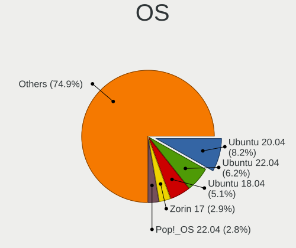

| Name                         | Notebooks | Percent |
|------------------------------|-----------|---------|
| Ubuntu 20.04                 | 143       | 8.23%   |
| Ubuntu 22.04                 | 107       | 6.16%   |
| Ubuntu 18.04                 | 88        | 5.06%   |
| Zorin 17                     | 50        | 2.88%   |
| Pop!_OS 22.04                | 48        | 2.76%   |
| Ubuntu 24.04                 | 45        | 2.59%   |
| Arch Rolling                 | 42        | 2.42%   |
| OpenMandriva 4.3             | 33        | 1.9%    |
| Zorin 16                     | 30        | 1.73%   |
| Debian 12                    | 30        | 1.73%   |
| Zorin 15                     | 24        | 1.38%   |
| OpenMandriva 4.2             | 22        | 1.27%   |
| Fedora 38                    | 21        | 1.21%   |
| Debian 11                    | 21        | 1.21%   |
| Manjaro                      | 19        | 1.09%   |
| Linux Mint 22.1              | 19        | 1.09%   |
| KDE neon 20.04               | 19        | 1.09%   |
| Pop!_OS 20.04                | 18        | 1.04%   |
| Linux Mint 20.3              | 18        | 1.04%   |
| Fedora 39                    | 17        | 0.98%   |
| Debian 10                    | 17        | 0.98%   |
| Zorin 18                     | 16        | 0.92%   |
| Fedora 42                    | 16        | 0.92%   |
| Fedora 40                    | 16        | 0.92%   |
| Fedora 34                    | 16        | 0.92%   |
| Linux Mint 21.2              | 15        | 0.86%   |
| Ubuntu 19.10                 | 14        | 0.81%   |
| Linux Mint 20.1              | 14        | 0.81%   |
| Pop!_OS 21.04                | 13        | 0.75%   |
| openSUSE Tumbleweed-XXXXXXXX | 13        | 0.75%   |
| OpenMandriva 23.08           | 13        | 0.75%   |
| Linux Mint 19.3              | 13        | 0.75%   |
| Arch                         | 13        | 0.75%   |
| Xubuntu 20.04                | 12        | 0.69%   |
| Ubuntu 21.10                 | 12        | 0.69%   |
| Ubuntu 19.04                 | 12        | 0.69%   |
| Pop!_OS 20.10                | 12        | 0.69%   |
| OpenMandriva 4.50            | 12        | 0.69%   |
| Fedora 41                    | 12        | 0.69%   |
| Fedora 36                    | 12        | 0.69%   |

OS Family
---------

OS without a version

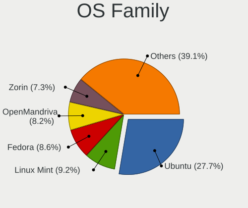

| Name             | Notebooks | Percent |
|------------------|-----------|---------|
| Ubuntu           | 453       | 27.66%  |
| Linux Mint       | 150       | 9.16%   |
| Fedora           | 141       | 8.61%   |
| OpenMandriva     | 134       | 8.18%   |
| Zorin            | 119       | 7.26%   |
| Pop!_OS          | 101       | 6.17%   |
| Debian           | 83        | 5.07%   |
| Arch             | 55        | 3.36%   |
| Manjaro          | 44        | 2.69%   |
| KDE neon         | 36        | 2.2%    |
| Endless          | 34        | 2.08%   |
| Xubuntu          | 25        | 1.53%   |
| Kubuntu          | 25        | 1.53%   |
| Elementary       | 20        | 1.22%   |
| openSUSE         | 18        | 1.1%    |
| ArcoLinux        | 14        | 0.85%   |
| ROSA             | 13        | 0.79%   |
| NixOS            | 12        | 0.73%   |
| Kali             | 12        | 0.73%   |
| EndeavourOS      | 11        | 0.67%   |
| Lubuntu          | 9         | 0.55%   |
| SteamOS          | 8         | 0.49%   |
| Ubuntu Unity     | 7         | 0.43%   |
| Ubuntu MATE      | 7         | 0.43%   |
| Nobara           | 7         | 0.43%   |
| LMDE             | 7         | 0.43%   |
| Slackware        | 6         | 0.37%   |
| Gentoo           | 6         | 0.37%   |
| Clear Linux      | 6         | 0.37%   |
| Bazzite          | 6         | 0.37%   |
| TUXEDO OS        | 5         | 0.31%   |
| Parrot           | 5         | 0.31%   |
| MX               | 5         | 0.31%   |
| CachyOS          | 5         | 0.31%   |
| Ubuntu Budgie    | 4         | 0.24%   |
| Peppermint       | 4         | 0.24%   |
| Devuan           | 4         | 0.24%   |
| org.kde.Platform | 3         | 0.18%   |
| Xero             | 2         | 0.12%   |
| Void Linux       | 2         | 0.12%   |

Kernel
------

Version of the Linux kernel

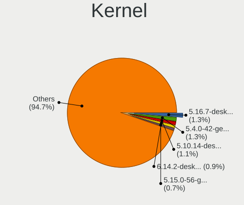

| Version                  | Notebooks | Percent |
|--------------------------|-----------|---------|
| 5.16.7-desktop-1omv4003  | 25        | 1.31%   |
| 5.4.0-42-generic         | 24        | 1.26%   |
| 5.10.14-desktop-1omv4002 | 21        | 1.1%    |
| 6.14.2-desktop-3omv2590  | 17        | 0.89%   |
| 5.15.0-56-generic        | 14        | 0.73%   |
| 5.14.14-desktop-1omv4050 | 13        | 0.68%   |
| 6.8.0-57-generic         | 12        | 0.63%   |
| 6.8.0-52-generic         | 12        | 0.63%   |
| 6.2.6-76060206-generic   | 12        | 0.63%   |
| 5.3.0-46-generic         | 12        | 0.63%   |
| 6.8.0-51-generic         | 11        | 0.58%   |
| 5.4.0-29-generic         | 11        | 0.58%   |
| 5.15.0-52-generic        | 11        | 0.58%   |
| 6.1.1-desktop-1omv2290   | 10        | 0.52%   |
| 5.4.0-58-generic         | 10        | 0.52%   |
| 5.4.0-52-generic         | 10        | 0.52%   |
| 5.15.0-48-generic        | 10        | 0.52%   |
| 5.15.0-46-generic        | 10        | 0.52%   |
| 5.11.0-38-generic        | 10        | 0.52%   |
| 6.6.2-desktop-1omv2390   | 9         | 0.47%   |
| 6.4.11-desktop-1omv2390  | 9         | 0.47%   |
| 6.14.0-33-generic        | 9         | 0.47%   |
| 6.12.1-desktop-1omv2490  | 9         | 0.47%   |
| 5.3.0-28-generic         | 9         | 0.47%   |
| 5.15.0-41-generic        | 9         | 0.47%   |
| 4.18.0-15-generic        | 9         | 0.47%   |
| 6.8.0-49-generic         | 8         | 0.42%   |
| 6.2.0-26-generic         | 8         | 0.42%   |
| 5.4.0-7634-generic       | 8         | 0.42%   |
| 5.4.0-26-generic         | 8         | 0.42%   |
| 5.11.0-43-generic        | 8         | 0.42%   |
| 5.0.0-37-generic         | 8         | 0.42%   |
| 5.0.0-25-generic         | 8         | 0.42%   |
| 4.18.0-25-generic        | 8         | 0.42%   |
| 6.8.0-79-generic         | 7         | 0.37%   |
| 6.5.0-35-generic         | 7         | 0.37%   |
| 6.2.6-desktop-1omv2390   | 7         | 0.37%   |
| 6.2.0-36-generic         | 7         | 0.37%   |
| 6.14.0-36-generic        | 7         | 0.37%   |
| 6.14.0-29-generic        | 7         | 0.37%   |

Kernel Family
-------------

Linux kernel without a distro release

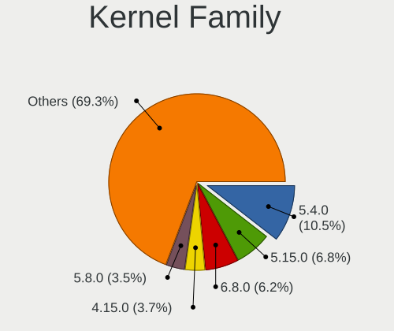

| Version | Notebooks | Percent |
|---------|-----------|---------|
| 5.4.0   | 190       | 10.51%  |
| 5.15.0  | 123       | 6.8%    |
| 6.8.0   | 112       | 6.19%   |
| 4.15.0  | 67        | 3.71%   |
| 5.8.0   | 63        | 3.48%   |
| 5.11.0  | 60        | 3.32%   |
| 6.5.0   | 55        | 3.04%   |
| 5.3.0   | 55        | 3.04%   |
| 6.14.0  | 49        | 2.71%   |
| 5.13.0  | 49        | 2.71%   |
| 6.2.0   | 48        | 2.65%   |
| 5.19.0  | 45        | 2.49%   |
| 6.1.0   | 42        | 2.32%   |
| 5.0.0   | 39        | 2.16%   |
| 4.18.0  | 36        | 1.99%   |
| 5.10.0  | 28        | 1.55%   |
| 5.16.7  | 25        | 1.38%   |
| 5.10.14 | 22        | 1.22%   |
| 6.2.6   | 19        | 1.05%   |
| 6.14.2  | 18        | 1%      |
| 4.19.0  | 17        | 0.94%   |
| 6.11.0  | 16        | 0.88%   |
| 5.14.14 | 13        | 0.72%   |
| 6.1.1   | 12        | 0.66%   |
| 6.12.10 | 11        | 0.61%   |
| 6.6.2   | 10        | 0.55%   |
| 6.12.1  | 10        | 0.55%   |
| 6.4.11  | 9         | 0.5%    |
| 6.9.3   | 7         | 0.39%   |
| 6.6.10  | 6         | 0.33%   |
| 6.12.11 | 6         | 0.33%   |
| 6.6.15  | 5         | 0.28%   |
| 6.5.6   | 5         | 0.28%   |
| 6.0.12  | 5         | 0.28%   |
| 5.14.0  | 5         | 0.28%   |
| 4.4.0   | 5         | 0.28%   |
| 6.8.7   | 4         | 0.22%   |
| 6.8.11  | 4         | 0.22%   |
| 6.7.9   | 4         | 0.22%   |
| 6.6.3   | 4         | 0.22%   |

Kernel Major Ver.
-----------------

Linux kernel major version

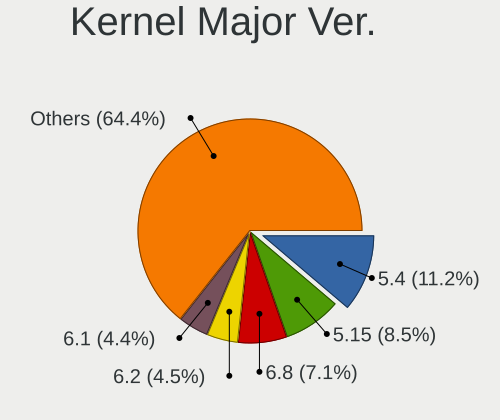

| Version | Notebooks | Percent |
|---------|-----------|---------|
| 5.4     | 200       | 11.2%   |
| 5.15    | 151       | 8.46%   |
| 6.8     | 126       | 7.06%   |
| 6.2     | 81        | 4.54%   |
| 6.1     | 78        | 4.37%   |
| 6.5     | 77        | 4.31%   |
| 6.14    | 77        | 4.31%   |
| 5.8     | 77        | 4.31%   |
| 5.11    | 68        | 3.81%   |
| 4.15    | 67        | 3.75%   |
| 5.10    | 65        | 3.64%   |
| 5.19    | 59        | 3.31%   |
| 5.3     | 58        | 3.25%   |
| 6.12    | 56        | 3.14%   |
| 5.13    | 54        | 3.03%   |
| 6.6     | 46        | 2.58%   |
| 5.16    | 44        | 2.46%   |
| 5.0     | 40        | 2.24%   |
| 4.18    | 37        | 2.07%   |
| 6.11    | 32        | 1.79%   |
| 5.14    | 28        | 1.57%   |
| 6.4     | 26        | 1.46%   |
| 6.3     | 21        | 1.18%   |
| 6.17    | 20        | 1.12%   |
| 6.0     | 20        | 1.12%   |
| 4.19    | 20        | 1.12%   |
| 6.9     | 16        | 0.9%    |
| 5.12    | 16        | 0.9%    |
| 6.10    | 12        | 0.67%   |
| 4.9     | 12        | 0.67%   |
| 6.15    | 10        | 0.56%   |
| 5.9     | 10        | 0.56%   |
| 5.7     | 10        | 0.56%   |
| 5.6     | 10        | 0.56%   |
| 5.17    | 10        | 0.56%   |
| 6.7     | 9         | 0.5%    |
| 6.13    | 9         | 0.5%    |
| 6.16    | 7         | 0.39%   |
| 5.18    | 7         | 0.39%   |
| 5.5     | 6         | 0.34%   |

Arch
----

OS architecture (x86_64, i586, etc.)

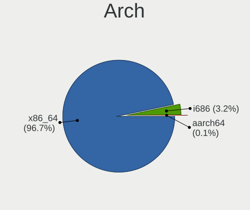

| Name    | Notebooks | Percent |
|---------|-----------|---------|
| x86_64  | 1519      | 96.69%  |
| i686    | 50        | 3.18%   |
| aarch64 | 2         | 0.13%   |

DE
--

Desktop Environment

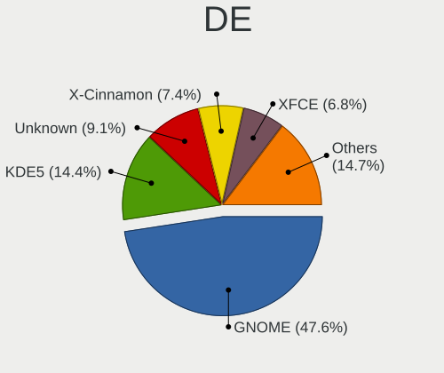

| Name             | Notebooks | Percent |
|------------------|-----------|---------|
| GNOME            | 788       | 47.58%  |
| KDE5             | 239       | 14.43%  |
| Unknown          | 151       | 9.12%   |
| X-Cinnamon       | 122       | 7.37%   |
| XFCE             | 113       | 6.82%   |
| KDE6             | 67        | 4.05%   |
| MATE             | 30        | 1.81%   |
| KDE              | 29        | 1.75%   |
| Pantheon         | 18        | 1.09%   |
| LXQt             | 13        | 0.79%   |
| i3               | 12        | 0.72%   |
| KDE4             | 11        | 0.66%   |
| Cinnamon         | 11        | 0.66%   |
| Unity            | 8         | 0.48%   |
| Budgie           | 8         | 0.48%   |
| LXDE             | 5         | 0.3%    |
| GNOME Flashback  | 4         | 0.24%   |
| Deepin           | 4         | 0.24%   |
| COSMIC           | 4         | 0.24%   |
| Hyprland         | 2         | 0.12%   |
| Enlightenment    | 2         | 0.12%   |
| Endless:GNOME    | 2         | 0.12%   |
| DWM              | 2         | 0.12%   |
| awesome          | 2         | 0.12%   |
| xmonad           | 1         | 0.06%   |
| sway:wlroots     | 1         | 0.06%   |
| Openbox          | 1         | 0.06%   |
| Lubuntu          | 1         | 0.06%   |
| lightdm-xsession | 1         | 0.06%   |
| fluxbox          | 1         | 0.06%   |
| DDE              | 1         | 0.06%   |
| Cutefish         | 1         | 0.06%   |
| bspwm            | 1         | 0.06%   |

Display Server
--------------

X11 or Wayland

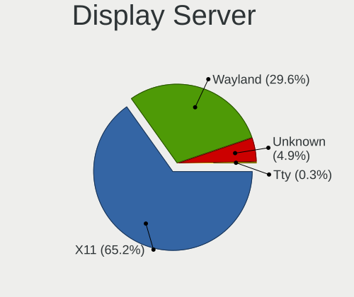

| Name    | Notebooks | Percent |
|---------|-----------|---------|
| X11     | 1059      | 65.17%  |
| Wayland | 481       | 29.6%   |
| Unknown | 80        | 4.92%   |
| Tty     | 5         | 0.31%   |

Display Manager
---------------

SDDM, LightDM, etc.

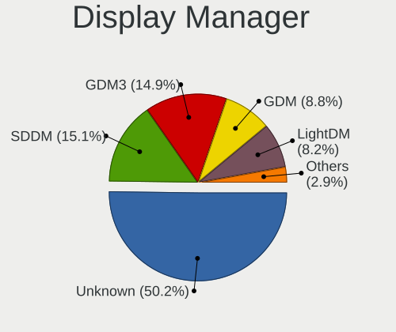

| Name           | Notebooks | Percent |
|----------------|-----------|---------|
| Unknown        | 825       | 50.21%  |
| SDDM           | 248       | 15.09%  |
| GDM3           | 245       | 14.91%  |
| GDM            | 144       | 8.76%   |
| LightDM        | 134       | 8.16%   |
| TDM            | 28        | 1.7%    |
| KDM            | 10        | 0.61%   |
| XDM            | 3         | 0.18%   |
| SLiM           | 3         | 0.18%   |
| GREETD         | 2         | 0.12%   |
| COSMIC-GREETER | 1         | 0.06%   |

OS Lang
-------

Language

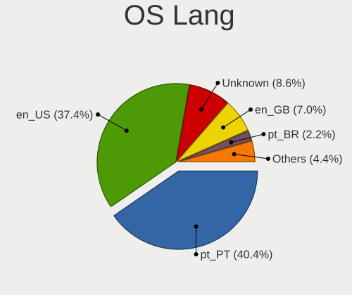

| Lang    | Notebooks | Percent |
|---------|-----------|---------|
| pt_PT   | 650       | 40.37%  |
| en_US   | 602       | 37.39%  |
| Unknown | 139       | 8.63%   |
| en_GB   | 112       | 6.96%   |
| pt_BR   | 36        | 2.24%   |
| C       | 35        | 2.17%   |
| de_DE   | 8         | 0.5%    |
| fr_FR   | 6         | 0.37%   |
| es_ES   | 5         | 0.31%   |
| en_IE   | 4         | 0.25%   |
| POSIX   | 3         | 0.19%   |
| ru_RU   | 2         | 0.12%   |
| it_IT   | 2         | 0.12%   |
| he_IL   | 2         | 0.12%   |
| sk_SK   | 1         | 0.06%   |
| en_IN   | 1         | 0.06%   |
| en_DK   | 1         | 0.06%   |
| Default | 1         | 0.06%   |

Boot Mode
---------

EFI or BIOS

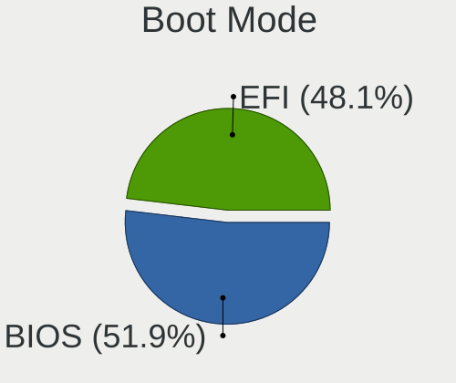

| Mode | Notebooks | Percent |
|------|-----------|---------|
| BIOS | 838       | 51.86%  |
| EFI  | 778       | 48.14%  |

Filesystem
----------

Type of filesystem

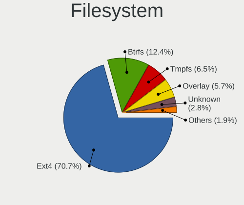

| Type     | Notebooks | Percent |
|----------|-----------|---------|
| Ext4     | 1146      | 70.7%   |
| Btrfs    | 201       | 12.4%   |
| Tmpfs    | 106       | 6.54%   |
| Overlay  | 93        | 5.74%   |
| Unknown  | 45        | 2.78%   |
| Xfs      | 13        | 0.8%    |
| Zfs      | 10        | 0.62%   |
| Ext2     | 4         | 0.25%   |
| Ext3     | 2         | 0.12%   |
| Reiserfs | 1         | 0.06%   |

Part. scheme
------------

Scheme of partitioning

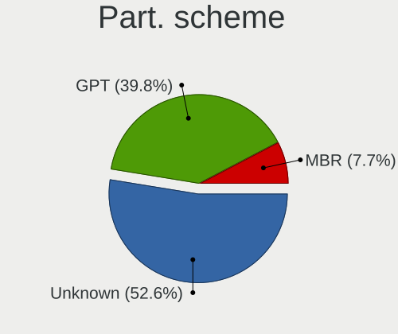

| Type    | Notebooks | Percent |
|---------|-----------|---------|
| Unknown | 850       | 52.57%  |
| GPT     | 643       | 39.76%  |
| MBR     | 124       | 7.67%   |

Dual Boot with Linux/BSD
------------------------

Hosting more than one Linux/BSD

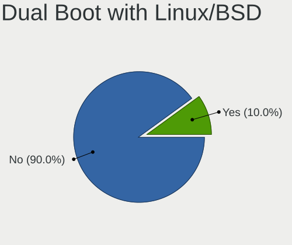

| Dual boot | Notebooks | Percent |
|-----------|-----------|---------|
| No        | 1437      | 89.98%  |
| Yes       | 160       | 10.02%  |

Dual Boot (Win)
---------------

Hosting Linux and Windows

| Dual boot | Notebooks | Percent |
|-----------|-----------|---------|
| No        | 1198      | 74.88%  |
| Yes       | 402       | 25.13%  |

Board
-----

Vendor
------

Motherboard manufacturer

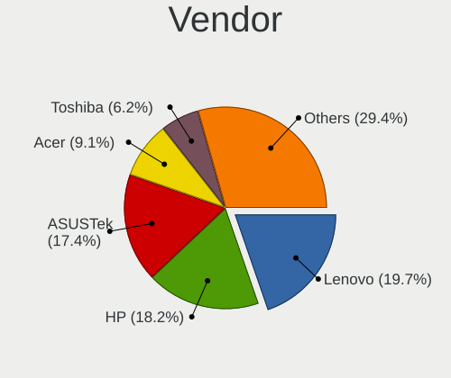

| Name                | Notebooks | Percent |
|---------------------|-----------|---------|
| Lenovo              | 309       | 19.71%  |
| Hewlett-Packard     | 286       | 18.24%  |
| ASUSTek Computer    | 273       | 17.41%  |
| Acer                | 142       | 9.06%   |
| Toshiba             | 97        | 6.19%   |
| Dell                | 96        | 6.12%   |
| Apple               | 55        | 3.51%   |
| Sony                | 52        | 3.32%   |
| MSI                 | 38        | 2.42%   |
| HUAWEI              | 34        | 2.17%   |
| Samsung Electronics | 25        | 1.59%   |
| Notebook            | 13        | 0.83%   |
| Unknown             | 11        | 0.7%    |
| Chuwi               | 10        | 0.64%   |
| Packard Bell        | 9         | 0.57%   |
| Valve               | 8         | 0.51%   |
| Gigabyte Technology | 8         | 0.51%   |
| Fujitsu             | 8         | 0.51%   |
| TUXEDO              | 7         | 0.45%   |
| Clevo               | 7         | 0.45%   |
| SLIMBOOK            | 5         | 0.32%   |
| Medion              | 5         | 0.32%   |
| Teclast             | 4         | 0.26%   |
| LG Electronics      | 4         | 0.26%   |
| INSYS               | 4         | 0.26%   |
| Fujitsu Siemens     | 4         | 0.26%   |
| TongFang            | 3         | 0.19%   |
| Positivo            | 3         | 0.19%   |
| Phoenix/SiS         | 3         | 0.19%   |
| PC Specialist       | 3         | 0.19%   |
| Intel               | 3         | 0.19%   |
| Google              | 3         | 0.19%   |
| eMachines           | 3         | 0.19%   |
| Thomson             | 2         | 0.13%   |
| OBSIDIAN-PC         | 2         | 0.13%   |
| LNV                 | 2         | 0.13%   |
| Jumper              | 2         | 0.13%   |
| AMI                 | 2         | 0.13%   |
| Alienware           | 2         | 0.13%   |
| X-Plus.tech         | 1         | 0.06%   |

Model
-----

Motherboard model

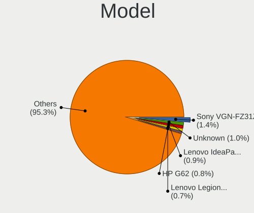

| Name                                   | Notebooks | Percent |
|----------------------------------------|-----------|---------|
| Sony VGN-FZ31Z                         | 22        | 1.4%    |
| Unknown                                | 15        | 0.96%   |
| Lenovo IdeaPad 1 14ADA05 82GW          | 14        | 0.89%   |
| HP G62                                 | 12        | 0.77%   |
| Lenovo Legion 5 15ACH6H 82JU           | 11        | 0.7%    |
| HP Pavilion dv6                        | 11        | 0.7%    |
| HP Notebook                            | 10        | 0.64%   |
| HP Pavilion g6                         | 9         | 0.57%   |
| Valve Jupiter                          | 8         | 0.51%   |
| Toshiba Satellite C660                 | 8         | 0.51%   |
| Toshiba Satellite L650                 | 7         | 0.45%   |
| Lenovo Legion Y530-15ICH 81FV          | 7         | 0.45%   |
| ASUS X555LJ                            | 7         | 0.45%   |
| HP Pavilion Notebook                   | 6         | 0.38%   |
| HP Pavilion Gaming Laptop 15-ec2xxx    | 6         | 0.38%   |
| HP Laptop 15s-eq2xxx                   | 6         | 0.38%   |
| HP 15                                  | 6         | 0.38%   |
| ASUS X555LD                            | 6         | 0.38%   |
| ASUS X541UJ                            | 6         | 0.38%   |
| Apple MacBookPro8,1                    | 6         | 0.38%   |
| Apple MacBookAir7,2                    | 6         | 0.38%   |
| Acer Extensa 5620                      | 6         | 0.38%   |
| Toshiba Satellite L500                 | 5         | 0.32%   |
| Toshiba Satellite A200                 | 5         | 0.32%   |
| Lenovo Y520-15IKBN 80WK                | 5         | 0.32%   |
| Lenovo Legion 5 15ARH05H 82B1          | 5         | 0.32%   |
| Lenovo IdeaPad Gaming 3 15ACH6 82K2    | 5         | 0.32%   |
| HP OMEN by Laptop                      | 5         | 0.32%   |
| HP Laptop 15s-eq0xxx                   | 5         | 0.32%   |
| HP EliteBook 840 G6                    | 5         | 0.32%   |
| HP Compaq Presario CQ61                | 5         | 0.32%   |
| ASUS X541UV                            | 5         | 0.32%   |
| ASUS X540LJ                            | 5         | 0.32%   |
| ASUS VivoBook_ASUSLaptop X571GT_X571GT | 5         | 0.32%   |
| ASUS VivoBook_ASUSLaptop X512DA_F512DA | 5         | 0.32%   |
| ASUS VivoBook 15_ASUS Laptop X507LA    | 5         | 0.32%   |
| Acer Aspire ES1-520                    | 5         | 0.32%   |
| Acer Aspire E5-571G                    | 5         | 0.32%   |
| Acer Aspire E1-570G                    | 5         | 0.32%   |
| Toshiba Satellite L50D-B               | 4         | 0.26%   |

Model Family
------------

Motherboard model prefix

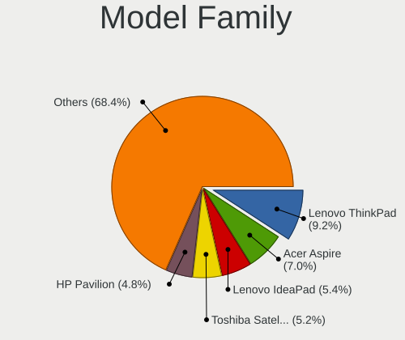

| Name                  | Notebooks | Percent |
|-----------------------|-----------|---------|
| Lenovo ThinkPad       | 144       | 9.18%   |
| Acer Aspire           | 109       | 6.95%   |
| Lenovo IdeaPad        | 85        | 5.42%   |
| Toshiba Satellite     | 82        | 5.23%   |
| HP Pavilion           | 75        | 4.78%   |
| ASUS VivoBook         | 71        | 4.53%   |
| Dell Latitude         | 47        | 3%      |
| HP EliteBook          | 45        | 2.87%   |
| Lenovo Legion         | 32        | 2.04%   |
| HP Laptop             | 32        | 2.04%   |
| Sony VGN-FZ31Z        | 22        | 1.4%    |
| HP ProBook            | 21        | 1.34%   |
| HP Compaq             | 21        | 1.34%   |
| HP OMEN               | 18        | 1.15%   |
| Dell XPS              | 18        | 1.15%   |
| Dell Inspiron         | 17        | 1.08%   |
| ASUS ZenBook          | 16        | 1.02%   |
| Unknown               | 15        | 0.96%   |
| ASUS ROG              | 14        | 0.89%   |
| HP ENVY               | 13        | 0.83%   |
| Lenovo Yoga           | 12        | 0.77%   |
| HP G62                | 12        | 0.77%   |
| Acer Extensa          | 12        | 0.77%   |
| Acer Nitro            | 11        | 0.7%    |
| HP Notebook           | 10        | 0.64%   |
| Packard Bell EasyNote | 9         | 0.57%   |
| ASUS TUF              | 9         | 0.57%   |
| Apple MacBookPro11    | 9         | 0.57%   |
| Valve Jupiter         | 8         | 0.51%   |
| Dell Precision        | 8         | 0.51%   |
| ASUS ASUS             | 8         | 0.51%   |
| HP ZBook              | 7         | 0.45%   |
| HP 15                 | 7         | 0.45%   |
| Fujitsu LIFEBOOK      | 7         | 0.45%   |
| ASUS X555LJ           | 7         | 0.45%   |
| Apple MacBookPro8     | 7         | 0.45%   |
| MSI Modern            | 6         | 0.38%   |
| ASUS X555LD           | 6         | 0.38%   |
| ASUS X541UJ           | 6         | 0.38%   |
| Apple MacBookAir7     | 6         | 0.38%   |

MFG Year
--------

Motherboard manufacture year

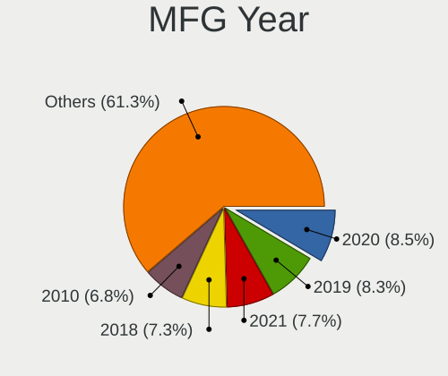

| Year    | Notebooks | Percent |
|---------|-----------|---------|
| 2020    | 134       | 8.55%   |
| 2019    | 130       | 8.29%   |
| 2021    | 121       | 7.72%   |
| 2018    | 115       | 7.33%   |
| 2010    | 107       | 6.82%   |
| 2013    | 99        | 6.31%   |
| 2014    | 91        | 5.8%    |
| 2015    | 90        | 5.74%   |
| 2017    | 80        | 5.1%    |
| 2012    | 78        | 4.97%   |
| 2008    | 75        | 4.78%   |
| 2016    | 71        | 4.53%   |
| 2009    | 69        | 4.4%    |
| 2007    | 68        | 4.34%   |
| 2022    | 65        | 4.15%   |
| 2011    | 63        | 4.02%   |
| 2023    | 46        | 2.93%   |
| 2024    | 29        | 1.85%   |
| 2006    | 18        | 1.15%   |
| 2025    | 8         | 0.51%   |
| 2005    | 7         | 0.45%   |
| Unknown | 4         | 0.26%   |

Form Factor
-----------

Physical design of the computer

| Name     | Notebooks | Percent |
|----------|-----------|---------|
| Notebook | 1568      | 100%    |

Secure Boot
-----------

Enabled or disabled

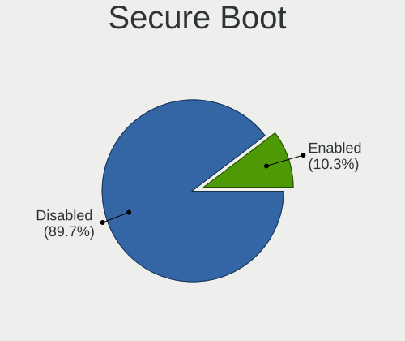

| State    | Notebooks | Percent |
|----------|-----------|---------|
| Disabled | 1433      | 89.67%  |
| Enabled  | 165       | 10.33%  |

Coreboot
--------

Have coreboot on board

| Used | Notebooks | Percent |
|------|-----------|---------|
| No   | 1559      | 99.43%  |
| Yes  | 9         | 0.57%   |

RAM Size
--------

Total RAM memory

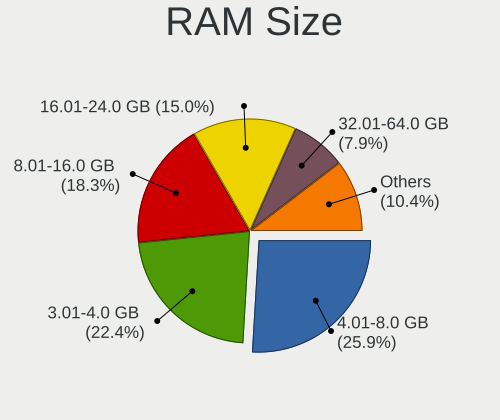

| Size in GB  | Notebooks | Percent |
|-------------|-----------|---------|
| 4.01-8.0    | 412       | 25.94%  |
| 3.01-4.0    | 356       | 22.42%  |
| 8.01-16.0   | 291       | 18.32%  |
| 16.01-24.0  | 238       | 14.99%  |
| 32.01-64.0  | 126       | 7.93%   |
| 1.01-2.0    | 77        | 4.85%   |
| 2.01-3.0    | 30        | 1.89%   |
| 24.01-32.0  | 25        | 1.57%   |
| 64.01-256.0 | 22        | 1.39%   |
| 0.51-1.0    | 11        | 0.69%   |

RAM Used
--------

Used RAM memory

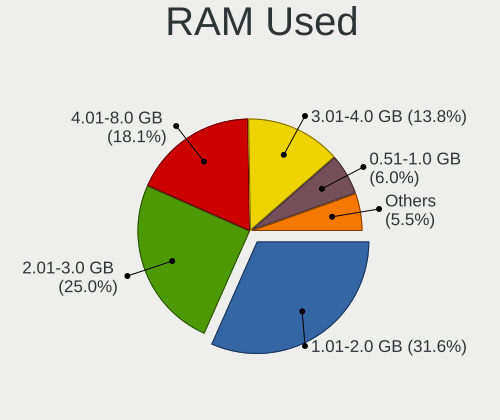

| Used GB    | Notebooks | Percent |
|------------|-----------|---------|
| 1.01-2.0   | 556       | 31.64%  |
| 2.01-3.0   | 439       | 24.99%  |
| 4.01-8.0   | 318       | 18.1%   |
| 3.01-4.0   | 243       | 13.83%  |
| 0.51-1.0   | 105       | 5.98%   |
| 8.01-16.0  | 68        | 3.87%   |
| 16.01-24.0 | 12        | 0.68%   |
| 0.01-0.5   | 9         | 0.51%   |
| 24.01-32.0 | 6         | 0.34%   |
| 32.01-64.0 | 1         | 0.06%   |

Total Drives
------------

Number of drives on board

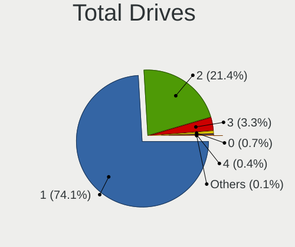

| Drives | Notebooks | Percent |
|--------|-----------|---------|
| 1      | 1185      | 74.06%  |
| 2      | 342       | 21.38%  |
| 3      | 53        | 3.31%   |
| 0      | 11        | 0.69%   |
| 4      | 7         | 0.44%   |
| 5      | 2         | 0.13%   |

Has CD-ROM
----------

Has CD-ROM on board

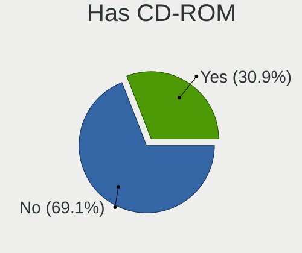

| Presented | Notebooks | Percent |
|-----------|-----------|---------|
| No        | 1087      | 69.1%   |
| Yes       | 486       | 30.9%   |

Has Ethernet
------------

Has Ethernet on board

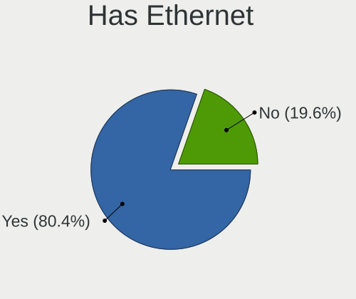

| Presented | Notebooks | Percent |
|-----------|-----------|---------|
| Yes       | 1268      | 80.35%  |
| No        | 310       | 19.65%  |

Has WiFi
--------

Has WiFi module

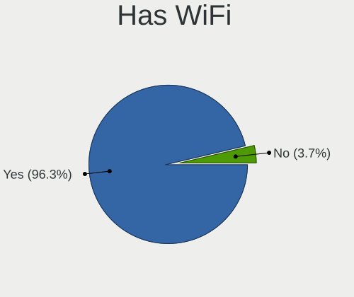

| Presented | Notebooks | Percent |
|-----------|-----------|---------|
| Yes       | 1511      | 96.3%   |
| No        | 58        | 3.7%    |

Has Bluetooth
-------------

Has Bluetooth module

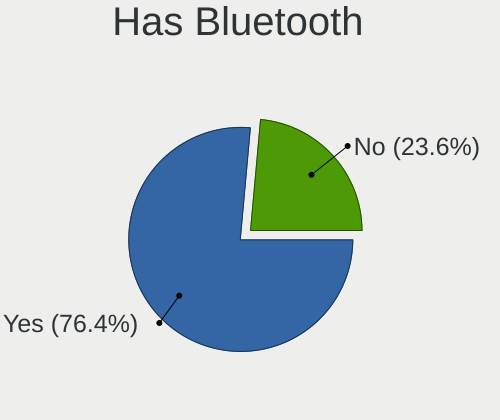

| Presented | Notebooks | Percent |
|-----------|-----------|---------|
| Yes       | 1213      | 76.43%  |
| No        | 374       | 23.57%  |

Location
--------

Country
-------

Geographic location (country)

| Country  | Notebooks | Percent |
|----------|-----------|---------|
| Portugal | 1568      | 100%    |

City
----

Geographic location (city)

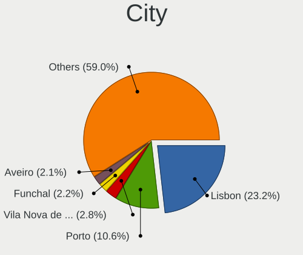

| City                    | Notebooks | Percent |
|-------------------------|-----------|---------|
| Lisbon                  | 392       | 23.21%  |
| Porto                   | 179       | 10.6%   |
| Vila Nova de Gaia       | 47        | 2.78%   |
| Funchal                 | 38        | 2.25%   |
| Aveiro                  | 36        | 2.13%   |
| Braga                   | 32        | 1.89%   |
| Amadora                 | 31        | 1.84%   |
| Coimbra                 | 28        | 1.66%   |
| Setúbal                | 22        | 1.3%    |
| Guimaraes               | 21        | 1.24%   |
| Cascais                 | 21        | 1.24%   |
| Almada                  | 19        | 1.12%   |
| Barreiro                | 18        | 1.07%   |
| Póvoa de Varzim        | 16        | 0.95%   |
| Leiria                  | 16        | 0.95%   |
| Loures                  | 15        | 0.89%   |
| Portimao                | 14        | 0.83%   |
| Maia                    | 14        | 0.83%   |
| Faro                    | 14        | 0.83%   |
| Viseu                   | 13        | 0.77%   |
| Bragança               | 13        | 0.77%   |
| Santarém               | 12        | 0.71%   |
| Barcelos                | 12        | 0.71%   |
| Mem Martins             | 11        | 0.65%   |
| Feira                   | 11        | 0.65%   |
| Alverca do Ribatejo     | 11        | 0.65%   |
| Viana do Castelo        | 10        | 0.59%   |
| Santo Tirso             | 10        | 0.59%   |
| Palmela                 | 10        | 0.59%   |
| Albufeira               | 10        | 0.59%   |
| Sintra                  | 9         | 0.53%   |
| Odivelas                | 9         | 0.53%   |
| Gondomar                | 9         | 0.53%   |
| Evora                   | 9         | 0.53%   |
| Caldas da Rainha        | 9         | 0.53%   |
| Torres Vedras           | 8         | 0.47%   |
| Ponta Delgada           | 8         | 0.47%   |
| Paços de Ferreira      | 8         | 0.47%   |
| Matosinhos Municipality | 8         | 0.47%   |
| Lagos                   | 8         | 0.47%   |

Drives
------

Drive Vendor
------------

Hard drive vendors

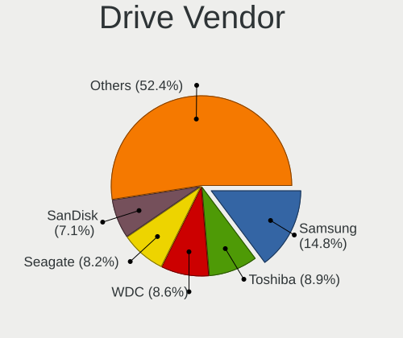

| Vendor                      | Notebooks | Drives | Percent |
|-----------------------------|-----------|--------|---------|
| Samsung Electronics         | 290       | 378    | 14.8%   |
| Toshiba                     | 174       | 209    | 8.88%   |
| WDC                         | 169       | 219    | 8.62%   |
| Seagate                     | 160       | 200    | 8.16%   |
| SanDisk                     | 139       | 166    | 7.09%   |
| Kingston                    | 137       | 159    | 6.99%   |
| Unknown                     | 108       | 151    | 5.51%   |
| Crucial                     | 77        | 97     | 3.93%   |
| Micron Technology           | 72        | 86     | 3.67%   |
| SK hynix                    | 65        | 88     | 3.32%   |
| Intel                       | 62        | 98     | 3.16%   |
| Hitachi                     | 56        | 63     | 2.86%   |
| HGST                        | 51        | 66     | 2.6%    |
| KIOXIA                      | 27        | 39     | 1.38%   |
| Apple                       | 27        | 31     | 1.38%   |
| China                       | 24        | 26     | 1.22%   |
| Phison Electronics          | 23        | 28     | 1.17%   |
| Fujitsu                     | 20        | 21     | 1.02%   |
| A-DATA Technology           | 16        | 17     | 0.82%   |
| S3+                         | 13        | 25     | 0.66%   |
| LITEON                      | 12        | 13     | 0.61%   |
| KIOXIA-EXCERIA              | 12        | 12     | 0.61%   |
| GOODRAM                     | 12        | 12     | 0.61%   |
| Silicon Motion              | 11        | 16     | 0.56%   |
| JMicron Technology          | 11        | 12     | 0.56%   |
| Kingston Technology Company | 10        | 10     | 0.51%   |
| BlueRay                     | 10        | 15     | 0.51%   |
| Micron/Crucial Technology   | 9         | 12     | 0.46%   |
| Emtec                       | 9         | 11     | 0.46%   |
| Unknown                     | 9         | 18     | 0.46%   |
| Transcend                   | 7         | 9      | 0.36%   |
| PNY                         | 7         | 10     | 0.36%   |
| Verbatim                    | 6         | 6      | 0.31%   |
| Team                        | 6         | 7      | 0.31%   |
| Phison                      | 6         | 6      | 0.31%   |
| Maxtor                      | 6         | 18     | 0.31%   |
| Netac                       | 5         | 7      | 0.26%   |
| KingDian                    | 5         | 5      | 0.26%   |
| USB                         | 4         | 4      | 0.2%    |
| OCZ                         | 4         | 4      | 0.2%    |

Drive Model
-----------

Hard drive models

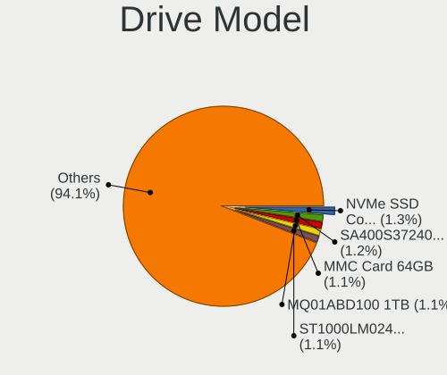

| Model                                              | Notebooks | Percent |
|----------------------------------------------------|-----------|---------|
| Samsung NVMe SSD Controller SM981/PM981/PM983 1TB  | 27        | 1.33%   |
| Kingston SA400S37240G 240GB SSD                    | 24        | 1.18%   |
| Unknown MMC Card  64GB                             | 23        | 1.14%   |
| Toshiba MQ01ABD100 1TB                             | 23        | 1.14%   |
| Seagate ST1000LM024 HN-M101MBB 1TB                 | 23        | 1.14%   |
| HGST HTS721010A9E630 1TB                           | 23        | 1.14%   |
| Unknown MMC Card  32GB                             | 21        | 1.04%   |
| Toshiba MQ01ABF050 500GB                           | 21        | 1.04%   |
| Seagate ST500LT012-1DG142 500GB                    | 17        | 0.84%   |
| Kingston SA400S37480G 480GB SSD                    | 17        | 0.84%   |
| Kingston SA400S37120G 120GB SSD                    | 17        | 0.84%   |
| Seagate ST1000LM035-1RK172 1TB                     | 16        | 0.79%   |
| Samsung NVMe SSD Controller PM9A1/PM9A3/980PRO 1TB | 16        | 0.79%   |
| Crucial CT240M500SSD1 240GB                        | 15        | 0.74%   |
| Unknown MMC64G  64GB                               | 14        | 0.69%   |
| Kingston SV300S37A120G 120GB SSD                   | 14        | 0.69%   |
| Sandisk WD Blue SN550 NVMe SSD 1024GB              | 13        | 0.64%   |
| Phison PS5013 E13 NVMe Controller 500GB            | 13        | 0.64%   |
| SanDisk NVMe SSD Drive 512GB                       | 12        | 0.59%   |
| Crucial CT500MX500SSD1 500GB                       | 12        | 0.59%   |
| Toshiba TR200 240GB SSD                            | 11        | 0.54%   |
| Toshiba MQ04ABF100 1TB                             | 11        | 0.54%   |
| Seagate ST9500325AS 500GB                          | 11        | 0.54%   |
| Samsung SSD 850 EVO 500GB                          | 10        | 0.49%   |
| WDC WDS240G2G0A-00JH30 240GB SSD                   | 9         | 0.44%   |
| Unknown MMC Card  16GB                             | 9         | 0.44%   |
| Samsung SSD 860 QVO 1TB                            | 9         | 0.44%   |
| Samsung SSD 860 EVO 500GB                          | 9         | 0.44%   |
| Intel SSDPEKNU512GZ 512GB                          | 9         | 0.44%   |
| Intel SSD 660P Series 512GB                        | 9         | 0.44%   |
| Crucial CT240BX500SSD1 240GB                       | 9         | 0.44%   |
| Unknown                                            | 9         | 0.44%   |
| WDC WD5000LPVX-22V0TT0 500GB                       | 8         | 0.39%   |
| Unknown MMC Card  128GB                            | 8         | 0.39%   |
| Seagate ST9320325AS 320GB                          | 8         | 0.39%   |
| Samsung SSD 850 EVO 250GB                          | 8         | 0.39%   |
| Samsung NVMe SSD Drive 512GB                       | 8         | 0.39%   |
| Micron 1100_MTFDDAV256TBN 256GB SSD                | 8         | 0.39%   |
| Kingston SV300S37A240G 240GB SSD                   | 8         | 0.39%   |
| JMicron Generic 320GB                              | 8         | 0.39%   |

HDD Vendor
----------

Hard disk drive vendors

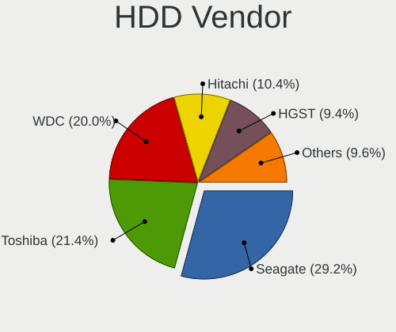

| Vendor              | Notebooks | Drives | Percent |
|---------------------|-----------|--------|---------|
| Seagate             | 158       | 194    | 29.21%  |
| Toshiba             | 116       | 141    | 21.44%  |
| WDC                 | 108       | 129    | 19.96%  |
| Hitachi             | 56        | 63     | 10.35%  |
| HGST                | 51        | 66     | 9.43%   |
| Fujitsu             | 20        | 21     | 3.7%    |
| Samsung Electronics | 15        | 16     | 2.77%   |
| JMicron Technology  | 8         | 9      | 1.48%   |
| USB                 | 4         | 4      | 0.74%   |
| USB3.0              | 1         | 1      | 0.18%   |
| Unknown             | 1         | 1      | 0.18%   |
| Intenso             | 1         | 1      | 0.18%   |
| ASMedia             | 1         | 1      | 0.18%   |
| Unknown             | 1         | 2      | 0.18%   |

SSD Vendor
----------

Solid state drive vendors

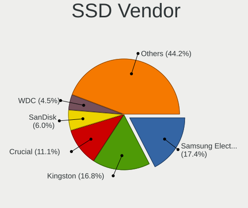

| Vendor              | Notebooks | Drives | Percent |
|---------------------|-----------|--------|---------|
| Samsung Electronics | 113       | 143    | 17.41%  |
| Kingston            | 109       | 127    | 16.8%   |
| Crucial             | 72        | 91     | 11.09%  |
| SanDisk             | 39        | 46     | 6.01%   |
| WDC                 | 29        | 34     | 4.47%   |
| Toshiba             | 29        | 32     | 4.47%   |
| China               | 24        | 26     | 3.7%    |
| Apple               | 22        | 22     | 3.39%   |
| Micron Technology   | 16        | 21     | 2.47%   |
| A-DATA Technology   | 15        | 16     | 2.31%   |
| Intel               | 13        | 22     | 2%      |
| SK hynix            | 12        | 12     | 1.85%   |
| S3+                 | 12        | 24     | 1.85%   |
| GOODRAM             | 12        | 12     | 1.85%   |
| KIOXIA-EXCERIA      | 11        | 11     | 1.69%   |
| LITEON              | 9         | 10     | 1.39%   |
| Emtec               | 9         | 11     | 1.39%   |
| BlueRay             | 8         | 10     | 1.23%   |
| Transcend           | 7         | 9      | 1.08%   |
| Team                | 6         | 7      | 0.92%   |
| PNY                 | 6         | 9      | 0.92%   |
| Maxtor              | 6         | 18     | 0.92%   |
| Unknown             | 6         | 14     | 0.92%   |
| Verbatim            | 5         | 5      | 0.77%   |
| Netac               | 5         | 7      | 0.77%   |
| OCZ                 | 4         | 4      | 0.62%   |
| Wibtek              | 3         | 4      | 0.46%   |
| Teclast             | 3         | 3      | 0.46%   |
| LITEONIT            | 3         | 3      | 0.46%   |
| KingDian            | 3         | 3      | 0.46%   |
| 2-Power             | 3         | 4      | 0.46%   |
| TCSUNBOW            | 2         | 2      | 0.31%   |
| SPCC                | 2         | 3      | 0.31%   |
| Seagate             | 2         | 4      | 0.31%   |
| Plextor             | 2         | 2      | 0.31%   |
| KingSpec            | 2         | 2      | 0.31%   |
| INNOVATION IT       | 2         | 2      | 0.31%   |
| Hewlett-Packard     | 2         | 2      | 0.31%   |
| Dogfish             | 2         | 4      | 0.31%   |
| Corsair             | 2         | 2      | 0.31%   |

Drive Kind
----------

HDD or SSD

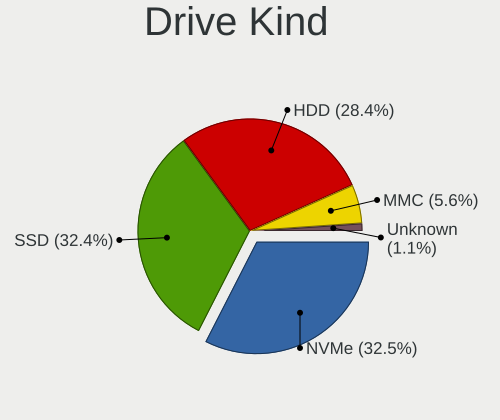

| Kind    | Notebooks | Drives | Percent |
|---------|-----------|--------|---------|
| NVMe    | 601       | 862    | 32.52%  |
| SSD     | 599       | 801    | 32.41%  |
| HDD     | 524       | 649    | 28.35%  |
| MMC     | 104       | 150    | 5.63%   |
| Unknown | 20        | 25     | 1.08%   |

Drive Connector
---------------

SATA, SAS, NVMe, etc.

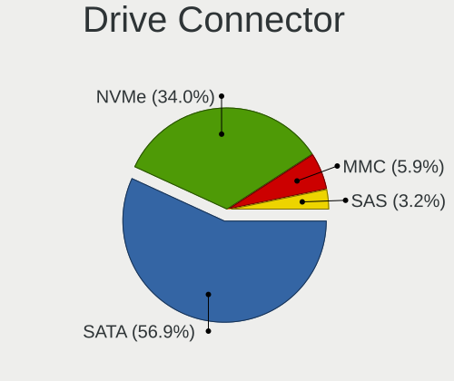

| Type | Notebooks | Drives | Percent |
|------|-----------|--------|---------|
| SATA | 1003      | 1411   | 56.86%  |
| NVMe | 600       | 859    | 34.01%  |
| MMC  | 104       | 150    | 5.9%    |
| SAS  | 57        | 67     | 3.23%   |

Drive Size
----------

Size of hard drive

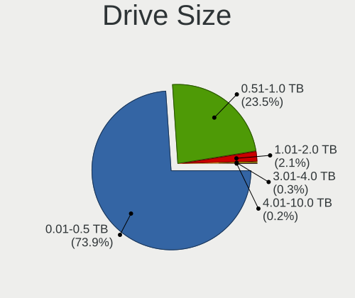

| Size in TB | Notebooks | Drives | Percent |
|------------|-----------|--------|---------|
| 0.01-0.5   | 811       | 1082   | 73.93%  |
| 0.51-1.0   | 258       | 330    | 23.52%  |
| 1.01-2.0   | 23        | 33     | 2.1%    |
| 3.01-4.0   | 3         | 3      | 0.27%   |
| 4.01-10.0  | 2         | 2      | 0.18%   |

Space Total
-----------

Amount of disk space available on the file system

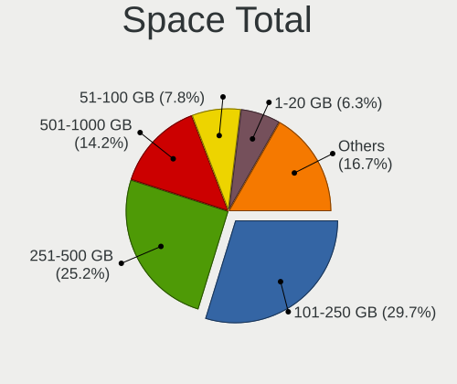

| Size in GB     | Notebooks | Percent |
|----------------|-----------|---------|
| 101-250        | 494       | 29.74%  |
| 251-500        | 419       | 25.23%  |
| 501-1000       | 236       | 14.21%  |
| 51-100         | 129       | 7.77%   |
| 1-20           | 105       | 6.32%   |
| 1001-2000      | 100       | 6.02%   |
| 21-50          | 59        | 3.55%   |
| Unknown        | 49        | 2.95%   |
| More than 3000 | 41        | 2.47%   |
| 2001-3000      | 29        | 1.75%   |

Space Used
----------

Amount of used disk space

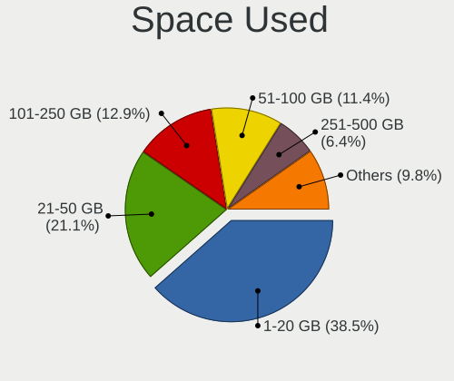

| Used GB        | Notebooks | Percent |
|----------------|-----------|---------|
| 1-20           | 666       | 38.47%  |
| 21-50          | 366       | 21.14%  |
| 101-250        | 223       | 12.88%  |
| 51-100         | 197       | 11.38%  |
| 251-500        | 110       | 6.35%   |
| 501-1000       | 59        | 3.41%   |
| Unknown        | 49        | 2.83%   |
| 1001-2000      | 34        | 1.96%   |
| More than 3000 | 13        | 0.75%   |
| 2001-3000      | 9         | 0.52%   |
| 0              | 5         | 0.29%   |

Malfunc. Drives
---------------

Drive models with a malfunction

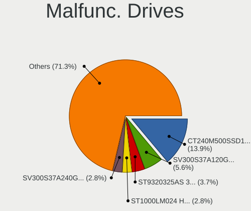

| Model                                 | Notebooks | Drives | Percent |
|---------------------------------------|-----------|--------|---------|
| Crucial CT240M500SSD1 240GB           | 15        | 16     | 13.89%  |
| Kingston SV300S37A120G 120GB SSD      | 6         | 6      | 5.56%   |
| Seagate ST9320325AS 320GB             | 4         | 5      | 3.7%    |
| Seagate ST1000LM024 HN-M101MBB 1TB    | 3         | 3      | 2.78%   |
| Kingston SV300S37A240G 240GB SSD      | 3         | 3      | 2.78%   |
| Hitachi HTS545050A7E380 500GB         | 3         | 4      | 2.78%   |
| China G521N256GB                      | 3         | 4      | 2.78%   |
| Toshiba MQ01ABF050 500GB              | 2         | 2      | 1.85%   |
| Toshiba MQ01ABD100 1TB                | 2         | 2      | 1.85%   |
| Seagate ST9500325AS 500GB             | 2         | 2      | 1.85%   |
| Seagate ST500LT012-1DG142 500GB       | 2         | 2      | 1.85%   |
| Seagate ST1000LM049-2GH172 1TB        | 2         | 2      | 1.85%   |
| Hitachi HTS727575A9E364 752GB         | 2         | 2      | 1.85%   |
| Hitachi HTS543216L9A300 160GB         | 2         | 2      | 1.85%   |
| HGST HTS721010A9E630 1TB              | 2         | 2      | 1.85%   |
| WDC WD7500BPVX-60JC3T0 752GB          | 1         | 2      | 0.93%   |
| WDC WD6400BEVT-22A0RT0 640GB          | 1         | 1      | 0.93%   |
| WDC WD5000BPVT-80HXZT1 500GB          | 1         | 1      | 0.93%   |
| WDC WD3200BEVT-22A23T0 320GB          | 1         | 1      | 0.93%   |
| WDC WD1600BEVT-75A23T0 160GB          | 1         | 1      | 0.93%   |
| WDC WD10JPVT-22A1YT0 1TB              | 1         | 1      | 0.93%   |
| WDC WD10JPCX-24UE4T0 1TB              | 1         | 1      | 0.93%   |
| VNYEZ SSD MSATA 128GB                 | 1         | 1      | 0.93%   |
| USB 3.1 120GB                         | 1         | 1      | 0.93%   |
| Toshiba Q300. 240GB SSD               | 1         | 1      | 0.93%   |
| Toshiba MQ01ACF050 500GB              | 1         | 1      | 0.93%   |
| Toshiba MK7575GSX 752GB               | 1         | 1      | 0.93%   |
| Toshiba MK5065GSX 500GB               | 1         | 1      | 0.93%   |
| Toshiba MK3276GSX 320GB               | 1         | 1      | 0.93%   |
| Toshiba MK2561GSYN 250GB              | 1         | 1      | 0.93%   |
| Toshiba HDWL120 2TB                   | 1         | 1      | 0.93%   |
| SK hynix HFS512G39TND-N210A 512GB SSD | 1         | 1      | 0.93%   |
| SK hynix HFS256G32MND-2900A 256GB SSD | 1         | 1      | 0.93%   |
| SK hynix HFS128G39TND-N210A 128GB SSD | 1         | 1      | 0.93%   |
| SK hynix BC711 HFM256GD3JX013N 256GB  | 1         | 1      | 0.93%   |
| Seagate ST9750420AS 752GB             | 1         | 1      | 0.93%   |
| Seagate ST9500325ASG 500GB            | 1         | 1      | 0.93%   |
| Seagate ST9250827AS 250GB             | 1         | 1      | 0.93%   |
| Seagate ST9160310AS 160GB             | 1         | 2      | 0.93%   |
| Seagate ST500LM012 HN-M500MBB 500GB   | 1         | 1      | 0.93%   |

Malfunc. Drive Vendor
---------------------

Vendors of faulty drives

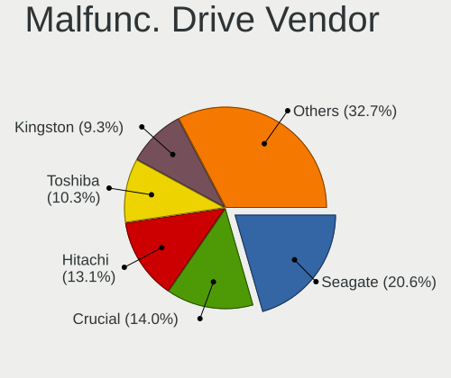

| Vendor                    | Notebooks | Drives | Percent |
|---------------------------|-----------|--------|---------|
| Seagate                   | 22        | 24     | 20.56%  |
| Crucial                   | 15        | 16     | 14.02%  |
| Hitachi                   | 14        | 16     | 13.08%  |
| Toshiba                   | 11        | 11     | 10.28%  |
| Kingston                  | 10        | 11     | 9.35%   |
| WDC                       | 7         | 8      | 6.54%   |
| SK hynix                  | 4         | 4      | 3.74%   |
| HGST                      | 4         | 4      | 3.74%   |
| China                     | 4         | 5      | 3.74%   |
| Samsung Electronics       | 3         | 3      | 2.8%    |
| SanDisk                   | 2         | 2      | 1.87%   |
| A-DATA Technology         | 2         | 2      | 1.87%   |
| VNYEZ                     | 1         | 1      | 0.93%   |
| USB                       | 1         | 1      | 0.93%   |
| OCZ                       | 1         | 1      | 0.93%   |
| Micron/Crucial Technology | 1         | 1      | 0.93%   |
| Micron Technology         | 1         | 1      | 0.93%   |
| LITEON                    | 1         | 1      | 0.93%   |
| Intel                     | 1         | 2      | 0.93%   |
| Fujitsu                   | 1         | 1      | 0.93%   |
| Unknown                   | 1         | 1      | 0.93%   |

Malfunc. HDD Vendor
-------------------

Vendors of faulty HDD drives

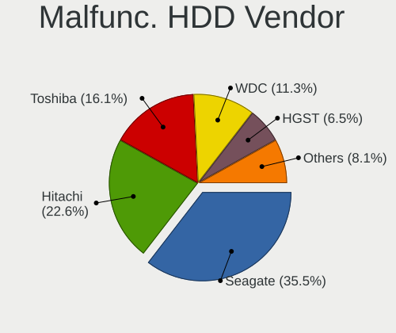

| Vendor              | Notebooks | Drives | Percent |
|---------------------|-----------|--------|---------|
| Seagate             | 22        | 24     | 35.48%  |
| Hitachi             | 14        | 16     | 22.58%  |
| Toshiba             | 10        | 10     | 16.13%  |
| WDC                 | 7         | 8      | 11.29%  |
| HGST                | 4         | 4      | 6.45%   |
| Samsung Electronics | 2         | 2      | 3.23%   |
| USB                 | 1         | 1      | 1.61%   |
| Fujitsu             | 1         | 1      | 1.61%   |
| Unknown             | 1         | 1      | 1.61%   |

Malfunc. Drive Kind
-------------------

Kinds of faulty drives

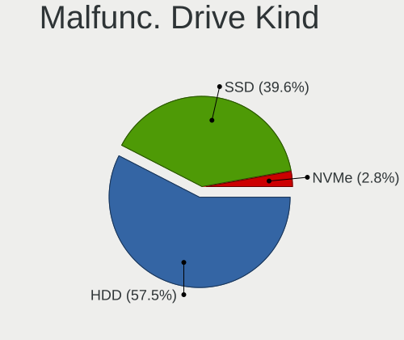

| Kind | Notebooks | Drives | Percent |
|------|-----------|--------|---------|
| HDD  | 61        | 67     | 57.55%  |
| SSD  | 42        | 46     | 39.62%  |
| NVMe | 3         | 3      | 2.83%   |

Failed Drives
-------------

Failed drive models

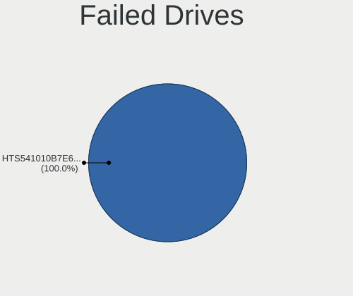

| Model                    | Notebooks | Drives | Percent |
|--------------------------|-----------|--------|---------|
| HGST HTS541010B7E610 1TB | 1         | 1      | 100%    |

Failed Drive Vendor
-------------------

Failed drive vendors

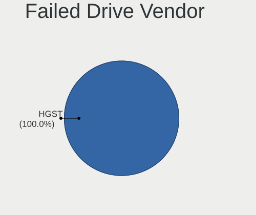

| Vendor | Notebooks | Drives | Percent |
|--------|-----------|--------|---------|
| HGST   | 1         | 1      | 100%    |

Drive Status
------------

Number of failed and malfunc. drives

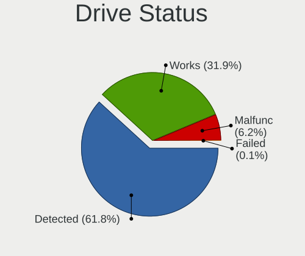

| Status   | Notebooks | Drives | Percent |
|----------|-----------|--------|---------|
| Detected | 1029      | 1587   | 61.8%   |
| Works    | 531       | 783    | 31.89%  |
| Malfunc  | 104       | 116    | 6.25%   |
| Failed   | 1         | 1      | 0.06%   |

Storage controller
------------------

Storage Vendor
--------------

Storage controller vendors

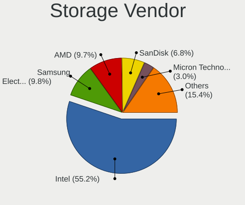

| Vendor                           | Notebooks | Percent |
|----------------------------------|-----------|---------|
| Intel                            | 1021      | 55.22%  |
| Samsung Electronics              | 182       | 9.84%   |
| AMD                              | 180       | 9.73%   |
| SanDisk                          | 125       | 6.76%   |
| Micron Technology                | 56        | 3.03%   |
| SK hynix                         | 51        | 2.76%   |
| Kingston Technology Company      | 37        | 2%      |
| Toshiba America Info Systems     | 32        | 1.73%   |
| Phison Electronics               | 30        | 1.62%   |
| KIOXIA                           | 26        | 1.41%   |
| Nvidia                           | 20        | 1.08%   |
| Silicon Integrated Systems [SiS] | 15        | 0.81%   |
| Silicon Motion                   | 14        | 0.76%   |
| Micron/Crucial Technology        | 14        | 0.76%   |
| Union Memory (Shenzhen)          | 8         | 0.43%   |
| Lite-On Technology               | 6         | 0.32%   |
| Realtek Semiconductor            | 4         | 0.22%   |
| Lenovo                           | 4         | 0.22%   |
| JMicron Technology               | 4         | 0.22%   |
| Solidigm                         | 3         | 0.16%   |
| Solid State Storage Technology   | 3         | 0.16%   |
| Marvell Technology Group         | 3         | 0.16%   |
| Apple                            | 3         | 0.16%   |
| O2 Micro                         | 2         | 0.11%   |
| MAXIO Technology (Hangzhou)      | 2         | 0.11%   |
| ADATA Technology                 | 2         | 0.11%   |
| Silicon Image                    | 1         | 0.05%   |
| Enmotus                          | 1         | 0.05%   |

Storage Model
-------------

Storage controller models

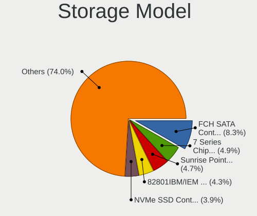

| Model                                                                          | Notebooks | Percent |
|--------------------------------------------------------------------------------|-----------|---------|
| AMD FCH SATA Controller [AHCI mode]                                            | 167       | 8.27%   |
| Intel 7 Series Chipset Family 6-port SATA Controller [AHCI mode]               | 99        | 4.9%    |
| Intel Sunrise Point-LP SATA Controller [AHCI mode]                             | 94        | 4.65%   |
| Intel 82801IBM/IEM (ICH9M/ICH9M-E) 4 port SATA Controller [AHCI mode]          | 86        | 4.26%   |
| Samsung NVMe SSD Controller SM981/PM981/PM983                                  | 79        | 3.91%   |
| Intel 6 Series/C200 Series Chipset Family 6 port Mobile SATA AHCI Controller   | 67        | 3.32%   |
| Intel 82801 Mobile SATA Controller [RAID mode]                                 | 66        | 3.27%   |
| Intel 82801HM/HEM (ICH8M/ICH8M-E) IDE Controller                               | 63        | 3.12%   |
| Intel 5 Series/3400 Series Chipset 4 port SATA AHCI Controller                 | 62        | 3.07%   |
| Intel 82801HM/HEM (ICH8M/ICH8M-E) SATA Controller [AHCI mode]                  | 55        | 2.72%   |
| Intel 8 Series SATA Controller 1 [AHCI mode]                                   | 49        | 2.43%   |
| Intel Volume Management Device NVMe RAID Controller                            | 48        | 2.38%   |
| Intel Wildcat Point-LP SATA Controller [AHCI Mode]                             | 45        | 2.23%   |
| Samsung NVMe SSD Controller 980 (DRAM-less)                                    | 38        | 1.88%   |
| Intel Cannon Lake Mobile PCH SATA AHCI Controller                              | 38        | 1.88%   |
| Intel 8 Series/C220 Series Chipset Family 6-port SATA Controller 1 [AHCI mode] | 37        | 1.83%   |
| Intel HM170/QM170 Chipset SATA Controller [AHCI Mode]                          | 30        | 1.49%   |
| SanDisk Extreme Pro / WD Black SN750 / PC SN730 / Red SN700 NVMe SSD           | 25        | 1.24%   |
| Intel Comet Lake SATA AHCI Controller                                          | 25        | 1.24%   |
| SanDisk Ultra 3D / WD PC SN530, IX SN530, Blue SN550 NVMe SSD (DRAM-less)      | 24        | 1.19%   |
| Samsung NVMe SSD Controller PM9A1/PM9A3/980PRO                                 | 24        | 1.19%   |
| Intel SSD 660P Series                                                          | 22        | 1.09%   |
| Intel SSD 670p Series [Keystone Harbor]                                        | 18        | 0.89%   |
| SK hynix Gold P31/BC711/PC711 NVMe Solid State Drive                           | 17        | 0.84%   |
| SanDisk WD SN560/SN740/SN770/SN5000 NVMe SSD                                   | 17        | 0.84%   |
| Samsung NVMe SSD Controller SM961/PM961/SM963                                  | 17        | 0.84%   |
| Phison PS5013-E13 PCIe3 NVMe Controller (DRAM-less)                            | 17        | 0.84%   |
| Intel Tiger Lake-LP SATA Controller                                            | 16        | 0.79%   |
| Intel Cannon Point-LP SATA Controller [AHCI Mode]                              | 16        | 0.79%   |
| Intel Atom Processor E3800 Series SATA AHCI Controller                         | 16        | 0.79%   |
| Silicon Integrated Systems [SiS] 5513 IDE Controller                           | 15        | 0.74%   |
| Silicon Integrated Systems [SiS] SATA Controller / IDE mode                    | 14        | 0.69%   |
| Micron 3400 NVMe SSD [Hendrix]                                                 | 14        | 0.69%   |
| Intel 82801G (ICH7 Family) IDE Controller                                      | 14        | 0.69%   |
| Intel 5 Series/3400 Series Chipset 6 port SATA AHCI Controller                 | 14        | 0.69%   |
| SanDisk Extreme Pro / WD Black 2018/SN750/PC SN720 NVMe SSD                    | 13        | 0.64%   |
| Micron 2400 NVMe SSD (DRAM-less)                                               | 13        | 0.64%   |
| KIOXIA NVMe SSD Controller BG4 (DRAM-less)                                     | 13        | 0.64%   |
| Toshiba America Info Systems XG6 NVMe SSD Controller                           | 12        | 0.59%   |
| Kingston Company A1000/U-SNS8154P3 x2 NVMe SSD [E8]                            | 12        | 0.59%   |

Storage Kind
------------

Kind of storage controller (IDE, SATA, NVMe, SAS, ...)

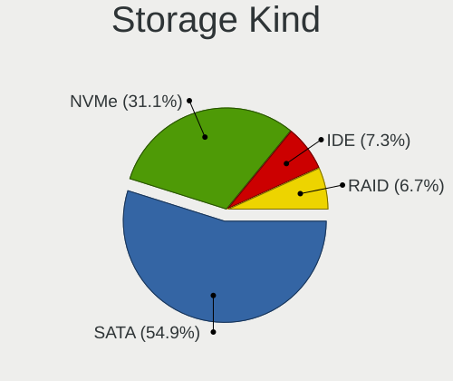

| Kind | Notebooks | Percent |
|------|-----------|---------|
| SATA | 1057      | 54.85%  |
| NVMe | 599       | 31.08%  |
| IDE  | 141       | 7.32%   |
| RAID | 130       | 6.75%   |

Processor
---------

CPU Vendor
----------

Processor vendors

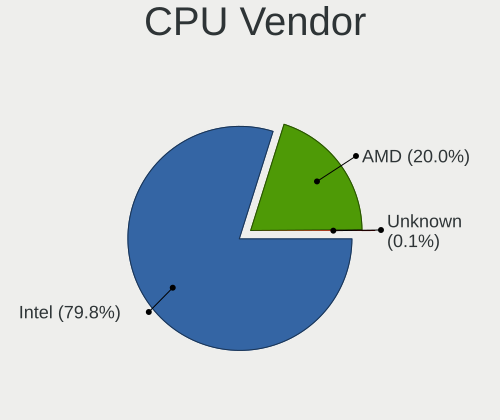

| Vendor  | Notebooks | Percent |
|---------|-----------|---------|
| Intel   | 1252      | 79.85%  |
| AMD     | 314       | 20.03%  |
| Unknown | 2         | 0.13%   |

CPU Model
---------

Processor models

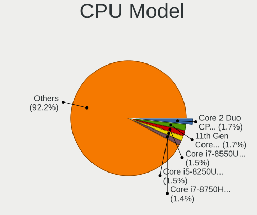

| Model                                         | Notebooks | Percent |
|-----------------------------------------------|-----------|---------|
| Intel Core 2 Duo CPU T8300 @ 2.40GHz          | 27        | 1.72%   |
| Intel 11th Gen Core i7-1165G7 @ 2.80GHz       | 27        | 1.72%   |
| Intel Core i7-8550U CPU @ 1.80GHz             | 24        | 1.53%   |
| Intel Core i5-8250U CPU @ 1.60GHz             | 23        | 1.46%   |
| Intel Core i7-8750H CPU @ 2.20GHz             | 22        | 1.4%    |
| Intel Core i7-10510U CPU @ 1.80GHz            | 22        | 1.4%    |
| Intel Core i7-8565U CPU @ 1.80GHz             | 21        | 1.34%   |
| Intel 11th Gen Core i5-1135G7 @ 2.40GHz       | 21        | 1.34%   |
| AMD Ryzen 5 3500U with Radeon Vega Mobile Gfx | 21        | 1.34%   |
| Intel Core i7-9750H CPU @ 2.60GHz             | 20        | 1.27%   |
| AMD Ryzen 7 5800H with Radeon Graphics        | 20        | 1.27%   |
| AMD Ryzen 7 5700U with Radeon Graphics        | 17        | 1.08%   |
| Intel Pentium Dual-Core CPU T4300 @ 2.10GHz   | 16        | 1.02%   |
| Intel Core i7-10750H CPU @ 2.60GHz            | 16        | 1.02%   |
| Intel Core i5-7200U CPU @ 2.50GHz             | 16        | 1.02%   |
| AMD Ryzen 7 4800H with Radeon Graphics        | 16        | 1.02%   |
| Intel Core i7-6700HQ CPU @ 2.60GHz            | 15        | 0.96%   |
| Intel Core i7-7500U CPU @ 2.70GHz             | 14        | 0.89%   |
| Intel Core i5-8265U CPU @ 1.60GHz             | 14        | 0.89%   |
| Intel Core i5-5200U CPU @ 2.20GHz             | 14        | 0.89%   |
| AMD 3020e with Radeon Graphics                | 14        | 0.89%   |
| Intel Core i7-7700HQ CPU @ 2.80GHz            | 13        | 0.83%   |
| Intel Core i5-3320M CPU @ 2.60GHz             | 13        | 0.83%   |
| Intel Core i5-10210U CPU @ 1.60GHz            | 13        | 0.83%   |
| Intel Core i3-5005U CPU @ 2.00GHz             | 13        | 0.83%   |
| Intel Celeron CPU N2840 @ 2.16GHz             | 13        | 0.83%   |
| AMD Ryzen 5 5600H with Radeon Graphics        | 13        | 0.83%   |
| Intel Core i7-2630QM CPU @ 2.00GHz            | 12        | 0.76%   |
| Intel Core i5-3210M CPU @ 2.50GHz             | 12        | 0.76%   |
| Intel Core i3-3217U CPU @ 1.80GHz             | 12        | 0.76%   |
| Intel Core i5-6200U CPU @ 2.30GHz             | 11        | 0.7%    |
| AMD Ryzen 5 5500U with Radeon Graphics        | 11        | 0.7%    |
| Intel Pentium Dual CPU T2390 @ 1.86GHz        | 10        | 0.64%   |
| Intel Core i7-6500U CPU @ 2.50GHz             | 10        | 0.64%   |
| Intel Core i5-6300U CPU @ 2.40GHz             | 10        | 0.64%   |
| Intel Core i5 CPU M 480 @ 2.67GHz             | 10        | 0.64%   |
| Intel Core i7-4510U CPU @ 2.00GHz             | 9         | 0.57%   |
| Intel Core i7 CPU Q 720 @ 1.60GHz             | 9         | 0.57%   |
| Intel Core i5-3317U CPU @ 1.70GHz             | 9         | 0.57%   |
| Intel Core i5-2520M CPU @ 2.50GHz             | 9         | 0.57%   |

CPU Model Family
----------------

Processor model prefix

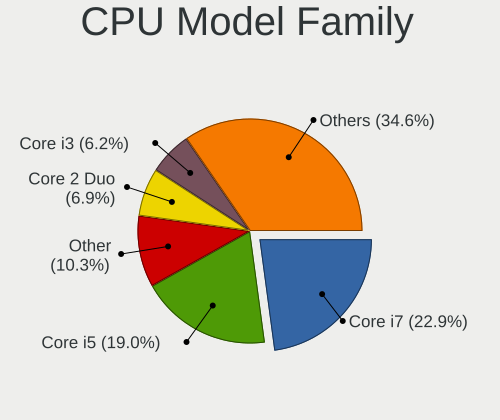

| Model                   | Notebooks | Percent |
|-------------------------|-----------|---------|
| Intel Core i7           | 359       | 22.88%  |
| Intel Core i5           | 298       | 18.99%  |
| Other                   | 162       | 10.33%  |
| Intel Core 2 Duo        | 109       | 6.95%   |
| Intel Core i3           | 98        | 6.25%   |
| AMD Ryzen 7             | 98        | 6.25%   |
| AMD Ryzen 5             | 74        | 4.72%   |
| Intel Celeron           | 71        | 4.53%   |
| Intel Atom              | 38        | 2.42%   |
| Intel Pentium Dual-Core | 37        | 2.36%   |
| Intel Pentium Dual      | 27        | 1.72%   |
| Intel Pentium           | 24        | 1.53%   |
| AMD A4                  | 19        | 1.21%   |
| Intel Genuine           | 15        | 0.96%   |
| Intel Core              | 15        | 0.96%   |
| AMD A8                  | 14        | 0.89%   |
| AMD A6                  | 14        | 0.89%   |
| Intel Core 2            | 12        | 0.76%   |
| AMD Ryzen 9             | 11        | 0.7%    |
| AMD Ryzen 3             | 11        | 0.7%    |
| AMD E2                  | 8         | 0.51%   |
| AMD Ryzen 7 PRO         | 7         | 0.45%   |
| AMD E                   | 6         | 0.38%   |
| Intel Pentium M         | 5         | 0.32%   |
| AMD A10                 | 5         | 0.32%   |
| Intel Core i9           | 4         | 0.25%   |
| AMD E1                  | 4         | 0.25%   |
| Intel Core M            | 3         | 0.19%   |
| AMD Ryzen 5 PRO         | 3         | 0.19%   |
| AMD Athlon              | 3         | 0.19%   |
| Intel Core m3           | 2         | 0.13%   |
| Intel Celeron M         | 2         | 0.13%   |
| AMD Mobile Sempron      | 2         | 0.13%   |
| Intel Core m7           | 1         | 0.06%   |
| Intel Core 2 Extreme    | 1         | 0.06%   |
| Intel Celeron Dual-Core | 1         | 0.06%   |
| AMD Turion 64 X2 Mobile | 1         | 0.06%   |
| AMD Turion              | 1         | 0.06%   |
| AMD Quad-Core           | 1         | 0.06%   |
| AMD Phenom II           | 1         | 0.06%   |

CPU Cores
---------

Number of processor cores

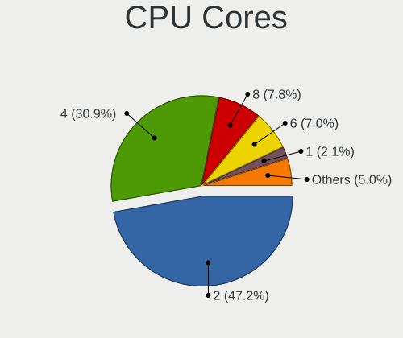

| Number | Notebooks | Percent |
|--------|-----------|---------|
| 2      | 740       | 47.19%  |
| 4      | 485       | 30.93%  |
| 8      | 122       | 7.78%   |
| 6      | 110       | 7.02%   |
| 1      | 33        | 2.1%    |
| 10     | 28        | 1.79%   |
| 14     | 20        | 1.28%   |
| 12     | 16        | 1.02%   |
| 16     | 11        | 0.7%    |
| 24     | 2         | 0.13%   |
| 3      | 1         | 0.06%   |

CPU Sockets
-----------

Number of sockets

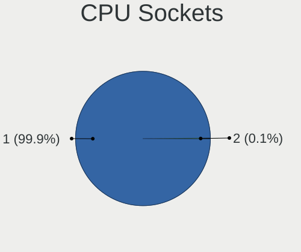

| Number | Notebooks | Percent |
|--------|-----------|---------|
| 1      | 1567      | 99.94%  |
| 2      | 1         | 0.06%   |

CPU Threads
-----------

Threads per core (Hyper-Threading)

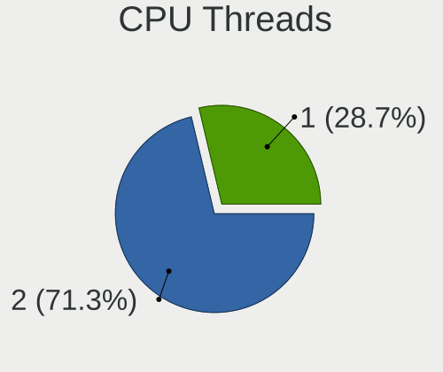

| Number | Notebooks | Percent |
|--------|-----------|---------|
| 2      | 1120      | 71.29%  |
| 1      | 451       | 28.71%  |

CPU Op-Modes
------------

CPU Operation Modes (32-bit, 64-bit)

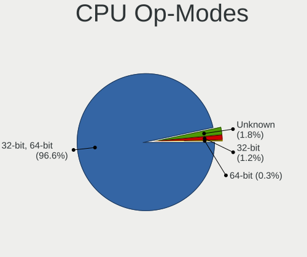

| Op mode        | Notebooks | Percent |
|----------------|-----------|---------|
| 32-bit, 64-bit | 1520      | 96.63%  |
| Unknown        | 29        | 1.84%   |
| 32-bit         | 19        | 1.21%   |
| 64-bit         | 5         | 0.32%   |

CPU Microcode
-------------

Microcode number

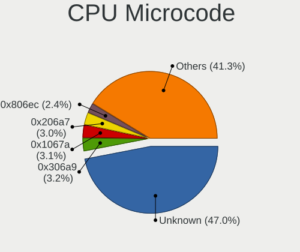

| Number     | Notebooks | Percent |
|------------|-----------|---------|
| Unknown    | 767       | 46.97%  |
| 0x306a9    | 53        | 3.25%   |
| 0x1067a    | 51        | 3.12%   |
| 0x206a7    | 49        | 3%      |
| 0x806ec    | 39        | 2.39%   |
| 0x10676    | 38        | 2.33%   |
| 0x806ea    | 37        | 2.27%   |
| 0x906ea    | 33        | 2.02%   |
| 0x6fd      | 31        | 1.9%    |
| 0x806c1    | 28        | 1.71%   |
| 0x40651    | 28        | 1.71%   |
| 0x306d4    | 23        | 1.41%   |
| 0x20655    | 23        | 1.41%   |
| 0x406e3    | 19        | 1.16%   |
| 0x806e9    | 18        | 1.1%    |
| 0x806eb    | 17        | 1.04%   |
| 0x0a50000c | 17        | 1.04%   |
| 0x20652    | 16        | 0.98%   |
| 0x08108109 | 16        | 0.98%   |
| 0x306c3    | 15        | 0.92%   |
| 0x08200103 | 14        | 0.86%   |
| 0xa0652    | 13        | 0.8%    |
| 0x506e3    | 13        | 0.8%    |
| 0x30678    | 13        | 0.8%    |
| 0x406c4    | 10        | 0.61%   |
| 0x406c3    | 10        | 0.61%   |
| 0x0a50000d | 10        | 0.61%   |
| 0x07030105 | 10        | 0.61%   |
| 0x106ca    | 9         | 0.55%   |
| 0x08108102 | 9         | 0.55%   |
| 0x906e9    | 8         | 0.49%   |
| 0x6f6      | 8         | 0.49%   |
| 0x906a3    | 7         | 0.43%   |
| 0x706e5    | 7         | 0.43%   |
| 0x106e5    | 7         | 0.43%   |
| 0x08608103 | 7         | 0.43%   |
| 0x08600106 | 7         | 0.43%   |
| 0x08600104 | 7         | 0.43%   |
| 0x08600103 | 7         | 0.43%   |
| 0x6d8      | 6         | 0.37%   |

CPU Microarch
-------------

Microarchitecture

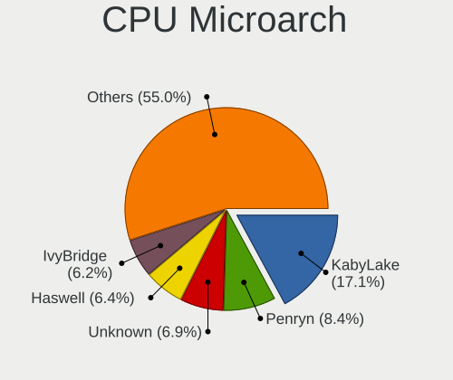

| Name               | Notebooks | Percent |
|--------------------|-----------|---------|
| KabyLake           | 269       | 17.1%   |
| Penryn             | 132       | 8.39%   |
| Unknown            | 109       | 6.93%   |
| Haswell            | 101       | 6.42%   |
| IvyBridge          | 97        | 6.17%   |
| SandyBridge        | 81        | 5.15%   |
| Westmere           | 70        | 4.45%   |
| Skylake            | 68        | 4.32%   |
| Core               | 68        | 4.32%   |
| Zen 3              | 59        | 3.75%   |
| TigerLake          | 57        | 3.62%   |
| Broadwell          | 57        | 3.62%   |
| Silvermont         | 54        | 3.43%   |
| Alderlake Hybrid   | 41        | 2.61%   |
| Zen+               | 40        | 2.54%   |
| Zen 2              | 35        | 2.23%   |
| CometLake          | 28        | 1.78%   |
| Zen                | 27        | 1.72%   |
| Puma               | 25        | 1.59%   |
| Bonnell            | 17        | 1.08%   |
| Excavator          | 16        | 1.02%   |
| IceLake            | 15        | 0.95%   |
| P6                 | 13        | 0.83%   |
| Jaguar             | 13        | 0.83%   |
| Goldmont plus      | 12        | 0.76%   |
| Nehalem            | 10        | 0.64%   |
| Goldmont           | 10        | 0.64%   |
| Bobcat             | 9         | 0.57%   |
| Tremont            | 7         | 0.45%   |
| Piledriver         | 7         | 0.45%   |
| Meteorlake Hybrid  | 6         | 0.38%   |
| Steamroller        | 5         | 0.32%   |
| K8 Hammer          | 4         | 0.25%   |
| K8 & K10 hybrid    | 4         | 0.25%   |
| K10 Llano          | 2         | 0.13%   |
| Gracemont          | 2         | 0.13%   |
| ArrowLake-H Hybrid | 2         | 0.13%   |
| K10                | 1         | 0.06%   |

Graphics
--------

GPU Vendor
----------

Vendors of graphics cards

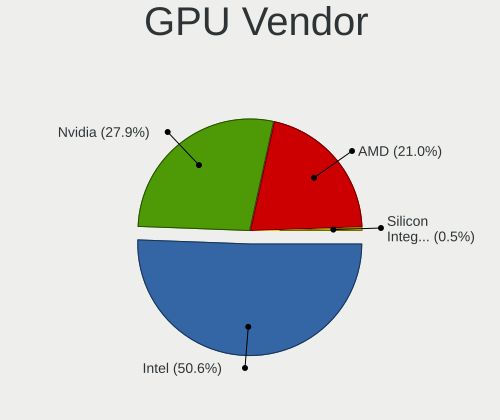

| Vendor                           | Notebooks | Percent |
|----------------------------------|-----------|---------|
| Intel                            | 1044      | 50.58%  |
| Nvidia                           | 575       | 27.86%  |
| AMD                              | 434       | 21.03%  |
| Silicon Integrated Systems [SiS] | 11        | 0.53%   |

GPU Model
---------

Graphics card models

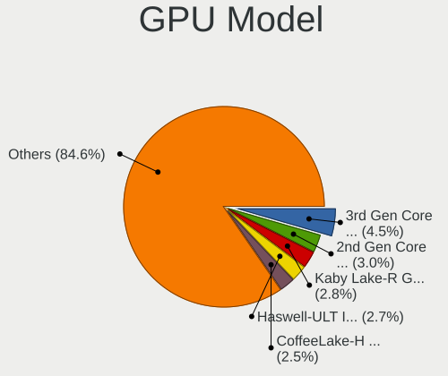

| Model                                                                                    | Notebooks | Percent |
|------------------------------------------------------------------------------------------|-----------|---------|
| Intel 3rd Gen Core processor Graphics Controller                                         | 96        | 4.5%    |
| Intel 2nd Generation Core Processor Family Integrated Graphics Controller                | 63        | 2.95%   |
| Intel Kaby Lake-R GT2 [UHD Graphics 620]                                                 | 59        | 2.76%   |
| Intel Haswell-ULT Integrated Graphics Controller                                         | 57        | 2.67%   |
| Intel CoffeeLake-H GT2 [UHD Graphics 630]                                                | 54        | 2.53%   |
| AMD Picasso/Raven 2 [Radeon Vega Series / Radeon Vega Mobile Series]                     | 54        | 2.53%   |
| Intel TigerLake-LP GT2 [Iris Xe Graphics]                                                | 53        | 2.48%   |
| Intel WhiskeyLake-U GT2 [UHD Graphics 620]                                               | 44        | 2.06%   |
| Intel CometLake-U GT2 [UHD Graphics]                                                     | 44        | 2.06%   |
| Intel Broadwell-U GT2 [HD Graphics 5500]                                                 | 44        | 2.06%   |
| Intel Mobile 4 Series Chipset Integrated Graphics Controller                             | 42        | 1.97%   |
| Intel Skylake-U GT2 [HD Graphics 520]                                                    | 41        | 1.92%   |
| Intel Core Processor Integrated Graphics Controller                                      | 40        | 1.87%   |
| AMD Cezanne [Radeon Vega Series / Radeon Vega Mobile Series]                             | 39        | 1.83%   |
| Intel Kaby Lake-U GT2 [HD Graphics 620]                                                  | 36        | 1.69%   |
| Intel 4th Gen Core Processor Integrated Graphics Controller                              | 36        | 1.69%   |
| AMD Renoir [Radeon Vega Series / Radeon Vega Mobile Series]                              | 32        | 1.5%    |
| Nvidia TU117M [GeForce GTX 1650 Mobile / Max-Q]                                          | 31        | 1.45%   |
| Intel Atom/Celeron/Pentium Processor x5-E8000/J3xxx/N3xxx Integrated Graphics Controller | 30        | 1.41%   |
| Intel Mobile GM965/GL960 Integrated Graphics Controller (secondary)                      | 28        | 1.31%   |
| Intel Mobile GM965/GL960 Integrated Graphics Controller (primary)                        | 28        | 1.31%   |
| AMD Lucienne                                                                             | 28        | 1.31%   |
| Nvidia GP107M [GeForce GTX 1050 Mobile]                                                  | 27        | 1.26%   |
| Intel Atom Processor Z36xxx/Z37xxx Series Graphics & Display                             | 24        | 1.12%   |
| Intel CometLake-H GT2 [UHD Graphics]                                                     | 23        | 1.08%   |
| Nvidia GF117M [GeForce 610M/710M/810M/820M / GT 620M/625M/630M/720M]                     | 22        | 1.03%   |
| Nvidia G86M [GeForce 8600M GS]                                                           | 22        | 1.03%   |
| AMD Park [Mobility Radeon HD 5430/5450/5470]                                             | 22        | 1.03%   |
| Nvidia GA106M [GeForce RTX 3060 Mobile / Max-Q]                                          | 21        | 0.98%   |
| Nvidia GK208BM [GeForce 920M]                                                            | 19        | 0.89%   |
| Intel Skylake-H GT2 [HD Graphics 530]                                                    | 19        | 0.89%   |
| Intel Raptor Lake-P [Iris Xe Graphics]                                                   | 18        | 0.84%   |
| Nvidia GP108M [GeForce MX150]                                                            | 17        | 0.8%    |
| AMD Mullins [Radeon R4/R5 Graphics]                                                      | 17        | 0.8%    |
| AMD Barcelo                                                                              | 17        | 0.8%    |
| Intel Kaby Lake-H GT2 [HD Graphics 630]                                                  | 16        | 0.75%   |
| Nvidia GK208M [GeForce GT 740M]                                                          | 14        | 0.66%   |
| Nvidia GA107M [GeForce RTX 3050 Mobile]                                                  | 14        | 0.66%   |
| AMD Topaz XT [Radeon R7 M260/M265 / M340/M360 / M440/M445 / 530/535 / 620/625 Mobile]    | 14        | 0.66%   |
| AMD Stoney [Radeon R2/R3/R4/R5 Graphics]                                                 | 14        | 0.66%   |

GPU Combo
---------

Combinations of graphics cards

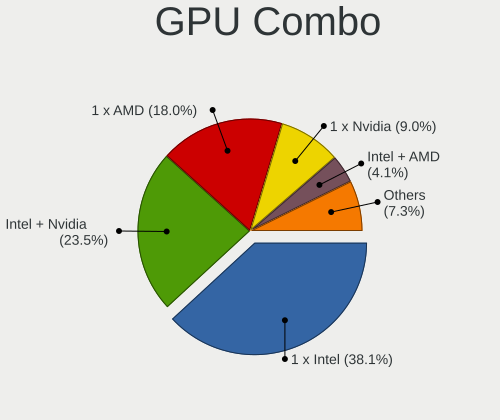

| Name           | Notebooks | Percent |
|----------------|-----------|---------|
| 1 x Intel      | 601       | 38.13%  |
| Intel + Nvidia | 371       | 23.54%  |
| 1 x AMD        | 283       | 17.96%  |
| 1 x Nvidia     | 142       | 9.01%   |
| Intel + AMD    | 64        | 4.06%   |
| AMD + Nvidia   | 61        | 3.87%   |
| 2 x AMD        | 28        | 1.78%   |
| 2 x Intel      | 11        | 0.7%    |
| 1 x SiS        | 11        | 0.7%    |
| Other          | 2         | 0.13%   |
| 2 x Nvidia     | 2         | 0.13%   |

GPU Driver
----------

Free vs proprietary

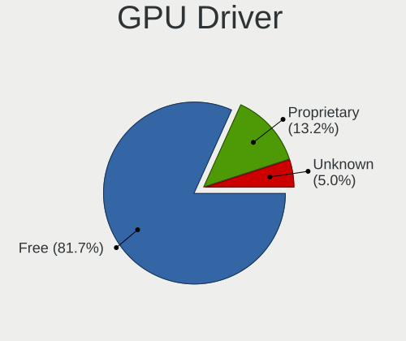

| Driver      | Notebooks | Percent |
|-------------|-----------|---------|
| Free        | 1303      | 81.74%  |
| Proprietary | 211       | 13.24%  |
| Unknown     | 80        | 5.02%   |

GPU Memory
----------

Total video memory

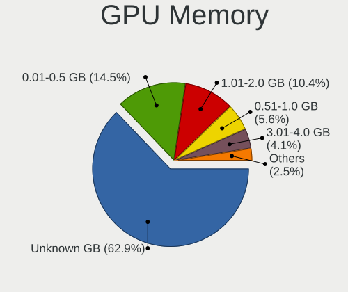

| Size in GB | Notebooks | Percent |
|------------|-----------|---------|
| Unknown    | 1014      | 62.86%  |
| 0.01-0.5   | 234       | 14.51%  |
| 1.01-2.0   | 168       | 10.42%  |
| 0.51-1.0   | 90        | 5.58%   |
| 3.01-4.0   | 66        | 4.09%   |
| 5.01-6.0   | 24        | 1.49%   |
| 7.01-8.0   | 12        | 0.74%   |
| 2.01-3.0   | 4         | 0.25%   |
| 8.01-16.0  | 1         | 0.06%   |

Monitor
-------

Monitor Vendor
--------------

Monitor vendors

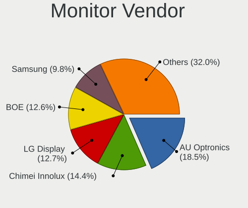

| Vendor                  | Notebooks | Percent |
|-------------------------|-----------|---------|
| AU Optronics            | 317       | 18.46%  |
| Chimei Innolux          | 247       | 14.39%  |
| LG Display              | 218       | 12.7%   |
| BOE                     | 216       | 12.58%  |
| Samsung Electronics     | 169       | 9.84%   |
| Goldstar                | 57        | 3.32%   |
| Apple                   | 52        | 3.03%   |
| Chi Mei Optoelectronics | 42        | 2.45%   |
| PANDA                   | 31        | 1.81%   |
| LG Philips              | 30        | 1.75%   |
| Lenovo                  | 30        | 1.75%   |
| Hewlett-Packard         | 29        | 1.69%   |
| Dell                    | 25        | 1.46%   |
| AOC                     | 25        | 1.46%   |
| Sharp                   | 24        | 1.4%    |
| Ancor Communications    | 24        | 1.4%    |
| ASUSTek Computer        | 12        | 0.7%    |
| BenQ                    | 11        | 0.64%   |
| Philips                 | 10        | 0.58%   |
| CPT                     | 10        | 0.58%   |
| Sony                    | 9         | 0.52%   |
| InfoVision              | 9         | 0.52%   |
| Acer                    | 9         | 0.52%   |
| Valve                   | 8         | 0.47%   |
| CSO                     | 7         | 0.41%   |
| Toshiba                 | 6         | 0.35%   |
| Seiko/Epson             | 6         | 0.35%   |
| MSI                     | 6         | 0.35%   |
| HannStar                | 6         | 0.35%   |
| ViewSonic               | 5         | 0.29%   |
| CSW                     | 5         | 0.29%   |
| ZTR                     | 3         | 0.17%   |
| Panasonic               | 3         | 0.17%   |
| Mi                      | 3         | 0.17%   |
| LGD                     | 3         | 0.17%   |
| LG Electronics          | 3         | 0.17%   |
| HUAWEI                  | 3         | 0.17%   |
| HKC                     | 3         | 0.17%   |
| CSOT                    | 3         | 0.17%   |
| BOE Technology Group    | 3         | 0.17%   |

Monitor Model
-------------

Monitor models

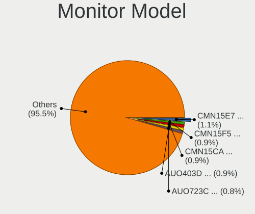

| Model                                                                    | Notebooks | Percent |
|--------------------------------------------------------------------------|-----------|---------|
| Chimei Innolux LCD Monitor CMN15E7 1920x1080 344x193mm 15.5-inch         | 19        | 1.09%   |
| Chimei Innolux LCD Monitor CMN15F5 1920x1080 344x193mm 15.5-inch         | 15        | 0.86%   |
| Chimei Innolux LCD Monitor CMN15CA 1366x768 344x193mm 15.5-inch          | 15        | 0.86%   |
| AU Optronics LCD Monitor AUO403D 1920x1080 309x174mm 14.0-inch           | 15        | 0.86%   |
| AU Optronics LCD Monitor AUO723C 1366x768 309x173mm 13.9-inch            | 14        | 0.8%    |
| AU Optronics LCD Monitor AUO22EC 1366x768 344x193mm 15.5-inch            | 10        | 0.57%   |
| AU Optronics LCD Monitor AUO21ED 1920x1080 344x193mm 15.5-inch           | 10        | 0.57%   |
| Chimei Innolux LCD Monitor CMN15E6 1366x768 344x193mm 15.5-inch          | 9         | 0.52%   |
| Chimei Innolux LCD Monitor CMN14D5 1920x1080 309x173mm 13.9-inch         | 9         | 0.52%   |
| Chimei Innolux LCD Monitor CMN14D4 1920x1080 309x173mm 13.9-inch         | 9         | 0.52%   |
| Valve ANX7530 U VLV3001 800x1280 100x150mm 7.1-inch                      | 8         | 0.46%   |
| Chimei Innolux LCD Monitor CMN15DB 1366x768 344x193mm 15.5-inch          | 8         | 0.46%   |
| Chimei Innolux LCD Monitor CMN15BF 1366x768 344x194mm 15.5-inch          | 8         | 0.46%   |
| Chimei Innolux LCD Monitor CMN1521 1920x1080 344x193mm 15.5-inch         | 8         | 0.46%   |
| Chi Mei Optoelectronics LCD Monitor CMO1592 1366x768 344x193mm 15.5-inch | 8         | 0.46%   |
| BOE LCD Monitor BOE0893 2160x1440 296x197mm 14.0-inch                    | 8         | 0.46%   |
| AU Optronics LCD Monitor AUO8174 1280x800 331x207mm 15.4-inch            | 8         | 0.46%   |
| PANDA LCD Monitor NCP0036 1920x1080 344x194mm 15.5-inch                  | 7         | 0.4%    |
| LG Display LCD Monitor LGD0521 1920x1080 309x174mm 14.0-inch             | 7         | 0.4%    |
| LG Display LCD Monitor LGD0456 1366x768 344x194mm 15.5-inch              | 7         | 0.4%    |
| LG Display LCD Monitor LGD039F 1366x768 345x194mm 15.6-inch              | 7         | 0.4%    |
| Goldstar LG ULTRAWIDE GSM59F1 2560x1080 670x280mm 28.6-inch              | 7         | 0.4%    |
| BOE LCD Monitor BOE0877 1920x1080 309x173mm 13.9-inch                    | 7         | 0.4%    |
| BOE LCD Monitor BOE0872 1920x1080 344x194mm 15.5-inch                    | 7         | 0.4%    |
| BOE LCD Monitor BOE0704 1366x768 344x194mm 15.5-inch                     | 7         | 0.4%    |
| BOE LCD Monitor BOE06A5 1366x768 344x194mm 15.5-inch                     | 7         | 0.4%    |
| AU Optronics LCD Monitor AUO26EC 1366x768 344x193mm 15.5-inch            | 7         | 0.4%    |
| Samsung Electronics LCD Monitor SEC5541 1366x768 344x193mm 15.5-inch     | 6         | 0.34%   |
| Samsung Electronics LCD Monitor SEC5441 1280x800 331x207mm 15.4-inch     | 6         | 0.34%   |
| LG Display LCD Monitor LGD045D 1366x768 345x194mm 15.6-inch              | 6         | 0.34%   |
| Chimei Innolux LCD Monitor CMN15C9 1366x768 344x193mm 15.5-inch          | 6         | 0.34%   |
| Chimei Innolux LCD Monitor CMN153B 1920x1080 344x193mm 15.5-inch         | 6         | 0.34%   |
| Chi Mei Optoelectronics LCD Monitor CMO15A7 1366x768 344x193mm 15.5-inch | 6         | 0.34%   |
| BOE LCD Monitor BOE06A4 1366x768 344x194mm 15.5-inch                     | 6         | 0.34%   |
| AU Optronics LCD Monitor AUOD1ED 1920x1080 344x193mm 15.5-inch           | 6         | 0.34%   |
| AU Optronics LCD Monitor AUO61ED 1920x1080 344x194mm 15.5-inch           | 6         | 0.34%   |
| AU Optronics LCD Monitor AUO5B2D 1920x1080 293x162mm 13.2-inch           | 6         | 0.34%   |
| AU Optronics LCD Monitor AUO38ED 1920x1080 344x193mm 15.5-inch           | 6         | 0.34%   |
| Samsung Electronics LCD Monitor SEC3945 1280x800 331x207mm 15.4-inch     | 5         | 0.29%   |
| PANDA LCD Monitor NCP004D 1920x1080 344x194mm 15.5-inch                  | 5         | 0.29%   |

Monitor Resolution
------------------

Monitor screen resolution

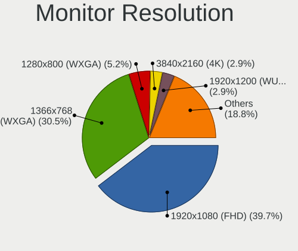

| Resolution         | Notebooks | Percent |
|--------------------|-----------|---------|
| 1920x1080 (FHD)    | 633       | 39.66%  |
| 1366x768 (WXGA)    | 486       | 30.45%  |
| 1280x800 (WXGA)    | 83        | 5.2%    |
| 3840x2160 (4K)     | 47        | 2.94%   |
| 1920x1200 (WUXGA)  | 47        | 2.94%   |
| 2560x1440 (QHD)    | 40        | 2.51%   |
| 1600x900 (HD+)     | 40        | 2.51%   |
| 1440x900 (WXGA+)   | 27        | 1.69%   |
| 2880x1800          | 26        | 1.63%   |
| 2560x1600          | 23        | 1.44%   |
| 1680x1050 (WSXGA+) | 16        | 1%      |
| 2160x1440          | 15        | 0.94%   |
| 2560x1080          | 14        | 0.88%   |
| 1280x1024 (SXGA)   | 14        | 0.88%   |
| 3440x1440          | 9         | 0.56%   |
| 800x1280           | 8         | 0.5%    |
| 3840x2400          | 7         | 0.44%   |
| 1024x600           | 7         | 0.44%   |
| Unknown            | 7         | 0.44%   |
| 1360x768           | 6         | 0.38%   |
| 1024x768 (XGA)     | 5         | 0.31%   |
| 2880x1620          | 4         | 0.25%   |
| 3200x2000          | 3         | 0.19%   |
| 3200x1800 (QHD+)   | 3         | 0.19%   |
| 2288x1287          | 3         | 0.19%   |
| 3072x1920          | 2         | 0.13%   |
| 2256x1504          | 2         | 0.13%   |
| 2240x1400          | 2         | 0.13%   |
| 1920x1280          | 2         | 0.13%   |
| 1600x1200          | 2         | 0.13%   |
| 1400x1050          | 2         | 0.13%   |
| 640x480            | 1         | 0.06%   |
| 5760x1080          | 1         | 0.06%   |
| 3840x1600          | 1         | 0.06%   |
| 3840x1100          | 1         | 0.06%   |
| 3840x1080          | 1         | 0.06%   |
| 3520x1080          | 1         | 0.06%   |
| 3280x1080          | 1         | 0.06%   |
| 3000x2000          | 1         | 0.06%   |
| 2726x768           | 1         | 0.06%   |

Monitor Diagonal
----------------

Diagonal size in inches

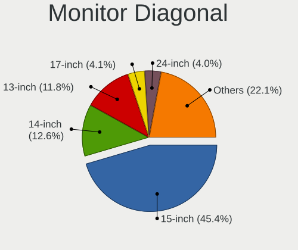

| Inches  | Notebooks | Percent |
|---------|-----------|---------|
| 15      | 778       | 45.44%  |
| 14      | 216       | 12.62%  |
| 13      | 202       | 11.8%   |
| 17      | 70        | 4.09%   |
| 24      | 68        | 3.97%   |
| 21      | 48        | 2.8%    |
| 27      | 44        | 2.57%   |
| 16      | 43        | 2.51%   |
| 23      | 31        | 1.81%   |
| 12      | 31        | 1.81%   |
| Unknown | 30        | 1.75%   |
| 31      | 27        | 1.58%   |
| 11      | 19        | 1.11%   |
| 34      | 18        | 1.05%   |
| 19      | 12        | 0.7%    |
| 10      | 12        | 0.7%    |
| 22      | 9         | 0.53%   |
| 18      | 8         | 0.47%   |
| 7       | 8         | 0.47%   |
| 40      | 5         | 0.29%   |
| 84      | 4         | 0.23%   |
| 63      | 4         | 0.23%   |
| 28      | 4         | 0.23%   |
| 25      | 3         | 0.18%   |
| 20      | 3         | 0.18%   |
| 86      | 2         | 0.12%   |
| 72      | 2         | 0.12%   |
| 26      | 2         | 0.12%   |
| 60      | 1         | 0.06%   |
| 54      | 1         | 0.06%   |
| 50      | 1         | 0.06%   |
| 46      | 1         | 0.06%   |
| 43      | 1         | 0.06%   |
| 37      | 1         | 0.06%   |
| 33      | 1         | 0.06%   |
| 32      | 1         | 0.06%   |
| 8       | 1         | 0.06%   |

Monitor Width
-------------

Physical width

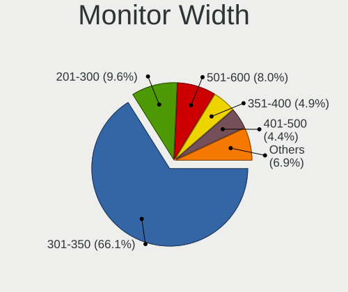

| Width in mm | Notebooks | Percent |
|-------------|-----------|---------|
| 301-350     | 1118      | 66.08%  |
| 201-300     | 163       | 9.63%   |
| 501-600     | 136       | 8.04%   |
| 351-400     | 83        | 4.91%   |
| 401-500     | 75        | 4.43%   |
| 601-700     | 35        | 2.07%   |
| Unknown     | 30        | 1.77%   |
| 701-800     | 20        | 1.18%   |
| 1001-1500   | 10        | 0.59%   |
| 1-100       | 8         | 0.47%   |
| 801-900     | 6         | 0.35%   |
| 1501-2000   | 6         | 0.35%   |
| 101-200     | 1         | 0.06%   |
| 901-1000    | 1         | 0.06%   |

Aspect Ratio
------------

Proportional relationship between the width and the height

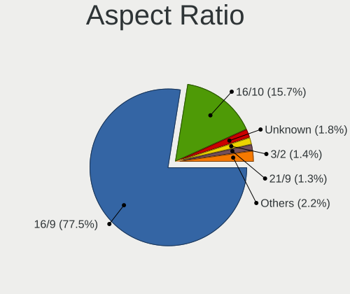

| Ratio   | Notebooks | Percent |
|---------|-----------|---------|
| 16/9    | 1180      | 77.53%  |
| 16/10   | 239       | 15.7%   |
| Unknown | 27        | 1.77%   |
| 3/2     | 22        | 1.45%   |
| 21/9    | 20        | 1.31%   |
| 5/4     | 13        | 0.85%   |
| 4/3     | 9         | 0.59%   |
| 0.67    | 8         | 0.53%   |
| 0.56    | 2         | 0.13%   |
| 6/5     | 1         | 0.07%   |
| 3.40    | 1         | 0.07%   |

Monitor Area
------------

Area in inch²

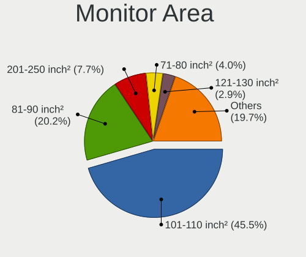

| Area in inch² | Notebooks | Percent |
|----------------|-----------|---------|
| 101-110        | 777       | 45.52%  |
| 81-90          | 344       | 20.15%  |
| 201-250        | 131       | 7.67%   |
| 71-80          | 68        | 3.98%   |
| 121-130        | 50        | 2.93%   |
| 351-500        | 47        | 2.75%   |
| 301-350        | 46        | 2.69%   |
| 111-120        | 38        | 2.23%   |
| 61-70          | 30        | 1.76%   |
| Unknown        | 30        | 1.76%   |
| 151-200        | 23        | 1.35%   |
| 51-60          | 20        | 1.17%   |
| 251-300        | 20        | 1.17%   |
| 141-150        | 17        | 1%      |
| More than 1000 | 15        | 0.88%   |
| 41-50          | 12        | 0.7%    |
| 131-140        | 11        | 0.64%   |
| 91-100         | 10        | 0.59%   |
| 1-40           | 9         | 0.53%   |
| 501-1000       | 9         | 0.53%   |

Pixel Density
-------------

Pixels per inch

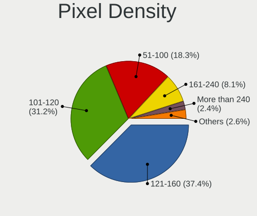

| Density       | Notebooks | Percent |
|---------------|-----------|---------|
| 121-160       | 626       | 37.44%  |
| 101-120       | 522       | 31.22%  |
| 51-100        | 306       | 18.3%   |
| 161-240       | 135       | 8.07%   |
| More than 240 | 40        | 2.39%   |
| Unknown       | 30        | 1.79%   |
| 1-50          | 13        | 0.78%   |

Multiple Monitors
-----------------

Total monitors connected

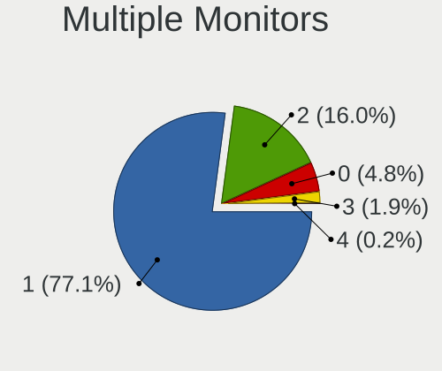

| Total | Notebooks | Percent |
|-------|-----------|---------|
| 1     | 1245      | 77.09%  |
| 2     | 259       | 16.04%  |
| 0     | 78        | 4.83%   |
| 3     | 30        | 1.86%   |
| 4     | 3         | 0.19%   |

Network
-------

Net Controller Vendor
---------------------

Controller vendors

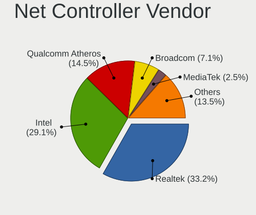

| Vendor                                 | Notebooks | Percent |
|----------------------------------------|-----------|---------|
| Realtek Semiconductor                  | 834       | 33.23%  |
| Intel                                  | 731       | 29.12%  |
| Qualcomm Atheros                       | 365       | 14.54%  |
| Broadcom                               | 178       | 7.09%   |
| MediaTek                               | 62        | 2.47%   |
| Marvell Technology Group               | 57        | 2.27%   |
| TP-Link                                | 45        | 1.79%   |
| Broadcom Limited                       | 37        | 1.47%   |
| Ralink                                 | 22        | 0.88%   |
| Silicon Integrated Systems [SiS]       | 15        | 0.6%    |
| ASIX Electronics                       | 15        | 0.6%    |
| Nvidia                                 | 14        | 0.56%   |
| Sierra Wireless                        | 8         | 0.32%   |
| JMicron Technology                     | 8         | 0.32%   |
| Shenzhen Goodix Technology             | 7         | 0.28%   |
| Ralink Technology                      | 7         | 0.28%   |
| DisplayLink                            | 7         | 0.28%   |
| Samsung Electronics                    | 6         | 0.24%   |
| Qualcomm Atheros Communications        | 6         | 0.24%   |
| Lenovo                                 | 6         | 0.24%   |
| ASUSTek Computer                       | 6         | 0.24%   |
| Qualcomm                               | 5         | 0.2%    |
| Hewlett-Packard                        | 5         | 0.2%    |
| Ericsson Business Mobile Networks      | 5         | 0.2%    |
| Dell                                   | 5         | 0.2%    |
| D-Link                                 | 5         | 0.2%    |
| Attansic Technology                    | 5         | 0.2%    |
| Suzhou Motorcomm Electronic Technology | 4         | 0.16%   |
| ICS Advent                             | 4         | 0.16%   |
| Toshiba                                | 3         | 0.12%   |
| Huawei Technologies                    | 3         | 0.12%   |
| Fibocom                                | 3         | 0.12%   |
| ZTE WCDMA Technologies MSM             | 2         | 0.08%   |
| Xiaomi                                 | 2         | 0.08%   |
| Mercucys                               | 2         | 0.08%   |
| LSI                                    | 2         | 0.08%   |
| GrupoPIE PORTUGAL                      | 2         | 0.08%   |
| Google                                 | 2         | 0.08%   |
| ASR Microelectronics                   | 2         | 0.08%   |
| Apple                                  | 2         | 0.08%   |

Net Controller Model
--------------------

Controller models

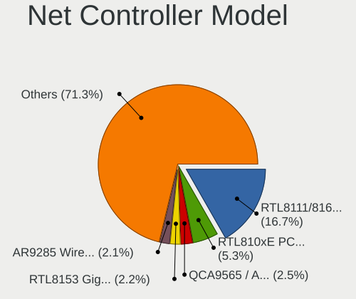

| Model                                                                   | Notebooks | Percent |
|-------------------------------------------------------------------------|-----------|---------|
| Realtek RTL8111/8168/8211/8411 PCI Express Gigabit Ethernet Controller  | 495       | 16.74%  |
| Realtek RTL810xE PCI Express Fast Ethernet controller                   | 156       | 5.28%   |
| Qualcomm Atheros QCA9565 / AR9565 Wireless Network Adapter              | 73        | 2.47%   |
| Realtek RTL8153 Gigabit Ethernet Adapter                                | 64        | 2.16%   |
| Qualcomm Atheros AR9285 Wireless Network Adapter (PCI-Express)          | 62        | 2.1%    |
| Intel Wireless 8265 / 8275                                              | 54        | 1.83%   |
| Qualcomm Atheros QCA9377 802.11ac Wireless Network Adapter              | 53        | 1.79%   |
| Intel Wi-Fi 6 AX200                                                     | 53        | 1.79%   |
| Realtek RTL8822CE 802.11ac PCIe Wireless Network Adapter                | 46        | 1.56%   |
| Realtek RTL8821CE 802.11ac PCIe Wireless Network Adapter                | 42        | 1.42%   |
| Qualcomm Atheros AR9485 Wireless Network Adapter                        | 41        | 1.39%   |
| Intel Wireless 7265                                                     | 40        | 1.35%   |
| Intel Wi-Fi 6 AX201                                                     | 40        | 1.35%   |
| Intel Comet Lake PCH-LP CNVi WiFi                                       | 38        | 1.29%   |
| Intel Cannon Lake PCH CNVi WiFi                                         | 37        | 1.25%   |
| MediaTek MT7921 802.11ax PCIe Wireless Network Adapter [Filogic 330]    | 36        | 1.22%   |
| Intel Wireless 7260                                                     | 35        | 1.18%   |
| Intel Alder Lake-P PCH CNVi WiFi                                        | 33        | 1.12%   |
| Broadcom BCM43142 802.11b/g/n                                           | 33        | 1.12%   |
| Intel PRO/Wireless 4965 AG or AGN [Kedron] Network Connection           | 31        | 1.05%   |
| Broadcom BCM4313 802.11bgn Wireless Network Adapter                     | 31        | 1.05%   |
| Realtek RTL8723BE PCIe Wireless Network Adapter                         | 30        | 1.01%   |
| Intel Cannon Point-LP CNVi [Wireless-AC]                                | 29        | 0.98%   |
| Intel 82579LM Gigabit Network Connection (Lewisville)                   | 29        | 0.98%   |
| TP-Link UE300 10/100/1000 LAN (ethernet mode) [Realtek RTL8153]         | 28        | 0.95%   |
| Qualcomm Atheros QCA6174 802.11ac Wireless Network Adapter              | 28        | 0.95%   |
| Qualcomm Atheros AR242x / AR542x Wireless Network Adapter (PCI-Express) | 28        | 0.95%   |
| Marvell Group 88E8036 PCI-E Fast Ethernet Controller                    | 27        | 0.91%   |
| Intel Wireless 8260                                                     | 26        | 0.88%   |
| Realtek RTL8852AE 802.11ax PCIe Wireless Network Adapter                | 24        | 0.81%   |
| Intel PRO/Wireless 3945ABG [Golan] Network Connection                   | 24        | 0.81%   |
| Intel Comet Lake PCH CNVi WiFi                                          | 22        | 0.74%   |
| Intel Centrino Advanced-N 6205 [Taylor Peak]                            | 22        | 0.74%   |
| Intel Wireless 3160                                                     | 18        | 0.61%   |
| Intel Raptor Lake PCH CNVi WiFi                                         | 18        | 0.61%   |
| Qualcomm Atheros AR928X Wireless Network Adapter (PCI-Express)          | 17        | 0.57%   |
| Intel WiFi Link 5100                                                    | 17        | 0.57%   |
| Intel Ethernet Connection (4) I219-LM                                   | 17        | 0.57%   |
| Intel Wireless 3165                                                     | 16        | 0.54%   |
| Intel Centrino Advanced-N 6235                                          | 16        | 0.54%   |

Wireless Vendor
---------------

Wireless vendors

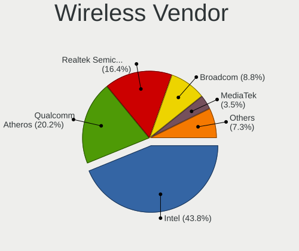

| Vendor                          | Notebooks | Percent |
|---------------------------------|-----------|---------|
| Intel                           | 694       | 43.84%  |
| Qualcomm Atheros                | 320       | 20.21%  |
| Realtek Semiconductor           | 259       | 16.36%  |
| Broadcom                        | 140       | 8.84%   |
| MediaTek                        | 55        | 3.47%   |
| Broadcom Limited                | 28        | 1.77%   |
| Ralink                          | 22        | 1.39%   |
| TP-Link                         | 17        | 1.07%   |
| Sierra Wireless                 | 8         | 0.51%   |
| Ralink Technology               | 7         | 0.44%   |
| Qualcomm Atheros Communications | 6         | 0.38%   |
| ASUSTek Computer                | 6         | 0.38%   |
| Dell                            | 5         | 0.32%   |
| D-Link                          | 5         | 0.32%   |
| Fibocom                         | 3         | 0.19%   |
| Qualcomm                        | 2         | 0.13%   |
| Mercucys                        | 2         | 0.13%   |
| TRENDnet                        | 1         | 0.06%   |
| Micro Star International        | 1         | 0.06%   |
| D-Link System                   | 1         | 0.06%   |
| Belkin Components               | 1         | 0.06%   |

Wireless Model
--------------

Wireless models

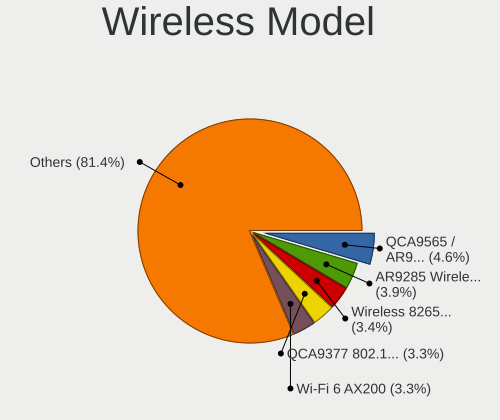

| Model                                                                   | Notebooks | Percent |
|-------------------------------------------------------------------------|-----------|---------|
| Qualcomm Atheros QCA9565 / AR9565 Wireless Network Adapter              | 73        | 4.6%    |
| Qualcomm Atheros AR9285 Wireless Network Adapter (PCI-Express)          | 62        | 3.91%   |
| Intel Wireless 8265 / 8275                                              | 54        | 3.4%    |
| Qualcomm Atheros QCA9377 802.11ac Wireless Network Adapter              | 53        | 3.34%   |
| Intel Wi-Fi 6 AX200                                                     | 53        | 3.34%   |
| Realtek RTL8822CE 802.11ac PCIe Wireless Network Adapter                | 46        | 2.9%    |
| Realtek RTL8821CE 802.11ac PCIe Wireless Network Adapter                | 42        | 2.65%   |
| Qualcomm Atheros AR9485 Wireless Network Adapter                        | 41        | 2.59%   |
| Intel Wireless 7265                                                     | 40        | 2.52%   |
| Intel Wi-Fi 6 AX201                                                     | 40        | 2.52%   |
| Intel Comet Lake PCH-LP CNVi WiFi                                       | 38        | 2.4%    |
| Intel Cannon Lake PCH CNVi WiFi                                         | 37        | 2.33%   |
| MediaTek MT7921 802.11ax PCIe Wireless Network Adapter [Filogic 330]    | 36        | 2.27%   |
| Intel Wireless 7260                                                     | 35        | 2.21%   |
| Broadcom BCM43142 802.11b/g/n                                           | 33        | 2.08%   |
| Intel PRO/Wireless 4965 AG or AGN [Kedron] Network Connection           | 31        | 1.95%   |
| Broadcom BCM4313 802.11bgn Wireless Network Adapter                     | 31        | 1.95%   |
| Realtek RTL8723BE PCIe Wireless Network Adapter                         | 30        | 1.89%   |
| Intel Cannon Point-LP CNVi [Wireless-AC]                                | 29        | 1.83%   |
| Qualcomm Atheros QCA6174 802.11ac Wireless Network Adapter              | 28        | 1.77%   |
| Qualcomm Atheros AR242x / AR542x Wireless Network Adapter (PCI-Express) | 28        | 1.77%   |
| Intel Wireless 8260                                                     | 26        | 1.64%   |
| Realtek RTL8852AE 802.11ax PCIe Wireless Network Adapter                | 24        | 1.51%   |
| Intel PRO/Wireless 3945ABG [Golan] Network Connection                   | 24        | 1.51%   |
| Intel Comet Lake PCH CNVi WiFi                                          | 22        | 1.39%   |
| Intel Centrino Advanced-N 6205 [Taylor Peak]                            | 22        | 1.39%   |
| Intel Wireless 3160                                                     | 18        | 1.13%   |
| Intel Raptor Lake PCH CNVi WiFi                                         | 18        | 1.13%   |
| Qualcomm Atheros AR928X Wireless Network Adapter (PCI-Express)          | 17        | 1.07%   |
| Intel WiFi Link 5100                                                    | 17        | 1.07%   |
| Intel Wireless 3165                                                     | 16        | 1.01%   |
| Intel Centrino Advanced-N 6235                                          | 16        | 1.01%   |
| Intel Alder Lake-P PCH CNVi WiFi                                        | 16        | 1.01%   |
| Realtek RTL8191SEvB Wireless LAN Controller                             | 15        | 0.95%   |
| Intel Dual Band Wireless-AC 3165 Plus Bluetooth                         | 14        | 0.88%   |
| Realtek RTL8852BE PCIe 802.11ax Wireless Network Controller             | 13        | 0.82%   |
| Broadcom Limited BCM4360 802.11ac Dual Band Wireless Network Adapter    | 13        | 0.82%   |
| Realtek RTL8188EUS 802.11n Wireless Network Adapter                     | 12        | 0.76%   |
| Ralink RT3290 Wireless 802.11n 1T/1R PCIe                               | 12        | 0.76%   |
| Intel PRO/Wireless 5100 AGN [Shiloh] Network Connection                 | 12        | 0.76%   |

Ethernet Vendor
---------------

Ethernet vendors

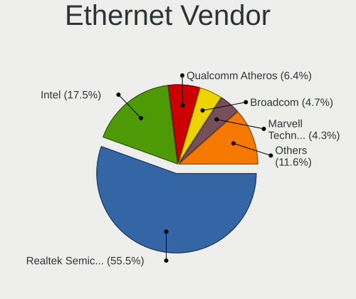

| Vendor                                 | Notebooks | Percent |
|----------------------------------------|-----------|---------|
| Realtek Semiconductor                  | 735       | 55.51%  |
| Intel                                  | 232       | 17.52%  |
| Qualcomm Atheros                       | 85        | 6.42%   |
| Broadcom                               | 62        | 4.68%   |
| Marvell Technology Group               | 57        | 4.31%   |
| TP-Link                                | 29        | 2.19%   |
| Silicon Integrated Systems [SiS]       | 15        | 1.13%   |
| ASIX Electronics                       | 15        | 1.13%   |
| Nvidia                                 | 14        | 1.06%   |
| Broadcom Limited                       | 9         | 0.68%   |
| JMicron Technology                     | 8         | 0.6%    |
| MediaTek                               | 7         | 0.53%   |
| DisplayLink                            | 7         | 0.53%   |
| Samsung Electronics                    | 6         | 0.45%   |
| Lenovo                                 | 6         | 0.45%   |
| Attansic Technology                    | 5         | 0.38%   |
| Suzhou Motorcomm Electronic Technology | 4         | 0.3%    |
| ICS Advent                             | 4         | 0.3%    |
| Hewlett-Packard                        | 4         | 0.3%    |
| Qualcomm                               | 3         | 0.23%   |
| Xiaomi                                 | 2         | 0.15%   |
| LSI                                    | 2         | 0.15%   |
| Huawei Technologies                    | 2         | 0.15%   |
| Google                                 | 2         | 0.15%   |
| Apple                                  | 2         | 0.15%   |
| ZTE WCDMA Technologies MSM             | 1         | 0.08%   |
| T & A Mobile Phones                    | 1         | 0.08%   |
| OPPO Electronics                       | 1         | 0.08%   |
| Motorola PCS                           | 1         | 0.08%   |
| Microsoft                              | 1         | 0.08%   |
| Archos                                 | 1         | 0.08%   |
| Allwinner Technology                   | 1         | 0.08%   |

Ethernet Model
--------------

Ethernet models

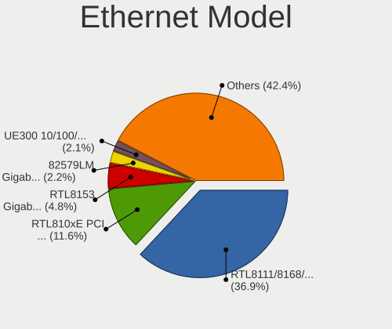

| Model                                                                          | Notebooks | Percent |
|--------------------------------------------------------------------------------|-----------|---------|
| Realtek RTL8111/8168/8211/8411 PCI Express Gigabit Ethernet Controller         | 495       | 36.94%  |
| Realtek RTL810xE PCI Express Fast Ethernet controller                          | 156       | 11.64%  |
| Realtek RTL8153 Gigabit Ethernet Adapter                                       | 64        | 4.78%   |
| Intel 82579LM Gigabit Network Connection (Lewisville)                          | 29        | 2.16%   |
| TP-Link UE300 10/100/1000 LAN (ethernet mode) [Realtek RTL8153]                | 28        | 2.09%   |
| Marvell Group 88E8036 PCI-E Fast Ethernet Controller                           | 27        | 2.01%   |
| Intel Ethernet Connection (4) I219-LM                                          | 17        | 1.27%   |
| Intel Alder Lake-P PCH CNVi WiFi                                               | 17        | 1.27%   |
| Intel Ethernet Connection I218-LM                                              | 15        | 1.12%   |
| Silicon Integrated Systems [SiS] 191 Gigabit Ethernet Adapter                  | 14        | 1.04%   |
| Qualcomm Atheros AR8151 v2.0 Gigabit Ethernet                                  | 11        | 0.82%   |
| Qualcomm Atheros AR8131 Gigabit Ethernet                                       | 11        | 0.82%   |
| Intel Ethernet Connection I219-LM                                              | 11        | 0.82%   |
| Intel Ethernet Connection (6) I219-V                                           | 11        | 0.82%   |
| Intel Ethernet Connection (4) I219-V                                           | 11        | 0.82%   |
| Intel 82579V Gigabit Network Connection                                        | 11        | 0.82%   |
| Intel 82577LM Gigabit Network Connection                                       | 11        | 0.82%   |
| Intel Ethernet Connection (3) I218-LM                                          | 10        | 0.75%   |
| Broadcom NetXtreme BCM57765 Gigabit Ethernet PCIe                              | 10        | 0.75%   |
| ASIX AX88179 Gigabit Ethernet                                                  | 10        | 0.75%   |
| Qualcomm Atheros QCA8171 Gigabit Ethernet                                      | 9         | 0.67%   |
| Qualcomm Atheros AR8132 Fast Ethernet                                          | 9         | 0.67%   |
| Broadcom NetLink BCM5787M Gigabit Ethernet PCI Express                         | 9         | 0.67%   |
| Realtek Killer E2600 GbE Controller                                            | 8         | 0.6%    |
| Qualcomm Atheros AR8161 Gigabit Ethernet                                       | 8         | 0.6%    |
| Marvell Group Yukon Optima 88E8059 [PCIe Gigabit Ethernet Controller with AVB] | 8         | 0.6%    |
| JMicron JMC250 PCI Express Gigabit Ethernet Controller                         | 8         | 0.6%    |
| Intel Ethernet Connection I217-LM                                              | 8         | 0.6%    |
| Intel Ethernet Connection (6) I219-LM                                          | 8         | 0.6%    |
| Intel Ethernet Connection (10) I219-V                                          | 8         | 0.6%    |
| Broadcom NetXtreme BCM57786 Gigabit Ethernet PCIe                              | 8         | 0.6%    |
| Realtek RTL8152 Fast Ethernet Adapter                                          | 7         | 0.52%   |
| Qualcomm Atheros AR8152 v1.1 Fast Ethernet                                     | 7         | 0.52%   |
| Qualcomm Atheros AR8121/AR8113/AR8114 Gigabit or Fast Ethernet                 | 7         | 0.52%   |
| Nvidia MCP79 Ethernet                                                          | 7         | 0.52%   |
| Marvell Group 88E8040 PCI-E Fast Ethernet Controller                           | 7         | 0.52%   |
| Intel 82567LM Gigabit Network Connection                                       | 7         | 0.52%   |
| Broadcom NetLink BCM5784M Gigabit Ethernet PCIe                                | 7         | 0.52%   |
| Realtek RTL8125 2.5GbE Controller                                              | 6         | 0.45%   |
| Realtek RTL-8100/8101L/8139 PCI Fast Ethernet Adapter                          | 6         | 0.45%   |

Net Controller Kind
-------------------

Ethernet, WiFi or modem

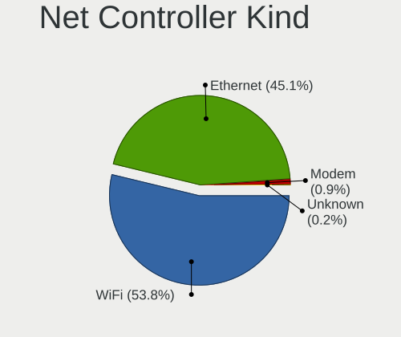

| Kind     | Notebooks | Percent |
|----------|-----------|---------|
| WiFi     | 1510      | 53.77%  |
| Ethernet | 1267      | 45.12%  |
| Modem    | 26        | 0.93%   |
| Unknown  | 5         | 0.18%   |

Used Controller
---------------

Currently used network controller

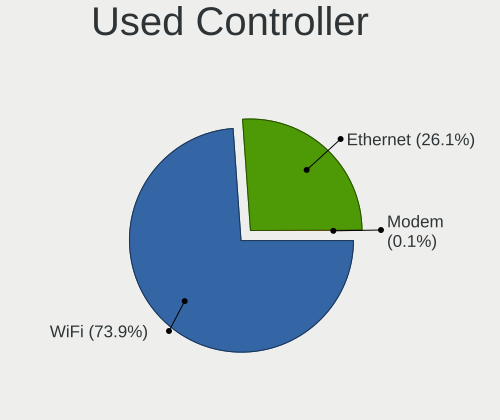

| Kind     | Notebooks | Percent |
|----------|-----------|---------|
| WiFi     | 1230      | 73.87%  |
| Ethernet | 434       | 26.07%  |
| Modem    | 1         | 0.06%   |

NICs
----

Total network controllers on board

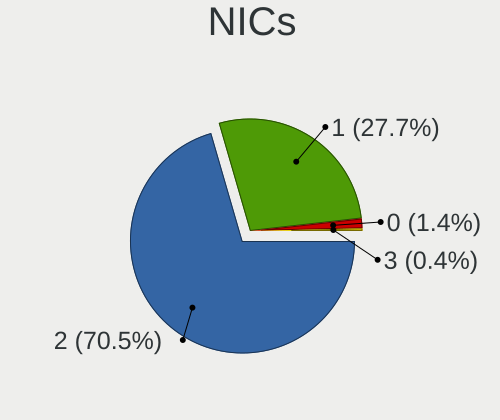

| Total | Notebooks | Percent |
|-------|-----------|---------|
| 2     | 1107      | 70.51%  |
| 1     | 435       | 27.71%  |
| 0     | 22        | 1.4%    |
| 3     | 6         | 0.38%   |

IPv6
----

IPv6 vs IPv4

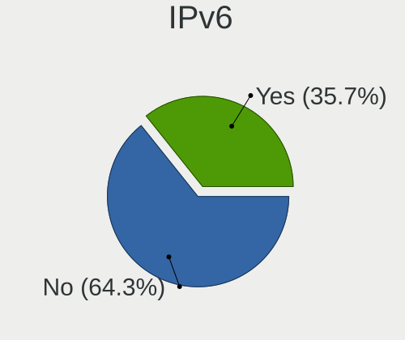

| Used | Notebooks | Percent |
|------|-----------|---------|
| No   | 1036      | 64.27%  |
| Yes  | 576       | 35.73%  |

Bluetooth
---------

Bluetooth Vendor
----------------

Controller vendors

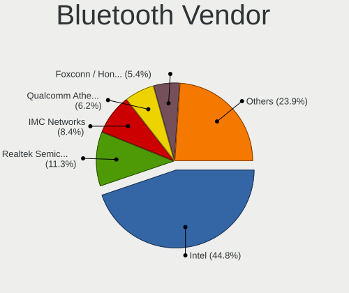

| Vendor                          | Notebooks | Percent |
|---------------------------------|-----------|---------|
| Intel                           | 547       | 44.8%   |
| Realtek Semiconductor           | 138       | 11.3%   |
| IMC Networks                    | 102       | 8.35%   |
| Qualcomm Atheros Communications | 76        | 6.22%   |
| Foxconn / Hon Hai               | 66        | 5.41%   |
| Lite-On Technology              | 62        | 5.08%   |
| Apple                           | 51        | 4.18%   |
| Broadcom                        | 49        | 4.01%   |
| Toshiba                         | 24        | 1.97%   |
| Hewlett-Packard                 | 20        | 1.64%   |
| Realtek                         | 18        | 1.47%   |
| Dell                            | 14        | 1.15%   |
| ASUSTek Computer                | 14        | 1.15%   |
| Ralink                          | 12        | 0.98%   |
| Cambridge Silicon Radio         | 8         | 0.66%   |
| Alps Electric                   | 7         | 0.57%   |
| MediaTek                        | 3         | 0.25%   |
| USI                             | 2         | 0.16%   |
| Ralink Technology               | 2         | 0.16%   |
| Chicony Electronics             | 2         | 0.16%   |
| Roper                           | 1         | 0.08%   |
| Mercucys                        | 1         | 0.08%   |
| Foxconn International           | 1         | 0.08%   |
| Conwise Technology              | 1         | 0.08%   |

Bluetooth Model
---------------

Controller models

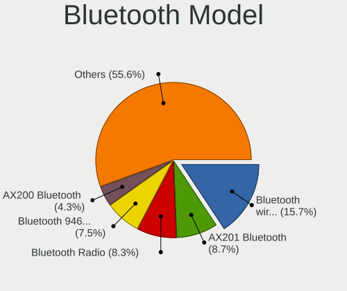

| Model                                                                               | Notebooks | Percent |
|-------------------------------------------------------------------------------------|-----------|---------|
| Intel Bluetooth wireless interface                                                  | 192       | 15.71%  |
| Intel AX201 Bluetooth                                                               | 106       | 8.67%   |
| Realtek Bluetooth Radio                                                             | 101       | 8.27%   |
| Intel Bluetooth 9460/9560 Jefferson Peak (JfP)                                      | 92        | 7.53%   |
| Intel AX200 Bluetooth                                                               | 52        | 4.26%   |
| Intel Bluetooth Device                                                              | 49        | 4.01%   |
| IMC Networks Bluetooth Device                                                       | 36        | 2.95%   |
| Apple Bluetooth Host Controller                                                     | 32        | 2.62%   |
| IMC Networks Bluetooth Radio                                                        | 29        | 2.37%   |
| IMC Networks Wireless_Device                                                        | 28        | 2.29%   |
| Qualcomm Atheros  Bluetooth Device                                                  | 24        | 1.96%   |
| Realtek  Bluetooth 4.2 Adapter                                                      | 21        | 1.72%   |
| Qualcomm Atheros QCA61x4 Bluetooth 4.0                                              | 21        | 1.72%   |
| Intel Centrino Bluetooth Wireless Transceiver                                       | 21        | 1.72%   |
| Qualcomm Atheros AR3011 Bluetooth                                                   | 19        | 1.55%   |
| Realtek Bluetooth Radio                                                             | 18        | 1.47%   |
| Foxconn / Hon Hai MediaTek Bluetooth Adapter                                        | 18        | 1.47%   |
| Lite-On Qualcomm Atheros QCA9377 Bluetooth                                          | 17        | 1.39%   |
| Apple Bluetooth USB Host Controller                                                 | 17        | 1.39%   |
| Lite-On Bluetooth Device                                                            | 16        | 1.31%   |
| Lite-On Atheros AR3012 Bluetooth                                                    | 13        | 1.06%   |
| HP Bluetooth 2.0 Interface [Broadcom BCM2045]                                       | 13        | 1.06%   |
| Ralink RT3290 Bluetooth                                                             | 12        | 0.98%   |
| Intel AX210 Bluetooth                                                               | 12        | 0.98%   |
| Foxconn / Hon Hai Bluetooth Device                                                  | 12        | 0.98%   |
| Intel Wireless-AC 9260 Bluetooth Adapter                                            | 11        | 0.9%    |
| Qualcomm Atheros AR3012 Bluetooth 4.0                                               | 10        | 0.82%   |
| Foxconn / Hon Hai Foxconn T77H114 BCM2070 [Single-Chip Bluetooth 2.1 + EDR Adapter] | 9         | 0.74%   |
| Toshiba Integrated Bluetooth HCI                                                    | 8         | 0.65%   |
| Cambridge Silicon Radio Bluetooth Dongle (HCI mode)                                 | 8         | 0.65%   |
| Intel Wireless-AC 3168 Bluetooth                                                    | 7         | 0.57%   |
| HP Broadcom 2070 Bluetooth Combo                                                    | 7         | 0.57%   |
| Foxconn / Hon Hai Wireless_Device                                                   | 7         | 0.57%   |
| Realtek RTL8821A Bluetooth                                                          | 6         | 0.49%   |
| Lite-On BCM43142A0                                                                  | 6         | 0.49%   |
| Intel Centrino Advanced-N 6230 Bluetooth adapter                                    | 6         | 0.49%   |
| Broadcom BCM20702 Bluetooth 4.0 [ThinkPad]                                          | 6         | 0.49%   |
| Broadcom BCM2045B (BDC-2.1)                                                         | 6         | 0.49%   |
| Toshiba Askey Bluetooth Module                                                      | 5         | 0.41%   |
| Foxconn / Hon Hai BCM43142A0 broadcom bluetooth                                     | 5         | 0.41%   |

Sound
-----

Sound Vendor
------------

Sound card vendors

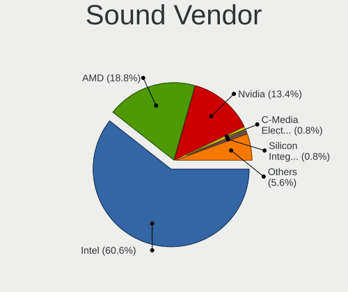

| Vendor                                       | Notebooks | Percent |
|----------------------------------------------|-----------|---------|
| Intel                                        | 1200      | 60.61%  |
| AMD                                          | 372       | 18.79%  |
| Nvidia                                       | 266       | 13.43%  |
| C-Media Electronics                          | 16        | 0.81%   |
| Silicon Integrated Systems [SiS]             | 15        | 0.76%   |
| GN Netcom                                    | 10        | 0.51%   |
| Realtek Semiconductor                        | 9         | 0.45%   |
| Plantronics                                  | 9         | 0.45%   |
| Lenovo                                       | 8         | 0.4%    |
| JMTek                                        | 8         | 0.4%    |
| Hewlett-Packard                              | 8         | 0.4%    |
| Texas Instruments                            | 5         | 0.25%   |
| Razer USA                                    | 5         | 0.25%   |
| Logitech                                     | 5         | 0.25%   |
| Sony                                         | 4         | 0.2%    |
| Creative Technology                          | 4         | 0.2%    |
| Kingston Technology                          | 2         | 0.1%    |
| Generalplus Technology                       | 2         | 0.1%    |
| Focusrite-Novation                           | 2         | 0.1%    |
| Corsair                                      | 2         | 0.1%    |
| ASUSTek Computer                             | 2         | 0.1%    |
| Apple                                        | 2         | 0.1%    |
| Zoran Co. Personal Media Division (Nogatech) | 1         | 0.05%   |
| XMOS                                         | 1         | 0.05%   |
| Walmart                                      | 1         | 0.05%   |
| USB MICROPHONE                               | 1         | 0.05%   |
| Trust                                        | 1         | 0.05%   |
| SteelSeries ApS                              | 1         | 0.05%   |
| Sennheiser electronic                        | 1         | 0.05%   |
| Sennheiser Communications                    | 1         | 0.05%   |
| Samsung Electronics                          | 1         | 0.05%   |
| Micro Star International                     | 1         | 0.05%   |
| M2Tech                                       | 1         | 0.05%   |
| KTMICRO                                      | 1         | 0.05%   |
| JBL                                          | 1         | 0.05%   |
| Huawei Technologies                          | 1         | 0.05%   |
| GYROCOM C&C                                  | 1         | 0.05%   |
| Guillemot                                    | 1         | 0.05%   |
| ESS Technology                               | 1         | 0.05%   |
| EGO SYStems                                  | 1         | 0.05%   |

Sound Model
-----------

Sound card models

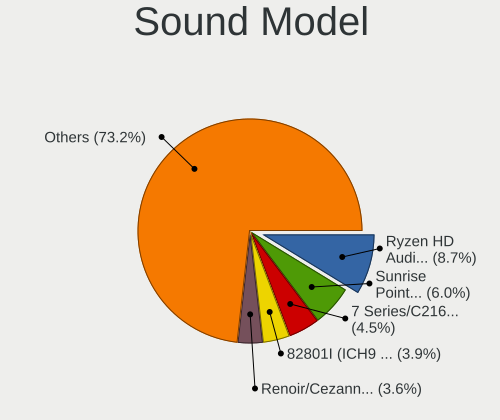

| Model                                                                                             | Notebooks | Percent |
|---------------------------------------------------------------------------------------------------|-----------|---------|
| AMD Ryzen HD Audio Controller                                                                     | 208       | 8.74%   |
| Intel Sunrise Point-LP HD Audio                                                                   | 142       | 5.97%   |
| Intel 7 Series/C216 Chipset Family High Definition Audio Controller                               | 108       | 4.54%   |
| Intel 82801I (ICH9 Family) HD Audio Controller                                                    | 93        | 3.91%   |
| AMD Renoir/Cezanne HDMI/DP Audio Controller                                                       | 86        | 3.61%   |
| Intel 5 Series/3400 Series Chipset High Definition Audio                                          | 80        | 3.36%   |
| Intel 6 Series/C200 Series Chipset Family High Definition Audio Controller                        | 70        | 2.94%   |
| Intel 82801H (ICH8 Family) HD Audio Controller                                                    | 64        | 2.69%   |
| AMD Raven/Raven2/Fenghuang HDMI/DP Audio Controller                                               | 64        | 2.69%   |
| Intel Cannon Lake PCH cAVS                                                                        | 60        | 2.52%   |
| Intel Tiger Lake-LP Smart Sound Technology Audio Controller                                       | 57        | 2.4%    |
| Intel Haswell-ULT HD Audio Controller                                                             | 57        | 2.4%    |
| Intel Broadwell-U Audio Controller                                                                | 57        | 2.4%    |
| Intel 8 Series HD Audio Controller                                                                | 56        | 2.35%   |
| AMD FCH Azalia Controller                                                                         | 55        | 2.31%   |
| Intel Wildcat Point-LP High Definition Audio Controller                                           | 53        | 2.23%   |
| Intel Comet Lake PCH-LP cAVS                                                                      | 49        | 2.06%   |
| Intel Cannon Point-LP High Definition Audio Controller                                            | 46        | 1.93%   |
| Intel 8 Series/C220 Series Chipset High Definition Audio Controller                               | 45        | 1.89%   |
| AMD Kabini HDMI/DP Audio                                                                          | 40        | 1.68%   |
| Intel Alder Lake PCH-P High Definition Audio Controller                                           | 37        | 1.56%   |
| Intel Xeon E3-1200 v3/4th Gen Core Processor HD Audio Controller                                  | 36        | 1.51%   |
| Intel NM10/ICH7 Family High Definition Audio Controller                                           | 35        | 1.47%   |
| AMD Radeon High Definition Audio Controller                                                       | 35        | 1.47%   |
| Nvidia TU107 GeForce GTX 1650 High Definition Audio Controller                                    | 29        | 1.22%   |
| Nvidia GP107GL High Definition Audio Controller                                                   | 24        | 1.01%   |
| Intel 100 Series/C230 Series Chipset Family HD Audio Controller                                   | 24        | 1.01%   |
| Intel Raptor Lake-P/U/H cAVS                                                                      | 23        | 0.97%   |
| Intel Comet Lake PCH cAVS                                                                         | 23        | 0.97%   |
| Nvidia GF108 High Definition Audio Controller                                                     | 21        | 0.88%   |
| AMD Cedar HDMI Audio [Radeon HD 5400/6300/7300 Series]                                            | 20        | 0.84%   |
| Nvidia GA106 High Definition Audio Controller                                                     | 19        | 0.8%    |
| Nvidia GK208 HDMI/DP Audio Controller                                                             | 18        | 0.76%   |
| Intel CM238 HD Audio Controller                                                                   | 18        | 0.76%   |
| Nvidia TU106 High Definition Audio Controller                                                     | 17        | 0.71%   |
| Intel Atom/Celeron/Pentium Processor x5-E8000/J3xxx/N3xxx Series High Definition Audio Controller | 17        | 0.71%   |
| Intel Atom Processor Z36xxx/Z37xxx Series High Definition Audio Controller                        | 17        | 0.71%   |
| AMD RV710/730 HDMI Audio [Radeon HD 4000 series]                                                  | 16        | 0.67%   |
| AMD Family 15h (Models 60h-6fh) Audio Controller                                                  | 16        | 0.67%   |
| Silicon Integrated Systems [SiS] Azalia Audio Controller                                          | 14        | 0.59%   |

Memory
------

Memory Vendor
-------------

Memory module vendors

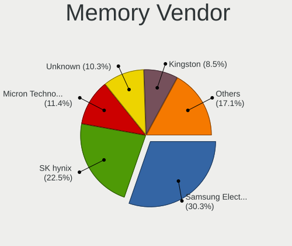

| Vendor              | Notebooks | Percent |
|---------------------|-----------|---------|
| Samsung Electronics | 272       | 30.32%  |
| SK hynix            | 202       | 22.52%  |
| Micron Technology   | 102       | 11.37%  |
| Unknown             | 92        | 10.26%  |
| Kingston            | 76        | 8.47%   |
| Crucial             | 28        | 3.12%   |
| Elpida              | 20        | 2.23%   |
| Ramaxel Technology  | 19        | 2.12%   |
| G.Skill             | 13        | 1.45%   |
| Corsair             | 13        | 1.45%   |
| A-DATA Technology   | 13        | 1.45%   |
| Unknown             | 10        | 1.11%   |
| Nanya Technology    | 5         | 0.56%   |
| Unknown (ABCD)      | 4         | 0.45%   |
| Team                | 4         | 0.45%   |
| Transcend           | 3         | 0.33%   |
| Teikon              | 2         | 0.22%   |
| Lexar               | 2         | 0.22%   |
| Unknown (268C)      | 1         | 0.11%   |
| Unknown (0x7301)    | 1         | 0.11%   |
| Unigen              | 1         | 0.11%   |
| Toshiba             | 1         | 0.11%   |
| Smart Brazil        | 1         | 0.11%   |
| Smart               | 1         | 0.11%   |
| Silicon Power       | 1         | 0.11%   |
| PUSKILL             | 1         | 0.11%   |
| Netlist             | 1         | 0.11%   |
| Kllisre             | 1         | 0.11%   |
| Gowe                | 1         | 0.11%   |
| GOODRAM             | 1         | 0.11%   |
| Goldkey             | 1         | 0.11%   |
| Essencore Limited   | 1         | 0.11%   |
| ASint Technology    | 1         | 0.11%   |
| Apacer              | 1         | 0.11%   |
| 48spaces            | 1         | 0.11%   |

Memory Model
------------

Memory module models

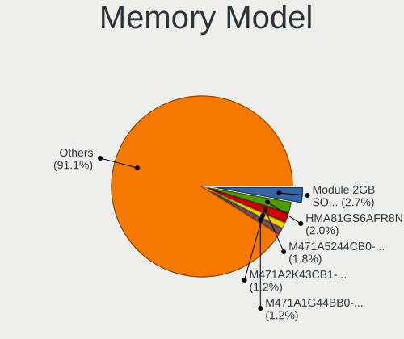

| Model                                                        | Notebooks | Percent |
|--------------------------------------------------------------|-----------|---------|
| Unknown RAM Module 2GB SODIMM DDR2                           | 26        | 2.75%   |
| SK hynix RAM HMA81GS6AFR8N-UH 8GB SODIMM DDR4 2667MT/s       | 19        | 2.01%   |
| Samsung RAM M471A5244CB0-CWE 4GB Row Of Chips DDR4 3200MT/s  | 17        | 1.8%    |
| SK hynix RAM HMAA1GS6CJR6N-XN 8GB SODIMM DDR4 3200MT/s       | 11        | 1.16%   |
| Samsung RAM M471A2K43CB1-CTD 16GB SODIMM DDR4 8400MT/s       | 11        | 1.16%   |
| Samsung RAM M471A1G44BB0-CWE 8GB SODIMM DDR4 3200MT/s        | 11        | 1.16%   |
| Samsung RAM M471A1K43CB1-CRC 8GB SODIMM DDR4 8400MT/s        | 10        | 1.06%   |
| Samsung RAM M471A1G44AB0-CWE 8GiB SODIMM DDR4 3200MT/s       | 10        | 1.06%   |
| Unknown                                                      | 10        | 1.06%   |
| Samsung RAM M471A5244CB0-CTD 4GB SODIMM DDR4 3266MT/s        | 9         | 0.95%   |
| Samsung RAM M471B5173DB0-YK0 4GB SODIMM DDR3 1600MT/s        | 8         | 0.84%   |
| Samsung RAM M471A1K43EB1-CWE 8GB SODIMM DDR4 3200MT/s        | 8         | 0.84%   |
| Samsung RAM M471A1K43DB1-CTD 8GB SODIMM DDR4 2667MT/s        | 8         | 0.84%   |
| SK hynix RAM HMA81GS6JJR8N-VK 8GB SODIMM DDR4 2667MT/s       | 7         | 0.74%   |
| SK hynix RAM HMA81GS6DJR8N-XN 8GB SODIMM DDR4 3200MT/s       | 7         | 0.74%   |
| Samsung RAM M471B1G73QH0-YK0 8GB SODIMM DDR3 1600MT/s        | 7         | 0.74%   |
| Samsung RAM M471A2K43DB1-CTD 16GB SODIMM DDR4 2667MT/s       | 7         | 0.74%   |
| Samsung RAM M471A1K43DB1-CWE 8GB SODIMM DDR4 3200MT/s        | 7         | 0.74%   |
| SK hynix RAM HMT351S6CFR8C-PB 4GB SODIMM DDR3 1600MT/s       | 6         | 0.63%   |
| SK hynix RAM HMAA1GS6CJR6N-XN 8GB Row Of Chips DDR4 3200MT/s | 6         | 0.63%   |
| SK hynix RAM HMA851S6AFR6N-UH 4GB SODIMM DDR4 2667MT/s       | 6         | 0.63%   |
| SK hynix RAM HMA851S6AFR6N-UH 4GB SODIMM DDR4 2400MT/s       | 6         | 0.63%   |
| Samsung RAM M471B5273DH0-CH9 4GB SODIMM DDR3 1600MT/s        | 6         | 0.63%   |
| Samsung RAM M471B5173QH0-YK0 4GB SODIMM DDR3 1600MT/s        | 6         | 0.63%   |
| Samsung RAM M471A2K43CB1-CRC 16GB SODIMM DDR4 2667MT/s       | 6         | 0.63%   |
| Micron RAM 8ATF1G64HZ-2G6E1 8GB SODIMM DDR4 2667MT/s         | 6         | 0.63%   |
| SK hynix RAM HMT451S6CFR6A-PB 4GB SODIMM DDR3 1600MT/s       | 5         | 0.53%   |
| SK hynix RAM HMA82GS6CJR8N-VK 16GB SODIMM DDR4 2667MT/s      | 5         | 0.53%   |
| Samsung RAM M471B5273CH0-CH9 4GB SODIMM DDR3 1334MT/s        | 5         | 0.53%   |
| Samsung RAM M471B1G73EB0-YK0 8192MB SODIMM DDR3 1600MT/s     | 5         | 0.53%   |
| Samsung RAM M471A5244CB0-CRC 4GB SODIMM DDR4 2667MT/s        | 5         | 0.53%   |
| Samsung RAM M471A2K43DB1-CWE 16GB SODIMM DDR4 3200MT/s       | 5         | 0.53%   |
| Samsung RAM M471A1K43CB1-CTD 8GB SODIMM DDR4 3200MT/s        | 5         | 0.53%   |
| Micron RAM 8ATF1G64HZ-3G2R1 8GB SODIMM DDR4 3200MT/s         | 5         | 0.53%   |
| Micron RAM 4ATF1G64HZ-3G2E1 8GB SODIMM DDR4 3200MT/s         | 5         | 0.53%   |
| Kingston RAM KF556S40-32 32GB SODIMM DDR5 5600MT/s           | 5         | 0.53%   |
| Unknown RAM Module 4GB SODIMM DDR4 2667MT/s                  | 4         | 0.42%   |
| Unknown RAM Module 2GB SODIMM DDR2 667MT/s                   | 4         | 0.42%   |
| SK hynix RAM Module 4GB SODIMM DDR3 1600MT/s                 | 4         | 0.42%   |
| SK hynix RAM HMT41GS6BFR8A-PB 8GB SODIMM DDR3 2667MT/s       | 4         | 0.42%   |

Memory Kind
-----------

Memory module kinds

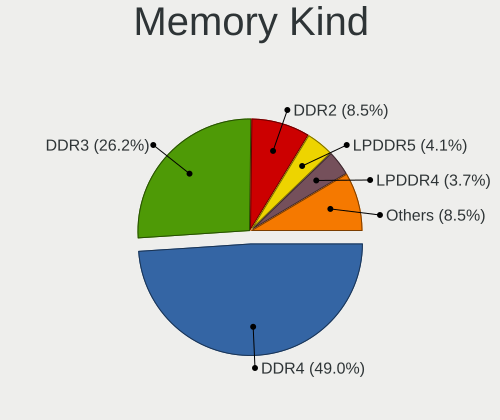

| Kind    | Notebooks | Percent |
|---------|-----------|---------|
| DDR4    | 373       | 48.95%  |
| DDR3    | 200       | 26.25%  |
| DDR2    | 65        | 8.53%   |
| LPDDR5  | 31        | 4.07%   |
| LPDDR4  | 28        | 3.67%   |
| DDR5    | 23        | 3.02%   |
| LPDDR3  | 21        | 2.76%   |
| SDRAM   | 15        | 1.97%   |
| DDR     | 4         | 0.52%   |
| Unknown | 2         | 0.26%   |

Memory Form Factor
------------------

Physical design of the memory module

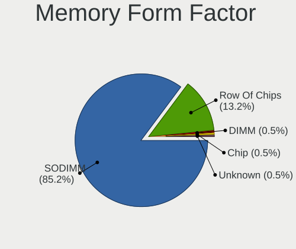

| Name         | Notebooks | Percent |
|--------------|-----------|---------|
| SODIMM       | 651       | 85.21%  |
| Row Of Chips | 101       | 13.22%  |
| DIMM         | 4         | 0.52%   |
| Chip         | 4         | 0.52%   |
| Unknown      | 4         | 0.52%   |

Memory Size
-----------

Memory module size

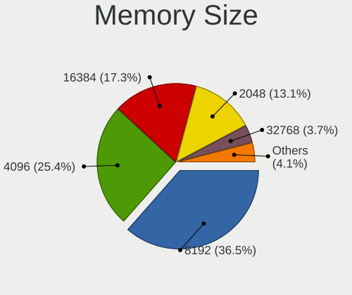

| Size    | Notebooks | Percent |
|---------|-----------|---------|
| 8192    | 306       | 36.47%  |
| 4096    | 213       | 25.39%  |
| 16384   | 145       | 17.28%  |
| 2048    | 110       | 13.11%  |
| 32768   | 31        | 3.69%   |
| 1024    | 27        | 3.22%   |
| 512     | 5         | 0.6%    |
| 3072    | 1         | 0.12%   |
| Unknown | 1         | 0.12%   |

Memory Speed
------------

Memory module speed

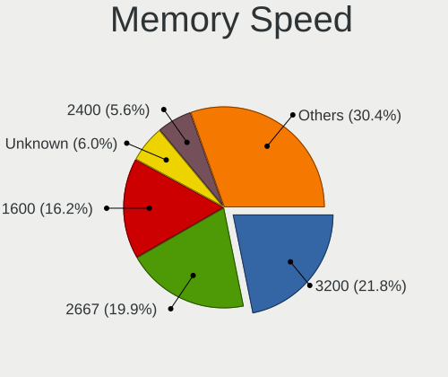

| Speed   | Notebooks | Percent |
|---------|-----------|---------|
| 3200    | 178       | 21.84%  |
| 2667    | 162       | 19.88%  |
| 1600    | 132       | 16.2%   |
| Unknown | 49        | 6.01%   |
| 2400    | 46        | 5.64%   |
| 2133    | 34        | 4.17%   |
| 8400    | 22        | 2.7%    |
| 1334    | 20        | 2.45%   |
| 667     | 20        | 2.45%   |
| 6400    | 17        | 2.09%   |
| 1333    | 17        | 2.09%   |
| 5600    | 15        | 1.84%   |
| 1067    | 14        | 1.72%   |
| 4267    | 12        | 1.47%   |
| 7500    | 9         | 1.1%    |
| 3266    | 9         | 1.1%    |
| 4800    | 8         | 0.98%   |
| 4199    | 8         | 0.98%   |
| 1867    | 7         | 0.86%   |
| 800     | 7         | 0.86%   |
| 533     | 5         | 0.61%   |
| 4266    | 3         | 0.37%   |
| 2048    | 3         | 0.37%   |
| 1066    | 3         | 0.37%   |
| 975     | 3         | 0.37%   |
| 8533    | 2         | 0.25%   |
| 2933    | 2         | 0.25%   |
| 1866    | 2         | 0.25%   |
| 12800   | 1         | 0.12%   |
| 7467    | 1         | 0.12%   |
| 3733    | 1         | 0.12%   |
| 3000    | 1         | 0.12%   |
| 1200    | 1         | 0.12%   |
| 666     | 1         | 0.12%   |

Printers & scanners
-------------------

Printer Vendor
--------------

Printer device vendors

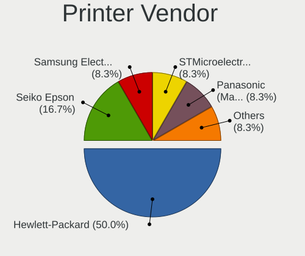

| Vendor                 | Notebooks | Percent |
|------------------------|-----------|---------|
| Hewlett-Packard        | 6         | 50%     |
| Seiko Epson            | 2         | 16.67%  |
| STMicroelectronics     | 1         | 8.33%   |
| Samsung Electronics    | 1         | 8.33%   |
| Panasonic (Matsushita) | 1         | 8.33%   |
| Canon                  | 1         | 8.33%   |

Printer Model
-------------

Printer device models

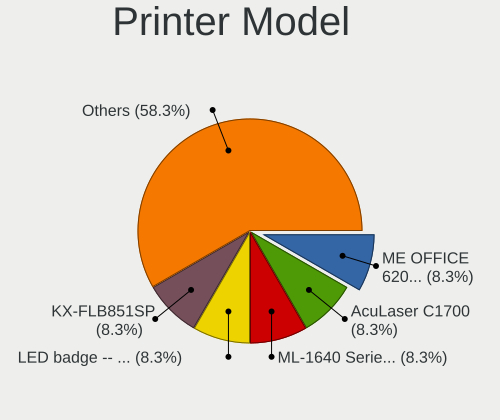

| Model                                                                 | Notebooks | Percent |
|-----------------------------------------------------------------------|-----------|---------|
| STMicroelectronics LED badge -- mini LED display -- 11x44             | 1         | 8.33%   |
| Seiko Epson ME OFFICE 620F Series/Stylus Office BX305F/BX305FW/TX320F | 1         | 8.33%   |
| Seiko Epson AcuLaser C1700                                            | 1         | 8.33%   |
| Samsung ML-1640 Series Laser Printer                                  | 1         | 8.33%   |
| Panasonic (Matsushita) KX-FLB851SP                                    | 1         | 8.33%   |
| HP OfficeJet 3830 series                                              | 1         | 8.33%   |
| HP LaserJet P1102                                                     | 1         | 8.33%   |
| HP LaserJet CP 1025                                                   | 1         | 8.33%   |
| HP DeskJet F4100 Printer series                                       | 1         | 8.33%   |
| HP Deskjet 3050A                                                      | 1         | 8.33%   |
| HP DeskJet 2130 series                                                | 1         | 8.33%   |
| Canon PIXMA MG3600 Series                                             | 1         | 8.33%   |

Scanner Vendor
--------------

Scanner device vendors

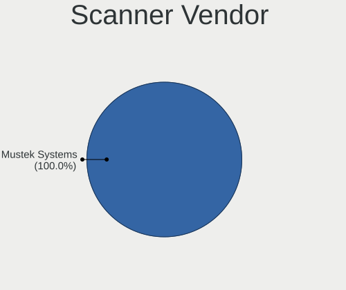

| Vendor         | Notebooks | Percent |
|----------------|-----------|---------|
| Mustek Systems | 1         | 100%    |

Scanner Model
-------------

Scanner device models

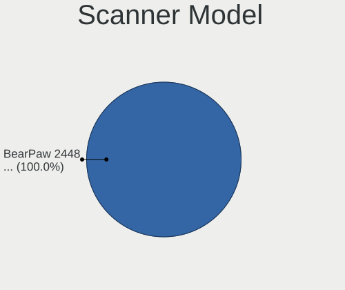

| Model                              | Notebooks | Percent |
|------------------------------------|-----------|---------|
| Mustek Systems BearPaw 2448 CU Pro | 1         | 100%    |

Camera
------

Camera Vendor
-------------

Camera device vendors

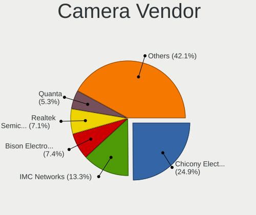

| Vendor                                 | Notebooks | Percent |
|----------------------------------------|-----------|---------|
| Chicony Electronics                    | 350       | 24.88%  |
| IMC Networks                           | 187       | 13.29%  |
| Bison Electronics                      | 104       | 7.39%   |
| Realtek Semiconductor                  | 100       | 7.11%   |
| Quanta                                 | 74        | 5.26%   |
| Suyin                                  | 72        | 5.12%   |
| Microdia                               | 57        | 4.05%   |
| Sunplus Innovation Technology          | 52        | 3.7%    |
| Cheng Uei Precision Industry (Foxlink) | 48        | 3.41%   |
| Syntek                                 | 46        | 3.27%   |
| Lite-On Technology                     | 41        | 2.91%   |
| Ricoh                                  | 38        | 2.7%    |
| Luxvisions Innotech Limited            | 33        | 2.35%   |
| Apple                                  | 33        | 2.35%   |
| Silicon Motion                         | 22        | 1.56%   |
| Sonix Technology                       | 18        | 1.28%   |
| Logitech                               | 15        | 1.07%   |
| Alcor Micro                            | 12        | 0.85%   |
| Importek                               | 9         | 0.64%   |
| Z-Star Microelectronics                | 8         | 0.57%   |
| Lenovo                                 | 8         | 0.57%   |
| ShineTech                              | 7         | 0.5%    |
| Acer                                   | 7         | 0.5%    |
| Samsung Electronics                    | 5         | 0.36%   |
| Generalplus Technology                 | 5         | 0.36%   |
| WaveRider Communications               | 4         | 0.28%   |
| SunplusIT                              | 4         | 0.28%   |
| Primax Electronics                     | 4         | 0.28%   |
| kingcome                               | 4         | 0.28%   |
| icSpring                               | 4         | 0.28%   |
| Creative Technology                    | 4         | 0.28%   |
| ALi                                    | 3         | 0.21%   |
| Y Media                                | 2         | 0.14%   |
| OmniVision Technologies                | 2         | 0.14%   |
| Microsoft                              | 2         | 0.14%   |
| MacroSilicon                           | 2         | 0.14%   |
| Genesys Logic                          | 2         | 0.14%   |
| DigiTech                               | 2         | 0.14%   |
| BillionPixels                          | 2         | 0.14%   |
| Anker PowerConf C200                   | 2         | 0.14%   |

Camera Model
------------

Camera device models

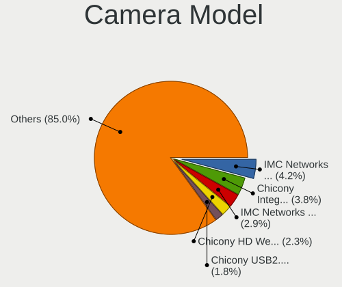

| Model                                               | Notebooks | Percent |
|-----------------------------------------------------|-----------|---------|
| IMC Networks USB2.0 HD UVC WebCam                   | 59        | 4.18%   |
| Chicony Integrated Camera                           | 54        | 3.82%   |
| IMC Networks Integrated Camera                      | 41        | 2.9%    |
| Chicony HD WebCam                                   | 33        | 2.34%   |
| Chicony USB2.0 VGA UVC WebCam                       | 25        | 1.77%   |
| Bison Integrated Camera                             | 24        | 1.7%    |
| Ricoh Visual Communication Camera VGP-VCC8 [R5U870] | 23        | 1.63%   |
| Syntek Integrated Camera                            | 22        | 1.56%   |
| IMC Networks USB2.0 VGA UVC WebCam                  | 22        | 1.56%   |
| Microdia Integrated_Webcam_HD                       | 19        | 1.35%   |
| Suyin Acer/HP Integrated Webcam [CN0314]            | 17        | 1.2%    |
| Luxvisions Innotech Limited HP TrueVision HD Camera | 17        | 1.2%    |
| Chicony USB 2.0 Camera                              | 17        | 1.2%    |
| Realtek Integrated_Webcam_HD                        | 15        | 1.06%   |
| Realtek EasyCamera                                  | 15        | 1.06%   |
| Lite-On Integrated Camera                           | 15        | 1.06%   |
| Chicony CNF9055 Toshiba Webcam                      | 15        | 1.06%   |
| Realtek USB Camera                                  | 14        | 0.99%   |
| Chicony TOSHIBA Web Camera - HD                     | 14        | 0.99%   |
| Quanta HP Wide Vision HD Camera                     | 12        | 0.85%   |
| Quanta HP TrueVision HD Camera                      | 12        | 0.85%   |
| Chicony Integrated Camera (1280x720@30)             | 12        | 0.85%   |
| Bison HD Webcam                                     | 12        | 0.85%   |
| IMC Networks HD Camera                              | 11        | 0.78%   |
| Chicony HP Truevision HD                            | 11        | 0.78%   |
| Apple Built-in iSight                               | 11        | 0.78%   |
| Apple FaceTime HD Camera                            | 10        | 0.71%   |
| Suyin HP TrueVision HD                              | 9         | 0.64%   |
| Sonix USB2.0 FHD UVC WebCam                         | 9         | 0.64%   |
| Chicony VGA WebCam                                  | 9         | 0.64%   |
| Chicony HD User Facing                              | 9         | 0.64%   |
| Chicony Chicony USB2.0 Camera                       | 9         | 0.64%   |
| Sunplus HD WebCam                                   | 8         | 0.57%   |
| Realtek USB2.0 HD UVC WebCam                        | 8         | 0.57%   |
| Realtek HP Webcam-101                               | 8         | 0.57%   |
| Realtek HD WebCam                                   | 8         | 0.57%   |
| Quanta HD Webcam                                    | 8         | 0.57%   |
| Lite-On HP HD Camera                                | 8         | 0.57%   |
| IMC Networks USB2.0 UVC HD Webcam                   | 8         | 0.57%   |
| IMC Networks ov9734_azurewave_camera                | 8         | 0.57%   |

Security
--------

Fingerprint Vendor
------------------

Fingerprint sensor vendors

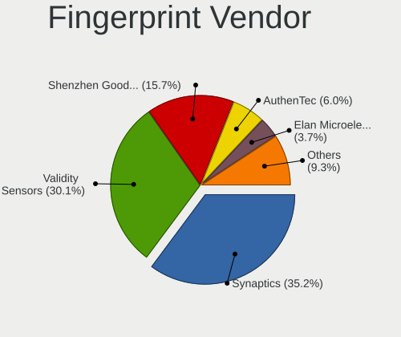

| Vendor                             | Notebooks | Percent |
|------------------------------------|-----------|---------|
| Synaptics                          | 76        | 35.19%  |
| Validity Sensors                   | 65        | 30.09%  |
| Shenzhen Goodix Technology         | 34        | 15.74%  |
| AuthenTec                          | 13        | 6.02%   |
| Elan Microelectronics              | 8         | 3.7%    |
| LighTuning Technology              | 7         | 3.24%   |
| Upek                               | 6         | 2.78%   |
| STMicroelectronics                 | 3         | 1.39%   |
| Realtek USB2.0 Finger Print Bridge | 3         | 1.39%   |
| Samsung Electronics                | 1         | 0.46%   |

Fingerprint Model
-----------------

Fingerprint sensor models

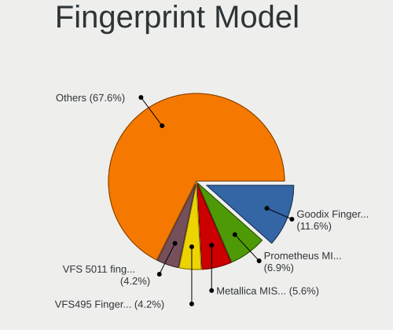

| Model                                                                      | Notebooks | Percent |
|----------------------------------------------------------------------------|-----------|---------|
| Shenzhen Goodix  Fingerprint Device                                        | 25        | 11.57%  |
| Synaptics Prometheus MIS Touch Fingerprint Reader                          | 15        | 6.94%   |
| Synaptics Metallica MIS Touch Fingerprint Reader                           | 12        | 5.56%   |
| Validity Sensors VFS495 Fingerprint Reader                                 | 9         | 4.17%   |
| Validity Sensors VFS 5011 fingerprint sensor                               | 9         | 4.17%   |
| Validity Sensors Swipe Fingerprint Sensor                                  | 8         | 3.7%    |
| Synaptics WBDI Fingerprint Reader USB 086                                  | 7         | 3.24%   |
| Synaptics Metallica MOH Touch Fingerprint Reader                           | 7         | 3.24%   |
| Synaptics Fingerprint reader [HP G6]                                       | 7         | 3.24%   |
| Validity Sensors Synaptics WBDI                                            | 6         | 2.78%   |
| Synaptics Prometheus Fingerprint Reader                                    | 6         | 2.78%   |
| Shenzhen Goodix Fingerprint Reader                                         | 6         | 2.78%   |
| Validity Sensors VFS301 Fingerprint Reader                                 | 5         | 2.31%   |
| Validity Sensors Fingerprint scanner                                       | 5         | 2.31%   |
| Upek Biometric Touchchip/Touchstrip Fingerprint Sensor                     | 5         | 2.31%   |
| Synaptics UWP WBDI Device                                                  | 5         | 2.31%   |
| Synaptics FS7604 Touch Fingerprint Sensor with PurePrint                   | 5         | 2.31%   |
| AuthenTec Fingerprint Sensor                                               | 5         | 2.31%   |
| Validity Sensors VFS7500 Touch Fingerprint Sensor                          | 4         | 1.85%   |
| Validity Sensors VFS451 Fingerprint Reader                                 | 4         | 1.85%   |
| Validity Sensors VFS101 Fingerprint Reader                                 | 4         | 1.85%   |
| Validity Sensors Synaptics VFS7552 Touch Fingerprint Sensor with PurePrint | 4         | 1.85%   |
| Elan ELAN:Fingerprint                                                      | 4         | 1.85%   |
| Elan ELAN:ARM-M4                                                           | 4         | 1.85%   |
| AuthenTec AES2810                                                          | 4         | 1.85%   |
| Validity Sensors VFS491                                                    | 3         | 1.39%   |
| Synaptics WBDI Device                                                      | 3         | 1.39%   |
| Synaptics  FS7604 Touch Fingerprint Sensor with PurePrint                  | 3         | 1.39%   |
| STMicroelectronics Fingerprint Reader                                      | 3         | 1.39%   |
| Shenzhen Goodix FingerPrint                                                | 3         | 1.39%   |
| Realtek USB2.0 Finger Print Bridge FocalTech Fingerprint Device            | 3         | 1.39%   |
| LighTuning ES603 Swipe Fingerprint Sensor                                  | 3         | 1.39%   |
| AuthenTec AES1600                                                          | 3         | 1.39%   |
| Validity Sensors VFS Fingerprint sensor                                    | 2         | 0.93%   |
| Synaptics WBDI                                                             | 2         | 0.93%   |
| LighTuning Fingerprint Reader                                              | 2         | 0.93%   |
| LighTuning EgisTec Touch Fingerprint Sensor                                | 2         | 0.93%   |
| Validity Sensors VFS5011 Fingerprint Reader                                | 1         | 0.46%   |
| Validity Sensors VFS471 Fingerprint Reader                                 | 1         | 0.46%   |
| Upek TCS5B Fingerprint sensor                                              | 1         | 0.46%   |

Chipcard Vendor
---------------

Chipcard module vendors

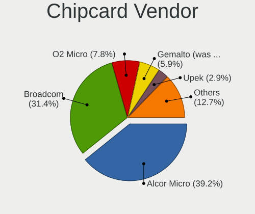

| Vendor                | Notebooks | Percent |
|-----------------------|-----------|---------|
| Alcor Micro           | 40        | 39.22%  |
| Broadcom              | 32        | 31.37%  |
| O2 Micro              | 8         | 7.84%   |
| Gemalto (was Gemplus) | 6         | 5.88%   |
| Upek                  | 3         | 2.94%   |
| Lenovo                | 3         | 2.94%   |
| SCM Microsystems      | 2         | 1.96%   |
| Realtek Semiconductor | 2         | 1.96%   |
| Bit4id                | 2         | 1.96%   |
| Yubico.com            | 1         | 0.98%   |
| GHI                   | 1         | 0.98%   |
| Cherry                | 1         | 0.98%   |
| Advanced Card Systems | 1         | 0.98%   |

Chipcard Model
--------------

Chipcard module models

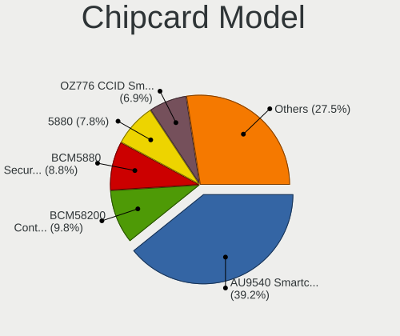

| Model                                                                        | Notebooks | Percent |
|------------------------------------------------------------------------------|-----------|---------|
| Alcor Micro AU9540 Smartcard Reader                                          | 40        | 39.22%  |
| Broadcom BCM58200 ControlVault 3 (FingerPrint sensor + Contacted SmartCard)  | 10        | 9.8%    |
| Broadcom BCM5880 Secure Applications Processor                               | 9         | 8.82%   |
| Broadcom 5880                                                                | 8         | 7.84%   |
| O2 Micro OZ776 CCID Smartcard Reader                                         | 7         | 6.86%   |
| Gemalto (was Gemplus) GemPC Twin SmartCard Reader                            | 4         | 3.92%   |
| Broadcom BCM5880 Secure Applications Processor with fingerprint swipe sensor | 4         | 3.92%   |
| Upek TouchChip Fingerprint Coprocessor (WBF advanced mode)                   | 3         | 2.94%   |
| Lenovo Integrated Smart Card Reader                                          | 3         | 2.94%   |
| SCM Microsystems SCR3340 - ExpressCard54 Smart Card Reader                   | 2         | 1.96%   |
| Realtek Semiconductor Smart Card Reader Interface                            | 2         | 1.96%   |
| Gemalto (was Gemplus) Compact Smart Card Reader Writer                       | 2         | 1.96%   |
| Bit4id miniLector EVO                                                        | 2         | 1.96%   |
| Yubico.com Yubikey 4/5 U2F+CCID                                              | 1         | 0.98%   |
| O2 Micro Oz776 SmartCard Reader                                              | 1         | 0.98%   |
| GHI NC001                                                                    | 1         | 0.98%   |
| Cherry SmartCard Reader Keyboard KC 1000 SC                                  | 1         | 0.98%   |
| Broadcom 58200                                                               | 1         | 0.98%   |
| Advanced Card Systems ACR38 SmartCard Reader                                 | 1         | 0.98%   |

Unsupported
-----------

Unsupported Devices
-------------------

Total unsupported devices on board

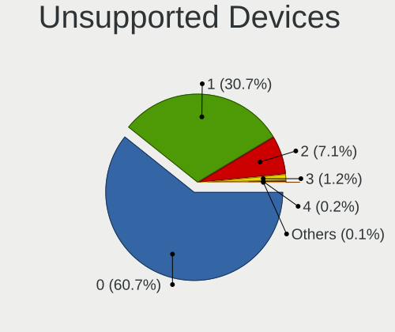

| Total | Notebooks | Percent |
|-------|-----------|---------|
| 0     | 988       | 60.73%  |
| 1     | 499       | 30.67%  |
| 2     | 115       | 7.07%   |
| 3     | 19        | 1.17%   |
| 4     | 4         | 0.25%   |
| 5     | 2         | 0.12%   |

Unsupported Device Types
------------------------

Types of unsupported devices

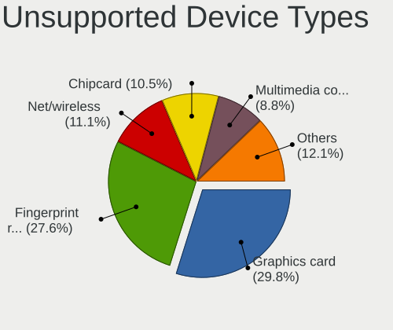

| Type                     | Notebooks | Percent |
|--------------------------|-----------|---------|
| Graphics card            | 231       | 29.84%  |
| Fingerprint reader       | 214       | 27.65%  |
| Net/wireless             | 86        | 11.11%  |
| Chipcard                 | 81        | 10.47%  |
| Multimedia controller    | 68        | 8.79%   |
| Camera                   | 22        | 2.84%   |
| Bluetooth                | 19        | 2.45%   |
| Card reader              | 15        | 1.94%   |
| Communication controller | 10        | 1.29%   |
| Storage                  | 8         | 1.03%   |
| Net/ethernet             | 5         | 0.65%   |
| Sound                    | 4         | 0.52%   |
| Modem                    | 4         | 0.52%   |
| Flash memory             | 4         | 0.52%   |
| Network                  | 2         | 0.26%   |
| Storage/ata              | 1         | 0.13%   |

