Linux in Portugal - Tested Hardware & Statistics (Notebooks)
------------------------------------------------------------

A project to collect tested hardware configurations for Linux in Portugal.

Anyone can contribute to this report by the [hw-probe](https://github.com/linuxhw/hw-probe) tool:

    sudo -E hw-probe -all -upload

Please contribute! Especially if your hardware is rare.

Contents
--------

* [ Test Cases ](#test-cases)

* [ System ](#system)
  - [ OS                       ](#os)
  - [ OS Family                ](#os-family)
  - [ Kernel                   ](#kernel)
  - [ Kernel Family            ](#kernel-family)
  - [ Kernel Major Ver.        ](#kernel-major-ver)
  - [ Arch                     ](#arch)
  - [ DE                       ](#de)
  - [ Display Server           ](#display-server)
  - [ Display Manager          ](#display-manager)
  - [ OS Lang                  ](#os-lang)
  - [ Boot Mode                ](#boot-mode)
  - [ Filesystem               ](#filesystem)
  - [ Part. scheme             ](#part-scheme)
  - [ Dual Boot with Linux/BSD ](#dual-boot-with-linuxbsd)
  - [ Dual Boot (Win)          ](#dual-boot-win)

* [ Board ](#board)
  - [ Vendor                   ](#vendor)
  - [ Model                    ](#model)
  - [ Model Family             ](#model-family)
  - [ MFG Year                 ](#mfg-year)
  - [ Form Factor              ](#form-factor)
  - [ Secure Boot              ](#secure-boot)
  - [ Coreboot                 ](#coreboot)
  - [ RAM Size                 ](#ram-size)
  - [ RAM Used                 ](#ram-used)
  - [ Total Drives             ](#total-drives)
  - [ Has CD-ROM               ](#has-cd-rom)
  - [ Has Ethernet             ](#has-ethernet)
  - [ Has WiFi                 ](#has-wifi)
  - [ Has Bluetooth            ](#has-bluetooth)

* [ Location ](#location)
  - [ Country                  ](#country)
  - [ City                     ](#city)

* [ Drives ](#drives)
  - [ Drive Vendor             ](#drive-vendor)
  - [ Drive Model              ](#drive-model)
  - [ HDD Vendor               ](#hdd-vendor)
  - [ SSD Vendor               ](#ssd-vendor)
  - [ Drive Kind               ](#drive-kind)
  - [ Drive Connector          ](#drive-connector)
  - [ Drive Size               ](#drive-size)
  - [ Space Total              ](#space-total)
  - [ Space Used               ](#space-used)
  - [ Malfunc. Drives          ](#malfunc-drives)
  - [ Malfunc. Drive Vendor    ](#malfunc-drive-vendor)
  - [ Malfunc. HDD Vendor      ](#malfunc-hdd-vendor)
  - [ Malfunc. Drive Kind      ](#malfunc-drive-kind)
  - [ Failed Drives            ](#failed-drives)
  - [ Failed Drive Vendor      ](#failed-drive-vendor)
  - [ Drive Status             ](#drive-status)

* [ Storage controller ](#storage-controller)
  - [ Storage Vendor           ](#storage-vendor)
  - [ Storage Model            ](#storage-model)
  - [ Storage Kind             ](#storage-kind)

* [ Processor ](#processor)
  - [ CPU Vendor               ](#cpu-vendor)
  - [ CPU Model                ](#cpu-model)
  - [ CPU Model Family         ](#cpu-model-family)
  - [ CPU Cores                ](#cpu-cores)
  - [ CPU Sockets              ](#cpu-sockets)
  - [ CPU Threads              ](#cpu-threads)
  - [ CPU Op-Modes             ](#cpu-op-modes)
  - [ CPU Microcode            ](#cpu-microcode)
  - [ CPU Microarch            ](#cpu-microarch)

* [ Graphics ](#graphics)
  - [ GPU Vendor               ](#gpu-vendor)
  - [ GPU Model                ](#gpu-model)
  - [ GPU Combo                ](#gpu-combo)
  - [ GPU Driver               ](#gpu-driver)
  - [ GPU Memory               ](#gpu-memory)

* [ Monitor ](#monitor)
  - [ Monitor Vendor           ](#monitor-vendor)
  - [ Monitor Model            ](#monitor-model)
  - [ Monitor Resolution       ](#monitor-resolution)
  - [ Monitor Diagonal         ](#monitor-diagonal)
  - [ Monitor Width            ](#monitor-width)
  - [ Aspect Ratio             ](#aspect-ratio)
  - [ Monitor Area             ](#monitor-area)
  - [ Pixel Density            ](#pixel-density)
  - [ Multiple Monitors        ](#multiple-monitors)

* [ Network ](#network)
  - [ Net Controller Vendor    ](#net-controller-vendor)
  - [ Net Controller Model     ](#net-controller-model)
  - [ Wireless Vendor          ](#wireless-vendor)
  - [ Wireless Model           ](#wireless-model)
  - [ Ethernet Vendor          ](#ethernet-vendor)
  - [ Ethernet Model           ](#ethernet-model)
  - [ Net Controller Kind      ](#net-controller-kind)
  - [ Used Controller          ](#used-controller)
  - [ NICs                     ](#nics)
  - [ IPv6                     ](#ipv6)

* [ Bluetooth ](#bluetooth)
  - [ Bluetooth Vendor         ](#bluetooth-vendor)
  - [ Bluetooth Model          ](#bluetooth-model)

* [ Sound ](#sound)
  - [ Sound Vendor             ](#sound-vendor)
  - [ Sound Model              ](#sound-model)

* [ Memory ](#memory)
  - [ Memory Vendor            ](#memory-vendor)
  - [ Memory Model             ](#memory-model)
  - [ Memory Kind              ](#memory-kind)
  - [ Memory Form Factor       ](#memory-form-factor)
  - [ Memory Size              ](#memory-size)
  - [ Memory Speed             ](#memory-speed)

* [ Printers & scanners ](#printers--scanners)
  - [ Printer Vendor           ](#printer-vendor)
  - [ Printer Model            ](#printer-model)
  - [ Scanner Vendor           ](#scanner-vendor)
  - [ Scanner Model            ](#scanner-model)

* [ Camera ](#camera)
  - [ Camera Vendor            ](#camera-vendor)
  - [ Camera Model             ](#camera-model)

* [ Security ](#security)
  - [ Fingerprint Vendor       ](#fingerprint-vendor)
  - [ Fingerprint Model        ](#fingerprint-model)
  - [ Chipcard Vendor          ](#chipcard-vendor)
  - [ Chipcard Model           ](#chipcard-model)

* [ Unsupported ](#unsupported)
  - [ Unsupported Devices      ](#unsupported-devices)
  - [ Unsupported Device Types ](#unsupported-device-types)

Test Cases
----------

Total: 1184

| Vendor        | Model                       | Probe                                                      | Date         |
|---------------|-----------------------------|------------------------------------------------------------|--------------|
| HP            | Pavilion Laptop 14-ec0xx... | [d24187e845](https://linux-hardware.org/?probe=d24187e845) | May 05, 2022 |
| HP            | ProBook 640 G2              | [50ccff3e1a](https://linux-hardware.org/?probe=50ccff3e1a) | May 04, 2022 |
| ASUSTek       | X540SAA                     | [9943699a6b](https://linux-hardware.org/?probe=9943699a6b) | May 04, 2022 |
| HP            | EliteBook 840 G5            | [47aaf6f556](https://linux-hardware.org/?probe=47aaf6f556) | May 04, 2022 |
| HP            | Pavilion Laptop 15-cs0xx... | [0a6358dc13](https://linux-hardware.org/?probe=0a6358dc13) | May 03, 2022 |
| Sony          | VGN-FZ31Z                   | [ebe91972ba](https://linux-hardware.org/?probe=ebe91972ba) | May 01, 2022 |
| HP            | ENVY Laptop 15-ep0xxx       | [96dbfb494e](https://linux-hardware.org/?probe=96dbfb494e) | Apr 29, 2022 |
| ASUSTek       | X540SAA                     | [6c8e397ca3](https://linux-hardware.org/?probe=6c8e397ca3) | Apr 29, 2022 |
| Lenovo        | G50-45 80E3                 | [910267bbd5](https://linux-hardware.org/?probe=910267bbd5) | Apr 28, 2022 |
| Lenovo        | G50-45 80E3                 | [22dd67107b](https://linux-hardware.org/?probe=22dd67107b) | Apr 28, 2022 |
| HP            | Laptop 15s-fq2xxx           | [91c7a6b5a0](https://linux-hardware.org/?probe=91c7a6b5a0) | Apr 27, 2022 |
| HP            | Laptop 15s-fq2xxx           | [d1bc01fac8](https://linux-hardware.org/?probe=d1bc01fac8) | Apr 27, 2022 |
| Lenovo        | ThinkPad L490 20Q5002GPG    | [9e591226b7](https://linux-hardware.org/?probe=9e591226b7) | Apr 26, 2022 |
| Lenovo        | ThinkPad X201 Tablet 083... | [e3ece9d899](https://linux-hardware.org/?probe=e3ece9d899) | Apr 26, 2022 |
| ASUSTek       | VivoBook_ASUSLaptop X530... | [5c309ec35d](https://linux-hardware.org/?probe=5c309ec35d) | Apr 26, 2022 |
| Lenovo        | ThinkPad X201 Tablet 083... | [8e7b2c79a0](https://linux-hardware.org/?probe=8e7b2c79a0) | Apr 25, 2022 |
| ASUSTek       | X540LJ                      | [982005a931](https://linux-hardware.org/?probe=982005a931) | Apr 25, 2022 |
| ASUSTek       | X540LJ                      | [8e0c841b78](https://linux-hardware.org/?probe=8e0c841b78) | Apr 25, 2022 |
| ASUSTek       | VivoBook_ASUSLaptop X530... | [710ddc650e](https://linux-hardware.org/?probe=710ddc650e) | Apr 25, 2022 |
| ASUSTek       | VivoBook_ASUSLaptop X512... | [7fc8d31b49](https://linux-hardware.org/?probe=7fc8d31b49) | Apr 24, 2022 |
| ASUSTek       | 1215N                       | [93ad513620](https://linux-hardware.org/?probe=93ad513620) | Apr 24, 2022 |
| ASUSTek       | ZenBook UX425EA_UX425EA     | [6162231453](https://linux-hardware.org/?probe=6162231453) | Apr 23, 2022 |
| ASUSTek       | ZenBook UX425EA_UX425EA     | [9146df4426](https://linux-hardware.org/?probe=9146df4426) | Apr 23, 2022 |
| Apple         | MacBookPro7,1               | [2641eee3f1](https://linux-hardware.org/?probe=2641eee3f1) | Apr 21, 2022 |
| ASUSTek       | X102BA                      | [00fbb5cbff](https://linux-hardware.org/?probe=00fbb5cbff) | Apr 20, 2022 |
| Lenovo        | ThinkPad L390 20NR001EPG    | [d83b89a414](https://linux-hardware.org/?probe=d83b89a414) | Apr 20, 2022 |
| HP            | Pavilion g6                 | [0c4c081e71](https://linux-hardware.org/?probe=0c4c081e71) | Apr 17, 2022 |
| Toshiba       | Satellite L775-151          | [957020b872](https://linux-hardware.org/?probe=957020b872) | Apr 16, 2022 |
| Toshiba       | Satellite L775-151          | [706f14a3e6](https://linux-hardware.org/?probe=706f14a3e6) | Apr 16, 2022 |
| Teclast       | F6 Plus                     | [a9407bd227](https://linux-hardware.org/?probe=a9407bd227) | Apr 16, 2022 |
| Teclast       | F6 Plus                     | [7403ce7189](https://linux-hardware.org/?probe=7403ce7189) | Apr 16, 2022 |
| Toshiba       | Satellite L300              | [242592fee5](https://linux-hardware.org/?probe=242592fee5) | Apr 15, 2022 |
| Lenovo        | IdeaPad 530S-14IKB 81EU     | [7436528d4f](https://linux-hardware.org/?probe=7436528d4f) | Apr 14, 2022 |
| Toshiba       | Satellite P70-B             | [6c01bb2cc3](https://linux-hardware.org/?probe=6c01bb2cc3) | Apr 13, 2022 |
| Lenovo        | IdeaPad 5 Pro 14ACN6 82L... | [bc22c713a7](https://linux-hardware.org/?probe=bc22c713a7) | Apr 13, 2022 |
| HP            | Pavilion Laptop 14-ec0xx... | [3b6e9158a9](https://linux-hardware.org/?probe=3b6e9158a9) | Apr 12, 2022 |
| HP            | ZBook Power G7 Mobile Wo... | [fba984b898](https://linux-hardware.org/?probe=fba984b898) | Apr 11, 2022 |
| Positivo      | H14BU08                     | [11014257c0](https://linux-hardware.org/?probe=11014257c0) | Apr 11, 2022 |
| Lenovo        | ThinkPad X1 Carbon 4th 2... | [4ca643452e](https://linux-hardware.org/?probe=4ca643452e) | Apr 10, 2022 |
| HP            | Pavilion Laptop 15-eg0xx... | [8adf631258](https://linux-hardware.org/?probe=8adf631258) | Apr 08, 2022 |
| Lenovo        | ThinkBook 13s G2 ITL 20V... | [00c3a80eb1](https://linux-hardware.org/?probe=00c3a80eb1) | Apr 07, 2022 |
| HP            | Pavilion Gaming Laptop 1... | [ec5daa2c06](https://linux-hardware.org/?probe=ec5daa2c06) | Apr 06, 2022 |
| HP            | Victus by Laptop 16-e0xx... | [191c569aa7](https://linux-hardware.org/?probe=191c569aa7) | Apr 05, 2022 |
| ASUSTek       | T100TA                      | [dbfc15621f](https://linux-hardware.org/?probe=dbfc15621f) | Apr 04, 2022 |
| ASUSTek       | X555LJ                      | [f9bbaea819](https://linux-hardware.org/?probe=f9bbaea819) | Apr 01, 2022 |
| ASUSTek       | X555LJ                      | [944f40aa28](https://linux-hardware.org/?probe=944f40aa28) | Apr 01, 2022 |
| TUXEDO        | InfinityBook S 14 Gen6      | [847b8f0788](https://linux-hardware.org/?probe=847b8f0788) | Apr 01, 2022 |
| HP            | Pavilion g6                 | [5dce001675](https://linux-hardware.org/?probe=5dce001675) | Mar 31, 2022 |
| MSI           | Modern 14 B11M              | [3cdc036c09](https://linux-hardware.org/?probe=3cdc036c09) | Mar 30, 2022 |
| Toshiba       | Satellite C660              | [60a6bafd86](https://linux-hardware.org/?probe=60a6bafd86) | Mar 30, 2022 |
| Fujitsu       | LIFEBOOK S752               | [73c18f75a9](https://linux-hardware.org/?probe=73c18f75a9) | Mar 29, 2022 |
| HP            | Pavilion Laptop 14-ec0xx... | [41870b3fdb](https://linux-hardware.org/?probe=41870b3fdb) | Mar 28, 2022 |
| ASUSTek       | T100TA                      | [fa6858ef16](https://linux-hardware.org/?probe=fa6858ef16) | Mar 28, 2022 |
| Lenovo        | IdeaPad 5 15ARE05 81YQ      | [fc92c7a9d2](https://linux-hardware.org/?probe=fc92c7a9d2) | Mar 28, 2022 |
| ASUSTek       | T100TA                      | [667b0cb23e](https://linux-hardware.org/?probe=667b0cb23e) | Mar 27, 2022 |
| ASUSTek       | GL552VW                     | [7e8bfac4b7](https://linux-hardware.org/?probe=7e8bfac4b7) | Mar 27, 2022 |
| MSI           | GL65 Leopard 10SFK          | [96afe8ccf1](https://linux-hardware.org/?probe=96afe8ccf1) | Mar 25, 2022 |
| MSI           | Modern 14 B11M              | [a2921a6b4c](https://linux-hardware.org/?probe=a2921a6b4c) | Mar 25, 2022 |
| MSI           | Modern 14 B11M              | [ca5720c46b](https://linux-hardware.org/?probe=ca5720c46b) | Mar 25, 2022 |
| Toshiba       | Satellite P50-B-10V         | [1f6acfd782](https://linux-hardware.org/?probe=1f6acfd782) | Mar 24, 2022 |
| ASUSTek       | X510UNR                     | [ab3b8653a6](https://linux-hardware.org/?probe=ab3b8653a6) | Mar 23, 2022 |
| Apple         | MacBookAir3,1               | [482fbd3456](https://linux-hardware.org/?probe=482fbd3456) | Mar 21, 2022 |
| HP            | ProBook 640 G2              | [17ceb0fd9f](https://linux-hardware.org/?probe=17ceb0fd9f) | Mar 19, 2022 |
| ASUSTek       | X541UV                      | [a23f80c36b](https://linux-hardware.org/?probe=a23f80c36b) | Mar 19, 2022 |
| MSI           | Stealth GS66 12UGS          | [882be4cd35](https://linux-hardware.org/?probe=882be4cd35) | Mar 19, 2022 |
| HP            | ProBook 640 G2              | [9024337e9f](https://linux-hardware.org/?probe=9024337e9f) | Mar 19, 2022 |
| HP            | Pavilion Laptop 14-ec0xx... | [fecfd110f3](https://linux-hardware.org/?probe=fecfd110f3) | Mar 17, 2022 |
| HP            | Pavilion Laptop 14-ec0xx... | [9d31b45a55](https://linux-hardware.org/?probe=9d31b45a55) | Mar 17, 2022 |
| Lenovo        | IdeaPad 110-15ACL 80TJ      | [5b345c55f7](https://linux-hardware.org/?probe=5b345c55f7) | Mar 16, 2022 |
| HP            | 250 G8 Notebook PC          | [90bbda2f8c](https://linux-hardware.org/?probe=90bbda2f8c) | Mar 16, 2022 |
| Acer          | Nitro AN515-54              | [1fea8c1b2b](https://linux-hardware.org/?probe=1fea8c1b2b) | Mar 16, 2022 |
| Lenovo        | ThinkPad L490 20Q5002GPG    | [fabbaeb1bb](https://linux-hardware.org/?probe=fabbaeb1bb) | Mar 16, 2022 |
| Lenovo        | ThinkPad L490 20Q5002GPG    | [e4021528f4](https://linux-hardware.org/?probe=e4021528f4) | Mar 16, 2022 |
| Fujitsu Si... | ESPRIMO Mobile V5535        | [3aded823d8](https://linux-hardware.org/?probe=3aded823d8) | Mar 13, 2022 |
| ASUSTek       | ZenBook UX431FA             | [b3cbed05f5](https://linux-hardware.org/?probe=b3cbed05f5) | Mar 10, 2022 |
| Lenovo        | Legion 5 15ARH05H 82B1      | [8469a31d58](https://linux-hardware.org/?probe=8469a31d58) | Mar 10, 2022 |
| Sony          | VGN-FZ31Z                   | [17e3cb9771](https://linux-hardware.org/?probe=17e3cb9771) | Mar 10, 2022 |
| ASUSTek       | X541UV                      | [aef8901d13](https://linux-hardware.org/?probe=aef8901d13) | Mar 08, 2022 |
| ASUSTek       | X541UV                      | [6bed69bcdb](https://linux-hardware.org/?probe=6bed69bcdb) | Mar 08, 2022 |
| Lenovo        | Legion 5 15ACH6H 82JU       | [8a4f961472](https://linux-hardware.org/?probe=8a4f961472) | Mar 08, 2022 |
| Lenovo        | Legion 5 15ACH6H 82JU       | [4d33fc28da](https://linux-hardware.org/?probe=4d33fc28da) | Mar 08, 2022 |
| Acer          | Aspire E5-551G              | [18bc15734f](https://linux-hardware.org/?probe=18bc15734f) | Mar 07, 2022 |
| ASUSTek       | X541UV                      | [a90d26bc2d](https://linux-hardware.org/?probe=a90d26bc2d) | Mar 06, 2022 |
| Lenovo        | ThinkPad W541 20EGS03100    | [f7b51cf262](https://linux-hardware.org/?probe=f7b51cf262) | Mar 05, 2022 |
| ASUSTek       | X541UV                      | [b5678eb9d3](https://linux-hardware.org/?probe=b5678eb9d3) | Mar 05, 2022 |
| Apple         | MacBookPro8,3               | [87a5df55b8](https://linux-hardware.org/?probe=87a5df55b8) | Mar 04, 2022 |
| ASUSTek       | T100TA                      | [6dc5f272b6](https://linux-hardware.org/?probe=6dc5f272b6) | Mar 04, 2022 |
| ASUSTek       | T100TA                      | [485c2b3aa7](https://linux-hardware.org/?probe=485c2b3aa7) | Mar 04, 2022 |
| HUAWEI        | BOHK-WAX9X                  | [c1b8c2903d](https://linux-hardware.org/?probe=c1b8c2903d) | Mar 02, 2022 |
| Acer          | Aspire A515-54G             | [67241eca45](https://linux-hardware.org/?probe=67241eca45) | Mar 02, 2022 |
| Acer          | Aspire A515-54G             | [06455796f9](https://linux-hardware.org/?probe=06455796f9) | Mar 01, 2022 |
| Sony          | VGN-FZ31Z                   | [01b50ec980](https://linux-hardware.org/?probe=01b50ec980) | Mar 01, 2022 |
| Sony          | VGN-FZ31Z                   | [1d156021e3](https://linux-hardware.org/?probe=1d156021e3) | Feb 26, 2022 |
| Sony          | VGN-FZ31Z                   | [b223305dc1](https://linux-hardware.org/?probe=b223305dc1) | Feb 26, 2022 |
| OBSIDIAN-P... | N13_N140ZU                  | [9f2fdbfce5](https://linux-hardware.org/?probe=9f2fdbfce5) | Feb 25, 2022 |
| Positivo      | H14BU08                     | [b3cb8e0d72](https://linux-hardware.org/?probe=b3cb8e0d72) | Feb 25, 2022 |
| HP            | ProBook 440 G8 Notebook ... | [e72b93aadf](https://linux-hardware.org/?probe=e72b93aadf) | Feb 24, 2022 |
| Apple         | MacBookPro12,1              | [e9d9cfb3e9](https://linux-hardware.org/?probe=e9d9cfb3e9) | Feb 24, 2022 |
| Samsung       | QX310/QX410/QX510/SF310/... | [20b0cf0db9](https://linux-hardware.org/?probe=20b0cf0db9) | Feb 24, 2022 |
| HP            | ProBook 440 G8 Notebook ... | [48d36e9bae](https://linux-hardware.org/?probe=48d36e9bae) | Feb 24, 2022 |
| HP            | ProBook 440 G8 Notebook ... | [60adc82fb8](https://linux-hardware.org/?probe=60adc82fb8) | Feb 23, 2022 |
| HP            | Pavilion Gaming Laptop 1... | [cf3e28fb31](https://linux-hardware.org/?probe=cf3e28fb31) | Feb 23, 2022 |
| Apple         | MacBookPro12,1              | [677ffe54b5](https://linux-hardware.org/?probe=677ffe54b5) | Feb 23, 2022 |
| SLIMBOOK      | TITAN                       | [2a35f863c2](https://linux-hardware.org/?probe=2a35f863c2) | Feb 21, 2022 |
| Lenovo        | ThinkPad T540p 20BFS23T0... | [c49acb0edf](https://linux-hardware.org/?probe=c49acb0edf) | Feb 21, 2022 |
| Lenovo        | ThinkPad T540p 20BFS23T0... | [6f13abc9eb](https://linux-hardware.org/?probe=6f13abc9eb) | Feb 21, 2022 |
| SLIMBOOK      | TITAN                       | [5759a48707](https://linux-hardware.org/?probe=5759a48707) | Feb 20, 2022 |
| Lenovo        | IdeaPad 320-15AST 80XV      | [013349e12a](https://linux-hardware.org/?probe=013349e12a) | Feb 19, 2022 |
| HP            | EliteBook 840 G6            | [b6f947ed63](https://linux-hardware.org/?probe=b6f947ed63) | Feb 18, 2022 |
| Dell          | Latitude E6440              | [1d4bac917c](https://linux-hardware.org/?probe=1d4bac917c) | Feb 18, 2022 |
| ASUSTek       | T100TA                      | [9f0a454d8b](https://linux-hardware.org/?probe=9f0a454d8b) | Feb 18, 2022 |
| ASUSTek       | X555LJ                      | [c2f63ae6d7](https://linux-hardware.org/?probe=c2f63ae6d7) | Feb 14, 2022 |
| Acer          | Aspire 5715Z                | [cdd4414bbd](https://linux-hardware.org/?probe=cdd4414bbd) | Feb 13, 2022 |
| Apple         | MacBookPro12,1              | [aeec085062](https://linux-hardware.org/?probe=aeec085062) | Feb 13, 2022 |
| ASUSTek       | X541UV                      | [fb81da9fa5](https://linux-hardware.org/?probe=fb81da9fa5) | Feb 13, 2022 |
| Dell          | Precision 3561              | [23c3392c57](https://linux-hardware.org/?probe=23c3392c57) | Feb 12, 2022 |
| ASUSTek       | VivoBook_ASUSLaptop X513... | [6c64279dbc](https://linux-hardware.org/?probe=6c64279dbc) | Feb 12, 2022 |
| ASUSTek       | K50IJ                       | [0dd30d1e7e](https://linux-hardware.org/?probe=0dd30d1e7e) | Feb 11, 2022 |
| Lenovo        | ThinkPad W510 4389BB4       | [ecaa14289f](https://linux-hardware.org/?probe=ecaa14289f) | Feb 09, 2022 |
| HP            | Compaq Presario CQ60        | [f5d9f92aad](https://linux-hardware.org/?probe=f5d9f92aad) | Feb 09, 2022 |
| Lenovo        | ThinkPad P50 20EN0005PG     | [0043180375](https://linux-hardware.org/?probe=0043180375) | Feb 07, 2022 |
| HP            | Victus by Laptop 16-e0xx... | [70122a3cd0](https://linux-hardware.org/?probe=70122a3cd0) | Feb 07, 2022 |
| Lenovo        | IdeaPad C340-14API 81N6     | [6bee100b0a](https://linux-hardware.org/?probe=6bee100b0a) | Feb 06, 2022 |
| Lenovo        | IdeaPad C340-14API 81N6     | [a554a842f7](https://linux-hardware.org/?probe=a554a842f7) | Feb 05, 2022 |
| Dell          | Latitude D630               | [66fe60e209](https://linux-hardware.org/?probe=66fe60e209) | Feb 04, 2022 |
| Lenovo        | Yoga S740-14IIL 81RS        | [722271e199](https://linux-hardware.org/?probe=722271e199) | Feb 04, 2022 |
| HP            | Pavilion Notebook           | [62cf8cdd3c](https://linux-hardware.org/?probe=62cf8cdd3c) | Feb 02, 2022 |
| Dell          | Latitude D630               | [c4b7202805](https://linux-hardware.org/?probe=c4b7202805) | Feb 01, 2022 |
| Sony          | VGN-FZ31Z                   | [c3e03d2551](https://linux-hardware.org/?probe=c3e03d2551) | Feb 01, 2022 |
| HP            | Pavilion Laptop 14-ec0xx... | [e0c36731ca](https://linux-hardware.org/?probe=e0c36731ca) | Jan 31, 2022 |
| Lenovo        | ThinkPad E14 Gen 2 20TA0... | [b4f3d4f1ee](https://linux-hardware.org/?probe=b4f3d4f1ee) | Jan 30, 2022 |
| HP            | Pavilion Gaming Laptop 1... | [77d230b476](https://linux-hardware.org/?probe=77d230b476) | Jan 29, 2022 |
| Acer          | Aspire E5-551G              | [435c894ed4](https://linux-hardware.org/?probe=435c894ed4) | Jan 29, 2022 |
| Toshiba       | Satellite C660              | [8609aaadb3](https://linux-hardware.org/?probe=8609aaadb3) | Jan 27, 2022 |
| ASUSTek       | N56VZ                       | [6f1b0cf9e0](https://linux-hardware.org/?probe=6f1b0cf9e0) | Jan 26, 2022 |
| Apple         | MacBookAir1,1               | [dfbdc8f20b](https://linux-hardware.org/?probe=dfbdc8f20b) | Jan 25, 2022 |
| ASUSTek       | ZenBook UX431FA             | [519a7a72ab](https://linux-hardware.org/?probe=519a7a72ab) | Jan 24, 2022 |
| Toshiba       | Satellite C660              | [b3aec22953](https://linux-hardware.org/?probe=b3aec22953) | Jan 24, 2022 |
| Apple         | MacBookPro9,2               | [90249388ff](https://linux-hardware.org/?probe=90249388ff) | Jan 22, 2022 |
| Toshiba       | Satellite A200              | [9086ec49b6](https://linux-hardware.org/?probe=9086ec49b6) | Jan 21, 2022 |
| Lenovo        | ThinkPad P15v Gen 1 20TQ... | [6fd36db1e0](https://linux-hardware.org/?probe=6fd36db1e0) | Jan 18, 2022 |
| Lenovo        | ThinkPad P15v Gen 1 20TQ... | [6f87d7372b](https://linux-hardware.org/?probe=6f87d7372b) | Jan 18, 2022 |
| Sony          | VGN-FZ31Z                   | [c7f9080e23](https://linux-hardware.org/?probe=c7f9080e23) | Jan 18, 2022 |
| Acer          | Aspire ES1-512              | [ca83027c67](https://linux-hardware.org/?probe=ca83027c67) | Jan 18, 2022 |
| ASUSTek       | VivoBook_ASUSLaptop X515... | [b27ed63a97](https://linux-hardware.org/?probe=b27ed63a97) | Jan 16, 2022 |
| Toshiba       | Satellite C660              | [a4b1346944](https://linux-hardware.org/?probe=a4b1346944) | Jan 13, 2022 |
| Lenovo        | Legion 5 15ACH6H 82JU       | [a8ff8d111b](https://linux-hardware.org/?probe=a8ff8d111b) | Jan 11, 2022 |
| Lenovo        | ThinkPad E15 20RD0015PG     | [008fd40914](https://linux-hardware.org/?probe=008fd40914) | Jan 11, 2022 |
| HP            | OMEN by Laptop 15-dc0xxx    | [5ba5bfc822](https://linux-hardware.org/?probe=5ba5bfc822) | Jan 11, 2022 |
| HP            | Laptop 15s-fq2xxx           | [468890e10d](https://linux-hardware.org/?probe=468890e10d) | Jan 08, 2022 |
| Sony          | VGN-FZ31Z                   | [7587e6c439](https://linux-hardware.org/?probe=7587e6c439) | Jan 08, 2022 |
| ASUSTek       | ROG Strix G533QS_G533QS     | [a3194a0ed3](https://linux-hardware.org/?probe=a3194a0ed3) | Jan 06, 2022 |
| HP            | Victus by Laptop 16-e0xx... | [a140e77bfe](https://linux-hardware.org/?probe=a140e77bfe) | Jan 05, 2022 |
| Toshiba       | Satellite L50D-B            | [e253741d9f](https://linux-hardware.org/?probe=e253741d9f) | Jan 05, 2022 |
| HP            | ProBook 4530s               | [c68e298c14](https://linux-hardware.org/?probe=c68e298c14) | Jan 04, 2022 |
| Lenovo        | ThinkPad L530 24791S8       | [030611ecba](https://linux-hardware.org/?probe=030611ecba) | Jan 04, 2022 |
| MSI           | Modern 14 A10RB             | [83285ade95](https://linux-hardware.org/?probe=83285ade95) | Jan 02, 2022 |
| MSI           | Modern 14 A10RB             | [602fe88681](https://linux-hardware.org/?probe=602fe88681) | Jan 02, 2022 |
| Timi          | TM1701                      | [594f40016d](https://linux-hardware.org/?probe=594f40016d) | Jan 02, 2022 |
| ASUSTek       | X542URR                     | [8af11eb0f1](https://linux-hardware.org/?probe=8af11eb0f1) | Jan 02, 2022 |
| Dell          | Latitude D420               | [3caac63d5f](https://linux-hardware.org/?probe=3caac63d5f) | Dec 31, 2021 |
| Sony          | VGN-FZ31Z                   | [38b3f4d971](https://linux-hardware.org/?probe=38b3f4d971) | Dec 30, 2021 |
| Sony          | VGN-FZ31Z                   | [d1a2146c05](https://linux-hardware.org/?probe=d1a2146c05) | Dec 29, 2021 |
| HP            | EliteBook 840 G7 Noteboo... | [4dfe6a5b8c](https://linux-hardware.org/?probe=4dfe6a5b8c) | Dec 29, 2021 |
| Toshiba       | Satellite C660              | [6f891ac715](https://linux-hardware.org/?probe=6f891ac715) | Dec 29, 2021 |
| HP            | Victus by Laptop 16-e0xx... | [d988f944f8](https://linux-hardware.org/?probe=d988f944f8) | Dec 28, 2021 |
| HUAWEI        | BOHK-WAX9X                  | [1daccedded](https://linux-hardware.org/?probe=1daccedded) | Dec 26, 2021 |
| Apple         | MacBookAir7,2               | [99bea5df6c](https://linux-hardware.org/?probe=99bea5df6c) | Dec 25, 2021 |
| ASUSTek       | VivoBook_ASUSLaptop X571... | [fe1f7f03e2](https://linux-hardware.org/?probe=fe1f7f03e2) | Dec 21, 2021 |
| Lenovo        | ThinkPad L15 Gen 2 20X3C... | [40282bb1fd](https://linux-hardware.org/?probe=40282bb1fd) | Dec 21, 2021 |
| Acer          | Aspire ES1-520              | [7a43d12de6](https://linux-hardware.org/?probe=7a43d12de6) | Dec 20, 2021 |
| ASUSTek       | T100HAN                     | [ad0dc6b737](https://linux-hardware.org/?probe=ad0dc6b737) | Dec 17, 2021 |
| ASUSTek       | T100HAN                     | [67b8998643](https://linux-hardware.org/?probe=67b8998643) | Dec 17, 2021 |
| Dell          | XPS 15 9500                 | [f9a4ac885d](https://linux-hardware.org/?probe=f9a4ac885d) | Dec 17, 2021 |
| ASUSTek       | T100HAN                     | [3e2b2a2da9](https://linux-hardware.org/?probe=3e2b2a2da9) | Dec 16, 2021 |
| ASUSTek       | T100HAN                     | [b46843c925](https://linux-hardware.org/?probe=b46843c925) | Dec 16, 2021 |
| MSI           | Alpha 15 A4DEK              | [0ecac9e450](https://linux-hardware.org/?probe=0ecac9e450) | Dec 16, 2021 |
| Toshiba       | QOSMIO X770                 | [c8c9ab4cf8](https://linux-hardware.org/?probe=c8c9ab4cf8) | Dec 16, 2021 |
| MSI           | Alpha 15 A4DEK              | [4b7a0b485e](https://linux-hardware.org/?probe=4b7a0b485e) | Dec 15, 2021 |
| Lenovo        | IdeaPad 3 15ALC6 82KU       | [93957ddac1](https://linux-hardware.org/?probe=93957ddac1) | Dec 13, 2021 |
| Sony          | VGN-SZ2HP_B                 | [a5d51adfab](https://linux-hardware.org/?probe=a5d51adfab) | Dec 13, 2021 |
| Lenovo        | Z51-70 80K6                 | [3faa0a2aad](https://linux-hardware.org/?probe=3faa0a2aad) | Dec 11, 2021 |
| Fujitsu       | LIFEBOOK U7411              | [65bc5c1c5b](https://linux-hardware.org/?probe=65bc5c1c5b) | Dec 11, 2021 |
| ASUSTek       | ZenBook UX325EA_UX325EA     | [11fb7ea1d7](https://linux-hardware.org/?probe=11fb7ea1d7) | Dec 08, 2021 |
| ASUSTek       | ZenBook UX325EA_UX325EA     | [23579d8b3a](https://linux-hardware.org/?probe=23579d8b3a) | Dec 08, 2021 |
| ASUSTek       | ZenBook UX325EA_UX325EA     | [66796a4303](https://linux-hardware.org/?probe=66796a4303) | Dec 06, 2021 |
| Lenovo        | ThinkPad X1 Carbon Gen 9... | [1d9d5bfe12](https://linux-hardware.org/?probe=1d9d5bfe12) | Dec 05, 2021 |
| Lenovo        | IdeaPad 320-15AST 80XV      | [aa4d4e3b08](https://linux-hardware.org/?probe=aa4d4e3b08) | Dec 04, 2021 |
| Lenovo        | ThinkPad R61 89337HG        | [670c02b990](https://linux-hardware.org/?probe=670c02b990) | Dec 02, 2021 |
| HP            | Victus by Laptop 16-e0xx... | [c68a7d50dc](https://linux-hardware.org/?probe=c68a7d50dc) | Dec 02, 2021 |
| HUAWEI        | BOHK-WAX9X                  | [8f2252e65a](https://linux-hardware.org/?probe=8f2252e65a) | Dec 02, 2021 |
| HP            | Victus by Laptop 16-e0xx... | [49055ba417](https://linux-hardware.org/?probe=49055ba417) | Dec 01, 2021 |
| Sony          | VGN-FZ31Z                   | [8e4401834b](https://linux-hardware.org/?probe=8e4401834b) | Dec 01, 2021 |
| TUXEDO        | InfinityBook Pro 14 Gen6    | [40a204e5f1](https://linux-hardware.org/?probe=40a204e5f1) | Nov 30, 2021 |
| Packard Be... | EasyNote_MX37-V-101PT       | [6f8e7042c4](https://linux-hardware.org/?probe=6f8e7042c4) | Nov 30, 2021 |
| Acer          | Aspire A315-57G             | [cfc036a421](https://linux-hardware.org/?probe=cfc036a421) | Nov 29, 2021 |
| HP            | OMEN by Laptop              | [4dec490a3f](https://linux-hardware.org/?probe=4dec490a3f) | Nov 29, 2021 |
| Acer          | Aspire E5-521               | [48d70742bb](https://linux-hardware.org/?probe=48d70742bb) | Nov 28, 2021 |
| Lenovo        | ThinkPad L470 W10DG 20JV... | [1a717e5780](https://linux-hardware.org/?probe=1a717e5780) | Nov 28, 2021 |
| Acer          | Aspire E5-521               | [7984741863](https://linux-hardware.org/?probe=7984741863) | Nov 27, 2021 |
| HP            | EliteBook 840 G8 Noteboo... | [19fc23d020](https://linux-hardware.org/?probe=19fc23d020) | Nov 27, 2021 |
| Packard Be... | EasyNote_MX37-V-101PT       | [490353d763](https://linux-hardware.org/?probe=490353d763) | Nov 27, 2021 |
| HP            | Pavilion 15                 | [0f1442bb2c](https://linux-hardware.org/?probe=0f1442bb2c) | Nov 22, 2021 |
| HP            | 15 TS                       | [50a260e4dc](https://linux-hardware.org/?probe=50a260e4dc) | Nov 21, 2021 |
| Clevo         | M7X0SU                      | [a9638079c6](https://linux-hardware.org/?probe=a9638079c6) | Nov 20, 2021 |
| ASUSTek       | UX303LAB                    | [21a3bdf255](https://linux-hardware.org/?probe=21a3bdf255) | Nov 19, 2021 |
| HP            | Pavilion g6                 | [10732e53ed](https://linux-hardware.org/?probe=10732e53ed) | Nov 18, 2021 |
| Lenovo        | ThinkPad E15 Gen 3 20YG0... | [8fc5db0cd9](https://linux-hardware.org/?probe=8fc5db0cd9) | Nov 17, 2021 |
| Sony          | VGN-FZ31Z                   | [2c4fd499c5](https://linux-hardware.org/?probe=2c4fd499c5) | Nov 17, 2021 |
| HP            | Pavilion dv6                | [3f54f48e23](https://linux-hardware.org/?probe=3f54f48e23) | Nov 17, 2021 |
| HUAWEI        | BOHK-WAX9X                  | [5f28060674](https://linux-hardware.org/?probe=5f28060674) | Nov 16, 2021 |
| ASUSTek       | X540YA                      | [72e7bebf84](https://linux-hardware.org/?probe=72e7bebf84) | Nov 16, 2021 |
| ASUSTek       | X540YA                      | [39d8ea222a](https://linux-hardware.org/?probe=39d8ea222a) | Nov 16, 2021 |
| HUAWEI        | WRT-WX9                     | [6c0ee3ae74](https://linux-hardware.org/?probe=6c0ee3ae74) | Nov 12, 2021 |
| HP            | Laptop 15-dw3xxx            | [be61c60b41](https://linux-hardware.org/?probe=be61c60b41) | Nov 12, 2021 |
| HP            | Laptop 15-dw3xxx            | [9fa65491aa](https://linux-hardware.org/?probe=9fa65491aa) | Nov 12, 2021 |
| ASUSTek       | X202EV                      | [ff0732f245](https://linux-hardware.org/?probe=ff0732f245) | Nov 11, 2021 |
| Sony          | VGN-FZ31Z                   | [fe8ba3f801](https://linux-hardware.org/?probe=fe8ba3f801) | Nov 11, 2021 |
| ASUSTek       | T102HA                      | [d648620b1a](https://linux-hardware.org/?probe=d648620b1a) | Nov 10, 2021 |
| Lenovo        | ThinkPad T420 4177Q5U       | [02ce053478](https://linux-hardware.org/?probe=02ce053478) | Nov 10, 2021 |
| HP            | EliteBook 840 G8 Noteboo... | [c13d42cb63](https://linux-hardware.org/?probe=c13d42cb63) | Nov 10, 2021 |
| HP            | EliteBook 840 G8 Noteboo... | [8403f5c97f](https://linux-hardware.org/?probe=8403f5c97f) | Nov 09, 2021 |
| Lenovo        | IdeaPad 5 Pro 16ACH6 82L... | [5dbef9a6a7](https://linux-hardware.org/?probe=5dbef9a6a7) | Nov 09, 2021 |
| Lenovo        | IdeaPad 5 Pro 16ACH6 82L... | [a2d1a17ff1](https://linux-hardware.org/?probe=a2d1a17ff1) | Nov 09, 2021 |
| TUXEDO        | InfinityBook Pro 14 Gen6    | [a0d13572a5](https://linux-hardware.org/?probe=a0d13572a5) | Nov 06, 2021 |
| HP            | G62                         | [a4a0360f3a](https://linux-hardware.org/?probe=a4a0360f3a) | Nov 06, 2021 |
| HP            | G62                         | [cd87bfa19b](https://linux-hardware.org/?probe=cd87bfa19b) | Nov 06, 2021 |
| Lenovo        | Legion 5 15ACH6H 82JU       | [87daccdc88](https://linux-hardware.org/?probe=87daccdc88) | Nov 05, 2021 |
| HP            | OMEN by Laptop              | [0b933dd493](https://linux-hardware.org/?probe=0b933dd493) | Nov 03, 2021 |
| Toshiba       | Satellite C660              | [c22b81abd4](https://linux-hardware.org/?probe=c22b81abd4) | Nov 02, 2021 |
| Sony          | VPCYB1S1E                   | [bbe04676c1](https://linux-hardware.org/?probe=bbe04676c1) | Nov 02, 2021 |
| Sony          | VPCYB1S1E                   | [09eba8bb5f](https://linux-hardware.org/?probe=09eba8bb5f) | Nov 02, 2021 |
| Standard      | Unknown                     | [3cccd4bf9f](https://linux-hardware.org/?probe=3cccd4bf9f) | Nov 02, 2021 |
| HP            | ProBook 445 G7              | [ca8418c85b](https://linux-hardware.org/?probe=ca8418c85b) | Nov 02, 2021 |
| Acer          | Aspire E1-570G              | [9c6c7691c9](https://linux-hardware.org/?probe=9c6c7691c9) | Nov 02, 2021 |
| Acer          | Aspire 4732Z                | [7095848f26](https://linux-hardware.org/?probe=7095848f26) | Oct 31, 2021 |
| HUAWEI        | BOHK-WAX9X                  | [c0b80e3276](https://linux-hardware.org/?probe=c0b80e3276) | Oct 30, 2021 |
| Acer          | Aspire 4732Z                | [ce23f8d9f9](https://linux-hardware.org/?probe=ce23f8d9f9) | Oct 30, 2021 |
| Standard      | Unknown                     | [6b45028e3e](https://linux-hardware.org/?probe=6b45028e3e) | Oct 29, 2021 |
| Standard      | Unknown                     | [1bf7e2da2f](https://linux-hardware.org/?probe=1bf7e2da2f) | Oct 28, 2021 |
| Lenovo        | IdeaPad 3 15ALC6 82KU       | [9276790a36](https://linux-hardware.org/?probe=9276790a36) | Oct 28, 2021 |
| Acer          | Aspire 5732Z                | [9d4f7a1a4b](https://linux-hardware.org/?probe=9d4f7a1a4b) | Oct 27, 2021 |
| ASUSTek       | X453MA                      | [4a70424b2f](https://linux-hardware.org/?probe=4a70424b2f) | Oct 27, 2021 |
| ASUSTek       | X540YA                      | [9b382500c5](https://linux-hardware.org/?probe=9b382500c5) | Oct 27, 2021 |
| Dell          | Latitude E5400              | [7049bbe182](https://linux-hardware.org/?probe=7049bbe182) | Oct 24, 2021 |
| Lenovo        | IdeaPad 5 14ITL05 82FE      | [4826046b43](https://linux-hardware.org/?probe=4826046b43) | Oct 24, 2021 |
| Toshiba       | Satellite T130              | [b3e2853259](https://linux-hardware.org/?probe=b3e2853259) | Oct 24, 2021 |
| Toshiba       | Satellite T130              | [5af2c96114](https://linux-hardware.org/?probe=5af2c96114) | Oct 24, 2021 |
| HUAWEI        | BOHK-WAX9X                  | [7aac95cd60](https://linux-hardware.org/?probe=7aac95cd60) | Oct 23, 2021 |
| HP            | Notebook                    | [fb90bf9dc7](https://linux-hardware.org/?probe=fb90bf9dc7) | Oct 21, 2021 |
| ASUSTek       | X555LD                      | [eef17ea12f](https://linux-hardware.org/?probe=eef17ea12f) | Oct 20, 2021 |
| Lenovo        | ThinkPad T480 20L6S7PE06    | [28857899a2](https://linux-hardware.org/?probe=28857899a2) | Oct 20, 2021 |
| HP            | Compaq Presario CQ60        | [0b02aa22d4](https://linux-hardware.org/?probe=0b02aa22d4) | Oct 17, 2021 |
| HP            | Pavilion x2 Detachable      | [c17c589af5](https://linux-hardware.org/?probe=c17c589af5) | Oct 17, 2021 |
| Toshiba       | Satellite C660              | [c70057c643](https://linux-hardware.org/?probe=c70057c643) | Oct 16, 2021 |
| HUAWEI        | BOHK-WAX9X                  | [6360789a1c](https://linux-hardware.org/?probe=6360789a1c) | Oct 14, 2021 |
| eMachines     | E520 V1.06                  | [97c667e3c0](https://linux-hardware.org/?probe=97c667e3c0) | Oct 14, 2021 |
| HP            | EliteBook 840 G3            | [b3f6912fdd](https://linux-hardware.org/?probe=b3f6912fdd) | Oct 11, 2021 |
| HP            | Pavilion g6                 | [5eba384acd](https://linux-hardware.org/?probe=5eba384acd) | Oct 11, 2021 |
| HP            | Notebook                    | [732cc33a53](https://linux-hardware.org/?probe=732cc33a53) | Oct 11, 2021 |
| Samsung       | 300E4A/300E5A/300E7A/343... | [77a6cb9eba](https://linux-hardware.org/?probe=77a6cb9eba) | Oct 07, 2021 |
| Samsung       | 300E4A/300E5A/300E7A/343... | [99c08de77b](https://linux-hardware.org/?probe=99c08de77b) | Oct 07, 2021 |
| HP            | G62                         | [6cbed79ca9](https://linux-hardware.org/?probe=6cbed79ca9) | Oct 05, 2021 |
| Dell          | XPS 13 7390                 | [843d9a14d4](https://linux-hardware.org/?probe=843d9a14d4) | Oct 05, 2021 |
| Toshiba       | Satellite A100              | [b1996e39c6](https://linux-hardware.org/?probe=b1996e39c6) | Oct 05, 2021 |
| Toshiba       | Satellite A100              | [47def5d058](https://linux-hardware.org/?probe=47def5d058) | Oct 05, 2021 |
| Lenovo        | IdeaPad L340-15IRH Gamin... | [96cf9ba56a](https://linux-hardware.org/?probe=96cf9ba56a) | Sep 30, 2021 |
| ASUSTek       | X453MA                      | [782dfc1a5f](https://linux-hardware.org/?probe=782dfc1a5f) | Sep 30, 2021 |
| Toshiba       | Satellite L500              | [07116867d0](https://linux-hardware.org/?probe=07116867d0) | Sep 30, 2021 |
| Unknown       | Unknown                     | [1466ee93ee](https://linux-hardware.org/?probe=1466ee93ee) | Sep 29, 2021 |
| SLIMBOOK      | TITAN                       | [985d394a66](https://linux-hardware.org/?probe=985d394a66) | Sep 29, 2021 |
| HUAWEI        | BOHK-WAX9X                  | [040b7200c3](https://linux-hardware.org/?probe=040b7200c3) | Sep 28, 2021 |
| HP            | Pavilion dv6                | [0a3653d139](https://linux-hardware.org/?probe=0a3653d139) | Sep 27, 2021 |
| Acer          | Aspire ES1-512              | [d573d0691e](https://linux-hardware.org/?probe=d573d0691e) | Sep 27, 2021 |
| Acer          | Aspire ES1-512              | [f322cce11b](https://linux-hardware.org/?probe=f322cce11b) | Sep 27, 2021 |
| Acer          | Aspire ES1-512              | [6aa9666f2c](https://linux-hardware.org/?probe=6aa9666f2c) | Sep 27, 2021 |
| HP            | Pavilion dv6                | [3a077b3ca9](https://linux-hardware.org/?probe=3a077b3ca9) | Sep 26, 2021 |
| HP            | Pavilion dv6                | [a5de874a12](https://linux-hardware.org/?probe=a5de874a12) | Sep 26, 2021 |
| Dell          | Latitude 5400               | [c94a87ddcd](https://linux-hardware.org/?probe=c94a87ddcd) | Sep 26, 2021 |
| HUAWEI        | BOHK-WAX9X                  | [a4b7fd74e3](https://linux-hardware.org/?probe=a4b7fd74e3) | Sep 24, 2021 |
| Fujitsu       | LIFEBOOK AH552/SL           | [adefc47ea8](https://linux-hardware.org/?probe=adefc47ea8) | Sep 22, 2021 |
| Toshiba       | PORTEGE Z30-A               | [13b9ce0773](https://linux-hardware.org/?probe=13b9ce0773) | Sep 22, 2021 |
| HP            | Laptop 15-bs0xx             | [6a1f29d17c](https://linux-hardware.org/?probe=6a1f29d17c) | Sep 22, 2021 |
| Dynabook      | dynabook PORTEGE X50-G      | [da8279a7a9](https://linux-hardware.org/?probe=da8279a7a9) | Sep 22, 2021 |
| ASUSTek       | ROG Strix G533QS_G533QS     | [8a14f4f8ce](https://linux-hardware.org/?probe=8a14f4f8ce) | Sep 20, 2021 |
| Lenovo        | ThinkPad E14 Gen 2 20TA0... | [61fd64b037](https://linux-hardware.org/?probe=61fd64b037) | Sep 19, 2021 |
| Sony          | VGN-FZ31Z                   | [134fab4631](https://linux-hardware.org/?probe=134fab4631) | Sep 17, 2021 |
| SLIMBOOK      | TITAN                       | [c7f8406a92](https://linux-hardware.org/?probe=c7f8406a92) | Sep 16, 2021 |
| Sony          | VGN-FZ31Z                   | [78a5f6cc5b](https://linux-hardware.org/?probe=78a5f6cc5b) | Sep 16, 2021 |
| Sony          | VGN-FZ31Z                   | [fd9704ad22](https://linux-hardware.org/?probe=fd9704ad22) | Sep 16, 2021 |
| ASUSTek       | F5SL                        | [e6e93168a6](https://linux-hardware.org/?probe=e6e93168a6) | Sep 15, 2021 |
| Sony          | VGN-FZ21M                   | [f68a8cedaa](https://linux-hardware.org/?probe=f68a8cedaa) | Sep 15, 2021 |
| Lenovo        | ThinkPad X1 Carbon 4th 2... | [232a307a5b](https://linux-hardware.org/?probe=232a307a5b) | Sep 14, 2021 |
| Acer          | Aspire ES1-520              | [4b4f263238](https://linux-hardware.org/?probe=4b4f263238) | Sep 14, 2021 |
| Intel         | Intel powered classmate ... | [15cb9c7764](https://linux-hardware.org/?probe=15cb9c7764) | Sep 12, 2021 |
| HUAWEI        | NBLK-WAX9X                  | [bfe6584c68](https://linux-hardware.org/?probe=bfe6584c68) | Sep 12, 2021 |
| HUAWEI        | NBLK-WAX9X                  | [e82ca3db5b](https://linux-hardware.org/?probe=e82ca3db5b) | Sep 12, 2021 |
| MSI           | GE75 Raider 8RF             | [350527f093](https://linux-hardware.org/?probe=350527f093) | Sep 10, 2021 |
| HUAWEI        | BOHK-WAX9X                  | [13d65a1a4e](https://linux-hardware.org/?probe=13d65a1a4e) | Sep 09, 2021 |
| HP            | Pavilion Gaming Laptop 1... | [c50b07bfbc](https://linux-hardware.org/?probe=c50b07bfbc) | Sep 08, 2021 |
| HP            | Pavilion Gaming Laptop 1... | [24053a2921](https://linux-hardware.org/?probe=24053a2921) | Sep 07, 2021 |
| Lenovo        | Legion 5 15ARH05 82B5       | [b34fb7492d](https://linux-hardware.org/?probe=b34fb7492d) | Sep 07, 2021 |
| HP            | Pavilion Gaming Laptop 1... | [e65bcd50d4](https://linux-hardware.org/?probe=e65bcd50d4) | Sep 05, 2021 |
| ASUSTek       | K53SV                       | [f617f97f20](https://linux-hardware.org/?probe=f617f97f20) | Sep 03, 2021 |
| Dell          | XPS 13 7390                 | [be1de37337](https://linux-hardware.org/?probe=be1de37337) | Sep 03, 2021 |
| ASUSTek       | TUF Gaming FX505DD_FX505... | [62e286b6bc](https://linux-hardware.org/?probe=62e286b6bc) | Aug 31, 2021 |
| Lenovo        | ThinkPad T430 2349V4B       | [33a45018fc](https://linux-hardware.org/?probe=33a45018fc) | Aug 31, 2021 |
| Lenovo        | ThinkPad L14 Gen 1 20U10... | [84ed2a684d](https://linux-hardware.org/?probe=84ed2a684d) | Aug 30, 2021 |
| Lenovo        | Legion 5 15ARH05 82B5       | [6d630f76dc](https://linux-hardware.org/?probe=6d630f76dc) | Aug 30, 2021 |
| Apple         | MacBookAir3,1               | [c431035e14](https://linux-hardware.org/?probe=c431035e14) | Aug 28, 2021 |
| HP            | EliteBook 820 G1            | [fcfdefc5ce](https://linux-hardware.org/?probe=fcfdefc5ce) | Aug 24, 2021 |
| Acer          | Aspire one 1-431            | [1d73bf7163](https://linux-hardware.org/?probe=1d73bf7163) | Aug 23, 2021 |
| HP            | Compaq Presario CQ50        | [afde6653db](https://linux-hardware.org/?probe=afde6653db) | Aug 20, 2021 |
| ASUSTek       | K52Je                       | [d35de28c56](https://linux-hardware.org/?probe=d35de28c56) | Aug 17, 2021 |
| HUAWEI        | BOHK-WAX9X                  | [0b7f4b2da5](https://linux-hardware.org/?probe=0b7f4b2da5) | Aug 15, 2021 |
| Samsung       | 905S3G/906S3G/915S3G/930... | [c2dee4fe1c](https://linux-hardware.org/?probe=c2dee4fe1c) | Aug 14, 2021 |
| HP            | Compaq Presario CQ71        | [c1e4d1748b](https://linux-hardware.org/?probe=c1e4d1748b) | Aug 14, 2021 |
| HP            | Compaq Presario CQ71        | [cf87f27296](https://linux-hardware.org/?probe=cf87f27296) | Aug 13, 2021 |
| ASUSTek       | K52Je                       | [ae9629c543](https://linux-hardware.org/?probe=ae9629c543) | Aug 13, 2021 |
| Teclast       | TbooK 11                    | [d045383640](https://linux-hardware.org/?probe=d045383640) | Aug 12, 2021 |
| Teclast       | TbooK 11                    | [f3e17cb791](https://linux-hardware.org/?probe=f3e17cb791) | Aug 12, 2021 |
| ASUSTek       | X541UV                      | [3f45acb762](https://linux-hardware.org/?probe=3f45acb762) | Aug 11, 2021 |
| ASUSTek       | VivoBook_ASUSLaptop X513... | [3fb07ec1ab](https://linux-hardware.org/?probe=3fb07ec1ab) | Aug 11, 2021 |
| MSI           | Alpha 15 A4DEK              | [f8bd1ccc54](https://linux-hardware.org/?probe=f8bd1ccc54) | Aug 09, 2021 |
| Lenovo        | ThinkPad T490 20N2CTO1WW    | [f8727e28db](https://linux-hardware.org/?probe=f8727e28db) | Aug 05, 2021 |
| MSI           | Alpha 15 A4DEK              | [77c994366c](https://linux-hardware.org/?probe=77c994366c) | Aug 04, 2021 |
| Apple         | MacBookPro8,1               | [ea96dd2fc0](https://linux-hardware.org/?probe=ea96dd2fc0) | Aug 03, 2021 |
| Acer          | Extensa 5635ZG              | [7b18fd92ec](https://linux-hardware.org/?probe=7b18fd92ec) | Aug 01, 2021 |
| Lenovo        | ThinkPad T14 Gen 1 20S1S... | [dde43dfc5f](https://linux-hardware.org/?probe=dde43dfc5f) | Jul 31, 2021 |
| Acer          | Extensa 5635ZG              | [920920b284](https://linux-hardware.org/?probe=920920b284) | Jul 30, 2021 |
| HP            | EliteBook 840 G1            | [a4d0bd11cf](https://linux-hardware.org/?probe=a4d0bd11cf) | Jul 30, 2021 |
| HUAWEI        | BOHK-WAX9X                  | [55c54d17ad](https://linux-hardware.org/?probe=55c54d17ad) | Jul 29, 2021 |
| HUAWEI        | BOHK-WAX9X                  | [1bb07ffc9f](https://linux-hardware.org/?probe=1bb07ffc9f) | Jul 29, 2021 |
| Packard Be... | EasyNote MB65               | [f659f0645c](https://linux-hardware.org/?probe=f659f0645c) | Jul 28, 2021 |
| Toshiba       | Satellite L50-B             | [0e3d86e5fc](https://linux-hardware.org/?probe=0e3d86e5fc) | Jul 28, 2021 |
| HP            | Pavilion Laptop 15-eg0xx... | [e877303c3f](https://linux-hardware.org/?probe=e877303c3f) | Jul 28, 2021 |
| Lenovo        | ThinkPad P52 20M9CTO1WW     | [abdeaec5ce](https://linux-hardware.org/?probe=abdeaec5ce) | Jul 28, 2021 |
| Lenovo        | ThinkPad P52 20M9CTO1WW     | [5258847421](https://linux-hardware.org/?probe=5258847421) | Jul 28, 2021 |
| ASUSTek       | X550DP                      | [fab8695920](https://linux-hardware.org/?probe=fab8695920) | Jul 27, 2021 |
| HUAWEI        | BOHK-WAX9X                  | [ec1cea0d9d](https://linux-hardware.org/?probe=ec1cea0d9d) | Jul 25, 2021 |
| Lenovo        | IdeaPad 300-15ISK 80Q7      | [a2ba4d937e](https://linux-hardware.org/?probe=a2ba4d937e) | Jul 25, 2021 |
| Lenovo        | ThinkPad T490 20N3S27C00    | [f4f26a9357](https://linux-hardware.org/?probe=f4f26a9357) | Jul 24, 2021 |
| Sony          | VGN-AW21Z_B                 | [16afdefee9](https://linux-hardware.org/?probe=16afdefee9) | Jul 23, 2021 |
| Fujitsu       | LIFEBOOK U7411              | [ad8fb39682](https://linux-hardware.org/?probe=ad8fb39682) | Jul 23, 2021 |
| Lenovo        | ThinkPad T480 20L5S03600    | [996bc7336f](https://linux-hardware.org/?probe=996bc7336f) | Jul 23, 2021 |
| Lenovo        | ThinkPad T480 20L5S03600    | [84d70d9bde](https://linux-hardware.org/?probe=84d70d9bde) | Jul 23, 2021 |
| Toshiba       | Satellite M70               | [ffe4b92da3](https://linux-hardware.org/?probe=ffe4b92da3) | Jul 21, 2021 |
| HP            | Compaq Presario CQ71        | [434b061859](https://linux-hardware.org/?probe=434b061859) | Jul 20, 2021 |
| Toshiba       | Satellite C50-B             | [288b6b0769](https://linux-hardware.org/?probe=288b6b0769) | Jul 16, 2021 |
| Toshiba       | Satellite P50-C             | [3b8ead252b](https://linux-hardware.org/?probe=3b8ead252b) | Jul 15, 2021 |
| HP            | Compaq Presario CQ71        | [d26cb48393](https://linux-hardware.org/?probe=d26cb48393) | Jul 14, 2021 |
| SLIMBOOK      | TITAN                       | [e747cd1fe5](https://linux-hardware.org/?probe=e747cd1fe5) | Jul 13, 2021 |
| Fujitsu       | LIFEBOOK U7411              | [9d1dfce344](https://linux-hardware.org/?probe=9d1dfce344) | Jul 13, 2021 |
| ASUSTek       | T100HAN                     | [9d9f33c5e5](https://linux-hardware.org/?probe=9d9f33c5e5) | Jul 12, 2021 |
| Acer          | NC-V3-575G-58LU             | [da6da7fbd6](https://linux-hardware.org/?probe=da6da7fbd6) | Jul 11, 2021 |
| ASUSTek       | G50V                        | [ec1ddd4644](https://linux-hardware.org/?probe=ec1ddd4644) | Jul 11, 2021 |
| Lenovo        | ThinkPad T430 2349V4B       | [d39fe8e9d4](https://linux-hardware.org/?probe=d39fe8e9d4) | Jul 11, 2021 |
| SLIMBOOK      | TITAN                       | [388f0d5e8d](https://linux-hardware.org/?probe=388f0d5e8d) | Jul 09, 2021 |
| Dell          | Latitude D530               | [d48cd58890](https://linux-hardware.org/?probe=d48cd58890) | Jul 09, 2021 |
| Dell          | Precision M4600             | [388aad414f](https://linux-hardware.org/?probe=388aad414f) | Jul 08, 2021 |
| Dell          | Latitude D530               | [21ad721b61](https://linux-hardware.org/?probe=21ad721b61) | Jul 07, 2021 |
| SLIMBOOK      | TITAN                       | [59233d0bff](https://linux-hardware.org/?probe=59233d0bff) | Jul 07, 2021 |
| Acer          | Aspire 5738                 | [77c0819e0f](https://linux-hardware.org/?probe=77c0819e0f) | Jul 07, 2021 |
| Toshiba       | Satellite C50-B             | [4e5088a32a](https://linux-hardware.org/?probe=4e5088a32a) | Jul 06, 2021 |
| Toshiba       | Satellite C50-B             | [0bdc8750c3](https://linux-hardware.org/?probe=0bdc8750c3) | Jul 05, 2021 |
| Lenovo        | ThinkPad T14 Gen 1 20S1S... | [0e79f21646](https://linux-hardware.org/?probe=0e79f21646) | Jul 05, 2021 |
| Lenovo        | ThinkPad T430 2349V4B       | [d6ef1b054b](https://linux-hardware.org/?probe=d6ef1b054b) | Jun 28, 2021 |
| HUAWEI        | BOHK-WAX9X                  | [65c54db09e](https://linux-hardware.org/?probe=65c54db09e) | Jun 27, 2021 |
| HUAWEI        | BOHK-WAX9X                  | [fda3d18cf7](https://linux-hardware.org/?probe=fda3d18cf7) | Jun 27, 2021 |
| ASUSTek       | VivoBook 15_ASUS Laptop ... | [f3430744d8](https://linux-hardware.org/?probe=f3430744d8) | Jun 24, 2021 |
| HP            | ENVY 17                     | [c6b33cf692](https://linux-hardware.org/?probe=c6b33cf692) | Jun 22, 2021 |
| HP            | EliteBook 820 G1            | [46e46cdce1](https://linux-hardware.org/?probe=46e46cdce1) | Jun 20, 2021 |
| Dell          | XPS 13 9305                 | [02ee8d11bc](https://linux-hardware.org/?probe=02ee8d11bc) | Jun 19, 2021 |
| Lenovo        | Yoga 300-11IBR 80M1         | [259fc86278](https://linux-hardware.org/?probe=259fc86278) | Jun 18, 2021 |
| Dell          | XPS 13 9305                 | [d1799a89c4](https://linux-hardware.org/?probe=d1799a89c4) | Jun 17, 2021 |
| Dell          | Latitude E6520              | [718e90b724](https://linux-hardware.org/?probe=718e90b724) | Jun 17, 2021 |
| HP            | Pavilion Laptop 15-cw0xx... | [b796c5a183](https://linux-hardware.org/?probe=b796c5a183) | Jun 16, 2021 |
| HP            | OMEN by HP Laptop 15-dc1... | [0c01b21401](https://linux-hardware.org/?probe=0c01b21401) | Jun 15, 2021 |
| SLIMBOOK      | PROX15-INTEL                | [f471ae0176](https://linux-hardware.org/?probe=f471ae0176) | Jun 15, 2021 |
| ASUSTek       | K73SV                       | [228feaed8e](https://linux-hardware.org/?probe=228feaed8e) | Jun 12, 2021 |
| HUAWEI        | BOHK-WAX9X                  | [57684125de](https://linux-hardware.org/?probe=57684125de) | Jun 12, 2021 |
| Google        | Coral                       | [f6cf3ed923](https://linux-hardware.org/?probe=f6cf3ed923) | Jun 11, 2021 |
| ASUSTek       | T100HAN                     | [06263c7e06](https://linux-hardware.org/?probe=06263c7e06) | Jun 11, 2021 |
| HP            | Slate 2                     | [0d820f363e](https://linux-hardware.org/?probe=0d820f363e) | Jun 10, 2021 |
| HP            | Slate 2                     | [ecb6d7d96f](https://linux-hardware.org/?probe=ecb6d7d96f) | Jun 10, 2021 |
| ASUSTek       | T100HAN                     | [005e52c9d3](https://linux-hardware.org/?probe=005e52c9d3) | Jun 07, 2021 |
| Acer          | Extensa 5635ZG              | [540d6fca8e](https://linux-hardware.org/?probe=540d6fca8e) | Jun 07, 2021 |
| Acer          | Aspire E5-523G              | [b092f36afc](https://linux-hardware.org/?probe=b092f36afc) | Jun 06, 2021 |
| HP            | ProBook 4520s               | [87f9426157](https://linux-hardware.org/?probe=87f9426157) | Jun 06, 2021 |
| HUAWEI        | BOHK-WAX9X                  | [47e9dfd146](https://linux-hardware.org/?probe=47e9dfd146) | Jun 05, 2021 |
| HP            | Pavilion Gaming Laptop 1... | [25a53bf5a0](https://linux-hardware.org/?probe=25a53bf5a0) | Jun 05, 2021 |
| Dell          | Precision M4600             | [b1bc313622](https://linux-hardware.org/?probe=b1bc313622) | Jun 04, 2021 |
| ASUSTek       | T100HAN                     | [d13f35a6f4](https://linux-hardware.org/?probe=d13f35a6f4) | Jun 04, 2021 |
| Toshiba       | Satellite C660D             | [39a33d288a](https://linux-hardware.org/?probe=39a33d288a) | Jun 03, 2021 |
| HP            | ProBook 450 G6              | [af16143ad8](https://linux-hardware.org/?probe=af16143ad8) | Jun 03, 2021 |
| Toshiba       | PORTEGE Z930                | [4a95259edd](https://linux-hardware.org/?probe=4a95259edd) | Jun 03, 2021 |
| HUAWEI        | BOHK-WAX9X                  | [ac80feea4f](https://linux-hardware.org/?probe=ac80feea4f) | Jun 01, 2021 |
| Acer          | Aspire A315-41              | [15de6a42cc](https://linux-hardware.org/?probe=15de6a42cc) | Jun 01, 2021 |
| Lenovo        | IdeaPad 320-15IKB 80XL      | [0540d35606](https://linux-hardware.org/?probe=0540d35606) | May 31, 2021 |
| ASUSTek       | T100HAN                     | [ca42a42366](https://linux-hardware.org/?probe=ca42a42366) | May 30, 2021 |
| Acer          | Aspire ES1-572              | [c16c3f3c20](https://linux-hardware.org/?probe=c16c3f3c20) | May 29, 2021 |
| Samsung       | 700T                        | [374154a439](https://linux-hardware.org/?probe=374154a439) | May 29, 2021 |
| HUAWEI        | BOHK-WAX9X                  | [430907546b](https://linux-hardware.org/?probe=430907546b) | May 29, 2021 |
| HP            | Pavilion g6                 | [03f3d2f19b](https://linux-hardware.org/?probe=03f3d2f19b) | May 27, 2021 |
| ASUSTek       | X555LD                      | [a0ab13de0b](https://linux-hardware.org/?probe=a0ab13de0b) | May 26, 2021 |
| ASUSTek       | T100HAN                     | [5d5fd53164](https://linux-hardware.org/?probe=5d5fd53164) | May 25, 2021 |
| ASUSTek       | T100HAN                     | [9ad9fd2a90](https://linux-hardware.org/?probe=9ad9fd2a90) | May 25, 2021 |
| ASUSTek       | T100HAN                     | [20badd4bf8](https://linux-hardware.org/?probe=20badd4bf8) | May 24, 2021 |
| Toshiba       | PORTEGE Z930                | [5169c2f96a](https://linux-hardware.org/?probe=5169c2f96a) | May 23, 2021 |
| HUAWEI        | WRT-WX9                     | [8865e5f33f](https://linux-hardware.org/?probe=8865e5f33f) | May 21, 2021 |
| ASUSTek       | X540YA                      | [c7d85ee10a](https://linux-hardware.org/?probe=c7d85ee10a) | May 21, 2021 |
| HUAWEI        | BOHK-WAX9X                  | [b9d0acf0a6](https://linux-hardware.org/?probe=b9d0acf0a6) | May 19, 2021 |
| HUAWEI        | BOHK-WAX9X                  | [97a658e572](https://linux-hardware.org/?probe=97a658e572) | May 19, 2021 |
| Toshiba       | PORTEGE Z930                | [3b82b0b360](https://linux-hardware.org/?probe=3b82b0b360) | May 18, 2021 |
| Toshiba       | PORTEGE Z930                | [e006b8bf83](https://linux-hardware.org/?probe=e006b8bf83) | May 18, 2021 |
| ASUSTek       | X541UJ                      | [0fc9152ae2](https://linux-hardware.org/?probe=0fc9152ae2) | May 16, 2021 |
| Acer          | Aspire E5-411               | [e9004a67e9](https://linux-hardware.org/?probe=e9004a67e9) | May 16, 2021 |
| HP            | EliteBook Folio 1040 G1     | [1e47d123cc](https://linux-hardware.org/?probe=1e47d123cc) | May 15, 2021 |
| ASUSTek       | T100HAN                     | [7195f02080](https://linux-hardware.org/?probe=7195f02080) | May 13, 2021 |
| ASUSTek       | 1215N                       | [2e4383bd79](https://linux-hardware.org/?probe=2e4383bd79) | May 13, 2021 |
| Acer          | Aspire 5750                 | [51386797f0](https://linux-hardware.org/?probe=51386797f0) | May 11, 2021 |
| HP            | Laptop 17-ak0xx             | [b2207b19c0](https://linux-hardware.org/?probe=b2207b19c0) | May 09, 2021 |
| INSYS         | CD9-G148                    | [162b7d2dd4](https://linux-hardware.org/?probe=162b7d2dd4) | May 07, 2021 |
| Lenovo        | ThinkPad X1 Carbon 7th 2... | [34b008d2a3](https://linux-hardware.org/?probe=34b008d2a3) | May 06, 2021 |
| Lenovo        | Yoga S740-14IIL 81RS        | [8edf563281](https://linux-hardware.org/?probe=8edf563281) | May 03, 2021 |
| eMachines     | eME728                      | [9c098c150f](https://linux-hardware.org/?probe=9c098c150f) | May 01, 2021 |
| HUAWEI        | BOHK-WAX9X                  | [8956498c75](https://linux-hardware.org/?probe=8956498c75) | Apr 29, 2021 |
| Lenovo        | ThinkPad P50 20EN0005PG     | [b3a280cc6b](https://linux-hardware.org/?probe=b3a280cc6b) | Apr 29, 2021 |
| Positivo      | H14BU08                     | [0074b53665](https://linux-hardware.org/?probe=0074b53665) | Apr 28, 2021 |
| ASUSTek       | K73SV                       | [d810797575](https://linux-hardware.org/?probe=d810797575) | Apr 28, 2021 |
| ASUSTek       | K73SV                       | [b70e4fe78b](https://linux-hardware.org/?probe=b70e4fe78b) | Apr 27, 2021 |
| Lenovo        | ThinkPad X1 Carbon 7th 2... | [bf2ec3a69c](https://linux-hardware.org/?probe=bf2ec3a69c) | Apr 26, 2021 |
| ASUSTek       | X555LJ                      | [3febe6795e](https://linux-hardware.org/?probe=3febe6795e) | Apr 26, 2021 |
| Lenovo        | ThinkPad X1 Carbon 7th 2... | [0bcc333251](https://linux-hardware.org/?probe=0bcc333251) | Apr 25, 2021 |
| HP            | Pavilion Gaming Laptop 1... | [508213fd9c](https://linux-hardware.org/?probe=508213fd9c) | Apr 25, 2021 |
| JPSaCouto     | Intel powered classmate ... | [f82c8e8839](https://linux-hardware.org/?probe=f82c8e8839) | Apr 25, 2021 |
| JPSaCouto     | Intel powered classmate ... | [bcca68ee1a](https://linux-hardware.org/?probe=bcca68ee1a) | Apr 25, 2021 |
| HP            | Laptop 15-gw0xxx            | [bbb889a0ca](https://linux-hardware.org/?probe=bbb889a0ca) | Apr 25, 2021 |
| ASUSTek       | T100HAN                     | [a8ff3e1736](https://linux-hardware.org/?probe=a8ff3e1736) | Apr 22, 2021 |
| ASUSTek       | T100HAN                     | [2c4f2ffa49](https://linux-hardware.org/?probe=2c4f2ffa49) | Apr 20, 2021 |
| Dell          | XPS 13 7390                 | [b1801d62cb](https://linux-hardware.org/?probe=b1801d62cb) | Apr 20, 2021 |
| ASUSTek       | ROG Zephyrus G14 GA401IV... | [a008c4e692](https://linux-hardware.org/?probe=a008c4e692) | Apr 19, 2021 |
| ASUSTek       | T100HAN                     | [5ff0bb6a88](https://linux-hardware.org/?probe=5ff0bb6a88) | Apr 18, 2021 |
| Toshiba       | Satellite L50D-B            | [4b47248331](https://linux-hardware.org/?probe=4b47248331) | Apr 18, 2021 |
| Toshiba       | Satellite L50D-B            | [2df86fbb1c](https://linux-hardware.org/?probe=2df86fbb1c) | Apr 18, 2021 |
| Sony          | VGN-FZ140N                  | [b46e85cdb2](https://linux-hardware.org/?probe=b46e85cdb2) | Apr 17, 2021 |
| HP            | Pavilion dv6                | [cc367d13cf](https://linux-hardware.org/?probe=cc367d13cf) | Apr 16, 2021 |
| HP            | Pavilion dv6                | [d5b4576543](https://linux-hardware.org/?probe=d5b4576543) | Apr 16, 2021 |
| Lenovo        | B50-10 80QR                 | [a5d4730bbe](https://linux-hardware.org/?probe=a5d4730bbe) | Apr 16, 2021 |
| HP            | Pavilion dv6                | [10a2c15ac0](https://linux-hardware.org/?probe=10a2c15ac0) | Apr 12, 2021 |
| Dell          | XPS 13 7390                 | [2c074aa232](https://linux-hardware.org/?probe=2c074aa232) | Apr 12, 2021 |
| Toshiba       | Satellite L40               | [0f6ed90100](https://linux-hardware.org/?probe=0f6ed90100) | Apr 11, 2021 |
| HP            | Pavilion dv6                | [5c83ad0f56](https://linux-hardware.org/?probe=5c83ad0f56) | Apr 10, 2021 |
| Toshiba       | Satellite L650              | [5652130b72](https://linux-hardware.org/?probe=5652130b72) | Apr 09, 2021 |
| HUAWEI        | BOHK-WAX9X                  | [3e238ba145](https://linux-hardware.org/?probe=3e238ba145) | Apr 08, 2021 |
| eMachines     | eME728                      | [e6075a342d](https://linux-hardware.org/?probe=e6075a342d) | Apr 04, 2021 |
| Acer          | Aspire A515-51G             | [0af274abed](https://linux-hardware.org/?probe=0af274abed) | Apr 03, 2021 |
| Acer          | Aspire A515-51G             | [21263e72df](https://linux-hardware.org/?probe=21263e72df) | Apr 03, 2021 |
| eMachines     | eME728                      | [1db163e222](https://linux-hardware.org/?probe=1db163e222) | Apr 02, 2021 |
| Dell          | Latitude E5410              | [5d8f94313f](https://linux-hardware.org/?probe=5d8f94313f) | Apr 02, 2021 |
| Acer          | Aspire A315-41              | [2ba4e8be53](https://linux-hardware.org/?probe=2ba4e8be53) | Apr 02, 2021 |
| Phoenix/Si... | M7X0SU                      | [44b42fe693](https://linux-hardware.org/?probe=44b42fe693) | Apr 02, 2021 |
| HP            | Pavilion dv6                | [9d7000a50b](https://linux-hardware.org/?probe=9d7000a50b) | Mar 31, 2021 |
| ASUSTek       | ROG Zephyrus G14 GA401IV... | [859d3df16d](https://linux-hardware.org/?probe=859d3df16d) | Mar 30, 2021 |
| HUAWEI        | BOHK-WAX9X                  | [8d09fd5fad](https://linux-hardware.org/?probe=8d09fd5fad) | Mar 29, 2021 |
| HUAWEI        | BOHK-WAX9X                  | [2c6ab69ae8](https://linux-hardware.org/?probe=2c6ab69ae8) | Mar 28, 2021 |
| Lenovo        | ThinkPad E14 Gen 2 20TAC... | [417973ae47](https://linux-hardware.org/?probe=417973ae47) | Mar 27, 2021 |
| Lenovo        | ThinkPad X390 20Q1S17H02    | [8a1509f6f9](https://linux-hardware.org/?probe=8a1509f6f9) | Mar 24, 2021 |
| Toshiba       | PORTEGE Z30-A               | [804865062f](https://linux-hardware.org/?probe=804865062f) | Mar 23, 2021 |
| HUAWEI        | BOHK-WAX9X                  | [4fc9eab67c](https://linux-hardware.org/?probe=4fc9eab67c) | Mar 21, 2021 |
| Lenovo        | ThinkPad E14 Gen 2 20T60... | [186f54f898](https://linux-hardware.org/?probe=186f54f898) | Mar 20, 2021 |
| Lenovo        | Legion Y530-15ICH 81FV      | [36ba280ff4](https://linux-hardware.org/?probe=36ba280ff4) | Mar 20, 2021 |
| HP            | Compaq Presario CQ60        | [29b5b3b3c4](https://linux-hardware.org/?probe=29b5b3b3c4) | Mar 18, 2021 |
| ASUSTek       | VivoBook 15_ASUS Laptop ... | [bcb52364ec](https://linux-hardware.org/?probe=bcb52364ec) | Mar 18, 2021 |
| ASUSTek       | T100HAN                     | [4d004db7b4](https://linux-hardware.org/?probe=4d004db7b4) | Mar 17, 2021 |
| ASUSTek       | T100HAN                     | [375e68fd9f](https://linux-hardware.org/?probe=375e68fd9f) | Mar 17, 2021 |
| Toshiba       | Satellite T110              | [e974c29a53](https://linux-hardware.org/?probe=e974c29a53) | Mar 17, 2021 |
| Lenovo        | ThinkPad T440p 20AWS1WS0... | [616d32ae4b](https://linux-hardware.org/?probe=616d32ae4b) | Mar 16, 2021 |
| Lenovo        | ThinkPad T440p 20AWS1WS0... | [67f54ece11](https://linux-hardware.org/?probe=67f54ece11) | Mar 15, 2021 |
| HUAWEI        | BOHK-WAX9X                  | [a0e45cb8f5](https://linux-hardware.org/?probe=a0e45cb8f5) | Mar 14, 2021 |
| HUAWEI        | BOHK-WAX9X                  | [bcdd60dc85](https://linux-hardware.org/?probe=bcdd60dc85) | Mar 14, 2021 |
| Lenovo        | ThinkPad R400 7443E1G       | [10584ae27b](https://linux-hardware.org/?probe=10584ae27b) | Mar 13, 2021 |
| Lenovo        | ThinkPad T14 Gen 1 20S1S... | [14d6107700](https://linux-hardware.org/?probe=14d6107700) | Mar 13, 2021 |
| Lenovo        | ThinkPad T14 Gen 1 20S1S... | [3043c4c8ed](https://linux-hardware.org/?probe=3043c4c8ed) | Mar 13, 2021 |
| HP            | ZBook Power G7 Mobile Wo... | [edbe4b927f](https://linux-hardware.org/?probe=edbe4b927f) | Mar 12, 2021 |
| MSI           | Prestige 15 A10SC           | [6bcf98bb2b](https://linux-hardware.org/?probe=6bcf98bb2b) | Mar 10, 2021 |
| Alienware     | 17 R3                       | [8582334b5a](https://linux-hardware.org/?probe=8582334b5a) | Mar 10, 2021 |
| HP            | G62                         | [2be248991e](https://linux-hardware.org/?probe=2be248991e) | Mar 08, 2021 |
| Acer          | Aspire E5-521               | [d2ee782761](https://linux-hardware.org/?probe=d2ee782761) | Mar 07, 2021 |
| HP            | G62                         | [4d4a5d0369](https://linux-hardware.org/?probe=4d4a5d0369) | Mar 07, 2021 |
| HUAWEI        | BOHK-WAX9X                  | [0f1bf2c9c8](https://linux-hardware.org/?probe=0f1bf2c9c8) | Mar 06, 2021 |
| HUAWEI        | BOHK-WAX9X                  | [11366485fa](https://linux-hardware.org/?probe=11366485fa) | Mar 06, 2021 |
| Acer          | Aspire 5551G                | [eb7deed365](https://linux-hardware.org/?probe=eb7deed365) | Mar 05, 2021 |
| HP            | G62                         | [40478702e0](https://linux-hardware.org/?probe=40478702e0) | Mar 05, 2021 |
| HP            | G62                         | [8b53fa05c1](https://linux-hardware.org/?probe=8b53fa05c1) | Mar 05, 2021 |
| ASUSTek       | X102BA                      | [5b648fcc6b](https://linux-hardware.org/?probe=5b648fcc6b) | Mar 04, 2021 |
| Lenovo        | ThinkPad SL500 27466CS      | [f2d482cf8d](https://linux-hardware.org/?probe=f2d482cf8d) | Mar 02, 2021 |
| HUAWEI        | BOHK-WAX9X                  | [a1844625da](https://linux-hardware.org/?probe=a1844625da) | Feb 28, 2021 |
| HP            | Pavilion x2 Detachable      | [9eb3ae4c15](https://linux-hardware.org/?probe=9eb3ae4c15) | Feb 26, 2021 |
| HP            | Laptop 15s-fq2xxx           | [83587f3565](https://linux-hardware.org/?probe=83587f3565) | Feb 25, 2021 |
| HP            | OMEN by HP Laptop 15-dc0... | [c584e27b6c](https://linux-hardware.org/?probe=c584e27b6c) | Feb 25, 2021 |
| Apple         | MacBookPro9,2               | [7a2466e991](https://linux-hardware.org/?probe=7a2466e991) | Feb 25, 2021 |
| Acer          | Aspire E5-573G              | [55a00ca46d](https://linux-hardware.org/?probe=55a00ca46d) | Feb 24, 2021 |
| Sony          | 91                          | [adfdcf1669](https://linux-hardware.org/?probe=adfdcf1669) | Feb 24, 2021 |
| HP            | Laptop 15-da0xxx            | [86f60bbc44](https://linux-hardware.org/?probe=86f60bbc44) | Feb 23, 2021 |
| HP            | Laptop 15-da0xxx            | [6a9341e4ab](https://linux-hardware.org/?probe=6a9341e4ab) | Feb 22, 2021 |
| Acer          | Aspire ES1-512              | [cfc54d6468](https://linux-hardware.org/?probe=cfc54d6468) | Feb 21, 2021 |
| Acer          | Aspire E5-521G              | [7b0155df52](https://linux-hardware.org/?probe=7b0155df52) | Feb 20, 2021 |
| Apple         | MacBookPro9,2               | [022bccde17](https://linux-hardware.org/?probe=022bccde17) | Feb 19, 2021 |
| HP            | G62                         | [bf7d5b9736](https://linux-hardware.org/?probe=bf7d5b9736) | Feb 19, 2021 |
| Sony          | SVE1512C6EW                 | [477d0e5a6d](https://linux-hardware.org/?probe=477d0e5a6d) | Feb 17, 2021 |
| HUAWEI        | BOHK-WAX9X                  | [2e3039e232](https://linux-hardware.org/?probe=2e3039e232) | Feb 15, 2021 |
| ASUSTek       | X555LD                      | [78355d7193](https://linux-hardware.org/?probe=78355d7193) | Feb 14, 2021 |
| TUXEDO        | Pulse 14 Gen1               | [ba8153abd8](https://linux-hardware.org/?probe=ba8153abd8) | Feb 14, 2021 |
| Lenovo        | IdeaPad 720S-13ARR 81BR     | [3cc715f92a](https://linux-hardware.org/?probe=3cc715f92a) | Feb 14, 2021 |
| Lenovo        | ThinkPad T14 Gen 1 20S00... | [c097a16392](https://linux-hardware.org/?probe=c097a16392) | Feb 14, 2021 |
| Lenovo        | ThinkPad T14 Gen 1 20S00... | [252b674af4](https://linux-hardware.org/?probe=252b674af4) | Feb 14, 2021 |
| Acer          | Aspire 5732Z                | [a72e26c3bd](https://linux-hardware.org/?probe=a72e26c3bd) | Feb 14, 2021 |
| HP            | G62                         | [3acbc7c7e3](https://linux-hardware.org/?probe=3acbc7c7e3) | Feb 13, 2021 |
| MSI           | GS65 Stealth Thin 8RE       | [d948546be2](https://linux-hardware.org/?probe=d948546be2) | Feb 13, 2021 |
| MSI           | GS65 Stealth Thin 8RE       | [63e4ddb6a6](https://linux-hardware.org/?probe=63e4ddb6a6) | Feb 13, 2021 |
| HP            | Pavilion Notebook           | [fcc62099b2](https://linux-hardware.org/?probe=fcc62099b2) | Feb 13, 2021 |
| Toshiba       | Satellite M50D-A            | [248337d69a](https://linux-hardware.org/?probe=248337d69a) | Feb 13, 2021 |
| Lenovo        | ThinkPad T495s 20QJCTO1W... | [922c8b7dfd](https://linux-hardware.org/?probe=922c8b7dfd) | Feb 11, 2021 |
| HUAWEI        | NBLK-WAX9X                  | [e2f6310b33](https://linux-hardware.org/?probe=e2f6310b33) | Feb 11, 2021 |
| MSI           | GT680R/GX680R/GT683R/GT6... | [57f509711d](https://linux-hardware.org/?probe=57f509711d) | Feb 10, 2021 |
| Lenovo        | Yoga S740-14IIL 81RS        | [1ddd62bb74](https://linux-hardware.org/?probe=1ddd62bb74) | Feb 10, 2021 |
| HP            | Compaq Presario CQ61        | [88bc30b5c4](https://linux-hardware.org/?probe=88bc30b5c4) | Feb 07, 2021 |
| HP            | Pavilion dv5                | [25a5b76a4b](https://linux-hardware.org/?probe=25a5b76a4b) | Feb 07, 2021 |
| HUAWEI        | BOHK-WAX9X                  | [b94aa04034](https://linux-hardware.org/?probe=b94aa04034) | Feb 06, 2021 |
| ASUSTek       | E203NAS                     | [a97e612dd4](https://linux-hardware.org/?probe=a97e612dd4) | Feb 05, 2021 |
| Lenovo        | IdeaPad 110-15AST 80TR      | [33311133f5](https://linux-hardware.org/?probe=33311133f5) | Feb 03, 2021 |
| HP            | G62                         | [4664fa7da5](https://linux-hardware.org/?probe=4664fa7da5) | Feb 01, 2021 |
| HP            | G62                         | [af6f8ed7d3](https://linux-hardware.org/?probe=af6f8ed7d3) | Feb 01, 2021 |
| Notebook      | N2x0WU                      | [fad3702ef5](https://linux-hardware.org/?probe=fad3702ef5) | Feb 01, 2021 |
| HP            | Compaq Presario CQ50        | [98a871c74d](https://linux-hardware.org/?probe=98a871c74d) | Feb 01, 2021 |
| HP            | ProBook 6550b               | [b41bf411ae](https://linux-hardware.org/?probe=b41bf411ae) | Jan 31, 2021 |
| Toshiba       | Satellite C50D-B            | [5b1624d2fa](https://linux-hardware.org/?probe=5b1624d2fa) | Jan 31, 2021 |
| ASUSTek       | S400CA                      | [9749eb6d22](https://linux-hardware.org/?probe=9749eb6d22) | Jan 31, 2021 |
| Acer          | Aspire E1-570G              | [19e6d6afd7](https://linux-hardware.org/?probe=19e6d6afd7) | Jan 28, 2021 |
| HP            | ProBook 6550b               | [90cc726402](https://linux-hardware.org/?probe=90cc726402) | Jan 27, 2021 |
| Acer          | Aspire E1-570G              | [bffb99b092](https://linux-hardware.org/?probe=bffb99b092) | Jan 26, 2021 |
| Acer          | Aspire E1-570G              | [f8f4880823](https://linux-hardware.org/?probe=f8f4880823) | Jan 26, 2021 |
| Clevo         | W760T/M740T/M760T           | [4b75664c6f](https://linux-hardware.org/?probe=4b75664c6f) | Jan 25, 2021 |
| MSI           | GF75 Thin 10SCSR            | [7a6ed88f27](https://linux-hardware.org/?probe=7a6ed88f27) | Jan 24, 2021 |
| MSI           | GF75 Thin 10SCSR            | [f04b769e0d](https://linux-hardware.org/?probe=f04b769e0d) | Jan 24, 2021 |
| ASUSTek       | X541UVK                     | [bb710f7faa](https://linux-hardware.org/?probe=bb710f7faa) | Jan 23, 2021 |
| ASUSTek       | X541UVK                     | [541bbe8e75](https://linux-hardware.org/?probe=541bbe8e75) | Jan 23, 2021 |
| ASUSTek       | ZenBook UX450FDX_UX480FD    | [6eb0721a80](https://linux-hardware.org/?probe=6eb0721a80) | Jan 23, 2021 |
| Lenovo        | ThinkPad T440 20B7S0JF07    | [fab6e1d3ad](https://linux-hardware.org/?probe=fab6e1d3ad) | Jan 21, 2021 |
| Lenovo        | ThinkPad T440 20B7S0JF07    | [5311f338e0](https://linux-hardware.org/?probe=5311f338e0) | Jan 21, 2021 |
| Acer          | Aspire E5-521               | [50ee0ac068](https://linux-hardware.org/?probe=50ee0ac068) | Jan 20, 2021 |
| ASUSTek       | N56VZ                       | [d35ea722a3](https://linux-hardware.org/?probe=d35ea722a3) | Jan 19, 2021 |
| ASUSTek       | N56VZ                       | [039ce9b983](https://linux-hardware.org/?probe=039ce9b983) | Jan 19, 2021 |
| HP            | ProBook 6475b               | [82693f57b0](https://linux-hardware.org/?probe=82693f57b0) | Jan 13, 2021 |
| ASUSTek       | VivoBook 15_ASUS Laptop ... | [313cc475fc](https://linux-hardware.org/?probe=313cc475fc) | Jan 11, 2021 |
| HUAWEI        | BOHK-WAX9X                  | [239156c2f3](https://linux-hardware.org/?probe=239156c2f3) | Jan 09, 2021 |
| HUAWEI        | BOHK-WAX9X                  | [da566b8bf2](https://linux-hardware.org/?probe=da566b8bf2) | Jan 09, 2021 |
| Packard Be... | EasyNote_MX37-V-101PT       | [b85d42682e](https://linux-hardware.org/?probe=b85d42682e) | Jan 09, 2021 |
| Notebook      | NV4XMZ                      | [130719e683](https://linux-hardware.org/?probe=130719e683) | Jan 09, 2021 |
| Lenovo        | ThinkPad T430 2349V4B       | [ffeb181a7f](https://linux-hardware.org/?probe=ffeb181a7f) | Jan 08, 2021 |
| Lenovo        | ThinkPad T430 2349V4B       | [5b2eb10b23](https://linux-hardware.org/?probe=5b2eb10b23) | Jan 08, 2021 |
| Lenovo        | ThinkPad T480 20L6SEH700    | [cce564cea6](https://linux-hardware.org/?probe=cce564cea6) | Jan 07, 2021 |
| HP            | Compaq Presario CQ61        | [87076627c9](https://linux-hardware.org/?probe=87076627c9) | Jan 04, 2021 |
| HP            | ProBook 6475b               | [31a4449ada](https://linux-hardware.org/?probe=31a4449ada) | Dec 30, 2020 |
| HP            | EliteBook 745 G6            | [abbb1bd093](https://linux-hardware.org/?probe=abbb1bd093) | Dec 28, 2020 |
| HUAWEI        | NBLK-WAX9X                  | [a37f3f2e39](https://linux-hardware.org/?probe=a37f3f2e39) | Dec 28, 2020 |
| ASUSTek       | VivoBook_ASUSLaptop X512... | [7deeb9d310](https://linux-hardware.org/?probe=7deeb9d310) | Dec 28, 2020 |
| Toshiba       | Satellite PRO L770-14H      | [82de56046c](https://linux-hardware.org/?probe=82de56046c) | Dec 27, 2020 |
| Acer          | Aspire 5715Z                | [8e6e0fd1c6](https://linux-hardware.org/?probe=8e6e0fd1c6) | Dec 24, 2020 |
| HUAWEI        | BOHK-WAX9X                  | [0405731f25](https://linux-hardware.org/?probe=0405731f25) | Dec 23, 2020 |
| Toshiba       | Satellite P70-B             | [ec3a105576](https://linux-hardware.org/?probe=ec3a105576) | Dec 23, 2020 |
| HP            | ProBook 6475b               | [7d8f02b9ef](https://linux-hardware.org/?probe=7d8f02b9ef) | Dec 22, 2020 |
| Chuwi         | AeroBook                    | [94ca964c09](https://linux-hardware.org/?probe=94ca964c09) | Dec 21, 2020 |
| Chuwi         | AeroBook                    | [2639bb9e02](https://linux-hardware.org/?probe=2639bb9e02) | Dec 20, 2020 |
| Acer          | Aspire E1-570G              | [54c4be3905](https://linux-hardware.org/?probe=54c4be3905) | Dec 19, 2020 |
| Acer          | Aspire E1-570G              | [121a7fd35e](https://linux-hardware.org/?probe=121a7fd35e) | Dec 19, 2020 |
| HP            | HDX18                       | [933b4f749c](https://linux-hardware.org/?probe=933b4f749c) | Dec 18, 2020 |
| Lenovo        | ThinkPad X201 3680U18       | [ad31517eff](https://linux-hardware.org/?probe=ad31517eff) | Dec 18, 2020 |
| HP            | ProBook 6475b               | [c00a760aca](https://linux-hardware.org/?probe=c00a760aca) | Dec 18, 2020 |
| ASUSTek       | M51Vr                       | [a389e8ebce](https://linux-hardware.org/?probe=a389e8ebce) | Dec 18, 2020 |
| HP            | ProBook 6475b               | [6351ddf034](https://linux-hardware.org/?probe=6351ddf034) | Dec 16, 2020 |
| Toshiba       | TECRA R840                  | [731c5ca5c0](https://linux-hardware.org/?probe=731c5ca5c0) | Dec 16, 2020 |
| Lenovo        | IdeaPad 5 14IIL05 81YH      | [ea3546c2f4](https://linux-hardware.org/?probe=ea3546c2f4) | Dec 16, 2020 |
| HP            | OMEN by HP Laptop 15-dc0... | [3da605fec6](https://linux-hardware.org/?probe=3da605fec6) | Dec 14, 2020 |
| HUAWEI        | BOHK-WAX9X                  | [50e7c62cb0](https://linux-hardware.org/?probe=50e7c62cb0) | Dec 12, 2020 |
| Samsung       | 530U4E/540U4E               | [415b67ede5](https://linux-hardware.org/?probe=415b67ede5) | Dec 12, 2020 |
| HP            | Pavilion Gaming Laptop 1... | [c04e40195e](https://linux-hardware.org/?probe=c04e40195e) | Dec 11, 2020 |
| HUAWEI        | BOHK-WAX9X                  | [522f0066b2](https://linux-hardware.org/?probe=522f0066b2) | Dec 08, 2020 |
| HP            | ProBook 6475b               | [e9ec659df5](https://linux-hardware.org/?probe=e9ec659df5) | Dec 07, 2020 |
| HP            | ProBook 6475b               | [8bdd231cb5](https://linux-hardware.org/?probe=8bdd231cb5) | Dec 06, 2020 |
| PC Special... | GK5NR0O                     | [1dfbed1284](https://linux-hardware.org/?probe=1dfbed1284) | Dec 05, 2020 |
| Acer          | Aspire ES1-512              | [575ce0ade3](https://linux-hardware.org/?probe=575ce0ade3) | Dec 04, 2020 |
| Acer          | Aspire ES1-512              | [dc1b3fcd50](https://linux-hardware.org/?probe=dc1b3fcd50) | Dec 03, 2020 |
| HP            | EliteBook 2560p             | [704777ce16](https://linux-hardware.org/?probe=704777ce16) | Dec 03, 2020 |
| Fujitsu       | STYLISTIC Q704              | [caa54ddfda](https://linux-hardware.org/?probe=caa54ddfda) | Dec 02, 2020 |
| Fujitsu       | STYLISTIC Q704              | [fb4ffd99f1](https://linux-hardware.org/?probe=fb4ffd99f1) | Nov 30, 2020 |
| HUAWEI        | BOHK-WAX9X                  | [bb94d818b6](https://linux-hardware.org/?probe=bb94d818b6) | Nov 27, 2020 |
| HP            | OMEN by HP Laptop           | [0aa60b7f1f](https://linux-hardware.org/?probe=0aa60b7f1f) | Nov 27, 2020 |
| HP            | Laptop 15s-eq0xxx           | [4932c526f1](https://linux-hardware.org/?probe=4932c526f1) | Nov 26, 2020 |
| HUAWEI        | WRT-WX9                     | [a247637afb](https://linux-hardware.org/?probe=a247637afb) | Nov 23, 2020 |
| Toshiba       | Satellite L40               | [6dcbbd7118](https://linux-hardware.org/?probe=6dcbbd7118) | Nov 22, 2020 |
| Acer          | Aspire ES1-512              | [4f11b689c0](https://linux-hardware.org/?probe=4f11b689c0) | Nov 22, 2020 |
| Fujitsu Si... | ESPRIMO Mobile V5515        | [19118ea389](https://linux-hardware.org/?probe=19118ea389) | Nov 21, 2020 |
| Fujitsu Si... | ESPRIMO Mobile V5515        | [0429ace281](https://linux-hardware.org/?probe=0429ace281) | Nov 21, 2020 |
| ASUSTek       | X540LJ                      | [57ffeceb02](https://linux-hardware.org/?probe=57ffeceb02) | Nov 21, 2020 |
| Lenovo        | ThinkPad T430 2349V4B       | [989a5dd973](https://linux-hardware.org/?probe=989a5dd973) | Nov 20, 2020 |
| HP            | ProBook 6475b               | [df35b6ab00](https://linux-hardware.org/?probe=df35b6ab00) | Nov 18, 2020 |
| HP            | ProBook 6475b               | [973a088e4b](https://linux-hardware.org/?probe=973a088e4b) | Nov 18, 2020 |
| Acer          | Aspire A315-55G             | [2faf707e94](https://linux-hardware.org/?probe=2faf707e94) | Nov 18, 2020 |
| Acer          | Aspire ES1-512              | [53302b8e3b](https://linux-hardware.org/?probe=53302b8e3b) | Nov 18, 2020 |
| Acer          | Aspire ES1-512              | [af75ae9ad7](https://linux-hardware.org/?probe=af75ae9ad7) | Nov 18, 2020 |
| HUAWEI        | BOHK-WAX9X                  | [ddfd0591b3](https://linux-hardware.org/?probe=ddfd0591b3) | Nov 17, 2020 |
| Acer          | Aspire E1-570G              | [3ac799a86e](https://linux-hardware.org/?probe=3ac799a86e) | Nov 17, 2020 |
| Lenovo        | Y520-15IKBN 80WK            | [5f82a45024](https://linux-hardware.org/?probe=5f82a45024) | Nov 17, 2020 |
| HP            | Pavilion dv6                | [15406baef7](https://linux-hardware.org/?probe=15406baef7) | Nov 16, 2020 |
| Toshiba       | Satellite C660              | [a5ce6d0206](https://linux-hardware.org/?probe=a5ce6d0206) | Nov 11, 2020 |
| HP            | EliteBook 8470p             | [4efe41437c](https://linux-hardware.org/?probe=4efe41437c) | Nov 10, 2020 |
| Toshiba       | Satellite A300              | [2caf4e2e66](https://linux-hardware.org/?probe=2caf4e2e66) | Nov 09, 2020 |
| Lenovo        | Legion 5 15ARH05 82B5       | [ae8eac8bfa](https://linux-hardware.org/?probe=ae8eac8bfa) | Nov 09, 2020 |
| Lenovo        | ThinkPad T470 20HD005NPG    | [85783d0461](https://linux-hardware.org/?probe=85783d0461) | Nov 09, 2020 |
| HUAWEI        | BOHK-WAX9X                  | [b5a263b4b2](https://linux-hardware.org/?probe=b5a263b4b2) | Nov 08, 2020 |
| Acer          | Aspire F5-573G              | [dec186ab5a](https://linux-hardware.org/?probe=dec186ab5a) | Nov 08, 2020 |
| Dell          | Inspiron N4050              | [25cad13082](https://linux-hardware.org/?probe=25cad13082) | Nov 08, 2020 |
| Lenovo        | ThinkPad E490 20N8000RPG    | [db604734d1](https://linux-hardware.org/?probe=db604734d1) | Nov 08, 2020 |
| Toshiba       | Satellite L755              | [596e65d9a3](https://linux-hardware.org/?probe=596e65d9a3) | Nov 08, 2020 |
| Toshiba       | Satellite C660              | [d5f99c156c](https://linux-hardware.org/?probe=d5f99c156c) | Nov 07, 2020 |
| Toshiba       | Satellite C660              | [45404bd97a](https://linux-hardware.org/?probe=45404bd97a) | Nov 07, 2020 |
| Toshiba       | Satellite L50-A-122         | [f8123b4683](https://linux-hardware.org/?probe=f8123b4683) | Nov 07, 2020 |
| HP            | ProBook 4520s               | [c55a9ad855](https://linux-hardware.org/?probe=c55a9ad855) | Nov 06, 2020 |
| ASUSTek       | 1001PXD                     | [d50b2e1307](https://linux-hardware.org/?probe=d50b2e1307) | Nov 05, 2020 |
| HUAWEI        | BOHK-WAX9X                  | [70fe48a1fe](https://linux-hardware.org/?probe=70fe48a1fe) | Nov 04, 2020 |
| HP            | EliteBook 840 G7 Noteboo... | [220fe23808](https://linux-hardware.org/?probe=220fe23808) | Nov 03, 2020 |
| HP            | Laptop 15-da0xxx            | [4cfd6b02fc](https://linux-hardware.org/?probe=4cfd6b02fc) | Nov 02, 2020 |
| HP            | Laptop 15-da0xxx            | [d39b8abd00](https://linux-hardware.org/?probe=d39b8abd00) | Nov 02, 2020 |
| HP            | ProBook 4520s               | [963a5a268a](https://linux-hardware.org/?probe=963a5a268a) | Nov 02, 2020 |
| Lenovo        | ThinkPad X230 2325DN0       | [6e8fe08e17](https://linux-hardware.org/?probe=6e8fe08e17) | Nov 02, 2020 |
| HP            | EliteBook 840 G7 Noteboo... | [15cb102ee8](https://linux-hardware.org/?probe=15cb102ee8) | Nov 02, 2020 |
| Toshiba       | Satellite L50-A-122         | [8a8e86a89f](https://linux-hardware.org/?probe=8a8e86a89f) | Nov 02, 2020 |
| Toshiba       | Satellite L50-A-122         | [11edf88035](https://linux-hardware.org/?probe=11edf88035) | Nov 01, 2020 |
| Apple         | MacBook4,1                  | [0f9cbe4b62](https://linux-hardware.org/?probe=0f9cbe4b62) | Nov 01, 2020 |
| Acer          | TravelMate 6593             | [46917be341](https://linux-hardware.org/?probe=46917be341) | Oct 31, 2020 |
| HUAWEI        | MACHC-WAX9                  | [d1e313f801](https://linux-hardware.org/?probe=d1e313f801) | Oct 31, 2020 |
| HUAWEI        | BOHK-WAX9X                  | [2428995ad8](https://linux-hardware.org/?probe=2428995ad8) | Oct 30, 2020 |
| HUAWEI        | BOHK-WAX9X                  | [b047c6be9a](https://linux-hardware.org/?probe=b047c6be9a) | Oct 29, 2020 |
| Dell          | XPS 13 9380                 | [ed4cfd4a87](https://linux-hardware.org/?probe=ed4cfd4a87) | Oct 26, 2020 |
| Dell          | Inspiron 5458               | [1d90877f81](https://linux-hardware.org/?probe=1d90877f81) | Oct 26, 2020 |
| Dell          | Inspiron 5458               | [70e9c8c86d](https://linux-hardware.org/?probe=70e9c8c86d) | Oct 26, 2020 |
| Toshiba       | Satellite A200              | [cb8f91cd5d](https://linux-hardware.org/?probe=cb8f91cd5d) | Oct 24, 2020 |
| Lenovo        | G50-30 80G0                 | [b6cf7f3ac1](https://linux-hardware.org/?probe=b6cf7f3ac1) | Oct 24, 2020 |
| Sony          | VGN-FW180E                  | [7a48a240b3](https://linux-hardware.org/?probe=7a48a240b3) | Oct 22, 2020 |
| Apple         | MacBookAir9,1               | [cb7aac8083](https://linux-hardware.org/?probe=cb7aac8083) | Oct 21, 2020 |
| ASUSTek       | VivoBook 15_ASUS Laptop ... | [e070ae2fd4](https://linux-hardware.org/?probe=e070ae2fd4) | Oct 19, 2020 |
| Dell          | Inspiron 5570               | [225dbd1e07](https://linux-hardware.org/?probe=225dbd1e07) | Oct 19, 2020 |
| ASUSTek       | VivoBook 15_ASUS Laptop ... | [dffc9d85ac](https://linux-hardware.org/?probe=dffc9d85ac) | Oct 19, 2020 |
| ASUSTek       | M51Vr                       | [3d18405fd6](https://linux-hardware.org/?probe=3d18405fd6) | Oct 18, 2020 |
| Lenovo        | G50-70 20351                | [0f732b8d65](https://linux-hardware.org/?probe=0f732b8d65) | Oct 17, 2020 |
| HP            | Pavilion Notebook           | [9193175b26](https://linux-hardware.org/?probe=9193175b26) | Oct 14, 2020 |
| HP            | Compaq 6735s                | [6e8a85a125](https://linux-hardware.org/?probe=6e8a85a125) | Oct 14, 2020 |
| Apple         | MacBookAir9,1               | [5f91b6a8af](https://linux-hardware.org/?probe=5f91b6a8af) | Oct 13, 2020 |
| HP            | Pavilion 15                 | [cdeccc0d99](https://linux-hardware.org/?probe=cdeccc0d99) | Oct 13, 2020 |
| Dell          | XPS 13 7390                 | [cdb7cd1f54](https://linux-hardware.org/?probe=cdb7cd1f54) | Oct 13, 2020 |
| Apple         | MacBookAir9,1               | [19a23f3656](https://linux-hardware.org/?probe=19a23f3656) | Oct 12, 2020 |
| Toshiba       | Satellite P50-C             | [5a416fb424](https://linux-hardware.org/?probe=5a416fb424) | Oct 12, 2020 |
| Apple         | MacBookAir9,1               | [d38a1c5760](https://linux-hardware.org/?probe=d38a1c5760) | Oct 11, 2020 |
| Apple         | MacBookAir9,1               | [132912b6d5](https://linux-hardware.org/?probe=132912b6d5) | Oct 11, 2020 |
| Acer          | Aspire A315-55G             | [4a62c9205b](https://linux-hardware.org/?probe=4a62c9205b) | Oct 10, 2020 |
| Toshiba       | Satellite A660              | [b38d9e5755](https://linux-hardware.org/?probe=b38d9e5755) | Oct 10, 2020 |
| HP            | ProBook 440 G6              | [2f16a60e70](https://linux-hardware.org/?probe=2f16a60e70) | Oct 07, 2020 |
| HP            | OMEN by HP Laptop 15-dc1... | [beb9e327ad](https://linux-hardware.org/?probe=beb9e327ad) | Oct 06, 2020 |
| Lenovo        | IdeaPad 320-15AST 80XV      | [4ec2f0a6cc](https://linux-hardware.org/?probe=4ec2f0a6cc) | Sep 29, 2020 |
| Dell          | Latitude 5480               | [9d564410ca](https://linux-hardware.org/?probe=9d564410ca) | Sep 28, 2020 |
| HP            | Stream Notebook PC 13       | [de7c2cac49](https://linux-hardware.org/?probe=de7c2cac49) | Sep 26, 2020 |
| HP            | Stream Notebook PC 13       | [780ac6fb5f](https://linux-hardware.org/?probe=780ac6fb5f) | Sep 26, 2020 |
| Lenovo        | IdeaPad 5 14ARE05 81YM      | [6e5da39670](https://linux-hardware.org/?probe=6e5da39670) | Sep 24, 2020 |
| Notebook      | W65_67SJ                    | [da03090968](https://linux-hardware.org/?probe=da03090968) | Sep 23, 2020 |
| ASUSTek       | F7F                         | [0ffb1837f3](https://linux-hardware.org/?probe=0ffb1837f3) | Sep 20, 2020 |
| ASUSTek       | F7F                         | [26e940cc3e](https://linux-hardware.org/?probe=26e940cc3e) | Sep 20, 2020 |
| Toshiba       | Satellite C660              | [ba30a12748](https://linux-hardware.org/?probe=ba30a12748) | Sep 19, 2020 |
| Lenovo        | IdeaPad 300-15ISK 80Q7      | [7363b843fc](https://linux-hardware.org/?probe=7363b843fc) | Sep 19, 2020 |
| Phoenix/Si... | M720SR                      | [d6868a3eb3](https://linux-hardware.org/?probe=d6868a3eb3) | Sep 15, 2020 |
| Dell          | XPS 13 7390                 | [cddf6052a4](https://linux-hardware.org/?probe=cddf6052a4) | Sep 15, 2020 |
| Acer          | Aspire 7220                 | [4a9d4cd1c8](https://linux-hardware.org/?probe=4a9d4cd1c8) | Sep 15, 2020 |
| Acer          | Aspire 7220                 | [08231ea366](https://linux-hardware.org/?probe=08231ea366) | Sep 14, 2020 |
| Acer          | Aspire E5-571G              | [c10fa7f017](https://linux-hardware.org/?probe=c10fa7f017) | Sep 09, 2020 |
| Lenovo        | IdeaPad S340-14IML 81N9     | [e8d3301c2f](https://linux-hardware.org/?probe=e8d3301c2f) | Sep 09, 2020 |
| ASUSTek       | K52JU                       | [5a5da0bf01](https://linux-hardware.org/?probe=5a5da0bf01) | Sep 08, 2020 |
| Lenovo        | ThinkPad X1 Carbon 4th 2... | [f3296e1cd6](https://linux-hardware.org/?probe=f3296e1cd6) | Sep 05, 2020 |
| MSI           | GP62 2QE                    | [378c90c5a0](https://linux-hardware.org/?probe=378c90c5a0) | Sep 03, 2020 |
| HUAWEI        | WRT-WX9                     | [d957788781](https://linux-hardware.org/?probe=d957788781) | Sep 03, 2020 |
| Dell          | Latitude E6220              | [4dbb344e4e](https://linux-hardware.org/?probe=4dbb344e4e) | Sep 02, 2020 |
| Dell          | Latitude E6220              | [4a7fb29d5b](https://linux-hardware.org/?probe=4a7fb29d5b) | Sep 02, 2020 |
| Acer          | Aspire one                  | [37b4d70de4](https://linux-hardware.org/?probe=37b4d70de4) | Sep 01, 2020 |
| HP            | Pavilion g6                 | [ffd9afb017](https://linux-hardware.org/?probe=ffd9afb017) | Sep 01, 2020 |
| Lenovo        | ThinkPad X220 42915D0       | [1ff043896e](https://linux-hardware.org/?probe=1ff043896e) | Aug 31, 2020 |
| HP            | Pavilion Laptop 15-cs0xx... | [776a4390b7](https://linux-hardware.org/?probe=776a4390b7) | Aug 26, 2020 |
| TUXEDO        | Unknown                     | [8d654053ba](https://linux-hardware.org/?probe=8d654053ba) | Aug 25, 2020 |
| Lenovo        | ThinkPad X200 7458AK8       | [3e352fadf2](https://linux-hardware.org/?probe=3e352fadf2) | Aug 25, 2020 |
| Acer          | Aspire one                  | [ea29714624](https://linux-hardware.org/?probe=ea29714624) | Aug 24, 2020 |
| Fujitsu       | STYLISTIC Q704              | [dbabe28124](https://linux-hardware.org/?probe=dbabe28124) | Aug 24, 2020 |
| Fujitsu       | STYLISTIC Q704              | [d1754392e4](https://linux-hardware.org/?probe=d1754392e4) | Aug 23, 2020 |
| Fujitsu       | STYLISTIC Q704              | [5d62e0828a](https://linux-hardware.org/?probe=5d62e0828a) | Aug 23, 2020 |
| Dell          | Inspiron 1545               | [0502d22a6e](https://linux-hardware.org/?probe=0502d22a6e) | Aug 22, 2020 |
| Dell          | Inspiron 1545               | [d4741fd8da](https://linux-hardware.org/?probe=d4741fd8da) | Aug 22, 2020 |
| Dell          | Latitude 7400               | [05a5042676](https://linux-hardware.org/?probe=05a5042676) | Aug 22, 2020 |
| HP            | Pavilion g6                 | [9bccb9af27](https://linux-hardware.org/?probe=9bccb9af27) | Aug 20, 2020 |
| HP            | Pavilion g6                 | [31f3e2002e](https://linux-hardware.org/?probe=31f3e2002e) | Aug 20, 2020 |
| MSI           | PE60 6QD                    | [3b353ca451](https://linux-hardware.org/?probe=3b353ca451) | Aug 20, 2020 |
| Dell          | Inspiron 1545               | [20a0eaa36a](https://linux-hardware.org/?probe=20a0eaa36a) | Aug 20, 2020 |
| ASUSTek       | VivoBook_ASUSLaptop X530... | [97b4a263d8](https://linux-hardware.org/?probe=97b4a263d8) | Aug 18, 2020 |
| ASUSTek       | K52JU                       | [e5da0afa90](https://linux-hardware.org/?probe=e5da0afa90) | Aug 18, 2020 |
| ASUSTek       | K52JU                       | [f8b66ba7f3](https://linux-hardware.org/?probe=f8b66ba7f3) | Aug 18, 2020 |
| ASUSTek       | K52JU                       | [7c0ca84517](https://linux-hardware.org/?probe=7c0ca84517) | Aug 18, 2020 |
| ASUSTek       | VivoBook_ASUSLaptop X530... | [29ca4e2b8c](https://linux-hardware.org/?probe=29ca4e2b8c) | Aug 17, 2020 |
| HP            | Pavilion g6                 | [6c6fa6f1f0](https://linux-hardware.org/?probe=6c6fa6f1f0) | Aug 17, 2020 |
| HP            | Pavilion g6                 | [8622ed021c](https://linux-hardware.org/?probe=8622ed021c) | Aug 17, 2020 |
| HP            | Pavilion g6                 | [926ccd304f](https://linux-hardware.org/?probe=926ccd304f) | Aug 15, 2020 |
| Acer          | Aspire one                  | [c2802686dc](https://linux-hardware.org/?probe=c2802686dc) | Aug 15, 2020 |
| Dell          | Latitude 5400               | [c83cae8311](https://linux-hardware.org/?probe=c83cae8311) | Aug 13, 2020 |
| Acer          | Aspire 3820                 | [82be60b2ad](https://linux-hardware.org/?probe=82be60b2ad) | Aug 13, 2020 |
| Lenovo        | ThinkPad X230 2324M26       | [9e936d64dc](https://linux-hardware.org/?probe=9e936d64dc) | Aug 12, 2020 |
| Acer          | Aspire 5715Z                | [c96a3eeac7](https://linux-hardware.org/?probe=c96a3eeac7) | Aug 12, 2020 |
| Notebook      | N15_17RD                    | [7f22033e89](https://linux-hardware.org/?probe=7f22033e89) | Aug 11, 2020 |
| Apple         | MacBook6,1                  | [36dc269753](https://linux-hardware.org/?probe=36dc269753) | Aug 09, 2020 |
| Lenovo        | ThinkPad T60 2008U5A        | [dc6150daab](https://linux-hardware.org/?probe=dc6150daab) | Aug 08, 2020 |
| Lenovo        | ThinkPad E590 20NB0029PG    | [f93a4e17ee](https://linux-hardware.org/?probe=f93a4e17ee) | Aug 07, 2020 |
| ASUSTek       | G73Sw                       | [438644b7bc](https://linux-hardware.org/?probe=438644b7bc) | Aug 06, 2020 |
| ASUSTek       | G73Sw                       | [86a2fcb3ba](https://linux-hardware.org/?probe=86a2fcb3ba) | Aug 06, 2020 |
| HP            | Pavilion dv6                | [9c60c0d2ae](https://linux-hardware.org/?probe=9c60c0d2ae) | Aug 02, 2020 |
| Dell          | Latitude E5520              | [a3cb51ad9f](https://linux-hardware.org/?probe=a3cb51ad9f) | Aug 02, 2020 |
| Fujitsu       | STYLISTIC Q704              | [383236dd6c](https://linux-hardware.org/?probe=383236dd6c) | Aug 02, 2020 |
| Fujitsu       | STYLISTIC Q704              | [52a7e36042](https://linux-hardware.org/?probe=52a7e36042) | Aug 02, 2020 |
| HP            | Pavilion dv6                | [5c0e6e7ab8](https://linux-hardware.org/?probe=5c0e6e7ab8) | Aug 02, 2020 |
| Dell          | G3 3590                     | [8ef35f93a1](https://linux-hardware.org/?probe=8ef35f93a1) | Jul 30, 2020 |
| Lenovo        | ThinkPad T60 2008U5A        | [963da8c053](https://linux-hardware.org/?probe=963da8c053) | Jul 30, 2020 |
| HP            | 15                          | [337dcd22df](https://linux-hardware.org/?probe=337dcd22df) | Jul 30, 2020 |
| Lenovo        | IdeaPad S145-15API 81UT     | [66a6dcc790](https://linux-hardware.org/?probe=66a6dcc790) | Jul 30, 2020 |
| Acer          | Aspire ES1-520              | [55d2cc0731](https://linux-hardware.org/?probe=55d2cc0731) | Jul 29, 2020 |
| Samsung       | 355V4C/355V4X/355V5C/355... | [358be6b820](https://linux-hardware.org/?probe=358be6b820) | Jul 28, 2020 |
| Lenovo        | ThinkPad T60 2008U5A        | [41d9fd69c2](https://linux-hardware.org/?probe=41d9fd69c2) | Jul 28, 2020 |
| Acer          | Aspire 1650                 | [10a0d7e3a2](https://linux-hardware.org/?probe=10a0d7e3a2) | Jul 28, 2020 |
| Lenovo        | IdeaPad 330-15AST 81D6      | [80126ea21a](https://linux-hardware.org/?probe=80126ea21a) | Jul 26, 2020 |
| HP            | ProBook 640 G5              | [a427246eff](https://linux-hardware.org/?probe=a427246eff) | Jul 26, 2020 |
| ASUSTek       | K53U                        | [b79e3fda60](https://linux-hardware.org/?probe=b79e3fda60) | Jul 26, 2020 |
| Acer          | Aspire VN7-571G             | [f86039bb51](https://linux-hardware.org/?probe=f86039bb51) | Jul 26, 2020 |
| Dell          | G3 3590                     | [c0a8f31a29](https://linux-hardware.org/?probe=c0a8f31a29) | Jul 25, 2020 |
| ASUSTek       | X550LB                      | [21f4f262c0](https://linux-hardware.org/?probe=21f4f262c0) | Jul 25, 2020 |
| Dell          | G3 3590                     | [162780067f](https://linux-hardware.org/?probe=162780067f) | Jul 24, 2020 |
| Dell          | G3 3590                     | [81ec9d95ca](https://linux-hardware.org/?probe=81ec9d95ca) | Jul 24, 2020 |
| Acer          | Extensa 5620                | [9cd383a169](https://linux-hardware.org/?probe=9cd383a169) | Jul 24, 2020 |
| Lenovo        | ThinkPad T60 2008U5A        | [f9587afe50](https://linux-hardware.org/?probe=f9587afe50) | Jul 24, 2020 |
| Lenovo        | ThinkPad T60 2008U5A        | [3748a04de5](https://linux-hardware.org/?probe=3748a04de5) | Jul 24, 2020 |
| Lenovo        | Y520-15IKBN 80WK            | [53a67f2e4c](https://linux-hardware.org/?probe=53a67f2e4c) | Jul 24, 2020 |
| Lenovo        | IdeaPad 330S-15ARR 81FB     | [7f236555bc](https://linux-hardware.org/?probe=7f236555bc) | Jul 24, 2020 |
| ASUSTek       | ROG Strix G531GU_G531GU     | [05dd571fe3](https://linux-hardware.org/?probe=05dd571fe3) | Jul 24, 2020 |
| Lenovo        | IdeaPad S145-15API 81UT     | [50839500b3](https://linux-hardware.org/?probe=50839500b3) | Jul 24, 2020 |
| HP            | Laptop 15-bw0xx             | [a3434f6fd7](https://linux-hardware.org/?probe=a3434f6fd7) | Jul 24, 2020 |
| Lenovo        | ThinkPad T440 20B7S14N0U    | [b9e28a3149](https://linux-hardware.org/?probe=b9e28a3149) | Jul 24, 2020 |
| Dell          | Latitude E5570              | [ad0b0af916](https://linux-hardware.org/?probe=ad0b0af916) | Jul 24, 2020 |
| Sony          | VPCSB1S1E                   | [38e79c26b0](https://linux-hardware.org/?probe=38e79c26b0) | Jul 24, 2020 |
| Notebook      | N2x0WU                      | [92dd0362a1](https://linux-hardware.org/?probe=92dd0362a1) | Jul 23, 2020 |
| Acer          | Aspire 5715Z                | [68f23b69e9](https://linux-hardware.org/?probe=68f23b69e9) | Jul 22, 2020 |
| Lenovo        | ThinkPad L490 20Q5002GPG    | [16d800876b](https://linux-hardware.org/?probe=16d800876b) | Jul 21, 2020 |
| HP            | Pavilion DV9000 (RY715EA... | [b3c779f8be](https://linux-hardware.org/?probe=b3c779f8be) | Jul 21, 2020 |
| Toshiba       | Satellite A200              | [28e350dd6b](https://linux-hardware.org/?probe=28e350dd6b) | Jul 17, 2020 |
| Acer          | Aspire 5715Z                | [929559cae0](https://linux-hardware.org/?probe=929559cae0) | Jul 17, 2020 |
| Lenovo        | ThinkPad T430 2349S31       | [e3c066c916](https://linux-hardware.org/?probe=e3c066c916) | Jul 16, 2020 |
| ASUSTek       | VivoBook_ASUSLaptop X530... | [a6c67b0097](https://linux-hardware.org/?probe=a6c67b0097) | Jul 16, 2020 |
| ASUSTek       | VivoBook_ASUSLaptop X530... | [0c9962d0a7](https://linux-hardware.org/?probe=0c9962d0a7) | Jul 15, 2020 |
| Dell          | Latitude E6410              | [35ad33c2ed](https://linux-hardware.org/?probe=35ad33c2ed) | Jul 14, 2020 |
| Lenovo        | ThinkPad T60 2008U5A        | [8933e76ba1](https://linux-hardware.org/?probe=8933e76ba1) | Jul 13, 2020 |
| Lenovo        | ThinkPad T60 2008U5A        | [134823bc84](https://linux-hardware.org/?probe=134823bc84) | Jul 13, 2020 |
| HP            | Pavilion dv7                | [b35c308549](https://linux-hardware.org/?probe=b35c308549) | Jul 12, 2020 |
| Lenovo        | IdeaPad S145-15API 81UT     | [8164d6222a](https://linux-hardware.org/?probe=8164d6222a) | Jul 11, 2020 |
| Lenovo        | IdeaPad S145-15API 81UT     | [478d2b6718](https://linux-hardware.org/?probe=478d2b6718) | Jul 11, 2020 |
| HP            | OMEN by HP Laptop 15-dc0... | [5dea1bac37](https://linux-hardware.org/?probe=5dea1bac37) | Jul 09, 2020 |
| ASUSTek       | X75VD                       | [746c3fd55c](https://linux-hardware.org/?probe=746c3fd55c) | Jul 08, 2020 |
| ASUSTek       | M51Vr                       | [7353f36490](https://linux-hardware.org/?probe=7353f36490) | Jul 07, 2020 |
| ASUSTek       | M51Vr                       | [4fce92267f](https://linux-hardware.org/?probe=4fce92267f) | Jul 07, 2020 |
| Acer          | Extensa 5620                | [acea261722](https://linux-hardware.org/?probe=acea261722) | Jul 05, 2020 |
| ASUSTek       | N56VZ                       | [72895f1853](https://linux-hardware.org/?probe=72895f1853) | Jul 04, 2020 |
| Acer          | Extensa 5620                | [75671b7c65](https://linux-hardware.org/?probe=75671b7c65) | Jul 04, 2020 |
| Lenovo        | ThinkPad L490 20Q5002GPG    | [725f3f1138](https://linux-hardware.org/?probe=725f3f1138) | Jul 03, 2020 |
| HP            | Notebook                    | [1b077e7d7e](https://linux-hardware.org/?probe=1b077e7d7e) | Jun 30, 2020 |
| HP            | Pavilion dv7                | [81b53c7180](https://linux-hardware.org/?probe=81b53c7180) | Jun 28, 2020 |
| Google        | Coral                       | [96a7dea193](https://linux-hardware.org/?probe=96a7dea193) | Jun 26, 2020 |
| Apple         | MacBookPro11,5              | [4d62dbbf1a](https://linux-hardware.org/?probe=4d62dbbf1a) | Jun 23, 2020 |
| HP            | EliteBook 8440p             | [dd3630bd3a](https://linux-hardware.org/?probe=dd3630bd3a) | Jun 22, 2020 |
| HP            | 15                          | [aa5d7e28d3](https://linux-hardware.org/?probe=aa5d7e28d3) | Jun 21, 2020 |
| HP            | EliteBook 6930p (FG248EC... | [9f9ce82dd2](https://linux-hardware.org/?probe=9f9ce82dd2) | Jun 20, 2020 |
| HP            | Pavilion dv6000 (GF678EA... | [34891ad0e7](https://linux-hardware.org/?probe=34891ad0e7) | Jun 20, 2020 |
| ASUSTek       | VivoBook 15_ASUS Laptop ... | [129dd42273](https://linux-hardware.org/?probe=129dd42273) | Jun 19, 2020 |
| ASUSTek       | VivoBook_ASUSLaptop X412... | [7c6cd7ef16](https://linux-hardware.org/?probe=7c6cd7ef16) | Jun 19, 2020 |
| Apple         | MacBookPro11,5              | [663c7f6726](https://linux-hardware.org/?probe=663c7f6726) | Jun 17, 2020 |
| Apple         | MacBookPro11,5              | [6374d83ea8](https://linux-hardware.org/?probe=6374d83ea8) | Jun 17, 2020 |
| ASUSTek       | F5RL                        | [6a1a56701c](https://linux-hardware.org/?probe=6a1a56701c) | Jun 15, 2020 |
| Acer          | Aspire A515-52G             | [3295e856ac](https://linux-hardware.org/?probe=3295e856ac) | Jun 15, 2020 |
| HP            | G62                         | [ee5b5b6cd3](https://linux-hardware.org/?probe=ee5b5b6cd3) | Jun 15, 2020 |
| HP            | Stream Notebook PC 13       | [9dce53774f](https://linux-hardware.org/?probe=9dce53774f) | Jun 13, 2020 |
| ASUSTek       | TUF Gaming FA506II_FA506... | [326d9506fd](https://linux-hardware.org/?probe=326d9506fd) | Jun 12, 2020 |
| OBSIDIAN-P... | PB50_70RF,RD,RC             | [b082e5e951](https://linux-hardware.org/?probe=b082e5e951) | Jun 12, 2020 |
| Lenovo        | ThinkPad L490 20Q5002GPG    | [cbb874ed72](https://linux-hardware.org/?probe=cbb874ed72) | Jun 10, 2020 |
| ASUSTek       | UX31A                       | [8b949c747a](https://linux-hardware.org/?probe=8b949c747a) | Jun 09, 2020 |
| Packard Be... | EasyNote TE69KB             | [366d90da94](https://linux-hardware.org/?probe=366d90da94) | Jun 09, 2020 |
| ASUSTek       | TUF Gaming FX505DY_FX505... | [e85322a96b](https://linux-hardware.org/?probe=e85322a96b) | Jun 07, 2020 |
| ASUSTek       | TUF Gaming FX505DY_FX505... | [3c361a1a11](https://linux-hardware.org/?probe=3c361a1a11) | Jun 07, 2020 |
| HP            | Pavilion x2 Detachable      | [59a3069c78](https://linux-hardware.org/?probe=59a3069c78) | Jun 05, 2020 |
| HP            | Pavilion dv6                | [be5149199f](https://linux-hardware.org/?probe=be5149199f) | Jun 02, 2020 |
| Acer          | Aspire E5-551G              | [2502afac74](https://linux-hardware.org/?probe=2502afac74) | May 31, 2020 |
| Lenovo        | ThinkPad L490 20Q5002GPG    | [e5670b8cc9](https://linux-hardware.org/?probe=e5670b8cc9) | May 30, 2020 |
| Acer          | Aspire A315-41              | [665b2837c7](https://linux-hardware.org/?probe=665b2837c7) | May 27, 2020 |
| Lenovo        | IdeaPad Yoga 11S 20246      | [4d01f011b7](https://linux-hardware.org/?probe=4d01f011b7) | May 26, 2020 |
| Samsung       | RF510/RF410/RF710           | [1dbe669cde](https://linux-hardware.org/?probe=1dbe669cde) | May 26, 2020 |
| ASUSTek       | M51Vr                       | [09a42f5993](https://linux-hardware.org/?probe=09a42f5993) | May 25, 2020 |
| ASUSTek       | K50IJ                       | [28b8e0c435](https://linux-hardware.org/?probe=28b8e0c435) | May 24, 2020 |
| Lenovo        | IdeaPad L340-15IRH Gamin... | [d0eb4bdd9f](https://linux-hardware.org/?probe=d0eb4bdd9f) | May 24, 2020 |
| Lenovo        | ThinkPad L490 20Q5002GPG    | [ef9829a513](https://linux-hardware.org/?probe=ef9829a513) | May 24, 2020 |
| ASUSTek       | UX21E                       | [624b94e83f](https://linux-hardware.org/?probe=624b94e83f) | May 23, 2020 |
| Lenovo        | Yoga 500-14IBD 80NE         | [712fe5dea2](https://linux-hardware.org/?probe=712fe5dea2) | May 22, 2020 |
| ASUSTek       | X540SA                      | [422af622b3](https://linux-hardware.org/?probe=422af622b3) | May 22, 2020 |
| Sony          | VGN-AW11Z_B                 | [71a7a9f1f3](https://linux-hardware.org/?probe=71a7a9f1f3) | May 22, 2020 |
| Samsung       | RF510/RF410/RF710           | [71168a0c26](https://linux-hardware.org/?probe=71168a0c26) | May 20, 2020 |
| Acer          | Aspire 6935                 | [52f897b868](https://linux-hardware.org/?probe=52f897b868) | May 19, 2020 |
| Toshiba       | Satellite A300              | [19ad402a3e](https://linux-hardware.org/?probe=19ad402a3e) | May 19, 2020 |
| ASUSTek       | N56VZ                       | [354c7a0254](https://linux-hardware.org/?probe=354c7a0254) | May 16, 2020 |
| Acer          | Aspire F5-573G              | [7eea93aa65](https://linux-hardware.org/?probe=7eea93aa65) | May 16, 2020 |
| HP            | Compaq nc6400 (EH522AV)     | [6b3d175af8](https://linux-hardware.org/?probe=6b3d175af8) | May 16, 2020 |
| Lenovo        | ThinkPad L490 20Q5002GPG    | [2fffd0fb6f](https://linux-hardware.org/?probe=2fffd0fb6f) | May 15, 2020 |
| HP            | Compaq Presario CQ61        | [500d482b95](https://linux-hardware.org/?probe=500d482b95) | May 14, 2020 |
| ASUSTek       | VivoBook S15 X510UNO        | [4f0daacff5](https://linux-hardware.org/?probe=4f0daacff5) | May 13, 2020 |
| Toshiba       | Satellite L500              | [e05eec0d3b](https://linux-hardware.org/?probe=e05eec0d3b) | May 13, 2020 |
| HP            | COMPAQ CQ61-325EP BY C@V... | [8be04a5b15](https://linux-hardware.org/?probe=8be04a5b15) | May 13, 2020 |
| Toshiba       | Satellite L500              | [2758008fa4](https://linux-hardware.org/?probe=2758008fa4) | May 13, 2020 |
| Toshiba       | Satellite L500              | [bb4f4ba02c](https://linux-hardware.org/?probe=bb4f4ba02c) | May 13, 2020 |
| ASUSTek       | X541UV                      | [ef54ae912e](https://linux-hardware.org/?probe=ef54ae912e) | May 13, 2020 |
| Toshiba       | Satellite L500              | [d3cdf69883](https://linux-hardware.org/?probe=d3cdf69883) | May 12, 2020 |
| Samsung       | 300V3A/300V4A/300V5A/200... | [86be4046c6](https://linux-hardware.org/?probe=86be4046c6) | May 12, 2020 |
| Samsung       | 300V3A/300V4A/300V5A/200... | [18c3411b7f](https://linux-hardware.org/?probe=18c3411b7f) | May 12, 2020 |
| Acer          | Extensa 5620                | [b1d7424497](https://linux-hardware.org/?probe=b1d7424497) | May 12, 2020 |
| Acer          | Extensa 5620                | [c10732b0e9](https://linux-hardware.org/?probe=c10732b0e9) | May 12, 2020 |
| Samsung       | 300V3A/300V4A/300V5A/200... | [6206c52ff3](https://linux-hardware.org/?probe=6206c52ff3) | May 12, 2020 |
| Samsung       | 300V3A/300V4A/300V5A/200... | [28e28faadd](https://linux-hardware.org/?probe=28e28faadd) | May 12, 2020 |
| HP            | Pavilion g6                 | [4309075650](https://linux-hardware.org/?probe=4309075650) | May 11, 2020 |
| Packard Be... | EasyNote TE69KB             | [85b7c6f1e1](https://linux-hardware.org/?probe=85b7c6f1e1) | May 10, 2020 |
| Lenovo        | Legion Y530-15ICH-1060 8... | [d4aecaf9a1](https://linux-hardware.org/?probe=d4aecaf9a1) | May 10, 2020 |
| Acer          | Aspire 5741ZG               | [d913d495b3](https://linux-hardware.org/?probe=d913d495b3) | May 09, 2020 |
| Lenovo        | IdeaPad 530S-14IKB 81EU     | [9d1f705622](https://linux-hardware.org/?probe=9d1f705622) | May 09, 2020 |
| Acer          | Aspire 5741ZG               | [94eb8f8d79](https://linux-hardware.org/?probe=94eb8f8d79) | May 08, 2020 |
| Acer          | Aspire 5741ZG               | [48ffea6ac5](https://linux-hardware.org/?probe=48ffea6ac5) | May 08, 2020 |
| ASUSTek       | Zephyrus M GU502GV_GU502... | [e0968088b3](https://linux-hardware.org/?probe=e0968088b3) | May 08, 2020 |
| ASUSTek       | W5A                         | [dc722cc814](https://linux-hardware.org/?probe=dc722cc814) | May 07, 2020 |
| ASUSTek       | W5A                         | [07f8fcbf58](https://linux-hardware.org/?probe=07f8fcbf58) | May 07, 2020 |
| Lenovo        | IdeaPad 310-15ISK 80SM      | [02c194091d](https://linux-hardware.org/?probe=02c194091d) | May 07, 2020 |
| ASUSTek       | W5A                         | [87796c2fd4](https://linux-hardware.org/?probe=87796c2fd4) | May 07, 2020 |
| Sony          | VPCEB3L1E                   | [4676dcb610](https://linux-hardware.org/?probe=4676dcb610) | May 06, 2020 |
| Acer          | Aspire F5-573G              | [0b67b7c423](https://linux-hardware.org/?probe=0b67b7c423) | May 06, 2020 |
| Dell          | XPS 13 9360                 | [f77b98ed81](https://linux-hardware.org/?probe=f77b98ed81) | May 06, 2020 |
| MSI           | GL63 8SD                    | [ed478a23f1](https://linux-hardware.org/?probe=ed478a23f1) | May 06, 2020 |
| HP            | Pavilion g6                 | [161df63686](https://linux-hardware.org/?probe=161df63686) | May 06, 2020 |
| Toshiba       | Satellite L500              | [6929f3e263](https://linux-hardware.org/?probe=6929f3e263) | May 06, 2020 |
| HP            | COMPAQ CQ61-325EP BY C@V... | [955e7f9a64](https://linux-hardware.org/?probe=955e7f9a64) | May 05, 2020 |
| Acer          | Aspire E1-570G              | [3040c8c898](https://linux-hardware.org/?probe=3040c8c898) | May 04, 2020 |
| HP            | OMEN by HP Laptop 15-ce0... | [e32c5acfe5](https://linux-hardware.org/?probe=e32c5acfe5) | May 03, 2020 |
| Acer          | Aspire E5-411               | [6a02e2d796](https://linux-hardware.org/?probe=6a02e2d796) | May 02, 2020 |
| Acer          | Aspire E5-411               | [b98fbe6a79](https://linux-hardware.org/?probe=b98fbe6a79) | May 02, 2020 |
| HP            | Pavilion g4                 | [7fed6506a9](https://linux-hardware.org/?probe=7fed6506a9) | May 02, 2020 |
| Lenovo        | IdeaPad 330S-15IKB 81F5     | [4e1e8dcb47](https://linux-hardware.org/?probe=4e1e8dcb47) | May 01, 2020 |
| HP            | Pavilion x2 Detachable      | [d97791976f](https://linux-hardware.org/?probe=d97791976f) | May 01, 2020 |
| HP            | Pavilion x2 Detachable      | [4b6ec5f44b](https://linux-hardware.org/?probe=4b6ec5f44b) | May 01, 2020 |
| Toshiba       | QOSMIO X870                 | [f8954092c7](https://linux-hardware.org/?probe=f8954092c7) | Apr 30, 2020 |
| Lenovo        | IdeaPad 100-15IBY 80MJ      | [4f983cbe33](https://linux-hardware.org/?probe=4f983cbe33) | Apr 29, 2020 |
| Toshiba       | Satellite C40-C             | [c814f4654d](https://linux-hardware.org/?probe=c814f4654d) | Apr 29, 2020 |
| HP            | Stream Notebook PC 14       | [80bd170d43](https://linux-hardware.org/?probe=80bd170d43) | Apr 29, 2020 |
| HP            | Stream Notebook PC 14       | [63b7e9a54f](https://linux-hardware.org/?probe=63b7e9a54f) | Apr 29, 2020 |
| HP            | Stream Notebook PC 14       | [a6a28cebd0](https://linux-hardware.org/?probe=a6a28cebd0) | Apr 29, 2020 |
| HP            | Stream Notebook PC 14       | [9b2814c819](https://linux-hardware.org/?probe=9b2814c819) | Apr 29, 2020 |
| Notebook      | NH5xAx                      | [7a226afe60](https://linux-hardware.org/?probe=7a226afe60) | Apr 28, 2020 |
| Samsung       | RF510/RF410/RF710           | [6cb8f7029e](https://linux-hardware.org/?probe=6cb8f7029e) | Apr 28, 2020 |
| Samsung       | RF510/RF410/RF710           | [a59c2a0386](https://linux-hardware.org/?probe=a59c2a0386) | Apr 28, 2020 |
| Acer          | Aspire 5560                 | [3245191989](https://linux-hardware.org/?probe=3245191989) | Apr 27, 2020 |
| Acer          | Aspire 5560                 | [040c797da4](https://linux-hardware.org/?probe=040c797da4) | Apr 27, 2020 |
| Acer          | Aspire 5560                 | [a6a2764d5d](https://linux-hardware.org/?probe=a6a2764d5d) | Apr 27, 2020 |
| Samsung       | RF510/RF410/RF710           | [a35a432774](https://linux-hardware.org/?probe=a35a432774) | Apr 27, 2020 |
| ASUSTek       | TAICHI21A                   | [4c07474beb](https://linux-hardware.org/?probe=4c07474beb) | Apr 25, 2020 |
| ASUSTek       | X542URR                     | [a43d67cd48](https://linux-hardware.org/?probe=a43d67cd48) | Apr 24, 2020 |
| Sony          | VGN-AW11Z_B                 | [6a64f15800](https://linux-hardware.org/?probe=6a64f15800) | Apr 23, 2020 |
| OBSIDIAN-P... | PB50_70RF,RD,RC             | [a337a16245](https://linux-hardware.org/?probe=a337a16245) | Apr 23, 2020 |
| Samsung       | RF510/RF410/RF710           | [8f349ab3e2](https://linux-hardware.org/?probe=8f349ab3e2) | Apr 22, 2020 |
| Toshiba       | Satellite A300              | [b1b163fbde](https://linux-hardware.org/?probe=b1b163fbde) | Apr 21, 2020 |
| Toshiba       | Satellite A300              | [f2c64575f6](https://linux-hardware.org/?probe=f2c64575f6) | Apr 21, 2020 |
| Packard Be... | EasyNote MX52               | [e96baf72c0](https://linux-hardware.org/?probe=e96baf72c0) | Apr 21, 2020 |
| Packard Be... | EasyNote MX52               | [ecb557bb5c](https://linux-hardware.org/?probe=ecb557bb5c) | Apr 21, 2020 |
| Toshiba       | Satellite L40               | [5214a557cb](https://linux-hardware.org/?probe=5214a557cb) | Apr 20, 2020 |
| Samsung       | RF510/RF410/RF710           | [bbeb62f526](https://linux-hardware.org/?probe=bbeb62f526) | Apr 20, 2020 |
| Toshiba       | Satellite L40               | [aaa6ec4f98](https://linux-hardware.org/?probe=aaa6ec4f98) | Apr 20, 2020 |
| Toshiba       | Satellite L40               | [99b40b81a1](https://linux-hardware.org/?probe=99b40b81a1) | Apr 20, 2020 |
| ASUSTek       | T100TAM                     | [74729a8859](https://linux-hardware.org/?probe=74729a8859) | Apr 19, 2020 |
| Sony          | VGN-AW11Z_B                 | [c831660ca5](https://linux-hardware.org/?probe=c831660ca5) | Apr 18, 2020 |
| HP            | Pavilion dv7                | [54f34a1690](https://linux-hardware.org/?probe=54f34a1690) | Apr 18, 2020 |
| HP            | Pavilion dv7                | [cd34389102](https://linux-hardware.org/?probe=cd34389102) | Apr 18, 2020 |
| Acer          | Extensa 5620                | [918743233c](https://linux-hardware.org/?probe=918743233c) | Apr 17, 2020 |
| ASUSTek       | V1S                         | [7b12e48028](https://linux-hardware.org/?probe=7b12e48028) | Apr 17, 2020 |
| ASUSTek       | V1S                         | [85c567f322](https://linux-hardware.org/?probe=85c567f322) | Apr 17, 2020 |
| ASUSTek       | X542URR                     | [12f3e1a112](https://linux-hardware.org/?probe=12f3e1a112) | Apr 17, 2020 |
| Packard Be... | EasyNote MX52               | [e58c619eb7](https://linux-hardware.org/?probe=e58c619eb7) | Apr 17, 2020 |
| Sony          | VGN-AW11Z_B                 | [57a0d65d23](https://linux-hardware.org/?probe=57a0d65d23) | Apr 16, 2020 |
| OBSIDIAN-P... | PB50_70RF,RD,RC             | [b0677eda2a](https://linux-hardware.org/?probe=b0677eda2a) | Apr 15, 2020 |
| Lenovo        | G50-45 80E3                 | [cf8e5f7bde](https://linux-hardware.org/?probe=cf8e5f7bde) | Apr 13, 2020 |
| Acer          | Aspire E1-570G              | [e5ea1f835a](https://linux-hardware.org/?probe=e5ea1f835a) | Apr 13, 2020 |
| INFORLANDI... | W65_67SB                    | [f88042cc1e](https://linux-hardware.org/?probe=f88042cc1e) | Apr 13, 2020 |
| Acer          | Aspire E5-772               | [325045d7ba](https://linux-hardware.org/?probe=325045d7ba) | Apr 13, 2020 |
| HP            | Pavilion 15                 | [2f38c60e21](https://linux-hardware.org/?probe=2f38c60e21) | Apr 11, 2020 |
| HP            | Pavilion 15                 | [5b41ba3e4e](https://linux-hardware.org/?probe=5b41ba3e4e) | Apr 11, 2020 |
| Toshiba       | Satellite L650              | [77d4dee979](https://linux-hardware.org/?probe=77d4dee979) | Apr 11, 2020 |
| HP            | ProBook 440 G6              | [e928200069](https://linux-hardware.org/?probe=e928200069) | Apr 09, 2020 |
| Dell          | Inspiron 1525               | [38dc57eaca](https://linux-hardware.org/?probe=38dc57eaca) | Apr 08, 2020 |
| Lenovo        | ThinkPad P52 20MAS1720C     | [e08ffacdb7](https://linux-hardware.org/?probe=e08ffacdb7) | Apr 08, 2020 |
| ASUSTek       | F7F                         | [b320b1deaa](https://linux-hardware.org/?probe=b320b1deaa) | Apr 06, 2020 |
| Acer          | Aspire E5-551G              | [f6f6d8154f](https://linux-hardware.org/?probe=f6f6d8154f) | Apr 06, 2020 |
| Toshiba       | Satellite L650              | [1f385c1906](https://linux-hardware.org/?probe=1f385c1906) | Apr 04, 2020 |
| Toshiba       | Satellite P300              | [93b28f5a7c](https://linux-hardware.org/?probe=93b28f5a7c) | Apr 03, 2020 |
| HP            | ProBook 440 G6              | [467d264dd8](https://linux-hardware.org/?probe=467d264dd8) | Apr 03, 2020 |
| ASUSTek       | K50IJ                       | [6001b5f3cb](https://linux-hardware.org/?probe=6001b5f3cb) | Apr 03, 2020 |
| ASUSTek       | K50IJ                       | [317b44c139](https://linux-hardware.org/?probe=317b44c139) | Apr 03, 2020 |
| Lenovo        | Yoga 2 Pro 20266            | [e4838f0b7d](https://linux-hardware.org/?probe=e4838f0b7d) | Mar 31, 2020 |
| ASUSTek       | VivoBook_ASUSLaptop X512... | [98b7cee3e5](https://linux-hardware.org/?probe=98b7cee3e5) | Mar 31, 2020 |
| Lenovo        | Yoga 2 Pro 20266            | [474551ceb0](https://linux-hardware.org/?probe=474551ceb0) | Mar 31, 2020 |
| Lenovo        | Yoga 2 Pro 20266            | [1acafdfccc](https://linux-hardware.org/?probe=1acafdfccc) | Mar 31, 2020 |
| ASUSTek       | VivoBook_ASUSLaptop X512... | [78d6f67b79](https://linux-hardware.org/?probe=78d6f67b79) | Mar 31, 2020 |
| ASUSTek       | VivoBook_ASUSLaptop X512... | [d1cae13ee2](https://linux-hardware.org/?probe=d1cae13ee2) | Mar 31, 2020 |
| Toshiba       | Satellite A300              | [6dfc787262](https://linux-hardware.org/?probe=6dfc787262) | Mar 31, 2020 |
| HP            | 15                          | [ff46c887be](https://linux-hardware.org/?probe=ff46c887be) | Mar 31, 2020 |
| Toshiba       | Satellite L650              | [f4cdfc9b7f](https://linux-hardware.org/?probe=f4cdfc9b7f) | Mar 30, 2020 |
| Clevo         | W35_37ET                    | [2ea3e02fc5](https://linux-hardware.org/?probe=2ea3e02fc5) | Mar 28, 2020 |
| Dell          | Inspiron 1520               | [0bd42bbb3a](https://linux-hardware.org/?probe=0bd42bbb3a) | Mar 27, 2020 |
| LIVEFAN       | Cherry Trail CR WS_reser... | [522dae6692](https://linux-hardware.org/?probe=522dae6692) | Mar 27, 2020 |
| ASUSTek       | K52Jc                       | [f6e725dccf](https://linux-hardware.org/?probe=f6e725dccf) | Mar 25, 2020 |
| ASUSTek       | K52Jc                       | [e2befaced7](https://linux-hardware.org/?probe=e2befaced7) | Mar 25, 2020 |
| ASUSTek       | B400VC                      | [79480763df](https://linux-hardware.org/?probe=79480763df) | Mar 25, 2020 |
| HP            | Pavilion dv5                | [009a4aed18](https://linux-hardware.org/?probe=009a4aed18) | Mar 25, 2020 |
| Lenovo        | Yoga 500-14IBD 80NE         | [fa78604ac1](https://linux-hardware.org/?probe=fa78604ac1) | Mar 24, 2020 |
| Dell          | Inspiron 1520               | [5ccfcc44f0](https://linux-hardware.org/?probe=5ccfcc44f0) | Mar 23, 2020 |
| HP            | Notebook                    | [08b21b5f18](https://linux-hardware.org/?probe=08b21b5f18) | Mar 22, 2020 |
| HP            | Notebook                    | [609196c7e7](https://linux-hardware.org/?probe=609196c7e7) | Mar 22, 2020 |
| HP            | Notebook                    | [570d3c9f7a](https://linux-hardware.org/?probe=570d3c9f7a) | Mar 22, 2020 |
| Dell          | Inspiron 1520               | [e603a6de90](https://linux-hardware.org/?probe=e603a6de90) | Mar 19, 2020 |
| Acer          | Aspire E5-521               | [3090aa7bb7](https://linux-hardware.org/?probe=3090aa7bb7) | Mar 18, 2020 |
| Toshiba       | Satellite P50-A-12Z         | [96927db16b](https://linux-hardware.org/?probe=96927db16b) | Mar 17, 2020 |
| Samsung       | 900X3C/900X3D/900X3E/900... | [1635141ccd](https://linux-hardware.org/?probe=1635141ccd) | Mar 17, 2020 |
| Samsung       | 900X3C/900X3D/900X3E/900... | [6ca6dcbc34](https://linux-hardware.org/?probe=6ca6dcbc34) | Mar 11, 2020 |
| Notebook      | N141CU                      | [e35a2afa8b](https://linux-hardware.org/?probe=e35a2afa8b) | Mar 08, 2020 |
| ASUSTek       | VivoBook_ASUSLaptop X512... | [f88270c012](https://linux-hardware.org/?probe=f88270c012) | Mar 07, 2020 |
| Phoenix/Si... | M7x0S                       | [2cc8be0a8b](https://linux-hardware.org/?probe=2cc8be0a8b) | Mar 06, 2020 |
| HP            | Pavilion tx2000             | [a070611109](https://linux-hardware.org/?probe=a070611109) | Mar 05, 2020 |
| MSI           | PS63 Modern 8SC             | [6066aa97d9](https://linux-hardware.org/?probe=6066aa97d9) | Mar 04, 2020 |
| Apple         | MacBookPro8,1               | [2ff91f1549](https://linux-hardware.org/?probe=2ff91f1549) | Mar 04, 2020 |
| Notebook      | W35xSTQ_370ST               | [a7797c030b](https://linux-hardware.org/?probe=a7797c030b) | Mar 03, 2020 |
| ASUSTek       | GL503VD                     | [b38f67a2ff](https://linux-hardware.org/?probe=b38f67a2ff) | Mar 02, 2020 |
| HP            | ProBook 6360b               | [e87129dafd](https://linux-hardware.org/?probe=e87129dafd) | Feb 25, 2020 |
| HP            | ProBook 6360b               | [431e0c046f](https://linux-hardware.org/?probe=431e0c046f) | Feb 25, 2020 |
| HP            | ProBook 6360b               | [86431f6be6](https://linux-hardware.org/?probe=86431f6be6) | Feb 25, 2020 |
| Acer          | Aspire E5-571G              | [debc00bb4d](https://linux-hardware.org/?probe=debc00bb4d) | Feb 24, 2020 |
| HP            | EliteBook 8470p             | [e5d2db458c](https://linux-hardware.org/?probe=e5d2db458c) | Feb 23, 2020 |
| HP            | EliteBook 8470p             | [d9b3800179](https://linux-hardware.org/?probe=d9b3800179) | Feb 23, 2020 |
| Acer          | Aspire 4315                 | [b138f20f4f](https://linux-hardware.org/?probe=b138f20f4f) | Feb 23, 2020 |
| ASUSTek       | F7F                         | [4c81baf777](https://linux-hardware.org/?probe=4c81baf777) | Feb 21, 2020 |
| Acer          | Aspire 4315                 | [1e2a472e4b](https://linux-hardware.org/?probe=1e2a472e4b) | Feb 20, 2020 |
| ASUSTek       | F7F                         | [683b7eb81b](https://linux-hardware.org/?probe=683b7eb81b) | Feb 20, 2020 |
| Notebook      | N141CU                      | [ed494ac6fe](https://linux-hardware.org/?probe=ed494ac6fe) | Feb 17, 2020 |
| Notebook      | N141CU                      | [4664aaf62b](https://linux-hardware.org/?probe=4664aaf62b) | Feb 17, 2020 |
| Dell          | Inspiron 3442               | [6993aedfae](https://linux-hardware.org/?probe=6993aedfae) | Feb 15, 2020 |
| ASUSTek       | F7F                         | [51d7d72360](https://linux-hardware.org/?probe=51d7d72360) | Feb 13, 2020 |
| ASUSTek       | F7F                         | [cb6fe2dd50](https://linux-hardware.org/?probe=cb6fe2dd50) | Feb 13, 2020 |
| HP            | Pavilion g6                 | [e00c19c57e](https://linux-hardware.org/?probe=e00c19c57e) | Feb 11, 2020 |
| ASUSTek       | 1000HE                      | [cb377c5739](https://linux-hardware.org/?probe=cb377c5739) | Jan 26, 2020 |
| Sony          | VPCEB1S1E                   | [eee6e3b375](https://linux-hardware.org/?probe=eee6e3b375) | Jan 26, 2020 |
| Sony          | VPCCB2Z8E                   | [cbc5a9a67b](https://linux-hardware.org/?probe=cbc5a9a67b) | Jan 26, 2020 |
| Lenovo        | ThinkPad T400 6475W49       | [ea63720b51](https://linux-hardware.org/?probe=ea63720b51) | Jan 26, 2020 |
| Acer          | Aspire E5-571G              | [bec290efbd](https://linux-hardware.org/?probe=bec290efbd) | Jan 25, 2020 |
| HP            | Pavilion dv8                | [d2dc27cbe3](https://linux-hardware.org/?probe=d2dc27cbe3) | Jan 25, 2020 |
| Lenovo        | Legion Y540-15IRH-PG0 81... | [53dd0cbb77](https://linux-hardware.org/?probe=53dd0cbb77) | Jan 23, 2020 |
| Acer          | AOA150                      | [0b619b41c1](https://linux-hardware.org/?probe=0b619b41c1) | Jan 23, 2020 |
| Acer          | Extensa 5635ZG              | [96f99e991b](https://linux-hardware.org/?probe=96f99e991b) | Jan 21, 2020 |
| Acer          | Aspire 5738                 | [2018c97767](https://linux-hardware.org/?probe=2018c97767) | Jan 18, 2020 |
| Acer          | AOA150                      | [2bba1020f4](https://linux-hardware.org/?probe=2bba1020f4) | Jan 18, 2020 |
| Acer          | Aspire 5738                 | [39b074c063](https://linux-hardware.org/?probe=39b074c063) | Jan 17, 2020 |
| Acer          | AOA150                      | [286aa36d50](https://linux-hardware.org/?probe=286aa36d50) | Jan 16, 2020 |
| Acer          | AOA150                      | [041850cdfc](https://linux-hardware.org/?probe=041850cdfc) | Jan 16, 2020 |
| Acer          | AOA150                      | [9b7a0e62bc](https://linux-hardware.org/?probe=9b7a0e62bc) | Jan 16, 2020 |
| Toshiba       | Satellite A200              | [1ad680fec5](https://linux-hardware.org/?probe=1ad680fec5) | Jan 16, 2020 |
| Acer          | AOA150                      | [479c699e7d](https://linux-hardware.org/?probe=479c699e7d) | Jan 16, 2020 |
| Acer          | AOA150                      | [570e78181f](https://linux-hardware.org/?probe=570e78181f) | Jan 16, 2020 |
| Acer          | AOA150                      | [fe78dbe525](https://linux-hardware.org/?probe=fe78dbe525) | Jan 16, 2020 |
| Acer          | AOA150                      | [822393626a](https://linux-hardware.org/?probe=822393626a) | Jan 16, 2020 |
| Acer          | AOA150                      | [94fa7756d5](https://linux-hardware.org/?probe=94fa7756d5) | Jan 15, 2020 |
| HP            | Pavilion g6                 | [9693e4ec72](https://linux-hardware.org/?probe=9693e4ec72) | Jan 14, 2020 |
| HP            | Pavilion g6                 | [6e5fb10c40](https://linux-hardware.org/?probe=6e5fb10c40) | Jan 14, 2020 |
| Qilive        | Q9 | Windows | 14-Lite      | [c0706ea09a](https://linux-hardware.org/?probe=c0706ea09a) | Jan 11, 2020 |
| ASUSTek       | S550CM                      | [55e324cf90](https://linux-hardware.org/?probe=55e324cf90) | Jan 05, 2020 |
| Gigabyte      | P35V3                       | [ab592dab17](https://linux-hardware.org/?probe=ab592dab17) | Jan 03, 2020 |
| Toshiba       | Satellite C50-A-1C6         | [389c96d68c](https://linux-hardware.org/?probe=389c96d68c) | Dec 26, 2019 |
| Apple         | MacBookAir7,2               | [1a26d7b485](https://linux-hardware.org/?probe=1a26d7b485) | Dec 21, 2019 |
| ASUSTek       | 1215N                       | [a6b1293f94](https://linux-hardware.org/?probe=a6b1293f94) | Dec 16, 2019 |
| HP            | Compaq nc6220 (PL814AV)     | [a770cf025e](https://linux-hardware.org/?probe=a770cf025e) | Dec 15, 2019 |
| Lenovo        | Y520-15IKBN 80WK            | [e795735d5b](https://linux-hardware.org/?probe=e795735d5b) | Dec 14, 2019 |
| Lenovo        | IdeaPad C340-14API 81N6     | [871e08e432](https://linux-hardware.org/?probe=871e08e432) | Dec 14, 2019 |
| Lenovo        | IdeaPad C340-14API 81N6     | [9d33dab27e](https://linux-hardware.org/?probe=9d33dab27e) | Dec 13, 2019 |
| Toshiba       | Satellite P50-B-10Z         | [7b5177afb7](https://linux-hardware.org/?probe=7b5177afb7) | Dec 10, 2019 |
| Toshiba       | Satellite P50-B-10Z         | [1289f3be65](https://linux-hardware.org/?probe=1289f3be65) | Dec 10, 2019 |
| Toshiba       | Satellite R840              | [be4d675b79](https://linux-hardware.org/?probe=be4d675b79) | Dec 10, 2019 |
| HP            | Pavilion Laptop 15-ck0xx    | [1274f40d35](https://linux-hardware.org/?probe=1274f40d35) | Dec 08, 2019 |
| Sony          | SVF1521S2EW                 | [3a7ceba9a2](https://linux-hardware.org/?probe=3a7ceba9a2) | Dec 05, 2019 |
| Sony          | SVF1521S2EW                 | [ede71f79e3](https://linux-hardware.org/?probe=ede71f79e3) | Dec 05, 2019 |
| Lenovo        | E51-80 80QB                 | [04bc8745e0](https://linux-hardware.org/?probe=04bc8745e0) | Dec 05, 2019 |
| Apple         | MacBookAir7,2               | [73a28279bc](https://linux-hardware.org/?probe=73a28279bc) | Dec 05, 2019 |
| Lenovo        | ThinkPad T430 23492A2       | [b826ddd907](https://linux-hardware.org/?probe=b826ddd907) | Dec 03, 2019 |
| Lenovo        | Legion Y530-15ICH 81FV      | [ac31aa4824](https://linux-hardware.org/?probe=ac31aa4824) | Nov 26, 2019 |
| HUAWEI        | WRT-WX9                     | [04157b9303](https://linux-hardware.org/?probe=04157b9303) | Nov 25, 2019 |
| Toshiba       | Satellite P750              | [ee8ed5e600](https://linux-hardware.org/?probe=ee8ed5e600) | Nov 23, 2019 |
| Acer          | Aspire 5741                 | [86f02c92fa](https://linux-hardware.org/?probe=86f02c92fa) | Nov 22, 2019 |
| Acer          | Aspire 5741                 | [14a3fe747a](https://linux-hardware.org/?probe=14a3fe747a) | Nov 22, 2019 |
| Acer          | Aspire 3000                 | [94017e086a](https://linux-hardware.org/?probe=94017e086a) | Nov 11, 2019 |
| Alienware     | M14xR1                      | [8be5b82b62](https://linux-hardware.org/?probe=8be5b82b62) | Nov 10, 2019 |
| Toshiba       | Satellite L50D-B            | [67e352797e](https://linux-hardware.org/?probe=67e352797e) | Nov 06, 2019 |
| HP            | Mini 1104                   | [a918f5a163](https://linux-hardware.org/?probe=a918f5a163) | Nov 04, 2019 |
| HP            | Mini 1104                   | [502521020f](https://linux-hardware.org/?probe=502521020f) | Nov 04, 2019 |
| Toshiba       | Satellite Pro L670          | [693d886eb3](https://linux-hardware.org/?probe=693d886eb3) | Nov 02, 2019 |
| HP            | EliteBook 840 G3            | [62cc96ccac](https://linux-hardware.org/?probe=62cc96ccac) | Nov 01, 2019 |
| ASUSTek       | X542URR                     | [89e5c464b0](https://linux-hardware.org/?probe=89e5c464b0) | Nov 01, 2019 |
| Lenovo        | IdeaPad 720S-13ARR 81BR     | [0a0728cd41](https://linux-hardware.org/?probe=0a0728cd41) | Nov 01, 2019 |
| Intel         | Intel powered classmate ... | [99f93b9ea5](https://linux-hardware.org/?probe=99f93b9ea5) | Oct 22, 2019 |
| Samsung       | R580/R590                   | [c3ced39135](https://linux-hardware.org/?probe=c3ced39135) | Oct 22, 2019 |
| Samsung       | R580/R590                   | [c2a96a0cb7](https://linux-hardware.org/?probe=c2a96a0cb7) | Oct 22, 2019 |
| Acer          | Aspire E5-571G              | [5d59033310](https://linux-hardware.org/?probe=5d59033310) | Oct 18, 2019 |
| Lenovo        | IdeaPad 720S-13ARR 81BR     | [8cff91e24b](https://linux-hardware.org/?probe=8cff91e24b) | Oct 17, 2019 |
| Lenovo        | IdeaPad 720S-13ARR 81BR     | [15c7a9f89c](https://linux-hardware.org/?probe=15c7a9f89c) | Oct 17, 2019 |
| ASUSTek       | X45C                        | [69738d310d](https://linux-hardware.org/?probe=69738d310d) | Oct 15, 2019 |
| Lenovo        | IdeaPad 720S-13ARR 81BR     | [0cf7c1cd26](https://linux-hardware.org/?probe=0cf7c1cd26) | Oct 13, 2019 |
| HP            | G62                         | [201d35c147](https://linux-hardware.org/?probe=201d35c147) | Oct 06, 2019 |
| ASUSTek       | VivoBook 15_ASUS Laptop ... | [a3be787913](https://linux-hardware.org/?probe=a3be787913) | Oct 06, 2019 |
| ASUSTek       | VivoBook 15_ASUS Laptop ... | [0a4ce7cc34](https://linux-hardware.org/?probe=0a4ce7cc34) | Sep 26, 2019 |
| ASUSTek       | VivoBook 15_ASUS Laptop ... | [825cea43bf](https://linux-hardware.org/?probe=825cea43bf) | Sep 24, 2019 |
| ASUSTek       | X542URR                     | [7a305238b4](https://linux-hardware.org/?probe=7a305238b4) | Sep 22, 2019 |
| Sony          | SVF1521N6EW                 | [3fd207af93](https://linux-hardware.org/?probe=3fd207af93) | Sep 14, 2019 |
| ASUSTek       | P52F                        | [83b774a0cd](https://linux-hardware.org/?probe=83b774a0cd) | Sep 14, 2019 |
| ASUSTek       | K56CB                       | [d8bc5db3fc](https://linux-hardware.org/?probe=d8bc5db3fc) | Sep 13, 2019 |
| MSI           | GE72 7RD                    | [4eff8cfbba](https://linux-hardware.org/?probe=4eff8cfbba) | Sep 13, 2019 |
| Sony          | SVF1521N6EW                 | [25815f2630](https://linux-hardware.org/?probe=25815f2630) | Sep 09, 2019 |
| ASUSTek       | X541NA                      | [006310c152](https://linux-hardware.org/?probe=006310c152) | Sep 08, 2019 |
| Unknown       | Unknown                     | [100b833eab](https://linux-hardware.org/?probe=100b833eab) | Sep 05, 2019 |
| HUAWEI        | KPL-W0X                     | [2c77e964b8](https://linux-hardware.org/?probe=2c77e964b8) | Aug 31, 2019 |
| Acer          | Aspire 5732Z                | [be39905ce7](https://linux-hardware.org/?probe=be39905ce7) | Aug 31, 2019 |
| Toshiba       | Satellite L635              | [a8e11b6717](https://linux-hardware.org/?probe=a8e11b6717) | Aug 29, 2019 |
| Positivo      | Mobile                      | [7ceaddd485](https://linux-hardware.org/?probe=7ceaddd485) | Aug 29, 2019 |
| ASUSTek       | X541NA                      | [16ea385854](https://linux-hardware.org/?probe=16ea385854) | Aug 25, 2019 |
| Toshiba       | Satellite L500              | [b0b6ff9da5](https://linux-hardware.org/?probe=b0b6ff9da5) | Aug 22, 2019 |
| HP            | EliteBook Folio 1040 G1     | [23a0bcb3e7](https://linux-hardware.org/?probe=23a0bcb3e7) | Aug 20, 2019 |
| HP            | EliteBook Folio 1040 G1     | [2b22b42a68](https://linux-hardware.org/?probe=2b22b42a68) | Aug 20, 2019 |
| ASUSTek       | K55VJ                       | [b3f9a97adc](https://linux-hardware.org/?probe=b3f9a97adc) | Aug 17, 2019 |
| Lenovo        | ThinkPad T590 20N5S0QQ00    | [a5703bbd65](https://linux-hardware.org/?probe=a5703bbd65) | Aug 16, 2019 |
| ASUSTek       | X555LD                      | [8a2f7ccba0](https://linux-hardware.org/?probe=8a2f7ccba0) | Aug 15, 2019 |
| ASUSTek       | X541NA                      | [d272978482](https://linux-hardware.org/?probe=d272978482) | Aug 15, 2019 |
| Dell          | XPS 15 9570                 | [9789d2fcfd](https://linux-hardware.org/?probe=9789d2fcfd) | Aug 11, 2019 |
| ASUSTek       | G53SW                       | [402828441e](https://linux-hardware.org/?probe=402828441e) | Aug 11, 2019 |
| ASUSTek       | G53SW                       | [23ce8a172b](https://linux-hardware.org/?probe=23ce8a172b) | Aug 11, 2019 |
| ASUSTek       | G53SW                       | [3ec8f23581](https://linux-hardware.org/?probe=3ec8f23581) | Aug 11, 2019 |
| ASUSTek       | U36SG                       | [367b740403](https://linux-hardware.org/?probe=367b740403) | Aug 08, 2019 |
| ASUSTek       | U36SG                       | [87d7619c29](https://linux-hardware.org/?probe=87d7619c29) | Aug 08, 2019 |
| HP            | ENVY Laptop 13-ad0xx        | [1dee29768a](https://linux-hardware.org/?probe=1dee29768a) | Jul 30, 2019 |
| Toshiba       | Satellite L500              | [c5adbbb2b3](https://linux-hardware.org/?probe=c5adbbb2b3) | Jul 28, 2019 |
| Toshiba       | Satellite L500              | [a5af7c678b](https://linux-hardware.org/?probe=a5af7c678b) | Jul 26, 2019 |
| Acer          | Aspire 5510                 | [e814da247a](https://linux-hardware.org/?probe=e814da247a) | Jul 26, 2019 |
| Acer          | Aspire one 1-431            | [d91699583d](https://linux-hardware.org/?probe=d91699583d) | Jul 25, 2019 |
| Sony          | SVE14A2X1EW                 | [3f62942efe](https://linux-hardware.org/?probe=3f62942efe) | Jul 22, 2019 |
| Jumper        | EZbook                      | [de20016311](https://linux-hardware.org/?probe=de20016311) | Jul 21, 2019 |
| Jumper        | EZbook                      | [5c4a46703f](https://linux-hardware.org/?probe=5c4a46703f) | Jul 21, 2019 |
| Lenovo        | IdeaPad 720S-13ARR 81BR     | [878bbf3e54](https://linux-hardware.org/?probe=878bbf3e54) | Jul 20, 2019 |
| Lenovo        | IdeaPad 720S-13ARR 81BR     | [05867a8cc3](https://linux-hardware.org/?probe=05867a8cc3) | Jul 19, 2019 |
| ASUSTek       | X541NA                      | [a8684097ca](https://linux-hardware.org/?probe=a8684097ca) | Jul 18, 2019 |
| HP            | Notebook                    | [86cacb02c8](https://linux-hardware.org/?probe=86cacb02c8) | Jul 18, 2019 |
| Notebook      | P65_P67RGRERA               | [b5ff0e5dce](https://linux-hardware.org/?probe=b5ff0e5dce) | Jul 12, 2019 |
| Purism        | Librem 15 v4                | [7ccf53b573](https://linux-hardware.org/?probe=7ccf53b573) | Jul 11, 2019 |
| Sony          | SVF1521N6EW                 | [f0bd098f4e](https://linux-hardware.org/?probe=f0bd098f4e) | Jul 10, 2019 |
| Toshiba       | Satellite A200              | [3ce1664885](https://linux-hardware.org/?probe=3ce1664885) | Jul 08, 2019 |
| Sony          | SVF1521N6EW                 | [e822d548d0](https://linux-hardware.org/?probe=e822d548d0) | Jul 05, 2019 |
| Lenovo        | ThinkPad X250 20CLS4AY00    | [4e65accec8](https://linux-hardware.org/?probe=4e65accec8) | Jun 29, 2019 |
| Toshiba       | Satellite T110              | [8828aec977](https://linux-hardware.org/?probe=8828aec977) | Jun 29, 2019 |
| ASUSTek       | UX430UNR                    | [fe50134a87](https://linux-hardware.org/?probe=fe50134a87) | Jun 28, 2019 |
| Sony          | SVF1521B1EW                 | [20f5b70678](https://linux-hardware.org/?probe=20f5b70678) | Jun 28, 2019 |
| Acer          | Aspire 5742G                | [94d829af33](https://linux-hardware.org/?probe=94d829af33) | Jun 27, 2019 |
| Acer          | Aspire 5742G                | [66502c6652](https://linux-hardware.org/?probe=66502c6652) | Jun 27, 2019 |
| HP            | Laptop 15-db0xxx            | [a18227d415](https://linux-hardware.org/?probe=a18227d415) | Jun 23, 2019 |
| HP            | Laptop 15-db0xxx            | [a0a678cc9e](https://linux-hardware.org/?probe=a0a678cc9e) | Jun 23, 2019 |
| HP            | Laptop 15-db0xxx            | [aa12c33604](https://linux-hardware.org/?probe=aa12c33604) | Jun 23, 2019 |
| Toshiba       | Satellite L40               | [8e25763538](https://linux-hardware.org/?probe=8e25763538) | Jun 20, 2019 |
| ASUSTek       | VivoBook 15_ASUS Laptop ... | [98e6256098](https://linux-hardware.org/?probe=98e6256098) | Jun 17, 2019 |
| ASUSTek       | X555LJ                      | [abae9e18ed](https://linux-hardware.org/?probe=abae9e18ed) | Jun 14, 2019 |
| HP            | Pavilion dv6                | [17c76f0730](https://linux-hardware.org/?probe=17c76f0730) | Jun 13, 2019 |
| HP            | Pavilion dv6                | [22e3bb786c](https://linux-hardware.org/?probe=22e3bb786c) | Jun 12, 2019 |
| HP            | Pavilion dv6                | [0d1382ce52](https://linux-hardware.org/?probe=0d1382ce52) | Jun 12, 2019 |
| HP            | Pavilion dv6                | [7957332132](https://linux-hardware.org/?probe=7957332132) | Jun 12, 2019 |
| Samsung       | 350V5C/351V5C/3540VC/344... | [28f7e781f5](https://linux-hardware.org/?probe=28f7e781f5) | Jun 09, 2019 |
| Toshiba       | QOSMIO F30-111              | [3e0ed41bc7](https://linux-hardware.org/?probe=3e0ed41bc7) | Jun 09, 2019 |
| LG Electro... | F1-222XP                    | [125c438856](https://linux-hardware.org/?probe=125c438856) | Jun 08, 2019 |
| LG Electro... | F1-222XP                    | [53c48d7a5f](https://linux-hardware.org/?probe=53c48d7a5f) | Jun 08, 2019 |
| Packard Be... | EasyNote_MX37-V-101PT       | [eb8d7af5bc](https://linux-hardware.org/?probe=eb8d7af5bc) | Jun 06, 2019 |
| HP            | Pavilion dv6                | [388fd44a79](https://linux-hardware.org/?probe=388fd44a79) | Jun 04, 2019 |
| Sony          | VPCS11X9E                   | [94c60c4371](https://linux-hardware.org/?probe=94c60c4371) | Jun 02, 2019 |
| HP            | Pavilion dv6                | [307b6e54b3](https://linux-hardware.org/?probe=307b6e54b3) | Jun 02, 2019 |
| HP            | Compaq 6730s                | [0cd3ea33f7](https://linux-hardware.org/?probe=0cd3ea33f7) | May 26, 2019 |
| Lenovo        | G50-45 80E3                 | [8cc540bacb](https://linux-hardware.org/?probe=8cc540bacb) | May 26, 2019 |
| HP            | Notebook                    | [358bbc6578](https://linux-hardware.org/?probe=358bbc6578) | May 25, 2019 |
| ASUSTek       | VivoBook_ASUSLaptop X530... | [945aa6c3e8](https://linux-hardware.org/?probe=945aa6c3e8) | May 23, 2019 |
| Intel         | Intel powered classmate ... | [c6d14c79df](https://linux-hardware.org/?probe=c6d14c79df) | May 23, 2019 |
| ASUSTek       | X550LD                      | [07658be853](https://linux-hardware.org/?probe=07658be853) | May 21, 2019 |
| Acer          | Extensa 5620                | [9920947606](https://linux-hardware.org/?probe=9920947606) | May 07, 2019 |
| Acer          | Extensa 5635ZG              | [197638c9bf](https://linux-hardware.org/?probe=197638c9bf) | May 01, 2019 |
| Lenovo        | ThinkPad T510 43147VG       | [aa62ad435b](https://linux-hardware.org/?probe=aa62ad435b) | Apr 29, 2019 |
| HP            | Pavilion dv6700             | [1466698df7](https://linux-hardware.org/?probe=1466698df7) | Apr 27, 2019 |
| ASUSTek       | G46VW                       | [7f796c7a23](https://linux-hardware.org/?probe=7f796c7a23) | Apr 21, 2019 |
| Acer          | Aspire E5-575G              | [cf12255ee6](https://linux-hardware.org/?probe=cf12255ee6) | Apr 21, 2019 |
| Acer          | Aspire E5-575G              | [9bd0ecb5f5](https://linux-hardware.org/?probe=9bd0ecb5f5) | Apr 21, 2019 |
| Acer          | Aspire E5-575G              | [42f4dd056d](https://linux-hardware.org/?probe=42f4dd056d) | Apr 21, 2019 |
| HP            | Pavilion dv6                | [4981b07cae](https://linux-hardware.org/?probe=4981b07cae) | Apr 13, 2019 |
| Acer          | Aspire 5520                 | [f7695add11](https://linux-hardware.org/?probe=f7695add11) | Apr 11, 2019 |
| Lenovo        | ThinkPad X220 4291WGC       | [fd05611f19](https://linux-hardware.org/?probe=fd05611f19) | Apr 11, 2019 |
| Lenovo        | IdeaPad 100S-11IBY 80R2     | [2171b7ea65](https://linux-hardware.org/?probe=2171b7ea65) | Apr 11, 2019 |
| HP            | Pavilion tx2000             | [45fc8f4912](https://linux-hardware.org/?probe=45fc8f4912) | Apr 10, 2019 |
| HP            | ProBook 6470b               | [f8d700ad35](https://linux-hardware.org/?probe=f8d700ad35) | Apr 10, 2019 |
| Lenovo        | IdeaPad 100S-11IBY 80R2     | [5cad18a5b6](https://linux-hardware.org/?probe=5cad18a5b6) | Apr 10, 2019 |
| Lenovo        | IdeaPad 100S-11IBY 80R2     | [2c2b209c29](https://linux-hardware.org/?probe=2c2b209c29) | Apr 08, 2019 |
| Lenovo        | IdeaPad 100S-11IBY 80R2     | [681d7ce74f](https://linux-hardware.org/?probe=681d7ce74f) | Apr 08, 2019 |
| Lenovo        | IdeaPad 100S-11IBY 80R2     | [1401ee2066](https://linux-hardware.org/?probe=1401ee2066) | Apr 08, 2019 |
| HP            | ENVY 15                     | [420c7722c6](https://linux-hardware.org/?probe=420c7722c6) | Apr 07, 2019 |
| HP            | Pavilion Notebook           | [b1a2cc942c](https://linux-hardware.org/?probe=b1a2cc942c) | Apr 06, 2019 |
| HP            | Pavilion Laptop 15-cs1xx... | [b9e90635cb](https://linux-hardware.org/?probe=b9e90635cb) | Apr 05, 2019 |
| Acer          | Extensa 5620                | [864c281ae7](https://linux-hardware.org/?probe=864c281ae7) | Mar 31, 2019 |
| Lenovo        | ThinkPad T400 64754T0       | [1be355435b](https://linux-hardware.org/?probe=1be355435b) | Mar 29, 2019 |
| LG Electro... | LW65-P4XP                   | [18f757f572](https://linux-hardware.org/?probe=18f757f572) | Mar 28, 2019 |
| MSI           | GE72 7RD                    | [66d4ddfeb6](https://linux-hardware.org/?probe=66d4ddfeb6) | Mar 27, 2019 |
| ASUSTek       | X550LD                      | [856ae89681](https://linux-hardware.org/?probe=856ae89681) | Mar 27, 2019 |
| ASUSTek       | K55VM                       | [e967dd6404](https://linux-hardware.org/?probe=e967dd6404) | Mar 27, 2019 |
| Lenovo        | IdeaPad Y700-17ISK 80Q0     | [1db176b844](https://linux-hardware.org/?probe=1db176b844) | Mar 27, 2019 |
| HP            | 250 G4                      | [60a4547986](https://linux-hardware.org/?probe=60a4547986) | Mar 27, 2019 |
| ASUSTek       | X550CC                      | [8265b327d4](https://linux-hardware.org/?probe=8265b327d4) | Mar 27, 2019 |
| ASUSTek       | X550CC                      | [e9a95b82a1](https://linux-hardware.org/?probe=e9a95b82a1) | Mar 27, 2019 |
| ASUSTek       | X540YA                      | [ef876402a7](https://linux-hardware.org/?probe=ef876402a7) | Mar 27, 2019 |
| Toshiba       | Satellite L650              | [5b7c6dcb9c](https://linux-hardware.org/?probe=5b7c6dcb9c) | Mar 26, 2019 |
| Lenovo        | V110-15AST 80TD             | [75d2ff643b](https://linux-hardware.org/?probe=75d2ff643b) | Mar 24, 2019 |
| Acer          | Aspire 5736Z                | [d54654aaa3](https://linux-hardware.org/?probe=d54654aaa3) | Mar 24, 2019 |
| Acer          | Aspire 5736Z                | [80067f2383](https://linux-hardware.org/?probe=80067f2383) | Mar 24, 2019 |
| HP            | ZBook 14u G5                | [261abb7881](https://linux-hardware.org/?probe=261abb7881) | Mar 04, 2019 |
| Lenovo        | G550 2958                   | [945953dbfa](https://linux-hardware.org/?probe=945953dbfa) | Mar 03, 2019 |
| HP            | G62                         | [8d6e3f2769](https://linux-hardware.org/?probe=8d6e3f2769) | Feb 26, 2019 |
| Toshiba       | TECRA R840-1CM              | [2d428cd5fa](https://linux-hardware.org/?probe=2d428cd5fa) | Feb 14, 2019 |
| Toshiba       | TECRA R840-1CM              | [0c37a1c3d1](https://linux-hardware.org/?probe=0c37a1c3d1) | Feb 14, 2019 |
| Toshiba       | Satellite C850D-101         | [cf3199c253](https://linux-hardware.org/?probe=cf3199c253) | Feb 05, 2019 |
| LG Electro... | S1-M555P                    | [454736a9cc](https://linux-hardware.org/?probe=454736a9cc) | Feb 03, 2019 |
| HP            | Notebook                    | [301ed9481b](https://linux-hardware.org/?probe=301ed9481b) | Feb 01, 2019 |
| HP            | Notebook                    | [08409978c6](https://linux-hardware.org/?probe=08409978c6) | Feb 01, 2019 |
| Lenovo        | ThinkPad T510 43147VG       | [da2b364450](https://linux-hardware.org/?probe=da2b364450) | Jan 26, 2019 |
| HP            | OMEN by HP Laptop 15-dc0... | [2de90130f6](https://linux-hardware.org/?probe=2de90130f6) | Jan 25, 2019 |
| Lenovo        | G50-70 20351                | [076e4e1a43](https://linux-hardware.org/?probe=076e4e1a43) | Jan 23, 2019 |
| Lenovo        | G50-70 20351                | [e11f9bf01e](https://linux-hardware.org/?probe=e11f9bf01e) | Jan 23, 2019 |
| Toshiba       | Satellite PRO C850-10T      | [11cb263c07](https://linux-hardware.org/?probe=11cb263c07) | Jan 21, 2019 |
| Toshiba       | Satellite C850D-125         | [017bbf352c](https://linux-hardware.org/?probe=017bbf352c) | Jan 19, 2019 |
| MSI           | GP62MVR 6RF                 | [6d4db83e74](https://linux-hardware.org/?probe=6d4db83e74) | Jan 14, 2019 |
| MSI           | GP62MVR 6RF                 | [c215852094](https://linux-hardware.org/?probe=c215852094) | Jan 14, 2019 |
| HP            | Pavilion Laptop 14-ce0xx... | [35ff23c6e4](https://linux-hardware.org/?probe=35ff23c6e4) | Dec 28, 2018 |
| ASUSTek       | X542URR                     | [71a5e73c96](https://linux-hardware.org/?probe=71a5e73c96) | Dec 14, 2018 |
| ASUSTek       | X542URR                     | [ec3a53aba2](https://linux-hardware.org/?probe=ec3a53aba2) | Dec 14, 2018 |
| Samsung       | 530U3C/530U4C/532U3C        | [79461684e3](https://linux-hardware.org/?probe=79461684e3) | Dec 11, 2018 |
| ASUSTek       | X101CH                      | [f6116549a9](https://linux-hardware.org/?probe=f6116549a9) | Dec 04, 2018 |
| Lenovo        | ThinkPad T440p 20AN00BYP... | [685d5501f9](https://linux-hardware.org/?probe=685d5501f9) | Dec 02, 2018 |
| Lenovo        | ThinkPad T440p 20AN00BYP... | [d4a00e3004](https://linux-hardware.org/?probe=d4a00e3004) | Nov 27, 2018 |
| Acer          | Aspire V5-472               | [8621f2ac22](https://linux-hardware.org/?probe=8621f2ac22) | Nov 24, 2018 |
| Acer          | Aspire V5-472               | [0a77aafcb5](https://linux-hardware.org/?probe=0a77aafcb5) | Nov 24, 2018 |
| HP            | Compaq Presario CQ60        | [26f0fac75d](https://linux-hardware.org/?probe=26f0fac75d) | Nov 16, 2018 |
| Toshiba       | Satellite P50-C             | [120866f853](https://linux-hardware.org/?probe=120866f853) | Nov 11, 2018 |
| Toshiba       | Satellite P50-C             | [e2092e70f7](https://linux-hardware.org/?probe=e2092e70f7) | Nov 11, 2018 |
| Linx          | VISION004                   | [707543fc27](https://linux-hardware.org/?probe=707543fc27) | Nov 10, 2018 |
| Linx          | VISION004                   | [291dde1442](https://linux-hardware.org/?probe=291dde1442) | Nov 10, 2018 |
| Linx          | VISION004                   | [d4fa229058](https://linux-hardware.org/?probe=d4fa229058) | Nov 10, 2018 |
| HP            | Pavilion dv6000 (RP944EA... | [8181267fc2](https://linux-hardware.org/?probe=8181267fc2) | Jan 23, 2018 |

System
------

OS
--

Installed operating systems

| Name                | Notebooks | Percent |
|---------------------|-----------|---------|
| Ubuntu 20.04        | 128       | 16.86%  |
| Ubuntu 18.04        | 84        | 11.07%  |
| Zorin 15            | 24        | 3.16%   |
| OpenMandriva 4.2    | 20        | 2.64%   |
| Pop!_OS 20.04       | 18        | 2.37%   |
| Debian 10           | 17        | 2.24%   |
| KDE neon 20.04      | 16        | 2.11%   |
| Fedora 34           | 16        | 2.11%   |
| Ubuntu 19.10        | 14        | 1.84%   |
| Pop!_OS 21.04       | 13        | 1.71%   |
| Linux Mint 20.1     | 13        | 1.71%   |
| Xubuntu 20.04       | 12        | 1.58%   |
| Ubuntu 21.10        | 12        | 1.58%   |
| Ubuntu 19.04        | 12        | 1.58%   |
| Pop!_OS 20.10       | 12        | 1.58%   |
| Linux Mint 19.3     | 12        | 1.58%   |
| Arch                | 12        | 1.58%   |
| OpenMandriva 4.3    | 11        | 1.45%   |
| Linux Mint 20.3     | 11        | 1.45%   |
| Fedora 33           | 11        | 1.45%   |
| Debian 11           | 11        | 1.45%   |
| Zorin 16            | 10        | 1.32%   |
| Xubuntu 18.04       | 10        | 1.32%   |
| OpenMandriva 4.50   | 10        | 1.32%   |
| Manjaro             | 10        | 1.32%   |
| Linux Mint 20       | 10        | 1.32%   |
| Ubuntu 20.10        | 9         | 1.19%   |
| Ubuntu 16.04        | 9         | 1.19%   |
| Pop!_OS 21.10       | 9         | 1.19%   |
| Linux Mint 19.1     | 9         | 1.19%   |
| Fedora 35           | 8         | 1.05%   |
| Linux Mint 19.2     | 7         | 0.92%   |
| KDE neon 18.04      | 6         | 0.79%   |
| Ubuntu 21.04        | 5         | 0.66%   |
| Linux Mint 20.2     | 5         | 0.66%   |
| Arch Rolling        | 5         | 0.66%   |
| Ubuntu 18.10        | 4         | 0.53%   |
| ROSA R10            | 4         | 0.53%   |
| Fedora 32           | 4         | 0.53%   |
| Fedora 31           | 4         | 0.53%   |
| Debian Testing      | 4         | 0.53%   |
| ArcoLinux Rolling   | 4         | 0.53%   |
| Ubuntu Budgie 20.04 | 3         | 0.4%    |
| Ubuntu 22.04        | 3         | 0.4%    |
| Slackware 14.2      | 3         | 0.4%    |
| Kubuntu 20.04       | 3         | 0.4%    |
| Elementary 6.1      | 3         | 0.4%    |
| Ubuntu MATE 20.04   | 2         | 0.26%   |
| ROSA R11.1          | 2         | 0.26%   |
| ROSA R11            | 2         | 0.26%   |
| Peppermint 10       | 2         | 0.26%   |
| Manjaro 21.1.6      | 2         | 0.26%   |
| Manjaro 18.1.5      | 2         | 0.26%   |
| LMDE 4              | 2         | 0.26%   |
| Kubuntu 21.10       | 2         | 0.26%   |
| Gentoo 2.7          | 2         | 0.26%   |
| Endless 3.8.5       | 2         | 0.26%   |
| Endless 3.8.1       | 2         | 0.26%   |
| Endless 3.8.0       | 2         | 0.26%   |
| Endless 3.7.8       | 2         | 0.26%   |

OS Family
---------

OS without a version

| Name          | Notebooks | Percent |
|---------------|-----------|---------|
| Ubuntu        | 266       | 36.74%  |
| Linux Mint    | 62        | 8.56%   |
| Pop!_OS       | 53        | 7.32%   |
| Fedora        | 42        | 5.8%    |
| OpenMandriva  | 41        | 5.66%   |
| Zorin         | 34        | 4.7%    |
| Endless       | 30        | 4.14%   |
| Debian        | 30        | 4.14%   |
| Manjaro       | 26        | 3.59%   |
| Xubuntu       | 23        | 3.18%   |
| KDE neon      | 22        | 3.04%   |
| Arch          | 18        | 2.49%   |
| Elementary    | 10        | 1.38%   |
| ROSA          | 9         | 1.24%   |
| openSUSE      | 8         | 1.1%    |
| Kubuntu       | 5         | 0.69%   |
| ArcoLinux     | 5         | 0.69%   |
| Ubuntu MATE   | 4         | 0.55%   |
| Clear Linux   | 4         | 0.55%   |
| Ubuntu Budgie | 3         | 0.41%   |
| Slackware     | 3         | 0.41%   |
| Gentoo        | 3         | 0.41%   |
| EndeavourOS   | 3         | 0.41%   |
| Peppermint    | 2         | 0.28%   |
| MX            | 2         | 0.28%   |
| Lubuntu       | 2         | 0.28%   |
| LMDE          | 2         | 0.28%   |
| RHEL          | 1         | 0.14%   |
| Reborn OS     | 1         | 0.14%   |
| PureOS        | 1         | 0.14%   |
| Parrot        | 1         | 0.14%   |
| NixOS         | 1         | 0.14%   |
| LinuxFX       | 1         | 0.14%   |
| Kali          | 1         | 0.14%   |
| Devuan        | 1         | 0.14%   |
| Deepin        | 1         | 0.14%   |
| CentOS        | 1         | 0.14%   |
| BlackPanther  | 1         | 0.14%   |
| Alpine        | 1         | 0.14%   |

Kernel
------

Version of the Linux kernel

| Version                  | Notebooks | Percent |
|--------------------------|-----------|---------|
| 5.4.0-42-generic         | 24        | 2.89%   |
| 5.10.14-desktop-1omv4002 | 19        | 2.29%   |
| 5.3.0-46-generic         | 12        | 1.44%   |
| 5.4.0-29-generic         | 11        | 1.32%   |
| 5.4.0-58-generic         | 10        | 1.2%    |
| 5.4.0-52-generic         | 10        | 1.2%    |
| 5.16.7-desktop-1omv4003  | 10        | 1.2%    |
| 5.11.0-38-generic        | 10        | 1.2%    |
| 5.3.0-28-generic         | 9         | 1.08%   |
| 5.4.0-7634-generic       | 8         | 0.96%   |
| 5.13.0-39-generic        | 8         | 0.96%   |
| 5.0.0-25-generic         | 8         | 0.96%   |
| 4.18.0-15-generic        | 8         | 0.96%   |
| 5.4.0-31-generic         | 7         | 0.84%   |
| 5.4.0-26-generic         | 7         | 0.84%   |
| 5.14.14-desktop-1omv4050 | 7         | 0.84%   |
| 5.0.0-37-generic         | 7         | 0.84%   |
| 4.18.0-25-generic        | 7         | 0.84%   |
| 4.15.0-46-generic        | 7         | 0.84%   |
| 5.8.0-63-generic         | 6         | 0.72%   |
| 5.4.0-65-generic         | 6         | 0.72%   |
| 5.3.0-40-generic         | 6         | 0.72%   |
| 5.11.0-7620-generic      | 6         | 0.72%   |
| 5.8.0-7642-generic       | 5         | 0.6%    |
| 5.8.0-55-generic         | 5         | 0.6%    |
| 5.8.0-48-generic         | 5         | 0.6%    |
| 5.8.0-43-generic         | 5         | 0.6%    |
| 5.4.0-54-generic         | 5         | 0.6%    |
| 5.4.0-48-generic         | 5         | 0.6%    |
| 5.4.0-40-generic         | 5         | 0.6%    |
| 5.4.0-37-generic         | 5         | 0.6%    |
| 5.4.0-19-generic         | 5         | 0.6%    |
| 5.13.0-28-generic        | 5         | 0.6%    |
| 5.11.0-43-generic        | 5         | 0.6%    |
| 5.10.0-8-amd64           | 5         | 0.6%    |
| 4.15.0-43-generic        | 5         | 0.6%    |
| 5.8.0-7630-generic       | 4         | 0.48%   |
| 5.8.0-53-generic         | 4         | 0.48%   |
| 5.8.0-50-generic         | 4         | 0.48%   |
| 5.4.0-91-generic         | 4         | 0.48%   |
| 5.4.0-73-generic         | 4         | 0.48%   |
| 5.4.0-72-generic         | 4         | 0.48%   |
| 5.4.0-28-generic         | 4         | 0.48%   |
| 5.4.0-109-generic        | 4         | 0.48%   |
| 5.3.0-62-generic         | 4         | 0.48%   |
| 5.3.0-45-generic         | 4         | 0.48%   |
| 5.3.0-42-generic         | 4         | 0.48%   |
| 5.3.0-26-generic         | 4         | 0.48%   |
| 5.13.0-40-generic        | 4         | 0.48%   |
| 5.13.0-30-generic        | 4         | 0.48%   |
| 5.13.0-27-generic        | 4         | 0.48%   |
| 5.11.0-37-generic        | 4         | 0.48%   |
| 5.11.0-34-generic        | 4         | 0.48%   |
| 5.11.0-27-generic        | 4         | 0.48%   |
| 5.11.0-25-generic        | 4         | 0.48%   |
| 5.10.0-9-amd64           | 4         | 0.48%   |
| 5.0.0-32-generic         | 4         | 0.48%   |
| 5.0.0-23-generic         | 4         | 0.48%   |
| 4.19.0-6-amd64           | 4         | 0.48%   |
| 4.18.0-12-generic        | 4         | 0.48%   |

Kernel Family
-------------

Linux kernel without a distro release

| Version | Notebooks | Percent |
|---------|-----------|---------|
| 5.4.0   | 174       | 22.37%  |
| 4.15.0  | 67        | 8.61%   |
| 5.8.0   | 62        | 7.97%   |
| 5.11.0  | 56        | 7.2%    |
| 5.3.0   | 55        | 7.07%   |
| 5.13.0  | 38        | 4.88%   |
| 5.0.0   | 38        | 4.88%   |
| 4.18.0  | 33        | 4.24%   |
| 5.10.14 | 20        | 2.57%   |
| 4.19.0  | 17        | 2.19%   |
| 5.10.0  | 14        | 1.8%    |
| 5.16.7  | 10        | 1.29%   |
| 5.14.14 | 7         | 0.9%    |
| 4.4.0   | 5         | 0.64%   |
| 5.6.0   | 4         | 0.51%   |
| 5.11.12 | 4         | 0.51%   |
| 5.8.16  | 3         | 0.39%   |
| 5.7.9   | 3         | 0.39%   |
| 5.16.15 | 3         | 0.39%   |
| 5.16.11 | 3         | 0.39%   |
| 5.15.15 | 3         | 0.39%   |
| 5.15.11 | 3         | 0.39%   |
| 5.15.0  | 3         | 0.39%   |
| 5.14.16 | 3         | 0.39%   |
| 5.14.0  | 3         | 0.39%   |
| 5.12.7  | 3         | 0.39%   |
| 5.12.4  | 3         | 0.39%   |
| 4.9.0   | 3         | 0.39%   |
| 5.9.10  | 2         | 0.26%   |
| 5.9.0   | 2         | 0.26%   |
| 5.8.3   | 2         | 0.26%   |
| 5.8.18  | 2         | 0.26%   |
| 5.8.15  | 2         | 0.26%   |
| 5.8.11  | 2         | 0.26%   |
| 5.7.10  | 2         | 0.26%   |
| 5.7.0   | 2         | 0.26%   |
| 5.6.7   | 2         | 0.26%   |
| 5.6.16  | 2         | 0.26%   |
| 5.5.8   | 2         | 0.26%   |
| 5.17.4  | 2         | 0.26%   |
| 5.16.16 | 2         | 0.26%   |
| 5.15.23 | 2         | 0.26%   |
| 5.15.12 | 2         | 0.26%   |
| 5.14.9  | 2         | 0.26%   |
| 5.12.14 | 2         | 0.26%   |
| 5.10.15 | 2         | 0.26%   |
| 4.9.60  | 2         | 0.26%   |
| 4.9.155 | 2         | 0.26%   |
| 5.9.6   | 1         | 0.13%   |
| 5.9.3   | 1         | 0.13%   |
| 5.9.16  | 1         | 0.13%   |
| 5.9.11  | 1         | 0.13%   |
| 5.9.1   | 1         | 0.13%   |
| 5.8.5   | 1         | 0.13%   |
| 5.8.2   | 1         | 0.13%   |
| 5.8.12  | 1         | 0.13%   |
| 5.7.8   | 1         | 0.13%   |
| 5.7.6   | 1         | 0.13%   |
| 5.7.2   | 1         | 0.13%   |
| 5.6.3   | 1         | 0.13%   |

Kernel Major Ver.
-----------------

Linux kernel major version

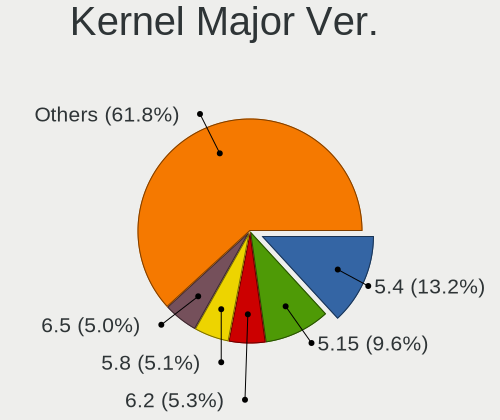

| Version | Notebooks | Percent |
|---------|-----------|---------|
| 5.4     | 184       | 23.74%  |
| 5.8     | 76        | 9.81%   |
| 4.15    | 67        | 8.65%   |
| 5.11    | 64        | 8.26%   |
| 5.3     | 58        | 7.48%   |
| 5.10    | 48        | 6.19%   |
| 5.13    | 42        | 5.42%   |
| 5.0     | 39        | 5.03%   |
| 4.18    | 34        | 4.39%   |
| 5.16    | 26        | 3.35%   |
| 5.15    | 23        | 2.97%   |
| 4.19    | 20        | 2.58%   |
| 5.14    | 19        | 2.45%   |
| 5.12    | 16        | 2.06%   |
| 4.9     | 11        | 1.42%   |
| 5.7     | 10        | 1.29%   |
| 5.6     | 10        | 1.29%   |
| 5.9     | 9         | 1.16%   |
| 5.5     | 6         | 0.77%   |
| 4.4     | 5         | 0.65%   |
| 5.17    | 4         | 0.52%   |
| 5.2     | 2         | 0.26%   |
| 4.12    | 1         | 0.13%   |
| 3.10    | 1         | 0.13%   |

Arch
----

OS architecture (x86_64, i586, etc.)

| Name   | Notebooks | Percent |
|--------|-----------|---------|
| x86_64 | 660       | 93.62%  |
| i686   | 45        | 6.38%   |

DE
--

Desktop Environment

| Name            | Notebooks | Percent |
|-----------------|-----------|---------|
| GNOME           | 338       | 46.05%  |
| Unknown         | 128       | 17.44%  |
| KDE5            | 80        | 10.9%   |
| XFCE            | 60        | 8.17%   |
| X-Cinnamon      | 42        | 5.72%   |
| KDE             | 18        | 2.45%   |
| MATE            | 16        | 2.18%   |
| Pantheon        | 8         | 1.09%   |
| Unity           | 7         | 0.95%   |
| KDE4            | 7         | 0.95%   |
| i3              | 7         | 0.95%   |
| Cinnamon        | 7         | 0.95%   |
| Budgie          | 6         | 0.82%   |
| LXDE            | 4         | 0.54%   |
| GNOME Flashback | 2         | 0.27%   |
| Openbox         | 1         | 0.14%   |
| LXQt            | 1         | 0.14%   |
| Deepin          | 1         | 0.14%   |
| awesome         | 1         | 0.14%   |

Display Server
--------------

X11 or Wayland

| Name    | Notebooks | Percent |
|---------|-----------|---------|
| X11     | 585       | 81.14%  |
| Wayland | 72        | 9.99%   |
| Unknown | 64        | 8.88%   |

Display Manager
---------------

SDDM, LightDM, etc.

| Name    | Notebooks | Percent |
|---------|-----------|---------|
| Unknown | 464       | 64.09%  |
| GDM     | 86        | 11.88%  |
| SDDM    | 73        | 10.08%  |
| LightDM | 36        | 4.97%   |
| GDM3    | 29        | 4.01%   |
| TDM     | 27        | 3.73%   |
| KDM     | 7         | 0.97%   |
| XDM     | 2         | 0.28%   |

OS Lang
-------

Language

| Lang    | Notebooks | Percent |
|---------|-----------|---------|
| pt_PT   | 287       | 39.81%  |
| en_US   | 242       | 33.56%  |
| Unknown | 123       | 17.06%  |
| en_GB   | 38        | 5.27%   |
| pt_BR   | 13        | 1.8%    |
| C       | 6         | 0.83%   |
| ru_RU   | 2         | 0.28%   |
| POSIX   | 2         | 0.28%   |
| es_ES   | 2         | 0.28%   |
| sk_SK   | 1         | 0.14%   |
| it_IT   | 1         | 0.14%   |
| fr_FR   | 1         | 0.14%   |
| en_IN   | 1         | 0.14%   |
| en_IE   | 1         | 0.14%   |
| de_DE   | 1         | 0.14%   |

Boot Mode
---------

EFI or BIOS

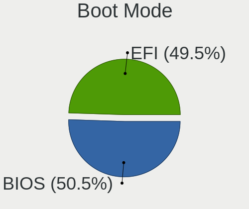

| Mode | Notebooks | Percent |
|------|-----------|---------|
| BIOS | 391       | 54.23%  |
| EFI  | 330       | 45.77%  |

Filesystem
----------

Type of filesystem

| Type     | Notebooks | Percent |
|----------|-----------|---------|
| Ext4     | 576       | 80.79%  |
| Btrfs    | 43        | 6.03%   |
| Unknown  | 41        | 5.75%   |
| Overlay  | 39        | 5.47%   |
| Zfs      | 5         | 0.7%    |
| Xfs      | 3         | 0.42%   |
| Ext2     | 3         | 0.42%   |
| Ext3     | 2         | 0.28%   |
| Reiserfs | 1         | 0.14%   |

Part. scheme
------------

Scheme of partitioning

| Type    | Notebooks | Percent |
|---------|-----------|---------|
| Unknown | 483       | 67.74%  |
| GPT     | 175       | 24.54%  |
| MBR     | 55        | 7.71%   |

Dual Boot with Linux/BSD
------------------------

Hosting more than one Linux/BSD

| Dual boot | Notebooks | Percent |
|-----------|-----------|---------|
| No        | 637       | 89.59%  |
| Yes       | 74        | 10.41%  |

Dual Boot (Win)
---------------

Hosting Linux and Windows

| Dual boot | Notebooks | Percent |
|-----------|-----------|---------|
| No        | 499       | 69.79%  |
| Yes       | 216       | 30.21%  |

Board
-----

Vendor
------

Motherboard manufacturer

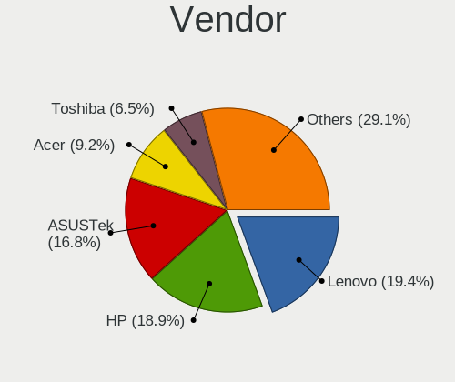

| Name                | Notebooks | Percent |
|---------------------|-----------|---------|
| Hewlett-Packard     | 141       | 20.03%  |
| Lenovo              | 121       | 17.19%  |
| ASUSTek Computer    | 113       | 16.05%  |
| Acer                | 76        | 10.8%   |
| Toshiba             | 67        | 9.52%   |
| Sony                | 34        | 4.83%   |
| Dell                | 34        | 4.83%   |
| MSI                 | 16        | 2.27%   |
| Apple               | 15        | 2.13%   |
| Samsung Electronics | 12        | 1.7%    |
| HUAWEI              | 10        | 1.42%   |
| Notebook            | 8         | 1.14%   |
| TUXEDO              | 5         | 0.71%   |
| Packard Bell        | 5         | 0.71%   |
| Fujitsu             | 4         | 0.57%   |
| Phoenix/SiS         | 3         | 0.43%   |
| LG Electronics      | 3         | 0.43%   |
| Intel               | 3         | 0.43%   |
| Clevo               | 3         | 0.43%   |
| Teclast             | 2         | 0.28%   |
| SLIMBOOK            | 2         | 0.28%   |
| Positivo            | 2         | 0.28%   |
| OBSIDIAN-PC         | 2         | 0.28%   |
| Fujitsu Siemens     | 2         | 0.28%   |
| eMachines           | 2         | 0.28%   |
| Alienware           | 2         | 0.28%   |
| Unknown             | 2         | 0.28%   |
| Timi                | 1         | 0.14%   |
| Standard            | 1         | 0.14%   |
| Qilive              | 1         | 0.14%   |
| Purism              | 1         | 0.14%   |
| PC Specialist       | 1         | 0.14%   |
| LIVEFAN             | 1         | 0.14%   |
| Linx                | 1         | 0.14%   |
| Jumper              | 1         | 0.14%   |
| JPSaCouto           | 1         | 0.14%   |
| INSYS               | 1         | 0.14%   |
| INFORLANDIA         | 1         | 0.14%   |
| Google              | 1         | 0.14%   |
| Gigabyte Technology | 1         | 0.14%   |
| Dynabook            | 1         | 0.14%   |
| Chuwi               | 1         | 0.14%   |

Model
-----

Motherboard model

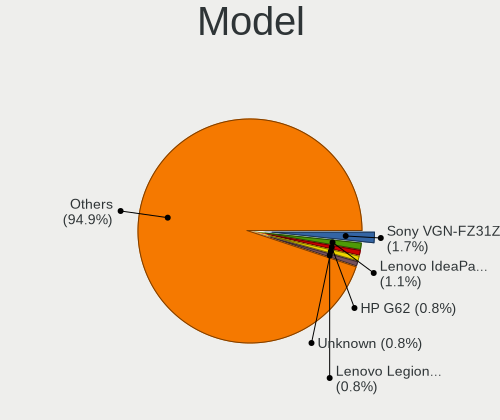

| Name                                   | Notebooks | Percent |
|----------------------------------------|-----------|---------|
| Sony VGN-FZ31Z                         | 16        | 2.27%   |
| Toshiba Satellite C660                 | 7         | 0.99%   |
| HP Pavilion g6                         | 7         | 0.99%   |
| HP Pavilion dv6                        | 7         | 0.99%   |
| HP Notebook                            | 6         | 0.85%   |
| HP G62                                 | 6         | 0.85%   |
| Acer Extensa 5620                      | 5         | 0.71%   |
| Toshiba Satellite L650                 | 4         | 0.57%   |
| Toshiba Satellite L40                  | 4         | 0.57%   |
| Toshiba Satellite A200                 | 4         | 0.57%   |
| HP Compaq Presario CQ60                | 4         | 0.57%   |
| ASUS X555LJ                            | 4         | 0.57%   |
| ASUS X555LD                            | 4         | 0.57%   |
| ASUS X541UV                            | 4         | 0.57%   |
| ASUS VivoBook 15_ASUS Laptop X507LA    | 4         | 0.57%   |
| Acer Aspire E5-551G                    | 4         | 0.57%   |
| Unknown                                | 4         | 0.57%   |
| Toshiba Satellite L50D-B               | 3         | 0.43%   |
| Toshiba Satellite L500                 | 3         | 0.43%   |
| Lenovo Y520-15IKBN 80WK                | 3         | 0.43%   |
| Lenovo Legion 5 15ACH6H 82JU           | 3         | 0.43%   |
| Lenovo IdeaPad 320-15AST 80XV          | 3         | 0.43%   |
| Lenovo G50-45 80E3                     | 3         | 0.43%   |
| Intel Intel powered classmate PC       | 3         | 0.43%   |
| HUAWEI WRT-WX9                         | 3         | 0.43%   |
| HUAWEI NBLK-WAX9X                      | 3         | 0.43%   |
| HP Pavilion Notebook                   | 3         | 0.43%   |
| HP Pavilion Gaming Laptop 15-ec2xxx    | 3         | 0.43%   |
| HP Pavilion 15                         | 3         | 0.43%   |
| Dell XPS 13 7390                       | 3         | 0.43%   |
| ASUS VivoBook_ASUSLaptop X530FN_S530FN | 3         | 0.43%   |
| ASUS K50IJ                             | 3         | 0.43%   |
| Acer Extensa 5635ZG                    | 3         | 0.43%   |
| Acer Aspire ES1-520                    | 3         | 0.43%   |
| Acer Aspire ES1-512                    | 3         | 0.43%   |
| Acer Aspire E5-571G                    | 3         | 0.43%   |
| Acer Aspire E1-570G                    | 3         | 0.43%   |
| Acer Aspire A315-41                    | 3         | 0.43%   |
| Acer Aspire 5732Z                      | 3         | 0.43%   |
| TUXEDO InfinityBook Pro 14 Gen6        | 2         | 0.28%   |
| Toshiba Satellite P70-B                | 2         | 0.28%   |
| Toshiba Satellite P50-C                | 2         | 0.28%   |
| Toshiba Satellite A300                 | 2         | 0.28%   |
| Toshiba PORTEGE Z30-A                  | 2         | 0.28%   |
| Packard Bell EasyNote MX52             | 2         | 0.28%   |
| Lenovo ThinkPad T14 Gen 1 20S1SDLQ00   | 2         | 0.28%   |
| Lenovo ThinkPad P50 20EN0005PG         | 2         | 0.28%   |
| Lenovo Legion Y530-15ICH 81FV          | 2         | 0.28%   |
| Lenovo Legion 5 15ARH05 82B5           | 2         | 0.28%   |
| Lenovo IdeaPad S145-15API 81UT         | 2         | 0.28%   |
| Lenovo IdeaPad C340-14API 81N6         | 2         | 0.28%   |
| Lenovo IdeaPad 530S-14IKB 81EU         | 2         | 0.28%   |
| Lenovo G50-70 20351                    | 2         | 0.28%   |
| HUAWEI BOHK-WAX9X                      | 2         | 0.28%   |
| HP ZBook Power G7 Mobile Workstation   | 2         | 0.28%   |
| HP Victus by Laptop 16-e0xxx           | 2         | 0.28%   |
| HP Pavilion x2 Detachable              | 2         | 0.28%   |
| HP Pavilion Laptop 15-eg0xxx           | 2         | 0.28%   |
| HP Pavilion Laptop 15-cs0xxx           | 2         | 0.28%   |
| HP Pavilion dv7                        | 2         | 0.28%   |

Model Family
------------

Motherboard model prefix

| Name                    | Notebooks | Percent |
|-------------------------|-----------|---------|
| Acer Aspire             | 64        | 9.09%   |
| Lenovo ThinkPad         | 62        | 8.81%   |
| Toshiba Satellite       | 59        | 8.38%   |
| HP Pavilion             | 48        | 6.82%   |
| Lenovo IdeaPad          | 30        | 4.26%   |
| ASUS VivoBook           | 19        | 2.7%    |
| HP EliteBook            | 17        | 2.41%   |
| Sony VGN-FZ31Z          | 16        | 2.27%   |
| Dell Latitude           | 15        | 2.13%   |
| HP Compaq               | 14        | 1.99%   |
| HP ProBook              | 12        | 1.7%    |
| HP Laptop               | 11        | 1.56%   |
| Lenovo Legion           | 10        | 1.42%   |
| HP OMEN                 | 8         | 1.14%   |
| Dell XPS                | 8         | 1.14%   |
| Dell Inspiron           | 8         | 1.14%   |
| Acer Extensa            | 8         | 1.14%   |
| HP Notebook             | 6         | 0.85%   |
| HP G62                  | 6         | 0.85%   |
| Packard Bell EasyNote   | 5         | 0.71%   |
| Lenovo Yoga             | 4         | 0.57%   |
| HP ENVY                 | 4         | 0.57%   |
| ASUS ZenBook            | 4         | 0.57%   |
| ASUS X555LJ             | 4         | 0.57%   |
| ASUS X555LD             | 4         | 0.57%   |
| ASUS X541UV             | 4         | 0.57%   |
| Unknown                 | 4         | 0.57%   |
| TUXEDO InfinityBook     | 3         | 0.43%   |
| Toshiba QOSMIO          | 3         | 0.43%   |
| Toshiba PORTEGE         | 3         | 0.43%   |
| Lenovo Y520-15IKBN      | 3         | 0.43%   |
| Lenovo G50-45           | 3         | 0.43%   |
| Intel Intel             | 3         | 0.43%   |
| HUAWEI WRT-WX9          | 3         | 0.43%   |
| HUAWEI NBLK-WAX9X       | 3         | 0.43%   |
| HP ZBook                | 3         | 0.43%   |
| HP 15                   | 3         | 0.43%   |
| Fujitsu LIFEBOOK        | 3         | 0.43%   |
| ASUS TUF                | 3         | 0.43%   |
| ASUS ROG                | 3         | 0.43%   |
| ASUS K50IJ              | 3         | 0.43%   |
| Apple MacBookPro8       | 3         | 0.43%   |
| Toshiba TECRA           | 2         | 0.28%   |
| MSI Modern              | 2         | 0.28%   |
| Lenovo G50-70           | 2         | 0.28%   |
| HUAWEI BOHK-WAX9X       | 2         | 0.28%   |
| HP Victus               | 2         | 0.28%   |
| HP Stream               | 2         | 0.28%   |
| HP 250                  | 2         | 0.28%   |
| Fujitsu Siemens ESPRIMO | 2         | 0.28%   |
| Dell Precision          | 2         | 0.28%   |
| ASUS X550LD             | 2         | 0.28%   |
| ASUS X542URR            | 2         | 0.28%   |
| ASUS X540YA             | 2         | 0.28%   |
| ASUS X540LJ             | 2         | 0.28%   |
| ASUS X102BA             | 2         | 0.28%   |
| ASUS T100TA             | 2         | 0.28%   |
| ASUS T100HAN            | 2         | 0.28%   |
| ASUS N56VZ              | 2         | 0.28%   |
| ASUS 1215N              | 2         | 0.28%   |

MFG Year
--------

Motherboard manufacture year

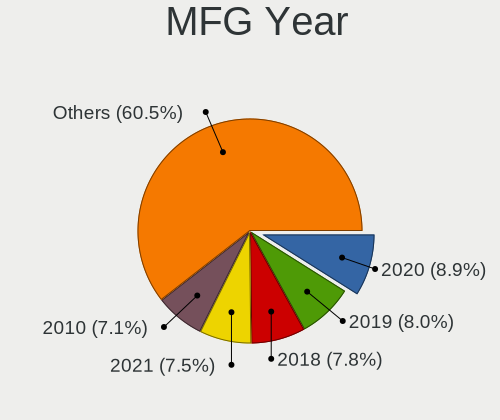

| Year    | Notebooks | Percent |
|---------|-----------|---------|
| 2019    | 65        | 9.23%   |
| 2010    | 61        | 8.66%   |
| 2020    | 57        | 8.1%    |
| 2018    | 56        | 7.95%   |
| 2014    | 51        | 7.24%   |
| 2008    | 48        | 6.82%   |
| 2007    | 48        | 6.82%   |
| 2013    | 47        | 6.68%   |
| 2015    | 46        | 6.53%   |
| 2011    | 42        | 5.97%   |
| 2016    | 37        | 5.26%   |
| 2017    | 36        | 5.11%   |
| 2009    | 34        | 4.83%   |
| 2012    | 33        | 4.69%   |
| 2021    | 26        | 3.69%   |
| 2006    | 8         | 1.14%   |
| 2005    | 7         | 0.99%   |
| Unknown | 2         | 0.28%   |

Form Factor
-----------

Physical design of the computer

| Name     | Notebooks | Percent |
|----------|-----------|---------|
| Notebook | 704       | 100%    |

Secure Boot
-----------

Enabled or disabled

| State    | Notebooks | Percent |
|----------|-----------|---------|
| Disabled | 636       | 88.7%   |
| Enabled  | 81        | 11.3%   |

Coreboot
--------

Have coreboot on board

| Used | Notebooks | Percent |
|------|-----------|---------|
| No   | 702       | 99.72%  |
| Yes  | 2         | 0.28%   |

RAM Size
--------

Total RAM memory

| Size in GB  | Notebooks | Percent |
|-------------|-----------|---------|
| 3.01-4.0    | 212       | 29.9%   |
| 4.01-8.0    | 177       | 24.96%  |
| 8.01-16.0   | 102       | 14.39%  |
| 16.01-24.0  | 84        | 11.85%  |
| 1.01-2.0    | 59        | 8.32%   |
| 32.01-64.0  | 42        | 5.92%   |
| 2.01-3.0    | 15        | 2.12%   |
| 0.51-1.0    | 11        | 1.55%   |
| 24.01-32.0  | 4         | 0.56%   |
| 64.01-256.0 | 3         | 0.42%   |

RAM Used
--------

Used RAM memory

| Used GB    | Notebooks | Percent |
|------------|-----------|---------|
| 1.01-2.0   | 314       | 40.41%  |
| 2.01-3.0   | 161       | 20.72%  |
| 4.01-8.0   | 102       | 13.13%  |
| 3.01-4.0   | 94        | 12.1%   |
| 0.51-1.0   | 68        | 8.75%   |
| 8.01-16.0  | 26        | 3.35%   |
| 16.01-24.0 | 6         | 0.77%   |
| 0.01-0.5   | 5         | 0.64%   |
| 24.01-32.0 | 1         | 0.13%   |

Total Drives
------------

Number of drives on board

| Drives | Notebooks | Percent |
|--------|-----------|---------|
| 1      | 531       | 73.85%  |
| 2      | 156       | 21.7%   |
| 3      | 22        | 3.06%   |
| 0      | 8         | 1.11%   |
| 4      | 2         | 0.28%   |

Has CD-ROM
----------

Has CD-ROM on board

| Presented | Notebooks | Percent |
|-----------|-----------|---------|
| No        | 423       | 60%     |
| Yes       | 282       | 40%     |

Has Ethernet
------------

Has Ethernet on board

| Presented | Notebooks | Percent |
|-----------|-----------|---------|
| Yes       | 590       | 83.57%  |
| No        | 116       | 16.43%  |

Has WiFi
--------

Has WiFi module

| Presented | Notebooks | Percent |
|-----------|-----------|---------|
| Yes       | 685       | 97.3%   |
| No        | 19        | 2.7%    |

Has Bluetooth
-------------

Has Bluetooth module

| Presented | Notebooks | Percent |
|-----------|-----------|---------|
| Yes       | 476       | 67.14%  |
| No        | 233       | 32.86%  |

Location
--------

Country
-------

Geographic location (country)

| Country  | Notebooks | Percent |
|----------|-----------|---------|
| Portugal | 704       | 100%    |

City
----

Geographic location (city)

| City                    | Notebooks | Percent |
|-------------------------|-----------|---------|
| Lisbon                  | 153       | 20.32%  |
| Porto                   | 67        | 8.9%    |
| Funchal                 | 22        | 2.92%   |
| Vila Nova de Gaia       | 21        | 2.79%   |
| Coimbra                 | 19        | 2.52%   |
| Braga                   | 13        | 1.73%   |
| Aveiro                  | 13        | 1.73%   |
| Amadora                 | 13        | 1.73%   |
| Odivelas                | 12        | 1.59%   |
| Matosinhos Municipality | 12        | 1.59%   |
| Almada                  | 10        | 1.33%   |
| Faro                    | 9         | 1.2%    |
| Leiria                  | 8         | 1.06%   |
| Mem Martins             | 7         | 0.93%   |
| Maia                    | 7         | 0.93%   |
| Viseu                   | 6         | 0.8%    |
| Sintra                  | 6         | 0.8%    |
| Quinta Do Conde         | 6         | 0.8%    |
| Queluz                  | 6         | 0.8%    |
| Bragana             | 6         | 0.8%    |
| Alverca do Ribatejo     | 6         | 0.8%    |
| Setbal              | 5         | 0.66%   |
| Feira                   | 5         | 0.66%   |
| Estoril                 | 5         | 0.66%   |
| Vila Nova de Famalicao  | 4         | 0.53%   |
| Viana do Castelo        | 4         | 0.53%   |
| Sao Domingos de Rana    | 4         | 0.53%   |
| Santo Tirso             | 4         | 0.53%   |
| Sacavem                 | 4         | 0.53%   |
| Rio Tinto               | 4         | 0.53%   |
| Rio de Mouro            | 4         | 0.53%   |
| Povoa de Santa Iria     | 4         | 0.53%   |
| Linda a Velha           | 4         | 0.53%   |
| Freamunde               | 4         | 0.53%   |
| Evora                   | 4         | 0.53%   |
| Barreiro                | 4         | 0.53%   |
| Vila Real               | 3         | 0.4%    |
| Vila do Conde           | 3         | 0.4%    |
| Setbal                | 3         | 0.4%    |
| Setbal              | 3         | 0.4%    |
| Sao Joao da Madeira     | 3         | 0.4%    |
| Povoa de Lanhoso        | 3         | 0.4%    |
| Penafiel                | 3         | 0.4%    |
| Paco de Arcos           | 3         | 0.4%    |
| Lagoa                   | 3         | 0.4%    |
| Estarreja               | 3         | 0.4%    |
| Espinho                 | 3         | 0.4%    |
| Corroios                | 3         | 0.4%    |
| Charneca de Caparica    | 3         | 0.4%    |
| Cascais                 | 3         | 0.4%    |
| Caldas da Rainha        | 3         | 0.4%    |
| Benavente               | 3         | 0.4%    |
| Baguim do Monte         | 3         | 0.4%    |
| Amora                   | 3         | 0.4%    |
| Vilamar                 | 2         | 0.27%   |
| Vermoim                 | 2         | 0.27%   |
| Venda do Pinheiro       | 2         | 0.27%   |
| Torres Novas            | 2         | 0.27%   |
| Tondela                 | 2         | 0.27%   |
| Tomar                   | 2         | 0.27%   |

Drives
------

Drive Vendor
------------

Hard drive vendors

| Vendor                    | Notebooks | Drives | Percent |
|---------------------------|-----------|--------|---------|
| Samsung Electronics       | 130       | 169    | 15.28%  |
| WDC                       | 99        | 134    | 11.63%  |
| Toshiba                   | 99        | 118    | 11.63%  |
| Seagate                   | 92        | 110    | 10.81%  |
| Kingston                  | 72        | 81     | 8.46%   |
| Sandisk                   | 47        | 54     | 5.52%   |
| Unknown                   | 42        | 70     | 4.94%   |
| Hitachi                   | 35        | 38     | 4.11%   |
| HGST                      | 33        | 42     | 3.88%   |
| Crucial                   | 32        | 40     | 3.76%   |
| SK Hynix                  | 23        | 27     | 2.7%    |
| Intel                     | 20        | 26     | 2.35%   |
| Fujitsu                   | 14        | 16     | 1.65%   |
| Micron Technology         | 13        | 16     | 1.53%   |
| KIOXIA                    | 9         | 16     | 1.06%   |
| Apple                     | 7         | 7      | 0.82%   |
| GOODRAM                   | 6         | 6      | 0.71%   |
| A-DATA Technology         | 6         | 6      | 0.71%   |
| JMicron                   | 5         | 5      | 0.59%   |
| S3+                       | 4         | 7      | 0.47%   |
| LITEON                    | 4         | 5      | 0.47%   |
| China                     | 4         | 5      | 0.47%   |
| Team                      | 3         | 3      | 0.35%   |
| PNY                       | 3         | 3      | 0.35%   |
| EMTEC                     | 3         | 4      | 0.35%   |
| BLUERAY                   | 3         | 3      | 0.35%   |
| Union Memory (Shenzhen)   | 2         | 5      | 0.24%   |
| Transcend                 | 2         | 2      | 0.24%   |
| OCZ                       | 2         | 2      | 0.24%   |
| Lite-On                   | 2         | 2      | 0.24%   |
| Lenovo                    | 2         | 2      | 0.24%   |
| KingDian                  | 2         | 2      | 0.24%   |
| Hewlett-Packard           | 2         | 2      | 0.24%   |
| Gigabyte Technology       | 2         | 3      | 0.24%   |
| Verbatim                  | 1         | 1      | 0.12%   |
| Vaseky                    | 1         | 1      | 0.12%   |
| USB                       | 1         | 1      | 0.12%   |
| Union Memory              | 1         | 1      | 0.12%   |
| UMIS                      | 1         | 1      | 0.12%   |
| Teclast                   | 1         | 1      | 0.12%   |
| TEAM T25                  | 1         | 1      | 0.12%   |
| TCSUNBOW                  | 1         | 1      | 0.12%   |
| Tanbassh                  | 1         | 1      | 0.12%   |
| SSSTC                     | 1         | 1      | 0.12%   |
| Silicon Motion            | 1         | 1      | 0.12%   |
| ROG                       | 1         | 1      | 0.12%   |
| PLEXTOR                   | 1         | 1      | 0.12%   |
| Phison                    | 1         | 1      | 0.12%   |
| OSC                       | 1         | 1      | 0.12%   |
| Netac                     | 1         | 1      | 0.12%   |
| Micron/Crucial Technology | 1         | 1      | 0.12%   |
| MAXTOR                    | 1         | 9      | 0.12%   |
| LITEONIT                  | 1         | 1      | 0.12%   |
| Lexar                     | 1         | 1      | 0.12%   |
| KIOXIA-EXCERIA            | 1         | 1      | 0.12%   |
| KingSpec                  | 1         | 1      | 0.12%   |
| GOLDEN                    | 1         | 1      | 0.12%   |
| Enmotus                   | 1         | 2      | 0.12%   |
| BHT                       | 1         | 1      | 0.12%   |
| ASMedia                   | 1         | 1      | 0.12%   |

Drive Model
-----------

Hard drive models

| Model                               | Notebooks | Percent |
|-------------------------------------|-----------|---------|
| Toshiba MQ01ABD100 1TB              | 15        | 1.71%   |
| Seagate ST1000LM024 HN-M101MBB 1TB  | 15        | 1.71%   |
| HGST HTS721010A9E630 1TB            | 15        | 1.71%   |
| Kingston SA400S37120G 120GB SSD     | 13        | 1.48%   |
| Unknown MMC Card  32GB              | 12        | 1.37%   |
| Kingston SV300S37A120G 120GB SSD    | 12        | 1.37%   |
| Seagate ST500LT012-1DG142 500GB     | 11        | 1.25%   |
| Toshiba MQ01ABF050 500GB            | 10        | 1.14%   |
| Crucial CT240M500SSD1 240GB         | 9         | 1.03%   |
| Unknown MMC Card  64GB              | 8         | 0.91%   |
| Seagate ST1000LM035-1RK172 1TB      | 8         | 0.91%   |
| Sandisk NVMe SSD Drive 512GB        | 8         | 0.91%   |
| Seagate ST9500325AS 500GB           | 7         | 0.8%    |
| Sandisk NVMe SSD Drive 256GB        | 7         | 0.8%    |
| Samsung SSD 860 EVO 500GB           | 7         | 0.8%    |
| Samsung NVMe SSD Drive 512GB        | 7         | 0.8%    |
| Samsung NVMe SSD Drive 256GB        | 7         | 0.8%    |
| Kingston NVMe SSD Drive 512GB       | 7         | 0.8%    |
| WDC WD5000LPVX-22V0TT0 500GB        | 6         | 0.68%   |
| WDC WD3200BEVT-22ZCT0 320GB         | 6         | 0.68%   |
| Toshiba MQ04ABF100 1TB              | 6         | 0.68%   |
| SK Hynix NVMe SSD Drive 256GB       | 6         | 0.68%   |
| Micron NVMe SSD Drive 512GB         | 6         | 0.68%   |
| Kingston SA400S37480G 480GB SSD     | 6         | 0.68%   |
| Kingston SA400S37240G 240GB SSD     | 6         | 0.68%   |
| HGST HTS541010A9E680 1TB            | 6         | 0.68%   |
| Crucial CT240BX500SSD1 240GB        | 6         | 0.68%   |
| WDC WDS240G2G0A-00JH30 240GB SSD    | 5         | 0.57%   |
| WDC WD10JPVX-22JC3T0 1TB            | 5         | 0.57%   |
| Toshiba TR200 240GB SSD             | 5         | 0.57%   |
| SK Hynix NVMe SSD Drive 512GB       | 5         | 0.57%   |
| Seagate ST9320325AS 320GB           | 5         | 0.57%   |
| Sandisk NVMe SSD Drive 1024GB       | 5         | 0.57%   |
| Samsung NVMe SSD Drive 1024GB       | 5         | 0.57%   |
| Unknown MMC Card  7GB               | 4         | 0.46%   |
| Unknown MMC Card  16GB              | 4         | 0.46%   |
| Seagate ST9160821AS 160GB           | 4         | 0.46%   |
| Seagate Expansion+ 2TB              | 4         | 0.46%   |
| Samsung SSD 860 QVO 1TB             | 4         | 0.46%   |
| Samsung SSD 860 EVO 1TB             | 4         | 0.46%   |
| Samsung SSD 850 EVO 500GB           | 4         | 0.46%   |
| Samsung SSD 850 EVO 250GB           | 4         | 0.46%   |
| Kingston SUV400S37240G 240GB SSD    | 4         | 0.46%   |
| Hitachi HTS543232A7A384 320GB       | 4         | 0.46%   |
| Crucial CT500MX500SSD1 500GB        | 4         | 0.46%   |
| Seagate ST500LM012 HN-M500MBB 500GB | 3         | 0.34%   |
| Seagate ST2000LM003 HN-M201RAD 2TB  | 3         | 0.34%   |
| Samsung SSD 840 EVO 250GB           | 3         | 0.34%   |
| Samsung NVMe SSD Drive 500GB        | 3         | 0.34%   |
| Samsung MZVLB512HBJQ-000L7 512GB    | 3         | 0.34%   |
| Samsung MZVLB512HBJQ-000H1 512GB    | 3         | 0.34%   |
| Samsung HM251HI 250GB               | 3         | 0.34%   |
| KIOXIA NVMe SSD Drive 256GB         | 3         | 0.34%   |
| Kingston SV300S37A240G 240GB SSD    | 3         | 0.34%   |
| JMicron Tech 250GB                  | 3         | 0.34%   |
| Intel SSDPEKNW512G8H 512GB          | 3         | 0.34%   |
| Intel SSDPEKNW512G8 512GB           | 3         | 0.34%   |
| Intel NVMe SSD Drive 512GB          | 3         | 0.34%   |
| HGST HTS725050A7E630 500GB          | 3         | 0.34%   |
| HGST HTS545050A7E680 500GB          | 3         | 0.34%   |

HDD Vendor
----------

Hard disk drive vendors

| Vendor              | Notebooks | Drives | Percent |
|---------------------|-----------|--------|---------|
| Seagate             | 91        | 105    | 28%     |
| WDC                 | 70        | 85     | 21.54%  |
| Toshiba             | 70        | 87     | 21.54%  |
| Hitachi             | 35        | 38     | 10.77%  |
| HGST                | 33        | 42     | 10.15%  |
| Fujitsu             | 14        | 16     | 4.31%   |
| Samsung Electronics | 10        | 10     | 3.08%   |
| USB                 | 1         | 1      | 0.31%   |
| ASMedia             | 1         | 1      | 0.31%   |

SSD Vendor
----------

Solid state drive vendors

| Vendor              | Notebooks | Drives | Percent |
|---------------------|-----------|--------|---------|
| Kingston            | 61        | 68     | 21.48%  |
| Samsung Electronics | 60        | 75     | 21.13%  |
| Crucial             | 31        | 39     | 10.92%  |
| SanDisk             | 23        | 27     | 8.1%    |
| Toshiba             | 16        | 18     | 5.63%   |
| WDC                 | 13        | 14     | 4.58%   |
| Intel               | 6         | 7      | 2.11%   |
| GOODRAM             | 6         | 6      | 2.11%   |
| Apple               | 6         | 6      | 2.11%   |
| A-DATA Technology   | 6         | 6      | 2.11%   |
| SK Hynix            | 5         | 5      | 1.76%   |
| S3+                 | 4         | 7      | 1.41%   |
| China               | 4         | 5      | 1.41%   |
| Team                | 3         | 3      | 1.06%   |
| Micron Technology   | 3         | 5      | 1.06%   |
| EMTEC               | 3         | 4      | 1.06%   |
| BLueRay             | 3         | 3      | 1.06%   |
| Transcend           | 2         | 2      | 0.7%    |
| Seagate             | 2         | 4      | 0.7%    |
| PNY                 | 2         | 2      | 0.7%    |
| OCZ                 | 2         | 2      | 0.7%    |
| LITEON              | 2         | 3      | 0.7%    |
| KingDian            | 2         | 2      | 0.7%    |
| JMicron             | 2         | 2      | 0.7%    |
| Hewlett-Packard     | 2         | 2      | 0.7%    |
| Verbatim            | 1         | 1      | 0.35%   |
| Vaseky              | 1         | 1      | 0.35%   |
| Teclast             | 1         | 1      | 0.35%   |
| TEAM T25            | 1         | 1      | 0.35%   |
| TCSUNBOW            | 1         | 1      | 0.35%   |
| PLEXTOR             | 1         | 1      | 0.35%   |
| OSC                 | 1         | 1      | 0.35%   |
| Netac               | 1         | 1      | 0.35%   |
| MAXTOR              | 1         | 9      | 0.35%   |
| LITEONIT            | 1         | 1      | 0.35%   |
| Lexar               | 1         | 1      | 0.35%   |
| KIOXIA-EXCERIA      | 1         | 1      | 0.35%   |
| KingSpec            | 1         | 1      | 0.35%   |
| Gigabyte Technology | 1         | 1      | 0.35%   |
| BHT                 | 1         | 1      | 0.35%   |

Drive Kind
----------

HDD or SSD

| Kind    | Notebooks | Drives | Percent |
|---------|-----------|--------|---------|
| HDD     | 320       | 385    | 39.02%  |
| SSD     | 263       | 340    | 32.07%  |
| NVMe    | 187       | 262    | 22.8%   |
| MMC     | 41        | 71     | 5%      |
| Unknown | 9         | 9      | 1.1%    |

Drive Connector
---------------

SATA, SAS, NVMe, etc.

| Type | Notebooks | Drives | Percent |
|------|-----------|--------|---------|
| SATA | 524       | 708    | 67.7%   |
| NVMe | 187       | 262    | 24.16%  |
| MMC  | 41        | 71     | 5.3%    |
| SAS  | 22        | 26     | 2.84%   |

Drive Size
----------

Size of hard drive

| Size in TB | Notebooks | Drives | Percent |
|------------|-----------|--------|---------|
| 0.01-0.5   | 419       | 549    | 73.64%  |
| 0.51-1.0   | 136       | 160    | 23.9%   |
| 1.01-2.0   | 13        | 15     | 2.28%   |
| 3.01-4.0   | 1         | 1      | 0.18%   |

Space Total
-----------

Amount of disk space available on the file system

| Size in GB     | Notebooks | Percent |
|----------------|-----------|---------|
| 101-250        | 222       | 30.2%   |
| 251-500        | 192       | 26.12%  |
| 501-1000       | 94        | 12.79%  |
| 51-100         | 64        | 8.71%   |
| 1-20           | 54        | 7.35%   |
| 1001-2000      | 38        | 5.17%   |
| 21-50          | 37        | 5.03%   |
| Unknown        | 14        | 1.9%    |
| 2001-3000      | 11        | 1.5%    |
| More than 3000 | 9         | 1.22%   |

Space Used
----------

Amount of used disk space

| Used GB        | Notebooks | Percent |
|----------------|-----------|---------|
| 1-20           | 322       | 42.59%  |
| 21-50          | 160       | 21.16%  |
| 101-250        | 93        | 12.3%   |
| 51-100         | 83        | 10.98%  |
| 251-500        | 47        | 6.22%   |
| 501-1000       | 20        | 2.65%   |
| Unknown        | 14        | 1.85%   |
| 1001-2000      | 13        | 1.72%   |
| More than 3000 | 4         | 0.53%   |

Malfunc. Drives
---------------

Drive models with a malfunction

| Model                               | Notebooks | Drives | Percent |
|-------------------------------------|-----------|--------|---------|
| Crucial CT240M500SSD1 240GB         | 9         | 9      | 18.75%  |
| Kingston SV300S37A120G 120GB SSD    | 6         | 6      | 12.5%   |
| Seagate ST500LT012-1DG142 500GB     | 2         | 2      | 4.17%   |
| Seagate ST1000LM024 HN-M101MBB 1TB  | 2         | 2      | 4.17%   |
| Kingston SV300S37A240G 240GB SSD    | 2         | 2      | 4.17%   |
| Hitachi HTS545050A7E380 500GB       | 2         | 2      | 4.17%   |
| HGST HTS721010A9E630 1TB            | 2         | 2      | 4.17%   |
| WDC WD10JPVT-22A1YT0 1TB            | 1         | 1      | 2.08%   |
| Toshiba Q300. 240GB SSD             | 1         | 1      | 2.08%   |
| Toshiba MQ01ABD100 1TB              | 1         | 1      | 2.08%   |
| Toshiba MK7575GSX 752GB             | 1         | 1      | 2.08%   |
| Toshiba MK5065GSX 500GB             | 1         | 1      | 2.08%   |
| Toshiba MK3276GSX 320GB             | 1         | 1      | 2.08%   |
| Seagate ST9750420AS 752GB           | 1         | 1      | 2.08%   |
| Seagate ST9500325AS 500GB           | 1         | 1      | 2.08%   |
| Seagate ST9320325AS 320GB           | 1         | 1      | 2.08%   |
| Seagate ST500LM012 HN-M500MBB 500GB | 1         | 1      | 2.08%   |
| Seagate ST1000LM035-1RK172 1TB      | 1         | 1      | 2.08%   |
| SanDisk SSD U100 24GB               | 1         | 1      | 2.08%   |
| Samsung Electronics SSD 870 EVO 1TB | 1         | 1      | 2.08%   |
| Samsung Electronics HM251HI 250GB   | 1         | 1      | 2.08%   |
| Kingston SUV400S37240G 240GB SSD    | 1         | 1      | 2.08%   |
| Hitachi HTS727575A9E364 752GB       | 1         | 1      | 2.08%   |
| Hitachi HTS725050A9A364 500GB       | 1         | 1      | 2.08%   |
| Hitachi HTS545025B9A300 250GB       | 1         | 1      | 2.08%   |
| Hitachi HTS543225L9A300 250GB       | 1         | 1      | 2.08%   |
| Hitachi HTS543216L9A300 160GB       | 1         | 1      | 2.08%   |
| Hitachi HTS541010G9SA00 100GB       | 1         | 1      | 2.08%   |
| Fujitsu MHW2080BH PL 80GB           | 1         | 1      | 2.08%   |
| A-DATA Technology SP920SS 128GB SSD | 1         | 1      | 2.08%   |

Malfunc. Drive Vendor
---------------------

Vendors of faulty drives

| Vendor              | Notebooks | Drives | Percent |
|---------------------|-----------|--------|---------|
| Seagate             | 9         | 9      | 18.75%  |
| Kingston            | 9         | 9      | 18.75%  |
| Crucial             | 9         | 9      | 18.75%  |
| Hitachi             | 8         | 8      | 16.67%  |
| Toshiba             | 5         | 5      | 10.42%  |
| Samsung Electronics | 2         | 2      | 4.17%   |
| HGST                | 2         | 2      | 4.17%   |
| WDC                 | 1         | 1      | 2.08%   |
| SanDisk             | 1         | 1      | 2.08%   |
| Fujitsu             | 1         | 1      | 2.08%   |
| A-DATA Technology   | 1         | 1      | 2.08%   |

Malfunc. HDD Vendor
-------------------

Vendors of faulty HDD drives

| Vendor              | Notebooks | Drives | Percent |
|---------------------|-----------|--------|---------|
| Seagate             | 9         | 9      | 34.62%  |
| Hitachi             | 8         | 8      | 30.77%  |
| Toshiba             | 4         | 4      | 15.38%  |
| HGST                | 2         | 2      | 7.69%   |
| WDC                 | 1         | 1      | 3.85%   |
| Samsung Electronics | 1         | 1      | 3.85%   |
| Fujitsu             | 1         | 1      | 3.85%   |

Malfunc. Drive Kind
-------------------

Kinds of faulty drives

| Kind | Notebooks | Drives | Percent |
|------|-----------|--------|---------|
| HDD  | 26        | 26     | 54.17%  |
| SSD  | 22        | 22     | 45.83%  |

Failed Drives
-------------

Failed drive models

Zero info for selected period =(

Failed Drive Vendor
-------------------

Failed drive vendors

Zero info for selected period =(

Drive Status
------------

Number of failed and malfunc. drives

| Status   | Notebooks | Drives | Percent |
|----------|-----------|--------|---------|
| Detected | 490       | 741    | 66.94%  |
| Works    | 194       | 278    | 26.5%   |
| Malfunc  | 48        | 48     | 6.56%   |

Storage controller
------------------

Storage Vendor
--------------

Storage controller vendors

| Vendor                           | Notebooks | Percent |
|----------------------------------|-----------|---------|
| Intel                            | 498       | 62.64%  |
| AMD                              | 86        | 10.82%  |
| Samsung Electronics              | 68        | 8.55%   |
| Sandisk                          | 37        | 4.65%   |
| SK Hynix                         | 16        | 2.01%   |
| Toshiba America Info Systems     | 14        | 1.76%   |
| Silicon Integrated Systems [SiS] | 12        | 1.51%   |
| Kingston Technology Company      | 11        | 1.38%   |
| Nvidia                           | 10        | 1.26%   |
| Micron Technology                | 10        | 1.26%   |
| KIOXIA                           | 9         | 1.13%   |
| Union Memory (Shenzhen)          | 5         | 0.63%   |
| Lite-On Technology               | 4         | 0.5%    |
| JMicron Technology               | 3         | 0.38%   |
| Phison Electronics               | 2         | 0.25%   |
| Micron/Crucial Technology        | 2         | 0.25%   |
| Lenovo                           | 2         | 0.25%   |
| Solid State Storage Technology   | 1         | 0.13%   |
| Silicon Motion                   | 1         | 0.13%   |
| Silicon Image                    | 1         | 0.13%   |
| Realtek Semiconductor            | 1         | 0.13%   |
| Enmotus                          | 1         | 0.13%   |
| Apple                            | 1         | 0.13%   |

Storage Model
-------------

Storage controller models

| Model                                                                            | Notebooks | Percent |
|----------------------------------------------------------------------------------|-----------|---------|
| AMD FCH SATA Controller [AHCI mode]                                              | 79        | 8.87%   |
| Intel 82801IBM/IEM (ICH9M/ICH9M-E) 4 port SATA Controller [AHCI mode]            | 53        | 5.95%   |
| Intel 7 Series Chipset Family 6-port SATA Controller [AHCI mode]                 | 51        | 5.72%   |
| Intel 82801HM/HEM (ICH8M/ICH8M-E) IDE Controller                                 | 47        | 5.27%   |
| Intel 6 Series/C200 Series Chipset Family 6 port Mobile SATA AHCI Controller     | 42        | 4.71%   |
| Intel Sunrise Point-LP SATA Controller [AHCI mode]                               | 40        | 4.49%   |
| Intel 82801HM/HEM (ICH8M/ICH8M-E) SATA Controller [AHCI mode]                    | 40        | 4.49%   |
| Samsung NVMe SSD Controller SM981/PM981/PM983                                    | 38        | 4.26%   |
| Intel 5 Series/3400 Series Chipset 4 port SATA AHCI Controller                   | 32        | 3.59%   |
| Intel 8 Series SATA Controller 1 [AHCI mode]                                     | 29        | 3.25%   |
| Intel 82801 Mobile SATA Controller [RAID mode]                                   | 27        | 3.03%   |
| Intel Wildcat Point-LP SATA Controller [AHCI Mode]                               | 19        | 2.13%   |
| Intel 8 Series/C220 Series Chipset Family 6-port SATA Controller 1 [AHCI mode]   | 18        | 2.02%   |
| Intel HM170/QM170 Chipset SATA Controller [AHCI Mode]                            | 16        | 1.8%    |
| Samsung NVMe SSD Controller 980                                                  | 14        | 1.57%   |
| Sandisk WD Black SN750 / PC SN730 NVMe SSD                                       | 13        | 1.46%   |
| Intel Volume Management Device NVMe RAID Controller                              | 13        | 1.46%   |
| Intel Cannon Lake Mobile PCH SATA AHCI Controller                                | 13        | 1.46%   |
| Silicon Integrated Systems [SiS] 5513 IDE Controller                             | 12        | 1.35%   |
| Intel Atom Processor E3800 Series SATA AHCI Controller                           | 12        | 1.35%   |
| Silicon Integrated Systems [SiS] SATA Controller / IDE mode                      | 11        | 1.23%   |
| Intel SSD 660P Series                                                            | 11        | 1.23%   |
| Micron Non-Volatile memory controller                                            | 10        | 1.12%   |
| Intel Cannon Point-LP SATA Controller [AHCI Mode]                                | 9         | 1.01%   |
| Intel 82801GBM/GHM (ICH7-M Family) SATA Controller [IDE mode]                    | 9         | 1.01%   |
| Samsung NVMe SSD Controller SM961/PM961/SM963                                    | 8         | 0.9%    |
| Intel NM10/ICH7 Family SATA Controller [AHCI mode]                               | 8         | 0.9%    |
| Intel 5 Series/3400 Series Chipset 6 port SATA AHCI Controller                   | 8         | 0.9%    |
| Sandisk WD Blue SN550 NVMe SSD                                                   | 7         | 0.79%   |
| Sandisk WD Black 2018/SN750 / PC SN720 NVMe SSD                                  | 7         | 0.79%   |
| KIOXIA Non-Volatile memory controller                                            | 7         | 0.79%   |
| Intel 82801HM/HEM (ICH8M/ICH8M-E) SATA Controller [IDE mode]                     | 7         | 0.79%   |
| Intel 82801G (ICH7 Family) IDE Controller                                        | 7         | 0.79%   |
| Toshiba America Info Systems XG6 NVMe SSD Controller                             | 6         | 0.67%   |
| Kingston Company Company Non-Volatile memory controller                          | 6         | 0.67%   |
| Intel 82801FB/FBM/FR/FW/FRW (ICH6 Family) IDE Controller                         | 6         | 0.67%   |
| Union Memory (Shenzhen) Non-Volatile memory controller                           | 5         | 0.56%   |
| Sandisk WD Blue SN500 / PC SN520 NVMe SSD                                        | 5         | 0.56%   |
| Intel Comet Lake SATA AHCI Controller                                            | 5         | 0.56%   |
| Intel Atom/Celeron/Pentium Processor x5-E8000/J3xxx/N3xxx Series SATA Controller | 5         | 0.56%   |
| Intel 82801IBM/IEM (ICH9M/ICH9M-E) 2 port SATA Controller [IDE mode]             | 5         | 0.56%   |
| Intel 82801GBM/GHM (ICH7-M Family) SATA Controller [AHCI mode]                   | 5         | 0.56%   |
| AMD SB7x0/SB8x0/SB9x0 SATA Controller [AHCI mode]                                | 5         | 0.56%   |
| Toshiba America Info Systems BG3 NVMe SSD Controller                             | 4         | 0.45%   |
| SK Hynix BC501 NVMe Solid State Drive                                            | 4         | 0.45%   |
| Sandisk PC SN520 NVMe SSD                                                        | 4         | 0.45%   |
| Samsung NVMe SSD Controller PM9A1/PM9A3/980PRO                                   | 4         | 0.45%   |
| Samsung Electronics SATA controller                                              | 4         | 0.45%   |
| Lite-On Non-Volatile memory controller                                           | 4         | 0.45%   |
| Intel Celeron/Pentium Silver Processor SATA Controller                           | 4         | 0.45%   |
| Intel 400 Series Chipset Family SATA AHCI Controller                             | 4         | 0.45%   |
| Toshiba America Info Systems Toshiba America Info Non-Volatile memory controller | 3         | 0.34%   |
| SK Hynix Non-Volatile memory controller                                          | 3         | 0.34%   |
| SK Hynix Gold P31 SSD                                                            | 3         | 0.34%   |
| SK Hynix BC511                                                                   | 3         | 0.34%   |
| Nvidia MCP89 SATA Controller (AHCI mode)                                         | 3         | 0.34%   |
| Nvidia MCP78S [GeForce 8200] SATA Controller (non-AHCI mode)                     | 3         | 0.34%   |
| Nvidia MCP78S [GeForce 8200] IDE                                                 | 3         | 0.34%   |
| Kingston Company U-SNS8154P3 NVMe SSD                                            | 3         | 0.34%   |
| SK Hynix PC401 NVMe Solid State Drive 256GB                                      | 2         | 0.22%   |

Storage Kind
------------

Kind of storage controller (IDE, SATA, NVMe, SAS, ...)

| Kind | Notebooks | Percent |
|------|-----------|---------|
| SATA | 516       | 60.85%  |
| NVMe | 188       | 22.17%  |
| IDE  | 103       | 12.15%  |
| RAID | 41        | 4.83%   |

Processor
---------

CPU Vendor
----------

Processor vendors

| Vendor | Notebooks | Percent |
|--------|-----------|---------|
| Intel  | 592       | 84.09%  |
| AMD    | 112       | 15.91%  |

CPU Model
---------

Processor models

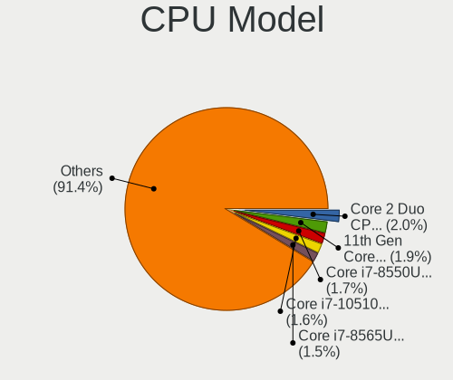

| Model                                         | Notebooks | Percent |
|-----------------------------------------------|-----------|---------|
| Intel Core 2 Duo CPU T8300 @ 2.40GHz          | 19        | 2.7%    |
| Intel Core i7-8565U CPU @ 1.80GHz             | 15        | 2.13%   |
| Intel 11th Gen Core i7-1165G7 @ 2.80GHz       | 14        | 1.99%   |
| Intel Core i7-8550U CPU @ 1.80GHz             | 13        | 1.85%   |
| Intel Core i7-10510U CPU @ 1.80GHz            | 12        | 1.7%    |
| Intel Pentium Dual-Core CPU T4300 @ 2.10GHz   | 11        | 1.56%   |
| Intel Celeron CPU N2840 @ 2.16GHz             | 11        | 1.56%   |
| Intel Core i7-6700HQ CPU @ 2.60GHz            | 10        | 1.42%   |
| Intel Core i5-8265U CPU @ 1.60GHz             | 10        | 1.42%   |
| Intel Core i7-8750H CPU @ 2.20GHz             | 9         | 1.28%   |
| Intel Core i5-8250U CPU @ 1.60GHz             | 9         | 1.28%   |
| Intel 11th Gen Core i5-1135G7 @ 2.40GHz       | 9         | 1.28%   |
| AMD Ryzen 5 3500U with Radeon Vega Mobile Gfx | 9         | 1.28%   |
| Intel Core i7-4510U CPU @ 2.00GHz             | 8         | 1.14%   |
| Intel Core i7-2630QM CPU @ 2.00GHz            | 8         | 1.14%   |
| Intel Core i5-3320M CPU @ 2.60GHz             | 8         | 1.14%   |
| Intel Core i5-3210M CPU @ 2.50GHz             | 8         | 1.14%   |
| Intel Core i3-5005U CPU @ 2.00GHz             | 8         | 1.14%   |
| Intel Pentium Dual CPU T2390 @ 1.86GHz        | 7         | 0.99%   |
| Intel Core i7-9750H CPU @ 2.60GHz             | 7         | 0.99%   |
| Intel Core i7-7500U CPU @ 2.70GHz             | 7         | 0.99%   |
| Intel Core i5-2520M CPU @ 2.50GHz             | 7         | 0.99%   |
| Intel Core i5 CPU M 480 @ 2.67GHz             | 7         | 0.99%   |
| AMD Ryzen 7 4800H with Radeon Graphics        | 7         | 0.99%   |
| Intel Pentium Dual-Core CPU T4500 @ 2.30GHz   | 6         | 0.85%   |
| Intel Pentium Dual CPU T3400 @ 2.16GHz        | 6         | 0.85%   |
| Intel Core i7-6500U CPU @ 2.50GHz             | 6         | 0.85%   |
| Intel Core i7-10750H CPU @ 2.60GHz            | 6         | 0.85%   |
| Intel Core i7 CPU Q 720 @ 1.60GHz             | 6         | 0.85%   |
| Intel Core i5-5200U CPU @ 2.20GHz             | 6         | 0.85%   |
| Intel Core i3-3217U CPU @ 1.80GHz             | 6         | 0.85%   |
| Intel Core i3 CPU M 330 @ 2.13GHz             | 6         | 0.85%   |
| Intel Core 2 Duo CPU P8700 @ 2.53GHz          | 6         | 0.85%   |
| Intel Core 2 Duo CPU P8600 @ 2.40GHz          | 6         | 0.85%   |
| AMD A6-6310 APU with AMD Radeon R4 Graphics   | 6         | 0.85%   |
| Intel Pentium Dual-Core CPU T4200 @ 2.00GHz   | 5         | 0.71%   |
| Intel Core i5-6200U CPU @ 2.30GHz             | 5         | 0.71%   |
| Intel Core i5-2450M CPU @ 2.50GHz             | 5         | 0.71%   |
| Intel Core i3-4005U CPU @ 1.70GHz             | 5         | 0.71%   |
| Intel Core 2 Duo CPU T9400 @ 2.53GHz          | 5         | 0.71%   |
| Intel Core 2 CPU T5600 @ 1.83GHz              | 5         | 0.71%   |
| Intel Celeron CPU N3060 @ 1.60GHz             | 5         | 0.71%   |
| AMD Ryzen 7 5800H with Radeon Graphics        | 5         | 0.71%   |
| Intel Pentium Dual CPU T2310 @ 1.46GHz        | 4         | 0.57%   |
| Intel Core i7-7700HQ CPU @ 2.80GHz            | 4         | 0.57%   |
| Intel Core i7-5500U CPU @ 2.40GHz             | 4         | 0.57%   |
| Intel Core i7-4700MQ CPU @ 2.40GHz            | 4         | 0.57%   |
| Intel Core i7-3632QM CPU @ 2.20GHz            | 4         | 0.57%   |
| Intel Core i7-3630QM CPU @ 2.40GHz            | 4         | 0.57%   |
| Intel Core i5-7200U CPU @ 2.50GHz             | 4         | 0.57%   |
| Intel Core i5-6300U CPU @ 2.40GHz             | 4         | 0.57%   |
| Intel Core i5-4210U CPU @ 1.70GHz             | 4         | 0.57%   |
| Intel Core i5-3337U CPU @ 1.80GHz             | 4         | 0.57%   |
| Intel Core i5 CPU M 430 @ 2.27GHz             | 4         | 0.57%   |
| Intel Atom x5-Z8350 CPU @ 1.44GHz             | 4         | 0.57%   |
| Intel Atom x5-Z8300 CPU @ 1.44GHz             | 4         | 0.57%   |
| Intel Atom CPU N455 @ 1.66GHz                 | 4         | 0.57%   |
| AMD Ryzen 5 5600H with Radeon Graphics        | 4         | 0.57%   |
| AMD Ryzen 5 2500U with Radeon Vega Mobile Gfx | 4         | 0.57%   |
| AMD A4-5000 APU with Radeon HD Graphics       | 4         | 0.57%   |

CPU Model Family
----------------

Processor model prefix

| Model                   | Notebooks | Percent |
|-------------------------|-----------|---------|
| Intel Core i7           | 172       | 24.43%  |
| Intel Core i5           | 139       | 19.74%  |
| Intel Core 2 Duo        | 64        | 9.09%   |
| Intel Core i3           | 48        | 6.82%   |
| Other                   | 32        | 4.55%   |
| Intel Celeron           | 30        | 4.26%   |
| Intel Atom              | 27        | 3.84%   |
| Intel Pentium Dual-Core | 24        | 3.41%   |
| AMD Ryzen 7             | 24        | 3.41%   |
| Intel Pentium Dual      | 23        | 3.27%   |
| AMD Ryzen 5             | 20        | 2.84%   |
| Intel Pentium           | 12        | 1.7%    |
| Intel Genuine           | 11        | 1.56%   |
| AMD A4                  | 10        | 1.42%   |
| AMD A8                  | 8         | 1.14%   |
| AMD A6                  | 8         | 1.14%   |
| AMD E2                  | 7         | 0.99%   |
| Intel Core 2            | 6         | 0.85%   |
| Intel Pentium M         | 5         | 0.71%   |
| AMD Ryzen 3             | 5         | 0.71%   |
| AMD Ryzen 9             | 4         | 0.57%   |
| AMD E                   | 3         | 0.43%   |
| AMD Athlon              | 3         | 0.43%   |
| AMD A10                 | 3         | 0.43%   |
| AMD Mobile Sempron      | 2         | 0.28%   |
| AMD E1                  | 2         | 0.28%   |
| Intel Core m3           | 1         | 0.14%   |
| Intel Core i9           | 1         | 0.14%   |
| Intel Celeron M         | 1         | 0.14%   |
| Intel Celeron Dual-Core | 1         | 0.14%   |
| AMD Turion 64 X2 Mobile | 1         | 0.14%   |
| AMD Turion              | 1         | 0.14%   |
| AMD Ryzen 7 PRO         | 1         | 0.14%   |
| AMD Ryzen 5 PRO         | 1         | 0.14%   |
| AMD Quad-Core           | 1         | 0.14%   |
| AMD Phenom II           | 1         | 0.14%   |
| AMD FX                  | 1         | 0.14%   |
| AMD Athlon 64 X2        | 1         | 0.14%   |

CPU Cores
---------

Number of processor cores

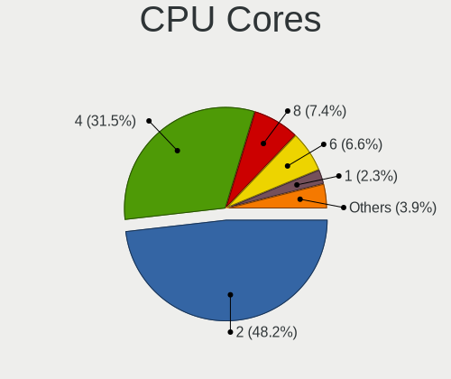

| Number | Notebooks | Percent |
|--------|-----------|---------|
| 2      | 387       | 54.97%  |
| 4      | 231       | 32.81%  |
| 6      | 34        | 4.83%   |
| 8      | 25        | 3.55%   |
| 1      | 24        | 3.41%   |
| 14     | 1         | 0.14%   |
| 12     | 1         | 0.14%   |
| 3      | 1         | 0.14%   |

CPU Sockets
-----------

Number of sockets

| Number | Notebooks | Percent |
|--------|-----------|---------|
| 1      | 704       | 100%    |

CPU Threads
-----------

Threads per core (Hyper-Threading)

| Number | Notebooks | Percent |
|--------|-----------|---------|
| 2      | 453       | 64.35%  |
| 1      | 251       | 35.65%  |

CPU Op-Modes
------------

CPU Operation Modes (32-bit, 64-bit)

| Op mode        | Notebooks | Percent |
|----------------|-----------|---------|
| 32-bit, 64-bit | 658       | 93.07%  |
| Unknown        | 28        | 3.96%   |
| 32-bit         | 19        | 2.69%   |
| 64-bit         | 2         | 0.28%   |

CPU Microcode
-------------

Microcode number

| Number     | Notebooks | Percent |
|------------|-----------|---------|
| Unknown    | 139       | 19.17%  |
| 0x306a9    | 41        | 5.66%   |
| 0x206a7    | 41        | 5.66%   |
| 0x1067a    | 38        | 5.24%   |
| 0x10676    | 30        | 4.14%   |
| 0x6fd      | 29        | 4%      |
| 0x806ec    | 27        | 3.72%   |
| 0x806ea    | 23        | 3.17%   |
| 0x906ea    | 20        | 2.76%   |
| 0x806c1    | 20        | 2.76%   |
| 0x40651    | 20        | 2.76%   |
| 0x306d4    | 16        | 2.21%   |
| 0x806eb    | 15        | 2.07%   |
| 0x406e3    | 15        | 2.07%   |
| 0x20652    | 15        | 2.07%   |
| 0x20655    | 13        | 1.79%   |
| 0x806e9    | 11        | 1.52%   |
| 0x506e3    | 11        | 1.52%   |
| 0x306c3    | 11        | 1.52%   |
| 0x30678    | 11        | 1.52%   |
| 0xa0652    | 8         | 1.1%    |
| 0x406c3    | 8         | 1.1%    |
| 0x08108109 | 8         | 1.1%    |
| 0x406c4    | 7         | 0.97%   |
| 0x08108102 | 7         | 0.97%   |
| 0x07030105 | 7         | 0.97%   |
| 0x6f6      | 6         | 0.83%   |
| 0x6d8      | 6         | 0.83%   |
| 0x106e5    | 6         | 0.83%   |
| 0x106ca    | 6         | 0.83%   |
| 0x906e9    | 5         | 0.69%   |
| 0x0a50000c | 5         | 0.69%   |
| 0x08600103 | 5         | 0.69%   |
| 0x0810100b | 5         | 0.69%   |
| 0x0700010f | 5         | 0.69%   |
| 0x06006704 | 5         | 0.69%   |
| 0x706a1    | 4         | 0.55%   |
| 0x6e8      | 4         | 0.55%   |
| 0x106c2    | 4         | 0.55%   |
| 0x08600104 | 4         | 0.55%   |
| 0x706e5    | 3         | 0.41%   |
| 0x6fb      | 3         | 0.41%   |
| 0x0a50000b | 3         | 0.41%   |
| 0x08600106 | 3         | 0.41%   |
| 0x07030104 | 3         | 0.41%   |
| 0x06006705 | 3         | 0.41%   |
| 0x06001119 | 3         | 0.41%   |
| 0x05000119 | 3         | 0.41%   |
| 0xa0660    | 2         | 0.28%   |
| 0x6ec      | 2         | 0.28%   |
| 0x506c9    | 2         | 0.28%   |
| 0x40661    | 2         | 0.28%   |
| 0x30673    | 2         | 0.28%   |
| 0x30661    | 2         | 0.28%   |
| 0x10661    | 2         | 0.28%   |
| 0x08608103 | 2         | 0.28%   |
| 0x08101007 | 2         | 0.28%   |
| 0x0700010b | 2         | 0.28%   |
| 0x06003106 | 2         | 0.28%   |
| 0x05000029 | 2         | 0.28%   |

CPU Microarch
-------------

Microarchitecture

| Name             | Notebooks | Percent |
|------------------|-----------|---------|
| KabyLake         | 114       | 16.19%  |
| Penryn           | 77        | 10.94%  |
| SandyBridge      | 49        | 6.96%   |
| IvyBridge        | 48        | 6.82%   |
| Haswell          | 47        | 6.68%   |
| Core             | 47        | 6.68%   |
| Westmere         | 36        | 5.11%   |
| Silvermont       | 36        | 5.11%   |
| Skylake          | 33        | 4.69%   |
| TigerLake        | 25        | 3.55%   |
| Broadwell        | 23        | 3.27%   |
| Zen+             | 18        | 2.56%   |
| Zen 2            | 15        | 2.13%   |
| Puma             | 14        | 1.99%   |
| P6               | 13        | 1.85%   |
| Bonnell          | 13        | 1.85%   |
| Zen 3            | 12        | 1.7%    |
| CometLake        | 12        | 1.7%    |
| Excavator        | 11        | 1.56%   |
| Jaguar           | 8         | 1.14%   |
| Zen              | 7         | 0.99%   |
| Nehalem          | 6         | 0.85%   |
| Steamroller      | 5         | 0.71%   |
| Icelake          | 5         | 0.71%   |
| Bobcat           | 5         | 0.71%   |
| K8 Hammer        | 4         | 0.57%   |
| K8 & K10 hybrid  | 4         | 0.57%   |
| Goldmont plus    | 4         | 0.57%   |
| Piledriver       | 3         | 0.43%   |
| Goldmont         | 3         | 0.43%   |
| Unknown          | 3         | 0.43%   |
| K10 Llano        | 2         | 0.28%   |
| K10              | 1         | 0.14%   |
| Alderlake Hybrid | 1         | 0.14%   |

Graphics
--------

GPU Vendor
----------

Vendors of graphics cards

| Vendor                           | Notebooks | Percent |
|----------------------------------|-----------|---------|
| Intel                            | 466       | 50.76%  |
| Nvidia                           | 259       | 28.21%  |
| AMD                              | 184       | 20.04%  |
| Silicon Integrated Systems [SiS] | 9         | 0.98%   |

GPU Model
---------

Graphics card models

| Model                                                                                    | Notebooks | Percent |
|------------------------------------------------------------------------------------------|-----------|---------|
| Intel 3rd Gen Core processor Graphics Controller                                         | 48        | 4.96%   |
| Intel 2nd Generation Core Processor Family Integrated Graphics Controller                | 37        | 3.83%   |
| Intel WhiskeyLake-U GT2 [UHD Graphics 620]                                               | 30        | 3.1%    |
| Intel Haswell-ULT Integrated Graphics Controller                                         | 29        | 3%      |
| Intel UHD Graphics 620                                                                   | 25        | 2.59%   |
| Intel TigerLake-LP GT2 [Iris Xe Graphics]                                                | 24        | 2.48%   |
| Intel Mobile GM965/GL960 Integrated Graphics Controller (secondary)                      | 22        | 2.28%   |
| Intel Mobile GM965/GL960 Integrated Graphics Controller (primary)                        | 22        | 2.28%   |
| Intel Mobile 4 Series Chipset Integrated Graphics Controller                             | 21        | 2.17%   |
| Intel Core Processor Integrated Graphics Controller                                      | 21        | 2.17%   |
| Intel Skylake GT2 [HD Graphics 520]                                                      | 19        | 1.96%   |
| Intel HD Graphics 5500                                                                   | 19        | 1.96%   |
| Intel Atom/Celeron/Pentium Processor x5-E8000/J3xxx/N3xxx Integrated Graphics Controller | 19        | 1.96%   |
| Intel CoffeeLake-H GT2 [UHD Graphics 630]                                                | 18        | 1.86%   |
| AMD Picasso/Raven 2 [Radeon Vega Series / Radeon Vega Mobile Series]                     | 18        | 1.86%   |
| Intel CometLake-U GT2 [UHD Graphics]                                                     | 17        | 1.76%   |
| Intel Atom Processor Z36xxx/Z37xxx Series Graphics & Display                             | 17        | 1.76%   |
| Nvidia G86M [GeForce 8600M GS]                                                           | 16        | 1.65%   |
| Intel 4th Gen Core Processor Integrated Graphics Controller                              | 16        | 1.65%   |
| AMD Renoir                                                                               | 13        | 1.34%   |
| AMD Park [Mobility Radeon HD 5430/5450/5470]                                             | 13        | 1.34%   |
| Nvidia GP108M [GeForce MX150]                                                            | 12        | 1.24%   |
| Nvidia GF117M [GeForce 610M/710M/810M/820M / GT 620M/625M/630M/720M]                     | 12        | 1.24%   |
| Intel HD Graphics 620                                                                    | 12        | 1.24%   |
| Intel HD Graphics 530                                                                    | 12        | 1.24%   |
| Nvidia GP107M [GeForce GTX 1050 Mobile]                                                  | 10        | 1.03%   |
| AMD Sun XT [Radeon HD 8670A/8670M/8690M / R5 M330 / M430 / Radeon 520 Mobile]            | 10        | 1.03%   |
| AMD Stoney [Radeon R2/R3/R4/R5 Graphics]                                                 | 10        | 1.03%   |
| AMD Cezanne                                                                              | 10        | 1.03%   |
| Intel CometLake-H GT2 [UHD Graphics]                                                     | 9         | 0.93%   |
| AMD Mullins [Radeon R4/R5 Graphics]                                                      | 9         | 0.93%   |
| Silicon Integrated Systems [SiS] 771/671 PCIE VGA Display Adapter                        | 8         | 0.83%   |
| Nvidia GK208M [GeForce GT 740M]                                                          | 8         | 0.83%   |
| Intel Mobile 945GM/GMS/GME, 943/940GML Express Integrated Graphics Controller            | 8         | 0.83%   |
| Nvidia TU117M [GeForce GTX 1650 Mobile / Max-Q]                                          | 7         | 0.72%   |
| Nvidia GP108M [GeForce MX250]                                                            | 7         | 0.72%   |
| Nvidia GM108M [GeForce 840M]                                                             | 7         | 0.72%   |
| Nvidia GK208BM [GeForce 920M]                                                            | 7         | 0.72%   |
| Intel HD Graphics 630                                                                    | 7         | 0.72%   |
| AMD Thames [Radeon HD 7500M/7600M Series]                                                | 7         | 0.72%   |
| AMD RV710/M92 [Mobility Radeon HD 4530/4570/545v]                                        | 7         | 0.72%   |
| AMD Raven Ridge [Radeon Vega Series / Radeon Vega Mobile Series]                         | 7         | 0.72%   |
| AMD Madison [Mobility Radeon HD 5650/5750 / 6530M/6550M]                                 | 7         | 0.72%   |
| Nvidia TU117M                                                                            | 6         | 0.62%   |
| Nvidia GM108M [GeForce MX130]                                                            | 6         | 0.62%   |
| Nvidia GM108M [GeForce 920MX]                                                            | 6         | 0.62%   |
| Intel Atom Processor D4xx/D5xx/N4xx/N5xx Integrated Graphics Controller                  | 6         | 0.62%   |
| Nvidia GM107M [GeForce GTX 960M]                                                         | 5         | 0.52%   |
| Nvidia GM107M [GeForce GTX 950M]                                                         | 5         | 0.52%   |
| Nvidia G98M [GeForce G 105M]                                                             | 5         | 0.52%   |
| Nvidia G96CM [GeForce 9600M GT]                                                          | 5         | 0.52%   |
| AMD Topaz XT [Radeon R7 M260/M265 / M340/M360 / M440/M445 / 530/535 / 620/625 Mobile]    | 5         | 0.52%   |
| AMD Seymour [Radeon HD 6400M/7400M Series]                                               | 5         | 0.52%   |
| Nvidia TU117M [GeForce GTX 1650 Ti Mobile]                                               | 4         | 0.41%   |
| Nvidia TU116M [GeForce GTX 1660 Ti Mobile]                                               | 4         | 0.41%   |
| Nvidia GT218M [GeForce 315M]                                                             | 4         | 0.41%   |
| Nvidia GP108M [GeForce MX330]                                                            | 4         | 0.41%   |
| Nvidia GP107M [GeForce GTX 1050 Ti Mobile]                                               | 4         | 0.41%   |
| Nvidia GM108M [GeForce 940M]                                                             | 4         | 0.41%   |
| Nvidia G98M [GeForce G 103M]                                                             | 4         | 0.41%   |

GPU Combo
---------

Combinations of graphics cards

| Name           | Notebooks | Percent |
|----------------|-----------|---------|
| 1 x Intel      | 266       | 37.73%  |
| Intel + Nvidia | 161       | 22.84%  |
| 1 x AMD        | 114       | 16.17%  |
| 1 x Nvidia     | 84        | 11.91%  |
| Intel + AMD    | 39        | 5.53%   |
| 2 x AMD        | 18        | 2.55%   |
| AMD + Nvidia   | 14        | 1.99%   |
| 1 x SiS        | 9         | 1.28%   |

GPU Driver
----------

Free vs proprietary

| Driver      | Notebooks | Percent |
|-------------|-----------|---------|
| Free        | 576       | 80.79%  |
| Proprietary | 109       | 15.29%  |
| Unknown     | 28        | 3.93%   |

GPU Memory
----------

Total video memory

| Size in GB | Notebooks | Percent |
|------------|-----------|---------|
| Unknown    | 374       | 51.94%  |
| 0.01-0.5   | 127       | 17.64%  |
| 1.01-2.0   | 104       | 14.44%  |
| 0.51-1.0   | 59        | 8.19%   |
| 3.01-4.0   | 36        | 5%      |
| 5.01-6.0   | 14        | 1.94%   |
| 7.01-8.0   | 4         | 0.56%   |
| 2.01-3.0   | 2         | 0.28%   |

Monitor
-------

Monitor Vendor
--------------

Monitor vendors

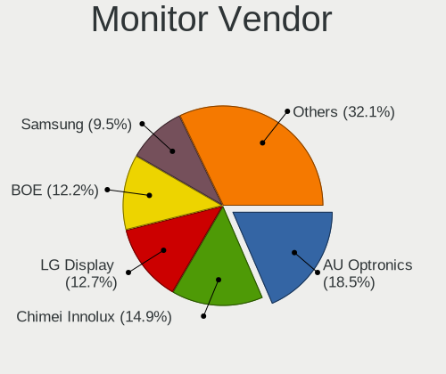

| Vendor                  | Notebooks | Percent |
|-------------------------|-----------|---------|
| AU Optronics            | 145       | 19.44%  |
| Chimei Innolux          | 106       | 14.21%  |
| LG Display              | 101       | 13.54%  |
| BOE                     | 79        | 10.59%  |
| Samsung Electronics     | 76        | 10.19%  |
| Chi Mei Optoelectronics | 25        | 3.35%   |
| Goldstar                | 20        | 2.68%   |
| LG Philips              | 18        | 2.41%   |
| Apple                   | 15        | 2.01%   |
| Lenovo                  | 14        | 1.88%   |
| Dell                    | 14        | 1.88%   |
| Ancor Communications    | 14        | 1.88%   |
| PANDA                   | 12        | 1.61%   |
| Hewlett-Packard         | 11        | 1.47%   |
| AOC                     | 10        | 1.34%   |
| Sharp                   | 8         | 1.07%   |
| Philips                 | 8         | 1.07%   |
| CPT                     | 6         | 0.8%    |
| BenQ                    | 6         | 0.8%    |
| Acer                    | 5         | 0.67%   |
| Sony                    | 4         | 0.54%   |
| Seiko/Epson             | 4         | 0.54%   |
| InfoVision              | 4         | 0.54%   |
| Toshiba                 | 3         | 0.4%    |
| HannStar                | 3         | 0.4%    |
| CSO                     | 3         | 0.4%    |
| ASUSTek Computer        | 3         | 0.4%    |
| ViewSonic               | 2         | 0.27%   |
| Unknown                 | 2         | 0.27%   |
| MSI                     | 2         | 0.27%   |
| LGD                     | 2         | 0.27%   |
| LG Electronics          | 2         | 0.27%   |
| CVT                     | 2         | 0.27%   |
| RTK                     | 1         | 0.13%   |
| Plain Tree Systems      | 1         | 0.13%   |
| Panasonic               | 1         | 0.13%   |
| Nvidia                  | 1         | 0.13%   |
| Lenovo Group Limited    | 1         | 0.13%   |
| KDC                     | 1         | 0.13%   |
| JDI                     | 1         | 0.13%   |
| InnoLux Display         | 1         | 0.13%   |
| IBM                     | 1         | 0.13%   |
| HUAWEI                  | 1         | 0.13%   |
| HPN                     | 1         | 0.13%   |
| Hitachi                 | 1         | 0.13%   |
| Elo Touch               | 1         | 0.13%   |
| CMN                     | 1         | 0.13%   |
| BOE Technology Group    | 1         | 0.13%   |
| BIZ                     | 1         | 0.13%   |
| Unknown                 | 1         | 0.13%   |

Monitor Model
-------------

Monitor models

| Model                                                                    | Notebooks | Percent |
|--------------------------------------------------------------------------|-----------|---------|
| AU Optronics LCD Monitor AUO403D 1920x1080 309x173mm 13.9-inch           | 10        | 1.33%   |
| AU Optronics LCD Monitor AUO22EC 1366x768 344x193mm 15.5-inch            | 9         | 1.19%   |
| Chimei Innolux LCD Monitor CMN15CA 1366x768 344x193mm 15.5-inch          | 8         | 1.06%   |
| Chimei Innolux LCD Monitor CMN15DB 1366x768 344x193mm 15.5-inch          | 6         | 0.8%    |
| Chimei Innolux LCD Monitor CMN15BF 1366x768 344x194mm 15.5-inch          | 6         | 0.8%    |
| BOE LCD Monitor BOE0704 1366x768 344x194mm 15.5-inch                     | 6         | 0.8%    |
| Samsung Electronics LCD Monitor SEC5541 1366x768 344x193mm 15.5-inch     | 5         | 0.66%   |
| LG Philips LCD Monitor LPLDD00 1280x800 331x207mm 15.4-inch              | 5         | 0.66%   |
| Chimei Innolux LCD Monitor CMN15F5 1920x1080 344x193mm 15.5-inch         | 5         | 0.66%   |
| Chimei Innolux LCD Monitor CMN15E7 1920x1080 344x193mm 15.5-inch         | 5         | 0.66%   |
| AU Optronics LCD Monitor AUO8174 1280x800 331x207mm 15.4-inch            | 5         | 0.66%   |
| AU Optronics LCD Monitor AUO5B2D 1920x1080 293x162mm 13.2-inch           | 5         | 0.66%   |
| Samsung Electronics LCD Monitor SEC3945 1280x800 331x207mm 15.4-inch     | 4         | 0.53%   |
| LG Display LCD Monitor LGD045D 1366x768 345x194mm 15.6-inch              | 4         | 0.53%   |
| LG Display LCD Monitor LGD039F 1366x768 345x194mm 15.6-inch              | 4         | 0.53%   |
| Chimei Innolux LCD Monitor CMN15C9 1366x768 344x193mm 15.5-inch          | 4         | 0.53%   |
| Chimei Innolux LCD Monitor CMN15B7 1366x768 344x193mm 15.5-inch          | 4         | 0.53%   |
| Chimei Innolux LCD Monitor CMN15AB 1366x768 344x194mm 15.5-inch          | 4         | 0.53%   |
| Chi Mei Optoelectronics LCD Monitor CMO1592 1366x768 344x193mm 15.5-inch | 4         | 0.53%   |
| BOE LCD Monitor BOE07F1 1920x1080 344x193mm 15.5-inch                    | 4         | 0.53%   |
| AU Optronics LCD Monitor AUO61ED 1920x1080 344x194mm 15.5-inch           | 4         | 0.53%   |
| AU Optronics LCD Monitor AUO40EC 1366x768 344x193mm 15.5-inch            | 4         | 0.53%   |
| AU Optronics LCD Monitor AUO21EC 1366x768 344x194mm 15.5-inch            | 4         | 0.53%   |
| Samsung Electronics LCD Monitor SEC544B 1600x900 382x215mm 17.3-inch     | 3         | 0.4%    |
| Samsung Electronics LCD Monitor SEC5441 1366x768 309x174mm 14.0-inch     | 3         | 0.4%    |
| Samsung Electronics LCD Monitor SEC3030 1024x600 223x125mm 10.1-inch     | 3         | 0.4%    |
| LG Philips LP154WX4-TLC8 LPL0120 1280x800 331x207mm 15.4-inch            | 3         | 0.4%    |
| LG Display LCD Monitor LGD0456 1366x768 344x194mm 15.5-inch              | 3         | 0.4%    |
| LG Display LCD Monitor LGD033A 1366x768 344x194mm 15.5-inch              | 3         | 0.4%    |
| LG Display LCD Monitor LGD02DC 1366x768 344x194mm 15.5-inch              | 3         | 0.4%    |
| LG Display LCD Monitor LGD01E8 1366x768 344x194mm 15.5-inch              | 3         | 0.4%    |
| Chimei Innolux P130ZFA-BA1 CMN8201 2160x1440 275x183mm 13.0-inch         | 3         | 0.4%    |
| Chimei Innolux LCD Monitor CMN15E8 1920x1080 344x193mm 15.5-inch         | 3         | 0.4%    |
| Chimei Innolux LCD Monitor CMN15DC 1366x768 344x193mm 15.5-inch          | 3         | 0.4%    |
| Chimei Innolux LCD Monitor CMN15D2 1920x1080 344x193mm 15.5-inch         | 3         | 0.4%    |
| Chimei Innolux LCD Monitor CMN14D5 1920x1080 309x173mm 13.9-inch         | 3         | 0.4%    |
| Chimei Innolux LCD Monitor CMN1493 1366x768 309x173mm 13.9-inch          | 3         | 0.4%    |
| Chi Mei Optoelectronics LCD Monitor CMO15A7 1366x768 344x193mm 15.5-inch | 3         | 0.4%    |
| BOE LCD Monitor BOE0812 1920x1080 344x194mm 15.5-inch                    | 3         | 0.4%    |
| BOE LCD Monitor BOE06A5 1366x768 344x194mm 15.5-inch                     | 3         | 0.4%    |
| BOE LCD Monitor BOE06A4 1366x768 344x194mm 15.5-inch                     | 3         | 0.4%    |
| AU Optronics LCD Monitor AUO70EC 1366x768 344x193mm 15.5-inch            | 3         | 0.4%    |
| AU Optronics LCD Monitor AUO46EC 1366x768 344x193mm 15.5-inch            | 3         | 0.4%    |
| AU Optronics LCD Monitor AUO38ED 1920x1080 344x193mm 15.5-inch           | 3         | 0.4%    |
| AU Optronics LCD Monitor AUO2E3C 1366x768 309x173mm 13.9-inch            | 3         | 0.4%    |
| AU Optronics LCD Monitor AUO23ED 1920x1080 344x194mm 15.5-inch           | 3         | 0.4%    |
| AU Optronics LCD Monitor AUO21ED 1920x1080 344x193mm 15.5-inch           | 3         | 0.4%    |
| AU Optronics LCD Monitor AUO10EC 1366x768 344x193mm 15.5-inch            | 3         | 0.4%    |
| AU Optronics LCD Monitor AUO106C 1366x768 277x156mm 12.5-inch            | 3         | 0.4%    |
| Sony NvidiaDefault SNY05FA 1366x768 290x170mm 13.2-inch                  | 2         | 0.27%   |
| Sharp LQ156M1JW09 SHP14D3 1920x1080 344x194mm 15.5-inch                  | 2         | 0.27%   |
| Seiko/Epson LCD Monitor 1366x768                                         | 2         | 0.27%   |
| Samsung Electronics S22D300 SAM0B3F 1920x1080 477x268mm 21.5-inch        | 2         | 0.27%   |
| Samsung Electronics LCD Monitor SEC3847 1440x900 367x230mm 17.1-inch     | 2         | 0.27%   |
| Samsung Electronics LCD Monitor SEC3741 1366x768 309x174mm 14.0-inch     | 2         | 0.27%   |
| Samsung Electronics LCD Monitor SEC3245 1366x768 344x194mm 15.5-inch     | 2         | 0.27%   |
| Samsung Electronics LCD Monitor SEC314A 1920x1080 408x230mm 18.4-inch    | 2         | 0.27%   |
| Samsung Electronics LCD Monitor SDC4E51 1366x768 344x194mm 15.5-inch     | 2         | 0.27%   |
| Samsung Electronics LCD Monitor SDC4852 1366x768 344x194mm 15.5-inch     | 2         | 0.27%   |
| Samsung Electronics C27F390 SAM0D32 1920x1080 600x340mm 27.2-inch        | 2         | 0.27%   |

Monitor Resolution
------------------

Monitor screen resolution

| Resolution         | Notebooks | Percent |
|--------------------|-----------|---------|
| 1366x768 (WXGA)    | 262       | 37.97%  |
| 1920x1080 (FHD)    | 245       | 35.51%  |
| 1280x800 (WXGA)    | 53        | 7.68%   |
| 1600x900 (HD+)     | 23        | 3.33%   |
| 3840x2160 (4K)     | 19        | 2.75%   |
| 1440x900 (WXGA+)   | 12        | 1.74%   |
| 1280x1024 (SXGA)   | 11        | 1.59%   |
| 1680x1050 (WSXGA+) | 10        | 1.45%   |
| 2560x1440 (QHD)    | 8         | 1.16%   |
| 1920x1200 (WUXGA)  | 7         | 1.01%   |
| 1360x768           | 4         | 0.58%   |
| 1024x768 (XGA)     | 4         | 0.58%   |
| 1024x600           | 4         | 0.58%   |
| 3440x1440          | 3         | 0.43%   |
| 2560x1600          | 3         | 0.43%   |
| 2560x1080          | 3         | 0.43%   |
| 2160x1440          | 3         | 0.43%   |
| Unknown            | 3         | 0.43%   |
| 3200x1800 (QHD+)   | 2         | 0.29%   |
| 2880x1800          | 2         | 0.29%   |
| 1400x1050          | 2         | 0.29%   |
| 640x480            | 1         | 0.14%   |
| 3840x1080          | 1         | 0.14%   |
| 3520x1080          | 1         | 0.14%   |
| 3280x1080          | 1         | 0.14%   |
| 3000x2000          | 1         | 0.14%   |
| 2240x1400          | 1         | 0.14%   |
| 1600x1200          | 1         | 0.14%   |

Monitor Diagonal
----------------

Diagonal size in inches

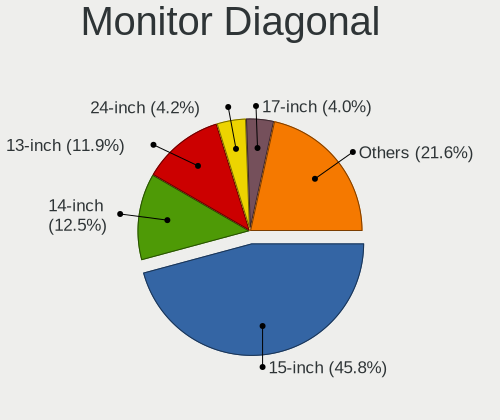

| Inches  | Notebooks | Percent |
|---------|-----------|---------|
| 15      | 369       | 49.66%  |
| 14      | 82        | 11.04%  |
| 13      | 82        | 11.04%  |
| 17      | 38        | 5.11%   |
| 24      | 28        | 3.77%   |
| 21      | 22        | 2.96%   |
| Unknown | 20        | 2.69%   |
| 27      | 18        | 2.42%   |
| 23      | 16        | 2.15%   |
| 12      | 16        | 2.15%   |
| 11      | 10        | 1.35%   |
| 34      | 7         | 0.94%   |
| 10      | 7         | 0.94%   |
| 22      | 6         | 0.81%   |
| 19      | 4         | 0.54%   |
| 31      | 3         | 0.4%    |
| 20      | 3         | 0.4%    |
| 16      | 3         | 0.4%    |
| 84      | 2         | 0.27%   |
| 26      | 2         | 0.27%   |
| 18      | 2         | 0.27%   |
| 72      | 1         | 0.13%   |
| 54      | 1         | 0.13%   |
| 8       | 1         | 0.13%   |

Monitor Width
-------------

Physical width

| Width in mm | Notebooks | Percent |
|-------------|-----------|---------|
| 301-350     | 487       | 66.62%  |
| 201-300     | 74        | 10.12%  |
| 501-600     | 59        | 8.07%   |
| 351-400     | 39        | 5.34%   |
| 401-500     | 35        | 4.79%   |
| Unknown     | 20        | 2.74%   |
| 701-800     | 7         | 0.96%   |
| 601-700     | 5         | 0.68%   |
| 1501-2000   | 3         | 0.41%   |
| 101-200     | 1         | 0.14%   |
| 1001-1500   | 1         | 0.14%   |

Aspect Ratio
------------

Proportional relationship between the width and the height

| Ratio   | Notebooks | Percent |
|---------|-----------|---------|
| 16/9    | 526       | 79.7%   |
| 16/10   | 86        | 13.03%  |
| Unknown | 18        | 2.73%   |
| 5/4     | 10        | 1.52%   |
| 4/3     | 8         | 1.21%   |
| 3/2     | 6         | 0.91%   |
| 21/9    | 6         | 0.91%   |

Monitor Area
------------

Area in inch

| Area in inch | Notebooks | Percent |
|----------------|-----------|---------|
| 101-110        | 369       | 49.73%  |
| 81-90          | 130       | 17.52%  |
| 201-250        | 58        | 7.82%   |
| 71-80          | 33        | 4.45%   |
| 121-130        | 22        | 2.96%   |
| Unknown        | 20        | 2.7%    |
| 301-350        | 19        | 2.56%   |
| 61-70          | 16        | 2.16%   |
| 151-200        | 13        | 1.75%   |
| 141-150        | 11        | 1.48%   |
| 51-60          | 10        | 1.35%   |
| 351-500        | 9         | 1.21%   |
| 251-300        | 8         | 1.08%   |
| 41-50          | 7         | 0.94%   |
| 131-140        | 7         | 0.94%   |
| More than 1000 | 4         | 0.54%   |
| 91-100         | 3         | 0.4%    |
| 1-40           | 1         | 0.13%   |
| 111-120        | 1         | 0.13%   |
| 501-1000       | 1         | 0.13%   |

Pixel Density
-------------

Pixels per inch

| Density       | Notebooks | Percent |
|---------------|-----------|---------|
| 101-120       | 268       | 36.97%  |
| 121-160       | 240       | 33.1%   |
| 51-100        | 152       | 20.97%  |
| 161-240       | 32        | 4.41%   |
| Unknown       | 20        | 2.76%   |
| More than 240 | 10        | 1.38%   |
| 1-50          | 3         | 0.41%   |

Multiple Monitors
-----------------

Total monitors connected

| Total | Notebooks | Percent |
|-------|-----------|---------|
| 1     | 568       | 78.56%  |
| 2     | 102       | 14.11%  |
| 0     | 38        | 5.26%   |
| 3     | 14        | 1.94%   |
| 4     | 1         | 0.14%   |

Network
-------

Net Controller Vendor
---------------------

Controller vendors

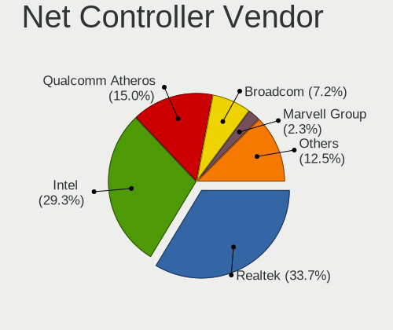

| Vendor                            | Notebooks | Percent |
|-----------------------------------|-----------|---------|
| Realtek Semiconductor             | 371       | 32.92%  |
| Intel                             | 314       | 27.86%  |
| Qualcomm Atheros                  | 203       | 18.01%  |
| Broadcom                          | 94        | 8.34%   |
| Marvell Technology Group          | 37        | 3.28%   |
| Silicon Integrated Systems [SiS]  | 12        | 1.06%   |
| Broadcom Limited                  | 12        | 1.06%   |
| TP-Link                           | 10        | 0.89%   |
| Ralink                            | 10        | 0.89%   |
| Nvidia                            | 7         | 0.62%   |
| Sierra Wireless                   | 4         | 0.35%   |
| Ralink Technology                 | 4         | 0.35%   |
| MediaTek                          | 4         | 0.35%   |
| JMicron Technology                | 4         | 0.35%   |
| Ericsson Business Mobile Networks | 4         | 0.35%   |
| Attansic Technology               | 4         | 0.35%   |
| Hewlett-Packard                   | 3         | 0.27%   |
| ASUSTek Computer                  | 3         | 0.27%   |
| ASIX Electronics                  | 3         | 0.27%   |
| Samsung Electronics               | 2         | 0.18%   |
| Huawei Technologies               | 2         | 0.18%   |
| Fibocom                           | 2         | 0.18%   |
| D-Link                            | 2         | 0.18%   |
| Xiaomi                            | 1         | 0.09%   |
| TRENDnet                          | 1         | 0.09%   |
| Toshiba                           | 1         | 0.09%   |
| T & A Mobile Phones               | 1         | 0.09%   |
| SparkFun                          | 1         | 0.09%   |
| Qualcomm Atheros Communications   | 1         | 0.09%   |
| Qualcomm                          | 1         | 0.09%   |
| Micro Star International          | 1         | 0.09%   |
| LSI                               | 1         | 0.09%   |
| Lenovo                            | 1         | 0.09%   |
| ICS Advent                        | 1         | 0.09%   |
| GrupoPIE PORTUGAL                 | 1         | 0.09%   |
| Dell                              | 1         | 0.09%   |
| Belkin Components                 | 1         | 0.09%   |
| Archos                            | 1         | 0.09%   |
| Allwinner Technology              | 1         | 0.09%   |

Net Controller Model
--------------------

Controller models

| Model                                                                          | Notebooks | Percent |
|--------------------------------------------------------------------------------|-----------|---------|
| Realtek RTL8111/8168/8411 PCI Express Gigabit Ethernet Controller              | 224       | 16.79%  |
| Realtek RTL810xE PCI Express Fast Ethernet controller                          | 93        | 6.97%   |
| Qualcomm Atheros QCA9565 / AR9565 Wireless Network Adapter                     | 45        | 3.37%   |
| Qualcomm Atheros AR9285 Wireless Network Adapter (PCI-Express)                 | 36        | 2.7%    |
| Qualcomm Atheros QCA9377 802.11ac Wireless Network Adapter                     | 29        | 2.17%   |
| Intel Wi-Fi 6 AX200                                                            | 29        | 2.17%   |
| Intel PRO/Wireless 4965 AG or AGN [Kedron] Network Connection                  | 24        | 1.8%    |
| Qualcomm Atheros AR242x / AR542x Wireless Network Adapter (PCI-Express)        | 23        | 1.72%   |
| Broadcom BCM43142 802.11b/g/n                                                  | 23        | 1.72%   |
| Qualcomm Atheros AR9485 Wireless Network Adapter                               | 22        | 1.65%   |
| Marvell Group 88E8036 PCI-E Fast Ethernet Controller                           | 21        | 1.57%   |
| Intel Cannon Point-LP CNVi [Wireless-AC]                                       | 20        | 1.5%    |
| Intel Wireless 8265 / 8275                                                     | 19        | 1.42%   |
| Broadcom BCM4313 802.11bgn Wireless Network Adapter                            | 19        | 1.42%   |
| Realtek RTL8153 Gigabit Ethernet Adapter                                       | 17        | 1.27%   |
| Intel Wireless 7260                                                            | 17        | 1.27%   |
| Realtek RTL8723BE PCIe Wireless Network Adapter                                | 16        | 1.2%    |
| Realtek RTL8821CE 802.11ac PCIe Wireless Network Adapter                       | 15        | 1.12%   |
| Intel Wi-Fi 6 AX201                                                            | 15        | 1.12%   |
| Intel Centrino Advanced-N 6205 [Taylor Peak]                                   | 15        | 1.12%   |
| Intel 82579LM Gigabit Network Connection (Lewisville)                          | 15        | 1.12%   |
| Intel PRO/Wireless 3945ABG [Golan] Network Connection                          | 14        | 1.05%   |
| Intel Cannon Lake PCH CNVi WiFi                                                | 13        | 0.97%   |
| Realtek RTL8852AE 802.11ax PCIe Wireless Network Adapter                       | 12        | 0.9%    |
| Intel Comet Lake PCH-LP CNVi WiFi                                              | 12        | 0.9%    |
| Silicon Integrated Systems [SiS] 191 Gigabit Ethernet Adapter                  | 11        | 0.82%   |
| Realtek RTL8822CE 802.11ac PCIe Wireless Network Adapter                       | 11        | 0.82%   |
| Qualcomm Atheros AR928X Wireless Network Adapter (PCI-Express)                 | 11        | 0.82%   |
| Intel Wireless 7265                                                            | 11        | 0.82%   |
| Intel Wireless 3165                                                            | 11        | 0.82%   |
| Intel Wireless 8260                                                            | 10        | 0.75%   |
| Intel Wireless 3160                                                            | 10        | 0.75%   |
| Intel WiFi Link 5100                                                           | 10        | 0.75%   |
| Intel PRO/Wireless 5100 AGN [Shiloh] Network Connection                        | 10        | 0.75%   |
| Realtek RTL8191SEvB Wireless LAN Controller                                    | 9         | 0.67%   |
| Intel Comet Lake PCH CNVi WiFi                                                 | 9         | 0.67%   |
| Realtek RTL8188EUS 802.11n Wireless Network Adapter                            | 8         | 0.6%    |
| Qualcomm Atheros QCA6174 802.11ac Wireless Network Adapter                     | 7         | 0.52%   |
| Intel Wireless-AC 9260                                                         | 7         | 0.52%   |
| Intel Ethernet Connection I218-LM                                              | 7         | 0.52%   |
| Intel Ethernet Connection (6) I219-V                                           | 7         | 0.52%   |
| Intel Centrino Advanced-N 6235                                                 | 7         | 0.52%   |
| Intel 82579V Gigabit Network Connection                                        | 7         | 0.52%   |
| Realtek RTL8822BE 802.11a/b/g/n/ac WiFi adapter                                | 6         | 0.45%   |
| Realtek RTL-8100/8101L/8139 PCI Fast Ethernet Adapter                          | 6         | 0.45%   |
| Qualcomm Atheros AR8161 Gigabit Ethernet                                       | 6         | 0.45%   |
| Qualcomm Atheros AR8151 v2.0 Gigabit Ethernet                                  | 6         | 0.45%   |
| Qualcomm Atheros AR8132 Fast Ethernet                                          | 6         | 0.45%   |
| Qualcomm Atheros AR8131 Gigabit Ethernet                                       | 6         | 0.45%   |
| Qualcomm Atheros AR8121/AR8113/AR8114 Gigabit or Fast Ethernet                 | 6         | 0.45%   |
| Intel Dual Band Wireless-AC 3165 Plus Bluetooth                                | 6         | 0.45%   |
| Intel 82577LM Gigabit Network Connection                                       | 6         | 0.45%   |
| Broadcom NetLink BCM5787M Gigabit Ethernet PCI Express                         | 6         | 0.45%   |
| Broadcom BCM4312 802.11b/g LP-PHY                                              | 6         | 0.45%   |
| TP-Link UE300 10/100/1000 LAN (ethernet mode) [Realtek RTL8153]                | 5         | 0.37%   |
| Realtek RTL8187B Wireless Adapter                                              | 5         | 0.37%   |
| Marvell Group Yukon Optima 88E8059 [PCIe Gigabit Ethernet Controller with AVB] | 5         | 0.37%   |
| Intel Centrino Wireless-N 1000 [Condor Peak]                                   | 5         | 0.37%   |
| Intel Centrino Ultimate-N 6300                                                 | 5         | 0.37%   |
| Intel 82567LM Gigabit Network Connection                                       | 5         | 0.37%   |

Wireless Vendor
---------------

Wireless vendors

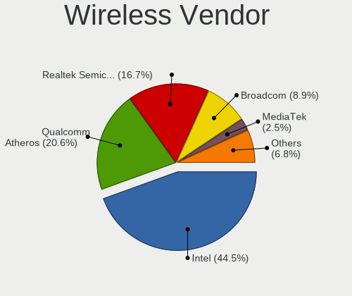

| Vendor                          | Notebooks | Percent |
|---------------------------------|-----------|---------|
| Intel                           | 304       | 42.76%  |
| Qualcomm Atheros                | 179       | 25.18%  |
| Realtek Semiconductor           | 108       | 15.19%  |
| Broadcom                        | 75        | 10.55%  |
| Ralink                          | 10        | 1.41%   |
| Broadcom Limited                | 7         | 0.98%   |
| TP-Link                         | 5         | 0.7%    |
| Sierra Wireless                 | 4         | 0.56%   |
| Ralink Technology               | 4         | 0.56%   |
| MEDIATEK                        | 3         | 0.42%   |
| ASUSTek Computer                | 3         | 0.42%   |
| Fibocom                         | 2         | 0.28%   |
| D-Link                          | 2         | 0.28%   |
| TRENDnet                        | 1         | 0.14%   |
| Qualcomm Atheros Communications | 1         | 0.14%   |
| Micro Star International        | 1         | 0.14%   |
| Dell                            | 1         | 0.14%   |
| Belkin Components               | 1         | 0.14%   |

Wireless Model
--------------

Wireless models

| Model                                                                   | Notebooks | Percent |
|-------------------------------------------------------------------------|-----------|---------|
| Qualcomm Atheros QCA9565 / AR9565 Wireless Network Adapter              | 45        | 6.33%   |
| Qualcomm Atheros AR9285 Wireless Network Adapter (PCI-Express)          | 36        | 5.06%   |
| Qualcomm Atheros QCA9377 802.11ac Wireless Network Adapter              | 29        | 4.08%   |
| Intel Wi-Fi 6 AX200                                                     | 29        | 4.08%   |
| Intel PRO/Wireless 4965 AG or AGN [Kedron] Network Connection           | 24        | 3.38%   |
| Qualcomm Atheros AR242x / AR542x Wireless Network Adapter (PCI-Express) | 23        | 3.23%   |
| Broadcom BCM43142 802.11b/g/n                                           | 23        | 3.23%   |
| Qualcomm Atheros AR9485 Wireless Network Adapter                        | 22        | 3.09%   |
| Intel Cannon Point-LP CNVi [Wireless-AC]                                | 20        | 2.81%   |
| Intel Wireless 8265 / 8275                                              | 19        | 2.67%   |
| Broadcom BCM4313 802.11bgn Wireless Network Adapter                     | 19        | 2.67%   |
| Intel Wireless 7260                                                     | 17        | 2.39%   |
| Realtek RTL8723BE PCIe Wireless Network Adapter                         | 16        | 2.25%   |
| Realtek RTL8821CE 802.11ac PCIe Wireless Network Adapter                | 15        | 2.11%   |
| Intel Wi-Fi 6 AX201                                                     | 15        | 2.11%   |
| Intel Centrino Advanced-N 6205 [Taylor Peak]                            | 15        | 2.11%   |
| Intel PRO/Wireless 3945ABG [Golan] Network Connection                   | 14        | 1.97%   |
| Intel Cannon Lake PCH CNVi WiFi                                         | 13        | 1.83%   |
| Realtek RTL8852AE 802.11ax PCIe Wireless Network Adapter                | 12        | 1.69%   |
| Intel Comet Lake PCH-LP CNVi WiFi                                       | 12        | 1.69%   |
| Realtek RTL8822CE 802.11ac PCIe Wireless Network Adapter                | 11        | 1.55%   |
| Qualcomm Atheros AR928X Wireless Network Adapter (PCI-Express)          | 11        | 1.55%   |
| Intel Wireless 7265                                                     | 11        | 1.55%   |
| Intel Wireless 3165                                                     | 11        | 1.55%   |
| Intel Wireless 8260                                                     | 10        | 1.41%   |
| Intel Wireless 3160                                                     | 10        | 1.41%   |
| Intel WiFi Link 5100                                                    | 10        | 1.41%   |
| Intel PRO/Wireless 5100 AGN [Shiloh] Network Connection                 | 10        | 1.41%   |
| Realtek RTL8191SEvB Wireless LAN Controller                             | 9         | 1.27%   |
| Intel Comet Lake PCH CNVi WiFi                                          | 9         | 1.27%   |
| Realtek RTL8188EUS 802.11n Wireless Network Adapter                     | 8         | 1.13%   |
| Qualcomm Atheros QCA6174 802.11ac Wireless Network Adapter              | 7         | 0.98%   |
| Intel Wireless-AC 9260                                                  | 7         | 0.98%   |
| Intel Centrino Advanced-N 6235                                          | 7         | 0.98%   |
| Realtek RTL8822BE 802.11a/b/g/n/ac WiFi adapter                         | 6         | 0.84%   |
| Intel Dual Band Wireless-AC 3165 Plus Bluetooth                         | 6         | 0.84%   |
| Broadcom BCM4312 802.11b/g LP-PHY                                       | 6         | 0.84%   |
| Realtek RTL8187B Wireless Adapter                                       | 5         | 0.7%    |
| Intel Centrino Wireless-N 1000 [Condor Peak]                            | 5         | 0.7%    |
| Intel Centrino Ultimate-N 6300                                          | 5         | 0.7%    |
| Broadcom BCM43224 802.11a/b/g/n                                         | 5         | 0.7%    |
| Realtek RTL8821AE 802.11ac PCIe Wireless Network Adapter                | 4         | 0.56%   |
| Realtek RTL8723DE Wireless Network Adapter                              | 4         | 0.56%   |
| Realtek RTL8188CE 802.11b/g/n WiFi Adapter                              | 4         | 0.56%   |
| Realtek RTL8187B Wireless 802.11g 54Mbps Network Adapter                | 4         | 0.56%   |
| Ralink RT3290 Wireless 802.11n 1T/1R PCIe                               | 4         | 0.56%   |
| Qualcomm Atheros AR9287 Wireless Network Adapter (PCI-Express)          | 4         | 0.56%   |
| Intel PRO/Wireless 2200BG [Calexico2] Network Connection                | 4         | 0.56%   |
| Broadcom BCM4331 802.11a/b/g/n                                          | 4         | 0.56%   |
| Broadcom BCM43225 802.11b/g/n                                           | 4         | 0.56%   |
| TP-Link AC600 wireless Realtek RTL8811AU [Archer T2U Nano]              | 3         | 0.42%   |
| Realtek RTL8723AE PCIe Wireless Network Adapter                         | 3         | 0.42%   |
| MEDIATEK MT7921 802.11ax PCI Express Wireless Network Adapter           | 3         | 0.42%   |
| Intel Dual Band Wireless-AC 3168NGW [Stone Peak]                        | 3         | 0.42%   |
| Intel Centrino Wireless-N 2230                                          | 3         | 0.42%   |
| Intel Centrino Wireless-N 130                                           | 3         | 0.42%   |
| Intel Centrino Advanced-N 6200                                          | 3         | 0.42%   |
| Broadcom BCM4321 802.11a/b/g/n                                          | 3         | 0.42%   |
| Broadcom BCM4311 802.11b/g WLAN                                         | 3         | 0.42%   |
| Realtek RTL8188EE Wireless Network Adapter                              | 2         | 0.28%   |

Ethernet Vendor
---------------

Ethernet vendors

| Vendor                           | Notebooks | Percent |
|----------------------------------|-----------|---------|
| Realtek Semiconductor            | 341       | 56.27%  |
| Intel                            | 94        | 15.51%  |
| Qualcomm Atheros                 | 49        | 8.09%   |
| Marvell Technology Group         | 37        | 6.11%   |
| Broadcom                         | 31        | 5.12%   |
| Silicon Integrated Systems [SiS] | 12        | 1.98%   |
| Nvidia                           | 7         | 1.16%   |
| TP-Link                          | 5         | 0.83%   |
| Broadcom Limited                 | 5         | 0.83%   |
| JMicron Technology               | 4         | 0.66%   |
| Attansic Technology              | 4         | 0.66%   |
| ASIX Electronics                 | 3         | 0.5%    |
| Samsung Electronics              | 2         | 0.33%   |
| Hewlett-Packard                  | 2         | 0.33%   |
| Xiaomi                           | 1         | 0.17%   |
| T & A Mobile Phones              | 1         | 0.17%   |
| Qualcomm                         | 1         | 0.17%   |
| MediaTek                         | 1         | 0.17%   |
| LSI                              | 1         | 0.17%   |
| Lenovo                           | 1         | 0.17%   |
| ICS Advent                       | 1         | 0.17%   |
| Huawei Technologies              | 1         | 0.17%   |
| Archos                           | 1         | 0.17%   |
| Allwinner Technology             | 1         | 0.17%   |

Ethernet Model
--------------

Ethernet models

| Model                                                                          | Notebooks | Percent |
|--------------------------------------------------------------------------------|-----------|---------|
| Realtek RTL8111/8168/8411 PCI Express Gigabit Ethernet Controller              | 224       | 36.84%  |
| Realtek RTL810xE PCI Express Fast Ethernet controller                          | 93        | 15.3%   |
| Marvell Group 88E8036 PCI-E Fast Ethernet Controller                           | 21        | 3.45%   |
| Realtek RTL8153 Gigabit Ethernet Adapter                                       | 17        | 2.8%    |
| Intel 82579LM Gigabit Network Connection (Lewisville)                          | 15        | 2.47%   |
| Silicon Integrated Systems [SiS] 191 Gigabit Ethernet Adapter                  | 11        | 1.81%   |
| Intel Ethernet Connection I218-LM                                              | 7         | 1.15%   |
| Intel Ethernet Connection (6) I219-V                                           | 7         | 1.15%   |
| Intel 82579V Gigabit Network Connection                                        | 7         | 1.15%   |
| Realtek RTL-8100/8101L/8139 PCI Fast Ethernet Adapter                          | 6         | 0.99%   |
| Qualcomm Atheros AR8161 Gigabit Ethernet                                       | 6         | 0.99%   |
| Qualcomm Atheros AR8151 v2.0 Gigabit Ethernet                                  | 6         | 0.99%   |
| Qualcomm Atheros AR8132 Fast Ethernet                                          | 6         | 0.99%   |
| Qualcomm Atheros AR8131 Gigabit Ethernet                                       | 6         | 0.99%   |
| Qualcomm Atheros AR8121/AR8113/AR8114 Gigabit or Fast Ethernet                 | 6         | 0.99%   |
| Intel 82577LM Gigabit Network Connection                                       | 6         | 0.99%   |
| Broadcom NetLink BCM5787M Gigabit Ethernet PCI Express                         | 6         | 0.99%   |
| TP-Link UE300 10/100/1000 LAN (ethernet mode) [Realtek RTL8153]                | 5         | 0.82%   |
| Marvell Group Yukon Optima 88E8059 [PCIe Gigabit Ethernet Controller with AVB] | 5         | 0.82%   |
| Intel 82567LM Gigabit Network Connection                                       | 5         | 0.82%   |
| Qualcomm Atheros AR8152 v1.1 Fast Ethernet                                     | 4         | 0.66%   |
| JMicron JMC250 PCI Express Gigabit Ethernet Controller                         | 4         | 0.66%   |
| Intel Ethernet Connection I219-LM                                              | 4         | 0.66%   |
| Intel Ethernet Connection I217-LM                                              | 4         | 0.66%   |
| Intel Ethernet Connection (6) I219-LM                                          | 4         | 0.66%   |
| Intel Ethernet Connection (4) I219-LM                                          | 4         | 0.66%   |
| Intel Ethernet Connection (10) I219-LM                                         | 4         | 0.66%   |
| Intel 82573L Gigabit Ethernet Controller                                       | 4         | 0.66%   |
| Broadcom NetXtreme BCM57765 Gigabit Ethernet PCIe                              | 4         | 0.66%   |
| Attansic AR8152 v2.0 Fast Ethernet                                             | 4         | 0.66%   |
| Qualcomm Atheros QCA8171 Gigabit Ethernet                                      | 3         | 0.49%   |
| Qualcomm Atheros Killer E2500 Gigabit Ethernet Controller                      | 3         | 0.49%   |
| Qualcomm Atheros Killer E2400 Gigabit Ethernet Controller                      | 3         | 0.49%   |
| Nvidia MCP77 Ethernet                                                          | 3         | 0.49%   |
| Marvell Group 88E8055 PCI-E Gigabit Ethernet Controller                        | 3         | 0.49%   |
| Intel Ethernet Connection (4) I219-V                                           | 3         | 0.49%   |
| Intel Ethernet Connection (10) I219-V                                          | 3         | 0.49%   |
| Broadcom NetXtreme BCM57786 Gigabit Ethernet PCIe                              | 3         | 0.49%   |
| Broadcom NetLink BCM5906M Fast Ethernet PCI Express                            | 3         | 0.49%   |
| Broadcom NetLink BCM57780 Gigabit Ethernet PCIe                                | 3         | 0.49%   |
| Qualcomm Atheros AR8151 v1.0 Gigabit Ethernet                                  | 2         | 0.33%   |
| Nvidia MCP67 Ethernet                                                          | 2         | 0.33%   |
| Marvell Group 88E8040 PCI-E Fast Ethernet Controller                           | 2         | 0.33%   |
| Marvell Group 88E8039 PCI-E Fast Ethernet Controller                           | 2         | 0.33%   |
| Intel PRO/100 VE Network Connection                                            | 2         | 0.33%   |
| Intel Ethernet Connection I219-V                                               | 2         | 0.33%   |
| Intel Ethernet Connection (2) I219-V                                           | 2         | 0.33%   |
| HP lt4120 Snapdragon X5 LTE                                                    | 2         | 0.33%   |
| Broadcom NetLink BCM5784M Gigabit Ethernet PCIe                                | 2         | 0.33%   |
| Broadcom Limited NetLink BCM57780 Gigabit Ethernet PCIe                        | 2         | 0.33%   |
| ASIX AX88179 Gigabit Ethernet                                                  | 2         | 0.33%   |
| Xiaomi Mi/Redmi series (RNDIS)                                                 | 1         | 0.16%   |
| T & A Mobile Phones Alcatel 3X                                                 | 1         | 0.16%   |
| Silicon Integrated Systems [SiS] SiS900 PCI Fast Ethernet                      | 1         | 0.16%   |
| Samsung GT-I9070 (network tethering, USB debugging enabled)                    | 1         | 0.16%   |
| Samsung Galaxy series, misc. (tethering mode)                                  | 1         | 0.16%   |
| Realtek RTL8152 Fast Ethernet Adapter                                          | 1         | 0.16%   |
| Realtek RTL8125 2.5GbE Controller                                              | 1         | 0.16%   |
| Realtek Killer E3000 2.5GbE Controller                                         | 1         | 0.16%   |
| Qualcomm Redmi 9T                                                              | 1         | 0.16%   |

Net Controller Kind
-------------------

Ethernet, WiFi or modem

| Kind     | Notebooks | Percent |
|----------|-----------|---------|
| WiFi     | 685       | 53.1%   |
| Ethernet | 590       | 45.74%  |
| Modem    | 14        | 1.09%   |
| Unknown  | 1         | 0.08%   |

Used Controller
---------------

Currently used network controller

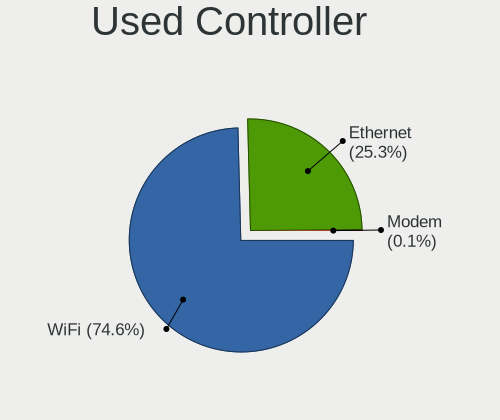

| Kind     | Notebooks | Percent |
|----------|-----------|---------|
| WiFi     | 599       | 64.76%  |
| Ethernet | 326       | 35.24%  |

NICs
----

Total network controllers on board

| Total | Notebooks | Percent |
|-------|-----------|---------|
| 2     | 542       | 76.88%  |
| 1     | 147       | 20.85%  |
| 0     | 14        | 1.99%   |
| 3     | 2         | 0.28%   |

IPv6
----

IPv6 vs IPv4

| Used | Notebooks | Percent |
|------|-----------|---------|
| No   | 586       | 81.62%  |
| Yes  | 132       | 18.38%  |

Bluetooth
---------

Bluetooth Vendor
----------------

Controller vendors

| Vendor                          | Notebooks | Percent |
|---------------------------------|-----------|---------|
| Intel                           | 196       | 40.92%  |
| Realtek Semiconductor           | 57        | 11.9%   |
| Qualcomm Atheros Communications | 34        | 7.1%    |
| Lite-On Technology              | 33        | 6.89%   |
| IMC Networks                    | 33        | 6.89%   |
| Broadcom                        | 30        | 6.26%   |
| Foxconn / Hon Hai               | 23        | 4.8%    |
| Apple                           | 14        | 2.92%   |
| Toshiba                         | 12        | 2.51%   |
| Hewlett-Packard                 | 12        | 2.51%   |
| ASUSTek Computer                | 8         | 1.67%   |
| Dell                            | 7         | 1.46%   |
| Realtek                         | 5         | 1.04%   |
| Ralink                          | 4         | 0.84%   |
| Alps Electric                   | 4         | 0.84%   |
| Cambridge Silicon Radio         | 3         | 0.63%   |
| Ralink Technology               | 2         | 0.42%   |
| Foxconn International           | 1         | 0.21%   |
| Chicony Electronics             | 1         | 0.21%   |

Bluetooth Model
---------------

Controller models

| Model                                                                               | Notebooks | Percent |
|-------------------------------------------------------------------------------------|-----------|---------|
| Intel Bluetooth wireless interface                                                  | 79        | 16.49%  |
| Realtek Bluetooth Radio                                                             | 39        | 8.14%   |
| Intel Bluetooth 9460/9560 Jefferson Peak (JfP)                                      | 33        | 6.89%   |
| Intel AX201 Bluetooth                                                               | 31        | 6.47%   |
| Intel AX200 Bluetooth                                                               | 29        | 6.05%   |
| IMC Networks Bluetooth Device                                                       | 21        | 4.38%   |
| Qualcomm Atheros AR3011 Bluetooth                                                   | 12        | 2.51%   |
| Qualcomm Atheros  Bluetooth Device                                                  | 11        | 2.3%    |
| HP Bluetooth 2.0 Interface [Broadcom BCM2045]                                       | 10        | 2.09%   |
| Lite-On Qualcomm Atheros QCA9377 Bluetooth                                          | 9         | 1.88%   |
| Lite-On Atheros AR3012 Bluetooth                                                    | 9         | 1.88%   |
| Intel Centrino Bluetooth Wireless Transceiver                                       | 9         | 1.88%   |
| Realtek  Bluetooth 4.2 Adapter                                                      | 8         | 1.67%   |
| Lite-On Bluetooth Device                                                            | 8         | 1.67%   |
| Foxconn / Hon Hai Bluetooth Device                                                  | 8         | 1.67%   |
| Intel Wireless-AC 9260 Bluetooth Adapter                                            | 7         | 1.46%   |
| Apple Bluetooth Host Controller                                                     | 7         | 1.46%   |
| Qualcomm Atheros AR3012 Bluetooth 4.0                                               | 6         | 1.25%   |
| IMC Networks Bluetooth Radio                                                        | 6         | 1.25%   |
| Apple Bluetooth USB Host Controller                                                 | 6         | 1.25%   |
| Realtek Bluetooth Radio                                                             | 5         | 1.04%   |
| Lite-On BCM43142A0                                                                  | 5         | 1.04%   |
| Realtek RTL8821A Bluetooth                                                          | 4         | 0.84%   |
| Ralink RT3290 Bluetooth                                                             | 4         | 0.84%   |
| Qualcomm Atheros QCA61x4 Bluetooth 4.0                                              | 4         | 0.84%   |
| Intel Bluetooth Device                                                              | 4         | 0.84%   |
| Foxconn / Hon Hai Foxconn T77H114 BCM2070 [Single-Chip Bluetooth 2.1 + EDR Adapter] | 4         | 0.84%   |
| Broadcom BCM20702 Bluetooth 4.0 [ThinkPad]                                          | 4         | 0.84%   |
| Broadcom BCM2045B (BDC-2.1) [Bluetooth Controller]                                  | 4         | 0.84%   |
| Toshiba Askey Bluetooth Module                                                      | 3         | 0.63%   |
| Realtek 802.11n WLAN Adapter                                                        | 3         | 0.63%   |
| Intel Wireless-AC 3168 Bluetooth                                                    | 3         | 0.63%   |
| Foxconn / Hon Hai BCM43142A0 broadcom bluetooth                                     | 3         | 0.63%   |
| Dell DW375 Bluetooth Module                                                         | 3         | 0.63%   |
| Cambridge Silicon Radio Bluetooth Dongle (HCI mode)                                 | 3         | 0.63%   |
| Broadcom HP Portable SoftSailing                                                    | 3         | 0.63%   |
| Broadcom BCM43142A0 Bluetooth 4.0                                                   | 3         | 0.63%   |
| Broadcom BCM2045B (BDC-2.1)                                                         | 3         | 0.63%   |
| Toshiba RT Bluetooth Radio                                                          | 2         | 0.42%   |
| Toshiba Integrated Bluetooth HCI                                                    | 2         | 0.42%   |
| Toshiba Bluetooth Device                                                            | 2         | 0.42%   |
| Toshiba BCM43142A0                                                                  | 2         | 0.42%   |
| Realtek RTL8723B Bluetooth                                                          | 2         | 0.42%   |
| Ralink CSR BS8510                                                                   | 2         | 0.42%   |
| Lite-On Qualcomm Atheros Bluetooth                                                  | 2         | 0.42%   |
| IMC Networks Wireless_Device                                                        | 2         | 0.42%   |
| IMC Networks Bluetooth module                                                       | 2         | 0.42%   |
| IMC Networks Atheros AR3012 Bluetooth 4.0 Adapter                                   | 2         | 0.42%   |
| HP Broadcom 2070 Bluetooth Combo                                                    | 2         | 0.42%   |
| Foxconn / Hon Hai BCM43142A0                                                        | 2         | 0.42%   |
| Foxconn / Hon Hai BCM2045A0                                                         | 2         | 0.42%   |
| Dell Wireless 365 Bluetooth                                                         | 2         | 0.42%   |
| Broadcom HP Portable Valentine                                                      | 2         | 0.42%   |
| Broadcom Bluetooth                                                                  | 2         | 0.42%   |
| Broadcom BCM43142A0 Bluetooth Device                                                | 2         | 0.42%   |
| Broadcom BCM20702A0                                                                 | 2         | 0.42%   |
| ASUS BT-270 Bluetooth Adapter                                                       | 2         | 0.42%   |
| ASUS BT-253 Bluetooth Adapter                                                       | 2         | 0.42%   |
| ASUS BT-183 Bluetooth 2.0+EDR adapter                                               | 2         | 0.42%   |
| Toshiba Askey for                                                                   | 1         | 0.21%   |

Sound
-----

Sound Vendor
------------

Sound card vendors

| Vendor                           | Notebooks | Percent |
|----------------------------------|-----------|---------|
| Intel                            | 561       | 65.85%  |
| AMD                              | 143       | 16.78%  |
| Nvidia                           | 93        | 10.92%  |
| Silicon Integrated Systems [SiS] | 12        | 1.41%   |
| GN Netcom                        | 5         | 0.59%   |
| C-Media Electronics              | 5         | 0.59%   |
| Creative Technology              | 4         | 0.47%   |
| Texas Instruments                | 2         | 0.23%   |
| Realtek Semiconductor            | 2         | 0.23%   |
| Razer USA                        | 2         | 0.23%   |
| Lenovo                           | 2         | 0.23%   |
| Kingston Technology              | 2         | 0.23%   |
| Hewlett-Packard                  | 2         | 0.23%   |
| Generalplus Technology           | 2         | 0.23%   |
| XMOS                             | 1         | 0.12%   |
| Trust                            | 1         | 0.12%   |
| Sennheiser Communications        | 1         | 0.12%   |
| Plantronics                      | 1         | 0.12%   |
| Logitech                         | 1         | 0.12%   |
| JMTek                            | 1         | 0.12%   |
| GYROCOM C&C                      | 1         | 0.12%   |
| ESS Technology                   | 1         | 0.12%   |
| EGO SYStems                      | 1         | 0.12%   |
| Dell                             | 1         | 0.12%   |
| Corsair                          | 1         | 0.12%   |
| Conexant Systems                 | 1         | 0.12%   |
| Conexant                         | 1         | 0.12%   |
| BEHRINGER International          | 1         | 0.12%   |
| Apple                            | 1         | 0.12%   |

Sound Model
-----------

Sound card models

| Model                                                                                             | Notebooks | Percent |
|---------------------------------------------------------------------------------------------------|-----------|---------|
| Intel Sunrise Point-LP HD Audio                                                                   | 57        | 5.64%   |
| Intel 82801I (ICH9 Family) HD Audio Controller                                                    | 55        | 5.44%   |
| AMD Family 17h/19h HD Audio Controller                                                            | 54        | 5.34%   |
| Intel 7 Series/C216 Chipset Family High Definition Audio Controller                               | 52        | 5.14%   |
| Intel 82801H (ICH8 Family) HD Audio Controller                                                    | 47        | 4.65%   |
| Intel 6 Series/C200 Series Chipset Family High Definition Audio Controller                        | 45        | 4.45%   |
| Intel 5 Series/3400 Series Chipset High Definition Audio                                          | 42        | 4.15%   |
| AMD FCH Azalia Controller                                                                         | 34        | 3.36%   |
| Intel Cannon Point-LP High Definition Audio Controller                                            | 30        | 2.97%   |
| Intel Haswell-ULT HD Audio Controller                                                             | 29        | 2.87%   |
| Intel 8 Series HD Audio Controller                                                                | 29        | 2.87%   |
| Intel Tiger Lake-LP Smart Sound Technology Audio Controller                                       | 25        | 2.47%   |
| Intel NM10/ICH7 Family High Definition Audio Controller                                           | 24        | 2.37%   |
| AMD Raven/Raven2/Fenghuang HDMI/DP Audio Controller                                               | 24        | 2.37%   |
| Intel Cannon Lake PCH cAVS                                                                        | 23        | 2.27%   |
| Intel Broadwell-U Audio Controller                                                                | 23        | 2.27%   |
| AMD Kabini HDMI/DP Audio                                                                          | 23        | 2.27%   |
| Intel Wildcat Point-LP High Definition Audio Controller                                           | 22        | 2.18%   |
| Intel Comet Lake PCH-LP cAVS                                                                      | 20        | 1.98%   |
| Intel 8 Series/C220 Series Chipset High Definition Audio Controller                               | 19        | 1.88%   |
| Intel Xeon E3-1200 v3/4th Gen Core Processor HD Audio Controller                                  | 16        | 1.58%   |
| AMD Renoir Radeon High Definition Audio Controller                                                | 16        | 1.58%   |
| Intel Atom Processor Z36xxx/Z37xxx Series High Definition Audio Controller                        | 13        | 1.29%   |
| Intel 100 Series/C230 Series Chipset Family HD Audio Controller                                   | 13        | 1.29%   |
| Nvidia TU107 GeForce GTX 1650 High Definition Audio Controller                                    | 12        | 1.19%   |
| AMD Cedar HDMI Audio [Radeon HD 5400/6300/7300 Series]                                            | 12        | 1.19%   |
| Silicon Integrated Systems [SiS] Azalia Audio Controller                                          | 11        | 1.09%   |
| AMD Family 15h (Models 60h-6fh) Audio Controller                                                  | 11        | 1.09%   |
| AMD High Definition Audio Controller                                                              | 10        | 0.99%   |
| Nvidia GP107GL High Definition Audio Controller                                                   | 9         | 0.89%   |
| Intel Comet Lake PCH cAVS                                                                         | 9         | 0.89%   |
| Intel Atom/Celeron/Pentium Processor x5-E8000/J3xxx/N3xxx Series High Definition Audio Controller | 9         | 0.89%   |
| AMD RV710/730 HDMI Audio [Radeon HD 4000 series]                                                  | 9         | 0.89%   |
| Nvidia High Definition Audio Controller                                                           | 8         | 0.79%   |
| Nvidia GM107 High Definition Audio Controller [GeForce 940MX]                                     | 7         | 0.69%   |
| Nvidia GF108 High Definition Audio Controller                                                     | 7         | 0.69%   |
| Intel CM238 HD Audio Controller                                                                   | 7         | 0.69%   |
| AMD Redwood HDMI Audio [Radeon HD 5000 Series]                                                    | 7         | 0.69%   |
| Nvidia GK208 HDMI/DP Audio Controller                                                             | 6         | 0.59%   |
| AMD SBx00 Azalia (Intel HDA)                                                                      | 6         | 0.59%   |
| Nvidia TU106 High Definition Audio Controller                                                     | 5         | 0.49%   |
| AMD Kaveri HDMI/DP Audio Controller                                                               | 5         | 0.49%   |
| Nvidia TU116 High Definition Audio Controller                                                     | 4         | 0.4%    |
| Nvidia GT216 HDMI Audio Controller                                                                | 4         | 0.4%    |
| Nvidia GK107 HDMI Audio Controller                                                                | 4         | 0.4%    |
| Intel Celeron/Pentium Silver Processor High Definition Audio                                      | 4         | 0.4%    |
| Intel 82801FB/FBM/FR/FW/FRW (ICH6 Family) AC'97 Audio Controller                                  | 4         | 0.4%    |
| AMD Wrestler HDMI Audio                                                                           | 4         | 0.4%    |
| AMD RV610 HDMI Audio [Radeon HD 2350 PRO / 2400 PRO/XT / HD 3410]                                 | 4         | 0.4%    |
| Nvidia MCP89 High Definition Audio                                                                | 3         | 0.3%    |
| Nvidia MCP72XE/MCP72P/MCP78U/MCP78S High Definition Audio                                         | 3         | 0.3%    |
| Nvidia GP106 High Definition Audio Controller                                                     | 3         | 0.3%    |
| Nvidia GF106 High Definition Audio Controller                                                     | 3         | 0.3%    |
| Nvidia GA104 High Definition Audio Controller                                                     | 3         | 0.3%    |
| Nvidia Audio device                                                                               | 3         | 0.3%    |
| Intel Ice Lake-LP Smart Sound Technology Audio Controller                                         | 3         | 0.3%    |
| Intel Celeron N3350/Pentium N4200/Atom E3900 Series Audio Cluster                                 | 3         | 0.3%    |
| AMD Trinity HDMI Audio Controller                                                                 | 3         | 0.3%    |
| Realtek Semiconductor USB Audio                                                                   | 2         | 0.2%    |
| Nvidia MCP67 High Definition Audio                                                                | 2         | 0.2%    |

Memory
------

Memory Vendor
-------------

Memory module vendors

| Vendor              | Notebooks | Percent |
|---------------------|-----------|---------|
| Samsung Electronics | 109       | 30.19%  |
| SK Hynix            | 76        | 21.05%  |
| Unknown             | 56        | 15.51%  |
| Micron Technology   | 34        | 9.42%   |
| Kingston            | 30        | 8.31%   |
| Ramaxel Technology  | 10        | 2.77%   |
| G.Skill             | 9         | 2.49%   |
| Crucial             | 7         | 1.94%   |
| Corsair             | 5         | 1.39%   |
| A-DATA Technology   | 5         | 1.39%   |
| Elpida              | 4         | 1.11%   |
| Nanya Technology    | 3         | 0.83%   |
| Transcend           | 2         | 0.55%   |
| Unknown (ABCD)      | 1         | 0.28%   |
| Unigen              | 1         | 0.28%   |
| Toshiba             | 1         | 0.28%   |
| Teikon              | 1         | 0.28%   |
| Team                | 1         | 0.28%   |
| Netlist             | 1         | 0.28%   |
| GOODRAM             | 1         | 0.28%   |
| Essencore Limited   | 1         | 0.28%   |
| Apacer              | 1         | 0.28%   |
| 48spaces            | 1         | 0.28%   |
| Unknown             | 1         | 0.28%   |

Memory Model
------------

Memory module models

| Model                                                        | Notebooks | Percent |
|--------------------------------------------------------------|-----------|---------|
| Unknown RAM Module 2GB SODIMM DDR2                           | 19        | 4.99%   |
| SK Hynix RAM HMA81GS6AFR8N-UH 8GB SODIMM DDR4 2667MT/s       | 10        | 2.62%   |
| Samsung RAM M471A2K43CB1-CTD 16GB SODIMM DDR4 2667MT/s       | 6         | 1.57%   |
| Samsung RAM M471B5173DB0-YK0 4096MB SODIMM DDR3 1600MT/s     | 5         | 1.31%   |
| Samsung RAM M471B1G73QH0-YK0 8GB SODIMM DDR3 1600MT/s        | 5         | 1.31%   |
| Samsung RAM M471A2K43DB1-CTD 16GB SODIMM DDR4 2667MT/s       | 5         | 1.31%   |
| Samsung RAM M471A1K43CB1-CRC 8GB SODIMM DDR4 2667MT/s        | 5         | 1.31%   |
| Samsung RAM M471B5273DH0-CH9 4GB SODIMM DDR3 1334MT/s        | 4         | 1.05%   |
| Samsung RAM M471B5273CH0-CH9 4096MB SODIMM DDR3 1334MT/s     | 4         | 1.05%   |
| Unknown RAM Module 2048MB SODIMM DDR2                        | 3         | 0.79%   |
| Unknown RAM Module 1024MB SODIMM DDR2                        | 3         | 0.79%   |
| SK Hynix RAM HMA851S6CJR6N-VK 4GB Row Of Chips DDR4 2667MT/s | 3         | 0.79%   |
| SK Hynix RAM HMA851S6AFR6N-UH 4GB SODIMM DDR4 2667MT/s       | 3         | 0.79%   |
| SK Hynix RAM HMA81GS6JJR8N-VK 8GB SODIMM DDR4 2667MT/s       | 3         | 0.79%   |
| Samsung RAM M471B5273CH0-CK0 4GB SODIMM DDR3 1600MT/s        | 3         | 0.79%   |
| Samsung RAM M471A5244CB0-CTD 4GB SODIMM DDR4 3266MT/s        | 3         | 0.79%   |
| Samsung RAM M471A5244CB0-CRC 4096MB SODIMM DDR4 2667MT/s     | 3         | 0.79%   |
| Samsung RAM M471A2K43DB1-CWE 16GB SODIMM DDR4 3200MT/s       | 3         | 0.79%   |
| Samsung RAM M471A2K43CB1-CRC 16GB SODIMM DDR4 2667MT/s       | 3         | 0.79%   |
| Micron RAM 8ATF1G64HZ-2G6E1 8192MB SODIMM DDR4 2667MT/s      | 3         | 0.79%   |
| Micron RAM 8ATF1G64HZ-2G3B1 8GB SODIMM DDR4 2400MT/s         | 3         | 0.79%   |
| Unknown RAM Module 8192MB SODIMM DDR3 1333MT/s               | 2         | 0.52%   |
| Unknown RAM Module 4096MB SODIMM DDR3                        | 2         | 0.52%   |
| Unknown RAM Module 2048MB SODIMM DDR3                        | 2         | 0.52%   |
| Unknown RAM Module 2048MB SODIMM DDR2 667MT/s                | 2         | 0.52%   |
| Unknown RAM Module 1024MB SODIMM SDRAM                       | 2         | 0.52%   |
| Unknown RAM Module 1024MB SODIMM DDR2 667MT/s                | 2         | 0.52%   |
| SK Hynix RAM HMT451S6DFR8A-PB 4GB SODIMM DDR3 1600MT/s       | 2         | 0.52%   |
| SK Hynix RAM HMT451S6CFR6A-PB 4GB SODIMM DDR3 1600MT/s       | 2         | 0.52%   |
| SK Hynix RAM HMT41GS6BFR8A-PB 8GB SODIMM DDR3 1600MT/s       | 2         | 0.52%   |
| SK Hynix RAM HMT41GS6AFR8A-PB 8192MB SODIMM DDR3 1600MT/s    | 2         | 0.52%   |
| SK Hynix RAM HMT351S6CFR8C-PB 4GB SODIMM DDR3 1600MT/s       | 2         | 0.52%   |
| SK Hynix RAM HMT351S6AFR8C-G7 4GB SODIMM DDR3 1067MT/s       | 2         | 0.52%   |
| SK Hynix RAM HMAA1GS6CJR6N-XN 8GB SODIMM DDR4 3200MT/s       | 2         | 0.52%   |
| SK Hynix RAM HMA851S6AFR6N-UH 4GB SODIMM DDR4 2400MT/s       | 2         | 0.52%   |
| SK Hynix RAM HMA82GS6CJR8N-VK 16GB SODIMM DDR4 2667MT/s      | 2         | 0.52%   |
| SK Hynix RAM HMA81GS6DJR8N-XN 8GB SODIMM DDR4 3200MT/s       | 2         | 0.52%   |
| Samsung RAM Module 16GB SODIMM DDR4 2667MT/s                 | 2         | 0.52%   |
| Samsung RAM M471B5773CHS-CH9 2GB SODIMM DDR3 4199MT/s        | 2         | 0.52%   |
| Samsung RAM M471B5673FH0-CH9 2048MB SODIMM DDR3 1334MT/s     | 2         | 0.52%   |
| Samsung RAM M471B5673EH1-CF8 2048MB SODIMM DDR3 4199MT/s     | 2         | 0.52%   |
| Samsung RAM M471B5173BH0-CK0 4GB SODIMM DDR3 1600MT/s        | 2         | 0.52%   |
| Samsung RAM M471B1G73EB0-YK0 8192MB SODIMM DDR3 1600MT/s     | 2         | 0.52%   |
| Samsung RAM M471A4G43AB1-CWE 32GB SODIMM DDR4 3200MT/s       | 2         | 0.52%   |
| Samsung RAM M471A1K43DB1-CWE 8GB SODIMM DDR4 3200MT/s        | 2         | 0.52%   |
| Samsung RAM M471A1K43DB1-CTD 8GB SODIMM DDR4 2667MT/s        | 2         | 0.52%   |
| Samsung RAM M471A1K43BB1-CRC 8GB SODIMM DDR4 2667MT/s        | 2         | 0.52%   |
| Samsung RAM M471A1G44AB0-CWE 8GB SODIMM DDR4 3200MT/s        | 2         | 0.52%   |
| Samsung RAM M471A1G43DB0-CPB 8GB SODIMM DDR4 2400MT/s        | 2         | 0.52%   |
| Samsung RAM K4EBE304EC-EGCG 8GB Row Of Chips LPDDR3 2133MT/s | 2         | 0.52%   |
| Samsung RAM K4E6E304EC-EGCG 4GB Row Of Chips LPDDR3 2133MT/s | 2         | 0.52%   |
| Ramaxel RAM RMSA3260MD78HAF-2666 8192MB SODIMM DDR4 2667MT/s | 2         | 0.52%   |
| Micron RAM 8KTF51264HZ-1G6N1 4096MB SODIMM DDR3 1600MT/s     | 2         | 0.52%   |
| Micron RAM 4ATS2G64HZ-3G2B1 16GB SODIMM DDR4 3200MT/s        | 2         | 0.52%   |
| Micron RAM 4ATF51264HZ-2G6E1 4096MB SODIMM DDR4 2667MT/s     | 2         | 0.52%   |
| Kingston RAM K821PJ-MIH 16GB SODIMM DDR4 2400MT/s            | 2         | 0.52%   |
| Kingston RAM HP536727-H41-ELD 4GB SODIMM DDR3 1600MT/s       | 2         | 0.52%   |
| Kingston RAM ACR16D3LS1KNG/8G 8GB SODIMM DDR3 1600MT/s       | 2         | 0.52%   |
| Kingston RAM 99U5428-018.A00LF 8192MB SODIMM DDR3 1600MT/s   | 2         | 0.52%   |
| G.Skill RAM F4-2666C19-8GRS 8GB SODIMM DDR4 2667MT/s         | 2         | 0.52%   |

Memory Kind
-----------

Memory module kinds

| Kind    | Notebooks | Percent |
|---------|-----------|---------|
| DDR4    | 140       | 44.73%  |
| DDR3    | 96        | 30.67%  |
| DDR2    | 41        | 13.1%   |
| LPDDR3  | 12        | 3.83%   |
| SDRAM   | 9         | 2.88%   |
| LPDDR4  | 9         | 2.88%   |
| DDR     | 3         | 0.96%   |
| Unknown | 3         | 0.96%   |

Memory Form Factor
------------------

Physical design of the memory module

| Name         | Notebooks | Percent |
|--------------|-----------|---------|
| SODIMM       | 282       | 90.97%  |
| Row Of Chips | 25        | 8.06%   |
| Chip         | 2         | 0.65%   |
| DIMM         | 1         | 0.32%   |

Memory Size
-----------

Memory module size

| Size    | Notebooks | Percent |
|---------|-----------|---------|
| 8192    | 102       | 30.09%  |
| 4096    | 91        | 26.84%  |
| 2048    | 61        | 17.99%  |
| 16384   | 53        | 15.63%  |
| 1024    | 18        | 5.31%   |
| 32768   | 9         | 2.65%   |
| 512     | 4         | 1.18%   |
| Unknown | 1         | 0.29%   |

Memory Speed
------------

Memory module speed

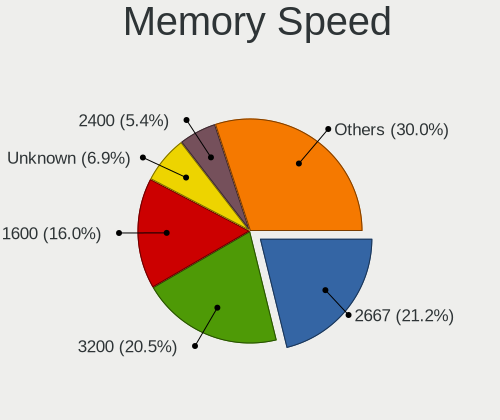

| Speed   | Notebooks | Percent |
|---------|-----------|---------|
| 2667    | 80        | 24.24%  |
| 1600    | 61        | 18.48%  |
| 3200    | 37        | 11.21%  |
| Unknown | 37        | 11.21%  |
| 2400    | 22        | 6.67%   |
| 2133    | 18        | 5.45%   |
| 1334    | 16        | 4.85%   |
| 667     | 11        | 3.33%   |
| 1333    | 10        | 3.03%   |
| 4199    | 5         | 1.52%   |
| 4267    | 4         | 1.21%   |
| 1067    | 4         | 1.21%   |
| 800     | 4         | 1.21%   |
| 3266    | 3         | 0.91%   |
| 1867    | 3         | 0.91%   |
| 1066    | 3         | 0.91%   |
| 533     | 3         | 0.91%   |
| 2933    | 2         | 0.61%   |
| 1200    | 2         | 0.61%   |
| 8400    | 1         | 0.3%    |
| 4800    | 1         | 0.3%    |
| 3733    | 1         | 0.3%    |
| 2048    | 1         | 0.3%    |
| 1866    | 1         | 0.3%    |

Printers & scanners
-------------------

Printer Vendor
--------------

Printer device vendors

| Vendor                 | Notebooks | Percent |
|------------------------|-----------|---------|
| Hewlett-Packard        | 3         | 60%     |
| Samsung Electronics    | 1         | 20%     |
| Panasonic (Matsushita) | 1         | 20%     |

Printer Model
-------------

Printer device models

| Model                                | Notebooks | Percent |
|--------------------------------------|-----------|---------|
| Samsung ML-1640 Series Laser Printer | 1         | 20%     |
| Panasonic (Matsushita) KX-FLB851SP   | 1         | 20%     |
| HP DeskJet F4100 Printer series      | 1         | 20%     |
| HP Deskjet 3050A                     | 1         | 20%     |
| HP DeskJet 2130 series               | 1         | 20%     |

Scanner Vendor
--------------

Scanner device vendors

Zero info for selected period =(

Scanner Model
-------------

Scanner device models

Zero info for selected period =(

Camera
------

Camera Vendor
-------------

Camera device vendors

| Vendor                                 | Notebooks | Percent |
|----------------------------------------|-----------|---------|
| Chicony Electronics                    | 190       | 30.35%  |
| IMC Networks                           | 73        | 11.66%  |
| Acer                                   | 46        | 7.35%   |
| Suyin                                  | 41        | 6.55%   |
| Realtek Semiconductor                  | 38        | 6.07%   |
| Quanta                                 | 32        | 5.11%   |
| Microdia                               | 28        | 4.47%   |
| Ricoh                                  | 26        | 4.15%   |
| Lite-On Technology                     | 20        | 3.19%   |
| Cheng Uei Precision Industry (Foxlink) | 19        | 3.04%   |
| Sunplus Innovation Technology          | 18        | 2.88%   |
| Syntek                                 | 17        | 2.72%   |
| Apple                                  | 10        | 1.6%    |
| Silicon Motion                         | 9         | 1.44%   |
| Luxvisions Innotech Limited            | 8         | 1.28%   |
| Lenovo                                 | 7         | 1.12%   |
| Importek                               | 6         | 0.96%   |
| Alcor Micro                            | 6         | 0.96%   |
| Z-Star Microelectronics                | 3         | 0.48%   |
| Samsung Electronics                    | 3         | 0.48%   |
| Logitech                               | 3         | 0.48%   |
| Generalplus Technology                 | 3         | 0.48%   |
| ALi                                    | 3         | 0.48%   |
| Microsoft                              | 2         | 0.32%   |
| DigiTech                               | 2         | 0.32%   |
| Y Media                                | 1         | 0.16%   |
| Primax Electronics                     | 1         | 0.16%   |
| OmniVision Technologies                | 1         | 0.16%   |
| Mustek Systems                         | 1         | 0.16%   |
| MacroSilicon                           | 1         | 0.16%   |
| lihappe8                               | 1         | 0.16%   |
| kingcome                               | 1         | 0.16%   |
| Intel                                  | 1         | 0.16%   |
| Genesys Logic                          | 1         | 0.16%   |
| Gearway Electronics (Dong Guan)        | 1         | 0.16%   |
| Creative Technology                    | 1         | 0.16%   |
| Conexant Systems                       | 1         | 0.16%   |
| 8SSC20F27114V1GZ07N14V2                | 1         | 0.16%   |

Camera Model
------------

Camera device models

| Model                                                                      | Notebooks | Percent |
|----------------------------------------------------------------------------|-----------|---------|
| Chicony Integrated Camera                                                  | 20        | 3.18%   |
| IMC Networks USB2.0 HD UVC WebCam                                          | 18        | 2.86%   |
| Chicony HD Webcam                                                          | 18        | 2.86%   |
| Ricoh Visual Communication Camera VGP-VCC8 [R5U870]                        | 17        | 2.7%    |
| IMC Networks Integrated Camera                                             | 17        | 2.7%    |
| Chicony USB2.0 VGA UVC WebCam                                              | 13        | 2.07%   |
| Chicony CNF9055 Toshiba Webcam                                             | 13        | 2.07%   |
| Realtek USB Camera                                                         | 12        | 1.91%   |
| Suyin Acer/HP Integrated Webcam [CN0314]                                   | 10        | 1.59%   |
| IMC Networks USB2.0 VGA UVC WebCam                                         | 10        | 1.59%   |
| Chicony USB 2.0 Camera                                                     | 10        | 1.59%   |
| Chicony TOSHIBA Web Camera - HD                                            | 10        | 1.59%   |
| Acer Integrated Camera                                                     | 10        | 1.59%   |
| Microdia Integrated_Webcam_HD                                              | 9         | 1.43%   |
| Quanta HP Wide Vision HD Camera                                            | 8         | 1.27%   |
| Realtek HD WebCam                                                          | 7         | 1.11%   |
| Quanta HP TrueVision HD Camera                                             | 7         | 1.11%   |
| Lite-On Integrated Camera                                                  | 7         | 1.11%   |
| Chicony HP Truevision HD                                                   | 7         | 1.11%   |
| Chicony HP HD Camera                                                       | 7         | 1.11%   |
| Chicony VGA Webcam                                                         | 6         | 0.95%   |
| Chicony USB2.0 HD UVC WebCam                                               | 6         | 0.95%   |
| Syntek Integrated Camera                                                   | 5         | 0.79%   |
| Realtek USB2.0 VGA UVC WebCam                                              | 5         | 0.79%   |
| Realtek Integrated_Webcam_HD                                               | 5         | 0.79%   |
| Lite-On TOSHIBA Web Camera - HD                                            | 5         | 0.79%   |
| IMC Networks ov9734_azurewave_camera                                       | 5         | 0.79%   |
| Chicony Webcam                                                             | 5         | 0.79%   |
| Chicony USB2.0 Camera                                                      | 5         | 0.79%   |
| Chicony Integrated HP HD Webcam                                            | 5         | 0.79%   |
| Chicony HP TrueVision HD Camera                                            | 5         | 0.79%   |
| Acer Lenovo EasyCamera                                                     | 5         | 0.79%   |
| Acer HD Webcam                                                             | 5         | 0.79%   |
| Syntek Lenovo EasyCamera                                                   | 4         | 0.64%   |
| Syntek EasyCamera                                                          | 4         | 0.64%   |
| Suyin USB 2.0 Camera                                                       | 4         | 0.64%   |
| Suyin Acer CrystalEye Webcam                                               | 4         | 0.64%   |
| Sunplus HD WebCam                                                          | 4         | 0.64%   |
| Sunplus ASUS USB2.0 Webcam                                                 | 4         | 0.64%   |
| Quanta VGA WebCam                                                          | 4         | 0.64%   |
| Quanta HP Webcam                                                           | 4         | 0.64%   |
| Microdia USB 2.0 Camera                                                    | 4         | 0.64%   |
| Microdia Sonix USB 2.0 Camera                                              | 4         | 0.64%   |
| Microdia Lenovo EasyCamera                                                 | 4         | 0.64%   |
| Luxvisions Innotech Limited HP TrueVision HD Camera                        | 4         | 0.64%   |
| Lenovo Integrated Webcam                                                   | 4         | 0.64%   |
| IMC Networks TOSHIBA Web Camera - HD                                       | 4         | 0.64%   |
| IMC Networks Integrated Webcam                                             | 4         | 0.64%   |
| Chicony Integrated Camera (1280x720@30)                                    | 4         | 0.64%   |
| Chicony HP Wide Vision HD Camera                                           | 4         | 0.64%   |
| Chicony EasyCamera                                                         | 4         | 0.64%   |
| Chicony 2.0M UVC Webcam / CNF7129                                          | 4         | 0.64%   |
| Cheng Uei Precision Industry (Foxlink) HP Wide Vision HD integrated webcam | 4         | 0.64%   |
| Cheng Uei Precision Industry (Foxlink) HP Truevision HD                    | 4         | 0.64%   |
| Apple FaceTime HD Camera                                                   | 4         | 0.64%   |
| Suyin HP Truevision HD                                                     | 3         | 0.48%   |
| Suyin 1.3M HD WebCam                                                       | 3         | 0.48%   |
| Sunplus Integrated_Webcam_HD                                               | 3         | 0.48%   |
| Samsung Galaxy A5 (MTP)                                                    | 3         | 0.48%   |
| Quanta HP HD Camera                                                        | 3         | 0.48%   |

Security
--------

Fingerprint Vendor
------------------

Fingerprint sensor vendors

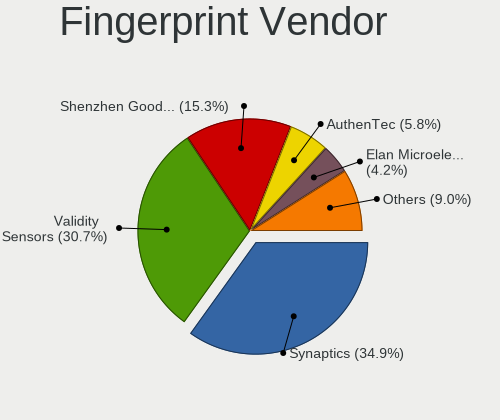

| Vendor                     | Notebooks | Percent |
|----------------------------|-----------|---------|
| Synaptics                  | 33        | 33.67%  |
| Validity Sensors           | 28        | 28.57%  |
| Shenzhen Goodix Technology | 12        | 12.24%  |
| AuthenTec                  | 9         | 9.18%   |
| Upek                       | 6         | 6.12%   |
| Elan Microelectronics      | 6         | 6.12%   |
| LighTuning Technology      | 3         | 3.06%   |
| STMicroelectronics         | 1         | 1.02%   |

Fingerprint Model
-----------------

Fingerprint sensor models

| Model                                                                      | Notebooks | Percent |
|----------------------------------------------------------------------------|-----------|---------|
| Synaptics Prometheus MIS Touch Fingerprint Reader                          | 9         | 9.18%   |
| Unknown                                                                    | 9         | 9.18%   |
| Shenzhen Goodix  Fingerprint Device                                        | 8         | 8.16%   |
| Upek Biometric Touchchip/Touchstrip Fingerprint Sensor                     | 5         | 5.1%    |
| Synaptics Metallica MIS Touch Fingerprint Reader                           | 5         | 5.1%    |
| Validity Sensors VFS101 Fingerprint Reader                                 | 4         | 4.08%   |
| Synaptics  VFS7552 Touch Fingerprint Sensor with PurePrint                 | 4         | 4.08%   |
| Validity Sensors VFS7500 Touch Fingerprint Sensor                          | 3         | 3.06%   |
| Validity Sensors VFS301 Fingerprint Reader                                 | 3         | 3.06%   |
| Validity Sensors Fingerprint scanner                                       | 3         | 3.06%   |
| Synaptics Metallica MOH Touch Fingerprint Reader                           | 3         | 3.06%   |
| Shenzhen Goodix Fingerprint Reader                                         | 3         | 3.06%   |
| Elan ELAN:Fingerprint                                                      | 3         | 3.06%   |
| Elan ELAN:ARM-M4                                                           | 3         | 3.06%   |
| AuthenTec AES2810                                                          | 3         | 3.06%   |
| AuthenTec AES1600                                                          | 3         | 3.06%   |
| Validity Sensors VFS491                                                    | 2         | 2.04%   |
| Validity Sensors VFS Fingerprint sensor                                    | 2         | 2.04%   |
| Validity Sensors VFS 5011 fingerprint sensor                               | 2         | 2.04%   |
| Validity Sensors Synaptics VFS7552 Touch Fingerprint Sensor with PurePrint | 2         | 2.04%   |
| Validity Sensors Swipe Fingerprint Sensor                                  | 2         | 2.04%   |
| Synaptics  FS7604 Touch Fingerprint Sensor with PurePrint                  | 2         | 2.04%   |
| LighTuning ES603 Swipe Fingerprint Sensor                                  | 2         | 2.04%   |
| AuthenTec Fingerprint Sensor                                               | 2         | 2.04%   |
| Validity Sensors VFS5011 Fingerprint Reader                                | 1         | 1.02%   |
| Validity Sensors VFS495 Fingerprint Reader                                 | 1         | 1.02%   |
| Validity Sensors VFS471 Fingerprint Reader                                 | 1         | 1.02%   |
| Validity Sensors VFS451 Fingerprint Reader                                 | 1         | 1.02%   |
| Validity Sensors Synaptics WBDI                                            | 1         | 1.02%   |
| Upek TCS5B Fingerprint sensor                                              | 1         | 1.02%   |
| Synaptics  WBDI                                                            | 1         | 1.02%   |
| STMicroelectronics Fingerprint Reader                                      | 1         | 1.02%   |
| Shenzhen Goodix FingerPrint                                                | 1         | 1.02%   |
| LighTuning Fingerprint Reader                                              | 1         | 1.02%   |
| AuthenTec AES2501 Fingerprint Sensor                                       | 1         | 1.02%   |

Chipcard Vendor
---------------

Chipcard module vendors

| Vendor                | Notebooks | Percent |
|-----------------------|-----------|---------|
| Alcor Micro           | 15        | 39.47%  |
| Broadcom              | 9         | 23.68%  |
| O2 Micro              | 5         | 13.16%  |
| Gemalto (was Gemplus) | 3         | 7.89%   |
| Lenovo                | 2         | 5.26%   |
| Yubico.com            | 1         | 2.63%   |
| Upek                  | 1         | 2.63%   |
| SCM Microsystems      | 1         | 2.63%   |
| Advanced Card Systems | 1         | 2.63%   |

Chipcard Model
--------------

Chipcard module models

| Model                                                                        | Notebooks | Percent |
|------------------------------------------------------------------------------|-----------|---------|
| Alcor Micro AU9540 Smartcard Reader                                          | 15        | 39.47%  |
| O2 Micro OZ776 CCID Smartcard Reader                                         | 4         | 10.53%  |
| Broadcom BCM5880 Secure Applications Processor                               | 4         | 10.53%  |
| Broadcom 58200                                                               | 3         | 7.89%   |
| Lenovo Integrated Smart Card Reader                                          | 2         | 5.26%   |
| Gemalto (was Gemplus) GemPC Twin SmartCard Reader                            | 2         | 5.26%   |
| Yubico.com Yubikey 4/5 U2F+CCID                                              | 1         | 2.63%   |
| Upek TouchChip Fingerprint Coprocessor (WBF advanced mode)                   | 1         | 2.63%   |
| SCM Microsystems SCR3340 - ExpressCard54 Smart Card Reader                   | 1         | 2.63%   |
| O2 Micro Oz776 SmartCard Reader                                              | 1         | 2.63%   |
| Gemalto (was Gemplus) Compact Smart Card Reader Writer                       | 1         | 2.63%   |
| Broadcom BCM5880 Secure Applications Processor with fingerprint swipe sensor | 1         | 2.63%   |
| Broadcom 5880                                                                | 1         | 2.63%   |
| Advanced Card Systems ACR38 SmartCard Reader                                 | 1         | 2.63%   |

Unsupported
-----------

Unsupported Devices
-------------------

Total unsupported devices on board

| Total | Notebooks | Percent |
|-------|-----------|---------|
| 0     | 474       | 65.65%  |
| 1     | 193       | 26.73%  |
| 2     | 39        | 5.4%    |
| 3     | 13        | 1.8%    |
| 4     | 3         | 0.42%   |

Unsupported Device Types
------------------------

Types of unsupported devices

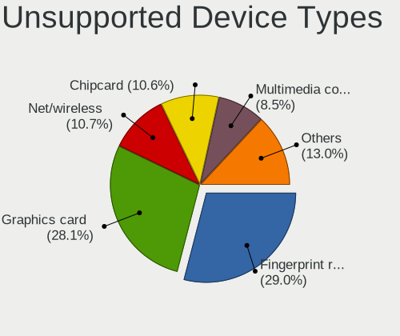

| Type                     | Notebooks | Percent |
|--------------------------|-----------|---------|
| Fingerprint reader       | 97        | 32.01%  |
| Graphics card            | 70        | 23.1%   |
| Net/wireless             | 43        | 14.19%  |
| Chipcard                 | 30        | 9.9%    |
| Multimedia controller    | 18        | 5.94%   |
| Camera                   | 12        | 3.96%   |
| Bluetooth                | 7         | 2.31%   |
| Storage                  | 6         | 1.98%   |
| Card reader              | 6         | 1.98%   |
| Modem                    | 4         | 1.32%   |
| Flash memory             | 4         | 1.32%   |
| Communication controller | 4         | 1.32%   |
| Sound                    | 1         | 0.33%   |
| Network                  | 1         | 0.33%   |

