Linux in Portugal - Tested Hardware & Statistics
------------------------------------------------

A project to collect tested hardware configurations for Linux in Portugal.

Anyone can contribute to this report by the [hw-probe](https://github.com/linuxhw/hw-probe) tool:

    sudo -E hw-probe -all -upload

Please contribute! Especially if your hardware is rare.

This is a report for all computer types. See also reports for [desktops](/Location/Portugal/Desktop/README.md) and [notebooks](/Location/Portugal/Notebook/README.md).

Contents
--------

* [ Test Cases ](#test-cases)

* [ System ](#system)
  - [ OS                       ](#os)
  - [ OS Family                ](#os-family)
  - [ Kernel                   ](#kernel)
  - [ Kernel Family            ](#kernel-family)
  - [ Kernel Major Ver.        ](#kernel-major-ver)
  - [ Arch                     ](#arch)
  - [ DE                       ](#de)
  - [ Display Server           ](#display-server)
  - [ Display Manager          ](#display-manager)
  - [ OS Lang                  ](#os-lang)
  - [ Boot Mode                ](#boot-mode)
  - [ Filesystem               ](#filesystem)
  - [ Part. scheme             ](#part-scheme)
  - [ Dual Boot with Linux/BSD ](#dual-boot-with-linuxbsd)
  - [ Dual Boot (Win)          ](#dual-boot-win)

* [ Board ](#board)
  - [ Vendor                   ](#vendor)
  - [ Model                    ](#model)
  - [ Model Family             ](#model-family)
  - [ MFG Year                 ](#mfg-year)
  - [ Form Factor              ](#form-factor)
  - [ Secure Boot              ](#secure-boot)
  - [ Coreboot                 ](#coreboot)
  - [ RAM Size                 ](#ram-size)
  - [ RAM Used                 ](#ram-used)
  - [ Total Drives             ](#total-drives)
  - [ Has CD-ROM               ](#has-cd-rom)
  - [ Has Ethernet             ](#has-ethernet)
  - [ Has WiFi                 ](#has-wifi)
  - [ Has Bluetooth            ](#has-bluetooth)

* [ Location ](#location)
  - [ Country                  ](#country)
  - [ City                     ](#city)

* [ Drives ](#drives)
  - [ Drive Vendor             ](#drive-vendor)
  - [ Drive Model              ](#drive-model)
  - [ HDD Vendor               ](#hdd-vendor)
  - [ SSD Vendor               ](#ssd-vendor)
  - [ Drive Kind               ](#drive-kind)
  - [ Drive Connector          ](#drive-connector)
  - [ Drive Size               ](#drive-size)
  - [ Space Total              ](#space-total)
  - [ Space Used               ](#space-used)
  - [ Malfunc. Drives          ](#malfunc-drives)
  - [ Malfunc. Drive Vendor    ](#malfunc-drive-vendor)
  - [ Malfunc. HDD Vendor      ](#malfunc-hdd-vendor)
  - [ Malfunc. Drive Kind      ](#malfunc-drive-kind)
  - [ Failed Drives            ](#failed-drives)
  - [ Failed Drive Vendor      ](#failed-drive-vendor)
  - [ Drive Status             ](#drive-status)

* [ Storage controller ](#storage-controller)
  - [ Storage Vendor           ](#storage-vendor)
  - [ Storage Model            ](#storage-model)
  - [ Storage Kind             ](#storage-kind)

* [ Processor ](#processor)
  - [ CPU Vendor               ](#cpu-vendor)
  - [ CPU Model                ](#cpu-model)
  - [ CPU Model Family         ](#cpu-model-family)
  - [ CPU Cores                ](#cpu-cores)
  - [ CPU Sockets              ](#cpu-sockets)
  - [ CPU Threads              ](#cpu-threads)
  - [ CPU Op-Modes             ](#cpu-op-modes)
  - [ CPU Microcode            ](#cpu-microcode)
  - [ CPU Microarch            ](#cpu-microarch)

* [ Graphics ](#graphics)
  - [ GPU Vendor               ](#gpu-vendor)
  - [ GPU Model                ](#gpu-model)
  - [ GPU Combo                ](#gpu-combo)
  - [ GPU Driver               ](#gpu-driver)
  - [ GPU Memory               ](#gpu-memory)

* [ Monitor ](#monitor)
  - [ Monitor Vendor           ](#monitor-vendor)
  - [ Monitor Model            ](#monitor-model)
  - [ Monitor Resolution       ](#monitor-resolution)
  - [ Monitor Diagonal         ](#monitor-diagonal)
  - [ Monitor Width            ](#monitor-width)
  - [ Aspect Ratio             ](#aspect-ratio)
  - [ Monitor Area             ](#monitor-area)
  - [ Pixel Density            ](#pixel-density)
  - [ Multiple Monitors        ](#multiple-monitors)

* [ Network ](#network)
  - [ Net Controller Vendor    ](#net-controller-vendor)
  - [ Net Controller Model     ](#net-controller-model)
  - [ Wireless Vendor          ](#wireless-vendor)
  - [ Wireless Model           ](#wireless-model)
  - [ Ethernet Vendor          ](#ethernet-vendor)
  - [ Ethernet Model           ](#ethernet-model)
  - [ Net Controller Kind      ](#net-controller-kind)
  - [ Used Controller          ](#used-controller)
  - [ NICs                     ](#nics)
  - [ IPv6                     ](#ipv6)

* [ Bluetooth ](#bluetooth)
  - [ Bluetooth Vendor         ](#bluetooth-vendor)
  - [ Bluetooth Model          ](#bluetooth-model)

* [ Sound ](#sound)
  - [ Sound Vendor             ](#sound-vendor)
  - [ Sound Model              ](#sound-model)

* [ Memory ](#memory)
  - [ Memory Vendor            ](#memory-vendor)
  - [ Memory Model             ](#memory-model)
  - [ Memory Kind              ](#memory-kind)
  - [ Memory Form Factor       ](#memory-form-factor)
  - [ Memory Size              ](#memory-size)
  - [ Memory Speed             ](#memory-speed)

* [ Printers & scanners ](#printers--scanners)
  - [ Printer Vendor           ](#printer-vendor)
  - [ Printer Model            ](#printer-model)
  - [ Scanner Vendor           ](#scanner-vendor)
  - [ Scanner Model            ](#scanner-model)

* [ Camera ](#camera)
  - [ Camera Vendor            ](#camera-vendor)
  - [ Camera Model             ](#camera-model)

* [ Security ](#security)
  - [ Fingerprint Vendor       ](#fingerprint-vendor)
  - [ Fingerprint Model        ](#fingerprint-model)
  - [ Chipcard Vendor          ](#chipcard-vendor)
  - [ Chipcard Model           ](#chipcard-model)

* [ Unsupported ](#unsupported)
  - [ Unsupported Devices      ](#unsupported-devices)
  - [ Unsupported Device Types ](#unsupported-device-types)

Test Cases
----------

Total: 1630

| Vendor        | Model                       | Form-Factor | Probe                                                      | Date         |
|---------------|-----------------------------|-------------|------------------------------------------------------------|--------------|
| Chuwi         | GemiBook Pro                | Notebook    | [24fb23a450](https://linux-hardware.org/?probe=24fb23a450) | May 31, 2022 |
| Lenovo        | ThinkPad T530 2394C98       | Notebook    | [b5aebb2490](https://linux-hardware.org/?probe=b5aebb2490) | May 30, 2022 |
| HP            | Pavilion Laptop 14-ec0xx... | Notebook    | [f47dbc0616](https://linux-hardware.org/?probe=f47dbc0616) | May 30, 2022 |
| Lenovo        | ThinkPad X1 Carbon 6th 2... | Notebook    | [e72ac27af1](https://linux-hardware.org/?probe=e72ac27af1) | May 30, 2022 |
| Acer          | Swift SF314-54              | Notebook    | [cacc1a50c2](https://linux-hardware.org/?probe=cacc1a50c2) | May 29, 2022 |
| Acer          | Swift SF314-54              | Notebook    | [eb522816a1](https://linux-hardware.org/?probe=eb522816a1) | May 29, 2022 |
| MSI           | MAG B550M BAZOOKA           | Desktop     | [9399a639c8](https://linux-hardware.org/?probe=9399a639c8) | May 29, 2022 |
| ASUSTek       | VivoBook_ASUSLaptop X509... | Notebook    | [de7ed0046e](https://linux-hardware.org/?probe=de7ed0046e) | May 29, 2022 |
| Lenovo        | ThinkPad X230 2325N66       | Notebook    | [2061351dbc](https://linux-hardware.org/?probe=2061351dbc) | May 28, 2022 |
| MSI           | MAG B550M BAZOOKA           | Desktop     | [42b16ce834](https://linux-hardware.org/?probe=42b16ce834) | May 28, 2022 |
| MSI           | MAG B550M BAZOOKA           | Desktop     | [4620e51e7b](https://linux-hardware.org/?probe=4620e51e7b) | May 28, 2022 |
| Lenovo        | ThinkPad L490 20Q5002GPG    | Notebook    | [9e1d2f7e8a](https://linux-hardware.org/?probe=9e1d2f7e8a) | May 26, 2022 |
| Lenovo        | IdeaPad 330-15IKB 81DC      | Notebook    | [533beb13eb](https://linux-hardware.org/?probe=533beb13eb) | May 26, 2022 |
| Raspberry ... | Raspberry Pi 4 Model B R... | Soc         | [f2e5a856f4](https://linux-hardware.org/?probe=f2e5a856f4) | May 25, 2022 |
| HP            | OMEN Laptop 15-en0xxx       | Notebook    | [d98649058e](https://linux-hardware.org/?probe=d98649058e) | May 24, 2022 |
| Pine Micro... | Pine64 PinePhone (1.2)      | Phone       | [37f92aa173](https://linux-hardware.org/?probe=37f92aa173) | May 21, 2022 |
| HP            | OMEN Laptop 15-en0xxx       | Notebook    | [00a44d4f7e](https://linux-hardware.org/?probe=00a44d4f7e) | May 21, 2022 |
| Fujitsu       | D3403-A1 S26361-D3403-A1    | Desktop     | [ccf347729e](https://linux-hardware.org/?probe=ccf347729e) | May 19, 2022 |
| Fujitsu       | D3161-A1 S26361-D3161-A1    | Desktop     | [93b08c2d75](https://linux-hardware.org/?probe=93b08c2d75) | May 19, 2022 |
| HP            | EliteBook 8540w             | Notebook    | [2f973c22ec](https://linux-hardware.org/?probe=2f973c22ec) | May 19, 2022 |
| Lenovo        | ThinkBook 14 G2 ITL 20VD    | Notebook    | [1ef52e97fa](https://linux-hardware.org/?probe=1ef52e97fa) | May 18, 2022 |
| ASUSTek       | Maximus IV Extreme          | Desktop     | [08dedbb3cb](https://linux-hardware.org/?probe=08dedbb3cb) | May 18, 2022 |
| Apple         | MacBookAir7,2               | Notebook    | [a46fea4edb](https://linux-hardware.org/?probe=a46fea4edb) | May 18, 2022 |
| Dell          | 0HN7XN A00                  | Desktop     | [6fba9a10da](https://linux-hardware.org/?probe=6fba9a10da) | May 18, 2022 |
| ASUSTek       | SABERTOOTH 990FX R2.0       | Desktop     | [a83bed6668](https://linux-hardware.org/?probe=a83bed6668) | May 16, 2022 |
| ASUSTek       | PRIME B450-PLUS             | Desktop     | [a2ae5d95dd](https://linux-hardware.org/?probe=a2ae5d95dd) | May 15, 2022 |
| Notebook      | NB50TJ1_TK1                 | Notebook    | [8789da25ba](https://linux-hardware.org/?probe=8789da25ba) | May 14, 2022 |
| ASUSTek       | VivoBook_ASUSLaptop X705... | Notebook    | [58f371c0d7](https://linux-hardware.org/?probe=58f371c0d7) | May 13, 2022 |
| Lenovo        | ThinkPad X61 7673AQ5        | Notebook    | [42a17c86f4](https://linux-hardware.org/?probe=42a17c86f4) | May 13, 2022 |
| ASRockRack    | X399D8A-2T                  | Desktop     | [f1d2fbc435](https://linux-hardware.org/?probe=f1d2fbc435) | May 12, 2022 |
| MSI           | GT72VR 6RD                  | Notebook    | [c4cf6c9cd0](https://linux-hardware.org/?probe=c4cf6c9cd0) | May 12, 2022 |
| Gigabyte      | Z77P-D3                     | Desktop     | [40de59e6f7](https://linux-hardware.org/?probe=40de59e6f7) | May 10, 2022 |
| MSI           | Modern 15 A10RAS            | Notebook    | [3e844bb07a](https://linux-hardware.org/?probe=3e844bb07a) | May 08, 2022 |
| Lenovo        | ThinkPad X1 Carbon 5th 2... | Notebook    | [f837aaeb12](https://linux-hardware.org/?probe=f837aaeb12) | May 08, 2022 |
| HP            | Pavilion g6                 | Notebook    | [69406bff46](https://linux-hardware.org/?probe=69406bff46) | May 08, 2022 |
| HP            | Pavilion g6                 | Notebook    | [56ca785331](https://linux-hardware.org/?probe=56ca785331) | May 08, 2022 |
| ASUSTek       | PRIME B360M-A               | Desktop     | [c589ad9143](https://linux-hardware.org/?probe=c589ad9143) | May 07, 2022 |
| ASUSTek       | M4A78LT-M                   | Desktop     | [2a10a13430](https://linux-hardware.org/?probe=2a10a13430) | May 06, 2022 |
| HP            | Pavilion Laptop 14-ec0xx... | Notebook    | [d24187e845](https://linux-hardware.org/?probe=d24187e845) | May 05, 2022 |
| HP            | ProBook 640 G2              | Notebook    | [50ccff3e1a](https://linux-hardware.org/?probe=50ccff3e1a) | May 04, 2022 |
| ASUSTek       | X540SAA                     | Notebook    | [9943699a6b](https://linux-hardware.org/?probe=9943699a6b) | May 04, 2022 |
| HP            | EliteBook 840 G5            | Notebook    | [47aaf6f556](https://linux-hardware.org/?probe=47aaf6f556) | May 04, 2022 |
| ASRock        | Z77 Pro3                    | Desktop     | [050aee0a5f](https://linux-hardware.org/?probe=050aee0a5f) | May 03, 2022 |
| HP            | Pavilion Laptop 15-cs0xx... | Notebook    | [0a6358dc13](https://linux-hardware.org/?probe=0a6358dc13) | May 03, 2022 |
| MSI           | MS-7053                     | Desktop     | [6de132b805](https://linux-hardware.org/?probe=6de132b805) | May 02, 2022 |
| Sony          | VGN-FZ31Z                   | Notebook    | [ebe91972ba](https://linux-hardware.org/?probe=ebe91972ba) | May 01, 2022 |
| HP            | ENVY Laptop 15-ep0xxx       | Notebook    | [96dbfb494e](https://linux-hardware.org/?probe=96dbfb494e) | Apr 29, 2022 |
| ASUSTek       | X540SAA                     | Notebook    | [6c8e397ca3](https://linux-hardware.org/?probe=6c8e397ca3) | Apr 29, 2022 |
| ASUSTek       | PRIME B360M-A               | Desktop     | [519ed87066](https://linux-hardware.org/?probe=519ed87066) | Apr 29, 2022 |
| ASUSTek       | PRIME B360M-A               | Desktop     | [c46a1d595b](https://linux-hardware.org/?probe=c46a1d595b) | Apr 29, 2022 |
| Lenovo        | G50-45 80E3                 | Notebook    | [910267bbd5](https://linux-hardware.org/?probe=910267bbd5) | Apr 28, 2022 |
| Lenovo        | G50-45 80E3                 | Notebook    | [22dd67107b](https://linux-hardware.org/?probe=22dd67107b) | Apr 28, 2022 |
| HP            | Laptop 15s-fq2xxx           | Notebook    | [91c7a6b5a0](https://linux-hardware.org/?probe=91c7a6b5a0) | Apr 27, 2022 |
| Lenovo        | ThinkPad L490 20Q5002GPG    | Notebook    | [9e591226b7](https://linux-hardware.org/?probe=9e591226b7) | Apr 26, 2022 |
| Lenovo        | ThinkPad X201 Tablet 083... | Notebook    | [e3ece9d899](https://linux-hardware.org/?probe=e3ece9d899) | Apr 26, 2022 |
| ASUSTek       | VivoBook_ASUSLaptop X530... | Notebook    | [5c309ec35d](https://linux-hardware.org/?probe=5c309ec35d) | Apr 26, 2022 |
| Lenovo        | ThinkPad X201 Tablet 083... | Notebook    | [8e7b2c79a0](https://linux-hardware.org/?probe=8e7b2c79a0) | Apr 25, 2022 |
| ASUSTek       | X540LJ                      | Notebook    | [982005a931](https://linux-hardware.org/?probe=982005a931) | Apr 25, 2022 |
| ASUSTek       | X540LJ                      | Notebook    | [8e0c841b78](https://linux-hardware.org/?probe=8e0c841b78) | Apr 25, 2022 |
| ASUSTek       | VivoBook_ASUSLaptop X530... | Notebook    | [710ddc650e](https://linux-hardware.org/?probe=710ddc650e) | Apr 25, 2022 |
| ASUSTek       | VivoBook_ASUSLaptop X512... | Notebook    | [7fc8d31b49](https://linux-hardware.org/?probe=7fc8d31b49) | Apr 24, 2022 |
| ASUSTek       | 1215N                       | Notebook    | [93ad513620](https://linux-hardware.org/?probe=93ad513620) | Apr 24, 2022 |
| ASUSTek       | ZenBook UX425EA_UX425EA     | Notebook    | [6162231453](https://linux-hardware.org/?probe=6162231453) | Apr 23, 2022 |
| ASUSTek       | ZenBook UX425EA_UX425EA     | Notebook    | [9146df4426](https://linux-hardware.org/?probe=9146df4426) | Apr 23, 2022 |
| HP            | 8719                        | Desktop     | [7e0ae3d91f](https://linux-hardware.org/?probe=7e0ae3d91f) | Apr 22, 2022 |
| Apple         | MacBookPro7,1               | Notebook    | [2641eee3f1](https://linux-hardware.org/?probe=2641eee3f1) | Apr 21, 2022 |
| ASUSTek       | P5G41T-M LX3                | Desktop     | [a21dad9ee4](https://linux-hardware.org/?probe=a21dad9ee4) | Apr 20, 2022 |
| ASUSTek       | X102BA                      | Notebook    | [00fbb5cbff](https://linux-hardware.org/?probe=00fbb5cbff) | Apr 20, 2022 |
| Lenovo        | ThinkPad L390 20NR001EPG    | Notebook    | [d83b89a414](https://linux-hardware.org/?probe=d83b89a414) | Apr 20, 2022 |
| Gigabyte      | B550 GAMING X V2            | Desktop     | [278c76b54f](https://linux-hardware.org/?probe=278c76b54f) | Apr 18, 2022 |
| HP            | Pavilion g6                 | Notebook    | [0c4c081e71](https://linux-hardware.org/?probe=0c4c081e71) | Apr 17, 2022 |
| Toshiba       | Satellite L775-151          | Notebook    | [957020b872](https://linux-hardware.org/?probe=957020b872) | Apr 16, 2022 |
| Toshiba       | Satellite L775-151          | Notebook    | [706f14a3e6](https://linux-hardware.org/?probe=706f14a3e6) | Apr 16, 2022 |
| Teclast       | F6 Plus                     | Notebook    | [a9407bd227](https://linux-hardware.org/?probe=a9407bd227) | Apr 16, 2022 |
| Teclast       | F6 Plus                     | Notebook    | [7403ce7189](https://linux-hardware.org/?probe=7403ce7189) | Apr 16, 2022 |
| Toshiba       | Satellite L300              | Notebook    | [242592fee5](https://linux-hardware.org/?probe=242592fee5) | Apr 15, 2022 |
| Lenovo        | IdeaPad 530S-14IKB 81EU     | Notebook    | [7436528d4f](https://linux-hardware.org/?probe=7436528d4f) | Apr 14, 2022 |
| Gigabyte      | B550 GAMING X V2            | Desktop     | [5f49d4d7d8](https://linux-hardware.org/?probe=5f49d4d7d8) | Apr 14, 2022 |
| Toshiba       | Satellite P70-B             | Notebook    | [6c01bb2cc3](https://linux-hardware.org/?probe=6c01bb2cc3) | Apr 13, 2022 |
| Lenovo        | IdeaPad 5 Pro 14ACN6 82L... | Notebook    | [bc22c713a7](https://linux-hardware.org/?probe=bc22c713a7) | Apr 13, 2022 |
| HP            | ZBook Power G7 Mobile Wo... | Notebook    | [fba984b898](https://linux-hardware.org/?probe=fba984b898) | Apr 11, 2022 |
| Positivo      | H14BU08                     | Notebook    | [11014257c0](https://linux-hardware.org/?probe=11014257c0) | Apr 11, 2022 |
| Lenovo        | ThinkPad X1 Carbon 4th 2... | Notebook    | [4ca643452e](https://linux-hardware.org/?probe=4ca643452e) | Apr 10, 2022 |
| ASUSTek       | P5G41T-M LX                 | Desktop     | [db8350499d](https://linux-hardware.org/?probe=db8350499d) | Apr 09, 2022 |
| HP            | Pavilion Laptop 15-eg0xx... | Notebook    | [8adf631258](https://linux-hardware.org/?probe=8adf631258) | Apr 08, 2022 |
| Lenovo        | ThinkBook 13s G2 ITL 20V... | Notebook    | [00c3a80eb1](https://linux-hardware.org/?probe=00c3a80eb1) | Apr 07, 2022 |
| HP            | Pavilion Gaming Laptop 1... | Notebook    | [ec5daa2c06](https://linux-hardware.org/?probe=ec5daa2c06) | Apr 06, 2022 |
| HP            | Victus by Laptop 16-e0xx... | Notebook    | [191c569aa7](https://linux-hardware.org/?probe=191c569aa7) | Apr 05, 2022 |
| ASUSTek       | T100TA                      | Notebook    | [dbfc15621f](https://linux-hardware.org/?probe=dbfc15621f) | Apr 04, 2022 |
| Gigabyte      | B550 GAMING X V2            | Desktop     | [9493efcabe](https://linux-hardware.org/?probe=9493efcabe) | Apr 03, 2022 |
| ASUSTek       | X555LJ                      | Notebook    | [f9bbaea819](https://linux-hardware.org/?probe=f9bbaea819) | Apr 01, 2022 |
| ASUSTek       | X555LJ                      | Notebook    | [944f40aa28](https://linux-hardware.org/?probe=944f40aa28) | Apr 01, 2022 |
| TUXEDO        | InfinityBook S 14 Gen6      | Notebook    | [847b8f0788](https://linux-hardware.org/?probe=847b8f0788) | Apr 01, 2022 |
| HP            | Pavilion g6                 | Notebook    | [5dce001675](https://linux-hardware.org/?probe=5dce001675) | Mar 31, 2022 |
| Intel         | NUC7i3BNB J22859-309        | Mini pc     | [740b44dda7](https://linux-hardware.org/?probe=740b44dda7) | Mar 30, 2022 |
| MSI           | Modern 14 B11M              | Notebook    | [3cdc036c09](https://linux-hardware.org/?probe=3cdc036c09) | Mar 30, 2022 |
| Toshiba       | Satellite C660              | Notebook    | [60a6bafd86](https://linux-hardware.org/?probe=60a6bafd86) | Mar 30, 2022 |
| Fujitsu       | LIFEBOOK S752               | Notebook    | [73c18f75a9](https://linux-hardware.org/?probe=73c18f75a9) | Mar 29, 2022 |
| HP            | Pavilion Laptop 14-ec0xx... | Notebook    | [41870b3fdb](https://linux-hardware.org/?probe=41870b3fdb) | Mar 28, 2022 |
| ASUSTek       | T100TA                      | Notebook    | [fa6858ef16](https://linux-hardware.org/?probe=fa6858ef16) | Mar 28, 2022 |
| Lenovo        | IdeaPad 5 15ARE05 81YQ      | Notebook    | [fc92c7a9d2](https://linux-hardware.org/?probe=fc92c7a9d2) | Mar 28, 2022 |
| ASUSTek       | GL552VW                     | Notebook    | [7e8bfac4b7](https://linux-hardware.org/?probe=7e8bfac4b7) | Mar 27, 2022 |
| MSI           | GL65 Leopard 10SFK          | Notebook    | [96afe8ccf1](https://linux-hardware.org/?probe=96afe8ccf1) | Mar 25, 2022 |
| MSI           | Modern 14 B11M              | Notebook    | [a2921a6b4c](https://linux-hardware.org/?probe=a2921a6b4c) | Mar 25, 2022 |
| MSI           | Modern 14 B11M              | Notebook    | [ca5720c46b](https://linux-hardware.org/?probe=ca5720c46b) | Mar 25, 2022 |
| Toshiba       | Satellite P50-B-10V         | Notebook    | [1f6acfd782](https://linux-hardware.org/?probe=1f6acfd782) | Mar 24, 2022 |
| Raspberry ... | Raspberry Pi                | Soc         | [f146cb600a](https://linux-hardware.org/?probe=f146cb600a) | Mar 24, 2022 |
| ASUSTek       | X510UNR                     | Notebook    | [ab3b8653a6](https://linux-hardware.org/?probe=ab3b8653a6) | Mar 23, 2022 |
| Gigabyte      | G31M-ES2L                   | Desktop     | [90a8431fc2](https://linux-hardware.org/?probe=90a8431fc2) | Mar 22, 2022 |
| Apple         | MacBookAir3,1               | Notebook    | [482fbd3456](https://linux-hardware.org/?probe=482fbd3456) | Mar 21, 2022 |
| HP            | ProBook 640 G2              | Notebook    | [17ceb0fd9f](https://linux-hardware.org/?probe=17ceb0fd9f) | Mar 19, 2022 |
| ASUSTek       | X541UV                      | Notebook    | [a23f80c36b](https://linux-hardware.org/?probe=a23f80c36b) | Mar 19, 2022 |
| MSI           | Stealth GS66 12UGS          | Notebook    | [882be4cd35](https://linux-hardware.org/?probe=882be4cd35) | Mar 19, 2022 |
| HP            | ProBook 640 G2              | Notebook    | [9024337e9f](https://linux-hardware.org/?probe=9024337e9f) | Mar 19, 2022 |
| Gigabyte      | A520M H                     | Desktop     | [46b8c80485](https://linux-hardware.org/?probe=46b8c80485) | Mar 17, 2022 |
| ASUSTek       | B85M-E                      | Desktop     | [36c1044633](https://linux-hardware.org/?probe=36c1044633) | Mar 16, 2022 |
| Lenovo        | IdeaPad 110-15ACL 80TJ      | Notebook    | [5b345c55f7](https://linux-hardware.org/?probe=5b345c55f7) | Mar 16, 2022 |
| HP            | 250 G8 Notebook PC          | Notebook    | [90bbda2f8c](https://linux-hardware.org/?probe=90bbda2f8c) | Mar 16, 2022 |
| Acer          | Nitro AN515-54              | Notebook    | [1fea8c1b2b](https://linux-hardware.org/?probe=1fea8c1b2b) | Mar 16, 2022 |
| Lenovo        | ThinkPad L490 20Q5002GPG    | Notebook    | [fabbaeb1bb](https://linux-hardware.org/?probe=fabbaeb1bb) | Mar 16, 2022 |
| Gigabyte      | A520M H                     | Desktop     | [483e47645c](https://linux-hardware.org/?probe=483e47645c) | Mar 16, 2022 |
| Fujitsu Si... | ESPRIMO Mobile V5535        | Notebook    | [3aded823d8](https://linux-hardware.org/?probe=3aded823d8) | Mar 13, 2022 |
| ASUSTek       | ZenBook UX431FA             | Notebook    | [b3cbed05f5](https://linux-hardware.org/?probe=b3cbed05f5) | Mar 10, 2022 |
| Lenovo        | Legion 5 15ARH05H 82B1      | Notebook    | [8469a31d58](https://linux-hardware.org/?probe=8469a31d58) | Mar 10, 2022 |
| Sony          | VGN-FZ31Z                   | Notebook    | [17e3cb9771](https://linux-hardware.org/?probe=17e3cb9771) | Mar 10, 2022 |
| ASUSTek       | PRIME H510M-K               | Desktop     | [8a97b4f2d3](https://linux-hardware.org/?probe=8a97b4f2d3) | Mar 09, 2022 |
| ASUSTek       | X541UV                      | Notebook    | [aef8901d13](https://linux-hardware.org/?probe=aef8901d13) | Mar 08, 2022 |
| ASUSTek       | X541UV                      | Notebook    | [6bed69bcdb](https://linux-hardware.org/?probe=6bed69bcdb) | Mar 08, 2022 |
| HP            | 0A54h                       | Desktop     | [2dfc948414](https://linux-hardware.org/?probe=2dfc948414) | Mar 08, 2022 |
| Lenovo        | Legion 5 15ACH6H 82JU       | Notebook    | [8a4f961472](https://linux-hardware.org/?probe=8a4f961472) | Mar 08, 2022 |
| Lenovo        | Legion 5 15ACH6H 82JU       | Notebook    | [4d33fc28da](https://linux-hardware.org/?probe=4d33fc28da) | Mar 08, 2022 |
| Acer          | Aspire E5-551G              | Notebook    | [18bc15734f](https://linux-hardware.org/?probe=18bc15734f) | Mar 07, 2022 |
| ASUSTek       | X541UV                      | Notebook    | [a90d26bc2d](https://linux-hardware.org/?probe=a90d26bc2d) | Mar 06, 2022 |
| Lenovo        | ThinkPad W541 20EGS03100    | Notebook    | [f7b51cf262](https://linux-hardware.org/?probe=f7b51cf262) | Mar 05, 2022 |
| ASUSTek       | X541UV                      | Notebook    | [b5678eb9d3](https://linux-hardware.org/?probe=b5678eb9d3) | Mar 05, 2022 |
| Apple         | MacBookPro8,3               | Notebook    | [87a5df55b8](https://linux-hardware.org/?probe=87a5df55b8) | Mar 04, 2022 |
| ASUSTek       | T100TA                      | Notebook    | [485c2b3aa7](https://linux-hardware.org/?probe=485c2b3aa7) | Mar 04, 2022 |
| Gigabyte      | G31M-S2L                    | Desktop     | [dd40993d97](https://linux-hardware.org/?probe=dd40993d97) | Mar 03, 2022 |
| HUAWEI        | BOHK-WAX9X                  | Notebook    | [c1b8c2903d](https://linux-hardware.org/?probe=c1b8c2903d) | Mar 02, 2022 |
| Acer          | Aspire A515-54G             | Notebook    | [67241eca45](https://linux-hardware.org/?probe=67241eca45) | Mar 02, 2022 |
| Acer          | Aspire A515-54G             | Notebook    | [06455796f9](https://linux-hardware.org/?probe=06455796f9) | Mar 01, 2022 |
| Sony          | VGN-FZ31Z                   | Notebook    | [01b50ec980](https://linux-hardware.org/?probe=01b50ec980) | Mar 01, 2022 |
| HP            | 3396                        | Desktop     | [f952a8f044](https://linux-hardware.org/?probe=f952a8f044) | Mar 01, 2022 |
| MSI           | B85M-E45                    | Desktop     | [42fba9424e](https://linux-hardware.org/?probe=42fba9424e) | Feb 27, 2022 |
| Minix         | NEO Z83-4 V1.1              | Desktop     | [8aa7469422](https://linux-hardware.org/?probe=8aa7469422) | Feb 27, 2022 |
| Sony          | VGN-FZ31Z                   | Notebook    | [1d156021e3](https://linux-hardware.org/?probe=1d156021e3) | Feb 26, 2022 |
| Sony          | VGN-FZ31Z                   | Notebook    | [b223305dc1](https://linux-hardware.org/?probe=b223305dc1) | Feb 26, 2022 |
| OBSIDIAN-P... | N13_N140ZU                  | Notebook    | [9f2fdbfce5](https://linux-hardware.org/?probe=9f2fdbfce5) | Feb 25, 2022 |
| Biostar       | H81MHV3                     | Desktop     | [3fd07aef04](https://linux-hardware.org/?probe=3fd07aef04) | Feb 25, 2022 |
| Positivo      | H14BU08                     | Notebook    | [b3cb8e0d72](https://linux-hardware.org/?probe=b3cb8e0d72) | Feb 25, 2022 |
| HP            | ProBook 440 G8 Notebook ... | Notebook    | [e72b93aadf](https://linux-hardware.org/?probe=e72b93aadf) | Feb 24, 2022 |
| Apple         | MacBookPro12,1              | Notebook    | [e9d9cfb3e9](https://linux-hardware.org/?probe=e9d9cfb3e9) | Feb 24, 2022 |
| Samsung       | QX310/QX410/QX510/SF310/... | Notebook    | [20b0cf0db9](https://linux-hardware.org/?probe=20b0cf0db9) | Feb 24, 2022 |
| HP            | ProBook 440 G8 Notebook ... | Notebook    | [48d36e9bae](https://linux-hardware.org/?probe=48d36e9bae) | Feb 24, 2022 |
| HP            | ProBook 440 G8 Notebook ... | Notebook    | [60adc82fb8](https://linux-hardware.org/?probe=60adc82fb8) | Feb 23, 2022 |
| HP            | Pavilion Gaming Laptop 1... | Notebook    | [cf3e28fb31](https://linux-hardware.org/?probe=cf3e28fb31) | Feb 23, 2022 |
| Apple         | MacBookPro12,1              | Notebook    | [677ffe54b5](https://linux-hardware.org/?probe=677ffe54b5) | Feb 23, 2022 |
| ASUSTek       | PRIME X570-P                | Desktop     | [eacd6c646c](https://linux-hardware.org/?probe=eacd6c646c) | Feb 22, 2022 |
| IBM           | 819046G                     | Desktop     | [54b0798b76](https://linux-hardware.org/?probe=54b0798b76) | Feb 22, 2022 |
| ASUSTek       | P5VDC-X                     | Desktop     | [40943e3ee0](https://linux-hardware.org/?probe=40943e3ee0) | Feb 22, 2022 |
| SLIMBOOK      | TITAN                       | Notebook    | [2a35f863c2](https://linux-hardware.org/?probe=2a35f863c2) | Feb 21, 2022 |
| Lenovo        | ThinkPad T540p 20BFS23T0... | Notebook    | [c49acb0edf](https://linux-hardware.org/?probe=c49acb0edf) | Feb 21, 2022 |
| Lenovo        | ThinkPad T540p 20BFS23T0... | Notebook    | [6f13abc9eb](https://linux-hardware.org/?probe=6f13abc9eb) | Feb 21, 2022 |
| Lenovo        | IdeaPad 320-15AST 80XV      | Notebook    | [013349e12a](https://linux-hardware.org/?probe=013349e12a) | Feb 19, 2022 |
| Apple         | Mac-F22C86C8                | Mini pc     | [f114f6ea54](https://linux-hardware.org/?probe=f114f6ea54) | Feb 18, 2022 |
| HP            | EliteBook 840 G6            | Notebook    | [b6f947ed63](https://linux-hardware.org/?probe=b6f947ed63) | Feb 18, 2022 |
| HP            | 83F3                        | Desktop     | [9421f4385a](https://linux-hardware.org/?probe=9421f4385a) | Feb 18, 2022 |
| Dell          | Latitude E6440              | Notebook    | [1d4bac917c](https://linux-hardware.org/?probe=1d4bac917c) | Feb 18, 2022 |
| ASUSTek       | T100TA                      | Notebook    | [9f0a454d8b](https://linux-hardware.org/?probe=9f0a454d8b) | Feb 18, 2022 |
| ASUSTek       | ROG STRIX B560-F GAMING ... | Desktop     | [f7ee45924c](https://linux-hardware.org/?probe=f7ee45924c) | Feb 17, 2022 |
| ASRock        | B550M Pro4                  | Desktop     | [b39fbbaec6](https://linux-hardware.org/?probe=b39fbbaec6) | Feb 16, 2022 |
| ASUSTek       | ROG STRIX X570-E GAMING     | Desktop     | [8f1ce82db7](https://linux-hardware.org/?probe=8f1ce82db7) | Feb 15, 2022 |
| Apple         | Mac-35C5E08120C7EEAF Mac... | Mini pc     | [8441ab9eb2](https://linux-hardware.org/?probe=8441ab9eb2) | Feb 15, 2022 |
| ASUSTek       | X555LJ                      | Notebook    | [c2f63ae6d7](https://linux-hardware.org/?probe=c2f63ae6d7) | Feb 14, 2022 |
| Acer          | Aspire 5715Z                | Notebook    | [cdd4414bbd](https://linux-hardware.org/?probe=cdd4414bbd) | Feb 13, 2022 |
| Apple         | MacBookPro12,1              | Notebook    | [aeec085062](https://linux-hardware.org/?probe=aeec085062) | Feb 13, 2022 |
| ASUSTek       | X541UV                      | Notebook    | [fb81da9fa5](https://linux-hardware.org/?probe=fb81da9fa5) | Feb 13, 2022 |
| MSI           | MS-7053                     | Desktop     | [2ee97bf0a8](https://linux-hardware.org/?probe=2ee97bf0a8) | Feb 13, 2022 |
| Dell          | Precision 3561              | Notebook    | [23c3392c57](https://linux-hardware.org/?probe=23c3392c57) | Feb 12, 2022 |
| ASUSTek       | VivoBook_ASUSLaptop X513... | Notebook    | [6c64279dbc](https://linux-hardware.org/?probe=6c64279dbc) | Feb 12, 2022 |
| ASUSTek       | K50IJ                       | Notebook    | [0dd30d1e7e](https://linux-hardware.org/?probe=0dd30d1e7e) | Feb 11, 2022 |
| Lenovo        | ThinkPad W510 4389BB4       | Notebook    | [ecaa14289f](https://linux-hardware.org/?probe=ecaa14289f) | Feb 09, 2022 |
| MSI           | H61M-P20                    | Desktop     | [81b315b229](https://linux-hardware.org/?probe=81b315b229) | Feb 09, 2022 |
| HP            | Compaq Presario CQ60        | Notebook    | [f5d9f92aad](https://linux-hardware.org/?probe=f5d9f92aad) | Feb 09, 2022 |
| HP            | 8103 A01                    | Mini pc     | [60924b9fd9](https://linux-hardware.org/?probe=60924b9fd9) | Feb 08, 2022 |
| Lenovo        | ThinkPad P50 20EN0005PG     | Notebook    | [0043180375](https://linux-hardware.org/?probe=0043180375) | Feb 07, 2022 |
| HP            | Victus by Laptop 16-e0xx... | Notebook    | [70122a3cd0](https://linux-hardware.org/?probe=70122a3cd0) | Feb 07, 2022 |
| MSI           | B85M-E45                    | Desktop     | [3653d29a0a](https://linux-hardware.org/?probe=3653d29a0a) | Feb 07, 2022 |
| Lenovo        | IdeaPad C340-14API 81N6     | Notebook    | [6bee100b0a](https://linux-hardware.org/?probe=6bee100b0a) | Feb 06, 2022 |
| Lenovo        | IdeaPad C340-14API 81N6     | Notebook    | [a554a842f7](https://linux-hardware.org/?probe=a554a842f7) | Feb 05, 2022 |
| Dell          | Latitude D630               | Notebook    | [66fe60e209](https://linux-hardware.org/?probe=66fe60e209) | Feb 04, 2022 |
| Lenovo        | Yoga S740-14IIL 81RS        | Notebook    | [722271e199](https://linux-hardware.org/?probe=722271e199) | Feb 04, 2022 |
| HP            | Pavilion Notebook           | Notebook    | [62cf8cdd3c](https://linux-hardware.org/?probe=62cf8cdd3c) | Feb 02, 2022 |
| Foxconn       | H67M-S/H67M-V/H67           | Desktop     | [a3f3367577](https://linux-hardware.org/?probe=a3f3367577) | Feb 02, 2022 |
| Dell          | Latitude D630               | Notebook    | [c4b7202805](https://linux-hardware.org/?probe=c4b7202805) | Feb 01, 2022 |
| Sony          | VGN-FZ31Z                   | Notebook    | [c3e03d2551](https://linux-hardware.org/?probe=c3e03d2551) | Feb 01, 2022 |
| ASUSTek       | P5K3L-ASUS-S1-P5G35         | Desktop     | [f9e7838b90](https://linux-hardware.org/?probe=f9e7838b90) | Jan 31, 2022 |
| HP            | Pavilion Laptop 14-ec0xx... | Notebook    | [e0c36731ca](https://linux-hardware.org/?probe=e0c36731ca) | Jan 31, 2022 |
| Lenovo        | ThinkPad E14 Gen 2 20TA0... | Notebook    | [b4f3d4f1ee](https://linux-hardware.org/?probe=b4f3d4f1ee) | Jan 30, 2022 |
| HP            | Pavilion Gaming Laptop 1... | Notebook    | [77d230b476](https://linux-hardware.org/?probe=77d230b476) | Jan 29, 2022 |
| Acer          | Aspire E5-551G              | Notebook    | [435c894ed4](https://linux-hardware.org/?probe=435c894ed4) | Jan 29, 2022 |
| Toshiba       | Satellite C660              | Notebook    | [8609aaadb3](https://linux-hardware.org/?probe=8609aaadb3) | Jan 27, 2022 |
| ASUSTek       | N56VZ                       | Notebook    | [6f1b0cf9e0](https://linux-hardware.org/?probe=6f1b0cf9e0) | Jan 26, 2022 |
| Foxconn       | nT-i1000 Series PCB         | Desktop     | [72374dc22c](https://linux-hardware.org/?probe=72374dc22c) | Jan 26, 2022 |
| Foxconn       | nT-i1000 Series PCB         | Desktop     | [78cdf0490a](https://linux-hardware.org/?probe=78cdf0490a) | Jan 26, 2022 |
| Apple         | MacBookAir1,1               | Notebook    | [dfbdc8f20b](https://linux-hardware.org/?probe=dfbdc8f20b) | Jan 25, 2022 |
| ASUSTek       | ZenBook UX431FA             | Notebook    | [519a7a72ab](https://linux-hardware.org/?probe=519a7a72ab) | Jan 24, 2022 |
| Toshiba       | Satellite C660              | Notebook    | [b3aec22953](https://linux-hardware.org/?probe=b3aec22953) | Jan 24, 2022 |
| Gigabyte      | H110M-Gaming3-CF            | Desktop     | [5b23faaf76](https://linux-hardware.org/?probe=5b23faaf76) | Jan 22, 2022 |
| Apple         | MacBookPro9,2               | Notebook    | [90249388ff](https://linux-hardware.org/?probe=90249388ff) | Jan 22, 2022 |
| Gigabyte      | H110M-Gaming3-CF            | Desktop     | [3791490565](https://linux-hardware.org/?probe=3791490565) | Jan 22, 2022 |
| Toshiba       | Satellite A200              | Notebook    | [9086ec49b6](https://linux-hardware.org/?probe=9086ec49b6) | Jan 21, 2022 |
| Lenovo        | 313C SDK0J40697 WIN 3305... | Desktop     | [6cad862612](https://linux-hardware.org/?probe=6cad862612) | Jan 21, 2022 |
| Lenovo        | ThinkPad P15v Gen 1 20TQ... | Notebook    | [6fd36db1e0](https://linux-hardware.org/?probe=6fd36db1e0) | Jan 18, 2022 |
| Lenovo        | ThinkPad P15v Gen 1 20TQ... | Notebook    | [6f87d7372b](https://linux-hardware.org/?probe=6f87d7372b) | Jan 18, 2022 |
| Sony          | VGN-FZ31Z                   | Notebook    | [c7f9080e23](https://linux-hardware.org/?probe=c7f9080e23) | Jan 18, 2022 |
| Acer          | Aspire ES1-512              | Notebook    | [ca83027c67](https://linux-hardware.org/?probe=ca83027c67) | Jan 18, 2022 |
| ASUSTek       | VivoBook_ASUSLaptop X515... | Notebook    | [b27ed63a97](https://linux-hardware.org/?probe=b27ed63a97) | Jan 16, 2022 |
| MSI           | MS-7053                     | Desktop     | [8844db2984](https://linux-hardware.org/?probe=8844db2984) | Jan 13, 2022 |
| ASUSTek       | P5K PRO                     | Desktop     | [9338817523](https://linux-hardware.org/?probe=9338817523) | Jan 13, 2022 |
| Toshiba       | Satellite C660              | Notebook    | [a4b1346944](https://linux-hardware.org/?probe=a4b1346944) | Jan 13, 2022 |
| Lenovo        | Legion 5 15ACH6H 82JU       | Notebook    | [a8ff8d111b](https://linux-hardware.org/?probe=a8ff8d111b) | Jan 11, 2022 |
| Lenovo        | ThinkPad E15 20RD0015PG     | Notebook    | [008fd40914](https://linux-hardware.org/?probe=008fd40914) | Jan 11, 2022 |
| HP            | OMEN by Laptop 15-dc0xxx    | Notebook    | [5ba5bfc822](https://linux-hardware.org/?probe=5ba5bfc822) | Jan 11, 2022 |
| ASUSTek       | V-P7H55E                    | Desktop     | [7fc2d44a4a](https://linux-hardware.org/?probe=7fc2d44a4a) | Jan 11, 2022 |
| ASUSTek       | M5A78L-M/USB3               | Desktop     | [409de37ae4](https://linux-hardware.org/?probe=409de37ae4) | Jan 09, 2022 |
| HP            | Laptop 15s-fq2xxx           | Notebook    | [468890e10d](https://linux-hardware.org/?probe=468890e10d) | Jan 08, 2022 |
| Sony          | VGN-FZ31Z                   | Notebook    | [7587e6c439](https://linux-hardware.org/?probe=7587e6c439) | Jan 08, 2022 |
| ASUSTek       | ROG Strix G533QS_G533QS     | Notebook    | [a3194a0ed3](https://linux-hardware.org/?probe=a3194a0ed3) | Jan 06, 2022 |
| HP            | Victus by Laptop 16-e0xx... | Notebook    | [a140e77bfe](https://linux-hardware.org/?probe=a140e77bfe) | Jan 05, 2022 |
| Toshiba       | Satellite L50D-B            | Notebook    | [e253741d9f](https://linux-hardware.org/?probe=e253741d9f) | Jan 05, 2022 |
| HP            | ProBook 4530s               | Notebook    | [c68e298c14](https://linux-hardware.org/?probe=c68e298c14) | Jan 04, 2022 |
| Lenovo        | ThinkPad L530 24791S8       | Notebook    | [030611ecba](https://linux-hardware.org/?probe=030611ecba) | Jan 04, 2022 |
| MSI           | Modern 14 A10RB             | Notebook    | [83285ade95](https://linux-hardware.org/?probe=83285ade95) | Jan 02, 2022 |
| MSI           | Modern 14 A10RB             | Notebook    | [602fe88681](https://linux-hardware.org/?probe=602fe88681) | Jan 02, 2022 |
| Timi          | TM1701                      | Notebook    | [594f40016d](https://linux-hardware.org/?probe=594f40016d) | Jan 02, 2022 |
| ASUSTek       | X542URR                     | Notebook    | [8af11eb0f1](https://linux-hardware.org/?probe=8af11eb0f1) | Jan 02, 2022 |
| Gigabyte      | P41T-D3P                    | Desktop     | [1c94714d99](https://linux-hardware.org/?probe=1c94714d99) | Jan 01, 2022 |
| Google        | Sion                        | Desktop     | [08215c86b6](https://linux-hardware.org/?probe=08215c86b6) | Dec 31, 2021 |
| Dell          | Latitude D420               | Notebook    | [3caac63d5f](https://linux-hardware.org/?probe=3caac63d5f) | Dec 31, 2021 |
| Sony          | VGN-FZ31Z                   | Notebook    | [38b3f4d971](https://linux-hardware.org/?probe=38b3f4d971) | Dec 30, 2021 |
| Sony          | VGN-FZ31Z                   | Notebook    | [d1a2146c05](https://linux-hardware.org/?probe=d1a2146c05) | Dec 29, 2021 |
| HP            | EliteBook 840 G7 Noteboo... | Notebook    | [4dfe6a5b8c](https://linux-hardware.org/?probe=4dfe6a5b8c) | Dec 29, 2021 |
| ASUSTek       | A_F_K31AN                   | Desktop     | [4bd56c7243](https://linux-hardware.org/?probe=4bd56c7243) | Dec 29, 2021 |
| RKM           | Cherry Trail CR             | Desktop     | [907cacf8cc](https://linux-hardware.org/?probe=907cacf8cc) | Dec 29, 2021 |
| Toshiba       | Satellite C660              | Notebook    | [6f891ac715](https://linux-hardware.org/?probe=6f891ac715) | Dec 29, 2021 |
| HP            | Victus by Laptop 16-e0xx... | Notebook    | [d988f944f8](https://linux-hardware.org/?probe=d988f944f8) | Dec 28, 2021 |
| Huanan        | X79-8D VAA31                | Desktop     | [79be6da608](https://linux-hardware.org/?probe=79be6da608) | Dec 26, 2021 |
| HUAWEI        | BOHK-WAX9X                  | Notebook    | [1daccedded](https://linux-hardware.org/?probe=1daccedded) | Dec 26, 2021 |
| HP            | 1998                        | Desktop     | [fffadbe1cf](https://linux-hardware.org/?probe=fffadbe1cf) | Dec 25, 2021 |
| Apple         | MacBookAir7,2               | Notebook    | [99bea5df6c](https://linux-hardware.org/?probe=99bea5df6c) | Dec 25, 2021 |
| ASUSTek       | VivoBook_ASUSLaptop X571... | Notebook    | [fe1f7f03e2](https://linux-hardware.org/?probe=fe1f7f03e2) | Dec 21, 2021 |
| Lenovo        | ThinkPad L15 Gen 2 20X3C... | Notebook    | [40282bb1fd](https://linux-hardware.org/?probe=40282bb1fd) | Dec 21, 2021 |
| Acer          | Aspire ES1-520              | Notebook    | [7a43d12de6](https://linux-hardware.org/?probe=7a43d12de6) | Dec 20, 2021 |
| Lenovo        | 3141 SDK0J40700 WIN 3258... | Desktop     | [855061aa1a](https://linux-hardware.org/?probe=855061aa1a) | Dec 18, 2021 |
| MSI           | MS-7053                     | Desktop     | [3e9330e811](https://linux-hardware.org/?probe=3e9330e811) | Dec 18, 2021 |
| MSI           | MS-7053                     | Desktop     | [b32db3cd18](https://linux-hardware.org/?probe=b32db3cd18) | Dec 18, 2021 |
| ASUSTek       | T100HAN                     | Notebook    | [ad0dc6b737](https://linux-hardware.org/?probe=ad0dc6b737) | Dec 17, 2021 |
| ASUSTek       | T100HAN                     | Notebook    | [67b8998643](https://linux-hardware.org/?probe=67b8998643) | Dec 17, 2021 |
| Dell          | XPS 15 9500                 | Notebook    | [f9a4ac885d](https://linux-hardware.org/?probe=f9a4ac885d) | Dec 17, 2021 |
| MSI           | Alpha 15 A4DEK              | Notebook    | [0ecac9e450](https://linux-hardware.org/?probe=0ecac9e450) | Dec 16, 2021 |
| Toshiba       | QOSMIO X770                 | Notebook    | [c8c9ab4cf8](https://linux-hardware.org/?probe=c8c9ab4cf8) | Dec 16, 2021 |
| Gigabyte      | B550 AORUS ELITE            | Desktop     | [830b8475ac](https://linux-hardware.org/?probe=830b8475ac) | Dec 15, 2021 |
| MSI           | Alpha 15 A4DEK              | Notebook    | [4b7a0b485e](https://linux-hardware.org/?probe=4b7a0b485e) | Dec 15, 2021 |
| Apple         | Mac-AA95B1DDAB278B95 iMa... | All in one  | [6248556dd7](https://linux-hardware.org/?probe=6248556dd7) | Dec 14, 2021 |
| Lenovo        | IdeaPad 3 15ALC6 82KU       | Notebook    | [93957ddac1](https://linux-hardware.org/?probe=93957ddac1) | Dec 13, 2021 |
| Sony          | VGN-SZ2HP_B                 | Notebook    | [a5d51adfab](https://linux-hardware.org/?probe=a5d51adfab) | Dec 13, 2021 |
| ASUSTek       | PRIME X570-P                | Desktop     | [1812d44a36](https://linux-hardware.org/?probe=1812d44a36) | Dec 12, 2021 |
| Gigabyte      | B550M AORUS PRO             | Desktop     | [d1e767dfde](https://linux-hardware.org/?probe=d1e767dfde) | Dec 11, 2021 |
| Lenovo        | Z51-70 80K6                 | Notebook    | [3faa0a2aad](https://linux-hardware.org/?probe=3faa0a2aad) | Dec 11, 2021 |
| ASUSTek       | P5G41T-M LX                 | Desktop     | [8b03acc524](https://linux-hardware.org/?probe=8b03acc524) | Dec 11, 2021 |
| Fujitsu       | LIFEBOOK U7411              | Notebook    | [65bc5c1c5b](https://linux-hardware.org/?probe=65bc5c1c5b) | Dec 11, 2021 |
| ASUSTek       | ZenBook UX325EA_UX325EA     | Notebook    | [11fb7ea1d7](https://linux-hardware.org/?probe=11fb7ea1d7) | Dec 08, 2021 |
| ASUSTek       | ZenBook UX325EA_UX325EA     | Notebook    | [23579d8b3a](https://linux-hardware.org/?probe=23579d8b3a) | Dec 08, 2021 |
| ASUSTek       | ZenBook UX325EA_UX325EA     | Notebook    | [66796a4303](https://linux-hardware.org/?probe=66796a4303) | Dec 06, 2021 |
| Lenovo        | ThinkPad X1 Carbon Gen 9... | Notebook    | [1d9d5bfe12](https://linux-hardware.org/?probe=1d9d5bfe12) | Dec 05, 2021 |
| Lenovo        | IdeaPad 320-15AST 80XV      | Notebook    | [aa4d4e3b08](https://linux-hardware.org/?probe=aa4d4e3b08) | Dec 04, 2021 |
| Lenovo        | ThinkPad R61 89337HG        | Notebook    | [670c02b990](https://linux-hardware.org/?probe=670c02b990) | Dec 02, 2021 |
| Fujitsu       | D3521-A1 S26361-D3521-A1... | Server      | [cded98e996](https://linux-hardware.org/?probe=cded98e996) | Dec 02, 2021 |
| HP            | Victus by Laptop 16-e0xx... | Notebook    | [c68a7d50dc](https://linux-hardware.org/?probe=c68a7d50dc) | Dec 02, 2021 |
| HP            | Victus by Laptop 16-e0xx... | Notebook    | [49055ba417](https://linux-hardware.org/?probe=49055ba417) | Dec 01, 2021 |
| Sony          | VGN-FZ31Z                   | Notebook    | [8e4401834b](https://linux-hardware.org/?probe=8e4401834b) | Dec 01, 2021 |
| TUXEDO        | InfinityBook Pro 14 Gen6    | Notebook    | [40a204e5f1](https://linux-hardware.org/?probe=40a204e5f1) | Nov 30, 2021 |
| Packard Be... | EasyNote_MX37-V-101PT       | Notebook    | [6f8e7042c4](https://linux-hardware.org/?probe=6f8e7042c4) | Nov 30, 2021 |
| Acer          | Aspire A315-57G             | Notebook    | [cfc036a421](https://linux-hardware.org/?probe=cfc036a421) | Nov 29, 2021 |
| HP            | OMEN by Laptop              | Notebook    | [4dec490a3f](https://linux-hardware.org/?probe=4dec490a3f) | Nov 29, 2021 |
| Acer          | Aspire E5-521               | Notebook    | [48d70742bb](https://linux-hardware.org/?probe=48d70742bb) | Nov 28, 2021 |
| Lenovo        | ThinkPad L470 W10DG 20JV... | Notebook    | [1a717e5780](https://linux-hardware.org/?probe=1a717e5780) | Nov 28, 2021 |
| HP            | EliteBook 840 G8 Noteboo... | Notebook    | [19fc23d020](https://linux-hardware.org/?probe=19fc23d020) | Nov 27, 2021 |
| Pegatron      | Benicia                     | Desktop     | [d50daedc5d](https://linux-hardware.org/?probe=d50daedc5d) | Nov 26, 2021 |
| Microsoft     | Surface Pro 3               | Tablet      | [6b926197c9](https://linux-hardware.org/?probe=6b926197c9) | Nov 24, 2021 |
| HP            | Pavilion 15                 | Notebook    | [0f1442bb2c](https://linux-hardware.org/?probe=0f1442bb2c) | Nov 22, 2021 |
| ASUSTek       | P8Z77-V PRO                 | Desktop     | [22f1f5326e](https://linux-hardware.org/?probe=22f1f5326e) | Nov 21, 2021 |
| HP            | 15 TS                       | Notebook    | [50a260e4dc](https://linux-hardware.org/?probe=50a260e4dc) | Nov 21, 2021 |
| Clevo         | M7X0SU                      | Notebook    | [a9638079c6](https://linux-hardware.org/?probe=a9638079c6) | Nov 20, 2021 |
| Microsoft     | Surface Pro 3               | Tablet      | [517d6787c9](https://linux-hardware.org/?probe=517d6787c9) | Nov 20, 2021 |
| Biostar       | FX9830M                     | Desktop     | [f845fe2694](https://linux-hardware.org/?probe=f845fe2694) | Nov 19, 2021 |
| HP            | Pavilion x360 Convertibl... | Convertible | [32a54aa260](https://linux-hardware.org/?probe=32a54aa260) | Nov 19, 2021 |
| ASUSTek       | UX303LAB                    | Notebook    | [21a3bdf255](https://linux-hardware.org/?probe=21a3bdf255) | Nov 19, 2021 |
| Lenovo        | ThinkPad E15 Gen 3 20YG0... | Notebook    | [8fc5db0cd9](https://linux-hardware.org/?probe=8fc5db0cd9) | Nov 17, 2021 |
| Sony          | VGN-FZ31Z                   | Notebook    | [2c4fd499c5](https://linux-hardware.org/?probe=2c4fd499c5) | Nov 17, 2021 |
| HP            | Pavilion dv6                | Notebook    | [3f54f48e23](https://linux-hardware.org/?probe=3f54f48e23) | Nov 17, 2021 |
| HUAWEI        | BOHK-WAX9X                  | Notebook    | [5f28060674](https://linux-hardware.org/?probe=5f28060674) | Nov 16, 2021 |
| ASUSTek       | X540YA                      | Notebook    | [72e7bebf84](https://linux-hardware.org/?probe=72e7bebf84) | Nov 16, 2021 |
| ASUSTek       | X540YA                      | Notebook    | [39d8ea222a](https://linux-hardware.org/?probe=39d8ea222a) | Nov 16, 2021 |
| Gigabyte      | G31M-ES2L                   | Desktop     | [f30f49d634](https://linux-hardware.org/?probe=f30f49d634) | Nov 16, 2021 |
| Gigabyte      | G31M-ES2L                   | Desktop     | [fccd73da9d](https://linux-hardware.org/?probe=fccd73da9d) | Nov 12, 2021 |
| HUAWEI        | WRT-WX9                     | Notebook    | [6c0ee3ae74](https://linux-hardware.org/?probe=6c0ee3ae74) | Nov 12, 2021 |
| HP            | Laptop 15-dw3xxx            | Notebook    | [be61c60b41](https://linux-hardware.org/?probe=be61c60b41) | Nov 12, 2021 |
| HP            | Laptop 15-dw3xxx            | Notebook    | [9fa65491aa](https://linux-hardware.org/?probe=9fa65491aa) | Nov 12, 2021 |
| ASUSTek       | X202EV                      | Notebook    | [ff0732f245](https://linux-hardware.org/?probe=ff0732f245) | Nov 11, 2021 |
| Sony          | VGN-FZ31Z                   | Notebook    | [fe8ba3f801](https://linux-hardware.org/?probe=fe8ba3f801) | Nov 11, 2021 |
| ASUSTek       | T102HA                      | Notebook    | [d648620b1a](https://linux-hardware.org/?probe=d648620b1a) | Nov 10, 2021 |
| Lenovo        | ThinkPad T420 4177Q5U       | Notebook    | [02ce053478](https://linux-hardware.org/?probe=02ce053478) | Nov 10, 2021 |
| HP            | EliteBook 840 G8 Noteboo... | Notebook    | [c13d42cb63](https://linux-hardware.org/?probe=c13d42cb63) | Nov 10, 2021 |
| HP            | ProLiant DL380 Gen9         | Server      | [7d9fdf4b73](https://linux-hardware.org/?probe=7d9fdf4b73) | Nov 10, 2021 |
| HP            | ProLiant DL380 Gen9         | Server      | [fd25e09529](https://linux-hardware.org/?probe=fd25e09529) | Nov 10, 2021 |
| HP            | EliteBook 840 G8 Noteboo... | Notebook    | [8403f5c97f](https://linux-hardware.org/?probe=8403f5c97f) | Nov 09, 2021 |
| Lenovo        | IdeaPad 5 Pro 16ACH6 82L... | Notebook    | [5dbef9a6a7](https://linux-hardware.org/?probe=5dbef9a6a7) | Nov 09, 2021 |
| Lenovo        | IdeaPad 5 Pro 16ACH6 82L... | Notebook    | [a2d1a17ff1](https://linux-hardware.org/?probe=a2d1a17ff1) | Nov 09, 2021 |
| HP            | ENVY x360 Convertible 13... | Convertible | [d4a2a86c38](https://linux-hardware.org/?probe=d4a2a86c38) | Nov 09, 2021 |
| Dell          | 0HD5W2 A00                  | Desktop     | [d4c15ae33a](https://linux-hardware.org/?probe=d4c15ae33a) | Nov 08, 2021 |
| Minix         | NEO Z83-4 V1.1              | Desktop     | [c7b52e35cf](https://linux-hardware.org/?probe=c7b52e35cf) | Nov 08, 2021 |
| TUXEDO        | InfinityBook Pro 14 Gen6    | Notebook    | [a0d13572a5](https://linux-hardware.org/?probe=a0d13572a5) | Nov 06, 2021 |
| HP            | G62                         | Notebook    | [a4a0360f3a](https://linux-hardware.org/?probe=a4a0360f3a) | Nov 06, 2021 |
| HP            | G62                         | Notebook    | [cd87bfa19b](https://linux-hardware.org/?probe=cd87bfa19b) | Nov 06, 2021 |
| Lenovo        | Legion 5 15ACH6H 82JU       | Notebook    | [87daccdc88](https://linux-hardware.org/?probe=87daccdc88) | Nov 05, 2021 |
| ASUSTek       | H87M-PLUS                   | Desktop     | [72e74c86fb](https://linux-hardware.org/?probe=72e74c86fb) | Nov 04, 2021 |
| ASUSTek       | H87M-PLUS                   | Desktop     | [bbb4e58192](https://linux-hardware.org/?probe=bbb4e58192) | Nov 04, 2021 |
| ASUSTek       | P5LD2-SE                    | Desktop     | [4f817c0167](https://linux-hardware.org/?probe=4f817c0167) | Nov 03, 2021 |
| HP            | OMEN by Laptop              | Notebook    | [0b933dd493](https://linux-hardware.org/?probe=0b933dd493) | Nov 03, 2021 |
| Toshiba       | Satellite C660              | Notebook    | [c22b81abd4](https://linux-hardware.org/?probe=c22b81abd4) | Nov 02, 2021 |
| ASUSTek       | PRIME H310M-K R2.0          | Desktop     | [b643635a41](https://linux-hardware.org/?probe=b643635a41) | Nov 02, 2021 |
| Sony          | VPCYB1S1E                   | Notebook    | [bbe04676c1](https://linux-hardware.org/?probe=bbe04676c1) | Nov 02, 2021 |
| Sony          | VPCYB1S1E                   | Notebook    | [09eba8bb5f](https://linux-hardware.org/?probe=09eba8bb5f) | Nov 02, 2021 |
| Standard      | Unknown                     | Notebook    | [3cccd4bf9f](https://linux-hardware.org/?probe=3cccd4bf9f) | Nov 02, 2021 |
| HP            | ProBook 445 G7              | Notebook    | [ca8418c85b](https://linux-hardware.org/?probe=ca8418c85b) | Nov 02, 2021 |
| Acer          | Aspire E1-570G              | Notebook    | [9c6c7691c9](https://linux-hardware.org/?probe=9c6c7691c9) | Nov 02, 2021 |
| ASUSTek       | P5LD2-SE                    | Desktop     | [8ba60d9634](https://linux-hardware.org/?probe=8ba60d9634) | Nov 01, 2021 |
| Dell          | 0CRWCR A01                  | All in one  | [f92fa1f111](https://linux-hardware.org/?probe=f92fa1f111) | Oct 31, 2021 |
| Raspberry ... | Raspberry Pi 3 Model B P... | Soc         | [d1fc84613e](https://linux-hardware.org/?probe=d1fc84613e) | Oct 31, 2021 |
| Acer          | Aspire 4732Z                | Notebook    | [7095848f26](https://linux-hardware.org/?probe=7095848f26) | Oct 31, 2021 |
| Acer          | Aspire 4732Z                | Notebook    | [ce23f8d9f9](https://linux-hardware.org/?probe=ce23f8d9f9) | Oct 30, 2021 |
| MSI           | P55-CD53                    | Desktop     | [d342f4e0a4](https://linux-hardware.org/?probe=d342f4e0a4) | Oct 29, 2021 |
| Standard      | Unknown                     | Notebook    | [1bf7e2da2f](https://linux-hardware.org/?probe=1bf7e2da2f) | Oct 28, 2021 |
| Lenovo        | IdeaPad 3 15ALC6 82KU       | Notebook    | [9276790a36](https://linux-hardware.org/?probe=9276790a36) | Oct 28, 2021 |
| Acer          | Aspire 5732Z                | Notebook    | [9d4f7a1a4b](https://linux-hardware.org/?probe=9d4f7a1a4b) | Oct 27, 2021 |
| ASUSTek       | X453MA                      | Notebook    | [4a70424b2f](https://linux-hardware.org/?probe=4a70424b2f) | Oct 27, 2021 |
| ASUSTek       | X540YA                      | Notebook    | [9b382500c5](https://linux-hardware.org/?probe=9b382500c5) | Oct 27, 2021 |
| ASUSTek       | A_F_K31AN                   | Desktop     | [ebd51400e3](https://linux-hardware.org/?probe=ebd51400e3) | Oct 25, 2021 |
| Dell          | Latitude E5400              | Notebook    | [7049bbe182](https://linux-hardware.org/?probe=7049bbe182) | Oct 24, 2021 |
| Lenovo        | IdeaPad 5 14ITL05 82FE      | Notebook    | [4826046b43](https://linux-hardware.org/?probe=4826046b43) | Oct 24, 2021 |
| Toshiba       | Satellite T130              | Notebook    | [b3e2853259](https://linux-hardware.org/?probe=b3e2853259) | Oct 24, 2021 |
| Toshiba       | Satellite T130              | Notebook    | [5af2c96114](https://linux-hardware.org/?probe=5af2c96114) | Oct 24, 2021 |
| HUAWEI        | BOHK-WAX9X                  | Notebook    | [7aac95cd60](https://linux-hardware.org/?probe=7aac95cd60) | Oct 23, 2021 |
| ASUSTek       | B85M-E                      | Desktop     | [7a6479dc2d](https://linux-hardware.org/?probe=7a6479dc2d) | Oct 23, 2021 |
| HP            | Notebook                    | Notebook    | [fb90bf9dc7](https://linux-hardware.org/?probe=fb90bf9dc7) | Oct 21, 2021 |
| ASUSTek       | X555LD                      | Notebook    | [eef17ea12f](https://linux-hardware.org/?probe=eef17ea12f) | Oct 20, 2021 |
| Lenovo        | ThinkPad T480 20L6S7PE06    | Notebook    | [28857899a2](https://linux-hardware.org/?probe=28857899a2) | Oct 20, 2021 |
| ASUSTek       | M32CD_A_F_K20CD_K31CD       | Desktop     | [7313df4bd9](https://linux-hardware.org/?probe=7313df4bd9) | Oct 17, 2021 |
| MSI           | MPG B550 GAMING EDGE WIF... | Desktop     | [005e2591e8](https://linux-hardware.org/?probe=005e2591e8) | Oct 17, 2021 |
| HP            | Compaq Presario CQ60        | Notebook    | [0b02aa22d4](https://linux-hardware.org/?probe=0b02aa22d4) | Oct 17, 2021 |
| HP            | Pavilion x2 Detachable      | Notebook    | [c17c589af5](https://linux-hardware.org/?probe=c17c589af5) | Oct 17, 2021 |
| Toshiba       | Satellite C660              | Notebook    | [c70057c643](https://linux-hardware.org/?probe=c70057c643) | Oct 16, 2021 |
| HUAWEI        | BOHK-WAX9X                  | Notebook    | [6360789a1c](https://linux-hardware.org/?probe=6360789a1c) | Oct 14, 2021 |
| eMachines     | E520 V1.06                  | Notebook    | [97c667e3c0](https://linux-hardware.org/?probe=97c667e3c0) | Oct 14, 2021 |
| HP            | EliteBook 840 G3            | Notebook    | [b3f6912fdd](https://linux-hardware.org/?probe=b3f6912fdd) | Oct 11, 2021 |
| HP            | Pavilion g6                 | Notebook    | [5eba384acd](https://linux-hardware.org/?probe=5eba384acd) | Oct 11, 2021 |
| HP            | Notebook                    | Notebook    | [732cc33a53](https://linux-hardware.org/?probe=732cc33a53) | Oct 11, 2021 |
| ASUSTek       | PRIME H510M-K               | Desktop     | [2ee0e02dca](https://linux-hardware.org/?probe=2ee0e02dca) | Oct 08, 2021 |
| Samsung       | 300E4A/300E5A/300E7A/343... | Notebook    | [77a6cb9eba](https://linux-hardware.org/?probe=77a6cb9eba) | Oct 07, 2021 |
| Samsung       | 300E4A/300E5A/300E7A/343... | Notebook    | [99c08de77b](https://linux-hardware.org/?probe=99c08de77b) | Oct 07, 2021 |
| ASUSTek       | H81M-A                      | Desktop     | [b73e4dc969](https://linux-hardware.org/?probe=b73e4dc969) | Oct 07, 2021 |
| ASUSTek       | PRIME H510M-K               | Desktop     | [cc60b4cc30](https://linux-hardware.org/?probe=cc60b4cc30) | Oct 07, 2021 |
| ASUSTek       | PRIME H510M-K               | Desktop     | [dae39c15c9](https://linux-hardware.org/?probe=dae39c15c9) | Oct 06, 2021 |
| HP            | G62                         | Notebook    | [6cbed79ca9](https://linux-hardware.org/?probe=6cbed79ca9) | Oct 05, 2021 |
| Lenovo        | IdeaPadFlex 5 14ARE05 81... | Convertible | [426eac3a94](https://linux-hardware.org/?probe=426eac3a94) | Oct 05, 2021 |
| Dell          | XPS 13 7390                 | Notebook    | [843d9a14d4](https://linux-hardware.org/?probe=843d9a14d4) | Oct 05, 2021 |
| Toshiba       | Satellite A100              | Notebook    | [b1996e39c6](https://linux-hardware.org/?probe=b1996e39c6) | Oct 05, 2021 |
| Toshiba       | Satellite A100              | Notebook    | [47def5d058](https://linux-hardware.org/?probe=47def5d058) | Oct 05, 2021 |
| MSI           | MPG B550 GAMING PLUS        | Desktop     | [eeae519a3e](https://linux-hardware.org/?probe=eeae519a3e) | Oct 04, 2021 |
| ASRock        | B450M Pro4                  | Desktop     | [a198e8517a](https://linux-hardware.org/?probe=a198e8517a) | Oct 01, 2021 |
| Lenovo        | IdeaPad L340-15IRH Gamin... | Notebook    | [96cf9ba56a](https://linux-hardware.org/?probe=96cf9ba56a) | Sep 30, 2021 |
| ASUSTek       | X453MA                      | Notebook    | [782dfc1a5f](https://linux-hardware.org/?probe=782dfc1a5f) | Sep 30, 2021 |
| Toshiba       | Satellite L500              | Notebook    | [07116867d0](https://linux-hardware.org/?probe=07116867d0) | Sep 30, 2021 |
| ASUSTek       | P5KC                        | Desktop     | [c6c9f72f10](https://linux-hardware.org/?probe=c6c9f72f10) | Sep 29, 2021 |
| Unknown       | Unknown                     | Notebook    | [1466ee93ee](https://linux-hardware.org/?probe=1466ee93ee) | Sep 29, 2021 |
| SLIMBOOK      | TITAN                       | Notebook    | [985d394a66](https://linux-hardware.org/?probe=985d394a66) | Sep 29, 2021 |
| ASUSTek       | M4N68T-M                    | Desktop     | [adaee7ea4e](https://linux-hardware.org/?probe=adaee7ea4e) | Sep 28, 2021 |
| Intel         | NUC7i3BNB J22859-309        | Mini pc     | [053ea52cd6](https://linux-hardware.org/?probe=053ea52cd6) | Sep 28, 2021 |
| HP            | Pavilion dv6                | Notebook    | [0a3653d139](https://linux-hardware.org/?probe=0a3653d139) | Sep 27, 2021 |
| Acer          | Aspire ES1-512              | Notebook    | [d573d0691e](https://linux-hardware.org/?probe=d573d0691e) | Sep 27, 2021 |
| Acer          | Aspire ES1-512              | Notebook    | [6aa9666f2c](https://linux-hardware.org/?probe=6aa9666f2c) | Sep 27, 2021 |
| HP            | Pavilion dv6                | Notebook    | [a5de874a12](https://linux-hardware.org/?probe=a5de874a12) | Sep 26, 2021 |
| Dell          | Latitude 5400               | Notebook    | [c94a87ddcd](https://linux-hardware.org/?probe=c94a87ddcd) | Sep 26, 2021 |
| ASUSTek       | PRIME H510M-K               | Desktop     | [c11c48b5d6](https://linux-hardware.org/?probe=c11c48b5d6) | Sep 24, 2021 |
| ASUSTek       | PRIME H510M-K               | Desktop     | [66900d1009](https://linux-hardware.org/?probe=66900d1009) | Sep 24, 2021 |
| ASUSTek       | PRIME X570-P                | Desktop     | [d8d6573dea](https://linux-hardware.org/?probe=d8d6573dea) | Sep 23, 2021 |
| Shuttle       | NC03U                       | Desktop     | [c5f76c4400](https://linux-hardware.org/?probe=c5f76c4400) | Sep 22, 2021 |
| Fujitsu       | LIFEBOOK AH552/SL           | Notebook    | [adefc47ea8](https://linux-hardware.org/?probe=adefc47ea8) | Sep 22, 2021 |
| Toshiba       | PORTEGE Z30-A               | Notebook    | [13b9ce0773](https://linux-hardware.org/?probe=13b9ce0773) | Sep 22, 2021 |
| HP            | Laptop 15-bs0xx             | Notebook    | [6a1f29d17c](https://linux-hardware.org/?probe=6a1f29d17c) | Sep 22, 2021 |
| Dynabook      | PORTEGE X50-G               | Notebook    | [da8279a7a9](https://linux-hardware.org/?probe=da8279a7a9) | Sep 22, 2021 |
| ASUSTek       | ROG Strix G533QS_G533QS     | Notebook    | [8a14f4f8ce](https://linux-hardware.org/?probe=8a14f4f8ce) | Sep 20, 2021 |
| Foxconn       | A74ML-K                     | Desktop     | [b7a9a59c77](https://linux-hardware.org/?probe=b7a9a59c77) | Sep 19, 2021 |
| Lenovo        | ThinkPad E14 Gen 2 20TA0... | Notebook    | [61fd64b037](https://linux-hardware.org/?probe=61fd64b037) | Sep 19, 2021 |
| MSI           | MPG X570 GAMING EDGE WIF... | Desktop     | [a7a8c2cead](https://linux-hardware.org/?probe=a7a8c2cead) | Sep 18, 2021 |
| Biostar       | A68MHE                      | Desktop     | [8a2cdafa86](https://linux-hardware.org/?probe=8a2cdafa86) | Sep 18, 2021 |
| Sony          | VGN-FZ31Z                   | Notebook    | [134fab4631](https://linux-hardware.org/?probe=134fab4631) | Sep 17, 2021 |
| Lenovo        | 3141 SDK0J40700 WIN 3258... | Desktop     | [82058974d9](https://linux-hardware.org/?probe=82058974d9) | Sep 17, 2021 |
| Libretrend    | LT1000                      | Desktop     | [781fa86fea](https://linux-hardware.org/?probe=781fa86fea) | Sep 17, 2021 |
| Sony          | VGN-FZ31Z                   | Notebook    | [78a5f6cc5b](https://linux-hardware.org/?probe=78a5f6cc5b) | Sep 16, 2021 |
| ASUSTek       | H81M-PLUS                   | Desktop     | [e8ac4691b0](https://linux-hardware.org/?probe=e8ac4691b0) | Sep 16, 2021 |
| Sony          | VGN-FZ31Z                   | Notebook    | [fd9704ad22](https://linux-hardware.org/?probe=fd9704ad22) | Sep 16, 2021 |
| ASUSTek       | F5SL                        | Notebook    | [e6e93168a6](https://linux-hardware.org/?probe=e6e93168a6) | Sep 15, 2021 |
| Sony          | VGN-FZ21M                   | Notebook    | [f68a8cedaa](https://linux-hardware.org/?probe=f68a8cedaa) | Sep 15, 2021 |
| Raspberry ... | Raspberry Pi                | Soc         | [c9286413a5](https://linux-hardware.org/?probe=c9286413a5) | Sep 15, 2021 |
| Raspberry ... | Raspberry Pi                | Soc         | [6488a302af](https://linux-hardware.org/?probe=6488a302af) | Sep 15, 2021 |
| ASRock        | X570M Pro4                  | Desktop     | [297bbaf6a4](https://linux-hardware.org/?probe=297bbaf6a4) | Sep 14, 2021 |
| Acer          | Elena                       | Desktop     | [c05122b62f](https://linux-hardware.org/?probe=c05122b62f) | Sep 14, 2021 |
| Lenovo        | ThinkPad X1 Carbon 4th 2... | Notebook    | [232a307a5b](https://linux-hardware.org/?probe=232a307a5b) | Sep 14, 2021 |
| Acer          | Aspire ES1-520              | Notebook    | [4b4f263238](https://linux-hardware.org/?probe=4b4f263238) | Sep 14, 2021 |
| Intel         | powered classmate PC        | Notebook    | [15cb9c7764](https://linux-hardware.org/?probe=15cb9c7764) | Sep 12, 2021 |
| ASUSTek       | B85M-E                      | Desktop     | [1ef0a151b1](https://linux-hardware.org/?probe=1ef0a151b1) | Sep 12, 2021 |
| ASUSTek       | ROG CROSSHAIR VI EXTREME    | Desktop     | [4404093ccf](https://linux-hardware.org/?probe=4404093ccf) | Sep 12, 2021 |
| HUAWEI        | NBLK-WAX9X                  | Notebook    | [bfe6584c68](https://linux-hardware.org/?probe=bfe6584c68) | Sep 12, 2021 |
| HUAWEI        | NBLK-WAX9X                  | Notebook    | [e82ca3db5b](https://linux-hardware.org/?probe=e82ca3db5b) | Sep 12, 2021 |
| MSI           | GE75 Raider 8RF             | Notebook    | [350527f093](https://linux-hardware.org/?probe=350527f093) | Sep 10, 2021 |
| HUAWEI        | BOHK-WAX9X                  | Notebook    | [13d65a1a4e](https://linux-hardware.org/?probe=13d65a1a4e) | Sep 09, 2021 |
| HP            | Pavilion Gaming Laptop 1... | Notebook    | [c50b07bfbc](https://linux-hardware.org/?probe=c50b07bfbc) | Sep 08, 2021 |
| HP            | Pavilion Gaming Laptop 1... | Notebook    | [24053a2921](https://linux-hardware.org/?probe=24053a2921) | Sep 07, 2021 |
| Lenovo        | Legion 5 15ARH05 82B5       | Notebook    | [b34fb7492d](https://linux-hardware.org/?probe=b34fb7492d) | Sep 07, 2021 |
| MSI           | B350 TOMAHAWK ARCTIC        | Desktop     | [b92b2f815b](https://linux-hardware.org/?probe=b92b2f815b) | Sep 07, 2021 |
| HP            | Pavilion Gaming Laptop 1... | Notebook    | [e65bcd50d4](https://linux-hardware.org/?probe=e65bcd50d4) | Sep 05, 2021 |
| ASUSTek       | K53SV                       | Notebook    | [f617f97f20](https://linux-hardware.org/?probe=f617f97f20) | Sep 03, 2021 |
| Dell          | XPS 13 7390                 | Notebook    | [be1de37337](https://linux-hardware.org/?probe=be1de37337) | Sep 03, 2021 |
| Dell          | 0X947H A01                  | Server      | [e36bfcd946](https://linux-hardware.org/?probe=e36bfcd946) | Sep 02, 2021 |
| Dell          | 0X947H A01                  | Server      | [faee3aa1d7](https://linux-hardware.org/?probe=faee3aa1d7) | Sep 02, 2021 |
| ASUSTek       | P5L8L-SE                    | Desktop     | [32e39bbd4f](https://linux-hardware.org/?probe=32e39bbd4f) | Sep 02, 2021 |
| ASUSTek       | P5Q DELUXE                  | Desktop     | [243dba3b27](https://linux-hardware.org/?probe=243dba3b27) | Sep 02, 2021 |
| Intel         | NUC7i3BNB J22859-309        | Mini pc     | [54825c8496](https://linux-hardware.org/?probe=54825c8496) | Sep 02, 2021 |
| Intel         | NUC7i3BNB J22859-309        | Mini pc     | [3a4c36db86](https://linux-hardware.org/?probe=3a4c36db86) | Sep 02, 2021 |
| Fujitsu       | D3041-A1 S26361-D3041-A1    | Desktop     | [ca0e00bc0f](https://linux-hardware.org/?probe=ca0e00bc0f) | Sep 01, 2021 |
| ASRock        | N68-VS3 FX                  | Desktop     | [450ffd830c](https://linux-hardware.org/?probe=450ffd830c) | Sep 01, 2021 |
| ASUSTek       | P8H67                       | Desktop     | [73edbfaf52](https://linux-hardware.org/?probe=73edbfaf52) | Sep 01, 2021 |
| ASUSTek       | P8H67                       | Desktop     | [cefaaa7f19](https://linux-hardware.org/?probe=cefaaa7f19) | Sep 01, 2021 |
| ASUSTek       | TUF Gaming FX505DD_FX505... | Notebook    | [62e286b6bc](https://linux-hardware.org/?probe=62e286b6bc) | Aug 31, 2021 |
| Lenovo        | ThinkPad T430 2349V4B       | Notebook    | [33a45018fc](https://linux-hardware.org/?probe=33a45018fc) | Aug 31, 2021 |
| Lenovo        | ThinkPad L14 Gen 1 20U10... | Notebook    | [84ed2a684d](https://linux-hardware.org/?probe=84ed2a684d) | Aug 30, 2021 |
| Lenovo        | Legion 5 15ARH05 82B5       | Notebook    | [6d630f76dc](https://linux-hardware.org/?probe=6d630f76dc) | Aug 30, 2021 |
| ASRock        | 760GM-HDV                   | Desktop     | [7b2322353d](https://linux-hardware.org/?probe=7b2322353d) | Aug 29, 2021 |
| Apple         | MacBookAir3,1               | Notebook    | [c431035e14](https://linux-hardware.org/?probe=c431035e14) | Aug 28, 2021 |
| Apple         | Mac-F4228EC8 DVT            | All in one  | [26e4c99970](https://linux-hardware.org/?probe=26e4c99970) | Aug 27, 2021 |
| Apple         | Mac-F4228EC8 DVT            | All in one  | [25c5f20a00](https://linux-hardware.org/?probe=25c5f20a00) | Aug 27, 2021 |
| HP            | EliteBook 820 G1            | Notebook    | [fcfdefc5ce](https://linux-hardware.org/?probe=fcfdefc5ce) | Aug 24, 2021 |
| Unknown       | 1.0                         | Desktop     | [5e638360a8](https://linux-hardware.org/?probe=5e638360a8) | Aug 24, 2021 |
| Acer          | Aspire one 1-431            | Notebook    | [1d73bf7163](https://linux-hardware.org/?probe=1d73bf7163) | Aug 23, 2021 |
| HP            | Compaq Presario CQ50        | Notebook    | [afde6653db](https://linux-hardware.org/?probe=afde6653db) | Aug 20, 2021 |
| ECS           | Livermore8                  | Desktop     | [a86f5a7745](https://linux-hardware.org/?probe=a86f5a7745) | Aug 18, 2021 |
| ASUSTek       | K52Je                       | Notebook    | [d35de28c56](https://linux-hardware.org/?probe=d35de28c56) | Aug 17, 2021 |
| Unknown       | Unknown                     | Desktop     | [65ebd0006e](https://linux-hardware.org/?probe=65ebd0006e) | Aug 16, 2021 |
| Samsung       | 905S3G/906S3G/915S3G/930... | Notebook    | [c2dee4fe1c](https://linux-hardware.org/?probe=c2dee4fe1c) | Aug 14, 2021 |
| HP            | Compaq Presario CQ71        | Notebook    | [c1e4d1748b](https://linux-hardware.org/?probe=c1e4d1748b) | Aug 14, 2021 |
| ASUSTek       | K52Je                       | Notebook    | [ae9629c543](https://linux-hardware.org/?probe=ae9629c543) | Aug 13, 2021 |
| Teclast       | TbooK 11                    | Notebook    | [d045383640](https://linux-hardware.org/?probe=d045383640) | Aug 12, 2021 |
| Teclast       | TbooK 11                    | Notebook    | [f3e17cb791](https://linux-hardware.org/?probe=f3e17cb791) | Aug 12, 2021 |
| ASUSTek       | X541UV                      | Notebook    | [3f45acb762](https://linux-hardware.org/?probe=3f45acb762) | Aug 11, 2021 |
| ASUSTek       | VivoBook_ASUSLaptop X513... | Notebook    | [3fb07ec1ab](https://linux-hardware.org/?probe=3fb07ec1ab) | Aug 11, 2021 |
| MSI           | Alpha 15 A4DEK              | Notebook    | [f8bd1ccc54](https://linux-hardware.org/?probe=f8bd1ccc54) | Aug 09, 2021 |
| ASUSTek       | P5P43TD PRO                 | Desktop     | [0576757382](https://linux-hardware.org/?probe=0576757382) | Aug 08, 2021 |
| Lenovo        | ThinkPad T490 20N2CTO1WW    | Notebook    | [f8727e28db](https://linux-hardware.org/?probe=f8727e28db) | Aug 05, 2021 |
| MSI           | Alpha 15 A4DEK              | Notebook    | [77c994366c](https://linux-hardware.org/?probe=77c994366c) | Aug 04, 2021 |
| Biostar       | A68MHE                      | Desktop     | [160e00a244](https://linux-hardware.org/?probe=160e00a244) | Aug 04, 2021 |
| Apple         | MacBookPro8,1               | Notebook    | [ea96dd2fc0](https://linux-hardware.org/?probe=ea96dd2fc0) | Aug 03, 2021 |
| Acer          | Extensa 5635ZG              | Notebook    | [7b18fd92ec](https://linux-hardware.org/?probe=7b18fd92ec) | Aug 01, 2021 |
| Lenovo        | ThinkPad T14 Gen 1 20S1S... | Notebook    | [dde43dfc5f](https://linux-hardware.org/?probe=dde43dfc5f) | Jul 31, 2021 |
| Acer          | Extensa 5635ZG              | Notebook    | [920920b284](https://linux-hardware.org/?probe=920920b284) | Jul 30, 2021 |
| Foxconn       | G41MXE/G41MXE-K             | Desktop     | [a6df82ec75](https://linux-hardware.org/?probe=a6df82ec75) | Jul 30, 2021 |
| Foxconn       | G41MXE/G41MXE-K             | Desktop     | [b33ddef912](https://linux-hardware.org/?probe=b33ddef912) | Jul 30, 2021 |
| HP            | EliteBook 840 G1            | Notebook    | [a4d0bd11cf](https://linux-hardware.org/?probe=a4d0bd11cf) | Jul 30, 2021 |
| Packard Be... | EasyNote MB65               | Notebook    | [f659f0645c](https://linux-hardware.org/?probe=f659f0645c) | Jul 28, 2021 |
| Intel         | NUC7i3BNB J22859-309        | Mini pc     | [bd1b8e13fe](https://linux-hardware.org/?probe=bd1b8e13fe) | Jul 28, 2021 |
| Toshiba       | Satellite L50-B             | Notebook    | [0e3d86e5fc](https://linux-hardware.org/?probe=0e3d86e5fc) | Jul 28, 2021 |
| HP            | Pavilion Laptop 15-eg0xx... | Notebook    | [e877303c3f](https://linux-hardware.org/?probe=e877303c3f) | Jul 28, 2021 |
| Lenovo        | ThinkPad P52 20M9CTO1WW     | Notebook    | [abdeaec5ce](https://linux-hardware.org/?probe=abdeaec5ce) | Jul 28, 2021 |
| Lenovo        | ThinkPad P52 20M9CTO1WW     | Notebook    | [5258847421](https://linux-hardware.org/?probe=5258847421) | Jul 28, 2021 |
| ASUSTek       | X550DP                      | Notebook    | [fab8695920](https://linux-hardware.org/?probe=fab8695920) | Jul 27, 2021 |
| HUAWEI        | BOHK-WAX9X                  | Notebook    | [ec1cea0d9d](https://linux-hardware.org/?probe=ec1cea0d9d) | Jul 25, 2021 |
| Lenovo        | IdeaPad 300-15ISK 80Q7      | Notebook    | [a2ba4d937e](https://linux-hardware.org/?probe=a2ba4d937e) | Jul 25, 2021 |
| Lenovo        | ThinkPad T490 20N3S27C00    | Notebook    | [f4f26a9357](https://linux-hardware.org/?probe=f4f26a9357) | Jul 24, 2021 |
| Sony          | VGN-AW21Z_B                 | Notebook    | [16afdefee9](https://linux-hardware.org/?probe=16afdefee9) | Jul 23, 2021 |
| Fujitsu       | LIFEBOOK U7411              | Notebook    | [ad8fb39682](https://linux-hardware.org/?probe=ad8fb39682) | Jul 23, 2021 |
| Lenovo        | ThinkPad T480 20L5S03600    | Notebook    | [996bc7336f](https://linux-hardware.org/?probe=996bc7336f) | Jul 23, 2021 |
| Lenovo        | ThinkPad T480 20L5S03600    | Notebook    | [84d70d9bde](https://linux-hardware.org/?probe=84d70d9bde) | Jul 23, 2021 |
| HP            | ProLiant ML350 G5           | Desktop     | [189789f8d5](https://linux-hardware.org/?probe=189789f8d5) | Jul 23, 2021 |
| Toshiba       | Satellite M70               | Notebook    | [ffe4b92da3](https://linux-hardware.org/?probe=ffe4b92da3) | Jul 21, 2021 |
| Intel         | DH61WW AAG23116-206         | Desktop     | [bdd8ae093d](https://linux-hardware.org/?probe=bdd8ae093d) | Jul 21, 2021 |
| Dell          | 04MFRM A02                  | Desktop     | [9d92f05e1c](https://linux-hardware.org/?probe=9d92f05e1c) | Jul 17, 2021 |
| Dell          | 04MFRM A02                  | Desktop     | [2b2a31a2f9](https://linux-hardware.org/?probe=2b2a31a2f9) | Jul 17, 2021 |
| Gigabyte      | B550 AORUS ELITE V2         | Desktop     | [1056457127](https://linux-hardware.org/?probe=1056457127) | Jul 17, 2021 |
| Raspberry ... | Raspberry Pi 4 Model B R... | Soc         | [6e299e2f37](https://linux-hardware.org/?probe=6e299e2f37) | Jul 16, 2021 |
| Toshiba       | Satellite C50-B             | Notebook    | [288b6b0769](https://linux-hardware.org/?probe=288b6b0769) | Jul 16, 2021 |
| ASUSTek       | Crosshair IV Formula        | Desktop     | [4004b6bcb6](https://linux-hardware.org/?probe=4004b6bcb6) | Jul 16, 2021 |
| ASUSTek       | Crosshair IV Formula        | Desktop     | [1a9dfe2f20](https://linux-hardware.org/?probe=1a9dfe2f20) | Jul 16, 2021 |
| Toshiba       | Satellite P50-C             | Notebook    | [3b8ead252b](https://linux-hardware.org/?probe=3b8ead252b) | Jul 15, 2021 |
| HP            | Compaq Presario CQ71        | Notebook    | [d26cb48393](https://linux-hardware.org/?probe=d26cb48393) | Jul 14, 2021 |
| Fujitsu       | LIFEBOOK U7411              | Notebook    | [9d1dfce344](https://linux-hardware.org/?probe=9d1dfce344) | Jul 13, 2021 |
| Gigabyte      | H110-D3A-CF                 | Desktop     | [e2a2b5ba07](https://linux-hardware.org/?probe=e2a2b5ba07) | Jul 13, 2021 |
| ASUSTek       | T100HAN                     | Notebook    | [9d9f33c5e5](https://linux-hardware.org/?probe=9d9f33c5e5) | Jul 12, 2021 |
| Acer          | NC-V3-575G-58LU             | Notebook    | [da6da7fbd6](https://linux-hardware.org/?probe=da6da7fbd6) | Jul 11, 2021 |
| ASUSTek       | G50V                        | Notebook    | [ec1ddd4644](https://linux-hardware.org/?probe=ec1ddd4644) | Jul 11, 2021 |
| Lenovo        | ThinkPad T430 2349V4B       | Notebook    | [d39fe8e9d4](https://linux-hardware.org/?probe=d39fe8e9d4) | Jul 11, 2021 |
| Gigabyte      | B365M HD3                   | Desktop     | [e663cfd24c](https://linux-hardware.org/?probe=e663cfd24c) | Jul 10, 2021 |
| Dell          | Latitude D530               | Notebook    | [d48cd58890](https://linux-hardware.org/?probe=d48cd58890) | Jul 09, 2021 |
| Dell          | Precision M4600             | Notebook    | [388aad414f](https://linux-hardware.org/?probe=388aad414f) | Jul 08, 2021 |
| ASRock        | N68-VS3 FX                  | Desktop     | [3bde956fe7](https://linux-hardware.org/?probe=3bde956fe7) | Jul 08, 2021 |
| Dell          | Latitude D530               | Notebook    | [21ad721b61](https://linux-hardware.org/?probe=21ad721b61) | Jul 07, 2021 |
| SLIMBOOK      | TITAN                       | Notebook    | [59233d0bff](https://linux-hardware.org/?probe=59233d0bff) | Jul 07, 2021 |
| Acer          | Aspire 5738                 | Notebook    | [77c0819e0f](https://linux-hardware.org/?probe=77c0819e0f) | Jul 07, 2021 |
| Intel         | NUC7i3BNB J22859-309        | Mini pc     | [17afd519cb](https://linux-hardware.org/?probe=17afd519cb) | Jul 06, 2021 |
| Toshiba       | Satellite C50-B             | Notebook    | [0bdc8750c3](https://linux-hardware.org/?probe=0bdc8750c3) | Jul 05, 2021 |
| ASUSTek       | PRIME H310M-K R2.0          | Desktop     | [119260db14](https://linux-hardware.org/?probe=119260db14) | Jul 05, 2021 |
| Lenovo        | ThinkPad T14 Gen 1 20S1S... | Notebook    | [0e79f21646](https://linux-hardware.org/?probe=0e79f21646) | Jul 05, 2021 |
| ASUSTek       | P8H67-V                     | Desktop     | [66b161d8d5](https://linux-hardware.org/?probe=66b161d8d5) | Jul 02, 2021 |
| HP            | ProLiant ML350 G5           | Desktop     | [bc362bd630](https://linux-hardware.org/?probe=bc362bd630) | Jun 30, 2021 |
| ASRock        | H370M-ITX/ac                | Desktop     | [a6c720d609](https://linux-hardware.org/?probe=a6c720d609) | Jun 29, 2021 |
| Lenovo        | ThinkPad T430 2349V4B       | Notebook    | [d6ef1b054b](https://linux-hardware.org/?probe=d6ef1b054b) | Jun 28, 2021 |
| HUAWEI        | BOHK-WAX9X                  | Notebook    | [65c54db09e](https://linux-hardware.org/?probe=65c54db09e) | Jun 27, 2021 |
| ASUSTek       | PRIME B450-PLUS             | Desktop     | [d2a4ffa502](https://linux-hardware.org/?probe=d2a4ffa502) | Jun 26, 2021 |
| ASUSTek       | VivoBook 15_ASUS Laptop ... | Notebook    | [f3430744d8](https://linux-hardware.org/?probe=f3430744d8) | Jun 24, 2021 |
| HP            | ENVY 17                     | Notebook    | [c6b33cf692](https://linux-hardware.org/?probe=c6b33cf692) | Jun 22, 2021 |
| HP            | EliteBook 820 G1            | Notebook    | [46e46cdce1](https://linux-hardware.org/?probe=46e46cdce1) | Jun 20, 2021 |
| Dell          | XPS 13 9305                 | Notebook    | [02ee8d11bc](https://linux-hardware.org/?probe=02ee8d11bc) | Jun 19, 2021 |
| Lenovo        | Yoga 300-11IBR 80M1         | Notebook    | [259fc86278](https://linux-hardware.org/?probe=259fc86278) | Jun 18, 2021 |
| Dell          | XPS 13 9305                 | Notebook    | [d1799a89c4](https://linux-hardware.org/?probe=d1799a89c4) | Jun 17, 2021 |
| Dell          | Latitude E6520              | Notebook    | [718e90b724](https://linux-hardware.org/?probe=718e90b724) | Jun 17, 2021 |
| Lenovo        | IdeaPadFlex 5 14ARE05 81... | Convertible | [d244c62623](https://linux-hardware.org/?probe=d244c62623) | Jun 16, 2021 |
| HP            | Pavilion Laptop 15-cw0xx... | Notebook    | [b796c5a183](https://linux-hardware.org/?probe=b796c5a183) | Jun 16, 2021 |
| HP            | OMEN by Laptop 15-dc1xxx    | Notebook    | [0c01b21401](https://linux-hardware.org/?probe=0c01b21401) | Jun 15, 2021 |
| SLIMBOOK      | PROX15-INTEL                | Notebook    | [f471ae0176](https://linux-hardware.org/?probe=f471ae0176) | Jun 15, 2021 |
| MSI           | Z590-A PRO                  | Desktop     | [d6df0a85b4](https://linux-hardware.org/?probe=d6df0a85b4) | Jun 12, 2021 |
| MSI           | Z590-A PRO                  | Desktop     | [c7295eb580](https://linux-hardware.org/?probe=c7295eb580) | Jun 12, 2021 |
| HP            | ENVY x360 Convertible 15... | Convertible | [a9aed643ab](https://linux-hardware.org/?probe=a9aed643ab) | Jun 12, 2021 |
| HP            | ENVY x360 Convertible 15... | Convertible | [86307cc238](https://linux-hardware.org/?probe=86307cc238) | Jun 12, 2021 |
| ASUSTek       | K73SV                       | Notebook    | [228feaed8e](https://linux-hardware.org/?probe=228feaed8e) | Jun 12, 2021 |
| Google        | Coral                       | Notebook    | [f6cf3ed923](https://linux-hardware.org/?probe=f6cf3ed923) | Jun 11, 2021 |
| ASUSTek       | STRIX Z270H GAMING          | Desktop     | [d19e5c9398](https://linux-hardware.org/?probe=d19e5c9398) | Jun 11, 2021 |
| MSI           | B250 PC MATE                | Desktop     | [efa385c98c](https://linux-hardware.org/?probe=efa385c98c) | Jun 11, 2021 |
| ASUSTek       | D425MC                      | Desktop     | [aa893a2c50](https://linux-hardware.org/?probe=aa893a2c50) | Jun 10, 2021 |
| HP            | Slate 2                     | Notebook    | [0d820f363e](https://linux-hardware.org/?probe=0d820f363e) | Jun 10, 2021 |
| HP            | Slate 2                     | Notebook    | [ecb6d7d96f](https://linux-hardware.org/?probe=ecb6d7d96f) | Jun 10, 2021 |
| Acer          | Extensa 5635ZG              | Notebook    | [540d6fca8e](https://linux-hardware.org/?probe=540d6fca8e) | Jun 07, 2021 |
| Acer          | Aspire E5-523G              | Notebook    | [b092f36afc](https://linux-hardware.org/?probe=b092f36afc) | Jun 06, 2021 |
| HP            | ProBook 4520s               | Notebook    | [87f9426157](https://linux-hardware.org/?probe=87f9426157) | Jun 06, 2021 |
| ASUSTek       | TUF Gaming Z490-PLUS        | Desktop     | [599b4af4cf](https://linux-hardware.org/?probe=599b4af4cf) | Jun 06, 2021 |
| ASUSTek       | D425MC                      | Desktop     | [fc261e7b44](https://linux-hardware.org/?probe=fc261e7b44) | Jun 06, 2021 |
| HP            | Pavilion Gaming Laptop 1... | Notebook    | [25a53bf5a0](https://linux-hardware.org/?probe=25a53bf5a0) | Jun 05, 2021 |
| Dell          | Precision M4600             | Notebook    | [b1bc313622](https://linux-hardware.org/?probe=b1bc313622) | Jun 04, 2021 |
| ASUSTek       | T100HAN                     | Notebook    | [d13f35a6f4](https://linux-hardware.org/?probe=d13f35a6f4) | Jun 04, 2021 |
| Toshiba       | Satellite C660D             | Notebook    | [39a33d288a](https://linux-hardware.org/?probe=39a33d288a) | Jun 03, 2021 |
| HP            | ProBook 450 G6              | Notebook    | [af16143ad8](https://linux-hardware.org/?probe=af16143ad8) | Jun 03, 2021 |
| Toshiba       | PORTEGE Z930                | Notebook    | [4a95259edd](https://linux-hardware.org/?probe=4a95259edd) | Jun 03, 2021 |
| Gigabyte      | Z77P-D3                     | Desktop     | [6a2bb03dcb](https://linux-hardware.org/?probe=6a2bb03dcb) | Jun 02, 2021 |
| ASUSTek       | D425MC                      | Desktop     | [d78ca41229](https://linux-hardware.org/?probe=d78ca41229) | Jun 01, 2021 |
| Acer          | Aspire A315-41              | Notebook    | [15de6a42cc](https://linux-hardware.org/?probe=15de6a42cc) | Jun 01, 2021 |
| Lenovo        | IdeaPad 320-15IKB 80XL      | Notebook    | [0540d35606](https://linux-hardware.org/?probe=0540d35606) | May 31, 2021 |
| ASUSTek       | T100HAN                     | Notebook    | [ca42a42366](https://linux-hardware.org/?probe=ca42a42366) | May 30, 2021 |
| Gigabyte      | G41MT-S2                    | Desktop     | [5efbefcaa5](https://linux-hardware.org/?probe=5efbefcaa5) | May 30, 2021 |
| Acer          | Aspire ES1-572              | Notebook    | [c16c3f3c20](https://linux-hardware.org/?probe=c16c3f3c20) | May 29, 2021 |
| Samsung       | 700T                        | Notebook    | [374154a439](https://linux-hardware.org/?probe=374154a439) | May 29, 2021 |
| HUAWEI        | BOHK-WAX9X                  | Notebook    | [430907546b](https://linux-hardware.org/?probe=430907546b) | May 29, 2021 |
| MSI           | Z490-A PRO                  | Desktop     | [654c105561](https://linux-hardware.org/?probe=654c105561) | May 28, 2021 |
| HP            | Pavilion g6                 | Notebook    | [03f3d2f19b](https://linux-hardware.org/?probe=03f3d2f19b) | May 27, 2021 |
| ASUSTek       | H110M-R                     | Desktop     | [62b22bfb20](https://linux-hardware.org/?probe=62b22bfb20) | May 26, 2021 |
| ASUSTek       | X555LD                      | Notebook    | [a0ab13de0b](https://linux-hardware.org/?probe=a0ab13de0b) | May 26, 2021 |
| HP            | 3397                        | Desktop     | [ee57980b90](https://linux-hardware.org/?probe=ee57980b90) | May 25, 2021 |
| HP            | 1497                        | Desktop     | [7fa5ad3e42](https://linux-hardware.org/?probe=7fa5ad3e42) | May 25, 2021 |
| ASUSTek       | T100HAN                     | Notebook    | [20badd4bf8](https://linux-hardware.org/?probe=20badd4bf8) | May 24, 2021 |
| HP            | ENVY x360 Convertible 13... | Convertible | [fd10e51b1d](https://linux-hardware.org/?probe=fd10e51b1d) | May 24, 2021 |
| HUAWEI        | WRT-WX9                     | Notebook    | [8865e5f33f](https://linux-hardware.org/?probe=8865e5f33f) | May 21, 2021 |
| ASUSTek       | X540YA                      | Notebook    | [c7d85ee10a](https://linux-hardware.org/?probe=c7d85ee10a) | May 21, 2021 |
| ASUSTek       | Z97-A                       | Desktop     | [0767c99abb](https://linux-hardware.org/?probe=0767c99abb) | May 19, 2021 |
| Toshiba       | PORTEGE Z930                | Notebook    | [e006b8bf83](https://linux-hardware.org/?probe=e006b8bf83) | May 18, 2021 |
| MSI           | B450 GAMING PRO CARBON M... | Desktop     | [0548f9650b](https://linux-hardware.org/?probe=0548f9650b) | May 18, 2021 |
| Acer          | Spin SP111-31               | Convertible | [97dff84e2b](https://linux-hardware.org/?probe=97dff84e2b) | May 16, 2021 |
| ASUSTek       | X541UJ                      | Notebook    | [0fc9152ae2](https://linux-hardware.org/?probe=0fc9152ae2) | May 16, 2021 |
| Acer          | Aspire E5-411               | Notebook    | [e9004a67e9](https://linux-hardware.org/?probe=e9004a67e9) | May 16, 2021 |
| HP            | EliteBook Folio 1040 G1     | Notebook    | [1e47d123cc](https://linux-hardware.org/?probe=1e47d123cc) | May 15, 2021 |
| ASUSTek       | T100HAN                     | Notebook    | [7195f02080](https://linux-hardware.org/?probe=7195f02080) | May 13, 2021 |
| ASUSTek       | 1215N                       | Notebook    | [2e4383bd79](https://linux-hardware.org/?probe=2e4383bd79) | May 13, 2021 |
| Acer          | Aspire 5750                 | Notebook    | [51386797f0](https://linux-hardware.org/?probe=51386797f0) | May 11, 2021 |
| HP            | Laptop 17-ak0xx             | Notebook    | [b2207b19c0](https://linux-hardware.org/?probe=b2207b19c0) | May 09, 2021 |
| INSYS         | CD9-G148                    | Notebook    | [162b7d2dd4](https://linux-hardware.org/?probe=162b7d2dd4) | May 07, 2021 |
| MSI           | H270M BAZOOKA               | Desktop     | [c2fdd4a7da](https://linux-hardware.org/?probe=c2fdd4a7da) | May 06, 2021 |
| Lenovo        | ThinkPad X1 Carbon 7th 2... | Notebook    | [34b008d2a3](https://linux-hardware.org/?probe=34b008d2a3) | May 06, 2021 |
| Lenovo        | Yoga S740-14IIL 81RS        | Notebook    | [8edf563281](https://linux-hardware.org/?probe=8edf563281) | May 03, 2021 |
| eMachines     | eME728                      | Notebook    | [9c098c150f](https://linux-hardware.org/?probe=9c098c150f) | May 01, 2021 |
| ASUSTek       | P5S-MX SE                   | Desktop     | [2853189089](https://linux-hardware.org/?probe=2853189089) | May 01, 2021 |
| HUAWEI        | BOHK-WAX9X                  | Notebook    | [8956498c75](https://linux-hardware.org/?probe=8956498c75) | Apr 29, 2021 |
| Lenovo        | ThinkPad P50 20EN0005PG     | Notebook    | [b3a280cc6b](https://linux-hardware.org/?probe=b3a280cc6b) | Apr 29, 2021 |
| Positivo      | H14BU08                     | Notebook    | [0074b53665](https://linux-hardware.org/?probe=0074b53665) | Apr 28, 2021 |
| ASUSTek       | K73SV                       | Notebook    | [d810797575](https://linux-hardware.org/?probe=d810797575) | Apr 28, 2021 |
| ASUSTek       | P5S-MX SE                   | Desktop     | [0d40576169](https://linux-hardware.org/?probe=0d40576169) | Apr 27, 2021 |
| ASUSTek       | K73SV                       | Notebook    | [b70e4fe78b](https://linux-hardware.org/?probe=b70e4fe78b) | Apr 27, 2021 |
| Lenovo        | ThinkPad X1 Carbon 7th 2... | Notebook    | [bf2ec3a69c](https://linux-hardware.org/?probe=bf2ec3a69c) | Apr 26, 2021 |
| ASUSTek       | X555LJ                      | Notebook    | [3febe6795e](https://linux-hardware.org/?probe=3febe6795e) | Apr 26, 2021 |
| Lenovo        | ThinkPad X1 Carbon 7th 2... | Notebook    | [0bcc333251](https://linux-hardware.org/?probe=0bcc333251) | Apr 25, 2021 |
| HP            | Pavilion Gaming Laptop 1... | Notebook    | [508213fd9c](https://linux-hardware.org/?probe=508213fd9c) | Apr 25, 2021 |
| JPSaCouto     | Intel powered classmate ... | Notebook    | [f82c8e8839](https://linux-hardware.org/?probe=f82c8e8839) | Apr 25, 2021 |
| JPSaCouto     | Intel powered classmate ... | Notebook    | [bcca68ee1a](https://linux-hardware.org/?probe=bcca68ee1a) | Apr 25, 2021 |
| HP            | Laptop 15-gw0xxx            | Notebook    | [bbb889a0ca](https://linux-hardware.org/?probe=bbb889a0ca) | Apr 25, 2021 |
| ASUSTek       | T100HAN                     | Notebook    | [a8ff3e1736](https://linux-hardware.org/?probe=a8ff3e1736) | Apr 22, 2021 |
| ASUSTek       | T100HAN                     | Notebook    | [2c4f2ffa49](https://linux-hardware.org/?probe=2c4f2ffa49) | Apr 20, 2021 |
| Dell          | XPS 13 7390                 | Notebook    | [b1801d62cb](https://linux-hardware.org/?probe=b1801d62cb) | Apr 20, 2021 |
| ASUSTek       | ROG Zephyrus G14 GA401IV... | Notebook    | [a008c4e692](https://linux-hardware.org/?probe=a008c4e692) | Apr 19, 2021 |
| ASUSTek       | T100HAN                     | Notebook    | [5ff0bb6a88](https://linux-hardware.org/?probe=5ff0bb6a88) | Apr 18, 2021 |
| Toshiba       | Satellite L50D-B            | Notebook    | [4b47248331](https://linux-hardware.org/?probe=4b47248331) | Apr 18, 2021 |
| Toshiba       | Satellite L50D-B            | Notebook    | [2df86fbb1c](https://linux-hardware.org/?probe=2df86fbb1c) | Apr 18, 2021 |
| Sony          | VGN-FZ140N                  | Notebook    | [b46e85cdb2](https://linux-hardware.org/?probe=b46e85cdb2) | Apr 17, 2021 |
| HP            | Pavilion dv6                | Notebook    | [cc367d13cf](https://linux-hardware.org/?probe=cc367d13cf) | Apr 16, 2021 |
| HP            | Pavilion dv6                | Notebook    | [d5b4576543](https://linux-hardware.org/?probe=d5b4576543) | Apr 16, 2021 |
| NEC Comput... | PALOMAR                     | Desktop     | [3eebff8fad](https://linux-hardware.org/?probe=3eebff8fad) | Apr 16, 2021 |
| Lenovo        | B50-10 80QR                 | Notebook    | [a5d4730bbe](https://linux-hardware.org/?probe=a5d4730bbe) | Apr 16, 2021 |
| ASUSTek       | P9X79                       | Desktop     | [e9636d21ef](https://linux-hardware.org/?probe=e9636d21ef) | Apr 15, 2021 |
| MSI           | MPG Z390 GAMING PRO CARB... | Desktop     | [f0a9a9b376](https://linux-hardware.org/?probe=f0a9a9b376) | Apr 15, 2021 |
| ASUSTek       | PRIME X570-PRO              | Desktop     | [0f16d1f407](https://linux-hardware.org/?probe=0f16d1f407) | Apr 15, 2021 |
| MSI           | 760GA-P43                   | Desktop     | [f836b01395](https://linux-hardware.org/?probe=f836b01395) | Apr 14, 2021 |
| ASUSTek       | P5KC                        | Desktop     | [b9b6d74f4e](https://linux-hardware.org/?probe=b9b6d74f4e) | Apr 13, 2021 |
| HP            | Pavilion dv6                | Notebook    | [10a2c15ac0](https://linux-hardware.org/?probe=10a2c15ac0) | Apr 12, 2021 |
| Dell          | XPS 13 7390                 | Notebook    | [2c074aa232](https://linux-hardware.org/?probe=2c074aa232) | Apr 12, 2021 |
| Toshiba       | Satellite L40               | Notebook    | [0f6ed90100](https://linux-hardware.org/?probe=0f6ed90100) | Apr 11, 2021 |
| HP            | Pavilion dv6                | Notebook    | [5c83ad0f56](https://linux-hardware.org/?probe=5c83ad0f56) | Apr 10, 2021 |
| Dell          | 0FH884                      | Desktop     | [93acc58efb](https://linux-hardware.org/?probe=93acc58efb) | Apr 10, 2021 |
| NEC Comput... | PALOMAR                     | Desktop     | [69d2761186](https://linux-hardware.org/?probe=69d2761186) | Apr 09, 2021 |
| Toshiba       | Satellite L650              | Notebook    | [5652130b72](https://linux-hardware.org/?probe=5652130b72) | Apr 09, 2021 |
| ASUSTek       | P5KC                        | Desktop     | [2147d0b585](https://linux-hardware.org/?probe=2147d0b585) | Apr 08, 2021 |
| Gigabyte      | Z97X-Gaming 3               | Desktop     | [3a66ababd9](https://linux-hardware.org/?probe=3a66ababd9) | Apr 08, 2021 |
| ASUSTek       | ROG STRIX B360-F GAMING     | Desktop     | [9b436e3e3c](https://linux-hardware.org/?probe=9b436e3e3c) | Apr 07, 2021 |
| Dell          | 0G261D A00                  | Desktop     | [8b417f82c5](https://linux-hardware.org/?probe=8b417f82c5) | Apr 06, 2021 |
| Acer          | Aspire A515-51G             | Notebook    | [0af274abed](https://linux-hardware.org/?probe=0af274abed) | Apr 03, 2021 |
| Acer          | Aspire A515-51G             | Notebook    | [21263e72df](https://linux-hardware.org/?probe=21263e72df) | Apr 03, 2021 |
| eMachines     | eME728                      | Notebook    | [1db163e222](https://linux-hardware.org/?probe=1db163e222) | Apr 02, 2021 |
| Dell          | Latitude E5410              | Notebook    | [5d8f94313f](https://linux-hardware.org/?probe=5d8f94313f) | Apr 02, 2021 |
| ASUSTek       | M5A78L-M/USB3               | Desktop     | [ed7761776f](https://linux-hardware.org/?probe=ed7761776f) | Apr 02, 2021 |
| Acer          | Aspire A315-41              | Notebook    | [2ba4e8be53](https://linux-hardware.org/?probe=2ba4e8be53) | Apr 02, 2021 |
| Phoenix/Si... | M7X0SU                      | Notebook    | [44b42fe693](https://linux-hardware.org/?probe=44b42fe693) | Apr 02, 2021 |
| HP            | Pavilion dv6                | Notebook    | [9d7000a50b](https://linux-hardware.org/?probe=9d7000a50b) | Mar 31, 2021 |
| ASUSTek       | ROG Zephyrus G14 GA401IV... | Notebook    | [859d3df16d](https://linux-hardware.org/?probe=859d3df16d) | Mar 30, 2021 |
| HUAWEI        | BOHK-WAX9X                  | Notebook    | [8d09fd5fad](https://linux-hardware.org/?probe=8d09fd5fad) | Mar 29, 2021 |
| Lenovo        | ThinkPad E14 Gen 2 20TAC... | Notebook    | [417973ae47](https://linux-hardware.org/?probe=417973ae47) | Mar 27, 2021 |
| ASUSTek       | PRIME B450M-A II            | Desktop     | [292671b8bb](https://linux-hardware.org/?probe=292671b8bb) | Mar 26, 2021 |
| Fujitsu       | D3219-A1 S26361-D3219-A1    | Desktop     | [25b48fc578](https://linux-hardware.org/?probe=25b48fc578) | Mar 26, 2021 |
| Lenovo        | ThinkPad X390 20Q1S17H02    | Notebook    | [8a1509f6f9](https://linux-hardware.org/?probe=8a1509f6f9) | Mar 24, 2021 |
| Toshiba       | PORTEGE Z30-A               | Notebook    | [804865062f](https://linux-hardware.org/?probe=804865062f) | Mar 23, 2021 |
| ASUSTek       | P8H67-M LE                  | Desktop     | [d85cd54281](https://linux-hardware.org/?probe=d85cd54281) | Mar 21, 2021 |
| Lenovo        | ThinkPad E14 Gen 2 20T60... | Notebook    | [186f54f898](https://linux-hardware.org/?probe=186f54f898) | Mar 20, 2021 |
| Gigabyte      | G41M-Combo                  | Desktop     | [b5838dd904](https://linux-hardware.org/?probe=b5838dd904) | Mar 20, 2021 |
| Lenovo        | Legion Y530-15ICH 81FV      | Notebook    | [36ba280ff4](https://linux-hardware.org/?probe=36ba280ff4) | Mar 20, 2021 |
| HP            | Compaq Presario CQ60        | Notebook    | [29b5b3b3c4](https://linux-hardware.org/?probe=29b5b3b3c4) | Mar 18, 2021 |
| ASUSTek       | VivoBook 15_ASUS Laptop ... | Notebook    | [bcb52364ec](https://linux-hardware.org/?probe=bcb52364ec) | Mar 18, 2021 |
| ASUSTek       | T100HAN                     | Notebook    | [4d004db7b4](https://linux-hardware.org/?probe=4d004db7b4) | Mar 17, 2021 |
| ASUSTek       | T100HAN                     | Notebook    | [375e68fd9f](https://linux-hardware.org/?probe=375e68fd9f) | Mar 17, 2021 |
| Toshiba       | Satellite T110              | Notebook    | [e974c29a53](https://linux-hardware.org/?probe=e974c29a53) | Mar 17, 2021 |
| Lenovo        | ThinkPad T440p 20AWS1WS0... | Notebook    | [616d32ae4b](https://linux-hardware.org/?probe=616d32ae4b) | Mar 16, 2021 |
| ASUSTek       | TUF Gaming Z490-PLUS        | Desktop     | [d699973a80](https://linux-hardware.org/?probe=d699973a80) | Mar 15, 2021 |
| Lenovo        | ThinkPad T440p 20AWS1WS0... | Notebook    | [67f54ece11](https://linux-hardware.org/?probe=67f54ece11) | Mar 15, 2021 |
| HUAWEI        | BOHK-WAX9X                  | Notebook    | [bcdd60dc85](https://linux-hardware.org/?probe=bcdd60dc85) | Mar 14, 2021 |
| Pegatron      | 2A94h                       | Desktop     | [3b44f86cb2](https://linux-hardware.org/?probe=3b44f86cb2) | Mar 14, 2021 |
| ASRock        | A520M-HDV                   | Desktop     | [53bee57a08](https://linux-hardware.org/?probe=53bee57a08) | Mar 14, 2021 |
| Lenovo        | ThinkPad R400 7443E1G       | Notebook    | [10584ae27b](https://linux-hardware.org/?probe=10584ae27b) | Mar 13, 2021 |
| Lenovo        | ThinkPad T14 Gen 1 20S1S... | Notebook    | [14d6107700](https://linux-hardware.org/?probe=14d6107700) | Mar 13, 2021 |
| Lenovo        | ThinkPad T14 Gen 1 20S1S... | Notebook    | [3043c4c8ed](https://linux-hardware.org/?probe=3043c4c8ed) | Mar 13, 2021 |
| HP            | ZBook Power G7 Mobile Wo... | Notebook    | [edbe4b927f](https://linux-hardware.org/?probe=edbe4b927f) | Mar 12, 2021 |
| MSI           | X470 GAMING PRO             | Desktop     | [d80b4b42b5](https://linux-hardware.org/?probe=d80b4b42b5) | Mar 10, 2021 |
| MSI           | Prestige 15 A10SC           | Notebook    | [6bcf98bb2b](https://linux-hardware.org/?probe=6bcf98bb2b) | Mar 10, 2021 |
| Alienware     | 17 R3                       | Notebook    | [8582334b5a](https://linux-hardware.org/?probe=8582334b5a) | Mar 10, 2021 |
| ASUSTek       | P5G41T-M LE                 | Desktop     | [a4382b583f](https://linux-hardware.org/?probe=a4382b583f) | Mar 09, 2021 |
| Gigabyte      | GA-MA785GT-UD3H             | Desktop     | [aeb9dde634](https://linux-hardware.org/?probe=aeb9dde634) | Mar 09, 2021 |
| HP            | G62                         | Notebook    | [2be248991e](https://linux-hardware.org/?probe=2be248991e) | Mar 08, 2021 |
| Acer          | Aspire E5-521               | Notebook    | [d2ee782761](https://linux-hardware.org/?probe=d2ee782761) | Mar 07, 2021 |
| HP            | G62                         | Notebook    | [4d4a5d0369](https://linux-hardware.org/?probe=4d4a5d0369) | Mar 07, 2021 |
| HUAWEI        | BOHK-WAX9X                  | Notebook    | [0f1bf2c9c8](https://linux-hardware.org/?probe=0f1bf2c9c8) | Mar 06, 2021 |
| Acer          | Aspire 5551G                | Notebook    | [eb7deed365](https://linux-hardware.org/?probe=eb7deed365) | Mar 05, 2021 |
| Acer          | FMCP7AM                     | Desktop     | [0f4686671e](https://linux-hardware.org/?probe=0f4686671e) | Mar 05, 2021 |
| ASUSTek       | X102BA                      | Notebook    | [5b648fcc6b](https://linux-hardware.org/?probe=5b648fcc6b) | Mar 04, 2021 |
| ASUSTek       | A_F_K31DA_K31DAG_K20DA      | Desktop     | [84d8d1fd23](https://linux-hardware.org/?probe=84d8d1fd23) | Mar 03, 2021 |
| Gigabyte      | GA-MA785GT-UD3H             | Desktop     | [f2186654a5](https://linux-hardware.org/?probe=f2186654a5) | Mar 03, 2021 |
| HP            | 3646h                       | Desktop     | [ae2d7f8ca8](https://linux-hardware.org/?probe=ae2d7f8ca8) | Mar 02, 2021 |
| Dell          | 0FH884                      | Desktop     | [e8894d16b4](https://linux-hardware.org/?probe=e8894d16b4) | Mar 02, 2021 |
| HP            | 08B8h                       | Desktop     | [c6f567409e](https://linux-hardware.org/?probe=c6f567409e) | Mar 02, 2021 |
| Lenovo        | ThinkPad SL500 27466CS      | Notebook    | [f2d482cf8d](https://linux-hardware.org/?probe=f2d482cf8d) | Mar 02, 2021 |
| Acer          | FMCP7AM                     | Desktop     | [e73467285a](https://linux-hardware.org/?probe=e73467285a) | Mar 01, 2021 |
| HP            | Pavilion x2 Detachable      | Notebook    | [9eb3ae4c15](https://linux-hardware.org/?probe=9eb3ae4c15) | Feb 26, 2021 |
| HP            | Laptop 15s-fq2xxx           | Notebook    | [83587f3565](https://linux-hardware.org/?probe=83587f3565) | Feb 25, 2021 |
| HP            | OMEN by Laptop 15-dc0xxx    | Notebook    | [c584e27b6c](https://linux-hardware.org/?probe=c584e27b6c) | Feb 25, 2021 |
| Apple         | MacBookPro9,2               | Notebook    | [7a2466e991](https://linux-hardware.org/?probe=7a2466e991) | Feb 25, 2021 |
| Dell          | 0FH884                      | Desktop     | [3f73f703ea](https://linux-hardware.org/?probe=3f73f703ea) | Feb 25, 2021 |
| Dell          | 0FH884                      | Desktop     | [9ef7d7ac26](https://linux-hardware.org/?probe=9ef7d7ac26) | Feb 24, 2021 |
| Acer          | Aspire E5-573G              | Notebook    | [55a00ca46d](https://linux-hardware.org/?probe=55a00ca46d) | Feb 24, 2021 |
| Sony          | 91                          | Notebook    | [adfdcf1669](https://linux-hardware.org/?probe=adfdcf1669) | Feb 24, 2021 |
| HP            | Laptop 15-da0xxx            | Notebook    | [86f60bbc44](https://linux-hardware.org/?probe=86f60bbc44) | Feb 23, 2021 |
| ASUSTek       | PRIME B450-PLUS             | Desktop     | [e0b5fd0d0f](https://linux-hardware.org/?probe=e0b5fd0d0f) | Feb 22, 2021 |
| HP            | Laptop 15-da0xxx            | Notebook    | [6a9341e4ab](https://linux-hardware.org/?probe=6a9341e4ab) | Feb 22, 2021 |
| Acer          | Aspire ES1-512              | Notebook    | [cfc54d6468](https://linux-hardware.org/?probe=cfc54d6468) | Feb 21, 2021 |
| BCM           | RX965Q                      | Desktop     | [889ee09398](https://linux-hardware.org/?probe=889ee09398) | Feb 21, 2021 |
| Gigabyte      | AB350M-Gaming 3-CF          | Desktop     | [a4096f684a](https://linux-hardware.org/?probe=a4096f684a) | Feb 21, 2021 |
| Acer          | Aspire E5-521G              | Notebook    | [7b0155df52](https://linux-hardware.org/?probe=7b0155df52) | Feb 20, 2021 |
| Lenovo        | MAHOBAY NOK                 | Desktop     | [517098f97e](https://linux-hardware.org/?probe=517098f97e) | Feb 19, 2021 |
| Apple         | MacBookPro9,2               | Notebook    | [022bccde17](https://linux-hardware.org/?probe=022bccde17) | Feb 19, 2021 |
| HP            | G62                         | Notebook    | [bf7d5b9736](https://linux-hardware.org/?probe=bf7d5b9736) | Feb 19, 2021 |
| ASUSTek       | M5A78L-M/USB3               | Desktop     | [aadae3018a](https://linux-hardware.org/?probe=aadae3018a) | Feb 19, 2021 |
| Sony          | SVE1512C6EW                 | Notebook    | [477d0e5a6d](https://linux-hardware.org/?probe=477d0e5a6d) | Feb 17, 2021 |
| ASRock        | AB350M Pro4                 | Desktop     | [427b038f6c](https://linux-hardware.org/?probe=427b038f6c) | Feb 16, 2021 |
| HUAWEI        | BOHK-WAX9X                  | Notebook    | [2e3039e232](https://linux-hardware.org/?probe=2e3039e232) | Feb 15, 2021 |
| MSI           | MS-7145                     | Desktop     | [9339e94272](https://linux-hardware.org/?probe=9339e94272) | Feb 15, 2021 |
| ASRock        | J3455M                      | Desktop     | [3858448941](https://linux-hardware.org/?probe=3858448941) | Feb 15, 2021 |
| ASUSTek       | X555LD                      | Notebook    | [78355d7193](https://linux-hardware.org/?probe=78355d7193) | Feb 14, 2021 |
| ASUSTek       | P8H61-M LE R2.0             | Desktop     | [5e21989251](https://linux-hardware.org/?probe=5e21989251) | Feb 14, 2021 |
| HP            | 2B36                        | Desktop     | [822dd71f17](https://linux-hardware.org/?probe=822dd71f17) | Feb 14, 2021 |
| TUXEDO        | Pulse 14 Gen1               | Notebook    | [ba8153abd8](https://linux-hardware.org/?probe=ba8153abd8) | Feb 14, 2021 |
| Lenovo        | IdeaPad 720S-13ARR 81BR     | Notebook    | [3cc715f92a](https://linux-hardware.org/?probe=3cc715f92a) | Feb 14, 2021 |
| Lenovo        | ThinkPad T14 Gen 1 20S00... | Notebook    | [c097a16392](https://linux-hardware.org/?probe=c097a16392) | Feb 14, 2021 |
| Lenovo        | ThinkPad T14 Gen 1 20S00... | Notebook    | [252b674af4](https://linux-hardware.org/?probe=252b674af4) | Feb 14, 2021 |
| Acer          | Aspire X1900                | Desktop     | [15ea004f33](https://linux-hardware.org/?probe=15ea004f33) | Feb 14, 2021 |
| Acer          | Aspire 5732Z                | Notebook    | [a72e26c3bd](https://linux-hardware.org/?probe=a72e26c3bd) | Feb 14, 2021 |
| HP            | G62                         | Notebook    | [3acbc7c7e3](https://linux-hardware.org/?probe=3acbc7c7e3) | Feb 13, 2021 |
| MSI           | GS65 Stealth Thin 8RE       | Notebook    | [d948546be2](https://linux-hardware.org/?probe=d948546be2) | Feb 13, 2021 |
| MSI           | 890FXA-GD70                 | Desktop     | [ea6af67da0](https://linux-hardware.org/?probe=ea6af67da0) | Feb 13, 2021 |
| HP            | ENVY x360 Convertible 13... | Convertible | [a3d485b07d](https://linux-hardware.org/?probe=a3d485b07d) | Feb 13, 2021 |
| MSI           | GS65 Stealth Thin 8RE       | Notebook    | [63e4ddb6a6](https://linux-hardware.org/?probe=63e4ddb6a6) | Feb 13, 2021 |
| HP            | Pavilion Notebook           | Notebook    | [fcc62099b2](https://linux-hardware.org/?probe=fcc62099b2) | Feb 13, 2021 |
| Toshiba       | Satellite M50D-A            | Notebook    | [248337d69a](https://linux-hardware.org/?probe=248337d69a) | Feb 13, 2021 |
| MSI           | G41M-P43 Combo              | Desktop     | [9854e43724](https://linux-hardware.org/?probe=9854e43724) | Feb 11, 2021 |
| Lenovo        | ThinkPad T495s 20QJCTO1W... | Notebook    | [922c8b7dfd](https://linux-hardware.org/?probe=922c8b7dfd) | Feb 11, 2021 |
| HUAWEI        | NBLK-WAX9X                  | Notebook    | [e2f6310b33](https://linux-hardware.org/?probe=e2f6310b33) | Feb 11, 2021 |
| MSI           | GT680R/GX680R/GT683R/GT6... | Notebook    | [57f509711d](https://linux-hardware.org/?probe=57f509711d) | Feb 10, 2021 |
| Lenovo        | Yoga S740-14IIL 81RS        | Notebook    | [1ddd62bb74](https://linux-hardware.org/?probe=1ddd62bb74) | Feb 10, 2021 |
| HP            | Compaq Presario CQ61        | Notebook    | [88bc30b5c4](https://linux-hardware.org/?probe=88bc30b5c4) | Feb 07, 2021 |
| HP            | Pavilion dv5                | Notebook    | [25a5b76a4b](https://linux-hardware.org/?probe=25a5b76a4b) | Feb 07, 2021 |
| HUAWEI        | BOHK-WAX9X                  | Notebook    | [b94aa04034](https://linux-hardware.org/?probe=b94aa04034) | Feb 06, 2021 |
| ASUSTek       | E203NAS                     | Notebook    | [a97e612dd4](https://linux-hardware.org/?probe=a97e612dd4) | Feb 05, 2021 |
| ASUSTek       | PRIME H310M-K R2.0          | Desktop     | [039362868b](https://linux-hardware.org/?probe=039362868b) | Feb 03, 2021 |
| ASUSTek       | PRIME H310M-K R2.0          | Desktop     | [4c1fa69861](https://linux-hardware.org/?probe=4c1fa69861) | Feb 03, 2021 |
| Lenovo        | IdeaPad 110-15AST 80TR      | Notebook    | [33311133f5](https://linux-hardware.org/?probe=33311133f5) | Feb 03, 2021 |
| HP            | G62                         | Notebook    | [af6f8ed7d3](https://linux-hardware.org/?probe=af6f8ed7d3) | Feb 01, 2021 |
| MSI           | B360 GAMING PLUS            | Desktop     | [f409735b4a](https://linux-hardware.org/?probe=f409735b4a) | Feb 01, 2021 |
| ASRock        | AB350M Pro4                 | Desktop     | [f82376b2fc](https://linux-hardware.org/?probe=f82376b2fc) | Feb 01, 2021 |
| Notebook      | N2x0WU                      | Notebook    | [fad3702ef5](https://linux-hardware.org/?probe=fad3702ef5) | Feb 01, 2021 |
| HP            | Compaq Presario CQ50        | Notebook    | [98a871c74d](https://linux-hardware.org/?probe=98a871c74d) | Feb 01, 2021 |
| HP            | ProBook 6550b               | Notebook    | [b41bf411ae](https://linux-hardware.org/?probe=b41bf411ae) | Jan 31, 2021 |
| Toshiba       | Satellite C50D-B            | Notebook    | [5b1624d2fa](https://linux-hardware.org/?probe=5b1624d2fa) | Jan 31, 2021 |
| ASUSTek       | S400CA                      | Notebook    | [9749eb6d22](https://linux-hardware.org/?probe=9749eb6d22) | Jan 31, 2021 |
| ASUSTek       | PRIME B450-PLUS             | Desktop     | [159f94f03e](https://linux-hardware.org/?probe=159f94f03e) | Jan 29, 2021 |
| Dell          | 0GU083 A00                  | Desktop     | [b56844119d](https://linux-hardware.org/?probe=b56844119d) | Jan 29, 2021 |
| Acer          | Aspire E1-570G              | Notebook    | [19e6d6afd7](https://linux-hardware.org/?probe=19e6d6afd7) | Jan 28, 2021 |
| ASUSTek       | M32CD_A_F_K20CD_K31CD       | Desktop     | [273c518e4f](https://linux-hardware.org/?probe=273c518e4f) | Jan 28, 2021 |
| ASUSTek       | PRIME B350M-A               | Desktop     | [511b309049](https://linux-hardware.org/?probe=511b309049) | Jan 27, 2021 |
| HP            | ProBook 6550b               | Notebook    | [90cc726402](https://linux-hardware.org/?probe=90cc726402) | Jan 27, 2021 |
| Acer          | Aspire E1-570G              | Notebook    | [f8f4880823](https://linux-hardware.org/?probe=f8f4880823) | Jan 26, 2021 |
| Clevo         | W760T/M740T/M760T           | Notebook    | [4b75664c6f](https://linux-hardware.org/?probe=4b75664c6f) | Jan 25, 2021 |
| MSI           | GF75 Thin 10SCSR            | Notebook    | [7a6ed88f27](https://linux-hardware.org/?probe=7a6ed88f27) | Jan 24, 2021 |
| MSI           | GF75 Thin 10SCSR            | Notebook    | [f04b769e0d](https://linux-hardware.org/?probe=f04b769e0d) | Jan 24, 2021 |
| ASUSTek       | X541UVK                     | Notebook    | [bb710f7faa](https://linux-hardware.org/?probe=bb710f7faa) | Jan 23, 2021 |
| ASUSTek       | X541UVK                     | Notebook    | [541bbe8e75](https://linux-hardware.org/?probe=541bbe8e75) | Jan 23, 2021 |
| ASUSTek       | ZenBook UX450FDX_UX480FD    | Notebook    | [6eb0721a80](https://linux-hardware.org/?probe=6eb0721a80) | Jan 23, 2021 |
| Lenovo        | ThinkPad T440 20B7S0JF07    | Notebook    | [fab6e1d3ad](https://linux-hardware.org/?probe=fab6e1d3ad) | Jan 21, 2021 |
| Lenovo        | ThinkPad T440 20B7S0JF07    | Notebook    | [5311f338e0](https://linux-hardware.org/?probe=5311f338e0) | Jan 21, 2021 |
| Acer          | Aspire E5-521               | Notebook    | [50ee0ac068](https://linux-hardware.org/?probe=50ee0ac068) | Jan 20, 2021 |
| ASUSTek       | N56VZ                       | Notebook    | [039ce9b983](https://linux-hardware.org/?probe=039ce9b983) | Jan 19, 2021 |
| MSI           | A320M PRO-VD/S              | Desktop     | [b0c09b63f4](https://linux-hardware.org/?probe=b0c09b63f4) | Jan 18, 2021 |
| MSI           | A320M PRO-VD/S              | Desktop     | [48710cf657](https://linux-hardware.org/?probe=48710cf657) | Jan 18, 2021 |
| ASUSTek       | P5SD2-VM                    | Desktop     | [9847d231eb](https://linux-hardware.org/?probe=9847d231eb) | Jan 14, 2021 |
| HP            | ProBook 6475b               | Notebook    | [82693f57b0](https://linux-hardware.org/?probe=82693f57b0) | Jan 13, 2021 |
| ASUSTek       | P5SD2-VM                    | Desktop     | [ee830fe216](https://linux-hardware.org/?probe=ee830fe216) | Jan 12, 2021 |
| ASUSTek       | VivoBook 15_ASUS Laptop ... | Notebook    | [313cc475fc](https://linux-hardware.org/?probe=313cc475fc) | Jan 11, 2021 |
| ASUSTek       | P5G41T-M LX                 | Desktop     | [4db19bc22f](https://linux-hardware.org/?probe=4db19bc22f) | Jan 09, 2021 |
| HP            | 3397                        | Desktop     | [4c8e59bc44](https://linux-hardware.org/?probe=4c8e59bc44) | Jan 09, 2021 |
| Notebook      | NV4XMZ                      | Notebook    | [130719e683](https://linux-hardware.org/?probe=130719e683) | Jan 09, 2021 |
| HP            | Asterope                    | Desktop     | [9d863bfc8f](https://linux-hardware.org/?probe=9d863bfc8f) | Jan 08, 2021 |
| Lenovo        | ThinkPad T430 2349V4B       | Notebook    | [ffeb181a7f](https://linux-hardware.org/?probe=ffeb181a7f) | Jan 08, 2021 |
| Lenovo        | ThinkPad T430 2349V4B       | Notebook    | [5b2eb10b23](https://linux-hardware.org/?probe=5b2eb10b23) | Jan 08, 2021 |
| Lenovo        | ThinkPad T480 20L6SEH700    | Notebook    | [cce564cea6](https://linux-hardware.org/?probe=cce564cea6) | Jan 07, 2021 |
| HP            | Compaq Presario CQ61        | Notebook    | [87076627c9](https://linux-hardware.org/?probe=87076627c9) | Jan 04, 2021 |
| ASRock        | 775Dual-VSTA                | Desktop     | [e45a885545](https://linux-hardware.org/?probe=e45a885545) | Jan 03, 2021 |
| ASUSTek       | H87M-E                      | Desktop     | [d5d1562a32](https://linux-hardware.org/?probe=d5d1562a32) | Jan 01, 2021 |
| HP            | ProBook 6475b               | Notebook    | [31a4449ada](https://linux-hardware.org/?probe=31a4449ada) | Dec 30, 2020 |
| HP            | EliteBook 745 G6            | Notebook    | [abbb1bd093](https://linux-hardware.org/?probe=abbb1bd093) | Dec 28, 2020 |
| HUAWEI        | NBLK-WAX9X                  | Notebook    | [a37f3f2e39](https://linux-hardware.org/?probe=a37f3f2e39) | Dec 28, 2020 |
| ASUSTek       | VivoBook_ASUSLaptop X512... | Notebook    | [7deeb9d310](https://linux-hardware.org/?probe=7deeb9d310) | Dec 28, 2020 |
| HP            | ENVY x360 Convertible 13... | Convertible | [8c948201e2](https://linux-hardware.org/?probe=8c948201e2) | Dec 27, 2020 |
| Toshiba       | Satellite Pro L770-14H      | Notebook    | [82de56046c](https://linux-hardware.org/?probe=82de56046c) | Dec 27, 2020 |
| ASUSTek       | H87M-E                      | Desktop     | [b4a1983b91](https://linux-hardware.org/?probe=b4a1983b91) | Dec 27, 2020 |
| Acer          | Aspire 5715Z                | Notebook    | [8e6e0fd1c6](https://linux-hardware.org/?probe=8e6e0fd1c6) | Dec 24, 2020 |
| HUAWEI        | BOHK-WAX9X                  | Notebook    | [0405731f25](https://linux-hardware.org/?probe=0405731f25) | Dec 23, 2020 |
| ASUSTek       | ROG CROSSHAIR VI HERO       | Desktop     | [660a038a14](https://linux-hardware.org/?probe=660a038a14) | Dec 23, 2020 |
| Toshiba       | Satellite P70-B             | Notebook    | [ec3a105576](https://linux-hardware.org/?probe=ec3a105576) | Dec 23, 2020 |
| Chuwi         | AeroBook                    | Notebook    | [94ca964c09](https://linux-hardware.org/?probe=94ca964c09) | Dec 21, 2020 |
| Chuwi         | AeroBook                    | Notebook    | [2639bb9e02](https://linux-hardware.org/?probe=2639bb9e02) | Dec 20, 2020 |
| Dell          | 0RF703                      | Desktop     | [6f883fe6f5](https://linux-hardware.org/?probe=6f883fe6f5) | Dec 20, 2020 |
| Acer          | Aspire E1-570G              | Notebook    | [54c4be3905](https://linux-hardware.org/?probe=54c4be3905) | Dec 19, 2020 |
| ASUSTek       | PRIME B450-PLUS             | Desktop     | [609543807e](https://linux-hardware.org/?probe=609543807e) | Dec 19, 2020 |
| HP            | HDX18                       | Notebook    | [933b4f749c](https://linux-hardware.org/?probe=933b4f749c) | Dec 18, 2020 |
| Lenovo        | ThinkPad X201 3680U18       | Notebook    | [ad31517eff](https://linux-hardware.org/?probe=ad31517eff) | Dec 18, 2020 |
| HP            | ProBook 6475b               | Notebook    | [c00a760aca](https://linux-hardware.org/?probe=c00a760aca) | Dec 18, 2020 |
| ASUSTek       | M51Vr                       | Notebook    | [a389e8ebce](https://linux-hardware.org/?probe=a389e8ebce) | Dec 18, 2020 |
| Gigabyte      | P75-D3                      | Desktop     | [e50b2ea863](https://linux-hardware.org/?probe=e50b2ea863) | Dec 16, 2020 |
| ASUSTek       | B150M PRO GAMING            | Desktop     | [50e588847b](https://linux-hardware.org/?probe=50e588847b) | Dec 16, 2020 |
| Toshiba       | TECRA R840                  | Notebook    | [731c5ca5c0](https://linux-hardware.org/?probe=731c5ca5c0) | Dec 16, 2020 |
| HP            | 3031h                       | Desktop     | [b1c4657359](https://linux-hardware.org/?probe=b1c4657359) | Dec 16, 2020 |
| Lenovo        | IdeaPad 5 14IIL05 81YH      | Notebook    | [ea3546c2f4](https://linux-hardware.org/?probe=ea3546c2f4) | Dec 16, 2020 |
| HP            | OMEN by Laptop 15-dc0xxx    | Notebook    | [3da605fec6](https://linux-hardware.org/?probe=3da605fec6) | Dec 14, 2020 |
| ASUSTek       | H87M-E                      | Desktop     | [ba189ceaa2](https://linux-hardware.org/?probe=ba189ceaa2) | Dec 14, 2020 |
| Intel         | D865GSA AAD53275-204        | Desktop     | [1decb62bf9](https://linux-hardware.org/?probe=1decb62bf9) | Dec 13, 2020 |
| Intel         | D865GSA AAD53275-204        | Desktop     | [b94183234b](https://linux-hardware.org/?probe=b94183234b) | Dec 13, 2020 |
| Samsung       | 530U4E/540U4E               | Notebook    | [415b67ede5](https://linux-hardware.org/?probe=415b67ede5) | Dec 12, 2020 |
| HP            | Pavilion Gaming Laptop 1... | Notebook    | [c04e40195e](https://linux-hardware.org/?probe=c04e40195e) | Dec 11, 2020 |
| HP            | Spectre x360 Convertible... | Convertible | [641448983b](https://linux-hardware.org/?probe=641448983b) | Dec 07, 2020 |
| HP            | ProBook 6475b               | Notebook    | [e9ec659df5](https://linux-hardware.org/?probe=e9ec659df5) | Dec 07, 2020 |
| PC Special... | GK5NR0O                     | Notebook    | [1dfbed1284](https://linux-hardware.org/?probe=1dfbed1284) | Dec 05, 2020 |
| Acer          | Aspire ES1-512              | Notebook    | [575ce0ade3](https://linux-hardware.org/?probe=575ce0ade3) | Dec 04, 2020 |
| HP            | EliteBook 2560p             | Notebook    | [704777ce16](https://linux-hardware.org/?probe=704777ce16) | Dec 03, 2020 |
| Fujitsu       | STYLISTIC Q704              | Notebook    | [caa54ddfda](https://linux-hardware.org/?probe=caa54ddfda) | Dec 02, 2020 |
| MSI           | X470 GAMING PRO             | Desktop     | [b910c55313](https://linux-hardware.org/?probe=b910c55313) | Dec 01, 2020 |
| Lenovo        | MIIX 510-12ISK 80U1         | Tablet      | [71f48f75d2](https://linux-hardware.org/?probe=71f48f75d2) | Dec 01, 2020 |
| HUAWEI        | BOHK-WAX9X                  | Notebook    | [bb94d818b6](https://linux-hardware.org/?probe=bb94d818b6) | Nov 27, 2020 |
| HP            | OMEN by Laptop              | Notebook    | [0aa60b7f1f](https://linux-hardware.org/?probe=0aa60b7f1f) | Nov 27, 2020 |
| HP            | ENVY x360 Convertible 13... | Convertible | [a0075d59bb](https://linux-hardware.org/?probe=a0075d59bb) | Nov 26, 2020 |
| HP            | Laptop 15s-eq0xxx           | Notebook    | [4932c526f1](https://linux-hardware.org/?probe=4932c526f1) | Nov 26, 2020 |
| HUAWEI        | WRT-WX9                     | Notebook    | [a247637afb](https://linux-hardware.org/?probe=a247637afb) | Nov 23, 2020 |
| ASUSTek       | D425MC                      | Desktop     | [a2a7090e43](https://linux-hardware.org/?probe=a2a7090e43) | Nov 23, 2020 |
| Toshiba       | Satellite L40               | Notebook    | [6dcbbd7118](https://linux-hardware.org/?probe=6dcbbd7118) | Nov 22, 2020 |
| Fujitsu Si... | ESPRIMO Mobile V5515        | Notebook    | [19118ea389](https://linux-hardware.org/?probe=19118ea389) | Nov 21, 2020 |
| Fujitsu Si... | ESPRIMO Mobile V5515        | Notebook    | [0429ace281](https://linux-hardware.org/?probe=0429ace281) | Nov 21, 2020 |
| MSI           | 990FXA GAMING               | Desktop     | [c67dd69ea3](https://linux-hardware.org/?probe=c67dd69ea3) | Nov 21, 2020 |
| MSI           | 990FXA GAMING               | Desktop     | [7b6ef87411](https://linux-hardware.org/?probe=7b6ef87411) | Nov 21, 2020 |
| ASUSTek       | X540LJ                      | Notebook    | [57ffeceb02](https://linux-hardware.org/?probe=57ffeceb02) | Nov 21, 2020 |
| Lenovo        | ThinkPad T430 2349V4B       | Notebook    | [989a5dd973](https://linux-hardware.org/?probe=989a5dd973) | Nov 20, 2020 |
| HP            | ProBook 6475b               | Notebook    | [973a088e4b](https://linux-hardware.org/?probe=973a088e4b) | Nov 18, 2020 |
| Acer          | Aspire A315-55G             | Notebook    | [2faf707e94](https://linux-hardware.org/?probe=2faf707e94) | Nov 18, 2020 |
| Acer          | Aspire ES1-512              | Notebook    | [53302b8e3b](https://linux-hardware.org/?probe=53302b8e3b) | Nov 18, 2020 |
| Acer          | Aspire ES1-512              | Notebook    | [af75ae9ad7](https://linux-hardware.org/?probe=af75ae9ad7) | Nov 18, 2020 |
| Acer          | Aspire E1-570G              | Notebook    | [3ac799a86e](https://linux-hardware.org/?probe=3ac799a86e) | Nov 17, 2020 |
| Lenovo        | Y520-15IKBN 80WK            | Notebook    | [5f82a45024](https://linux-hardware.org/?probe=5f82a45024) | Nov 17, 2020 |
| HP            | Pavilion dv6                | Notebook    | [15406baef7](https://linux-hardware.org/?probe=15406baef7) | Nov 16, 2020 |
| ASUSTek       | STRIX B250G GAMING          | Desktop     | [3914e82da0](https://linux-hardware.org/?probe=3914e82da0) | Nov 14, 2020 |
| Gigabyte      | B550 AORUS ELITE            | Desktop     | [65b64eedcc](https://linux-hardware.org/?probe=65b64eedcc) | Nov 13, 2020 |
| Gigabyte      | F2A68HM-DS2                 | Desktop     | [a255bdcfbc](https://linux-hardware.org/?probe=a255bdcfbc) | Nov 12, 2020 |
| Toshiba       | Satellite C660              | Notebook    | [a5ce6d0206](https://linux-hardware.org/?probe=a5ce6d0206) | Nov 11, 2020 |
| HP            | EliteBook 8470p             | Notebook    | [4efe41437c](https://linux-hardware.org/?probe=4efe41437c) | Nov 10, 2020 |
| Toshiba       | Satellite A300              | Notebook    | [2caf4e2e66](https://linux-hardware.org/?probe=2caf4e2e66) | Nov 09, 2020 |
| ASUSTek       | D425MC                      | Desktop     | [50665babae](https://linux-hardware.org/?probe=50665babae) | Nov 09, 2020 |
| Lenovo        | Legion 5 15ARH05 82B5       | Notebook    | [ae8eac8bfa](https://linux-hardware.org/?probe=ae8eac8bfa) | Nov 09, 2020 |
| Lenovo        | ThinkPad T470 20HD005NPG    | Notebook    | [85783d0461](https://linux-hardware.org/?probe=85783d0461) | Nov 09, 2020 |
| HUAWEI        | BOHK-WAX9X                  | Notebook    | [b5a263b4b2](https://linux-hardware.org/?probe=b5a263b4b2) | Nov 08, 2020 |
| Acer          | Aspire F5-573G              | Notebook    | [dec186ab5a](https://linux-hardware.org/?probe=dec186ab5a) | Nov 08, 2020 |
| ASUSTek       | STRIX B250G GAMING          | Desktop     | [4abd6c9e42](https://linux-hardware.org/?probe=4abd6c9e42) | Nov 08, 2020 |
| Dell          | Inspiron N4050              | Notebook    | [25cad13082](https://linux-hardware.org/?probe=25cad13082) | Nov 08, 2020 |
| Lenovo        | ThinkPad E490 20N8000RPG    | Notebook    | [db604734d1](https://linux-hardware.org/?probe=db604734d1) | Nov 08, 2020 |
| Toshiba       | Satellite L755              | Notebook    | [596e65d9a3](https://linux-hardware.org/?probe=596e65d9a3) | Nov 08, 2020 |
| Toshiba       | Satellite C660              | Notebook    | [d5f99c156c](https://linux-hardware.org/?probe=d5f99c156c) | Nov 07, 2020 |
| Toshiba       | Satellite C660              | Notebook    | [45404bd97a](https://linux-hardware.org/?probe=45404bd97a) | Nov 07, 2020 |
| Toshiba       | Satellite L50-A-122         | Notebook    | [f8123b4683](https://linux-hardware.org/?probe=f8123b4683) | Nov 07, 2020 |
| HP            | ProBook 4520s               | Notebook    | [c55a9ad855](https://linux-hardware.org/?probe=c55a9ad855) | Nov 06, 2020 |
| ASUSTek       | M32CD_A_F_K20CD_K31CD       | Desktop     | [0e4becb647](https://linux-hardware.org/?probe=0e4becb647) | Nov 06, 2020 |
| ASUSTek       | 1001PXD                     | Notebook    | [d50b2e1307](https://linux-hardware.org/?probe=d50b2e1307) | Nov 05, 2020 |
| HP            | EliteBook 840 G7 Noteboo... | Notebook    | [220fe23808](https://linux-hardware.org/?probe=220fe23808) | Nov 03, 2020 |
| HP            | Laptop 15-da0xxx            | Notebook    | [4cfd6b02fc](https://linux-hardware.org/?probe=4cfd6b02fc) | Nov 02, 2020 |
| HP            | Laptop 15-da0xxx            | Notebook    | [d39b8abd00](https://linux-hardware.org/?probe=d39b8abd00) | Nov 02, 2020 |
| HP            | ProBook 4520s               | Notebook    | [963a5a268a](https://linux-hardware.org/?probe=963a5a268a) | Nov 02, 2020 |
| Lenovo        | ThinkPad X230 2325DN0       | Notebook    | [6e8fe08e17](https://linux-hardware.org/?probe=6e8fe08e17) | Nov 02, 2020 |
| HP            | EliteBook 840 G7 Noteboo... | Notebook    | [15cb102ee8](https://linux-hardware.org/?probe=15cb102ee8) | Nov 02, 2020 |
| Toshiba       | Satellite L50-A-122         | Notebook    | [8a8e86a89f](https://linux-hardware.org/?probe=8a8e86a89f) | Nov 02, 2020 |
| Toshiba       | Satellite L50-A-122         | Notebook    | [11edf88035](https://linux-hardware.org/?probe=11edf88035) | Nov 01, 2020 |
| Apple         | MacBook4,1                  | Notebook    | [0f9cbe4b62](https://linux-hardware.org/?probe=0f9cbe4b62) | Nov 01, 2020 |
| Acer          | TravelMate 6593             | Notebook    | [46917be341](https://linux-hardware.org/?probe=46917be341) | Oct 31, 2020 |
| HUAWEI        | MACHC-WAX9                  | Notebook    | [d1e313f801](https://linux-hardware.org/?probe=d1e313f801) | Oct 31, 2020 |
| ASUSTek       | P10S-I Series               | Server      | [c4d59010a1](https://linux-hardware.org/?probe=c4d59010a1) | Oct 30, 2020 |
| MSI           | G41M-P43 Combo              | Desktop     | [1d92dd04a2](https://linux-hardware.org/?probe=1d92dd04a2) | Oct 30, 2020 |
| HUAWEI        | BOHK-WAX9X                  | Notebook    | [b047c6be9a](https://linux-hardware.org/?probe=b047c6be9a) | Oct 29, 2020 |
| ASUSTek       | P5G41T-M LE                 | Desktop     | [5d0df96501](https://linux-hardware.org/?probe=5d0df96501) | Oct 29, 2020 |
| ASUSTek       | P5G41T-M LE                 | Desktop     | [e4af11643b](https://linux-hardware.org/?probe=e4af11643b) | Oct 29, 2020 |
| ASUSTek       | ROG STRIX B550-I GAMING     | Desktop     | [20acead566](https://linux-hardware.org/?probe=20acead566) | Oct 26, 2020 |
| Dell          | XPS 13 9380                 | Notebook    | [ed4cfd4a87](https://linux-hardware.org/?probe=ed4cfd4a87) | Oct 26, 2020 |
| Dell          | Inspiron 5458               | Notebook    | [1d90877f81](https://linux-hardware.org/?probe=1d90877f81) | Oct 26, 2020 |
| Dell          | Inspiron 5458               | Notebook    | [70e9c8c86d](https://linux-hardware.org/?probe=70e9c8c86d) | Oct 26, 2020 |
| ASUSTek       | PRIME B450-PLUS             | Desktop     | [4b14ad2894](https://linux-hardware.org/?probe=4b14ad2894) | Oct 25, 2020 |
| ASUSTek       | P5G41T-M LX2/GB             | Desktop     | [8136a41002](https://linux-hardware.org/?probe=8136a41002) | Oct 24, 2020 |
| Toshiba       | Satellite A200              | Notebook    | [cb8f91cd5d](https://linux-hardware.org/?probe=cb8f91cd5d) | Oct 24, 2020 |
| Lenovo        | G50-30 80G0                 | Notebook    | [b6cf7f3ac1](https://linux-hardware.org/?probe=b6cf7f3ac1) | Oct 24, 2020 |
| ASUSTek       | P8P67                       | Desktop     | [17105ed101](https://linux-hardware.org/?probe=17105ed101) | Oct 23, 2020 |
| ASUSTek       | B85M-E                      | Desktop     | [b6190da277](https://linux-hardware.org/?probe=b6190da277) | Oct 23, 2020 |
| HP            | ENVY x360 Convertible 13... | Convertible | [8f0d703936](https://linux-hardware.org/?probe=8f0d703936) | Oct 22, 2020 |
| HP            | ENVY x360 Convertible 13... | Convertible | [a60c118802](https://linux-hardware.org/?probe=a60c118802) | Oct 22, 2020 |
| Sony          | VGN-FW180E                  | Notebook    | [7a48a240b3](https://linux-hardware.org/?probe=7a48a240b3) | Oct 22, 2020 |
| ASUSTek       | H110M-K                     | Desktop     | [08c91cec4d](https://linux-hardware.org/?probe=08c91cec4d) | Oct 21, 2020 |
| Apple         | MacBookAir9,1               | Notebook    | [cb7aac8083](https://linux-hardware.org/?probe=cb7aac8083) | Oct 21, 2020 |
| HP            | ENVY x360 Convertible 13... | Convertible | [c67c824b08](https://linux-hardware.org/?probe=c67c824b08) | Oct 21, 2020 |
| Fujitsu       | D2679-B1 S26361-D2679-Bx... | Desktop     | [b2c4383da1](https://linux-hardware.org/?probe=b2c4383da1) | Oct 20, 2020 |
| ASUSTek       | VivoBook 15_ASUS Laptop ... | Notebook    | [e070ae2fd4](https://linux-hardware.org/?probe=e070ae2fd4) | Oct 19, 2020 |
| Dell          | Inspiron 5570               | Notebook    | [225dbd1e07](https://linux-hardware.org/?probe=225dbd1e07) | Oct 19, 2020 |
| ASUSTek       | VivoBook 15_ASUS Laptop ... | Notebook    | [dffc9d85ac](https://linux-hardware.org/?probe=dffc9d85ac) | Oct 19, 2020 |
| ASUSTek       | M51Vr                       | Notebook    | [3d18405fd6](https://linux-hardware.org/?probe=3d18405fd6) | Oct 18, 2020 |
| Lenovo        | G50-70 20351                | Notebook    | [0f732b8d65](https://linux-hardware.org/?probe=0f732b8d65) | Oct 17, 2020 |
| HP            | Pavilion Notebook           | Notebook    | [9193175b26](https://linux-hardware.org/?probe=9193175b26) | Oct 14, 2020 |
| HP            | Compaq 6735s                | Notebook    | [6e8a85a125](https://linux-hardware.org/?probe=6e8a85a125) | Oct 14, 2020 |
| ASUSTek       | M32CD_A_F_K20CD_K31CD       | Desktop     | [12fab28ee5](https://linux-hardware.org/?probe=12fab28ee5) | Oct 14, 2020 |
| HP            | Pavilion 15                 | Notebook    | [cdeccc0d99](https://linux-hardware.org/?probe=cdeccc0d99) | Oct 13, 2020 |
| Dell          | XPS 13 7390                 | Notebook    | [cdb7cd1f54](https://linux-hardware.org/?probe=cdb7cd1f54) | Oct 13, 2020 |
| ASUSTek       | P5LD2-SE                    | Desktop     | [53e64ff105](https://linux-hardware.org/?probe=53e64ff105) | Oct 12, 2020 |
| ASUSTek       | SABERTOOTH 990FX R2.0       | Desktop     | [bfe6259c0c](https://linux-hardware.org/?probe=bfe6259c0c) | Oct 12, 2020 |
| Toshiba       | Satellite P50-C             | Notebook    | [5a416fb424](https://linux-hardware.org/?probe=5a416fb424) | Oct 12, 2020 |
| ASUSTek       | Salmon                      | Desktop     | [1a9191eedc](https://linux-hardware.org/?probe=1a9191eedc) | Oct 12, 2020 |
| Apple         | MacBookAir9,1               | Notebook    | [132912b6d5](https://linux-hardware.org/?probe=132912b6d5) | Oct 11, 2020 |
| Acer          | Aspire A315-55G             | Notebook    | [4a62c9205b](https://linux-hardware.org/?probe=4a62c9205b) | Oct 10, 2020 |
| Toshiba       | Satellite A660              | Notebook    | [b38d9e5755](https://linux-hardware.org/?probe=b38d9e5755) | Oct 10, 2020 |
| Gigabyte      | GA-78LMT-USB3 SEx           | Desktop     | [19ef25af06](https://linux-hardware.org/?probe=19ef25af06) | Oct 09, 2020 |
| ASUSTek       | P5G41C-M LX                 | Desktop     | [d8d853d435](https://linux-hardware.org/?probe=d8d853d435) | Oct 09, 2020 |
| HP            | ProBook 440 G6              | Notebook    | [2f16a60e70](https://linux-hardware.org/?probe=2f16a60e70) | Oct 07, 2020 |
| HP            | OMEN by Laptop 15-dc1xxx    | Notebook    | [beb9e327ad](https://linux-hardware.org/?probe=beb9e327ad) | Oct 06, 2020 |
| ASUSTek       | P8Z77-V LK                  | Desktop     | [490b10c9b5](https://linux-hardware.org/?probe=490b10c9b5) | Oct 03, 2020 |
| ASUSTek       | P9X79                       | Desktop     | [0cca3e59e7](https://linux-hardware.org/?probe=0cca3e59e7) | Oct 02, 2020 |
| MSI           | B350 PC MATE                | Desktop     | [fb4c90c999](https://linux-hardware.org/?probe=fb4c90c999) | Oct 02, 2020 |
| Foxconn       | 2ACA                        | Desktop     | [d1ca27b882](https://linux-hardware.org/?probe=d1ca27b882) | Oct 02, 2020 |
| ASUSTek       | Salmon                      | Desktop     | [67ec1c9e21](https://linux-hardware.org/?probe=67ec1c9e21) | Sep 30, 2020 |
| Lenovo        | ThinkPad X1 Yoga 2nd 20J... | Convertible | [8979c46ae2](https://linux-hardware.org/?probe=8979c46ae2) | Sep 29, 2020 |
| Lenovo        | IdeaPad 320-15AST 80XV      | Notebook    | [4ec2f0a6cc](https://linux-hardware.org/?probe=4ec2f0a6cc) | Sep 29, 2020 |
| MSI           | B450M MORTAR                | Desktop     | [eb4023b66b](https://linux-hardware.org/?probe=eb4023b66b) | Sep 29, 2020 |
| MSI           | B150M MORTAR                | Desktop     | [1919443ef9](https://linux-hardware.org/?probe=1919443ef9) | Sep 29, 2020 |
| ASUSTek       | PRIME A320M-K               | Desktop     | [aa8ff9653f](https://linux-hardware.org/?probe=aa8ff9653f) | Sep 28, 2020 |
| Medion        | MS-7728                     | Desktop     | [27aa2e9b05](https://linux-hardware.org/?probe=27aa2e9b05) | Sep 28, 2020 |
| Lenovo        | ThinkPad X1 Yoga 2nd 20J... | Convertible | [4a3e4dea89](https://linux-hardware.org/?probe=4a3e4dea89) | Sep 28, 2020 |
| Lenovo        | ThinkPad X1 Yoga 2nd 20J... | Convertible | [2fbdd2d023](https://linux-hardware.org/?probe=2fbdd2d023) | Sep 28, 2020 |
| MSI           | B350M BAZOOKA               | Desktop     | [bc99ab4879](https://linux-hardware.org/?probe=bc99ab4879) | Sep 28, 2020 |
| Dell          | Latitude 5480               | Notebook    | [9d564410ca](https://linux-hardware.org/?probe=9d564410ca) | Sep 28, 2020 |
| ASUSTek       | P8H61-M LX                  | Desktop     | [f6ce95194c](https://linux-hardware.org/?probe=f6ce95194c) | Sep 27, 2020 |
| HP            | Stream Notebook PC 13       | Notebook    | [de7c2cac49](https://linux-hardware.org/?probe=de7c2cac49) | Sep 26, 2020 |
| ASRock        | 775Dual-VSTA                | Desktop     | [40ed4cc83b](https://linux-hardware.org/?probe=40ed4cc83b) | Sep 24, 2020 |
| Lenovo        | IdeaPad 5 14ARE05 81YM      | Notebook    | [6e5da39670](https://linux-hardware.org/?probe=6e5da39670) | Sep 24, 2020 |
| Gigabyte      | B550 AORUS ELITE            | Desktop     | [1abfd8ee8e](https://linux-hardware.org/?probe=1abfd8ee8e) | Sep 23, 2020 |
| Notebook      | W65_67SJ                    | Notebook    | [da03090968](https://linux-hardware.org/?probe=da03090968) | Sep 23, 2020 |
| ASUSTek       | Z97-A                       | Desktop     | [caef8bbdd2](https://linux-hardware.org/?probe=caef8bbdd2) | Sep 23, 2020 |
| ASUSTek       | F7F                         | Notebook    | [0ffb1837f3](https://linux-hardware.org/?probe=0ffb1837f3) | Sep 20, 2020 |
| Toshiba       | Satellite C660              | Notebook    | [ba30a12748](https://linux-hardware.org/?probe=ba30a12748) | Sep 19, 2020 |
| Lenovo        | IdeaPad 300-15ISK 80Q7      | Notebook    | [7363b843fc](https://linux-hardware.org/?probe=7363b843fc) | Sep 19, 2020 |
| ASRock        | X399 Taichi                 | Desktop     | [785a16d818](https://linux-hardware.org/?probe=785a16d818) | Sep 18, 2020 |
| ASUSTek       | P5GC-MX/1333                | Desktop     | [dc4566d1a7](https://linux-hardware.org/?probe=dc4566d1a7) | Sep 16, 2020 |
| Phoenix/Si... | M720SR                      | Notebook    | [d6868a3eb3](https://linux-hardware.org/?probe=d6868a3eb3) | Sep 15, 2020 |
| Dell          | XPS 13 7390                 | Notebook    | [cddf6052a4](https://linux-hardware.org/?probe=cddf6052a4) | Sep 15, 2020 |
| Acer          | Aspire 7220                 | Notebook    | [4a9d4cd1c8](https://linux-hardware.org/?probe=4a9d4cd1c8) | Sep 15, 2020 |
| Acer          | Aspire 7220                 | Notebook    | [08231ea366](https://linux-hardware.org/?probe=08231ea366) | Sep 14, 2020 |
| Acer          | Aspire E5-571G              | Notebook    | [c10fa7f017](https://linux-hardware.org/?probe=c10fa7f017) | Sep 09, 2020 |
| Lenovo        | IdeaPad S340-14IML 81N9     | Notebook    | [e8d3301c2f](https://linux-hardware.org/?probe=e8d3301c2f) | Sep 09, 2020 |
| ASUSTek       | K52JU                       | Notebook    | [5a5da0bf01](https://linux-hardware.org/?probe=5a5da0bf01) | Sep 08, 2020 |
| Lenovo        | ThinkPad X1 Carbon 4th 2... | Notebook    | [f3296e1cd6](https://linux-hardware.org/?probe=f3296e1cd6) | Sep 05, 2020 |
| Gigabyte      | B550 AORUS ELITE            | Desktop     | [deaed50282](https://linux-hardware.org/?probe=deaed50282) | Sep 04, 2020 |
| MSI           | GP62 2QE                    | Notebook    | [378c90c5a0](https://linux-hardware.org/?probe=378c90c5a0) | Sep 03, 2020 |
| ASUSTek       | SABERTOOTH 990FX R2.0       | Desktop     | [24077cd964](https://linux-hardware.org/?probe=24077cd964) | Sep 03, 2020 |
| HUAWEI        | WRT-WX9                     | Notebook    | [d957788781](https://linux-hardware.org/?probe=d957788781) | Sep 03, 2020 |
| Dell          | Latitude E6220              | Notebook    | [4dbb344e4e](https://linux-hardware.org/?probe=4dbb344e4e) | Sep 02, 2020 |
| Dell          | Latitude E6220              | Notebook    | [4a7fb29d5b](https://linux-hardware.org/?probe=4a7fb29d5b) | Sep 02, 2020 |
| Acer          | Aspire one V1.13            | Notebook    | [37b4d70de4](https://linux-hardware.org/?probe=37b4d70de4) | Sep 01, 2020 |
| HP            | Pavilion g6                 | Notebook    | [ffd9afb017](https://linux-hardware.org/?probe=ffd9afb017) | Sep 01, 2020 |
| Lenovo        | ThinkPad X220 42915D0       | Notebook    | [1ff043896e](https://linux-hardware.org/?probe=1ff043896e) | Aug 31, 2020 |
| ASUSTek       | M4A88TD-M EVO               | Desktop     | [b084c1b4b6](https://linux-hardware.org/?probe=b084c1b4b6) | Aug 29, 2020 |
| ASUSTek       | Maximus VIII RANGER         | Desktop     | [6fbe8eb952](https://linux-hardware.org/?probe=6fbe8eb952) | Aug 29, 2020 |
| Foxconn       | 2ACA                        | Desktop     | [3293f910eb](https://linux-hardware.org/?probe=3293f910eb) | Aug 26, 2020 |
| Foxconn       | 2ACA                        | Desktop     | [20eb163379](https://linux-hardware.org/?probe=20eb163379) | Aug 26, 2020 |
| HP            | Pavilion Laptop 15-cs0xx... | Notebook    | [776a4390b7](https://linux-hardware.org/?probe=776a4390b7) | Aug 26, 2020 |
| TUXEDO        | Unknown                     | Notebook    | [8d654053ba](https://linux-hardware.org/?probe=8d654053ba) | Aug 25, 2020 |
| Lenovo        | ThinkPad X200 7458AK8       | Notebook    | [3e352fadf2](https://linux-hardware.org/?probe=3e352fadf2) | Aug 25, 2020 |
| Gigabyte      | G31M-ES2L                   | Desktop     | [ed4a78cd06](https://linux-hardware.org/?probe=ed4a78cd06) | Aug 24, 2020 |
| Gigabyte      | EP45C-DS3R                  | Desktop     | [3baa06afa2](https://linux-hardware.org/?probe=3baa06afa2) | Aug 24, 2020 |
| Fujitsu       | STYLISTIC Q704              | Notebook    | [dbabe28124](https://linux-hardware.org/?probe=dbabe28124) | Aug 24, 2020 |
| ASUSTek       | P8H61-M LX                  | Desktop     | [dcc65ae2a7](https://linux-hardware.org/?probe=dcc65ae2a7) | Aug 23, 2020 |
| Dell          | Inspiron 1545               | Notebook    | [0502d22a6e](https://linux-hardware.org/?probe=0502d22a6e) | Aug 22, 2020 |
| Dell          | Inspiron 1545               | Notebook    | [d4741fd8da](https://linux-hardware.org/?probe=d4741fd8da) | Aug 22, 2020 |
| Dell          | Latitude 7400               | Notebook    | [05a5042676](https://linux-hardware.org/?probe=05a5042676) | Aug 22, 2020 |
| ASUSTek       | B85M-E                      | Desktop     | [cb8240a746](https://linux-hardware.org/?probe=cb8240a746) | Aug 21, 2020 |
| HP            | Pavilion g6                 | Notebook    | [9bccb9af27](https://linux-hardware.org/?probe=9bccb9af27) | Aug 20, 2020 |
| MSI           | PE60 6QD                    | Notebook    | [3b353ca451](https://linux-hardware.org/?probe=3b353ca451) | Aug 20, 2020 |
| Dell          | Inspiron 1545               | Notebook    | [20a0eaa36a](https://linux-hardware.org/?probe=20a0eaa36a) | Aug 20, 2020 |
| ASUSTek       | P5KPL-AM IN/GB              | Desktop     | [004f0c4c8d](https://linux-hardware.org/?probe=004f0c4c8d) | Aug 19, 2020 |
| ASUSTek       | VivoBook_ASUSLaptop X530... | Notebook    | [97b4a263d8](https://linux-hardware.org/?probe=97b4a263d8) | Aug 18, 2020 |
| ASUSTek       | K52JU                       | Notebook    | [e5da0afa90](https://linux-hardware.org/?probe=e5da0afa90) | Aug 18, 2020 |
| ASUSTek       | K52JU                       | Notebook    | [f8b66ba7f3](https://linux-hardware.org/?probe=f8b66ba7f3) | Aug 18, 2020 |
| ASUSTek       | K52JU                       | Notebook    | [7c0ca84517](https://linux-hardware.org/?probe=7c0ca84517) | Aug 18, 2020 |
| ASUSTek       | VivoBook_ASUSLaptop X530... | Notebook    | [29ca4e2b8c](https://linux-hardware.org/?probe=29ca4e2b8c) | Aug 17, 2020 |
| HP            | Pavilion g6                 | Notebook    | [8622ed021c](https://linux-hardware.org/?probe=8622ed021c) | Aug 17, 2020 |
| HP            | Pavilion g6                 | Notebook    | [926ccd304f](https://linux-hardware.org/?probe=926ccd304f) | Aug 15, 2020 |
| Acer          | Aspire one V1.13            | Notebook    | [c2802686dc](https://linux-hardware.org/?probe=c2802686dc) | Aug 15, 2020 |
| Dell          | Latitude 5400               | Notebook    | [c83cae8311](https://linux-hardware.org/?probe=c83cae8311) | Aug 13, 2020 |
| Acer          | Aspire 3820                 | Notebook    | [82be60b2ad](https://linux-hardware.org/?probe=82be60b2ad) | Aug 13, 2020 |
| Lenovo        | ThinkPad X230 2324M26       | Notebook    | [9e936d64dc](https://linux-hardware.org/?probe=9e936d64dc) | Aug 12, 2020 |
| Notebook      | N15_17RD                    | Notebook    | [7f22033e89](https://linux-hardware.org/?probe=7f22033e89) | Aug 11, 2020 |
| Gigabyte      | B75M-D3V                    | Desktop     | [a8a68b1821](https://linux-hardware.org/?probe=a8a68b1821) | Aug 10, 2020 |
| MSI           | G41M-P43 Combo              | Desktop     | [312331a2e9](https://linux-hardware.org/?probe=312331a2e9) | Aug 10, 2020 |
| Apple         | MacBook6,1                  | Notebook    | [36dc269753](https://linux-hardware.org/?probe=36dc269753) | Aug 09, 2020 |
| Lenovo        | ThinkPad T60 2008U5A        | Notebook    | [dc6150daab](https://linux-hardware.org/?probe=dc6150daab) | Aug 08, 2020 |
| Lenovo        | ThinkPad E590 20NB0029PG    | Notebook    | [f93a4e17ee](https://linux-hardware.org/?probe=f93a4e17ee) | Aug 07, 2020 |
| ASRock        | B450M Pro4-F                | Desktop     | [bd00a821fd](https://linux-hardware.org/?probe=bd00a821fd) | Aug 07, 2020 |
| ASUSTek       | G73Sw                       | Notebook    | [438644b7bc](https://linux-hardware.org/?probe=438644b7bc) | Aug 06, 2020 |
| ASUSTek       | G73Sw                       | Notebook    | [86a2fcb3ba](https://linux-hardware.org/?probe=86a2fcb3ba) | Aug 06, 2020 |
| ASUSTek       | H87M-PLUS                   | Desktop     | [82f189206f](https://linux-hardware.org/?probe=82f189206f) | Aug 03, 2020 |
| HP            | Pavilion dv6                | Notebook    | [9c60c0d2ae](https://linux-hardware.org/?probe=9c60c0d2ae) | Aug 02, 2020 |
| ASUSTek       | PRIME B350-PLUS             | Desktop     | [fff6cf2563](https://linux-hardware.org/?probe=fff6cf2563) | Aug 02, 2020 |
| Dell          | Latitude E5520              | Notebook    | [a3cb51ad9f](https://linux-hardware.org/?probe=a3cb51ad9f) | Aug 02, 2020 |
| Fujitsu       | STYLISTIC Q704              | Notebook    | [52a7e36042](https://linux-hardware.org/?probe=52a7e36042) | Aug 02, 2020 |
| HP            | Pavilion dv6                | Notebook    | [5c0e6e7ab8](https://linux-hardware.org/?probe=5c0e6e7ab8) | Aug 02, 2020 |
| ASRock        | 775Dual-VSTA                | Desktop     | [a2ad60fd2b](https://linux-hardware.org/?probe=a2ad60fd2b) | Aug 01, 2020 |
| Gigabyte      | B450 AORUS ELITE            | Desktop     | [b981971204](https://linux-hardware.org/?probe=b981971204) | Aug 01, 2020 |
| Gigabyte      | B450 AORUS ELITE            | Desktop     | [2195cd2a66](https://linux-hardware.org/?probe=2195cd2a66) | Aug 01, 2020 |
| Dell          | G3 3590                     | Notebook    | [8ef35f93a1](https://linux-hardware.org/?probe=8ef35f93a1) | Jul 30, 2020 |
| Lenovo        | ThinkPad T60 2008U5A        | Notebook    | [963da8c053](https://linux-hardware.org/?probe=963da8c053) | Jul 30, 2020 |
| HP            | 15                          | Notebook    | [337dcd22df](https://linux-hardware.org/?probe=337dcd22df) | Jul 30, 2020 |
| Lenovo        | IdeaPad S145-15API 81UT     | Notebook    | [66a6dcc790](https://linux-hardware.org/?probe=66a6dcc790) | Jul 30, 2020 |
| Acer          | Aspire ES1-520              | Notebook    | [55d2cc0731](https://linux-hardware.org/?probe=55d2cc0731) | Jul 29, 2020 |
| Samsung       | 355V4C/355V4X/355V5C/355... | Notebook    | [358be6b820](https://linux-hardware.org/?probe=358be6b820) | Jul 28, 2020 |
| Acer          | Crane II                    | Notebook    | [10a0d7e3a2](https://linux-hardware.org/?probe=10a0d7e3a2) | Jul 28, 2020 |
| Lenovo        | IdeaPad 330-15AST 81D6      | Notebook    | [80126ea21a](https://linux-hardware.org/?probe=80126ea21a) | Jul 26, 2020 |
| HP            | ProBook 640 G5              | Notebook    | [a427246eff](https://linux-hardware.org/?probe=a427246eff) | Jul 26, 2020 |
| ASUSTek       | K53U                        | Notebook    | [b79e3fda60](https://linux-hardware.org/?probe=b79e3fda60) | Jul 26, 2020 |
| Gigabyte      | GA-78LMT-USB3 SEx           | Desktop     | [5e834a1db4](https://linux-hardware.org/?probe=5e834a1db4) | Jul 26, 2020 |
| Acer          | Aspire VN7-571G             | Notebook    | [f86039bb51](https://linux-hardware.org/?probe=f86039bb51) | Jul 26, 2020 |
| Dell          | G3 3590                     | Notebook    | [c0a8f31a29](https://linux-hardware.org/?probe=c0a8f31a29) | Jul 25, 2020 |
| ASUSTek       | B85M-E                      | Desktop     | [d745653595](https://linux-hardware.org/?probe=d745653595) | Jul 25, 2020 |
| ASUSTek       | X550LB                      | Notebook    | [21f4f262c0](https://linux-hardware.org/?probe=21f4f262c0) | Jul 25, 2020 |
| Dell          | G3 3590                     | Notebook    | [162780067f](https://linux-hardware.org/?probe=162780067f) | Jul 24, 2020 |
| Dell          | G3 3590                     | Notebook    | [81ec9d95ca](https://linux-hardware.org/?probe=81ec9d95ca) | Jul 24, 2020 |
| MSI           | H81M-E33                    | Desktop     | [2ea88d42b6](https://linux-hardware.org/?probe=2ea88d42b6) | Jul 24, 2020 |
| Intel         | H81                         | Desktop     | [cd0d9e970b](https://linux-hardware.org/?probe=cd0d9e970b) | Jul 24, 2020 |
| ASUSTek       | P5VD2-MX                    | Desktop     | [b145b99009](https://linux-hardware.org/?probe=b145b99009) | Jul 24, 2020 |
| Acer          | Extensa 5620                | Notebook    | [9cd383a169](https://linux-hardware.org/?probe=9cd383a169) | Jul 24, 2020 |
| Lenovo        | ThinkPad T60 2008U5A        | Notebook    | [f9587afe50](https://linux-hardware.org/?probe=f9587afe50) | Jul 24, 2020 |
| MSI           | B450 TOMAHAWK               | Desktop     | [b76c563f0f](https://linux-hardware.org/?probe=b76c563f0f) | Jul 24, 2020 |
| Lenovo        | ThinkPad T60 2008U5A        | Notebook    | [3748a04de5](https://linux-hardware.org/?probe=3748a04de5) | Jul 24, 2020 |
| Lenovo        | Y520-15IKBN 80WK            | Notebook    | [53a67f2e4c](https://linux-hardware.org/?probe=53a67f2e4c) | Jul 24, 2020 |
| Gigabyte      | X570 I AORUS PRO WIFI       | Desktop     | [9f64ca3b62](https://linux-hardware.org/?probe=9f64ca3b62) | Jul 24, 2020 |
| Lenovo        | IdeaPad 330S-15ARR 81FB     | Notebook    | [7f236555bc](https://linux-hardware.org/?probe=7f236555bc) | Jul 24, 2020 |
| ASUSTek       | ROG Strix G531GU_G531GU     | Notebook    | [05dd571fe3](https://linux-hardware.org/?probe=05dd571fe3) | Jul 24, 2020 |
| Lenovo        | IdeaPad S145-15API 81UT     | Notebook    | [50839500b3](https://linux-hardware.org/?probe=50839500b3) | Jul 24, 2020 |
| HP            | Laptop 15-bw0xx             | Notebook    | [a3434f6fd7](https://linux-hardware.org/?probe=a3434f6fd7) | Jul 24, 2020 |
| Lenovo        | ThinkPad T440 20B7S14N0U    | Notebook    | [b9e28a3149](https://linux-hardware.org/?probe=b9e28a3149) | Jul 24, 2020 |
| Dell          | Latitude E5570              | Notebook    | [ad0b0af916](https://linux-hardware.org/?probe=ad0b0af916) | Jul 24, 2020 |
| ASUSTek       | H110M-K                     | Desktop     | [8aeea51ed4](https://linux-hardware.org/?probe=8aeea51ed4) | Jul 24, 2020 |
| ASUSTek       | B85M-E                      | Desktop     | [256e33e5db](https://linux-hardware.org/?probe=256e33e5db) | Jul 24, 2020 |
| Sony          | VPCSB1S1E                   | Notebook    | [38e79c26b0](https://linux-hardware.org/?probe=38e79c26b0) | Jul 24, 2020 |
| Gigabyte      | B450M DS3H-CF               | Desktop     | [df67dac45a](https://linux-hardware.org/?probe=df67dac45a) | Jul 23, 2020 |
| Notebook      | N2x0WU                      | Notebook    | [92dd0362a1](https://linux-hardware.org/?probe=92dd0362a1) | Jul 23, 2020 |
| HP            | Pavilion DV9000 (RY715EA... | Notebook    | [b3c779f8be](https://linux-hardware.org/?probe=b3c779f8be) | Jul 21, 2020 |
| ASUSTek       | PRIME Z390-P                | Desktop     | [fcea9afdb8](https://linux-hardware.org/?probe=fcea9afdb8) | Jul 18, 2020 |
| Toshiba       | Satellite A200              | Notebook    | [28e350dd6b](https://linux-hardware.org/?probe=28e350dd6b) | Jul 17, 2020 |
| Acer          | Aspire 5715Z                | Notebook    | [929559cae0](https://linux-hardware.org/?probe=929559cae0) | Jul 17, 2020 |
| Lenovo        | ThinkPad T430 2349S31       | Notebook    | [e3c066c916](https://linux-hardware.org/?probe=e3c066c916) | Jul 16, 2020 |
| ASUSTek       | VivoBook_ASUSLaptop X530... | Notebook    | [a6c67b0097](https://linux-hardware.org/?probe=a6c67b0097) | Jul 16, 2020 |
| ASUSTek       | VivoBook_ASUSLaptop X530... | Notebook    | [0c9962d0a7](https://linux-hardware.org/?probe=0c9962d0a7) | Jul 15, 2020 |
| Dell          | Latitude E6410              | Notebook    | [35ad33c2ed](https://linux-hardware.org/?probe=35ad33c2ed) | Jul 14, 2020 |
| Apple         | Mac-F4208DC8 PVT            | Desktop     | [ed3275a3ef](https://linux-hardware.org/?probe=ed3275a3ef) | Jul 13, 2020 |
| Lenovo        | ThinkPad T60 2008U5A        | Notebook    | [134823bc84](https://linux-hardware.org/?probe=134823bc84) | Jul 13, 2020 |
| HP            | Pavilion dv7                | Notebook    | [b35c308549](https://linux-hardware.org/?probe=b35c308549) | Jul 12, 2020 |
| Lenovo        | IdeaPad S145-15API 81UT     | Notebook    | [8164d6222a](https://linux-hardware.org/?probe=8164d6222a) | Jul 11, 2020 |
| Lenovo        | IdeaPad S145-15API 81UT     | Notebook    | [478d2b6718](https://linux-hardware.org/?probe=478d2b6718) | Jul 11, 2020 |
| HP            | OMEN by Laptop 15-dc0xxx    | Notebook    | [5dea1bac37](https://linux-hardware.org/?probe=5dea1bac37) | Jul 09, 2020 |
| Raspberry ... | Raspberry Pi 4 Model B R... | Soc         | [31b67b95ce](https://linux-hardware.org/?probe=31b67b95ce) | Jul 09, 2020 |
| ASUSTek       | P8H61-M                     | Desktop     | [a96a1f0249](https://linux-hardware.org/?probe=a96a1f0249) | Jul 08, 2020 |
| ASUSTek       | X75VD                       | Notebook    | [746c3fd55c](https://linux-hardware.org/?probe=746c3fd55c) | Jul 08, 2020 |
| ASUSTek       | M51Vr                       | Notebook    | [7353f36490](https://linux-hardware.org/?probe=7353f36490) | Jul 07, 2020 |
| Apple         | Mac-F4208DC8 PVT            | Desktop     | [b5a22259cb](https://linux-hardware.org/?probe=b5a22259cb) | Jul 06, 2020 |
| Apple         | Mac-F4208DC8 PVT            | Desktop     | [3194e779dc](https://linux-hardware.org/?probe=3194e779dc) | Jul 05, 2020 |
| Acer          | Extensa 5620                | Notebook    | [acea261722](https://linux-hardware.org/?probe=acea261722) | Jul 05, 2020 |
| ASUSTek       | N56VZ                       | Notebook    | [72895f1853](https://linux-hardware.org/?probe=72895f1853) | Jul 04, 2020 |
| Acer          | Extensa 5620                | Notebook    | [75671b7c65](https://linux-hardware.org/?probe=75671b7c65) | Jul 04, 2020 |
| HP            | Notebook                    | Notebook    | [1b077e7d7e](https://linux-hardware.org/?probe=1b077e7d7e) | Jun 30, 2020 |
| Acer          | Aspire M3910                | Desktop     | [574212361b](https://linux-hardware.org/?probe=574212361b) | Jun 28, 2020 |
| HP            | Pavilion dv7                | Notebook    | [81b53c7180](https://linux-hardware.org/?probe=81b53c7180) | Jun 28, 2020 |
| Google        | Coral                       | Notebook    | [96a7dea193](https://linux-hardware.org/?probe=96a7dea193) | Jun 26, 2020 |
| ASRock        | AB350M Pro4                 | Desktop     | [14e2fc82a2](https://linux-hardware.org/?probe=14e2fc82a2) | Jun 25, 2020 |
| Apple         | MacBookPro11,5              | Notebook    | [4d62dbbf1a](https://linux-hardware.org/?probe=4d62dbbf1a) | Jun 23, 2020 |
| HP            | EliteBook 8440p             | Notebook    | [dd3630bd3a](https://linux-hardware.org/?probe=dd3630bd3a) | Jun 22, 2020 |
| Dell          | 09WH54 A00                  | Desktop     | [5c11bd4168](https://linux-hardware.org/?probe=5c11bd4168) | Jun 21, 2020 |
| HP            | 15                          | Notebook    | [aa5d7e28d3](https://linux-hardware.org/?probe=aa5d7e28d3) | Jun 21, 2020 |
| Lenovo        | 313C SDK0J40697 WIN 3305... | Desktop     | [edab290676](https://linux-hardware.org/?probe=edab290676) | Jun 20, 2020 |
| HP            | EliteBook 6930p (FG248EC... | Notebook    | [9f9ce82dd2](https://linux-hardware.org/?probe=9f9ce82dd2) | Jun 20, 2020 |
| HP            | Pavilion dv6000 (GF678EA... | Notebook    | [34891ad0e7](https://linux-hardware.org/?probe=34891ad0e7) | Jun 20, 2020 |
| ASUSTek       | VivoBook 15_ASUS Laptop ... | Notebook    | [129dd42273](https://linux-hardware.org/?probe=129dd42273) | Jun 19, 2020 |
| ASUSTek       | VivoBook_ASUSLaptop X412... | Notebook    | [7c6cd7ef16](https://linux-hardware.org/?probe=7c6cd7ef16) | Jun 19, 2020 |
| Apple         | MacBookPro11,5              | Notebook    | [663c7f6726](https://linux-hardware.org/?probe=663c7f6726) | Jun 17, 2020 |
| Apple         | MacBookPro11,5              | Notebook    | [6374d83ea8](https://linux-hardware.org/?probe=6374d83ea8) | Jun 17, 2020 |
| ASUSTek       | H110M-K                     | Desktop     | [4d9b1b16c1](https://linux-hardware.org/?probe=4d9b1b16c1) | Jun 16, 2020 |
| ASUSTek       | F5RL                        | Notebook    | [6a1a56701c](https://linux-hardware.org/?probe=6a1a56701c) | Jun 15, 2020 |
| Acer          | Aspire A515-52G             | Notebook    | [3295e856ac](https://linux-hardware.org/?probe=3295e856ac) | Jun 15, 2020 |
| HP            | G62                         | Notebook    | [ee5b5b6cd3](https://linux-hardware.org/?probe=ee5b5b6cd3) | Jun 15, 2020 |
| HP            | Stream Notebook PC 13       | Notebook    | [9dce53774f](https://linux-hardware.org/?probe=9dce53774f) | Jun 13, 2020 |
| HP            | 0A60h                       | Desktop     | [51cea91fd2](https://linux-hardware.org/?probe=51cea91fd2) | Jun 13, 2020 |
| ASRock        | 775Dual-VSTA                | Desktop     | [0e5ac5a0bf](https://linux-hardware.org/?probe=0e5ac5a0bf) | Jun 12, 2020 |
| ASUSTek       | TUF Gaming FA506II_FA506... | Notebook    | [326d9506fd](https://linux-hardware.org/?probe=326d9506fd) | Jun 12, 2020 |
| OBSIDIAN-P... | PB50_70RF,RD,RC             | Notebook    | [b082e5e951](https://linux-hardware.org/?probe=b082e5e951) | Jun 12, 2020 |
| HP            | 8436                        | Desktop     | [a714970832](https://linux-hardware.org/?probe=a714970832) | Jun 11, 2020 |
| HP            | 843B                        | Desktop     | [dddd13622f](https://linux-hardware.org/?probe=dddd13622f) | Jun 10, 2020 |
| MSI           | G41M-P26                    | Desktop     | [01089d258b](https://linux-hardware.org/?probe=01089d258b) | Jun 09, 2020 |
| ASUSTek       | H110M-K                     | Desktop     | [e87bd7a1e6](https://linux-hardware.org/?probe=e87bd7a1e6) | Jun 09, 2020 |
| ASUSTek       | UX31A                       | Notebook    | [8b949c747a](https://linux-hardware.org/?probe=8b949c747a) | Jun 09, 2020 |
| Packard Be... | EasyNote TE69KB             | Notebook    | [366d90da94](https://linux-hardware.org/?probe=366d90da94) | Jun 09, 2020 |
| ASUSTek       | TUF Gaming FX505DY_FX505... | Notebook    | [e85322a96b](https://linux-hardware.org/?probe=e85322a96b) | Jun 07, 2020 |
| ASUSTek       | TUF Gaming FX505DY_FX505... | Notebook    | [3c361a1a11](https://linux-hardware.org/?probe=3c361a1a11) | Jun 07, 2020 |
| HP            | Pavilion x2 Detachable      | Notebook    | [59a3069c78](https://linux-hardware.org/?probe=59a3069c78) | Jun 05, 2020 |
| HP            | Pavilion dv6                | Notebook    | [be5149199f](https://linux-hardware.org/?probe=be5149199f) | Jun 02, 2020 |
| Acer          | Aspire E5-551G              | Notebook    | [2502afac74](https://linux-hardware.org/?probe=2502afac74) | May 31, 2020 |
| ASRock        | 775Dual-VSTA                | Desktop     | [a4f3841c00](https://linux-hardware.org/?probe=a4f3841c00) | May 29, 2020 |
| Acer          | Aspire A315-41              | Notebook    | [665b2837c7](https://linux-hardware.org/?probe=665b2837c7) | May 27, 2020 |
| Lenovo        | IdeaPad Yoga 11S 20246      | Notebook    | [4d01f011b7](https://linux-hardware.org/?probe=4d01f011b7) | May 26, 2020 |
| Gigabyte      | B75M-D3H                    | Desktop     | [2e9b2bd361](https://linux-hardware.org/?probe=2e9b2bd361) | May 26, 2020 |
| Samsung       | RF510/RF410/RF710           | Notebook    | [1dbe669cde](https://linux-hardware.org/?probe=1dbe669cde) | May 26, 2020 |
| ASUSTek       | M51Vr                       | Notebook    | [09a42f5993](https://linux-hardware.org/?probe=09a42f5993) | May 25, 2020 |
| ASUSTek       | K50IJ                       | Notebook    | [28b8e0c435](https://linux-hardware.org/?probe=28b8e0c435) | May 24, 2020 |
| Lenovo        | IdeaPad L340-15IRH Gamin... | Notebook    | [d0eb4bdd9f](https://linux-hardware.org/?probe=d0eb4bdd9f) | May 24, 2020 |
| ASUSTek       | UX21E                       | Notebook    | [624b94e83f](https://linux-hardware.org/?probe=624b94e83f) | May 23, 2020 |
| Lenovo        | Yoga 500-14IBD 80NE         | Notebook    | [712fe5dea2](https://linux-hardware.org/?probe=712fe5dea2) | May 22, 2020 |
| ASUSTek       | X540SA                      | Notebook    | [422af622b3](https://linux-hardware.org/?probe=422af622b3) | May 22, 2020 |
| Sony          | VGN-AW11Z_B                 | Notebook    | [71a7a9f1f3](https://linux-hardware.org/?probe=71a7a9f1f3) | May 22, 2020 |
| ASUSTek       | PRIME A320M-K               | Desktop     | [2b0f0312d9](https://linux-hardware.org/?probe=2b0f0312d9) | May 20, 2020 |
| Acer          | Aspire 6935                 | Notebook    | [52f897b868](https://linux-hardware.org/?probe=52f897b868) | May 19, 2020 |
| Toshiba       | Satellite A300              | Notebook    | [19ad402a3e](https://linux-hardware.org/?probe=19ad402a3e) | May 19, 2020 |
| HP            | 0A54h                       | Desktop     | [0eb9ef0dd8](https://linux-hardware.org/?probe=0eb9ef0dd8) | May 18, 2020 |
| HP            | 0A54h                       | Desktop     | [c6dfcc177a](https://linux-hardware.org/?probe=c6dfcc177a) | May 17, 2020 |
| ASUSTek       | N56VZ                       | Notebook    | [354c7a0254](https://linux-hardware.org/?probe=354c7a0254) | May 16, 2020 |
| Acer          | Aspire F5-573G              | Notebook    | [7eea93aa65](https://linux-hardware.org/?probe=7eea93aa65) | May 16, 2020 |
| HP            | Compaq nc6400 (EH522AV)     | Notebook    | [6b3d175af8](https://linux-hardware.org/?probe=6b3d175af8) | May 16, 2020 |
| Lenovo        | ThinkPad L490 20Q5002GPG    | Notebook    | [2fffd0fb6f](https://linux-hardware.org/?probe=2fffd0fb6f) | May 15, 2020 |
| HP            | Compaq Presario CQ61        | Notebook    | [500d482b95](https://linux-hardware.org/?probe=500d482b95) | May 14, 2020 |
| ASUSTek       | VivoBook S15 X510UNO        | Notebook    | [4f0daacff5](https://linux-hardware.org/?probe=4f0daacff5) | May 13, 2020 |
| Toshiba       | Satellite L500              | Notebook    | [e05eec0d3b](https://linux-hardware.org/?probe=e05eec0d3b) | May 13, 2020 |
| HP            | Compaq CQ61-325EP BY C@V... | Notebook    | [8be04a5b15](https://linux-hardware.org/?probe=8be04a5b15) | May 13, 2020 |
| ASUSTek       | X541UV                      | Notebook    | [ef54ae912e](https://linux-hardware.org/?probe=ef54ae912e) | May 13, 2020 |
| Raspberry ... | Raspberry Pi 4 Model B R... | Soc         | [9aa68f5e2f](https://linux-hardware.org/?probe=9aa68f5e2f) | May 13, 2020 |
| Samsung       | 300V3A/300V4A/300V5A/200... | Notebook    | [86be4046c6](https://linux-hardware.org/?probe=86be4046c6) | May 12, 2020 |
| Acer          | Extensa 5620                | Notebook    | [b1d7424497](https://linux-hardware.org/?probe=b1d7424497) | May 12, 2020 |
| Acer          | Extensa 5620                | Notebook    | [c10732b0e9](https://linux-hardware.org/?probe=c10732b0e9) | May 12, 2020 |
| Samsung       | 300V3A/300V4A/300V5A/200... | Notebook    | [28e28faadd](https://linux-hardware.org/?probe=28e28faadd) | May 12, 2020 |
| HP            | Pavilion g6                 | Notebook    | [4309075650](https://linux-hardware.org/?probe=4309075650) | May 11, 2020 |
| MSI           | B150M BAZOOKA PLUS          | Desktop     | [6042465eaf](https://linux-hardware.org/?probe=6042465eaf) | May 10, 2020 |
| Packard Be... | EasyNote TE69KB             | Notebook    | [85b7c6f1e1](https://linux-hardware.org/?probe=85b7c6f1e1) | May 10, 2020 |
| Lenovo        | Legion Y530-15ICH-1060 8... | Notebook    | [d4aecaf9a1](https://linux-hardware.org/?probe=d4aecaf9a1) | May 10, 2020 |
| AMI           | Aptio CRB                   | Mini pc     | [a9e6523f5e](https://linux-hardware.org/?probe=a9e6523f5e) | May 10, 2020 |
| AMI           | Aptio CRB                   | Mini pc     | [d3b44c6a0f](https://linux-hardware.org/?probe=d3b44c6a0f) | May 10, 2020 |
| AMI           | Aptio CRB                   | Mini pc     | [db74797927](https://linux-hardware.org/?probe=db74797927) | May 10, 2020 |
| ASUSTek       | ROG STRIX X470-F GAMING     | Desktop     | [b03c78fe4f](https://linux-hardware.org/?probe=b03c78fe4f) | May 09, 2020 |
| Acer          | Aspire 5741ZG               | Notebook    | [d913d495b3](https://linux-hardware.org/?probe=d913d495b3) | May 09, 2020 |
| Lenovo        | IdeaPad 530S-14IKB 81EU     | Notebook    | [9d1f705622](https://linux-hardware.org/?probe=9d1f705622) | May 09, 2020 |
| Acer          | Aspire 5741ZG               | Notebook    | [48ffea6ac5](https://linux-hardware.org/?probe=48ffea6ac5) | May 08, 2020 |
| ASUSTek       | Zephyrus M GU502GV_GU502... | Notebook    | [e0968088b3](https://linux-hardware.org/?probe=e0968088b3) | May 08, 2020 |
| ASUSTek       | W5A                         | Notebook    | [dc722cc814](https://linux-hardware.org/?probe=dc722cc814) | May 07, 2020 |
| Lenovo        | IdeaPad 310-15ISK 80SM      | Notebook    | [02c194091d](https://linux-hardware.org/?probe=02c194091d) | May 07, 2020 |
| ASUSTek       | W5A                         | Notebook    | [87796c2fd4](https://linux-hardware.org/?probe=87796c2fd4) | May 07, 2020 |
| HP            | 3397                        | Desktop     | [3e224cf71e](https://linux-hardware.org/?probe=3e224cf71e) | May 07, 2020 |
| Sony          | VPCEB3L1E                   | Notebook    | [4676dcb610](https://linux-hardware.org/?probe=4676dcb610) | May 06, 2020 |
| Acer          | Aspire F5-573G              | Notebook    | [0b67b7c423](https://linux-hardware.org/?probe=0b67b7c423) | May 06, 2020 |
| ASRock        | 775Dual-VSTA                | Desktop     | [3fe70d9fdd](https://linux-hardware.org/?probe=3fe70d9fdd) | May 06, 2020 |
| Dell          | XPS 13 9360                 | Notebook    | [f77b98ed81](https://linux-hardware.org/?probe=f77b98ed81) | May 06, 2020 |
| MSI           | GL63 8SD                    | Notebook    | [ed478a23f1](https://linux-hardware.org/?probe=ed478a23f1) | May 06, 2020 |
| HP            | Pavilion g6                 | Notebook    | [161df63686](https://linux-hardware.org/?probe=161df63686) | May 06, 2020 |
| Toshiba       | Satellite L500              | Notebook    | [6929f3e263](https://linux-hardware.org/?probe=6929f3e263) | May 06, 2020 |
| HP            | 8436                        | Desktop     | [cca70af9c6](https://linux-hardware.org/?probe=cca70af9c6) | May 05, 2020 |
| Acer          | Aspire X1900                | Desktop     | [8504ed80cb](https://linux-hardware.org/?probe=8504ed80cb) | May 05, 2020 |
| HP            | Compaq CQ61-325EP BY C@V... | Notebook    | [955e7f9a64](https://linux-hardware.org/?probe=955e7f9a64) | May 05, 2020 |
| ASUSTek       | P8H61-M LX R2.0             | Desktop     | [7e0d4adca9](https://linux-hardware.org/?probe=7e0d4adca9) | May 04, 2020 |
| Acer          | Aspire E1-570G              | Notebook    | [3040c8c898](https://linux-hardware.org/?probe=3040c8c898) | May 04, 2020 |
| HP            | OMEN by Laptop 15-ce0xx     | Notebook    | [e32c5acfe5](https://linux-hardware.org/?probe=e32c5acfe5) | May 03, 2020 |
| Acer          | Aspire E5-411               | Notebook    | [6a02e2d796](https://linux-hardware.org/?probe=6a02e2d796) | May 02, 2020 |
| Acer          | Aspire E5-411               | Notebook    | [b98fbe6a79](https://linux-hardware.org/?probe=b98fbe6a79) | May 02, 2020 |
| HP            | Pavilion g4                 | Notebook    | [7fed6506a9](https://linux-hardware.org/?probe=7fed6506a9) | May 02, 2020 |
| MSI           | 970A SLI Krait Edition      | Desktop     | [019e7deab8](https://linux-hardware.org/?probe=019e7deab8) | May 02, 2020 |
| Lenovo        | MIIX 310-10ICR 80SG         | Tablet      | [7d24301d5c](https://linux-hardware.org/?probe=7d24301d5c) | May 01, 2020 |
| Lenovo        | IdeaPad 330S-15IKB 81F5     | Notebook    | [4e1e8dcb47](https://linux-hardware.org/?probe=4e1e8dcb47) | May 01, 2020 |
| HP            | Pavilion x2 Detachable      | Notebook    | [d97791976f](https://linux-hardware.org/?probe=d97791976f) | May 01, 2020 |
| HP            | 0AE8h C                     | Desktop     | [94f0b85b34](https://linux-hardware.org/?probe=94f0b85b34) | May 01, 2020 |
| HP            | Pavilion x2 Detachable      | Notebook    | [4b6ec5f44b](https://linux-hardware.org/?probe=4b6ec5f44b) | May 01, 2020 |
| Toshiba       | QOSMIO X870                 | Notebook    | [f8954092c7](https://linux-hardware.org/?probe=f8954092c7) | Apr 30, 2020 |
| Lenovo        | IdeaPad 100-15IBY 80MJ      | Notebook    | [4f983cbe33](https://linux-hardware.org/?probe=4f983cbe33) | Apr 29, 2020 |
| Toshiba       | Satellite C40-C             | Notebook    | [c814f4654d](https://linux-hardware.org/?probe=c814f4654d) | Apr 29, 2020 |
| HP            | Stream Notebook PC 14       | Notebook    | [80bd170d43](https://linux-hardware.org/?probe=80bd170d43) | Apr 29, 2020 |
| HP            | Stream Notebook PC 14       | Notebook    | [63b7e9a54f](https://linux-hardware.org/?probe=63b7e9a54f) | Apr 29, 2020 |
| HP            | Stream Notebook PC 14       | Notebook    | [a6a28cebd0](https://linux-hardware.org/?probe=a6a28cebd0) | Apr 29, 2020 |
| HP            | Stream Notebook PC 14       | Notebook    | [9b2814c819](https://linux-hardware.org/?probe=9b2814c819) | Apr 29, 2020 |
| Notebook      | NH5xAx                      | Notebook    | [7a226afe60](https://linux-hardware.org/?probe=7a226afe60) | Apr 28, 2020 |
| Samsung       | RF510/RF410/RF710           | Notebook    | [6cb8f7029e](https://linux-hardware.org/?probe=6cb8f7029e) | Apr 28, 2020 |
| Samsung       | RF510/RF410/RF710           | Notebook    | [a59c2a0386](https://linux-hardware.org/?probe=a59c2a0386) | Apr 28, 2020 |
| ASRock        | 775Dual-VSTA                | Desktop     | [8fa9935547](https://linux-hardware.org/?probe=8fa9935547) | Apr 27, 2020 |
| Acer          | Aspire 5560                 | Notebook    | [3245191989](https://linux-hardware.org/?probe=3245191989) | Apr 27, 2020 |
| Acer          | Aspire 5560                 | Notebook    | [040c797da4](https://linux-hardware.org/?probe=040c797da4) | Apr 27, 2020 |
| Acer          | Aspire 5560                 | Notebook    | [a6a2764d5d](https://linux-hardware.org/?probe=a6a2764d5d) | Apr 27, 2020 |
| HP            | ProLiant DL320 G5p          | Server      | [8be6b42fc7](https://linux-hardware.org/?probe=8be6b42fc7) | Apr 26, 2020 |
| Gigabyte      | B75M-D3V                    | Desktop     | [997cebc492](https://linux-hardware.org/?probe=997cebc492) | Apr 26, 2020 |
| ASUSTek       | TAICHI21A                   | Notebook    | [4c07474beb](https://linux-hardware.org/?probe=4c07474beb) | Apr 25, 2020 |
| Gigabyte      | B75M-D3V                    | Desktop     | [0001f7367a](https://linux-hardware.org/?probe=0001f7367a) | Apr 25, 2020 |
| ASUSTek       | X542URR                     | Notebook    | [a43d67cd48](https://linux-hardware.org/?probe=a43d67cd48) | Apr 24, 2020 |
| Intel         | H81                         | Desktop     | [20f12251b6](https://linux-hardware.org/?probe=20f12251b6) | Apr 24, 2020 |
| OBSIDIAN-P... | PB50_70RF,RD,RC             | Notebook    | [a337a16245](https://linux-hardware.org/?probe=a337a16245) | Apr 23, 2020 |
| Toshiba       | Satellite A300              | Notebook    | [b1b163fbde](https://linux-hardware.org/?probe=b1b163fbde) | Apr 21, 2020 |
| Toshiba       | Satellite A300              | Notebook    | [f2c64575f6](https://linux-hardware.org/?probe=f2c64575f6) | Apr 21, 2020 |
| Packard Be... | EasyNote MX52               | Notebook    | [e96baf72c0](https://linux-hardware.org/?probe=e96baf72c0) | Apr 21, 2020 |
| Packard Be... | EasyNote MX52               | Notebook    | [ecb557bb5c](https://linux-hardware.org/?probe=ecb557bb5c) | Apr 21, 2020 |
| Raspberry ... | Raspberry Pi 4 Model B R... | Soc         | [2ebc2566cd](https://linux-hardware.org/?probe=2ebc2566cd) | Apr 21, 2020 |
| Toshiba       | Satellite L40               | Notebook    | [5214a557cb](https://linux-hardware.org/?probe=5214a557cb) | Apr 20, 2020 |
| Samsung       | RF510/RF410/RF710           | Notebook    | [bbeb62f526](https://linux-hardware.org/?probe=bbeb62f526) | Apr 20, 2020 |
| Toshiba       | Satellite L40               | Notebook    | [99b40b81a1](https://linux-hardware.org/?probe=99b40b81a1) | Apr 20, 2020 |
| Raspberry ... | Raspberry Pi 4 Model B R... | Soc         | [db9570e1ea](https://linux-hardware.org/?probe=db9570e1ea) | Apr 20, 2020 |
| ASUSTek       | T100TAM                     | Notebook    | [74729a8859](https://linux-hardware.org/?probe=74729a8859) | Apr 19, 2020 |
| ECS           | Nettle2                     | Desktop     | [ababaf523c](https://linux-hardware.org/?probe=ababaf523c) | Apr 19, 2020 |
| Sony          | VGN-AW11Z_B                 | Notebook    | [c831660ca5](https://linux-hardware.org/?probe=c831660ca5) | Apr 18, 2020 |
| HP            | Pavilion dv7                | Notebook    | [54f34a1690](https://linux-hardware.org/?probe=54f34a1690) | Apr 18, 2020 |
| HP            | Pavilion dv7                | Notebook    | [cd34389102](https://linux-hardware.org/?probe=cd34389102) | Apr 18, 2020 |
| Acer          | Extensa 5620                | Notebook    | [918743233c](https://linux-hardware.org/?probe=918743233c) | Apr 17, 2020 |
| ASUSTek       | V1S                         | Notebook    | [7b12e48028](https://linux-hardware.org/?probe=7b12e48028) | Apr 17, 2020 |
| ASUSTek       | V1S                         | Notebook    | [85c567f322](https://linux-hardware.org/?probe=85c567f322) | Apr 17, 2020 |
| Packard Be... | EasyNote MX52               | Notebook    | [e58c619eb7](https://linux-hardware.org/?probe=e58c619eb7) | Apr 17, 2020 |
| Sony          | VGN-AW11Z_B                 | Notebook    | [57a0d65d23](https://linux-hardware.org/?probe=57a0d65d23) | Apr 16, 2020 |
| ASUSTek       | P8H61-M LX R2.0             | Desktop     | [4389b84dc5](https://linux-hardware.org/?probe=4389b84dc5) | Apr 16, 2020 |
| OBSIDIAN-P... | PB50_70RF,RD,RC             | Notebook    | [b0677eda2a](https://linux-hardware.org/?probe=b0677eda2a) | Apr 15, 2020 |
| Raspberry ... | Raspberry Pi 4 Model B R... | Soc         | [92313c934d](https://linux-hardware.org/?probe=92313c934d) | Apr 14, 2020 |
| Lenovo        | ThinkPad 10 20C10026UK      | Tablet      | [6460dcf515](https://linux-hardware.org/?probe=6460dcf515) | Apr 13, 2020 |
| ASUSTek       | P5LD2-SE                    | Desktop     | [6d04e1a950](https://linux-hardware.org/?probe=6d04e1a950) | Apr 13, 2020 |
| Lenovo        | G50-45 80E3                 | Notebook    | [cf8e5f7bde](https://linux-hardware.org/?probe=cf8e5f7bde) | Apr 13, 2020 |
| Acer          | Aspire E1-570G              | Notebook    | [e5ea1f835a](https://linux-hardware.org/?probe=e5ea1f835a) | Apr 13, 2020 |
| ASUSTek       | ROG STRIX X470-F GAMING     | Desktop     | [b70c50223a](https://linux-hardware.org/?probe=b70c50223a) | Apr 13, 2020 |
| MSI           | AMETHYST-M                  | Desktop     | [d42d07bebb](https://linux-hardware.org/?probe=d42d07bebb) | Apr 13, 2020 |
| ASUSTek       | Z97-PRO GAMER               | Desktop     | [8ceac6a75e](https://linux-hardware.org/?probe=8ceac6a75e) | Apr 13, 2020 |
| INFORLANDI... | W65_67SB                    | Notebook    | [f88042cc1e](https://linux-hardware.org/?probe=f88042cc1e) | Apr 13, 2020 |
| ASUSTek       | Z97-PRO GAMER               | Desktop     | [6b51a788d2](https://linux-hardware.org/?probe=6b51a788d2) | Apr 13, 2020 |
| Acer          | Aspire E5-772               | Notebook    | [325045d7ba](https://linux-hardware.org/?probe=325045d7ba) | Apr 13, 2020 |
| MSI           | AMETHYST-M                  | Desktop     | [7c3997226d](https://linux-hardware.org/?probe=7c3997226d) | Apr 12, 2020 |
| Lenovo        | ThinkPad 10 20C10026UK      | Tablet      | [5cb3ab4e0b](https://linux-hardware.org/?probe=5cb3ab4e0b) | Apr 11, 2020 |
| ASUSTek       | M5A78L-M LX3                | Desktop     | [946ccde46f](https://linux-hardware.org/?probe=946ccde46f) | Apr 11, 2020 |
| HP            | Pavilion 15                 | Notebook    | [2f38c60e21](https://linux-hardware.org/?probe=2f38c60e21) | Apr 11, 2020 |
| HP            | Pavilion 15                 | Notebook    | [5b41ba3e4e](https://linux-hardware.org/?probe=5b41ba3e4e) | Apr 11, 2020 |
| Toshiba       | Satellite L650              | Notebook    | [77d4dee979](https://linux-hardware.org/?probe=77d4dee979) | Apr 11, 2020 |
| HP            | ProBook 440 G6              | Notebook    | [e928200069](https://linux-hardware.org/?probe=e928200069) | Apr 09, 2020 |
| Dell          | Inspiron 1525               | Notebook    | [38dc57eaca](https://linux-hardware.org/?probe=38dc57eaca) | Apr 08, 2020 |
| Lenovo        | ThinkPad P52 20MAS1720C     | Notebook    | [e08ffacdb7](https://linux-hardware.org/?probe=e08ffacdb7) | Apr 08, 2020 |
| Dell          | 0D28YY A00                  | Desktop     | [df89132283](https://linux-hardware.org/?probe=df89132283) | Apr 07, 2020 |
| Dell          | 0D28YY A00                  | Desktop     | [b87bc42bd0](https://linux-hardware.org/?probe=b87bc42bd0) | Apr 07, 2020 |
| Gigabyte      | B450M S2H                   | Desktop     | [1d19709a92](https://linux-hardware.org/?probe=1d19709a92) | Apr 07, 2020 |
| Acer          | Aspire E5-551G              | Notebook    | [f6f6d8154f](https://linux-hardware.org/?probe=f6f6d8154f) | Apr 06, 2020 |
| eMachines     | EMCP73M                     | Desktop     | [7ff7403af5](https://linux-hardware.org/?probe=7ff7403af5) | Apr 05, 2020 |
| Lenovo        | ThinkPad X1 Yoga 1st 20F... | Convertible | [12f3a41ade](https://linux-hardware.org/?probe=12f3a41ade) | Apr 04, 2020 |
| Toshiba       | Satellite L650              | Notebook    | [1f385c1906](https://linux-hardware.org/?probe=1f385c1906) | Apr 04, 2020 |
| Toshiba       | Satellite P300              | Notebook    | [93b28f5a7c](https://linux-hardware.org/?probe=93b28f5a7c) | Apr 03, 2020 |
| Apple         | Mac-F4208EC8 PVT            | Mini pc     | [be2021129e](https://linux-hardware.org/?probe=be2021129e) | Apr 03, 2020 |
| HP            | ProBook 440 G6              | Notebook    | [467d264dd8](https://linux-hardware.org/?probe=467d264dd8) | Apr 03, 2020 |
| ASUSTek       | K50IJ                       | Notebook    | [6001b5f3cb](https://linux-hardware.org/?probe=6001b5f3cb) | Apr 03, 2020 |
| ASUSTek       | K50IJ                       | Notebook    | [317b44c139](https://linux-hardware.org/?probe=317b44c139) | Apr 03, 2020 |
| ASUSTek       | P5LD2-SE                    | Desktop     | [21301abfd3](https://linux-hardware.org/?probe=21301abfd3) | Apr 03, 2020 |
| ASUSTek       | H97M-PLUS                   | Desktop     | [f33249c23f](https://linux-hardware.org/?probe=f33249c23f) | Apr 02, 2020 |
| ASUSTek       | A88X-PLUS                   | Desktop     | [eca8e2e768](https://linux-hardware.org/?probe=eca8e2e768) | Apr 02, 2020 |
| Dell          | 0D28YY A00                  | Desktop     | [616bad5cf3](https://linux-hardware.org/?probe=616bad5cf3) | Apr 01, 2020 |
| Gigabyte      | H310M H x.x                 | Desktop     | [b162dadd40](https://linux-hardware.org/?probe=b162dadd40) | Apr 01, 2020 |
| ASUSTek       | SABERTOOTH 990FX R2.0       | Desktop     | [6ec95a666d](https://linux-hardware.org/?probe=6ec95a666d) | Apr 01, 2020 |
| Lenovo        | Yoga 2 Pro 20266            | Notebook    | [e4838f0b7d](https://linux-hardware.org/?probe=e4838f0b7d) | Mar 31, 2020 |
| ASUSTek       | VivoBook_ASUSLaptop X512... | Notebook    | [98b7cee3e5](https://linux-hardware.org/?probe=98b7cee3e5) | Mar 31, 2020 |
| Lenovo        | Yoga 2 Pro 20266            | Notebook    | [474551ceb0](https://linux-hardware.org/?probe=474551ceb0) | Mar 31, 2020 |
| Lenovo        | Yoga 2 Pro 20266            | Notebook    | [1acafdfccc](https://linux-hardware.org/?probe=1acafdfccc) | Mar 31, 2020 |
| ASUSTek       | VivoBook_ASUSLaptop X512... | Notebook    | [d1cae13ee2](https://linux-hardware.org/?probe=d1cae13ee2) | Mar 31, 2020 |
| Toshiba       | Satellite A300              | Notebook    | [6dfc787262](https://linux-hardware.org/?probe=6dfc787262) | Mar 31, 2020 |
| HP            | 15                          | Notebook    | [ff46c887be](https://linux-hardware.org/?probe=ff46c887be) | Mar 31, 2020 |
| Toshiba       | Satellite L650              | Notebook    | [f4cdfc9b7f](https://linux-hardware.org/?probe=f4cdfc9b7f) | Mar 30, 2020 |
| Clevo         | W35_37ET                    | Notebook    | [2ea3e02fc5](https://linux-hardware.org/?probe=2ea3e02fc5) | Mar 28, 2020 |
| HP            | ProLiant DL320 G5p          | Server      | [cb98a7e5d4](https://linux-hardware.org/?probe=cb98a7e5d4) | Mar 28, 2020 |
| HP            | ProLiant DL320 G5p          | Server      | [a8c2b3ed32](https://linux-hardware.org/?probe=a8c2b3ed32) | Mar 28, 2020 |
| Dell          | Inspiron 1520               | Notebook    | [0bd42bbb3a](https://linux-hardware.org/?probe=0bd42bbb3a) | Mar 27, 2020 |
| LIVEFAN       | Cherry Trail CR WS_reser... | Notebook    | [522dae6692](https://linux-hardware.org/?probe=522dae6692) | Mar 27, 2020 |
| MSI           | MS-7341 10                  | Desktop     | [05450f5d8f](https://linux-hardware.org/?probe=05450f5d8f) | Mar 26, 2020 |
| ASUSTek       | K52Jc                       | Notebook    | [f6e725dccf](https://linux-hardware.org/?probe=f6e725dccf) | Mar 25, 2020 |
| ASUSTek       | K52Jc                       | Notebook    | [e2befaced7](https://linux-hardware.org/?probe=e2befaced7) | Mar 25, 2020 |
| ASUSTek       | B400VC                      | Notebook    | [79480763df](https://linux-hardware.org/?probe=79480763df) | Mar 25, 2020 |
| HP            | Pavilion dv5                | Notebook    | [009a4aed18](https://linux-hardware.org/?probe=009a4aed18) | Mar 25, 2020 |
| Lenovo        | Yoga 500-14IBD 80NE         | Notebook    | [fa78604ac1](https://linux-hardware.org/?probe=fa78604ac1) | Mar 24, 2020 |
| HP            | Notebook                    | Notebook    | [08b21b5f18](https://linux-hardware.org/?probe=08b21b5f18) | Mar 22, 2020 |
| HP            | Notebook                    | Notebook    | [570d3c9f7a](https://linux-hardware.org/?probe=570d3c9f7a) | Mar 22, 2020 |
| MSI           | MS-7341 10                  | Desktop     | [98321d452d](https://linux-hardware.org/?probe=98321d452d) | Mar 21, 2020 |
| Dell          | Inspiron 1520               | Notebook    | [e603a6de90](https://linux-hardware.org/?probe=e603a6de90) | Mar 19, 2020 |
| Acer          | Aspire E5-521               | Notebook    | [3090aa7bb7](https://linux-hardware.org/?probe=3090aa7bb7) | Mar 18, 2020 |
| Toshiba       | Satellite P50-A-12Z         | Notebook    | [96927db16b](https://linux-hardware.org/?probe=96927db16b) | Mar 17, 2020 |
| Samsung       | 900X3C/900X3D/900X3E/900... | Notebook    | [1635141ccd](https://linux-hardware.org/?probe=1635141ccd) | Mar 17, 2020 |
| Acer          | RS740DVF                    | Desktop     | [93b6fee4e0](https://linux-hardware.org/?probe=93b6fee4e0) | Mar 12, 2020 |
| Acer          | RS740DVF                    | Desktop     | [be9d829372](https://linux-hardware.org/?probe=be9d829372) | Mar 11, 2020 |
| Samsung       | 900X3C/900X3D/900X3E/900... | Notebook    | [6ca6dcbc34](https://linux-hardware.org/?probe=6ca6dcbc34) | Mar 11, 2020 |
| ASUSTek       | Z97-A                       | Desktop     | [40aef28c8a](https://linux-hardware.org/?probe=40aef28c8a) | Mar 08, 2020 |
| Notebook      | N141CU                      | Notebook    | [e35a2afa8b](https://linux-hardware.org/?probe=e35a2afa8b) | Mar 08, 2020 |
| ASUSTek       | VivoBook_ASUSLaptop X512... | Notebook    | [f88270c012](https://linux-hardware.org/?probe=f88270c012) | Mar 07, 2020 |
| ASUSTek       | P5Q SE/R                    | Desktop     | [e7178ba8e7](https://linux-hardware.org/?probe=e7178ba8e7) | Mar 06, 2020 |
| Phoenix/Si... | M7x0S                       | Notebook    | [2cc8be0a8b](https://linux-hardware.org/?probe=2cc8be0a8b) | Mar 06, 2020 |
| AMI           | Cherry Trail CR             | Desktop     | [7f33611531](https://linux-hardware.org/?probe=7f33611531) | Mar 06, 2020 |
| AMI           | Cherry Trail CR             | Desktop     | [6ba8797a59](https://linux-hardware.org/?probe=6ba8797a59) | Mar 06, 2020 |
| HP            | Pavilion tx2000             | Notebook    | [a070611109](https://linux-hardware.org/?probe=a070611109) | Mar 05, 2020 |
| Gigabyte      | H310M H x.x                 | Desktop     | [e5d85d26dd](https://linux-hardware.org/?probe=e5d85d26dd) | Mar 05, 2020 |
| ASRock        | B450M-HDV R4.0              | Desktop     | [e302ca148e](https://linux-hardware.org/?probe=e302ca148e) | Mar 05, 2020 |
| Acer          | RS740DVF                    | Desktop     | [aeb499b9d4](https://linux-hardware.org/?probe=aeb499b9d4) | Mar 04, 2020 |
| MSI           | PS63 Modern 8SC             | Notebook    | [6066aa97d9](https://linux-hardware.org/?probe=6066aa97d9) | Mar 04, 2020 |
| Apple         | MacBookPro8,1               | Notebook    | [2ff91f1549](https://linux-hardware.org/?probe=2ff91f1549) | Mar 04, 2020 |
| Notebook      | W35xSTQ_370ST               | Notebook    | [a7797c030b](https://linux-hardware.org/?probe=a7797c030b) | Mar 03, 2020 |
| ASUSTek       | GL503VD                     | Notebook    | [b38f67a2ff](https://linux-hardware.org/?probe=b38f67a2ff) | Mar 02, 2020 |
| ASUSTek       | P5QL-ASUS-SE                | Desktop     | [b822a2ccbc](https://linux-hardware.org/?probe=b822a2ccbc) | Mar 02, 2020 |
| ASUSTek       | M3N-H/HDMI                  | Desktop     | [4b08896af8](https://linux-hardware.org/?probe=4b08896af8) | Mar 01, 2020 |
| ASUSTek       | P5G41T-M LX                 | Desktop     | [900ebfc65f](https://linux-hardware.org/?probe=900ebfc65f) | Mar 01, 2020 |
| MSI           | 970A GAMING PRO CARBON      | Desktop     | [84a38bd601](https://linux-hardware.org/?probe=84a38bd601) | Mar 01, 2020 |
| HP            | ProBook 6360b               | Notebook    | [e87129dafd](https://linux-hardware.org/?probe=e87129dafd) | Feb 25, 2020 |
| HP            | ProBook 6360b               | Notebook    | [431e0c046f](https://linux-hardware.org/?probe=431e0c046f) | Feb 25, 2020 |
| HP            | ProBook 6360b               | Notebook    | [86431f6be6](https://linux-hardware.org/?probe=86431f6be6) | Feb 25, 2020 |
| ASUSTek       | P5G41T-M LX                 | Desktop     | [f29225f74c](https://linux-hardware.org/?probe=f29225f74c) | Feb 24, 2020 |
| Acer          | Aspire E5-571G              | Notebook    | [debc00bb4d](https://linux-hardware.org/?probe=debc00bb4d) | Feb 24, 2020 |
| HP            | EliteBook 8470p             | Notebook    | [e5d2db458c](https://linux-hardware.org/?probe=e5d2db458c) | Feb 23, 2020 |
| HP            | EliteBook 8470p             | Notebook    | [d9b3800179](https://linux-hardware.org/?probe=d9b3800179) | Feb 23, 2020 |
| Acer          | Aspire 4315                 | Notebook    | [b138f20f4f](https://linux-hardware.org/?probe=b138f20f4f) | Feb 23, 2020 |
| Medion        | MS-7366                     | Desktop     | [63d7b30a5a](https://linux-hardware.org/?probe=63d7b30a5a) | Feb 23, 2020 |
| Medion        | MS-7366                     | Desktop     | [ca03901ede](https://linux-hardware.org/?probe=ca03901ede) | Feb 23, 2020 |
| ASUSTek       | P5G41T-M LX                 | Desktop     | [e60551ae18](https://linux-hardware.org/?probe=e60551ae18) | Feb 22, 2020 |
| Acer          | Aspire 4315                 | Notebook    | [1e2a472e4b](https://linux-hardware.org/?probe=1e2a472e4b) | Feb 20, 2020 |
| HP            | 2B36                        | Desktop     | [9e63f29da5](https://linux-hardware.org/?probe=9e63f29da5) | Feb 17, 2020 |
| Notebook      | N141CU                      | Notebook    | [ed494ac6fe](https://linux-hardware.org/?probe=ed494ac6fe) | Feb 17, 2020 |
| Notebook      | N141CU                      | Notebook    | [4664aaf62b](https://linux-hardware.org/?probe=4664aaf62b) | Feb 17, 2020 |
| Dell          | Inspiron 3442               | Notebook    | [6993aedfae](https://linux-hardware.org/?probe=6993aedfae) | Feb 15, 2020 |
| ASUSTek       | F7F                         | Notebook    | [51d7d72360](https://linux-hardware.org/?probe=51d7d72360) | Feb 13, 2020 |
| ASUSTek       | F7F                         | Notebook    | [cb6fe2dd50](https://linux-hardware.org/?probe=cb6fe2dd50) | Feb 13, 2020 |
| HP            | Pavilion g6                 | Notebook    | [e00c19c57e](https://linux-hardware.org/?probe=e00c19c57e) | Feb 11, 2020 |
| Gigabyte      | G1.Sniper B6-CF             | Desktop     | [34bc4e6ef8](https://linux-hardware.org/?probe=34bc4e6ef8) | Feb 07, 2020 |
| Gigabyte      | G1.Sniper B6-CF             | Desktop     | [dcb876e046](https://linux-hardware.org/?probe=dcb876e046) | Feb 07, 2020 |
| ASUSTek       | P5LD2-VM                    | Desktop     | [3b118987fd](https://linux-hardware.org/?probe=3b118987fd) | Feb 03, 2020 |
| ASUSTek       | P5LD2-VM                    | Desktop     | [7eb3d3f57c](https://linux-hardware.org/?probe=7eb3d3f57c) | Jan 27, 2020 |
| ASUSTek       | 1000HE                      | Notebook    | [cb377c5739](https://linux-hardware.org/?probe=cb377c5739) | Jan 26, 2020 |
| Sony          | VPCEB1S1E                   | Notebook    | [eee6e3b375](https://linux-hardware.org/?probe=eee6e3b375) | Jan 26, 2020 |
| Sony          | VPCCB2Z8E                   | Notebook    | [cbc5a9a67b](https://linux-hardware.org/?probe=cbc5a9a67b) | Jan 26, 2020 |
| Lenovo        | ThinkPad T400 6475W49       | Notebook    | [ea63720b51](https://linux-hardware.org/?probe=ea63720b51) | Jan 26, 2020 |
| HP            | 843B                        | Desktop     | [603aa1061c](https://linux-hardware.org/?probe=603aa1061c) | Jan 26, 2020 |
| Acer          | Aspire E5-571G              | Notebook    | [bec290efbd](https://linux-hardware.org/?probe=bec290efbd) | Jan 25, 2020 |
| HP            | Pavilion dv8                | Notebook    | [d2dc27cbe3](https://linux-hardware.org/?probe=d2dc27cbe3) | Jan 25, 2020 |
| HP            | 843B                        | Desktop     | [3673691cb2](https://linux-hardware.org/?probe=3673691cb2) | Jan 24, 2020 |
| HP            | 843B                        | Desktop     | [19231872c2](https://linux-hardware.org/?probe=19231872c2) | Jan 24, 2020 |
| Lenovo        | Legion Y540-15IRH-PG0 81... | Notebook    | [53dd0cbb77](https://linux-hardware.org/?probe=53dd0cbb77) | Jan 23, 2020 |
| Acer          | AOA150                      | Notebook    | [0b619b41c1](https://linux-hardware.org/?probe=0b619b41c1) | Jan 23, 2020 |
| Acer          | Extensa 5635ZG              | Notebook    | [96f99e991b](https://linux-hardware.org/?probe=96f99e991b) | Jan 21, 2020 |
| Gigabyte      | B450M S2H                   | Desktop     | [ce8c8e3437](https://linux-hardware.org/?probe=ce8c8e3437) | Jan 19, 2020 |
| Acer          | Aspire 5738                 | Notebook    | [2018c97767](https://linux-hardware.org/?probe=2018c97767) | Jan 18, 2020 |
| Acer          | Aspire 5738                 | Notebook    | [39b074c063](https://linux-hardware.org/?probe=39b074c063) | Jan 17, 2020 |
| ASRock        | N68C-GS FX                  | Desktop     | [ed869b8762](https://linux-hardware.org/?probe=ed869b8762) | Jan 16, 2020 |
| Toshiba       | Satellite A200              | Notebook    | [1ad680fec5](https://linux-hardware.org/?probe=1ad680fec5) | Jan 16, 2020 |
| Acer          | AOA150                      | Notebook    | [94fa7756d5](https://linux-hardware.org/?probe=94fa7756d5) | Jan 15, 2020 |
| ASRock        | N68-GS4/USB3 FX R2.0        | Desktop     | [1a903c9d61](https://linux-hardware.org/?probe=1a903c9d61) | Jan 14, 2020 |
| HP            | Pavilion g6                 | Notebook    | [9693e4ec72](https://linux-hardware.org/?probe=9693e4ec72) | Jan 14, 2020 |
| HP            | Pavilion g6                 | Notebook    | [6e5fb10c40](https://linux-hardware.org/?probe=6e5fb10c40) | Jan 14, 2020 |
| Huanan        | X79 VAA1                    | Desktop     | [bf970865ee](https://linux-hardware.org/?probe=bf970865ee) | Jan 13, 2020 |
| Qilive        | Q9 | Windows | 14-Lite      | Notebook    | [c0706ea09a](https://linux-hardware.org/?probe=c0706ea09a) | Jan 11, 2020 |
| Dell          | 0GU083 A00                  | Desktop     | [f0711f3888](https://linux-hardware.org/?probe=f0711f3888) | Jan 10, 2020 |
| ASUSTek       | S550CM                      | Notebook    | [55e324cf90](https://linux-hardware.org/?probe=55e324cf90) | Jan 05, 2020 |
| Gigabyte      | P35V3                       | Notebook    | [ab592dab17](https://linux-hardware.org/?probe=ab592dab17) | Jan 03, 2020 |
| Toshiba       | Satellite C50-A-1C6         | Notebook    | [389c96d68c](https://linux-hardware.org/?probe=389c96d68c) | Dec 26, 2019 |
| Apple         | MacBookAir7,2               | Notebook    | [1a26d7b485](https://linux-hardware.org/?probe=1a26d7b485) | Dec 21, 2019 |
| ASUSTek       | P5K SE/EPU                  | Desktop     | [5ee0f1db4c](https://linux-hardware.org/?probe=5ee0f1db4c) | Dec 19, 2019 |
| Lenovo        | MIIX 320-10ICR 80XF         | Tablet      | [b276e5aad5](https://linux-hardware.org/?probe=b276e5aad5) | Dec 19, 2019 |
| ASUSTek       | P5K SE/EPU                  | Desktop     | [9761122ab6](https://linux-hardware.org/?probe=9761122ab6) | Dec 17, 2019 |
| ASUSTek       | 1215N                       | Notebook    | [a6b1293f94](https://linux-hardware.org/?probe=a6b1293f94) | Dec 16, 2019 |
| ASUSTek       | PRIME B250M-A               | Desktop     | [ae2fce57b5](https://linux-hardware.org/?probe=ae2fce57b5) | Dec 15, 2019 |
| HP            | Compaq nc6220 (PL814AV)     | Notebook    | [a770cf025e](https://linux-hardware.org/?probe=a770cf025e) | Dec 15, 2019 |
| Lenovo        | Y520-15IKBN 80WK            | Notebook    | [e795735d5b](https://linux-hardware.org/?probe=e795735d5b) | Dec 14, 2019 |
| Lenovo        | IdeaPad C340-14API 81N6     | Notebook    | [871e08e432](https://linux-hardware.org/?probe=871e08e432) | Dec 14, 2019 |
| Lenovo        | IdeaPad C340-14API 81N6     | Notebook    | [9d33dab27e](https://linux-hardware.org/?probe=9d33dab27e) | Dec 13, 2019 |
| Toshiba       | Satellite P50-B-10Z         | Notebook    | [7b5177afb7](https://linux-hardware.org/?probe=7b5177afb7) | Dec 10, 2019 |
| Toshiba       | Satellite P50-B-10Z         | Notebook    | [1289f3be65](https://linux-hardware.org/?probe=1289f3be65) | Dec 10, 2019 |
| Toshiba       | Satellite R840              | Notebook    | [be4d675b79](https://linux-hardware.org/?probe=be4d675b79) | Dec 10, 2019 |
| Gigabyte      | B450M S2H                   | Desktop     | [65309beec0](https://linux-hardware.org/?probe=65309beec0) | Dec 09, 2019 |
| Intel         | NUC7JYB J67967-401          | Mini pc     | [01d2791c8f](https://linux-hardware.org/?probe=01d2791c8f) | Dec 09, 2019 |
| HP            | Pavilion Laptop 15-ck0xx    | Notebook    | [1274f40d35](https://linux-hardware.org/?probe=1274f40d35) | Dec 08, 2019 |
| Gigabyte      | B450M S2H                   | Desktop     | [69cdd45ef3](https://linux-hardware.org/?probe=69cdd45ef3) | Dec 07, 2019 |
| Gigabyte      | B450M S2H                   | Desktop     | [985f0a93d2](https://linux-hardware.org/?probe=985f0a93d2) | Dec 07, 2019 |
| ASRock        | ConRoe945G-DVI              | Desktop     | [984156a325](https://linux-hardware.org/?probe=984156a325) | Dec 05, 2019 |
| Sony          | SVF1521S2EW                 | Notebook    | [3a7ceba9a2](https://linux-hardware.org/?probe=3a7ceba9a2) | Dec 05, 2019 |
| Sony          | SVF1521S2EW                 | Notebook    | [ede71f79e3](https://linux-hardware.org/?probe=ede71f79e3) | Dec 05, 2019 |
| Lenovo        | E51-80 80QB                 | Notebook    | [04bc8745e0](https://linux-hardware.org/?probe=04bc8745e0) | Dec 05, 2019 |
| Apple         | MacBookAir7,2               | Notebook    | [73a28279bc](https://linux-hardware.org/?probe=73a28279bc) | Dec 05, 2019 |
| Lenovo        | ThinkPad T430 23492A2       | Notebook    | [b826ddd907](https://linux-hardware.org/?probe=b826ddd907) | Dec 03, 2019 |
| ASUSTek       | P5KPL-AM SE                 | Desktop     | [e62db6e4e2](https://linux-hardware.org/?probe=e62db6e4e2) | Dec 02, 2019 |
| ASUSTek       | PRIME B250M-A               | Desktop     | [636cf95a59](https://linux-hardware.org/?probe=636cf95a59) | Nov 28, 2019 |
| Lenovo        | Legion Y530-15ICH 81FV      | Notebook    | [ac31aa4824](https://linux-hardware.org/?probe=ac31aa4824) | Nov 26, 2019 |
| HUAWEI        | WRT-WX9                     | Notebook    | [04157b9303](https://linux-hardware.org/?probe=04157b9303) | Nov 25, 2019 |
| Gigabyte      | B450M S2H                   | Desktop     | [e08baa017d](https://linux-hardware.org/?probe=e08baa017d) | Nov 23, 2019 |
| MSI           | 760GA-P43                   | Desktop     | [8e365df17f](https://linux-hardware.org/?probe=8e365df17f) | Nov 23, 2019 |
| Toshiba       | Satellite P750              | Notebook    | [ee8ed5e600](https://linux-hardware.org/?probe=ee8ed5e600) | Nov 23, 2019 |
| Acer          | Aspire 5741                 | Notebook    | [86f02c92fa](https://linux-hardware.org/?probe=86f02c92fa) | Nov 22, 2019 |
| Acer          | Aspire 5741                 | Notebook    | [14a3fe747a](https://linux-hardware.org/?probe=14a3fe747a) | Nov 22, 2019 |
| Gigabyte      | G31M-ES2L                   | Desktop     | [0a1bc31c2a](https://linux-hardware.org/?probe=0a1bc31c2a) | Nov 19, 2019 |
| MSI           | B360M PRO-VDH               | Desktop     | [f83d0a812d](https://linux-hardware.org/?probe=f83d0a812d) | Nov 15, 2019 |
| Gigabyte      | AX370M-Gaming 3-CF          | Desktop     | [1679a050fb](https://linux-hardware.org/?probe=1679a050fb) | Nov 15, 2019 |
| Gigabyte      | AX370M-Gaming 3-CF          | Desktop     | [7850ee9963](https://linux-hardware.org/?probe=7850ee9963) | Nov 14, 2019 |
| Acer          | Aspire 3000                 | Notebook    | [94017e086a](https://linux-hardware.org/?probe=94017e086a) | Nov 11, 2019 |
| Alienware     | M14xR1                      | Notebook    | [8be5b82b62](https://linux-hardware.org/?probe=8be5b82b62) | Nov 10, 2019 |
| ASUSTek       | P7H55-M                     | Desktop     | [376e73248b](https://linux-hardware.org/?probe=376e73248b) | Nov 10, 2019 |
| ASUSTek       | P7H55-M                     | Desktop     | [79e7d0b350](https://linux-hardware.org/?probe=79e7d0b350) | Nov 10, 2019 |
| Gigabyte      | B450M S2H                   | Desktop     | [b90be9510c](https://linux-hardware.org/?probe=b90be9510c) | Nov 07, 2019 |
| Toshiba       | Satellite L50D-B            | Notebook    | [67e352797e](https://linux-hardware.org/?probe=67e352797e) | Nov 06, 2019 |
| ASUSTek       | PRIME B250M-A               | Desktop     | [eb9fc83248](https://linux-hardware.org/?probe=eb9fc83248) | Nov 04, 2019 |
| HP            | Mini 1104                   | Notebook    | [a918f5a163](https://linux-hardware.org/?probe=a918f5a163) | Nov 04, 2019 |
| HP            | Mini 1104                   | Notebook    | [502521020f](https://linux-hardware.org/?probe=502521020f) | Nov 04, 2019 |
| ASUSTek       | PRIME B250M-A               | Desktop     | [1300445d89](https://linux-hardware.org/?probe=1300445d89) | Nov 03, 2019 |
| ASUSTek       | P5P43TD PRO                 | Desktop     | [b56c2b2e60](https://linux-hardware.org/?probe=b56c2b2e60) | Nov 02, 2019 |
| Toshiba       | Satellite Pro L670          | Notebook    | [693d886eb3](https://linux-hardware.org/?probe=693d886eb3) | Nov 02, 2019 |
| HP            | EliteBook 840 G3            | Notebook    | [62cc96ccac](https://linux-hardware.org/?probe=62cc96ccac) | Nov 01, 2019 |
| Lenovo        | IdeaPad 720S-13ARR 81BR     | Notebook    | [0a0728cd41](https://linux-hardware.org/?probe=0a0728cd41) | Nov 01, 2019 |
| Dell          | 0KWVT8 A02                  | Desktop     | [6ed3187d7a](https://linux-hardware.org/?probe=6ed3187d7a) | Nov 01, 2019 |
| Supermicro    | X11SPM-TF                   | Server      | [0dfd787765](https://linux-hardware.org/?probe=0dfd787765) | Oct 29, 2019 |
| Intel         | powered classmate PC        | Notebook    | [99f93b9ea5](https://linux-hardware.org/?probe=99f93b9ea5) | Oct 22, 2019 |
| Samsung       | R580/R590                   | Notebook    | [c3ced39135](https://linux-hardware.org/?probe=c3ced39135) | Oct 22, 2019 |
| Samsung       | R580/R590                   | Notebook    | [c2a96a0cb7](https://linux-hardware.org/?probe=c2a96a0cb7) | Oct 22, 2019 |
| Acer          | Aspire E5-571G              | Notebook    | [5d59033310](https://linux-hardware.org/?probe=5d59033310) | Oct 18, 2019 |
| Lenovo        | IdeaPad 720S-13ARR 81BR     | Notebook    | [8cff91e24b](https://linux-hardware.org/?probe=8cff91e24b) | Oct 17, 2019 |
| ASUSTek       | X45C                        | Notebook    | [69738d310d](https://linux-hardware.org/?probe=69738d310d) | Oct 15, 2019 |
| Intel         | D945GCZ AAC99321-502        | Desktop     | [9939882441](https://linux-hardware.org/?probe=9939882441) | Oct 15, 2019 |
| Intel         | D945GCZ AAC99321-502        | Desktop     | [7062600603](https://linux-hardware.org/?probe=7062600603) | Oct 15, 2019 |
| eMachines     | EL1850                      | Desktop     | [0ab5268867](https://linux-hardware.org/?probe=0ab5268867) | Oct 12, 2019 |
| GIADA         | SHARKBAY JHS688             | Desktop     | [51a3f3bf52](https://linux-hardware.org/?probe=51a3f3bf52) | Oct 07, 2019 |
| HP            | G62                         | Notebook    | [201d35c147](https://linux-hardware.org/?probe=201d35c147) | Oct 06, 2019 |
| ASUSTek       | VivoBook 15_ASUS Laptop ... | Notebook    | [a3be787913](https://linux-hardware.org/?probe=a3be787913) | Oct 06, 2019 |
| Unknown       | Unknown                     | Desktop     | [3a75852dac](https://linux-hardware.org/?probe=3a75852dac) | Oct 05, 2019 |
| Acer          | GRS400M                     | Desktop     | [1d3dc49b0a](https://linux-hardware.org/?probe=1d3dc49b0a) | Sep 29, 2019 |
| ASUSTek       | Z170-A                      | Desktop     | [8a875af2b7](https://linux-hardware.org/?probe=8a875af2b7) | Sep 28, 2019 |
| ASUSTek       | VivoBook 15_ASUS Laptop ... | Notebook    | [0a4ce7cc34](https://linux-hardware.org/?probe=0a4ce7cc34) | Sep 26, 2019 |
| ASUSTek       | VivoBook 15_ASUS Laptop ... | Notebook    | [825cea43bf](https://linux-hardware.org/?probe=825cea43bf) | Sep 24, 2019 |
| Acer          | GRS400M                     | Desktop     | [e510d98ae4](https://linux-hardware.org/?probe=e510d98ae4) | Sep 22, 2019 |
| Acer          | GRS400M                     | Desktop     | [213156ffb7](https://linux-hardware.org/?probe=213156ffb7) | Sep 22, 2019 |
| Gigabyte      | F2A68HM-DS2                 | Desktop     | [b2450355f1](https://linux-hardware.org/?probe=b2450355f1) | Sep 22, 2019 |
| HP            | 18E4                        | Desktop     | [169718ec5d](https://linux-hardware.org/?probe=169718ec5d) | Sep 20, 2019 |
| Gigabyte      | G31M-ES2L                   | Desktop     | [1e6cb16b41](https://linux-hardware.org/?probe=1e6cb16b41) | Sep 16, 2019 |
| Sony          | SVF1521N6EW                 | Notebook    | [3fd207af93](https://linux-hardware.org/?probe=3fd207af93) | Sep 14, 2019 |
| ASUSTek       | P52F                        | Notebook    | [83b774a0cd](https://linux-hardware.org/?probe=83b774a0cd) | Sep 14, 2019 |
| ASUSTek       | K56CB                       | Notebook    | [d8bc5db3fc](https://linux-hardware.org/?probe=d8bc5db3fc) | Sep 13, 2019 |
| MSI           | GE72 7RD                    | Notebook    | [4eff8cfbba](https://linux-hardware.org/?probe=4eff8cfbba) | Sep 13, 2019 |
| ASUSTek       | P8H67-V                     | Desktop     | [b0c20b14d8](https://linux-hardware.org/?probe=b0c20b14d8) | Sep 13, 2019 |
| Gigabyte      | G31M-ES2L                   | Desktop     | [bb555c11ae](https://linux-hardware.org/?probe=bb555c11ae) | Sep 11, 2019 |
| ASUSTek       | X541NA                      | Notebook    | [006310c152](https://linux-hardware.org/?probe=006310c152) | Sep 08, 2019 |
| Unknown       | KHLB2 REFERENCE             | Notebook    | [100b833eab](https://linux-hardware.org/?probe=100b833eab) | Sep 05, 2019 |
| ASUSTek       | M4A78 PRO                   | Desktop     | [85dbb03610](https://linux-hardware.org/?probe=85dbb03610) | Sep 02, 2019 |
| HUAWEI        | KPL-W0X                     | Notebook    | [2c77e964b8](https://linux-hardware.org/?probe=2c77e964b8) | Aug 31, 2019 |
| Acer          | Aspire 5732Z                | Notebook    | [be39905ce7](https://linux-hardware.org/?probe=be39905ce7) | Aug 31, 2019 |
| Toshiba       | Satellite L635              | Notebook    | [a8e11b6717](https://linux-hardware.org/?probe=a8e11b6717) | Aug 29, 2019 |
| Positivo      | Mobile                      | Notebook    | [7ceaddd485](https://linux-hardware.org/?probe=7ceaddd485) | Aug 29, 2019 |
| ASUSTek       | P8H67-M PRO                 | Desktop     | [e287f6207b](https://linux-hardware.org/?probe=e287f6207b) | Aug 28, 2019 |
| Toshiba       | Satellite L500              | Notebook    | [b0b6ff9da5](https://linux-hardware.org/?probe=b0b6ff9da5) | Aug 22, 2019 |
| HP            | EliteBook Folio 1040 G1     | Notebook    | [23a0bcb3e7](https://linux-hardware.org/?probe=23a0bcb3e7) | Aug 20, 2019 |
| HP            | EliteBook Folio 1040 G1     | Notebook    | [2b22b42a68](https://linux-hardware.org/?probe=2b22b42a68) | Aug 20, 2019 |
| Intel         | D33217CK G76541-301         | Desktop     | [11b398d3ef](https://linux-hardware.org/?probe=11b398d3ef) | Aug 20, 2019 |
| ASUSTek       | K55VJ                       | Notebook    | [b3f9a97adc](https://linux-hardware.org/?probe=b3f9a97adc) | Aug 17, 2019 |
| Lenovo        | ThinkPad T590 20N5S0QQ00    | Notebook    | [a5703bbd65](https://linux-hardware.org/?probe=a5703bbd65) | Aug 16, 2019 |
| ASUSTek       | X555LD                      | Notebook    | [8a2f7ccba0](https://linux-hardware.org/?probe=8a2f7ccba0) | Aug 15, 2019 |
| ASUSTek       | X541NA                      | Notebook    | [d272978482](https://linux-hardware.org/?probe=d272978482) | Aug 15, 2019 |
| Dell          | XPS 15 9570                 | Notebook    | [9789d2fcfd](https://linux-hardware.org/?probe=9789d2fcfd) | Aug 11, 2019 |
| ASUSTek       | G53SW                       | Notebook    | [402828441e](https://linux-hardware.org/?probe=402828441e) | Aug 11, 2019 |
| ASUSTek       | G53SW                       | Notebook    | [3ec8f23581](https://linux-hardware.org/?probe=3ec8f23581) | Aug 11, 2019 |
| MSI           | B360M PRO-VDH               | Desktop     | [2d45947160](https://linux-hardware.org/?probe=2d45947160) | Aug 09, 2019 |
| ASUSTek       | U36SG                       | Notebook    | [367b740403](https://linux-hardware.org/?probe=367b740403) | Aug 08, 2019 |
| ASUSTek       | U36SG                       | Notebook    | [87d7619c29](https://linux-hardware.org/?probe=87d7619c29) | Aug 08, 2019 |
| HP            | ENVY Laptop 13-ad0xx        | Notebook    | [1dee29768a](https://linux-hardware.org/?probe=1dee29768a) | Jul 30, 2019 |
| Gigabyte      | B75M-D3V                    | Desktop     | [eaac8d48ee](https://linux-hardware.org/?probe=eaac8d48ee) | Jul 29, 2019 |
| HP            | Spectre x360 Convertible... | Convertible | [74dd313167](https://linux-hardware.org/?probe=74dd313167) | Jul 28, 2019 |
| HP            | x2 Detachable 10-p0XX       | Tablet      | [dd16df4133](https://linux-hardware.org/?probe=dd16df4133) | Jul 27, 2019 |
| Toshiba       | Satellite L500              | Notebook    | [a5af7c678b](https://linux-hardware.org/?probe=a5af7c678b) | Jul 26, 2019 |
| Acer          | Aspire 5510                 | Notebook    | [e814da247a](https://linux-hardware.org/?probe=e814da247a) | Jul 26, 2019 |
| Gigabyte      | 970A-UD3P                   | Desktop     | [8cdd8ffe23](https://linux-hardware.org/?probe=8cdd8ffe23) | Jul 26, 2019 |
| Gigabyte      | 970A-UD3P                   | Desktop     | [69d1517ba1](https://linux-hardware.org/?probe=69d1517ba1) | Jul 26, 2019 |
| Acer          | Aspire one 1-431            | Notebook    | [d91699583d](https://linux-hardware.org/?probe=d91699583d) | Jul 25, 2019 |
| ASUSTek       | PRIME B250M-A               | Desktop     | [7f1f084a4f](https://linux-hardware.org/?probe=7f1f084a4f) | Jul 22, 2019 |
| Sony          | SVE14A2X1EW                 | Notebook    | [3f62942efe](https://linux-hardware.org/?probe=3f62942efe) | Jul 22, 2019 |
| Jumper        | EZbook                      | Notebook    | [de20016311](https://linux-hardware.org/?probe=de20016311) | Jul 21, 2019 |
| Jumper        | EZbook                      | Notebook    | [5c4a46703f](https://linux-hardware.org/?probe=5c4a46703f) | Jul 21, 2019 |
| Lenovo        | IdeaPad 720S-13ARR 81BR     | Notebook    | [878bbf3e54](https://linux-hardware.org/?probe=878bbf3e54) | Jul 20, 2019 |
| Lenovo        | IdeaPad 720S-13ARR 81BR     | Notebook    | [05867a8cc3](https://linux-hardware.org/?probe=05867a8cc3) | Jul 19, 2019 |
| ASUSTek       | X541NA                      | Notebook    | [a8684097ca](https://linux-hardware.org/?probe=a8684097ca) | Jul 18, 2019 |
| HP            | Notebook                    | Notebook    | [86cacb02c8](https://linux-hardware.org/?probe=86cacb02c8) | Jul 18, 2019 |
| Notebook      | P65_P67RGRERA               | Notebook    | [b5ff0e5dce](https://linux-hardware.org/?probe=b5ff0e5dce) | Jul 12, 2019 |
| Intel         | NUC7JYB J67967-401          | Mini pc     | [bdfd1231ed](https://linux-hardware.org/?probe=bdfd1231ed) | Jul 11, 2019 |
| Purism        | Librem 15 v4                | Notebook    | [7ccf53b573](https://linux-hardware.org/?probe=7ccf53b573) | Jul 11, 2019 |
| Sony          | SVF1521N6EW                 | Notebook    | [f0bd098f4e](https://linux-hardware.org/?probe=f0bd098f4e) | Jul 10, 2019 |
| Toshiba       | Satellite A200              | Notebook    | [3ce1664885](https://linux-hardware.org/?probe=3ce1664885) | Jul 08, 2019 |
| Sony          | SVF1521N6EW                 | Notebook    | [e822d548d0](https://linux-hardware.org/?probe=e822d548d0) | Jul 05, 2019 |
| Acer          | Aspire X1900                | Desktop     | [3c153b6c2a](https://linux-hardware.org/?probe=3c153b6c2a) | Jul 01, 2019 |
| Lenovo        | ThinkPad X250 20CLS4AY00    | Notebook    | [4e65accec8](https://linux-hardware.org/?probe=4e65accec8) | Jun 29, 2019 |
| Toshiba       | Satellite T110              | Notebook    | [8828aec977](https://linux-hardware.org/?probe=8828aec977) | Jun 29, 2019 |
| ASUSTek       | UX430UNR                    | Notebook    | [fe50134a87](https://linux-hardware.org/?probe=fe50134a87) | Jun 28, 2019 |
| Sony          | SVF1521B1EW                 | Notebook    | [20f5b70678](https://linux-hardware.org/?probe=20f5b70678) | Jun 28, 2019 |
| ASUSTek       | PRIME B250M-A               | Desktop     | [26bcd3b325](https://linux-hardware.org/?probe=26bcd3b325) | Jun 27, 2019 |
| Acer          | Aspire 5742G                | Notebook    | [94d829af33](https://linux-hardware.org/?probe=94d829af33) | Jun 27, 2019 |
| Acer          | Aspire 5742G                | Notebook    | [66502c6652](https://linux-hardware.org/?probe=66502c6652) | Jun 27, 2019 |
| HP            | Laptop 15-db0xxx            | Notebook    | [a18227d415](https://linux-hardware.org/?probe=a18227d415) | Jun 23, 2019 |
| HP            | Laptop 15-db0xxx            | Notebook    | [aa12c33604](https://linux-hardware.org/?probe=aa12c33604) | Jun 23, 2019 |
| MSI           | Z68A-GD80                   | Desktop     | [c63ed488ad](https://linux-hardware.org/?probe=c63ed488ad) | Jun 21, 2019 |
| MSI           | Z68A-GD80                   | Desktop     | [ef06e84cda](https://linux-hardware.org/?probe=ef06e84cda) | Jun 20, 2019 |
| Toshiba       | Satellite L40               | Notebook    | [8e25763538](https://linux-hardware.org/?probe=8e25763538) | Jun 20, 2019 |
| Gigabyte      | Z97-HD3                     | Desktop     | [5bb09aeb32](https://linux-hardware.org/?probe=5bb09aeb32) | Jun 19, 2019 |
| Dell          | 03NVJ6 A02                  | Desktop     | [160c2de51f](https://linux-hardware.org/?probe=160c2de51f) | Jun 17, 2019 |
| ASUSTek       | VivoBook 15_ASUS Laptop ... | Notebook    | [98e6256098](https://linux-hardware.org/?probe=98e6256098) | Jun 17, 2019 |
| MSI           | B75A-G41                    | Desktop     | [0a593d376a](https://linux-hardware.org/?probe=0a593d376a) | Jun 16, 2019 |
| Gigabyte      | 8I915P-D                    | Desktop     | [1012bd5a43](https://linux-hardware.org/?probe=1012bd5a43) | Jun 16, 2019 |
| Gigabyte      | 8I915P-D                    | Desktop     | [770fa46180](https://linux-hardware.org/?probe=770fa46180) | Jun 16, 2019 |
| ASUSTek       | X555LJ                      | Notebook    | [abae9e18ed](https://linux-hardware.org/?probe=abae9e18ed) | Jun 14, 2019 |
| HP            | Pavilion dv6                | Notebook    | [17c76f0730](https://linux-hardware.org/?probe=17c76f0730) | Jun 13, 2019 |
| HP            | Pavilion dv6                | Notebook    | [7957332132](https://linux-hardware.org/?probe=7957332132) | Jun 12, 2019 |
| Gigabyte      | X58A-UD7                    | Desktop     | [a72ee8fc63](https://linux-hardware.org/?probe=a72ee8fc63) | Jun 11, 2019 |
| Samsung       | 350V5C/351V5C/3540VC/344... | Notebook    | [28f7e781f5](https://linux-hardware.org/?probe=28f7e781f5) | Jun 09, 2019 |
| Toshiba       | QOSMIO F30-111              | Notebook    | [3e0ed41bc7](https://linux-hardware.org/?probe=3e0ed41bc7) | Jun 09, 2019 |
| LG Electro... | F1-222XP                    | Notebook    | [125c438856](https://linux-hardware.org/?probe=125c438856) | Jun 08, 2019 |
| LG Electro... | F1-222XP                    | Notebook    | [53c48d7a5f](https://linux-hardware.org/?probe=53c48d7a5f) | Jun 08, 2019 |
| ASRock        | 970 Extreme4                | Desktop     | [0fa01e4d66](https://linux-hardware.org/?probe=0fa01e4d66) | Jun 06, 2019 |
| Packard Be... | EasyNote_MX37-V-101PT       | Notebook    | [eb8d7af5bc](https://linux-hardware.org/?probe=eb8d7af5bc) | Jun 06, 2019 |
| HP            | Pavilion dv6                | Notebook    | [388fd44a79](https://linux-hardware.org/?probe=388fd44a79) | Jun 04, 2019 |
| Sony          | VPCS11X9E                   | Notebook    | [94c60c4371](https://linux-hardware.org/?probe=94c60c4371) | Jun 02, 2019 |
| HP            | Pavilion dv6                | Notebook    | [307b6e54b3](https://linux-hardware.org/?probe=307b6e54b3) | Jun 02, 2019 |
| OEM           | EIRD-SAM                    | Desktop     | [db87d8567e](https://linux-hardware.org/?probe=db87d8567e) | May 30, 2019 |
| HP            | 1494                        | Desktop     | [25810f9dc3](https://linux-hardware.org/?probe=25810f9dc3) | May 28, 2019 |
| Lenovo        | IdeaPad 330-15AST 81D6      | Notebook    | [99f4e54d33](https://linux-hardware.org/?probe=99f4e54d33) | May 28, 2019 |
| ASUSTek       | PRIME B250M-A               | Desktop     | [6555e3060d](https://linux-hardware.org/?probe=6555e3060d) | May 26, 2019 |
| HP            | Compaq 6730s                | Notebook    | [0cd3ea33f7](https://linux-hardware.org/?probe=0cd3ea33f7) | May 26, 2019 |
| Lenovo        | G50-45 80E3                 | Notebook    | [8cc540bacb](https://linux-hardware.org/?probe=8cc540bacb) | May 26, 2019 |
| HP            | Notebook                    | Notebook    | [358bbc6578](https://linux-hardware.org/?probe=358bbc6578) | May 25, 2019 |
| ASUSTek       | VivoBook_ASUSLaptop X530... | Notebook    | [945aa6c3e8](https://linux-hardware.org/?probe=945aa6c3e8) | May 23, 2019 |
| Intel         | powered classmate PC        | Notebook    | [c6d14c79df](https://linux-hardware.org/?probe=c6d14c79df) | May 23, 2019 |
| Gigabyte      | H55M-S2H                    | Desktop     | [7d62e5bc34](https://linux-hardware.org/?probe=7d62e5bc34) | May 21, 2019 |
| ASUSTek       | X550LD                      | Notebook    | [07658be853](https://linux-hardware.org/?probe=07658be853) | May 21, 2019 |
| ASUSTek       | PRIME B250M-A               | Desktop     | [a595e6c0f8](https://linux-hardware.org/?probe=a595e6c0f8) | May 19, 2019 |
| ASUSTek       | P5B-VM                      | Desktop     | [79d120d78a](https://linux-hardware.org/?probe=79d120d78a) | May 18, 2019 |
| ASUSTek       | PRIME B250M-A               | Desktop     | [5c5bd85a88](https://linux-hardware.org/?probe=5c5bd85a88) | May 15, 2019 |
| ASUSTek       | PRIME B250M-A               | Desktop     | [eea01b0dc4](https://linux-hardware.org/?probe=eea01b0dc4) | May 15, 2019 |
| ASUSTek       | PRIME B250M-A               | Desktop     | [b0e6f5b516](https://linux-hardware.org/?probe=b0e6f5b516) | May 14, 2019 |
| ASUSTek       | ET2400IN-1G                 | All in one  | [7f0f347502](https://linux-hardware.org/?probe=7f0f347502) | May 08, 2019 |
| Acer          | Extensa 5620                | Notebook    | [9920947606](https://linux-hardware.org/?probe=9920947606) | May 07, 2019 |
| Intel         | NUC7JYB J67967-401          | Mini pc     | [8fb618c01c](https://linux-hardware.org/?probe=8fb618c01c) | May 03, 2019 |
| Intel         | NUC7JYB J67967-401          | Mini pc     | [95b5e2017b](https://linux-hardware.org/?probe=95b5e2017b) | May 03, 2019 |
| Acer          | Extensa 5635ZG              | Notebook    | [197638c9bf](https://linux-hardware.org/?probe=197638c9bf) | May 01, 2019 |
| Lenovo        | ThinkPad T510 43147VG       | Notebook    | [aa62ad435b](https://linux-hardware.org/?probe=aa62ad435b) | Apr 29, 2019 |
| HP            | Pavilion dv6700             | Notebook    | [1466698df7](https://linux-hardware.org/?probe=1466698df7) | Apr 27, 2019 |
| eMachines     | EMCP73M                     | Desktop     | [d2994e2fad](https://linux-hardware.org/?probe=d2994e2fad) | Apr 23, 2019 |
| ASUSTek       | H81-GAMER                   | Desktop     | [9145f41194](https://linux-hardware.org/?probe=9145f41194) | Apr 22, 2019 |
| ASUSTek       | G46VW                       | Notebook    | [7f796c7a23](https://linux-hardware.org/?probe=7f796c7a23) | Apr 21, 2019 |
| Acer          | Aspire E5-575G              | Notebook    | [cf12255ee6](https://linux-hardware.org/?probe=cf12255ee6) | Apr 21, 2019 |
| Acer          | Aspire E5-575G              | Notebook    | [42f4dd056d](https://linux-hardware.org/?probe=42f4dd056d) | Apr 21, 2019 |
| MSI           | MS-B120                     | Mini pc     | [203be612e2](https://linux-hardware.org/?probe=203be612e2) | Apr 19, 2019 |
| ASUSTek       | H110M-K                     | Desktop     | [73b13633f2](https://linux-hardware.org/?probe=73b13633f2) | Apr 19, 2019 |
| Acer          | FMP55                       | Desktop     | [8c28446a53](https://linux-hardware.org/?probe=8c28446a53) | Apr 19, 2019 |
| ASUSTek       | B85M-G                      | Desktop     | [658bcf12c4](https://linux-hardware.org/?probe=658bcf12c4) | Apr 15, 2019 |
| Foxconn       | G31MXP FAB:1.1              | Desktop     | [84ae7d38dd](https://linux-hardware.org/?probe=84ae7d38dd) | Apr 14, 2019 |
| HP            | Pavilion dv6                | Notebook    | [4981b07cae](https://linux-hardware.org/?probe=4981b07cae) | Apr 13, 2019 |
| Acer          | Aspire 5520                 | Notebook    | [f7695add11](https://linux-hardware.org/?probe=f7695add11) | Apr 11, 2019 |
| Lenovo        | ThinkPad X220 4291WGC       | Notebook    | [fd05611f19](https://linux-hardware.org/?probe=fd05611f19) | Apr 11, 2019 |
| Lenovo        | IdeaPad 100S-11IBY 80R2     | Notebook    | [2171b7ea65](https://linux-hardware.org/?probe=2171b7ea65) | Apr 11, 2019 |
| HP            | Pavilion tx2000             | Notebook    | [45fc8f4912](https://linux-hardware.org/?probe=45fc8f4912) | Apr 10, 2019 |
| HP            | ProBook 6470b               | Notebook    | [f8d700ad35](https://linux-hardware.org/?probe=f8d700ad35) | Apr 10, 2019 |
| ASUSTek       | Benicia                     | Desktop     | [1f8cda3921](https://linux-hardware.org/?probe=1f8cda3921) | Apr 09, 2019 |
| ASUSTek       | Benicia                     | Desktop     | [b1615f3369](https://linux-hardware.org/?probe=b1615f3369) | Apr 09, 2019 |
| Lenovo        | IdeaPad 100S-11IBY 80R2     | Notebook    | [1401ee2066](https://linux-hardware.org/?probe=1401ee2066) | Apr 08, 2019 |
| HP            | ENVY 15                     | Notebook    | [420c7722c6](https://linux-hardware.org/?probe=420c7722c6) | Apr 07, 2019 |
| HP            | Pavilion Notebook           | Notebook    | [b1a2cc942c](https://linux-hardware.org/?probe=b1a2cc942c) | Apr 06, 2019 |
| HP            | Pavilion Laptop 15-cs1xx... | Notebook    | [b9e90635cb](https://linux-hardware.org/?probe=b9e90635cb) | Apr 05, 2019 |
| ASUSTek       | VivoBook_ASUS Laptop X50... | Notebook    | [b20154673e](https://linux-hardware.org/?probe=b20154673e) | Apr 05, 2019 |
| Acer          | Extensa 5620                | Notebook    | [864c281ae7](https://linux-hardware.org/?probe=864c281ae7) | Mar 31, 2019 |
| HP            | ProLiant ML310e Gen8        | Desktop     | [6ffa42170b](https://linux-hardware.org/?probe=6ffa42170b) | Mar 30, 2019 |
| Lenovo        | ThinkPad T400 64754T0       | Notebook    | [1be355435b](https://linux-hardware.org/?probe=1be355435b) | Mar 29, 2019 |
| LG Electro... | LW65-P4XP                   | Notebook    | [18f757f572](https://linux-hardware.org/?probe=18f757f572) | Mar 28, 2019 |
| HP            | 1494                        | Desktop     | [44ac651021](https://linux-hardware.org/?probe=44ac651021) | Mar 28, 2019 |
| ASUSTek       | PRIME B250M-A               | Desktop     | [2f6bc6be29](https://linux-hardware.org/?probe=2f6bc6be29) | Mar 28, 2019 |
| MSI           | GE72 7RD                    | Notebook    | [66d4ddfeb6](https://linux-hardware.org/?probe=66d4ddfeb6) | Mar 27, 2019 |
| Gigabyte      | G1.Sniper B6-CF             | Desktop     | [c20b184fc3](https://linux-hardware.org/?probe=c20b184fc3) | Mar 27, 2019 |
| ASUSTek       | X550LD                      | Notebook    | [856ae89681](https://linux-hardware.org/?probe=856ae89681) | Mar 27, 2019 |
| ASUSTek       | K55VM                       | Notebook    | [e967dd6404](https://linux-hardware.org/?probe=e967dd6404) | Mar 27, 2019 |
| Lenovo        | IdeaPad Y700-17ISK 80Q0     | Notebook    | [1db176b844](https://linux-hardware.org/?probe=1db176b844) | Mar 27, 2019 |
| HP            | 250 G4                      | Notebook    | [60a4547986](https://linux-hardware.org/?probe=60a4547986) | Mar 27, 2019 |
| ASUSTek       | X550CC                      | Notebook    | [8265b327d4](https://linux-hardware.org/?probe=8265b327d4) | Mar 27, 2019 |
| ASUSTek       | X550CC                      | Notebook    | [e9a95b82a1](https://linux-hardware.org/?probe=e9a95b82a1) | Mar 27, 2019 |
| ASUSTek       | X540YA                      | Notebook    | [ef876402a7](https://linux-hardware.org/?probe=ef876402a7) | Mar 27, 2019 |
| Toshiba       | Satellite L650              | Notebook    | [5b7c6dcb9c](https://linux-hardware.org/?probe=5b7c6dcb9c) | Mar 26, 2019 |
| Lenovo        | V110-15AST 80TD             | Notebook    | [75d2ff643b](https://linux-hardware.org/?probe=75d2ff643b) | Mar 24, 2019 |
| Acer          | Aspire 5736Z                | Notebook    | [d54654aaa3](https://linux-hardware.org/?probe=d54654aaa3) | Mar 24, 2019 |
| Acer          | Aspire 5736Z                | Notebook    | [80067f2383](https://linux-hardware.org/?probe=80067f2383) | Mar 24, 2019 |
| ASRock        | 970 Extreme4                | Desktop     | [e2e8bb29ea](https://linux-hardware.org/?probe=e2e8bb29ea) | Mar 22, 2019 |
| Intel         | D2500HN AAG81480-500        | Desktop     | [18f900cb5b](https://linux-hardware.org/?probe=18f900cb5b) | Mar 04, 2019 |
| HP            | ZBook 14u G5                | Notebook    | [261abb7881](https://linux-hardware.org/?probe=261abb7881) | Mar 04, 2019 |
| Lenovo        | G550 2958                   | Notebook    | [945953dbfa](https://linux-hardware.org/?probe=945953dbfa) | Mar 03, 2019 |
| HP            | G62                         | Notebook    | [8d6e3f2769](https://linux-hardware.org/?probe=8d6e3f2769) | Feb 26, 2019 |
| Toshiba       | TECRA R840-1CM              | Notebook    | [2d428cd5fa](https://linux-hardware.org/?probe=2d428cd5fa) | Feb 14, 2019 |
| Toshiba       | TECRA R840-1CM              | Notebook    | [0c37a1c3d1](https://linux-hardware.org/?probe=0c37a1c3d1) | Feb 14, 2019 |
| MSI           | H81M-E33                    | Desktop     | [920d422115](https://linux-hardware.org/?probe=920d422115) | Feb 06, 2019 |
| Toshiba       | Satellite C850D-101         | Notebook    | [cf3199c253](https://linux-hardware.org/?probe=cf3199c253) | Feb 05, 2019 |
| LG Electro... | S1-M555P                    | Notebook    | [454736a9cc](https://linux-hardware.org/?probe=454736a9cc) | Feb 03, 2019 |
| HP            | Notebook                    | Notebook    | [301ed9481b](https://linux-hardware.org/?probe=301ed9481b) | Feb 01, 2019 |
| HP            | Notebook                    | Notebook    | [08409978c6](https://linux-hardware.org/?probe=08409978c6) | Feb 01, 2019 |
| HP            | 843B                        | Desktop     | [5ffb1194b1](https://linux-hardware.org/?probe=5ffb1194b1) | Jan 30, 2019 |
| Lenovo        | ThinkPad T510 43147VG       | Notebook    | [da2b364450](https://linux-hardware.org/?probe=da2b364450) | Jan 26, 2019 |
| HP            | OMEN by Laptop 15-dc0xxx    | Notebook    | [2de90130f6](https://linux-hardware.org/?probe=2de90130f6) | Jan 25, 2019 |
| Lenovo        | G50-70 20351                | Notebook    | [076e4e1a43](https://linux-hardware.org/?probe=076e4e1a43) | Jan 23, 2019 |
| Lenovo        | G50-70 20351                | Notebook    | [e11f9bf01e](https://linux-hardware.org/?probe=e11f9bf01e) | Jan 23, 2019 |
| Toshiba       | Satellite Pro C850-10T      | Notebook    | [11cb263c07](https://linux-hardware.org/?probe=11cb263c07) | Jan 21, 2019 |
| Toshiba       | Satellite C850D-125         | Notebook    | [017bbf352c](https://linux-hardware.org/?probe=017bbf352c) | Jan 19, 2019 |
| MSI           | GP62MVR 6RF                 | Notebook    | [6d4db83e74](https://linux-hardware.org/?probe=6d4db83e74) | Jan 14, 2019 |
| MSI           | GP62MVR 6RF                 | Notebook    | [c215852094](https://linux-hardware.org/?probe=c215852094) | Jan 14, 2019 |
| MSI           | H310M PRO-VD                | Desktop     | [33c6c6f3a6](https://linux-hardware.org/?probe=33c6c6f3a6) | Jan 14, 2019 |
| ASRock        | Q1900B-ITX                  | Desktop     | [18ca69190b](https://linux-hardware.org/?probe=18ca69190b) | Jan 07, 2019 |
| HP            | Pavilion Laptop 14-ce0xx... | Notebook    | [35ff23c6e4](https://linux-hardware.org/?probe=35ff23c6e4) | Dec 28, 2018 |
| ABIT          | F-I90HD                     | Desktop     | [b158a21c8f](https://linux-hardware.org/?probe=b158a21c8f) | Dec 22, 2018 |
| Gigabyte      | H55M-S2H                    | Desktop     | [34831e35fd](https://linux-hardware.org/?probe=34831e35fd) | Dec 18, 2018 |
| ASUSTek       | X542URR                     | Notebook    | [71a5e73c96](https://linux-hardware.org/?probe=71a5e73c96) | Dec 14, 2018 |
| ASUSTek       | X542URR                     | Notebook    | [ec3a53aba2](https://linux-hardware.org/?probe=ec3a53aba2) | Dec 14, 2018 |
| ASUSTek       | M5A97 R2.0                  | Desktop     | [89b0446385](https://linux-hardware.org/?probe=89b0446385) | Dec 14, 2018 |
| HP            | 3031h                       | Desktop     | [0c08eee650](https://linux-hardware.org/?probe=0c08eee650) | Dec 12, 2018 |
| HP            | 3031h                       | Desktop     | [2c22bfe429](https://linux-hardware.org/?probe=2c22bfe429) | Dec 12, 2018 |
| ASUSTek       | H110M-K                     | Desktop     | [5169edc36e](https://linux-hardware.org/?probe=5169edc36e) | Dec 12, 2018 |
| Samsung       | 530U3C/530U4C/532U3C        | Notebook    | [79461684e3](https://linux-hardware.org/?probe=79461684e3) | Dec 11, 2018 |
| HP            | 3646h                       | Desktop     | [d930f87402](https://linux-hardware.org/?probe=d930f87402) | Dec 11, 2018 |
| ASUSTek       | X101CH                      | Notebook    | [f6116549a9](https://linux-hardware.org/?probe=f6116549a9) | Dec 04, 2018 |
| Lenovo        | ThinkPad T440p 20AN00BYP... | Notebook    | [685d5501f9](https://linux-hardware.org/?probe=685d5501f9) | Dec 02, 2018 |
| Lenovo        | ThinkPad T440p 20AN00BYP... | Notebook    | [d4a00e3004](https://linux-hardware.org/?probe=d4a00e3004) | Nov 27, 2018 |
| Acer          | Aspire V5-472               | Notebook    | [8621f2ac22](https://linux-hardware.org/?probe=8621f2ac22) | Nov 24, 2018 |
| Acer          | Aspire V5-472               | Notebook    | [0a77aafcb5](https://linux-hardware.org/?probe=0a77aafcb5) | Nov 24, 2018 |
| HP            | Compaq Presario CQ60        | Notebook    | [26f0fac75d](https://linux-hardware.org/?probe=26f0fac75d) | Nov 16, 2018 |
| ASUSTek       | P5G41T-M LX2/GB             | Desktop     | [fe5f95f298](https://linux-hardware.org/?probe=fe5f95f298) | Nov 14, 2018 |
| Toshiba       | Satellite P50-C             | Notebook    | [120866f853](https://linux-hardware.org/?probe=120866f853) | Nov 11, 2018 |
| Toshiba       | Satellite P50-C             | Notebook    | [e2092e70f7](https://linux-hardware.org/?probe=e2092e70f7) | Nov 11, 2018 |
| Linx          | VISION004                   | Notebook    | [707543fc27](https://linux-hardware.org/?probe=707543fc27) | Nov 10, 2018 |
| Linx          | VISION004                   | Notebook    | [d4fa229058](https://linux-hardware.org/?probe=d4fa229058) | Nov 10, 2018 |
| Gigabyte      | GA-MA785GMT-UD2H            | Desktop     | [ca9cd7920f](https://linux-hardware.org/?probe=ca9cd7920f) | Oct 24, 2018 |
| Gigabyte      | GA-MA785GMT-UD2H            | Desktop     | [edc37ce67e](https://linux-hardware.org/?probe=edc37ce67e) | Oct 24, 2018 |
| ASUSTek       | M5A78L LE                   | Desktop     | [762df5fa40](https://linux-hardware.org/?probe=762df5fa40) | Oct 22, 2018 |
| ASUSTek       | PRIME B350-PLUS             | Desktop     | [e2d2b150a5](https://linux-hardware.org/?probe=e2d2b150a5) | Sep 26, 2018 |
| HP            | Pavilion dv6000 (RP944EA... | Notebook    | [8181267fc2](https://linux-hardware.org/?probe=8181267fc2) | Jan 23, 2018 |
| Foxconn       | NT-A2400&NT-A3500 FAB       | Desktop     | [491d157b81](https://linux-hardware.org/?probe=491d157b81) | Jun 03, 2017 |
| HP            | Compaq Presario CQ61        | Notebook    | [29dca46b5b](https://linux-hardware.org/?probe=29dca46b5b) | May 29, 2017 |
| HP            | Compaq Presario CQ61        | Notebook    | [17b05839ea](https://linux-hardware.org/?probe=17b05839ea) | Nov 16, 2016 |

...

See full list of test cases in the file [Test_Cases.md](</Location/Portugal/All/Test_Cases.md>).

System
------

OS
--

Installed operating systems

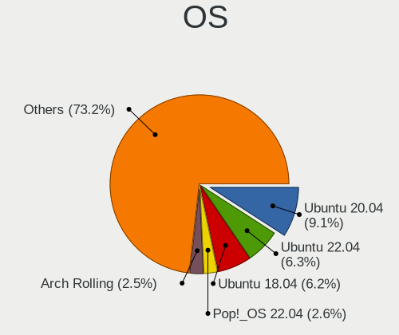

| Name                         | Computers | Percent |
|------------------------------|-----------|---------|
| Ubuntu 20.04                 | 186       | 15.82%  |
| Ubuntu 18.04                 | 135       | 11.48%  |
| OpenMandriva 4.2             | 35        | 2.98%   |
| Zorin 15                     | 29        | 2.47%   |
| Pop!_OS 20.04                | 28        | 2.38%   |
| OpenMandriva 4.3             | 23        | 1.96%   |
| Ubuntu 19.10                 | 22        | 1.87%   |
| Linux Mint 19.3              | 22        | 1.87%   |
| Linux Mint 20                | 21        | 1.79%   |
| Debian 11                    | 21        | 1.79%   |
| Debian 10                    | 21        | 1.79%   |
| KDE neon 20.04               | 20        | 1.7%    |
| Fedora 34                    | 20        | 1.7%    |
| Pop!_OS 21.04                | 19        | 1.62%   |
| Linux Mint 20.1              | 19        | 1.62%   |
| Zorin 16                     | 17        | 1.45%   |
| Ubuntu 19.04                 | 17        | 1.45%   |
| Xubuntu 20.04                | 16        | 1.36%   |
| Ubuntu 20.10                 | 16        | 1.36%   |
| Manjaro                      | 16        | 1.36%   |
| Ubuntu 21.10                 | 15        | 1.28%   |
| Pop!_OS 20.10                | 15        | 1.28%   |
| Linux Mint 20.3              | 15        | 1.28%   |
| Xubuntu 18.04                | 14        | 1.19%   |
| Ubuntu 21.04                 | 14        | 1.19%   |
| Pop!_OS 21.10                | 14        | 1.19%   |
| Fedora 33                    | 14        | 1.19%   |
| Arch                         | 14        | 1.19%   |
| Ubuntu 16.04                 | 13        | 1.11%   |
| Linux Mint 19.1              | 13        | 1.11%   |
| OpenMandriva 4.50            | 12        | 1.02%   |
| Linux Mint 20.2              | 12        | 1.02%   |
| openSUSE Tumbleweed-XXXXXXXX | 11        | 0.94%   |
| Fedora 31                    | 11        | 0.94%   |
| Linux Mint 19.2              | 9         | 0.77%   |
| Fedora 35                    | 9         | 0.77%   |
| Ubuntu 22.04                 | 8         | 0.68%   |
| Fedora 32                    | 8         | 0.68%   |
| ArcoLinux Rolling            | 8         | 0.68%   |
| Arch Rolling                 | 8         | 0.68%   |
| ROSA R10                     | 7         | 0.6%    |
| Debian Testing               | 7         | 0.6%    |
| Ubuntu 18.10                 | 6         | 0.51%   |
| KDE neon 18.04               | 6         | 0.51%   |
| ROSA R11.1                   | 5         | 0.43%   |
| Debian 9                     | 5         | 0.43%   |
| Slackware 14.2               | 4         | 0.34%   |
| ROSA R11                     | 4         | 0.34%   |
| Manjaro 21.1.6               | 4         | 0.34%   |
| LMDE 4                       | 4         | 0.34%   |
| Kubuntu 20.04                | 4         | 0.34%   |
| Ubuntu Budgie 20.04          | 3         | 0.26%   |
| Peppermint 10                | 3         | 0.26%   |
| openSUSE Leap-15.1           | 3         | 0.26%   |
| Manjaro 20.1.2               | 3         | 0.26%   |
| Manjaro 20.1                 | 3         | 0.26%   |
| Manjaro 18.1.5               | 3         | 0.26%   |
| Fedora 36                    | 3         | 0.26%   |
| Endless 3.8.0                | 3         | 0.26%   |
| Endless 3.7.8                | 3         | 0.26%   |

OS Family
---------

OS without a version

| Name          | Computers | Percent |
|---------------|-----------|---------|
| Ubuntu        | 412       | 36.82%  |
| Linux Mint    | 106       | 9.47%   |
| Pop!_OS       | 76        | 6.79%   |
| OpenMandriva  | 70        | 6.26%   |
| Fedora        | 60        | 5.36%   |
| Debian        | 50        | 4.47%   |
| Zorin         | 47        | 4.2%    |
| Manjaro       | 43        | 3.84%   |
| Endless       | 40        | 3.57%   |
| Xubuntu       | 32        | 2.86%   |
| KDE neon      | 26        | 2.32%   |
| Arch          | 23        | 2.06%   |
| ROSA          | 17        | 1.52%   |
| openSUSE      | 15        | 1.34%   |
| Elementary    | 11        | 0.98%   |
| Kubuntu       | 10        | 0.89%   |
| ArcoLinux     | 9         | 0.8%    |
| Clear Linux   | 7         | 0.63%   |
| Ubuntu MATE   | 5         | 0.45%   |
| Ubuntu Budgie | 5         | 0.45%   |
| Slackware     | 5         | 0.45%   |
| Lubuntu       | 4         | 0.36%   |
| LMDE          | 4         | 0.36%   |
| EndeavourOS   | 4         | 0.36%   |
| UbuntuDDE     | 3         | 0.27%   |
| Peppermint    | 3         | 0.27%   |
| Gentoo        | 3         | 0.27%   |
| CentOS        | 3         | 0.27%   |
| XCP-ng        | 2         | 0.18%   |
| Reborn OS     | 2         | 0.18%   |
| Parrot        | 2         | 0.18%   |
| MX            | 2         | 0.18%   |
| Manjaro-ARM   | 2         | 0.18%   |
| BigLinux      | 2         | 0.18%   |
| Xero          | 1         | 0.09%   |
| Solus         | 1         | 0.09%   |
| Rocky Linux   | 1         | 0.09%   |
| RHEL          | 1         | 0.09%   |
| Raspbian      | 1         | 0.09%   |
| PureOS        | 1         | 0.09%   |
| NixOS         | 1         | 0.09%   |
| LinuxFX       | 1         | 0.09%   |
| Kali          | 1         | 0.09%   |
| Feren OS      | 1         | 0.09%   |
| Devuan        | 1         | 0.09%   |
| Deepin        | 1         | 0.09%   |
| BlackPanther  | 1         | 0.09%   |
| Alpine        | 1         | 0.09%   |

Kernel
------

Version of the Linux kernel

| Version                  | Computers | Percent |
|--------------------------|-----------|---------|
| 5.4.0-42-generic         | 38        | 2.95%   |
| 5.10.14-desktop-1omv4002 | 34        | 2.64%   |
| 5.16.7-desktop-1omv4003  | 21        | 1.63%   |
| 5.3.0-46-generic         | 16        | 1.24%   |
| 5.4.0-58-generic         | 15        | 1.16%   |
| 5.4.0-52-generic         | 15        | 1.16%   |
| 5.4.0-29-generic         | 14        | 1.09%   |
| 5.11.0-38-generic        | 13        | 1.01%   |
| 5.4.0-26-generic         | 12        | 0.93%   |
| 5.3.0-28-generic         | 12        | 0.93%   |
| 5.0.0-37-generic         | 12        | 0.93%   |
| 5.4.0-7634-generic       | 11        | 0.85%   |
| 5.10.0-8-amd64           | 11        | 0.85%   |
| 5.8.0-43-generic         | 10        | 0.78%   |
| 5.4.0-48-generic         | 10        | 0.78%   |
| 5.0.0-25-generic         | 10        | 0.78%   |
| 4.18.0-15-generic        | 10        | 0.78%   |
| 5.8.0-48-generic         | 9         | 0.7%    |
| 5.3.0-40-generic         | 9         | 0.7%    |
| 4.15.0-46-generic        | 9         | 0.7%    |
| 5.8.0-44-generic         | 8         | 0.62%   |
| 5.4.0-37-generic         | 8         | 0.62%   |
| 5.13.0-39-generic        | 8         | 0.62%   |
| 4.18.0-25-generic        | 8         | 0.62%   |
| 5.4.0-65-generic         | 7         | 0.54%   |
| 5.4.0-40-generic         | 7         | 0.54%   |
| 5.4.0-31-generic         | 7         | 0.54%   |
| 5.4.0-28-generic         | 7         | 0.54%   |
| 5.14.14-desktop-1omv4050 | 7         | 0.54%   |
| 5.13.0-7614-generic      | 7         | 0.54%   |
| 5.13.0-28-generic        | 7         | 0.54%   |
| 5.11.0-7620-generic      | 7         | 0.54%   |
| 5.11.0-43-generic        | 7         | 0.54%   |
| 5.11.0-27-generic        | 7         | 0.54%   |
| 5.0.0-23-generic         | 7         | 0.54%   |
| 4.15.0-43-generic        | 7         | 0.54%   |
| 5.8.0-7642-generic       | 6         | 0.47%   |
| 5.8.0-63-generic         | 6         | 0.47%   |
| 5.8.0-55-generic         | 6         | 0.47%   |
| 5.4.0-74-generic         | 6         | 0.47%   |
| 5.4.0-19-generic         | 6         | 0.47%   |
| 5.13.0-30-generic        | 6         | 0.47%   |
| 5.11.0-34-generic        | 6         | 0.47%   |
| 5.10.0-9-amd64           | 6         | 0.47%   |
| 5.0.0-32-generic         | 6         | 0.47%   |
| 4.18.0-17-generic        | 6         | 0.47%   |
| 4.18.0-12-generic        | 6         | 0.47%   |
| 4.18.0-10-generic        | 6         | 0.47%   |
| 5.8.0-7630-generic       | 5         | 0.39%   |
| 5.8.0-59-generic         | 5         | 0.39%   |
| 5.8.0-53-generic         | 5         | 0.39%   |
| 5.8.0-41-generic         | 5         | 0.39%   |
| 5.4.0-91-generic         | 5         | 0.39%   |
| 5.4.0-80-generic         | 5         | 0.39%   |
| 5.4.0-77-generic         | 5         | 0.39%   |
| 5.4.0-64-generic         | 5         | 0.39%   |
| 5.4.0-54-generic         | 5         | 0.39%   |
| 5.4.0-47-generic         | 5         | 0.39%   |
| 5.4.0-109-generic        | 5         | 0.39%   |
| 5.3.0-45-generic         | 5         | 0.39%   |

Kernel Family
-------------

Linux kernel without a distro release

| Version | Computers | Percent |
|---------|-----------|---------|
| 5.4.0   | 258       | 21.29%  |
| 4.15.0  | 107       | 8.83%   |
| 5.8.0   | 93        | 7.67%   |
| 5.3.0   | 83        | 6.85%   |
| 5.11.0  | 80        | 6.6%    |
| 5.13.0  | 60        | 4.95%   |
| 5.0.0   | 58        | 4.79%   |
| 4.18.0  | 47        | 3.88%   |
| 5.10.14 | 36        | 2.97%   |
| 5.10.0  | 24        | 1.98%   |
| 4.19.0  | 24        | 1.98%   |
| 5.16.7  | 21        | 1.73%   |
| 5.15.0  | 11        | 0.91%   |
| 5.11.12 | 9         | 0.74%   |
| 5.14.14 | 7         | 0.58%   |
| 5.14.0  | 6         | 0.5%    |
| 4.9.155 | 6         | 0.5%    |
| 4.4.0   | 6         | 0.5%    |
| 5.15.7  | 5         | 0.41%   |
| 5.12.4  | 5         | 0.41%   |
| 5.8.16  | 4         | 0.33%   |
| 5.7.10  | 4         | 0.33%   |
| 5.7.0   | 4         | 0.33%   |
| 5.6.0   | 4         | 0.33%   |
| 5.16.11 | 4         | 0.33%   |
| 5.15.11 | 4         | 0.33%   |
| 5.14.16 | 4         | 0.33%   |
| 5.13.19 | 4         | 0.33%   |
| 4.9.60  | 4         | 0.33%   |
| 4.9.0   | 4         | 0.33%   |
| 5.9.16  | 3         | 0.25%   |
| 5.9.0   | 3         | 0.25%   |
| 5.8.3   | 3         | 0.25%   |
| 5.8.15  | 3         | 0.25%   |
| 5.8.12  | 3         | 0.25%   |
| 5.8.11  | 3         | 0.25%   |
| 5.7.9   | 3         | 0.25%   |
| 5.5.13  | 3         | 0.25%   |
| 5.17.6  | 3         | 0.25%   |
| 5.17.5  | 3         | 0.25%   |
| 5.16.15 | 3         | 0.25%   |
| 5.15.15 | 3         | 0.25%   |
| 5.12.7  | 3         | 0.25%   |
| 5.9.6   | 2         | 0.17%   |
| 5.9.10  | 2         | 0.17%   |
| 5.9.1   | 2         | 0.17%   |
| 5.8.6   | 2         | 0.17%   |
| 5.8.18  | 2         | 0.17%   |
| 5.7.8   | 2         | 0.17%   |
| 5.6.7   | 2         | 0.17%   |
| 5.6.3   | 2         | 0.17%   |
| 5.6.16  | 2         | 0.17%   |
| 5.6.10  | 2         | 0.17%   |
| 5.5.8   | 2         | 0.17%   |
| 5.2.11  | 2         | 0.17%   |
| 5.17.4  | 2         | 0.17%   |
| 5.16.16 | 2         | 0.17%   |
| 5.16.14 | 2         | 0.17%   |
| 5.16.12 | 2         | 0.17%   |
| 5.16.0  | 2         | 0.17%   |

Kernel Major Ver.
-----------------

Linux kernel major version

| Version | Computers | Percent |
|---------|-----------|---------|
| 5.4     | 273       | 22.73%  |
| 5.8     | 116       | 9.66%   |
| 4.15    | 108       | 8.99%   |
| 5.11    | 94        | 7.83%   |
| 5.3     | 86        | 7.16%   |
| 5.10    | 77        | 6.41%   |
| 5.13    | 73        | 6.08%   |
| 5.0     | 59        | 4.91%   |
| 4.18    | 50        | 4.16%   |
| 5.16    | 42        | 3.5%    |
| 5.15    | 41        | 3.41%   |
| 4.19    | 28        | 2.33%   |
| 5.14    | 27        | 2.25%   |
| 5.12    | 22        | 1.83%   |
| 4.9     | 20        | 1.67%   |
| 5.7     | 16        | 1.33%   |
| 5.9     | 15        | 1.25%   |
| 5.6     | 14        | 1.17%   |
| 5.17    | 12        | 1%      |
| 5.5     | 10        | 0.83%   |
| 4.4     | 6         | 0.5%    |
| 5.2     | 4         | 0.33%   |
| 4.12    | 2         | 0.17%   |
| 4.10    | 2         | 0.17%   |
| 5.1     | 1         | 0.08%   |
| 4.1     | 1         | 0.08%   |
| 3.10    | 1         | 0.08%   |
| 2.6     | 1         | 0.08%   |

Arch
----

OS architecture (x86_64, i586, etc.)

| Name    | Computers | Percent |
|---------|-----------|---------|
| x86_64  | 1013      | 93.8%   |
| i686    | 61        | 5.65%   |
| aarch64 | 5         | 0.46%   |
| armv7l  | 1         | 0.09%   |

DE
--

Desktop Environment

| Name            | Computers | Percent |
|-----------------|-----------|---------|
| GNOME           | 501       | 43.99%  |
| Unknown         | 204       | 17.91%  |
| KDE5            | 133       | 11.68%  |
| XFCE            | 92        | 8.08%   |
| X-Cinnamon      | 74        | 6.5%    |
| KDE             | 32        | 2.81%   |
| MATE            | 22        | 1.93%   |
| KDE4            | 12        | 1.05%   |
| Cinnamon        | 12        | 1.05%   |
| Budgie          | 11        | 0.97%   |
| Unity           | 10        | 0.88%   |
| Pantheon        | 9         | 0.79%   |
| i3              | 7         | 0.61%   |
| LXDE            | 5         | 0.44%   |
| awesome         | 5         | 0.44%   |
| Deepin          | 4         | 0.35%   |
| LXQt            | 2         | 0.18%   |
| GNOME Flashback | 2         | 0.18%   |
| Openbox         | 1         | 0.09%   |
| fluxbox         | 1         | 0.09%   |

Display Server
--------------

X11 or Wayland

| Name    | Computers | Percent |
|---------|-----------|---------|
| X11     | 884       | 79.86%  |
| Unknown | 112       | 10.12%  |
| Wayland | 108       | 9.76%   |
| Tty     | 3         | 0.27%   |

Display Manager
---------------

SDDM, LightDM, etc.

| Name    | Computers | Percent |
|---------|-----------|---------|
| Unknown | 707       | 63.52%  |
| GDM     | 122       | 10.96%  |
| SDDM    | 119       | 10.69%  |
| LightDM | 56        | 5.03%   |
| GDM3    | 50        | 4.49%   |
| TDM     | 44        | 3.95%   |
| KDM     | 12        | 1.08%   |
| XDM     | 3         | 0.27%   |

OS Lang
-------

Language

| Lang    | Computers | Percent |
|---------|-----------|---------|
| pt_PT   | 455       | 40.92%  |
| en_US   | 356       | 32.01%  |
| Unknown | 195       | 17.54%  |
| en_GB   | 52        | 4.68%   |
| pt_BR   | 16        | 1.44%   |
| C       | 14        | 1.26%   |
| ru_RU   | 4         | 0.36%   |
| fr_FR   | 4         | 0.36%   |
| sv_SE   | 3         | 0.27%   |
| es_ES   | 3         | 0.27%   |
| POSIX   | 2         | 0.18%   |
| en_IE   | 2         | 0.18%   |
| de_DE   | 2         | 0.18%   |
| sk_SK   | 1         | 0.09%   |
| it_IT   | 1         | 0.09%   |
| en_IN   | 1         | 0.09%   |
| en_CA   | 1         | 0.09%   |

Boot Mode
---------

EFI or BIOS

| Mode | Computers | Percent |
|------|-----------|---------|
| BIOS | 646       | 58.36%  |
| EFI  | 461       | 41.64%  |

Filesystem
----------

Type of filesystem

| Type     | Computers | Percent |
|----------|-----------|---------|
| Ext4     | 864       | 78.76%  |
| Overlay  | 73        | 6.65%   |
| Btrfs    | 67        | 6.11%   |
| Unknown  | 67        | 6.11%   |
| Xfs      | 10        | 0.91%   |
| Zfs      | 6         | 0.55%   |
| Ext3     | 4         | 0.36%   |
| Ext2     | 4         | 0.36%   |
| Reiserfs | 1         | 0.09%   |
| F2fs     | 1         | 0.09%   |

Part. scheme
------------

Scheme of partitioning

| Type    | Computers | Percent |
|---------|-----------|---------|
| Unknown | 742       | 67.52%  |
| GPT     | 256       | 23.29%  |
| MBR     | 101       | 9.19%   |

Dual Boot with Linux/BSD
------------------------

Hosting more than one Linux/BSD

| Dual boot | Computers | Percent |
|-----------|-----------|---------|
| No        | 956       | 87.63%  |
| Yes       | 135       | 12.37%  |

Dual Boot (Win)
---------------

Hosting Linux and Windows

| Dual boot | Computers | Percent |
|-----------|-----------|---------|
| No        | 770       | 70.13%  |
| Yes       | 328       | 29.87%  |

Board
-----

Vendor
------

Motherboard manufacturer

| Name                    | Computers | Percent |
|-------------------------|-----------|---------|
| ASUSTek Computer        | 235       | 21.78%  |
| Hewlett-Packard         | 180       | 16.68%  |
| Lenovo                  | 140       | 12.97%  |
| Acer                    | 85        | 7.88%   |
| Toshiba                 | 67        | 6.21%   |
| MSI                     | 58        | 5.38%   |
| Dell                    | 49        | 4.54%   |
| Gigabyte Technology     | 40        | 3.71%   |
| Sony                    | 34        | 3.15%   |
| Apple                   | 22        | 2.04%   |
| ASRock                  | 20        | 1.85%   |
| Samsung Electronics     | 12        | 1.11%   |
| Intel                   | 11        | 1.02%   |
| HUAWEI                  | 10        | 0.93%   |
| Fujitsu                 | 10        | 0.93%   |
| Notebook                | 9         | 0.83%   |
| Foxconn                 | 7         | 0.65%   |
| TUXEDO                  | 5         | 0.46%   |
| Raspberry Pi Foundation | 5         | 0.46%   |
| Packard Bell            | 5         | 0.46%   |
| eMachines               | 5         | 0.46%   |
| Unknown                 | 5         | 0.46%   |
| Phoenix/SiS             | 3         | 0.28%   |
| LG Electronics          | 3         | 0.28%   |
| Clevo                   | 3         | 0.28%   |
| Biostar                 | 3         | 0.28%   |
| Teclast                 | 2         | 0.19%   |
| SLIMBOOK                | 2         | 0.19%   |
| Positivo                | 2         | 0.19%   |
| Pegatron                | 2         | 0.19%   |
| OBSIDIAN-PC             | 2         | 0.19%   |
| Minix                   | 2         | 0.19%   |
| Medion                  | 2         | 0.19%   |
| Huanan                  | 2         | 0.19%   |
| Google                  | 2         | 0.19%   |
| Fujitsu Siemens         | 2         | 0.19%   |
| ECS                     | 2         | 0.19%   |
| Chuwi                   | 2         | 0.19%   |
| AMI                     | 2         | 0.19%   |
| Alienware               | 2         | 0.19%   |
| Timi                    | 1         | 0.09%   |
| Supermicro              | 1         | 0.09%   |
| Standard                | 1         | 0.09%   |
| Shuttle                 | 1         | 0.09%   |
| RKM                     | 1         | 0.09%   |
| Qilive                  | 1         | 0.09%   |
| Purism                  | 1         | 0.09%   |
| Pine Microsystems       | 1         | 0.09%   |
| PC Specialist           | 1         | 0.09%   |
| OEM                     | 1         | 0.09%   |
| NEC Computers           | 1         | 0.09%   |
| Microsoft               | 1         | 0.09%   |
| LIVEFAN                 | 1         | 0.09%   |
| Linx                    | 1         | 0.09%   |
| Libretrend              | 1         | 0.09%   |
| Jumper                  | 1         | 0.09%   |
| JPSaCouto               | 1         | 0.09%   |
| INSYS                   | 1         | 0.09%   |
| INFORLANDIA             | 1         | 0.09%   |
| IBM                     | 1         | 0.09%   |

Model
-----

Motherboard model

| Name                                   | Computers | Percent |
|----------------------------------------|-----------|---------|
| Sony VGN-FZ31Z                         | 16        | 1.48%   |
| ASUS All Series                        | 11        | 1.02%   |
| Toshiba Satellite C660                 | 7         | 0.65%   |
| HP Pavilion g6                         | 7         | 0.65%   |
| HP Pavilion dv6                        | 7         | 0.65%   |
| Unknown                                | 7         | 0.65%   |
| HP Notebook                            | 6         | 0.56%   |
| HP G62                                 | 6         | 0.56%   |
| Acer Extensa 5620                      | 5         | 0.46%   |
| Toshiba Satellite L650                 | 4         | 0.37%   |
| Toshiba Satellite L40                  | 4         | 0.37%   |
| Toshiba Satellite A200                 | 4         | 0.37%   |
| HP Compaq Presario CQ60                | 4         | 0.37%   |
| ASUS X555LJ                            | 4         | 0.37%   |
| ASUS X555LD                            | 4         | 0.37%   |
| ASUS X541UV                            | 4         | 0.37%   |
| ASUS VivoBook 15_ASUS Laptop X507LA    | 4         | 0.37%   |
| ASUS P5G41T-M LX                       | 4         | 0.37%   |
| ASUS H110M-K                           | 4         | 0.37%   |
| Acer Aspire E5-551G                    | 4         | 0.37%   |
| Toshiba Satellite L50D-B               | 3         | 0.28%   |
| Toshiba Satellite L500                 | 3         | 0.28%   |
| MSI MS-7817                            | 3         | 0.28%   |
| Lenovo Y520-15IKBN 80WK                | 3         | 0.28%   |
| Lenovo Legion 5 15ACH6H 82JU           | 3         | 0.28%   |
| Lenovo IdeaPad 320-15AST 80XV          | 3         | 0.28%   |
| Lenovo G50-45 80E3                     | 3         | 0.28%   |
| Intel powered classmate PC             | 3         | 0.28%   |
| HUAWEI WRT-WX9                         | 3         | 0.28%   |
| HUAWEI NBLK-WAX9X                      | 3         | 0.28%   |
| HP Pavilion Notebook                   | 3         | 0.28%   |
| HP Pavilion Gaming Laptop 15-ec2xxx    | 3         | 0.28%   |
| HP Pavilion 15                         | 3         | 0.28%   |
| HP OMEN by Laptop 15-dc0xxx            | 3         | 0.28%   |
| HP OMEN by Laptop                      | 3         | 0.28%   |
| HP Compaq Presario CQ61                | 3         | 0.28%   |
| HP Compaq Elite 8300 SFF               | 3         | 0.28%   |
| Gigabyte B550 AORUS ELITE              | 3         | 0.28%   |
| Dell XPS 13 7390                       | 3         | 0.28%   |
| ASUS VivoBook_ASUSLaptop X530FN_S530FN | 3         | 0.28%   |
| ASUS PRIME H510M-K                     | 3         | 0.28%   |
| ASUS M5A78L-M/USB3                     | 3         | 0.28%   |
| ASUS K50IJ                             | 3         | 0.28%   |
| Apple MacBookAir7,2                    | 3         | 0.28%   |
| Acer Extensa 5635ZG                    | 3         | 0.28%   |
| Acer Aspire ES1-520                    | 3         | 0.28%   |
| Acer Aspire ES1-512                    | 3         | 0.28%   |
| Acer Aspire E5-571G                    | 3         | 0.28%   |
| Acer Aspire E1-570G                    | 3         | 0.28%   |
| Acer Aspire A315-41                    | 3         | 0.28%   |
| Acer Aspire 5732Z                      | 3         | 0.28%   |
| TUXEDO InfinityBook Pro 14 Gen6        | 2         | 0.19%   |
| Toshiba Satellite P70-B                | 2         | 0.19%   |
| Toshiba Satellite P50-C                | 2         | 0.19%   |
| Toshiba Satellite A300                 | 2         | 0.19%   |
| Toshiba PORTEGE Z30-A                  | 2         | 0.19%   |
| RPi Raspberry Pi                       | 2         | 0.19%   |
| Packard Bell EasyNote MX52             | 2         | 0.19%   |
| MSI MS-7A34                            | 2         | 0.19%   |
| MSI MS-7592                            | 2         | 0.19%   |

Model Family
------------

Motherboard model prefix

| Name                  | Computers | Percent |
|-----------------------|-----------|---------|
| Lenovo ThinkPad       | 70        | 6.49%   |
| Acer Aspire           | 70        | 6.49%   |
| Toshiba Satellite     | 59        | 5.47%   |
| HP Pavilion           | 52        | 4.82%   |
| Lenovo IdeaPad        | 32        | 2.97%   |
| HP Compaq             | 28        | 2.59%   |
| ASUS VivoBook         | 22        | 2.04%   |
| HP EliteBook          | 18        | 1.67%   |
| ASUS PRIME            | 17        | 1.58%   |
| Sony VGN-FZ31Z        | 16        | 1.48%   |
| Dell Latitude         | 15        | 1.39%   |
| HP ProBook            | 12        | 1.11%   |
| HP Laptop             | 11        | 1.02%   |
| ASUS All              | 11        | 1.02%   |
| Lenovo Legion         | 10        | 0.93%   |
| ASUS ROG              | 10        | 0.93%   |
| HP OMEN               | 9         | 0.83%   |
| Dell XPS              | 9         | 0.83%   |
| Dell OptiPlex         | 9         | 0.83%   |
| ASUS P5G41T-M         | 9         | 0.83%   |
| Dell Inspiron         | 8         | 0.74%   |
| Acer Extensa          | 8         | 0.74%   |
| HP ENVY               | 7         | 0.65%   |
| Unknown               | 7         | 0.65%   |
| HP Notebook           | 6         | 0.56%   |
| HP G62                | 6         | 0.56%   |
| RPi Raspberry         | 5         | 0.46%   |
| Packard Bell EasyNote | 5         | 0.46%   |
| Gigabyte B550         | 5         | 0.46%   |
| Dell Precision        | 5         | 0.46%   |
| Lenovo Yoga           | 4         | 0.37%   |
| HP ProLiant           | 4         | 0.37%   |
| ASUS ZenBook          | 4         | 0.37%   |
| ASUS X555LJ           | 4         | 0.37%   |
| ASUS X555LD           | 4         | 0.37%   |
| ASUS X541UV           | 4         | 0.37%   |
| ASUS TUF              | 4         | 0.37%   |
| ASUS P8H61-M          | 4         | 0.37%   |
| ASUS M5A78L-M         | 4         | 0.37%   |
| ASUS H110M-K          | 4         | 0.37%   |
| TUXEDO InfinityBook   | 3         | 0.28%   |
| Toshiba QOSMIO        | 3         | 0.28%   |
| Toshiba PORTEGE       | 3         | 0.28%   |
| MSI MS-7817           | 3         | 0.28%   |
| MSI Modern            | 3         | 0.28%   |
| Lenovo Y520-15IKBN    | 3         | 0.28%   |
| Lenovo MIIX           | 3         | 0.28%   |
| Lenovo G50-45         | 3         | 0.28%   |
| Intel powered         | 3         | 0.28%   |
| HUAWEI WRT-WX9        | 3         | 0.28%   |
| HUAWEI NBLK-WAX9X     | 3         | 0.28%   |
| HP ZBook              | 3         | 0.28%   |
| HP 15                 | 3         | 0.28%   |
| Fujitsu PRIMERGY      | 3         | 0.28%   |
| Fujitsu LIFEBOOK      | 3         | 0.28%   |
| Fujitsu ESPRIMO       | 3         | 0.28%   |
| ASUS K50IJ            | 3         | 0.28%   |
| ASUS A                | 3         | 0.28%   |
| Apple MacBookPro8     | 3         | 0.28%   |
| Apple MacBookAir7     | 3         | 0.28%   |

MFG Year
--------

Motherboard manufacture year

| Year    | Computers | Percent |
|---------|-----------|---------|
| 2018    | 99        | 9.18%   |
| 2010    | 91        | 8.43%   |
| 2019    | 87        | 8.06%   |
| 2020    | 84        | 7.78%   |
| 2014    | 68        | 6.3%    |
| 2008    | 67        | 6.21%   |
| 2012    | 65        | 6.02%   |
| 2011    | 64        | 5.93%   |
| 2007    | 64        | 5.93%   |
| 2016    | 62        | 5.75%   |
| 2013    | 62        | 5.75%   |
| 2017    | 60        | 5.56%   |
| 2009    | 60        | 5.56%   |
| 2015    | 58        | 5.38%   |
| 2021    | 37        | 3.43%   |
| 2006    | 26        | 2.41%   |
| 2005    | 14        | 1.3%    |
| Unknown | 8         | 0.74%   |
| 2004    | 2         | 0.19%   |
| 2003    | 1         | 0.09%   |

Form Factor
-----------

Physical design of the computer

| Name           | Computers | Percent |
|----------------|-----------|---------|
| Notebook       | 724       | 67.1%   |
| Desktop        | 313       | 29.01%  |
| Convertible    | 11        | 1.02%   |
| Mini pc        | 8         | 0.74%   |
| Server         | 7         | 0.65%   |
| Tablet         | 6         | 0.56%   |
| System on chip | 5         | 0.46%   |
| All in one     | 4         | 0.37%   |
| Phone          | 1         | 0.09%   |

Secure Boot
-----------

Enabled or disabled

| State    | Computers | Percent |
|----------|-----------|---------|
| Disabled | 1003      | 91.35%  |
| Enabled  | 95        | 8.65%   |

Coreboot
--------

Have coreboot on board

| Used | Computers | Percent |
|------|-----------|---------|
| No   | 1075      | 99.63%  |
| Yes  | 4         | 0.37%   |

RAM Size
--------

Total RAM memory

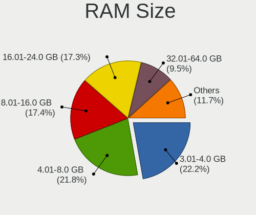

| Size in GB      | Computers | Percent |
|-----------------|-----------|---------|
| 3.01-4.0        | 303       | 27.67%  |
| 4.01-8.0        | 240       | 21.92%  |
| 8.01-16.0       | 171       | 15.62%  |
| 16.01-24.0      | 158       | 14.43%  |
| 1.01-2.0        | 83        | 7.58%   |
| 32.01-64.0      | 76        | 6.94%   |
| 2.01-3.0        | 29        | 2.65%   |
| 64.01-256.0     | 15        | 1.37%   |
| 0.51-1.0        | 13        | 1.19%   |
| 24.01-32.0      | 6         | 0.55%   |
| More than 256.0 | 1         | 0.09%   |

RAM Used
--------

Used RAM memory

| Used GB     | Computers | Percent |
|-------------|-----------|---------|
| 1.01-2.0    | 483       | 40.79%  |
| 2.01-3.0    | 241       | 20.35%  |
| 4.01-8.0    | 163       | 13.77%  |
| 3.01-4.0    | 127       | 10.73%  |
| 0.51-1.0    | 102       | 8.61%   |
| 8.01-16.0   | 42        | 3.55%   |
| 0.01-0.5    | 10        | 0.84%   |
| 16.01-24.0  | 9         | 0.76%   |
| 24.01-32.0  | 4         | 0.34%   |
| 32.01-64.0  | 1         | 0.08%   |
| 64.01-256.0 | 1         | 0.08%   |
| Unknown     | 1         | 0.08%   |

Total Drives
------------

Number of drives on board

| Drives | Computers | Percent |
|--------|-----------|---------|
| 1      | 705       | 63.69%  |
| 2      | 267       | 24.12%  |
| 3      | 75        | 6.78%   |
| 4      | 30        | 2.71%   |
| 0      | 13        | 1.17%   |
| 5      | 5         | 0.45%   |
| 6      | 4         | 0.36%   |
| 11     | 2         | 0.18%   |
| 10     | 2         | 0.18%   |
| 7      | 2         | 0.18%   |
| 87     | 1         | 0.09%   |
| 8      | 1         | 0.09%   |

Has CD-ROM
----------

Has CD-ROM on board

| Presented | Computers | Percent |
|-----------|-----------|---------|
| No        | 633       | 58.45%  |
| Yes       | 450       | 41.55%  |

Has Ethernet
------------

Has Ethernet on board

| Presented | Computers | Percent |
|-----------|-----------|---------|
| Yes       | 941       | 86.97%  |
| No        | 141       | 13.03%  |

Has WiFi
--------

Has WiFi module

| Presented | Computers | Percent |
|-----------|-----------|---------|
| Yes       | 848       | 78.08%  |
| No        | 238       | 21.92%  |

Has Bluetooth
-------------

Has Bluetooth module

| Presented | Computers | Percent |
|-----------|-----------|---------|
| Yes       | 572       | 52.38%  |
| No        | 520       | 47.62%  |

Location
--------

Country
-------

Geographic location (country)

| Country  | Computers | Percent |
|----------|-----------|---------|
| Portugal | 1079      | 100%    |

City
----

Geographic location (city)

| City                         | Computers | Percent |
|------------------------------|-----------|---------|
| Lisbon                       | 239       | 20.96%  |
| Porto                        | 89        | 7.81%   |
| Vila Nova de Gaia            | 27        | 2.37%   |
| Braga                        | 26        | 2.28%   |
| Funchal                      | 24        | 2.11%   |
| Amadora                      | 23        | 2.02%   |
| Coimbra                      | 22        | 1.93%   |
| Setbal                     | 20        | 1.75%   |
| Leiria                       | 20        | 1.75%   |
| Faro                         | 19        | 1.67%   |
| Aveiro                       | 17        | 1.49%   |
| Loures                       | 14        | 1.23%   |
| Sintra                       | 11        | 0.96%   |
| Evora                        | 11        | 0.96%   |
| Bragana                    | 11        | 0.96%   |
| Almada                       | 11        | 0.96%   |
| Guimaraes                    | 10        | 0.88%   |
| Santarm                    | 9         | 0.79%   |
| Portimao                     | 9         | 0.79%   |
| Viseu                        | 8         | 0.7%    |
| Matosinhos Municipality      | 8         | 0.7%    |
| Alverca do Ribatejo          | 8         | 0.7%    |
| Viana do Castelo             | 7         | 0.61%   |
| Trofa                        | 7         | 0.61%   |
| Torres Vedras                | 7         | 0.61%   |
| Sao Joao da Madeira          | 7         | 0.61%   |
| Santo Tirso                  | 7         | 0.61%   |
| Povoa de Santa Iria          | 7         | 0.61%   |
| Odivelas                     | 7         | 0.61%   |
| Feira                        | 7         | 0.61%   |
| Carnaxide                    | 7         | 0.61%   |
| Caldas da Rainha             | 7         | 0.61%   |
| Cacem                        | 7         | 0.61%   |
| Amora                        | 7         | 0.61%   |
| Queluz                       | 6         | 0.53%   |
| Maia                         | 6         | 0.53%   |
| Mafra                        | 6         | 0.53%   |
| Figueira da Foz Municipality | 6         | 0.53%   |
| Estoril                      | 6         | 0.53%   |
| Barcelos                     | 6         | 0.53%   |
| Alges                        | 6         | 0.53%   |
| gueda Municipality         | 6         | 0.53%   |
| Vila Nova de Famalicao       | 5         | 0.44%   |
| Vila do Conde                | 5         | 0.44%   |
| Sao Domingos de Rana         | 5         | 0.44%   |
| Ponta Delgada                | 5         | 0.44%   |
| Mem Martins                  | 5         | 0.44%   |
| Lagos                        | 5         | 0.44%   |
| Gondomar                     | 5         | 0.44%   |
| Ermesinde                    | 5         | 0.44%   |
| Baixa da Banheira            | 5         | 0.44%   |
| Azeitao                      | 5         | 0.44%   |
| Albufeira                    | 5         | 0.44%   |
| Valongo                      | 4         | 0.35%   |
| Tondela                      | 4         | 0.35%   |
| Pvoa de Varzim             | 4         | 0.35%   |
| Montijo                      | 4         | 0.35%   |
| Estarreja                    | 4         | 0.35%   |
| Ericeira                     | 4         | 0.35%   |
| Entroncamento                | 4         | 0.35%   |

Drives
------

Drive Vendor
------------

Hard drive vendors

| Vendor                  | Computers | Drives | Percent |
|-------------------------|-----------|--------|---------|
| Samsung Electronics     | 225       | 304    | 15.1%   |
| WDC                     | 212       | 331    | 14.23%  |
| Seagate                 | 194       | 313    | 13.02%  |
| Kingston                | 146       | 190    | 9.8%    |
| Toshiba                 | 144       | 215    | 9.66%   |
| SanDisk                 | 67        | 77     | 4.5%    |
| Hitachi                 | 63        | 73     | 4.23%   |
| Unknown                 | 61        | 94     | 4.09%   |
| Crucial                 | 56        | 72     | 3.76%   |
| HGST                    | 35        | 44     | 2.35%   |
| Intel                   | 28        | 37     | 1.88%   |
| SK Hynix                | 27        | 31     | 1.81%   |
| MAXTOR                  | 17        | 31     | 1.14%   |
| Fujitsu                 | 17        | 18     | 1.14%   |
| Micron Technology       | 14        | 17     | 0.94%   |
| KIOXIA                  | 14        | 25     | 0.94%   |
| GOODRAM                 | 13        | 14     | 0.87%   |
| Apple                   | 10        | 10     | 0.67%   |
| PNY                     | 9         | 13     | 0.6%    |
| A-DATA Technology       | 9         | 9      | 0.6%    |
| BLueRay                 | 8         | 8      | 0.54%   |
| Phison                  | 7         | 12     | 0.47%   |
| S3+                     | 6         | 9      | 0.4%    |
| JMicron                 | 6         | 6      | 0.4%    |
| Hewlett-Packard         | 6         | 7      | 0.4%    |
| EMTEC                   | 5         | 6      | 0.34%   |
| China                   | 5         | 6      | 0.34%   |
| Transcend               | 4         | 4      | 0.27%   |
| OCZ                     | 4         | 4      | 0.27%   |
| LITEON                  | 4         | 5      | 0.27%   |
| KIOXIA-EXCERIA          | 4         | 4      | 0.27%   |
| KingDian                | 4         | 7      | 0.27%   |
| Gigabyte Technology     | 4         | 5      | 0.27%   |
| Vaseky                  | 3         | 3      | 0.2%    |
| Team                    | 3         | 3      | 0.2%    |
| ExcelStor               | 3         | 3      | 0.2%    |
| XPG                     | 2         | 3      | 0.13%   |
| Union Memory (Shenzhen) | 2         | 5      | 0.13%   |
| MSFT                    | 2         | 12     | 0.13%   |
| Lite-On                 | 2         | 2      | 0.13%   |
| Lenovo                  | 2         | 2      | 0.13%   |
| Dell                    | 2         | 4      | 0.13%   |
| ASMedia                 | 2         | 3      | 0.13%   |
| 2-Power                 | 2         | 3      | 0.13%   |
| Unknown                 | 2         | 3      | 0.13%   |
| Zheino                  | 1         | 2      | 0.07%   |
| Verbatim                | 1         | 1      | 0.07%   |
| USB                     | 1         | 1      | 0.07%   |
| Union Memory            | 1         | 1      | 0.07%   |
| UMIS                    | 1         | 1      | 0.07%   |
| Teclast                 | 1         | 1      | 0.07%   |
| TEAM T25                | 1         | 1      | 0.07%   |
| TCSUNBOW                | 1         | 1      | 0.07%   |
| Tanbassh                | 1         | 1      | 0.07%   |
| T-FORCE                 | 1         | 2      | 0.07%   |
| SSSTC                   | 1         | 1      | 0.07%   |
| Silicon Motion          | 1         | 1      | 0.07%   |
| ROG                     | 1         | 1      | 0.07%   |
| Realtek                 | 1         | 2      | 0.07%   |
| Quantum                 | 1         | 1      | 0.07%   |

Drive Model
-----------

Hard drive models

| Model                               | Computers | Percent |
|-------------------------------------|-----------|---------|
| Kingston SA400S37120G 120GB SSD     | 24        | 1.51%   |
| Unknown MMC Card  32GB              | 21        | 1.32%   |
| Kingston SA400S37240G 240GB SSD     | 20        | 1.26%   |
| Kingston SV300S37A120G 120GB SSD    | 19        | 1.19%   |
| Toshiba MQ01ABD100 1TB              | 17        | 1.07%   |
| Seagate ST1000LM024 HN-M101MBB 1TB  | 16        | 1.01%   |
| HGST HTS721010A9E630 1TB            | 16        | 1.01%   |
| Seagate ST1000DM010-2EP102 1TB      | 13        | 0.82%   |
| Samsung SSD 850 EVO 250GB           | 12        | 0.75%   |
| Toshiba MQ01ABF050 500GB            | 11        | 0.69%   |
| Seagate ST500LT012-1DG142 500GB     | 11        | 0.69%   |
| Kingston SV300S37A240G 240GB SSD    | 11        | 0.69%   |
| Unknown MMC Card  64GB              | 10        | 0.63%   |
| Samsung SSD 860 EVO 500GB           | 10        | 0.63%   |
| Samsung NVMe SSD Drive 512GB        | 10        | 0.63%   |
| Kingston SA400S37480G 480GB SSD     | 10        | 0.63%   |
| Seagate ST9500325AS 500GB           | 9         | 0.57%   |
| Seagate ST3500418AS 500GB           | 9         | 0.57%   |
| Sandisk NVMe SSD Drive 512GB        | 9         | 0.57%   |
| Samsung NVMe SSD Drive 500GB        | 9         | 0.57%   |
| Crucial CT240M500SSD1 240GB         | 9         | 0.57%   |
| Seagate ST1000LM035-1RK172 1TB      | 8         | 0.5%    |
| Sandisk NVMe SSD Drive 256GB        | 8         | 0.5%    |
| Samsung NVMe SSD Drive 256GB        | 8         | 0.5%    |
| Crucial CT500MX500SSD1 500GB        | 8         | 0.5%    |
| Crucial CT240BX500SSD1 240GB        | 8         | 0.5%    |
| Toshiba HDWD110 1TB                 | 7         | 0.44%   |
| SK Hynix NVMe SSD Drive 256GB       | 7         | 0.44%   |
| Kingston SUV400S37240G 240GB SSD    | 7         | 0.44%   |
| Kingston NVMe SSD Drive 512GB       | 7         | 0.44%   |
| WDC WDS240G2G0A-00JH30 240GB SSD    | 6         | 0.38%   |
| WDC WD5000LPVX-22V0TT0 500GB        | 6         | 0.38%   |
| WDC WD3200BEVT-22ZCT0 320GB         | 6         | 0.38%   |
| Toshiba TR200 240GB SSD             | 6         | 0.38%   |
| Toshiba MQ04ABF100 1TB              | 6         | 0.38%   |
| Seagate ST9320325AS 320GB           | 6         | 0.38%   |
| Seagate Expansion 4TB               | 6         | 0.38%   |
| Samsung SSD 860 QVO 1TB             | 6         | 0.38%   |
| Samsung SSD 840 EVO 250GB           | 6         | 0.38%   |
| Micron NVMe SSD Drive 512GB         | 6         | 0.38%   |
| Kingston SUV400S37120G 120GB SSD    | 6         | 0.38%   |
| HGST HTS541010A9E680 1TB            | 6         | 0.38%   |
| WDC WD10JPVX-22JC3T0 1TB            | 5         | 0.31%   |
| SK Hynix NVMe SSD Drive 512GB       | 5         | 0.31%   |
| Seagate ST9160821AS 160GB           | 5         | 0.31%   |
| Sandisk NVMe SSD Drive 1024GB       | 5         | 0.31%   |
| Samsung SSD 860 EVO 1TB             | 5         | 0.31%   |
| Samsung SSD 850 EVO 500GB           | 5         | 0.31%   |
| Samsung NVMe SSD Drive 1024GB       | 5         | 0.31%   |
| Samsung HD161HJ 160GB               | 5         | 0.31%   |
| Kingston SA400S37960G 960GB SSD     | 5         | 0.31%   |
| EMTEC X150 240GB                    | 5         | 0.31%   |
| WDC WD3200AAJS-00L7A0 320GB         | 4         | 0.25%   |
| WDC WD10EZEX-00BN5A0 1TB            | 4         | 0.25%   |
| Unknown MMC Card  7GB               | 4         | 0.25%   |
| Unknown MMC Card  16GB              | 4         | 0.25%   |
| Unknown MMC Card  128GB             | 4         | 0.25%   |
| Toshiba DT01ACA050 500GB            | 4         | 0.25%   |
| Seagate ST500LM012 HN-M500MBB 500GB | 4         | 0.25%   |
| Seagate ST500DM002-1BD142 500GB     | 4         | 0.25%   |

HDD Vendor
----------

Hard disk drive vendors

| Vendor              | Computers | Drives | Percent |
|---------------------|-----------|--------|---------|
| Seagate             | 189       | 304    | 28.59%  |
| WDC                 | 169       | 257    | 25.57%  |
| Toshiba             | 109       | 175    | 16.49%  |
| Hitachi             | 63        | 73     | 9.53%   |
| Samsung Electronics | 48        | 68     | 7.26%   |
| HGST                | 35        | 44     | 5.3%    |
| Fujitsu             | 17        | 18     | 2.57%   |
| MAXTOR              | 15        | 22     | 2.27%   |
| ExcelStor           | 3         | 3      | 0.45%   |
| MSFT                | 2         | 12     | 0.3%    |
| Dell                | 2         | 4      | 0.3%    |
| Apple               | 2         | 2      | 0.3%    |
| USB                 | 1         | 1      | 0.15%   |
| Unknown             | 1         | 1      | 0.15%   |
| Quantum             | 1         | 1      | 0.15%   |
| HPE                 | 1         | 4      | 0.15%   |
| Hewlett-Packard     | 1         | 2      | 0.15%   |
| ASMT                | 1         | 1      | 0.15%   |
| ASMedia             | 1         | 1      | 0.15%   |

SSD Vendor
----------

Solid state drive vendors

| Vendor              | Computers | Drives | Percent |
|---------------------|-----------|--------|---------|
| Kingston            | 129       | 161    | 25.44%  |
| Samsung Electronics | 101       | 130    | 19.92%  |
| Crucial             | 54        | 70     | 10.65%  |
| SanDisk             | 37        | 44     | 7.3%    |
| WDC                 | 25        | 35     | 4.93%   |
| Toshiba             | 22        | 26     | 4.34%   |
| GOODRAM             | 11        | 12     | 2.17%   |
| Intel               | 9         | 11     | 1.78%   |
| A-DATA Technology   | 9         | 9      | 1.78%   |
| BlueRay             | 8         | 8      | 1.58%   |
| Apple               | 7         | 7      | 1.38%   |
| SK Hynix            | 6         | 6      | 1.18%   |
| S3+                 | 6         | 9      | 1.18%   |
| PNY                 | 5         | 8      | 0.99%   |
| Hewlett-Packard     | 5         | 5      | 0.99%   |
| EMTEC               | 5         | 6      | 0.99%   |
| China               | 5         | 6      | 0.99%   |
| Unknown             | 4         | 4      | 0.79%   |
| Transcend           | 4         | 4      | 0.79%   |
| Seagate             | 4         | 6      | 0.79%   |
| OCZ                 | 4         | 4      | 0.79%   |
| Micron Technology   | 4         | 6      | 0.79%   |
| KingDian            | 4         | 7      | 0.79%   |
| Vaseky              | 3         | 3      | 0.59%   |
| Team                | 3         | 3      | 0.59%   |
| JMicron             | 3         | 3      | 0.59%   |
| Gigabyte Technology | 3         | 3      | 0.59%   |
| MAXTOR              | 2         | 9      | 0.39%   |
| LITEON              | 2         | 3      | 0.39%   |
| KIOXIA-EXCERIA      | 2         | 2      | 0.39%   |
| 2-Power             | 2         | 3      | 0.39%   |
| Zheino              | 1         | 2      | 0.2%    |
| Verbatim            | 1         | 1      | 0.2%    |
| Teclast             | 1         | 1      | 0.2%    |
| TEAM T25            | 1         | 1      | 0.2%    |
| TCSUNBOW            | 1         | 1      | 0.2%    |
| PLEXTOR             | 1         | 1      | 0.2%    |
| OSC                 | 1         | 1      | 0.2%    |
| Netac               | 1         | 1      | 0.2%    |
| Mushkin             | 1         | 1      | 0.2%    |
| LITEONIT            | 1         | 1      | 0.2%    |
| Lexar               | 1         | 1      | 0.2%    |
| KingSpec            | 1         | 1      | 0.2%    |
| INNOVATION IT       | 1         | 1      | 0.2%    |
| INDMEM              | 1         | 1      | 0.2%    |
| HP Phison           | 1         | 1      | 0.2%    |
| faspeed             | 1         | 1      | 0.2%    |
| BHT                 | 1         | 1      | 0.2%    |
| BAITITON            | 1         | 1      | 0.2%    |
| ASMedia             | 1         | 2      | 0.2%    |

Drive Kind
----------

HDD or SSD

| Kind    | Computers | Drives | Percent |
|---------|-----------|--------|---------|
| HDD     | 573       | 993    | 42.51%  |
| SSD     | 451       | 634    | 33.46%  |
| NVMe    | 255       | 359    | 18.92%  |
| MMC     | 56        | 89     | 4.15%   |
| Unknown | 13        | 14     | 0.96%   |

Drive Connector
---------------

SATA, SAS, NVMe, etc.

| Type | Computers | Drives | Percent |
|------|-----------|--------|---------|
| SATA | 849       | 1594   | 70.87%  |
| NVMe | 255       | 357    | 21.29%  |
| MMC  | 56        | 89     | 4.67%   |
| SAS  | 38        | 49     | 3.17%   |

Drive Size
----------

Size of hard drive

| Size in TB | Computers | Drives | Percent |
|------------|-----------|--------|---------|
| 0.01-0.5   | 695       | 1072   | 68.41%  |
| 0.51-1.0   | 238       | 343    | 23.43%  |
| 1.01-2.0   | 41        | 60     | 4.04%   |
| 3.01-4.0   | 15        | 31     | 1.48%   |
| 2.01-3.0   | 12        | 17     | 1.18%   |
| 4.01-10.0  | 12        | 15     | 1.18%   |
| 10.01-20.0 | 2         | 88     | 0.2%    |
| 0          | 1         | 1      | 0.1%    |

Space Total
-----------

Amount of disk space available on the file system

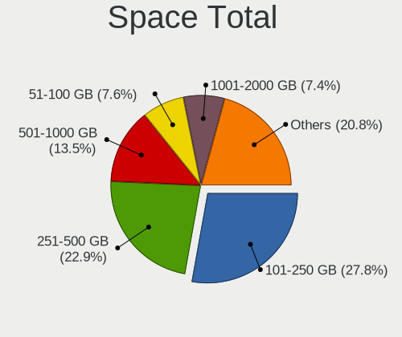

| Size in GB     | Computers | Percent |
|----------------|-----------|---------|
| 101-250        | 338       | 29.7%   |
| 251-500        | 267       | 23.46%  |
| 501-1000       | 139       | 12.21%  |
| 51-100         | 98        | 8.61%   |
| 1-20           | 84        | 7.38%   |
| 1001-2000      | 72        | 6.33%   |
| 21-50          | 57        | 5.01%   |
| More than 3000 | 32        | 2.81%   |
| 2001-3000      | 29        | 2.55%   |
| Unknown        | 22        | 1.93%   |

Space Used
----------

Amount of used disk space

| Used GB        | Computers | Percent |
|----------------|-----------|---------|
| 1-20           | 499       | 42.72%  |
| 21-50          | 217       | 18.58%  |
| 101-250        | 136       | 11.64%  |
| 51-100         | 123       | 10.53%  |
| 251-500        | 71        | 6.08%   |
| 501-1000       | 45        | 3.85%   |
| 1001-2000      | 34        | 2.91%   |
| Unknown        | 22        | 1.88%   |
| More than 3000 | 13        | 1.11%   |
| 2001-3000      | 8         | 0.68%   |

Malfunc. Drives
---------------

Drive models with a malfunction

| Model                               | Computers | Drives | Percent |
|-------------------------------------|-----------|--------|---------|
| Crucial CT240M500SSD1 240GB         | 9         | 9      | 8.82%   |
| Kingston SV300S37A120G 120GB SSD    | 6         | 6      | 5.88%   |
| Seagate ST3500418AS 500GB           | 3         | 3      | 2.94%   |
| WDC WD800JD-60LSA0 80GB             | 2         | 2      | 1.96%   |
| WDC WD3200AAJS-00L7A0 320GB         | 2         | 2      | 1.96%   |
| Toshiba MK2552GSX 250GB             | 2         | 2      | 1.96%   |
| Seagate ST9500325AS 500GB           | 2         | 2      | 1.96%   |
| Seagate ST500LT012-1DG142 500GB     | 2         | 2      | 1.96%   |
| Seagate ST1000LM024 HN-M101MBB 1TB  | 2         | 2      | 1.96%   |
| Samsung Electronics HD252HJ 250GB   | 2         | 2      | 1.96%   |
| Kingston SV300S37A240G 240GB SSD    | 2         | 2      | 1.96%   |
| Kingston SUV400S37240G 240GB SSD    | 2         | 2      | 1.96%   |
| Hitachi HTS545050A7E380 500GB       | 2         | 2      | 1.96%   |
| HGST HTS721010A9E630 1TB            | 2         | 2      | 1.96%   |
| WDC WD6400AADS-00M2B0 640GB         | 1         | 1      | 0.98%   |
| WDC WD5000LPCX-60VHAT0 500GB        | 1         | 1      | 0.98%   |
| WDC WD5000BPVT-22HXZT1 500GB        | 1         | 1      | 0.98%   |
| WDC WD5000AAKS-00V1A0 500GB         | 1         | 1      | 0.98%   |
| WDC WD5000AAKS-00A7B0 500GB         | 1         | 4      | 0.98%   |
| WDC WD40EFRX-68WT0N0 4TB            | 1         | 2      | 0.98%   |
| WDC WD3200AAJS-00B4A0 320GB         | 1         | 1      | 0.98%   |
| WDC WD30EZRS-11J99B1 3TB            | 1         | 1      | 0.98%   |
| WDC WD2500JS-40TGB0 250GB           | 1         | 1      | 0.98%   |
| WDC WD10JPVT-22A1YT0 1TB            | 1         | 1      | 0.98%   |
| WDC WD10EZEX-00BN5A0 1TB            | 1         | 1      | 0.98%   |
| WDC WD10EARS-00Y5B1 1TB             | 1         | 1      | 0.98%   |
| WDC WD1002FBYS-02A6B0 1TB           | 1         | 1      | 0.98%   |
| WDC WD1001FALS-00J7B0 1TB           | 1         | 4      | 0.98%   |
| Unknown FM-25S2S-60GBP2 64GB SSD    | 1         | 1      | 0.98%   |
| Toshiba Q300. 240GB SSD             | 1         | 1      | 0.98%   |
| Toshiba MQ01ABD100 1TB              | 1         | 1      | 0.98%   |
| Toshiba MK7575GSX 752GB             | 1         | 1      | 0.98%   |
| Toshiba MK5065GSX 500GB             | 1         | 1      | 0.98%   |
| Toshiba MK4058GSX 400GB             | 1         | 1      | 0.98%   |
| Toshiba MK3276GSX 320GB             | 1         | 1      | 0.98%   |
| Toshiba MK3252GSX 320GB             | 1         | 2      | 0.98%   |
| SK Hynix SH920 2.5 7MM 512GB SSD    | 1         | 1      | 0.98%   |
| Seagate ST9750420AS 752GB           | 1         | 1      | 0.98%   |
| Seagate ST9320325AS 320GB           | 1         | 1      | 0.98%   |
| Seagate ST9250827AS 250GB           | 1         | 1      | 0.98%   |
| Seagate ST9160310AS 160GB           | 1         | 2      | 0.98%   |
| Seagate ST500LM012 HN-M500MBB 500GB | 1         | 1      | 0.98%   |
| Seagate ST500DM002-1BD142 500GB     | 1         | 1      | 0.98%   |
| Seagate ST480HM000-1G5162 480GB     | 1         | 1      | 0.98%   |
| Seagate ST3160812AS 160GB           | 1         | 1      | 0.98%   |
| Seagate ST2000DM001-9YN164 2TB      | 1         | 1      | 0.98%   |
| Seagate ST1000LM035-1RK172 1TB      | 1         | 1      | 0.98%   |
| SanDisk SSD U100 24GB               | 1         | 1      | 0.98%   |
| Samsung Electronics SSD 870 EVO 1TB | 1         | 1      | 0.98%   |
| Samsung Electronics HM251HI 250GB   | 1         | 1      | 0.98%   |
| Samsung Electronics HD501LJ 500GB   | 1         | 1      | 0.98%   |
| Samsung Electronics HD161HJ 160GB   | 1         | 1      | 0.98%   |
| Samsung Electronics HD103SI 1TB     | 1         | 1      | 0.98%   |
| MAXTOR STM3320820AS 320GB           | 1         | 2      | 0.98%   |
| MAXTOR STM3250820AS 250GB           | 1         | 2      | 0.98%   |
| MAXTOR 7L300S0 304GB                | 1         | 2      | 0.98%   |
| MAXTOR 6Y120M0 122GB                | 1         | 1      | 0.98%   |
| Kingston SA400S37240G 240GB SSD     | 1         | 1      | 0.98%   |
| KingDian S280 120GB SSD             | 1         | 2      | 0.98%   |
| HP Phison PSSBN032GA27MC0 32GB SSD  | 1         | 1      | 0.98%   |

Malfunc. Drive Vendor
---------------------

Vendors of faulty drives

| Vendor              | Computers | Drives | Percent |
|---------------------|-----------|--------|---------|
| WDC                 | 18        | 25     | 18%     |
| Seagate             | 18        | 20     | 18%     |
| Hitachi             | 13        | 13     | 13%     |
| Kingston            | 11        | 11     | 11%     |
| Crucial             | 11        | 11     | 11%     |
| Toshiba             | 9         | 10     | 9%      |
| Samsung Electronics | 6         | 7      | 6%      |
| MAXTOR              | 4         | 7      | 4%      |
| HGST                | 2         | 2      | 2%      |
| Unknown             | 1         | 1      | 1%      |
| SK Hynix            | 1         | 1      | 1%      |
| SanDisk             | 1         | 1      | 1%      |
| KingDian            | 1         | 2      | 1%      |
| HP Phison           | 1         | 1      | 1%      |
| Fujitsu             | 1         | 1      | 1%      |
| Apple               | 1         | 1      | 1%      |
| A-DATA Technology   | 1         | 1      | 1%      |

Malfunc. HDD Vendor
-------------------

Vendors of faulty HDD drives

| Vendor              | Computers | Drives | Percent |
|---------------------|-----------|--------|---------|
| WDC                 | 18        | 25     | 25.71%  |
| Seagate             | 18        | 20     | 25.71%  |
| Hitachi             | 13        | 13     | 18.57%  |
| Toshiba             | 8         | 9      | 11.43%  |
| Samsung Electronics | 5         | 6      | 7.14%   |
| MAXTOR              | 4         | 7      | 5.71%   |
| HGST                | 2         | 2      | 2.86%   |
| Fujitsu             | 1         | 1      | 1.43%   |
| Apple               | 1         | 1      | 1.43%   |

Malfunc. Drive Kind
-------------------

Kinds of faulty drives

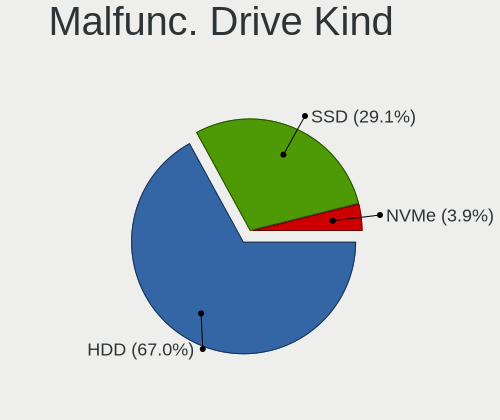

| Kind | Computers | Drives | Percent |
|------|-----------|--------|---------|
| HDD  | 66        | 84     | 68.75%  |
| SSD  | 30        | 31     | 31.25%  |

Failed Drives
-------------

Failed drive models

Zero info for selected period =(

Failed Drive Vendor
-------------------

Failed drive vendors

Zero info for selected period =(

Drive Status
------------

Number of failed and malfunc. drives

| Status   | Computers | Drives | Percent |
|----------|-----------|--------|---------|
| Detected | 757       | 1478   | 65.94%  |
| Works    | 298       | 496    | 25.96%  |
| Malfunc  | 93        | 115    | 8.1%    |

Storage controller
------------------

Storage Vendor
--------------

Storage controller vendors

| Vendor                           | Computers | Percent |
|----------------------------------|-----------|---------|
| Intel                            | 738       | 58.06%  |
| AMD                              | 181       | 14.24%  |
| Samsung Electronics              | 94        | 7.4%    |
| Sandisk                          | 47        | 3.7%    |
| Nvidia                           | 21        | 1.65%   |
| Kingston Technology Company      | 20        | 1.57%   |
| SK Hynix                         | 19        | 1.49%   |
| JMicron Technology               | 19        | 1.49%   |
| Toshiba America Info Systems     | 15        | 1.18%   |
| Silicon Integrated Systems [SiS] | 15        | 1.18%   |
| KIOXIA                           | 15        | 1.18%   |
| Phison Electronics               | 13        | 1.02%   |
| VIA Technologies                 | 12        | 0.94%   |
| Micron Technology                | 11        | 0.87%   |
| Marvell Technology Group         | 9         | 0.71%   |
| ASMedia Technology               | 9         | 0.71%   |
| Union Memory (Shenzhen)          | 5         | 0.39%   |
| LSI Logic / Symbios Logic        | 5         | 0.39%   |
| Lite-On Technology               | 4         | 0.31%   |
| Shenzhen Longsys Electronics     | 2         | 0.16%   |
| Micron/Crucial Technology        | 2         | 0.16%   |
| Lenovo                           | 2         | 0.16%   |
| Hewlett-Packard                  | 2         | 0.16%   |
| ADATA Technology                 | 2         | 0.16%   |
| Adaptec                          | 2         | 0.16%   |
| ULi Electronics                  | 1         | 0.08%   |
| Solid State Storage Technology   | 1         | 0.08%   |
| Silicon Motion                   | 1         | 0.08%   |
| Silicon Image                    | 1         | 0.08%   |
| Realtek Semiconductor            | 1         | 0.08%   |
| Enmotus                          | 1         | 0.08%   |
| Apple                            | 1         | 0.08%   |

Storage Model
-------------

Storage controller models

| Model                                                                                   | Computers | Percent |
|-----------------------------------------------------------------------------------------|-----------|---------|
| AMD FCH SATA Controller [AHCI mode]                                                     | 128       | 8.38%   |
| Intel 82801IBM/IEM (ICH9M/ICH9M-E) 4 port SATA Controller [AHCI mode]                   | 54        | 3.54%   |
| Samsung NVMe SSD Controller SM981/PM981/PM983                                           | 53        | 3.47%   |
| Intel 7 Series Chipset Family 6-port SATA Controller [AHCI mode]                        | 53        | 3.47%   |
| Intel Sunrise Point-LP SATA Controller [AHCI mode]                                      | 49        | 3.21%   |
| Intel 82801HM/HEM (ICH8M/ICH8M-E) IDE Controller                                        | 48        | 3.14%   |
| Intel 6 Series/C200 Series Chipset Family 6 port Mobile SATA AHCI Controller            | 42        | 2.75%   |
| Intel 82801HM/HEM (ICH8M/ICH8M-E) SATA Controller [AHCI mode]                           | 41        | 2.69%   |
| Intel 82801G (ICH7 Family) IDE Controller                                               | 39        | 2.55%   |
| Intel NM10/ICH7 Family SATA Controller [IDE mode]                                       | 35        | 2.29%   |
| Intel 8 Series/C220 Series Chipset Family 6-port SATA Controller 1 [AHCI mode]          | 34        | 2.23%   |
| Intel 8 Series SATA Controller 1 [AHCI mode]                                            | 32        | 2.1%    |
| Intel 5 Series/3400 Series Chipset 4 port SATA AHCI Controller                          | 32        | 2.1%    |
| Intel 82801 Mobile SATA Controller [RAID mode]                                          | 29        | 1.9%    |
| AMD SB7x0/SB8x0/SB9x0 IDE Controller                                                    | 21        | 1.38%   |
| Intel Q170/Q150/B150/H170/H110/Z170/CM236 Chipset SATA Controller [AHCI Mode]           | 20        | 1.31%   |
| Intel Wildcat Point-LP SATA Controller [AHCI Mode]                                      | 19        | 1.24%   |
| AMD SB7x0/SB8x0/SB9x0 SATA Controller [AHCI mode]                                       | 18        | 1.18%   |
| AMD 400 Series Chipset SATA Controller                                                  | 17        | 1.11%   |
| Samsung NVMe SSD Controller 980                                                         | 16        | 1.05%   |
| Intel HM170/QM170 Chipset SATA Controller [AHCI Mode]                                   | 16        | 1.05%   |
| Silicon Integrated Systems [SiS] 5513 IDE Controller                                    | 15        | 0.98%   |
| Sandisk WD Black SN750 / PC SN730 NVMe SSD                                              | 15        | 0.98%   |
| Intel SSD 660P Series                                                                   | 15        | 0.98%   |
| Intel Volume Management Device NVMe RAID Controller                                     | 14        | 0.92%   |
| Intel Cannon Lake PCH SATA AHCI Controller                                              | 14        | 0.92%   |
| Intel Atom Processor E3800 Series SATA AHCI Controller                                  | 14        | 0.92%   |
| AMD SB7x0/SB8x0/SB9x0 SATA Controller [IDE mode]                                        | 14        | 0.92%   |
| Silicon Integrated Systems [SiS] SATA Controller / IDE mode                             | 13        | 0.85%   |
| Intel Cannon Lake Mobile PCH SATA AHCI Controller                                       | 13        | 0.85%   |
| Intel 5 Series/3400 Series Chipset 6 port SATA AHCI Controller                          | 13        | 0.85%   |
| Samsung NVMe SSD Controller SM961/PM961/SM963                                           | 12        | 0.79%   |
| Phison E12 NVMe Controller                                                              | 12        | 0.79%   |
| Intel 7 Series/C210 Series Chipset Family 6-port SATA Controller [AHCI mode]            | 12        | 0.79%   |
| AMD 500 Series Chipset SATA Controller                                                  | 12        | 0.79%   |
| Micron Non-Volatile memory controller                                                   | 11        | 0.72%   |
| Intel 6 Series/C200 Series Chipset Family Desktop SATA Controller (IDE mode, ports 4-5) | 11        | 0.72%   |
| Intel 6 Series/C200 Series Chipset Family Desktop SATA Controller (IDE mode, ports 0-3) | 11        | 0.72%   |
| Sandisk WD Black 2018/SN750 / PC SN720 NVMe SSD                                         | 10        | 0.65%   |
| KIOXIA Non-Volatile memory controller                                                   | 10        | 0.65%   |
| Intel NM10/ICH7 Family SATA Controller [AHCI mode]                                      | 10        | 0.65%   |
| Intel 82801GBM/GHM (ICH7-M Family) SATA Controller [IDE mode]                           | 10        | 0.65%   |
| Intel 6 Series/C200 Series Chipset Family 6 port Desktop SATA AHCI Controller           | 10        | 0.65%   |
| Sandisk WD Blue SN550 NVMe SSD                                                          | 9         | 0.59%   |
| Intel Cannon Point-LP SATA Controller [AHCI Mode]                                       | 9         | 0.59%   |
| JMicron JMB363 SATA/IDE Controller                                                      | 8         | 0.52%   |
| Intel SATA Controller [RAID mode]                                                       | 8         | 0.52%   |
| Intel Comet Lake SATA AHCI Controller                                                   | 8         | 0.52%   |
| Intel 200 Series PCH SATA controller [AHCI mode]                                        | 8         | 0.52%   |
| AMD 300 Series Chipset SATA Controller                                                  | 8         | 0.52%   |
| Samsung NVMe SSD Controller PM9A1/PM9A3/980PRO                                          | 7         | 0.46%   |
| Kingston Company U-SNS8154P3 NVMe SSD                                                   | 7         | 0.46%   |
| JMicron JMB368 IDE controller                                                           | 7         | 0.46%   |
| Intel Celeron/Pentium Silver Processor SATA Controller                                  | 7         | 0.46%   |
| Intel Atom/Celeron/Pentium Processor x5-E8000/J3xxx/N3xxx Series SATA Controller        | 7         | 0.46%   |
| Intel 9 Series Chipset Family SATA Controller [AHCI Mode]                               | 7         | 0.46%   |
| Intel 82801HM/HEM (ICH8M/ICH8M-E) SATA Controller [IDE mode]                            | 7         | 0.46%   |
| Intel 82801FB/FBM/FR/FW/FRW (ICH6 Family) IDE Controller                                | 7         | 0.46%   |
| ASMedia ASM1062 Serial ATA Controller                                                   | 7         | 0.46%   |
| Toshiba America Info Systems XG6 NVMe SSD Controller                                    | 6         | 0.39%   |

Storage Kind
------------

Kind of storage controller (IDE, SATA, NVMe, SAS, ...)

| Kind | Computers | Percent |
|------|-----------|---------|
| SATA | 755       | 56.94%  |
| NVMe | 257       | 19.38%  |
| IDE  | 245       | 18.48%  |
| RAID | 65        | 4.9%    |
| SAS  | 2         | 0.15%   |
| SCSI | 2         | 0.15%   |

Processor
---------

CPU Vendor
----------

Processor vendors

| Vendor | Computers | Percent |
|--------|-----------|---------|
| Intel  | 860       | 79.7%   |
| AMD    | 213       | 19.74%  |
| ARM    | 6         | 0.56%   |

CPU Model
---------

Processor models

| Model                                         | Computers | Percent |
|-----------------------------------------------|-----------|---------|
| Intel Core 2 Duo CPU T8300 @ 2.40GHz          | 19        | 1.76%   |
| Intel Core i7-8565U CPU @ 1.80GHz             | 17        | 1.57%   |
| Intel 11th Gen Core i7-1165G7 @ 2.80GHz       | 15        | 1.39%   |
| Intel Core i7-10510U CPU @ 1.80GHz            | 14        | 1.3%    |
| Intel Core i7-8550U CPU @ 1.80GHz             | 13        | 1.2%    |
| Intel Pentium Dual-Core CPU T4300 @ 2.10GHz   | 11        | 1.02%   |
| Intel Core i7-6700HQ CPU @ 2.60GHz            | 11        | 1.02%   |
| Intel Celeron CPU N2840 @ 2.16GHz             | 11        | 1.02%   |
| Intel Core i5-8265U CPU @ 1.60GHz             | 10        | 0.93%   |
| Intel Core i5-8250U CPU @ 1.60GHz             | 10        | 0.93%   |
| Intel Core i5-3320M CPU @ 2.60GHz             | 10        | 0.93%   |
| Intel Atom x5-Z8350 CPU @ 1.44GHz             | 10        | 0.93%   |
| AMD Ryzen 5 3500U with Radeon Vega Mobile Gfx | 10        | 0.93%   |
| Intel Core i7-8750H CPU @ 2.20GHz             | 9         | 0.83%   |
| Intel 11th Gen Core i5-1135G7 @ 2.40GHz       | 9         | 0.83%   |
| Intel Core i7-4510U CPU @ 2.00GHz             | 8         | 0.74%   |
| Intel Core i7-2630QM CPU @ 2.00GHz            | 8         | 0.74%   |
| Intel Core i5-3210M CPU @ 2.50GHz             | 8         | 0.74%   |
| Intel Core i3-5005U CPU @ 2.00GHz             | 8         | 0.74%   |
| AMD Ryzen 7 4800H with Radeon Graphics        | 8         | 0.74%   |
| Intel Pentium Dual CPU T2390 @ 1.86GHz        | 7         | 0.65%   |
| Intel Core i7-9750H CPU @ 2.60GHz             | 7         | 0.65%   |
| Intel Core i7-7500U CPU @ 2.70GHz             | 7         | 0.65%   |
| Intel Core i7-6500U CPU @ 2.50GHz             | 7         | 0.65%   |
| Intel Core i5-2520M CPU @ 2.50GHz             | 7         | 0.65%   |
| Intel Core i5 CPU M 480 @ 2.67GHz             | 7         | 0.65%   |
| Intel Core i3-3217U CPU @ 1.80GHz             | 7         | 0.65%   |
| Intel Core 2 Quad CPU Q6600 @ 2.40GHz         | 7         | 0.65%   |
| Intel Pentium Dual-Core CPU T4500 @ 2.30GHz   | 6         | 0.56%   |
| Intel Pentium Dual CPU T3400 @ 2.16GHz        | 6         | 0.56%   |
| Intel Core i7-10750H CPU @ 2.60GHz            | 6         | 0.56%   |
| Intel Core i7 CPU Q 720 @ 1.60GHz             | 6         | 0.56%   |
| Intel Core i5-7200U CPU @ 2.50GHz             | 6         | 0.56%   |
| Intel Core i5-6200U CPU @ 2.30GHz             | 6         | 0.56%   |
| Intel Core i5-5200U CPU @ 2.20GHz             | 6         | 0.56%   |
| Intel Core i5-4460 CPU @ 3.20GHz              | 6         | 0.56%   |
| Intel Core i3 CPU M 330 @ 2.13GHz             | 6         | 0.56%   |
| Intel Core 2 Duo CPU P8700 @ 2.53GHz          | 6         | 0.56%   |
| Intel Core 2 Duo CPU P8600 @ 2.40GHz          | 6         | 0.56%   |
| Intel Celeron CPU N3060 @ 1.60GHz             | 6         | 0.56%   |
| AMD FX-6300 Six-Core Processor                | 6         | 0.56%   |
| AMD A6-6310 APU with AMD Radeon R4 Graphics   | 6         | 0.56%   |
| Intel Pentium Dual-Core CPU T4200 @ 2.00GHz   | 5         | 0.46%   |
| Intel Pentium 4 CPU 3.00GHz                   | 5         | 0.46%   |
| Intel Core i5-2450M CPU @ 2.50GHz             | 5         | 0.46%   |
| Intel Core i5-2400 CPU @ 3.10GHz              | 5         | 0.46%   |
| Intel Core i3-4005U CPU @ 1.70GHz             | 5         | 0.46%   |
| Intel Core 2 Duo CPU T9400 @ 2.53GHz          | 5         | 0.46%   |
| Intel Core 2 CPU T5600 @ 1.83GHz              | 5         | 0.46%   |
| Intel Atom x5-Z8300 CPU @ 1.44GHz             | 5         | 0.46%   |
| ARM Processor                                 | 5         | 0.46%   |
| AMD Ryzen 7 5800H with Radeon Graphics        | 5         | 0.46%   |
| AMD Ryzen 7 3700X 8-Core Processor            | 5         | 0.46%   |
| AMD Ryzen 5 3600 6-Core Processor             | 5         | 0.46%   |
| AMD Ryzen 5 2500U with Radeon Vega Mobile Gfx | 5         | 0.46%   |
| AMD Ryzen 5 1600 Six-Core Processor           | 5         | 0.46%   |
| Intel Pentium Dual CPU T2310 @ 1.46GHz        | 4         | 0.37%   |
| Intel Pentium D CPU 3.00GHz                   | 4         | 0.37%   |
| Intel Core i7-7700HQ CPU @ 2.80GHz            | 4         | 0.37%   |
| Intel Core i7-5500U CPU @ 2.40GHz             | 4         | 0.37%   |

CPU Model Family
----------------

Processor model prefix

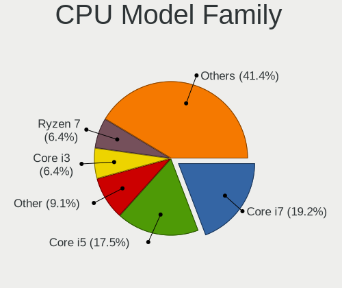

| Model                   | Computers | Percent |
|-------------------------|-----------|---------|
| Intel Core i7           | 210       | 19.43%  |
| Intel Core i5           | 202       | 18.69%  |
| Intel Core 2 Duo        | 77        | 7.12%   |
| Intel Core i3           | 68        | 6.29%   |
| AMD Ryzen 5             | 47        | 4.35%   |
| Other                   | 46        | 4.26%   |
| Intel Celeron           | 44        | 4.07%   |
| AMD Ryzen 7             | 39        | 3.61%   |
| Intel Atom              | 38        | 3.52%   |
| Intel Pentium Dual-Core | 37        | 3.42%   |
| Intel Pentium Dual      | 27        | 2.5%    |
| Intel Core 2 Quad       | 22        | 2.04%   |
| Intel Xeon              | 21        | 1.94%   |
| Intel Pentium           | 21        | 1.94%   |
| AMD FX                  | 21        | 1.94%   |
| Intel Core 2            | 17        | 1.57%   |
| Intel Genuine           | 13        | 1.2%    |
| AMD A4                  | 12        | 1.11%   |
| Intel Pentium 4         | 11        | 1.02%   |
| AMD Ryzen 3             | 11        | 1.02%   |
| AMD A6                  | 10        | 0.93%   |
| AMD A8                  | 9         | 0.83%   |
| AMD E2                  | 7         | 0.65%   |
| Intel Pentium D         | 6         | 0.56%   |
| AMD Ryzen 9             | 6         | 0.56%   |
| AMD A10                 | 6         | 0.56%   |
| Intel Pentium M         | 5         | 0.46%   |
| AMD E                   | 5         | 0.46%   |
| AMD Athlon              | 5         | 0.46%   |
| Intel Core i9           | 3         | 0.28%   |
| AMD Athlon II X2        | 3         | 0.28%   |
| AMD Athlon 64           | 3         | 0.28%   |
| Intel Pentium Gold      | 2         | 0.19%   |
| AMD Ryzen Threadripper  | 2         | 0.19%   |
| AMD Ryzen 7 PRO         | 2         | 0.19%   |
| AMD Mobile Sempron      | 2         | 0.19%   |
| AMD E1                  | 2         | 0.19%   |
| AMD Athlon II X3        | 2         | 0.19%   |
| AMD Athlon 64 X2        | 2         | 0.19%   |
| Intel Xeon Silver       | 1         | 0.09%   |
| Intel Core m3           | 1         | 0.09%   |
| Intel Celeron M         | 1         | 0.09%   |
| Intel Celeron Dual-Core | 1         | 0.09%   |
| ARM BCM                 | 1         | 0.09%   |
| AMD Turion 64 X2 Mobile | 1         | 0.09%   |
| AMD Turion              | 1         | 0.09%   |
| AMD Sempron             | 1         | 0.09%   |
| AMD Ryzen 5 PRO         | 1         | 0.09%   |
| AMD Quad-Core           | 1         | 0.09%   |
| AMD Phenom II X6        | 1         | 0.09%   |
| AMD Phenom II X4        | 1         | 0.09%   |
| AMD Phenom II X3        | 1         | 0.09%   |
| AMD Phenom II           | 1         | 0.09%   |
| AMD Phenom              | 1         | 0.09%   |

CPU Cores
---------

Number of processor cores

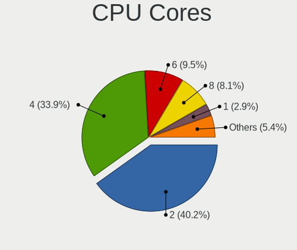

| Number  | Computers | Percent |
|---------|-----------|---------|
| 2       | 506       | 46.77%  |
| 4       | 383       | 35.4%   |
| 6       | 71        | 6.56%   |
| 8       | 48        | 4.44%   |
| 1       | 45        | 4.16%   |
| 3       | 12        | 1.11%   |
| 16      | 5         | 0.46%   |
| 12      | 3         | 0.28%   |
| 10      | 3         | 0.28%   |
| Unknown | 3         | 0.28%   |
| 36      | 1         | 0.09%   |
| 24      | 1         | 0.09%   |
| 14      | 1         | 0.09%   |

CPU Sockets
-----------

Number of sockets

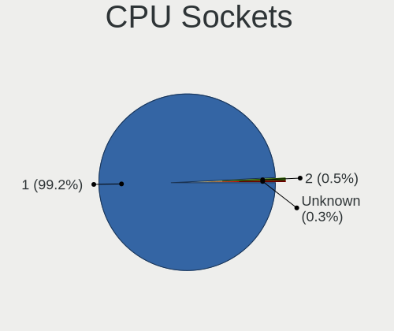

| Number  | Computers | Percent |
|---------|-----------|---------|
| 1       | 1071      | 99.26%  |
| 2       | 6         | 0.56%   |
| Unknown | 2         | 0.19%   |

CPU Threads
-----------

Threads per core (Hyper-Threading)

| Number  | Computers | Percent |
|---------|-----------|---------|
| 2       | 622       | 57.54%  |
| 1       | 456       | 42.18%  |
| Unknown | 3         | 0.28%   |

CPU Op-Modes
------------

CPU Operation Modes (32-bit, 64-bit)

| Op mode        | Computers | Percent |
|----------------|-----------|---------|
| 32-bit, 64-bit | 1012      | 92.93%  |
| Unknown        | 47        | 4.32%   |
| 32-bit         | 23        | 2.11%   |
| 64-bit         | 7         | 0.64%   |

CPU Microcode
-------------

Microcode number

| Number     | Computers | Percent |
|------------|-----------|---------|
| Unknown    | 226       | 20.2%   |
| 0x1067a    | 65        | 5.81%   |
| 0x206a7    | 60        | 5.36%   |
| 0x306a9    | 58        | 5.18%   |
| 0x10676    | 34        | 3.04%   |
| 0x6fd      | 33        | 2.95%   |
| 0x306c3    | 31        | 2.77%   |
| 0x906ea    | 30        | 2.68%   |
| 0x806ec    | 29        | 2.59%   |
| 0x806ea    | 25        | 2.23%   |
| 0x506e3    | 25        | 2.23%   |
| 0x40651    | 22        | 1.97%   |
| 0x806c1    | 21        | 1.88%   |
| 0x406e3    | 17        | 1.52%   |
| 0x306d4    | 17        | 1.52%   |
| 0x20652    | 17        | 1.52%   |
| 0x806eb    | 16        | 1.43%   |
| 0x30678    | 16        | 1.43%   |
| 0x20655    | 15        | 1.34%   |
| 0x906e9    | 14        | 1.25%   |
| 0x806e9    | 13        | 1.16%   |
| 0x6fb      | 13        | 1.16%   |
| 0x406c4    | 13        | 1.16%   |
| 0x06000852 | 12        | 1.07%   |
| 0x6f6      | 11        | 0.98%   |
| 0x106e5    | 11        | 0.98%   |
| 0x08701021 | 11        | 0.98%   |
| 0x406c3    | 9         | 0.8%    |
| 0x08108109 | 9         | 0.8%    |
| 0xa0652    | 8         | 0.71%   |
| 0x08108102 | 8         | 0.71%   |
| 0x0800820d | 8         | 0.71%   |
| 0x07030105 | 7         | 0.63%   |
| 0x6d8      | 6         | 0.54%   |
| 0x106ca    | 6         | 0.54%   |
| 0x08600106 | 6         | 0.54%   |
| 0x08600104 | 6         | 0.54%   |
| 0x08600103 | 6         | 0.54%   |
| 0x06006704 | 6         | 0.54%   |
| 0x706a1    | 5         | 0.45%   |
| 0x10677    | 5         | 0.45%   |
| 0x0a50000c | 5         | 0.45%   |
| 0x0810100b | 5         | 0.45%   |
| 0x0700010f | 5         | 0.45%   |
| 0x010000c8 | 5         | 0.45%   |
| 0xf43      | 4         | 0.36%   |
| 0x6f2      | 4         | 0.36%   |
| 0x6e8      | 4         | 0.36%   |
| 0x506c9    | 4         | 0.36%   |
| 0x30661    | 4         | 0.36%   |
| 0x106c2    | 4         | 0.36%   |
| 0x06006705 | 4         | 0.36%   |
| 0x06001119 | 4         | 0.36%   |
| 0x05000119 | 4         | 0.36%   |
| 0xf41      | 3         | 0.27%   |
| 0xa0671    | 3         | 0.27%   |
| 0x906eb    | 3         | 0.27%   |
| 0x706e5    | 3         | 0.27%   |
| 0x206d7    | 3         | 0.27%   |
| 0x10661    | 3         | 0.27%   |

CPU Microarch
-------------

Microarchitecture

| Name             | Computers | Percent |
|------------------|-----------|---------|
| KabyLake         | 153       | 14.15%  |
| Penryn           | 120       | 11.1%   |
| Core             | 78        | 7.22%   |
| Haswell          | 74        | 6.85%   |
| SandyBridge      | 71        | 6.57%   |
| IvyBridge        | 69        | 6.38%   |
| Skylake          | 54        | 5%      |
| Silvermont       | 50        | 4.63%   |
| Westmere         | 41        | 3.79%   |
| Zen 2            | 36        | 3.33%   |
| Zen+             | 33        | 3.05%   |
| TigerLake        | 27        | 2.5%    |
| Broadwell        | 25        | 2.31%   |
| Zen              | 22        | 2.04%   |
| Piledriver       | 21        | 1.94%   |
| NetBurst         | 19        | 1.76%   |
| Zen 3            | 16        | 1.48%   |
| Excavator        | 16        | 1.48%   |
| CometLake        | 16        | 1.48%   |
| Puma             | 15        | 1.39%   |
| Bonnell          | 15        | 1.39%   |
| P6               | 13        | 1.2%    |
| Nehalem          | 12        | 1.11%   |
| K10              | 12        | 1.11%   |
| Unknown          | 11        | 1.02%   |
| Steamroller      | 8         | 0.74%   |
| K8 Hammer        | 8         | 0.74%   |
| Jaguar           | 8         | 0.74%   |
| Icelake          | 8         | 0.74%   |
| Goldmont plus    | 7         | 0.65%   |
| Bobcat           | 7         | 0.65%   |
| Goldmont         | 5         | 0.46%   |
| K8 & K10 hybrid  | 4         | 0.37%   |
| Bulldozer        | 3         | 0.28%   |
| K10 Llano        | 2         | 0.19%   |
| Tremont          | 1         | 0.09%   |
| Alderlake Hybrid | 1         | 0.09%   |

Graphics
--------

GPU Vendor
----------

Vendors of graphics cards

| Vendor                           | Computers | Percent |
|----------------------------------|-----------|---------|
| Intel                            | 601       | 45.7%   |
| Nvidia                           | 389       | 29.58%  |
| AMD                              | 309       | 23.5%   |
| Silicon Integrated Systems [SiS] | 11        | 0.84%   |
| ASPEED Technology                | 3         | 0.23%   |
| Matrox Electronics Systems       | 2         | 0.15%   |

GPU Model
---------

Graphics card models

| Model                                                                                    | Computers | Percent |
|------------------------------------------------------------------------------------------|-----------|---------|
| Intel 3rd Gen Core processor Graphics Controller                                         | 51        | 3.7%    |
| Intel 2nd Generation Core Processor Family Integrated Graphics Controller                | 47        | 3.41%   |
| Intel WhiskeyLake-U GT2 [UHD Graphics 620]                                               | 32        | 2.32%   |
| Intel Haswell-ULT Integrated Graphics Controller                                         | 32        | 2.32%   |
| Intel UHD Graphics 620                                                                   | 28        | 2.03%   |
| Intel Atom/Celeron/Pentium Processor x5-E8000/J3xxx/N3xxx Integrated Graphics Controller | 28        | 2.03%   |
| Intel TigerLake-LP GT2 [Iris Xe Graphics]                                                | 25        | 1.81%   |
| Intel Skylake GT2 [HD Graphics 520]                                                      | 23        | 1.67%   |
| Intel Mobile GM965/GL960 Integrated Graphics Controller (secondary)                      | 23        | 1.67%   |
| Intel Mobile GM965/GL960 Integrated Graphics Controller (primary)                        | 23        | 1.67%   |
| Intel Mobile 4 Series Chipset Integrated Graphics Controller                             | 22        | 1.6%    |
| AMD Picasso/Raven 2 [Radeon Vega Series / Radeon Vega Mobile Series]                     | 22        | 1.6%    |
| Intel Core Processor Integrated Graphics Controller                                      | 21        | 1.52%   |
| Intel Atom Processor Z36xxx/Z37xxx Series Graphics & Display                             | 21        | 1.52%   |
| Intel HD Graphics 5500                                                                   | 19        | 1.38%   |
| Intel CometLake-U GT2 [UHD Graphics]                                                     | 19        | 1.38%   |
| AMD Renoir                                                                               | 19        | 1.38%   |
| AMD Ellesmere [Radeon RX 470/480/570/570X/580/580X/590]                                  | 19        | 1.38%   |
| Intel HD Graphics 530                                                                    | 18        | 1.31%   |
| Intel CoffeeLake-H GT2 [UHD Graphics 630]                                                | 18        | 1.31%   |
| Intel HD Graphics 620                                                                    | 17        | 1.23%   |
| Nvidia G86M [GeForce 8600M GS]                                                           | 16        | 1.16%   |
| Intel 4th Gen Core Processor Integrated Graphics Controller                              | 16        | 1.16%   |
| Intel 4 Series Chipset Integrated Graphics Controller                                    | 16        | 1.16%   |
| AMD Raven Ridge [Radeon Vega Series / Radeon Vega Mobile Series]                         | 13        | 0.94%   |
| AMD Park [Mobility Radeon HD 5430/5450/5470]                                             | 13        | 0.94%   |
| Nvidia GP108M [GeForce MX150]                                                            | 12        | 0.87%   |
| Nvidia GK208B [GeForce GT 710]                                                           | 12        | 0.87%   |
| Nvidia GF117M [GeForce 610M/710M/810M/820M / GT 620M/625M/630M/720M]                     | 12        | 0.87%   |
| AMD Stoney [Radeon R2/R3/R4/R5 Graphics]                                                 | 12        | 0.87%   |
| Nvidia GP107M [GeForce GTX 1050 Mobile]                                                  | 11        | 0.8%    |
| Silicon Integrated Systems [SiS] 771/671 PCIE VGA Display Adapter                        | 10        | 0.73%   |
| Nvidia GT218 [GeForce 210]                                                               | 10        | 0.73%   |
| AMD Sun XT [Radeon HD 8670A/8670M/8690M / R5 M330 / M430 / Radeon 520 Mobile]            | 10        | 0.73%   |
| AMD Cezanne                                                                              | 10        | 0.73%   |
| Intel Xeon E3-1200 v3/4th Gen Core Processor Integrated Graphics Controller              | 9         | 0.65%   |
| Intel Mobile 945GM/GMS/GME, 943/940GML Express Integrated Graphics Controller            | 9         | 0.65%   |
| Intel HD Graphics 630                                                                    | 9         | 0.65%   |
| Intel CometLake-H GT2 [UHD Graphics]                                                     | 9         | 0.65%   |
| Intel CoffeeLake-S GT2 [UHD Graphics 630]                                                | 9         | 0.65%   |
| AMD Mullins [Radeon R4/R5 Graphics]                                                      | 9         | 0.65%   |
| Nvidia GP108M [GeForce MX250]                                                            | 8         | 0.58%   |
| Nvidia GP107 [GeForce GTX 1050 Ti]                                                       | 8         | 0.58%   |
| Nvidia GK208M [GeForce GT 740M]                                                          | 8         | 0.58%   |
| Nvidia TU117M [GeForce GTX 1650 Mobile / Max-Q]                                          | 7         | 0.51%   |
| Nvidia GM108M [GeForce 840M]                                                             | 7         | 0.51%   |
| Nvidia GK208BM [GeForce 920M]                                                            | 7         | 0.51%   |
| Intel GeminiLake [UHD Graphics 600]                                                      | 7         | 0.51%   |
| AMD Thames [Radeon HD 7500M/7600M Series]                                                | 7         | 0.51%   |
| AMD RV710/M92 [Mobility Radeon HD 4530/4570/545v]                                        | 7         | 0.51%   |
| AMD Madison [Mobility Radeon HD 5650/5750 / 6530M/6550M]                                 | 7         | 0.51%   |
| AMD Cedar [Radeon HD 5000/6000/7350/8350 Series]                                         | 7         | 0.51%   |
| Nvidia TU117M                                                                            | 6         | 0.44%   |
| Nvidia GM108M [GeForce MX130]                                                            | 6         | 0.44%   |
| Nvidia GM108M [GeForce 920MX]                                                            | 6         | 0.44%   |
| Intel Xeon E3-1200 v2/3rd Gen Core processor Graphics Controller                         | 6         | 0.44%   |
| Intel Atom Processor D4xx/D5xx/N4xx/N5xx Integrated Graphics Controller                  | 6         | 0.44%   |
| Nvidia TU117M [GeForce GTX 1650 Ti Mobile]                                               | 5         | 0.36%   |
| Nvidia GP108M [GeForce MX330]                                                            | 5         | 0.36%   |
| Nvidia GP107 [GeForce GTX 1050]                                                          | 5         | 0.36%   |

GPU Combo
---------

Combinations of graphics cards

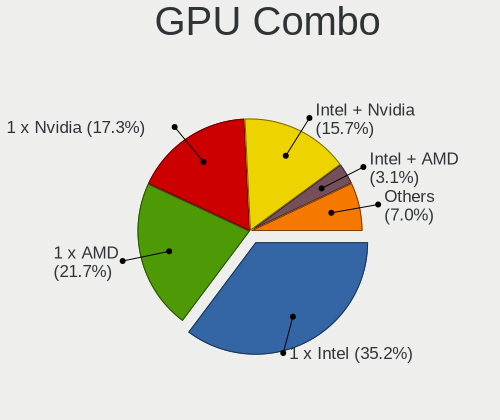

| Name            | Computers | Percent |
|-----------------|-----------|---------|
| 1 x Intel       | 385       | 35.45%  |
| 1 x AMD         | 230       | 21.18%  |
| 1 x Nvidia      | 202       | 18.6%   |
| Intel + Nvidia  | 166       | 15.29%  |
| Intel + AMD     | 39        | 3.59%   |
| 2 x AMD         | 25        | 2.3%    |
| AMD + Nvidia    | 16        | 1.47%   |
| 1 x SiS         | 11        | 1.01%   |
| Other           | 6         | 0.55%   |
| Nvidia + ASPEED | 2         | 0.18%   |
| 2 x Nvidia      | 1         | 0.09%   |
| Nvidia + Matrox | 1         | 0.09%   |
| 1 x Matrox      | 1         | 0.09%   |
| 1 x ASPEED      | 1         | 0.09%   |

GPU Driver
----------

Free vs proprietary

| Driver      | Computers | Percent |
|-------------|-----------|---------|
| Free        | 858       | 78.5%   |
| Proprietary | 183       | 16.74%  |
| Unknown     | 52        | 4.76%   |

GPU Memory
----------

Total video memory

| Size in GB | Computers | Percent |
|------------|-----------|---------|
| Unknown    | 552       | 49.77%  |
| 0.01-0.5   | 181       | 16.32%  |
| 1.01-2.0   | 156       | 14.07%  |
| 0.51-1.0   | 105       | 9.47%   |
| 3.01-4.0   | 63        | 5.68%   |
| 5.01-6.0   | 22        | 1.98%   |
| 7.01-8.0   | 21        | 1.89%   |
| 2.01-3.0   | 5         | 0.45%   |
| 8.01-16.0  | 4         | 0.36%   |

Monitor
-------

Monitor Vendor
--------------

Monitor vendors

| Vendor                  | Computers | Percent |
|-------------------------|-----------|---------|
| AU Optronics            | 157       | 13.86%  |
| Samsung Electronics     | 145       | 12.8%   |
| Chimei Innolux          | 114       | 10.06%  |
| LG Display              | 105       | 9.27%   |
| Goldstar                | 82        | 7.24%   |
| BOE                     | 82        | 7.24%   |
| Ancor Communications    | 59        | 5.21%   |
| Hewlett-Packard         | 58        | 5.12%   |
| Dell                    | 31        | 2.74%   |
| Chi Mei Optoelectronics | 25        | 2.21%   |
| AOC                     | 23        | 2.03%   |
| Lenovo                  | 20        | 1.77%   |
| Apple                   | 20        | 1.77%   |
| BenQ                    | 19        | 1.68%   |
| LG Philips              | 18        | 1.59%   |
| Philips                 | 17        | 1.5%    |
| Acer                    | 15        | 1.32%   |
| PANDA                   | 12        | 1.06%   |
| Sony                    | 11        | 0.97%   |
| LG Electronics          | 10        | 0.88%   |
| Unknown                 | 8         | 0.71%   |
| Sharp                   | 8         | 0.71%   |
| CPT                     | 6         | 0.53%   |
| ASUSTek Computer        | 6         | 0.53%   |
| MSI                     | 5         | 0.44%   |
| InfoVision              | 5         | 0.44%   |
| ViewSonic               | 4         | 0.35%   |
| Toshiba                 | 4         | 0.35%   |
| Seiko/Epson             | 4         | 0.35%   |
| HPN                     | 4         | 0.35%   |
| Fujitsu Siemens         | 4         | 0.35%   |
| HannStar                | 3         | 0.26%   |
| CSO                     | 3         | 0.26%   |
| ___                     | 2         | 0.18%   |
| RTK                     | 2         | 0.18%   |
| LGD                     | 2         | 0.18%   |
| Lenovo Group Limited    | 2         | 0.18%   |
| IBM                     | 2         | 0.18%   |
| HUAWEI                  | 2         | 0.18%   |
| Hitachi                 | 2         | 0.18%   |
| CVT                     | 2         | 0.18%   |
| AVX                     | 2         | 0.18%   |
| VIE                     | 1         | 0.09%   |
| Vestel Elektronik       | 1         | 0.09%   |
| Vestel                  | 1         | 0.09%   |
| TEO                     | 1         | 0.09%   |
| TCL                     | 1         | 0.09%   |
| TAR                     | 1         | 0.09%   |
| Plain Tree Systems      | 1         | 0.09%   |
| Panasonic               | 1         | 0.09%   |
| Nvidia                  | 1         | 0.09%   |
| NEC Computers           | 1         | 0.09%   |
| Mi                      | 1         | 0.09%   |
| KOC                     | 1         | 0.09%   |
| KDC                     | 1         | 0.09%   |
| JDI                     | 1         | 0.09%   |
| InnoLux Display         | 1         | 0.09%   |
| Iiyama                  | 1         | 0.09%   |
| HXF                     | 1         | 0.09%   |
| HJW                     | 1         | 0.09%   |

Monitor Model
-------------

Monitor models

| Model                                                                    | Computers | Percent |
|--------------------------------------------------------------------------|-----------|---------|
| AU Optronics LCD Monitor AUO403D 1920x1080 309x174mm 14.0-inch           | 11        | 0.94%   |
| AU Optronics LCD Monitor AUO22EC 1366x768 344x193mm 15.5-inch            | 9         | 0.77%   |
| Chimei Innolux LCD Monitor CMN15CA 1366x768 344x193mm 15.5-inch          | 8         | 0.69%   |
| Goldstar FULL HD GSM5B55 1920x1080 480x270mm 21.7-inch                   | 7         | 0.6%    |
| Chimei Innolux LCD Monitor CMN15DB 1366x768 344x193mm 15.5-inch          | 7         | 0.6%    |
| Chimei Innolux LCD Monitor CMN15BF 1366x768 340x190mm 15.3-inch          | 6         | 0.52%   |
| BOE LCD Monitor BOE0704 1366x768 344x194mm 15.5-inch                     | 6         | 0.52%   |
| Samsung Electronics LCD Monitor SEC5541 1366x768 344x193mm 15.5-inch     | 5         | 0.43%   |
| LG Philips LCD Monitor LPLDD00 1280x800 331x207mm 15.4-inch              | 5         | 0.43%   |
| Chimei Innolux LCD Monitor CMN15F5 1920x1080 344x193mm 15.5-inch         | 5         | 0.43%   |
| Chimei Innolux LCD Monitor CMN15E7 1920x1080 344x193mm 15.5-inch         | 5         | 0.43%   |
| AU Optronics LCD Monitor AUO8174 1280x800 331x207mm 15.4-inch            | 5         | 0.43%   |
| AU Optronics LCD Monitor AUO5B2D 1920x1080 293x162mm 13.2-inch           | 5         | 0.43%   |
| Ancor Communications VX238 ACI23C1 1920x1080 510x290mm 23.1-inch         | 5         | 0.43%   |
| Samsung Electronics S24D300 SAM0B43 1920x1080 531x299mm 24.0-inch        | 4         | 0.34%   |
| Samsung Electronics LCD Monitor SEC3945 1280x800 331x207mm 15.4-inch     | 4         | 0.34%   |
| LG Display LCD Monitor LGD045D 1366x768 345x194mm 15.6-inch              | 4         | 0.34%   |
| LG Display LCD Monitor LGD039F 1366x768 345x194mm 15.6-inch              | 4         | 0.34%   |
| Goldstar FULL HD GSM5ABB 1920x1080 480x270mm 21.7-inch                   | 4         | 0.34%   |
| Goldstar FULL HD GSM5AB9 1920x1080 480x270mm 21.7-inch                   | 4         | 0.34%   |
| Chimei Innolux LCD Monitor CMN15E6 1366x768 344x193mm 15.5-inch          | 4         | 0.34%   |
| Chimei Innolux LCD Monitor CMN15C9 1366x768 344x193mm 15.5-inch          | 4         | 0.34%   |
| Chimei Innolux LCD Monitor CMN15B7 1366x768 344x193mm 15.5-inch          | 4         | 0.34%   |
| Chimei Innolux LCD Monitor CMN15AB 1366x768 344x193mm 15.5-inch          | 4         | 0.34%   |
| Chi Mei Optoelectronics LCD Monitor CMO1592 1366x768 344x193mm 15.5-inch | 4         | 0.34%   |
| BOE LCD Monitor BOE07F1 1920x1080 344x193mm 15.5-inch                    | 4         | 0.34%   |
| BenQ GW2480 BNQ78E7 1920x1080 527x296mm 23.8-inch                        | 4         | 0.34%   |
| AU Optronics LCD Monitor AUO61ED 1920x1080 344x194mm 15.5-inch           | 4         | 0.34%   |
| AU Optronics LCD Monitor AUO40EC 1366x768 344x193mm 15.5-inch            | 4         | 0.34%   |
| AU Optronics LCD Monitor AUO21ED 1920x1080 344x194mm 15.5-inch           | 4         | 0.34%   |
| AU Optronics LCD Monitor AUO21EC 1366x768 344x193mm 15.5-inch            | 4         | 0.34%   |
| Ancor Communications VE228 ACI22FA 1920x1080 477x268mm 21.5-inch         | 4         | 0.34%   |
| Ancor Communications ASUS VS247 ACI249A 1920x1080 520x290mm 23.4-inch    | 4         | 0.34%   |
| Ancor Communications ASUS VP228 ACI22C3 1920x1080 476x268mm 21.5-inch    | 4         | 0.34%   |
| Acer KA270H ACR0522 1920x1080 598x336mm 27.0-inch                        | 4         | 0.34%   |
| Samsung Electronics SyncMaster SAM0230 1280x1024 376x301mm 19.0-inch     | 3         | 0.26%   |
| Samsung Electronics S24F350 SAM0D20 1920x1080 521x293mm 23.5-inch        | 3         | 0.26%   |
| Samsung Electronics LCD Monitor SEC544B 1600x900 310x174mm 14.0-inch     | 3         | 0.26%   |
| Samsung Electronics LCD Monitor SEC5441 1366x768 309x174mm 14.0-inch     | 3         | 0.26%   |
| Samsung Electronics LCD Monitor SEC3030 1024x600 223x125mm 10.1-inch     | 3         | 0.26%   |
| Samsung Electronics LCD Monitor SAM0902 1920x1080 700x390mm 31.5-inch    | 3         | 0.26%   |
| Philips 170S PHL082B 1280x1024 338x270mm 17.0-inch                       | 3         | 0.26%   |
| LG Philips LP154WX4-TLC8 LPL0120 1280x800 331x207mm 15.4-inch            | 3         | 0.26%   |
| LG Display LCD Monitor LGD0456 1366x768 344x194mm 15.5-inch              | 3         | 0.26%   |
| LG Display LCD Monitor LGD033A 1366x768 344x194mm 15.5-inch              | 3         | 0.26%   |
| LG Display LCD Monitor LGD02DC 1366x768 344x194mm 15.5-inch              | 3         | 0.26%   |
| LG Display LCD Monitor LGD01E8 1366x768 344x194mm 15.5-inch              | 3         | 0.26%   |
| Hewlett-Packard 24f HPN3545 1920x1080 527x296mm 23.8-inch                | 3         | 0.26%   |
| Goldstar ULTRAWIDE GSM59F1 2560x1080 673x284mm 28.8-inch                 | 3         | 0.26%   |
| Goldstar M227WD GSM56D5 1920x1080 480x270mm 21.7-inch                    | 3         | 0.26%   |
| Goldstar L1919S GSM4AF0 1280x1024 376x301mm 19.0-inch                    | 3         | 0.26%   |
| Goldstar HDR WQHD GSM772B 3440x1440 800x335mm 34.1-inch                  | 3         | 0.26%   |
| Chimei Innolux P130ZFA-BA1 CMN8201 2160x1440 275x183mm 13.0-inch         | 3         | 0.26%   |
| Chimei Innolux LCD Monitor CMN15E8 1920x1080 344x193mm 15.5-inch         | 3         | 0.26%   |
| Chimei Innolux LCD Monitor CMN15DC 1366x768 340x190mm 15.3-inch          | 3         | 0.26%   |
| Chimei Innolux LCD Monitor CMN15D2 1920x1080 344x193mm 15.5-inch         | 3         | 0.26%   |
| Chimei Innolux LCD Monitor CMN14D5 1920x1080 309x173mm 13.9-inch         | 3         | 0.26%   |
| Chimei Innolux LCD Monitor CMN14D4 1920x1080 309x173mm 13.9-inch         | 3         | 0.26%   |
| Chimei Innolux LCD Monitor CMN1493 1366x768 309x173mm 13.9-inch          | 3         | 0.26%   |
| Chi Mei Optoelectronics LCD Monitor CMO15A7 1366x768 344x193mm 15.5-inch | 3         | 0.26%   |

Monitor Resolution
------------------

Monitor screen resolution

| Resolution         | Computers | Percent |
|--------------------|-----------|---------|
| 1920x1080 (FHD)    | 410       | 38.28%  |
| 1366x768 (WXGA)    | 283       | 26.42%  |
| 1280x1024 (SXGA)   | 66        | 6.16%   |
| 1280x800 (WXGA)    | 54        | 5.04%   |
| 3840x2160 (4K)     | 50        | 4.67%   |
| 1600x900 (HD+)     | 34        | 3.17%   |
| 1440x900 (WXGA+)   | 31        | 2.89%   |
| 1680x1050 (WSXGA+) | 30        | 2.8%    |
| 2560x1440 (QHD)    | 21        | 1.96%   |
| 1920x1200 (WUXGA)  | 16        | 1.49%   |
| 1360x768           | 11        | 1.03%   |
| Unknown            | 9         | 0.84%   |
| 1024x768 (XGA)     | 8         | 0.75%   |
| 2560x1080          | 7         | 0.65%   |
| 3440x1440          | 6         | 0.56%   |
| 2160x1440          | 5         | 0.47%   |
| 3840x1080          | 4         | 0.37%   |
| 1024x600           | 4         | 0.37%   |
| 2560x1600          | 3         | 0.28%   |
| 1400x1050          | 3         | 0.28%   |
| 3200x1800 (QHD+)   | 2         | 0.19%   |
| 2880x1800          | 2         | 0.19%   |
| 1152x864           | 2         | 0.19%   |
| 640x480            | 1         | 0.09%   |
| 3520x1080          | 1         | 0.09%   |
| 3360x1080          | 1         | 0.09%   |
| 3360x1050          | 1         | 0.09%   |
| 3280x1080          | 1         | 0.09%   |
| 3000x2000          | 1         | 0.09%   |
| 2944x1080          | 1         | 0.09%   |
| 2560x2520          | 1         | 0.09%   |
| 2240x1400          | 1         | 0.09%   |
| 1600x1200          | 1         | 0.09%   |

Monitor Diagonal
----------------

Diagonal size in inches

| Inches  | Computers | Percent |
|---------|-----------|---------|
| 15      | 391       | 34.48%  |
| 13      | 91        | 8.02%   |
| 14      | 88        | 7.76%   |
| 21      | 77        | 6.79%   |
| 24      | 67        | 5.91%   |
| 17      | 67        | 5.91%   |
| Unknown | 55        | 4.85%   |
| 23      | 53        | 4.67%   |
| 27      | 52        | 4.59%   |
| 19      | 40        | 3.53%   |
| 18      | 23        | 2.03%   |
| 20      | 18        | 1.59%   |
| 12      | 17        | 1.5%    |
| 34      | 13        | 1.15%   |
| 22      | 13        | 1.15%   |
| 31      | 11        | 0.97%   |
| 11      | 11        | 0.97%   |
| 10      | 9         | 0.79%   |
| 84      | 7         | 0.62%   |
| 54      | 6         | 0.53%   |
| 16      | 4         | 0.35%   |
| 72      | 3         | 0.26%   |
| 33      | 3         | 0.26%   |
| 32      | 3         | 0.26%   |
| 26      | 3         | 0.26%   |
| 46      | 2         | 0.18%   |
| 40      | 2         | 0.18%   |
| 25      | 2         | 0.18%   |
| 48      | 1         | 0.09%   |
| 39      | 1         | 0.09%   |
| 8       | 1         | 0.09%   |

Monitor Width
-------------

Physical width

| Width in mm | Computers | Percent |
|-------------|-----------|---------|
| 301-350     | 547       | 49.19%  |
| 501-600     | 158       | 14.21%  |
| 401-500     | 145       | 13.04%  |
| 201-300     | 84        | 7.55%   |
| 351-400     | 63        | 5.67%   |
| Unknown     | 55        | 4.95%   |
| 701-800     | 19        | 1.71%   |
| 601-700     | 18        | 1.62%   |
| 1501-2000   | 10        | 0.9%    |
| 1001-1500   | 9         | 0.81%   |
| 801-900     | 3         | 0.27%   |
| 101-200     | 1         | 0.09%   |

Aspect Ratio
------------

Proportional relationship between the width and the height

| Ratio   | Computers | Percent |
|---------|-----------|---------|
| 16/9    | 743       | 72.42%  |
| 16/10   | 128       | 12.48%  |
| 5/4     | 57        | 5.56%   |
| Unknown | 51        | 4.97%   |
| 4/3     | 21        | 2.05%   |
| 21/9    | 12        | 1.17%   |
| 3/2     | 11        | 1.07%   |
| 6/5     | 3         | 0.29%   |

Monitor Area
------------

Area in inch

| Area in inch | Computers | Percent |
|----------------|-----------|---------|
| 101-110        | 386       | 34.25%  |
| 201-250        | 178       | 15.79%  |
| 81-90          | 140       | 12.42%  |
| 151-200        | 75        | 6.65%   |
| 141-150        | 56        | 4.97%   |
| Unknown        | 55        | 4.88%   |
| 301-350        | 54        | 4.79%   |
| 71-80          | 38        | 3.37%   |
| 351-500        | 28        | 2.48%   |
| 121-130        | 23        | 2.04%   |
| More than 1000 | 17        | 1.51%   |
| 61-70          | 17        | 1.51%   |
| 251-300        | 16        | 1.42%   |
| 51-60          | 11        | 0.98%   |
| 41-50          | 9         | 0.8%    |
| 131-140        | 8         | 0.71%   |
| 111-120        | 6         | 0.53%   |
| 501-1000       | 6         | 0.53%   |
| 91-100         | 3         | 0.27%   |
| 1-40           | 1         | 0.09%   |

Pixel Density
-------------

Pixels per inch

| Density       | Computers | Percent |
|---------------|-----------|---------|
| 51-100        | 363       | 33.21%  |
| 101-120       | 342       | 31.29%  |
| 121-160       | 264       | 24.15%  |
| Unknown       | 55        | 5.03%   |
| 161-240       | 45        | 4.12%   |
| 1-50          | 14        | 1.28%   |
| More than 240 | 10        | 0.91%   |

Multiple Monitors
-----------------

Total monitors connected

| Total | Computers | Percent |
|-------|-----------|---------|
| 1     | 873       | 78.79%  |
| 2     | 150       | 13.54%  |
| 0     | 63        | 5.69%   |
| 3     | 20        | 1.81%   |
| 4     | 2         | 0.18%   |

Network
-------

Net Controller Vendor
---------------------

Controller vendors

| Vendor                                | Computers | Percent |
|---------------------------------------|-----------|---------|
| Realtek Semiconductor                 | 585       | 35.96%  |
| Intel                                 | 429       | 26.37%  |
| Qualcomm Atheros                      | 250       | 15.37%  |
| Broadcom                              | 113       | 6.95%   |
| Marvell Technology Group              | 45        | 2.77%   |
| TP-Link                               | 22        | 1.35%   |
| Broadcom Limited                      | 20        | 1.23%   |
| Nvidia                                | 18        | 1.11%   |
| Silicon Integrated Systems [SiS]      | 15        | 0.92%   |
| Ralink                                | 14        | 0.86%   |
| Qualcomm Atheros Communications       | 14        | 0.86%   |
| Ralink Technology                     | 11        | 0.68%   |
| ASUSTek Computer                      | 6         | 0.37%   |
| VIA Technologies                      | 5         | 0.31%   |
| Sierra Wireless                       | 5         | 0.31%   |
| Samsung Electronics                   | 5         | 0.31%   |
| D-Link                                | 5         | 0.31%   |
| MEDIATEK                              | 4         | 0.25%   |
| JMicron Technology                    | 4         | 0.25%   |
| Ericsson Business Mobile Networks     | 4         | 0.25%   |
| Attansic Technology                   | 4         | 0.25%   |
| ASIX Electronics                      | 4         | 0.25%   |
| Hewlett-Packard                       | 3         | 0.18%   |
| Edimax Technology                     | 3         | 0.18%   |
| Mellanox Technologies                 | 2         | 0.12%   |
| Lenovo                                | 2         | 0.12%   |
| Huawei Technologies                   | 2         | 0.12%   |
| Fibocom                               | 2         | 0.12%   |
| D-Link System                         | 2         | 0.12%   |
| Belkin Components                     | 2         | 0.12%   |
| ADMtek                                | 2         | 0.12%   |
| Xiaomi                                | 1         | 0.06%   |
| TRENDnet                              | 1         | 0.06%   |
| Toshiba                               | 1         | 0.06%   |
| T & A Mobile Phones                   | 1         | 0.06%   |
| Standard Microsystems                 | 1         | 0.06%   |
| SparkFun                              | 1         | 0.06%   |
| Smart Link                            | 1         | 0.06%   |
| Sitecom Europe                        | 1         | 0.06%   |
| Silicom                               | 1         | 0.06%   |
| Qualcomm                              | 1         | 0.06%   |
| Motorola                              | 1         | 0.06%   |
| Microsoft                             | 1         | 0.06%   |
| Micro Star International              | 1         | 0.06%   |
| LSI                                   | 1         | 0.06%   |
| ICS Advent                            | 1         | 0.06%   |
| GrupoPIE PORTUGAL                     | 1         | 0.06%   |
| Dresden Elektronik                    | 1         | 0.06%   |
| dog hunter                            | 1         | 0.06%   |
| DisplayLink                           | 1         | 0.06%   |
| Dell                                  | 1         | 0.06%   |
| Archos                                | 1         | 0.06%   |
| Apple                                 | 1         | 0.06%   |
| Allwinner Technology                  | 1         | 0.06%   |
| Accton Technology                     | 1         | 0.06%   |
| 802.11g Adapter [Linksys WUSB54GC v3] | 1         | 0.06%   |

Net Controller Model
--------------------

Controller models

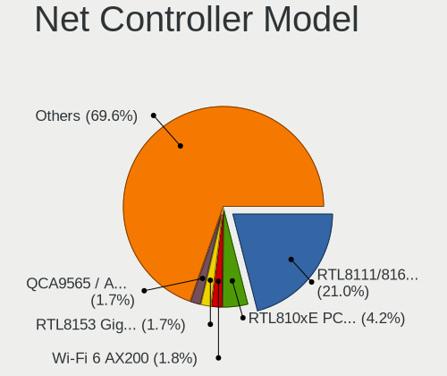

| Model                                                                   | Computers | Percent |
|-------------------------------------------------------------------------|-----------|---------|
| Realtek RTL8111/8168/8411 PCI Express Gigabit Ethernet Controller       | 396       | 20.86%  |
| Realtek RTL810xE PCI Express Fast Ethernet controller                   | 101       | 5.32%   |
| Qualcomm Atheros QCA9565 / AR9565 Wireless Network Adapter              | 45        | 2.37%   |
| Qualcomm Atheros AR9285 Wireless Network Adapter (PCI-Express)          | 38        | 2%      |
| Intel Wi-Fi 6 AX200                                                     | 35        | 1.84%   |
| Qualcomm Atheros QCA9377 802.11ac Wireless Network Adapter              | 32        | 1.69%   |
| Intel 82579LM Gigabit Network Connection (Lewisville)                   | 27        | 1.42%   |
| Qualcomm Atheros AR9485 Wireless Network Adapter                        | 26        | 1.37%   |
| Qualcomm Atheros AR242x / AR542x Wireless Network Adapter (PCI-Express) | 26        | 1.37%   |
| Intel Wireless 8265 / 8275                                              | 24        | 1.26%   |
| Intel PRO/Wireless 4965 AG or AGN [Kedron] Network Connection           | 24        | 1.26%   |
| Realtek RTL8821CE 802.11ac PCIe Wireless Network Adapter                | 23        | 1.21%   |
| Broadcom BCM43142 802.11b/g/n                                           | 23        | 1.21%   |
| Realtek RTL8153 Gigabit Ethernet Adapter                                | 22        | 1.16%   |
| Intel Cannon Point-LP CNVi [Wireless-AC]                                | 22        | 1.16%   |
| Marvell Group 88E8036 PCI-E Fast Ethernet Controller                    | 21        | 1.11%   |
| Broadcom BCM4313 802.11bgn Wireless Network Adapter                     | 19        | 1%      |
| Intel Wireless 7260                                                     | 17        | 0.9%    |
| Intel Centrino Advanced-N 6205 [Taylor Peak]                            | 17        | 0.9%    |
| Realtek RTL8723BE PCIe Wireless Network Adapter                         | 16        | 0.84%   |
| Intel Wi-Fi 6 AX201                                                     | 16        | 0.84%   |
| Intel Cannon Lake PCH CNVi WiFi                                         | 16        | 0.84%   |
| Realtek RTL8822CE 802.11ac PCIe Wireless Network Adapter                | 15        | 0.79%   |
| Intel Wireless 3165                                                     | 15        | 0.79%   |
| Intel PRO/Wireless 3945ABG [Golan] Network Connection                   | 15        | 0.79%   |
| Realtek RTL8188EUS 802.11n Wireless Network Adapter                     | 14        | 0.74%   |
| Intel Wireless 7265                                                     | 14        | 0.74%   |
| Intel Comet Lake PCH-LP CNVi WiFi                                       | 14        | 0.74%   |
| Silicon Integrated Systems [SiS] 191 Gigabit Ethernet Adapter           | 13        | 0.68%   |
| Realtek RTL-8100/8101L/8139 PCI Fast Ethernet Adapter                   | 13        | 0.68%   |
| Qualcomm Atheros AR8131 Gigabit Ethernet                                | 13        | 0.68%   |
| Intel Wireless 8260                                                     | 13        | 0.68%   |
| Intel 82579V Gigabit Network Connection                                 | 13        | 0.68%   |
| Realtek RTL8852AE 802.11ax PCIe Wireless Network Adapter                | 12        | 0.63%   |
| Qualcomm Atheros AR9271 802.11n                                         | 12        | 0.63%   |
| Qualcomm Atheros AR8151 v2.0 Gigabit Ethernet                           | 12        | 0.63%   |
| Intel Wireless 3160                                                     | 12        | 0.63%   |
| Intel I211 Gigabit Network Connection                                   | 12        | 0.63%   |
| Qualcomm Atheros AR928X Wireless Network Adapter (PCI-Express)          | 11        | 0.58%   |
| Qualcomm Atheros AR8121/AR8113/AR8114 Gigabit or Fast Ethernet          | 10        | 0.53%   |
| Intel WiFi Link 5100                                                    | 10        | 0.53%   |
| Intel PRO/Wireless 5100 AGN [Shiloh] Network Connection                 | 10        | 0.53%   |
| Realtek RTL8191SEvB Wireless LAN Controller                             | 9         | 0.47%   |
| Qualcomm Atheros QCA6174 802.11ac Wireless Network Adapter              | 9         | 0.47%   |
| Intel Ethernet Connection (2) I219-V                                    | 9         | 0.47%   |
| Intel Comet Lake PCH CNVi WiFi                                          | 9         | 0.47%   |
| Realtek RTL8822BE 802.11a/b/g/n/ac WiFi adapter                         | 8         | 0.42%   |
| Realtek RTL8125 2.5GbE Controller                                       | 8         | 0.42%   |
| Intel Wireless-AC 9260                                                  | 8         | 0.42%   |
| Intel Ethernet Connection I218-LM                                       | 8         | 0.42%   |
| TP-Link USB 10/100/1000 LAN                                             | 7         | 0.37%   |
| Realtek RTL8192CU 802.11n WLAN Adapter                                  | 7         | 0.37%   |
| Qualcomm Atheros AR8132 Fast Ethernet                                   | 7         | 0.37%   |
| Intel Ethernet Connection I217-LM                                       | 7         | 0.37%   |
| Intel Ethernet Connection (6) I219-V                                    | 7         | 0.37%   |
| Intel Ethernet Connection (4) I219-LM                                   | 7         | 0.37%   |
| Intel Centrino Advanced-N 6235                                          | 7         | 0.37%   |
| Intel 82577LM Gigabit Network Connection                                | 7         | 0.37%   |
| Broadcom NetLink BCM5787M Gigabit Ethernet PCI Express                  | 7         | 0.37%   |
| Realtek RTL8188EE Wireless Network Adapter                              | 6         | 0.32%   |

Wireless Vendor
---------------

Wireless vendors

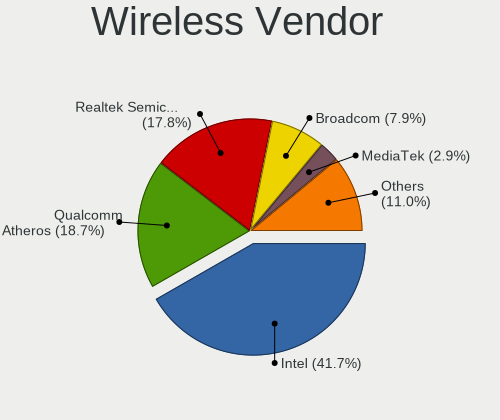

| Vendor                                | Computers | Percent |
|---------------------------------------|-----------|---------|
| Intel                                 | 345       | 39.43%  |
| Qualcomm Atheros                      | 203       | 23.2%   |
| Realtek Semiconductor                 | 150       | 17.14%  |
| Broadcom                              | 79        | 9.03%   |
| TP-Link                               | 15        | 1.71%   |
| Ralink                                | 14        | 1.6%    |
| Qualcomm Atheros Communications       | 14        | 1.6%    |
| Ralink Technology                     | 11        | 1.26%   |
| Broadcom Limited                      | 11        | 1.26%   |
| ASUSTek Computer                      | 6         | 0.69%   |
| Sierra Wireless                       | 5         | 0.57%   |
| D-Link                                | 5         | 0.57%   |
| MEDIATEK                              | 3         | 0.34%   |
| Edimax Technology                     | 3         | 0.34%   |
| Fibocom                               | 2         | 0.23%   |
| Belkin Components                     | 2         | 0.23%   |
| TRENDnet                              | 1         | 0.11%   |
| Sitecom Europe                        | 1         | 0.11%   |
| Microsoft                             | 1         | 0.11%   |
| Micro Star International              | 1         | 0.11%   |
| Marvell Technology Group              | 1         | 0.11%   |
| Dell                                  | 1         | 0.11%   |
| 802.11g Adapter [Linksys WUSB54GC v3] | 1         | 0.11%   |

Wireless Model
--------------

Wireless models

| Model                                                                   | Computers | Percent |
|-------------------------------------------------------------------------|-----------|---------|
| Qualcomm Atheros QCA9565 / AR9565 Wireless Network Adapter              | 45        | 5.14%   |
| Qualcomm Atheros AR9285 Wireless Network Adapter (PCI-Express)          | 38        | 4.34%   |
| Intel Wi-Fi 6 AX200                                                     | 35        | 4%      |
| Qualcomm Atheros QCA9377 802.11ac Wireless Network Adapter              | 32        | 3.65%   |
| Qualcomm Atheros AR9485 Wireless Network Adapter                        | 26        | 2.97%   |
| Qualcomm Atheros AR242x / AR542x Wireless Network Adapter (PCI-Express) | 26        | 2.97%   |
| Intel Wireless 8265 / 8275                                              | 24        | 2.74%   |
| Intel PRO/Wireless 4965 AG or AGN [Kedron] Network Connection           | 24        | 2.74%   |
| Realtek RTL8821CE 802.11ac PCIe Wireless Network Adapter                | 23        | 2.63%   |
| Broadcom BCM43142 802.11b/g/n                                           | 23        | 2.63%   |
| Intel Cannon Point-LP CNVi [Wireless-AC]                                | 22        | 2.51%   |
| Broadcom BCM4313 802.11bgn Wireless Network Adapter                     | 19        | 2.17%   |
| Intel Wireless 7260                                                     | 17        | 1.94%   |
| Intel Centrino Advanced-N 6205 [Taylor Peak]                            | 17        | 1.94%   |
| Realtek RTL8723BE PCIe Wireless Network Adapter                         | 16        | 1.83%   |
| Intel Wi-Fi 6 AX201                                                     | 16        | 1.83%   |
| Intel Cannon Lake PCH CNVi WiFi                                         | 16        | 1.83%   |
| Realtek RTL8822CE 802.11ac PCIe Wireless Network Adapter                | 15        | 1.71%   |
| Intel Wireless 3165                                                     | 15        | 1.71%   |
| Intel PRO/Wireless 3945ABG [Golan] Network Connection                   | 15        | 1.71%   |
| Realtek RTL8188EUS 802.11n Wireless Network Adapter                     | 14        | 1.6%    |
| Intel Wireless 7265                                                     | 14        | 1.6%    |
| Intel Comet Lake PCH-LP CNVi WiFi                                       | 14        | 1.6%    |
| Intel Wireless 8260                                                     | 13        | 1.48%   |
| Realtek RTL8852AE 802.11ax PCIe Wireless Network Adapter                | 12        | 1.37%   |
| Qualcomm Atheros AR9271 802.11n                                         | 12        | 1.37%   |
| Intel Wireless 3160                                                     | 12        | 1.37%   |
| Qualcomm Atheros AR928X Wireless Network Adapter (PCI-Express)          | 11        | 1.26%   |
| Intel WiFi Link 5100                                                    | 10        | 1.14%   |
| Intel PRO/Wireless 5100 AGN [Shiloh] Network Connection                 | 10        | 1.14%   |
| Realtek RTL8191SEvB Wireless LAN Controller                             | 9         | 1.03%   |
| Qualcomm Atheros QCA6174 802.11ac Wireless Network Adapter              | 9         | 1.03%   |
| Intel Comet Lake PCH CNVi WiFi                                          | 9         | 1.03%   |
| Realtek RTL8822BE 802.11a/b/g/n/ac WiFi adapter                         | 8         | 0.91%   |
| Intel Wireless-AC 9260                                                  | 8         | 0.91%   |
| Realtek RTL8192CU 802.11n WLAN Adapter                                  | 7         | 0.8%    |
| Intel Centrino Advanced-N 6235                                          | 7         | 0.8%    |
| Realtek RTL8188EE Wireless Network Adapter                              | 6         | 0.68%   |
| Realtek RTL8187B Wireless 802.11g 54Mbps Network Adapter                | 6         | 0.68%   |
| Ralink MT7601U Wireless Adapter                                         | 6         | 0.68%   |
| Qualcomm Atheros AR9287 Wireless Network Adapter (PCI-Express)          | 6         | 0.68%   |
| Intel Dual Band Wireless-AC 3168NGW [Stone Peak]                        | 6         | 0.68%   |
| Intel Dual Band Wireless-AC 3165 Plus Bluetooth                         | 6         | 0.68%   |
| Intel Centrino Ultimate-N 6300                                          | 6         | 0.68%   |
| Broadcom BCM4312 802.11b/g LP-PHY                                       | 6         | 0.68%   |
| Realtek RTL8188CE 802.11b/g/n WiFi Adapter                              | 5         | 0.57%   |
| Realtek RTL8187B Wireless Adapter                                       | 5         | 0.57%   |
| Intel Centrino Wireless-N 1000 [Condor Peak]                            | 5         | 0.57%   |
| Broadcom BCM43225 802.11b/g/n                                           | 5         | 0.57%   |
| Broadcom BCM43224 802.11a/b/g/n                                         | 5         | 0.57%   |
| TP-Link 802.11ac WLAN Adapter                                           | 4         | 0.46%   |
| Realtek RTL8821AE 802.11ac PCIe Wireless Network Adapter                | 4         | 0.46%   |
| Realtek RTL8723DE Wireless Network Adapter                              | 4         | 0.46%   |
| Ralink RT3290 Wireless 802.11n 1T/1R PCIe                               | 4         | 0.46%   |
| Qualcomm Atheros AR9227 Wireless Network Adapter                        | 4         | 0.46%   |
| Intel PRO/Wireless 2200BG [Calexico2] Network Connection                | 4         | 0.46%   |
| Broadcom Limited BCM4360 802.11ac Wireless Network Adapter              | 4         | 0.46%   |
| Broadcom BCM4331 802.11a/b/g/n                                          | 4         | 0.46%   |
| TP-Link TL-WN823N v2/v3 [Realtek RTL8192EU]                             | 3         | 0.34%   |
| TP-Link TL-WN722N v2/v3 [Realtek RTL8188EUS]                            | 3         | 0.34%   |

Ethernet Vendor
---------------

Ethernet vendors

| Vendor                           | Computers | Percent |
|----------------------------------|-----------|---------|
| Realtek Semiconductor            | 538       | 54.51%  |
| Intel                            | 187       | 18.95%  |
| Qualcomm Atheros                 | 76        | 7.7%    |
| Broadcom                         | 47        | 4.76%   |
| Marvell Technology Group         | 44        | 4.46%   |
| Nvidia                           | 18        | 1.82%   |
| Silicon Integrated Systems [SiS] | 15        | 1.52%   |
| Broadcom Limited                 | 9         | 0.91%   |
| TP-Link                          | 7         | 0.71%   |
| VIA Technologies                 | 5         | 0.51%   |
| Samsung Electronics              | 5         | 0.51%   |
| JMicron Technology               | 4         | 0.41%   |
| Attansic Technology              | 4         | 0.41%   |
| ASIX Electronics                 | 4         | 0.41%   |
| Mellanox Technologies            | 2         | 0.2%    |
| Lenovo                           | 2         | 0.2%    |
| Hewlett-Packard                  | 2         | 0.2%    |
| D-Link System                    | 2         | 0.2%    |
| ADMtek                           | 2         | 0.2%    |
| Xiaomi                           | 1         | 0.1%    |
| T & A Mobile Phones              | 1         | 0.1%    |
| Standard Microsystems            | 1         | 0.1%    |
| Silicom                          | 1         | 0.1%    |
| Qualcomm                         | 1         | 0.1%    |
| MediaTek                         | 1         | 0.1%    |
| LSI                              | 1         | 0.1%    |
| ICS Advent                       | 1         | 0.1%    |
| Huawei Technologies              | 1         | 0.1%    |
| DisplayLink                      | 1         | 0.1%    |
| Archos                           | 1         | 0.1%    |
| Apple                            | 1         | 0.1%    |
| Allwinner Technology             | 1         | 0.1%    |
| Accton Technology                | 1         | 0.1%    |

Ethernet Model
--------------

Ethernet models

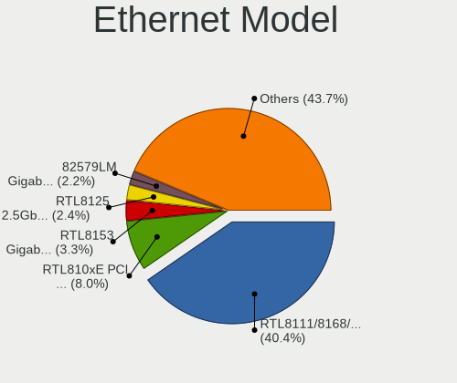

| Model                                                                          | Computers | Percent |
|--------------------------------------------------------------------------------|-----------|---------|
| Realtek RTL8111/8168/8411 PCI Express Gigabit Ethernet Controller              | 396       | 39.48%  |
| Realtek RTL810xE PCI Express Fast Ethernet controller                          | 101       | 10.07%  |
| Intel 82579LM Gigabit Network Connection (Lewisville)                          | 27        | 2.69%   |
| Realtek RTL8153 Gigabit Ethernet Adapter                                       | 22        | 2.19%   |
| Marvell Group 88E8036 PCI-E Fast Ethernet Controller                           | 21        | 2.09%   |
| Silicon Integrated Systems [SiS] 191 Gigabit Ethernet Adapter                  | 13        | 1.3%    |
| Realtek RTL-8100/8101L/8139 PCI Fast Ethernet Adapter                          | 13        | 1.3%    |
| Qualcomm Atheros AR8131 Gigabit Ethernet                                       | 13        | 1.3%    |
| Intel 82579V Gigabit Network Connection                                        | 13        | 1.3%    |
| Qualcomm Atheros AR8151 v2.0 Gigabit Ethernet                                  | 12        | 1.2%    |
| Intel I211 Gigabit Network Connection                                          | 12        | 1.2%    |
| Qualcomm Atheros AR8121/AR8113/AR8114 Gigabit or Fast Ethernet                 | 10        | 1%      |
| Intel Ethernet Connection (2) I219-V                                           | 9         | 0.9%    |
| Realtek RTL8125 2.5GbE Controller                                              | 8         | 0.8%    |
| Intel Ethernet Connection I218-LM                                              | 8         | 0.8%    |
| TP-Link USB 10/100/1000 LAN                                                    | 7         | 0.7%    |
| Qualcomm Atheros AR8132 Fast Ethernet                                          | 7         | 0.7%    |
| Intel Ethernet Connection I217-LM                                              | 7         | 0.7%    |
| Intel Ethernet Connection (6) I219-V                                           | 7         | 0.7%    |
| Intel Ethernet Connection (4) I219-LM                                          | 7         | 0.7%    |
| Intel 82577LM Gigabit Network Connection                                       | 7         | 0.7%    |
| Broadcom NetLink BCM5787M Gigabit Ethernet PCI Express                         | 7         | 0.7%    |
| Qualcomm Atheros AR8161 Gigabit Ethernet                                       | 6         | 0.6%    |
| Marvell Group Yukon Optima 88E8059 [PCIe Gigabit Ethernet Controller with AVB] | 6         | 0.6%    |
| Intel 82567LM-3 Gigabit Network Connection                                     | 6         | 0.6%    |
| Nvidia MCP61 Ethernet                                                          | 5         | 0.5%    |
| Intel Ethernet Connection I219-LM                                              | 5         | 0.5%    |
| Intel Ethernet Connection (7) I219-V                                           | 5         | 0.5%    |
| Intel Ethernet Connection (2) I218-V                                           | 5         | 0.5%    |
| Intel 82573L Gigabit Ethernet Controller                                       | 5         | 0.5%    |
| Intel 82567LM Gigabit Network Connection                                       | 5         | 0.5%    |
| VIA VT6102/VT6103 [Rhine-II]                                                   | 4         | 0.4%    |
| Qualcomm Atheros QCA8171 Gigabit Ethernet                                      | 4         | 0.4%    |
| Qualcomm Atheros Killer E2400 Gigabit Ethernet Controller                      | 4         | 0.4%    |
| Qualcomm Atheros AR8152 v1.1 Fast Ethernet                                     | 4         | 0.4%    |
| Nvidia MCP77 Ethernet                                                          | 4         | 0.4%    |
| JMicron JMC250 PCI Express Gigabit Ethernet Controller                         | 4         | 0.4%    |
| Intel Ethernet Connection (6) I219-LM                                          | 4         | 0.4%    |
| Intel Ethernet Connection (4) I219-V                                           | 4         | 0.4%    |
| Intel Ethernet Connection (14) I219-V                                          | 4         | 0.4%    |
| Intel Ethernet Connection (10) I219-LM                                         | 4         | 0.4%    |
| Broadcom NetXtreme BCM57765 Gigabit Ethernet PCIe                              | 4         | 0.4%    |
| Broadcom NetLink BCM57780 Gigabit Ethernet PCIe                                | 4         | 0.4%    |
| Attansic AR8152 v2.0 Fast Ethernet                                             | 4         | 0.4%    |
| Samsung Galaxy series, misc. (tethering mode)                                  | 3         | 0.3%    |
| Realtek RTL8169 PCI Gigabit Ethernet Controller                                | 3         | 0.3%    |
| Qualcomm Atheros Killer E2500 Gigabit Ethernet Controller                      | 3         | 0.3%    |
| Qualcomm Atheros Killer E220x Gigabit Ethernet Controller                      | 3         | 0.3%    |
| Qualcomm Atheros Attansic L1 Gigabit Ethernet                                  | 3         | 0.3%    |
| Qualcomm Atheros AR8151 v1.0 Gigabit Ethernet                                  | 3         | 0.3%    |
| Nvidia MCP79 Ethernet                                                          | 3         | 0.3%    |
| Nvidia MCP73 Ethernet                                                          | 3         | 0.3%    |
| Marvell Group 88E8055 PCI-E Gigabit Ethernet Controller                        | 3         | 0.3%    |
| Intel I210 Gigabit Network Connection                                          | 3         | 0.3%    |
| Intel Ethernet Controller I225-V                                               | 3         | 0.3%    |
| Intel Ethernet Connection (2) I219-LM                                          | 3         | 0.3%    |
| Intel Ethernet Connection (10) I219-V                                          | 3         | 0.3%    |
| Intel 82566DM Gigabit Network Connection                                       | 3         | 0.3%    |
| Broadcom NetXtreme BCM57786 Gigabit Ethernet PCIe                              | 3         | 0.3%    |
| Broadcom NetXtreme BCM5752 Gigabit Ethernet PCI Express                        | 3         | 0.3%    |

Net Controller Kind
-------------------

Ethernet, WiFi or modem

| Kind     | Computers | Percent |
|----------|-----------|---------|
| Ethernet | 940       | 52.11%  |
| WiFi     | 845       | 46.84%  |
| Modem    | 18        | 1%      |
| Unknown  | 1         | 0.06%   |

Used Controller
---------------

Currently used network controller

| Kind     | Computers | Percent |
|----------|-----------|---------|
| WiFi     | 677       | 60.23%  |
| Ethernet | 447       | 39.77%  |

NICs
----

Total network controllers on board

| Total | Computers | Percent |
|-------|-----------|---------|
| 2     | 645       | 59.56%  |
| 1     | 398       | 36.75%  |
| 0     | 23        | 2.12%   |
| 3     | 10        | 0.92%   |
| 6     | 3         | 0.28%   |
| 10    | 2         | 0.18%   |
| 5     | 2         | 0.18%   |

IPv6
----

IPv6 vs IPv4

| Used | Computers | Percent |
|------|-----------|---------|
| No   | 906       | 82.14%  |
| Yes  | 197       | 17.86%  |

Bluetooth
---------

Bluetooth Vendor
----------------

Controller vendors

| Vendor                          | Computers | Percent |
|---------------------------------|-----------|---------|
| Intel                           | 231       | 40.1%   |
| Realtek Semiconductor           | 70        | 12.15%  |
| Qualcomm Atheros Communications | 37        | 6.42%   |
| IMC Networks                    | 36        | 6.25%   |
| Lite-On Technology              | 34        | 5.9%    |
| Broadcom                        | 32        | 5.56%   |
| Foxconn / Hon Hai               | 23        | 3.99%   |
| Cambridge Silicon Radio         | 23        | 3.99%   |
| Apple                           | 19        | 3.3%    |
| ASUSTek Computer                | 18        | 3.13%   |
| Toshiba                         | 13        | 2.26%   |
| Hewlett-Packard                 | 13        | 2.26%   |
| Dell                            | 7         | 1.22%   |
| Realtek                         | 5         | 0.87%   |
| Ralink                          | 4         | 0.69%   |
| Alps Electric                   | 4         | 0.69%   |
| Ralink Technology               | 2         | 0.35%   |
| Belkin Components               | 2         | 0.35%   |
| Marvell Semiconductor           | 1         | 0.17%   |
| Foxconn International           | 1         | 0.17%   |
| Chicony Electronics             | 1         | 0.17%   |

Bluetooth Model
---------------

Controller models

| Model                                                                               | Computers | Percent |
|-------------------------------------------------------------------------------------|-----------|---------|
| Intel Bluetooth wireless interface                                                  | 94        | 16.32%  |
| Realtek Bluetooth Radio                                                             | 44        | 7.64%   |
| Intel Bluetooth 9460/9560 Jefferson Peak (JfP)                                      | 40        | 6.94%   |
| Intel AX200 Bluetooth                                                               | 36        | 6.25%   |
| Intel AX201 Bluetooth                                                               | 33        | 5.73%   |
| Cambridge Silicon Radio Bluetooth Dongle (HCI mode)                                 | 23        | 3.99%   |
| IMC Networks Bluetooth Device                                                       | 22        | 3.82%   |
| Realtek  Bluetooth 4.2 Adapter                                                      | 15        | 2.6%    |
| Qualcomm Atheros  Bluetooth Device                                                  | 13        | 2.26%   |
| Qualcomm Atheros AR3011 Bluetooth                                                   | 12        | 2.08%   |
| Lite-On Qualcomm Atheros QCA9377 Bluetooth                                          | 10        | 1.74%   |
| HP Bluetooth 2.0 Interface [Broadcom BCM2045]                                       | 10        | 1.74%   |
| Lite-On Atheros AR3012 Bluetooth                                                    | 9         | 1.56%   |
| Intel Centrino Bluetooth Wireless Transceiver                                       | 9         | 1.56%   |
| Lite-On Bluetooth Device                                                            | 8         | 1.39%   |
| Intel Wireless-AC 9260 Bluetooth Adapter                                            | 8         | 1.39%   |
| IMC Networks Bluetooth Radio                                                        | 8         | 1.39%   |
| Foxconn / Hon Hai Bluetooth Device                                                  | 8         | 1.39%   |
| Apple Bluetooth Host Controller                                                     | 8         | 1.39%   |
| ASUS Broadcom BCM20702A0 Bluetooth                                                  | 7         | 1.22%   |
| Apple Bluetooth USB Host Controller                                                 | 7         | 1.22%   |
| Realtek 802.11ac WLAN Adapter                                                       | 6         | 1.04%   |
| Qualcomm Atheros AR3012 Bluetooth 4.0                                               | 6         | 1.04%   |
| Intel Wireless-AC 3168 Bluetooth                                                    | 6         | 1.04%   |
| Realtek Bluetooth Radio                                                             | 5         | 0.87%   |
| Qualcomm Atheros QCA61x4 Bluetooth 4.0                                              | 5         | 0.87%   |
| Lite-On BCM43142A0                                                                  | 5         | 0.87%   |
| Ralink RT3290 Bluetooth                                                             | 4         | 0.69%   |
| Foxconn / Hon Hai Foxconn T77H114 BCM2070 [Single-Chip Bluetooth 2.1 + EDR Adapter] | 4         | 0.69%   |
| Broadcom BCM20702 Bluetooth 4.0 [ThinkPad]                                          | 4         | 0.69%   |
| Broadcom BCM2045B (BDC-2.1) [Bluetooth Controller]                                  | 4         | 0.69%   |
| Apple Bluetooth HCI                                                                 | 4         | 0.69%   |
| Toshiba Askey Bluetooth Module                                                      | 3         | 0.52%   |
| Intel Centrino Advanced-N 6230 Bluetooth adapter                                    | 3         | 0.52%   |
| HP Broadcom 2070 Bluetooth Combo                                                    | 3         | 0.52%   |
| Foxconn / Hon Hai BCM43142A0 broadcom bluetooth                                     | 3         | 0.52%   |
| Dell DW375 Bluetooth Module                                                         | 3         | 0.52%   |
| Broadcom HP Portable SoftSailing                                                    | 3         | 0.52%   |
| Broadcom BCM43142A0 Bluetooth 4.0                                                   | 3         | 0.52%   |
| Broadcom BCM2045B (BDC-2.1)                                                         | 3         | 0.52%   |
| Toshiba RT Bluetooth Radio                                                          | 2         | 0.35%   |
| Toshiba Integrated Bluetooth HCI                                                    | 2         | 0.35%   |
| Toshiba Bluetooth Device                                                            | 2         | 0.35%   |
| Toshiba BCM43142A0                                                                  | 2         | 0.35%   |
| Realtek RTL8822BE Bluetooth 4.2 Adapter                                             | 2         | 0.35%   |
| Realtek RTL8723B Bluetooth                                                          | 2         | 0.35%   |
| Ralink CSR BS8510                                                                   | 2         | 0.35%   |
| Lite-On Qualcomm Atheros Bluetooth                                                  | 2         | 0.35%   |
| IMC Networks Wireless_Device                                                        | 2         | 0.35%   |
| IMC Networks Bluetooth module                                                       | 2         | 0.35%   |
| IMC Networks Atheros AR3012 Bluetooth 4.0 Adapter                                   | 2         | 0.35%   |
| Foxconn / Hon Hai BCM43142A0                                                        | 2         | 0.35%   |
| Foxconn / Hon Hai BCM2045A0                                                         | 2         | 0.35%   |
| Dell Wireless 365 Bluetooth                                                         | 2         | 0.35%   |
| Broadcom HP Portable Valentine                                                      | 2         | 0.35%   |
| Broadcom Bluetooth                                                                  | 2         | 0.35%   |
| Broadcom BCM43142A0 Bluetooth Device                                                | 2         | 0.35%   |
| Broadcom BCM20702A0 Bluetooth 4.0                                                   | 2         | 0.35%   |
| Broadcom BCM20702A0                                                                 | 2         | 0.35%   |
| ASUS BT-270 Bluetooth Adapter                                                       | 2         | 0.35%   |

Sound
-----

Sound Vendor
------------

Sound card vendors

| Vendor                           | Computers | Percent |
|----------------------------------|-----------|---------|
| Intel                            | 791       | 55.7%   |
| AMD                              | 289       | 20.35%  |
| Nvidia                           | 207       | 14.58%  |
| C-Media Electronics              | 19        | 1.34%   |
| Creative Labs                    | 17        | 1.2%    |
| Silicon Integrated Systems [SiS] | 15        | 1.06%   |
| Logitech                         | 8         | 0.56%   |
| Kingston Technology              | 6         | 0.42%   |
| JMTek                            | 6         | 0.42%   |
| GN Netcom                        | 5         | 0.35%   |
| Texas Instruments                | 4         | 0.28%   |
| Realtek Semiconductor            | 4         | 0.28%   |
| Hewlett-Packard                  | 4         | 0.28%   |
| Creative Technology              | 4         | 0.28%   |
| Razer USA                        | 3         | 0.21%   |
| Generalplus Technology           | 3         | 0.21%   |
| VIA Technologies                 | 2         | 0.14%   |
| Sennheiser Communications        | 2         | 0.14%   |
| Plantronics                      | 2         | 0.14%   |
| Lenovo                           | 2         | 0.14%   |
| EGO SYStems                      | 2         | 0.14%   |
| Corsair                          | 2         | 0.14%   |
| Apple                            | 2         | 0.14%   |
| XMOS                             | 1         | 0.07%   |
| WinChipHead                      | 1         | 0.07%   |
| ULi Electronics                  | 1         | 0.07%   |
| Turtle Beach                     | 1         | 0.07%   |
| Trust                            | 1         | 0.07%   |
| Silicon Motion                   | 1         | 0.07%   |
| Samsung Electronics              | 1         | 0.07%   |
| Samson Technologies              | 1         | 0.07%   |
| Microchip Technology             | 1         | 0.07%   |
| Huawei Technologies              | 1         | 0.07%   |
| Harman                           | 1         | 0.07%   |
| GYROCOM C&C                      | 1         | 0.07%   |
| Guillemot                        | 1         | 0.07%   |
| Evolution Electronics            | 1         | 0.07%   |
| ESS Technology                   | 1         | 0.07%   |
| Dell                             | 1         | 0.07%   |
| Conexant Systems                 | 1         | 0.07%   |
| Conexant                         | 1         | 0.07%   |
| Blue Microphones                 | 1         | 0.07%   |
| BEHRINGER International          | 1         | 0.07%   |
| ASUSTek Computer                 | 1         | 0.07%   |

Sound Model
-----------

Sound card models

| Model                                                                                             | Computers | Percent |
|---------------------------------------------------------------------------------------------------|-----------|---------|
| AMD Family 17h/19h HD Audio Controller                                                            | 71        | 4.29%   |
| Intel Sunrise Point-LP HD Audio                                                                   | 69        | 4.17%   |
| Intel 7 Series/C216 Chipset Family High Definition Audio Controller                               | 69        | 4.17%   |
| Intel 6 Series/C200 Series Chipset Family High Definition Audio Controller                        | 66        | 3.99%   |
| Intel NM10/ICH7 Family High Definition Audio Controller                                           | 61        | 3.69%   |
| Intel 82801I (ICH9 Family) HD Audio Controller                                                    | 61        | 3.69%   |
| Intel 82801H (ICH8 Family) HD Audio Controller                                                    | 55        | 3.32%   |
| Intel 5 Series/3400 Series Chipset High Definition Audio                                          | 51        | 3.08%   |
| AMD FCH Azalia Controller                                                                         | 39        | 2.36%   |
| Intel Cannon Lake PCH cAVS                                                                        | 37        | 2.24%   |
| Intel 8 Series/C220 Series Chipset High Definition Audio Controller                               | 35        | 2.11%   |
| AMD SBx00 Azalia (Intel HDA)                                                                      | 35        | 2.11%   |
| AMD Raven/Raven2/Fenghuang HDMI/DP Audio Controller                                               | 33        | 1.99%   |
| Intel Haswell-ULT HD Audio Controller                                                             | 32        | 1.93%   |
| Intel Cannon Point-LP High Definition Audio Controller                                            | 32        | 1.93%   |
| Intel 8 Series HD Audio Controller                                                                | 32        | 1.93%   |
| Intel 100 Series/C230 Series Chipset Family HD Audio Controller                                   | 29        | 1.75%   |
| Intel Tiger Lake-LP Smart Sound Technology Audio Controller                                       | 27        | 1.63%   |
| AMD Kabini HDMI/DP Audio                                                                          | 27        | 1.63%   |
| Intel Xeon E3-1200 v3/4th Gen Core Processor HD Audio Controller                                  | 26        | 1.57%   |
| Intel Broadwell-U Audio Controller                                                                | 24        | 1.45%   |
| Nvidia GK208 HDMI/DP Audio Controller                                                             | 23        | 1.39%   |
| Intel Wildcat Point-LP High Definition Audio Controller                                           | 23        | 1.39%   |
| Nvidia GP107GL High Definition Audio Controller                                                   | 22        | 1.33%   |
| Intel Comet Lake PCH-LP cAVS                                                                      | 22        | 1.33%   |
| AMD Renoir Radeon High Definition Audio Controller                                                | 21        | 1.27%   |
| AMD Cedar HDMI Audio [Radeon HD 5400/6300/7300 Series]                                            | 21        | 1.27%   |
| Nvidia High Definition Audio Controller                                                           | 20        | 1.21%   |
| AMD Starship/Matisse HD Audio Controller                                                          | 20        | 1.21%   |
| AMD Family 17h (Models 00h-0fh) HD Audio Controller                                               | 19        | 1.15%   |
| AMD Ellesmere HDMI Audio [Radeon RX 470/480 / 570/580/590]                                        | 19        | 1.15%   |
| Intel Atom Processor Z36xxx/Z37xxx Series High Definition Audio Controller                        | 16        | 0.97%   |
| AMD Family 15h (Models 60h-6fh) Audio Controller                                                  | 16        | 0.97%   |
| AMD RV710/730 HDMI Audio [Radeon HD 4000 series]                                                  | 15        | 0.91%   |
| Nvidia TU107 GeForce GTX 1650 High Definition Audio Controller                                    | 14        | 0.85%   |
| Nvidia GF108 High Definition Audio Controller                                                     | 14        | 0.85%   |
| Silicon Integrated Systems [SiS] Azalia Audio Controller                                          | 13        | 0.79%   |
| Intel Comet Lake PCH cAVS                                                                         | 12        | 0.73%   |
| AMD High Definition Audio Controller                                                              | 12        | 0.73%   |
| Nvidia GP106 High Definition Audio Controller                                                     | 11        | 0.66%   |
| Nvidia GM107 High Definition Audio Controller [GeForce 940MX]                                     | 11        | 0.66%   |
| Intel Atom/Celeron/Pentium Processor x5-E8000/J3xxx/N3xxx Series High Definition Audio Controller | 11        | 0.66%   |
| AMD Redwood HDMI Audio [Radeon HD 5000 Series]                                                    | 10        | 0.6%    |
| Intel 82801JI (ICH10 Family) HD Audio Controller                                                  | 9         | 0.54%   |
| Intel 200 Series PCH HD Audio                                                                     | 9         | 0.54%   |
| Nvidia TU116 High Definition Audio Controller                                                     | 8         | 0.48%   |
| Nvidia TU106 High Definition Audio Controller                                                     | 8         | 0.48%   |
| Nvidia GT216 HDMI Audio Controller                                                                | 8         | 0.48%   |
| Intel CM238 HD Audio Controller                                                                   | 7         | 0.42%   |
| Intel Celeron/Pentium Silver Processor High Definition Audio                                      | 7         | 0.42%   |
| Intel 9 Series Chipset Family HD Audio Controller                                                 | 7         | 0.42%   |
| AMD Navi 10 HDMI Audio                                                                            | 7         | 0.42%   |
| AMD Kaveri HDMI/DP Audio Controller                                                               | 7         | 0.42%   |
| AMD Caicos HDMI Audio [Radeon HD 6450 / 7450/8450/8490 OEM / R5 230/235/235X OEM]                 | 7         | 0.42%   |
| AMD Baffin HDMI/DP Audio [Radeon RX 550 640SP / RX 560/560X]                                      | 7         | 0.42%   |
| Nvidia GK107 HDMI Audio Controller                                                                | 6         | 0.36%   |
| AMD Oland/Hainan/Cape Verde/Pitcairn HDMI Audio [Radeon HD 7000 Series]                           | 6         | 0.36%   |
| Nvidia MCP61 High Definition Audio                                                                | 5         | 0.3%    |
| Nvidia GM204 High Definition Audio Controller                                                     | 5         | 0.3%    |
| Nvidia GF106 High Definition Audio Controller                                                     | 5         | 0.3%    |

Memory
------

Memory Vendor
-------------

Memory module vendors

| Vendor              | Computers | Percent |
|---------------------|-----------|---------|
| Samsung Electronics | 131       | 24.72%  |
| SK Hynix            | 95        | 17.92%  |
| Unknown             | 87        | 16.42%  |
| Kingston            | 65        | 12.26%  |
| Micron Technology   | 37        | 6.98%   |
| G.Skill             | 29        | 5.47%   |
| Crucial             | 19        | 3.58%   |
| Ramaxel Technology  | 12        | 2.26%   |
| Corsair             | 12        | 2.26%   |
| Team                | 6         | 1.13%   |
| A-DATA Technology   | 6         | 1.13%   |
| Nanya Technology    | 5         | 0.94%   |
| Elpida              | 5         | 0.94%   |
| Transcend           | 3         | 0.57%   |
| Unknown (ABCD)      | 2         | 0.38%   |
| Apacer              | 2         | 0.38%   |
| Unknown             | 2         | 0.38%   |
| Unigen              | 1         | 0.19%   |
| Unifosa             | 1         | 0.19%   |
| Toshiba             | 1         | 0.19%   |
| Teikon              | 1         | 0.19%   |
| Silicon Power       | 1         | 0.19%   |
| Patriot             | 1         | 0.19%   |
| Netlist             | 1         | 0.19%   |
| Infineon            | 1         | 0.19%   |
| Hewlett-Packard     | 1         | 0.19%   |
| GOODRAM             | 1         | 0.19%   |
| Essencore Limited   | 1         | 0.19%   |
| 48spaces            | 1         | 0.19%   |

Memory Model
------------

Memory module models

| Model                                                            | Computers | Percent |
|------------------------------------------------------------------|-----------|---------|
| Unknown RAM Module 2GB SODIMM DDR2                               | 19        | 3.3%    |
| SK Hynix RAM HMA81GS6AFR8N-UH 8GB SODIMM DDR4 2667MT/s           | 10        | 1.74%   |
| Samsung RAM M471A2K43CB1-CTD 16GB SODIMM DDR4 2667MT/s           | 7         | 1.22%   |
| Samsung RAM M471A5244CB0-CTD 4GB SODIMM DDR4 3266MT/s            | 6         | 1.04%   |
| Samsung RAM M471B5173DB0-YK0 4GB SODIMM DDR3 1600MT/s            | 5         | 0.87%   |
| Samsung RAM M471B1G73QH0-YK0 8192MB SODIMM DDR3 1600MT/s         | 5         | 0.87%   |
| Samsung RAM M471A2K43DB1-CTD 16GB SODIMM DDR4 2667MT/s           | 5         | 0.87%   |
| Samsung RAM M471A1K43CB1-CRC 8GB SODIMM DDR4 2667MT/s            | 5         | 0.87%   |
| Samsung RAM M471B5273DH0-CH9 4GB SODIMM DDR3 1334MT/s            | 4         | 0.69%   |
| Samsung RAM M471B5273CH0-CH9 4GB SODIMM DDR3 1334MT/s            | 4         | 0.69%   |
| Unknown RAM Module 2048MB SODIMM DDR2                            | 3         | 0.52%   |
| Unknown RAM Module 2048MB DIMM DDR2 667MT/s                      | 3         | 0.52%   |
| Unknown RAM Module 1024MB SODIMM DDR2                            | 3         | 0.52%   |
| SK Hynix RAM HMT451S6DFR8A-PB 4GB SODIMM DDR3 1600MT/s           | 3         | 0.52%   |
| SK Hynix RAM HMT351S6CFR8C-PB 4GB SODIMM DDR3 1600MT/s           | 3         | 0.52%   |
| SK Hynix RAM HMA851S6CJR6N-VK 4GB Row Of Chips DDR4 2667MT/s     | 3         | 0.52%   |
| SK Hynix RAM HMA851S6AFR6N-UH 4GB SODIMM DDR4 2667MT/s           | 3         | 0.52%   |
| SK Hynix RAM HMA81GS6JJR8N-VK 8GB SODIMM DDR4 2667MT/s           | 3         | 0.52%   |
| SK Hynix RAM HMA81GS6DJR8N-XN 8GB SODIMM DDR4 3200MT/s           | 3         | 0.52%   |
| Samsung RAM M471B5273CH0-CK0 4GB SODIMM DDR3 1600MT/s            | 3         | 0.52%   |
| Samsung RAM M471A5244CB0-CRC 4GB SODIMM DDR4 2667MT/s            | 3         | 0.52%   |
| Samsung RAM M471A2K43DB1-CWE 16GB SODIMM DDR4 3200MT/s           | 3         | 0.52%   |
| Samsung RAM M471A2K43CB1-CRC 16384MB SODIMM DDR4 2667MT/s        | 3         | 0.52%   |
| Samsung RAM M471A1K43DB1-CTD 8GB SODIMM DDR4 2667MT/s            | 3         | 0.52%   |
| Samsung RAM M471A1G44AB0-CWE 8GB SODIMM DDR4 3200MT/s            | 3         | 0.52%   |
| Micron RAM 8ATF1G64HZ-2G6E1 8GB SODIMM DDR4 2667MT/s             | 3         | 0.52%   |
| Micron RAM 8ATF1G64HZ-2G3B1 8192MB SODIMM DDR4 2400MT/s          | 3         | 0.52%   |
| Micron RAM 4ATF51264HZ-2G6E1 4GB SODIMM DDR4 2667MT/s            | 3         | 0.52%   |
| Kingston RAM KHX1600C10D3/8G 4096MB DIMM DDR3 1600MT/s           | 3         | 0.52%   |
| Unknown RAM Module 8192MB SODIMM DDR3 1333MT/s                   | 2         | 0.35%   |
| Unknown RAM Module 4096MB SODIMM DDR3                            | 2         | 0.35%   |
| Unknown RAM Module 4096MB DIMM                                   | 2         | 0.35%   |
| Unknown RAM Module 2048MB SODIMM DDR3                            | 2         | 0.35%   |
| Unknown RAM Module 2048MB SODIMM DDR2 667MT/s                    | 2         | 0.35%   |
| Unknown RAM Module 2048MB DIMM 1333MT/s                          | 2         | 0.35%   |
| Unknown RAM Module 1024MB SODIMM SDRAM                           | 2         | 0.35%   |
| Unknown RAM Module 1024MB SODIMM DDR2 667MT/s                    | 2         | 0.35%   |
| Team RAM TEAMGROUP-UD4-2666 8GB DIMM DDR4 2667MT/s               | 2         | 0.35%   |
| SK Hynix RAM HYMP351F72AMP4N3Y5 4096MB FB-DIMM DDR2 667MT/s      | 2         | 0.35%   |
| SK Hynix RAM HYMP151F72CP4N3-Y5 4GB FB-DIMM DDR2 667MT/s         | 2         | 0.35%   |
| SK Hynix RAM HMT41GS6BFR8A-PB 8GB SODIMM DDR3 1600MT/s           | 2         | 0.35%   |
| SK Hynix RAM HMT41GS6AFR8A-PB 8GB SODIMM DDR3 1600MT/s           | 2         | 0.35%   |
| SK Hynix RAM HMT351S6AFR8C-G7 4GB SODIMM DDR3 1067MT/s           | 2         | 0.35%   |
| SK Hynix RAM HMAA1GS6CJR6N-XN 8192MB SODIMM DDR4 3200MT/s        | 2         | 0.35%   |
| SK Hynix RAM HMA851S6AFR6N-UH 4GB SODIMM DDR4 2400MT/s           | 2         | 0.35%   |
| SK Hynix RAM HMA82GS6JJR8N-VK 16GB SODIMM DDR4 2667MT/s          | 2         | 0.35%   |
| SK Hynix RAM HMA82GS6CJR8N-VK 16GB SODIMM DDR4 2667MT/s          | 2         | 0.35%   |
| SK Hynix RAM H9CCNNNCLGALAR-NVD 8GB Row Of Chips LPDDR3 2133MT/s | 2         | 0.35%   |
| Samsung RAM Module 16GB SODIMM DDR4 2667MT/s                     | 2         | 0.35%   |
| Samsung RAM M471B5773CHS-CH9 2GB SODIMM DDR3 4199MT/s            | 2         | 0.35%   |
| Samsung RAM M471B5673FH0-CH9 2GB SODIMM DDR3 1334MT/s            | 2         | 0.35%   |
| Samsung RAM M471B5673EH1-CF8 2GB SODIMM DDR3 4199MT/s            | 2         | 0.35%   |
| Samsung RAM M471B5173EB0-YK0 4GB SODIMM DDR3 1600MT/s            | 2         | 0.35%   |
| Samsung RAM M471B5173BH0-CK0 4096MB SODIMM DDR3 1600MT/s         | 2         | 0.35%   |
| Samsung RAM M471B1G73EB0-YK0 8192MB SODIMM DDR3 1600MT/s         | 2         | 0.35%   |
| Samsung RAM M471A4G43AB1-CWE 32GB SODIMM DDR4 3200MT/s           | 2         | 0.35%   |
| Samsung RAM M471A1K43DB1-CWE 8GB SODIMM DDR4 3200MT/s            | 2         | 0.35%   |
| Samsung RAM M471A1K43BB1-CRC 8GB SODIMM DDR4 2667MT/s            | 2         | 0.35%   |
| Samsung RAM M471A1G44AB0-CWE 8GB Row Of Chips DDR4 3200MT/s      | 2         | 0.35%   |
| Samsung RAM M471A1G43DB0-CPB 8GB SODIMM DDR4 2400MT/s            | 2         | 0.35%   |

Memory Kind
-----------

Memory module kinds

| Kind    | Computers | Percent |
|---------|-----------|---------|
| DDR4    | 201       | 42.58%  |
| DDR3    | 151       | 31.99%  |
| DDR2    | 56        | 11.86%  |
| Unknown | 18        | 3.81%   |
| SDRAM   | 17        | 3.6%    |
| LPDDR3  | 14        | 2.97%   |
| LPDDR4  | 10        | 2.12%   |
| DDR     | 5         | 1.06%   |

Memory Form Factor
------------------

Physical design of the memory module

| Name         | Computers | Percent |
|--------------|-----------|---------|
| SODIMM       | 303       | 64.61%  |
| DIMM         | 132       | 28.14%  |
| Row Of Chips | 30        | 6.4%    |
| FB-DIMM      | 2         | 0.43%   |
| Chip         | 2         | 0.43%   |

Memory Size
-----------

Memory module size

| Size    | Computers | Percent |
|---------|-----------|---------|
| 8192    | 157       | 31.03%  |
| 4096    | 140       | 27.67%  |
| 2048    | 90        | 17.79%  |
| 16384   | 72        | 14.23%  |
| 1024    | 28        | 5.53%   |
| 32768   | 12        | 2.37%   |
| 512     | 6         | 1.19%   |
| Unknown | 1         | 0.2%    |

Memory Speed
------------

Memory module speed

| Speed   | Computers | Percent |
|---------|-----------|---------|
| 1600    | 100       | 19.72%  |
| 2667    | 92        | 18.15%  |
| 3200    | 50        | 9.86%   |
| Unknown | 47        | 9.27%   |
| 2400    | 38        | 7.5%    |
| 1333    | 30        | 5.92%   |
| 2133    | 25        | 4.93%   |
| 667     | 21        | 4.14%   |
| 1334    | 16        | 3.16%   |
| 800     | 9         | 1.78%   |
| 1867    | 8         | 1.58%   |
| 533     | 7         | 1.38%   |
| 3266    | 6         | 1.18%   |
| 1067    | 6         | 1.18%   |
| 4199    | 5         | 0.99%   |
| 4267    | 4         | 0.79%   |
| 2666    | 4         | 0.79%   |
| 3600    | 3         | 0.59%   |
| 3000    | 3         | 0.59%   |
| 2933    | 3         | 0.59%   |
| 1066    | 3         | 0.59%   |
| 3466    | 2         | 0.39%   |
| 2048    | 2         | 0.39%   |
| 2000    | 2         | 0.39%   |
| 1866    | 2         | 0.39%   |
| 1800    | 2         | 0.39%   |
| 1200    | 2         | 0.39%   |
| 400     | 2         | 0.39%   |
| 43889   | 1         | 0.2%    |
| 8400    | 1         | 0.2%    |
| 4800    | 1         | 0.2%    |
| 3800    | 1         | 0.2%    |
| 3733    | 1         | 0.2%    |
| 3533    | 1         | 0.2%    |
| 3400    | 1         | 0.2%    |
| 3334    | 1         | 0.2%    |
| 3067    | 1         | 0.2%    |
| 3066    | 1         | 0.2%    |
| 2733    | 1         | 0.2%    |
| 2465    | 1         | 0.2%    |
| 2134    | 1         | 0.2%    |

Printers & scanners
-------------------

Printer Vendor
--------------

Printer device vendors

| Vendor                 | Computers | Percent |
|------------------------|-----------|---------|
| Hewlett-Packard        | 16        | 69.57%  |
| Canon                  | 2         | 8.7%    |
| Xerox                  | 1         | 4.35%   |
| Seiko Epson            | 1         | 4.35%   |
| Samsung Electronics    | 1         | 4.35%   |
| Panasonic (Matsushita) | 1         | 4.35%   |
| Brother Industries     | 1         | 4.35%   |

Printer Model
-------------

Printer device models

| Model                                | Computers | Percent |
|--------------------------------------|-----------|---------|
| HP Deskjet 1050 J410                 | 3         | 12%     |
| Xerox Phaser 6000B                   | 1         | 4%      |
| Seiko Epson AcuLaser C1700           | 1         | 4%      |
| Samsung ML-1640 Series Laser Printer | 1         | 4%      |
| Panasonic (Matsushita) KX-FLB851SP   | 1         | 4%      |
| HP Officejet 4620 series             | 1         | 4%      |
| HP Officejet 4500 G510g-m            | 1         | 4%      |
| HP LaserJet M14-M17                  | 1         | 4%      |
| HP ENVY 6000 series                  | 1         | 4%      |
| HP ENVY 4520 series                  | 1         | 4%      |
| HP DeskJet F4100 Printer series      | 1         | 4%      |
| HP DeskJet F300 series               | 1         | 4%      |
| HP DeskJet F2492 All-in-One          | 1         | 4%      |
| HP DeskJet 930c                      | 1         | 4%      |
| HP DeskJet 3630 series               | 1         | 4%      |
| HP Deskjet 3050A                     | 1         | 4%      |
| HP Deskjet 3050 J610 series          | 1         | 4%      |
| HP DeskJet 2700 series               | 1         | 4%      |
| HP DeskJet 2130 series               | 1         | 4%      |
| Canon TS6300 series                  | 1         | 4%      |
| Canon PIXMA MG2900 Series            | 1         | 4%      |
| Canon LBP6200                        | 1         | 4%      |
| Brother DCP-1610W                    | 1         | 4%      |

Scanner Vendor
--------------

Scanner device vendors

| Vendor          | Computers | Percent |
|-----------------|-----------|---------|
| Mustek Systems  | 3         | 42.86%  |
| Canon           | 2         | 28.57%  |
| Seiko Epson     | 1         | 14.29%  |
| Hewlett-Packard | 1         | 14.29%  |

Scanner Model
-------------

Scanner device models

| Model                                 | Computers | Percent |
|---------------------------------------|-----------|---------|
| Mustek Systems ScanExpress 1200 UB    | 2         | 28.57%  |
| Seiko Epson GT-X770 [Perfection V500] | 1         | 14.29%  |
| Mustek Systems BearPaw 2448 CU Pro    | 1         | 14.29%  |
| HP ScanJet 5300c/5370c                | 1         | 14.29%  |
| Canon CanoScan N670U/N676U/LiDE 20    | 1         | 14.29%  |
| Canon CanoScan 4400F                  | 1         | 14.29%  |

Camera
------

Camera Vendor
-------------

Camera device vendors

| Vendor                                 | Computers | Percent |
|----------------------------------------|-----------|---------|
| Chicony Electronics                    | 202       | 28.09%  |
| IMC Networks                           | 78        | 10.85%  |
| Acer                                   | 49        | 6.82%   |
| Suyin                                  | 41        | 5.7%    |
| Realtek Semiconductor                  | 41        | 5.7%    |
| Quanta                                 | 33        | 4.59%   |
| Microdia                               | 32        | 4.45%   |
| Ricoh                                  | 26        | 3.62%   |
| Syntek                                 | 20        | 2.78%   |
| Logitech                               | 20        | 2.78%   |
| Lite-On Technology                     | 20        | 2.78%   |
| Cheng Uei Precision Industry (Foxlink) | 20        | 2.78%   |
| Sunplus Innovation Technology          | 19        | 2.64%   |
| Microsoft                              | 14        | 1.95%   |
| Apple                                  | 13        | 1.81%   |
| Silicon Motion                         | 9         | 1.25%   |
| Luxvisions Innotech Limited            | 8         | 1.11%   |
| Creative Technology                    | 8         | 1.11%   |
| Lenovo                                 | 7         | 0.97%   |
| Importek                               | 6         | 0.83%   |
| Hewlett-Packard                        | 6         | 0.83%   |
| Alcor Micro                            | 6         | 0.83%   |
| Samsung Electronics                    | 5         | 0.7%    |
| Generalplus Technology                 | 5         | 0.7%    |
| Z-Star Microelectronics                | 4         | 0.56%   |
| Aveo Technology                        | 3         | 0.42%   |
| ALi                                    | 3         | 0.42%   |
| DLUPCA1RSFZKI5                         | 2         | 0.28%   |
| DigiTech                               | 2         | 0.28%   |
| Cubeternet                             | 2         | 0.28%   |
| Y Media                                | 1         | 0.14%   |
| WaveRider Communications               | 1         | 0.14%   |
| Primax Electronics                     | 1         | 0.14%   |
| Philips (or NXP)                       | 1         | 0.14%   |
| OmniVision Technologies                | 1         | 0.14%   |
| Mustek Systems                         | 1         | 0.14%   |
| MacroSilicon                           | 1         | 0.14%   |
| lihappe8                               | 1         | 0.14%   |
| kingcome                               | 1         | 0.14%   |
| Intel                                  | 1         | 0.14%   |
| Huawei Technologies                    | 1         | 0.14%   |
| Genesys Logic                          | 1         | 0.14%   |
| Gearway Electronics (Dong Guan)        | 1         | 0.14%   |
| Conexant Systems                       | 1         | 0.14%   |
| Alcorlink                              | 1         | 0.14%   |

Camera Model
------------

Camera device models

| Model                                                                      | Computers | Percent |
|----------------------------------------------------------------------------|-----------|---------|
| Chicony Integrated Camera                                                  | 22        | 3.04%   |
| Chicony HD WebCam                                                          | 19        | 2.63%   |
| IMC Networks USB2.0 HD UVC WebCam                                          | 18        | 2.49%   |
| Ricoh Visual Communication Camera VGP-VCC8 [R5U870]                        | 17        | 2.35%   |
| IMC Networks Integrated Camera                                             | 17        | 2.35%   |
| IMC Networks USB2.0 VGA UVC WebCam                                         | 13        | 1.8%    |
| Chicony USB2.0 VGA UVC WebCam                                              | 13        | 1.8%    |
| Chicony CNF9055 Toshiba Webcam                                             | 13        | 1.8%    |
| Acer Integrated Camera                                                     | 12        | 1.66%   |
| Suyin Acer/HP Integrated Webcam [CN0314]                                   | 10        | 1.38%   |
| Chicony USB 2.0 Camera                                                     | 10        | 1.38%   |
| Chicony TOSHIBA Web Camera - HD                                            | 10        | 1.38%   |
| Quanta HP Wide Vision HD Camera                                            | 9         | 1.24%   |
| Microdia Integrated_Webcam_HD                                              | 9         | 1.24%   |
| Realtek HD WebCam                                                          | 8         | 1.11%   |
| Microsoft LifeCam HD-3000                                                  | 8         | 1.11%   |
| Chicony HP Truevision HD                                                   | 8         | 1.11%   |
| Realtek USB Camera                                                         | 7         | 0.97%   |
| Quanta HP TrueVision HD Camera                                             | 7         | 0.97%   |
| Lite-On Integrated Camera                                                  | 7         | 0.97%   |
| Chicony HP HD Camera                                                       | 7         | 0.97%   |
| Syntek Integrated Camera                                                   | 6         | 0.83%   |
| Syntek EasyCamera                                                          | 6         | 0.83%   |
| Microdia Sonix USB 2.0 Camera                                              | 6         | 0.83%   |
| Chicony VGA Webcam                                                         | 6         | 0.83%   |
| Chicony USB2.0 HD UVC WebCam                                               | 6         | 0.83%   |
| Chicony USB2.0 Camera                                                      | 6         | 0.83%   |
| Samsung Galaxy A5 (MTP)                                                    | 5         | 0.69%   |
| Realtek USB2.0-Camera                                                      | 5         | 0.69%   |
| Realtek USB2.0 VGA UVC WebCam                                              | 5         | 0.69%   |
| Realtek Integrated_Webcam_HD                                               | 5         | 0.69%   |
| Logitech Webcam C270                                                       | 5         | 0.69%   |
| Lite-On TOSHIBA Web Camera - HD                                            | 5         | 0.69%   |
| IMC Networks ov9734_azurewave_camera                                       | 5         | 0.69%   |
| HP Webcam HD 2300                                                          | 5         | 0.69%   |
| Chicony Webcam                                                             | 5         | 0.69%   |
| Chicony Integrated HP HD Webcam                                            | 5         | 0.69%   |
| Chicony HP Wide Vision HD Camera                                           | 5         | 0.69%   |
| Chicony HP TrueVision HD Camera                                            | 5         | 0.69%   |
| Cheng Uei Precision Industry (Foxlink) HP Wide Vision HD integrated webcam | 5         | 0.69%   |
| Acer Lenovo EasyCamera                                                     | 5         | 0.69%   |
| Acer HD Webcam                                                             | 5         | 0.69%   |
| Syntek Lenovo EasyCamera                                                   | 4         | 0.55%   |
| Suyin USB 2.0 Camera                                                       | 4         | 0.55%   |
| Suyin Acer CrystalEye Webcam                                               | 4         | 0.55%   |
| Sunplus HD WebCam                                                          | 4         | 0.55%   |
| Sunplus Asus Webcam                                                        | 4         | 0.55%   |
| Quanta VGA WebCam                                                          | 4         | 0.55%   |
| Quanta HP Webcam                                                           | 4         | 0.55%   |
| Microdia USB 2.0 Camera                                                    | 4         | 0.55%   |
| Microdia Lenovo EasyCamera                                                 | 4         | 0.55%   |
| Luxvisions Innotech Limited HP TrueVision HD Camera                        | 4         | 0.55%   |
| Lenovo Integrated Webcam                                                   | 4         | 0.55%   |
| IMC Networks TOSHIBA Web Camera - HD                                       | 4         | 0.55%   |
| IMC Networks Integrated Webcam                                             | 4         | 0.55%   |
| Generalplus 808 Camera                                                     | 4         | 0.55%   |
| Creative Live! Cam Sync 1080p                                              | 4         | 0.55%   |
| Chicony Integrated Camera (1280x720@30)                                    | 4         | 0.55%   |
| Chicony EasyCamera                                                         | 4         | 0.55%   |
| Chicony 2.0M UVC Webcam / CNF7129                                          | 4         | 0.55%   |

Security
--------

Fingerprint Vendor
------------------

Fingerprint sensor vendors

| Vendor                     | Computers | Percent |
|----------------------------|-----------|---------|
| Synaptics                  | 39        | 34.82%  |
| Validity Sensors           | 31        | 27.68%  |
| Shenzhen Goodix Technology | 13        | 11.61%  |
| AuthenTec                  | 10        | 8.93%   |
| Elan Microelectronics      | 7         | 6.25%   |
| Upek                       | 6         | 5.36%   |
| LighTuning Technology      | 4         | 3.57%   |
| STMicroelectronics         | 2         | 1.79%   |

Fingerprint Model
-----------------

Fingerprint sensor models

| Model                                                                      | Computers | Percent |
|----------------------------------------------------------------------------|-----------|---------|
| Unknown                                                                    | 14        | 12.5%   |
| Synaptics Prometheus MIS Touch Fingerprint Reader                          | 9         | 8.04%   |
| Shenzhen Goodix  Fingerprint Device                                        | 8         | 7.14%   |
| Synaptics Metallica MIS Touch Fingerprint Reader                           | 6         | 5.36%   |
| Upek Biometric Touchchip/Touchstrip Fingerprint Sensor                     | 5         | 4.46%   |
| Validity Sensors VFS101 Fingerprint Reader                                 | 4         | 3.57%   |
| Synaptics  VFS7552 Touch Fingerprint Sensor with PurePrint                 | 4         | 3.57%   |
| Shenzhen Goodix Fingerprint Reader                                         | 4         | 3.57%   |
| Elan ELAN:ARM-M4                                                           | 4         | 3.57%   |
| AuthenTec AES1600                                                          | 4         | 3.57%   |
| Validity Sensors VFS7500 Touch Fingerprint Sensor                          | 3         | 2.68%   |
| Validity Sensors VFS301 Fingerprint Reader                                 | 3         | 2.68%   |
| Validity Sensors Synaptics WBDI                                            | 3         | 2.68%   |
| Validity Sensors Fingerprint scanner                                       | 3         | 2.68%   |
| Synaptics Metallica MOH Touch Fingerprint Reader                           | 3         | 2.68%   |
| Elan ELAN:Fingerprint                                                      | 3         | 2.68%   |
| AuthenTec AES2810                                                          | 3         | 2.68%   |
| Validity Sensors VFS491                                                    | 2         | 1.79%   |
| Validity Sensors VFS451 Fingerprint Reader                                 | 2         | 1.79%   |
| Validity Sensors VFS Fingerprint sensor                                    | 2         | 1.79%   |
| Validity Sensors VFS 5011 fingerprint sensor                               | 2         | 1.79%   |
| Validity Sensors Synaptics VFS7552 Touch Fingerprint Sensor with PurePrint | 2         | 1.79%   |
| Validity Sensors Swipe Fingerprint Sensor                                  | 2         | 1.79%   |
| Synaptics  FS7604 Touch Fingerprint Sensor with PurePrint                  | 2         | 1.79%   |
| STMicroelectronics Fingerprint Reader                                      | 2         | 1.79%   |
| LighTuning ES603 Swipe Fingerprint Sensor                                  | 2         | 1.79%   |
| AuthenTec Fingerprint Sensor                                               | 2         | 1.79%   |
| Validity Sensors VFS5011 Fingerprint Reader                                | 1         | 0.89%   |
| Validity Sensors VFS495 Fingerprint Reader                                 | 1         | 0.89%   |
| Validity Sensors VFS471 Fingerprint Reader                                 | 1         | 0.89%   |
| Upek TCS5B Fingerprint sensor                                              | 1         | 0.89%   |
| Synaptics  WBDI                                                            | 1         | 0.89%   |
| Shenzhen Goodix FingerPrint                                                | 1         | 0.89%   |
| LighTuning Fingerprint Reader                                              | 1         | 0.89%   |
| LighTuning EgisTec Touch Fingerprint Sensor                                | 1         | 0.89%   |
| AuthenTec AES2501 Fingerprint Sensor                                       | 1         | 0.89%   |

Chipcard Vendor
---------------

Chipcard module vendors

| Vendor                | Computers | Percent |
|-----------------------|-----------|---------|
| Alcor Micro           | 16        | 33.33%  |
| Broadcom              | 9         | 18.75%  |
| Gemalto (was Gemplus) | 6         | 12.5%   |
| O2 Micro              | 5         | 10.42%  |
| Lenovo                | 3         | 6.25%   |
| BIT4ID                | 2         | 4.17%   |
| Advanced Card Systems | 2         | 4.17%   |
| Yubico.com            | 1         | 2.08%   |
| Upek                  | 1         | 2.08%   |
| SCM Microsystems      | 1         | 2.08%   |
| Realtek Semiconductor | 1         | 2.08%   |
| Hewlett-Packard       | 1         | 2.08%   |

Chipcard Model
--------------

Chipcard module models

| Model                                                                        | Computers | Percent |
|------------------------------------------------------------------------------|-----------|---------|
| Alcor Micro AU9540 Smartcard Reader                                          | 15        | 31.25%  |
| Gemalto (was Gemplus) GemPC Twin SmartCard Reader                            | 5         | 10.42%  |
| O2 Micro OZ776 CCID Smartcard Reader                                         | 4         | 8.33%   |
| Broadcom BCM5880 Secure Applications Processor                               | 4         | 8.33%   |
| Lenovo Integrated Smart Card Reader                                          | 3         | 6.25%   |
| Broadcom 58200                                                               | 3         | 6.25%   |
| BIT4ID miniLector EVO                                                        | 2         | 4.17%   |
| Advanced Card Systems ACR38 SmartCard Reader                                 | 2         | 4.17%   |
| Yubico.com Yubikey 4/5 U2F+CCID                                              | 1         | 2.08%   |
| Upek TouchChip Fingerprint Coprocessor (WBF advanced mode)                   | 1         | 2.08%   |
| SCM Microsystems SCR3340 - ExpressCard54 Smart Card Reader                   | 1         | 2.08%   |
| Realtek Semiconductor Smart Card Reader Interface                            | 1         | 2.08%   |
| O2 Micro Oz776 SmartCard Reader                                              | 1         | 2.08%   |
| Hewlett-Packard SC Keyboard - Apollo (Liteon)                                | 1         | 2.08%   |
| Gemalto (was Gemplus) Compact Smart Card Reader Writer                       | 1         | 2.08%   |
| Broadcom BCM5880 Secure Applications Processor with fingerprint swipe sensor | 1         | 2.08%   |
| Broadcom 5880                                                                | 1         | 2.08%   |
| Alcor Micro Watchdata W 1981                                                 | 1         | 2.08%   |

Unsupported
-----------

Unsupported Devices
-------------------

Total unsupported devices on board

| Total | Computers | Percent |
|-------|-----------|---------|
| 0     | 789       | 71.27%  |
| 1     | 253       | 22.85%  |
| 2     | 48        | 4.34%   |
| 3     | 13        | 1.17%   |
| 4     | 4         | 0.36%   |

Unsupported Device Types
------------------------

Types of unsupported devices

| Type                     | Computers | Percent |
|--------------------------|-----------|---------|
| Fingerprint reader       | 111       | 29.06%  |
| Graphics card            | 98        | 25.65%  |
| Net/wireless             | 50        | 13.09%  |
| Chipcard                 | 38        | 9.95%   |
| Multimedia controller    | 24        | 6.28%   |
| Camera                   | 14        | 3.66%   |
| Bluetooth                | 9         | 2.36%   |
| Card reader              | 8         | 2.09%   |
| Storage                  | 6         | 1.57%   |
| Communication controller | 6         | 1.57%   |
| Modem                    | 5         | 1.31%   |
| Flash memory             | 4         | 1.05%   |
| Network                  | 3         | 0.79%   |
| Unassigned class         | 2         | 0.52%   |
| Net/ethernet             | 2         | 0.52%   |
| Sound                    | 1         | 0.26%   |
| Dvb card                 | 1         | 0.26%   |

