Linux in Portugal - Tested Hardware & Statistics
------------------------------------------------

A project to collect tested hardware configurations for Linux in Portugal.

Anyone can contribute to this report by the [hw-probe](https://github.com/linuxhw/hw-probe) tool:

    sudo -E hw-probe -all -upload

Please contribute! Especially if your hardware is rare.

This is a report for all computer types. See also reports for [desktops](/Location/Portugal/Desktop/README.md) and [notebooks](/Location/Portugal/Notebook/README.md).

Contents
--------

* [ Test Cases ](#test-cases)

* [ System ](#system)
  - [ OS                       ](#os)
  - [ OS Family                ](#os-family)
  - [ Kernel                   ](#kernel)
  - [ Kernel Family            ](#kernel-family)
  - [ Kernel Major Ver.        ](#kernel-major-ver)
  - [ Arch                     ](#arch)
  - [ DE                       ](#de)
  - [ Display Server           ](#display-server)
  - [ Display Manager          ](#display-manager)
  - [ OS Lang                  ](#os-lang)
  - [ Boot Mode                ](#boot-mode)
  - [ Filesystem               ](#filesystem)
  - [ Part. scheme             ](#part-scheme)
  - [ Dual Boot with Linux/BSD ](#dual-boot-with-linuxbsd)
  - [ Dual Boot (Win)          ](#dual-boot-win)

* [ Board ](#board)
  - [ Vendor                   ](#vendor)
  - [ Model                    ](#model)
  - [ Model Family             ](#model-family)
  - [ MFG Year                 ](#mfg-year)
  - [ Form Factor              ](#form-factor)
  - [ Secure Boot              ](#secure-boot)
  - [ Coreboot                 ](#coreboot)
  - [ RAM Size                 ](#ram-size)
  - [ RAM Used                 ](#ram-used)
  - [ Total Drives             ](#total-drives)
  - [ Has CD-ROM               ](#has-cd-rom)
  - [ Has Ethernet             ](#has-ethernet)
  - [ Has WiFi                 ](#has-wifi)
  - [ Has Bluetooth            ](#has-bluetooth)

* [ Location ](#location)
  - [ Country                  ](#country)
  - [ City                     ](#city)

* [ Drives ](#drives)
  - [ Drive Vendor             ](#drive-vendor)
  - [ Drive Model              ](#drive-model)
  - [ HDD Vendor               ](#hdd-vendor)
  - [ SSD Vendor               ](#ssd-vendor)
  - [ Drive Kind               ](#drive-kind)
  - [ Drive Connector          ](#drive-connector)
  - [ Drive Size               ](#drive-size)
  - [ Space Total              ](#space-total)
  - [ Space Used               ](#space-used)
  - [ Malfunc. Drives          ](#malfunc-drives)
  - [ Malfunc. Drive Vendor    ](#malfunc-drive-vendor)
  - [ Malfunc. HDD Vendor      ](#malfunc-hdd-vendor)
  - [ Malfunc. Drive Kind      ](#malfunc-drive-kind)
  - [ Failed Drives            ](#failed-drives)
  - [ Failed Drive Vendor      ](#failed-drive-vendor)
  - [ Drive Status             ](#drive-status)

* [ Storage controller ](#storage-controller)
  - [ Storage Vendor           ](#storage-vendor)
  - [ Storage Model            ](#storage-model)
  - [ Storage Kind             ](#storage-kind)

* [ Processor ](#processor)
  - [ CPU Vendor               ](#cpu-vendor)
  - [ CPU Model                ](#cpu-model)
  - [ CPU Model Family         ](#cpu-model-family)
  - [ CPU Cores                ](#cpu-cores)
  - [ CPU Sockets              ](#cpu-sockets)
  - [ CPU Threads              ](#cpu-threads)
  - [ CPU Op-Modes             ](#cpu-op-modes)
  - [ CPU Microcode            ](#cpu-microcode)
  - [ CPU Microarch            ](#cpu-microarch)

* [ Graphics ](#graphics)
  - [ GPU Vendor               ](#gpu-vendor)
  - [ GPU Model                ](#gpu-model)
  - [ GPU Combo                ](#gpu-combo)
  - [ GPU Driver               ](#gpu-driver)
  - [ GPU Memory               ](#gpu-memory)

* [ Monitor ](#monitor)
  - [ Monitor Vendor           ](#monitor-vendor)
  - [ Monitor Model            ](#monitor-model)
  - [ Monitor Resolution       ](#monitor-resolution)
  - [ Monitor Diagonal         ](#monitor-diagonal)
  - [ Monitor Width            ](#monitor-width)
  - [ Aspect Ratio             ](#aspect-ratio)
  - [ Monitor Area             ](#monitor-area)
  - [ Pixel Density            ](#pixel-density)
  - [ Multiple Monitors        ](#multiple-monitors)

* [ Network ](#network)
  - [ Net Controller Vendor    ](#net-controller-vendor)
  - [ Net Controller Model     ](#net-controller-model)
  - [ Wireless Vendor          ](#wireless-vendor)
  - [ Wireless Model           ](#wireless-model)
  - [ Ethernet Vendor          ](#ethernet-vendor)
  - [ Ethernet Model           ](#ethernet-model)
  - [ Net Controller Kind      ](#net-controller-kind)
  - [ Used Controller          ](#used-controller)
  - [ NICs                     ](#nics)
  - [ IPv6                     ](#ipv6)

* [ Bluetooth ](#bluetooth)
  - [ Bluetooth Vendor         ](#bluetooth-vendor)
  - [ Bluetooth Model          ](#bluetooth-model)

* [ Sound ](#sound)
  - [ Sound Vendor             ](#sound-vendor)
  - [ Sound Model              ](#sound-model)

* [ Memory ](#memory)
  - [ Memory Vendor            ](#memory-vendor)
  - [ Memory Model             ](#memory-model)
  - [ Memory Kind              ](#memory-kind)
  - [ Memory Form Factor       ](#memory-form-factor)
  - [ Memory Size              ](#memory-size)
  - [ Memory Speed             ](#memory-speed)

* [ Printers & scanners ](#printers--scanners)
  - [ Printer Vendor           ](#printer-vendor)
  - [ Printer Model            ](#printer-model)
  - [ Scanner Vendor           ](#scanner-vendor)
  - [ Scanner Model            ](#scanner-model)

* [ Camera ](#camera)
  - [ Camera Vendor            ](#camera-vendor)
  - [ Camera Model             ](#camera-model)

* [ Security ](#security)
  - [ Fingerprint Vendor       ](#fingerprint-vendor)
  - [ Fingerprint Model        ](#fingerprint-model)
  - [ Chipcard Vendor          ](#chipcard-vendor)
  - [ Chipcard Model           ](#chipcard-model)

* [ Unsupported ](#unsupported)
  - [ Unsupported Devices      ](#unsupported-devices)
  - [ Unsupported Device Types ](#unsupported-device-types)

Test Cases
----------

Total: 1931

| Vendor        | Model                       | Form-Factor | Probe                                                      | Date         |
|---------------|-----------------------------|-------------|------------------------------------------------------------|--------------|
| ASUSTek       | TUF Gaming B560-PLUS WIF... | Desktop     | [7295ec02b5](https://linux-hardware.org/?probe=7295ec02b5) | Dec 31, 2022 |
| ASUSTek       | PRIME B550M-A               | Desktop     | [2161cbc9a0](https://linux-hardware.org/?probe=2161cbc9a0) | Dec 31, 2022 |
| ASUSTek       | Benicia                     | Desktop     | [9d307c5f2f](https://linux-hardware.org/?probe=9d307c5f2f) | Dec 31, 2022 |
| ASUSTek       | Benicia                     | Desktop     | [bc835cbca9](https://linux-hardware.org/?probe=bc835cbca9) | Dec 31, 2022 |
| ASUSTek       | TUF Gaming B550-PLUS        | Desktop     | [76e9829e66](https://linux-hardware.org/?probe=76e9829e66) | Dec 30, 2022 |
| Toshiba       | Satellite L775-12V          | Notebook    | [2c601f6366](https://linux-hardware.org/?probe=2c601f6366) | Dec 29, 2022 |
| Intel         | NUC10i7FNB K61360-303       | Mini pc     | [042fb842d2](https://linux-hardware.org/?probe=042fb842d2) | Dec 27, 2022 |
| ASUSTek       | B85M-GAMER                  | Desktop     | [ded2e7e4e6](https://linux-hardware.org/?probe=ded2e7e4e6) | Dec 26, 2022 |
| ASUSTek       | TUF Gaming B550M-PLUS WI... | Desktop     | [b181e9e5a3](https://linux-hardware.org/?probe=b181e9e5a3) | Dec 26, 2022 |
| MSI           | B350 KRAIT GAMING           | Desktop     | [896aebf101](https://linux-hardware.org/?probe=896aebf101) | Dec 25, 2022 |
| Gigabyte      | GA-78LMT-USB3 SEx           | Desktop     | [82f8802857](https://linux-hardware.org/?probe=82f8802857) | Dec 24, 2022 |
| Lenovo        | ThinkPad L14 Gen 3 21C5C... | Notebook    | [f980d6ed2e](https://linux-hardware.org/?probe=f980d6ed2e) | Dec 23, 2022 |
| Lenovo        | ThinkPad L14 Gen 3 21C5C... | Notebook    | [a5dcdfece2](https://linux-hardware.org/?probe=a5dcdfece2) | Dec 23, 2022 |
| Dell          | Latitude E4310              | Notebook    | [6386845196](https://linux-hardware.org/?probe=6386845196) | Dec 23, 2022 |
| Dell          | XPS 13 9370                 | Notebook    | [982f470134](https://linux-hardware.org/?probe=982f470134) | Dec 21, 2022 |
| HP            | 0980h                       | Desktop     | [d54665c87c](https://linux-hardware.org/?probe=d54665c87c) | Dec 21, 2022 |
| Dell          | Latitude E4310              | Notebook    | [7b184a032b](https://linux-hardware.org/?probe=7b184a032b) | Dec 21, 2022 |
| MSI           | H81M-P33                    | Desktop     | [5d91d96949](https://linux-hardware.org/?probe=5d91d96949) | Dec 20, 2022 |
| HP            | 0980h                       | Desktop     | [3faf0c7996](https://linux-hardware.org/?probe=3faf0c7996) | Dec 20, 2022 |
| Dell          | Inspiron N5050              | Notebook    | [41fb3c537a](https://linux-hardware.org/?probe=41fb3c537a) | Dec 19, 2022 |
| Thomson       | PT-NEO14A.2WH32             | Notebook    | [d028ff11a9](https://linux-hardware.org/?probe=d028ff11a9) | Dec 18, 2022 |
| Foxconn       | 2ABF                        | Desktop     | [10e579b77e](https://linux-hardware.org/?probe=10e579b77e) | Dec 18, 2022 |
| Dell          | 03V7GF A01                  | Desktop     | [3847c61b81](https://linux-hardware.org/?probe=3847c61b81) | Dec 17, 2022 |
| Dell          | 03V7GF A01                  | Desktop     | [e491b54a3c](https://linux-hardware.org/?probe=e491b54a3c) | Dec 17, 2022 |
| Unknown       | Unknown                     | Desktop     | [988a2e80c0](https://linux-hardware.org/?probe=988a2e80c0) | Dec 17, 2022 |
| Gigabyte      | H57M-USB3                   | Desktop     | [d4812cfdb6](https://linux-hardware.org/?probe=d4812cfdb6) | Dec 13, 2022 |
| Dell          | 0MY171 A00                  | Desktop     | [055bc4ea78](https://linux-hardware.org/?probe=055bc4ea78) | Dec 13, 2022 |
| HUAWEI        | BOHK-WAX9X                  | Notebook    | [49fad98b7b](https://linux-hardware.org/?probe=49fad98b7b) | Dec 12, 2022 |
| Gigabyte      | H57M-USB3                   | Desktop     | [c48aaf8b29](https://linux-hardware.org/?probe=c48aaf8b29) | Dec 12, 2022 |
| Dell          | Precision 5510              | Notebook    | [77b7f6dd95](https://linux-hardware.org/?probe=77b7f6dd95) | Dec 12, 2022 |
| ASRock        | G31M-GS                     | Desktop     | [2e1fc34b39](https://linux-hardware.org/?probe=2e1fc34b39) | Dec 11, 2022 |
| ASUSTek       | ROG CROSSHAIR VIII DARK ... | Desktop     | [d83227cce9](https://linux-hardware.org/?probe=d83227cce9) | Dec 10, 2022 |
| Sony          | VGN-FZ31Z                   | Notebook    | [4f392d3575](https://linux-hardware.org/?probe=4f392d3575) | Dec 10, 2022 |
| HP            | Pavilion Laptop 14-ec0xx... | Notebook    | [8008043900](https://linux-hardware.org/?probe=8008043900) | Dec 10, 2022 |
| Lenovo        | IdeaPad Gaming 3 15ACH6 ... | Notebook    | [de42f36422](https://linux-hardware.org/?probe=de42f36422) | Dec 10, 2022 |
| Acer          | Aspire A315-55G             | Notebook    | [0c6e399e4f](https://linux-hardware.org/?probe=0c6e399e4f) | Dec 09, 2022 |
| Acer          | Aspire A315-55G             | Notebook    | [9c083ab22c](https://linux-hardware.org/?probe=9c083ab22c) | Dec 09, 2022 |
| MSI           | GF72 8RD                    | Notebook    | [f943786d2c](https://linux-hardware.org/?probe=f943786d2c) | Dec 09, 2022 |
| Lenovo        | Legion 5 15ARH05 82B5       | Notebook    | [29c71a771b](https://linux-hardware.org/?probe=29c71a771b) | Dec 08, 2022 |
| ASUSTek       | P5Q DELUXE                  | Desktop     | [1519fb3a87](https://linux-hardware.org/?probe=1519fb3a87) | Dec 06, 2022 |
| MSI           | Z490-A PRO                  | Desktop     | [34157244aa](https://linux-hardware.org/?probe=34157244aa) | Dec 05, 2022 |
| Packard Be... | FIH57                       | Desktop     | [a98f4adbab](https://linux-hardware.org/?probe=a98f4adbab) | Dec 05, 2022 |
| HP            | Pavilion dv6                | Notebook    | [8a940a493b](https://linux-hardware.org/?probe=8a940a493b) | Dec 03, 2022 |
| Gigabyte      | GA-MA785GT-UD3H             | Desktop     | [5ab13c42b3](https://linux-hardware.org/?probe=5ab13c42b3) | Dec 03, 2022 |
| Gigabyte      | GA-MA785GT-UD3H             | Desktop     | [b3ab0684c5](https://linux-hardware.org/?probe=b3ab0684c5) | Dec 03, 2022 |
| ASUSTek       | PRIME B360M-A               | Desktop     | [e28a13071a](https://linux-hardware.org/?probe=e28a13071a) | Dec 02, 2022 |
| ASUSTek       | PRIME B360M-A               | Desktop     | [44a7c01e06](https://linux-hardware.org/?probe=44a7c01e06) | Dec 02, 2022 |
| MSI           | GF72 8RD                    | Notebook    | [c03f783ea5](https://linux-hardware.org/?probe=c03f783ea5) | Dec 01, 2022 |
| ASUSTek       | PRIME B550-PLUS             | Desktop     | [a6a71120f2](https://linux-hardware.org/?probe=a6a71120f2) | Nov 30, 2022 |
| ASUSTek       | Benicia                     | Desktop     | [e5468e4258](https://linux-hardware.org/?probe=e5468e4258) | Nov 30, 2022 |
| Acer          | Nitro AN515-58              | Notebook    | [6bb64e8108](https://linux-hardware.org/?probe=6bb64e8108) | Nov 29, 2022 |
| Acer          | Aspire E1-570G              | Notebook    | [bbb8e289a9](https://linux-hardware.org/?probe=bbb8e289a9) | Nov 29, 2022 |
| Acer          | Aspire E1-570G              | Notebook    | [def1faf044](https://linux-hardware.org/?probe=def1faf044) | Nov 28, 2022 |
| ASUSTek       | N61Vg                       | Notebook    | [b5cc07b253](https://linux-hardware.org/?probe=b5cc07b253) | Nov 27, 2022 |
| MSI           | GF72 8RD                    | Notebook    | [fb92041c1b](https://linux-hardware.org/?probe=fb92041c1b) | Nov 26, 2022 |
| HUAWEI        | BOM-WXX9                    | Notebook    | [59a39475dd](https://linux-hardware.org/?probe=59a39475dd) | Nov 26, 2022 |
| Lenovo        | IdeaPad 320-15IKB 80YE      | Notebook    | [fa21163ace](https://linux-hardware.org/?probe=fa21163ace) | Nov 26, 2022 |
| HP            | 18E7                        | Desktop     | [5a5c2667a5](https://linux-hardware.org/?probe=5a5c2667a5) | Nov 26, 2022 |
| ASUSTek       | F7SR                        | Notebook    | [ecdba533ea](https://linux-hardware.org/?probe=ecdba533ea) | Nov 25, 2022 |
| ASUSTek       | F7SR                        | Notebook    | [8102d8b361](https://linux-hardware.org/?probe=8102d8b361) | Nov 25, 2022 |
| Gigabyte      | B450 AORUS ELITE            | Desktop     | [ccf106edce](https://linux-hardware.org/?probe=ccf106edce) | Nov 24, 2022 |
| Gigabyte      | EG41MF-US2H                 | Desktop     | [07ac3ace2c](https://linux-hardware.org/?probe=07ac3ace2c) | Nov 24, 2022 |
| MSI           | Summit E16Flip A12UCT       | Notebook    | [95f653bddb](https://linux-hardware.org/?probe=95f653bddb) | Nov 24, 2022 |
| MSI           | Summit E16Flip A12UCT       | Notebook    | [a4a2b60b09](https://linux-hardware.org/?probe=a4a2b60b09) | Nov 24, 2022 |
| HUAWEI        | BOD-WXX9                    | Notebook    | [2de63dfd54](https://linux-hardware.org/?probe=2de63dfd54) | Nov 23, 2022 |
| Gigabyte      | GA-78LMT-USB3 SEx           | Desktop     | [99fc338b3e](https://linux-hardware.org/?probe=99fc338b3e) | Nov 23, 2022 |
| HUAWEI        | BOD-WXX9                    | Notebook    | [814f45a510](https://linux-hardware.org/?probe=814f45a510) | Nov 23, 2022 |
| Apple         | MacBookAir5,1               | Notebook    | [2ded48104d](https://linux-hardware.org/?probe=2ded48104d) | Nov 22, 2022 |
| MSI           | 990FXA-GD65                 | Desktop     | [8e134485ce](https://linux-hardware.org/?probe=8e134485ce) | Nov 22, 2022 |
| Lenovo        | IdeaPad 5 14ITL05 82FE      | Notebook    | [0584338e31](https://linux-hardware.org/?probe=0584338e31) | Nov 22, 2022 |
| Acer          | Popcorn                     | Notebook    | [6f446a097a](https://linux-hardware.org/?probe=6f446a097a) | Nov 20, 2022 |
| Apple         | MacBookPro8,1               | Notebook    | [dfb9f9524e](https://linux-hardware.org/?probe=dfb9f9524e) | Nov 20, 2022 |
| MSI           | 990FXA-GD65                 | Desktop     | [d41acd5075](https://linux-hardware.org/?probe=d41acd5075) | Nov 20, 2022 |
| ASRock        | B550 Extreme4               | Desktop     | [7fba8e38dc](https://linux-hardware.org/?probe=7fba8e38dc) | Nov 20, 2022 |
| Dell          | XPS 13 9360                 | Notebook    | [250885e79f](https://linux-hardware.org/?probe=250885e79f) | Nov 19, 2022 |
| Lenovo        | IdeaPad 320-15IKB 80YE      | Notebook    | [02c6e2e360](https://linux-hardware.org/?probe=02c6e2e360) | Nov 18, 2022 |
| Lenovo        | IdeaPad 320-15IKB 80YE      | Notebook    | [d4c27f1388](https://linux-hardware.org/?probe=d4c27f1388) | Nov 18, 2022 |
| HUAWEI        | BOHK-WAX9X                  | Notebook    | [3b33d1989a](https://linux-hardware.org/?probe=3b33d1989a) | Nov 18, 2022 |
| HP            | Pavilion Laptop 14-ec0xx... | Notebook    | [0401b9e939](https://linux-hardware.org/?probe=0401b9e939) | Nov 17, 2022 |
| Lenovo        | Legion 5 15ACH6H 82JU       | Notebook    | [68db7ff193](https://linux-hardware.org/?probe=68db7ff193) | Nov 16, 2022 |
| Acer          | Aspire V3-575G              | Notebook    | [9044e30d53](https://linux-hardware.org/?probe=9044e30d53) | Nov 16, 2022 |
| ASUSTek       | B85M-E                      | Desktop     | [2455b541f5](https://linux-hardware.org/?probe=2455b541f5) | Nov 16, 2022 |
| ASUSTek       | G752VS                      | Notebook    | [364d6d09ab](https://linux-hardware.org/?probe=364d6d09ab) | Nov 14, 2022 |
| HUAWEI        | BOM-WXX9                    | Notebook    | [c54708e797](https://linux-hardware.org/?probe=c54708e797) | Nov 14, 2022 |
| HUAWEI        | BOM-WXX9                    | Notebook    | [c332019d7e](https://linux-hardware.org/?probe=c332019d7e) | Nov 14, 2022 |
| HUAWEI        | NBLK-WAX9X                  | Notebook    | [e54df5cb0d](https://linux-hardware.org/?probe=e54df5cb0d) | Nov 13, 2022 |
| Gigabyte      | GA-78LMT-USB3 SEx           | Desktop     | [2c896d28a8](https://linux-hardware.org/?probe=2c896d28a8) | Nov 13, 2022 |
| ASUSTek       | B85M-GAMER                  | Desktop     | [112508759b](https://linux-hardware.org/?probe=112508759b) | Nov 13, 2022 |
| ASUSTek       | A6JC                        | Notebook    | [dce6c2a8f4](https://linux-hardware.org/?probe=dce6c2a8f4) | Nov 13, 2022 |
| Packard Be... | EasyNote LV11HC             | Notebook    | [244d508935](https://linux-hardware.org/?probe=244d508935) | Nov 12, 2022 |
| ASUSTek       | P5KPL-AM EPU                | Desktop     | [dc1c83bed5](https://linux-hardware.org/?probe=dc1c83bed5) | Nov 11, 2022 |
| HUAWEI        | HVY-WXX9                    | Notebook    | [c1f18206f4](https://linux-hardware.org/?probe=c1f18206f4) | Nov 11, 2022 |
| eMachines     | G525                        | Notebook    | [38b8684942](https://linux-hardware.org/?probe=38b8684942) | Nov 10, 2022 |
| ASUSTek       | N61Vg                       | Notebook    | [5205b24cb0](https://linux-hardware.org/?probe=5205b24cb0) | Nov 08, 2022 |
| Dell          | Latitude E6510              | Notebook    | [befb811cfe](https://linux-hardware.org/?probe=befb811cfe) | Nov 05, 2022 |
| Acer          | Nitro AN515-55              | Notebook    | [a1cef4e43d](https://linux-hardware.org/?probe=a1cef4e43d) | Nov 04, 2022 |
| Acer          | Nitro AN515-55              | Notebook    | [b58a40d876](https://linux-hardware.org/?probe=b58a40d876) | Nov 04, 2022 |
| Microsoft     | Surface Book 2              | Tablet      | [fe997bad04](https://linux-hardware.org/?probe=fe997bad04) | Nov 03, 2022 |
| IP3 Tech      | GB3                         | Mini pc     | [1bbd4f8bd9](https://linux-hardware.org/?probe=1bbd4f8bd9) | Nov 03, 2022 |
| ASUSTek       | N61Vg                       | Notebook    | [27f288e5f1](https://linux-hardware.org/?probe=27f288e5f1) | Nov 01, 2022 |
| ASUSTek       | PRIME B360M-A               | Desktop     | [c46dd8d9b6](https://linux-hardware.org/?probe=c46dd8d9b6) | Nov 01, 2022 |
| Dell          | Latitude E6510              | Notebook    | [b346d71347](https://linux-hardware.org/?probe=b346d71347) | Oct 29, 2022 |
| Acer          | Aspire SW5-012              | Notebook    | [90dd31edc8](https://linux-hardware.org/?probe=90dd31edc8) | Oct 29, 2022 |
| HP            | Pavilion Gaming Laptop 1... | Notebook    | [50a8c356f0](https://linux-hardware.org/?probe=50a8c356f0) | Oct 28, 2022 |
| Pegatron      | TRUCKEE                     | Desktop     | [2a6fe2bcd1](https://linux-hardware.org/?probe=2a6fe2bcd1) | Oct 28, 2022 |
| Acer          | Aspire ES1-131              | Notebook    | [f0edf4897a](https://linux-hardware.org/?probe=f0edf4897a) | Oct 26, 2022 |
| Dell          | Latitude 7320               | Notebook    | [f249267def](https://linux-hardware.org/?probe=f249267def) | Oct 26, 2022 |
| Samsung       | 870Z5E/880Z5E/680Z5E        | Notebook    | [8ebb941ac6](https://linux-hardware.org/?probe=8ebb941ac6) | Oct 26, 2022 |
| ASUSTek       | X542URR                     | Notebook    | [fe6fb20830](https://linux-hardware.org/?probe=fe6fb20830) | Oct 25, 2022 |
| Toshiba       | NB300                       | Notebook    | [c5aa7d3c5f](https://linux-hardware.org/?probe=c5aa7d3c5f) | Oct 25, 2022 |
| Lenovo        | IdeaPad 1 14ADA05 82GW      | Notebook    | [ede3bcd3f3](https://linux-hardware.org/?probe=ede3bcd3f3) | Oct 24, 2022 |
| Gigabyte      | GA-78LMT-USB3 SEx           | Desktop     | [fe9ec739e2](https://linux-hardware.org/?probe=fe9ec739e2) | Oct 24, 2022 |
| ASUSTek       | S550CB                      | Notebook    | [a81f0ecac8](https://linux-hardware.org/?probe=a81f0ecac8) | Oct 24, 2022 |
| Apple         | MacBookPro10,1              | Notebook    | [6354f13944](https://linux-hardware.org/?probe=6354f13944) | Oct 21, 2022 |
| HP            | G62                         | Notebook    | [721c09b331](https://linux-hardware.org/?probe=721c09b331) | Oct 19, 2022 |
| HP            | EliteBook 840 G6            | Notebook    | [e5f7b07e9c](https://linux-hardware.org/?probe=e5f7b07e9c) | Oct 19, 2022 |
| HP            | EliteBook 840 G6            | Notebook    | [25bb674789](https://linux-hardware.org/?probe=25bb674789) | Oct 19, 2022 |
| HP            | 8158 A01                    | Mini pc     | [d7021dfe8a](https://linux-hardware.org/?probe=d7021dfe8a) | Oct 17, 2022 |
| ASUSTek       | ZenBook UX333FA_UX333FA     | Notebook    | [40771441a2](https://linux-hardware.org/?probe=40771441a2) | Oct 17, 2022 |
| ASUSTek       | X541UV                      | Notebook    | [ba7c1c3d83](https://linux-hardware.org/?probe=ba7c1c3d83) | Oct 14, 2022 |
| HP            | 805D                        | Desktop     | [ece9f05ea6](https://linux-hardware.org/?probe=ece9f05ea6) | Oct 14, 2022 |
| HP            | 805D                        | Desktop     | [f10271c447](https://linux-hardware.org/?probe=f10271c447) | Oct 14, 2022 |
| ASRock        | 970M Pro3                   | Desktop     | [ca8ac557b3](https://linux-hardware.org/?probe=ca8ac557b3) | Oct 14, 2022 |
| Toshiba       | Satellite L650              | Notebook    | [89f43e5484](https://linux-hardware.org/?probe=89f43e5484) | Oct 12, 2022 |
| Toshiba       | Satellite L650              | Notebook    | [43f57daebb](https://linux-hardware.org/?probe=43f57daebb) | Oct 12, 2022 |
| HP            | EliteBook 840 G2            | Notebook    | [d83c027361](https://linux-hardware.org/?probe=d83c027361) | Oct 12, 2022 |
| ASUSTek       | N53SV                       | Notebook    | [2460d79ba8](https://linux-hardware.org/?probe=2460d79ba8) | Oct 10, 2022 |
| ASRock        | 970M Pro3                   | Desktop     | [9eaf0bffca](https://linux-hardware.org/?probe=9eaf0bffca) | Oct 09, 2022 |
| Lenovo        | IdeaPad Gaming 3 15ACH6 ... | Notebook    | [184ecb5e76](https://linux-hardware.org/?probe=184ecb5e76) | Oct 08, 2022 |
| ASUSTek       | G752VS                      | Notebook    | [df98c91ed6](https://linux-hardware.org/?probe=df98c91ed6) | Oct 08, 2022 |
| MSI           | B550-A PRO                  | Desktop     | [be6a0fda35](https://linux-hardware.org/?probe=be6a0fda35) | Oct 08, 2022 |
| ASRock        | 970M Pro3                   | Desktop     | [76d2eeb1d0](https://linux-hardware.org/?probe=76d2eeb1d0) | Oct 07, 2022 |
| Lenovo        | IdeaPad 1 14ADA05 82GW      | Notebook    | [8061516838](https://linux-hardware.org/?probe=8061516838) | Oct 06, 2022 |
| ASUSTek       | PRIME H410M-E               | Desktop     | [abe6a3fde2](https://linux-hardware.org/?probe=abe6a3fde2) | Oct 06, 2022 |
| HP            | Pavilion Laptop 14-ec0xx... | Notebook    | [a3d3100ffa](https://linux-hardware.org/?probe=a3d3100ffa) | Oct 05, 2022 |
| Acer          | Aspire ES1-520              | Notebook    | [b50cfdccab](https://linux-hardware.org/?probe=b50cfdccab) | Oct 05, 2022 |
| Lenovo        | Legion 5 15ACH6H 82JU       | Notebook    | [8d863ae2d8](https://linux-hardware.org/?probe=8d863ae2d8) | Oct 04, 2022 |
| Gigabyte      | X470 AORUS ULTRA GAMING-... | Desktop     | [a055ed4d2c](https://linux-hardware.org/?probe=a055ed4d2c) | Oct 03, 2022 |
| ASUSTek       | ROG Strix G713QM_G713QM     | Notebook    | [1e0190a274](https://linux-hardware.org/?probe=1e0190a274) | Oct 03, 2022 |
| HP            | ENVY 15                     | Notebook    | [950623d8b2](https://linux-hardware.org/?probe=950623d8b2) | Oct 02, 2022 |
| ASUSTek       | VivoBook_ASUSLaptop X512... | Notebook    | [d9a196cd8e](https://linux-hardware.org/?probe=d9a196cd8e) | Oct 02, 2022 |
| Lenovo        | IdeaPad 1 14ADA05 82GW      | Notebook    | [516795a4a8](https://linux-hardware.org/?probe=516795a4a8) | Oct 02, 2022 |
| ASUSTek       | PRIME H510M-K               | Desktop     | [5bdf95fbdc](https://linux-hardware.org/?probe=5bdf95fbdc) | Oct 02, 2022 |
| Lenovo        | IdeaPad 1 14ADA05 82GW      | Notebook    | [7ff2c5ad1c](https://linux-hardware.org/?probe=7ff2c5ad1c) | Oct 01, 2022 |
| Lenovo        | IdeaPad 1 14ADA05 82GW      | Notebook    | [a64cec6a4d](https://linux-hardware.org/?probe=a64cec6a4d) | Oct 01, 2022 |
| MSI           | Modern 14 A10M              | Notebook    | [5c5666fa97](https://linux-hardware.org/?probe=5c5666fa97) | Sep 29, 2022 |
| GIADA         | ChiefRiver Platform         | Notebook    | [d0f71cdc7f](https://linux-hardware.org/?probe=d0f71cdc7f) | Sep 26, 2022 |
| ASUSTek       | ROG CROSSHAIR VIII DARK ... | Desktop     | [9fff405744](https://linux-hardware.org/?probe=9fff405744) | Sep 26, 2022 |
| Gigabyte      | B550 GAMING X V2            | Desktop     | [34035b63b6](https://linux-hardware.org/?probe=34035b63b6) | Sep 25, 2022 |
| HP            | ProBook 440 14 inch G9 N... | Notebook    | [84d47822bf](https://linux-hardware.org/?probe=84d47822bf) | Sep 24, 2022 |
| HP            | ProBook 440 14 inch G9 N... | Notebook    | [3afd2e892b](https://linux-hardware.org/?probe=3afd2e892b) | Sep 24, 2022 |
| Acer          | Predator PH315-51           | Notebook    | [24ae1f3fb8](https://linux-hardware.org/?probe=24ae1f3fb8) | Sep 23, 2022 |
| ASUSTek       | X556UF                      | Notebook    | [47f145c034](https://linux-hardware.org/?probe=47f145c034) | Sep 23, 2022 |
| ASUSTek       | X556UF                      | Notebook    | [2f1fe986d8](https://linux-hardware.org/?probe=2f1fe986d8) | Sep 23, 2022 |
| ASUSTek       | ROG Strix G513IC_G513IC     | Notebook    | [7910fab01e](https://linux-hardware.org/?probe=7910fab01e) | Sep 22, 2022 |
| ASRock        | B550 Pro4                   | Desktop     | [a1009d700e](https://linux-hardware.org/?probe=a1009d700e) | Sep 21, 2022 |
| Lenovo        | ThinkPad E15 Gen 4 21EDC... | Notebook    | [910b604abc](https://linux-hardware.org/?probe=910b604abc) | Sep 21, 2022 |
| Lenovo        | ThinkPad X1 Carbon Gen 1... | Notebook    | [b72e23e590](https://linux-hardware.org/?probe=b72e23e590) | Sep 20, 2022 |
| ASUSTek       | PRIME A320M-K               | Desktop     | [70a7e5cad3](https://linux-hardware.org/?probe=70a7e5cad3) | Sep 20, 2022 |
| MSI           | Z77A-G45                    | Desktop     | [b5a8d40602](https://linux-hardware.org/?probe=b5a8d40602) | Sep 18, 2022 |
| Toshiba       | Satellite P845T             | Notebook    | [0d5f5ac925](https://linux-hardware.org/?probe=0d5f5ac925) | Sep 17, 2022 |
| HP            | Pavilion Laptop 14-ec0xx... | Notebook    | [dd6d053ae2](https://linux-hardware.org/?probe=dd6d053ae2) | Sep 17, 2022 |
| ASUSTek       | N550LF                      | Notebook    | [73f2edfe65](https://linux-hardware.org/?probe=73f2edfe65) | Sep 16, 2022 |
| ASUSTek       | X555LJ                      | Notebook    | [5d27ea49aa](https://linux-hardware.org/?probe=5d27ea49aa) | Sep 13, 2022 |
| Lenovo        | ThinkPad T14 Gen 1 20S1S... | Notebook    | [d4fb6aa0ae](https://linux-hardware.org/?probe=d4fb6aa0ae) | Sep 13, 2022 |
| Lenovo        | IdeaPad 1 14ADA05 82GW      | Notebook    | [e558fd5212](https://linux-hardware.org/?probe=e558fd5212) | Sep 13, 2022 |
| Lenovo        | ThinkPad W540 20BG0016US    | Notebook    | [9f0543edc4](https://linux-hardware.org/?probe=9f0543edc4) | Sep 11, 2022 |
| Chuwi         | CoreBook X                  | Notebook    | [4f29128588](https://linux-hardware.org/?probe=4f29128588) | Sep 11, 2022 |
| ASUSTek       | P5L-VM 1394                 | Desktop     | [a7931f2026](https://linux-hardware.org/?probe=a7931f2026) | Sep 10, 2022 |
| AMI           | Aptio CRB                   | Mini pc     | [eb81d635df](https://linux-hardware.org/?probe=eb81d635df) | Sep 10, 2022 |
| Raspberry ... | Raspberry Pi 3 Model B R... | Soc         | [71717109c3](https://linux-hardware.org/?probe=71717109c3) | Sep 10, 2022 |
| System76      | Oryx Pro                    | Notebook    | [d84de42ab6](https://linux-hardware.org/?probe=d84de42ab6) | Sep 10, 2022 |
| Apple         | Mac-F2218FA9                | All in one  | [4a791df589](https://linux-hardware.org/?probe=4a791df589) | Sep 10, 2022 |
| Lenovo        | ThinkPad X1 Carbon Gen 1... | Notebook    | [ab939db2c0](https://linux-hardware.org/?probe=ab939db2c0) | Sep 10, 2022 |
| ASUSTek       | ZenBook UX533FD_UX533FD     | Notebook    | [f9604390e8](https://linux-hardware.org/?probe=f9604390e8) | Sep 10, 2022 |
| Rockchip      | RK3318 BOX                  | Soc         | [bf1aba4ebe](https://linux-hardware.org/?probe=bf1aba4ebe) | Sep 10, 2022 |
| HP            | EliteBook 840 G6            | Notebook    | [132a8e025a](https://linux-hardware.org/?probe=132a8e025a) | Sep 07, 2022 |
| ASUSTek       | ROG STRIX X470-F GAMING     | Desktop     | [038f57c2d8](https://linux-hardware.org/?probe=038f57c2d8) | Sep 06, 2022 |
| ASUSTek       | VivoBook_ASUSLaptop X512... | Notebook    | [5d61bcd114](https://linux-hardware.org/?probe=5d61bcd114) | Sep 06, 2022 |
| Lenovo        | IdeaPad 5 14ABA7 82SE       | Notebook    | [bcd73bee62](https://linux-hardware.org/?probe=bcd73bee62) | Sep 06, 2022 |
| HP            | Pavilion g6                 | Notebook    | [770b1a8154](https://linux-hardware.org/?probe=770b1a8154) | Sep 05, 2022 |
| HUAWEI        | BOHK-WAX9X                  | Notebook    | [c2cd1091cd](https://linux-hardware.org/?probe=c2cd1091cd) | Sep 04, 2022 |
| Lenovo        | IdeaPad 1 14ADA05 82GW      | Notebook    | [66724351c4](https://linux-hardware.org/?probe=66724351c4) | Sep 04, 2022 |
| Sony          | VGN-FZ31Z                   | Notebook    | [b99831e9f4](https://linux-hardware.org/?probe=b99831e9f4) | Sep 03, 2022 |
| Samsung       | 300E4C/300E5C/300E7C        | Notebook    | [a74d79fc0b](https://linux-hardware.org/?probe=a74d79fc0b) | Sep 02, 2022 |
| Lenovo        | IdeaPad 1 14ADA05 82GW      | Notebook    | [8a7e7ce8ea](https://linux-hardware.org/?probe=8a7e7ce8ea) | Sep 01, 2022 |
| ASUSTek       | PRIME H510M-K               | Desktop     | [6fa51d2c4e](https://linux-hardware.org/?probe=6fa51d2c4e) | Aug 31, 2022 |
| OEM           | Intel H81                   | Desktop     | [4b45e6dc61](https://linux-hardware.org/?probe=4b45e6dc61) | Aug 31, 2022 |
| ASUSTek       | X541UJ                      | Notebook    | [0cd33aa36a](https://linux-hardware.org/?probe=0cd33aa36a) | Aug 31, 2022 |
| HP            | Pavilion Gaming Laptop 1... | Notebook    | [11efd3dbe0](https://linux-hardware.org/?probe=11efd3dbe0) | Aug 30, 2022 |
| Toshiba       | Satellite A300              | Notebook    | [f90886ae85](https://linux-hardware.org/?probe=f90886ae85) | Aug 30, 2022 |
| Lenovo        | IdeaPad 1 14ADA05 82GW      | Notebook    | [3b26a2ffe2](https://linux-hardware.org/?probe=3b26a2ffe2) | Aug 29, 2022 |
| Lenovo        | IdeaPad 1 14ADA05 82GW      | Notebook    | [98ac365e3c](https://linux-hardware.org/?probe=98ac365e3c) | Aug 28, 2022 |
| HP            | Pavilion Laptop 14-ec0xx... | Notebook    | [73db272ecb](https://linux-hardware.org/?probe=73db272ecb) | Aug 28, 2022 |
| Lenovo        | IdeaPad 1 14ADA05 82GW      | Notebook    | [ee07c7a93a](https://linux-hardware.org/?probe=ee07c7a93a) | Aug 27, 2022 |
| HP            | Laptop 15s-fq2xxx           | Notebook    | [8ffebf0c43](https://linux-hardware.org/?probe=8ffebf0c43) | Aug 26, 2022 |
| ASUSTek       | Benicia                     | Desktop     | [08f930384d](https://linux-hardware.org/?probe=08f930384d) | Aug 25, 2022 |
| ASUSTek       | N61Vg                       | Notebook    | [30be913709](https://linux-hardware.org/?probe=30be913709) | Aug 25, 2022 |
| HP            | ProBook 640 G2              | Notebook    | [fc50d4e200](https://linux-hardware.org/?probe=fc50d4e200) | Aug 25, 2022 |
| ASUSTek       | ASUS TUF Gaming A15 FA50... | Notebook    | [cb533d9c12](https://linux-hardware.org/?probe=cb533d9c12) | Aug 22, 2022 |
| Gigabyte      | Z390 AORUS ELITE-CF         | Desktop     | [ba3fb2513f](https://linux-hardware.org/?probe=ba3fb2513f) | Aug 21, 2022 |
| Gigabyte      | Z390 AORUS ELITE-CF         | Desktop     | [7ee8720a43](https://linux-hardware.org/?probe=7ee8720a43) | Aug 21, 2022 |
| MSI           | Z370 PC PRO                 | Desktop     | [9131aa23c4](https://linux-hardware.org/?probe=9131aa23c4) | Aug 20, 2022 |
| Gigabyte      | GA-78LMT-USB3 SEx           | Desktop     | [ed1f055157](https://linux-hardware.org/?probe=ed1f055157) | Aug 19, 2022 |
| Gigabyte      | GA-78LMT-USB3 SEx           | Desktop     | [764eaea2ba](https://linux-hardware.org/?probe=764eaea2ba) | Aug 19, 2022 |
| Lenovo        | ThinkPad P50 20EN0005PG     | Notebook    | [69c8e5eedc](https://linux-hardware.org/?probe=69c8e5eedc) | Aug 19, 2022 |
| ASUSTek       | ZenBook UX425IA_UM425IA     | Notebook    | [2bf774fae7](https://linux-hardware.org/?probe=2bf774fae7) | Aug 18, 2022 |
| MSI           | B85M-E45                    | Desktop     | [cb991c0789](https://linux-hardware.org/?probe=cb991c0789) | Aug 17, 2022 |
| HUAWEI        | BOHK-WAX9X                  | Notebook    | [57732104cd](https://linux-hardware.org/?probe=57732104cd) | Aug 17, 2022 |
| HP            | Pavilion Gaming Laptop 1... | Notebook    | [315da58d24](https://linux-hardware.org/?probe=315da58d24) | Aug 16, 2022 |
| Lenovo        | ThinkPad T430 2349V4B       | Notebook    | [0f919e20c7](https://linux-hardware.org/?probe=0f919e20c7) | Aug 14, 2022 |
| Apple         | MacBookPro5,5               | Notebook    | [76483c9f78](https://linux-hardware.org/?probe=76483c9f78) | Aug 14, 2022 |
| ASUSTek       | Basswood                    | Desktop     | [26e4efad3f](https://linux-hardware.org/?probe=26e4efad3f) | Aug 14, 2022 |
| ASUSTek       | N53SN                       | Notebook    | [6cb4ac4247](https://linux-hardware.org/?probe=6cb4ac4247) | Aug 14, 2022 |
| HP            | Pavilion Gaming Laptop 1... | Notebook    | [73a3d7c1cf](https://linux-hardware.org/?probe=73a3d7c1cf) | Aug 12, 2022 |
| ASRock        | H410M-HVS                   | Desktop     | [4d1acc8488](https://linux-hardware.org/?probe=4d1acc8488) | Aug 11, 2022 |
| MSI           | Modern 14 A10RB             | Notebook    | [9979c66e3e](https://linux-hardware.org/?probe=9979c66e3e) | Aug 11, 2022 |
| Lenovo        | 3141 SDK0J40700 WIN 3258... | Desktop     | [48b0dfdee0](https://linux-hardware.org/?probe=48b0dfdee0) | Aug 10, 2022 |
| ASUSTek       | VivoBook_ASUSLaptop X513... | Notebook    | [9d6be5eb68](https://linux-hardware.org/?probe=9d6be5eb68) | Aug 08, 2022 |
| ASUSTek       | P8Z77-V                     | Desktop     | [18935d4aff](https://linux-hardware.org/?probe=18935d4aff) | Aug 07, 2022 |
| Apple         | MacBookAir6,1               | Notebook    | [154468415c](https://linux-hardware.org/?probe=154468415c) | Aug 05, 2022 |
| Apple         | MacBookAir6,1               | Notebook    | [6f355de994](https://linux-hardware.org/?probe=6f355de994) | Aug 04, 2022 |
| Toshiba       | Satellite U840              | Notebook    | [5ebf9417bf](https://linux-hardware.org/?probe=5ebf9417bf) | Aug 04, 2022 |
| MSI           | Modern 14 A10RB             | Notebook    | [abf1fcf08b](https://linux-hardware.org/?probe=abf1fcf08b) | Aug 02, 2022 |
| ASUSTek       | P8H67                       | Desktop     | [508b0275e3](https://linux-hardware.org/?probe=508b0275e3) | Aug 02, 2022 |
| Gigabyte      | H110M-Gaming3-CF            | Desktop     | [99a140d79b](https://linux-hardware.org/?probe=99a140d79b) | Aug 01, 2022 |
| HP            | Laptop 15s-eq0xxx           | Notebook    | [d1ae6a188c](https://linux-hardware.org/?probe=d1ae6a188c) | Jul 31, 2022 |
| HP            | Laptop 15s-eq0xxx           | Notebook    | [bce4496b78](https://linux-hardware.org/?probe=bce4496b78) | Jul 31, 2022 |
| HP            | Pavilion dv2000 (RQ116PA... | Notebook    | [c6ce2d4317](https://linux-hardware.org/?probe=c6ce2d4317) | Jul 31, 2022 |
| HP            | Pavilion dv2000 (RQ116PA... | Notebook    | [eca5fa0c39](https://linux-hardware.org/?probe=eca5fa0c39) | Jul 31, 2022 |
| ASUSTek       | P5G41C-M LX                 | Desktop     | [4e30dc6361](https://linux-hardware.org/?probe=4e30dc6361) | Jul 31, 2022 |
| Gigabyte      | B450M DS3H-CF               | Desktop     | [ea83758651](https://linux-hardware.org/?probe=ea83758651) | Jul 30, 2022 |
| HUAWEI        | BOHK-WAX9X                  | Notebook    | [bc5b132a8d](https://linux-hardware.org/?probe=bc5b132a8d) | Jul 29, 2022 |
| Toshiba       | Satellite U840              | Notebook    | [c3f00f5b90](https://linux-hardware.org/?probe=c3f00f5b90) | Jul 29, 2022 |
| ASUSTek       | N53SN                       | Notebook    | [2e35ef4a8a](https://linux-hardware.org/?probe=2e35ef4a8a) | Jul 28, 2022 |
| Apple         | Mac-F2238AC8                | All in one  | [5eb6c551b0](https://linux-hardware.org/?probe=5eb6c551b0) | Jul 26, 2022 |
| ASUSTek       | ROG STRIX X470-F GAMING     | Desktop     | [0c310749f1](https://linux-hardware.org/?probe=0c310749f1) | Jul 26, 2022 |
| HP            | Pavilion Gaming Laptop 1... | Notebook    | [e95cafce19](https://linux-hardware.org/?probe=e95cafce19) | Jul 26, 2022 |
| ASUSTek       | Z97-PRO GAMER               | Desktop     | [ae71cae955](https://linux-hardware.org/?probe=ae71cae955) | Jul 25, 2022 |
| HP            | Pavilion Laptop 14-ec0xx... | Notebook    | [ae16c8863a](https://linux-hardware.org/?probe=ae16c8863a) | Jul 25, 2022 |
| ASUSTek       | X540LJ                      | Notebook    | [264bb2f2a1](https://linux-hardware.org/?probe=264bb2f2a1) | Jul 23, 2022 |
| ASUSTek       | X540LJ                      | Notebook    | [fc5c252e6e](https://linux-hardware.org/?probe=fc5c252e6e) | Jul 23, 2022 |
| ASUSTek       | PRIME H570M-PLUS            | Desktop     | [b3dbd37276](https://linux-hardware.org/?probe=b3dbd37276) | Jul 22, 2022 |
| MSI           | A78M-E45 V2                 | Desktop     | [c5007c5729](https://linux-hardware.org/?probe=c5007c5729) | Jul 22, 2022 |
| Acer          | Aspire A515-45              | Notebook    | [323aa03c61](https://linux-hardware.org/?probe=323aa03c61) | Jul 18, 2022 |
| Dell          | XPS 15 7590                 | Notebook    | [528f562110](https://linux-hardware.org/?probe=528f562110) | Jul 18, 2022 |
| Packard Be... | EasyNote LV11HC             | Notebook    | [c0693d5f9a](https://linux-hardware.org/?probe=c0693d5f9a) | Jul 18, 2022 |
| ASUSTek       | P8Z77-V                     | Desktop     | [bb9f40d075](https://linux-hardware.org/?probe=bb9f40d075) | Jul 18, 2022 |
| Sony          | SVF1521F6EW                 | Notebook    | [3f359d9763](https://linux-hardware.org/?probe=3f359d9763) | Jul 17, 2022 |
| ASUSTek       | M5A97 EVO R2.0              | Desktop     | [e1313016ee](https://linux-hardware.org/?probe=e1313016ee) | Jul 17, 2022 |
| ASUSTek       | EX-A320M-GAMING             | Desktop     | [68884b1723](https://linux-hardware.org/?probe=68884b1723) | Jul 17, 2022 |
| Sony          | VPCEB3L1E                   | Notebook    | [310a2ada05](https://linux-hardware.org/?probe=310a2ada05) | Jul 13, 2022 |
| Sony          | VPCEB3L1E                   | Notebook    | [247411abde](https://linux-hardware.org/?probe=247411abde) | Jul 13, 2022 |
| Acer          | FMCP7AM                     | Desktop     | [f2fc2e98c3](https://linux-hardware.org/?probe=f2fc2e98c3) | Jul 10, 2022 |
| IP3 Tech      | AH215                       | All in one  | [10fb10ae7f](https://linux-hardware.org/?probe=10fb10ae7f) | Jul 08, 2022 |
| Sony          | VPCEB3L1E                   | Notebook    | [9af59fca26](https://linux-hardware.org/?probe=9af59fca26) | Jul 08, 2022 |
| ASUSTek       | X540LJ                      | Notebook    | [5994a314d0](https://linux-hardware.org/?probe=5994a314d0) | Jul 05, 2022 |
| ASUSTek       | K53SC                       | Notebook    | [4f31f807cb](https://linux-hardware.org/?probe=4f31f807cb) | Jul 05, 2022 |
| Sony          | VGN-FZ31Z                   | Notebook    | [62d8b20ff8](https://linux-hardware.org/?probe=62d8b20ff8) | Jul 04, 2022 |
| HP            | Stream Laptop 14-ax0XX      | Notebook    | [03bede7266](https://linux-hardware.org/?probe=03bede7266) | Jul 03, 2022 |
| Lenovo        | SHARKBAY NOK                | Desktop     | [15088a414c](https://linux-hardware.org/?probe=15088a414c) | Jul 03, 2022 |
| MSI           | B450M BAZOOKA V2            | Desktop     | [bded0a2071](https://linux-hardware.org/?probe=bded0a2071) | Jul 03, 2022 |
| Acer          | Aspire A515-54G             | Notebook    | [c0975c6877](https://linux-hardware.org/?probe=c0975c6877) | Jul 02, 2022 |
| ASUSTek       | N61Jq                       | Notebook    | [19b3d15d92](https://linux-hardware.org/?probe=19b3d15d92) | Jul 02, 2022 |
| Acer          | Aspire A515-54G             | Notebook    | [92d695d6be](https://linux-hardware.org/?probe=92d695d6be) | Jul 02, 2022 |
| HP            | 8169                        | Desktop     | [18c6ea7678](https://linux-hardware.org/?probe=18c6ea7678) | Jul 01, 2022 |
| HP            | 8169                        | Desktop     | [c479baadc1](https://linux-hardware.org/?probe=c479baadc1) | Jul 01, 2022 |
| HP            | EliteBook 840 G1            | Notebook    | [b691598870](https://linux-hardware.org/?probe=b691598870) | Jul 01, 2022 |
| ASUSTek       | ZenBook UX425EA_UX425EA     | Notebook    | [91c5f849c5](https://linux-hardware.org/?probe=91c5f849c5) | Jun 29, 2022 |
| ASUSTek       | Zephyrus G GU502DU_GA502... | Notebook    | [17cb04c5f5](https://linux-hardware.org/?probe=17cb04c5f5) | Jun 29, 2022 |
| HP            | x2 210 G2                   | Tablet      | [812530aed8](https://linux-hardware.org/?probe=812530aed8) | Jun 28, 2022 |
| HP            | Pavilion Gaming Laptop 1... | Notebook    | [1c4ace32a2](https://linux-hardware.org/?probe=1c4ace32a2) | Jun 27, 2022 |
| Apple         | Mac-F65AE981FFA204ED Mac... | Mini pc     | [3c116356e3](https://linux-hardware.org/?probe=3c116356e3) | Jun 26, 2022 |
| MSI           | A78M-E45 V2                 | Desktop     | [e4cd6586b4](https://linux-hardware.org/?probe=e4cd6586b4) | Jun 26, 2022 |
| HP            | Pavilion Gaming Laptop 1... | Notebook    | [d4b96de9b6](https://linux-hardware.org/?probe=d4b96de9b6) | Jun 24, 2022 |
| Sony          | VPCEH2J1E                   | Notebook    | [7dde3ae196](https://linux-hardware.org/?probe=7dde3ae196) | Jun 23, 2022 |
| HP            | EliteBook 820 G1            | Notebook    | [ff4b7698ed](https://linux-hardware.org/?probe=ff4b7698ed) | Jun 23, 2022 |
| Gigabyte      | H310M H                     | Desktop     | [90038bfa8e](https://linux-hardware.org/?probe=90038bfa8e) | Jun 22, 2022 |
| Lenovo        | ThinkPad E14 Gen 3 20Y7C... | Notebook    | [fd65aaa4b3](https://linux-hardware.org/?probe=fd65aaa4b3) | Jun 21, 2022 |
| MSI           | A78M-E45 V2                 | Desktop     | [97b9d51036](https://linux-hardware.org/?probe=97b9d51036) | Jun 20, 2022 |
| HP            | ProLiant DL385 G7           | Server      | [89a03359cd](https://linux-hardware.org/?probe=89a03359cd) | Jun 20, 2022 |
| Toshiba       | NB305                       | Notebook    | [1280ac15ba](https://linux-hardware.org/?probe=1280ac15ba) | Jun 17, 2022 |
| MSI           | B85M-E45                    | Desktop     | [58c2ff96e3](https://linux-hardware.org/?probe=58c2ff96e3) | Jun 17, 2022 |
| HP            | Pavilion Notebook           | Notebook    | [d9b85c0e15](https://linux-hardware.org/?probe=d9b85c0e15) | Jun 16, 2022 |
| MSI           | A78M-E45 V2                 | Desktop     | [86394fa5df](https://linux-hardware.org/?probe=86394fa5df) | Jun 16, 2022 |
| ASUSTek       | ROG Strix G531GT_G531GT     | Notebook    | [4b1946451e](https://linux-hardware.org/?probe=4b1946451e) | Jun 15, 2022 |
| MSI           | A78M-E45 V2                 | Desktop     | [a2d26ab800](https://linux-hardware.org/?probe=a2d26ab800) | Jun 14, 2022 |
| ASUSTek       | AT5IONT-I                   | Desktop     | [70438d549d](https://linux-hardware.org/?probe=70438d549d) | Jun 14, 2022 |
| ASUSTek       | AT5IONT-I                   | Desktop     | [56abd525d8](https://linux-hardware.org/?probe=56abd525d8) | Jun 14, 2022 |
| ASUSTek       | E403SA                      | Notebook    | [9ca6a865ff](https://linux-hardware.org/?probe=9ca6a865ff) | Jun 11, 2022 |
| Apple         | MacBookAir6,1               | Notebook    | [f0883ab59b](https://linux-hardware.org/?probe=f0883ab59b) | Jun 10, 2022 |
| ASUSTek       | VivoBook 15_ASUS Laptop ... | Notebook    | [35dc89f7ff](https://linux-hardware.org/?probe=35dc89f7ff) | Jun 09, 2022 |
| Toshiba       | QOSMIO X770                 | Notebook    | [d11736c26f](https://linux-hardware.org/?probe=d11736c26f) | Jun 09, 2022 |
| HP            | ProLiant DL385 G7           | Server      | [a232d0abd8](https://linux-hardware.org/?probe=a232d0abd8) | Jun 08, 2022 |
| Toshiba       | Satellite T130              | Notebook    | [b5ba2dac2a](https://linux-hardware.org/?probe=b5ba2dac2a) | Jun 06, 2022 |
| Toshiba       | Satellite T130              | Notebook    | [3fe154a2ce](https://linux-hardware.org/?probe=3fe154a2ce) | Jun 06, 2022 |
| MSI           | B460M-A PRO                 | Desktop     | [c858bede94](https://linux-hardware.org/?probe=c858bede94) | Jun 05, 2022 |
| Dell          | 05XGC8 A01                  | Desktop     | [2a1316250b](https://linux-hardware.org/?probe=2a1316250b) | Jun 05, 2022 |
| Sony          | VGN-FZ31Z                   | Notebook    | [f9b7b79d5a](https://linux-hardware.org/?probe=f9b7b79d5a) | Jun 04, 2022 |
| Dell          | Latitude E6400              | Notebook    | [67a5bdc1aa](https://linux-hardware.org/?probe=67a5bdc1aa) | Jun 04, 2022 |
| HP            | Compaq nx7300 (RU464EA#A... | Notebook    | [a44ec57985](https://linux-hardware.org/?probe=a44ec57985) | Jun 02, 2022 |
| HP            | EliteBook 840 G2            | Notebook    | [8aff04335d](https://linux-hardware.org/?probe=8aff04335d) | Jun 01, 2022 |
| HP            | Pavilion Laptop 14-ec0xx... | Notebook    | [029a55ffb4](https://linux-hardware.org/?probe=029a55ffb4) | Jun 01, 2022 |
| Chuwi         | GemiBook Pro                | Notebook    | [24fb23a450](https://linux-hardware.org/?probe=24fb23a450) | May 31, 2022 |
| Lenovo        | ThinkPad T530 2394C98       | Notebook    | [b5aebb2490](https://linux-hardware.org/?probe=b5aebb2490) | May 30, 2022 |
| HP            | Pavilion Laptop 14-ec0xx... | Notebook    | [f47dbc0616](https://linux-hardware.org/?probe=f47dbc0616) | May 30, 2022 |
| Lenovo        | ThinkPad X1 Carbon 6th 2... | Notebook    | [e72ac27af1](https://linux-hardware.org/?probe=e72ac27af1) | May 30, 2022 |
| Acer          | Swift SF314-54              | Notebook    | [eb522816a1](https://linux-hardware.org/?probe=eb522816a1) | May 29, 2022 |
| MSI           | MAG B550M BAZOOKA           | Desktop     | [9399a639c8](https://linux-hardware.org/?probe=9399a639c8) | May 29, 2022 |
| ASUSTek       | VivoBook_ASUSLaptop X509... | Notebook    | [de7ed0046e](https://linux-hardware.org/?probe=de7ed0046e) | May 29, 2022 |
| Lenovo        | ThinkPad X230 2325N66       | Notebook    | [2061351dbc](https://linux-hardware.org/?probe=2061351dbc) | May 28, 2022 |
| MSI           | MAG B550M BAZOOKA           | Desktop     | [42b16ce834](https://linux-hardware.org/?probe=42b16ce834) | May 28, 2022 |
| MSI           | MAG B550M BAZOOKA           | Desktop     | [4620e51e7b](https://linux-hardware.org/?probe=4620e51e7b) | May 28, 2022 |
| Lenovo        | ThinkPad L490 20Q5002GPG    | Notebook    | [9e1d2f7e8a](https://linux-hardware.org/?probe=9e1d2f7e8a) | May 26, 2022 |
| Lenovo        | IdeaPad 330-15IKB 81DC      | Notebook    | [533beb13eb](https://linux-hardware.org/?probe=533beb13eb) | May 26, 2022 |
| Raspberry ... | Raspberry Pi 4 Model B R... | Soc         | [f2e5a856f4](https://linux-hardware.org/?probe=f2e5a856f4) | May 25, 2022 |
| HP            | OMEN Laptop 15-en0xxx       | Notebook    | [d98649058e](https://linux-hardware.org/?probe=d98649058e) | May 24, 2022 |
| Pine Micro... | Pine64 PinePhone (1.2)      | Phone       | [37f92aa173](https://linux-hardware.org/?probe=37f92aa173) | May 21, 2022 |
| HP            | OMEN Laptop 15-en0xxx       | Notebook    | [00a44d4f7e](https://linux-hardware.org/?probe=00a44d4f7e) | May 21, 2022 |
| Fujitsu       | D3403-A1 S26361-D3403-A1    | Desktop     | [ccf347729e](https://linux-hardware.org/?probe=ccf347729e) | May 19, 2022 |
| Fujitsu       | D3161-A1 S26361-D3161-A1    | Desktop     | [93b08c2d75](https://linux-hardware.org/?probe=93b08c2d75) | May 19, 2022 |
| HP            | EliteBook 8540w             | Notebook    | [2f973c22ec](https://linux-hardware.org/?probe=2f973c22ec) | May 19, 2022 |
| Lenovo        | ThinkBook 14 G2 ITL 20VD    | Notebook    | [1ef52e97fa](https://linux-hardware.org/?probe=1ef52e97fa) | May 18, 2022 |
| ASUSTek       | Maximus IV Extreme          | Desktop     | [08dedbb3cb](https://linux-hardware.org/?probe=08dedbb3cb) | May 18, 2022 |
| Apple         | MacBookAir7,2               | Notebook    | [a46fea4edb](https://linux-hardware.org/?probe=a46fea4edb) | May 18, 2022 |
| Dell          | 0HN7XN A00                  | Desktop     | [6fba9a10da](https://linux-hardware.org/?probe=6fba9a10da) | May 18, 2022 |
| ASUSTek       | SABERTOOTH 990FX R2.0       | Desktop     | [a83bed6668](https://linux-hardware.org/?probe=a83bed6668) | May 16, 2022 |
| ASUSTek       | PRIME B450-PLUS             | Desktop     | [a2ae5d95dd](https://linux-hardware.org/?probe=a2ae5d95dd) | May 15, 2022 |
| Notebook      | NB50TJ1_TK1                 | Notebook    | [8789da25ba](https://linux-hardware.org/?probe=8789da25ba) | May 14, 2022 |
| ASUSTek       | VivoBook_ASUSLaptop X705... | Notebook    | [58f371c0d7](https://linux-hardware.org/?probe=58f371c0d7) | May 13, 2022 |
| Lenovo        | ThinkPad X61 7673AQ5        | Notebook    | [42a17c86f4](https://linux-hardware.org/?probe=42a17c86f4) | May 13, 2022 |
| ASRockRack    | X399D8A-2T                  | Desktop     | [f1d2fbc435](https://linux-hardware.org/?probe=f1d2fbc435) | May 12, 2022 |
| MSI           | GT72VR 6RD                  | Notebook    | [c4cf6c9cd0](https://linux-hardware.org/?probe=c4cf6c9cd0) | May 12, 2022 |
| Gigabyte      | Z77P-D3                     | Desktop     | [40de59e6f7](https://linux-hardware.org/?probe=40de59e6f7) | May 10, 2022 |
| MSI           | Modern 15 A10RAS            | Notebook    | [3e844bb07a](https://linux-hardware.org/?probe=3e844bb07a) | May 08, 2022 |
| Lenovo        | ThinkPad X1 Carbon 5th 2... | Notebook    | [f837aaeb12](https://linux-hardware.org/?probe=f837aaeb12) | May 08, 2022 |
| HP            | Pavilion g6                 | Notebook    | [69406bff46](https://linux-hardware.org/?probe=69406bff46) | May 08, 2022 |
| HP            | Pavilion g6                 | Notebook    | [56ca785331](https://linux-hardware.org/?probe=56ca785331) | May 08, 2022 |
| ASUSTek       | PRIME B360M-A               | Desktop     | [c589ad9143](https://linux-hardware.org/?probe=c589ad9143) | May 07, 2022 |
| ASUSTek       | M4A78LT-M                   | Desktop     | [2a10a13430](https://linux-hardware.org/?probe=2a10a13430) | May 06, 2022 |
| HP            | Pavilion Laptop 14-ec0xx... | Notebook    | [d24187e845](https://linux-hardware.org/?probe=d24187e845) | May 05, 2022 |
| HP            | ProBook 640 G2              | Notebook    | [50ccff3e1a](https://linux-hardware.org/?probe=50ccff3e1a) | May 04, 2022 |
| ASUSTek       | X540SAA                     | Notebook    | [9943699a6b](https://linux-hardware.org/?probe=9943699a6b) | May 04, 2022 |
| HP            | EliteBook 840 G5            | Notebook    | [47aaf6f556](https://linux-hardware.org/?probe=47aaf6f556) | May 04, 2022 |
| ASRock        | Z77 Pro3                    | Desktop     | [050aee0a5f](https://linux-hardware.org/?probe=050aee0a5f) | May 03, 2022 |
| HP            | Pavilion Laptop 15-cs0xx... | Notebook    | [0a6358dc13](https://linux-hardware.org/?probe=0a6358dc13) | May 03, 2022 |
| MSI           | MS-7053                     | Desktop     | [6de132b805](https://linux-hardware.org/?probe=6de132b805) | May 02, 2022 |
| Sony          | VGN-FZ31Z                   | Notebook    | [ebe91972ba](https://linux-hardware.org/?probe=ebe91972ba) | May 01, 2022 |
| HP            | ENVY Laptop 15-ep0xxx       | Notebook    | [96dbfb494e](https://linux-hardware.org/?probe=96dbfb494e) | Apr 29, 2022 |
| ASUSTek       | X540SAA                     | Notebook    | [6c8e397ca3](https://linux-hardware.org/?probe=6c8e397ca3) | Apr 29, 2022 |
| ASUSTek       | PRIME B360M-A               | Desktop     | [519ed87066](https://linux-hardware.org/?probe=519ed87066) | Apr 29, 2022 |
| ASUSTek       | PRIME B360M-A               | Desktop     | [c46a1d595b](https://linux-hardware.org/?probe=c46a1d595b) | Apr 29, 2022 |
| Lenovo        | G50-45 80E3                 | Notebook    | [910267bbd5](https://linux-hardware.org/?probe=910267bbd5) | Apr 28, 2022 |
| Lenovo        | G50-45 80E3                 | Notebook    | [22dd67107b](https://linux-hardware.org/?probe=22dd67107b) | Apr 28, 2022 |
| HP            | Laptop 15s-fq2xxx           | Notebook    | [91c7a6b5a0](https://linux-hardware.org/?probe=91c7a6b5a0) | Apr 27, 2022 |
| Lenovo        | ThinkPad L490 20Q5002GPG    | Notebook    | [9e591226b7](https://linux-hardware.org/?probe=9e591226b7) | Apr 26, 2022 |
| Lenovo        | ThinkPad X201 Tablet 083... | Notebook    | [e3ece9d899](https://linux-hardware.org/?probe=e3ece9d899) | Apr 26, 2022 |
| ASUSTek       | VivoBook_ASUSLaptop X530... | Notebook    | [5c309ec35d](https://linux-hardware.org/?probe=5c309ec35d) | Apr 26, 2022 |
| Lenovo        | ThinkPad X201 Tablet 083... | Notebook    | [8e7b2c79a0](https://linux-hardware.org/?probe=8e7b2c79a0) | Apr 25, 2022 |
| ASUSTek       | X540LJ                      | Notebook    | [8e0c841b78](https://linux-hardware.org/?probe=8e0c841b78) | Apr 25, 2022 |
| ASUSTek       | VivoBook_ASUSLaptop X530... | Notebook    | [710ddc650e](https://linux-hardware.org/?probe=710ddc650e) | Apr 25, 2022 |
| ASUSTek       | VivoBook_ASUSLaptop X512... | Notebook    | [7fc8d31b49](https://linux-hardware.org/?probe=7fc8d31b49) | Apr 24, 2022 |
| ASUSTek       | 1215N                       | Notebook    | [93ad513620](https://linux-hardware.org/?probe=93ad513620) | Apr 24, 2022 |
| ASUSTek       | ZenBook UX425EA_UX425EA     | Notebook    | [6162231453](https://linux-hardware.org/?probe=6162231453) | Apr 23, 2022 |
| ASUSTek       | ZenBook UX425EA_UX425EA     | Notebook    | [9146df4426](https://linux-hardware.org/?probe=9146df4426) | Apr 23, 2022 |
| HP            | 8719                        | Desktop     | [7e0ae3d91f](https://linux-hardware.org/?probe=7e0ae3d91f) | Apr 22, 2022 |
| Apple         | MacBookPro7,1               | Notebook    | [2641eee3f1](https://linux-hardware.org/?probe=2641eee3f1) | Apr 21, 2022 |
| ASUSTek       | P5G41T-M LX3                | Desktop     | [a21dad9ee4](https://linux-hardware.org/?probe=a21dad9ee4) | Apr 20, 2022 |
| ASUSTek       | X102BA                      | Notebook    | [00fbb5cbff](https://linux-hardware.org/?probe=00fbb5cbff) | Apr 20, 2022 |
| Lenovo        | ThinkPad L390 20NR001EPG    | Notebook    | [d83b89a414](https://linux-hardware.org/?probe=d83b89a414) | Apr 20, 2022 |
| Gigabyte      | B550 GAMING X V2            | Desktop     | [278c76b54f](https://linux-hardware.org/?probe=278c76b54f) | Apr 18, 2022 |
| HP            | Pavilion g6                 | Notebook    | [0c4c081e71](https://linux-hardware.org/?probe=0c4c081e71) | Apr 17, 2022 |
| Toshiba       | Satellite L775-151          | Notebook    | [957020b872](https://linux-hardware.org/?probe=957020b872) | Apr 16, 2022 |
| Toshiba       | Satellite L775-151          | Notebook    | [706f14a3e6](https://linux-hardware.org/?probe=706f14a3e6) | Apr 16, 2022 |
| Teclast       | F6 Plus                     | Notebook    | [a9407bd227](https://linux-hardware.org/?probe=a9407bd227) | Apr 16, 2022 |
| Teclast       | F6 Plus                     | Notebook    | [7403ce7189](https://linux-hardware.org/?probe=7403ce7189) | Apr 16, 2022 |
| Toshiba       | Satellite L300              | Notebook    | [242592fee5](https://linux-hardware.org/?probe=242592fee5) | Apr 15, 2022 |
| Lenovo        | IdeaPad 530S-14IKB 81EU     | Notebook    | [7436528d4f](https://linux-hardware.org/?probe=7436528d4f) | Apr 14, 2022 |
| Gigabyte      | B550 GAMING X V2            | Desktop     | [5f49d4d7d8](https://linux-hardware.org/?probe=5f49d4d7d8) | Apr 14, 2022 |
| Toshiba       | Satellite P70-B             | Notebook    | [6c01bb2cc3](https://linux-hardware.org/?probe=6c01bb2cc3) | Apr 13, 2022 |
| Lenovo        | IdeaPad 5 Pro 14ACN6 82L... | Notebook    | [bc22c713a7](https://linux-hardware.org/?probe=bc22c713a7) | Apr 13, 2022 |
| HP            | ZBook Power G7 Mobile Wo... | Notebook    | [fba984b898](https://linux-hardware.org/?probe=fba984b898) | Apr 11, 2022 |
| Positivo      | H14BU08                     | Notebook    | [11014257c0](https://linux-hardware.org/?probe=11014257c0) | Apr 11, 2022 |
| Lenovo        | ThinkPad X1 Carbon 4th 2... | Notebook    | [4ca643452e](https://linux-hardware.org/?probe=4ca643452e) | Apr 10, 2022 |
| ASUSTek       | P5G41T-M LX                 | Desktop     | [db8350499d](https://linux-hardware.org/?probe=db8350499d) | Apr 09, 2022 |
| HP            | Pavilion Laptop 15-eg0xx... | Notebook    | [8adf631258](https://linux-hardware.org/?probe=8adf631258) | Apr 08, 2022 |
| Lenovo        | ThinkBook 13s G2 ITL 20V... | Notebook    | [00c3a80eb1](https://linux-hardware.org/?probe=00c3a80eb1) | Apr 07, 2022 |
| HP            | Pavilion Gaming Laptop 1... | Notebook    | [ec5daa2c06](https://linux-hardware.org/?probe=ec5daa2c06) | Apr 06, 2022 |
| HP            | Victus by Laptop 16-e0xx... | Notebook    | [191c569aa7](https://linux-hardware.org/?probe=191c569aa7) | Apr 05, 2022 |
| ASUSTek       | T100TA                      | Notebook    | [dbfc15621f](https://linux-hardware.org/?probe=dbfc15621f) | Apr 04, 2022 |
| Gigabyte      | B550 GAMING X V2            | Desktop     | [9493efcabe](https://linux-hardware.org/?probe=9493efcabe) | Apr 03, 2022 |
| ASUSTek       | X555LJ                      | Notebook    | [f9bbaea819](https://linux-hardware.org/?probe=f9bbaea819) | Apr 01, 2022 |
| ASUSTek       | X555LJ                      | Notebook    | [944f40aa28](https://linux-hardware.org/?probe=944f40aa28) | Apr 01, 2022 |
| TUXEDO        | InfinityBook S 14 Gen6      | Notebook    | [847b8f0788](https://linux-hardware.org/?probe=847b8f0788) | Apr 01, 2022 |
| HP            | Pavilion g6                 | Notebook    | [5dce001675](https://linux-hardware.org/?probe=5dce001675) | Mar 31, 2022 |
| Intel         | NUC7i3BNB J22859-309        | Mini pc     | [740b44dda7](https://linux-hardware.org/?probe=740b44dda7) | Mar 30, 2022 |
| MSI           | Modern 14 B11M              | Notebook    | [3cdc036c09](https://linux-hardware.org/?probe=3cdc036c09) | Mar 30, 2022 |
| Toshiba       | Satellite C660              | Notebook    | [60a6bafd86](https://linux-hardware.org/?probe=60a6bafd86) | Mar 30, 2022 |
| Fujitsu       | LIFEBOOK S752               | Notebook    | [73c18f75a9](https://linux-hardware.org/?probe=73c18f75a9) | Mar 29, 2022 |
| HP            | Pavilion Laptop 14-ec0xx... | Notebook    | [41870b3fdb](https://linux-hardware.org/?probe=41870b3fdb) | Mar 28, 2022 |
| ASUSTek       | T100TA                      | Notebook    | [fa6858ef16](https://linux-hardware.org/?probe=fa6858ef16) | Mar 28, 2022 |
| Lenovo        | IdeaPad 5 15ARE05 81YQ      | Notebook    | [fc92c7a9d2](https://linux-hardware.org/?probe=fc92c7a9d2) | Mar 28, 2022 |
| ASUSTek       | GL552VW                     | Notebook    | [7e8bfac4b7](https://linux-hardware.org/?probe=7e8bfac4b7) | Mar 27, 2022 |
| MSI           | GL65 Leopard 10SFK          | Notebook    | [96afe8ccf1](https://linux-hardware.org/?probe=96afe8ccf1) | Mar 25, 2022 |
| MSI           | Modern 14 B11M              | Notebook    | [a2921a6b4c](https://linux-hardware.org/?probe=a2921a6b4c) | Mar 25, 2022 |
| MSI           | Modern 14 B11M              | Notebook    | [ca5720c46b](https://linux-hardware.org/?probe=ca5720c46b) | Mar 25, 2022 |
| Toshiba       | Satellite P50-B-10V         | Notebook    | [1f6acfd782](https://linux-hardware.org/?probe=1f6acfd782) | Mar 24, 2022 |
| Raspberry ... | Raspberry Pi                | Soc         | [f146cb600a](https://linux-hardware.org/?probe=f146cb600a) | Mar 24, 2022 |
| ASUSTek       | X510UNR                     | Notebook    | [ab3b8653a6](https://linux-hardware.org/?probe=ab3b8653a6) | Mar 23, 2022 |
| Gigabyte      | G31M-ES2L                   | Desktop     | [90a8431fc2](https://linux-hardware.org/?probe=90a8431fc2) | Mar 22, 2022 |
| Apple         | MacBookAir3,1               | Notebook    | [482fbd3456](https://linux-hardware.org/?probe=482fbd3456) | Mar 21, 2022 |
| HP            | ProBook 640 G2              | Notebook    | [17ceb0fd9f](https://linux-hardware.org/?probe=17ceb0fd9f) | Mar 19, 2022 |
| ASUSTek       | X541UV                      | Notebook    | [a23f80c36b](https://linux-hardware.org/?probe=a23f80c36b) | Mar 19, 2022 |
| MSI           | Stealth GS66 12UGS          | Notebook    | [882be4cd35](https://linux-hardware.org/?probe=882be4cd35) | Mar 19, 2022 |
| HP            | ProBook 640 G2              | Notebook    | [9024337e9f](https://linux-hardware.org/?probe=9024337e9f) | Mar 19, 2022 |
| Gigabyte      | A520M H                     | Desktop     | [46b8c80485](https://linux-hardware.org/?probe=46b8c80485) | Mar 17, 2022 |
| ASUSTek       | B85M-E                      | Desktop     | [36c1044633](https://linux-hardware.org/?probe=36c1044633) | Mar 16, 2022 |
| Lenovo        | IdeaPad 110-15ACL 80TJ      | Notebook    | [5b345c55f7](https://linux-hardware.org/?probe=5b345c55f7) | Mar 16, 2022 |
| HP            | 250 G8 Notebook PC          | Notebook    | [90bbda2f8c](https://linux-hardware.org/?probe=90bbda2f8c) | Mar 16, 2022 |
| Acer          | Nitro AN515-54              | Notebook    | [1fea8c1b2b](https://linux-hardware.org/?probe=1fea8c1b2b) | Mar 16, 2022 |
| Lenovo        | ThinkPad L490 20Q5002GPG    | Notebook    | [fabbaeb1bb](https://linux-hardware.org/?probe=fabbaeb1bb) | Mar 16, 2022 |
| Gigabyte      | A520M H                     | Desktop     | [483e47645c](https://linux-hardware.org/?probe=483e47645c) | Mar 16, 2022 |
| Fujitsu Si... | ESPRIMO Mobile V5535        | Notebook    | [3aded823d8](https://linux-hardware.org/?probe=3aded823d8) | Mar 13, 2022 |
| ASUSTek       | ZenBook UX431FA             | Notebook    | [b3cbed05f5](https://linux-hardware.org/?probe=b3cbed05f5) | Mar 10, 2022 |
| Lenovo        | Legion 5 15ARH05H 82B1      | Notebook    | [8469a31d58](https://linux-hardware.org/?probe=8469a31d58) | Mar 10, 2022 |
| Sony          | VGN-FZ31Z                   | Notebook    | [17e3cb9771](https://linux-hardware.org/?probe=17e3cb9771) | Mar 10, 2022 |
| ASUSTek       | PRIME H510M-K               | Desktop     | [8a97b4f2d3](https://linux-hardware.org/?probe=8a97b4f2d3) | Mar 09, 2022 |
| ASUSTek       | X541UV                      | Notebook    | [aef8901d13](https://linux-hardware.org/?probe=aef8901d13) | Mar 08, 2022 |
| ASUSTek       | X541UV                      | Notebook    | [6bed69bcdb](https://linux-hardware.org/?probe=6bed69bcdb) | Mar 08, 2022 |
| HP            | 0A54h                       | Desktop     | [2dfc948414](https://linux-hardware.org/?probe=2dfc948414) | Mar 08, 2022 |
| Lenovo        | Legion 5 15ACH6H 82JU       | Notebook    | [8a4f961472](https://linux-hardware.org/?probe=8a4f961472) | Mar 08, 2022 |
| Lenovo        | Legion 5 15ACH6H 82JU       | Notebook    | [4d33fc28da](https://linux-hardware.org/?probe=4d33fc28da) | Mar 08, 2022 |
| Acer          | Aspire E5-551G              | Notebook    | [18bc15734f](https://linux-hardware.org/?probe=18bc15734f) | Mar 07, 2022 |
| ASUSTek       | X541UV                      | Notebook    | [a90d26bc2d](https://linux-hardware.org/?probe=a90d26bc2d) | Mar 06, 2022 |
| Lenovo        | ThinkPad W541 20EGS03100    | Notebook    | [f7b51cf262](https://linux-hardware.org/?probe=f7b51cf262) | Mar 05, 2022 |
| ASUSTek       | X541UV                      | Notebook    | [b5678eb9d3](https://linux-hardware.org/?probe=b5678eb9d3) | Mar 05, 2022 |
| Apple         | MacBookPro8,3               | Notebook    | [87a5df55b8](https://linux-hardware.org/?probe=87a5df55b8) | Mar 04, 2022 |
| ASUSTek       | T100TA                      | Notebook    | [485c2b3aa7](https://linux-hardware.org/?probe=485c2b3aa7) | Mar 04, 2022 |
| Gigabyte      | G31M-S2L                    | Desktop     | [dd40993d97](https://linux-hardware.org/?probe=dd40993d97) | Mar 03, 2022 |
| HUAWEI        | BOHK-WAX9X                  | Notebook    | [c1b8c2903d](https://linux-hardware.org/?probe=c1b8c2903d) | Mar 02, 2022 |
| Acer          | Aspire A515-54G             | Notebook    | [67241eca45](https://linux-hardware.org/?probe=67241eca45) | Mar 02, 2022 |
| Acer          | Aspire A515-54G             | Notebook    | [06455796f9](https://linux-hardware.org/?probe=06455796f9) | Mar 01, 2022 |
| Sony          | VGN-FZ31Z                   | Notebook    | [01b50ec980](https://linux-hardware.org/?probe=01b50ec980) | Mar 01, 2022 |
| HP            | 3396                        | Desktop     | [f952a8f044](https://linux-hardware.org/?probe=f952a8f044) | Mar 01, 2022 |
| MSI           | B85M-E45                    | Desktop     | [42fba9424e](https://linux-hardware.org/?probe=42fba9424e) | Feb 27, 2022 |
| Minix         | NEO Z83-4 V1.1              | Desktop     | [8aa7469422](https://linux-hardware.org/?probe=8aa7469422) | Feb 27, 2022 |
| Sony          | VGN-FZ31Z                   | Notebook    | [1d156021e3](https://linux-hardware.org/?probe=1d156021e3) | Feb 26, 2022 |
| Sony          | VGN-FZ31Z                   | Notebook    | [b223305dc1](https://linux-hardware.org/?probe=b223305dc1) | Feb 26, 2022 |
| OBSIDIAN-P... | N13_N140ZU                  | Notebook    | [9f2fdbfce5](https://linux-hardware.org/?probe=9f2fdbfce5) | Feb 25, 2022 |
| Biostar       | H81MHV3                     | Desktop     | [3fd07aef04](https://linux-hardware.org/?probe=3fd07aef04) | Feb 25, 2022 |
| Positivo      | H14BU08                     | Notebook    | [b3cb8e0d72](https://linux-hardware.org/?probe=b3cb8e0d72) | Feb 25, 2022 |
| HP            | ProBook 440 G8 Notebook ... | Notebook    | [e72b93aadf](https://linux-hardware.org/?probe=e72b93aadf) | Feb 24, 2022 |
| Apple         | MacBookPro12,1              | Notebook    | [e9d9cfb3e9](https://linux-hardware.org/?probe=e9d9cfb3e9) | Feb 24, 2022 |
| Samsung       | QX310/QX410/QX510/SF310/... | Notebook    | [20b0cf0db9](https://linux-hardware.org/?probe=20b0cf0db9) | Feb 24, 2022 |
| HP            | ProBook 440 G8 Notebook ... | Notebook    | [48d36e9bae](https://linux-hardware.org/?probe=48d36e9bae) | Feb 24, 2022 |
| HP            | ProBook 440 G8 Notebook ... | Notebook    | [60adc82fb8](https://linux-hardware.org/?probe=60adc82fb8) | Feb 23, 2022 |
| HP            | Pavilion Gaming Laptop 1... | Notebook    | [cf3e28fb31](https://linux-hardware.org/?probe=cf3e28fb31) | Feb 23, 2022 |
| Apple         | MacBookPro12,1              | Notebook    | [677ffe54b5](https://linux-hardware.org/?probe=677ffe54b5) | Feb 23, 2022 |
| ASUSTek       | PRIME X570-P                | Desktop     | [eacd6c646c](https://linux-hardware.org/?probe=eacd6c646c) | Feb 22, 2022 |
| IBM           | 819046G                     | Desktop     | [54b0798b76](https://linux-hardware.org/?probe=54b0798b76) | Feb 22, 2022 |
| ASUSTek       | P5VDC-X                     | Desktop     | [40943e3ee0](https://linux-hardware.org/?probe=40943e3ee0) | Feb 22, 2022 |
| SLIMBOOK      | TITAN                       | Notebook    | [2a35f863c2](https://linux-hardware.org/?probe=2a35f863c2) | Feb 21, 2022 |
| Lenovo        | ThinkPad T540p 20BFS23T0... | Notebook    | [c49acb0edf](https://linux-hardware.org/?probe=c49acb0edf) | Feb 21, 2022 |
| Lenovo        | ThinkPad T540p 20BFS23T0... | Notebook    | [6f13abc9eb](https://linux-hardware.org/?probe=6f13abc9eb) | Feb 21, 2022 |
| Lenovo        | IdeaPad 320-15AST 80XV      | Notebook    | [013349e12a](https://linux-hardware.org/?probe=013349e12a) | Feb 19, 2022 |
| Apple         | Mac-F22C86C8                | Mini pc     | [f114f6ea54](https://linux-hardware.org/?probe=f114f6ea54) | Feb 18, 2022 |
| HP            | EliteBook 840 G6            | Notebook    | [b6f947ed63](https://linux-hardware.org/?probe=b6f947ed63) | Feb 18, 2022 |
| HP            | 83F3                        | Desktop     | [9421f4385a](https://linux-hardware.org/?probe=9421f4385a) | Feb 18, 2022 |
| Dell          | Latitude E6440              | Notebook    | [1d4bac917c](https://linux-hardware.org/?probe=1d4bac917c) | Feb 18, 2022 |
| ASUSTek       | T100TA                      | Notebook    | [9f0a454d8b](https://linux-hardware.org/?probe=9f0a454d8b) | Feb 18, 2022 |
| ASUSTek       | ROG STRIX B560-F GAMING ... | Desktop     | [f7ee45924c](https://linux-hardware.org/?probe=f7ee45924c) | Feb 17, 2022 |
| ASRock        | B550M Pro4                  | Desktop     | [b39fbbaec6](https://linux-hardware.org/?probe=b39fbbaec6) | Feb 16, 2022 |
| ASUSTek       | ROG STRIX X570-E GAMING     | Desktop     | [8f1ce82db7](https://linux-hardware.org/?probe=8f1ce82db7) | Feb 15, 2022 |
| Apple         | Mac-35C5E08120C7EEAF Mac... | Mini pc     | [8441ab9eb2](https://linux-hardware.org/?probe=8441ab9eb2) | Feb 15, 2022 |
| ASUSTek       | X555LJ                      | Notebook    | [c2f63ae6d7](https://linux-hardware.org/?probe=c2f63ae6d7) | Feb 14, 2022 |
| Acer          | Aspire 5715Z                | Notebook    | [cdd4414bbd](https://linux-hardware.org/?probe=cdd4414bbd) | Feb 13, 2022 |
| Apple         | MacBookPro12,1              | Notebook    | [aeec085062](https://linux-hardware.org/?probe=aeec085062) | Feb 13, 2022 |
| ASUSTek       | X541UV                      | Notebook    | [fb81da9fa5](https://linux-hardware.org/?probe=fb81da9fa5) | Feb 13, 2022 |
| MSI           | MS-7053                     | Desktop     | [2ee97bf0a8](https://linux-hardware.org/?probe=2ee97bf0a8) | Feb 13, 2022 |
| Dell          | Precision 3561              | Notebook    | [23c3392c57](https://linux-hardware.org/?probe=23c3392c57) | Feb 12, 2022 |
| ASUSTek       | VivoBook_ASUSLaptop X513... | Notebook    | [6c64279dbc](https://linux-hardware.org/?probe=6c64279dbc) | Feb 12, 2022 |
| ASUSTek       | K50IJ                       | Notebook    | [0dd30d1e7e](https://linux-hardware.org/?probe=0dd30d1e7e) | Feb 11, 2022 |
| Lenovo        | ThinkPad W510 4389BB4       | Notebook    | [ecaa14289f](https://linux-hardware.org/?probe=ecaa14289f) | Feb 09, 2022 |
| MSI           | H61M-P20                    | Desktop     | [81b315b229](https://linux-hardware.org/?probe=81b315b229) | Feb 09, 2022 |
| HP            | Compaq Presario CQ60        | Notebook    | [f5d9f92aad](https://linux-hardware.org/?probe=f5d9f92aad) | Feb 09, 2022 |
| HP            | 8103 A01                    | Mini pc     | [60924b9fd9](https://linux-hardware.org/?probe=60924b9fd9) | Feb 08, 2022 |
| Lenovo        | ThinkPad P50 20EN0005PG     | Notebook    | [0043180375](https://linux-hardware.org/?probe=0043180375) | Feb 07, 2022 |
| HP            | Victus by Laptop 16-e0xx... | Notebook    | [70122a3cd0](https://linux-hardware.org/?probe=70122a3cd0) | Feb 07, 2022 |
| MSI           | B85M-E45                    | Desktop     | [3653d29a0a](https://linux-hardware.org/?probe=3653d29a0a) | Feb 07, 2022 |
| Lenovo        | IdeaPad C340-14API 81N6     | Notebook    | [6bee100b0a](https://linux-hardware.org/?probe=6bee100b0a) | Feb 06, 2022 |
| Lenovo        | IdeaPad C340-14API 81N6     | Notebook    | [a554a842f7](https://linux-hardware.org/?probe=a554a842f7) | Feb 05, 2022 |
| Dell          | Latitude D630               | Notebook    | [66fe60e209](https://linux-hardware.org/?probe=66fe60e209) | Feb 04, 2022 |
| Lenovo        | Yoga S740-14IIL 81RS        | Notebook    | [722271e199](https://linux-hardware.org/?probe=722271e199) | Feb 04, 2022 |
| HP            | Pavilion Notebook           | Notebook    | [62cf8cdd3c](https://linux-hardware.org/?probe=62cf8cdd3c) | Feb 02, 2022 |
| Foxconn       | H67M-S/H67M-V/H67           | Desktop     | [a3f3367577](https://linux-hardware.org/?probe=a3f3367577) | Feb 02, 2022 |
| Dell          | Latitude D630               | Notebook    | [c4b7202805](https://linux-hardware.org/?probe=c4b7202805) | Feb 01, 2022 |
| Sony          | VGN-FZ31Z                   | Notebook    | [c3e03d2551](https://linux-hardware.org/?probe=c3e03d2551) | Feb 01, 2022 |
| ASUSTek       | P5K3L-ASUS-S1-P5G35         | Desktop     | [f9e7838b90](https://linux-hardware.org/?probe=f9e7838b90) | Jan 31, 2022 |
| HP            | Pavilion Laptop 14-ec0xx... | Notebook    | [e0c36731ca](https://linux-hardware.org/?probe=e0c36731ca) | Jan 31, 2022 |
| Lenovo        | ThinkPad E14 Gen 2 20TA0... | Notebook    | [b4f3d4f1ee](https://linux-hardware.org/?probe=b4f3d4f1ee) | Jan 30, 2022 |
| HP            | Pavilion Gaming Laptop 1... | Notebook    | [77d230b476](https://linux-hardware.org/?probe=77d230b476) | Jan 29, 2022 |
| Acer          | Aspire E5-551G              | Notebook    | [435c894ed4](https://linux-hardware.org/?probe=435c894ed4) | Jan 29, 2022 |
| Toshiba       | Satellite C660              | Notebook    | [8609aaadb3](https://linux-hardware.org/?probe=8609aaadb3) | Jan 27, 2022 |
| ASUSTek       | N56VZ                       | Notebook    | [6f1b0cf9e0](https://linux-hardware.org/?probe=6f1b0cf9e0) | Jan 26, 2022 |
| Foxconn       | nT-i1000 Series PCB         | Desktop     | [72374dc22c](https://linux-hardware.org/?probe=72374dc22c) | Jan 26, 2022 |
| Foxconn       | nT-i1000 Series PCB         | Desktop     | [78cdf0490a](https://linux-hardware.org/?probe=78cdf0490a) | Jan 26, 2022 |
| Apple         | MacBookAir1,1               | Notebook    | [dfbdc8f20b](https://linux-hardware.org/?probe=dfbdc8f20b) | Jan 25, 2022 |
| ASUSTek       | ZenBook UX431FA             | Notebook    | [519a7a72ab](https://linux-hardware.org/?probe=519a7a72ab) | Jan 24, 2022 |
| Toshiba       | Satellite C660              | Notebook    | [b3aec22953](https://linux-hardware.org/?probe=b3aec22953) | Jan 24, 2022 |
| Gigabyte      | H110M-Gaming3-CF            | Desktop     | [5b23faaf76](https://linux-hardware.org/?probe=5b23faaf76) | Jan 22, 2022 |
| Apple         | MacBookPro9,2               | Notebook    | [90249388ff](https://linux-hardware.org/?probe=90249388ff) | Jan 22, 2022 |
| Gigabyte      | H110M-Gaming3-CF            | Desktop     | [3791490565](https://linux-hardware.org/?probe=3791490565) | Jan 22, 2022 |
| Toshiba       | Satellite A200              | Notebook    | [9086ec49b6](https://linux-hardware.org/?probe=9086ec49b6) | Jan 21, 2022 |
| Lenovo        | 313C SDK0J40697 WIN 3305... | Desktop     | [6cad862612](https://linux-hardware.org/?probe=6cad862612) | Jan 21, 2022 |
| Lenovo        | ThinkPad P15v Gen 1 20TQ... | Notebook    | [6fd36db1e0](https://linux-hardware.org/?probe=6fd36db1e0) | Jan 18, 2022 |
| Lenovo        | ThinkPad P15v Gen 1 20TQ... | Notebook    | [6f87d7372b](https://linux-hardware.org/?probe=6f87d7372b) | Jan 18, 2022 |
| Sony          | VGN-FZ31Z                   | Notebook    | [c7f9080e23](https://linux-hardware.org/?probe=c7f9080e23) | Jan 18, 2022 |
| Acer          | Aspire ES1-512              | Notebook    | [ca83027c67](https://linux-hardware.org/?probe=ca83027c67) | Jan 18, 2022 |
| ASUSTek       | VivoBook_ASUSLaptop X515... | Notebook    | [b27ed63a97](https://linux-hardware.org/?probe=b27ed63a97) | Jan 16, 2022 |
| MSI           | MS-7053                     | Desktop     | [8844db2984](https://linux-hardware.org/?probe=8844db2984) | Jan 13, 2022 |
| ASUSTek       | P5K PRO                     | Desktop     | [9338817523](https://linux-hardware.org/?probe=9338817523) | Jan 13, 2022 |
| Toshiba       | Satellite C660              | Notebook    | [a4b1346944](https://linux-hardware.org/?probe=a4b1346944) | Jan 13, 2022 |
| Lenovo        | Legion 5 15ACH6H 82JU       | Notebook    | [a8ff8d111b](https://linux-hardware.org/?probe=a8ff8d111b) | Jan 11, 2022 |
| Lenovo        | ThinkPad E15 20RD0015PG     | Notebook    | [008fd40914](https://linux-hardware.org/?probe=008fd40914) | Jan 11, 2022 |
| HP            | OMEN by Laptop 15-dc0xxx    | Notebook    | [5ba5bfc822](https://linux-hardware.org/?probe=5ba5bfc822) | Jan 11, 2022 |
| ASUSTek       | V-P7H55E                    | Desktop     | [7fc2d44a4a](https://linux-hardware.org/?probe=7fc2d44a4a) | Jan 11, 2022 |
| ASUSTek       | M5A78L-M/USB3               | Desktop     | [409de37ae4](https://linux-hardware.org/?probe=409de37ae4) | Jan 09, 2022 |
| HP            | Laptop 15s-fq2xxx           | Notebook    | [468890e10d](https://linux-hardware.org/?probe=468890e10d) | Jan 08, 2022 |
| Sony          | VGN-FZ31Z                   | Notebook    | [7587e6c439](https://linux-hardware.org/?probe=7587e6c439) | Jan 08, 2022 |
| ASUSTek       | ROG Strix G533QS_G533QS     | Notebook    | [a3194a0ed3](https://linux-hardware.org/?probe=a3194a0ed3) | Jan 06, 2022 |
| HP            | Victus by Laptop 16-e0xx... | Notebook    | [a140e77bfe](https://linux-hardware.org/?probe=a140e77bfe) | Jan 05, 2022 |
| Toshiba       | Satellite L50D-B            | Notebook    | [e253741d9f](https://linux-hardware.org/?probe=e253741d9f) | Jan 05, 2022 |
| HP            | ProBook 4530s               | Notebook    | [c68e298c14](https://linux-hardware.org/?probe=c68e298c14) | Jan 04, 2022 |
| Lenovo        | ThinkPad L530 24791S8       | Notebook    | [030611ecba](https://linux-hardware.org/?probe=030611ecba) | Jan 04, 2022 |
| MSI           | Modern 14 A10RB             | Notebook    | [83285ade95](https://linux-hardware.org/?probe=83285ade95) | Jan 02, 2022 |
| MSI           | Modern 14 A10RB             | Notebook    | [602fe88681](https://linux-hardware.org/?probe=602fe88681) | Jan 02, 2022 |
| Timi          | TM1701                      | Notebook    | [594f40016d](https://linux-hardware.org/?probe=594f40016d) | Jan 02, 2022 |
| ASUSTek       | X542URR                     | Notebook    | [8af11eb0f1](https://linux-hardware.org/?probe=8af11eb0f1) | Jan 02, 2022 |
| Gigabyte      | P41T-D3P                    | Desktop     | [1c94714d99](https://linux-hardware.org/?probe=1c94714d99) | Jan 01, 2022 |
| Google        | Sion                        | Desktop     | [08215c86b6](https://linux-hardware.org/?probe=08215c86b6) | Dec 31, 2021 |
| Dell          | Latitude D420               | Notebook    | [3caac63d5f](https://linux-hardware.org/?probe=3caac63d5f) | Dec 31, 2021 |
| Sony          | VGN-FZ31Z                   | Notebook    | [38b3f4d971](https://linux-hardware.org/?probe=38b3f4d971) | Dec 30, 2021 |
| Sony          | VGN-FZ31Z                   | Notebook    | [d1a2146c05](https://linux-hardware.org/?probe=d1a2146c05) | Dec 29, 2021 |
| HP            | EliteBook 840 G7 Noteboo... | Notebook    | [4dfe6a5b8c](https://linux-hardware.org/?probe=4dfe6a5b8c) | Dec 29, 2021 |
| ASUSTek       | A_F_K31AN                   | Desktop     | [4bd56c7243](https://linux-hardware.org/?probe=4bd56c7243) | Dec 29, 2021 |
| RKM           | Cherry Trail CR             | Desktop     | [907cacf8cc](https://linux-hardware.org/?probe=907cacf8cc) | Dec 29, 2021 |
| Toshiba       | Satellite C660              | Notebook    | [6f891ac715](https://linux-hardware.org/?probe=6f891ac715) | Dec 29, 2021 |
| HP            | Victus by Laptop 16-e0xx... | Notebook    | [d988f944f8](https://linux-hardware.org/?probe=d988f944f8) | Dec 28, 2021 |
| Huanan        | X79-8D VAA31                | Desktop     | [79be6da608](https://linux-hardware.org/?probe=79be6da608) | Dec 26, 2021 |
| HUAWEI        | BOHK-WAX9X                  | Notebook    | [1daccedded](https://linux-hardware.org/?probe=1daccedded) | Dec 26, 2021 |
| HP            | 1998                        | Desktop     | [fffadbe1cf](https://linux-hardware.org/?probe=fffadbe1cf) | Dec 25, 2021 |
| Apple         | MacBookAir7,2               | Notebook    | [99bea5df6c](https://linux-hardware.org/?probe=99bea5df6c) | Dec 25, 2021 |
| ASUSTek       | VivoBook_ASUSLaptop X571... | Notebook    | [fe1f7f03e2](https://linux-hardware.org/?probe=fe1f7f03e2) | Dec 21, 2021 |
| Lenovo        | ThinkPad L15 Gen 2 20X3C... | Notebook    | [40282bb1fd](https://linux-hardware.org/?probe=40282bb1fd) | Dec 21, 2021 |
| Acer          | Aspire ES1-520              | Notebook    | [7a43d12de6](https://linux-hardware.org/?probe=7a43d12de6) | Dec 20, 2021 |
| Lenovo        | 3141 SDK0J40700 WIN 3258... | Desktop     | [855061aa1a](https://linux-hardware.org/?probe=855061aa1a) | Dec 18, 2021 |
| MSI           | MS-7053                     | Desktop     | [3e9330e811](https://linux-hardware.org/?probe=3e9330e811) | Dec 18, 2021 |
| MSI           | MS-7053                     | Desktop     | [b32db3cd18](https://linux-hardware.org/?probe=b32db3cd18) | Dec 18, 2021 |
| ASUSTek       | T100HAN                     | Notebook    | [ad0dc6b737](https://linux-hardware.org/?probe=ad0dc6b737) | Dec 17, 2021 |
| ASUSTek       | T100HAN                     | Notebook    | [67b8998643](https://linux-hardware.org/?probe=67b8998643) | Dec 17, 2021 |
| Dell          | XPS 15 9500                 | Notebook    | [f9a4ac885d](https://linux-hardware.org/?probe=f9a4ac885d) | Dec 17, 2021 |
| MSI           | Alpha 15 A4DEK              | Notebook    | [0ecac9e450](https://linux-hardware.org/?probe=0ecac9e450) | Dec 16, 2021 |
| Toshiba       | QOSMIO X770                 | Notebook    | [c8c9ab4cf8](https://linux-hardware.org/?probe=c8c9ab4cf8) | Dec 16, 2021 |
| Gigabyte      | B550 AORUS ELITE            | Desktop     | [830b8475ac](https://linux-hardware.org/?probe=830b8475ac) | Dec 15, 2021 |
| MSI           | Alpha 15 A4DEK              | Notebook    | [4b7a0b485e](https://linux-hardware.org/?probe=4b7a0b485e) | Dec 15, 2021 |
| Apple         | Mac-AA95B1DDAB278B95 iMa... | All in one  | [6248556dd7](https://linux-hardware.org/?probe=6248556dd7) | Dec 14, 2021 |
| Lenovo        | IdeaPad 3 15ALC6 82KU       | Notebook    | [93957ddac1](https://linux-hardware.org/?probe=93957ddac1) | Dec 13, 2021 |
| Sony          | VGN-SZ2HP_B                 | Notebook    | [a5d51adfab](https://linux-hardware.org/?probe=a5d51adfab) | Dec 13, 2021 |
| ASUSTek       | PRIME X570-P                | Desktop     | [1812d44a36](https://linux-hardware.org/?probe=1812d44a36) | Dec 12, 2021 |
| Gigabyte      | B550M AORUS PRO             | Desktop     | [d1e767dfde](https://linux-hardware.org/?probe=d1e767dfde) | Dec 11, 2021 |
| Lenovo        | Z51-70 80K6                 | Notebook    | [3faa0a2aad](https://linux-hardware.org/?probe=3faa0a2aad) | Dec 11, 2021 |
| ASUSTek       | P5G41T-M LX                 | Desktop     | [8b03acc524](https://linux-hardware.org/?probe=8b03acc524) | Dec 11, 2021 |
| Fujitsu       | LIFEBOOK U7411              | Notebook    | [65bc5c1c5b](https://linux-hardware.org/?probe=65bc5c1c5b) | Dec 11, 2021 |
| ASUSTek       | ZenBook UX325EA_UX325EA     | Notebook    | [11fb7ea1d7](https://linux-hardware.org/?probe=11fb7ea1d7) | Dec 08, 2021 |
| ASUSTek       | ZenBook UX325EA_UX325EA     | Notebook    | [23579d8b3a](https://linux-hardware.org/?probe=23579d8b3a) | Dec 08, 2021 |
| ASUSTek       | ZenBook UX325EA_UX325EA     | Notebook    | [66796a4303](https://linux-hardware.org/?probe=66796a4303) | Dec 06, 2021 |
| Lenovo        | ThinkPad X1 Carbon Gen 9... | Notebook    | [1d9d5bfe12](https://linux-hardware.org/?probe=1d9d5bfe12) | Dec 05, 2021 |
| Lenovo        | IdeaPad 320-15AST 80XV      | Notebook    | [aa4d4e3b08](https://linux-hardware.org/?probe=aa4d4e3b08) | Dec 04, 2021 |
| Lenovo        | ThinkPad R61 89337HG        | Notebook    | [670c02b990](https://linux-hardware.org/?probe=670c02b990) | Dec 02, 2021 |
| Fujitsu       | D3521-A1 S26361-D3521-A1... | Server      | [cded98e996](https://linux-hardware.org/?probe=cded98e996) | Dec 02, 2021 |
| HP            | Victus by Laptop 16-e0xx... | Notebook    | [c68a7d50dc](https://linux-hardware.org/?probe=c68a7d50dc) | Dec 02, 2021 |
| HP            | Victus by Laptop 16-e0xx... | Notebook    | [49055ba417](https://linux-hardware.org/?probe=49055ba417) | Dec 01, 2021 |
| Sony          | VGN-FZ31Z                   | Notebook    | [8e4401834b](https://linux-hardware.org/?probe=8e4401834b) | Dec 01, 2021 |
| TUXEDO        | InfinityBook Pro 14 Gen6    | Notebook    | [40a204e5f1](https://linux-hardware.org/?probe=40a204e5f1) | Nov 30, 2021 |
| Packard Be... | EasyNote_MX37-V-101PT       | Notebook    | [6f8e7042c4](https://linux-hardware.org/?probe=6f8e7042c4) | Nov 30, 2021 |
| Acer          | Aspire A315-57G             | Notebook    | [cfc036a421](https://linux-hardware.org/?probe=cfc036a421) | Nov 29, 2021 |
| HP            | OMEN by Laptop              | Notebook    | [4dec490a3f](https://linux-hardware.org/?probe=4dec490a3f) | Nov 29, 2021 |
| Acer          | Aspire E5-521               | Notebook    | [48d70742bb](https://linux-hardware.org/?probe=48d70742bb) | Nov 28, 2021 |
| Lenovo        | ThinkPad L470 W10DG 20JV... | Notebook    | [1a717e5780](https://linux-hardware.org/?probe=1a717e5780) | Nov 28, 2021 |
| HP            | EliteBook 840 G8 Noteboo... | Notebook    | [19fc23d020](https://linux-hardware.org/?probe=19fc23d020) | Nov 27, 2021 |
| Pegatron      | Benicia                     | Desktop     | [d50daedc5d](https://linux-hardware.org/?probe=d50daedc5d) | Nov 26, 2021 |
| Microsoft     | Surface Pro 3               | Tablet      | [6b926197c9](https://linux-hardware.org/?probe=6b926197c9) | Nov 24, 2021 |
| HP            | Pavilion 15                 | Notebook    | [0f1442bb2c](https://linux-hardware.org/?probe=0f1442bb2c) | Nov 22, 2021 |
| ASUSTek       | P8Z77-V PRO                 | Desktop     | [22f1f5326e](https://linux-hardware.org/?probe=22f1f5326e) | Nov 21, 2021 |
| HP            | 15 TS                       | Notebook    | [50a260e4dc](https://linux-hardware.org/?probe=50a260e4dc) | Nov 21, 2021 |
| Clevo         | M7X0SU                      | Notebook    | [a9638079c6](https://linux-hardware.org/?probe=a9638079c6) | Nov 20, 2021 |
| Microsoft     | Surface Pro 3               | Tablet      | [517d6787c9](https://linux-hardware.org/?probe=517d6787c9) | Nov 20, 2021 |
| Biostar       | FX9830M                     | Desktop     | [f845fe2694](https://linux-hardware.org/?probe=f845fe2694) | Nov 19, 2021 |
| HP            | Pavilion x360 Convertibl... | Convertible | [32a54aa260](https://linux-hardware.org/?probe=32a54aa260) | Nov 19, 2021 |
| ASUSTek       | UX303LAB                    | Notebook    | [21a3bdf255](https://linux-hardware.org/?probe=21a3bdf255) | Nov 19, 2021 |
| Lenovo        | ThinkPad E15 Gen 3 20YG0... | Notebook    | [8fc5db0cd9](https://linux-hardware.org/?probe=8fc5db0cd9) | Nov 17, 2021 |
| Sony          | VGN-FZ31Z                   | Notebook    | [2c4fd499c5](https://linux-hardware.org/?probe=2c4fd499c5) | Nov 17, 2021 |
| HP            | Pavilion dv6                | Notebook    | [3f54f48e23](https://linux-hardware.org/?probe=3f54f48e23) | Nov 17, 2021 |
| HUAWEI        | BOHK-WAX9X                  | Notebook    | [5f28060674](https://linux-hardware.org/?probe=5f28060674) | Nov 16, 2021 |
| ASUSTek       | X540YA                      | Notebook    | [72e7bebf84](https://linux-hardware.org/?probe=72e7bebf84) | Nov 16, 2021 |
| ASUSTek       | X540YA                      | Notebook    | [39d8ea222a](https://linux-hardware.org/?probe=39d8ea222a) | Nov 16, 2021 |
| Gigabyte      | G31M-ES2L                   | Desktop     | [f30f49d634](https://linux-hardware.org/?probe=f30f49d634) | Nov 16, 2021 |
| Gigabyte      | G31M-ES2L                   | Desktop     | [fccd73da9d](https://linux-hardware.org/?probe=fccd73da9d) | Nov 12, 2021 |
| HUAWEI        | WRT-WX9                     | Notebook    | [6c0ee3ae74](https://linux-hardware.org/?probe=6c0ee3ae74) | Nov 12, 2021 |
| HP            | Laptop 15-dw3xxx            | Notebook    | [be61c60b41](https://linux-hardware.org/?probe=be61c60b41) | Nov 12, 2021 |
| HP            | Laptop 15-dw3xxx            | Notebook    | [9fa65491aa](https://linux-hardware.org/?probe=9fa65491aa) | Nov 12, 2021 |
| ASUSTek       | X202EV                      | Notebook    | [ff0732f245](https://linux-hardware.org/?probe=ff0732f245) | Nov 11, 2021 |
| Sony          | VGN-FZ31Z                   | Notebook    | [fe8ba3f801](https://linux-hardware.org/?probe=fe8ba3f801) | Nov 11, 2021 |
| ASUSTek       | T102HA                      | Notebook    | [d648620b1a](https://linux-hardware.org/?probe=d648620b1a) | Nov 10, 2021 |
| Lenovo        | ThinkPad T420 4177Q5U       | Notebook    | [02ce053478](https://linux-hardware.org/?probe=02ce053478) | Nov 10, 2021 |
| HP            | EliteBook 840 G8 Noteboo... | Notebook    | [c13d42cb63](https://linux-hardware.org/?probe=c13d42cb63) | Nov 10, 2021 |
| HP            | ProLiant DL380 Gen9         | Server      | [7d9fdf4b73](https://linux-hardware.org/?probe=7d9fdf4b73) | Nov 10, 2021 |
| HP            | ProLiant DL380 Gen9         | Server      | [fd25e09529](https://linux-hardware.org/?probe=fd25e09529) | Nov 10, 2021 |
| HP            | EliteBook 840 G8 Noteboo... | Notebook    | [8403f5c97f](https://linux-hardware.org/?probe=8403f5c97f) | Nov 09, 2021 |
| Lenovo        | IdeaPad 5 Pro 16ACH6 82L... | Notebook    | [5dbef9a6a7](https://linux-hardware.org/?probe=5dbef9a6a7) | Nov 09, 2021 |
| Lenovo        | IdeaPad 5 Pro 16ACH6 82L... | Notebook    | [a2d1a17ff1](https://linux-hardware.org/?probe=a2d1a17ff1) | Nov 09, 2021 |
| HP            | ENVY x360 Convertible 13... | Convertible | [d4a2a86c38](https://linux-hardware.org/?probe=d4a2a86c38) | Nov 09, 2021 |
| Dell          | 0HD5W2 A00                  | Desktop     | [d4c15ae33a](https://linux-hardware.org/?probe=d4c15ae33a) | Nov 08, 2021 |
| Minix         | NEO Z83-4 V1.1              | Desktop     | [c7b52e35cf](https://linux-hardware.org/?probe=c7b52e35cf) | Nov 08, 2021 |
| TUXEDO        | InfinityBook Pro 14 Gen6    | Notebook    | [a0d13572a5](https://linux-hardware.org/?probe=a0d13572a5) | Nov 06, 2021 |
| HP            | G62                         | Notebook    | [a4a0360f3a](https://linux-hardware.org/?probe=a4a0360f3a) | Nov 06, 2021 |
| HP            | G62                         | Notebook    | [cd87bfa19b](https://linux-hardware.org/?probe=cd87bfa19b) | Nov 06, 2021 |
| Lenovo        | Legion 5 15ACH6H 82JU       | Notebook    | [87daccdc88](https://linux-hardware.org/?probe=87daccdc88) | Nov 05, 2021 |
| ASUSTek       | H87M-PLUS                   | Desktop     | [72e74c86fb](https://linux-hardware.org/?probe=72e74c86fb) | Nov 04, 2021 |
| ASUSTek       | H87M-PLUS                   | Desktop     | [bbb4e58192](https://linux-hardware.org/?probe=bbb4e58192) | Nov 04, 2021 |
| ASUSTek       | P5LD2-SE                    | Desktop     | [4f817c0167](https://linux-hardware.org/?probe=4f817c0167) | Nov 03, 2021 |
| HP            | OMEN by Laptop              | Notebook    | [0b933dd493](https://linux-hardware.org/?probe=0b933dd493) | Nov 03, 2021 |
| Toshiba       | Satellite C660              | Notebook    | [c22b81abd4](https://linux-hardware.org/?probe=c22b81abd4) | Nov 02, 2021 |
| ASUSTek       | PRIME H310M-K R2.0          | Desktop     | [b643635a41](https://linux-hardware.org/?probe=b643635a41) | Nov 02, 2021 |
| Sony          | VPCYB1S1E                   | Notebook    | [bbe04676c1](https://linux-hardware.org/?probe=bbe04676c1) | Nov 02, 2021 |
| Sony          | VPCYB1S1E                   | Notebook    | [09eba8bb5f](https://linux-hardware.org/?probe=09eba8bb5f) | Nov 02, 2021 |
| Standard      | Unknown                     | Notebook    | [3cccd4bf9f](https://linux-hardware.org/?probe=3cccd4bf9f) | Nov 02, 2021 |
| HP            | ProBook 445 G7              | Notebook    | [ca8418c85b](https://linux-hardware.org/?probe=ca8418c85b) | Nov 02, 2021 |
| Acer          | Aspire E1-570G              | Notebook    | [9c6c7691c9](https://linux-hardware.org/?probe=9c6c7691c9) | Nov 02, 2021 |
| ASUSTek       | P5LD2-SE                    | Desktop     | [8ba60d9634](https://linux-hardware.org/?probe=8ba60d9634) | Nov 01, 2021 |
| Dell          | 0CRWCR A01                  | All in one  | [f92fa1f111](https://linux-hardware.org/?probe=f92fa1f111) | Oct 31, 2021 |
| Raspberry ... | Raspberry Pi 3 Model B P... | Soc         | [d1fc84613e](https://linux-hardware.org/?probe=d1fc84613e) | Oct 31, 2021 |
| Acer          | Aspire 4732Z                | Notebook    | [7095848f26](https://linux-hardware.org/?probe=7095848f26) | Oct 31, 2021 |
| Acer          | Aspire 4732Z                | Notebook    | [ce23f8d9f9](https://linux-hardware.org/?probe=ce23f8d9f9) | Oct 30, 2021 |
| MSI           | P55-CD53                    | Desktop     | [d342f4e0a4](https://linux-hardware.org/?probe=d342f4e0a4) | Oct 29, 2021 |
| Standard      | Unknown                     | Notebook    | [1bf7e2da2f](https://linux-hardware.org/?probe=1bf7e2da2f) | Oct 28, 2021 |
| Lenovo        | IdeaPad 3 15ALC6 82KU       | Notebook    | [9276790a36](https://linux-hardware.org/?probe=9276790a36) | Oct 28, 2021 |
| Acer          | Aspire 5732Z                | Notebook    | [9d4f7a1a4b](https://linux-hardware.org/?probe=9d4f7a1a4b) | Oct 27, 2021 |
| ASUSTek       | X453MA                      | Notebook    | [4a70424b2f](https://linux-hardware.org/?probe=4a70424b2f) | Oct 27, 2021 |
| ASUSTek       | X540YA                      | Notebook    | [9b382500c5](https://linux-hardware.org/?probe=9b382500c5) | Oct 27, 2021 |
| ASUSTek       | A_F_K31AN                   | Desktop     | [ebd51400e3](https://linux-hardware.org/?probe=ebd51400e3) | Oct 25, 2021 |
| Dell          | Latitude E5400              | Notebook    | [7049bbe182](https://linux-hardware.org/?probe=7049bbe182) | Oct 24, 2021 |
| Lenovo        | IdeaPad 5 14ITL05 82FE      | Notebook    | [4826046b43](https://linux-hardware.org/?probe=4826046b43) | Oct 24, 2021 |
| Toshiba       | Satellite T130              | Notebook    | [b3e2853259](https://linux-hardware.org/?probe=b3e2853259) | Oct 24, 2021 |
| Toshiba       | Satellite T130              | Notebook    | [5af2c96114](https://linux-hardware.org/?probe=5af2c96114) | Oct 24, 2021 |
| HUAWEI        | BOHK-WAX9X                  | Notebook    | [7aac95cd60](https://linux-hardware.org/?probe=7aac95cd60) | Oct 23, 2021 |
| ASUSTek       | B85M-E                      | Desktop     | [7a6479dc2d](https://linux-hardware.org/?probe=7a6479dc2d) | Oct 23, 2021 |
| HP            | Notebook                    | Notebook    | [fb90bf9dc7](https://linux-hardware.org/?probe=fb90bf9dc7) | Oct 21, 2021 |
| ASUSTek       | X555LD                      | Notebook    | [eef17ea12f](https://linux-hardware.org/?probe=eef17ea12f) | Oct 20, 2021 |
| Lenovo        | ThinkPad T480 20L6S7PE06    | Notebook    | [28857899a2](https://linux-hardware.org/?probe=28857899a2) | Oct 20, 2021 |
| ASUSTek       | M32CD_A_F_K20CD_K31CD       | Desktop     | [7313df4bd9](https://linux-hardware.org/?probe=7313df4bd9) | Oct 17, 2021 |
| MSI           | MPG B550 GAMING EDGE WIF... | Desktop     | [005e2591e8](https://linux-hardware.org/?probe=005e2591e8) | Oct 17, 2021 |
| HP            | Compaq Presario CQ60        | Notebook    | [0b02aa22d4](https://linux-hardware.org/?probe=0b02aa22d4) | Oct 17, 2021 |
| HP            | Pavilion x2 Detachable      | Notebook    | [c17c589af5](https://linux-hardware.org/?probe=c17c589af5) | Oct 17, 2021 |
| Toshiba       | Satellite C660              | Notebook    | [c70057c643](https://linux-hardware.org/?probe=c70057c643) | Oct 16, 2021 |
| HUAWEI        | BOHK-WAX9X                  | Notebook    | [6360789a1c](https://linux-hardware.org/?probe=6360789a1c) | Oct 14, 2021 |
| eMachines     | E520 V1.06                  | Notebook    | [97c667e3c0](https://linux-hardware.org/?probe=97c667e3c0) | Oct 14, 2021 |
| HP            | EliteBook 840 G3            | Notebook    | [b3f6912fdd](https://linux-hardware.org/?probe=b3f6912fdd) | Oct 11, 2021 |
| HP            | Pavilion g6                 | Notebook    | [5eba384acd](https://linux-hardware.org/?probe=5eba384acd) | Oct 11, 2021 |
| HP            | Notebook                    | Notebook    | [732cc33a53](https://linux-hardware.org/?probe=732cc33a53) | Oct 11, 2021 |
| ASUSTek       | PRIME H510M-K               | Desktop     | [2ee0e02dca](https://linux-hardware.org/?probe=2ee0e02dca) | Oct 08, 2021 |
| Samsung       | 300E4A/300E5A/300E7A/343... | Notebook    | [77a6cb9eba](https://linux-hardware.org/?probe=77a6cb9eba) | Oct 07, 2021 |
| Samsung       | 300E4A/300E5A/300E7A/343... | Notebook    | [99c08de77b](https://linux-hardware.org/?probe=99c08de77b) | Oct 07, 2021 |
| ASUSTek       | H81M-A                      | Desktop     | [b73e4dc969](https://linux-hardware.org/?probe=b73e4dc969) | Oct 07, 2021 |
| ASUSTek       | PRIME H510M-K               | Desktop     | [cc60b4cc30](https://linux-hardware.org/?probe=cc60b4cc30) | Oct 07, 2021 |
| ASUSTek       | PRIME H510M-K               | Desktop     | [dae39c15c9](https://linux-hardware.org/?probe=dae39c15c9) | Oct 06, 2021 |
| HP            | G62                         | Notebook    | [6cbed79ca9](https://linux-hardware.org/?probe=6cbed79ca9) | Oct 05, 2021 |
| Lenovo        | IdeaPadFlex 5 14ARE05 81... | Convertible | [426eac3a94](https://linux-hardware.org/?probe=426eac3a94) | Oct 05, 2021 |
| Dell          | XPS 13 7390                 | Notebook    | [843d9a14d4](https://linux-hardware.org/?probe=843d9a14d4) | Oct 05, 2021 |
| Toshiba       | Satellite A100              | Notebook    | [b1996e39c6](https://linux-hardware.org/?probe=b1996e39c6) | Oct 05, 2021 |
| Toshiba       | Satellite A100              | Notebook    | [47def5d058](https://linux-hardware.org/?probe=47def5d058) | Oct 05, 2021 |
| MSI           | MPG B550 GAMING PLUS        | Desktop     | [eeae519a3e](https://linux-hardware.org/?probe=eeae519a3e) | Oct 04, 2021 |
| ASRock        | B450M Pro4                  | Desktop     | [a198e8517a](https://linux-hardware.org/?probe=a198e8517a) | Oct 01, 2021 |
| Lenovo        | IdeaPad L340-15IRH Gamin... | Notebook    | [96cf9ba56a](https://linux-hardware.org/?probe=96cf9ba56a) | Sep 30, 2021 |
| ASUSTek       | X453MA                      | Notebook    | [782dfc1a5f](https://linux-hardware.org/?probe=782dfc1a5f) | Sep 30, 2021 |
| Toshiba       | Satellite L500              | Notebook    | [07116867d0](https://linux-hardware.org/?probe=07116867d0) | Sep 30, 2021 |
| ASUSTek       | P5KC                        | Desktop     | [c6c9f72f10](https://linux-hardware.org/?probe=c6c9f72f10) | Sep 29, 2021 |
| Unknown       | Unknown                     | Notebook    | [1466ee93ee](https://linux-hardware.org/?probe=1466ee93ee) | Sep 29, 2021 |
| SLIMBOOK      | TITAN                       | Notebook    | [985d394a66](https://linux-hardware.org/?probe=985d394a66) | Sep 29, 2021 |
| ASUSTek       | M4N68T-M                    | Desktop     | [adaee7ea4e](https://linux-hardware.org/?probe=adaee7ea4e) | Sep 28, 2021 |
| Intel         | NUC7i3BNB J22859-309        | Mini pc     | [053ea52cd6](https://linux-hardware.org/?probe=053ea52cd6) | Sep 28, 2021 |
| HP            | Pavilion dv6                | Notebook    | [0a3653d139](https://linux-hardware.org/?probe=0a3653d139) | Sep 27, 2021 |
| Acer          | Aspire ES1-512              | Notebook    | [d573d0691e](https://linux-hardware.org/?probe=d573d0691e) | Sep 27, 2021 |
| Acer          | Aspire ES1-512              | Notebook    | [6aa9666f2c](https://linux-hardware.org/?probe=6aa9666f2c) | Sep 27, 2021 |
| HP            | Pavilion dv6                | Notebook    | [a5de874a12](https://linux-hardware.org/?probe=a5de874a12) | Sep 26, 2021 |
| Dell          | Latitude 5400               | Notebook    | [c94a87ddcd](https://linux-hardware.org/?probe=c94a87ddcd) | Sep 26, 2021 |
| ASUSTek       | PRIME H510M-K               | Desktop     | [c11c48b5d6](https://linux-hardware.org/?probe=c11c48b5d6) | Sep 24, 2021 |
| ASUSTek       | PRIME H510M-K               | Desktop     | [66900d1009](https://linux-hardware.org/?probe=66900d1009) | Sep 24, 2021 |
| ASUSTek       | PRIME X570-P                | Desktop     | [d8d6573dea](https://linux-hardware.org/?probe=d8d6573dea) | Sep 23, 2021 |
| Shuttle       | NC03U                       | Desktop     | [c5f76c4400](https://linux-hardware.org/?probe=c5f76c4400) | Sep 22, 2021 |
| Fujitsu       | LIFEBOOK AH552/SL           | Notebook    | [adefc47ea8](https://linux-hardware.org/?probe=adefc47ea8) | Sep 22, 2021 |
| Toshiba       | PORTEGE Z30-A               | Notebook    | [13b9ce0773](https://linux-hardware.org/?probe=13b9ce0773) | Sep 22, 2021 |
| HP            | Laptop 15-bs0xx             | Notebook    | [6a1f29d17c](https://linux-hardware.org/?probe=6a1f29d17c) | Sep 22, 2021 |
| Dynabook      | PORTEGE X50-G               | Notebook    | [da8279a7a9](https://linux-hardware.org/?probe=da8279a7a9) | Sep 22, 2021 |
| ASUSTek       | ROG Strix G533QS_G533QS     | Notebook    | [8a14f4f8ce](https://linux-hardware.org/?probe=8a14f4f8ce) | Sep 20, 2021 |
| Foxconn       | A74ML-K                     | Desktop     | [b7a9a59c77](https://linux-hardware.org/?probe=b7a9a59c77) | Sep 19, 2021 |
| Lenovo        | ThinkPad E14 Gen 2 20TA0... | Notebook    | [61fd64b037](https://linux-hardware.org/?probe=61fd64b037) | Sep 19, 2021 |
| MSI           | MPG X570 GAMING EDGE WIF... | Desktop     | [a7a8c2cead](https://linux-hardware.org/?probe=a7a8c2cead) | Sep 18, 2021 |
| Biostar       | A68MHE                      | Desktop     | [8a2cdafa86](https://linux-hardware.org/?probe=8a2cdafa86) | Sep 18, 2021 |
| Sony          | VGN-FZ31Z                   | Notebook    | [134fab4631](https://linux-hardware.org/?probe=134fab4631) | Sep 17, 2021 |
| Lenovo        | 3141 SDK0J40700 WIN 3258... | Desktop     | [82058974d9](https://linux-hardware.org/?probe=82058974d9) | Sep 17, 2021 |
| Libretrend    | LT1000                      | Desktop     | [781fa86fea](https://linux-hardware.org/?probe=781fa86fea) | Sep 17, 2021 |
| Sony          | VGN-FZ31Z                   | Notebook    | [78a5f6cc5b](https://linux-hardware.org/?probe=78a5f6cc5b) | Sep 16, 2021 |
| ASUSTek       | H81M-PLUS                   | Desktop     | [e8ac4691b0](https://linux-hardware.org/?probe=e8ac4691b0) | Sep 16, 2021 |
| Sony          | VGN-FZ31Z                   | Notebook    | [fd9704ad22](https://linux-hardware.org/?probe=fd9704ad22) | Sep 16, 2021 |
| ASUSTek       | F5SL                        | Notebook    | [e6e93168a6](https://linux-hardware.org/?probe=e6e93168a6) | Sep 15, 2021 |
| Sony          | VGN-FZ21M                   | Notebook    | [f68a8cedaa](https://linux-hardware.org/?probe=f68a8cedaa) | Sep 15, 2021 |
| Raspberry ... | Raspberry Pi                | Soc         | [c9286413a5](https://linux-hardware.org/?probe=c9286413a5) | Sep 15, 2021 |
| Raspberry ... | Raspberry Pi                | Soc         | [6488a302af](https://linux-hardware.org/?probe=6488a302af) | Sep 15, 2021 |
| ASRock        | X570M Pro4                  | Desktop     | [297bbaf6a4](https://linux-hardware.org/?probe=297bbaf6a4) | Sep 14, 2021 |
| Acer          | Elena                       | Desktop     | [c05122b62f](https://linux-hardware.org/?probe=c05122b62f) | Sep 14, 2021 |
| Lenovo        | ThinkPad X1 Carbon 4th 2... | Notebook    | [232a307a5b](https://linux-hardware.org/?probe=232a307a5b) | Sep 14, 2021 |
| Acer          | Aspire ES1-520              | Notebook    | [4b4f263238](https://linux-hardware.org/?probe=4b4f263238) | Sep 14, 2021 |
| Intel         | powered classmate PC        | Notebook    | [15cb9c7764](https://linux-hardware.org/?probe=15cb9c7764) | Sep 12, 2021 |
| ASUSTek       | B85M-E                      | Desktop     | [1ef0a151b1](https://linux-hardware.org/?probe=1ef0a151b1) | Sep 12, 2021 |
| ASUSTek       | ROG CROSSHAIR VI EXTREME    | Desktop     | [4404093ccf](https://linux-hardware.org/?probe=4404093ccf) | Sep 12, 2021 |
| HUAWEI        | NBLK-WAX9X                  | Notebook    | [bfe6584c68](https://linux-hardware.org/?probe=bfe6584c68) | Sep 12, 2021 |
| HUAWEI        | NBLK-WAX9X                  | Notebook    | [e82ca3db5b](https://linux-hardware.org/?probe=e82ca3db5b) | Sep 12, 2021 |
| MSI           | GE75 Raider 8RF             | Notebook    | [350527f093](https://linux-hardware.org/?probe=350527f093) | Sep 10, 2021 |
| HUAWEI        | BOHK-WAX9X                  | Notebook    | [13d65a1a4e](https://linux-hardware.org/?probe=13d65a1a4e) | Sep 09, 2021 |
| HP            | Pavilion Gaming Laptop 1... | Notebook    | [c50b07bfbc](https://linux-hardware.org/?probe=c50b07bfbc) | Sep 08, 2021 |
| HP            | Pavilion Gaming Laptop 1... | Notebook    | [24053a2921](https://linux-hardware.org/?probe=24053a2921) | Sep 07, 2021 |
| Lenovo        | Legion 5 15ARH05 82B5       | Notebook    | [b34fb7492d](https://linux-hardware.org/?probe=b34fb7492d) | Sep 07, 2021 |
| MSI           | B350 TOMAHAWK ARCTIC        | Desktop     | [b92b2f815b](https://linux-hardware.org/?probe=b92b2f815b) | Sep 07, 2021 |
| HP            | Pavilion Gaming Laptop 1... | Notebook    | [e65bcd50d4](https://linux-hardware.org/?probe=e65bcd50d4) | Sep 05, 2021 |
| ASUSTek       | K53SV                       | Notebook    | [f617f97f20](https://linux-hardware.org/?probe=f617f97f20) | Sep 03, 2021 |
| Dell          | XPS 13 7390                 | Notebook    | [be1de37337](https://linux-hardware.org/?probe=be1de37337) | Sep 03, 2021 |
| Dell          | 0X947H A01                  | Server      | [e36bfcd946](https://linux-hardware.org/?probe=e36bfcd946) | Sep 02, 2021 |
| Dell          | 0X947H A01                  | Server      | [faee3aa1d7](https://linux-hardware.org/?probe=faee3aa1d7) | Sep 02, 2021 |
| ASUSTek       | P5L8L-SE                    | Desktop     | [32e39bbd4f](https://linux-hardware.org/?probe=32e39bbd4f) | Sep 02, 2021 |
| ASUSTek       | P5Q DELUXE                  | Desktop     | [243dba3b27](https://linux-hardware.org/?probe=243dba3b27) | Sep 02, 2021 |
| Intel         | NUC7i3BNB J22859-309        | Mini pc     | [54825c8496](https://linux-hardware.org/?probe=54825c8496) | Sep 02, 2021 |
| Intel         | NUC7i3BNB J22859-309        | Mini pc     | [3a4c36db86](https://linux-hardware.org/?probe=3a4c36db86) | Sep 02, 2021 |
| Fujitsu       | D3041-A1 S26361-D3041-A1    | Desktop     | [ca0e00bc0f](https://linux-hardware.org/?probe=ca0e00bc0f) | Sep 01, 2021 |
| ASRock        | N68-VS3 FX                  | Desktop     | [450ffd830c](https://linux-hardware.org/?probe=450ffd830c) | Sep 01, 2021 |
| ASUSTek       | P8H67                       | Desktop     | [73edbfaf52](https://linux-hardware.org/?probe=73edbfaf52) | Sep 01, 2021 |
| ASUSTek       | P8H67                       | Desktop     | [cefaaa7f19](https://linux-hardware.org/?probe=cefaaa7f19) | Sep 01, 2021 |
| ASUSTek       | TUF Gaming FX505DD_FX505... | Notebook    | [62e286b6bc](https://linux-hardware.org/?probe=62e286b6bc) | Aug 31, 2021 |
| Lenovo        | ThinkPad T430 2349V4B       | Notebook    | [33a45018fc](https://linux-hardware.org/?probe=33a45018fc) | Aug 31, 2021 |
| Lenovo        | ThinkPad L14 Gen 1 20U10... | Notebook    | [84ed2a684d](https://linux-hardware.org/?probe=84ed2a684d) | Aug 30, 2021 |
| Lenovo        | Legion 5 15ARH05 82B5       | Notebook    | [6d630f76dc](https://linux-hardware.org/?probe=6d630f76dc) | Aug 30, 2021 |
| ASRock        | 760GM-HDV                   | Desktop     | [7b2322353d](https://linux-hardware.org/?probe=7b2322353d) | Aug 29, 2021 |
| Apple         | MacBookAir3,1               | Notebook    | [c431035e14](https://linux-hardware.org/?probe=c431035e14) | Aug 28, 2021 |
| Apple         | Mac-F4228EC8 DVT            | All in one  | [26e4c99970](https://linux-hardware.org/?probe=26e4c99970) | Aug 27, 2021 |
| Apple         | Mac-F4228EC8 DVT            | All in one  | [25c5f20a00](https://linux-hardware.org/?probe=25c5f20a00) | Aug 27, 2021 |
| HP            | EliteBook 820 G1            | Notebook    | [fcfdefc5ce](https://linux-hardware.org/?probe=fcfdefc5ce) | Aug 24, 2021 |
| Unknown       | 1.0                         | Desktop     | [5e638360a8](https://linux-hardware.org/?probe=5e638360a8) | Aug 24, 2021 |
| Acer          | Aspire one 1-431            | Notebook    | [1d73bf7163](https://linux-hardware.org/?probe=1d73bf7163) | Aug 23, 2021 |
| HP            | Compaq Presario CQ50        | Notebook    | [afde6653db](https://linux-hardware.org/?probe=afde6653db) | Aug 20, 2021 |
| ECS           | Livermore8                  | Desktop     | [a86f5a7745](https://linux-hardware.org/?probe=a86f5a7745) | Aug 18, 2021 |
| ASUSTek       | K52Je                       | Notebook    | [d35de28c56](https://linux-hardware.org/?probe=d35de28c56) | Aug 17, 2021 |
| Unknown       | Unknown                     | Desktop     | [65ebd0006e](https://linux-hardware.org/?probe=65ebd0006e) | Aug 16, 2021 |
| Samsung       | 905S3G/906S3G/915S3G/930... | Notebook    | [c2dee4fe1c](https://linux-hardware.org/?probe=c2dee4fe1c) | Aug 14, 2021 |
| HP            | Compaq Presario CQ71        | Notebook    | [c1e4d1748b](https://linux-hardware.org/?probe=c1e4d1748b) | Aug 14, 2021 |
| ASUSTek       | K52Je                       | Notebook    | [ae9629c543](https://linux-hardware.org/?probe=ae9629c543) | Aug 13, 2021 |
| Teclast       | TbooK 11                    | Notebook    | [d045383640](https://linux-hardware.org/?probe=d045383640) | Aug 12, 2021 |
| Teclast       | TbooK 11                    | Notebook    | [f3e17cb791](https://linux-hardware.org/?probe=f3e17cb791) | Aug 12, 2021 |
| ASUSTek       | X541UV                      | Notebook    | [3f45acb762](https://linux-hardware.org/?probe=3f45acb762) | Aug 11, 2021 |
| ASUSTek       | VivoBook_ASUSLaptop X513... | Notebook    | [3fb07ec1ab](https://linux-hardware.org/?probe=3fb07ec1ab) | Aug 11, 2021 |
| MSI           | Alpha 15 A4DEK              | Notebook    | [f8bd1ccc54](https://linux-hardware.org/?probe=f8bd1ccc54) | Aug 09, 2021 |
| ASUSTek       | P5P43TD PRO                 | Desktop     | [0576757382](https://linux-hardware.org/?probe=0576757382) | Aug 08, 2021 |
| Lenovo        | ThinkPad T490 20N2CTO1WW    | Notebook    | [f8727e28db](https://linux-hardware.org/?probe=f8727e28db) | Aug 05, 2021 |
| MSI           | Alpha 15 A4DEK              | Notebook    | [77c994366c](https://linux-hardware.org/?probe=77c994366c) | Aug 04, 2021 |
| Biostar       | A68MHE                      | Desktop     | [160e00a244](https://linux-hardware.org/?probe=160e00a244) | Aug 04, 2021 |
| Apple         | MacBookPro8,1               | Notebook    | [ea96dd2fc0](https://linux-hardware.org/?probe=ea96dd2fc0) | Aug 03, 2021 |
| Acer          | Extensa 5635ZG              | Notebook    | [7b18fd92ec](https://linux-hardware.org/?probe=7b18fd92ec) | Aug 01, 2021 |
| Lenovo        | ThinkPad T14 Gen 1 20S1S... | Notebook    | [dde43dfc5f](https://linux-hardware.org/?probe=dde43dfc5f) | Jul 31, 2021 |
| Acer          | Extensa 5635ZG              | Notebook    | [920920b284](https://linux-hardware.org/?probe=920920b284) | Jul 30, 2021 |
| Foxconn       | G41MXE/G41MXE-K             | Desktop     | [a6df82ec75](https://linux-hardware.org/?probe=a6df82ec75) | Jul 30, 2021 |
| Foxconn       | G41MXE/G41MXE-K             | Desktop     | [b33ddef912](https://linux-hardware.org/?probe=b33ddef912) | Jul 30, 2021 |
| HP            | EliteBook 840 G1            | Notebook    | [a4d0bd11cf](https://linux-hardware.org/?probe=a4d0bd11cf) | Jul 30, 2021 |
| Packard Be... | EasyNote MB65               | Notebook    | [f659f0645c](https://linux-hardware.org/?probe=f659f0645c) | Jul 28, 2021 |
| Intel         | NUC7i3BNB J22859-309        | Mini pc     | [bd1b8e13fe](https://linux-hardware.org/?probe=bd1b8e13fe) | Jul 28, 2021 |
| Toshiba       | Satellite L50-B             | Notebook    | [0e3d86e5fc](https://linux-hardware.org/?probe=0e3d86e5fc) | Jul 28, 2021 |
| HP            | Pavilion Laptop 15-eg0xx... | Notebook    | [e877303c3f](https://linux-hardware.org/?probe=e877303c3f) | Jul 28, 2021 |
| Lenovo        | ThinkPad P52 20M9CTO1WW     | Notebook    | [abdeaec5ce](https://linux-hardware.org/?probe=abdeaec5ce) | Jul 28, 2021 |
| Lenovo        | ThinkPad P52 20M9CTO1WW     | Notebook    | [5258847421](https://linux-hardware.org/?probe=5258847421) | Jul 28, 2021 |
| ASUSTek       | X550DP                      | Notebook    | [fab8695920](https://linux-hardware.org/?probe=fab8695920) | Jul 27, 2021 |
| HUAWEI        | BOHK-WAX9X                  | Notebook    | [ec1cea0d9d](https://linux-hardware.org/?probe=ec1cea0d9d) | Jul 25, 2021 |
| Lenovo        | IdeaPad 300-15ISK 80Q7      | Notebook    | [a2ba4d937e](https://linux-hardware.org/?probe=a2ba4d937e) | Jul 25, 2021 |
| Lenovo        | ThinkPad T490 20N3S27C00    | Notebook    | [f4f26a9357](https://linux-hardware.org/?probe=f4f26a9357) | Jul 24, 2021 |
| Sony          | VGN-AW21Z_B                 | Notebook    | [16afdefee9](https://linux-hardware.org/?probe=16afdefee9) | Jul 23, 2021 |
| Fujitsu       | LIFEBOOK U7411              | Notebook    | [ad8fb39682](https://linux-hardware.org/?probe=ad8fb39682) | Jul 23, 2021 |
| Lenovo        | ThinkPad T480 20L5S03600    | Notebook    | [996bc7336f](https://linux-hardware.org/?probe=996bc7336f) | Jul 23, 2021 |
| Lenovo        | ThinkPad T480 20L5S03600    | Notebook    | [84d70d9bde](https://linux-hardware.org/?probe=84d70d9bde) | Jul 23, 2021 |
| HP            | ProLiant ML350 G5           | Desktop     | [189789f8d5](https://linux-hardware.org/?probe=189789f8d5) | Jul 23, 2021 |
| Toshiba       | Satellite M70               | Notebook    | [ffe4b92da3](https://linux-hardware.org/?probe=ffe4b92da3) | Jul 21, 2021 |
| Intel         | DH61WW AAG23116-206         | Desktop     | [bdd8ae093d](https://linux-hardware.org/?probe=bdd8ae093d) | Jul 21, 2021 |
| Dell          | 04MFRM A02                  | Desktop     | [9d92f05e1c](https://linux-hardware.org/?probe=9d92f05e1c) | Jul 17, 2021 |
| Dell          | 04MFRM A02                  | Desktop     | [2b2a31a2f9](https://linux-hardware.org/?probe=2b2a31a2f9) | Jul 17, 2021 |
| Gigabyte      | B550 AORUS ELITE V2         | Desktop     | [1056457127](https://linux-hardware.org/?probe=1056457127) | Jul 17, 2021 |
| Raspberry ... | Raspberry Pi 4 Model B R... | Soc         | [6e299e2f37](https://linux-hardware.org/?probe=6e299e2f37) | Jul 16, 2021 |
| Toshiba       | Satellite C50-B             | Notebook    | [288b6b0769](https://linux-hardware.org/?probe=288b6b0769) | Jul 16, 2021 |
| ASUSTek       | Crosshair IV Formula        | Desktop     | [4004b6bcb6](https://linux-hardware.org/?probe=4004b6bcb6) | Jul 16, 2021 |
| ASUSTek       | Crosshair IV Formula        | Desktop     | [1a9dfe2f20](https://linux-hardware.org/?probe=1a9dfe2f20) | Jul 16, 2021 |
| Toshiba       | Satellite P50-C             | Notebook    | [3b8ead252b](https://linux-hardware.org/?probe=3b8ead252b) | Jul 15, 2021 |
| HP            | Compaq Presario CQ71        | Notebook    | [d26cb48393](https://linux-hardware.org/?probe=d26cb48393) | Jul 14, 2021 |
| Fujitsu       | LIFEBOOK U7411              | Notebook    | [9d1dfce344](https://linux-hardware.org/?probe=9d1dfce344) | Jul 13, 2021 |
| Gigabyte      | H110-D3A-CF                 | Desktop     | [e2a2b5ba07](https://linux-hardware.org/?probe=e2a2b5ba07) | Jul 13, 2021 |
| ASUSTek       | T100HAN                     | Notebook    | [9d9f33c5e5](https://linux-hardware.org/?probe=9d9f33c5e5) | Jul 12, 2021 |
| Acer          | NC-V3-575G-58LU             | Notebook    | [da6da7fbd6](https://linux-hardware.org/?probe=da6da7fbd6) | Jul 11, 2021 |
| ASUSTek       | G50V                        | Notebook    | [ec1ddd4644](https://linux-hardware.org/?probe=ec1ddd4644) | Jul 11, 2021 |
| Lenovo        | ThinkPad T430 2349V4B       | Notebook    | [d39fe8e9d4](https://linux-hardware.org/?probe=d39fe8e9d4) | Jul 11, 2021 |
| Gigabyte      | B365M HD3                   | Desktop     | [e663cfd24c](https://linux-hardware.org/?probe=e663cfd24c) | Jul 10, 2021 |
| Dell          | Latitude D530               | Notebook    | [d48cd58890](https://linux-hardware.org/?probe=d48cd58890) | Jul 09, 2021 |
| Dell          | Precision M4600             | Notebook    | [388aad414f](https://linux-hardware.org/?probe=388aad414f) | Jul 08, 2021 |
| ASRock        | N68-VS3 FX                  | Desktop     | [3bde956fe7](https://linux-hardware.org/?probe=3bde956fe7) | Jul 08, 2021 |
| Dell          | Latitude D530               | Notebook    | [21ad721b61](https://linux-hardware.org/?probe=21ad721b61) | Jul 07, 2021 |
| SLIMBOOK      | TITAN                       | Notebook    | [59233d0bff](https://linux-hardware.org/?probe=59233d0bff) | Jul 07, 2021 |
| Acer          | Aspire 5738                 | Notebook    | [77c0819e0f](https://linux-hardware.org/?probe=77c0819e0f) | Jul 07, 2021 |
| Intel         | NUC7i3BNB J22859-309        | Mini pc     | [17afd519cb](https://linux-hardware.org/?probe=17afd519cb) | Jul 06, 2021 |
| Toshiba       | Satellite C50-B             | Notebook    | [0bdc8750c3](https://linux-hardware.org/?probe=0bdc8750c3) | Jul 05, 2021 |
| ASUSTek       | PRIME H310M-K R2.0          | Desktop     | [119260db14](https://linux-hardware.org/?probe=119260db14) | Jul 05, 2021 |
| Lenovo        | ThinkPad T14 Gen 1 20S1S... | Notebook    | [0e79f21646](https://linux-hardware.org/?probe=0e79f21646) | Jul 05, 2021 |
| ASUSTek       | P8H67-V                     | Desktop     | [66b161d8d5](https://linux-hardware.org/?probe=66b161d8d5) | Jul 02, 2021 |
| HP            | ProLiant ML350 G5           | Desktop     | [bc362bd630](https://linux-hardware.org/?probe=bc362bd630) | Jun 30, 2021 |
| ASRock        | H370M-ITX/ac                | Desktop     | [a6c720d609](https://linux-hardware.org/?probe=a6c720d609) | Jun 29, 2021 |
| Lenovo        | ThinkPad T430 2349V4B       | Notebook    | [d6ef1b054b](https://linux-hardware.org/?probe=d6ef1b054b) | Jun 28, 2021 |
| HUAWEI        | BOHK-WAX9X                  | Notebook    | [65c54db09e](https://linux-hardware.org/?probe=65c54db09e) | Jun 27, 2021 |
| ASUSTek       | PRIME B450-PLUS             | Desktop     | [d2a4ffa502](https://linux-hardware.org/?probe=d2a4ffa502) | Jun 26, 2021 |
| ASUSTek       | VivoBook 15_ASUS Laptop ... | Notebook    | [f3430744d8](https://linux-hardware.org/?probe=f3430744d8) | Jun 24, 2021 |
| HP            | ENVY 17                     | Notebook    | [c6b33cf692](https://linux-hardware.org/?probe=c6b33cf692) | Jun 22, 2021 |
| HP            | EliteBook 820 G1            | Notebook    | [46e46cdce1](https://linux-hardware.org/?probe=46e46cdce1) | Jun 20, 2021 |
| Dell          | XPS 13 9305                 | Notebook    | [02ee8d11bc](https://linux-hardware.org/?probe=02ee8d11bc) | Jun 19, 2021 |
| Lenovo        | Yoga 300-11IBR 80M1         | Notebook    | [259fc86278](https://linux-hardware.org/?probe=259fc86278) | Jun 18, 2021 |
| Dell          | XPS 13 9305                 | Notebook    | [d1799a89c4](https://linux-hardware.org/?probe=d1799a89c4) | Jun 17, 2021 |
| Dell          | Latitude E6520              | Notebook    | [718e90b724](https://linux-hardware.org/?probe=718e90b724) | Jun 17, 2021 |
| Lenovo        | IdeaPadFlex 5 14ARE05 81... | Convertible | [d244c62623](https://linux-hardware.org/?probe=d244c62623) | Jun 16, 2021 |
| HP            | Pavilion Laptop 15-cw0xx... | Notebook    | [b796c5a183](https://linux-hardware.org/?probe=b796c5a183) | Jun 16, 2021 |
| HP            | OMEN by Laptop 15-dc1xxx    | Notebook    | [0c01b21401](https://linux-hardware.org/?probe=0c01b21401) | Jun 15, 2021 |
| SLIMBOOK      | PROX15-INTEL                | Notebook    | [f471ae0176](https://linux-hardware.org/?probe=f471ae0176) | Jun 15, 2021 |
| MSI           | Z590-A PRO                  | Desktop     | [d6df0a85b4](https://linux-hardware.org/?probe=d6df0a85b4) | Jun 12, 2021 |
| MSI           | Z590-A PRO                  | Desktop     | [c7295eb580](https://linux-hardware.org/?probe=c7295eb580) | Jun 12, 2021 |
| HP            | ENVY x360 Convertible 15... | Convertible | [a9aed643ab](https://linux-hardware.org/?probe=a9aed643ab) | Jun 12, 2021 |
| HP            | ENVY x360 Convertible 15... | Convertible | [86307cc238](https://linux-hardware.org/?probe=86307cc238) | Jun 12, 2021 |
| ASUSTek       | K73SV                       | Notebook    | [228feaed8e](https://linux-hardware.org/?probe=228feaed8e) | Jun 12, 2021 |
| Google        | Coral                       | Notebook    | [f6cf3ed923](https://linux-hardware.org/?probe=f6cf3ed923) | Jun 11, 2021 |
| ASUSTek       | STRIX Z270H GAMING          | Desktop     | [d19e5c9398](https://linux-hardware.org/?probe=d19e5c9398) | Jun 11, 2021 |
| MSI           | B250 PC MATE                | Desktop     | [efa385c98c](https://linux-hardware.org/?probe=efa385c98c) | Jun 11, 2021 |
| ASUSTek       | D425MC                      | Desktop     | [aa893a2c50](https://linux-hardware.org/?probe=aa893a2c50) | Jun 10, 2021 |
| HP            | Slate 2                     | Notebook    | [0d820f363e](https://linux-hardware.org/?probe=0d820f363e) | Jun 10, 2021 |
| HP            | Slate 2                     | Notebook    | [ecb6d7d96f](https://linux-hardware.org/?probe=ecb6d7d96f) | Jun 10, 2021 |
| Acer          | Extensa 5635ZG              | Notebook    | [540d6fca8e](https://linux-hardware.org/?probe=540d6fca8e) | Jun 07, 2021 |
| Acer          | Aspire E5-523G              | Notebook    | [b092f36afc](https://linux-hardware.org/?probe=b092f36afc) | Jun 06, 2021 |
| HP            | ProBook 4520s               | Notebook    | [87f9426157](https://linux-hardware.org/?probe=87f9426157) | Jun 06, 2021 |
| ASUSTek       | TUF Gaming Z490-PLUS        | Desktop     | [599b4af4cf](https://linux-hardware.org/?probe=599b4af4cf) | Jun 06, 2021 |
| ASUSTek       | D425MC                      | Desktop     | [fc261e7b44](https://linux-hardware.org/?probe=fc261e7b44) | Jun 06, 2021 |
| HP            | Pavilion Gaming Laptop 1... | Notebook    | [25a53bf5a0](https://linux-hardware.org/?probe=25a53bf5a0) | Jun 05, 2021 |
| Dell          | Precision M4600             | Notebook    | [b1bc313622](https://linux-hardware.org/?probe=b1bc313622) | Jun 04, 2021 |
| ASUSTek       | T100HAN                     | Notebook    | [d13f35a6f4](https://linux-hardware.org/?probe=d13f35a6f4) | Jun 04, 2021 |
| Toshiba       | Satellite C660D             | Notebook    | [39a33d288a](https://linux-hardware.org/?probe=39a33d288a) | Jun 03, 2021 |
| HP            | ProBook 450 G6              | Notebook    | [af16143ad8](https://linux-hardware.org/?probe=af16143ad8) | Jun 03, 2021 |
| Toshiba       | PORTEGE Z930                | Notebook    | [4a95259edd](https://linux-hardware.org/?probe=4a95259edd) | Jun 03, 2021 |
| Gigabyte      | Z77P-D3                     | Desktop     | [6a2bb03dcb](https://linux-hardware.org/?probe=6a2bb03dcb) | Jun 02, 2021 |
| ASUSTek       | D425MC                      | Desktop     | [d78ca41229](https://linux-hardware.org/?probe=d78ca41229) | Jun 01, 2021 |
| Acer          | Aspire A315-41              | Notebook    | [15de6a42cc](https://linux-hardware.org/?probe=15de6a42cc) | Jun 01, 2021 |
| Lenovo        | IdeaPad 320-15IKB 80XL      | Notebook    | [0540d35606](https://linux-hardware.org/?probe=0540d35606) | May 31, 2021 |
| ASUSTek       | T100HAN                     | Notebook    | [ca42a42366](https://linux-hardware.org/?probe=ca42a42366) | May 30, 2021 |
| Gigabyte      | G41MT-S2                    | Desktop     | [5efbefcaa5](https://linux-hardware.org/?probe=5efbefcaa5) | May 30, 2021 |
| Acer          | Aspire ES1-572              | Notebook    | [c16c3f3c20](https://linux-hardware.org/?probe=c16c3f3c20) | May 29, 2021 |
| Samsung       | 700T                        | Notebook    | [374154a439](https://linux-hardware.org/?probe=374154a439) | May 29, 2021 |
| HUAWEI        | BOHK-WAX9X                  | Notebook    | [430907546b](https://linux-hardware.org/?probe=430907546b) | May 29, 2021 |
| MSI           | Z490-A PRO                  | Desktop     | [654c105561](https://linux-hardware.org/?probe=654c105561) | May 28, 2021 |
| HP            | Pavilion g6                 | Notebook    | [03f3d2f19b](https://linux-hardware.org/?probe=03f3d2f19b) | May 27, 2021 |
| ASUSTek       | H110M-R                     | Desktop     | [62b22bfb20](https://linux-hardware.org/?probe=62b22bfb20) | May 26, 2021 |
| ASUSTek       | X555LD                      | Notebook    | [a0ab13de0b](https://linux-hardware.org/?probe=a0ab13de0b) | May 26, 2021 |
| HP            | 3397                        | Desktop     | [ee57980b90](https://linux-hardware.org/?probe=ee57980b90) | May 25, 2021 |
| HP            | 1497                        | Desktop     | [7fa5ad3e42](https://linux-hardware.org/?probe=7fa5ad3e42) | May 25, 2021 |
| ASUSTek       | T100HAN                     | Notebook    | [20badd4bf8](https://linux-hardware.org/?probe=20badd4bf8) | May 24, 2021 |
| HP            | ENVY x360 Convertible 13... | Convertible | [fd10e51b1d](https://linux-hardware.org/?probe=fd10e51b1d) | May 24, 2021 |
| HUAWEI        | WRT-WX9                     | Notebook    | [8865e5f33f](https://linux-hardware.org/?probe=8865e5f33f) | May 21, 2021 |
| ASUSTek       | X540YA                      | Notebook    | [c7d85ee10a](https://linux-hardware.org/?probe=c7d85ee10a) | May 21, 2021 |
| ASUSTek       | Z97-A                       | Desktop     | [0767c99abb](https://linux-hardware.org/?probe=0767c99abb) | May 19, 2021 |
| Toshiba       | PORTEGE Z930                | Notebook    | [e006b8bf83](https://linux-hardware.org/?probe=e006b8bf83) | May 18, 2021 |
| MSI           | B450 GAMING PRO CARBON M... | Desktop     | [0548f9650b](https://linux-hardware.org/?probe=0548f9650b) | May 18, 2021 |
| Acer          | Spin SP111-31               | Convertible | [97dff84e2b](https://linux-hardware.org/?probe=97dff84e2b) | May 16, 2021 |
| ASUSTek       | X541UJ                      | Notebook    | [0fc9152ae2](https://linux-hardware.org/?probe=0fc9152ae2) | May 16, 2021 |
| Acer          | Aspire E5-411               | Notebook    | [e9004a67e9](https://linux-hardware.org/?probe=e9004a67e9) | May 16, 2021 |
| HP            | EliteBook Folio 1040 G1     | Notebook    | [1e47d123cc](https://linux-hardware.org/?probe=1e47d123cc) | May 15, 2021 |
| ASUSTek       | T100HAN                     | Notebook    | [7195f02080](https://linux-hardware.org/?probe=7195f02080) | May 13, 2021 |
| ASUSTek       | 1215N                       | Notebook    | [2e4383bd79](https://linux-hardware.org/?probe=2e4383bd79) | May 13, 2021 |
| Acer          | Aspire 5750                 | Notebook    | [51386797f0](https://linux-hardware.org/?probe=51386797f0) | May 11, 2021 |
| HP            | Laptop 17-ak0xx             | Notebook    | [b2207b19c0](https://linux-hardware.org/?probe=b2207b19c0) | May 09, 2021 |
| INSYS         | CD9-G148                    | Notebook    | [162b7d2dd4](https://linux-hardware.org/?probe=162b7d2dd4) | May 07, 2021 |
| MSI           | H270M BAZOOKA               | Desktop     | [c2fdd4a7da](https://linux-hardware.org/?probe=c2fdd4a7da) | May 06, 2021 |
| Lenovo        | ThinkPad X1 Carbon 7th 2... | Notebook    | [34b008d2a3](https://linux-hardware.org/?probe=34b008d2a3) | May 06, 2021 |
| Lenovo        | Yoga S740-14IIL 81RS        | Notebook    | [8edf563281](https://linux-hardware.org/?probe=8edf563281) | May 03, 2021 |
| eMachines     | eME728                      | Notebook    | [9c098c150f](https://linux-hardware.org/?probe=9c098c150f) | May 01, 2021 |
| ASUSTek       | P5S-MX SE                   | Desktop     | [2853189089](https://linux-hardware.org/?probe=2853189089) | May 01, 2021 |
| HUAWEI        | BOHK-WAX9X                  | Notebook    | [8956498c75](https://linux-hardware.org/?probe=8956498c75) | Apr 29, 2021 |
| Lenovo        | ThinkPad P50 20EN0005PG     | Notebook    | [b3a280cc6b](https://linux-hardware.org/?probe=b3a280cc6b) | Apr 29, 2021 |
| Positivo      | H14BU08                     | Notebook    | [0074b53665](https://linux-hardware.org/?probe=0074b53665) | Apr 28, 2021 |
| ASUSTek       | K73SV                       | Notebook    | [d810797575](https://linux-hardware.org/?probe=d810797575) | Apr 28, 2021 |
| ASUSTek       | P5S-MX SE                   | Desktop     | [0d40576169](https://linux-hardware.org/?probe=0d40576169) | Apr 27, 2021 |
| ASUSTek       | K73SV                       | Notebook    | [b70e4fe78b](https://linux-hardware.org/?probe=b70e4fe78b) | Apr 27, 2021 |
| Lenovo        | ThinkPad X1 Carbon 7th 2... | Notebook    | [bf2ec3a69c](https://linux-hardware.org/?probe=bf2ec3a69c) | Apr 26, 2021 |
| ASUSTek       | X555LJ                      | Notebook    | [3febe6795e](https://linux-hardware.org/?probe=3febe6795e) | Apr 26, 2021 |
| Lenovo        | ThinkPad X1 Carbon 7th 2... | Notebook    | [0bcc333251](https://linux-hardware.org/?probe=0bcc333251) | Apr 25, 2021 |
| HP            | Pavilion Gaming Laptop 1... | Notebook    | [508213fd9c](https://linux-hardware.org/?probe=508213fd9c) | Apr 25, 2021 |
| JPSaCouto     | Intel powered classmate ... | Notebook    | [f82c8e8839](https://linux-hardware.org/?probe=f82c8e8839) | Apr 25, 2021 |
| JPSaCouto     | Intel powered classmate ... | Notebook    | [bcca68ee1a](https://linux-hardware.org/?probe=bcca68ee1a) | Apr 25, 2021 |
| HP            | Laptop 15-gw0xxx            | Notebook    | [bbb889a0ca](https://linux-hardware.org/?probe=bbb889a0ca) | Apr 25, 2021 |
| ASUSTek       | T100HAN                     | Notebook    | [a8ff3e1736](https://linux-hardware.org/?probe=a8ff3e1736) | Apr 22, 2021 |
| ASUSTek       | T100HAN                     | Notebook    | [2c4f2ffa49](https://linux-hardware.org/?probe=2c4f2ffa49) | Apr 20, 2021 |
| Dell          | XPS 13 7390                 | Notebook    | [b1801d62cb](https://linux-hardware.org/?probe=b1801d62cb) | Apr 20, 2021 |
| ASUSTek       | ROG Zephyrus G14 GA401IV... | Notebook    | [a008c4e692](https://linux-hardware.org/?probe=a008c4e692) | Apr 19, 2021 |
| ASUSTek       | T100HAN                     | Notebook    | [5ff0bb6a88](https://linux-hardware.org/?probe=5ff0bb6a88) | Apr 18, 2021 |
| Toshiba       | Satellite L50D-B            | Notebook    | [4b47248331](https://linux-hardware.org/?probe=4b47248331) | Apr 18, 2021 |
| Toshiba       | Satellite L50D-B            | Notebook    | [2df86fbb1c](https://linux-hardware.org/?probe=2df86fbb1c) | Apr 18, 2021 |
| Sony          | VGN-FZ140N                  | Notebook    | [b46e85cdb2](https://linux-hardware.org/?probe=b46e85cdb2) | Apr 17, 2021 |
| HP            | Pavilion dv6                | Notebook    | [cc367d13cf](https://linux-hardware.org/?probe=cc367d13cf) | Apr 16, 2021 |
| HP            | Pavilion dv6                | Notebook    | [d5b4576543](https://linux-hardware.org/?probe=d5b4576543) | Apr 16, 2021 |
| NEC Comput... | PALOMAR                     | Desktop     | [3eebff8fad](https://linux-hardware.org/?probe=3eebff8fad) | Apr 16, 2021 |
| Lenovo        | B50-10 80QR                 | Notebook    | [a5d4730bbe](https://linux-hardware.org/?probe=a5d4730bbe) | Apr 16, 2021 |
| ASUSTek       | P9X79                       | Desktop     | [e9636d21ef](https://linux-hardware.org/?probe=e9636d21ef) | Apr 15, 2021 |
| MSI           | MPG Z390 GAMING PRO CARB... | Desktop     | [f0a9a9b376](https://linux-hardware.org/?probe=f0a9a9b376) | Apr 15, 2021 |
| ASUSTek       | PRIME X570-PRO              | Desktop     | [0f16d1f407](https://linux-hardware.org/?probe=0f16d1f407) | Apr 15, 2021 |
| MSI           | 760GA-P43                   | Desktop     | [f836b01395](https://linux-hardware.org/?probe=f836b01395) | Apr 14, 2021 |
| ASUSTek       | P5KC                        | Desktop     | [b9b6d74f4e](https://linux-hardware.org/?probe=b9b6d74f4e) | Apr 13, 2021 |
| HP            | Pavilion dv6                | Notebook    | [10a2c15ac0](https://linux-hardware.org/?probe=10a2c15ac0) | Apr 12, 2021 |
| Dell          | XPS 13 7390                 | Notebook    | [2c074aa232](https://linux-hardware.org/?probe=2c074aa232) | Apr 12, 2021 |
| Toshiba       | Satellite L40               | Notebook    | [0f6ed90100](https://linux-hardware.org/?probe=0f6ed90100) | Apr 11, 2021 |
| HP            | Pavilion dv6                | Notebook    | [5c83ad0f56](https://linux-hardware.org/?probe=5c83ad0f56) | Apr 10, 2021 |
| Dell          | 0FH884                      | Desktop     | [93acc58efb](https://linux-hardware.org/?probe=93acc58efb) | Apr 10, 2021 |
| NEC Comput... | PALOMAR                     | Desktop     | [69d2761186](https://linux-hardware.org/?probe=69d2761186) | Apr 09, 2021 |
| Toshiba       | Satellite L650              | Notebook    | [5652130b72](https://linux-hardware.org/?probe=5652130b72) | Apr 09, 2021 |
| ASUSTek       | P5KC                        | Desktop     | [2147d0b585](https://linux-hardware.org/?probe=2147d0b585) | Apr 08, 2021 |
| Gigabyte      | Z97X-Gaming 3               | Desktop     | [3a66ababd9](https://linux-hardware.org/?probe=3a66ababd9) | Apr 08, 2021 |
| ASUSTek       | ROG STRIX B360-F GAMING     | Desktop     | [9b436e3e3c](https://linux-hardware.org/?probe=9b436e3e3c) | Apr 07, 2021 |
| Dell          | 0G261D A00                  | Desktop     | [8b417f82c5](https://linux-hardware.org/?probe=8b417f82c5) | Apr 06, 2021 |
| Acer          | Aspire A515-51G             | Notebook    | [0af274abed](https://linux-hardware.org/?probe=0af274abed) | Apr 03, 2021 |
| Acer          | Aspire A515-51G             | Notebook    | [21263e72df](https://linux-hardware.org/?probe=21263e72df) | Apr 03, 2021 |
| eMachines     | eME728                      | Notebook    | [1db163e222](https://linux-hardware.org/?probe=1db163e222) | Apr 02, 2021 |
| Dell          | Latitude E5410              | Notebook    | [5d8f94313f](https://linux-hardware.org/?probe=5d8f94313f) | Apr 02, 2021 |
| ASUSTek       | M5A78L-M/USB3               | Desktop     | [ed7761776f](https://linux-hardware.org/?probe=ed7761776f) | Apr 02, 2021 |
| Acer          | Aspire A315-41              | Notebook    | [2ba4e8be53](https://linux-hardware.org/?probe=2ba4e8be53) | Apr 02, 2021 |
| Phoenix/Si... | M7X0SU                      | Notebook    | [44b42fe693](https://linux-hardware.org/?probe=44b42fe693) | Apr 02, 2021 |
| HP            | Pavilion dv6                | Notebook    | [9d7000a50b](https://linux-hardware.org/?probe=9d7000a50b) | Mar 31, 2021 |
| ASUSTek       | ROG Zephyrus G14 GA401IV... | Notebook    | [859d3df16d](https://linux-hardware.org/?probe=859d3df16d) | Mar 30, 2021 |
| HUAWEI        | BOHK-WAX9X                  | Notebook    | [8d09fd5fad](https://linux-hardware.org/?probe=8d09fd5fad) | Mar 29, 2021 |
| Lenovo        | ThinkPad E14 Gen 2 20TAC... | Notebook    | [417973ae47](https://linux-hardware.org/?probe=417973ae47) | Mar 27, 2021 |
| ASUSTek       | PRIME B450M-A II            | Desktop     | [292671b8bb](https://linux-hardware.org/?probe=292671b8bb) | Mar 26, 2021 |
| Fujitsu       | D3219-A1 S26361-D3219-A1    | Desktop     | [25b48fc578](https://linux-hardware.org/?probe=25b48fc578) | Mar 26, 2021 |
| Lenovo        | ThinkPad X390 20Q1S17H02    | Notebook    | [8a1509f6f9](https://linux-hardware.org/?probe=8a1509f6f9) | Mar 24, 2021 |
| Toshiba       | PORTEGE Z30-A               | Notebook    | [804865062f](https://linux-hardware.org/?probe=804865062f) | Mar 23, 2021 |
| ASUSTek       | P8H67-M LE                  | Desktop     | [d85cd54281](https://linux-hardware.org/?probe=d85cd54281) | Mar 21, 2021 |
| Lenovo        | ThinkPad E14 Gen 2 20T60... | Notebook    | [186f54f898](https://linux-hardware.org/?probe=186f54f898) | Mar 20, 2021 |
| Gigabyte      | G41M-Combo                  | Desktop     | [b5838dd904](https://linux-hardware.org/?probe=b5838dd904) | Mar 20, 2021 |
| Lenovo        | Legion Y530-15ICH 81FV      | Notebook    | [36ba280ff4](https://linux-hardware.org/?probe=36ba280ff4) | Mar 20, 2021 |
| HP            | Compaq Presario CQ60        | Notebook    | [29b5b3b3c4](https://linux-hardware.org/?probe=29b5b3b3c4) | Mar 18, 2021 |
| ASUSTek       | VivoBook 15_ASUS Laptop ... | Notebook    | [bcb52364ec](https://linux-hardware.org/?probe=bcb52364ec) | Mar 18, 2021 |
| ASUSTek       | T100HAN                     | Notebook    | [4d004db7b4](https://linux-hardware.org/?probe=4d004db7b4) | Mar 17, 2021 |
| ASUSTek       | T100HAN                     | Notebook    | [375e68fd9f](https://linux-hardware.org/?probe=375e68fd9f) | Mar 17, 2021 |
| Toshiba       | Satellite T110              | Notebook    | [e974c29a53](https://linux-hardware.org/?probe=e974c29a53) | Mar 17, 2021 |
| Lenovo        | ThinkPad T440p 20AWS1WS0... | Notebook    | [616d32ae4b](https://linux-hardware.org/?probe=616d32ae4b) | Mar 16, 2021 |
| ASUSTek       | TUF Gaming Z490-PLUS        | Desktop     | [d699973a80](https://linux-hardware.org/?probe=d699973a80) | Mar 15, 2021 |
| Lenovo        | ThinkPad T440p 20AWS1WS0... | Notebook    | [67f54ece11](https://linux-hardware.org/?probe=67f54ece11) | Mar 15, 2021 |
| HUAWEI        | BOHK-WAX9X                  | Notebook    | [bcdd60dc85](https://linux-hardware.org/?probe=bcdd60dc85) | Mar 14, 2021 |
| Pegatron      | 2A94h                       | Desktop     | [3b44f86cb2](https://linux-hardware.org/?probe=3b44f86cb2) | Mar 14, 2021 |
| ASRock        | A520M-HDV                   | Desktop     | [53bee57a08](https://linux-hardware.org/?probe=53bee57a08) | Mar 14, 2021 |
| Lenovo        | ThinkPad R400 7443E1G       | Notebook    | [10584ae27b](https://linux-hardware.org/?probe=10584ae27b) | Mar 13, 2021 |
| Lenovo        | ThinkPad T14 Gen 1 20S1S... | Notebook    | [14d6107700](https://linux-hardware.org/?probe=14d6107700) | Mar 13, 2021 |
| Lenovo        | ThinkPad T14 Gen 1 20S1S... | Notebook    | [3043c4c8ed](https://linux-hardware.org/?probe=3043c4c8ed) | Mar 13, 2021 |
| HP            | ZBook Power G7 Mobile Wo... | Notebook    | [edbe4b927f](https://linux-hardware.org/?probe=edbe4b927f) | Mar 12, 2021 |
| MSI           | X470 GAMING PRO             | Desktop     | [d80b4b42b5](https://linux-hardware.org/?probe=d80b4b42b5) | Mar 10, 2021 |
| MSI           | Prestige 15 A10SC           | Notebook    | [6bcf98bb2b](https://linux-hardware.org/?probe=6bcf98bb2b) | Mar 10, 2021 |
| Alienware     | 17 R3                       | Notebook    | [8582334b5a](https://linux-hardware.org/?probe=8582334b5a) | Mar 10, 2021 |
| ASUSTek       | P5G41T-M LE                 | Desktop     | [a4382b583f](https://linux-hardware.org/?probe=a4382b583f) | Mar 09, 2021 |
| Gigabyte      | GA-MA785GT-UD3H             | Desktop     | [aeb9dde634](https://linux-hardware.org/?probe=aeb9dde634) | Mar 09, 2021 |
| HP            | G62                         | Notebook    | [2be248991e](https://linux-hardware.org/?probe=2be248991e) | Mar 08, 2021 |
| Acer          | Aspire E5-521               | Notebook    | [d2ee782761](https://linux-hardware.org/?probe=d2ee782761) | Mar 07, 2021 |
| HP            | G62                         | Notebook    | [4d4a5d0369](https://linux-hardware.org/?probe=4d4a5d0369) | Mar 07, 2021 |
| HUAWEI        | BOHK-WAX9X                  | Notebook    | [0f1bf2c9c8](https://linux-hardware.org/?probe=0f1bf2c9c8) | Mar 06, 2021 |
| Acer          | Aspire 5551G                | Notebook    | [eb7deed365](https://linux-hardware.org/?probe=eb7deed365) | Mar 05, 2021 |
| Acer          | FMCP7AM                     | Desktop     | [0f4686671e](https://linux-hardware.org/?probe=0f4686671e) | Mar 05, 2021 |
| ASUSTek       | X102BA                      | Notebook    | [5b648fcc6b](https://linux-hardware.org/?probe=5b648fcc6b) | Mar 04, 2021 |
| ASUSTek       | A_F_K31DA_K31DAG_K20DA      | Desktop     | [84d8d1fd23](https://linux-hardware.org/?probe=84d8d1fd23) | Mar 03, 2021 |
| Gigabyte      | GA-MA785GT-UD3H             | Desktop     | [f2186654a5](https://linux-hardware.org/?probe=f2186654a5) | Mar 03, 2021 |
| HP            | 3646h                       | Desktop     | [ae2d7f8ca8](https://linux-hardware.org/?probe=ae2d7f8ca8) | Mar 02, 2021 |
| Dell          | 0FH884                      | Desktop     | [e8894d16b4](https://linux-hardware.org/?probe=e8894d16b4) | Mar 02, 2021 |
| HP            | 08B8h                       | Desktop     | [c6f567409e](https://linux-hardware.org/?probe=c6f567409e) | Mar 02, 2021 |
| Lenovo        | ThinkPad SL500 27466CS      | Notebook    | [f2d482cf8d](https://linux-hardware.org/?probe=f2d482cf8d) | Mar 02, 2021 |
| Acer          | FMCP7AM                     | Desktop     | [e73467285a](https://linux-hardware.org/?probe=e73467285a) | Mar 01, 2021 |
| HP            | Pavilion x2 Detachable      | Notebook    | [9eb3ae4c15](https://linux-hardware.org/?probe=9eb3ae4c15) | Feb 26, 2021 |
| HP            | Laptop 15s-fq2xxx           | Notebook    | [83587f3565](https://linux-hardware.org/?probe=83587f3565) | Feb 25, 2021 |
| HP            | OMEN by Laptop 15-dc0xxx    | Notebook    | [c584e27b6c](https://linux-hardware.org/?probe=c584e27b6c) | Feb 25, 2021 |
| Apple         | MacBookPro9,2               | Notebook    | [7a2466e991](https://linux-hardware.org/?probe=7a2466e991) | Feb 25, 2021 |
| Dell          | 0FH884                      | Desktop     | [3f73f703ea](https://linux-hardware.org/?probe=3f73f703ea) | Feb 25, 2021 |
| Dell          | 0FH884                      | Desktop     | [9ef7d7ac26](https://linux-hardware.org/?probe=9ef7d7ac26) | Feb 24, 2021 |
| Acer          | Aspire E5-573G              | Notebook    | [55a00ca46d](https://linux-hardware.org/?probe=55a00ca46d) | Feb 24, 2021 |
| Sony          | 91                          | Notebook    | [adfdcf1669](https://linux-hardware.org/?probe=adfdcf1669) | Feb 24, 2021 |

...

See full list of test cases in the file [Test_Cases.md](</Location/Portugal/All/Test_Cases.md>).

System
------

OS
--

Installed operating systems

| Name                         | Computers | Percent |
|------------------------------|-----------|---------|
| Ubuntu 20.04                 | 197       | 14.07%  |
| Ubuntu 18.04                 | 138       | 9.86%   |
| Ubuntu 22.04                 | 47        | 3.36%   |
| OpenMandriva 4.3             | 47        | 3.36%   |
| OpenMandriva 4.2             | 36        | 2.57%   |
| Debian 11                    | 33        | 2.36%   |
| Zorin 15                     | 29        | 2.07%   |
| Pop!_OS 20.04                | 28        | 2%      |
| Zorin 16                     | 23        | 1.64%   |
| KDE neon 20.04               | 23        | 1.64%   |
| Ubuntu 19.10                 | 22        | 1.57%   |
| Linux Mint 19.3              | 22        | 1.57%   |
| Linux Mint 20.3              | 21        | 1.5%    |
| Linux Mint 20                | 21        | 1.5%    |
| Debian 10                    | 21        | 1.5%    |
| Fedora 34                    | 20        | 1.43%   |
| Pop!_OS 21.04                | 19        | 1.36%   |
| Linux Mint 20.1              | 19        | 1.36%   |
| Pop!_OS 22.04                | 18        | 1.29%   |
| Manjaro                      | 18        | 1.29%   |
| Ubuntu 19.04                 | 17        | 1.21%   |
| Arch Rolling                 | 17        | 1.21%   |
| Xubuntu 20.04                | 16        | 1.14%   |
| Ubuntu 20.10                 | 16        | 1.14%   |
| OpenMandriva 4.50            | 16        | 1.14%   |
| Arch                         | 16        | 1.14%   |
| Ubuntu 21.10                 | 15        | 1.07%   |
| Ubuntu 21.04                 | 15        | 1.07%   |
| Pop!_OS 20.10                | 15        | 1.07%   |
| Fedora 36                    | 15        | 1.07%   |
| Xubuntu 18.04                | 14        | 1%      |
| Pop!_OS 21.10                | 14        | 1%      |
| Fedora 33                    | 14        | 1%      |
| Linux Mint 19.1              | 13        | 0.93%   |
| openSUSE Tumbleweed-XXXXXXXX | 12        | 0.86%   |
| Linux Mint 20.2              | 12        | 0.86%   |
| Linux Mint 21                | 11        | 0.79%   |
| Fedora 31                    | 11        | 0.79%   |
| ArcoLinux Rolling            | 11        | 0.79%   |
| Linux Mint 19.2              | 9         | 0.64%   |

OS Family
---------

OS without a version

| Name          | Computers | Percent |
|---------------|-----------|---------|
| Ubuntu        | 461       | 34.66%  |
| Linux Mint    | 123       | 9.25%   |
| OpenMandriva  | 99        | 7.44%   |
| Pop!_OS       | 91        | 6.84%   |
| Fedora        | 72        | 5.41%   |
| Debian        | 64        | 4.81%   |
| Zorin         | 53        | 3.98%   |
| Manjaro       | 48        | 3.61%   |
| Endless       | 41        | 3.08%   |
| Xubuntu       | 34        | 2.56%   |
| Arch          | 34        | 2.56%   |
| KDE neon      | 30        | 2.26%   |
| ROSA          | 19        | 1.43%   |
| openSUSE      | 16        | 1.2%    |
| Kubuntu       | 15        | 1.13%   |
| Elementary    | 15        | 1.13%   |
| ArcoLinux     | 12        | 0.9%    |
| Ubuntu Unity  | 9         | 0.68%   |
| Ubuntu MATE   | 7         | 0.53%   |
| Clear Linux   | 7         | 0.53%   |
| Slackware     | 6         | 0.45%   |
| LMDE          | 6         | 0.45%   |
| EndeavourOS   | 6         | 0.45%   |
| Ubuntu Budgie | 5         | 0.38%   |
| Lubuntu       | 5         | 0.38%   |
| Gentoo        | 5         | 0.38%   |
| Nobara        | 4         | 0.3%    |
| UbuntuDDE     | 3         | 0.23%   |
| Peppermint    | 3         | 0.23%   |
| CentOS        | 3         | 0.23%   |
| XCP-ng        | 2         | 0.15%   |
| SteamOS       | 2         | 0.15%   |
| Reborn OS     | 2         | 0.15%   |
| Raspbian      | 2         | 0.15%   |
| Parrot        | 2         | 0.15%   |
| MX            | 2         | 0.15%   |
| Manjaro-ARM   | 2         | 0.15%   |
| BlackPanther  | 2         | 0.15%   |
| BigLinux      | 2         | 0.15%   |
| Alpine        | 2         | 0.15%   |

Kernel
------

Version of the Linux kernel

| Version                  | Computers | Percent |
|--------------------------|-----------|---------|
| 5.16.7-desktop-1omv4003  | 39        | 2.53%   |
| 5.4.0-42-generic         | 38        | 2.47%   |
| 5.10.14-desktop-1omv4002 | 35        | 2.27%   |
| 5.3.0-46-generic         | 16        | 1.04%   |
| 5.4.0-58-generic         | 15        | 0.97%   |
| 5.4.0-52-generic         | 15        | 0.97%   |
| 5.4.0-29-generic         | 14        | 0.91%   |
| 5.15.0-48-generic        | 13        | 0.84%   |
| 5.11.0-38-generic        | 13        | 0.84%   |
| 5.4.0-26-generic         | 12        | 0.78%   |
| 5.3.0-28-generic         | 12        | 0.78%   |
| 5.15.0-56-generic        | 12        | 0.78%   |
| 5.15.0-52-generic        | 12        | 0.78%   |
| 5.0.0-37-generic         | 12        | 0.78%   |
| 5.4.0-7634-generic       | 11        | 0.71%   |
| 5.19.0-76051900-generic  | 11        | 0.71%   |
| 5.14.14-desktop-1omv4050 | 11        | 0.71%   |
| 5.10.0-8-amd64           | 11        | 0.71%   |
| 5.8.0-43-generic         | 10        | 0.65%   |
| 5.4.0-48-generic         | 10        | 0.65%   |
| 5.15.0-46-generic        | 10        | 0.65%   |
| 5.15.0-41-generic        | 10        | 0.65%   |
| 5.0.0-25-generic         | 10        | 0.65%   |
| 4.18.0-15-generic        | 10        | 0.65%   |
| 5.8.0-48-generic         | 9         | 0.58%   |
| 5.3.0-40-generic         | 9         | 0.58%   |
| 5.11.0-43-generic        | 9         | 0.58%   |
| 4.15.0-46-generic        | 9         | 0.58%   |
| 5.8.0-44-generic         | 8         | 0.52%   |
| 5.4.0-37-generic         | 8         | 0.52%   |
| 5.13.0-39-generic        | 8         | 0.52%   |
| 4.18.0-25-generic        | 8         | 0.52%   |
| 5.4.0-65-generic         | 7         | 0.45%   |
| 5.4.0-40-generic         | 7         | 0.45%   |
| 5.4.0-31-generic         | 7         | 0.45%   |
| 5.4.0-28-generic         | 7         | 0.45%   |
| 5.15.0-53-generic        | 7         | 0.45%   |
| 5.13.0-7614-generic      | 7         | 0.45%   |
| 5.13.0-28-generic        | 7         | 0.45%   |
| 5.11.0-7620-generic      | 7         | 0.45%   |

Kernel Family
-------------

Linux kernel without a distro release

| Version | Computers | Percent |
|---------|-----------|---------|
| 5.4.0   | 268       | 18.57%  |
| 4.15.0  | 109       | 7.55%   |
| 5.8.0   | 93        | 6.44%   |
| 5.11.0  | 85        | 5.89%   |
| 5.3.0   | 83        | 5.75%   |
| 5.15.0  | 81        | 5.61%   |
| 5.13.0  | 70        | 4.85%   |
| 5.0.0   | 58        | 4.02%   |
| 4.18.0  | 47        | 3.26%   |
| 5.16.7  | 39        | 2.7%    |
| 5.10.14 | 37        | 2.56%   |
| 5.10.0  | 33        | 2.29%   |
| 4.19.0  | 24        | 1.66%   |
| 5.19.0  | 18        | 1.25%   |
| 5.14.14 | 11        | 0.76%   |
| 5.11.12 | 9         | 0.62%   |
| 6.0.9   | 6         | 0.42%   |
| 5.14.0  | 6         | 0.42%   |
| 4.9.155 | 6         | 0.42%   |
| 4.4.0   | 6         | 0.42%   |
| 6.0.6   | 5         | 0.35%   |
| 5.15.7  | 5         | 0.35%   |
| 5.13.19 | 5         | 0.35%   |
| 5.12.4  | 5         | 0.35%   |
| 6.0.0   | 4         | 0.28%   |
| 5.8.16  | 4         | 0.28%   |
| 5.7.10  | 4         | 0.28%   |
| 5.7.0   | 4         | 0.28%   |
| 5.6.0   | 4         | 0.28%   |
| 5.16.11 | 4         | 0.28%   |
| 5.15.11 | 4         | 0.28%   |
| 5.14.16 | 4         | 0.28%   |
| 4.9.60  | 4         | 0.28%   |
| 4.9.0   | 4         | 0.28%   |
| 6.0.11  | 3         | 0.21%   |
| 5.9.16  | 3         | 0.21%   |
| 5.9.0   | 3         | 0.21%   |
| 5.8.3   | 3         | 0.21%   |
| 5.8.15  | 3         | 0.21%   |
| 5.8.12  | 3         | 0.21%   |

Kernel Major Ver.
-----------------

Linux kernel major version

| Version | Computers | Percent |
|---------|-----------|---------|
| 5.4     | 284       | 19.87%  |
| 5.15    | 121       | 8.47%   |
| 5.8     | 116       | 8.12%   |
| 4.15    | 110       | 7.7%    |
| 5.11    | 99        | 6.93%   |
| 5.10    | 89        | 6.23%   |
| 5.3     | 86        | 6.02%   |
| 5.13    | 84        | 5.88%   |
| 5.16    | 62        | 4.34%   |
| 5.0     | 59        | 4.13%   |
| 4.18    | 51        | 3.57%   |
| 5.19    | 37        | 2.59%   |
| 5.14    | 31        | 2.17%   |
| 4.19    | 28        | 1.96%   |
| 6.0     | 26        | 1.82%   |
| 5.12    | 22        | 1.54%   |
| 4.9     | 20        | 1.4%    |
| 5.7     | 16        | 1.12%   |
| 5.9     | 15        | 1.05%   |
| 5.17    | 15        | 1.05%   |
| 5.6     | 14        | 0.98%   |
| 5.18    | 13        | 0.91%   |
| 5.5     | 10        | 0.7%    |
| 4.4     | 6         | 0.42%   |
| 5.2     | 4         | 0.28%   |
| 6.1     | 2         | 0.14%   |
| 4.12    | 2         | 0.14%   |
| 4.10    | 2         | 0.14%   |
| 5.1     | 1         | 0.07%   |
| 4.1     | 1         | 0.07%   |
| 3.10    | 1         | 0.07%   |
| 2.6     | 1         | 0.07%   |
| Unknown | 1         | 0.07%   |

Arch
----

OS architecture (x86_64, i586, etc.)

| Name    | Computers | Percent |
|---------|-----------|---------|
| x86_64  | 1210      | 94.46%  |
| i686    | 63        | 4.92%   |
| aarch64 | 6         | 0.47%   |
| armv7l  | 2         | 0.16%   |

DE
--

Desktop Environment

| Name            | Computers | Percent |
|-----------------|-----------|---------|
| GNOME           | 597       | 44.35%  |
| Unknown         | 213       | 15.82%  |
| KDE5            | 189       | 14.04%  |
| XFCE            | 104       | 7.73%   |
| X-Cinnamon      | 89        | 6.61%   |
| KDE             | 32        | 2.38%   |
| MATE            | 26        | 1.93%   |
| Pantheon        | 14        | 1.04%   |
| KDE4            | 12        | 0.89%   |
| Cinnamon        | 12        | 0.89%   |
| Budgie          | 11        | 0.82%   |
| Unity           | 10        | 0.74%   |
| i3              | 9         | 0.67%   |
| awesome         | 6         | 0.45%   |
| LXQt            | 5         | 0.37%   |
| LXDE            | 5         | 0.37%   |
| Deepin          | 4         | 0.3%    |
| GNOME Flashback | 3         | 0.22%   |
| Openbox         | 2         | 0.15%   |
| LeftWM          | 1         | 0.07%   |
| Hyprland        | 1         | 0.07%   |
| fluxbox         | 1         | 0.07%   |

Display Server
--------------

X11 or Wayland

| Name    | Computers | Percent |
|---------|-----------|---------|
| X11     | 1028      | 78.35%  |
| Wayland | 164       | 12.5%   |
| Unknown | 114       | 8.69%   |
| Tty     | 6         | 0.46%   |

Display Manager
---------------

SDDM, LightDM, etc.

| Name    | Computers | Percent |
|---------|-----------|---------|
| Unknown | 772       | 58.22%  |
| SDDM    | 167       | 12.59%  |
| GDM     | 136       | 10.26%  |
| GDM3    | 109       | 8.22%   |
| LightDM | 83        | 6.26%   |
| TDM     | 43        | 3.24%   |
| KDM     | 12        | 0.9%    |
| XDM     | 4         | 0.3%    |

OS Lang
-------

Language

| Lang    | Computers | Percent |
|---------|-----------|---------|
| pt_PT   | 533       | 40.44%  |
| en_US   | 441       | 33.46%  |
| Unknown | 199       | 15.1%   |
| en_GB   | 65        | 4.93%   |
| C       | 24        | 1.82%   |
| pt_BR   | 22        | 1.67%   |
| ru_RU   | 5         | 0.38%   |
| fr_FR   | 5         | 0.38%   |
| en_IE   | 5         | 0.38%   |
| es_ES   | 4         | 0.3%    |
| de_DE   | 4         | 0.3%    |
| sv_SE   | 3         | 0.23%   |
| POSIX   | 2         | 0.15%   |
| en_CA   | 2         | 0.15%   |
| sk_SK   | 1         | 0.08%   |
| it_IT   | 1         | 0.08%   |
| en_IN   | 1         | 0.08%   |
| Default | 1         | 0.08%   |

Boot Mode
---------

EFI or BIOS

| Mode | Computers | Percent |
|------|-----------|---------|
| BIOS | 751       | 57.2%   |
| EFI  | 562       | 42.8%   |

Filesystem
----------

Type of filesystem

| Type     | Computers | Percent |
|----------|-----------|---------|
| Ext4     | 1020      | 78.52%  |
| Overlay  | 91        | 7.01%   |
| Btrfs    | 88        | 6.77%   |
| Unknown  | 67        | 5.16%   |
| Xfs      | 14        | 1.08%   |
| Zfs      | 7         | 0.54%   |
| Ext2     | 5         | 0.38%   |
| Ext3     | 4         | 0.31%   |
| Reiserfs | 1         | 0.08%   |
| F2fs     | 1         | 0.08%   |
| Aufs     | 1         | 0.08%   |

Part. scheme
------------

Scheme of partitioning

| Type    | Computers | Percent |
|---------|-----------|---------|
| Unknown | 827       | 63.08%  |
| GPT     | 360       | 27.46%  |
| MBR     | 124       | 9.46%   |

Dual Boot with Linux/BSD
------------------------

Hosting more than one Linux/BSD

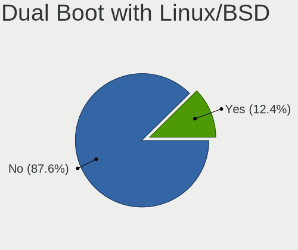

| Dual boot | Computers | Percent |
|-----------|-----------|---------|
| No        | 1132      | 87.48%  |
| Yes       | 162       | 12.52%  |

Dual Boot (Win)
---------------

Hosting Linux and Windows

| Dual boot | Computers | Percent |
|-----------|-----------|---------|
| No        | 926       | 71.01%  |
| Yes       | 378       | 28.99%  |

Board
-----

Vendor
------

Motherboard manufacturer

| Name                    | Computers | Percent |
|-------------------------|-----------|---------|
| ASUSTek Computer        | 288       | 22.5%   |
| Hewlett-Packard         | 200       | 15.63%  |
| Lenovo                  | 166       | 12.97%  |
| Acer                    | 96        | 7.5%    |
| Toshiba                 | 74        | 5.78%   |
| MSI                     | 74        | 5.78%   |
| Dell                    | 61        | 4.77%   |
| Gigabyte Technology     | 50        | 3.91%   |
| Sony                    | 41        | 3.2%    |
| Apple                   | 31        | 2.42%   |
| ASRock                  | 25        | 1.95%   |
| HUAWEI                  | 15        | 1.17%   |
| Samsung Electronics     | 14        | 1.09%   |
| Intel                   | 12        | 0.94%   |
| Fujitsu                 | 10        | 0.78%   |
| Notebook                | 9         | 0.7%    |
| Foxconn                 | 8         | 0.63%   |
| Packard Bell            | 7         | 0.55%   |
| Raspberry Pi Foundation | 6         | 0.47%   |
| eMachines               | 6         | 0.47%   |
| Unknown                 | 6         | 0.47%   |
| TUXEDO                  | 5         | 0.39%   |
| Phoenix/SiS             | 3         | 0.23%   |
| Pegatron                | 3         | 0.23%   |
| LG Electronics          | 3         | 0.23%   |
| Clevo                   | 3         | 0.23%   |
| Chuwi                   | 3         | 0.23%   |
| Biostar                 | 3         | 0.23%   |
| AMI                     | 3         | 0.23%   |
| Teclast                 | 2         | 0.16%   |
| SLIMBOOK                | 2         | 0.16%   |
| Positivo                | 2         | 0.16%   |
| OEM                     | 2         | 0.16%   |
| OBSIDIAN-PC             | 2         | 0.16%   |
| Minix                   | 2         | 0.16%   |
| Microsoft               | 2         | 0.16%   |
| Medion                  | 2         | 0.16%   |
| IP3 Tech                | 2         | 0.16%   |
| Huanan                  | 2         | 0.16%   |
| Google                  | 2         | 0.16%   |

Model
-----

Motherboard model

| Name                                | Computers | Percent |
|-------------------------------------|-----------|---------|
| Sony VGN-FZ31Z                      | 20        | 1.56%   |
| ASUS All Series                     | 13        | 1.02%   |
| Lenovo IdeaPad 1 14ADA05 82GW       | 11        | 0.86%   |
| HP Pavilion g6                      | 8         | 0.63%   |
| Unknown                             | 8         | 0.63%   |
| Toshiba Satellite C660              | 7         | 0.55%   |
| HP Pavilion dv6                     | 7         | 0.55%   |
| HP G62                              | 7         | 0.55%   |
| HP Notebook                         | 6         | 0.47%   |
| Toshiba Satellite L650              | 5         | 0.39%   |
| MSI MS-7817                         | 5         | 0.39%   |
| Lenovo Legion 5 15ACH6H 82JU        | 5         | 0.39%   |
| ASUS X555LJ                         | 5         | 0.39%   |
| Acer Extensa 5620                   | 5         | 0.39%   |
| Toshiba Satellite L40               | 4         | 0.31%   |
| Toshiba Satellite A200              | 4         | 0.31%   |
| HUAWEI NBLK-WAX9X                   | 4         | 0.31%   |
| HP Pavilion Notebook                | 4         | 0.31%   |
| HP Compaq Presario CQ60             | 4         | 0.31%   |
| ASUS X555LD                         | 4         | 0.31%   |
| ASUS X541UV                         | 4         | 0.31%   |
| ASUS VivoBook 15_ASUS Laptop X507LA | 4         | 0.31%   |
| ASUS P5G41T-M LX                    | 4         | 0.31%   |
| ASUS H110M-K                        | 4         | 0.31%   |
| Acer Aspire E5-551G                 | 4         | 0.31%   |
| Toshiba Satellite L50D-B            | 3         | 0.23%   |
| Toshiba Satellite L500              | 3         | 0.23%   |
| MSI Modern 14 A10RB                 | 3         | 0.23%   |
| Lenovo Y520-15IKBN 80WK             | 3         | 0.23%   |
| Lenovo Legion 5 15ARH05 82B5        | 3         | 0.23%   |
| Lenovo IdeaPad 320-15AST 80XV       | 3         | 0.23%   |
| Lenovo G50-45 80E3                  | 3         | 0.23%   |
| Intel powered classmate PC          | 3         | 0.23%   |
| HUAWEI WRT-WX9                      | 3         | 0.23%   |
| HP Pavilion Gaming Laptop 15-ec2xxx | 3         | 0.23%   |
| HP Pavilion 15                      | 3         | 0.23%   |
| HP OMEN by Laptop 15-dc0xxx         | 3         | 0.23%   |
| HP OMEN by Laptop                   | 3         | 0.23%   |
| HP Compaq Presario CQ61             | 3         | 0.23%   |
| HP Compaq Elite 8300 SFF            | 3         | 0.23%   |

Model Family
------------

Motherboard model prefix

| Name                  | Computers | Percent |
|-----------------------|-----------|---------|
| Lenovo ThinkPad       | 77        | 6.02%   |
| Acer Aspire           | 77        | 6.02%   |
| Toshiba Satellite     | 64        | 5%      |
| HP Pavilion           | 56        | 4.38%   |
| Lenovo IdeaPad        | 47        | 3.67%   |
| HP Compaq             | 30        | 2.34%   |
| ASUS VivoBook         | 25        | 1.95%   |
| HP EliteBook          | 22        | 1.72%   |
| ASUS PRIME            | 22        | 1.72%   |
| Sony VGN-FZ31Z        | 20        | 1.56%   |
| Dell Latitude         | 19        | 1.48%   |
| ASUS ROG              | 15        | 1.17%   |
| Lenovo Legion         | 13        | 1.02%   |
| HP ProBook            | 13        | 1.02%   |
| ASUS All              | 13        | 1.02%   |
| Dell XPS              | 12        | 0.94%   |
| HP Laptop             | 11        | 0.86%   |
| Dell OptiPlex         | 11        | 0.86%   |
| HP OMEN               | 9         | 0.7%    |
| Dell Inspiron         | 9         | 0.7%    |
| ASUS P5G41T-M         | 9         | 0.7%    |
| HP ENVY               | 8         | 0.63%   |
| ASUS ZenBook          | 8         | 0.63%   |
| Acer Extensa          | 8         | 0.63%   |
| Unknown               | 8         | 0.63%   |
| HP G62                | 7         | 0.55%   |
| Dell Precision        | 7         | 0.55%   |
| ASUS TUF              | 7         | 0.55%   |
| RPi Raspberry         | 6         | 0.47%   |
| Packard Bell EasyNote | 6         | 0.47%   |
| MSI Modern            | 6         | 0.47%   |
| HP Notebook           | 6         | 0.47%   |
| Gigabyte B550         | 6         | 0.47%   |
| MSI MS-7817           | 5         | 0.39%   |
| HP ProLiant           | 5         | 0.39%   |
| HP ProDesk            | 5         | 0.39%   |
| ASUS X555LJ           | 5         | 0.39%   |
| Lenovo Yoga           | 4         | 0.31%   |
| HUAWEI NBLK-WAX9X     | 4         | 0.31%   |
| ASUS X555LD           | 4         | 0.31%   |

MFG Year
--------

Motherboard manufacture year

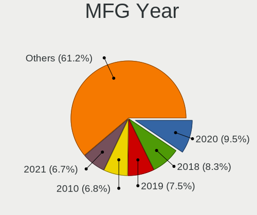

| Year    | Computers | Percent |
|---------|-----------|---------|
| 2020    | 117       | 9.14%   |
| 2018    | 111       | 8.67%   |
| 2010    | 106       | 8.28%   |
| 2019    | 102       | 7.97%   |
| 2015    | 79        | 6.17%   |
| 2014    | 77        | 6.02%   |
| 2012    | 76        | 5.94%   |
| 2008    | 72        | 5.63%   |
| 2016    | 71        | 5.55%   |
| 2007    | 71        | 5.55%   |
| 2013    | 70        | 5.47%   |
| 2011    | 70        | 5.47%   |
| 2009    | 70        | 5.47%   |
| 2017    | 65        | 5.08%   |
| 2021    | 57        | 4.45%   |
| 2006    | 29        | 2.27%   |
| 2005    | 14        | 1.09%   |
| 2022    | 10        | 0.78%   |
| Unknown | 9         | 0.7%    |
| 2004    | 3         | 0.23%   |
| 2003    | 1         | 0.08%   |

Form Factor
-----------

Physical design of the computer

| Name           | Computers | Percent |
|----------------|-----------|---------|
| Notebook       | 849       | 66.33%  |
| Desktop        | 376       | 29.38%  |
| Mini pc        | 13        | 1.02%   |
| Convertible    | 11        | 0.86%   |
| Tablet         | 8         | 0.63%   |
| Server         | 8         | 0.63%   |
| System on chip | 7         | 0.55%   |
| All in one     | 7         | 0.55%   |
| Phone          | 1         | 0.08%   |

Secure Boot
-----------

Enabled or disabled

| State    | Computers | Percent |
|----------|-----------|---------|
| Disabled | 1200      | 92.17%  |
| Enabled  | 102       | 7.83%   |

Coreboot
--------

Have coreboot on board

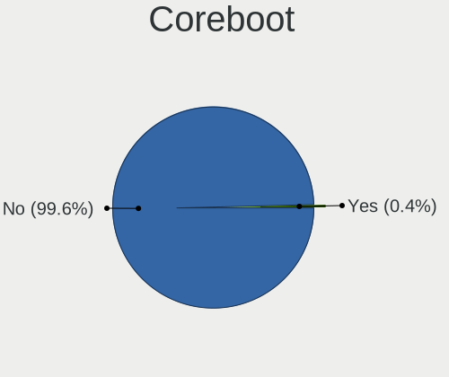

| Used | Computers | Percent |
|------|-----------|---------|
| No   | 1276      | 99.69%  |
| Yes  | 4         | 0.31%   |

RAM Size
--------

Total RAM memory

| Size in GB      | Computers | Percent |
|-----------------|-----------|---------|
| 3.01-4.0        | 355       | 27.31%  |
| 4.01-8.0        | 281       | 21.62%  |
| 16.01-24.0      | 202       | 15.54%  |
| 8.01-16.0       | 202       | 15.54%  |
| 32.01-64.0      | 97        | 7.46%   |
| 1.01-2.0        | 90        | 6.92%   |
| 2.01-3.0        | 31        | 2.38%   |
| 64.01-256.0     | 16        | 1.23%   |
| 0.51-1.0        | 14        | 1.08%   |
| 24.01-32.0      | 11        | 0.85%   |
| More than 256.0 | 1         | 0.08%   |

RAM Used
--------

Used RAM memory

| Used GB     | Computers | Percent |
|-------------|-----------|---------|
| 1.01-2.0    | 547       | 38.82%  |
| 2.01-3.0    | 302       | 21.43%  |
| 4.01-8.0    | 203       | 14.41%  |
| 3.01-4.0    | 156       | 11.07%  |
| 0.51-1.0    | 114       | 8.09%   |
| 8.01-16.0   | 56        | 3.97%   |
| 0.01-0.5    | 14        | 0.99%   |
| 16.01-24.0  | 10        | 0.71%   |
| 24.01-32.0  | 4         | 0.28%   |
| 32.01-64.0  | 1         | 0.07%   |
| 64.01-256.0 | 1         | 0.07%   |
| Unknown     | 1         | 0.07%   |

Total Drives
------------

Number of drives on board

| Drives | Computers | Percent |
|--------|-----------|---------|
| 1      | 831       | 63.39%  |
| 2      | 316       | 24.1%   |
| 3      | 87        | 6.64%   |
| 4      | 36        | 2.75%   |
| 0      | 17        | 1.3%    |
| 5      | 10        | 0.76%   |
| 6      | 6         | 0.46%   |
| 11     | 2         | 0.15%   |
| 10     | 2         | 0.15%   |
| 7      | 2         | 0.15%   |
| 87     | 1         | 0.08%   |
| 8      | 1         | 0.08%   |

Has CD-ROM
----------

Has CD-ROM on board

| Presented | Computers | Percent |
|-----------|-----------|---------|
| No        | 782       | 60.95%  |
| Yes       | 501       | 39.05%  |

Has Ethernet
------------

Has Ethernet on board

| Presented | Computers | Percent |
|-----------|-----------|---------|
| Yes       | 1119      | 87.08%  |
| No        | 166       | 12.92%  |

Has WiFi
--------

Has WiFi module

| Presented | Computers | Percent |
|-----------|-----------|---------|
| Yes       | 997       | 77.41%  |
| No        | 291       | 22.59%  |

Has Bluetooth
-------------

Has Bluetooth module

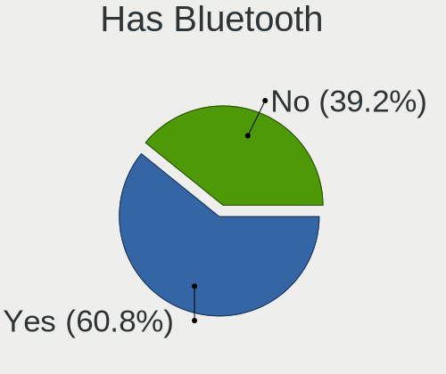

| Presented | Computers | Percent |
|-----------|-----------|---------|
| Yes       | 708       | 54.5%   |
| No        | 591       | 45.5%   |

Location
--------

Country
-------

Geographic location (country)

| Country  | Computers | Percent |
|----------|-----------|---------|
| Portugal | 1280      | 100%    |

City
----

Geographic location (city)

| City                         | Computers | Percent |
|------------------------------|-----------|---------|
| Lisbon                       | 295       | 21.76%  |
| Porto                        | 113       | 8.33%   |
| Vila Nova de Gaia            | 30        | 2.21%   |
| Funchal                      | 29        | 2.14%   |
| Braga                        | 29        | 2.14%   |
| Amadora                      | 28        | 2.06%   |
| Coimbra                      | 27        | 1.99%   |
| Setbal                     | 22        | 1.62%   |
| Aveiro                       | 22        | 1.62%   |
| Leiria                       | 20        | 1.47%   |
| Faro                         | 20        | 1.47%   |
| Loures                       | 17        | 1.25%   |
| Cascais                      | 17        | 1.25%   |
| Sintra                       | 13        | 0.96%   |
| Evora                        | 12        | 0.88%   |
| Bragana                    | 12        | 0.88%   |
| Almada                       | 12        | 0.88%   |
| Viana do Castelo             | 10        | 0.74%   |
| Portimao                     | 10        | 0.74%   |
| Mem Martins                  | 10        | 0.74%   |
| Guimaraes                    | 10        | 0.74%   |
| Viseu                        | 9         | 0.66%   |
| Santarm                    | 9         | 0.66%   |
| Pvoa de Varzim             | 9         | 0.66%   |
| Povoa de Santa Iria          | 9         | 0.66%   |
| Matosinhos Municipality      | 9         | 0.66%   |
| Alverca do Ribatejo          | 9         | 0.66%   |
| Trofa                        | 8         | 0.59%   |
| Torres Vedras                | 8         | 0.59%   |
| Odivelas                     | 8         | 0.59%   |
| Feira                        | 8         | 0.59%   |
| Amora                        | 8         | 0.59%   |
| Vila Nova de Famalicao       | 7         | 0.52%   |
| Sao Joao da Madeira          | 7         | 0.52%   |
| Santo Tirso                  | 7         | 0.52%   |
| Maia                         | 7         | 0.52%   |
| Figueira da Foz Municipality | 7         | 0.52%   |
| Carnaxide                    | 7         | 0.52%   |
| Caldas da Rainha             | 7         | 0.52%   |
| Cacem                        | 7         | 0.52%   |

Drives
------

Drive Vendor
------------

Hard drive vendors

| Vendor                    | Computers | Drives | Percent |
|---------------------------|-----------|--------|---------|
| Samsung Electronics       | 262       | 363    | 14.76%  |
| WDC                       | 246       | 387    | 13.86%  |
| Seagate                   | 222       | 353    | 12.51%  |
| Kingston                  | 168       | 219    | 9.46%   |
| Toshiba                   | 167       | 251    | 9.41%   |
| Unknown                   | 80        | 117    | 4.51%   |
| SanDisk                   | 80        | 92     | 4.51%   |
| Hitachi                   | 71        | 82     | 4%      |
| Crucial                   | 70        | 92     | 3.94%   |
| HGST                      | 40        | 53     | 2.25%   |
| Intel                     | 33        | 51     | 1.86%   |
| SK hynix                  | 30        | 34     | 1.69%   |
| Fujitsu                   | 21        | 22     | 1.18%   |
| Maxtor                    | 20        | 34     | 1.13%   |
| Micron Technology         | 19        | 22     | 1.07%   |
| KIOXIA                    | 18        | 33     | 1.01%   |
| GOODRAM                   | 15        | 17     | 0.85%   |
| Apple                     | 14        | 14     | 0.79%   |
| PNY                       | 12        | 17     | 0.68%   |
| BlueRay                   | 12        | 13     | 0.68%   |
| Phison                    | 10        | 16     | 0.56%   |
| A-DATA Technology         | 10        | 10     | 0.56%   |
| China                     | 8         | 9      | 0.45%   |
| S3+                       | 7         | 15     | 0.39%   |
| KIOXIA-EXCERIA            | 7         | 8      | 0.39%   |
| JMicron Technology        | 7         | 7      | 0.39%   |
| Hewlett-Packard           | 7         | 8      | 0.39%   |
| Transcend                 | 6         | 7      | 0.34%   |
| Emtec                     | 6         | 7      | 0.34%   |
| Unknown                   | 6         | 7      | 0.34%   |
| LITEON                    | 5         | 6      | 0.28%   |
| Team                      | 4         | 5      | 0.23%   |
| Phison Electronics        | 4         | 4      | 0.23%   |
| OCZ                       | 4         | 4      | 0.23%   |
| Micron/Crucial Technology | 4         | 5      | 0.23%   |
| KingDian                  | 4         | 7      | 0.23%   |
| Gigabyte Technology       | 4         | 5      | 0.23%   |
| ExcelStor                 | 4         | 4      | 0.23%   |
| Vaseky                    | 3         | 3      | 0.17%   |
| Silicon Motion            | 3         | 3      | 0.17%   |

Drive Model
-----------

Hard drive models

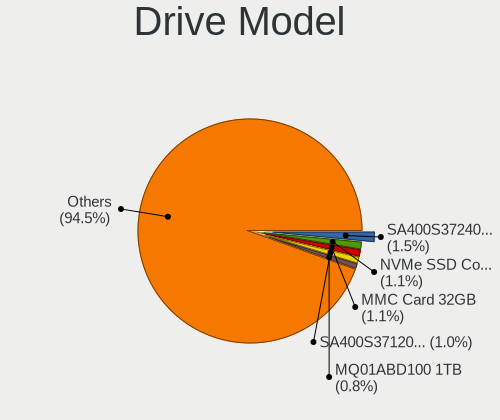

| Model                                  | Computers | Percent |
|----------------------------------------|-----------|---------|
| Kingston SA400S37240G 240GB SSD        | 31        | 1.63%   |
| Kingston SA400S37120G 120GB SSD        | 26        | 1.37%   |
| Unknown MMC Card  32GB                 | 22        | 1.16%   |
| Kingston SV300S37A120G 120GB SSD       | 19        | 1%      |
| Toshiba MQ01ABD100 1TB                 | 18        | 0.95%   |
| Seagate ST1000LM024 HN-M101MBB 1TB     | 18        | 0.95%   |
| HGST HTS721010A9E630 1TB               | 18        | 0.95%   |
| Seagate ST1000DM010-2EP102 1TB         | 15        | 0.79%   |
| Samsung SSD 850 EVO 250GB              | 14        | 0.74%   |
| Crucial CT240M500SSD1 240GB            | 14        | 0.74%   |
| Toshiba MQ01ABF050 500GB               | 13        | 0.68%   |
| Kingston SV300S37A240G 240GB SSD       | 13        | 0.68%   |
| Kingston SA400S37480G 480GB SSD        | 13        | 0.68%   |
| Unknown MMC Card  64GB                 | 12        | 0.63%   |
| Seagate ST500LT012-1DG142 500GB        | 12        | 0.63%   |
| Samsung SSD 860 EVO 500GB              | 12        | 0.63%   |
| Unknown MMC64G  64GB                   | 11        | 0.58%   |
| Seagate ST9500325AS 500GB              | 11        | 0.58%   |
| Seagate ST1000LM035-1RK172 1TB         | 11        | 0.58%   |
| Seagate ST3500418AS 500GB              | 10        | 0.53%   |
| SanDisk NVMe SSD Drive 512GB           | 10        | 0.53%   |
| Samsung NVMe SSD Drive 512GB           | 10        | 0.53%   |
| WDC WDS240G2G0A-00JH30 240GB SSD       | 9         | 0.47%   |
| Samsung SSD 850 EVO 500GB              | 9         | 0.47%   |
| Samsung SSD 840 EVO 250GB              | 9         | 0.47%   |
| Samsung NVMe SSD Drive 500GB           | 9         | 0.47%   |
| Crucial CT240BX500SSD1 240GB           | 9         | 0.47%   |
| Seagate Expansion 4TB                  | 8         | 0.42%   |
| SanDisk NVMe SSD Drive 256GB           | 8         | 0.42%   |
| Samsung SM963 2.5" NVMe PCIe SSD 256GB | 8         | 0.42%   |
| Crucial CT500MX500SSD1 500GB           | 8         | 0.42%   |
| Toshiba TR200 240GB SSD                | 7         | 0.37%   |
| Toshiba HDWD110 1TB                    | 7         | 0.37%   |
| SK hynix NVMe SSD Drive 256GB          | 7         | 0.37%   |
| Samsung SSD 860 QVO 1TB                | 7         | 0.37%   |
| Kingston SUV400S37240G 240GB SSD       | 7         | 0.37%   |
| Kingston SUV400S37120G 120GB SSD       | 7         | 0.37%   |
| Kingston NVMe SSD Drive 512GB          | 7         | 0.37%   |
| WDC WD5000LPVX-22V0TT0 500GB           | 6         | 0.32%   |
| WDC WD3200BEVT-22ZCT0 320GB            | 6         | 0.32%   |

HDD Vendor
----------

Hard disk drive vendors

| Vendor              | Computers | Drives | Percent |
|---------------------|-----------|--------|---------|
| Seagate             | 217       | 344    | 28.86%  |
| WDC                 | 189       | 287    | 25.13%  |
| Toshiba             | 125       | 199    | 16.62%  |
| Hitachi             | 71        | 82     | 9.44%   |
| Samsung Electronics | 55        | 76     | 7.31%   |
| HGST                | 40        | 53     | 5.32%   |
| Fujitsu             | 20        | 21     | 2.66%   |
| Maxtor              | 16        | 23     | 2.13%   |
| ExcelStor           | 4         | 4      | 0.53%   |
| Apple               | 3         | 3      | 0.4%    |
| MSFT                | 2         | 12     | 0.27%   |
| Dell                | 2         | 4      | 0.27%   |
| USB3.0              | 1         | 1      | 0.13%   |
| USB                 | 1         | 1      | 0.13%   |
| Unknown             | 1         | 1      | 0.13%   |
| Quantum             | 1         | 1      | 0.13%   |
| HPE                 | 1         | 4      | 0.13%   |
| Hewlett-Packard     | 1         | 2      | 0.13%   |
| ASMT                | 1         | 1      | 0.13%   |
| ASMedia             | 1         | 1      | 0.13%   |

SSD Vendor
----------

Solid state drive vendors

| Vendor              | Computers | Drives | Percent |
|---------------------|-----------|--------|---------|
| Kingston            | 148       | 187    | 24.42%  |
| Samsung Electronics | 118       | 159    | 19.47%  |
| Crucial             | 68        | 89     | 11.22%  |
| SanDisk             | 42        | 50     | 6.93%   |
| WDC                 | 32        | 46     | 5.28%   |
| Toshiba             | 24        | 31     | 3.96%   |
| GOODRAM             | 13        | 15     | 2.15%   |
| Intel               | 11        | 14     | 1.82%   |
| BlueRay             | 10        | 11     | 1.65%   |
| Apple               | 10        | 10     | 1.65%   |
| A-DATA Technology   | 10        | 10     | 1.65%   |
| PNY                 | 8         | 12     | 1.32%   |
| China               | 8         | 9      | 1.32%   |
| SK hynix            | 7         | 7      | 1.16%   |
| S3+                 | 7         | 15     | 1.16%   |
| Transcend           | 6         | 7      | 0.99%   |
| Hewlett-Packard     | 6         | 6      | 0.99%   |
| Emtec               | 6         | 7      | 0.99%   |
| Micron Technology   | 5         | 7      | 0.83%   |
| Unknown             | 4         | 4      | 0.66%   |
| Team                | 4         | 5      | 0.66%   |
| Seagate             | 4         | 6      | 0.66%   |
| OCZ                 | 4         | 4      | 0.66%   |
| Maxtor              | 4         | 11     | 0.66%   |
| KingDian            | 4         | 7      | 0.66%   |
| JMicron Technology  | 4         | 4      | 0.66%   |
| Vaseky              | 3         | 3      | 0.5%    |
| LITEON              | 3         | 4      | 0.5%    |
| KIOXIA-EXCERIA      | 3         | 3      | 0.5%    |
| Gigabyte Technology | 3         | 3      | 0.5%    |
| 2-Power             | 3         | 4      | 0.5%    |
| Netac               | 2         | 2      | 0.33%   |
| Zheino              | 1         | 2      | 0.17%   |
| Verbatim            | 1         | 1      | 0.17%   |
| Teclast             | 1         | 1      | 0.17%   |
| TEAM T25            | 1         | 1      | 0.17%   |
| TCSUNBOW            | 1         | 1      | 0.17%   |
| Plextor             | 1         | 1      | 0.17%   |
| OSC                 | 1         | 1      | 0.17%   |
| Mushkin             | 1         | 1      | 0.17%   |

Drive Kind
----------

HDD or SSD

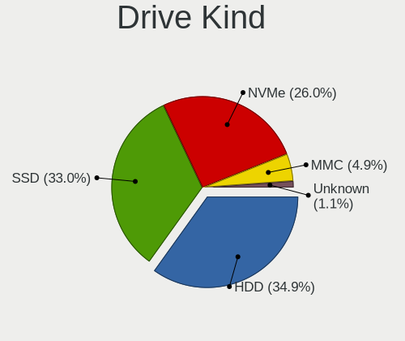

| Kind    | Computers | Drives | Percent |
|---------|-----------|--------|---------|
| HDD     | 647       | 1120   | 40.44%  |
| SSD     | 539       | 776    | 33.69%  |
| NVMe    | 319       | 464    | 19.94%  |
| MMC     | 77        | 114    | 4.81%   |
| Unknown | 18        | 20     | 1.13%   |

Drive Connector
---------------

SATA, SAS, NVMe, etc.

| Type | Computers | Drives | Percent |
|------|-----------|--------|---------|
| SATA | 980       | 1856   | 68.87%  |
| NVMe | 319       | 462    | 22.42%  |
| MMC  | 77        | 114    | 5.41%   |
| SAS  | 47        | 62     | 3.3%    |

Drive Size
----------

Size of hard drive

| Size in TB | Computers | Drives | Percent |
|------------|-----------|--------|---------|
| 0.01-0.5   | 802       | 1251   | 68.26%  |
| 0.51-1.0   | 279       | 408    | 23.74%  |
| 1.01-2.0   | 47        | 74     | 4%      |
| 3.01-4.0   | 18        | 36     | 1.53%   |
| 2.01-3.0   | 13        | 19     | 1.11%   |
| 4.01-10.0  | 13        | 19     | 1.11%   |
| 10.01-20.0 | 2         | 88     | 0.17%   |
| 0          | 1         | 1      | 0.09%   |

Space Total
-----------

Amount of disk space available on the file system

| Size in GB     | Computers | Percent |
|----------------|-----------|---------|
| 101-250        | 392       | 29.06%  |
| 251-500        | 306       | 22.68%  |
| 501-1000       | 172       | 12.75%  |
| 51-100         | 119       | 8.82%   |
| 1-20           | 101       | 7.49%   |
| 1001-2000      | 85        | 6.3%    |
| 21-50          | 64        | 4.74%   |
| More than 3000 | 43        | 3.19%   |
| 2001-3000      | 34        | 2.52%   |
| Unknown        | 33        | 2.45%   |

Space Used
----------

Amount of used disk space

| Used GB        | Computers | Percent |
|----------------|-----------|---------|
| 1-20           | 577       | 41.42%  |
| 21-50          | 258       | 18.52%  |
| 101-250        | 158       | 11.34%  |
| 51-100         | 153       | 10.98%  |
| 251-500        | 91        | 6.53%   |
| 501-1000       | 52        | 3.73%   |
| 1001-2000      | 44        | 3.16%   |
| Unknown        | 33        | 2.37%   |
| More than 3000 | 15        | 1.08%   |
| 2001-3000      | 12        | 0.86%   |

Malfunc. Drives
---------------

Drive models with a malfunction

| Model                              | Computers | Drives | Percent |
|------------------------------------|-----------|--------|---------|
| Crucial CT240M500SSD1 240GB        | 13        | 13     | 10.92%  |
| Kingston SV300S37A120G 120GB SSD   | 6         | 6      | 5.04%   |
| Seagate ST3500418AS 500GB          | 3         | 3      | 2.52%   |
| WDC WD800JD-60LSA0 80GB            | 2         | 2      | 1.68%   |
| WDC WD3200AAJS-00L7A0 320GB        | 2         | 2      | 1.68%   |
| Toshiba MK2552GSX 250GB            | 2         | 2      | 1.68%   |
| Seagate ST9500325AS 500GB          | 2         | 2      | 1.68%   |
| Seagate ST500LT012-1DG142 500GB    | 2         | 2      | 1.68%   |
| Seagate ST1000LM024 HN-M101MBB 1TB | 2         | 2      | 1.68%   |
| Samsung Electronics HD252HJ 250GB  | 2         | 2      | 1.68%   |
| Kingston SV300S37A240G 240GB SSD   | 2         | 2      | 1.68%   |
| Kingston SUV400S37240G 240GB SSD   | 2         | 2      | 1.68%   |
| Hitachi HTS545050A7E380 500GB      | 2         | 2      | 1.68%   |
| HGST HTS721010A9E630 1TB           | 2         | 2      | 1.68%   |
| WDC WD6400AADS-00M2B0 640GB        | 1         | 1      | 0.84%   |
| WDC WD5000LPCX-60VHAT0 500GB       | 1         | 1      | 0.84%   |
| WDC WD5000BPVT-80HXZT1 500GB       | 1         | 1      | 0.84%   |
| WDC WD5000BPVT-22HXZT1 500GB       | 1         | 1      | 0.84%   |
| WDC WD5000AAKS-00V1A0 500GB        | 1         | 1      | 0.84%   |
| WDC WD5000AAKS-00A7B0 500GB        | 1         | 4      | 0.84%   |
| WDC WD40EFRX-68WT0N0 4TB           | 1         | 2      | 0.84%   |
| WDC WD3200AAJS-00B4A0 320GB        | 1         | 1      | 0.84%   |
| WDC WD30EZRS-11J99B1 3TB           | 1         | 1      | 0.84%   |
| WDC WD2500JS-40TGB0 250GB          | 1         | 1      | 0.84%   |
| WDC WD20EARS-00MVWB0 2TB           | 1         | 1      | 0.84%   |
| WDC WD10JPVT-22A1YT0 1TB           | 1         | 1      | 0.84%   |
| WDC WD10EZRZ-00Z5HB0 1TB           | 1         | 1      | 0.84%   |
| WDC WD10EZEX-00BN5A0 1TB           | 1         | 1      | 0.84%   |
| WDC WD10EAVS-00D7B1 1TB            | 1         | 1      | 0.84%   |
| WDC WD10EARS-00Y5B1 1TB            | 1         | 1      | 0.84%   |
| WDC WD10EADS-11M2B1 1TB            | 1         | 1      | 0.84%   |
| WDC WD1002FBYS-02A6B0 1TB          | 1         | 1      | 0.84%   |
| WDC WD1001FALS-00J7B0 1TB          | 1         | 4      | 0.84%   |
| Unknown FM-25S2S-60GBP2 64GB SSD   | 1         | 1      | 0.84%   |
| Toshiba Q300. 240GB SSD            | 1         | 1      | 0.84%   |
| Toshiba MQ01ABF050 500GB           | 1         | 1      | 0.84%   |
| Toshiba MQ01ABD100 1TB             | 1         | 1      | 0.84%   |
| Toshiba MK7575GSX 752GB            | 1         | 1      | 0.84%   |
| Toshiba MK5065GSX 500GB            | 1         | 1      | 0.84%   |
| Toshiba MK4058GSX 400GB            | 1         | 1      | 0.84%   |

Malfunc. Drive Vendor
---------------------

Vendors of faulty drives

| Vendor              | Computers | Drives | Percent |
|---------------------|-----------|--------|---------|
| WDC                 | 23        | 30     | 19.83%  |
| Seagate             | 19        | 22     | 16.38%  |
| Hitachi             | 15        | 15     | 12.93%  |
| Crucial             | 15        | 15     | 12.93%  |
| Kingston            | 11        | 11     | 9.48%   |
| Toshiba             | 10        | 11     | 8.62%   |
| Samsung Electronics | 7         | 8      | 6.03%   |
| Maxtor              | 4         | 7      | 3.45%   |
| HGST                | 2         | 2      | 1.72%   |
| Unknown             | 1         | 1      | 0.86%   |
| SK hynix            | 1         | 1      | 0.86%   |
| SanDisk             | 1         | 1      | 0.86%   |
| KingDian            | 1         | 2      | 0.86%   |
| Intel               | 1         | 1      | 0.86%   |
| HP Phison           | 1         | 1      | 0.86%   |
| Fujitsu             | 1         | 1      | 0.86%   |
| China               | 1         | 1      | 0.86%   |
| Apple               | 1         | 1      | 0.86%   |
| A-DATA Technology   | 1         | 1      | 0.86%   |

Malfunc. HDD Vendor
-------------------

Vendors of faulty HDD drives

| Vendor              | Computers | Drives | Percent |
|---------------------|-----------|--------|---------|
| WDC                 | 23        | 30     | 28.75%  |
| Seagate             | 19        | 22     | 23.75%  |
| Hitachi             | 15        | 15     | 18.75%  |
| Toshiba             | 9         | 10     | 11.25%  |
| Samsung Electronics | 6         | 7      | 7.5%    |
| Maxtor              | 4         | 7      | 5%      |
| HGST                | 2         | 2      | 2.5%    |
| Fujitsu             | 1         | 1      | 1.25%   |
| Apple               | 1         | 1      | 1.25%   |

Malfunc. Drive Kind
-------------------

Kinds of faulty drives

| Kind | Computers | Drives | Percent |
|------|-----------|--------|---------|
| HDD  | 76        | 95     | 67.86%  |
| SSD  | 36        | 37     | 32.14%  |

Failed Drives
-------------

Failed drive models

Zero info for selected period =(

Failed Drive Vendor
-------------------

Failed drive vendors

Zero info for selected period =(

Drive Status
------------

Number of failed and malfunc. drives

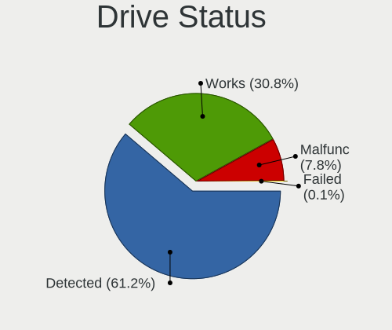

| Status   | Computers | Drives | Percent |
|----------|-----------|--------|---------|
| Detected | 877       | 1736   | 64.53%  |
| Works    | 373       | 626    | 27.45%  |
| Malfunc  | 109       | 132    | 8.02%   |

Storage controller
------------------

Storage Vendor
--------------

Storage controller vendors

| Vendor                           | Computers | Percent |
|----------------------------------|-----------|---------|
| Intel                            | 855       | 56.66%  |
| AMD                              | 215       | 14.25%  |
| Samsung Electronics              | 109       | 7.22%   |
| SanDisk                          | 63        | 4.17%   |
| Kingston Technology Company      | 25        | 1.66%   |
| Nvidia                           | 24        | 1.59%   |
| JMicron Technology               | 23        | 1.52%   |
| Toshiba America Info Systems     | 21        | 1.39%   |
| SK hynix                         | 21        | 1.39%   |
| KIOXIA                           | 21        | 1.39%   |
| Phison Electronics               | 19        | 1.26%   |
| Silicon Integrated Systems [SiS] | 15        | 0.99%   |
| Micron Technology                | 15        | 0.99%   |
| VIA Technologies                 | 13        | 0.86%   |
| ASMedia Technology               | 13        | 0.86%   |
| Marvell Technology Group         | 12        | 0.8%    |
| Union Memory (Shenzhen)          | 6         | 0.4%    |
| Micron/Crucial Technology        | 6         | 0.4%    |
| LSI Logic / Symbios Logic        | 6         | 0.4%    |
| Lite-On Technology               | 4         | 0.27%   |
| Silicon Motion                   | 3         | 0.2%    |
| Shenzhen Longsys Electronics     | 3         | 0.2%    |
| Hewlett-Packard                  | 3         | 0.2%    |
| ADATA Technology                 | 3         | 0.2%    |
| Realtek Semiconductor            | 2         | 0.13%   |
| Lenovo                           | 2         | 0.13%   |
| Adaptec                          | 2         | 0.13%   |
| ULi Electronics                  | 1         | 0.07%   |
| Solid State Storage Technology   | 1         | 0.07%   |
| Silicon Image                    | 1         | 0.07%   |
| Enmotus                          | 1         | 0.07%   |
| Apple                            | 1         | 0.07%   |

Storage Model
-------------

Storage controller models

| Model                                                                                   | Computers | Percent |
|-----------------------------------------------------------------------------------------|-----------|---------|
| AMD FCH SATA Controller [AHCI mode]                                                     | 148       | 8.23%   |
| Intel 7 Series Chipset Family 6-port SATA Controller [AHCI mode]                        | 64        | 3.56%   |
| Samsung NVMe SSD Controller SM981/PM981/PM983                                           | 58        | 3.22%   |
| Intel 82801IBM/IEM (ICH9M/ICH9M-E) 4 port SATA Controller [AHCI mode]                   | 58        | 3.22%   |
| Intel Sunrise Point-LP SATA Controller [AHCI mode]                                      | 54        | 3%      |
| Intel 82801HM/HEM (ICH8M/ICH8M-E) IDE Controller                                        | 53        | 2.95%   |
| Intel 6 Series/C200 Series Chipset Family 6 port Mobile SATA AHCI Controller            | 49        | 2.72%   |
| Intel 82801G (ICH7 Family) IDE Controller                                               | 47        | 2.61%   |
| Intel 82801HM/HEM (ICH8M/ICH8M-E) SATA Controller [AHCI mode]                           | 46        | 2.56%   |
| Intel NM10/ICH7 Family SATA Controller [IDE mode]                                       | 41        | 2.28%   |
| Intel 8 Series/C220 Series Chipset Family 6-port SATA Controller 1 [AHCI mode]          | 40        | 2.22%   |
| Intel 5 Series/3400 Series Chipset 4 port SATA AHCI Controller                          | 36        | 2%      |
| Intel 82801 Mobile SATA Controller [RAID mode]                                          | 35        | 1.95%   |
| Intel 8 Series SATA Controller 1 [AHCI mode]                                            | 35        | 1.95%   |
| Intel Q170/Q150/B150/H170/H110/Z170/CM236 Chipset SATA Controller [AHCI Mode]           | 25        | 1.39%   |
| AMD SB7x0/SB8x0/SB9x0 IDE Controller                                                    | 25        | 1.39%   |
| Intel Wildcat Point-LP SATA Controller [AHCI Mode]                                      | 23        | 1.28%   |
| AMD 400 Series Chipset SATA Controller                                                  | 22        | 1.22%   |
| AMD SB7x0/SB8x0/SB9x0 SATA Controller [AHCI mode]                                       | 21        | 1.17%   |
| Samsung NVMe SSD Controller 980                                                         | 20        | 1.11%   |
| AMD 500 Series Chipset SATA Controller                                                  | 20        | 1.11%   |
| Intel Volume Management Device NVMe RAID Controller                                     | 18        | 1%      |
| Intel Cannon Lake Mobile PCH SATA AHCI Controller                                       | 18        | 1%      |
| SanDisk WD Black SN750 / PC SN730 NVMe SSD                                              | 17        | 0.94%   |
| Intel 5 Series/3400 Series Chipset 6 port SATA AHCI Controller                          | 17        | 0.94%   |
| Intel SSD 660P Series                                                                   | 16        | 0.89%   |
| Intel HM170/QM170 Chipset SATA Controller [AHCI Mode]                                   | 16        | 0.89%   |
| AMD SB7x0/SB8x0/SB9x0 SATA Controller [IDE mode]                                        | 16        | 0.89%   |
| Silicon Integrated Systems [SiS] 5513 IDE Controller                                    | 15        | 0.83%   |
| SanDisk WD Blue SN550 NVMe SSD                                                          | 15        | 0.83%   |
| Samsung NVMe SSD Controller SM961/PM961/SM963                                           | 15        | 0.83%   |
| Micron Non-Volatile memory controller                                                   | 15        | 0.83%   |
| Intel Cannon Lake PCH SATA AHCI Controller                                              | 15        | 0.83%   |
| Intel Atom Processor E3800 Series SATA AHCI Controller                                  | 15        | 0.83%   |
| Intel 7 Series/C210 Series Chipset Family 6-port SATA Controller [AHCI mode]            | 14        | 0.78%   |
| Silicon Integrated Systems [SiS] SATA Controller / IDE mode                             | 13        | 0.72%   |
| Phison E12 NVMe Controller                                                              | 13        | 0.72%   |
| Intel SATA Controller [RAID mode]                                                       | 12        | 0.67%   |
| Intel NM10/ICH7 Family SATA Controller [AHCI mode]                                      | 12        | 0.67%   |
| Intel 6 Series/C200 Series Chipset Family Desktop SATA Controller (IDE mode, ports 4-5) | 12        | 0.67%   |

Storage Kind
------------

Kind of storage controller (IDE, SATA, NVMe, SAS, ...)

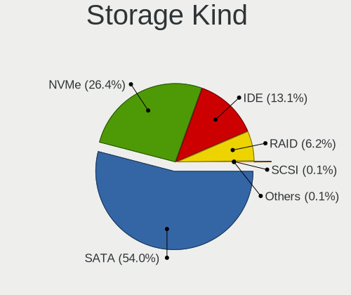

| Kind | Computers | Percent |
|------|-----------|---------|
| SATA | 887       | 56.71%  |
| NVMe | 321       | 20.52%  |
| IDE  | 272       | 17.39%  |
| RAID | 79        | 5.05%   |
| SCSI | 3         | 0.19%   |
| SAS  | 2         | 0.13%   |

Processor
---------

CPU Vendor
----------

Processor vendors

| Vendor | Computers | Percent |
|--------|-----------|---------|
| Intel  | 1002      | 78.28%  |
| AMD    | 270       | 21.09%  |
| ARM    | 8         | 0.63%   |

CPU Model
---------

Processor models

| Model                                         | Computers | Percent |
|-----------------------------------------------|-----------|---------|
| Intel Core 2 Duo CPU T8300 @ 2.40GHz          | 23        | 1.79%   |
| Intel Core i7-8565U CPU @ 1.80GHz             | 19        | 1.48%   |
| Intel Core i7-10510U CPU @ 1.80GHz            | 18        | 1.4%    |
| Intel 11th Gen Core i7-1165G7 @ 2.80GHz       | 17        | 1.33%   |
| Intel Core i7-8550U CPU @ 1.80GHz             | 15        | 1.17%   |
| Intel Core i7-8750H CPU @ 2.20GHz             | 12        | 0.94%   |
| Intel Atom x5-Z8350 CPU @ 1.44GHz             | 12        | 0.94%   |
| AMD Ryzen 5 3500U with Radeon Vega Mobile Gfx | 12        | 0.94%   |
| Intel Pentium Dual-Core CPU T4300 @ 2.10GHz   | 11        | 0.86%   |
| Intel Core i7-6700HQ CPU @ 2.60GHz            | 11        | 0.86%   |
| Intel Core i5-8250U CPU @ 1.60GHz             | 11        | 0.86%   |
| Intel Celeron CPU N2840 @ 2.16GHz             | 11        | 0.86%   |
| AMD 3020e with Radeon Graphics                | 11        | 0.86%   |
| Intel Core i5-8265U CPU @ 1.60GHz             | 10        | 0.78%   |
| Intel Core i5-3320M CPU @ 2.60GHz             | 10        | 0.78%   |
| Intel 11th Gen Core i5-1135G7 @ 2.40GHz       | 10        | 0.78%   |
| AMD Ryzen 7 4800H with Radeon Graphics        | 10        | 0.78%   |
| Intel Core i7-9750H CPU @ 2.60GHz             | 9         | 0.7%    |
| Intel Core i7-2630QM CPU @ 2.00GHz            | 9         | 0.7%    |
| Intel Core i5-3210M CPU @ 2.50GHz             | 9         | 0.7%    |
| Intel Core i3-5005U CPU @ 2.00GHz             | 9         | 0.7%    |
| Intel Core i7-7500U CPU @ 2.70GHz             | 8         | 0.62%   |
| Intel Core i7-6500U CPU @ 2.50GHz             | 8         | 0.62%   |
| Intel Core i7-4510U CPU @ 2.00GHz             | 8         | 0.62%   |
| Intel Core i5-6200U CPU @ 2.30GHz             | 8         | 0.62%   |
| Intel Core i5 CPU M 480 @ 2.67GHz             | 8         | 0.62%   |
| Intel Core i3-3217U CPU @ 1.80GHz             | 8         | 0.62%   |
| Intel Core 2 Duo CPU P8700 @ 2.53GHz          | 8         | 0.62%   |
| Intel Pentium Dual CPU T2390 @ 1.86GHz        | 7         | 0.55%   |
| Intel Core i7-10750H CPU @ 2.60GHz            | 7         | 0.55%   |
| Intel Core i7 CPU Q 720 @ 1.60GHz             | 7         | 0.55%   |
| Intel Core i5-5200U CPU @ 2.20GHz             | 7         | 0.55%   |
| Intel Core i5-2520M CPU @ 2.50GHz             | 7         | 0.55%   |
| Intel Core 2 Quad CPU Q6600 @ 2.40GHz         | 7         | 0.55%   |
| Intel Celeron CPU N3060 @ 1.60GHz             | 7         | 0.55%   |
| AMD Ryzen 7 5800H with Radeon Graphics        | 7         | 0.55%   |
| AMD Ryzen 5 1600 Six-Core Processor           | 7         | 0.55%   |
| Intel Pentium Dual-Core CPU T4500 @ 2.30GHz   | 6         | 0.47%   |
| Intel Pentium Dual CPU T3400 @ 2.16GHz        | 6         | 0.47%   |
| Intel Pentium 4 CPU 3.00GHz                   | 6         | 0.47%   |

CPU Model Family
----------------

Processor model prefix

| Model                   | Computers | Percent |
|-------------------------|-----------|---------|
| Intel Core i7           | 248       | 19.34%  |
| Intel Core i5           | 235       | 18.33%  |
| Intel Core 2 Duo        | 88        | 6.86%   |
| Intel Core i3           | 84        | 6.55%   |
| Other                   | 70        | 5.46%   |
| AMD Ryzen 5             | 67        | 5.23%   |
| AMD Ryzen 7             | 54        | 4.21%   |
| Intel Celeron           | 51        | 3.98%   |
| Intel Atom              | 45        | 3.51%   |
| Intel Pentium Dual-Core | 39        | 3.04%   |
| Intel Pentium Dual      | 28        | 2.18%   |
| Intel Pentium           | 25        | 1.95%   |
| AMD FX                  | 25        | 1.95%   |
| Intel Xeon              | 24        | 1.87%   |
| Intel Core 2 Quad       | 22        | 1.72%   |
| Intel Core 2            | 21        | 1.64%   |
| Intel Genuine           | 14        | 1.09%   |
| Intel Pentium 4         | 13        | 1.01%   |
| AMD A4                  | 12        | 0.94%   |
| AMD Ryzen 3             | 11        | 0.86%   |
| AMD A6                  | 10        | 0.78%   |
| AMD A8                  | 9         | 0.7%    |
| AMD Ryzen 9             | 8         | 0.62%   |
| AMD A10                 | 8         | 0.62%   |
| AMD E2                  | 7         | 0.55%   |
| Intel Pentium D         | 6         | 0.47%   |
| Intel Pentium M         | 5         | 0.39%   |
| AMD E                   | 5         | 0.39%   |
| AMD Athlon              | 5         | 0.39%   |
| Intel Core i9           | 3         | 0.23%   |
| AMD Ryzen 7 PRO         | 3         | 0.23%   |
| AMD Athlon II X2        | 3         | 0.23%   |
| AMD Athlon 64           | 3         | 0.23%   |
| Intel Pentium Gold      | 2         | 0.16%   |
| ARM BCM                 | 2         | 0.16%   |
| AMD Ryzen Threadripper  | 2         | 0.16%   |
| AMD Mobile Sempron      | 2         | 0.16%   |
| AMD E1                  | 2         | 0.16%   |
| AMD Athlon II X3        | 2         | 0.16%   |
| AMD Athlon 64 X2        | 2         | 0.16%   |

CPU Cores
---------

Number of processor cores

| Number  | Computers | Percent |
|---------|-----------|---------|
| 2       | 586       | 45.67%  |
| 4       | 441       | 34.37%  |
| 6       | 99        | 7.72%   |
| 8       | 70        | 5.46%   |
| 1       | 50        | 3.9%    |
| 3       | 13        | 1.01%   |
| 12      | 7         | 0.55%   |
| 16      | 5         | 0.39%   |
| 10      | 4         | 0.31%   |
| Unknown | 4         | 0.31%   |
| 14      | 2         | 0.16%   |
| 36      | 1         | 0.08%   |
| 24      | 1         | 0.08%   |

CPU Sockets
-----------

Number of sockets

| Number  | Computers | Percent |
|---------|-----------|---------|
| 1       | 1270      | 99.22%  |
| 2       | 7         | 0.55%   |
| Unknown | 3         | 0.23%   |

CPU Threads
-----------

Threads per core (Hyper-Threading)

| Number  | Computers | Percent |
|---------|-----------|---------|
| 2       | 762       | 59.44%  |
| 1       | 516       | 40.25%  |
| Unknown | 4         | 0.31%   |

CPU Op-Modes
------------

CPU Operation Modes (32-bit, 64-bit)

| Op mode        | Computers | Percent |
|----------------|-----------|---------|
| 32-bit, 64-bit | 1211      | 93.88%  |
| Unknown        | 49        | 3.8%    |
| 32-bit         | 23        | 1.78%   |
| 64-bit         | 7         | 0.54%   |

CPU Microcode
-------------

Microcode number

| Number     | Computers | Percent |
|------------|-----------|---------|
| Unknown    | 299       | 22.5%   |
| 0x1067a    | 71        | 5.34%   |
| 0x206a7    | 67        | 5.04%   |
| 0x306a9    | 66        | 4.97%   |
| 0x10676    | 40        | 3.01%   |
| 0x906ea    | 36        | 2.71%   |
| 0x306c3    | 35        | 2.63%   |
| 0x806ec    | 34        | 2.56%   |
| 0x6fd      | 34        | 2.56%   |
| 0x806ea    | 28        | 2.11%   |
| 0x506e3    | 28        | 2.11%   |
| 0x40651    | 26        | 1.96%   |
| 0x806c1    | 24        | 1.81%   |
| 0x306d4    | 20        | 1.5%    |
| 0x20655    | 19        | 1.43%   |
| 0x406e3    | 18        | 1.35%   |
| 0x30678    | 18        | 1.35%   |
| 0x20652    | 18        | 1.35%   |
| 0x806eb    | 17        | 1.28%   |
| 0x806e9    | 15        | 1.13%   |
| 0x906e9    | 14        | 1.05%   |
| 0x6fb      | 14        | 1.05%   |
| 0x406c4    | 14        | 1.05%   |
| 0x06000852 | 14        | 1.05%   |
| 0x6f6      | 13        | 0.98%   |
| 0x08701021 | 12        | 0.9%    |
| 0x406c3    | 11        | 0.83%   |
| 0x106e5    | 11        | 0.83%   |
| 0x08200103 | 11        | 0.83%   |
| 0x08108109 | 11        | 0.83%   |
| 0x0a50000c | 10        | 0.75%   |
| 0x0800820d | 10        | 0.75%   |
| 0xa0652    | 9         | 0.68%   |
| 0x08108102 | 9         | 0.68%   |
| 0x106ca    | 8         | 0.6%    |
| 0x08600106 | 8         | 0.6%    |
| 0x08600104 | 8         | 0.6%    |
| 0x07030105 | 7         | 0.53%   |
| 0x706a1    | 6         | 0.45%   |
| 0x6d8      | 6         | 0.45%   |

CPU Microarch
-------------

Microarchitecture

| Name             | Computers | Percent |
|------------------|-----------|---------|
| KabyLake         | 176       | 13.73%  |
| Penryn           | 136       | 10.61%  |
| Haswell          | 88        | 6.86%   |
| Core             | 85        | 6.63%   |
| IvyBridge        | 82        | 6.4%    |
| SandyBridge      | 81        | 6.32%   |
| Skylake          | 64        | 4.99%   |
| Silvermont       | 58        | 4.52%   |
| Westmere         | 49        | 3.82%   |
| Zen 2            | 44        | 3.43%   |
| Zen+             | 41        | 3.2%    |
| Zen              | 35        | 2.73%   |
| Zen 3            | 32        | 2.5%    |
| TigerLake        | 31        | 2.42%   |
| Broadwell        | 29        | 2.26%   |
| Piledriver       | 25        | 1.95%   |
| CometLake        | 22        | 1.72%   |
| NetBurst         | 21        | 1.64%   |
| Unknown          | 20        | 1.56%   |
| Excavator        | 18        | 1.4%    |
| Bonnell          | 18        | 1.4%    |
| Puma             | 15        | 1.17%   |
| Nehalem          | 14        | 1.09%   |
| P6               | 13        | 1.01%   |
| K10              | 13        | 1.01%   |
| Icelake          | 10        | 0.78%   |
| Steamroller      | 9         | 0.7%    |
| K8 Hammer        | 8         | 0.62%   |
| Jaguar           | 8         | 0.62%   |
| Goldmont plus    | 8         | 0.62%   |
| Bobcat           | 7         | 0.55%   |
| Goldmont         | 6         | 0.47%   |
| Alderlake Hybrid | 6         | 0.47%   |
| K8 & K10 hybrid  | 4         | 0.31%   |
| Bulldozer        | 3         | 0.23%   |
| K10 Llano        | 2         | 0.16%   |
| Tremont          | 1         | 0.08%   |

Graphics
--------

GPU Vendor
----------

Vendors of graphics cards

| Vendor                           | Computers | Percent |
|----------------------------------|-----------|---------|
| Intel                            | 704       | 44.98%  |
| Nvidia                           | 470       | 30.03%  |
| AMD                              | 375       | 23.96%  |
| Silicon Integrated Systems [SiS] | 11        | 0.7%    |
| ASPEED Technology                | 3         | 0.19%   |
| Matrox Electronics Systems       | 2         | 0.13%   |

GPU Model
---------

Graphics card models

| Model                                                                                    | Computers | Percent |
|------------------------------------------------------------------------------------------|-----------|---------|
| Intel 3rd Gen Core processor Graphics Controller                                         | 62        | 3.8%    |
| Intel 2nd Generation Core Processor Family Integrated Graphics Controller                | 53        | 3.25%   |
| Intel Haswell-ULT Integrated Graphics Controller                                         | 37        | 2.27%   |
| AMD Picasso/Raven 2 [Radeon Vega Series / Radeon Vega Mobile Series]                     | 36        | 2.21%   |
| Intel WhiskeyLake-U GT2 [UHD Graphics 620]                                               | 34        | 2.08%   |
| Intel Atom/Celeron/Pentium Processor x5-E8000/J3xxx/N3xxx Integrated Graphics Controller | 33        | 2.02%   |
| Intel UHD Graphics 620                                                                   | 32        | 1.96%   |
| Intel TigerLake-LP GT2 [Iris Xe Graphics]                                                | 29        | 1.78%   |
| AMD Ellesmere [Radeon RX 470/480/570/570X/580/580X/590]                                  | 27        | 1.66%   |
| Intel Skylake GT2 [HD Graphics 520]                                                      | 26        | 1.59%   |
| Intel Core Processor Integrated Graphics Controller                                      | 26        | 1.59%   |
| Intel Mobile 4 Series Chipset Integrated Graphics Controller                             | 25        | 1.53%   |
| Intel CometLake-U GT2 [UHD Graphics]                                                     | 25        | 1.53%   |
| AMD Renoir                                                                               | 25        | 1.53%   |
| Intel Atom Processor Z36xxx/Z37xxx Series Graphics & Display                             | 24        | 1.47%   |
| Intel Mobile GM965/GL960 Integrated Graphics Controller (secondary)                      | 23        | 1.41%   |
| Intel Mobile GM965/GL960 Integrated Graphics Controller (primary)                        | 23        | 1.41%   |
| Intel HD Graphics 5500                                                                   | 23        | 1.41%   |
| Intel HD Graphics 530                                                                    | 23        | 1.41%   |
| Intel CoffeeLake-H GT2 [UHD Graphics 630]                                                | 23        | 1.41%   |
| Nvidia G86M [GeForce 8600M GS]                                                           | 20        | 1.23%   |
| Intel HD Graphics 620                                                                    | 19        | 1.16%   |
| Intel 4th Gen Core Processor Integrated Graphics Controller                              | 18        | 1.1%    |
| Intel 4 Series Chipset Integrated Graphics Controller                                    | 18        | 1.1%    |
| AMD Cezanne [Radeon Vega Series / Radeon Vega Mobile Series]                             | 17        | 1.04%   |
| AMD Park [Mobility Radeon HD 5430/5450/5470]                                             | 15        | 0.92%   |
| Nvidia GK208B [GeForce GT 710]                                                           | 14        | 0.86%   |
| Nvidia GF117M [GeForce 610M/710M/810M/820M / GT 620M/625M/630M/720M]                     | 13        | 0.8%    |
| Intel Xeon E3-1200 v3/4th Gen Core Processor Integrated Graphics Controller              | 13        | 0.8%    |
| AMD Raven Ridge [Radeon Vega Series / Radeon Vega Mobile Series]                         | 13        | 0.8%    |
| Nvidia GP108M [GeForce MX150]                                                            | 12        | 0.74%   |
| Nvidia GP107M [GeForce GTX 1050 Mobile]                                                  | 12        | 0.74%   |
| AMD Stoney [Radeon R2/R3/R4/R5 Graphics]                                                 | 12        | 0.74%   |
| Nvidia GT218 [GeForce 210]                                                               | 11        | 0.67%   |
| Nvidia GP108M [GeForce MX250]                                                            | 11        | 0.67%   |
| Nvidia GP107 [GeForce GTX 1050 Ti]                                                       | 11        | 0.67%   |
| Silicon Integrated Systems [SiS] 771/671 PCIE VGA Display Adapter                        | 10        | 0.61%   |
| Nvidia TU117M [GeForce GTX 1650 Mobile / Max-Q]                                          | 10        | 0.61%   |
| Nvidia GK208BM [GeForce 920M]                                                            | 10        | 0.61%   |
| Intel Mobile 945GM/GMS/GME, 943/940GML Express Integrated Graphics Controller            | 10        | 0.61%   |

GPU Combo
---------

Combinations of graphics cards

| Name            | Computers | Percent |
|-----------------|-----------|---------|
| 1 x Intel       | 448       | 34.78%  |
| 1 x AMD         | 279       | 21.66%  |
| 1 x Nvidia      | 238       | 18.48%  |
| Intel + Nvidia  | 200       | 15.53%  |
| Intel + AMD     | 44        | 3.42%   |
| AMD + Nvidia    | 27        | 2.1%    |
| 2 x AMD         | 26        | 2.02%   |
| 1 x SiS         | 11        | 0.85%   |
| Other           | 8         | 0.62%   |
| 2 x Nvidia      | 2         | 0.16%   |
| Nvidia + ASPEED | 2         | 0.16%   |
| Nvidia + Matrox | 1         | 0.08%   |
| 1 x Matrox      | 1         | 0.08%   |
| 1 x ASPEED      | 1         | 0.08%   |

GPU Driver
----------

Free vs proprietary

| Driver      | Computers | Percent |
|-------------|-----------|---------|
| Free        | 1016      | 78.15%  |
| Proprietary | 225       | 17.31%  |
| Unknown     | 59        | 4.54%   |

GPU Memory
----------

Total video memory

| Size in GB | Computers | Percent |
|------------|-----------|---------|
| Unknown    | 669       | 50.8%   |
| 0.01-0.5   | 216       | 16.4%   |
| 1.01-2.0   | 178       | 13.52%  |
| 0.51-1.0   | 117       | 8.88%   |
| 3.01-4.0   | 72        | 5.47%   |
| 7.01-8.0   | 31        | 2.35%   |
| 5.01-6.0   | 23        | 1.75%   |
| 8.01-16.0  | 6         | 0.46%   |
| 2.01-3.0   | 5         | 0.38%   |

Monitor
-------

Monitor Vendor
--------------

Monitor vendors

| Vendor                  | Computers | Percent |
|-------------------------|-----------|---------|
| AU Optronics            | 198       | 14.67%  |
| Samsung Electronics     | 170       | 12.59%  |
| Chimei Innolux          | 128       | 9.48%   |
| LG Display              | 116       | 8.59%   |
| Goldstar                | 100       | 7.41%   |
| BOE                     | 96        | 7.11%   |
| Ancor Communications    | 68        | 5.04%   |
| Hewlett-Packard         | 67        | 4.96%   |
| Dell                    | 39        | 2.89%   |
| Chi Mei Optoelectronics | 29        | 2.15%   |
| Apple                   | 29        | 2.15%   |
| AOC                     | 26        | 1.93%   |
| BenQ                    | 25        | 1.85%   |
| Lenovo                  | 23        | 1.7%    |
| Philips                 | 21        | 1.56%   |
| LG Philips              | 20        | 1.48%   |
| PANDA                   | 17        | 1.26%   |
| Acer                    | 16        | 1.19%   |
| Sony                    | 12        | 0.89%   |
| LG Electronics          | 12        | 0.89%   |
| ASUSTek Computer        | 12        | 0.89%   |
| Sharp                   | 11        | 0.81%   |
| Unknown                 | 10        | 0.74%   |
| CPT                     | 7         | 0.52%   |
| MSI                     | 6         | 0.44%   |
| InfoVision              | 6         | 0.44%   |
| ViewSonic               | 5         | 0.37%   |
| Seiko/Epson             | 5         | 0.37%   |
| Toshiba                 | 4         | 0.3%    |
| HUAWEI                  | 4         | 0.3%    |
| HPN                     | 4         | 0.3%    |
| Fujitsu Siemens         | 4         | 0.3%    |
| Mi                      | 3         | 0.22%   |
| LGD                     | 3         | 0.22%   |
| HannStar                | 3         | 0.22%   |
| CSO                     | 3         | 0.22%   |
| ___                     | 2         | 0.15%   |
| Vestel Elektronik       | 2         | 0.15%   |
| RTK                     | 2         | 0.15%   |
| Panasonic               | 2         | 0.15%   |

Monitor Model
-------------

Monitor models

| Model                                                                    | Computers | Percent |
|--------------------------------------------------------------------------|-----------|---------|
| AU Optronics LCD Monitor AUO403D 1920x1080 309x173mm 13.9-inch           | 12        | 0.87%   |
| AU Optronics LCD Monitor AUO723C 1366x768 309x173mm 13.9-inch            | 11        | 0.79%   |
| Chimei Innolux LCD Monitor CMN15CA 1366x768 344x193mm 15.5-inch          | 9         | 0.65%   |
| AU Optronics LCD Monitor AUO22EC 1366x768 344x193mm 15.5-inch            | 9         | 0.65%   |
| Chimei Innolux LCD Monitor CMN15DB 1366x768 344x193mm 15.5-inch          | 8         | 0.58%   |
| Goldstar FULL HD GSM5B55 1920x1080 480x270mm 21.7-inch                   | 7         | 0.5%    |
| Chimei Innolux LCD Monitor CMN15F5 1920x1080 344x193mm 15.5-inch         | 6         | 0.43%   |
| Chimei Innolux LCD Monitor CMN15BF 1366x768 344x193mm 15.5-inch          | 6         | 0.43%   |
| Chimei Innolux LCD Monitor CMN14D5 1920x1080 309x173mm 13.9-inch         | 6         | 0.43%   |
| BOE LCD Monitor BOE0704 1366x768 344x194mm 15.5-inch                     | 6         | 0.43%   |
| AU Optronics LCD Monitor AUO61ED 1920x1080 344x194mm 15.5-inch           | 6         | 0.43%   |
| Ancor Communications VX238 ACI23C1 1920x1080 510x290mm 23.1-inch         | 6         | 0.43%   |
| Ancor Communications ASUS VW193D ACI19D5 1440x900 408x255mm 18.9-inch    | 6         | 0.43%   |
| Samsung Electronics LCD Monitor SEC5541 1366x768 344x193mm 15.5-inch     | 5         | 0.36%   |
| Samsung Electronics LCD Monitor SEC5441 1366x768 344x194mm 15.5-inch     | 5         | 0.36%   |
| LG Philips LCD Monitor LPLDD00 1280x800 331x207mm 15.4-inch              | 5         | 0.36%   |
| LG Display LCD Monitor LGD045D 1366x768 345x194mm 15.6-inch              | 5         | 0.36%   |
| Goldstar FULL HD GSM5AB9 1920x1080 480x270mm 21.7-inch                   | 5         | 0.36%   |
| Chimei Innolux LCD Monitor CMN15E7 1920x1080 344x193mm 15.5-inch         | 5         | 0.36%   |
| Chimei Innolux LCD Monitor CMN15E6 1366x768 344x193mm 15.5-inch          | 5         | 0.36%   |
| Chi Mei Optoelectronics LCD Monitor CMO1592 1366x768 344x193mm 15.5-inch | 5         | 0.36%   |
| BenQ GW2480 BNQ78E7 1920x1080 527x296mm 23.8-inch                        | 5         | 0.36%   |
| AU Optronics LCD Monitor AUO8174 1280x800 331x207mm 15.4-inch            | 5         | 0.36%   |
| AU Optronics LCD Monitor AUO5B2D 1920x1080 293x162mm 13.2-inch           | 5         | 0.36%   |
| AU Optronics LCD Monitor AUO21ED 1920x1080 344x193mm 15.5-inch           | 5         | 0.36%   |
| AU Optronics LCD Monitor AUO21EC 1366x768 344x193mm 15.5-inch            | 5         | 0.36%   |
| Samsung Electronics S24D300 SAM0B43 1920x1080 531x299mm 24.0-inch        | 4         | 0.29%   |
| Samsung Electronics LCD Monitor SEC544B 1600x900 382x214mm 17.2-inch     | 4         | 0.29%   |
| Samsung Electronics LCD Monitor SEC3945 1280x800 331x207mm 15.4-inch     | 4         | 0.29%   |
| LG Display LCD Monitor LGD0456 1366x768 344x194mm 15.5-inch              | 4         | 0.29%   |
| LG Display LCD Monitor LGD039F 1366x768 345x194mm 15.6-inch              | 4         | 0.29%   |
| HUAWEI AD80HW HWV2402 1920x1080 527x296mm 23.8-inch                      | 4         | 0.29%   |
| Goldstar FULL HD GSM5ABB 1920x1080 480x270mm 21.7-inch                   | 4         | 0.29%   |
| Chimei Innolux LCD Monitor CMN15C9 1366x768 344x193mm 15.5-inch          | 4         | 0.29%   |
| Chimei Innolux LCD Monitor CMN15B7 1366x768 344x193mm 15.5-inch          | 4         | 0.29%   |
| Chimei Innolux LCD Monitor CMN15AB 1366x768 344x194mm 15.5-inch          | 4         | 0.29%   |
| Chimei Innolux LCD Monitor CMN1493 1366x768 309x173mm 13.9-inch          | 4         | 0.29%   |
| Chi Mei Optoelectronics LCD Monitor CMO15A7 1366x768 344x193mm 15.5-inch | 4         | 0.29%   |
| BOE LCD Monitor BOE0872 1920x1080 344x194mm 15.5-inch                    | 4         | 0.29%   |
| BOE LCD Monitor BOE07F1 1920x1080 344x193mm 15.5-inch                    | 4         | 0.29%   |

Monitor Resolution
------------------

Monitor screen resolution

| Resolution         | Computers | Percent |
|--------------------|-----------|---------|
| 1920x1080 (FHD)    | 501       | 39.29%  |
| 1366x768 (WXGA)    | 327       | 25.65%  |
| 1280x1024 (SXGA)   | 68        | 5.33%   |
| 3840x2160 (4K)     | 66        | 5.18%   |
| 1280x800 (WXGA)    | 60        | 4.71%   |
| 1600x900 (HD+)     | 38        | 2.98%   |
| 1440x900 (WXGA+)   | 36        | 2.82%   |
| 1680x1050 (WSXGA+) | 34        | 2.67%   |
| 2560x1440 (QHD)    | 30        | 2.35%   |
| 1920x1200 (WUXGA)  | 18        | 1.41%   |
| 1360x768           | 12        | 0.94%   |
| Unknown            | 11        | 0.86%   |
| 2560x1080          | 10        | 0.78%   |
| 3440x1440          | 8         | 0.63%   |
| 1024x768 (XGA)     | 8         | 0.63%   |
| 2160x1440          | 6         | 0.47%   |
| 1024x600           | 6         | 0.47%   |
| 3840x1080          | 4         | 0.31%   |
| 2880x1800          | 4         | 0.31%   |
| 2560x1600          | 4         | 0.31%   |
| 1400x1050          | 3         | 0.24%   |
| 1152x864           | 3         | 0.24%   |
| 3200x1800 (QHD+)   | 2         | 0.16%   |
| 2288x1287          | 2         | 0.16%   |
| 640x480            | 1         | 0.08%   |
| 4480x1600          | 1         | 0.08%   |
| 3840x2400          | 1         | 0.08%   |
| 3520x1080          | 1         | 0.08%   |
| 3360x1080          | 1         | 0.08%   |
| 3360x1050          | 1         | 0.08%   |
| 3280x1080          | 1         | 0.08%   |
| 3240x2160          | 1         | 0.08%   |
| 3000x2000          | 1         | 0.08%   |
| 2944x1080          | 1         | 0.08%   |
| 2726x768           | 1         | 0.08%   |
| 2560x2520          | 1         | 0.08%   |
| 2240x1400          | 1         | 0.08%   |
| 1600x1200          | 1         | 0.08%   |

Monitor Diagonal
----------------

Diagonal size in inches

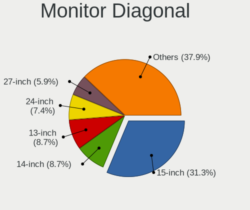

| Inches  | Computers | Percent |
|---------|-----------|---------|
| 15      | 449       | 33.28%  |
| 14      | 113       | 8.38%   |
| 13      | 106       | 7.86%   |
| 21      | 91        | 6.75%   |
| 24      | 81        | 6%      |
| 17      | 75        | 5.56%   |
| 27      | 68        | 5.04%   |
| 23      | 67        | 4.97%   |
| Unknown | 65        | 4.82%   |
| 19      | 44        | 3.26%   |
| 18      | 26        | 1.93%   |
| 20      | 19        | 1.41%   |
| 12      | 18        | 1.33%   |
| 34      | 17        | 1.26%   |
| 31      | 15        | 1.11%   |
| 22      | 15        | 1.11%   |
| 11      | 15        | 1.11%   |
| 10      | 12        | 0.89%   |
| 84      | 9         | 0.67%   |
| 54      | 6         | 0.44%   |
| 16      | 6         | 0.44%   |
| 72      | 5         | 0.37%   |
| 25      | 5         | 0.37%   |
| 40      | 3         | 0.22%   |
| 33      | 3         | 0.22%   |
| 32      | 3         | 0.22%   |
| 26      | 3         | 0.22%   |
| 46      | 2         | 0.15%   |
| 28      | 2         | 0.15%   |
| 142     | 1         | 0.07%   |
| 58      | 1         | 0.07%   |
| 48      | 1         | 0.07%   |
| 42      | 1         | 0.07%   |
| 39      | 1         | 0.07%   |
| 8       | 1         | 0.07%   |

Monitor Width
-------------

Physical width

| Width in mm    | Computers | Percent |
|----------------|-----------|---------|
| 301-350        | 636       | 48%     |
| 501-600        | 199       | 15.02%  |
| 401-500        | 168       | 12.68%  |
| 201-300        | 100       | 7.55%   |
| 351-400        | 76        | 5.74%   |
| Unknown        | 65        | 4.91%   |
| 601-700        | 27        | 2.04%   |
| 701-800        | 23        | 1.74%   |
| 1501-2000      | 14        | 1.06%   |
| 1001-1500      | 10        | 0.75%   |
| 801-900        | 4         | 0.3%    |
| More than 2000 | 1         | 0.08%   |
| 101-200        | 1         | 0.08%   |
| 901-1000       | 1         | 0.08%   |

Aspect Ratio
------------

Proportional relationship between the width and the height

| Ratio   | Computers | Percent |
|---------|-----------|---------|
| 16/9    | 891       | 73.27%  |
| 16/10   | 150       | 12.34%  |
| Unknown | 60        | 4.93%   |
| 5/4     | 59        | 4.85%   |
| 4/3     | 22        | 1.81%   |
| 21/9    | 17        | 1.4%    |
| 3/2     | 13        | 1.07%   |
| 6/5     | 3         | 0.25%   |
| 1.00    | 1         | 0.08%   |

Monitor Area
------------

Area in inch

| Area in inch | Computers | Percent |
|----------------|-----------|---------|
| 101-110        | 443       | 33.08%  |
| 201-250        | 214       | 15.98%  |
| 81-90          | 174       | 12.99%  |
| 151-200        | 83        | 6.2%    |
| 301-350        | 70        | 5.23%   |
| Unknown        | 65        | 4.85%   |
| 141-150        | 59        | 4.41%   |
| 71-80          | 44        | 3.29%   |
| 351-500        | 37        | 2.76%   |
| 121-130        | 29        | 2.17%   |
| More than 1000 | 23        | 1.72%   |
| 251-300        | 23        | 1.72%   |
| 61-70          | 18        | 1.34%   |
| 51-60          | 15        | 1.12%   |
| 41-50          | 12        | 0.9%    |
| 131-140        | 9         | 0.67%   |
| 111-120        | 8         | 0.6%    |
| 501-1000       | 8         | 0.6%    |
| 91-100         | 4         | 0.3%    |
| 1-40           | 1         | 0.07%   |

Pixel Density
-------------

Pixels per inch

| Density       | Computers | Percent |
|---------------|-----------|---------|
| 51-100        | 422       | 32.49%  |
| 101-120       | 405       | 31.18%  |
| 121-160       | 323       | 24.87%  |
| Unknown       | 65        | 5%      |
| 161-240       | 52        | 4%      |
| More than 240 | 16        | 1.23%   |
| 1-50          | 16        | 1.23%   |

Multiple Monitors
-----------------

Total monitors connected

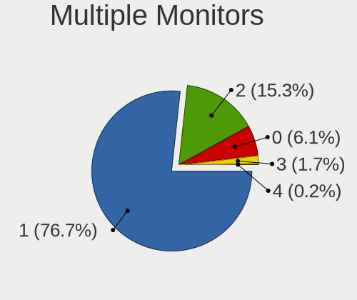

| Total | Computers | Percent |
|-------|-----------|---------|
| 1     | 1028      | 78.35%  |
| 2     | 184       | 14.02%  |
| 0     | 75        | 5.72%   |
| 3     | 21        | 1.6%    |
| 4     | 4         | 0.3%    |

Network
-------

Net Controller Vendor
---------------------

Controller vendors

| Vendor                            | Computers | Percent |
|-----------------------------------|-----------|---------|
| Realtek Semiconductor             | 697       | 35.95%  |
| Intel                             | 505       | 26.04%  |
| Qualcomm Atheros                  | 300       | 15.47%  |
| Broadcom                          | 128       | 6.6%    |
| Marvell Technology Group          | 52        | 2.68%   |
| TP-Link                           | 40        | 2.06%   |
| Broadcom Limited                  | 24        | 1.24%   |
| Nvidia                            | 21        | 1.08%   |
| Ralink                            | 16        | 0.83%   |
| Silicon Integrated Systems [SiS]  | 15        | 0.77%   |
| Qualcomm Atheros Communications   | 15        | 0.77%   |
| MediaTek                          | 14        | 0.72%   |
| Ralink Technology                 | 11        | 0.57%   |
| D-Link                            | 9         | 0.46%   |
| ASUSTek Computer                  | 6         | 0.31%   |
| VIA Technologies                  | 5         | 0.26%   |
| Sierra Wireless                   | 5         | 0.26%   |
| Samsung Electronics               | 5         | 0.26%   |
| ASIX Electronics                  | 5         | 0.26%   |
| JMicron Technology                | 4         | 0.21%   |
| Ericsson Business Mobile Networks | 4         | 0.21%   |
| Attansic Technology               | 4         | 0.21%   |
| ICS Advent                        | 3         | 0.15%   |
| Hewlett-Packard                   | 3         | 0.15%   |
| Edimax Technology                 | 3         | 0.15%   |
| DisplayLink                       | 3         | 0.15%   |
| TRENDnet                          | 2         | 0.1%    |
| Mellanox Technologies             | 2         | 0.1%    |
| Lenovo                            | 2         | 0.1%    |
| Huawei Technologies               | 2         | 0.1%    |
| Fibocom                           | 2         | 0.1%    |
| Dresden Elektronik                | 2         | 0.1%    |
| D-Link System                     | 2         | 0.1%    |
| Belkin Components                 | 2         | 0.1%    |
| ADMtek                            | 2         | 0.1%    |
| Accton Technology                 | 2         | 0.1%    |
| Xiaomi                            | 1         | 0.05%   |
| Toshiba                           | 1         | 0.05%   |
| T & A Mobile Phones               | 1         | 0.05%   |
| Standard Microsystems             | 1         | 0.05%   |

Net Controller Model
--------------------

Controller models

| Model                                                                   | Computers | Percent |
|-------------------------------------------------------------------------|-----------|---------|
| Realtek RTL8111/8168/8411 PCI Express Gigabit Ethernet Controller       | 475       | 21.22%  |
| Realtek RTL810xE PCI Express Fast Ethernet controller                   | 110       | 4.92%   |
| Qualcomm Atheros QCA9565 / AR9565 Wireless Network Adapter              | 49        | 2.19%   |
| Qualcomm Atheros AR9285 Wireless Network Adapter (PCI-Express)          | 46        | 2.06%   |
| Intel Wi-Fi 6 AX200                                                     | 39        | 1.74%   |
| Qualcomm Atheros QCA9377 802.11ac Wireless Network Adapter              | 37        | 1.65%   |
| Realtek RTL8153 Gigabit Ethernet Adapter                                | 30        | 1.34%   |
| Qualcomm Atheros AR9485 Wireless Network Adapter                        | 30        | 1.34%   |
| Intel PRO/Wireless 4965 AG or AGN [Kedron] Network Connection           | 28        | 1.25%   |
| Intel 82579LM Gigabit Network Connection (Lewisville)                   | 27        | 1.21%   |
| Qualcomm Atheros AR242x / AR542x Wireless Network Adapter (PCI-Express) | 26        | 1.16%   |
| Intel Wireless 8265 / 8275                                              | 26        | 1.16%   |
| Marvell Group 88E8036 PCI-E Fast Ethernet Controller                    | 25        | 1.12%   |
| Realtek RTL8821CE 802.11ac PCIe Wireless Network Adapter                | 24        | 1.07%   |
| Intel Cannon Point-LP CNVi [Wireless-AC]                                | 24        | 1.07%   |
| Broadcom BCM43142 802.11b/g/n                                           | 24        | 1.07%   |
| Qualcomm Atheros QCA6174 802.11ac Wireless Network Adapter              | 23        | 1.03%   |
| Intel Wireless 7265                                                     | 21        | 0.94%   |
| Broadcom BCM4313 802.11bgn Wireless Network Adapter                     | 21        | 0.94%   |
| Realtek RTL8822CE 802.11ac PCIe Wireless Network Adapter                | 20        | 0.89%   |
| Intel Wireless 7260                                                     | 20        | 0.89%   |
| Intel Wi-Fi 6 AX201                                                     | 20        | 0.89%   |
| TP-Link UE300 10/100/1000 LAN (ethernet mode) [Realtek RTL8153]         | 19        | 0.85%   |
| Intel PRO/Wireless 3945ABG [Golan] Network Connection                   | 19        | 0.85%   |
| Intel Comet Lake PCH-LP CNVi WiFi                                       | 19        | 0.85%   |
| Intel Cannon Lake PCH CNVi WiFi                                         | 19        | 0.85%   |
| Realtek RTL8723BE PCIe Wireless Network Adapter                         | 18        | 0.8%    |
| Intel Wireless 3165                                                     | 17        | 0.76%   |
| Intel Centrino Advanced-N 6205 [Taylor Peak]                            | 17        | 0.76%   |
| Realtek RTL8188EUS 802.11n Wireless Network Adapter                     | 16        | 0.71%   |
| Intel Wireless 8260                                                     | 16        | 0.71%   |
| Realtek RTL8125 2.5GbE Controller                                       | 15        | 0.67%   |
| Qualcomm Atheros AR8131 Gigabit Ethernet                                | 15        | 0.67%   |
| Intel I211 Gigabit Network Connection                                   | 15        | 0.67%   |
| Realtek RTL-8100/8101L/8139 PCI Fast Ethernet Adapter                   | 14        | 0.63%   |
| Qualcomm Atheros AR8151 v2.0 Gigabit Ethernet                           | 14        | 0.63%   |
| Intel 82579V Gigabit Network Connection                                 | 14        | 0.63%   |
| Silicon Integrated Systems [SiS] 191 Gigabit Ethernet Adapter           | 13        | 0.58%   |
| Realtek RTL8852AE 802.11ax PCIe Wireless Network Adapter                | 13        | 0.58%   |
| Qualcomm Atheros AR9271 802.11n                                         | 13        | 0.58%   |

Wireless Vendor
---------------

Wireless vendors

| Vendor                          | Computers | Percent |
|---------------------------------|-----------|---------|
| Intel                           | 404       | 39.19%  |
| Qualcomm Atheros                | 244       | 23.67%  |
| Realtek Semiconductor           | 166       | 16.1%   |
| Broadcom                        | 88        | 8.54%   |
| TP-Link                         | 22        | 2.13%   |
| Ralink                          | 16        | 1.55%   |
| Qualcomm Atheros Communications | 15        | 1.45%   |
| Broadcom Limited                | 15        | 1.45%   |
| MediaTek                        | 13        | 1.26%   |
| Ralink Technology               | 11        | 1.07%   |
| D-Link                          | 9         | 0.87%   |
| ASUSTek Computer                | 6         | 0.58%   |
| Sierra Wireless                 | 5         | 0.48%   |
| Edimax Technology               | 3         | 0.29%   |
| TRENDnet                        | 2         | 0.19%   |
| Marvell Technology Group        | 2         | 0.19%   |
| Fibocom                         | 2         | 0.19%   |
| Belkin Components               | 2         | 0.19%   |
| Sitecom Europe                  | 1         | 0.1%    |
| Microsoft                       | 1         | 0.1%    |
| Micro Star International        | 1         | 0.1%    |
| Linksys                         | 1         | 0.1%    |
| Dell                            | 1         | 0.1%    |
| Accton Technology               | 1         | 0.1%    |

Wireless Model
--------------

Wireless models

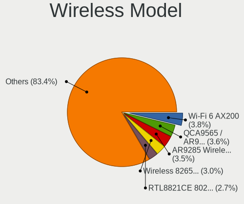

| Model                                                                   | Computers | Percent |
|-------------------------------------------------------------------------|-----------|---------|
| Qualcomm Atheros QCA9565 / AR9565 Wireless Network Adapter              | 49        | 4.75%   |
| Qualcomm Atheros AR9285 Wireless Network Adapter (PCI-Express)          | 46        | 4.46%   |
| Intel Wi-Fi 6 AX200                                                     | 39        | 3.78%   |
| Qualcomm Atheros QCA9377 802.11ac Wireless Network Adapter              | 37        | 3.59%   |
| Qualcomm Atheros AR9485 Wireless Network Adapter                        | 30        | 2.91%   |
| Intel PRO/Wireless 4965 AG or AGN [Kedron] Network Connection           | 28        | 2.71%   |
| Qualcomm Atheros AR242x / AR542x Wireless Network Adapter (PCI-Express) | 26        | 2.52%   |
| Intel Wireless 8265 / 8275                                              | 26        | 2.52%   |
| Realtek RTL8821CE 802.11ac PCIe Wireless Network Adapter                | 24        | 2.33%   |
| Intel Cannon Point-LP CNVi [Wireless-AC]                                | 24        | 2.33%   |
| Broadcom BCM43142 802.11b/g/n                                           | 24        | 2.33%   |
| Qualcomm Atheros QCA6174 802.11ac Wireless Network Adapter              | 23        | 2.23%   |
| Intel Wireless 7265                                                     | 21        | 2.03%   |
| Broadcom BCM4313 802.11bgn Wireless Network Adapter                     | 21        | 2.03%   |
| Realtek RTL8822CE 802.11ac PCIe Wireless Network Adapter                | 20        | 1.94%   |
| Intel Wireless 7260                                                     | 20        | 1.94%   |
| Intel Wi-Fi 6 AX201                                                     | 20        | 1.94%   |
| Intel PRO/Wireless 3945ABG [Golan] Network Connection                   | 19        | 1.84%   |
| Intel Comet Lake PCH-LP CNVi WiFi                                       | 19        | 1.84%   |
| Intel Cannon Lake PCH CNVi WiFi                                         | 19        | 1.84%   |
| Realtek RTL8723BE PCIe Wireless Network Adapter                         | 18        | 1.74%   |
| Intel Wireless 3165                                                     | 17        | 1.65%   |
| Intel Centrino Advanced-N 6205 [Taylor Peak]                            | 17        | 1.65%   |
| Realtek RTL8188EUS 802.11n Wireless Network Adapter                     | 16        | 1.55%   |
| Intel Wireless 8260                                                     | 16        | 1.55%   |
| Realtek RTL8852AE 802.11ax PCIe Wireless Network Adapter                | 13        | 1.26%   |
| Qualcomm Atheros AR9271 802.11n                                         | 13        | 1.26%   |
| Intel Wireless 3160                                                     | 13        | 1.26%   |
| Qualcomm Atheros AR928X Wireless Network Adapter (PCI-Express)          | 12        | 1.16%   |
| MediaTek MT7921 802.11ax PCI Express Wireless Network Adapter           | 12        | 1.16%   |
| Realtek RTL8191SEvB Wireless LAN Controller                             | 10        | 0.97%   |
| Intel WiFi Link 5100                                                    | 10        | 0.97%   |
| Intel PRO/Wireless 5100 AGN [Shiloh] Network Connection                 | 10        | 0.97%   |
| Intel Comet Lake PCH CNVi WiFi                                          | 10        | 0.97%   |
| Realtek RTL8822BE 802.11a/b/g/n/ac WiFi adapter                         | 8         | 0.78%   |
| Intel Wireless-AC 9260                                                  | 8         | 0.78%   |
| Intel Centrino Wireless-N 1000 [Condor Peak]                            | 8         | 0.78%   |
| Intel Centrino Advanced-N 6235                                          | 8         | 0.78%   |
| TP-Link TL-WN823N v2/v3 [Realtek RTL8192EU]                             | 7         | 0.68%   |
| Realtek RTL8192CU 802.11n WLAN Adapter                                  | 7         | 0.68%   |

Ethernet Vendor
---------------

Ethernet vendors

| Vendor                           | Computers | Percent |
|----------------------------------|-----------|---------|
| Realtek Semiconductor            | 644       | 55.14%  |
| Intel                            | 216       | 18.49%  |
| Qualcomm Atheros                 | 87        | 7.45%   |
| Broadcom                         | 55        | 4.71%   |
| Marvell Technology Group         | 50        | 4.28%   |
| Nvidia                           | 21        | 1.8%    |
| TP-Link                          | 19        | 1.63%   |
| Silicon Integrated Systems [SiS] | 15        | 1.28%   |
| Broadcom Limited                 | 9         | 0.77%   |
| VIA Technologies                 | 5         | 0.43%   |
| Samsung Electronics              | 5         | 0.43%   |
| ASIX Electronics                 | 5         | 0.43%   |
| JMicron Technology               | 4         | 0.34%   |
| Attansic Technology              | 4         | 0.34%   |
| ICS Advent                       | 3         | 0.26%   |
| DisplayLink                      | 3         | 0.26%   |
| Mellanox Technologies            | 2         | 0.17%   |
| Lenovo                           | 2         | 0.17%   |
| Hewlett-Packard                  | 2         | 0.17%   |
| D-Link System                    | 2         | 0.17%   |
| ADMtek                           | 2         | 0.17%   |
| Xiaomi                           | 1         | 0.09%   |
| T & A Mobile Phones              | 1         | 0.09%   |
| Standard Microsystems            | 1         | 0.09%   |
| Silicom                          | 1         | 0.09%   |
| Qualcomm                         | 1         | 0.09%   |
| Microchip Technology             | 1         | 0.09%   |
| MediaTek                         | 1         | 0.09%   |
| LSI                              | 1         | 0.09%   |
| Huawei Technologies              | 1         | 0.09%   |
| Archos                           | 1         | 0.09%   |
| Apple                            | 1         | 0.09%   |
| Allwinner Technology             | 1         | 0.09%   |
| Accton Technology                | 1         | 0.09%   |

Ethernet Model
--------------

Ethernet models

| Model                                                                          | Computers | Percent |
|--------------------------------------------------------------------------------|-----------|---------|
| Realtek RTL8111/8168/8411 PCI Express Gigabit Ethernet Controller              | 475       | 40.12%  |
| Realtek RTL810xE PCI Express Fast Ethernet controller                          | 110       | 9.29%   |
| Realtek RTL8153 Gigabit Ethernet Adapter                                       | 30        | 2.53%   |
| Intel 82579LM Gigabit Network Connection (Lewisville)                          | 27        | 2.28%   |
| Marvell Group 88E8036 PCI-E Fast Ethernet Controller                           | 25        | 2.11%   |
| TP-Link UE300 10/100/1000 LAN (ethernet mode) [Realtek RTL8153]                | 19        | 1.6%    |
| Realtek RTL8125 2.5GbE Controller                                              | 15        | 1.27%   |
| Qualcomm Atheros AR8131 Gigabit Ethernet                                       | 15        | 1.27%   |
| Intel I211 Gigabit Network Connection                                          | 15        | 1.27%   |
| Realtek RTL-8100/8101L/8139 PCI Fast Ethernet Adapter                          | 14        | 1.18%   |
| Qualcomm Atheros AR8151 v2.0 Gigabit Ethernet                                  | 14        | 1.18%   |
| Intel 82579V Gigabit Network Connection                                        | 14        | 1.18%   |
| Silicon Integrated Systems [SiS] 191 Gigabit Ethernet Adapter                  | 13        | 1.1%    |
| Qualcomm Atheros AR8121/AR8113/AR8114 Gigabit or Fast Ethernet                 | 11        | 0.93%   |
| Intel Ethernet Connection (2) I219-V                                           | 11        | 0.93%   |
| Intel Ethernet Connection I218-LM                                              | 10        | 0.84%   |
| Qualcomm Atheros AR8132 Fast Ethernet                                          | 9         | 0.76%   |
| Intel Ethernet Connection I217-LM                                              | 9         | 0.76%   |
| Intel 82577LM Gigabit Network Connection                                       | 9         | 0.76%   |
| Marvell Group Yukon Optima 88E8059 [PCIe Gigabit Ethernet Controller with AVB] | 7         | 0.59%   |
| Intel Ethernet Connection (6) I219-V                                           | 7         | 0.59%   |
| Intel Ethernet Connection (4) I219-LM                                          | 7         | 0.59%   |
| Intel Ethernet Connection (2) I218-V                                           | 7         | 0.59%   |
| Broadcom NetLink BCM5787M Gigabit Ethernet PCI Express                         | 7         | 0.59%   |
| Qualcomm Atheros AR8161 Gigabit Ethernet                                       | 6         | 0.51%   |
| Nvidia MCP79 Ethernet                                                          | 6         | 0.51%   |
| Intel Ethernet Connection (7) I219-V                                           | 6         | 0.51%   |
| Intel 82567LM-3 Gigabit Network Connection                                     | 6         | 0.51%   |
| Intel 82567LM Gigabit Network Connection                                       | 6         | 0.51%   |
| Qualcomm Atheros Killer E2400 Gigabit Ethernet Controller                      | 5         | 0.42%   |
| Qualcomm Atheros AR8152 v1.1 Fast Ethernet                                     | 5         | 0.42%   |
| Nvidia MCP61 Ethernet                                                          | 5         | 0.42%   |
| Intel Ethernet Connection I219-LM                                              | 5         | 0.42%   |
| Intel Ethernet Connection (2) I219-LM                                          | 5         | 0.42%   |
| Intel Ethernet Connection (14) I219-V                                          | 5         | 0.42%   |
| Intel Ethernet Connection (10) I219-V                                          | 5         | 0.42%   |
| Intel 82573L Gigabit Ethernet Controller                                       | 5         | 0.42%   |
| Broadcom NetXtreme BCM57765 Gigabit Ethernet PCIe                              | 5         | 0.42%   |
| VIA VT6102/VT6103 [Rhine-II]                                                   | 4         | 0.34%   |
| Qualcomm Atheros QCA8171 Gigabit Ethernet                                      | 4         | 0.34%   |

Net Controller Kind
-------------------

Ethernet, WiFi or modem

| Kind     | Computers | Percent |
|----------|-----------|---------|
| Ethernet | 1118      | 52.39%  |
| WiFi     | 994       | 46.58%  |
| Modem    | 20        | 0.94%   |
| Unknown  | 2         | 0.09%   |

Used Controller
---------------

Currently used network controller

| Kind     | Computers | Percent |
|----------|-----------|---------|
| WiFi     | 783       | 58.92%  |
| Ethernet | 546       | 41.08%  |

NICs
----

Total network controllers on board

| Total | Computers | Percent |
|-------|-----------|---------|
| 2     | 742       | 57.79%  |
| 1     | 495       | 38.55%  |
| 0     | 28        | 2.18%   |
| 3     | 11        | 0.86%   |
| 6     | 3         | 0.23%   |
| 10    | 2         | 0.16%   |
| 5     | 2         | 0.16%   |
| 4     | 1         | 0.08%   |

IPv6
----

IPv6 vs IPv4

| Used | Computers | Percent |
|------|-----------|---------|
| No   | 1013      | 77.45%  |
| Yes  | 295       | 22.55%  |

Bluetooth
---------

Bluetooth Vendor
----------------

Controller vendors

| Vendor                          | Computers | Percent |
|---------------------------------|-----------|---------|
| Intel                           | 276       | 38.76%  |
| Realtek Semiconductor           | 77        | 10.81%  |
| Qualcomm Atheros Communications | 55        | 7.72%   |
| IMC Networks                    | 47        | 6.6%    |
| Lite-On Technology              | 39        | 5.48%   |
| Broadcom                        | 34        | 4.78%   |
| Foxconn / Hon Hai               | 32        | 4.49%   |
| Cambridge Silicon Radio         | 31        | 4.35%   |
| Apple                           | 28        | 3.93%   |
| ASUSTek Computer                | 27        | 3.79%   |
| Toshiba                         | 16        | 2.25%   |
| Hewlett-Packard                 | 14        | 1.97%   |
| Realtek                         | 9         | 1.26%   |
| Dell                            | 9         | 1.26%   |
| Ralink                          | 5         | 0.7%    |
| Alps Electric                   | 4         | 0.56%   |
| Ralink Technology               | 2         | 0.28%   |
| Marvell Semiconductor           | 2         | 0.28%   |
| Belkin Components               | 2         | 0.28%   |
| TP-Link                         | 1         | 0.14%   |
| Foxconn International           | 1         | 0.14%   |
| Chicony Electronics             | 1         | 0.14%   |

Bluetooth Model
---------------

Controller models

| Model                                                                               | Computers | Percent |
|-------------------------------------------------------------------------------------|-----------|---------|
| Intel Bluetooth wireless interface                                                  | 112       | 15.73%  |
| Realtek Bluetooth Radio                                                             | 55        | 7.72%   |
| Intel Bluetooth 9460/9560 Jefferson Peak (JfP)                                      | 47        | 6.6%    |
| Intel AX201 Bluetooth                                                               | 44        | 6.18%   |
| Intel AX200 Bluetooth                                                               | 40        | 5.62%   |
| Cambridge Silicon Radio Bluetooth Dongle (HCI mode)                                 | 31        | 4.35%   |
| IMC Networks Bluetooth Device                                                       | 27        | 3.79%   |
| Qualcomm Atheros QCA61x4 Bluetooth 4.0                                              | 17        | 2.39%   |
| Qualcomm Atheros AR3011 Bluetooth                                                   | 16        | 2.25%   |
| Realtek  Bluetooth 4.2 Adapter                                                      | 15        | 2.11%   |
| Qualcomm Atheros  Bluetooth Device                                                  | 13        | 1.83%   |
| Lite-On Qualcomm Atheros QCA9377 Bluetooth                                          | 12        | 1.69%   |
| Intel Centrino Bluetooth Wireless Transceiver                                       | 12        | 1.69%   |
| HP Bluetooth 2.0 Interface [Broadcom BCM2045]                                       | 11        | 1.54%   |
| Apple Bluetooth Host Controller                                                     | 11        | 1.54%   |
| ASUS Broadcom BCM20702A0 Bluetooth                                                  | 10        | 1.4%    |
| Apple Bluetooth USB Host Controller                                                 | 10        | 1.4%    |
| Realtek Bluetooth Radio                                                             | 9         | 1.26%   |
| Lite-On Bluetooth Device                                                            | 9         | 1.26%   |
| Lite-On Atheros AR3012 Bluetooth                                                    | 9         | 1.26%   |
| IMC Networks Bluetooth Radio                                                        | 9         | 1.26%   |
| Foxconn / Hon Hai Bluetooth Device                                                  | 9         | 1.26%   |
| Intel Wireless-AC 9260 Bluetooth Adapter                                            | 8         | 1.12%   |
| Qualcomm Atheros AR3012 Bluetooth 4.0                                               | 7         | 0.98%   |
| Foxconn / Hon Hai Wireless_Device                                                   | 7         | 0.98%   |
| Intel Wireless-AC 3168 Bluetooth                                                    | 6         | 0.84%   |
| Ralink RT3290 Bluetooth                                                             | 5         | 0.7%    |
| Lite-On BCM43142A0                                                                  | 5         | 0.7%    |
| IMC Networks Wireless_Device                                                        | 5         | 0.7%    |
| Foxconn / Hon Hai Foxconn T77H114 BCM2070 [Single-Chip Bluetooth 2.1 + EDR Adapter] | 5         | 0.7%    |
| Dell DW375 Bluetooth Module                                                         | 5         | 0.7%    |
| Broadcom BCM20702 Bluetooth 4.0 [ThinkPad]                                          | 5         | 0.7%    |
| Toshiba Askey Bluetooth Module                                                      | 4         | 0.56%   |
| Realtek RTL8821A Bluetooth                                                          | 4         | 0.56%   |
| Broadcom BCM2045B (BDC-2.1) [Bluetooth Controller]                                  | 4         | 0.56%   |
| ASUS BT-183 Bluetooth 2.0+EDR adapter                                               | 4         | 0.56%   |
| ASUS Bluetooth Device                                                               | 4         | 0.56%   |
| Apple Bluetooth HCI                                                                 | 4         | 0.56%   |
| Toshiba Integrated Bluetooth HCI                                                    | 3         | 0.42%   |
| Lite-On Qualcomm Atheros Bluetooth                                                  | 3         | 0.42%   |

Sound
-----

Sound Vendor
------------

Sound card vendors

| Vendor                               | Computers | Percent |
|--------------------------------------|-----------|---------|
| Intel                                | 925       | 54.25%  |
| AMD                                  | 358       | 21%     |
| Nvidia                               | 258       | 15.13%  |
| C-Media Electronics                  | 20        | 1.17%   |
| Creative Labs                        | 19        | 1.11%   |
| Silicon Integrated Systems [SiS]     | 15        | 0.88%   |
| JMTek                                | 10        | 0.59%   |
| Logitech                             | 9         | 0.53%   |
| Kingston Technology                  | 9         | 0.53%   |
| Texas Instruments                    | 6         | 0.35%   |
| Realtek Semiconductor                | 6         | 0.35%   |
| Razer USA                            | 6         | 0.35%   |
| GN Netcom                            | 5         | 0.29%   |
| Hewlett-Packard                      | 4         | 0.23%   |
| Creative Technology                  | 4         | 0.23%   |
| Plantronics                          | 3         | 0.18%   |
| Generalplus Technology               | 3         | 0.18%   |
| DSEA A/S                             | 3         | 0.18%   |
| ASUSTek Computer                     | 3         | 0.18%   |
| VIA Technologies                     | 2         | 0.12%   |
| SteelSeries ApS                      | 2         | 0.12%   |
| Lenovo                               | 2         | 0.12%   |
| Focusrite-Novation                   | 2         | 0.12%   |
| EGO SYStems                          | 2         | 0.12%   |
| Corsair                              | 2         | 0.12%   |
| Apple                                | 2         | 0.12%   |
| XMOS                                 | 1         | 0.06%   |
| WinChipHead                          | 1         | 0.06%   |
| ULi Electronics                      | 1         | 0.06%   |
| Turtle Beach                         | 1         | 0.06%   |
| Trust                                | 1         | 0.06%   |
| Thesycon Systemsoftware & Consulting | 1         | 0.06%   |
| Silicon Motion                       | 1         | 0.06%   |
| Samsung Electronics                  | 1         | 0.06%   |
| Samson Technologies                  | 1         | 0.06%   |
| Microchip Technology                 | 1         | 0.06%   |
| Micro Star International             | 1         | 0.06%   |
| JBL                                  | 1         | 0.06%   |
| Huawei Technologies                  | 1         | 0.06%   |
| Harman                               | 1         | 0.06%   |

Sound Model
-----------

Sound card models

| Model                                                                                             | Computers | Percent |
|---------------------------------------------------------------------------------------------------|-----------|---------|
| AMD Family 17h/19h HD Audio Controller                                                            | 102       | 5.11%   |
| Intel 7 Series/C216 Chipset Family High Definition Audio Controller                               | 83        | 4.16%   |
| Intel Sunrise Point-LP HD Audio                                                                   | 78        | 3.91%   |
| Intel 6 Series/C200 Series Chipset Family High Definition Audio Controller                        | 75        | 3.76%   |
| Intel NM10/ICH7 Family High Definition Audio Controller                                           | 72        | 3.61%   |
| Intel 82801I (ICH9 Family) HD Audio Controller                                                    | 66        | 3.31%   |
| Intel 82801H (ICH8 Family) HD Audio Controller                                                    | 61        | 3.06%   |
| Intel 5 Series/3400 Series Chipset High Definition Audio                                          | 60        | 3.01%   |
| AMD Raven/Raven2/Fenghuang HDMI/DP Audio Controller                                               | 47        | 2.36%   |
| Intel Cannon Lake PCH cAVS                                                                        | 44        | 2.21%   |
| Intel 8 Series/C220 Series Chipset High Definition Audio Controller                               | 43        | 2.16%   |
| AMD FCH Azalia Controller                                                                         | 40        | 2.01%   |
| AMD SBx00 Azalia (Intel HDA)                                                                      | 39        | 1.95%   |
| Intel Haswell-ULT HD Audio Controller                                                             | 37        | 1.85%   |
| AMD Renoir Radeon High Definition Audio Controller                                                | 37        | 1.85%   |
| Intel 8 Series HD Audio Controller                                                                | 36        | 1.8%    |
| Intel 100 Series/C230 Series Chipset Family HD Audio Controller                                   | 36        | 1.8%    |
| Intel Cannon Point-LP High Definition Audio Controller                                            | 35        | 1.75%   |
| Intel Xeon E3-1200 v3/4th Gen Core Processor HD Audio Controller                                  | 31        | 1.55%   |
| Intel Tiger Lake-LP Smart Sound Technology Audio Controller                                       | 31        | 1.55%   |
| Intel Comet Lake PCH-LP cAVS                                                                      | 29        | 1.45%   |
| AMD Kabini HDMI/DP Audio                                                                          | 29        | 1.45%   |
| Nvidia GK208 HDMI/DP Audio Controller                                                             | 28        | 1.4%    |
| Intel Broadwell-U Audio Controller                                                                | 28        | 1.4%    |
| AMD Starship/Matisse HD Audio Controller                                                          | 28        | 1.4%    |
| Intel Wildcat Point-LP High Definition Audio Controller                                           | 27        | 1.35%   |
| AMD Ellesmere HDMI Audio [Radeon RX 470/480 / 570/580/590]                                        | 27        | 1.35%   |
| Nvidia GP107GL High Definition Audio Controller                                                   | 26        | 1.3%    |
| AMD Family 17h (Models 00h-0fh) HD Audio Controller                                               | 26        | 1.3%    |
| AMD Cedar HDMI Audio [Radeon HD 5400/6300/7300 Series]                                            | 23        | 1.15%   |
| Nvidia High Definition Audio Controller                                                           | 22        | 1.1%    |
| Nvidia GF108 High Definition Audio Controller                                                     | 20        | 1%      |
| AMD Family 15h (Models 60h-6fh) Audio Controller                                                  | 18        | 0.9%    |
| Nvidia TU107 GeForce GTX 1650 High Definition Audio Controller                                    | 17        | 0.85%   |
| Intel Atom Processor Z36xxx/Z37xxx Series High Definition Audio Controller                        | 17        | 0.85%   |
| AMD RV710/730 HDMI Audio [Radeon HD 4000 series]                                                  | 16        | 0.8%    |
| Intel Comet Lake PCH cAVS                                                                         | 14        | 0.7%    |
| Intel Atom/Celeron/Pentium Processor x5-E8000/J3xxx/N3xxx Series High Definition Audio Controller | 14        | 0.7%    |
| Silicon Integrated Systems [SiS] Azalia Audio Controller                                          | 13        | 0.65%   |
| Nvidia GP106 High Definition Audio Controller                                                     | 13        | 0.65%   |

Memory
------

Memory Vendor
-------------

Memory module vendors

| Vendor              | Computers | Percent |
|---------------------|-----------|---------|
| Samsung Electronics | 170       | 25.72%  |
| SK hynix            | 118       | 17.85%  |
| Unknown             | 100       | 15.13%  |
| Kingston            | 80        | 12.1%   |
| Micron Technology   | 51        | 7.72%   |
| G.Skill             | 33        | 4.99%   |
| Crucial             | 22        | 3.33%   |
| Corsair             | 18        | 2.72%   |
| Ramaxel Technology  | 13        | 1.97%   |
| Team                | 8         | 1.21%   |
| A-DATA Technology   | 8         | 1.21%   |
| Nanya Technology    | 6         | 0.91%   |
| Elpida              | 6         | 0.91%   |
| Transcend           | 4         | 0.61%   |
| Unknown (ABCD)      | 3         | 0.45%   |
| Unknown             | 3         | 0.45%   |
| Apacer              | 2         | 0.3%    |
| Unigen              | 1         | 0.15%   |
| Unifosa             | 1         | 0.15%   |
| Toshiba             | 1         | 0.15%   |
| Teikon              | 1         | 0.15%   |
| Silicon Power       | 1         | 0.15%   |
| PUSKILL             | 1         | 0.15%   |
| Patriot             | 1         | 0.15%   |
| Netlist             | 1         | 0.15%   |
| Lexar               | 1         | 0.15%   |
| Kimtigo             | 1         | 0.15%   |
| Infineon            | 1         | 0.15%   |
| Hewlett-Packard     | 1         | 0.15%   |
| GOODRAM             | 1         | 0.15%   |
| Goldkey             | 1         | 0.15%   |
| Essencore Limited   | 1         | 0.15%   |
| 48spaces            | 1         | 0.15%   |

Memory Model
------------

Memory module models

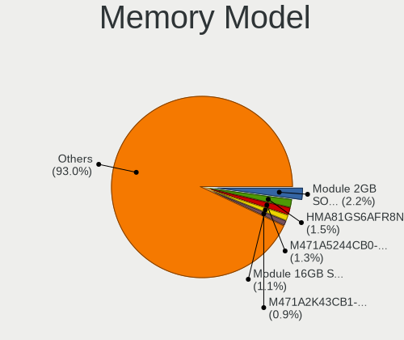

| Model                                                            | Computers | Percent |
|------------------------------------------------------------------|-----------|---------|
| Unknown RAM Module 2GB SODIMM DDR2                               | 23        | 3.23%   |
| Samsung RAM M471A5244CB0-CWE 4GB Row Of Chips DDR4 3200MT/s      | 13        | 1.83%   |
| SK hynix RAM HMA81GS6AFR8N-UH 8GB SODIMM DDR4 2667MT/s           | 11        | 1.55%   |
| Samsung RAM M471A2K43CB1-CTD 16GB SODIMM DDR4 8400MT/s           | 9         | 1.27%   |
| Samsung RAM M471A5244CB0-CTD 4GB SODIMM DDR4 3266MT/s            | 7         | 0.98%   |
| Samsung RAM M471A2K43DB1-CTD 16GB SODIMM DDR4 2667MT/s           | 6         | 0.84%   |
| Samsung RAM M471A1K43CB1-CRC 8GB SODIMM DDR4 2667MT/s            | 6         | 0.84%   |
| SK hynix RAM HMAA1GS6CJR6N-XN 8GB SODIMM DDR4 3200MT/s           | 5         | 0.7%    |
| SK hynix RAM HMA82GS6CJR8N-VK 16GB SODIMM DDR4 2667MT/s          | 5         | 0.7%    |
| Samsung RAM M471B5273DH0-CH9 4096MB SODIMM DDR3 1334MT/s         | 5         | 0.7%    |
| Samsung RAM M471B5173DB0-YK0 4GB SODIMM DDR3 1600MT/s            | 5         | 0.7%    |
| Samsung RAM M471B1G73QH0-YK0 8192MB SODIMM DDR3 1600MT/s         | 5         | 0.7%    |
| Samsung RAM M471A5244CB0-CRC 4GB SODIMM DDR4 2667MT/s            | 5         | 0.7%    |
| SK hynix RAM HMA81GS6JJR8N-VK 8GB SODIMM DDR4 2667MT/s           | 4         | 0.56%   |
| SK hynix RAM HMA81GS6DJR8N-XN 8GB SODIMM DDR4 3200MT/s           | 4         | 0.56%   |
| Samsung RAM M471B5273CH0-CK0 4GB SODIMM DDR3 1600MT/s            | 4         | 0.56%   |
| Samsung RAM M471B5273CH0-CH9 4GB SODIMM DDR3 1334MT/s            | 4         | 0.56%   |
| Samsung RAM M471B5173EB0-YK0 4GB SODIMM DDR3 1600MT/s            | 4         | 0.56%   |
| Micron RAM 8ATF1G64HZ-2G6E1 8GB SODIMM DDR4 2667MT/s             | 4         | 0.56%   |
| Micron RAM 4ATF51264HZ-2G6E1 4GB SODIMM DDR4 2667MT/s            | 4         | 0.56%   |
| Unknown RAM Module 2048MB SODIMM DDR2                            | 3         | 0.42%   |
| Unknown RAM Module 2048MB DIMM DDR2 667MT/s                      | 3         | 0.42%   |
| Unknown RAM Module 1024MB SODIMM DDR2                            | 3         | 0.42%   |
| SK hynix RAM HMT451S6DFR8A-PB 4GB SODIMM DDR3 1600MT/s           | 3         | 0.42%   |
| SK hynix RAM HMT451S6CFR6A-PB 4GB SODIMM DDR3 1600MT/s           | 3         | 0.42%   |
| SK hynix RAM HMT351S6CFR8C-PB 4GB SODIMM DDR3 1600MT/s           | 3         | 0.42%   |
| SK hynix RAM HMA851S6CJR6N-VK 4GB Row Of Chips DDR4 2667MT/s     | 3         | 0.42%   |
| SK hynix RAM HMA851S6AFR6N-UH 4GB SODIMM DDR4 2400MT/s           | 3         | 0.42%   |
| SK hynix RAM HMA851S6AFR6N-UH 2GB SODIMM LPDDR4 2667MT/s         | 3         | 0.42%   |
| SK hynix RAM H9CCNNNCLGALAR-NVD 8GB Row Of Chips LPDDR3 2133MT/s | 3         | 0.42%   |
| Samsung RAM M471B1G73EB0-YK0 8GB SODIMM DDR3 1600MT/s            | 3         | 0.42%   |
| Samsung RAM M471A2K43DB1-CWE 16GB SODIMM DDR4 3200MT/s           | 3         | 0.42%   |
| Samsung RAM M471A2K43CB1-CRC 16GB SODIMM DDR4 2667MT/s           | 3         | 0.42%   |
| Samsung RAM M471A1K43DB1-CWE 8GB SODIMM DDR4 3200MT/s            | 3         | 0.42%   |
| Samsung RAM M471A1K43DB1-CTD 8GB SODIMM DDR4 2667MT/s            | 3         | 0.42%   |
| Samsung RAM M471A1G44AB0-CWE 8GB SODIMM DDR4 3200MT/s            | 3         | 0.42%   |
| Samsung RAM K4E6E304EC-EGCG 4GB Row Of Chips LPDDR3 2133MT/s     | 3         | 0.42%   |
| Micron RAM 8ATF1G64HZ-2G3B1 8GB SODIMM DDR4 2400MT/s             | 3         | 0.42%   |
| Micron RAM 4ATF1G64HZ-3G2E1 8GB SODIMM DDR4 3200MT/s             | 3         | 0.42%   |
| Kingston RAM KHX1600C10D3/8G 8192MB DIMM DDR3 1600MT/s           | 3         | 0.42%   |

Memory Kind
-----------

Memory module kinds

| Kind    | Computers | Percent |
|---------|-----------|---------|
| DDR4    | 259       | 44.43%  |
| DDR3    | 181       | 31.05%  |
| DDR2    | 63        | 10.81%  |
| Unknown | 20        | 3.43%   |
| SDRAM   | 19        | 3.26%   |
| LPDDR3  | 17        | 2.92%   |
| LPDDR4  | 14        | 2.4%    |
| DDR     | 6         | 1.03%   |
| LPDDR5  | 3         | 0.51%   |
| DDR5    | 1         | 0.17%   |

Memory Form Factor
------------------

Physical design of the memory module

| Name         | Computers | Percent |
|--------------|-----------|---------|
| SODIMM       | 360       | 62.18%  |
| DIMM         | 162       | 27.98%  |
| Row Of Chips | 53        | 9.15%   |
| FB-DIMM      | 2         | 0.35%   |
| Chip         | 2         | 0.35%   |

Memory Size
-----------

Memory module size

| Size    | Computers | Percent |
|---------|-----------|---------|
| 8192    | 197       | 31.22%  |
| 4096    | 181       | 28.68%  |
| 2048    | 109       | 17.27%  |
| 16384   | 91        | 14.42%  |
| 1024    | 28        | 4.44%   |
| 32768   | 17        | 2.69%   |
| 512     | 6         | 0.95%   |
| 256     | 1         | 0.16%   |
| Unknown | 1         | 0.16%   |

Memory Speed
------------

Memory module speed

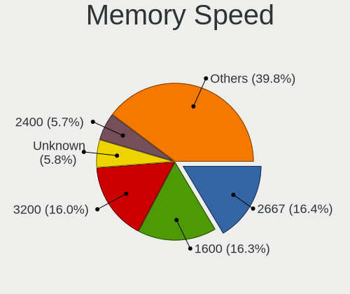

| Speed   | Computers | Percent |
|---------|-----------|---------|
| 1600    | 119       | 19.1%   |
| 2667    | 97        | 15.57%  |
| 3200    | 82        | 13.16%  |
| Unknown | 51        | 8.19%   |
| 2400    | 42        | 6.74%   |
| 1333    | 36        | 5.78%   |
| 2133    | 29        | 4.65%   |
| 667     | 23        | 3.69%   |
| 1334    | 18        | 2.89%   |
| 1867    | 11        | 1.77%   |
| 8400    | 10        | 1.61%   |
| 800     | 10        | 1.61%   |
| 3600    | 8         | 1.28%   |
| 1067    | 8         | 1.28%   |
| 3266    | 7         | 1.12%   |
| 533     | 7         | 1.12%   |
| 4267    | 6         | 0.96%   |
| 4199    | 6         | 0.96%   |
| 3000    | 5         | 0.8%    |
| 2666    | 4         | 0.64%   |
| 1066    | 4         | 0.64%   |
| 6400    | 3         | 0.48%   |
| 3400    | 3         | 0.48%   |
| 2048    | 3         | 0.48%   |
| 1866    | 3         | 0.48%   |
| 400     | 3         | 0.48%   |
| 4000    | 2         | 0.32%   |
| 3800    | 2         | 0.32%   |
| 2933    | 2         | 0.32%   |
| 2000    | 2         | 0.32%   |
| 1800    | 2         | 0.32%   |
| 1200    | 2         | 0.32%   |
| 43889   | 1         | 0.16%   |
| 4800    | 1         | 0.16%   |
| 4266    | 1         | 0.16%   |
| 3866    | 1         | 0.16%   |
| 3733    | 1         | 0.16%   |
| 3466    | 1         | 0.16%   |
| 3334    | 1         | 0.16%   |
| 3066    | 1         | 0.16%   |

Printers & scanners
-------------------

Printer Vendor
--------------

Printer device vendors

| Vendor                 | Computers | Percent |
|------------------------|-----------|---------|
| Hewlett-Packard        | 18        | 64.29%  |
| Canon                  | 3         | 10.71%  |
| Brother Industries     | 2         | 7.14%   |
| Xerox                  | 1         | 3.57%   |
| Seiko Epson            | 1         | 3.57%   |
| Samsung Electronics    | 1         | 3.57%   |
| Panasonic (Matsushita) | 1         | 3.57%   |
| Lexmark International  | 1         | 3.57%   |

Printer Model
-------------

Printer device models

| Model                                | Computers | Percent |
|--------------------------------------|-----------|---------|
| HP Deskjet 1050 J410                 | 4         | 13.33%  |
| Xerox Phaser 6000B                   | 1         | 3.33%   |
| Seiko Epson AcuLaser C1700           | 1         | 3.33%   |
| Samsung ML-1640 Series Laser Printer | 1         | 3.33%   |
| Panasonic (Matsushita) KX-FLB851SP   | 1         | 3.33%   |
| Lexmark International E120(n)        | 1         | 3.33%   |
| HP Officejet 4620 series             | 1         | 3.33%   |
| HP Officejet 4500 G510g-m            | 1         | 3.33%   |
| HP LaserJet Professional P1102w      | 1         | 3.33%   |
| HP LaserJet M14-M17                  | 1         | 3.33%   |
| HP ENVY 6000 series                  | 1         | 3.33%   |
| HP ENVY 4520 series                  | 1         | 3.33%   |
| HP DeskJet F4100 Printer series      | 1         | 3.33%   |
| HP DeskJet F300 series               | 1         | 3.33%   |
| HP DeskJet F2492 All-in-One          | 1         | 3.33%   |
| HP DeskJet 930c                      | 1         | 3.33%   |
| HP DeskJet 3630 series               | 1         | 3.33%   |
| HP Deskjet 3050A                     | 1         | 3.33%   |
| HP Deskjet 3050 J610 series          | 1         | 3.33%   |
| HP DeskJet 2700 series               | 1         | 3.33%   |
| HP DeskJet 2130 series               | 1         | 3.33%   |
| Canon TS6300 series                  | 1         | 3.33%   |
| Canon PIXMA TS6250                   | 1         | 3.33%   |
| Canon PIXMA MG2900 Series            | 1         | 3.33%   |
| Canon LBP6200                        | 1         | 3.33%   |
| Brother DCP-L3550CDW series          | 1         | 3.33%   |
| Brother DCP-1610W                    | 1         | 3.33%   |

Scanner Vendor
--------------

Scanner device vendors

| Vendor          | Computers | Percent |
|-----------------|-----------|---------|
| Mustek Systems  | 4         | 44.44%  |
| Canon           | 3         | 33.33%  |
| Seiko Epson     | 1         | 11.11%  |
| Hewlett-Packard | 1         | 11.11%  |

Scanner Model
-------------

Scanner device models

| Model                                 | Computers | Percent |
|---------------------------------------|-----------|---------|
| Mustek Systems ScanExpress 1200 UB    | 3         | 33.33%  |
| Seiko Epson GT-X770 [Perfection V500] | 1         | 11.11%  |
| Mustek Systems BearPaw 2448 CU Pro    | 1         | 11.11%  |
| HP ScanJet 5300c/5370c                | 1         | 11.11%  |
| Canon CanoScan N670U/N676U/LiDE 20    | 1         | 11.11%  |
| Canon CanoScan LiDE 110               | 1         | 11.11%  |
| Canon CanoScan 4400F                  | 1         | 11.11%  |

Camera
------

Camera Vendor
-------------

Camera device vendors

| Vendor                                 | Computers | Percent |
|----------------------------------------|-----------|---------|
| Chicony Electronics                    | 218       | 25.56%  |
| IMC Networks                           | 96        | 11.25%  |
| Realtek Semiconductor                  | 63        | 7.39%   |
| Acer                                   | 58        | 6.8%    |
| Suyin                                  | 43        | 5.04%   |
| Microdia                               | 39        | 4.57%   |
| Quanta                                 | 38        | 4.45%   |
| Ricoh                                  | 31        | 3.63%   |
| Logitech                               | 27        | 3.17%   |
| Cheng Uei Precision Industry (Foxlink) | 26        | 3.05%   |
| Sunplus Innovation Technology          | 23        | 2.7%    |
| Syntek                                 | 22        | 2.58%   |
| Lite-On Technology                     | 21        | 2.46%   |
| Apple                                  | 21        | 2.46%   |
| Microsoft                              | 16        | 1.88%   |
| Luxvisions Innotech Limited            | 12        | 1.41%   |
| Silicon Motion                         | 10        | 1.17%   |
| Creative Technology                    | 9         | 1.06%   |
| Hewlett-Packard                        | 8         | 0.94%   |
| Alcor Micro                            | 8         | 0.94%   |
| Z-Star Microelectronics                | 7         | 0.82%   |
| Lenovo                                 | 7         | 0.82%   |
| Importek                               | 7         | 0.82%   |
| Samsung Electronics                    | 6         | 0.7%    |
| Generalplus Technology                 | 5         | 0.59%   |
| Cubeternet                             | 3         | 0.35%   |
| Aveo Technology                        | 3         | 0.35%   |
| ALi                                    | 3         | 0.35%   |
| WaveRider Communications               | 2         | 0.23%   |
| Primax Electronics                     | 2         | 0.23%   |
| Philips (or NXP)                       | 2         | 0.23%   |
| DigiTech                               | 2         | 0.23%   |
| Y Media                                | 1         | 0.12%   |
| Xiaomi                                 | 1         | 0.12%   |
| Razer USA                              | 1         | 0.12%   |
| OmniVision Technologies                | 1         | 0.12%   |
| Mustek Systems                         | 1         | 0.12%   |
| MacroSilicon                           | 1         | 0.12%   |
| lihappe8                               | 1         | 0.12%   |
| kingcome                               | 1         | 0.12%   |

Camera Model
------------

Camera device models

| Model                                                   | Computers | Percent |
|---------------------------------------------------------|-----------|---------|
| Chicony Integrated Camera                               | 26        | 3.03%   |
| IMC Networks USB2.0 HD UVC WebCam                       | 23        | 2.68%   |
| Ricoh Visual Communication Camera VGP-VCC8 [R5U870]     | 21        | 2.45%   |
| Chicony HD WebCam                                       | 20        | 2.33%   |
| IMC Networks Integrated Camera                          | 19        | 2.21%   |
| Realtek USB Camera                                      | 17        | 1.98%   |
| IMC Networks USB2.0 VGA UVC WebCam                      | 15        | 1.75%   |
| Acer Integrated Camera                                  | 15        | 1.75%   |
| Chicony USB2.0 VGA UVC WebCam                           | 14        | 1.63%   |
| Chicony USB 2.0 Camera                                  | 13        | 1.52%   |
| Chicony CNF9055 Toshiba Webcam                          | 13        | 1.52%   |
| Microdia Integrated_Webcam_HD                           | 12        | 1.4%    |
| Suyin Acer/HP Integrated Webcam [CN0314]                | 11        | 1.28%   |
| Realtek EasyCamera                                      | 11        | 1.28%   |
| Chicony TOSHIBA Web Camera - HD                         | 10        | 1.17%   |
| Quanta HP Wide Vision HD Camera                         | 9         | 1.05%   |
| Microsoft LifeCam HD-3000                               | 9         | 1.05%   |
| Realtek HD WebCam                                       | 8         | 0.93%   |
| Chicony HP Truevision HD                                | 8         | 0.93%   |
| Quanta HP TrueVision HD Camera                          | 7         | 0.82%   |
| Microdia Sonix USB 2.0 Camera                           | 7         | 0.82%   |
| Logitech Webcam C270                                    | 7         | 0.82%   |
| Lite-On Integrated Camera                               | 7         | 0.82%   |
| IMC Networks HD Camera                                  | 7         | 0.82%   |
| Chicony HP HD Camera                                    | 7         | 0.82%   |
| Acer HD Webcam                                          | 7         | 0.82%   |
| Syntek Integrated Camera                                | 6         | 0.7%    |
| Syntek EasyCamera                                       | 6         | 0.7%    |
| Samsung Galaxy A5 (MTP)                                 | 6         | 0.7%    |
| Realtek USB2.0 VGA UVC WebCam                           | 6         | 0.7%    |
| Realtek Integrated_Webcam_HD                            | 6         | 0.7%    |
| IMC Networks ov9734_azurewave_camera                    | 6         | 0.7%    |
| HP Webcam HD 2300                                       | 6         | 0.7%    |
| Chicony VGA Webcam                                      | 6         | 0.7%    |
| Chicony USB2.0 HD UVC WebCam                            | 6         | 0.7%    |
| Chicony USB2.0 Camera                                   | 6         | 0.7%    |
| Cheng Uei Precision Industry (Foxlink) HP Truevision HD | 6         | 0.7%    |
| Suyin USB 2.0 Camera                                    | 5         | 0.58%   |
| Sunplus HD WebCam                                       | 5         | 0.58%   |
| Quanta VGA WebCam                                       | 5         | 0.58%   |

Security
--------

Fingerprint Vendor
------------------

Fingerprint sensor vendors

| Vendor                     | Computers | Percent |
|----------------------------|-----------|---------|
| Synaptics                  | 41        | 33.33%  |
| Validity Sensors           | 35        | 28.46%  |
| Shenzhen Goodix Technology | 18        | 14.63%  |
| AuthenTec                  | 10        | 8.13%   |
| Elan Microelectronics      | 7         | 5.69%   |
| Upek                       | 6         | 4.88%   |
| LighTuning Technology      | 4         | 3.25%   |
| STMicroelectronics         | 2         | 1.63%   |

Fingerprint Model
-----------------

Fingerprint sensor models

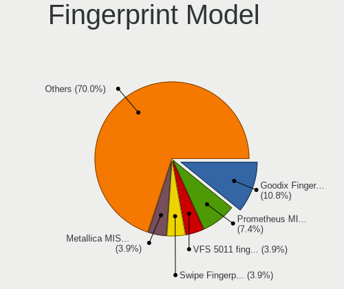

| Model                                                                      | Computers | Percent |
|----------------------------------------------------------------------------|-----------|---------|
| Unknown                                                                    | 14        | 11.38%  |
| Shenzhen Goodix  Fingerprint Device                                        | 13        | 10.57%  |
| Synaptics Prometheus MIS Touch Fingerprint Reader                          | 10        | 8.13%   |
| Synaptics Metallica MIS Touch Fingerprint Reader                           | 6         | 4.88%   |
| Upek Biometric Touchchip/Touchstrip Fingerprint Sensor                     | 5         | 4.07%   |
| Validity Sensors VFS101 Fingerprint Reader                                 | 4         | 3.25%   |
| Synaptics  VFS7552 Touch Fingerprint Sensor with PurePrint                 | 4         | 3.25%   |
| Shenzhen Goodix Fingerprint Reader                                         | 4         | 3.25%   |
| Elan ELAN:ARM-M4                                                           | 4         | 3.25%   |
| AuthenTec AES1600                                                          | 4         | 3.25%   |
| Validity Sensors VFS7500 Touch Fingerprint Sensor                          | 3         | 2.44%   |
| Validity Sensors VFS495 Fingerprint Reader                                 | 3         | 2.44%   |
| Validity Sensors VFS301 Fingerprint Reader                                 | 3         | 2.44%   |
| Validity Sensors VFS 5011 fingerprint sensor                               | 3         | 2.44%   |
| Validity Sensors Synaptics WBDI                                            | 3         | 2.44%   |
| Validity Sensors Swipe Fingerprint Sensor                                  | 3         | 2.44%   |
| Validity Sensors Fingerprint scanner                                       | 3         | 2.44%   |
| Synaptics Metallica MOH Touch Fingerprint Reader                           | 3         | 2.44%   |
| Elan ELAN:Fingerprint                                                      | 3         | 2.44%   |
| AuthenTec AES2810                                                          | 3         | 2.44%   |
| Validity Sensors VFS491                                                    | 2         | 1.63%   |
| Validity Sensors VFS451 Fingerprint Reader                                 | 2         | 1.63%   |
| Validity Sensors VFS Fingerprint sensor                                    | 2         | 1.63%   |
| Validity Sensors Synaptics VFS7552 Touch Fingerprint Sensor with PurePrint | 2         | 1.63%   |
| Synaptics  FS7604 Touch Fingerprint Sensor with PurePrint                  | 2         | 1.63%   |
| STMicroelectronics Fingerprint Reader                                      | 2         | 1.63%   |
| LighTuning ES603 Swipe Fingerprint Sensor                                  | 2         | 1.63%   |
| AuthenTec Fingerprint Sensor                                               | 2         | 1.63%   |
| Validity Sensors VFS5011 Fingerprint Reader                                | 1         | 0.81%   |
| Validity Sensors VFS471 Fingerprint Reader                                 | 1         | 0.81%   |
| Upek TCS5B Fingerprint sensor                                              | 1         | 0.81%   |
| Synaptics WBDI Device                                                      | 1         | 0.81%   |
| Synaptics  WBDI                                                            | 1         | 0.81%   |
| Shenzhen Goodix FingerPrint                                                | 1         | 0.81%   |
| LighTuning Fingerprint Reader                                              | 1         | 0.81%   |
| LighTuning EgisTec Touch Fingerprint Sensor                                | 1         | 0.81%   |
| AuthenTec AES2501 Fingerprint Sensor                                       | 1         | 0.81%   |

Chipcard Vendor
---------------

Chipcard module vendors

| Vendor                | Computers | Percent |
|-----------------------|-----------|---------|
| Alcor Micro           | 18        | 32.14%  |
| Broadcom              | 13        | 23.21%  |
| Gemalto (was Gemplus) | 7         | 12.5%   |
| O2 Micro              | 5         | 8.93%   |
| Lenovo                | 3         | 5.36%   |
| Realtek Semiconductor | 2         | 3.57%   |
| BIT4ID                | 2         | 3.57%   |
| Advanced Card Systems | 2         | 3.57%   |
| Yubico.com            | 1         | 1.79%   |
| Upek                  | 1         | 1.79%   |
| SCM Microsystems      | 1         | 1.79%   |
| Hewlett-Packard       | 1         | 1.79%   |

Chipcard Model
--------------

Chipcard module models

| Model                                                                        | Computers | Percent |
|------------------------------------------------------------------------------|-----------|---------|
| Alcor Micro AU9540 Smartcard Reader                                          | 17        | 30.36%  |
| Broadcom BCM5880 Secure Applications Processor                               | 7         | 12.5%   |
| Gemalto (was Gemplus) GemPC Twin SmartCard Reader                            | 6         | 10.71%  |
| O2 Micro OZ776 CCID Smartcard Reader                                         | 4         | 7.14%   |
| Broadcom 58200                                                               | 4         | 7.14%   |
| Lenovo Integrated Smart Card Reader                                          | 3         | 5.36%   |
| Realtek Semiconductor Smart Card Reader Interface                            | 2         | 3.57%   |
| BIT4ID miniLector EVO                                                        | 2         | 3.57%   |
| Advanced Card Systems ACR38 SmartCard Reader                                 | 2         | 3.57%   |
| Yubico.com Yubikey 4/5 U2F+CCID                                              | 1         | 1.79%   |
| Upek TouchChip Fingerprint Coprocessor (WBF advanced mode)                   | 1         | 1.79%   |
| SCM Microsystems SCR3340 - ExpressCard54 Smart Card Reader                   | 1         | 1.79%   |
| O2 Micro Oz776 SmartCard Reader                                              | 1         | 1.79%   |
| Hewlett-Packard SC Keyboard - Apollo (Liteon)                                | 1         | 1.79%   |
| Gemalto (was Gemplus) Compact Smart Card Reader Writer                       | 1         | 1.79%   |
| Broadcom BCM5880 Secure Applications Processor with fingerprint swipe sensor | 1         | 1.79%   |
| Broadcom 5880                                                                | 1         | 1.79%   |
| Alcor Micro Watchdata W 1981                                                 | 1         | 1.79%   |

Unsupported
-----------

Unsupported Devices
-------------------

Total unsupported devices on board

| Total | Computers | Percent |
|-------|-----------|---------|
| 0     | 944       | 71.62%  |
| 1     | 293       | 22.23%  |
| 2     | 62        | 4.7%    |
| 3     | 14        | 1.06%   |
| 4     | 4         | 0.3%    |
| 5     | 1         | 0.08%   |

Unsupported Device Types
------------------------

Types of unsupported devices

| Type                     | Computers | Percent |
|--------------------------|-----------|---------|
| Fingerprint reader       | 122       | 26.87%  |
| Graphics card            | 120       | 26.43%  |
| Net/wireless             | 59        | 13%     |
| Chipcard                 | 45        | 9.91%   |
| Multimedia controller    | 36        | 7.93%   |
| Camera                   | 17        | 3.74%   |
| Bluetooth                | 11        | 2.42%   |
| Card reader              | 9         | 1.98%   |
| Communication controller | 7         | 1.54%   |
| Storage                  | 6         | 1.32%   |
| Network                  | 5         | 1.1%    |
| Modem                    | 5         | 1.1%    |
| Flash memory             | 4         | 0.88%   |
| Net/ethernet             | 3         | 0.66%   |
| Unassigned class         | 2         | 0.44%   |
| Sound                    | 2         | 0.44%   |
| Dvb card                 | 1         | 0.22%   |

