Linux in Puerto Rico - Tested Hardware & Statistics
---------------------------------------------------

A project to collect tested hardware configurations for Linux in Puerto Rico.

Anyone can contribute to this report by the [hw-probe](https://github.com/linuxhw/hw-probe) tool:

    sudo -E hw-probe -all -upload

Please contribute! Especially if your hardware is rare.

This is a report for all computer types. See also reports for [desktops](/Location/Puerto_Rico/Desktop/README.md) and [notebooks](/Location/Puerto_Rico/Notebook/README.md).

Contents
--------

* [ Test Cases ](#test-cases)

* [ System ](#system)
  - [ OS                       ](#os)
  - [ OS Family                ](#os-family)
  - [ Kernel                   ](#kernel)
  - [ Kernel Family            ](#kernel-family)
  - [ Kernel Major Ver.        ](#kernel-major-ver)
  - [ Arch                     ](#arch)
  - [ DE                       ](#de)
  - [ Display Server           ](#display-server)
  - [ Display Manager          ](#display-manager)
  - [ OS Lang                  ](#os-lang)
  - [ Boot Mode                ](#boot-mode)
  - [ Filesystem               ](#filesystem)
  - [ Part. scheme             ](#part-scheme)
  - [ Dual Boot with Linux/BSD ](#dual-boot-with-linuxbsd)
  - [ Dual Boot (Win)          ](#dual-boot-win)

* [ Board ](#board)
  - [ Vendor                   ](#vendor)
  - [ Model                    ](#model)
  - [ Model Family             ](#model-family)
  - [ MFG Year                 ](#mfg-year)
  - [ Form Factor              ](#form-factor)
  - [ Secure Boot              ](#secure-boot)
  - [ Coreboot                 ](#coreboot)
  - [ RAM Size                 ](#ram-size)
  - [ RAM Used                 ](#ram-used)
  - [ Total Drives             ](#total-drives)
  - [ Has CD-ROM               ](#has-cd-rom)
  - [ Has Ethernet             ](#has-ethernet)
  - [ Has WiFi                 ](#has-wifi)
  - [ Has Bluetooth            ](#has-bluetooth)

* [ Location ](#location)
  - [ Country                  ](#country)
  - [ City                     ](#city)

* [ Drives ](#drives)
  - [ Drive Vendor             ](#drive-vendor)
  - [ Drive Model              ](#drive-model)
  - [ HDD Vendor               ](#hdd-vendor)
  - [ SSD Vendor               ](#ssd-vendor)
  - [ Drive Kind               ](#drive-kind)
  - [ Drive Connector          ](#drive-connector)
  - [ Drive Size               ](#drive-size)
  - [ Space Total              ](#space-total)
  - [ Space Used               ](#space-used)
  - [ Malfunc. Drives          ](#malfunc-drives)
  - [ Malfunc. Drive Vendor    ](#malfunc-drive-vendor)
  - [ Malfunc. HDD Vendor      ](#malfunc-hdd-vendor)
  - [ Malfunc. Drive Kind      ](#malfunc-drive-kind)
  - [ Failed Drives            ](#failed-drives)
  - [ Failed Drive Vendor      ](#failed-drive-vendor)
  - [ Drive Status             ](#drive-status)

* [ Storage controller ](#storage-controller)
  - [ Storage Vendor           ](#storage-vendor)
  - [ Storage Model            ](#storage-model)
  - [ Storage Kind             ](#storage-kind)

* [ Processor ](#processor)
  - [ CPU Vendor               ](#cpu-vendor)
  - [ CPU Model                ](#cpu-model)
  - [ CPU Model Family         ](#cpu-model-family)
  - [ CPU Cores                ](#cpu-cores)
  - [ CPU Sockets              ](#cpu-sockets)
  - [ CPU Threads              ](#cpu-threads)
  - [ CPU Op-Modes             ](#cpu-op-modes)
  - [ CPU Microcode            ](#cpu-microcode)
  - [ CPU Microarch            ](#cpu-microarch)

* [ Graphics ](#graphics)
  - [ GPU Vendor               ](#gpu-vendor)
  - [ GPU Model                ](#gpu-model)
  - [ GPU Combo                ](#gpu-combo)
  - [ GPU Driver               ](#gpu-driver)
  - [ GPU Memory               ](#gpu-memory)

* [ Monitor ](#monitor)
  - [ Monitor Vendor           ](#monitor-vendor)
  - [ Monitor Model            ](#monitor-model)
  - [ Monitor Resolution       ](#monitor-resolution)
  - [ Monitor Diagonal         ](#monitor-diagonal)
  - [ Monitor Width            ](#monitor-width)
  - [ Aspect Ratio             ](#aspect-ratio)
  - [ Monitor Area             ](#monitor-area)
  - [ Pixel Density            ](#pixel-density)
  - [ Multiple Monitors        ](#multiple-monitors)

* [ Network ](#network)
  - [ Net Controller Vendor    ](#net-controller-vendor)
  - [ Net Controller Model     ](#net-controller-model)
  - [ Wireless Vendor          ](#wireless-vendor)
  - [ Wireless Model           ](#wireless-model)
  - [ Ethernet Vendor          ](#ethernet-vendor)
  - [ Ethernet Model           ](#ethernet-model)
  - [ Net Controller Kind      ](#net-controller-kind)
  - [ Used Controller          ](#used-controller)
  - [ NICs                     ](#nics)
  - [ IPv6                     ](#ipv6)

* [ Bluetooth ](#bluetooth)
  - [ Bluetooth Vendor         ](#bluetooth-vendor)
  - [ Bluetooth Model          ](#bluetooth-model)

* [ Sound ](#sound)
  - [ Sound Vendor             ](#sound-vendor)
  - [ Sound Model              ](#sound-model)

* [ Memory ](#memory)
  - [ Memory Vendor            ](#memory-vendor)
  - [ Memory Model             ](#memory-model)
  - [ Memory Kind              ](#memory-kind)
  - [ Memory Form Factor       ](#memory-form-factor)
  - [ Memory Size              ](#memory-size)
  - [ Memory Speed             ](#memory-speed)

* [ Printers & scanners ](#printers--scanners)
  - [ Printer Vendor           ](#printer-vendor)
  - [ Printer Model            ](#printer-model)
  - [ Scanner Vendor           ](#scanner-vendor)
  - [ Scanner Model            ](#scanner-model)

* [ Camera ](#camera)
  - [ Camera Vendor            ](#camera-vendor)
  - [ Camera Model             ](#camera-model)

* [ Security ](#security)
  - [ Fingerprint Vendor       ](#fingerprint-vendor)
  - [ Fingerprint Model        ](#fingerprint-model)
  - [ Chipcard Vendor          ](#chipcard-vendor)
  - [ Chipcard Model           ](#chipcard-model)

* [ Unsupported ](#unsupported)
  - [ Unsupported Devices      ](#unsupported-devices)
  - [ Unsupported Device Types ](#unsupported-device-types)

Test Cases
----------

Total: 469

| Vendor        | Model                       | Form-Factor | Probe                                                      | Date         |
|---------------|-----------------------------|-------------|------------------------------------------------------------|--------------|
| Lenovo        | MIIX 520-12IKB 81CG         | Tablet      | [bceaf7bae0](https://linux-hardware.org/?probe=bceaf7bae0) | Dec 31, 2025 |
| HP            | 2000                        | Notebook    | [39a122d321](https://linux-hardware.org/?probe=39a122d321) | Dec 30, 2025 |
| Chuwi         | HeroBook Pro                | Notebook    | [22d2538717](https://linux-hardware.org/?probe=22d2538717) | Dec 26, 2025 |
| HP            | OMEN Gaming Laptop 16-ap... | Notebook    | [3e9960f38d](https://linux-hardware.org/?probe=3e9960f38d) | Dec 11, 2025 |
| Lenovo        | ThinkPad SL 2743LJU         | Notebook    | [825a171e7c](https://linux-hardware.org/?probe=825a171e7c) | Dec 11, 2025 |
| ASUSTek       | ROG STRIX B550-F GAMING ... | Desktop     | [422ccae5a6](https://linux-hardware.org/?probe=422ccae5a6) | Dec 09, 2025 |
| ASUSTek       | ROG STRIX B550-F GAMING ... | Desktop     | [efaac66122](https://linux-hardware.org/?probe=efaac66122) | Dec 05, 2025 |
| Razer         | Book 13 - RZ09-0357         | Notebook    | [6e49b28ff3](https://linux-hardware.org/?probe=6e49b28ff3) | Dec 03, 2025 |
| Chuwi         | HeroBook Pro                | Notebook    | [7fdea3fb1e](https://linux-hardware.org/?probe=7fdea3fb1e) | Nov 25, 2025 |
| Chuwi         | HeroBook Pro                | Notebook    | [15ca069a1b](https://linux-hardware.org/?probe=15ca069a1b) | Nov 25, 2025 |
| HP            | Laptop 14-dk1xxx            | Notebook    | [eced12e259](https://linux-hardware.org/?probe=eced12e259) | Nov 19, 2025 |
| HP            | Laptop 14-dk1xxx            | Notebook    | [fe49fc0f63](https://linux-hardware.org/?probe=fe49fc0f63) | Nov 18, 2025 |
| Dell          | 0HD5W2 A01                  | Desktop     | [9b47cda83d](https://linux-hardware.org/?probe=9b47cda83d) | Nov 18, 2025 |
| Dell          | 0HD5W2 A01                  | Desktop     | [8443a86a90](https://linux-hardware.org/?probe=8443a86a90) | Nov 15, 2025 |
| ASUSTek       | TUF B450-PLUS GAMING        | Desktop     | [f6d75ffad7](https://linux-hardware.org/?probe=f6d75ffad7) | Nov 12, 2025 |
| ASUSTek       | TUF B450-PLUS GAMING        | Desktop     | [1325d410e5](https://linux-hardware.org/?probe=1325d410e5) | Nov 12, 2025 |
| HP            | Notebook                    | Notebook    | [1ed7c92916](https://linux-hardware.org/?probe=1ed7c92916) | Nov 03, 2025 |
| ASUSTek       | VivoBook_ASUSLaptop X512... | Notebook    | [65b360c988](https://linux-hardware.org/?probe=65b360c988) | Nov 03, 2025 |
| ASUSTek       | ROG Strix G731GT_GL731GT    | Notebook    | [7c0f95cce7](https://linux-hardware.org/?probe=7c0f95cce7) | Nov 03, 2025 |
| HP            | 89B5 A                      | Desktop     | [e95eca582d](https://linux-hardware.org/?probe=e95eca582d) | Oct 24, 2025 |
| HP            | Notebook                    | Notebook    | [9ba708eda9](https://linux-hardware.org/?probe=9ba708eda9) | Oct 16, 2025 |
| Gigabyte      | B550 AORUS PRO AC           | Desktop     | [71e796fda5](https://linux-hardware.org/?probe=71e796fda5) | Oct 08, 2025 |
| Panasonic     | CF-33-1                     | Tablet      | [a7e5c20b60](https://linux-hardware.org/?probe=a7e5c20b60) | Oct 06, 2025 |
| Lenovo        | ThinkPad T420 4180BU5       | Notebook    | [64785685c0](https://linux-hardware.org/?probe=64785685c0) | Oct 05, 2025 |
| AZW           | SER9 V10                    | Mini pc     | [3c4c318114](https://linux-hardware.org/?probe=3c4c318114) | Oct 01, 2025 |
| Lenovo        | IdeaPad 110 Touch-15ACL ... | Notebook    | [7fe436a706](https://linux-hardware.org/?probe=7fe436a706) | Sep 28, 2025 |
| HP            | EliteBook 840 G5            | Notebook    | [b03fd2ae3a](https://linux-hardware.org/?probe=b03fd2ae3a) | Sep 25, 2025 |
| Panasonic     | CF-33-1                     | Tablet      | [810f146366](https://linux-hardware.org/?probe=810f146366) | Sep 13, 2025 |
| Panasonic     | CF-33-1                     | Tablet      | [8fb086c835](https://linux-hardware.org/?probe=8fb086c835) | Sep 13, 2025 |
| Panasonic     | CF-33-1                     | Tablet      | [1fef1879a7](https://linux-hardware.org/?probe=1fef1879a7) | Sep 13, 2025 |
| Lenovo        | ThinkPad E560 20EV002HUS    | Notebook    | [aeac8e5c3b](https://linux-hardware.org/?probe=aeac8e5c3b) | Sep 12, 2025 |
| Lenovo        | IdeaPad 110 Touch-15ACL ... | Notebook    | [e436561f20](https://linux-hardware.org/?probe=e436561f20) | Sep 02, 2025 |
| Lenovo        | IdeaPad 110 Touch-15ACL ... | Notebook    | [3c0ddfc7aa](https://linux-hardware.org/?probe=3c0ddfc7aa) | Sep 02, 2025 |
| Gigabyte      | B360M DS3H                  | Desktop     | [2d45e228d6](https://linux-hardware.org/?probe=2d45e228d6) | Aug 31, 2025 |
| ASUSTek       | ProArt X870E-CREATOR WIF... | Desktop     | [d21fdfc52a](https://linux-hardware.org/?probe=d21fdfc52a) | Aug 31, 2025 |
| HP            | Laptop 17-cp2xxx            | Notebook    | [c3af29688a](https://linux-hardware.org/?probe=c3af29688a) | Aug 13, 2025 |
| OEMYU         | Unknown                     | Notebook    | [6ee8c98638](https://linux-hardware.org/?probe=6ee8c98638) | Aug 12, 2025 |
| Lenovo        | 14w 81MQ000JUS              | Notebook    | [eaca2085b5](https://linux-hardware.org/?probe=eaca2085b5) | Aug 10, 2025 |
| HP            | Laptop 17-cp2xxx            | Notebook    | [9cd4e0e9dc](https://linux-hardware.org/?probe=9cd4e0e9dc) | Aug 02, 2025 |
| Lenovo        | ThinkPad L14 Gen 1 20U6S... | Notebook    | [25e0565071](https://linux-hardware.org/?probe=25e0565071) | Jul 27, 2025 |
| HP            | 83E1                        | Desktop     | [11bf0ed77f](https://linux-hardware.org/?probe=11bf0ed77f) | Jul 24, 2025 |
| Dell          | Latitude 5510               | Notebook    | [b5342073ae](https://linux-hardware.org/?probe=b5342073ae) | Jul 07, 2025 |
| Dell          | Latitude E6540              | Notebook    | [e2e854516f](https://linux-hardware.org/?probe=e2e854516f) | Jul 02, 2025 |
| Gigabyte      | Z97-HD3                     | Desktop     | [dfec54fd1f](https://linux-hardware.org/?probe=dfec54fd1f) | Jun 19, 2025 |
| MACHINIST     | B75 PRO V2.0                | Desktop     | [5bc8b49e38](https://linux-hardware.org/?probe=5bc8b49e38) | Jun 17, 2025 |
| Acer          | Aspire A315-21              | Notebook    | [4f11ab9681](https://linux-hardware.org/?probe=4f11ab9681) | Jun 06, 2025 |
| Dell          | Latitude E6520              | Notebook    | [d5b38fc3bc](https://linux-hardware.org/?probe=d5b38fc3bc) | Jun 04, 2025 |
| Apple         | MacBookPro12,1              | Notebook    | [f7343fdba1](https://linux-hardware.org/?probe=f7343fdba1) | Jun 01, 2025 |
| Lenovo        | 36C7 SDK0J40700 WIN 3258... | Desktop     | [c4fc3933f3](https://linux-hardware.org/?probe=c4fc3933f3) | May 27, 2025 |
| ASUSTek       | VivoBook_ASUSLaptop X512... | Notebook    | [f7c8175ddc](https://linux-hardware.org/?probe=f7c8175ddc) | May 26, 2025 |
| HP            | ProBook x360 11 G3 EE       | Convertible | [0f6be6a579](https://linux-hardware.org/?probe=0f6be6a579) | May 17, 2025 |
| ASUSTek       | PRIME B450M-A II            | Desktop     | [34e6a3dd1d](https://linux-hardware.org/?probe=34e6a3dd1d) | May 15, 2025 |
| HP            | ProBook x360 11 G3 EE       | Convertible | [0ac0e459a0](https://linux-hardware.org/?probe=0ac0e459a0) | May 11, 2025 |
| HP            | Laptop 15-bs1xx             | Notebook    | [4fac3675f0](https://linux-hardware.org/?probe=4fac3675f0) | May 03, 2025 |
| HP            | TouchSmart tm2              | Notebook    | [36eaa8acab](https://linux-hardware.org/?probe=36eaa8acab) | Apr 21, 2025 |
| HP            | Laptop 14-dq0xxx            | Notebook    | [3226207d73](https://linux-hardware.org/?probe=3226207d73) | Apr 21, 2025 |
| HP            | TouchSmart tm2              | Notebook    | [2b920a9112](https://linux-hardware.org/?probe=2b920a9112) | Apr 14, 2025 |
| Valve         | Jupiter                     | Notebook    | [381dcd0dcc](https://linux-hardware.org/?probe=381dcd0dcc) | Apr 07, 2025 |
| Dell          | 0654JC A01                  | Desktop     | [9b94e0c443](https://linux-hardware.org/?probe=9b94e0c443) | Apr 05, 2025 |
| Dell          | G3 3590                     | Notebook    | [95d2bf4141](https://linux-hardware.org/?probe=95d2bf4141) | Mar 31, 2025 |
| HP            | ENVY dv7                    | Notebook    | [d5d1732afe](https://linux-hardware.org/?probe=d5d1732afe) | Mar 30, 2025 |
| ASUSTek       | ROG Zephyrus M16 GU604VI... | Notebook    | [1757736a22](https://linux-hardware.org/?probe=1757736a22) | Mar 27, 2025 |
| HP            | Laptop 14-dq0xxx            | Notebook    | [8b97c87e4b](https://linux-hardware.org/?probe=8b97c87e4b) | Mar 24, 2025 |
| Gigabyte      | B450M DS3H-CF               | Desktop     | [28132a509e](https://linux-hardware.org/?probe=28132a509e) | Mar 22, 2025 |
| Samsung       | 930XDB/931XDB/930XDY        | Notebook    | [41666a969c](https://linux-hardware.org/?probe=41666a969c) | Mar 17, 2025 |
| HP            | Laptop 14-dq0xxx            | Notebook    | [0ef2fe8b7e](https://linux-hardware.org/?probe=0ef2fe8b7e) | Mar 09, 2025 |
| Gigabyte      | X670 AORUS ELITE AX         | Desktop     | [1091b54a61](https://linux-hardware.org/?probe=1091b54a61) | Mar 06, 2025 |
| MSI           | PRO A620M-E                 | Desktop     | [fd7cf91553](https://linux-hardware.org/?probe=fd7cf91553) | Mar 04, 2025 |
| HP            | ProBook 4540s               | Notebook    | [b6bb5f1689](https://linux-hardware.org/?probe=b6bb5f1689) | Mar 04, 2025 |
| ASUSTek       | VivoBook_ASUSLaptop X512... | Notebook    | [4ccef95455](https://linux-hardware.org/?probe=4ccef95455) | Feb 17, 2025 |
| Dell          | Inspiron 5559               | Notebook    | [8d4878c565](https://linux-hardware.org/?probe=8d4878c565) | Feb 16, 2025 |
| ASUSTek       | ProArt X870E-CREATOR WIF... | Desktop     | [e360582c71](https://linux-hardware.org/?probe=e360582c71) | Feb 15, 2025 |
| HP            | 83E1                        | Desktop     | [b26bd9bc95](https://linux-hardware.org/?probe=b26bd9bc95) | Feb 09, 2025 |
| ASUSTek       | ProArt X870E-CREATOR WIF... | Desktop     | [9832933554](https://linux-hardware.org/?probe=9832933554) | Feb 09, 2025 |
| Dell          | Vostro 3550                 | Notebook    | [44cbd9b335](https://linux-hardware.org/?probe=44cbd9b335) | Jan 29, 2025 |
| Dell          | Vostro 3550                 | Notebook    | [0fe6c9001c](https://linux-hardware.org/?probe=0fe6c9001c) | Jan 29, 2025 |
| HP            | Laptop 14-dq0xxx            | Notebook    | [1fa8d0076f](https://linux-hardware.org/?probe=1fa8d0076f) | Jan 27, 2025 |
| ASUSTek       | CROSSBLADE RANGER           | Desktop     | [aa8a18ab04](https://linux-hardware.org/?probe=aa8a18ab04) | Jan 26, 2025 |
| Gigabyte      | B450M DS3H WIFI-CF          | Desktop     | [fa7a11ed00](https://linux-hardware.org/?probe=fa7a11ed00) | Jan 25, 2025 |
| Apple         | Mac-35C5E08120C7EEAF Mac... | Mini pc     | [bd322b27ae](https://linux-hardware.org/?probe=bd322b27ae) | Jan 22, 2025 |
| Apple         | Mac-35C5E08120C7EEAF Mac... | Mini pc     | [3507bf4408](https://linux-hardware.org/?probe=3507bf4408) | Jan 20, 2025 |
| HP            | 83E1                        | Desktop     | [3a915fe917](https://linux-hardware.org/?probe=3a915fe917) | Jan 20, 2025 |
| HP            | EliteBook 840 G2            | Notebook    | [b0f3d03b33](https://linux-hardware.org/?probe=b0f3d03b33) | Jan 19, 2025 |
| ASRock        | B550M Pro4                  | Desktop     | [a5665b3968](https://linux-hardware.org/?probe=a5665b3968) | Jan 18, 2025 |
| BESSTAR Te... | ATB15                       | Server      | [af29346490](https://linux-hardware.org/?probe=af29346490) | Jan 09, 2025 |
| TUXEDO        | Sirius 16 Gen2              | Notebook    | [db603109a0](https://linux-hardware.org/?probe=db603109a0) | Dec 21, 2024 |
| TUXEDO        | Sirius 16 Gen2              | Notebook    | [142da0d66b](https://linux-hardware.org/?probe=142da0d66b) | Dec 21, 2024 |
| Alienware     | m15                         | Notebook    | [7002846b7f](https://linux-hardware.org/?probe=7002846b7f) | Dec 21, 2024 |
| ASUSTek       | ROG Strix G731GT_GL731GT    | Notebook    | [5b4fa92a70](https://linux-hardware.org/?probe=5b4fa92a70) | Dec 20, 2024 |
| MSI           | MS-B1711                    | Desktop     | [e389d750a3](https://linux-hardware.org/?probe=e389d750a3) | Dec 14, 2024 |
| Google        | Kefka                       | Notebook    | [f7b5366d11](https://linux-hardware.org/?probe=f7b5366d11) | Dec 12, 2024 |
| MSI           | MAG B650 TOMAHAWK WIFI      | Desktop     | [efae733196](https://linux-hardware.org/?probe=efae733196) | Dec 01, 2024 |
| TUXEDO        | Aura 15 Gen1                | Notebook    | [b66ce33bf3](https://linux-hardware.org/?probe=b66ce33bf3) | Nov 30, 2024 |
| Dell          | Latitude 5420               | Notebook    | [9e6c2d1825](https://linux-hardware.org/?probe=9e6c2d1825) | Nov 28, 2024 |
| Lenovo        | IdeaPadFlex 6-14IKB 81EM    | Convertible | [799a5ecff4](https://linux-hardware.org/?probe=799a5ecff4) | Nov 26, 2024 |
| ASUSTek       | VivoBook_ASUSLaptop X512... | Notebook    | [5f31e2e5a1](https://linux-hardware.org/?probe=5f31e2e5a1) | Nov 11, 2024 |
| ASUSTek       | ROG Strix G731GT_GL731GT    | Notebook    | [cca5e7d15f](https://linux-hardware.org/?probe=cca5e7d15f) | Nov 11, 2024 |
| HP            | 15 Notebook PC              | Notebook    | [831b3ca2c3](https://linux-hardware.org/?probe=831b3ca2c3) | Nov 09, 2024 |
| HP            | 15 Notebook PC              | Notebook    | [0c5bfcfa09](https://linux-hardware.org/?probe=0c5bfcfa09) | Oct 24, 2024 |
| HP            | EliteBook 840 G2            | Notebook    | [1cad2c1f05](https://linux-hardware.org/?probe=1cad2c1f05) | Oct 20, 2024 |
| HP            | EliteBook 840 G2            | Notebook    | [76ef7c1a25](https://linux-hardware.org/?probe=76ef7c1a25) | Oct 15, 2024 |
| Lenovo        | ThinkPad T440 20B6005RUS    | Notebook    | [5152b1d77d](https://linux-hardware.org/?probe=5152b1d77d) | Oct 09, 2024 |
| ASUSTek       | VivoBook_ASUSLaptop X512... | Notebook    | [4010b8ca8d](https://linux-hardware.org/?probe=4010b8ca8d) | Oct 06, 2024 |
| HP            | EliteBook 840 G2            | Notebook    | [f5bb6216b9](https://linux-hardware.org/?probe=f5bb6216b9) | Oct 05, 2024 |
| Dell          | 0FDY5C A00                  | Desktop     | [2975c3986e](https://linux-hardware.org/?probe=2975c3986e) | Oct 02, 2024 |
| Dell          | Inspiron 3521               | Notebook    | [32cd855c59](https://linux-hardware.org/?probe=32cd855c59) | Oct 01, 2024 |
| Dell          | Inspiron 3521               | Notebook    | [0e57e17e13](https://linux-hardware.org/?probe=0e57e17e13) | Oct 01, 2024 |
| Dell          | Latitude 5510               | Notebook    | [3ab14db3ae](https://linux-hardware.org/?probe=3ab14db3ae) | Sep 19, 2024 |
| MSI           | B450I GAMING PLUS AC        | Desktop     | [4202cf424e](https://linux-hardware.org/?probe=4202cf424e) | Sep 16, 2024 |
| ONE-NETBOO... | ONE XPLAYER 1002-C          | Notebook    | [ba4a0a5792](https://linux-hardware.org/?probe=ba4a0a5792) | Sep 12, 2024 |
| HP            | ENVY x360 Convertible 15... | Convertible | [30c637782b](https://linux-hardware.org/?probe=30c637782b) | Sep 10, 2024 |
| HP            | ENVY x360 Convertible 15... | Convertible | [7579c9ebe1](https://linux-hardware.org/?probe=7579c9ebe1) | Sep 03, 2024 |
| HP            | ENVY x360 Convertible 15... | Convertible | [c83b938a0f](https://linux-hardware.org/?probe=c83b938a0f) | Aug 28, 2024 |
| Apple         | MacBookAir8,2               | Notebook    | [42c209d7ae](https://linux-hardware.org/?probe=42c209d7ae) | Aug 03, 2024 |
| Gigabyte      | F2A68HM-H                   | Desktop     | [b3488f2839](https://linux-hardware.org/?probe=b3488f2839) | Jul 25, 2024 |
| ASUSTek       | VivoBook_ASUSLaptop X512... | Notebook    | [d54b80cd10](https://linux-hardware.org/?probe=d54b80cd10) | Jul 22, 2024 |
| GEEKOM        | GT13 Pro                    | Server      | [93032c41f9](https://linux-hardware.org/?probe=93032c41f9) | Jul 17, 2024 |
| HP            | EliteBook 840 G2            | Notebook    | [af219f9ab4](https://linux-hardware.org/?probe=af219f9ab4) | Jul 17, 2024 |
| Dell          | Latitude 5420               | Notebook    | [888c0e84bc](https://linux-hardware.org/?probe=888c0e84bc) | Jul 16, 2024 |
| HP            | EliteBook 6930p             | Notebook    | [c192a8f718](https://linux-hardware.org/?probe=c192a8f718) | Jul 13, 2024 |
| HP            | 89B5 A                      | Desktop     | [f87a73cfdf](https://linux-hardware.org/?probe=f87a73cfdf) | Jul 11, 2024 |
| ASUSTek       | X510UAR                     | Notebook    | [9e2faefcd3](https://linux-hardware.org/?probe=9e2faefcd3) | Jul 10, 2024 |
| ASUSTek       | VivoBook_ASUSLaptop X512... | Notebook    | [89bd38729a](https://linux-hardware.org/?probe=89bd38729a) | Jul 09, 2024 |
| ASUSTek       | X510UAR                     | Notebook    | [c93c6cabe1](https://linux-hardware.org/?probe=c93c6cabe1) | Jul 06, 2024 |
| Valve         | Galileo                     | Notebook    | [f5bd2681fd](https://linux-hardware.org/?probe=f5bd2681fd) | Jul 03, 2024 |
| Dell          | Latitude 5420               | Notebook    | [cba0355eb0](https://linux-hardware.org/?probe=cba0355eb0) | Jun 22, 2024 |
| ASUSTek       | VivoBook_ASUSLaptop X150... | Notebook    | [a68ec50af1](https://linux-hardware.org/?probe=a68ec50af1) | Jun 18, 2024 |
| ASUSTek       | PRIME B450M-A II            | Desktop     | [3faecb222b](https://linux-hardware.org/?probe=3faecb222b) | Jun 12, 2024 |
| TUXEDO        | Aura 15 Gen1                | Notebook    | [732c1e1bf1](https://linux-hardware.org/?probe=732c1e1bf1) | Jun 08, 2024 |
| HP            | EliteBook 840 G2            | Notebook    | [f62551a57f](https://linux-hardware.org/?probe=f62551a57f) | May 30, 2024 |
| Dell          | Latitude 5420               | Notebook    | [4c74fc0b78](https://linux-hardware.org/?probe=4c74fc0b78) | May 21, 2024 |
| HP            | ENVY dv7                    | Notebook    | [79378e58b1](https://linux-hardware.org/?probe=79378e58b1) | May 15, 2024 |
| HP            | Pavilion Laptop 15-eh1xx... | Notebook    | [c94fe08160](https://linux-hardware.org/?probe=c94fe08160) | May 02, 2024 |
| HP            | Laptop 15-bs0xx             | Notebook    | [92878d7fb2](https://linux-hardware.org/?probe=92878d7fb2) | Apr 28, 2024 |
| Dell          | Latitude 3150               | Notebook    | [2591de095d](https://linux-hardware.org/?probe=2591de095d) | Apr 22, 2024 |
| ASUSTek       | ROG Strix G731GT_GL731GT    | Notebook    | [07ab4bf081](https://linux-hardware.org/?probe=07ab4bf081) | Apr 20, 2024 |
| Dell          | XPS 13 9380                 | Notebook    | [56a4aeab46](https://linux-hardware.org/?probe=56a4aeab46) | Apr 17, 2024 |
| Dell          | 0NW6H5 A00                  | Desktop     | [b70239f287](https://linux-hardware.org/?probe=b70239f287) | Apr 15, 2024 |
| HP            | EliteBook 8560p             | Notebook    | [e9b9656231](https://linux-hardware.org/?probe=e9b9656231) | Apr 09, 2024 |
| Alienware     | m18 R1 AMD                  | Notebook    | [8031bfa7f7](https://linux-hardware.org/?probe=8031bfa7f7) | Apr 08, 2024 |
| Lenovo        | ThinkPad T460s 20F9003GU... | Notebook    | [497b326dc9](https://linux-hardware.org/?probe=497b326dc9) | Apr 04, 2024 |
| Framework     | Laptop (12th Gen Intel C... | Notebook    | [6ea19c4f02](https://linux-hardware.org/?probe=6ea19c4f02) | Apr 04, 2024 |
| HP            | Laptop 15-bs0xx             | Notebook    | [922723cbd4](https://linux-hardware.org/?probe=922723cbd4) | Mar 30, 2024 |
| HP            | Laptop 15-bs0xx             | Notebook    | [3932e020fb](https://linux-hardware.org/?probe=3932e020fb) | Mar 30, 2024 |
| Gigabyte      | F2A88XN-WIFI                | Desktop     | [25d9669839](https://linux-hardware.org/?probe=25d9669839) | Mar 25, 2024 |
| ASUSTek       | VivoBook_ASUSLaptop X512... | Notebook    | [2bdaf911fd](https://linux-hardware.org/?probe=2bdaf911fd) | Mar 20, 2024 |
| HP            | Laptop 14-dq0xxx            | Notebook    | [cfcb468980](https://linux-hardware.org/?probe=cfcb468980) | Mar 05, 2024 |
| ASUSTek       | ROG Strix G731GT_GL731GT    | Notebook    | [fc18695b87](https://linux-hardware.org/?probe=fc18695b87) | Mar 01, 2024 |
| ASUSTek       | VivoBook_ASUSLaptop X512... | Notebook    | [5a9461ea0f](https://linux-hardware.org/?probe=5a9461ea0f) | Feb 21, 2024 |
| Dell          | 0YNVJG A02                  | Desktop     | [c979ee9419](https://linux-hardware.org/?probe=c979ee9419) | Feb 11, 2024 |
| ASUSTek       | ROG Strix G531GT_G531GT     | Notebook    | [5e505eb9f1](https://linux-hardware.org/?probe=5e505eb9f1) | Feb 02, 2024 |
| ASUSTek       | ROG Strix G531GT_G531GT     | Notebook    | [97575d7173](https://linux-hardware.org/?probe=97575d7173) | Jan 31, 2024 |
| MSI           | MPG B550 GAMING PLUS        | Desktop     | [f38d7bb62a](https://linux-hardware.org/?probe=f38d7bb62a) | Jan 24, 2024 |
| ASUSTek       | VivoBook_ASUSLaptop X512... | Notebook    | [6723cbd4cd](https://linux-hardware.org/?probe=6723cbd4cd) | Jan 20, 2024 |
| Lenovo        | Y70-70 Touch 80DU           | Notebook    | [fb81d9ccfe](https://linux-hardware.org/?probe=fb81d9ccfe) | Jan 20, 2024 |
| Foxconn       | 2ABF                        | Desktop     | [9a5efc4dd3](https://linux-hardware.org/?probe=9a5efc4dd3) | Jan 19, 2024 |
| Apple         | MacBook6,1                  | Notebook    | [641df770ba](https://linux-hardware.org/?probe=641df770ba) | Jan 17, 2024 |
| MSI           | MPG Z590 GAMING PLUS        | Desktop     | [b9fe694efb](https://linux-hardware.org/?probe=b9fe694efb) | Jan 12, 2024 |
| Apple         | MacBookAir8,2               | Notebook    | [d9ddd91356](https://linux-hardware.org/?probe=d9ddd91356) | Jan 07, 2024 |
| ASUSTek       | ROG STRIX B450-F GAMING ... | Desktop     | [54f70ad2a1](https://linux-hardware.org/?probe=54f70ad2a1) | Jan 05, 2024 |
| Valve         | Jupiter                     | Notebook    | [561c912554](https://linux-hardware.org/?probe=561c912554) | Jan 05, 2024 |
| Foxconn       | 2ABF                        | Desktop     | [86bb3586e0](https://linux-hardware.org/?probe=86bb3586e0) | Jan 04, 2024 |
| HP            | 83E1                        | Desktop     | [9006156354](https://linux-hardware.org/?probe=9006156354) | Jan 04, 2024 |
| HP            | 8767 A                      | Desktop     | [6d2a367189](https://linux-hardware.org/?probe=6d2a367189) | Dec 25, 2023 |
| Lenovo        | ThinkPad E570 20H50048US    | Notebook    | [70b5d1cb69](https://linux-hardware.org/?probe=70b5d1cb69) | Dec 05, 2023 |
| ASUSTek       | K53E                        | Notebook    | [4b184d1d81](https://linux-hardware.org/?probe=4b184d1d81) | Dec 02, 2023 |
| Dell          | Latitude 7290               | Notebook    | [c9068c7692](https://linux-hardware.org/?probe=c9068c7692) | Nov 30, 2023 |
| Dell          | Latitude 7290               | Notebook    | [c75434aea3](https://linux-hardware.org/?probe=c75434aea3) | Nov 30, 2023 |
| ASUSTek       | VivoBook_ASUSLaptop X512... | Notebook    | [49fad3d40c](https://linux-hardware.org/?probe=49fad3d40c) | Nov 28, 2023 |
| HP            | 250 G7 Notebook PC          | Notebook    | [7fce567d9e](https://linux-hardware.org/?probe=7fce567d9e) | Nov 25, 2023 |
| Lenovo        | ThinkPad T510 4314RBS       | Notebook    | [883b10d260](https://linux-hardware.org/?probe=883b10d260) | Nov 19, 2023 |
| HP            | Laptop 14-dq0xxx            | Notebook    | [f2123bd01c](https://linux-hardware.org/?probe=f2123bd01c) | Nov 12, 2023 |
| ASUSTek       | VivoBook_ASUSLaptop X512... | Notebook    | [3d00034c4e](https://linux-hardware.org/?probe=3d00034c4e) | Nov 01, 2023 |
| Lenovo        | ThinkPad E560 20EV002JUS    | Notebook    | [07a3c8eea8](https://linux-hardware.org/?probe=07a3c8eea8) | Oct 28, 2023 |
| Lenovo        | ThinkPad E560 20EV002JUS    | Notebook    | [906ed51ecf](https://linux-hardware.org/?probe=906ed51ecf) | Oct 27, 2023 |
| HP            | EliteBook 840 G2            | Notebook    | [63107ac52c](https://linux-hardware.org/?probe=63107ac52c) | Oct 23, 2023 |
| HP            | 250 G7 Notebook PC          | Notebook    | [b9698d48be](https://linux-hardware.org/?probe=b9698d48be) | Oct 22, 2023 |
| HP            | 250 G7 Notebook PC          | Notebook    | [809ff050d7](https://linux-hardware.org/?probe=809ff050d7) | Oct 13, 2023 |
| Dell          | Inspiron 11-3168            | Notebook    | [538c1421e9](https://linux-hardware.org/?probe=538c1421e9) | Oct 13, 2023 |
| ASUSTek       | VivoBook_ASUSLaptop X512... | Notebook    | [f56c04f3e2](https://linux-hardware.org/?probe=f56c04f3e2) | Oct 10, 2023 |
| ASUSTek       | VivoBook_ASUSLaptop X512... | Notebook    | [0e27147016](https://linux-hardware.org/?probe=0e27147016) | Oct 09, 2023 |
| Gigabyte      | Z390 AORUS PRO WIFI-CF      | Desktop     | [2ee56e1ee0](https://linux-hardware.org/?probe=2ee56e1ee0) | Oct 07, 2023 |
| HP            | 250 G7 Notebook PC          | Notebook    | [7fb0e4c19c](https://linux-hardware.org/?probe=7fb0e4c19c) | Sep 28, 2023 |
| Gigabyte      | B360M DS3H                  | Desktop     | [1308430981](https://linux-hardware.org/?probe=1308430981) | Sep 28, 2023 |
| Lenovo        | V14-ARE 82DQ                | Notebook    | [31a635bff8](https://linux-hardware.org/?probe=31a635bff8) | Sep 24, 2023 |
| HP            | 250 G7 Notebook PC          | Notebook    | [a2a2bc81e9](https://linux-hardware.org/?probe=a2a2bc81e9) | Sep 20, 2023 |
| ASUSTek       | ROG Strix G731GT_GL731GT    | Notebook    | [932df74a39](https://linux-hardware.org/?probe=932df74a39) | Sep 17, 2023 |
| Apple         | MacBook6,1                  | Notebook    | [8db6f2c947](https://linux-hardware.org/?probe=8db6f2c947) | Sep 14, 2023 |
| Valve         | Jupiter                     | Notebook    | [06f7e4ef1b](https://linux-hardware.org/?probe=06f7e4ef1b) | Sep 13, 2023 |
| Gigabyte      | MKLP3AP-00                  | Mini pc     | [ca3874e5b8](https://linux-hardware.org/?probe=ca3874e5b8) | Sep 13, 2023 |
| HP            | Laptop 15-dy2xxx            | Notebook    | [eae373ebd4](https://linux-hardware.org/?probe=eae373ebd4) | Sep 07, 2023 |
| Dell          | Vostro 3550                 | Notebook    | [c9431922ba](https://linux-hardware.org/?probe=c9431922ba) | Sep 01, 2023 |
| HP            | EliteBook 840 G2            | Notebook    | [53bcd4ec72](https://linux-hardware.org/?probe=53bcd4ec72) | Aug 31, 2023 |
| Dell          | Vostro 3550                 | Notebook    | [f120556c56](https://linux-hardware.org/?probe=f120556c56) | Aug 30, 2023 |
| ASUSTek       | ROG Strix G731GT_GL731GT    | Notebook    | [aac7eeec4e](https://linux-hardware.org/?probe=aac7eeec4e) | Aug 30, 2023 |
| HP            | EliteBook 840 G2            | Notebook    | [4f3d3f12a4](https://linux-hardware.org/?probe=4f3d3f12a4) | Aug 30, 2023 |
| Gateway       | RS780                       | Desktop     | [d73767c9f7](https://linux-hardware.org/?probe=d73767c9f7) | Aug 21, 2023 |
| Dell          | Latitude 7290               | Notebook    | [eb12e0d829](https://linux-hardware.org/?probe=eb12e0d829) | Aug 17, 2023 |
| ASUSTek       | ROG Strix G731GT_GL731GT    | Notebook    | [df5fa32e56](https://linux-hardware.org/?probe=df5fa32e56) | Jul 25, 2023 |
| HP            | EliteBook 840 G2            | Notebook    | [9b0de4f244](https://linux-hardware.org/?probe=9b0de4f244) | Jul 09, 2023 |
| Apple         | MacBookPro9,2               | Notebook    | [b52a9ea310](https://linux-hardware.org/?probe=b52a9ea310) | Jul 08, 2023 |
| Microsoft     | Surface Pro 3               | Tablet      | [c9a8bc63d4](https://linux-hardware.org/?probe=c9a8bc63d4) | Jun 27, 2023 |
| Microsoft     | Surface Pro 3               | Tablet      | [4428a36327](https://linux-hardware.org/?probe=4428a36327) | Jun 27, 2023 |
| Gateway       | H61H2-AD V1.0               | Desktop     | [9a34a9295c](https://linux-hardware.org/?probe=9a34a9295c) | Jun 15, 2023 |
| HP            | Pavilion Laptop 15-cs2xx... | Notebook    | [58b9a1f862](https://linux-hardware.org/?probe=58b9a1f862) | Jun 13, 2023 |
| Lenovo        | V14-ARE 82DQ                | Notebook    | [318f1f4d2a](https://linux-hardware.org/?probe=318f1f4d2a) | Jun 12, 2023 |
| ASUSTek       | ROG Strix G731GT_GL731GT    | Notebook    | [0afa6e53d0](https://linux-hardware.org/?probe=0afa6e53d0) | Jun 01, 2023 |
| ASUSTek       | VivoBook_ASUSLaptop X512... | Notebook    | [ea06bd5806](https://linux-hardware.org/?probe=ea06bd5806) | May 29, 2023 |
| ASRock        | B450M Pro4                  | Desktop     | [2d42a4443c](https://linux-hardware.org/?probe=2d42a4443c) | May 23, 2023 |
| Gigabyte      | B360M DS3H                  | Desktop     | [b6336515aa](https://linux-hardware.org/?probe=b6336515aa) | May 19, 2023 |
| Gateway       | RS780                       | Desktop     | [e04207a390](https://linux-hardware.org/?probe=e04207a390) | May 07, 2023 |
| Dell          | Latitude E6420              | Notebook    | [3a89155791](https://linux-hardware.org/?probe=3a89155791) | May 03, 2023 |
| Sony          | SVE11113FXW                 | Notebook    | [248c7717a4](https://linux-hardware.org/?probe=248c7717a4) | Apr 26, 2023 |
| ASUSTek       | ROG Strix G731GT_GL731GT    | Notebook    | [940cbb6ef0](https://linux-hardware.org/?probe=940cbb6ef0) | Apr 26, 2023 |
| Dell          | Vostro 3550                 | Notebook    | [21111146cd](https://linux-hardware.org/?probe=21111146cd) | Apr 21, 2023 |
| Dell          | Vostro 3550                 | Notebook    | [eaade18ae0](https://linux-hardware.org/?probe=eaade18ae0) | Apr 13, 2023 |
| ASUSTek       | ROG Strix G731GT_GL731GT    | Notebook    | [da0c8e23ed](https://linux-hardware.org/?probe=da0c8e23ed) | Apr 13, 2023 |
| Gigabyte      | X570 GAMING X               | Desktop     | [83132b245e](https://linux-hardware.org/?probe=83132b245e) | Apr 05, 2023 |
| ECS           | Iris8                       | Desktop     | [f86927f9ff](https://linux-hardware.org/?probe=f86927f9ff) | Apr 04, 2023 |
| ASUSTek       | ROG Strix G731GT_GL731GT    | Notebook    | [3c3a2da37a](https://linux-hardware.org/?probe=3c3a2da37a) | Apr 02, 2023 |
| MSI           | Z370-A PRO                  | Desktop     | [9aba047596](https://linux-hardware.org/?probe=9aba047596) | Mar 30, 2023 |
| HP            | Pavilion Laptop 15-cs0xx... | Notebook    | [5cf96e41e0](https://linux-hardware.org/?probe=5cf96e41e0) | Mar 30, 2023 |
| MSI           | H81M-P33                    | Desktop     | [4606b5b93d](https://linux-hardware.org/?probe=4606b5b93d) | Mar 29, 2023 |
| Dell          | XPS 13 9370                 | Notebook    | [3f3967267f](https://linux-hardware.org/?probe=3f3967267f) | Mar 26, 2023 |
| HP            | 83E1                        | Desktop     | [2a1ade4f84](https://linux-hardware.org/?probe=2a1ade4f84) | Mar 17, 2023 |
| HP            | 83E1                        | Desktop     | [d286798430](https://linux-hardware.org/?probe=d286798430) | Mar 13, 2023 |
| HP            | EliteBook 840 G2            | Notebook    | [40bda215a2](https://linux-hardware.org/?probe=40bda215a2) | Mar 11, 2023 |
| HP            | 83E1                        | Desktop     | [86061f121d](https://linux-hardware.org/?probe=86061f121d) | Mar 08, 2023 |
| GPU Compan... | GWTN156-11                  | Notebook    | [5afd8e3f42](https://linux-hardware.org/?probe=5afd8e3f42) | Mar 04, 2023 |
| HP            | EliteBook 840 G2            | Notebook    | [be9b47dc08](https://linux-hardware.org/?probe=be9b47dc08) | Mar 04, 2023 |
| ASUSTek       | ROG Strix G731GT_GL731GT    | Notebook    | [3c378a3736](https://linux-hardware.org/?probe=3c378a3736) | Mar 02, 2023 |
| GPU Compan... | GWTN156-11                  | Notebook    | [e189c60b09](https://linux-hardware.org/?probe=e189c60b09) | Mar 01, 2023 |
| GPU Compan... | GWTN156-11                  | Notebook    | [3883ba28c7](https://linux-hardware.org/?probe=3883ba28c7) | Mar 01, 2023 |
| HP            | Laptop 17-by3xxx            | Notebook    | [5beb40c486](https://linux-hardware.org/?probe=5beb40c486) | Feb 28, 2023 |
| Valve         | Jupiter                     | Notebook    | [593206879a](https://linux-hardware.org/?probe=593206879a) | Feb 02, 2023 |
| Dell          | Latitude E6420              | Notebook    | [68908b991a](https://linux-hardware.org/?probe=68908b991a) | Jan 30, 2023 |
| Lenovo        | V14-ARE 82DQ                | Notebook    | [9fbcd4b714](https://linux-hardware.org/?probe=9fbcd4b714) | Jan 28, 2023 |
| Dell          | Latitude E6420              | Notebook    | [ea94fc4f3b](https://linux-hardware.org/?probe=ea94fc4f3b) | Jan 13, 2023 |
| HP            | 89B5 A                      | Desktop     | [4fcef21d82](https://linux-hardware.org/?probe=4fcef21d82) | Jan 07, 2023 |
| HP            | 2000                        | Notebook    | [0f801f2309](https://linux-hardware.org/?probe=0f801f2309) | Jan 07, 2023 |
| Dell          | Vostro 3550                 | Notebook    | [0708d07cd4](https://linux-hardware.org/?probe=0708d07cd4) | Dec 28, 2022 |
| Lenovo        | Y50-70 Touch 20349          | Notebook    | [b26dc749a5](https://linux-hardware.org/?probe=b26dc749a5) | Dec 23, 2022 |
| Dell          | Latitude E6420              | Notebook    | [7d592f1759](https://linux-hardware.org/?probe=7d592f1759) | Dec 20, 2022 |
| MSI           | MS-AE031                    | All in one  | [7047861d13](https://linux-hardware.org/?probe=7047861d13) | Dec 11, 2022 |
| ASUSTek       | VivoBook_ASUSLaptop X512... | Notebook    | [0c94171d5b](https://linux-hardware.org/?probe=0c94171d5b) | Dec 10, 2022 |
| Dell          | Latitude E6420              | Notebook    | [3d516c4ca3](https://linux-hardware.org/?probe=3d516c4ca3) | Dec 06, 2022 |
| ASUSTek       | S500CA                      | Notebook    | [267ffa24d1](https://linux-hardware.org/?probe=267ffa24d1) | Dec 04, 2022 |
| ASUSTek       | S500CA                      | Notebook    | [7145280e9e](https://linux-hardware.org/?probe=7145280e9e) | Dec 03, 2022 |
| Dell          | Latitude E6420              | Notebook    | [251fb963fe](https://linux-hardware.org/?probe=251fb963fe) | Nov 28, 2022 |
| Lenovo        | Yoga 900-13ISK 80MK         | Notebook    | [fe69e51efe](https://linux-hardware.org/?probe=fe69e51efe) | Nov 03, 2022 |
| HP            | Pavilion Laptop 15-eg0xx... | Notebook    | [8cc0e0d828](https://linux-hardware.org/?probe=8cc0e0d828) | Oct 29, 2022 |
| ASUSTek       | TUF Gaming B560M-PLUS WI... | Desktop     | [9e63ba2bf9](https://linux-hardware.org/?probe=9e63ba2bf9) | Oct 23, 2022 |
| Lenovo        | ThinkPad X1 Carbon 7th 2... | Notebook    | [5dbeb45ba5](https://linux-hardware.org/?probe=5dbeb45ba5) | Oct 06, 2022 |
| ASRock        | X570 Phantom Gaming 4S      | Desktop     | [2215129a47](https://linux-hardware.org/?probe=2215129a47) | Oct 02, 2022 |
| Dell          | G5 5505                     | Notebook    | [e26e58afac](https://linux-hardware.org/?probe=e26e58afac) | Sep 08, 2022 |
| Intel         | SKYBAY                      | Desktop     | [b667cf66e8](https://linux-hardware.org/?probe=b667cf66e8) | Sep 07, 2022 |
| Apple         | MacBook4,1                  | Notebook    | [1c9628e804](https://linux-hardware.org/?probe=1c9628e804) | Aug 15, 2022 |
| Apple         | MacBook4,1                  | Notebook    | [12a6ae992a](https://linux-hardware.org/?probe=12a6ae992a) | Aug 14, 2022 |
| HP            | ProBook 450 G5              | Notebook    | [846e1d6c9f](https://linux-hardware.org/?probe=846e1d6c9f) | Aug 11, 2022 |
| HP            | ProBook 450 G5              | Notebook    | [4d052b34a7](https://linux-hardware.org/?probe=4d052b34a7) | Aug 11, 2022 |
| Lenovo        | ThinkPad E14 20RA004WUS     | Notebook    | [b140ac0aea](https://linux-hardware.org/?probe=b140ac0aea) | Aug 07, 2022 |
| Dell          | Precision M4700             | Notebook    | [25efd53898](https://linux-hardware.org/?probe=25efd53898) | Aug 05, 2022 |
| Apple         | MacBook4,1                  | Notebook    | [96645b0a94](https://linux-hardware.org/?probe=96645b0a94) | Aug 04, 2022 |
| HP            | ENVY Laptop 17-ce1xxx       | Notebook    | [3f1e6ca5cb](https://linux-hardware.org/?probe=3f1e6ca5cb) | Jul 29, 2022 |
| Apple         | MacBook4,1                  | Notebook    | [012b0c7fa9](https://linux-hardware.org/?probe=012b0c7fa9) | Jul 23, 2022 |
| Apple         | MacBook4,1                  | Notebook    | [9122678102](https://linux-hardware.org/?probe=9122678102) | Jul 21, 2022 |
| ASRock        | B450M-HDV                   | Desktop     | [e45f2cd5d8](https://linux-hardware.org/?probe=e45f2cd5d8) | Jul 20, 2022 |
| Apple         | MacBook4,1                  | Notebook    | [69d676f7be](https://linux-hardware.org/?probe=69d676f7be) | Jul 12, 2022 |
| Apple         | MacBook4,1                  | Notebook    | [9d8195a435](https://linux-hardware.org/?probe=9d8195a435) | Jul 12, 2022 |
| Dell          | Venue 11 Pro 7130 MS        | Notebook    | [a42903b516](https://linux-hardware.org/?probe=a42903b516) | Jul 10, 2022 |
| Dell          | Venue 11 Pro 7130 MS        | Notebook    | [404e81318c](https://linux-hardware.org/?probe=404e81318c) | Jul 10, 2022 |
| Apple         | MacBookPro5,1               | Notebook    | [fd79c5481a](https://linux-hardware.org/?probe=fd79c5481a) | Jul 09, 2022 |
| Dell          | Vostro 3550                 | Notebook    | [d0cfec8d80](https://linux-hardware.org/?probe=d0cfec8d80) | Jul 04, 2022 |
| MSI           | MS-B0A1                     | Desktop     | [9b53e39bad](https://linux-hardware.org/?probe=9b53e39bad) | Jul 04, 2022 |
| Apple         | MacBookPro5,1               | Notebook    | [ac53d2f956](https://linux-hardware.org/?probe=ac53d2f956) | Jul 02, 2022 |
| Apple         | Mac-AA95B1DDAB278B95 iMa... | All in one  | [9fd7dc8784](https://linux-hardware.org/?probe=9fd7dc8784) | Jul 02, 2022 |
| MSI           | MS-AE031                    | All in one  | [d6f4214361](https://linux-hardware.org/?probe=d6f4214361) | Jun 30, 2022 |
| Apple         | MacBookPro5,1               | Notebook    | [1e14793557](https://linux-hardware.org/?probe=1e14793557) | Jun 27, 2022 |
| MSI           | MS-B0A1                     | Desktop     | [3193cbe3fd](https://linux-hardware.org/?probe=3193cbe3fd) | Jun 20, 2022 |
| Dell          | Vostro 3550                 | Notebook    | [9eaa432fcd](https://linux-hardware.org/?probe=9eaa432fcd) | Jun 02, 2022 |
| Dell          | 0F2A30 A00                  | All in one  | [ae5664a81f](https://linux-hardware.org/?probe=ae5664a81f) | May 12, 2022 |
| Dell          | 0N4YC8 A00                  | Desktop     | [83ed9adfc1](https://linux-hardware.org/?probe=83ed9adfc1) | May 04, 2022 |
| Dell          | 0G261D A00                  | Desktop     | [860d883e5b](https://linux-hardware.org/?probe=860d883e5b) | Apr 29, 2022 |
| ASRock        | B450M-HDV R4.0              | Desktop     | [bce1bba9ff](https://linux-hardware.org/?probe=bce1bba9ff) | Apr 29, 2022 |
| Dell          | 0N4YC8 A00                  | Desktop     | [32cc2a24ac](https://linux-hardware.org/?probe=32cc2a24ac) | Apr 20, 2022 |
| HP            | Pavilion Gaming Laptop 1... | Notebook    | [074f1f75dc](https://linux-hardware.org/?probe=074f1f75dc) | Apr 20, 2022 |
| Dell          | 0N4YC8 A00                  | Desktop     | [b4ea114ce4](https://linux-hardware.org/?probe=b4ea114ce4) | Apr 17, 2022 |
| Gigabyte      | B450 AORUS PRO WIFI-CF      | Desktop     | [656e8c50dd](https://linux-hardware.org/?probe=656e8c50dd) | Apr 13, 2022 |
| Dell          | 0N4YC8 A00                  | Desktop     | [c32c875fc6](https://linux-hardware.org/?probe=c32c875fc6) | Apr 10, 2022 |
| ASUSTek       | ROG STRIX B450-F GAMING     | Desktop     | [2315db07e2](https://linux-hardware.org/?probe=2315db07e2) | Apr 02, 2022 |
| Dell          | Latitude E6330              | Notebook    | [1911200c56](https://linux-hardware.org/?probe=1911200c56) | Mar 23, 2022 |
| Dell          | Vostro 3550                 | Notebook    | [fd3185704d](https://linux-hardware.org/?probe=fd3185704d) | Mar 21, 2022 |
| HP            | 0AA8h                       | Desktop     | [b3507722e3](https://linux-hardware.org/?probe=b3507722e3) | Mar 19, 2022 |
| Dell          | Inspiron 17-7778            | Notebook    | [bcc52b2596](https://linux-hardware.org/?probe=bcc52b2596) | Mar 17, 2022 |
| Toshiba       | Satellite P755              | Notebook    | [ceb8d030e2](https://linux-hardware.org/?probe=ceb8d030e2) | Mar 10, 2022 |
| Dell          | 0F2A30 A00                  | All in one  | [f96e26bb9a](https://linux-hardware.org/?probe=f96e26bb9a) | Mar 08, 2022 |
| Dell          | OptiPlex 7020               | Desktop     | [ba82f9d852](https://linux-hardware.org/?probe=ba82f9d852) | Mar 01, 2022 |
| HP            | 0AA8h                       | Desktop     | [21de71cf71](https://linux-hardware.org/?probe=21de71cf71) | Feb 25, 2022 |
| ASRock        | B450M-HDV R4.0              | Desktop     | [f2a65b8a5f](https://linux-hardware.org/?probe=f2a65b8a5f) | Feb 14, 2022 |
| HP            | Pavilion Gaming Laptop 1... | Notebook    | [a1ecd8a3cb](https://linux-hardware.org/?probe=a1ecd8a3cb) | Feb 12, 2022 |
| TUXEDO        | Aura 15 Gen1                | Notebook    | [832b48c46d](https://linux-hardware.org/?probe=832b48c46d) | Feb 11, 2022 |
| Acidanther... | Mac-7BA5B2D9E42DDD94 iMa... | All in one  | [e7ce3f2f38](https://linux-hardware.org/?probe=e7ce3f2f38) | Feb 09, 2022 |
| Dell          | Vostro 3550                 | Notebook    | [86dbaf1d07](https://linux-hardware.org/?probe=86dbaf1d07) | Jan 27, 2022 |
| ASRock        | B450M-HDV R4.0              | Desktop     | [8e7267692b](https://linux-hardware.org/?probe=8e7267692b) | Jan 21, 2022 |
| Lenovo        | Yoga 910-13IKB 80VF         | Convertible | [51e8a3a34d](https://linux-hardware.org/?probe=51e8a3a34d) | Dec 31, 2021 |
| Sony          | VGN-CS320J                  | Notebook    | [1b74edca8c](https://linux-hardware.org/?probe=1b74edca8c) | Dec 27, 2021 |
| Sony          | VGN-CS320J                  | Notebook    | [9f1e770843](https://linux-hardware.org/?probe=9f1e770843) | Dec 22, 2021 |
| Gigabyte      | X570 AORUS ELITE WIFI       | Desktop     | [464d10c41d](https://linux-hardware.org/?probe=464d10c41d) | Dec 22, 2021 |
| Sony          | VGN-CS320J                  | Notebook    | [7143ced3cd](https://linux-hardware.org/?probe=7143ced3cd) | Dec 20, 2021 |
| Dell          | 0R6JMP A00                  | Desktop     | [7bc4106877](https://linux-hardware.org/?probe=7bc4106877) | Dec 12, 2021 |
| Dell          | 0R6JMP A00                  | Desktop     | [2b3e03c89b](https://linux-hardware.org/?probe=2b3e03c89b) | Dec 12, 2021 |
| Apple         | MacBook4,1                  | Notebook    | [7bf355c3c1](https://linux-hardware.org/?probe=7bf355c3c1) | Dec 12, 2021 |
| Apple         | MacBook4,1                  | Notebook    | [cfa6005bc4](https://linux-hardware.org/?probe=cfa6005bc4) | Dec 09, 2021 |
| HP            | 1998                        | Desktop     | [7bc6ddebf4](https://linux-hardware.org/?probe=7bc6ddebf4) | Nov 21, 2021 |
| Raspberry ... | Raspberry Pi                | Soc         | [9af646fd14](https://linux-hardware.org/?probe=9af646fd14) | Nov 10, 2021 |
| ASRock        | Q1900M                      | Desktop     | [8482ae3a2f](https://linux-hardware.org/?probe=8482ae3a2f) | Nov 09, 2021 |
| HP            | 339A                        | Desktop     | [e2ce00d1ec](https://linux-hardware.org/?probe=e2ce00d1ec) | Nov 08, 2021 |
| Alienware     | 07W25T A00                  | Desktop     | [c08c87521f](https://linux-hardware.org/?probe=c08c87521f) | Nov 08, 2021 |
| HP            | ENVY Laptop 17m-bw0xxx      | Notebook    | [9ec292c9d9](https://linux-hardware.org/?probe=9ec292c9d9) | Oct 25, 2021 |
| HP            | EliteBook 840 G2            | Notebook    | [8649bba9b6](https://linux-hardware.org/?probe=8649bba9b6) | Oct 22, 2021 |
| HP            | EliteBook 840 G2            | Notebook    | [fede248f75](https://linux-hardware.org/?probe=fede248f75) | Oct 19, 2021 |
| HP            | ProBook 6450b               | Notebook    | [518e694864](https://linux-hardware.org/?probe=518e694864) | Oct 19, 2021 |
| Gigabyte      | J1900N-D3V                  | Desktop     | [29c7fa76a8](https://linux-hardware.org/?probe=29c7fa76a8) | Oct 10, 2021 |
| Gigabyte      | J1900N-D3V                  | Desktop     | [6818ec3abc](https://linux-hardware.org/?probe=6818ec3abc) | Oct 10, 2021 |
| ASRock        | Z270 Killer SLI/ac          | Desktop     | [732c00f018](https://linux-hardware.org/?probe=732c00f018) | Oct 06, 2021 |
| Acer          | Swift SF315-52              | Notebook    | [7ecda0a147](https://linux-hardware.org/?probe=7ecda0a147) | Sep 23, 2021 |
| ASUSTek       | TUF Gaming X570-PRO         | Desktop     | [9ed2b3cf12](https://linux-hardware.org/?probe=9ed2b3cf12) | Sep 21, 2021 |
| GPU Compan... | GWTN156-9                   | Notebook    | [a9ac79c22a](https://linux-hardware.org/?probe=a9ac79c22a) | Sep 21, 2021 |
| ASUSTek       | TUF Gaming X570-PRO         | Desktop     | [a96d28c504](https://linux-hardware.org/?probe=a96d28c504) | Sep 16, 2021 |
| Dell          | Vostro 3550                 | Notebook    | [686eb55129](https://linux-hardware.org/?probe=686eb55129) | Sep 04, 2021 |
| HP            | ProBook 6450b               | Notebook    | [d120a0016d](https://linux-hardware.org/?probe=d120a0016d) | Aug 05, 2021 |
| Dell          | Inspiron N5110              | Notebook    | [9ad69ca6ad](https://linux-hardware.org/?probe=9ad69ca6ad) | Jul 27, 2021 |
| Dell          | Vostro 3550                 | Notebook    | [75fd544183](https://linux-hardware.org/?probe=75fd544183) | Jul 26, 2021 |
| HP            | 1495                        | Desktop     | [3f39c0e882](https://linux-hardware.org/?probe=3f39c0e882) | Jul 23, 2021 |
| Dell          | Inspiron N5110              | Notebook    | [a3b055840b](https://linux-hardware.org/?probe=a3b055840b) | Jul 13, 2021 |
| HP            | EliteBook 840 G2            | Notebook    | [cbcf0ae65d](https://linux-hardware.org/?probe=cbcf0ae65d) | Jul 07, 2021 |
| Dell          | Vostro 3550                 | Notebook    | [c3b8ac12be](https://linux-hardware.org/?probe=c3b8ac12be) | Jul 07, 2021 |
| Dell          | Inspiron N5110              | Notebook    | [3a88077121](https://linux-hardware.org/?probe=3a88077121) | Jul 07, 2021 |
| HP            | EliteBook 840 G2            | Notebook    | [17a65dfb0e](https://linux-hardware.org/?probe=17a65dfb0e) | Jul 06, 2021 |
| Acer          | Aspire E5-571               | Notebook    | [5af810dc36](https://linux-hardware.org/?probe=5af810dc36) | Jul 04, 2021 |
| HP            | EliteBook 840 G2            | Notebook    | [675992d5f9](https://linux-hardware.org/?probe=675992d5f9) | Jul 04, 2021 |
| Acer          | Aspire E5-571               | Notebook    | [4782df79ce](https://linux-hardware.org/?probe=4782df79ce) | Jul 02, 2021 |
| HP            | ProBook 6560b               | Notebook    | [806dfcb6f0](https://linux-hardware.org/?probe=806dfcb6f0) | Jul 01, 2021 |
| HP            | ProBook 6450b               | Notebook    | [a8689c5d60](https://linux-hardware.org/?probe=a8689c5d60) | Jun 25, 2021 |
| HP            | EliteBook 840 G2            | Notebook    | [fed4ef6298](https://linux-hardware.org/?probe=fed4ef6298) | Jun 23, 2021 |
| HP            | EliteBook 840 G2            | Notebook    | [14e1d81078](https://linux-hardware.org/?probe=14e1d81078) | Jun 23, 2021 |
| HP            | ProBook 6450b               | Notebook    | [b4c7a0fd32](https://linux-hardware.org/?probe=b4c7a0fd32) | Jun 21, 2021 |
| Pegatron      | 2ACD                        | Desktop     | [fd757c14ce](https://linux-hardware.org/?probe=fd757c14ce) | Jun 13, 2021 |
| HP            | 1998                        | Desktop     | [7b400d8da6](https://linux-hardware.org/?probe=7b400d8da6) | Jun 11, 2021 |
| HP            | Laptop 15-dw0xxx            | Notebook    | [fa4061e79f](https://linux-hardware.org/?probe=fa4061e79f) | Jun 09, 2021 |
| HP            | Laptop 15-dw0xxx            | Notebook    | [95fdac8e1c](https://linux-hardware.org/?probe=95fdac8e1c) | Jun 08, 2021 |
| HP            | 1998                        | Desktop     | [304ce6f1c4](https://linux-hardware.org/?probe=304ce6f1c4) | Jun 02, 2021 |
| HP            | 1998                        | Desktop     | [4c3248677a](https://linux-hardware.org/?probe=4c3248677a) | May 25, 2021 |
| HP            | 1998                        | Desktop     | [9239b61815](https://linux-hardware.org/?probe=9239b61815) | May 25, 2021 |
| Lenovo        | G50-45 80E3                 | Notebook    | [6b2ff5fb12](https://linux-hardware.org/?probe=6b2ff5fb12) | May 25, 2021 |
| HP            | 1998                        | Desktop     | [639725c8af](https://linux-hardware.org/?probe=639725c8af) | May 24, 2021 |
| HP            | ENVY dv7                    | Notebook    | [651a68adc6](https://linux-hardware.org/?probe=651a68adc6) | May 24, 2021 |
| HP            | 339A                        | Desktop     | [ac11f05a1a](https://linux-hardware.org/?probe=ac11f05a1a) | May 21, 2021 |
| Intel         | SKYBAY                      | Desktop     | [9bc7ab87d1](https://linux-hardware.org/?probe=9bc7ab87d1) | May 19, 2021 |
| ASRock        | Q1900M                      | Desktop     | [7c778b5654](https://linux-hardware.org/?probe=7c778b5654) | May 02, 2021 |
| HP            | Stream Laptop 14-CB1xxx     | Notebook    | [d90f10abcd](https://linux-hardware.org/?probe=d90f10abcd) | Apr 29, 2021 |
| HP            | Stream Laptop 14-CB1xxx     | Notebook    | [b27160a3cb](https://linux-hardware.org/?probe=b27160a3cb) | Apr 29, 2021 |
| HP            | 1998                        | Desktop     | [7442c54767](https://linux-hardware.org/?probe=7442c54767) | Apr 29, 2021 |
| HP            | 1998                        | Desktop     | [ec0fdacf3a](https://linux-hardware.org/?probe=ec0fdacf3a) | Apr 12, 2021 |
| HP            | 1998                        | Desktop     | [c395021e6a](https://linux-hardware.org/?probe=c395021e6a) | Apr 12, 2021 |
| Lenovo        | ThinkPad T410 2516ADU       | Notebook    | [5feb962d24](https://linux-hardware.org/?probe=5feb962d24) | Apr 07, 2021 |
| Intel         | SKYBAY                      | Desktop     | [472818e347](https://linux-hardware.org/?probe=472818e347) | Apr 04, 2021 |
| HP            | 1998                        | Desktop     | [f515fbf660](https://linux-hardware.org/?probe=f515fbf660) | Apr 01, 2021 |
| HP            | 1998                        | Desktop     | [3bc0a0dcb6](https://linux-hardware.org/?probe=3bc0a0dcb6) | Mar 20, 2021 |
| HP            | 1998                        | Desktop     | [a10d91fc1b](https://linux-hardware.org/?probe=a10d91fc1b) | Mar 20, 2021 |
| Intel         | SKYBAY                      | Desktop     | [5ab0183bc4](https://linux-hardware.org/?probe=5ab0183bc4) | Mar 18, 2021 |
| Intel         | SKYBAY                      | Desktop     | [ecefc99ed5](https://linux-hardware.org/?probe=ecefc99ed5) | Mar 14, 2021 |
| MSI           | GF65 Thin 10SDR             | Notebook    | [332f4238da](https://linux-hardware.org/?probe=332f4238da) | Mar 09, 2021 |
| Acer          | AAHD3.VC                    | Desktop     | [775057eb07](https://linux-hardware.org/?probe=775057eb07) | Feb 20, 2021 |
| Acer          | AAHD3.VC                    | Desktop     | [b11309575f](https://linux-hardware.org/?probe=b11309575f) | Feb 19, 2021 |
| HP            | Laptop 14-dk1xxx            | Notebook    | [48d2054858](https://linux-hardware.org/?probe=48d2054858) | Feb 16, 2021 |
| Dell          | 0DFRFW A00                  | Desktop     | [093c47fb9c](https://linux-hardware.org/?probe=093c47fb9c) | Feb 13, 2021 |
| ASRock        | Q1900M                      | Desktop     | [d4372897b8](https://linux-hardware.org/?probe=d4372897b8) | Feb 13, 2021 |
| MSI           | H81M-P33                    | Desktop     | [190f14bae7](https://linux-hardware.org/?probe=190f14bae7) | Feb 13, 2021 |
| MSI           | GF65 Thin 10SDR             | Notebook    | [2140e64244](https://linux-hardware.org/?probe=2140e64244) | Feb 13, 2021 |
| ASUSTek       | PRIME B550M-A               | Desktop     | [81a3e9faea](https://linux-hardware.org/?probe=81a3e9faea) | Feb 11, 2021 |
| HP            | 18E4                        | Desktop     | [db6eb1d366](https://linux-hardware.org/?probe=db6eb1d366) | Feb 05, 2021 |
| HP            | 18E4                        | Desktop     | [bad5f5110c](https://linux-hardware.org/?probe=bad5f5110c) | Feb 03, 2021 |
| Raspberry ... | Raspberry Pi                | Soc         | [63a2a56eda](https://linux-hardware.org/?probe=63a2a56eda) | Jan 25, 2021 |
| ASUSTek       | M2N-E SLI                   | Desktop     | [b2513f813d](https://linux-hardware.org/?probe=b2513f813d) | Jan 16, 2021 |
| ASUSTek       | K53E                        | Notebook    | [0523ff890c](https://linux-hardware.org/?probe=0523ff890c) | Jan 15, 2021 |
| HP            | 18E4                        | Desktop     | [729391b32e](https://linux-hardware.org/?probe=729391b32e) | Jan 08, 2021 |
| MSI           | GF65 Thin 10SDR             | Notebook    | [5780c56d1e](https://linux-hardware.org/?probe=5780c56d1e) | Jan 06, 2021 |
| Toshiba       | Satellite C55-C             | Notebook    | [ecaae6f562](https://linux-hardware.org/?probe=ecaae6f562) | Jan 05, 2021 |
| AMI           | Intel                       | Notebook    | [0ea3da73ad](https://linux-hardware.org/?probe=0ea3da73ad) | Jan 04, 2021 |
| ASUSTek       | ROG STRIX X570-E GAMING     | Desktop     | [8396553751](https://linux-hardware.org/?probe=8396553751) | Dec 26, 2020 |
| Lenovo        | ThinkCentre M58p 6136A66    | Desktop     | [166a0c26e2](https://linux-hardware.org/?probe=166a0c26e2) | Dec 23, 2020 |
| Lenovo        | 36EE SDK0J40700 WIN 3258... | Desktop     | [5e4b418568](https://linux-hardware.org/?probe=5e4b418568) | Dec 19, 2020 |
| AZW           | GT-R                        | Notebook    | [19b47cf9f6](https://linux-hardware.org/?probe=19b47cf9f6) | Dec 16, 2020 |
| Raspberry ... | Raspberry Pi                | Soc         | [ba371f8d43](https://linux-hardware.org/?probe=ba371f8d43) | Dec 07, 2020 |
| Gigabyte      | X570 GAMING X               | Desktop     | [646f020b0d](https://linux-hardware.org/?probe=646f020b0d) | Nov 27, 2020 |
| Dell          | Inspiron 11-3168            | Notebook    | [9464486b83](https://linux-hardware.org/?probe=9464486b83) | Nov 22, 2020 |
| Gigabyte      | B450M DS3H-CF               | Desktop     | [844bb428a9](https://linux-hardware.org/?probe=844bb428a9) | Nov 22, 2020 |
| MSI           | MS-B1711                    | Desktop     | [8d69ecec16](https://linux-hardware.org/?probe=8d69ecec16) | Nov 17, 2020 |
| MSI           | MS-B1711                    | Desktop     | [958741b7b6](https://linux-hardware.org/?probe=958741b7b6) | Nov 17, 2020 |
| MSI           | MS-B1711                    | Desktop     | [3c327ae485](https://linux-hardware.org/?probe=3c327ae485) | Nov 17, 2020 |
| CompuLab      | fit-PC3                     | Mini pc     | [2e92dc00d4](https://linux-hardware.org/?probe=2e92dc00d4) | Nov 12, 2020 |
| Dell          | Latitude E6410              | Notebook    | [d188c9653d](https://linux-hardware.org/?probe=d188c9653d) | Nov 07, 2020 |
| Dell          | Latitude E6410              | Notebook    | [caf34f9e21](https://linux-hardware.org/?probe=caf34f9e21) | Nov 02, 2020 |
| MSI           | MS-B1711                    | Desktop     | [26c2dcf112](https://linux-hardware.org/?probe=26c2dcf112) | Nov 01, 2020 |
| Gigabyte      | X570 GAMING X               | Desktop     | [62ebca752a](https://linux-hardware.org/?probe=62ebca752a) | Oct 31, 2020 |
| Gigabyte      | X570 GAMING X               | Desktop     | [362d74125d](https://linux-hardware.org/?probe=362d74125d) | Oct 31, 2020 |
| Raspberry ... | Raspberry Pi                | Soc         | [f7ec0211fb](https://linux-hardware.org/?probe=f7ec0211fb) | Oct 27, 2020 |
| ASRock        | Q1900M                      | Desktop     | [72cddfd9ae](https://linux-hardware.org/?probe=72cddfd9ae) | Oct 24, 2020 |
| Dell          | 0R6JMP A00                  | Desktop     | [c4cbec5b80](https://linux-hardware.org/?probe=c4cbec5b80) | Oct 11, 2020 |
| Apple         | MacBookPro8,1               | Notebook    | [9d734dee6e](https://linux-hardware.org/?probe=9d734dee6e) | Sep 30, 2020 |
| HP            | ENVY dv7                    | Notebook    | [e5448099f1](https://linux-hardware.org/?probe=e5448099f1) | Sep 27, 2020 |
| HP            | 339A                        | Desktop     | [47db0521b7](https://linux-hardware.org/?probe=47db0521b7) | Sep 23, 2020 |
| HP            | 339A                        | Desktop     | [51cec5b6f8](https://linux-hardware.org/?probe=51cec5b6f8) | Sep 23, 2020 |
| HP            | ENVY dv7                    | Notebook    | [a027a185e5](https://linux-hardware.org/?probe=a027a185e5) | Sep 23, 2020 |
| HP            | ENVY dv7                    | Notebook    | [ff87d18b2b](https://linux-hardware.org/?probe=ff87d18b2b) | Sep 21, 2020 |
| HP            | 339A                        | Desktop     | [37cfc48ef8](https://linux-hardware.org/?probe=37cfc48ef8) | Sep 21, 2020 |
| HP            | 339A                        | Desktop     | [254f23a364](https://linux-hardware.org/?probe=254f23a364) | Sep 21, 2020 |
| Lenovo        | ThinkCentre M91p 7033CG1    | Desktop     | [c08fed8ecb](https://linux-hardware.org/?probe=c08fed8ecb) | Sep 11, 2020 |
| HP            | 18E4                        | Desktop     | [277593bde6](https://linux-hardware.org/?probe=277593bde6) | Aug 07, 2020 |
| Acer          | Swift SF314-51              | Notebook    | [ff4068d40b](https://linux-hardware.org/?probe=ff4068d40b) | Jul 31, 2020 |
| Gigabyte      | F2A78M-HD2                  | Desktop     | [25ca74bc56](https://linux-hardware.org/?probe=25ca74bc56) | Jul 24, 2020 |
| Gigabyte      | F2A78M-HD2                  | Desktop     | [478381d890](https://linux-hardware.org/?probe=478381d890) | Jul 12, 2020 |
| HP            | Laptop 15-dy1xxx            | Notebook    | [f9271f6dae](https://linux-hardware.org/?probe=f9271f6dae) | Jul 09, 2020 |
| MSI           | Z370-A PRO                  | Desktop     | [f8629928a6](https://linux-hardware.org/?probe=f8629928a6) | Jun 18, 2020 |
| Gigabyte      | Z97M-DS3H                   | Desktop     | [9aaeabab3d](https://linux-hardware.org/?probe=9aaeabab3d) | Jun 18, 2020 |
| Gigabyte      | F2A68HM-H                   | Desktop     | [d161c397ca](https://linux-hardware.org/?probe=d161c397ca) | Jun 14, 2020 |
| HP            | ENVY dv7                    | Notebook    | [2ae56a2828](https://linux-hardware.org/?probe=2ae56a2828) | May 24, 2020 |
| HP            | Compaq nc6400 (RB516UT#A... | Notebook    | [f950094ff1](https://linux-hardware.org/?probe=f950094ff1) | May 21, 2020 |
| Sony          | VPCEA36FX                   | Notebook    | [98ba3a8ad5](https://linux-hardware.org/?probe=98ba3a8ad5) | May 17, 2020 |
| Sony          | VPCEA36FX                   | Notebook    | [572157356f](https://linux-hardware.org/?probe=572157356f) | May 13, 2020 |
| HP            | 18E4                        | Desktop     | [1fe1707854](https://linux-hardware.org/?probe=1fe1707854) | May 07, 2020 |
| ASUSTek       | X540SAA                     | Notebook    | [8805cd4168](https://linux-hardware.org/?probe=8805cd4168) | Apr 16, 2020 |
| Dell          | 0M017G A00                  | Desktop     | [e8b9eefb82](https://linux-hardware.org/?probe=e8b9eefb82) | Apr 13, 2020 |
| HP            | ENVY dv7                    | Notebook    | [e2de1ae596](https://linux-hardware.org/?probe=e2de1ae596) | Apr 04, 2020 |
| HP            | ENVY dv7                    | Notebook    | [97ae3dc919](https://linux-hardware.org/?probe=97ae3dc919) | Mar 14, 2020 |
| Gigabyte      | X570 GAMING X               | Desktop     | [44caca0bb1](https://linux-hardware.org/?probe=44caca0bb1) | Mar 12, 2020 |
| Acer          | Aspire E5-575               | Notebook    | [3d3261ccc3](https://linux-hardware.org/?probe=3d3261ccc3) | Mar 09, 2020 |
| Gigabyte      | X570 GAMING X               | Desktop     | [c0f180f342](https://linux-hardware.org/?probe=c0f180f342) | Mar 07, 2020 |
| Gigabyte      | X399 AORUS Gaming 7         | Desktop     | [4ac0a3b1fe](https://linux-hardware.org/?probe=4ac0a3b1fe) | Mar 06, 2020 |
| ASRock        | G31M-S                      | Desktop     | [a2582aaec1](https://linux-hardware.org/?probe=a2582aaec1) | Mar 06, 2020 |
| ASRock        | G31M-S                      | Desktop     | [a63cd159a1](https://linux-hardware.org/?probe=a63cd159a1) | Mar 06, 2020 |
| Gigabyte      | X570 GAMING X               | Desktop     | [aa32ea3cb7](https://linux-hardware.org/?probe=aa32ea3cb7) | Mar 05, 2020 |
| Gigabyte      | X570 GAMING X               | Desktop     | [efa77a90cb](https://linux-hardware.org/?probe=efa77a90cb) | Mar 01, 2020 |
| Dell          | Inspiron 5559               | Notebook    | [aca2204df4](https://linux-hardware.org/?probe=aca2204df4) | Mar 01, 2020 |
| Gigabyte      | X570 GAMING X               | Desktop     | [40a8750e54](https://linux-hardware.org/?probe=40a8750e54) | Feb 28, 2020 |
| Gigabyte      | X399 AORUS Gaming 7         | Desktop     | [399d92cf32](https://linux-hardware.org/?probe=399d92cf32) | Feb 28, 2020 |
| Dell          | Inspiron 5559               | Notebook    | [7c094d733b](https://linux-hardware.org/?probe=7c094d733b) | Feb 28, 2020 |
| Gigabyte      | X399 AORUS Gaming 7         | Desktop     | [ddebe02bcd](https://linux-hardware.org/?probe=ddebe02bcd) | Feb 28, 2020 |
| HP            | Notebook                    | Notebook    | [80f2a12798](https://linux-hardware.org/?probe=80f2a12798) | Feb 28, 2020 |
| Gigabyte      | X570 GAMING X               | Desktop     | [132413f9bd](https://linux-hardware.org/?probe=132413f9bd) | Feb 21, 2020 |
| HP            | 18E4                        | Desktop     | [ee3dae8f72](https://linux-hardware.org/?probe=ee3dae8f72) | Feb 17, 2020 |
| Gigabyte      | X570 GAMING X               | Desktop     | [fa684e430c](https://linux-hardware.org/?probe=fa684e430c) | Feb 13, 2020 |
| MSI           | B150 PC MATE                | Desktop     | [ed98074061](https://linux-hardware.org/?probe=ed98074061) | Oct 08, 2019 |
| ASRock        | G31M-S                      | Desktop     | [d1f69377d4](https://linux-hardware.org/?probe=d1f69377d4) | Aug 18, 2019 |
| ASRock        | G31M-S                      | Desktop     | [595867810d](https://linux-hardware.org/?probe=595867810d) | Aug 18, 2019 |
| ASRock        | G31M-S                      | Desktop     | [556d0f2ca6](https://linux-hardware.org/?probe=556d0f2ca6) | Jun 06, 2019 |
| ASRock        | 945GCM-S                    | Desktop     | [d4ea4c5cb6](https://linux-hardware.org/?probe=d4ea4c5cb6) | May 04, 2019 |
| HP            | 18E4                        | Desktop     | [36f9656af0](https://linux-hardware.org/?probe=36f9656af0) | Feb 15, 2019 |
| Lenovo        | IdeaPad 120S-11IAP 81A4     | Notebook    | [d24fc7f682](https://linux-hardware.org/?probe=d24fc7f682) | Jan 30, 2019 |
| Toshiba       | Satellite L655              | Notebook    | [525707b787](https://linux-hardware.org/?probe=525707b787) | Jan 21, 2019 |
| Toshiba       | Satellite L655              | Notebook    | [a7616fb055](https://linux-hardware.org/?probe=a7616fb055) | Jan 21, 2019 |
| HP            | 18E4                        | Desktop     | [c6cf9c7817](https://linux-hardware.org/?probe=c6cf9c7817) | Jan 04, 2019 |
| ASUSTek       | M5A78L-M LX PLUS            | Desktop     | [85398272dc](https://linux-hardware.org/?probe=85398272dc) | Dec 03, 2018 |
| ASUSTek       | M5A78L-M LX PLUS            | Desktop     | [10a5b1559d](https://linux-hardware.org/?probe=10a5b1559d) | Dec 03, 2018 |
| Dell          | Inspiron MP061              | Notebook    | [113fc7a00d](https://linux-hardware.org/?probe=113fc7a00d) | Jul 15, 2018 |
| ASRock        | G31M-S                      | Desktop     | [82229858ec](https://linux-hardware.org/?probe=82229858ec) | Jun 15, 2018 |
| ASRock        | G31M-S                      | Desktop     | [90f397422e](https://linux-hardware.org/?probe=90f397422e) | Jun 15, 2018 |
| ASRock        | 945GCM-S                    | Desktop     | [c7cbed362d](https://linux-hardware.org/?probe=c7cbed362d) | May 27, 2017 |

System
------

OS
--

Installed operating systems

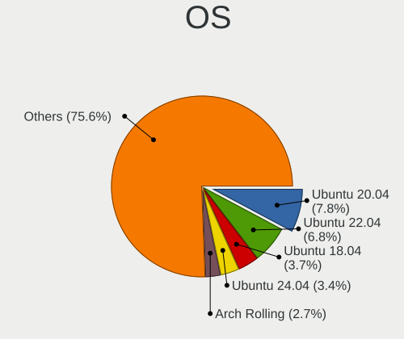

| Name                         | Computers | Percent |
|------------------------------|-----------|---------|
| Ubuntu 20.04                 | 23        | 7.8%    |
| Ubuntu 22.04                 | 20        | 6.78%   |
| Ubuntu 18.04                 | 11        | 3.73%   |
| Ubuntu 24.04                 | 10        | 3.39%   |
| Arch Rolling                 | 8         | 2.71%   |
| Fedora 39                    | 7         | 2.37%   |
| OpenMandriva 4.2             | 6         | 2.03%   |
| Pop!_OS 22.04                | 5         | 1.69%   |
| openSUSE Tumbleweed-XXXXXXXX | 5         | 1.69%   |
| OpenMandriva 4.3             | 5         | 1.69%   |
| Zorin 17                     | 4         | 1.36%   |
| Zorin 16                     | 4         | 1.36%   |
| Ubuntu 21.10                 | 4         | 1.36%   |
| Ubuntu 20.10                 | 4         | 1.36%   |
| OpenMandriva 24.07           | 4         | 1.36%   |
| OpenMandriva 23.03           | 4         | 1.36%   |
| Manjaro                      | 4         | 1.36%   |
| Fedora 42                    | 4         | 1.36%   |
| Fedora 41                    | 4         | 1.36%   |
| Fedora 40                    | 4         | 1.36%   |
| ArcoLinux Rolling            | 4         | 1.36%   |
| OpenMandriva 25.06           | 3         | 1.02%   |
| OpenMandriva 24.12           | 3         | 1.02%   |
| Linux Mint 22.1              | 3         | 1.02%   |
| Linux Mint 20.1              | 3         | 1.02%   |
| Linux Mint 19.3              | 3         | 1.02%   |
| KDE neon 20.04               | 3         | 1.02%   |
| Fedora 38                    | 3         | 1.02%   |
| Fedora 36                    | 3         | 1.02%   |
| BlackPanther 18.1            | 3         | 1.02%   |
| Zorin 18                     | 2         | 0.68%   |
| Zorin 15                     | 2         | 0.68%   |
| Xubuntu 20.04                | 2         | 0.68%   |
| Ubuntu Unity 20.04           | 2         | 0.68%   |
| Ubuntu 23.04                 | 2         | 0.68%   |
| Ubuntu 22.10                 | 2         | 0.68%   |
| Ubuntu 19.10                 | 2         | 0.68%   |
| SteamOS 3.5.19               | 2         | 0.68%   |
| ROSA R11                     | 2         | 0.68%   |
| ROSA R10                     | 2         | 0.68%   |

OS Family
---------

OS without a version

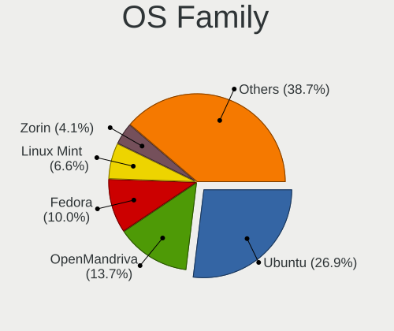

| Name          | Computers | Percent |
|---------------|-----------|---------|
| Ubuntu        | 73        | 26.94%  |
| OpenMandriva  | 37        | 13.65%  |
| Fedora        | 27        | 9.96%   |
| Linux Mint    | 18        | 6.64%   |
| Zorin         | 11        | 4.06%   |
| Pop!_OS       | 10        | 3.69%   |
| Arch          | 9         | 3.32%   |
| openSUSE      | 7         | 2.58%   |
| Debian        | 7         | 2.58%   |
| SteamOS       | 6         | 2.21%   |
| Manjaro       | 5         | 1.85%   |
| KDE neon      | 5         | 1.85%   |
| ArcoLinux     | 5         | 1.85%   |
| ROSA          | 4         | 1.48%   |
| Bazzite       | 4         | 1.48%   |
| Xubuntu       | 3         | 1.11%   |
| LMDE          | 3         | 1.11%   |
| Elementary    | 3         | 1.11%   |
| BlackPanther  | 3         | 1.11%   |
| Ubuntu Unity  | 2         | 0.74%   |
| Ubuntu Budgie | 2         | 0.74%   |
| Parrot        | 2         | 0.74%   |
| Nobara        | 2         | 0.74%   |
| Lubuntu       | 2         | 0.74%   |
| Garuda Linux  | 2         | 0.74%   |
| Endless       | 2         | 0.74%   |
| EndeavourOS   | 2         | 0.74%   |
| CentOS        | 2         | 0.74%   |
| Xero          | 1         | 0.37%   |
| Ultramarine   | 1         | 0.37%   |
| Ubuntu MATE   | 1         | 0.37%   |
| TUXEDO OS     | 1         | 0.37%   |
| Peppermint    | 1         | 0.37%   |
| LinuxFX       | 1         | 0.37%   |
| Kubuntu       | 1         | 0.37%   |
| GNOME OS      | 1         | 0.37%   |
| Devuan        | 1         | 0.37%   |
| CachyOS       | 1         | 0.37%   |
| Aurora        | 1         | 0.37%   |
| Alpine        | 1         | 0.37%   |

Kernel
------

Version of the Linux kernel

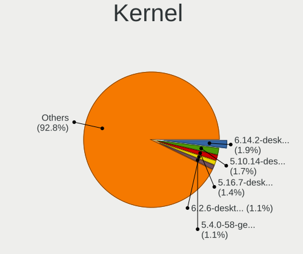

| Version                     | Computers | Percent |
|-----------------------------|-----------|---------|
| 6.14.2-desktop-3omv2590     | 7         | 1.94%   |
| 5.10.14-desktop-1omv4002    | 6         | 1.67%   |
| 5.16.7-desktop-1omv4003     | 5         | 1.39%   |
| 6.2.6-desktop-1omv2390      | 4         | 1.11%   |
| 5.4.0-58-generic            | 4         | 1.11%   |
| 6.9.7-desktop-1omv2490      | 3         | 0.83%   |
| 6.8.0-52-generic            | 3         | 0.83%   |
| 6.8.0-49-generic            | 3         | 0.83%   |
| 6.5.0-35-generic            | 3         | 0.83%   |
| 6.2.0-34-generic            | 3         | 0.83%   |
| 6.2.0-32-generic            | 3         | 0.83%   |
| 6.12.1-desktop-1omv2490     | 3         | 0.83%   |
| 5.8.0-59-generic            | 3         | 0.83%   |
| 5.11.0-38-generic           | 3         | 0.83%   |
| 4.15.0-43-generic           | 3         | 0.83%   |
| 6.8.0-87-generic            | 2         | 0.56%   |
| 6.8.0-60-generic            | 2         | 0.56%   |
| 6.8.0-51-generic            | 2         | 0.56%   |
| 6.8.0-48-generic            | 2         | 0.56%   |
| 6.8.0-45-generic            | 2         | 0.56%   |
| 6.8.0-109049-tuxedo         | 2         | 0.56%   |
| 6.6.2-desktop-1omv2390      | 2         | 0.56%   |
| 6.5.0-41-generic            | 2         | 0.56%   |
| 6.5.0-28-generic            | 2         | 0.56%   |
| 6.5.0-18-generic            | 2         | 0.56%   |
| 6.5.0-14-generic            | 2         | 0.56%   |
| 6.3.6-200.fc38.x86_64       | 2         | 0.56%   |
| 6.2.0-31-generic            | 2         | 0.56%   |
| 6.2.0-26-generic            | 2         | 0.56%   |
| 6.14.0-36-generic           | 2         | 0.56%   |
| 6.14.0-33-generic           | 2         | 0.56%   |
| 6.14.0-32-generic           | 2         | 0.56%   |
| 6.1.52-valve16-1-neptune-61 | 2         | 0.56%   |
| 6.1.1-desktop-1omv2290      | 2         | 0.56%   |
| 5.8.18-1-MANJARO            | 2         | 0.56%   |
| 5.8.0-55-generic            | 2         | 0.56%   |
| 5.8.0-45-generic            | 2         | 0.56%   |
| 5.4.0-73-generic            | 2         | 0.56%   |
| 5.4.0-72-generic            | 2         | 0.56%   |
| 5.4.0-52-generic            | 2         | 0.56%   |

Kernel Family
-------------

Linux kernel without a distro release

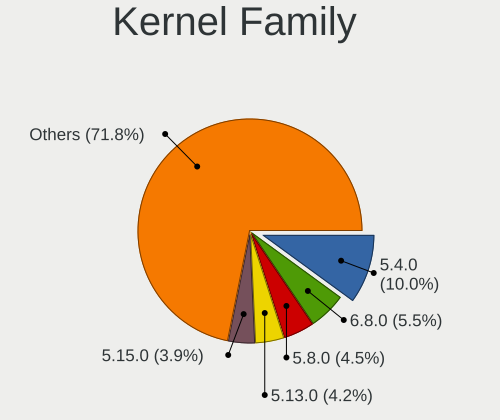

| Version | Computers | Percent |
|---------|-----------|---------|
| 5.4.0   | 31        | 10.03%  |
| 6.8.0   | 17        | 5.5%    |
| 5.8.0   | 14        | 4.53%   |
| 5.13.0  | 13        | 4.21%   |
| 5.15.0  | 12        | 3.88%   |
| 6.5.0   | 11        | 3.56%   |
| 6.2.0   | 11        | 3.56%   |
| 6.14.0  | 11        | 3.56%   |
| 4.15.0  | 10        | 3.24%   |
| 5.11.0  | 9         | 2.91%   |
| 5.19.0  | 8         | 2.59%   |
| 6.14.2  | 7         | 2.27%   |
| 5.3.0   | 6         | 1.94%   |
| 5.10.14 | 6         | 1.94%   |
| 6.2.6   | 5         | 1.62%   |
| 6.11.0  | 5         | 1.62%   |
| 5.16.7  | 5         | 1.62%   |
| 5.10.0  | 4         | 1.29%   |
| 6.9.7   | 3         | 0.97%   |
| 6.6.2   | 3         | 0.97%   |
| 6.12.1  | 3         | 0.97%   |
| 6.1.52  | 3         | 0.97%   |
| 4.19.0  | 3         | 0.97%   |
| 4.18.0  | 3         | 0.97%   |
| 6.5.9   | 2         | 0.65%   |
| 6.3.6   | 2         | 0.65%   |
| 6.16.9  | 2         | 0.65%   |
| 6.13.5  | 2         | 0.65%   |
| 6.12.9  | 2         | 0.65%   |
| 6.1.1   | 2         | 0.65%   |
| 5.9.16  | 2         | 0.65%   |
| 5.8.18  | 2         | 0.65%   |
| 5.18.15 | 2         | 0.65%   |
| 5.18.12 | 2         | 0.65%   |
| 5.14.0  | 2         | 0.65%   |
| 4.18.16 | 2         | 0.65%   |
| 6.9.3   | 1         | 0.32%   |
| 6.9.12  | 1         | 0.32%   |
| 6.9.11  | 1         | 0.32%   |
| 6.8.7   | 1         | 0.32%   |

Kernel Major Ver.
-----------------

Linux kernel major version

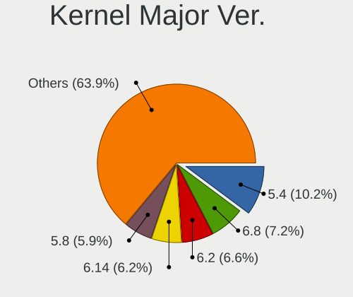

| Version | Computers | Percent |
|---------|-----------|---------|
| 5.4     | 31        | 10.16%  |
| 6.8     | 22        | 7.21%   |
| 6.2     | 20        | 6.56%   |
| 6.14    | 19        | 6.23%   |
| 5.8     | 18        | 5.9%    |
| 6.5     | 15        | 4.92%   |
| 5.15    | 15        | 4.92%   |
| 5.13    | 14        | 4.59%   |
| 6.12    | 11        | 3.61%   |
| 5.19    | 10        | 3.28%   |
| 5.11    | 10        | 3.28%   |
| 5.10    | 10        | 3.28%   |
| 4.15    | 10        | 3.28%   |
| 6.6     | 8         | 2.62%   |
| 6.11    | 8         | 2.62%   |
| 5.3     | 8         | 2.62%   |
| 6.1     | 7         | 2.3%    |
| 6.9     | 6         | 1.97%   |
| 5.18    | 6         | 1.97%   |
| 6.7     | 5         | 1.64%   |
| 6.4     | 5         | 1.64%   |
| 6.17    | 5         | 1.64%   |
| 6.13    | 5         | 1.64%   |
| 5.16    | 5         | 1.64%   |
| 6.16    | 4         | 1.31%   |
| 4.9     | 4         | 1.31%   |
| 4.18    | 4         | 1.31%   |
| 6.15    | 3         | 0.98%   |
| 6.10    | 3         | 0.98%   |
| 5.9     | 3         | 0.98%   |
| 5.14    | 3         | 0.98%   |
| 4.19    | 3         | 0.98%   |
| 6.3     | 2         | 0.66%   |
| 5.6     | 1         | 0.33%   |
| 5.17    | 1         | 0.33%   |
| 5.12    | 1         | 0.33%   |

Arch
----

OS architecture (x86_64, i586, etc.)

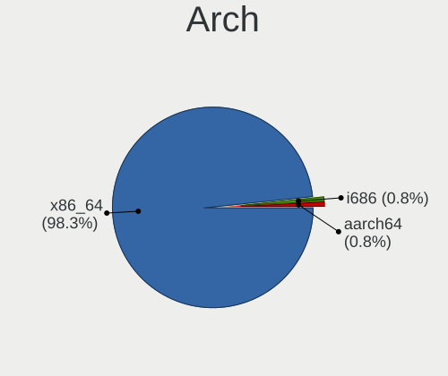

| Name    | Computers | Percent |
|---------|-----------|---------|
| x86_64  | 238       | 98.35%  |
| i686    | 2         | 0.83%   |
| aarch64 | 2         | 0.83%   |

DE
--

Desktop Environment

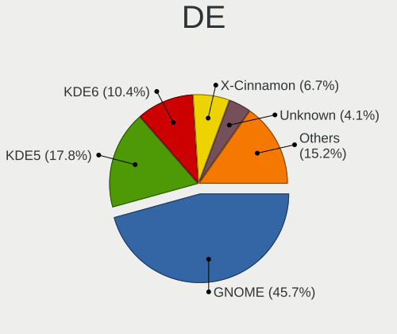

| Name          | Computers | Percent |
|---------------|-----------|---------|
| GNOME         | 123       | 45.72%  |
| KDE5          | 48        | 17.84%  |
| KDE6          | 28        | 10.41%  |
| X-Cinnamon    | 18        | 6.69%   |
| Unknown       | 11        | 4.09%   |
| XFCE          | 10        | 3.72%   |
| MATE          | 6         | 2.23%   |
| LXQt          | 4         | 1.49%   |
| Pantheon      | 3         | 1.12%   |
| Budgie        | 3         | 1.12%   |
| Unity         | 2         | 0.74%   |
| LXDE          | 2         | 0.74%   |
| KDE4          | 2         | 0.74%   |
| KDE           | 2         | 0.74%   |
| i3            | 2         | 0.74%   |
| Cinnamon      | 2         | 0.74%   |
| GNOME Classic | 1         | 0.37%   |
| Deepin        | 1         | 0.37%   |
| awesome       | 1         | 0.37%   |

Display Server
--------------

X11 or Wayland

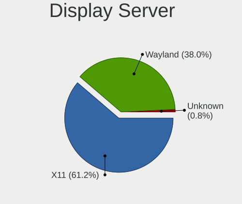

| Name    | Computers | Percent |
|---------|-----------|---------|
| X11     | 158       | 61.24%  |
| Wayland | 98        | 37.98%  |
| Unknown | 2         | 0.78%   |

Display Manager
---------------

SDDM, LightDM, etc.

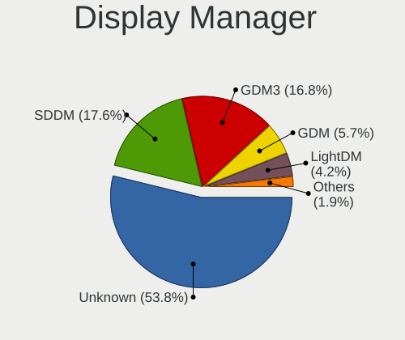

| Name    | Computers | Percent |
|---------|-----------|---------|
| Unknown | 141       | 53.82%  |
| SDDM    | 46        | 17.56%  |
| GDM3    | 44        | 16.79%  |
| GDM     | 15        | 5.73%   |
| LightDM | 11        | 4.2%    |
| TDM     | 3         | 1.15%   |
| KDM     | 2         | 0.76%   |

OS Lang
-------

Language

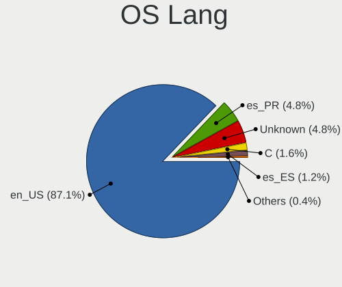

| Lang    | Computers | Percent |
|---------|-----------|---------|
| en_US   | 217       | 87.15%  |
| es_PR   | 12        | 4.82%   |
| Unknown | 12        | 4.82%   |
| C       | 4         | 1.61%   |
| es_ES   | 3         | 1.2%    |
| es_MX   | 1         | 0.4%    |

Boot Mode
---------

EFI or BIOS

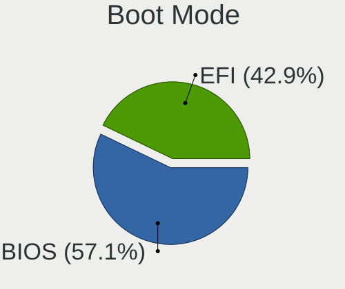

| Mode | Computers | Percent |
|------|-----------|---------|
| BIOS | 144       | 57.14%  |
| EFI  | 108       | 42.86%  |

Filesystem
----------

Type of filesystem

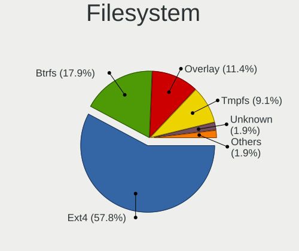

| Type    | Computers | Percent |
|---------|-----------|---------|
| Ext4    | 152       | 57.79%  |
| Btrfs   | 47        | 17.87%  |
| Overlay | 30        | 11.41%  |
| Tmpfs   | 24        | 9.13%   |
| Unknown | 5         | 1.9%    |
| Xfs     | 3         | 1.14%   |
| Zfs     | 2         | 0.76%   |

Part. scheme
------------

Scheme of partitioning

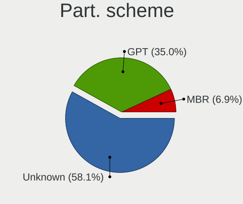

| Type    | Computers | Percent |
|---------|-----------|---------|
| Unknown | 151       | 58.08%  |
| GPT     | 91        | 35%     |
| MBR     | 18        | 6.92%   |

Dual Boot with Linux/BSD
------------------------

Hosting more than one Linux/BSD

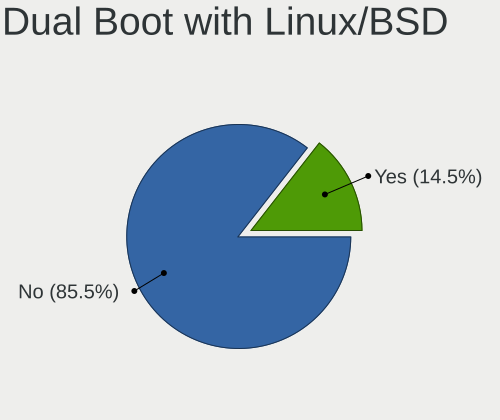

| Dual boot | Computers | Percent |
|-----------|-----------|---------|
| No        | 219       | 85.55%  |
| Yes       | 37        | 14.45%  |

Dual Boot (Win)
---------------

Hosting Linux and Windows

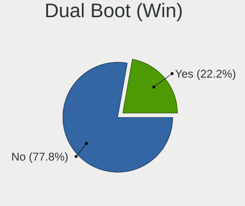

| Dual boot | Computers | Percent |
|-----------|-----------|---------|
| No        | 200       | 77.82%  |
| Yes       | 57        | 22.18%  |

Board
-----

Vendor
------

Motherboard manufacturer

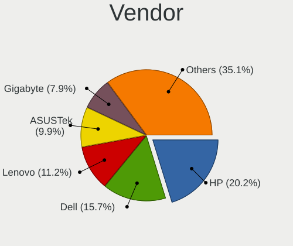

| Name                    | Computers | Percent |
|-------------------------|-----------|---------|
| Hewlett-Packard         | 49        | 20.25%  |
| Dell                    | 38        | 15.7%   |
| Lenovo                  | 27        | 11.16%  |
| ASUSTek Computer        | 24        | 9.92%   |
| Gigabyte Technology     | 19        | 7.85%   |
| MSI                     | 13        | 5.37%   |
| ASRock                  | 11        | 4.55%   |
| Apple                   | 9         | 3.72%   |
| Acer                    | 6         | 2.48%   |
| Valve                   | 5         | 2.07%   |
| Toshiba                 | 3         | 1.24%   |
| Sony                    | 3         | 1.24%   |
| Intel                   | 3         | 1.24%   |
| Alienware               | 3         | 1.24%   |
| TUXEDO                  | 2         | 0.83%   |
| Raspberry Pi Foundation | 2         | 0.83%   |
| Panasonic               | 2         | 0.83%   |
| GPU Company             | 2         | 0.83%   |
| Gateway                 | 2         | 0.83%   |
| AZW                     | 2         | 0.83%   |
| Samsung Electronics     | 1         | 0.41%   |
| Razer                   | 1         | 0.41%   |
| Pegatron                | 1         | 0.41%   |
| ONE-NETBOOK TECHNOLOGY  | 1         | 0.41%   |
| OEMYU                   | 1         | 0.41%   |
| Microsoft               | 1         | 0.41%   |
| MACHINIST               | 1         | 0.41%   |
| Google                  | 1         | 0.41%   |
| GEEKOM                  | 1         | 0.41%   |
| Framework               | 1         | 0.41%   |
| Foxconn                 | 1         | 0.41%   |
| ECS                     | 1         | 0.41%   |
| CompuLab                | 1         | 0.41%   |
| Chuwi                   | 1         | 0.41%   |
| BESSTAR Tech            | 1         | 0.41%   |
| AMI                     | 1         | 0.41%   |
| Acidanthera             | 1         | 0.41%   |

Model
-----

Motherboard model

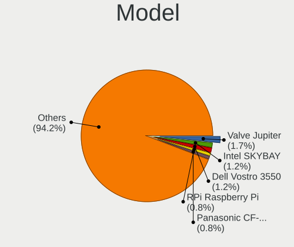

| Name                               | Computers | Percent |
|------------------------------------|-----------|---------|
| Valve Jupiter                      | 4         | 1.65%   |
| Intel SKYBAY                       | 3         | 1.24%   |
| Dell Vostro 3550                   | 3         | 1.24%   |
| RPi Raspberry Pi                   | 2         | 0.83%   |
| Panasonic CF-33-1                  | 2         | 0.83%   |
| MSI Cubi N 8GL (MS-B171)           | 2         | 0.83%   |
| HP Notebook                        | 2         | 0.83%   |
| HP Laptop 14-dk1xxx                | 2         | 0.83%   |
| HP EliteDesk 800 G4 SFF            | 2         | 0.83%   |
| HP EliteBook 840 G2                | 2         | 0.83%   |
| HP 2000                            | 2         | 0.83%   |
| Gigabyte F2A68HM-H                 | 2         | 0.83%   |
| Gigabyte B450M DS3H                | 2         | 0.83%   |
| Dell Inspiron 5559                 | 2         | 0.83%   |
| Dell Inspiron 11-3168              | 2         | 0.83%   |
| ASUS X510UAR                       | 2         | 0.83%   |
| ASUS K53E                          | 2         | 0.83%   |
| ASRock Q1900M                      | 2         | 0.83%   |
| ASRock 945GCM-S                    | 2         | 0.83%   |
| Valve Galileo                      | 1         | 0.41%   |
| TUXEDO Sirius 16 Gen2              | 1         | 0.41%   |
| TUXEDO Aura 15 Gen1                | 1         | 0.41%   |
| Toshiba Satellite P755             | 1         | 0.41%   |
| Toshiba Satellite L655             | 1         | 0.41%   |
| Toshiba Satellite C55-C            | 1         | 0.41%   |
| Sony VPCEA36FX                     | 1         | 0.41%   |
| Sony VGN-CS320J                    | 1         | 0.41%   |
| Sony SVE11113FXW                   | 1         | 0.41%   |
| Samsung 930XDB/931XDB/930XDY       | 1         | 0.41%   |
| Razer Book 13 - RZ09-0357          | 1         | 0.41%   |
| Pegatron QW716AA#ABA               | 1         | 0.41%   |
| ONE-NETBOOK TECHNOLOGY ONE XPLAYER | 1         | 0.41%   |
| MSI US PIO PRO AP241               | 1         | 0.41%   |
| MSI MS-7E28                        | 1         | 0.41%   |
| MSI MS-7D75                        | 1         | 0.41%   |
| MSI MS-7D07                        | 1         | 0.41%   |
| MSI MS-7C56                        | 1         | 0.41%   |
| MSI MS-7B48                        | 1         | 0.41%   |
| MSI MS-7A40                        | 1         | 0.41%   |
| MSI MS-7971                        | 1         | 0.41%   |

Model Family
------------

Motherboard model prefix

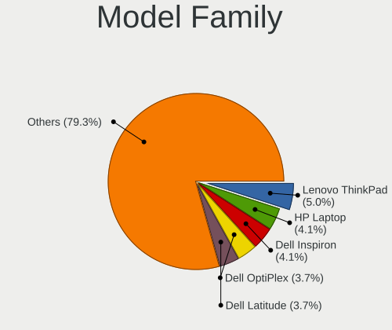

| Name               | Computers | Percent |
|--------------------|-----------|---------|
| Lenovo ThinkPad    | 12        | 4.96%   |
| HP Laptop          | 10        | 4.13%   |
| Dell Inspiron      | 10        | 4.13%   |
| Dell OptiPlex      | 9         | 3.72%   |
| Dell Latitude      | 9         | 3.72%   |
| HP Pavilion        | 7         | 2.89%   |
| ASUS ROG           | 7         | 2.89%   |
| HP ProBook         | 5         | 2.07%   |
| HP EliteBook       | 5         | 2.07%   |
| HP Compaq          | 5         | 2.07%   |
| Valve Jupiter      | 4         | 1.65%   |
| HP ENVY            | 4         | 1.65%   |
| HP EliteDesk       | 4         | 1.65%   |
| Acer Aspire        | 4         | 1.65%   |
| Toshiba Satellite  | 3         | 1.24%   |
| MSI Cubi           | 3         | 1.24%   |
| Lenovo ThinkCentre | 3         | 1.24%   |
| Intel SKYBAY       | 3         | 1.24%   |
| Gigabyte B450M     | 3         | 1.24%   |
| Dell Vostro        | 3         | 1.24%   |
| ASUS TUF           | 3         | 1.24%   |
| RPi Raspberry      | 2         | 0.83%   |
| Panasonic CF-33-1  | 2         | 0.83%   |
| Lenovo Yoga        | 2         | 0.83%   |
| Lenovo IdeaPad     | 2         | 0.83%   |
| HP Notebook        | 2         | 0.83%   |
| HP 2000            | 2         | 0.83%   |
| Gigabyte X570      | 2         | 0.83%   |
| Gigabyte F2A68HM-H | 2         | 0.83%   |
| Dell XPS           | 2         | 0.83%   |
| ASUS X510UAR       | 2         | 0.83%   |
| ASUS VivoBook      | 2         | 0.83%   |
| ASUS PRIME         | 2         | 0.83%   |
| ASUS K53E          | 2         | 0.83%   |
| ASRock Q1900M      | 2         | 0.83%   |
| ASRock B450M-HDV   | 2         | 0.83%   |
| ASRock 945GCM-S    | 2         | 0.83%   |
| Acer Swift         | 2         | 0.83%   |
| Valve Galileo      | 1         | 0.41%   |
| TUXEDO Sirius      | 1         | 0.41%   |

MFG Year
--------

Motherboard manufacture year

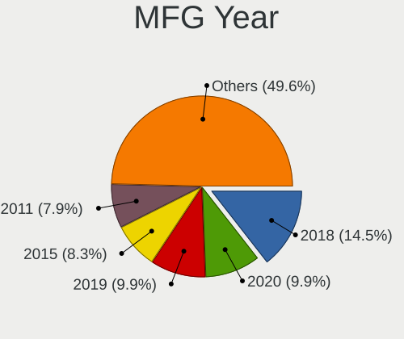

| Year    | Computers | Percent |
|---------|-----------|---------|
| 2018    | 35        | 14.46%  |
| 2020    | 24        | 9.92%   |
| 2019    | 24        | 9.92%   |
| 2015    | 20        | 8.26%   |
| 2011    | 19        | 7.85%   |
| 2014    | 14        | 5.79%   |
| 2021    | 13        | 5.37%   |
| 2017    | 13        | 5.37%   |
| 2012    | 11        | 4.55%   |
| 2016    | 10        | 4.13%   |
| 2023    | 9         | 3.72%   |
| 2013    | 9         | 3.72%   |
| 2008    | 9         | 3.72%   |
| 2022    | 8         | 3.31%   |
| 2010    | 6         | 2.48%   |
| 2009    | 6         | 2.48%   |
| 2024    | 5         | 2.07%   |
| 2006    | 2         | 0.83%   |
| Unknown | 2         | 0.83%   |
| 2025    | 1         | 0.41%   |
| 2007    | 1         | 0.41%   |
| 2005    | 1         | 0.41%   |

Form Factor
-----------

Physical design of the computer

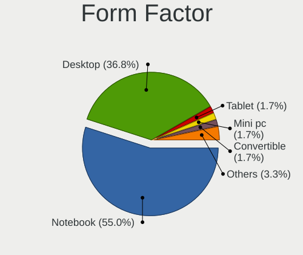

| Name           | Computers | Percent |
|----------------|-----------|---------|
| Notebook       | 133       | 54.96%  |
| Desktop        | 89        | 36.78%  |
| Tablet         | 4         | 1.65%   |
| Convertible    | 4         | 1.65%   |
| Mini pc        | 4         | 1.65%   |
| All in one     | 4         | 1.65%   |
| System on chip | 2         | 0.83%   |
| Server         | 2         | 0.83%   |

Secure Boot
-----------

Enabled or disabled

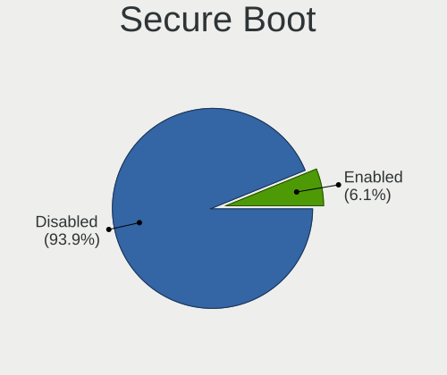

| State    | Computers | Percent |
|----------|-----------|---------|
| Disabled | 229       | 93.85%  |
| Enabled  | 15        | 6.15%   |

Coreboot
--------

Have coreboot on board

| Used | Computers | Percent |
|------|-----------|---------|
| No   | 241       | 99.59%  |
| Yes  | 1         | 0.41%   |

RAM Size
--------

Total RAM memory

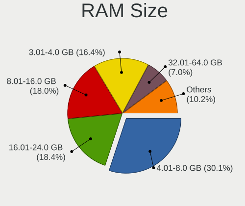

| Size in GB  | Computers | Percent |
|-------------|-----------|---------|
| 4.01-8.0    | 77        | 30.08%  |
| 16.01-24.0  | 47        | 18.36%  |
| 8.01-16.0   | 46        | 17.97%  |
| 3.01-4.0    | 42        | 16.41%  |
| 32.01-64.0  | 18        | 7.03%   |
| 24.01-32.0  | 11        | 4.3%    |
| 64.01-256.0 | 8         | 3.13%   |
| 1.01-2.0    | 6         | 2.34%   |
| 0.51-1.0    | 1         | 0.39%   |

RAM Used
--------

Used RAM memory

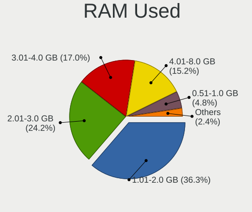

| Used GB    | Computers | Percent |
|------------|-----------|---------|
| 1.01-2.0   | 105       | 36.33%  |
| 2.01-3.0   | 70        | 24.22%  |
| 3.01-4.0   | 49        | 16.96%  |
| 4.01-8.0   | 44        | 15.22%  |
| 0.51-1.0   | 14        | 4.84%   |
| 8.01-16.0  | 6         | 2.08%   |
| 16.01-24.0 | 1         | 0.35%   |

Total Drives
------------

Number of drives on board

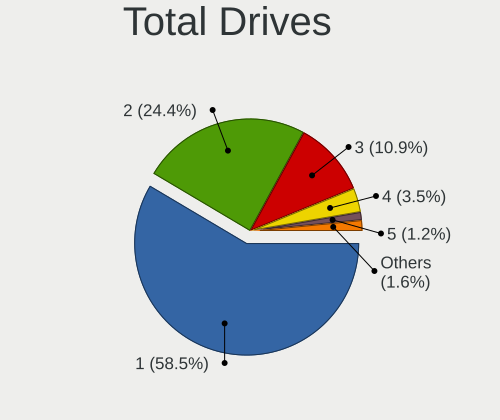

| Drives | Computers | Percent |
|--------|-----------|---------|
| 1      | 151       | 58.53%  |
| 2      | 63        | 24.42%  |
| 3      | 28        | 10.85%  |
| 4      | 9         | 3.49%   |
| 5      | 3         | 1.16%   |
| 0      | 3         | 1.16%   |
| 6      | 1         | 0.39%   |

Has CD-ROM
----------

Has CD-ROM on board

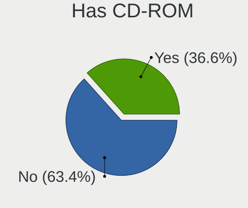

| Presented | Computers | Percent |
|-----------|-----------|---------|
| No        | 154       | 63.37%  |
| Yes       | 89        | 36.63%  |

Has Ethernet
------------

Has Ethernet on board

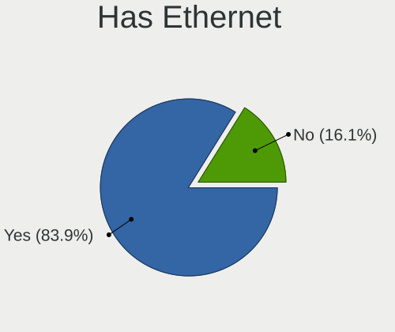

| Presented | Computers | Percent |
|-----------|-----------|---------|
| Yes       | 203       | 83.88%  |
| No        | 39        | 16.12%  |

Has WiFi
--------

Has WiFi module

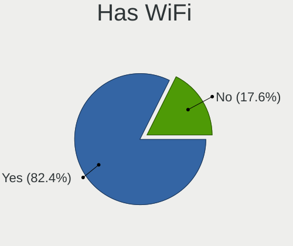

| Presented | Computers | Percent |
|-----------|-----------|---------|
| Yes       | 201       | 82.38%  |
| No        | 43        | 17.62%  |

Has Bluetooth
-------------

Has Bluetooth module

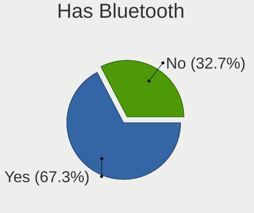

| Presented | Computers | Percent |
|-----------|-----------|---------|
| Yes       | 167       | 67.34%  |
| No        | 81        | 32.66%  |

Location
--------

Country
-------

Geographic location (country)

| Country     | Computers | Percent |
|-------------|-----------|---------|
| Puerto Rico | 242       | 100%    |

City
----

Geographic location (city)

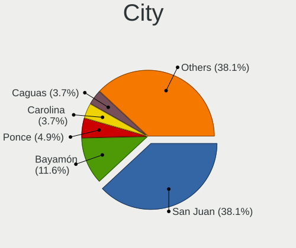

| City              | Computers | Percent |
|-------------------|-----------|---------|
| San Juan          | 102       | 38.06%  |
| Bayamón          | 31        | 11.57%  |
| Ponce             | 13        | 4.85%   |
| Carolina          | 10        | 3.73%   |
| Caguas            | 10        | 3.73%   |
| Rio Grande        | 8         | 2.99%   |
| San Sebastian     | 6         | 2.24%   |
| Toa Baja          | 5         | 1.87%   |
| Guaynabo          | 5         | 1.87%   |
| Utuado            | 4         | 1.49%   |
| Mayagüez         | 4         | 1.49%   |
| Cayey             | 4         | 1.49%   |
| Aguadilla         | 4         | 1.49%   |
| Vega Alta         | 3         | 1.12%   |
| Sabana Grande     | 3         | 1.12%   |
| Manati            | 3         | 1.12%   |
| Lares             | 3         | 1.12%   |
| Dorado            | 3         | 1.12%   |
| Arecibo           | 3         | 1.12%   |
| Villalba          | 2         | 0.75%   |
| Vega Baja         | 2         | 0.75%   |
| Trujillo Alto     | 2         | 0.75%   |
| Santa Isabel      | 2         | 0.75%   |
| Guayama           | 2         | 0.75%   |
| Eleanor Roosevelt | 2         | 0.75%   |
| Coquí            | 2         | 0.75%   |
| Catano            | 2         | 0.75%   |
| Cabo Rojo         | 2         | 0.75%   |
| Yauco             | 1         | 0.37%   |
| Toa Alta          | 1         | 0.37%   |
| Sumidero          | 1         | 0.37%   |
| San Lorenzo       | 1         | 0.37%   |
| San German        | 1         | 0.37%   |
| Rincon            | 1         | 0.37%   |
| Patillas          | 1         | 0.37%   |
| Morovis           | 1         | 0.37%   |
| Maunabo           | 1         | 0.37%   |
| Las Piedras       | 1         | 0.37%   |
| Humacao           | 1         | 0.37%   |
| Hatillo           | 1         | 0.37%   |

Drives
------

Drive Vendor
------------

Hard drive vendors

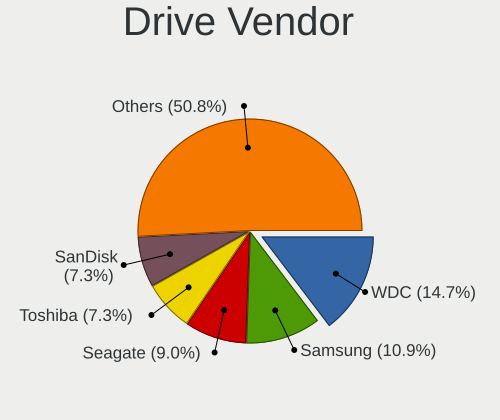

| Vendor                      | Computers | Drives | Percent |
|-----------------------------|-----------|--------|---------|
| WDC                         | 54        | 98     | 14.67%  |
| Samsung Electronics         | 40        | 61     | 10.87%  |
| Seagate                     | 33        | 55     | 8.97%   |
| Toshiba                     | 27        | 33     | 7.34%   |
| SanDisk                     | 27        | 40     | 7.34%   |
| Unknown                     | 20        | 28     | 5.43%   |
| Crucial                     | 16        | 34     | 4.35%   |
| Hitachi                     | 15        | 40     | 4.08%   |
| Kingston                    | 12        | 14     | 3.26%   |
| SK hynix                    | 10        | 12     | 2.72%   |
| Micron/Crucial Technology   | 8         | 12     | 2.17%   |
| Micron Technology           | 8         | 19     | 2.17%   |
| China                       | 8         | 13     | 2.17%   |
| A-DATA Technology           | 7         | 14     | 1.9%    |
| Intel                       | 6         | 7      | 1.63%   |
| SPCC                        | 5         | 9      | 1.36%   |
| Silicon Motion              | 5         | 5      | 1.36%   |
| External                    | 4         | 16     | 1.09%   |
| TDAS                        | 3         | 21     | 0.82%   |
| Realtek Semiconductor       | 3         | 4      | 0.82%   |
| PNY                         | 3         | 4      | 0.82%   |
| Phison Electronics          | 3         | 3      | 0.82%   |
| Phison                      | 3         | 3      | 0.82%   |
| Patriot                     | 3         | 8      | 0.82%   |
| MAXIO Technology (Hangzhou) | 3         | 3      | 0.82%   |
| Team                        | 2         | 2      | 0.54%   |
| SABRENT                     | 2         | 3      | 0.54%   |
| Rayson                      | 2         | 2      | 0.54%   |
| OCZ                         | 2         | 2      | 0.54%   |
| LITEONIT                    | 2         | 2      | 0.54%   |
| Axiom                       | 2         | 11     | 0.54%   |
| Apple                       | 2         | 3      | 0.54%   |
| addlink                     | 2         | 2      | 0.54%   |
| ADATA Technology            | 2         | 2      | 0.54%   |
| Unknown                     | 2         | 2      | 0.54%   |
| X12                         | 1         | 2      | 0.27%   |
| WD MediaMax                 | 1         | 3      | 0.27%   |
| W800SH                      | 1         | 1      | 0.27%   |
| USB3.0                      | 1         | 1      | 0.27%   |
| T-FORCE                     | 1         | 1      | 0.27%   |

Drive Model
-----------

Hard drive models

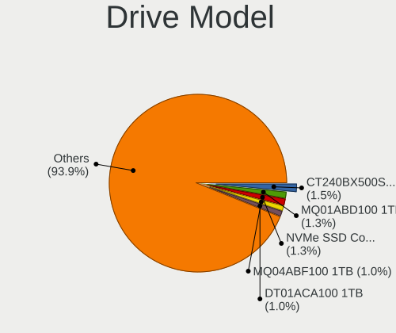

| Model                                                 | Computers | Percent |
|-------------------------------------------------------|-----------|---------|
| Crucial CT240BX500SSD1 240GB                          | 6         | 1.53%   |
| Toshiba MQ01ABD100 1TB                                | 5         | 1.27%   |
| Samsung NVMe SSD Controller SM981/PM981/PM983 1TB     | 5         | 1.27%   |
| Toshiba MQ04ABF100 1TB                                | 4         | 1.02%   |
| Toshiba DT01ACA100 1TB                                | 4         | 1.02%   |
| Micron/Crucial P2 NVMe PCIe SSD 2TB                   | 4         | 1.02%   |
| External USB3.0 250GB                                 | 4         | 1.02%   |
| Crucial CT240M500SSD1 240GB                           | 4         | 1.02%   |
| WDC WDS240G2G0A-00JH30 240GB SSD                      | 3         | 0.76%   |
| WDC WD5000LPVT-22G33T0 500GB                          | 3         | 0.76%   |
| Unknown MMC Card  64GB                                | 3         | 0.76%   |
| Unknown MMC Card  128GB                               | 3         | 0.76%   |
| Toshiba MQ01ABF050 500GB                              | 3         | 0.76%   |
| TDAS TerraMaster 4TB                                  | 3         | 0.76%   |
| Sandisk WD_BLACK SN770 500GB                          | 3         | 0.76%   |
| Sandisk WD Black SN750 / PC SN730 NVMe SSD 500GB      | 3         | 0.76%   |
| Samsung NVMe SSD Controller PM9A1/PM9A3/980PRO 1TB    | 3         | 0.76%   |
| Samsung MZNLH128HBHQ-000H1 128GB SSD                  | 3         | 0.76%   |
| Realtek SPCC M.2 PCIe SSD 1024GB                      | 3         | 0.76%   |
| Kingston SKC6001024G 1TB SSD                          | 3         | 0.76%   |
| Kingston SA400S37480G 480GB SSD                       | 3         | 0.76%   |
| Kingston SA400S37240G 240GB SSD                       | 3         | 0.76%   |
| Hitachi HTS547550A9E384 500GB                         | 3         | 0.76%   |
| WDC WDS250G2B0B 250GB SSD                             | 2         | 0.51%   |
| WDC WDBNCE2500PNC 250GB SSD                           | 2         | 0.51%   |
| WDC WDBNCE0010PNC 1TB SSD                             | 2         | 0.51%   |
| WDC WD5000LPLX-22ZNTT0 500GB                          | 2         | 0.51%   |
| WDC WD40EZRZ-22GXCB0 4TB                              | 2         | 0.51%   |
| WDC WD2500BEVS-60UST0 250GB                           | 2         | 0.51%   |
| WDC WD10SPZX-60Z10T0 1TB                              | 2         | 0.51%   |
| Unknown MMC Card  2GB                                 | 2         | 0.51%   |
| Toshiba MQ01ACF050 500GB                              | 2         | 0.51%   |
| Toshiba MK3261GSYN 320GB                              | 2         | 0.51%   |
| Toshiba DT01ACA050 500GB                              | 2         | 0.51%   |
| SPCC Solid State Disk 1TB                             | 2         | 0.51%   |
| SK hynix BC501 NVMe Solid State Drive 512GB           | 2         | 0.51%   |
| Silicon Motion SM2263EN/SM2263XT SSD Controller 512GB | 2         | 0.51%   |
| Seagate ST9500420AS 500GB                             | 2         | 0.51%   |
| Seagate ST500LM012 HN-M500MBB 500GB                   | 2         | 0.51%   |
| Seagate ST3250310AS 250GB                             | 2         | 0.51%   |

HDD Vendor
----------

Hard disk drive vendors

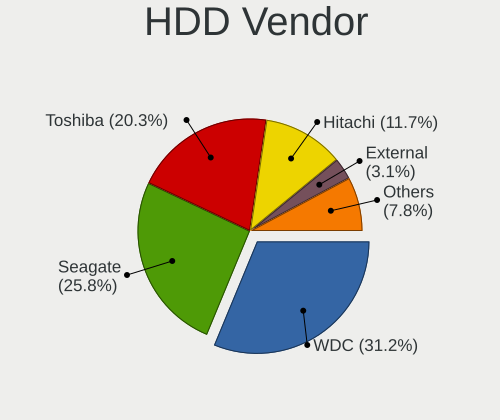

| Vendor              | Computers | Drives | Percent |
|---------------------|-----------|--------|---------|
| WDC                 | 40        | 79     | 31.25%  |
| Seagate             | 33        | 55     | 25.78%  |
| Toshiba             | 26        | 32     | 20.31%  |
| Hitachi             | 15        | 40     | 11.72%  |
| External            | 4         | 16     | 3.13%   |
| TDAS                | 3         | 21     | 2.34%   |
| Samsung Electronics | 2         | 3      | 1.56%   |
| USB3.0              | 1         | 1      | 0.78%   |
| Unknown             | 1         | 1      | 0.78%   |
| MaxDigital          | 1         | 1      | 0.78%   |
| HGST                | 1         | 1      | 0.78%   |
| Apple               | 1         | 1      | 0.78%   |

SSD Vendor
----------

Solid state drive vendors

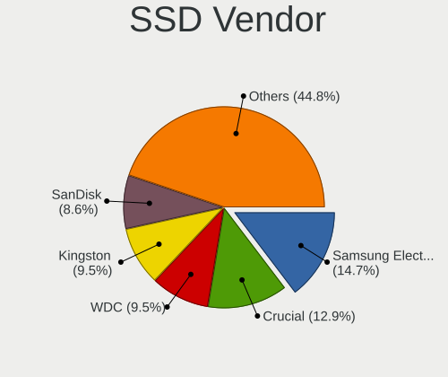

| Vendor              | Computers | Drives | Percent |
|---------------------|-----------|--------|---------|
| Samsung Electronics | 17        | 26     | 14.66%  |
| Crucial             | 15        | 33     | 12.93%  |
| WDC                 | 11        | 15     | 9.48%   |
| Kingston            | 11        | 13     | 9.48%   |
| SanDisk             | 10        | 10     | 8.62%   |
| China               | 8         | 13     | 6.9%    |
| A-DATA Technology   | 7         | 13     | 6.03%   |
| SPCC                | 4         | 8      | 3.45%   |
| PNY                 | 3         | 4      | 2.59%   |
| Patriot             | 3         | 8      | 2.59%   |
| Micron Technology   | 3         | 3      | 2.59%   |
| SK hynix            | 2         | 2      | 1.72%   |
| SABRENT             | 2         | 3      | 1.72%   |
| Rayson              | 2         | 2      | 1.72%   |
| OCZ                 | 2         | 2      | 1.72%   |
| LITEONIT            | 2         | 2      | 1.72%   |
| X12                 | 1         | 2      | 0.86%   |
| W800SH              | 1         | 1      | 0.86%   |
| Team                | 1         | 1      | 0.86%   |
| T-FORCE             | 1         | 1      | 0.86%   |
| Netac               | 1         | 2      | 0.86%   |
| Mushkin             | 1         | 1      | 0.86%   |
| LITEON              | 1         | 1      | 0.86%   |
| Lexar               | 1         | 7      | 0.86%   |
| KingSpec            | 1         | 1      | 0.86%   |
| INTEL SS            | 1         | 2      | 0.86%   |
| Intel               | 1         | 1      | 0.86%   |
| Hewlett-Packard     | 1         | 1      | 0.86%   |
| Argon               | 1         | 1      | 0.86%   |
| addlink             | 1         | 1      | 0.86%   |

Drive Kind
----------

HDD or SSD

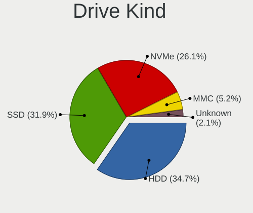

| Kind    | Computers | Drives | Percent |
|---------|-----------|--------|---------|
| HDD     | 113       | 251    | 34.66%  |
| SSD     | 104       | 180    | 31.9%   |
| NVMe    | 85        | 147    | 26.07%  |
| MMC     | 17        | 25     | 5.21%   |
| Unknown | 7         | 22     | 2.15%   |

Drive Connector
---------------

SATA, SAS, NVMe, etc.

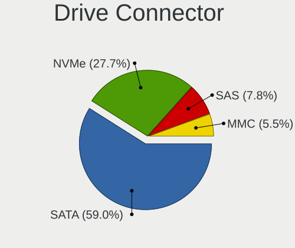

| Type | Computers | Drives | Percent |
|------|-----------|--------|---------|
| SATA | 181       | 393    | 58.96%  |
| NVMe | 85        | 146    | 27.69%  |
| SAS  | 24        | 61     | 7.82%   |
| MMC  | 17        | 25     | 5.54%   |

Drive Size
----------

Size of hard drive

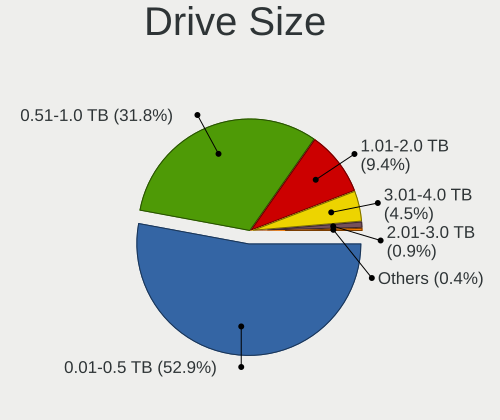

| Size in TB | Computers | Drives | Percent |
|------------|-----------|--------|---------|
| 0.01-0.5   | 118       | 238    | 52.91%  |
| 0.51-1.0   | 71        | 117    | 31.84%  |
| 1.01-2.0   | 21        | 37     | 9.42%   |
| 3.01-4.0   | 10        | 36     | 4.48%   |
| 2.01-3.0   | 2         | 2      | 0.9%    |
| 10.01-20.0 | 1         | 1      | 0.45%   |

Space Total
-----------

Amount of disk space available on the file system

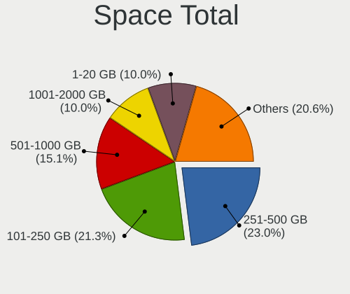

| Size in GB     | Computers | Percent |
|----------------|-----------|---------|
| 251-500        | 67        | 23.02%  |
| 101-250        | 62        | 21.31%  |
| 501-1000       | 44        | 15.12%  |
| 1001-2000      | 29        | 9.97%   |
| 1-20           | 29        | 9.97%   |
| More than 3000 | 18        | 6.19%   |
| 2001-3000      | 17        | 5.84%   |
| 51-100         | 9         | 3.09%   |
| Unknown        | 9         | 3.09%   |
| 21-50          | 7         | 2.41%   |

Space Used
----------

Amount of used disk space

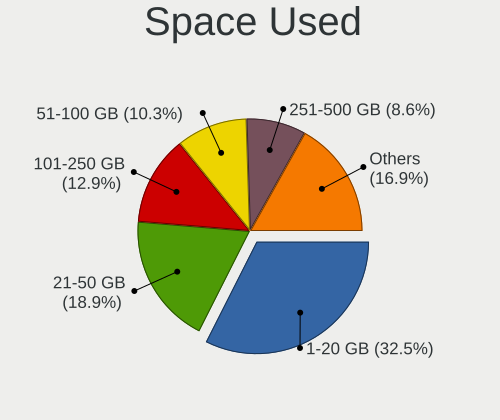

| Used GB        | Computers | Percent |
|----------------|-----------|---------|
| 1-20           | 98        | 32.45%  |
| 21-50          | 57        | 18.87%  |
| 101-250        | 39        | 12.91%  |
| 51-100         | 31        | 10.26%  |
| 251-500        | 26        | 8.61%   |
| 501-1000       | 22        | 7.28%   |
| 1001-2000      | 10        | 3.31%   |
| Unknown        | 9         | 2.98%   |
| 2001-3000      | 5         | 1.66%   |
| More than 3000 | 4         | 1.32%   |
| 0              | 1         | 0.33%   |

Malfunc. Drives
---------------

Drive models with a malfunction

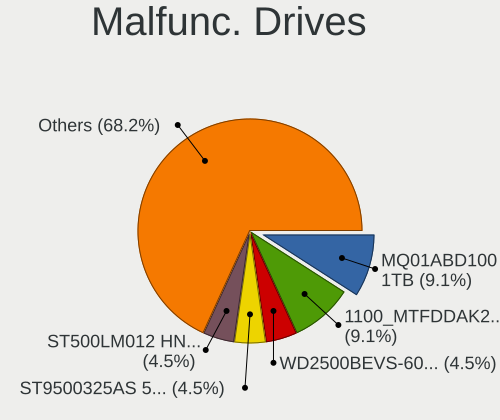

| Model                                                       | Computers | Drives | Percent |
|-------------------------------------------------------------|-----------|--------|---------|
| Toshiba MQ01ABD100 1TB                                      | 2         | 2      | 9.09%   |
| Micron Technology 1100_MTFDDAK2T0TBN 2TB SSD                | 2         | 2      | 9.09%   |
| WDC WD2500BEVS-60UST0 250GB                                 | 1         | 1      | 4.55%   |
| SK hynix BC501 HFM256GDJTNG-8310A 256GB                     | 1         | 1      | 4.55%   |
| Seagate ST9500325AS 500GB                                   | 1         | 1      | 4.55%   |
| Seagate ST500LM012 HN-M500MBB 500GB                         | 1         | 1      | 4.55%   |
| Seagate ST3320613AS 320GB                                   | 1         | 2      | 4.55%   |
| Seagate ST3250310AS 250GB                                   | 1         | 1      | 4.55%   |
| Seagate ST320DM001 HD322GJ 320GB                            | 1         | 1      | 4.55%   |
| Seagate ST2000VM003-1CT164 2TB                              | 1         | 1      | 4.55%   |
| Seagate ST2000LM007-1R8174 2TB                              | 1         | 2      | 4.55%   |
| Seagate ST2000DL001-9VT156 2TB                              | 1         | 1      | 4.55%   |
| Samsung Electronics MZNLH128HBHQ-000H1 128GB SSD            | 1         | 1      | 4.55%   |
| Micron Technology 1100_MTFDDAV256TBN 256GB SSD              | 1         | 1      | 4.55%   |
| MAXIO Technology (Hangzhou) NVMe SSD Controller MAP1202 2TB | 1         | 1      | 4.55%   |
| Hitachi HTS545025B9A300 250GB                               | 1         | 1      | 4.55%   |
| Hitachi HTS543232L9A300 320GB                               | 1         | 1      | 4.55%   |
| Crucial CT240M500SSD1 240GB                                 | 1         | 1      | 4.55%   |
| A-DATA Technology SU740 500GB SSD                           | 1         | 1      | 4.55%   |
| A-DATA Technology SU630 240GB SSD                           | 1         | 1      | 4.55%   |

Malfunc. Drive Vendor
---------------------

Vendors of faulty drives

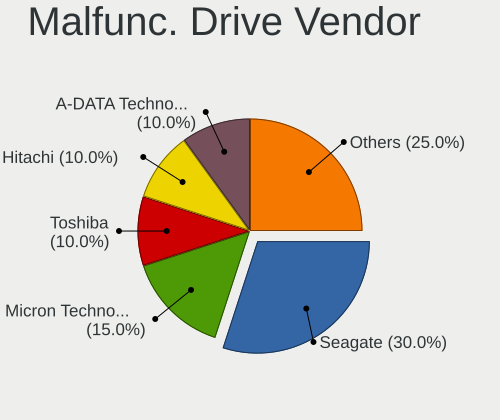

| Vendor                      | Computers | Drives | Percent |
|-----------------------------|-----------|--------|---------|
| Seagate                     | 6         | 10     | 30%     |
| Micron Technology           | 3         | 3      | 15%     |
| Toshiba                     | 2         | 2      | 10%     |
| Hitachi                     | 2         | 2      | 10%     |
| A-DATA Technology           | 2         | 2      | 10%     |
| WDC                         | 1         | 1      | 5%      |
| SK hynix                    | 1         | 1      | 5%      |
| Samsung Electronics         | 1         | 1      | 5%      |
| MAXIO Technology (Hangzhou) | 1         | 1      | 5%      |
| Crucial                     | 1         | 1      | 5%      |

Malfunc. HDD Vendor
-------------------

Vendors of faulty HDD drives

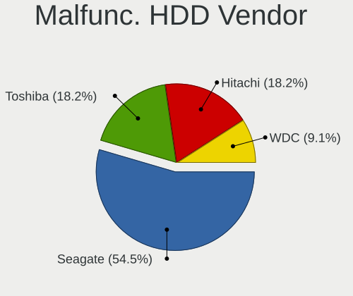

| Vendor  | Computers | Drives | Percent |
|---------|-----------|--------|---------|
| Seagate | 6         | 10     | 54.55%  |
| Toshiba | 2         | 2      | 18.18%  |
| Hitachi | 2         | 2      | 18.18%  |
| WDC     | 1         | 1      | 9.09%   |

Malfunc. Drive Kind
-------------------

Kinds of faulty drives

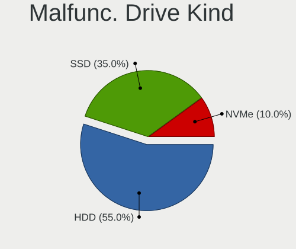

| Kind | Computers | Drives | Percent |
|------|-----------|--------|---------|
| HDD  | 11        | 15     | 55%     |
| SSD  | 7         | 7      | 35%     |
| NVMe | 2         | 2      | 10%     |

Failed Drives
-------------

Failed drive models

Zero info for selected period =(

Failed Drive Vendor
-------------------

Failed drive vendors

Zero info for selected period =(

Drive Status
------------

Number of failed and malfunc. drives

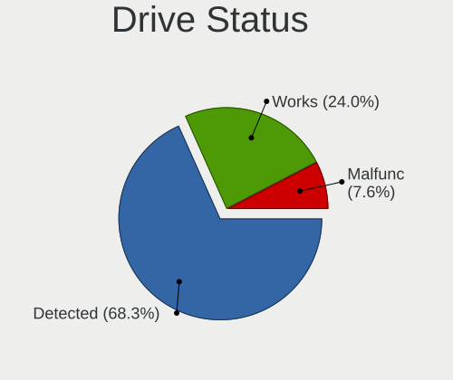

| Status   | Computers | Drives | Percent |
|----------|-----------|--------|---------|
| Detected | 179       | 491    | 68.32%  |
| Works    | 63        | 110    | 24.05%  |
| Malfunc  | 20        | 24     | 7.63%   |

Storage controller
------------------

Storage Vendor
--------------

Storage controller vendors

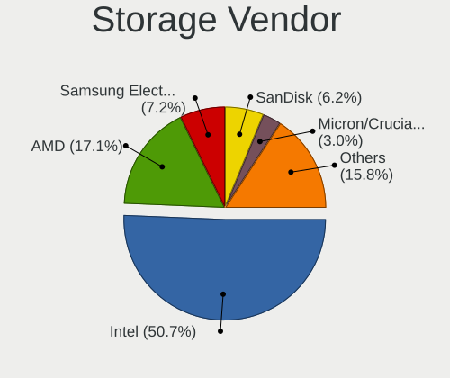

| Vendor                       | Computers | Percent |
|------------------------------|-----------|---------|
| Intel                        | 154       | 50.66%  |
| AMD                          | 52        | 17.11%  |
| Samsung Electronics          | 22        | 7.24%   |
| SanDisk                      | 19        | 6.25%   |
| Micron/Crucial Technology    | 9         | 2.96%   |
| SK hynix                     | 8         | 2.63%   |
| Phison Electronics           | 8         | 2.63%   |
| Silicon Motion               | 6         | 1.97%   |
| Micron Technology            | 5         | 1.64%   |
| Nvidia                       | 4         | 1.32%   |
| Realtek Semiconductor        | 3         | 0.99%   |
| MAXIO Technology (Hangzhou)  | 3         | 0.99%   |
| Kingston Technology Company  | 2         | 0.66%   |
| ASMedia Technology           | 2         | 0.66%   |
| ADATA Technology             | 2         | 0.66%   |
| Toshiba America Info Systems | 1         | 0.33%   |
| Seagate Technology           | 1         | 0.33%   |
| INNOGRIT                     | 1         | 0.33%   |
| Biwin Storage Technology     | 1         | 0.33%   |
| Apple                        | 1         | 0.33%   |

Storage Model
-------------

Storage controller models

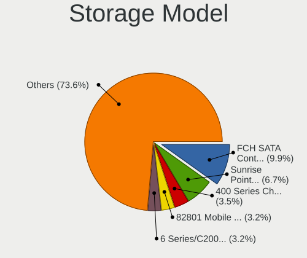

| Model                                                                            | Computers | Percent |
|----------------------------------------------------------------------------------|-----------|---------|
| AMD FCH SATA Controller [AHCI mode]                                              | 34        | 9.86%   |
| Intel Sunrise Point-LP SATA Controller [AHCI mode]                               | 23        | 6.67%   |
| AMD 400 Series Chipset SATA Controller                                           | 12        | 3.48%   |
| Intel 82801 Mobile SATA Controller [RAID mode]                                   | 11        | 3.19%   |
| Intel 6 Series/C200 Series Chipset Family 6 port Mobile SATA AHCI Controller     | 11        | 3.19%   |
| Intel SATA Controller [RAID mode]                                                | 9         | 2.61%   |
| Intel Celeron/Pentium Silver Processor SATA Controller                           | 8         | 2.32%   |
| Intel 8 Series/C220 Series Chipset Family 6-port SATA Controller 1 [AHCI mode]   | 8         | 2.32%   |
| SanDisk WD SN560/SN740/SN770/SN5000 NVMe SSD                                     | 7         | 2.03%   |
| Samsung NVMe SSD Controller SM981/PM981/PM983                                    | 7         | 2.03%   |
| Micron/Crucial P2 [Nick P2] / P3 / P3 Plus NVMe PCIe SSD (DRAM-less)             | 7         | 2.03%   |
| Intel 7 Series Chipset Family 6-port SATA Controller [AHCI mode]                 | 7         | 2.03%   |
| Silicon Motion SM2263EN/SM2263XT (DRAM-less) NVMe SSD Controllers                | 6         | 1.74%   |
| Samsung NVMe SSD Controller SM961/PM961/SM963                                    | 5         | 1.45%   |
| Intel Cannon Lake PCH SATA AHCI Controller                                       | 5         | 1.45%   |
| Intel Atom Processor E3800 Series SATA AHCI Controller                           | 5         | 1.45%   |
| Intel 8 Series SATA Controller 1 [AHCI mode]                                     | 5         | 1.45%   |
| AMD 500 Series Chipset SATA Controller                                           | 5         | 1.45%   |
| SK hynix BC501 NVMe Solid State Drive                                            | 4         | 1.16%   |
| SanDisk Ultra 3D / WD Blue SN570 NVMe SSD (DRAM-less)                            | 4         | 1.16%   |
| Phison E12 NVMe Controller                                                       | 4         | 1.16%   |
| Intel Wildcat Point-LP SATA Controller [AHCI Mode]                               | 4         | 1.16%   |
| Intel Volume Management Device NVMe RAID Controller                              | 4         | 1.16%   |
| Intel Cannon Lake Mobile PCH SATA AHCI Controller                                | 4         | 1.16%   |
| Intel 7 Series/C210 Series Chipset Family 6-port SATA Controller [AHCI mode]     | 4         | 1.16%   |
| AMD FCH IDE Controller                                                           | 4         | 1.16%   |
| AMD 600 Series Chipset SATA Controller                                           | 4         | 1.16%   |
| SanDisk Ultra 3D / WD PC SN530, IX SN530, Blue SN550 NVMe SSD (DRAM-less)        | 3         | 0.87%   |
| SanDisk Extreme Pro / WD Black SN750 / PC SN730 / Red SN700 NVMe SSD             | 3         | 0.87%   |
| Samsung NVMe SSD Controller PM9B1 (DRAM-less)                                    | 3         | 0.87%   |
| Samsung NVMe SSD Controller PM9A1/PM9A3/980PRO                                   | 3         | 0.87%   |
| Intel NM10/ICH7 Family SATA Controller [IDE mode]                                | 3         | 0.87%   |
| Intel Atom/Celeron/Pentium Processor x5-E8000/J3xxx/N3xxx Series SATA Controller | 3         | 0.87%   |
| Intel 82801IBM/IEM (ICH9M/ICH9M-E) 4 port SATA Controller [AHCI mode]            | 3         | 0.87%   |
| Intel 82801G (ICH7 Family) IDE Controller                                        | 3         | 0.87%   |
| Intel 500 Series Chipset Family SATA AHCI Controller                             | 3         | 0.87%   |
| Intel 5 Series/3400 Series Chipset 6 port SATA AHCI Controller                   | 3         | 0.87%   |
| Intel 4 Series Chipset PT IDER Controller                                        | 3         | 0.87%   |
| AMD FCH SATA Controller [IDE mode]                                               | 3         | 0.87%   |
| SK hynix PC401 NVMe Solid State Drive 256GB                                      | 2         | 0.58%   |

Storage Kind
------------

Kind of storage controller (IDE, SATA, NVMe, SAS, ...)

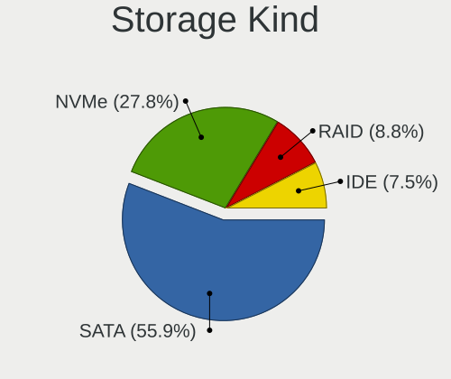

| Kind | Computers | Percent |
|------|-----------|---------|
| SATA | 171       | 55.88%  |
| NVMe | 85        | 27.78%  |
| RAID | 27        | 8.82%   |
| IDE  | 23        | 7.52%   |

Processor
---------

CPU Vendor
----------

Processor vendors

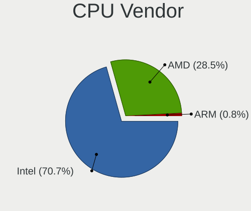

| Vendor | Computers | Percent |
|--------|-----------|---------|
| Intel  | 171       | 70.66%  |
| AMD    | 69        | 28.51%  |
| ARM    | 2         | 0.83%   |

CPU Model
---------

Processor models

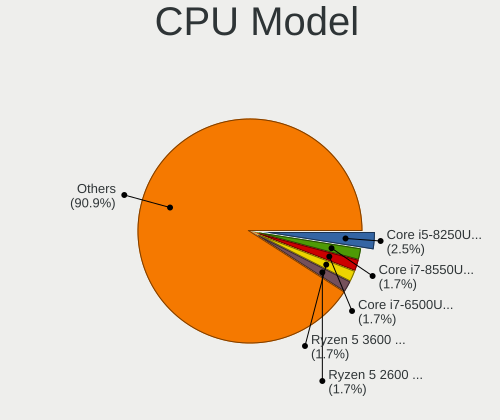

| Model                                       | Computers | Percent |
|---------------------------------------------|-----------|---------|
| Intel Core i5-8250U CPU @ 1.60GHz           | 6         | 2.48%   |
| Intel Core i7-8550U CPU @ 1.80GHz           | 4         | 1.65%   |
| Intel Core i7-6500U CPU @ 2.50GHz           | 4         | 1.65%   |
| AMD Ryzen 5 3600 6-Core Processor           | 4         | 1.65%   |
| AMD Ryzen 5 2600 Six-Core Processor         | 4         | 1.65%   |
| AMD Custom APU 0405                         | 4         | 1.65%   |
| Intel Pentium Silver N5000 CPU @ 1.10GHz    | 3         | 1.24%   |
| Intel Core i7-8700 CPU @ 3.20GHz            | 3         | 1.24%   |
| Intel Core i7-8565U CPU @ 1.80GHz           | 3         | 1.24%   |
| Intel Core i5-5200U CPU @ 2.20GHz           | 3         | 1.24%   |
| Intel Core i5-2430M CPU @ 2.40GHz           | 3         | 1.24%   |
| Intel Celeron CPU J1900 @ 1.99GHz           | 3         | 1.24%   |
| Intel Celeron CPU 3865U @ 1.80GHz           | 3         | 1.24%   |
| Intel 13th Gen Core i9-13900H               | 3         | 1.24%   |
| Intel 11th Gen Core i5-11400 @ 2.60GHz      | 3         | 1.24%   |
| Intel 11th Gen Core i5-1135G7 @ 2.40GHz     | 3         | 1.24%   |
| AMD Ryzen 7 3700X 8-Core Processor          | 3         | 1.24%   |
| Intel Pentium Silver N5030 CPU @ 1.10GHz    | 2         | 0.83%   |
| Intel Pentium Dual-Core CPU E5300 @ 2.60GHz | 2         | 0.83%   |
| Intel Pentium CPU N3710 @ 1.60GHz           | 2         | 0.83%   |
| Intel Pentium CPU N3540 @ 2.16GHz           | 2         | 0.83%   |
| Intel Core i7-9750H CPU @ 2.60GHz           | 2         | 0.83%   |
| Intel Core i7-2640M CPU @ 2.80GHz           | 2         | 0.83%   |
| Intel Core i5-9500 CPU @ 3.00GHz            | 2         | 0.83%   |
| Intel Core i5-9300H CPU @ 2.40GHz           | 2         | 0.83%   |
| Intel Core i5-7300U CPU @ 2.60GHz           | 2         | 0.83%   |
| Intel Core i5-6200U CPU @ 2.30GHz           | 2         | 0.83%   |
| Intel Core i5-2520M CPU @ 2.50GHz           | 2         | 0.83%   |
| Intel Core i5-10210U CPU @ 1.60GHz          | 2         | 0.83%   |
| Intel Core i3-7100U CPU @ 2.40GHz           | 2         | 0.83%   |
| Intel Core i3-6100U CPU @ 2.30GHz           | 2         | 0.83%   |
| Intel Core i3-4020Y CPU @ 1.50GHz           | 2         | 0.83%   |
| Intel Core i3-3240 CPU @ 3.40GHz            | 2         | 0.83%   |
| Intel Core i3-1005G1 CPU @ 1.20GHz          | 2         | 0.83%   |
| Intel Core 2 Duo CPU T9400 @ 2.53GHz        | 2         | 0.83%   |
| Intel Core 2 Duo CPU E8400 @ 3.00GHz        | 2         | 0.83%   |
| Intel Celeron CPU E1200 @ 1.60GHz           | 2         | 0.83%   |
| Intel 11th Gen Core i7-1165G7 @ 2.80GHz     | 2         | 0.83%   |
| ARM Processor                               | 2         | 0.83%   |
| AMD Ryzen 7 5700X3D 8-Core Processor        | 2         | 0.83%   |

CPU Model Family
----------------

Processor model prefix

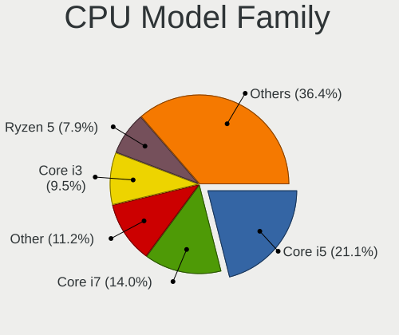

| Model                   | Computers | Percent |
|-------------------------|-----------|---------|
| Intel Core i5           | 51        | 21.07%  |
| Intel Core i7           | 34        | 14.05%  |
| Other                   | 27        | 11.16%  |
| Intel Core i3           | 23        | 9.5%    |
| AMD Ryzen 5             | 19        | 7.85%   |
| Intel Celeron           | 18        | 7.44%   |
| AMD Ryzen 7             | 13        | 5.37%   |
| Intel Core 2 Duo        | 10        | 4.13%   |
| Intel Pentium           | 7         | 2.89%   |
| Intel Pentium Silver    | 6         | 2.48%   |
| AMD Ryzen 3             | 5         | 2.07%   |
| AMD A8                  | 5         | 2.07%   |
| AMD A6                  | 4         | 1.65%   |
| Intel Pentium Dual-Core | 2         | 0.83%   |
| Intel Genuine           | 2         | 0.83%   |
| AMD Ryzen 9             | 2         | 0.83%   |
| AMD E2                  | 2         | 0.83%   |
| AMD A10                 | 2         | 0.83%   |
| Intel Core 2            | 1         | 0.41%   |
| AMD Ryzen Threadripper  | 1         | 0.41%   |
| AMD Ryzen 3 PRO         | 1         | 0.41%   |
| AMD Phenom II X4        | 1         | 0.41%   |
| AMD G                   | 1         | 0.41%   |
| AMD FX                  | 1         | 0.41%   |
| AMD Athlon X4           | 1         | 0.41%   |
| AMD Athlon Dual Core    | 1         | 0.41%   |
| AMD Athlon 64 X2        | 1         | 0.41%   |
| AMD Athlon              | 1         | 0.41%   |

CPU Cores
---------

Number of processor cores

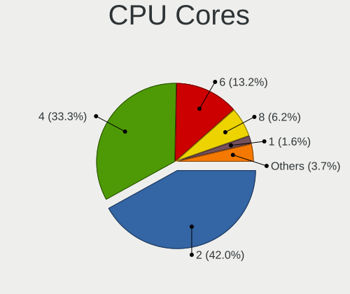

| Number | Computers | Percent |
|--------|-----------|---------|
| 2      | 102       | 41.98%  |
| 4      | 81        | 33.33%  |
| 6      | 32        | 13.17%  |
| 8      | 15        | 6.17%   |
| 1      | 4         | 1.65%   |
| 14     | 3         | 1.23%   |
| 12     | 3         | 1.23%   |
| 16     | 2         | 0.82%   |
| 10     | 1         | 0.41%   |

CPU Sockets
-----------

Number of sockets

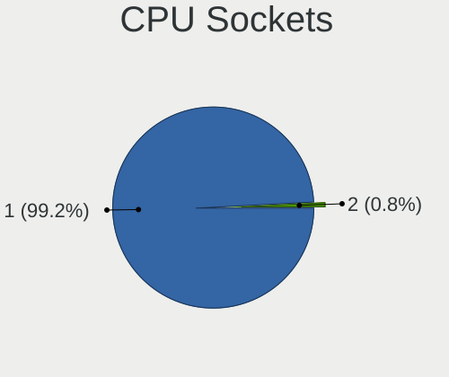

| Number | Computers | Percent |
|--------|-----------|---------|
| 1      | 240       | 99.17%  |
| 2      | 2         | 0.83%   |

CPU Threads
-----------

Threads per core (Hyper-Threading)

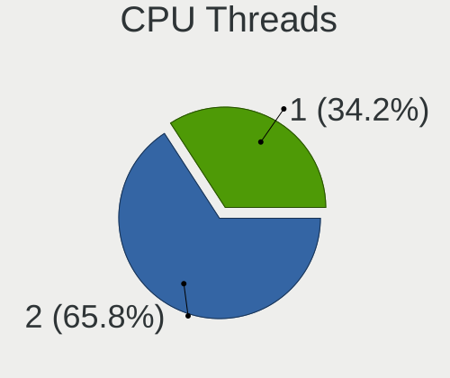

| Number | Computers | Percent |
|--------|-----------|---------|
| 2      | 160       | 65.84%  |
| 1      | 83        | 34.16%  |

CPU Op-Modes
------------

CPU Operation Modes (32-bit, 64-bit)

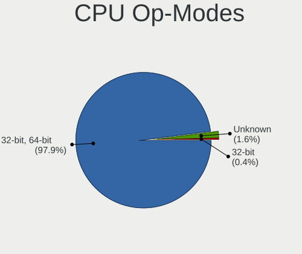

| Op mode        | Computers | Percent |
|----------------|-----------|---------|
| 32-bit, 64-bit | 238       | 97.94%  |
| Unknown        | 4         | 1.65%   |
| 32-bit         | 1         | 0.41%   |

CPU Microcode
-------------

Microcode number

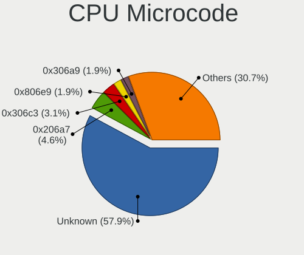

| Number     | Computers | Percent |
|------------|-----------|---------|
| Unknown    | 151       | 57.85%  |
| 0x206a7    | 12        | 4.6%    |
| 0x306c3    | 8         | 3.07%   |
| 0x806e9    | 5         | 1.92%   |
| 0x306a9    | 5         | 1.92%   |
| 0x706a1    | 4         | 1.53%   |
| 0x30678    | 4         | 1.53%   |
| 0x20655    | 4         | 1.53%   |
| 0x1067a    | 4         | 1.53%   |
| 0xa0671    | 3         | 1.15%   |
| 0x906ea    | 3         | 1.15%   |
| 0x806ec    | 3         | 1.15%   |
| 0x806ea    | 3         | 1.15%   |
| 0x08108109 | 3         | 1.15%   |
| 0x06001119 | 3         | 1.15%   |
| 0x6fd      | 2         | 0.77%   |
| 0x406e3    | 2         | 0.77%   |
| 0x306d4    | 2         | 0.77%   |
| 0x08701021 | 2         | 0.77%   |
| 0x08701013 | 2         | 0.77%   |
| 0x08600106 | 2         | 0.77%   |
| 0x0800820d | 2         | 0.77%   |
| 0x06003106 | 2         | 0.77%   |
| 0xa0652    | 1         | 0.38%   |
| 0x906ed    | 1         | 0.38%   |
| 0x906e9    | 1         | 0.38%   |
| 0x906c0    | 1         | 0.38%   |
| 0x90675    | 1         | 0.38%   |
| 0x806eb    | 1         | 0.38%   |
| 0x806c1    | 1         | 0.38%   |
| 0x706e5    | 1         | 0.38%   |
| 0x6fb      | 1         | 0.38%   |
| 0x6e8      | 1         | 0.38%   |
| 0x506e3    | 1         | 0.38%   |
| 0x506c9    | 1         | 0.38%   |
| 0x406c4    | 1         | 0.38%   |
| 0x406c3    | 1         | 0.38%   |
| 0x40651    | 1         | 0.38%   |
| 0x30679    | 1         | 0.38%   |
| 0x20652    | 1         | 0.38%   |

CPU Microarch
-------------

Microarchitecture

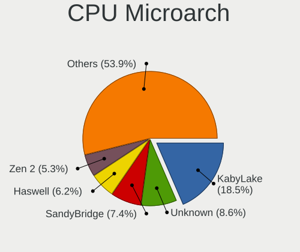

| Name             | Computers | Percent |
|------------------|-----------|---------|
| KabyLake         | 45        | 18.52%  |
| Unknown          | 21        | 8.64%   |
| SandyBridge      | 18        | 7.41%   |
| Haswell          | 15        | 6.17%   |
| Zen 2            | 13        | 5.35%   |
| Skylake          | 12        | 4.94%   |
| Penryn           | 11        | 4.53%   |
| Zen+             | 10        | 4.12%   |
| Silvermont       | 10        | 4.12%   |
| IvyBridge        | 10        | 4.12%   |
| Goldmont plus    | 9         | 3.7%    |
| TigerLake        | 7         | 2.88%   |
| Zen 3            | 6         | 2.47%   |
| Westmere         | 6         | 2.47%   |
| Steamroller      | 5         | 2.06%   |
| IceLake          | 5         | 2.06%   |
| Core             | 5         | 2.06%   |
| Broadwell        | 5         | 2.06%   |
| Alderlake Hybrid | 5         | 2.06%   |
| Zen              | 4         | 1.65%   |
| Piledriver       | 4         | 1.65%   |
| Excavator        | 3         | 1.23%   |
| Bobcat           | 3         | 1.23%   |
| Puma             | 2         | 0.82%   |
| K8 Hammer        | 2         | 0.82%   |
| CometLake        | 2         | 0.82%   |
| Tremont          | 1         | 0.41%   |
| P6               | 1         | 0.41%   |
| K10 Llano        | 1         | 0.41%   |
| K10              | 1         | 0.41%   |
| Goldmont         | 1         | 0.41%   |

Graphics
--------

GPU Vendor
----------

Vendors of graphics cards

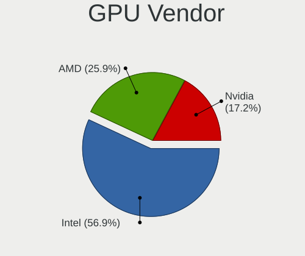

| Vendor | Computers | Percent |
|--------|-----------|---------|
| Intel  | 156       | 56.93%  |
| AMD    | 71        | 25.91%  |
| Nvidia | 47        | 17.15%  |

GPU Model
---------

Graphics card models

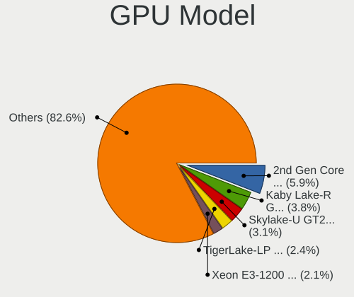

| Model                                                                                    | Computers | Percent |
|------------------------------------------------------------------------------------------|-----------|---------|
| Intel 2nd Generation Core Processor Family Integrated Graphics Controller                | 17        | 5.9%    |
| Intel Kaby Lake-R GT2 [UHD Graphics 620]                                                 | 11        | 3.82%   |
| Intel Skylake-U GT2 [HD Graphics 520]                                                    | 9         | 3.13%   |
| Intel TigerLake-LP GT2 [Iris Xe Graphics]                                                | 7         | 2.43%   |
| Intel Xeon E3-1200 v3/4th Gen Core Processor Integrated Graphics Controller              | 6         | 2.08%   |
| Intel Kaby Lake-U GT2 [HD Graphics 620]                                                  | 6         | 2.08%   |
| Intel Core Processor Integrated Graphics Controller                                      | 6         | 2.08%   |
| Intel Atom Processor Z36xxx/Z37xxx Series Graphics & Display                             | 6         | 2.08%   |
| Intel GeminiLake [UHD Graphics 605]                                                      | 5         | 1.74%   |
| Intel CoffeeLake-S GT2 [UHD Graphics 630]                                                | 5         | 1.74%   |
| Intel CoffeeLake-H GT2 [UHD Graphics 630]                                                | 5         | 1.74%   |
| Intel 3rd Gen Core processor Graphics Controller                                         | 5         | 1.74%   |
| AMD Renoir [Radeon Vega Series / Radeon Vega Mobile Series]                              | 5         | 1.74%   |
| AMD Raphael                                                                              | 5         | 1.74%   |
| AMD Picasso/Raven 2 [Radeon Vega Series / Radeon Vega Mobile Series]                     | 5         | 1.74%   |
| AMD Ellesmere [Radeon RX 470/480/570/570X/580/580X/590]                                  | 5         | 1.74%   |
| Intel WhiskeyLake-U GT2 [UHD Graphics 620]                                               | 4         | 1.39%   |
| Intel Kaby Lake-U GT1 [HD Graphics 610]                                                  | 4         | 1.39%   |
| Intel GeminiLake [UHD Graphics 600]                                                      | 4         | 1.39%   |
| Intel Broadwell-U GT2 [HD Graphics 5500]                                                 | 4         | 1.39%   |
| Intel Atom/Celeron/Pentium Processor x5-E8000/J3xxx/N3xxx Integrated Graphics Controller | 4         | 1.39%   |
| Intel 4 Series Chipset Integrated Graphics Controller                                    | 4         | 1.39%   |
| AMD VanGogh [AMD Custom GPU 0405]                                                        | 4         | 1.39%   |
| Intel Raptor Lake-P [Iris Xe Graphics]                                                   | 3         | 1.04%   |
| Intel Mobile 4 Series Chipset Integrated Graphics Controller                             | 3         | 1.04%   |
| Intel Iris Plus Graphics G1 (Ice Lake)                                                   | 3         | 1.04%   |
| Intel Haswell-ULT Integrated Graphics Controller                                         | 3         | 1.04%   |
| Intel CometLake-U GT2 [UHD Graphics]                                                     | 3         | 1.04%   |
| Intel 4th Gen Core Processor Integrated Graphics Controller                              | 3         | 1.04%   |
| AMD Whistler [Radeon HD 6630M/6650M/6750M/7670M/7690M]                                   | 3         | 1.04%   |
| AMD Navi 10 [Radeon RX 5600 OEM/5600 XT / 5700/5700 XT]                                  | 3         | 1.04%   |
| AMD Cezanne [Radeon Vega Series / Radeon Vega Mobile Series]                             | 3         | 1.04%   |
| Nvidia TU117M [GeForce GTX 1650 Mobile / Max-Q]                                          | 2         | 0.69%   |
| Nvidia TU116M [GeForce GTX 1660 Ti Mobile]                                               | 2         | 0.69%   |
| Nvidia TU106 [GeForce RTX 2060 SUPER]                                                    | 2         | 0.69%   |
| Nvidia GP108M [GeForce MX250]                                                            | 2         | 0.69%   |
| Nvidia GP107 [GeForce GTX 1050]                                                          | 2         | 0.69%   |
| Nvidia GP107 [GeForce GTX 1050 Ti]                                                       | 2         | 0.69%   |
| Nvidia GP106 [GeForce GTX 1060 6GB]                                                      | 2         | 0.69%   |
| Nvidia GP102 [GeForce GTX 1080 Ti]                                                       | 2         | 0.69%   |

GPU Combo
---------

Combinations of graphics cards

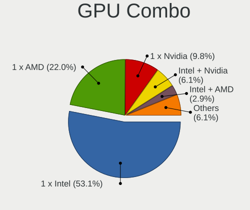

| Name               | Computers | Percent |
|--------------------|-----------|---------|
| 1 x Intel          | 130       | 53.06%  |
| 1 x AMD            | 54        | 22.04%  |
| 1 x Nvidia         | 24        | 9.8%    |
| Intel + Nvidia     | 15        | 6.12%   |
| Intel + AMD        | 7         | 2.86%   |
| 2 x AMD            | 5         | 2.04%   |
| AMD + Nvidia       | 5         | 2.04%   |
| Other              | 2         | 0.82%   |
| Intel + 2 x Nvidia | 2         | 0.82%   |
| 2 x Nvidia         | 1         | 0.41%   |

GPU Driver
----------

Free vs proprietary

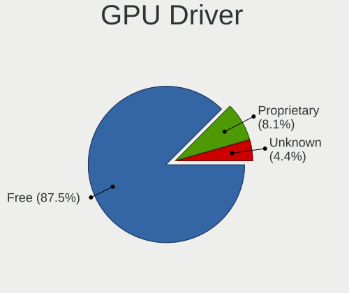

| Driver      | Computers | Percent |
|-------------|-----------|---------|
| Free        | 217       | 87.5%   |
| Proprietary | 20        | 8.06%   |
| Unknown     | 11        | 4.44%   |

GPU Memory
----------

Total video memory

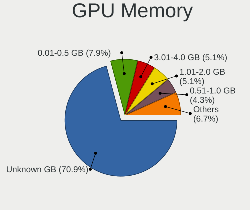

| Size in GB | Computers | Percent |
|------------|-----------|---------|
| Unknown    | 180       | 70.87%  |
| 0.01-0.5   | 20        | 7.87%   |
| 3.01-4.0   | 13        | 5.12%   |
| 1.01-2.0   | 13        | 5.12%   |
| 0.51-1.0   | 11        | 4.33%   |
| 7.01-8.0   | 7         | 2.76%   |
| 5.01-6.0   | 5         | 1.97%   |
| 8.01-16.0  | 3         | 1.18%   |
| 2.01-3.0   | 2         | 0.79%   |

Monitor
-------

Monitor Vendor
--------------

Monitor vendors

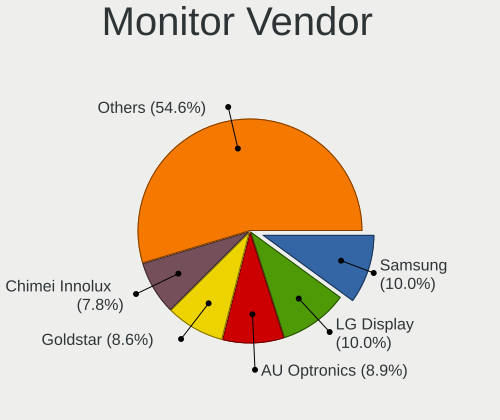

| Vendor                  | Computers | Percent |
|-------------------------|-----------|---------|
| Samsung Electronics     | 27        | 10.04%  |
| LG Display              | 27        | 10.04%  |
| AU Optronics            | 24        | 8.92%   |
| Goldstar                | 23        | 8.55%   |
| Chimei Innolux          | 21        | 7.81%   |
| BOE                     | 21        | 7.81%   |
| Dell                    | 14        | 5.2%    |
| Hewlett-Packard         | 11        | 4.09%   |
| Acer                    | 10        | 3.72%   |
| Apple                   | 8         | 2.97%   |
| Sony                    | 6         | 2.23%   |
| ViewSonic               | 5         | 1.86%   |
| Valve                   | 5         | 1.86%   |
| Sceptre Tech            | 5         | 1.86%   |
| MSI                     | 5         | 1.86%   |
| AOC                     | 5         | 1.86%   |
| Vizio                   | 4         | 1.49%   |
| PANDA                   | 4         | 1.49%   |
| Lenovo                  | 3         | 1.12%   |
| Gateway                 | 3         | 1.12%   |
| Element                 | 3         | 1.12%   |
| ASUSTek Computer        | 3         | 1.12%   |
| VIZ                     | 2         | 0.74%   |
| Unknown                 | 2         | 0.74%   |
| TMA                     | 2         | 0.74%   |
| Tech Concepts           | 2         | 0.74%   |
| Sharp                   | 2         | 0.74%   |
| RTK                     | 2         | 0.74%   |
| eMachines               | 2         | 0.74%   |
| Chi Mei Optoelectronics | 2         | 0.74%   |
| Ancor Communications    | 2         | 0.74%   |
| Unknown (XXX)           | 1         | 0.37%   |
| UGD                     | 1         | 0.37%   |
| Toshiba                 | 1         | 0.37%   |
| TMX                     | 1         | 0.37%   |
| Seiki                   | 1         | 0.37%   |
| SANSUI                  | 1         | 0.37%   |
| ONN                     | 1         | 0.37%   |
| MTK                     | 1         | 0.37%   |
| MStar                   | 1         | 0.37%   |

Monitor Model
-------------

Monitor models

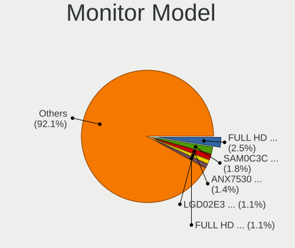

| Model                                                                | Computers | Percent |
|----------------------------------------------------------------------|-----------|---------|
| Goldstar FULL HD GSM5B55 1920x1080 480x270mm 21.7-inch               | 7         | 2.53%   |
| Samsung Electronics LCD Monitor SAM0C3C 1366x768 609x347mm 27.6-inch | 5         | 1.81%   |
| Valve ANX7530 U VLV3001 800x1280 100x150mm 7.1-inch                  | 4         | 1.44%   |
| LG Display LCD Monitor LGD02E3 1366x768 344x194mm 15.5-inch          | 3         | 1.08%   |
| Goldstar FULL HD GSM5B54 1920x1080 480x270mm 21.7-inch               | 3         | 1.08%   |
| Element ELEFW195 ELE1366 1920x1080 410x230mm 18.5-inch               | 3         | 1.08%   |
| Chimei Innolux LCD Monitor CMN1132 1366x768 256x144mm 11.6-inch      | 3         | 1.08%   |
| AU Optronics LCD Monitor AUO21ED 1920x1080 344x193mm 15.5-inch       | 3         | 1.08%   |
| AU Optronics LCD Monitor AUO10EC 1366x768 344x193mm 15.5-inch        | 3         | 1.08%   |
| VIZ LCD Monitor M551d-A2R                                            | 2         | 0.72%   |
| ViewSonic VA2448 SERIES VSC3828 1920x1080 521x293mm 23.5-inch        | 2         | 0.72%   |
| TMA LCD Monitor TMA1200 2160x1440 254x169mm 12.0-inch                | 2         | 0.72%   |
| Sony TV SNY4502 1920x1080                                            | 2         | 0.72%   |
| Sony TV *00 SNY4B04 3840x2160                                        | 2         | 0.72%   |
| Sceptre Tech Sceptre F24 SPT09AB 1920x1080 530x290mm 23.8-inch       | 2         | 0.72%   |
| Samsung Electronics S34J55x SAM0F71 3440x1440 797x333mm 34.0-inch    | 2         | 0.72%   |
| Samsung Electronics LF27T35 SAM707F 1920x1080 598x337mm 27.0-inch    | 2         | 0.72%   |
| Samsung Electronics LCD Monitor SEC5441 1280x800 331x207mm 15.4-inch | 2         | 0.72%   |
| Samsung Electronics C32F391 SAM0D35 1920x1080 698x393mm 31.5-inch    | 2         | 0.72%   |
| LG Display LCD Monitor LGD0573 1920x1080 344x194mm 15.5-inch         | 2         | 0.72%   |
| Hewlett-Packard L2105tm HWP2863 1920x1080 477x268mm 21.5-inch        | 2         | 0.72%   |
| Hewlett-Packard 22cwa HWP3183 1920x1080 476x268mm 21.5-inch          | 2         | 0.72%   |
| Goldstar ULTRAGEAR GSM5B70 1920x1080 531x298mm 24.0-inch             | 2         | 0.72%   |
| Gateway LCD Monitor FHX2300                                          | 2         | 0.72%   |
| Gateway FHX2300 GWY00BF 1920x1080 509x286mm 23.0-inch                | 2         | 0.72%   |
| eMachines E19T6W EMA0783 1440x900 410x257mm 19.1-inch                | 2         | 0.72%   |
| Dell SE2419H DELF109 1920x1080 527x296mm 23.8-inch                   | 2         | 0.72%   |
| Dell S2721H DEL41F6 1920x1080 598x336mm 27.0-inch                    | 2         | 0.72%   |
| Dell DELLSE2216HV DELF072 1920x1080 480x270mm 21.7-inch              | 2         | 0.72%   |
| Chimei Innolux LCD Monitor CMN15CC 1366x768 344x193mm 15.5-inch      | 2         | 0.72%   |
| Chimei Innolux LCD Monitor CMN1495 1366x768 309x173mm 13.9-inch      | 2         | 0.72%   |
| AU Optronics LCD Monitor AUO22EC 1366x768 344x193mm 15.5-inch        | 2         | 0.72%   |
| ASUSTek Computer VA24D AUS2403 1920x1080 527x296mm 23.8-inch         | 2         | 0.72%   |
| Acer LCD Monitor G236HL 5760x1080                                    | 2         | 0.72%   |
| Vizio E600i-B3 VIZ1006 1920x1080 1329x748mm 60.0-inch                | 1         | 0.36%   |
| Vizio E260MV VIZ0062 1920x1080 509x286mm 23.0-inch                   | 1         | 0.36%   |
| Vizio D43f-F1 VIZ1027 1920x1080 940x529mm 42.5-inch                  | 1         | 0.36%   |
| Vizio D24-D1 VIZ1005 1920x1080 521x293mm 23.5-inch                   | 1         | 0.36%   |
| ViewSonic VX2453 Series VSC0C28 1920x1080 520x290mm 23.4-inch        | 1         | 0.36%   |
| ViewSonic VG930m-3 VSC991E 1280x1024 376x301mm 19.0-inch             | 1         | 0.36%   |

Monitor Resolution
------------------

Monitor screen resolution

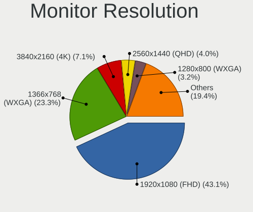

| Resolution         | Computers | Percent |
|--------------------|-----------|---------|
| 1920x1080 (FHD)    | 109       | 43.08%  |
| 1366x768 (WXGA)    | 59        | 23.32%  |
| 3840x2160 (4K)     | 18        | 7.11%   |
| 2560x1440 (QHD)    | 10        | 3.95%   |
| 1280x800 (WXGA)    | 8         | 3.16%   |
| 1600x900 (HD+)     | 6         | 2.37%   |
| 1440x900 (WXGA+)   | 6         | 2.37%   |
| 800x1280           | 5         | 1.98%   |
| 1280x1024 (SXGA)   | 4         | 1.58%   |
| 3440x1440          | 3         | 1.19%   |
| 2560x1600          | 3         | 1.19%   |
| 2560x1080          | 3         | 1.19%   |
| 2160x1440          | 3         | 1.19%   |
| 1920x1200 (WUXGA)  | 3         | 1.19%   |
| 5760x1080          | 2         | 0.79%   |
| Unknown            | 2         | 0.79%   |
| 3840x1080          | 1         | 0.4%    |
| 3200x1800 (QHD+)   | 1         | 0.4%    |
| 2880x1920          | 1         | 0.4%    |
| 2288x1287          | 1         | 0.4%    |
| 2256x1504          | 1         | 0.4%    |
| 1680x1050 (WSXGA+) | 1         | 0.4%    |
| 1600x2560          | 1         | 0.4%    |
| 1360x768           | 1         | 0.4%    |
| 1280x720 (HD)      | 1         | 0.4%    |

Monitor Diagonal
----------------

Diagonal size in inches

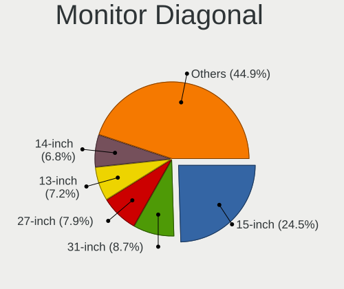

| Inches  | Computers | Percent |
|---------|-----------|---------|
| 15      | 65        | 24.53%  |
| 31      | 23        | 8.68%   |
| 27      | 21        | 7.92%   |
| 13      | 19        | 7.17%   |
| 14      | 18        | 6.79%   |
| 23      | 16        | 6.04%   |
| 21      | 13        | 4.91%   |
| 17      | 13        | 4.91%   |
| 72      | 11        | 4.15%   |
| 24      | 8         | 3.02%   |
| 11      | 7         | 2.64%   |
| 19      | 6         | 2.26%   |
| 34      | 5         | 1.89%   |
| 7       | 5         | 1.89%   |
| Unknown | 5         | 1.89%   |
| 20      | 4         | 1.51%   |
| 18      | 4         | 1.51%   |
| 12      | 4         | 1.51%   |
| 32      | 3         | 1.13%   |
| 16      | 3         | 1.13%   |
| 22      | 2         | 0.75%   |
| 142     | 1         | 0.38%   |
| 84      | 1         | 0.38%   |
| 69      | 1         | 0.38%   |
| 54      | 1         | 0.38%   |
| 52      | 1         | 0.38%   |
| 49      | 1         | 0.38%   |
| 29      | 1         | 0.38%   |
| 26      | 1         | 0.38%   |
| 25      | 1         | 0.38%   |
| 8       | 1         | 0.38%   |

Monitor Width
-------------

Physical width

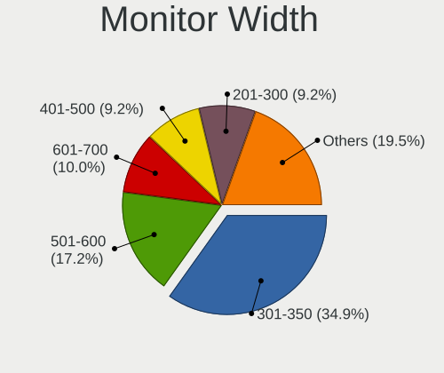

| Width in mm    | Computers | Percent |
|----------------|-----------|---------|
| 301-350        | 91        | 34.87%  |
| 501-600        | 45        | 17.24%  |
| 601-700        | 26        | 9.96%   |
| 401-500        | 24        | 9.2%    |
| 201-300        | 24        | 9.2%    |
| 351-400        | 16        | 6.13%   |
| 1501-2000      | 12        | 4.6%    |
| 701-800        | 8         | 3.07%   |
| 1-100          | 5         | 1.92%   |
| Unknown        | 5         | 1.92%   |
| 1001-1500      | 3         | 1.15%   |
| More than 2000 | 1         | 0.38%   |
| 101-200        | 1         | 0.38%   |

Aspect Ratio
------------

Proportional relationship between the width and the height

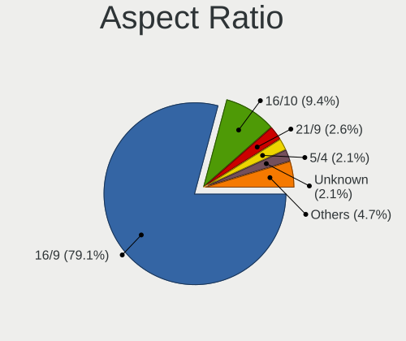

| Ratio   | Computers | Percent |
|---------|-----------|---------|
| 16/9    | 186       | 79.15%  |
| 16/10   | 22        | 9.36%   |
| 21/9    | 6         | 2.55%   |
| 5/4     | 5         | 2.13%   |
| Unknown | 5         | 2.13%   |
| 3/2     | 4         | 1.7%    |
| 0.67    | 4         | 1.7%    |
| 1.00    | 1         | 0.43%   |
| 0.63    | 1         | 0.43%   |
| 0.62    | 1         | 0.43%   |

Monitor Area
------------

Area in inch²

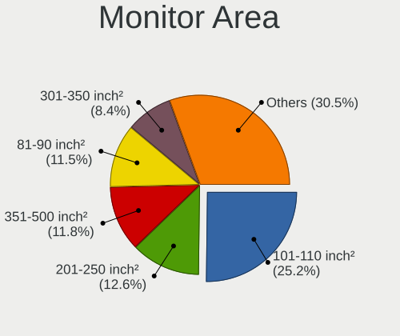

| Area in inch² | Computers | Percent |
|----------------|-----------|---------|
| 101-110        | 66        | 25.19%  |
| 201-250        | 33        | 12.6%   |
| 351-500        | 31        | 11.83%  |
| 81-90          | 30        | 11.45%  |
| 301-350        | 22        | 8.4%    |
| 151-200        | 16        | 6.11%   |
| More than 1000 | 15        | 5.73%   |
| 121-130        | 9         | 3.44%   |
| 71-80          | 7         | 2.67%   |
| 51-60          | 7         | 2.67%   |
| 1-40           | 6         | 2.29%   |
| 141-150        | 6         | 2.29%   |
| Unknown        | 5         | 1.91%   |
| 61-70          | 4         | 1.53%   |
| 251-300        | 2         | 0.76%   |
| 111-120        | 2         | 0.76%   |
| 131-140        | 1         | 0.38%   |

Pixel Density
-------------

Pixels per inch

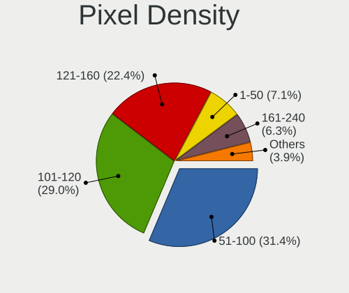

| Density       | Computers | Percent |
|---------------|-----------|---------|
| 51-100        | 80        | 31.37%  |
| 101-120       | 74        | 29.02%  |
| 121-160       | 57        | 22.35%  |
| 1-50          | 18        | 7.06%   |
| 161-240       | 16        | 6.27%   |
| More than 240 | 5         | 1.96%   |
| Unknown       | 5         | 1.96%   |

Multiple Monitors
-----------------

Total monitors connected

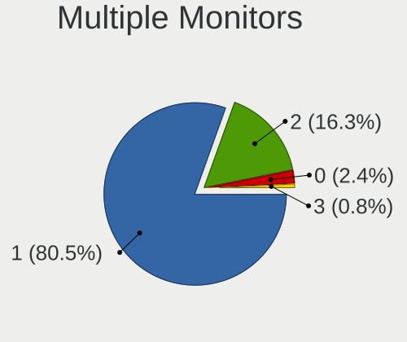

| Total | Computers | Percent |
|-------|-----------|---------|
| 1     | 202       | 80.48%  |
| 2     | 41        | 16.33%  |
| 0     | 6         | 2.39%   |
| 3     | 2         | 0.8%    |

Network
-------

Net Controller Vendor
---------------------

Controller vendors

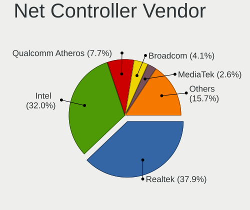

| Vendor                     | Computers | Percent |
|----------------------------|-----------|---------|
| Realtek Semiconductor      | 147       | 37.89%  |
| Intel                      | 124       | 31.96%  |
| Qualcomm Atheros           | 30        | 7.73%   |
| Broadcom                   | 16        | 4.12%   |
| MediaTek                   | 10        | 2.58%   |
| Broadcom Limited           | 7         | 1.8%    |
| Ralink Technology          | 6         | 1.55%   |
| NetGear                    | 6         | 1.55%   |
| ASIX Electronics           | 6         | 1.55%   |
| TP-Link                    | 5         | 1.29%   |
| Samsung Electronics        | 4         | 1.03%   |
| Nvidia                     | 4         | 1.03%   |
| Marvell Technology Group   | 4         | 1.03%   |
| Ralink                     | 3         | 0.77%   |
| U-Blox                     | 2         | 0.52%   |
| Sierra Wireless            | 2         | 0.52%   |
| Aquantia                   | 2         | 0.52%   |
| Shenzhen Goodix Technology | 1         | 0.26%   |
| Razer USA                  | 1         | 0.26%   |
| Qualcomm Technologies      | 1         | 0.26%   |
| Qualcomm                   | 1         | 0.26%   |
| OPPO Electronics           | 1         | 0.26%   |
| Microsoft                  | 1         | 0.26%   |
| Gemtek                     | 1         | 0.26%   |
| Dell                       | 1         | 0.26%   |
| Belkin Components          | 1         | 0.26%   |
| Apple                      | 1         | 0.26%   |

Net Controller Model
--------------------

Controller models

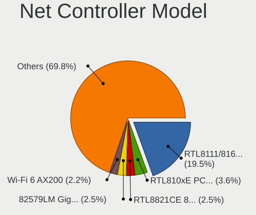

| Model                                                                  | Computers | Percent |
|------------------------------------------------------------------------|-----------|---------|
| Realtek RTL8111/8168/8211/8411 PCI Express Gigabit Ethernet Controller | 87        | 19.46%  |
| Realtek RTL810xE PCI Express Fast Ethernet controller                  | 16        | 3.58%   |
| Realtek RTL8821CE 802.11ac PCIe Wireless Network Adapter               | 11        | 2.46%   |
| Intel 82579LM Gigabit Network Connection (Lewisville)                  | 11        | 2.46%   |
| Intel Wi-Fi 6 AX200                                                    | 10        | 2.24%   |
| Intel Wireless 8265 / 8275                                             | 9         | 2.01%   |
| Realtek RTL88x2bu [AC1200 Techkey]                                     | 8         | 1.79%   |
| Realtek RTL8125 2.5GbE Controller                                      | 7         | 1.57%   |
| Qualcomm Atheros QCA9565 / AR9565 Wireless Network Adapter             | 7         | 1.57%   |
| Intel I211 Gigabit Network Connection                                  | 7         | 1.57%   |
| Intel Dual Band Wireless-AC 3168NGW [Stone Peak]                       | 7         | 1.57%   |
| Realtek RTL8822CE 802.11ac PCIe Wireless Network Adapter               | 6         | 1.34%   |
| Qualcomm Atheros QCA9377 802.11ac Wireless Network Adapter             | 6         | 1.34%   |
| Qualcomm Atheros QCA6174 802.11ac Wireless Network Adapter             | 6         | 1.34%   |
| Intel Wireless 7265                                                    | 6         | 1.34%   |
| MediaTek MT7922 802.11ax PCI Express Wireless Network Adapter          | 5         | 1.12%   |
| Intel Wi-Fi 6 AX201                                                    | 5         | 1.12%   |
| Intel Ethernet Connection I217-LM                                      | 5         | 1.12%   |
| ASIX AX88179 Gigabit Ethernet                                          | 5         | 1.12%   |
| Samsung Galaxy series, misc. (tethering mode)                          | 4         | 0.89%   |
| Realtek RTL8822BE 802.11a/b/g/n/ac WiFi adapter                        | 4         | 0.89%   |
| Realtek RTL8188CE 802.11b/g/n WiFi Adapter                             | 4         | 0.89%   |
| Realtek RTL8153 Gigabit Ethernet Adapter                               | 4         | 0.89%   |
| Realtek 802.11ac NIC                                                   | 4         | 0.89%   |
| Qualcomm Atheros AR9485 Wireless Network Adapter                       | 4         | 0.89%   |
| Intel Wireless 7260                                                    | 4         | 0.89%   |
| Intel Wireless 3160                                                    | 4         | 0.89%   |
| Intel Cannon Lake PCH CNVi WiFi                                        | 4         | 0.89%   |
| Realtek RTL8852AE 802.11ax PCIe Wireless Network Adapter               | 3         | 0.67%   |
| Realtek RTL8188CUS 802.11n WLAN Adapter                                | 3         | 0.67%   |
| Intel Wireless 8260                                                    | 3         | 0.67%   |
| Intel Wireless 3165                                                    | 3         | 0.67%   |
| Intel Wi-Fi 6E(802.11ax) AX210/AX1675* 2x2 [Typhoon Peak]              | 3         | 0.67%   |
| Intel Ethernet Controller I225-V                                       | 3         | 0.67%   |
| Intel Ethernet Connection I219-V                                       | 3         | 0.67%   |
| Intel Ethernet Connection (7) I219-LM                                  | 3         | 0.67%   |
| Intel Centrino Wireless-N 1000 [Condor Peak]                           | 3         | 0.67%   |
| Intel Centrino Advanced-N 6205 [Taylor Peak]                           | 3         | 0.67%   |
| Intel 82577LM Gigabit Network Connection                               | 3         | 0.67%   |
| Intel 82567LM-3 Gigabit Network Connection                             | 3         | 0.67%   |

Wireless Vendor
---------------

Wireless vendors

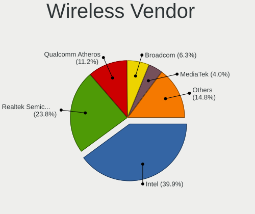

| Vendor                   | Computers | Percent |
|--------------------------|-----------|---------|
| Intel                    | 89        | 39.91%  |
| Realtek Semiconductor    | 53        | 23.77%  |
| Qualcomm Atheros         | 25        | 11.21%  |
| Broadcom                 | 14        | 6.28%   |
| MediaTek                 | 9         | 4.04%   |
| Ralink Technology        | 6         | 2.69%   |
| Broadcom Limited         | 6         | 2.69%   |
| TP-Link                  | 5         | 2.24%   |
| NetGear                  | 4         | 1.79%   |
| Ralink                   | 3         | 1.35%   |
| Sierra Wireless          | 2         | 0.9%    |
| Qualcomm Technologies    | 1         | 0.45%   |
| Qualcomm                 | 1         | 0.45%   |
| Microsoft                | 1         | 0.45%   |
| Marvell Technology Group | 1         | 0.45%   |
| Gemtek                   | 1         | 0.45%   |
| Dell                     | 1         | 0.45%   |
| Belkin Components        | 1         | 0.45%   |

Wireless Model
--------------

Wireless models

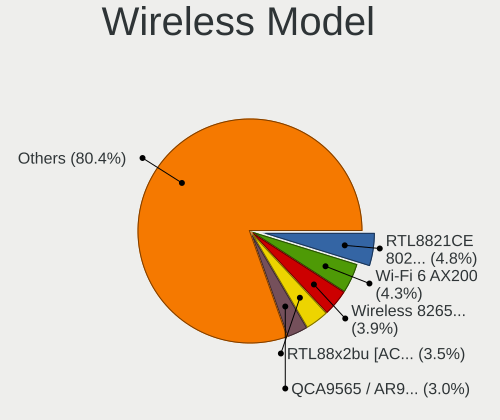

| Model                                                         | Computers | Percent |
|---------------------------------------------------------------|-----------|---------|
| Realtek RTL8821CE 802.11ac PCIe Wireless Network Adapter      | 11        | 4.78%   |
| Intel Wi-Fi 6 AX200                                           | 10        | 4.35%   |
| Intel Wireless 8265 / 8275                                    | 9         | 3.91%   |
| Realtek RTL88x2bu [AC1200 Techkey]                            | 8         | 3.48%   |
| Qualcomm Atheros QCA9565 / AR9565 Wireless Network Adapter    | 7         | 3.04%   |
| Intel Dual Band Wireless-AC 3168NGW [Stone Peak]              | 7         | 3.04%   |
| Realtek RTL8822CE 802.11ac PCIe Wireless Network Adapter      | 6         | 2.61%   |
| Qualcomm Atheros QCA9377 802.11ac Wireless Network Adapter    | 6         | 2.61%   |
| Qualcomm Atheros QCA6174 802.11ac Wireless Network Adapter    | 6         | 2.61%   |
| Intel Wireless 7265                                           | 6         | 2.61%   |
| Intel Wi-Fi 6 AX201                                           | 5         | 2.17%   |
| Realtek RTL8822BE 802.11a/b/g/n/ac WiFi adapter               | 4         | 1.74%   |
| Realtek RTL8188CE 802.11b/g/n WiFi Adapter                    | 4         | 1.74%   |
| Realtek 802.11ac NIC                                          | 4         | 1.74%   |
| Qualcomm Atheros AR9485 Wireless Network Adapter              | 4         | 1.74%   |
| MediaTek MT7922 802.11ax PCI Express Wireless Network Adapter | 4         | 1.74%   |
| Intel Wireless 7260                                           | 4         | 1.74%   |
| Intel Wireless 3160                                           | 4         | 1.74%   |
| Intel Cannon Lake PCH CNVi WiFi                               | 4         | 1.74%   |
| Realtek RTL8852AE 802.11ax PCIe Wireless Network Adapter      | 3         | 1.3%    |
| Realtek RTL8188CUS 802.11n WLAN Adapter                       | 3         | 1.3%    |
| Intel Wireless 8260                                           | 3         | 1.3%    |
| Intel Wireless 3165                                           | 3         | 1.3%    |
| Intel Wi-Fi 6E(802.11ax) AX210/AX1675* 2x2 [Typhoon Peak]     | 3         | 1.3%    |
| Intel Centrino Wireless-N 1000 [Condor Peak]                  | 3         | 1.3%    |
| Intel Centrino Advanced-N 6205 [Taylor Peak]                  | 3         | 1.3%    |
| Broadcom BCM4313 802.11bgn Wireless Network Adapter           | 3         | 1.3%    |
| Sierra Wireless AirPrime MC7455 3G/4G LTE Modem               | 2         | 0.87%   |
| Realtek RTL8723BU 802.11b/g/n WLAN Adapter                    | 2         | 0.87%   |
| Realtek RTL8188FTV 802.11b/g/n 1T1R 2.4G WLAN Adapter         | 2         | 0.87%   |
| Ralink RT2870/RT3070 Wireless Adapter                         | 2         | 0.87%   |
| Ralink MT7601U Wireless Adapter                               | 2         | 0.87%   |
| Ralink RT5390R 802.11bgn PCIe Wireless Network Adapter        | 2         | 0.87%   |
| Qualcomm Atheros AR9462 Wireless Network Adapter              | 2         | 0.87%   |
| Intel Wi-Fi 5(802.11ac) Wireless-AC 9x6x [Thunder Peak]       | 2         | 0.87%   |
| Intel Tiger Lake PCH CNVi WiFi                                | 2         | 0.87%   |
| Intel PRO/Wireless 3945ABG [Golan] Network Connection         | 2         | 0.87%   |
| Intel Comet Lake PCH-LP CNVi WiFi                             | 2         | 0.87%   |
| Intel Comet Lake PCH CNVi WiFi                                | 2         | 0.87%   |
| Intel Centrino Wireless-N 1030 [Rainbow Peak]                 | 2         | 0.87%   |

Ethernet Vendor
---------------

Ethernet vendors

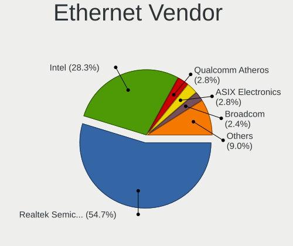

| Vendor                   | Computers | Percent |
|--------------------------|-----------|---------|
| Realtek Semiconductor    | 116       | 54.72%  |
| Intel                    | 60        | 28.3%   |
| Qualcomm Atheros         | 6         | 2.83%   |
| ASIX Electronics         | 6         | 2.83%   |
| Broadcom                 | 5         | 2.36%   |
| Samsung Electronics      | 4         | 1.89%   |
| Nvidia                   | 4         | 1.89%   |
| Marvell Technology Group | 3         | 1.42%   |
| NetGear                  | 2         | 0.94%   |
| Aquantia                 | 2         | 0.94%   |
| OPPO Electronics         | 1         | 0.47%   |
| MediaTek                 | 1         | 0.47%   |
| Broadcom Limited         | 1         | 0.47%   |
| Apple                    | 1         | 0.47%   |

Ethernet Model
--------------

Ethernet models

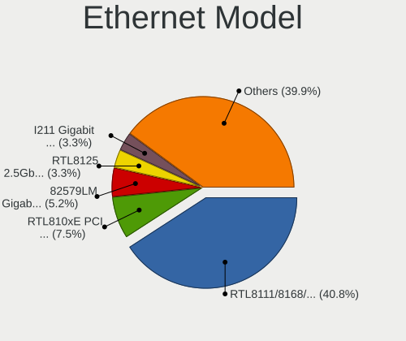

| Model                                                                          | Computers | Percent |
|--------------------------------------------------------------------------------|-----------|---------|
| Realtek RTL8111/8168/8211/8411 PCI Express Gigabit Ethernet Controller         | 87        | 40.85%  |
| Realtek RTL810xE PCI Express Fast Ethernet controller                          | 16        | 7.51%   |
| Intel 82579LM Gigabit Network Connection (Lewisville)                          | 11        | 5.16%   |
| Realtek RTL8125 2.5GbE Controller                                              | 7         | 3.29%   |
| Intel I211 Gigabit Network Connection                                          | 7         | 3.29%   |
| Intel Ethernet Connection I217-LM                                              | 5         | 2.35%   |
| ASIX AX88179 Gigabit Ethernet                                                  | 5         | 2.35%   |
| Samsung Galaxy series, misc. (tethering mode)                                  | 4         | 1.88%   |
| Realtek RTL8153 Gigabit Ethernet Adapter                                       | 4         | 1.88%   |
| Intel Ethernet Controller I225-V                                               | 3         | 1.41%   |
| Intel Ethernet Connection I219-V                                               | 3         | 1.41%   |
| Intel Ethernet Connection (7) I219-LM                                          | 3         | 1.41%   |
| Intel 82577LM Gigabit Network Connection                                       | 3         | 1.41%   |
| Intel 82567LM-3 Gigabit Network Connection                                     | 3         | 1.41%   |
| Qualcomm Atheros Killer E2500 Gigabit Ethernet Controller                      | 2         | 0.94%   |
| Qualcomm Atheros AR8151 v2.0 Gigabit Ethernet                                  | 2         | 0.94%   |
| Nvidia MCP79 Ethernet                                                          | 2         | 0.94%   |
| NetGear LB1120-100NAS                                                          | 2         | 0.94%   |
| Intel Ethernet Controller I226-V                                               | 2         | 0.94%   |
| Intel Ethernet Connection (7) I219-V                                           | 2         | 0.94%   |
| Intel Ethernet Connection (4) I219-LM                                          | 2         | 0.94%   |
| Intel 82579V Gigabit Network Connection                                        | 2         | 0.94%   |
| Broadcom NetXtreme BCM57766 Gigabit Ethernet PCIe                              | 2         | 0.94%   |
| Broadcom NetXtreme BCM57765 Gigabit Ethernet PCIe                              | 2         | 0.94%   |
| Realtek RTL8152 Fast Ethernet Adapter                                          | 1         | 0.47%   |
| Realtek Killer E3000 2.5GbE Controller                                         | 1         | 0.47%   |
| Qualcomm Atheros AR8161 Gigabit Ethernet                                       | 1         | 0.47%   |
| Qualcomm Atheros AR8152 v1.1 Fast Ethernet                                     | 1         | 0.47%   |
| OPPO Ace 3V                                                                    | 1         | 0.47%   |
| Nvidia MCP61 Ethernet                                                          | 1         | 0.47%   |
| Nvidia CK804 Ethernet Controller                                               | 1         | 0.47%   |
| MediaTek MT7922 802.11ax PCI Express Wireless Network Adapter                  | 1         | 0.47%   |
| Marvell Group Yukon Optima 88E8059 [PCIe Gigabit Ethernet Controller with AVB] | 1         | 0.47%   |
| Marvell Group 88E8058 PCI-E Gigabit Ethernet Controller                        | 1         | 0.47%   |
| Marvell Group 88E8040 PCI-E Fast Ethernet Controller                           | 1         | 0.47%   |
| Intel Ethernet Connection I219-LM                                              | 1         | 0.47%   |
| Intel Ethernet Connection I218-LM                                              | 1         | 0.47%   |
| Intel Ethernet Connection (5) I219-V                                           | 1         | 0.47%   |
| Intel Ethernet Connection (5) I219-LM                                          | 1         | 0.47%   |
| Intel Ethernet Connection (4) I219-V                                           | 1         | 0.47%   |

Net Controller Kind
-------------------

Ethernet, WiFi or modem

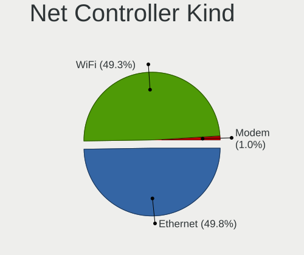

| Kind     | Computers | Percent |
|----------|-----------|---------|
| Ethernet | 203       | 49.75%  |
| WiFi     | 201       | 49.26%  |
| Modem    | 4         | 0.98%   |

Used Controller
---------------

Currently used network controller

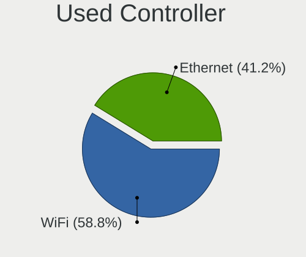

| Kind     | Computers | Percent |
|----------|-----------|---------|
| WiFi     | 151       | 58.75%  |
| Ethernet | 106       | 41.25%  |

NICs
----

Total network controllers on board

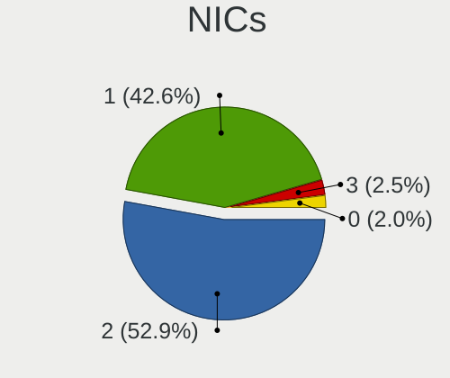

| Total | Computers | Percent |
|-------|-----------|---------|
| 2     | 129       | 52.87%  |
| 1     | 104       | 42.62%  |
| 3     | 6         | 2.46%   |
| 0     | 5         | 2.05%   |

IPv6
----

IPv6 vs IPv4

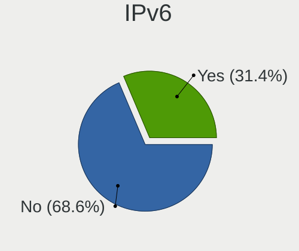

| Used | Computers | Percent |
|------|-----------|---------|
| No   | 175       | 68.63%  |
| Yes  | 80        | 31.37%  |

Bluetooth
---------

Bluetooth Vendor
----------------

Controller vendors

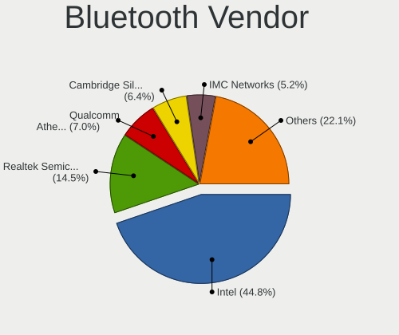

| Vendor                          | Computers | Percent |
|---------------------------------|-----------|---------|
| Intel                           | 77        | 44.77%  |
| Realtek Semiconductor           | 25        | 14.53%  |
| Qualcomm Atheros Communications | 12        | 6.98%   |
| Cambridge Silicon Radio         | 11        | 6.4%    |
| IMC Networks                    | 9         | 5.23%   |
| Foxconn / Hon Hai               | 8         | 4.65%   |
| Apple                           | 7         | 4.07%   |
| Broadcom                        | 5         | 2.91%   |
| MediaTek                        | 4         | 2.33%   |
| Lite-On Technology              | 4         | 2.33%   |
| Dell                            | 3         | 1.74%   |
| Hewlett-Packard                 | 2         | 1.16%   |
| Toshiba                         | 1         | 0.58%   |
| Marvell Semiconductor           | 1         | 0.58%   |
| Dynex                           | 1         | 0.58%   |
| Belkin Components               | 1         | 0.58%   |
| Alps Electric                   | 1         | 0.58%   |

Bluetooth Model
---------------

Controller models

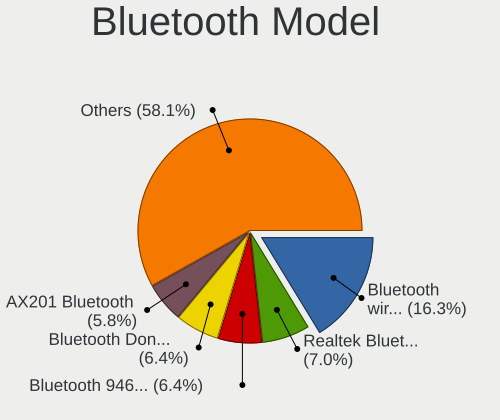

| Model                                                                               | Computers | Percent |
|-------------------------------------------------------------------------------------|-----------|---------|
| Intel Bluetooth wireless interface                                                  | 28        | 16.28%  |
| Realtek  Bluetooth 4.2 Adapter                                                      | 12        | 6.98%   |
| Intel Bluetooth 9460/9560 Jefferson Peak (JfP)                                      | 11        | 6.4%    |
| Cambridge Silicon Radio Bluetooth Dongle (HCI mode)                                 | 11        | 6.4%    |
| Intel AX201 Bluetooth                                                               | 10        | 5.81%   |
| Intel AX200 Bluetooth                                                               | 10        | 5.81%   |
| Realtek Bluetooth Radio                                                             | 9         | 5.23%   |
| Qualcomm Atheros  Bluetooth Device                                                  | 8         | 4.65%   |
| Intel Wireless-AC 3168 Bluetooth                                                    | 7         | 4.07%   |
| Apple Bluetooth Host Controller                                                     | 5         | 2.91%   |
| MediaTek Wireless_Device                                                            | 4         | 2.33%   |
| Intel Centrino Advanced-N 6230 Bluetooth adapter                                    | 4         | 2.33%   |
| IMC Networks Bluetooth Radio                                                        | 4         | 2.33%   |
| Foxconn / Hon Hai Bluetooth Device                                                  | 4         | 2.33%   |
| Qualcomm Atheros QCA61x4 Bluetooth 4.0                                              | 3         | 1.74%   |
| Intel AX210 Bluetooth                                                               | 3         | 1.74%   |
| IMC Networks Wireless_Device                                                        | 3         | 1.74%   |
| Lite-On Qualcomm Atheros QCA9377 Bluetooth                                          | 2         | 1.16%   |
| Lite-On Bluetooth Device                                                            | 2         | 1.16%   |
| Intel Wireless-AC 9260 Bluetooth Adapter                                            | 2         | 1.16%   |
| Intel Bluetooth Device                                                              | 2         | 1.16%   |
| HP Bluetooth 2.0 Interface [Broadcom BCM2045]                                       | 2         | 1.16%   |
| Foxconn / Hon Hai Wireless_Device                                                   | 2         | 1.16%   |
| Broadcom Bluetooth Device                                                           | 2         | 1.16%   |
| Toshiba BCM43142A0                                                                  | 1         | 0.58%   |
| Realtek RTL8822BE Bluetooth 4.2 Adapter                                             | 1         | 0.58%   |
| Realtek RTL8723A Bluetooth                                                          | 1         | 0.58%   |
| Realtek Bluetooth 5.4 Radio                                                         | 1         | 0.58%   |
| Realtek Bluetooth 5.3 Radio                                                         | 1         | 0.58%   |
| Qualcomm Atheros AR9462 Bluetooth                                                   | 1         | 0.58%   |
| Marvell Bluetooth and Wireless LAN Composite Device                                 | 1         | 0.58%   |
| IMC Networks Bluetooth USB Host Controller                                          | 1         | 0.58%   |
| IMC Networks Bluetooth Device                                                       | 1         | 0.58%   |
| Foxconn / Hon Hai Foxconn T77H114 BCM2070 [Single-Chip Bluetooth 2.1 + EDR Adapter] | 1         | 0.58%   |
| Foxconn / Hon Hai Broadcom BCM20702A1 Bluetooth                                     | 1         | 0.58%   |
| Dynex Bluetooth 4.0 Adapter [Broadcom, 1.12, BCM20702A0]                            | 1         | 0.58%   |
| Dell DW375 Bluetooth Module                                                         | 1         | 0.58%   |
| Dell Broadcom BCM20702A0 Bluetooth                                                  | 1         | 0.58%   |
| Dell BCM20702A0 Bluetooth Module                                                    | 1         | 0.58%   |
| Broadcom Bluetooth 3.0 Device                                                       | 1         | 0.58%   |

Sound
-----

Sound Vendor
------------

Sound card vendors

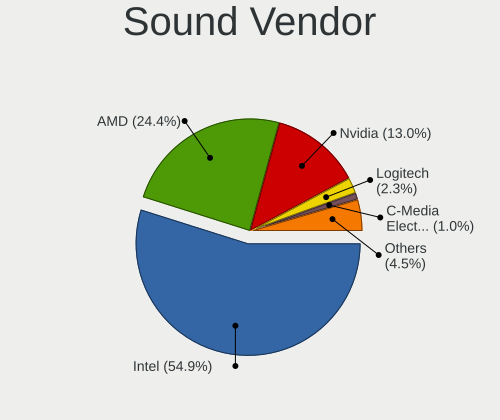

| Vendor                                          | Computers | Percent |
|-------------------------------------------------|-----------|---------|
| Intel                                           | 169       | 54.87%  |
| AMD                                             | 75        | 24.35%  |
| Nvidia                                          | 40        | 12.99%  |
| Logitech                                        | 7         | 2.27%   |
| C-Media Electronics                             | 3         | 0.97%   |
| Micro Star International                        | 2         | 0.65%   |
| Kingston Technology                             | 2         | 0.65%   |
| NZXT                                            | 1         | 0.32%   |
| Nintendo                                        | 1         | 0.32%   |
| M-Audio                                         | 1         | 0.32%   |
| Linux Foundation                                | 1         | 0.32%   |
| Licensed by Sony Computer Entertainment America | 1         | 0.32%   |
| Hewlett-Packard                                 | 1         | 0.32%   |
| Focusrite-Novation                              | 1         | 0.32%   |
| FDUCE PRO AUDIO MADE                            | 1         | 0.32%   |
| Creative Technology                             | 1         | 0.32%   |
| Apple                                           | 1         | 0.32%   |

Sound Model
-----------

Sound card models

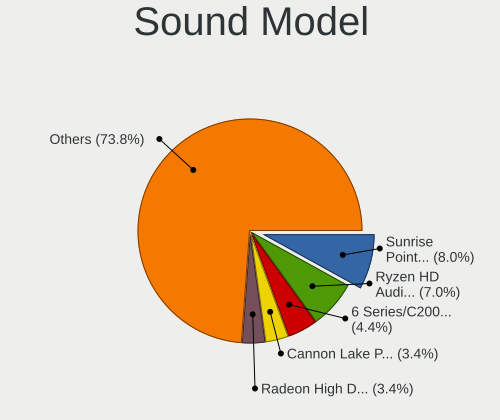

| Model                                                                                             | Computers | Percent |
|---------------------------------------------------------------------------------------------------|-----------|---------|
| Intel Sunrise Point-LP HD Audio                                                                   | 31        | 8.03%   |
| AMD Ryzen HD Audio Controller                                                                     | 27        | 6.99%   |
| Intel 6 Series/C200 Series Chipset Family High Definition Audio Controller                        | 17        | 4.4%    |
| Intel Cannon Lake PCH cAVS                                                                        | 13        | 3.37%   |
| AMD Radeon High Definition Audio Controller                                                       | 13        | 3.37%   |
| AMD FCH Azalia Controller                                                                         | 13        | 3.37%   |
| Intel 7 Series/C216 Chipset Family High Definition Audio Controller                               | 11        | 2.85%   |
| AMD Starship/Matisse HD Audio Controller                                                          | 10        | 2.59%   |
| AMD Renoir/Cezanne HDMI/DP Audio Controller                                                       | 10        | 2.59%   |
| Intel Xeon E3-1200 v3/4th Gen Core Processor HD Audio Controller                                  | 9         | 2.33%   |
| Intel Celeron/Pentium Silver Processor High Definition Audio                                      | 9         | 2.33%   |
| Intel 8 Series/C220 Series Chipset High Definition Audio Controller                               | 8         | 2.07%   |
| Intel Tiger Lake-LP Smart Sound Technology Audio Controller                                       | 7         | 1.81%   |
| AMD Raven/Raven2/Fenghuang HDMI/DP Audio Controller                                               | 7         | 1.81%   |
| Intel Atom Processor Z36xxx/Z37xxx Series High Definition Audio Controller                        | 6         | 1.55%   |
| Intel 5 Series/3400 Series Chipset High Definition Audio                                          | 6         | 1.55%   |
| AMD Navi 21/23 HDMI/DP Audio Controller                                                           | 6         | 1.55%   |
| AMD Family 17h (Models 00h-0fh) HD Audio Controller                                               | 6         | 1.55%   |
| AMD Ellesmere HDMI Audio [Radeon RX 470/480 / 570/580/590]                                        | 6         | 1.55%   |
| Nvidia GP107GL High Definition Audio Controller                                                   | 5         | 1.3%    |
| Intel Wildcat Point-LP High Definition Audio Controller                                           | 5         | 1.3%    |
| Intel NM10/ICH7 Family High Definition Audio Controller                                           | 5         | 1.3%    |
| Intel Haswell-ULT HD Audio Controller                                                             | 5         | 1.3%    |
| Intel Broadwell-U Audio Controller                                                                | 5         | 1.3%    |
| Intel 82801I (ICH9 Family) HD Audio Controller                                                    | 5         | 1.3%    |
| Intel 8 Series HD Audio Controller                                                                | 5         | 1.3%    |
| AMD Navi 10 HDMI Audio                                                                            | 5         | 1.3%    |
| Nvidia TU116 High Definition Audio Controller                                                     | 4         | 1.04%   |
| Nvidia GP106 High Definition Audio Controller                                                     | 4         | 1.04%   |
| Logitech EasyCall Speakerphone                                                                    | 4         | 1.04%   |
| Intel Cannon Point-LP High Definition Audio Controller                                            | 4         | 1.04%   |
| Intel Atom/Celeron/Pentium Processor x5-E8000/J3xxx/N3xxx Series High Definition Audio Controller | 4         | 1.04%   |
| Intel 200 Series PCH HD Audio                                                                     | 4         | 1.04%   |
| Nvidia TU107 GeForce GTX 1650 High Definition Audio Controller                                    | 3         | 0.78%   |
| Nvidia TU106 High Definition Audio Controller                                                     | 3         | 0.78%   |
| Intel Tiger Lake-H HD Audio Controller                                                            | 3         | 0.78%   |
| Intel Raptor Lake-P/U/H cAVS                                                                      | 3         | 0.78%   |
| Intel Ice Lake-LP Smart Sound Technology Audio Controller                                         | 3         | 0.78%   |
| Intel Comet Lake PCH-LP cAVS                                                                      | 3         | 0.78%   |
| Intel 82801JD/DO (ICH10 Family) HD Audio Controller                                               | 3         | 0.78%   |

Memory
------

Memory Vendor
-------------

Memory module vendors

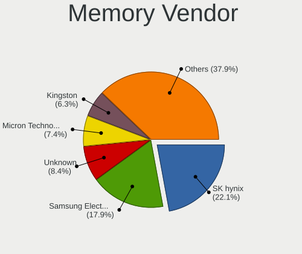

| Vendor              | Computers | Percent |
|---------------------|-----------|---------|
| SK hynix            | 21        | 22.11%  |
| Samsung Electronics | 17        | 17.89%  |
| Unknown             | 8         | 8.42%   |
| Micron Technology   | 7         | 7.37%   |
| Kingston            | 6         | 6.32%   |
| Crucial             | 6         | 6.32%   |
| G.Skill             | 5         | 5.26%   |
| Corsair             | 4         | 4.21%   |
| Team                | 3         | 3.16%   |
| Elpida              | 3         | 3.16%   |
| Ramaxel Technology  | 2         | 2.11%   |
| PNY                 | 2         | 2.11%   |
| A-DATA Technology   | 2         | 2.11%   |
| Wodposit            | 1         | 1.05%   |
| Unknown (D386)      | 1         | 1.05%   |
| Unknown (0x0B45)    | 1         | 1.05%   |
| Silicon Power       | 1         | 1.05%   |
| Sesame              | 1         | 1.05%   |
| Qumo                | 1         | 1.05%   |
| Euronet             | 1         | 1.05%   |
| Avant               | 1         | 1.05%   |
| Unknown             | 1         | 1.05%   |

Memory Model
------------

Memory module models

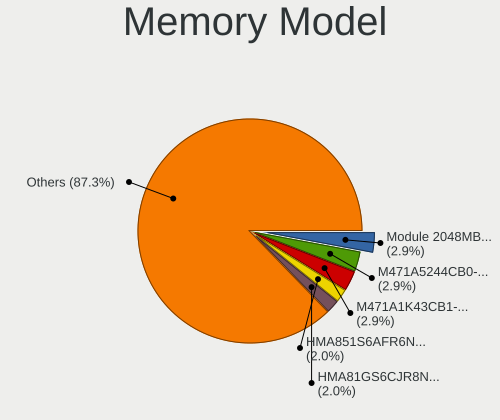

| Model                                                            | Computers | Percent |
|------------------------------------------------------------------|-----------|---------|
| Unknown RAM Module 2048MB DIMM SDRAM                             | 3         | 2.94%   |
| Samsung RAM M471A5244CB0-CWE 4GB SODIMM DDR4 3200MT/s            | 3         | 2.94%   |
| Samsung RAM M471A1K43CB1-CRC 8GB SODIMM DDR4 8400MT/s            | 3         | 2.94%   |
| SK hynix RAM HMA851S6AFR6N-UH 4GB SODIMM DDR4 2667MT/s           | 2         | 1.96%   |
| SK hynix RAM HMA81GS6CJR8N-VK 8GB SODIMM DDR4 2667MT/s           | 2         | 1.96%   |
| Micron RAM 8ATF1G64HZ-3G2R1 8GB SODIMM DDR4 3200MT/s             | 2         | 1.96%   |
| Corsair RAM CMK16GX4M2B3200C16 8GB DIMM DDR4 3600MT/s            | 2         | 1.96%   |
| Wodposit RAM WPBS26D408SWC-8G 8GB SODIMM DDR4 2667MT/s           | 1         | 0.98%   |
| Unknown RAM Module 8GB DIMM DDR3 1333MT/s                        | 1         | 0.98%   |
| Unknown RAM Module 4096MB DIMM 667MT/s                           | 1         | 0.98%   |
| Unknown RAM Module 1GB DIMM                                      | 1         | 0.98%   |
| Unknown RAM CL18-22-22 D4-3600 16384MB DIMM DDR4 3600MT/s        | 1         | 0.98%   |
| Unknown RAM CL18-20-20 D4-3600 8192MB DIMM DDR4 3600MT/s         | 1         | 0.98%   |
| Unknown RAM 3600 C20 Series 32GB DIMM DDR4 3666MT/s              | 1         | 0.98%   |
| Unknown (D386) RAM Module 8GB DIMM DDR4 2667MT/s                 | 1         | 0.98%   |
| Unknown (0x0B45) RAM WPBH32D416SWA-16G 16GB SODIMM DDR4 3200MT/s | 1         | 0.98%   |
| Team RAM TEAMGROUP-UD4-3200 8GB DIMM DDR4 3733MT/s               | 1         | 0.98%   |
| Team RAM TEAMGROUP-UD4-3000 8GB DIMM DDR4 3200MT/s               | 1         | 0.98%   |
| Team RAM TEAMGROUP-SD4-3200 16GB SODIMM DDR4 3200MT/s            | 1         | 0.98%   |
| SK hynix RAM Module 8GB SODIMM DDR4 2400MT/s                     | 1         | 0.98%   |
| SK hynix RAM Module 8GB Row Of Chips LPDDR3 2133MT/s             | 1         | 0.98%   |
| SK hynix RAM Module 8GB DIMM DDR4 3200MT/s                       | 1         | 0.98%   |
| SK hynix RAM Module 4GB SODIMM LPDDR3 2133MT/s                   | 1         | 0.98%   |
| SK hynix RAM Module 2GB SODIMM DDR3 1600MT/s                     | 1         | 0.98%   |
| SK hynix RAM Module 2048MB SODIMM DDR 667MT/s                    | 1         | 0.98%   |
| SK hynix RAM HMT451S6MFR8C-PB 4GB SODIMM DDR3 1600MT/s           | 1         | 0.98%   |
| SK hynix RAM HMT41GS6BFR8A-PB 8GB SODIMM DDR3 1600MT/s           | 1         | 0.98%   |
| SK hynix RAM HMT351U6CFR8C-H9 4GB DIMM DDR3 1333MT/s             | 1         | 0.98%   |
| SK hynix RAM HMT351S6CFR8C-PB 4096MB SODIMM DDR3 1600MT/s        | 1         | 0.98%   |
| SK hynix RAM HMT325U6EFR8C-PB 2GB DIMM DDR3 1600MT/s             | 1         | 0.98%   |
| SK hynix RAM HMT325S6CFR8C-H9 2GB SODIMM DDR3 1333MT/s           | 1         | 0.98%   |
| SK hynix RAM HMAA2GS6CJR8N-XN 16GB SODIMM DDR4 3200MT/s          | 1         | 0.98%   |
| SK hynix RAM HMA851S6DJR6N-XN 4GB SODIMM DDR4 3200MT/s           | 1         | 0.98%   |
| SK hynix RAM HMA851S6AFR6N-UH 4GB SODIMM DDR4 2400MT/s           | 1         | 0.98%   |
| SK hynix RAM HMA82GS6AFR8N-UH 16GB SODIMM DDR4 2667MT/s          | 1         | 0.98%   |
| SK hynix RAM HMA81GS6DJR8N-VK 8GB SODIMM DDR4 2667MT/s           | 1         | 0.98%   |
| SK hynix RAM HMA81GS6CJR8N-XN 8GB SODIMM DDR4 3200MT/s           | 1         | 0.98%   |
| SK hynix RAM H9CCNNN8GTALAR-NUD 2GB LPDDR3 1600MT/s              | 1         | 0.98%   |
| Silicon Power RAM Module 8GB SODIMM DDR3 1600MT/s                | 1         | 0.98%   |
| Sesame RAM S939A2UGS-ITR 8GB DIMM DDR3 3200MT/s                  | 1         | 0.98%   |

Memory Kind
-----------

Memory module kinds

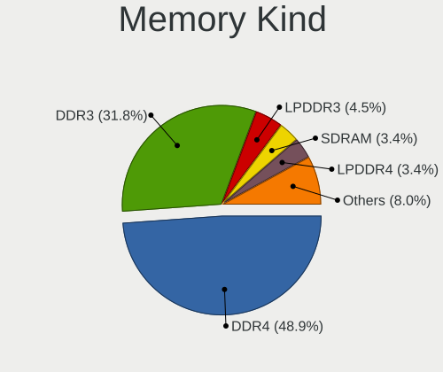

| Kind    | Computers | Percent |
|---------|-----------|---------|
| DDR4    | 43        | 48.86%  |
| DDR3    | 28        | 31.82%  |
| LPDDR3  | 4         | 4.55%   |
| SDRAM   | 3         | 3.41%   |
| LPDDR4  | 3         | 3.41%   |
| LPDDR5  | 2         | 2.27%   |
| Unknown | 2         | 2.27%   |
| DDR5    | 1         | 1.14%   |
| DDR2    | 1         | 1.14%   |
| DDR     | 1         | 1.14%   |

Memory Form Factor
------------------

Physical design of the memory module

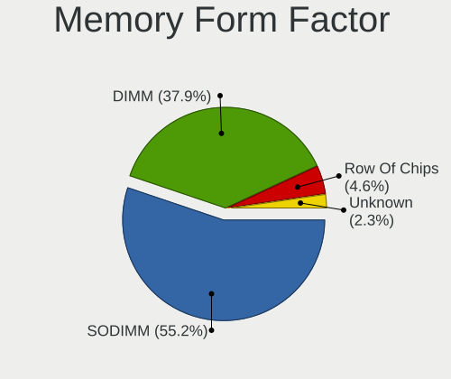

| Name         | Computers | Percent |
|--------------|-----------|---------|
| SODIMM       | 48        | 55.17%  |
| DIMM         | 33        | 37.93%  |
| Row Of Chips | 4         | 4.6%    |
| Unknown      | 2         | 2.3%    |

Memory Size
-----------

Memory module size

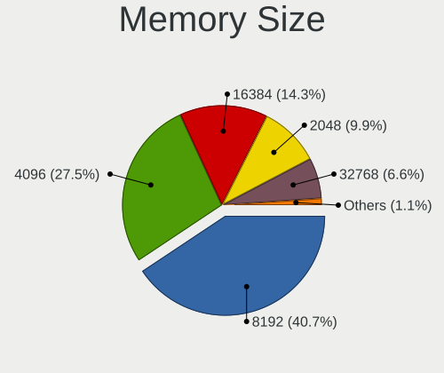

| Size  | Computers | Percent |
|-------|-----------|---------|
| 8192  | 37        | 40.66%  |
| 4096  | 25        | 27.47%  |
| 16384 | 13        | 14.29%  |
| 2048  | 9         | 9.89%   |
| 32768 | 6         | 6.59%   |
| 1024  | 1         | 1.1%    |

Memory Speed
------------

Memory module speed

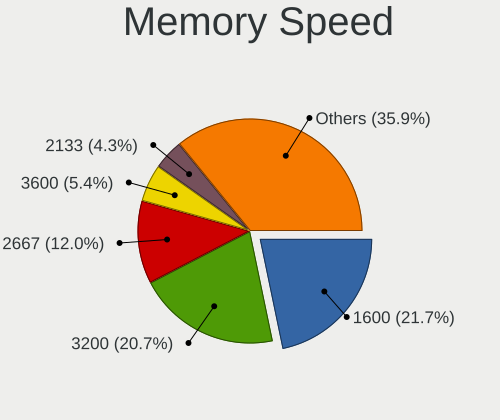

| Speed   | Computers | Percent |
|---------|-----------|---------|
| 1600    | 20        | 21.74%  |
| 3200    | 19        | 20.65%  |
| 2667    | 11        | 11.96%  |
| 3600    | 5         | 5.43%   |
| 2133    | 4         | 4.35%   |
| 1333    | 4         | 4.35%   |
| Unknown | 4         | 4.35%   |
| 8400    | 3         | 3.26%   |
| 2400    | 3         | 3.26%   |
| 1867    | 2         | 2.17%   |
| 667     | 2         | 2.17%   |
| 7500    | 1         | 1.09%   |
| 6400    | 1         | 1.09%   |
| 5600    | 1         | 1.09%   |
| 4267    | 1         | 1.09%   |
| 3733    | 1         | 1.09%   |
| 3666    | 1         | 1.09%   |
| 3533    | 1         | 1.09%   |
| 3266    | 1         | 1.09%   |
| 2666    | 1         | 1.09%   |
| 1866    | 1         | 1.09%   |
| 1334    | 1         | 1.09%   |
| 1200    | 1         | 1.09%   |
| 1067    | 1         | 1.09%   |
| 975     | 1         | 1.09%   |
| 800     | 1         | 1.09%   |

Printers & scanners
-------------------

Printer Vendor
--------------

Printer device vendors

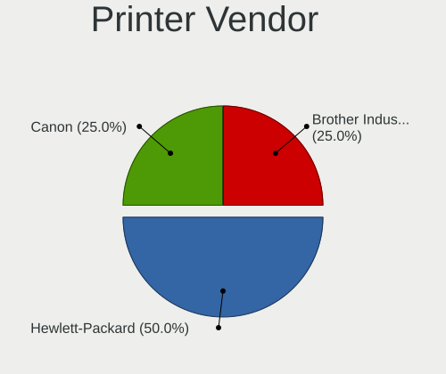

| Vendor             | Computers | Percent |
|--------------------|-----------|---------|
| Hewlett-Packard    | 2         | 50%     |
| Canon              | 1         | 25%     |
| Brother Industries | 1         | 25%     |

Printer Model
-------------

Printer device models

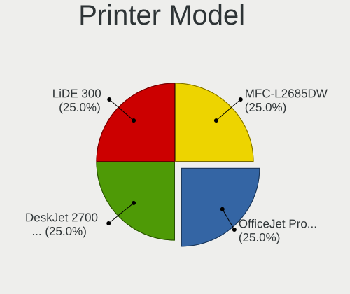

| Model                  | Computers | Percent |
|------------------------|-----------|---------|
| HP OfficeJet Pro 6960  | 1         | 25%     |
| HP DeskJet 2700 series | 1         | 25%     |
| Canon LiDE 300         | 1         | 25%     |
| Brother MFC-L2685DW    | 1         | 25%     |

Scanner Vendor
--------------

Scanner device vendors

Zero info for selected period =(

Scanner Model
-------------

Scanner device models

Zero info for selected period =(

Camera
------

Camera Vendor
-------------

Camera device vendors

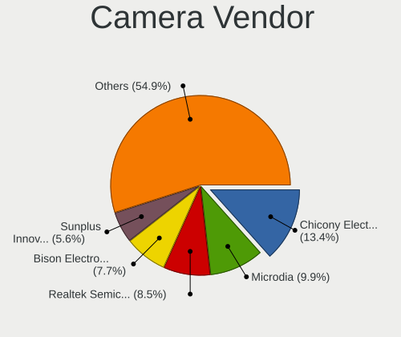

| Vendor                                 | Computers | Percent |
|----------------------------------------|-----------|---------|
| Chicony Electronics                    | 19        | 13.38%  |
| Microdia                               | 14        | 9.86%   |
| Realtek Semiconductor                  | 12        | 8.45%   |
| Bison Electronics                      | 11        | 7.75%   |
| Sunplus Innovation Technology          | 8         | 5.63%   |
| Logitech                               | 8         | 5.63%   |
| Lite-On Technology                     | 8         | 5.63%   |
| Cheng Uei Precision Industry (Foxlink) | 8         | 5.63%   |
| Quanta                                 | 7         | 4.93%   |
| IMC Networks                           | 6         | 4.23%   |
| Apple                                  | 6         | 4.23%   |
| Ricoh                                  | 5         | 3.52%   |
| Luxvisions Innotech Limited            | 4         | 2.82%   |
| Syntek                                 | 2         | 1.41%   |
| Suyin                                  | 2         | 1.41%   |
| Sonix Technology                       | 2         | 1.41%   |
| Razer USA                              | 2         | 1.41%   |
| Primax Electronics                     | 2         | 1.41%   |
| Microsoft                              | 2         | 1.41%   |
| Lenovo                                 | 2         | 1.41%   |
| Trust                                  | 1         | 0.7%    |
| ShineTech                              | 1         | 0.7%    |
| Shenzhen Kingcome Optoelectronic       | 1         | 0.7%    |
| MacroSilicon                           | 1         | 0.7%    |
| Jieli Technology                       | 1         | 0.7%    |
| Intel                                  | 1         | 0.7%    |
| Importek                               | 1         | 0.7%    |
| Goertek Electronics                    | 1         | 0.7%    |
| Elgato Systems                         | 1         | 0.7%    |
| Cubeternet                             | 1         | 0.7%    |
| Alpha Imaging Technology               | 1         | 0.7%    |
| Acer                                   | 1         | 0.7%    |

Camera Model
------------

Camera device models

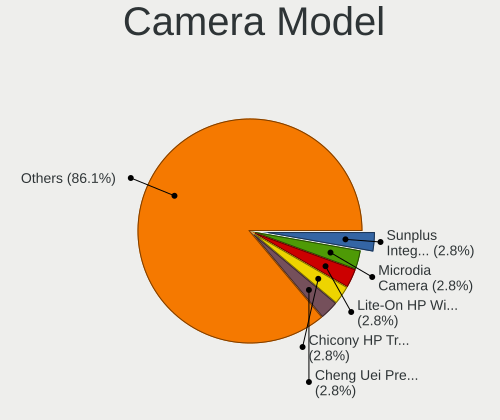

| Model                                                          | Computers | Percent |
|----------------------------------------------------------------|-----------|---------|
| Sunplus Integrated_Webcam_HD                                   | 4         | 2.78%   |
| Microdia Camera                                                | 4         | 2.78%   |
| Lite-On HP Wide Vision HD Camera                               | 4         | 2.78%   |
| Chicony HP Truevision HD                                       | 4         | 2.78%   |
| Cheng Uei Precision Industry (Foxlink) HP TrueVision HD Camera | 4         | 2.78%   |
| Ricoh Integrated Webcam                                        | 3         | 2.08%   |
| Realtek Integrated_Webcam_HD                                   | 3         | 2.08%   |
| Microdia Integrated_Webcam_HD                                  | 3         | 2.08%   |
| Logitech HD Pro Webcam C920                                    | 3         | 2.08%   |
| Chicony integrated camera                                      | 3         | 2.08%   |
| Sunplus Laptop_Integrated_Webcam_FHD                           | 2         | 1.39%   |
| Realtek Integrated Webcam HD                                   | 2         | 1.39%   |
| Quanta HP Wide Vision HD Camera                                | 2         | 1.39%   |
| Quanta HP TrueVision HD Camera                                 | 2         | 1.39%   |
| Primax HP HD Webcam [Fixed]                                    | 2         | 1.39%   |
| Microdia Laptop_Integrated_Webcam_HD                           | 2         | 1.39%   |
| Luxvisions Innotech Limited HP TrueVision HD Camera            | 2         | 1.39%   |
| Lite-On HP HD Webcam                                           | 2         | 1.39%   |
| Lenovo Integrated Webcam [R5U877]                              | 2         | 1.39%   |
| IMC Networks UVC VGA Webcam                                    | 2         | 1.39%   |
| IMC Networks Integrated Camera                                 | 2         | 1.39%   |
| Chicony HD WebCam                                              | 2         | 1.39%   |
| Chicony EasyCamera                                             | 2         | 1.39%   |
| Bison USB HD Webcam                                            | 2         | 1.39%   |
| Bison Lenovo EasyCamera                                        | 2         | 1.39%   |
| Bison Integrated Camera                                        | 2         | 1.39%   |
| Apple FaceTime HD Camera (Built-in)                            | 2         | 1.39%   |
| Apple FaceTime HD Camera                                       | 2         | 1.39%   |
| Apple Built-in iSight                                          | 2         | 1.39%   |
| Trust 1080p HD Webcam                                          | 1         | 0.69%   |
| Syntek Lenovo EasyCamera                                       | 1         | 0.69%   |
| Syntek Integrated Camera                                       | 1         | 0.69%   |
| Suyin USB 2.0 Camera                                           | 1         | 0.69%   |
| Suyin Integrated_Webcam_HD                                     | 1         | 0.69%   |
| Sunplus MTD Camera                                             | 1         | 0.69%   |
| Sunplus Integrated Camera                                      | 1         | 0.69%   |
| Sonix USB2.0 FHD UVC WebCam                                    | 1         | 0.69%   |
| Sonix onn. USB 2.0 webcam                                      | 1         | 0.69%   |
| ShineTech USB2.0 HD UVC WebCam                                 | 1         | 0.69%   |
| Shenzhen Kingcome Optoelectronic 720p HD Camera                | 1         | 0.69%   |

Security
--------

Fingerprint Vendor
------------------

Fingerprint sensor vendors

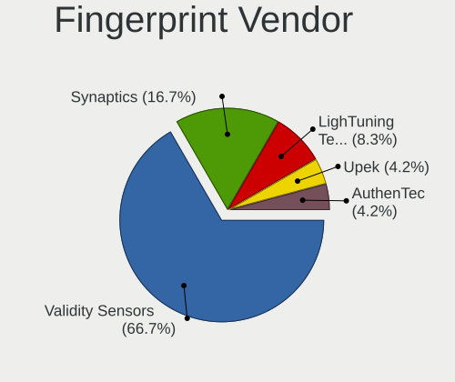

| Vendor                | Computers | Percent |
|-----------------------|-----------|---------|
| Validity Sensors      | 16        | 66.67%  |
| Synaptics             | 4         | 16.67%  |
| LighTuning Technology | 2         | 8.33%   |
| Upek                  | 1         | 4.17%   |
| AuthenTec             | 1         | 4.17%   |

Fingerprint Model
-----------------

Fingerprint sensor models

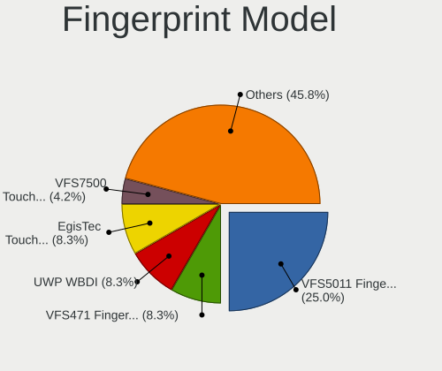

| Model                                                  | Computers | Percent |
|--------------------------------------------------------|-----------|---------|
| Validity Sensors VFS5011 Fingerprint Reader            | 6         | 25%     |
| Validity Sensors VFS471 Fingerprint Reader             | 2         | 8.33%   |
| Synaptics UWP WBDI                                     | 2         | 8.33%   |
| LighTuning EgisTec Touch Fingerprint Sensor            | 2         | 8.33%   |
| Validity Sensors VFS7500 Touch Fingerprint Sensor      | 1         | 4.17%   |
| Validity Sensors VFS495 Fingerprint Reader             | 1         | 4.17%   |
| Validity Sensors VFS491                                | 1         | 4.17%   |
| Validity Sensors VFS451 Fingerprint Reader             | 1         | 4.17%   |
| Validity Sensors VFS301 Fingerprint Reader             | 1         | 4.17%   |
| Validity Sensors VFS 5011 fingerprint sensor           | 1         | 4.17%   |
| Validity Sensors Synaptics WBDI                        | 1         | 4.17%   |
| Validity Sensors Fingerprint scanner                   | 1         | 4.17%   |
| Upek Biometric Touchchip/Touchstrip Fingerprint Sensor | 1         | 4.17%   |
| Synaptics  WBDI                                        | 1         | 4.17%   |
| Synaptics Prometheus MIS Touch Fingerprint Reader      | 1         | 4.17%   |
| AuthenTec AES2810                                      | 1         | 4.17%   |

Chipcard Vendor
---------------

Chipcard module vendors

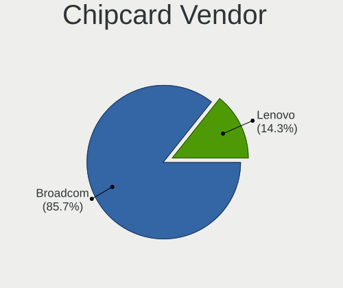

| Vendor   | Computers | Percent |
|----------|-----------|---------|
| Broadcom | 6         | 85.71%  |
| Lenovo   | 1         | 14.29%  |

Chipcard Model
--------------

Chipcard module models

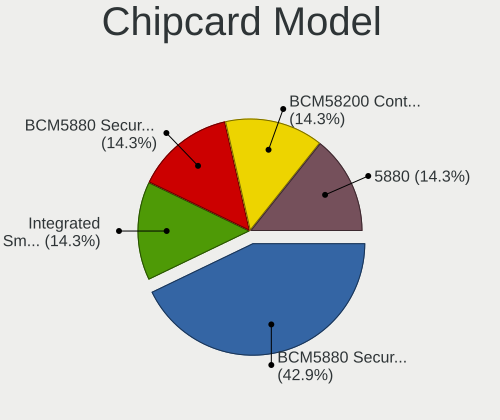

| Model                                                                        | Computers | Percent |
|------------------------------------------------------------------------------|-----------|---------|
| Broadcom BCM5880 Secure Applications Processor                               | 3         | 42.86%  |
| Lenovo Integrated Smart Card Reader                                          | 1         | 14.29%  |
| Broadcom BCM5880 Secure Applications Processor with fingerprint swipe sensor | 1         | 14.29%  |
| Broadcom BCM58200 ControlVault 3 (FingerPrint sensor + Contacted SmartCard)  | 1         | 14.29%  |
| Broadcom 5880                                                                | 1         | 14.29%  |

Unsupported
-----------

Unsupported Devices
-------------------

Total unsupported devices on board

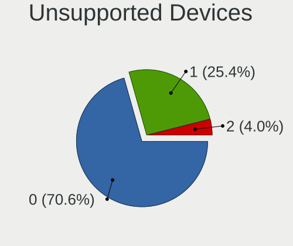

| Total | Computers | Percent |
|-------|-----------|---------|
| 0     | 178       | 70.63%  |
| 1     | 64        | 25.4%   |
| 2     | 10        | 3.97%   |

Unsupported Device Types
------------------------

Types of unsupported devices

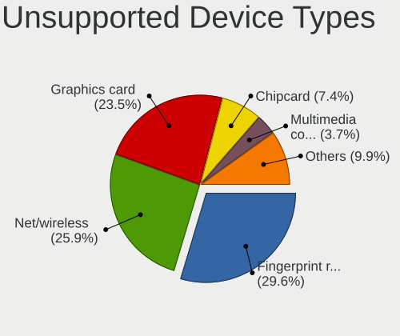

| Type                     | Computers | Percent |
|--------------------------|-----------|---------|
| Fingerprint reader       | 24        | 29.63%  |
| Net/wireless             | 21        | 25.93%  |
| Graphics card            | 19        | 23.46%  |
| Chipcard                 | 6         | 7.41%   |
| Multimedia controller    | 3         | 3.7%    |
| Communication controller | 3         | 3.7%    |
| Storage                  | 2         | 2.47%   |
| Net/ethernet             | 1         | 1.23%   |
| Modem                    | 1         | 1.23%   |
| Camera                   | 1         | 1.23%   |

