Linux in Puerto Rico - Tested Hardware & Statistics (Desktops)
--------------------------------------------------------------

A project to collect tested hardware configurations for Linux in Puerto Rico.

Anyone can contribute to this report by the [hw-probe](https://github.com/linuxhw/hw-probe) tool:

    sudo -E hw-probe -all -upload

Please contribute! Especially if your hardware is rare.

Contents
--------

* [ Test Cases ](#test-cases)

* [ System ](#system)
  - [ OS                       ](#os)
  - [ OS Family                ](#os-family)
  - [ Kernel                   ](#kernel)
  - [ Kernel Family            ](#kernel-family)
  - [ Kernel Major Ver.        ](#kernel-major-ver)
  - [ Arch                     ](#arch)
  - [ DE                       ](#de)
  - [ Display Server           ](#display-server)
  - [ Display Manager          ](#display-manager)
  - [ OS Lang                  ](#os-lang)
  - [ Boot Mode                ](#boot-mode)
  - [ Filesystem               ](#filesystem)
  - [ Part. scheme             ](#part-scheme)
  - [ Dual Boot with Linux/BSD ](#dual-boot-with-linuxbsd)
  - [ Dual Boot (Win)          ](#dual-boot-win)

* [ Board ](#board)
  - [ Vendor                   ](#vendor)
  - [ Model                    ](#model)
  - [ Model Family             ](#model-family)
  - [ MFG Year                 ](#mfg-year)
  - [ Form Factor              ](#form-factor)
  - [ Secure Boot              ](#secure-boot)
  - [ Coreboot                 ](#coreboot)
  - [ RAM Size                 ](#ram-size)
  - [ RAM Used                 ](#ram-used)
  - [ Total Drives             ](#total-drives)
  - [ Has CD-ROM               ](#has-cd-rom)
  - [ Has Ethernet             ](#has-ethernet)
  - [ Has WiFi                 ](#has-wifi)
  - [ Has Bluetooth            ](#has-bluetooth)

* [ Location ](#location)
  - [ Country                  ](#country)
  - [ City                     ](#city)

* [ Drives ](#drives)
  - [ Drive Vendor             ](#drive-vendor)
  - [ Drive Model              ](#drive-model)
  - [ HDD Vendor               ](#hdd-vendor)
  - [ SSD Vendor               ](#ssd-vendor)
  - [ Drive Kind               ](#drive-kind)
  - [ Drive Connector          ](#drive-connector)
  - [ Drive Size               ](#drive-size)
  - [ Space Total              ](#space-total)
  - [ Space Used               ](#space-used)
  - [ Malfunc. Drives          ](#malfunc-drives)
  - [ Malfunc. Drive Vendor    ](#malfunc-drive-vendor)
  - [ Malfunc. HDD Vendor      ](#malfunc-hdd-vendor)
  - [ Malfunc. Drive Kind      ](#malfunc-drive-kind)
  - [ Failed Drives            ](#failed-drives)
  - [ Failed Drive Vendor      ](#failed-drive-vendor)
  - [ Drive Status             ](#drive-status)

* [ Storage controller ](#storage-controller)
  - [ Storage Vendor           ](#storage-vendor)
  - [ Storage Model            ](#storage-model)
  - [ Storage Kind             ](#storage-kind)

* [ Processor ](#processor)
  - [ CPU Vendor               ](#cpu-vendor)
  - [ CPU Model                ](#cpu-model)
  - [ CPU Model Family         ](#cpu-model-family)
  - [ CPU Cores                ](#cpu-cores)
  - [ CPU Sockets              ](#cpu-sockets)
  - [ CPU Threads              ](#cpu-threads)
  - [ CPU Op-Modes             ](#cpu-op-modes)
  - [ CPU Microcode            ](#cpu-microcode)
  - [ CPU Microarch            ](#cpu-microarch)

* [ Graphics ](#graphics)
  - [ GPU Vendor               ](#gpu-vendor)
  - [ GPU Model                ](#gpu-model)
  - [ GPU Combo                ](#gpu-combo)
  - [ GPU Driver               ](#gpu-driver)
  - [ GPU Memory               ](#gpu-memory)

* [ Monitor ](#monitor)
  - [ Monitor Vendor           ](#monitor-vendor)
  - [ Monitor Model            ](#monitor-model)
  - [ Monitor Resolution       ](#monitor-resolution)
  - [ Monitor Diagonal         ](#monitor-diagonal)
  - [ Monitor Width            ](#monitor-width)
  - [ Aspect Ratio             ](#aspect-ratio)
  - [ Monitor Area             ](#monitor-area)
  - [ Pixel Density            ](#pixel-density)
  - [ Multiple Monitors        ](#multiple-monitors)

* [ Network ](#network)
  - [ Net Controller Vendor    ](#net-controller-vendor)
  - [ Net Controller Model     ](#net-controller-model)
  - [ Wireless Vendor          ](#wireless-vendor)
  - [ Wireless Model           ](#wireless-model)
  - [ Ethernet Vendor          ](#ethernet-vendor)
  - [ Ethernet Model           ](#ethernet-model)
  - [ Net Controller Kind      ](#net-controller-kind)
  - [ Used Controller          ](#used-controller)
  - [ NICs                     ](#nics)
  - [ IPv6                     ](#ipv6)

* [ Bluetooth ](#bluetooth)
  - [ Bluetooth Vendor         ](#bluetooth-vendor)
  - [ Bluetooth Model          ](#bluetooth-model)

* [ Sound ](#sound)
  - [ Sound Vendor             ](#sound-vendor)
  - [ Sound Model              ](#sound-model)

* [ Memory ](#memory)
  - [ Memory Vendor            ](#memory-vendor)
  - [ Memory Model             ](#memory-model)
  - [ Memory Kind              ](#memory-kind)
  - [ Memory Form Factor       ](#memory-form-factor)
  - [ Memory Size              ](#memory-size)
  - [ Memory Speed             ](#memory-speed)

* [ Printers & scanners ](#printers--scanners)
  - [ Printer Vendor           ](#printer-vendor)
  - [ Printer Model            ](#printer-model)
  - [ Scanner Vendor           ](#scanner-vendor)
  - [ Scanner Model            ](#scanner-model)

* [ Camera ](#camera)
  - [ Camera Vendor            ](#camera-vendor)
  - [ Camera Model             ](#camera-model)

* [ Security ](#security)
  - [ Fingerprint Vendor       ](#fingerprint-vendor)
  - [ Fingerprint Model        ](#fingerprint-model)
  - [ Chipcard Vendor          ](#chipcard-vendor)
  - [ Chipcard Model           ](#chipcard-model)

* [ Unsupported ](#unsupported)
  - [ Unsupported Devices      ](#unsupported-devices)
  - [ Unsupported Device Types ](#unsupported-device-types)

Test Cases
----------

Total: 124

| Vendor        | Model                       | Probe                                                      | Date         |
|---------------|-----------------------------|------------------------------------------------------------|--------------|
| Dell          | 0N4YC8 A00                  | [83ed9adfc1](https://linux-hardware.org/?probe=83ed9adfc1) | May 04, 2022 |
| Dell          | 0G261D A00                  | [860d883e5b](https://linux-hardware.org/?probe=860d883e5b) | Apr 29, 2022 |
| ASRock        | B450M-HDV R4.0              | [bce1bba9ff](https://linux-hardware.org/?probe=bce1bba9ff) | Apr 29, 2022 |
| Dell          | 0N4YC8 A00                  | [32cc2a24ac](https://linux-hardware.org/?probe=32cc2a24ac) | Apr 20, 2022 |
| Dell          | 0N4YC8 A00                  | [b4ea114ce4](https://linux-hardware.org/?probe=b4ea114ce4) | Apr 17, 2022 |
| Gigabyte      | B450 AORUS PRO WIFI-CF      | [656e8c50dd](https://linux-hardware.org/?probe=656e8c50dd) | Apr 13, 2022 |
| Dell          | 0N4YC8 A00                  | [c32c875fc6](https://linux-hardware.org/?probe=c32c875fc6) | Apr 10, 2022 |
| ASUSTek       | ROG STRIX B450-F GAMING     | [2315db07e2](https://linux-hardware.org/?probe=2315db07e2) | Apr 02, 2022 |
| HP            | 0AA8h                       | [b3507722e3](https://linux-hardware.org/?probe=b3507722e3) | Mar 19, 2022 |
| Dell          | OptiPlex 7020               | [ba82f9d852](https://linux-hardware.org/?probe=ba82f9d852) | Mar 01, 2022 |
| HP            | 0AA8h                       | [21de71cf71](https://linux-hardware.org/?probe=21de71cf71) | Feb 25, 2022 |
| ASRock        | B450M-HDV R4.0              | [f2a65b8a5f](https://linux-hardware.org/?probe=f2a65b8a5f) | Feb 14, 2022 |
| ASRock        | B450M-HDV R4.0              | [8e7267692b](https://linux-hardware.org/?probe=8e7267692b) | Jan 21, 2022 |
| Gigabyte      | X570 AORUS ELITE WIFI       | [464d10c41d](https://linux-hardware.org/?probe=464d10c41d) | Dec 22, 2021 |
| Dell          | 0R6JMP A00                  | [7bc4106877](https://linux-hardware.org/?probe=7bc4106877) | Dec 12, 2021 |
| Dell          | 0R6JMP A00                  | [2b3e03c89b](https://linux-hardware.org/?probe=2b3e03c89b) | Dec 12, 2021 |
| HP            | 1998                        | [7bc6ddebf4](https://linux-hardware.org/?probe=7bc6ddebf4) | Nov 21, 2021 |
| ASRock        | Q1900M                      | [8482ae3a2f](https://linux-hardware.org/?probe=8482ae3a2f) | Nov 09, 2021 |
| HP            | 339A                        | [e2ce00d1ec](https://linux-hardware.org/?probe=e2ce00d1ec) | Nov 08, 2021 |
| Alienware     | 07W25T A00                  | [c08c87521f](https://linux-hardware.org/?probe=c08c87521f) | Nov 08, 2021 |
| HP            | 339A                        | [98dd1a692c](https://linux-hardware.org/?probe=98dd1a692c) | Oct 13, 2021 |
| Gigabyte      | J1900N-D3V                  | [29c7fa76a8](https://linux-hardware.org/?probe=29c7fa76a8) | Oct 10, 2021 |
| Gigabyte      | J1900N-D3V                  | [6818ec3abc](https://linux-hardware.org/?probe=6818ec3abc) | Oct 10, 2021 |
| ASRock        | Z270 Killer SLI/ac          | [732c00f018](https://linux-hardware.org/?probe=732c00f018) | Oct 06, 2021 |
| ASUSTek       | TUF GAMING X570-PRO         | [9ed2b3cf12](https://linux-hardware.org/?probe=9ed2b3cf12) | Sep 21, 2021 |
| ASUSTek       | TUF GAMING X570-PRO         | [a96d28c504](https://linux-hardware.org/?probe=a96d28c504) | Sep 16, 2021 |
| HP            | 1495                        | [3f39c0e882](https://linux-hardware.org/?probe=3f39c0e882) | Jul 23, 2021 |
| Pegatron      | 2ACD                        | [fd757c14ce](https://linux-hardware.org/?probe=fd757c14ce) | Jun 13, 2021 |
| HP            | 1998                        | [7b400d8da6](https://linux-hardware.org/?probe=7b400d8da6) | Jun 11, 2021 |
| HP            | 1998                        | [304ce6f1c4](https://linux-hardware.org/?probe=304ce6f1c4) | Jun 02, 2021 |
| HP            | 1998                        | [4c3248677a](https://linux-hardware.org/?probe=4c3248677a) | May 25, 2021 |
| HP            | 1998                        | [9239b61815](https://linux-hardware.org/?probe=9239b61815) | May 25, 2021 |
| HP            | 1998                        | [639725c8af](https://linux-hardware.org/?probe=639725c8af) | May 24, 2021 |
| HP            | 339A                        | [ac11f05a1a](https://linux-hardware.org/?probe=ac11f05a1a) | May 21, 2021 |
| Intel         | SKYBAY                      | [9bc7ab87d1](https://linux-hardware.org/?probe=9bc7ab87d1) | May 19, 2021 |
| ASRock        | Q1900M                      | [7c778b5654](https://linux-hardware.org/?probe=7c778b5654) | May 02, 2021 |
| HP            | 1998                        | [7442c54767](https://linux-hardware.org/?probe=7442c54767) | Apr 29, 2021 |
| HP            | 1998                        | [4635fe4a94](https://linux-hardware.org/?probe=4635fe4a94) | Apr 29, 2021 |
| HP            | 1998                        | [ec0fdacf3a](https://linux-hardware.org/?probe=ec0fdacf3a) | Apr 12, 2021 |
| HP            | 1998                        | [c395021e6a](https://linux-hardware.org/?probe=c395021e6a) | Apr 12, 2021 |
| Intel         | SKYBAY                      | [472818e347](https://linux-hardware.org/?probe=472818e347) | Apr 04, 2021 |
| Intel         | SKYBAY                      | [870238bbc7](https://linux-hardware.org/?probe=870238bbc7) | Apr 03, 2021 |
| HP            | 1998                        | [efbca1346b](https://linux-hardware.org/?probe=efbca1346b) | Apr 01, 2021 |
| HP            | 1998                        | [f515fbf660](https://linux-hardware.org/?probe=f515fbf660) | Apr 01, 2021 |
| Intel         | SKYBAY                      | [3170801868](https://linux-hardware.org/?probe=3170801868) | Mar 23, 2021 |
| HP            | 1998                        | [3bc0a0dcb6](https://linux-hardware.org/?probe=3bc0a0dcb6) | Mar 20, 2021 |
| HP            | 1998                        | [a10d91fc1b](https://linux-hardware.org/?probe=a10d91fc1b) | Mar 20, 2021 |
| Intel         | SKYBAY                      | [2c5223d3c3](https://linux-hardware.org/?probe=2c5223d3c3) | Mar 18, 2021 |
| Intel         | SKYBAY                      | [5ab0183bc4](https://linux-hardware.org/?probe=5ab0183bc4) | Mar 18, 2021 |
| Intel         | SKYBAY                      | [ecefc99ed5](https://linux-hardware.org/?probe=ecefc99ed5) | Mar 14, 2021 |
| Acer          | AAHD3.VC                    | [775057eb07](https://linux-hardware.org/?probe=775057eb07) | Feb 20, 2021 |
| Acer          | AAHD3.VC                    | [b11309575f](https://linux-hardware.org/?probe=b11309575f) | Feb 19, 2021 |
| Dell          | 0DFRFW A00                  | [093c47fb9c](https://linux-hardware.org/?probe=093c47fb9c) | Feb 13, 2021 |
| ASRock        | Q1900M                      | [d4372897b8](https://linux-hardware.org/?probe=d4372897b8) | Feb 13, 2021 |
| MSI           | H81M-P33                    | [190f14bae7](https://linux-hardware.org/?probe=190f14bae7) | Feb 13, 2021 |
| ASUSTek       | PRIME B550M-A               | [81a3e9faea](https://linux-hardware.org/?probe=81a3e9faea) | Feb 11, 2021 |
| HP            | 18E4                        | [db6eb1d366](https://linux-hardware.org/?probe=db6eb1d366) | Feb 05, 2021 |
| HP            | 18E4                        | [bad5f5110c](https://linux-hardware.org/?probe=bad5f5110c) | Feb 03, 2021 |
| ASUSTek       | M2N-E SLI                   | [b2513f813d](https://linux-hardware.org/?probe=b2513f813d) | Jan 16, 2021 |
| HP            | 18E4                        | [729391b32e](https://linux-hardware.org/?probe=729391b32e) | Jan 08, 2021 |
| ASUSTek       | ROG STRIX X570-E GAMING     | [8396553751](https://linux-hardware.org/?probe=8396553751) | Dec 26, 2020 |
| Lenovo        | Board                       | [166a0c26e2](https://linux-hardware.org/?probe=166a0c26e2) | Dec 23, 2020 |
| Lenovo        | 36EE SDK0J40700 WIN 3258... | [5e4b418568](https://linux-hardware.org/?probe=5e4b418568) | Dec 19, 2020 |
| Gigabyte      | X570 GAMING X               | [646f020b0d](https://linux-hardware.org/?probe=646f020b0d) | Nov 27, 2020 |
| Gigabyte      | B450M DS3H-CF               | [844bb428a9](https://linux-hardware.org/?probe=844bb428a9) | Nov 22, 2020 |
| MSI           | MS-B1711                    | [8d69ecec16](https://linux-hardware.org/?probe=8d69ecec16) | Nov 17, 2020 |
| MSI           | MS-B1711                    | [958741b7b6](https://linux-hardware.org/?probe=958741b7b6) | Nov 17, 2020 |
| MSI           | MS-B1711                    | [3c327ae485](https://linux-hardware.org/?probe=3c327ae485) | Nov 17, 2020 |
| MSI           | MS-B1711                    | [26c2dcf112](https://linux-hardware.org/?probe=26c2dcf112) | Nov 01, 2020 |
| Gigabyte      | X570 GAMING X               | [62ebca752a](https://linux-hardware.org/?probe=62ebca752a) | Oct 31, 2020 |
| Gigabyte      | X570 GAMING X               | [362d74125d](https://linux-hardware.org/?probe=362d74125d) | Oct 31, 2020 |
| ASRock        | Q1900M                      | [72cddfd9ae](https://linux-hardware.org/?probe=72cddfd9ae) | Oct 24, 2020 |
| Dell          | 0R6JMP A00                  | [c4cbec5b80](https://linux-hardware.org/?probe=c4cbec5b80) | Oct 11, 2020 |
| HP            | 339A                        | [47db0521b7](https://linux-hardware.org/?probe=47db0521b7) | Sep 23, 2020 |
| HP            | 339A                        | [51cec5b6f8](https://linux-hardware.org/?probe=51cec5b6f8) | Sep 23, 2020 |
| HP            | 339A                        | [37cfc48ef8](https://linux-hardware.org/?probe=37cfc48ef8) | Sep 21, 2020 |
| HP            | 339A                        | [254f23a364](https://linux-hardware.org/?probe=254f23a364) | Sep 21, 2020 |
| Lenovo        | Board                       | [c08fed8ecb](https://linux-hardware.org/?probe=c08fed8ecb) | Sep 11, 2020 |
| HP            | 18E4                        | [277593bde6](https://linux-hardware.org/?probe=277593bde6) | Aug 07, 2020 |
| Gigabyte      | F2A78M-HD2                  | [25ca74bc56](https://linux-hardware.org/?probe=25ca74bc56) | Jul 24, 2020 |
| Gigabyte      | F2A78M-HD2                  | [319c98c8a1](https://linux-hardware.org/?probe=319c98c8a1) | Jul 24, 2020 |
| Gigabyte      | F2A78M-HD2                  | [478381d890](https://linux-hardware.org/?probe=478381d890) | Jul 12, 2020 |
| MSI           | Z370-A PRO                  | [f8629928a6](https://linux-hardware.org/?probe=f8629928a6) | Jun 18, 2020 |
| Gigabyte      | Z97M-DS3H                   | [9aaeabab3d](https://linux-hardware.org/?probe=9aaeabab3d) | Jun 18, 2020 |
| Gigabyte      | F2A68HM-H                   | [d161c397ca](https://linux-hardware.org/?probe=d161c397ca) | Jun 14, 2020 |
| HP            | 18E4                        | [1fe1707854](https://linux-hardware.org/?probe=1fe1707854) | May 07, 2020 |
| Dell          | 0M017G A00                  | [e8b9eefb82](https://linux-hardware.org/?probe=e8b9eefb82) | Apr 13, 2020 |
| Gigabyte      | X570 GAMING X               | [44caca0bb1](https://linux-hardware.org/?probe=44caca0bb1) | Mar 12, 2020 |
| BESSTAR Te... | Cherry Trail CR             | [25f7a780e2](https://linux-hardware.org/?probe=25f7a780e2) | Mar 11, 2020 |
| BESSTAR Te... | Cherry Trail CR             | [0a4dcdb4af](https://linux-hardware.org/?probe=0a4dcdb4af) | Mar 11, 2020 |
| Gigabyte      | X570 GAMING X               | [f48a5318f4](https://linux-hardware.org/?probe=f48a5318f4) | Mar 08, 2020 |
| Gigabyte      | X570 GAMING X               | [e56cb163ba](https://linux-hardware.org/?probe=e56cb163ba) | Mar 08, 2020 |
| Gigabyte      | X570 GAMING X               | [c0f180f342](https://linux-hardware.org/?probe=c0f180f342) | Mar 07, 2020 |
| Gigabyte      | X570 GAMING X               | [cb590554ed](https://linux-hardware.org/?probe=cb590554ed) | Mar 07, 2020 |
| Gigabyte      | X399 AORUS Gaming 7         | [4ac0a3b1fe](https://linux-hardware.org/?probe=4ac0a3b1fe) | Mar 06, 2020 |
| ASRock        | G31M-S                      | [a2582aaec1](https://linux-hardware.org/?probe=a2582aaec1) | Mar 06, 2020 |
| ASRock        | G31M-S                      | [a63cd159a1](https://linux-hardware.org/?probe=a63cd159a1) | Mar 06, 2020 |
| Gigabyte      | X570 GAMING X               | [aa32ea3cb7](https://linux-hardware.org/?probe=aa32ea3cb7) | Mar 05, 2020 |
| Gigabyte      | X570 GAMING X               | [efa77a90cb](https://linux-hardware.org/?probe=efa77a90cb) | Mar 01, 2020 |
| HP            | 18E4                        | [44a166f15f](https://linux-hardware.org/?probe=44a166f15f) | Mar 01, 2020 |
| Gigabyte      | X570 GAMING X               | [a89bcf9811](https://linux-hardware.org/?probe=a89bcf9811) | Mar 01, 2020 |
| Gigabyte      | X570 GAMING X               | [40a8750e54](https://linux-hardware.org/?probe=40a8750e54) | Feb 28, 2020 |
| Gigabyte      | X399 AORUS Gaming 7         | [399d92cf32](https://linux-hardware.org/?probe=399d92cf32) | Feb 28, 2020 |
| Gigabyte      | X399 AORUS Gaming 7         | [ddebe02bcd](https://linux-hardware.org/?probe=ddebe02bcd) | Feb 28, 2020 |
| Gigabyte      | X570 GAMING X               | [132413f9bd](https://linux-hardware.org/?probe=132413f9bd) | Feb 21, 2020 |
| Gigabyte      | X570 GAMING X               | [29208aee7d](https://linux-hardware.org/?probe=29208aee7d) | Feb 21, 2020 |
| HP            | 18E4                        | [ee3dae8f72](https://linux-hardware.org/?probe=ee3dae8f72) | Feb 17, 2020 |
| Gigabyte      | X570 GAMING X               | [fa684e430c](https://linux-hardware.org/?probe=fa684e430c) | Feb 13, 2020 |
| ASRock        | A780GXE/128M                | [2123239208](https://linux-hardware.org/?probe=2123239208) | Nov 10, 2019 |
| MSI           | B150 PC MATE                | [ed98074061](https://linux-hardware.org/?probe=ed98074061) | Oct 08, 2019 |
| ASRock        | G31M-S                      | [d1f69377d4](https://linux-hardware.org/?probe=d1f69377d4) | Aug 18, 2019 |
| ASRock        | G31M-S                      | [595867810d](https://linux-hardware.org/?probe=595867810d) | Aug 18, 2019 |
| ASRock        | G31M-S                      | [556d0f2ca6](https://linux-hardware.org/?probe=556d0f2ca6) | Jun 06, 2019 |
| ASRock        | 945GCM-S                    | [d4ea4c5cb6](https://linux-hardware.org/?probe=d4ea4c5cb6) | May 04, 2019 |
| HP            | 18E4                        | [36f9656af0](https://linux-hardware.org/?probe=36f9656af0) | Feb 15, 2019 |
| HP            | 18E4                        | [c0cc4f015a](https://linux-hardware.org/?probe=c0cc4f015a) | Jan 04, 2019 |
| HP            | 18E4                        | [c6cf9c7817](https://linux-hardware.org/?probe=c6cf9c7817) | Jan 04, 2019 |
| ASUSTek       | M5A78L-M LX PLUS            | [85398272dc](https://linux-hardware.org/?probe=85398272dc) | Dec 03, 2018 |
| ASUSTek       | M5A78L-M LX PLUS            | [fcb5925cfa](https://linux-hardware.org/?probe=fcb5925cfa) | Dec 03, 2018 |
| ASUSTek       | M5A78L-M LX PLUS            | [10a5b1559d](https://linux-hardware.org/?probe=10a5b1559d) | Dec 03, 2018 |
| ASRock        | G31M-S                      | [82229858ec](https://linux-hardware.org/?probe=82229858ec) | Jun 15, 2018 |
| ASRock        | G31M-S                      | [b8b4c87a3c](https://linux-hardware.org/?probe=b8b4c87a3c) | Jun 15, 2018 |
| ASRock        | G31M-S                      | [90f397422e](https://linux-hardware.org/?probe=90f397422e) | Jun 15, 2018 |
| ASRock        | 945GCM-S                    | [c7cbed362d](https://linux-hardware.org/?probe=c7cbed362d) | May 27, 2017 |

System
------

OS
--

Installed operating systems

| Name                | Desktops | Percent |
|---------------------|----------|---------|
| Ubuntu 18.04        | 8        | 12.12%  |
| Ubuntu 20.04        | 6        | 9.09%   |
| OpenMandriva 4.2    | 4        | 6.06%   |
| Manjaro             | 3        | 4.55%   |
| Ubuntu 20.10        | 2        | 3.03%   |
| ROSA R11            | 2        | 3.03%   |
| Lubuntu 20.04       | 2        | 3.03%   |
| LMDE 4              | 2        | 3.03%   |
| Linux Mint 20.3     | 2        | 3.03%   |
| Linux Mint 20.1     | 2        | 3.03%   |
| Linux Mint 20       | 2        | 3.03%   |
| Garuda Linux        | 2        | 3.03%   |
| ArcoLinux Rolling   | 2        | 3.03%   |
| Zorin 16            | 1        | 1.52%   |
| Zorin 15            | 1        | 1.52%   |
| Xubuntu 20.10       | 1        | 1.52%   |
| Xubuntu 20.04       | 1        | 1.52%   |
| Ubuntu Budgie 21.04 | 1        | 1.52%   |
| Ubuntu 21.10        | 1        | 1.52%   |
| Ubuntu 19.10        | 1        | 1.52%   |
| ROSA R9             | 1        | 1.52%   |
| ROSA R10            | 1        | 1.52%   |
| Pop!_OS 21.10       | 1        | 1.52%   |
| Pop!_OS 21.04       | 1        | 1.52%   |
| Pop!_OS 20.10       | 1        | 1.52%   |
| Pop!_OS 20.04       | 1        | 1.52%   |
| Pop!_OS 19.10       | 1        | 1.52%   |
| OpenMandriva 4.3    | 1        | 1.52%   |
| Manjaro 21.1.5      | 1        | 1.52%   |
| Manjaro 20.1.2      | 1        | 1.52%   |
| LinuxFX 11          | 1        | 1.52%   |
| Linux Mint 20.2     | 1        | 1.52%   |
| Linux Mint 19.3     | 1        | 1.52%   |
| Linux Mint 19.1     | 1        | 1.52%   |
| KDE neon 20.04      | 1        | 1.52%   |
| Endless 3.9.1       | 1        | 1.52%   |
| Devuan 4            | 1        | 1.52%   |
| Debian 9            | 1        | 1.52%   |
| BlackPanther 18.1   | 1        | 1.52%   |
| Arch                | 1        | 1.52%   |

OS Family
---------

OS without a version

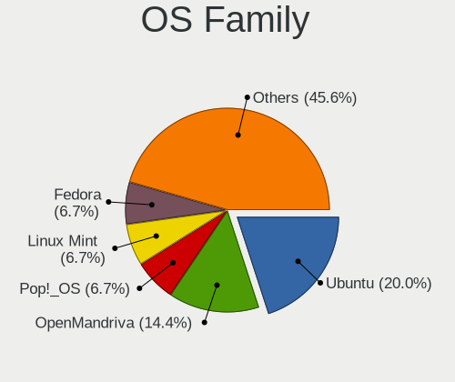

| Name          | Desktops | Percent |
|---------------|----------|---------|
| Ubuntu        | 18       | 29.51%  |
| Linux Mint    | 6        | 9.84%   |
| Pop!_OS       | 5        | 8.2%    |
| OpenMandriva  | 5        | 8.2%    |
| Manjaro       | 4        | 6.56%   |
| ROSA          | 3        | 4.92%   |
| Zorin         | 2        | 3.28%   |
| Xubuntu       | 2        | 3.28%   |
| Lubuntu       | 2        | 3.28%   |
| LMDE          | 2        | 3.28%   |
| Garuda Linux  | 2        | 3.28%   |
| ArcoLinux     | 2        | 3.28%   |
| Ubuntu Budgie | 1        | 1.64%   |
| LinuxFX       | 1        | 1.64%   |
| KDE neon      | 1        | 1.64%   |
| Endless       | 1        | 1.64%   |
| Devuan        | 1        | 1.64%   |
| Debian        | 1        | 1.64%   |
| BlackPanther  | 1        | 1.64%   |
| Arch          | 1        | 1.64%   |

Kernel
------

Version of the Linux kernel

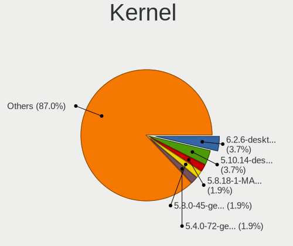

| Version                         | Desktops | Percent |
|---------------------------------|----------|---------|
| 5.10.14-desktop-1omv4002        | 4        | 5.19%   |
| 5.8.18-1-MANJARO                | 2        | 2.6%    |
| 5.8.0-45-generic                | 2        | 2.6%    |
| 5.4.0-72-generic                | 2        | 2.6%    |
| 5.4.0-58-generic                | 2        | 2.6%    |
| 5.4.0-109-generic               | 2        | 2.6%    |
| 5.3.0-40-generic                | 2        | 2.6%    |
| 5.13.0-39-generic               | 2        | 2.6%    |
| 4.15.0-desktop-45.1rosa-x86_64  | 2        | 2.6%    |
| 5.9.16-1-MANJARO                | 1        | 1.3%    |
| 5.9.1-1-MANJARO                 | 1        | 1.3%    |
| 5.8.5-zen1-1-zen                | 1        | 1.3%    |
| 5.8.14-zen1-1-zen               | 1        | 1.3%    |
| 5.8.0-7630-generic              | 1        | 1.3%    |
| 5.8.0-54-generic                | 1        | 1.3%    |
| 5.8.0-53-generic                | 1        | 1.3%    |
| 5.8.0-49-generic                | 1        | 1.3%    |
| 5.8.0-44-generic                | 1        | 1.3%    |
| 5.8.0-29-generic                | 1        | 1.3%    |
| 5.8.0-25-generic                | 1        | 1.3%    |
| 5.8.0-14-generic                | 1        | 1.3%    |
| 5.4.0-89-generic                | 1        | 1.3%    |
| 5.4.0-88-generic                | 1        | 1.3%    |
| 5.4.0-7634-generic              | 1        | 1.3%    |
| 5.4.0-73-generic                | 1        | 1.3%    |
| 5.4.0-65-generic                | 1        | 1.3%    |
| 5.4.0-59-generic                | 1        | 1.3%    |
| 5.4.0-52-generic                | 1        | 1.3%    |
| 5.4.0-48-generic                | 1        | 1.3%    |
| 5.4.0-47-generic                | 1        | 1.3%    |
| 5.4.0-42-generic                | 1        | 1.3%    |
| 5.4.0-40-generic                | 1        | 1.3%    |
| 5.4.0-37-generic                | 1        | 1.3%    |
| 5.3.0-7629-generic              | 1        | 1.3%    |
| 5.3.0-51-generic                | 1        | 1.3%    |
| 5.3.0-42-generic                | 1        | 1.3%    |
| 5.3.0-41-generic                | 1        | 1.3%    |
| 5.3.0-29-generic                | 1        | 1.3%    |
| 5.3.0-28-generic                | 1        | 1.3%    |
| 5.17.1-arch1-1                  | 1        | 1.3%    |
| 5.16.7-desktop-1omv4003         | 1        | 1.3%    |
| 5.15.5-76051505-generic         | 1        | 1.3%    |
| 5.14.8-arch1-1                  | 1        | 1.3%    |
| 5.13.19-2-MANJARO               | 1        | 1.3%    |
| 5.11.13-arch1-1                 | 1        | 1.3%    |
| 5.11.0-7633-generic             | 1        | 1.3%    |
| 5.11.0-41-generic               | 1        | 1.3%    |
| 5.11.0-38-generic               | 1        | 1.3%    |
| 5.11.0-37-generic               | 1        | 1.3%    |
| 5.11.0-18-generic               | 1        | 1.3%    |
| 5.10.0-9-amd64                  | 1        | 1.3%    |
| 4.9.60-nrj-desktop-1rosa-x86_64 | 1        | 1.3%    |
| 4.9.20-nrj-desktop-1rosa-x86_64 | 1        | 1.3%    |
| 4.9.0-12-amd64                  | 1        | 1.3%    |
| 4.19.0-19-amd64                 | 1        | 1.3%    |
| 4.19.0-18-amd64                 | 1        | 1.3%    |
| 4.19.0-13-amd64                 | 1        | 1.3%    |
| 4.18.16-desktop-1bP             | 1        | 1.3%    |
| 4.18.0-21-generic               | 1        | 1.3%    |
| 4.18.0-15-generic               | 1        | 1.3%    |

Kernel Family
-------------

Linux kernel without a distro release

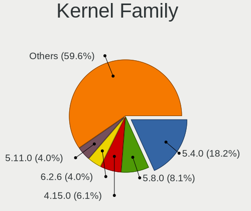

| Version | Desktops | Percent |
|---------|----------|---------|
| 5.4.0   | 16       | 24.24%  |
| 5.8.0   | 8        | 12.12%  |
| 4.15.0  | 7        | 10.61%  |
| 5.3.0   | 4        | 6.06%   |
| 5.11.0  | 4        | 6.06%   |
| 5.10.14 | 4        | 6.06%   |
| 5.8.18  | 2        | 3.03%   |
| 5.13.0  | 2        | 3.03%   |
| 4.19.0  | 2        | 3.03%   |
| 4.18.0  | 2        | 3.03%   |
| 5.9.16  | 1        | 1.52%   |
| 5.9.1   | 1        | 1.52%   |
| 5.8.5   | 1        | 1.52%   |
| 5.8.14  | 1        | 1.52%   |
| 5.17.1  | 1        | 1.52%   |
| 5.16.7  | 1        | 1.52%   |
| 5.15.5  | 1        | 1.52%   |
| 5.14.8  | 1        | 1.52%   |
| 5.13.19 | 1        | 1.52%   |
| 5.11.13 | 1        | 1.52%   |
| 5.10.0  | 1        | 1.52%   |
| 4.9.60  | 1        | 1.52%   |
| 4.9.20  | 1        | 1.52%   |
| 4.9.0   | 1        | 1.52%   |
| 4.18.16 | 1        | 1.52%   |

Kernel Major Ver.
-----------------

Linux kernel major version

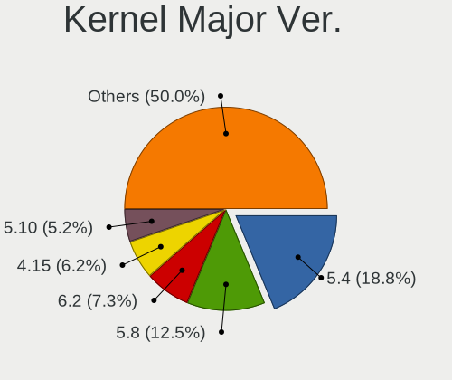

| Version | Desktops | Percent |
|---------|----------|---------|
| 5.4     | 16       | 25%     |
| 5.8     | 12       | 18.75%  |
| 4.15    | 7        | 10.94%  |
| 5.10    | 5        | 7.81%   |
| 5.3     | 4        | 6.25%   |
| 5.11    | 4        | 6.25%   |
| 5.13    | 3        | 4.69%   |
| 4.9     | 3        | 4.69%   |
| 5.9     | 2        | 3.13%   |
| 4.19    | 2        | 3.13%   |
| 4.18    | 2        | 3.13%   |
| 5.17    | 1        | 1.56%   |
| 5.16    | 1        | 1.56%   |
| 5.15    | 1        | 1.56%   |
| 5.14    | 1        | 1.56%   |

Arch
----

OS architecture (x86_64, i586, etc.)

| Name   | Desktops | Percent |
|--------|----------|---------|
| x86_64 | 49       | 100%    |

DE
--

Desktop Environment

| Name       | Desktops | Percent |
|------------|----------|---------|
| GNOME      | 24       | 39.34%  |
| KDE5       | 11       | 18.03%  |
| X-Cinnamon | 7        | 11.48%  |
| Unknown    | 5        | 8.2%    |
| XFCE       | 4        | 6.56%   |
| LXQt       | 2        | 3.28%   |
| KDE        | 2        | 3.28%   |
| Budgie     | 2        | 3.28%   |
| MATE       | 1        | 1.64%   |
| LXDE       | 1        | 1.64%   |
| KDE4       | 1        | 1.64%   |
| Deepin     | 1        | 1.64%   |

Display Server
--------------

X11 or Wayland

| Name    | Desktops | Percent |
|---------|----------|---------|
| X11     | 46       | 93.88%  |
| Wayland | 2        | 4.08%   |
| Unknown | 1        | 2.04%   |

Display Manager
---------------

SDDM, LightDM, etc.

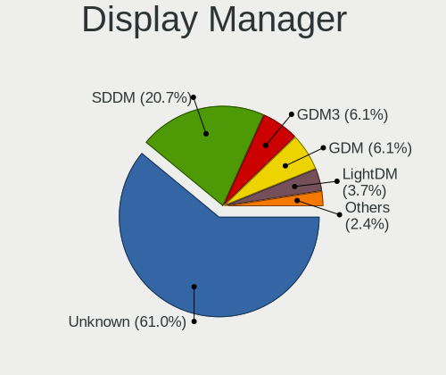

| Name    | Desktops | Percent |
|---------|----------|---------|
| Unknown | 38       | 67.86%  |
| SDDM    | 8        | 14.29%  |
| GDM     | 4        | 7.14%   |
| LightDM | 2        | 3.57%   |
| GDM3    | 2        | 3.57%   |
| TDM     | 1        | 1.79%   |
| KDM     | 1        | 1.79%   |

OS Lang
-------

Language

| Lang    | Desktops | Percent |
|---------|----------|---------|
| en_US   | 40       | 80%     |
| Unknown | 8        | 16%     |
| es_ES   | 1        | 2%      |
| C       | 1        | 2%      |

Boot Mode
---------

EFI or BIOS

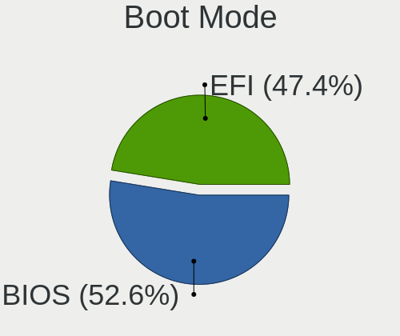

| Mode | Desktops | Percent |
|------|----------|---------|
| BIOS | 30       | 57.69%  |
| EFI  | 22       | 42.31%  |

Filesystem
----------

Type of filesystem

| Type    | Desktops | Percent |
|---------|----------|---------|
| Ext4    | 43       | 79.63%  |
| Overlay | 7        | 12.96%  |
| Unknown | 3        | 5.56%   |
| Btrfs   | 1        | 1.85%   |

Part. scheme
------------

Scheme of partitioning

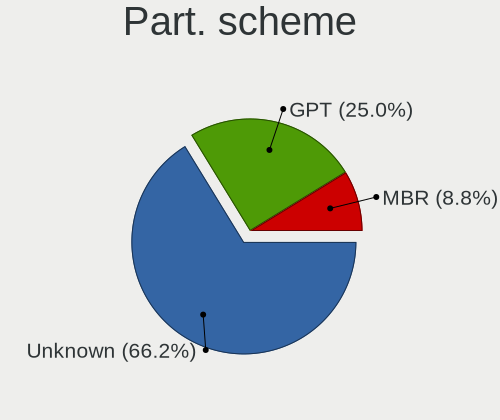

| Type    | Desktops | Percent |
|---------|----------|---------|
| Unknown | 40       | 74.07%  |
| GPT     | 9        | 16.67%  |
| MBR     | 5        | 9.26%   |

Dual Boot with Linux/BSD
------------------------

Hosting more than one Linux/BSD

| Dual boot | Desktops | Percent |
|-----------|----------|---------|
| No        | 44       | 83.02%  |
| Yes       | 9        | 16.98%  |

Dual Boot (Win)
---------------

Hosting Linux and Windows

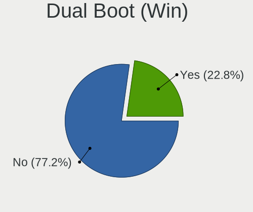

| Dual boot | Desktops | Percent |
|-----------|----------|---------|
| No        | 41       | 75.93%  |
| Yes       | 13       | 24.07%  |

Board
-----

Vendor
------

Motherboard manufacturer

| Name                | Desktops | Percent |
|---------------------|----------|---------|
| Gigabyte Technology | 9        | 18.37%  |
| ASRock              | 8        | 16.33%  |
| Hewlett-Packard     | 6        | 12.24%  |
| Dell                | 6        | 12.24%  |
| ASUSTek Computer    | 6        | 12.24%  |
| MSI                 | 5        | 10.2%   |
| Lenovo              | 3        | 6.12%   |
| Intel               | 2        | 4.08%   |
| Pegatron            | 1        | 2.04%   |
| BESSTAR Tech        | 1        | 2.04%   |
| Alienware           | 1        | 2.04%   |
| Acer                | 1        | 2.04%   |

Model
-----

Motherboard model

| Name                                    | Desktops | Percent |
|-----------------------------------------|----------|---------|
| MSI Cubi N 8GL (MS-B171)                | 2        | 4.08%   |
| Intel SKYBAY                            | 2        | 4.08%   |
| ASRock Q1900M                           | 2        | 4.08%   |
| ASRock 945GCM-S                         | 2        | 4.08%   |
| Pegatron QW716AA#ABA                    | 1        | 2.04%   |
| MSI MS-7B48                             | 1        | 2.04%   |
| MSI MS-7971                             | 1        | 2.04%   |
| MSI MS-7817                             | 1        | 2.04%   |
| Lenovo ThinkCentre M91p 7033CG1         | 1        | 2.04%   |
| Lenovo ThinkCentre M58p 6136A66         | 1        | 2.04%   |
| Lenovo IdeaCentre 510A-15ARR 90J0000PUS | 1        | 2.04%   |
| HP EliteDesk 800 G1 TWR                 | 1        | 2.04%   |
| HP EliteDesk 800 G1 SFF                 | 1        | 2.04%   |
| HP Compaq Pro 6300 SFF                  | 1        | 2.04%   |
| HP Compaq Pro 6300 MT                   | 1        | 2.04%   |
| HP Compaq dc7800p Small Form Factor     | 1        | 2.04%   |
| HP Compaq 8200 Elite SFF PC             | 1        | 2.04%   |
| Gigabyte Z97M-DS3H                      | 1        | 2.04%   |
| Gigabyte X570 GAMING X                  | 1        | 2.04%   |
| Gigabyte X570 AORUS ELITE WIFI          | 1        | 2.04%   |
| Gigabyte X399 AORUS Gaming 7            | 1        | 2.04%   |
| Gigabyte J1900N-D3V                     | 1        | 2.04%   |
| Gigabyte F2A78M-HD2                     | 1        | 2.04%   |
| Gigabyte F2A68HM-H                      | 1        | 2.04%   |
| Gigabyte B450M DS3H                     | 1        | 2.04%   |
| Gigabyte B450 AORUS PRO WIFI            | 1        | 2.04%   |
| Dell Studio 540                         | 1        | 2.04%   |
| Dell OptiPlex 960                       | 1        | 2.04%   |
| Dell OptiPlex 9020                      | 1        | 2.04%   |
| Dell OptiPlex 780                       | 1        | 2.04%   |
| Dell OptiPlex 7020                      | 1        | 2.04%   |
| Dell Inspiron 3670                      | 1        | 2.04%   |
| BESSTAR Tech Z83-W                      | 1        | 2.04%   |
| ASUS TUF GAMING X570-PRO                | 1        | 2.04%   |
| ASUS ROG STRIX X570-E GAMING            | 1        | 2.04%   |
| ASUS ROG STRIX B450-F GAMING            | 1        | 2.04%   |
| ASUS PRIME B550M-A                      | 1        | 2.04%   |
| ASUS M5A78L-M LX PLUS                   | 1        | 2.04%   |
| ASUS M2N-E SLI                          | 1        | 2.04%   |
| ASRock Z270 Killer SLI/ac               | 1        | 2.04%   |
| ASRock G31M-S                           | 1        | 2.04%   |
| ASRock B450M-HDV R4.0                   | 1        | 2.04%   |
| ASRock A780GXE/128M                     | 1        | 2.04%   |
| Alienware Aurora R12                    | 1        | 2.04%   |
| Acer Aspire M3420                       | 1        | 2.04%   |

Model Family
------------

Motherboard model prefix

| Name                 | Desktops | Percent |
|----------------------|----------|---------|
| HP Compaq            | 4        | 8.16%   |
| Dell OptiPlex        | 4        | 8.16%   |
| MSI Cubi             | 2        | 4.08%   |
| Lenovo ThinkCentre   | 2        | 4.08%   |
| Intel SKYBAY         | 2        | 4.08%   |
| HP EliteDesk         | 2        | 4.08%   |
| Gigabyte X570        | 2        | 4.08%   |
| ASUS ROG             | 2        | 4.08%   |
| ASRock Q1900M        | 2        | 4.08%   |
| ASRock 945GCM-S      | 2        | 4.08%   |
| Pegatron QW716AA#ABA | 1        | 2.04%   |
| MSI MS-7B48          | 1        | 2.04%   |
| MSI MS-7971          | 1        | 2.04%   |
| MSI MS-7817          | 1        | 2.04%   |
| Lenovo IdeaCentre    | 1        | 2.04%   |
| Gigabyte Z97M-DS3H   | 1        | 2.04%   |
| Gigabyte X399        | 1        | 2.04%   |
| Gigabyte J1900N-D3V  | 1        | 2.04%   |
| Gigabyte F2A78M-HD2  | 1        | 2.04%   |
| Gigabyte F2A68HM-H   | 1        | 2.04%   |
| Gigabyte B450M       | 1        | 2.04%   |
| Gigabyte B450        | 1        | 2.04%   |
| Dell Studio          | 1        | 2.04%   |
| Dell Inspiron        | 1        | 2.04%   |
| BESSTAR Tech Z83-W   | 1        | 2.04%   |
| ASUS TUF             | 1        | 2.04%   |
| ASUS PRIME           | 1        | 2.04%   |
| ASUS M5A78L-M        | 1        | 2.04%   |
| ASUS M2N-E           | 1        | 2.04%   |
| ASRock Z270          | 1        | 2.04%   |
| ASRock G31M-S        | 1        | 2.04%   |
| ASRock B450M-HDV     | 1        | 2.04%   |
| ASRock A780GXE       | 1        | 2.04%   |
| Alienware Aurora     | 1        | 2.04%   |
| Acer Aspire          | 1        | 2.04%   |

MFG Year
--------

Motherboard manufacture year

| Year | Desktops | Percent |
|------|----------|---------|
| 2018 | 10       | 20.41%  |
| 2019 | 5        | 10.2%   |
| 2014 | 5        | 10.2%   |
| 2008 | 5        | 10.2%   |
| 2013 | 4        | 8.16%   |
| 2011 | 4        | 8.16%   |
| 2020 | 2        | 4.08%   |
| 2017 | 2        | 4.08%   |
| 2016 | 2        | 4.08%   |
| 2015 | 2        | 4.08%   |
| 2012 | 2        | 4.08%   |
| 2010 | 2        | 4.08%   |
| 2021 | 1        | 2.04%   |
| 2009 | 1        | 2.04%   |
| 2007 | 1        | 2.04%   |
| 2006 | 1        | 2.04%   |

Form Factor
-----------

Physical design of the computer

| Name    | Desktops | Percent |
|---------|----------|---------|
| Desktop | 49       | 100%    |

Secure Boot
-----------

Enabled or disabled

| State    | Desktops | Percent |
|----------|----------|---------|
| Disabled | 48       | 96%     |
| Enabled  | 2        | 4%      |

Coreboot
--------

Have coreboot on board

| Used | Desktops | Percent |
|------|----------|---------|
| No   | 49       | 100%    |

RAM Size
--------

Total RAM memory

| Size in GB  | Desktops | Percent |
|-------------|----------|---------|
| 4.01-8.0    | 12       | 23.53%  |
| 3.01-4.0    | 9        | 17.65%  |
| 16.01-24.0  | 9        | 17.65%  |
| 8.01-16.0   | 8        | 15.69%  |
| 32.01-64.0  | 6        | 11.76%  |
| 1.01-2.0    | 3        | 5.88%   |
| 24.01-32.0  | 2        | 3.92%   |
| 64.01-256.0 | 2        | 3.92%   |

RAM Used
--------

Used RAM memory

| Used GB   | Desktops | Percent |
|-----------|----------|---------|
| 1.01-2.0  | 27       | 45%     |
| 2.01-3.0  | 11       | 18.33%  |
| 3.01-4.0  | 9        | 15%     |
| 4.01-8.0  | 7        | 11.67%  |
| 0.51-1.0  | 5        | 8.33%   |
| 8.01-16.0 | 1        | 1.67%   |

Total Drives
------------

Number of drives on board

| Drives | Desktops | Percent |
|--------|----------|---------|
| 1      | 25       | 45.45%  |
| 2      | 14       | 25.45%  |
| 3      | 10       | 18.18%  |
| 4      | 3        | 5.45%   |
| 6      | 1        | 1.82%   |
| 5      | 1        | 1.82%   |
| 0      | 1        | 1.82%   |

Has CD-ROM
----------

Has CD-ROM on board

| Presented | Desktops | Percent |
|-----------|----------|---------|
| Yes       | 31       | 63.27%  |
| No        | 18       | 36.73%  |

Has Ethernet
------------

Has Ethernet on board

| Presented | Desktops | Percent |
|-----------|----------|---------|
| Yes       | 49       | 100%    |

Has WiFi
--------

Has WiFi module

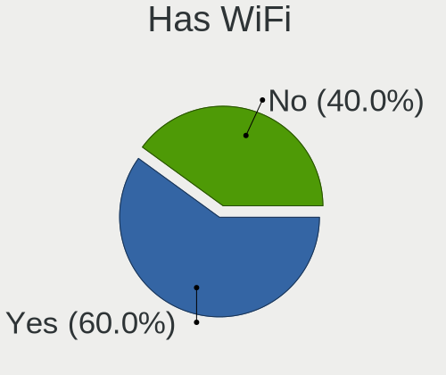

| Presented | Desktops | Percent |
|-----------|----------|---------|
| Yes       | 28       | 54.9%   |
| No        | 23       | 45.1%   |

Has Bluetooth
-------------

Has Bluetooth module

| Presented | Desktops | Percent |
|-----------|----------|---------|
| No        | 29       | 55.77%  |
| Yes       | 23       | 44.23%  |

Location
--------

Country
-------

Geographic location (country)

| Country     | Desktops | Percent |
|-------------|----------|---------|
| Puerto Rico | 49       | 100%    |

City
----

Geographic location (city)

| City          | Desktops | Percent |
|---------------|----------|---------|
| San Juan      | 18       | 31.03%  |
| Caguas        | 3        | 5.17%   |
| Bayamón    | 3        | 5.17%   |
| Aguadilla     | 3        | 5.17%   |
| San Sebastian | 2        | 3.45%   |
| Ponce         | 2        | 3.45%   |
| Las Piedras   | 2        | 3.45%   |
| Dorado        | 2        | 3.45%   |
| Cayey         | 2        | 3.45%   |
| Vega Baja     | 1        | 1.72%   |
| Vega Alta     | 1        | 1.72%   |
| Rio Grande    | 1        | 1.72%   |
| Naranjito     | 1        | 1.72%   |
| Morovis       | 1        | 1.72%   |
| MayagГјez   | 1        | 1.72%   |
| Maunabo       | 1        | 1.72%   |
| Lares         | 1        | 1.72%   |
| Juncos        | 1        | 1.72%   |
| Juana Diaz    | 1        | 1.72%   |
| Isabela       | 1        | 1.72%   |
| Humacao       | 1        | 1.72%   |
| Guaynabo      | 1        | 1.72%   |
| Guayama       | 1        | 1.72%   |
| Ensenada      | 1        | 1.72%   |
| Coamo         | 1        | 1.72%   |
| Catano        | 1        | 1.72%   |
| Carolina      | 1        | 1.72%   |
| Cabo Rojo     | 1        | 1.72%   |
| BayamГіn    | 1        | 1.72%   |
| Arroyo        | 1        | 1.72%   |

Drives
------

Drive Vendor
------------

Hard drive vendors

| Vendor                    | Desktops | Drives | Percent |
|---------------------------|----------|--------|---------|
| WDC                       | 18       | 60     | 24.32%  |
| Seagate                   | 15       | 30     | 20.27%  |
| Toshiba                   | 8        | 11     | 10.81%  |
| Samsung Electronics       | 6        | 14     | 8.11%   |
| China                     | 4        | 6      | 5.41%   |
| TDAS                      | 2        | 10     | 2.7%    |
| Silicon Motion            | 2        | 2      | 2.7%    |
| Sandisk                   | 2        | 2      | 2.7%    |
| Phison                    | 2        | 2      | 2.7%    |
| Micron/Crucial Technology | 2        | 2      | 2.7%    |
| LITEONIT                  | 2        | 2      | 2.7%    |
| Hitachi                   | 2        | 2      | 2.7%    |
| Crucial                   | 2        | 2      | 2.7%    |
| WD MediaMax               | 1        | 3      | 1.35%   |
| Unknown                   | 1        | 2      | 1.35%   |
| Team                      | 1        | 1      | 1.35%   |
| SABRENT                   | 1        | 1      | 1.35%   |
| JMicron                   | 1        | 4      | 1.35%   |
| addlink                   | 1        | 1      | 1.35%   |
| A-DATA Technology         | 1        | 5      | 1.35%   |

Drive Model
-----------

Hard drive models

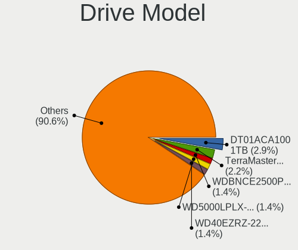

| Model                                | Desktops | Percent |
|--------------------------------------|----------|---------|
| Toshiba DT01ACA100 1TB               | 3        | 3.53%   |
| WDC WDBNCE2500PNC 250GB SSD          | 2        | 2.35%   |
| WDC WD5000LPLX-22ZNTT0 500GB         | 2        | 2.35%   |
| Toshiba DT01ACA050 500GB             | 2        | 2.35%   |
| TDAS TerraMaster 1TB                 | 2        | 2.35%   |
| Seagate ST320DM001 HD322GJ 320GB     | 2        | 2.35%   |
| Seagate ST2000VM003-1CT164 2TB       | 2        | 2.35%   |
| Seagate Expansion+ 2TB               | 2        | 2.35%   |
| Samsung SSD 850 EVO 500GB            | 2        | 2.35%   |
| Samsung NVMe SSD Drive 500GB         | 2        | 2.35%   |
| Micron/Crucial NVMe SSD Drive 500GB  | 2        | 2.35%   |
| China SATA SSD 512GB                 | 2        | 2.35%   |
| WDC WD7500BPVX-60JC3T0 752GB         | 1        | 1.18%   |
| WDC WD5000LPVX-22V0TT0 500GB         | 1        | 1.18%   |
| WDC WD5000LPCX-00VHAT0 500GB         | 1        | 1.18%   |
| WDC WD40EZRZ-22GXCB0 4TB             | 1        | 1.18%   |
| WDC WD30EZRZ-00WN9B0 3TB             | 1        | 1.18%   |
| WDC WD20EZRZ-00Z5HB0 2TB             | 1        | 1.18%   |
| WDC WD1600AAJS-00PSA0 160GB          | 1        | 1.18%   |
| WDC WD1500HLFS-01G6U1 150GB          | 1        | 1.18%   |
| WDC WD1200BEVS-75UST0 120GB          | 1        | 1.18%   |
| WDC WD10SPZX-22Z10T1 1TB             | 1        | 1.18%   |
| WDC WD10EZRX-00L4HB0 1TB             | 1        | 1.18%   |
| WDC WD10EZEX-75WN4A1 1TB             | 1        | 1.18%   |
| WDC WD10EZEX-08WN4A0 1TB             | 1        | 1.18%   |
| WDC WD10EZEX-00BN5A0 1TB             | 1        | 1.18%   |
| WDC WD10EURX-63FH1Y0 1TB             | 1        | 1.18%   |
| WDC WD10EAVS-00D7B1 1TB              | 1        | 1.18%   |
| WDC WD1003FBYZ-010FB0 1TB            | 1        | 1.18%   |
| WDC WD1003FBYX-05Y7B0 1TB            | 1        | 1.18%   |
| WD MediaMax WL500GSA3272 500GB       | 1        | 1.18%   |
| Unknown MMC Card  32GB               | 1        | 1.18%   |
| Toshiba MQ01ABD100 1TB               | 1        | 1.18%   |
| Toshiba KBG30ZMS128G 128GB NVMe SSD  | 1        | 1.18%   |
| Toshiba DT01ABA100V 1TB              | 1        | 1.18%   |
| Team TM8FP6512G 512GB                | 1        | 1.18%   |
| Silicon Motion NVMe SSD Drive 250GB  | 1        | 1.18%   |
| Silicon Motion NVMe SSD Drive 1024GB | 1        | 1.18%   |
| Seagate ST750LX003-1AC154 752GB      | 1        | 1.18%   |
| Seagate ST500DM002-1BD142 500GB      | 1        | 1.18%   |
| Seagate ST4000DM004-2CV104 4TB       | 1        | 1.18%   |
| Seagate ST4000DM000-1F2168 4TB       | 1        | 1.18%   |
| Seagate ST3320613AS 320GB            | 1        | 1.18%   |
| Seagate ST3250310AS 249GB            | 1        | 1.18%   |
| Seagate ST32000641AS 2TB             | 1        | 1.18%   |
| Seagate ST31000528AS 1TB             | 1        | 1.18%   |
| Seagate ST2000LM007-1R8174 2TB       | 1        | 1.18%   |
| Seagate ST2000DM008-2FR102 2TB       | 1        | 1.18%   |
| Seagate ST2000DL001-9VT156 2TB       | 1        | 1.18%   |
| Seagate ST1000VM002-1SD102 1TB       | 1        | 1.18%   |
| Seagate ST1000DM010-2EP102 1TB       | 1        | 1.18%   |
| Seagate BUP Ultra Touch 2TB          | 1        | 1.18%   |
| SanDisk SSD PLUS 240GB               | 1        | 1.18%   |
| Sandisk NVMe SSD Drive 1TB           | 1        | 1.18%   |
| Samsung SSD 870 QVO 2TB              | 1        | 1.18%   |
| Samsung SSD 860 EVO 500GB            | 1        | 1.18%   |
| Samsung HD103SI 1TB                  | 1        | 1.18%   |
| SABRENT Disk 250GB                   | 1        | 1.18%   |
| Phison NVMe SSD Drive 512GB          | 1        | 1.18%   |
| Phison NVMe SSD Drive 250GB          | 1        | 1.18%   |

HDD Vendor
----------

Hard disk drive vendors

| Vendor              | Desktops | Drives | Percent |
|---------------------|----------|--------|---------|
| WDC                 | 16       | 56     | 38.1%   |
| Seagate             | 15       | 30     | 35.71%  |
| Toshiba             | 7        | 10     | 16.67%  |
| Hitachi             | 2        | 2      | 4.76%   |
| Samsung Electronics | 1        | 1      | 2.38%   |
| SABRENT             | 1        | 1      | 2.38%   |

SSD Vendor
----------

Solid state drive vendors

| Vendor              | Desktops | Drives | Percent |
|---------------------|----------|--------|---------|
| Samsung Electronics | 4        | 7      | 25%     |
| China               | 4        | 6      | 25%     |
| WDC                 | 2        | 4      | 12.5%   |
| LITEONIT            | 2        | 2      | 12.5%   |
| Crucial             | 2        | 2      | 12.5%   |
| SanDisk             | 1        | 1      | 6.25%   |
| A-DATA Technology   | 1        | 5      | 6.25%   |

Drive Kind
----------

HDD or SSD

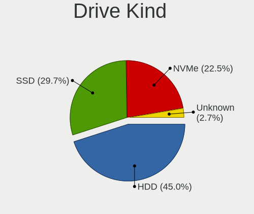

| Kind    | Desktops | Drives | Percent |
|---------|----------|--------|---------|
| HDD     | 35       | 100    | 52.24%  |
| SSD     | 16       | 27     | 23.88%  |
| NVMe    | 11       | 16     | 16.42%  |
| Unknown | 4        | 17     | 5.97%   |
| MMC     | 1        | 2      | 1.49%   |

Drive Connector
---------------

SATA, SAS, NVMe, etc.

| Type | Desktops | Drives | Percent |
|------|----------|--------|---------|
| SATA | 44       | 126    | 69.84%  |
| NVMe | 11       | 16     | 17.46%  |
| SAS  | 7        | 18     | 11.11%  |
| MMC  | 1        | 2      | 1.59%   |

Drive Size
----------

Size of hard drive

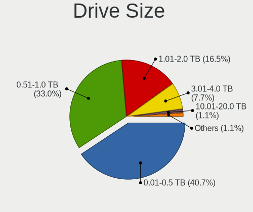

| Size in TB | Desktops | Drives | Percent |
|------------|----------|--------|---------|
| 0.01-0.5   | 24       | 42     | 39.34%  |
| 0.51-1.0   | 22       | 52     | 36.07%  |
| 1.01-2.0   | 11       | 24     | 18.03%  |
| 3.01-4.0   | 3        | 8      | 4.92%   |
| 2.01-3.0   | 1        | 1      | 1.64%   |

Space Total
-----------

Amount of disk space available on the file system

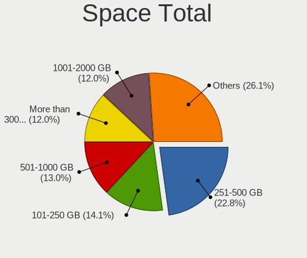

| Size in GB     | Desktops | Percent |
|----------------|----------|---------|
| 251-500        | 13       | 20.97%  |
| 501-1000       | 9        | 14.52%  |
| More than 3000 | 8        | 12.9%   |
| 101-250        | 8        | 12.9%   |
| 1001-2000      | 8        | 12.9%   |
| 2001-3000      | 7        | 11.29%  |
| 1-20           | 4        | 6.45%   |
| 51-100         | 3        | 4.84%   |
| Unknown        | 2        | 3.23%   |

Space Used
----------

Amount of used disk space

| Used GB   | Desktops | Percent |
|-----------|----------|---------|
| 1-20      | 21       | 34.43%  |
| 21-50     | 9        | 14.75%  |
| 251-500   | 7        | 11.48%  |
| 101-250   | 6        | 9.84%   |
| 1001-2000 | 6        | 9.84%   |
| 51-100    | 5        | 8.2%    |
| 501-1000  | 4        | 6.56%   |
| Unknown   | 2        | 3.28%   |
| 2001-3000 | 1        | 1.64%   |

Malfunc. Drives
---------------

Drive models with a malfunction

| Model                            | Desktops | Drives | Percent |
|----------------------------------|----------|--------|---------|
| Seagate ST3320613AS 320GB        | 1        | 1      | 16.67%  |
| Seagate ST3250310AS 249GB        | 1        | 1      | 16.67%  |
| Seagate ST320DM001 HD322GJ 320GB | 1        | 1      | 16.67%  |
| Seagate ST2000VM003-1CT164 2TB   | 1        | 1      | 16.67%  |
| Seagate ST2000LM007-1R8174 2TB   | 1        | 1      | 16.67%  |
| Seagate ST2000DL001-9VT156 2TB   | 1        | 1      | 16.67%  |

Malfunc. Drive Vendor
---------------------

Vendors of faulty drives

| Vendor  | Desktops | Drives | Percent |
|---------|----------|--------|---------|
| Seagate | 4        | 6      | 100%    |

Malfunc. HDD Vendor
-------------------

Vendors of faulty HDD drives

| Vendor  | Desktops | Drives | Percent |
|---------|----------|--------|---------|
| Seagate | 4        | 6      | 100%    |

Malfunc. Drive Kind
-------------------

Kinds of faulty drives

| Kind | Desktops | Drives | Percent |
|------|----------|--------|---------|
| HDD  | 4        | 6      | 100%    |

Failed Drives
-------------

Failed drive models

Zero info for selected period =(

Failed Drive Vendor
-------------------

Failed drive vendors

Zero info for selected period =(

Drive Status
------------

Number of failed and malfunc. drives

| Status   | Desktops | Drives | Percent |
|----------|----------|--------|---------|
| Detected | 40       | 139    | 72.73%  |
| Works    | 11       | 17     | 20%     |
| Malfunc  | 4        | 6      | 7.27%   |

Storage controller
------------------

Storage Vendor
--------------

Storage controller vendors

| Vendor                       | Desktops | Percent |
|------------------------------|----------|---------|
| Intel                        | 30       | 50%     |
| AMD                          | 17       | 28.33%  |
| Silicon Motion               | 3        | 5%      |
| Phison Electronics           | 3        | 5%      |
| Samsung Electronics          | 2        | 3.33%   |
| Micron/Crucial Technology    | 2        | 3.33%   |
| Toshiba America Info Systems | 1        | 1.67%   |
| Sandisk                      | 1        | 1.67%   |
| Nvidia                       | 1        | 1.67%   |

Storage Model
-------------

Storage controller models

| Model                                                                                   | Desktops | Percent |
|-----------------------------------------------------------------------------------------|----------|---------|
| AMD FCH SATA Controller [AHCI mode]                                                     | 13       | 16.05%  |
| Intel SATA Controller [RAID mode]                                                       | 5        | 6.17%   |
| Intel 8 Series/C220 Series Chipset Family 6-port SATA Controller 1 [AHCI mode]          | 5        | 6.17%   |
| AMD 400 Series Chipset SATA Controller                                                  | 4        | 4.94%   |
| Silicon Motion SM2263EN/SM2263XT SSD Controller                                         | 3        | 3.7%    |
| Phison E12 NVMe Controller                                                              | 3        | 3.7%    |
| Intel NM10/ICH7 Family SATA Controller [IDE mode]                                       | 3        | 3.7%    |
| Intel 82801G (ICH7 Family) IDE Controller                                               | 3        | 3.7%    |
| Intel 4 Series Chipset PT IDER Controller                                               | 3        | 3.7%    |
| Samsung NVMe SSD Controller SM981/PM981/PM983                                           | 2        | 2.47%   |
| Micron/Crucial P2 NVMe PCIe SSD                                                         | 2        | 2.47%   |
| Intel Sunrise Point-LP SATA Controller [AHCI mode]                                      | 2        | 2.47%   |
| Intel Celeron/Pentium Silver Processor SATA Controller                                  | 2        | 2.47%   |
| Intel Atom Processor E3800 Series SATA AHCI Controller                                  | 2        | 2.47%   |
| Intel 7 Series/C210 Series Chipset Family 6-port SATA Controller [AHCI mode]            | 2        | 2.47%   |
| Intel 6 Series/C200 Series Chipset Family Desktop SATA Controller (IDE mode, ports 4-5) | 2        | 2.47%   |
| Intel 6 Series/C200 Series Chipset Family Desktop SATA Controller (IDE mode, ports 0-3) | 2        | 2.47%   |
| AMD SB7x0/SB8x0/SB9x0 SATA Controller [IDE mode]                                        | 2        | 2.47%   |
| AMD SB7x0/SB8x0/SB9x0 IDE Controller                                                    | 2        | 2.47%   |
| Toshiba America Info Systems BG3 NVMe SSD Controller                                    | 1        | 1.23%   |
| Sandisk WD Blue SN550 NVMe SSD                                                          | 1        | 1.23%   |
| Nvidia CK804 Serial ATA Controller                                                      | 1        | 1.23%   |
| Nvidia CK804 IDE                                                                        | 1        | 1.23%   |
| Intel Q170/Q150/B150/H170/H110/Z170/CM236 Chipset SATA Controller [AHCI Mode]           | 1        | 1.23%   |
| Intel Comet Lake PCH-H RAID                                                             | 1        | 1.23%   |
| Intel Cannon Lake PCH SATA AHCI Controller                                              | 1        | 1.23%   |
| Intel Atom Processor E3800 Series SATA IDE Controller                                   | 1        | 1.23%   |
| Intel 9 Series Chipset Family SATA Controller [AHCI Mode]                               | 1        | 1.23%   |
| Intel 82Q35 Express PT IDER Controller                                                  | 1        | 1.23%   |
| Intel 82801JI (ICH10 Family) 4 port SATA IDE Controller #1                              | 1        | 1.23%   |
| Intel 82801JI (ICH10 Family) 2 port SATA IDE Controller #2                              | 1        | 1.23%   |
| Intel 82801JD/DO (ICH10 Family) SATA AHCI Controller                                    | 1        | 1.23%   |
| Intel 82801IR/IO/IH (ICH9R/DO/DH) 4 port SATA Controller [IDE mode]                     | 1        | 1.23%   |
| Intel 82801I (ICH9 Family) 2 port SATA Controller [IDE mode]                            | 1        | 1.23%   |
| AMD X399 Series Chipset SATA Controller                                                 | 1        | 1.23%   |
| AMD FCH SATA Controller [IDE mode]                                                      | 1        | 1.23%   |
| AMD FCH IDE Controller                                                                  | 1        | 1.23%   |
| AMD 500 Series Chipset SATA Controller                                                  | 1        | 1.23%   |

Storage Kind
------------

Kind of storage controller (IDE, SATA, NVMe, SAS, ...)

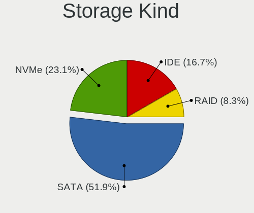

| Kind | Desktops | Percent |
|------|----------|---------|
| SATA | 34       | 51.52%  |
| IDE  | 15       | 22.73%  |
| NVMe | 11       | 16.67%  |
| RAID | 6        | 9.09%   |

Processor
---------

CPU Vendor
----------

Processor vendors

| Vendor | Desktops | Percent |
|--------|----------|---------|
| Intel  | 31       | 63.27%  |
| AMD    | 18       | 36.73%  |

CPU Model
---------

Processor models

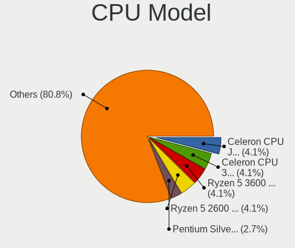

| Model                                          | Desktops | Percent |
|------------------------------------------------|----------|---------|
| Intel Celeron CPU J1900 @ 1.99GHz              | 3        | 6.12%   |
| Intel Pentium Silver N5000 CPU @ 1.10GHz       | 2        | 4.08%   |
| Intel Pentium Dual-Core CPU E5300 @ 2.60GHz    | 2        | 4.08%   |
| Intel Core 2 Duo CPU E8400 @ 3.00GHz           | 2        | 4.08%   |
| Intel Celeron CPU E1200 @ 1.60GHz              | 2        | 4.08%   |
| Intel Celeron CPU 3865U @ 1.80GHz              | 2        | 4.08%   |
| AMD Ryzen 7 3700X 8-Core Processor             | 2        | 4.08%   |
| AMD Ryzen 5 3600 6-Core Processor              | 2        | 4.08%   |
| AMD A6-5400K APU with Radeon HD Graphics       | 2        | 4.08%   |
| Intel Core i7-8700K CPU @ 3.70GHz              | 1        | 2.04%   |
| Intel Core i7-4790 CPU @ 3.60GHz               | 1        | 2.04%   |
| Intel Core i7-4770 CPU @ 3.40GHz               | 1        | 2.04%   |
| Intel Core i5-9400 CPU @ 2.90GHz               | 1        | 2.04%   |
| Intel Core i5-7600K CPU @ 3.80GHz              | 1        | 2.04%   |
| Intel Core i5-6400 CPU @ 2.70GHz               | 1        | 2.04%   |
| Intel Core i5-4570 CPU @ 3.20GHz               | 1        | 2.04%   |
| Intel Core i3-4150 CPU @ 3.50GHz               | 1        | 2.04%   |
| Intel Core i3-3240 CPU @ 3.40GHz               | 1        | 2.04%   |
| Intel Core i3-3220 CPU @ 3.30GHz               | 1        | 2.04%   |
| Intel Core i3-2120 CPU @ 3.30GHz               | 1        | 2.04%   |
| Intel Core i3-2100 CPU @ 3.10GHz               | 1        | 2.04%   |
| Intel Core 2 Duo CPU E7500 @ 2.93GHz           | 1        | 2.04%   |
| Intel Core 2 Duo CPU E6550 @ 2.33GHz           | 1        | 2.04%   |
| Intel Celeron CPU G1850 @ 2.90GHz              | 1        | 2.04%   |
| Intel Celeron CPU G1840 @ 2.80GHz              | 1        | 2.04%   |
| Intel Atom x5-Z8350 CPU @ 1.44GHz              | 1        | 2.04%   |
| Intel 11th Gen Core i9-11900KF @ 3.50GHz       | 1        | 2.04%   |
| AMD Ryzen Threadripper 1950X 16-Core Processor | 1        | 2.04%   |
| AMD Ryzen 7 5700G with Radeon Graphics         | 1        | 2.04%   |
| AMD Ryzen 7 2700X Eight-Core Processor         | 1        | 2.04%   |
| AMD Ryzen 5 2600 Six-Core Processor            | 1        | 2.04%   |
| AMD Ryzen 3 3200G with Radeon Vega Graphics    | 1        | 2.04%   |
| AMD Ryzen 3 2200G with Radeon Vega Graphics    | 1        | 2.04%   |
| AMD Phenom 9850 Quad-Core Processor            | 1        | 2.04%   |
| AMD FX-8350 Eight-Core Processor               | 1        | 2.04%   |
| AMD Athlon 64 X2 Dual Core Processor 6400+     | 1        | 2.04%   |
| AMD Athlon 220GE with Radeon Vega Graphics     | 1        | 2.04%   |
| AMD A8-7600 Radeon R7, 10 Compute Cores 4C+6G  | 1        | 2.04%   |
| AMD A8-3850 APU with Radeon HD Graphics        | 1        | 2.04%   |

CPU Model Family
----------------

Processor model prefix

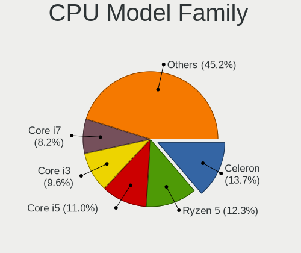

| Model                   | Desktops | Percent |
|-------------------------|----------|---------|
| Intel Celeron           | 9        | 18.37%  |
| Intel Core i3           | 5        | 10.2%   |
| Intel Core i5           | 4        | 8.16%   |
| Intel Core 2 Duo        | 4        | 8.16%   |
| AMD Ryzen 7             | 4        | 8.16%   |
| Intel Core i7           | 3        | 6.12%   |
| AMD Ryzen 5             | 3        | 6.12%   |
| Intel Pentium Silver    | 2        | 4.08%   |
| Intel Pentium Dual-Core | 2        | 4.08%   |
| AMD Ryzen 3             | 2        | 4.08%   |
| AMD A8                  | 2        | 4.08%   |
| AMD A6                  | 2        | 4.08%   |
| Other                   | 1        | 2.04%   |
| Intel Atom              | 1        | 2.04%   |
| AMD Ryzen Threadripper  | 1        | 2.04%   |
| AMD Phenom              | 1        | 2.04%   |
| AMD FX                  | 1        | 2.04%   |
| AMD Athlon 64 X2        | 1        | 2.04%   |
| AMD Athlon              | 1        | 2.04%   |

CPU Cores
---------

Number of processor cores

| Number | Desktops | Percent |
|--------|----------|---------|
| 2      | 20       | 40.82%  |
| 4      | 16       | 32.65%  |
| 8      | 5        | 10.2%   |
| 6      | 5        | 10.2%   |
| 1      | 2        | 4.08%   |
| 16     | 1        | 2.04%   |

CPU Sockets
-----------

Number of sockets

| Number | Desktops | Percent |
|--------|----------|---------|
| 1      | 49       | 100%    |

CPU Threads
-----------

Threads per core (Hyper-Threading)

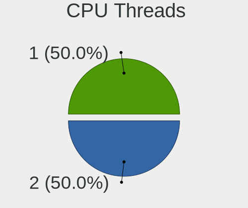

| Number | Desktops | Percent |
|--------|----------|---------|
| 1      | 28       | 57.14%  |
| 2      | 21       | 42.86%  |

CPU Op-Modes
------------

CPU Operation Modes (32-bit, 64-bit)

| Op mode        | Desktops | Percent |
|----------------|----------|---------|
| 32-bit, 64-bit | 49       | 98%     |
| Unknown        | 1        | 2%      |

CPU Microcode
-------------

Microcode number

| Number     | Desktops | Percent |
|------------|----------|---------|
| Unknown    | 15       | 28.3%   |
| 0x306c3    | 6        | 11.32%  |
| 0x1067a    | 4        | 7.55%   |
| 0x806e9    | 2        | 3.77%   |
| 0x6fd      | 2        | 3.77%   |
| 0x306a9    | 2        | 3.77%   |
| 0x30678    | 2        | 3.77%   |
| 0x08701013 | 2        | 3.77%   |
| 0x06001119 | 2        | 3.77%   |
| 0xa0671    | 1        | 1.89%   |
| 0x906ed    | 1        | 1.89%   |
| 0x906ea    | 1        | 1.89%   |
| 0x906e9    | 1        | 1.89%   |
| 0x706a1    | 1        | 1.89%   |
| 0x6fb      | 1        | 1.89%   |
| 0x506e3    | 1        | 1.89%   |
| 0x406c4    | 1        | 1.89%   |
| 0x30679    | 1        | 1.89%   |
| 0x206a7    | 1        | 1.89%   |
| 0x08101007 | 1        | 1.89%   |
| 0x0800820d | 1        | 1.89%   |
| 0x08001137 | 1        | 1.89%   |
| 0x06003106 | 1        | 1.89%   |
| 0x06000852 | 1        | 1.89%   |
| 0x03000027 | 1        | 1.89%   |

CPU Microarch
-------------

Microarchitecture

| Name          | Desktops | Percent |
|---------------|----------|---------|
| Haswell       | 6        | 12.24%  |
| Penryn        | 5        | 10.2%   |
| KabyLake      | 5        | 10.2%   |
| Zen 2         | 4        | 8.16%   |
| Silvermont    | 4        | 8.16%   |
| Zen+          | 3        | 6.12%   |
| Zen           | 3        | 6.12%   |
| Piledriver    | 3        | 6.12%   |
| Core          | 3        | 6.12%   |
| SandyBridge   | 2        | 4.08%   |
| IvyBridge     | 2        | 4.08%   |
| Goldmont plus | 2        | 4.08%   |
| Zen 3         | 1        | 2.04%   |
| Steamroller   | 1        | 2.04%   |
| Skylake       | 1        | 2.04%   |
| K8 Hammer     | 1        | 2.04%   |
| K10 Llano     | 1        | 2.04%   |
| K10           | 1        | 2.04%   |
| Unknown       | 1        | 2.04%   |

Graphics
--------

GPU Vendor
----------

Vendors of graphics cards

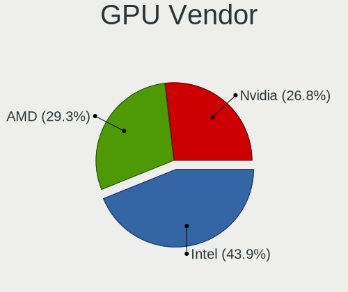

| Vendor | Desktops | Percent |
|--------|----------|---------|
| Intel  | 27       | 50.94%  |
| Nvidia | 13       | 24.53%  |
| AMD    | 13       | 24.53%  |

GPU Model
---------

Graphics card models

| Model                                                                                    | Desktops | Percent |
|------------------------------------------------------------------------------------------|----------|---------|
| Intel Xeon E3-1200 v3/4th Gen Core Processor Integrated Graphics Controller              | 5        | 8.77%   |
| Intel 4 Series Chipset Integrated Graphics Controller                                    | 4        | 7.02%   |
| Intel Atom Processor Z36xxx/Z37xxx Series Graphics & Display                             | 3        | 5.26%   |
| Nvidia GP107 [GeForce GTX 1050]                                                          | 2        | 3.51%   |
| Nvidia GP106 [GeForce GTX 1060 6GB]                                                      | 2        | 3.51%   |
| Nvidia GP102 [GeForce GTX 1080 Ti]                                                       | 2        | 3.51%   |
| Nvidia GF119 [GeForce GT 620 OEM]                                                        | 2        | 3.51%   |
| Intel Kaby Lake-U GT1 Integrated Graphics Controller                                     | 2        | 3.51%   |
| Intel GeminiLake [UHD Graphics 605]                                                      | 2        | 3.51%   |
| Intel 82945G/GZ Integrated Graphics Controller                                           | 2        | 3.51%   |
| Intel 2nd Generation Core Processor Family Integrated Graphics Controller                | 2        | 3.51%   |
| AMD Trinity 2 [Radeon HD 7540D]                                                          | 2        | 3.51%   |
| AMD Raven Ridge [Radeon Vega Series / Radeon Vega Mobile Series]                         | 2        | 3.51%   |
| Nvidia TU117 [GeForce GTX 1650]                                                          | 1        | 1.75%   |
| Nvidia TU116 [GeForce GTX 1660 SUPER]                                                    | 1        | 1.75%   |
| Nvidia GP108 [GeForce GT 1030]                                                           | 1        | 1.75%   |
| Nvidia GP107 [GeForce GTX 1050 Ti]                                                       | 1        | 1.75%   |
| Nvidia GK110GL [Tesla K20Xm]                                                             | 1        | 1.75%   |
| Nvidia GK104GL [GRID K2]                                                                 | 1        | 1.75%   |
| Nvidia GA102 [GeForce RTX 3080]                                                          | 1        | 1.75%   |
| Nvidia G86 [GeForce 8400 GS]                                                             | 1        | 1.75%   |
| Intel Xeon E3-1200 v2/3rd Gen Core processor Graphics Controller                         | 1        | 1.75%   |
| Intel HD Graphics 630                                                                    | 1        | 1.75%   |
| Intel CoffeeLake-S GT2 [UHD Graphics 630]                                                | 1        | 1.75%   |
| Intel Atom/Celeron/Pentium Processor x5-E8000/J3xxx/N3xxx Integrated Graphics Controller | 1        | 1.75%   |
| Intel 82Q35 Express Integrated Graphics Controller                                       | 1        | 1.75%   |
| Intel 82G33/G31 Express Integrated Graphics Controller                                   | 1        | 1.75%   |
| Intel 4th Generation Core Processor Family Integrated Graphics Controller                | 1        | 1.75%   |
| AMD Sumo [Radeon HD 6550D]                                                               | 1        | 1.75%   |
| AMD RS780 [Radeon HD 3200]                                                               | 1        | 1.75%   |
| AMD Picasso/Raven 2 [Radeon Vega Series / Radeon Vega Mobile Series]                     | 1        | 1.75%   |
| AMD Navi 14 [Radeon RX 5500/5500M / Pro 5500M]                                           | 1        | 1.75%   |
| AMD Navi 10 [Radeon RX 5600 OEM/5600 XT / 5700/5700 XT]                                  | 1        | 1.75%   |
| AMD Kaveri [Radeon R7 Graphics]                                                          | 1        | 1.75%   |
| AMD Ellesmere [Radeon RX 470/480/570/570X/580/580X/590]                                  | 1        | 1.75%   |
| AMD Cezanne                                                                              | 1        | 1.75%   |
| AMD Cedar [Radeon HD 5000/6000/7350/8350 Series]                                         | 1        | 1.75%   |
| AMD Caicos XTX [Radeon HD 8490 / R5 235X OEM]                                            | 1        | 1.75%   |

GPU Combo
---------

Combinations of graphics cards

| Name               | Desktops | Percent |
|--------------------|----------|---------|
| 1 x Intel          | 25       | 49.02%  |
| 1 x AMD            | 13       | 25.49%  |
| 1 x Nvidia         | 10       | 19.61%  |
| Intel + 2 x Nvidia | 2        | 3.92%   |
| Intel + Nvidia     | 1        | 1.96%   |

GPU Driver
----------

Free vs proprietary

| Driver      | Desktops | Percent |
|-------------|----------|---------|
| Free        | 39       | 76.47%  |
| Proprietary | 9        | 17.65%  |
| Unknown     | 3        | 5.88%   |

GPU Memory
----------

Total video memory

| Size in GB | Desktops | Percent |
|------------|----------|---------|
| Unknown    | 32       | 59.26%  |
| 0.01-0.5   | 6        | 11.11%  |
| 1.01-2.0   | 5        | 9.26%   |
| 0.51-1.0   | 4        | 7.41%   |
| 3.01-4.0   | 3        | 5.56%   |
| 5.01-6.0   | 2        | 3.7%    |
| 8.01-16.0  | 2        | 3.7%    |

Monitor
-------

Monitor Vendor
--------------

Monitor vendors

| Vendor              | Desktops | Percent |
|---------------------|----------|---------|
| Acer                | 6        | 10.71%  |
| Samsung Electronics | 5        | 8.93%   |
| Hewlett-Packard     | 5        | 8.93%   |
| Goldstar            | 5        | 8.93%   |
| Dell                | 4        | 7.14%   |
| ViewSonic           | 3        | 5.36%   |
| Sony                | 3        | 5.36%   |
| Sceptre Tech        | 3        | 5.36%   |
| Gateway             | 3        | 5.36%   |
| Element             | 3        | 5.36%   |
| AOC                 | 3        | 5.36%   |
| Vizio               | 2        | 3.57%   |
| VIZ                 | 2        | 3.57%   |
| Tech Concepts       | 2        | 3.57%   |
| MStar               | 2        | 3.57%   |
| Unknown             | 1        | 1.79%   |
| UGD                 | 1        | 1.79%   |
| Seiki               | 1        | 1.79%   |
| eMachines           | 1        | 1.79%   |
| ASUSTek Computer    | 1        | 1.79%   |

Monitor Model
-------------

Monitor models

| Model                                                                   | Desktops | Percent |
|-------------------------------------------------------------------------|----------|---------|
| Goldstar FULL HD GSM5B55 1920x1080 480x270mm 21.7-inch                  | 3        | 4.92%   |
| Element ELEFW504A ELE1366 1920x1080                                     | 3        | 4.92%   |
| VIZ LCD Monitor M551d-A2R                                               | 2        | 3.28%   |
| ViewSonic VA2448 SERIES VSC3828 1920x1080 521x293mm 23.5-inch           | 2        | 3.28%   |
| Sony TV  *00 SNY4B04 3840x2160                                          | 2        | 3.28%   |
| Samsung Electronics C32F391 SAM0D35 1920x1080 698x393mm 31.5-inch       | 2        | 3.28%   |
| MStar Demo MST0030 1920x1080 708x398mm 32.0-inch                        | 2        | 3.28%   |
| Goldstar FULL HD GSM5B54 1920x1080 480x270mm 21.7-inch                  | 2        | 3.28%   |
| Gateway LCD Monitor FHX2300                                             | 2        | 3.28%   |
| Gateway FHX2300 GWY00BF 1920x1080 509x286mm 23.0-inch                   | 2        | 3.28%   |
| Acer LCD Monitor G236HL 5760x1080                                       | 2        | 3.28%   |
| Vizio M422i-B1 VIZ1006 1920x1080 930x523mm 42.0-inch                    | 1        | 1.64%   |
| Vizio D32x-D1 VIZ1005 1920x1080 700x390mm 31.5-inch                     | 1        | 1.64%   |
| ViewSonic VG930m-3 VSC991E 1280x1024 376x301mm 19.0-inch                | 1        | 1.64%   |
| Unknown LCD Monitor Dell S2719DGF 2560x1440                             | 1        | 1.64%   |
| UGD Artist 156 UGD1501 1920x1080 293x165mm 13.2-inch                    | 1        | 1.64%   |
| Tech Concepts LCD Monitor 43S431 3840x2160                              | 1        | 1.64%   |
| Tech Concepts LCD Monitor 43S423 1920x1080                              | 1        | 1.64%   |
| Sony TV SNY4502 1920x1080                                               | 1        | 1.64%   |
| Seiki SE241TS SEK0CF0 1920x1080 520x290mm 23.4-inch                     | 1        | 1.64%   |
| Sceptre Tech Sceptre X22HG SPT2204 1920x1080 474x296mm 22.0-inch        | 1        | 1.64%   |
| Sceptre Tech Sceptre F27 SPT0AD7 1920x1080 600x330mm 27.0-inch          | 1        | 1.64%   |
| Sceptre Tech F27 SPT0ABF 1920x1080 409x230mm 18.5-inch                  | 1        | 1.64%   |
| Samsung Electronics S34J55x SAM0F71 3440x1440 797x333mm 34.0-inch       | 1        | 1.64%   |
| Samsung Electronics LCD Monitor SAM0F0B 3840x2160 1872x1053mm 84.6-inch | 1        | 1.64%   |
| Samsung Electronics C32F391 SAM0D34 1920x1080 698x393mm 31.5-inch       | 1        | 1.64%   |
| Hewlett-Packard P17A HWP3142 1280x1024 338x270mm 17.0-inch              | 1        | 1.64%   |
| Hewlett-Packard LE1901w HWP2842 1440x900 410x256mm 19.0-inch            | 1        | 1.64%   |
| Hewlett-Packard L2105tm HWP2863 1920x1080 477x268mm 21.5-inch           | 1        | 1.64%   |
| Hewlett-Packard 2511 HWP293E 1920x1080 553x311mm 25.0-inch              | 1        | 1.64%   |
| Hewlett-Packard 22cwa HWP3183 1920x1080 476x268mm 21.5-inch             | 1        | 1.64%   |
| Gateway LCD Monitor FHX2300 3840x1080                                   | 1        | 1.64%   |
| eMachines E19T6W EMA0783 1440x900 410x260mm 19.1-inch                   | 1        | 1.64%   |
| Dell SE2419H DELF109 1920x1080 527x296mm 23.8-inch                      | 1        | 1.64%   |
| Dell E2316H DELF06B 1920x1080 510x290mm 23.1-inch                       | 1        | 1.64%   |
| Dell DELLSE2216HV DELF072 1920x1080 476x268mm 21.5-inch                 | 1        | 1.64%   |
| Dell 2009W DEL4041 1680x1050 433x271mm 20.1-inch                        | 1        | 1.64%   |
| ASUSTek Computer VG279 AUS2782 1920x1080 598x336mm 27.0-inch            | 1        | 1.64%   |
| AOC LM742 AOCC742 1280x1024 338x270mm 17.0-inch                         | 1        | 1.64%   |
| AOC 2343 AOC2343 1920x1080 509x286mm 23.0-inch                          | 1        | 1.64%   |
| AOC 2043 AOC2043 1600x900 443x249mm 20.0-inch                           | 1        | 1.64%   |
| Acer S231HL ACR01A6 1920x1080 510x287mm 23.0-inch                       | 1        | 1.64%   |
| Acer S230HL ACR0280 1920x1080 509x286mm 23.0-inch                       | 1        | 1.64%   |
| Acer S201HL ACR01A5 1600x900 443x249mm 20.0-inch                        | 1        | 1.64%   |
| Acer LCD Monitor G236HL 3840x1080                                       | 1        | 1.64%   |
| Acer LCD Monitor G236HL 1920x1080                                       | 1        | 1.64%   |
| Acer G236HL ACR02D4 1920x1080 509x286mm 23.0-inch                       | 1        | 1.64%   |
| Acer G185HV ACR019F 1366x768 410x230mm 18.5-inch                        | 1        | 1.64%   |

Monitor Resolution
------------------

Monitor screen resolution

| Resolution         | Desktops | Percent |
|--------------------|----------|---------|
| 1920x1080 (FHD)    | 26       | 52%     |
| 3840x2160 (4K)     | 8        | 16%     |
| 5760x1080          | 2        | 4%      |
| 1600x900 (HD+)     | 2        | 4%      |
| 1440x900 (WXGA+)   | 2        | 4%      |
| 1280x1024 (SXGA)   | 2        | 4%      |
| Unknown            | 2        | 4%      |
| 3840x1080          | 1        | 2%      |
| 3440x1440          | 1        | 2%      |
| 2560x1440 (QHD)    | 1        | 2%      |
| 1680x1050 (WSXGA+) | 1        | 2%      |
| 1366x768 (WXGA)    | 1        | 2%      |
| 1280x720 (HD)      | 1        | 2%      |

Monitor Diagonal
----------------

Diagonal size in inches

| Inches  | Desktops | Percent |
|---------|----------|---------|
| 23      | 9        | 16.98%  |
| 21      | 8        | 15.09%  |
| 72      | 6        | 11.32%  |
| Unknown | 5        | 9.43%   |
| 31      | 4        | 7.55%   |
| 20      | 3        | 5.66%   |
| 19      | 3        | 5.66%   |
| 52      | 2        | 3.77%   |
| 27      | 2        | 3.77%   |
| 17      | 2        | 3.77%   |
| 84      | 1        | 1.89%   |
| 64      | 1        | 1.89%   |
| 34      | 1        | 1.89%   |
| 32      | 1        | 1.89%   |
| 25      | 1        | 1.89%   |
| 24      | 1        | 1.89%   |
| 22      | 1        | 1.89%   |
| 18      | 1        | 1.89%   |
| 13      | 1        | 1.89%   |

Monitor Width
-------------

Physical width

| Width in mm | Desktops | Percent |
|-------------|----------|---------|
| 401-500     | 15       | 28.85%  |
| 501-600     | 12       | 23.08%  |
| 1501-2000   | 7        | 13.46%  |
| Unknown     | 5        | 9.62%   |
| 601-700     | 4        | 7.69%   |
| 1001-1500   | 3        | 5.77%   |
| 701-800     | 2        | 3.85%   |
| 301-350     | 2        | 3.85%   |
| 351-400     | 1        | 1.92%   |
| 201-300     | 1        | 1.92%   |

Aspect Ratio
------------

Proportional relationship between the width and the height

| Ratio   | Desktops | Percent |
|---------|----------|---------|
| 16/9    | 32       | 71.11%  |
| Unknown | 5        | 11.11%  |
| 16/10   | 4        | 8.89%   |
| 5/4     | 3        | 6.67%   |
| 21/9    | 1        | 2.22%   |

Monitor Area
------------

Area in inch²

| Area in inch² | Desktops | Percent |
|----------------|----------|---------|
| 201-250        | 17       | 32.69%  |
| More than 1000 | 9        | 17.31%  |
| 151-200        | 8        | 15.38%  |
| 351-500        | 6        | 11.54%  |
| Unknown        | 5        | 9.62%   |
| 141-150        | 3        | 5.77%   |
| 301-350        | 2        | 3.85%   |
| 71-80          | 1        | 1.92%   |
| 251-300        | 1        | 1.92%   |

Pixel Density
-------------

Pixels per inch

| Density | Desktops | Percent |
|---------|----------|---------|
| 51-100  | 23       | 47.92%  |
| 101-120 | 10       | 20.83%  |
| 1-50    | 8        | 16.67%  |
| Unknown | 5        | 10.42%  |
| 161-240 | 1        | 2.08%   |
| 121-160 | 1        | 2.08%   |

Multiple Monitors
-----------------

Total monitors connected

| Total | Desktops | Percent |
|-------|----------|---------|
| 1     | 41       | 80.39%  |
| 2     | 6        | 11.76%  |
| 3     | 2        | 3.92%   |
| 0     | 2        | 3.92%   |

Network
-------

Net Controller Vendor
---------------------

Controller vendors

| Vendor                | Desktops | Percent |
|-----------------------|----------|---------|
| Realtek Semiconductor | 38       | 48.72%  |
| Intel                 | 24       | 30.77%  |
| Qualcomm Atheros      | 4        | 5.13%   |
| Ralink Technology     | 3        | 3.85%   |
| NetGear               | 3        | 3.85%   |
| TP-Link               | 1        | 1.28%   |
| Samsung Electronics   | 1        | 1.28%   |
| Ralink                | 1        | 1.28%   |
| Nvidia                | 1        | 1.28%   |
| Gemtek                | 1        | 1.28%   |
| Aquantia              | 1        | 1.28%   |

Net Controller Model
--------------------

Controller models

| Model                                                             | Desktops | Percent |
|-------------------------------------------------------------------|----------|---------|
| Realtek RTL8111/8168/8411 PCI Express Gigabit Ethernet Controller | 26       | 27.96%  |
| Intel Wi-Fi 6 AX200                                               | 4        | 4.3%    |
| Intel I211 Gigabit Network Connection                             | 4        | 4.3%    |
| Intel Ethernet Connection I217-LM                                 | 4        | 4.3%    |
| Intel Dual Band Wireless-AC 3168NGW [Stone Peak]                  | 4        | 4.3%    |
| Intel 82579LM Gigabit Network Connection (Lewisville)             | 4        | 4.3%    |
| Realtek RTL88x2bu [AC1200 Techkey]                                | 3        | 3.23%   |
| Realtek RTL8188CUS 802.11n WLAN Adapter                           | 3        | 3.23%   |
| Intel 82567LM-3 Gigabit Network Connection                        | 3        | 3.23%   |
| Realtek RTL8188FTV 802.11b/g/n 1T1R 2.4G WLAN Adapter             | 2        | 2.15%   |
| Realtek RTL810xE PCI Express Fast Ethernet controller             | 2        | 2.15%   |
| Realtek 802.11ac NIC                                              | 2        | 2.15%   |
| Qualcomm Atheros AR9462 Wireless Network Adapter                  | 2        | 2.15%   |
| TP-Link Archer T9UH v1 [Realtek RTL8814AU]                        | 1        | 1.08%   |
| Samsung Galaxy series, misc. (tethering mode)                     | 1        | 1.08%   |
| Realtek RTL8821CE 802.11ac PCIe Wireless Network Adapter          | 1        | 1.08%   |
| Realtek RTL8812AU 802.11a/b/g/n/ac 2T2R DB WLAN Adapter           | 1        | 1.08%   |
| Realtek RTL8723BU 802.11b/g/n WLAN Adapter                        | 1        | 1.08%   |
| Realtek RTL8192CU 802.11n WLAN Adapter                            | 1        | 1.08%   |
| Realtek RTL8188RU 802.11n WLAN Adapter                            | 1        | 1.08%   |
| Realtek RTL8188CE 802.11b/g/n WiFi Adapter                        | 1        | 1.08%   |
| Realtek RTL8187 Wireless Adapter                                  | 1        | 1.08%   |
| Realtek RTL8153 Gigabit Ethernet Adapter                          | 1        | 1.08%   |
| Realtek RTL8125 2.5GbE Controller                                 | 1        | 1.08%   |
| Realtek Killer E3000 2.5GbE Controller                            | 1        | 1.08%   |
| Ralink RT5370 Wireless Adapter                                    | 1        | 1.08%   |
| Ralink MT7610U ("Archer T2U" 2.4G+5G WLAN Adapter                 | 1        | 1.08%   |
| Ralink MT7601U Wireless Adapter                                   | 1        | 1.08%   |
| Ralink RT2561/RT61 802.11g PCI                                    | 1        | 1.08%   |
| Qualcomm Atheros QCA9565 / AR9565 Wireless Network Adapter        | 1        | 1.08%   |
| Qualcomm Atheros Killer E2500 Gigabit Ethernet Controller         | 1        | 1.08%   |
| Nvidia CK804 Ethernet Controller                                  | 1        | 1.08%   |
| NetGear MA111(v2) 802.11b Wireless [SIS SIS 162]                  | 1        | 1.08%   |
| NetGear AirCard 790S                                              | 1        | 1.08%   |
| NetGear A6100 AC600 DB Wireless Adapter [Realtek RTL8811AU]       | 1        | 1.08%   |
| Intel Wireless 8265 / 8275                                        | 1        | 1.08%   |
| Intel Wireless 3160                                               | 1        | 1.08%   |
| Intel Ethernet Controller I225-V                                  | 1        | 1.08%   |
| Intel Ethernet Connection (2) I219-V                              | 1        | 1.08%   |
| Intel Comet Lake PCH CNVi WiFi                                    | 1        | 1.08%   |
| Intel 82566DM-2 Gigabit Network Connection                        | 1        | 1.08%   |
| Gemtek WUBR-177G [Ralink RT2571W]                                 | 1        | 1.08%   |
| Aquantia AQC107 NBase-T/IEEE 802.3bz Ethernet Controller [AQtion] | 1        | 1.08%   |

Wireless Vendor
---------------

Wireless vendors

| Vendor                | Desktops | Percent |
|-----------------------|----------|---------|
| Realtek Semiconductor | 13       | 37.14%  |
| Intel                 | 11       | 31.43%  |
| Ralink Technology     | 3        | 8.57%   |
| Qualcomm Atheros      | 3        | 8.57%   |
| NetGear               | 2        | 5.71%   |
| TP-Link               | 1        | 2.86%   |
| Ralink                | 1        | 2.86%   |
| Gemtek                | 1        | 2.86%   |

Wireless Model
--------------

Wireless models

| Model                                                       | Desktops | Percent |
|-------------------------------------------------------------|----------|---------|
| Intel Wi-Fi 6 AX200                                         | 4        | 10.26%  |
| Intel Dual Band Wireless-AC 3168NGW [Stone Peak]            | 4        | 10.26%  |
| Realtek RTL88x2bu [AC1200 Techkey]                          | 3        | 7.69%   |
| Realtek RTL8188CUS 802.11n WLAN Adapter                     | 3        | 7.69%   |
| Realtek RTL8188FTV 802.11b/g/n 1T1R 2.4G WLAN Adapter       | 2        | 5.13%   |
| Realtek 802.11ac NIC                                        | 2        | 5.13%   |
| Qualcomm Atheros AR9462 Wireless Network Adapter            | 2        | 5.13%   |
| TP-Link Archer T9UH v1 [Realtek RTL8814AU]                  | 1        | 2.56%   |
| Realtek RTL8821CE 802.11ac PCIe Wireless Network Adapter    | 1        | 2.56%   |
| Realtek RTL8812AU 802.11a/b/g/n/ac 2T2R DB WLAN Adapter     | 1        | 2.56%   |
| Realtek RTL8723BU 802.11b/g/n WLAN Adapter                  | 1        | 2.56%   |
| Realtek RTL8192CU 802.11n WLAN Adapter                      | 1        | 2.56%   |
| Realtek RTL8188RU 802.11n WLAN Adapter                      | 1        | 2.56%   |
| Realtek RTL8188CE 802.11b/g/n WiFi Adapter                  | 1        | 2.56%   |
| Realtek RTL8187 Wireless Adapter                            | 1        | 2.56%   |
| Ralink RT5370 Wireless Adapter                              | 1        | 2.56%   |
| Ralink MT7610U ("Archer T2U" 2.4G+5G WLAN Adapter           | 1        | 2.56%   |
| Ralink MT7601U Wireless Adapter                             | 1        | 2.56%   |
| Ralink RT2561/RT61 802.11g PCI                              | 1        | 2.56%   |
| Qualcomm Atheros QCA9565 / AR9565 Wireless Network Adapter  | 1        | 2.56%   |
| NetGear MA111(v2) 802.11b Wireless [SIS SIS 162]            | 1        | 2.56%   |
| NetGear A6100 AC600 DB Wireless Adapter [Realtek RTL8811AU] | 1        | 2.56%   |
| Intel Wireless 8265 / 8275                                  | 1        | 2.56%   |
| Intel Wireless 3160                                         | 1        | 2.56%   |
| Intel Comet Lake PCH CNVi WiFi                              | 1        | 2.56%   |
| Gemtek WUBR-177G [Ralink RT2571W]                           | 1        | 2.56%   |

Ethernet Vendor
---------------

Ethernet vendors

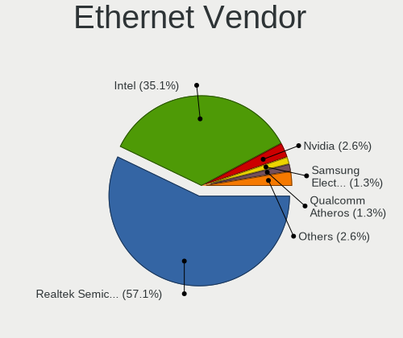

| Vendor                | Desktops | Percent |
|-----------------------|----------|---------|
| Realtek Semiconductor | 31       | 57.41%  |
| Intel                 | 18       | 33.33%  |
| Samsung Electronics   | 1        | 1.85%   |
| Qualcomm Atheros      | 1        | 1.85%   |
| Nvidia                | 1        | 1.85%   |
| NetGear               | 1        | 1.85%   |
| Aquantia              | 1        | 1.85%   |

Ethernet Model
--------------

Ethernet models

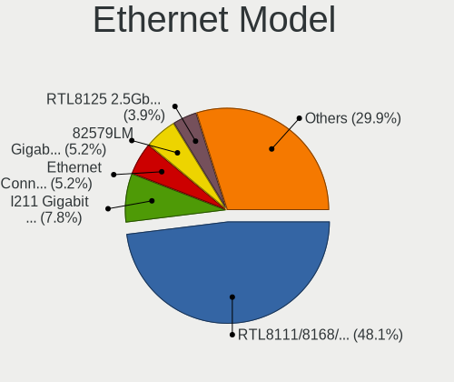

| Model                                                             | Desktops | Percent |
|-------------------------------------------------------------------|----------|---------|
| Realtek RTL8111/8168/8411 PCI Express Gigabit Ethernet Controller | 26       | 48.15%  |
| Intel I211 Gigabit Network Connection                             | 4        | 7.41%   |
| Intel Ethernet Connection I217-LM                                 | 4        | 7.41%   |
| Intel 82579LM Gigabit Network Connection (Lewisville)             | 4        | 7.41%   |
| Intel 82567LM-3 Gigabit Network Connection                        | 3        | 5.56%   |
| Realtek RTL810xE PCI Express Fast Ethernet controller             | 2        | 3.7%    |
| Samsung Galaxy series, misc. (tethering mode)                     | 1        | 1.85%   |
| Realtek RTL8153 Gigabit Ethernet Adapter                          | 1        | 1.85%   |
| Realtek RTL8125 2.5GbE Controller                                 | 1        | 1.85%   |
| Realtek Killer E3000 2.5GbE Controller                            | 1        | 1.85%   |
| Qualcomm Atheros Killer E2500 Gigabit Ethernet Controller         | 1        | 1.85%   |
| Nvidia CK804 Ethernet Controller                                  | 1        | 1.85%   |
| NetGear AirCard 790S                                              | 1        | 1.85%   |
| Intel Ethernet Controller I225-V                                  | 1        | 1.85%   |
| Intel Ethernet Connection (2) I219-V                              | 1        | 1.85%   |
| Intel 82566DM-2 Gigabit Network Connection                        | 1        | 1.85%   |
| Aquantia AQC107 NBase-T/IEEE 802.3bz Ethernet Controller [AQtion] | 1        | 1.85%   |

Net Controller Kind
-------------------

Ethernet, WiFi or modem

| Kind     | Desktops | Percent |
|----------|----------|---------|
| Ethernet | 49       | 63.64%  |
| WiFi     | 28       | 36.36%  |

Used Controller
---------------

Currently used network controller

| Kind     | Desktops | Percent |
|----------|----------|---------|
| Ethernet | 43       | 69.35%  |
| WiFi     | 19       | 30.65%  |

NICs
----

Total network controllers on board

| Total | Desktops | Percent |
|-------|----------|---------|
| 1     | 33       | 64.71%  |
| 2     | 16       | 31.37%  |
| 3     | 2        | 3.92%   |

IPv6
----

IPv6 vs IPv4

| Used | Desktops | Percent |
|------|----------|---------|
| No   | 48       | 97.96%  |
| Yes  | 1        | 2.04%   |

Bluetooth
---------

Bluetooth Vendor
----------------

Controller vendors

| Vendor                          | Desktops | Percent |
|---------------------------------|----------|---------|
| Intel                           | 11       | 40.74%  |
| Cambridge Silicon Radio         | 8        | 29.63%  |
| Broadcom                        | 2        | 7.41%   |
| Toshiba                         | 1        | 3.7%    |
| Realtek Semiconductor           | 1        | 3.7%    |
| Qualcomm Atheros Communications | 1        | 3.7%    |
| Lite-On Technology              | 1        | 3.7%    |
| Dynex                           | 1        | 3.7%    |
| Belkin Components               | 1        | 3.7%    |

Bluetooth Model
---------------

Controller models

| Model                                                    | Desktops | Percent |
|----------------------------------------------------------|----------|---------|
| Cambridge Silicon Radio Bluetooth Dongle (HCI mode)      | 8        | 29.63%  |
| Intel Wireless-AC 3168 Bluetooth                         | 4        | 14.81%  |
| Intel AX200 Bluetooth                                    | 4        | 14.81%  |
| Intel Bluetooth wireless interface                       | 2        | 7.41%   |
| Broadcom Bluetooth Device                                | 2        | 7.41%   |
| Toshiba Atheros AR3012 Bluetooth                         | 1        | 3.7%    |
| Realtek Bluetooth Radio                                  | 1        | 3.7%    |
| Qualcomm Atheros  Bluetooth Device                       | 1        | 3.7%    |
| Lite-On Bluetooth Device                                 | 1        | 3.7%    |
| Intel AX201 Bluetooth                                    | 1        | 3.7%    |
| Dynex Bluetooth 4.0 Adapter [Broadcom, 1.12, BCM20702A0] | 1        | 3.7%    |
| Belkin Components Bluetooth Mini Dongle                  | 1        | 3.7%    |

Sound
-----

Sound Vendor
------------

Sound card vendors

| Vendor                                          | Desktops | Percent |
|-------------------------------------------------|----------|---------|
| Intel                                           | 30       | 42.86%  |
| AMD                                             | 17       | 24.29%  |
| Nvidia                                          | 12       | 17.14%  |
| Logitech                                        | 6        | 8.57%   |
| C-Media Electronics                             | 2        | 2.86%   |
| Nintendo                                        | 1        | 1.43%   |
| Licensed by Sony Computer Entertainment America | 1        | 1.43%   |
| Kingston Technology                             | 1        | 1.43%   |

Sound Model
-----------

Sound card models

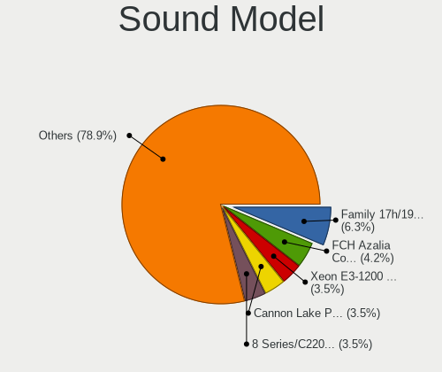

| Model                                                                             | Desktops | Percent |
|-----------------------------------------------------------------------------------|----------|---------|
| Intel Xeon E3-1200 v3/4th Gen Core Processor HD Audio Controller                  | 5        | 5.62%   |
| Intel 8 Series/C220 Series Chipset High Definition Audio Controller               | 5        | 5.62%   |
| AMD Starship/Matisse HD Audio Controller                                          | 4        | 4.49%   |
| AMD FCH Azalia Controller                                                         | 4        | 4.49%   |
| AMD Family 17h/19h HD Audio Controller                                            | 4        | 4.49%   |
| Nvidia GP107GL High Definition Audio Controller                                   | 3        | 3.37%   |
| Logitech EasyCall Speakerphone                                                    | 3        | 3.37%   |
| Intel NM10/ICH7 Family High Definition Audio Controller                           | 3        | 3.37%   |
| Intel Atom Processor Z36xxx/Z37xxx Series High Definition Audio Controller        | 3        | 3.37%   |
| Intel 82801JD/DO (ICH10 Family) HD Audio Controller                               | 3        | 3.37%   |
| AMD Raven/Raven2/Fenghuang HDMI/DP Audio Controller                               | 3        | 3.37%   |
| AMD Family 17h (Models 00h-0fh) HD Audio Controller                               | 3        | 3.37%   |
| Nvidia GP106 High Definition Audio Controller                                     | 2        | 2.25%   |
| Nvidia GP102 HDMI Audio Controller                                                | 2        | 2.25%   |
| Nvidia GF119 HDMI Audio Controller                                                | 2        | 2.25%   |
| Intel Sunrise Point-LP HD Audio                                                   | 2        | 2.25%   |
| Intel Celeron/Pentium Silver Processor High Definition Audio                      | 2        | 2.25%   |
| Intel 7 Series/C216 Chipset Family High Definition Audio Controller               | 2        | 2.25%   |
| Intel 6 Series/C200 Series Chipset Family High Definition Audio Controller        | 2        | 2.25%   |
| Intel 200 Series PCH HD Audio                                                     | 2        | 2.25%   |
| AMD Trinity HDMI Audio Controller                                                 | 2        | 2.25%   |
| AMD SBx00 Azalia (Intel HDA)                                                      | 2        | 2.25%   |
| AMD Navi 10 HDMI Audio                                                            | 2        | 2.25%   |
| Nvidia TU116 High Definition Audio Controller                                     | 1        | 1.12%   |
| Nvidia TU107 GeForce GTX 1650 High Definition Audio Controller                    | 1        | 1.12%   |
| Nvidia GP108 High Definition Audio Controller                                     | 1        | 1.12%   |
| Nvidia GA102 High Definition Audio Controller                                     | 1        | 1.12%   |
| Nintendo WUP-021-0                                                                | 1        | 1.12%   |
| Logitech QuickCam Fusion                                                          | 1        | 1.12%   |
| Logitech Headset H390                                                             | 1        | 1.12%   |
| Logitech G635 Gaming Headset                                                      | 1        | 1.12%   |
| Licensed by Sony Computer Entertainment America Wireless Stereo Headset           | 1        | 1.12%   |
| Kingston Technology HyperX SoloCast                                               | 1        | 1.12%   |
| Intel Cannon Lake PCH cAVS                                                        | 1        | 1.12%   |
| Intel Audio device                                                                | 1        | 1.12%   |
| Intel 9 Series Chipset Family HD Audio Controller                                 | 1        | 1.12%   |
| Intel 82801JI (ICH10 Family) HD Audio Controller                                  | 1        | 1.12%   |
| Intel 82801I (ICH9 Family) HD Audio Controller                                    | 1        | 1.12%   |
| Intel 100 Series/C230 Series Chipset Family HD Audio Controller                   | 1        | 1.12%   |
| C-Media Electronics CM6501                                                        | 1        | 1.12%   |
| C-Media Electronics Audio Adapter (Unitek Y-247A)                                 | 1        | 1.12%   |
| AMD RS780 HDMI Audio [Radeon 3000/3100 / HD 3200/3300]                            | 1        | 1.12%   |
| AMD Renoir Radeon High Definition Audio Controller                                | 1        | 1.12%   |
| AMD Kaveri HDMI/DP Audio Controller                                               | 1        | 1.12%   |
| AMD Ellesmere HDMI Audio [Radeon RX 470/480 / 570/580/590]                        | 1        | 1.12%   |
| AMD Cedar HDMI Audio [Radeon HD 5400/6300/7300 Series]                            | 1        | 1.12%   |
| AMD Caicos HDMI Audio [Radeon HD 6450 / 7450/8450/8490 OEM / R5 230/235/235X OEM] | 1        | 1.12%   |

Memory
------

Memory Vendor
-------------

Memory module vendors

| Vendor              | Desktops | Percent |
|---------------------|----------|---------|
| Unknown             | 7        | 38.89%  |
| Samsung Electronics | 3        | 16.67%  |
| Corsair             | 2        | 11.11%  |
| SK Hynix            | 1        | 5.56%   |
| Sesame              | 1        | 5.56%   |
| PNY                 | 1        | 5.56%   |
| Kingston            | 1        | 5.56%   |
| G.Skill             | 1        | 5.56%   |
| Crucial             | 1        | 5.56%   |

Memory Model
------------

Memory module models

| Model                                                    | Desktops | Percent |
|----------------------------------------------------------|----------|---------|
| Unknown RAM Module 2048MB DIMM SDRAM                     | 3        | 15%     |
| Unknown RAM Module 8GB DIMM DDR3 1333MT/s                | 1        | 5%      |
| Unknown RAM Module 4096MB DIMM 667MT/s                   | 1        | 5%      |
| Unknown RAM Module 2048MB DIMM DDR2 200MT/s              | 1        | 5%      |
| Unknown RAM CL18-20-20 D4-3600 8192MB DIMM DDR4 3600MT/s | 1        | 5%      |
| SK Hynix RAM HMT351U6CFR8C-H9 4096MB DIMM DDR3 1333MT/s  | 1        | 5%      |
| Sesame RAM S939A2UGS-ITR 8192MB DIMM DDR3 1600MT/s       | 1        | 5%      |
| Samsung RAM M378B5273CH0-CH9 4096MB DIMM DDR3 1867MT/s   | 1        | 5%      |
| Samsung RAM M378B5173QH0-CK0 4GB DIMM DDR3 1866MT/s      | 1        | 5%      |
| Samsung RAM M378B5173DB0-CK0 4GB DIMM DDR3 1600MT/s      | 1        | 5%      |
| Samsung RAM M378B1G73QH0-CK0 8GB DIMM DDR3 1600MT/s      | 1        | 5%      |
| Samsung RAM M378B1G73BH0-CK0 8GB DIMM DDR3 1600MT/s      | 1        | 5%      |
| PNY RAM 4GBH1X04E9992 4096MB DIMM DDR3 1600MT/s          | 1        | 5%      |
| Kingston RAM X2YH1K-MIE-NX 16GB DIMM DDR4 2667MT/s       | 1        | 5%      |
| G.Skill RAM F3-10666CL9-8GBSQ 8GB DIMM DDR3 1333MT/s     | 1        | 5%      |
| Crucial RAM CT51264BD160B.C16F 4GB DIMM DDR3 1600MT/s    | 1        | 5%      |
| Corsair RAM CMK16GX4M2B3200C16 8GB DIMM DDR4 3600MT/s    | 1        | 5%      |
| Corsair RAM CMK16GX4M2B3000C15 8GB DIMM DDR4 3000MT/s    | 1        | 5%      |

Memory Kind
-----------

Memory module kinds

| Kind    | Desktops | Percent |
|---------|----------|---------|
| DDR3    | 9        | 50%     |
| DDR4    | 4        | 22.22%  |
| SDRAM   | 3        | 16.67%  |
| DDR2    | 1        | 5.56%   |
| Unknown | 1        | 5.56%   |

Memory Form Factor
------------------

Physical design of the memory module

| Name | Desktops | Percent |
|------|----------|---------|
| DIMM | 18       | 100%    |

Memory Size
-----------

Memory module size

| Size  | Desktops | Percent |
|-------|----------|---------|
| 8192  | 7        | 38.89%  |
| 4096  | 6        | 33.33%  |
| 2048  | 4        | 22.22%  |
| 16384 | 1        | 5.56%   |

Memory Speed
------------

Memory module speed

| Speed   | Desktops | Percent |
|---------|----------|---------|
| 1600    | 5        | 26.32%  |
| 1333    | 3        | 15.79%  |
| Unknown | 3        | 15.79%  |
| 3600    | 2        | 10.53%  |
| 3466    | 1        | 5.26%   |
| 2667    | 1        | 5.26%   |
| 1867    | 1        | 5.26%   |
| 1866    | 1        | 5.26%   |
| 667     | 1        | 5.26%   |
| 200     | 1        | 5.26%   |

Printers & scanners
-------------------

Printer Vendor
--------------

Printer device vendors

| Vendor             | Desktops | Percent |
|--------------------|----------|---------|
| Hewlett-Packard    | 1        | 50%     |
| Brother Industries | 1        | 50%     |

Printer Model
-------------

Printer device models

| Model                 | Desktops | Percent |
|-----------------------|----------|---------|
| HP OfficeJet Pro 6960 | 1        | 50%     |
| Brother MFC-L2685DW   | 1        | 50%     |

Scanner Vendor
--------------

Scanner device vendors

Zero info for selected period =(

Scanner Model
-------------

Scanner device models

Zero info for selected period =(

Camera
------

Camera Vendor
-------------

Camera device vendors

| Vendor           | Desktops | Percent |
|------------------|----------|---------|
| Microdia         | 5        | 41.67%  |
| Logitech         | 5        | 41.67%  |
| Jieli Technology | 1        | 8.33%   |
| Cubeternet       | 1        | 8.33%   |

Camera Model
------------

Camera device models

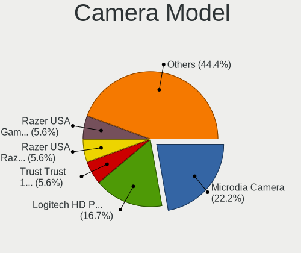

| Model                           | Desktops | Percent |
|---------------------------------|----------|---------|
| Microdia Camera                 | 4        | 33.33%  |
| Microdia USB 2.0 Camera         | 1        | 8.33%   |
| Logitech Webcam Pro 9000        | 1        | 8.33%   |
| Logitech Webcam C310            | 1        | 8.33%   |
| Logitech Webcam C270            | 1        | 8.33%   |
| Logitech HD Pro Webcam C920     | 1        | 8.33%   |
| Logitech CrystalCam             | 1        | 8.33%   |
| Jieli USB PHY 2.0               | 1        | 8.33%   |
| Cubeternet GL-UPC822 UVC WebCam | 1        | 8.33%   |

Security
--------

Fingerprint Vendor
------------------

Fingerprint sensor vendors

Zero info for selected period =(

Fingerprint Model
-----------------

Fingerprint sensor models

Zero info for selected period =(

Chipcard Vendor
---------------

Chipcard module vendors

Zero info for selected period =(

Chipcard Model
--------------

Chipcard module models

Zero info for selected period =(

Unsupported
-----------

Unsupported Devices
-------------------

Total unsupported devices on board

| Total | Desktops | Percent |
|-------|----------|---------|
| 0     | 41       | 71.93%  |
| 1     | 13       | 22.81%  |
| 2     | 3        | 5.26%   |

Unsupported Device Types
------------------------

Types of unsupported devices

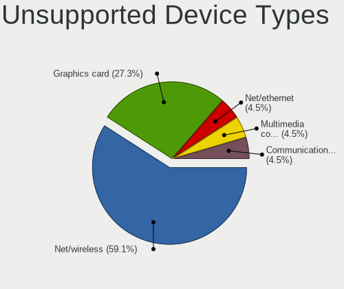

| Type                     | Desktops | Percent |
|--------------------------|----------|---------|
| Net/wireless             | 11       | 68.75%  |
| Graphics card            | 3        | 18.75%  |
| Net/ethernet             | 1        | 6.25%   |
| Communication controller | 1        | 6.25%   |

