Linux in Puerto Rico - Tested Hardware & Statistics (Desktops)
--------------------------------------------------------------

A project to collect tested hardware configurations for Linux in Puerto Rico.

Anyone can contribute to this report by the [hw-probe](https://github.com/linuxhw/hw-probe) tool:

    sudo -E hw-probe -all -upload

Please contribute! Especially if your hardware is rare.

Contents
--------

* [ Test Cases ](#test-cases)

* [ System ](#system)
  - [ OS                       ](#os)
  - [ OS Family                ](#os-family)
  - [ Kernel                   ](#kernel)
  - [ Kernel Family            ](#kernel-family)
  - [ Kernel Major Ver.        ](#kernel-major-ver)
  - [ Arch                     ](#arch)
  - [ DE                       ](#de)
  - [ Display Server           ](#display-server)
  - [ Display Manager          ](#display-manager)
  - [ OS Lang                  ](#os-lang)
  - [ Boot Mode                ](#boot-mode)
  - [ Filesystem               ](#filesystem)
  - [ Part. scheme             ](#part-scheme)
  - [ Dual Boot with Linux/BSD ](#dual-boot-with-linuxbsd)
  - [ Dual Boot (Win)          ](#dual-boot-win)

* [ Board ](#board)
  - [ Vendor                   ](#vendor)
  - [ Model                    ](#model)
  - [ Model Family             ](#model-family)
  - [ MFG Year                 ](#mfg-year)
  - [ Form Factor              ](#form-factor)
  - [ Secure Boot              ](#secure-boot)
  - [ Coreboot                 ](#coreboot)
  - [ RAM Size                 ](#ram-size)
  - [ RAM Used                 ](#ram-used)
  - [ Total Drives             ](#total-drives)
  - [ Has CD-ROM               ](#has-cd-rom)
  - [ Has Ethernet             ](#has-ethernet)
  - [ Has WiFi                 ](#has-wifi)
  - [ Has Bluetooth            ](#has-bluetooth)

* [ Location ](#location)
  - [ Country                  ](#country)
  - [ City                     ](#city)

* [ Drives ](#drives)
  - [ Drive Vendor             ](#drive-vendor)
  - [ Drive Model              ](#drive-model)
  - [ HDD Vendor               ](#hdd-vendor)
  - [ SSD Vendor               ](#ssd-vendor)
  - [ Drive Kind               ](#drive-kind)
  - [ Drive Connector          ](#drive-connector)
  - [ Drive Size               ](#drive-size)
  - [ Space Total              ](#space-total)
  - [ Space Used               ](#space-used)
  - [ Malfunc. Drives          ](#malfunc-drives)
  - [ Malfunc. Drive Vendor    ](#malfunc-drive-vendor)
  - [ Malfunc. HDD Vendor      ](#malfunc-hdd-vendor)
  - [ Malfunc. Drive Kind      ](#malfunc-drive-kind)
  - [ Failed Drives            ](#failed-drives)
  - [ Failed Drive Vendor      ](#failed-drive-vendor)
  - [ Drive Status             ](#drive-status)

* [ Storage controller ](#storage-controller)
  - [ Storage Vendor           ](#storage-vendor)
  - [ Storage Model            ](#storage-model)
  - [ Storage Kind             ](#storage-kind)

* [ Processor ](#processor)
  - [ CPU Vendor               ](#cpu-vendor)
  - [ CPU Model                ](#cpu-model)
  - [ CPU Model Family         ](#cpu-model-family)
  - [ CPU Cores                ](#cpu-cores)
  - [ CPU Sockets              ](#cpu-sockets)
  - [ CPU Threads              ](#cpu-threads)
  - [ CPU Op-Modes             ](#cpu-op-modes)
  - [ CPU Microcode            ](#cpu-microcode)
  - [ CPU Microarch            ](#cpu-microarch)

* [ Graphics ](#graphics)
  - [ GPU Vendor               ](#gpu-vendor)
  - [ GPU Model                ](#gpu-model)
  - [ GPU Combo                ](#gpu-combo)
  - [ GPU Driver               ](#gpu-driver)
  - [ GPU Memory               ](#gpu-memory)

* [ Monitor ](#monitor)
  - [ Monitor Vendor           ](#monitor-vendor)
  - [ Monitor Model            ](#monitor-model)
  - [ Monitor Resolution       ](#monitor-resolution)
  - [ Monitor Diagonal         ](#monitor-diagonal)
  - [ Monitor Width            ](#monitor-width)
  - [ Aspect Ratio             ](#aspect-ratio)
  - [ Monitor Area             ](#monitor-area)
  - [ Pixel Density            ](#pixel-density)
  - [ Multiple Monitors        ](#multiple-monitors)

* [ Network ](#network)
  - [ Net Controller Vendor    ](#net-controller-vendor)
  - [ Net Controller Model     ](#net-controller-model)
  - [ Wireless Vendor          ](#wireless-vendor)
  - [ Wireless Model           ](#wireless-model)
  - [ Ethernet Vendor          ](#ethernet-vendor)
  - [ Ethernet Model           ](#ethernet-model)
  - [ Net Controller Kind      ](#net-controller-kind)
  - [ Used Controller          ](#used-controller)
  - [ NICs                     ](#nics)
  - [ IPv6                     ](#ipv6)

* [ Bluetooth ](#bluetooth)
  - [ Bluetooth Vendor         ](#bluetooth-vendor)
  - [ Bluetooth Model          ](#bluetooth-model)

* [ Sound ](#sound)
  - [ Sound Vendor             ](#sound-vendor)
  - [ Sound Model              ](#sound-model)

* [ Memory ](#memory)
  - [ Memory Vendor            ](#memory-vendor)
  - [ Memory Model             ](#memory-model)
  - [ Memory Kind              ](#memory-kind)
  - [ Memory Form Factor       ](#memory-form-factor)
  - [ Memory Size              ](#memory-size)
  - [ Memory Speed             ](#memory-speed)

* [ Printers & scanners ](#printers--scanners)
  - [ Printer Vendor           ](#printer-vendor)
  - [ Printer Model            ](#printer-model)
  - [ Scanner Vendor           ](#scanner-vendor)
  - [ Scanner Model            ](#scanner-model)

* [ Camera ](#camera)
  - [ Camera Vendor            ](#camera-vendor)
  - [ Camera Model             ](#camera-model)

* [ Security ](#security)
  - [ Fingerprint Vendor       ](#fingerprint-vendor)
  - [ Fingerprint Model        ](#fingerprint-model)
  - [ Chipcard Vendor          ](#chipcard-vendor)
  - [ Chipcard Model           ](#chipcard-model)

* [ Unsupported ](#unsupported)
  - [ Unsupported Devices      ](#unsupported-devices)
  - [ Unsupported Device Types ](#unsupported-device-types)

Test Cases
----------

Total: 143

| Vendor    | Model                       | Probe                                                      | Date         |
|-----------|-----------------------------|------------------------------------------------------------|--------------|
| MSI       | MS-B1711                    | [e389d750a3](https://linux-hardware.org/?probe=e389d750a3) | Dec 14, 2024 |
| MSI       | MAG B650 TOMAHAWK WIFI      | [efae733196](https://linux-hardware.org/?probe=efae733196) | Dec 01, 2024 |
| Dell      | 0FDY5C A00                  | [2975c3986e](https://linux-hardware.org/?probe=2975c3986e) | Oct 02, 2024 |
| MSI       | B450I GAMING PLUS AC        | [4202cf424e](https://linux-hardware.org/?probe=4202cf424e) | Sep 16, 2024 |
| Gigabyte  | F2A68HM-H                   | [b3488f2839](https://linux-hardware.org/?probe=b3488f2839) | Jul 25, 2024 |
| HP        | 89B5 A                      | [f87a73cfdf](https://linux-hardware.org/?probe=f87a73cfdf) | Jul 11, 2024 |
| ASUSTek   | PRIME B450M-A II            | [3faecb222b](https://linux-hardware.org/?probe=3faecb222b) | Jun 12, 2024 |
| Dell      | 0NW6H5 A00                  | [b70239f287](https://linux-hardware.org/?probe=b70239f287) | Apr 15, 2024 |
| Gigabyte  | F2A88XN-WIFI                | [25d9669839](https://linux-hardware.org/?probe=25d9669839) | Mar 25, 2024 |
| Dell      | 0YNVJG A02                  | [c979ee9419](https://linux-hardware.org/?probe=c979ee9419) | Feb 11, 2024 |
| MSI       | MPG B550 GAMING PLUS        | [f38d7bb62a](https://linux-hardware.org/?probe=f38d7bb62a) | Jan 24, 2024 |
| Foxconn   | 2ABF                        | [9a5efc4dd3](https://linux-hardware.org/?probe=9a5efc4dd3) | Jan 19, 2024 |
| MSI       | MPG Z590 GAMING PLUS        | [b9fe694efb](https://linux-hardware.org/?probe=b9fe694efb) | Jan 12, 2024 |
| ASUSTek   | ROG STRIX B450-F GAMING ... | [54f70ad2a1](https://linux-hardware.org/?probe=54f70ad2a1) | Jan 05, 2024 |
| Foxconn   | 2ABF                        | [86bb3586e0](https://linux-hardware.org/?probe=86bb3586e0) | Jan 04, 2024 |
| HP        | 83E1                        | [9006156354](https://linux-hardware.org/?probe=9006156354) | Jan 04, 2024 |
| HP        | 8767 A                      | [6d2a367189](https://linux-hardware.org/?probe=6d2a367189) | Dec 25, 2023 |
| Gigabyte  | Z390 AORUS PRO WIFI-CF      | [2ee56e1ee0](https://linux-hardware.org/?probe=2ee56e1ee0) | Oct 07, 2023 |
| Gigabyte  | B360M DS3H                  | [1308430981](https://linux-hardware.org/?probe=1308430981) | Sep 28, 2023 |
| Gateway   | RS780                       | [d73767c9f7](https://linux-hardware.org/?probe=d73767c9f7) | Aug 21, 2023 |
| Gateway   | H61H2-AD V1.0               | [9a34a9295c](https://linux-hardware.org/?probe=9a34a9295c) | Jun 15, 2023 |
| ASRock    | B450M Pro4                  | [2d42a4443c](https://linux-hardware.org/?probe=2d42a4443c) | May 23, 2023 |
| Gigabyte  | B360M DS3H                  | [b6336515aa](https://linux-hardware.org/?probe=b6336515aa) | May 19, 2023 |
| Gateway   | RS780                       | [e04207a390](https://linux-hardware.org/?probe=e04207a390) | May 07, 2023 |
| Gigabyte  | X570 GAMING X               | [83132b245e](https://linux-hardware.org/?probe=83132b245e) | Apr 05, 2023 |
| ECS       | Iris8                       | [f86927f9ff](https://linux-hardware.org/?probe=f86927f9ff) | Apr 04, 2023 |
| MSI       | Z370-A PRO                  | [9aba047596](https://linux-hardware.org/?probe=9aba047596) | Mar 30, 2023 |
| MSI       | H81M-P33                    | [4606b5b93d](https://linux-hardware.org/?probe=4606b5b93d) | Mar 29, 2023 |
| HP        | 83E1                        | [2a1ade4f84](https://linux-hardware.org/?probe=2a1ade4f84) | Mar 17, 2023 |
| HP        | 83E1                        | [d286798430](https://linux-hardware.org/?probe=d286798430) | Mar 13, 2023 |
| HP        | 83E1                        | [86061f121d](https://linux-hardware.org/?probe=86061f121d) | Mar 08, 2023 |
| HP        | 89B5 A                      | [4fcef21d82](https://linux-hardware.org/?probe=4fcef21d82) | Jan 07, 2023 |
| ASUSTek   | TUF Gaming B560M-PLUS WI... | [9e63ba2bf9](https://linux-hardware.org/?probe=9e63ba2bf9) | Oct 23, 2022 |
| ASRock    | X570 Phantom Gaming 4S      | [2215129a47](https://linux-hardware.org/?probe=2215129a47) | Oct 02, 2022 |
| Intel     | SKYBAY                      | [b667cf66e8](https://linux-hardware.org/?probe=b667cf66e8) | Sep 07, 2022 |
| ASRock    | B450M-HDV                   | [e45f2cd5d8](https://linux-hardware.org/?probe=e45f2cd5d8) | Jul 20, 2022 |
| MSI       | MS-B0A1                     | [9b53e39bad](https://linux-hardware.org/?probe=9b53e39bad) | Jul 04, 2022 |
| MSI       | MS-B0A1                     | [3193cbe3fd](https://linux-hardware.org/?probe=3193cbe3fd) | Jun 20, 2022 |
| Dell      | 0N4YC8 A00                  | [83ed9adfc1](https://linux-hardware.org/?probe=83ed9adfc1) | May 04, 2022 |
| Dell      | 0G261D A00                  | [860d883e5b](https://linux-hardware.org/?probe=860d883e5b) | Apr 29, 2022 |
| ASRock    | B450M-HDV R4.0              | [bce1bba9ff](https://linux-hardware.org/?probe=bce1bba9ff) | Apr 29, 2022 |
| Dell      | 0N4YC8 A00                  | [32cc2a24ac](https://linux-hardware.org/?probe=32cc2a24ac) | Apr 20, 2022 |
| Dell      | 0N4YC8 A00                  | [b4ea114ce4](https://linux-hardware.org/?probe=b4ea114ce4) | Apr 17, 2022 |
| Gigabyte  | B450 AORUS PRO WIFI-CF      | [656e8c50dd](https://linux-hardware.org/?probe=656e8c50dd) | Apr 13, 2022 |
| Dell      | 0N4YC8 A00                  | [c32c875fc6](https://linux-hardware.org/?probe=c32c875fc6) | Apr 10, 2022 |
| ASUSTek   | ROG STRIX B450-F GAMING     | [2315db07e2](https://linux-hardware.org/?probe=2315db07e2) | Apr 02, 2022 |
| HP        | 0AA8h                       | [b3507722e3](https://linux-hardware.org/?probe=b3507722e3) | Mar 19, 2022 |
| Dell      | OptiPlex 7020               | [ba82f9d852](https://linux-hardware.org/?probe=ba82f9d852) | Mar 01, 2022 |
| HP        | 0AA8h                       | [21de71cf71](https://linux-hardware.org/?probe=21de71cf71) | Feb 25, 2022 |
| ASRock    | B450M-HDV R4.0              | [f2a65b8a5f](https://linux-hardware.org/?probe=f2a65b8a5f) | Feb 14, 2022 |
| ASRock    | B450M-HDV R4.0              | [8e7267692b](https://linux-hardware.org/?probe=8e7267692b) | Jan 21, 2022 |
| Gigabyte  | X570 AORUS ELITE WIFI       | [464d10c41d](https://linux-hardware.org/?probe=464d10c41d) | Dec 22, 2021 |
| Dell      | 0R6JMP A00                  | [7bc4106877](https://linux-hardware.org/?probe=7bc4106877) | Dec 12, 2021 |
| Dell      | 0R6JMP A00                  | [2b3e03c89b](https://linux-hardware.org/?probe=2b3e03c89b) | Dec 12, 2021 |
| HP        | 1998                        | [7bc6ddebf4](https://linux-hardware.org/?probe=7bc6ddebf4) | Nov 21, 2021 |
| ASRock    | Q1900M                      | [8482ae3a2f](https://linux-hardware.org/?probe=8482ae3a2f) | Nov 09, 2021 |
| HP        | 339A                        | [e2ce00d1ec](https://linux-hardware.org/?probe=e2ce00d1ec) | Nov 08, 2021 |
| Alienware | 07W25T A00                  | [c08c87521f](https://linux-hardware.org/?probe=c08c87521f) | Nov 08, 2021 |
| Gigabyte  | J1900N-D3V                  | [29c7fa76a8](https://linux-hardware.org/?probe=29c7fa76a8) | Oct 10, 2021 |
| Gigabyte  | J1900N-D3V                  | [6818ec3abc](https://linux-hardware.org/?probe=6818ec3abc) | Oct 10, 2021 |
| ASRock    | Z270 Killer SLI/ac          | [732c00f018](https://linux-hardware.org/?probe=732c00f018) | Oct 06, 2021 |
| ASUSTek   | TUF Gaming X570-PRO         | [9ed2b3cf12](https://linux-hardware.org/?probe=9ed2b3cf12) | Sep 21, 2021 |
| ASUSTek   | TUF Gaming X570-PRO         | [a96d28c504](https://linux-hardware.org/?probe=a96d28c504) | Sep 16, 2021 |
| HP        | 1495                        | [3f39c0e882](https://linux-hardware.org/?probe=3f39c0e882) | Jul 23, 2021 |
| Pegatron  | 2ACD                        | [fd757c14ce](https://linux-hardware.org/?probe=fd757c14ce) | Jun 13, 2021 |
| HP        | 1998                        | [7b400d8da6](https://linux-hardware.org/?probe=7b400d8da6) | Jun 11, 2021 |
| HP        | 1998                        | [304ce6f1c4](https://linux-hardware.org/?probe=304ce6f1c4) | Jun 02, 2021 |
| HP        | 1998                        | [4c3248677a](https://linux-hardware.org/?probe=4c3248677a) | May 25, 2021 |
| HP        | 1998                        | [9239b61815](https://linux-hardware.org/?probe=9239b61815) | May 25, 2021 |
| HP        | 1998                        | [639725c8af](https://linux-hardware.org/?probe=639725c8af) | May 24, 2021 |
| HP        | 339A                        | [ac11f05a1a](https://linux-hardware.org/?probe=ac11f05a1a) | May 21, 2021 |
| Intel     | SKYBAY                      | [9bc7ab87d1](https://linux-hardware.org/?probe=9bc7ab87d1) | May 19, 2021 |
| ASRock    | Q1900M                      | [7c778b5654](https://linux-hardware.org/?probe=7c778b5654) | May 02, 2021 |
| HP        | 1998                        | [7442c54767](https://linux-hardware.org/?probe=7442c54767) | Apr 29, 2021 |
| HP        | 1998                        | [ec0fdacf3a](https://linux-hardware.org/?probe=ec0fdacf3a) | Apr 12, 2021 |
| HP        | 1998                        | [c395021e6a](https://linux-hardware.org/?probe=c395021e6a) | Apr 12, 2021 |
| Intel     | SKYBAY                      | [472818e347](https://linux-hardware.org/?probe=472818e347) | Apr 04, 2021 |
| HP        | 1998                        | [f515fbf660](https://linux-hardware.org/?probe=f515fbf660) | Apr 01, 2021 |
| HP        | 1998                        | [3bc0a0dcb6](https://linux-hardware.org/?probe=3bc0a0dcb6) | Mar 20, 2021 |
| HP        | 1998                        | [a10d91fc1b](https://linux-hardware.org/?probe=a10d91fc1b) | Mar 20, 2021 |
| Intel     | SKYBAY                      | [5ab0183bc4](https://linux-hardware.org/?probe=5ab0183bc4) | Mar 18, 2021 |
| Intel     | SKYBAY                      | [ecefc99ed5](https://linux-hardware.org/?probe=ecefc99ed5) | Mar 14, 2021 |
| Acer      | AAHD3.VC                    | [775057eb07](https://linux-hardware.org/?probe=775057eb07) | Feb 20, 2021 |
| Acer      | AAHD3.VC                    | [b11309575f](https://linux-hardware.org/?probe=b11309575f) | Feb 19, 2021 |
| Dell      | 0DFRFW A00                  | [093c47fb9c](https://linux-hardware.org/?probe=093c47fb9c) | Feb 13, 2021 |
| ASRock    | Q1900M                      | [d4372897b8](https://linux-hardware.org/?probe=d4372897b8) | Feb 13, 2021 |
| MSI       | H81M-P33                    | [190f14bae7](https://linux-hardware.org/?probe=190f14bae7) | Feb 13, 2021 |
| ASUSTek   | PRIME B550M-A               | [81a3e9faea](https://linux-hardware.org/?probe=81a3e9faea) | Feb 11, 2021 |
| HP        | 18E4                        | [db6eb1d366](https://linux-hardware.org/?probe=db6eb1d366) | Feb 05, 2021 |
| HP        | 18E4                        | [bad5f5110c](https://linux-hardware.org/?probe=bad5f5110c) | Feb 03, 2021 |
| ASUSTek   | M2N-E SLI                   | [b2513f813d](https://linux-hardware.org/?probe=b2513f813d) | Jan 16, 2021 |
| HP        | 18E4                        | [729391b32e](https://linux-hardware.org/?probe=729391b32e) | Jan 08, 2021 |
| ASUSTek   | ROG STRIX X570-E GAMING     | [8396553751](https://linux-hardware.org/?probe=8396553751) | Dec 26, 2020 |
| Lenovo    | ThinkCentre M58p 6136A66    | [166a0c26e2](https://linux-hardware.org/?probe=166a0c26e2) | Dec 23, 2020 |
| Lenovo    | 36EE SDK0J40700 WIN 3258... | [5e4b418568](https://linux-hardware.org/?probe=5e4b418568) | Dec 19, 2020 |
| Gigabyte  | X570 GAMING X               | [646f020b0d](https://linux-hardware.org/?probe=646f020b0d) | Nov 27, 2020 |
| Gigabyte  | B450M DS3H-CF               | [844bb428a9](https://linux-hardware.org/?probe=844bb428a9) | Nov 22, 2020 |
| MSI       | MS-B1711                    | [8d69ecec16](https://linux-hardware.org/?probe=8d69ecec16) | Nov 17, 2020 |
| MSI       | MS-B1711                    | [958741b7b6](https://linux-hardware.org/?probe=958741b7b6) | Nov 17, 2020 |
| MSI       | MS-B1711                    | [3c327ae485](https://linux-hardware.org/?probe=3c327ae485) | Nov 17, 2020 |
| MSI       | MS-B1711                    | [26c2dcf112](https://linux-hardware.org/?probe=26c2dcf112) | Nov 01, 2020 |
| Gigabyte  | X570 GAMING X               | [62ebca752a](https://linux-hardware.org/?probe=62ebca752a) | Oct 31, 2020 |
| Gigabyte  | X570 GAMING X               | [362d74125d](https://linux-hardware.org/?probe=362d74125d) | Oct 31, 2020 |
| ASRock    | Q1900M                      | [72cddfd9ae](https://linux-hardware.org/?probe=72cddfd9ae) | Oct 24, 2020 |
| Dell      | 0R6JMP A00                  | [c4cbec5b80](https://linux-hardware.org/?probe=c4cbec5b80) | Oct 11, 2020 |
| HP        | 339A                        | [47db0521b7](https://linux-hardware.org/?probe=47db0521b7) | Sep 23, 2020 |
| HP        | 339A                        | [51cec5b6f8](https://linux-hardware.org/?probe=51cec5b6f8) | Sep 23, 2020 |
| HP        | 339A                        | [37cfc48ef8](https://linux-hardware.org/?probe=37cfc48ef8) | Sep 21, 2020 |
| HP        | 339A                        | [254f23a364](https://linux-hardware.org/?probe=254f23a364) | Sep 21, 2020 |
| Lenovo    | ThinkCentre M91p 7033CG1    | [c08fed8ecb](https://linux-hardware.org/?probe=c08fed8ecb) | Sep 11, 2020 |
| HP        | 18E4                        | [277593bde6](https://linux-hardware.org/?probe=277593bde6) | Aug 07, 2020 |
| Gigabyte  | F2A78M-HD2                  | [25ca74bc56](https://linux-hardware.org/?probe=25ca74bc56) | Jul 24, 2020 |
| Gigabyte  | F2A78M-HD2                  | [478381d890](https://linux-hardware.org/?probe=478381d890) | Jul 12, 2020 |
| MSI       | Z370-A PRO                  | [f8629928a6](https://linux-hardware.org/?probe=f8629928a6) | Jun 18, 2020 |
| Gigabyte  | Z97M-DS3H                   | [9aaeabab3d](https://linux-hardware.org/?probe=9aaeabab3d) | Jun 18, 2020 |
| Gigabyte  | F2A68HM-H                   | [d161c397ca](https://linux-hardware.org/?probe=d161c397ca) | Jun 14, 2020 |
| HP        | 18E4                        | [1fe1707854](https://linux-hardware.org/?probe=1fe1707854) | May 07, 2020 |
| Dell      | 0M017G A00                  | [e8b9eefb82](https://linux-hardware.org/?probe=e8b9eefb82) | Apr 13, 2020 |
| Gigabyte  | X570 GAMING X               | [44caca0bb1](https://linux-hardware.org/?probe=44caca0bb1) | Mar 12, 2020 |
| Gigabyte  | X570 GAMING X               | [c0f180f342](https://linux-hardware.org/?probe=c0f180f342) | Mar 07, 2020 |
| Gigabyte  | X399 AORUS Gaming 7         | [4ac0a3b1fe](https://linux-hardware.org/?probe=4ac0a3b1fe) | Mar 06, 2020 |
| ASRock    | G31M-S                      | [a2582aaec1](https://linux-hardware.org/?probe=a2582aaec1) | Mar 06, 2020 |
| ASRock    | G31M-S                      | [a63cd159a1](https://linux-hardware.org/?probe=a63cd159a1) | Mar 06, 2020 |
| Gigabyte  | X570 GAMING X               | [aa32ea3cb7](https://linux-hardware.org/?probe=aa32ea3cb7) | Mar 05, 2020 |
| Gigabyte  | X570 GAMING X               | [efa77a90cb](https://linux-hardware.org/?probe=efa77a90cb) | Mar 01, 2020 |
| Gigabyte  | X570 GAMING X               | [40a8750e54](https://linux-hardware.org/?probe=40a8750e54) | Feb 28, 2020 |
| Gigabyte  | X399 AORUS Gaming 7         | [399d92cf32](https://linux-hardware.org/?probe=399d92cf32) | Feb 28, 2020 |
| Gigabyte  | X399 AORUS Gaming 7         | [ddebe02bcd](https://linux-hardware.org/?probe=ddebe02bcd) | Feb 28, 2020 |
| Gigabyte  | X570 GAMING X               | [132413f9bd](https://linux-hardware.org/?probe=132413f9bd) | Feb 21, 2020 |
| HP        | 18E4                        | [ee3dae8f72](https://linux-hardware.org/?probe=ee3dae8f72) | Feb 17, 2020 |
| Gigabyte  | X570 GAMING X               | [fa684e430c](https://linux-hardware.org/?probe=fa684e430c) | Feb 13, 2020 |
| MSI       | B150 PC MATE                | [ed98074061](https://linux-hardware.org/?probe=ed98074061) | Oct 08, 2019 |
| ASRock    | G31M-S                      | [d1f69377d4](https://linux-hardware.org/?probe=d1f69377d4) | Aug 18, 2019 |
| ASRock    | G31M-S                      | [595867810d](https://linux-hardware.org/?probe=595867810d) | Aug 18, 2019 |
| ASRock    | G31M-S                      | [556d0f2ca6](https://linux-hardware.org/?probe=556d0f2ca6) | Jun 06, 2019 |
| ASRock    | 945GCM-S                    | [d4ea4c5cb6](https://linux-hardware.org/?probe=d4ea4c5cb6) | May 04, 2019 |
| HP        | 18E4                        | [36f9656af0](https://linux-hardware.org/?probe=36f9656af0) | Feb 15, 2019 |
| HP        | 18E4                        | [c6cf9c7817](https://linux-hardware.org/?probe=c6cf9c7817) | Jan 04, 2019 |
| ASUSTek   | M5A78L-M LX PLUS            | [85398272dc](https://linux-hardware.org/?probe=85398272dc) | Dec 03, 2018 |
| ASUSTek   | M5A78L-M LX PLUS            | [10a5b1559d](https://linux-hardware.org/?probe=10a5b1559d) | Dec 03, 2018 |
| ASRock    | G31M-S                      | [82229858ec](https://linux-hardware.org/?probe=82229858ec) | Jun 15, 2018 |
| ASRock    | G31M-S                      | [90f397422e](https://linux-hardware.org/?probe=90f397422e) | Jun 15, 2018 |
| ASRock    | 945GCM-S                    | [c7cbed362d](https://linux-hardware.org/?probe=c7cbed362d) | May 27, 2017 |

System
------

OS
--

Installed operating systems

| Name                         | Desktops | Percent |
|------------------------------|----------|---------|
| Ubuntu 20.04                 | 6        | 6.19%   |
| Ubuntu 18.04                 | 6        | 6.19%   |
| OpenMandriva 4.2             | 4        | 4.12%   |
| OpenMandriva 23.03           | 4        | 4.12%   |
| Manjaro                      | 4        | 4.12%   |
| Fedora 39                    | 3        | 3.09%   |
| Zorin 16                     | 2        | 2.06%   |
| Zorin 15                     | 2        | 2.06%   |
| Ubuntu 22.04                 | 2        | 2.06%   |
| Ubuntu 20.10                 | 2        | 2.06%   |
| ROSA R11                     | 2        | 2.06%   |
| openSUSE Tumbleweed-XXXXXXXX | 2        | 2.06%   |
| OpenMandriva 4.3             | 2        | 2.06%   |
| OpenMandriva 24.07           | 2        | 2.06%   |
| Lubuntu 20.04                | 2        | 2.06%   |
| LMDE 4                       | 2        | 2.06%   |
| Linux Mint 20.3              | 2        | 2.06%   |
| Linux Mint 20.1              | 2        | 2.06%   |
| Linux Mint 20                | 2        | 2.06%   |
| Garuda Linux                 | 2        | 2.06%   |
| Fedora 36                    | 2        | 2.06%   |
| ArcoLinux Rolling            | 2        | 2.06%   |
| Xubuntu 20.10                | 1        | 1.03%   |
| Xubuntu 20.04                | 1        | 1.03%   |
| Xero Rolling                 | 1        | 1.03%   |
| Ubuntu Unity 20.04           | 1        | 1.03%   |
| Ubuntu Budgie 21.04          | 1        | 1.03%   |
| Ubuntu 21.10                 | 1        | 1.03%   |
| Ubuntu 19.10                 | 1        | 1.03%   |
| SteamOS 3.5.19               | 1        | 1.03%   |
| ROSA R9                      | 1        | 1.03%   |
| ROSA R10                     | 1        | 1.03%   |
| Pop!_OS 22.04                | 1        | 1.03%   |
| Pop!_OS 21.10                | 1        | 1.03%   |
| Pop!_OS 21.04                | 1        | 1.03%   |
| Pop!_OS 20.10                | 1        | 1.03%   |
| Pop!_OS 20.04                | 1        | 1.03%   |
| Pop!_OS 19.10                | 1        | 1.03%   |
| OpenMandriva 23.11           | 1        | 1.03%   |
| OpenMandriva 23.10           | 1        | 1.03%   |

OS Family
---------

OS without a version

| Name          | Desktops | Percent |
|---------------|----------|---------|
| Ubuntu        | 18       | 20%     |
| OpenMandriva  | 13       | 14.44%  |
| Pop!_OS       | 6        | 6.67%   |
| Linux Mint    | 6        | 6.67%   |
| Fedora        | 6        | 6.67%   |
| Manjaro       | 5        | 5.56%   |
| Zorin         | 4        | 4.44%   |
| ROSA          | 3        | 3.33%   |
| ArcoLinux     | 3        | 3.33%   |
| Xubuntu       | 2        | 2.22%   |
| openSUSE      | 2        | 2.22%   |
| Lubuntu       | 2        | 2.22%   |
| LMDE          | 2        | 2.22%   |
| KDE neon      | 2        | 2.22%   |
| Garuda Linux  | 2        | 2.22%   |
| Arch          | 2        | 2.22%   |
| Xero          | 1        | 1.11%   |
| Ubuntu Unity  | 1        | 1.11%   |
| Ubuntu Budgie | 1        | 1.11%   |
| SteamOS       | 1        | 1.11%   |
| Nobara        | 1        | 1.11%   |
| LinuxFX       | 1        | 1.11%   |
| Endless       | 1        | 1.11%   |
| Devuan        | 1        | 1.11%   |
| Debian        | 1        | 1.11%   |
| CentOS        | 1        | 1.11%   |
| BlackPanther  | 1        | 1.11%   |
| Aurora        | 1        | 1.11%   |

Kernel
------

Version of the Linux kernel

| Version                             | Desktops | Percent |
|-------------------------------------|----------|---------|
| 6.2.6-desktop-1omv2390              | 4        | 3.7%    |
| 5.10.14-desktop-1omv4002            | 4        | 3.7%    |
| 5.8.18-1-MANJARO                    | 2        | 1.85%   |
| 5.8.0-45-generic                    | 2        | 1.85%   |
| 5.4.0-72-generic                    | 2        | 1.85%   |
| 5.4.0-58-generic                    | 2        | 1.85%   |
| 5.4.0-109-generic                   | 2        | 1.85%   |
| 5.16.7-desktop-1omv4003             | 2        | 1.85%   |
| 5.13.0-39-generic                   | 2        | 1.85%   |
| 4.15.0-desktop-45.1rosa-x86_64      | 2        | 1.85%   |
| 6.9.7-desktop-1omv2490              | 1        | 0.93%   |
| 6.8.5-1-default                     | 1        | 0.93%   |
| 6.8.0-40-generic                    | 1        | 0.93%   |
| 6.7.4-200.fc39.x86_64               | 1        | 0.93%   |
| 6.7.1-0.rc1.250.vanilla.fc39.x86_64 | 1        | 0.93%   |
| 6.6.9-arch1-1                       | 1        | 0.93%   |
| 6.6.6-76060606-generic              | 1        | 0.93%   |
| 6.6.2-desktop-1omv2390              | 1        | 0.93%   |
| 6.6.12-200.fc39.x86_64              | 1        | 0.93%   |
| 6.5.5-desktop-1omv2390              | 1        | 0.93%   |
| 6.5.11-201.fsync.fc38.x86_64        | 1        | 0.93%   |
| 6.4.12-arch1-1                      | 1        | 0.93%   |
| 6.2.15-300.fc38.x86_64              | 1        | 0.93%   |
| 6.2.0-33-generic                    | 1        | 0.93%   |
| 6.2.0-26-generic                    | 1        | 0.93%   |
| 6.11.9-arch1-1                      | 1        | 0.93%   |
| 6.11.3-200.fc40.x86_64              | 1        | 0.93%   |
| 6.10.0-desktop-1omv2490             | 1        | 0.93%   |
| 6.1.52-valve16-1-neptune-61         | 1        | 0.93%   |
| 6.1.1-desktop-1omv2290              | 1        | 0.93%   |
| 5.9.16-1-MANJARO                    | 1        | 0.93%   |
| 5.9.1-1-MANJARO                     | 1        | 0.93%   |
| 5.8.5-zen1-1-zen                    | 1        | 0.93%   |
| 5.8.14-zen1-1-zen                   | 1        | 0.93%   |
| 5.8.0-7630-generic                  | 1        | 0.93%   |
| 5.8.0-54-generic                    | 1        | 0.93%   |
| 5.8.0-53-generic                    | 1        | 0.93%   |
| 5.8.0-49-generic                    | 1        | 0.93%   |
| 5.8.0-44-generic                    | 1        | 0.93%   |
| 5.8.0-29-generic                    | 1        | 0.93%   |

Kernel Family
-------------

Linux kernel without a distro release

| Version | Desktops | Percent |
|---------|----------|---------|
| 5.4.0   | 18       | 18.18%  |
| 5.8.0   | 8        | 8.08%   |
| 4.15.0  | 6        | 6.06%   |
| 6.2.6   | 4        | 4.04%   |
| 5.11.0  | 4        | 4.04%   |
| 5.10.14 | 4        | 4.04%   |
| 5.3.0   | 3        | 3.03%   |
| 6.2.0   | 2        | 2.02%   |
| 5.8.18  | 2        | 2.02%   |
| 5.16.7  | 2        | 2.02%   |
| 5.13.0  | 2        | 2.02%   |
| 4.19.0  | 2        | 2.02%   |
| 4.18.0  | 2        | 2.02%   |
| 6.9.7   | 1        | 1.01%   |
| 6.8.5   | 1        | 1.01%   |
| 6.8.0   | 1        | 1.01%   |
| 6.7.4   | 1        | 1.01%   |
| 6.7.1   | 1        | 1.01%   |
| 6.6.9   | 1        | 1.01%   |
| 6.6.6   | 1        | 1.01%   |
| 6.6.2   | 1        | 1.01%   |
| 6.6.12  | 1        | 1.01%   |
| 6.5.5   | 1        | 1.01%   |
| 6.5.11  | 1        | 1.01%   |
| 6.4.12  | 1        | 1.01%   |
| 6.2.15  | 1        | 1.01%   |
| 6.11.9  | 1        | 1.01%   |
| 6.11.3  | 1        | 1.01%   |
| 6.10.0  | 1        | 1.01%   |
| 6.1.52  | 1        | 1.01%   |
| 6.1.1   | 1        | 1.01%   |
| 5.9.16  | 1        | 1.01%   |
| 5.9.1   | 1        | 1.01%   |
| 5.8.5   | 1        | 1.01%   |
| 5.8.14  | 1        | 1.01%   |
| 5.19.12 | 1        | 1.01%   |
| 5.19.0  | 1        | 1.01%   |
| 5.18.9  | 1        | 1.01%   |
| 5.18.5  | 1        | 1.01%   |
| 5.18.15 | 1        | 1.01%   |

Kernel Major Ver.
-----------------

Linux kernel major version

| Version | Desktops | Percent |
|---------|----------|---------|
| 5.4     | 18       | 18.75%  |
| 5.8     | 12       | 12.5%   |
| 6.2     | 7        | 7.29%   |
| 4.15    | 6        | 6.25%   |
| 5.10    | 5        | 5.21%   |
| 6.6     | 4        | 4.17%   |
| 5.11    | 4        | 4.17%   |
| 5.3     | 3        | 3.13%   |
| 5.15    | 3        | 3.13%   |
| 5.13    | 3        | 3.13%   |
| 4.9     | 3        | 3.13%   |
| 6.8     | 2        | 2.08%   |
| 6.7     | 2        | 2.08%   |
| 6.5     | 2        | 2.08%   |
| 6.11    | 2        | 2.08%   |
| 6.1     | 2        | 2.08%   |
| 5.9     | 2        | 2.08%   |
| 5.19    | 2        | 2.08%   |
| 5.18    | 2        | 2.08%   |
| 5.16    | 2        | 2.08%   |
| 5.14    | 2        | 2.08%   |
| 4.19    | 2        | 2.08%   |
| 4.18    | 2        | 2.08%   |
| 6.9     | 1        | 1.04%   |
| 6.4     | 1        | 1.04%   |
| 6.10    | 1        | 1.04%   |
| 5.17    | 1        | 1.04%   |

Arch
----

OS architecture (x86_64, i586, etc.)

| Name   | Desktops | Percent |
|--------|----------|---------|
| x86_64 | 73       | 100%    |

DE
--

Desktop Environment

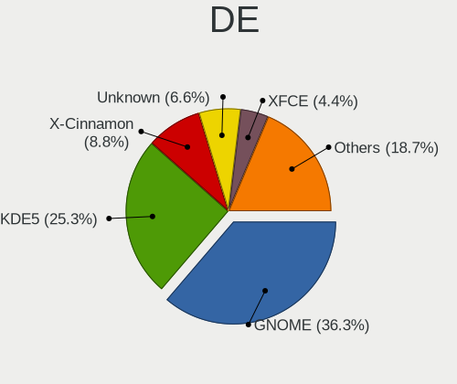

| Name          | Desktops | Percent |
|---------------|----------|---------|
| GNOME         | 33       | 36.26%  |
| KDE5          | 23       | 25.27%  |
| X-Cinnamon    | 8        | 8.79%   |
| Unknown       | 6        | 6.59%   |
| XFCE          | 4        | 4.4%    |
| KDE6          | 3        | 3.3%    |
| MATE          | 2        | 2.2%    |
| LXQt          | 2        | 2.2%    |
| KDE           | 2        | 2.2%    |
| Budgie        | 2        | 2.2%    |
| Unity         | 1        | 1.1%    |
| LXDE          | 1        | 1.1%    |
| KDE4          | 1        | 1.1%    |
| GNOME Classic | 1        | 1.1%    |
| Deepin        | 1        | 1.1%    |
| Cinnamon      | 1        | 1.1%    |

Display Server
--------------

X11 or Wayland

| Name    | Desktops | Percent |
|---------|----------|---------|
| X11     | 60       | 80%     |
| Wayland | 14       | 18.67%  |
| Unknown | 1        | 1.33%   |

Display Manager
---------------

SDDM, LightDM, etc.

| Name    | Desktops | Percent |
|---------|----------|---------|
| Unknown | 50       | 60.98%  |
| SDDM    | 17       | 20.73%  |
| GDM3    | 5        | 6.1%    |
| GDM     | 5        | 6.1%    |
| LightDM | 3        | 3.66%   |
| TDM     | 1        | 1.22%   |
| KDM     | 1        | 1.22%   |

OS Lang
-------

Language

| Lang    | Desktops | Percent |
|---------|----------|---------|
| en_US   | 63       | 85.14%  |
| Unknown | 7        | 9.46%   |
| es_ES   | 2        | 2.7%    |
| es_PR   | 1        | 1.35%   |
| C       | 1        | 1.35%   |

Boot Mode
---------

EFI or BIOS

| Mode | Desktops | Percent |
|------|----------|---------|
| BIOS | 41       | 52.56%  |
| EFI  | 37       | 47.44%  |

Filesystem
----------

Type of filesystem

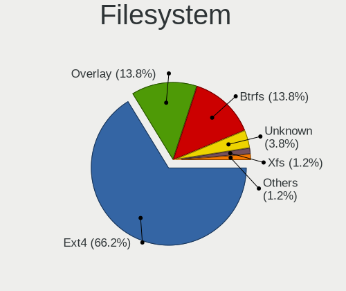

| Type    | Desktops | Percent |
|---------|----------|---------|
| Ext4    | 53       | 66.25%  |
| Overlay | 11       | 13.75%  |
| Btrfs   | 11       | 13.75%  |
| Unknown | 3        | 3.75%   |
| Xfs     | 1        | 1.25%   |
| Tmpfs   | 1        | 1.25%   |

Part. scheme
------------

Scheme of partitioning

| Type    | Desktops | Percent |
|---------|----------|---------|
| Unknown | 53       | 66.25%  |
| GPT     | 20       | 25%     |
| MBR     | 7        | 8.75%   |

Dual Boot with Linux/BSD
------------------------

Hosting more than one Linux/BSD

| Dual boot | Desktops | Percent |
|-----------|----------|---------|
| No        | 66       | 83.54%  |
| Yes       | 13       | 16.46%  |

Dual Boot (Win)
---------------

Hosting Linux and Windows

| Dual boot | Desktops | Percent |
|-----------|----------|---------|
| No        | 61       | 77.22%  |
| Yes       | 18       | 22.78%  |

Board
-----

Vendor
------

Motherboard manufacturer

| Name                | Desktops | Percent |
|---------------------|----------|---------|
| Gigabyte Technology | 13       | 17.81%  |
| MSI                 | 10       | 13.7%   |
| ASRock              | 10       | 13.7%   |
| Hewlett-Packard     | 9        | 12.33%  |
| Dell                | 9        | 12.33%  |
| ASUSTek Computer    | 9        | 12.33%  |
| Lenovo              | 3        | 4.11%   |
| Intel               | 3        | 4.11%   |
| Gateway             | 2        | 2.74%   |
| Pegatron            | 1        | 1.37%   |
| Foxconn             | 1        | 1.37%   |
| ECS                 | 1        | 1.37%   |
| Alienware           | 1        | 1.37%   |
| Acer                | 1        | 1.37%   |

Model
-----

Motherboard model

| Name                                    | Desktops | Percent |
|-----------------------------------------|----------|---------|
| Intel SKYBAY                            | 3        | 4.11%   |
| MSI Cubi N 8GL (MS-B171)                | 2        | 2.74%   |
| Gigabyte F2A68HM-H                      | 2        | 2.74%   |
| ASRock Q1900M                           | 2        | 2.74%   |
| ASRock 945GCM-S                         | 2        | 2.74%   |
| Pegatron QW716AA#ABA                    | 1        | 1.37%   |
| MSI MS-7D75                             | 1        | 1.37%   |
| MSI MS-7D07                             | 1        | 1.37%   |
| MSI MS-7C56                             | 1        | 1.37%   |
| MSI MS-7B48                             | 1        | 1.37%   |
| MSI MS-7A40                             | 1        | 1.37%   |
| MSI MS-7971                             | 1        | 1.37%   |
| MSI MS-7817                             | 1        | 1.37%   |
| MSI Cubi N JSL (MS-B0A1)                | 1        | 1.37%   |
| Lenovo ThinkCentre M91p 7033CG1         | 1        | 1.37%   |
| Lenovo ThinkCentre M58p 6136A66         | 1        | 1.37%   |
| Lenovo IdeaCentre 510A-15ARR 90J0000PUS | 1        | 1.37%   |
| HP Pavilion Desktop TP01-3xxx           | 1        | 1.37%   |
| HP Pavilion Desktop TP01-1xxx           | 1        | 1.37%   |
| HP EliteDesk 800 G4 SFF                 | 1        | 1.37%   |
| HP EliteDesk 800 G1 TWR                 | 1        | 1.37%   |
| HP EliteDesk 800 G1 SFF                 | 1        | 1.37%   |
| HP Compaq Pro 6300 SFF                  | 1        | 1.37%   |
| HP Compaq Pro 6300 MT                   | 1        | 1.37%   |
| HP Compaq dc7800p Small Form Factor     | 1        | 1.37%   |
| HP Compaq 8200 Elite SFF PC             | 1        | 1.37%   |
| Gigabyte Z97M-DS3H                      | 1        | 1.37%   |
| Gigabyte Z390 AORUS PRO WIFI            | 1        | 1.37%   |
| Gigabyte X570 GAMING X                  | 1        | 1.37%   |
| Gigabyte X570 AORUS ELITE WIFI          | 1        | 1.37%   |
| Gigabyte X399 AORUS Gaming 7            | 1        | 1.37%   |
| Gigabyte J1900N-D3V                     | 1        | 1.37%   |
| Gigabyte F2A88XN-WIFI                   | 1        | 1.37%   |
| Gigabyte F2A78M-HD2                     | 1        | 1.37%   |
| Gigabyte B450M DS3H                     | 1        | 1.37%   |
| Gigabyte B450 AORUS PRO WIFI            | 1        | 1.37%   |
| Gigabyte B360M-DS3H                     | 1        | 1.37%   |
| Gateway SX2865                          | 1        | 1.37%   |
| Gateway DX4300                          | 1        | 1.37%   |
| Foxconn Pro3500 Series                  | 1        | 1.37%   |

Model Family
------------

Motherboard model prefix

| Name                  | Desktops | Percent |
|-----------------------|----------|---------|
| Dell OptiPlex         | 7        | 9.59%   |
| HP Compaq             | 4        | 5.48%   |
| MSI Cubi              | 3        | 4.11%   |
| Intel SKYBAY          | 3        | 4.11%   |
| HP EliteDesk          | 3        | 4.11%   |
| ASUS ROG              | 3        | 4.11%   |
| Lenovo ThinkCentre    | 2        | 2.74%   |
| HP Pavilion           | 2        | 2.74%   |
| Gigabyte X570         | 2        | 2.74%   |
| Gigabyte F2A68HM-H    | 2        | 2.74%   |
| ASUS TUF              | 2        | 2.74%   |
| ASUS PRIME            | 2        | 2.74%   |
| ASRock Q1900M         | 2        | 2.74%   |
| ASRock B450M-HDV      | 2        | 2.74%   |
| ASRock 945GCM-S       | 2        | 2.74%   |
| Pegatron QW716AA#ABA  | 1        | 1.37%   |
| MSI MS-7D75           | 1        | 1.37%   |
| MSI MS-7D07           | 1        | 1.37%   |
| MSI MS-7C56           | 1        | 1.37%   |
| MSI MS-7B48           | 1        | 1.37%   |
| MSI MS-7A40           | 1        | 1.37%   |
| MSI MS-7971           | 1        | 1.37%   |
| MSI MS-7817           | 1        | 1.37%   |
| Lenovo IdeaCentre     | 1        | 1.37%   |
| Gigabyte Z97M-DS3H    | 1        | 1.37%   |
| Gigabyte Z390         | 1        | 1.37%   |
| Gigabyte X399         | 1        | 1.37%   |
| Gigabyte J1900N-D3V   | 1        | 1.37%   |
| Gigabyte F2A88XN-WIFI | 1        | 1.37%   |
| Gigabyte F2A78M-HD2   | 1        | 1.37%   |
| Gigabyte B450M        | 1        | 1.37%   |
| Gigabyte B450         | 1        | 1.37%   |
| Gigabyte B360M-DS3H   | 1        | 1.37%   |
| Gateway SX2865        | 1        | 1.37%   |
| Gateway DX4300        | 1        | 1.37%   |
| Foxconn Pro3500       | 1        | 1.37%   |
| ECS NC696AAR-ABA      | 1        | 1.37%   |
| Dell Studio           | 1        | 1.37%   |
| Dell Inspiron         | 1        | 1.37%   |
| ASUS M5A78L-M         | 1        | 1.37%   |

MFG Year
--------

Motherboard manufacture year

| Year | Desktops | Percent |
|------|----------|---------|
| 2018 | 16       | 21.92%  |
| 2019 | 7        | 9.59%   |
| 2014 | 7        | 9.59%   |
| 2013 | 7        | 9.59%   |
| 2020 | 6        | 8.22%   |
| 2008 | 6        | 8.22%   |
| 2021 | 4        | 5.48%   |
| 2017 | 4        | 5.48%   |
| 2011 | 4        | 5.48%   |
| 2022 | 2        | 2.74%   |
| 2016 | 2        | 2.74%   |
| 2012 | 2        | 2.74%   |
| 2009 | 2        | 2.74%   |
| 2015 | 1        | 1.37%   |
| 2010 | 1        | 1.37%   |
| 2007 | 1        | 1.37%   |
| 2006 | 1        | 1.37%   |

Form Factor
-----------

Physical design of the computer

| Name    | Desktops | Percent |
|---------|----------|---------|
| Desktop | 73       | 100%    |

Secure Boot
-----------

Enabled or disabled

| State    | Desktops | Percent |
|----------|----------|---------|
| Disabled | 71       | 95.95%  |
| Enabled  | 3        | 4.05%   |

Coreboot
--------

Have coreboot on board

| Used | Desktops | Percent |
|------|----------|---------|
| No   | 73       | 100%    |

RAM Size
--------

Total RAM memory

| Size in GB  | Desktops | Percent |
|-------------|----------|---------|
| 16.01-24.0  | 20       | 25.32%  |
| 4.01-8.0    | 18       | 22.78%  |
| 8.01-16.0   | 12       | 15.19%  |
| 32.01-64.0  | 9        | 11.39%  |
| 3.01-4.0    | 9        | 11.39%  |
| 24.01-32.0  | 4        | 5.06%   |
| 64.01-256.0 | 4        | 5.06%   |
| 1.01-2.0    | 2        | 2.53%   |
| 0.51-1.0    | 1        | 1.27%   |

RAM Used
--------

Used RAM memory

| Used GB   | Desktops | Percent |
|-----------|----------|---------|
| 1.01-2.0  | 34       | 38.2%   |
| 2.01-3.0  | 20       | 22.47%  |
| 4.01-8.0  | 13       | 14.61%  |
| 3.01-4.0  | 13       | 14.61%  |
| 0.51-1.0  | 6        | 6.74%   |
| 8.01-16.0 | 3        | 3.37%   |

Total Drives
------------

Number of drives on board

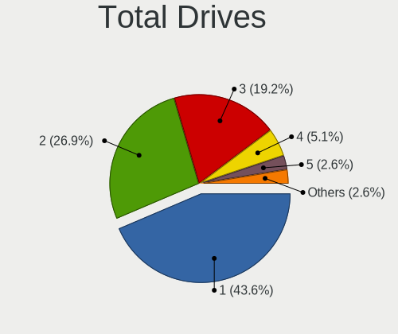

| Drives | Desktops | Percent |
|--------|----------|---------|
| 1      | 34       | 43.59%  |
| 2      | 21       | 26.92%  |
| 3      | 15       | 19.23%  |
| 4      | 4        | 5.13%   |
| 5      | 2        | 2.56%   |
| 6      | 1        | 1.28%   |
| 0      | 1        | 1.28%   |

Has CD-ROM
----------

Has CD-ROM on board

| Presented | Desktops | Percent |
|-----------|----------|---------|
| Yes       | 41       | 55.41%  |
| No        | 33       | 44.59%  |

Has Ethernet
------------

Has Ethernet on board

| Presented | Desktops | Percent |
|-----------|----------|---------|
| Yes       | 72       | 98.63%  |
| No        | 1        | 1.37%   |

Has WiFi
--------

Has WiFi module

| Presented | Desktops | Percent |
|-----------|----------|---------|
| Yes       | 45       | 60%     |
| No        | 30       | 40%     |

Has Bluetooth
-------------

Has Bluetooth module

| Presented | Desktops | Percent |
|-----------|----------|---------|
| No        | 43       | 55.84%  |
| Yes       | 34       | 44.16%  |

Location
--------

Country
-------

Geographic location (country)

| Country     | Desktops | Percent |
|-------------|----------|---------|
| Puerto Rico | 73       | 100%    |

City
----

Geographic location (city)

| City          | Desktops | Percent |
|---------------|----------|---------|
| San Juan      | 26       | 30.95%  |
| Bayamón      | 11       | 13.1%   |
| Carolina      | 4        | 4.76%   |
| San Sebastian | 3        | 3.57%   |
| Rio Grande    | 3        | 3.57%   |
| Ponce         | 3        | 3.57%   |
| Caguas        | 3        | 3.57%   |
| Aguadilla     | 3        | 3.57%   |
| Vega Alta     | 2        | 2.38%   |
| Dorado        | 2        | 2.38%   |
| Cayey         | 2        | 2.38%   |
| Yauco         | 1        | 1.19%   |
| Trujillo Alto | 1        | 1.19%   |
| Toa Baja      | 1        | 1.19%   |
| Santa Isabel  | 1        | 1.19%   |
| Sabana Grande | 1        | 1.19%   |
| Patillas      | 1        | 1.19%   |
| Morovis       | 1        | 1.19%   |
| Mayagüez     | 1        | 1.19%   |
| Maunabo       | 1        | 1.19%   |
| Manati        | 1        | 1.19%   |
| Las Piedras   | 1        | 1.19%   |
| Humacao       | 1        | 1.19%   |
| Hatillo       | 1        | 1.19%   |
| Gurabo        | 1        | 1.19%   |
| Guayama       | 1        | 1.19%   |
| Garrochales   | 1        | 1.19%   |
| Fajardo       | 1        | 1.19%   |
| Ensenada      | 1        | 1.19%   |
| Coamo         | 1        | 1.19%   |
| Cidra         | 1        | 1.19%   |
| Catano        | 1        | 1.19%   |
| Barceloneta   | 1        | 1.19%   |

Drives
------

Drive Vendor
------------

Hard drive vendors

| Vendor                    | Desktops | Drives | Percent |
|---------------------------|----------|--------|---------|
| WDC                       | 26       | 64     | 20.8%   |
| Seagate                   | 20       | 36     | 16%     |
| Samsung Electronics       | 12       | 21     | 9.6%    |
| Toshiba                   | 11       | 16     | 8.8%    |
| Sandisk                   | 9        | 9      | 7.2%    |
| China                     | 5        | 8      | 4%      |
| Micron/Crucial Technology | 4        | 6      | 3.2%    |
| Kingston                  | 4        | 4      | 3.2%    |
| TDAS                      | 3        | 17     | 2.4%    |
| SPCC                      | 3        | 4      | 2.4%    |
| Crucial                   | 3        | 3      | 2.4%    |
| Silicon Motion            | 2        | 2      | 1.6%    |
| SABRENT                   | 2        | 3      | 1.6%    |
| Phison                    | 2        | 2      | 1.6%    |
| Patriot                   | 2        | 3      | 1.6%    |
| LITEONIT                  | 2        | 2      | 1.6%    |
| Intel                     | 2        | 2      | 1.6%    |
| Hitachi                   | 2        | 2      | 1.6%    |
| WD MediaMax               | 1        | 3      | 0.8%    |
| Unknown                   | 1        | 2      | 0.8%    |
| Team                      | 1        | 1      | 0.8%    |
| Realtek Semiconductor     | 1        | 1      | 0.8%    |
| PNY                       | 1        | 2      | 0.8%    |
| OCZ                       | 1        | 1      | 0.8%    |
| Mushkin                   | 1        | 1      | 0.8%    |
| MaxDigital                | 1        | 1      | 0.8%    |
| JMicron Technology        | 1        | 4      | 0.8%    |
| addlink                   | 1        | 1      | 0.8%    |
| A-DATA Technology         | 1        | 5      | 0.8%    |

Drive Model
-----------

Hard drive models

| Model                                            | Desktops | Percent |
|--------------------------------------------------|----------|---------|
| Toshiba DT01ACA100 1TB                           | 4        | 2.88%   |
| TDAS TerraMaster 4TB                             | 3        | 2.16%   |
| WDC WDBNCE2500PNC 250GB SSD                      | 2        | 1.44%   |
| WDC WD5000LPLX-22ZNTT0 500GB                     | 2        | 1.44%   |
| WDC WD40EZRZ-22GXCB0 4TB                         | 2        | 1.44%   |
| Toshiba MQ01ABD100 1TB                           | 2        | 1.44%   |
| Toshiba DT01ACA050 500GB                         | 2        | 1.44%   |
| Seagate ST3250310AS 250GB                        | 2        | 1.44%   |
| Seagate ST320DM001 HD322GJ 320GB                 | 2        | 1.44%   |
| Seagate ST2000VM003-1CT164 2TB                   | 2        | 1.44%   |
| Seagate Expansion 1TB                            | 2        | 1.44%   |
| Sandisk WD_BLACK SN770 1TB                       | 2        | 1.44%   |
| Sandisk WD Black SN750 / PC SN730 NVMe SSD 512GB | 2        | 1.44%   |
| SanDisk NVMe SSD Drive 1TB                       | 2        | 1.44%   |
| Samsung SSD 860 EVO 500GB                        | 2        | 1.44%   |
| Samsung SSD 850 EVO 500GB                        | 2        | 1.44%   |
| Samsung NVMe SSD Drive 500GB                     | 2        | 1.44%   |
| SABRENT Disk 2TB                                 | 2        | 1.44%   |
| Micron/Crucial P2 NVMe PCIe SSD 500GB            | 2        | 1.44%   |
| Micron/Crucial NVMe SSD Drive 500GB              | 2        | 1.44%   |
| Kingston SKC6001024G 1024GB SSD                  | 2        | 1.44%   |
| China SATA SSD 512GB                             | 2        | 1.44%   |
| China SATA SSD 1024GB                            | 2        | 1.44%   |
| WDC WDS240G2G0A-00JH30 240GB SSD                 | 1        | 0.72%   |
| WDC WDBNCE5000PNC 500GB SSD                      | 1        | 0.72%   |
| WDC WDBNCE0010PNC 1TB SSD                        | 1        | 0.72%   |
| WDC WD7500BPVX-60JC3T0 752GB                     | 1        | 0.72%   |
| WDC WD5000LPCX-00VHAT0 500GB                     | 1        | 0.72%   |
| WDC WD5000BEVT-55A0RT0 500GB                     | 1        | 0.72%   |
| WDC WD40EZRZ-00GXCB0 4TB                         | 1        | 0.72%   |
| WDC WD30EZRZ-00WN9B0 3TB                         | 1        | 0.72%   |
| WDC WD2500BPVT-22ZEST0 250GB                     | 1        | 0.72%   |
| WDC WD20EZRZ-00Z5HB0 2TB                         | 1        | 0.72%   |
| WDC WD1600AAJS-00PSA0 160GB                      | 1        | 0.72%   |
| WDC WD1500HLFS-01G6U1 150GB                      | 1        | 0.72%   |
| WDC WD1200BEVS-75UST0 120GB                      | 1        | 0.72%   |
| WDC WD10SPZX-22Z10T1 1TB                         | 1        | 0.72%   |
| WDC WD10SPZX-00Z10T0 1TB                         | 1        | 0.72%   |
| WDC WD10EZRX-00L4HB0 1TB                         | 1        | 0.72%   |
| WDC WD10EZEX-75WN4A1 1TB                         | 1        | 0.72%   |

HDD Vendor
----------

Hard disk drive vendors

| Vendor              | Desktops | Drives | Percent |
|---------------------|----------|--------|---------|
| WDC                 | 20       | 56     | 33.9%   |
| Seagate             | 20       | 36     | 33.9%   |
| Toshiba             | 10       | 15     | 16.95%  |
| TDAS                | 3        | 17     | 5.08%   |
| SABRENT             | 2        | 3      | 3.39%   |
| Hitachi             | 2        | 2      | 3.39%   |
| Samsung Electronics | 1        | 1      | 1.69%   |
| MaxDigital          | 1        | 1      | 1.69%   |

SSD Vendor
----------

Solid state drive vendors

| Vendor              | Desktops | Drives | Percent |
|---------------------|----------|--------|---------|
| Samsung Electronics | 7        | 11     | 20%     |
| WDC                 | 5        | 7      | 14.29%  |
| China               | 5        | 8      | 14.29%  |
| Kingston            | 4        | 4      | 11.43%  |
| Crucial             | 3        | 3      | 8.57%   |
| SPCC                | 2        | 3      | 5.71%   |
| Patriot             | 2        | 3      | 5.71%   |
| LITEONIT            | 2        | 2      | 5.71%   |
| SanDisk             | 1        | 1      | 2.86%   |
| PNY                 | 1        | 2      | 2.86%   |
| OCZ                 | 1        | 1      | 2.86%   |
| Mushkin             | 1        | 1      | 2.86%   |
| A-DATA Technology   | 1        | 5      | 2.86%   |

Drive Kind
----------

HDD or SSD

| Kind    | Desktops | Drives | Percent |
|---------|----------|--------|---------|
| HDD     | 50       | 131    | 45.05%  |
| SSD     | 33       | 51     | 29.73%  |
| NVMe    | 25       | 35     | 22.52%  |
| Unknown | 3        | 9      | 2.7%    |

Drive Connector
---------------

SATA, SAS, NVMe, etc.

| Type | Desktops | Drives | Percent |
|------|----------|--------|---------|
| SATA | 66       | 162    | 66%     |
| NVMe | 25       | 35     | 25%     |
| SAS  | 9        | 29     | 9%      |

Drive Size
----------

Size of hard drive

| Size in TB | Desktops | Drives | Percent |
|------------|----------|--------|---------|
| 0.01-0.5   | 37       | 62     | 40.66%  |
| 0.51-1.0   | 30       | 61     | 32.97%  |
| 1.01-2.0   | 15       | 29     | 16.48%  |
| 3.01-4.0   | 7        | 28     | 7.69%   |
| 2.01-3.0   | 1        | 1      | 1.1%    |
| 10.01-20.0 | 1        | 1      | 1.1%    |

Space Total
-----------

Amount of disk space available on the file system

| Size in GB     | Desktops | Percent |
|----------------|----------|---------|
| 251-500        | 21       | 22.83%  |
| 101-250        | 13       | 14.13%  |
| 501-1000       | 12       | 13.04%  |
| More than 3000 | 11       | 11.96%  |
| 1001-2000      | 11       | 11.96%  |
| 2001-3000      | 10       | 10.87%  |
| 1-20           | 7        | 7.61%   |
| 51-100         | 3        | 3.26%   |
| Unknown        | 3        | 3.26%   |
| 21-50          | 1        | 1.09%   |

Space Used
----------

Amount of used disk space

| Used GB        | Desktops | Percent |
|----------------|----------|---------|
| 1-20           | 31       | 34.07%  |
| 21-50          | 15       | 16.48%  |
| 251-500        | 10       | 10.99%  |
| 101-250        | 9        | 9.89%   |
| 51-100         | 7        | 7.69%   |
| 1001-2000      | 6        | 6.59%   |
| 501-1000       | 5        | 5.49%   |
| More than 3000 | 3        | 3.3%    |
| Unknown        | 3        | 3.3%    |
| 2001-3000      | 2        | 2.2%    |

Malfunc. Drives
---------------

Drive models with a malfunction

| Model                            | Desktops | Drives | Percent |
|----------------------------------|----------|--------|---------|
| Seagate ST9500325AS 500GB        | 1        | 1      | 14.29%  |
| Seagate ST3320613AS 320GB        | 1        | 2      | 14.29%  |
| Seagate ST3250310AS 250GB        | 1        | 1      | 14.29%  |
| Seagate ST320DM001 HD322GJ 320GB | 1        | 1      | 14.29%  |
| Seagate ST2000VM003-1CT164 2TB   | 1        | 1      | 14.29%  |
| Seagate ST2000LM007-1R8174 2TB   | 1        | 2      | 14.29%  |
| Seagate ST2000DL001-9VT156 2TB   | 1        | 1      | 14.29%  |

Malfunc. Drive Vendor
---------------------

Vendors of faulty drives

| Vendor  | Desktops | Drives | Percent |
|---------|----------|--------|---------|
| Seagate | 5        | 9      | 100%    |

Malfunc. HDD Vendor
-------------------

Vendors of faulty HDD drives

| Vendor  | Desktops | Drives | Percent |
|---------|----------|--------|---------|
| Seagate | 5        | 9      | 100%    |

Malfunc. Drive Kind
-------------------

Kinds of faulty drives

| Kind | Desktops | Drives | Percent |
|------|----------|--------|---------|
| HDD  | 5        | 9      | 100%    |

Failed Drives
-------------

Failed drive models

Zero info for selected period =(

Failed Drive Vendor
-------------------

Failed drive vendors

Zero info for selected period =(

Drive Status
------------

Number of failed and malfunc. drives

| Status   | Desktops | Drives | Percent |
|----------|----------|--------|---------|
| Detected | 55       | 175    | 67.07%  |
| Works    | 22       | 42     | 26.83%  |
| Malfunc  | 5        | 9      | 6.1%    |

Storage controller
------------------

Storage Vendor
--------------

Storage controller vendors

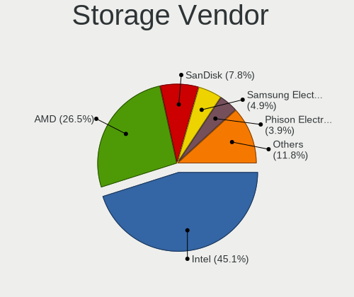

| Vendor                       | Desktops | Percent |
|------------------------------|----------|---------|
| Intel                        | 46       | 45.1%   |
| AMD                          | 27       | 26.47%  |
| SanDisk                      | 8        | 7.84%   |
| Samsung Electronics          | 5        | 4.9%    |
| Phison Electronics           | 4        | 3.92%   |
| Micron/Crucial Technology    | 4        | 3.92%   |
| Silicon Motion               | 3        | 2.94%   |
| Nvidia                       | 2        | 1.96%   |
| Toshiba America Info Systems | 1        | 0.98%   |
| Realtek Semiconductor        | 1        | 0.98%   |
| ASMedia Technology           | 1        | 0.98%   |

Storage Model
-------------

Storage controller models

| Model                                                                                   | Desktops | Percent |
|-----------------------------------------------------------------------------------------|----------|---------|
| AMD FCH SATA Controller [AHCI mode]                                                     | 18       | 13.74%  |
| AMD 400 Series Chipset SATA Controller                                                  | 9        | 6.87%   |
| Intel SATA Controller [RAID mode]                                                       | 8        | 6.11%   |
| Intel 8 Series/C220 Series Chipset Family 6-port SATA Controller 1 [AHCI mode]          | 5        | 3.82%   |
| Phison E12 NVMe Controller                                                              | 4        | 3.05%   |
| Micron/Crucial P2 [Nick P2] / P3 / P3 Plus NVMe PCIe SSD (DRAM-less)                    | 4        | 3.05%   |
| Silicon Motion SM2263EN/SM2263XT (DRAM-less) NVMe SSD Controllers                       | 3        | 2.29%   |
| Intel Sunrise Point-LP SATA Controller [AHCI mode]                                      | 3        | 2.29%   |
| Intel NM10/ICH7 Family SATA Controller [IDE mode]                                       | 3        | 2.29%   |
| Intel Cannon Lake PCH SATA AHCI Controller                                              | 3        | 2.29%   |
| Intel 82801G (ICH7 Family) IDE Controller                                               | 3        | 2.29%   |
| Intel 4 Series Chipset PT IDER Controller                                               | 3        | 2.29%   |
| AMD FCH SATA Controller [IDE mode]                                                      | 3        | 2.29%   |
| AMD FCH IDE Controller                                                                  | 3        | 2.29%   |
| SanDisk WD Black SN770 / PC SN740 256GB / PC SN560 (DRAM-less) NVMe SSD                 | 2        | 1.53%   |
| SanDisk Ultra 3D / WD PC SN530, IX SN530, Blue SN550 NVMe SSD (DRAM-less)               | 2        | 1.53%   |
| SanDisk Ultra 3D / WD Blue SN570 NVMe SSD (DRAM-less)                                   | 2        | 1.53%   |
| SanDisk Extreme Pro / WD Black SN750 / PC SN730 / Red SN700 NVMe SSD                    | 2        | 1.53%   |
| Samsung NVMe SSD Controller SM981/PM981/PM983                                           | 2        | 1.53%   |
| Intel Celeron/Pentium Silver Processor SATA Controller                                  | 2        | 1.53%   |
| Intel Atom Processor E3800 Series SATA AHCI Controller                                  | 2        | 1.53%   |
| Intel 7 Series/C210 Series Chipset Family 6-port SATA Controller [AHCI mode]            | 2        | 1.53%   |
| Intel 6 Series/C200 Series Chipset Family Desktop SATA Controller (IDE mode, ports 4-5) | 2        | 1.53%   |
| Intel 6 Series/C200 Series Chipset Family Desktop SATA Controller (IDE mode, ports 0-3) | 2        | 1.53%   |
| Intel 6 Series/C200 Series Chipset Family 6 port Desktop SATA AHCI Controller           | 2        | 1.53%   |
| Intel 500 Series Chipset Family SATA AHCI Controller                                    | 2        | 1.53%   |
| Intel 200 Series PCH SATA controller [AHCI mode]                                        | 2        | 1.53%   |
| AMD SB7x0/SB8x0/SB9x0 SATA Controller [IDE mode]                                        | 2        | 1.53%   |
| AMD SB7x0/SB8x0/SB9x0 IDE Controller                                                    | 2        | 1.53%   |
| AMD 500 Series Chipset SATA Controller                                                  | 2        | 1.53%   |
| Toshiba America Info Systems BG3 x2 NVMe SSD Controller (DRAM-less)                     | 1        | 0.76%   |
| Samsung NVMe SSD Controller SM961/PM961/SM963                                           | 1        | 0.76%   |
| Samsung NVMe SSD Controller PM9B1 (DRAM-less)                                           | 1        | 0.76%   |
| Samsung NVMe SSD Controller PM9A1/PM9A3/980PRO                                          | 1        | 0.76%   |
| Realtek RTS5765DL NVMe SSD Controller (DRAM-less)                                       | 1        | 0.76%   |
| Nvidia MCP61 SATA Controller                                                            | 1        | 0.76%   |
| Nvidia MCP61 IDE                                                                        | 1        | 0.76%   |
| Nvidia CK804 Serial ATA Controller                                                      | 1        | 0.76%   |
| Nvidia CK804 IDE                                                                        | 1        | 0.76%   |
| Intel Volume Management Device NVMe RAID Controller                                     | 1        | 0.76%   |

Storage Kind
------------

Kind of storage controller (IDE, SATA, NVMe, SAS, ...)

| Kind | Desktops | Percent |
|------|----------|---------|
| SATA | 56       | 51.85%  |
| NVMe | 25       | 23.15%  |
| IDE  | 18       | 16.67%  |
| RAID | 9        | 8.33%   |

Processor
---------

CPU Vendor
----------

Processor vendors

| Vendor | Desktops | Percent |
|--------|----------|---------|
| Intel  | 44       | 60.27%  |
| AMD    | 29       | 39.73%  |

CPU Model
---------

Processor models

| Model                                          | Desktops | Percent |
|------------------------------------------------|----------|---------|
| Intel Celeron CPU J1900 @ 1.99GHz              | 3        | 4.11%   |
| Intel Celeron CPU 3865U @ 1.80GHz              | 3        | 4.11%   |
| AMD Ryzen 5 3600 6-Core Processor              | 3        | 4.11%   |
| AMD Ryzen 5 2600 Six-Core Processor            | 3        | 4.11%   |
| Intel Pentium Silver N5000 CPU @ 1.10GHz       | 2        | 2.74%   |
| Intel Pentium Dual-Core CPU E5300 @ 2.60GHz    | 2        | 2.74%   |
| Intel Core i5-9500 CPU @ 3.00GHz               | 2        | 2.74%   |
| Intel Core i3-3240 CPU @ 3.40GHz               | 2        | 2.74%   |
| Intel Core 2 Duo CPU E8400 @ 3.00GHz           | 2        | 2.74%   |
| Intel Celeron CPU E1200 @ 1.60GHz              | 2        | 2.74%   |
| Intel 11th Gen Core i5-11400 @ 2.60GHz         | 2        | 2.74%   |
| AMD Ryzen 7 3700X 8-Core Processor             | 2        | 2.74%   |
| AMD Ryzen 3 2200G with Radeon Vega Graphics    | 2        | 2.74%   |
| AMD A6-5400K APU with Radeon HD Graphics       | 2        | 2.74%   |
| Intel Pentium Silver N6000 @ 1.10GHz           | 1        | 1.37%   |
| Intel Core i7-9700 CPU @ 3.00GHz               | 1        | 1.37%   |
| Intel Core i7-8700K CPU @ 3.70GHz              | 1        | 1.37%   |
| Intel Core i7-8700 CPU @ 3.20GHz               | 1        | 1.37%   |
| Intel Core i7-6700 CPU @ 3.40GHz               | 1        | 1.37%   |
| Intel Core i7-4790 CPU @ 3.60GHz               | 1        | 1.37%   |
| Intel Core i7-4770 CPU @ 3.40GHz               | 1        | 1.37%   |
| Intel Core i5-9400 CPU @ 2.90GHz               | 1        | 1.37%   |
| Intel Core i5-7600K CPU @ 3.80GHz              | 1        | 1.37%   |
| Intel Core i5-7500 CPU @ 3.40GHz               | 1        | 1.37%   |
| Intel Core i5-6400 CPU @ 2.70GHz               | 1        | 1.37%   |
| Intel Core i5-4570 CPU @ 3.20GHz               | 1        | 1.37%   |
| Intel Core i5-10400 CPU @ 2.90GHz              | 1        | 1.37%   |
| Intel Core i3-4150 CPU @ 3.50GHz               | 1        | 1.37%   |
| Intel Core i3-3220 CPU @ 3.30GHz               | 1        | 1.37%   |
| Intel Core i3-2130 CPU @ 3.40GHz               | 1        | 1.37%   |
| Intel Core i3-2120 CPU @ 3.30GHz               | 1        | 1.37%   |
| Intel Core i3-2100 CPU @ 3.10GHz               | 1        | 1.37%   |
| Intel Core 2 Duo CPU E7500 @ 2.93GHz           | 1        | 1.37%   |
| Intel Core 2 Duo CPU E6550 @ 2.33GHz           | 1        | 1.37%   |
| Intel Celeron CPU G1850 @ 2.90GHz              | 1        | 1.37%   |
| Intel Celeron CPU G1840 @ 2.80GHz              | 1        | 1.37%   |
| Intel 12th Gen Core i3-12100                   | 1        | 1.37%   |
| Intel 11th Gen Core i9-11900KF @ 3.50GHz       | 1        | 1.37%   |
| AMD Ryzen Threadripper 1950X 16-Core Processor | 1        | 1.37%   |
| AMD Ryzen 7 7700X 8-Core Processor             | 1        | 1.37%   |

CPU Model Family
----------------

Processor model prefix

| Model                   | Desktops | Percent |
|-------------------------|----------|---------|
| Intel Celeron           | 10       | 13.7%   |
| AMD Ryzen 5             | 9        | 12.33%  |
| Intel Core i5           | 8        | 10.96%  |
| Intel Core i3           | 7        | 9.59%   |
| Intel Core i7           | 6        | 8.22%   |
| AMD Ryzen 7             | 5        | 6.85%   |
| Other                   | 4        | 5.48%   |
| Intel Core 2 Duo        | 4        | 5.48%   |
| Intel Pentium Silver    | 3        | 4.11%   |
| AMD Ryzen 3             | 3        | 4.11%   |
| AMD A6                  | 3        | 4.11%   |
| Intel Pentium Dual-Core | 2        | 2.74%   |
| AMD A8                  | 2        | 2.74%   |
| AMD Ryzen Threadripper  | 1        | 1.37%   |
| AMD Phenom II X4        | 1        | 1.37%   |
| AMD FX                  | 1        | 1.37%   |
| AMD Athlon X4           | 1        | 1.37%   |
| AMD Athlon Dual Core    | 1        | 1.37%   |
| AMD Athlon 64 X2        | 1        | 1.37%   |
| AMD Athlon              | 1        | 1.37%   |

CPU Cores
---------

Number of processor cores

| Number | Desktops | Percent |
|--------|----------|---------|
| 2      | 26       | 35.14%  |
| 4      | 21       | 28.38%  |
| 6      | 16       | 21.62%  |
| 8      | 7        | 9.46%   |
| 1      | 3        | 4.05%   |
| 16     | 1        | 1.35%   |

CPU Sockets
-----------

Number of sockets

| Number | Desktops | Percent |
|--------|----------|---------|
| 1      | 73       | 100%    |

CPU Threads
-----------

Threads per core (Hyper-Threading)

| Number | Desktops | Percent |
|--------|----------|---------|
| 2      | 37       | 50%     |
| 1      | 37       | 50%     |

CPU Op-Modes
------------

CPU Operation Modes (32-bit, 64-bit)

| Op mode        | Desktops | Percent |
|----------------|----------|---------|
| 32-bit, 64-bit | 73       | 98.65%  |
| Unknown        | 1        | 1.35%   |

CPU Microcode
-------------

Microcode number

| Number     | Desktops | Percent |
|------------|----------|---------|
| Unknown    | 32       | 39.02%  |
| 0x306c3    | 6        | 7.32%   |
| 0x1067a    | 4        | 4.88%   |
| 0x806e9    | 3        | 3.66%   |
| 0xa0671    | 2        | 2.44%   |
| 0x906ea    | 2        | 2.44%   |
| 0x6fd      | 2        | 2.44%   |
| 0x306a9    | 2        | 2.44%   |
| 0x30678    | 2        | 2.44%   |
| 0x08701021 | 2        | 2.44%   |
| 0x08701013 | 2        | 2.44%   |
| 0x0800820d | 2        | 2.44%   |
| 0x06001119 | 2        | 2.44%   |
| 0x906ed    | 1        | 1.22%   |
| 0x906e9    | 1        | 1.22%   |
| 0x906c0    | 1        | 1.22%   |
| 0x90675    | 1        | 1.22%   |
| 0x706a1    | 1        | 1.22%   |
| 0x6fb      | 1        | 1.22%   |
| 0x506e3    | 1        | 1.22%   |
| 0x30679    | 1        | 1.22%   |
| 0x206a7    | 1        | 1.22%   |
| 0x0a50000d | 1        | 1.22%   |
| 0x0860010c | 1        | 1.22%   |
| 0x08108109 | 1        | 1.22%   |
| 0x0810100b | 1        | 1.22%   |
| 0x08101007 | 1        | 1.22%   |
| 0x08001137 | 1        | 1.22%   |
| 0x06003106 | 1        | 1.22%   |
| 0x06003104 | 1        | 1.22%   |
| 0x06000852 | 1        | 1.22%   |
| 0x03000027 | 1        | 1.22%   |

CPU Microarch
-------------

Microarchitecture

| Name             | Desktops | Percent |
|------------------|----------|---------|
| KabyLake         | 11       | 15.07%  |
| Zen+             | 6        | 8.22%   |
| Zen 2            | 6        | 8.22%   |
| Haswell          | 6        | 8.22%   |
| Penryn           | 5        | 6.85%   |
| Zen              | 4        | 5.48%   |
| Steamroller      | 3        | 4.11%   |
| Silvermont       | 3        | 4.11%   |
| SandyBridge      | 3        | 4.11%   |
| Piledriver       | 3        | 4.11%   |
| IvyBridge        | 3        | 4.11%   |
| Core             | 3        | 4.11%   |
| Unknown          | 3        | 4.11%   |
| Zen 3            | 2        | 2.74%   |
| Skylake          | 2        | 2.74%   |
| K8 Hammer        | 2        | 2.74%   |
| Goldmont plus    | 2        | 2.74%   |
| Tremont          | 1        | 1.37%   |
| K10 Llano        | 1        | 1.37%   |
| K10              | 1        | 1.37%   |
| Icelake          | 1        | 1.37%   |
| CometLake        | 1        | 1.37%   |
| Alderlake Hybrid | 1        | 1.37%   |

Graphics
--------

GPU Vendor
----------

Vendors of graphics cards

| Vendor | Desktops | Percent |
|--------|----------|---------|
| Intel  | 36       | 43.9%   |
| AMD    | 24       | 29.27%  |
| Nvidia | 22       | 26.83%  |

GPU Model
---------

Graphics card models

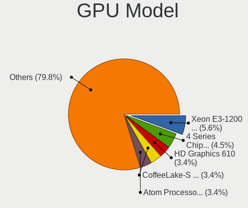

| Model                                                                       | Desktops | Percent |
|-----------------------------------------------------------------------------|----------|---------|
| Intel Xeon E3-1200 v3/4th Gen Core Processor Integrated Graphics Controller | 5        | 5.62%   |
| Intel 4 Series Chipset Integrated Graphics Controller                       | 4        | 4.49%   |
| Intel HD Graphics 610                                                       | 3        | 3.37%   |
| Intel CoffeeLake-S GT2 [UHD Graphics 630]                                   | 3        | 3.37%   |
| Intel Atom Processor Z36xxx/Z37xxx Series Graphics & Display                | 3        | 3.37%   |
| Intel 2nd Generation Core Processor Family Integrated Graphics Controller   | 3        | 3.37%   |
| AMD Ellesmere [Radeon RX 470/480/570/570X/580/580X/590]                     | 3        | 3.37%   |
| Nvidia GP107 [GeForce GTX 1050]                                             | 2        | 2.25%   |
| Nvidia GP107 [GeForce GTX 1050 Ti]                                          | 2        | 2.25%   |
| Nvidia GP106 [GeForce GTX 1060 6GB]                                         | 2        | 2.25%   |
| Nvidia GP102 [GeForce GTX 1080 Ti]                                          | 2        | 2.25%   |
| Nvidia GF119 [GeForce GT 620 OEM]                                           | 2        | 2.25%   |
| Intel Xeon E3-1200 v2/3rd Gen Core processor Graphics Controller            | 2        | 2.25%   |
| Intel HD Graphics 630                                                       | 2        | 2.25%   |
| Intel GeminiLake [UHD Graphics 605]                                         | 2        | 2.25%   |
| Intel 82945G/GZ Integrated Graphics Controller                              | 2        | 2.25%   |
| AMD Trinity 2 [Radeon HD 7540D]                                             | 2        | 2.25%   |
| AMD Raven Ridge [Radeon Vega Series / Radeon Vega Mobile Series]            | 2        | 2.25%   |
| AMD Picasso/Raven 2 [Radeon Vega Series / Radeon Vega Mobile Series]        | 2        | 2.25%   |
| AMD Navi 22 [Radeon RX 6700/6700 XT/6750 XT / 6800M/6850M XT]               | 2        | 2.25%   |
| AMD Cezanne [Radeon Vega Series / Radeon Vega Mobile Series]                | 2        | 2.25%   |
| Nvidia TU117 [GeForce GTX 1650]                                             | 1        | 1.12%   |
| Nvidia TU116 [GeForce GTX 1660 SUPER]                                       | 1        | 1.12%   |
| Nvidia TU116 [GeForce GTX 1650]                                             | 1        | 1.12%   |
| Nvidia TU106 [GeForce RTX 2060 SUPER]                                       | 1        | 1.12%   |
| Nvidia GT218 [GeForce 210]                                                  | 1        | 1.12%   |
| Nvidia GP108 [GeForce GT 1030]                                              | 1        | 1.12%   |
| Nvidia GP106 [GeForce GTX 1060 3GB]                                         | 1        | 1.12%   |
| Nvidia GM107 [GeForce GTX 750 Ti]                                           | 1        | 1.12%   |
| Nvidia GK208B [GeForce GT 730]                                              | 1        | 1.12%   |
| Nvidia GK110GL [Tesla K20Xm]                                                | 1        | 1.12%   |
| Nvidia GK104GL [GRID K2]                                                    | 1        | 1.12%   |
| Nvidia GA106 [GeForce RTX 3060 Lite Hash Rate]                              | 1        | 1.12%   |
| Nvidia GA104 [GeForce RTX 3060 Ti Lite Hash Rate]                           | 1        | 1.12%   |
| Nvidia GA102 [GeForce RTX 3080]                                             | 1        | 1.12%   |
| Nvidia G86 [GeForce 8400 GS]                                                | 1        | 1.12%   |
| Nvidia C61 [GeForce 6150SE nForce 430]                                      | 1        | 1.12%   |
| Intel RocketLake-S GT1 [UHD Graphics 730]                                   | 1        | 1.12%   |
| Intel JasperLake [UHD Graphics]                                             | 1        | 1.12%   |
| Intel CometLake-S GT2 [UHD Graphics 630]                                    | 1        | 1.12%   |

GPU Combo
---------

Combinations of graphics cards

| Name               | Desktops | Percent |
|--------------------|----------|---------|
| 1 x Intel          | 31       | 40.79%  |
| 1 x AMD            | 20       | 26.32%  |
| 1 x Nvidia         | 17       | 22.37%  |
| 2 x AMD            | 2        | 2.63%   |
| Intel + 2 x Nvidia | 2        | 2.63%   |
| Intel + Nvidia     | 2        | 2.63%   |
| Intel + AMD        | 1        | 1.32%   |
| AMD + Nvidia       | 1        | 1.32%   |

GPU Driver
----------

Free vs proprietary

| Driver      | Desktops | Percent |
|-------------|----------|---------|
| Free        | 62       | 80.52%  |
| Proprietary | 11       | 14.29%  |
| Unknown     | 4        | 5.19%   |

GPU Memory
----------

Total video memory

| Size in GB | Desktops | Percent |
|------------|----------|---------|
| Unknown    | 42       | 53.16%  |
| 1.01-2.0   | 8        | 10.13%  |
| 0.01-0.5   | 8        | 10.13%  |
| 3.01-4.0   | 7        | 8.86%   |
| 0.51-1.0   | 5        | 6.33%   |
| 7.01-8.0   | 3        | 3.8%    |
| 8.01-16.0  | 3        | 3.8%    |
| 5.01-6.0   | 2        | 2.53%   |
| 2.01-3.0   | 1        | 1.27%   |

Monitor
-------

Monitor Vendor
--------------

Monitor vendors

| Vendor               | Desktops | Percent |
|----------------------|----------|---------|
| Goldstar             | 14       | 16.09%  |
| Samsung Electronics  | 10       | 11.49%  |
| Acer                 | 8        | 9.2%    |
| Hewlett-Packard      | 7        | 8.05%   |
| Dell                 | 7        | 8.05%   |
| ViewSonic            | 4        | 4.6%    |
| Sony                 | 4        | 4.6%    |
| Sceptre Tech         | 4        | 4.6%    |
| Vizio                | 3        | 3.45%   |
| Gateway              | 3        | 3.45%   |
| Element              | 3        | 3.45%   |
| AOC                  | 3        | 3.45%   |
| VIZ                  | 2        | 2.3%    |
| Unknown              | 2        | 2.3%    |
| Tech Concepts        | 2        | 2.3%    |
| ASUSTek Computer     | 2        | 2.3%    |
| UGD                  | 1        | 1.15%   |
| Seiki                | 1        | 1.15%   |
| SANSUI               | 1        | 1.15%   |
| MTK                  | 1        | 1.15%   |
| MStar                | 1        | 1.15%   |
| MSI                  | 1        | 1.15%   |
| eMachines            | 1        | 1.15%   |
| Ancor Communications | 1        | 1.15%   |
| Unknown              | 1        | 1.15%   |

Monitor Model
-------------

Monitor models

| Model                                                                 | Desktops | Percent |
|-----------------------------------------------------------------------|----------|---------|
| Goldstar FULL HD GSM5B55 1920x1080 480x270mm 21.7-inch                | 6        | 6.38%   |
| Goldstar FULL HD GSM5B54 1920x1080 480x270mm 21.7-inch                | 3        | 3.19%   |
| Element ELEFW408 ELE1366 1920x1080 890x500mm 40.2-inch                | 3        | 3.19%   |
| VIZ LCD Monitor M551d-A2R                                             | 2        | 2.13%   |
| ViewSonic VA2448 SERIES VSC3828 1920x1080 521x293mm 23.5-inch         | 2        | 2.13%   |
| Sony TV SNY4502 1920x1080                                             | 2        | 2.13%   |
| Sony TV *00 SNY4B04 3840x2160                                         | 2        | 2.13%   |
| Samsung Electronics S34J55x SAM0F71 3440x1440 797x333mm 34.0-inch     | 2        | 2.13%   |
| Samsung Electronics LCD Monitor SAM0C3C 1366x768 609x347mm 27.6-inch  | 2        | 2.13%   |
| Samsung Electronics C32F391 SAM0D35 1920x1080 698x393mm 31.5-inch     | 2        | 2.13%   |
| Hewlett-Packard L2105tm HWP2863 1920x1080 477x268mm 21.5-inch         | 2        | 2.13%   |
| Goldstar ULTRAGEAR GSM5B70 1920x1080 531x298mm 24.0-inch              | 2        | 2.13%   |
| Gateway LCD Monitor FHX2300                                           | 2        | 2.13%   |
| Gateway FHX2300 GWY00BF 1920x1080 509x286mm 23.0-inch                 | 2        | 2.13%   |
| Acer LCD Monitor G236HL 5760x1080                                     | 2        | 2.13%   |
| Vizio M602i-B3 VIZ1006 1920x1080 1333x748mm 60.2-inch                 | 1        | 1.06%   |
| Vizio E260MV VIZ0062 1920x1080 509x286mm 23.0-inch                    | 1        | 1.06%   |
| Vizio D32x-D1 VIZ1005 1920x1080 698x392mm 31.5-inch                   | 1        | 1.06%   |
| ViewSonic VX2453 Series VSC0C28 1920x1080 520x290mm 23.4-inch         | 1        | 1.06%   |
| ViewSonic VG930m-3 VSC991E 1280x1024 376x301mm 19.0-inch              | 1        | 1.06%   |
| Unknown LCD Monitor FFFF 2288x1287 2550x2550mm 142.0-inch             | 1        | 1.06%   |
| Unknown LCD Monitor Dell S2719DGF 2560x1440                           | 1        | 1.06%   |
| UGD Artist 156 UGD1501 1920x1080 344x193mm 15.5-inch                  | 1        | 1.06%   |
| Tech Concepts LCD Monitor 43S431 3840x2160                            | 1        | 1.06%   |
| Tech Concepts LCD Monitor 43S423 1920x1080                            | 1        | 1.06%   |
| Seiki SE241TS SEK0CF0 1920x1080 520x290mm 23.4-inch                   | 1        | 1.06%   |
| Sceptre Tech Sceptre X22HG SPT2204 1920x1080 474x296mm 22.0-inch      | 1        | 1.06%   |
| Sceptre Tech Sceptre F27 SPT0ABF 1920x1080 409x230mm 18.5-inch        | 1        | 1.06%   |
| Sceptre Tech Sceptre F24 SPT09AB 1920x1080 526x296mm 23.8-inch        | 1        | 1.06%   |
| Sceptre Tech Sceptre F22 SPT08E3 1920x1080 475x267mm 21.5-inch        | 1        | 1.06%   |
| SANSUI ES-27X3 XEC2380 1920x1080 600x340mm 27.2-inch                  | 1        | 1.06%   |
| Samsung Electronics S27C230 SAM0A87 1920x1080 598x336mm 27.0-inch     | 1        | 1.06%   |
| Samsung Electronics LCD Monitor SAM0F0B 1920x1080 708x398mm 32.0-inch | 1        | 1.06%   |
| Samsung Electronics LC27G5xT SAM7079 2560x1440 597x336mm 27.0-inch    | 1        | 1.06%   |
| Samsung Electronics C32F391 SAM0D34 1920x1080 698x393mm 31.5-inch     | 1        | 1.06%   |
| MTK Microtek 815C MTK1021 1280x1024 359x287mm 18.1-inch               | 1        | 1.06%   |
| MStar Demo MST0030 1920x1080 708x398mm 32.0-inch                      | 1        | 1.06%   |
| MSI G32C4W MSI5DA6 1920x1080 698x393mm 31.5-inch                      | 1        | 1.06%   |
| Hewlett-Packard P17A HWP3142 1280x1024 338x270mm 17.0-inch            | 1        | 1.06%   |
| Hewlett-Packard LE1901w HWP2842 1440x900 410x256mm 19.0-inch          | 1        | 1.06%   |

Monitor Resolution
------------------

Monitor screen resolution

| Resolution         | Desktops | Percent |
|--------------------|----------|---------|
| 1920x1080 (FHD)    | 42       | 51.85%  |
| 3840x2160 (4K)     | 12       | 14.81%  |
| 2560x1440 (QHD)    | 5        | 6.17%   |
| 1366x768 (WXGA)    | 3        | 3.7%    |
| 1280x1024 (SXGA)   | 3        | 3.7%    |
| 5760x1080          | 2        | 2.47%   |
| 3440x1440          | 2        | 2.47%   |
| 2560x1080          | 2        | 2.47%   |
| 1600x900 (HD+)     | 2        | 2.47%   |
| 1440x900 (WXGA+)   | 2        | 2.47%   |
| Unknown            | 2        | 2.47%   |
| 3840x1080          | 1        | 1.23%   |
| 2288x1287          | 1        | 1.23%   |
| 1680x1050 (WSXGA+) | 1        | 1.23%   |
| 1280x720 (HD)      | 1        | 1.23%   |

Monitor Diagonal
----------------

Diagonal size in inches

| Inches  | Desktops | Percent |
|---------|----------|---------|
| 31      | 15       | 18.07%  |
| 23      | 14       | 16.87%  |
| 72      | 8        | 9.64%   |
| 27      | 7        | 8.43%   |
| 21      | 6        | 7.23%   |
| Unknown | 5        | 6.02%   |
| 19      | 4        | 4.82%   |
| 34      | 3        | 3.61%   |
| 24      | 3        | 3.61%   |
| 20      | 3        | 3.61%   |
| 32      | 2        | 2.41%   |
| 18      | 2        | 2.41%   |
| 17      | 2        | 2.41%   |
| 142     | 1        | 1.2%    |
| 84      | 1        | 1.2%    |
| 64      | 1        | 1.2%    |
| 52      | 1        | 1.2%    |
| 29      | 1        | 1.2%    |
| 26      | 1        | 1.2%    |
| 25      | 1        | 1.2%    |
| 22      | 1        | 1.2%    |
| 15      | 1        | 1.2%    |

Monitor Width
-------------

Physical width

| Width in mm    | Desktops | Percent |
|----------------|----------|---------|
| 501-600        | 24       | 29.63%  |
| 601-700        | 18       | 22.22%  |
| 401-500        | 13       | 16.05%  |
| 1501-2000      | 8        | 9.88%   |
| 701-800        | 5        | 6.17%   |
| Unknown        | 5        | 6.17%   |
| 301-350        | 3        | 3.7%    |
| 351-400        | 2        | 2.47%   |
| 1001-1500      | 2        | 2.47%   |
| More than 2000 | 1        | 1.23%   |

Aspect Ratio
------------

Proportional relationship between the width and the height

| Ratio   | Desktops | Percent |
|---------|----------|---------|
| 16/9    | 52       | 74.29%  |
| Unknown | 5        | 7.14%   |
| 5/4     | 4        | 5.71%   |
| 21/9    | 4        | 5.71%   |
| 16/10   | 4        | 5.71%   |
| 1.00    | 1        | 1.43%   |

Monitor Area
------------

Area in inch²

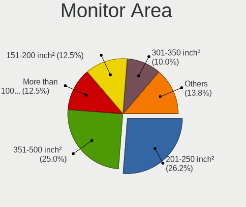

| Area in inch² | Desktops | Percent |
|----------------|----------|---------|
| 201-250        | 21       | 26.25%  |
| 351-500        | 20       | 25%     |
| More than 1000 | 10       | 12.5%   |
| 151-200        | 10       | 12.5%   |
| 301-350        | 8        | 10%     |
| Unknown        | 5        | 6.25%   |
| 141-150        | 3        | 3.75%   |
| 251-300        | 2        | 2.5%    |
| 101-110        | 1        | 1.25%   |

Pixel Density
-------------

Pixels per inch

| Density | Desktops | Percent |
|---------|----------|---------|
| 51-100  | 46       | 61.33%  |
| 1-50    | 11       | 14.67%  |
| 101-120 | 9        | 12%     |
| Unknown | 5        | 6.67%   |
| 121-160 | 4        | 5.33%   |

Multiple Monitors
-----------------

Total monitors connected

| Total | Desktops | Percent |
|-------|----------|---------|
| 1     | 60       | 77.92%  |
| 2     | 13       | 16.88%  |
| 3     | 2        | 2.6%    |
| 0     | 2        | 2.6%    |

Network
-------

Net Controller Vendor
---------------------

Controller vendors

| Vendor                | Desktops | Percent |
|-----------------------|----------|---------|
| Realtek Semiconductor | 56       | 48.7%   |
| Intel                 | 37       | 32.17%  |
| NetGear               | 4        | 3.48%   |
| Ralink Technology     | 3        | 2.61%   |
| Qualcomm Atheros      | 3        | 2.61%   |
| TP-Link               | 2        | 1.74%   |
| Ralink                | 2        | 1.74%   |
| Nvidia                | 2        | 1.74%   |
| MediaTek              | 2        | 1.74%   |
| Samsung Electronics   | 1        | 0.87%   |
| Microsoft             | 1        | 0.87%   |
| Gemtek                | 1        | 0.87%   |
| Aquantia              | 1        | 0.87%   |

Net Controller Model
--------------------

Controller models

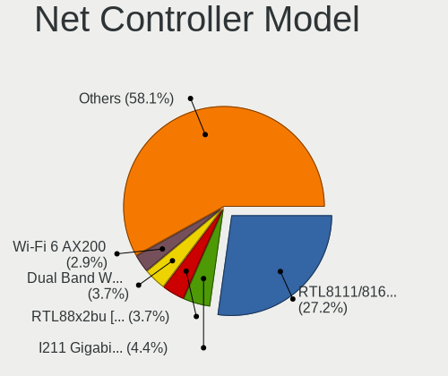

| Model                                                                  | Desktops | Percent |
|------------------------------------------------------------------------|----------|---------|
| Realtek RTL8111/8168/8211/8411 PCI Express Gigabit Ethernet Controller | 37       | 27.21%  |
| Intel I211 Gigabit Network Connection                                  | 6        | 4.41%   |
| Realtek RTL88x2bu [AC1200 Techkey]                                     | 5        | 3.68%   |
| Intel Dual Band Wireless-AC 3168NGW [Stone Peak]                       | 5        | 3.68%   |
| Intel Wi-Fi 6 AX200                                                    | 4        | 2.94%   |
| Intel Ethernet Connection I217-LM                                      | 4        | 2.94%   |
| Intel 82579LM Gigabit Network Connection (Lewisville)                  | 4        | 2.94%   |
| Realtek RTL8188CUS 802.11n WLAN Adapter                                | 3        | 2.21%   |
| Realtek RTL8125 2.5GbE Controller                                      | 3        | 2.21%   |
| Realtek 802.11ac NIC                                                   | 3        | 2.21%   |
| Intel 82567LM-3 Gigabit Network Connection                             | 3        | 2.21%   |
| Realtek RTL8821CE 802.11ac PCIe Wireless Network Adapter               | 2        | 1.47%   |
| Realtek RTL8723BU 802.11b/g/n WLAN Adapter                             | 2        | 1.47%   |
| Realtek RTL8188FTV 802.11b/g/n 1T1R 2.4G WLAN Adapter                  | 2        | 1.47%   |
| Realtek RTL810xE PCI Express Fast Ethernet controller                  | 2        | 1.47%   |
| Intel Ethernet Controller I225-V                                       | 2        | 1.47%   |
| Intel Ethernet Connection (7) I219-LM                                  | 2        | 1.47%   |
| TP-Link Archer T9UH v1 [Realtek RTL8814AU]                             | 1        | 0.74%   |
| TP-Link Archer T4U ver.3                                               | 1        | 0.74%   |
| Samsung Galaxy series, misc. (tethering mode)                          | 1        | 0.74%   |
| Realtek RTL8852AE 802.11ax PCIe Wireless Network Adapter               | 1        | 0.74%   |
| Realtek RTL8812AU 802.11a/b/g/n/ac 2T2R DB WLAN Adapter                | 1        | 0.74%   |
| Realtek RTL8192EU 802.11b/g/n WLAN Adapter                             | 1        | 0.74%   |
| Realtek RTL8192EE PCIe Wireless Network Adapter                        | 1        | 0.74%   |
| Realtek RTL8192CU 802.11n WLAN Adapter                                 | 1        | 0.74%   |
| Realtek RTL8188RU 802.11n WLAN Adapter                                 | 1        | 0.74%   |
| Realtek RTL8188EUS 802.11n Wireless Network Adapter                    | 1        | 0.74%   |
| Realtek RTL8188CE 802.11b/g/n WiFi Adapter                             | 1        | 0.74%   |
| Realtek RTL8187 Wireless Adapter                                       | 1        | 0.74%   |
| Realtek RTL8153 Gigabit Ethernet Adapter                               | 1        | 0.74%   |
| Realtek Killer E3000 2.5GbE Controller                                 | 1        | 0.74%   |
| Ralink RT2870 Wireless Adapter                                         | 1        | 0.74%   |
| Ralink MT7610U ("Archer T2U" 2.4G+5G WLAN Adapter                      | 1        | 0.74%   |
| Ralink MT7601U Wireless Adapter                                        | 1        | 0.74%   |
| Ralink RT5390R 802.11bgn PCIe Wireless Network Adapter                 | 1        | 0.74%   |
| Ralink RT2561/RT61 802.11g PCI                                         | 1        | 0.74%   |
| Qualcomm Atheros QCA9565 / AR9565 Wireless Network Adapter             | 1        | 0.74%   |
| Qualcomm Atheros Killer E2500 Gigabit Ethernet Controller              | 1        | 0.74%   |
| Qualcomm Atheros AR9462 Wireless Network Adapter                       | 1        | 0.74%   |
| Nvidia MCP61 Ethernet                                                  | 1        | 0.74%   |

Wireless Vendor
---------------

Wireless vendors

| Vendor                | Desktops | Percent |
|-----------------------|----------|---------|
| Realtek Semiconductor | 20       | 37.74%  |
| Intel                 | 17       | 32.08%  |
| Ralink Technology     | 3        | 5.66%   |
| NetGear               | 3        | 5.66%   |
| TP-Link               | 2        | 3.77%   |
| Ralink                | 2        | 3.77%   |
| Qualcomm Atheros      | 2        | 3.77%   |
| MediaTek              | 2        | 3.77%   |
| Microsoft             | 1        | 1.89%   |
| Gemtek                | 1        | 1.89%   |

Wireless Model
--------------

Wireless models

| Model                                                         | Desktops | Percent |
|---------------------------------------------------------------|----------|---------|
| Realtek RTL88x2bu [AC1200 Techkey]                            | 5        | 8.47%   |
| Intel Dual Band Wireless-AC 3168NGW [Stone Peak]              | 5        | 8.47%   |
| Intel Wi-Fi 6 AX200                                           | 4        | 6.78%   |
| Realtek RTL8188CUS 802.11n WLAN Adapter                       | 3        | 5.08%   |
| Realtek 802.11ac NIC                                          | 3        | 5.08%   |
| Realtek RTL8821CE 802.11ac PCIe Wireless Network Adapter      | 2        | 3.39%   |
| Realtek RTL8723BU 802.11b/g/n WLAN Adapter                    | 2        | 3.39%   |
| Realtek RTL8188FTV 802.11b/g/n 1T1R 2.4G WLAN Adapter         | 2        | 3.39%   |
| TP-Link Archer T9UH v1 [Realtek RTL8814AU]                    | 1        | 1.69%   |
| TP-Link Archer T4U ver.3                                      | 1        | 1.69%   |
| Realtek RTL8852AE 802.11ax PCIe Wireless Network Adapter      | 1        | 1.69%   |
| Realtek RTL8812AU 802.11a/b/g/n/ac 2T2R DB WLAN Adapter       | 1        | 1.69%   |
| Realtek RTL8192EU 802.11b/g/n WLAN Adapter                    | 1        | 1.69%   |
| Realtek RTL8192EE PCIe Wireless Network Adapter               | 1        | 1.69%   |
| Realtek RTL8192CU 802.11n WLAN Adapter                        | 1        | 1.69%   |
| Realtek RTL8188RU 802.11n WLAN Adapter                        | 1        | 1.69%   |
| Realtek RTL8188EUS 802.11n Wireless Network Adapter           | 1        | 1.69%   |
| Realtek RTL8188CE 802.11b/g/n WiFi Adapter                    | 1        | 1.69%   |
| Realtek RTL8187 Wireless Adapter                              | 1        | 1.69%   |
| Ralink RT2870 Wireless Adapter                                | 1        | 1.69%   |
| Ralink MT7610U ("Archer T2U" 2.4G+5G WLAN Adapter             | 1        | 1.69%   |
| Ralink MT7601U Wireless Adapter                               | 1        | 1.69%   |
| Ralink RT5390R 802.11bgn PCIe Wireless Network Adapter        | 1        | 1.69%   |
| Ralink RT2561/RT61 802.11g PCI                                | 1        | 1.69%   |
| Qualcomm Atheros QCA9565 / AR9565 Wireless Network Adapter    | 1        | 1.69%   |
| Qualcomm Atheros AR9462 Wireless Network Adapter              | 1        | 1.69%   |
| NetGear WNA1100 Wireless-N 150 [Atheros AR9271]               | 1        | 1.69%   |
| NetGear MA111(v2) 802.11b Wireless [SIS SIS 162]              | 1        | 1.69%   |
| NetGear A6100 AC600 DB Wireless Adapter [Realtek RTL8811AU]   | 1        | 1.69%   |
| Microsoft Xbox Wireless Adapter for Windows                   | 1        | 1.69%   |
| MediaTek MT7922 802.11ax PCI Express Wireless Network Adapter | 1        | 1.69%   |
| MediaTek MT7921 802.11ax PCI Express Wireless Network Adapter | 1        | 1.69%   |
| Intel Wireless 8265 / 8275                                    | 1        | 1.69%   |
| Intel Wireless 7260                                           | 1        | 1.69%   |
| Intel Wireless 3165                                           | 1        | 1.69%   |
| Intel Wireless 3160                                           | 1        | 1.69%   |
| Intel Wi-Fi 6 AX201 160MHz                                    | 1        | 1.69%   |
| Intel Tiger Lake PCH CNVi WiFi                                | 1        | 1.69%   |
| Intel Comet Lake PCH CNVi WiFi                                | 1        | 1.69%   |
| Intel Cannon Lake PCH CNVi WiFi                               | 1        | 1.69%   |

Ethernet Vendor
---------------

Ethernet vendors

| Vendor                | Desktops | Percent |
|-----------------------|----------|---------|
| Realtek Semiconductor | 44       | 57.14%  |
| Intel                 | 27       | 35.06%  |
| Nvidia                | 2        | 2.6%    |
| Samsung Electronics   | 1        | 1.3%    |
| Qualcomm Atheros      | 1        | 1.3%    |
| NetGear               | 1        | 1.3%    |
| Aquantia              | 1        | 1.3%    |

Ethernet Model
--------------

Ethernet models

| Model                                                                          | Desktops | Percent |
|--------------------------------------------------------------------------------|----------|---------|
| Realtek RTL8111/8168/8211/8411 PCI Express Gigabit Ethernet Controller         | 37       | 48.05%  |
| Intel I211 Gigabit Network Connection                                          | 6        | 7.79%   |
| Intel Ethernet Connection I217-LM                                              | 4        | 5.19%   |
| Intel 82579LM Gigabit Network Connection (Lewisville)                          | 4        | 5.19%   |
| Realtek RTL8125 2.5GbE Controller                                              | 3        | 3.9%    |
| Intel 82567LM-3 Gigabit Network Connection                                     | 3        | 3.9%    |
| Realtek RTL810xE PCI Express Fast Ethernet controller                          | 2        | 2.6%    |
| Intel Ethernet Controller I225-V                                               | 2        | 2.6%    |
| Intel Ethernet Connection (7) I219-LM                                          | 2        | 2.6%    |
| Samsung Galaxy series, misc. (tethering mode)                                  | 1        | 1.3%    |
| Realtek RTL8153 Gigabit Ethernet Adapter                                       | 1        | 1.3%    |
| Realtek Killer E3000 2.5GbE Controller                                         | 1        | 1.3%    |
| Qualcomm Atheros Killer E2500 Gigabit Ethernet Controller                      | 1        | 1.3%    |
| Nvidia MCP61 Ethernet                                                          | 1        | 1.3%    |
| Nvidia CK804 Ethernet Controller                                               | 1        | 1.3%    |
| NetGear LB1120-100NAS                                                          | 1        | 1.3%    |
| Intel Ethernet Connection (7) I219-V                                           | 1        | 1.3%    |
| Intel Ethernet Connection (5) I219-V                                           | 1        | 1.3%    |
| Intel Ethernet Connection (5) I219-LM                                          | 1        | 1.3%    |
| Intel Ethernet Connection (2) I219-V                                           | 1        | 1.3%    |
| Intel 82579V Gigabit Network Connection                                        | 1        | 1.3%    |
| Intel 82566DM-2 Gigabit Network Connection                                     | 1        | 1.3%    |
| Aquantia AQtion AQC107 NBase-T/IEEE 802.3an Ethernet Controller [Atlantic 10G] | 1        | 1.3%    |

Net Controller Kind
-------------------

Ethernet, WiFi or modem

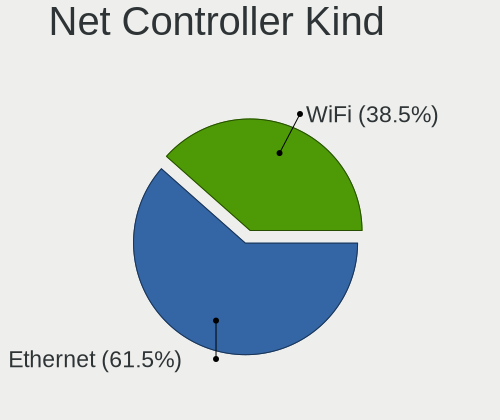

| Kind     | Desktops | Percent |
|----------|----------|---------|
| Ethernet | 72       | 61.54%  |
| WiFi     | 45       | 38.46%  |

Used Controller
---------------

Currently used network controller

| Kind     | Desktops | Percent |
|----------|----------|---------|
| Ethernet | 54       | 66.67%  |
| WiFi     | 27       | 33.33%  |

NICs
----

Total network controllers on board

| Total | Desktops | Percent |
|-------|----------|---------|
| 1     | 45       | 60%     |
| 2     | 27       | 36%     |
| 3     | 2        | 2.67%   |
| 0     | 1        | 1.33%   |

IPv6
----

IPv6 vs IPv4

| Used | Desktops | Percent |
|------|----------|---------|
| No   | 62       | 83.78%  |
| Yes  | 12       | 16.22%  |

Bluetooth
---------

Bluetooth Vendor
----------------

Controller vendors

| Vendor                          | Desktops | Percent |
|---------------------------------|----------|---------|
| Intel                           | 16       | 43.24%  |
| Cambridge Silicon Radio         | 9        | 24.32%  |
| Realtek Semiconductor           | 4        | 10.81%  |
| Broadcom                        | 2        | 5.41%   |
| Qualcomm Atheros Communications | 1        | 2.7%    |
| MediaTek                        | 1        | 2.7%    |
| Lite-On Technology              | 1        | 2.7%    |
| IMC Networks                    | 1        | 2.7%    |
| Dynex                           | 1        | 2.7%    |
| Belkin Components               | 1        | 2.7%    |

Bluetooth Model
---------------

Controller models

| Model                                                    | Desktops | Percent |
|----------------------------------------------------------|----------|---------|
| Cambridge Silicon Radio Bluetooth Dongle (HCI mode)      | 9        | 24.32%  |
| Intel Wireless-AC 3168 Bluetooth                         | 5        | 13.51%  |
| Intel AX200 Bluetooth                                    | 4        | 10.81%  |
| Intel Bluetooth wireless interface                       | 3        | 8.11%   |
| Realtek Bluetooth Radio                                  | 2        | 5.41%   |
| Intel Bluetooth 9460/9560 Jefferson Peak (JfP)           | 2        | 5.41%   |
| Intel AX201 Bluetooth                                    | 2        | 5.41%   |
| Broadcom Bluetooth Device                                | 2        | 5.41%   |
| Realtek  Bluetooth 4.2 Adapter                           | 1        | 2.7%    |
| Realtek Bluetooth 5.3 Radio                              | 1        | 2.7%    |
| Qualcomm Atheros  Bluetooth Device                       | 1        | 2.7%    |
| MediaTek Wireless_Device                                 | 1        | 2.7%    |
| Lite-On Bluetooth Device                                 | 1        | 2.7%    |
| IMC Networks Wireless_Device                             | 1        | 2.7%    |
| Dynex Bluetooth 4.0 Adapter [Broadcom, 1.12, BCM20702A0] | 1        | 2.7%    |
| Belkin Components Bluetooth Mini Dongle                  | 1        | 2.7%    |

Sound
-----

Sound Vendor
------------

Sound card vendors

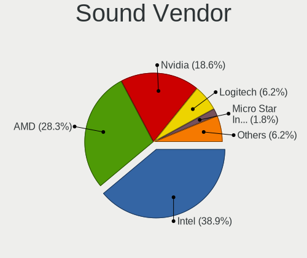

| Vendor                                          | Desktops | Percent |
|-------------------------------------------------|----------|---------|
| Intel                                           | 44       | 38.94%  |
| AMD                                             | 32       | 28.32%  |
| Nvidia                                          | 21       | 18.58%  |
| Logitech                                        | 7        | 6.19%   |
| Micro Star International                        | 2        | 1.77%   |
| C-Media Electronics                             | 2        | 1.77%   |
| NZXT                                            | 1        | 0.88%   |
| Nintendo                                        | 1        | 0.88%   |
| Licensed by Sony Computer Entertainment America | 1        | 0.88%   |
| Kingston Technology                             | 1        | 0.88%   |
| Hewlett-Packard                                 | 1        | 0.88%   |

Sound Model
-----------

Sound card models

| Model                                                                      | Desktops | Percent |
|----------------------------------------------------------------------------|----------|---------|
| AMD Family 17h/19h/1ah HD Audio Controller                                 | 9        | 6.34%   |
| AMD FCH Azalia Controller                                                  | 6        | 4.23%   |
| Intel Xeon E3-1200 v3/4th Gen Core Processor HD Audio Controller           | 5        | 3.52%   |
| Intel Cannon Lake PCH cAVS                                                 | 5        | 3.52%   |
| Intel 8 Series/C220 Series Chipset High Definition Audio Controller        | 5        | 3.52%   |
| AMD Starship/Matisse HD Audio Controller                                   | 5        | 3.52%   |
| AMD Family 17h (Models 00h-0fh) HD Audio Controller                        | 5        | 3.52%   |
| Nvidia GP107GL High Definition Audio Controller                            | 4        | 2.82%   |
| Logitech EasyCall Speakerphone                                             | 4        | 2.82%   |
| Intel 6 Series/C200 Series Chipset Family High Definition Audio Controller | 4        | 2.82%   |
| Intel 200 Series PCH HD Audio                                              | 4        | 2.82%   |
| AMD Raven/Raven2/Fenghuang HDMI/DP Audio Controller                        | 4        | 2.82%   |
| AMD Ellesmere HDMI Audio [Radeon RX 470/480 / 570/580/590]                 | 4        | 2.82%   |
| Nvidia GP106 High Definition Audio Controller                              | 3        | 2.11%   |
| Intel Sunrise Point-LP HD Audio                                            | 3        | 2.11%   |
| Intel NM10/ICH7 Family High Definition Audio Controller                    | 3        | 2.11%   |
| Intel Atom Processor Z36xxx/Z37xxx Series High Definition Audio Controller | 3        | 2.11%   |
| Intel 82801JD/DO (ICH10 Family) HD Audio Controller                        | 3        | 2.11%   |
| AMD Renoir Radeon High Definition Audio Controller                         | 3        | 2.11%   |
| AMD Navi 21/23 HDMI/DP Audio Controller                                    | 3        | 2.11%   |
| Nvidia TU116 High Definition Audio Controller                              | 2        | 1.41%   |
| Nvidia GP102 HDMI Audio Controller                                         | 2        | 1.41%   |
| Nvidia GF119 HDMI Audio Controller                                         | 2        | 1.41%   |
| Micro Star International USB Audio                                         | 2        | 1.41%   |
| Intel Tiger Lake-H HD Audio Controller                                     | 2        | 1.41%   |
| Intel Celeron/Pentium Silver Processor High Definition Audio               | 2        | 1.41%   |
| Intel 7 Series/C216 Chipset Family High Definition Audio Controller        | 2        | 1.41%   |
| AMD Trinity HDMI Audio Controller                                          | 2        | 1.41%   |
| AMD SBx00 Azalia (Intel HDA)                                               | 2        | 1.41%   |
| AMD Navi 10 HDMI Audio                                                     | 2        | 1.41%   |
| AMD Kaveri HDMI/DP Audio Controller                                        | 2        | 1.41%   |
| AMD Cedar HDMI Audio [Radeon HD 5400/6300/7300 Series]                     | 2        | 1.41%   |
| AMD Baffin HDMI/DP Audio [Radeon RX 550 640SP / RX 560/560X]               | 2        | 1.41%   |
| NZXT USB MIC                                                               | 1        | 0.7%    |
| Nvidia TU107 GeForce GTX 1650 High Definition Audio Controller             | 1        | 0.7%    |
| Nvidia TU106 High Definition Audio Controller                              | 1        | 0.7%    |
| Nvidia MCP61 High Definition Audio                                         | 1        | 0.7%    |
| Nvidia High Definition Audio Controller                                    | 1        | 0.7%    |
| Nvidia GP108 High Definition Audio Controller                              | 1        | 0.7%    |
| Nvidia GM107 High Definition Audio Controller [GeForce 940MX]              | 1        | 0.7%    |

Memory
------

Memory Vendor
-------------

Memory module vendors

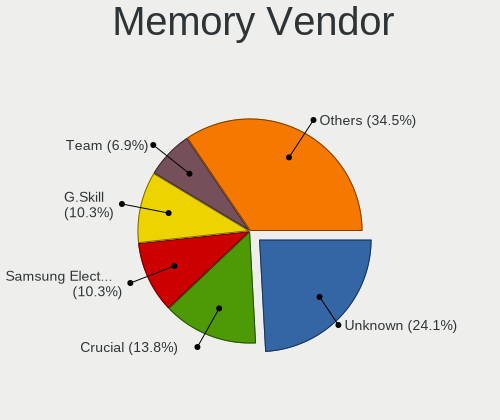

| Vendor              | Desktops | Percent |
|---------------------|----------|---------|
| Unknown             | 7        | 24.14%  |
| Crucial             | 4        | 13.79%  |
| Samsung Electronics | 3        | 10.34%  |
| G.Skill             | 3        | 10.34%  |
| Team                | 2        | 6.9%    |
| SK hynix            | 2        | 6.9%    |
| Corsair             | 2        | 6.9%    |
| Sesame              | 1        | 3.45%   |
| PNY                 | 1        | 3.45%   |
| Kingston            | 1        | 3.45%   |
| Euronet             | 1        | 3.45%   |
| Avant               | 1        | 3.45%   |
| Unknown             | 1        | 3.45%   |

Memory Model
------------

Memory module models

| Model                                                     | Desktops | Percent |
|-----------------------------------------------------------|----------|---------|
| Unknown RAM Module 2048MB DIMM SDRAM                      | 3        | 9.38%   |
| Unknown RAM Module 8GB DIMM DDR3 1333MT/s                 | 1        | 3.13%   |
| Unknown RAM Module 4096MB DIMM 667MT/s                    | 1        | 3.13%   |
| Unknown RAM Module 1GB DIMM                               | 1        | 3.13%   |
| Unknown RAM CL18-22-22 D4-3600 16384MB DIMM DDR4 3600MT/s | 1        | 3.13%   |
| Unknown RAM CL18-20-20 D4-3600 8192MB DIMM DDR4 3600MT/s  | 1        | 3.13%   |
| Team RAM TEAMGROUP-UD4-3200 8GB DIMM DDR4 3733MT/s        | 1        | 3.13%   |
| Team RAM TEAMGROUP-UD4-3000 8GB DIMM DDR4 3200MT/s        | 1        | 3.13%   |
| SK hynix RAM Module 8GB DIMM DDR4 3200MT/s                | 1        | 3.13%   |
| SK hynix RAM HMT351U6CFR8C-H9 4GB DIMM DDR3 1333MT/s      | 1        | 3.13%   |
| Sesame RAM S939A2UGS-ITR 8GB DIMM DDR3 3200MT/s           | 1        | 3.13%   |
| Samsung RAM M378B5273CH0-CH9 4GB DIMM DDR3 1867MT/s       | 1        | 3.13%   |
| Samsung RAM M378B5173QH0-CK0 4GB DIMM DDR3 1600MT/s       | 1        | 3.13%   |
| Samsung RAM M378B5173DB0-CK0 4096MB DIMM DDR3 1600MT/s    | 1        | 3.13%   |
| Samsung RAM M378B1G73QH0-CK0 8GB DIMM DDR3 1600MT/s       | 1        | 3.13%   |
| Samsung RAM M378B1G73BH0-CK0 8GB DIMM DDR3 1600MT/s       | 1        | 3.13%   |
| PNY RAM 4GBH1X04E9992 4096MB DIMM DDR3 1600MT/s           | 1        | 3.13%   |
| Kingston RAM X2YH1K-MIE-NX 16GB DIMM DDR4 3200MT/s        | 1        | 3.13%   |
| G.Skill RAM F4-2400C15-8GVR 8GB DIMM DDR4 3200MT/s        | 1        | 3.13%   |
| G.Skill RAM F3-2400C11-8G 8192MB DIMM DDR3 2133MT/s       | 1        | 3.13%   |
| G.Skill RAM F3-10666CL9-8GBSQ 8GB DIMM DDR3 1333MT/s      | 1        | 3.13%   |
| Euronet RAM AHD19S8G26S 8GB DIMM DDR4 2666MT/s            | 1        | 3.13%   |
| Crucial RAM CT8G4DFRA32A.C8FP 8GB DIMM DDR4 3533MT/s      | 1        | 3.13%   |
| Crucial RAM CT51264BD160B.C16F 4GB DIMM DDR3 1600MT/s     | 1        | 3.13%   |
| Crucial RAM CT102464BD160 8GB DIMM DDR3 1600MT/s          | 1        | 3.13%   |
| Crucial RAM BL16G26C16U4W.16FD 16GB DIMM DDR4 2667MT/s    | 1        | 3.13%   |
| Corsair RAM CMK16GX4M2B3200C16 8GB DIMM DDR4 3600MT/s     | 1        | 3.13%   |
| Corsair RAM CMK16GX4M2B3000C15 8GB DIMM DDR4 3600MT/s     | 1        | 3.13%   |
| Avant RAM W641GU42J7240NC 8GB DIMM DDR4 2400MT/s          | 1        | 3.13%   |
| Unknown                                                   | 1        | 3.13%   |

Memory Kind
-----------

Memory module kinds

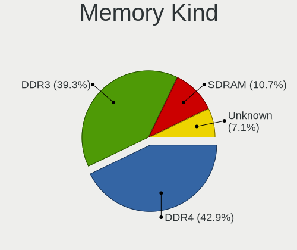

| Kind    | Desktops | Percent |
|---------|----------|---------|
| DDR4    | 12       | 42.86%  |
| DDR3    | 11       | 39.29%  |
| SDRAM   | 3        | 10.71%  |
| Unknown | 2        | 7.14%   |

Memory Form Factor
------------------

Physical design of the memory module

| Name | Desktops | Percent |
|------|----------|---------|
| DIMM | 28       | 100%    |

Memory Size
-----------

Memory module size

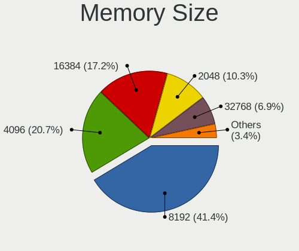

| Size  | Desktops | Percent |
|-------|----------|---------|
| 8192  | 12       | 41.38%  |
| 4096  | 6        | 20.69%  |
| 16384 | 5        | 17.24%  |
| 2048  | 3        | 10.34%  |
| 32768 | 2        | 6.9%    |
| 1024  | 1        | 3.45%   |

Memory Speed
------------

Memory module speed

| Speed   | Desktops | Percent |
|---------|----------|---------|
| 3200    | 5        | 16.67%  |
| 1600    | 5        | 16.67%  |
| Unknown | 4        | 13.33%  |
| 3600    | 3        | 10%     |
| 1333    | 3        | 10%     |
| 2667    | 2        | 6.67%   |
| 3733    | 1        | 3.33%   |
| 3533    | 1        | 3.33%   |
| 2666    | 1        | 3.33%   |
| 2400    | 1        | 3.33%   |
| 2133    | 1        | 3.33%   |
| 1867    | 1        | 3.33%   |
| 1866    | 1        | 3.33%   |
| 667     | 1        | 3.33%   |

Printers & scanners
-------------------

Printer Vendor
--------------

Printer device vendors

| Vendor             | Desktops | Percent |
|--------------------|----------|---------|
| Hewlett-Packard    | 2        | 50%     |
| Canon              | 1        | 25%     |
| Brother Industries | 1        | 25%     |

Printer Model
-------------

Printer device models

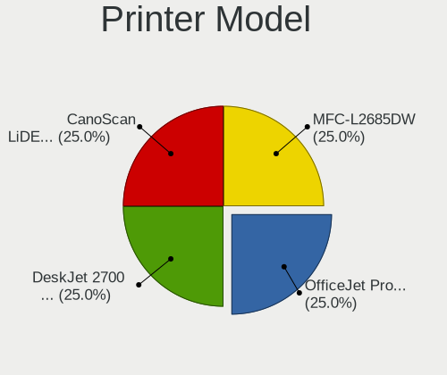

| Model                   | Desktops | Percent |
|-------------------------|----------|---------|
| HP OfficeJet Pro 6960   | 1        | 25%     |
| HP DeskJet 2700 series  | 1        | 25%     |
| Canon CanoScan LiDE 300 | 1        | 25%     |
| Brother MFC-L2685DW     | 1        | 25%     |

Scanner Vendor
--------------

Scanner device vendors

Zero info for selected period =(

Scanner Model
-------------

Scanner device models

Zero info for selected period =(

Camera
------

Camera Vendor
-------------

Camera device vendors

| Vendor           | Desktops | Percent |
|------------------|----------|---------|
| Logitech         | 7        | 38.89%  |
| Microdia         | 5        | 27.78%  |
| Razer USA        | 2        | 11.11%  |
| Trust            | 1        | 5.56%   |
| Microsoft        | 1        | 5.56%   |
| Jieli Technology | 1        | 5.56%   |
| Cubeternet       | 1        | 5.56%   |

Camera Model
------------

Camera device models

| Model                           | Desktops | Percent |
|---------------------------------|----------|---------|
| Microdia Camera                 | 4        | 22.22%  |
| Logitech HD Pro Webcam C920     | 3        | 16.67%  |
| Trust Trust 1080p HD Webcam     | 1        | 5.56%   |
| Razer USA Razer Kiyo Pro        | 1        | 5.56%   |
| Razer USA Gaming Webcam [Kiyo]  | 1        | 5.56%   |
| Microsoft LifeCam Cinema        | 1        | 5.56%   |
| Microdia USB 2.0 Camera         | 1        | 5.56%   |
| Logitech Webcam Pro 9000        | 1        | 5.56%   |
| Logitech Webcam C310            | 1        | 5.56%   |
| Logitech Webcam C270            | 1        | 5.56%   |
| Logitech CrystalCam             | 1        | 5.56%   |
| Jieli USB PHY 2.0               | 1        | 5.56%   |
| Cubeternet GL-UPC822 UVC WebCam | 1        | 5.56%   |

Security
--------

Fingerprint Vendor
------------------

Fingerprint sensor vendors

Zero info for selected period =(

Fingerprint Model
-----------------

Fingerprint sensor models

Zero info for selected period =(

Chipcard Vendor
---------------

Chipcard module vendors

Zero info for selected period =(

Chipcard Model
--------------

Chipcard module models

Zero info for selected period =(

Unsupported
-----------

Unsupported Devices
-------------------

Total unsupported devices on board

| Total | Desktops | Percent |
|-------|----------|---------|
| 0     | 61       | 74.39%  |
| 1     | 16       | 19.51%  |
| 2     | 5        | 6.1%    |

Unsupported Device Types
------------------------

Types of unsupported devices

| Type                     | Desktops | Percent |
|--------------------------|----------|---------|
| Net/wireless             | 13       | 59.09%  |
| Graphics card            | 6        | 27.27%  |
| Net/ethernet             | 1        | 4.55%   |
| Multimedia controller    | 1        | 4.55%   |
| Communication controller | 1        | 4.55%   |

