Linux in Puerto Rico - Tested Hardware & Statistics (Notebooks)
---------------------------------------------------------------

A project to collect tested hardware configurations for Linux in Puerto Rico.

Anyone can contribute to this report by the [hw-probe](https://github.com/linuxhw/hw-probe) tool:

    sudo -E hw-probe -all -upload

Please contribute! Especially if your hardware is rare.

Contents
--------

* [ Test Cases ](#test-cases)

* [ System ](#system)
  - [ OS                       ](#os)
  - [ OS Family                ](#os-family)
  - [ Kernel                   ](#kernel)
  - [ Kernel Family            ](#kernel-family)
  - [ Kernel Major Ver.        ](#kernel-major-ver)
  - [ Arch                     ](#arch)
  - [ DE                       ](#de)
  - [ Display Server           ](#display-server)
  - [ Display Manager          ](#display-manager)
  - [ OS Lang                  ](#os-lang)
  - [ Boot Mode                ](#boot-mode)
  - [ Filesystem               ](#filesystem)
  - [ Part. scheme             ](#part-scheme)
  - [ Dual Boot with Linux/BSD ](#dual-boot-with-linuxbsd)
  - [ Dual Boot (Win)          ](#dual-boot-win)

* [ Board ](#board)
  - [ Vendor                   ](#vendor)
  - [ Model                    ](#model)
  - [ Model Family             ](#model-family)
  - [ MFG Year                 ](#mfg-year)
  - [ Form Factor              ](#form-factor)
  - [ Secure Boot              ](#secure-boot)
  - [ Coreboot                 ](#coreboot)
  - [ RAM Size                 ](#ram-size)
  - [ RAM Used                 ](#ram-used)
  - [ Total Drives             ](#total-drives)
  - [ Has CD-ROM               ](#has-cd-rom)
  - [ Has Ethernet             ](#has-ethernet)
  - [ Has WiFi                 ](#has-wifi)
  - [ Has Bluetooth            ](#has-bluetooth)

* [ Location ](#location)
  - [ Country                  ](#country)
  - [ City                     ](#city)

* [ Drives ](#drives)
  - [ Drive Vendor             ](#drive-vendor)
  - [ Drive Model              ](#drive-model)
  - [ HDD Vendor               ](#hdd-vendor)
  - [ SSD Vendor               ](#ssd-vendor)
  - [ Drive Kind               ](#drive-kind)
  - [ Drive Connector          ](#drive-connector)
  - [ Drive Size               ](#drive-size)
  - [ Space Total              ](#space-total)
  - [ Space Used               ](#space-used)
  - [ Malfunc. Drives          ](#malfunc-drives)
  - [ Malfunc. Drive Vendor    ](#malfunc-drive-vendor)
  - [ Malfunc. HDD Vendor      ](#malfunc-hdd-vendor)
  - [ Malfunc. Drive Kind      ](#malfunc-drive-kind)
  - [ Failed Drives            ](#failed-drives)
  - [ Failed Drive Vendor      ](#failed-drive-vendor)
  - [ Drive Status             ](#drive-status)

* [ Storage controller ](#storage-controller)
  - [ Storage Vendor           ](#storage-vendor)
  - [ Storage Model            ](#storage-model)
  - [ Storage Kind             ](#storage-kind)

* [ Processor ](#processor)
  - [ CPU Vendor               ](#cpu-vendor)
  - [ CPU Model                ](#cpu-model)
  - [ CPU Model Family         ](#cpu-model-family)
  - [ CPU Cores                ](#cpu-cores)
  - [ CPU Sockets              ](#cpu-sockets)
  - [ CPU Threads              ](#cpu-threads)
  - [ CPU Op-Modes             ](#cpu-op-modes)
  - [ CPU Microcode            ](#cpu-microcode)
  - [ CPU Microarch            ](#cpu-microarch)

* [ Graphics ](#graphics)
  - [ GPU Vendor               ](#gpu-vendor)
  - [ GPU Model                ](#gpu-model)
  - [ GPU Combo                ](#gpu-combo)
  - [ GPU Driver               ](#gpu-driver)
  - [ GPU Memory               ](#gpu-memory)

* [ Monitor ](#monitor)
  - [ Monitor Vendor           ](#monitor-vendor)
  - [ Monitor Model            ](#monitor-model)
  - [ Monitor Resolution       ](#monitor-resolution)
  - [ Monitor Diagonal         ](#monitor-diagonal)
  - [ Monitor Width            ](#monitor-width)
  - [ Aspect Ratio             ](#aspect-ratio)
  - [ Monitor Area             ](#monitor-area)
  - [ Pixel Density            ](#pixel-density)
  - [ Multiple Monitors        ](#multiple-monitors)

* [ Network ](#network)
  - [ Net Controller Vendor    ](#net-controller-vendor)
  - [ Net Controller Model     ](#net-controller-model)
  - [ Wireless Vendor          ](#wireless-vendor)
  - [ Wireless Model           ](#wireless-model)
  - [ Ethernet Vendor          ](#ethernet-vendor)
  - [ Ethernet Model           ](#ethernet-model)
  - [ Net Controller Kind      ](#net-controller-kind)
  - [ Used Controller          ](#used-controller)
  - [ NICs                     ](#nics)
  - [ IPv6                     ](#ipv6)

* [ Bluetooth ](#bluetooth)
  - [ Bluetooth Vendor         ](#bluetooth-vendor)
  - [ Bluetooth Model          ](#bluetooth-model)

* [ Sound ](#sound)
  - [ Sound Vendor             ](#sound-vendor)
  - [ Sound Model              ](#sound-model)

* [ Memory ](#memory)
  - [ Memory Vendor            ](#memory-vendor)
  - [ Memory Model             ](#memory-model)
  - [ Memory Kind              ](#memory-kind)
  - [ Memory Form Factor       ](#memory-form-factor)
  - [ Memory Size              ](#memory-size)
  - [ Memory Speed             ](#memory-speed)

* [ Printers & scanners ](#printers--scanners)
  - [ Printer Vendor           ](#printer-vendor)
  - [ Printer Model            ](#printer-model)
  - [ Scanner Vendor           ](#scanner-vendor)
  - [ Scanner Model            ](#scanner-model)

* [ Camera ](#camera)
  - [ Camera Vendor            ](#camera-vendor)
  - [ Camera Model             ](#camera-model)

* [ Security ](#security)
  - [ Fingerprint Vendor       ](#fingerprint-vendor)
  - [ Fingerprint Model        ](#fingerprint-model)
  - [ Chipcard Vendor          ](#chipcard-vendor)
  - [ Chipcard Model           ](#chipcard-model)

* [ Unsupported ](#unsupported)
  - [ Unsupported Devices      ](#unsupported-devices)
  - [ Unsupported Device Types ](#unsupported-device-types)

Test Cases
----------

Total: 269

| Vendor        | Model                       | Probe                                                      | Date         |
|---------------|-----------------------------|------------------------------------------------------------|--------------|
| HP            | 2000                        | [39a122d321](https://linux-hardware.org/?probe=39a122d321) | Dec 30, 2025 |
| Chuwi         | HeroBook Pro                | [22d2538717](https://linux-hardware.org/?probe=22d2538717) | Dec 26, 2025 |
| HP            | OMEN Gaming Laptop 16-ap... | [3e9960f38d](https://linux-hardware.org/?probe=3e9960f38d) | Dec 11, 2025 |
| Lenovo        | ThinkPad SL 2743LJU         | [825a171e7c](https://linux-hardware.org/?probe=825a171e7c) | Dec 11, 2025 |
| Razer         | Book 13 - RZ09-0357         | [6e49b28ff3](https://linux-hardware.org/?probe=6e49b28ff3) | Dec 03, 2025 |
| Chuwi         | HeroBook Pro                | [7fdea3fb1e](https://linux-hardware.org/?probe=7fdea3fb1e) | Nov 25, 2025 |
| Chuwi         | HeroBook Pro                | [15ca069a1b](https://linux-hardware.org/?probe=15ca069a1b) | Nov 25, 2025 |
| HP            | Laptop 14-dk1xxx            | [eced12e259](https://linux-hardware.org/?probe=eced12e259) | Nov 19, 2025 |
| HP            | Laptop 14-dk1xxx            | [fe49fc0f63](https://linux-hardware.org/?probe=fe49fc0f63) | Nov 18, 2025 |
| HP            | Notebook                    | [1ed7c92916](https://linux-hardware.org/?probe=1ed7c92916) | Nov 03, 2025 |
| ASUSTek       | VivoBook_ASUSLaptop X512... | [65b360c988](https://linux-hardware.org/?probe=65b360c988) | Nov 03, 2025 |
| ASUSTek       | ROG Strix G731GT_GL731GT    | [7c0f95cce7](https://linux-hardware.org/?probe=7c0f95cce7) | Nov 03, 2025 |
| HP            | Notebook                    | [9ba708eda9](https://linux-hardware.org/?probe=9ba708eda9) | Oct 16, 2025 |
| Lenovo        | ThinkPad T420 4180BU5       | [64785685c0](https://linux-hardware.org/?probe=64785685c0) | Oct 05, 2025 |
| Lenovo        | IdeaPad 110 Touch-15ACL ... | [7fe436a706](https://linux-hardware.org/?probe=7fe436a706) | Sep 28, 2025 |
| HP            | EliteBook 840 G5            | [b03fd2ae3a](https://linux-hardware.org/?probe=b03fd2ae3a) | Sep 25, 2025 |
| Lenovo        | ThinkPad E560 20EV002HUS    | [aeac8e5c3b](https://linux-hardware.org/?probe=aeac8e5c3b) | Sep 12, 2025 |
| Lenovo        | IdeaPad 110 Touch-15ACL ... | [e436561f20](https://linux-hardware.org/?probe=e436561f20) | Sep 02, 2025 |
| Lenovo        | IdeaPad 110 Touch-15ACL ... | [3c0ddfc7aa](https://linux-hardware.org/?probe=3c0ddfc7aa) | Sep 02, 2025 |
| HP            | Laptop 17-cp2xxx            | [c3af29688a](https://linux-hardware.org/?probe=c3af29688a) | Aug 13, 2025 |
| OEMYU         | Unknown                     | [6ee8c98638](https://linux-hardware.org/?probe=6ee8c98638) | Aug 12, 2025 |
| Lenovo        | 14w 81MQ000JUS              | [eaca2085b5](https://linux-hardware.org/?probe=eaca2085b5) | Aug 10, 2025 |
| HP            | Laptop 17-cp2xxx            | [9cd4e0e9dc](https://linux-hardware.org/?probe=9cd4e0e9dc) | Aug 02, 2025 |
| Lenovo        | ThinkPad L14 Gen 1 20U6S... | [25e0565071](https://linux-hardware.org/?probe=25e0565071) | Jul 27, 2025 |
| Dell          | Latitude 5510               | [b5342073ae](https://linux-hardware.org/?probe=b5342073ae) | Jul 07, 2025 |
| Dell          | Latitude E6540              | [e2e854516f](https://linux-hardware.org/?probe=e2e854516f) | Jul 02, 2025 |
| Acer          | Aspire A315-21              | [4f11ab9681](https://linux-hardware.org/?probe=4f11ab9681) | Jun 06, 2025 |
| Dell          | Latitude E6520              | [d5b38fc3bc](https://linux-hardware.org/?probe=d5b38fc3bc) | Jun 04, 2025 |
| Apple         | MacBookPro12,1              | [f7343fdba1](https://linux-hardware.org/?probe=f7343fdba1) | Jun 01, 2025 |
| ASUSTek       | VivoBook_ASUSLaptop X512... | [f7c8175ddc](https://linux-hardware.org/?probe=f7c8175ddc) | May 26, 2025 |
| HP            | Laptop 15-bs1xx             | [4fac3675f0](https://linux-hardware.org/?probe=4fac3675f0) | May 03, 2025 |
| HP            | TouchSmart tm2              | [36eaa8acab](https://linux-hardware.org/?probe=36eaa8acab) | Apr 21, 2025 |
| HP            | Laptop 14-dq0xxx            | [3226207d73](https://linux-hardware.org/?probe=3226207d73) | Apr 21, 2025 |
| HP            | TouchSmart tm2              | [2b920a9112](https://linux-hardware.org/?probe=2b920a9112) | Apr 14, 2025 |
| Valve         | Jupiter                     | [381dcd0dcc](https://linux-hardware.org/?probe=381dcd0dcc) | Apr 07, 2025 |
| Dell          | G3 3590                     | [95d2bf4141](https://linux-hardware.org/?probe=95d2bf4141) | Mar 31, 2025 |
| HP            | ENVY dv7                    | [d5d1732afe](https://linux-hardware.org/?probe=d5d1732afe) | Mar 30, 2025 |
| ASUSTek       | ROG Zephyrus M16 GU604VI... | [1757736a22](https://linux-hardware.org/?probe=1757736a22) | Mar 27, 2025 |
| HP            | Laptop 14-dq0xxx            | [8b97c87e4b](https://linux-hardware.org/?probe=8b97c87e4b) | Mar 24, 2025 |
| Samsung       | 930XDB/931XDB/930XDY        | [41666a969c](https://linux-hardware.org/?probe=41666a969c) | Mar 17, 2025 |
| HP            | Laptop 14-dq0xxx            | [0ef2fe8b7e](https://linux-hardware.org/?probe=0ef2fe8b7e) | Mar 09, 2025 |
| HP            | ProBook 4540s               | [b6bb5f1689](https://linux-hardware.org/?probe=b6bb5f1689) | Mar 04, 2025 |
| ASUSTek       | VivoBook_ASUSLaptop X512... | [4ccef95455](https://linux-hardware.org/?probe=4ccef95455) | Feb 17, 2025 |
| Dell          | Inspiron 5559               | [8d4878c565](https://linux-hardware.org/?probe=8d4878c565) | Feb 16, 2025 |
| Dell          | Vostro 3550                 | [44cbd9b335](https://linux-hardware.org/?probe=44cbd9b335) | Jan 29, 2025 |
| Dell          | Vostro 3550                 | [0fe6c9001c](https://linux-hardware.org/?probe=0fe6c9001c) | Jan 29, 2025 |
| HP            | Laptop 14-dq0xxx            | [1fa8d0076f](https://linux-hardware.org/?probe=1fa8d0076f) | Jan 27, 2025 |
| HP            | EliteBook 840 G2            | [b0f3d03b33](https://linux-hardware.org/?probe=b0f3d03b33) | Jan 19, 2025 |
| TUXEDO        | Sirius 16 Gen2              | [db603109a0](https://linux-hardware.org/?probe=db603109a0) | Dec 21, 2024 |
| TUXEDO        | Sirius 16 Gen2              | [142da0d66b](https://linux-hardware.org/?probe=142da0d66b) | Dec 21, 2024 |
| Alienware     | m15                         | [7002846b7f](https://linux-hardware.org/?probe=7002846b7f) | Dec 21, 2024 |
| ASUSTek       | ROG Strix G731GT_GL731GT    | [5b4fa92a70](https://linux-hardware.org/?probe=5b4fa92a70) | Dec 20, 2024 |
| Google        | Kefka                       | [f7b5366d11](https://linux-hardware.org/?probe=f7b5366d11) | Dec 12, 2024 |
| TUXEDO        | Aura 15 Gen1                | [b66ce33bf3](https://linux-hardware.org/?probe=b66ce33bf3) | Nov 30, 2024 |
| Dell          | Latitude 5420               | [9e6c2d1825](https://linux-hardware.org/?probe=9e6c2d1825) | Nov 28, 2024 |
| ASUSTek       | VivoBook_ASUSLaptop X512... | [5f31e2e5a1](https://linux-hardware.org/?probe=5f31e2e5a1) | Nov 11, 2024 |
| ASUSTek       | ROG Strix G731GT_GL731GT    | [cca5e7d15f](https://linux-hardware.org/?probe=cca5e7d15f) | Nov 11, 2024 |
| HP            | 15 Notebook PC              | [831b3ca2c3](https://linux-hardware.org/?probe=831b3ca2c3) | Nov 09, 2024 |
| HP            | 15 Notebook PC              | [0c5bfcfa09](https://linux-hardware.org/?probe=0c5bfcfa09) | Oct 24, 2024 |
| HP            | EliteBook 840 G2            | [1cad2c1f05](https://linux-hardware.org/?probe=1cad2c1f05) | Oct 20, 2024 |
| HP            | EliteBook 840 G2            | [76ef7c1a25](https://linux-hardware.org/?probe=76ef7c1a25) | Oct 15, 2024 |
| Lenovo        | ThinkPad T440 20B6005RUS    | [5152b1d77d](https://linux-hardware.org/?probe=5152b1d77d) | Oct 09, 2024 |
| ASUSTek       | VivoBook_ASUSLaptop X512... | [4010b8ca8d](https://linux-hardware.org/?probe=4010b8ca8d) | Oct 06, 2024 |
| HP            | EliteBook 840 G2            | [f5bb6216b9](https://linux-hardware.org/?probe=f5bb6216b9) | Oct 05, 2024 |
| Dell          | Inspiron 3521               | [32cd855c59](https://linux-hardware.org/?probe=32cd855c59) | Oct 01, 2024 |
| Dell          | Inspiron 3521               | [0e57e17e13](https://linux-hardware.org/?probe=0e57e17e13) | Oct 01, 2024 |
| Dell          | Latitude 5510               | [3ab14db3ae](https://linux-hardware.org/?probe=3ab14db3ae) | Sep 19, 2024 |
| ONE-NETBOO... | ONE XPLAYER 1002-C          | [ba4a0a5792](https://linux-hardware.org/?probe=ba4a0a5792) | Sep 12, 2024 |
| Apple         | MacBookAir8,2               | [42c209d7ae](https://linux-hardware.org/?probe=42c209d7ae) | Aug 03, 2024 |
| ASUSTek       | VivoBook_ASUSLaptop X512... | [d54b80cd10](https://linux-hardware.org/?probe=d54b80cd10) | Jul 22, 2024 |
| HP            | EliteBook 840 G2            | [af219f9ab4](https://linux-hardware.org/?probe=af219f9ab4) | Jul 17, 2024 |
| Dell          | Latitude 5420               | [888c0e84bc](https://linux-hardware.org/?probe=888c0e84bc) | Jul 16, 2024 |
| HP            | EliteBook 6930p             | [c192a8f718](https://linux-hardware.org/?probe=c192a8f718) | Jul 13, 2024 |
| ASUSTek       | X510UAR                     | [9e2faefcd3](https://linux-hardware.org/?probe=9e2faefcd3) | Jul 10, 2024 |
| ASUSTek       | VivoBook_ASUSLaptop X512... | [89bd38729a](https://linux-hardware.org/?probe=89bd38729a) | Jul 09, 2024 |
| ASUSTek       | X510UAR                     | [c93c6cabe1](https://linux-hardware.org/?probe=c93c6cabe1) | Jul 06, 2024 |
| Valve         | Galileo                     | [f5bd2681fd](https://linux-hardware.org/?probe=f5bd2681fd) | Jul 03, 2024 |
| Dell          | Latitude 5420               | [cba0355eb0](https://linux-hardware.org/?probe=cba0355eb0) | Jun 22, 2024 |
| ASUSTek       | VivoBook_ASUSLaptop X150... | [a68ec50af1](https://linux-hardware.org/?probe=a68ec50af1) | Jun 18, 2024 |
| TUXEDO        | Aura 15 Gen1                | [732c1e1bf1](https://linux-hardware.org/?probe=732c1e1bf1) | Jun 08, 2024 |
| HP            | EliteBook 840 G2            | [f62551a57f](https://linux-hardware.org/?probe=f62551a57f) | May 30, 2024 |
| Dell          | Latitude 5420               | [4c74fc0b78](https://linux-hardware.org/?probe=4c74fc0b78) | May 21, 2024 |
| HP            | ENVY dv7                    | [79378e58b1](https://linux-hardware.org/?probe=79378e58b1) | May 15, 2024 |
| HP            | Pavilion Laptop 15-eh1xx... | [c94fe08160](https://linux-hardware.org/?probe=c94fe08160) | May 02, 2024 |
| HP            | Laptop 15-bs0xx             | [92878d7fb2](https://linux-hardware.org/?probe=92878d7fb2) | Apr 28, 2024 |
| Dell          | Latitude 3150               | [2591de095d](https://linux-hardware.org/?probe=2591de095d) | Apr 22, 2024 |
| ASUSTek       | ROG Strix G731GT_GL731GT    | [07ab4bf081](https://linux-hardware.org/?probe=07ab4bf081) | Apr 20, 2024 |
| Dell          | XPS 13 9380                 | [56a4aeab46](https://linux-hardware.org/?probe=56a4aeab46) | Apr 17, 2024 |
| HP            | EliteBook 8560p             | [e9b9656231](https://linux-hardware.org/?probe=e9b9656231) | Apr 09, 2024 |
| Alienware     | m18 R1 AMD                  | [8031bfa7f7](https://linux-hardware.org/?probe=8031bfa7f7) | Apr 08, 2024 |
| Lenovo        | ThinkPad T460s 20F9003GU... | [497b326dc9](https://linux-hardware.org/?probe=497b326dc9) | Apr 04, 2024 |
| Framework     | Laptop (12th Gen Intel C... | [6ea19c4f02](https://linux-hardware.org/?probe=6ea19c4f02) | Apr 04, 2024 |
| HP            | Laptop 15-bs0xx             | [922723cbd4](https://linux-hardware.org/?probe=922723cbd4) | Mar 30, 2024 |
| HP            | Laptop 15-bs0xx             | [3932e020fb](https://linux-hardware.org/?probe=3932e020fb) | Mar 30, 2024 |
| ASUSTek       | VivoBook_ASUSLaptop X512... | [2bdaf911fd](https://linux-hardware.org/?probe=2bdaf911fd) | Mar 20, 2024 |
| HP            | Laptop 14-dq0xxx            | [cfcb468980](https://linux-hardware.org/?probe=cfcb468980) | Mar 05, 2024 |
| ASUSTek       | ROG Strix G731GT_GL731GT    | [fc18695b87](https://linux-hardware.org/?probe=fc18695b87) | Mar 01, 2024 |
| ASUSTek       | VivoBook_ASUSLaptop X512... | [5a9461ea0f](https://linux-hardware.org/?probe=5a9461ea0f) | Feb 21, 2024 |
| ASUSTek       | ROG Strix G531GT_G531GT     | [5e505eb9f1](https://linux-hardware.org/?probe=5e505eb9f1) | Feb 02, 2024 |
| ASUSTek       | ROG Strix G531GT_G531GT     | [97575d7173](https://linux-hardware.org/?probe=97575d7173) | Jan 31, 2024 |
| ASUSTek       | VivoBook_ASUSLaptop X512... | [6723cbd4cd](https://linux-hardware.org/?probe=6723cbd4cd) | Jan 20, 2024 |
| Lenovo        | Y70-70 Touch 80DU           | [fb81d9ccfe](https://linux-hardware.org/?probe=fb81d9ccfe) | Jan 20, 2024 |
| Apple         | MacBook6,1                  | [641df770ba](https://linux-hardware.org/?probe=641df770ba) | Jan 17, 2024 |
| Apple         | MacBookAir8,2               | [d9ddd91356](https://linux-hardware.org/?probe=d9ddd91356) | Jan 07, 2024 |
| Valve         | Jupiter                     | [561c912554](https://linux-hardware.org/?probe=561c912554) | Jan 05, 2024 |
| Lenovo        | ThinkPad E570 20H50048US    | [70b5d1cb69](https://linux-hardware.org/?probe=70b5d1cb69) | Dec 05, 2023 |
| ASUSTek       | K53E                        | [4b184d1d81](https://linux-hardware.org/?probe=4b184d1d81) | Dec 02, 2023 |
| Dell          | Latitude 7290               | [c9068c7692](https://linux-hardware.org/?probe=c9068c7692) | Nov 30, 2023 |
| Dell          | Latitude 7290               | [c75434aea3](https://linux-hardware.org/?probe=c75434aea3) | Nov 30, 2023 |
| ASUSTek       | VivoBook_ASUSLaptop X512... | [49fad3d40c](https://linux-hardware.org/?probe=49fad3d40c) | Nov 28, 2023 |
| HP            | 250 G7 Notebook PC          | [7fce567d9e](https://linux-hardware.org/?probe=7fce567d9e) | Nov 25, 2023 |
| Lenovo        | ThinkPad T510 4314RBS       | [883b10d260](https://linux-hardware.org/?probe=883b10d260) | Nov 19, 2023 |
| HP            | Laptop 14-dq0xxx            | [f2123bd01c](https://linux-hardware.org/?probe=f2123bd01c) | Nov 12, 2023 |
| ASUSTek       | VivoBook_ASUSLaptop X512... | [3d00034c4e](https://linux-hardware.org/?probe=3d00034c4e) | Nov 01, 2023 |
| Lenovo        | ThinkPad E560 20EV002JUS    | [07a3c8eea8](https://linux-hardware.org/?probe=07a3c8eea8) | Oct 28, 2023 |
| Lenovo        | ThinkPad E560 20EV002JUS    | [906ed51ecf](https://linux-hardware.org/?probe=906ed51ecf) | Oct 27, 2023 |
| HP            | EliteBook 840 G2            | [63107ac52c](https://linux-hardware.org/?probe=63107ac52c) | Oct 23, 2023 |
| HP            | 250 G7 Notebook PC          | [b9698d48be](https://linux-hardware.org/?probe=b9698d48be) | Oct 22, 2023 |
| HP            | 250 G7 Notebook PC          | [809ff050d7](https://linux-hardware.org/?probe=809ff050d7) | Oct 13, 2023 |
| Dell          | Inspiron 11-3168            | [538c1421e9](https://linux-hardware.org/?probe=538c1421e9) | Oct 13, 2023 |
| ASUSTek       | VivoBook_ASUSLaptop X512... | [f56c04f3e2](https://linux-hardware.org/?probe=f56c04f3e2) | Oct 10, 2023 |
| ASUSTek       | VivoBook_ASUSLaptop X512... | [0e27147016](https://linux-hardware.org/?probe=0e27147016) | Oct 09, 2023 |
| HP            | 250 G7 Notebook PC          | [7fb0e4c19c](https://linux-hardware.org/?probe=7fb0e4c19c) | Sep 28, 2023 |
| Lenovo        | V14-ARE 82DQ                | [31a635bff8](https://linux-hardware.org/?probe=31a635bff8) | Sep 24, 2023 |
| HP            | 250 G7 Notebook PC          | [a2a2bc81e9](https://linux-hardware.org/?probe=a2a2bc81e9) | Sep 20, 2023 |
| ASUSTek       | ROG Strix G731GT_GL731GT    | [932df74a39](https://linux-hardware.org/?probe=932df74a39) | Sep 17, 2023 |
| Apple         | MacBook6,1                  | [8db6f2c947](https://linux-hardware.org/?probe=8db6f2c947) | Sep 14, 2023 |
| Valve         | Jupiter                     | [06f7e4ef1b](https://linux-hardware.org/?probe=06f7e4ef1b) | Sep 13, 2023 |
| HP            | Laptop 15-dy2xxx            | [eae373ebd4](https://linux-hardware.org/?probe=eae373ebd4) | Sep 07, 2023 |
| Dell          | Vostro 3550                 | [c9431922ba](https://linux-hardware.org/?probe=c9431922ba) | Sep 01, 2023 |
| HP            | EliteBook 840 G2            | [53bcd4ec72](https://linux-hardware.org/?probe=53bcd4ec72) | Aug 31, 2023 |
| Dell          | Vostro 3550                 | [f120556c56](https://linux-hardware.org/?probe=f120556c56) | Aug 30, 2023 |
| ASUSTek       | ROG Strix G731GT_GL731GT    | [aac7eeec4e](https://linux-hardware.org/?probe=aac7eeec4e) | Aug 30, 2023 |
| HP            | EliteBook 840 G2            | [4f3d3f12a4](https://linux-hardware.org/?probe=4f3d3f12a4) | Aug 30, 2023 |
| Dell          | Latitude 7290               | [eb12e0d829](https://linux-hardware.org/?probe=eb12e0d829) | Aug 17, 2023 |
| ASUSTek       | ROG Strix G731GT_GL731GT    | [df5fa32e56](https://linux-hardware.org/?probe=df5fa32e56) | Jul 25, 2023 |
| HP            | EliteBook 840 G2            | [9b0de4f244](https://linux-hardware.org/?probe=9b0de4f244) | Jul 09, 2023 |
| Apple         | MacBookPro9,2               | [b52a9ea310](https://linux-hardware.org/?probe=b52a9ea310) | Jul 08, 2023 |
| HP            | Pavilion Laptop 15-cs2xx... | [58b9a1f862](https://linux-hardware.org/?probe=58b9a1f862) | Jun 13, 2023 |
| Lenovo        | V14-ARE 82DQ                | [318f1f4d2a](https://linux-hardware.org/?probe=318f1f4d2a) | Jun 12, 2023 |
| ASUSTek       | ROG Strix G731GT_GL731GT    | [0afa6e53d0](https://linux-hardware.org/?probe=0afa6e53d0) | Jun 01, 2023 |
| ASUSTek       | VivoBook_ASUSLaptop X512... | [ea06bd5806](https://linux-hardware.org/?probe=ea06bd5806) | May 29, 2023 |
| Dell          | Latitude E6420              | [3a89155791](https://linux-hardware.org/?probe=3a89155791) | May 03, 2023 |
| Sony          | SVE11113FXW                 | [248c7717a4](https://linux-hardware.org/?probe=248c7717a4) | Apr 26, 2023 |
| ASUSTek       | ROG Strix G731GT_GL731GT    | [940cbb6ef0](https://linux-hardware.org/?probe=940cbb6ef0) | Apr 26, 2023 |
| Dell          | Vostro 3550                 | [21111146cd](https://linux-hardware.org/?probe=21111146cd) | Apr 21, 2023 |
| Dell          | Vostro 3550                 | [eaade18ae0](https://linux-hardware.org/?probe=eaade18ae0) | Apr 13, 2023 |
| ASUSTek       | ROG Strix G731GT_GL731GT    | [da0c8e23ed](https://linux-hardware.org/?probe=da0c8e23ed) | Apr 13, 2023 |
| ASUSTek       | ROG Strix G731GT_GL731GT    | [3c3a2da37a](https://linux-hardware.org/?probe=3c3a2da37a) | Apr 02, 2023 |
| HP            | Pavilion Laptop 15-cs0xx... | [5cf96e41e0](https://linux-hardware.org/?probe=5cf96e41e0) | Mar 30, 2023 |
| Dell          | XPS 13 9370                 | [3f3967267f](https://linux-hardware.org/?probe=3f3967267f) | Mar 26, 2023 |
| HP            | EliteBook 840 G2            | [40bda215a2](https://linux-hardware.org/?probe=40bda215a2) | Mar 11, 2023 |
| GPU Compan... | GWTN156-11                  | [5afd8e3f42](https://linux-hardware.org/?probe=5afd8e3f42) | Mar 04, 2023 |
| HP            | EliteBook 840 G2            | [be9b47dc08](https://linux-hardware.org/?probe=be9b47dc08) | Mar 04, 2023 |
| ASUSTek       | ROG Strix G731GT_GL731GT    | [3c378a3736](https://linux-hardware.org/?probe=3c378a3736) | Mar 02, 2023 |
| GPU Compan... | GWTN156-11                  | [e189c60b09](https://linux-hardware.org/?probe=e189c60b09) | Mar 01, 2023 |
| GPU Compan... | GWTN156-11                  | [3883ba28c7](https://linux-hardware.org/?probe=3883ba28c7) | Mar 01, 2023 |
| HP            | Laptop 17-by3xxx            | [5beb40c486](https://linux-hardware.org/?probe=5beb40c486) | Feb 28, 2023 |
| Valve         | Jupiter                     | [593206879a](https://linux-hardware.org/?probe=593206879a) | Feb 02, 2023 |
| Dell          | Latitude E6420              | [68908b991a](https://linux-hardware.org/?probe=68908b991a) | Jan 30, 2023 |
| Lenovo        | V14-ARE 82DQ                | [9fbcd4b714](https://linux-hardware.org/?probe=9fbcd4b714) | Jan 28, 2023 |
| Dell          | Latitude E6420              | [ea94fc4f3b](https://linux-hardware.org/?probe=ea94fc4f3b) | Jan 13, 2023 |
| HP            | 2000                        | [0f801f2309](https://linux-hardware.org/?probe=0f801f2309) | Jan 07, 2023 |
| Dell          | Vostro 3550                 | [0708d07cd4](https://linux-hardware.org/?probe=0708d07cd4) | Dec 28, 2022 |
| Lenovo        | Y50-70 Touch 20349          | [b26dc749a5](https://linux-hardware.org/?probe=b26dc749a5) | Dec 23, 2022 |
| Dell          | Latitude E6420              | [7d592f1759](https://linux-hardware.org/?probe=7d592f1759) | Dec 20, 2022 |
| ASUSTek       | VivoBook_ASUSLaptop X512... | [0c94171d5b](https://linux-hardware.org/?probe=0c94171d5b) | Dec 10, 2022 |
| Dell          | Latitude E6420              | [3d516c4ca3](https://linux-hardware.org/?probe=3d516c4ca3) | Dec 06, 2022 |
| ASUSTek       | S500CA                      | [267ffa24d1](https://linux-hardware.org/?probe=267ffa24d1) | Dec 04, 2022 |
| ASUSTek       | S500CA                      | [7145280e9e](https://linux-hardware.org/?probe=7145280e9e) | Dec 03, 2022 |
| Dell          | Latitude E6420              | [251fb963fe](https://linux-hardware.org/?probe=251fb963fe) | Nov 28, 2022 |
| Lenovo        | Yoga 900-13ISK 80MK         | [fe69e51efe](https://linux-hardware.org/?probe=fe69e51efe) | Nov 03, 2022 |
| HP            | Pavilion Laptop 15-eg0xx... | [8cc0e0d828](https://linux-hardware.org/?probe=8cc0e0d828) | Oct 29, 2022 |
| Lenovo        | ThinkPad X1 Carbon 7th 2... | [5dbeb45ba5](https://linux-hardware.org/?probe=5dbeb45ba5) | Oct 06, 2022 |
| Dell          | G5 5505                     | [e26e58afac](https://linux-hardware.org/?probe=e26e58afac) | Sep 08, 2022 |
| Apple         | MacBook4,1                  | [1c9628e804](https://linux-hardware.org/?probe=1c9628e804) | Aug 15, 2022 |
| Apple         | MacBook4,1                  | [12a6ae992a](https://linux-hardware.org/?probe=12a6ae992a) | Aug 14, 2022 |
| HP            | ProBook 450 G5              | [846e1d6c9f](https://linux-hardware.org/?probe=846e1d6c9f) | Aug 11, 2022 |
| HP            | ProBook 450 G5              | [4d052b34a7](https://linux-hardware.org/?probe=4d052b34a7) | Aug 11, 2022 |
| Lenovo        | ThinkPad E14 20RA004WUS     | [b140ac0aea](https://linux-hardware.org/?probe=b140ac0aea) | Aug 07, 2022 |
| Dell          | Precision M4700             | [25efd53898](https://linux-hardware.org/?probe=25efd53898) | Aug 05, 2022 |
| Apple         | MacBook4,1                  | [96645b0a94](https://linux-hardware.org/?probe=96645b0a94) | Aug 04, 2022 |
| HP            | ENVY Laptop 17-ce1xxx       | [3f1e6ca5cb](https://linux-hardware.org/?probe=3f1e6ca5cb) | Jul 29, 2022 |
| Apple         | MacBook4,1                  | [012b0c7fa9](https://linux-hardware.org/?probe=012b0c7fa9) | Jul 23, 2022 |
| Apple         | MacBook4,1                  | [9122678102](https://linux-hardware.org/?probe=9122678102) | Jul 21, 2022 |
| Apple         | MacBook4,1                  | [69d676f7be](https://linux-hardware.org/?probe=69d676f7be) | Jul 12, 2022 |
| Apple         | MacBook4,1                  | [9d8195a435](https://linux-hardware.org/?probe=9d8195a435) | Jul 12, 2022 |
| Dell          | Venue 11 Pro 7130 MS        | [a42903b516](https://linux-hardware.org/?probe=a42903b516) | Jul 10, 2022 |
| Dell          | Venue 11 Pro 7130 MS        | [404e81318c](https://linux-hardware.org/?probe=404e81318c) | Jul 10, 2022 |
| Apple         | MacBookPro5,1               | [fd79c5481a](https://linux-hardware.org/?probe=fd79c5481a) | Jul 09, 2022 |
| Dell          | Vostro 3550                 | [d0cfec8d80](https://linux-hardware.org/?probe=d0cfec8d80) | Jul 04, 2022 |
| Apple         | MacBookPro5,1               | [ac53d2f956](https://linux-hardware.org/?probe=ac53d2f956) | Jul 02, 2022 |
| Apple         | MacBookPro5,1               | [1e14793557](https://linux-hardware.org/?probe=1e14793557) | Jun 27, 2022 |
| Dell          | Vostro 3550                 | [9eaa432fcd](https://linux-hardware.org/?probe=9eaa432fcd) | Jun 02, 2022 |
| HP            | Pavilion Gaming Laptop 1... | [074f1f75dc](https://linux-hardware.org/?probe=074f1f75dc) | Apr 20, 2022 |
| Dell          | Latitude E6330              | [1911200c56](https://linux-hardware.org/?probe=1911200c56) | Mar 23, 2022 |
| Dell          | Vostro 3550                 | [fd3185704d](https://linux-hardware.org/?probe=fd3185704d) | Mar 21, 2022 |
| Dell          | Inspiron 17-7778            | [bcc52b2596](https://linux-hardware.org/?probe=bcc52b2596) | Mar 17, 2022 |
| Toshiba       | Satellite P755              | [ceb8d030e2](https://linux-hardware.org/?probe=ceb8d030e2) | Mar 10, 2022 |
| HP            | Pavilion Gaming Laptop 1... | [a1ecd8a3cb](https://linux-hardware.org/?probe=a1ecd8a3cb) | Feb 12, 2022 |
| TUXEDO        | Aura 15 Gen1                | [832b48c46d](https://linux-hardware.org/?probe=832b48c46d) | Feb 11, 2022 |
| Dell          | Vostro 3550                 | [86dbaf1d07](https://linux-hardware.org/?probe=86dbaf1d07) | Jan 27, 2022 |
| Sony          | VGN-CS320J                  | [1b74edca8c](https://linux-hardware.org/?probe=1b74edca8c) | Dec 27, 2021 |
| Sony          | VGN-CS320J                  | [9f1e770843](https://linux-hardware.org/?probe=9f1e770843) | Dec 22, 2021 |
| Sony          | VGN-CS320J                  | [7143ced3cd](https://linux-hardware.org/?probe=7143ced3cd) | Dec 20, 2021 |
| Apple         | MacBook4,1                  | [7bf355c3c1](https://linux-hardware.org/?probe=7bf355c3c1) | Dec 12, 2021 |
| Apple         | MacBook4,1                  | [cfa6005bc4](https://linux-hardware.org/?probe=cfa6005bc4) | Dec 09, 2021 |
| HP            | ENVY Laptop 17m-bw0xxx      | [9ec292c9d9](https://linux-hardware.org/?probe=9ec292c9d9) | Oct 25, 2021 |
| HP            | EliteBook 840 G2            | [8649bba9b6](https://linux-hardware.org/?probe=8649bba9b6) | Oct 22, 2021 |
| HP            | EliteBook 840 G2            | [fede248f75](https://linux-hardware.org/?probe=fede248f75) | Oct 19, 2021 |
| HP            | ProBook 6450b               | [518e694864](https://linux-hardware.org/?probe=518e694864) | Oct 19, 2021 |
| Acer          | Swift SF315-52              | [7ecda0a147](https://linux-hardware.org/?probe=7ecda0a147) | Sep 23, 2021 |
| GPU Compan... | GWTN156-9                   | [a9ac79c22a](https://linux-hardware.org/?probe=a9ac79c22a) | Sep 21, 2021 |
| Dell          | Vostro 3550                 | [686eb55129](https://linux-hardware.org/?probe=686eb55129) | Sep 04, 2021 |
| HP            | ProBook 6450b               | [d120a0016d](https://linux-hardware.org/?probe=d120a0016d) | Aug 05, 2021 |
| Dell          | Inspiron N5110              | [9ad69ca6ad](https://linux-hardware.org/?probe=9ad69ca6ad) | Jul 27, 2021 |
| Dell          | Vostro 3550                 | [75fd544183](https://linux-hardware.org/?probe=75fd544183) | Jul 26, 2021 |
| Dell          | Inspiron N5110              | [a3b055840b](https://linux-hardware.org/?probe=a3b055840b) | Jul 13, 2021 |
| HP            | EliteBook 840 G2            | [cbcf0ae65d](https://linux-hardware.org/?probe=cbcf0ae65d) | Jul 07, 2021 |
| Dell          | Vostro 3550                 | [c3b8ac12be](https://linux-hardware.org/?probe=c3b8ac12be) | Jul 07, 2021 |
| Dell          | Inspiron N5110              | [3a88077121](https://linux-hardware.org/?probe=3a88077121) | Jul 07, 2021 |
| HP            | EliteBook 840 G2            | [17a65dfb0e](https://linux-hardware.org/?probe=17a65dfb0e) | Jul 06, 2021 |
| Acer          | Aspire E5-571               | [5af810dc36](https://linux-hardware.org/?probe=5af810dc36) | Jul 04, 2021 |
| HP            | EliteBook 840 G2            | [675992d5f9](https://linux-hardware.org/?probe=675992d5f9) | Jul 04, 2021 |
| Acer          | Aspire E5-571               | [4782df79ce](https://linux-hardware.org/?probe=4782df79ce) | Jul 02, 2021 |
| HP            | ProBook 6560b               | [806dfcb6f0](https://linux-hardware.org/?probe=806dfcb6f0) | Jul 01, 2021 |
| HP            | ProBook 6450b               | [a8689c5d60](https://linux-hardware.org/?probe=a8689c5d60) | Jun 25, 2021 |
| HP            | EliteBook 840 G2            | [fed4ef6298](https://linux-hardware.org/?probe=fed4ef6298) | Jun 23, 2021 |
| HP            | EliteBook 840 G2            | [14e1d81078](https://linux-hardware.org/?probe=14e1d81078) | Jun 23, 2021 |
| HP            | ProBook 6450b               | [b4c7a0fd32](https://linux-hardware.org/?probe=b4c7a0fd32) | Jun 21, 2021 |
| HP            | Laptop 15-dw0xxx            | [fa4061e79f](https://linux-hardware.org/?probe=fa4061e79f) | Jun 09, 2021 |
| HP            | Laptop 15-dw0xxx            | [95fdac8e1c](https://linux-hardware.org/?probe=95fdac8e1c) | Jun 08, 2021 |
| Lenovo        | G50-45 80E3                 | [6b2ff5fb12](https://linux-hardware.org/?probe=6b2ff5fb12) | May 25, 2021 |
| HP            | ENVY dv7                    | [651a68adc6](https://linux-hardware.org/?probe=651a68adc6) | May 24, 2021 |
| HP            | Stream Laptop 14-CB1xxx     | [d90f10abcd](https://linux-hardware.org/?probe=d90f10abcd) | Apr 29, 2021 |
| HP            | Stream Laptop 14-CB1xxx     | [b27160a3cb](https://linux-hardware.org/?probe=b27160a3cb) | Apr 29, 2021 |
| Lenovo        | ThinkPad T410 2516ADU       | [5feb962d24](https://linux-hardware.org/?probe=5feb962d24) | Apr 07, 2021 |
| MSI           | GF65 Thin 10SDR             | [332f4238da](https://linux-hardware.org/?probe=332f4238da) | Mar 09, 2021 |
| HP            | Laptop 14-dk1xxx            | [48d2054858](https://linux-hardware.org/?probe=48d2054858) | Feb 16, 2021 |
| MSI           | GF65 Thin 10SDR             | [2140e64244](https://linux-hardware.org/?probe=2140e64244) | Feb 13, 2021 |
| ASUSTek       | K53E                        | [0523ff890c](https://linux-hardware.org/?probe=0523ff890c) | Jan 15, 2021 |
| MSI           | GF65 Thin 10SDR             | [5780c56d1e](https://linux-hardware.org/?probe=5780c56d1e) | Jan 06, 2021 |
| Toshiba       | Satellite C55-C             | [ecaae6f562](https://linux-hardware.org/?probe=ecaae6f562) | Jan 05, 2021 |
| AMI           | Intel                       | [0ea3da73ad](https://linux-hardware.org/?probe=0ea3da73ad) | Jan 04, 2021 |
| AZW           | GT-R                        | [19b47cf9f6](https://linux-hardware.org/?probe=19b47cf9f6) | Dec 16, 2020 |
| Dell          | Inspiron 11-3168            | [9464486b83](https://linux-hardware.org/?probe=9464486b83) | Nov 22, 2020 |
| Dell          | Latitude E6410              | [d188c9653d](https://linux-hardware.org/?probe=d188c9653d) | Nov 07, 2020 |
| Dell          | Latitude E6410              | [caf34f9e21](https://linux-hardware.org/?probe=caf34f9e21) | Nov 02, 2020 |
| Apple         | MacBookPro8,1               | [9d734dee6e](https://linux-hardware.org/?probe=9d734dee6e) | Sep 30, 2020 |
| HP            | ENVY dv7                    | [e5448099f1](https://linux-hardware.org/?probe=e5448099f1) | Sep 27, 2020 |
| HP            | ENVY dv7                    | [a027a185e5](https://linux-hardware.org/?probe=a027a185e5) | Sep 23, 2020 |
| HP            | ENVY dv7                    | [ff87d18b2b](https://linux-hardware.org/?probe=ff87d18b2b) | Sep 21, 2020 |
| Acer          | Swift SF314-51              | [ff4068d40b](https://linux-hardware.org/?probe=ff4068d40b) | Jul 31, 2020 |
| HP            | Laptop 15-dy1xxx            | [f9271f6dae](https://linux-hardware.org/?probe=f9271f6dae) | Jul 09, 2020 |
| HP            | ENVY dv7                    | [2ae56a2828](https://linux-hardware.org/?probe=2ae56a2828) | May 24, 2020 |
| HP            | Compaq nc6400 (RB516UT#A... | [f950094ff1](https://linux-hardware.org/?probe=f950094ff1) | May 21, 2020 |
| Sony          | VPCEA36FX                   | [98ba3a8ad5](https://linux-hardware.org/?probe=98ba3a8ad5) | May 17, 2020 |
| Sony          | VPCEA36FX                   | [572157356f](https://linux-hardware.org/?probe=572157356f) | May 13, 2020 |
| ASUSTek       | X540SAA                     | [8805cd4168](https://linux-hardware.org/?probe=8805cd4168) | Apr 16, 2020 |
| HP            | ENVY dv7                    | [e2de1ae596](https://linux-hardware.org/?probe=e2de1ae596) | Apr 04, 2020 |
| HP            | ENVY dv7                    | [97ae3dc919](https://linux-hardware.org/?probe=97ae3dc919) | Mar 14, 2020 |
| Acer          | Aspire E5-575               | [3d3261ccc3](https://linux-hardware.org/?probe=3d3261ccc3) | Mar 09, 2020 |
| Dell          | Inspiron 5559               | [aca2204df4](https://linux-hardware.org/?probe=aca2204df4) | Mar 01, 2020 |
| Dell          | Inspiron 5559               | [7c094d733b](https://linux-hardware.org/?probe=7c094d733b) | Feb 28, 2020 |
| HP            | Notebook                    | [80f2a12798](https://linux-hardware.org/?probe=80f2a12798) | Feb 28, 2020 |
| Lenovo        | IdeaPad 120S-11IAP 81A4     | [d24fc7f682](https://linux-hardware.org/?probe=d24fc7f682) | Jan 30, 2019 |
| Toshiba       | Satellite L655              | [525707b787](https://linux-hardware.org/?probe=525707b787) | Jan 21, 2019 |
| Toshiba       | Satellite L655              | [a7616fb055](https://linux-hardware.org/?probe=a7616fb055) | Jan 21, 2019 |
| Dell          | Inspiron MP061              | [113fc7a00d](https://linux-hardware.org/?probe=113fc7a00d) | Jul 15, 2018 |

System
------

OS
--

Installed operating systems

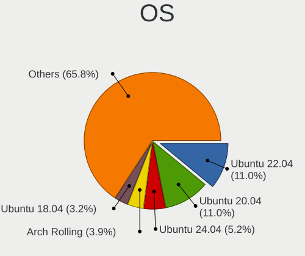

| Name                         | Notebooks | Percent |
|------------------------------|-----------|---------|
| Ubuntu 22.04                 | 17        | 10.97%  |
| Ubuntu 20.04                 | 17        | 10.97%  |
| Ubuntu 24.04                 | 8         | 5.16%   |
| Arch Rolling                 | 6         | 3.87%   |
| Ubuntu 18.04                 | 5         | 3.23%   |
| Fedora 40                    | 4         | 2.58%   |
| Fedora 39                    | 4         | 2.58%   |
| Pop!_OS 22.04                | 3         | 1.94%   |
| Zorin 17                     | 2         | 1.29%   |
| Ubuntu 22.10                 | 2         | 1.29%   |
| Ubuntu 21.10                 | 2         | 1.29%   |
| openSUSE Tumbleweed-XXXXXXXX | 2         | 1.29%   |
| OpenMandriva 6.0             | 2         | 1.29%   |
| OpenMandriva 4.3             | 2         | 1.29%   |
| OpenMandriva 4.2             | 2         | 1.29%   |
| OpenMandriva 25.06           | 2         | 1.29%   |
| OpenMandriva 24.12           | 2         | 1.29%   |
| OpenMandriva 24.07           | 2         | 1.29%   |
| Linux Mint 22.1              | 2         | 1.29%   |
| Linux Mint 21                | 2         | 1.29%   |
| Linux Mint 19.3              | 2         | 1.29%   |
| Fedora 41                    | 2         | 1.29%   |
| Fedora 38                    | 2         | 1.29%   |
| Fedora 37                    | 2         | 1.29%   |
| EndeavourOS Rolling          | 2         | 1.29%   |
| Elementary 7.1               | 2         | 1.29%   |
| Elementary 7                 | 2         | 1.29%   |
| Debian 11                    | 2         | 1.29%   |
| BlackPanther 18.1            | 2         | 1.29%   |
| ArcoLinux Rolling            | 2         | 1.29%   |
| Zorin 16                     | 1         | 0.65%   |
| Xubuntu 20.04                | 1         | 0.65%   |
| Ubuntu Unity 20.04           | 1         | 0.65%   |
| Ubuntu MATE 20.04            | 1         | 0.65%   |
| Ubuntu 23.10                 | 1         | 0.65%   |
| Ubuntu 23.04                 | 1         | 0.65%   |
| Ubuntu 19.10                 | 1         | 0.65%   |
| TUXEDO OS 24.04              | 1         | 0.65%   |
| SteamOS 3.6.24               | 1         | 0.65%   |
| SteamOS 3.5.7                | 1         | 0.65%   |

OS Family
---------

OS without a version

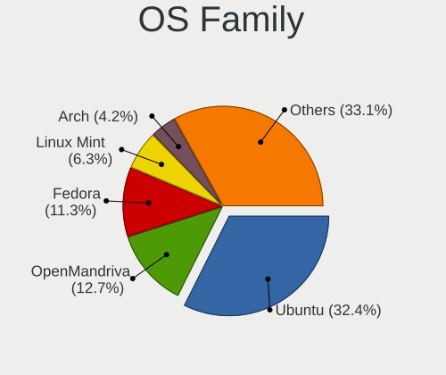

| Name         | Notebooks | Percent |
|--------------|-----------|---------|
| Ubuntu       | 46        | 32.39%  |
| OpenMandriva | 18        | 12.68%  |
| Fedora       | 16        | 11.27%  |
| Linux Mint   | 9         | 6.34%   |
| Arch         | 6         | 4.23%   |
| SteamOS      | 5         | 3.52%   |
| Debian       | 5         | 3.52%   |
| openSUSE     | 4         | 2.82%   |
| Zorin        | 3         | 2.11%   |
| Pop!_OS      | 3         | 2.11%   |
| Elementary   | 3         | 2.11%   |
| Parrot       | 2         | 1.41%   |
| KDE neon     | 2         | 1.41%   |
| EndeavourOS  | 2         | 1.41%   |
| BlackPanther | 2         | 1.41%   |
| Bazzite      | 2         | 1.41%   |
| ArcoLinux    | 2         | 1.41%   |
| Xubuntu      | 1         | 0.7%    |
| Ubuntu Unity | 1         | 0.7%    |
| Ubuntu MATE  | 1         | 0.7%    |
| TUXEDO OS    | 1         | 0.7%    |
| ROSA         | 1         | 0.7%    |
| Peppermint   | 1         | 0.7%    |
| LMDE         | 1         | 0.7%    |
| Kubuntu      | 1         | 0.7%    |
| GNOME OS     | 1         | 0.7%    |
| Endless      | 1         | 0.7%    |
| Alpine       | 1         | 0.7%    |
| AlmaLinux    | 1         | 0.7%    |

Kernel
------

Version of the Linux kernel

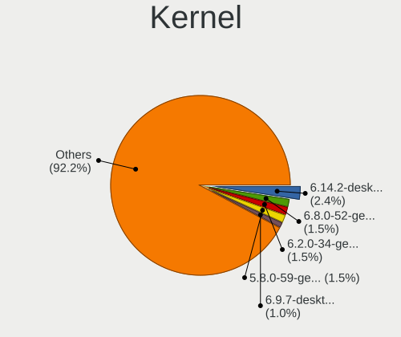

| Version                             | Notebooks | Percent |
|-------------------------------------|-----------|---------|
| 6.14.2-desktop-3omv2590             | 5         | 2.43%   |
| 6.8.0-52-generic                    | 3         | 1.46%   |
| 6.2.0-34-generic                    | 3         | 1.46%   |
| 5.8.0-59-generic                    | 3         | 1.46%   |
| 6.9.7-desktop-1omv2490              | 2         | 0.97%   |
| 6.8.0-87-generic                    | 2         | 0.97%   |
| 6.8.0-51-generic                    | 2         | 0.97%   |
| 6.8.0-48-generic                    | 2         | 0.97%   |
| 6.8.0-45-generic                    | 2         | 0.97%   |
| 6.8.0-109049-tuxedo                 | 2         | 0.97%   |
| 6.5.0-41-generic                    | 2         | 0.97%   |
| 6.5.0-35-generic                    | 2         | 0.97%   |
| 6.5.0-28-generic                    | 2         | 0.97%   |
| 6.5.0-18-generic                    | 2         | 0.97%   |
| 6.5.0-14-generic                    | 2         | 0.97%   |
| 6.3.6-200.fc38.x86_64               | 2         | 0.97%   |
| 6.2.0-32-generic                    | 2         | 0.97%   |
| 6.2.0-31-generic                    | 2         | 0.97%   |
| 6.12.1-desktop-1omv2490             | 2         | 0.97%   |
| 5.8.0-55-generic                    | 2         | 0.97%   |
| 5.4.0-58-generic                    | 2         | 0.97%   |
| 5.19.0-42-generic                   | 2         | 0.97%   |
| 5.19.0-38-generic                   | 2         | 0.97%   |
| 5.16.7-desktop-1omv4003             | 2         | 0.97%   |
| 5.15.0-58-generic                   | 2         | 0.97%   |
| 5.15.0-46-generic                   | 2         | 0.97%   |
| 5.15.0-25-generic                   | 2         | 0.97%   |
| 5.13.0-35-generic                   | 2         | 0.97%   |
| 5.11.0-38-generic                   | 2         | 0.97%   |
| 5.11.0-27-generic                   | 2         | 0.97%   |
| 5.10.14-desktop-1omv4002            | 2         | 0.97%   |
| 5.10.0-19-amd64                     | 2         | 0.97%   |
| 6.9.12-205.fsync.fc40.x86_64        | 1         | 0.49%   |
| 6.9.11-200.t2.fc40.x86_64           | 1         | 0.49%   |
| 6.8.7-300.fc40.x86_64               | 1         | 0.49%   |
| 6.8.6-arch1-1                       | 1         | 0.49%   |
| 6.8.4-200.fc39.x86_64               | 1         | 0.49%   |
| 6.8.11-300.fc40.x86_64              | 1         | 0.49%   |
| 6.8.0-85-generic                    | 1         | 0.49%   |
| 6.8.0-76060800daily20240311-generic | 1         | 0.49%   |

Kernel Family
-------------

Linux kernel without a distro release

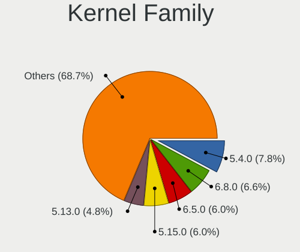

| Version | Notebooks | Percent |
|---------|-----------|---------|
| 5.4.0   | 13        | 7.83%   |
| 6.8.0   | 11        | 6.63%   |
| 6.5.0   | 10        | 6.02%   |
| 5.15.0  | 10        | 6.02%   |
| 5.13.0  | 8         | 4.82%   |
| 6.2.0   | 7         | 4.22%   |
| 5.19.0  | 7         | 4.22%   |
| 6.14.0  | 6         | 3.61%   |
| 6.14.2  | 5         | 3.01%   |
| 5.11.0  | 5         | 3.01%   |
| 6.11.0  | 4         | 2.41%   |
| 5.8.0   | 4         | 2.41%   |
| 5.3.0   | 3         | 1.81%   |
| 5.10.0  | 3         | 1.81%   |
| 4.15.0  | 3         | 1.81%   |
| 6.9.7   | 2         | 1.2%    |
| 6.6.2   | 2         | 1.2%    |
| 6.5.9   | 2         | 1.2%    |
| 6.3.6   | 2         | 1.2%    |
| 6.12.1  | 2         | 1.2%    |
| 6.1.52  | 2         | 1.2%    |
| 5.16.7  | 2         | 1.2%    |
| 5.10.14 | 2         | 1.2%    |
| 6.9.12  | 1         | 0.6%    |
| 6.9.11  | 1         | 0.6%    |
| 6.8.7   | 1         | 0.6%    |
| 6.8.6   | 1         | 0.6%    |
| 6.8.4   | 1         | 0.6%    |
| 6.8.11  | 1         | 0.6%    |
| 6.7.9   | 1         | 0.6%    |
| 6.7.11  | 1         | 0.6%    |
| 6.7.0   | 1         | 0.6%    |
| 6.6.8   | 1         | 0.6%    |
| 6.6.1   | 1         | 0.6%    |
| 6.4.8   | 1         | 0.6%    |
| 6.4.6   | 1         | 0.6%    |
| 6.4.15  | 1         | 0.6%    |
| 6.4.11  | 1         | 0.6%    |
| 6.2.9   | 1         | 0.6%    |
| 6.2.8   | 1         | 0.6%    |

Kernel Major Ver.
-----------------

Linux kernel major version

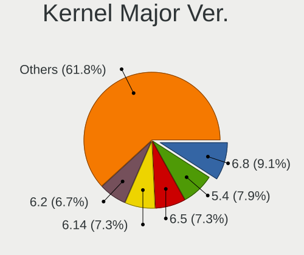

| Version | Notebooks | Percent |
|---------|-----------|---------|
| 6.8     | 15        | 9.09%   |
| 5.4     | 13        | 7.88%   |
| 6.5     | 12        | 7.27%   |
| 6.14    | 12        | 7.27%   |
| 6.2     | 11        | 6.67%   |
| 5.15    | 11        | 6.67%   |
| 5.19    | 8         | 4.85%   |
| 5.13    | 8         | 4.85%   |
| 6.12    | 6         | 3.64%   |
| 5.11    | 6         | 3.64%   |
| 6.1     | 5         | 3.03%   |
| 5.3     | 5         | 3.03%   |
| 5.10    | 5         | 3.03%   |
| 6.9     | 4         | 2.42%   |
| 6.6     | 4         | 2.42%   |
| 6.4     | 4         | 2.42%   |
| 6.11    | 4         | 2.42%   |
| 5.8     | 4         | 2.42%   |
| 6.7     | 3         | 1.82%   |
| 6.17    | 3         | 1.82%   |
| 5.18    | 3         | 1.82%   |
| 4.15    | 3         | 1.82%   |
| 6.3     | 2         | 1.21%   |
| 6.15    | 2         | 1.21%   |
| 6.10    | 2         | 1.21%   |
| 5.16    | 2         | 1.21%   |
| 6.13    | 1         | 0.61%   |
| 5.9     | 1         | 0.61%   |
| 5.6     | 1         | 0.61%   |
| 5.14    | 1         | 0.61%   |
| 5.12    | 1         | 0.61%   |
| 4.9     | 1         | 0.61%   |
| 4.19    | 1         | 0.61%   |
| 4.18    | 1         | 0.61%   |

Arch
----

OS architecture (x86_64, i586, etc.)

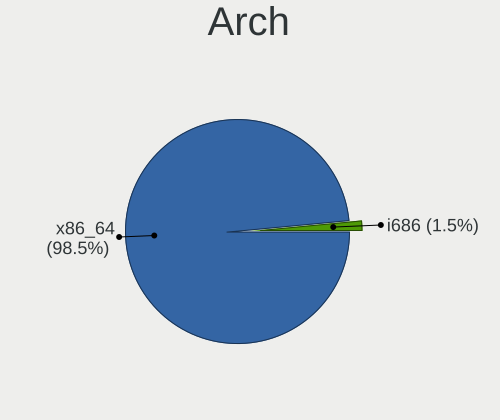

| Name   | Notebooks | Percent |
|--------|-----------|---------|
| x86_64 | 131       | 98.5%   |
| i686   | 2         | 1.5%    |

DE
--

Desktop Environment

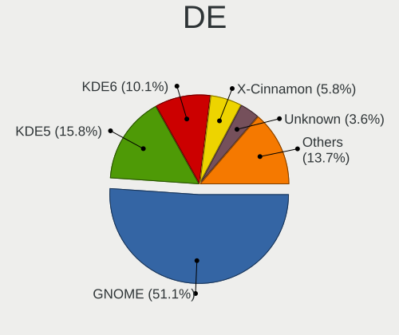

| Name       | Notebooks | Percent |
|------------|-----------|---------|
| GNOME      | 71        | 51.08%  |
| KDE5       | 22        | 15.83%  |
| KDE6       | 14        | 10.07%  |
| X-Cinnamon | 8         | 5.76%   |
| Unknown    | 5         | 3.6%    |
| XFCE       | 4         | 2.88%   |
| MATE       | 4         | 2.88%   |
| Pantheon   | 3         | 2.16%   |
| LXQt       | 2         | 1.44%   |
| i3         | 2         | 1.44%   |
| Unity      | 1         | 0.72%   |
| LXDE       | 1         | 0.72%   |
| KDE4       | 1         | 0.72%   |
| awesome    | 1         | 0.72%   |

Display Server
--------------

X11 or Wayland

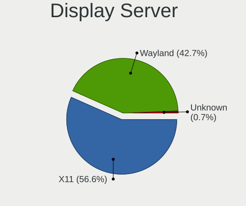

| Name    | Notebooks | Percent |
|---------|-----------|---------|
| X11     | 81        | 56.64%  |
| Wayland | 61        | 42.66%  |
| Unknown | 1         | 0.7%    |

Display Manager
---------------

SDDM, LightDM, etc.

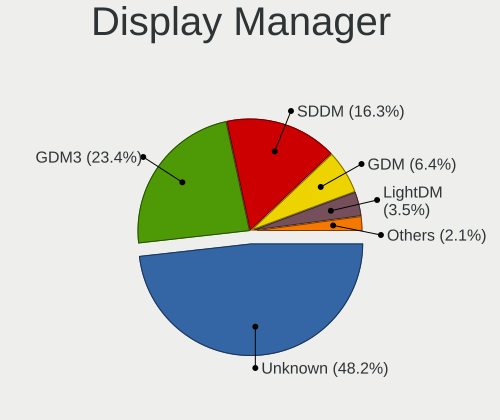

| Name    | Notebooks | Percent |
|---------|-----------|---------|
| Unknown | 68        | 48.23%  |
| GDM3    | 33        | 23.4%   |
| SDDM    | 23        | 16.31%  |
| GDM     | 9         | 6.38%   |
| LightDM | 5         | 3.55%   |
| TDM     | 2         | 1.42%   |
| KDM     | 1         | 0.71%   |

OS Lang
-------

Language

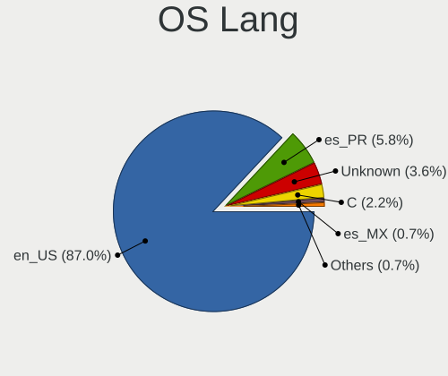

| Lang    | Notebooks | Percent |
|---------|-----------|---------|
| en_US   | 120       | 86.96%  |
| es_PR   | 8         | 5.8%    |
| Unknown | 5         | 3.62%   |
| C       | 3         | 2.17%   |
| es_MX   | 1         | 0.72%   |
| es_ES   | 1         | 0.72%   |

Boot Mode
---------

EFI or BIOS

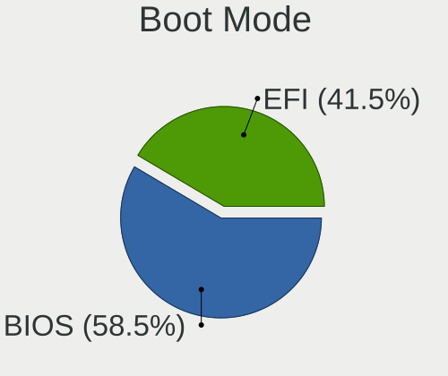

| Mode | Notebooks | Percent |
|------|-----------|---------|
| BIOS | 79        | 58.52%  |
| EFI  | 56        | 41.48%  |

Filesystem
----------

Type of filesystem

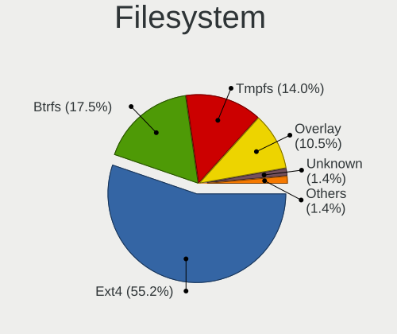

| Type    | Notebooks | Percent |
|---------|-----------|---------|
| Ext4    | 79        | 55.24%  |
| Btrfs   | 25        | 17.48%  |
| Tmpfs   | 20        | 13.99%  |
| Overlay | 15        | 10.49%  |
| Unknown | 2         | 1.4%    |
| Zfs     | 1         | 0.7%    |
| Xfs     | 1         | 0.7%    |

Part. scheme
------------

Scheme of partitioning

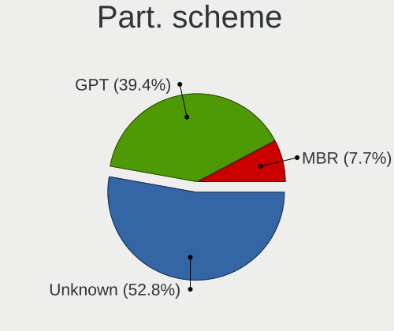

| Type    | Notebooks | Percent |
|---------|-----------|---------|
| Unknown | 75        | 52.82%  |
| GPT     | 56        | 39.44%  |
| MBR     | 11        | 7.75%   |

Dual Boot with Linux/BSD
------------------------

Hosting more than one Linux/BSD

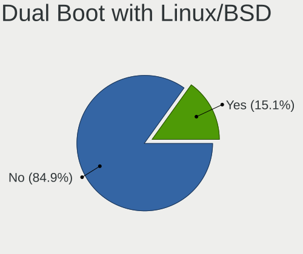

| Dual boot | Notebooks | Percent |
|-----------|-----------|---------|
| No        | 118       | 84.89%  |
| Yes       | 21        | 15.11%  |

Dual Boot (Win)
---------------

Hosting Linux and Windows

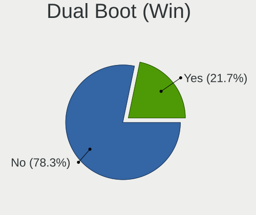

| Dual boot | Notebooks | Percent |
|-----------|-----------|---------|
| No        | 108       | 78.26%  |
| Yes       | 30        | 21.74%  |

Board
-----

Vendor
------

Motherboard manufacturer

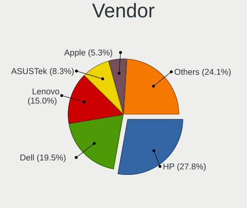

| Name                   | Notebooks | Percent |
|------------------------|-----------|---------|
| Hewlett-Packard        | 37        | 27.82%  |
| Dell                   | 26        | 19.55%  |
| Lenovo                 | 20        | 15.04%  |
| ASUSTek Computer       | 11        | 8.27%   |
| Apple                  | 7         | 5.26%   |
| Valve                  | 5         | 3.76%   |
| Acer                   | 5         | 3.76%   |
| Toshiba                | 3         | 2.26%   |
| Sony                   | 3         | 2.26%   |
| TUXEDO                 | 2         | 1.5%    |
| GPU Company            | 2         | 1.5%    |
| Alienware              | 2         | 1.5%    |
| Samsung Electronics    | 1         | 0.75%   |
| Razer                  | 1         | 0.75%   |
| ONE-NETBOOK TECHNOLOGY | 1         | 0.75%   |
| OEMYU                  | 1         | 0.75%   |
| MSI                    | 1         | 0.75%   |
| Google                 | 1         | 0.75%   |
| Framework              | 1         | 0.75%   |
| Chuwi                  | 1         | 0.75%   |
| AZW                    | 1         | 0.75%   |
| AMI                    | 1         | 0.75%   |

Model
-----

Motherboard model

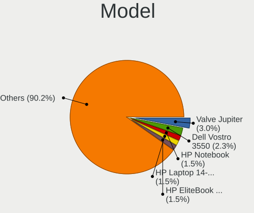

| Name                                     | Notebooks | Percent |
|------------------------------------------|-----------|---------|
| Valve Jupiter                            | 4         | 3.01%   |
| Dell Vostro 3550                         | 3         | 2.26%   |
| HP Notebook                              | 2         | 1.5%    |
| HP Laptop 14-dk1xxx                      | 2         | 1.5%    |
| HP EliteBook 840 G2                      | 2         | 1.5%    |
| HP 2000                                  | 2         | 1.5%    |
| Dell Inspiron 5559                       | 2         | 1.5%    |
| Dell Inspiron 11-3168                    | 2         | 1.5%    |
| ASUS X510UAR                             | 2         | 1.5%    |
| ASUS K53E                                | 2         | 1.5%    |
| Valve Galileo                            | 1         | 0.75%   |
| TUXEDO Sirius 16 Gen2                    | 1         | 0.75%   |
| TUXEDO Aura 15 Gen1                      | 1         | 0.75%   |
| Toshiba Satellite P755                   | 1         | 0.75%   |
| Toshiba Satellite L655                   | 1         | 0.75%   |
| Toshiba Satellite C55-C                  | 1         | 0.75%   |
| Sony VPCEA36FX                           | 1         | 0.75%   |
| Sony VGN-CS320J                          | 1         | 0.75%   |
| Sony SVE11113FXW                         | 1         | 0.75%   |
| Samsung 930XDB/931XDB/930XDY             | 1         | 0.75%   |
| Razer Book 13 - RZ09-0357                | 1         | 0.75%   |
| ONE-NETBOOK TECHNOLOGY ONE XPLAYER       | 1         | 0.75%   |
| MSI GF65 Thin 10SDR                      | 1         | 0.75%   |
| Lenovo Yoga 900-13ISK 80MK               | 1         | 0.75%   |
| Lenovo Y70-70 Touch 80DU                 | 1         | 0.75%   |
| Lenovo Y50-70 Touch 20349                | 1         | 0.75%   |
| Lenovo V14-ARE 82DQ                      | 1         | 0.75%   |
| Lenovo ThinkPad X1 Carbon 7th 20QD0000US | 1         | 0.75%   |
| Lenovo ThinkPad T510 4314RBS             | 1         | 0.75%   |
| Lenovo ThinkPad T460s 20F9003GUS         | 1         | 0.75%   |
| Lenovo ThinkPad T440 20B6005RUS          | 1         | 0.75%   |
| Lenovo ThinkPad T420 4180BU5             | 1         | 0.75%   |
| Lenovo ThinkPad T410 2516ADU             | 1         | 0.75%   |
| Lenovo ThinkPad SL 2743LJU               | 1         | 0.75%   |
| Lenovo ThinkPad L14 Gen 1 20U6S3D500     | 1         | 0.75%   |
| Lenovo ThinkPad E570 20H50048US          | 1         | 0.75%   |
| Lenovo ThinkPad E560 20EV002JUS          | 1         | 0.75%   |
| Lenovo ThinkPad E560 20EV002HUS          | 1         | 0.75%   |
| Lenovo ThinkPad E14 20RA004WUS           | 1         | 0.75%   |
| Lenovo IdeaPad 120S-11IAP 81A4           | 1         | 0.75%   |

Model Family
------------

Motherboard model prefix

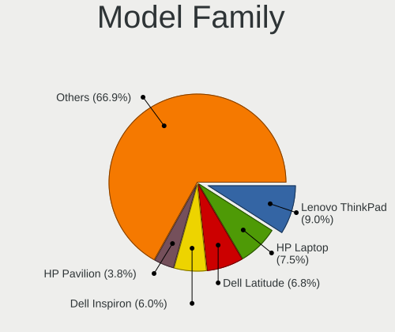

| Name                       | Notebooks | Percent |
|----------------------------|-----------|---------|
| Lenovo ThinkPad            | 12        | 9.02%   |
| HP Laptop                  | 10        | 7.52%   |
| Dell Latitude              | 9         | 6.77%   |
| Dell Inspiron              | 8         | 6.02%   |
| HP Pavilion                | 5         | 3.76%   |
| HP EliteBook               | 5         | 3.76%   |
| Valve Jupiter              | 4         | 3.01%   |
| HP ProBook                 | 4         | 3.01%   |
| Toshiba Satellite          | 3         | 2.26%   |
| HP ENVY                    | 3         | 2.26%   |
| Dell Vostro                | 3         | 2.26%   |
| ASUS ROG                   | 3         | 2.26%   |
| Acer Aspire                | 3         | 2.26%   |
| Lenovo IdeaPad             | 2         | 1.5%    |
| HP Notebook                | 2         | 1.5%    |
| HP 2000                    | 2         | 1.5%    |
| Dell XPS                   | 2         | 1.5%    |
| ASUS X510UAR               | 2         | 1.5%    |
| ASUS VivoBook              | 2         | 1.5%    |
| ASUS K53E                  | 2         | 1.5%    |
| Acer Swift                 | 2         | 1.5%    |
| Valve Galileo              | 1         | 0.75%   |
| TUXEDO Sirius              | 1         | 0.75%   |
| TUXEDO Aura                | 1         | 0.75%   |
| Sony VPCEA36FX             | 1         | 0.75%   |
| Sony VGN-CS320J            | 1         | 0.75%   |
| Sony SVE11113FXW           | 1         | 0.75%   |
| Samsung 930XDB             | 1         | 0.75%   |
| Razer Book                 | 1         | 0.75%   |
| ONE-NETBOOK TECHNOLOGY ONE | 1         | 0.75%   |
| MSI GF65                   | 1         | 0.75%   |
| Lenovo Yoga                | 1         | 0.75%   |
| Lenovo Y70-70              | 1         | 0.75%   |
| Lenovo Y50-70              | 1         | 0.75%   |
| Lenovo V14-ARE             | 1         | 0.75%   |
| Lenovo G50-45              | 1         | 0.75%   |
| Lenovo 14w                 | 1         | 0.75%   |
| HP TouchSmart              | 1         | 0.75%   |
| HP Stream                  | 1         | 0.75%   |
| HP OMEN                    | 1         | 0.75%   |

MFG Year
--------

Motherboard manufacture year

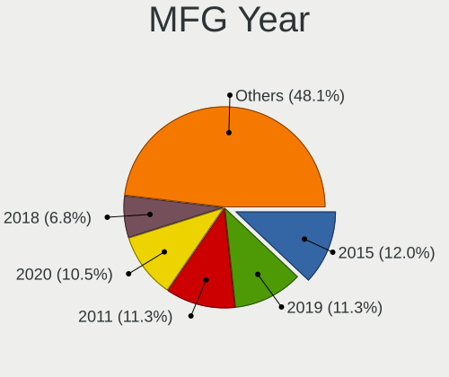

| Year | Notebooks | Percent |
|------|-----------|---------|
| 2015 | 16        | 12.03%  |
| 2019 | 15        | 11.28%  |
| 2011 | 15        | 11.28%  |
| 2020 | 14        | 10.53%  |
| 2018 | 9         | 6.77%   |
| 2012 | 9         | 6.77%   |
| 2023 | 8         | 6.02%   |
| 2017 | 8         | 6.02%   |
| 2016 | 6         | 4.51%   |
| 2022 | 5         | 3.76%   |
| 2021 | 5         | 3.76%   |
| 2010 | 5         | 3.76%   |
| 2014 | 4         | 3.01%   |
| 2009 | 4         | 3.01%   |
| 2008 | 3         | 2.26%   |
| 2024 | 2         | 1.5%    |
| 2013 | 2         | 1.5%    |
| 2025 | 1         | 0.75%   |
| 2006 | 1         | 0.75%   |
| 2005 | 1         | 0.75%   |

Form Factor
-----------

Physical design of the computer

| Name     | Notebooks | Percent |
|----------|-----------|---------|
| Notebook | 133       | 100%    |

Secure Boot
-----------

Enabled or disabled

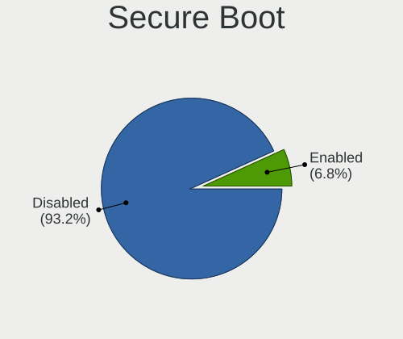

| State    | Notebooks | Percent |
|----------|-----------|---------|
| Disabled | 124       | 93.23%  |
| Enabled  | 9         | 6.77%   |

Coreboot
--------

Have coreboot on board

| Used | Notebooks | Percent |
|------|-----------|---------|
| No   | 132       | 99.25%  |
| Yes  | 1         | 0.75%   |

RAM Size
--------

Total RAM memory

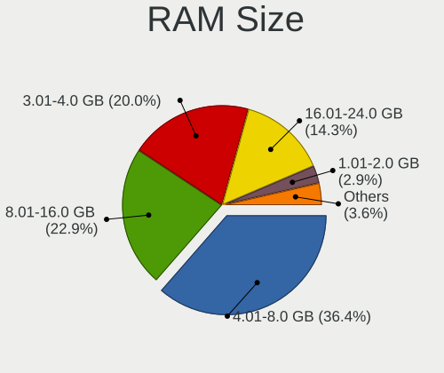

| Size in GB  | Notebooks | Percent |
|-------------|-----------|---------|
| 4.01-8.0    | 51        | 36.43%  |
| 8.01-16.0   | 32        | 22.86%  |
| 3.01-4.0    | 28        | 20%     |
| 16.01-24.0  | 20        | 14.29%  |
| 1.01-2.0    | 4         | 2.86%   |
| 32.01-64.0  | 2         | 1.43%   |
| 24.01-32.0  | 2         | 1.43%   |
| 64.01-256.0 | 1         | 0.71%   |

RAM Used
--------

Used RAM memory

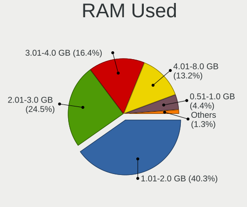

| Used GB   | Notebooks | Percent |
|-----------|-----------|---------|
| 1.01-2.0  | 64        | 40.25%  |
| 2.01-3.0  | 39        | 24.53%  |
| 3.01-4.0  | 26        | 16.35%  |
| 4.01-8.0  | 21        | 13.21%  |
| 0.51-1.0  | 7         | 4.4%    |
| 8.01-16.0 | 2         | 1.26%   |

Total Drives
------------

Number of drives on board

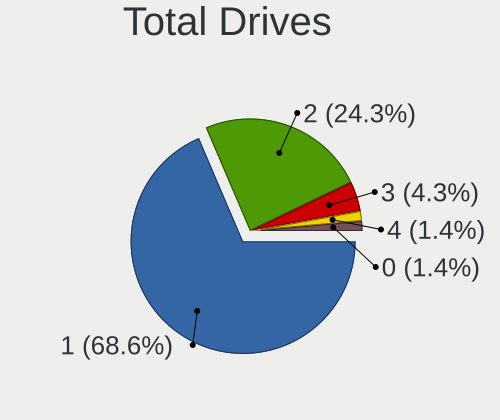

| Drives | Notebooks | Percent |
|--------|-----------|---------|
| 1      | 96        | 68.57%  |
| 2      | 34        | 24.29%  |
| 3      | 6         | 4.29%   |
| 4      | 2         | 1.43%   |
| 0      | 2         | 1.43%   |

Has CD-ROM
----------

Has CD-ROM on board

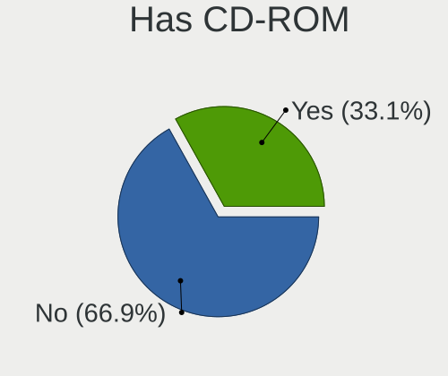

| Presented | Notebooks | Percent |
|-----------|-----------|---------|
| No        | 89        | 66.92%  |
| Yes       | 44        | 33.08%  |

Has Ethernet
------------

Has Ethernet on board

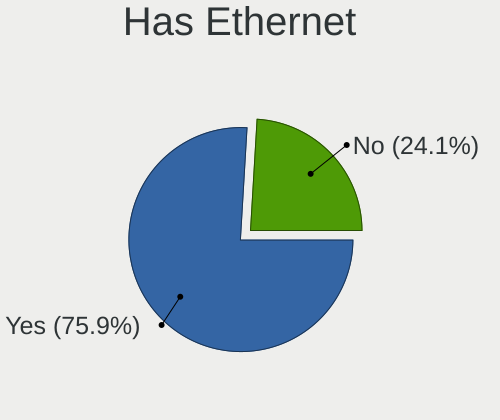

| Presented | Notebooks | Percent |
|-----------|-----------|---------|
| Yes       | 101       | 75.94%  |
| No        | 32        | 24.06%  |

Has WiFi
--------

Has WiFi module

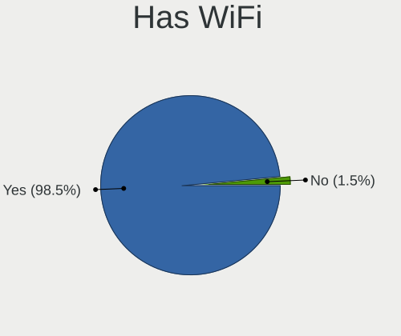

| Presented | Notebooks | Percent |
|-----------|-----------|---------|
| Yes       | 131       | 98.5%   |
| No        | 2         | 1.5%    |

Has Bluetooth
-------------

Has Bluetooth module

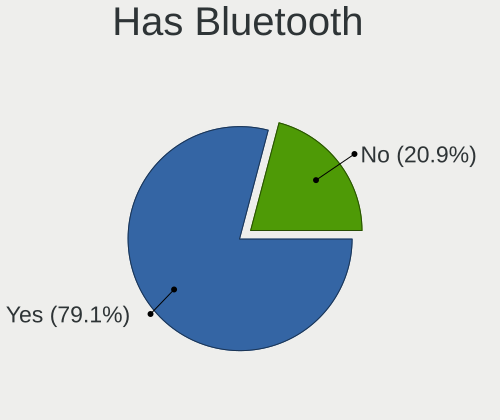

| Presented | Notebooks | Percent |
|-----------|-----------|---------|
| Yes       | 106       | 79.1%   |
| No        | 28        | 20.9%   |

Location
--------

Country
-------

Geographic location (country)

| Country     | Notebooks | Percent |
|-------------|-----------|---------|
| Puerto Rico | 133       | 100%    |

City
----

Geographic location (city)

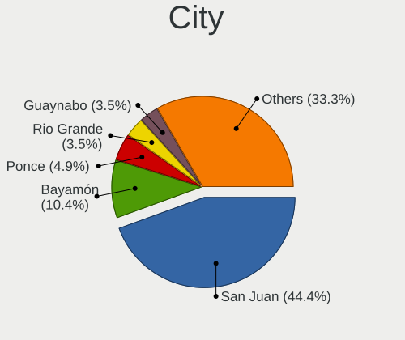

| City              | Notebooks | Percent |
|-------------------|-----------|---------|
| San Juan          | 64        | 44.44%  |
| Bayamón          | 15        | 10.42%  |
| Ponce             | 7         | 4.86%   |
| Rio Grande        | 5         | 3.47%   |
| Guaynabo          | 5         | 3.47%   |
| Carolina          | 5         | 3.47%   |
| Caguas            | 5         | 3.47%   |
| Utuado            | 4         | 2.78%   |
| Toa Baja          | 3         | 2.08%   |
| San Sebastian     | 3         | 2.08%   |
| Lares             | 3         | 2.08%   |
| Vega Baja         | 2         | 1.39%   |
| Cayey             | 2         | 1.39%   |
| Cabo Rojo         | 2         | 1.39%   |
| Villalba          | 1         | 0.69%   |
| Vega Alta         | 1         | 0.69%   |
| Trujillo Alto     | 1         | 0.69%   |
| Sumidero          | 1         | 0.69%   |
| Santa Isabel      | 1         | 0.69%   |
| San German        | 1         | 0.69%   |
| Sabana Grande     | 1         | 0.69%   |
| Rincon            | 1         | 0.69%   |
| Mayagüez         | 1         | 0.69%   |
| Manati            | 1         | 0.69%   |
| Guayama           | 1         | 0.69%   |
| Eleanor Roosevelt | 1         | 0.69%   |
| Cataño           | 1         | 0.69%   |
| Canovanas         | 1         | 0.69%   |
| Campo Rico        | 1         | 0.69%   |
| Caban             | 1         | 0.69%   |
| Barahona          | 1         | 0.69%   |
| Arecibo           | 1         | 0.69%   |
| Aguadilla         | 1         | 0.69%   |

Drives
------

Drive Vendor
------------

Hard drive vendors

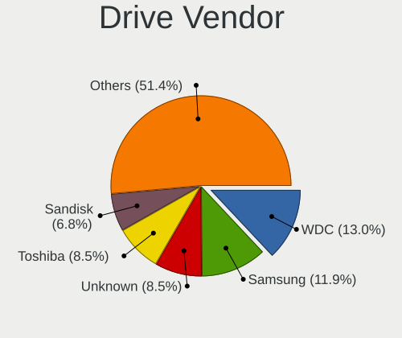

| Vendor                      | Notebooks | Drives | Percent |
|-----------------------------|-----------|--------|---------|
| WDC                         | 23        | 27     | 12.99%  |
| Samsung Electronics         | 21        | 32     | 11.86%  |
| Unknown                     | 15        | 20     | 8.47%   |
| Toshiba                     | 15        | 16     | 8.47%   |
| Sandisk                     | 12        | 22     | 6.78%   |
| Crucial                     | 12        | 30     | 6.78%   |
| Hitachi                     | 11        | 36     | 6.21%   |
| Seagate                     | 9         | 13     | 5.08%   |
| SK hynix                    | 8         | 10     | 4.52%   |
| Micron Technology           | 6         | 17     | 3.39%   |
| Kingston                    | 6         | 8      | 3.39%   |
| Intel                       | 4         | 5      | 2.26%   |
| A-DATA Technology           | 4         | 4      | 2.26%   |
| Silicon Motion              | 3         | 3      | 1.69%   |
| External                    | 3         | 15     | 1.69%   |
| China                       | 3         | 4      | 1.69%   |
| Phison Electronics          | 2         | 2      | 1.13%   |
| Micron/Crucial Technology   | 2         | 4      | 1.13%   |
| Axiom                       | 2         | 11     | 1.13%   |
| Unknown                     | 2         | 2      | 1.13%   |
| X12                         | 1         | 2      | 0.56%   |
| W800SH                      | 1         | 1      | 0.56%   |
| SPCC                        | 1         | 3      | 0.56%   |
| PNY                         | 1         | 1      | 0.56%   |
| Patriot                     | 1         | 4      | 0.56%   |
| OCZ                         | 1         | 1      | 0.56%   |
| Netac                       | 1         | 2      | 0.56%   |
| LinkMore                    | 1         | 1      | 0.56%   |
| Lexar                       | 1         | 7      | 0.56%   |
| Kingston Technology Company | 1         | 1      | 0.56%   |
| KingSpec                    | 1         | 1      | 0.56%   |
| HGST                        | 1         | 1      | 0.56%   |
| Apple                       | 1         | 2      | 0.56%   |
| ADATA Technology            | 1         | 1      | 0.56%   |

Drive Model
-----------

Hard drive models

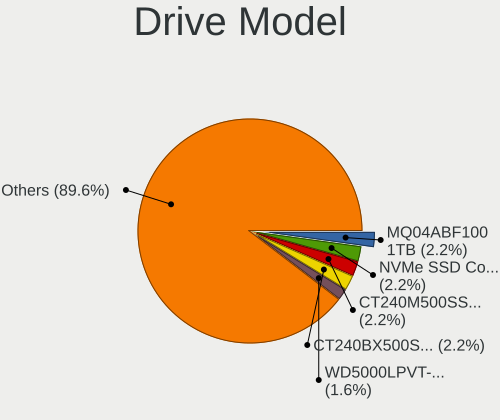

| Model                                                 | Notebooks | Percent |
|-------------------------------------------------------|-----------|---------|
| Toshiba MQ04ABF100 1TB                                | 4         | 2.19%   |
| Samsung NVMe SSD Controller SM981/PM981/PM983 1TB     | 4         | 2.19%   |
| Crucial CT240M500SSD1 240GB                           | 4         | 2.19%   |
| Crucial CT240BX500SSD1 240GB                          | 4         | 2.19%   |
| WDC WD5000LPVT-22G33T0 500GB                          | 3         | 1.64%   |
| Unknown MMC Card  128GB                               | 3         | 1.64%   |
| Hitachi HTS547550A9E384 500GB                         | 3         | 1.64%   |
| External USB3.0 250GB                                 | 3         | 1.64%   |
| WDC WDS250G2B0B 250GB SSD                             | 2         | 1.09%   |
| WDC WD2500BEVS-60UST0 250GB                           | 2         | 1.09%   |
| WDC WD10SPZX-60Z10T0 1TB                              | 2         | 1.09%   |
| Unknown MMC Card  64GB                                | 2         | 1.09%   |
| Unknown MMC Card  2GB                                 | 2         | 1.09%   |
| Toshiba MQ01ACF050 500GB                              | 2         | 1.09%   |
| Toshiba MQ01ABF050 500GB                              | 2         | 1.09%   |
| Toshiba MQ01ABD100 1TB                                | 2         | 1.09%   |
| Toshiba MK3261GSYN 320GB                              | 2         | 1.09%   |
| SK hynix BC501 NVMe Solid State Drive 512GB           | 2         | 1.09%   |
| Silicon Motion SM2263EN/SM2263XT SSD Controller 512GB | 2         | 1.09%   |
| Seagate ST9500420AS 500GB                             | 2         | 1.09%   |
| Seagate ST500LM012 HN-M500MBB 500GB                   | 2         | 1.09%   |
| SanDisk SSD PLUS 1000GB                               | 2         | 1.09%   |
| Samsung NVMe SSD Controller PM9A1/PM9A3/980PRO 1TB    | 2         | 1.09%   |
| Samsung MZNLH128HBHQ-000H1 128GB SSD                  | 2         | 1.09%   |
| Phison PS5013 E13 NVMe Controller 500GB               | 2         | 1.09%   |
| Micron 2200V_MTFDHBA512TCK 512GB                      | 2         | 1.09%   |
| Kingston SA400S37480G 480GB SSD                       | 2         | 1.09%   |
| Hitachi HTS543232A7A384 320GB                         | 2         | 1.09%   |
| Axiom 500GB                                           | 2         | 1.09%   |
| A-DATA SU740 1TB SSD                                  | 2         | 1.09%   |
| Unknown                                               | 2         | 1.09%   |
| X12 SSD 128GB                                         | 1         | 0.55%   |
| WDC WDS240G2G0A-00JH30 240GB SSD                      | 1         | 0.55%   |
| WDC WDBNCE0010PNC 1TB SSD                             | 1         | 0.55%   |
| WDC WD7500BPVT-22HXZT3 752GB                          | 1         | 0.55%   |
| WDC WD5000LPCX-75VHAT0 500GB                          | 1         | 0.55%   |
| WDC WD5000BPVT-75HXZT1 500GB                          | 1         | 0.55%   |
| WDC WD32 00BEVT-00A23T0 320GB                         | 1         | 0.55%   |
| WDC WD1600BEVS-08VAT2 160GB                           | 1         | 0.55%   |
| WDC WD1600BEKT-60F3T1 160GB                           | 1         | 0.55%   |

HDD Vendor
----------

Hard disk drive vendors

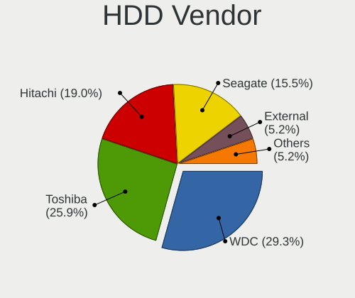

| Vendor              | Notebooks | Drives | Percent |
|---------------------|-----------|--------|---------|
| WDC                 | 17        | 19     | 29.31%  |
| Toshiba             | 15        | 16     | 25.86%  |
| Hitachi             | 11        | 36     | 18.97%  |
| Seagate             | 9         | 13     | 15.52%  |
| External            | 3         | 15     | 5.17%   |
| Unknown             | 1         | 1      | 1.72%   |
| Samsung Electronics | 1         | 2      | 1.72%   |
| HGST                | 1         | 1      | 1.72%   |

SSD Vendor
----------

Solid state drive vendors

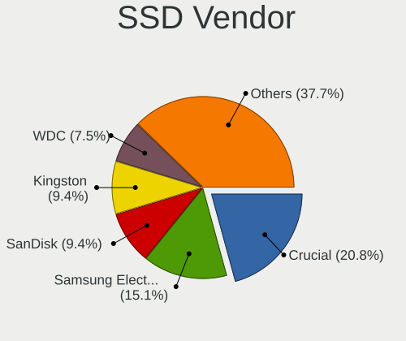

| Vendor              | Notebooks | Drives | Percent |
|---------------------|-----------|--------|---------|
| Crucial             | 11        | 29     | 20.75%  |
| Samsung Electronics | 8         | 13     | 15.09%  |
| SanDisk             | 5         | 5      | 9.43%   |
| Kingston            | 5         | 7      | 9.43%   |
| WDC                 | 4         | 5      | 7.55%   |
| A-DATA Technology   | 4         | 4      | 7.55%   |
| China               | 3         | 4      | 5.66%   |
| Micron Technology   | 2         | 2      | 3.77%   |
| X12                 | 1         | 2      | 1.89%   |
| W800SH              | 1         | 1      | 1.89%   |
| SPCC                | 1         | 3      | 1.89%   |
| SK hynix            | 1         | 1      | 1.89%   |
| PNY                 | 1         | 1      | 1.89%   |
| Patriot             | 1         | 4      | 1.89%   |
| OCZ                 | 1         | 1      | 1.89%   |
| Netac               | 1         | 2      | 1.89%   |
| Lexar               | 1         | 7      | 1.89%   |
| KingSpec            | 1         | 1      | 1.89%   |
| Intel               | 1         | 1      | 1.89%   |

Drive Kind
----------

HDD or SSD

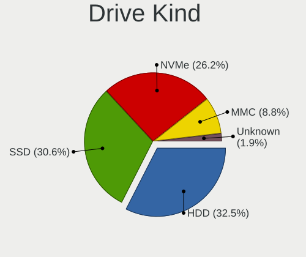

| Kind    | Notebooks | Drives | Percent |
|---------|-----------|--------|---------|
| HDD     | 52        | 103    | 32.5%   |
| SSD     | 49        | 93     | 30.63%  |
| NVMe    | 42        | 81     | 26.25%  |
| MMC     | 14        | 20     | 8.75%   |
| Unknown | 3         | 12     | 1.88%   |

Drive Connector
---------------

SATA, SAS, NVMe, etc.

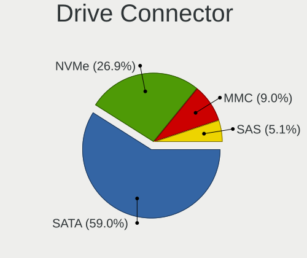

| Type | Notebooks | Drives | Percent |
|------|-----------|--------|---------|
| SATA | 92        | 189    | 58.97%  |
| NVMe | 42        | 80     | 26.92%  |
| MMC  | 14        | 20     | 8.97%   |
| SAS  | 8         | 20     | 5.13%   |

Drive Size
----------

Size of hard drive

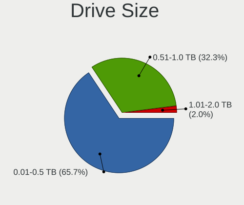

| Size in TB | Notebooks | Drives | Percent |
|------------|-----------|--------|---------|
| 0.01-0.5   | 65        | 149    | 65.66%  |
| 0.51-1.0   | 32        | 45     | 32.32%  |
| 1.01-2.0   | 2         | 2      | 2.02%   |

Space Total
-----------

Amount of disk space available on the file system

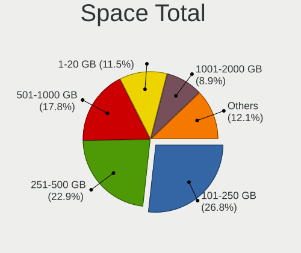

| Size in GB     | Notebooks | Percent |
|----------------|-----------|---------|
| 101-250        | 42        | 26.75%  |
| 251-500        | 36        | 22.93%  |
| 501-1000       | 28        | 17.83%  |
| 1-20           | 18        | 11.46%  |
| 1001-2000      | 14        | 8.92%   |
| 21-50          | 5         | 3.18%   |
| 2001-3000      | 5         | 3.18%   |
| More than 3000 | 3         | 1.91%   |
| 51-100         | 3         | 1.91%   |
| Unknown        | 3         | 1.91%   |

Space Used
----------

Amount of used disk space

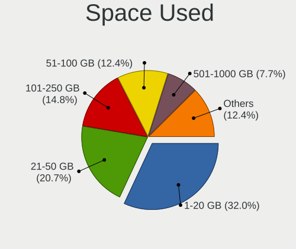

| Used GB   | Notebooks | Percent |
|-----------|-----------|---------|
| 1-20      | 54        | 31.95%  |
| 21-50     | 35        | 20.71%  |
| 101-250   | 25        | 14.79%  |
| 51-100    | 21        | 12.43%  |
| 501-1000  | 13        | 7.69%   |
| 251-500   | 11        | 6.51%   |
| 1001-2000 | 4         | 2.37%   |
| Unknown   | 3         | 1.78%   |
| 2001-3000 | 2         | 1.18%   |
| 0         | 1         | 0.59%   |

Malfunc. Drives
---------------

Drive models with a malfunction

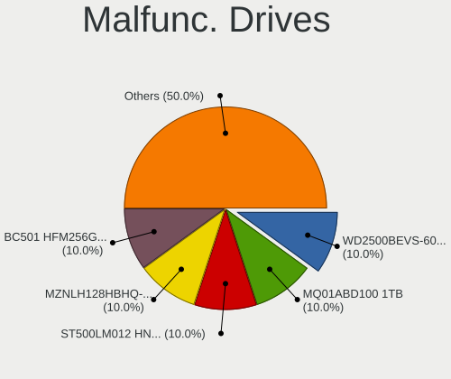

| Model                                            | Notebooks | Drives | Percent |
|--------------------------------------------------|-----------|--------|---------|
| WDC WD2500BEVS-60UST0 250GB                      | 1         | 1      | 10%     |
| Toshiba MQ01ABD100 1TB                           | 1         | 1      | 10%     |
| SK hynix BC501 HFM256GDJTNG-8310A 256GB          | 1         | 1      | 10%     |
| Seagate ST500LM012 HN-M500MBB 500GB              | 1         | 1      | 10%     |
| Samsung Electronics MZNLH128HBHQ-000H1 128GB SSD | 1         | 1      | 10%     |
| Micron Technology 1100_MTFDDAV256TBN 256GB SSD   | 1         | 1      | 10%     |
| Micron Technology 1100_MTFDDAK2T0TBN 2TB SSD     | 1         | 1      | 10%     |
| Hitachi HTS545025B9A300 250GB                    | 1         | 1      | 10%     |
| Hitachi HTS543232L9A300 320GB                    | 1         | 1      | 10%     |
| Crucial CT240M500SSD1 240GB                      | 1         | 1      | 10%     |

Malfunc. Drive Vendor
---------------------

Vendors of faulty drives

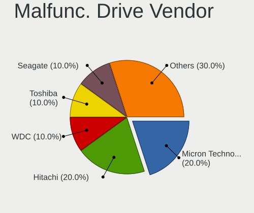

| Vendor              | Notebooks | Drives | Percent |
|---------------------|-----------|--------|---------|
| Micron Technology   | 2         | 2      | 20%     |
| Hitachi             | 2         | 2      | 20%     |
| WDC                 | 1         | 1      | 10%     |
| Toshiba             | 1         | 1      | 10%     |
| SK hynix            | 1         | 1      | 10%     |
| Seagate             | 1         | 1      | 10%     |
| Samsung Electronics | 1         | 1      | 10%     |
| Crucial             | 1         | 1      | 10%     |

Malfunc. HDD Vendor
-------------------

Vendors of faulty HDD drives

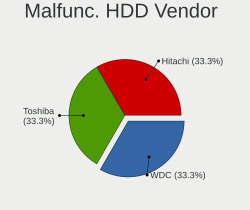

| Vendor  | Notebooks | Drives | Percent |
|---------|-----------|--------|---------|
| Hitachi | 2         | 2      | 40%     |
| WDC     | 1         | 1      | 20%     |
| Toshiba | 1         | 1      | 20%     |
| Seagate | 1         | 1      | 20%     |

Malfunc. Drive Kind
-------------------

Kinds of faulty drives

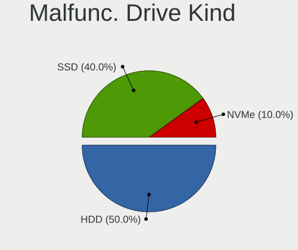

| Kind | Notebooks | Drives | Percent |
|------|-----------|--------|---------|
| HDD  | 5         | 5      | 50%     |
| SSD  | 4         | 4      | 40%     |
| NVMe | 1         | 1      | 10%     |

Failed Drives
-------------

Failed drive models

Zero info for selected period =(

Failed Drive Vendor
-------------------

Failed drive vendors

Zero info for selected period =(

Drive Status
------------

Number of failed and malfunc. drives

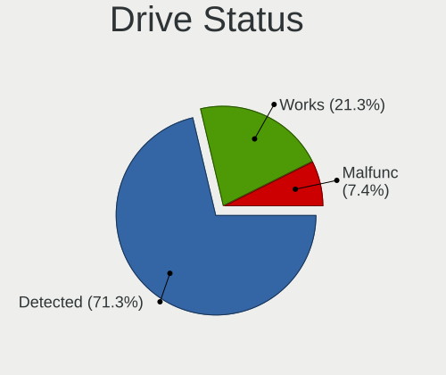

| Status   | Notebooks | Drives | Percent |
|----------|-----------|--------|---------|
| Detected | 97        | 257    | 71.32%  |
| Works    | 29        | 42     | 21.32%  |
| Malfunc  | 10        | 10     | 7.35%   |

Storage controller
------------------

Storage Vendor
--------------

Storage controller vendors

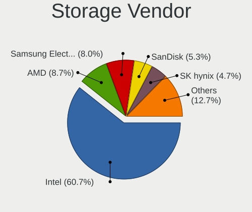

| Vendor                      | Notebooks | Percent |
|-----------------------------|-----------|---------|
| Intel                       | 91        | 60.67%  |
| AMD                         | 13        | 8.67%   |
| Samsung Electronics         | 12        | 8%      |
| SanDisk                     | 8         | 5.33%   |
| SK hynix                    | 7         | 4.67%   |
| Micron Technology           | 4         | 2.67%   |
| Silicon Motion              | 3         | 2%      |
| Micron/Crucial Technology   | 3         | 2%      |
| Phison Electronics          | 2         | 1.33%   |
| Nvidia                      | 2         | 1.33%   |
| Kingston Technology Company | 2         | 1.33%   |
| ASMedia Technology          | 1         | 0.67%   |
| Apple                       | 1         | 0.67%   |
| ADATA Technology            | 1         | 0.67%   |

Storage Model
-------------

Storage controller models

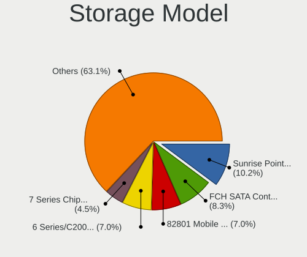

| Model                                                                            | Notebooks | Percent |
|----------------------------------------------------------------------------------|-----------|---------|
| Intel Sunrise Point-LP SATA Controller [AHCI mode]                               | 16        | 10.19%  |
| AMD FCH SATA Controller [AHCI mode]                                              | 13        | 8.28%   |
| Intel 82801 Mobile SATA Controller [RAID mode]                                   | 11        | 7.01%   |
| Intel 6 Series/C200 Series Chipset Family 6 port Mobile SATA AHCI Controller     | 11        | 7.01%   |
| Intel 7 Series Chipset Family 6-port SATA Controller [AHCI mode]                 | 7         | 4.46%   |
| Intel Celeron/Pentium Silver Processor SATA Controller                           | 5         | 3.18%   |
| SK hynix BC501 NVMe Solid State Drive                                            | 4         | 2.55%   |
| Samsung NVMe SSD Controller SM981/PM981/PM983                                    | 4         | 2.55%   |
| Intel Wildcat Point-LP SATA Controller [AHCI Mode]                               | 4         | 2.55%   |
| Intel Cannon Lake Mobile PCH SATA AHCI Controller                                | 4         | 2.55%   |
| Silicon Motion SM2263EN/SM2263XT (DRAM-less) NVMe SSD Controllers                | 3         | 1.91%   |
| SanDisk WD SN560/SN740/SN770/SN5000 NVMe SSD                                     | 3         | 1.91%   |
| Intel Volume Management Device NVMe RAID Controller                              | 3         | 1.91%   |
| Intel Atom/Celeron/Pentium Processor x5-E8000/J3xxx/N3xxx Series SATA Controller | 3         | 1.91%   |
| Intel 82801IBM/IEM (ICH9M/ICH9M-E) 4 port SATA Controller [AHCI mode]            | 3         | 1.91%   |
| Intel 8 Series/C220 Series Chipset Family 6-port SATA Controller 1 [AHCI mode]   | 3         | 1.91%   |
| Intel 8 Series SATA Controller 1 [AHCI mode]                                     | 3         | 1.91%   |
| Intel 5 Series/3400 Series Chipset 6 port SATA AHCI Controller                   | 3         | 1.91%   |
| SK hynix BC511 NVMe SSD                                                          | 2         | 1.27%   |
| Samsung NVMe SSD Controller PM9C1a (DRAM-less)                                   | 2         | 1.27%   |
| Samsung NVMe SSD Controller PM9B1 (DRAM-less)                                    | 2         | 1.27%   |
| Samsung NVMe SSD Controller PM9A1/PM9A3/980PRO                                   | 2         | 1.27%   |
| Phison PS5013-E13 PCIe3 NVMe Controller (DRAM-less)                              | 2         | 1.27%   |
| Nvidia MCP79 AHCI Controller                                                     | 2         | 1.27%   |
| Micron/Crucial P2 [Nick P2] / P3 / P3 Plus NVMe PCIe SSD (DRAM-less)             | 2         | 1.27%   |
| Micron 2200S NVMe SSD [Cassandra]                                                | 2         | 1.27%   |
| Intel Tiger Lake-LP SATA Controller                                              | 2         | 1.27%   |
| Intel Comet Lake SATA AHCI Controller                                            | 2         | 1.27%   |
| Intel Atom Processor E3800 Series SATA AHCI Controller                           | 2         | 1.27%   |
| Intel 82801GBM/GHM (ICH7-M Family) SATA Controller [IDE mode]                    | 2         | 1.27%   |
| Intel 5 Series/3400 Series Chipset 4 port SATA AHCI Controller                   | 2         | 1.27%   |
| SK hynix PC401 NVMe Solid State Drive 256GB                                      | 1         | 0.64%   |
| SanDisk WD PC SN810 / Black SN850 NVMe SSD                                       | 1         | 0.64%   |
| SanDisk Ultra 3D / WD PC SN530, IX SN530, Blue SN550 NVMe SSD (DRAM-less)        | 1         | 0.64%   |
| SanDisk Ultra 3D / WD Blue SN570 NVMe SSD (DRAM-less)                            | 1         | 0.64%   |
| SanDisk PC SN735 / WD_BLACK SN750 SE NVMe SSD (DRAM-less)                        | 1         | 0.64%   |
| SanDisk Extreme Pro / WD Black 2018/SN750/PC SN720 NVMe SSD                      | 1         | 0.64%   |
| Samsung NVMe SSD Controller SM961/PM961/SM963                                    | 1         | 0.64%   |
| Samsung NVMe SSD Controller S4LV008[Pascal]                                      | 1         | 0.64%   |
| Samsung NVMe SSD Controller 980 (DRAM-less)                                      | 1         | 0.64%   |

Storage Kind
------------

Kind of storage controller (IDE, SATA, NVMe, SAS, ...)

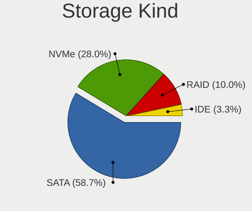

| Kind | Notebooks | Percent |
|------|-----------|---------|
| SATA | 88        | 58.67%  |
| NVMe | 42        | 28%     |
| RAID | 15        | 10%     |
| IDE  | 5         | 3.33%   |

Processor
---------

CPU Vendor
----------

Processor vendors

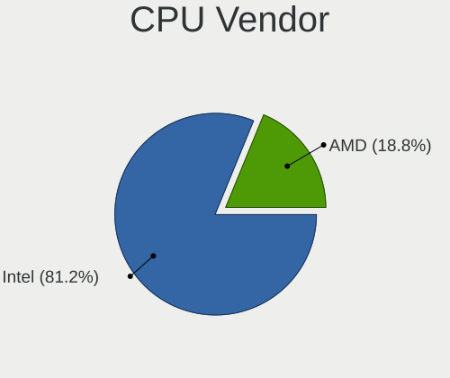

| Vendor | Notebooks | Percent |
|--------|-----------|---------|
| Intel  | 108       | 81.2%   |
| AMD    | 25        | 18.8%   |

CPU Model
---------

Processor models

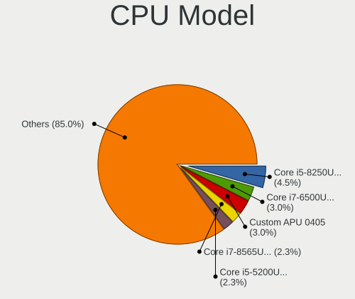

| Model                                    | Notebooks | Percent |
|------------------------------------------|-----------|---------|
| Intel Core i5-8250U CPU @ 1.60GHz        | 6         | 4.51%   |
| Intel Core i7-6500U CPU @ 2.50GHz        | 4         | 3.01%   |
| AMD Custom APU 0405                      | 4         | 3.01%   |
| Intel Core i7-8565U CPU @ 1.80GHz        | 3         | 2.26%   |
| Intel Core i5-5200U CPU @ 2.20GHz        | 3         | 2.26%   |
| Intel Core i5-2430M CPU @ 2.40GHz        | 3         | 2.26%   |
| Intel 11th Gen Core i5-1135G7 @ 2.40GHz  | 3         | 2.26%   |
| Intel Pentium Silver N5030 CPU @ 1.10GHz | 2         | 1.5%    |
| Intel Pentium CPU N3710 @ 1.60GHz        | 2         | 1.5%    |
| Intel Pentium CPU N3540 @ 2.16GHz        | 2         | 1.5%    |
| Intel Core i7-9750H CPU @ 2.60GHz        | 2         | 1.5%    |
| Intel Core i7-8550U CPU @ 1.80GHz        | 2         | 1.5%    |
| Intel Core i7-2640M CPU @ 2.80GHz        | 2         | 1.5%    |
| Intel Core i5-9300H CPU @ 2.40GHz        | 2         | 1.5%    |
| Intel Core i5-6200U CPU @ 2.30GHz        | 2         | 1.5%    |
| Intel Core i5-2520M CPU @ 2.50GHz        | 2         | 1.5%    |
| Intel Core i5-10210U CPU @ 1.60GHz       | 2         | 1.5%    |
| Intel Core i3-7100U CPU @ 2.40GHz        | 2         | 1.5%    |
| Intel Core i3-1005G1 CPU @ 1.20GHz       | 2         | 1.5%    |
| Intel Core 2 Duo CPU T9400 @ 2.53GHz     | 2         | 1.5%    |
| Intel 13th Gen Core i9-13900H            | 2         | 1.5%    |
| Intel 11th Gen Core i7-1165G7 @ 2.80GHz  | 2         | 1.5%    |
| AMD Ryzen 5 4500U with Radeon Graphics   | 2         | 1.5%    |
| AMD E2-1800 APU with Radeon HD Graphics  | 2         | 1.5%    |
| Intel Pentium Silver N5000 CPU @ 1.10GHz | 1         | 0.75%   |
| Intel Pentium CPU P6100 @ 2.00GHz        | 1         | 0.75%   |
| Intel Pentium CPU B980 @ 2.40GHz         | 1         | 0.75%   |
| Intel Pentium CPU 4417U @ 2.30GHz        | 1         | 0.75%   |
| Intel Genuine CPU U7300 @ 1.30GHz        | 1         | 0.75%   |
| Intel Genuine CPU T2250 @ 1.73GHz        | 1         | 0.75%   |
| Intel Core i7-8750H CPU @ 2.20GHz        | 1         | 0.75%   |
| Intel Core i7-4810MQ CPU @ 2.80GHz       | 1         | 0.75%   |
| Intel Core i7-4720HQ CPU @ 2.60GHz       | 1         | 0.75%   |
| Intel Core i7-4700HQ CPU @ 2.40GHz       | 1         | 0.75%   |
| Intel Core i7-3740QM CPU @ 2.70GHz       | 1         | 0.75%   |
| Intel Core i7-3540M CPU @ 3.00GHz        | 1         | 0.75%   |
| Intel Core i7-2670QM CPU @ 2.20GHz       | 1         | 0.75%   |
| Intel Core i7-10750H CPU @ 2.60GHz       | 1         | 0.75%   |
| Intel Core i7-10510U CPU @ 1.80GHz       | 1         | 0.75%   |
| Intel Core i5-8350U CPU @ 1.70GHz        | 1         | 0.75%   |

CPU Model Family
----------------

Processor model prefix

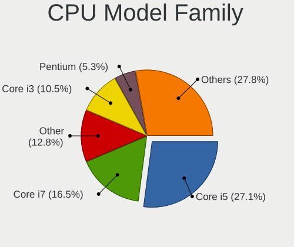

| Model                | Notebooks | Percent |
|----------------------|-----------|---------|
| Intel Core i5        | 36        | 27.07%  |
| Intel Core i7        | 22        | 16.54%  |
| Other                | 17        | 12.78%  |
| Intel Core i3        | 14        | 10.53%  |
| Intel Pentium        | 7         | 5.26%   |
| Intel Core 2 Duo     | 6         | 4.51%   |
| Intel Celeron        | 6         | 4.51%   |
| AMD Ryzen 5          | 5         | 3.76%   |
| Intel Pentium Silver | 3         | 2.26%   |
| AMD A8               | 3         | 2.26%   |
| Intel Genuine        | 2         | 1.5%    |
| AMD Ryzen 9          | 2         | 1.5%    |
| AMD Ryzen 7          | 2         | 1.5%    |
| AMD Ryzen 3          | 2         | 1.5%    |
| AMD E2               | 2         | 1.5%    |
| Intel Core 2         | 1         | 0.75%   |
| AMD Ryzen 3 PRO      | 1         | 0.75%   |
| AMD A6               | 1         | 0.75%   |
| AMD A10              | 1         | 0.75%   |

CPU Cores
---------

Number of processor cores

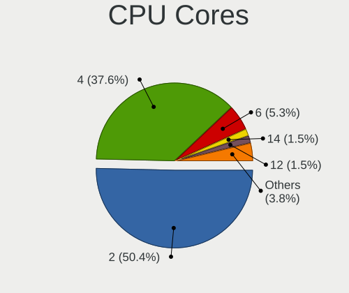

| Number | Notebooks | Percent |
|--------|-----------|---------|
| 2      | 67        | 50.38%  |
| 4      | 50        | 37.59%  |
| 6      | 7         | 5.26%   |
| 14     | 2         | 1.5%    |
| 12     | 2         | 1.5%    |
| 8      | 2         | 1.5%    |
| 16     | 1         | 0.75%   |
| 10     | 1         | 0.75%   |
| 1      | 1         | 0.75%   |

CPU Sockets
-----------

Number of sockets

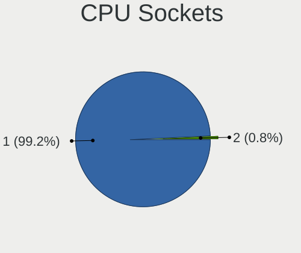

| Number | Notebooks | Percent |
|--------|-----------|---------|
| 1      | 132       | 99.25%  |
| 2      | 1         | 0.75%   |

CPU Threads
-----------

Threads per core (Hyper-Threading)

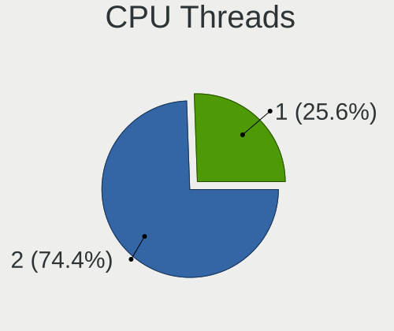

| Number | Notebooks | Percent |
|--------|-----------|---------|
| 2      | 99        | 74.44%  |
| 1      | 34        | 25.56%  |

CPU Op-Modes
------------

CPU Operation Modes (32-bit, 64-bit)

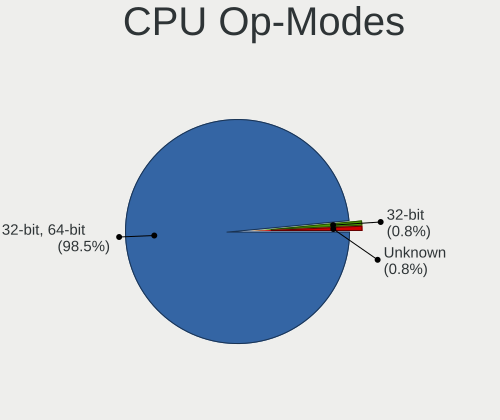

| Op mode        | Notebooks | Percent |
|----------------|-----------|---------|
| 32-bit, 64-bit | 131       | 98.5%   |
| 32-bit         | 1         | 0.75%   |
| Unknown        | 1         | 0.75%   |

CPU Microcode
-------------

Microcode number

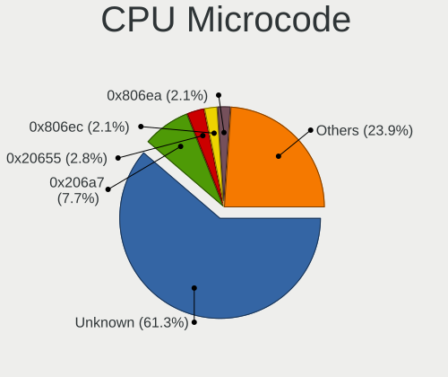

| Number     | Notebooks | Percent |
|------------|-----------|---------|
| Unknown    | 87        | 61.27%  |
| 0x206a7    | 11        | 7.75%   |
| 0x20655    | 4         | 2.82%   |
| 0x806ec    | 3         | 2.11%   |
| 0x806ea    | 3         | 2.11%   |
| 0x706a1    | 3         | 2.11%   |
| 0x406e3    | 2         | 1.41%   |
| 0x306d4    | 2         | 1.41%   |
| 0x306c3    | 2         | 1.41%   |
| 0x306a9    | 2         | 1.41%   |
| 0x08600106 | 2         | 1.41%   |
| 0x08108109 | 2         | 1.41%   |
| 0xa0652    | 1         | 0.7%    |
| 0x906ea    | 1         | 0.7%    |
| 0x806eb    | 1         | 0.7%    |
| 0x806e9    | 1         | 0.7%    |
| 0x806c1    | 1         | 0.7%    |
| 0x706e5    | 1         | 0.7%    |
| 0x6e8      | 1         | 0.7%    |
| 0x506c9    | 1         | 0.7%    |
| 0x406c4    | 1         | 0.7%    |
| 0x406c3    | 1         | 0.7%    |
| 0x40651    | 1         | 0.7%    |
| 0x30678    | 1         | 0.7%    |
| 0x20652    | 1         | 0.7%    |
| 0x10676    | 1         | 0.7%    |
| 0x08608104 | 1         | 0.7%    |
| 0x08600104 | 1         | 0.7%    |
| 0x07030105 | 1         | 0.7%    |
| 0x06003106 | 1         | 0.7%    |
| 0x06001119 | 1         | 0.7%    |

CPU Microarch
-------------

Microarchitecture

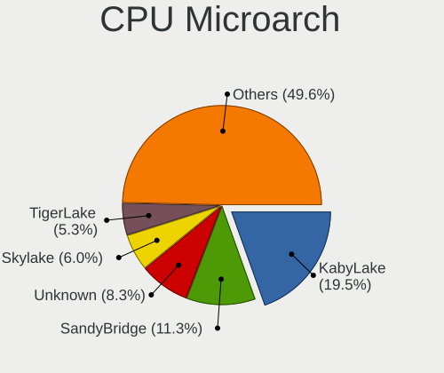

| Name             | Notebooks | Percent |
|------------------|-----------|---------|
| KabyLake         | 26        | 19.55%  |
| SandyBridge      | 15        | 11.28%  |
| Unknown          | 11        | 8.27%   |
| Skylake          | 8         | 6.02%   |
| TigerLake        | 7         | 5.26%   |
| Westmere         | 6         | 4.51%   |
| Silvermont       | 6         | 4.51%   |
| Penryn           | 6         | 4.51%   |
| Haswell          | 6         | 4.51%   |
| Goldmont plus    | 6         | 4.51%   |
| IvyBridge        | 5         | 3.76%   |
| Broadwell        | 5         | 3.76%   |
| Zen 2            | 4         | 3.01%   |
| Zen+             | 3         | 2.26%   |
| IceLake          | 3         | 2.26%   |
| Alderlake Hybrid | 3         | 2.26%   |
| Puma             | 2         | 1.5%    |
| Excavator        | 2         | 1.5%    |
| Core             | 2         | 1.5%    |
| Bobcat           | 2         | 1.5%    |
| Steamroller      | 1         | 0.75%   |
| Piledriver       | 1         | 0.75%   |
| P6               | 1         | 0.75%   |
| Goldmont         | 1         | 0.75%   |
| CometLake        | 1         | 0.75%   |

Graphics
--------

GPU Vendor
----------

Vendors of graphics cards

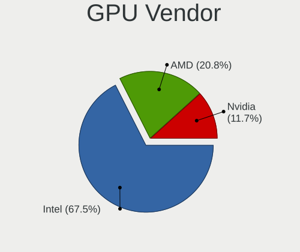

| Vendor | Notebooks | Percent |
|--------|-----------|---------|
| Intel  | 104       | 67.53%  |
| AMD    | 32        | 20.78%  |
| Nvidia | 18        | 11.69%  |

GPU Model
---------

Graphics card models

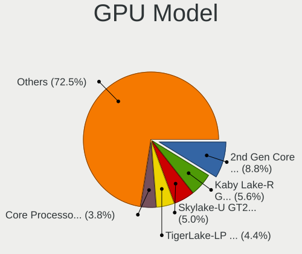

| Model                                                                                    | Notebooks | Percent |
|------------------------------------------------------------------------------------------|-----------|---------|
| Intel 2nd Generation Core Processor Family Integrated Graphics Controller                | 14        | 8.75%   |
| Intel Kaby Lake-R GT2 [UHD Graphics 620]                                                 | 9         | 5.63%   |
| Intel Skylake-U GT2 [HD Graphics 520]                                                    | 8         | 5%      |
| Intel TigerLake-LP GT2 [Iris Xe Graphics]                                                | 7         | 4.38%   |
| Intel Core Processor Integrated Graphics Controller                                      | 6         | 3.75%   |
| Intel CoffeeLake-H GT2 [UHD Graphics 630]                                                | 5         | 3.13%   |
| Intel 3rd Gen Core processor Graphics Controller                                         | 5         | 3.13%   |
| Intel WhiskeyLake-U GT2 [UHD Graphics 620]                                               | 4         | 2.5%    |
| Intel Broadwell-U GT2 [HD Graphics 5500]                                                 | 4         | 2.5%    |
| Intel Atom/Celeron/Pentium Processor x5-E8000/J3xxx/N3xxx Integrated Graphics Controller | 4         | 2.5%    |
| AMD VanGogh [AMD Custom GPU 0405]                                                        | 4         | 2.5%    |
| AMD Renoir [Radeon Vega Series / Radeon Vega Mobile Series]                              | 4         | 2.5%    |
| Intel Mobile 4 Series Chipset Integrated Graphics Controller                             | 3         | 1.88%   |
| Intel Kaby Lake-U GT2 [HD Graphics 620]                                                  | 3         | 1.88%   |
| Intel Iris Plus Graphics G1 (Ice Lake)                                                   | 3         | 1.88%   |
| Intel GeminiLake [UHD Graphics 605]                                                      | 3         | 1.88%   |
| Intel GeminiLake [UHD Graphics 600]                                                      | 3         | 1.88%   |
| Intel CometLake-U GT2 [UHD Graphics]                                                     | 3         | 1.88%   |
| Intel 4th Gen Core Processor Integrated Graphics Controller                              | 3         | 1.88%   |
| AMD Whistler [Radeon HD 6630M/6650M/6750M/7670M/7690M]                                   | 3         | 1.88%   |
| AMD Picasso/Raven 2 [Radeon Vega Series / Radeon Vega Mobile Series]                     | 3         | 1.88%   |
| Nvidia TU117M [GeForce GTX 1650 Mobile / Max-Q]                                          | 2         | 1.25%   |
| Nvidia TU116M [GeForce GTX 1660 Ti Mobile]                                               | 2         | 1.25%   |
| Nvidia GP108M [GeForce MX250]                                                            | 2         | 1.25%   |
| Nvidia C79 [GeForce 9400M]                                                               | 2         | 1.25%   |
| Nvidia AD106M [GeForce RTX 4070 Max-Q / Mobile]                                          | 2         | 1.25%   |
| Intel Raptor Lake-P [Iris Xe Graphics]                                                   | 2         | 1.25%   |
| Intel Mobile 945GM/GMS/GME, 943/940GML Express Integrated Graphics Controller            | 2         | 1.25%   |
| Intel Mobile 945GM/GMS, 943/940GML Express Integrated Graphics Controller                | 2         | 1.25%   |
| Intel Haswell-ULT Integrated Graphics Controller                                         | 2         | 1.25%   |
| Intel Atom Processor Z36xxx/Z37xxx Series Graphics & Display                             | 2         | 1.25%   |
| AMD Wrestler [Radeon HD 7340]                                                            | 2         | 1.25%   |
| AMD Stoney [Radeon R2/R3/R4/R5 Graphics]                                                 | 2         | 1.25%   |
| AMD Raphael                                                                              | 2         | 1.25%   |
| AMD Mullins [Radeon R4/R5 Graphics]                                                      | 2         | 1.25%   |
| Nvidia GP108M [GeForce MX150]                                                            | 1         | 0.63%   |
| Nvidia GP107M [GeForce GTX 1050 3 GB Max-Q]                                              | 1         | 0.63%   |
| Nvidia GP106M [GeForce GTX 1060 Mobile]                                                  | 1         | 0.63%   |
| Nvidia GM108M [GeForce 940MX]                                                            | 1         | 0.63%   |
| Nvidia GM107M [GeForce GTX 960M]                                                         | 1         | 0.63%   |

GPU Combo
---------

Combinations of graphics cards

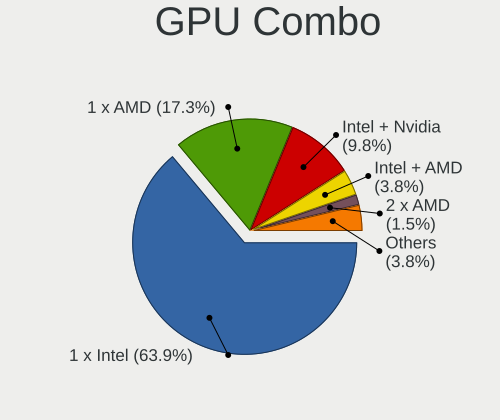

| Name           | Notebooks | Percent |
|----------------|-----------|---------|
| 1 x Intel      | 85        | 63.91%  |
| 1 x AMD        | 23        | 17.29%  |
| Intel + Nvidia | 13        | 9.77%   |
| Intel + AMD    | 5         | 3.76%   |
| 2 x AMD        | 2         | 1.5%    |
| 1 x Nvidia     | 2         | 1.5%    |
| AMD + Nvidia   | 2         | 1.5%    |
| 2 x Nvidia     | 1         | 0.75%   |

GPU Driver
----------

Free vs proprietary

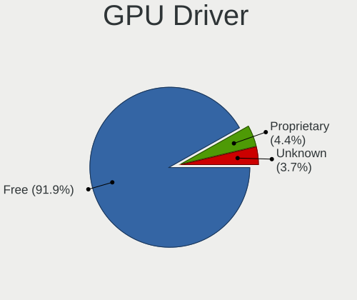

| Driver      | Notebooks | Percent |
|-------------|-----------|---------|
| Free        | 124       | 91.85%  |
| Proprietary | 6         | 4.44%   |
| Unknown     | 5         | 3.7%    |

GPU Memory
----------

Total video memory

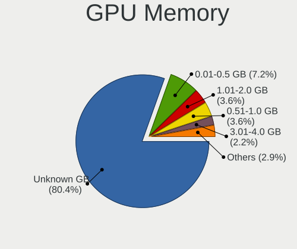

| Size in GB | Notebooks | Percent |
|------------|-----------|---------|
| Unknown    | 111       | 80.43%  |
| 0.01-0.5   | 10        | 7.25%   |
| 1.01-2.0   | 5         | 3.62%   |
| 0.51-1.0   | 5         | 3.62%   |
| 3.01-4.0   | 3         | 2.17%   |
| 5.01-6.0   | 2         | 1.45%   |
| 7.01-8.0   | 1         | 0.72%   |
| 2.01-3.0   | 1         | 0.72%   |

Monitor
-------

Monitor Vendor
--------------

Monitor vendors

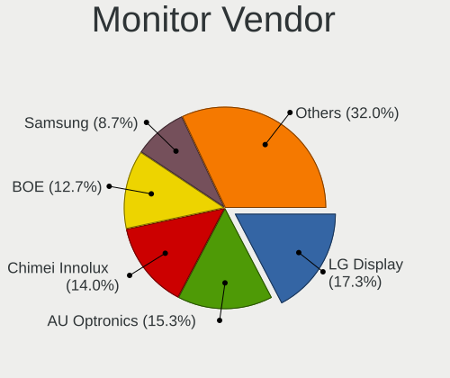

| Vendor                  | Notebooks | Percent |
|-------------------------|-----------|---------|
| LG Display              | 26        | 17.33%  |
| AU Optronics            | 23        | 15.33%  |
| Chimei Innolux          | 21        | 14%     |
| BOE                     | 19        | 12.67%  |
| Samsung Electronics     | 13        | 8.67%   |
| Apple                   | 7         | 4.67%   |
| Valve                   | 5         | 3.33%   |
| PANDA                   | 4         | 2.67%   |
| Dell                    | 4         | 2.67%   |
| Lenovo                  | 3         | 2%      |
| Goldstar                | 3         | 2%      |
| Sony                    | 2         | 1.33%   |
| Sharp                   | 2         | 1.33%   |
| Hewlett-Packard         | 2         | 1.33%   |
| Chi Mei Optoelectronics | 2         | 1.33%   |
| Unknown (XXX)           | 1         | 0.67%   |
| Toshiba                 | 1         | 0.67%   |
| TMX                     | 1         | 0.67%   |
| RTK                     | 1         | 0.67%   |
| ONN                     | 1         | 0.67%   |
| MSI                     | 1         | 0.67%   |
| InnoLux Display         | 1         | 0.67%   |
| eMachines               | 1         | 0.67%   |
| DZX                     | 1         | 0.67%   |
| CSOT                    | 1         | 0.67%   |
| ASUSTek Computer        | 1         | 0.67%   |
| AOC                     | 1         | 0.67%   |
| Ancor Communications    | 1         | 0.67%   |
| Acer                    | 1         | 0.67%   |

Monitor Model
-------------

Monitor models

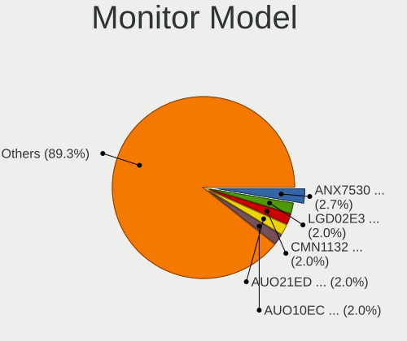

| Model                                                                 | Notebooks | Percent |
|-----------------------------------------------------------------------|-----------|---------|
| Valve ANX7530 U VLV3001 800x1280 100x150mm 7.1-inch                   | 4         | 2.67%   |
| LG Display LCD Monitor LGD02E3 1366x768 344x194mm 15.5-inch           | 3         | 2%      |
| Chimei Innolux LCD Monitor CMN1132 1366x768 256x144mm 11.6-inch       | 3         | 2%      |
| AU Optronics LCD Monitor AUO21ED 1920x1080 344x193mm 15.5-inch        | 3         | 2%      |
| AU Optronics LCD Monitor AUO10EC 1366x768 344x193mm 15.5-inch         | 3         | 2%      |
| Samsung Electronics LCD Monitor SEC5441 1280x800 331x207mm 15.4-inch  | 2         | 1.33%   |
| Samsung Electronics LCD Monitor SAM0C3C 1366x768 609x347mm 27.6-inch  | 2         | 1.33%   |
| LG Display LCD Monitor LGD0573 1920x1080 344x194mm 15.5-inch          | 2         | 1.33%   |
| Chimei Innolux LCD Monitor CMN15CC 1366x768 344x193mm 15.5-inch       | 2         | 1.33%   |
| Chimei Innolux LCD Monitor CMN1495 1366x768 309x173mm 13.9-inch       | 2         | 1.33%   |
| AU Optronics LCD Monitor AUO22EC 1366x768 344x193mm 15.5-inch         | 2         | 1.33%   |
| Valve ANX7530 U VLV3003 800x1280 100x160mm 7.4-inch                   | 1         | 0.67%   |
| Unknown (XXX) Beyond TV XXX9221 1920x1080 1209x680mm 54.6-inch        | 1         | 0.67%   |
| Toshiba TV TSB0212 1920x1080                                          | 1         | 0.67%   |
| TMX TL160ADMP03-0 TMX1603 2560x1600 345x215mm 16.0-inch               | 1         | 0.67%   |
| Sony TV SNYEB01 1360x768                                              | 1         | 0.67%   |
| Sony TV SNYEA01 1920x1080                                             | 1         | 0.67%   |
| Sharp LQ134N1JW48 SHP1527 1920x1200 288x180mm 13.4-inch               | 1         | 0.67%   |
| Sharp LCD Monitor SHP1484 1920x1080 294x165mm 13.3-inch               | 1         | 0.67%   |
| Samsung Electronics S27F350 SAM0D22 1920x1080 598x336mm 27.0-inch     | 1         | 0.67%   |
| Samsung Electronics LCD Monitor SEC5857 1440x900 367x230mm 17.1-inch  | 1         | 0.67%   |
| Samsung Electronics LCD Monitor SEC5541 1366x768 344x193mm 15.5-inch  | 1         | 0.67%   |
| Samsung Electronics LCD Monitor SEC544B 1600x900 382x214mm 17.2-inch  | 1         | 0.67%   |
| Samsung Electronics LCD Monitor SEC3454 1600x900 382x215mm 17.3-inch  | 1         | 0.67%   |
| Samsung Electronics LCD Monitor SEC315A 1366x768 344x194mm 15.5-inch  | 1         | 0.67%   |
| Samsung Electronics LCD Monitor SDC4C48 1920x1080 293x165mm 13.2-inch | 1         | 0.67%   |
| Samsung Electronics LCD Monitor SDC454A 3200x1800 293x165mm 13.2-inch | 1         | 0.67%   |
| Samsung Electronics LCD Monitor SDC4156 1920x1080 294x165mm 13.3-inch | 1         | 0.67%   |
| RTK ARZOPA RTK3B3D 1920x1080 344x195mm 15.6-inch                      | 1         | 0.67%   |
| PANDA LCD Monitor NCP0035 1920x1080 344x194mm 15.5-inch               | 1         | 0.67%   |
| PANDA LCD Monitor NCP0030 1920x1080 344x194mm 15.5-inch               | 1         | 0.67%   |
| PANDA LCD Monitor NCP002D 1920x1080 344x194mm 15.5-inch               | 1         | 0.67%   |
| PANDA LCD Monitor NCP0025 1920x1080 344x194mm 15.5-inch               | 1         | 0.67%   |
| ONN ONA18HO015 ONN0101 1920x1080 698x393mm 31.5-inch                  | 1         | 0.67%   |
| MSI G273 MSI3CA7 1920x1080 597x336mm 27.0-inch                        | 1         | 0.67%   |
| LG Display LP156WH2-TLAA LGD0230 1366x768 344x194mm 15.5-inch         | 1         | 0.67%   |
| LG Display LP141WX5-TLC1 LGD0190 1280x800 304x190mm 14.1-inch         | 1         | 0.67%   |
| LG Display LCD Monitor LGD40A0 1366x768 310x174mm 14.0-inch           | 1         | 0.67%   |
| LG Display LCD Monitor LGD071C 1920x1080 344x194mm 15.5-inch          | 1         | 0.67%   |
| LG Display LCD Monitor LGD063B 1920x1080 382x215mm 17.3-inch          | 1         | 0.67%   |

Monitor Resolution
------------------

Monitor screen resolution

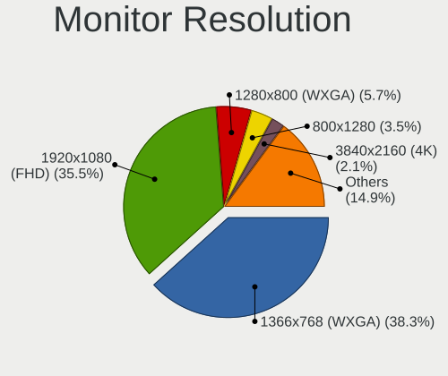

| Resolution        | Notebooks | Percent |
|-------------------|-----------|---------|
| 1366x768 (WXGA)   | 54        | 38.3%   |
| 1920x1080 (FHD)   | 50        | 35.46%  |
| 1280x800 (WXGA)   | 8         | 5.67%   |
| 800x1280          | 5         | 3.55%   |
| 3840x2160 (4K)    | 3         | 2.13%   |
| 2560x1600         | 3         | 2.13%   |
| 1920x1200 (WUXGA) | 3         | 2.13%   |
| 1600x900 (HD+)    | 3         | 2.13%   |
| 1440x900 (WXGA+)  | 3         | 2.13%   |
| 2560x1440 (QHD)   | 2         | 1.42%   |
| 3440x1440         | 1         | 0.71%   |
| 3200x1800 (QHD+)  | 1         | 0.71%   |
| 2880x1920         | 1         | 0.71%   |
| 2560x1080         | 1         | 0.71%   |
| 2256x1504         | 1         | 0.71%   |
| 1600x2560         | 1         | 0.71%   |
| 1360x768          | 1         | 0.71%   |

Monitor Diagonal
----------------

Diagonal size in inches

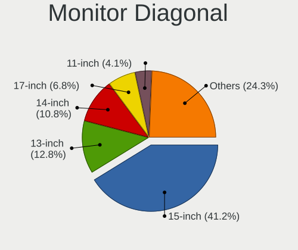

| Inches | Notebooks | Percent |
|--------|-----------|---------|
| 15     | 61        | 41.22%  |
| 13     | 19        | 12.84%  |
| 14     | 16        | 10.81%  |
| 17     | 10        | 6.76%   |
| 11     | 6         | 4.05%   |
| 7      | 5         | 3.38%   |
| 31     | 4         | 2.7%    |
| 27     | 4         | 2.7%    |
| 24     | 4         | 2.7%    |
| 72     | 3         | 2.03%   |
| 21     | 3         | 2.03%   |
| 16     | 3         | 2.03%   |
| 34     | 2         | 1.35%   |
| 18     | 2         | 1.35%   |
| 12     | 2         | 1.35%   |
| 54     | 1         | 0.68%   |
| 23     | 1         | 0.68%   |
| 19     | 1         | 0.68%   |
| 8      | 1         | 0.68%   |

Monitor Width
-------------

Physical width

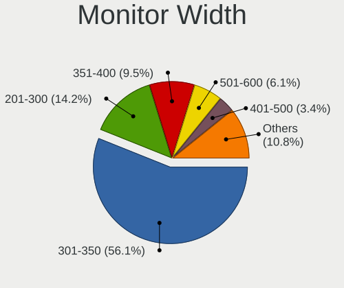

| Width in mm | Notebooks | Percent |
|-------------|-----------|---------|
| 301-350     | 83        | 56.08%  |
| 201-300     | 21        | 14.19%  |
| 351-400     | 14        | 9.46%   |
| 501-600     | 9         | 6.08%   |
| 401-500     | 5         | 3.38%   |
| 1-100       | 5         | 3.38%   |
| 601-700     | 4         | 2.7%    |
| 1501-2000   | 3         | 2.03%   |
| 701-800     | 2         | 1.35%   |
| 101-200     | 1         | 0.68%   |
| 1001-1500   | 1         | 0.68%   |

Aspect Ratio
------------

Proportional relationship between the width and the height

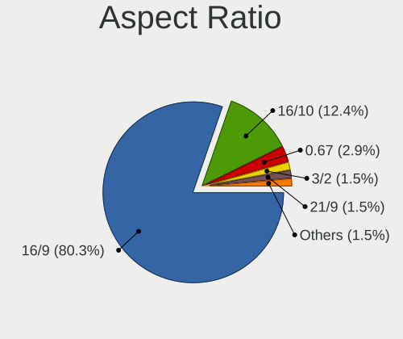

| Ratio | Notebooks | Percent |
|-------|-----------|---------|
| 16/9  | 110       | 80.29%  |
| 16/10 | 17        | 12.41%  |
| 0.67  | 4         | 2.92%   |
| 3/2   | 2         | 1.46%   |
| 21/9  | 2         | 1.46%   |
| 0.63  | 1         | 0.73%   |
| 0.62  | 1         | 0.73%   |

Monitor Area
------------

Area in inch²

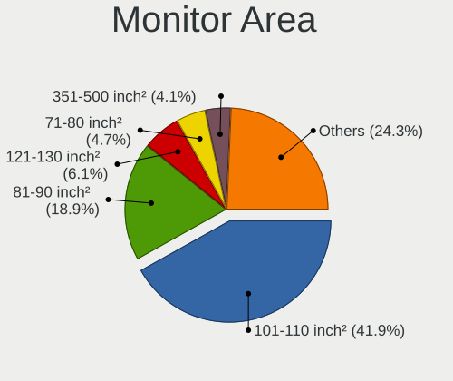

| Area in inch² | Notebooks | Percent |
|----------------|-----------|---------|
| 101-110        | 62        | 41.89%  |
| 81-90          | 28        | 18.92%  |
| 121-130        | 9         | 6.08%   |
| 71-80          | 7         | 4.73%   |
| 51-60          | 6         | 4.05%   |
| 351-500        | 6         | 4.05%   |
| 1-40           | 6         | 4.05%   |
| 201-250        | 6         | 4.05%   |
| More than 1000 | 4         | 2.7%    |
| 301-350        | 4         | 2.7%    |
| 151-200        | 3         | 2.03%   |
| 61-70          | 2         | 1.35%   |
| 141-150        | 2         | 1.35%   |
| 111-120        | 2         | 1.35%   |
| 131-140        | 1         | 0.68%   |

Pixel Density
-------------

Pixels per inch

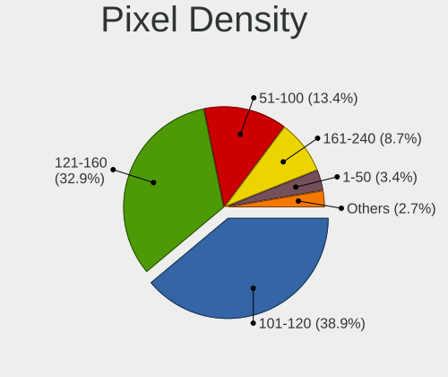

| Density       | Notebooks | Percent |
|---------------|-----------|---------|
| 101-120       | 58        | 38.93%  |
| 121-160       | 49        | 32.89%  |
| 51-100        | 20        | 13.42%  |
| 161-240       | 13        | 8.72%   |
| 1-50          | 5         | 3.36%   |
| More than 240 | 4         | 2.68%   |

Multiple Monitors
-----------------

Total monitors connected

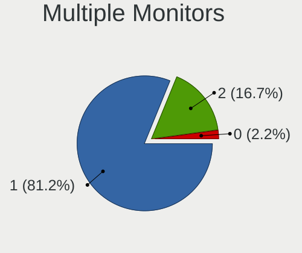

| Total | Notebooks | Percent |
|-------|-----------|---------|
| 1     | 112       | 81.16%  |
| 2     | 23        | 16.67%  |
| 0     | 3         | 2.17%   |

Network
-------

Net Controller Vendor
---------------------

Controller vendors

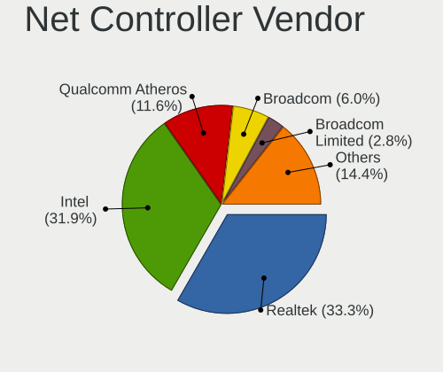

| Vendor                     | Notebooks | Percent |
|----------------------------|-----------|---------|
| Realtek Semiconductor      | 72        | 33.33%  |
| Intel                      | 69        | 31.94%  |
| Qualcomm Atheros           | 25        | 11.57%  |
| Broadcom                   | 13        | 6.02%   |
| Broadcom Limited           | 6         | 2.78%   |
| ASIX Electronics           | 6         | 2.78%   |
| TP-Link                    | 3         | 1.39%   |
| Samsung Electronics        | 3         | 1.39%   |
| MediaTek                   | 3         | 1.39%   |
| Marvell Technology Group   | 3         | 1.39%   |
| Ralink Technology          | 2         | 0.93%   |
| Nvidia                     | 2         | 0.93%   |
| NetGear                    | 2         | 0.93%   |
| Shenzhen Goodix Technology | 1         | 0.46%   |
| Ralink                     | 1         | 0.46%   |
| Qualcomm Technologies      | 1         | 0.46%   |
| Qualcomm                   | 1         | 0.46%   |
| Dell                       | 1         | 0.46%   |
| Belkin Components          | 1         | 0.46%   |
| Apple                      | 1         | 0.46%   |

Net Controller Model
--------------------

Controller models

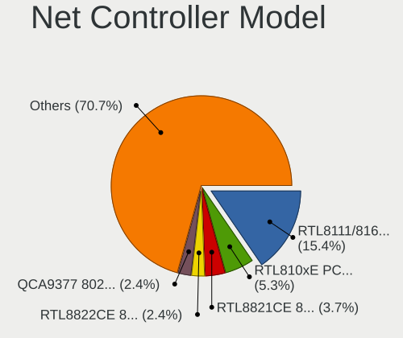

| Model                                                                  | Notebooks | Percent |
|------------------------------------------------------------------------|-----------|---------|
| Realtek RTL8111/8168/8211/8411 PCI Express Gigabit Ethernet Controller | 38        | 15.45%  |
| Realtek RTL810xE PCI Express Fast Ethernet controller                  | 13        | 5.28%   |
| Realtek RTL8821CE 802.11ac PCIe Wireless Network Adapter               | 9         | 3.66%   |
| Realtek RTL8822CE 802.11ac PCIe Wireless Network Adapter               | 6         | 2.44%   |
| Qualcomm Atheros QCA9377 802.11ac Wireless Network Adapter             | 6         | 2.44%   |
| Intel Wireless 7265                                                    | 6         | 2.44%   |
| Intel 82579LM Gigabit Network Connection (Lewisville)                  | 6         | 2.44%   |
| Qualcomm Atheros QCA9565 / AR9565 Wireless Network Adapter             | 5         | 2.03%   |
| Qualcomm Atheros QCA6174 802.11ac Wireless Network Adapter             | 5         | 2.03%   |
| Intel Wireless 8265 / 8275                                             | 5         | 2.03%   |
| Intel Wi-Fi 6 AX201                                                    | 5         | 2.03%   |
| ASIX AX88179 Gigabit Ethernet                                          | 5         | 2.03%   |
| Qualcomm Atheros AR9485 Wireless Network Adapter                       | 4         | 1.63%   |
| Samsung Galaxy series, misc. (tethering mode)                          | 3         | 1.22%   |
| Realtek RTL88x2bu [AC1200 Techkey]                                     | 3         | 1.22%   |
| Realtek RTL8188CE 802.11b/g/n WiFi Adapter                             | 3         | 1.22%   |
| Intel Wireless 8260                                                    | 3         | 1.22%   |
| Intel Wireless 7260                                                    | 3         | 1.22%   |
| Intel Wireless 3160                                                    | 3         | 1.22%   |
| Intel Wi-Fi 6E(802.11ax) AX210/AX1675* 2x2 [Typhoon Peak]              | 3         | 1.22%   |
| Intel Wi-Fi 6 AX200                                                    | 3         | 1.22%   |
| Intel Centrino Wireless-N 1000 [Condor Peak]                           | 3         | 1.22%   |
| Intel Centrino Advanced-N 6205 [Taylor Peak]                           | 3         | 1.22%   |
| Intel 82577LM Gigabit Network Connection                               | 3         | 1.22%   |
| Broadcom BCM4313 802.11bgn Wireless Network Adapter                    | 3         | 1.22%   |
| Realtek RTL8852AE 802.11ax PCIe Wireless Network Adapter               | 2         | 0.81%   |
| Realtek RTL8822BE 802.11a/b/g/n/ac WiFi adapter                        | 2         | 0.81%   |
| Ralink RT2870/RT3070 Wireless Adapter                                  | 2         | 0.81%   |
| Qualcomm Atheros AR8151 v2.0 Gigabit Ethernet                          | 2         | 0.81%   |
| Nvidia MCP79 Ethernet                                                  | 2         | 0.81%   |
| Intel PRO/Wireless 3945ABG [Golan] Network Connection                  | 2         | 0.81%   |
| Intel Ethernet Connection I219-V                                       | 2         | 0.81%   |
| Intel Comet Lake PCH-LP CNVi WiFi                                      | 2         | 0.81%   |
| Intel Centrino Wireless-N 1030 [Rainbow Peak]                          | 2         | 0.81%   |
| Intel Centrino Advanced-N 6230 [Rainbow Peak]                          | 2         | 0.81%   |
| Intel Cannon Point-LP CNVi [Wireless-AC]                               | 2         | 0.81%   |
| Intel Cannon Lake PCH CNVi WiFi                                        | 2         | 0.81%   |
| Broadcom NetXtreme BCM57765 Gigabit Ethernet PCIe                      | 2         | 0.81%   |
| Broadcom Limited BCM4352 802.11ac Dual Band Wireless Network Adapter   | 2         | 0.81%   |
| Broadcom Limited BCM43224 802.11a/b/g/n                                | 2         | 0.81%   |

Wireless Vendor
---------------

Wireless vendors

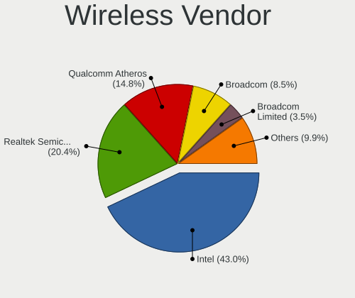

| Vendor                | Notebooks | Percent |
|-----------------------|-----------|---------|
| Intel                 | 61        | 42.96%  |
| Realtek Semiconductor | 29        | 20.42%  |
| Qualcomm Atheros      | 21        | 14.79%  |
| Broadcom              | 12        | 8.45%   |
| Broadcom Limited      | 5         | 3.52%   |
| TP-Link               | 3         | 2.11%   |
| MediaTek              | 3         | 2.11%   |
| Ralink Technology     | 2         | 1.41%   |
| Ralink                | 1         | 0.7%    |
| Qualcomm Technologies | 1         | 0.7%    |
| Qualcomm              | 1         | 0.7%    |
| NetGear               | 1         | 0.7%    |
| Dell                  | 1         | 0.7%    |
| Belkin Components     | 1         | 0.7%    |

Wireless Model
--------------

Wireless models

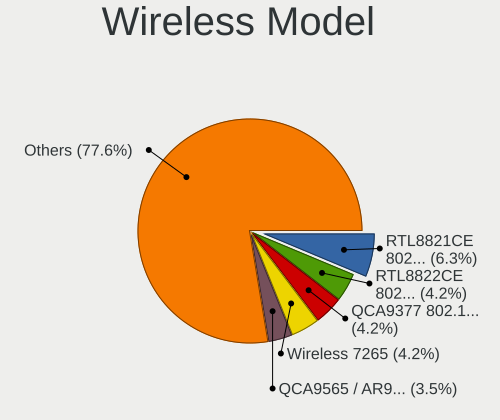

| Model                                                                | Notebooks | Percent |
|----------------------------------------------------------------------|-----------|---------|
| Realtek RTL8821CE 802.11ac PCIe Wireless Network Adapter             | 9         | 6.29%   |
| Realtek RTL8822CE 802.11ac PCIe Wireless Network Adapter             | 6         | 4.2%    |
| Qualcomm Atheros QCA9377 802.11ac Wireless Network Adapter           | 6         | 4.2%    |
| Intel Wireless 7265                                                  | 6         | 4.2%    |
| Qualcomm Atheros QCA9565 / AR9565 Wireless Network Adapter           | 5         | 3.5%    |
| Qualcomm Atheros QCA6174 802.11ac Wireless Network Adapter           | 5         | 3.5%    |
| Intel Wireless 8265 / 8275                                           | 5         | 3.5%    |
| Intel Wi-Fi 6 AX201                                                  | 5         | 3.5%    |
| Qualcomm Atheros AR9485 Wireless Network Adapter                     | 4         | 2.8%    |
| Realtek RTL88x2bu [AC1200 Techkey]                                   | 3         | 2.1%    |
| Realtek RTL8188CE 802.11b/g/n WiFi Adapter                           | 3         | 2.1%    |
| Intel Wireless 8260                                                  | 3         | 2.1%    |
| Intel Wireless 7260                                                  | 3         | 2.1%    |
| Intel Wireless 3160                                                  | 3         | 2.1%    |
| Intel Wi-Fi 6E(802.11ax) AX210/AX1675* 2x2 [Typhoon Peak]            | 3         | 2.1%    |
| Intel Wi-Fi 6 AX200                                                  | 3         | 2.1%    |
| Intel Centrino Wireless-N 1000 [Condor Peak]                         | 3         | 2.1%    |
| Intel Centrino Advanced-N 6205 [Taylor Peak]                         | 3         | 2.1%    |
| Broadcom BCM4313 802.11bgn Wireless Network Adapter                  | 3         | 2.1%    |
| Realtek RTL8852AE 802.11ax PCIe Wireless Network Adapter             | 2         | 1.4%    |
| Realtek RTL8822BE 802.11a/b/g/n/ac WiFi adapter                      | 2         | 1.4%    |
| Ralink RT2870/RT3070 Wireless Adapter                                | 2         | 1.4%    |
| Intel PRO/Wireless 3945ABG [Golan] Network Connection                | 2         | 1.4%    |
| Intel Comet Lake PCH-LP CNVi WiFi                                    | 2         | 1.4%    |
| Intel Centrino Wireless-N 1030 [Rainbow Peak]                        | 2         | 1.4%    |
| Intel Centrino Advanced-N 6230 [Rainbow Peak]                        | 2         | 1.4%    |
| Intel Cannon Point-LP CNVi [Wireless-AC]                             | 2         | 1.4%    |
| Intel Cannon Lake PCH CNVi WiFi                                      | 2         | 1.4%    |
| Broadcom Limited BCM4352 802.11ac Dual Band Wireless Network Adapter | 2         | 1.4%    |
| Broadcom Limited BCM43224 802.11a/b/g/n                              | 2         | 1.4%    |
| Broadcom BCM4331 802.11a/b/g/n                                       | 2         | 1.4%    |
| TP-Link TL-WN722N v2/v3 [Realtek RTL8188EUS]                         | 1         | 0.7%    |
| TP-Link 802.11ac WLAN Adapter                                        | 1         | 0.7%    |
| TP-Link 802.11ac NIC                                                 | 1         | 0.7%    |
| Realtek RTL8852BE-VT PCIe 802.11ax Wireless Network Controller       | 1         | 0.7%    |
| Realtek RTL8723DE Wireless Network Adapter                           | 1         | 0.7%    |
| Realtek RTL8191SEvB Wireless LAN Controller                          | 1         | 0.7%    |
| Realtek 802.11n WLAN Adapter                                         | 1         | 0.7%    |
| Ralink RT5390R 802.11bgn PCIe Wireless Network Adapter               | 1         | 0.7%    |
| Qualcomm QCNFA765 Wireless Network Adapter                           | 1         | 0.7%    |

Ethernet Vendor
---------------

Ethernet vendors

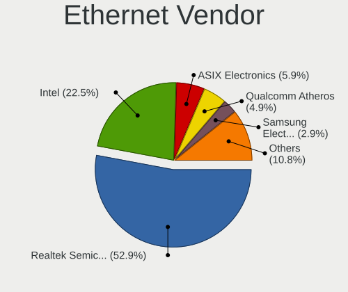

| Vendor                   | Notebooks | Percent |
|--------------------------|-----------|---------|
| Realtek Semiconductor    | 54        | 52.94%  |
| Intel                    | 23        | 22.55%  |
| ASIX Electronics         | 6         | 5.88%   |
| Qualcomm Atheros         | 5         | 4.9%    |
| Samsung Electronics      | 3         | 2.94%   |
| Marvell Technology Group | 3         | 2.94%   |
| Broadcom                 | 3         | 2.94%   |
| Nvidia                   | 2         | 1.96%   |
| NetGear                  | 1         | 0.98%   |
| Broadcom Limited         | 1         | 0.98%   |
| Apple                    | 1         | 0.98%   |

Ethernet Model
--------------

Ethernet models

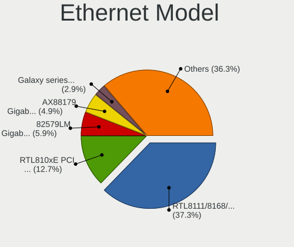

| Model                                                                          | Notebooks | Percent |
|--------------------------------------------------------------------------------|-----------|---------|
| Realtek RTL8111/8168/8211/8411 PCI Express Gigabit Ethernet Controller         | 38        | 37.25%  |
| Realtek RTL810xE PCI Express Fast Ethernet controller                          | 13        | 12.75%  |
| Intel 82579LM Gigabit Network Connection (Lewisville)                          | 6         | 5.88%   |
| ASIX AX88179 Gigabit Ethernet                                                  | 5         | 4.9%    |
| Samsung Galaxy series, misc. (tethering mode)                                  | 3         | 2.94%   |
| Intel 82577LM Gigabit Network Connection                                       | 3         | 2.94%   |
| Qualcomm Atheros AR8151 v2.0 Gigabit Ethernet                                  | 2         | 1.96%   |
| Nvidia MCP79 Ethernet                                                          | 2         | 1.96%   |
| Intel Ethernet Connection I219-V                                               | 2         | 1.96%   |
| Broadcom NetXtreme BCM57765 Gigabit Ethernet PCIe                              | 2         | 1.96%   |
| Realtek RTL8153 Gigabit Ethernet Adapter                                       | 1         | 0.98%   |
| Realtek RTL8152 Fast Ethernet Adapter                                          | 1         | 0.98%   |
| Realtek RTL8125 2.5GbE Controller                                              | 1         | 0.98%   |
| Qualcomm Atheros Killer E2500 Gigabit Ethernet Controller                      | 1         | 0.98%   |
| Qualcomm Atheros AR8161 Gigabit Ethernet                                       | 1         | 0.98%   |
| Qualcomm Atheros AR8152 v1.1 Fast Ethernet                                     | 1         | 0.98%   |
| NetGear LB1120-100NAS                                                          | 1         | 0.98%   |
| Marvell Group Yukon Optima 88E8059 [PCIe Gigabit Ethernet Controller with AVB] | 1         | 0.98%   |
| Marvell Group 88E8058 PCI-E Gigabit Ethernet Controller                        | 1         | 0.98%   |
| Marvell Group 88E8040 PCI-E Fast Ethernet Controller                           | 1         | 0.98%   |
| Intel Ethernet Connection I219-LM                                              | 1         | 0.98%   |
| Intel Ethernet Connection I218-LM                                              | 1         | 0.98%   |
| Intel Ethernet Connection I217-LM                                              | 1         | 0.98%   |
| Intel Ethernet Connection (4) I219-V                                           | 1         | 0.98%   |
| Intel Ethernet Connection (4) I219-LM                                          | 1         | 0.98%   |
| Intel Ethernet Connection (3) I218-LM                                          | 1         | 0.98%   |
| Intel Ethernet Connection (13) I219-LM                                         | 1         | 0.98%   |
| Intel Ethernet Connection (10) I219-V                                          | 1         | 0.98%   |
| Intel Alder Lake-P PCH CNVi WiFi                                               | 1         | 0.98%   |
| Intel 82579V Gigabit Network Connection                                        | 1         | 0.98%   |
| Intel 82577LC Gigabit Network Connection                                       | 1         | 0.98%   |
| Intel 82567LM Gigabit Network Connection                                       | 1         | 0.98%   |
| Broadcom NetXtreme BCM5753M Gigabit Ethernet PCI Express                       | 1         | 0.98%   |
| Broadcom Limited BCM4401-B0 100Base-TX                                         | 1         | 0.98%   |
| ASIX AX88772B                                                                  | 1         | 0.98%   |
| Apple iBridge                                                                  | 1         | 0.98%   |

Net Controller Kind
-------------------

Ethernet, WiFi or modem

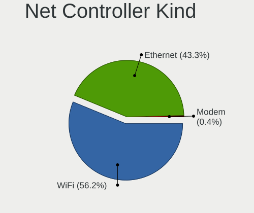

| Kind     | Notebooks | Percent |
|----------|-----------|---------|
| WiFi     | 131       | 56.22%  |
| Ethernet | 101       | 43.35%  |
| Modem    | 1         | 0.43%   |

Used Controller
---------------

Currently used network controller

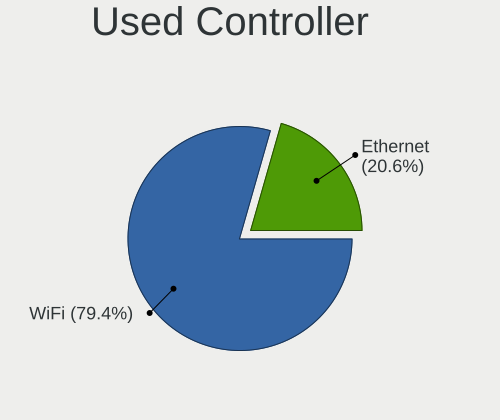

| Kind     | Notebooks | Percent |
|----------|-----------|---------|
| WiFi     | 112       | 79.43%  |
| Ethernet | 29        | 20.57%  |

NICs
----

Total network controllers on board

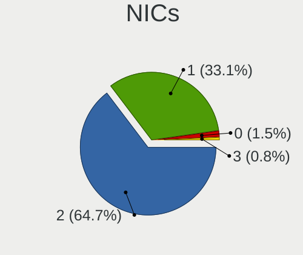

| Total | Notebooks | Percent |
|-------|-----------|---------|
| 2     | 86        | 64.66%  |
| 1     | 44        | 33.08%  |
| 0     | 2         | 1.5%    |
| 3     | 1         | 0.75%   |

IPv6
----

IPv6 vs IPv4

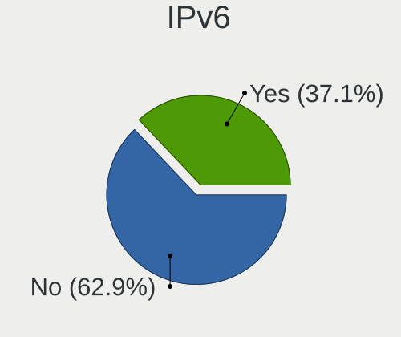

| Used | Notebooks | Percent |
|------|-----------|---------|
| No   | 90        | 62.94%  |
| Yes  | 53        | 37.06%  |

Bluetooth
---------

Bluetooth Vendor
----------------

Controller vendors

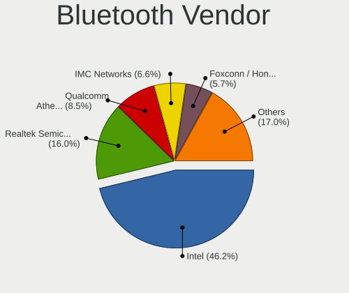

| Vendor                          | Notebooks | Percent |
|---------------------------------|-----------|---------|
| Intel                           | 49        | 46.23%  |
| Realtek Semiconductor           | 17        | 16.04%  |
| Qualcomm Atheros Communications | 9         | 8.49%   |
| IMC Networks                    | 7         | 6.6%    |
| Foxconn / Hon Hai               | 6         | 5.66%   |
| Apple                           | 6         | 5.66%   |
| Lite-On Technology              | 3         | 2.83%   |
| Dell                            | 3         | 2.83%   |
| Hewlett-Packard                 | 2         | 1.89%   |
| Toshiba                         | 1         | 0.94%   |
| MediaTek                        | 1         | 0.94%   |
| Broadcom                        | 1         | 0.94%   |
| Alps Electric                   | 1         | 0.94%   |

Bluetooth Model
---------------

Controller models

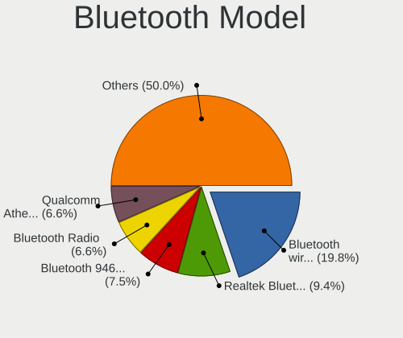

| Model                                                                               | Notebooks | Percent |
|-------------------------------------------------------------------------------------|-----------|---------|
| Intel Bluetooth wireless interface                                                  | 21        | 19.81%  |
| Realtek  Bluetooth 4.2 Adapter                                                      | 10        | 9.43%   |
| Intel Bluetooth 9460/9560 Jefferson Peak (JfP)                                      | 8         | 7.55%   |
| Realtek Bluetooth Radio                                                             | 7         | 6.6%    |
| Qualcomm Atheros  Bluetooth Device                                                  | 7         | 6.6%    |
| Intel AX201 Bluetooth                                                               | 7         | 6.6%    |
| Intel Centrino Advanced-N 6230 Bluetooth adapter                                    | 4         | 3.77%   |
| IMC Networks Bluetooth Radio                                                        | 4         | 3.77%   |
| Foxconn / Hon Hai Bluetooth Device                                                  | 4         | 3.77%   |
| Apple Bluetooth Host Controller                                                     | 4         | 3.77%   |
| Intel AX210 Bluetooth                                                               | 3         | 2.83%   |
| Intel AX200 Bluetooth                                                               | 3         | 2.83%   |
| Qualcomm Atheros QCA61x4 Bluetooth 4.0                                              | 2         | 1.89%   |
| Lite-On Qualcomm Atheros QCA9377 Bluetooth                                          | 2         | 1.89%   |
| HP Bluetooth 2.0 Interface [Broadcom BCM2045]                                       | 2         | 1.89%   |
| Toshiba BCM43142A0                                                                  | 1         | 0.94%   |
| MediaTek Wireless_Device                                                            | 1         | 0.94%   |
| Lite-On Bluetooth Device                                                            | 1         | 0.94%   |
| Intel Wireless-AC 9260 Bluetooth Adapter                                            | 1         | 0.94%   |
| Intel Wireless-AC 3168 Bluetooth                                                    | 1         | 0.94%   |
| Intel Bluetooth Device                                                              | 1         | 0.94%   |
| IMC Networks Wireless_Device                                                        | 1         | 0.94%   |
| IMC Networks Bluetooth USB Host Controller                                          | 1         | 0.94%   |
| IMC Networks Bluetooth Device                                                       | 1         | 0.94%   |
| Foxconn / Hon Hai Foxconn T77H114 BCM2070 [Single-Chip Bluetooth 2.1 + EDR Adapter] | 1         | 0.94%   |
| Foxconn / Hon Hai Broadcom BCM20702A1 Bluetooth                                     | 1         | 0.94%   |
| Dell DW375 Bluetooth Module                                                         | 1         | 0.94%   |
| Dell Broadcom BCM20702A0 Bluetooth                                                  | 1         | 0.94%   |
| Dell BCM20702A0 Bluetooth Module                                                    | 1         | 0.94%   |
| Broadcom BCM2045B (BDC-2.1)                                                         | 1         | 0.94%   |
| Apple Bluetooth USB Host Controller                                                 | 1         | 0.94%   |
| Apple Bluetooth HCI                                                                 | 1         | 0.94%   |
| Alps Electric BCM2046 Bluetooth Device                                              | 1         | 0.94%   |

Sound
-----

Sound Vendor
------------

Sound card vendors

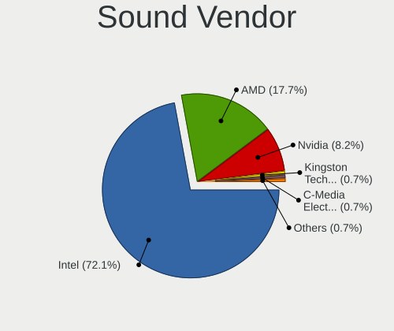

| Vendor              | Notebooks | Percent |
|---------------------|-----------|---------|
| Intel               | 106       | 72.11%  |
| AMD                 | 26        | 17.69%  |
| Nvidia              | 12        | 8.16%   |
| Kingston Technology | 1         | 0.68%   |
| C-Media Electronics | 1         | 0.68%   |
| Apple               | 1         | 0.68%   |

Sound Model
-----------

Sound card models

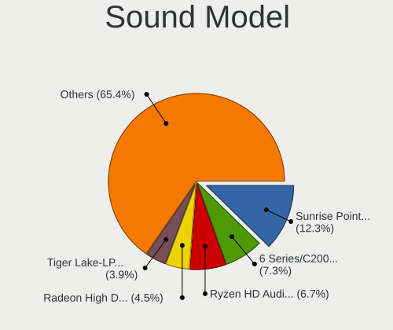

| Model                                                                                             | Notebooks | Percent |
|---------------------------------------------------------------------------------------------------|-----------|---------|
| Intel Sunrise Point-LP HD Audio                                                                   | 22        | 12.29%  |
| Intel 6 Series/C200 Series Chipset Family High Definition Audio Controller                        | 13        | 7.26%   |
| AMD Ryzen HD Audio Controller                                                                     | 12        | 6.7%    |
| AMD Radeon High Definition Audio Controller                                                       | 8         | 4.47%   |
| Intel Tiger Lake-LP Smart Sound Technology Audio Controller                                       | 7         | 3.91%   |
| Intel 7 Series/C216 Chipset Family High Definition Audio Controller                               | 7         | 3.91%   |
| Intel Celeron/Pentium Silver Processor High Definition Audio                                      | 6         | 3.35%   |
| Intel 5 Series/3400 Series Chipset High Definition Audio                                          | 6         | 3.35%   |
| AMD FCH Azalia Controller                                                                         | 6         | 3.35%   |
| Intel Wildcat Point-LP High Definition Audio Controller                                           | 5         | 2.79%   |
| Intel Cannon Lake PCH cAVS                                                                        | 5         | 2.79%   |
| Intel Broadwell-U Audio Controller                                                                | 5         | 2.79%   |
| AMD Renoir/Cezanne HDMI/DP Audio Controller                                                       | 5         | 2.79%   |
| Intel Cannon Point-LP High Definition Audio Controller                                            | 4         | 2.23%   |
| Intel Atom/Celeron/Pentium Processor x5-E8000/J3xxx/N3xxx Series High Definition Audio Controller | 4         | 2.23%   |
| Intel 82801I (ICH9 Family) HD Audio Controller                                                    | 4         | 2.23%   |
| Intel Xeon E3-1200 v3/4th Gen Core Processor HD Audio Controller                                  | 3         | 1.68%   |
| Intel Ice Lake-LP Smart Sound Technology Audio Controller                                         | 3         | 1.68%   |
| Intel Haswell-ULT HD Audio Controller                                                             | 3         | 1.68%   |
| Intel Comet Lake PCH-LP cAVS                                                                      | 3         | 1.68%   |
| Intel 8 Series/C220 Series Chipset High Definition Audio Controller                               | 3         | 1.68%   |
| Intel 8 Series HD Audio Controller                                                                | 3         | 1.68%   |
| AMD Raven/Raven2/Fenghuang HDMI/DP Audio Controller                                               | 3         | 1.68%   |
| Nvidia TU116 High Definition Audio Controller                                                     | 2         | 1.12%   |
| Nvidia TU107 GeForce GTX 1650 High Definition Audio Controller                                    | 2         | 1.12%   |
| Nvidia MCP79 High Definition Audio                                                                | 2         | 1.12%   |
| Nvidia AD106M High Definition Audio Controller                                                    | 2         | 1.12%   |
| Intel Raptor Lake-P/U/H cAVS                                                                      | 2         | 1.12%   |
| Intel NM10/ICH7 Family High Definition Audio Controller                                           | 2         | 1.12%   |
| Intel Atom Processor Z36xxx/Z37xxx Series High Definition Audio Controller                        | 2         | 1.12%   |
| Intel Alder Lake PCH-P High Definition Audio Controller                                           | 2         | 1.12%   |
| AMD Wrestler HDMI Audio                                                                           | 2         | 1.12%   |
| AMD Kabini HDMI/DP Audio                                                                          | 2         | 1.12%   |
| AMD High Definition Audio Controller                                                              | 2         | 1.12%   |
| AMD Family 15h (Models 60h-6fh) Audio Controller                                                  | 2         | 1.12%   |
| Nvidia GP107GL High Definition Audio Controller                                                   | 1         | 0.56%   |
| Nvidia GP106 High Definition Audio Controller                                                     | 1         | 0.56%   |
| Nvidia GK107 HDMI Audio Controller                                                                | 1         | 0.56%   |
| Nvidia GB206 High Definition Audio Controller                                                     | 1         | 0.56%   |
| Kingston Technology HyperX 7.1 Audio                                                              | 1         | 0.56%   |

Memory
------

Memory Vendor
-------------

Memory module vendors

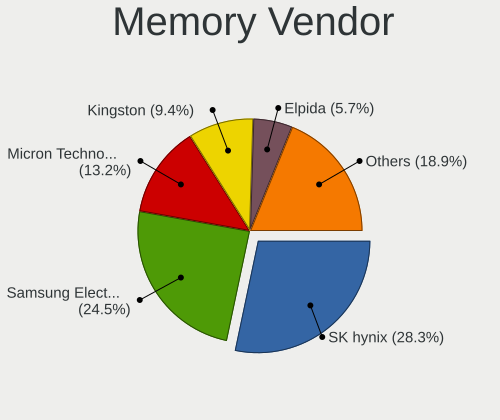

| Vendor              | Notebooks | Percent |
|---------------------|-----------|---------|
| SK hynix            | 15        | 28.3%   |
| Samsung Electronics | 13        | 24.53%  |
| Micron Technology   | 7         | 13.21%  |
| Kingston            | 5         | 9.43%   |
| Elpida              | 3         | 5.66%   |
| Ramaxel Technology  | 2         | 3.77%   |
| Wodposit            | 1         | 1.89%   |
| Silicon Power       | 1         | 1.89%   |
| Qumo                | 1         | 1.89%   |
| PNY                 | 1         | 1.89%   |
| G.Skill             | 1         | 1.89%   |
| Crucial             | 1         | 1.89%   |
| Corsair             | 1         | 1.89%   |
| A-DATA Technology   | 1         | 1.89%   |

Memory Model
------------

Memory module models

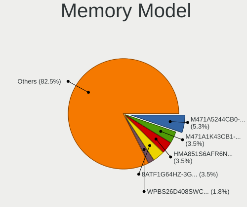

| Model                                                           | Notebooks | Percent |
|-----------------------------------------------------------------|-----------|---------|
| Samsung RAM M471A5244CB0-CWE 4GB SODIMM DDR4 3200MT/s           | 3         | 5.26%   |
| SK hynix RAM HMA851S6AFR6N-UH 4GB SODIMM DDR4 2667MT/s          | 2         | 3.51%   |
| Samsung RAM M471A1K43CB1-CRC 8GB SODIMM DDR4 8400MT/s           | 2         | 3.51%   |
| Micron RAM 8ATF1G64HZ-3G2R1 8GB SODIMM DDR4 3200MT/s            | 2         | 3.51%   |
| Wodposit RAM WPBS26D408SWC-8G 8GB SODIMM DDR4 2667MT/s          | 1         | 1.75%   |
| SK hynix RAM Module 8GB SODIMM DDR4 2400MT/s                    | 1         | 1.75%   |
| SK hynix RAM Module 8GB Row Of Chips LPDDR3 2133MT/s            | 1         | 1.75%   |
| SK hynix RAM Module 4GB SODIMM LPDDR3 2133MT/s                  | 1         | 1.75%   |
| SK hynix RAM Module 2048MB SODIMM DDR 667MT/s                   | 1         | 1.75%   |
| SK hynix RAM HMT451S6MFR8C-PB 4GB SODIMM DDR3 1600MT/s          | 1         | 1.75%   |
| SK hynix RAM HMT41GS6BFR8A-PB 8GB SODIMM DDR3 1600MT/s          | 1         | 1.75%   |
| SK hynix RAM HMT351S6CFR8C-PB 4096MB SODIMM DDR3 1600MT/s       | 1         | 1.75%   |
| SK hynix RAM HMT325S6CFR8C-H9 2GB SODIMM DDR3 1333MT/s          | 1         | 1.75%   |
| SK hynix RAM HMA851S6DJR6N-XN 4GB SODIMM DDR4 3200MT/s          | 1         | 1.75%   |
| SK hynix RAM HMA851S6AFR6N-UH 4GB SODIMM DDR4 2400MT/s          | 1         | 1.75%   |
| SK hynix RAM HMA82GS6AFR8N-UH 16GB SODIMM DDR4 2667MT/s         | 1         | 1.75%   |
| SK hynix RAM HMA81GS6DJR8N-VK 8GB SODIMM DDR4 2667MT/s          | 1         | 1.75%   |
| SK hynix RAM HMA81GS6CJR8N-XN 8GB SODIMM DDR4 3200MT/s          | 1         | 1.75%   |
| SK hynix RAM HMA81GS6CJR8N-VK 8GB SODIMM DDR4 2667MT/s          | 1         | 1.75%   |
| SK hynix RAM H9CCNNN8GTALAR-NUD 2GB LPDDR3 1600MT/s             | 1         | 1.75%   |
| Silicon Power RAM Module 8GB SODIMM DDR3 1600MT/s               | 1         | 1.75%   |
| Samsung RAM U6E3S4AA-MGCR 1GB Row Of Chips LPDDR4 4267MT/s      | 1         | 1.75%   |
| Samsung RAM M471B5173QH0-YK0 4GB SODIMM DDR3 1600MT/s           | 1         | 1.75%   |
| Samsung RAM M471B5173EB0-YK0 4GB SODIMM DDR3 1600MT/s           | 1         | 1.75%   |
| Samsung RAM M471A5244CB0-CTD 4GB SODIMM DDR4 3266MT/s           | 1         | 1.75%   |
| Samsung RAM M471A1K43EB1-CWE 8GB SODIMM DDR4 3200MT/s           | 1         | 1.75%   |
| Samsung RAM M471A1K43CB1-CTD 8GB SODIMM DDR4 3200MT/s           | 1         | 1.75%   |
| Samsung RAM K4E6E304EC-EGCG 4GB Row Of Chips LPDDR3 2133MT/s    | 1         | 1.75%   |
| Samsung RAM K3KL8L80CM-MGCT 4GB LPDDR5 7500MT/s                 | 1         | 1.75%   |
| Ramaxel RAM RMT3160ED58E9W1600 4GB SODIMM DDR3 1600MT/s         | 1         | 1.75%   |
| Ramaxel RAM RMSA3260ME78HAF-2666 8GB SODIMM DDR4 2667MT/s       | 1         | 1.75%   |
| Qumo RAM Module 4GB SODIMM DDR3 1334MT/s                        | 1         | 1.75%   |
| PNY RAM Module 4GB SODIMM DDR3 1067MT/s                         | 1         | 1.75%   |
| Micron RAM MT62F512M32D2DR-031 1GB Row Of Chips LPDDR5 6400MT/s | 1         | 1.75%   |
| Micron RAM 8KTF51264HZ-1G6E1 4GB SODIMM DDR3 1600MT/s           | 1         | 1.75%   |
| Micron RAM 8JTF5126 4HZ1G6D 1 4GB SODIMM DDR3 1600MT/s          | 1         | 1.75%   |
| Micron RAM 4ATF1G64HZ-3G2F1 8GB SODIMM DDR4 3200MT/s            | 1         | 1.75%   |
| Micron RAM 16KTF51264HZ-1G6M1 4GB SODIMM DDR3 1600MT/s          | 1         | 1.75%   |
| Kingston RAM KNWMX1-ETB 4GB SODIMM DDR3 1600MT/s                | 1         | 1.75%   |
| Kingston RAM KHYXPX-MID 8GB SODIMM DDR4 2667MT/s                | 1         | 1.75%   |

Memory Kind
-----------

Memory module kinds

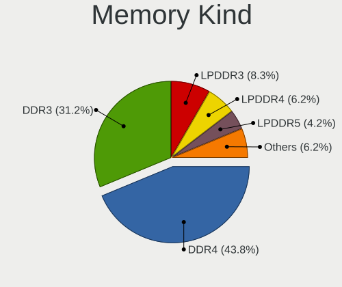

| Kind   | Notebooks | Percent |
|--------|-----------|---------|
| DDR4   | 21        | 43.75%  |
| DDR3   | 15        | 31.25%  |
| LPDDR3 | 4         | 8.33%   |
| LPDDR4 | 3         | 6.25%   |
| LPDDR5 | 2         | 4.17%   |
| DDR5   | 1         | 2.08%   |
| DDR2   | 1         | 2.08%   |
| DDR    | 1         | 2.08%   |

Memory Form Factor
------------------

Physical design of the memory module

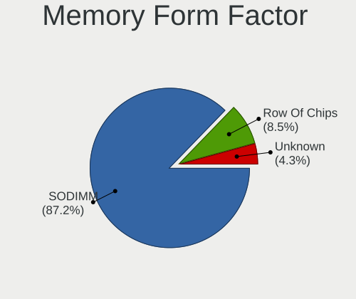

| Name         | Notebooks | Percent |
|--------------|-----------|---------|
| SODIMM       | 41        | 87.23%  |
| Row Of Chips | 4         | 8.51%   |
| Unknown      | 2         | 4.26%   |

Memory Size
-----------

Memory module size

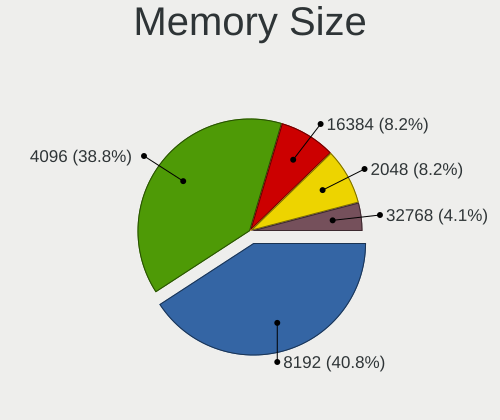

| Size  | Notebooks | Percent |
|-------|-----------|---------|
| 8192  | 20        | 40.82%  |
| 4096  | 19        | 38.78%  |
| 16384 | 4         | 8.16%   |
| 2048  | 4         | 8.16%   |
| 32768 | 2         | 4.08%   |

Memory Speed
------------

Memory module speed

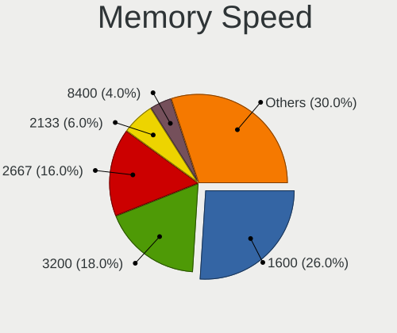

| Speed | Notebooks | Percent |
|-------|-----------|---------|
| 1600  | 13        | 26%     |
| 3200  | 9         | 18%     |
| 2667  | 8         | 16%     |
| 2133  | 3         | 6%      |
| 8400  | 2         | 4%      |
| 2400  | 2         | 4%      |
| 7500  | 1         | 2%      |
| 6400  | 1         | 2%      |
| 5600  | 1         | 2%      |
| 4267  | 1         | 2%      |
| 3266  | 1         | 2%      |
| 1867  | 1         | 2%      |
| 1334  | 1         | 2%      |
| 1333  | 1         | 2%      |
| 1200  | 1         | 2%      |
| 1067  | 1         | 2%      |
| 975   | 1         | 2%      |
| 800   | 1         | 2%      |
| 667   | 1         | 2%      |

Printers & scanners
-------------------

Printer Vendor
--------------

Printer device vendors

Zero info for selected period =(

Printer Model
-------------

Printer device models

Zero info for selected period =(

Scanner Vendor
--------------

Scanner device vendors

Zero info for selected period =(

Scanner Model
-------------

Scanner device models

Zero info for selected period =(

Camera
------

Camera Vendor
-------------

Camera device vendors

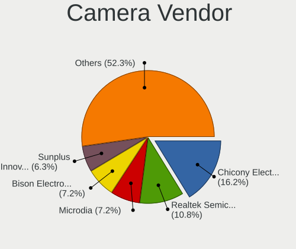

| Vendor                                 | Notebooks | Percent |
|----------------------------------------|-----------|---------|
| Chicony Electronics                    | 18        | 16.22%  |
| Realtek Semiconductor                  | 12        | 10.81%  |
| Microdia                               | 8         | 7.21%   |
| Bison Electronics                      | 8         | 7.21%   |
| Sunplus Innovation Technology          | 7         | 6.31%   |
| Quanta                                 | 7         | 6.31%   |
| Lite-On Technology                     | 7         | 6.31%   |
| Cheng Uei Precision Industry (Foxlink) | 7         | 6.31%   |
| IMC Networks                           | 6         | 5.41%   |
| Ricoh                                  | 5         | 4.5%    |
| Apple                                  | 5         | 4.5%    |
| Luxvisions Innotech Limited            | 4         | 3.6%    |
| Syntek                                 | 2         | 1.8%    |
| Suyin                                  | 2         | 1.8%    |
| Primax Electronics                     | 2         | 1.8%    |
| Lenovo                                 | 2         | 1.8%    |
| Sonix Technology                       | 1         | 0.9%    |
| ShineTech                              | 1         | 0.9%    |
| Shenzhen Kingcome Optoelectronic       | 1         | 0.9%    |
| MacroSilicon                           | 1         | 0.9%    |
| Intel                                  | 1         | 0.9%    |
| Importek                               | 1         | 0.9%    |
| Goertek Electronics                    | 1         | 0.9%    |
| Alpha Imaging Technology               | 1         | 0.9%    |
| Acer                                   | 1         | 0.9%    |

Camera Model
------------

Camera device models

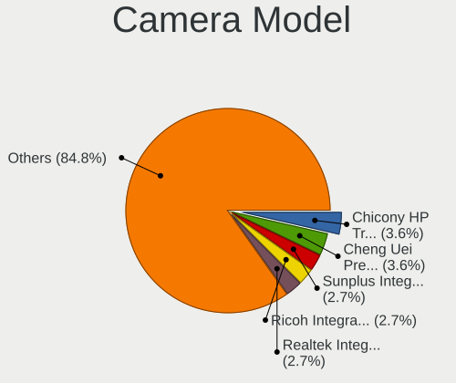

| Model                                                          | Notebooks | Percent |
|----------------------------------------------------------------|-----------|---------|
| Chicony HP Truevision HD                                       | 4         | 3.57%   |
| Cheng Uei Precision Industry (Foxlink) HP TrueVision HD Camera | 4         | 3.57%   |
| Sunplus Integrated_Webcam_HD                                   | 3         | 2.68%   |
| Ricoh Integrated Webcam                                        | 3         | 2.68%   |
| Realtek Integrated_Webcam_HD                                   | 3         | 2.68%   |
| Microdia Integrated_Webcam_HD                                  | 3         | 2.68%   |
| Lite-On HP Wide Vision HD Camera                               | 3         | 2.68%   |
| Chicony integrated camera                                      | 3         | 2.68%   |
| Sunplus Laptop_Integrated_Webcam_FHD                           | 2         | 1.79%   |
| Realtek Integrated Webcam HD                                   | 2         | 1.79%   |
| Quanta HP Wide Vision HD Camera                                | 2         | 1.79%   |
| Quanta HP TrueVision HD Camera                                 | 2         | 1.79%   |
| Primax HP HD Webcam [Fixed]                                    | 2         | 1.79%   |
| Microdia Laptop_Integrated_Webcam_HD                           | 2         | 1.79%   |
| Luxvisions Innotech Limited HP TrueVision HD Camera            | 2         | 1.79%   |
| Lite-On HP HD Webcam                                           | 2         | 1.79%   |
| Lenovo Integrated Webcam [R5U877]                              | 2         | 1.79%   |
| IMC Networks UVC VGA Webcam                                    | 2         | 1.79%   |
| IMC Networks Integrated Camera                                 | 2         | 1.79%   |
| Chicony HD WebCam                                              | 2         | 1.79%   |
| Bison Lenovo EasyCamera                                        | 2         | 1.79%   |
| Apple FaceTime HD Camera                                       | 2         | 1.79%   |
| Apple Built-in iSight                                          | 2         | 1.79%   |
| Syntek Lenovo EasyCamera                                       | 1         | 0.89%   |
| Syntek Integrated Camera                                       | 1         | 0.89%   |
| Suyin USB 2.0 Camera                                           | 1         | 0.89%   |
| Suyin Integrated_Webcam_HD                                     | 1         | 0.89%   |
| Sunplus MTD Camera                                             | 1         | 0.89%   |
| Sunplus Integrated Camera                                      | 1         | 0.89%   |
| Sonix USB2.0 FHD UVC WebCam                                    | 1         | 0.89%   |
| ShineTech USB2.0 HD UVC WebCam                                 | 1         | 0.89%   |
| Shenzhen Kingcome Optoelectronic 720p HD Camera                | 1         | 0.89%   |
| Ricoh Sony Visual Communication Camera Integrated Webcam       | 1         | 0.89%   |
| Ricoh HD Webcam                                                | 1         | 0.89%   |
| Realtek USB2.0 camera                                          | 1         | 0.89%   |
| Realtek Laptop Camera                                          | 1         | 0.89%   |
| Realtek Integrated_Webcam_FHD                                  | 1         | 0.89%   |
| Realtek Integrated Webcam                                      | 1         | 0.89%   |
| Realtek Integrated Camera                                      | 1         | 0.89%   |
| Realtek HP Webcam-101                                          | 1         | 0.89%   |

Security
--------

Fingerprint Vendor
------------------

Fingerprint sensor vendors

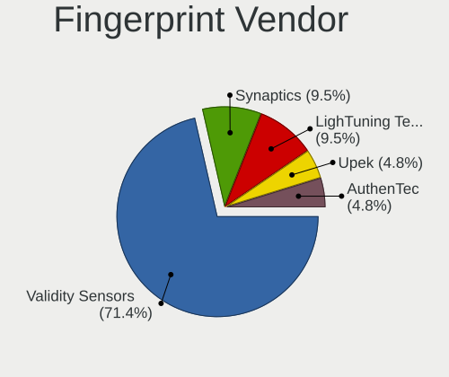

| Vendor                | Notebooks | Percent |
|-----------------------|-----------|---------|
| Validity Sensors      | 15        | 71.43%  |
| Synaptics             | 2         | 9.52%   |
| LighTuning Technology | 2         | 9.52%   |
| Upek                  | 1         | 4.76%   |
| AuthenTec             | 1         | 4.76%   |

Fingerprint Model
-----------------

Fingerprint sensor models

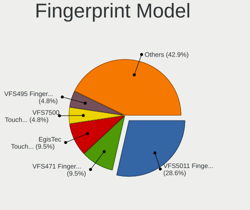

| Model                                                  | Notebooks | Percent |
|--------------------------------------------------------|-----------|---------|
| Validity Sensors VFS5011 Fingerprint Reader            | 6         | 28.57%  |
| Validity Sensors VFS471 Fingerprint Reader             | 2         | 9.52%   |
| LighTuning EgisTec Touch Fingerprint Sensor            | 2         | 9.52%   |
| Validity Sensors VFS7500 Touch Fingerprint Sensor      | 1         | 4.76%   |
| Validity Sensors VFS495 Fingerprint Reader             | 1         | 4.76%   |
| Validity Sensors VFS491                                | 1         | 4.76%   |
| Validity Sensors VFS451 Fingerprint Reader             | 1         | 4.76%   |
| Validity Sensors VFS301 Fingerprint Reader             | 1         | 4.76%   |
| Validity Sensors VFS 5011 fingerprint sensor           | 1         | 4.76%   |
| Validity Sensors Fingerprint scanner                   | 1         | 4.76%   |
| Upek Biometric Touchchip/Touchstrip Fingerprint Sensor | 1         | 4.76%   |
| Synaptics UWP WBDI                                     | 1         | 4.76%   |
| Synaptics Prometheus MIS Touch Fingerprint Reader      | 1         | 4.76%   |
| AuthenTec AES2810                                      | 1         | 4.76%   |

Chipcard Vendor
---------------

Chipcard module vendors

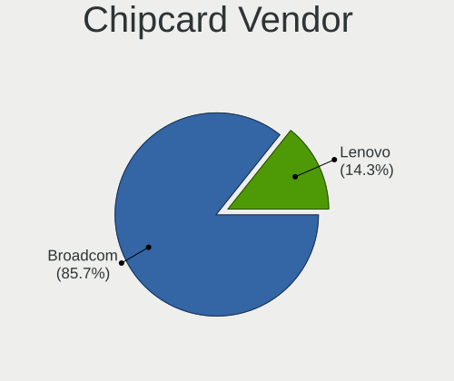

| Vendor   | Notebooks | Percent |
|----------|-----------|---------|
| Broadcom | 6         | 85.71%  |
| Lenovo   | 1         | 14.29%  |

Chipcard Model
--------------

Chipcard module models

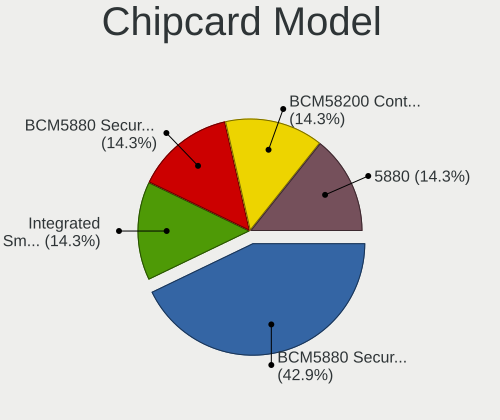

| Model                                                                        | Notebooks | Percent |
|------------------------------------------------------------------------------|-----------|---------|
| Broadcom BCM5880 Secure Applications Processor                               | 3         | 42.86%  |
| Lenovo Integrated Smart Card Reader                                          | 1         | 14.29%  |
| Broadcom BCM5880 Secure Applications Processor with fingerprint swipe sensor | 1         | 14.29%  |
| Broadcom BCM58200 ControlVault 3 (FingerPrint sensor + Contacted SmartCard)  | 1         | 14.29%  |
| Broadcom 5880                                                                | 1         | 14.29%  |

Unsupported
-----------

Unsupported Devices
-------------------

Total unsupported devices on board

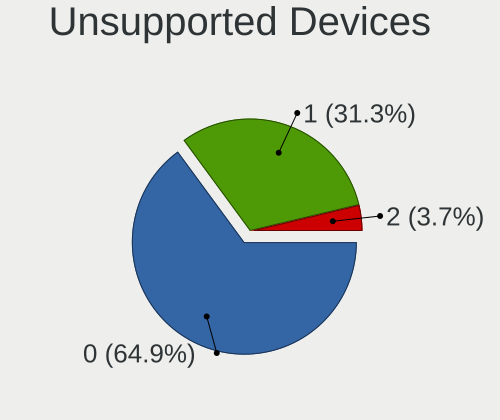

| Total | Notebooks | Percent |
|-------|-----------|---------|
| 0     | 87        | 64.93%  |
| 1     | 42        | 31.34%  |
| 2     | 5         | 3.73%   |

Unsupported Device Types
------------------------

Types of unsupported devices

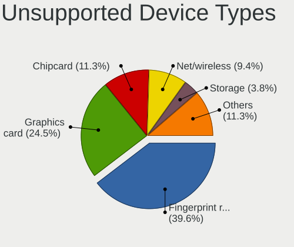

| Type                     | Notebooks | Percent |
|--------------------------|-----------|---------|
| Fingerprint reader       | 21        | 39.62%  |
| Graphics card            | 13        | 24.53%  |
| Chipcard                 | 6         | 11.32%  |
| Net/wireless             | 5         | 9.43%   |
| Storage                  | 2         | 3.77%   |
| Multimedia controller    | 2         | 3.77%   |
| Communication controller | 2         | 3.77%   |
| Modem                    | 1         | 1.89%   |
| Camera                   | 1         | 1.89%   |

