Linux in Puerto Rico - Tested Hardware & Statistics (Notebooks)
---------------------------------------------------------------

A project to collect tested hardware configurations for Linux in Puerto Rico.

Anyone can contribute to this report by the [hw-probe](https://github.com/linuxhw/hw-probe) tool:

    sudo -E hw-probe -all -upload

Please contribute! Especially if your hardware is rare.

Contents
--------

* [ Test Cases ](#test-cases)

* [ System ](#system)
  - [ OS                       ](#os)
  - [ OS Family                ](#os-family)
  - [ Kernel                   ](#kernel)
  - [ Kernel Family            ](#kernel-family)
  - [ Kernel Major Ver.        ](#kernel-major-ver)
  - [ Arch                     ](#arch)
  - [ DE                       ](#de)
  - [ Display Server           ](#display-server)
  - [ Display Manager          ](#display-manager)
  - [ OS Lang                  ](#os-lang)
  - [ Boot Mode                ](#boot-mode)
  - [ Filesystem               ](#filesystem)
  - [ Part. scheme             ](#part-scheme)
  - [ Dual Boot with Linux/BSD ](#dual-boot-with-linuxbsd)
  - [ Dual Boot (Win)          ](#dual-boot-win)

* [ Board ](#board)
  - [ Vendor                   ](#vendor)
  - [ Model                    ](#model)
  - [ Model Family             ](#model-family)
  - [ MFG Year                 ](#mfg-year)
  - [ Form Factor              ](#form-factor)
  - [ Secure Boot              ](#secure-boot)
  - [ Coreboot                 ](#coreboot)
  - [ RAM Size                 ](#ram-size)
  - [ RAM Used                 ](#ram-used)
  - [ Total Drives             ](#total-drives)
  - [ Has CD-ROM               ](#has-cd-rom)
  - [ Has Ethernet             ](#has-ethernet)
  - [ Has WiFi                 ](#has-wifi)
  - [ Has Bluetooth            ](#has-bluetooth)

* [ Location ](#location)
  - [ Country                  ](#country)
  - [ City                     ](#city)

* [ Drives ](#drives)
  - [ Drive Vendor             ](#drive-vendor)
  - [ Drive Model              ](#drive-model)
  - [ HDD Vendor               ](#hdd-vendor)
  - [ SSD Vendor               ](#ssd-vendor)
  - [ Drive Kind               ](#drive-kind)
  - [ Drive Connector          ](#drive-connector)
  - [ Drive Size               ](#drive-size)
  - [ Space Total              ](#space-total)
  - [ Space Used               ](#space-used)
  - [ Malfunc. Drives          ](#malfunc-drives)
  - [ Malfunc. Drive Vendor    ](#malfunc-drive-vendor)
  - [ Malfunc. HDD Vendor      ](#malfunc-hdd-vendor)
  - [ Malfunc. Drive Kind      ](#malfunc-drive-kind)
  - [ Failed Drives            ](#failed-drives)
  - [ Failed Drive Vendor      ](#failed-drive-vendor)
  - [ Drive Status             ](#drive-status)

* [ Storage controller ](#storage-controller)
  - [ Storage Vendor           ](#storage-vendor)
  - [ Storage Model            ](#storage-model)
  - [ Storage Kind             ](#storage-kind)

* [ Processor ](#processor)
  - [ CPU Vendor               ](#cpu-vendor)
  - [ CPU Model                ](#cpu-model)
  - [ CPU Model Family         ](#cpu-model-family)
  - [ CPU Cores                ](#cpu-cores)
  - [ CPU Sockets              ](#cpu-sockets)
  - [ CPU Threads              ](#cpu-threads)
  - [ CPU Op-Modes             ](#cpu-op-modes)
  - [ CPU Microcode            ](#cpu-microcode)
  - [ CPU Microarch            ](#cpu-microarch)

* [ Graphics ](#graphics)
  - [ GPU Vendor               ](#gpu-vendor)
  - [ GPU Model                ](#gpu-model)
  - [ GPU Combo                ](#gpu-combo)
  - [ GPU Driver               ](#gpu-driver)
  - [ GPU Memory               ](#gpu-memory)

* [ Monitor ](#monitor)
  - [ Monitor Vendor           ](#monitor-vendor)
  - [ Monitor Model            ](#monitor-model)
  - [ Monitor Resolution       ](#monitor-resolution)
  - [ Monitor Diagonal         ](#monitor-diagonal)
  - [ Monitor Width            ](#monitor-width)
  - [ Aspect Ratio             ](#aspect-ratio)
  - [ Monitor Area             ](#monitor-area)
  - [ Pixel Density            ](#pixel-density)
  - [ Multiple Monitors        ](#multiple-monitors)

* [ Network ](#network)
  - [ Net Controller Vendor    ](#net-controller-vendor)
  - [ Net Controller Model     ](#net-controller-model)
  - [ Wireless Vendor          ](#wireless-vendor)
  - [ Wireless Model           ](#wireless-model)
  - [ Ethernet Vendor          ](#ethernet-vendor)
  - [ Ethernet Model           ](#ethernet-model)
  - [ Net Controller Kind      ](#net-controller-kind)
  - [ Used Controller          ](#used-controller)
  - [ NICs                     ](#nics)
  - [ IPv6                     ](#ipv6)

* [ Bluetooth ](#bluetooth)
  - [ Bluetooth Vendor         ](#bluetooth-vendor)
  - [ Bluetooth Model          ](#bluetooth-model)

* [ Sound ](#sound)
  - [ Sound Vendor             ](#sound-vendor)
  - [ Sound Model              ](#sound-model)

* [ Memory ](#memory)
  - [ Memory Vendor            ](#memory-vendor)
  - [ Memory Model             ](#memory-model)
  - [ Memory Kind              ](#memory-kind)
  - [ Memory Form Factor       ](#memory-form-factor)
  - [ Memory Size              ](#memory-size)
  - [ Memory Speed             ](#memory-speed)

* [ Printers & scanners ](#printers--scanners)
  - [ Printer Vendor           ](#printer-vendor)
  - [ Printer Model            ](#printer-model)
  - [ Scanner Vendor           ](#scanner-vendor)
  - [ Scanner Model            ](#scanner-model)

* [ Camera ](#camera)
  - [ Camera Vendor            ](#camera-vendor)
  - [ Camera Model             ](#camera-model)

* [ Security ](#security)
  - [ Fingerprint Vendor       ](#fingerprint-vendor)
  - [ Fingerprint Model        ](#fingerprint-model)
  - [ Chipcard Vendor          ](#chipcard-vendor)
  - [ Chipcard Model           ](#chipcard-model)

* [ Unsupported ](#unsupported)
  - [ Unsupported Devices      ](#unsupported-devices)
  - [ Unsupported Device Types ](#unsupported-device-types)

Test Cases
----------

Total: 88

| Vendor        | Model                       | Probe                                                      | Date         |
|---------------|-----------------------------|------------------------------------------------------------|--------------|
| HP            | ENVY Laptop 17-ce1xxx       | [3f1e6ca5cb](https://linux-hardware.org/?probe=3f1e6ca5cb) | Jul 29, 2022 |
| Apple         | MacBook4,1                  | [012b0c7fa9](https://linux-hardware.org/?probe=012b0c7fa9) | Jul 23, 2022 |
| Apple         | MacBook4,1                  | [c444890ad0](https://linux-hardware.org/?probe=c444890ad0) | Jul 21, 2022 |
| Apple         | MacBook4,1                  | [9122678102](https://linux-hardware.org/?probe=9122678102) | Jul 21, 2022 |
| Apple         | MacBook4,1                  | [69d676f7be](https://linux-hardware.org/?probe=69d676f7be) | Jul 12, 2022 |
| Apple         | MacBook4,1                  | [9d8195a435](https://linux-hardware.org/?probe=9d8195a435) | Jul 12, 2022 |
| Dell          | Venue 11 Pro 7130 MS        | [a42903b516](https://linux-hardware.org/?probe=a42903b516) | Jul 10, 2022 |
| Dell          | Venue 11 Pro 7130 MS        | [404e81318c](https://linux-hardware.org/?probe=404e81318c) | Jul 10, 2022 |
| Apple         | MacBookPro5,1               | [fd79c5481a](https://linux-hardware.org/?probe=fd79c5481a) | Jul 09, 2022 |
| Dell          | Vostro 3550                 | [d0cfec8d80](https://linux-hardware.org/?probe=d0cfec8d80) | Jul 04, 2022 |
| Apple         | MacBookPro5,1               | [ac53d2f956](https://linux-hardware.org/?probe=ac53d2f956) | Jul 02, 2022 |
| Apple         | MacBookPro5,1               | [1e14793557](https://linux-hardware.org/?probe=1e14793557) | Jun 27, 2022 |
| Dell          | Vostro 3550                 | [9eaa432fcd](https://linux-hardware.org/?probe=9eaa432fcd) | Jun 02, 2022 |
| HP            | Pavilion Gaming Laptop 1... | [074f1f75dc](https://linux-hardware.org/?probe=074f1f75dc) | Apr 20, 2022 |
| Dell          | Latitude E6330              | [1911200c56](https://linux-hardware.org/?probe=1911200c56) | Mar 23, 2022 |
| Dell          | Vostro 3550                 | [fd3185704d](https://linux-hardware.org/?probe=fd3185704d) | Mar 21, 2022 |
| Dell          | Inspiron 17-7778            | [bcc52b2596](https://linux-hardware.org/?probe=bcc52b2596) | Mar 17, 2022 |
| Toshiba       | Satellite P755              | [ceb8d030e2](https://linux-hardware.org/?probe=ceb8d030e2) | Mar 10, 2022 |
| HP            | Pavilion Gaming Laptop 1... | [a1ecd8a3cb](https://linux-hardware.org/?probe=a1ecd8a3cb) | Feb 12, 2022 |
| TUXEDO        | Aura 15 Gen1                | [832b48c46d](https://linux-hardware.org/?probe=832b48c46d) | Feb 11, 2022 |
| Dell          | Vostro 3550                 | [86dbaf1d07](https://linux-hardware.org/?probe=86dbaf1d07) | Jan 27, 2022 |
| Sony          | VGN-CS320J                  | [1b74edca8c](https://linux-hardware.org/?probe=1b74edca8c) | Dec 27, 2021 |
| Sony          | VGN-CS320J                  | [9f1e770843](https://linux-hardware.org/?probe=9f1e770843) | Dec 22, 2021 |
| Sony          | VGN-CS320J                  | [7143ced3cd](https://linux-hardware.org/?probe=7143ced3cd) | Dec 20, 2021 |
| Apple         | MacBook4,1                  | [7bf355c3c1](https://linux-hardware.org/?probe=7bf355c3c1) | Dec 12, 2021 |
| Apple         | MacBook4,1                  | [cfa6005bc4](https://linux-hardware.org/?probe=cfa6005bc4) | Dec 09, 2021 |
| HP            | ENVY Laptop 17m-bw0xxx      | [9ec292c9d9](https://linux-hardware.org/?probe=9ec292c9d9) | Oct 25, 2021 |
| HP            | EliteBook 840 G2            | [8649bba9b6](https://linux-hardware.org/?probe=8649bba9b6) | Oct 22, 2021 |
| HP            | EliteBook 840 G2            | [fede248f75](https://linux-hardware.org/?probe=fede248f75) | Oct 19, 2021 |
| HP            | ProBook 6450b               | [518e694864](https://linux-hardware.org/?probe=518e694864) | Oct 19, 2021 |
| Acer          | Swift SF315-52              | [7ecda0a147](https://linux-hardware.org/?probe=7ecda0a147) | Sep 23, 2021 |
| GPU Compan... | GWTN156-9                   | [a9ac79c22a](https://linux-hardware.org/?probe=a9ac79c22a) | Sep 21, 2021 |
| Dell          | Vostro 3550                 | [686eb55129](https://linux-hardware.org/?probe=686eb55129) | Sep 04, 2021 |
| HP            | ProBook 6450b               | [d120a0016d](https://linux-hardware.org/?probe=d120a0016d) | Aug 05, 2021 |
| Dell          | Inspiron N5110              | [9ad69ca6ad](https://linux-hardware.org/?probe=9ad69ca6ad) | Jul 27, 2021 |
| Dell          | Vostro 3550                 | [75fd544183](https://linux-hardware.org/?probe=75fd544183) | Jul 26, 2021 |
| Dell          | Inspiron N5110              | [a3b055840b](https://linux-hardware.org/?probe=a3b055840b) | Jul 13, 2021 |
| HP            | EliteBook 840 G2            | [cbcf0ae65d](https://linux-hardware.org/?probe=cbcf0ae65d) | Jul 07, 2021 |
| Dell          | Vostro 3550                 | [c3b8ac12be](https://linux-hardware.org/?probe=c3b8ac12be) | Jul 07, 2021 |
| Dell          | Inspiron N5110              | [3a88077121](https://linux-hardware.org/?probe=3a88077121) | Jul 07, 2021 |
| HP            | EliteBook 840 G2            | [17a65dfb0e](https://linux-hardware.org/?probe=17a65dfb0e) | Jul 06, 2021 |
| Acer          | Aspire E5-571               | [5af810dc36](https://linux-hardware.org/?probe=5af810dc36) | Jul 04, 2021 |
| HP            | EliteBook 840 G2            | [675992d5f9](https://linux-hardware.org/?probe=675992d5f9) | Jul 04, 2021 |
| Acer          | Aspire E5-571               | [4782df79ce](https://linux-hardware.org/?probe=4782df79ce) | Jul 02, 2021 |
| HP            | ProBook 6560b               | [806dfcb6f0](https://linux-hardware.org/?probe=806dfcb6f0) | Jul 01, 2021 |
| HP            | ProBook 6450b               | [a8689c5d60](https://linux-hardware.org/?probe=a8689c5d60) | Jun 25, 2021 |
| HP            | EliteBook 840 G2            | [fed4ef6298](https://linux-hardware.org/?probe=fed4ef6298) | Jun 23, 2021 |
| HP            | EliteBook 840 G2            | [14e1d81078](https://linux-hardware.org/?probe=14e1d81078) | Jun 23, 2021 |
| HP            | ProBook 6450b               | [b4c7a0fd32](https://linux-hardware.org/?probe=b4c7a0fd32) | Jun 21, 2021 |
| HP            | Laptop 15-dw0xxx            | [fa4061e79f](https://linux-hardware.org/?probe=fa4061e79f) | Jun 09, 2021 |
| HP            | Laptop 15-dw0xxx            | [95fdac8e1c](https://linux-hardware.org/?probe=95fdac8e1c) | Jun 08, 2021 |
| Lenovo        | G50-45 80E3                 | [6b2ff5fb12](https://linux-hardware.org/?probe=6b2ff5fb12) | May 25, 2021 |
| HP            | ENVY dv7                    | [651a68adc6](https://linux-hardware.org/?probe=651a68adc6) | May 24, 2021 |
| HP            | Stream Laptop 14-CB1xxx     | [d90f10abcd](https://linux-hardware.org/?probe=d90f10abcd) | Apr 29, 2021 |
| HP            | Stream Laptop 14-CB1xxx     | [b27160a3cb](https://linux-hardware.org/?probe=b27160a3cb) | Apr 29, 2021 |
| Lenovo        | ThinkPad T410 2516ADU       | [5feb962d24](https://linux-hardware.org/?probe=5feb962d24) | Apr 07, 2021 |
| MSI           | GF65 Thin 10SDR             | [332f4238da](https://linux-hardware.org/?probe=332f4238da) | Mar 09, 2021 |
| HP            | Laptop 14-dk1xxx            | [48d2054858](https://linux-hardware.org/?probe=48d2054858) | Feb 16, 2021 |
| MSI           | GF65 Thin 10SDR             | [2140e64244](https://linux-hardware.org/?probe=2140e64244) | Feb 13, 2021 |
| ASUSTek       | K53E                        | [0523ff890c](https://linux-hardware.org/?probe=0523ff890c) | Jan 15, 2021 |
| MSI           | GF65 Thin 10SDR             | [5780c56d1e](https://linux-hardware.org/?probe=5780c56d1e) | Jan 06, 2021 |
| Toshiba       | Satellite C55-C             | [ecaae6f562](https://linux-hardware.org/?probe=ecaae6f562) | Jan 05, 2021 |
| AMI           | Intel                       | [0ea3da73ad](https://linux-hardware.org/?probe=0ea3da73ad) | Jan 04, 2021 |
| AZW           | GT-R                        | [19b47cf9f6](https://linux-hardware.org/?probe=19b47cf9f6) | Dec 16, 2020 |
| Dell          | Inspiron 11-3168            | [9464486b83](https://linux-hardware.org/?probe=9464486b83) | Nov 22, 2020 |
| Dell          | Latitude E6410              | [d188c9653d](https://linux-hardware.org/?probe=d188c9653d) | Nov 07, 2020 |
| Dell          | Latitude E6410              | [caf34f9e21](https://linux-hardware.org/?probe=caf34f9e21) | Nov 02, 2020 |
| Apple         | MacBookPro8,1               | [9d734dee6e](https://linux-hardware.org/?probe=9d734dee6e) | Sep 30, 2020 |
| HP            | ENVY dv7                    | [e5448099f1](https://linux-hardware.org/?probe=e5448099f1) | Sep 27, 2020 |
| HP            | ENVY dv7                    | [a027a185e5](https://linux-hardware.org/?probe=a027a185e5) | Sep 23, 2020 |
| HP            | ENVY dv7                    | [ff87d18b2b](https://linux-hardware.org/?probe=ff87d18b2b) | Sep 21, 2020 |
| Acer          | Swift SF314-51              | [ff4068d40b](https://linux-hardware.org/?probe=ff4068d40b) | Jul 31, 2020 |
| HP            | Laptop 15-dy1xxx            | [f9271f6dae](https://linux-hardware.org/?probe=f9271f6dae) | Jul 09, 2020 |
| HP            | ENVY dv7                    | [2ae56a2828](https://linux-hardware.org/?probe=2ae56a2828) | May 24, 2020 |
| HP            | Compaq nc6400 (RB516UT#A... | [f950094ff1](https://linux-hardware.org/?probe=f950094ff1) | May 21, 2020 |
| Sony          | VPCEA36FX                   | [98ba3a8ad5](https://linux-hardware.org/?probe=98ba3a8ad5) | May 17, 2020 |
| Sony          | VPCEA36FX                   | [572157356f](https://linux-hardware.org/?probe=572157356f) | May 13, 2020 |
| ASUSTek       | X540SAA                     | [8805cd4168](https://linux-hardware.org/?probe=8805cd4168) | Apr 16, 2020 |
| HP            | ENVY dv7                    | [e2de1ae596](https://linux-hardware.org/?probe=e2de1ae596) | Apr 04, 2020 |
| HP            | ENVY dv7                    | [97ae3dc919](https://linux-hardware.org/?probe=97ae3dc919) | Mar 14, 2020 |
| Acer          | Aspire E5-575               | [3d3261ccc3](https://linux-hardware.org/?probe=3d3261ccc3) | Mar 09, 2020 |
| Dell          | Inspiron 5559               | [aca2204df4](https://linux-hardware.org/?probe=aca2204df4) | Mar 01, 2020 |
| Dell          | Inspiron 5559               | [7c094d733b](https://linux-hardware.org/?probe=7c094d733b) | Feb 28, 2020 |
| HP            | Notebook                    | [80f2a12798](https://linux-hardware.org/?probe=80f2a12798) | Feb 28, 2020 |
| Lenovo        | IdeaPad 120S-11IAP 81A4     | [d24fc7f682](https://linux-hardware.org/?probe=d24fc7f682) | Jan 30, 2019 |
| Toshiba       | Satellite L655              | [525707b787](https://linux-hardware.org/?probe=525707b787) | Jan 21, 2019 |
| Toshiba       | Satellite L655              | [a7616fb055](https://linux-hardware.org/?probe=a7616fb055) | Jan 21, 2019 |
| Dell          | Inspiron MP061              | [113fc7a00d](https://linux-hardware.org/?probe=113fc7a00d) | Jul 15, 2018 |

System
------

OS
--

Installed operating systems

| Name                | Notebooks | Percent |
|---------------------|-----------|---------|
| Ubuntu 20.04        | 17        | 33.33%  |
| Ubuntu 18.04        | 5         | 9.8%    |
| Ubuntu 22.04        | 2         | 3.92%   |
| Ubuntu 21.10        | 2         | 3.92%   |
| OpenMandriva 4.2    | 2         | 3.92%   |
| Linux Mint 19.3     | 2         | 3.92%   |
| BlackPanther 18.1   | 2         | 3.92%   |
| Zorin 16            | 1         | 1.96%   |
| Xubuntu 20.04       | 1         | 1.96%   |
| Ubuntu MATE 20.04   | 1         | 1.96%   |
| Ubuntu 19.10        | 1         | 1.96%   |
| ROSA R10            | 1         | 1.96%   |
| Peppermint 9        | 1         | 1.96%   |
| Parrot 5.0          | 1         | 1.96%   |
| Parrot 4.11         | 1         | 1.96%   |
| openSUSE Leap-15.2  | 1         | 1.96%   |
| OpenMandriva 4.50   | 1         | 1.96%   |
| OpenMandriva 4.3    | 1         | 1.96%   |
| Linux Mint 21       | 1         | 1.96%   |
| Linux Mint 20.1     | 1         | 1.96%   |
| KDE neon 20.04      | 1         | 1.96%   |
| Fedora 36           | 1         | 1.96%   |
| Fedora 33           | 1         | 1.96%   |
| Endless 3.7.8       | 1         | 1.96%   |
| EndeavourOS Rolling | 1         | 1.96%   |
| Debian 10           | 1         | 1.96%   |

OS Family
---------

OS without a version

| Name         | Notebooks | Percent |
|--------------|-----------|---------|
| Ubuntu       | 26        | 52%     |
| OpenMandriva | 4         | 8%      |
| Linux Mint   | 4         | 8%      |
| Parrot       | 2         | 4%      |
| Fedora       | 2         | 4%      |
| BlackPanther | 2         | 4%      |
| Zorin        | 1         | 2%      |
| Xubuntu      | 1         | 2%      |
| Ubuntu MATE  | 1         | 2%      |
| ROSA         | 1         | 2%      |
| Peppermint   | 1         | 2%      |
| openSUSE     | 1         | 2%      |
| KDE neon     | 1         | 2%      |
| Endless      | 1         | 2%      |
| EndeavourOS  | 1         | 2%      |
| Debian       | 1         | 2%      |

Kernel
------

Version of the Linux kernel

| Version                       | Notebooks | Percent |
|-------------------------------|-----------|---------|
| 5.8.0-59-generic              | 3         | 4.92%   |
| 5.8.0-55-generic              | 2         | 3.28%   |
| 5.4.0-58-generic              | 2         | 3.28%   |
| 5.13.0-35-generic             | 2         | 3.28%   |
| 5.11.0-38-generic             | 2         | 3.28%   |
| 5.11.0-27-generic             | 2         | 3.28%   |
| 5.10.14-desktop-1omv4002      | 2         | 3.28%   |
| 5.9.16-200.fc33.x86_64        | 1         | 1.64%   |
| 5.8.0-63-generic              | 1         | 1.64%   |
| 5.6.14-desktop-2bP            | 1         | 1.64%   |
| 5.4.0-84-generic              | 1         | 1.64%   |
| 5.4.0-77-generic              | 1         | 1.64%   |
| 5.4.0-73-generic              | 1         | 1.64%   |
| 5.4.0-70-generic              | 1         | 1.64%   |
| 5.4.0-62-generic              | 1         | 1.64%   |
| 5.4.0-60-generic              | 1         | 1.64%   |
| 5.4.0-55-generic              | 1         | 1.64%   |
| 5.4.0-52-generic              | 1         | 1.64%   |
| 5.4.0-48-generic              | 1         | 1.64%   |
| 5.4.0-47-generic              | 1         | 1.64%   |
| 5.4.0-40-generic              | 1         | 1.64%   |
| 5.4.0-29-generic              | 1         | 1.64%   |
| 5.3.6-050306-generic          | 1         | 1.64%   |
| 5.3.18-lp152.57-default       | 1         | 1.64%   |
| 5.3.0-41-generic              | 1         | 1.64%   |
| 5.3.0-40-generic              | 1         | 1.64%   |
| 5.3.0-28-generic              | 1         | 1.64%   |
| 5.18.6-200.fc36.x86_64        | 1         | 1.64%   |
| 5.18.0-1parrot1-amd64         | 1         | 1.64%   |
| 5.16.7-desktop-1omv4003       | 1         | 1.64%   |
| 5.15.0-41-generic             | 1         | 1.64%   |
| 5.15.0-40-generic             | 1         | 1.64%   |
| 5.15.0-25-generic             | 1         | 1.64%   |
| 5.13.0-51-generic             | 1         | 1.64%   |
| 5.13.0-44-generic             | 1         | 1.64%   |
| 5.13.0-40-generic             | 1         | 1.64%   |
| 5.13.0-37-generic             | 1         | 1.64%   |
| 5.13.0-30-generic             | 1         | 1.64%   |
| 5.13.0-28-generic             | 1         | 1.64%   |
| 5.13.0-27-generic             | 1         | 1.64%   |
| 5.13.0-22-generic             | 1         | 1.64%   |
| 5.12.4-desktop-1omv4050       | 1         | 1.64%   |
| 5.11.16-zen1-1-zen            | 1         | 1.64%   |
| 5.11.0-41-generic             | 1         | 1.64%   |
| 5.10.0-6parrot1-amd64         | 1         | 1.64%   |
| 4.9.60-nrj-desktop-1rosa-i586 | 1         | 1.64%   |
| 4.19.0-9-amd64                | 1         | 1.64%   |
| 4.18.16-desktop-1bP           | 1         | 1.64%   |
| 4.15.0-99-generic             | 1         | 1.64%   |
| 4.15.0-91-generic             | 1         | 1.64%   |
| 4.15.0-88-generic             | 1         | 1.64%   |
| 4.15.0-43-generic             | 1         | 1.64%   |
| 4.15.0-29-generic             | 1         | 1.64%   |

Kernel Family
-------------

Linux kernel without a distro release

| Version | Notebooks | Percent |
|---------|-----------|---------|
| 5.4.0   | 13        | 25%     |
| 5.13.0  | 6         | 11.54%  |
| 5.11.0  | 5         | 9.62%   |
| 5.8.0   | 4         | 7.69%   |
| 5.3.0   | 3         | 5.77%   |
| 5.15.0  | 3         | 5.77%   |
| 4.15.0  | 3         | 5.77%   |
| 5.10.14 | 2         | 3.85%   |
| 5.9.16  | 1         | 1.92%   |
| 5.6.14  | 1         | 1.92%   |
| 5.3.6   | 1         | 1.92%   |
| 5.3.18  | 1         | 1.92%   |
| 5.18.6  | 1         | 1.92%   |
| 5.18.0  | 1         | 1.92%   |
| 5.16.7  | 1         | 1.92%   |
| 5.12.4  | 1         | 1.92%   |
| 5.11.16 | 1         | 1.92%   |
| 5.10.0  | 1         | 1.92%   |
| 4.9.60  | 1         | 1.92%   |
| 4.19.0  | 1         | 1.92%   |
| 4.18.16 | 1         | 1.92%   |

Kernel Major Ver.
-----------------

Linux kernel major version

| Version | Notebooks | Percent |
|---------|-----------|---------|
| 5.4     | 13        | 25.49%  |
| 5.13    | 6         | 11.76%  |
| 5.11    | 6         | 11.76%  |
| 5.3     | 5         | 9.8%    |
| 5.8     | 4         | 7.84%   |
| 5.15    | 3         | 5.88%   |
| 5.10    | 3         | 5.88%   |
| 4.15    | 3         | 5.88%   |
| 5.9     | 1         | 1.96%   |
| 5.6     | 1         | 1.96%   |
| 5.18    | 1         | 1.96%   |
| 5.16    | 1         | 1.96%   |
| 5.12    | 1         | 1.96%   |
| 4.9     | 1         | 1.96%   |
| 4.19    | 1         | 1.96%   |
| 4.18    | 1         | 1.96%   |

Arch
----

OS architecture (x86_64, i586, etc.)

| Name   | Notebooks | Percent |
|--------|-----------|---------|
| x86_64 | 44        | 95.65%  |
| i686   | 2         | 4.35%   |

DE
--

Desktop Environment

| Name       | Notebooks | Percent |
|------------|-----------|---------|
| GNOME      | 27        | 55.1%   |
| KDE5       | 8         | 16.33%  |
| MATE       | 4         | 8.16%   |
| XFCE       | 2         | 4.08%   |
| X-Cinnamon | 2         | 4.08%   |
| Unknown    | 2         | 4.08%   |
| Unity      | 1         | 2.04%   |
| LXDE       | 1         | 2.04%   |
| KDE4       | 1         | 2.04%   |
| i3         | 1         | 2.04%   |

Display Server
--------------

X11 or Wayland

| Name    | Notebooks | Percent |
|---------|-----------|---------|
| X11     | 43        | 91.49%  |
| Wayland | 4         | 8.51%   |

Display Manager
---------------

SDDM, LightDM, etc.

| Name    | Notebooks | Percent |
|---------|-----------|---------|
| Unknown | 28        | 57.14%  |
| GDM3    | 9         | 18.37%  |
| SDDM    | 5         | 10.2%   |
| TDM     | 2         | 4.08%   |
| LightDM | 2         | 4.08%   |
| GDM     | 2         | 4.08%   |
| KDM     | 1         | 2.04%   |

OS Lang
-------

Language

| Lang    | Notebooks | Percent |
|---------|-----------|---------|
| en_US   | 39        | 82.98%  |
| Unknown | 5         | 10.64%  |
| es_PR   | 3         | 6.38%   |

Boot Mode
---------

EFI or BIOS

| Mode | Notebooks | Percent |
|------|-----------|---------|
| BIOS | 25        | 54.35%  |
| EFI  | 21        | 45.65%  |

Filesystem
----------

Type of filesystem

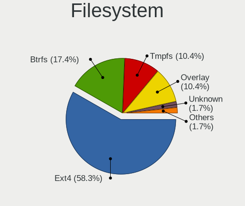

| Type    | Notebooks | Percent |
|---------|-----------|---------|
| Ext4    | 34        | 72.34%  |
| Overlay | 6         | 12.77%  |
| Btrfs   | 4         | 8.51%   |
| Unknown | 2         | 4.26%   |
| Zfs     | 1         | 2.13%   |

Part. scheme
------------

Scheme of partitioning

| Type    | Notebooks | Percent |
|---------|-----------|---------|
| Unknown | 35        | 72.92%  |
| GPT     | 10        | 20.83%  |
| MBR     | 3         | 6.25%   |

Dual Boot with Linux/BSD
------------------------

Hosting more than one Linux/BSD

| Dual boot | Notebooks | Percent |
|-----------|-----------|---------|
| No        | 41        | 87.23%  |
| Yes       | 6         | 12.77%  |

Dual Boot (Win)
---------------

Hosting Linux and Windows

| Dual boot | Notebooks | Percent |
|-----------|-----------|---------|
| No        | 34        | 72.34%  |
| Yes       | 13        | 27.66%  |

Board
-----

Vendor
------

Motherboard manufacturer

| Name             | Notebooks | Percent |
|------------------|-----------|---------|
| Hewlett-Packard  | 13        | 28.26%  |
| Dell             | 11        | 23.91%  |
| Acer             | 4         | 8.7%    |
| Toshiba          | 3         | 6.52%   |
| Lenovo           | 3         | 6.52%   |
| Apple            | 3         | 6.52%   |
| Sony             | 2         | 4.35%   |
| ASUSTek Computer | 2         | 4.35%   |
| TUXEDO           | 1         | 2.17%   |
| MSI              | 1         | 2.17%   |
| GPU Company      | 1         | 2.17%   |
| AZW              | 1         | 2.17%   |
| AMI              | 1         | 2.17%   |

Model
-----

Motherboard model

| Name                                | Notebooks | Percent |
|-------------------------------------|-----------|---------|
| Dell Vostro 3550                    | 3         | 6.52%   |
| TUXEDO Aura 15 Gen1                 | 1         | 2.17%   |
| Toshiba Satellite P755              | 1         | 2.17%   |
| Toshiba Satellite L655              | 1         | 2.17%   |
| Toshiba Satellite C55-C             | 1         | 2.17%   |
| Sony VPCEA36FX                      | 1         | 2.17%   |
| Sony VGN-CS320J                     | 1         | 2.17%   |
| MSI GF65 Thin 10SDR                 | 1         | 2.17%   |
| Lenovo ThinkPad T410 2516ADU        | 1         | 2.17%   |
| Lenovo IdeaPad 120S-11IAP 81A4      | 1         | 2.17%   |
| Lenovo G50-45 80E3                  | 1         | 2.17%   |
| HP Stream Laptop 14-CB1xxx          | 1         | 2.17%   |
| HP ProBook 6560b                    | 1         | 2.17%   |
| HP ProBook 6450b                    | 1         | 2.17%   |
| HP Pavilion Gaming Laptop 15-dk0xxx | 1         | 2.17%   |
| HP Notebook                         | 1         | 2.17%   |
| HP Laptop 15-dy1xxx                 | 1         | 2.17%   |
| HP Laptop 15-dw0xxx                 | 1         | 2.17%   |
| HP Laptop 14-dk1xxx                 | 1         | 2.17%   |
| HP ENVY Laptop 17m-bw0xxx           | 1         | 2.17%   |
| HP ENVY Laptop 17-ce1xxx            | 1         | 2.17%   |
| HP ENVY dv7                         | 1         | 2.17%   |
| HP EliteBook 840 G2                 | 1         | 2.17%   |
| HP Compaq nc6400 (RB516UT#ABA)      | 1         | 2.17%   |
| GPU Company GWTN156-9               | 1         | 2.17%   |
| Dell Venue 11 Pro 7130 MS           | 1         | 2.17%   |
| Dell Latitude E6410                 | 1         | 2.17%   |
| Dell Latitude E6330                 | 1         | 2.17%   |
| Dell Inspiron N5110                 | 1         | 2.17%   |
| Dell Inspiron MP061                 | 1         | 2.17%   |
| Dell Inspiron 5559                  | 1         | 2.17%   |
| Dell Inspiron 17-7778               | 1         | 2.17%   |
| Dell Inspiron 11-3168               | 1         | 2.17%   |
| AZW GT-R                            | 1         | 2.17%   |
| ASUS X540SAA                        | 1         | 2.17%   |
| ASUS K53E                           | 1         | 2.17%   |
| Apple MacBookPro8,1                 | 1         | 2.17%   |
| Apple MacBookPro5,1                 | 1         | 2.17%   |
| Apple MacBook4,1                    | 1         | 2.17%   |
| AMI Intel                           | 1         | 2.17%   |
| Acer Swift SF315-52                 | 1         | 2.17%   |
| Acer Swift SF314-51                 | 1         | 2.17%   |
| Acer Aspire E5-575                  | 1         | 2.17%   |
| Acer Aspire E5-571                  | 1         | 2.17%   |

Model Family
------------

Motherboard model prefix

| Name                  | Notebooks | Percent |
|-----------------------|-----------|---------|
| Dell Inspiron         | 5         | 10.87%  |
| Toshiba Satellite     | 3         | 6.52%   |
| HP Laptop             | 3         | 6.52%   |
| HP ENVY               | 3         | 6.52%   |
| Dell Vostro           | 3         | 6.52%   |
| HP ProBook            | 2         | 4.35%   |
| Dell Latitude         | 2         | 4.35%   |
| Acer Swift            | 2         | 4.35%   |
| Acer Aspire           | 2         | 4.35%   |
| TUXEDO Aura           | 1         | 2.17%   |
| Sony VPCEA36FX        | 1         | 2.17%   |
| Sony VGN-CS320J       | 1         | 2.17%   |
| MSI GF65              | 1         | 2.17%   |
| Lenovo ThinkPad       | 1         | 2.17%   |
| Lenovo IdeaPad        | 1         | 2.17%   |
| Lenovo G50-45         | 1         | 2.17%   |
| HP Stream             | 1         | 2.17%   |
| HP Pavilion           | 1         | 2.17%   |
| HP Notebook           | 1         | 2.17%   |
| HP EliteBook          | 1         | 2.17%   |
| HP Compaq             | 1         | 2.17%   |
| GPU Company GWTN156-9 | 1         | 2.17%   |
| Dell Venue            | 1         | 2.17%   |
| AZW GT-R              | 1         | 2.17%   |
| ASUS X540SAA          | 1         | 2.17%   |
| ASUS K53E             | 1         | 2.17%   |
| Apple MacBookPro8     | 1         | 2.17%   |
| Apple MacBookPro5     | 1         | 2.17%   |
| Apple MacBook4        | 1         | 2.17%   |
| AMI Intel             | 1         | 2.17%   |

MFG Year
--------

Motherboard manufacture year

| Year | Notebooks | Percent |
|------|-----------|---------|
| 2011 | 8         | 17.39%  |
| 2019 | 7         | 15.22%  |
| 2015 | 5         | 10.87%  |
| 2020 | 4         | 8.7%    |
| 2010 | 4         | 8.7%    |
| 2018 | 3         | 6.52%   |
| 2016 | 3         | 6.52%   |
| 2012 | 3         | 6.52%   |
| 2014 | 2         | 4.35%   |
| 2009 | 2         | 4.35%   |
| 2021 | 1         | 2.17%   |
| 2017 | 1         | 2.17%   |
| 2008 | 1         | 2.17%   |
| 2006 | 1         | 2.17%   |
| 2005 | 1         | 2.17%   |

Form Factor
-----------

Physical design of the computer

| Name     | Notebooks | Percent |
|----------|-----------|---------|
| Notebook | 46        | 100%    |

Secure Boot
-----------

Enabled or disabled

| State    | Notebooks | Percent |
|----------|-----------|---------|
| Disabled | 41        | 89.13%  |
| Enabled  | 5         | 10.87%  |

Coreboot
--------

Have coreboot on board

| Used | Notebooks | Percent |
|------|-----------|---------|
| No   | 46        | 100%    |

RAM Size
--------

Total RAM memory

| Size in GB | Notebooks | Percent |
|------------|-----------|---------|
| 4.01-8.0   | 18        | 37.5%   |
| 3.01-4.0   | 13        | 27.08%  |
| 8.01-16.0  | 11        | 22.92%  |
| 16.01-24.0 | 3         | 6.25%   |
| 1.01-2.0   | 3         | 6.25%   |

RAM Used
--------

Used RAM memory

| Used GB  | Notebooks | Percent |
|----------|-----------|---------|
| 1.01-2.0 | 30        | 52.63%  |
| 2.01-3.0 | 11        | 19.3%   |
| 3.01-4.0 | 8         | 14.04%  |
| 4.01-8.0 | 4         | 7.02%   |
| 0.51-1.0 | 4         | 7.02%   |

Total Drives
------------

Number of drives on board

| Drives | Notebooks | Percent |
|--------|-----------|---------|
| 1      | 32        | 66.67%  |
| 2      | 11        | 22.92%  |
| 3      | 4         | 8.33%   |
| 4      | 1         | 2.08%   |

Has CD-ROM
----------

Has CD-ROM on board

| Presented | Notebooks | Percent |
|-----------|-----------|---------|
| No        | 26        | 55.32%  |
| Yes       | 21        | 44.68%  |

Has Ethernet
------------

Has Ethernet on board

| Presented | Notebooks | Percent |
|-----------|-----------|---------|
| Yes       | 37        | 80.43%  |
| No        | 9         | 19.57%  |

Has WiFi
--------

Has WiFi module

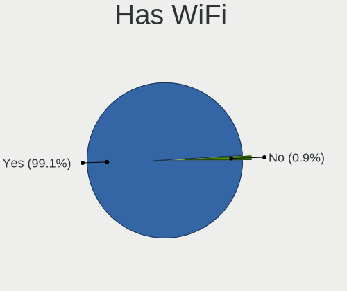

| Presented | Notebooks | Percent |
|-----------|-----------|---------|
| Yes       | 45        | 97.83%  |
| No        | 1         | 2.17%   |

Has Bluetooth
-------------

Has Bluetooth module

| Presented | Notebooks | Percent |
|-----------|-----------|---------|
| Yes       | 34        | 73.91%  |
| No        | 12        | 26.09%  |

Location
--------

Country
-------

Geographic location (country)

| Country     | Notebooks | Percent |
|-------------|-----------|---------|
| Puerto Rico | 46        | 100%    |

City
----

Geographic location (city)

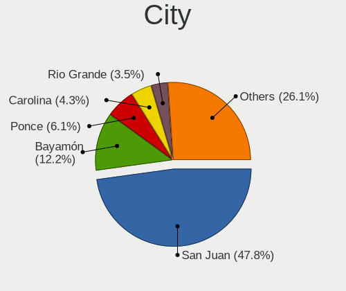

| City          | Notebooks | Percent |
|---------------|-----------|---------|
| San Juan      | 24        | 48.98%  |
| Bayamón      | 9         | 18.37%  |
| Carolina      | 5         | 10.2%   |
| Ponce         | 3         | 6.12%   |
| Lares         | 2         | 4.08%   |
| Cayey         | 2         | 4.08%   |
| Sabana Grande | 1         | 2.04%   |
| Rio Grande    | 1         | 2.04%   |
| Guayama       | 1         | 2.04%   |
| Caguas        | 1         | 2.04%   |

Drives
------

Drive Vendor
------------

Hard drive vendors

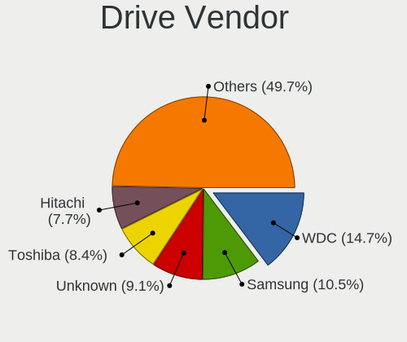

| Vendor              | Notebooks | Drives | Percent |
|---------------------|-----------|--------|---------|
| WDC                 | 13        | 16     | 20.63%  |
| Toshiba             | 7         | 7      | 11.11%  |
| Crucial             | 7         | 11     | 11.11%  |
| Hitachi             | 6         | 21     | 9.52%   |
| Unknown             | 5         | 6      | 7.94%   |
| Seagate             | 4         | 7      | 6.35%   |
| Samsung Electronics | 3         | 4      | 4.76%   |
| SanDisk             | 2         | 2      | 3.17%   |
| Intel               | 2         | 3      | 3.17%   |
| External            | 2         | 3      | 3.17%   |
| A-DATA Technology   | 2         | 2      | 3.17%   |
| W800SH              | 1         | 1      | 1.59%   |
| SK hynix            | 1         | 2      | 1.59%   |
| Silicon Motion      | 1         | 1      | 1.59%   |
| PNY                 | 1         | 1      | 1.59%   |
| Micron Technology   | 1         | 1      | 1.59%   |
| Kingston            | 1         | 1      | 1.59%   |
| HGST                | 1         | 1      | 1.59%   |
| China               | 1         | 2      | 1.59%   |
| Axiom               | 1         | 3      | 1.59%   |
| Unknown             | 1         | 1      | 1.59%   |

Drive Model
-----------

Hard drive models

| Model                                | Notebooks | Percent |
|--------------------------------------|-----------|---------|
| Crucial CT240BX500SSD1 240GB         | 4         | 5.97%   |
| WDC WD5000LPVT-22G33T0 500GB         | 3         | 4.48%   |
| WDC WD2500BEVS-60UST0 250GB          | 2         | 2.99%   |
| Unknown MMC Card  2GB                | 2         | 2.99%   |
| Toshiba MK3261GSYN 320GB             | 2         | 2.99%   |
| Hitachi HTS547550A9E384 500GB        | 2         | 2.99%   |
| External USB3.0 1TB                  | 2         | 2.99%   |
| Crucial CT240M500SSD1 240GB          | 2         | 2.99%   |
| WDC WDS240G2G0A-00JH30 240GB SSD     | 1         | 1.49%   |
| WDC WDBNCE0010PNC 1TB SSD            | 1         | 1.49%   |
| WDC WD5000BPVT-75HXZT1 500GB         | 1         | 1.49%   |
| WDC WD10SPZX-60Z10T0 1TB             | 1         | 1.49%   |
| WDC WD10SPZX-21Z10T0 1TB             | 1         | 1.49%   |
| WDC WD10SPCX-75KHST0 1TB             | 1         | 1.49%   |
| WDC WD10JPVX-22JC3T0 1TB             | 1         | 1.49%   |
| WDC PC SN530 SDBPNPZ-512G-1032 512GB | 1         | 1.49%   |
| W800SH 512GB SSD                     | 1         | 1.49%   |
| Unknown MMC Card  64GB               | 1         | 1.49%   |
| Unknown MMC Card  10GB               | 1         | 1.49%   |
| Unknown HBG4a2  32GB                 | 1         | 1.49%   |
| Unknown DA4064  64GB                 | 1         | 1.49%   |
| Toshiba MQ04ABF100 1TB               | 1         | 1.49%   |
| Toshiba MQ01ABF050 500GB             | 1         | 1.49%   |
| Toshiba MQ01ABD100 1TB               | 1         | 1.49%   |
| Toshiba MK3276GSX 320GB              | 1         | 1.49%   |
| Toshiba MK3254GSY 320GB              | 1         | 1.49%   |
| SK hynix NVMe SSD Drive 256GB        | 1         | 1.49%   |
| Silicon Motion 256GB                 | 1         | 1.49%   |
| Seagate ST98823AS 80GB               | 1         | 1.49%   |
| Seagate ST9500420AS 500GB            | 1         | 1.49%   |
| Seagate ST500LM012 HN-M500MBB 500GB  | 1         | 1.49%   |
| Seagate ST1000LM014-1EJ164 1TB       | 1         | 1.49%   |
| SanDisk SD6SP1M128G1012 128GB SSD    | 1         | 1.49%   |
| SanDisk NVMe SSD Drive 512GB         | 1         | 1.49%   |
| Samsung SSD 840 EVO 750GB            | 1         | 1.49%   |
| Samsung MZNLN128HAHQ-000H1 128GB SSD | 1         | 1.49%   |
| Samsung MZNLH128HBHQ-000H1 128GB SSD | 1         | 1.49%   |
| PNY CS900 120GB SSD                  | 1         | 1.49%   |
| Micron 1100_MTFDDAV256TBN 256GB SSD  | 1         | 1.49%   |
| Kingston SKC2500M8250G 250GB         | 1         | 1.49%   |
| Intel NVMe SSD Drive 32GB            | 1         | 1.49%   |
| Intel MEMPEK1J016GAH 16GB            | 1         | 1.49%   |
| Intel HBRPEKNX0202AH 512GB           | 1         | 1.49%   |
| Hitachi HTS547564A9E384 640GB        | 1         | 1.49%   |
| Hitachi HTS545032B9A300 320GB        | 1         | 1.49%   |
| Hitachi HTS545025B9A300 250GB        | 1         | 1.49%   |
| Hitachi HTS543232A7A384 320GB        | 1         | 1.49%   |
| Hitachi HTS542525K9SA00 250GB        | 1         | 1.49%   |
| Hitachi HTS541010A9E680 1TB          | 1         | 1.49%   |
| HGST HCC545050A7E380 500GB           | 1         | 1.49%   |
| Crucial CT250MX500SSD4 250GB         | 1         | 1.49%   |
| China SATA SSD 120GB                 | 1         | 1.49%   |
| Axiom 500GB                          | 1         | 1.49%   |
| A-DATA SU655 120GB SSD               | 1         | 1.49%   |
| A-DATA SU630 480GB SSD               | 1         | 1.49%   |
| Unknown                              | 1         | 1.49%   |

HDD Vendor
----------

Hard disk drive vendors

| Vendor  | Notebooks | Drives | Percent |
|---------|-----------|--------|---------|
| WDC     | 10        | 11     | 35.71%  |
| Toshiba | 7         | 7      | 25%     |
| Hitachi | 6         | 21     | 21.43%  |
| Seagate | 4         | 7      | 14.29%  |
| HGST    | 1         | 1      | 3.57%   |

SSD Vendor
----------

Solid state drive vendors

| Vendor              | Notebooks | Drives | Percent |
|---------------------|-----------|--------|---------|
| Crucial             | 7         | 11     | 36.84%  |
| Samsung Electronics | 3         | 4      | 15.79%  |
| WDC                 | 2         | 3      | 10.53%  |
| A-DATA Technology   | 2         | 2      | 10.53%  |
| W800SH              | 1         | 1      | 5.26%   |
| SanDisk             | 1         | 1      | 5.26%   |
| PNY                 | 1         | 1      | 5.26%   |
| Micron Technology   | 1         | 1      | 5.26%   |
| China               | 1         | 2      | 5.26%   |

Drive Kind
----------

HDD or SSD

| Kind    | Notebooks | Drives | Percent |
|---------|-----------|--------|---------|
| HDD     | 26        | 47     | 43.33%  |
| SSD     | 19        | 26     | 31.67%  |
| NVMe    | 8         | 13     | 13.33%  |
| MMC     | 6         | 7      | 10%     |
| Unknown | 1         | 3      | 1.67%   |

Drive Connector
---------------

SATA, SAS, NVMe, etc.

| Type | Notebooks | Drives | Percent |
|------|-----------|--------|---------|
| SATA | 41        | 76     | 74.55%  |
| NVMe | 6         | 10     | 10.91%  |
| MMC  | 6         | 7      | 10.91%  |
| SAS  | 2         | 3      | 3.64%   |

Drive Size
----------

Size of hard drive

| Size in TB | Notebooks | Drives | Percent |
|------------|-----------|--------|---------|
| 0.01-0.5   | 29        | 54     | 70.73%  |
| 0.51-1.0   | 12        | 19     | 29.27%  |

Space Total
-----------

Amount of disk space available on the file system

| Size in GB     | Notebooks | Percent |
|----------------|-----------|---------|
| 101-250        | 15        | 27.78%  |
| 501-1000       | 13        | 24.07%  |
| 251-500        | 11        | 20.37%  |
| 1-20           | 7         | 12.96%  |
| 1001-2000      | 3         | 5.56%   |
| 21-50          | 2         | 3.7%    |
| More than 3000 | 1         | 1.85%   |
| 51-100         | 1         | 1.85%   |
| Unknown        | 1         | 1.85%   |

Space Used
----------

Amount of used disk space

| Used GB   | Notebooks | Percent |
|-----------|-----------|---------|
| 1-20      | 21        | 36.21%  |
| 21-50     | 15        | 25.86%  |
| 101-250   | 7         | 12.07%  |
| 51-100    | 6         | 10.34%  |
| 501-1000  | 4         | 6.9%    |
| 251-500   | 3         | 5.17%   |
| 1001-2000 | 1         | 1.72%   |
| Unknown   | 1         | 1.72%   |

Malfunc. Drives
---------------

Drive models with a malfunction

| Model                                            | Notebooks | Drives | Percent |
|--------------------------------------------------|-----------|--------|---------|
| WDC WD2500BEVS-60UST0 250GB                      | 1         | 1      | 20%     |
| Toshiba MQ01ABD100 1TB                           | 1         | 1      | 20%     |
| Samsung Electronics MZNLH128HBHQ-000H1 128GB SSD | 1         | 1      | 20%     |
| Micron Technology 1100_MTFDDAV256TBN 256GB SSD   | 1         | 1      | 20%     |
| Hitachi HTS545025B9A300 250GB                    | 1         | 1      | 20%     |

Malfunc. Drive Vendor
---------------------

Vendors of faulty drives

| Vendor              | Notebooks | Drives | Percent |
|---------------------|-----------|--------|---------|
| WDC                 | 1         | 1      | 20%     |
| Toshiba             | 1         | 1      | 20%     |
| Samsung Electronics | 1         | 1      | 20%     |
| Micron Technology   | 1         | 1      | 20%     |
| Hitachi             | 1         | 1      | 20%     |

Malfunc. HDD Vendor
-------------------

Vendors of faulty HDD drives

| Vendor  | Notebooks | Drives | Percent |
|---------|-----------|--------|---------|
| WDC     | 1         | 1      | 33.33%  |
| Toshiba | 1         | 1      | 33.33%  |
| Hitachi | 1         | 1      | 33.33%  |

Malfunc. Drive Kind
-------------------

Kinds of faulty drives

| Kind | Notebooks | Drives | Percent |
|------|-----------|--------|---------|
| HDD  | 3         | 3      | 60%     |
| SSD  | 2         | 2      | 40%     |

Failed Drives
-------------

Failed drive models

Zero info for selected period =(

Failed Drive Vendor
-------------------

Failed drive vendors

Zero info for selected period =(

Drive Status
------------

Number of failed and malfunc. drives

| Status   | Notebooks | Drives | Percent |
|----------|-----------|--------|---------|
| Detected | 36        | 80     | 73.47%  |
| Works    | 8         | 11     | 16.33%  |
| Malfunc  | 5         | 5      | 10.2%   |

Storage controller
------------------

Storage Vendor
--------------

Storage controller vendors

| Vendor                      | Notebooks | Percent |
|-----------------------------|-----------|---------|
| Intel                       | 37        | 77.08%  |
| AMD                         | 5         | 10.42%  |
| SK hynix                    | 1         | 2.08%   |
| Silicon Motion              | 1         | 2.08%   |
| SanDisk                     | 1         | 2.08%   |
| Nvidia                      | 1         | 2.08%   |
| Kingston Technology Company | 1         | 2.08%   |
| ASMedia Technology          | 1         | 2.08%   |

Storage Model
-------------

Storage controller models

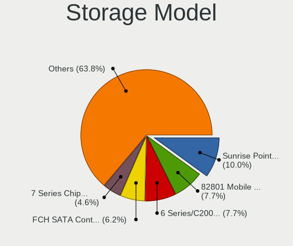

| Model                                                                            | Notebooks | Percent |
|----------------------------------------------------------------------------------|-----------|---------|
| Intel 6 Series/C200 Series Chipset Family 6 port Mobile SATA AHCI Controller     | 8         | 15.38%  |
| Intel 82801 Mobile SATA Controller [RAID mode]                                   | 6         | 11.54%  |
| AMD FCH SATA Controller [AHCI mode]                                              | 5         | 9.62%   |
| Intel Sunrise Point-LP SATA Controller [AHCI mode]                               | 4         | 7.69%   |
| Intel Wildcat Point-LP SATA Controller [AHCI Mode]                               | 2         | 3.85%   |
| Intel Celeron/Pentium Silver Processor SATA Controller                           | 2         | 3.85%   |
| Intel Atom/Celeron/Pentium Processor x5-E8000/J3xxx/N3xxx Series SATA Controller | 2         | 3.85%   |
| Intel 82801GBM/GHM (ICH7-M Family) SATA Controller [IDE mode]                    | 2         | 3.85%   |
| Intel 8 Series SATA Controller 1 [AHCI mode]                                     | 2         | 3.85%   |
| Intel 5 Series/3400 Series Chipset 6 port SATA AHCI Controller                   | 2         | 3.85%   |
| Intel 5 Series/3400 Series Chipset 4 port SATA AHCI Controller                   | 2         | 3.85%   |
| SK hynix BC501 NVMe Solid State Drive                                            | 1         | 1.92%   |
| Silicon Motion SM2263EN/SM2263XT SSD Controller                                  | 1         | 1.92%   |
| SanDisk WD Blue SN550 NVMe SSD                                                   | 1         | 1.92%   |
| Nvidia MCP79 AHCI Controller                                                     | 1         | 1.92%   |
| Kingston Company KC2000 NVMe SSD                                                 | 1         | 1.92%   |
| Intel Tiger Lake-LP SATA Controller                                              | 1         | 1.92%   |
| Intel NVMe Optane Memory Series                                                  | 1         | 1.92%   |
| Intel Non-Volatile memory controller                                             | 1         | 1.92%   |
| Intel Celeron N3350/Pentium N4200/Atom E3900 Series SATA AHCI Controller         | 1         | 1.92%   |
| Intel 82801IBM/IEM (ICH9M/ICH9M-E) 4 port SATA Controller [AHCI mode]            | 1         | 1.92%   |
| Intel 82801HM/HEM (ICH8M/ICH8M-E) SATA Controller [AHCI mode]                    | 1         | 1.92%   |
| Intel 82801HM/HEM (ICH8M/ICH8M-E) IDE Controller                                 | 1         | 1.92%   |
| Intel 7 Series Chipset Family 6-port SATA Controller [AHCI mode]                 | 1         | 1.92%   |
| ASMedia ASM1062 Serial ATA Controller                                            | 1         | 1.92%   |
| AMD FCH IDE Controller                                                           | 1         | 1.92%   |

Storage Kind
------------

Kind of storage controller (IDE, SATA, NVMe, SAS, ...)

| Kind | Notebooks | Percent |
|------|-----------|---------|
| SATA | 35        | 68.63%  |
| RAID | 6         | 11.76%  |
| NVMe | 6         | 11.76%  |
| IDE  | 4         | 7.84%   |

Processor
---------

CPU Vendor
----------

Processor vendors

| Vendor | Notebooks | Percent |
|--------|-----------|---------|
| Intel  | 40        | 86.96%  |
| AMD    | 6         | 13.04%  |

CPU Model
---------

Processor models

| Model                                         | Notebooks | Percent |
|-----------------------------------------------|-----------|---------|
| Intel Core i5-2430M CPU @ 2.40GHz             | 3         | 6.52%   |
| Intel Core i7-6500U CPU @ 2.50GHz             | 2         | 4.35%   |
| Intel Core i5-5200U CPU @ 2.20GHz             | 2         | 4.35%   |
| Intel Pentium Silver N5000 CPU @ 1.10GHz      | 1         | 2.17%   |
| Intel Pentium CPU P6100 @ 2.00GHz             | 1         | 2.17%   |
| Intel Pentium CPU N3710 @ 1.60GHz             | 1         | 2.17%   |
| Intel Genuine CPU T2250 @ 1.73GHz             | 1         | 2.17%   |
| Intel Core i7-8550U CPU @ 1.80GHz             | 1         | 2.17%   |
| Intel Core i7-3540M CPU @ 3.00GHz             | 1         | 2.17%   |
| Intel Core i7-2640M CPU @ 2.80GHz             | 1         | 2.17%   |
| Intel Core i7-10750H CPU @ 2.60GHz            | 1         | 2.17%   |
| Intel Core i7-10510U CPU @ 1.80GHz            | 1         | 2.17%   |
| Intel Core i5-9300H CPU @ 2.40GHz             | 1         | 2.17%   |
| Intel Core i5-8250U CPU @ 1.60GHz             | 1         | 2.17%   |
| Intel Core i5-6200U CPU @ 2.30GHz             | 1         | 2.17%   |
| Intel Core i5-4210U CPU @ 1.70GHz             | 1         | 2.17%   |
| Intel Core i5-2450M CPU @ 2.50GHz             | 1         | 2.17%   |
| Intel Core i5-2410M CPU @ 2.30GHz             | 1         | 2.17%   |
| Intel Core i5 CPU M 560 @ 2.67GHz             | 1         | 2.17%   |
| Intel Core i5 CPU M 520 @ 2.40GHz             | 1         | 2.17%   |
| Intel Core i5 CPU M 460 @ 2.53GHz             | 1         | 2.17%   |
| Intel Core i3-7100U CPU @ 2.40GHz             | 1         | 2.17%   |
| Intel Core i3-4020Y CPU @ 1.50GHz             | 1         | 2.17%   |
| Intel Core i3-2350M CPU @ 2.30GHz             | 1         | 2.17%   |
| Intel Core i3-2310M CPU @ 2.10GHz             | 1         | 2.17%   |
| Intel Core i3-1005G1 CPU @ 1.20GHz            | 1         | 2.17%   |
| Intel Core i3 CPU M 370 @ 2.40GHz             | 1         | 2.17%   |
| Intel Core 2 Duo CPU T9400 @ 2.53GHz          | 1         | 2.17%   |
| Intel Core 2 Duo CPU T8300 @ 2.40GHz          | 1         | 2.17%   |
| Intel Core 2 Duo CPU T6500 @ 2.10GHz          | 1         | 2.17%   |
| Intel Core 2 CPU T5600 @ 1.83GHz              | 1         | 2.17%   |
| Intel Celeron N4000 CPU @ 1.10GHz             | 1         | 2.17%   |
| Intel Celeron J4115 CPU @ 1.80GHz             | 1         | 2.17%   |
| Intel Celeron CPU N3350 @ 1.10GHz             | 1         | 2.17%   |
| Intel Celeron CPU N3050 @ 1.60GHz             | 1         | 2.17%   |
| Intel 11th Gen Core i5-1135G7 @ 2.40GHz       | 1         | 2.17%   |
| AMD Ryzen 5 4500U with Radeon Graphics        | 1         | 2.17%   |
| AMD Ryzen 5 3550H with Radeon Vega Mobile Gfx | 1         | 2.17%   |
| AMD Ryzen 3 3300U with Radeon Vega Mobile Gfx | 1         | 2.17%   |
| AMD A8-7050 Radeon R5, 6 Compute Cores 2C+4G  | 1         | 2.17%   |
| AMD A8-6410 APU with AMD Radeon R5 Graphics   | 1         | 2.17%   |
| AMD A10-4600M APU with Radeon HD Graphics     | 1         | 2.17%   |

CPU Model Family
----------------

Processor model prefix

| Model                | Notebooks | Percent |
|----------------------|-----------|---------|
| Intel Core i5        | 14        | 30.43%  |
| Intel Core i7        | 7         | 15.22%  |
| Intel Core i3        | 6         | 13.04%  |
| Intel Celeron        | 4         | 8.7%    |
| Intel Core 2 Duo     | 3         | 6.52%   |
| Intel Pentium        | 2         | 4.35%   |
| AMD Ryzen 5          | 2         | 4.35%   |
| AMD A8               | 2         | 4.35%   |
| Other                | 1         | 2.17%   |
| Intel Pentium Silver | 1         | 2.17%   |
| Intel Genuine        | 1         | 2.17%   |
| Intel Core 2         | 1         | 2.17%   |
| AMD Ryzen 3          | 1         | 2.17%   |
| AMD A10              | 1         | 2.17%   |

CPU Cores
---------

Number of processor cores

| Number | Notebooks | Percent |
|--------|-----------|---------|
| 2      | 32        | 69.57%  |
| 4      | 11        | 23.91%  |
| 6      | 2         | 4.35%   |
| 1      | 1         | 2.17%   |

CPU Sockets
-----------

Number of sockets

| Number | Notebooks | Percent |
|--------|-----------|---------|
| 1      | 46        | 100%    |

CPU Threads
-----------

Threads per core (Hyper-Threading)

| Number | Notebooks | Percent |
|--------|-----------|---------|
| 2      | 31        | 67.39%  |
| 1      | 15        | 32.61%  |

CPU Op-Modes
------------

CPU Operation Modes (32-bit, 64-bit)

| Op mode        | Notebooks | Percent |
|----------------|-----------|---------|
| 32-bit, 64-bit | 45        | 97.83%  |
| 32-bit         | 1         | 2.17%   |

CPU Microcode
-------------

Microcode number

| Number     | Notebooks | Percent |
|------------|-----------|---------|
| 0x206a7    | 8         | 17.02%  |
| Unknown    | 6         | 12.77%  |
| 0x20655    | 4         | 8.51%   |
| 0x706a1    | 3         | 6.38%   |
| 0x806ea    | 2         | 4.26%   |
| 0x406e3    | 2         | 4.26%   |
| 0x306d4    | 2         | 4.26%   |
| 0x08108109 | 2         | 4.26%   |
| 0xa0652    | 1         | 2.13%   |
| 0x906ea    | 1         | 2.13%   |
| 0x806ec    | 1         | 2.13%   |
| 0x806e9    | 1         | 2.13%   |
| 0x806c1    | 1         | 2.13%   |
| 0x706e5    | 1         | 2.13%   |
| 0x6e8      | 1         | 2.13%   |
| 0x506c9    | 1         | 2.13%   |
| 0x406c4    | 1         | 2.13%   |
| 0x406c3    | 1         | 2.13%   |
| 0x40651    | 1         | 2.13%   |
| 0x306a9    | 1         | 2.13%   |
| 0x20652    | 1         | 2.13%   |
| 0x10676    | 1         | 2.13%   |
| 0x08600106 | 1         | 2.13%   |
| 0x07030105 | 1         | 2.13%   |
| 0x06003106 | 1         | 2.13%   |
| 0x06001119 | 1         | 2.13%   |

CPU Microarch
-------------

Microarchitecture

| Name          | Notebooks | Percent |
|---------------|-----------|---------|
| SandyBridge   | 8         | 17.39%  |
| Westmere      | 5         | 10.87%  |
| KabyLake      | 5         | 10.87%  |
| Skylake       | 3         | 6.52%   |
| Penryn        | 3         | 6.52%   |
| Goldmont plus | 3         | 6.52%   |
| Zen+          | 2         | 4.35%   |
| Silvermont    | 2         | 4.35%   |
| Haswell       | 2         | 4.35%   |
| Broadwell     | 2         | 4.35%   |
| Zen 2         | 1         | 2.17%   |
| TigerLake     | 1         | 2.17%   |
| Steamroller   | 1         | 2.17%   |
| Puma          | 1         | 2.17%   |
| Piledriver    | 1         | 2.17%   |
| P6            | 1         | 2.17%   |
| IvyBridge     | 1         | 2.17%   |
| IceLake       | 1         | 2.17%   |
| Goldmont      | 1         | 2.17%   |
| Core          | 1         | 2.17%   |
| CometLake     | 1         | 2.17%   |

Graphics
--------

GPU Vendor
----------

Vendors of graphics cards

| Vendor | Notebooks | Percent |
|--------|-----------|---------|
| Intel  | 39        | 72.22%  |
| AMD    | 9         | 16.67%  |
| Nvidia | 6         | 11.11%  |

GPU Model
---------

Graphics card models

| Model                                                                                    | Notebooks | Percent |
|------------------------------------------------------------------------------------------|-----------|---------|
| Intel 2nd Generation Core Processor Family Integrated Graphics Controller                | 8         | 13.79%  |
| Intel Core Processor Integrated Graphics Controller                                      | 5         | 8.62%   |
| Intel Skylake GT2 [HD Graphics 520]                                                      | 3         | 5.17%   |
| AMD Whistler [Radeon HD 6630M/6650M/6750M/7670M/7690M]                                   | 3         | 5.17%   |
| Intel UHD Graphics 620                                                                   | 2         | 3.45%   |
| Intel Mobile 945GM/GMS/GME, 943/940GML Express Integrated Graphics Controller            | 2         | 3.45%   |
| Intel Mobile 945GM/GMS, 943/940GML Express Integrated Graphics Controller                | 2         | 3.45%   |
| Intel HD Graphics 5500                                                                   | 2         | 3.45%   |
| Intel GeminiLake [UHD Graphics 600]                                                      | 2         | 3.45%   |
| Intel Atom/Celeron/Pentium Processor x5-E8000/J3xxx/N3xxx Integrated Graphics Controller | 2         | 3.45%   |
| AMD Picasso/Raven 2 [Radeon Vega Series / Radeon Vega Mobile Series]                     | 2         | 3.45%   |
| Nvidia TU116M [GeForce GTX 1660 Ti Mobile]                                               | 1         | 1.72%   |
| Nvidia GP108M [GeForce MX250]                                                            | 1         | 1.72%   |
| Nvidia GP108M [GeForce MX150]                                                            | 1         | 1.72%   |
| Nvidia GP107M [GeForce GTX 1050 3 GB Max-Q]                                              | 1         | 1.72%   |
| Nvidia GM108M [GeForce 940MX]                                                            | 1         | 1.72%   |
| Nvidia G96CM [GeForce 9600M GT]                                                          | 1         | 1.72%   |
| Nvidia C79 [GeForce 9400M]                                                               | 1         | 1.72%   |
| Intel TigerLake-LP GT2 [Iris Xe Graphics]                                                | 1         | 1.72%   |
| Intel Mobile GM965/GL960 Integrated Graphics Controller (secondary)                      | 1         | 1.72%   |
| Intel Mobile GM965/GL960 Integrated Graphics Controller (primary)                        | 1         | 1.72%   |
| Intel Mobile 4 Series Chipset Integrated Graphics Controller                             | 1         | 1.72%   |
| Intel Iris Plus Graphics G1 (Ice Lake)                                                   | 1         | 1.72%   |
| Intel HD Graphics 620                                                                    | 1         | 1.72%   |
| Intel HD Graphics 500                                                                    | 1         | 1.72%   |
| Intel Haswell-ULT Integrated Graphics Controller                                         | 1         | 1.72%   |
| Intel Haswell-ULT High Definition Audio Controller [HD Graphics]                         | 1         | 1.72%   |
| Intel GeminiLake [UHD Graphics 605]                                                      | 1         | 1.72%   |
| Intel CometLake-U GT2 [UHD Graphics]                                                     | 1         | 1.72%   |
| Intel CometLake-H GT2 [UHD Graphics]                                                     | 1         | 1.72%   |
| Intel CoffeeLake-H GT2 [UHD Graphics 630]                                                | 1         | 1.72%   |
| Intel 3rd Gen Core processor Graphics Controller                                         | 1         | 1.72%   |
| AMD Trinity [Radeon HD 7660G]                                                            | 1         | 1.72%   |
| AMD Renoir                                                                               | 1         | 1.72%   |
| AMD Mullins [Radeon R4/R5 Graphics]                                                      | 1         | 1.72%   |
| AMD Kaveri [Radeon R5 Graphics]                                                          | 1         | 1.72%   |

GPU Combo
---------

Combinations of graphics cards

| Name           | Notebooks | Percent |
|----------------|-----------|---------|
| 1 x Intel      | 31        | 67.39%  |
| 1 x AMD        | 6         | 13.04%  |
| Intel + Nvidia | 5         | 10.87%  |
| Intel + AMD    | 3         | 6.52%   |
| 2 x Nvidia     | 1         | 2.17%   |

GPU Driver
----------

Free vs proprietary

| Driver      | Notebooks | Percent |
|-------------|-----------|---------|
| Free        | 44        | 91.67%  |
| Proprietary | 3         | 6.25%   |
| Unknown     | 1         | 2.08%   |

GPU Memory
----------

Total video memory

| Size in GB | Notebooks | Percent |
|------------|-----------|---------|
| Unknown    | 33        | 68.75%  |
| 0.51-1.0   | 5         | 10.42%  |
| 0.01-0.5   | 4         | 8.33%   |
| 3.01-4.0   | 2         | 4.17%   |
| 1.01-2.0   | 2         | 4.17%   |
| 5.01-6.0   | 1         | 2.08%   |
| 2.01-3.0   | 1         | 2.08%   |

Monitor
-------

Monitor Vendor
--------------

Monitor vendors

| Vendor                  | Notebooks | Percent |
|-------------------------|-----------|---------|
| LG Display              | 8         | 16.33%  |
| Chimei Innolux          | 8         | 16.33%  |
| Samsung Electronics     | 7         | 14.29%  |
| AU Optronics            | 6         | 12.24%  |
| BOE                     | 5         | 10.2%   |
| Apple                   | 3         | 6.12%   |
| Goldstar                | 2         | 4.08%   |
| Dell                    | 2         | 4.08%   |
| Sony                    | 1         | 2.04%   |
| PANDA                   | 1         | 2.04%   |
| ONN                     | 1         | 2.04%   |
| Lenovo                  | 1         | 2.04%   |
| InnoLux Display         | 1         | 2.04%   |
| eMachines               | 1         | 2.04%   |
| Chi Mei Optoelectronics | 1         | 2.04%   |
| AOC                     | 1         | 2.04%   |

Monitor Model
-------------

Monitor models

| Model                                                                    | Notebooks | Percent |
|--------------------------------------------------------------------------|-----------|---------|
| LG Display LCD Monitor LGD02E3 1366x768 344x194mm 15.5-inch              | 3         | 6.12%   |
| AU Optronics LCD Monitor AUO21ED 1920x1080 344x194mm 15.5-inch           | 2         | 4.08%   |
| Sony TV SNYEA01 1920x1080                                                | 1         | 2.04%   |
| Samsung Electronics S27F350 SAM0D22 1920x1080 598x336mm 27.0-inch        | 1         | 2.04%   |
| Samsung Electronics LCD Monitor SEC5857 1440x900 367x230mm 17.1-inch     | 1         | 2.04%   |
| Samsung Electronics LCD Monitor SEC5541 1366x768 344x193mm 15.5-inch     | 1         | 2.04%   |
| Samsung Electronics LCD Monitor SEC5441 1366x768 344x194mm 15.5-inch     | 1         | 2.04%   |
| Samsung Electronics LCD Monitor SEC3454 1600x900 382x215mm 17.3-inch     | 1         | 2.04%   |
| Samsung Electronics LCD Monitor SDC4C48 1920x1080 309x174mm 14.0-inch    | 1         | 2.04%   |
| Samsung Electronics LCD Monitor SAM0C3C 1366x768 609x347mm 27.6-inch     | 1         | 2.04%   |
| PANDA LCD Monitor NCP0030 1920x1080 344x194mm 15.5-inch                  | 1         | 2.04%   |
| ONN ONA24HB19T01 ONN0101 1920x1080 517x323mm 24.0-inch                   | 1         | 2.04%   |
| LG Display LP156WH2-TLAA LGD0230 1366x768 344x194mm 15.5-inch            | 1         | 2.04%   |
| LG Display LCD Monitor LGD051D 1920x1080 309x174mm 14.0-inch             | 1         | 2.04%   |
| LG Display LCD Monitor LGD0513 1920x1080 382x215mm 17.3-inch             | 1         | 2.04%   |
| LG Display LCD Monitor LGD0468 1366x768 344x194mm 15.5-inch              | 1         | 2.04%   |
| LG Display LCD Monitor LGD02F1 1366x768 344x194mm 15.5-inch              | 1         | 2.04%   |
| Lenovo LCD Monitor LEN4035 1280x800 303x190mm 14.1-inch                  | 1         | 2.04%   |
| InnoLux Display LCD Monitor INL0028 1366x768 309x174mm 14.0-inch         | 1         | 2.04%   |
| Goldstar ULTRAWIDE GSM59F1 2560x1080 673x284mm 28.8-inch                 | 1         | 2.04%   |
| Goldstar FULL HD GSM5B55 1920x1080 480x270mm 21.7-inch                   | 1         | 2.04%   |
| eMachines E19T6W EMA0783 1440x900 410x260mm 19.1-inch                    | 1         | 2.04%   |
| Dell S2330MX DELD049 1920x1080 509x286mm 23.0-inch                       | 1         | 2.04%   |
| Dell DELLSE2216HV DELF072 1920x1080 476x268mm 21.5-inch                  | 1         | 2.04%   |
| Chimei Innolux LCD Monitor CMN176C 1920x1080 381x214mm 17.2-inch         | 1         | 2.04%   |
| Chimei Innolux LCD Monitor CMN15D2 1920x1080 344x193mm 15.5-inch         | 1         | 2.04%   |
| Chimei Innolux LCD Monitor CMN15CA 1366x768 344x193mm 15.5-inch          | 1         | 2.04%   |
| Chimei Innolux LCD Monitor CMN15C6 1366x768 344x193mm 15.5-inch          | 1         | 2.04%   |
| Chimei Innolux LCD Monitor CMN15BF 1366x768 344x194mm 15.5-inch          | 1         | 2.04%   |
| Chimei Innolux LCD Monitor CMN14C4 1366x768 309x173mm 13.9-inch          | 1         | 2.04%   |
| Chimei Innolux LCD Monitor CMN1495 1366x768 309x173mm 13.9-inch          | 1         | 2.04%   |
| Chimei Innolux LCD Monitor CMN1132 1366x768 256x144mm 11.6-inch          | 1         | 2.04%   |
| Chi Mei Optoelectronics LCD Monitor CMO1462 1280x800 303x189mm 14.1-inch | 1         | 2.04%   |
| BOE LCD Monitor BOE092B 1366x768 309x174mm 14.0-inch                     | 1         | 2.04%   |
| BOE LCD Monitor BOE0897 1366x768 344x194mm 15.5-inch                     | 1         | 2.04%   |
| BOE LCD Monitor BOE076F 1366x768 344x194mm 15.5-inch                     | 1         | 2.04%   |
| BOE LCD Monitor BOE06AB 1366x768 256x144mm 11.6-inch                     | 1         | 2.04%   |
| BOE LCD Monitor BOE066E 1366x768 344x194mm 15.5-inch                     | 1         | 2.04%   |
| AU Optronics LCD Monitor AUOD0ED 1920x1080 344x193mm 15.5-inch           | 1         | 2.04%   |
| AU Optronics LCD Monitor AUO26EC 1366x768 344x193mm 15.5-inch            | 1         | 2.04%   |
| AU Optronics LCD Monitor AUO22EC 1366x768 344x193mm 15.5-inch            | 1         | 2.04%   |
| AU Optronics LCD Monitor AUO109D 1920x1080 381x214mm 17.2-inch           | 1         | 2.04%   |
| Apple LCD Monitor APP9CC5 1280x800 286x179mm 13.3-inch                   | 1         | 2.04%   |
| Apple LCD Monitor APP9C84 1440x900 331x207mm 15.4-inch                   | 1         | 2.04%   |
| Apple LCD Monitor APP9C5F 1280x800 286x179mm 13.3-inch                   | 1         | 2.04%   |
| AOC 2060W3 AOC2060 1920x1080 435x239mm 19.5-inch                         | 1         | 2.04%   |

Monitor Resolution
------------------

Monitor screen resolution

| Resolution       | Notebooks | Percent |
|------------------|-----------|---------|
| 1366x768 (WXGA)  | 22        | 47.83%  |
| 1920x1080 (FHD)  | 14        | 30.43%  |
| 1280x800 (WXGA)  | 4         | 8.7%    |
| 1440x900 (WXGA+) | 3         | 6.52%   |
| 3840x2160 (4K)   | 1         | 2.17%   |
| 2560x1080        | 1         | 2.17%   |
| 1600x900 (HD+)   | 1         | 2.17%   |

Monitor Diagonal
----------------

Diagonal size in inches

| Inches | Notebooks | Percent |
|--------|-----------|---------|
| 15     | 22        | 44.9%   |
| 14     | 6         | 12.24%  |
| 17     | 5         | 10.2%   |
| 21     | 3         | 6.12%   |
| 13     | 3         | 6.12%   |
| 31     | 2         | 4.08%   |
| 11     | 2         | 4.08%   |
| 72     | 1         | 2.04%   |
| 34     | 1         | 2.04%   |
| 27     | 1         | 2.04%   |
| 23     | 1         | 2.04%   |
| 19     | 1         | 2.04%   |
| 18     | 1         | 2.04%   |

Monitor Width
-------------

Physical width

| Width in mm | Notebooks | Percent |
|-------------|-----------|---------|
| 301-350     | 28        | 57.14%  |
| 351-400     | 6         | 12.24%  |
| 401-500     | 5         | 10.2%   |
| 201-300     | 4         | 8.16%   |
| 601-700     | 2         | 4.08%   |
| 501-600     | 2         | 4.08%   |
| 701-800     | 1         | 2.04%   |
| 1501-2000   | 1         | 2.04%   |

Aspect Ratio
------------

Proportional relationship between the width and the height

| Ratio | Notebooks | Percent |
|-------|-----------|---------|
| 16/9  | 38        | 82.61%  |
| 16/10 | 7         | 15.22%  |
| 21/9  | 1         | 2.17%   |

Monitor Area
------------

Area in inch²

| Area in inch² | Notebooks | Percent |
|----------------|-----------|---------|
| 101-110        | 22        | 44.9%   |
| 81-90          | 9         | 18.37%  |
| 121-130        | 4         | 8.16%   |
| 351-500        | 3         | 6.12%   |
| 151-200        | 3         | 6.12%   |
| 51-60          | 2         | 4.08%   |
| 201-250        | 2         | 4.08%   |
| More than 1000 | 1         | 2.04%   |
| 301-350        | 1         | 2.04%   |
| 141-150        | 1         | 2.04%   |
| 131-140        | 1         | 2.04%   |

Pixel Density
-------------

Pixels per inch

| Density | Notebooks | Percent |
|---------|-----------|---------|
| 101-120 | 28        | 57.14%  |
| 121-160 | 11        | 22.45%  |
| 51-100  | 8         | 16.33%  |
| 1-50    | 2         | 4.08%   |

Multiple Monitors
-----------------

Total monitors connected

| Total | Notebooks | Percent |
|-------|-----------|---------|
| 1     | 37        | 77.08%  |
| 2     | 9         | 18.75%  |
| 0     | 2         | 4.17%   |

Network
-------

Net Controller Vendor
---------------------

Controller vendors

| Vendor                   | Notebooks | Percent |
|--------------------------|-----------|---------|
| Intel                    | 26        | 31.33%  |
| Realtek Semiconductor    | 25        | 30.12%  |
| Qualcomm Atheros         | 10        | 12.05%  |
| Broadcom                 | 6         | 7.23%   |
| Marvell Technology Group | 3         | 3.61%   |
| Broadcom Limited         | 3         | 3.61%   |
| Ralink Technology        | 2         | 2.41%   |
| NetGear                  | 2         | 2.41%   |
| TP-Link                  | 1         | 1.2%    |
| Samsung Electronics      | 1         | 1.2%    |
| Nvidia                   | 1         | 1.2%    |
| Dell                     | 1         | 1.2%    |
| Belkin Components        | 1         | 1.2%    |
| ASIX Electronics         | 1         | 1.2%    |

Net Controller Model
--------------------

Controller models

| Model                                                                                     | Notebooks | Percent |
|-------------------------------------------------------------------------------------------|-----------|---------|
| Realtek RTL8111/8168/8411 PCI Express Gigabit Ethernet Controller                         | 14        | 15.73%  |
| Realtek RTL810xE PCI Express Fast Ethernet controller                                     | 5         | 5.62%   |
| Realtek RTL8821CE 802.11ac PCIe Wireless Network Adapter                                  | 3         | 3.37%   |
| Qualcomm Atheros QCA9565 / AR9565 Wireless Network Adapter                                | 3         | 3.37%   |
| Intel Wireless 7265                                                                       | 3         | 3.37%   |
| Realtek RTL8822BE 802.11a/b/g/n/ac WiFi adapter                                           | 2         | 2.25%   |
| Realtek RTL8188CE 802.11b/g/n WiFi Adapter                                                | 2         | 2.25%   |
| Ralink RT2870/RT3070 Wireless Adapter                                                     | 2         | 2.25%   |
| Qualcomm Atheros QCA9377 802.11ac Wireless Network Adapter                                | 2         | 2.25%   |
| Intel Wi-Fi 6 AX200                                                                       | 2         | 2.25%   |
| Intel PRO/Wireless 3945ABG [Golan] Network Connection                                     | 2         | 2.25%   |
| Intel Centrino Wireless-N 1030 [Rainbow Peak]                                             | 2         | 2.25%   |
| Intel Centrino Wireless-N 1000 [Condor Peak]                                              | 2         | 2.25%   |
| Intel Centrino Advanced-N 6230 [Rainbow Peak]                                             | 2         | 2.25%   |
| Intel 82577LM Gigabit Network Connection                                                  | 2         | 2.25%   |
| Broadcom Limited BCM43224 802.11a/b/g/n                                                   | 2         | 2.25%   |
| TP-Link TL-WN722N v2/v3 [Realtek RTL8188EUS]                                              | 1         | 1.12%   |
| Samsung Galaxy series, misc. (tethering mode)                                             | 1         | 1.12%   |
| Realtek RTL88x2bu [AC1200 Techkey]                                                        | 1         | 1.12%   |
| Realtek RTL8191SEvB Wireless LAN Controller                                               | 1         | 1.12%   |
| Qualcomm Atheros QCA6174 802.11ac Wireless Network Adapter                                | 1         | 1.12%   |
| Qualcomm Atheros QCA6164 802.11ac Wireless Network Adapter                                | 1         | 1.12%   |
| Qualcomm Atheros AR9485 Wireless Network Adapter                                          | 1         | 1.12%   |
| Qualcomm Atheros AR9462 Wireless Network Adapter                                          | 1         | 1.12%   |
| Qualcomm Atheros AR8152 v1.1 Fast Ethernet                                                | 1         | 1.12%   |
| Qualcomm Atheros AR8151 v2.0 Gigabit Ethernet                                             | 1         | 1.12%   |
| Nvidia MCP79 Ethernet                                                                     | 1         | 1.12%   |
| NetGear WNDA3100v1 802.11abgn [Atheros AR9170+AR9104]                                     | 1         | 1.12%   |
| NetGear LB1120-100NAS                                                                     | 1         | 1.12%   |
| Marvell Group Yukon Optima 88E8059 [PCIe Gigabit Ethernet Controller with AVB]            | 1         | 1.12%   |
| Marvell Group 88E8058 PCI-E Gigabit Ethernet Controller                                   | 1         | 1.12%   |
| Marvell Group 88E8040 PCI-E Fast Ethernet Controller                                      | 1         | 1.12%   |
| Intel Wireless 7260                                                                       | 1         | 1.12%   |
| Intel Wireless 3165                                                                       | 1         | 1.12%   |
| Intel Wireless 3160                                                                       | 1         | 1.12%   |
| Intel WiFi Link 5100                                                                      | 1         | 1.12%   |
| Intel Wi-Fi 6 AX201                                                                       | 1         | 1.12%   |
| Intel Gemini Lake PCH CNVi WiFi                                                           | 1         | 1.12%   |
| Intel Ethernet Connection (3) I218-LM                                                     | 1         | 1.12%   |
| Intel Comet Lake PCH-LP CNVi WiFi                                                         | 1         | 1.12%   |
| Intel Comet Lake PCH CNVi WiFi                                                            | 1         | 1.12%   |
| Intel 82579V Gigabit Network Connection                                                   | 1         | 1.12%   |
| Intel 82579LM Gigabit Network Connection (Lewisville)                                     | 1         | 1.12%   |
| Intel 82577LC Gigabit Network Connection                                                  | 1         | 1.12%   |
| Dell Wireless 5808e Gobi™ 4G LTE Mobile Broadband Card                               | 1         | 1.12%   |
| Broadcom NetXtreme BCM57765 Gigabit Ethernet PCIe                                         | 1         | 1.12%   |
| Broadcom NetXtreme BCM5753M Gigabit Ethernet PCI Express                                  | 1         | 1.12%   |
| Broadcom Limited BCM4401-B0 100Base-TX                                                    | 1         | 1.12%   |
| Broadcom BCM4331 802.11a/b/g/n                                                            | 1         | 1.12%   |
| Broadcom BCM4322 802.11a/b/g/n Wireless LAN Controller                                    | 1         | 1.12%   |
| Broadcom BCM4321 802.11a/b/g/n                                                            | 1         | 1.12%   |
| Broadcom BCM43142 802.11b/g/n                                                             | 1         | 1.12%   |
| Broadcom BCM4313 802.11bgn Wireless Network Adapter                                       | 1         | 1.12%   |
| Belkin Components F7D2101 802.11n Surf & Share Wireless Adapter v1000 [Realtek RTL8192SU] | 1         | 1.12%   |
| ASIX AX88772B                                                                             | 1         | 1.12%   |

Wireless Vendor
---------------

Wireless vendors

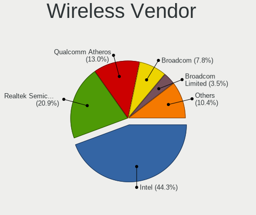

| Vendor                | Notebooks | Percent |
|-----------------------|-----------|---------|
| Intel                 | 21        | 41.18%  |
| Realtek Semiconductor | 9         | 17.65%  |
| Qualcomm Atheros      | 8         | 15.69%  |
| Broadcom              | 5         | 9.8%    |
| Ralink Technology     | 2         | 3.92%   |
| Broadcom Limited      | 2         | 3.92%   |
| TP-Link               | 1         | 1.96%   |
| NetGear               | 1         | 1.96%   |
| Dell                  | 1         | 1.96%   |
| Belkin Components     | 1         | 1.96%   |

Wireless Model
--------------

Wireless models

| Model                                                                                     | Notebooks | Percent |
|-------------------------------------------------------------------------------------------|-----------|---------|
| Realtek RTL8821CE 802.11ac PCIe Wireless Network Adapter                                  | 3         | 5.77%   |
| Qualcomm Atheros QCA9565 / AR9565 Wireless Network Adapter                                | 3         | 5.77%   |
| Intel Wireless 7265                                                                       | 3         | 5.77%   |
| Realtek RTL8822BE 802.11a/b/g/n/ac WiFi adapter                                           | 2         | 3.85%   |
| Realtek RTL8188CE 802.11b/g/n WiFi Adapter                                                | 2         | 3.85%   |
| Ralink RT2870/RT3070 Wireless Adapter                                                     | 2         | 3.85%   |
| Qualcomm Atheros QCA9377 802.11ac Wireless Network Adapter                                | 2         | 3.85%   |
| Intel Wi-Fi 6 AX200                                                                       | 2         | 3.85%   |
| Intel PRO/Wireless 3945ABG [Golan] Network Connection                                     | 2         | 3.85%   |
| Intel Centrino Wireless-N 1030 [Rainbow Peak]                                             | 2         | 3.85%   |
| Intel Centrino Wireless-N 1000 [Condor Peak]                                              | 2         | 3.85%   |
| Intel Centrino Advanced-N 6230 [Rainbow Peak]                                             | 2         | 3.85%   |
| Broadcom Limited BCM43224 802.11a/b/g/n                                                   | 2         | 3.85%   |
| TP-Link TL-WN722N v2/v3 [Realtek RTL8188EUS]                                              | 1         | 1.92%   |
| Realtek RTL88x2bu [AC1200 Techkey]                                                        | 1         | 1.92%   |
| Realtek RTL8191SEvB Wireless LAN Controller                                               | 1         | 1.92%   |
| Qualcomm Atheros QCA6174 802.11ac Wireless Network Adapter                                | 1         | 1.92%   |
| Qualcomm Atheros QCA6164 802.11ac Wireless Network Adapter                                | 1         | 1.92%   |
| Qualcomm Atheros AR9485 Wireless Network Adapter                                          | 1         | 1.92%   |
| Qualcomm Atheros AR9462 Wireless Network Adapter                                          | 1         | 1.92%   |
| NetGear WNDA3100v1 802.11abgn [Atheros AR9170+AR9104]                                     | 1         | 1.92%   |
| Intel Wireless 7260                                                                       | 1         | 1.92%   |
| Intel Wireless 3165                                                                       | 1         | 1.92%   |
| Intel Wireless 3160                                                                       | 1         | 1.92%   |
| Intel WiFi Link 5100                                                                      | 1         | 1.92%   |
| Intel Wi-Fi 6 AX201                                                                       | 1         | 1.92%   |
| Intel Gemini Lake PCH CNVi WiFi                                                           | 1         | 1.92%   |
| Intel Comet Lake PCH-LP CNVi WiFi                                                         | 1         | 1.92%   |
| Intel Comet Lake PCH CNVi WiFi                                                            | 1         | 1.92%   |
| Dell Wireless 5808e Gobi™ 4G LTE Mobile Broadband Card                               | 1         | 1.92%   |
| Broadcom BCM4331 802.11a/b/g/n                                                            | 1         | 1.92%   |
| Broadcom BCM4322 802.11a/b/g/n Wireless LAN Controller                                    | 1         | 1.92%   |
| Broadcom BCM4321 802.11a/b/g/n                                                            | 1         | 1.92%   |
| Broadcom BCM43142 802.11b/g/n                                                             | 1         | 1.92%   |
| Broadcom BCM4313 802.11bgn Wireless Network Adapter                                       | 1         | 1.92%   |
| Belkin Components F7D2101 802.11n Surf & Share Wireless Adapter v1000 [Realtek RTL8192SU] | 1         | 1.92%   |

Ethernet Vendor
---------------

Ethernet vendors

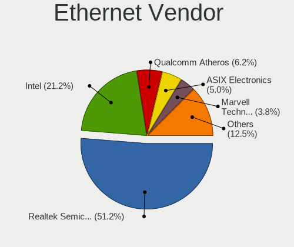

| Vendor                   | Notebooks | Percent |
|--------------------------|-----------|---------|
| Realtek Semiconductor    | 19        | 51.35%  |
| Intel                    | 6         | 16.22%  |
| Marvell Technology Group | 3         | 8.11%   |
| Qualcomm Atheros         | 2         | 5.41%   |
| Broadcom                 | 2         | 5.41%   |
| Samsung Electronics      | 1         | 2.7%    |
| Nvidia                   | 1         | 2.7%    |
| NetGear                  | 1         | 2.7%    |
| Broadcom Limited         | 1         | 2.7%    |
| ASIX Electronics         | 1         | 2.7%    |

Ethernet Model
--------------

Ethernet models

| Model                                                                          | Notebooks | Percent |
|--------------------------------------------------------------------------------|-----------|---------|
| Realtek RTL8111/8168/8411 PCI Express Gigabit Ethernet Controller              | 14        | 37.84%  |
| Realtek RTL810xE PCI Express Fast Ethernet controller                          | 5         | 13.51%  |
| Intel 82577LM Gigabit Network Connection                                       | 2         | 5.41%   |
| Samsung Galaxy series, misc. (tethering mode)                                  | 1         | 2.7%    |
| Qualcomm Atheros AR8152 v1.1 Fast Ethernet                                     | 1         | 2.7%    |
| Qualcomm Atheros AR8151 v2.0 Gigabit Ethernet                                  | 1         | 2.7%    |
| Nvidia MCP79 Ethernet                                                          | 1         | 2.7%    |
| NetGear LB1120-100NAS                                                          | 1         | 2.7%    |
| Marvell Group Yukon Optima 88E8059 [PCIe Gigabit Ethernet Controller with AVB] | 1         | 2.7%    |
| Marvell Group 88E8058 PCI-E Gigabit Ethernet Controller                        | 1         | 2.7%    |
| Marvell Group 88E8040 PCI-E Fast Ethernet Controller                           | 1         | 2.7%    |
| Intel Ethernet Connection (3) I218-LM                                          | 1         | 2.7%    |
| Intel 82579V Gigabit Network Connection                                        | 1         | 2.7%    |
| Intel 82579LM Gigabit Network Connection (Lewisville)                          | 1         | 2.7%    |
| Intel 82577LC Gigabit Network Connection                                       | 1         | 2.7%    |
| Broadcom NetXtreme BCM57765 Gigabit Ethernet PCIe                              | 1         | 2.7%    |
| Broadcom NetXtreme BCM5753M Gigabit Ethernet PCI Express                       | 1         | 2.7%    |
| Broadcom Limited BCM4401-B0 100Base-TX                                         | 1         | 2.7%    |
| ASIX AX88772B                                                                  | 1         | 2.7%    |

Net Controller Kind
-------------------

Ethernet, WiFi or modem

| Kind     | Notebooks | Percent |
|----------|-----------|---------|
| WiFi     | 45        | 54.88%  |
| Ethernet | 37        | 45.12%  |

Used Controller
---------------

Currently used network controller

| Kind     | Notebooks | Percent |
|----------|-----------|---------|
| WiFi     | 38        | 77.55%  |
| Ethernet | 11        | 22.45%  |

NICs
----

Total network controllers on board

| Total | Notebooks | Percent |
|-------|-----------|---------|
| 2     | 32        | 69.57%  |
| 1     | 12        | 26.09%  |
| 3     | 1         | 2.17%   |
| 0     | 1         | 2.17%   |

IPv6
----

IPv6 vs IPv4

| Used | Notebooks | Percent |
|------|-----------|---------|
| No   | 43        | 93.48%  |
| Yes  | 3         | 6.52%   |

Bluetooth
---------

Bluetooth Vendor
----------------

Controller vendors

| Vendor                          | Notebooks | Percent |
|---------------------------------|-----------|---------|
| Intel                           | 16        | 47.06%  |
| Realtek Semiconductor           | 5         | 14.71%  |
| Apple                           | 3         | 8.82%   |
| Qualcomm Atheros Communications | 2         | 5.88%   |
| Lite-On Technology              | 2         | 5.88%   |
| Foxconn / Hon Hai               | 2         | 5.88%   |
| Toshiba                         | 1         | 2.94%   |
| IMC Networks                    | 1         | 2.94%   |
| Hewlett-Packard                 | 1         | 2.94%   |
| Alps Electric                   | 1         | 2.94%   |

Bluetooth Model
---------------

Controller models

| Model                                                                               | Notebooks | Percent |
|-------------------------------------------------------------------------------------|-----------|---------|
| Intel Bluetooth wireless interface                                                  | 6         | 17.65%  |
| Realtek  Bluetooth 4.2 Adapter                                                      | 5         | 14.71%  |
| Intel Bluetooth Device                                                              | 4         | 11.76%  |
| Intel Bluetooth 9460/9560 Jefferson Peak (JfP)                                      | 3         | 8.82%   |
| Qualcomm Atheros  Bluetooth Device                                                  | 2         | 5.88%   |
| Intel AX200 Bluetooth                                                               | 2         | 5.88%   |
| Apple Bluetooth Host Controller                                                     | 2         | 5.88%   |
| Toshiba BCM43142A0                                                                  | 1         | 2.94%   |
| Lite-On Qualcomm Atheros QCA9377 Bluetooth                                          | 1         | 2.94%   |
| Lite-On Bluetooth Device                                                            | 1         | 2.94%   |
| Intel AX201 Bluetooth                                                               | 1         | 2.94%   |
| IMC Networks Bluetooth Device                                                       | 1         | 2.94%   |
| HP Bluetooth 2.0 Interface [Broadcom BCM2045]                                       | 1         | 2.94%   |
| Foxconn / Hon Hai Foxconn T77H114 BCM2070 [Single-Chip Bluetooth 2.1 + EDR Adapter] | 1         | 2.94%   |
| Foxconn / Hon Hai Bluetooth Device                                                  | 1         | 2.94%   |
| Apple Bluetooth HCI                                                                 | 1         | 2.94%   |
| Alps Electric BCM2046 Bluetooth Device                                              | 1         | 2.94%   |

Sound
-----

Sound Vendor
------------

Sound card vendors

| Vendor | Notebooks | Percent |
|--------|-----------|---------|
| Intel  | 39        | 81.25%  |
| AMD    | 6         | 12.5%   |
| Nvidia | 3         | 6.25%   |

Sound Model
-----------

Sound card models

| Model                                                                                             | Notebooks | Percent |
|---------------------------------------------------------------------------------------------------|-----------|---------|
| Intel 6 Series/C200 Series Chipset Family High Definition Audio Controller                        | 8         | 13.79%  |
| Intel Sunrise Point-LP HD Audio                                                                   | 6         | 10.34%  |
| Intel 5 Series/3400 Series Chipset High Definition Audio                                          | 5         | 8.62%   |
| Intel Celeron/Pentium Silver Processor High Definition Audio                                      | 3         | 5.17%   |
| AMD FCH Azalia Controller                                                                         | 3         | 5.17%   |
| AMD Family 17h/19h HD Audio Controller                                                            | 3         | 5.17%   |
| Intel Wildcat Point-LP High Definition Audio Controller                                           | 2         | 3.45%   |
| Intel NM10/ICH7 Family High Definition Audio Controller                                           | 2         | 3.45%   |
| Intel Haswell-ULT HD Audio Controller                                                             | 2         | 3.45%   |
| Intel Broadwell-U Audio Controller                                                                | 2         | 3.45%   |
| Intel Atom/Celeron/Pentium Processor x5-E8000/J3xxx/N3xxx Series High Definition Audio Controller | 2         | 3.45%   |
| Intel 8 Series HD Audio Controller                                                                | 2         | 3.45%   |
| AMD Raven/Raven2/Fenghuang HDMI/DP Audio Controller                                               | 2         | 3.45%   |
| Nvidia TU116 High Definition Audio Controller                                                     | 1         | 1.72%   |
| Nvidia MCP79 High Definition Audio                                                                | 1         | 1.72%   |
| Nvidia GP107GL High Definition Audio Controller                                                   | 1         | 1.72%   |
| Intel Tiger Lake-LP Smart Sound Technology Audio Controller                                       | 1         | 1.72%   |
| Intel Ice Lake-LP Smart Sound Technology Audio Controller                                         | 1         | 1.72%   |
| Intel Comet Lake PCH-LP cAVS                                                                      | 1         | 1.72%   |
| Intel Comet Lake PCH cAVS                                                                         | 1         | 1.72%   |
| Intel Celeron N3350/Pentium N4200/Atom E3900 Series Audio Cluster                                 | 1         | 1.72%   |
| Intel Cannon Lake PCH cAVS                                                                        | 1         | 1.72%   |
| Intel 82801I (ICH9 Family) HD Audio Controller                                                    | 1         | 1.72%   |
| Intel 82801H (ICH8 Family) HD Audio Controller                                                    | 1         | 1.72%   |
| Intel 7 Series/C216 Chipset Family High Definition Audio Controller                               | 1         | 1.72%   |
| AMD Trinity HDMI Audio Controller                                                                 | 1         | 1.72%   |
| AMD Renoir Radeon High Definition Audio Controller                                                | 1         | 1.72%   |
| AMD Kaveri HDMI/DP Audio Controller                                                               | 1         | 1.72%   |
| AMD Kabini HDMI/DP Audio                                                                          | 1         | 1.72%   |

Memory
------

Memory Vendor
-------------

Memory module vendors

| Vendor              | Notebooks | Percent |
|---------------------|-----------|---------|
| SK hynix            | 6         | 37.5%   |
| Samsung Electronics | 5         | 31.25%  |
| Kingston            | 2         | 12.5%   |
| Unknown             | 1         | 6.25%   |
| Micron Technology   | 1         | 6.25%   |
| A-DATA Technology   | 1         | 6.25%   |

Memory Model
------------

Memory module models

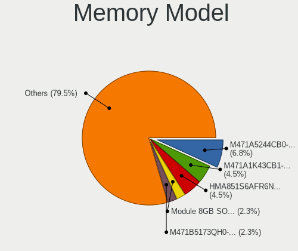

| Model                                                     | Notebooks | Percent |
|-----------------------------------------------------------|-----------|---------|
| SK hynix RAM HMA851S6AFR6N-UH 4GB SODIMM DDR4 2667MT/s    | 2         | 10.53%  |
| Unknown RAM WPBS26D408SWC-8G 8192MB SODIMM DDR4 2667MT/s  | 1         | 5.26%   |
| SK hynix RAM Module 2048MB SODIMM DDR 667MT/s             | 1         | 5.26%   |
| SK hynix RAM HMT451S6MFR8C-PB 4GB SODIMM DDR3 1600MT/s    | 1         | 5.26%   |
| SK hynix RAM HMT351S6CFR8C-PB 4GB SODIMM DDR3 1600MT/s    | 1         | 5.26%   |
| SK hynix RAM HMA851S6DJR6N-XN 4GB SODIMM DDR4 3200MT/s    | 1         | 5.26%   |
| SK hynix RAM HMA81GS6DJR8N-VK 8192MB SODIMM DDR4 2667MT/s | 1         | 5.26%   |
| SK hynix RAM HMA81GS6CJR8N-VK 8GB SODIMM DDR4 2667MT/s    | 1         | 5.26%   |
| Samsung RAM M471B5173QH0-YK0 4GB SODIMM DDR3 1600MT/s     | 1         | 5.26%   |
| Samsung RAM M471B5173EB0-YK0 4GB SODIMM DDR3 1600MT/s     | 1         | 5.26%   |
| Samsung RAM M471A5244CB0-CWE 4GB SODIMM DDR4 3200MT/s     | 1         | 5.26%   |
| Samsung RAM M471A5244CB0-CTD 4096MB SODIMM DDR4 3266MT/s  | 1         | 5.26%   |
| Samsung RAM M471A1K43CB1-CTD 8GB SODIMM DDR4 2667MT/s     | 1         | 5.26%   |
| Micron RAM 16KTF51264HZ-1G6M1 4GB SODIMM DDR3 1600MT/s    | 1         | 5.26%   |
| Kingston RAM HP691160-H66-MCN 8GB SODIMM DDR3 1600MT/s    | 1         | 5.26%   |
| Kingston RAM ACR16D3LS1NGG/4G 4GB SODIMM DDR3 1600MT/s    | 1         | 5.26%   |
| Kingston RAM 99U5700-027.A00G 8GB SODIMM DDR4 2667MT/s    | 1         | 5.26%   |
| A-DATA RAM AM1L16BC4R1-B1YS 4GB SODIMM DDR3 800MT/s       | 1         | 5.26%   |

Memory Kind
-----------

Memory module kinds

| Kind   | Notebooks | Percent |
|--------|-----------|---------|
| DDR4   | 8         | 50%     |
| DDR3   | 5         | 31.25%  |
| LPDDR4 | 2         | 12.5%   |
| DDR    | 1         | 6.25%   |

Memory Form Factor
------------------

Physical design of the memory module

| Name   | Notebooks | Percent |
|--------|-----------|---------|
| SODIMM | 15        | 100%    |

Memory Size
-----------

Memory module size

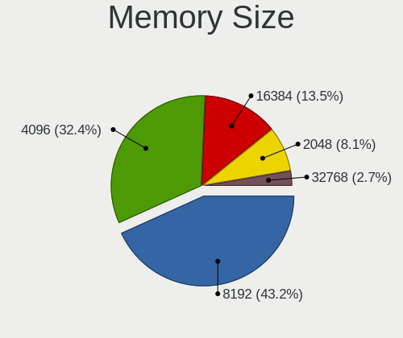

| Size | Notebooks | Percent |
|------|-----------|---------|
| 4096 | 10        | 58.82%  |
| 8192 | 6         | 35.29%  |
| 2048 | 1         | 5.88%   |

Memory Speed
------------

Memory module speed

| Speed | Notebooks | Percent |
|-------|-----------|---------|
| 2667  | 6         | 37.5%   |
| 1600  | 5         | 31.25%  |
| 3200  | 2         | 12.5%   |
| 3266  | 1         | 6.25%   |
| 800   | 1         | 6.25%   |
| 667   | 1         | 6.25%   |

Printers & scanners
-------------------

Printer Vendor
--------------

Printer device vendors

Zero info for selected period =(

Printer Model
-------------

Printer device models

Zero info for selected period =(

Scanner Vendor
--------------

Scanner device vendors

Zero info for selected period =(

Scanner Model
-------------

Scanner device models

Zero info for selected period =(

Camera
------

Camera Vendor
-------------

Camera device vendors

| Vendor                                 | Notebooks | Percent |
|----------------------------------------|-----------|---------|
| Chicony Electronics                    | 8         | 21.05%  |
| Ricoh                                  | 5         | 13.16%  |
| Realtek Semiconductor                  | 4         | 10.53%  |
| Quanta                                 | 3         | 7.89%   |
| Acer                                   | 3         | 7.89%   |
| Suyin                                  | 2         | 5.26%   |
| Lite-On Technology                     | 2         | 5.26%   |
| Cheng Uei Precision Industry (Foxlink) | 2         | 5.26%   |
| Apple                                  | 2         | 5.26%   |
| Sunplus Innovation Technology          | 1         | 2.63%   |
| Microdia                               | 1         | 2.63%   |
| Luxvisions Innotech Limited            | 1         | 2.63%   |
| Lenovo                                 | 1         | 2.63%   |
| IMC Networks                           | 1         | 2.63%   |
| Goertek Electronics                    | 1         | 2.63%   |
| Alpha Imaging Technology               | 1         | 2.63%   |

Camera Model
------------

Camera device models

| Model                                                           | Notebooks | Percent |
|-----------------------------------------------------------------|-----------|---------|
| Ricoh Integrated Webcam                                         | 3         | 7.89%   |
| Chicony HD WebCam                                               | 2         | 5.26%   |
| Suyin USB 2.0 Camera                                            | 1         | 2.63%   |
| Suyin Integrated_Webcam_HD                                      | 1         | 2.63%   |
| Sunplus Integrated_Webcam_HD                                    | 1         | 2.63%   |
| Ricoh Sony Visual Communication Camera Integrated Webcam        | 1         | 2.63%   |
| Ricoh HD Webcam                                                 | 1         | 2.63%   |
| Realtek MTD camera                                              | 1         | 2.63%   |
| Realtek Integrated Webcam HD                                    | 1         | 2.63%   |
| Realtek Integrated Webcam                                       | 1         | 2.63%   |
| Realtek HP Webcam-101                                           | 1         | 2.63%   |
| Quanta HP Wide Vision HD Camera                                 | 1         | 2.63%   |
| Quanta HP TrueVision HD Camera                                  | 1         | 2.63%   |
| Quanta HD WebCam                                                | 1         | 2.63%   |
| Microdia Laptop_Integrated_Webcam_HD                            | 1         | 2.63%   |
| Luxvisions Innotech Limited HP TrueVision HD Camera             | 1         | 2.63%   |
| Lite-On HP Wide Vision HD Camera                                | 1         | 2.63%   |
| Lite-On HP HD Webcam                                            | 1         | 2.63%   |
| Lenovo Integrated Webcam [R5U877]                               | 1         | 2.63%   |
| IMC Networks UVC VGA Webcam                                     | 1         | 2.63%   |
| Goertek USB2.0 VGA UVC WebCam                                   | 1         | 2.63%   |
| Chicony TOSHIBA Web Camera - HD                                 | 1         | 2.63%   |
| Chicony Toshiba Integrated Webcam                               | 1         | 2.63%   |
| Chicony Integrated HP HD Webcam                                 | 1         | 2.63%   |
| Chicony HP Webcam                                               | 1         | 2.63%   |
| Chicony HP Truevision HD                                        | 1         | 2.63%   |
| Chicony CNF9055 Toshiba Webcam                                  | 1         | 2.63%   |
| Cheng Uei Precision Industry (Foxlink) HP Wide Vision HD Camera | 1         | 2.63%   |
| Cheng Uei Precision Industry (Foxlink) HP TrueVision HD Camera  | 1         | 2.63%   |
| Apple FaceTime HD Camera                                        | 1         | 2.63%   |
| Apple Built-in iSight                                           | 1         | 2.63%   |
| Alpha Imaging Integrated_Webcam_8M                              | 1         | 2.63%   |
| Acer Lenovo EasyCamera                                          | 1         | 2.63%   |
| Acer EasyCamera                                                 | 1         | 2.63%   |
| Acer BisonCam,NB Pro                                            | 1         | 2.63%   |

Security
--------

Fingerprint Vendor
------------------

Fingerprint sensor vendors

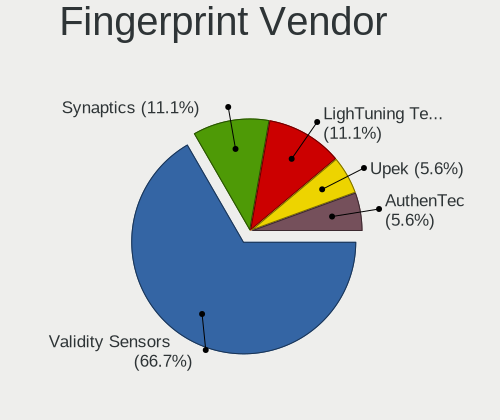

| Vendor                | Notebooks | Percent |
|-----------------------|-----------|---------|
| Validity Sensors      | 6         | 66.67%  |
| LighTuning Technology | 2         | 22.22%  |
| Synaptics             | 1         | 11.11%  |

Fingerprint Model
-----------------

Fingerprint sensor models

| Model                                       | Notebooks | Percent |
|---------------------------------------------|-----------|---------|
| Validity Sensors VFS5011 Fingerprint Reader | 3         | 33.33%  |
| LighTuning EgisTec Touch Fingerprint Sensor | 2         | 22.22%  |
| Validity Sensors VFS471 Fingerprint Reader  | 1         | 11.11%  |
| Validity Sensors VFS451 Fingerprint Reader  | 1         | 11.11%  |
| Validity Sensors Fingerprint scanner        | 1         | 11.11%  |
| Unknown                                     | 1         | 11.11%  |

Chipcard Vendor
---------------

Chipcard module vendors

| Vendor   | Notebooks | Percent |
|----------|-----------|---------|
| Broadcom | 1         | 100%    |

Chipcard Model
--------------

Chipcard module models

| Model                                          | Notebooks | Percent |
|------------------------------------------------|-----------|---------|
| Broadcom BCM5880 Secure Applications Processor | 1         | 100%    |

Unsupported
-----------

Unsupported Devices
-------------------

Total unsupported devices on board

| Total | Notebooks | Percent |
|-------|-----------|---------|
| 0     | 31        | 65.96%  |
| 1     | 16        | 34.04%  |

Unsupported Device Types
------------------------

Types of unsupported devices

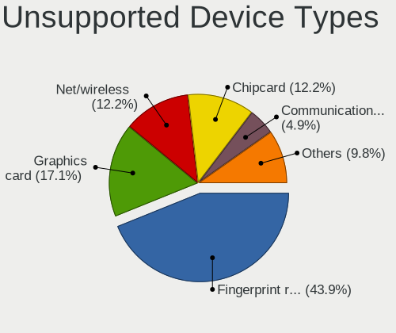

| Type                     | Notebooks | Percent |
|--------------------------|-----------|---------|
| Fingerprint reader       | 9         | 56.25%  |
| Net/wireless             | 3         | 18.75%  |
| Graphics card            | 2         | 12.5%   |
| Communication controller | 1         | 6.25%   |
| Chipcard                 | 1         | 6.25%   |

