Linux in Puerto Rico - Tested Hardware & Statistics
---------------------------------------------------

A project to collect tested hardware configurations for Linux in Puerto Rico.

Anyone can contribute to this report by the [hw-probe](https://github.com/linuxhw/hw-probe) tool:

    sudo -E hw-probe -all -upload

Please contribute! Especially if your hardware is rare.

This is a report for all computer types. See also reports for [desktops](/Location/Puerto_Rico/Desktop/README.md) and [notebooks](/Location/Puerto_Rico/Notebook/README.md).

Contents
--------

* [ Test Cases ](#test-cases)

* [ System ](#system)
  - [ OS                       ](#os)
  - [ OS Family                ](#os-family)
  - [ Kernel                   ](#kernel)
  - [ Kernel Family            ](#kernel-family)
  - [ Kernel Major Ver.        ](#kernel-major-ver)
  - [ Arch                     ](#arch)
  - [ DE                       ](#de)
  - [ Display Server           ](#display-server)
  - [ Display Manager          ](#display-manager)
  - [ OS Lang                  ](#os-lang)
  - [ Boot Mode                ](#boot-mode)
  - [ Filesystem               ](#filesystem)
  - [ Part. scheme             ](#part-scheme)
  - [ Dual Boot with Linux/BSD ](#dual-boot-with-linuxbsd)
  - [ Dual Boot (Win)          ](#dual-boot-win)

* [ Board ](#board)
  - [ Vendor                   ](#vendor)
  - [ Model                    ](#model)
  - [ Model Family             ](#model-family)
  - [ MFG Year                 ](#mfg-year)
  - [ Form Factor              ](#form-factor)
  - [ Secure Boot              ](#secure-boot)
  - [ Coreboot                 ](#coreboot)
  - [ RAM Size                 ](#ram-size)
  - [ RAM Used                 ](#ram-used)
  - [ Total Drives             ](#total-drives)
  - [ Has CD-ROM               ](#has-cd-rom)
  - [ Has Ethernet             ](#has-ethernet)
  - [ Has WiFi                 ](#has-wifi)
  - [ Has Bluetooth            ](#has-bluetooth)

* [ Location ](#location)
  - [ Country                  ](#country)
  - [ City                     ](#city)

* [ Drives ](#drives)
  - [ Drive Vendor             ](#drive-vendor)
  - [ Drive Model              ](#drive-model)
  - [ HDD Vendor               ](#hdd-vendor)
  - [ SSD Vendor               ](#ssd-vendor)
  - [ Drive Kind               ](#drive-kind)
  - [ Drive Connector          ](#drive-connector)
  - [ Drive Size               ](#drive-size)
  - [ Space Total              ](#space-total)
  - [ Space Used               ](#space-used)
  - [ Malfunc. Drives          ](#malfunc-drives)
  - [ Malfunc. Drive Vendor    ](#malfunc-drive-vendor)
  - [ Malfunc. HDD Vendor      ](#malfunc-hdd-vendor)
  - [ Malfunc. Drive Kind      ](#malfunc-drive-kind)
  - [ Failed Drives            ](#failed-drives)
  - [ Failed Drive Vendor      ](#failed-drive-vendor)
  - [ Drive Status             ](#drive-status)

* [ Storage controller ](#storage-controller)
  - [ Storage Vendor           ](#storage-vendor)
  - [ Storage Model            ](#storage-model)
  - [ Storage Kind             ](#storage-kind)

* [ Processor ](#processor)
  - [ CPU Vendor               ](#cpu-vendor)
  - [ CPU Model                ](#cpu-model)
  - [ CPU Model Family         ](#cpu-model-family)
  - [ CPU Cores                ](#cpu-cores)
  - [ CPU Sockets              ](#cpu-sockets)
  - [ CPU Threads              ](#cpu-threads)
  - [ CPU Op-Modes             ](#cpu-op-modes)
  - [ CPU Microcode            ](#cpu-microcode)
  - [ CPU Microarch            ](#cpu-microarch)

* [ Graphics ](#graphics)
  - [ GPU Vendor               ](#gpu-vendor)
  - [ GPU Model                ](#gpu-model)
  - [ GPU Combo                ](#gpu-combo)
  - [ GPU Driver               ](#gpu-driver)
  - [ GPU Memory               ](#gpu-memory)

* [ Monitor ](#monitor)
  - [ Monitor Vendor           ](#monitor-vendor)
  - [ Monitor Model            ](#monitor-model)
  - [ Monitor Resolution       ](#monitor-resolution)
  - [ Monitor Diagonal         ](#monitor-diagonal)
  - [ Monitor Width            ](#monitor-width)
  - [ Aspect Ratio             ](#aspect-ratio)
  - [ Monitor Area             ](#monitor-area)
  - [ Pixel Density            ](#pixel-density)
  - [ Multiple Monitors        ](#multiple-monitors)

* [ Network ](#network)
  - [ Net Controller Vendor    ](#net-controller-vendor)
  - [ Net Controller Model     ](#net-controller-model)
  - [ Wireless Vendor          ](#wireless-vendor)
  - [ Wireless Model           ](#wireless-model)
  - [ Ethernet Vendor          ](#ethernet-vendor)
  - [ Ethernet Model           ](#ethernet-model)
  - [ Net Controller Kind      ](#net-controller-kind)
  - [ Used Controller          ](#used-controller)
  - [ NICs                     ](#nics)
  - [ IPv6                     ](#ipv6)

* [ Bluetooth ](#bluetooth)
  - [ Bluetooth Vendor         ](#bluetooth-vendor)
  - [ Bluetooth Model          ](#bluetooth-model)

* [ Sound ](#sound)
  - [ Sound Vendor             ](#sound-vendor)
  - [ Sound Model              ](#sound-model)

* [ Memory ](#memory)
  - [ Memory Vendor            ](#memory-vendor)
  - [ Memory Model             ](#memory-model)
  - [ Memory Kind              ](#memory-kind)
  - [ Memory Form Factor       ](#memory-form-factor)
  - [ Memory Size              ](#memory-size)
  - [ Memory Speed             ](#memory-speed)

* [ Printers & scanners ](#printers--scanners)
  - [ Printer Vendor           ](#printer-vendor)
  - [ Printer Model            ](#printer-model)
  - [ Scanner Vendor           ](#scanner-vendor)
  - [ Scanner Model            ](#scanner-model)

* [ Camera ](#camera)
  - [ Camera Vendor            ](#camera-vendor)
  - [ Camera Model             ](#camera-model)

* [ Security ](#security)
  - [ Fingerprint Vendor       ](#fingerprint-vendor)
  - [ Fingerprint Model        ](#fingerprint-model)
  - [ Chipcard Vendor          ](#chipcard-vendor)
  - [ Chipcard Model           ](#chipcard-model)

* [ Unsupported ](#unsupported)
  - [ Unsupported Devices      ](#unsupported-devices)
  - [ Unsupported Device Types ](#unsupported-device-types)

Test Cases
----------

Total: 214

| Vendor        | Model                       | Form-Factor | Probe                                                      | Date         |
|---------------|-----------------------------|-------------|------------------------------------------------------------|--------------|
| Apple         | MacBook4,1                  | Notebook    | [1c9628e804](https://linux-hardware.org/?probe=1c9628e804) | Aug 15, 2022 |
| Apple         | MacBook4,1                  | Notebook    | [12a6ae992a](https://linux-hardware.org/?probe=12a6ae992a) | Aug 14, 2022 |
| HP            | ProBook 450 G5              | Notebook    | [846e1d6c9f](https://linux-hardware.org/?probe=846e1d6c9f) | Aug 11, 2022 |
| HP            | ProBook 450 G5              | Notebook    | [4d052b34a7](https://linux-hardware.org/?probe=4d052b34a7) | Aug 11, 2022 |
| Lenovo        | ThinkPad E14 20RA004WUS     | Notebook    | [b140ac0aea](https://linux-hardware.org/?probe=b140ac0aea) | Aug 07, 2022 |
| Dell          | Precision M4700             | Notebook    | [25efd53898](https://linux-hardware.org/?probe=25efd53898) | Aug 05, 2022 |
| Apple         | MacBook4,1                  | Notebook    | [96645b0a94](https://linux-hardware.org/?probe=96645b0a94) | Aug 04, 2022 |
| HP            | ENVY Laptop 17-ce1xxx       | Notebook    | [3f1e6ca5cb](https://linux-hardware.org/?probe=3f1e6ca5cb) | Jul 29, 2022 |
| Apple         | MacBook4,1                  | Notebook    | [012b0c7fa9](https://linux-hardware.org/?probe=012b0c7fa9) | Jul 23, 2022 |
| Apple         | MacBook4,1                  | Notebook    | [c444890ad0](https://linux-hardware.org/?probe=c444890ad0) | Jul 21, 2022 |
| Apple         | MacBook4,1                  | Notebook    | [9122678102](https://linux-hardware.org/?probe=9122678102) | Jul 21, 2022 |
| ASRock        | B450M-HDV                   | Desktop     | [e45f2cd5d8](https://linux-hardware.org/?probe=e45f2cd5d8) | Jul 20, 2022 |
| Apple         | MacBook4,1                  | Notebook    | [69d676f7be](https://linux-hardware.org/?probe=69d676f7be) | Jul 12, 2022 |
| Apple         | MacBook4,1                  | Notebook    | [9d8195a435](https://linux-hardware.org/?probe=9d8195a435) | Jul 12, 2022 |
| Dell          | Venue 11 Pro 7130 MS        | Notebook    | [a42903b516](https://linux-hardware.org/?probe=a42903b516) | Jul 10, 2022 |
| Dell          | Venue 11 Pro 7130 MS        | Notebook    | [404e81318c](https://linux-hardware.org/?probe=404e81318c) | Jul 10, 2022 |
| Apple         | MacBookPro5,1               | Notebook    | [fd79c5481a](https://linux-hardware.org/?probe=fd79c5481a) | Jul 09, 2022 |
| Dell          | Vostro 3550                 | Notebook    | [d0cfec8d80](https://linux-hardware.org/?probe=d0cfec8d80) | Jul 04, 2022 |
| MSI           | MS-B0A1                     | Desktop     | [9b53e39bad](https://linux-hardware.org/?probe=9b53e39bad) | Jul 04, 2022 |
| Apple         | MacBookPro5,1               | Notebook    | [ac53d2f956](https://linux-hardware.org/?probe=ac53d2f956) | Jul 02, 2022 |
| Apple         | Mac-AA95B1DDAB278B95 iMa... | All in one  | [9fd7dc8784](https://linux-hardware.org/?probe=9fd7dc8784) | Jul 02, 2022 |
| MSI           | MS-AE031                    | All in one  | [d6f4214361](https://linux-hardware.org/?probe=d6f4214361) | Jun 30, 2022 |
| Apple         | MacBookPro5,1               | Notebook    | [1e14793557](https://linux-hardware.org/?probe=1e14793557) | Jun 27, 2022 |
| MSI           | MS-B0A1                     | Desktop     | [3193cbe3fd](https://linux-hardware.org/?probe=3193cbe3fd) | Jun 20, 2022 |
| Dell          | Vostro 3550                 | Notebook    | [9eaa432fcd](https://linux-hardware.org/?probe=9eaa432fcd) | Jun 02, 2022 |
| Dell          | 0F2A30 A00                  | All in one  | [ae5664a81f](https://linux-hardware.org/?probe=ae5664a81f) | May 12, 2022 |
| Dell          | 0N4YC8 A00                  | Desktop     | [83ed9adfc1](https://linux-hardware.org/?probe=83ed9adfc1) | May 04, 2022 |
| Dell          | 0G261D A00                  | Desktop     | [860d883e5b](https://linux-hardware.org/?probe=860d883e5b) | Apr 29, 2022 |
| ASRock        | B450M-HDV R4.0              | Desktop     | [bce1bba9ff](https://linux-hardware.org/?probe=bce1bba9ff) | Apr 29, 2022 |
| Dell          | 0N4YC8 A00                  | Desktop     | [32cc2a24ac](https://linux-hardware.org/?probe=32cc2a24ac) | Apr 20, 2022 |
| HP            | Pavilion Gaming Laptop 1... | Notebook    | [074f1f75dc](https://linux-hardware.org/?probe=074f1f75dc) | Apr 20, 2022 |
| Dell          | 0N4YC8 A00                  | Desktop     | [b4ea114ce4](https://linux-hardware.org/?probe=b4ea114ce4) | Apr 17, 2022 |
| Gigabyte      | B450 AORUS PRO WIFI-CF      | Desktop     | [656e8c50dd](https://linux-hardware.org/?probe=656e8c50dd) | Apr 13, 2022 |
| Dell          | 0N4YC8 A00                  | Desktop     | [c32c875fc6](https://linux-hardware.org/?probe=c32c875fc6) | Apr 10, 2022 |
| ASUSTek       | ROG STRIX B450-F GAMING     | Desktop     | [2315db07e2](https://linux-hardware.org/?probe=2315db07e2) | Apr 02, 2022 |
| Dell          | Latitude E6330              | Notebook    | [1911200c56](https://linux-hardware.org/?probe=1911200c56) | Mar 23, 2022 |
| Dell          | Vostro 3550                 | Notebook    | [fd3185704d](https://linux-hardware.org/?probe=fd3185704d) | Mar 21, 2022 |
| HP            | 0AA8h                       | Desktop     | [b3507722e3](https://linux-hardware.org/?probe=b3507722e3) | Mar 19, 2022 |
| Dell          | Inspiron 17-7778            | Notebook    | [bcc52b2596](https://linux-hardware.org/?probe=bcc52b2596) | Mar 17, 2022 |
| Toshiba       | Satellite P755              | Notebook    | [ceb8d030e2](https://linux-hardware.org/?probe=ceb8d030e2) | Mar 10, 2022 |
| Dell          | 0F2A30 A00                  | All in one  | [f96e26bb9a](https://linux-hardware.org/?probe=f96e26bb9a) | Mar 08, 2022 |
| Dell          | OptiPlex 7020               | Desktop     | [ba82f9d852](https://linux-hardware.org/?probe=ba82f9d852) | Mar 01, 2022 |
| HP            | 0AA8h                       | Desktop     | [21de71cf71](https://linux-hardware.org/?probe=21de71cf71) | Feb 25, 2022 |
| ASRock        | B450M-HDV R4.0              | Desktop     | [f2a65b8a5f](https://linux-hardware.org/?probe=f2a65b8a5f) | Feb 14, 2022 |
| HP            | Pavilion Gaming Laptop 1... | Notebook    | [a1ecd8a3cb](https://linux-hardware.org/?probe=a1ecd8a3cb) | Feb 12, 2022 |
| TUXEDO        | Aura 15 Gen1                | Notebook    | [832b48c46d](https://linux-hardware.org/?probe=832b48c46d) | Feb 11, 2022 |
| Acidanther... | Mac-7BA5B2D9E42DDD94 iMa... | All in one  | [e7ce3f2f38](https://linux-hardware.org/?probe=e7ce3f2f38) | Feb 09, 2022 |
| Dell          | Vostro 3550                 | Notebook    | [86dbaf1d07](https://linux-hardware.org/?probe=86dbaf1d07) | Jan 27, 2022 |
| ASRock        | B450M-HDV R4.0              | Desktop     | [8e7267692b](https://linux-hardware.org/?probe=8e7267692b) | Jan 21, 2022 |
| Lenovo        | Yoga 910-13IKB 80VF         | Convertible | [51e8a3a34d](https://linux-hardware.org/?probe=51e8a3a34d) | Dec 31, 2021 |
| Sony          | VGN-CS320J                  | Notebook    | [1b74edca8c](https://linux-hardware.org/?probe=1b74edca8c) | Dec 27, 2021 |
| Sony          | VGN-CS320J                  | Notebook    | [9f1e770843](https://linux-hardware.org/?probe=9f1e770843) | Dec 22, 2021 |
| Gigabyte      | X570 AORUS ELITE WIFI       | Desktop     | [464d10c41d](https://linux-hardware.org/?probe=464d10c41d) | Dec 22, 2021 |
| Sony          | VGN-CS320J                  | Notebook    | [7143ced3cd](https://linux-hardware.org/?probe=7143ced3cd) | Dec 20, 2021 |
| Dell          | 0R6JMP A00                  | Desktop     | [7bc4106877](https://linux-hardware.org/?probe=7bc4106877) | Dec 12, 2021 |
| Dell          | 0R6JMP A00                  | Desktop     | [2b3e03c89b](https://linux-hardware.org/?probe=2b3e03c89b) | Dec 12, 2021 |
| Apple         | MacBook4,1                  | Notebook    | [7bf355c3c1](https://linux-hardware.org/?probe=7bf355c3c1) | Dec 12, 2021 |
| Apple         | MacBook4,1                  | Notebook    | [cfa6005bc4](https://linux-hardware.org/?probe=cfa6005bc4) | Dec 09, 2021 |
| HP            | 1998                        | Desktop     | [7bc6ddebf4](https://linux-hardware.org/?probe=7bc6ddebf4) | Nov 21, 2021 |
| Raspberry ... | Raspberry Pi                | Soc         | [9af646fd14](https://linux-hardware.org/?probe=9af646fd14) | Nov 10, 2021 |
| ASRock        | Q1900M                      | Desktop     | [8482ae3a2f](https://linux-hardware.org/?probe=8482ae3a2f) | Nov 09, 2021 |
| HP            | 339A                        | Desktop     | [e2ce00d1ec](https://linux-hardware.org/?probe=e2ce00d1ec) | Nov 08, 2021 |
| Alienware     | 07W25T A00                  | Desktop     | [c08c87521f](https://linux-hardware.org/?probe=c08c87521f) | Nov 08, 2021 |
| HP            | ENVY Laptop 17m-bw0xxx      | Notebook    | [9ec292c9d9](https://linux-hardware.org/?probe=9ec292c9d9) | Oct 25, 2021 |
| HP            | EliteBook 840 G2            | Notebook    | [8649bba9b6](https://linux-hardware.org/?probe=8649bba9b6) | Oct 22, 2021 |
| HP            | EliteBook 840 G2            | Notebook    | [fede248f75](https://linux-hardware.org/?probe=fede248f75) | Oct 19, 2021 |
| HP            | ProBook 6450b               | Notebook    | [518e694864](https://linux-hardware.org/?probe=518e694864) | Oct 19, 2021 |
| Gigabyte      | J1900N-D3V                  | Desktop     | [29c7fa76a8](https://linux-hardware.org/?probe=29c7fa76a8) | Oct 10, 2021 |
| Gigabyte      | J1900N-D3V                  | Desktop     | [6818ec3abc](https://linux-hardware.org/?probe=6818ec3abc) | Oct 10, 2021 |
| ASRock        | Z270 Killer SLI/ac          | Desktop     | [732c00f018](https://linux-hardware.org/?probe=732c00f018) | Oct 06, 2021 |
| Acer          | Swift SF315-52              | Notebook    | [7ecda0a147](https://linux-hardware.org/?probe=7ecda0a147) | Sep 23, 2021 |
| ASUSTek       | TUF Gaming X570-PRO         | Desktop     | [9ed2b3cf12](https://linux-hardware.org/?probe=9ed2b3cf12) | Sep 21, 2021 |
| GPU Compan... | GWTN156-9                   | Notebook    | [a9ac79c22a](https://linux-hardware.org/?probe=a9ac79c22a) | Sep 21, 2021 |
| ASUSTek       | TUF Gaming X570-PRO         | Desktop     | [a96d28c504](https://linux-hardware.org/?probe=a96d28c504) | Sep 16, 2021 |
| Dell          | Vostro 3550                 | Notebook    | [686eb55129](https://linux-hardware.org/?probe=686eb55129) | Sep 04, 2021 |
| HP            | ProBook 6450b               | Notebook    | [d120a0016d](https://linux-hardware.org/?probe=d120a0016d) | Aug 05, 2021 |
| Dell          | Inspiron N5110              | Notebook    | [9ad69ca6ad](https://linux-hardware.org/?probe=9ad69ca6ad) | Jul 27, 2021 |
| Dell          | Vostro 3550                 | Notebook    | [75fd544183](https://linux-hardware.org/?probe=75fd544183) | Jul 26, 2021 |
| HP            | 1495                        | Desktop     | [3f39c0e882](https://linux-hardware.org/?probe=3f39c0e882) | Jul 23, 2021 |
| Dell          | Inspiron N5110              | Notebook    | [a3b055840b](https://linux-hardware.org/?probe=a3b055840b) | Jul 13, 2021 |
| HP            | EliteBook 840 G2            | Notebook    | [cbcf0ae65d](https://linux-hardware.org/?probe=cbcf0ae65d) | Jul 07, 2021 |
| Dell          | Vostro 3550                 | Notebook    | [c3b8ac12be](https://linux-hardware.org/?probe=c3b8ac12be) | Jul 07, 2021 |
| Dell          | Inspiron N5110              | Notebook    | [3a88077121](https://linux-hardware.org/?probe=3a88077121) | Jul 07, 2021 |
| HP            | EliteBook 840 G2            | Notebook    | [17a65dfb0e](https://linux-hardware.org/?probe=17a65dfb0e) | Jul 06, 2021 |
| Acer          | Aspire E5-571               | Notebook    | [5af810dc36](https://linux-hardware.org/?probe=5af810dc36) | Jul 04, 2021 |
| HP            | EliteBook 840 G2            | Notebook    | [675992d5f9](https://linux-hardware.org/?probe=675992d5f9) | Jul 04, 2021 |
| Acer          | Aspire E5-571               | Notebook    | [4782df79ce](https://linux-hardware.org/?probe=4782df79ce) | Jul 02, 2021 |
| HP            | ProBook 6560b               | Notebook    | [806dfcb6f0](https://linux-hardware.org/?probe=806dfcb6f0) | Jul 01, 2021 |
| HP            | ProBook 6450b               | Notebook    | [a8689c5d60](https://linux-hardware.org/?probe=a8689c5d60) | Jun 25, 2021 |
| HP            | EliteBook 840 G2            | Notebook    | [fed4ef6298](https://linux-hardware.org/?probe=fed4ef6298) | Jun 23, 2021 |
| HP            | EliteBook 840 G2            | Notebook    | [14e1d81078](https://linux-hardware.org/?probe=14e1d81078) | Jun 23, 2021 |
| HP            | ProBook 6450b               | Notebook    | [b4c7a0fd32](https://linux-hardware.org/?probe=b4c7a0fd32) | Jun 21, 2021 |
| Pegatron      | 2ACD                        | Desktop     | [fd757c14ce](https://linux-hardware.org/?probe=fd757c14ce) | Jun 13, 2021 |
| HP            | 1998                        | Desktop     | [7b400d8da6](https://linux-hardware.org/?probe=7b400d8da6) | Jun 11, 2021 |
| HP            | Laptop 15-dw0xxx            | Notebook    | [fa4061e79f](https://linux-hardware.org/?probe=fa4061e79f) | Jun 09, 2021 |
| HP            | Laptop 15-dw0xxx            | Notebook    | [95fdac8e1c](https://linux-hardware.org/?probe=95fdac8e1c) | Jun 08, 2021 |
| HP            | 1998                        | Desktop     | [304ce6f1c4](https://linux-hardware.org/?probe=304ce6f1c4) | Jun 02, 2021 |
| HP            | 1998                        | Desktop     | [4c3248677a](https://linux-hardware.org/?probe=4c3248677a) | May 25, 2021 |
| HP            | 1998                        | Desktop     | [9239b61815](https://linux-hardware.org/?probe=9239b61815) | May 25, 2021 |
| Lenovo        | G50-45 80E3                 | Notebook    | [6b2ff5fb12](https://linux-hardware.org/?probe=6b2ff5fb12) | May 25, 2021 |
| HP            | 1998                        | Desktop     | [639725c8af](https://linux-hardware.org/?probe=639725c8af) | May 24, 2021 |
| HP            | ENVY dv7                    | Notebook    | [651a68adc6](https://linux-hardware.org/?probe=651a68adc6) | May 24, 2021 |
| HP            | 339A                        | Desktop     | [ac11f05a1a](https://linux-hardware.org/?probe=ac11f05a1a) | May 21, 2021 |
| Intel         | SKYBAY                      | Desktop     | [9bc7ab87d1](https://linux-hardware.org/?probe=9bc7ab87d1) | May 19, 2021 |
| ASRock        | Q1900M                      | Desktop     | [7c778b5654](https://linux-hardware.org/?probe=7c778b5654) | May 02, 2021 |
| HP            | Stream Laptop 14-CB1xxx     | Notebook    | [d90f10abcd](https://linux-hardware.org/?probe=d90f10abcd) | Apr 29, 2021 |
| HP            | Stream Laptop 14-CB1xxx     | Notebook    | [b27160a3cb](https://linux-hardware.org/?probe=b27160a3cb) | Apr 29, 2021 |
| HP            | 1998                        | Desktop     | [7442c54767](https://linux-hardware.org/?probe=7442c54767) | Apr 29, 2021 |
| HP            | 1998                        | Desktop     | [ec0fdacf3a](https://linux-hardware.org/?probe=ec0fdacf3a) | Apr 12, 2021 |
| HP            | 1998                        | Desktop     | [c395021e6a](https://linux-hardware.org/?probe=c395021e6a) | Apr 12, 2021 |
| Lenovo        | ThinkPad T410 2516ADU       | Notebook    | [5feb962d24](https://linux-hardware.org/?probe=5feb962d24) | Apr 07, 2021 |
| Intel         | SKYBAY                      | Desktop     | [472818e347](https://linux-hardware.org/?probe=472818e347) | Apr 04, 2021 |
| HP            | 1998                        | Desktop     | [f515fbf660](https://linux-hardware.org/?probe=f515fbf660) | Apr 01, 2021 |
| HP            | 1998                        | Desktop     | [3bc0a0dcb6](https://linux-hardware.org/?probe=3bc0a0dcb6) | Mar 20, 2021 |
| HP            | 1998                        | Desktop     | [a10d91fc1b](https://linux-hardware.org/?probe=a10d91fc1b) | Mar 20, 2021 |
| Intel         | SKYBAY                      | Desktop     | [5ab0183bc4](https://linux-hardware.org/?probe=5ab0183bc4) | Mar 18, 2021 |
| Intel         | SKYBAY                      | Desktop     | [ecefc99ed5](https://linux-hardware.org/?probe=ecefc99ed5) | Mar 14, 2021 |
| MSI           | GF65 Thin 10SDR             | Notebook    | [332f4238da](https://linux-hardware.org/?probe=332f4238da) | Mar 09, 2021 |
| Acer          | AAHD3.VC                    | Desktop     | [775057eb07](https://linux-hardware.org/?probe=775057eb07) | Feb 20, 2021 |
| Acer          | AAHD3.VC                    | Desktop     | [b11309575f](https://linux-hardware.org/?probe=b11309575f) | Feb 19, 2021 |
| HP            | Laptop 14-dk1xxx            | Notebook    | [48d2054858](https://linux-hardware.org/?probe=48d2054858) | Feb 16, 2021 |
| Dell          | 0DFRFW A00                  | Desktop     | [093c47fb9c](https://linux-hardware.org/?probe=093c47fb9c) | Feb 13, 2021 |
| ASRock        | Q1900M                      | Desktop     | [d4372897b8](https://linux-hardware.org/?probe=d4372897b8) | Feb 13, 2021 |
| MSI           | H81M-P33                    | Desktop     | [190f14bae7](https://linux-hardware.org/?probe=190f14bae7) | Feb 13, 2021 |
| MSI           | GF65 Thin 10SDR             | Notebook    | [2140e64244](https://linux-hardware.org/?probe=2140e64244) | Feb 13, 2021 |
| ASUSTek       | PRIME B550M-A               | Desktop     | [81a3e9faea](https://linux-hardware.org/?probe=81a3e9faea) | Feb 11, 2021 |
| HP            | 18E4                        | Desktop     | [db6eb1d366](https://linux-hardware.org/?probe=db6eb1d366) | Feb 05, 2021 |
| HP            | 18E4                        | Desktop     | [bad5f5110c](https://linux-hardware.org/?probe=bad5f5110c) | Feb 03, 2021 |
| Raspberry ... | Raspberry Pi                | Soc         | [63a2a56eda](https://linux-hardware.org/?probe=63a2a56eda) | Jan 25, 2021 |
| ASUSTek       | M2N-E SLI                   | Desktop     | [b2513f813d](https://linux-hardware.org/?probe=b2513f813d) | Jan 16, 2021 |
| ASUSTek       | K53E                        | Notebook    | [0523ff890c](https://linux-hardware.org/?probe=0523ff890c) | Jan 15, 2021 |
| HP            | 18E4                        | Desktop     | [729391b32e](https://linux-hardware.org/?probe=729391b32e) | Jan 08, 2021 |
| MSI           | GF65 Thin 10SDR             | Notebook    | [5780c56d1e](https://linux-hardware.org/?probe=5780c56d1e) | Jan 06, 2021 |
| Toshiba       | Satellite C55-C             | Notebook    | [ecaae6f562](https://linux-hardware.org/?probe=ecaae6f562) | Jan 05, 2021 |
| AMI           | Intel                       | Notebook    | [0ea3da73ad](https://linux-hardware.org/?probe=0ea3da73ad) | Jan 04, 2021 |
| ASUSTek       | ROG STRIX X570-E GAMING     | Desktop     | [8396553751](https://linux-hardware.org/?probe=8396553751) | Dec 26, 2020 |
| Lenovo        | ThinkCentre M58p 6136A66    | Desktop     | [166a0c26e2](https://linux-hardware.org/?probe=166a0c26e2) | Dec 23, 2020 |
| Lenovo        | 36EE SDK0J40700 WIN 3258... | Desktop     | [5e4b418568](https://linux-hardware.org/?probe=5e4b418568) | Dec 19, 2020 |
| AZW           | GT-R                        | Notebook    | [19b47cf9f6](https://linux-hardware.org/?probe=19b47cf9f6) | Dec 16, 2020 |
| Raspberry ... | Raspberry Pi                | Soc         | [ba371f8d43](https://linux-hardware.org/?probe=ba371f8d43) | Dec 07, 2020 |
| Gigabyte      | X570 GAMING X               | Desktop     | [646f020b0d](https://linux-hardware.org/?probe=646f020b0d) | Nov 27, 2020 |
| Dell          | Inspiron 11-3168            | Notebook    | [9464486b83](https://linux-hardware.org/?probe=9464486b83) | Nov 22, 2020 |
| Gigabyte      | B450M DS3H-CF               | Desktop     | [844bb428a9](https://linux-hardware.org/?probe=844bb428a9) | Nov 22, 2020 |
| MSI           | MS-B1711                    | Desktop     | [8d69ecec16](https://linux-hardware.org/?probe=8d69ecec16) | Nov 17, 2020 |
| MSI           | MS-B1711                    | Desktop     | [958741b7b6](https://linux-hardware.org/?probe=958741b7b6) | Nov 17, 2020 |
| MSI           | MS-B1711                    | Desktop     | [3c327ae485](https://linux-hardware.org/?probe=3c327ae485) | Nov 17, 2020 |
| CompuLab      | fit-PC3                     | Mini pc     | [2e92dc00d4](https://linux-hardware.org/?probe=2e92dc00d4) | Nov 12, 2020 |
| Dell          | Latitude E6410              | Notebook    | [d188c9653d](https://linux-hardware.org/?probe=d188c9653d) | Nov 07, 2020 |
| Dell          | Latitude E6410              | Notebook    | [caf34f9e21](https://linux-hardware.org/?probe=caf34f9e21) | Nov 02, 2020 |
| MSI           | MS-B1711                    | Desktop     | [26c2dcf112](https://linux-hardware.org/?probe=26c2dcf112) | Nov 01, 2020 |
| Gigabyte      | X570 GAMING X               | Desktop     | [62ebca752a](https://linux-hardware.org/?probe=62ebca752a) | Oct 31, 2020 |
| Gigabyte      | X570 GAMING X               | Desktop     | [362d74125d](https://linux-hardware.org/?probe=362d74125d) | Oct 31, 2020 |
| Raspberry ... | Raspberry Pi                | Soc         | [f7ec0211fb](https://linux-hardware.org/?probe=f7ec0211fb) | Oct 27, 2020 |
| ASRock        | Q1900M                      | Desktop     | [72cddfd9ae](https://linux-hardware.org/?probe=72cddfd9ae) | Oct 24, 2020 |
| Dell          | 0R6JMP A00                  | Desktop     | [c4cbec5b80](https://linux-hardware.org/?probe=c4cbec5b80) | Oct 11, 2020 |
| Apple         | MacBookPro8,1               | Notebook    | [9d734dee6e](https://linux-hardware.org/?probe=9d734dee6e) | Sep 30, 2020 |
| HP            | ENVY dv7                    | Notebook    | [e5448099f1](https://linux-hardware.org/?probe=e5448099f1) | Sep 27, 2020 |
| HP            | 339A                        | Desktop     | [47db0521b7](https://linux-hardware.org/?probe=47db0521b7) | Sep 23, 2020 |
| HP            | 339A                        | Desktop     | [51cec5b6f8](https://linux-hardware.org/?probe=51cec5b6f8) | Sep 23, 2020 |
| HP            | ENVY dv7                    | Notebook    | [a027a185e5](https://linux-hardware.org/?probe=a027a185e5) | Sep 23, 2020 |
| HP            | ENVY dv7                    | Notebook    | [ff87d18b2b](https://linux-hardware.org/?probe=ff87d18b2b) | Sep 21, 2020 |
| HP            | 339A                        | Desktop     | [37cfc48ef8](https://linux-hardware.org/?probe=37cfc48ef8) | Sep 21, 2020 |
| HP            | 339A                        | Desktop     | [254f23a364](https://linux-hardware.org/?probe=254f23a364) | Sep 21, 2020 |
| Lenovo        | ThinkCentre M91p 7033CG1    | Desktop     | [c08fed8ecb](https://linux-hardware.org/?probe=c08fed8ecb) | Sep 11, 2020 |
| HP            | 18E4                        | Desktop     | [277593bde6](https://linux-hardware.org/?probe=277593bde6) | Aug 07, 2020 |
| Acer          | Swift SF314-51              | Notebook    | [ff4068d40b](https://linux-hardware.org/?probe=ff4068d40b) | Jul 31, 2020 |
| Gigabyte      | F2A78M-HD2                  | Desktop     | [25ca74bc56](https://linux-hardware.org/?probe=25ca74bc56) | Jul 24, 2020 |
| Gigabyte      | F2A78M-HD2                  | Desktop     | [478381d890](https://linux-hardware.org/?probe=478381d890) | Jul 12, 2020 |
| HP            | Laptop 15-dy1xxx            | Notebook    | [f9271f6dae](https://linux-hardware.org/?probe=f9271f6dae) | Jul 09, 2020 |
| MSI           | Z370-A PRO                  | Desktop     | [f8629928a6](https://linux-hardware.org/?probe=f8629928a6) | Jun 18, 2020 |
| Gigabyte      | Z97M-DS3H                   | Desktop     | [9aaeabab3d](https://linux-hardware.org/?probe=9aaeabab3d) | Jun 18, 2020 |
| Gigabyte      | F2A68HM-H                   | Desktop     | [d161c397ca](https://linux-hardware.org/?probe=d161c397ca) | Jun 14, 2020 |
| HP            | ENVY dv7                    | Notebook    | [2ae56a2828](https://linux-hardware.org/?probe=2ae56a2828) | May 24, 2020 |
| HP            | Compaq nc6400 (RB516UT#A... | Notebook    | [f950094ff1](https://linux-hardware.org/?probe=f950094ff1) | May 21, 2020 |
| Sony          | VPCEA36FX                   | Notebook    | [98ba3a8ad5](https://linux-hardware.org/?probe=98ba3a8ad5) | May 17, 2020 |
| Sony          | VPCEA36FX                   | Notebook    | [572157356f](https://linux-hardware.org/?probe=572157356f) | May 13, 2020 |
| HP            | 18E4                        | Desktop     | [1fe1707854](https://linux-hardware.org/?probe=1fe1707854) | May 07, 2020 |
| ASUSTek       | X540SAA                     | Notebook    | [8805cd4168](https://linux-hardware.org/?probe=8805cd4168) | Apr 16, 2020 |
| Dell          | 0M017G A00                  | Desktop     | [e8b9eefb82](https://linux-hardware.org/?probe=e8b9eefb82) | Apr 13, 2020 |
| HP            | ENVY dv7                    | Notebook    | [e2de1ae596](https://linux-hardware.org/?probe=e2de1ae596) | Apr 04, 2020 |
| HP            | ENVY dv7                    | Notebook    | [97ae3dc919](https://linux-hardware.org/?probe=97ae3dc919) | Mar 14, 2020 |
| Gigabyte      | X570 GAMING X               | Desktop     | [44caca0bb1](https://linux-hardware.org/?probe=44caca0bb1) | Mar 12, 2020 |
| Acer          | Aspire E5-575               | Notebook    | [3d3261ccc3](https://linux-hardware.org/?probe=3d3261ccc3) | Mar 09, 2020 |
| Gigabyte      | X570 GAMING X               | Desktop     | [c0f180f342](https://linux-hardware.org/?probe=c0f180f342) | Mar 07, 2020 |
| Gigabyte      | X399 AORUS Gaming 7         | Desktop     | [4ac0a3b1fe](https://linux-hardware.org/?probe=4ac0a3b1fe) | Mar 06, 2020 |
| ASRock        | G31M-S                      | Desktop     | [a2582aaec1](https://linux-hardware.org/?probe=a2582aaec1) | Mar 06, 2020 |
| ASRock        | G31M-S                      | Desktop     | [a63cd159a1](https://linux-hardware.org/?probe=a63cd159a1) | Mar 06, 2020 |
| Gigabyte      | X570 GAMING X               | Desktop     | [aa32ea3cb7](https://linux-hardware.org/?probe=aa32ea3cb7) | Mar 05, 2020 |
| Gigabyte      | X570 GAMING X               | Desktop     | [efa77a90cb](https://linux-hardware.org/?probe=efa77a90cb) | Mar 01, 2020 |
| Dell          | Inspiron 5559               | Notebook    | [aca2204df4](https://linux-hardware.org/?probe=aca2204df4) | Mar 01, 2020 |
| Gigabyte      | X570 GAMING X               | Desktop     | [40a8750e54](https://linux-hardware.org/?probe=40a8750e54) | Feb 28, 2020 |
| Gigabyte      | X399 AORUS Gaming 7         | Desktop     | [399d92cf32](https://linux-hardware.org/?probe=399d92cf32) | Feb 28, 2020 |
| Dell          | Inspiron 5559               | Notebook    | [7c094d733b](https://linux-hardware.org/?probe=7c094d733b) | Feb 28, 2020 |
| Gigabyte      | X399 AORUS Gaming 7         | Desktop     | [ddebe02bcd](https://linux-hardware.org/?probe=ddebe02bcd) | Feb 28, 2020 |
| HP            | Notebook                    | Notebook    | [80f2a12798](https://linux-hardware.org/?probe=80f2a12798) | Feb 28, 2020 |
| Gigabyte      | X570 GAMING X               | Desktop     | [132413f9bd](https://linux-hardware.org/?probe=132413f9bd) | Feb 21, 2020 |
| HP            | 18E4                        | Desktop     | [ee3dae8f72](https://linux-hardware.org/?probe=ee3dae8f72) | Feb 17, 2020 |
| Gigabyte      | X570 GAMING X               | Desktop     | [fa684e430c](https://linux-hardware.org/?probe=fa684e430c) | Feb 13, 2020 |
| MSI           | B150 PC MATE                | Desktop     | [ed98074061](https://linux-hardware.org/?probe=ed98074061) | Oct 08, 2019 |
| ASRock        | G31M-S                      | Desktop     | [d1f69377d4](https://linux-hardware.org/?probe=d1f69377d4) | Aug 18, 2019 |
| ASRock        | G31M-S                      | Desktop     | [595867810d](https://linux-hardware.org/?probe=595867810d) | Aug 18, 2019 |
| ASRock        | G31M-S                      | Desktop     | [556d0f2ca6](https://linux-hardware.org/?probe=556d0f2ca6) | Jun 06, 2019 |
| ASRock        | 945GCM-S                    | Desktop     | [d4ea4c5cb6](https://linux-hardware.org/?probe=d4ea4c5cb6) | May 04, 2019 |
| HP            | 18E4                        | Desktop     | [36f9656af0](https://linux-hardware.org/?probe=36f9656af0) | Feb 15, 2019 |
| Lenovo        | IdeaPad 120S-11IAP 81A4     | Notebook    | [d24fc7f682](https://linux-hardware.org/?probe=d24fc7f682) | Jan 30, 2019 |
| Toshiba       | Satellite L655              | Notebook    | [525707b787](https://linux-hardware.org/?probe=525707b787) | Jan 21, 2019 |
| Toshiba       | Satellite L655              | Notebook    | [a7616fb055](https://linux-hardware.org/?probe=a7616fb055) | Jan 21, 2019 |
| HP            | 18E4                        | Desktop     | [c6cf9c7817](https://linux-hardware.org/?probe=c6cf9c7817) | Jan 04, 2019 |
| ASUSTek       | M5A78L-M LX PLUS            | Desktop     | [85398272dc](https://linux-hardware.org/?probe=85398272dc) | Dec 03, 2018 |
| ASUSTek       | M5A78L-M LX PLUS            | Desktop     | [10a5b1559d](https://linux-hardware.org/?probe=10a5b1559d) | Dec 03, 2018 |
| Dell          | Inspiron MP061              | Notebook    | [113fc7a00d](https://linux-hardware.org/?probe=113fc7a00d) | Jul 15, 2018 |
| ASRock        | G31M-S                      | Desktop     | [82229858ec](https://linux-hardware.org/?probe=82229858ec) | Jun 15, 2018 |
| ASRock        | G31M-S                      | Desktop     | [90f397422e](https://linux-hardware.org/?probe=90f397422e) | Jun 15, 2018 |
| ASRock        | 945GCM-S                    | Desktop     | [c7cbed362d](https://linux-hardware.org/?probe=c7cbed362d) | May 27, 2017 |

System
------

OS
--

Installed operating systems

| Name                | Computers | Percent |
|---------------------|-----------|---------|
| Ubuntu 20.04        | 23        | 17.69%  |
| Ubuntu 18.04        | 11        | 8.46%   |
| OpenMandriva 4.2    | 6         | 4.62%   |
| Ubuntu 22.04        | 5         | 3.85%   |
| OpenMandriva 4.3    | 5         | 3.85%   |
| Ubuntu 21.10        | 4         | 3.08%   |
| Ubuntu 20.10        | 4         | 3.08%   |
| Zorin 16            | 3         | 2.31%   |
| Manjaro             | 3         | 2.31%   |
| Linux Mint 20.1     | 3         | 2.31%   |
| Linux Mint 19.3     | 3         | 2.31%   |
| KDE neon 20.04      | 3         | 2.31%   |
| BlackPanther 18.1   | 3         | 2.31%   |
| Xubuntu 20.04       | 2         | 1.54%   |
| Ubuntu 19.10        | 2         | 1.54%   |
| ROSA R11            | 2         | 1.54%   |
| ROSA R10            | 2         | 1.54%   |
| Lubuntu 20.04       | 2         | 1.54%   |
| LMDE 4              | 2         | 1.54%   |
| Linux Mint 20.3     | 2         | 1.54%   |
| Linux Mint 20.2     | 2         | 1.54%   |
| Linux Mint 20       | 2         | 1.54%   |
| Garuda Linux        | 2         | 1.54%   |
| Fedora 36           | 2         | 1.54%   |
| ArcoLinux Rolling   | 2         | 1.54%   |
| Zorin 15            | 1         | 0.77%   |
| Xubuntu 20.10       | 1         | 0.77%   |
| Ubuntu MATE 20.04   | 1         | 0.77%   |
| Ubuntu Budgie 21.04 | 1         | 0.77%   |
| ROSA R9             | 1         | 0.77%   |
| Pop!_OS 21.10       | 1         | 0.77%   |
| Pop!_OS 21.04       | 1         | 0.77%   |
| Pop!_OS 20.10       | 1         | 0.77%   |
| Pop!_OS 20.04       | 1         | 0.77%   |
| Pop!_OS 19.10       | 1         | 0.77%   |
| Peppermint 9        | 1         | 0.77%   |
| Parrot 5.0          | 1         | 0.77%   |
| Parrot 4.11         | 1         | 0.77%   |
| openSUSE Leap-15.2  | 1         | 0.77%   |
| OpenMandriva 4.50   | 1         | 0.77%   |
| Manjaro 21.1.5      | 1         | 0.77%   |
| Manjaro 20.1.2      | 1         | 0.77%   |
| LinuxFX 11          | 1         | 0.77%   |
| Linux Mint 21       | 1         | 0.77%   |
| Linux Mint 19.1     | 1         | 0.77%   |
| Fedora 33           | 1         | 0.77%   |
| Endless 3.9.1       | 1         | 0.77%   |
| Endless 3.7.8       | 1         | 0.77%   |
| EndeavourOS Rolling | 1         | 0.77%   |
| Devuan 4            | 1         | 0.77%   |
| Debian 9            | 1         | 0.77%   |
| Debian 10           | 1         | 0.77%   |
| CentOS 8            | 1         | 0.77%   |
| Arch Rolling        | 1         | 0.77%   |
| Arch                | 1         | 0.77%   |

OS Family
---------

OS without a version

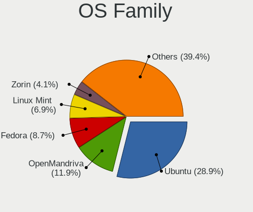

| Name          | Computers | Percent |
|---------------|-----------|---------|
| Ubuntu        | 47        | 38.21%  |
| OpenMandriva  | 12        | 9.76%   |
| Linux Mint    | 11        | 8.94%   |
| Pop!_OS       | 5         | 4.07%   |
| Zorin         | 4         | 3.25%   |
| ROSA          | 4         | 3.25%   |
| Manjaro       | 4         | 3.25%   |
| Xubuntu       | 3         | 2.44%   |
| KDE neon      | 3         | 2.44%   |
| Fedora        | 3         | 2.44%   |
| BlackPanther  | 3         | 2.44%   |
| Parrot        | 2         | 1.63%   |
| Lubuntu       | 2         | 1.63%   |
| LMDE          | 2         | 1.63%   |
| Garuda Linux  | 2         | 1.63%   |
| Endless       | 2         | 1.63%   |
| Debian        | 2         | 1.63%   |
| ArcoLinux     | 2         | 1.63%   |
| Arch          | 2         | 1.63%   |
| Ubuntu MATE   | 1         | 0.81%   |
| Ubuntu Budgie | 1         | 0.81%   |
| Peppermint    | 1         | 0.81%   |
| openSUSE      | 1         | 0.81%   |
| LinuxFX       | 1         | 0.81%   |
| EndeavourOS   | 1         | 0.81%   |
| Devuan        | 1         | 0.81%   |
| CentOS        | 1         | 0.81%   |

Kernel
------

Version of the Linux kernel

| Version                        | Computers | Percent |
|--------------------------------|-----------|---------|
| 5.10.14-desktop-1omv4002       | 6         | 3.95%   |
| 5.16.7-desktop-1omv4003        | 5         | 3.29%   |
| 5.4.0-58-generic               | 4         | 2.63%   |
| 5.8.0-59-generic               | 3         | 1.97%   |
| 5.11.0-38-generic              | 3         | 1.97%   |
| 4.15.0-43-generic              | 3         | 1.97%   |
| 5.8.18-1-MANJARO               | 2         | 1.32%   |
| 5.8.0-55-generic               | 2         | 1.32%   |
| 5.8.0-45-generic               | 2         | 1.32%   |
| 5.4.0-73-generic               | 2         | 1.32%   |
| 5.4.0-72-generic               | 2         | 1.32%   |
| 5.4.0-52-generic               | 2         | 1.32%   |
| 5.4.0-48-generic               | 2         | 1.32%   |
| 5.4.0-47-generic               | 2         | 1.32%   |
| 5.4.0-40-generic               | 2         | 1.32%   |
| 5.4.0-109-generic              | 2         | 1.32%   |
| 5.3.0-41-generic               | 2         | 1.32%   |
| 5.3.0-28-generic               | 2         | 1.32%   |
| 5.15.0-46-generic              | 2         | 1.32%   |
| 5.15.0-40-generic              | 2         | 1.32%   |
| 5.13.0-40-generic              | 2         | 1.32%   |
| 5.13.0-39-generic              | 2         | 1.32%   |
| 5.13.0-35-generic              | 2         | 1.32%   |
| 5.13.0-30-generic              | 2         | 1.32%   |
| 5.11.0-41-generic              | 2         | 1.32%   |
| 5.11.0-27-generic              | 2         | 1.32%   |
| 4.18.16-desktop-1bP            | 2         | 1.32%   |
| 4.15.0-desktop-45.1rosa-x86_64 | 2         | 1.32%   |
| 5.9.16-200.fc33.x86_64         | 1         | 0.66%   |
| 5.9.16-1-MANJARO               | 1         | 0.66%   |
| 5.9.1-1-MANJARO                | 1         | 0.66%   |
| 5.8.5-zen1-1-zen               | 1         | 0.66%   |
| 5.8.14-zen1-1-zen              | 1         | 0.66%   |
| 5.8.0-7630-generic             | 1         | 0.66%   |
| 5.8.0-63-generic               | 1         | 0.66%   |
| 5.8.0-54-generic               | 1         | 0.66%   |
| 5.8.0-53-generic               | 1         | 0.66%   |
| 5.8.0-49-generic               | 1         | 0.66%   |
| 5.8.0-44-generic               | 1         | 0.66%   |
| 5.8.0-29-generic               | 1         | 0.66%   |
| 5.8.0-25-generic               | 1         | 0.66%   |
| 5.8.0-14-generic               | 1         | 0.66%   |
| 5.8.0-1011-raspi               | 1         | 0.66%   |
| 5.8.0-1008-raspi               | 1         | 0.66%   |
| 5.8.0-1006-raspi               | 1         | 0.66%   |
| 5.6.14-desktop-2bP             | 1         | 0.66%   |
| 5.4.0-89-generic               | 1         | 0.66%   |
| 5.4.0-88-generic               | 1         | 0.66%   |
| 5.4.0-84-generic               | 1         | 0.66%   |
| 5.4.0-77-generic               | 1         | 0.66%   |
| 5.4.0-7634-generic             | 1         | 0.66%   |
| 5.4.0-70-generic               | 1         | 0.66%   |
| 5.4.0-65-generic               | 1         | 0.66%   |
| 5.4.0-62-generic               | 1         | 0.66%   |
| 5.4.0-60-generic               | 1         | 0.66%   |
| 5.4.0-59-generic               | 1         | 0.66%   |
| 5.4.0-55-generic               | 1         | 0.66%   |
| 5.4.0-42-generic               | 1         | 0.66%   |
| 5.4.0-37-generic               | 1         | 0.66%   |
| 5.4.0-29-generic               | 1         | 0.66%   |

Kernel Family
-------------

Linux kernel without a distro release

| Version | Computers | Percent |
|---------|-----------|---------|
| 5.4.0   | 29        | 22.14%  |
| 5.8.0   | 14        | 10.69%  |
| 5.13.0  | 11        | 8.4%    |
| 4.15.0  | 10        | 7.63%   |
| 5.11.0  | 9         | 6.87%   |
| 5.3.0   | 6         | 4.58%   |
| 5.10.14 | 6         | 4.58%   |
| 5.16.7  | 5         | 3.82%   |
| 5.15.0  | 5         | 3.82%   |
| 4.19.0  | 3         | 2.29%   |
| 4.18.0  | 3         | 2.29%   |
| 5.9.16  | 2         | 1.53%   |
| 5.8.18  | 2         | 1.53%   |
| 5.10.0  | 2         | 1.53%   |
| 4.9.60  | 2         | 1.53%   |
| 4.18.16 | 2         | 1.53%   |
| 5.9.1   | 1         | 0.76%   |
| 5.8.5   | 1         | 0.76%   |
| 5.8.14  | 1         | 0.76%   |
| 5.6.14  | 1         | 0.76%   |
| 5.3.6   | 1         | 0.76%   |
| 5.3.18  | 1         | 0.76%   |
| 5.18.9  | 1         | 0.76%   |
| 5.18.6  | 1         | 0.76%   |
| 5.18.5  | 1         | 0.76%   |
| 5.18.0  | 1         | 0.76%   |
| 5.17.1  | 1         | 0.76%   |
| 5.15.59 | 1         | 0.76%   |
| 5.15.5  | 1         | 0.76%   |
| 5.14.8  | 1         | 0.76%   |
| 5.13.19 | 1         | 0.76%   |
| 5.12.4  | 1         | 0.76%   |
| 5.11.16 | 1         | 0.76%   |
| 5.11.13 | 1         | 0.76%   |
| 4.9.20  | 1         | 0.76%   |
| 4.9.0   | 1         | 0.76%   |

Kernel Major Ver.
-----------------

Linux kernel major version

| Version | Computers | Percent |
|---------|-----------|---------|
| 5.4     | 29        | 22.83%  |
| 5.8     | 18        | 14.17%  |
| 5.13    | 12        | 9.45%   |
| 5.11    | 10        | 7.87%   |
| 4.15    | 10        | 7.87%   |
| 5.3     | 8         | 6.3%    |
| 5.10    | 8         | 6.3%    |
| 5.15    | 7         | 5.51%   |
| 5.16    | 5         | 3.94%   |
| 4.9     | 4         | 3.15%   |
| 4.18    | 4         | 3.15%   |
| 5.9     | 3         | 2.36%   |
| 4.19    | 3         | 2.36%   |
| 5.18    | 2         | 1.57%   |
| 5.6     | 1         | 0.79%   |
| 5.17    | 1         | 0.79%   |
| 5.14    | 1         | 0.79%   |
| 5.12    | 1         | 0.79%   |

Arch
----

OS architecture (x86_64, i586, etc.)

| Name    | Computers | Percent |
|---------|-----------|---------|
| x86_64  | 102       | 96.23%  |
| i686    | 2         | 1.89%   |
| aarch64 | 2         | 1.89%   |

DE
--

Desktop Environment

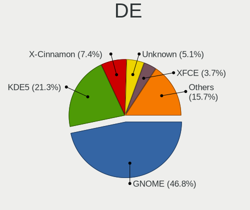

| Name       | Computers | Percent |
|------------|-----------|---------|
| GNOME      | 57        | 46.72%  |
| KDE5       | 24        | 19.67%  |
| X-Cinnamon | 9         | 7.38%   |
| XFCE       | 7         | 5.74%   |
| Unknown    | 6         | 4.92%   |
| MATE       | 5         | 4.1%    |
| LXQt       | 2         | 1.64%   |
| LXDE       | 2         | 1.64%   |
| KDE4       | 2         | 1.64%   |
| KDE        | 2         | 1.64%   |
| Budgie     | 2         | 1.64%   |
| Unity      | 1         | 0.82%   |
| i3         | 1         | 0.82%   |
| Deepin     | 1         | 0.82%   |
| Cinnamon   | 1         | 0.82%   |

Display Server
--------------

X11 or Wayland

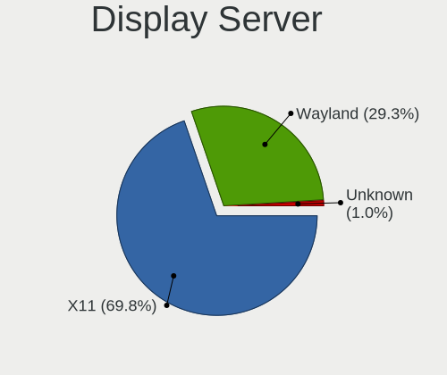

| Name    | Computers | Percent |
|---------|-----------|---------|
| X11     | 97        | 88.99%  |
| Wayland | 11        | 10.09%  |
| Unknown | 1         | 0.92%   |

Display Manager
---------------

SDDM, LightDM, etc.

| Name    | Computers | Percent |
|---------|-----------|---------|
| Unknown | 71        | 60.17%  |
| SDDM    | 17        | 14.41%  |
| GDM3    | 14        | 11.86%  |
| GDM     | 6         | 5.08%   |
| LightDM | 5         | 4.24%   |
| TDM     | 3         | 2.54%   |
| KDM     | 2         | 1.69%   |

OS Lang
-------

Language

| Lang    | Computers | Percent |
|---------|-----------|---------|
| en_US   | 88        | 81.48%  |
| Unknown | 12        | 11.11%  |
| es_PR   | 5         | 4.63%   |
| C       | 2         | 1.85%   |
| es_ES   | 1         | 0.93%   |

Boot Mode
---------

EFI or BIOS

| Mode | Computers | Percent |
|------|-----------|---------|
| BIOS | 63        | 56.25%  |
| EFI  | 49        | 43.75%  |

Filesystem
----------

Type of filesystem

| Type    | Computers | Percent |
|---------|-----------|---------|
| Ext4    | 83        | 74.11%  |
| Overlay | 16        | 14.29%  |
| Btrfs   | 6         | 5.36%   |
| Unknown | 5         | 4.46%   |
| Zfs     | 1         | 0.89%   |
| Xfs     | 1         | 0.89%   |

Part. scheme
------------

Scheme of partitioning

| Type    | Computers | Percent |
|---------|-----------|---------|
| Unknown | 80        | 70.8%   |
| GPT     | 24        | 21.24%  |
| MBR     | 9         | 7.96%   |

Dual Boot with Linux/BSD
------------------------

Hosting more than one Linux/BSD

| Dual boot | Computers | Percent |
|-----------|-----------|---------|
| No        | 94        | 83.93%  |
| Yes       | 18        | 16.07%  |

Dual Boot (Win)
---------------

Hosting Linux and Windows

| Dual boot | Computers | Percent |
|-----------|-----------|---------|
| No        | 85        | 75.22%  |
| Yes       | 28        | 24.78%  |

Board
-----

Vendor
------

Motherboard manufacturer

| Name                    | Computers | Percent |
|-------------------------|-----------|---------|
| Hewlett-Packard         | 20        | 18.87%  |
| Dell                    | 19        | 17.92%  |
| Gigabyte Technology     | 9         | 8.49%   |
| MSI                     | 8         | 7.55%   |
| Lenovo                  | 8         | 7.55%   |
| ASUSTek Computer        | 8         | 7.55%   |
| ASRock                  | 8         | 7.55%   |
| Acer                    | 5         | 4.72%   |
| Apple                   | 4         | 3.77%   |
| Toshiba                 | 3         | 2.83%   |
| Sony                    | 2         | 1.89%   |
| Raspberry Pi Foundation | 2         | 1.89%   |
| Intel                   | 2         | 1.89%   |
| TUXEDO                  | 1         | 0.94%   |
| Pegatron                | 1         | 0.94%   |
| GPU Company             | 1         | 0.94%   |
| CompuLab                | 1         | 0.94%   |
| AZW                     | 1         | 0.94%   |
| AMI                     | 1         | 0.94%   |
| Alienware               | 1         | 0.94%   |
| Acidanthera             | 1         | 0.94%   |

Model
-----

Motherboard model

| Name                                    | Computers | Percent |
|-----------------------------------------|-----------|---------|
| Dell Vostro 3550                        | 3         | 2.83%   |
| RPi Raspberry Pi                        | 2         | 1.89%   |
| MSI Cubi N 8GL (MS-B171)                | 2         | 1.89%   |
| Intel SKYBAY                            | 2         | 1.89%   |
| ASRock Q1900M                           | 2         | 1.89%   |
| ASRock 945GCM-S                         | 2         | 1.89%   |
| TUXEDO Aura 15 Gen1                     | 1         | 0.94%   |
| Toshiba Satellite P755                  | 1         | 0.94%   |
| Toshiba Satellite L655                  | 1         | 0.94%   |
| Toshiba Satellite C55-C                 | 1         | 0.94%   |
| Sony VPCEA36FX                          | 1         | 0.94%   |
| Sony VGN-CS320J                         | 1         | 0.94%   |
| Pegatron QW716AA#ABA                    | 1         | 0.94%   |
| MSI US PIO PRO AP241                    | 1         | 0.94%   |
| MSI MS-7B48                             | 1         | 0.94%   |
| MSI MS-7971                             | 1         | 0.94%   |
| MSI MS-7817                             | 1         | 0.94%   |
| MSI GF65 Thin 10SDR                     | 1         | 0.94%   |
| MSI Cubi N JSL (MS-B0A1)                | 1         | 0.94%   |
| Lenovo Yoga 910-13IKB 80VF              | 1         | 0.94%   |
| Lenovo ThinkPad T410 2516ADU            | 1         | 0.94%   |
| Lenovo ThinkPad E14 20RA004WUS          | 1         | 0.94%   |
| Lenovo ThinkCentre M91p 7033CG1         | 1         | 0.94%   |
| Lenovo ThinkCentre M58p 6136A66         | 1         | 0.94%   |
| Lenovo IdeaPad 120S-11IAP 81A4          | 1         | 0.94%   |
| Lenovo IdeaCentre 510A-15ARR 90J0000PUS | 1         | 0.94%   |
| Lenovo G50-45 80E3                      | 1         | 0.94%   |
| HP Stream Laptop 14-CB1xxx              | 1         | 0.94%   |
| HP ProBook 6560b                        | 1         | 0.94%   |
| HP ProBook 6450b                        | 1         | 0.94%   |
| HP ProBook 450 G5                       | 1         | 0.94%   |
| HP Pavilion Gaming Laptop 15-dk0xxx     | 1         | 0.94%   |
| HP Notebook                             | 1         | 0.94%   |
| HP Laptop 15-dy1xxx                     | 1         | 0.94%   |
| HP Laptop 15-dw0xxx                     | 1         | 0.94%   |
| HP Laptop 14-dk1xxx                     | 1         | 0.94%   |
| HP ENVY Laptop 17m-bw0xxx               | 1         | 0.94%   |
| HP ENVY Laptop 17-ce1xxx                | 1         | 0.94%   |
| HP ENVY dv7                             | 1         | 0.94%   |
| HP EliteDesk 800 G1 TWR                 | 1         | 0.94%   |
| HP EliteDesk 800 G1 SFF                 | 1         | 0.94%   |
| HP EliteBook 840 G2                     | 1         | 0.94%   |
| HP Compaq Pro 6300 SFF                  | 1         | 0.94%   |
| HP Compaq Pro 6300 MT                   | 1         | 0.94%   |
| HP Compaq nc6400 (RB516UT#ABA)          | 1         | 0.94%   |
| HP Compaq dc7800p Small Form Factor     | 1         | 0.94%   |
| HP Compaq 8200 Elite SFF PC             | 1         | 0.94%   |
| GPU Company GWTN156-9                   | 1         | 0.94%   |
| Gigabyte Z97M-DS3H                      | 1         | 0.94%   |
| Gigabyte X570 GAMING X                  | 1         | 0.94%   |
| Gigabyte X570 AORUS ELITE WIFI          | 1         | 0.94%   |
| Gigabyte X399 AORUS Gaming 7            | 1         | 0.94%   |
| Gigabyte J1900N-D3V                     | 1         | 0.94%   |
| Gigabyte F2A78M-HD2                     | 1         | 0.94%   |
| Gigabyte F2A68HM-H                      | 1         | 0.94%   |
| Gigabyte B450M DS3H                     | 1         | 0.94%   |
| Gigabyte B450 AORUS PRO WIFI            | 1         | 0.94%   |
| Dell Venue 11 Pro 7130 MS               | 1         | 0.94%   |
| Dell Studio 540                         | 1         | 0.94%   |
| Dell Precision M4700                    | 1         | 0.94%   |

Model Family
------------

Motherboard model prefix

| Name                  | Computers | Percent |
|-----------------------|-----------|---------|
| Dell Inspiron         | 7         | 6.6%    |
| HP Compaq             | 5         | 4.72%   |
| Dell OptiPlex         | 4         | 3.77%   |
| Toshiba Satellite     | 3         | 2.83%   |
| MSI Cubi              | 3         | 2.83%   |
| HP ProBook            | 3         | 2.83%   |
| HP Laptop             | 3         | 2.83%   |
| HP ENVY               | 3         | 2.83%   |
| Dell Vostro           | 3         | 2.83%   |
| Acer Aspire           | 3         | 2.83%   |
| RPi Raspberry         | 2         | 1.89%   |
| Lenovo ThinkPad       | 2         | 1.89%   |
| Lenovo ThinkCentre    | 2         | 1.89%   |
| Intel SKYBAY          | 2         | 1.89%   |
| HP EliteDesk          | 2         | 1.89%   |
| Gigabyte X570         | 2         | 1.89%   |
| Dell Latitude         | 2         | 1.89%   |
| ASUS ROG              | 2         | 1.89%   |
| ASRock Q1900M         | 2         | 1.89%   |
| ASRock B450M-HDV      | 2         | 1.89%   |
| ASRock 945GCM-S       | 2         | 1.89%   |
| Acer Swift            | 2         | 1.89%   |
| TUXEDO Aura           | 1         | 0.94%   |
| Sony VPCEA36FX        | 1         | 0.94%   |
| Sony VGN-CS320J       | 1         | 0.94%   |
| Pegatron QW716AA#ABA  | 1         | 0.94%   |
| MSI US                | 1         | 0.94%   |
| MSI MS-7B48           | 1         | 0.94%   |
| MSI MS-7971           | 1         | 0.94%   |
| MSI MS-7817           | 1         | 0.94%   |
| MSI GF65              | 1         | 0.94%   |
| Lenovo Yoga           | 1         | 0.94%   |
| Lenovo IdeaPad        | 1         | 0.94%   |
| Lenovo IdeaCentre     | 1         | 0.94%   |
| Lenovo G50-45         | 1         | 0.94%   |
| HP Stream             | 1         | 0.94%   |
| HP Pavilion           | 1         | 0.94%   |
| HP Notebook           | 1         | 0.94%   |
| HP EliteBook          | 1         | 0.94%   |
| GPU Company GWTN156-9 | 1         | 0.94%   |
| Gigabyte Z97M-DS3H    | 1         | 0.94%   |
| Gigabyte X399         | 1         | 0.94%   |
| Gigabyte J1900N-D3V   | 1         | 0.94%   |
| Gigabyte F2A78M-HD2   | 1         | 0.94%   |
| Gigabyte F2A68HM-H    | 1         | 0.94%   |
| Gigabyte B450M        | 1         | 0.94%   |
| Gigabyte B450         | 1         | 0.94%   |
| Dell Venue            | 1         | 0.94%   |
| Dell Studio           | 1         | 0.94%   |
| Dell Precision        | 1         | 0.94%   |
| CompuLab fit-PC3      | 1         | 0.94%   |
| AZW GT-R              | 1         | 0.94%   |
| ASUS X540SAA          | 1         | 0.94%   |
| ASUS TUF              | 1         | 0.94%   |
| ASUS PRIME            | 1         | 0.94%   |
| ASUS M5A78L-M         | 1         | 0.94%   |
| ASUS M2N-E            | 1         | 0.94%   |
| ASUS K53E             | 1         | 0.94%   |
| ASRock Z270           | 1         | 0.94%   |
| ASRock G31M-S         | 1         | 0.94%   |

MFG Year
--------

Motherboard manufacture year

| Year    | Computers | Percent |
|---------|-----------|---------|
| 2019    | 14        | 13.21%  |
| 2018    | 13        | 12.26%  |
| 2011    | 12        | 11.32%  |
| 2014    | 9         | 8.49%   |
| 2020    | 7         | 6.6%    |
| 2015    | 7         | 6.6%    |
| 2016    | 6         | 5.66%   |
| 2012    | 6         | 5.66%   |
| 2008    | 6         | 5.66%   |
| 2010    | 5         | 4.72%   |
| 2021    | 4         | 3.77%   |
| 2017    | 4         | 3.77%   |
| 2013    | 4         | 3.77%   |
| 2009    | 3         | 2.83%   |
| 2006    | 2         | 1.89%   |
| Unknown | 2         | 1.89%   |
| 2007    | 1         | 0.94%   |
| 2005    | 1         | 0.94%   |

Form Factor
-----------

Physical design of the computer

| Name           | Computers | Percent |
|----------------|-----------|---------|
| Desktop        | 49        | 46.23%  |
| Notebook       | 49        | 46.23%  |
| All in one     | 4         | 3.77%   |
| System on chip | 2         | 1.89%   |
| Convertible    | 1         | 0.94%   |
| Mini pc        | 1         | 0.94%   |

Secure Boot
-----------

Enabled or disabled

| State    | Computers | Percent |
|----------|-----------|---------|
| Disabled | 99        | 92.52%  |
| Enabled  | 8         | 7.48%   |

Coreboot
--------

Have coreboot on board

| Used | Computers | Percent |
|------|-----------|---------|
| No   | 106       | 100%    |

RAM Size
--------

Total RAM memory

| Size in GB  | Computers | Percent |
|-------------|-----------|---------|
| 4.01-8.0    | 34        | 30.91%  |
| 3.01-4.0    | 23        | 20.91%  |
| 8.01-16.0   | 22        | 20%     |
| 16.01-24.0  | 15        | 13.64%  |
| 32.01-64.0  | 6         | 5.45%   |
| 1.01-2.0    | 5         | 4.55%   |
| 24.01-32.0  | 3         | 2.73%   |
| 64.01-256.0 | 2         | 1.82%   |

RAM Used
--------

Used RAM memory

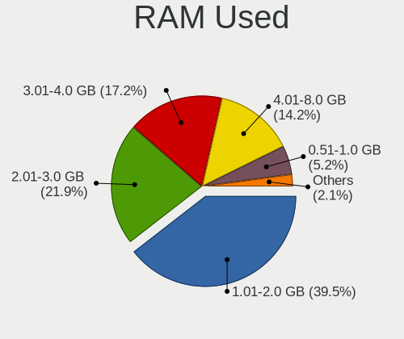

| Used GB   | Computers | Percent |
|-----------|-----------|---------|
| 1.01-2.0  | 64        | 48.85%  |
| 2.01-3.0  | 25        | 19.08%  |
| 3.01-4.0  | 17        | 12.98%  |
| 4.01-8.0  | 14        | 10.69%  |
| 0.51-1.0  | 9         | 6.87%   |
| 8.01-16.0 | 2         | 1.53%   |

Total Drives
------------

Number of drives on board

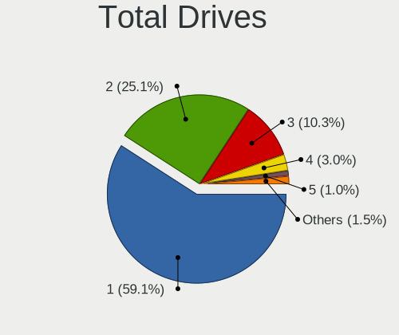

| Drives | Computers | Percent |
|--------|-----------|---------|
| 1      | 65        | 57.02%  |
| 2      | 26        | 22.81%  |
| 3      | 15        | 13.16%  |
| 4      | 5         | 4.39%   |
| 6      | 1         | 0.88%   |
| 5      | 1         | 0.88%   |
| 0      | 1         | 0.88%   |

Has CD-ROM
----------

Has CD-ROM on board

| Presented | Computers | Percent |
|-----------|-----------|---------|
| Yes       | 54        | 50.47%  |
| No        | 53        | 49.53%  |

Has Ethernet
------------

Has Ethernet on board

| Presented | Computers | Percent |
|-----------|-----------|---------|
| Yes       | 94        | 88.68%  |
| No        | 12        | 11.32%  |

Has WiFi
--------

Has WiFi module

| Presented | Computers | Percent |
|-----------|-----------|---------|
| Yes       | 81        | 75%     |
| No        | 27        | 25%     |

Has Bluetooth
-------------

Has Bluetooth module

| Presented | Computers | Percent |
|-----------|-----------|---------|
| Yes       | 64        | 58.72%  |
| No        | 45        | 41.28%  |

Location
--------

Country
-------

Geographic location (country)

| Country     | Computers | Percent |
|-------------|-----------|---------|
| Puerto Rico | 106       | 100%    |

City
----

Geographic location (city)

| City          | Computers | Percent |
|---------------|-----------|---------|
| San Juan      | 46        | 39.32%  |
| Bayamn      | 20        | 17.09%  |
| Carolina      | 9         | 7.69%   |
| Ponce         | 4         | 3.42%   |
| Cayey         | 4         | 3.42%   |
| Caguas        | 4         | 3.42%   |
| Aguadilla     | 3         | 2.56%   |
| Vega Alta     | 2         | 1.71%   |
| Sabana Grande | 2         | 1.71%   |
| Mayagez     | 2         | 1.71%   |
| Lares         | 2         | 1.71%   |
| Guayama       | 2         | 1.71%   |
| Dorado        | 2         | 1.71%   |
| San Sebastian | 1         | 0.85%   |
| Rio Grande    | 1         | 0.85%   |
| Patillas      | 1         | 0.85%   |
| Morovis       | 1         | 0.85%   |
| Maunabo       | 1         | 0.85%   |
| Las Piedras   | 1         | 0.85%   |
| Humacao       | 1         | 0.85%   |
| Hatillo       | 1         | 0.85%   |
| Gurabo        | 1         | 0.85%   |
| Fajardo       | 1         | 0.85%   |
| Ensenada      | 1         | 0.85%   |
| Coamo         | 1         | 0.85%   |
| Catano        | 1         | 0.85%   |
| Barceloneta   | 1         | 0.85%   |
| Arecibo       | 1         | 0.85%   |

Drives
------

Drive Vendor
------------

Hard drive vendors

| Vendor                      | Computers | Drives | Percent |
|-----------------------------|-----------|--------|---------|
| WDC                         | 31        | 72     | 19.87%  |
| Seagate                     | 20        | 38     | 12.82%  |
| Toshiba                     | 15        | 18     | 9.62%   |
| Samsung Electronics         | 11        | 20     | 7.05%   |
| Hitachi                     | 9         | 24     | 5.77%   |
| Crucial                     | 9         | 13     | 5.77%   |
| Unknown                     | 7         | 11     | 4.49%   |
| SanDisk                     | 5         | 5      | 3.21%   |
| China                       | 5         | 8      | 3.21%   |
| A-DATA Technology           | 5         | 10     | 3.21%   |
| Silicon Motion              | 3         | 3      | 1.92%   |
| Micron/Crucial Technology   | 3         | 4      | 1.92%   |
| External                    | 3         | 4      | 1.92%   |
| TDAS                        | 2         | 10     | 1.28%   |
| SK hynix                    | 2         | 3      | 1.28%   |
| SABRENT                     | 2         | 3      | 1.28%   |
| PNY                         | 2         | 2      | 1.28%   |
| Phison                      | 2         | 2      | 1.28%   |
| LITEONIT                    | 2         | 2      | 1.28%   |
| Intel                       | 2         | 3      | 1.28%   |
| WD MediaMax                 | 1         | 3      | 0.64%   |
| W800SH                      | 1         | 1      | 0.64%   |
| USB3.0                      | 1         | 1      | 0.64%   |
| Team                        | 1         | 1      | 0.64%   |
| Micron Technology           | 1         | 1      | 0.64%   |
| MAXIO Technology (Hangzhou) | 1         | 1      | 0.64%   |
| Kingston                    | 1         | 1      | 0.64%   |
| KingSpec                    | 1         | 1      | 0.64%   |
| JMicron Technology          | 1         | 4      | 0.64%   |
| INTEL SS                    | 1         | 1      | 0.64%   |
| HGST                        | 1         | 1      | 0.64%   |
| Axiom                       | 1         | 3      | 0.64%   |
| Argon                       | 1         | 1      | 0.64%   |
| Apple                       | 1         | 1      | 0.64%   |
| addlink                     | 1         | 1      | 0.64%   |
| Unknown                     | 1         | 1      | 0.64%   |

Drive Model
-----------

Hard drive models

| Model                                | Computers | Percent |
|--------------------------------------|-----------|---------|
| Crucial CT240BX500SSD1 240GB         | 5         | 2.91%   |
| WDC WD5000LPVT-22G33T0 500GB         | 3         | 1.74%   |
| Toshiba DT01ACA100 1TB               | 3         | 1.74%   |
| External USB3.0 1TB                  | 3         | 1.74%   |
| WDC WDS240G2G0A-00JH30 240GB SSD     | 2         | 1.16%   |
| WDC WDBNCE2500PNC 250GB SSD          | 2         | 1.16%   |
| WDC WD5000LPLX-22ZNTT0 500GB         | 2         | 1.16%   |
| WDC WD2500BEVS-60UST0 250GB          | 2         | 1.16%   |
| Unknown MMC Card  2GB                | 2         | 1.16%   |
| Toshiba MQ01ABD100 1TB               | 2         | 1.16%   |
| Toshiba MK3261GSYN 320GB             | 2         | 1.16%   |
| Toshiba DT01ACA050 500GB             | 2         | 1.16%   |
| TDAS TerraMaster 1TB                 | 2         | 1.16%   |
| Seagate ST320DM001 HD322GJ 320GB     | 2         | 1.16%   |
| Seagate ST2000VM003-1CT164 2TB       | 2         | 1.16%   |
| Seagate Expansion 500GB              | 2         | 1.16%   |
| Samsung SSD 850 EVO 500GB            | 2         | 1.16%   |
| Samsung NVMe SSD Drive 500GB         | 2         | 1.16%   |
| SABRENT Disk 480GB                   | 2         | 1.16%   |
| Micron/Crucial NVMe SSD Drive 500GB  | 2         | 1.16%   |
| Hitachi HTS547550A9E384 500GB        | 2         | 1.16%   |
| Crucial CT240M500SSD1 240GB          | 2         | 1.16%   |
| China SATA SSD 512GB                 | 2         | 1.16%   |
| WDC WDBNCE0010PNC 1TB SSD            | 1         | 0.58%   |
| WDC WD7500BPVX-60JC3T0 752GB         | 1         | 0.58%   |
| WDC WD5000LPCX-00VHAT0 500GB         | 1         | 0.58%   |
| WDC WD5000BPVT-75HXZT1 500GB         | 1         | 0.58%   |
| WDC WD40EZRZ-22GXCB0 4TB             | 1         | 0.58%   |
| WDC WD30EZRZ-00WN9B0 3TB             | 1         | 0.58%   |
| WDC WD20EZRZ-00Z5HB0 2TB             | 1         | 0.58%   |
| WDC WD1600AAJS-00PSA0 160GB          | 1         | 0.58%   |
| WDC WD1500HLFS-01G6U1 150GB          | 1         | 0.58%   |
| WDC WD1200BEVS-75UST0 120GB          | 1         | 0.58%   |
| WDC WD10SPZX-60Z10T0 1TB             | 1         | 0.58%   |
| WDC WD10SPZX-22Z10T1 1TB             | 1         | 0.58%   |
| WDC WD10SPZX-21Z10T0 1TB             | 1         | 0.58%   |
| WDC WD10SPCX-75KHST0 1TB             | 1         | 0.58%   |
| WDC WD10JPVX-22JC3T0 1TB             | 1         | 0.58%   |
| WDC WD10EZRX-00L4HB0 1TB             | 1         | 0.58%   |
| WDC WD10EZEX-75WN4A1 1TB             | 1         | 0.58%   |
| WDC WD10EZEX-08WN4A0 1TB             | 1         | 0.58%   |
| WDC WD10EZEX-00BN5A0 1TB             | 1         | 0.58%   |
| WDC WD10EURX-63FH1Y0 1TB             | 1         | 0.58%   |
| WDC WD10EAVS-00D7B1 1TB              | 1         | 0.58%   |
| WDC WD1003FBYZ-010FB0 1TB            | 1         | 0.58%   |
| WDC WD1003FBYX-05Y7B0 1TB            | 1         | 0.58%   |
| WDC PC SN530 SDBPNPZ-512G-1032 512GB | 1         | 0.58%   |
| WD MediaMax WL500GSA3272 500GB       | 1         | 0.58%   |
| W800SH 512GB SSD                     | 1         | 0.58%   |
| USB3.0 Super Speed 128GB             | 1         | 0.58%   |
| Unknown MMC Card  64GB               | 1         | 0.58%   |
| Unknown MMC Card  32GB               | 1         | 0.58%   |
| Unknown MMC Card  10GB               | 1         | 0.58%   |
| Unknown HBG4a2  32GB                 | 1         | 0.58%   |
| Unknown Externa 250GB                | 1         | 0.58%   |
| Unknown DA4064  64GB                 | 1         | 0.58%   |
| Toshiba MQ04ABF100 1TB               | 1         | 0.58%   |
| Toshiba MQ01ABF050 500GB             | 1         | 0.58%   |
| Toshiba MK3276GSX 320GB              | 1         | 0.58%   |
| Toshiba MK3254GSY 320GB              | 1         | 0.58%   |

HDD Vendor
----------

Hard disk drive vendors

| Vendor              | Computers | Drives | Percent |
|---------------------|-----------|--------|---------|
| WDC                 | 25        | 62     | 33.78%  |
| Seagate             | 20        | 38     | 27.03%  |
| Toshiba             | 14        | 17     | 18.92%  |
| Hitachi             | 9         | 24     | 12.16%  |
| SABRENT             | 2         | 3      | 2.7%    |
| USB3.0              | 1         | 1      | 1.35%   |
| Samsung Electronics | 1         | 1      | 1.35%   |
| HGST                | 1         | 1      | 1.35%   |
| Apple               | 1         | 1      | 1.35%   |

SSD Vendor
----------

Solid state drive vendors

| Vendor              | Computers | Drives | Percent |
|---------------------|-----------|--------|---------|
| Crucial             | 9         | 13     | 20.93%  |
| Samsung Electronics | 7         | 11     | 16.28%  |
| WDC                 | 5         | 8      | 11.63%  |
| China               | 5         | 8      | 11.63%  |
| A-DATA Technology   | 5         | 10     | 11.63%  |
| SanDisk             | 3         | 3      | 6.98%   |
| PNY                 | 2         | 2      | 4.65%   |
| LITEONIT            | 2         | 2      | 4.65%   |
| W800SH              | 1         | 1      | 2.33%   |
| Micron Technology   | 1         | 1      | 2.33%   |
| KingSpec            | 1         | 1      | 2.33%   |
| INTEL SS            | 1         | 1      | 2.33%   |
| Argon               | 1         | 1      | 2.33%   |

Drive Kind
----------

HDD or SSD

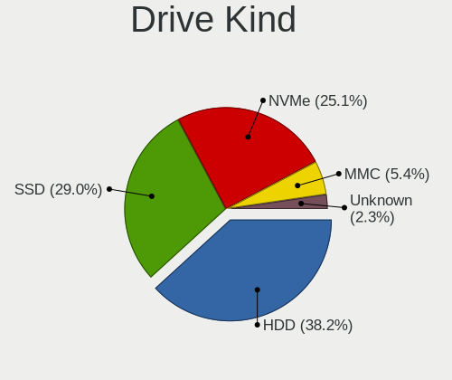

| Kind    | Computers | Drives | Percent |
|---------|-----------|--------|---------|
| HDD     | 66        | 148    | 45.83%  |
| SSD     | 40        | 62     | 27.78%  |
| NVMe    | 25        | 36     | 17.36%  |
| MMC     | 7         | 10     | 4.86%   |
| Unknown | 6         | 22     | 4.17%   |

Drive Connector
---------------

SATA, SAS, NVMe, etc.

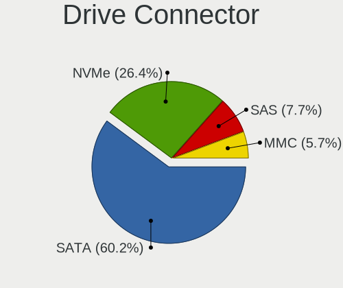

| Type | Computers | Drives | Percent |
|------|-----------|--------|---------|
| SATA | 92        | 207    | 68.15%  |
| NVMe | 22        | 32     | 16.3%   |
| SAS  | 14        | 29     | 10.37%  |
| MMC  | 7         | 10     | 5.19%   |

Drive Size
----------

Size of hard drive

| Size in TB | Computers | Drives | Percent |
|------------|-----------|--------|---------|
| 0.01-0.5   | 62        | 110    | 55.86%  |
| 0.51-1.0   | 36        | 71     | 32.43%  |
| 1.01-2.0   | 9         | 20     | 8.11%   |
| 3.01-4.0   | 3         | 8      | 2.7%    |
| 2.01-3.0   | 1         | 1      | 0.9%    |

Space Total
-----------

Amount of disk space available on the file system

| Size in GB     | Computers | Percent |
|----------------|-----------|---------|
| 251-500        | 29        | 22.31%  |
| 101-250        | 27        | 20.77%  |
| 501-1000       | 23        | 17.69%  |
| 1-20           | 13        | 10%     |
| 1001-2000      | 11        | 8.46%   |
| 2001-3000      | 9         | 6.92%   |
| More than 3000 | 8         | 6.15%   |
| 51-100         | 4         | 3.08%   |
| 21-50          | 3         | 2.31%   |
| Unknown        | 3         | 2.31%   |

Space Used
----------

Amount of used disk space

| Used GB   | Computers | Percent |
|-----------|-----------|---------|
| 1-20      | 49        | 36.57%  |
| 21-50     | 24        | 17.91%  |
| 101-250   | 14        | 10.45%  |
| 51-100    | 14        | 10.45%  |
| 251-500   | 12        | 8.96%   |
| 501-1000  | 10        | 7.46%   |
| 1001-2000 | 7         | 5.22%   |
| Unknown   | 3         | 2.24%   |
| 2001-3000 | 1         | 0.75%   |

Malfunc. Drives
---------------

Drive models with a malfunction

| Model                                            | Computers | Drives | Percent |
|--------------------------------------------------|-----------|--------|---------|
| WDC WD2500BEVS-60UST0 250GB                      | 1         | 1      | 7.14%   |
| Toshiba MQ01ABD100 1TB                           | 1         | 1      | 7.14%   |
| SK hynix BC501 HFM256GDJTNG-8310A 256GB          | 1         | 1      | 7.14%   |
| Seagate ST3320613AS 320GB                        | 1         | 1      | 7.14%   |
| Seagate ST3250310AS 250GB                        | 1         | 1      | 7.14%   |
| Seagate ST320DM001 HD322GJ 320GB                 | 1         | 1      | 7.14%   |
| Seagate ST2000VM003-1CT164 2TB                   | 1         | 1      | 7.14%   |
| Seagate ST2000LM007-1R8174 2TB                   | 1         | 1      | 7.14%   |
| Seagate ST2000DL001-9VT156 2TB                   | 1         | 1      | 7.14%   |
| Samsung Electronics MZNLH128HBHQ-000H1 128GB SSD | 1         | 1      | 7.14%   |
| Micron Technology 1100_MTFDDAV256TBN 256GB SSD   | 1         | 1      | 7.14%   |
| Hitachi HTS545025B9A300 250GB                    | 1         | 1      | 7.14%   |
| Hitachi HTS543232L9A300 320GB                    | 1         | 1      | 7.14%   |
| A-DATA Technology SU630 240GB SSD                | 1         | 1      | 7.14%   |

Malfunc. Drive Vendor
---------------------

Vendors of faulty drives

| Vendor              | Computers | Drives | Percent |
|---------------------|-----------|--------|---------|
| Seagate             | 4         | 6      | 33.33%  |
| Hitachi             | 2         | 2      | 16.67%  |
| WDC                 | 1         | 1      | 8.33%   |
| Toshiba             | 1         | 1      | 8.33%   |
| SK hynix            | 1         | 1      | 8.33%   |
| Samsung Electronics | 1         | 1      | 8.33%   |
| Micron Technology   | 1         | 1      | 8.33%   |
| A-DATA Technology   | 1         | 1      | 8.33%   |

Malfunc. HDD Vendor
-------------------

Vendors of faulty HDD drives

| Vendor  | Computers | Drives | Percent |
|---------|-----------|--------|---------|
| Seagate | 4         | 6      | 50%     |
| Hitachi | 2         | 2      | 25%     |
| WDC     | 1         | 1      | 12.5%   |
| Toshiba | 1         | 1      | 12.5%   |

Malfunc. Drive Kind
-------------------

Kinds of faulty drives

| Kind | Computers | Drives | Percent |
|------|-----------|--------|---------|
| HDD  | 8         | 10     | 66.67%  |
| SSD  | 3         | 3      | 25%     |
| NVMe | 1         | 1      | 8.33%   |

Failed Drives
-------------

Failed drive models

Zero info for selected period =(

Failed Drive Vendor
-------------------

Failed drive vendors

Zero info for selected period =(

Drive Status
------------

Number of failed and malfunc. drives

| Status   | Computers | Drives | Percent |
|----------|-----------|--------|---------|
| Detected | 81        | 229    | 69.83%  |
| Works    | 23        | 35     | 19.83%  |
| Malfunc  | 12        | 14     | 10.34%  |

Storage controller
------------------

Storage Vendor
--------------

Storage controller vendors

| Vendor                       | Computers | Percent |
|------------------------------|-----------|---------|
| Intel                        | 75        | 61.48%  |
| AMD                          | 23        | 18.85%  |
| Silicon Motion               | 4         | 3.28%   |
| Samsung Electronics          | 4         | 3.28%   |
| Phison Electronics           | 3         | 2.46%   |
| Micron/Crucial Technology    | 3         | 2.46%   |
| SK hynix                     | 2         | 1.64%   |
| SanDisk                      | 2         | 1.64%   |
| Nvidia                       | 2         | 1.64%   |
| Toshiba America Info Systems | 1         | 0.82%   |
| MAXIO Technology (Hangzhou)  | 1         | 0.82%   |
| Kingston Technology Company  | 1         | 0.82%   |
| ASMedia Technology           | 1         | 0.82%   |

Storage Model
-------------

Storage controller models

| Model                                                                                   | Computers | Percent |
|-----------------------------------------------------------------------------------------|-----------|---------|
| AMD FCH SATA Controller [AHCI mode]                                                     | 19        | 12.93%  |
| Intel 6 Series/C200 Series Chipset Family 6 port Mobile SATA AHCI Controller            | 8         | 5.44%   |
| Intel Sunrise Point-LP SATA Controller [AHCI mode]                                      | 7         | 4.76%   |
| Intel 82801 Mobile SATA Controller [RAID mode]                                          | 6         | 4.08%   |
| Intel SATA Controller [RAID mode]                                                       | 5         | 3.4%    |
| Intel 8 Series/C220 Series Chipset Family 6-port SATA Controller 1 [AHCI mode]          | 5         | 3.4%    |
| AMD 400 Series Chipset SATA Controller                                                  | 5         | 3.4%    |
| Silicon Motion SM2263EN/SM2263XT SSD Controller                                         | 4         | 2.72%   |
| Intel Celeron/Pentium Silver Processor SATA Controller                                  | 4         | 2.72%   |
| Phison E12 NVMe Controller                                                              | 3         | 2.04%   |
| Micron/Crucial P2 NVMe PCIe SSD                                                         | 3         | 2.04%   |
| Intel NM10/ICH7 Family SATA Controller [IDE mode]                                       | 3         | 2.04%   |
| Intel Atom Processor E3800 Series SATA AHCI Controller                                  | 3         | 2.04%   |
| Intel 82801G (ICH7 Family) IDE Controller                                               | 3         | 2.04%   |
| Intel 7 Series/C210 Series Chipset Family 6-port SATA Controller [AHCI mode]            | 3         | 2.04%   |
| Intel 4 Series Chipset PT IDER Controller                                               | 3         | 2.04%   |
| SK hynix BC501 NVMe Solid State Drive                                                   | 2         | 1.36%   |
| SanDisk WD Blue SN550 NVMe SSD                                                          | 2         | 1.36%   |
| Samsung NVMe SSD Controller SM981/PM981/PM983                                           | 2         | 1.36%   |
| Samsung NVMe SSD Controller SM961/PM961/SM963                                           | 2         | 1.36%   |
| Intel Wildcat Point-LP SATA Controller [AHCI Mode]                                      | 2         | 1.36%   |
| Intel Cannon Lake PCH SATA AHCI Controller                                              | 2         | 1.36%   |
| Intel Atom/Celeron/Pentium Processor x5-E8000/J3xxx/N3xxx Series SATA Controller        | 2         | 1.36%   |
| Intel 82801GBM/GHM (ICH7-M Family) SATA Controller [IDE mode]                           | 2         | 1.36%   |
| Intel 8 Series SATA Controller 1 [AHCI mode]                                            | 2         | 1.36%   |
| Intel 7 Series Chipset Family 6-port SATA Controller [AHCI mode]                        | 2         | 1.36%   |
| Intel 6 Series/C200 Series Chipset Family Desktop SATA Controller (IDE mode, ports 4-5) | 2         | 1.36%   |
| Intel 6 Series/C200 Series Chipset Family Desktop SATA Controller (IDE mode, ports 0-3) | 2         | 1.36%   |
| Intel 5 Series/3400 Series Chipset 6 port SATA AHCI Controller                          | 2         | 1.36%   |
| Intel 5 Series/3400 Series Chipset 4 port SATA AHCI Controller                          | 2         | 1.36%   |
| AMD FCH IDE Controller                                                                  | 2         | 1.36%   |
| Toshiba America Info Systems BG3 NVMe SSD Controller                                    | 1         | 0.68%   |
| Nvidia MCP79 AHCI Controller                                                            | 1         | 0.68%   |
| Nvidia CK804 Serial ATA Controller                                                      | 1         | 0.68%   |
| Nvidia CK804 IDE                                                                        | 1         | 0.68%   |
| MAXIO (Hangzhou) NVMe SSD Controller MAP1002                                            | 1         | 0.68%   |
| Kingston Company KC2000 NVMe SSD                                                        | 1         | 0.68%   |
| Intel Tiger Lake-LP SATA Controller                                                     | 1         | 0.68%   |
| Intel Q170/Q150/B150/H170/H110/Z170/CM236 Chipset SATA Controller [AHCI Mode]           | 1         | 0.68%   |
| Intel NVMe Optane Memory Series                                                         | 1         | 0.68%   |
| Intel Non-Volatile memory controller                                                    | 1         | 0.68%   |
| Intel Jasper Lake SATA AHCI Controller                                                  | 1         | 0.68%   |
| Intel Comet Lake SATA AHCI Controller                                                   | 1         | 0.68%   |
| Intel Comet Lake PCH-H RAID                                                             | 1         | 0.68%   |
| Intel Celeron N3350/Pentium N4200/Atom E3900 Series SATA AHCI Controller                | 1         | 0.68%   |
| Intel Atom Processor E3800 Series SATA IDE Controller                                   | 1         | 0.68%   |
| Intel 9 Series Chipset Family SATA Controller [AHCI Mode]                               | 1         | 0.68%   |
| Intel 82Q35 Express PT IDER Controller                                                  | 1         | 0.68%   |
| Intel 82801JI (ICH10 Family) 4 port SATA IDE Controller #1                              | 1         | 0.68%   |
| Intel 82801JI (ICH10 Family) 2 port SATA IDE Controller #2                              | 1         | 0.68%   |
| Intel 82801JD/DO (ICH10 Family) SATA AHCI Controller                                    | 1         | 0.68%   |
| Intel 82801IR/IO/IH (ICH9R/DO/DH) 4 port SATA Controller [IDE mode]                     | 1         | 0.68%   |
| Intel 82801IBM/IEM (ICH9M/ICH9M-E) 4 port SATA Controller [AHCI mode]                   | 1         | 0.68%   |
| Intel 82801I (ICH9 Family) 2 port SATA Controller [IDE mode]                            | 1         | 0.68%   |
| Intel 82801HM/HEM (ICH8M/ICH8M-E) SATA Controller [AHCI mode]                           | 1         | 0.68%   |
| Intel 82801HM/HEM (ICH8M/ICH8M-E) IDE Controller                                        | 1         | 0.68%   |
| Intel 500 Series Chipset Family SATA AHCI Controller                                    | 1         | 0.68%   |
| ASMedia ASM1062 Serial ATA Controller                                                   | 1         | 0.68%   |
| AMD X399 Series Chipset SATA Controller                                                 | 1         | 0.68%   |
| AMD SB7x0/SB8x0/SB9x0 SATA Controller [IDE mode]                                        | 1         | 0.68%   |

Storage Kind
------------

Kind of storage controller (IDE, SATA, NVMe, SAS, ...)

| Kind | Computers | Percent |
|------|-----------|---------|
| SATA | 78        | 60%     |
| NVMe | 22        | 16.92%  |
| IDE  | 18        | 13.85%  |
| RAID | 12        | 9.23%   |

Processor
---------

CPU Vendor
----------

Processor vendors

| Vendor | Computers | Percent |
|--------|-----------|---------|
| Intel  | 79        | 74.53%  |
| AMD    | 25        | 23.58%  |
| ARM    | 2         | 1.89%   |

CPU Model
---------

Processor models

| Model                                       | Computers | Percent |
|---------------------------------------------|-----------|---------|
| Intel Pentium Silver N5000 CPU @ 1.10GHz    | 3         | 2.83%   |
| Intel Core i5-2430M CPU @ 2.40GHz           | 3         | 2.83%   |
| Intel Celeron CPU J1900 @ 1.99GHz           | 3         | 2.83%   |
| Intel Pentium Dual-Core CPU E5300 @ 2.60GHz | 2         | 1.89%   |
| Intel Core i7-6500U CPU @ 2.50GHz           | 2         | 1.89%   |
| Intel Core i5-8250U CPU @ 1.60GHz           | 2         | 1.89%   |
| Intel Core i5-5200U CPU @ 2.20GHz           | 2         | 1.89%   |
| Intel Core 2 Duo CPU E8400 @ 3.00GHz        | 2         | 1.89%   |
| Intel Celeron CPU E1200 @ 1.60GHz           | 2         | 1.89%   |
| Intel Celeron CPU 3865U @ 1.80GHz           | 2         | 1.89%   |
| ARM Processor                               | 2         | 1.89%   |
| AMD Ryzen 7 3700X 8-Core Processor          | 2         | 1.89%   |
| AMD Ryzen 5 3600 6-Core Processor           | 2         | 1.89%   |
| AMD Ryzen 3 2200G with Radeon Vega Graphics | 2         | 1.89%   |
| AMD A6-5400K APU with Radeon HD Graphics    | 2         | 1.89%   |
| Intel Pentium Silver N6000 @ 1.10GHz        | 1         | 0.94%   |
| Intel Pentium CPU P6100 @ 2.00GHz           | 1         | 0.94%   |
| Intel Pentium CPU N3710 @ 1.60GHz           | 1         | 0.94%   |
| Intel Genuine CPU T2250 @ 1.73GHz           | 1         | 0.94%   |
| Intel Core i7-8700K CPU @ 3.70GHz           | 1         | 0.94%   |
| Intel Core i7-8550U CPU @ 1.80GHz           | 1         | 0.94%   |
| Intel Core i7-7500U CPU @ 2.70GHz           | 1         | 0.94%   |
| Intel Core i7-4790 CPU @ 3.60GHz            | 1         | 0.94%   |
| Intel Core i7-4770 CPU @ 3.40GHz            | 1         | 0.94%   |
| Intel Core i7-3740QM CPU @ 2.70GHz          | 1         | 0.94%   |
| Intel Core i7-3540M CPU @ 3.00GHz           | 1         | 0.94%   |
| Intel Core i7-2640M CPU @ 2.80GHz           | 1         | 0.94%   |
| Intel Core i7-10750H CPU @ 2.60GHz          | 1         | 0.94%   |
| Intel Core i7-10510U CPU @ 1.80GHz          | 1         | 0.94%   |
| Intel Core i5-9600K CPU @ 3.70GHz           | 1         | 0.94%   |
| Intel Core i5-9400 CPU @ 2.90GHz            | 1         | 0.94%   |
| Intel Core i5-9300H CPU @ 2.40GHz           | 1         | 0.94%   |
| Intel Core i5-7600K CPU @ 3.80GHz           | 1         | 0.94%   |
| Intel Core i5-6400 CPU @ 2.70GHz            | 1         | 0.94%   |
| Intel Core i5-6200U CPU @ 2.30GHz           | 1         | 0.94%   |
| Intel Core i5-4570 CPU @ 3.20GHz            | 1         | 0.94%   |
| Intel Core i5-4210U CPU @ 1.70GHz           | 1         | 0.94%   |
| Intel Core i5-3470 CPU @ 3.20GHz            | 1         | 0.94%   |
| Intel Core i5-2450M CPU @ 2.50GHz           | 1         | 0.94%   |
| Intel Core i5-2410M CPU @ 2.30GHz           | 1         | 0.94%   |
| Intel Core i5-10210U CPU @ 1.60GHz          | 1         | 0.94%   |
| Intel Core i5 CPU M 560 @ 2.67GHz           | 1         | 0.94%   |
| Intel Core i5 CPU M 520 @ 2.40GHz           | 1         | 0.94%   |
| Intel Core i5 CPU M 460 @ 2.53GHz           | 1         | 0.94%   |
| Intel Core i3-7100U CPU @ 2.40GHz           | 1         | 0.94%   |
| Intel Core i3-4150 CPU @ 3.50GHz            | 1         | 0.94%   |
| Intel Core i3-4020Y CPU @ 1.50GHz           | 1         | 0.94%   |
| Intel Core i3-3240 CPU @ 3.40GHz            | 1         | 0.94%   |
| Intel Core i3-3220 CPU @ 3.30GHz            | 1         | 0.94%   |
| Intel Core i3-2350M CPU @ 2.30GHz           | 1         | 0.94%   |
| Intel Core i3-2310M CPU @ 2.10GHz           | 1         | 0.94%   |
| Intel Core i3-2120 CPU @ 3.30GHz            | 1         | 0.94%   |
| Intel Core i3-2100 CPU @ 3.10GHz            | 1         | 0.94%   |
| Intel Core i3-1005G1 CPU @ 1.20GHz          | 1         | 0.94%   |
| Intel Core i3 CPU M 370 @ 2.40GHz           | 1         | 0.94%   |
| Intel Core 2 Duo CPU T9400 @ 2.53GHz        | 1         | 0.94%   |
| Intel Core 2 Duo CPU T8300 @ 2.40GHz        | 1         | 0.94%   |
| Intel Core 2 Duo CPU T6500 @ 2.10GHz        | 1         | 0.94%   |
| Intel Core 2 Duo CPU E7500 @ 2.93GHz        | 1         | 0.94%   |
| Intel Core 2 Duo CPU E6550 @ 2.33GHz        | 1         | 0.94%   |

CPU Model Family
----------------

Processor model prefix

| Model                   | Computers | Percent |
|-------------------------|-----------|---------|
| Intel Core i5           | 22        | 20.75%  |
| Intel Celeron           | 14        | 13.21%  |
| Intel Core i7           | 12        | 11.32%  |
| Intel Core i3           | 11        | 10.38%  |
| Intel Core 2 Duo        | 7         | 6.6%    |
| Other                   | 5         | 4.72%   |
| AMD Ryzen 5             | 5         | 4.72%   |
| Intel Pentium Silver    | 4         | 3.77%   |
| AMD Ryzen 7             | 4         | 3.77%   |
| AMD Ryzen 3             | 4         | 3.77%   |
| AMD A8                  | 4         | 3.77%   |
| Intel Pentium Dual-Core | 2         | 1.89%   |
| Intel Pentium           | 2         | 1.89%   |
| AMD A6                  | 2         | 1.89%   |
| Intel Genuine           | 1         | 0.94%   |
| Intel Core 2            | 1         | 0.94%   |
| AMD Ryzen Threadripper  | 1         | 0.94%   |
| AMD G                   | 1         | 0.94%   |
| AMD FX                  | 1         | 0.94%   |
| AMD Athlon 64 X2        | 1         | 0.94%   |
| AMD Athlon              | 1         | 0.94%   |
| AMD A10                 | 1         | 0.94%   |

CPU Cores
---------

Number of processor cores

| Number | Computers | Percent |
|--------|-----------|---------|
| 2      | 55        | 51.89%  |
| 4      | 33        | 31.13%  |
| 6      | 9         | 8.49%   |
| 8      | 5         | 4.72%   |
| 1      | 3         | 2.83%   |
| 16     | 1         | 0.94%   |

CPU Sockets
-----------

Number of sockets

| Number | Computers | Percent |
|--------|-----------|---------|
| 1      | 106       | 100%    |

CPU Threads
-----------

Threads per core (Hyper-Threading)

| Number | Computers | Percent |
|--------|-----------|---------|
| 2      | 57        | 53.77%  |
| 1      | 49        | 46.23%  |

CPU Op-Modes
------------

CPU Operation Modes (32-bit, 64-bit)

| Op mode        | Computers | Percent |
|----------------|-----------|---------|
| 32-bit, 64-bit | 103       | 96.26%  |
| Unknown        | 3         | 2.8%    |
| 32-bit         | 1         | 0.93%   |

CPU Microcode
-------------

Microcode number

| Number     | Computers | Percent |
|------------|-----------|---------|
| Unknown    | 24        | 21.43%  |
| 0x206a7    | 9         | 8.04%   |
| 0x306c3    | 6         | 5.36%   |
| 0x306a9    | 5         | 4.46%   |
| 0x806e9    | 4         | 3.57%   |
| 0x706a1    | 4         | 3.57%   |
| 0x20655    | 4         | 3.57%   |
| 0x1067a    | 4         | 3.57%   |
| 0x806ea    | 3         | 2.68%   |
| 0x30678    | 3         | 2.68%   |
| 0x06001119 | 3         | 2.68%   |
| 0xa0671    | 2         | 1.79%   |
| 0x906ea    | 2         | 1.79%   |
| 0x806ec    | 2         | 1.79%   |
| 0x6fd      | 2         | 1.79%   |
| 0x406e3    | 2         | 1.79%   |
| 0x306d4    | 2         | 1.79%   |
| 0x08701013 | 2         | 1.79%   |
| 0x08108109 | 2         | 1.79%   |
| 0x06003106 | 2         | 1.79%   |
| 0xa0652    | 1         | 0.89%   |
| 0x906ed    | 1         | 0.89%   |
| 0x906e9    | 1         | 0.89%   |
| 0x906c0    | 1         | 0.89%   |
| 0x806c1    | 1         | 0.89%   |
| 0x706e5    | 1         | 0.89%   |
| 0x6fb      | 1         | 0.89%   |
| 0x6e8      | 1         | 0.89%   |
| 0x506e3    | 1         | 0.89%   |
| 0x506c9    | 1         | 0.89%   |
| 0x406c4    | 1         | 0.89%   |
| 0x406c3    | 1         | 0.89%   |
| 0x40651    | 1         | 0.89%   |
| 0x30679    | 1         | 0.89%   |
| 0x20652    | 1         | 0.89%   |
| 0x10676    | 1         | 0.89%   |
| 0x08600106 | 1         | 0.89%   |
| 0x0810100b | 1         | 0.89%   |
| 0x08101007 | 1         | 0.89%   |
| 0x0800820d | 1         | 0.89%   |
| 0x08001137 | 1         | 0.89%   |
| 0x07030105 | 1         | 0.89%   |
| 0x06000852 | 1         | 0.89%   |
| 0x05000119 | 1         | 0.89%   |
| 0x03000027 | 1         | 0.89%   |

CPU Microarch
-------------

Microarchitecture

| Name          | Computers | Percent |
|---------------|-----------|---------|
| KabyLake      | 14        | 13.21%  |
| SandyBridge   | 10        | 9.43%   |
| Penryn        | 8         | 7.55%   |
| Haswell       | 8         | 7.55%   |
| Silvermont    | 6         | 5.66%   |
| Zen+          | 5         | 4.72%   |
| Zen 2         | 5         | 4.72%   |
| Westmere      | 5         | 4.72%   |
| IvyBridge     | 5         | 4.72%   |
| Goldmont plus | 5         | 4.72%   |
| Zen           | 4         | 3.77%   |
| Skylake       | 4         | 3.77%   |
| Piledriver    | 4         | 3.77%   |
| Core          | 4         | 3.77%   |
| Unknown       | 3         | 2.83%   |
| Steamroller   | 2         | 1.89%   |
| Icelake       | 2         | 1.89%   |
| Broadwell     | 2         | 1.89%   |
| Zen 3         | 1         | 0.94%   |
| Tremont       | 1         | 0.94%   |
| TigerLake     | 1         | 0.94%   |
| Puma          | 1         | 0.94%   |
| P6            | 1         | 0.94%   |
| K8 Hammer     | 1         | 0.94%   |
| K10 Llano     | 1         | 0.94%   |
| Goldmont      | 1         | 0.94%   |
| CometLake     | 1         | 0.94%   |
| Bobcat        | 1         | 0.94%   |

Graphics
--------

GPU Vendor
----------

Vendors of graphics cards

| Vendor | Computers | Percent |
|--------|-----------|---------|
| Intel  | 72        | 61.54%  |
| AMD    | 23        | 19.66%  |
| Nvidia | 22        | 18.8%   |

GPU Model
---------

Graphics card models

| Model                                                                                    | Computers | Percent |
|------------------------------------------------------------------------------------------|-----------|---------|
| Intel 2nd Generation Core Processor Family Integrated Graphics Controller                | 10        | 8%      |
| Intel Xeon E3-1200 v3/4th Gen Core Processor Integrated Graphics Controller              | 5         | 4%      |
| Intel Core Processor Integrated Graphics Controller                                      | 5         | 4%      |
| Intel Atom Processor Z36xxx/Z37xxx Series Graphics & Display                             | 4         | 3.2%    |
| Intel 4 Series Chipset Integrated Graphics Controller                                    | 4         | 3.2%    |
| Intel UHD Graphics 620                                                                   | 3         | 2.4%    |
| Intel Skylake GT2 [HD Graphics 520]                                                      | 3         | 2.4%    |
| Intel GeminiLake [UHD Graphics 605]                                                      | 3         | 2.4%    |
| AMD Whistler [Radeon HD 6630M/6650M/6750M/7670M/7690M]                                   | 3         | 2.4%    |
| AMD Picasso/Raven 2 [Radeon Vega Series / Radeon Vega Mobile Series]                     | 3         | 2.4%    |
| Nvidia GP107 [GeForce GTX 1050]                                                          | 2         | 1.6%    |
| Nvidia GP106 [GeForce GTX 1060 6GB]                                                      | 2         | 1.6%    |
| Nvidia GP102 [GeForce GTX 1080 Ti]                                                       | 2         | 1.6%    |
| Nvidia GF119 [GeForce GT 620 OEM]                                                        | 2         | 1.6%    |
| Intel Mobile 945GM/GMS/GME, 943/940GML Express Integrated Graphics Controller            | 2         | 1.6%    |
| Intel Mobile 945GM/GMS, 943/940GML Express Integrated Graphics Controller                | 2         | 1.6%    |
| Intel Kaby Lake-U GT1 Integrated Graphics Controller                                     | 2         | 1.6%    |
| Intel HD Graphics 620                                                                    | 2         | 1.6%    |
| Intel HD Graphics 5500                                                                   | 2         | 1.6%    |
| Intel GeminiLake [UHD Graphics 600]                                                      | 2         | 1.6%    |
| Intel CometLake-U GT2 [UHD Graphics]                                                     | 2         | 1.6%    |
| Intel Atom/Celeron/Pentium Processor x5-E8000/J3xxx/N3xxx Integrated Graphics Controller | 2         | 1.6%    |
| Intel 82945G/GZ Integrated Graphics Controller                                           | 2         | 1.6%    |
| Intel 3rd Gen Core processor Graphics Controller                                         | 2         | 1.6%    |
| AMD Trinity 2 [Radeon HD 7540D]                                                          | 2         | 1.6%    |
| AMD Raven Ridge [Radeon Vega Series / Radeon Vega Mobile Series]                         | 2         | 1.6%    |
| AMD Ellesmere [Radeon RX 470/480/570/570X/580/580X/590]                                  | 2         | 1.6%    |
| Nvidia TU117 [GeForce GTX 1650]                                                          | 1         | 0.8%    |
| Nvidia TU116M [GeForce GTX 1660 Ti Mobile]                                               | 1         | 0.8%    |
| Nvidia TU116 [GeForce GTX 1660 SUPER]                                                    | 1         | 0.8%    |
| Nvidia GP108M [GeForce MX250]                                                            | 1         | 0.8%    |
| Nvidia GP108M [GeForce MX150]                                                            | 1         | 0.8%    |
| Nvidia GP108 [GeForce GT 1030]                                                           | 1         | 0.8%    |
| Nvidia GP107M [GeForce GTX 1050 3 GB Max-Q]                                              | 1         | 0.8%    |
| Nvidia GP107 [GeForce GTX 1050 Ti]                                                       | 1         | 0.8%    |
| Nvidia GM108M [GeForce 940MX]                                                            | 1         | 0.8%    |
| Nvidia GM107 [GeForce GTX 750 Ti]                                                        | 1         | 0.8%    |
| Nvidia GK208 [GeForce GT 720]                                                            | 1         | 0.8%    |
| Nvidia GK110GL [Tesla K20Xm]                                                             | 1         | 0.8%    |
| Nvidia GK107GLM [Quadro K2000M]                                                          | 1         | 0.8%    |
| Nvidia GK104GL [GRID K2]                                                                 | 1         | 0.8%    |
| Nvidia GA102 [GeForce RTX 3080]                                                          | 1         | 0.8%    |
| Nvidia G96CM [GeForce 9600M GT]                                                          | 1         | 0.8%    |
| Nvidia G86 [GeForce 8400 GS]                                                             | 1         | 0.8%    |
| Nvidia C79 [GeForce 9400M]                                                               | 1         | 0.8%    |
| Intel Xeon E3-1200 v2/3rd Gen Core processor Graphics Controller                         | 1         | 0.8%    |
| Intel TigerLake-LP GT2 [Iris Xe Graphics]                                                | 1         | 0.8%    |
| Intel RocketLake-S GT1 [UHD Graphics 730]                                                | 1         | 0.8%    |
| Intel Mobile GM965/GL960 Integrated Graphics Controller (secondary)                      | 1         | 0.8%    |
| Intel Mobile GM965/GL960 Integrated Graphics Controller (primary)                        | 1         | 0.8%    |
| Intel Mobile 4 Series Chipset Integrated Graphics Controller                             | 1         | 0.8%    |
| Intel JasperLake [UHD Graphics]                                                          | 1         | 0.8%    |
| Intel Iris Plus Graphics G1 (Ice Lake)                                                   | 1         | 0.8%    |
| Intel HD Graphics 630                                                                    | 1         | 0.8%    |
| Intel HD Graphics 500                                                                    | 1         | 0.8%    |
| Intel Haswell-ULT Integrated Graphics Controller                                         | 1         | 0.8%    |
| Intel Haswell-ULT High Definition Audio Controller [HD Graphics]                         | 1         | 0.8%    |
| Intel CometLake-H GT2 [UHD Graphics]                                                     | 1         | 0.8%    |
| Intel CoffeeLake-S GT2 [UHD Graphics 630]                                                | 1         | 0.8%    |
| Intel CoffeeLake-H GT2 [UHD Graphics 630]                                                | 1         | 0.8%    |

GPU Combo
---------

Combinations of graphics cards

| Name               | Computers | Percent |
|--------------------|-----------|---------|
| 1 x Intel          | 61        | 56.48%  |
| 1 x AMD            | 20        | 18.52%  |
| 1 x Nvidia         | 12        | 11.11%  |
| Intel + Nvidia     | 7         | 6.48%   |
| Intel + AMD        | 3         | 2.78%   |
| Other              | 2         | 1.85%   |
| Intel + 2 x Nvidia | 2         | 1.85%   |
| 2 x Nvidia         | 1         | 0.93%   |

GPU Driver
----------

Free vs proprietary

| Driver      | Computers | Percent |
|-------------|-----------|---------|
| Free        | 92        | 83.64%  |
| Proprietary | 12        | 10.91%  |
| Unknown     | 6         | 5.45%   |

GPU Memory
----------

Total video memory

| Size in GB | Computers | Percent |
|------------|-----------|---------|
| Unknown    | 71        | 62.83%  |
| 0.01-0.5   | 11        | 9.73%   |
| 0.51-1.0   | 10        | 8.85%   |
| 1.01-2.0   | 9         | 7.96%   |
| 3.01-4.0   | 6         | 5.31%   |
| 5.01-6.0   | 3         | 2.65%   |
| 8.01-16.0  | 2         | 1.77%   |
| 2.01-3.0   | 1         | 0.88%   |

Monitor
-------

Monitor Vendor
--------------

Monitor vendors

| Vendor                  | Computers | Percent |
|-------------------------|-----------|---------|
| Samsung Electronics     | 12        | 10.34%  |
| LG Display              | 10        | 8.62%   |
| Goldstar                | 9         | 7.76%   |
| Chimei Innolux          | 9         | 7.76%   |
| Dell                    | 7         | 6.03%   |
| AU Optronics            | 6         | 5.17%   |
| Acer                    | 6         | 5.17%   |
| Hewlett-Packard         | 5         | 4.31%   |
| BOE                     | 5         | 4.31%   |
| ViewSonic               | 4         | 3.45%   |
| Sony                    | 4         | 3.45%   |
| Apple                   | 4         | 3.45%   |
| AOC                     | 4         | 3.45%   |
| Vizio                   | 3         | 2.59%   |
| Sceptre Tech            | 3         | 2.59%   |
| Gateway                 | 3         | 2.59%   |
| Element                 | 3         | 2.59%   |
| VIZ                     | 2         | 1.72%   |
| Tech Concepts           | 2         | 1.72%   |
| PANDA                   | 2         | 1.72%   |
| eMachines               | 2         | 1.72%   |
| Unknown                 | 1         | 0.86%   |
| UGD                     | 1         | 0.86%   |
| Seiki                   | 1         | 0.86%   |
| RTK                     | 1         | 0.86%   |
| ONN                     | 1         | 0.86%   |
| MStar                   | 1         | 0.86%   |
| Lenovo                  | 1         | 0.86%   |
| InnoLux Display         | 1         | 0.86%   |
| Chi Mei Optoelectronics | 1         | 0.86%   |
| ASUSTek Computer        | 1         | 0.86%   |
| Ancor Communications    | 1         | 0.86%   |

Monitor Model
-------------

Monitor models

| Model                                                                  | Computers | Percent |
|------------------------------------------------------------------------|-----------|---------|
| Goldstar FULL HD GSM5B55 1920x1080 480x270mm 21.7-inch                 | 5         | 4.1%    |
| LG Display LCD Monitor LGD02E3 1366x768 344x194mm 15.5-inch            | 3         | 2.46%   |
| Goldstar FULL HD GSM5B54 1920x1080 480x270mm 21.7-inch                 | 3         | 2.46%   |
| Element ELEFW328B ELE1366 1366x768 700x400mm 31.7-inch                 | 3         | 2.46%   |
| VIZ LCD Monitor M551d-A2R                                              | 2         | 1.64%   |
| ViewSonic VA2448 SERIES VSC3828 1920x1080 521x293mm 23.5-inch          | 2         | 1.64%   |
| Sony TV  *00 SNY4B04 3840x2160                                         | 2         | 1.64%   |
| Samsung Electronics C32F391 SAM0D35 1920x1080 698x393mm 31.5-inch      | 2         | 1.64%   |
| Gateway LCD Monitor FHX2300                                            | 2         | 1.64%   |
| Gateway FHX2300 GWY00BF 1920x1080 509x286mm 23.0-inch                  | 2         | 1.64%   |
| eMachines E19T6W EMA0783 1440x900 410x260mm 19.1-inch                  | 2         | 1.64%   |
| Dell DELLSE2216HV DELF072 1920x1080 476x268mm 21.5-inch                | 2         | 1.64%   |
| AU Optronics LCD Monitor AUO21ED 1920x1080 344x193mm 15.5-inch         | 2         | 1.64%   |
| Acer LCD Monitor G236HL 5760x1080                                      | 2         | 1.64%   |
| Vizio M422i-B1 VIZ1006 1920x1080 930x523mm 42.0-inch                   | 1         | 0.82%   |
| Vizio D32x-D1 VIZ1005 1920x1080 700x390mm 31.5-inch                    | 1         | 0.82%   |
| Vizio D24f-G1 VIZ1027 1920x1080 527x296mm 23.8-inch                    | 1         | 0.82%   |
| ViewSonic VG930m-3 VSC991E 1280x1024 376x301mm 19.0-inch               | 1         | 0.82%   |
| ViewSonic VA1930wm VSC171F 1440x900 410x260mm 19.1-inch                | 1         | 0.82%   |
| Unknown LCD Monitor Dell S2719DGF 2560x1440                            | 1         | 0.82%   |
| UGD Artist 156 UGD1501 1920x1080 293x165mm 13.2-inch                   | 1         | 0.82%   |
| Tech Concepts LCD Monitor 43S431 3840x2160                             | 1         | 0.82%   |
| Tech Concepts LCD Monitor 43S423 1920x1080                             | 1         | 0.82%   |
| Sony TV SNYEA01 1920x1080                                              | 1         | 0.82%   |
| Sony TV SNY4502 1920x1080                                              | 1         | 0.82%   |
| Seiki SE241TS SEK0CF0 1920x1080 520x290mm 23.4-inch                    | 1         | 0.82%   |
| Sceptre Tech Sceptre X22HG SPT2204 1920x1080 474x296mm 22.0-inch       | 1         | 0.82%   |
| Sceptre Tech Sceptre F27 SPT0ABF 1920x1080 409x230mm 18.5-inch         | 1         | 0.82%   |
| Sceptre Tech Sceptre C27 SPT0AD7 1920x1080 598x336mm 27.0-inch         | 1         | 0.82%   |
| Samsung Electronics S34J55x SAM0F71 3440x1440 797x333mm 34.0-inch      | 1         | 0.82%   |
| Samsung Electronics S27F350 SAM0D22 1920x1080 598x336mm 27.0-inch      | 1         | 0.82%   |
| Samsung Electronics LCD Monitor SEC5857 1440x900 367x230mm 17.1-inch   | 1         | 0.82%   |
| Samsung Electronics LCD Monitor SEC5541 1366x768 344x193mm 15.5-inch   | 1         | 0.82%   |
| Samsung Electronics LCD Monitor SEC5441 1366x768 344x194mm 15.5-inch   | 1         | 0.82%   |
| Samsung Electronics LCD Monitor SEC3454 1600x900 382x215mm 17.3-inch   | 1         | 0.82%   |
| Samsung Electronics LCD Monitor SDC4C48 1920x1080 344x194mm 15.5-inch  | 1         | 0.82%   |
| Samsung Electronics LCD Monitor SAM0F0B 3840x2160 1210x680mm 54.6-inch | 1         | 0.82%   |
| Samsung Electronics LCD Monitor SAM0C3C 1366x768 609x347mm 27.6-inch   | 1         | 0.82%   |
| Samsung Electronics C32F391 SAM0D34 1920x1080 698x393mm 31.5-inch      | 1         | 0.82%   |
| RTK LG AIO FHD RTK2136 1920x1080 477x268mm 21.5-inch                   | 1         | 0.82%   |
| PANDA LCD Monitor NCP0030 1920x1080 344x194mm 15.5-inch                | 1         | 0.82%   |
| PANDA LCD Monitor NCP0025 1920x1080 344x194mm 15.5-inch                | 1         | 0.82%   |
| ONN ONA24HB19T01 ONN0101 1920x1080 517x323mm 24.0-inch                 | 1         | 0.82%   |
| MStar Demo MST0030 1920x540 708x398mm 32.0-inch                        | 1         | 0.82%   |
| LG Display LP156WH2-TLAA LGD0230 1366x768 344x194mm 15.5-inch          | 1         | 0.82%   |
| LG Display LCD Monitor LGD051E 3840x2160 309x174mm 14.0-inch           | 1         | 0.82%   |
| LG Display LCD Monitor LGD051D 1920x1080 309x174mm 14.0-inch           | 1         | 0.82%   |
| LG Display LCD Monitor LGD0513 1920x1080 382x215mm 17.3-inch           | 1         | 0.82%   |
| LG Display LCD Monitor LGD0468 1366x768 344x194mm 15.5-inch            | 1         | 0.82%   |
| LG Display LCD Monitor LGD032C 1920x1080 344x194mm 15.5-inch           | 1         | 0.82%   |
| LG Display LCD Monitor LGD02F1 1366x768 344x194mm 15.5-inch            | 1         | 0.82%   |
| Lenovo LCD Monitor LEN4035 1280x800 303x190mm 14.1-inch                | 1         | 0.82%   |
| InnoLux Display LCD Monitor INL0028 1366x768 309x174mm 14.0-inch       | 1         | 0.82%   |
| Hewlett-Packard P17A HWP3142 1280x1024 338x270mm 17.0-inch             | 1         | 0.82%   |
| Hewlett-Packard LE1901w HWP2842 1440x900 410x256mm 19.0-inch           | 1         | 0.82%   |
| Hewlett-Packard L2105tm HWP2863 1920x1080 477x268mm 21.5-inch          | 1         | 0.82%   |
| Hewlett-Packard 2511 HWP293E 1920x1080 553x311mm 25.0-inch             | 1         | 0.82%   |
| Hewlett-Packard 22cwa HWP3183 1920x1080 476x268mm 21.5-inch            | 1         | 0.82%   |
| Goldstar W2240 GSM57A1 1920x1080 477x268mm 21.5-inch                   | 1         | 0.82%   |
| Goldstar ULTRAWIDE GSM59F1 2560x1080 673x284mm 28.8-inch               | 1         | 0.82%   |

Monitor Resolution
------------------

Monitor screen resolution

| Resolution         | Computers | Percent |
|--------------------|-----------|---------|
| 1920x1080 (FHD)    | 47        | 43.93%  |
| 1366x768 (WXGA)    | 23        | 21.5%   |
| 3840x2160 (4K)     | 11        | 10.28%  |
| 1440x900 (WXGA+)   | 6         | 5.61%   |
| 1600x900 (HD+)     | 4         | 3.74%   |
| 1280x800 (WXGA)    | 4         | 3.74%   |
| 5760x1080          | 2         | 1.87%   |
| 1280x1024 (SXGA)   | 2         | 1.87%   |
| Unknown            | 2         | 1.87%   |
| 3840x1080          | 1         | 0.93%   |
| 3440x1440          | 1         | 0.93%   |
| 2560x1440 (QHD)    | 1         | 0.93%   |
| 2560x1080          | 1         | 0.93%   |
| 1680x1050 (WSXGA+) | 1         | 0.93%   |
| 1280x720 (HD)      | 1         | 0.93%   |

Monitor Diagonal
----------------

Diagonal size in inches

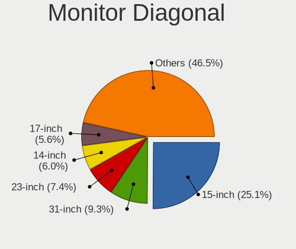

| Inches  | Computers | Percent |
|---------|-----------|---------|
| 15      | 25        | 22.12%  |
| 21      | 14        | 12.39%  |
| 23      | 10        | 8.85%   |
| 72      | 7         | 6.19%   |
| 17      | 7         | 6.19%   |
| 14      | 7         | 6.19%   |
| 31      | 6         | 5.31%   |
| 19      | 5         | 4.42%   |
| 13      | 5         | 4.42%   |
| Unknown | 5         | 4.42%   |
| 27      | 4         | 3.54%   |
| 20      | 4         | 3.54%   |
| 34      | 2         | 1.77%   |
| 18      | 2         | 1.77%   |
| 11      | 2         | 1.77%   |
| 84      | 1         | 0.88%   |
| 64      | 1         | 0.88%   |
| 52      | 1         | 0.88%   |
| 49      | 1         | 0.88%   |
| 32      | 1         | 0.88%   |
| 25      | 1         | 0.88%   |
| 24      | 1         | 0.88%   |
| 22      | 1         | 0.88%   |

Monitor Width
-------------

Physical width

| Width in mm | Computers | Percent |
|-------------|-----------|---------|
| 301-350     | 34        | 30.63%  |
| 401-500     | 25        | 22.52%  |
| 501-600     | 15        | 13.51%  |
| 1501-2000   | 8         | 7.21%   |
| 351-400     | 7         | 6.31%   |
| 601-700     | 6         | 5.41%   |
| 201-300     | 5         | 4.5%    |
| Unknown     | 5         | 4.5%    |
| 701-800     | 3         | 2.7%    |
| 1001-1500   | 3         | 2.7%    |

Aspect Ratio
------------

Proportional relationship between the width and the height

| Ratio   | Computers | Percent |
|---------|-----------|---------|
| 16/9    | 78        | 78%     |
| 16/10   | 12        | 12%     |
| Unknown | 5         | 5%      |
| 5/4     | 3         | 3%      |
| 21/9    | 2         | 2%      |

Monitor Area
------------

Area in inch

| Area in inch | Computers | Percent |
|----------------|-----------|---------|
| 101-110        | 25        | 22.32%  |
| 201-250        | 22        | 19.64%  |
| 151-200        | 13        | 11.61%  |
| 81-90          | 11        | 9.82%   |
| More than 1000 | 10        | 8.93%   |
| 351-500        | 9         | 8.04%   |
| Unknown        | 5         | 4.46%   |
| 301-350        | 4         | 3.57%   |
| 141-150        | 4         | 3.57%   |
| 121-130        | 4         | 3.57%   |
| 51-60          | 2         | 1.79%   |
| 71-80          | 1         | 0.89%   |
| 251-300        | 1         | 0.89%   |
| 131-140        | 1         | 0.89%   |

Pixel Density
-------------

Pixels per inch

| Density       | Computers | Percent |
|---------------|-----------|---------|
| 101-120       | 41        | 37.96%  |
| 51-100        | 33        | 30.56%  |
| 121-160       | 16        | 14.81%  |
| 1-50          | 10        | 9.26%   |
| Unknown       | 5         | 4.63%   |
| 161-240       | 2         | 1.85%   |
| More than 240 | 1         | 0.93%   |

Multiple Monitors
-----------------

Total monitors connected

| Total | Computers | Percent |
|-------|-----------|---------|
| 1     | 86        | 78.18%  |
| 2     | 18        | 16.36%  |
| 0     | 4         | 3.64%   |
| 3     | 2         | 1.82%   |

Network
-------

Net Controller Vendor
---------------------

Controller vendors

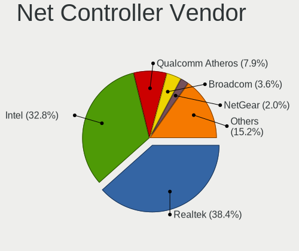

| Vendor                   | Computers | Percent |
|--------------------------|-----------|---------|
| Realtek Semiconductor    | 68        | 39.31%  |
| Intel                    | 55        | 31.79%  |
| Qualcomm Atheros         | 15        | 8.67%   |
| Broadcom                 | 7         | 4.05%   |
| Ralink Technology        | 5         | 2.89%   |
| NetGear                  | 5         | 2.89%   |
| Marvell Technology Group | 3         | 1.73%   |
| Broadcom Limited         | 3         | 1.73%   |
| TP-Link                  | 2         | 1.16%   |
| Samsung Electronics      | 2         | 1.16%   |
| Nvidia                   | 2         | 1.16%   |
| Ralink                   | 1         | 0.58%   |
| Gemtek                   | 1         | 0.58%   |
| Dell                     | 1         | 0.58%   |
| Belkin Components        | 1         | 0.58%   |
| ASIX Electronics         | 1         | 0.58%   |
| Aquantia                 | 1         | 0.58%   |

Net Controller Model
--------------------

Controller models

| Model                                                                          | Computers | Percent |
|--------------------------------------------------------------------------------|-----------|---------|
| Realtek RTL8111/8168/8411 PCI Express Gigabit Ethernet Controller              | 44        | 22.22%  |
| Realtek RTL810xE PCI Express Fast Ethernet controller                          | 8         | 4.04%   |
| Intel 82579LM Gigabit Network Connection (Lewisville)                          | 7         | 3.54%   |
| Intel Wi-Fi 6 AX200                                                            | 6         | 3.03%   |
| Qualcomm Atheros QCA9565 / AR9565 Wireless Network Adapter                     | 5         | 2.53%   |
| Realtek RTL88x2bu [AC1200 Techkey]                                             | 4         | 2.02%   |
| Realtek RTL8821CE 802.11ac PCIe Wireless Network Adapter                       | 4         | 2.02%   |
| Intel I211 Gigabit Network Connection                                          | 4         | 2.02%   |
| Intel Ethernet Connection I217-LM                                              | 4         | 2.02%   |
| Intel Dual Band Wireless-AC 3168NGW [Stone Peak]                               | 4         | 2.02%   |
| Realtek RTL8188CUS 802.11n WLAN Adapter                                        | 3         | 1.52%   |
| Realtek RTL8188CE 802.11b/g/n WiFi Adapter                                     | 3         | 1.52%   |
| Intel Wireless 7265                                                            | 3         | 1.52%   |
| Intel 82567LM-3 Gigabit Network Connection                                     | 3         | 1.52%   |
| Samsung Galaxy series, misc. (tethering mode)                                  | 2         | 1.01%   |
| Realtek RTL8822BE 802.11a/b/g/n/ac WiFi adapter                                | 2         | 1.01%   |
| Realtek RTL8188FTV 802.11b/g/n 1T1R 2.4G WLAN Adapter                          | 2         | 1.01%   |
| Realtek 802.11ac NIC                                                           | 2         | 1.01%   |
| Ralink RT2870/RT3070 Wireless Adapter                                          | 2         | 1.01%   |
| Qualcomm Atheros QCA9377 802.11ac Wireless Network Adapter                     | 2         | 1.01%   |
| Qualcomm Atheros QCA6174 802.11ac Wireless Network Adapter                     | 2         | 1.01%   |
| Qualcomm Atheros AR9462 Wireless Network Adapter                               | 2         | 1.01%   |
| NetGear LB1120-100NAS                                                          | 2         | 1.01%   |
| Intel Wireless 8265 / 8275                                                     | 2         | 1.01%   |
| Intel Wireless 3160                                                            | 2         | 1.01%   |
| Intel PRO/Wireless 3945ABG [Golan] Network Connection                          | 2         | 1.01%   |
| Intel Comet Lake PCH CNVi WiFi                                                 | 2         | 1.01%   |
| Intel Centrino Wireless-N 1030 [Rainbow Peak]                                  | 2         | 1.01%   |
| Intel Centrino Wireless-N 1000 [Condor Peak]                                   | 2         | 1.01%   |
| Intel Centrino Advanced-N 6230 [Rainbow Peak]                                  | 2         | 1.01%   |
| Intel 82577LM Gigabit Network Connection                                       | 2         | 1.01%   |
| Broadcom Limited BCM43224 802.11a/b/g/n                                        | 2         | 1.01%   |
| TP-Link TL-WN722N v2                                                           | 1         | 0.51%   |
| TP-Link Archer T9UH v1 [Realtek RTL8814AU]                                     | 1         | 0.51%   |
| Realtek RTL8822CE 802.11ac PCIe Wireless Network Adapter                       | 1         | 0.51%   |
| Realtek RTL8812AU 802.11a/b/g/n/ac 2T2R DB WLAN Adapter                        | 1         | 0.51%   |
| Realtek RTL8723BU 802.11b/g/n WLAN Adapter                                     | 1         | 0.51%   |
| Realtek RTL8723AE PCIe Wireless Network Adapter                                | 1         | 0.51%   |
| Realtek RTL8192CU 802.11n WLAN Adapter                                         | 1         | 0.51%   |
| Realtek RTL8191SEvB Wireless LAN Controller                                    | 1         | 0.51%   |
| Realtek RTL8188RU 802.11n WLAN Adapter                                         | 1         | 0.51%   |
| Realtek RTL8187 Wireless Adapter                                               | 1         | 0.51%   |
| Realtek RTL8153 Gigabit Ethernet Adapter                                       | 1         | 0.51%   |
| Realtek RTL8125 2.5GbE Controller                                              | 1         | 0.51%   |
| Realtek Killer E3000 2.5GbE Controller                                         | 1         | 0.51%   |
| Ralink RT2870 Wireless Adapter                                                 | 1         | 0.51%   |
| Ralink MT7610U ("Archer T2U" 2.4G+5G WLAN Adapter                              | 1         | 0.51%   |
| Ralink MT7601U Wireless Adapter                                                | 1         | 0.51%   |
| Ralink RT2561/RT61 802.11g PCI                                                 | 1         | 0.51%   |
| Qualcomm Atheros QCA6164 802.11ac Wireless Network Adapter                     | 1         | 0.51%   |
| Qualcomm Atheros Killer E2500 Gigabit Ethernet Controller                      | 1         | 0.51%   |
| Qualcomm Atheros AR9485 Wireless Network Adapter                               | 1         | 0.51%   |
| Qualcomm Atheros AR8152 v1.1 Fast Ethernet                                     | 1         | 0.51%   |
| Qualcomm Atheros AR8151 v2.0 Gigabit Ethernet                                  | 1         | 0.51%   |
| Nvidia MCP79 Ethernet                                                          | 1         | 0.51%   |
| Nvidia CK804 Ethernet Controller                                               | 1         | 0.51%   |
| NetGear WNDA3100v1 802.11abgn [Atheros AR9170+AR9104]                          | 1         | 0.51%   |
| NetGear MA111(v2) 802.11b Wireless [SIS SIS 162]                               | 1         | 0.51%   |
| NetGear A6100 AC600 DB Wireless Adapter [Realtek RTL8811AU]                    | 1         | 0.51%   |
| Marvell Group Yukon Optima 88E8059 [PCIe Gigabit Ethernet Controller with AVB] | 1         | 0.51%   |

Wireless Vendor
---------------

Wireless vendors

| Vendor                | Computers | Percent |
|-----------------------|-----------|---------|
| Intel                 | 36        | 38.3%   |
| Realtek Semiconductor | 24        | 25.53%  |
| Qualcomm Atheros      | 12        | 12.77%  |
| Broadcom              | 6         | 6.38%   |
| Ralink Technology     | 5         | 5.32%   |
| NetGear               | 3         | 3.19%   |
| TP-Link               | 2         | 2.13%   |
| Broadcom Limited      | 2         | 2.13%   |
| Ralink                | 1         | 1.06%   |
| Gemtek                | 1         | 1.06%   |
| Dell                  | 1         | 1.06%   |
| Belkin Components     | 1         | 1.06%   |

Wireless Model
--------------

Wireless models

| Model                                                                                     | Computers | Percent |
|-------------------------------------------------------------------------------------------|-----------|---------|
| Intel Wi-Fi 6 AX200                                                                       | 6         | 6.06%   |
| Qualcomm Atheros QCA9565 / AR9565 Wireless Network Adapter                                | 5         | 5.05%   |
| Realtek RTL88x2bu [AC1200 Techkey]                                                        | 4         | 4.04%   |
| Realtek RTL8821CE 802.11ac PCIe Wireless Network Adapter                                  | 4         | 4.04%   |
| Intel Dual Band Wireless-AC 3168NGW [Stone Peak]                                          | 4         | 4.04%   |
| Realtek RTL8188CUS 802.11n WLAN Adapter                                                   | 3         | 3.03%   |
| Realtek RTL8188CE 802.11b/g/n WiFi Adapter                                                | 3         | 3.03%   |
| Intel Wireless 7265                                                                       | 3         | 3.03%   |
| Realtek RTL8822BE 802.11a/b/g/n/ac WiFi adapter                                           | 2         | 2.02%   |
| Realtek RTL8188FTV 802.11b/g/n 1T1R 2.4G WLAN Adapter                                     | 2         | 2.02%   |
| Realtek 802.11ac NIC                                                                      | 2         | 2.02%   |
| Ralink RT2870/RT3070 Wireless Adapter                                                     | 2         | 2.02%   |
| Qualcomm Atheros QCA9377 802.11ac Wireless Network Adapter                                | 2         | 2.02%   |
| Qualcomm Atheros QCA6174 802.11ac Wireless Network Adapter                                | 2         | 2.02%   |
| Qualcomm Atheros AR9462 Wireless Network Adapter                                          | 2         | 2.02%   |
| Intel Wireless 8265 / 8275                                                                | 2         | 2.02%   |
| Intel Wireless 3160                                                                       | 2         | 2.02%   |
| Intel PRO/Wireless 3945ABG [Golan] Network Connection                                     | 2         | 2.02%   |
| Intel Comet Lake PCH CNVi WiFi                                                            | 2         | 2.02%   |
| Intel Centrino Wireless-N 1030 [Rainbow Peak]                                             | 2         | 2.02%   |
| Intel Centrino Wireless-N 1000 [Condor Peak]                                              | 2         | 2.02%   |
| Intel Centrino Advanced-N 6230 [Rainbow Peak]                                             | 2         | 2.02%   |
| Broadcom Limited BCM43224 802.11a/b/g/n                                                   | 2         | 2.02%   |
| TP-Link TL-WN722N v2                                                                      | 1         | 1.01%   |
| TP-Link Archer T9UH v1 [Realtek RTL8814AU]                                                | 1         | 1.01%   |
| Realtek RTL8822CE 802.11ac PCIe Wireless Network Adapter                                  | 1         | 1.01%   |
| Realtek RTL8812AU 802.11a/b/g/n/ac 2T2R DB WLAN Adapter                                   | 1         | 1.01%   |
| Realtek RTL8723BU 802.11b/g/n WLAN Adapter                                                | 1         | 1.01%   |
| Realtek RTL8723AE PCIe Wireless Network Adapter                                           | 1         | 1.01%   |
| Realtek RTL8192CU 802.11n WLAN Adapter                                                    | 1         | 1.01%   |
| Realtek RTL8191SEvB Wireless LAN Controller                                               | 1         | 1.01%   |
| Realtek RTL8188RU 802.11n WLAN Adapter                                                    | 1         | 1.01%   |
| Realtek RTL8187 Wireless Adapter                                                          | 1         | 1.01%   |
| Ralink RT2870 Wireless Adapter                                                            | 1         | 1.01%   |
| Ralink MT7610U ("Archer T2U" 2.4G+5G WLAN Adapter                                         | 1         | 1.01%   |
| Ralink MT7601U Wireless Adapter                                                           | 1         | 1.01%   |
| Ralink RT2561/RT61 802.11g PCI                                                            | 1         | 1.01%   |
| Qualcomm Atheros QCA6164 802.11ac Wireless Network Adapter                                | 1         | 1.01%   |
| Qualcomm Atheros AR9485 Wireless Network Adapter                                          | 1         | 1.01%   |
| NetGear WNDA3100v1 802.11abgn [Atheros AR9170+AR9104]                                     | 1         | 1.01%   |
| NetGear MA111(v2) 802.11b Wireless [SIS SIS 162]                                          | 1         | 1.01%   |
| NetGear A6100 AC600 DB Wireless Adapter [Realtek RTL8811AU]                               | 1         | 1.01%   |
| Intel Wireless 7260                                                                       | 1         | 1.01%   |
| Intel Wireless 3165                                                                       | 1         | 1.01%   |
| Intel WiFi Link 5100                                                                      | 1         | 1.01%   |
| Intel Wi-Fi 6 AX201 160MHz                                                                | 1         | 1.01%   |
| Intel Wi-Fi 6 AX201                                                                       | 1         | 1.01%   |
| Intel Tiger Lake PCH CNVi WiFi                                                            | 1         | 1.01%   |
| Intel Gemini Lake PCH CNVi WiFi                                                           | 1         | 1.01%   |
| Intel Comet Lake PCH-LP CNVi WiFi                                                         | 1         | 1.01%   |
| Intel Centrino Advanced-N 6205 [Taylor Peak]                                              | 1         | 1.01%   |
| Gemtek WUBR-177G [Ralink RT2571W]                                                         | 1         | 1.01%   |
| Dell Wireless 5808e Gobi 4G LTE Mobile Broadband Card                               | 1         | 1.01%   |
| Broadcom BCM4364 802.11ac Wireless Network Adapter                                        | 1         | 1.01%   |
| Broadcom BCM4331 802.11a/b/g/n                                                            | 1         | 1.01%   |
| Broadcom BCM4322 802.11a/b/g/n Wireless LAN Controller                                    | 1         | 1.01%   |
| Broadcom BCM4321 802.11a/b/g/n                                                            | 1         | 1.01%   |
| Broadcom BCM43142 802.11b/g/n                                                             | 1         | 1.01%   |
| Broadcom BCM4313 802.11bgn Wireless Network Adapter                                       | 1         | 1.01%   |
| Belkin Components F7D2101 802.11n Surf & Share Wireless Adapter v1000 [Realtek RTL8192SU] | 1         | 1.01%   |

Ethernet Vendor
---------------

Ethernet vendors

| Vendor                   | Computers | Percent |
|--------------------------|-----------|---------|
| Realtek Semiconductor    | 55        | 55.56%  |
| Intel                    | 26        | 26.26%  |
| Qualcomm Atheros         | 3         | 3.03%   |
| Marvell Technology Group | 3         | 3.03%   |
| Broadcom                 | 3         | 3.03%   |
| Samsung Electronics      | 2         | 2.02%   |
| Nvidia                   | 2         | 2.02%   |
| NetGear                  | 2         | 2.02%   |
| Broadcom Limited         | 1         | 1.01%   |
| ASIX Electronics         | 1         | 1.01%   |
| Aquantia                 | 1         | 1.01%   |

Ethernet Model
--------------

Ethernet models

| Model                                                                          | Computers | Percent |
|--------------------------------------------------------------------------------|-----------|---------|
| Realtek RTL8111/8168/8411 PCI Express Gigabit Ethernet Controller              | 44        | 44.44%  |
| Realtek RTL810xE PCI Express Fast Ethernet controller                          | 8         | 8.08%   |
| Intel 82579LM Gigabit Network Connection (Lewisville)                          | 7         | 7.07%   |
| Intel I211 Gigabit Network Connection                                          | 4         | 4.04%   |
| Intel Ethernet Connection I217-LM                                              | 4         | 4.04%   |
| Intel 82567LM-3 Gigabit Network Connection                                     | 3         | 3.03%   |
| Samsung Galaxy series, misc. (tethering mode)                                  | 2         | 2.02%   |
| NetGear LB1120-100NAS                                                          | 2         | 2.02%   |
| Intel 82577LM Gigabit Network Connection                                       | 2         | 2.02%   |
| Realtek RTL8153 Gigabit Ethernet Adapter                                       | 1         | 1.01%   |
| Realtek RTL8125 2.5GbE Controller                                              | 1         | 1.01%   |
| Realtek Killer E3000 2.5GbE Controller                                         | 1         | 1.01%   |
| Qualcomm Atheros Killer E2500 Gigabit Ethernet Controller                      | 1         | 1.01%   |
| Qualcomm Atheros AR8152 v1.1 Fast Ethernet                                     | 1         | 1.01%   |
| Qualcomm Atheros AR8151 v2.0 Gigabit Ethernet                                  | 1         | 1.01%   |
| Nvidia MCP79 Ethernet                                                          | 1         | 1.01%   |
| Nvidia CK804 Ethernet Controller                                               | 1         | 1.01%   |
| Marvell Group Yukon Optima 88E8059 [PCIe Gigabit Ethernet Controller with AVB] | 1         | 1.01%   |
| Marvell Group 88E8058 PCI-E Gigabit Ethernet Controller                        | 1         | 1.01%   |
| Marvell Group 88E8040 PCI-E Fast Ethernet Controller                           | 1         | 1.01%   |
| Intel Ethernet Controller I225-V                                               | 1         | 1.01%   |
| Intel Ethernet Connection (3) I218-LM                                          | 1         | 1.01%   |
| Intel Ethernet Connection (2) I219-V                                           | 1         | 1.01%   |
| Intel 82579V Gigabit Network Connection                                        | 1         | 1.01%   |
| Intel 82577LC Gigabit Network Connection                                       | 1         | 1.01%   |
| Intel 82566DM-2 Gigabit Network Connection                                     | 1         | 1.01%   |
| Broadcom NetXtreme BCM57766 Gigabit Ethernet PCIe                              | 1         | 1.01%   |
| Broadcom NetXtreme BCM57765 Gigabit Ethernet PCIe                              | 1         | 1.01%   |
| Broadcom NetXtreme BCM5753M Gigabit Ethernet PCI Express                       | 1         | 1.01%   |
| Broadcom Limited BCM4401-B0 100Base-TX                                         | 1         | 1.01%   |
| ASIX AX88772B                                                                  | 1         | 1.01%   |
| Aquantia AQC107 NBase-T/IEEE 802.3bz Ethernet Controller [AQtion]              | 1         | 1.01%   |

Net Controller Kind
-------------------

Ethernet, WiFi or modem

| Kind     | Computers | Percent |
|----------|-----------|---------|
| Ethernet | 94        | 53.71%  |
| WiFi     | 81        | 46.29%  |

Used Controller
---------------

Currently used network controller

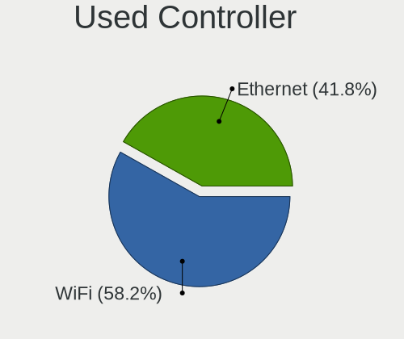

| Kind     | Computers | Percent |
|----------|-----------|---------|
| WiFi     | 59        | 51.75%  |
| Ethernet | 55        | 48.25%  |

NICs
----

Total network controllers on board

| Total | Computers | Percent |
|-------|-----------|---------|
| 2     | 55        | 50.93%  |
| 1     | 47        | 43.52%  |
| 3     | 3         | 2.78%   |
| 0     | 3         | 2.78%   |

IPv6
----

IPv6 vs IPv4

| Used | Computers | Percent |
|------|-----------|---------|
| No   | 99        | 93.4%   |
| Yes  | 7         | 6.6%    |

Bluetooth
---------

Bluetooth Vendor
----------------

Controller vendors

| Vendor                          | Computers | Percent |
|---------------------------------|-----------|---------|
| Intel                           | 30        | 44.78%  |
| Realtek Semiconductor           | 8         | 11.94%  |
| Cambridge Silicon Radio         | 7         | 10.45%  |
| Qualcomm Atheros Communications | 5         | 7.46%   |
| Lite-On Technology              | 3         | 4.48%   |
| Apple                           | 3         | 4.48%   |
| Foxconn / Hon Hai               | 2         | 2.99%   |
| Broadcom                        | 2         | 2.99%   |
| Toshiba                         | 1         | 1.49%   |
| IMC Networks                    | 1         | 1.49%   |
| Hewlett-Packard                 | 1         | 1.49%   |
| Dynex                           | 1         | 1.49%   |
| Dell                            | 1         | 1.49%   |
| Belkin Components               | 1         | 1.49%   |
| Alps Electric                   | 1         | 1.49%   |

Bluetooth Model
---------------

Controller models

| Model                                                                               | Computers | Percent |
|-------------------------------------------------------------------------------------|-----------|---------|
| Intel Bluetooth wireless interface                                                  | 9         | 13.43%  |
| Cambridge Silicon Radio Bluetooth Dongle (HCI mode)                                 | 7         | 10.45%  |
| Intel AX200 Bluetooth                                                               | 6         | 8.96%   |
| Realtek  Bluetooth 4.2 Adapter                                                      | 5         | 7.46%   |
| Intel Wireless-AC 3168 Bluetooth                                                    | 4         | 5.97%   |
| Intel Centrino Advanced-N 6230 Bluetooth adapter                                    | 4         | 5.97%   |
| Intel Bluetooth 9460/9560 Jefferson Peak (JfP)                                      | 4         | 5.97%   |
| Qualcomm Atheros  Bluetooth Device                                                  | 3         | 4.48%   |
| Intel AX201 Bluetooth                                                               | 3         | 4.48%   |
| Realtek Bluetooth Radio                                                             | 2         | 2.99%   |
| Lite-On Bluetooth Device                                                            | 2         | 2.99%   |
| Broadcom Bluetooth Device                                                           | 2         | 2.99%   |
| Apple Bluetooth Host Controller                                                     | 2         | 2.99%   |
| Toshiba BCM43142A0                                                                  | 1         | 1.49%   |
| Realtek RTL8723A Bluetooth                                                          | 1         | 1.49%   |
| Qualcomm Atheros QCA61x4 Bluetooth 4.0                                              | 1         | 1.49%   |
| Qualcomm Atheros AR9462 Bluetooth                                                   | 1         | 1.49%   |
| Lite-On Qualcomm Atheros QCA9377 Bluetooth                                          | 1         | 1.49%   |
| IMC Networks Bluetooth Device                                                       | 1         | 1.49%   |
| HP Bluetooth 2.0 Interface [Broadcom BCM2045]                                       | 1         | 1.49%   |
| Foxconn / Hon Hai Foxconn T77H114 BCM2070 [Single-Chip Bluetooth 2.1 + EDR Adapter] | 1         | 1.49%   |
| Foxconn / Hon Hai Bluetooth Device                                                  | 1         | 1.49%   |
| Dynex Bluetooth 4.0 Adapter [Broadcom, 1.12, BCM20702A0]                            | 1         | 1.49%   |
| Dell BCM20702A0 Bluetooth Module                                                    | 1         | 1.49%   |
| Belkin Components Bluetooth Mini Dongle                                             | 1         | 1.49%   |
| Apple Bluetooth HCI                                                                 | 1         | 1.49%   |
| Alps Electric BCM2046 Bluetooth Device                                              | 1         | 1.49%   |

Sound
-----

Sound Vendor
------------

Sound card vendors

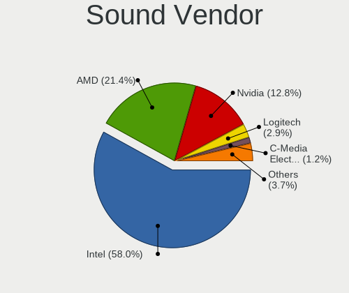

| Vendor                                          | Computers | Percent |
|-------------------------------------------------|-----------|---------|
| Intel                                           | 78        | 58.65%  |
| AMD                                             | 25        | 18.8%   |
| Nvidia                                          | 18        | 13.53%  |
| Logitech                                        | 6         | 4.51%   |
| C-Media Electronics                             | 2         | 1.5%    |
| Nintendo                                        | 1         | 0.75%   |
| Licensed by Sony Computer Entertainment America | 1         | 0.75%   |
| Kingston Technology                             | 1         | 0.75%   |
| Focusrite-Novation                              | 1         | 0.75%   |

Sound Model
-----------

Sound card models

| Model                                                                                             | Computers | Percent |
|---------------------------------------------------------------------------------------------------|-----------|---------|
| Intel Sunrise Point-LP HD Audio                                                                   | 10        | 6.17%   |
| Intel 6 Series/C200 Series Chipset Family High Definition Audio Controller                        | 10        | 6.17%   |
| AMD Family 17h/19h HD Audio Controller                                                            | 8         | 4.94%   |
| AMD FCH Azalia Controller                                                                         | 7         | 4.32%   |
| Intel Xeon E3-1200 v3/4th Gen Core Processor HD Audio Controller                                  | 5         | 3.09%   |
| Intel NM10/ICH7 Family High Definition Audio Controller                                           | 5         | 3.09%   |
| Intel Celeron/Pentium Silver Processor High Definition Audio                                      | 5         | 3.09%   |
| Intel 8 Series/C220 Series Chipset High Definition Audio Controller                               | 5         | 3.09%   |
| Intel 7 Series/C216 Chipset Family High Definition Audio Controller                               | 5         | 3.09%   |
| Intel 5 Series/3400 Series Chipset High Definition Audio                                          | 5         | 3.09%   |
| AMD Raven/Raven2/Fenghuang HDMI/DP Audio Controller                                               | 5         | 3.09%   |
| Nvidia GP107GL High Definition Audio Controller                                                   | 4         | 2.47%   |
| Intel Atom Processor Z36xxx/Z37xxx Series High Definition Audio Controller                        | 4         | 2.47%   |
| AMD Starship/Matisse HD Audio Controller                                                          | 4         | 2.47%   |
| Logitech EasyCall Speakerphone                                                                    | 3         | 1.85%   |
| Intel Cannon Lake PCH cAVS                                                                        | 3         | 1.85%   |
| Intel 82801JD/DO (ICH10 Family) HD Audio Controller                                               | 3         | 1.85%   |
| AMD Trinity HDMI Audio Controller                                                                 | 3         | 1.85%   |
| AMD Family 17h (Models 00h-0fh) HD Audio Controller                                               | 3         | 1.85%   |
| Nvidia TU116 High Definition Audio Controller                                                     | 2         | 1.23%   |
| Nvidia GP106 High Definition Audio Controller                                                     | 2         | 1.23%   |
| Nvidia GP102 HDMI Audio Controller                                                                | 2         | 1.23%   |
| Nvidia GF119 HDMI Audio Controller                                                                | 2         | 1.23%   |
| Intel Wildcat Point-LP High Definition Audio Controller                                           | 2         | 1.23%   |
| Intel Haswell-ULT HD Audio Controller                                                             | 2         | 1.23%   |
| Intel Comet Lake PCH-LP cAVS                                                                      | 2         | 1.23%   |
| Intel Broadwell-U Audio Controller                                                                | 2         | 1.23%   |
| Intel Atom/Celeron/Pentium Processor x5-E8000/J3xxx/N3xxx Series High Definition Audio Controller | 2         | 1.23%   |
| Intel 82801I (ICH9 Family) HD Audio Controller                                                    | 2         | 1.23%   |
| Intel 8 Series HD Audio Controller                                                                | 2         | 1.23%   |
| Intel 200 Series PCH HD Audio                                                                     | 2         | 1.23%   |
| AMD SBx00 Azalia (Intel HDA)                                                                      | 2         | 1.23%   |
| AMD Renoir Radeon High Definition Audio Controller                                                | 2         | 1.23%   |
| AMD Navi 10 HDMI Audio                                                                            | 2         | 1.23%   |
| AMD Kaveri HDMI/DP Audio Controller                                                               | 2         | 1.23%   |
| AMD Ellesmere HDMI Audio [Radeon RX 470/480 / 570/580/590]                                        | 2         | 1.23%   |
| Nvidia TU107 GeForce GTX 1650 High Definition Audio Controller                                    | 1         | 0.62%   |
| Nvidia MCP79 High Definition Audio                                                                | 1         | 0.62%   |
| Nvidia GP108 High Definition Audio Controller                                                     | 1         | 0.62%   |
| Nvidia GM107 High Definition Audio Controller [GeForce 940MX]                                     | 1         | 0.62%   |
| Nvidia GK208 HDMI/DP Audio Controller                                                             | 1         | 0.62%   |
| Nvidia GK107 HDMI Audio Controller                                                                | 1         | 0.62%   |
| Nvidia GA102 High Definition Audio Controller                                                     | 1         | 0.62%   |
| Nintendo WUP-021-0                                                                                | 1         | 0.62%   |
| Logitech QuickCam Fusion                                                                          | 1         | 0.62%   |
| Logitech Headset H390                                                                             | 1         | 0.62%   |
| Logitech G635 Gaming Headset                                                                      | 1         | 0.62%   |
| Licensed by Sony Computer Entertainment America Wireless Stereo Headset                           | 1         | 0.62%   |
| Kingston Technology HyperX SoloCast                                                               | 1         | 0.62%   |
| Intel Tiger Lake-LP Smart Sound Technology Audio Controller                                       | 1         | 0.62%   |
| Intel Tiger Lake-H HD Audio Controller                                                            | 1         | 0.62%   |
| Intel Jasper Lake HD Audio                                                                        | 1         | 0.62%   |
| Intel Ice Lake-LP Smart Sound Technology Audio Controller                                         | 1         | 0.62%   |
| Intel Comet Lake PCH cAVS                                                                         | 1         | 0.62%   |
| Intel Celeron N3350/Pentium N4200/Atom E3900 Series Audio Cluster                                 | 1         | 0.62%   |
| Intel Audio device                                                                                | 1         | 0.62%   |
| Intel 9 Series Chipset Family HD Audio Controller                                                 | 1         | 0.62%   |
| Intel 82801JI (ICH10 Family) HD Audio Controller                                                  | 1         | 0.62%   |
| Intel 82801H (ICH8 Family) HD Audio Controller                                                    | 1         | 0.62%   |
| Intel 100 Series/C230 Series Chipset Family HD Audio Controller                                   | 1         | 0.62%   |

Memory
------

Memory Vendor
-------------

Memory module vendors

| Vendor              | Computers | Percent |
|---------------------|-----------|---------|
| SK hynix            | 9         | 23.08%  |
| Samsung Electronics | 9         | 23.08%  |
| Unknown             | 7         | 17.95%  |
| Kingston            | 3         | 7.69%   |
| G.Skill             | 2         | 5.13%   |
| Corsair             | 2         | 5.13%   |
| Silicon Power       | 1         | 2.56%   |
| Sesame              | 1         | 2.56%   |
| Ramaxel Technology  | 1         | 2.56%   |
| PNY                 | 1         | 2.56%   |
| Micron Technology   | 1         | 2.56%   |
| Crucial             | 1         | 2.56%   |
| A-DATA Technology   | 1         | 2.56%   |

Memory Model
------------

Memory module models

| Model                                                     | Computers | Percent |
|-----------------------------------------------------------|-----------|---------|
| Unknown RAM Module 2048MB DIMM SDRAM                      | 3         | 6.82%   |
| SK hynix RAM HMA851S6AFR6N-UH 4GB SODIMM DDR4 2667MT/s    | 2         | 4.55%   |
| Unknown RAM WPBS26D408SWC-8G 8192MB SODIMM DDR4 2667MT/s  | 1         | 2.27%   |
| Unknown RAM Module 8GB DIMM DDR3 1333MT/s                 | 1         | 2.27%   |
| Unknown RAM Module 4096MB DIMM 667MT/s                    | 1         | 2.27%   |
| Unknown RAM CL18-20-20 D4-3600 8192MB DIMM DDR4 3600MT/s  | 1         | 2.27%   |
| SK hynix RAM Module 8GB SODIMM DDR4 2400MT/s              | 1         | 2.27%   |
| SK hynix RAM Module 2048MB SODIMM DDR 667MT/s             | 1         | 2.27%   |
| SK hynix RAM HMT451S6MFR8C-PB 4GB SODIMM DDR3 1600MT/s    | 1         | 2.27%   |
| SK hynix RAM HMT351U6CFR8C-H9 4GB DIMM DDR3 1333MT/s      | 1         | 2.27%   |
| SK hynix RAM HMT351S6CFR8C-PB 4GB SODIMM DDR3 1600MT/s    | 1         | 2.27%   |
| SK hynix RAM HMT325U6EFR8C-PB 2GB DIMM DDR3 1600MT/s      | 1         | 2.27%   |
| SK hynix RAM HMA851S6DJR6N-XN 4GB SODIMM DDR4 3200MT/s    | 1         | 2.27%   |
| SK hynix RAM HMA81GS6DJR8N-VK 8GB SODIMM DDR4 2667MT/s    | 1         | 2.27%   |
| SK hynix RAM HMA81GS6CJR8N-VK 8GB SODIMM DDR4 2667MT/s    | 1         | 2.27%   |
| Silicon Power RAM Module 8GB SODIMM DDR3 1600MT/s         | 1         | 2.27%   |
| Sesame RAM S939A2UGS-ITR 8GB DIMM DDR3 1600MT/s           | 1         | 2.27%   |
| Samsung RAM M471B5173QH0-YK0 4GB SODIMM DDR3 1600MT/s     | 1         | 2.27%   |
| Samsung RAM M471B5173EB0-YK0 4GB SODIMM DDR3 1600MT/s     | 1         | 2.27%   |
| Samsung RAM M471A5244CB0-CWE 4GB SODIMM DDR4 3200MT/s     | 1         | 2.27%   |
| Samsung RAM M471A5244CB0-CTD 4096MB SODIMM DDR4 3266MT/s  | 1         | 2.27%   |
| Samsung RAM M471A1K43CB1-CTD 8GB SODIMM DDR4 2667MT/s     | 1         | 2.27%   |
| Samsung RAM M471A1K43CB1-CRC 8GB SODIMM DDR4 2667MT/s     | 1         | 2.27%   |
| Samsung RAM M378B5273CH0-CH9 4GB DIMM DDR3 1867MT/s       | 1         | 2.27%   |
| Samsung RAM M378B5173QH0-CK0 4GB DIMM DDR3 1866MT/s       | 1         | 2.27%   |
| Samsung RAM M378B5173DB0-CK0 4GB DIMM DDR3 1600MT/s       | 1         | 2.27%   |
| Samsung RAM M378B1G73QH0-CK0 8192MB DIMM DDR3 1600MT/s    | 1         | 2.27%   |
| Samsung RAM M378B1G73BH0-CK0 8GB DIMM DDR3 1600MT/s       | 1         | 2.27%   |
| Ramaxel RAM RMSA3260ME78HAF-2666 8GB SODIMM DDR4 2667MT/s | 1         | 2.27%   |
| PNY RAM 4GBH1X04E9992 4096MB DIMM DDR3 1600MT/s           | 1         | 2.27%   |
| Micron RAM 16KTF51264HZ-1G6M1 4GB SODIMM DDR3 1600MT/s    | 1         | 2.27%   |
| Kingston RAM X2YH1K-MIE-NX 16GB DIMM DDR4 3200MT/s        | 1         | 2.27%   |
| Kingston RAM HP691160-H66-MCN 8GB SODIMM DDR3 1600MT/s    | 1         | 2.27%   |
| Kingston RAM ACR16D3LS1NGG/4G 4GB SODIMM DDR3 1600MT/s    | 1         | 2.27%   |
| Kingston RAM 99U5700-027.A00G 8GB SODIMM DDR4 2667MT/s    | 1         | 2.27%   |
| G.Skill RAM F4-2400C15-8GVR 8GB DIMM DDR4 3200MT/s        | 1         | 2.27%   |
| G.Skill RAM F3-10666CL9-8GBSQ 8GB DIMM DDR3 1333MT/s      | 1         | 2.27%   |
| Crucial RAM CT51264BD160B.C16F 4GB DIMM DDR3 1600MT/s     | 1         | 2.27%   |
| Corsair RAM CMK16GX4M2B3200C16 8GB DIMM DDR4 3600MT/s     | 1         | 2.27%   |
| Corsair RAM CMK16GX4M2B3000C15 8GB DIMM DDR4 3000MT/s     | 1         | 2.27%   |
| A-DATA RAM AM1L16BC4R1-B1YS 4GB SODIMM DDR3 800MT/s       | 1         | 2.27%   |

Memory Kind
-----------

Memory module kinds

| Kind    | Computers | Percent |
|---------|-----------|---------|
| DDR4    | 16        | 41.03%  |
| DDR3    | 16        | 41.03%  |
| SDRAM   | 3         | 7.69%   |
| LPDDR4  | 2         | 5.13%   |
| DDR     | 1         | 2.56%   |
| Unknown | 1         | 2.56%   |

Memory Form Factor
------------------

Physical design of the memory module

| Name   | Computers | Percent |
|--------|-----------|---------|
| SODIMM | 19        | 50%     |
| DIMM   | 19        | 50%     |

Memory Size
-----------

Memory module size

| Size  | Computers | Percent |
|-------|-----------|---------|
| 8192  | 18        | 45%     |
| 4096  | 16        | 40%     |
| 2048  | 5         | 12.5%   |
| 16384 | 1         | 2.5%    |

Memory Speed
------------

Memory module speed

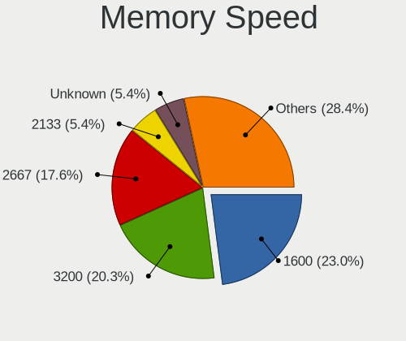

| Speed   | Computers | Percent |
|---------|-----------|---------|
| 1600    | 12        | 30%     |
| 2667    | 8         | 20%     |
| 3200    | 4         | 10%     |
| 1333    | 3         | 7.5%    |
| Unknown | 3         | 7.5%    |
| 3600    | 2         | 5%      |
| 667     | 2         | 5%      |
| 3466    | 1         | 2.5%    |
| 3266    | 1         | 2.5%    |
| 2400    | 1         | 2.5%    |
| 1867    | 1         | 2.5%    |
| 1866    | 1         | 2.5%    |
| 800     | 1         | 2.5%    |

Printers & scanners
-------------------

Printer Vendor
--------------

Printer device vendors

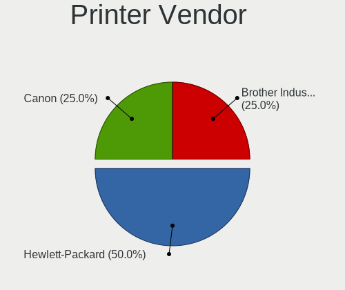

| Vendor             | Computers | Percent |
|--------------------|-----------|---------|
| Hewlett-Packard    | 1         | 50%     |
| Brother Industries | 1         | 50%     |

Printer Model
-------------

Printer device models

| Model                 | Computers | Percent |
|-----------------------|-----------|---------|
| HP OfficeJet Pro 6960 | 1         | 50%     |
| Brother MFC-L2685DW   | 1         | 50%     |

Scanner Vendor
--------------

Scanner device vendors

Zero info for selected period =(

Scanner Model
-------------

Scanner device models

Zero info for selected period =(

Camera
------

Camera Vendor
-------------

Camera device vendors

| Vendor                                 | Computers | Percent |
|----------------------------------------|-----------|---------|
| Chicony Electronics                    | 10        | 17.86%  |
| Microdia                               | 7         | 12.5%   |
| Ricoh                                  | 5         | 8.93%   |
| Logitech                               | 5         | 8.93%   |
| Realtek Semiconductor                  | 4         | 7.14%   |
| Quanta                                 | 3         | 5.36%   |
| Apple                                  | 3         | 5.36%   |
| Acer                                   | 3         | 5.36%   |
| Suyin                                  | 2         | 3.57%   |
| Sunplus Innovation Technology          | 2         | 3.57%   |
| Lite-On Technology                     | 2         | 3.57%   |
| IMC Networks                           | 2         | 3.57%   |
| Cheng Uei Precision Industry (Foxlink) | 2         | 3.57%   |
| Luxvisions Innotech Limited            | 1         | 1.79%   |
| Lenovo                                 | 1         | 1.79%   |
| Jieli Technology                       | 1         | 1.79%   |
| Goertek Electronics                    | 1         | 1.79%   |
| Cubeternet                             | 1         | 1.79%   |
| Alpha Imaging Technology               | 1         | 1.79%   |

Camera Model
------------

Camera device models

| Model                                                           | Computers | Percent |
|-----------------------------------------------------------------|-----------|---------|
| Microdia Camera                                                 | 4         | 7.14%   |
| Ricoh Integrated Webcam                                         | 3         | 5.36%   |
| Sunplus Integrated_Webcam_HD                                    | 2         | 3.57%   |
| Chicony HD WebCam                                               | 2         | 3.57%   |
| Suyin USB 2.0 Camera                                            | 1         | 1.79%   |
| Suyin Integrated_Webcam_HD                                      | 1         | 1.79%   |
| Ricoh Sony Visual Communication Camera Integrated Webcam        | 1         | 1.79%   |
| Ricoh HD Webcam                                                 | 1         | 1.79%   |
| Realtek USB2.0 camera                                           | 1         | 1.79%   |
| Realtek USB Camera                                              | 1         | 1.79%   |
| Realtek Integrated Webcam HD                                    | 1         | 1.79%   |
| Realtek Integrated Webcam                                       | 1         | 1.79%   |
| Quanta HP Wide Vision HD Camera                                 | 1         | 1.79%   |
| Quanta HP TrueVision HD Camera                                  | 1         | 1.79%   |
| Quanta HD WebCam                                                | 1         | 1.79%   |
| Microdia USB 2.0 Camera                                         | 1         | 1.79%   |
| Microdia Laptop_Integrated_Webcam_HD                            | 1         | 1.79%   |
| Microdia Dell Integrated HD Webcam                              | 1         | 1.79%   |
| Luxvisions Innotech Limited HP TrueVision HD Camera             | 1         | 1.79%   |
| Logitech Webcam Pro 9000                                        | 1         | 1.79%   |
| Logitech Webcam C310                                            | 1         | 1.79%   |
| Logitech Webcam C270                                            | 1         | 1.79%   |
| Logitech HD Pro Webcam C920                                     | 1         | 1.79%   |
| Logitech CrystalCam                                             | 1         | 1.79%   |
| Lite-On HP Wide Vision HD Camera                                | 1         | 1.79%   |
| Lite-On HP HD Webcam                                            | 1         | 1.79%   |
| Lenovo Integrated Webcam [R5U877]                               | 1         | 1.79%   |
| Jieli USB PHY 2.0                                               | 1         | 1.79%   |
| IMC Networks UVC VGA Webcam                                     | 1         | 1.79%   |
| IMC Networks Integrated Camera                                  | 1         | 1.79%   |
| Goertek USB2.0 VGA UVC WebCam                                   | 1         | 1.79%   |
| Cubeternet GL-UPC822 UVC WebCam                                 | 1         | 1.79%   |
| Chicony TOSHIBA Web Camera - HD                                 | 1         | 1.79%   |
| Chicony Toshiba Integrated Webcam                               | 1         | 1.79%   |
| Chicony Integrated HP HD Webcam                                 | 1         | 1.79%   |
| Chicony HP Webcam                                               | 1         | 1.79%   |
| Chicony HP Truevision HD                                        | 1         | 1.79%   |
| Chicony HP HD Camera                                            | 1         | 1.79%   |
| Chicony EasyCamera                                              | 1         | 1.79%   |
| Chicony CNF9055 Toshiba Webcam                                  | 1         | 1.79%   |
| Cheng Uei Precision Industry (Foxlink) HP Wide Vision HD Camera | 1         | 1.79%   |
| Cheng Uei Precision Industry (Foxlink) HP TrueVision HD Camera  | 1         | 1.79%   |
| Apple FaceTime HD Camera (Built-in)                             | 1         | 1.79%   |
| Apple FaceTime HD Camera                                        | 1         | 1.79%   |
| Apple Built-in iSight                                           | 1         | 1.79%   |
| Alpha Imaging Integrated_Webcam_8M                              | 1         | 1.79%   |
| Acer Lenovo EasyCamera                                          | 1         | 1.79%   |
| Acer EasyCamera                                                 | 1         | 1.79%   |
| Acer BisonCam,NB Pro                                            | 1         | 1.79%   |

Security
--------

Fingerprint Vendor
------------------

Fingerprint sensor vendors

| Vendor                | Computers | Percent |
|-----------------------|-----------|---------|
| Validity Sensors      | 8         | 72.73%  |
| LighTuning Technology | 2         | 18.18%  |
| Synaptics             | 1         | 9.09%   |

Fingerprint Model
-----------------

Fingerprint sensor models

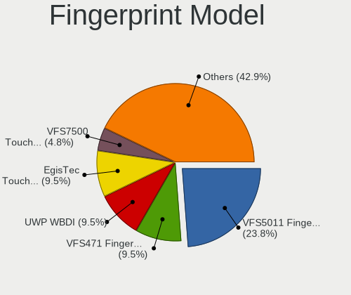

| Model                                       | Computers | Percent |
|---------------------------------------------|-----------|---------|
| Validity Sensors VFS5011 Fingerprint Reader | 3         | 27.27%  |
| LighTuning EgisTec Touch Fingerprint Sensor | 2         | 18.18%  |
| Validity Sensors VFS495 Fingerprint Reader  | 1         | 9.09%   |
| Validity Sensors VFS471 Fingerprint Reader  | 1         | 9.09%   |
| Validity Sensors VFS451 Fingerprint Reader  | 1         | 9.09%   |
| Validity Sensors Synaptics WBDI             | 1         | 9.09%   |
| Validity Sensors Fingerprint scanner        | 1         | 9.09%   |
| Unknown                                     | 1         | 9.09%   |

Chipcard Vendor
---------------

Chipcard module vendors

| Vendor   | Computers | Percent |
|----------|-----------|---------|
| Broadcom | 2         | 100%    |

Chipcard Model
--------------

Chipcard module models

| Model                                                                        | Computers | Percent |
|------------------------------------------------------------------------------|-----------|---------|
| Broadcom BCM5880 Secure Applications Processor with fingerprint swipe sensor | 1         | 50%     |
| Broadcom BCM5880 Secure Applications Processor                               | 1         | 50%     |

Unsupported
-----------

Unsupported Devices
-------------------

Total unsupported devices on board

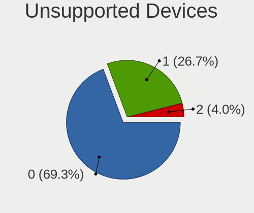

| Total | Computers | Percent |
|-------|-----------|---------|
| 0     | 77        | 66.96%  |
| 1     | 34        | 29.57%  |
| 2     | 4         | 3.48%   |

Unsupported Device Types
------------------------

Types of unsupported devices

| Type                     | Computers | Percent |
|--------------------------|-----------|---------|
| Net/wireless             | 16        | 41.03%  |
| Fingerprint reader       | 11        | 28.21%  |
| Graphics card            | 6         | 15.38%  |
| Communication controller | 2         | 5.13%   |
| Chipcard                 | 2         | 5.13%   |
| Net/ethernet             | 1         | 2.56%   |
| Multimedia controller    | 1         | 2.56%   |

